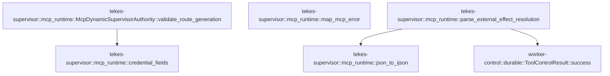

# tekes-supervisor::mcp_runtime

[Package atlas](index.md) · [Source](../../src/mcp_runtime.rs)

## Declarations

Visibility is the declaration spelling; trait members and reexports require their enclosing interface. `cfg` is not evaluated.

| Symbol | Kind | Visibility | Test / cfg |
|---|---|---|---|
| [tekes-supervisor::mcp_runtime::McpWorkspaceBinding](../../src/mcp_runtime.rs#L42) | struct_item | `pub` |  |
| [tekes-supervisor::mcp_runtime::McpServerFailure](../../src/mcp_runtime.rs#L58) | struct_item | `pub` |  |
| [tekes-supervisor::mcp_runtime::McpResourceBinding](../../src/mcp_runtime.rs#L65) | struct_item | `pub` |  |
| [tekes-supervisor::mcp_runtime::McpRuntime](../../src/mcp_runtime.rs#L73) | struct_item | `pub` |  |
| [tekes-supervisor::mcp_runtime::ProductionPluginStore](../../src/mcp_runtime.rs#L89) | type_item | `pub` |  |
| [tekes-supervisor::mcp_runtime::ProductionMcpAuthorities](../../src/mcp_runtime.rs#L90) | type_item | `pub` |  |
| [tekes-supervisor::mcp_runtime::PluginMcpResolver](../../src/mcp_runtime.rs#L92) | trait_item | `pub` |  |
| [tekes-supervisor::mcp_runtime::PluginMcpResolver::resolve](../../src/mcp_runtime.rs#L93) | function_signature_item | `private` |  |
| [tekes-supervisor::mcp_runtime::PluginMcpResolver::components](../../src/mcp_runtime.rs#L98) | function_item | `private` |  |
| [tekes-supervisor::mcp_runtime::PluginStoreMcpResolver](../../src/mcp_runtime.rs#L103) | struct_item | `pub` |  |
| [tekes-supervisor::mcp_runtime::PluginStoreMcpResolver::new](../../src/mcp_runtime.rs#L109) | function_item | `pub` |  |
| [tekes-supervisor::mcp_runtime::PluginStoreMcpResolver::from_shared](../../src/mcp_runtime.rs#L116) | function_item | `pub` |  |
| [tekes-supervisor::mcp_runtime::PluginStoreMcpResolver::resolve](../../src/mcp_runtime.rs#L122) | function_item | `private` |  |
| [tekes-supervisor::mcp_runtime::PluginStoreMcpResolver::components](../../src/mcp_runtime.rs#L133) | function_item | `private` |  |
| [tekes-supervisor::mcp_runtime::DegradedWorkspaceServers](../../src/mcp_runtime.rs#L167) | type_item | `private` |  |
| [tekes-supervisor::mcp_runtime::CachedBinding](../../src/mcp_runtime.rs#L173) | struct_item | `private` |  |
| [tekes-supervisor::mcp_runtime::McpRuntime::open](../../src/mcp_runtime.rs#L187) | function_item | `pub` |  |
| [tekes-supervisor::mcp_runtime::McpRuntime::open_with_plugin_resolver](../../src/mcp_runtime.rs#L194) | function_item | `pub` |  |
| [tekes-supervisor::mcp_runtime::McpRuntime::open_with_authorities](../../src/mcp_runtime.rs#L202) | function_item | `pub` |  |
| [tekes-supervisor::mcp_runtime::McpRuntime::open_production_authorities](../../src/mcp_runtime.rs#L221) | function_item | `pub` |  |
| [tekes-supervisor::mcp_runtime::McpRuntime::open_production_authorities_with_mutation](../../src/mcp_runtime.rs#L236) | function_item | `pub` |  |
| [tekes-supervisor::mcp_runtime::McpRuntime::secret_access](../../src/mcp_runtime.rs#L286) | function_item | `private` |  |
| [tekes-supervisor::mcp_runtime::McpRuntime::list_servers](../../src/mcp_runtime.rs#L293) | function_item | `pub` |  |
| [tekes-supervisor::mcp_runtime::McpRuntime::server_readiness](../../src/mcp_runtime.rs#L307) | function_item | `private` |  |
| [tekes-supervisor::mcp_runtime::McpRuntime::get_server](../../src/mcp_runtime.rs#L315) | function_item | `pub` |  |
| [tekes-supervisor::mcp_runtime::McpRuntime::mutate](../../src/mcp_runtime.rs#L332) | function_item | `pub` |  |
| [tekes-supervisor::mcp_runtime::McpRuntime::bind_oauth](../../src/mcp_runtime.rs#L349) | function_item | `pub` |  |
| [tekes-supervisor::mcp_runtime::McpRuntime::close_mutation_generations](../../src/mcp_runtime.rs#L375) | function_item | `private` |  |
| [tekes-supervisor::mcp_runtime::McpRuntime::reconcile_authority](../../src/mcp_runtime.rs#L414) | function_item | `pub` |  |
| [tekes-supervisor::mcp_runtime::McpRuntime::prepare_workspace](../../src/mcp_runtime.rs#L452) | function_item | `pub` |  |
| [tekes-supervisor::mcp_runtime::McpRuntime::bind_prepared_server](../../src/mcp_runtime.rs#L635) | function_item | `private` |  |
| [tekes-supervisor::mcp_runtime::McpRuntime::resolve_plugins](../../src/mcp_runtime.rs#L731) | function_item | `private` |  |
| [tekes-supervisor::mcp_runtime::McpRuntime::project_plugin_servers](../../src/mcp_runtime.rs#L763) | function_item | `private` |  |
| [tekes-supervisor::mcp_runtime::McpRuntime::servers_with_plugins](../../src/mcp_runtime.rs#L810) | function_item | `private` |  |
| [tekes-supervisor::mcp_runtime::McpRuntime::servers_with_plugins_degraded](../../src/mcp_runtime.rs#L826) | function_item | `private` |  |
| [tekes-supervisor::mcp_runtime::McpRuntime::require_bound_credentials](../../src/mcp_runtime.rs#L870) | function_item | `private` |  |
| [tekes-supervisor::mcp_runtime::McpRuntime::probe_server](../../src/mcp_runtime.rs#L885) | function_item | `pub` |  |
| [tekes-supervisor::mcp_runtime::McpRuntime::list_resource_catalog](../../src/mcp_runtime.rs#L915) | function_item | `pub` |  |
| [tekes-supervisor::mcp_runtime::McpRuntime::read_resource](../../src/mcp_runtime.rs#L968) | function_item | `pub` |  |
| [tekes-supervisor::mcp_runtime::close_prepared_result](../../src/mcp_runtime.rs#L999) | function_item | `private` |  |
| [tekes-supervisor::mcp_runtime::collect_prepared_resources](../../src/mcp_runtime.rs#L1012) | function_item | `private` |  |
| [tekes-supervisor::mcp_runtime::read_prepared_resource](../../src/mcp_runtime.rs#L1042) | function_item | `private` |  |
| [tekes-supervisor::mcp_runtime::resource_binding_digest](../../src/mcp_runtime.rs#L1077) | function_item | `private` |  |
| [tekes-supervisor::mcp_runtime::resource_catalog_generation](../../src/mcp_runtime.rs#L1103) | function_item | `private` |  |
| [tekes-supervisor::mcp_runtime::with_preparation_runtime](../../src/mcp_runtime.rs#L1126) | function_item | `private` |  |
| [tekes-supervisor::mcp_runtime::MCP_MANAGEMENT_METHODS](../../src/mcp_runtime.rs#L1145) | const_item | `pub` |  |
| [tekes-supervisor::mcp_runtime::McpManagementRoutes](../../src/mcp_runtime.rs#L1155) | struct_item | `pub` |  |
| [tekes-supervisor::mcp_runtime::McpManagementRoutes::new](../../src/mcp_runtime.rs#L1161) | function_item | `pub` |  |
| [tekes-supervisor::mcp_runtime::McpListRequest](../../src/mcp_runtime.rs#L1168) | struct_item | `private` |  |
| [tekes-supervisor::mcp_runtime::McpReferenceRequest](../../src/mcp_runtime.rs#L1174) | struct_item | `private` |  |
| [tekes-supervisor::mcp_runtime::McpSaveRequest](../../src/mcp_runtime.rs#L1180) | struct_item | `private` |  |
| [tekes-supervisor::mcp_runtime::McpOauthStartRequest](../../src/mcp_runtime.rs#L1187) | struct_item | `private` |  |
| [tekes-supervisor::mcp_runtime::McpManagementRoutes::capabilities](../../src/mcp_runtime.rs#L1194) | function_item | `private` |  |
| [tekes-supervisor::mcp_runtime::McpManagementRoutes::extension_method_class](../../src/mcp_runtime.rs#L1201) | function_item | `private` |  |
| [tekes-supervisor::mcp_runtime::McpManagementRoutes::validate_extension_payload](../../src/mcp_runtime.rs#L1211) | function_item | `private` |  |
| [tekes-supervisor::mcp_runtime::McpManagementRoutes::extension_failure_is_exact](../../src/mcp_runtime.rs#L1231) | function_item | `private` |  |
| [tekes-supervisor::mcp_runtime::McpManagementRoutes::execute](../../src/mcp_runtime.rs#L1248) | function_item | `private` |  |
| [tekes-supervisor::mcp_runtime::parse](../../src/mcp_runtime.rs#L1351) | function_item | `private` |  |
| [tekes-supervisor::mcp_runtime::mutation_response](../../src/mcp_runtime.rs#L1361) | function_item | `private` |  |
| [tekes-supervisor::mcp_runtime::map_registry_failure](../../src/mcp_runtime.rs#L1380) | function_item | `private` |  |
| [tekes-supervisor::mcp_runtime::not_found](../../src/mcp_runtime.rs#L1408) | function_item | `private` |  |
| [tekes-supervisor::mcp_runtime::internal_failure](../../src/mcp_runtime.rs#L1411) | function_item | `private` |  |
| [tekes-supervisor::mcp_runtime::route_failure](../../src/mcp_runtime.rs#L1418) | function_item | `private` |  |
| [tekes-supervisor::mcp_runtime::json_to_ijson](../../src/mcp_runtime.rs#L1425) | function_item | `private` |  |
| [tekes-supervisor::mcp_runtime::binding_fingerprint](../../src/mcp_runtime.rs#L1430) | function_item | `private` |  |
| [tekes-supervisor::mcp_runtime::BoundServer](../../src/mcp_runtime.rs#L1489) | struct_item | `private` |  |
| [tekes-supervisor::mcp_runtime::PreparedServer](../../src/mcp_runtime.rs#L1496) | struct_item | `private` |  |
| [tekes-supervisor::mcp_runtime::prepare_server](../../src/mcp_runtime.rs#L1503) | function_item | `private` |  |
| [tekes-supervisor::mcp_runtime::prepare_server_cancellable](../../src/mcp_runtime.rs#L1518) | function_item | `private` |  |
| [tekes-supervisor::mcp_runtime::http_request_authorization](../../src/mcp_runtime.rs#L1662) | function_item | `private` |  |
| [tekes-supervisor::mcp_runtime::credential_fields](../../src/mcp_runtime.rs#L1701) | function_item | `private` |  |
| [tekes-supervisor::mcp_runtime::current_operating_system_version](../../src/mcp_runtime.rs#L1725) | function_item | `pub(crate)` |  |
| [tekes-supervisor::mcp_runtime::current_plugin_architecture](../../src/mcp_runtime.rs#L1741) | function_item | `private` |  |
| [tekes-supervisor::mcp_runtime::SecretMaterial](../../src/mcp_runtime.rs#L1749) | struct_item | `private` |  |
| [tekes-supervisor::mcp_runtime::SecretMaterial::resolve_map](../../src/mcp_runtime.rs#L1755) | function_item | `private` |  |
| [tekes-supervisor::mcp_runtime::SecretMaterial::zeroize](../../src/mcp_runtime.rs#L1778) | function_item | `private` |  |
| [tekes-supervisor::mcp_runtime::resolve_secret](../../src/mcp_runtime.rs#L1785) | function_item | `private` |  |
| [tekes-supervisor::mcp_runtime::authorization_identity](../../src/mcp_runtime.rs#L1805) | function_item | `private` |  |
| [tekes-supervisor::mcp_runtime::scope_name](../../src/mcp_runtime.rs#L1820) | function_item | `private` |  |
| [tekes-supervisor::mcp_runtime::protocol_name](../../src/mcp_runtime.rs#L1828) | function_item | `private` |  |
| [tekes-supervisor::mcp_runtime::SecretAccess](../../src/mcp_runtime.rs#L1839) | struct_item | `pub` |  |
| [tekes-supervisor::mcp_runtime::SecretAccess::read_only](../../src/mcp_runtime.rs#L1846) | function_item | `pub` |  |
| [tekes-supervisor::mcp_runtime::McpDynamicSupervisorAuthority](../../src/mcp_runtime.rs#L1855) | struct_item | `pub` |  |
| [tekes-supervisor::mcp_runtime::McpRoute](../../src/mcp_runtime.rs#L1865) | struct_item | `pub` |  |
| [tekes-supervisor::mcp_runtime::McpRouteContract](../../src/mcp_runtime.rs#L1875) | struct_item | `pub` |  |
| [tekes-supervisor::mcp_runtime::McpRouteContract::capture](../../src/mcp_runtime.rs#L1885) | function_item | `private` |  |
| [tekes-supervisor::mcp_runtime::route_contract_digest](../../src/mcp_runtime.rs#L1913) | function_item | `private` |  |
| [tekes-supervisor::mcp_runtime::RoutePeerError](../../src/mcp_runtime.rs#L1938) | enum_item | `private` |  |
| [tekes-supervisor::mcp_runtime::route_preparation_error](../../src/mcp_runtime.rs#L1943) | function_item | `private` |  |
| [tekes-supervisor::mcp_runtime::validate_reconnected_contract](../../src/mcp_runtime.rs#L1952) | function_item | `private` |  |
| [tekes-supervisor::mcp_runtime::McpDynamicSupervisorAuthority::new](../../src/mcp_runtime.rs#L1991) | function_item | `pub` |  |
| [tekes-supervisor::mcp_runtime::McpDynamicSupervisorAuthority::drop](../../src/mcp_runtime.rs#L2010) | function_item | `private` |  |
| [tekes-supervisor::mcp_runtime::McpDynamicSupervisorAuthority::prepare_route](../../src/mcp_runtime.rs#L2025) | function_item | `private` |  |
| [tekes-supervisor::mcp_runtime::McpDynamicSupervisorAuthority::call_route](../../src/mcp_runtime.rs#L2068) | function_item | `private` |  |
| [tekes-supervisor::mcp_runtime::REQUIRED_TASK_TTL_MS](../../src/mcp_runtime.rs#L2112) | const_item | `private` |  |
| [tekes-supervisor::mcp_runtime::continuation_identity](../../src/mcp_runtime.rs#L2115) | function_item | `private` |  |
| [tekes-supervisor::mcp_runtime::map_journal_error](../../src/mcp_runtime.rs#L2124) | function_item | `private` |  |
| [tekes-supervisor::mcp_runtime::terminal_tool_value](../../src/mcp_runtime.rs#L2131) | function_item | `private` |  |
| [tekes-supervisor::mcp_runtime::McpDynamicSupervisorAuthority::supports](../../src/mcp_runtime.rs#L2144) | function_item | `private` |  |
| [tekes-supervisor::mcp_runtime::McpDynamicSupervisorAuthority::execute](../../src/mcp_runtime.rs#L2148) | function_item | `private` |  |
| [tekes-supervisor::mcp_runtime::McpDynamicSupervisorAuthority::execute_outcome](../../src/mcp_runtime.rs#L2161) | function_item | `private` |  |
| [tekes-supervisor::mcp_runtime::McpDynamicSupervisorAuthority::continue_task](../../src/mcp_runtime.rs#L2214) | function_item | `private` |  |
| [tekes-supervisor::mcp_runtime::McpDynamicSupervisorAuthority::reconcile](../../src/mcp_runtime.rs#L2226) | function_item | `private` |  |
| [tekes-supervisor::mcp_runtime::McpDynamicSupervisorAuthority::cancel_inflight](../../src/mcp_runtime.rs#L2272) | function_item | `private` |  |
| [tekes-supervisor::mcp_runtime::McpDynamicSupervisorAuthority::current_cancellation](../../src/mcp_runtime.rs#L2285) | function_item | `private` |  |
| [tekes-supervisor::mcp_runtime::McpDynamicSupervisorAuthority::ensure_route_peer](../../src/mcp_runtime.rs#L2292) | function_item | `private` |  |
| [tekes-supervisor::mcp_runtime::McpDynamicSupervisorAuthority::validate_route_generation](../../src/mcp_runtime.rs#L2407) | function_item | `private` |  |
| [tekes-supervisor::mcp_runtime::map_mcp_error](../../src/mcp_runtime.rs#L2463) | function_item | `private` |  |
| [tekes-supervisor::mcp_runtime::parse_external_effect_resolution](../../src/mcp_runtime.rs#L2489) | function_item | `private` |  |
| [tekes-supervisor::mcp_runtime::tests::reconcile_accepts_standard_mcp_text_result_envelope](../../src/mcp_runtime.rs#L2598) | function_item | `private` | test; #[cfg(test)] |
| [tekes-supervisor::mcp_runtime::tests::oauth_binding_exchanges_kernel_grants_and_injects_platform_tokens](../../src/mcp_runtime.rs#L2624) | function_item | `private` | test; #[cfg(test)] |
| [tekes-supervisor::mcp_runtime::tests::CancellationRotationPeer](../../src/mcp_runtime.rs#L2760) | struct_item | `private` | test; #[cfg(test)] |
| [tekes-supervisor::mcp_runtime::tests::CancellationRotationPeer::server_name](../../src/mcp_runtime.rs#L2771) | function_item | `private` | test; #[cfg(test)] |
| [tekes-supervisor::mcp_runtime::tests::CancellationRotationPeer::protocol_version](../../src/mcp_runtime.rs#L2775) | function_item | `private` | test; #[cfg(test)] |
| [tekes-supervisor::mcp_runtime::tests::CancellationRotationPeer::server_identity](../../src/mcp_runtime.rs#L2779) | function_item | `private` | test; #[cfg(test)] |
| [tekes-supervisor::mcp_runtime::tests::CancellationRotationPeer::capabilities](../../src/mcp_runtime.rs#L2783) | function_item | `private` | test; #[cfg(test)] |
| [tekes-supervisor::mcp_runtime::tests::CancellationRotationPeer::capabilities::CAPABILITIES](../../src/mcp_runtime.rs#L2784) | static_item | `private` | test; #[cfg(test)] |
| [tekes-supervisor::mcp_runtime::tests::CancellationRotationPeer::catalog_generation](../../src/mcp_runtime.rs#L2799) | function_item | `private` | test; #[cfg(test)] |
| [tekes-supervisor::mcp_runtime::tests::CancellationRotationPeer::list_tools](../../src/mcp_runtime.rs#L2803) | function_item | `private` | test; #[cfg(test)] |
| [tekes-supervisor::mcp_runtime::tests::CancellationRotationPeer::list_prompts](../../src/mcp_runtime.rs#L2807) | function_item | `private` | test; #[cfg(test)] |
| [tekes-supervisor::mcp_runtime::tests::CancellationRotationPeer::list_resources](../../src/mcp_runtime.rs#L2811) | function_item | `private` | test; #[cfg(test)] |
| [tekes-supervisor::mcp_runtime::tests::CancellationRotationPeer::call_tool](../../src/mcp_runtime.rs#L2815) | function_item | `private` | test; #[cfg(test)] |
| [tekes-supervisor::mcp_runtime::tests::CancellationRotationPeer::call_tool_with_context](../../src/mcp_runtime.rs#L2852) | function_item | `private` | test; #[cfg(test)] |
| [tekes-supervisor::mcp_runtime::tests::CancellationRotationPeer::get_prompt](../../src/mcp_runtime.rs#L2879) | function_item | `private` | test; #[cfg(test)] |
| [tekes-supervisor::mcp_runtime::tests::CancellationRotationPeer::read_resource](../../src/mcp_runtime.rs#L2887) | function_item | `private` | test; #[cfg(test)] |
| [tekes-supervisor::mcp_runtime::tests::CancellationRotationPeer::task_operation](../../src/mcp_runtime.rs#L2891) | function_item | `private` | test; #[cfg(test)] |
| [tekes-supervisor::mcp_runtime::tests::CancellationRotationPeer::close](../../src/mcp_runtime.rs#L2899) | function_item | `private` | test; #[cfg(test)] |
| [tekes-supervisor::mcp_runtime::tests::ResourcePeer](../../src/mcp_runtime.rs#L2904) | struct_item | `private` | test; #[cfg(test)] |
| [tekes-supervisor::mcp_runtime::tests::ResourcePeer::server_name](../../src/mcp_runtime.rs#L2913) | function_item | `private` | test; #[cfg(test)] |
| [tekes-supervisor::mcp_runtime::tests::ResourcePeer::protocol_version](../../src/mcp_runtime.rs#L2917) | function_item | `private` | test; #[cfg(test)] |
| [tekes-supervisor::mcp_runtime::tests::ResourcePeer::server_identity](../../src/mcp_runtime.rs#L2921) | function_item | `private` | test; #[cfg(test)] |
| [tekes-supervisor::mcp_runtime::tests::ResourcePeer::capabilities](../../src/mcp_runtime.rs#L2925) | function_item | `private` | test; #[cfg(test)] |
| [tekes-supervisor::mcp_runtime::tests::ResourcePeer::list_tools](../../src/mcp_runtime.rs#L2929) | function_item | `private` | test; #[cfg(test)] |
| [tekes-supervisor::mcp_runtime::tests::ResourcePeer::list_prompts](../../src/mcp_runtime.rs#L2933) | function_item | `private` | test; #[cfg(test)] |
| [tekes-supervisor::mcp_runtime::tests::ResourcePeer::list_resources](../../src/mcp_runtime.rs#L2937) | function_item | `private` | test; #[cfg(test)] |
| [tekes-supervisor::mcp_runtime::tests::ResourcePeer::call_tool](../../src/mcp_runtime.rs#L2946) | function_item | `private` | test; #[cfg(test)] |
| [tekes-supervisor::mcp_runtime::tests::ResourcePeer::get_prompt](../../src/mcp_runtime.rs#L2955) | function_item | `private` | test; #[cfg(test)] |
| [tekes-supervisor::mcp_runtime::tests::ResourcePeer::read_resource](../../src/mcp_runtime.rs#L2963) | function_item | `private` | test; #[cfg(test)] |
| [tekes-supervisor::mcp_runtime::tests::ResourcePeer::task_operation](../../src/mcp_runtime.rs#L2971) | function_item | `private` | test; #[cfg(test)] |
| [tekes-supervisor::mcp_runtime::tests::ResourcePeer::close](../../src/mcp_runtime.rs#L2979) | function_item | `private` | test; #[cfg(test)] |
| [tekes-supervisor::mcp_runtime::tests::preparation_cancellation_reaps_real_stdio_during_handshake_and_catalog](../../src/mcp_runtime.rs#L2986) | function_item | `private` | test; #[cfg(test)] |
| [tekes-supervisor::mcp_runtime::tests::resource_test_server](../../src/mcp_runtime.rs#L3064) | function_item | `private` | test; #[cfg(test)] |
| [tekes-supervisor::mcp_runtime::tests::prepared_resource_peer](../../src/mcp_runtime.rs#L3085) | function_item | `private` | test; #[cfg(test)] |
| [tekes-supervisor::mcp_runtime::tests::cancellation_rotation_tool](../../src/mcp_runtime.rs#L3127) | function_item | `private` | test; #[cfg(test)] |
| [tekes-supervisor::mcp_runtime::tests::cancellation_route_contract](../../src/mcp_runtime.rs#L3163) | function_item | `private` | test; #[cfg(test)] |
| [tekes-supervisor::mcp_runtime::tests::refresh_test_contract_digest](../../src/mcp_runtime.rs#L3212) | function_item | `private` | test; #[cfg(test)] |
| [tekes-supervisor::mcp_runtime::tests::reconnected_route_contract_rejects_authority_and_reconcile_drift](../../src/mcp_runtime.rs#L3224) | function_item | `private` | test; #[cfg(test)] |
| [tekes-supervisor::mcp_runtime::tests::ReconnectDrift](../../src/mcp_runtime.rs#L3272) | enum_item | `private` | test; #[cfg(test)] |
| [tekes-supervisor::mcp_runtime::tests::live_https_loader_exposes_and_executes_cloudflare_documentation](../../src/mcp_runtime.rs#L3281) | function_item | `private` | test; #[cfg(test)] |
| [tekes-supervisor::mcp_runtime::tests::loader_exposes_and_executes_remote_greeting_through_dynamic_authority](../../src/mcp_runtime.rs#L3347) | function_item | `private` | test; #[cfg(test)] |
| [tekes-supervisor::mcp_runtime::tests::write_effect_server](../../src/mcp_runtime.rs#L3424) | function_item | `private` | test; #[cfg(test)] |
| [tekes-supervisor::mcp_runtime::tests::prepare_workspace_degrades_when_the_registry_file_is_unreadable](../../src/mcp_runtime.rs#L3511) | function_item | `private` | test; #[cfg(test)] |
| [tekes-supervisor::mcp_runtime::tests::write_stdio_catalog_server](../../src/mcp_runtime.rs#L3541) | function_item | `private` | test; #[cfg(test)] |
| [tekes-supervisor::mcp_runtime::tests::stdio_user_server](../../src/mcp_runtime.rs#L3553) | function_item | `private` | test; #[cfg(test)] |
| [tekes-supervisor::mcp_runtime::tests::prepare_workspace_drops_only_the_server_whose_catalog_fails_projection](../../src/mcp_runtime.rs#L3579) | function_item | `private` | test; #[cfg(test)] |
| [tekes-supervisor::mcp_runtime::tests::loader_rejects_remote_tool_error_through_dynamic_authority](../../src/mcp_runtime.rs#L3631) | function_item | `private` | test; #[cfg(test)] |
| [tekes-supervisor::mcp_runtime::tests::peer_eviction_reconnect_drift_never_registers_or_queries_reconciliation](../../src/mcp_runtime.rs#L3707) | function_item | `private` | test; #[cfg(test)] |
| [tekes-supervisor::mcp_runtime::tests::not_found_then_catalog_drift_blocks_retry_before_effect_dispatch](../../src/mcp_runtime.rs#L3803) | function_item | `private` | test; #[cfg(test)] |
| [tekes-supervisor::mcp_runtime::tests::cancellation_rotates_generation_before_reconcile_and_later_calls](../../src/mcp_runtime.rs#L3886) | function_item | `private` | test; #[cfg(test)] |
| [tekes-supervisor::mcp_runtime::tests::resource_peers_close_on_every_negative_exit](../../src/mcp_runtime.rs#L4062) | function_item | `private` | test; #[cfg(test)] |
| [tekes-supervisor::mcp_runtime::tests::production_plugin_architecture_uses_the_package_vocabulary](../../src/mcp_runtime.rs#L4111) | function_item | `private` | test; #[cfg(test)] |
| [tekes-supervisor::mcp_runtime::tests::production_http_authorization_is_resolved_per_send](../../src/mcp_runtime.rs#L4120) | function_item | `private` | test; #[cfg(test)] |
| [tekes-supervisor::mcp_runtime::tests::AsyncTaskPeer](../../src/mcp_runtime.rs#L4189) | struct_item | `private` | test; #[cfg(test)] |
| [tekes-supervisor::mcp_runtime::tests::AsyncTaskPeer::state](../../src/mcp_runtime.rs#L4202) | function_item | `private` | test; #[cfg(test)] |
| [tekes-supervisor::mcp_runtime::tests::AsyncTaskPeer::server_name](../../src/mcp_runtime.rs#L4219) | function_item | `private` | test; #[cfg(test)] |
| [tekes-supervisor::mcp_runtime::tests::AsyncTaskPeer::protocol_version](../../src/mcp_runtime.rs#L4222) | function_item | `private` | test; #[cfg(test)] |
| [tekes-supervisor::mcp_runtime::tests::AsyncTaskPeer::server_identity](../../src/mcp_runtime.rs#L4225) | function_item | `private` | test; #[cfg(test)] |
| [tekes-supervisor::mcp_runtime::tests::AsyncTaskPeer::capabilities](../../src/mcp_runtime.rs#L4228) | function_item | `private` | test; #[cfg(test)] |
| [tekes-supervisor::mcp_runtime::tests::AsyncTaskPeer::catalog_generation](../../src/mcp_runtime.rs#L4231) | function_item | `private` | test; #[cfg(test)] |
| [tekes-supervisor::mcp_runtime::tests::AsyncTaskPeer::list_tools](../../src/mcp_runtime.rs#L4234) | function_item | `private` | test; #[cfg(test)] |
| [tekes-supervisor::mcp_runtime::tests::AsyncTaskPeer::list_prompts](../../src/mcp_runtime.rs#L4237) | function_item | `private` | test; #[cfg(test)] |
| [tekes-supervisor::mcp_runtime::tests::AsyncTaskPeer::list_resources](../../src/mcp_runtime.rs#L4240) | function_item | `private` | test; #[cfg(test)] |
| [tekes-supervisor::mcp_runtime::tests::AsyncTaskPeer::call_tool](../../src/mcp_runtime.rs#L4243) | function_item | `private` | test; #[cfg(test)] |
| [tekes-supervisor::mcp_runtime::tests::AsyncTaskPeer::call_tool_augmented](../../src/mcp_runtime.rs#L4251) | function_item | `private` | test; #[cfg(test)] |
| [tekes-supervisor::mcp_runtime::tests::AsyncTaskPeer::get_prompt](../../src/mcp_runtime.rs#L4264) | function_item | `private` | test; #[cfg(test)] |
| [tekes-supervisor::mcp_runtime::tests::AsyncTaskPeer::read_resource](../../src/mcp_runtime.rs#L4271) | function_item | `private` | test; #[cfg(test)] |
| [tekes-supervisor::mcp_runtime::tests::AsyncTaskPeer::task_operation](../../src/mcp_runtime.rs#L4274) | function_item | `private` | test; #[cfg(test)] |
| [tekes-supervisor::mcp_runtime::tests::AsyncTaskPeer::close](../../src/mcp_runtime.rs#L4317) | function_item | `private` | test; #[cfg(test)] |
| [tekes-supervisor::mcp_runtime::tests::task_result_binds_continuation_and_steps_reach_one_terminal](../../src/mcp_runtime.rs#L4328) | function_item | `private` | test; #[cfg(test)] |

## Imports / reexports

| Local name | Source path | Visibility |
|---|---|---|
| `BTreeMap` | `std::collections::BTreeMap` | `private` |
| `BTreeSet` | `std::collections::BTreeSet` | `private` |
| `Path` | `std::path::Path` | `private` |
| `PathBuf` | `std::path::PathBuf` | `private` |
| `Arc` | `std::sync::Arc` | `private` |
| `Mutex` | `std::sync::Mutex` | `private` |
| `Weak` | `std::sync::Weak` | `private` |
| `thread` | `std::thread` | `private` |
| `CredentialValue` | `mcp::CredentialValue` | `private` |
| `HttpRequestAuthorization` | `mcp::HttpRequestAuthorization` | `private` |
| `HttpTransport` | `mcp::HttpTransport` | `private` |
| `McpBroker` | `mcp::McpBroker` | `private` |
| `McpBrokerHandle` | `mcp::McpBrokerHandle` | `private` |
| `McpCancellationToken` | `mcp::McpCancellationToken` | `private` |
| `McpClient` | `mcp::McpClient` | `private` |
| `McpCredentialFieldOperation` | `mcp::McpCredentialFieldOperation` | `private` |
| `McpCredentialReferenceState` | `mcp::McpCredentialReferenceState` | `private` |
| `McpError` | `mcp::McpError` | `private` |
| `McpImplementation` | `mcp::McpImplementation` | `private` |
| `McpManagementMutation` | `mcp::McpManagementMutation` | `private` |
| `McpMutationReceipt` | `mcp::McpMutationReceipt` | `private` |
| `McpPeer` | `mcp::McpPeer` | `private` |
| `McpPoolKey` | `mcp::McpPoolKey` | `private` |
| `McpRegistryError` | `mcp::McpRegistryError` | `private` |
| `McpRegistryStore` | `mcp::McpRegistryStore` | `private` |
| `McpResource` | `mcp::McpResource` | `private` |
| `McpScope` | `mcp::McpScope` | `private` |
| `McpServerConfig` | `mcp::McpServerConfig` | `private` |
| `McpServerReference` | `mcp::McpServerReference` | `private` |
| `McpTool` | `mcp::McpTool` | `private` |
| `McpToolCallContext` | `mcp::McpToolCallContext` | `private` |
| `McpTransportConfig` | `mcp::McpTransportConfig` | `private` |
| `ProtocolMode` | `mcp::ProtocolMode` | `private` |
| `StdioTransport` | `mcp::StdioTransport` | `private` |
| `project_catalog` | `mcp::project_catalog` | `private` |
| `ComponentKind` | `plugins::ComponentKind` | `private` |
| `HostEnvironment` | `plugins::HostEnvironment` | `private` |
| `MacOsNativeHelperVerifier` | `plugins::MacOsNativeHelperVerifier` | `private` |
| `NativeHelperVerifier` | `plugins::NativeHelperVerifier` | `private` |
| `OperatingSystem` | `plugins::OperatingSystem` | `private` |
| `PluginComponentReference` | `plugins::PluginComponentReference` | `private` |
| `PluginStore` | `plugins::PluginStore` | `private` |
| `PluginVersion` | `plugins::PluginVersion` | `private` |
| `ResolvedPluginExecutable` | `plugins::ResolvedPluginExecutable` | `private` |
| `SignaturePolicy` | `plugins::SignaturePolicy` | `private` |
| `DynamicTool` | `profile::DynamicTool` | `private` |
| `DynamicToolCatalog` | `profile::DynamicToolCatalog` | `private` |
| `DynamicToolSourceKind` | `profile::DynamicToolSourceKind` | `private` |
| `SecretMutationAuthority` | `provider::SecretMutationAuthority` | `private` |
| `SecretRecord` | `provider::SecretRecord` | `private` |
| `SecretResolution` | `provider::SecretResolution` | `private` |
| `SecretStore` | `provider::SecretStore` | `private` |
| `IJsonValue` | `schema::IJsonValue` | `private` |
| `Deserialize` | `serde::Deserialize` | `private` |
| `DeserializeOwned` | `serde::de::DeserializeOwned` | `private` |
| `Value` | `serde_json::Value` | `private` |
| `json` | `serde_json::json` | `private` |
| `Digest` | `sha2::Digest` | `private` |
| `Sha256` | `sha2::Sha256` | `private` |
| `ToolControl` | `worker_control::ToolControl` | `private` |
| `Zeroize` | `zeroize::Zeroize` | `private` |
| `ContinuationBinding` | `crate::continuation_journal::ContinuationBinding` | `private` |
| `ContinuationJournal` | `crate::continuation_journal::ContinuationJournal` | `private` |
| `ContinuationJournalError` | `crate::continuation_journal::ContinuationJournalError` | `private` |
| `ProductionEndpointRoutes` | `crate::endpoint_host::ProductionEndpointRoutes` | `private` |
| `ProductionRouteFailure` | `crate::endpoint_host::ProductionRouteFailure` | `private` |
| `resolve_task` | `crate::mcp_continuation::resolve_task` | `private` |
| `task_authority` | `crate::mcp_continuation::task_authority` | `private` |
| `DynamicExecutionOutcome` | `crate::production_tool_control::DynamicExecutionOutcome` | `private` |
| `DynamicSupervisorAuthority` | `crate::production_tool_control::DynamicSupervisorAuthority` | `private` |
| `SupervisorOperationError` | `crate::production_tool_control::SupervisorOperationError` | `private` |
| `ExternalEffectResolution` | `crate::tool_control::ExternalEffectResolution` | `private` |
| `EndpointHostCall` | `endpoint::EndpointHostCall` | `private` |
| `ToolContinuationRequest` | `worker_control::continuation::ToolContinuationRequest` | `private` |
| `ToolContinuationResponse` | `worker_control::continuation::ToolContinuationResponse` | `private` |
| `*` | `super::*` | `private` |
| `McpCapabilities` | `mcp::McpCapabilities` | `private` |
| `McpImplementation` | `mcp::McpImplementation` | `private` |
| `MemorySecretStore` | `provider::MemorySecretStore` | `private` |
| `VecDeque` | `std::collections::VecDeque` | `private` |
| `fs` | `std::fs` | `private` |
| `PermissionsExt` | `std::os::unix::fs::PermissionsExt` | `private` |
| `Path` | `std::path::Path` | `private` |
| `AtomicUsize` | `std::sync::atomic::AtomicUsize` | `private` |
| `Ordering` | `std::sync::atomic::Ordering` | `private` |
| `ContinuationOperation` | `worker_control::continuation::ContinuationOperation` | `private` |
| `ToolContinuationOutcome` | `worker_control::continuation::ToolContinuationOutcome` | `private` |

## Module declarations

| Module | Visibility | Attributes |
|---|---|---|
| `tekes-supervisor::mcp_runtime::tests` | `private` | #[cfg(test)] |

## Function call graphs

Edges below are syntactically resolved calls only, including private functions. Graphs partition callers into groups of 20; they are not execution order. All unresolved sites are listed below and in the JSON inventory.

Functions 1–20: 25 direct edges

Functions 21–40: 37 direct edges

Functions 41–60: 25 direct edges

Functions 61–80: 22 direct edges

Functions 81–83: 3 direct edges

## Call sites

Includes test functions (marked in declarations). Receiver-type-required sites need type analysis/manual tracing. Calls in closures are attributed to their enclosing function; their occurrence here does not mean the closure executes immediately.

| Caller | Callee expression | Source lines | Target / classification |
|---|---|---|---|
| `components` | `Ok` | [99](../../src/mcp_runtime.rs#L99) | external-constructor-callback-or-unresolved |
| `components` | `Vec::new` | [99](../../src/mcp_runtime.rs#L99) | external-constructor-callback-or-unresolved |
| `new` | `Arc::new` | [111](../../src/mcp_runtime.rs#L111) | external-constructor-callback-or-unresolved |
| `new` | `Mutex::new` | [111](../../src/mcp_runtime.rs#L111) | external-constructor-callback-or-unresolved |
| `resolve` | `self.store             .lock()             .unwrap_or_else(std::sync::PoisonError::into_inner)             .resolve_executable_component(reference)             .map_err` | [126](../../src/mcp_runtime.rs#L126) | receiver-type-required |
| `resolve` | `self.store             .lock()             .unwrap_or_else(std::sync::PoisonError::into_inner)             .resolve_executable_component` | [126](../../src/mcp_runtime.rs#L126) | receiver-type-required |
| `resolve` | `self.store             .lock()             .unwrap_or_else` | [126](../../src/mcp_runtime.rs#L126) | receiver-type-required |
| `resolve` | `self.store             .lock` | [126](../../src/mcp_runtime.rs#L126) | receiver-type-required |
| `resolve` | `error.to_string` | [130](../../src/mcp_runtime.rs#L130) | receiver-type-required |
| `components` | `self             .store             .lock()             .unwrap_or_else` | [134](../../src/mcp_runtime.rs#L134) | receiver-type-required |
| `components` | `self             .store             .lock` | [134](../../src/mcp_runtime.rs#L134) | receiver-type-required |
| `components` | `store.components().map_err` | [138](../../src/mcp_runtime.rs#L138) | receiver-type-required |
| `components` | `store.components` | [138](../../src/mcp_runtime.rs#L138) | receiver-type-required |
| `components` | `error.to_string` | [138](../../src/mcp_runtime.rs#L138), [152](../../src/mcp_runtime.rs#L152) | receiver-type-required |
| `components` | `components             .into_iter()             .filter(&#124;component&#124; component.component_type == ComponentKind::McpServer)             .map(&#124;component&#124; PluginComponentReference {                 plugin_id: component.owner_plugin_id,                 component_id: component.component_id,             })             .collect::<Vec<_>>` | [139](../../src/mcp_runtime.rs#L139) | receiver-type-required |
| `components` | `components             .into_iter()             .filter(&#124;component&#124; component.component_type == ComponentKind::McpServer)             .map` | [139](../../src/mcp_runtime.rs#L139) | receiver-type-required |
| `components` | `components             .into_iter()             .filter` | [139](../../src/mcp_runtime.rs#L139) | receiver-type-required |
| `components` | `components             .into_iter` | [139](../../src/mcp_runtime.rs#L139) | receiver-type-required |
| `components` | `references             .into_iter()             .map(&#124;reference&#124; {                 store                     .resolve_executable_component(&reference)                     .map_err(&#124;error&#124; error.to_string())?                     .ok_or_else(&#124;&#124; {                         format!(                             "plugin MCP component {}/{} lost runtime eligibility",                             reference.plugin_id, reference.component_id                         )                     })             })             .collect` | [147](../../src/mcp_runtime.rs#L147) | receiver-type-required |
| `components` | `references             .into_iter()             .map` | [147](../../src/mcp_runtime.rs#L147) | receiver-type-required |
| `components` | `references             .into_iter` | [147](../../src/mcp_runtime.rs#L147) | receiver-type-required |
| `components` | `store                     .resolve_executable_component(&reference)                     .map_err(&#124;error&#124; error.to_string())?                     .ok_or_else` | [150](../../src/mcp_runtime.rs#L150) | receiver-type-required |
| `components` | `store                     .resolve_executable_component(&reference)                     .map_err` | [150](../../src/mcp_runtime.rs#L150) | receiver-type-required |
| `components` | `store                     .resolve_executable_component` | [150](../../src/mcp_runtime.rs#L150) | receiver-type-required |
| `open` | `Self::open_with_plugin_resolver` | [191](../../src/mcp_runtime.rs#L191) | [tekes-supervisor::mcp_runtime::McpRuntime::open_with_plugin_resolver](../../src/mcp_runtime.rs#L194) |
| `open_with_plugin_resolver` | `Self::open_with_authorities` | [199](../../src/mcp_runtime.rs#L199) | [tekes-supervisor::mcp_runtime::McpRuntime::open_with_authorities](../../src/mcp_runtime.rs#L202) |
| `open_with_authorities` | `Ok` | [208](../../src/mcp_runtime.rs#L208) | external-constructor-callback-or-unresolved |
| `open_with_authorities` | `McpRegistryStore::new` | [209](../../src/mcp_runtime.rs#L209) | [mcp::management::McpRegistryStore::new](../../../mcp/src/management.rs#L383) |
| `open_with_authorities` | `McpBroker::start` | [213](../../src/mcp_runtime.rs#L213) | [mcp::broker::McpBroker::start](../../../mcp/src/broker.rs#L62) |
| `open_with_authorities` | `Mutex::new` | [214](../../src/mcp_runtime.rs#L214), [215](../../src/mcp_runtime.rs#L215), [216](../../src/mcp_runtime.rs#L216) | external-constructor-callback-or-unresolved |
| `open_with_authorities` | `BTreeMap::new` | [215](../../src/mcp_runtime.rs#L215), [216](../../src/mcp_runtime.rs#L216) | external-constructor-callback-or-unresolved |
| `open_with_authorities` | `uuid::Uuid::new_v4().to_string` | [217](../../src/mcp_runtime.rs#L217) | receiver-type-required |
| `open_with_authorities` | `uuid::Uuid::new_v4` | [217](../../src/mcp_runtime.rs#L217) | external-constructor-callback-or-unresolved |
| `open_production_authorities` | `Self::open_production_authorities_with_mutation` | [227](../../src/mcp_runtime.rs#L227) | [tekes-supervisor::mcp_runtime::McpRuntime::open_production_authorities_with_mutation](../../src/mcp_runtime.rs#L236) |
| `open_production_authorities_with_mutation` | `build.parse::<PluginVersion>` | [243](../../src/mcp_runtime.rs#L243) | receiver-type-required |
| `open_production_authorities_with_mutation` | `Self::open_with_authorities(config_root, secret_store, secret_mutation, None)                 .map` | [247](../../src/mcp_runtime.rs#L247) | receiver-type-required |
| `open_production_authorities_with_mutation` | `Self::open_with_authorities` | [247](../../src/mcp_runtime.rs#L247), [275](../../src/mcp_runtime.rs#L275) | [tekes-supervisor::mcp_runtime::McpRuntime::open_with_authorities](../../src/mcp_runtime.rs#L202) |
| `open_production_authorities_with_mutation` | `PluginStore::open(             plugin_root,             HostEnvironment {                 host_version,                 operating_system,                 operating_system_version: current_operating_system_version(),                 architecture: current_plugin_architecture(),             },             SignaturePolicy {                 allow_unsigned_local: true,                 trusted_publishers: BTreeMap::new(),             },             MacOsNativeHelperVerifier,         )         .map_err` | [257](../../src/mcp_runtime.rs#L257) | receiver-type-required |
| `open_production_authorities_with_mutation` | `PluginStore::open` | [257](../../src/mcp_runtime.rs#L257) | external-constructor-callback-or-unresolved |
| `open_production_authorities_with_mutation` | `current_operating_system_version` | [262](../../src/mcp_runtime.rs#L262) | [tekes-supervisor::mcp_runtime::current_operating_system_version](../../src/mcp_runtime.rs#L1725) |
| `open_production_authorities_with_mutation` | `current_plugin_architecture` | [263](../../src/mcp_runtime.rs#L263) | [tekes-supervisor::mcp_runtime::current_plugin_architecture](../../src/mcp_runtime.rs#L1741) |
| `open_production_authorities_with_mutation` | `BTreeMap::new` | [267](../../src/mcp_runtime.rs#L267) | external-constructor-callback-or-unresolved |
| `open_production_authorities_with_mutation` | `McpError::Conflict` | [272](../../src/mcp_runtime.rs#L272) | external-constructor-callback-or-unresolved |
| `open_production_authorities_with_mutation` | `Arc::new` | [274](../../src/mcp_runtime.rs#L274), [279](../../src/mcp_runtime.rs#L279) | external-constructor-callback-or-unresolved |
| `open_production_authorities_with_mutation` | `Mutex::new` | [274](../../src/mcp_runtime.rs#L274) | external-constructor-callback-or-unresolved |
| `open_production_authorities_with_mutation` | `Self::open_with_authorities(             config_root,             secret_store,             secret_mutation,             Some(Arc::new(PluginStoreMcpResolver::from_shared(Arc::clone(                 &store,             )))),         )         .map` | [275](../../src/mcp_runtime.rs#L275) | receiver-type-required |
| `open_production_authorities_with_mutation` | `Some` | [279](../../src/mcp_runtime.rs#L279), [283](../../src/mcp_runtime.rs#L283) | external-constructor-callback-or-unresolved |
| `open_production_authorities_with_mutation` | `PluginStoreMcpResolver::from_shared` | [279](../../src/mcp_runtime.rs#L279) | [tekes-supervisor::mcp_runtime::PluginStoreMcpResolver::from_shared](../../src/mcp_runtime.rs#L116) |
| `open_production_authorities_with_mutation` | `Arc::clone` | [279](../../src/mcp_runtime.rs#L279) | external-constructor-callback-or-unresolved |
| `secret_access` | `Arc::clone` | [288](../../src/mcp_runtime.rs#L288) | external-constructor-callback-or-unresolved |
| `secret_access` | `self.secret_mutation.clone` | [289](../../src/mcp_runtime.rs#L289) | receiver-type-required |
| `list_servers` | `self.registry.list` | [297](../../src/mcp_runtime.rs#L297) | receiver-type-required |
| `list_servers` | `servers.retain` | [298](../../src/mcp_runtime.rs#L298) | receiver-type-required |
| `list_servers` | `self             .project_plugin_servers(workspace_id)             .map_err` | [299](../../src/mcp_runtime.rs#L299) | receiver-type-required |
| `list_servers` | `self             .project_plugin_servers` | [299](../../src/mcp_runtime.rs#L299) | [tekes-supervisor::mcp_runtime::McpRuntime::project_plugin_servers](../../src/mcp_runtime.rs#L763) |
| `list_servers` | `McpRegistryError::Invalid` | [301](../../src/mcp_runtime.rs#L301) | external-constructor-callback-or-unresolved |
| `list_servers` | `error.to_string` | [301](../../src/mcp_runtime.rs#L301) | receiver-type-required |
| `list_servers` | `servers.extend` | [302](../../src/mcp_runtime.rs#L302) | receiver-type-required |
| `list_servers` | `projected.into_iter().map` | [302](../../src/mcp_runtime.rs#L302) | receiver-type-required |
| `list_servers` | `projected.into_iter` | [302](../../src/mcp_runtime.rs#L302) | receiver-type-required |
| `list_servers` | `servers.sort_by` | [303](../../src/mcp_runtime.rs#L303) | receiver-type-required |
| `list_servers` | `left.reference.cmp` | [303](../../src/mcp_runtime.rs#L303) | receiver-type-required |
| `list_servers` | `Ok` | [304](../../src/mcp_runtime.rs#L304) | external-constructor-callback-or-unresolved |
| `server_readiness` | `self.failure_states             .lock()             .unwrap_or_else(std::sync::PoisonError::into_inner)             .get(reference)             .copied` | [308](../../src/mcp_runtime.rs#L308) | receiver-type-required |
| `server_readiness` | `self.failure_states             .lock()             .unwrap_or_else(std::sync::PoisonError::into_inner)             .get` | [308](../../src/mcp_runtime.rs#L308) | receiver-type-required |
| `server_readiness` | `self.failure_states             .lock()             .unwrap_or_else` | [308](../../src/mcp_runtime.rs#L308) | receiver-type-required |
| `server_readiness` | `self.failure_states             .lock` | [308](../../src/mcp_runtime.rs#L308) | receiver-type-required |
| `get_server` | `self.registry.get` | [320](../../src/mcp_runtime.rs#L320) | receiver-type-required |
| `get_server` | `self.project_plugin_servers(&reference.workspace_id)             .map_err(&#124;error&#124; McpRegistryError::Invalid(error.to_string()))             .map` | [322](../../src/mcp_runtime.rs#L322) | receiver-type-required |
| `get_server` | `self.project_plugin_servers(&reference.workspace_id)             .map_err` | [322](../../src/mcp_runtime.rs#L322) | receiver-type-required |
| `get_server` | `self.project_plugin_servers` | [322](../../src/mcp_runtime.rs#L322) | [tekes-supervisor::mcp_runtime::McpRuntime::project_plugin_servers](../../src/mcp_runtime.rs#L763) |
| `get_server` | `McpRegistryError::Invalid` | [323](../../src/mcp_runtime.rs#L323) | external-constructor-callback-or-unresolved |
| `get_server` | `error.to_string` | [323](../../src/mcp_runtime.rs#L323) | receiver-type-required |
| `get_server` | `servers                     .into_iter()                     .map(&#124;(server, _)&#124; server)                     .find` | [325](../../src/mcp_runtime.rs#L325) | receiver-type-required |
| `get_server` | `servers                     .into_iter()                     .map` | [325](../../src/mcp_runtime.rs#L325) | receiver-type-required |
| `get_server` | `servers                     .into_iter` | [325](../../src/mcp_runtime.rs#L325) | receiver-type-required |
| `mutate` | `Err` | [338](../../src/mcp_runtime.rs#L338) | external-constructor-callback-or-unresolved |
| `mutate` | `McpRegistryError::Invalid` | [338](../../src/mcp_runtime.rs#L338) | external-constructor-callback-or-unresolved |
| `mutate` | `"OAuth bind requires the trusted completion authority".to_owned` | [339](../../src/mcp_runtime.rs#L339) | receiver-type-required |
| `mutate` | `self.registry.mutate_idempotent` | [342](../../src/mcp_runtime.rs#L342) | receiver-type-required |
| `mutate` | `self.close_mutation_generations` | [343](../../src/mcp_runtime.rs#L343) | [tekes-supervisor::mcp_runtime::McpRuntime::close_mutation_generations](../../src/mcp_runtime.rs#L375) |
| `mutate` | `Ok` | [344](../../src/mcp_runtime.rs#L344) | external-constructor-callback-or-unresolved |
| `bind_oauth` | `reference.clone` | [356](../../src/mcp_runtime.rs#L356) | receiver-type-required |
| `bind_oauth` | `credential_id.to_owned` | [357](../../src/mcp_runtime.rs#L357) | receiver-type-required |
| `bind_oauth` | `self.registry.committed_receipt` | [359](../../src/mcp_runtime.rs#L359) | receiver-type-required |
| `bind_oauth` | `Ok` | [360](../../src/mcp_runtime.rs#L360), [372](../../src/mcp_runtime.rs#L372) | external-constructor-callback-or-unresolved |
| `bind_oauth` | `Err` | [366](../../src/mcp_runtime.rs#L366) | external-constructor-callback-or-unresolved |
| `bind_oauth` | `McpRegistryError::Invalid` | [366](../../src/mcp_runtime.rs#L366) | external-constructor-callback-or-unresolved |
| `bind_oauth` | `"OAuth credential is not active in SecretStore".to_owned` | [367](../../src/mcp_runtime.rs#L367) | receiver-type-required |
| `bind_oauth` | `self.registry.mutate_idempotent` | [370](../../src/mcp_runtime.rs#L370) | receiver-type-required |
| `bind_oauth` | `self.close_mutation_generations` | [371](../../src/mcp_runtime.rs#L371) | [tekes-supervisor::mcp_runtime::McpRuntime::close_mutation_generations](../../src/mcp_runtime.rs#L375) |
| `close_mutation_generations` | `self                 .bindings                 .lock()                 .unwrap_or_else` | [384](../../src/mcp_runtime.rs#L384) | receiver-type-required |
| `close_mutation_generations` | `self                 .bindings                 .lock` | [384](../../src/mcp_runtime.rs#L384) | receiver-type-required |
| `close_mutation_generations` | `bindings.get_mut` | [388](../../src/mcp_runtime.rs#L388) | receiver-type-required |
| `close_mutation_generations` | `cached.fingerprint.clear` | [391](../../src/mcp_runtime.rs#L391) | receiver-type-required |
| `close_mutation_generations` | `cached                 .authority                 .upgrade()                 .map_or_else` | [392](../../src/mcp_runtime.rs#L392) | receiver-type-required |
| `close_mutation_generations` | `cached                 .authority                 .upgrade` | [392](../../src/mcp_runtime.rs#L392) | receiver-type-required |
| `close_mutation_generations` | `authority                         .routes                         .values()                         .filter(&#124;route&#124; route.server.reference == *reference)                         .map(&#124;route&#124; route.key.clone())                         .collect` | [396](../../src/mcp_runtime.rs#L396) | receiver-type-required |
| `close_mutation_generations` | `authority                         .routes                         .values()                         .filter(&#124;route&#124; route.server.reference == *reference)                         .map` | [396](../../src/mcp_runtime.rs#L396) | receiver-type-required |
| `close_mutation_generations` | `authority                         .routes                         .values()                         .filter` | [396](../../src/mcp_runtime.rs#L396) | receiver-type-required |
| `close_mutation_generations` | `authority                         .routes                         .values` | [396](../../src/mcp_runtime.rs#L396) | receiver-type-required |
| `close_mutation_generations` | `route.key.clone` | [400](../../src/mcp_runtime.rs#L400) | receiver-type-required |
| `close_mutation_generations` | `self.broker.handle().remove` | [405](../../src/mcp_runtime.rs#L405) | receiver-type-required |
| `close_mutation_generations` | `self.broker.handle` | [405](../../src/mcp_runtime.rs#L405) | receiver-type-required |
| `reconcile_authority` | `self             .bindings             .lock()             .unwrap_or_else(std::sync::PoisonError::into_inner)             .iter()             .filter_map(&#124;(workspace, binding)&#124; {                 binding                     .authority                     .upgrade()                     .map(&#124;authority&#124; (workspace.clone(), authority))             })             .collect::<Vec<_>>` | [415](../../src/mcp_runtime.rs#L415) | receiver-type-required |
| `reconcile_authority` | `self             .bindings             .lock()             .unwrap_or_else(std::sync::PoisonError::into_inner)             .iter()             .filter_map` | [415](../../src/mcp_runtime.rs#L415) | receiver-type-required |
| `reconcile_authority` | `self             .bindings             .lock()             .unwrap_or_else(std::sync::PoisonError::into_inner)             .iter` | [415](../../src/mcp_runtime.rs#L415) | receiver-type-required |
| `reconcile_authority` | `self             .bindings             .lock()             .unwrap_or_else` | [415](../../src/mcp_runtime.rs#L415), [440](../../src/mcp_runtime.rs#L440) | receiver-type-required |
| `reconcile_authority` | `self             .bindings             .lock` | [415](../../src/mcp_runtime.rs#L415), [440](../../src/mcp_runtime.rs#L440) | receiver-type-required |
| `reconcile_authority` | `binding                     .authority                     .upgrade()                     .map` | [421](../../src/mcp_runtime.rs#L421) | receiver-type-required |
| `reconcile_authority` | `binding                     .authority                     .upgrade` | [421](../../src/mcp_runtime.rs#L421) | receiver-type-required |
| `reconcile_authority` | `workspace.clone` | [424](../../src/mcp_runtime.rs#L424), [432](../../src/mcp_runtime.rs#L432) | receiver-type-required |
| `reconcile_authority` | `BTreeSet::new` | [427](../../src/mcp_runtime.rs#L427), [428](../../src/mcp_runtime.rs#L428) | external-constructor-callback-or-unresolved |
| `reconcile_authority` | `authority.routes.values` | [430](../../src/mcp_runtime.rs#L430) | receiver-type-required |
| `reconcile_authority` | `authority.validate_route_generation(route).is_err` | [431](../../src/mcp_runtime.rs#L431) | receiver-type-required |
| `reconcile_authority` | `authority.validate_route_generation` | [431](../../src/mcp_runtime.rs#L431) | receiver-type-required |
| `reconcile_authority` | `stale_workspaces.insert` | [432](../../src/mcp_runtime.rs#L432) | receiver-type-required |
| `reconcile_authority` | `stale_keys.insert` | [433](../../src/mcp_runtime.rs#L433) | receiver-type-required |
| `reconcile_authority` | `route.key.clone` | [433](../../src/mcp_runtime.rs#L433) | receiver-type-required |
| `reconcile_authority` | `self.broker.handle().remove` | [438](../../src/mcp_runtime.rs#L438) | receiver-type-required |
| `reconcile_authority` | `self.broker.handle` | [438](../../src/mcp_runtime.rs#L438) | receiver-type-required |
| `reconcile_authority` | `key.clone` | [438](../../src/mcp_runtime.rs#L438) | receiver-type-required |
| `reconcile_authority` | `cache.get_mut` | [445](../../src/mcp_runtime.rs#L445) | receiver-type-required |
| `reconcile_authority` | `binding.fingerprint.clear` | [446](../../src/mcp_runtime.rs#L446) | receiver-type-required |
| `reconcile_authority` | `Ok` | [449](../../src/mcp_runtime.rs#L449) | external-constructor-callback-or-unresolved |
| `reconcile_authority` | `stale_keys.len` | [449](../../src/mcp_runtime.rs#L449) | receiver-type-required |
| `prepare_workspace` | `self             .preparation             .lock()             .unwrap_or_else` | [453](../../src/mcp_runtime.rs#L453) | receiver-type-required |
| `prepare_workspace` | `self             .preparation             .lock` | [453](../../src/mcp_runtime.rs#L453) | receiver-type-required |
| `prepare_workspace` | `self.servers_with_plugins_degraded` | [458](../../src/mcp_runtime.rs#L458), [601](../../src/mcp_runtime.rs#L601) | [tekes-supervisor::mcp_runtime::McpRuntime::servers_with_plugins_degraded](../../src/mcp_runtime.rs#L826) |
| `prepare_workspace` | `binding_fingerprint` | [460](../../src/mcp_runtime.rs#L460), [603](../../src/mcp_runtime.rs#L603) | [tekes-supervisor::mcp_runtime::binding_fingerprint](../../src/mcp_runtime.rs#L1430) |
| `prepare_workspace` | `self.secret_store.as_ref` | [460](../../src/mcp_runtime.rs#L460), [603](../../src/mcp_runtime.rs#L603) | receiver-type-required |
| `prepare_workspace` | `self             .bindings             .lock()             .unwrap_or_else(std::sync::PoisonError::into_inner)             .remove` | [461](../../src/mcp_runtime.rs#L461) | receiver-type-required |
| `prepare_workspace` | `self             .bindings             .lock()             .unwrap_or_else` | [461](../../src/mcp_runtime.rs#L461) | receiver-type-required |
| `prepare_workspace` | `self             .bindings             .lock` | [461](../../src/mcp_runtime.rs#L461) | receiver-type-required |
| `prepare_workspace` | `binding.catalog_generations.iter().all` | [467](../../src/mcp_runtime.rs#L467) | receiver-type-required |
| `prepare_workspace` | `binding.catalog_generations.iter` | [467](../../src/mcp_runtime.rs#L467) | receiver-type-required |
| `prepare_workspace` | `self.broker                     .handle()                     .catalog_generation(key.clone())                     .ok()                     .flatten` | [468](../../src/mcp_runtime.rs#L468) | receiver-type-required |
| `prepare_workspace` | `self.broker                     .handle()                     .catalog_generation(key.clone())                     .ok` | [468](../../src/mcp_runtime.rs#L468) | receiver-type-required |
| `prepare_workspace` | `self.broker                     .handle()                     .catalog_generation` | [468](../../src/mcp_runtime.rs#L468) | receiver-type-required |
| `prepare_workspace` | `self.broker                     .handle` | [468](../../src/mcp_runtime.rs#L468) | receiver-type-required |
| `prepare_workspace` | `key.clone` | [470](../../src/mcp_runtime.rs#L470) | receiver-type-required |
| `prepare_workspace` | `Some` | [473](../../src/mcp_runtime.rs#L473), [581](../../src/mcp_runtime.rs#L581) | external-constructor-callback-or-unresolved |
| `prepare_workspace` | `binding.failures.is_empty` | [475](../../src/mcp_runtime.rs#L475) | receiver-type-required |
| `prepare_workspace` | `binding.registry_failure.is_none` | [476](../../src/mcp_runtime.rs#L476) | receiver-type-required |
| `prepare_workspace` | `binding.authority.upgrade().unwrap_or_else` | [484](../../src/mcp_runtime.rs#L484) | receiver-type-required |
| `prepare_workspace` | `binding.authority.upgrade` | [484](../../src/mcp_runtime.rs#L484) | receiver-type-required |
| `prepare_workspace` | `Arc::new` | [485](../../src/mcp_runtime.rs#L485), [594](../../src/mcp_runtime.rs#L594) | external-constructor-callback-or-unresolved |
| `prepare_workspace` | `McpDynamicSupervisorAuthority::new` | [485](../../src/mcp_runtime.rs#L485), [594](../../src/mcp_runtime.rs#L594) | [tekes-supervisor::mcp_runtime::McpDynamicSupervisorAuthority::new](../../src/mcp_runtime.rs#L1991) |
| `prepare_workspace` | `self.broker.handle` | [486](../../src/mcp_runtime.rs#L486), [509](../../src/mcp_runtime.rs#L509), [595](../../src/mcp_runtime.rs#L595) | receiver-type-required |
| `prepare_workspace` | `binding.routes.clone` | [487](../../src/mcp_runtime.rs#L487) | receiver-type-required |
| `prepare_workspace` | `self.secret_access` | [488](../../src/mcp_runtime.rs#L488), [536](../../src/mcp_runtime.rs#L536), [597](../../src/mcp_runtime.rs#L597) | [tekes-supervisor::mcp_runtime::McpRuntime::secret_access](../../src/mcp_runtime.rs#L286) |
| `prepare_workspace` | `self.registry.clone` | [489](../../src/mcp_runtime.rs#L489), [598](../../src/mcp_runtime.rs#L598) | receiver-type-required |
| `prepare_workspace` | `self.plugin_resolver.clone` | [490](../../src/mcp_runtime.rs#L490), [599](../../src/mcp_runtime.rs#L599) | receiver-type-required |
| `prepare_workspace` | `binding.catalog.clone` | [493](../../src/mcp_runtime.rs#L493) | receiver-type-required |
| `prepare_workspace` | `binding.failures.clone` | [494](../../src/mcp_runtime.rs#L494) | receiver-type-required |
| `prepare_workspace` | `Arc::downgrade` | [496](../../src/mcp_runtime.rs#L496), [617](../../src/mcp_runtime.rs#L617) | external-constructor-callback-or-unresolved |
| `prepare_workspace` | `self.bindings                     .lock()                     .unwrap_or_else(std::sync::PoisonError::into_inner)                     .insert` | [497](../../src/mcp_runtime.rs#L497) | receiver-type-required |
| `prepare_workspace` | `self.bindings                     .lock()                     .unwrap_or_else` | [497](../../src/mcp_runtime.rs#L497) | receiver-type-required |
| `prepare_workspace` | `self.bindings                     .lock` | [497](../../src/mcp_runtime.rs#L497) | receiver-type-required |
| `prepare_workspace` | `workspace.to_owned` | [500](../../src/mcp_runtime.rs#L500), [613](../../src/mcp_runtime.rs#L613) | receiver-type-required |
| `prepare_workspace` | `Ok` | [501](../../src/mcp_runtime.rs#L501), [590](../../src/mcp_runtime.rs#L590), [624](../../src/mcp_runtime.rs#L624) | external-constructor-callback-or-unresolved |
| `prepare_workspace` | `binding.catalog_generations.into_keys` | [508](../../src/mcp_runtime.rs#L508) | receiver-type-required |
| `prepare_workspace` | `self.broker.handle().remove` | [509](../../src/mcp_runtime.rs#L509) | receiver-type-required |
| `prepare_workspace` | `with_preparation_runtime` | [512](../../src/mcp_runtime.rs#L512) | [tekes-supervisor::mcp_runtime::with_preparation_runtime](../../src/mcp_runtime.rs#L1126) |
| `prepare_workspace` | `Vec::new` | [513](../../src/mcp_runtime.rs#L513), [516](../../src/mcp_runtime.rs#L516) | external-constructor-callback-or-unresolved |
| `prepare_workspace` | `BTreeMap::new` | [514](../../src/mcp_runtime.rs#L514), [515](../../src/mcp_runtime.rs#L515) | external-constructor-callback-or-unresolved |
| `prepare_workspace` | `servers.iter().zip` | [517](../../src/mcp_runtime.rs#L517) | receiver-type-required |
| `prepare_workspace` | `servers.iter` | [517](../../src/mcp_runtime.rs#L517) | receiver-type-required |
| `prepare_workspace` | `self.require_bound_credentials` | [518](../../src/mcp_runtime.rs#L518) | [tekes-supervisor::mcp_runtime::McpRuntime::require_bound_credentials](../../src/mcp_runtime.rs#L870) |
| `prepare_workspace` | `failures.push` | [524](../../src/mcp_runtime.rs#L524), [544](../../src/mcp_runtime.rs#L544), [578](../../src/mcp_runtime.rs#L578) | receiver-type-required |
| `prepare_workspace` | `server.reference.clone` | [525](../../src/mcp_runtime.rs#L525), [532](../../src/mcp_runtime.rs#L532), [545](../../src/mcp_runtime.rs#L545), [552](../../src/mcp_runtime.rs#L552), [579](../../src/mcp_runtime.rs#L579), [586](../../src/mcp_runtime.rs#L586) | receiver-type-required |
| `prepare_workspace` | `self.failure_states                         .lock()                         .unwrap_or_else(std::sync::PoisonError::into_inner)                         .insert` | [529](../../src/mcp_runtime.rs#L529) | receiver-type-required |
| `prepare_workspace` | `self.failure_states                         .lock()                         .unwrap_or_else` | [529](../../src/mcp_runtime.rs#L529) | receiver-type-required |
| `prepare_workspace` | `self.failure_states                         .lock` | [529](../../src/mcp_runtime.rs#L529) | receiver-type-required |
| `prepare_workspace` | `prepare_server` | [536](../../src/mcp_runtime.rs#L536) | [tekes-supervisor::mcp_runtime::prepare_server](../../src/mcp_runtime.rs#L1503) |
| `prepare_workspace` | `plugin.as_ref` | [536](../../src/mcp_runtime.rs#L536), [565](../../src/mcp_runtime.rs#L565) | receiver-type-required |
| `prepare_workspace` | `self.failure_states                                 .lock()                                 .unwrap_or_else(std::sync::PoisonError::into_inner)                                 .insert` | [549](../../src/mcp_runtime.rs#L549) | receiver-type-required |
| `prepare_workspace` | `self.failure_states                                 .lock()                                 .unwrap_or_else` | [549](../../src/mcp_runtime.rs#L549) | receiver-type-required |
| `prepare_workspace` | `self.failure_states                                 .lock` | [549](../../src/mcp_runtime.rs#L549) | receiver-type-required |
| `prepare_workspace` | `self.failure_states                     .lock()                     .unwrap_or_else(std::sync::PoisonError::into_inner)                     .remove` | [556](../../src/mcp_runtime.rs#L556) | receiver-type-required |
| `prepare_workspace` | `self.failure_states                     .lock()                     .unwrap_or_else` | [556](../../src/mcp_runtime.rs#L556) | receiver-type-required |
| `prepare_workspace` | `self.failure_states                     .lock` | [556](../../src/mcp_runtime.rs#L556) | receiver-type-required |
| `prepare_workspace` | `self.bind_prepared_server` | [565](../../src/mcp_runtime.rs#L565) | [tekes-supervisor::mcp_runtime::McpRuntime::bind_prepared_server](../../src/mcp_runtime.rs#L635) |
| `prepare_workspace` | `routes.extend` | [567](../../src/mcp_runtime.rs#L567) | receiver-type-required |
| `prepare_workspace` | `catalog_generations.insert` | [568](../../src/mcp_runtime.rs#L568) | receiver-type-required |
| `prepare_workspace` | `tools.extend` | [569](../../src/mcp_runtime.rs#L569) | receiver-type-required |
| `prepare_workspace` | `error.to_string` | [572](../../src/mcp_runtime.rs#L572), [593](../../src/mcp_runtime.rs#L593) | receiver-type-required |
| `prepare_workspace` | `self.failure_states                             .lock()                             .unwrap_or_else(std::sync::PoisonError::into_inner)                             .insert` | [583](../../src/mcp_runtime.rs#L583) | receiver-type-required |
| `prepare_workspace` | `self.failure_states                             .lock()                             .unwrap_or_else` | [583](../../src/mcp_runtime.rs#L583) | receiver-type-required |
| `prepare_workspace` | `self.failure_states                             .lock` | [583](../../src/mcp_runtime.rs#L583) | receiver-type-required |
| `prepare_workspace` | `DynamicToolCatalog::resolve(tools)             .map_err` | [592](../../src/mcp_runtime.rs#L592) | receiver-type-required |
| `prepare_workspace` | `DynamicToolCatalog::resolve` | [592](../../src/mcp_runtime.rs#L592) | [profile::launch::DynamicToolCatalog::resolve](../../../profile/src/launch.rs#L128) |
| `prepare_workspace` | `McpError::Conflict` | [593](../../src/mcp_runtime.rs#L593), [605](../../src/mcp_runtime.rs#L605) | external-constructor-callback-or-unresolved |
| `prepare_workspace` | `routes.clone` | [596](../../src/mcp_runtime.rs#L596) | receiver-type-required |
| `prepare_workspace` | `Err` | [605](../../src/mcp_runtime.rs#L605) | external-constructor-callback-or-unresolved |
| `prepare_workspace` | `"MCP authority changed while its generation was prepared".to_owned` | [606](../../src/mcp_runtime.rs#L606) | receiver-type-required |
| `prepare_workspace` | `self.bindings             .lock()             .unwrap_or_else(std::sync::PoisonError::into_inner)             .insert` | [609](../../src/mcp_runtime.rs#L609) | receiver-type-required |
| `prepare_workspace` | `self.bindings             .lock()             .unwrap_or_else` | [609](../../src/mcp_runtime.rs#L609) | receiver-type-required |
| `prepare_workspace` | `self.bindings             .lock` | [609](../../src/mcp_runtime.rs#L609) | receiver-type-required |
| `prepare_workspace` | `catalog.clone` | [616](../../src/mcp_runtime.rs#L616) | receiver-type-required |
| `prepare_workspace` | `failures.clone` | [620](../../src/mcp_runtime.rs#L620) | receiver-type-required |
| `prepare_workspace` | `registry_failure.clone` | [621](../../src/mcp_runtime.rs#L621) | receiver-type-required |
| `bind_prepared_server` | `project_catalog(&server.reference.name, &prepared.tools, server.always_on)             .map_err` | [642](../../src/mcp_runtime.rs#L642) | receiver-type-required |
| `bind_prepared_server` | `project_catalog` | [642](../../src/mcp_runtime.rs#L642) | [mcp::projection::project_catalog](../../../mcp/src/projection.rs#L25) |
| `bind_prepared_server` | `McpError::Conflict` | [643](../../src/mcp_runtime.rs#L643), [650](../../src/mcp_runtime.rs#L650), [656](../../src/mcp_runtime.rs#L656), [666](../../src/mcp_runtime.rs#L666), [681](../../src/mcp_runtime.rs#L681), [709](../../src/mcp_runtime.rs#L709) | external-constructor-callback-or-unresolved |
| `bind_prepared_server` | `error.to_string` | [643](../../src/mcp_runtime.rs#L643), [650](../../src/mcp_runtime.rs#L650) | receiver-type-required |
| `bind_prepared_server` | `prepared             .tools             .iter()             .map(&#124;remote&#124; {                 mcp::project_name(&server.reference.name, &remote.name)                     .map(&#124;projected&#124; (projected, remote.name.clone()))                     .map_err(&#124;error&#124; McpError::Conflict(error.to_string()))             })             .collect::<Result<BTreeMap<_, _>, _>>` | [644](../../src/mcp_runtime.rs#L644) | receiver-type-required |
| `bind_prepared_server` | `prepared             .tools             .iter()             .map` | [644](../../src/mcp_runtime.rs#L644) | receiver-type-required |
| `bind_prepared_server` | `prepared             .tools             .iter` | [644](../../src/mcp_runtime.rs#L644) | receiver-type-required |
| `bind_prepared_server` | `mcp::project_name(&server.reference.name, &remote.name)                     .map(&#124;projected&#124; (projected, remote.name.clone()))                     .map_err` | [648](../../src/mcp_runtime.rs#L648) | receiver-type-required |
| `bind_prepared_server` | `mcp::project_name(&server.reference.name, &remote.name)                     .map` | [648](../../src/mcp_runtime.rs#L648) | receiver-type-required |
| `bind_prepared_server` | `mcp::project_name` | [648](../../src/mcp_runtime.rs#L648) | [mcp::projection::project_name](../../../mcp/src/projection.rs#L14) |
| `bind_prepared_server` | `remote.name.clone` | [649](../../src/mcp_runtime.rs#L649) | receiver-type-required |
| `bind_prepared_server` | `BTreeMap::new` | [653](../../src/mcp_runtime.rs#L653) | external-constructor-callback-or-unresolved |
| `bind_prepared_server` | `remote_names.get(&dynamic.name).ok_or_else` | [655](../../src/mcp_runtime.rs#L655) | receiver-type-required |
| `bind_prepared_server` | `remote_names.get` | [655](../../src/mcp_runtime.rs#L655) | receiver-type-required |
| `bind_prepared_server` | `prepared                 .tools                 .iter()                 .find(&#124;tool&#124; tool.name == *remote_name)                 .ok_or_else` | [661](../../src/mcp_runtime.rs#L661) | receiver-type-required |
| `bind_prepared_server` | `prepared                 .tools                 .iter()                 .find` | [661](../../src/mcp_runtime.rs#L661) | receiver-type-required |
| `bind_prepared_server` | `prepared                 .tools                 .iter` | [661](../../src/mcp_runtime.rs#L661) | receiver-type-required |
| `bind_prepared_server` | `dynamic                 .external_effect                 .as_ref()                 .map(&#124;binding&#124; {                     prepared                         .tools                         .iter()                         .find(&#124;tool&#124; tool.name == binding.reconcile_tool)                         .cloned()                         .ok_or_else(&#124;&#124; {                             McpError::Conflict(format!(                                 "projected MCP tool {} lost reconciliation contract {}",                                 dynamic.name, binding.reconcile_tool                             ))                         })                 })                 .transpose` | [671](../../src/mcp_runtime.rs#L671) | receiver-type-required |
| `bind_prepared_server` | `dynamic                 .external_effect                 .as_ref()                 .map` | [671](../../src/mcp_runtime.rs#L671) | receiver-type-required |
| `bind_prepared_server` | `dynamic                 .external_effect                 .as_ref` | [671](../../src/mcp_runtime.rs#L671) | receiver-type-required |
| `bind_prepared_server` | `prepared                         .tools                         .iter()                         .find(&#124;tool&#124; tool.name == binding.reconcile_tool)                         .cloned()                         .ok_or_else` | [675](../../src/mcp_runtime.rs#L675) | receiver-type-required |
| `bind_prepared_server` | `prepared                         .tools                         .iter()                         .find(&#124;tool&#124; tool.name == binding.reconcile_tool)                         .cloned` | [675](../../src/mcp_runtime.rs#L675) | receiver-type-required |
| `bind_prepared_server` | `prepared                         .tools                         .iter()                         .find` | [675](../../src/mcp_runtime.rs#L675) | receiver-type-required |
| `bind_prepared_server` | `prepared                         .tools                         .iter` | [675](../../src/mcp_runtime.rs#L675) | receiver-type-required |
| `bind_prepared_server` | `McpRouteContract::capture` | [688](../../src/mcp_runtime.rs#L688) | [tekes-supervisor::mcp_runtime::McpRouteContract::capture](../../src/mcp_runtime.rs#L1885) |
| `bind_prepared_server` | `prepared.peer.as_ref` | [689](../../src/mcp_runtime.rs#L689) | receiver-type-required |
| `bind_prepared_server` | `effect_tool.clone` | [690](../../src/mcp_runtime.rs#L690) | receiver-type-required |
| `bind_prepared_server` | `existing_routes.contains_key` | [693](../../src/mcp_runtime.rs#L693) | receiver-type-required |
| `bind_prepared_server` | `routes                     .insert(                         dynamic.name.clone(),                         McpRoute {                             key: prepared.key.clone(),                             remote_name: remote_name.clone(),                             credential_floors: prepared.credential_floors.clone(),                             server: server.clone(),                             plugin_generation: plugin                                 .map(&#124;plugin&#124; plugin.plugin_generation.clone()),                             contract,                         },                     )                     .is_some` | [694](../../src/mcp_runtime.rs#L694) | receiver-type-required |
| `bind_prepared_server` | `routes                     .insert` | [694](../../src/mcp_runtime.rs#L694) | receiver-type-required |
| `bind_prepared_server` | `dynamic.name.clone` | [696](../../src/mcp_runtime.rs#L696) | receiver-type-required |
| `bind_prepared_server` | `prepared.key.clone` | [698](../../src/mcp_runtime.rs#L698), [717](../../src/mcp_runtime.rs#L717), [721](../../src/mcp_runtime.rs#L721) | receiver-type-required |
| `bind_prepared_server` | `remote_name.clone` | [699](../../src/mcp_runtime.rs#L699) | receiver-type-required |
| `bind_prepared_server` | `prepared.credential_floors.clone` | [700](../../src/mcp_runtime.rs#L700) | receiver-type-required |
| `bind_prepared_server` | `server.clone` | [701](../../src/mcp_runtime.rs#L701) | receiver-type-required |
| `bind_prepared_server` | `plugin                                 .map` | [702](../../src/mcp_runtime.rs#L702) | receiver-type-required |
| `bind_prepared_server` | `plugin.plugin_generation.clone` | [703](../../src/mcp_runtime.rs#L703) | receiver-type-required |
| `bind_prepared_server` | `Err` | [709](../../src/mcp_runtime.rs#L709) | external-constructor-callback-or-unresolved |
| `bind_prepared_server` | `self.broker             .handle()             .register` | [715](../../src/mcp_runtime.rs#L715) | receiver-type-required |
| `bind_prepared_server` | `self.broker             .handle` | [715](../../src/mcp_runtime.rs#L715) | receiver-type-required |
| `bind_prepared_server` | `self             .broker             .handle()             .catalog_generation(prepared.key.clone())?             .ok_or_else` | [718](../../src/mcp_runtime.rs#L718) | receiver-type-required |
| `bind_prepared_server` | `self             .broker             .handle()             .catalog_generation` | [718](../../src/mcp_runtime.rs#L718) | receiver-type-required |
| `bind_prepared_server` | `self             .broker             .handle` | [718](../../src/mcp_runtime.rs#L718) | receiver-type-required |
| `bind_prepared_server` | `McpError::Transport` | [722](../../src/mcp_runtime.rs#L722) | external-constructor-callback-or-unresolved |
| `bind_prepared_server` | `"MCP peer disappeared after register".to_owned` | [722](../../src/mcp_runtime.rs#L722) | receiver-type-required |
| `bind_prepared_server` | `Ok` | [723](../../src/mcp_runtime.rs#L723) | external-constructor-callback-or-unresolved |
| `resolve_plugins` | `servers             .iter()             .map(&#124;server&#124; {                 let Some(reference) = &server.plugin_component else {                     return Ok(None);                 };                 let resolver = self.plugin_resolver.as_ref().ok_or_else(&#124;&#124; {                     McpError::Conflict("plugin MCP resolver is unavailable".to_owned())                 })?;                 let resolved = resolver                     .resolve(reference)                     .map_err(McpError::Conflict)?                     .ok_or_else(&#124;&#124; {                         McpError::Conflict(format!(                             "plugin MCP component {}/{} is not enabled and fully granted",                             reference.plugin_id, reference.component_id                         ))                     })?;                 if resolved.component_type != ComponentKind::McpServer {                     return Err(McpError::Conflict(                         "plugin component is not an MCP server".to_owned(),                     ));                 }                 Ok(Some(resolved))             })             .collect` | [735](../../src/mcp_runtime.rs#L735) | receiver-type-required |
| `resolve_plugins` | `servers             .iter()             .map` | [735](../../src/mcp_runtime.rs#L735) | receiver-type-required |
| `resolve_plugins` | `servers             .iter` | [735](../../src/mcp_runtime.rs#L735) | receiver-type-required |
| `resolve_plugins` | `Ok` | [739](../../src/mcp_runtime.rs#L739), [758](../../src/mcp_runtime.rs#L758) | external-constructor-callback-or-unresolved |
| `resolve_plugins` | `self.plugin_resolver.as_ref().ok_or_else` | [741](../../src/mcp_runtime.rs#L741) | receiver-type-required |
| `resolve_plugins` | `self.plugin_resolver.as_ref` | [741](../../src/mcp_runtime.rs#L741) | receiver-type-required |
| `resolve_plugins` | `McpError::Conflict` | [742](../../src/mcp_runtime.rs#L742), [748](../../src/mcp_runtime.rs#L748), [754](../../src/mcp_runtime.rs#L754) | external-constructor-callback-or-unresolved |
| `resolve_plugins` | `"plugin MCP resolver is unavailable".to_owned` | [742](../../src/mcp_runtime.rs#L742) | receiver-type-required |
| `resolve_plugins` | `resolver                     .resolve(reference)                     .map_err(McpError::Conflict)?                     .ok_or_else` | [744](../../src/mcp_runtime.rs#L744) | receiver-type-required |
| `resolve_plugins` | `resolver                     .resolve(reference)                     .map_err` | [744](../../src/mcp_runtime.rs#L744) | receiver-type-required |
| `resolve_plugins` | `resolver                     .resolve` | [744](../../src/mcp_runtime.rs#L744) | receiver-type-required |
| `resolve_plugins` | `Err` | [754](../../src/mcp_runtime.rs#L754) | external-constructor-callback-or-unresolved |
| `resolve_plugins` | `"plugin component is not an MCP server".to_owned` | [755](../../src/mcp_runtime.rs#L755) | receiver-type-required |
| `resolve_plugins` | `Some` | [758](../../src/mcp_runtime.rs#L758) | external-constructor-callback-or-unresolved |
| `project_plugin_servers` | `Ok` | [768](../../src/mcp_runtime.rs#L768), [805](../../src/mcp_runtime.rs#L805) | external-constructor-callback-or-unresolved |
| `project_plugin_servers` | `Vec::new` | [768](../../src/mcp_runtime.rs#L768), [794](../../src/mcp_runtime.rs#L794) | external-constructor-callback-or-unresolved |
| `project_plugin_servers` | `resolver.components().map_err` | [770](../../src/mcp_runtime.rs#L770) | receiver-type-required |
| `project_plugin_servers` | `resolver.components` | [770](../../src/mcp_runtime.rs#L770) | receiver-type-required |
| `project_plugin_servers` | `projected.sort_by` | [771](../../src/mcp_runtime.rs#L771) | receiver-type-required |
| `project_plugin_servers` | `left.reference.cmp` | [771](../../src/mcp_runtime.rs#L771) | receiver-type-required |
| `project_plugin_servers` | `BTreeSet::new` | [772](../../src/mcp_runtime.rs#L772) | external-constructor-callback-or-unresolved |
| `project_plugin_servers` | `projected             .into_iter()             .map(&#124;resolved&#124; {                 if resolved.component_type != ComponentKind::McpServer {                     return Err(McpError::Conflict(                         "plugin projection returned a non-MCP component".to_owned(),                     ));                 }                 let name = resolved.reference.component_id.clone();                 if !names.insert(name.clone()) {                     return Err(McpError::Conflict(format!(                         "plugin MCP server name {name} is duplicated"                     )));                 }                 let server = McpServerConfig {                     reference: McpServerReference {                         workspace_id: workspace.to_owned(),                         scope: McpScope::Plugin,                         name,                     },                     transport: McpTransportConfig::Stdio {                         command: Vec::new(),                         cwd: None,                         environment: BTreeMap::new(),                     },                     enabled: true,                     always_on: false,                     protocol_mode: ProtocolMode::Auto,                     owner: Some(resolved.reference.plugin_id.clone()),                     plugin_component: Some(resolved.reference.clone()),                     project_trusted: false,                 };                 Ok((server, resolved))             })             .collect` | [773](../../src/mcp_runtime.rs#L773) | receiver-type-required |
| `project_plugin_servers` | `projected             .into_iter()             .map` | [773](../../src/mcp_runtime.rs#L773) | receiver-type-required |
| `project_plugin_servers` | `projected             .into_iter` | [773](../../src/mcp_runtime.rs#L773) | receiver-type-required |
| `project_plugin_servers` | `Err` | [777](../../src/mcp_runtime.rs#L777), [783](../../src/mcp_runtime.rs#L783) | external-constructor-callback-or-unresolved |
| `project_plugin_servers` | `McpError::Conflict` | [777](../../src/mcp_runtime.rs#L777), [783](../../src/mcp_runtime.rs#L783) | external-constructor-callback-or-unresolved |
| `project_plugin_servers` | `"plugin projection returned a non-MCP component".to_owned` | [778](../../src/mcp_runtime.rs#L778) | receiver-type-required |
| `project_plugin_servers` | `resolved.reference.component_id.clone` | [781](../../src/mcp_runtime.rs#L781) | receiver-type-required |
| `project_plugin_servers` | `names.insert` | [782](../../src/mcp_runtime.rs#L782) | receiver-type-required |
| `project_plugin_servers` | `name.clone` | [782](../../src/mcp_runtime.rs#L782) | receiver-type-required |
| `project_plugin_servers` | `workspace.to_owned` | [789](../../src/mcp_runtime.rs#L789) | receiver-type-required |
| `project_plugin_servers` | `BTreeMap::new` | [796](../../src/mcp_runtime.rs#L796) | external-constructor-callback-or-unresolved |
| `project_plugin_servers` | `Some` | [801](../../src/mcp_runtime.rs#L801), [802](../../src/mcp_runtime.rs#L802) | external-constructor-callback-or-unresolved |
| `project_plugin_servers` | `resolved.reference.plugin_id.clone` | [801](../../src/mcp_runtime.rs#L801) | receiver-type-required |
| `project_plugin_servers` | `resolved.reference.clone` | [802](../../src/mcp_runtime.rs#L802) | receiver-type-required |
| `servers_with_plugins` | `self.servers_with_plugins_degraded` | [814](../../src/mcp_runtime.rs#L814) | [tekes-supervisor::mcp_runtime::McpRuntime::servers_with_plugins_degraded](../../src/mcp_runtime.rs#L826) |
| `servers_with_plugins` | `Err` | [816](../../src/mcp_runtime.rs#L816) | external-constructor-callback-or-unresolved |
| `servers_with_plugins` | `McpError::Conflict` | [816](../../src/mcp_runtime.rs#L816) | external-constructor-callback-or-unresolved |
| `servers_with_plugins` | `Ok` | [817](../../src/mcp_runtime.rs#L817) | external-constructor-callback-or-unresolved |
| `servers_with_plugins_degraded` | `self.registry.load` | [830](../../src/mcp_runtime.rs#L830) | receiver-type-required |
| `servers_with_plugins_degraded` | `registry                     .servers                     .retain` | [835](../../src/mcp_runtime.rs#L835) | receiver-type-required |
| `servers_with_plugins_degraded` | `registry.resolve` | [838](../../src/mcp_runtime.rs#L838) | receiver-type-required |
| `servers_with_plugins_degraded` | `resolved.into_iter().cloned().collect::<Vec<_>>` | [839](../../src/mcp_runtime.rs#L839) | receiver-type-required |
| `servers_with_plugins_degraded` | `resolved.into_iter().cloned` | [839](../../src/mcp_runtime.rs#L839) | receiver-type-required |
| `servers_with_plugins_degraded` | `resolved.into_iter` | [839](../../src/mcp_runtime.rs#L839) | receiver-type-required |
| `servers_with_plugins_degraded` | `Vec::new` | [840](../../src/mcp_runtime.rs#L840), [843](../../src/mcp_runtime.rs#L843) | external-constructor-callback-or-unresolved |
| `servers_with_plugins_degraded` | `Some` | [840](../../src/mcp_runtime.rs#L840), [843](../../src/mcp_runtime.rs#L843), [863](../../src/mcp_runtime.rs#L863) | external-constructor-callback-or-unresolved |
| `servers_with_plugins_degraded` | `error.to_string` | [840](../../src/mcp_runtime.rs#L840), [843](../../src/mcp_runtime.rs#L843) | receiver-type-required |
| `servers_with_plugins_degraded` | `self.resolve_plugins` | [848](../../src/mcp_runtime.rs#L848) | [tekes-supervisor::mcp_runtime::McpRuntime::resolve_plugins](../../src/mcp_runtime.rs#L731) |
| `servers_with_plugins_degraded` | `configured             .into_iter()             .zip(configured_plugins)             .collect::<Vec<_>>` | [849](../../src/mcp_runtime.rs#L849) | receiver-type-required |
| `servers_with_plugins_degraded` | `configured             .into_iter()             .zip` | [849](../../src/mcp_runtime.rs#L849) | receiver-type-required |
| `servers_with_plugins_degraded` | `configured             .into_iter` | [849](../../src/mcp_runtime.rs#L849) | receiver-type-required |
| `servers_with_plugins_degraded` | `self.project_plugin_servers` | [853](../../src/mcp_runtime.rs#L853) | [tekes-supervisor::mcp_runtime::McpRuntime::project_plugin_servers](../../src/mcp_runtime.rs#L763) |
| `servers_with_plugins_degraded` | `pairs                 .iter()                 .any` | [854](../../src/mcp_runtime.rs#L854) | receiver-type-required |
| `servers_with_plugins_degraded` | `pairs                 .iter` | [854](../../src/mcp_runtime.rs#L854) | receiver-type-required |
| `servers_with_plugins_degraded` | `Err` | [858](../../src/mcp_runtime.rs#L858) | external-constructor-callback-or-unresolved |
| `servers_with_plugins_degraded` | `McpError::Conflict` | [858](../../src/mcp_runtime.rs#L858) | external-constructor-callback-or-unresolved |
| `servers_with_plugins_degraded` | `pairs.push` | [863](../../src/mcp_runtime.rs#L863) | receiver-type-required |
| `servers_with_plugins_degraded` | `pairs.sort_by` | [865](../../src/mcp_runtime.rs#L865) | receiver-type-required |
| `servers_with_plugins_degraded` | `left.0.reference.name.cmp` | [865](../../src/mcp_runtime.rs#L865) | receiver-type-required |
| `servers_with_plugins_degraded` | `pairs.into_iter().unzip` | [866](../../src/mcp_runtime.rs#L866) | receiver-type-required |
| `servers_with_plugins_degraded` | `pairs.into_iter` | [866](../../src/mcp_runtime.rs#L866) | receiver-type-required |
| `servers_with_plugins_degraded` | `Ok` | [867](../../src/mcp_runtime.rs#L867) | external-constructor-callback-or-unresolved |
| `require_bound_credentials` | `credential_fields` | [871](../../src/mcp_runtime.rs#L871) | [tekes-supervisor::mcp_runtime::credential_fields](../../src/mcp_runtime.rs#L1701) |
| `require_bound_credentials` | `self                 .registry                 .credential_reference_state(&server.reference, &field, &credential_id)                 .map_err` | [872](../../src/mcp_runtime.rs#L872) | receiver-type-required |
| `require_bound_credentials` | `self                 .registry                 .credential_reference_state` | [872](../../src/mcp_runtime.rs#L872) | receiver-type-required |
| `require_bound_credentials` | `McpError::Conflict` | [875](../../src/mcp_runtime.rs#L875) | external-constructor-callback-or-unresolved |
| `require_bound_credentials` | `error.to_string` | [875](../../src/mcp_runtime.rs#L875) | receiver-type-required |
| `require_bound_credentials` | `Some` | [876](../../src/mcp_runtime.rs#L876) | external-constructor-callback-or-unresolved |
| `require_bound_credentials` | `Err` | [877](../../src/mcp_runtime.rs#L877) | external-constructor-callback-or-unresolved |
| `require_bound_credentials` | `McpError::Transport` | [877](../../src/mcp_runtime.rs#L877) | external-constructor-callback-or-unresolved |
| `require_bound_credentials` | `Ok` | [882](../../src/mcp_runtime.rs#L882) | external-constructor-callback-or-unresolved |
| `probe_server` | `self             .get_server(reference)             .map_err(&#124;error&#124; McpError::Conflict(error.to_string()))?             .ok_or_else` | [886](../../src/mcp_runtime.rs#L886) | receiver-type-required |
| `probe_server` | `self             .get_server(reference)             .map_err` | [886](../../src/mcp_runtime.rs#L886) | receiver-type-required |
| `probe_server` | `self             .get_server` | [886](../../src/mcp_runtime.rs#L886) | [tekes-supervisor::mcp_runtime::McpRuntime::get_server](../../src/mcp_runtime.rs#L315) |
| `probe_server` | `McpError::Conflict` | [888](../../src/mcp_runtime.rs#L888), [889](../../src/mcp_runtime.rs#L889) | external-constructor-callback-or-unresolved |
| `probe_server` | `error.to_string` | [888](../../src/mcp_runtime.rs#L888) | receiver-type-required |
| `probe_server` | `"MCP server was not found".to_owned` | [889](../../src/mcp_runtime.rs#L889) | receiver-type-required |
| `probe_server` | `self.require_bound_credentials` | [890](../../src/mcp_runtime.rs#L890) | [tekes-supervisor::mcp_runtime::McpRuntime::require_bound_credentials](../../src/mcp_runtime.rs#L870) |
| `probe_server` | `self.resolve_plugins` | [891](../../src/mcp_runtime.rs#L891) | [tekes-supervisor::mcp_runtime::McpRuntime::resolve_plugins](../../src/mcp_runtime.rs#L731) |
| `probe_server` | `std::slice::from_ref` | [891](../../src/mcp_runtime.rs#L891) | external-constructor-callback-or-unresolved |
| `probe_server` | `with_preparation_runtime` | [892](../../src/mcp_runtime.rs#L892) | [tekes-supervisor::mcp_runtime::with_preparation_runtime](../../src/mcp_runtime.rs#L1126) |
| `probe_server` | `prepare_server` | [894](../../src/mcp_runtime.rs#L894) | [tekes-supervisor::mcp_runtime::prepare_server](../../src/mcp_runtime.rs#L1503) |
| `probe_server` | `plugins[0].as_ref` | [894](../../src/mcp_runtime.rs#L894) | receiver-type-required |
| `probe_server` | `self.secret_access` | [894](../../src/mcp_runtime.rs#L894) | [tekes-supervisor::mcp_runtime::McpRuntime::secret_access](../../src/mcp_runtime.rs#L286) |
| `probe_server` | `prepared.peer.capabilities().clone` | [895](../../src/mcp_runtime.rs#L895) | receiver-type-required |
| `probe_server` | `prepared.peer.capabilities` | [895](../../src/mcp_runtime.rs#L895) | receiver-type-required |
| `probe_server` | `prepared.peer.server_name().to_owned` | [896](../../src/mcp_runtime.rs#L896) | receiver-type-required |
| `probe_server` | `prepared.peer.server_name` | [896](../../src/mcp_runtime.rs#L896) | receiver-type-required |
| `probe_server` | `prepared                 .tools                 .iter()                 .map(&#124;tool&#124; tool.name.clone())                 .collect::<Vec<_>>` | [897](../../src/mcp_runtime.rs#L897) | receiver-type-required |
| `probe_server` | `prepared                 .tools                 .iter()                 .map` | [897](../../src/mcp_runtime.rs#L897) | receiver-type-required |
| `probe_server` | `prepared                 .tools                 .iter` | [897](../../src/mcp_runtime.rs#L897) | receiver-type-required |
| `probe_server` | `tool.name.clone` | [900](../../src/mcp_runtime.rs#L900) | receiver-type-required |
| `probe_server` | `runtime.block_on` | [902](../../src/mcp_runtime.rs#L902) | receiver-type-required |
| `probe_server` | `prepared.peer.close` | [902](../../src/mcp_runtime.rs#L902) | receiver-type-required |
| `probe_server` | `json_to_ijson(&json!({                 "server":{"name":server_name},                 "capabilities":capabilities,                 "catalog":{"toolCount":tools.len(),"tools":tools}             }))             .map_err` | [903](../../src/mcp_runtime.rs#L903) | receiver-type-required |
| `probe_server` | `json_to_ijson` | [903](../../src/mcp_runtime.rs#L903) | [tekes-supervisor::mcp_runtime::json_to_ijson](../../src/mcp_runtime.rs#L1425) |
| `list_resource_catalog` | `self             .preparation             .lock()             .unwrap_or_else` | [919](../../src/mcp_runtime.rs#L919) | receiver-type-required |
| `list_resource_catalog` | `self             .preparation             .lock` | [919](../../src/mcp_runtime.rs#L919) | receiver-type-required |
| `list_resource_catalog` | `self.servers_with_plugins` | [923](../../src/mcp_runtime.rs#L923), [940](../../src/mcp_runtime.rs#L940) | [tekes-supervisor::mcp_runtime::McpRuntime::servers_with_plugins](../../src/mcp_runtime.rs#L810) |
| `list_resource_catalog` | `binding_fingerprint` | [924](../../src/mcp_runtime.rs#L924), [941](../../src/mcp_runtime.rs#L941) | [tekes-supervisor::mcp_runtime::binding_fingerprint](../../src/mcp_runtime.rs#L1430) |
| `list_resource_catalog` | `self.secret_store.as_ref` | [924](../../src/mcp_runtime.rs#L924), [941](../../src/mcp_runtime.rs#L941) | receiver-type-required |
| `list_resource_catalog` | `with_preparation_runtime` | [925](../../src/mcp_runtime.rs#L925) | [tekes-supervisor::mcp_runtime::with_preparation_runtime](../../src/mcp_runtime.rs#L1126) |
| `list_resource_catalog` | `Vec::new` | [926](../../src/mcp_runtime.rs#L926) | external-constructor-callback-or-unresolved |
| `list_resource_catalog` | `servers.iter().zip` | [927](../../src/mcp_runtime.rs#L927) | receiver-type-required |
| `list_resource_catalog` | `servers.iter` | [927](../../src/mcp_runtime.rs#L927) | receiver-type-required |
| `list_resource_catalog` | `self.require_bound_credentials` | [928](../../src/mcp_runtime.rs#L928) | [tekes-supervisor::mcp_runtime::McpRuntime::require_bound_credentials](../../src/mcp_runtime.rs#L870) |
| `list_resource_catalog` | `prepare_server` | [930](../../src/mcp_runtime.rs#L930) | [tekes-supervisor::mcp_runtime::prepare_server](../../src/mcp_runtime.rs#L1503) |
| `list_resource_catalog` | `plugin.as_ref` | [930](../../src/mcp_runtime.rs#L930) | receiver-type-required |
| `list_resource_catalog` | `self.secret_access` | [930](../../src/mcp_runtime.rs#L930) | [tekes-supervisor::mcp_runtime::McpRuntime::secret_access](../../src/mcp_runtime.rs#L286) |
| `list_resource_catalog` | `items.extend` | [931](../../src/mcp_runtime.rs#L931) | receiver-type-required |
| `list_resource_catalog` | `collect_prepared_resources` | [931](../../src/mcp_runtime.rs#L931) | [tekes-supervisor::mcp_runtime::collect_prepared_resources](../../src/mcp_runtime.rs#L1012) |
| `list_resource_catalog` | `Ok` | [938](../../src/mcp_runtime.rs#L938), [965](../../src/mcp_runtime.rs#L965) | external-constructor-callback-or-unresolved |
| `list_resource_catalog` | `Err` | [944](../../src/mcp_runtime.rs#L944) | external-constructor-callback-or-unresolved |
| `list_resource_catalog` | `McpError::Conflict` | [944](../../src/mcp_runtime.rs#L944) | external-constructor-callback-or-unresolved |
| `list_resource_catalog` | `"MCP resource generation changed during the read".to_owned` | [945](../../src/mcp_runtime.rs#L945) | receiver-type-required |
| `list_resource_catalog` | `items.sort_by` | [948](../../src/mcp_runtime.rs#L948) | receiver-type-required |
| `list_resource_catalog` | `left.server                 .cmp(&right.server)                 .then_with` | [949](../../src/mcp_runtime.rs#L949) | receiver-type-required |
| `list_resource_catalog` | `left.server                 .cmp` | [949](../../src/mcp_runtime.rs#L949) | receiver-type-required |
| `list_resource_catalog` | `left.resource.uri.cmp` | [951](../../src/mcp_runtime.rs#L951) | receiver-type-required |
| `read_resource` | `self             .preparation             .lock()             .unwrap_or_else` | [974](../../src/mcp_runtime.rs#L974) | receiver-type-required |
| `read_resource` | `self             .preparation             .lock` | [974](../../src/mcp_runtime.rs#L974) | receiver-type-required |
| `read_resource` | `self             .get_server(reference)             .map_err(&#124;error&#124; McpError::Conflict(error.to_string()))?             .ok_or_else` | [978](../../src/mcp_runtime.rs#L978) | receiver-type-required |
| `read_resource` | `self             .get_server(reference)             .map_err` | [978](../../src/mcp_runtime.rs#L978) | receiver-type-required |
| `read_resource` | `self             .get_server` | [978](../../src/mcp_runtime.rs#L978) | [tekes-supervisor::mcp_runtime::McpRuntime::get_server](../../src/mcp_runtime.rs#L315) |
| `read_resource` | `McpError::Conflict` | [980](../../src/mcp_runtime.rs#L980), [981](../../src/mcp_runtime.rs#L981) | external-constructor-callback-or-unresolved |
| `read_resource` | `error.to_string` | [980](../../src/mcp_runtime.rs#L980) | receiver-type-required |
| `read_resource` | `"MCP server was not found".to_owned` | [981](../../src/mcp_runtime.rs#L981) | receiver-type-required |
| `read_resource` | `self.require_bound_credentials` | [982](../../src/mcp_runtime.rs#L982) | [tekes-supervisor::mcp_runtime::McpRuntime::require_bound_credentials](../../src/mcp_runtime.rs#L870) |
| `read_resource` | `self.resolve_plugins` | [983](../../src/mcp_runtime.rs#L983) | [tekes-supervisor::mcp_runtime::McpRuntime::resolve_plugins](../../src/mcp_runtime.rs#L731) |
| `read_resource` | `std::slice::from_ref` | [983](../../src/mcp_runtime.rs#L983) | external-constructor-callback-or-unresolved |
| `read_resource` | `with_preparation_runtime` | [984](../../src/mcp_runtime.rs#L984) | [tekes-supervisor::mcp_runtime::with_preparation_runtime](../../src/mcp_runtime.rs#L1126) |
| `read_resource` | `prepare_server` | [986](../../src/mcp_runtime.rs#L986) | [tekes-supervisor::mcp_runtime::prepare_server](../../src/mcp_runtime.rs#L1503) |
| `read_resource` | `plugin[0].as_ref` | [986](../../src/mcp_runtime.rs#L986) | receiver-type-required |
| `read_resource` | `self.secret_access` | [986](../../src/mcp_runtime.rs#L986) | [tekes-supervisor::mcp_runtime::McpRuntime::secret_access](../../src/mcp_runtime.rs#L286) |
| `read_resource` | `read_prepared_resource` | [987](../../src/mcp_runtime.rs#L987) | [tekes-supervisor::mcp_runtime::read_prepared_resource](../../src/mcp_runtime.rs#L1042) |
| `close_prepared_result` | `runtime.block_on` | [1004](../../src/mcp_runtime.rs#L1004) | receiver-type-required |
| `close_prepared_result` | `prepared.peer.close` | [1004](../../src/mcp_runtime.rs#L1004) | receiver-type-required |
| `close_prepared_result` | `Err` | [1006](../../src/mcp_runtime.rs#L1006), [1008](../../src/mcp_runtime.rs#L1008) | external-constructor-callback-or-unresolved |
| `close_prepared_result` | `Ok` | [1007](../../src/mcp_runtime.rs#L1007) | external-constructor-callback-or-unresolved |
| `collect_prepared_resources` | `(&#124;&#124; {         if !prepared.peer.capabilities().resources {             return Ok(Vec::new());         }         let resources = runtime.block_on(prepared.peer.list_resources())?;         let catalog_generation = resource_catalog_generation(             runtime_instance,             prepared.peer.catalog_generation(),             &resources,         )?;         let binding_digest =             resource_binding_digest(&server.reference, prepared, &catalog_generation)?;         Ok(resources             .into_iter()             .map(&#124;resource&#124; McpResourceBinding {                 server: server.reference.clone(),                 binding_digest: binding_digest.clone(),                 resource,             })             .collect())     })` | [1018](../../src/mcp_runtime.rs#L1018) | external-constructor-callback-or-unresolved |
| `collect_prepared_resources` | `prepared.peer.capabilities` | [1019](../../src/mcp_runtime.rs#L1019) | receiver-type-required |
| `collect_prepared_resources` | `Ok` | [1020](../../src/mcp_runtime.rs#L1020), [1030](../../src/mcp_runtime.rs#L1030) | external-constructor-callback-or-unresolved |
| `collect_prepared_resources` | `Vec::new` | [1020](../../src/mcp_runtime.rs#L1020) | external-constructor-callback-or-unresolved |
| `collect_prepared_resources` | `runtime.block_on` | [1022](../../src/mcp_runtime.rs#L1022) | receiver-type-required |
| `collect_prepared_resources` | `prepared.peer.list_resources` | [1022](../../src/mcp_runtime.rs#L1022) | receiver-type-required |
| `collect_prepared_resources` | `resource_catalog_generation` | [1023](../../src/mcp_runtime.rs#L1023) | [tekes-supervisor::mcp_runtime::resource_catalog_generation](../../src/mcp_runtime.rs#L1103) |
| `collect_prepared_resources` | `prepared.peer.catalog_generation` | [1025](../../src/mcp_runtime.rs#L1025) | receiver-type-required |
| `collect_prepared_resources` | `resource_binding_digest` | [1029](../../src/mcp_runtime.rs#L1029) | [tekes-supervisor::mcp_runtime::resource_binding_digest](../../src/mcp_runtime.rs#L1077) |
| `collect_prepared_resources` | `resources             .into_iter()             .map(&#124;resource&#124; McpResourceBinding {                 server: server.reference.clone(),                 binding_digest: binding_digest.clone(),                 resource,             })             .collect` | [1030](../../src/mcp_runtime.rs#L1030) | receiver-type-required |
| `collect_prepared_resources` | `resources             .into_iter()             .map` | [1030](../../src/mcp_runtime.rs#L1030) | receiver-type-required |
| `collect_prepared_resources` | `resources             .into_iter` | [1030](../../src/mcp_runtime.rs#L1030) | receiver-type-required |
| `collect_prepared_resources` | `server.reference.clone` | [1033](../../src/mcp_runtime.rs#L1033) | receiver-type-required |
| `collect_prepared_resources` | `binding_digest.clone` | [1034](../../src/mcp_runtime.rs#L1034) | receiver-type-required |
| `collect_prepared_resources` | `close_prepared_result` | [1039](../../src/mcp_runtime.rs#L1039) | [tekes-supervisor::mcp_runtime::close_prepared_result](../../src/mcp_runtime.rs#L999) |
| `read_prepared_resource` | `(&#124;&#124; {         if !prepared.peer.capabilities().resources {             return Err(McpError::Conflict(                 "MCP server does not advertise resources".to_owned(),             ));         }         let resources = runtime.block_on(prepared.peer.list_resources())?;         let catalog_generation = resource_catalog_generation(             runtime_instance,             prepared.peer.catalog_generation(),             &resources,         )?;         if resource_binding_digest(reference, prepared, &catalog_generation)? != binding_digest {             return Err(McpError::Conflict(                 "MCP resource binding is stale".to_owned(),             ));         }         if !resources.iter().any(&#124;resource&#124; resource.uri == uri) {             return Err(McpError::Conflict(                 "MCP resource binding is stale".to_owned(),             ));         }         runtime.block_on(prepared.peer.read_resource(uri))     })` | [1050](../../src/mcp_runtime.rs#L1050) | external-constructor-callback-or-unresolved |
| `read_prepared_resource` | `prepared.peer.capabilities` | [1051](../../src/mcp_runtime.rs#L1051) | receiver-type-required |
| `read_prepared_resource` | `Err` | [1052](../../src/mcp_runtime.rs#L1052), [1063](../../src/mcp_runtime.rs#L1063), [1068](../../src/mcp_runtime.rs#L1068) | external-constructor-callback-or-unresolved |
| `read_prepared_resource` | `McpError::Conflict` | [1052](../../src/mcp_runtime.rs#L1052), [1063](../../src/mcp_runtime.rs#L1063), [1068](../../src/mcp_runtime.rs#L1068) | external-constructor-callback-or-unresolved |
| `read_prepared_resource` | `"MCP server does not advertise resources".to_owned` | [1053](../../src/mcp_runtime.rs#L1053) | receiver-type-required |
| `read_prepared_resource` | `runtime.block_on` | [1056](../../src/mcp_runtime.rs#L1056), [1072](../../src/mcp_runtime.rs#L1072) | receiver-type-required |
| `read_prepared_resource` | `prepared.peer.list_resources` | [1056](../../src/mcp_runtime.rs#L1056) | receiver-type-required |
| `read_prepared_resource` | `resource_catalog_generation` | [1057](../../src/mcp_runtime.rs#L1057) | [tekes-supervisor::mcp_runtime::resource_catalog_generation](../../src/mcp_runtime.rs#L1103) |
| `read_prepared_resource` | `prepared.peer.catalog_generation` | [1059](../../src/mcp_runtime.rs#L1059) | receiver-type-required |
| `read_prepared_resource` | `resource_binding_digest` | [1062](../../src/mcp_runtime.rs#L1062) | [tekes-supervisor::mcp_runtime::resource_binding_digest](../../src/mcp_runtime.rs#L1077) |
| `read_prepared_resource` | `"MCP resource binding is stale".to_owned` | [1064](../../src/mcp_runtime.rs#L1064), [1069](../../src/mcp_runtime.rs#L1069) | receiver-type-required |
| `read_prepared_resource` | `resources.iter().any` | [1067](../../src/mcp_runtime.rs#L1067) | receiver-type-required |
| `read_prepared_resource` | `resources.iter` | [1067](../../src/mcp_runtime.rs#L1067) | receiver-type-required |
| `read_prepared_resource` | `prepared.peer.read_resource` | [1072](../../src/mcp_runtime.rs#L1072) | receiver-type-required |
| `read_prepared_resource` | `close_prepared_result` | [1074](../../src/mcp_runtime.rs#L1074) | [tekes-supervisor::mcp_runtime::close_prepared_result](../../src/mcp_runtime.rs#L999) |
| `resource_binding_digest` | `prepared         .peer         .server_identity()         .ok_or_else` | [1082](../../src/mcp_runtime.rs#L1082) | receiver-type-required |
| `resource_binding_digest` | `prepared         .peer         .server_identity` | [1082](../../src/mcp_runtime.rs#L1082) | receiver-type-required |
| `resource_binding_digest` | `McpError::Protocol` | [1085](../../src/mcp_runtime.rs#L1085) | external-constructor-callback-or-unresolved |
| `resource_binding_digest` | `"MCP handshake omitted server identity".to_owned` | [1085](../../src/mcp_runtime.rs#L1085) | receiver-type-required |
| `resource_binding_digest` | `Ok` | [1094](../../src/mcp_runtime.rs#L1094) | external-constructor-callback-or-unresolved |
| `resource_catalog_generation` | `Ok` | [1113](../../src/mcp_runtime.rs#L1113) | external-constructor-callback-or-unresolved |
| `with_preparation_runtime` | `thread::scope` | [1131](../../src/mcp_runtime.rs#L1131) | external-constructor-callback-or-unresolved |
| `with_preparation_runtime` | `scope             .spawn(move &#124;&#124; {                 let runtime = tokio::runtime::Builder::new_current_thread()                     .enable_all()                     .build()                     .map_err(&#124;error&#124; McpError::Transport(error.to_string()))?;                 operation(&runtime)             })             .join()             .map_err` | [1132](../../src/mcp_runtime.rs#L1132) | receiver-type-required |
| `with_preparation_runtime` | `scope             .spawn(move &#124;&#124; {                 let runtime = tokio::runtime::Builder::new_current_thread()                     .enable_all()                     .build()                     .map_err(&#124;error&#124; McpError::Transport(error.to_string()))?;                 operation(&runtime)             })             .join` | [1132](../../src/mcp_runtime.rs#L1132) | receiver-type-required |
| `with_preparation_runtime` | `scope             .spawn` | [1132](../../src/mcp_runtime.rs#L1132) | receiver-type-required |
| `with_preparation_runtime` | `tokio::runtime::Builder::new_current_thread()                     .enable_all()                     .build()                     .map_err` | [1134](../../src/mcp_runtime.rs#L1134) | receiver-type-required |
| `with_preparation_runtime` | `tokio::runtime::Builder::new_current_thread()                     .enable_all()                     .build` | [1134](../../src/mcp_runtime.rs#L1134) | receiver-type-required |
| `with_preparation_runtime` | `tokio::runtime::Builder::new_current_thread()                     .enable_all` | [1134](../../src/mcp_runtime.rs#L1134) | receiver-type-required |
| `with_preparation_runtime` | `tokio::runtime::Builder::new_current_thread` | [1134](../../src/mcp_runtime.rs#L1134) | external-constructor-callback-or-unresolved |
| `with_preparation_runtime` | `McpError::Transport` | [1137](../../src/mcp_runtime.rs#L1137), [1141](../../src/mcp_runtime.rs#L1141) | external-constructor-callback-or-unresolved |
| `with_preparation_runtime` | `error.to_string` | [1137](../../src/mcp_runtime.rs#L1137) | receiver-type-required |
| `with_preparation_runtime` | `operation` | [1138](../../src/mcp_runtime.rs#L1138) | external-constructor-callback-or-unresolved |
| `with_preparation_runtime` | `"MCP preparation runtime failed".to_owned` | [1141](../../src/mcp_runtime.rs#L1141) | receiver-type-required |
| `capabilities` | `MCP_MANAGEMENT_METHODS             .into_iter()             .map(str::to_owned)             .collect` | [1195](../../src/mcp_runtime.rs#L1195) | receiver-type-required |
| `capabilities` | `MCP_MANAGEMENT_METHODS             .into_iter()             .map` | [1195](../../src/mcp_runtime.rs#L1195) | receiver-type-required |
| `capabilities` | `MCP_MANAGEMENT_METHODS             .into_iter` | [1195](../../src/mcp_runtime.rs#L1195) | receiver-type-required |
| `extension_method_class` | `Some` | [1203](../../src/mcp_runtime.rs#L1203), [1205](../../src/mcp_runtime.rs#L1205) | external-constructor-callback-or-unresolved |
| `validate_extension_payload` | `parse::<McpListRequest>(payload).map` | [1217](../../src/mcp_runtime.rs#L1217) | receiver-type-required |
| `validate_extension_payload` | `parse::<McpListRequest>` | [1217](../../src/mcp_runtime.rs#L1217) | [tekes-supervisor::mcp_runtime::parse](../../src/mcp_runtime.rs#L1351) |
| `validate_extension_payload` | `parse::<McpReferenceRequest>(payload).map` | [1219](../../src/mcp_runtime.rs#L1219) | receiver-type-required |
| `validate_extension_payload` | `parse::<McpReferenceRequest>` | [1219](../../src/mcp_runtime.rs#L1219) | [tekes-supervisor::mcp_runtime::parse](../../src/mcp_runtime.rs#L1351) |
| `validate_extension_payload` | `parse::<McpSaveRequest>(payload).map` | [1221](../../src/mcp_runtime.rs#L1221) | receiver-type-required |
| `validate_extension_payload` | `parse::<McpSaveRequest>` | [1221](../../src/mcp_runtime.rs#L1221) | [tekes-supervisor::mcp_runtime::parse](../../src/mcp_runtime.rs#L1351) |
| `validate_extension_payload` | `parse::<McpOauthStartRequest>(payload).map` | [1222](../../src/mcp_runtime.rs#L1222) | receiver-type-required |
| `validate_extension_payload` | `parse::<McpOauthStartRequest>` | [1222](../../src/mcp_runtime.rs#L1222) | [tekes-supervisor::mcp_runtime::parse](../../src/mcp_runtime.rs#L1351) |
| `validate_extension_payload` | `Err` | [1223](../../src/mcp_runtime.rs#L1223) | external-constructor-callback-or-unresolved |
| `validate_extension_payload` | `route_failure` | [1223](../../src/mcp_runtime.rs#L1223) | [tekes-supervisor::mcp_runtime::route_failure](../../src/mcp_runtime.rs#L1418) |
| `execute` | `request.operation.as_str` | [1254](../../src/mcp_runtime.rs#L1254) | receiver-type-required |
| `execute` | `parse` | [1256](../../src/mcp_runtime.rs#L1256), [1271](../../src/mcp_runtime.rs#L1271), [1280](../../src/mcp_runtime.rs#L1280), [1293](../../src/mcp_runtime.rs#L1293), [1305](../../src/mcp_runtime.rs#L1305), [1317](../../src/mcp_runtime.rs#L1317), [1331](../../src/mcp_runtime.rs#L1331) | [tekes-supervisor::mcp_runtime::parse](../../src/mcp_runtime.rs#L1351) |
| `execute` | `self                     .runtime                     .list_servers(&input.workspace_id)                     .map_err` | [1257](../../src/mcp_runtime.rs#L1257) | receiver-type-required |
| `execute` | `self                     .runtime                     .list_servers` | [1257](../../src/mcp_runtime.rs#L1257) | receiver-type-required |
| `execute` | `servers.into_iter().map(&#124;server&#124; {                     let readiness = self.runtime.server_readiness(&server.reference).map_or_else(                         &#124;&#124; json!({"state":"ready"}),                         &#124;code&#124; json!({"state":"refresh-failed","code":code}),                     );                     json!({"editable":server.reference.scope != mcp::McpScope::Plugin,"readiness":readiness,"server":server})                 }).collect::<Vec<_>>` | [1261](../../src/mcp_runtime.rs#L1261) | receiver-type-required |
| `execute` | `servers.into_iter().map` | [1261](../../src/mcp_runtime.rs#L1261) | receiver-type-required |
| `execute` | `servers.into_iter` | [1261](../../src/mcp_runtime.rs#L1261) | receiver-type-required |
| `execute` | `self.runtime.server_readiness(&server.reference).map_or_else` | [1262](../../src/mcp_runtime.rs#L1262) | receiver-type-required |
| `execute` | `self.runtime.server_readiness` | [1262](../../src/mcp_runtime.rs#L1262) | receiver-type-required |
| `execute` | `json_to_ijson(&json!({"servers":servers})).map_err` | [1268](../../src/mcp_runtime.rs#L1268) | receiver-type-required |
| `execute` | `json_to_ijson` | [1268](../../src/mcp_runtime.rs#L1268), [1277](../../src/mcp_runtime.rs#L1277) | [tekes-supervisor::mcp_runtime::json_to_ijson](../../src/mcp_runtime.rs#L1425) |
| `execute` | `self                     .runtime                     .get_server(&input.reference)                     .map_err(map_registry_failure)?                     .ok_or_else` | [1272](../../src/mcp_runtime.rs#L1272) | receiver-type-required |
| `execute` | `self                     .runtime                     .get_server(&input.reference)                     .map_err` | [1272](../../src/mcp_runtime.rs#L1272) | receiver-type-required |
| `execute` | `self                     .runtime                     .get_server` | [1272](../../src/mcp_runtime.rs#L1272) | receiver-type-required |
| `execute` | `json_to_ijson(&json!({"editable":server.reference.scope != mcp::McpScope::Plugin,"server":server})).map_err` | [1277](../../src/mcp_runtime.rs#L1277) | receiver-type-required |
| `execute` | `mutation_response` | [1281](../../src/mcp_runtime.rs#L1281), [1294](../../src/mcp_runtime.rs#L1294), [1318](../../src/mcp_runtime.rs#L1318), [1332](../../src/mcp_runtime.rs#L1332) | [tekes-supervisor::mcp_runtime::mutation_response](../../src/mcp_runtime.rs#L1361) |
| `execute` | `self.runtime.mutate` | [1283](../../src/mcp_runtime.rs#L1283), [1296](../../src/mcp_runtime.rs#L1296), [1320](../../src/mcp_runtime.rs#L1320), [1334](../../src/mcp_runtime.rs#L1334) | receiver-type-required |
| `execute` | `self.runtime                     .probe_server(&input.reference)                     .map_err` | [1306](../../src/mcp_runtime.rs#L1306) | receiver-type-required |
| `execute` | `self.runtime                     .probe_server` | [1306](../../src/mcp_runtime.rs#L1306) | receiver-type-required |
| `execute` | `route_failure` | [1309](../../src/mcp_runtime.rs#L1309), [1342](../../src/mcp_runtime.rs#L1342) | [tekes-supervisor::mcp_runtime::route_failure](../../src/mcp_runtime.rs#L1418) |
| `execute` | `Err` | [1342](../../src/mcp_runtime.rs#L1342) | external-constructor-callback-or-unresolved |
| `parse` | `serde_json::from_value(payload.clone()).map_err` | [1352](../../src/mcp_runtime.rs#L1352) | receiver-type-required |
| `parse` | `serde_json::from_value` | [1352](../../src/mcp_runtime.rs#L1352) | external-constructor-callback-or-unresolved |
| `parse` | `payload.clone` | [1352](../../src/mcp_runtime.rs#L1352) | receiver-type-required |
| `parse` | `route_failure` | [1353](../../src/mcp_runtime.rs#L1353) | [tekes-supervisor::mcp_runtime::route_failure](../../src/mcp_runtime.rs#L1418) |
| `mutation_response` | `result.map_err` | [1365](../../src/mcp_runtime.rs#L1365) | receiver-type-required |
| `mutation_response` | `request         .handoff         .mark_handed_off(endpoint::DurableHandoffProof {             delivery: "mcp-registry-barrier".to_owned(),             durable_identity: Some(endpoint::RpcDurableIdentity {                 kind: "mcp-rpc".to_owned(),                 id: request.rpc_id.clone(),                 seq: None,             }),         })         .map_err` | [1366](../../src/mcp_runtime.rs#L1366) | receiver-type-required |
| `mutation_response` | `request         .handoff         .mark_handed_off` | [1366](../../src/mcp_runtime.rs#L1366) | receiver-type-required |
| `mutation_response` | `"mcp-registry-barrier".to_owned` | [1369](../../src/mcp_runtime.rs#L1369) | receiver-type-required |
| `mutation_response` | `Some` | [1370](../../src/mcp_runtime.rs#L1370) | external-constructor-callback-or-unresolved |
| `mutation_response` | `"mcp-rpc".to_owned` | [1371](../../src/mcp_runtime.rs#L1371) | receiver-type-required |
| `mutation_response` | `request.rpc_id.clone` | [1372](../../src/mcp_runtime.rs#L1372) | receiver-type-required |
| `mutation_response` | `internal_failure` | [1376](../../src/mcp_runtime.rs#L1376) | [tekes-supervisor::mcp_runtime::internal_failure](../../src/mcp_runtime.rs#L1411) |
| `mutation_response` | `"MCP durable handoff proof failed".to_owned` | [1376](../../src/mcp_runtime.rs#L1376) | receiver-type-required |
| `mutation_response` | `json_to_ijson(&json!({"receipt":receipt})).map_err` | [1377](../../src/mcp_runtime.rs#L1377) | receiver-type-required |
| `mutation_response` | `json_to_ijson` | [1377](../../src/mcp_runtime.rs#L1377) | [tekes-supervisor::mcp_runtime::json_to_ijson](../../src/mcp_runtime.rs#L1425) |
| `map_registry_failure` | `route_failure` | [1382](../../src/mcp_runtime.rs#L1382), [1387](../../src/mcp_runtime.rs#L1387), [1392](../../src/mcp_runtime.rs#L1392), [1400](../../src/mcp_runtime.rs#L1400) | [tekes-supervisor::mcp_runtime::route_failure](../../src/mcp_runtime.rs#L1418) |
| `map_registry_failure` | `not_found` | [1397](../../src/mcp_runtime.rs#L1397) | [tekes-supervisor::mcp_runtime::not_found](../../src/mcp_runtime.rs#L1408) |
| `not_found` | `route_failure` | [1409](../../src/mcp_runtime.rs#L1409) | [tekes-supervisor::mcp_runtime::route_failure](../../src/mcp_runtime.rs#L1418) |
| `internal_failure` | `route_failure` | [1412](../../src/mcp_runtime.rs#L1412) | [tekes-supervisor::mcp_runtime::route_failure](../../src/mcp_runtime.rs#L1418) |
| `route_failure` | `ProductionRouteFailure::new` | [1419](../../src/mcp_runtime.rs#L1419) | [tekes-supervisor::endpoint_host::ProductionRouteFailure::new](../../src/endpoint_host.rs#L491) |
| `route_failure` | `json_to_ijson(&details).expect` | [1422](../../src/mcp_runtime.rs#L1422) | receiver-type-required |
| `route_failure` | `json_to_ijson` | [1422](../../src/mcp_runtime.rs#L1422) | [tekes-supervisor::mcp_runtime::json_to_ijson](../../src/mcp_runtime.rs#L1425) |
| `json_to_ijson` | `IJsonValue::parse(&serde_json::to_vec(value).map_err(&#124;error&#124; error.to_string())?)         .map_err` | [1426](../../src/mcp_runtime.rs#L1426) | receiver-type-required |
| `json_to_ijson` | `IJsonValue::parse` | [1426](../../src/mcp_runtime.rs#L1426) | [schema::ijson::IJsonValue::parse](../../../schema/src/ijson.rs#L16) |
| `json_to_ijson` | `serde_json::to_vec(value).map_err` | [1426](../../src/mcp_runtime.rs#L1426) | receiver-type-required |
| `json_to_ijson` | `serde_json::to_vec` | [1426](../../src/mcp_runtime.rs#L1426) | external-constructor-callback-or-unresolved |
| `json_to_ijson` | `error.to_string` | [1426](../../src/mcp_runtime.rs#L1426), [1427](../../src/mcp_runtime.rs#L1427) | receiver-type-required |
| `binding_fingerprint` | `serde_json_canonicalizer::to_vec(&servers)         .map_err` | [1435](../../src/mcp_runtime.rs#L1435) | receiver-type-required |
| `binding_fingerprint` | `serde_json_canonicalizer::to_vec` | [1435](../../src/mcp_runtime.rs#L1435) | external-constructor-callback-or-unresolved |
| `binding_fingerprint` | `McpError::Protocol` | [1436](../../src/mcp_runtime.rs#L1436) | external-constructor-callback-or-unresolved |
| `binding_fingerprint` | `error.to_string` | [1436](../../src/mcp_runtime.rs#L1436) | receiver-type-required |
| `binding_fingerprint` | `BTreeSet::new` | [1437](../../src/mcp_runtime.rs#L1437) | external-constructor-callback-or-unresolved |
| `binding_fingerprint` | `environment.values` | [1441](../../src/mcp_runtime.rs#L1441) | receiver-type-required |
| `binding_fingerprint` | `credential_ids.insert` | [1443](../../src/mcp_runtime.rs#L1443), [1450](../../src/mcp_runtime.rs#L1450), [1454](../../src/mcp_runtime.rs#L1454) | receiver-type-required |
| `binding_fingerprint` | `credential.as_str` | [1443](../../src/mcp_runtime.rs#L1443), [1450](../../src/mcp_runtime.rs#L1450), [1454](../../src/mcp_runtime.rs#L1454) | receiver-type-required |
| `binding_fingerprint` | `headers.values` | [1448](../../src/mcp_runtime.rs#L1448) | receiver-type-required |
| `binding_fingerprint` | `Sha256::new` | [1459](../../src/mcp_runtime.rs#L1459) | external-constructor-callback-or-unresolved |
| `binding_fingerprint` | `hasher.update` | [1460](../../src/mcp_runtime.rs#L1460), [1461](../../src/mcp_runtime.rs#L1461), [1463](../../src/mcp_runtime.rs#L1463), [1464](../../src/mcp_runtime.rs#L1464), [1465](../../src/mcp_runtime.rs#L1465), [1466](../../src/mcp_runtime.rs#L1466), [1469](../../src/mcp_runtime.rs#L1469), [1470](../../src/mcp_runtime.rs#L1470), [1473](../../src/mcp_runtime.rs#L1473), [1474](../../src/mcp_runtime.rs#L1474), [1477](../../src/mcp_runtime.rs#L1477), [1478](../../src/mcp_runtime.rs#L1478), [1480](../../src/mcp_runtime.rs#L1480), [1481](../../src/mcp_runtime.rs#L1481), [1483](../../src/mcp_runtime.rs#L1483) | receiver-type-required |
| `binding_fingerprint` | `plugins.iter().flatten` | [1462](../../src/mcp_runtime.rs#L1462) | receiver-type-required |
| `binding_fingerprint` | `plugins.iter` | [1462](../../src/mcp_runtime.rs#L1462) | receiver-type-required |
| `binding_fingerprint` | `plugin.plugin_generation.as_bytes` | [1463](../../src/mcp_runtime.rs#L1463) | receiver-type-required |
| `binding_fingerprint` | `plugin.executable_path.as_os_str().as_encoded_bytes` | [1465](../../src/mcp_runtime.rs#L1465) | receiver-type-required |
| `binding_fingerprint` | `plugin.executable_path.as_os_str` | [1465](../../src/mcp_runtime.rs#L1465) | receiver-type-required |
| `binding_fingerprint` | `credential.as_bytes` | [1469](../../src/mcp_runtime.rs#L1469) | receiver-type-required |
| `binding_fingerprint` | `secrets.resolve` | [1471](../../src/mcp_runtime.rs#L1471) | receiver-type-required |
| `binding_fingerprint` | `record.generation().to_be_bytes` | [1474](../../src/mcp_runtime.rs#L1474) | receiver-type-required |
| `binding_fingerprint` | `record.generation` | [1474](../../src/mcp_runtime.rs#L1474) | receiver-type-required |
| `binding_fingerprint` | `generation.to_be_bytes` | [1478](../../src/mcp_runtime.rs#L1478) | receiver-type-required |
| `binding_fingerprint` | `Ok` | [1485](../../src/mcp_runtime.rs#L1485) | external-constructor-callback-or-unresolved |
| `prepare_server` | `prepare_server_cancellable` | [1509](../../src/mcp_runtime.rs#L1509) | [tekes-supervisor::mcp_runtime::prepare_server_cancellable](../../src/mcp_runtime.rs#L1518) |
| `prepare_server` | `McpCancellationToken::default` | [1514](../../src/mcp_runtime.rs#L1514) | external-constructor-callback-or-unresolved |
| `prepare_server_cancellable` | `cancellation.is_cancelled` | [1525](../../src/mcp_runtime.rs#L1525) | receiver-type-required |
| `prepare_server_cancellable` | `Err` | [1526](../../src/mcp_runtime.rs#L1526), [1641](../../src/mcp_runtime.rs#L1641) | external-constructor-callback-or-unresolved |
| `prepare_server_cancellable` | `runtime.enter` | [1528](../../src/mcp_runtime.rs#L1528) | receiver-type-required |
| `prepare_server_cancellable` | `serde_json_canonicalizer::to_vec(config)         .map_err` | [1529](../../src/mcp_runtime.rs#L1529) | receiver-type-required |
| `prepare_server_cancellable` | `serde_json_canonicalizer::to_vec` | [1529](../../src/mcp_runtime.rs#L1529) | external-constructor-callback-or-unresolved |
| `prepare_server_cancellable` | `McpError::Protocol` | [1530](../../src/mcp_runtime.rs#L1530) | external-constructor-callback-or-unresolved |
| `prepare_server_cancellable` | `error.to_string` | [1530](../../src/mcp_runtime.rs#L1530), [1594](../../src/mcp_runtime.rs#L1594) | receiver-type-required |
| `prepare_server_cancellable` | `SecretMaterial::resolve_map` | [1540](../../src/mcp_runtime.rs#L1540), [1562](../../src/mcp_runtime.rs#L1562) | [tekes-supervisor::mcp_runtime::SecretMaterial::resolve_map](../../src/mcp_runtime.rs#L1755) |
| `prepare_server_cancellable` | `secrets.store.as_ref` | [1540](../../src/mcp_runtime.rs#L1540), [1562](../../src/mcp_runtime.rs#L1562), [1572](../../src/mcp_runtime.rs#L1572) | receiver-type-required |
| `prepare_server_cancellable` | `plugin.data_path.clone` | [1545](../../src/mcp_runtime.rs#L1545) | receiver-type-required |
| `prepare_server_cancellable` | `Some` | [1546](../../src/mcp_runtime.rs#L1546), [1582](../../src/mcp_runtime.rs#L1582) | external-constructor-callback-or-unresolved |
| `prepare_server_cancellable` | `cwd.as_ref().map` | [1548](../../src/mcp_runtime.rs#L1548) | receiver-type-required |
| `prepare_server_cancellable` | `cwd.as_ref` | [1548](../../src/mcp_runtime.rs#L1548) | receiver-type-required |
| `prepare_server_cancellable` | `StdioTransport::spawn` | [1550](../../src/mcp_runtime.rs#L1550) | [mcp::transport::StdioTransport::spawn](../../../mcp/src/transport.rs#L136) |
| `prepare_server_cancellable` | `material.zeroize` | [1551](../../src/mcp_runtime.rs#L1551), [1564](../../src/mcp_runtime.rs#L1564) | receiver-type-required |
| `prepare_server_cancellable` | `McpClient::new` | [1552](../../src/mcp_runtime.rs#L1552), [1613](../../src/mcp_runtime.rs#L1613) | [mcp::client::McpClient::new](../../../mcp/src/client.rs#L140) |
| `prepare_server_cancellable` | `config.reference.name.clone` | [1552](../../src/mcp_runtime.rs#L1552), [1613](../../src/mcp_runtime.rs#L1613), [1648](../../src/mcp_runtime.rs#L1648) | receiver-type-required |
| `prepare_server_cancellable` | `runtime                 .block_on` | [1553](../../src/mcp_runtime.rs#L1553), [1614](../../src/mcp_runtime.rs#L1614) | receiver-type-required |
| `prepare_server_cancellable` | `client.connect_cancellable` | [1554](../../src/mcp_runtime.rs#L1554), [1615](../../src/mcp_runtime.rs#L1615) | receiver-type-required |
| `prepare_server_cancellable` | `cancellation.clone` | [1554](../../src/mcp_runtime.rs#L1554), [1615](../../src/mcp_runtime.rs#L1615) | receiver-type-required |
| `prepare_server_cancellable` | `Box::new` | [1555](../../src/mcp_runtime.rs#L1555), [1628](../../src/mcp_runtime.rs#L1628) | external-constructor-callback-or-unresolved |
| `prepare_server_cancellable` | `material.authority.clone` | [1563](../../src/mcp_runtime.rs#L1563) | receiver-type-required |
| `prepare_server_cancellable` | `resolve_secret` | [1572](../../src/mcp_runtime.rs#L1572) | [tekes-supervisor::mcp_runtime::resolve_secret](../../src/mcp_runtime.rs#L1785) |
| `prepare_server_cancellable` | `provider::OAuthGrant::decode_material(&transient).is_some` | [1573](../../src/mcp_runtime.rs#L1573) | receiver-type-required |
| `prepare_server_cancellable` | `provider::OAuthGrant::decode_material` | [1573](../../src/mcp_runtime.rs#L1573) | [provider::oauth::OAuthGrant::decode_material](../../../provider/src/oauth.rs#L97) |
| `prepare_server_cancellable` | `transient.zeroize` | [1574](../../src/mcp_runtime.rs#L1574) | receiver-type-required |
| `prepare_server_cancellable` | `secrets.mutation.clone().ok_or_else` | [1576](../../src/mcp_runtime.rs#L1576) | receiver-type-required |
| `prepare_server_cancellable` | `secrets.mutation.clone` | [1576](../../src/mcp_runtime.rs#L1576) | receiver-type-required |
| `prepare_server_cancellable` | `McpError::Transport` | [1577](../../src/mcp_runtime.rs#L1577), [1594](../../src/mcp_runtime.rs#L1594) | external-constructor-callback-or-unresolved |
| `prepare_server_cancellable` | `"OAuth refresh grant requires the Kernel secret mutation authority"                                 .to_owned` | [1578](../../src/mcp_runtime.rs#L1578) | receiver-type-required |
| `prepare_server_cancellable` | `Arc::new` | [1582](../../src/mcp_runtime.rs#L1582) | external-constructor-callback-or-unresolved |
| `prepare_server_cancellable` | `provider::OAuthTokenExchange::new` | [1582](../../src/mcp_runtime.rs#L1582) | [provider::oauth::OAuthTokenExchange::new](../../../provider/src/oauth.rs#L236) |
| `prepare_server_cancellable` | `credential.clone` | [1583](../../src/mcp_runtime.rs#L1583), [1588](../../src/mcp_runtime.rs#L1588) | receiver-type-required |
| `prepare_server_cancellable` | `Arc::clone` | [1584](../../src/mcp_runtime.rs#L1584), [1598](../../src/mcp_runtime.rs#L1598) | external-constructor-callback-or-unresolved |
| `prepare_server_cancellable` | `authority.push` | [1588](../../src/mcp_runtime.rs#L1588) | receiver-type-required |
| `prepare_server_cancellable` | `authority.sort` | [1590](../../src/mcp_runtime.rs#L1590) | receiver-type-required |
| `prepare_server_cancellable` | `authority.dedup` | [1591](../../src/mcp_runtime.rs#L1591) | receiver-type-required |
| `prepare_server_cancellable` | `url                 .parse()                 .map_err` | [1592](../../src/mcp_runtime.rs#L1592) | receiver-type-required |
| `prepare_server_cancellable` | `url                 .parse` | [1592](../../src/mcp_runtime.rs#L1592) | receiver-type-required |
| `prepare_server_cancellable` | `headers.clone` | [1595](../../src/mcp_runtime.rs#L1595) | receiver-type-required |
| `prepare_server_cancellable` | `oauth.clone` | [1596](../../src/mcp_runtime.rs#L1596), [1597](../../src/mcp_runtime.rs#L1597) | receiver-type-required |
| `prepare_server_cancellable` | `exchange.clone` | [1599](../../src/mcp_runtime.rs#L1599) | receiver-type-required |
| `prepare_server_cancellable` | `HttpTransport::new_with_request_authorization_provider` | [1600](../../src/mcp_runtime.rs#L1600) | [mcp::transport::HttpTransport::new_with_request_authorization_provider](../../../mcp/src/transport.rs#L727) |
| `prepare_server_cancellable` | `BTreeMap::new` | [1602](../../src/mcp_runtime.rs#L1602) | external-constructor-callback-or-unresolved |
| `prepare_server_cancellable` | `http_request_authorization` | [1604](../../src/mcp_runtime.rs#L1604) | [tekes-supervisor::mcp_runtime::http_request_authorization](../../src/mcp_runtime.rs#L1662) |
| `prepare_server_cancellable` | `request_oauth.as_deref` | [1606](../../src/mcp_runtime.rs#L1606) | receiver-type-required |
| `prepare_server_cancellable` | `request_secrets.as_ref` | [1607](../../src/mcp_runtime.rs#L1607) | receiver-type-required |
| `prepare_server_cancellable` | `request_exchange.as_deref` | [1608](../../src/mcp_runtime.rs#L1608) | receiver-type-required |
| `prepare_server_cancellable` | `exchange.as_ref` | [1616](../../src/mcp_runtime.rs#L1616) | receiver-type-required |
| `prepare_server_cancellable` | `oauth_id.as_ref` | [1616](../../src/mcp_runtime.rs#L1616) | receiver-type-required |
| `prepare_server_cancellable` | `exchange.cached_generation` | [1620](../../src/mcp_runtime.rs#L1620) | receiver-type-required |
| `prepare_server_cancellable` | `runtime.block_on` | [1631](../../src/mcp_runtime.rs#L1631), [1640](../../src/mcp_runtime.rs#L1640) | receiver-type-required |
| `prepare_server_cancellable` | `peer.close` | [1640](../../src/mcp_runtime.rs#L1640) | receiver-type-required |
| `prepare_server_cancellable` | `authorization_identity` | [1644](../../src/mcp_runtime.rs#L1644) | external-constructor-callback-or-unresolved |
| `prepare_server_cancellable` | `config.reference.workspace_id.clone` | [1646](../../src/mcp_runtime.rs#L1646) | receiver-type-required |
| `prepare_server_cancellable` | `scope_name(config.reference.scope).to_owned` | [1647](../../src/mcp_runtime.rs#L1647) | receiver-type-required |
| `prepare_server_cancellable` | `scope_name` | [1647](../../src/mcp_runtime.rs#L1647) | [tekes-supervisor::mcp_runtime::scope_name](../../src/mcp_runtime.rs#L1820) |
| `prepare_server_cancellable` | `protocol_name(config.protocol_mode).to_owned` | [1651](../../src/mcp_runtime.rs#L1651) | receiver-type-required |
| `prepare_server_cancellable` | `protocol_name` | [1651](../../src/mcp_runtime.rs#L1651) | [tekes-supervisor::mcp_runtime::protocol_name](../../src/mcp_runtime.rs#L1828) |
| `prepare_server_cancellable` | `plugin.map` | [1652](../../src/mcp_runtime.rs#L1652) | receiver-type-required |
| `prepare_server_cancellable` | `value.plugin_generation.clone` | [1652](../../src/mcp_runtime.rs#L1652) | receiver-type-required |
| `prepare_server_cancellable` | `Ok` | [1654](../../src/mcp_runtime.rs#L1654) | external-constructor-callback-or-unresolved |
| `http_request_authorization` | `SecretMaterial::resolve_map` | [1668](../../src/mcp_runtime.rs#L1668) | [tekes-supervisor::mcp_runtime::SecretMaterial::resolve_map](../../src/mcp_runtime.rs#L1755) |
| `http_request_authorization` | `material.authority.clone` | [1669](../../src/mcp_runtime.rs#L1669) | receiver-type-required |
| `http_request_authorization` | `exchange                     .bearer()                     .map_err` | [1678](../../src/mcp_runtime.rs#L1678) | receiver-type-required |
| `http_request_authorization` | `exchange                     .bearer` | [1678](../../src/mcp_runtime.rs#L1678) | receiver-type-required |
| `http_request_authorization` | `McpError::Transport` | [1680](../../src/mcp_runtime.rs#L1680) | external-constructor-callback-or-unresolved |
| `http_request_authorization` | `error.to_string` | [1680](../../src/mcp_runtime.rs#L1680) | receiver-type-required |
| `http_request_authorization` | `authority.push` | [1681](../../src/mcp_runtime.rs#L1681), [1687](../../src/mcp_runtime.rs#L1687) | receiver-type-required |
| `http_request_authorization` | `credential.to_owned` | [1681](../../src/mcp_runtime.rs#L1681), [1687](../../src/mcp_runtime.rs#L1687) | receiver-type-required |
| `http_request_authorization` | `Some` | [1682](../../src/mcp_runtime.rs#L1682), [1683](../../src/mcp_runtime.rs#L1683), [1688](../../src/mcp_runtime.rs#L1688) | external-constructor-callback-or-unresolved |
| `http_request_authorization` | `resolve_secret` | [1686](../../src/mcp_runtime.rs#L1686) | [tekes-supervisor::mcp_runtime::resolve_secret](../../src/mcp_runtime.rs#L1785) |
| `http_request_authorization` | `authority.sort` | [1692](../../src/mcp_runtime.rs#L1692) | receiver-type-required |
| `http_request_authorization` | `authority.dedup` | [1693](../../src/mcp_runtime.rs#L1693) | receiver-type-required |
| `http_request_authorization` | `Ok` | [1694](../../src/mcp_runtime.rs#L1694) | external-constructor-callback-or-unresolved |
| `http_request_authorization` | `oauth_identity.unwrap_or_else` | [1695](../../src/mcp_runtime.rs#L1695) | receiver-type-required |
| `http_request_authorization` | `authorization_identity` | [1695](../../src/mcp_runtime.rs#L1695) | [tekes-supervisor::mcp_runtime::authorization_identity](../../src/mcp_runtime.rs#L1805) |
| `http_request_authorization` | `std::mem::take` | [1696](../../src/mcp_runtime.rs#L1696) | external-constructor-callback-or-unresolved |
| `credential_fields` | `BTreeMap::new` | [1702](../../src/mcp_runtime.rs#L1702) | external-constructor-callback-or-unresolved |
| `credential_fields` | `fields.insert` | [1707](../../src/mcp_runtime.rs#L1707), [1714](../../src/mcp_runtime.rs#L1714), [1718](../../src/mcp_runtime.rs#L1718) | receiver-type-required |
| `credential_fields` | `credential.clone` | [1707](../../src/mcp_runtime.rs#L1707), [1714](../../src/mcp_runtime.rs#L1714), [1718](../../src/mcp_runtime.rs#L1718) | receiver-type-required |
| `credential_fields` | `"oauth".to_owned` | [1718](../../src/mcp_runtime.rs#L1718) | receiver-type-required |
| `current_operating_system_version` | `std::process::Command::new("/usr/bin/sw_vers")         .arg("-productVersion")         .output` | [1727](../../src/mcp_runtime.rs#L1727) | receiver-type-required |
| `current_operating_system_version` | `std::process::Command::new("/usr/bin/sw_vers")         .arg` | [1727](../../src/mcp_runtime.rs#L1727) | receiver-type-required |
| `current_operating_system_version` | `std::process::Command::new` | [1727](../../src/mcp_runtime.rs#L1727) | external-constructor-callback-or-unresolved |
| `current_operating_system_version` | `output.status.success` | [1731](../../src/mcp_runtime.rs#L1731) | receiver-type-required |
| `current_operating_system_version` | `String::from_utf8_lossy(&output.stdout).trim().to_owned` | [1732](../../src/mcp_runtime.rs#L1732) | receiver-type-required |
| `current_operating_system_version` | `String::from_utf8_lossy(&output.stdout).trim` | [1732](../../src/mcp_runtime.rs#L1732) | receiver-type-required |
| `current_operating_system_version` | `String::from_utf8_lossy` | [1732](../../src/mcp_runtime.rs#L1732) | external-constructor-callback-or-unresolved |
| `current_operating_system_version` | `value.is_empty` | [1733](../../src/mcp_runtime.rs#L1733) | receiver-type-required |
| `current_operating_system_version` | `"0".to_owned` | [1738](../../src/mcp_runtime.rs#L1738) | receiver-type-required |
| `current_plugin_architecture` | `"arm64".to_owned` | [1743](../../src/mcp_runtime.rs#L1743) | receiver-type-required |
| `current_plugin_architecture` | `std::env::consts::ARCH.to_owned` | [1745](../../src/mcp_runtime.rs#L1745) | receiver-type-required |
| `resolve_map` | `BTreeMap::new` | [1759](../../src/mcp_runtime.rs#L1759) | external-constructor-callback-or-unresolved |
| `resolve_map` | `Vec::new` | [1760](../../src/mcp_runtime.rs#L1760) | external-constructor-callback-or-unresolved |
| `resolve_map` | `values.insert` | [1764](../../src/mcp_runtime.rs#L1764), [1768](../../src/mcp_runtime.rs#L1768) | receiver-type-required |
| `resolve_map` | `name.clone` | [1764](../../src/mcp_runtime.rs#L1764), [1768](../../src/mcp_runtime.rs#L1768) | receiver-type-required |
| `resolve_map` | `literal.clone` | [1764](../../src/mcp_runtime.rs#L1764) | receiver-type-required |
| `resolve_map` | `resolve_secret` | [1767](../../src/mcp_runtime.rs#L1767) | [tekes-supervisor::mcp_runtime::resolve_secret](../../src/mcp_runtime.rs#L1785) |
| `resolve_map` | `authority.push` | [1769](../../src/mcp_runtime.rs#L1769) | receiver-type-required |
| `resolve_map` | `credential.clone` | [1769](../../src/mcp_runtime.rs#L1769) | receiver-type-required |
| `resolve_map` | `authority.sort` | [1773](../../src/mcp_runtime.rs#L1773) | receiver-type-required |
| `resolve_map` | `authority.dedup` | [1774](../../src/mcp_runtime.rs#L1774) | receiver-type-required |
| `resolve_map` | `Ok` | [1775](../../src/mcp_runtime.rs#L1775) | external-constructor-callback-or-unresolved |
| `zeroize` | `self.values.values_mut` | [1779](../../src/mcp_runtime.rs#L1779) | receiver-type-required |
| `zeroize` | `value.zeroize` | [1780](../../src/mcp_runtime.rs#L1780) | receiver-type-required |
| `resolve_secret` | `secrets         .resolve(credential)         .map_err` | [1786](../../src/mcp_runtime.rs#L1786) | receiver-type-required |
| `resolve_secret` | `secrets         .resolve` | [1786](../../src/mcp_runtime.rs#L1786) | receiver-type-required |
| `resolve_secret` | `McpError::Transport` | [1788](../../src/mcp_runtime.rs#L1788), [1799](../../src/mcp_runtime.rs#L1799) | external-constructor-callback-or-unresolved |
| `resolve_secret` | `"MCP credential store unavailable".to_owned` | [1788](../../src/mcp_runtime.rs#L1788) | receiver-type-required |
| `resolve_secret` | `Ok` | [1794](../../src/mcp_runtime.rs#L1794) | external-constructor-callback-or-unresolved |
| `resolve_secret` | `material.clone` | [1794](../../src/mcp_runtime.rs#L1794) | receiver-type-required |
| `resolve_secret` | `Err` | [1799](../../src/mcp_runtime.rs#L1799) | external-constructor-callback-or-unresolved |
| `authorization_identity` | `parts.is_empty` | [1806](../../src/mcp_runtime.rs#L1806) | receiver-type-required |
| `authorization_identity` | `"anonymous".to_owned` | [1807](../../src/mcp_runtime.rs#L1807) | receiver-type-required |
| `authorization_identity` | `Sha256::new` | [1809](../../src/mcp_runtime.rs#L1809) | external-constructor-callback-or-unresolved |
| `authorization_identity` | `hasher.update` | [1810](../../src/mcp_runtime.rs#L1810), [1812](../../src/mcp_runtime.rs#L1812), [1813](../../src/mcp_runtime.rs#L1813), [1814](../../src/mcp_runtime.rs#L1814), [1815](../../src/mcp_runtime.rs#L1815) | receiver-type-required |
| `authorization_identity` | `credential.as_bytes` | [1812](../../src/mcp_runtime.rs#L1812) | receiver-type-required |
| `authorization_identity` | `generation.to_be_bytes` | [1814](../../src/mcp_runtime.rs#L1814) | receiver-type-required |
| `capture` | `peer.protocol_version().to_owned` | [1890](../../src/mcp_runtime.rs#L1890) | receiver-type-required |
| `capture` | `peer.protocol_version` | [1890](../../src/mcp_runtime.rs#L1890) | receiver-type-required |
| `capture` | `peer.server_identity().cloned().ok_or_else` | [1891](../../src/mcp_runtime.rs#L1891) | receiver-type-required |
| `capture` | `peer.server_identity().cloned` | [1891](../../src/mcp_runtime.rs#L1891) | receiver-type-required |
| `capture` | `peer.server_identity` | [1891](../../src/mcp_runtime.rs#L1891) | receiver-type-required |
| `capture` | `McpError::Protocol` | [1892](../../src/mcp_runtime.rs#L1892) | external-constructor-callback-or-unresolved |
| `capture` | `"MCP handshake omitted server identity".to_owned` | [1892](../../src/mcp_runtime.rs#L1892) | receiver-type-required |
| `capture` | `peer.catalog_generation` | [1894](../../src/mcp_runtime.rs#L1894) | receiver-type-required |
| `capture` | `route_contract_digest` | [1895](../../src/mcp_runtime.rs#L1895) | [tekes-supervisor::mcp_runtime::route_contract_digest](../../src/mcp_runtime.rs#L1913) |
| `capture` | `reconcile_tool.as_ref` | [1900](../../src/mcp_runtime.rs#L1900) | receiver-type-required |
| `capture` | `Ok` | [1902](../../src/mcp_runtime.rs#L1902) | external-constructor-callback-or-unresolved |
| `route_contract_digest` | `Ok` | [1928](../../src/mcp_runtime.rs#L1928) | external-constructor-callback-or-unresolved |
| `route_preparation_error` | `RoutePeerError::Unavailable` | [1946](../../src/mcp_runtime.rs#L1946) | external-constructor-callback-or-unresolved |
| `route_preparation_error` | `RoutePeerError::ContractChanged` | [1948](../../src/mcp_runtime.rs#L1948) | external-constructor-callback-or-unresolved |
| `route_preparation_error` | `other.to_string` | [1948](../../src/mcp_runtime.rs#L1948) | receiver-type-required |
| `validate_reconnected_contract` | `Err` | [1957](../../src/mcp_runtime.rs#L1957), [1962](../../src/mcp_runtime.rs#L1962), [1967](../../src/mcp_runtime.rs#L1967), [1972](../../src/mcp_runtime.rs#L1972), [1977](../../src/mcp_runtime.rs#L1977), [1982](../../src/mcp_runtime.rs#L1982) | external-constructor-callback-or-unresolved |
| `validate_reconnected_contract` | `RoutePeerError::ContractChanged` | [1957](../../src/mcp_runtime.rs#L1957), [1962](../../src/mcp_runtime.rs#L1962), [1967](../../src/mcp_runtime.rs#L1967), [1972](../../src/mcp_runtime.rs#L1972), [1977](../../src/mcp_runtime.rs#L1977), [1982](../../src/mcp_runtime.rs#L1982) | external-constructor-callback-or-unresolved |
| `validate_reconnected_contract` | `"negotiated protocol version changed".to_owned` | [1958](../../src/mcp_runtime.rs#L1958) | receiver-type-required |
| `validate_reconnected_contract` | `"negotiated server identity changed".to_owned` | [1963](../../src/mcp_runtime.rs#L1963) | receiver-type-required |
| `validate_reconnected_contract` | `"catalog generation changed during reconnect".to_owned` | [1968](../../src/mcp_runtime.rs#L1968) | receiver-type-required |
| `validate_reconnected_contract` | `"effect tool canonical contract changed".to_owned` | [1973](../../src/mcp_runtime.rs#L1973) | receiver-type-required |
| `validate_reconnected_contract` | `"reconciliation tool canonical contract changed".to_owned` | [1978](../../src/mcp_runtime.rs#L1978) | receiver-type-required |
| `validate_reconnected_contract` | `"MCP route contract digest changed".to_owned` | [1983](../../src/mcp_runtime.rs#L1983) | receiver-type-required |
| `validate_reconnected_contract` | `Ok` | [1986](../../src/mcp_runtime.rs#L1986) | external-constructor-callback-or-unresolved |
| `new` | `Arc::new` | [2004](../../src/mcp_runtime.rs#L2004) | external-constructor-callback-or-unresolved |
| `new` | `Mutex::new` | [2004](../../src/mcp_runtime.rs#L2004) | external-constructor-callback-or-unresolved |
| `new` | `McpCancellationToken::default` | [2004](../../src/mcp_runtime.rs#L2004) | external-constructor-callback-or-unresolved |
| `drop` | `self             .routes             .values()             .map(&#124;route&#124; route.key.clone())             .collect::<std::collections::BTreeSet<_>>` | [2011](../../src/mcp_runtime.rs#L2011) | receiver-type-required |
| `drop` | `self             .routes             .values()             .map` | [2011](../../src/mcp_runtime.rs#L2011) | receiver-type-required |
| `drop` | `self             .routes             .values` | [2011](../../src/mcp_runtime.rs#L2011) | receiver-type-required |
| `drop` | `route.key.clone` | [2014](../../src/mcp_runtime.rs#L2014) | receiver-type-required |
| `drop` | `self.broker.release` | [2017](../../src/mcp_runtime.rs#L2017) | receiver-type-required |
| `prepare_route` | `self.routes.get(&tool.name).ok_or_else` | [2029](../../src/mcp_runtime.rs#L2029) | receiver-type-required |
| `prepare_route` | `self.routes.get` | [2029](../../src/mcp_runtime.rs#L2029) | receiver-type-required |
| `prepare_route` | `SupervisorOperationError::Unsupported` | [2030](../../src/mcp_runtime.rs#L2030) | external-constructor-callback-or-unresolved |
| `prepare_route` | `self.current_cancellation` | [2032](../../src/mcp_runtime.rs#L2032) | [tekes-supervisor::mcp_runtime::McpDynamicSupervisorAuthority::current_cancellation](../../src/mcp_runtime.rs#L2285) |
| `prepare_route` | `self.ensure_route_peer` | [2033](../../src/mcp_runtime.rs#L2033) | [tekes-supervisor::mcp_runtime::McpDynamicSupervisorAuthority::ensure_route_peer](../../src/mcp_runtime.rs#L2292) |
| `prepare_route` | `cancellation.clone` | [2033](../../src/mcp_runtime.rs#L2033) | receiver-type-required |
| `prepare_route` | `self.broker.remove` | [2034](../../src/mcp_runtime.rs#L2034), [2059](../../src/mcp_runtime.rs#L2059) | receiver-type-required |
| `prepare_route` | `route.key.clone` | [2034](../../src/mcp_runtime.rs#L2034), [2059](../../src/mcp_runtime.rs#L2059) | receiver-type-required |
| `prepare_route` | `Err` | [2035](../../src/mcp_runtime.rs#L2035), [2060](../../src/mcp_runtime.rs#L2060) | external-constructor-callback-or-unresolved |
| `prepare_route` | `SupervisorOperationError::Unavailable` | [2036](../../src/mcp_runtime.rs#L2036), [2051](../../src/mcp_runtime.rs#L2051), [2060](../../src/mcp_runtime.rs#L2060) | external-constructor-callback-or-unresolved |
| `prepare_route` | `tool.external_effect.is_some` | [2039](../../src/mcp_runtime.rs#L2039) | receiver-type-required |
| `prepare_route` | `SupervisorOperationError::EffectConflicted` | [2040](../../src/mcp_runtime.rs#L2040) | external-constructor-callback-or-unresolved |
| `prepare_route` | `SupervisorOperationError::Conflict` | [2044](../../src/mcp_runtime.rs#L2044) | external-constructor-callback-or-unresolved |
| `prepare_route` | `self.secrets.store.resolve(credential).map_err` | [2050](../../src/mcp_runtime.rs#L2050) | receiver-type-required |
| `prepare_route` | `self.secrets.store.resolve` | [2050](../../src/mcp_runtime.rs#L2050) | receiver-type-required |
| `prepare_route` | `"MCP credential store unavailable".to_owned` | [2051](../../src/mcp_runtime.rs#L2051) | receiver-type-required |
| `prepare_route` | `Ok` | [2065](../../src/mcp_runtime.rs#L2065) | external-constructor-callback-or-unresolved |
| `call_route` | `self.prepare_route` | [2073](../../src/mcp_runtime.rs#L2073) | [tekes-supervisor::mcp_runtime::McpDynamicSupervisorAuthority::prepare_route](../../src/mcp_runtime.rs#L2025) |
| `call_route` | `route.contract.effect_tool.requires_task` | [2076](../../src/mcp_runtime.rs#L2076) | receiver-type-required |
| `call_route` | `self.broker.call_tool_augmented` | [2077](../../src/mcp_runtime.rs#L2077) | receiver-type-required |
| `call_route` | `route.key.clone` | [2078](../../src/mcp_runtime.rs#L2078), [2089](../../src/mcp_runtime.rs#L2089), [2099](../../src/mcp_runtime.rs#L2099) | receiver-type-required |
| `call_route` | `route.remote_name.clone` | [2079](../../src/mcp_runtime.rs#L2079), [2090](../../src/mcp_runtime.rs#L2090), [2100](../../src/mcp_runtime.rs#L2100) | receiver-type-required |
| `call_route` | `request.arguments.clone` | [2080](../../src/mcp_runtime.rs#L2080), [2091](../../src/mcp_runtime.rs#L2091), [2101](../../src/mcp_runtime.rs#L2101) | receiver-type-required |
| `call_route` | `tool.external_effect.as_ref().map` | [2081](../../src/mcp_runtime.rs#L2081) | receiver-type-required |
| `call_route` | `tool.external_effect.as_ref` | [2081](../../src/mcp_runtime.rs#L2081) | receiver-type-required |
| `call_route` | `request.request_id.clone` | [2082](../../src/mcp_runtime.rs#L2082), [2093](../../src/mcp_runtime.rs#L2093) | receiver-type-required |
| `call_route` | `tool.external_effect.is_some` | [2087](../../src/mcp_runtime.rs#L2087) | receiver-type-required |
| `call_route` | `self.broker.call_tool_with_context` | [2088](../../src/mcp_runtime.rs#L2088) | receiver-type-required |
| `call_route` | `self.broker.call_tool` | [2098](../../src/mcp_runtime.rs#L2098) | receiver-type-required |
| `call_route` | `result.map_err` | [2105](../../src/mcp_runtime.rs#L2105) | receiver-type-required |
| `call_route` | `serde_json::to_value(&result)             .map_err` | [2106](../../src/mcp_runtime.rs#L2106) | receiver-type-required |
| `call_route` | `serde_json::to_value` | [2106](../../src/mcp_runtime.rs#L2106) | external-constructor-callback-or-unresolved |
| `call_route` | `SupervisorOperationError::Protocol` | [2107](../../src/mcp_runtime.rs#L2107) | external-constructor-callback-or-unresolved |
| `call_route` | `error.to_string` | [2107](../../src/mcp_runtime.rs#L2107) | receiver-type-required |
| `continuation_identity` | `Sha256::new` | [2116](../../src/mcp_runtime.rs#L2116) | external-constructor-callback-or-unresolved |
| `continuation_identity` | `digest.update` | [2117](../../src/mcp_runtime.rs#L2117), [2118](../../src/mcp_runtime.rs#L2118), [2119](../../src/mcp_runtime.rs#L2119), [2120](../../src/mcp_runtime.rs#L2120) | receiver-type-required |
| `continuation_identity` | `request_id.as_bytes` | [2118](../../src/mcp_runtime.rs#L2118) | receiver-type-required |
| `continuation_identity` | `task_id.as_bytes` | [2120](../../src/mcp_runtime.rs#L2120) | receiver-type-required |
| `map_journal_error` | `SupervisorOperationError::Conflict` | [2126](../../src/mcp_runtime.rs#L2126) | external-constructor-callback-or-unresolved |
| `map_journal_error` | `SupervisorOperationError::Unavailable` | [2127](../../src/mcp_runtime.rs#L2127) | external-constructor-callback-or-unresolved |
| `map_journal_error` | `other.to_string` | [2127](../../src/mcp_runtime.rs#L2127) | receiver-type-required |
| `terminal_tool_value` | `raw.get` | [2132](../../src/mcp_runtime.rs#L2132) | receiver-type-required |
| `terminal_tool_value` | `Err` | [2133](../../src/mcp_runtime.rs#L2133), [2137](../../src/mcp_runtime.rs#L2137) | external-constructor-callback-or-unresolved |
| `terminal_tool_value` | `SupervisorOperationError::ToolFailed` | [2133](../../src/mcp_runtime.rs#L2133) | external-constructor-callback-or-unresolved |
| `terminal_tool_value` | `raw.to_string` | [2133](../../src/mcp_runtime.rs#L2133) | receiver-type-required |
| `terminal_tool_value` | `json_to_ijson(&raw).map_err` | [2135](../../src/mcp_runtime.rs#L2135) | receiver-type-required |
| `terminal_tool_value` | `json_to_ijson` | [2135](../../src/mcp_runtime.rs#L2135) | [tekes-supervisor::mcp_runtime::json_to_ijson](../../src/mcp_runtime.rs#L1425) |
| `terminal_tool_value` | `SupervisorOperationError::Protocol` | [2137](../../src/mcp_runtime.rs#L2137) | external-constructor-callback-or-unresolved |
| `terminal_tool_value` | `"MCP tool result isError must be boolean".into` | [2138](../../src/mcp_runtime.rs#L2138) | receiver-type-required |
| `supports` | `self.routes.contains_key` | [2145](../../src/mcp_runtime.rs#L2145) | receiver-type-required |
| `execute` | `self.call_route` | [2153](../../src/mcp_runtime.rs#L2153) | receiver-type-required |
| `execute` | `terminal_tool_value` | [2154](../../src/mcp_runtime.rs#L2154) | [tekes-supervisor::mcp_runtime::terminal_tool_value](../../src/mcp_runtime.rs#L2131) |
| `execute_outcome` | `self.call_route` | [2167](../../src/mcp_runtime.rs#L2167) | receiver-type-required |
| `execute_outcome` | `raw.get("task").filter` | [2168](../../src/mcp_runtime.rs#L2168) | receiver-type-required |
| `execute_outcome` | `raw.get` | [2168](../../src/mcp_runtime.rs#L2168) | receiver-type-required |
| `execute_outcome` | `task.is_object` | [2168](../../src/mcp_runtime.rs#L2168) | receiver-type-required |
| `execute_outcome` | `terminal_tool_value(raw).map` | [2169](../../src/mcp_runtime.rs#L2169) | receiver-type-required |
| `execute_outcome` | `terminal_tool_value` | [2169](../../src/mcp_runtime.rs#L2169), [2183](../../src/mcp_runtime.rs#L2183) | [tekes-supervisor::mcp_runtime::terminal_tool_value](../../src/mcp_runtime.rs#L2131) |
| `execute_outcome` | `task["taskId"]             .as_str()             .filter(&#124;id&#124; !id.is_empty())             .ok_or_else` | [2171](../../src/mcp_runtime.rs#L2171) | receiver-type-required |
| `execute_outcome` | `task["taskId"]             .as_str()             .filter` | [2171](../../src/mcp_runtime.rs#L2171) | receiver-type-required |
| `execute_outcome` | `task["taskId"]             .as_str` | [2171](../../src/mcp_runtime.rs#L2171) | receiver-type-required |
| `execute_outcome` | `id.is_empty` | [2173](../../src/mcp_runtime.rs#L2173) | receiver-type-required |
| `execute_outcome` | `SupervisorOperationError::Protocol` | [2175](../../src/mcp_runtime.rs#L2175), [2179](../../src/mcp_runtime.rs#L2179) | external-constructor-callback-or-unresolved |
| `execute_outcome` | `"MCP task result lacks taskId".to_owned` | [2175](../../src/mcp_runtime.rs#L2175) | receiver-type-required |
| `execute_outcome` | `json_to_ijson(task).map_err` | [2177](../../src/mcp_runtime.rs#L2177) | receiver-type-required |
| `execute_outcome` | `json_to_ijson` | [2177](../../src/mcp_runtime.rs#L2177) | [tekes-supervisor::mcp_runtime::json_to_ijson](../../src/mcp_runtime.rs#L1425) |
| `execute_outcome` | `mcp::McpTask::validate_result(&task_value, task_id)             .map_err` | [2178](../../src/mcp_runtime.rs#L2178) | receiver-type-required |
| `execute_outcome` | `mcp::McpTask::validate_result` | [2178](../../src/mcp_runtime.rs#L2178) | [mcp::types::McpTask::validate_result](../../../mcp/src/types.rs#L556) |
| `execute_outcome` | `error.to_string` | [2179](../../src/mcp_runtime.rs#L2179) | receiver-type-required |
| `execute_outcome` | `validated.status.as_str` | [2180](../../src/mcp_runtime.rs#L2180) | receiver-type-required |
| `execute_outcome` | `terminal_tool_value(task["result"].clone())                     .map` | [2183](../../src/mcp_runtime.rs#L2183) | receiver-type-required |
| `execute_outcome` | `task["result"].clone` | [2183](../../src/mcp_runtime.rs#L2183) | receiver-type-required |
| `execute_outcome` | `Err` | [2187](../../src/mcp_runtime.rs#L2187) | external-constructor-callback-or-unresolved |
| `execute_outcome` | `SupervisorOperationError::ToolFailed` | [2187](../../src/mcp_runtime.rs#L2187) | external-constructor-callback-or-unresolved |
| `execute_outcome` | `self.routes.get(&tool.name).ok_or_else` | [2195](../../src/mcp_runtime.rs#L2195) | receiver-type-required |
| `execute_outcome` | `self.routes.get` | [2195](../../src/mcp_runtime.rs#L2195) | receiver-type-required |
| `execute_outcome` | `SupervisorOperationError::Unsupported` | [2196](../../src/mcp_runtime.rs#L2196) | external-constructor-callback-or-unresolved |
| `execute_outcome` | `continuation_identity` | [2198](../../src/mcp_runtime.rs#L2198) | [tekes-supervisor::mcp_runtime::continuation_identity](../../src/mcp_runtime.rs#L2115) |
| `execute_outcome` | `ContinuationJournal::open(continuation_root).map_err` | [2199](../../src/mcp_runtime.rs#L2199) | receiver-type-required |
| `execute_outcome` | `ContinuationJournal::open` | [2199](../../src/mcp_runtime.rs#L2199) | [tekes-supervisor::continuation_journal::ContinuationJournal::open](../../src/continuation_journal.rs#L49) |
| `execute_outcome` | `journal             .bind(&ContinuationBinding {                 original: request.clone(),                 continuation_id: continuation_id.clone(),                 authority: task_authority(&route.key).map_err(map_journal_error)?,                 initial_state: task_value.clone(),             })             .map_err` | [2200](../../src/mcp_runtime.rs#L2200) | receiver-type-required |
| `execute_outcome` | `journal             .bind` | [2200](../../src/mcp_runtime.rs#L2200) | receiver-type-required |
| `execute_outcome` | `request.clone` | [2202](../../src/mcp_runtime.rs#L2202) | receiver-type-required |
| `execute_outcome` | `continuation_id.clone` | [2203](../../src/mcp_runtime.rs#L2203) | receiver-type-required |
| `execute_outcome` | `task_authority(&route.key).map_err` | [2204](../../src/mcp_runtime.rs#L2204) | receiver-type-required |
| `execute_outcome` | `task_authority` | [2204](../../src/mcp_runtime.rs#L2204) | [tekes-supervisor::mcp_continuation::task_authority](../../src/mcp_continuation.rs#L21) |
| `execute_outcome` | `task_value.clone` | [2205](../../src/mcp_runtime.rs#L2205) | receiver-type-required |
| `execute_outcome` | `Ok` | [2208](../../src/mcp_runtime.rs#L2208) | external-constructor-callback-or-unresolved |
| `continue_task` | `self.prepare_route` | [2220](../../src/mcp_runtime.rs#L2220) | receiver-type-required |
| `continue_task` | `ContinuationJournal::open(continuation_root).map_err` | [2221](../../src/mcp_runtime.rs#L2221) | receiver-type-required |
| `continue_task` | `ContinuationJournal::open` | [2221](../../src/mcp_runtime.rs#L2221) | [tekes-supervisor::continuation_journal::ContinuationJournal::open](../../src/continuation_journal.rs#L49) |
| `continue_task` | `resolve_task(&journal, &self.broker, &route.key, request, cancellation)             .map_err` | [2222](../../src/mcp_runtime.rs#L2222) | receiver-type-required |
| `continue_task` | `resolve_task` | [2222](../../src/mcp_runtime.rs#L2222) | [tekes-supervisor::mcp_continuation::resolve_task](../../src/mcp_continuation.rs#L27) |
| `reconcile` | `self.routes.get` | [2232](../../src/mcp_runtime.rs#L2232) | receiver-type-required |
| `reconcile` | `self.current_cancellation` | [2237](../../src/mcp_runtime.rs#L2237) | receiver-type-required |
| `reconcile` | `self.ensure_route_peer` | [2238](../../src/mcp_runtime.rs#L2238) | receiver-type-required |
| `reconcile` | `cancellation.clone` | [2238](../../src/mcp_runtime.rs#L2238) | receiver-type-required |
| `reconcile` | `IJsonValue::parse` | [2248](../../src/mcp_runtime.rs#L2248) | [schema::ijson::IJsonValue::parse](../../../schema/src/ijson.rs#L16) |
| `reconcile` | `serde_json::to_vec(&json!({"idempotencyKey":request.request_id}))                 .expect` | [2249](../../src/mcp_runtime.rs#L2249) | receiver-type-required |
| `reconcile` | `serde_json::to_vec` | [2249](../../src/mcp_runtime.rs#L2249) | external-constructor-callback-or-unresolved |
| `reconcile` | `self.broker.call_tool` | [2259](../../src/mcp_runtime.rs#L2259) | receiver-type-required |
| `reconcile` | `route.key.clone` | [2260](../../src/mcp_runtime.rs#L2260) | receiver-type-required |
| `reconcile` | `binding.reconcile_tool.clone` | [2261](../../src/mcp_runtime.rs#L2261) | receiver-type-required |
| `reconcile` | `parse_external_effect_resolution` | [2265](../../src/mcp_runtime.rs#L2265) | [tekes-supervisor::mcp_runtime::parse_external_effect_resolution](../../src/mcp_runtime.rs#L2489) |
| `cancel_inflight` | `self                 .cancellation                 .lock()                 .unwrap_or_else` | [2274](../../src/mcp_runtime.rs#L2274) | receiver-type-required |
| `cancel_inflight` | `self                 .cancellation                 .lock` | [2274](../../src/mcp_runtime.rs#L2274) | receiver-type-required |
| `cancel_inflight` | `std::mem::take` | [2278](../../src/mcp_runtime.rs#L2278) | external-constructor-callback-or-unresolved |
| `cancel_inflight` | `cancelled.cancel` | [2280](../../src/mcp_runtime.rs#L2280) | receiver-type-required |
| `current_cancellation` | `self.cancellation             .lock()             .unwrap_or_else(std::sync::PoisonError::into_inner)             .clone` | [2286](../../src/mcp_runtime.rs#L2286) | receiver-type-required |
| `current_cancellation` | `self.cancellation             .lock()             .unwrap_or_else` | [2286](../../src/mcp_runtime.rs#L2286) | receiver-type-required |
| `current_cancellation` | `self.cancellation             .lock` | [2286](../../src/mcp_runtime.rs#L2286) | receiver-type-required |
| `ensure_route_peer` | `cancellation.is_cancelled` | [2298](../../src/mcp_runtime.rs#L2298) | receiver-type-required |
| `ensure_route_peer` | `Err` | [2299](../../src/mcp_runtime.rs#L2299), [2314](../../src/mcp_runtime.rs#L2314), [2347](../../src/mcp_runtime.rs#L2347), [2398](../../src/mcp_runtime.rs#L2398) | external-constructor-callback-or-unresolved |
| `ensure_route_peer` | `RoutePeerError::Unavailable` | [2299](../../src/mcp_runtime.rs#L2299), [2308](../../src/mcp_runtime.rs#L2308), [2323](../../src/mcp_runtime.rs#L2323), [2404](../../src/mcp_runtime.rs#L2404) | external-constructor-callback-or-unresolved |
| `ensure_route_peer` | `"MCP operation was cancelled".to_owned` | [2300](../../src/mcp_runtime.rs#L2300) | receiver-type-required |
| `ensure_route_peer` | `self.validate_route_generation(route)             .map_err` | [2303](../../src/mcp_runtime.rs#L2303) | receiver-type-required |
| `ensure_route_peer` | `self.validate_route_generation` | [2303](../../src/mcp_runtime.rs#L2303) | [tekes-supervisor::mcp_runtime::McpDynamicSupervisorAuthority::validate_route_generation](../../src/mcp_runtime.rs#L2407) |
| `ensure_route_peer` | `self             .broker             .catalog_generation(route.key.clone())             .map_err` | [2305](../../src/mcp_runtime.rs#L2305) | receiver-type-required |
| `ensure_route_peer` | `self             .broker             .catalog_generation` | [2305](../../src/mcp_runtime.rs#L2305) | receiver-type-required |
| `ensure_route_peer` | `route.key.clone` | [2307](../../src/mcp_runtime.rs#L2307), [2313](../../src/mcp_runtime.rs#L2313) | receiver-type-required |
| `ensure_route_peer` | `error.to_string` | [2308](../../src/mcp_runtime.rs#L2308), [2387](../../src/mcp_runtime.rs#L2387), [2404](../../src/mcp_runtime.rs#L2404) | receiver-type-required |
| `ensure_route_peer` | `Ok` | [2311](../../src/mcp_runtime.rs#L2311) | external-constructor-callback-or-unresolved |
| `ensure_route_peer` | `self.broker.remove` | [2313](../../src/mcp_runtime.rs#L2313) | receiver-type-required |
| `ensure_route_peer` | `RoutePeerError::ContractChanged` | [2314](../../src/mcp_runtime.rs#L2314), [2328](../../src/mcp_runtime.rs#L2328), [2347](../../src/mcp_runtime.rs#L2347), [2356](../../src/mcp_runtime.rs#L2356), [2372](../../src/mcp_runtime.rs#L2372), [2387](../../src/mcp_runtime.rs#L2387), [2393](../../src/mcp_runtime.rs#L2393), [2398](../../src/mcp_runtime.rs#L2398) | external-constructor-callback-or-unresolved |
| `ensure_route_peer` | `"MCP catalog generation changed".to_owned` | [2315](../../src/mcp_runtime.rs#L2315) | receiver-type-required |
| `ensure_route_peer` | `Some` | [2319](../../src/mcp_runtime.rs#L2319) | external-constructor-callback-or-unresolved |
| `ensure_route_peer` | `self.plugin_resolver                     .as_ref()                     .ok_or_else(&#124;&#124; {                         RoutePeerError::Unavailable("plugin MCP resolver is unavailable".to_owned())                     })?                     .resolve(reference)                     .map_err(RoutePeerError::Unavailable)?                     .ok_or_else` | [2320](../../src/mcp_runtime.rs#L2320) | receiver-type-required |
| `ensure_route_peer` | `self.plugin_resolver                     .as_ref()                     .ok_or_else(&#124;&#124; {                         RoutePeerError::Unavailable("plugin MCP resolver is unavailable".to_owned())                     })?                     .resolve(reference)                     .map_err` | [2320](../../src/mcp_runtime.rs#L2320) | receiver-type-required |
| `ensure_route_peer` | `self.plugin_resolver                     .as_ref()                     .ok_or_else(&#124;&#124; {                         RoutePeerError::Unavailable("plugin MCP resolver is unavailable".to_owned())                     })?                     .resolve` | [2320](../../src/mcp_runtime.rs#L2320) | receiver-type-required |
| `ensure_route_peer` | `self.plugin_resolver                     .as_ref()                     .ok_or_else` | [2320](../../src/mcp_runtime.rs#L2320) | receiver-type-required |
| `ensure_route_peer` | `self.plugin_resolver                     .as_ref` | [2320](../../src/mcp_runtime.rs#L2320) | receiver-type-required |
| `ensure_route_peer` | `"plugin MCP resolver is unavailable".to_owned` | [2323](../../src/mcp_runtime.rs#L2323) | receiver-type-required |
| `ensure_route_peer` | `"plugin MCP component is unavailable".to_owned` | [2329](../../src/mcp_runtime.rs#L2329) | receiver-type-required |
| `ensure_route_peer` | `with_preparation_runtime(&#124;runtime&#124; {             prepare_server_cancellable(                 &route.server,                 plugin.as_ref(),                 self.secrets.clone(),                 runtime,                 cancellation,             )         })         .map_err` | [2336](../../src/mcp_runtime.rs#L2336) | receiver-type-required |
| `ensure_route_peer` | `with_preparation_runtime` | [2336](../../src/mcp_runtime.rs#L2336) | [tekes-supervisor::mcp_runtime::with_preparation_runtime](../../src/mcp_runtime.rs#L1126) |
| `ensure_route_peer` | `prepare_server_cancellable` | [2337](../../src/mcp_runtime.rs#L2337) | [tekes-supervisor::mcp_runtime::prepare_server_cancellable](../../src/mcp_runtime.rs#L1518) |
| `ensure_route_peer` | `plugin.as_ref` | [2339](../../src/mcp_runtime.rs#L2339) | receiver-type-required |
| `ensure_route_peer` | `self.secrets.clone` | [2340](../../src/mcp_runtime.rs#L2340) | receiver-type-required |
| `ensure_route_peer` | `"reconnected MCP pool or credential identity changed".to_owned` | [2348](../../src/mcp_runtime.rs#L2348) | receiver-type-required |
| `ensure_route_peer` | `prepared             .tools             .iter()             .find(&#124;tool&#124; tool.name == route.remote_name)             .ok_or_else(&#124;&#124; {                 RoutePeerError::ContractChanged(                     "reconnected MCP catalog lost the effect tool".to_owned(),                 )             })?             .clone` | [2351](../../src/mcp_runtime.rs#L2351) | receiver-type-required |
| `ensure_route_peer` | `prepared             .tools             .iter()             .find(&#124;tool&#124; tool.name == route.remote_name)             .ok_or_else` | [2351](../../src/mcp_runtime.rs#L2351) | receiver-type-required |
| `ensure_route_peer` | `prepared             .tools             .iter()             .find` | [2351](../../src/mcp_runtime.rs#L2351) | receiver-type-required |
| `ensure_route_peer` | `prepared             .tools             .iter` | [2351](../../src/mcp_runtime.rs#L2351) | receiver-type-required |
| `ensure_route_peer` | `"reconnected MCP catalog lost the effect tool".to_owned` | [2357](../../src/mcp_runtime.rs#L2357) | receiver-type-required |
| `ensure_route_peer` | `route             .contract             .reconcile_tool             .as_ref()             .map(&#124;expected&#124; {                 prepared                     .tools                     .iter()                     .find(&#124;tool&#124; tool.name == expected.name)                     .cloned()                     .ok_or_else(&#124;&#124; {                         RoutePeerError::ContractChanged(                             "reconnected MCP catalog lost the reconciliation tool".to_owned(),                         )                     })             })             .transpose` | [2361](../../src/mcp_runtime.rs#L2361) | receiver-type-required |
| `ensure_route_peer` | `route             .contract             .reconcile_tool             .as_ref()             .map` | [2361](../../src/mcp_runtime.rs#L2361) | receiver-type-required |
| `ensure_route_peer` | `route             .contract             .reconcile_tool             .as_ref` | [2361](../../src/mcp_runtime.rs#L2361) | receiver-type-required |
| `ensure_route_peer` | `prepared                     .tools                     .iter()                     .find(&#124;tool&#124; tool.name == expected.name)                     .cloned()                     .ok_or_else` | [2366](../../src/mcp_runtime.rs#L2366) | receiver-type-required |
| `ensure_route_peer` | `prepared                     .tools                     .iter()                     .find(&#124;tool&#124; tool.name == expected.name)                     .cloned` | [2366](../../src/mcp_runtime.rs#L2366) | receiver-type-required |
| `ensure_route_peer` | `prepared                     .tools                     .iter()                     .find` | [2366](../../src/mcp_runtime.rs#L2366) | receiver-type-required |
| `ensure_route_peer` | `prepared                     .tools                     .iter` | [2366](../../src/mcp_runtime.rs#L2366) | receiver-type-required |
| `ensure_route_peer` | `"reconnected MCP catalog lost the reconciliation tool".to_owned` | [2373](../../src/mcp_runtime.rs#L2373) | receiver-type-required |
| `ensure_route_peer` | `McpRouteContract::capture(prepared.peer.as_ref(), effect_tool, reconcile_tool)                 .map_err` | [2379](../../src/mcp_runtime.rs#L2379) | receiver-type-required |
| `ensure_route_peer` | `McpRouteContract::capture` | [2379](../../src/mcp_runtime.rs#L2379) | [tekes-supervisor::mcp_runtime::McpRouteContract::capture](../../src/mcp_runtime.rs#L1885) |
| `ensure_route_peer` | `prepared.peer.as_ref` | [2379](../../src/mcp_runtime.rs#L2379) | receiver-type-required |
| `ensure_route_peer` | `validate_reconnected_contract` | [2381](../../src/mcp_runtime.rs#L2381) | [tekes-supervisor::mcp_runtime::validate_reconnected_contract](../../src/mcp_runtime.rs#L1952) |
| `ensure_route_peer` | `project_catalog(             &route.server.reference.name,             &prepared.tools,             route.server.always_on,         )         .map_err` | [2382](../../src/mcp_runtime.rs#L2382) | receiver-type-required |
| `ensure_route_peer` | `project_catalog` | [2382](../../src/mcp_runtime.rs#L2382) | [mcp::projection::project_catalog](../../../mcp/src/projection.rs#L25) |
| `ensure_route_peer` | `projected             .tools             .iter()             .find(&#124;tool&#124; tool.name == expected_tool.name)             .ok_or_else` | [2388](../../src/mcp_runtime.rs#L2388) | receiver-type-required |
| `ensure_route_peer` | `projected             .tools             .iter()             .find` | [2388](../../src/mcp_runtime.rs#L2388) | receiver-type-required |
| `ensure_route_peer` | `projected             .tools             .iter` | [2388](../../src/mcp_runtime.rs#L2388) | receiver-type-required |
| `ensure_route_peer` | `"reconnected MCP catalog lost the effectful tool".to_owned` | [2394](../../src/mcp_runtime.rs#L2394) | receiver-type-required |
| `ensure_route_peer` | `"reconnected MCP catalog changed the projected effect contract".to_owned` | [2399](../../src/mcp_runtime.rs#L2399) | receiver-type-required |
| `ensure_route_peer` | `self.broker             .register(prepared.key, prepared.peer, route.server.always_on)             .map_err` | [2402](../../src/mcp_runtime.rs#L2402) | receiver-type-required |
| `ensure_route_peer` | `self.broker             .register` | [2402](../../src/mcp_runtime.rs#L2402) | receiver-type-required |
| `validate_route_generation` | `self                 .plugin_resolver                 .as_ref()                 .ok_or_else` | [2409](../../src/mcp_runtime.rs#L2409) | receiver-type-required |
| `validate_route_generation` | `self                 .plugin_resolver                 .as_ref` | [2409](../../src/mcp_runtime.rs#L2409) | receiver-type-required |
| `validate_route_generation` | `"plugin MCP resolver is unavailable".to_owned` | [2412](../../src/mcp_runtime.rs#L2412) | receiver-type-required |
| `validate_route_generation` | `resolver.resolve(reference)?.ok_or_else` | [2413](../../src/mcp_runtime.rs#L2413) | receiver-type-required |
| `validate_route_generation` | `resolver.resolve` | [2413](../../src/mcp_runtime.rs#L2413) | receiver-type-required |
| `validate_route_generation` | `"plugin component is disabled, uninstalled, or under-granted".to_owned` | [2414](../../src/mcp_runtime.rs#L2414) | receiver-type-required |
| `validate_route_generation` | `Some` | [2417](../../src/mcp_runtime.rs#L2417), [2439](../../src/mcp_runtime.rs#L2439) | external-constructor-callback-or-unresolved |
| `validate_route_generation` | `route.plugin_generation.as_ref` | [2417](../../src/mcp_runtime.rs#L2417) | receiver-type-required |
| `validate_route_generation` | `Err` | [2419](../../src/mcp_runtime.rs#L2419), [2428](../../src/mcp_runtime.rs#L2428), [2431](../../src/mcp_runtime.rs#L2431), [2440](../../src/mcp_runtime.rs#L2440), [2454](../../src/mcp_runtime.rs#L2454) | external-constructor-callback-or-unresolved |
| `validate_route_generation` | `"plugin package or grant generation changed".to_owned` | [2419](../../src/mcp_runtime.rs#L2419) | receiver-type-required |
| `validate_route_generation` | `self                 .registry                 .get(&route.server.reference)                 .map_err(&#124;error&#124; error.to_string())?                 .ok_or_else` | [2422](../../src/mcp_runtime.rs#L2422) | receiver-type-required |
| `validate_route_generation` | `self                 .registry                 .get(&route.server.reference)                 .map_err` | [2422](../../src/mcp_runtime.rs#L2422) | receiver-type-required |
| `validate_route_generation` | `self                 .registry                 .get` | [2422](../../src/mcp_runtime.rs#L2422) | receiver-type-required |
| `validate_route_generation` | `error.to_string` | [2425](../../src/mcp_runtime.rs#L2425), [2438](../../src/mcp_runtime.rs#L2438) | receiver-type-required |
| `validate_route_generation` | `"server was removed".to_owned` | [2426](../../src/mcp_runtime.rs#L2426) | receiver-type-required |
| `validate_route_generation` | `"server configuration generation changed".to_owned` | [2428](../../src/mcp_runtime.rs#L2428) | receiver-type-required |
| `validate_route_generation` | `"project server trust was revoked".to_owned` | [2431](../../src/mcp_runtime.rs#L2431) | receiver-type-required |
| `validate_route_generation` | `credential_fields` | [2434](../../src/mcp_runtime.rs#L2434) | [tekes-supervisor::mcp_runtime::credential_fields](../../src/mcp_runtime.rs#L1701) |
| `validate_route_generation` | `self                 .registry                 .credential_reference_state(&route.server.reference, &field, &credential_id)                 .map_err` | [2435](../../src/mcp_runtime.rs#L2435) | receiver-type-required |
| `validate_route_generation` | `self                 .registry                 .credential_reference_state` | [2435](../../src/mcp_runtime.rs#L2435) | receiver-type-required |
| `validate_route_generation` | `self                 .secrets                 .store                 .resolve(credential_id)                 .map_err` | [2444](../../src/mcp_runtime.rs#L2444) | receiver-type-required |
| `validate_route_generation` | `self                 .secrets                 .store                 .resolve` | [2444](../../src/mcp_runtime.rs#L2444) | receiver-type-required |
| `validate_route_generation` | `"credential store is unavailable".to_owned` | [2448](../../src/mcp_runtime.rs#L2448) | receiver-type-required |
| `validate_route_generation` | `Ok` | [2459](../../src/mcp_runtime.rs#L2459) | external-constructor-callback-or-unresolved |
| `map_mcp_error` | `SupervisorOperationError::Timeout` | [2465](../../src/mcp_runtime.rs#L2465) | external-constructor-callback-or-unresolved |
| `map_mcp_error` | `SupervisorOperationError::Unsupported` | [2466](../../src/mcp_runtime.rs#L2466), [2468](../../src/mcp_runtime.rs#L2468) | external-constructor-callback-or-unresolved |
| `map_mcp_error` | `SupervisorOperationError::Protocol` | [2471](../../src/mcp_runtime.rs#L2471) | external-constructor-callback-or-unresolved |
| `map_mcp_error` | `SupervisorOperationError::Unavailable` | [2474](../../src/mcp_runtime.rs#L2474), [2483](../../src/mcp_runtime.rs#L2483), [2485](../../src/mcp_runtime.rs#L2485) | external-constructor-callback-or-unresolved |
| `map_mcp_error` | `SupervisorOperationError::AmbiguousEffect` | [2477](../../src/mcp_runtime.rs#L2477) | external-constructor-callback-or-unresolved |
| `map_mcp_error` | `"MCP tool effect is unknown".to_owned` | [2477](../../src/mcp_runtime.rs#L2477) | receiver-type-required |
| `map_mcp_error` | `SupervisorOperationError::Limit` | [2480](../../src/mcp_runtime.rs#L2480) | external-constructor-callback-or-unresolved |
| `map_mcp_error` | `"MCP catalog bound exceeded".to_owned` | [2480](../../src/mcp_runtime.rs#L2480) | receiver-type-required |
| `map_mcp_error` | `"MCP call cancelled".to_owned` | [2483](../../src/mcp_runtime.rs#L2483) | receiver-type-required |
| `parse_external_effect_resolution` | `value         .canonical_bytes()         .map_err(&#124;error&#124; error.to_string())         .and_then` | [2493](../../src/mcp_runtime.rs#L2493) | receiver-type-required |
| `parse_external_effect_resolution` | `value         .canonical_bytes()         .map_err` | [2493](../../src/mcp_runtime.rs#L2493) | receiver-type-required |
| `parse_external_effect_resolution` | `value         .canonical_bytes` | [2493](../../src/mcp_runtime.rs#L2493) | receiver-type-required |
| `parse_external_effect_resolution` | `error.to_string` | [2495](../../src/mcp_runtime.rs#L2495), [2496](../../src/mcp_runtime.rs#L2496) | receiver-type-required |
| `parse_external_effect_resolution` | `serde_json::from_slice(&bytes).map_err` | [2496](../../src/mcp_runtime.rs#L2496) | receiver-type-required |
| `parse_external_effect_resolution` | `serde_json::from_slice` | [2496](../../src/mcp_runtime.rs#L2496) | external-constructor-callback-or-unresolved |
| `parse_external_effect_resolution` | `result.get("status").is_some` | [2508](../../src/mcp_runtime.rs#L2508) | receiver-type-required |
| `parse_external_effect_resolution` | `result.get` | [2508](../../src/mcp_runtime.rs#L2508), [2510](../../src/mcp_runtime.rs#L2510), [2514](../../src/mcp_runtime.rs#L2514) | receiver-type-required |
| `parse_external_effect_resolution` | `Some` | [2510](../../src/mcp_runtime.rs#L2510) | external-constructor-callback-or-unresolved |
| `parse_external_effect_resolution` | `Value::Bool` | [2510](../../src/mcp_runtime.rs#L2510) | external-constructor-callback-or-unresolved |
| `parse_external_effect_resolution` | `"MCP reconciliation tool returned an error".to_owned` | [2512](../../src/mcp_runtime.rs#L2512) | receiver-type-required |
| `parse_external_effect_resolution` | `structured.clone` | [2515](../../src/mcp_runtime.rs#L2515) | receiver-type-required |
| `parse_external_effect_resolution` | `result         .get("content")         .and_then(Value::as_array)         .and_then(&#124;items&#124; items.first())         .and_then(&#124;item&#124; item.get("text"))         .and_then` | [2516](../../src/mcp_runtime.rs#L2516) | receiver-type-required |
| `parse_external_effect_resolution` | `result         .get("content")         .and_then(Value::as_array)         .and_then(&#124;items&#124; items.first())         .and_then` | [2516](../../src/mcp_runtime.rs#L2516) | receiver-type-required |
| `parse_external_effect_resolution` | `result         .get("content")         .and_then(Value::as_array)         .and_then` | [2516](../../src/mcp_runtime.rs#L2516) | receiver-type-required |
| `parse_external_effect_resolution` | `result         .get("content")         .and_then` | [2516](../../src/mcp_runtime.rs#L2516) | receiver-type-required |
| `parse_external_effect_resolution` | `result         .get` | [2516](../../src/mcp_runtime.rs#L2516) | receiver-type-required |
| `parse_external_effect_resolution` | `items.first` | [2519](../../src/mcp_runtime.rs#L2519) | receiver-type-required |
| `parse_external_effect_resolution` | `item.get` | [2520](../../src/mcp_runtime.rs#L2520) | receiver-type-required |
| `parse_external_effect_resolution` | `serde_json::from_str::<Value>` | [2523](../../src/mcp_runtime.rs#L2523) | external-constructor-callback-or-unresolved |
| `parse_external_effect_resolution` | `"MCP reconciliation text is not JSON".to_owned` | [2527](../../src/mcp_runtime.rs#L2527) | receiver-type-required |
| `parse_external_effect_resolution` | `raw.get("status").and_then` | [2534](../../src/mcp_runtime.rs#L2534) | receiver-type-required |
| `parse_external_effect_resolution` | `raw.get` | [2534](../../src/mcp_runtime.rs#L2534), [2546](../../src/mcp_runtime.rs#L2546) | receiver-type-required |
| `parse_external_effect_resolution` | `"MCP reconciliation result has no closed status".to_owned` | [2536](../../src/mcp_runtime.rs#L2536) | receiver-type-required |
| `parse_external_effect_resolution` | `raw.as_object().is_none_or` | [2541](../../src/mcp_runtime.rs#L2541), [2572](../../src/mcp_runtime.rs#L2572) | receiver-type-required |
| `parse_external_effect_resolution` | `raw.as_object` | [2541](../../src/mcp_runtime.rs#L2541), [2564](../../src/mcp_runtime.rs#L2564), [2572](../../src/mcp_runtime.rs#L2572) | receiver-type-required |
| `parse_external_effect_resolution` | `object.len` | [2541](../../src/mcp_runtime.rs#L2541), [2564](../../src/mcp_runtime.rs#L2564), [2572](../../src/mcp_runtime.rs#L2572) | receiver-type-required |
| `parse_external_effect_resolution` | `"confirmed reconciliation result has unknown fields".to_owned` | [2543](../../src/mcp_runtime.rs#L2543) | receiver-type-required |
| `parse_external_effect_resolution` | `"confirmed reconciliation result has no value".to_owned` | [2548](../../src/mcp_runtime.rs#L2548) | receiver-type-required |
| `parse_external_effect_resolution` | `json_to_ijson` | [2551](../../src/mcp_runtime.rs#L2551) | [tekes-supervisor::mcp_runtime::json_to_ijson](../../src/mcp_runtime.rs#L1425) |
| `parse_external_effect_resolution` | `ExternalEffectResolution::Confirmed` | [2553](../../src/mcp_runtime.rs#L2553) | external-constructor-callback-or-unresolved |
| `parse_external_effect_resolution` | `worker_control::ToolControlResult::success` | [2553](../../src/mcp_runtime.rs#L2553) | [worker-control::durable::ToolControlResult::success](../../../worker-control/src/durable.rs#L360) |
| `parse_external_effect_resolution` | `request.request_id.clone` | [2554](../../src/mcp_runtime.rs#L2554) | receiver-type-required |
| `parse_external_effect_resolution` | `request.call_id.clone` | [2555](../../src/mcp_runtime.rs#L2555) | receiver-type-required |
| `parse_external_effect_resolution` | `raw.as_object().is_some_and` | [2564](../../src/mcp_runtime.rs#L2564) | receiver-type-required |
| `parse_external_effect_resolution` | `raw                 .get("reason")                 .and_then(Value::as_str)                 .filter` | [2568](../../src/mcp_runtime.rs#L2568) | receiver-type-required |
| `parse_external_effect_resolution` | `raw                 .get("reason")                 .and_then` | [2568](../../src/mcp_runtime.rs#L2568) | receiver-type-required |
| `parse_external_effect_resolution` | `raw                 .get` | [2568](../../src/mcp_runtime.rs#L2568) | receiver-type-required |
| `parse_external_effect_resolution` | `value.is_empty` | [2571](../../src/mcp_runtime.rs#L2571) | receiver-type-required |
| `parse_external_effect_resolution` | `reason.is_none` | [2572](../../src/mcp_runtime.rs#L2572) | receiver-type-required |
| `parse_external_effect_resolution` | `reason.expect("checked nonempty reason").to_owned` | [2579](../../src/mcp_runtime.rs#L2579) | receiver-type-required |
| `parse_external_effect_resolution` | `reason.expect` | [2579](../../src/mcp_runtime.rs#L2579) | receiver-type-required |
| `reconcile_accepts_standard_mcp_text_result_envelope` | `ToolControl::new(             "018f0000-0000-7000-8000-000000000001",             "018f0000-0000-7000-8000-000000000002",             1,             "call-1",             "mcp__pdf2cad__create_run",             IJsonValue::parse_str("{}").unwrap(),         )         .unwrap` | [2599](../../src/mcp_runtime.rs#L2599) | receiver-type-required |
| `reconcile_accepts_standard_mcp_text_result_envelope` | `ToolControl::new` | [2599](../../src/mcp_runtime.rs#L2599) | external-constructor-callback-or-unresolved |
| `reconcile_accepts_standard_mcp_text_result_envelope` | `IJsonValue::parse_str("{}").unwrap` | [2605](../../src/mcp_runtime.rs#L2605) | receiver-type-required |
| `reconcile_accepts_standard_mcp_text_result_envelope` | `IJsonValue::parse_str` | [2605](../../src/mcp_runtime.rs#L2605), [2608](../../src/mcp_runtime.rs#L2608) | external-constructor-callback-or-unresolved |
| `reconcile_accepts_standard_mcp_text_result_envelope` | `IJsonValue::parse_str(             r#"{"content":[{"type":"text","text":"{\"status\":\"not_found\"}"}],"isError":false}"#,         )         .unwrap` | [2608](../../src/mcp_runtime.rs#L2608) | receiver-type-required |
| `oauth_binding_exchanges_kernel_grants_and_injects_platform_tokens` | `std::net::TcpListener::bind("127.0.0.1:0").unwrap` | [2626](../../src/mcp_runtime.rs#L2626) | receiver-type-required |
| `oauth_binding_exchanges_kernel_grants_and_injects_platform_tokens` | `std::net::TcpListener::bind` | [2626](../../src/mcp_runtime.rs#L2626) | external-constructor-callback-or-unresolved |
| `oauth_binding_exchanges_kernel_grants_and_injects_platform_tokens` | `std::thread::spawn` | [2628](../../src/mcp_runtime.rs#L2628) | external-constructor-callback-or-unresolved |
| `oauth_binding_exchanges_kernel_grants_and_injects_platform_tokens` | `listener.accept().unwrap` | [2636](../../src/mcp_runtime.rs#L2636) | receiver-type-required |
| `oauth_binding_exchanges_kernel_grants_and_injects_platform_tokens` | `listener.accept` | [2636](../../src/mcp_runtime.rs#L2636) | receiver-type-required |
| `oauth_binding_exchanges_kernel_grants_and_injects_platform_tokens` | `Vec::new` | [2638](../../src/mcp_runtime.rs#L2638) | external-constructor-callback-or-unresolved |
| `oauth_binding_exchanges_kernel_grants_and_injects_platform_tokens` | `stream.read(&mut bytes).unwrap` | [2640](../../src/mcp_runtime.rs#L2640) | receiver-type-required |
| `oauth_binding_exchanges_kernel_grants_and_injects_platform_tokens` | `stream.read` | [2640](../../src/mcp_runtime.rs#L2640) | receiver-type-required |
| `oauth_binding_exchanges_kernel_grants_and_injects_platform_tokens` | `request.extend_from_slice` | [2641](../../src/mcp_runtime.rs#L2641) | receiver-type-required |
| `oauth_binding_exchanges_kernel_grants_and_injects_platform_tokens` | `request.windows(4).position` | [2642](../../src/mcp_runtime.rs#L2642) | receiver-type-required |
| `oauth_binding_exchanges_kernel_grants_and_injects_platform_tokens` | `request.windows` | [2642](../../src/mcp_runtime.rs#L2642) | receiver-type-required |
| `oauth_binding_exchanges_kernel_grants_and_injects_platform_tokens` | `String::from_utf8_lossy(&request[..end + 4]).to_ascii_lowercase` | [2644](../../src/mcp_runtime.rs#L2644) | receiver-type-required |
| `oauth_binding_exchanges_kernel_grants_and_injects_platform_tokens` | `String::from_utf8_lossy` | [2644](../../src/mcp_runtime.rs#L2644) | external-constructor-callback-or-unresolved |
| `oauth_binding_exchanges_kernel_grants_and_injects_platform_tokens` | `headers                             .lines()                             .find_map(&#124;l&#124; l.strip_prefix("content-length: "))                             .and_then(&#124;v&#124; v.trim().parse::<usize>().ok())                             .unwrap_or` | [2645](../../src/mcp_runtime.rs#L2645) | receiver-type-required |
| `oauth_binding_exchanges_kernel_grants_and_injects_platform_tokens` | `headers                             .lines()                             .find_map(&#124;l&#124; l.strip_prefix("content-length: "))                             .and_then` | [2645](../../src/mcp_runtime.rs#L2645) | receiver-type-required |
| `oauth_binding_exchanges_kernel_grants_and_injects_platform_tokens` | `headers                             .lines()                             .find_map` | [2645](../../src/mcp_runtime.rs#L2645) | receiver-type-required |
| `oauth_binding_exchanges_kernel_grants_and_injects_platform_tokens` | `headers                             .lines` | [2645](../../src/mcp_runtime.rs#L2645) | receiver-type-required |
| `oauth_binding_exchanges_kernel_grants_and_injects_platform_tokens` | `l.strip_prefix` | [2647](../../src/mcp_runtime.rs#L2647) | receiver-type-required |
| `oauth_binding_exchanges_kernel_grants_and_injects_platform_tokens` | `v.trim().parse::<usize>().ok` | [2648](../../src/mcp_runtime.rs#L2648) | receiver-type-required |
| `oauth_binding_exchanges_kernel_grants_and_injects_platform_tokens` | `v.trim().parse::<usize>` | [2648](../../src/mcp_runtime.rs#L2648) | receiver-type-required |
| `oauth_binding_exchanges_kernel_grants_and_injects_platform_tokens` | `v.trim` | [2648](../../src/mcp_runtime.rs#L2648) | receiver-type-required |
| `oauth_binding_exchanges_kernel_grants_and_injects_platform_tokens` | `request.len` | [2650](../../src/mcp_runtime.rs#L2650) | receiver-type-required |
| `oauth_binding_exchanges_kernel_grants_and_injects_platform_tokens` | `write!(stream, "HTTP/1.1 {status} X\r\ncontent-type: application/json\r\ncontent-length: {}\r\nconnection: close\r\n\r\n{body}", body.len()).unwrap` | [2658](../../src/mcp_runtime.rs#L2658) | receiver-type-required |
| `oauth_binding_exchanges_kernel_grants_and_injects_platform_tokens` | `Arc::new` | [2661](../../src/mcp_runtime.rs#L2661) | external-constructor-callback-or-unresolved |
| `oauth_binding_exchanges_kernel_grants_and_injects_platform_tokens` | `MemorySecretStore::new` | [2661](../../src/mcp_runtime.rs#L2661) | [provider::secret_store::MemorySecretStore::new](../../../provider/src/secret_store.rs#L179) |
| `oauth_binding_exchanges_kernel_grants_and_injects_platform_tokens` | `provider::mint_oauth_grant(             store.as_ref(),             store.as_ref(),             "oauth-cf",             &provider::OAuthGrant::new(token_endpoint, "client-1", "refresh-1"),         )         .unwrap` | [2662](../../src/mcp_runtime.rs#L2662) | receiver-type-required |
| `oauth_binding_exchanges_kernel_grants_and_injects_platform_tokens` | `provider::mint_oauth_grant` | [2662](../../src/mcp_runtime.rs#L2662) | [provider::oauth::mint_oauth_grant](../../../provider/src/oauth.rs#L122) |
| `oauth_binding_exchanges_kernel_grants_and_injects_platform_tokens` | `store.as_ref` | [2663](../../src/mcp_runtime.rs#L2663), [2664](../../src/mcp_runtime.rs#L2664), [2687](../../src/mcp_runtime.rs#L2687), [2701](../../src/mcp_runtime.rs#L2701), [2709](../../src/mcp_runtime.rs#L2709), [2718](../../src/mcp_runtime.rs#L2718), [2734](../../src/mcp_runtime.rs#L2734), [2746](../../src/mcp_runtime.rs#L2746) | receiver-type-required |
| `oauth_binding_exchanges_kernel_grants_and_injects_platform_tokens` | `provider::OAuthGrant::new` | [2666](../../src/mcp_runtime.rs#L2666) | [provider::oauth::OAuthGrant::new](../../../provider/src/oauth.rs#L65) |
| `oauth_binding_exchanges_kernel_grants_and_injects_platform_tokens` | `store             .publish(                 "platform-token",                 SecretRecord::Active {                     generation: 4,                     material: "installed-access-token".to_owned(),                 },             )             .unwrap` | [2669](../../src/mcp_runtime.rs#L2669) | receiver-type-required |
| `oauth_binding_exchanges_kernel_grants_and_injects_platform_tokens` | `store             .publish` | [2669](../../src/mcp_runtime.rs#L2669) | receiver-type-required |
| `oauth_binding_exchanges_kernel_grants_and_injects_platform_tokens` | `"installed-access-token".to_owned` | [2674](../../src/mcp_runtime.rs#L2674) | receiver-type-required |
| `oauth_binding_exchanges_kernel_grants_and_injects_platform_tokens` | `BTreeMap::new` | [2678](../../src/mcp_runtime.rs#L2678) | external-constructor-callback-or-unresolved |
| `oauth_binding_exchanges_kernel_grants_and_injects_platform_tokens` | `headers.insert` | [2679](../../src/mcp_runtime.rs#L2679) | receiver-type-required |
| `oauth_binding_exchanges_kernel_grants_and_injects_platform_tokens` | `"x-tenant".to_owned` | [2680](../../src/mcp_runtime.rs#L2680) | receiver-type-required |
| `oauth_binding_exchanges_kernel_grants_and_injects_platform_tokens` | `"acme".to_owned` | [2682](../../src/mcp_runtime.rs#L2682) | receiver-type-required |
| `oauth_binding_exchanges_kernel_grants_and_injects_platform_tokens` | `provider::OAuthTokenExchange::new` | [2685](../../src/mcp_runtime.rs#L2685), [2714](../../src/mcp_runtime.rs#L2714), [2744](../../src/mcp_runtime.rs#L2744) | [provider::oauth::OAuthTokenExchange::new](../../../provider/src/oauth.rs#L236) |
| `oauth_binding_exchanges_kernel_grants_and_injects_platform_tokens` | `store.clone` | [2685](../../src/mcp_runtime.rs#L2685), [2714](../../src/mcp_runtime.rs#L2714), [2744](../../src/mcp_runtime.rs#L2744) | receiver-type-required |
| `oauth_binding_exchanges_kernel_grants_and_injects_platform_tokens` | `http_request_authorization(&headers, Some("oauth-cf"), store.as_ref(), Some(&exchange))                 .unwrap` | [2687](../../src/mcp_runtime.rs#L2687), [2701](../../src/mcp_runtime.rs#L2701) | receiver-type-required |
| `oauth_binding_exchanges_kernel_grants_and_injects_platform_tokens` | `http_request_authorization` | [2687](../../src/mcp_runtime.rs#L2687), [2701](../../src/mcp_runtime.rs#L2701), [2709](../../src/mcp_runtime.rs#L2709), [2715](../../src/mcp_runtime.rs#L2715), [2731](../../src/mcp_runtime.rs#L2731), [2746](../../src/mcp_runtime.rs#L2746) | external-constructor-callback-or-unresolved |
| `oauth_binding_exchanges_kernel_grants_and_injects_platform_tokens` | `Some` | [2687](../../src/mcp_runtime.rs#L2687), [2701](../../src/mcp_runtime.rs#L2701), [2709](../../src/mcp_runtime.rs#L2709), [2717](../../src/mcp_runtime.rs#L2717), [2719](../../src/mcp_runtime.rs#L2719), [2733](../../src/mcp_runtime.rs#L2733), [2735](../../src/mcp_runtime.rs#L2735), [2746](../../src/mcp_runtime.rs#L2746) | external-constructor-callback-or-unresolved |
| `oauth_binding_exchanges_kernel_grants_and_injects_platform_tokens` | `http_request_authorization(&headers, Some("platform-token"), store.as_ref(), None)                 .unwrap` | [2709](../../src/mcp_runtime.rs#L2709) | receiver-type-required |
| `oauth_binding_exchanges_kernel_grants_and_injects_platform_tokens` | `http_request_authorization(             &headers,             Some("oauth-cf"),             store.as_ref(),             Some(&restarted),         )         .map(&#124;_&#124; ())         .unwrap_err` | [2715](../../src/mcp_runtime.rs#L2715), [2731](../../src/mcp_runtime.rs#L2731) | receiver-type-required |
| `oauth_binding_exchanges_kernel_grants_and_injects_platform_tokens` | `http_request_authorization(             &headers,             Some("oauth-cf"),             store.as_ref(),             Some(&restarted),         )         .map` | [2715](../../src/mcp_runtime.rs#L2715), [2731](../../src/mcp_runtime.rs#L2731) | receiver-type-required |
| `oauth_binding_exchanges_kernel_grants_and_injects_platform_tokens` | `http_request_authorization(&headers, Some("oauth-cf"), store.as_ref(), Some(&later))                 .map(&#124;_&#124; ())                 .unwrap_err` | [2746](../../src/mcp_runtime.rs#L2746) | receiver-type-required |
| `oauth_binding_exchanges_kernel_grants_and_injects_platform_tokens` | `http_request_authorization(&headers, Some("oauth-cf"), store.as_ref(), Some(&later))                 .map` | [2746](../../src/mcp_runtime.rs#L2746) | receiver-type-required |
| `oauth_binding_exchanges_kernel_grants_and_injects_platform_tokens` | `server.join().unwrap` | [2750](../../src/mcp_runtime.rs#L2750) | receiver-type-required |
| `oauth_binding_exchanges_kernel_grants_and_injects_platform_tokens` | `server.join` | [2750](../../src/mcp_runtime.rs#L2750) | receiver-type-required |
| `server_identity` | `Some` | [2780](../../src/mcp_runtime.rs#L2780) | external-constructor-callback-or-unresolved |
| `CAPABILITIES` | `BTreeMap::new` | [2790](../../src/mcp_runtime.rs#L2790) | external-constructor-callback-or-unresolved |
| `catalog_generation` | `self.catalog_generation.load` | [2800](../../src/mcp_runtime.rs#L2800) | receiver-type-required |
| `list_tools` | `Box::pin` | [2804](../../src/mcp_runtime.rs#L2804) | external-constructor-callback-or-unresolved |
| `list_tools` | `Ok` | [2804](../../src/mcp_runtime.rs#L2804) | external-constructor-callback-or-unresolved |
| `list_tools` | `Vec::new` | [2804](../../src/mcp_runtime.rs#L2804) | external-constructor-callback-or-unresolved |
| `list_prompts` | `Box::pin` | [2808](../../src/mcp_runtime.rs#L2808) | external-constructor-callback-or-unresolved |
| `list_prompts` | `Ok` | [2808](../../src/mcp_runtime.rs#L2808) | external-constructor-callback-or-unresolved |
| `list_prompts` | `Vec::new` | [2808](../../src/mcp_runtime.rs#L2808) | external-constructor-callback-or-unresolved |
| `list_resources` | `Box::pin` | [2812](../../src/mcp_runtime.rs#L2812) | external-constructor-callback-or-unresolved |
| `list_resources` | `Ok` | [2812](../../src/mcp_runtime.rs#L2812) | external-constructor-callback-or-unresolved |
| `list_resources` | `Vec::new` | [2812](../../src/mcp_runtime.rs#L2812) | external-constructor-callback-or-unresolved |
| `call_tool` | `self.cancellation_states                 .lock()                 .unwrap_or_else(std::sync::PoisonError::into_inner)                 .push` | [2821](../../src/mcp_runtime.rs#L2821) | receiver-type-required |
| `call_tool` | `self.cancellation_states                 .lock()                 .unwrap_or_else` | [2821](../../src/mcp_runtime.rs#L2821) | receiver-type-required |
| `call_tool` | `self.cancellation_states                 .lock` | [2821](../../src/mcp_runtime.rs#L2821) | receiver-type-required |
| `call_tool` | `cancellation.is_cancelled` | [2824](../../src/mcp_runtime.rs#L2824) | receiver-type-required |
| `call_tool` | `serde_json::from_slice(                     &arguments.canonical_bytes().expect("reconcile arguments"),                 )                 .expect` | [2826](../../src/mcp_runtime.rs#L2826) | receiver-type-required |
| `call_tool` | `serde_json::from_slice` | [2826](../../src/mcp_runtime.rs#L2826) | external-constructor-callback-or-unresolved |
| `call_tool` | `arguments.canonical_bytes().expect` | [2827](../../src/mcp_runtime.rs#L2827) | receiver-type-required |
| `call_tool` | `arguments.canonical_bytes` | [2827](../../src/mcp_runtime.rs#L2827) | receiver-type-required |
| `call_tool` | `self.reconcile_keys                     .lock()                     .unwrap_or_else(std::sync::PoisonError::into_inner)                     .push` | [2830](../../src/mcp_runtime.rs#L2830) | receiver-type-required |
| `call_tool` | `self.reconcile_keys                     .lock()                     .unwrap_or_else` | [2830](../../src/mcp_runtime.rs#L2830) | receiver-type-required |
| `call_tool` | `self.reconcile_keys                     .lock` | [2830](../../src/mcp_runtime.rs#L2830) | receiver-type-required |
| `call_tool` | `raw["idempotencyKey"]                             .as_str()                             .expect("idempotency key")                             .to_owned` | [2834](../../src/mcp_runtime.rs#L2834) | receiver-type-required |
| `call_tool` | `raw["idempotencyKey"]                             .as_str()                             .expect` | [2834](../../src/mcp_runtime.rs#L2834) | receiver-type-required |
| `call_tool` | `raw["idempotencyKey"]                             .as_str` | [2834](../../src/mcp_runtime.rs#L2834) | receiver-type-required |
| `call_tool` | `self                     .reconcile_results                     .lock()                     .unwrap_or_else(std::sync::PoisonError::into_inner)                     .pop_front()                     .expect` | [2839](../../src/mcp_runtime.rs#L2839) | receiver-type-required |
| `call_tool` | `self                     .reconcile_results                     .lock()                     .unwrap_or_else(std::sync::PoisonError::into_inner)                     .pop_front` | [2839](../../src/mcp_runtime.rs#L2839) | receiver-type-required |
| `call_tool` | `self                     .reconcile_results                     .lock()                     .unwrap_or_else` | [2839](../../src/mcp_runtime.rs#L2839) | receiver-type-required |
| `call_tool` | `self                     .reconcile_results                     .lock` | [2839](../../src/mcp_runtime.rs#L2839) | receiver-type-required |
| `call_tool` | `Box::pin` | [2845](../../src/mcp_runtime.rs#L2845), [2847](../../src/mcp_runtime.rs#L2847) | external-constructor-callback-or-unresolved |
| `call_tool` | `json_to_ijson(&result).map_err` | [2845](../../src/mcp_runtime.rs#L2845) | receiver-type-required |
| `call_tool` | `json_to_ijson` | [2845](../../src/mcp_runtime.rs#L2845), [2848](../../src/mcp_runtime.rs#L2848) | external-constructor-callback-or-unresolved |
| `call_tool` | `json_to_ijson(&json!({"ordinary":"ok"})).map_err` | [2848](../../src/mcp_runtime.rs#L2848) | receiver-type-required |
| `call_tool_with_context` | `self.effect_keys                 .lock()                 .unwrap_or_else(std::sync::PoisonError::into_inner)                 .push` | [2859](../../src/mcp_runtime.rs#L2859) | receiver-type-required |
| `call_tool_with_context` | `self.effect_keys                 .lock()                 .unwrap_or_else` | [2859](../../src/mcp_runtime.rs#L2859) | receiver-type-required |
| `call_tool_with_context` | `self.effect_keys                 .lock` | [2859](../../src/mcp_runtime.rs#L2859) | receiver-type-required |
| `call_tool_with_context` | `self                 .dispatched                 .lock()                 .unwrap_or_else(std::sync::PoisonError::into_inner)                 .take` | [2863](../../src/mcp_runtime.rs#L2863) | receiver-type-required |
| `call_tool_with_context` | `self                 .dispatched                 .lock()                 .unwrap_or_else` | [2863](../../src/mcp_runtime.rs#L2863) | receiver-type-required |
| `call_tool_with_context` | `self                 .dispatched                 .lock` | [2863](../../src/mcp_runtime.rs#L2863) | receiver-type-required |
| `call_tool_with_context` | `dispatched.send` | [2869](../../src/mcp_runtime.rs#L2869) | receiver-type-required |
| `call_tool_with_context` | `Box::pin` | [2871](../../src/mcp_runtime.rs#L2871) | external-constructor-callback-or-unresolved |
| `call_tool_with_context` | `cancellation.is_cancelled` | [2872](../../src/mcp_runtime.rs#L2872) | receiver-type-required |
| `call_tool_with_context` | `tokio::task::yield_now` | [2873](../../src/mcp_runtime.rs#L2873) | external-constructor-callback-or-unresolved |
| `call_tool_with_context` | `Err` | [2875](../../src/mcp_runtime.rs#L2875) | external-constructor-callback-or-unresolved |
| `get_prompt` | `Box::pin` | [2884](../../src/mcp_runtime.rs#L2884) | external-constructor-callback-or-unresolved |
| `get_prompt` | `Err` | [2884](../../src/mcp_runtime.rs#L2884) | external-constructor-callback-or-unresolved |
| `get_prompt` | `McpError::Unsupported` | [2884](../../src/mcp_runtime.rs#L2884) | external-constructor-callback-or-unresolved |
| `get_prompt` | `"unused".to_owned` | [2884](../../src/mcp_runtime.rs#L2884) | receiver-type-required |
| `read_resource` | `Box::pin` | [2888](../../src/mcp_runtime.rs#L2888) | external-constructor-callback-or-unresolved |
| `read_resource` | `Err` | [2888](../../src/mcp_runtime.rs#L2888) | external-constructor-callback-or-unresolved |
| `read_resource` | `McpError::Unsupported` | [2888](../../src/mcp_runtime.rs#L2888) | external-constructor-callback-or-unresolved |
| `read_resource` | `"unused".to_owned` | [2888](../../src/mcp_runtime.rs#L2888) | receiver-type-required |
| `task_operation` | `Box::pin` | [2896](../../src/mcp_runtime.rs#L2896) | external-constructor-callback-or-unresolved |
| `task_operation` | `Err` | [2896](../../src/mcp_runtime.rs#L2896) | external-constructor-callback-or-unresolved |
| `task_operation` | `McpError::Unsupported` | [2896](../../src/mcp_runtime.rs#L2896) | external-constructor-callback-or-unresolved |
| `task_operation` | `"unused".to_owned` | [2896](../../src/mcp_runtime.rs#L2896) | receiver-type-required |
| `close` | `Box::pin` | [2900](../../src/mcp_runtime.rs#L2900) | external-constructor-callback-or-unresolved |
| `close` | `Ok` | [2900](../../src/mcp_runtime.rs#L2900) | external-constructor-callback-or-unresolved |
| `server_identity` | `Some` | [2922](../../src/mcp_runtime.rs#L2922) | external-constructor-callback-or-unresolved |
| `list_tools` | `Box::pin` | [2930](../../src/mcp_runtime.rs#L2930) | external-constructor-callback-or-unresolved |
| `list_tools` | `Ok` | [2930](../../src/mcp_runtime.rs#L2930) | external-constructor-callback-or-unresolved |
| `list_tools` | `Vec::new` | [2930](../../src/mcp_runtime.rs#L2930) | external-constructor-callback-or-unresolved |
| `list_prompts` | `Box::pin` | [2934](../../src/mcp_runtime.rs#L2934) | external-constructor-callback-or-unresolved |
| `list_prompts` | `Ok` | [2934](../../src/mcp_runtime.rs#L2934) | external-constructor-callback-or-unresolved |
| `list_prompts` | `Vec::new` | [2934](../../src/mcp_runtime.rs#L2934) | external-constructor-callback-or-unresolved |
| `list_resources` | `Err` | [2939](../../src/mcp_runtime.rs#L2939) | external-constructor-callback-or-unresolved |
| `list_resources` | `McpError::Transport` | [2939](../../src/mcp_runtime.rs#L2939) | external-constructor-callback-or-unresolved |
| `list_resources` | `"injected list failure".to_owned` | [2939](../../src/mcp_runtime.rs#L2939) | receiver-type-required |
| `list_resources` | `Ok` | [2941](../../src/mcp_runtime.rs#L2941) | external-constructor-callback-or-unresolved |
| `list_resources` | `self.resources.clone` | [2941](../../src/mcp_runtime.rs#L2941) | receiver-type-required |
| `list_resources` | `Box::pin` | [2943](../../src/mcp_runtime.rs#L2943) | external-constructor-callback-or-unresolved |
| `call_tool` | `Box::pin` | [2952](../../src/mcp_runtime.rs#L2952) | external-constructor-callback-or-unresolved |
| `call_tool` | `Err` | [2952](../../src/mcp_runtime.rs#L2952) | external-constructor-callback-or-unresolved |
| `call_tool` | `McpError::Unsupported` | [2952](../../src/mcp_runtime.rs#L2952) | external-constructor-callback-or-unresolved |
| `call_tool` | `"unused".to_owned` | [2952](../../src/mcp_runtime.rs#L2952) | receiver-type-required |
| `get_prompt` | `Box::pin` | [2960](../../src/mcp_runtime.rs#L2960) | external-constructor-callback-or-unresolved |
| `get_prompt` | `Err` | [2960](../../src/mcp_runtime.rs#L2960) | external-constructor-callback-or-unresolved |
| `get_prompt` | `McpError::Unsupported` | [2960](../../src/mcp_runtime.rs#L2960) | external-constructor-callback-or-unresolved |
| `get_prompt` | `"unused".to_owned` | [2960](../../src/mcp_runtime.rs#L2960) | receiver-type-required |
| `read_resource` | `uri.to_owned` | [2964](../../src/mcp_runtime.rs#L2964) | receiver-type-required |
| `read_resource` | `Box::pin` | [2965](../../src/mcp_runtime.rs#L2965) | external-constructor-callback-or-unresolved |
| `read_resource` | `json_to_ijson(&json!({"contents":[{"text":"ok","uri":uri}]}))                     .map_err` | [2966](../../src/mcp_runtime.rs#L2966) | receiver-type-required |
| `read_resource` | `json_to_ijson` | [2966](../../src/mcp_runtime.rs#L2966) | external-constructor-callback-or-unresolved |
| `task_operation` | `Box::pin` | [2976](../../src/mcp_runtime.rs#L2976) | external-constructor-callback-or-unresolved |
| `task_operation` | `Err` | [2976](../../src/mcp_runtime.rs#L2976) | external-constructor-callback-or-unresolved |
| `task_operation` | `McpError::Unsupported` | [2976](../../src/mcp_runtime.rs#L2976) | external-constructor-callback-or-unresolved |
| `task_operation` | `"unused".to_owned` | [2976](../../src/mcp_runtime.rs#L2976) | receiver-type-required |
| `close` | `self.closes.fetch_add` | [2980](../../src/mcp_runtime.rs#L2980) | receiver-type-required |
| `close` | `Box::pin` | [2981](../../src/mcp_runtime.rs#L2981) | external-constructor-callback-or-unresolved |
| `close` | `Ok` | [2981](../../src/mcp_runtime.rs#L2981) | external-constructor-callback-or-unresolved |
| `preparation_cancellation_reaps_real_stdio_during_handshake_and_catalog` | `tempfile::tempdir().unwrap` | [2989](../../src/mcp_runtime.rs#L2989) | receiver-type-required |
| `preparation_cancellation_reaps_real_stdio_during_handshake_and_catalog` | `tempfile::tempdir` | [2989](../../src/mcp_runtime.rs#L2989) | external-constructor-callback-or-unresolved |
| `preparation_cancellation_reaps_real_stdio_during_handshake_and_catalog` | `root.path().join` | [2990](../../src/mcp_runtime.rs#L2990), [2991](../../src/mcp_runtime.rs#L2991) | receiver-type-required |
| `preparation_cancellation_reaps_real_stdio_during_handshake_and_catalog` | `root.path` | [2990](../../src/mcp_runtime.rs#L2990), [2991](../../src/mcp_runtime.rs#L2991) | receiver-type-required |
| `preparation_cancellation_reaps_real_stdio_during_handshake_and_catalog` | `std::fs::write(&script, r#" import json, os, sys, time stage, marker, version = sys.argv[1:] for line in sys.stdin:     request = json.loads(line)     if stage == 'handshake' or request['method'] == 'tools/list':         with open(marker, 'w') as f: f.write(str(os.getpid()))         time.sleep(30)     elif request['method'] == 'initialize':         print(json.dumps({'jsonrpc':'2.0','id':request['id'],'result':{'protocolVersion':version,'capabilities':{'tools':{}},'serverInfo':{'name':'silent','version':'1'}}}), flush=True) "#).unwrap` | [2992](../../src/mcp_runtime.rs#L2992) | receiver-type-required |
| `preparation_cancellation_reaps_real_stdio_during_handshake_and_catalog` | `std::fs::write` | [2992](../../src/mcp_runtime.rs#L2992) | external-constructor-callback-or-unresolved |
| `preparation_cancellation_reaps_real_stdio_during_handshake_and_catalog` | `resource_test_server` | [3003](../../src/mcp_runtime.rs#L3003) | [tekes-supervisor::mcp_runtime::tests::resource_test_server](../../src/mcp_runtime.rs#L3064) |
| `preparation_cancellation_reaps_real_stdio_during_handshake_and_catalog` | `BTreeMap::new` | [3014](../../src/mcp_runtime.rs#L3014) | external-constructor-callback-or-unresolved |
| `preparation_cancellation_reaps_real_stdio_during_handshake_and_catalog` | `McpCancellationToken::default` | [3016](../../src/mcp_runtime.rs#L3016) | external-constructor-callback-or-unresolved |
| `preparation_cancellation_reaps_real_stdio_during_handshake_and_catalog` | `cancellation.clone` | [3017](../../src/mcp_runtime.rs#L3017) | receiver-type-required |
| `preparation_cancellation_reaps_real_stdio_during_handshake_and_catalog` | `marker.clone` | [3018](../../src/mcp_runtime.rs#L3018) | receiver-type-required |
| `preparation_cancellation_reaps_real_stdio_during_handshake_and_catalog` | `std::thread::spawn` | [3019](../../src/mcp_runtime.rs#L3019) | external-constructor-callback-or-unresolved |
| `preparation_cancellation_reaps_real_stdio_during_handshake_and_catalog` | `std::time::Instant::now` | [3020](../../src/mcp_runtime.rs#L3020), [3034](../../src/mcp_runtime.rs#L3034) | external-constructor-callback-or-unresolved |
| `preparation_cancellation_reaps_real_stdio_during_handshake_and_catalog` | `Duration::from_secs` | [3020](../../src/mcp_runtime.rs#L3020) | external-constructor-callback-or-unresolved |
| `preparation_cancellation_reaps_real_stdio_during_handshake_and_catalog` | `std::fs::read_to_string(&marker_copy)                     .ok()                     .and_then(&#124;value&#124; value.trim().parse::<i32>().ok())                     .is_none` | [3021](../../src/mcp_runtime.rs#L3021) | receiver-type-required |
| `preparation_cancellation_reaps_real_stdio_during_handshake_and_catalog` | `std::fs::read_to_string(&marker_copy)                     .ok()                     .and_then` | [3021](../../src/mcp_runtime.rs#L3021) | receiver-type-required |
| `preparation_cancellation_reaps_real_stdio_during_handshake_and_catalog` | `std::fs::read_to_string(&marker_copy)                     .ok` | [3021](../../src/mcp_runtime.rs#L3021) | receiver-type-required |
| `preparation_cancellation_reaps_real_stdio_during_handshake_and_catalog` | `std::fs::read_to_string` | [3021](../../src/mcp_runtime.rs#L3021), [3047](../../src/mcp_runtime.rs#L3047) | external-constructor-callback-or-unresolved |
| `preparation_cancellation_reaps_real_stdio_during_handshake_and_catalog` | `value.trim().parse::<i32>().ok` | [3023](../../src/mcp_runtime.rs#L3023) | receiver-type-required |
| `preparation_cancellation_reaps_real_stdio_during_handshake_and_catalog` | `value.trim().parse::<i32>` | [3023](../../src/mcp_runtime.rs#L3023) | receiver-type-required |
| `preparation_cancellation_reaps_real_stdio_during_handshake_and_catalog` | `value.trim` | [3023](../../src/mcp_runtime.rs#L3023) | receiver-type-required |
| `preparation_cancellation_reaps_real_stdio_during_handshake_and_catalog` | `std::thread::sleep` | [3030](../../src/mcp_runtime.rs#L3030) | external-constructor-callback-or-unresolved |
| `preparation_cancellation_reaps_real_stdio_during_handshake_and_catalog` | `Duration::from_millis` | [3030](../../src/mcp_runtime.rs#L3030) | external-constructor-callback-or-unresolved |
| `preparation_cancellation_reaps_real_stdio_during_handshake_and_catalog` | `trigger.cancel` | [3032](../../src/mcp_runtime.rs#L3032) | receiver-type-required |
| `preparation_cancellation_reaps_real_stdio_during_handshake_and_catalog` | `with_preparation_runtime` | [3035](../../src/mcp_runtime.rs#L3035) | external-constructor-callback-or-unresolved |
| `preparation_cancellation_reaps_real_stdio_during_handshake_and_catalog` | `prepare_server_cancellable` | [3036](../../src/mcp_runtime.rs#L3036) | external-constructor-callback-or-unresolved |
| `preparation_cancellation_reaps_real_stdio_during_handshake_and_catalog` | `SecretAccess::read_only` | [3039](../../src/mcp_runtime.rs#L3039) | external-constructor-callback-or-unresolved |
| `preparation_cancellation_reaps_real_stdio_during_handshake_and_catalog` | `Arc::new` | [3039](../../src/mcp_runtime.rs#L3039) | external-constructor-callback-or-unresolved |
| `preparation_cancellation_reaps_real_stdio_during_handshake_and_catalog` | `MemorySecretStore::new` | [3039](../../src/mcp_runtime.rs#L3039) | [provider::secret_store::MemorySecretStore::new](../../../provider/src/secret_store.rs#L179) |
| `preparation_cancellation_reaps_real_stdio_during_handshake_and_catalog` | `canceller.join().unwrap` | [3044](../../src/mcp_runtime.rs#L3044) | receiver-type-required |
| `preparation_cancellation_reaps_real_stdio_during_handshake_and_catalog` | `canceller.join` | [3044](../../src/mcp_runtime.rs#L3044) | receiver-type-required |
| `preparation_cancellation_reaps_real_stdio_during_handshake_and_catalog` | `std::fs::read_to_string(marker)                 .unwrap()                 .trim()                 .parse()                 .unwrap` | [3047](../../src/mcp_runtime.rs#L3047) | receiver-type-required |
| `preparation_cancellation_reaps_real_stdio_during_handshake_and_catalog` | `std::fs::read_to_string(marker)                 .unwrap()                 .trim()                 .parse` | [3047](../../src/mcp_runtime.rs#L3047) | receiver-type-required |
| `preparation_cancellation_reaps_real_stdio_during_handshake_and_catalog` | `std::fs::read_to_string(marker)                 .unwrap()                 .trim` | [3047](../../src/mcp_runtime.rs#L3047) | receiver-type-required |
| `preparation_cancellation_reaps_real_stdio_during_handshake_and_catalog` | `std::fs::read_to_string(marker)                 .unwrap` | [3047](../../src/mcp_runtime.rs#L3047) | receiver-type-required |
| `resource_test_server` | `"ws".to_owned` | [3067](../../src/mcp_runtime.rs#L3067) | receiver-type-required |
| `resource_test_server` | `"resources".to_owned` | [3069](../../src/mcp_runtime.rs#L3069) | receiver-type-required |
| `resource_test_server` | `BTreeMap::new` | [3074](../../src/mcp_runtime.rs#L3074) | external-constructor-callback-or-unresolved |
| `prepared_resource_peer` | `resource_test_server` | [3090](../../src/mcp_runtime.rs#L3090) | [tekes-supervisor::mcp_runtime::tests::resource_test_server](../../src/mcp_runtime.rs#L3064) |
| `prepared_resource_peer` | `"ws".to_owned` | [3093](../../src/mcp_runtime.rs#L3093) | receiver-type-required |
| `prepared_resource_peer` | `"user".to_owned` | [3094](../../src/mcp_runtime.rs#L3094) | receiver-type-required |
| `prepared_resource_peer` | `"resources".to_owned` | [3095](../../src/mcp_runtime.rs#L3095) | receiver-type-required |
| `prepared_resource_peer` | `"config".to_owned` | [3096](../../src/mcp_runtime.rs#L3096) | receiver-type-required |
| `prepared_resource_peer` | `"anonymous".to_owned` | [3097](../../src/mcp_runtime.rs#L3097) | receiver-type-required |
| `prepared_resource_peer` | `"modern".to_owned` | [3098](../../src/mcp_runtime.rs#L3098) | receiver-type-required |
| `prepared_resource_peer` | `Box::new` | [3101](../../src/mcp_runtime.rs#L3101) | external-constructor-callback-or-unresolved |
| `prepared_resource_peer` | `McpCapabilities::default` | [3104](../../src/mcp_runtime.rs#L3104) | external-constructor-callback-or-unresolved |
| `prepared_resource_peer` | `"1".to_owned` | [3108](../../src/mcp_runtime.rs#L3108) | receiver-type-required |
| `prepared_resource_peer` | `Vec::new` | [3122](../../src/mcp_runtime.rs#L3122), [3123](../../src/mcp_runtime.rs#L3123) | external-constructor-callback-or-unresolved |
| `cancellation_rotation_tool` | `DynamicTool::declared(             name,             profile::DynamicToolSource {                 kind: DynamicToolSourceKind::Mcp,                 id: "rotation".to_owned(),             },             if external {                 profile::DynamicToolEffect::ExternalProcess             } else {                 profile::DynamicToolEffect::ReadOnly             },             true,             Vec::new(),             json_to_ijson(&json!({                 "name":name,                 "description":"rotation test tool",                 "parameters":{                     "type":"object",                     "properties":{},                     "required":[],                     "additionalProperties":false                 }             }))             .expect("tool schema"),         )         .expect` | [3128](../../src/mcp_runtime.rs#L3128) | receiver-type-required |
| `cancellation_rotation_tool` | `DynamicTool::declared` | [3128](../../src/mcp_runtime.rs#L3128) | external-constructor-callback-or-unresolved |
| `cancellation_rotation_tool` | `"rotation".to_owned` | [3132](../../src/mcp_runtime.rs#L3132) | receiver-type-required |
| `cancellation_rotation_tool` | `Vec::new` | [3140](../../src/mcp_runtime.rs#L3140) | external-constructor-callback-or-unresolved |
| `cancellation_rotation_tool` | `json_to_ijson(&json!({                 "name":name,                 "description":"rotation test tool",                 "parameters":{                     "type":"object",                     "properties":{},                     "required":[],                     "additionalProperties":false                 }             }))             .expect` | [3141](../../src/mcp_runtime.rs#L3141) | receiver-type-required |
| `cancellation_rotation_tool` | `json_to_ijson` | [3141](../../src/mcp_runtime.rs#L3141) | external-constructor-callback-or-unresolved |
| `cancellation_rotation_tool` | `Some` | [3155](../../src/mcp_runtime.rs#L3155) | external-constructor-callback-or-unresolved |
| `cancellation_rotation_tool` | `"orders/get_by_idempotency_key".to_owned` | [3157](../../src/mcp_runtime.rs#L3157) | receiver-type-required |
| `cancellation_route_contract` | `"rotation".to_owned` | [3168](../../src/mcp_runtime.rs#L3168) | receiver-type-required |
| `cancellation_route_contract` | `"1".to_owned` | [3169](../../src/mcp_runtime.rs#L3169) | receiver-type-required |
| `cancellation_route_contract` | `name.to_owned` | [3176](../../src/mcp_runtime.rs#L3176) | receiver-type-required |
| `cancellation_route_contract` | `"rotation test tool".to_owned` | [3177](../../src/mcp_runtime.rs#L3177) | receiver-type-required |
| `cancellation_route_contract` | `json_to_ijson(&json!({                 "type":"object",                 "properties":{},                 "required":[],                 "additionalProperties":false             }))             .expect` | [3178](../../src/mcp_runtime.rs#L3178) | receiver-type-required |
| `cancellation_route_contract` | `json_to_ijson` | [3178](../../src/mcp_runtime.rs#L3178) | external-constructor-callback-or-unresolved |
| `cancellation_route_contract` | `tool` | [3192](../../src/mcp_runtime.rs#L3192), [3193](../../src/mcp_runtime.rs#L3193) | external-constructor-callback-or-unresolved |
| `cancellation_route_contract` | `reconcile_name.is_none` | [3192](../../src/mcp_runtime.rs#L3192) | receiver-type-required |
| `cancellation_route_contract` | `reconcile_name.map` | [3193](../../src/mcp_runtime.rs#L3193) | receiver-type-required |
| `cancellation_route_contract` | `route_contract_digest(             "2026-07-28",             &identity,             0,             &effect_tool,             reconcile_tool.as_ref(),         )         .expect` | [3194](../../src/mcp_runtime.rs#L3194) | receiver-type-required |
| `cancellation_route_contract` | `route_contract_digest` | [3194](../../src/mcp_runtime.rs#L3194) | external-constructor-callback-or-unresolved |
| `cancellation_route_contract` | `reconcile_tool.as_ref` | [3199](../../src/mcp_runtime.rs#L3199) | receiver-type-required |
| `cancellation_route_contract` | `"2026-07-28".to_owned` | [3203](../../src/mcp_runtime.rs#L3203) | receiver-type-required |
| `refresh_test_contract_digest` | `route_contract_digest(             &contract.protocol_version,             &contract.server_identity,             contract.catalog_generation,             &contract.effect_tool,             contract.reconcile_tool.as_ref(),         )         .expect` | [3213](../../src/mcp_runtime.rs#L3213) | receiver-type-required |
| `refresh_test_contract_digest` | `route_contract_digest` | [3213](../../src/mcp_runtime.rs#L3213) | external-constructor-callback-or-unresolved |
| `refresh_test_contract_digest` | `contract.reconcile_tool.as_ref` | [3218](../../src/mcp_runtime.rs#L3218) | receiver-type-required |
| `reconnected_route_contract_rejects_authority_and_reconcile_drift` | `cancellation_route_contract` | [3226](../../src/mcp_runtime.rs#L3226) | [tekes-supervisor::mcp_runtime::tests::cancellation_route_contract](../../src/mcp_runtime.rs#L3163) |
| `reconnected_route_contract_rejects_authority_and_reconcile_drift` | `Some` | [3226](../../src/mcp_runtime.rs#L3226) | external-constructor-callback-or-unresolved |
| `reconnected_route_contract_rejects_authority_and_reconcile_drift` | `expected.clone` | [3229](../../src/mcp_runtime.rs#L3229), [3233](../../src/mcp_runtime.rs#L3233), [3237](../../src/mcp_runtime.rs#L3237), [3254](../../src/mcp_runtime.rs#L3254) | receiver-type-required |
| `reconnected_route_contract_rejects_authority_and_reconcile_drift` | `"2".to_owned` | [3230](../../src/mcp_runtime.rs#L3230) | receiver-type-required |
| `reconnected_route_contract_rejects_authority_and_reconcile_drift` | `refresh_test_contract_digest` | [3231](../../src/mcp_runtime.rs#L3231), [3235](../../src/mcp_runtime.rs#L3235), [3252](../../src/mcp_runtime.rs#L3252), [3261](../../src/mcp_runtime.rs#L3261) | [tekes-supervisor::mcp_runtime::tests::refresh_test_contract_digest](../../src/mcp_runtime.rs#L3212) |
| `reconnected_route_contract_rejects_authority_and_reconcile_drift` | `"2027-01-01".to_owned` | [3234](../../src/mcp_runtime.rs#L3234) | receiver-type-required |
| `reconnected_route_contract_rejects_authority_and_reconcile_drift` | `schema             .reconcile_tool             .as_mut()             .expect` | [3238](../../src/mcp_runtime.rs#L3238) | receiver-type-required |
| `reconnected_route_contract_rejects_authority_and_reconcile_drift` | `schema             .reconcile_tool             .as_mut` | [3238](../../src/mcp_runtime.rs#L3238) | receiver-type-required |
| `reconnected_route_contract_rejects_authority_and_reconcile_drift` | `json_to_ijson(&json!({             "type":"object",             "properties":{                 "idempotencyKey":{"type":"string"},                 "region":{"type":"string"}             },             "required":["idempotencyKey"],             "additionalProperties":false         }))         .expect` | [3242](../../src/mcp_runtime.rs#L3242) | receiver-type-required |
| `reconnected_route_contract_rejects_authority_and_reconcile_drift` | `json_to_ijson` | [3242](../../src/mcp_runtime.rs#L3242) | external-constructor-callback-or-unresolved |
| `reconnected_route_contract_rejects_authority_and_reconcile_drift` | `annotations             .reconcile_tool             .as_mut()             .expect` | [3255](../../src/mcp_runtime.rs#L3255) | receiver-type-required |
| `reconnected_route_contract_rejects_authority_and_reconcile_drift` | `annotations             .reconcile_tool             .as_mut` | [3255](../../src/mcp_runtime.rs#L3255) | receiver-type-required |
| `live_https_loader_exposes_and_executes_cloudflare_documentation` | `tempfile::tempdir().unwrap` | [3282](../../src/mcp_runtime.rs#L3282) | receiver-type-required |
| `live_https_loader_exposes_and_executes_cloudflare_documentation` | `tempfile::tempdir` | [3282](../../src/mcp_runtime.rs#L3282) | external-constructor-callback-or-unresolved |
| `live_https_loader_exposes_and_executes_cloudflare_documentation` | `McpRuntime::open(root.path(), Arc::new(MemorySecretStore::new())).unwrap` | [3283](../../src/mcp_runtime.rs#L3283) | receiver-type-required |
| `live_https_loader_exposes_and_executes_cloudflare_documentation` | `McpRuntime::open` | [3283](../../src/mcp_runtime.rs#L3283) | external-constructor-callback-or-unresolved |
| `live_https_loader_exposes_and_executes_cloudflare_documentation` | `root.path` | [3283](../../src/mcp_runtime.rs#L3283) | receiver-type-required |
| `live_https_loader_exposes_and_executes_cloudflare_documentation` | `Arc::new` | [3283](../../src/mcp_runtime.rs#L3283) | external-constructor-callback-or-unresolved |
| `live_https_loader_exposes_and_executes_cloudflare_documentation` | `MemorySecretStore::new` | [3283](../../src/mcp_runtime.rs#L3283) | [provider::secret_store::MemorySecretStore::new](../../../provider/src/secret_store.rs#L179) |
| `live_https_loader_exposes_and_executes_cloudflare_documentation` | `"ws".into` | [3286](../../src/mcp_runtime.rs#L3286) | receiver-type-required |
| `live_https_loader_exposes_and_executes_cloudflare_documentation` | `"cfdocs".into` | [3288](../../src/mcp_runtime.rs#L3288) | receiver-type-required |
| `live_https_loader_exposes_and_executes_cloudflare_documentation` | `"https://docs.mcp.cloudflare.com/mcp".into` | [3291](../../src/mcp_runtime.rs#L3291) | receiver-type-required |
| `live_https_loader_exposes_and_executes_cloudflare_documentation` | `BTreeMap::new` | [3292](../../src/mcp_runtime.rs#L3292), [3307](../../src/mcp_runtime.rs#L3307) | external-constructor-callback-or-unresolved |
| `live_https_loader_exposes_and_executes_cloudflare_documentation` | `runtime             .mutate(                 "save-cfdocs",                 &McpManagementMutation::Save {                     server,                     credential_fields: BTreeMap::new(),                 },             )             .unwrap` | [3302](../../src/mcp_runtime.rs#L3302) | receiver-type-required |
| `live_https_loader_exposes_and_executes_cloudflare_documentation` | `runtime             .mutate` | [3302](../../src/mcp_runtime.rs#L3302) | receiver-type-required |
| `live_https_loader_exposes_and_executes_cloudflare_documentation` | `runtime.prepare_workspace("ws").unwrap` | [3311](../../src/mcp_runtime.rs#L3311) | receiver-type-required |
| `live_https_loader_exposes_and_executes_cloudflare_documentation` | `runtime.prepare_workspace` | [3311](../../src/mcp_runtime.rs#L3311) | receiver-type-required |
| `live_https_loader_exposes_and_executes_cloudflare_documentation` | `binding             .catalog             .tools             .iter()             .find(&#124;tool&#124; tool.name == "mcp__cfdocs__search_cloudflare_documentation")             .expect` | [3313](../../src/mcp_runtime.rs#L3313) | receiver-type-required |
| `live_https_loader_exposes_and_executes_cloudflare_documentation` | `binding             .catalog             .tools             .iter()             .find` | [3313](../../src/mcp_runtime.rs#L3313) | receiver-type-required |
| `live_https_loader_exposes_and_executes_cloudflare_documentation` | `binding             .catalog             .tools             .iter` | [3313](../../src/mcp_runtime.rs#L3313) | receiver-type-required |
| `live_https_loader_exposes_and_executes_cloudflare_documentation` | `ToolControl::new(             "018f0000-0000-7000-8000-000000000001",             "018f0000-0000-7000-8000-000000000001",             1,             "call-cfdocs",             tool.name.clone(),             json_to_ijson(&json!({"query":"MCP server/discover"})).unwrap(),         )         .unwrap` | [3320](../../src/mcp_runtime.rs#L3320) | receiver-type-required |
| `live_https_loader_exposes_and_executes_cloudflare_documentation` | `ToolControl::new` | [3320](../../src/mcp_runtime.rs#L3320) | external-constructor-callback-or-unresolved |
| `live_https_loader_exposes_and_executes_cloudflare_documentation` | `tool.name.clone` | [3325](../../src/mcp_runtime.rs#L3325) | receiver-type-required |
| `live_https_loader_exposes_and_executes_cloudflare_documentation` | `json_to_ijson(&json!({"query":"MCP server/discover"})).unwrap` | [3326](../../src/mcp_runtime.rs#L3326) | receiver-type-required |
| `live_https_loader_exposes_and_executes_cloudflare_documentation` | `json_to_ijson` | [3326](../../src/mcp_runtime.rs#L3326) | external-constructor-callback-or-unresolved |
| `live_https_loader_exposes_and_executes_cloudflare_documentation` | `binding             .authority             .execute(tool, &request)             .expect` | [3329](../../src/mcp_runtime.rs#L3329) | receiver-type-required |
| `live_https_loader_exposes_and_executes_cloudflare_documentation` | `binding             .authority             .execute` | [3329](../../src/mcp_runtime.rs#L3329) | receiver-type-required |
| `live_https_loader_exposes_and_executes_cloudflare_documentation` | `serde_json::from_slice(&result.canonical_bytes().unwrap()).unwrap` | [3333](../../src/mcp_runtime.rs#L3333) | receiver-type-required |
| `live_https_loader_exposes_and_executes_cloudflare_documentation` | `serde_json::from_slice` | [3333](../../src/mcp_runtime.rs#L3333) | external-constructor-callback-or-unresolved |
| `live_https_loader_exposes_and_executes_cloudflare_documentation` | `result.canonical_bytes().unwrap` | [3333](../../src/mcp_runtime.rs#L3333) | receiver-type-required |
| `live_https_loader_exposes_and_executes_cloudflare_documentation` | `result.canonical_bytes` | [3333](../../src/mcp_runtime.rs#L3333) | receiver-type-required |
| `loader_exposes_and_executes_remote_greeting_through_dynamic_authority` | `tempfile::tempdir().unwrap` | [3348](../../src/mcp_runtime.rs#L3348) | receiver-type-required |
| `loader_exposes_and_executes_remote_greeting_through_dynamic_authority` | `tempfile::tempdir` | [3348](../../src/mcp_runtime.rs#L3348) | external-constructor-callback-or-unresolved |
| `loader_exposes_and_executes_remote_greeting_through_dynamic_authority` | `root.path().join` | [3349](../../src/mcp_runtime.rs#L3349), [3350](../../src/mcp_runtime.rs#L3350) | receiver-type-required |
| `loader_exposes_and_executes_remote_greeting_through_dynamic_authority` | `root.path` | [3349](../../src/mcp_runtime.rs#L3349), [3350](../../src/mcp_runtime.rs#L3350), [3363](../../src/mcp_runtime.rs#L3363) | receiver-type-required |
| `loader_exposes_and_executes_remote_greeting_through_dynamic_authority` | `fs::write(&script, r#"#!/bin/sh log=$1 while IFS= read -r line; do printf '%s\n' "$line" >> "$log" case "$line" in *'"method":"initialize"'*) printf '%s\n' '{"jsonrpc":"2.0","id":1,"result":{"protocolVersion":"__LEGACY_VERSION__","capabilities":{"tools":{}},"serverInfo":{"name":"greeting","version":"1"}}}' ;; *'"method":"tools/list"'*) printf '%s\n' '{"jsonrpc":"2.0","id":2,"result":{"tools":[{"name":"greet","description":"Greeting","annotations":{"readOnlyHint":true},"inputSchema":{"type":"object","properties":{"who":{"type":"string"}},"required":["who"],"additionalProperties":false}}]}}' ;; *'"method":"tools/call"'*) printf '%s\n' '{"jsonrpc":"2.0","id":3,"result":{"content":[{"type":"text","text":"hello, world"}],"isError":false}}' ;; esac done "#.replace("__LEGACY_VERSION__", mcp::LEGACY_PROTOCOL_VERSION)).unwrap` | [3351](../../src/mcp_runtime.rs#L3351) | receiver-type-required |
| `loader_exposes_and_executes_remote_greeting_through_dynamic_authority` | `fs::write` | [3351](../../src/mcp_runtime.rs#L3351) | external-constructor-callback-or-unresolved |
| `loader_exposes_and_executes_remote_greeting_through_dynamic_authority` | `r#"#!/bin/sh log=$1 while IFS= read -r line; do printf '%s\n' "$line" >> "$log" case "$line" in *'"method":"initialize"'*) printf '%s\n' '{"jsonrpc":"2.0","id":1,"result":{"protocolVersion":"__LEGACY_VERSION__","capabilities":{"tools":{}},"serverInfo":{"name":"greeting","version":"1"}}}' ;; *'"method":"tools/list"'*) printf '%s\n' '{"jsonrpc":"2.0","id":2,"result":{"tools":[{"name":"greet","description":"Greeting","annotations":{"readOnlyHint":true},"inputSchema":{"type":"object","properties":{"who":{"type":"string"}},"required":["who"],"additionalProperties":false}}]}}' ;; *'"method":"tools/call"'*) printf '%s\n' '{"jsonrpc":"2.0","id":3,"result":{"content":[{"type":"text","text":"hello, world"}],"isError":false}}' ;; esac done "#.replace` | [3351](../../src/mcp_runtime.rs#L3351) | receiver-type-required |
| `loader_exposes_and_executes_remote_greeting_through_dynamic_authority` | `fs::set_permissions(&script, fs::Permissions::from_mode(0o755)).unwrap` | [3362](../../src/mcp_runtime.rs#L3362) | receiver-type-required |
| `loader_exposes_and_executes_remote_greeting_through_dynamic_authority` | `fs::set_permissions` | [3362](../../src/mcp_runtime.rs#L3362) | external-constructor-callback-or-unresolved |
| `loader_exposes_and_executes_remote_greeting_through_dynamic_authority` | `fs::Permissions::from_mode` | [3362](../../src/mcp_runtime.rs#L3362) | external-constructor-callback-or-unresolved |
| `loader_exposes_and_executes_remote_greeting_through_dynamic_authority` | `McpRuntime::open(root.path(), Arc::new(MemorySecretStore::new())).unwrap` | [3363](../../src/mcp_runtime.rs#L3363) | receiver-type-required |
| `loader_exposes_and_executes_remote_greeting_through_dynamic_authority` | `McpRuntime::open` | [3363](../../src/mcp_runtime.rs#L3363) | external-constructor-callback-or-unresolved |
| `loader_exposes_and_executes_remote_greeting_through_dynamic_authority` | `Arc::new` | [3363](../../src/mcp_runtime.rs#L3363) | external-constructor-callback-or-unresolved |
| `loader_exposes_and_executes_remote_greeting_through_dynamic_authority` | `MemorySecretStore::new` | [3363](../../src/mcp_runtime.rs#L3363) | [provider::secret_store::MemorySecretStore::new](../../../provider/src/secret_store.rs#L179) |
| `loader_exposes_and_executes_remote_greeting_through_dynamic_authority` | `"ws".into` | [3366](../../src/mcp_runtime.rs#L3366) | receiver-type-required |
| `loader_exposes_and_executes_remote_greeting_through_dynamic_authority` | `"remote".into` | [3368](../../src/mcp_runtime.rs#L3368) | receiver-type-required |
| `loader_exposes_and_executes_remote_greeting_through_dynamic_authority` | `BTreeMap::new` | [3376](../../src/mcp_runtime.rs#L3376), [3390](../../src/mcp_runtime.rs#L3390) | external-constructor-callback-or-unresolved |
| `loader_exposes_and_executes_remote_greeting_through_dynamic_authority` | `runtime             .mutate(                 "save-greeting",                 &McpManagementMutation::Save {                     server,                     credential_fields: BTreeMap::new(),                 },             )             .unwrap` | [3385](../../src/mcp_runtime.rs#L3385) | receiver-type-required |
| `loader_exposes_and_executes_remote_greeting_through_dynamic_authority` | `runtime             .mutate` | [3385](../../src/mcp_runtime.rs#L3385) | receiver-type-required |
| `loader_exposes_and_executes_remote_greeting_through_dynamic_authority` | `runtime.prepare_workspace("ws").unwrap` | [3394](../../src/mcp_runtime.rs#L3394) | receiver-type-required |
| `loader_exposes_and_executes_remote_greeting_through_dynamic_authority` | `runtime.prepare_workspace` | [3394](../../src/mcp_runtime.rs#L3394) | receiver-type-required |
| `loader_exposes_and_executes_remote_greeting_through_dynamic_authority` | `ToolControl::new(             "018f0000-0000-7000-8000-000000000001",             "018f0000-0000-7000-8000-000000000001",             1,             "call-greeting",             tool.name.clone(),             json_to_ijson(&json!({"who":"world"})).unwrap(),         )         .unwrap` | [3400](../../src/mcp_runtime.rs#L3400) | receiver-type-required |
| `loader_exposes_and_executes_remote_greeting_through_dynamic_authority` | `ToolControl::new` | [3400](../../src/mcp_runtime.rs#L3400) | external-constructor-callback-or-unresolved |
| `loader_exposes_and_executes_remote_greeting_through_dynamic_authority` | `tool.name.clone` | [3405](../../src/mcp_runtime.rs#L3405) | receiver-type-required |
| `loader_exposes_and_executes_remote_greeting_through_dynamic_authority` | `json_to_ijson(&json!({"who":"world"})).unwrap` | [3406](../../src/mcp_runtime.rs#L3406) | receiver-type-required |
| `loader_exposes_and_executes_remote_greeting_through_dynamic_authority` | `json_to_ijson` | [3406](../../src/mcp_runtime.rs#L3406) | external-constructor-callback-or-unresolved |
| `loader_exposes_and_executes_remote_greeting_through_dynamic_authority` | `binding.authority.execute(tool, &request).unwrap` | [3409](../../src/mcp_runtime.rs#L3409) | receiver-type-required |
| `loader_exposes_and_executes_remote_greeting_through_dynamic_authority` | `binding.authority.execute` | [3409](../../src/mcp_runtime.rs#L3409) | receiver-type-required |
| `loader_exposes_and_executes_remote_greeting_through_dynamic_authority` | `serde_json::from_slice(&result.canonical_bytes().unwrap()).unwrap` | [3410](../../src/mcp_runtime.rs#L3410) | receiver-type-required |
| `loader_exposes_and_executes_remote_greeting_through_dynamic_authority` | `serde_json::from_slice` | [3410](../../src/mcp_runtime.rs#L3410) | external-constructor-callback-or-unresolved |
| `loader_exposes_and_executes_remote_greeting_through_dynamic_authority` | `result.canonical_bytes().unwrap` | [3410](../../src/mcp_runtime.rs#L3410) | receiver-type-required |
| `loader_exposes_and_executes_remote_greeting_through_dynamic_authority` | `result.canonical_bytes` | [3410](../../src/mcp_runtime.rs#L3410) | receiver-type-required |
| `loader_exposes_and_executes_remote_greeting_through_dynamic_authority` | `fs::read_to_string(log).unwrap` | [3413](../../src/mcp_runtime.rs#L3413) | receiver-type-required |
| `loader_exposes_and_executes_remote_greeting_through_dynamic_authority` | `fs::read_to_string` | [3413](../../src/mcp_runtime.rs#L3413) | external-constructor-callback-or-unresolved |
| `loader_exposes_and_executes_remote_greeting_through_dynamic_authority` | `requests             .lines()             .map(&#124;line&#124; serde_json::from_str(line).unwrap())             .filter(&#124;request: &Value&#124; request["method"] == "tools/call")             .collect` | [3414](../../src/mcp_runtime.rs#L3414) | receiver-type-required |
| `loader_exposes_and_executes_remote_greeting_through_dynamic_authority` | `requests             .lines()             .map(&#124;line&#124; serde_json::from_str(line).unwrap())             .filter` | [3414](../../src/mcp_runtime.rs#L3414) | receiver-type-required |
| `loader_exposes_and_executes_remote_greeting_through_dynamic_authority` | `requests             .lines()             .map` | [3414](../../src/mcp_runtime.rs#L3414) | receiver-type-required |
| `loader_exposes_and_executes_remote_greeting_through_dynamic_authority` | `requests             .lines` | [3414](../../src/mcp_runtime.rs#L3414) | receiver-type-required |
| `loader_exposes_and_executes_remote_greeting_through_dynamic_authority` | `serde_json::from_str(line).unwrap` | [3416](../../src/mcp_runtime.rs#L3416) | receiver-type-required |
| `loader_exposes_and_executes_remote_greeting_through_dynamic_authority` | `serde_json::from_str` | [3416](../../src/mcp_runtime.rs#L3416) | external-constructor-callback-or-unresolved |
| `write_effect_server` | `serde_json::to_string(&json!({             "jsonrpc":"2.0",             "id":1,             "result":{                 "protocolVersion":protocol_version,                 "capabilities":{"tools":{}},                 "serverInfo":{"name":"orders","version":identity_version}             }         }))         .expect` | [3449](../../src/mcp_runtime.rs#L3449) | receiver-type-required |
| `write_effect_server` | `serde_json::to_string` | [3449](../../src/mcp_runtime.rs#L3449), [3459](../../src/mcp_runtime.rs#L3459), [3492](../../src/mcp_runtime.rs#L3492) | external-constructor-callback-or-unresolved |
| `write_effect_server` | `serde_json::to_string(&json!({             "jsonrpc":"2.0",             "id":2,             "result":{"tools":[                 {                     "name":"orders/create",                     "description":effect_description,                     "inputSchema":{                         "type":"object",                         "properties":{"sku":{"type":"string"}},                         "required":["sku"],                         "additionalProperties":false                     },                     "annotations":{"readOnlyHint":false,"destructiveHint":true},                     "_meta":{"io.tekes/externalEffect":{                         "version":1,                         "reconcileTool":"orders/get_by_idempotency_key"                     }}                 },                 {                     "name":"orders/get_by_idempotency_key",                     "description":reconcile_description,                     "inputSchema":{                         "type":"object",                         "properties":{"idempotencyKey":{"type":"string"}},                         "required":["idempotencyKey"],                         "additionalProperties":false                     },                     "annotations":{"readOnlyHint":true,"destructiveHint":false}                 }             ]}         }))         .expect` | [3459](../../src/mcp_runtime.rs#L3459) | receiver-type-required |
| `write_effect_server` | `serde_json::to_string(&json!({             "jsonrpc":"2.0",             "id":3,             "result":{"status":"not_found"}         }))         .expect` | [3492](../../src/mcp_runtime.rs#L3492) | receiver-type-required |
| `write_effect_server` | `fs::write(path, script).expect` | [3506](../../src/mcp_runtime.rs#L3506) | receiver-type-required |
| `write_effect_server` | `fs::write` | [3506](../../src/mcp_runtime.rs#L3506) | external-constructor-callback-or-unresolved |
| `write_effect_server` | `fs::set_permissions(path, fs::Permissions::from_mode(0o755)).expect` | [3507](../../src/mcp_runtime.rs#L3507) | receiver-type-required |
| `write_effect_server` | `fs::set_permissions` | [3507](../../src/mcp_runtime.rs#L3507) | external-constructor-callback-or-unresolved |
| `write_effect_server` | `fs::Permissions::from_mode` | [3507](../../src/mcp_runtime.rs#L3507) | external-constructor-callback-or-unresolved |
| `prepare_workspace_degrades_when_the_registry_file_is_unreadable` | `tempfile::tempdir().unwrap` | [3512](../../src/mcp_runtime.rs#L3512) | receiver-type-required |
| `prepare_workspace_degrades_when_the_registry_file_is_unreadable` | `tempfile::tempdir` | [3512](../../src/mcp_runtime.rs#L3512) | external-constructor-callback-or-unresolved |
| `prepare_workspace_degrades_when_the_registry_file_is_unreadable` | `fs::write(             root.path().join("mcp-servers.json"),             b"{\"format\":1,\"servers\":[]} \n",         )         .unwrap` | [3513](../../src/mcp_runtime.rs#L3513) | receiver-type-required |
| `prepare_workspace_degrades_when_the_registry_file_is_unreadable` | `fs::write` | [3513](../../src/mcp_runtime.rs#L3513), [3532](../../src/mcp_runtime.rs#L3532) | external-constructor-callback-or-unresolved |
| `prepare_workspace_degrades_when_the_registry_file_is_unreadable` | `root.path().join` | [3514](../../src/mcp_runtime.rs#L3514), [3533](../../src/mcp_runtime.rs#L3533) | receiver-type-required |
| `prepare_workspace_degrades_when_the_registry_file_is_unreadable` | `root.path` | [3514](../../src/mcp_runtime.rs#L3514), [3518](../../src/mcp_runtime.rs#L3518), [3533](../../src/mcp_runtime.rs#L3533) | receiver-type-required |
| `prepare_workspace_degrades_when_the_registry_file_is_unreadable` | `McpRuntime::open(root.path(), Arc::new(MemorySecretStore::new())).unwrap` | [3518](../../src/mcp_runtime.rs#L3518) | receiver-type-required |
| `prepare_workspace_degrades_when_the_registry_file_is_unreadable` | `McpRuntime::open` | [3518](../../src/mcp_runtime.rs#L3518) | external-constructor-callback-or-unresolved |
| `prepare_workspace_degrades_when_the_registry_file_is_unreadable` | `Arc::new` | [3518](../../src/mcp_runtime.rs#L3518) | external-constructor-callback-or-unresolved |
| `prepare_workspace_degrades_when_the_registry_file_is_unreadable` | `MemorySecretStore::new` | [3518](../../src/mcp_runtime.rs#L3518) | [provider::secret_store::MemorySecretStore::new](../../../provider/src/secret_store.rs#L179) |
| `prepare_workspace_degrades_when_the_registry_file_is_unreadable` | `runtime             .prepare_workspace("ws")             .expect` | [3519](../../src/mcp_runtime.rs#L3519) | receiver-type-required |
| `prepare_workspace_degrades_when_the_registry_file_is_unreadable` | `runtime             .prepare_workspace` | [3519](../../src/mcp_runtime.rs#L3519) | receiver-type-required |
| `prepare_workspace_degrades_when_the_registry_file_is_unreadable` | `binding             .registry_failure             .expect` | [3524](../../src/mcp_runtime.rs#L3524) | receiver-type-required |
| `prepare_workspace_degrades_when_the_registry_file_is_unreadable` | `fs::write(             root.path().join("mcp-servers.json"),             b"{\"format\":1,\"servers\":[]}\n",         )         .unwrap` | [3532](../../src/mcp_runtime.rs#L3532) | receiver-type-required |
| `prepare_workspace_degrades_when_the_registry_file_is_unreadable` | `runtime.prepare_workspace("ws").expect` | [3537](../../src/mcp_runtime.rs#L3537) | receiver-type-required |
| `prepare_workspace_degrades_when_the_registry_file_is_unreadable` | `runtime.prepare_workspace` | [3537](../../src/mcp_runtime.rs#L3537) | receiver-type-required |
| `write_stdio_catalog_server` | `fs::write(             script,             format!(                 "#!/bin/sh\nwhile IFS= read -r line; do\ncase \"$line\" in\n*'\"method\":\"initialize\"'*) printf '%s\\n' '{{\"jsonrpc\":\"2.0\",\"id\":1,\"result\":{{\"protocolVersion\":\"{}\",\"capabilities\":{{\"tools\":{{}}}},\"serverInfo\":{{\"name\":\"catalog\",\"version\":\"1\"}}}}}}' ;;\n*'\"method\":\"tools/list\"'*) printf '%s\\n' '{{\"jsonrpc\":\"2.0\",\"id\":2,\"result\":{{\"tools\":{tools_json}}}}}' ;;\nesac\ndone\n",                 mcp::LEGACY_PROTOCOL_VERSION             ),         )         .unwrap` | [3542](../../src/mcp_runtime.rs#L3542) | receiver-type-required |
| `write_stdio_catalog_server` | `fs::write` | [3542](../../src/mcp_runtime.rs#L3542) | external-constructor-callback-or-unresolved |
| `write_stdio_catalog_server` | `fs::set_permissions(script, fs::Permissions::from_mode(0o755)).unwrap` | [3550](../../src/mcp_runtime.rs#L3550) | receiver-type-required |
| `write_stdio_catalog_server` | `fs::set_permissions` | [3550](../../src/mcp_runtime.rs#L3550) | external-constructor-callback-or-unresolved |
| `write_stdio_catalog_server` | `fs::Permissions::from_mode` | [3550](../../src/mcp_runtime.rs#L3550) | external-constructor-callback-or-unresolved |
| `stdio_user_server` | `"ws".into` | [3556](../../src/mcp_runtime.rs#L3556) | receiver-type-required |
| `stdio_user_server` | `name.into` | [3558](../../src/mcp_runtime.rs#L3558) | receiver-type-required |
| `stdio_user_server` | `BTreeMap::new` | [3563](../../src/mcp_runtime.rs#L3563) | external-constructor-callback-or-unresolved |
| `prepare_workspace_drops_only_the_server_whose_catalog_fails_projection` | `tempfile::tempdir().unwrap` | [3580](../../src/mcp_runtime.rs#L3580) | receiver-type-required |
| `prepare_workspace_drops_only_the_server_whose_catalog_fails_projection` | `tempfile::tempdir` | [3580](../../src/mcp_runtime.rs#L3580) | external-constructor-callback-or-unresolved |
| `prepare_workspace_drops_only_the_server_whose_catalog_fails_projection` | `root.path().join` | [3581](../../src/mcp_runtime.rs#L3581), [3582](../../src/mcp_runtime.rs#L3582) | receiver-type-required |
| `prepare_workspace_drops_only_the_server_whose_catalog_fails_projection` | `root.path` | [3581](../../src/mcp_runtime.rs#L3581), [3582](../../src/mcp_runtime.rs#L3582), [3591](../../src/mcp_runtime.rs#L3591) | receiver-type-required |
| `prepare_workspace_drops_only_the_server_whose_catalog_fails_projection` | `write_stdio_catalog_server` | [3583](../../src/mcp_runtime.rs#L3583), [3587](../../src/mcp_runtime.rs#L3587) | [tekes-supervisor::mcp_runtime::tests::write_stdio_catalog_server](../../src/mcp_runtime.rs#L3541) |
| `prepare_workspace_drops_only_the_server_whose_catalog_fails_projection` | `McpRuntime::open(root.path(), Arc::new(MemorySecretStore::new())).unwrap` | [3591](../../src/mcp_runtime.rs#L3591) | receiver-type-required |
| `prepare_workspace_drops_only_the_server_whose_catalog_fails_projection` | `McpRuntime::open` | [3591](../../src/mcp_runtime.rs#L3591) | external-constructor-callback-or-unresolved |
| `prepare_workspace_drops_only_the_server_whose_catalog_fails_projection` | `Arc::new` | [3591](../../src/mcp_runtime.rs#L3591) | external-constructor-callback-or-unresolved |
| `prepare_workspace_drops_only_the_server_whose_catalog_fails_projection` | `MemorySecretStore::new` | [3591](../../src/mcp_runtime.rs#L3591) | [provider::secret_store::MemorySecretStore::new](../../../provider/src/secret_store.rs#L179) |
| `prepare_workspace_drops_only_the_server_whose_catalog_fails_projection` | `runtime                 .mutate(                     &format!("save-{name}"),                     &McpManagementMutation::Save {                         server: stdio_user_server(name, script),                         credential_fields: BTreeMap::new(),                     },                 )                 .unwrap` | [3593](../../src/mcp_runtime.rs#L3593) | receiver-type-required |
| `prepare_workspace_drops_only_the_server_whose_catalog_fails_projection` | `runtime                 .mutate` | [3593](../../src/mcp_runtime.rs#L3593) | receiver-type-required |
| `prepare_workspace_drops_only_the_server_whose_catalog_fails_projection` | `stdio_user_server` | [3597](../../src/mcp_runtime.rs#L3597) | [tekes-supervisor::mcp_runtime::tests::stdio_user_server](../../src/mcp_runtime.rs#L3553) |
| `prepare_workspace_drops_only_the_server_whose_catalog_fails_projection` | `BTreeMap::new` | [3598](../../src/mcp_runtime.rs#L3598) | external-constructor-callback-or-unresolved |
| `prepare_workspace_drops_only_the_server_whose_catalog_fails_projection` | `runtime             .prepare_workspace("ws")             .expect` | [3603](../../src/mcp_runtime.rs#L3603) | receiver-type-required |
| `prepare_workspace_drops_only_the_server_whose_catalog_fails_projection` | `runtime             .prepare_workspace` | [3603](../../src/mcp_runtime.rs#L3603) | receiver-type-required |
| `prepare_workspace_drops_only_the_server_whose_catalog_fails_projection` | `failure.detail.as_deref().expect` | [3620](../../src/mcp_runtime.rs#L3620) | receiver-type-required |
| `prepare_workspace_drops_only_the_server_whose_catalog_fails_projection` | `failure.detail.as_deref` | [3620](../../src/mcp_runtime.rs#L3620) | receiver-type-required |
| `loader_rejects_remote_tool_error_through_dynamic_authority` | `tempfile::tempdir().unwrap` | [3632](../../src/mcp_runtime.rs#L3632) | receiver-type-required |
| `loader_rejects_remote_tool_error_through_dynamic_authority` | `tempfile::tempdir` | [3632](../../src/mcp_runtime.rs#L3632) | external-constructor-callback-or-unresolved |
| `loader_rejects_remote_tool_error_through_dynamic_authority` | `root.path().join` | [3633](../../src/mcp_runtime.rs#L3633), [3634](../../src/mcp_runtime.rs#L3634) | receiver-type-required |
| `loader_rejects_remote_tool_error_through_dynamic_authority` | `root.path` | [3633](../../src/mcp_runtime.rs#L3633), [3634](../../src/mcp_runtime.rs#L3634), [3647](../../src/mcp_runtime.rs#L3647) | receiver-type-required |
| `loader_rejects_remote_tool_error_through_dynamic_authority` | `fs::write(&script, r#"#!/bin/sh log=$1 while IFS= read -r line; do printf '%s\n' "$line" >> "$log" case "$line" in *'"method":"initialize"'*) printf '%s\n' '{"jsonrpc":"2.0","id":1,"result":{"protocolVersion":"__LEGACY_VERSION__","capabilities":{"tools":{}},"serverInfo":{"name":"greeting","version":"1"}}}' ;; *'"method":"tools/list"'*) printf '%s\n' '{"jsonrpc":"2.0","id":2,"result":{"tools":[{"name":"greet","description":"Greeting","annotations":{"readOnlyHint":true},"inputSchema":{"type":"object","properties":{"who":{"type":"string"}},"required":["who"],"additionalProperties":false}}]}}' ;; *'"method":"tools/call"'*) printf '%s\n' '{"jsonrpc":"2.0","id":3,"result":{"content":[{"type":"text","text":"hello, world"}],"isError":true}}' ;; esac done "#.replace("__LEGACY_VERSION__", mcp::LEGACY_PROTOCOL_VERSION)).unwrap` | [3635](../../src/mcp_runtime.rs#L3635) | receiver-type-required |
| `loader_rejects_remote_tool_error_through_dynamic_authority` | `fs::write` | [3635](../../src/mcp_runtime.rs#L3635) | external-constructor-callback-or-unresolved |
| `loader_rejects_remote_tool_error_through_dynamic_authority` | `r#"#!/bin/sh log=$1 while IFS= read -r line; do printf '%s\n' "$line" >> "$log" case "$line" in *'"method":"initialize"'*) printf '%s\n' '{"jsonrpc":"2.0","id":1,"result":{"protocolVersion":"__LEGACY_VERSION__","capabilities":{"tools":{}},"serverInfo":{"name":"greeting","version":"1"}}}' ;; *'"method":"tools/list"'*) printf '%s\n' '{"jsonrpc":"2.0","id":2,"result":{"tools":[{"name":"greet","description":"Greeting","annotations":{"readOnlyHint":true},"inputSchema":{"type":"object","properties":{"who":{"type":"string"}},"required":["who"],"additionalProperties":false}}]}}' ;; *'"method":"tools/call"'*) printf '%s\n' '{"jsonrpc":"2.0","id":3,"result":{"content":[{"type":"text","text":"hello, world"}],"isError":true}}' ;; esac done "#.replace` | [3635](../../src/mcp_runtime.rs#L3635) | receiver-type-required |
| `loader_rejects_remote_tool_error_through_dynamic_authority` | `fs::set_permissions(&script, fs::Permissions::from_mode(0o755)).unwrap` | [3646](../../src/mcp_runtime.rs#L3646) | receiver-type-required |
| `loader_rejects_remote_tool_error_through_dynamic_authority` | `fs::set_permissions` | [3646](../../src/mcp_runtime.rs#L3646) | external-constructor-callback-or-unresolved |
| `loader_rejects_remote_tool_error_through_dynamic_authority` | `fs::Permissions::from_mode` | [3646](../../src/mcp_runtime.rs#L3646) | external-constructor-callback-or-unresolved |
| `loader_rejects_remote_tool_error_through_dynamic_authority` | `McpRuntime::open(root.path(), Arc::new(MemorySecretStore::new())).unwrap` | [3647](../../src/mcp_runtime.rs#L3647) | receiver-type-required |
| `loader_rejects_remote_tool_error_through_dynamic_authority` | `McpRuntime::open` | [3647](../../src/mcp_runtime.rs#L3647) | external-constructor-callback-or-unresolved |
| `loader_rejects_remote_tool_error_through_dynamic_authority` | `Arc::new` | [3647](../../src/mcp_runtime.rs#L3647) | external-constructor-callback-or-unresolved |
| `loader_rejects_remote_tool_error_through_dynamic_authority` | `MemorySecretStore::new` | [3647](../../src/mcp_runtime.rs#L3647) | [provider::secret_store::MemorySecretStore::new](../../../provider/src/secret_store.rs#L179) |
| `loader_rejects_remote_tool_error_through_dynamic_authority` | `"ws".into` | [3650](../../src/mcp_runtime.rs#L3650) | receiver-type-required |
| `loader_rejects_remote_tool_error_through_dynamic_authority` | `"remote".into` | [3652](../../src/mcp_runtime.rs#L3652) | receiver-type-required |
| `loader_rejects_remote_tool_error_through_dynamic_authority` | `BTreeMap::new` | [3660](../../src/mcp_runtime.rs#L3660), [3674](../../src/mcp_runtime.rs#L3674) | external-constructor-callback-or-unresolved |
| `loader_rejects_remote_tool_error_through_dynamic_authority` | `runtime             .mutate(                 "save-greeting",                 &McpManagementMutation::Save {                     server,                     credential_fields: BTreeMap::new(),                 },             )             .unwrap` | [3669](../../src/mcp_runtime.rs#L3669) | receiver-type-required |
| `loader_rejects_remote_tool_error_through_dynamic_authority` | `runtime             .mutate` | [3669](../../src/mcp_runtime.rs#L3669) | receiver-type-required |
| `loader_rejects_remote_tool_error_through_dynamic_authority` | `runtime.prepare_workspace("ws").unwrap` | [3678](../../src/mcp_runtime.rs#L3678) | receiver-type-required |
| `loader_rejects_remote_tool_error_through_dynamic_authority` | `runtime.prepare_workspace` | [3678](../../src/mcp_runtime.rs#L3678) | receiver-type-required |
| `loader_rejects_remote_tool_error_through_dynamic_authority` | `ToolControl::new(             "018f0000-0000-7000-8000-000000000001",             "018f0000-0000-7000-8000-000000000001",             1,             "call-greeting",             tool.name.clone(),             json_to_ijson(&json!({"who":"world"})).unwrap(),         )         .unwrap` | [3684](../../src/mcp_runtime.rs#L3684) | receiver-type-required |
| `loader_rejects_remote_tool_error_through_dynamic_authority` | `ToolControl::new` | [3684](../../src/mcp_runtime.rs#L3684) | external-constructor-callback-or-unresolved |
| `loader_rejects_remote_tool_error_through_dynamic_authority` | `tool.name.clone` | [3689](../../src/mcp_runtime.rs#L3689) | receiver-type-required |
| `loader_rejects_remote_tool_error_through_dynamic_authority` | `json_to_ijson(&json!({"who":"world"})).unwrap` | [3690](../../src/mcp_runtime.rs#L3690) | receiver-type-required |
| `loader_rejects_remote_tool_error_through_dynamic_authority` | `json_to_ijson` | [3690](../../src/mcp_runtime.rs#L3690) | external-constructor-callback-or-unresolved |
| `loader_rejects_remote_tool_error_through_dynamic_authority` | `fs::read_to_string(log).unwrap` | [3695](../../src/mcp_runtime.rs#L3695) | receiver-type-required |
| `loader_rejects_remote_tool_error_through_dynamic_authority` | `fs::read_to_string` | [3695](../../src/mcp_runtime.rs#L3695) | external-constructor-callback-or-unresolved |
| `loader_rejects_remote_tool_error_through_dynamic_authority` | `requests             .lines()             .map(&#124;line&#124; serde_json::from_str(line).unwrap())             .filter(&#124;request: &Value&#124; request["method"] == "tools/call")             .collect` | [3696](../../src/mcp_runtime.rs#L3696) | receiver-type-required |
| `loader_rejects_remote_tool_error_through_dynamic_authority` | `requests             .lines()             .map(&#124;line&#124; serde_json::from_str(line).unwrap())             .filter` | [3696](../../src/mcp_runtime.rs#L3696) | receiver-type-required |
| `loader_rejects_remote_tool_error_through_dynamic_authority` | `requests             .lines()             .map` | [3696](../../src/mcp_runtime.rs#L3696) | receiver-type-required |
| `loader_rejects_remote_tool_error_through_dynamic_authority` | `requests             .lines` | [3696](../../src/mcp_runtime.rs#L3696) | receiver-type-required |
| `loader_rejects_remote_tool_error_through_dynamic_authority` | `serde_json::from_str(line).unwrap` | [3698](../../src/mcp_runtime.rs#L3698) | receiver-type-required |
| `loader_rejects_remote_tool_error_through_dynamic_authority` | `serde_json::from_str` | [3698](../../src/mcp_runtime.rs#L3698) | external-constructor-callback-or-unresolved |
| `peer_eviction_reconnect_drift_never_registers_or_queries_reconciliation` | `tempfile::tempdir().expect` | [3714](../../src/mcp_runtime.rs#L3714) | receiver-type-required |
| `peer_eviction_reconnect_drift_never_registers_or_queries_reconciliation` | `tempfile::tempdir` | [3714](../../src/mcp_runtime.rs#L3714) | external-constructor-callback-or-unresolved |
| `peer_eviction_reconnect_drift_never_registers_or_queries_reconciliation` | `root.path().join` | [3715](../../src/mcp_runtime.rs#L3715), [3716](../../src/mcp_runtime.rs#L3716) | receiver-type-required |
| `peer_eviction_reconnect_drift_never_registers_or_queries_reconciliation` | `root.path` | [3715](../../src/mcp_runtime.rs#L3715), [3716](../../src/mcp_runtime.rs#L3716), [3719](../../src/mcp_runtime.rs#L3719) | receiver-type-required |
| `peer_eviction_reconnect_drift_never_registers_or_queries_reconciliation` | `write_effect_server` | [3717](../../src/mcp_runtime.rs#L3717), [3771](../../src/mcp_runtime.rs#L3771) | [tekes-supervisor::mcp_runtime::tests::write_effect_server](../../src/mcp_runtime.rs#L3424) |
| `peer_eviction_reconnect_drift_never_registers_or_queries_reconciliation` | `McpRuntime::open(root.path(), Arc::new(MemorySecretStore::new())).expect` | [3719](../../src/mcp_runtime.rs#L3719) | receiver-type-required |
| `peer_eviction_reconnect_drift_never_registers_or_queries_reconciliation` | `McpRuntime::open` | [3719](../../src/mcp_runtime.rs#L3719) | external-constructor-callback-or-unresolved |
| `peer_eviction_reconnect_drift_never_registers_or_queries_reconciliation` | `Arc::new` | [3719](../../src/mcp_runtime.rs#L3719) | external-constructor-callback-or-unresolved |
| `peer_eviction_reconnect_drift_never_registers_or_queries_reconciliation` | `MemorySecretStore::new` | [3719](../../src/mcp_runtime.rs#L3719) | [provider::secret_store::MemorySecretStore::new](../../../provider/src/secret_store.rs#L179) |
| `peer_eviction_reconnect_drift_never_registers_or_queries_reconciliation` | `"ws".to_owned` | [3722](../../src/mcp_runtime.rs#L3722) | receiver-type-required |
| `peer_eviction_reconnect_drift_never_registers_or_queries_reconciliation` | `"orders".to_owned` | [3724](../../src/mcp_runtime.rs#L3724) | receiver-type-required |
| `peer_eviction_reconnect_drift_never_registers_or_queries_reconciliation` | `BTreeMap::new` | [3732](../../src/mcp_runtime.rs#L3732), [3746](../../src/mcp_runtime.rs#L3746) | external-constructor-callback-or-unresolved |
| `peer_eviction_reconnect_drift_never_registers_or_queries_reconciliation` | `runtime                 .mutate(                     "save-orders",                     &McpManagementMutation::Save {                         server,                         credential_fields: BTreeMap::new(),                     },                 )                 .expect` | [3741](../../src/mcp_runtime.rs#L3741) | receiver-type-required |
| `peer_eviction_reconnect_drift_never_registers_or_queries_reconciliation` | `runtime                 .mutate` | [3741](../../src/mcp_runtime.rs#L3741) | receiver-type-required |
| `peer_eviction_reconnect_drift_never_registers_or_queries_reconciliation` | `runtime.prepare_workspace("ws").expect` | [3750](../../src/mcp_runtime.rs#L3750) | receiver-type-required |
| `peer_eviction_reconnect_drift_never_registers_or_queries_reconciliation` | `runtime.prepare_workspace` | [3750](../../src/mcp_runtime.rs#L3750) | receiver-type-required |
| `peer_eviction_reconnect_drift_never_registers_or_queries_reconciliation` | `binding                 .catalog                 .tools                 .iter()                 .find(&#124;tool&#124; tool.external_effect.is_some())                 .expect("effect tool")                 .clone` | [3751](../../src/mcp_runtime.rs#L3751) | receiver-type-required |
| `peer_eviction_reconnect_drift_never_registers_or_queries_reconciliation` | `binding                 .catalog                 .tools                 .iter()                 .find(&#124;tool&#124; tool.external_effect.is_some())                 .expect` | [3751](../../src/mcp_runtime.rs#L3751) | receiver-type-required |
| `peer_eviction_reconnect_drift_never_registers_or_queries_reconciliation` | `binding                 .catalog                 .tools                 .iter()                 .find` | [3751](../../src/mcp_runtime.rs#L3751) | receiver-type-required |
| `peer_eviction_reconnect_drift_never_registers_or_queries_reconciliation` | `binding                 .catalog                 .tools                 .iter` | [3751](../../src/mcp_runtime.rs#L3751) | receiver-type-required |
| `peer_eviction_reconnect_drift_never_registers_or_queries_reconciliation` | `tool.external_effect.is_some` | [3755](../../src/mcp_runtime.rs#L3755) | receiver-type-required |
| `peer_eviction_reconnect_drift_never_registers_or_queries_reconciliation` | `binding                 .authority                 .routes                 .get(&tool.name)                 .expect("effect route")                 .clone` | [3758](../../src/mcp_runtime.rs#L3758) | receiver-type-required |
| `peer_eviction_reconnect_drift_never_registers_or_queries_reconciliation` | `binding                 .authority                 .routes                 .get(&tool.name)                 .expect` | [3758](../../src/mcp_runtime.rs#L3758) | receiver-type-required |
| `peer_eviction_reconnect_drift_never_registers_or_queries_reconciliation` | `binding                 .authority                 .routes                 .get` | [3758](../../src/mcp_runtime.rs#L3758) | receiver-type-required |
| `peer_eviction_reconnect_drift_never_registers_or_queries_reconciliation` | `Some` | [3771](../../src/mcp_runtime.rs#L3771) | external-constructor-callback-or-unresolved |
| `peer_eviction_reconnect_drift_never_registers_or_queries_reconciliation` | `ToolControl::new(                 "018f0000-0000-7000-8000-000000000001",                 "018f0000-0000-7000-8000-000000000001",                 1,                 "call-orders",                 tool.name.clone(),                 json_to_ijson(&json!({"sku":"one"})).expect("arguments"),             )             .expect` | [3772](../../src/mcp_runtime.rs#L3772) | receiver-type-required |
| `peer_eviction_reconnect_drift_never_registers_or_queries_reconciliation` | `ToolControl::new` | [3772](../../src/mcp_runtime.rs#L3772) | external-constructor-callback-or-unresolved |
| `peer_eviction_reconnect_drift_never_registers_or_queries_reconciliation` | `tool.name.clone` | [3777](../../src/mcp_runtime.rs#L3777) | receiver-type-required |
| `peer_eviction_reconnect_drift_never_registers_or_queries_reconciliation` | `json_to_ijson(&json!({"sku":"one"})).expect` | [3778](../../src/mcp_runtime.rs#L3778) | receiver-type-required |
| `peer_eviction_reconnect_drift_never_registers_or_queries_reconciliation` | `json_to_ijson` | [3778](../../src/mcp_runtime.rs#L3778) | external-constructor-callback-or-unresolved |
| `peer_eviction_reconnect_drift_never_registers_or_queries_reconciliation` | `fs::read_to_string(&log).expect` | [3795](../../src/mcp_runtime.rs#L3795) | receiver-type-required |
| `peer_eviction_reconnect_drift_never_registers_or_queries_reconciliation` | `fs::read_to_string` | [3795](../../src/mcp_runtime.rs#L3795) | external-constructor-callback-or-unresolved |
| `not_found_then_catalog_drift_blocks_retry_before_effect_dispatch` | `tempfile::tempdir().expect` | [3804](../../src/mcp_runtime.rs#L3804) | receiver-type-required |
| `not_found_then_catalog_drift_blocks_retry_before_effect_dispatch` | `tempfile::tempdir` | [3804](../../src/mcp_runtime.rs#L3804) | external-constructor-callback-or-unresolved |
| `not_found_then_catalog_drift_blocks_retry_before_effect_dispatch` | `root.path().join` | [3805](../../src/mcp_runtime.rs#L3805), [3806](../../src/mcp_runtime.rs#L3806) | receiver-type-required |
| `not_found_then_catalog_drift_blocks_retry_before_effect_dispatch` | `root.path` | [3805](../../src/mcp_runtime.rs#L3805), [3806](../../src/mcp_runtime.rs#L3806), [3809](../../src/mcp_runtime.rs#L3809) | receiver-type-required |
| `not_found_then_catalog_drift_blocks_retry_before_effect_dispatch` | `write_effect_server` | [3807](../../src/mcp_runtime.rs#L3807) | [tekes-supervisor::mcp_runtime::tests::write_effect_server](../../src/mcp_runtime.rs#L3424) |
| `not_found_then_catalog_drift_blocks_retry_before_effect_dispatch` | `McpRuntime::open(root.path(), Arc::new(MemorySecretStore::new())).expect` | [3809](../../src/mcp_runtime.rs#L3809) | receiver-type-required |
| `not_found_then_catalog_drift_blocks_retry_before_effect_dispatch` | `McpRuntime::open` | [3809](../../src/mcp_runtime.rs#L3809) | external-constructor-callback-or-unresolved |
| `not_found_then_catalog_drift_blocks_retry_before_effect_dispatch` | `Arc::new` | [3809](../../src/mcp_runtime.rs#L3809) | external-constructor-callback-or-unresolved |
| `not_found_then_catalog_drift_blocks_retry_before_effect_dispatch` | `MemorySecretStore::new` | [3809](../../src/mcp_runtime.rs#L3809) | [provider::secret_store::MemorySecretStore::new](../../../provider/src/secret_store.rs#L179) |
| `not_found_then_catalog_drift_blocks_retry_before_effect_dispatch` | `"ws".to_owned` | [3812](../../src/mcp_runtime.rs#L3812) | receiver-type-required |
| `not_found_then_catalog_drift_blocks_retry_before_effect_dispatch` | `"orders".to_owned` | [3814](../../src/mcp_runtime.rs#L3814) | receiver-type-required |
| `not_found_then_catalog_drift_blocks_retry_before_effect_dispatch` | `BTreeMap::new` | [3822](../../src/mcp_runtime.rs#L3822), [3836](../../src/mcp_runtime.rs#L3836) | external-constructor-callback-or-unresolved |
| `not_found_then_catalog_drift_blocks_retry_before_effect_dispatch` | `runtime             .mutate(                 "save-orders",                 &McpManagementMutation::Save {                     server,                     credential_fields: BTreeMap::new(),                 },             )             .expect` | [3831](../../src/mcp_runtime.rs#L3831) | receiver-type-required |
| `not_found_then_catalog_drift_blocks_retry_before_effect_dispatch` | `runtime             .mutate` | [3831](../../src/mcp_runtime.rs#L3831) | receiver-type-required |
| `not_found_then_catalog_drift_blocks_retry_before_effect_dispatch` | `runtime.prepare_workspace("ws").expect` | [3840](../../src/mcp_runtime.rs#L3840) | receiver-type-required |
| `not_found_then_catalog_drift_blocks_retry_before_effect_dispatch` | `runtime.prepare_workspace` | [3840](../../src/mcp_runtime.rs#L3840) | receiver-type-required |
| `not_found_then_catalog_drift_blocks_retry_before_effect_dispatch` | `binding             .catalog             .tools             .iter()             .find(&#124;tool&#124; tool.external_effect.is_some())             .expect("effect tool")             .clone` | [3841](../../src/mcp_runtime.rs#L3841) | receiver-type-required |
| `not_found_then_catalog_drift_blocks_retry_before_effect_dispatch` | `binding             .catalog             .tools             .iter()             .find(&#124;tool&#124; tool.external_effect.is_some())             .expect` | [3841](../../src/mcp_runtime.rs#L3841) | receiver-type-required |
| `not_found_then_catalog_drift_blocks_retry_before_effect_dispatch` | `binding             .catalog             .tools             .iter()             .find` | [3841](../../src/mcp_runtime.rs#L3841) | receiver-type-required |
| `not_found_then_catalog_drift_blocks_retry_before_effect_dispatch` | `binding             .catalog             .tools             .iter` | [3841](../../src/mcp_runtime.rs#L3841) | receiver-type-required |
| `not_found_then_catalog_drift_blocks_retry_before_effect_dispatch` | `tool.external_effect.is_some` | [3845](../../src/mcp_runtime.rs#L3845) | receiver-type-required |
| `not_found_then_catalog_drift_blocks_retry_before_effect_dispatch` | `binding             .authority             .routes             .get(&tool.name)             .expect("effect route")             .clone` | [3848](../../src/mcp_runtime.rs#L3848) | receiver-type-required |
| `not_found_then_catalog_drift_blocks_retry_before_effect_dispatch` | `binding             .authority             .routes             .get(&tool.name)             .expect` | [3848](../../src/mcp_runtime.rs#L3848) | receiver-type-required |
| `not_found_then_catalog_drift_blocks_retry_before_effect_dispatch` | `binding             .authority             .routes             .get` | [3848](../../src/mcp_runtime.rs#L3848) | receiver-type-required |
| `not_found_then_catalog_drift_blocks_retry_before_effect_dispatch` | `ToolControl::new(             "018f0000-0000-7000-8000-000000000001",             "018f0000-0000-7000-8000-000000000001",             1,             "call-orders",             tool.name.clone(),             json_to_ijson(&json!({"sku":"one"})).expect("arguments"),         )         .expect` | [3854](../../src/mcp_runtime.rs#L3854) | receiver-type-required |
| `not_found_then_catalog_drift_blocks_retry_before_effect_dispatch` | `ToolControl::new` | [3854](../../src/mcp_runtime.rs#L3854) | external-constructor-callback-or-unresolved |
| `not_found_then_catalog_drift_blocks_retry_before_effect_dispatch` | `tool.name.clone` | [3859](../../src/mcp_runtime.rs#L3859) | receiver-type-required |
| `not_found_then_catalog_drift_blocks_retry_before_effect_dispatch` | `json_to_ijson(&json!({"sku":"one"})).expect` | [3860](../../src/mcp_runtime.rs#L3860) | receiver-type-required |
| `not_found_then_catalog_drift_blocks_retry_before_effect_dispatch` | `json_to_ijson` | [3860](../../src/mcp_runtime.rs#L3860) | external-constructor-callback-or-unresolved |
| `not_found_then_catalog_drift_blocks_retry_before_effect_dispatch` | `fs::read_to_string(log).expect` | [3880](../../src/mcp_runtime.rs#L3880) | receiver-type-required |
| `not_found_then_catalog_drift_blocks_retry_before_effect_dispatch` | `fs::read_to_string` | [3880](../../src/mcp_runtime.rs#L3880) | external-constructor-callback-or-unresolved |
| `cancellation_rotates_generation_before_reconcile_and_later_calls` | `tempfile::tempdir().expect` | [3887](../../src/mcp_runtime.rs#L3887) | receiver-type-required |
| `cancellation_rotates_generation_before_reconcile_and_later_calls` | `tempfile::tempdir` | [3887](../../src/mcp_runtime.rs#L3887) | external-constructor-callback-or-unresolved |
| `cancellation_rotates_generation_before_reconcile_and_later_calls` | `McpRegistryStore::new` | [3888](../../src/mcp_runtime.rs#L3888) | external-constructor-callback-or-unresolved |
| `cancellation_rotates_generation_before_reconcile_and_later_calls` | `root.path` | [3888](../../src/mcp_runtime.rs#L3888) | receiver-type-required |
| `cancellation_rotates_generation_before_reconcile_and_later_calls` | `resource_test_server` | [3889](../../src/mcp_runtime.rs#L3889) | [tekes-supervisor::mcp_runtime::tests::resource_test_server](../../src/mcp_runtime.rs#L3064) |
| `cancellation_rotates_generation_before_reconcile_and_later_calls` | `"rotation".to_owned` | [3890](../../src/mcp_runtime.rs#L3890), [3904](../../src/mcp_runtime.rs#L3904), [3927](../../src/mcp_runtime.rs#L3927) | receiver-type-required |
| `cancellation_rotates_generation_before_reconcile_and_later_calls` | `registry             .mutate_idempotent(                 "save-rotation",                 &McpManagementMutation::Save {                     server: server.clone(),                     credential_fields: BTreeMap::new(),                 },             )             .expect` | [3891](../../src/mcp_runtime.rs#L3891) | receiver-type-required |
| `cancellation_rotates_generation_before_reconcile_and_later_calls` | `registry             .mutate_idempotent` | [3891](../../src/mcp_runtime.rs#L3891) | receiver-type-required |
| `cancellation_rotates_generation_before_reconcile_and_later_calls` | `server.clone` | [3895](../../src/mcp_runtime.rs#L3895), [3954](../../src/mcp_runtime.rs#L3954) | receiver-type-required |
| `cancellation_rotates_generation_before_reconcile_and_later_calls` | `BTreeMap::new` | [3896](../../src/mcp_runtime.rs#L3896) | external-constructor-callback-or-unresolved |
| `cancellation_rotates_generation_before_reconcile_and_later_calls` | `"ws".to_owned` | [3902](../../src/mcp_runtime.rs#L3902) | receiver-type-required |
| `cancellation_rotates_generation_before_reconcile_and_later_calls` | `"user".to_owned` | [3903](../../src/mcp_runtime.rs#L3903) | receiver-type-required |
| `cancellation_rotates_generation_before_reconcile_and_later_calls` | `"rotation-config".to_owned` | [3905](../../src/mcp_runtime.rs#L3905) | receiver-type-required |
| `cancellation_rotates_generation_before_reconcile_and_later_calls` | `"anonymous".to_owned` | [3906](../../src/mcp_runtime.rs#L3906) | receiver-type-required |
| `cancellation_rotates_generation_before_reconcile_and_later_calls` | `"modern".to_owned` | [3907](../../src/mcp_runtime.rs#L3907) | receiver-type-required |
| `cancellation_rotates_generation_before_reconcile_and_later_calls` | `std::sync::mpsc::channel` | [3910](../../src/mcp_runtime.rs#L3910) | external-constructor-callback-or-unresolved |
| `cancellation_rotates_generation_before_reconcile_and_later_calls` | `Arc::new` | [3911](../../src/mcp_runtime.rs#L3911), [3912](../../src/mcp_runtime.rs#L3912), [3913](../../src/mcp_runtime.rs#L3913), [3914](../../src/mcp_runtime.rs#L3914), [3915](../../src/mcp_runtime.rs#L3915), [3974](../../src/mcp_runtime.rs#L3974), [3977](../../src/mcp_runtime.rs#L3977) | external-constructor-callback-or-unresolved |
| `cancellation_rotates_generation_before_reconcile_and_later_calls` | `Mutex::new` | [3911](../../src/mcp_runtime.rs#L3911), [3912](../../src/mcp_runtime.rs#L3912), [3913](../../src/mcp_runtime.rs#L3913), [3915](../../src/mcp_runtime.rs#L3915), [3934](../../src/mcp_runtime.rs#L3934) | external-constructor-callback-or-unresolved |
| `cancellation_rotates_generation_before_reconcile_and_later_calls` | `Vec::new` | [3911](../../src/mcp_runtime.rs#L3911), [3912](../../src/mcp_runtime.rs#L3912), [3913](../../src/mcp_runtime.rs#L3913), [3953](../../src/mcp_runtime.rs#L3953), [3967](../../src/mcp_runtime.rs#L3967) | external-constructor-callback-or-unresolved |
| `cancellation_rotates_generation_before_reconcile_and_later_calls` | `AtomicUsize::new` | [3914](../../src/mcp_runtime.rs#L3914) | external-constructor-callback-or-unresolved |
| `cancellation_rotates_generation_before_reconcile_and_later_calls` | `VecDeque::from` | [3915](../../src/mcp_runtime.rs#L3915) | external-constructor-callback-or-unresolved |
| `cancellation_rotates_generation_before_reconcile_and_later_calls` | `McpBroker::start().expect` | [3920](../../src/mcp_runtime.rs#L3920) | receiver-type-required |
| `cancellation_rotates_generation_before_reconcile_and_later_calls` | `McpBroker::start` | [3920](../../src/mcp_runtime.rs#L3920) | external-constructor-callback-or-unresolved |
| `cancellation_rotates_generation_before_reconcile_and_later_calls` | `broker.handle` | [3921](../../src/mcp_runtime.rs#L3921) | receiver-type-required |
| `cancellation_rotates_generation_before_reconcile_and_later_calls` | `handle             .register(                 key.clone(),                 Box::new(CancellationRotationPeer {                     identity: McpImplementation {                         name: "rotation".to_owned(),                         version: "1".to_owned(),                         title: None,                         icons: None,                         description: None,                         website_url: None,                     },                     dispatched: Mutex::new(Some(dispatched_tx)),                     effect_keys: Arc::clone(&effect_keys),                     reconcile_keys: Arc::clone(&reconcile_keys),                     cancellation_states: Arc::clone(&cancellation_states),                     reconcile_results,                     catalog_generation: Arc::clone(&catalog_generation),                 }),                 false,             )             .expect` | [3922](../../src/mcp_runtime.rs#L3922) | receiver-type-required |
| `cancellation_rotates_generation_before_reconcile_and_later_calls` | `handle             .register` | [3922](../../src/mcp_runtime.rs#L3922) | receiver-type-required |
| `cancellation_rotates_generation_before_reconcile_and_later_calls` | `key.clone` | [3924](../../src/mcp_runtime.rs#L3924), [3951](../../src/mcp_runtime.rs#L3951) | receiver-type-required |
| `cancellation_rotates_generation_before_reconcile_and_later_calls` | `Box::new` | [3925](../../src/mcp_runtime.rs#L3925) | external-constructor-callback-or-unresolved |
| `cancellation_rotates_generation_before_reconcile_and_later_calls` | `"1".to_owned` | [3928](../../src/mcp_runtime.rs#L3928) | receiver-type-required |
| `cancellation_rotates_generation_before_reconcile_and_later_calls` | `Some` | [3934](../../src/mcp_runtime.rs#L3934), [3958](../../src/mcp_runtime.rs#L3958) | external-constructor-callback-or-unresolved |
| `cancellation_rotates_generation_before_reconcile_and_later_calls` | `Arc::clone` | [3935](../../src/mcp_runtime.rs#L3935), [3936](../../src/mcp_runtime.rs#L3936), [3937](../../src/mcp_runtime.rs#L3937), [3939](../../src/mcp_runtime.rs#L3939), [3991](../../src/mcp_runtime.rs#L3991) | external-constructor-callback-or-unresolved |
| `cancellation_rotates_generation_before_reconcile_and_later_calls` | `cancellation_rotation_tool` | [3945](../../src/mcp_runtime.rs#L3945), [3946](../../src/mcp_runtime.rs#L3946) | [tekes-supervisor::mcp_runtime::tests::cancellation_rotation_tool](../../src/mcp_runtime.rs#L3127) |
| `cancellation_rotates_generation_before_reconcile_and_later_calls` | `BTreeMap::from` | [3947](../../src/mcp_runtime.rs#L3947) | external-constructor-callback-or-unresolved |
| `cancellation_rotates_generation_before_reconcile_and_later_calls` | `external.name.clone` | [3949](../../src/mcp_runtime.rs#L3949), [3986](../../src/mcp_runtime.rs#L3986) | receiver-type-required |
| `cancellation_rotates_generation_before_reconcile_and_later_calls` | `"orders/create".to_owned` | [3952](../../src/mcp_runtime.rs#L3952) | receiver-type-required |
| `cancellation_rotates_generation_before_reconcile_and_later_calls` | `cancellation_route_contract` | [3956](../../src/mcp_runtime.rs#L3956), [3970](../../src/mcp_runtime.rs#L3970) | [tekes-supervisor::mcp_runtime::tests::cancellation_route_contract](../../src/mcp_runtime.rs#L3163) |
| `cancellation_rotates_generation_before_reconcile_and_later_calls` | `ordinary.name.clone` | [3963](../../src/mcp_runtime.rs#L3963) | receiver-type-required |
| `cancellation_rotates_generation_before_reconcile_and_later_calls` | `"orders/status".to_owned` | [3966](../../src/mcp_runtime.rs#L3966) | receiver-type-required |
| `cancellation_rotates_generation_before_reconcile_and_later_calls` | `McpDynamicSupervisorAuthority::new` | [3974](../../src/mcp_runtime.rs#L3974) | external-constructor-callback-or-unresolved |
| `cancellation_rotates_generation_before_reconcile_and_later_calls` | `SecretAccess::read_only` | [3977](../../src/mcp_runtime.rs#L3977) | external-constructor-callback-or-unresolved |
| `cancellation_rotates_generation_before_reconcile_and_later_calls` | `MemorySecretStore::new` | [3977](../../src/mcp_runtime.rs#L3977) | [provider::secret_store::MemorySecretStore::new](../../../provider/src/secret_store.rs#L179) |
| `cancellation_rotates_generation_before_reconcile_and_later_calls` | `ToolControl::new(             "018f0000-0000-7000-8000-000000000001",             "018f0000-0000-7000-8000-000000000001",             1,             "call-rotation",             external.name.clone(),             json_to_ijson(&json!({})).expect("arguments"),         )         .expect` | [3981](../../src/mcp_runtime.rs#L3981) | receiver-type-required |
| `cancellation_rotates_generation_before_reconcile_and_later_calls` | `ToolControl::new` | [3981](../../src/mcp_runtime.rs#L3981) | external-constructor-callback-or-unresolved |
| `cancellation_rotates_generation_before_reconcile_and_later_calls` | `json_to_ijson(&json!({})).expect` | [3987](../../src/mcp_runtime.rs#L3987) | receiver-type-required |
| `cancellation_rotates_generation_before_reconcile_and_later_calls` | `json_to_ijson` | [3987](../../src/mcp_runtime.rs#L3987) | external-constructor-callback-or-unresolved |
| `cancellation_rotates_generation_before_reconcile_and_later_calls` | `external.clone` | [3992](../../src/mcp_runtime.rs#L3992) | receiver-type-required |
| `cancellation_rotates_generation_before_reconcile_and_later_calls` | `request.clone` | [3993](../../src/mcp_runtime.rs#L3993) | receiver-type-required |
| `cancellation_rotates_generation_before_reconcile_and_later_calls` | `std::thread::spawn` | [3995](../../src/mcp_runtime.rs#L3995) | external-constructor-callback-or-unresolved |
| `cancellation_rotates_generation_before_reconcile_and_later_calls` | `executing.execute` | [3995](../../src/mcp_runtime.rs#L3995) | receiver-type-required |
| `cancellation_rotates_generation_before_reconcile_and_later_calls` | `dispatched_rx             .recv_timeout(std::time::Duration::from_secs(2))             .expect` | [3996](../../src/mcp_runtime.rs#L3996) | receiver-type-required |
| `cancellation_rotates_generation_before_reconcile_and_later_calls` | `dispatched_rx             .recv_timeout` | [3996](../../src/mcp_runtime.rs#L3996) | receiver-type-required |
| `cancellation_rotates_generation_before_reconcile_and_later_calls` | `std::time::Duration::from_secs` | [3997](../../src/mcp_runtime.rs#L3997) | external-constructor-callback-or-unresolved |
| `cancellation_rotates_generation_before_reconcile_and_later_calls` | `authority.cancel_inflight` | [3999](../../src/mcp_runtime.rs#L3999) | receiver-type-required |
| `cancellation_rotates_generation_before_reconcile_and_later_calls` | `authority             .execute(&ordinary, &request)             .expect` | [4017](../../src/mcp_runtime.rs#L4017) | receiver-type-required |
| `cancellation_rotates_generation_before_reconcile_and_later_calls` | `authority             .execute` | [4017](../../src/mcp_runtime.rs#L4017) | receiver-type-required |
| `cancellation_rotates_generation_before_reconcile_and_later_calls` | `serde_json::from_slice(&ordinary_result.canonical_bytes().expect("ordinary bytes"))                 .expect` | [4021](../../src/mcp_runtime.rs#L4021) | receiver-type-required |
| `cancellation_rotates_generation_before_reconcile_and_later_calls` | `serde_json::from_slice` | [4021](../../src/mcp_runtime.rs#L4021) | external-constructor-callback-or-unresolved |
| `cancellation_rotates_generation_before_reconcile_and_later_calls` | `ordinary_result.canonical_bytes().expect` | [4021](../../src/mcp_runtime.rs#L4021) | receiver-type-required |
| `cancellation_rotates_generation_before_reconcile_and_later_calls` | `ordinary_result.canonical_bytes` | [4021](../../src/mcp_runtime.rs#L4021) | receiver-type-required |
| `cancellation_rotates_generation_before_reconcile_and_later_calls` | `catalog_generation.store` | [4025](../../src/mcp_runtime.rs#L4025) | receiver-type-required |
| `cancellation_rotates_generation_before_reconcile_and_later_calls` | `drop` | [4057](../../src/mcp_runtime.rs#L4057), [4058](../../src/mcp_runtime.rs#L4058) | external-constructor-callback-or-unresolved |
| `resource_peers_close_on_every_negative_exit` | `tokio::runtime::Builder::new_current_thread()             .enable_all()             .build()             .expect` | [4063](../../src/mcp_runtime.rs#L4063) | receiver-type-required |
| `resource_peers_close_on_every_negative_exit` | `tokio::runtime::Builder::new_current_thread()             .enable_all()             .build` | [4063](../../src/mcp_runtime.rs#L4063) | receiver-type-required |
| `resource_peers_close_on_every_negative_exit` | `tokio::runtime::Builder::new_current_thread()             .enable_all` | [4063](../../src/mcp_runtime.rs#L4063) | receiver-type-required |
| `resource_peers_close_on_every_negative_exit` | `tokio::runtime::Builder::new_current_thread` | [4063](../../src/mcp_runtime.rs#L4063) | external-constructor-callback-or-unresolved |
| `resource_peers_close_on_every_negative_exit` | `resource_test_server` | [4067](../../src/mcp_runtime.rs#L4067) | [tekes-supervisor::mcp_runtime::tests::resource_test_server](../../src/mcp_runtime.rs#L3064) |
| `resource_peers_close_on_every_negative_exit` | `Arc::new` | [4070](../../src/mcp_runtime.rs#L4070), [4083](../../src/mcp_runtime.rs#L4083) | external-constructor-callback-or-unresolved |
| `resource_peers_close_on_every_negative_exit` | `AtomicUsize::new` | [4070](../../src/mcp_runtime.rs#L4070), [4083](../../src/mcp_runtime.rs#L4083) | external-constructor-callback-or-unresolved |
| `resource_peers_close_on_every_negative_exit` | `prepared_resource_peer` | [4072](../../src/mcp_runtime.rs#L4072), [4084](../../src/mcp_runtime.rs#L4084) | [tekes-supervisor::mcp_runtime::tests::prepared_resource_peer](../../src/mcp_runtime.rs#L3085) |
| `resource_peers_close_on_every_negative_exit` | `Arc::clone` | [4072](../../src/mcp_runtime.rs#L4072), [4084](../../src/mcp_runtime.rs#L4084) | external-constructor-callback-or-unresolved |
| `resource_peers_close_on_every_negative_exit` | `collect_prepared_resources` | [4073](../../src/mcp_runtime.rs#L4073) | external-constructor-callback-or-unresolved |
| `resource_peers_close_on_every_negative_exit` | `resource_catalog_generation("instance", 0, &resources).expect` | [4091](../../src/mcp_runtime.rs#L4091) | receiver-type-required |
| `resource_peers_close_on_every_negative_exit` | `resource_catalog_generation` | [4091](../../src/mcp_runtime.rs#L4091) | external-constructor-callback-or-unresolved |
| `resource_peers_close_on_every_negative_exit` | `resource_binding_digest(&server.reference, &prepared, &catalog_generation)                 .expect` | [4092](../../src/mcp_runtime.rs#L4092) | receiver-type-required |
| `resource_peers_close_on_every_negative_exit` | `resource_binding_digest` | [4092](../../src/mcp_runtime.rs#L4092) | external-constructor-callback-or-unresolved |
| `production_http_authorization_is_resolved_per_send` | `MemorySecretStore::new` | [4121](../../src/mcp_runtime.rs#L4121) | [provider::secret_store::MemorySecretStore::new](../../../provider/src/secret_store.rs#L179) |
| `production_http_authorization_is_resolved_per_send` | `secrets             .publish(                 "header-ref",                 SecretRecord::Active {                     generation: 1,                     material: "header-one".to_owned(),                 },             )             .expect` | [4122](../../src/mcp_runtime.rs#L4122) | receiver-type-required |
| `production_http_authorization_is_resolved_per_send` | `secrets             .publish` | [4122](../../src/mcp_runtime.rs#L4122), [4131](../../src/mcp_runtime.rs#L4131), [4153](../../src/mcp_runtime.rs#L4153), [4162](../../src/mcp_runtime.rs#L4162), [4178](../../src/mcp_runtime.rs#L4178) | receiver-type-required |
| `production_http_authorization_is_resolved_per_send` | `"header-one".to_owned` | [4127](../../src/mcp_runtime.rs#L4127) | receiver-type-required |
| `production_http_authorization_is_resolved_per_send` | `secrets             .publish(                 "oauth-ref",                 SecretRecord::Active {                     generation: 1,                     material: "bearer-one".to_owned(),                 },             )             .expect` | [4131](../../src/mcp_runtime.rs#L4131) | receiver-type-required |
| `production_http_authorization_is_resolved_per_send` | `"bearer-one".to_owned` | [4136](../../src/mcp_runtime.rs#L4136) | receiver-type-required |
| `production_http_authorization_is_resolved_per_send` | `BTreeMap::from` | [4140](../../src/mcp_runtime.rs#L4140) | external-constructor-callback-or-unresolved |
| `production_http_authorization_is_resolved_per_send` | `"X-Private".to_owned` | [4141](../../src/mcp_runtime.rs#L4141) | receiver-type-required |
| `production_http_authorization_is_resolved_per_send` | `"header-ref".to_owned` | [4143](../../src/mcp_runtime.rs#L4143) | receiver-type-required |
| `production_http_authorization_is_resolved_per_send` | `http_request_authorization(&configured, Some("oauth-ref"), &secrets, None)             .expect` | [4146](../../src/mcp_runtime.rs#L4146), [4171](../../src/mcp_runtime.rs#L4171) | receiver-type-required |
| `production_http_authorization_is_resolved_per_send` | `http_request_authorization` | [4146](../../src/mcp_runtime.rs#L4146), [4171](../../src/mcp_runtime.rs#L4171) | external-constructor-callback-or-unresolved |
| `production_http_authorization_is_resolved_per_send` | `Some` | [4146](../../src/mcp_runtime.rs#L4146), [4171](../../src/mcp_runtime.rs#L4171) | external-constructor-callback-or-unresolved |
| `production_http_authorization_is_resolved_per_send` | `first.identity.clone` | [4148](../../src/mcp_runtime.rs#L4148) | receiver-type-required |
| `production_http_authorization_is_resolved_per_send` | `drop` | [4151](../../src/mcp_runtime.rs#L4151), [4176](../../src/mcp_runtime.rs#L4176) | external-constructor-callback-or-unresolved |
| `production_http_authorization_is_resolved_per_send` | `secrets             .publish(                 "header-ref",                 SecretRecord::Active {                     generation: 2,                     material: "header-two".to_owned(),                 },             )             .expect` | [4153](../../src/mcp_runtime.rs#L4153) | receiver-type-required |
| `production_http_authorization_is_resolved_per_send` | `"header-two".to_owned` | [4158](../../src/mcp_runtime.rs#L4158) | receiver-type-required |
| `production_http_authorization_is_resolved_per_send` | `secrets             .publish(                 "oauth-ref",                 SecretRecord::Active {                     generation: 2,                     material: "bearer-two".to_owned(),                 },             )             .expect` | [4162](../../src/mcp_runtime.rs#L4162) | receiver-type-required |
| `production_http_authorization_is_resolved_per_send` | `"bearer-two".to_owned` | [4167](../../src/mcp_runtime.rs#L4167) | receiver-type-required |
| `production_http_authorization_is_resolved_per_send` | `secrets             .publish("oauth-ref", SecretRecord::Revoked { generation: 3 })             .expect` | [4178](../../src/mcp_runtime.rs#L4178) | receiver-type-required |
| `server_identity` | `Some` | [4226](../../src/mcp_runtime.rs#L4226) | external-constructor-callback-or-unresolved |
| `list_tools` | `Box::pin` | [4235](../../src/mcp_runtime.rs#L4235) | external-constructor-callback-or-unresolved |
| `list_tools` | `Ok` | [4235](../../src/mcp_runtime.rs#L4235) | external-constructor-callback-or-unresolved |
| `list_tools` | `Vec::new` | [4235](../../src/mcp_runtime.rs#L4235) | external-constructor-callback-or-unresolved |
| `list_prompts` | `Box::pin` | [4238](../../src/mcp_runtime.rs#L4238) | external-constructor-callback-or-unresolved |
| `list_prompts` | `Ok` | [4238](../../src/mcp_runtime.rs#L4238) | external-constructor-callback-or-unresolved |
| `list_prompts` | `Vec::new` | [4238](../../src/mcp_runtime.rs#L4238) | external-constructor-callback-or-unresolved |
| `list_resources` | `Box::pin` | [4241](../../src/mcp_runtime.rs#L4241) | external-constructor-callback-or-unresolved |
| `list_resources` | `Ok` | [4241](../../src/mcp_runtime.rs#L4241) | external-constructor-callback-or-unresolved |
| `list_resources` | `Vec::new` | [4241](../../src/mcp_runtime.rs#L4241) | external-constructor-callback-or-unresolved |
| `call_tool_augmented` | `self.calls.fetch_add` | [4259](../../src/mcp_runtime.rs#L4259) | receiver-type-required |
| `call_tool_augmented` | `self.augmented_ttls.lock().unwrap().push` | [4260](../../src/mcp_runtime.rs#L4260) | receiver-type-required |
| `call_tool_augmented` | `self.augmented_ttls.lock().unwrap` | [4260](../../src/mcp_runtime.rs#L4260) | receiver-type-required |
| `call_tool_augmented` | `self.augmented_ttls.lock` | [4260](../../src/mcp_runtime.rs#L4260) | receiver-type-required |
| `call_tool_augmented` | `Box::pin` | [4262](../../src/mcp_runtime.rs#L4262) | external-constructor-callback-or-unresolved |
| `call_tool_augmented` | `json_to_ijson(&created).map_err` | [4262](../../src/mcp_runtime.rs#L4262) | receiver-type-required |
| `call_tool_augmented` | `json_to_ijson` | [4262](../../src/mcp_runtime.rs#L4262) | external-constructor-callback-or-unresolved |
| `get_prompt` | `Box::pin` | [4269](../../src/mcp_runtime.rs#L4269) | external-constructor-callback-or-unresolved |
| `get_prompt` | `Err` | [4269](../../src/mcp_runtime.rs#L4269) | external-constructor-callback-or-unresolved |
| `get_prompt` | `McpError::Unsupported` | [4269](../../src/mcp_runtime.rs#L4269) | external-constructor-callback-or-unresolved |
| `get_prompt` | `"unused".to_owned` | [4269](../../src/mcp_runtime.rs#L4269) | receiver-type-required |
| `read_resource` | `Box::pin` | [4272](../../src/mcp_runtime.rs#L4272) | external-constructor-callback-or-unresolved |
| `read_resource` | `Err` | [4272](../../src/mcp_runtime.rs#L4272) | external-constructor-callback-or-unresolved |
| `read_resource` | `McpError::Unsupported` | [4272](../../src/mcp_runtime.rs#L4272) | external-constructor-callback-or-unresolved |
| `read_resource` | `"unused".to_owned` | [4272](../../src/mcp_runtime.rs#L4272) | receiver-type-required |
| `task_operation` | `serde_json::from_slice(&params.canonical_bytes().expect("params"))                 .expect` | [4279](../../src/mcp_runtime.rs#L4279) | receiver-type-required |
| `task_operation` | `serde_json::from_slice` | [4279](../../src/mcp_runtime.rs#L4279) | external-constructor-callback-or-unresolved |
| `task_operation` | `params.canonical_bytes().expect` | [4279](../../src/mcp_runtime.rs#L4279) | receiver-type-required |
| `task_operation` | `params.canonical_bytes` | [4279](../../src/mcp_runtime.rs#L4279) | receiver-type-required |
| `task_operation` | `self.gets.fetch_add` | [4287](../../src/mcp_runtime.rs#L4287) | receiver-type-required |
| `task_operation` | `self.updates.lock().unwrap().is_empty` | [4288](../../src/mcp_runtime.rs#L4288) | receiver-type-required |
| `task_operation` | `self.updates.lock().unwrap` | [4288](../../src/mcp_runtime.rs#L4288) | receiver-type-required |
| `task_operation` | `self.updates.lock` | [4288](../../src/mcp_runtime.rs#L4288) | receiver-type-required |
| `task_operation` | `self.cancels.load` | [4289](../../src/mcp_runtime.rs#L4289) | receiver-type-required |
| `task_operation` | `self.state` | [4290](../../src/mcp_runtime.rs#L4290), [4293](../../src/mcp_runtime.rs#L4293), [4295](../../src/mcp_runtime.rs#L4295), [4297](../../src/mcp_runtime.rs#L4297), [4299](../../src/mcp_runtime.rs#L4299), [4307](../../src/mcp_runtime.rs#L4307), [4311](../../src/mcp_runtime.rs#L4311) | receiver-type-required |
| `task_operation` | `self.polls_after_update.fetch_add` | [4291](../../src/mcp_runtime.rs#L4291) | receiver-type-required |
| `task_operation` | `self.updates                         .lock()                         .unwrap()                         .push` | [4303](../../src/mcp_runtime.rs#L4303) | receiver-type-required |
| `task_operation` | `self.updates                         .lock()                         .unwrap` | [4303](../../src/mcp_runtime.rs#L4303) | receiver-type-required |
| `task_operation` | `self.updates                         .lock` | [4303](../../src/mcp_runtime.rs#L4303) | receiver-type-required |
| `task_operation` | `params["inputResponses"].clone` | [4306](../../src/mcp_runtime.rs#L4306) | receiver-type-required |
| `task_operation` | `self.cancels.fetch_add` | [4310](../../src/mcp_runtime.rs#L4310) | receiver-type-required |
| `task_operation` | `Box::pin` | [4315](../../src/mcp_runtime.rs#L4315) | external-constructor-callback-or-unresolved |
| `task_operation` | `json_to_ijson(&state).map_err` | [4315](../../src/mcp_runtime.rs#L4315) | receiver-type-required |
| `task_operation` | `json_to_ijson` | [4315](../../src/mcp_runtime.rs#L4315) | external-constructor-callback-or-unresolved |
| `close` | `Box::pin` | [4318](../../src/mcp_runtime.rs#L4318) | external-constructor-callback-or-unresolved |
| `close` | `Ok` | [4318](../../src/mcp_runtime.rs#L4318) | external-constructor-callback-or-unresolved |
| `task_result_binds_continuation_and_steps_reach_one_terminal` | `tempfile::tempdir().expect` | [4329](../../src/mcp_runtime.rs#L4329) | receiver-type-required |
| `task_result_binds_continuation_and_steps_reach_one_terminal` | `tempfile::tempdir` | [4329](../../src/mcp_runtime.rs#L4329) | external-constructor-callback-or-unresolved |
| `task_result_binds_continuation_and_steps_reach_one_terminal` | `McpRegistryStore::new` | [4330](../../src/mcp_runtime.rs#L4330) | external-constructor-callback-or-unresolved |
| `task_result_binds_continuation_and_steps_reach_one_terminal` | `root.path` | [4330](../../src/mcp_runtime.rs#L4330), [4424](../../src/mcp_runtime.rs#L4424) | receiver-type-required |
| `task_result_binds_continuation_and_steps_reach_one_terminal` | `resource_test_server` | [4331](../../src/mcp_runtime.rs#L4331) | [tekes-supervisor::mcp_runtime::tests::resource_test_server](../../src/mcp_runtime.rs#L3064) |
| `task_result_binds_continuation_and_steps_reach_one_terminal` | `"rotation".to_owned` | [4332](../../src/mcp_runtime.rs#L4332), [4345](../../src/mcp_runtime.rs#L4345), [4363](../../src/mcp_runtime.rs#L4363) | receiver-type-required |
| `task_result_binds_continuation_and_steps_reach_one_terminal` | `registry             .mutate_idempotent(                 "save-async",                 &McpManagementMutation::Save {                     server: server.clone(),                     credential_fields: BTreeMap::new(),                 },             )             .expect` | [4333](../../src/mcp_runtime.rs#L4333) | receiver-type-required |
| `task_result_binds_continuation_and_steps_reach_one_terminal` | `registry             .mutate_idempotent` | [4333](../../src/mcp_runtime.rs#L4333) | receiver-type-required |
| `task_result_binds_continuation_and_steps_reach_one_terminal` | `server.clone` | [4337](../../src/mcp_runtime.rs#L4337) | receiver-type-required |
| `task_result_binds_continuation_and_steps_reach_one_terminal` | `BTreeMap::new` | [4338](../../src/mcp_runtime.rs#L4338), [4376](../../src/mcp_runtime.rs#L4376) | external-constructor-callback-or-unresolved |
| `task_result_binds_continuation_and_steps_reach_one_terminal` | `"ws".to_owned` | [4343](../../src/mcp_runtime.rs#L4343) | receiver-type-required |
| `task_result_binds_continuation_and_steps_reach_one_terminal` | `"user".to_owned` | [4344](../../src/mcp_runtime.rs#L4344) | receiver-type-required |
| `task_result_binds_continuation_and_steps_reach_one_terminal` | `"rotation-config".to_owned` | [4346](../../src/mcp_runtime.rs#L4346) | receiver-type-required |
| `task_result_binds_continuation_and_steps_reach_one_terminal` | `"anonymous".to_owned` | [4347](../../src/mcp_runtime.rs#L4347) | receiver-type-required |
| `task_result_binds_continuation_and_steps_reach_one_terminal` | `"modern".to_owned` | [4348](../../src/mcp_runtime.rs#L4348) | receiver-type-required |
| `task_result_binds_continuation_and_steps_reach_one_terminal` | `Arc::new` | [4351](../../src/mcp_runtime.rs#L4351), [4352](../../src/mcp_runtime.rs#L4352), [4353](../../src/mcp_runtime.rs#L4353), [4354](../../src/mcp_runtime.rs#L4354), [4355](../../src/mcp_runtime.rs#L4355), [4386](../../src/mcp_runtime.rs#L4386), [4411](../../src/mcp_runtime.rs#L4411) | external-constructor-callback-or-unresolved |
| `task_result_binds_continuation_and_steps_reach_one_terminal` | `AtomicUsize::new` | [4351](../../src/mcp_runtime.rs#L4351), [4352](../../src/mcp_runtime.rs#L4352), [4354](../../src/mcp_runtime.rs#L4354), [4386](../../src/mcp_runtime.rs#L4386) | external-constructor-callback-or-unresolved |
| `task_result_binds_continuation_and_steps_reach_one_terminal` | `Mutex::new` | [4353](../../src/mcp_runtime.rs#L4353), [4355](../../src/mcp_runtime.rs#L4355) | external-constructor-callback-or-unresolved |
| `task_result_binds_continuation_and_steps_reach_one_terminal` | `Vec::new` | [4353](../../src/mcp_runtime.rs#L4353), [4355](../../src/mcp_runtime.rs#L4355), [4402](../../src/mcp_runtime.rs#L4402) | external-constructor-callback-or-unresolved |
| `task_result_binds_continuation_and_steps_reach_one_terminal` | `McpBroker::start().expect` | [4356](../../src/mcp_runtime.rs#L4356) | receiver-type-required |
| `task_result_binds_continuation_and_steps_reach_one_terminal` | `McpBroker::start` | [4356](../../src/mcp_runtime.rs#L4356) | external-constructor-callback-or-unresolved |
| `task_result_binds_continuation_and_steps_reach_one_terminal` | `broker.handle` | [4357](../../src/mcp_runtime.rs#L4357) | receiver-type-required |
| `task_result_binds_continuation_and_steps_reach_one_terminal` | `handle             .register(                 key.clone(),                 Box::new(AsyncTaskPeer {                     identity: McpImplementation {                         name: "rotation".to_owned(),                         version: "1".to_owned(),                         title: None,                         icons: None,                         description: None,                         website_url: None,                     },                     capabilities: McpCapabilities {                         tools: true,                         prompts: false,                         resources: false,                         tasks: true,                         subscriptions: false,                         extensions: BTreeMap::new(),                         tools_list_changed: false,                         prompts_list_changed: false,                         resources_list_changed: false,                         resources_subscribe: false,                     },                     calls: Arc::clone(&calls),                     gets: Arc::clone(&gets),                     updates: Arc::clone(&updates),                     cancels: Arc::clone(&cancels),                     polls_after_update: Arc::new(AtomicUsize::new(0)),                     augmented_ttls: Arc::clone(&augmented_ttls),                 }),                 false,             )             .expect` | [4358](../../src/mcp_runtime.rs#L4358) | receiver-type-required |
| `task_result_binds_continuation_and_steps_reach_one_terminal` | `handle             .register` | [4358](../../src/mcp_runtime.rs#L4358) | receiver-type-required |
| `task_result_binds_continuation_and_steps_reach_one_terminal` | `key.clone` | [4360](../../src/mcp_runtime.rs#L4360), [4400](../../src/mcp_runtime.rs#L4400) | receiver-type-required |
| `task_result_binds_continuation_and_steps_reach_one_terminal` | `Box::new` | [4361](../../src/mcp_runtime.rs#L4361) | external-constructor-callback-or-unresolved |
| `task_result_binds_continuation_and_steps_reach_one_terminal` | `"1".to_owned` | [4364](../../src/mcp_runtime.rs#L4364) | receiver-type-required |
| `task_result_binds_continuation_and_steps_reach_one_terminal` | `Arc::clone` | [4382](../../src/mcp_runtime.rs#L4382), [4383](../../src/mcp_runtime.rs#L4383), [4384](../../src/mcp_runtime.rs#L4384), [4385](../../src/mcp_runtime.rs#L4385), [4387](../../src/mcp_runtime.rs#L4387) | external-constructor-callback-or-unresolved |
| `task_result_binds_continuation_and_steps_reach_one_terminal` | `cancellation_rotation_tool` | [4392](../../src/mcp_runtime.rs#L4392) | [tekes-supervisor::mcp_runtime::tests::cancellation_rotation_tool](../../src/mcp_runtime.rs#L3127) |
| `task_result_binds_continuation_and_steps_reach_one_terminal` | `cancellation_route_contract` | [4393](../../src/mcp_runtime.rs#L4393) | [tekes-supervisor::mcp_runtime::tests::cancellation_route_contract](../../src/mcp_runtime.rs#L3163) |
| `task_result_binds_continuation_and_steps_reach_one_terminal` | `Some` | [4394](../../src/mcp_runtime.rs#L4394) | external-constructor-callback-or-unresolved |
| `task_result_binds_continuation_and_steps_reach_one_terminal` | `BTreeMap::from` | [4397](../../src/mcp_runtime.rs#L4397) | external-constructor-callback-or-unresolved |
| `task_result_binds_continuation_and_steps_reach_one_terminal` | `tool.name.clone` | [4398](../../src/mcp_runtime.rs#L4398), [4420](../../src/mcp_runtime.rs#L4420) | receiver-type-required |
| `task_result_binds_continuation_and_steps_reach_one_terminal` | `"async/run".to_owned` | [4401](../../src/mcp_runtime.rs#L4401) | receiver-type-required |
| `task_result_binds_continuation_and_steps_reach_one_terminal` | `McpDynamicSupervisorAuthority::new` | [4408](../../src/mcp_runtime.rs#L4408) | external-constructor-callback-or-unresolved |
| `task_result_binds_continuation_and_steps_reach_one_terminal` | `SecretAccess::read_only` | [4411](../../src/mcp_runtime.rs#L4411) | external-constructor-callback-or-unresolved |
| `task_result_binds_continuation_and_steps_reach_one_terminal` | `MemorySecretStore::new` | [4411](../../src/mcp_runtime.rs#L4411) | [provider::secret_store::MemorySecretStore::new](../../../provider/src/secret_store.rs#L179) |
| `task_result_binds_continuation_and_steps_reach_one_terminal` | `ToolControl::new(             "018f0000-0000-7000-8000-000000000001",             "018f0000-0000-7000-8000-000000000001",             1,             "call-async",             tool.name.clone(),             json_to_ijson(&json!({})).expect("arguments"),         )         .expect` | [4415](../../src/mcp_runtime.rs#L4415) | receiver-type-required |
| `task_result_binds_continuation_and_steps_reach_one_terminal` | `ToolControl::new` | [4415](../../src/mcp_runtime.rs#L4415) | external-constructor-callback-or-unresolved |
| `task_result_binds_continuation_and_steps_reach_one_terminal` | `json_to_ijson(&json!({})).expect` | [4421](../../src/mcp_runtime.rs#L4421) | receiver-type-required |
| `task_result_binds_continuation_and_steps_reach_one_terminal` | `json_to_ijson` | [4421](../../src/mcp_runtime.rs#L4421), [4481](../../src/mcp_runtime.rs#L4481) | external-constructor-callback-or-unresolved |
| `task_result_binds_continuation_and_steps_reach_one_terminal` | `root.path().join` | [4424](../../src/mcp_runtime.rs#L4424) | receiver-type-required |
| `task_result_binds_continuation_and_steps_reach_one_terminal` | `authority             .execute_outcome(&tool, &request, &continuation_root)             .expect` | [4426](../../src/mcp_runtime.rs#L4426) | receiver-type-required |
| `task_result_binds_continuation_and_steps_reach_one_terminal` | `authority             .execute_outcome` | [4426](../../src/mcp_runtime.rs#L4426) | receiver-type-required |
| `task_result_binds_continuation_and_steps_reach_one_terminal` | `serde_json::from_slice(&state.canonical_bytes().unwrap()).unwrap` | [4442](../../src/mcp_runtime.rs#L4442), [4477](../../src/mcp_runtime.rs#L4477) | receiver-type-required |
| `task_result_binds_continuation_and_steps_reach_one_terminal` | `serde_json::from_slice` | [4442](../../src/mcp_runtime.rs#L4442), [4477](../../src/mcp_runtime.rs#L4477), [4512](../../src/mcp_runtime.rs#L4512) | external-constructor-callback-or-unresolved |
| `task_result_binds_continuation_and_steps_reach_one_terminal` | `state.canonical_bytes().unwrap` | [4442](../../src/mcp_runtime.rs#L4442), [4477](../../src/mcp_runtime.rs#L4477) | receiver-type-required |
| `task_result_binds_continuation_and_steps_reach_one_terminal` | `state.canonical_bytes` | [4442](../../src/mcp_runtime.rs#L4442), [4477](../../src/mcp_runtime.rs#L4477) | receiver-type-required |
| `task_result_binds_continuation_and_steps_reach_one_terminal` | `ToolContinuationRequest::new(request.clone(), continuation_id.clone(), n, action)                 .expect` | [4453](../../src/mcp_runtime.rs#L4453) | receiver-type-required |
| `task_result_binds_continuation_and_steps_reach_one_terminal` | `ToolContinuationRequest::new` | [4453](../../src/mcp_runtime.rs#L4453) | external-constructor-callback-or-unresolved |
| `task_result_binds_continuation_and_steps_reach_one_terminal` | `request.clone` | [4453](../../src/mcp_runtime.rs#L4453) | receiver-type-required |
| `task_result_binds_continuation_and_steps_reach_one_terminal` | `continuation_id.clone` | [4453](../../src/mcp_runtime.rs#L4453) | receiver-type-required |
| `task_result_binds_continuation_and_steps_reach_one_terminal` | `authority             .continue_task(                 &tool,                 &step(1, ContinuationOperation::Query),                 &continuation_root,             )             .expect` | [4456](../../src/mcp_runtime.rs#L4456) | receiver-type-required |
| `task_result_binds_continuation_and_steps_reach_one_terminal` | `authority             .continue_task` | [4456](../../src/mcp_runtime.rs#L4456), [4467](../../src/mcp_runtime.rs#L4467), [4488](../../src/mcp_runtime.rs#L4488), [4502](../../src/mcp_runtime.rs#L4502), [4516](../../src/mcp_runtime.rs#L4516) | receiver-type-required |
| `task_result_binds_continuation_and_steps_reach_one_terminal` | `step` | [4459](../../src/mcp_runtime.rs#L4459), [4470](../../src/mcp_runtime.rs#L4470), [4482](../../src/mcp_runtime.rs#L4482), [4505](../../src/mcp_runtime.rs#L4505), [4519](../../src/mcp_runtime.rs#L4519) | external-constructor-callback-or-unresolved |
| `task_result_binds_continuation_and_steps_reach_one_terminal` | `authority             .continue_task(                 &tool,                 &step(2, ContinuationOperation::Query),                 &continuation_root,             )             .expect` | [4467](../../src/mcp_runtime.rs#L4467) | receiver-type-required |
| `task_result_binds_continuation_and_steps_reach_one_terminal` | `json_to_ijson(&json!({"answer":"yes"})).unwrap` | [4481](../../src/mcp_runtime.rs#L4481) | receiver-type-required |
| `task_result_binds_continuation_and_steps_reach_one_terminal` | `authority             .continue_task(&tool, &update, &continuation_root)             .expect` | [4488](../../src/mcp_runtime.rs#L4488) | receiver-type-required |
| `task_result_binds_continuation_and_steps_reach_one_terminal` | `authority             .continue_task(                 &tool,                 &step(4, ContinuationOperation::Query),                 &continuation_root,             )             .expect` | [4502](../../src/mcp_runtime.rs#L4502), [4516](../../src/mcp_runtime.rs#L4516) | receiver-type-required |
| `task_result_binds_continuation_and_steps_reach_one_terminal` | `serde_json::from_slice(&value.canonical_bytes().unwrap()).unwrap` | [4512](../../src/mcp_runtime.rs#L4512) | receiver-type-required |
| `task_result_binds_continuation_and_steps_reach_one_terminal` | `value.canonical_bytes().unwrap` | [4512](../../src/mcp_runtime.rs#L4512) | receiver-type-required |
| `task_result_binds_continuation_and_steps_reach_one_terminal` | `value.canonical_bytes` | [4512](../../src/mcp_runtime.rs#L4512) | receiver-type-required |
| `task_result_binds_continuation_and_steps_reach_one_terminal` | `gets.load` | [4515](../../src/mcp_runtime.rs#L4515) | receiver-type-required |
| `task_result_binds_continuation_and_steps_reach_one_terminal` | `drop` | [4558](../../src/mcp_runtime.rs#L4558), [4559](../../src/mcp_runtime.rs#L4559) | external-constructor-callback-or-unresolved |
