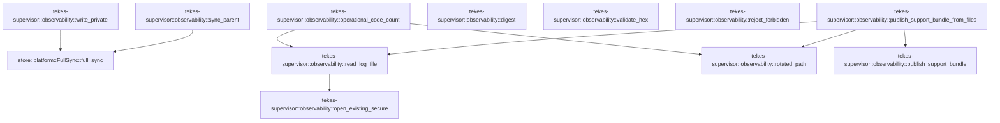

```mermaid
flowchart TD
  n0["store::platform::FullSync::full_sync"]
  n1["tekes-supervisor::observability::write_private"]
  n2["tekes-supervisor::observability::sync_parent"]
  n3["tekes-supervisor::observability::validate_hex"]
  n4["tekes-supervisor::observability::reject_forbidden"]
  n5["tekes-supervisor::observability::ProductionAccessLog::is_faulted"]
  n6["tekes-supervisor::observability::ProductionAccessLog::append"]
  n7["tekes-supervisor::observability::ProductionAccessLog::invoke_health_hook"]
  n8["tekes-supervisor::observability::ProductionAccessLog::record_semantic_failure"]
  n9["tekes-supervisor::observability::ProductionAccessLog::record_corruption"]
  n10["tekes-supervisor::observability::ProductionAccessLog::record_owner_io_failure"]
  n11["tekes-supervisor::observability::ProductionAccessLog::record"]
  n12["tekes-supervisor::observability::observability_timestamp"]
  n13["tekes-supervisor::observability::metric_type"]
  n14["tekes-supervisor::observability::RotatingJsonlLog::new"]
  n15["tekes-supervisor::observability::RotatingJsonlLog::append"]
  n16["tekes-supervisor::observability::RotatingJsonlLog::rotate"]
  n17["tekes-supervisor::observability::effective_uid"]
  n18["tekes-supervisor::observability::open_active_secure"]
  n19["tekes-supervisor::observability::open_existing_secure"]
  n20["tekes-supervisor::observability::validate_open_file"]
  n21["tekes-supervisor::observability::validate_path_identity"]
  n22["tekes-supervisor::observability::validate_destination_if_present"]
  n23["tekes-supervisor::observability::rotated_path"]
  n24["tekes-supervisor::observability::publish_support_bundle"]
  n6 --> n7
  n8 --> n6
  n8 --> n12
  n9 --> n6
  n9 --> n12
  n10 --> n6
  n10 --> n12
  n11 --> n12
  n15 --> n0
  n15 --> n16
  n15 --> n18
  n15 --> n19
  n16 --> n2
  n16 --> n19
  n16 --> n21
  n16 --> n22
  n16 --> n23
  n18 --> n20
  n19 --> n20
  n20 --> n17
  n21 --> n19
  n22 --> n19
  n24 --> n0
  n24 --> n1
  n24 --> n2
  n24 --> n3
  n24 --> n4
```

# tekes-supervisor::observability

[Package atlas](index.md) · [Source](../../src/observability.rs)

## Declarations

Visibility is the declaration spelling; trait members and reexports require their enclosing interface. `cfg` is not evaluated.

| Symbol | Kind | Visibility | Test / cfg |
|---|---|---|---|
| [tekes-supervisor::observability::LOG_ROTATION_BYTES](../../src/observability.rs#L18) | const_item | `pub` |  |
| [tekes-supervisor::observability::LOG_RETAINED_GENERATIONS](../../src/observability.rs#L19) | const_item | `pub` |  |
| [tekes-supervisor::observability::METRIC_NAMES](../../src/observability.rs#L21) | const_item | `pub` |  |
| [tekes-supervisor::observability::FORBIDDEN_SUPPORT_BYTES](../../src/observability.rs#L41) | const_item | `private` |  |
| [tekes-supervisor::observability::FrozenAttribution](../../src/observability.rs#L50) | struct_item | `pub` |  |
| [tekes-supervisor::observability::Correlation](../../src/observability.rs#L60) | struct_item | `pub` |  |
| [tekes-supervisor::observability::Correlation::from](../../src/observability.rs#L82) | function_item | `private` |  |
| [tekes-supervisor::observability::Severity](../../src/observability.rs#L95) | enum_item | `pub` |  |
| [tekes-supervisor::observability::LogRecord](../../src/observability.rs#L104) | struct_item | `pub` |  |
| [tekes-supervisor::observability::LogRecord::canonical_line](../../src/observability.rs#L117) | function_item | `pub` |  |
| [tekes-supervisor::observability::LogRecord::validate](../../src/observability.rs#L126) | function_item | `pub` |  |
| [tekes-supervisor::observability::COMPONENTS](../../src/observability.rs#L167) | const_item | `private` |  |
| [tekes-supervisor::observability::is_safe_scalar](../../src/observability.rs#L176) | function_item | `private` |  |
| [tekes-supervisor::observability::valid_correlation](../../src/observability.rs#L186) | function_item | `private` |  |
| [tekes-supervisor::observability::complete_child_correlation](../../src/observability.rs#L233) | function_item | `private` |  |
| [tekes-supervisor::observability::valid_launch_id](../../src/observability.rs#L250) | function_item | `private` |  |
| [tekes-supervisor::observability::selector_failure](../../src/observability.rs#L263) | function_item | `private` |  |
| [tekes-supervisor::observability::selector_severity](../../src/observability.rs#L286) | function_item | `private` |  |
| [tekes-supervisor::observability::field_keys](../../src/observability.rs#L308) | function_item | `private` |  |
| [tekes-supervisor::observability::Metric](../../src/observability.rs#L354) | struct_item | `pub` |  |
| [tekes-supervisor::observability::MetricSnapshot](../../src/observability.rs#L364) | struct_item | `pub` |  |
| [tekes-supervisor::observability::MetricSnapshot::validate](../../src/observability.rs#L371) | function_item | `pub` |  |
| [tekes-supervisor::observability::MetricSnapshot::canonical_line](../../src/observability.rs#L405) | function_item | `pub` |  |
| [tekes-supervisor::observability::publish_metric_snapshot](../../src/observability.rs#L414) | function_item | `pub` |  |
| [tekes-supervisor::observability::OperationalMetrics](../../src/observability.rs#L439) | struct_item | `pub` |  |
| [tekes-supervisor::observability::OperationalMetrics::default](../../src/observability.rs#L444) | function_item | `private` |  |
| [tekes-supervisor::observability::OperationalMetrics::snapshot](../../src/observability.rs#L452) | function_item | `pub` |  |
| [tekes-supervisor::observability::OperationalMetrics::set](../../src/observability.rs#L480) | function_item | `pub` |  |
| [tekes-supervisor::observability::OperationalMetrics::increment](../../src/observability.rs#L489) | function_item | `pub` |  |
| [tekes-supervisor::observability::OperationalMetrics::record](../../src/observability.rs#L502) | function_item | `private` |  |
| [tekes-supervisor::observability::ProductionAccessLog](../../src/observability.rs#L510) | struct_item | `pub` |  |
| [tekes-supervisor::observability::HealthHook](../../src/observability.rs#L518) | type_item | `private` |  |
| [tekes-supervisor::observability::ProductionAccessLog::new](../../src/observability.rs#L522) | function_item | `pub` |  |
| [tekes-supervisor::observability::ProductionAccessLog::install_health_hook](../../src/observability.rs#L539) | function_item | `pub` |  |
| [tekes-supervisor::observability::ProductionAccessLog::is_faulted](../../src/observability.rs#L550) | function_item | `pub` |  |
| [tekes-supervisor::observability::ProductionAccessLog::append](../../src/observability.rs#L554) | function_item | `private` |  |
| [tekes-supervisor::observability::ProductionAccessLog::invoke_health_hook](../../src/observability.rs#L573) | function_item | `private` |  |
| [tekes-supervisor::observability::ProductionAccessLog::record_semantic_failure](../../src/observability.rs#L584) | function_item | `pub` |  |
| [tekes-supervisor::observability::ProductionAccessLog::record_corruption](../../src/observability.rs#L617) | function_item | `pub` |  |
| [tekes-supervisor::observability::ProductionAccessLog::record_owner_io_failure](../../src/observability.rs#L639) | function_item | `pub` |  |
| [tekes-supervisor::observability::ProductionAccessLog::record](../../src/observability.rs#L660) | function_item | `private` |  |
| [tekes-supervisor::observability::observability_timestamp](../../src/observability.rs#L688) | function_item | `private` |  |
| [tekes-supervisor::observability::metric_type](../../src/observability.rs#L714) | function_item | `private` |  |
| [tekes-supervisor::observability::RotatingJsonlLog](../../src/observability.rs#L728) | struct_item | `pub` |  |
| [tekes-supervisor::observability::RotatingJsonlLog::new](../../src/observability.rs#L735) | function_item | `pub` |  |
| [tekes-supervisor::observability::RotatingJsonlLog::append](../../src/observability.rs#L743) | function_item | `pub` |  |
| [tekes-supervisor::observability::RotatingJsonlLog::rotate](../../src/observability.rs#L764) | function_item | `private` |  |
| [tekes-supervisor::observability::RotatingJsonlLog::with_rotation_bytes](../../src/observability.rs#L786) | function_item | `private` | test; #[cfg(test)] |
| [tekes-supervisor::observability::FileIdentity](../../src/observability.rs#L796) | struct_item | `private` |  |
| [tekes-supervisor::observability::effective_uid](../../src/observability.rs#L801) | function_item | `private` |  |
| [tekes-supervisor::observability::open_active_secure](../../src/observability.rs#L806) | function_item | `private` |  |
| [tekes-supervisor::observability::open_existing_secure](../../src/observability.rs#L818) | function_item | `private` |  |
| [tekes-supervisor::observability::validate_open_file](../../src/observability.rs#L835) | function_item | `private` |  |
| [tekes-supervisor::observability::validate_path_identity](../../src/observability.rs#L858) | function_item | `private` |  |
| [tekes-supervisor::observability::validate_destination_if_present](../../src/observability.rs#L875) | function_item | `private` |  |
| [tekes-supervisor::observability::rotated_path](../../src/observability.rs#L882) | function_item | `private` |  |
| [tekes-supervisor::observability::SupportManifest](../../src/observability.rs#L889) | struct_item | `private` |  |
| [tekes-supervisor::observability::SupportFile](../../src/observability.rs#L899) | struct_item | `private` |  |
| [tekes-supervisor::observability::publish_support_bundle](../../src/observability.rs#L905) | function_item | `pub` |  |
| [tekes-supervisor::observability::publish_support_bundle_from_files](../../src/observability.rs#L987) | function_item | `pub` |  |
| [tekes-supervisor::observability::operational_code_count](../../src/observability.rs#L1023) | function_item | `pub` |  |
| [tekes-supervisor::observability::read_log_file](../../src/observability.rs#L1037) | function_item | `private` |  |
| [tekes-supervisor::observability::write_private](../../src/observability.rs#L1061) | function_item | `private` |  |
| [tekes-supervisor::observability::sync_parent](../../src/observability.rs#L1072) | function_item | `private` |  |
| [tekes-supervisor::observability::digest](../../src/observability.rs#L1078) | function_item | `private` |  |
| [tekes-supervisor::observability::validate_hex](../../src/observability.rs#L1090) | function_item | `private` |  |
| [tekes-supervisor::observability::reject_forbidden](../../src/observability.rs#L1102) | function_item | `private` |  |
| [tekes-supervisor::observability::ObservabilityError](../../src/observability.rs#L1115) | enum_item | `pub` |  |
| [tekes-supervisor::observability::tests::record](../../src/observability.rs#L1147) | function_item | `private` | test; #[cfg(test)] |
| [tekes-supervisor::observability::tests::attribution](../../src/observability.rs#L1172) | function_item | `private` | test; #[cfg(test)] |
| [tekes-supervisor::observability::tests::operational_log_rejects_a_symlink_to_a_semantic_ledger](../../src/observability.rs#L1184) | function_item | `private` | test; #[cfg(test)] |
| [tekes-supervisor::observability::tests::concurrent_append_and_rotation_preserve_both_canonical_records](../../src/observability.rs#L1207) | function_item | `private` | test; #[cfg(test)] |
| [tekes-supervisor::observability::tests::production_append_failure_marks_fault_and_invokes_readiness_hook](../../src/observability.rs#L1232) | function_item | `private` | test; #[cfg(test)] |

## Imports / reexports

| Local name | Source path | Visibility |
|---|---|---|
| `BTreeMap` | `std::collections::BTreeMap` | `private` |
| `BTreeSet` | `std::collections::BTreeSet` | `private` |
| `fs` | `std::fs` | `private` |
| `File` | `std::fs::File` | `private` |
| `OpenOptions` | `std::fs::OpenOptions` | `private` |
| `io` | `std::io` | `private` |
| `BufRead` | `std::io::BufRead` | `private` |
| `BufReader` | `std::io::BufReader` | `private` |
| `Write` | `std::io::Write` | `private` |
| `MetadataExt` | `std::os::unix::fs::MetadataExt` | `private` |
| `OpenOptionsExt` | `std::os::unix::fs::OpenOptionsExt` | `private` |
| `PermissionsExt` | `std::os::unix::fs::PermissionsExt` | `private` |
| `Path` | `std::path::Path` | `private` |
| `PathBuf` | `std::path::PathBuf` | `private` |
| `AtomicBool` | `std::sync::atomic::AtomicBool` | `private` |
| `Ordering` | `std::sync::atomic::Ordering` | `private` |
| `Arc` | `std::sync::Arc` | `private` |
| `Mutex` | `std::sync::Mutex` | `private` |
| `Deserialize` | `serde::Deserialize` | `private` |
| `Serialize` | `serde::Serialize` | `private` |
| `Value` | `serde_json::Value` | `private` |
| `Digest` | `sha2::Digest` | `private` |
| `Sha256` | `sha2::Sha256` | `private` |
| `FullSync` | `store::FullSync` | `private` |
| `Error` | `thiserror::Error` | `private` |
| `AccessLogRecord` | `transport::AccessLogRecord` | `private` |
| `AccessLogSink` | `transport::AccessLogSink` | `private` |
| `BTreeMap` | `std::collections::BTreeMap` | `private` |
| `fs` | `std::fs` | `private` |
| `PermissionsExt` | `std::os::unix::fs::PermissionsExt` | `private` |
| `symlink` | `std::os::unix::fs::symlink` | `private` |
| `AtomicBool` | `std::sync::atomic::AtomicBool` | `private` |
| `Ordering` | `std::sync::atomic::Ordering` | `private` |
| `Arc` | `std::sync::Arc` | `private` |
| `Barrier` | `std::sync::Barrier` | `private` |
| `Correlation` | `super::Correlation` | `private` |
| `FrozenAttribution` | `super::FrozenAttribution` | `private` |
| `LogRecord` | `super::LogRecord` | `private` |
| `ObservabilityError` | `super::ObservabilityError` | `private` |
| `OperationalMetrics` | `super::OperationalMetrics` | `private` |
| `ProductionAccessLog` | `super::ProductionAccessLog` | `private` |
| `RotatingJsonlLog` | `super::RotatingJsonlLog` | `private` |
| `Severity` | `super::Severity` | `private` |
| `rotated_path` | `super::rotated_path` | `private` |

## Module declarations

| Module | Visibility | Attributes |
|---|---|---|
| `tekes-supervisor::observability::tests` | `private` | #[cfg(test)] |

## Function call graphs

Edges below are syntactically resolved calls only, including private functions. Graphs partition callers into groups of 20; they are not execution order. All unresolved sites are listed below and in the JSON inventory.

```mermaid
flowchart TD
  n0["tekes-supervisor::observability::write_private"]
  n1["tekes-supervisor::observability::sync_parent"]
  n2["tekes-supervisor::observability::validate_hex"]
  n3["tekes-supervisor::observability::reject_forbidden"]
  n4["tekes-supervisor::observability::LogRecord::canonical_line"]
  n5["tekes-supervisor::observability::LogRecord::validate"]
  n6["tekes-supervisor::observability::is_safe_scalar"]
  n7["tekes-supervisor::observability::valid_correlation"]
  n8["tekes-supervisor::observability::complete_child_correlation"]
  n9["tekes-supervisor::observability::valid_launch_id"]
  n10["tekes-supervisor::observability::selector_failure"]
  n11["tekes-supervisor::observability::selector_severity"]
  n12["tekes-supervisor::observability::field_keys"]
  n13["tekes-supervisor::observability::MetricSnapshot::validate"]
  n14["tekes-supervisor::observability::MetricSnapshot::canonical_line"]
  n15["tekes-supervisor::observability::publish_metric_snapshot"]
  n16["tekes-supervisor::observability::OperationalMetrics::default"]
  n17["tekes-supervisor::observability::OperationalMetrics::snapshot"]
  n18["tekes-supervisor::observability::OperationalMetrics::set"]
  n19["tekes-supervisor::observability::OperationalMetrics::increment"]
  n20["tekes-supervisor::observability::OperationalMetrics::record"]
  n21["tekes-supervisor::observability::ProductionAccessLog::new"]
  n22["tekes-supervisor::observability::ProductionAccessLog::install_health_hook"]
  n23["tekes-supervisor::observability::ProductionAccessLog::invoke_health_hook"]
  n24["tekes-supervisor::observability::metric_type"]
  n25["tekes-supervisor::observability::Correlation::from"]
  n4 --> n3
  n4 --> n5
  n5 --> n7
  n5 --> n11
  n5 --> n12
  n7 --> n8
  n7 --> n10
  n8 --> n2
  n8 --> n9
  n12 --> n10
  n13 --> n24
  n14 --> n13
  n15 --> n0
  n15 --> n1
  n15 --> n3
  n17 --> n24
  n22 --> n23
```

Functions 1–20: 17 direct edges

Functions 21–40: 27 direct edges

Functions 41–48: 8 direct edges

## Call sites

Includes test functions (marked in declarations). Receiver-type-required sites need type analysis/manual tracing. Calls in closures are attributed to their enclosing function; their occurrence here does not mean the closure executes immediately.

| Caller | Callee expression | Source lines | Target / classification |
|---|---|---|---|
| `from` | `Some` | [84](../../src/observability.rs#L84), [85](../../src/observability.rs#L85), [86](../../src/observability.rs#L86), [87](../../src/observability.rs#L87) | external-constructor-callback-or-unresolved |
| `from` | `value.launch_id.clone` | [84](../../src/observability.rs#L84) | receiver-type-required |
| `from` | `value.manifest_sha256.clone` | [87](../../src/observability.rs#L87) | receiver-type-required |
| `from` | `Self::default` | [88](../../src/observability.rs#L88) | external-constructor-callback-or-unresolved |
| `canonical_line` | `self.validate` | [118](../../src/observability.rs#L118) | [tekes-supervisor::observability::LogRecord::validate](../../src/observability.rs#L126) |
| `canonical_line` | `serde_json_canonicalizer::to_vec(self)             .map_err` | [119](../../src/observability.rs#L119) | receiver-type-required |
| `canonical_line` | `serde_json_canonicalizer::to_vec` | [119](../../src/observability.rs#L119) | external-constructor-callback-or-unresolved |
| `canonical_line` | `ObservabilityError::Json` | [120](../../src/observability.rs#L120) | external-constructor-callback-or-unresolved |
| `canonical_line` | `error.to_string` | [120](../../src/observability.rs#L120) | receiver-type-required |
| `canonical_line` | `bytes.push` | [121](../../src/observability.rs#L121) | receiver-type-required |
| `canonical_line` | `reject_forbidden` | [122](../../src/observability.rs#L122) | [tekes-supervisor::observability::reject_forbidden](../../src/observability.rs#L1102) |
| `canonical_line` | `Ok` | [123](../../src/observability.rs#L123) | external-constructor-callback-or-unresolved |
| `validate` | `COMPONENTS.contains` | [127](../../src/observability.rs#L127) | receiver-type-required |
| `validate` | `self.component.as_str` | [127](../../src/observability.rs#L127), [138](../../src/observability.rs#L138), [156](../../src/observability.rs#L156) | receiver-type-required |
| `validate` | `Err` | [128](../../src/observability.rs#L128), [131](../../src/observability.rs#L131), [134](../../src/observability.rs#L134), [147](../../src/observability.rs#L147), [152](../../src/observability.rs#L152), [158](../../src/observability.rs#L158) | external-constructor-callback-or-unresolved |
| `validate` | `ObservabilityError::InvalidLog` | [128](../../src/observability.rs#L128), [131](../../src/observability.rs#L131), [134](../../src/observability.rs#L134), [139](../../src/observability.rs#L139), [147](../../src/observability.rs#L147), [152](../../src/observability.rs#L152), [158](../../src/observability.rs#L158) | external-constructor-callback-or-unresolved |
| `validate` | `self.build.is_empty` | [130](../../src/observability.rs#L130) | receiver-type-required |
| `validate` | `self.code.is_empty` | [130](../../src/observability.rs#L130) | receiver-type-required |
| `validate` | `self.message.is_empty` | [130](../../src/observability.rs#L130) | receiver-type-required |
| `validate` | `self.fields.values().all` | [133](../../src/observability.rs#L133) | receiver-type-required |
| `validate` | `self.fields.values` | [133](../../src/observability.rs#L133) | receiver-type-required |
| `validate` | `field_keys(self.component.as_str(), self.code.as_str())             .ok_or` | [138](../../src/observability.rs#L138) | receiver-type-required |
| `validate` | `field_keys` | [138](../../src/observability.rs#L138) | [tekes-supervisor::observability::field_keys](../../src/observability.rs#L308) |
| `validate` | `self.code.as_str` | [138](../../src/observability.rs#L138), [156](../../src/observability.rs#L156) | receiver-type-required |
| `validate` | `self             .fields             .keys()             .map(String::as_str)             .collect::<BTreeSet<_>>` | [140](../../src/observability.rs#L140) | receiver-type-required |
| `validate` | `self             .fields             .keys()             .map` | [140](../../src/observability.rs#L140) | receiver-type-required |
| `validate` | `self             .fields             .keys` | [140](../../src/observability.rs#L140) | receiver-type-required |
| `validate` | `allowed.iter().copied().collect::<BTreeSet<_>>` | [145](../../src/observability.rs#L145) | receiver-type-required |
| `validate` | `allowed.iter().copied` | [145](../../src/observability.rs#L145) | receiver-type-required |
| `validate` | `allowed.iter` | [145](../../src/observability.rs#L145) | receiver-type-required |
| `validate` | `valid_correlation` | [151](../../src/observability.rs#L151) | [tekes-supervisor::observability::valid_correlation](../../src/observability.rs#L186) |
| `validate` | `selector_severity` | [156](../../src/observability.rs#L156) | [tekes-supervisor::observability::selector_severity](../../src/observability.rs#L286) |
| `validate` | `Ok` | [163](../../src/observability.rs#L163) | external-constructor-callback-or-unresolved |
| `is_safe_scalar` | `number             .as_u64()             .is_some_and` | [179](../../src/observability.rs#L179) | receiver-type-required |
| `is_safe_scalar` | `number             .as_u64` | [179](../../src/observability.rs#L179) | receiver-type-required |
| `valid_correlation` | `record.code.as_str` | [188](../../src/observability.rs#L188) | receiver-type-required |
| `valid_correlation` | `Correlation::default` | [192](../../src/observability.rs#L192) | external-constructor-callback-or-unresolved |
| `valid_correlation` | `record.correlation.attempt.is_none` | [194](../../src/observability.rs#L194) | receiver-type-required |
| `valid_correlation` | `record.correlation.generation.is_none` | [195](../../src/observability.rs#L195) | receiver-type-required |
| `valid_correlation` | `record.correlation.launch_id.is_none` | [196](../../src/observability.rs#L196) | receiver-type-required |
| `valid_correlation` | `record.correlation.manifest_sha256.is_none` | [197](../../src/observability.rs#L197) | receiver-type-required |
| `valid_correlation` | `record                         .correlation                         .operation_id                         .as_deref()                         .is_some_and` | [198](../../src/observability.rs#L198), [206](../../src/observability.rs#L206) | receiver-type-required |
| `valid_correlation` | `record                         .correlation                         .operation_id                         .as_deref` | [198](../../src/observability.rs#L198), [206](../../src/observability.rs#L206) | receiver-type-required |
| `valid_correlation` | `value.is_empty` | [202](../../src/observability.rs#L202), [210](../../src/observability.rs#L210) | receiver-type-required |
| `valid_correlation` | `complete_child_correlation` | [205](../../src/observability.rs#L205), [213](../../src/observability.rs#L213), [217](../../src/observability.rs#L217), [229](../../src/observability.rs#L229) | [tekes-supervisor::observability::complete_child_correlation](../../src/observability.rs#L233) |
| `valid_correlation` | `record.correlation.operation_id.is_none` | [214](../../src/observability.rs#L214), [218](../../src/observability.rs#L218) | receiver-type-required |
| `valid_correlation` | `selector_failure` | [216](../../src/observability.rs#L216) | [tekes-supervisor::observability::selector_failure](../../src/observability.rs#L263) |
| `complete_child_correlation` | `correlation.attempt.filter` | [234](../../src/observability.rs#L234) | receiver-type-required |
| `complete_child_correlation` | `correlation.generation.filter` | [237](../../src/observability.rs#L237) | receiver-type-required |
| `complete_child_correlation` | `correlation         .launch_id         .as_deref()         .is_some_and` | [240](../../src/observability.rs#L240) | receiver-type-required |
| `complete_child_correlation` | `correlation         .launch_id         .as_deref` | [240](../../src/observability.rs#L240) | receiver-type-required |
| `complete_child_correlation` | `valid_launch_id` | [243](../../src/observability.rs#L243) | [tekes-supervisor::observability::valid_launch_id](../../src/observability.rs#L250) |
| `complete_child_correlation` | `correlation             .manifest_sha256             .as_deref()             .is_some_and` | [244](../../src/observability.rs#L244) | receiver-type-required |
| `complete_child_correlation` | `correlation             .manifest_sha256             .as_deref` | [244](../../src/observability.rs#L244) | receiver-type-required |
| `complete_child_correlation` | `validate_hex(value).is_ok` | [247](../../src/observability.rs#L247) | receiver-type-required |
| `complete_child_correlation` | `validate_hex` | [247](../../src/observability.rs#L247) | [tekes-supervisor::observability::validate_hex](../../src/observability.rs#L1090) |
| `valid_launch_id` | `value.split` | [251](../../src/observability.rs#L251) | receiver-type-required |
| `valid_launch_id` | `parts.next().and_then` | [252](../../src/observability.rs#L252), [253](../../src/observability.rs#L253) | receiver-type-required |
| `valid_launch_id` | `parts.next` | [252](../../src/observability.rs#L252), [253](../../src/observability.rs#L253), [254](../../src/observability.rs#L254), [260](../../src/observability.rs#L260) | receiver-type-required |
| `valid_launch_id` | `part.parse().ok` | [252](../../src/observability.rs#L252), [253](../../src/observability.rs#L253) | receiver-type-required |
| `valid_launch_id` | `part.parse` | [252](../../src/observability.rs#L252), [253](../../src/observability.rs#L253) | receiver-type-required |
| `valid_launch_id` | `Some` | [252](../../src/observability.rs#L252), [253](../../src/observability.rs#L253) | external-constructor-callback-or-unresolved |
| `valid_launch_id` | `parts.next().is_some_and` | [254](../../src/observability.rs#L254) | receiver-type-required |
| `valid_launch_id` | `random.len` | [255](../../src/observability.rs#L255) | receiver-type-required |
| `valid_launch_id` | `random                     .bytes()                     .all` | [256](../../src/observability.rs#L256) | receiver-type-required |
| `valid_launch_id` | `random                     .bytes` | [256](../../src/observability.rs#L256) | receiver-type-required |
| `valid_launch_id` | `byte.is_ascii_hexdigit` | [258](../../src/observability.rs#L258) | receiver-type-required |
| `valid_launch_id` | `byte.is_ascii_uppercase` | [258](../../src/observability.rs#L258) | receiver-type-required |
| `valid_launch_id` | `parts.next().is_none` | [260](../../src/observability.rs#L260) | receiver-type-required |
| `selector_severity` | `(component == "selector").then_some` | [287](../../src/observability.rs#L287) | receiver-type-required |
| `field_keys` | `Some` | [310](../../src/observability.rs#L310), [328](../../src/observability.rs#L328) | external-constructor-callback-or-unresolved |
| `field_keys` | `selector_failure` | [324](../../src/observability.rs#L324) | [tekes-supervisor::observability::selector_failure](../../src/observability.rs#L263) |
| `validate` | `Err` | [373](../../src/observability.rs#L373), [383](../../src/observability.rs#L383), [397](../../src/observability.rs#L397) | external-constructor-callback-or-unresolved |
| `validate` | `ObservabilityError::InvalidMetric` | [373](../../src/observability.rs#L373), [383](../../src/observability.rs#L383), [397](../../src/observability.rs#L397) | external-constructor-callback-or-unresolved |
| `validate` | `METRIC_NAMES.into_iter().collect::<BTreeSet<_>>` | [375](../../src/observability.rs#L375) | receiver-type-required |
| `validate` | `METRIC_NAMES.into_iter` | [375](../../src/observability.rs#L375) | receiver-type-required |
| `validate` | `self             .metrics             .iter()             .map(&#124;metric&#124; metric.name.as_str())             .collect::<Vec<_>>` | [376](../../src/observability.rs#L376) | receiver-type-required |
| `validate` | `self             .metrics             .iter()             .map` | [376](../../src/observability.rs#L376) | receiver-type-required |
| `validate` | `self             .metrics             .iter` | [376](../../src/observability.rs#L376) | receiver-type-required |
| `validate` | `metric.name.as_str` | [379](../../src/observability.rs#L379), [388](../../src/observability.rs#L388) | receiver-type-required |
| `validate` | `names.iter().copied().collect::<Vec<_>>` | [381](../../src/observability.rs#L381) | receiver-type-required |
| `validate` | `names.iter().copied` | [381](../../src/observability.rs#L381) | receiver-type-required |
| `validate` | `names.iter` | [381](../../src/observability.rs#L381) | receiver-type-required |
| `validate` | `names.contains` | [388](../../src/observability.rs#L388) | receiver-type-required |
| `validate` | `metric_type` | [389](../../src/observability.rs#L389) | [tekes-supervisor::observability::metric_type](../../src/observability.rs#L714) |
| `validate` | `metric.value.is_finite` | [390](../../src/observability.rs#L390) | receiver-type-required |
| `validate` | `metric                     .labels                     .keys()                     .any` | [392](../../src/observability.rs#L392) | receiver-type-required |
| `validate` | `metric                     .labels                     .keys` | [392](../../src/observability.rs#L392) | receiver-type-required |
| `validate` | `Ok` | [402](../../src/observability.rs#L402) | external-constructor-callback-or-unresolved |
| `canonical_line` | `self.validate` | [406](../../src/observability.rs#L406) | [tekes-supervisor::observability::MetricSnapshot::validate](../../src/observability.rs#L371) |
| `canonical_line` | `serde_json_canonicalizer::to_vec(self)             .map_err` | [407](../../src/observability.rs#L407) | receiver-type-required |
| `canonical_line` | `serde_json_canonicalizer::to_vec` | [407](../../src/observability.rs#L407) | external-constructor-callback-or-unresolved |
| `canonical_line` | `ObservabilityError::Json` | [408](../../src/observability.rs#L408) | external-constructor-callback-or-unresolved |
| `canonical_line` | `error.to_string` | [408](../../src/observability.rs#L408) | receiver-type-required |
| `canonical_line` | `bytes.push` | [409](../../src/observability.rs#L409) | receiver-type-required |
| `canonical_line` | `Ok` | [410](../../src/observability.rs#L410) | external-constructor-callback-or-unresolved |
| `publish_metric_snapshot` | `snapshot.canonical_line` | [418](../../src/observability.rs#L418) | receiver-type-required |
| `publish_metric_snapshot` | `reject_forbidden` | [419](../../src/observability.rs#L419) | [tekes-supervisor::observability::reject_forbidden](../../src/observability.rs#L1102) |
| `publish_metric_snapshot` | `path         .parent()         .ok_or` | [420](../../src/observability.rs#L420) | receiver-type-required |
| `publish_metric_snapshot` | `path         .parent` | [420](../../src/observability.rs#L420) | receiver-type-required |
| `publish_metric_snapshot` | `path         .file_name()         .ok_or(ObservabilityError::DestinationWithoutParent)?         .to_string_lossy` | [423](../../src/observability.rs#L423) | receiver-type-required |
| `publish_metric_snapshot` | `path         .file_name()         .ok_or` | [423](../../src/observability.rs#L423) | receiver-type-required |
| `publish_metric_snapshot` | `path         .file_name` | [423](../../src/observability.rs#L423) | receiver-type-required |
| `publish_metric_snapshot` | `parent.join` | [427](../../src/observability.rs#L427) | receiver-type-required |
| `publish_metric_snapshot` | `staging.exists` | [428](../../src/observability.rs#L428) | receiver-type-required |
| `publish_metric_snapshot` | `Err` | [429](../../src/observability.rs#L429) | external-constructor-callback-or-unresolved |
| `publish_metric_snapshot` | `write_private` | [431](../../src/observability.rs#L431) | [tekes-supervisor::observability::write_private](../../src/observability.rs#L1061) |
| `publish_metric_snapshot` | `fs::rename` | [432](../../src/observability.rs#L432) | external-constructor-callback-or-unresolved |
| `publish_metric_snapshot` | `sync_parent` | [433](../../src/observability.rs#L433) | [tekes-supervisor::observability::sync_parent](../../src/observability.rs#L1072) |
| `publish_metric_snapshot` | `Ok` | [434](../../src/observability.rs#L434) | external-constructor-callback-or-unresolved |
| `default` | `Mutex::new` | [446](../../src/observability.rs#L446) | external-constructor-callback-or-unresolved |
| `default` | `METRIC_NAMES.into_iter().map(&#124;name&#124; (name, 0.0)).collect` | [446](../../src/observability.rs#L446) | receiver-type-required |
| `default` | `METRIC_NAMES.into_iter().map` | [446](../../src/observability.rs#L446) | receiver-type-required |
| `default` | `METRIC_NAMES.into_iter` | [446](../../src/observability.rs#L446) | receiver-type-required |
| `snapshot` | `self             .values             .lock()             .unwrap_or_else(std::sync::PoisonError::into_inner)             .clone` | [453](../../src/observability.rs#L453) | receiver-type-required |
| `snapshot` | `self             .values             .lock()             .unwrap_or_else` | [453](../../src/observability.rs#L453) | receiver-type-required |
| `snapshot` | `self             .values             .lock` | [453](../../src/observability.rs#L453) | receiver-type-required |
| `snapshot` | `BTreeMap::from` | [458](../../src/observability.rs#L458) | external-constructor-callback-or-unresolved |
| `snapshot` | `"component".to_owned` | [458](../../src/observability.rs#L458) | receiver-type-required |
| `snapshot` | `"supervisor".to_owned` | [458](../../src/observability.rs#L458) | receiver-type-required |
| `snapshot` | `METRIC_NAMES             .into_iter()             .map(&#124;name&#124; Metric {                 name: name.to_owned(),                 metric_type: metric_type(name).to_owned(),                 value: if name == "readiness" {                     if ready { 1.0 } else { 0.0 }                 } else {                     values.get(name).copied().unwrap_or(0.0)                 },                 labels: labels.clone(),             })             .collect::<Vec<_>>` | [459](../../src/observability.rs#L459) | receiver-type-required |
| `snapshot` | `METRIC_NAMES             .into_iter()             .map` | [459](../../src/observability.rs#L459) | receiver-type-required |
| `snapshot` | `METRIC_NAMES             .into_iter` | [459](../../src/observability.rs#L459) | receiver-type-required |
| `snapshot` | `name.to_owned` | [462](../../src/observability.rs#L462) | receiver-type-required |
| `snapshot` | `metric_type(name).to_owned` | [463](../../src/observability.rs#L463) | receiver-type-required |
| `snapshot` | `metric_type` | [463](../../src/observability.rs#L463) | [tekes-supervisor::observability::metric_type](../../src/observability.rs#L714) |
| `snapshot` | `values.get(name).copied().unwrap_or` | [467](../../src/observability.rs#L467) | receiver-type-required |
| `snapshot` | `values.get(name).copied` | [467](../../src/observability.rs#L467) | receiver-type-required |
| `snapshot` | `values.get` | [467](../../src/observability.rs#L467) | receiver-type-required |
| `snapshot` | `labels.clone` | [469](../../src/observability.rs#L469) | receiver-type-required |
| `snapshot` | `metrics.sort_by` | [472](../../src/observability.rs#L472) | receiver-type-required |
| `snapshot` | `left.name.cmp` | [472](../../src/observability.rs#L472) | receiver-type-required |
| `snapshot` | `ts.into` | [475](../../src/observability.rs#L475) | receiver-type-required |
| `set` | `METRIC_NAMES.contains` | [481](../../src/observability.rs#L481) | receiver-type-required |
| `set` | `value.is_finite` | [481](../../src/observability.rs#L481) | receiver-type-required |
| `set` | `self.values                 .lock()                 .unwrap_or_else(std::sync::PoisonError::into_inner)                 .insert` | [482](../../src/observability.rs#L482) | receiver-type-required |
| `set` | `self.values                 .lock()                 .unwrap_or_else` | [482](../../src/observability.rs#L482) | receiver-type-required |
| `set` | `self.values                 .lock` | [482](../../src/observability.rs#L482) | receiver-type-required |
| `increment` | `METRIC_NAMES.contains` | [490](../../src/observability.rs#L490) | receiver-type-required |
| `increment` | `self                 .values                 .lock()                 .unwrap_or_else` | [491](../../src/observability.rs#L491) | receiver-type-required |
| `increment` | `self                 .values                 .lock` | [491](../../src/observability.rs#L491) | receiver-type-required |
| `increment` | `values.entry(name).or_insert` | [495](../../src/observability.rs#L495) | receiver-type-required |
| `increment` | `values.entry` | [495](../../src/observability.rs#L495) | receiver-type-required |
| `record` | `self.increment` | [503](../../src/observability.rs#L503) | receiver-type-required |
| `new` | `AtomicBool::new` | [531](../../src/observability.rs#L531) | external-constructor-callback-or-unresolved |
| `new` | `Mutex::new` | [532](../../src/observability.rs#L532) | external-constructor-callback-or-unresolved |
| `install_health_hook` | `self             .health_hook             .lock()             .unwrap_or_else` | [540](../../src/observability.rs#L540) | receiver-type-required |
| `install_health_hook` | `self             .health_hook             .lock` | [540](../../src/observability.rs#L540) | receiver-type-required |
| `install_health_hook` | `Some` | [543](../../src/observability.rs#L543) | external-constructor-callback-or-unresolved |
| `install_health_hook` | `self.faulted.load` | [544](../../src/observability.rs#L544) | receiver-type-required |
| `install_health_hook` | `self.invoke_health_hook` | [545](../../src/observability.rs#L545) | [tekes-supervisor::observability::ProductionAccessLog::invoke_health_hook](../../src/observability.rs#L573) |
| `is_faulted` | `self.faulted.load` | [551](../../src/observability.rs#L551) | receiver-type-required |
| `append` | `self.log.append(record).is_ok` | [555](../../src/observability.rs#L555) | receiver-type-required |
| `append` | `self.log.append` | [555](../../src/observability.rs#L555) | receiver-type-required |
| `append` | `self.faulted.swap` | [556](../../src/observability.rs#L556), [561](../../src/observability.rs#L561) | receiver-type-required |
| `append` | `self.invoke_health_hook` | [557](../../src/observability.rs#L557), [562](../../src/observability.rs#L562) | [tekes-supervisor::observability::ProductionAccessLog::invoke_health_hook](../../src/observability.rs#L573) |
| `invoke_health_hook` | `self             .health_hook             .lock()             .unwrap_or_else(std::sync::PoisonError::into_inner)             .clone` | [574](../../src/observability.rs#L574) | receiver-type-required |
| `invoke_health_hook` | `self             .health_hook             .lock()             .unwrap_or_else` | [574](../../src/observability.rs#L574) | receiver-type-required |
| `invoke_health_hook` | `self             .health_hook             .lock` | [574](../../src/observability.rs#L574) | receiver-type-required |
| `invoke_health_hook` | `hook` | [580](../../src/observability.rs#L580) | external-constructor-callback-or-unresolved |
| `record_semantic_failure` | `Correlation::from` | [595](../../src/observability.rs#L595) | external-constructor-callback-or-unresolved |
| `record_semantic_failure` | `Some` | [596](../../src/observability.rs#L596), [597](../../src/observability.rs#L597) | external-constructor-callback-or-unresolved |
| `record_semantic_failure` | `session_id.to_owned` | [596](../../src/observability.rs#L596) | receiver-type-required |
| `record_semantic_failure` | `observability_timestamp` | [600](../../src/observability.rs#L600) | [tekes-supervisor::observability::observability_timestamp](../../src/observability.rs#L688) |
| `record_semantic_failure` | `"supervisor".to_owned` | [602](../../src/observability.rs#L602) | receiver-type-required |
| `record_semantic_failure` | `self.attribution.build.clone` | [603](../../src/observability.rs#L603) | receiver-type-required |
| `record_semantic_failure` | `code.to_owned` | [604](../../src/observability.rs#L604) | receiver-type-required |
| `record_semantic_failure` | `message.to_owned` | [605](../../src/observability.rs#L605) | receiver-type-required |
| `record_semantic_failure` | `[(                 "classification".to_owned(),                 Value::String(classification.to_owned()),             )]             .into_iter()             .collect` | [607](../../src/observability.rs#L607) | receiver-type-required |
| `record_semantic_failure` | `[(                 "classification".to_owned(),                 Value::String(classification.to_owned()),             )]             .into_iter` | [607](../../src/observability.rs#L607) | receiver-type-required |
| `record_semantic_failure` | `"classification".to_owned` | [608](../../src/observability.rs#L608) | receiver-type-required |
| `record_semantic_failure` | `Value::String` | [609](../../src/observability.rs#L609) | external-constructor-callback-or-unresolved |
| `record_semantic_failure` | `classification.to_owned` | [609](../../src/observability.rs#L609) | receiver-type-required |
| `record_semantic_failure` | `self.append` | [614](../../src/observability.rs#L614) | [tekes-supervisor::observability::ProductionAccessLog::append](../../src/observability.rs#L554) |
| `record_corruption` | `Correlation::from` | [618](../../src/observability.rs#L618) | external-constructor-callback-or-unresolved |
| `record_corruption` | `Some` | [619](../../src/observability.rs#L619) | external-constructor-callback-or-unresolved |
| `record_corruption` | `session_id.to_owned` | [619](../../src/observability.rs#L619) | receiver-type-required |
| `record_corruption` | `observability_timestamp` | [622](../../src/observability.rs#L622) | [tekes-supervisor::observability::observability_timestamp](../../src/observability.rs#L688) |
| `record_corruption` | `"supervisor".to_owned` | [624](../../src/observability.rs#L624) | receiver-type-required |
| `record_corruption` | `self.attribution.build.clone` | [625](../../src/observability.rs#L625) | receiver-type-required |
| `record_corruption` | `"corrupt-ledger".to_owned` | [626](../../src/observability.rs#L626) | receiver-type-required |
| `record_corruption` | `"Ledger validation failed".to_owned` | [627](../../src/observability.rs#L627) | receiver-type-required |
| `record_corruption` | `[                 ("file".to_owned(), Value::String(file.to_owned())),                 ("offset".to_owned(), Value::from(offset)),             ]             .into_iter()             .collect` | [629](../../src/observability.rs#L629) | receiver-type-required |
| `record_corruption` | `[                 ("file".to_owned(), Value::String(file.to_owned())),                 ("offset".to_owned(), Value::from(offset)),             ]             .into_iter` | [629](../../src/observability.rs#L629) | receiver-type-required |
| `record_corruption` | `"file".to_owned` | [630](../../src/observability.rs#L630) | receiver-type-required |
| `record_corruption` | `Value::String` | [630](../../src/observability.rs#L630) | external-constructor-callback-or-unresolved |
| `record_corruption` | `file.to_owned` | [630](../../src/observability.rs#L630) | receiver-type-required |
| `record_corruption` | `"offset".to_owned` | [631](../../src/observability.rs#L631) | receiver-type-required |
| `record_corruption` | `Value::from` | [631](../../src/observability.rs#L631) | external-constructor-callback-or-unresolved |
| `record_corruption` | `self.append` | [636](../../src/observability.rs#L636) | [tekes-supervisor::observability::ProductionAccessLog::append](../../src/observability.rs#L554) |
| `record_owner_io_failure` | `Correlation::from` | [640](../../src/observability.rs#L640) | external-constructor-callback-or-unresolved |
| `record_owner_io_failure` | `Some` | [641](../../src/observability.rs#L641) | external-constructor-callback-or-unresolved |
| `record_owner_io_failure` | `session_id.to_owned` | [641](../../src/observability.rs#L641) | receiver-type-required |
| `record_owner_io_failure` | `observability_timestamp` | [644](../../src/observability.rs#L644) | [tekes-supervisor::observability::observability_timestamp](../../src/observability.rs#L688) |
| `record_owner_io_failure` | `"supervisor".to_owned` | [646](../../src/observability.rs#L646) | receiver-type-required |
| `record_owner_io_failure` | `self.attribution.build.clone` | [647](../../src/observability.rs#L647) | receiver-type-required |
| `record_owner_io_failure` | `"io".to_owned` | [648](../../src/observability.rs#L648) | receiver-type-required |
| `record_owner_io_failure` | `"Owner operation failed".to_owned` | [649](../../src/observability.rs#L649) | receiver-type-required |
| `record_owner_io_failure` | `[("operation".to_owned(), Value::String(operation.to_owned()))]                 .into_iter()                 .collect` | [651](../../src/observability.rs#L651) | receiver-type-required |
| `record_owner_io_failure` | `[("operation".to_owned(), Value::String(operation.to_owned()))]                 .into_iter` | [651](../../src/observability.rs#L651) | receiver-type-required |
| `record_owner_io_failure` | `"operation".to_owned` | [651](../../src/observability.rs#L651) | receiver-type-required |
| `record_owner_io_failure` | `Value::String` | [651](../../src/observability.rs#L651) | external-constructor-callback-or-unresolved |
| `record_owner_io_failure` | `operation.to_owned` | [651](../../src/observability.rs#L651) | receiver-type-required |
| `record_owner_io_failure` | `self.append` | [655](../../src/observability.rs#L655) | [tekes-supervisor::observability::ProductionAccessLog::append](../../src/observability.rs#L554) |
| `record` | `self.metrics.increment` | [661](../../src/observability.rs#L661) | receiver-type-required |
| `record` | `self.metrics.set` | [662](../../src/observability.rs#L662) | receiver-type-required |
| `record` | `record.error_code.as_deref` | [666](../../src/observability.rs#L666) | receiver-type-required |
| `record` | `Some` | [666](../../src/observability.rs#L666), [670](../../src/observability.rs#L670) | external-constructor-callback-or-unresolved |
| `record` | `Correlation::from` | [669](../../src/observability.rs#L669) | external-constructor-callback-or-unresolved |
| `record` | `record.request_id.clone` | [670](../../src/observability.rs#L670) | receiver-type-required |
| `record` | `observability_timestamp` | [673](../../src/observability.rs#L673) | [tekes-supervisor::observability::observability_timestamp](../../src/observability.rs#L688) |
| `record` | `"transport".to_owned` | [675](../../src/observability.rs#L675) | receiver-type-required |
| `record` | `self.attribution.build.clone` | [676](../../src/observability.rs#L676) | receiver-type-required |
| `record` | `"invalid-request".to_owned` | [677](../../src/observability.rs#L677) | receiver-type-required |
| `record` | `"Endpoint request was rejected".to_owned` | [678](../../src/observability.rs#L678) | receiver-type-required |
| `record` | `[("method".to_owned(), Value::String(record.operation.clone()))]                 .into_iter()                 .collect` | [680](../../src/observability.rs#L680) | receiver-type-required |
| `record` | `[("method".to_owned(), Value::String(record.operation.clone()))]                 .into_iter` | [680](../../src/observability.rs#L680) | receiver-type-required |
| `record` | `"method".to_owned` | [680](../../src/observability.rs#L680) | receiver-type-required |
| `record` | `Value::String` | [680](../../src/observability.rs#L680) | external-constructor-callback-or-unresolved |
| `record` | `record.operation.clone` | [680](../../src/observability.rs#L680) | receiver-type-required |
| `record` | `self.append` | [684](../../src/observability.rs#L684) | receiver-type-required |
| `observability_timestamp` | `std::time::SystemTime::now()         .duration_since(std::time::UNIX_EPOCH)         .unwrap_or_default` | [689](../../src/observability.rs#L689) | receiver-type-required |
| `observability_timestamp` | `std::time::SystemTime::now()         .duration_since` | [689](../../src/observability.rs#L689) | receiver-type-required |
| `observability_timestamp` | `std::time::SystemTime::now` | [689](../../src/observability.rs#L689) | external-constructor-callback-or-unresolved |
| `observability_timestamp` | `duration.as_secs` | [692](../../src/observability.rs#L692) | receiver-type-required |
| `observability_timestamp` | `i64::try_from(seconds / 86_400).unwrap_or_default` | [693](../../src/observability.rs#L693) | receiver-type-required |
| `observability_timestamp` | `i64::try_from` | [693](../../src/observability.rs#L693) | external-constructor-callback-or-unresolved |
| `observability_timestamp` | `i64::from` | [703](../../src/observability.rs#L703) | external-constructor-callback-or-unresolved |
| `new` | `path.into` | [737](../../src/observability.rs#L737) | receiver-type-required |
| `new` | `Mutex::new` | [739](../../src/observability.rs#L739) | external-constructor-callback-or-unresolved |
| `append` | `record.canonical_line` | [744](../../src/observability.rs#L744) | receiver-type-required |
| `append` | `self             .append_lock             .lock()             .unwrap_or_else` | [745](../../src/observability.rs#L745) | receiver-type-required |
| `append` | `self             .append_lock             .lock` | [745](../../src/observability.rs#L745) | receiver-type-required |
| `append` | `open_existing_secure` | [749](../../src/observability.rs#L749) | [tekes-supervisor::observability::open_existing_secure](../../src/observability.rs#L818) |
| `append` | `existing.as_ref().is_some_and` | [750](../../src/observability.rs#L750) | receiver-type-required |
| `append` | `existing.as_ref` | [750](../../src/observability.rs#L750) | receiver-type-required |
| `append` | `file.metadata().is_ok_and` | [751](../../src/observability.rs#L751) | receiver-type-required |
| `append` | `file.metadata` | [751](../../src/observability.rs#L751) | receiver-type-required |
| `append` | `metadata.len().saturating_add` | [752](../../src/observability.rs#L752) | receiver-type-required |
| `append` | `metadata.len` | [752](../../src/observability.rs#L752) | receiver-type-required |
| `append` | `bytes.len` | [752](../../src/observability.rs#L752) | receiver-type-required |
| `append` | `drop` | [755](../../src/observability.rs#L755) | external-constructor-callback-or-unresolved |
| `append` | `self.rotate` | [756](../../src/observability.rs#L756) | [tekes-supervisor::observability::RotatingJsonlLog::rotate](../../src/observability.rs#L764) |
| `append` | `open_active_secure` | [758](../../src/observability.rs#L758) | [tekes-supervisor::observability::open_active_secure](../../src/observability.rs#L806) |
| `append` | `file.write_all` | [759](../../src/observability.rs#L759) | receiver-type-required |
| `append` | `FullSync::full_sync` | [760](../../src/observability.rs#L760) | [store::platform::FullSync::full_sync](../../../store/src/platform.rs#L31) |
| `append` | `Ok` | [761](../../src/observability.rs#L761) | external-constructor-callback-or-unresolved |
| `rotate` | `(1..LOG_RETAINED_GENERATIONS).rev` | [765](../../src/observability.rs#L765) | receiver-type-required |
| `rotate` | `rotated_path` | [766](../../src/observability.rs#L766), [767](../../src/observability.rs#L767), [777](../../src/observability.rs#L777), [779](../../src/observability.rs#L779) | [tekes-supervisor::observability::rotated_path](../../src/observability.rs#L882) |
| `rotate` | `open_existing_secure` | [768](../../src/observability.rs#L768), [775](../../src/observability.rs#L775) | [tekes-supervisor::observability::open_existing_secure](../../src/observability.rs#L818) |
| `rotate` | `drop` | [769](../../src/observability.rs#L769), [776](../../src/observability.rs#L776) | external-constructor-callback-or-unresolved |
| `rotate` | `validate_destination_if_present` | [770](../../src/observability.rs#L770), [778](../../src/observability.rs#L778) | [tekes-supervisor::observability::validate_destination_if_present](../../src/observability.rs#L875) |
| `rotate` | `fs::rename` | [771](../../src/observability.rs#L771), [779](../../src/observability.rs#L779) | external-constructor-callback-or-unresolved |
| `rotate` | `validate_path_identity` | [772](../../src/observability.rs#L772), [780](../../src/observability.rs#L780) | [tekes-supervisor::observability::validate_path_identity](../../src/observability.rs#L858) |
| `rotate` | `sync_parent` | [782](../../src/observability.rs#L782) | [tekes-supervisor::observability::sync_parent](../../src/observability.rs#L1072) |
| `with_rotation_bytes` | `path.into` | [788](../../src/observability.rs#L788) | receiver-type-required |
| `with_rotation_bytes` | `Mutex::new` | [790](../../src/observability.rs#L790) | external-constructor-callback-or-unresolved |
| `effective_uid` | `libc::geteuid` | [803](../../src/observability.rs#L803) | external-constructor-callback-or-unresolved |
| `open_active_secure` | `OpenOptions::new()         .read(true)         .create(true)         .append(true)         .mode(0o600)         .custom_flags(libc::O_CLOEXEC &#124; libc::O_NOFOLLOW)         .open` | [807](../../src/observability.rs#L807) | receiver-type-required |
| `open_active_secure` | `OpenOptions::new()         .read(true)         .create(true)         .append(true)         .mode(0o600)         .custom_flags` | [807](../../src/observability.rs#L807) | receiver-type-required |
| `open_active_secure` | `OpenOptions::new()         .read(true)         .create(true)         .append(true)         .mode` | [807](../../src/observability.rs#L807) | receiver-type-required |
| `open_active_secure` | `OpenOptions::new()         .read(true)         .create(true)         .append` | [807](../../src/observability.rs#L807) | receiver-type-required |
| `open_active_secure` | `OpenOptions::new()         .read(true)         .create` | [807](../../src/observability.rs#L807) | receiver-type-required |
| `open_active_secure` | `OpenOptions::new()         .read` | [807](../../src/observability.rs#L807) | receiver-type-required |
| `open_active_secure` | `OpenOptions::new` | [807](../../src/observability.rs#L807) | external-constructor-callback-or-unresolved |
| `open_active_secure` | `validate_open_file` | [814](../../src/observability.rs#L814) | [tekes-supervisor::observability::validate_open_file](../../src/observability.rs#L835) |
| `open_active_secure` | `Ok` | [815](../../src/observability.rs#L815) | external-constructor-callback-or-unresolved |
| `open_existing_secure` | `OpenOptions::new` | [819](../../src/observability.rs#L819) | external-constructor-callback-or-unresolved |
| `open_existing_secure` | `options         .read(true)         .custom_flags` | [820](../../src/observability.rs#L820) | receiver-type-required |
| `open_existing_secure` | `options         .read` | [820](../../src/observability.rs#L820) | receiver-type-required |
| `open_existing_secure` | `options.append` | [824](../../src/observability.rs#L824) | receiver-type-required |
| `open_existing_secure` | `options.open` | [826](../../src/observability.rs#L826) | receiver-type-required |
| `open_existing_secure` | `error.kind` | [828](../../src/observability.rs#L828) | receiver-type-required |
| `open_existing_secure` | `Ok` | [828](../../src/observability.rs#L828), [832](../../src/observability.rs#L832) | external-constructor-callback-or-unresolved |
| `open_existing_secure` | `Err` | [829](../../src/observability.rs#L829) | external-constructor-callback-or-unresolved |
| `open_existing_secure` | `validate_open_file` | [831](../../src/observability.rs#L831) | [tekes-supervisor::observability::validate_open_file](../../src/observability.rs#L835) |
| `open_existing_secure` | `Some` | [832](../../src/observability.rs#L832) | external-constructor-callback-or-unresolved |
| `validate_open_file` | `file.metadata` | [836](../../src/observability.rs#L836) | receiver-type-required |
| `validate_open_file` | `fs::symlink_metadata` | [837](../../src/observability.rs#L837) | external-constructor-callback-or-unresolved |
| `validate_open_file` | `descriptor.file_type().is_file` | [838](../../src/observability.rs#L838) | receiver-type-required |
| `validate_open_file` | `descriptor.file_type` | [838](../../src/observability.rs#L838) | receiver-type-required |
| `validate_open_file` | `path_metadata.file_type().is_file` | [839](../../src/observability.rs#L839) | receiver-type-required |
| `validate_open_file` | `path_metadata.file_type` | [839](../../src/observability.rs#L839) | receiver-type-required |
| `validate_open_file` | `descriptor.uid` | [840](../../src/observability.rs#L840) | receiver-type-required |
| `validate_open_file` | `effective_uid` | [840](../../src/observability.rs#L840), [841](../../src/observability.rs#L841) | [tekes-supervisor::observability::effective_uid](../../src/observability.rs#L801) |
| `validate_open_file` | `path_metadata.uid` | [841](../../src/observability.rs#L841) | receiver-type-required |
| `validate_open_file` | `descriptor.mode` | [842](../../src/observability.rs#L842) | receiver-type-required |
| `validate_open_file` | `path_metadata.mode` | [843](../../src/observability.rs#L843) | receiver-type-required |
| `validate_open_file` | `descriptor.dev` | [844](../../src/observability.rs#L844), [853](../../src/observability.rs#L853) | receiver-type-required |
| `validate_open_file` | `path_metadata.dev` | [844](../../src/observability.rs#L844) | receiver-type-required |
| `validate_open_file` | `descriptor.ino` | [845](../../src/observability.rs#L845), [854](../../src/observability.rs#L854) | receiver-type-required |
| `validate_open_file` | `path_metadata.ino` | [845](../../src/observability.rs#L845) | receiver-type-required |
| `validate_open_file` | `Err` | [847](../../src/observability.rs#L847) | external-constructor-callback-or-unresolved |
| `validate_open_file` | `io::Error::new` | [847](../../src/observability.rs#L847) | external-constructor-callback-or-unresolved |
| `validate_open_file` | `Ok` | [852](../../src/observability.rs#L852) | external-constructor-callback-or-unresolved |
| `validate_path_identity` | `open_existing_secure(path, false)?.ok_or_else` | [859](../../src/observability.rs#L859) | receiver-type-required |
| `validate_path_identity` | `open_existing_secure` | [859](../../src/observability.rs#L859) | [tekes-supervisor::observability::open_existing_secure](../../src/observability.rs#L818) |
| `validate_path_identity` | `io::Error::new` | [860](../../src/observability.rs#L860), [867](../../src/observability.rs#L867) | external-constructor-callback-or-unresolved |
| `validate_path_identity` | `drop` | [865](../../src/observability.rs#L865) | external-constructor-callback-or-unresolved |
| `validate_path_identity` | `Err` | [867](../../src/observability.rs#L867) | external-constructor-callback-or-unresolved |
| `validate_path_identity` | `Ok` | [872](../../src/observability.rs#L872) | external-constructor-callback-or-unresolved |
| `validate_destination_if_present` | `open_existing_secure` | [876](../../src/observability.rs#L876) | [tekes-supervisor::observability::open_existing_secure](../../src/observability.rs#L818) |
| `validate_destination_if_present` | `drop` | [877](../../src/observability.rs#L877) | external-constructor-callback-or-unresolved |
| `validate_destination_if_present` | `Ok` | [879](../../src/observability.rs#L879) | external-constructor-callback-or-unresolved |
| `rotated_path` | `path.as_os_str().to_os_string` | [883](../../src/observability.rs#L883) | receiver-type-required |
| `rotated_path` | `path.as_os_str` | [883](../../src/observability.rs#L883) | receiver-type-required |
| `rotated_path` | `name.push` | [884](../../src/observability.rs#L884) | receiver-type-required |
| `rotated_path` | `PathBuf::from` | [885](../../src/observability.rs#L885) | external-constructor-callback-or-unresolved |
| `publish_support_bundle` | `validate_hex` | [914](../../src/observability.rs#L914), [917](../../src/observability.rs#L917) | [tekes-supervisor::observability::validate_hex](../../src/observability.rs#L1090) |
| `publish_support_bundle` | `config_digests         .iter()         .any` | [915](../../src/observability.rs#L915) | receiver-type-required |
| `publish_support_bundle` | `config_digests         .iter` | [915](../../src/observability.rs#L915) | receiver-type-required |
| `publish_support_bundle` | `validate_hex(digest).is_err` | [917](../../src/observability.rs#L917) | receiver-type-required |
| `publish_support_bundle` | `Err` | [919](../../src/observability.rs#L919), [922](../../src/observability.rs#L922), [933](../../src/observability.rs#L933) | external-constructor-callback-or-unresolved |
| `publish_support_bundle` | `destination.exists` | [921](../../src/observability.rs#L921) | receiver-type-required |
| `publish_support_bundle` | `destination         .parent()         .ok_or` | [924](../../src/observability.rs#L924) | receiver-type-required |
| `publish_support_bundle` | `destination         .parent` | [924](../../src/observability.rs#L924) | receiver-type-required |
| `publish_support_bundle` | `destination         .file_name()         .ok_or(ObservabilityError::DestinationWithoutParent)?         .to_string_lossy` | [927](../../src/observability.rs#L927) | receiver-type-required |
| `publish_support_bundle` | `destination         .file_name()         .ok_or` | [927](../../src/observability.rs#L927) | receiver-type-required |
| `publish_support_bundle` | `destination         .file_name` | [927](../../src/observability.rs#L927) | receiver-type-required |
| `publish_support_bundle` | `parent.join` | [931](../../src/observability.rs#L931) | receiver-type-required |
| `publish_support_bundle` | `staging.exists` | [932](../../src/observability.rs#L932) | receiver-type-required |
| `publish_support_bundle` | `fs::create_dir` | [935](../../src/observability.rs#L935) | external-constructor-callback-or-unresolved |
| `publish_support_bundle` | `fs::set_permissions` | [936](../../src/observability.rs#L936) | external-constructor-callback-or-unresolved |
| `publish_support_bundle` | `fs::Permissions::from_mode` | [936](../../src/observability.rs#L936) | external-constructor-callback-or-unresolved |
| `publish_support_bundle` | `(&#124;&#124; {         let mut log_bytes = Vec::new();         for record in logs {             log_bytes.extend(record.canonical_line()?);         }         let metric_bytes = metrics.canonical_line()?;         reject_forbidden(&log_bytes)?;         reject_forbidden(&metric_bytes)?;         write_private(&staging.join("logs.jsonl"), &log_bytes)?;         write_private(&staging.join("metrics.canonical.json"), &metric_bytes)?;         let files = vec![             SupportFile {                 path: "logs.jsonl",                 bytes: log_bytes.len() as u64,                 sha256: digest(&log_bytes),             },             SupportFile {                 path: "metrics.canonical.json",                 bytes: metric_bytes.len() as u64,                 sha256: digest(&metric_bytes),             },         ];         let mut manifest = serde_json_canonicalizer::to_vec(&SupportManifest {             format: 1,             created_at,             build,             capability_digest,             config_digests,             files,         })         .map_err(&#124;error&#124; ObservabilityError::Json(error.to_string()))?;         manifest.push(b'\n');         reject_forbidden(&manifest)?;         write_private(&staging.join("manifest.canonical.json"), &manifest)?;         FullSync::full_sync(&File::open(&staging)?)?;         fs::rename(&staging, destination)?;         sync_parent(destination)?;         Ok(())     })` | [938](../../src/observability.rs#L938) | external-constructor-callback-or-unresolved |
| `publish_support_bundle` | `Vec::new` | [939](../../src/observability.rs#L939) | external-constructor-callback-or-unresolved |
| `publish_support_bundle` | `log_bytes.extend` | [941](../../src/observability.rs#L941) | receiver-type-required |
| `publish_support_bundle` | `record.canonical_line` | [941](../../src/observability.rs#L941) | receiver-type-required |
| `publish_support_bundle` | `metrics.canonical_line` | [943](../../src/observability.rs#L943) | receiver-type-required |
| `publish_support_bundle` | `reject_forbidden` | [944](../../src/observability.rs#L944), [945](../../src/observability.rs#L945), [970](../../src/observability.rs#L970) | [tekes-supervisor::observability::reject_forbidden](../../src/observability.rs#L1102) |
| `publish_support_bundle` | `write_private` | [946](../../src/observability.rs#L946), [947](../../src/observability.rs#L947), [971](../../src/observability.rs#L971) | [tekes-supervisor::observability::write_private](../../src/observability.rs#L1061) |
| `publish_support_bundle` | `staging.join` | [946](../../src/observability.rs#L946), [947](../../src/observability.rs#L947), [971](../../src/observability.rs#L971) | receiver-type-required |
| `publish_support_bundle` | `serde_json_canonicalizer::to_vec(&SupportManifest {             format: 1,             created_at,             build,             capability_digest,             config_digests,             files,         })         .map_err` | [960](../../src/observability.rs#L960) | receiver-type-required |
| `publish_support_bundle` | `serde_json_canonicalizer::to_vec` | [960](../../src/observability.rs#L960) | external-constructor-callback-or-unresolved |
| `publish_support_bundle` | `ObservabilityError::Json` | [968](../../src/observability.rs#L968) | external-constructor-callback-or-unresolved |
| `publish_support_bundle` | `error.to_string` | [968](../../src/observability.rs#L968) | receiver-type-required |
| `publish_support_bundle` | `manifest.push` | [969](../../src/observability.rs#L969) | receiver-type-required |
| `publish_support_bundle` | `FullSync::full_sync` | [972](../../src/observability.rs#L972) | [store::platform::FullSync::full_sync](../../../store/src/platform.rs#L31) |
| `publish_support_bundle` | `File::open` | [972](../../src/observability.rs#L972) | external-constructor-callback-or-unresolved |
| `publish_support_bundle` | `fs::rename` | [973](../../src/observability.rs#L973) | external-constructor-callback-or-unresolved |
| `publish_support_bundle` | `sync_parent` | [974](../../src/observability.rs#L974) | [tekes-supervisor::observability::sync_parent](../../src/observability.rs#L1072) |
| `publish_support_bundle` | `Ok` | [975](../../src/observability.rs#L975) | external-constructor-callback-or-unresolved |
| `publish_support_bundle` | `result.is_err` | [977](../../src/observability.rs#L977) | receiver-type-required |
| `publish_support_bundle` | `fs::remove_dir_all` | [978](../../src/observability.rs#L978) | external-constructor-callback-or-unresolved |
| `publish_support_bundle_from_files` | `Vec::new` | [995](../../src/observability.rs#L995) | external-constructor-callback-or-unresolved |
| `publish_support_bundle_from_files` | `log_root.join` | [997](../../src/observability.rs#L997), [1003](../../src/observability.rs#L1003) | receiver-type-required |
| `publish_support_bundle_from_files` | `(1..LOG_RETAINED_GENERATIONS).rev` | [998](../../src/observability.rs#L998) | receiver-type-required |
| `publish_support_bundle_from_files` | `read_log_file` | [999](../../src/observability.rs#L999), [1001](../../src/observability.rs#L1001) | [tekes-supervisor::observability::read_log_file](../../src/observability.rs#L1037) |
| `publish_support_bundle_from_files` | `rotated_path` | [999](../../src/observability.rs#L999) | [tekes-supervisor::observability::rotated_path](../../src/observability.rs#L882) |
| `publish_support_bundle_from_files` | `fs::read` | [1004](../../src/observability.rs#L1004) | external-constructor-callback-or-unresolved |
| `publish_support_bundle_from_files` | `serde_json::from_slice(&metric_bytes)         .map_err` | [1005](../../src/observability.rs#L1005) | receiver-type-required |
| `publish_support_bundle_from_files` | `serde_json::from_slice` | [1005](../../src/observability.rs#L1005) | external-constructor-callback-or-unresolved |
| `publish_support_bundle_from_files` | `ObservabilityError::Json` | [1006](../../src/observability.rs#L1006) | external-constructor-callback-or-unresolved |
| `publish_support_bundle_from_files` | `error.to_string` | [1006](../../src/observability.rs#L1006) | receiver-type-required |
| `publish_support_bundle_from_files` | `metrics.canonical_line` | [1007](../../src/observability.rs#L1007) | receiver-type-required |
| `publish_support_bundle_from_files` | `Err` | [1008](../../src/observability.rs#L1008) | external-constructor-callback-or-unresolved |
| `publish_support_bundle_from_files` | `ObservabilityError::InvalidMetric` | [1008](../../src/observability.rs#L1008) | external-constructor-callback-or-unresolved |
| `publish_support_bundle_from_files` | `publish_support_bundle` | [1012](../../src/observability.rs#L1012) | [tekes-supervisor::observability::publish_support_bundle](../../src/observability.rs#L905) |
| `operational_code_count` | `log_root.join` | [1028](../../src/observability.rs#L1028) | receiver-type-required |
| `operational_code_count` | `Vec::new` | [1029](../../src/observability.rs#L1029) | external-constructor-callback-or-unresolved |
| `operational_code_count` | `(1..LOG_RETAINED_GENERATIONS).rev` | [1030](../../src/observability.rs#L1030) | receiver-type-required |
| `operational_code_count` | `read_log_file` | [1031](../../src/observability.rs#L1031), [1033](../../src/observability.rs#L1033) | [tekes-supervisor::observability::read_log_file](../../src/observability.rs#L1037) |
| `operational_code_count` | `rotated_path` | [1031](../../src/observability.rs#L1031) | [tekes-supervisor::observability::rotated_path](../../src/observability.rs#L882) |
| `operational_code_count` | `Ok` | [1034](../../src/observability.rs#L1034) | external-constructor-callback-or-unresolved |
| `operational_code_count` | `logs.iter().filter(&#124;record&#124; record.code == code).count` | [1034](../../src/observability.rs#L1034) | receiver-type-required |
| `operational_code_count` | `logs.iter().filter` | [1034](../../src/observability.rs#L1034) | receiver-type-required |
| `operational_code_count` | `logs.iter` | [1034](../../src/observability.rs#L1034) | receiver-type-required |
| `read_log_file` | `open_existing_secure` | [1038](../../src/observability.rs#L1038) | [tekes-supervisor::observability::open_existing_secure](../../src/observability.rs#L818) |
| `read_log_file` | `Ok` | [1040](../../src/observability.rs#L1040), [1058](../../src/observability.rs#L1058) | external-constructor-callback-or-unresolved |
| `read_log_file` | `BufReader::new(file).split` | [1042](../../src/observability.rs#L1042) | receiver-type-required |
| `read_log_file` | `BufReader::new` | [1042](../../src/observability.rs#L1042) | external-constructor-callback-or-unresolved |
| `read_log_file` | `line.is_empty` | [1044](../../src/observability.rs#L1044) | receiver-type-required |
| `read_log_file` | `serde_json::from_slice(&line)             .map_err` | [1047](../../src/observability.rs#L1047) | receiver-type-required |
| `read_log_file` | `serde_json::from_slice` | [1047](../../src/observability.rs#L1047) | external-constructor-callback-or-unresolved |
| `read_log_file` | `ObservabilityError::Json` | [1048](../../src/observability.rs#L1048) | external-constructor-callback-or-unresolved |
| `read_log_file` | `error.to_string` | [1048](../../src/observability.rs#L1048) | receiver-type-required |
| `read_log_file` | `record.canonical_line` | [1049](../../src/observability.rs#L1049) | receiver-type-required |
| `read_log_file` | `expected.pop` | [1050](../../src/observability.rs#L1050) | receiver-type-required |
| `read_log_file` | `Err` | [1052](../../src/observability.rs#L1052) | external-constructor-callback-or-unresolved |
| `read_log_file` | `ObservabilityError::InvalidLog` | [1052](../../src/observability.rs#L1052) | external-constructor-callback-or-unresolved |
| `read_log_file` | `records.push` | [1056](../../src/observability.rs#L1056) | receiver-type-required |
| `write_private` | `OpenOptions::new()         .write(true)         .create_new(true)         .mode(0o600)         .open` | [1062](../../src/observability.rs#L1062) | receiver-type-required |
| `write_private` | `OpenOptions::new()         .write(true)         .create_new(true)         .mode` | [1062](../../src/observability.rs#L1062) | receiver-type-required |
| `write_private` | `OpenOptions::new()         .write(true)         .create_new` | [1062](../../src/observability.rs#L1062) | receiver-type-required |
| `write_private` | `OpenOptions::new()         .write` | [1062](../../src/observability.rs#L1062) | receiver-type-required |
| `write_private` | `OpenOptions::new` | [1062](../../src/observability.rs#L1062) | external-constructor-callback-or-unresolved |
| `write_private` | `file.write_all` | [1067](../../src/observability.rs#L1067) | receiver-type-required |
| `write_private` | `FullSync::full_sync` | [1068](../../src/observability.rs#L1068) | [store::platform::FullSync::full_sync](../../../store/src/platform.rs#L31) |
| `write_private` | `Ok` | [1069](../../src/observability.rs#L1069) | external-constructor-callback-or-unresolved |
| `sync_parent` | `FullSync::full_sync` | [1073](../../src/observability.rs#L1073) | [store::platform::FullSync::full_sync](../../../store/src/platform.rs#L31) |
| `sync_parent` | `File::open` | [1073](../../src/observability.rs#L1073) | external-constructor-callback-or-unresolved |
| `sync_parent` | `path.parent().ok_or_else` | [1073](../../src/observability.rs#L1073) | receiver-type-required |
| `sync_parent` | `path.parent` | [1073](../../src/observability.rs#L1073) | receiver-type-required |
| `sync_parent` | `io::Error::new` | [1074](../../src/observability.rs#L1074) | external-constructor-callback-or-unresolved |
| `digest` | `Sha256::digest` | [1081](../../src/observability.rs#L1081) | external-constructor-callback-or-unresolved |
| `digest` | `digest         .iter()         .fold` | [1082](../../src/observability.rs#L1082) | receiver-type-required |
| `digest` | `digest         .iter` | [1082](../../src/observability.rs#L1082) | receiver-type-required |
| `digest` | `String::with_capacity` | [1084](../../src/observability.rs#L1084) | external-constructor-callback-or-unresolved |
| `digest` | `write!(&mut hex, "{byte:02x}").expect` | [1085](../../src/observability.rs#L1085) | receiver-type-required |
| `validate_hex` | `value.len` | [1091](../../src/observability.rs#L1091) | receiver-type-required |
| `validate_hex` | `value             .bytes()             .all` | [1092](../../src/observability.rs#L1092) | receiver-type-required |
| `validate_hex` | `value             .bytes` | [1092](../../src/observability.rs#L1092) | receiver-type-required |
| `validate_hex` | `byte.is_ascii_hexdigit` | [1094](../../src/observability.rs#L1094) | receiver-type-required |
| `validate_hex` | `byte.is_ascii_uppercase` | [1094](../../src/observability.rs#L1094) | receiver-type-required |
| `validate_hex` | `Ok` | [1096](../../src/observability.rs#L1096) | external-constructor-callback-or-unresolved |
| `validate_hex` | `Err` | [1098](../../src/observability.rs#L1098) | external-constructor-callback-or-unresolved |
| `reject_forbidden` | `FORBIDDEN_SUPPORT_BYTES.iter().any` | [1103](../../src/observability.rs#L1103) | receiver-type-required |
| `reject_forbidden` | `FORBIDDEN_SUPPORT_BYTES.iter` | [1103](../../src/observability.rs#L1103) | receiver-type-required |
| `reject_forbidden` | `bytes             .windows(needle.len())             .any` | [1104](../../src/observability.rs#L1104) | receiver-type-required |
| `reject_forbidden` | `bytes             .windows` | [1104](../../src/observability.rs#L1104) | receiver-type-required |
| `reject_forbidden` | `needle.len` | [1105](../../src/observability.rs#L1105) | receiver-type-required |
| `reject_forbidden` | `needle.as_bytes` | [1106](../../src/observability.rs#L1106) | receiver-type-required |
| `reject_forbidden` | `Err` | [1108](../../src/observability.rs#L1108) | external-constructor-callback-or-unresolved |
| `reject_forbidden` | `Ok` | [1110](../../src/observability.rs#L1110) | external-constructor-callback-or-unresolved |
| `record` | `"2026-08-28T00:00:00.000000000Z".to_owned` | [1150](../../src/observability.rs#L1150) | receiver-type-required |
| `record` | `"supervisor".to_owned` | [1152](../../src/observability.rs#L1152) | receiver-type-required |
| `record` | `"2.0.0".to_owned` | [1153](../../src/observability.rs#L1153) | receiver-type-required |
| `record` | `"boot-recovery-complete".to_owned` | [1154](../../src/observability.rs#L1154) | receiver-type-required |
| `record` | `"Supervisor boot recovery completed".to_owned` | [1155](../../src/observability.rs#L1155) | receiver-type-required |
| `record` | `Some` | [1157](../../src/observability.rs#L1157), [1158](../../src/observability.rs#L1158), [1159](../../src/observability.rs#L1159), [1160](../../src/observability.rs#L1160) | external-constructor-callback-or-unresolved |
| `record` | `"2-2-0123456789abcdef0123456789abcdef".to_owned` | [1157](../../src/observability.rs#L1157) | receiver-type-required |
| `record` | `"0123456789abcdef0123456789abcdef0123456789abcdef0123456789abcdef".to_owned` | [1161](../../src/observability.rs#L1161) | receiver-type-required |
| `record` | `Correlation::default` | [1163](../../src/observability.rs#L1163) | external-constructor-callback-or-unresolved |
| `record` | `BTreeMap::from` | [1165](../../src/observability.rs#L1165) | external-constructor-callback-or-unresolved |
| `record` | `"generation".to_owned` | [1166](../../src/observability.rs#L1166) | receiver-type-required |
| `record` | `2.into` | [1166](../../src/observability.rs#L1166) | receiver-type-required |
| `record` | `"version".to_owned` | [1167](../../src/observability.rs#L1167) | receiver-type-required |
| `record` | `"2.0.0".into` | [1167](../../src/observability.rs#L1167) | receiver-type-required |
| `attribution` | `"2.0.0".to_owned` | [1174](../../src/observability.rs#L1174) | receiver-type-required |
| `attribution` | `"2-2-0123456789abcdef0123456789abcdef".to_owned` | [1175](../../src/observability.rs#L1175) | receiver-type-required |
| `attribution` | `"0123456789abcdef0123456789abcdef0123456789abcdef0123456789abcdef"                 .to_owned` | [1178](../../src/observability.rs#L1178) | receiver-type-required |
| `operational_log_rejects_a_symlink_to_a_semantic_ledger` | `tempfile::tempdir().expect` | [1185](../../src/observability.rs#L1185) | receiver-type-required |
| `operational_log_rejects_a_symlink_to_a_semantic_ledger` | `tempfile::tempdir` | [1185](../../src/observability.rs#L1185) | external-constructor-callback-or-unresolved |
| `operational_log_rejects_a_symlink_to_a_semantic_ledger` | `directory.path().join` | [1186](../../src/observability.rs#L1186), [1190](../../src/observability.rs#L1190) | receiver-type-required |
| `operational_log_rejects_a_symlink_to_a_semantic_ledger` | `directory.path` | [1186](../../src/observability.rs#L1186), [1190](../../src/observability.rs#L1190) | receiver-type-required |
| `operational_log_rejects_a_symlink_to_a_semantic_ledger` | `fs::write(&ledger, b"semantic-ledger\n").expect` | [1187](../../src/observability.rs#L1187) | receiver-type-required |
| `operational_log_rejects_a_symlink_to_a_semantic_ledger` | `fs::write` | [1187](../../src/observability.rs#L1187) | external-constructor-callback-or-unresolved |
| `operational_log_rejects_a_symlink_to_a_semantic_ledger` | `fs::set_permissions(&ledger, fs::Permissions::from_mode(0o600))             .expect` | [1188](../../src/observability.rs#L1188) | receiver-type-required |
| `operational_log_rejects_a_symlink_to_a_semantic_ledger` | `fs::set_permissions` | [1188](../../src/observability.rs#L1188) | external-constructor-callback-or-unresolved |
| `operational_log_rejects_a_symlink_to_a_semantic_ledger` | `fs::Permissions::from_mode` | [1188](../../src/observability.rs#L1188) | external-constructor-callback-or-unresolved |
| `operational_log_rejects_a_symlink_to_a_semantic_ledger` | `symlink(&ledger, &log_path).expect` | [1191](../../src/observability.rs#L1191) | receiver-type-required |
| `operational_log_rejects_a_symlink_to_a_semantic_ledger` | `symlink` | [1191](../../src/observability.rs#L1191) | external-constructor-callback-or-unresolved |
| `operational_log_rejects_a_symlink_to_a_semantic_ledger` | `RotatingJsonlLog::new(&log_path)             .append(&record())             .expect_err` | [1193](../../src/observability.rs#L1193) | receiver-type-required |
| `operational_log_rejects_a_symlink_to_a_semantic_ledger` | `RotatingJsonlLog::new(&log_path)             .append` | [1193](../../src/observability.rs#L1193) | receiver-type-required |
| `operational_log_rejects_a_symlink_to_a_semantic_ledger` | `RotatingJsonlLog::new` | [1193](../../src/observability.rs#L1193) | [tekes-supervisor::observability::RotatingJsonlLog::new](../../src/observability.rs#L735) |
| `operational_log_rejects_a_symlink_to_a_semantic_ledger` | `record` | [1194](../../src/observability.rs#L1194) | [tekes-supervisor::observability::tests::record](../../src/observability.rs#L1147) |
| `concurrent_append_and_rotation_preserve_both_canonical_records` | `tempfile::tempdir().expect` | [1208](../../src/observability.rs#L1208) | receiver-type-required |
| `concurrent_append_and_rotation_preserve_both_canonical_records` | `tempfile::tempdir` | [1208](../../src/observability.rs#L1208) | external-constructor-callback-or-unresolved |
| `concurrent_append_and_rotation_preserve_both_canonical_records` | `directory.path().join` | [1209](../../src/observability.rs#L1209) | receiver-type-required |
| `concurrent_append_and_rotation_preserve_both_canonical_records` | `directory.path` | [1209](../../src/observability.rs#L1209) | receiver-type-required |
| `concurrent_append_and_rotation_preserve_both_canonical_records` | `Arc::new` | [1210](../../src/observability.rs#L1210), [1211](../../src/observability.rs#L1211) | external-constructor-callback-or-unresolved |
| `concurrent_append_and_rotation_preserve_both_canonical_records` | `RotatingJsonlLog::with_rotation_bytes` | [1210](../../src/observability.rs#L1210) | [tekes-supervisor::observability::RotatingJsonlLog::with_rotation_bytes](../../src/observability.rs#L786) |
| `concurrent_append_and_rotation_preserve_both_canonical_records` | `Barrier::new` | [1211](../../src/observability.rs#L1211) | external-constructor-callback-or-unresolved |
| `concurrent_append_and_rotation_preserve_both_canonical_records` | `Vec::new` | [1212](../../src/observability.rs#L1212) | external-constructor-callback-or-unresolved |
| `concurrent_append_and_rotation_preserve_both_canonical_records` | `Arc::clone` | [1214](../../src/observability.rs#L1214), [1215](../../src/observability.rs#L1215) | external-constructor-callback-or-unresolved |
| `concurrent_append_and_rotation_preserve_both_canonical_records` | `threads.push` | [1216](../../src/observability.rs#L1216) | receiver-type-required |
| `concurrent_append_and_rotation_preserve_both_canonical_records` | `std::thread::spawn` | [1216](../../src/observability.rs#L1216) | external-constructor-callback-or-unresolved |
| `concurrent_append_and_rotation_preserve_both_canonical_records` | `barrier.wait` | [1217](../../src/observability.rs#L1217) | receiver-type-required |
| `concurrent_append_and_rotation_preserve_both_canonical_records` | `log.append(&record()).expect` | [1218](../../src/observability.rs#L1218) | receiver-type-required |
| `concurrent_append_and_rotation_preserve_both_canonical_records` | `log.append` | [1218](../../src/observability.rs#L1218) | receiver-type-required |
| `concurrent_append_and_rotation_preserve_both_canonical_records` | `record` | [1218](../../src/observability.rs#L1218) | [tekes-supervisor::observability::tests::record](../../src/observability.rs#L1147) |
| `concurrent_append_and_rotation_preserve_both_canonical_records` | `thread.join().expect` | [1222](../../src/observability.rs#L1222) | receiver-type-required |
| `concurrent_append_and_rotation_preserve_both_canonical_records` | `thread.join` | [1222](../../src/observability.rs#L1222) | receiver-type-required |
| `concurrent_append_and_rotation_preserve_both_canonical_records` | `fs::read(&path).expect` | [1225](../../src/observability.rs#L1225) | receiver-type-required |
| `concurrent_append_and_rotation_preserve_both_canonical_records` | `fs::read` | [1225](../../src/observability.rs#L1225), [1226](../../src/observability.rs#L1226) | external-constructor-callback-or-unresolved |
| `concurrent_append_and_rotation_preserve_both_canonical_records` | `fs::read(rotated_path(&path, 1)).expect` | [1226](../../src/observability.rs#L1226) | receiver-type-required |
| `concurrent_append_and_rotation_preserve_both_canonical_records` | `rotated_path` | [1226](../../src/observability.rs#L1226) | [tekes-supervisor::observability::rotated_path](../../src/observability.rs#L882) |
| `production_append_failure_marks_fault_and_invokes_readiness_hook` | `tempfile::tempdir().expect` | [1233](../../src/observability.rs#L1233) | receiver-type-required |
| `production_append_failure_marks_fault_and_invokes_readiness_hook` | `tempfile::tempdir` | [1233](../../src/observability.rs#L1233) | external-constructor-callback-or-unresolved |
| `production_append_failure_marks_fault_and_invokes_readiness_hook` | `directory.path().join` | [1234](../../src/observability.rs#L1234) | receiver-type-required |
| `production_append_failure_marks_fault_and_invokes_readiness_hook` | `directory.path` | [1234](../../src/observability.rs#L1234) | receiver-type-required |
| `production_append_failure_marks_fault_and_invokes_readiness_hook` | `fs::write(&path, b"").expect` | [1235](../../src/observability.rs#L1235) | receiver-type-required |
| `production_append_failure_marks_fault_and_invokes_readiness_hook` | `fs::write` | [1235](../../src/observability.rs#L1235) | external-constructor-callback-or-unresolved |
| `production_append_failure_marks_fault_and_invokes_readiness_hook` | `fs::set_permissions(&path, fs::Permissions::from_mode(0o644)).expect` | [1236](../../src/observability.rs#L1236) | receiver-type-required |
| `production_append_failure_marks_fault_and_invokes_readiness_hook` | `fs::set_permissions` | [1236](../../src/observability.rs#L1236), [1264](../../src/observability.rs#L1264) | external-constructor-callback-or-unresolved |
| `production_append_failure_marks_fault_and_invokes_readiness_hook` | `fs::Permissions::from_mode` | [1236](../../src/observability.rs#L1236), [1264](../../src/observability.rs#L1264) | external-constructor-callback-or-unresolved |
| `production_append_failure_marks_fault_and_invokes_readiness_hook` | `ProductionAccessLog::new` | [1237](../../src/observability.rs#L1237) | [tekes-supervisor::observability::ProductionAccessLog::new](../../src/observability.rs#L522) |
| `production_append_failure_marks_fault_and_invokes_readiness_hook` | `Arc::new` | [1238](../../src/observability.rs#L1238), [1239](../../src/observability.rs#L1239), [1242](../../src/observability.rs#L1242), [1244](../../src/observability.rs#L1244) | external-constructor-callback-or-unresolved |
| `production_append_failure_marks_fault_and_invokes_readiness_hook` | `OperationalMetrics::default` | [1238](../../src/observability.rs#L1238) | external-constructor-callback-or-unresolved |
| `production_append_failure_marks_fault_and_invokes_readiness_hook` | `RotatingJsonlLog::new` | [1239](../../src/observability.rs#L1239) | [tekes-supervisor::observability::RotatingJsonlLog::new](../../src/observability.rs#L735) |
| `production_append_failure_marks_fault_and_invokes_readiness_hook` | `attribution` | [1240](../../src/observability.rs#L1240) | [tekes-supervisor::observability::tests::attribution](../../src/observability.rs#L1172) |
| `production_append_failure_marks_fault_and_invokes_readiness_hook` | `AtomicBool::new` | [1242](../../src/observability.rs#L1242) | external-constructor-callback-or-unresolved |
| `production_append_failure_marks_fault_and_invokes_readiness_hook` | `Arc::clone` | [1243](../../src/observability.rs#L1243) | external-constructor-callback-or-unresolved |
| `production_append_failure_marks_fault_and_invokes_readiness_hook` | `production.install_health_hook` | [1244](../../src/observability.rs#L1244) | receiver-type-required |
| `production_append_failure_marks_fault_and_invokes_readiness_hook` | `observed.store` | [1245](../../src/observability.rs#L1245) | receiver-type-required |
| `production_append_failure_marks_fault_and_invokes_readiness_hook` | `production.record_semantic_failure` | [1248](../../src/observability.rs#L1248), [1266](../../src/observability.rs#L1266) | receiver-type-required |
| `production_append_failure_marks_fault_and_invokes_readiness_hook` | `fs::set_permissions(&path, fs::Permissions::from_mode(0o600))             .expect` | [1264](../../src/observability.rs#L1264) | receiver-type-required |
