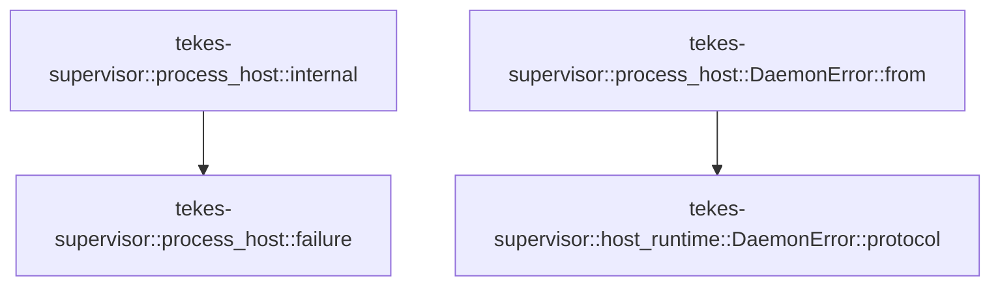

```mermaid
flowchart TD
  n0["endpoint::service::NativeEndpoint::open"]
  n1["endpoint::types::validate_session_id"]
  n2["engine::admission::AdmissionPool::new"]
  n3["profile::config::ConfigRepository::open"]
  n4["profile::instruction::InstructionResolver::new_scoped"]
  n5["provider::secret_store::MemorySecretStore::new"]
  n6["schedule::ScheduleAuthority::open"]
  n7["tekes-supervisor::dynamic_bindings::resolve_worker_launch_bindings"]
  n8["tekes-supervisor::host_runtime::DaemonError::invalid_config"]
  n9["tekes-supervisor::host_runtime::DaemonError::corrupt"]
  n10["tekes-supervisor::host_runtime::DaemonError::required_broker"]
  n11["tekes-supervisor::mcp_runtime::McpRuntime::open_production_authorities_with_mutation"]
  n12["tekes-supervisor::process_host::ProductionProcessHost::plugin_store"]
  n13["tekes-supervisor::process_host::ProductionProcessHost::client_file_changes"]
  n14["tekes-supervisor::process_host::ProductionProcessHost::client_file_page"]
  n15["tekes-supervisor::process_host::ProductionProcessHost::user_agent_dir"]
  n16["tekes-supervisor::process_host::ProductionProcessHost::client_session_roots"]
  n17["tekes-supervisor::process_host::mcp_failure_is_required"]
  n18["tekes-supervisor::process_host::terminate_worker"]
  n19["tekes-supervisor::process_host::WorkerHandshakeGuard::child_mut"]
  n20["tekes-supervisor::process_host::WorkerHandshakeGuard::take_credential_broker"]
  n21["tekes-supervisor::process_host::scoped_client_file_path"]
  n22["tekes-supervisor::process_host::WorkerHandshakeGuard::wait_for_exit"]
  n23["tekes-supervisor::process_host::session_workspace_binding"]
  n24["tekes-supervisor::process_host::WorkerHandshakeGuard::drop"]
  n25["tekes-supervisor::process_host::validate_worker_binary"]
  n26["tekes-supervisor::process_host::reconcile_credential_bindings"]
  n27["tekes-supervisor::process_host::credential_control"]
  n28["tekes-supervisor::process_host::active_material"]
  n29["tekes-supervisor::process_host::retain_prior_for_unknown_credentials"]
  n30["tekes-supervisor::process_host::ProductionProcessHost::open"]
  n31["tekes-supervisor::process_host::ProductionProcessHost::open_with_secret_store"]
  n32["tekes-supervisor::process_host::ProductionProcessHost::open_with_secret_authorities"]
  n33["tekes-supervisor::process_host::ProductionProcessHost::mcp_runtime"]
  n34["tekes-supervisor::process_host::ProductionProcessHost::credential_is_ready"]
  n35["tekes-supervisor::process_host::ProductionProcessHost::validate_workspace_policy_candidate"]
  n36["tekes-supervisor::process_host::ProductionProcessHost::workspace_policy_published"]
  n37["tekes-supervisor::process_host::ProductionProcessHost::workspace_policy_recovered"]
  n38["tools::builtin::BuiltinManifest::compiled"]
  n39["workspace-service::file_text_page"]
  n40["workspace-service::file_byte_page"]
  n13 --> n1
  n13 --> n8
  n13 --> n23
  n14 --> n1
  n14 --> n8
  n14 --> n21
  n14 --> n23
  n14 --> n39
  n14 --> n40
  n16 --> n1
  n16 --> n8
  n16 --> n23
  n22 --> n19
  n26 --> n10
  n26 --> n27
  n26 --> n28
  n27 --> n10
  n30 --> n5
  n30 --> n31
  n31 --> n32
  n32 --> n0
  n32 --> n2
  n32 --> n3
  n32 --> n6
  n32 --> n8
  n32 --> n9
  n32 --> n10
  n32 --> n11
  n32 --> n25
  n35 --> n4
  n35 --> n7
  n35 --> n8
  n35 --> n10
  n35 --> n17
  n35 --> n38
  n36 --> n8
  n36 --> n18
  n37 --> n18
```

```mermaid
flowchart TD
  n0["endpoint::management::ManagementStore::open_at"]
  n1["engine::lifecycle::classify"]
  n2["profile::instruction::InstructionResolver::new_scoped"]
  n3["profile::resources::ResourceCatalog::from_snapshot"]
  n4["provider::secret_store::resolve_config_credentials"]
  n5["store::tail::scan_valid_prefix"]
  n6["tekes-supervisor::dynamic_bindings::resolve_worker_launch_bindings"]
  n7["tekes-supervisor::host_runtime::DaemonError::protocol"]
  n8["tekes-supervisor::host_runtime::DaemonError::invalid_config"]
  n9["tekes-supervisor::host_runtime::DaemonError::corrupt"]
  n10["tekes-supervisor::host_runtime::DaemonError::required_broker"]
  n11["tekes-supervisor::process_host::ProductionProcessHost::client_resource_catalog"]
  n12["tekes-supervisor::process_host::ProductionProcessHost::client_tool_catalog"]
  n13["tekes-supervisor::process_host::ProductionProcessHost::schedule_authority"]
  n14["tekes-supervisor::process_host::ProductionProcessHost::start_schedule_timer"]
  n15["tekes-supervisor::process_host::ProductionProcessHost::schedule_failure"]
  n16["tekes-supervisor::process_host::ProductionProcessHost::schedule_has_work"]
  n17["tekes-supervisor::process_host::ProductionProcessHost::drive_schedule"]
  n18["tekes-supervisor::process_host::ProductionProcessHost::execute_schedule_claim"]
  n19["tekes-supervisor::process_host::ProductionProcessHost::reconcile_schedule_statuses"]
  n20["tekes-supervisor::process_host::ProductionProcessHost::attach_streams"]
  n21["tekes-supervisor::process_host::ProductionProcessHost::publish_session_status"]
  n22["tekes-supervisor::process_host::ProductionProcessHost::start_periodic_sweep"]
  n23["tekes-supervisor::process_host::ProductionProcessHost::refresh_live_credentials"]
  n24["tekes-supervisor::process_host::ProductionProcessHost::config_mutation_succeeded"]
  n25["tekes-supervisor::process_host::ProductionProcessHost::refresh_worker_credentials"]
  n26["tekes-supervisor::process_host::ProductionProcessHost::boot_sweep"]
  n27["tekes-supervisor::process_host::ProductionProcessHost::defer_existing_session_recovery"]
  n28["tekes-supervisor::process_host::ProductionProcessHost::recover_client_sessions"]
  n29["tekes-supervisor::process_host::ProductionProcessHost::repair_main_projection"]
  n30["tekes-supervisor::process_host::ProductionProcessHost::periodic_sweep_once"]
  n31["tekes-supervisor::process_host::ProductionProcessHost::sweep_once"]
  n32["tekes-supervisor::process_host::ProductionProcessHost::live_worker"]
  n33["tekes-supervisor::process_host::ProductionProcessHost::publish_appended"]
  n34["tekes-supervisor::process_host::web_search_scope_ready"]
  n35["tekes-supervisor::process_host::mcp_failure_is_required"]
  n36["tekes-supervisor::process_host::terminate_worker"]
  n37["tekes-supervisor::process_host::session_workspace_binding"]
  n38["tekes-supervisor::process_host::probe_line_lock"]
  n39["tekes-supervisor::process_host::reconcile_credential_bindings"]
  n40["tekes-supervisor::process_host::retain_prior_for_unknown_credentials"]
  n11 --> n2
  n11 --> n3
  n11 --> n8
  n11 --> n37
  n12 --> n2
  n12 --> n6
  n12 --> n8
  n12 --> n10
  n12 --> n35
  n12 --> n37
  n14 --> n16
  n14 --> n17
  n16 --> n9
  n17 --> n9
  n17 --> n18
  n17 --> n19
  n18 --> n0
  n18 --> n7
  n18 --> n9
  n19 --> n1
  n19 --> n5
  n19 --> n9
  n19 --> n32
  n19 --> n38
  n23 --> n25
  n24 --> n23
  n25 --> n4
  n25 --> n10
  n25 --> n34
  n25 --> n36
  n25 --> n39
  n25 --> n40
  n26 --> n31
  n28 --> n8
  n28 --> n26
  n29 --> n33
  n30 --> n31
```

```mermaid
flowchart TD
  n0["engine::lifecycle::ensure_action_at"]
  n1["engine::lifecycle::classify"]
  n2["session-controls::bound_goal_id"]
  n3["store::platform::NamedLock::shared"]
  n4["store::tail::scan_valid_prefix"]
  n5["tekes-supervisor::dynamic_bindings::resolve_worker_launch_bindings"]
  n6["tekes-supervisor::host_runtime::system_timestamp"]
  n7["tekes-supervisor::host_runtime::DaemonError::protocol"]
  n8["tekes-supervisor::host_runtime::DaemonError::io"]
  n9["tekes-supervisor::host_runtime::DaemonError::invalid_config"]
  n10["tekes-supervisor::host_runtime::DaemonError::corrupt"]
  n11["tekes-supervisor::host_runtime::DaemonError::required_broker"]
  n12["tekes-supervisor::launch_profiled_worker_with_secret_store_and_binding_resolver"]
  n13["tekes-supervisor::process_host::production_sandbox_backend"]
  n14["tekes-supervisor::process_host::ProductionProcessHost::publish_session_status"]
  n15["tekes-supervisor::process_host::ProductionProcessHost::refresh_worker_credentials"]
  n16["tekes-supervisor::process_host::ProductionProcessHost::repair_main_projection"]
  n17["tekes-supervisor::process_host::now_rfc3339"]
  n18["tekes-supervisor::process_host::ProductionProcessHost::is_draining"]
  n19["tekes-supervisor::process_host::ProductionProcessHost::sweep_ledger_scan"]
  n20["tekes-supervisor::process_host::ProductionProcessHost::sweep_once"]
  n21["tekes-supervisor::process_host::ProductionProcessHost::propagate_durable_stops_before_sweep"]
  n22["tekes-supervisor::process_host::ProductionProcessHost::shutdown"]
  n23["tekes-supervisor::process_host::ProductionProcessHost::ensure_running"]
  n24["tekes-supervisor::process_host::ProductionProcessHost::live_worker"]
  n25["tekes-supervisor::process_host::ProductionProcessHost::spawn_worker_at"]
  n26["tekes-supervisor::process_host::ProductionProcessHost::spawn_worker_at_with_handshake_timeout"]
  n27["tekes-supervisor::process_host::ProductionProcessHost::workspace_service_binary"]
  n28["tekes-supervisor::process_host::ProductionProcessHost::worker_binary_digest"]
  n29["tekes-supervisor::process_host::ProductionProcessHost::refresh_limits"]
  n30["tekes-supervisor::process_host::ProductionProcessHost::preflight_mandatory_authorities"]
  n31["tekes-supervisor::process_host::ProductionProcessHost::is_mcp_only_app_sandbox_host"]
  n32["tekes-supervisor::process_host::ProductionProcessHost::freeze_tool_authority"]
  n33["tekes-supervisor::process_host::ProductionProcessHost::schedule_main"]
  n34["tekes-supervisor::process_host::ProductionProcessHost::schedule_line"]
  n35["tekes-supervisor::process_host::ProductionProcessHost::schedule_worker_at"]
  n36["tekes-supervisor::process_host::ProductionProcessHost::schedule_worker_at_with_startup"]
  n37["tekes-supervisor::process_host::ProductionProcessHost::schedule_child_from_parent"]
  n38["tekes-supervisor::process_host::ProductionProcessHost::wait_for_worker"]
  n39["tekes-supervisor::process_host::ProductionProcessHost::has_worker_capacity"]
  n40["tekes-supervisor::process_host::ProductionProcessHost::cascade_stop_from"]
  n41["tekes-supervisor::process_host::ProductionProcessHost::reset_restart_backoff"]
  n42["tekes-supervisor::process_host::ProductionProcessHost::restart_is_due"]
  n43["tekes-supervisor::process_host::ProductionProcessHost::note_restart_failure"]
  n44["tekes-supervisor::process_host::ProductionProcessHost::record_session_notice"]
  n45["tekes-supervisor::process_host::mcp_launch_notices"]
  n46["tekes-supervisor::process_host::frozen_tool_launch_policy"]
  n47["tekes-supervisor::process_host::validator_tool_launch_policy"]
  n48["tekes-supervisor::process_host::mcp_failure_is_required"]
  n49["tekes-supervisor::process_host::child_dependency_admitted"]
  n50["tekes-supervisor::process_host::worker_reader"]
  n51["tekes-supervisor::process_host::worker_stderr_reader"]
  n52["tekes-supervisor::process_host::unresolved_parent_dependency"]
  n53["tekes-supervisor::process_host::line_schedule_target"]
  n54["tekes-supervisor::process_host::workspace_quiescence_lock_path"]
  n55["tekes-supervisor::process_host::workspace_id"]
  n56["tekes-supervisor::process_host::session_workspace_binding"]
  n57["tekes-supervisor::process_host::goal_continuation_due"]
  n58["tekes-supervisor::process_host::probe_line_lock"]
  n59["tekes-supervisor::process_host::read_worker_hello"]
  n60["tekes-supervisor::process_host::SweepLedgerIdentity::of"]
  n61["tools::runtime_backends::HelperJobLauncher::new"]
  n62["tools::runtime_backends::HelperJobLauncher::disabled"]
  n63["tools::sandbox::probe_backend"]
  n64["worker-control::durable::encode_queue_transaction"]
  n65["worker-control::negotiate"]
  n66["worker-control::encode_line"]
  n19 --> n4
  n19 --> n7
  n19 --> n10
  n19 --> n60
  n20 --> n0
  n20 --> n1
  n20 --> n16
  n20 --> n17
  n20 --> n19
  n20 --> n21
  n20 --> n29
  n20 --> n35
  n20 --> n42
  n20 --> n43
  n20 --> n57
  n20 --> n58
  n21 --> n19
  n21 --> n40
  n23 --> n29
  n23 --> n35
  n23 --> n38
  n23 --> n41
  n25 --> n26
  n26 --> n2
  n26 --> n3
  n26 --> n5
  n26 --> n6
  n26 --> n7
  n26 --> n9
  n26 --> n11
  n26 --> n12
  n26 --> n28
  n26 --> n32
  n26 --> n44
  n26 --> n45
  n26 --> n47
  n26 --> n48
  n26 --> n50
  n26 --> n51
  n26 --> n54
  n26 --> n56
  n26 --> n59
  n26 --> n64
  n26 --> n65
  n26 --> n66
  n29 --> n9
  n29 --> n55
  n30 --> n11
  n30 --> n13
  n30 --> n31
  n30 --> n61
  n30 --> n62
  n30 --> n63
  n31 --> n8
  n31 --> n11
  n32 --> n11
  n32 --> n13
  n32 --> n31
  n32 --> n46
  n32 --> n61
  n32 --> n62
  n32 --> n63
  n33 --> n35
  n34 --> n35
  n34 --> n37
  n34 --> n52
  n34 --> n53
  n35 --> n36
  n36 --> n7
  n36 --> n14
  n36 --> n15
  n36 --> n25
  n36 --> n29
  n36 --> n39
  n37 --> n14
  n37 --> n15
  n37 --> n25
  n37 --> n29
  n37 --> n39
  n37 --> n49
```

```mermaid
flowchart TD
  n0["engine::compaction_summary::admit_summary_artifact"]
  n1["engine::compaction_summary::summary_request_bytes"]
  n2["engine::compaction_summary::CompactionSummary::from_outcome"]
  n3["engine::compaction_summary::freeze_source_bundle"]
  n4["engine::context::plan_context_compaction"]
  n5["provider::compaction_summary::prepare_summary_request"]
  n6["provider::compaction_summary::summary_completion_artifact"]
  n7["provider::http::HttpRuntime::new"]
  n8["schema::event::Event::from_value"]
  n9["schema::ijson::IJsonValue::parse"]
  n10["store::tail::scan_valid_prefix"]
  n11["tekes-supervisor::host_runtime::DaemonError::protocol"]
  n12["tekes-supervisor::host_runtime::DaemonError::corrupt"]
  n13["tekes-supervisor::host_runtime::DaemonError::required_broker"]
  n14["tekes-supervisor::process_host::ProductionProcessHost::publish_session_status"]
  n15["tekes-supervisor::process_host::spill_compaction_summary"]
  n16["tekes-supervisor::process_host::deterministic_automatic_thread_title"]
  n17["tekes-supervisor::process_host::ProductionProcessHost::spawn_worker_at"]
  n18["tekes-supervisor::process_host::normalized_automatic_thread_title"]
  n19["tekes-supervisor::process_host::prompt_text"]
  n20["tekes-supervisor::process_host::ProductionProcessHost::schedule_main"]
  n21["tekes-supervisor::process_host::automatic_title_origin"]
  n22["tekes-supervisor::process_host::automatic_title_route"]
  n23["tekes-supervisor::process_host::ProductionProcessHost::wait_for_worker"]
  n24["tekes-supervisor::process_host::ProductionProcessHost::start_pending_workers"]
  n25["tekes-supervisor::process_host::ProductionProcessHost::has_worker_capacity"]
  n26["tekes-supervisor::process_host::ProductionProcessHost::request_provider_lease"]
  n27["tekes-supervisor::process_host::ProductionProcessHost::locked_prompt"]
  n28["tekes-supervisor::process_host::ProductionProcessHost::locked_compact"]
  n29["tekes-supervisor::process_host::ProductionProcessHost::first_root_input"]
  n30["tekes-supervisor::process_host::ProductionProcessHost::seed_automatic_title"]
  n31["tekes-supervisor::process_host::ProductionProcessHost::try_seed_automatic_title"]
  n32["tekes-supervisor::process_host::ProductionProcessHost::wait_and_seed_automatic_title"]
  n33["tekes-supervisor::process_host::ProductionProcessHost::spawn_automatic_title_refinement"]
  n34["tekes-supervisor::process_host::ProductionProcessHost::spawn_automatic_title_seed_and_refinement"]
  n35["tekes-supervisor::process_host::session_model_route"]
  n36["tekes-supervisor::process_host::ProductionProcessHost::refine_automatic_title"]
  n37["tekes-supervisor::process_host::ProductionProcessHost::complete_automatic_text"]
  n38["tekes-supervisor::process_host::ProductionProcessHost::complete_automatic_terminal"]
  n39["tekes-supervisor::process_host::ProductionProcessHost::summary_for_manual_compaction"]
  n40["tekes-supervisor::process_host::ProductionProcessHost::generate_automatic_title"]
  n41["tekes-supervisor::process_host::ProductionProcessHost::handle_tool_control"]
  n42["tekes-supervisor::process_host::ProductionProcessHost::handle_tool_continuation"]
  n43["tekes-supervisor::process_host::ProductionProcessHost::validate_child_proof"]
  n44["tekes-supervisor::process_host::ProductionProcessHost::publish_appended"]
  n45["tekes-supervisor::process_host::prepare_automatic_title_request"]
  n46["tekes-supervisor::process_host::ProductionProcessHost::reset_restart_backoff"]
  n47["tekes-supervisor::process_host::ProductionProcessHost::record_spawn_failure"]
  n48["tekes-supervisor::process_host::ledger_needs_worker"]
  n49["tekes-supervisor::process_host::internal"]
  n50["tekes-supervisor::production_tool_control::JobBrokerSupervisorAuthority::new"]
  n51["tekes-supervisor::production_tool_control::ProductionToolControlHandler::new"]
  n52["tekes-supervisor::production_tool_control::ProductionToolControlPolicy::new"]
  n53["tekes-supervisor::tool_control::ToolControlSession::new"]
  n54["tools::schema_registry::fixed_schema"]
  n55["worker-control::continuation::decode_tool_continuation"]
  n56["worker-control::continuation::encode_tool_continuation_result"]
  n23 --> n13
  n24 --> n14
  n24 --> n17
  n24 --> n25
  n24 --> n48
  n27 --> n9
  n27 --> n19
  n27 --> n20
  n27 --> n29
  n27 --> n30
  n27 --> n33
  n27 --> n46
  n27 --> n47
  n28 --> n4
  n28 --> n8
  n28 --> n9
  n28 --> n15
  n28 --> n39
  n28 --> n44
  n28 --> n49
  n29 --> n10
  n30 --> n31
  n31 --> n16
  n31 --> n21
  n31 --> n44
  n32 --> n31
  n36 --> n21
  n36 --> n40
  n36 --> n44
  n37 --> n38
  n38 --> n7
  n39 --> n0
  n39 --> n1
  n39 --> n2
  n39 --> n3
  n39 --> n4
  n39 --> n5
  n39 --> n6
  n39 --> n9
  n39 --> n10
  n39 --> n35
  n39 --> n38
  n39 --> n54
  n40 --> n18
  n40 --> n22
  n40 --> n37
  n40 --> n45
  n41 --> n11
  n41 --> n13
  n41 --> n50
  n41 --> n51
  n41 --> n52
  n41 --> n53
  n42 --> n11
  n42 --> n13
  n42 --> n50
  n42 --> n51
  n42 --> n52
  n42 --> n55
  n42 --> n56
  n43 --> n10
  n43 --> n12
```

```mermaid
flowchart TD
  n0["endpoint::journal::EndpointJournal::open"]
  n1["engine::lifecycle::ensure_action_at"]
  n2["engine::lifecycle::classify"]
  n3["mcp::projection::project_name"]
  n4["provider::request::endpoint_origin"]
  n5["schema::event::Event::from_value"]
  n6["schema::ijson::IJsonValue::parse"]
  n7["store::tail::LockedLedger::open"]
  n8["store::tail::scan_valid_prefix"]
  n9["tekes-supervisor::host_runtime::system_timestamp"]
  n10["tekes-supervisor::host_runtime::DaemonError::protocol"]
  n11["tekes-supervisor::host_runtime::DaemonError::invalid_config"]
  n12["tekes-supervisor::host_runtime::DaemonError::corrupt"]
  n13["tekes-supervisor::host_runtime::DaemonError::required_broker"]
  n14["tekes-supervisor::process_host::now_rfc3339"]
  n15["tekes-supervisor::process_host::session_event_time_now"]
  n16["tekes-supervisor::process_host::ProductionProcessHost::refresh_limits"]
  n17["tekes-supervisor::process_host::ProductionProcessHost::schedule_worker_at"]
  n18["tekes-supervisor::process_host::ProductionProcessHost::schedule_child_from_parent"]
  n19["tekes-supervisor::process_host::ProductionProcessHost::publish_appended"]
  n20["tekes-supervisor::process_host::ProductionProcessHost::publish_frame"]
  n21["tekes-supervisor::process_host::ProductionProcessHost::launch_child"]
  n22["tekes-supervisor::process_host::ProductionProcessHost::propagate_parent_stop"]
  n23["tekes-supervisor::process_host::ProductionProcessHost::cascade_stop_from"]
  n24["tekes-supervisor::process_host::ProductionProcessHost::reconcile_after_exit"]
  n25["tekes-supervisor::process_host::ProductionProcessHost::reset_restart_backoff"]
  n26["tekes-supervisor::process_host::ProductionProcessHost::restart_is_due"]
  n27["tekes-supervisor::process_host::ProductionProcessHost::note_restart_failure"]
  n28["tekes-supervisor::process_host::ProductionProcessHost::record_spawn_failure"]
  n29["tekes-supervisor::process_host::ProductionProcessHost::record_session_notice"]
  n30["tekes-supervisor::process_host::mcp_launch_notices"]
  n31["tekes-supervisor::process_host::frozen_tool_launch_policy"]
  n32["tekes-supervisor::process_host::validator_tool_launch_policy"]
  n33["tekes-supervisor::process_host::private_validator_launch_policy"]
  n34["tekes-supervisor::process_host::web_search_scope_ready"]
  n35["tekes-supervisor::process_host::mcp_failure_is_required"]
  n36["tekes-supervisor::process_host::child_dependency_admitted"]
  n37["tekes-supervisor::process_host::WorkerHandle::write"]
  n38["tekes-supervisor::process_host::WorkerHandle::receipt"]
  n39["tekes-supervisor::process_host::terminate_worker"]
  n40["tekes-supervisor::process_host::line_schedule_target"]
  n41["tekes-supervisor::process_host::goal_continuation_due"]
  n42["tekes-supervisor::process_host::probe_line_lock"]
  n43["tekes-supervisor::process_host::internal"]
  n44["tools::runtime_backends::JobLaunchPolicy::new"]
  n45["worker-control::encode_line"]
  n19 --> n0
  n19 --> n8
  n19 --> n12
  n20 --> n0
  n20 --> n8
  n20 --> n12
  n20 --> n15
  n21 --> n1
  n21 --> n2
  n21 --> n8
  n21 --> n10
  n21 --> n12
  n21 --> n14
  n21 --> n18
  n21 --> n22
  n21 --> n42
  n22 --> n5
  n22 --> n6
  n22 --> n7
  n22 --> n8
  n22 --> n10
  n22 --> n12
  n22 --> n45
  n23 --> n8
  n23 --> n12
  n23 --> n18
  n23 --> n22
  n23 --> n23
  n23 --> n39
  n23 --> n40
  n24 --> n1
  n24 --> n2
  n24 --> n8
  n24 --> n12
  n24 --> n14
  n24 --> n16
  n24 --> n17
  n24 --> n19
  n24 --> n25
  n24 --> n26
  n24 --> n27
  n24 --> n41
  n24 --> n42
  n28 --> n29
  n29 --> n9
  n29 --> n19
  n31 --> n11
  n31 --> n13
  n31 --> n44
  n32 --> n8
  n32 --> n10
  n32 --> n12
  n32 --> n13
  n32 --> n33
  n33 --> n13
  n33 --> n44
  n34 --> n4
  n35 --> n3
  n38 --> n43
```

```mermaid
flowchart TD
  n0["engine::lifecycle::ensure_action_at"]
  n1["engine::lifecycle::classify"]
  n2["schema::ijson::IJsonValue::parse"]
  n3["schema::ijson::IJsonValue::parse_str"]
  n4["session-controls::read_goal"]
  n5["store::tail::scan_valid_prefix"]
  n6["tekes-supervisor::endpoint_host::ProductionRouteFailure::new"]
  n7["tekes-supervisor::host_runtime::system_timestamp"]
  n8["tekes-supervisor::host_runtime::DaemonError::protocol"]
  n9["tekes-supervisor::host_runtime::DaemonError::io"]
  n10["tekes-supervisor::host_runtime::DaemonError::invalid_install"]
  n11["tekes-supervisor::host_runtime::DaemonError::invalid_install_reason"]
  n12["tekes-supervisor::host_runtime::DaemonError::invalid_config"]
  n13["tekes-supervisor::host_runtime::DaemonError::corrupt"]
  n14["tekes-supervisor::process_host::now_rfc3339"]
  n15["tekes-supervisor::process_host::ProcessToolRuntime::ensure_running"]
  n16["tekes-supervisor::process_host::ProcessToolRuntime::deliver_input"]
  n17["tekes-supervisor::process_host::ProcessToolRuntime::interrupt"]
  n18["tekes-supervisor::process_host::ProcessToolRuntime::ensure_child"]
  n19["tekes-supervisor::process_host::ProcessToolRuntime::deliver_report"]
  n20["tekes-supervisor::process_host::unresolved_parent_dependency"]
  n21["tekes-supervisor::process_host::line_schedule_target"]
  n22["tekes-supervisor::process_host::operation_unavailable"]
  n23["tekes-supervisor::process_host::operation_value"]
  n24["tekes-supervisor::process_host::workspace_quiescence_lock_path"]
  n25["tekes-supervisor::process_host::workspace_id"]
  n26["tekes-supervisor::process_host::scoped_client_file_path"]
  n27["tekes-supervisor::process_host::session_workspace_binding"]
  n28["tekes-supervisor::process_host::ledger_needs_worker"]
  n29["tekes-supervisor::process_host::goal_continuation_due"]
  n30["tekes-supervisor::process_host::probe_line_lock"]
  n31["tekes-supervisor::process_host::read_worker_hello"]
  n32["tekes-supervisor::process_host::next_stop_generation"]
  n33["tekes-supervisor::process_host::validate_worker_binary"]
  n34["tekes-supervisor::process_host::failure"]
  n35["tekes-supervisor::process_host::internal"]
  n36["worker-control::decode_hello"]
  n15 --> n23
  n16 --> n7
  n16 --> n23
  n17 --> n7
  n17 --> n23
  n18 --> n23
  n19 --> n23
  n20 --> n5
  n20 --> n13
  n20 --> n21
  n21 --> n13
  n23 --> n2
  n25 --> n27
  n26 --> n12
  n27 --> n5
  n27 --> n13
  n28 --> n0
  n28 --> n1
  n28 --> n5
  n28 --> n13
  n28 --> n14
  n28 --> n29
  n28 --> n30
  n29 --> n4
  n29 --> n5
  n29 --> n12
  n29 --> n13
  n30 --> n9
  n30 --> n13
  n31 --> n8
  n31 --> n9
  n31 --> n36
  n32 --> n5
  n32 --> n35
  n33 --> n10
  n33 --> n11
  n34 --> n3
  n34 --> n6
```

# tekes-supervisor::process_host

[Package atlas](index.md) · [Source](../../src/process_host.rs)

## Declarations

Visibility is the declaration spelling; trait members and reexports require their enclosing interface. `cfg` is not evaluated.

| Symbol | Kind | Visibility | Test / cfg |
|---|---|---|---|
| [tekes-supervisor::process_host::DELIVERY_TIMEOUT](../../src/process_host.rs#L61) | const_item | `private` |  |
| [tekes-supervisor::process_host::MCP_ONLY_APP_SANDBOX_MARKER](../../src/process_host.rs#L62) | const_item | `private` |  |
| [tekes-supervisor::process_host::WORKER_HANDSHAKE_TIMEOUT](../../src/process_host.rs#L63) | const_item | `private` |  |
| [tekes-supervisor::process_host::WORKER_HELLO_MAX_BYTES](../../src/process_host.rs#L64) | const_item | `private` |  |
| [tekes-supervisor::process_host::PERIODIC_SWEEP_INTERVAL](../../src/process_host.rs#L65) | const_item | `private` |  |
| [tekes-supervisor::process_host::SweepLedgerIdentity](../../src/process_host.rs#L70) | struct_item | `private` |  |
| [tekes-supervisor::process_host::SweepLedgerIdentity::of](../../src/process_host.rs#L77) | function_item | `private` |  |
| [tekes-supervisor::process_host::SweepLedgerScan](../../src/process_host.rs#L90) | struct_item | `private` |  |
| [tekes-supervisor::process_host::AUTOMATIC_THREAD_TITLE_MODEL_HINT](../../src/process_host.rs#L104) | const_item | `private` |  |
| [tekes-supervisor::process_host::AUTOMATIC_THREAD_TITLE_MAX_CHARS](../../src/process_host.rs#L105) | const_item | `private` |  |
| [tekes-supervisor::process_host::AUTOMATIC_THREAD_TITLE_TIMEOUT](../../src/process_host.rs#L106) | const_item | `private` |  |
| [tekes-supervisor::process_host::AUTOMATIC_THREAD_TITLE_MAX_OUTPUT_TOKENS](../../src/process_host.rs#L110) | const_item | `private` |  |
| [tekes-supervisor::process_host::COMPACTION_SUMMARY_TIMEOUT](../../src/process_host.rs#L111) | const_item | `private` |  |
| [tekes-supervisor::process_host::AUTOMATIC_THREAD_TITLE_SYSTEM](../../src/process_host.rs#L112) | const_item | `private` |  |
| [tekes-supervisor::process_host::LineLockState](../../src/process_host.rs#L115) | enum_item | `private` |  |
| [tekes-supervisor::process_host::production_sandbox_backend](../../src/process_host.rs#L120) | function_item | `private` |  |
| [tekes-supervisor::process_host::seq_ranges](../../src/process_host.rs#L131) | function_item | `private` |  |
| [tekes-supervisor::process_host::spill_compaction_summary](../../src/process_host.rs#L150) | function_item | `private` |  |
| [tekes-supervisor::process_host::now_rfc3339](../../src/process_host.rs#L167) | function_item | `private` |  |
| [tekes-supervisor::process_host::session_event_time_now](../../src/process_host.rs#L171) | function_item | `private` |  |
| [tekes-supervisor::process_host::session_event_time](../../src/process_host.rs#L175) | function_item | `private` |  |
| [tekes-supervisor::process_host::compact_title_source](../../src/process_host.rs#L185) | function_item | `private` |  |
| [tekes-supervisor::process_host::bounded_title](../../src/process_host.rs#L189) | function_item | `private` |  |
| [tekes-supervisor::process_host::deterministic_automatic_thread_title](../../src/process_host.rs#L196) | function_item | `private` |  |
| [tekes-supervisor::process_host::normalized_automatic_thread_title](../../src/process_host.rs#L200) | function_item | `private` |  |
| [tekes-supervisor::process_host::prompt_text](../../src/process_host.rs#L225) | function_item | `private` |  |
| [tekes-supervisor::process_host::automatic_title_origin](../../src/process_host.rs#L236) | function_item | `private` |  |
| [tekes-supervisor::process_host::automatic_title_route](../../src/process_host.rs#L246) | function_item | `private` |  |
| [tekes-supervisor::process_host::session_model_route](../../src/process_host.rs#L285) | function_item | `private` |  |
| [tekes-supervisor::process_host::prepare_automatic_title_request](../../src/process_host.rs#L333) | function_item | `private` |  |
| [tekes-supervisor::process_host::prepare_automatic_text_request](../../src/process_host.rs#L350) | function_item | `private` |  |
| [tekes-supervisor::process_host::accepted_stream_event](../../src/process_host.rs#L401) | function_item | `private` | test; #[cfg(test)] |
| [tekes-supervisor::process_host::ProcessToolRuntime](../../src/process_host.rs#L416) | struct_item | `private` |  |
| [tekes-supervisor::process_host::ProductionProcessHost](../../src/process_host.rs#L420) | struct_item | `pub` |  |
| [tekes-supervisor::process_host::SessionProjectionCache](../../src/process_host.rs#L460) | struct_item | `private` |  |
| [tekes-supervisor::process_host::WorkerHandle](../../src/process_host.rs#L466) | struct_item | `private` |  |
| [tekes-supervisor::process_host::WorkerHandshakeGuard](../../src/process_host.rs#L487) | struct_item | `private` |  |
| [tekes-supervisor::process_host::WorkerHandshakeGuard::child_mut](../../src/process_host.rs#L494) | function_item | `private` |  |
| [tekes-supervisor::process_host::WorkerHandshakeGuard::take_child](../../src/process_host.rs#L498) | function_item | `private` |  |
| [tekes-supervisor::process_host::WorkerHandshakeGuard::take_credential_control](../../src/process_host.rs#L502) | function_item | `private` |  |
| [tekes-supervisor::process_host::WorkerHandshakeGuard::take_credential_broker](../../src/process_host.rs#L506) | function_item | `private` |  |
| [tekes-supervisor::process_host::WorkerHandshakeGuard::wait_for_exit](../../src/process_host.rs#L510) | function_item | `private` |  |
| [tekes-supervisor::process_host::WorkerHandshakeGuard::drop](../../src/process_host.rs#L523) | function_item | `private` |  |
| [tekes-supervisor::process_host::PendingWorker](../../src/process_host.rs#L536) | struct_item | `private` |  |
| [tekes-supervisor::process_host::WorkerProtocolQuarantine](../../src/process_host.rs#L543) | struct_item | `private` |  |
| [tekes-supervisor::process_host::RestartBackoff](../../src/process_host.rs#L550) | struct_item | `private` |  |
| [tekes-supervisor::process_host::ScheduledWorker](../../src/process_host.rs#L557) | struct_item | `private` |  |
| [tekes-supervisor::process_host::WorkerState](../../src/process_host.rs#L563) | struct_item | `private` |  |
| [tekes-supervisor::process_host::reconcile_credential_bindings](../../src/process_host.rs#L570) | function_item | `private` |  |
| [tekes-supervisor::process_host::credential_control](../../src/process_host.rs#L674) | function_item | `private` |  |
| [tekes-supervisor::process_host::active_material](../../src/process_host.rs#L685) | function_item | `private` |  |
| [tekes-supervisor::process_host::retain_prior_for_unknown_credentials](../../src/process_host.rs#L699) | function_item | `private` |  |
| [tekes-supervisor::process_host::ProductionProcessHost::open](../../src/process_host.rs#L742) | function_item | `pub` |  |
| [tekes-supervisor::process_host::ProductionProcessHost::open_with_secret_store](../../src/process_host.rs#L757) | function_item | `pub` |  |
| [tekes-supervisor::process_host::ProductionProcessHost::open_with_secret_authorities](../../src/process_host.rs#L777) | function_item | `pub` |  |
| [tekes-supervisor::process_host::ProductionProcessHost::mcp_runtime](../../src/process_host.rs#L860) | function_item | `pub` |  |
| [tekes-supervisor::process_host::ProductionProcessHost::credential_is_ready](../../src/process_host.rs#L867) | function_item | `pub` |  |
| [tekes-supervisor::process_host::ProductionProcessHost::validate_workspace_policy_candidate](../../src/process_host.rs#L882) | function_item | `pub` |  |
| [tekes-supervisor::process_host::ProductionProcessHost::workspace_policy_published](../../src/process_host.rs#L956) | function_item | `pub` |  |
| [tekes-supervisor::process_host::ProductionProcessHost::workspace_policy_recovered](../../src/process_host.rs#L985) | function_item | `pub` |  |
| [tekes-supervisor::process_host::ProductionProcessHost::plugin_store](../../src/process_host.rs#L1000) | function_item | `pub(crate)` |  |
| [tekes-supervisor::process_host::ProductionProcessHost::client_file_changes](../../src/process_host.rs#L1006) | function_item | `pub(crate)` |  |
| [tekes-supervisor::process_host::ProductionProcessHost::client_file_page](../../src/process_host.rs#L1044) | function_item | `pub(crate)` |  |
| [tekes-supervisor::process_host::ProductionProcessHost::user_agent_dir](../../src/process_host.rs#L1084) | function_item | `pub` |  |
| [tekes-supervisor::process_host::ProductionProcessHost::client_session_roots](../../src/process_host.rs#L1090) | function_item | `pub` |  |
| [tekes-supervisor::process_host::ProductionProcessHost::client_resource_catalog](../../src/process_host.rs#L1122) | function_item | `pub(crate)` |  |
| [tekes-supervisor::process_host::ProductionProcessHost::client_tool_catalog](../../src/process_host.rs#L1160) | function_item | `pub(crate)` |  |
| [tekes-supervisor::process_host::ProductionProcessHost::schedule_authority](../../src/process_host.rs#L1218) | function_item | `pub` |  |
| [tekes-supervisor::process_host::ProductionProcessHost::start_schedule_timer](../../src/process_host.rs#L1225) | function_item | `pub` |  |
| [tekes-supervisor::process_host::ProductionProcessHost::schedule_failure](../../src/process_host.rs#L1322) | function_item | `pub` |  |
| [tekes-supervisor::process_host::ProductionProcessHost::schedule_has_work](../../src/process_host.rs#L1329) | function_item | `private` |  |
| [tekes-supervisor::process_host::ProductionProcessHost::drive_schedule](../../src/process_host.rs#L1340) | function_item | `private` |  |
| [tekes-supervisor::process_host::ProductionProcessHost::execute_schedule_claim](../../src/process_host.rs#L1354) | function_item | `private` |  |
| [tekes-supervisor::process_host::ProductionProcessHost::reconcile_schedule_statuses](../../src/process_host.rs#L1424) | function_item | `private` |  |
| [tekes-supervisor::process_host::ProductionProcessHost::attach_streams](../../src/process_host.rs#L1496) | function_item | `pub` |  |
| [tekes-supervisor::process_host::ProductionProcessHost::publish_session_status](../../src/process_host.rs#L1507) | function_item | `private` |  |
| [tekes-supervisor::process_host::ProductionProcessHost::start_periodic_sweep](../../src/process_host.rs#L1524) | function_item | `pub` |  |
| [tekes-supervisor::process_host::ProductionProcessHost::refresh_live_credentials](../../src/process_host.rs#L1549) | function_item | `pub` |  |
| [tekes-supervisor::process_host::ProductionProcessHost::config_mutation_succeeded](../../src/process_host.rs#L1567) | function_item | `pub` |  |
| [tekes-supervisor::process_host::ProductionProcessHost::refresh_worker_credentials](../../src/process_host.rs#L1582) | function_item | `private` |  |
| [tekes-supervisor::process_host::ProductionProcessHost::boot_sweep](../../src/process_host.rs#L1618) | function_item | `pub` |  |
| [tekes-supervisor::process_host::ProductionProcessHost::defer_existing_session_recovery](../../src/process_host.rs#L1628) | function_item | `pub` |  |
| [tekes-supervisor::process_host::ProductionProcessHost::recover_client_sessions](../../src/process_host.rs#L1643) | function_item | `pub` |  |
| [tekes-supervisor::process_host::ProductionProcessHost::repair_main_projection](../../src/process_host.rs#L1677) | function_item | `private` |  |
| [tekes-supervisor::process_host::ProductionProcessHost::periodic_sweep_once](../../src/process_host.rs#L1722) | function_item | `pub` |  |
| [tekes-supervisor::process_host::ProductionProcessHost::is_draining](../../src/process_host.rs#L1739) | function_item | `pub` |  |
| [tekes-supervisor::process_host::ProductionProcessHost::sweep_ledger_scan](../../src/process_host.rs#L1749) | function_item | `private` |  |
| [tekes-supervisor::process_host::ProductionProcessHost::sweep_once](../../src/process_host.rs#L1799) | function_item | `private` |  |
| [tekes-supervisor::process_host::ProductionProcessHost::propagate_durable_stops_before_sweep](../../src/process_host.rs#L1897) | function_item | `private` |  |
| [tekes-supervisor::process_host::ProductionProcessHost::shutdown](../../src/process_host.rs#L1932) | function_item | `pub` |  |
| [tekes-supervisor::process_host::ProductionProcessHost::ensure_running](../../src/process_host.rs#L1958) | function_item | `private` |  |
| [tekes-supervisor::process_host::ProductionProcessHost::live_worker](../../src/process_host.rs#L1972) | function_item | `private` |  |
| [tekes-supervisor::process_host::ProductionProcessHost::spawn_worker_at](../../src/process_host.rs#L1982) | function_item | `private` |  |
| [tekes-supervisor::process_host::ProductionProcessHost::spawn_worker_at_with_handshake_timeout](../../src/process_host.rs#L1998) | function_item | `private` |  |
| [tekes-supervisor::process_host::ProductionProcessHost::workspace_service_binary](../../src/process_host.rs#L2218) | function_item | `pub` |  |
| [tekes-supervisor::process_host::ProductionProcessHost::worker_binary_digest](../../src/process_host.rs#L2222) | function_item | `private` |  |
| [tekes-supervisor::process_host::ProductionProcessHost::refresh_limits](../../src/process_host.rs#L2227) | function_item | `private` |  |
| [tekes-supervisor::process_host::ProductionProcessHost::preflight_mandatory_authorities](../../src/process_host.rs#L2247) | function_item | `pub` |  |
| [tekes-supervisor::process_host::ProductionProcessHost::is_mcp_only_app_sandbox_host](../../src/process_host.rs#L2266) | function_item | `private` |  |
| [tekes-supervisor::process_host::ProductionProcessHost::freeze_tool_authority](../../src/process_host.rs#L2286) | function_item | `private` |  |
| [tekes-supervisor::process_host::ProductionProcessHost::schedule_main](../../src/process_host.rs#L2306) | function_item | `private` |  |
| [tekes-supervisor::process_host::ProductionProcessHost::schedule_line](../../src/process_host.rs#L2317) | function_item | `private` |  |
| [tekes-supervisor::process_host::ProductionProcessHost::schedule_worker_at](../../src/process_host.rs#L2333) | function_item | `private` |  |
| [tekes-supervisor::process_host::ProductionProcessHost::schedule_worker_at_with_startup](../../src/process_host.rs#L2344) | function_item | `private` |  |
| [tekes-supervisor::process_host::ProductionProcessHost::schedule_child_from_parent](../../src/process_host.rs#L2426) | function_item | `private` |  |
| [tekes-supervisor::process_host::ProductionProcessHost::wait_for_worker](../../src/process_host.rs#L2474) | function_item | `private` |  |
| [tekes-supervisor::process_host::ProductionProcessHost::start_pending_workers](../../src/process_host.rs#L2502) | function_item | `private` |  |
| [tekes-supervisor::process_host::ProductionProcessHost::has_worker_capacity](../../src/process_host.rs#L2569) | function_item | `private` |  |
| [tekes-supervisor::process_host::ProductionProcessHost::request_provider_lease](../../src/process_host.rs#L2577) | function_item | `private` |  |
| [tekes-supervisor::process_host::ProductionProcessHost::locked_prompt](../../src/process_host.rs#L2616) | function_item | `private` |  |
| [tekes-supervisor::process_host::ProductionProcessHost::locked_compact](../../src/process_host.rs#L2650) | function_item | `private` |  |
| [tekes-supervisor::process_host::ProductionProcessHost::first_root_input](../../src/process_host.rs#L2727) | function_item | `private` |  |
| [tekes-supervisor::process_host::ProductionProcessHost::seed_automatic_title](../../src/process_host.rs#L2759) | function_item | `private` |  |
| [tekes-supervisor::process_host::ProductionProcessHost::try_seed_automatic_title](../../src/process_host.rs#L2771) | function_item | `private` |  |
| [tekes-supervisor::process_host::ProductionProcessHost::wait_and_seed_automatic_title](../../src/process_host.rs#L2799) | function_item | `private` |  |
| [tekes-supervisor::process_host::ProductionProcessHost::spawn_automatic_title_refinement](../../src/process_host.rs#L2824) | function_item | `private` |  |
| [tekes-supervisor::process_host::ProductionProcessHost::spawn_automatic_title_seed_and_refinement](../../src/process_host.rs#L2838) | function_item | `private` |  |
| [tekes-supervisor::process_host::ProductionProcessHost::refine_automatic_title](../../src/process_host.rs#L2862) | function_item | `private` |  |
| [tekes-supervisor::process_host::ProductionProcessHost::complete_automatic_text](../../src/process_host.rs#L2899) | function_item | `private` |  |
| [tekes-supervisor::process_host::ProductionProcessHost::complete_automatic_terminal](../../src/process_host.rs#L2925) | function_item | `private` |  |
| [tekes-supervisor::process_host::ProductionProcessHost::summary_for_manual_compaction](../../src/process_host.rs#L2989) | function_item | `private` |  |
| [tekes-supervisor::process_host::ProductionProcessHost::generate_automatic_title](../../src/process_host.rs#L3060) | function_item | `private` |  |
| [tekes-supervisor::process_host::ProductionProcessHost::handle_tool_control](../../src/process_host.rs#L3085) | function_item | `private` |  |
| [tekes-supervisor::process_host::ProductionProcessHost::handle_tool_continuation](../../src/process_host.rs#L3120) | function_item | `private` |  |
| [tekes-supervisor::process_host::ProductionProcessHost::validate_child_proof](../../src/process_host.rs#L3158) | function_item | `private` |  |
| [tekes-supervisor::process_host::ProductionProcessHost::publish_appended](../../src/process_host.rs#L3180) | function_item | `private` |  |
| [tekes-supervisor::process_host::ProductionProcessHost::publish_frame](../../src/process_host.rs#L3254) | function_item | `private` |  |
| [tekes-supervisor::process_host::ProductionProcessHost::launch_child](../../src/process_host.rs#L3399) | function_item | `private` |  |
| [tekes-supervisor::process_host::ProductionProcessHost::propagate_parent_stop](../../src/process_host.rs#L3486) | function_item | `private` |  |
| [tekes-supervisor::process_host::ProductionProcessHost::cascade_stop_from](../../src/process_host.rs#L3578) | function_item | `private` |  |
| [tekes-supervisor::process_host::ProductionProcessHost::reconcile_after_exit](../../src/process_host.rs#L3664) | function_item | `private` |  |
| [tekes-supervisor::process_host::ProductionProcessHost::reset_restart_backoff](../../src/process_host.rs#L3727) | function_item | `private` |  |
| [tekes-supervisor::process_host::ProductionProcessHost::restart_is_due](../../src/process_host.rs#L3734) | function_item | `private` |  |
| [tekes-supervisor::process_host::ProductionProcessHost::note_restart_failure](../../src/process_host.rs#L3742) | function_item | `private` |  |
| [tekes-supervisor::process_host::ProductionProcessHost::record_spawn_failure](../../src/process_host.rs#L3783) | function_item | `private` |  |
| [tekes-supervisor::process_host::ProductionProcessHost::record_session_notice](../../src/process_host.rs#L3808) | function_item | `private` |  |
| [tekes-supervisor::process_host::mcp_launch_notices](../../src/process_host.rs#L3845) | function_item | `private` |  |
| [tekes-supervisor::process_host::frozen_tool_launch_policy](../../src/process_host.rs#L3873) | function_item | `private` |  |
| [tekes-supervisor::process_host::validator_tool_launch_policy](../../src/process_host.rs#L3898) | function_item | `private` |  |
| [tekes-supervisor::process_host::private_validator_launch_policy](../../src/process_host.rs#L3940) | function_item | `private` |  |
| [tekes-supervisor::process_host::web_search_scope_ready](../../src/process_host.rs#L3968) | function_item | `private` |  |
| [tekes-supervisor::process_host::mcp_failure_is_required](../../src/process_host.rs#L3986) | function_item | `private` |  |
| [tekes-supervisor::process_host::child_dependency_admitted](../../src/process_host.rs#L4000) | function_item | `private` |  |
| [tekes-supervisor::process_host::WorkerHandle::write](../../src/process_host.rs#L4005) | function_item | `private` |  |
| [tekes-supervisor::process_host::WorkerHandle::receipt](../../src/process_host.rs#L4014) | function_item | `private` |  |
| [tekes-supervisor::process_host::WorkerHandle::queue_result](../../src/process_host.rs#L4039) | function_item | `private` |  |
| [tekes-supervisor::process_host::worker_reader](../../src/process_host.rs#L4068) | function_item | `private` |  |
| [tekes-supervisor::process_host::terminate_worker](../../src/process_host.rs#L4335) | function_item | `private` |  |
| [tekes-supervisor::process_host::fail_worker](../../src/process_host.rs#L4362) | function_item | `private` |  |
| [tekes-supervisor::process_host::worker_stderr_reader](../../src/process_host.rs#L4386) | function_item | `private` |  |
| [tekes-supervisor::process_host::worker_stderr_reader::MAX_STDERR_TAIL](../../src/process_host.rs#L4387) | const_item | `private` |  |
| [tekes-supervisor::process_host::preserve_first_failure](../../src/process_host.rs#L4406) | function_item | `private` |  |
| [tekes-supervisor::process_host::ProductionProcessHost::session_metadata_changed](../../src/process_host.rs#L4413) | function_item | `private` |  |
| [tekes-supervisor::process_host::ProductionProcessHost::prompt](../../src/process_host.rs#L4417) | function_item | `private` |  |
| [tekes-supervisor::process_host::ProductionProcessHost::compact](../../src/process_host.rs#L4480) | function_item | `private` |  |
| [tekes-supervisor::process_host::ProductionProcessHost::cancel](../../src/process_host.rs#L4519) | function_item | `private` |  |
| [tekes-supervisor::process_host::ProductionProcessHost::rename](../../src/process_host.rs#L4577) | function_item | `private` |  |
| [tekes-supervisor::process_host::ProductionProcessHost::deliver_if_live](../../src/process_host.rs#L4614) | function_item | `private` |  |
| [tekes-supervisor::process_host::ProductionProcessHost::ensure_after_locked_append](../../src/process_host.rs#L4638) | function_item | `private` |  |
| [tekes-supervisor::process_host::child_exited_within](../../src/process_host.rs#L4649) | function_item | `private` |  |
| [tekes-supervisor::process_host::ProductionProcessHost::live_sessions](../../src/process_host.rs#L4669) | function_item | `private` |  |
| [tekes-supervisor::process_host::ProductionProcessHost::reconcile_projection](../../src/process_host.rs#L4679) | function_item | `private` |  |
| [tekes-supervisor::process_host::ProductionProcessHost::execute](../../src/process_host.rs#L4689) | function_item | `private` |  |
| [tekes-supervisor::process_host::ProductionProcessHost::readiness](../../src/process_host.rs#L4717) | function_item | `private` |  |
| [tekes-supervisor::process_host::ProductionProcessHost::config_mutation_succeeded](../../src/process_host.rs#L4807) | function_item | `private` |  |
| [tekes-supervisor::process_host::ProcessToolRuntime::host](../../src/process_host.rs#L4831) | function_item | `private` |  |
| [tekes-supervisor::process_host::ProcessToolRuntime::ensure_running](../../src/process_host.rs#L4839) | function_item | `private` |  |
| [tekes-supervisor::process_host::ProcessToolRuntime::deliver_input](../../src/process_host.rs#L4850) | function_item | `private` |  |
| [tekes-supervisor::process_host::ProcessToolRuntime::interrupt](../../src/process_host.rs#L4886) | function_item | `private` |  |
| [tekes-supervisor::process_host::ProcessToolRuntime::ensure_child](../../src/process_host.rs#L4910) | function_item | `private` |  |
| [tekes-supervisor::process_host::ProcessToolRuntime::deliver_report](../../src/process_host.rs#L4924) | function_item | `private` |  |
| [tekes-supervisor::process_host::unresolved_parent_dependency](../../src/process_host.rs#L4946) | function_item | `private` |  |
| [tekes-supervisor::process_host::line_schedule_target](../../src/process_host.rs#L5021) | function_item | `private` |  |
| [tekes-supervisor::process_host::operation_unavailable](../../src/process_host.rs#L5057) | function_item | `private` |  |
| [tekes-supervisor::process_host::operation_value](../../src/process_host.rs#L5061) | function_item | `private` |  |
| [tekes-supervisor::process_host::workspace_quiescence_lock_path](../../src/process_host.rs#L5069) | function_item | `pub(crate)` |  |
| [tekes-supervisor::process_host::workspace_id](../../src/process_host.rs#L5074) | function_item | `private` |  |
| [tekes-supervisor::process_host::scoped_client_file_path](../../src/process_host.rs#L5078) | function_item | `private` |  |
| [tekes-supervisor::process_host::session_workspace_binding](../../src/process_host.rs#L5121) | function_item | `private` |  |
| [tekes-supervisor::process_host::ledger_needs_worker](../../src/process_host.rs#L5138) | function_item | `private` |  |
| [tekes-supervisor::process_host::goal_continuation_due](../../src/process_host.rs#L5156) | function_item | `private` |  |
| [tekes-supervisor::process_host::probe_line_lock](../../src/process_host.rs#L5200) | function_item | `private` |  |
| [tekes-supervisor::process_host::read_worker_hello](../../src/process_host.rs#L5234) | function_item | `private` |  |
| [tekes-supervisor::process_host::next_stop_generation](../../src/process_host.rs#L5304) | function_item | `private` |  |
| [tekes-supervisor::process_host::validate_worker_binary](../../src/process_host.rs#L5323) | function_item | `private` |  |
| [tekes-supervisor::process_host::failure](../../src/process_host.rs#L5335) | function_item | `private` |  |
| [tekes-supervisor::process_host::internal](../../src/process_host.rs#L5343) | function_item | `private` |  |
| [tekes-supervisor::process_host::DaemonError::from](../../src/process_host.rs#L5348) | function_item | `private` |  |
| [tekes-supervisor::process_host::tests::client_file_scope_uses_selected_directory_and_rejects_escape](../../src/process_host.rs#L5356) | function_item | `private` | test; #[cfg(test)] |
| [tekes-supervisor::process_host::tests::deepseek_title_provider](../../src/process_host.rs#L5399) | function_item | `private` | test; #[cfg(test)] |
| [tekes-supervisor::process_host::tests::serve_title_once](../../src/process_host.rs#L5422) | function_item | `private` | test; #[cfg(test)] |
| [tekes-supervisor::process_host::tests::serve_title_response](../../src/process_host.rs#L5437) | function_item | `private` | test; #[cfg(test)] |
| [tekes-supervisor::process_host::tests::automatic_title_text_normalization_matches_the_legacy_contract](../../src/process_host.rs#L5491) | function_item | `private` | test; #[cfg(test)] |
| [tekes-supervisor::process_host::tests::automatic_title_route_finds_flash_by_hint_and_falls_back_to_any_deepseek](../../src/process_host.rs#L5514) | function_item | `private` | test; #[cfg(test)] |
| [tekes-supervisor::process_host::tests::automatic_title_route_finds_flash_by_hint_and_falls_back_to_any_deepseek::providers_with](../../src/process_host.rs#L5515) | function_item | `private` | test; #[cfg(test)] |
| [tekes-supervisor::process_host::tests::automatic_title_request_uses_configured_deepseek_adapter_and_pins_flash](../../src/process_host.rs#L5558) | function_item | `private` | test; #[cfg(test)] |
| [tekes-supervisor::process_host::tests::automatic_title_uses_the_provider_runtime_and_normalizes_its_terminal](../../src/process_host.rs#L5594) | function_item | `private` | test; #[cfg(test)] |
| [tekes-supervisor::process_host::tests::automatic_title_rejects_cut_and_failed_responses](../../src/process_host.rs#L5639) | function_item | `private` | test; #[cfg(test)] |
| [tekes-supervisor::process_host::tests::automatic_title_request_fails_closed_without_a_reasoning_off_switch](../../src/process_host.rs#L5693) | function_item | `private` | test; #[cfg(test)] |
| [tekes-supervisor::process_host::tests::locked_manual_compact_covers_settled_history_and_is_keyed_by_origin](../../src/process_host.rs#L5726) | function_item | `private` | test; #[cfg(test)] |
| [tekes-supervisor::process_host::tests::worker_failure_preserves_first_root_cause](../../src/process_host.rs#L5823) | function_item | `private` | test; #[cfg(test)] |
| [tekes-supervisor::process_host::tests::restart_backoff_is_reason_scoped_bounded_and_user_resettable](../../src/process_host.rs#L5833) | function_item | `private` | test; #[cfg(test)] |
| [tekes-supervisor::process_host::tests::unavailable_credential_refresh_retains_last_authoritative_generation](../../src/process_host.rs#L5876) | function_item | `private` | test; #[cfg(test)] |
| [tekes-supervisor::process_host::tests::mcp_launch_notices_name_the_skipped_server_and_its_reason](../../src/process_host.rs#L5914) | function_item | `private` | test; #[cfg(test)] |
| [tekes-supervisor::process_host::tests::unavailable_mcp_server_fails_launch_only_when_policy_names_its_tools](../../src/process_host.rs#L5954) | function_item | `private` | test; #[cfg(test)] |
| [tekes-supervisor::process_host::tests::durable_prompt_receipt_survives_spawn_failure_and_exact_retry_deduplicates](../../src/process_host.rs#L5977) | function_item | `private` | test; #[cfg(test)] #[cfg(target_os = "macos")] |
| [tekes-supervisor::process_host::tests::broken_mcp_registry_degrades_the_launch_and_warns_in_the_session](../../src/process_host.rs#L6062) | function_item | `private` | test; #[cfg(test)] #[cfg(target_os = "macos")] |
| [tekes-supervisor::process_host::tests::session_notices](../../src/process_host.rs#L6129) | function_item | `private` | test; #[cfg(test)] #[cfg(target_os = "macos")] |
| [tekes-supervisor::process_host::tests::late_provider_frame_does_not_reopen_sealed_output](../../src/process_host.rs#L6141) | function_item | `private` | test; #[cfg(test)] #[cfg(target_os = "macos")] |
| [tekes-supervisor::process_host::tests::late_provider_frame_does_not_reopen_sealed_output::SESSION](../../src/process_host.rs#L6142) | const_item | `private` | test; #[cfg(test)] #[cfg(target_os = "macos")] |
| [tekes-supervisor::process_host::tests::eager_tool_records_published_by_doorbell_do_not_drop_later_frames](../../src/process_host.rs#L6185) | function_item | `private` | test; #[cfg(test)] #[cfg(target_os = "macos")] |
| [tekes-supervisor::process_host::tests::eager_tool_records_published_by_doorbell_do_not_drop_later_frames::SESSION](../../src/process_host.rs#L6186) | const_item | `private` | test; #[cfg(test)] #[cfg(target_os = "macos")] |
| [tekes-supervisor::process_host::tests::late_stamped_frame_does_not_reopen_sealed_output](../../src/process_host.rs#L6270) | function_item | `private` | test; #[cfg(test)] #[cfg(target_os = "macos")] |
| [tekes-supervisor::process_host::tests::late_stamped_frame_does_not_reopen_sealed_output::SESSION](../../src/process_host.rs#L6271) | const_item | `private` | test; #[cfg(test)] #[cfg(target_os = "macos")] |
| [tekes-supervisor::process_host::tests::provider_frame_reaches_transient_sink_and_is_never_journaled](../../src/process_host.rs#L6308) | function_item | `private` | test; #[cfg(test)] |
| [tekes-supervisor::process_host::tests::provider_frame_reaches_transient_sink_and_is_never_journaled::SESSION](../../src/process_host.rs#L6309) | const_item | `private` | test; #[cfg(test)] |
| [tekes-supervisor::process_host::tests::block_on_ready](../../src/process_host.rs#L6392) | function_item | `private` | test; #[cfg(test)] |
| [tekes-supervisor::process_host::tests::appended_events_are_projected_before_any_endpoint_stream_is_attached](../../src/process_host.rs#L6404) | function_item | `private` | test; #[cfg(test)] #[cfg(target_os = "macos")] |
| [tekes-supervisor::process_host::tests::boot_sweep_repairs_a_terminal_main_tail_missing_from_the_endpoint_journal](../../src/process_host.rs#L6453) | function_item | `private` | test; #[cfg(test)] #[cfg(target_os = "macos")] |
| [tekes-supervisor::process_host::tests::boot_sweep_repairs_a_terminal_main_tail_missing_from_the_endpoint_journal::SESSION](../../src/process_host.rs#L6454) | const_item | `private` | test; #[cfg(test)] #[cfg(target_os = "macos")] |
| [tekes-supervisor::process_host::tests::attached_streams_report_inventory_running_from_the_line_lock_on_status_frames](../../src/process_host.rs#L6510) | function_item | `private` | test; #[cfg(test)] #[cfg(target_os = "macos")] |
| [tekes-supervisor::process_host::tests::periodic_sweep_repairs_a_stale_endpoint_journal_for_live_subscribers](../../src/process_host.rs#L6577) | function_item | `private` | test; #[cfg(test)] #[cfg(target_os = "macos")] |
| [tekes-supervisor::process_host::tests::periodic_sweep_repairs_a_stale_endpoint_journal_for_live_subscribers::SESSION](../../src/process_host.rs#L6578) | const_item | `private` | test; #[cfg(test)] #[cfg(target_os = "macos")] |
| [tekes-supervisor::process_host::tests::opening_a_mux_journal_reconciles_the_semantic_tail_first](../../src/process_host.rs#L6670) | function_item | `private` | test; #[cfg(test)] #[cfg(target_os = "macos")] |
| [tekes-supervisor::process_host::tests::opening_a_mux_journal_reconciles_the_semantic_tail_first::SESSION](../../src/process_host.rs#L6671) | const_item | `private` | test; #[cfg(test)] #[cfg(target_os = "macos")] |
| [tekes-supervisor::process_host::tests::wait_for_mux_frame](../../src/process_host.rs#L6723) | function_item | `private` | test; #[cfg(test)] #[cfg(target_os = "macos")] |
| [tekes-supervisor::process_host::tests::worker_exit_path_projects_the_settled_tail_and_refreshes_inventory](../../src/process_host.rs#L6755) | function_item | `private` | test; #[cfg(test)] #[cfg(target_os = "macos")] |
| [tekes-supervisor::process_host::tests::worker_exit_path_projects_the_settled_tail_and_refreshes_inventory::SESSION](../../src/process_host.rs#L6756) | const_item | `private` | test; #[cfg(test)] #[cfg(target_os = "macos")] |
| [tekes-supervisor::process_host::tests::sweep_retries_a_projection_that_failed_on_the_doorbell](../../src/process_host.rs#L6886) | function_item | `private` | test; #[cfg(test)] #[cfg(target_os = "macos")] |
| [tekes-supervisor::process_host::tests::sweep_retries_a_projection_that_failed_on_the_doorbell::SESSION](../../src/process_host.rs#L6887) | const_item | `private` | test; #[cfg(test)] #[cfg(target_os = "macos")] |
| [tekes-supervisor::process_host::tests::live_stream_time_is_integral_epoch_milliseconds](../../src/process_host.rs#L6950) | function_item | `private` | test; #[cfg(test)] |
| [tekes-supervisor::process_host::tests::terminal_attempt_pipe_tail_is_not_a_worker_failure](../../src/process_host.rs#L6957) | function_item | `private` | test; #[cfg(test)] |
| [tekes-supervisor::process_host::tests::tool_launch_policy_uses_selected_folder_without_dropping_other_roots](../../src/process_host.rs#L6973) | function_item | `private` | test; #[cfg(test)] |
| [tekes-supervisor::process_host::tests::report_wake_targets_the_exact_nested_parent_line](../../src/process_host.rs#L7064) | function_item | `private` | test; #[cfg(test)] |
| [tekes-supervisor::process_host::tests::report_wake_rejects_parent_line_aliases_and_path_escape](../../src/process_host.rs#L7074) | function_item | `private` | test; #[cfg(test)] |
| [tekes-supervisor::process_host::tests::child_dependency_overrides_only_its_live_parent_capacity_slot](../../src/process_host.rs#L7088) | function_item | `private` | test; #[cfg(test)] |
| [tekes-supervisor::process_host::tests::slice14c_gate_103_production_claim_uses_management_and_delivery_authorities](../../src/process_host.rs#L7103) | function_item | `private` | test; #[cfg(test)] #[cfg(target_os = "macos")] |
| [tekes-supervisor::process_host::tests::periodic_sweep_is_single_flight_and_stops_at_drain](../../src/process_host.rs#L7211) | function_item | `private` | test; #[cfg(test)] |
| [tekes-supervisor::process_host::tests::sweep_isolates_one_corrupt_session_and_still_recovers_the_next](../../src/process_host.rs#L7242) | function_item | `private` | test; #[cfg(test)] #[cfg(target_os = "macos")] |
| [tekes-supervisor::process_host::tests::builtin_recovery_waits_for_explicit_request_and_is_idempotent](../../src/process_host.rs#L7248) | function_item | `private` | test; #[cfg(test)] #[cfg(target_os = "macos")] |
| [tekes-supervisor::process_host::tests::check_sweep_recovery](../../src/process_host.rs#L7253) | function_item | `private` | test; #[cfg(test)] #[cfg(target_os = "macos")] |
| [tekes-supervisor::process_host::tests::sweep_scans_a_ledger_once_per_file_identity](../../src/process_host.rs#L7346) | function_item | `private` | test; #[cfg(test)] |
| [tekes-supervisor::process_host::tests::sweep_quarantines_busy_unknown_until_the_file_lock_is_free](../../src/process_host.rs#L7387) | function_item | `private` | test; #[cfg(test)] #[cfg(target_os = "macos")] |
| [tekes-supervisor::process_host::tests::ensure_existing_worker_refreshes_adjacent_secret_revocation](../../src/process_host.rs#L7451) | function_item | `private` | test; #[cfg(test)] #[cfg(target_os = "macos")] |
| [tekes-supervisor::process_host::tests::queue_recovery_is_preloaded_during_worker_negotiation](../../src/process_host.rs#L7538) | function_item | `private` | test; #[cfg(test)] #[cfg(target_os = "macos")] |
| [tekes-supervisor::process_host::tests::pending_queue_recovery_survives_an_ordinary_ensure_race](../../src/process_host.rs#L7623) | function_item | `private` | test; #[cfg(test)] #[cfg(target_os = "macos")] |
| [tekes-supervisor::process_host::tests::capacity_release_starts_a_pending_queue_transaction_on_a_settled_tail](../../src/process_host.rs#L7728) | function_item | `private` | test; #[cfg(test)] #[cfg(target_os = "macos")] |
| [tekes-supervisor::process_host::tests::no_mutual_worker_protocol_is_quarantined_until_binary_bytes_change](../../src/process_host.rs#L7843) | function_item | `private` | test; #[cfg(test)] #[cfg(target_os = "macos")] |
| [tekes-supervisor::process_host::tests::worker_hello_timeout_kills_waits_and_closes_the_broker](../../src/process_host.rs#L7915) | function_item | `private` | test; #[cfg(test)] #[cfg(target_os = "macos")] |
| [tekes-supervisor::process_host::tests::malformed_worker_hello_kills_waits_and_closes_the_broker](../../src/process_host.rs#L7925) | function_item | `private` | test; #[cfg(test)] #[cfg(target_os = "macos")] |
| [tekes-supervisor::process_host::tests::worker_early_eof_is_reaped_before_spawn_returns](../../src/process_host.rs#L7935) | function_item | `private` | test; #[cfg(test)] #[cfg(target_os = "macos")] |
| [tekes-supervisor::process_host::tests::assert_handshake_failure_reaps_worker](../../src/process_host.rs#L7944) | function_item | `private` | test; #[cfg(test)] #[cfg(target_os = "macos")] |
| [tekes-supervisor::process_host::tests::stop_cascade_durably_gates_the_entire_unpaired_spawn_graph](../../src/process_host.rs#L8045) | function_item | `private` | test; #[cfg(test)] #[cfg(target_os = "macos")] |
| [tekes-supervisor::process_host::tests::live_root_stop_receipt_precedes_the_same_durable_cascade](../../src/process_host.rs#L8051) | function_item | `private` | test; #[cfg(test)] #[cfg(target_os = "macos")] |
| [tekes-supervisor::process_host::tests::sweep_propagates_a_durable_root_stop_before_descendant_triage](../../src/process_host.rs#L8057) | function_item | `private` | test; #[cfg(test)] #[cfg(target_os = "macos")] |
| [tekes-supervisor::process_host::tests::exercise_stop_cascade](../../src/process_host.rs#L8140) | function_item | `private` | test; #[cfg(test)] #[cfg(target_os = "macos")] |
| [tekes-supervisor::process_host::tests::max_one_worker_dependency_chain_progresses_without_admitting_unrelated_work](../../src/process_host.rs#L8266) | function_item | `private` | test; #[cfg(test)] #[cfg(target_os = "macos")] |
| [tekes-supervisor::process_host::tests::prompt_after_confirmed_worker_exit_reuses_locked_origin](../../src/process_host.rs#L8430) | function_item | `private` | test; #[cfg(test)] #[cfg(target_os = "macos")] |
| [tekes-supervisor::process_host::tests::write_canonical_test_json](../../src/process_host.rs#L8501) | function_item | `private` | test; #[cfg(test)] #[cfg(target_os = "macos")] |
| [tekes-supervisor::process_host::tests::real_worker_recovers_final_before_settlement_with_resume_never](../../src/process_host.rs#L8510) | function_item | `private` | test; #[cfg(test)] #[cfg(target_os = "macos")] |
| [tekes-supervisor::process_host::tests::write_test_genesis](../../src/process_host.rs#L8757) | function_item | `private` | test; #[cfg(test)] |
| [tekes-supervisor::process_host::tests::append_test_input](../../src/process_host.rs#L8774) | function_item | `private` | test; #[cfg(test)] |
| [tekes-supervisor::process_host::tests::append_test_stop](../../src/process_host.rs#L8797) | function_item | `private` | test; #[cfg(test)] #[cfg(target_os = "macos")] |
| [tekes-supervisor::process_host::tests::write_test_spawn_line](../../src/process_host.rs#L8820) | function_item | `private` | test; #[cfg(test)] #[cfg(target_os = "macos")] |
| [tekes-supervisor::process_host::tests::write_test_child_genesis](../../src/process_host.rs#L8879) | function_item | `private` | test; #[cfg(test)] #[cfg(target_os = "macos")] |
| [tekes-supervisor::process_host::tests::write_test_events](../../src/process_host.rs#L8902) | function_item | `private` | test; #[cfg(test)] #[cfg(target_os = "macos")] |
| [tekes-supervisor::process_host::tests::provider_admission_waits_fairly_and_drain_denies_waiter](../../src/process_host.rs#L8915) | function_item | `private` | test; #[cfg(test)] |

## Imports / reexports

| Local name | Source path | Visibility |
|---|---|---|
| `BTreeMap` | `std::collections::BTreeMap` | `private` |
| `BTreeSet` | `std::collections::BTreeSet` | `private` |
| `HashMap` | `std::collections::HashMap` | `private` |
| `HashSet` | `std::collections::HashSet` | `private` |
| `VecDeque` | `std::collections::VecDeque` | `private` |
| `_` | `std::fmt::Write` | `private` |
| `fs` | `std::fs` | `private` |
| `BufRead` | `std::io::BufRead` | `private` |
| `BufReader` | `std::io::BufReader` | `private` |
| `Read` | `std::io::Read` | `private` |
| `Write` | `std::io::Write` | `private` |
| `AsRawFd` | `std::os::fd::AsRawFd` | `private` |
| `MetadataExt` | `std::os::unix::fs::MetadataExt` | `private` |
| `OpenOptionsExt` | `std::os::unix::fs::OpenOptionsExt` | `private` |
| `Path` | `std::path::Path` | `private` |
| `PathBuf` | `std::path::PathBuf` | `private` |
| `Child` | `std::process::Child` | `private` |
| `ChildStdin` | `std::process::ChildStdin` | `private` |
| `AtomicBool` | `std::sync::atomic::AtomicBool` | `private` |
| `AtomicU64` | `std::sync::atomic::AtomicU64` | `private` |
| `Ordering` | `std::sync::atomic::Ordering` | `private` |
| `Arc` | `std::sync::Arc` | `private` |
| `Condvar` | `std::sync::Condvar` | `private` |
| `Mutex` | `std::sync::Mutex` | `private` |
| `TryLockError` | `std::sync::TryLockError` | `private` |
| `Weak` | `std::sync::Weak` | `private` |
| `Duration` | `std::time::Duration` | `private` |
| `Instant` | `std::time::Instant` | `private` |
| `DateTime` | `chrono::DateTime` | `private` |
| `Utc` | `chrono::Utc` | `private` |
| `AUTOMATIC_TITLE_REFINE_OPERATION` | `endpoint::AUTOMATIC_TITLE_REFINE_OPERATION` | `private` |
| `AUTOMATIC_TITLE_SEED_OPERATION` | `endpoint::AUTOMATIC_TITLE_SEED_OPERATION` | `private` |
| `AcceptedStreamFrame` | `endpoint::AcceptedStreamFrame` | `private` |
| `EndpointJournal` | `endpoint::EndpointJournal` | `private` |
| `ManagementStore` | `endpoint::ManagementStore` | `private` |
| `MaterializedPrompt` | `endpoint::MaterializedPrompt` | `private` |
| `MutationReceipt` | `endpoint::MutationReceipt` | `private` |
| `NativeEndpoint` | `endpoint::NativeEndpoint` | `private` |
| `Projector` | `endpoint::Projector` | `private` |
| `SESSION_NOTICE_OPERATION` | `endpoint::SESSION_NOTICE_OPERATION` | `private` |
| `SessionCreateOperation` | `endpoint::SessionCreateOperation` | `private` |
| `SessionNotice` | `endpoint::SessionNotice` | `private` |
| `SessionNoticeSeverity` | `endpoint::SessionNoticeSeverity` | `private` |
| `AdmissionLease` | `engine::AdmissionLease` | `private` |
| `AdmissionPool` | `engine::AdmissionPool` | `private` |
| `EnsureAction` | `engine::EnsureAction` | `private` |
| `LockFacts` | `engine::LockFacts` | `private` |
| `TailState` | `engine::TailState` | `private` |
| `classify` | `engine::classify` | `private` |
| `ensure_action_at` | `engine::ensure_action_at` | `private` |
| `MacOsNativeHelperVerifier` | `plugins::MacOsNativeHelperVerifier` | `private` |
| `PluginStore` | `plugins::PluginStore` | `private` |
| `ConfigRepository` | `profile::ConfigRepository` | `private` |
| `ConfigSnapshot` | `profile::ConfigSnapshot` | `private` |
| `DynamicToolCatalog` | `profile::DynamicToolCatalog` | `private` |
| `Block` | `schema::Block` | `private` |
| `Event` | `schema::Event` | `private` |
| `EventKind` | `schema::EventKind` | `private` |
| `IJsonValue` | `schema::IJsonValue` | `private` |
| `OriginTuple` | `schema::OriginTuple` | `private` |
| `Digest` | `sha2::Digest` | `private` |
| `Sha256` | `sha2::Sha256` | `private` |
| `AssetStore` | `store::AssetStore` | `private` |
| `LockedLedger` | `store::LockedLedger` | `private` |
| `scan_valid_prefix` | `store::scan_valid_prefix` | `private` |
| `ApprovalResponse` | `worker_control::ApprovalResponse` | `private` |
| `Frame` | `worker_control::Frame` | `private` |
| `FrameChannel` | `worker_control::FrameChannel` | `private` |
| `Input` | `worker_control::Input` | `private` |
| `LaunchChild` | `worker_control::LaunchChild` | `private` |
| `LaunchResult` | `worker_control::LaunchResult` | `private` |
| `Lease` | `worker_control::Lease` | `private` |
| `Meta` | `worker_control::Meta` | `private` |
| `Receipt` | `worker_control::Receipt` | `private` |
| `Reject` | `worker_control::Reject` | `private` |
| `Stop` | `worker_control::Stop` | `private` |
| `WorkerMessage` | `worker_control::WorkerMessage` | `private` |
| `decode_hello` | `worker_control::decode_hello` | `private` |
| `decode_worker` | `worker_control::decode_worker` | `private` |
| `encode_line` | `worker_control::encode_line` | `private` |
| `QueueTransaction` | `worker_control::QueueTransaction` | `private` |
| `QueueTransactionResult` | `worker_control::QueueTransactionResult` | `private` |
| `Selection` | `worker_control::Selection` | `private` |
| `WorkerStartup` | `worker_control::WorkerStartup` | `private` |
| `decode_tool_control` | `worker_control::decode_tool_control` | `private` |
| `encode_queue_transaction` | `worker_control::encode_queue_transaction` | `private` |
| `resolve_worker_launch_bindings` | `crate::dynamic_bindings::resolve_worker_launch_bindings` | `private` |
| `LiveRespondAuthority` | `crate::endpoint_carrier::LiveRespondAuthority` | `private` |
| `ProductionCarrierStreams` | `crate::endpoint_carrier::ProductionCarrierStreams` | `private` |
| `SupervisorSessionAuthority` | `crate::endpoint_carrier::SupervisorSessionAuthority` | `private` |
| `ProductionRouteFailure` | `crate::endpoint_host::ProductionRouteFailure` | `private` |
| `ProviderReadinessAuthority` | `crate::endpoint_host::ProviderReadinessAuthority` | `private` |
| `QueueTransactionAuthority` | `crate::endpoint_host::QueueTransactionAuthority` | `private` |
| `RuntimeModelReadiness` | `crate::endpoint_host::RuntimeModelReadiness` | `private` |
| `RuntimeProviderFailure` | `crate::endpoint_host::RuntimeProviderFailure` | `private` |
| `RuntimeProviderReadiness` | `crate::endpoint_host::RuntimeProviderReadiness` | `private` |
| `RuntimeProviderStatus` | `crate::endpoint_host::RuntimeProviderStatus` | `private` |
| `SessionDeliveryAuthority` | `crate::endpoint_host::SessionDeliveryAuthority` | `private` |
| `DaemonError` | `crate::host_runtime::DaemonError` | `private` |
| `McpRuntime` | `crate::mcp_runtime::McpRuntime` | `private` |
| `ChildLaunchProof` | `crate::production_tool_control::ChildLaunchProof` | `private` |
| `DeliveryRequest` | `crate::production_tool_control::DeliveryRequest` | `private` |
| `DynamicSupervisorAuthority` | `crate::production_tool_control::DynamicSupervisorAuthority` | `private` |
| `InterruptRequest` | `crate::production_tool_control::InterruptRequest` | `private` |
| `JobBrokerSupervisorAuthority` | `crate::production_tool_control::JobBrokerSupervisorAuthority` | `private` |
| `ParentReportProof` | `crate::production_tool_control::ParentReportProof` | `private` |
| `ProductionToolControlHandler` | `crate::production_tool_control::ProductionToolControlHandler` | `private` |
| `ProductionToolControlPolicy` | `crate::production_tool_control::ProductionToolControlPolicy` | `private` |
| `SupervisorOperationError` | `crate::production_tool_control::SupervisorOperationError` | `private` |
| `SupervisorRuntimeAuthority` | `crate::production_tool_control::SupervisorRuntimeAuthority` | `private` |
| `ToolControlSession` | `crate::tool_control::ToolControlSession` | `private` |
| `ProfiledWorkerLaunchSpec` | `crate::ProfiledWorkerLaunchSpec` | `private` |
| `launch_profiled_worker_with_secret_store_and_binding_resolver` | `crate::launch_profiled_worker_with_secret_store_and_binding_resolver` | `private` |
| `Future` | `std::future::Future` | `private` |
| `_` | `std::io::Read` | `private` |
| `_` | `std::io::Write` | `private` |
| `TcpListener` | `std::net::TcpListener` | `private` |
| `PermissionsExt` | `std::os::unix::fs::PermissionsExt` | `private` |
| `mpsc` | `std::sync::mpsc` | `private` |
| `Context` | `std::task::Context` | `private` |
| `Poll` | `std::task::Poll` | `private` |
| `Waker` | `std::task::Waker` | `private` |
| `Value` | `serde_json::Value` | `private` |
| `json` | `serde_json::json` | `private` |
| `*` | `super::*` | `private` |

## Module declarations

| Module | Visibility | Attributes |
|---|---|---|
| `tekes-supervisor::process_host::tests` | `private` | #[cfg(test)] |

## Function call graphs

Edges below are syntactically resolved calls only, including private functions. Graphs partition callers into groups of 20; they are not execution order. All unresolved sites are listed below and in the JSON inventory.

Functions 1–20: 12 direct edges

Functions 21–40: 38 direct edges

Functions 41–60: 37 direct edges

Functions 61–80: 80 direct edges

Functions 81–100: 62 direct edges

Functions 101–120: 59 direct edges

Functions 121–140: 25 direct edges

Functions 141–160: 38 direct edges

Functions 161–162: 2 direct edges

## Call sites

Includes test functions (marked in declarations). Receiver-type-required sites need type analysis/manual tracing. Calls in closures are attributed to their enclosing function; their occurrence here does not mean the closure executes immediately.

| Caller | Callee expression | Source lines | Target / classification |
|---|---|---|---|
| `DELIVERY_TIMEOUT` | `Duration::from_secs` | [61](../../src/process_host.rs#L61) | external-constructor-callback-or-unresolved |
| `WORKER_HANDSHAKE_TIMEOUT` | `Duration::from_secs` | [63](../../src/process_host.rs#L63) | external-constructor-callback-or-unresolved |
| `PERIODIC_SWEEP_INTERVAL` | `Duration::from_secs` | [65](../../src/process_host.rs#L65) | external-constructor-callback-or-unresolved |
| `of` | `fs::metadata(path).map_err` | [78](../../src/process_host.rs#L78) | receiver-type-required |
| `of` | `fs::metadata` | [78](../../src/process_host.rs#L78) | external-constructor-callback-or-unresolved |
| `of` | `Ok` | [79](../../src/process_host.rs#L79) | external-constructor-callback-or-unresolved |
| `of` | `metadata.ino` | [80](../../src/process_host.rs#L80) | receiver-type-required |
| `of` | `metadata.len` | [81](../../src/process_host.rs#L81) | receiver-type-required |
| `of` | `i128::from` | [82](../../src/process_host.rs#L82), [83](../../src/process_host.rs#L83) | external-constructor-callback-or-unresolved |
| `of` | `metadata.mtime` | [82](../../src/process_host.rs#L82) | receiver-type-required |
| `of` | `metadata.mtime_nsec` | [83](../../src/process_host.rs#L83) | receiver-type-required |
| `AUTOMATIC_THREAD_TITLE_TIMEOUT` | `Duration::from_secs` | [106](../../src/process_host.rs#L106) | external-constructor-callback-or-unresolved |
| `COMPACTION_SUMMARY_TIMEOUT` | `Duration::from_secs` | [111](../../src/process_host.rs#L111) | external-constructor-callback-or-unresolved |
| `seq_ranges` | `Vec::new` | [132](../../src/process_host.rs#L132) | external-constructor-callback-or-unresolved |
| `seq_ranges` | `ranges.last_mut().and_then` | [134](../../src/process_host.rs#L134) | receiver-type-required |
| `seq_ranges` | `ranges.last_mut` | [134](../../src/process_host.rs#L134) | receiver-type-required |
| `seq_ranges` | `range.get("to").and_then` | [136](../../src/process_host.rs#L136) | receiver-type-required |
| `seq_ranges` | `range.get` | [136](../../src/process_host.rs#L136) | receiver-type-required |
| `seq_ranges` | `Some` | [137](../../src/process_host.rs#L137) | external-constructor-callback-or-unresolved |
| `seq_ranges` | `seq.saturating_sub` | [137](../../src/process_host.rs#L137) | receiver-type-required |
| `seq_ranges` | `range.insert` | [139](../../src/process_host.rs#L139) | receiver-type-required |
| `seq_ranges` | `"to".to_owned` | [139](../../src/process_host.rs#L139) | receiver-type-required |
| `seq_ranges` | `serde_json::Value::from` | [139](../../src/process_host.rs#L139) | external-constructor-callback-or-unresolved |
| `seq_ranges` | `ranges.push` | [141](../../src/process_host.rs#L141) | receiver-type-required |
| `spill_compaction_summary` | `serde_json_canonicalizer::to_vec(&serde_json::Value::String(summary.to_owned()))         .map_err` | [154](../../src/process_host.rs#L154) | receiver-type-required |
| `spill_compaction_summary` | `serde_json_canonicalizer::to_vec` | [154](../../src/process_host.rs#L154) | external-constructor-callback-or-unresolved |
| `spill_compaction_summary` | `serde_json::Value::String` | [154](../../src/process_host.rs#L154), [157](../../src/process_host.rs#L157) | external-constructor-callback-or-unresolved |
| `spill_compaction_summary` | `summary.to_owned` | [154](../../src/process_host.rs#L154), [157](../../src/process_host.rs#L157) | receiver-type-required |
| `spill_compaction_summary` | `store::StoreError::Corruption` | [155](../../src/process_host.rs#L155), [162](../../src/process_host.rs#L162) | external-constructor-callback-or-unresolved |
| `spill_compaction_summary` | `error.to_string` | [155](../../src/process_host.rs#L155) | receiver-type-required |
| `spill_compaction_summary` | `encoded.len` | [156](../../src/process_host.rs#L156) | receiver-type-required |
| `spill_compaction_summary` | `Ok` | [157](../../src/process_host.rs#L157), [164](../../src/process_host.rs#L164) | external-constructor-callback-or-unresolved |
| `spill_compaction_summary` | `ledger         .path()         .parent()         .ok_or_else` | [159](../../src/process_host.rs#L159) | receiver-type-required |
| `spill_compaction_summary` | `ledger         .path()         .parent` | [159](../../src/process_host.rs#L159) | receiver-type-required |
| `spill_compaction_summary` | `ledger         .path` | [159](../../src/process_host.rs#L159) | receiver-type-required |
| `spill_compaction_summary` | `"ledger has no folder".to_owned` | [162](../../src/process_host.rs#L162) | receiver-type-required |
| `spill_compaction_summary` | `AssetStore::new(folder.join("assets"))?.publish` | [163](../../src/process_host.rs#L163) | receiver-type-required |
| `spill_compaction_summary` | `AssetStore::new` | [163](../../src/process_host.rs#L163) | [store::asset::AssetStore::new](../../../store/src/asset.rs#L27) |
| `spill_compaction_summary` | `folder.join` | [163](../../src/process_host.rs#L163) | receiver-type-required |
| `now_rfc3339` | `Utc::now().to_rfc3339_opts` | [168](../../src/process_host.rs#L168) | receiver-type-required |
| `now_rfc3339` | `Utc::now` | [168](../../src/process_host.rs#L168) | external-constructor-callback-or-unresolved |
| `session_event_time_now` | `session_event_time` | [172](../../src/process_host.rs#L172) | [tekes-supervisor::process_host::session_event_time](../../src/process_host.rs#L175) |
| `session_event_time_now` | `std::time::SystemTime::now` | [172](../../src/process_host.rs#L172) | external-constructor-callback-or-unresolved |
| `session_event_time` | `time         .duration_since(std::time::UNIX_EPOCH)         .map_err(&#124;error&#124; DaemonError::protocol(error.to_string()))?         .as_millis` | [176](../../src/process_host.rs#L176) | receiver-type-required |
| `session_event_time` | `time         .duration_since(std::time::UNIX_EPOCH)         .map_err` | [176](../../src/process_host.rs#L176) | receiver-type-required |
| `session_event_time` | `time         .duration_since` | [176](../../src/process_host.rs#L176) | receiver-type-required |
| `session_event_time` | `DaemonError::protocol` | [178](../../src/process_host.rs#L178), [181](../../src/process_host.rs#L181) | [tekes-supervisor::host_runtime::DaemonError::protocol](../../src/host_runtime.rs#L633) |
| `session_event_time` | `error.to_string` | [178](../../src/process_host.rs#L178) | receiver-type-required |
| `session_event_time` | `u64::try_from(millis)         .map_err` | [180](../../src/process_host.rs#L180) | receiver-type-required |
| `session_event_time` | `u64::try_from` | [180](../../src/process_host.rs#L180) | external-constructor-callback-or-unresolved |
| `session_event_time` | `Ok` | [182](../../src/process_host.rs#L182) | external-constructor-callback-or-unresolved |
| `compact_title_source` | `value.split_whitespace().collect::<Vec<_>>().join` | [186](../../src/process_host.rs#L186) | receiver-type-required |
| `compact_title_source` | `value.split_whitespace().collect::<Vec<_>>` | [186](../../src/process_host.rs#L186) | receiver-type-required |
| `compact_title_source` | `value.split_whitespace` | [186](../../src/process_host.rs#L186) | receiver-type-required |
| `bounded_title` | `value         .chars()         .take(AUTOMATIC_THREAD_TITLE_MAX_CHARS)         .collect` | [190](../../src/process_host.rs#L190) | receiver-type-required |
| `bounded_title` | `value         .chars()         .take` | [190](../../src/process_host.rs#L190) | receiver-type-required |
| `bounded_title` | `value         .chars` | [190](../../src/process_host.rs#L190) | receiver-type-required |
| `deterministic_automatic_thread_title` | `bounded_title` | [197](../../src/process_host.rs#L197) | [tekes-supervisor::process_host::bounded_title](../../src/process_host.rs#L189) |
| `deterministic_automatic_thread_title` | `compact_title_source` | [197](../../src/process_host.rs#L197) | [tekes-supervisor::process_host::compact_title_source](../../src/process_host.rs#L185) |
| `normalized_automatic_thread_title` | `compact_title_source` | [201](../../src/process_host.rs#L201) | [tekes-supervisor::process_host::compact_title_source](../../src/process_host.rs#L185) |
| `normalized_automatic_thread_title` | `value.trim().to_owned` | [203](../../src/process_host.rs#L203), [213](../../src/process_host.rs#L213) | receiver-type-required |
| `normalized_automatic_thread_title` | `value.trim` | [203](../../src/process_host.rs#L203), [213](../../src/process_host.rs#L213) | receiver-type-required |
| `normalized_automatic_thread_title` | `value.chars().next` | [204](../../src/process_host.rs#L204) | receiver-type-required |
| `normalized_automatic_thread_title` | `value.chars` | [204](../../src/process_host.rs#L204), [214](../../src/process_host.rs#L214) | receiver-type-required |
| `normalized_automatic_thread_title` | `"#'\"'“‘".contains` | [207](../../src/process_host.rs#L207) | receiver-type-required |
| `normalized_automatic_thread_title` | `value.drain` | [210](../../src/process_host.rs#L210) | receiver-type-required |
| `normalized_automatic_thread_title` | `first.len_utf8` | [210](../../src/process_host.rs#L210) | receiver-type-required |
| `normalized_automatic_thread_title` | `value.chars().next_back` | [214](../../src/process_host.rs#L214) | receiver-type-required |
| `normalized_automatic_thread_title` | `"'\"'”’。.!！?？:：;；".contains` | [217](../../src/process_host.rs#L217) | receiver-type-required |
| `normalized_automatic_thread_title` | `value.truncate` | [220](../../src/process_host.rs#L220) | receiver-type-required |
| `normalized_automatic_thread_title` | `value.len` | [220](../../src/process_host.rs#L220) | receiver-type-required |
| `normalized_automatic_thread_title` | `last.len_utf8` | [220](../../src/process_host.rs#L220) | receiver-type-required |
| `normalized_automatic_thread_title` | `bounded_title` | [222](../../src/process_host.rs#L222) | [tekes-supervisor::process_host::bounded_title](../../src/process_host.rs#L189) |
| `prompt_text` | `blocks         .iter()         .filter_map(&#124;block&#124; match block {             Block::Text { text } => Some(text.as_str()),             _ => None,         })         .collect::<Vec<_>>()         .join` | [226](../../src/process_host.rs#L226) | receiver-type-required |
| `prompt_text` | `blocks         .iter()         .filter_map(&#124;block&#124; match block {             Block::Text { text } => Some(text.as_str()),             _ => None,         })         .collect::<Vec<_>>` | [226](../../src/process_host.rs#L226) | receiver-type-required |
| `prompt_text` | `blocks         .iter()         .filter_map` | [226](../../src/process_host.rs#L226) | receiver-type-required |
| `prompt_text` | `blocks         .iter` | [226](../../src/process_host.rs#L226) | receiver-type-required |
| `prompt_text` | `Some` | [229](../../src/process_host.rs#L229) | external-constructor-callback-or-unresolved |
| `prompt_text` | `text.as_str` | [229](../../src/process_host.rs#L229) | receiver-type-required |
| `automatic_title_origin` | `"host".to_owned` | [238](../../src/process_host.rs#L238) | receiver-type-required |
| `automatic_title_origin` | `"tekes-supervisor".to_owned` | [239](../../src/process_host.rs#L239) | receiver-type-required |
| `automatic_title_origin` | `session_id.to_owned` | [240](../../src/process_host.rs#L240) | receiver-type-required |
| `automatic_title_origin` | `operation.to_owned` | [241](../../src/process_host.rs#L241) | receiver-type-required |
| `automatic_title_route` | `configured.models.iter().filter` | [260](../../src/process_host.rs#L260) | receiver-type-required |
| `automatic_title_route` | `configured.models.iter` | [260](../../src/process_host.rs#L260) | receiver-type-required |
| `automatic_title_route` | `provider::resolve_profile` | [261](../../src/process_host.rs#L261) | [provider::dialect::resolve_profile](../../../provider/src/dialect.rs#L888) |
| `automatic_title_route` | `configured.clone` | [270](../../src/process_host.rs#L270) | receiver-type-required |
| `automatic_title_route` | `model.clone` | [270](../../src/process_host.rs#L270) | receiver-type-required |
| `automatic_title_route` | `model.id.contains` | [271](../../src/process_host.rs#L271) | receiver-type-required |
| `automatic_title_route` | `model.profile.contains` | [272](../../src/process_host.rs#L272) | receiver-type-required |
| `automatic_title_route` | `Ok` | [274](../../src/process_host.rs#L274) | external-constructor-callback-or-unresolved |
| `automatic_title_route` | `fallback.get_or_insert` | [276](../../src/process_host.rs#L276) | receiver-type-required |
| `automatic_title_route` | `fallback.ok_or_else` | [279](../../src/process_host.rs#L279) | receiver-type-required |
| `automatic_title_route` | `"no enabled DeepSeek model is configured".to_owned` | [279](../../src/process_host.rs#L279) | receiver-type-required |
| `session_model_route` | `session.provider.clone` | [300](../../src/process_host.rs#L300) | receiver-type-required |
| `session_model_route` | `session.model.clone` | [300](../../src/process_host.rs#L300) | receiver-type-required |
| `session_model_route` | `provider_id.clone` | [301](../../src/process_host.rs#L301) | receiver-type-required |
| `session_model_route` | `model_id.clone` | [301](../../src/process_host.rs#L301) | receiver-type-required |
| `session_model_route` | `config                 .providers                 .providers                 .iter()                 .find(&#124;configured&#124; configured.models.iter().any(&#124;model&#124; model.enabled))                 .ok_or` | [303](../../src/process_host.rs#L303) | receiver-type-required |
| `session_model_route` | `config                 .providers                 .providers                 .iter()                 .find` | [303](../../src/process_host.rs#L303) | receiver-type-required |
| `session_model_route` | `config                 .providers                 .providers                 .iter` | [303](../../src/process_host.rs#L303) | receiver-type-required |
| `session_model_route` | `configured.models.iter().any` | [307](../../src/process_host.rs#L307) | receiver-type-required |
| `session_model_route` | `configured.models.iter` | [307](../../src/process_host.rs#L307) | receiver-type-required |
| `session_model_route` | `configured                 .models                 .iter()                 .find(&#124;model&#124; model.enabled)                 .expect` | [309](../../src/process_host.rs#L309) | receiver-type-required |
| `session_model_route` | `configured                 .models                 .iter()                 .find` | [309](../../src/process_host.rs#L309) | receiver-type-required |
| `session_model_route` | `configured                 .models                 .iter` | [309](../../src/process_host.rs#L309) | receiver-type-required |
| `session_model_route` | `configured.id.clone` | [314](../../src/process_host.rs#L314) | receiver-type-required |
| `session_model_route` | `model.id.clone` | [314](../../src/process_host.rs#L314) | receiver-type-required |
| `session_model_route` | `config         .providers         .providers         .iter()         .find(&#124;configured&#124; configured.id == provider_id)         .ok_or_else` | [317](../../src/process_host.rs#L317) | receiver-type-required |
| `session_model_route` | `config         .providers         .providers         .iter()         .find` | [317](../../src/process_host.rs#L317) | receiver-type-required |
| `session_model_route` | `config         .providers         .providers         .iter` | [317](../../src/process_host.rs#L317) | receiver-type-required |
| `session_model_route` | `configured         .models         .iter()         .find(&#124;model&#124; model.enabled && model.id == model_id)         .ok_or_else` | [323](../../src/process_host.rs#L323) | receiver-type-required |
| `session_model_route` | `configured         .models         .iter()         .find` | [323](../../src/process_host.rs#L323) | receiver-type-required |
| `session_model_route` | `configured         .models         .iter` | [323](../../src/process_host.rs#L323) | receiver-type-required |
| `session_model_route` | `provider::resolve_profile(configured, model)         .map_err` | [328](../../src/process_host.rs#L328) | receiver-type-required |
| `session_model_route` | `provider::resolve_profile` | [328](../../src/process_host.rs#L328) | [provider::dialect::resolve_profile](../../../provider/src/dialect.rs#L888) |
| `session_model_route` | `Ok` | [330](../../src/process_host.rs#L330) | external-constructor-callback-or-unresolved |
| `session_model_route` | `configured.clone` | [330](../../src/process_host.rs#L330) | receiver-type-required |
| `session_model_route` | `model.clone` | [330](../../src/process_host.rs#L330) | receiver-type-required |
| `prepare_automatic_title_request` | `prepare_automatic_text_request` | [339](../../src/process_host.rs#L339) | [tekes-supervisor::process_host::prepare_automatic_text_request](../../src/process_host.rs#L350) |
| `prepare_automatic_text_request` | `IJsonValue::parse(         &serde_json_canonicalizer::to_vec(&serde_json::json!({             "controls": {                 "title_max_output_tokens": AUTOMATIC_THREAD_TITLE_MAX_OUTPUT_TOKENS,                 "reasoning_disabled": true,             },             "serializer_revision": resolved.serializer_revision,             "system": system,             "target": resolved.target,         }))         .map_err(&#124;error&#124; format!("request profile: {error}"))?,     )     .map_err` | [365](../../src/process_host.rs#L365) | receiver-type-required |
| `prepare_automatic_text_request` | `IJsonValue::parse` | [365](../../src/process_host.rs#L365), [378](../../src/process_host.rs#L378), [386](../../src/process_host.rs#L386) | [schema::ijson::IJsonValue::parse](../../../schema/src/ijson.rs#L16) |
| `prepare_automatic_text_request` | `serde_json_canonicalizer::to_vec(&serde_json::json!({             "controls": {                 "title_max_output_tokens": AUTOMATIC_THREAD_TITLE_MAX_OUTPUT_TOKENS,                 "reasoning_disabled": true,             },             "serializer_revision": resolved.serializer_revision,             "system": system,             "target": resolved.target,         }))         .map_err` | [366](../../src/process_host.rs#L366) | receiver-type-required |
| `prepare_automatic_text_request` | `serde_json_canonicalizer::to_vec` | [366](../../src/process_host.rs#L366), [379](../../src/process_host.rs#L379) | external-constructor-callback-or-unresolved |
| `prepare_automatic_text_request` | `IJsonValue::parse(         &serde_json_canonicalizer::to_vec(&serde_json::json!({             "content": [{"text": source, "type": "text"}],             "role": "user",         }))         .map_err(&#124;error&#124; format!("request input: {error}"))?,     )     .map_err` | [378](../../src/process_host.rs#L378) | receiver-type-required |
| `prepare_automatic_text_request` | `serde_json_canonicalizer::to_vec(&serde_json::json!({             "content": [{"text": source, "type": "text"}],             "role": "user",         }))         .map_err` | [379](../../src/process_host.rs#L379) | receiver-type-required |
| `prepare_automatic_text_request` | `IJsonValue::parse(b"[]").map_err` | [386](../../src/process_host.rs#L386) | receiver-type-required |
| `prepare_automatic_text_request` | `provider::prepare(&provider::PrepareInput {         attempt_id,         target: resolved.target.clone(),         endpoint: configured.endpoint.clone(),         epoch_profile,         continuation_id: None,         rendered_items: vec![rendered],         tool_catalog: tools,         stream: false,     })     .map_err` | [387](../../src/process_host.rs#L387) | receiver-type-required |
| `prepare_automatic_text_request` | `provider::prepare` | [387](../../src/process_host.rs#L387) | [provider::request::prepare](../../../provider/src/request.rs#L132) |
| `prepare_automatic_text_request` | `resolved.target.clone` | [389](../../src/process_host.rs#L389) | receiver-type-required |
| `prepare_automatic_text_request` | `configured.endpoint.clone` | [390](../../src/process_host.rs#L390) | receiver-type-required |
| `accepted_stream_event` | `Ok` | [405](../../src/process_host.rs#L405), [410](../../src/process_host.rs#L410) | external-constructor-callback-or-unresolved |
| `accepted_stream_event` | `Some` | [405](../../src/process_host.rs#L405) | external-constructor-callback-or-unresolved |
| `accepted_stream_event` | `Err` | [411](../../src/process_host.rs#L411) | external-constructor-callback-or-unresolved |
| `accepted_stream_event` | `DaemonError::protocol` | [411](../../src/process_host.rs#L411) | [tekes-supervisor::host_runtime::DaemonError::protocol](../../src/host_runtime.rs#L633) |
| `accepted_stream_event` | `error.to_string` | [411](../../src/process_host.rs#L411) | receiver-type-required |
| `child_mut` | `self.child.as_mut().expect` | [495](../../src/process_host.rs#L495) | receiver-type-required |
| `child_mut` | `self.child.as_mut` | [495](../../src/process_host.rs#L495) | receiver-type-required |
| `take_child` | `self.child.take().expect` | [499](../../src/process_host.rs#L499) | receiver-type-required |
| `take_child` | `self.child.take` | [499](../../src/process_host.rs#L499) | receiver-type-required |
| `take_credential_control` | `self.credential_control.take` | [503](../../src/process_host.rs#L503) | receiver-type-required |
| `take_credential_broker` | `self.credential_broker.take` | [507](../../src/process_host.rs#L507) | receiver-type-required |
| `wait_for_exit` | `Instant::now` | [511](../../src/process_host.rs#L511), [512](../../src/process_host.rs#L512) | external-constructor-callback-or-unresolved |
| `wait_for_exit` | `self.child_mut().try_wait` | [513](../../src/process_host.rs#L513) | receiver-type-required |
| `wait_for_exit` | `self.child_mut` | [513](../../src/process_host.rs#L513) | [tekes-supervisor::process_host::WorkerHandshakeGuard::child_mut](../../src/process_host.rs#L494) |
| `wait_for_exit` | `std::thread::sleep` | [515](../../src/process_host.rs#L515) | external-constructor-callback-or-unresolved |
| `wait_for_exit` | `Duration::from_millis` | [515](../../src/process_host.rs#L515) | external-constructor-callback-or-unresolved |
| `drop` | `self.child.take` | [524](../../src/process_host.rs#L524) | receiver-type-required |
| `drop` | `child.kill` | [525](../../src/process_host.rs#L525) | receiver-type-required |
| `drop` | `child.wait` | [526](../../src/process_host.rs#L526) | receiver-type-required |
| `drop` | `drop` | [528](../../src/process_host.rs#L528) | external-constructor-callback-or-unresolved |
| `drop` | `self.credential_control.take` | [528](../../src/process_host.rs#L528) | receiver-type-required |
| `drop` | `self.credential_broker.take` | [529](../../src/process_host.rs#L529) | receiver-type-required |
| `drop` | `join.join` | [530](../../src/process_host.rs#L530) | receiver-type-required |
| `reconcile_credential_bindings` | `previous         .availability         .keys()         .chain(current.availability.keys())         .cloned()         .collect::<BTreeSet<_>>` | [575](../../src/process_host.rs#L575) | receiver-type-required |
| `reconcile_credential_bindings` | `previous         .availability         .keys()         .chain(current.availability.keys())         .cloned` | [575](../../src/process_host.rs#L575) | receiver-type-required |
| `reconcile_credential_bindings` | `previous         .availability         .keys()         .chain` | [575](../../src/process_host.rs#L575) | receiver-type-required |
| `reconcile_credential_bindings` | `previous         .availability         .keys` | [575](../../src/process_host.rs#L575) | receiver-type-required |
| `reconcile_credential_bindings` | `current.availability.keys` | [578](../../src/process_host.rs#L578) | receiver-type-required |
| `reconcile_credential_bindings` | `previous.availability.get` | [582](../../src/process_host.rs#L582) | receiver-type-required |
| `reconcile_credential_bindings` | `current.availability.get` | [583](../../src/process_host.rs#L583) | receiver-type-required |
| `reconcile_credential_bindings` | `active_material` | [594](../../src/process_host.rs#L594), [595](../../src/process_host.rs#L595), [610](../../src/process_host.rs#L610), [652](../../src/process_host.rs#L652) | [tekes-supervisor::process_host::active_material](../../src/process_host.rs#L685) |
| `reconcile_credential_bindings` | `Err` | [597](../../src/process_host.rs#L597), [665](../../src/process_host.rs#L665) | external-constructor-callback-or-unresolved |
| `reconcile_credential_bindings` | `DaemonError::required_broker` | [597](../../src/process_host.rs#L597), [611](../../src/process_host.rs#L611), [619](../../src/process_host.rs#L619), [642](../../src/process_host.rs#L642), [653](../../src/process_host.rs#L653), [661](../../src/process_host.rs#L661), [665](../../src/process_host.rs#L665) | [tekes-supervisor::host_runtime::DaemonError::required_broker](../../src/host_runtime.rs#L683) |
| `reconcile_credential_bindings` | `active_material(current, &credential_id).ok_or_else` | [610](../../src/process_host.rs#L610), [652](../../src/process_host.rs#L652) | receiver-type-required |
| `reconcile_credential_bindings` | `credential_control(worker)?                     .rotate(                         credential_id.clone(),                         after_generation.to_string(),                         material.to_owned(),                     )                     .map_err` | [613](../../src/process_host.rs#L613), [655](../../src/process_host.rs#L655) | receiver-type-required |
| `reconcile_credential_bindings` | `credential_control(worker)?                     .rotate` | [613](../../src/process_host.rs#L613), [655](../../src/process_host.rs#L655) | receiver-type-required |
| `reconcile_credential_bindings` | `credential_control` | [613](../../src/process_host.rs#L613), [640](../../src/process_host.rs#L640), [655](../../src/process_host.rs#L655) | [tekes-supervisor::process_host::credential_control](../../src/process_host.rs#L674) |
| `reconcile_credential_bindings` | `credential_id.clone` | [615](../../src/process_host.rs#L615), [641](../../src/process_host.rs#L641), [657](../../src/process_host.rs#L657) | receiver-type-required |
| `reconcile_credential_bindings` | `after_generation.to_string` | [616](../../src/process_host.rs#L616), [641](../../src/process_host.rs#L641), [658](../../src/process_host.rs#L658) | receiver-type-required |
| `reconcile_credential_bindings` | `material.to_owned` | [617](../../src/process_host.rs#L617), [659](../../src/process_host.rs#L659) | receiver-type-required |
| `reconcile_credential_bindings` | `credential_control(worker)?                     .revoke(credential_id.clone(), after_generation.to_string())                     .map_err` | [640](../../src/process_host.rs#L640) | receiver-type-required |
| `reconcile_credential_bindings` | `credential_control(worker)?                     .revoke` | [640](../../src/process_host.rs#L640) | receiver-type-required |
| `reconcile_credential_bindings` | `Ok` | [671](../../src/process_host.rs#L671) | external-constructor-callback-or-unresolved |
| `credential_control` | `worker         .credential_control         .lock()         .unwrap_or_else(std::sync::PoisonError::into_inner)         .clone()         .ok_or_else` | [677](../../src/process_host.rs#L677) | receiver-type-required |
| `credential_control` | `worker         .credential_control         .lock()         .unwrap_or_else(std::sync::PoisonError::into_inner)         .clone` | [677](../../src/process_host.rs#L677) | receiver-type-required |
| `credential_control` | `worker         .credential_control         .lock()         .unwrap_or_else` | [677](../../src/process_host.rs#L677) | receiver-type-required |
| `credential_control` | `worker         .credential_control         .lock` | [677](../../src/process_host.rs#L677) | receiver-type-required |
| `credential_control` | `DaemonError::required_broker` | [682](../../src/process_host.rs#L682) | [tekes-supervisor::host_runtime::DaemonError::required_broker](../../src/host_runtime.rs#L683) |
| `active_material` | `bindings         .active         .iter()         .filter` | [689](../../src/process_host.rs#L689) | receiver-type-required |
| `active_material` | `bindings         .active         .iter` | [689](../../src/process_host.rs#L689) | receiver-type-required |
| `active_material` | `scopes.next()?.material.as_str` | [693](../../src/process_host.rs#L693) | receiver-type-required |
| `active_material` | `scopes.next` | [693](../../src/process_host.rs#L693) | receiver-type-required |
| `active_material` | `scopes         .all(&#124;scope&#124; scope.material == material)         .then_some` | [694](../../src/process_host.rs#L694) | receiver-type-required |
| `active_material` | `scopes         .all` | [694](../../src/process_host.rs#L694) | receiver-type-required |
| `retain_prior_for_unknown_credentials` | `current         .availability         .iter()         .filter_map(&#124;(credential_id, availability)&#124; {             matches!(availability, provider::CredentialAvailability::Unavailable)                 .then_some(credential_id.clone())         })         .collect::<BTreeSet<_>>` | [703](../../src/process_host.rs#L703) | receiver-type-required |
| `retain_prior_for_unknown_credentials` | `current         .availability         .iter()         .filter_map` | [703](../../src/process_host.rs#L703) | receiver-type-required |
| `retain_prior_for_unknown_credentials` | `current         .availability         .iter` | [703](../../src/process_host.rs#L703) | receiver-type-required |
| `retain_prior_for_unknown_credentials` | `matches!(availability, provider::CredentialAvailability::Unavailable)                 .then_some` | [707](../../src/process_host.rs#L707) | receiver-type-required |
| `retain_prior_for_unknown_credentials` | `credential_id.clone` | [708](../../src/process_host.rs#L708), [717](../../src/process_host.rs#L717) | receiver-type-required |
| `retain_prior_for_unknown_credentials` | `previous.availability.get` | [712](../../src/process_host.rs#L712) | receiver-type-required |
| `retain_prior_for_unknown_credentials` | `current             .availability             .insert` | [715](../../src/process_host.rs#L715) | receiver-type-required |
| `retain_prior_for_unknown_credentials` | `prior_availability.clone` | [717](../../src/process_host.rs#L717) | receiver-type-required |
| `retain_prior_for_unknown_credentials` | `current             .active             .retain` | [718](../../src/process_host.rs#L718) | receiver-type-required |
| `retain_prior_for_unknown_credentials` | `current             .revoked             .retain` | [721](../../src/process_host.rs#L721) | receiver-type-required |
| `retain_prior_for_unknown_credentials` | `current.active.extend` | [724](../../src/process_host.rs#L724) | receiver-type-required |
| `retain_prior_for_unknown_credentials` | `previous                 .active                 .iter()                 .filter(&#124;scope&#124; scope.credential_id == credential_id)                 .cloned` | [725](../../src/process_host.rs#L725) | receiver-type-required |
| `retain_prior_for_unknown_credentials` | `previous                 .active                 .iter()                 .filter` | [725](../../src/process_host.rs#L725) | receiver-type-required |
| `retain_prior_for_unknown_credentials` | `previous                 .active                 .iter` | [725](../../src/process_host.rs#L725) | receiver-type-required |
| `retain_prior_for_unknown_credentials` | `current.revoked.extend` | [731](../../src/process_host.rs#L731) | receiver-type-required |
| `retain_prior_for_unknown_credentials` | `previous                 .revoked                 .iter()                 .filter(&#124;scope&#124; scope.credential_id == credential_id)                 .cloned` | [732](../../src/process_host.rs#L732) | receiver-type-required |
| `retain_prior_for_unknown_credentials` | `previous                 .revoked                 .iter()                 .filter` | [732](../../src/process_host.rs#L732) | receiver-type-required |
| `retain_prior_for_unknown_credentials` | `previous                 .revoked                 .iter` | [732](../../src/process_host.rs#L732) | receiver-type-required |
| `open` | `Self::open_with_secret_store` | [748](../../src/process_host.rs#L748) | [tekes-supervisor::process_host::ProductionProcessHost::open_with_secret_store](../../src/process_host.rs#L757) |
| `open` | `Arc::new` | [753](../../src/process_host.rs#L753) | external-constructor-callback-or-unresolved |
| `open` | `provider::MemorySecretStore::new` | [753](../../src/process_host.rs#L753) | [provider::secret_store::MemorySecretStore::new](../../../provider/src/secret_store.rs#L179) |
| `open_with_secret_store` | `Self::open_with_secret_authorities` | [764](../../src/process_host.rs#L764) | [tekes-supervisor::process_host::ProductionProcessHost::open_with_secret_authorities](../../src/process_host.rs#L777) |
| `open_with_secret_authorities` | `root.as_ref().to_path_buf` | [785](../../src/process_host.rs#L785) | receiver-type-required |
| `open_with_secret_authorities` | `root.as_ref` | [785](../../src/process_host.rs#L785) | receiver-type-required |
| `open_with_secret_authorities` | `worker_binary.into` | [786](../../src/process_host.rs#L786) | receiver-type-required |
| `open_with_secret_authorities` | `validate_worker_binary` | [787](../../src/process_host.rs#L787) | [tekes-supervisor::process_host::validate_worker_binary](../../src/process_host.rs#L5323) |
| `open_with_secret_authorities` | `ConfigRepository::open(&root)             .map_err` | [788](../../src/process_host.rs#L788) | receiver-type-required |
| `open_with_secret_authorities` | `ConfigRepository::open` | [788](../../src/process_host.rs#L788) | [profile::config::ConfigRepository::open](../../../profile/src/config.rs#L684) |
| `open_with_secret_authorities` | `DaemonError::invalid_config` | [789](../../src/process_host.rs#L789) | [tekes-supervisor::host_runtime::DaemonError::invalid_config](../../src/host_runtime.rs#L675) |
| `open_with_secret_authorities` | `error.to_string` | [789](../../src/process_host.rs#L789), [791](../../src/process_host.rs#L791), [793](../../src/process_host.rs#L793), [802](../../src/process_host.rs#L802) | receiver-type-required |
| `open_with_secret_authorities` | `NativeEndpoint::open(&root).map_err` | [791](../../src/process_host.rs#L791) | receiver-type-required |
| `open_with_secret_authorities` | `NativeEndpoint::open` | [791](../../src/process_host.rs#L791) | [endpoint::service::NativeEndpoint::open](../../../endpoint/src/service.rs#L130) |
| `open_with_secret_authorities` | `DaemonError::corrupt` | [791](../../src/process_host.rs#L791), [793](../../src/process_host.rs#L793) | [tekes-supervisor::host_runtime::DaemonError::corrupt](../../src/host_runtime.rs#L679) |
| `open_with_secret_authorities` | `schedule::ScheduleAuthority::open(&root)             .map_err` | [792](../../src/process_host.rs#L792) | receiver-type-required |
| `open_with_secret_authorities` | `schedule::ScheduleAuthority::open` | [792](../../src/process_host.rs#L792) | [schedule::ScheduleAuthority::open](../../../schedule/src/lib.rs#L216) |
| `open_with_secret_authorities` | `build.into` | [794](../../src/process_host.rs#L794) | receiver-type-required |
| `open_with_secret_authorities` | `McpRuntime::open_production_authorities_with_mutation(             root.join("config"),             root.join("plugins"),             &build,             Arc::clone(&secret_store),             secret_mutation,         )         .map_err` | [795](../../src/process_host.rs#L795) | receiver-type-required |
| `open_with_secret_authorities` | `McpRuntime::open_production_authorities_with_mutation` | [795](../../src/process_host.rs#L795) | [tekes-supervisor::mcp_runtime::McpRuntime::open_production_authorities_with_mutation](../../src/mcp_runtime.rs#L236) |
| `open_with_secret_authorities` | `root.join` | [796](../../src/process_host.rs#L796), [797](../../src/process_host.rs#L797) | receiver-type-required |
| `open_with_secret_authorities` | `Arc::clone` | [799](../../src/process_host.rs#L799) | external-constructor-callback-or-unresolved |
| `open_with_secret_authorities` | `DaemonError::required_broker` | [802](../../src/process_host.rs#L802) | [tekes-supervisor::host_runtime::DaemonError::required_broker](../../src/host_runtime.rs#L683) |
| `open_with_secret_authorities` | `Arc::new` | [803](../../src/process_host.rs#L803), [820](../../src/process_host.rs#L820) | external-constructor-callback-or-unresolved |
| `open_with_secret_authorities` | `Arc::new_cyclic` | [804](../../src/process_host.rs#L804) | external-constructor-callback-or-unresolved |
| `open_with_secret_authorities` | `user_agent_dir.into` | [810](../../src/process_host.rs#L810) | receiver-type-required |
| `open_with_secret_authorities` | `Mutex::new` | [815](../../src/process_host.rs#L815), [816](../../src/process_host.rs#L816), [818](../../src/process_host.rs#L818), [820](../../src/process_host.rs#L820), [821](../../src/process_host.rs#L821), [827](../../src/process_host.rs#L827), [828](../../src/process_host.rs#L828), [829](../../src/process_host.rs#L829), [830](../../src/process_host.rs#L830), [831](../../src/process_host.rs#L831), [832](../../src/process_host.rs#L832), [833](../../src/process_host.rs#L833), [834](../../src/process_host.rs#L834), [837](../../src/process_host.rs#L837), [838](../../src/process_host.rs#L838), [841](../../src/process_host.rs#L841) | external-constructor-callback-or-unresolved |
| `open_with_secret_authorities` | `HashMap::new` | [815](../../src/process_host.rs#L815), [828](../../src/process_host.rs#L828), [833](../../src/process_host.rs#L833), [838](../../src/process_host.rs#L838) | external-constructor-callback-or-unresolved |
| `open_with_secret_authorities` | `HashSet::new` | [816](../../src/process_host.rs#L816), [829](../../src/process_host.rs#L829), [830](../../src/process_host.rs#L830) | external-constructor-callback-or-unresolved |
| `open_with_secret_authorities` | `crate::file_observation::SessionFileObservations::default` | [817](../../src/process_host.rs#L817) | external-constructor-callback-or-unresolved |
| `open_with_secret_authorities` | `BTreeMap::new` | [818](../../src/process_host.rs#L818) | external-constructor-callback-or-unresolved |
| `open_with_secret_authorities` | `Condvar::new` | [819](../../src/process_host.rs#L819), [822](../../src/process_host.rs#L822) | external-constructor-callback-or-unresolved |
| `open_with_secret_authorities` | `AdmissionPool::new` | [820](../../src/process_host.rs#L820) | [engine::admission::AdmissionPool::new](../../../engine/src/admission.rs#L24) |
| `open_with_secret_authorities` | `VecDeque::new` | [821](../../src/process_host.rs#L821) | external-constructor-callback-or-unresolved |
| `open_with_secret_authorities` | `AtomicU64::new` | [823](../../src/process_host.rs#L823), [824](../../src/process_host.rs#L824), [825](../../src/process_host.rs#L825) | external-constructor-callback-or-unresolved |
| `open_with_secret_authorities` | `weak.clone` | [826](../../src/process_host.rs#L826) | receiver-type-required |
| `open_with_secret_authorities` | `BTreeSet::new` | [831](../../src/process_host.rs#L831) | external-constructor-callback-or-unresolved |
| `open_with_secret_authorities` | `AtomicBool::new` | [835](../../src/process_host.rs#L835), [836](../../src/process_host.rs#L836), [839](../../src/process_host.rs#L839) | external-constructor-callback-or-unresolved |
| `open_with_secret_authorities` | `Arc::downgrade` | [843](../../src/process_host.rs#L843) | external-constructor-callback-or-unresolved |
| `open_with_secret_authorities` | `std::thread::spawn` | [844](../../src/process_host.rs#L844) | external-constructor-callback-or-unresolved |
| `open_with_secret_authorities` | `refresh_host.upgrade` | [845](../../src/process_host.rs#L845) | receiver-type-required |
| `open_with_secret_authorities` | `host.draining.load` | [846](../../src/process_host.rs#L846), [850](../../src/process_host.rs#L850) | receiver-type-required |
| `open_with_secret_authorities` | `std::thread::sleep` | [849](../../src/process_host.rs#L849) | external-constructor-callback-or-unresolved |
| `open_with_secret_authorities` | `Duration::from_secs` | [849](../../src/process_host.rs#L849) | external-constructor-callback-or-unresolved |
| `open_with_secret_authorities` | `host.refresh_live_credentials` | [853](../../src/process_host.rs#L853) | receiver-type-required |
| `open_with_secret_authorities` | `Ok` | [856](../../src/process_host.rs#L856) | external-constructor-callback-or-unresolved |
| `mcp_runtime` | `Arc::clone` | [861](../../src/process_host.rs#L861) | external-constructor-callback-or-unresolved |
| `credential_is_ready` | `Ok` | [869](../../src/process_host.rs#L869), [871](../../src/process_host.rs#L871) | external-constructor-callback-or-unresolved |
| `validate_workspace_policy_candidate` | `self             .repository             .resolve(workspace_id)             .map_err` | [887](../../src/process_host.rs#L887) | receiver-type-required |
| `validate_workspace_policy_candidate` | `self             .repository             .resolve` | [887](../../src/process_host.rs#L887) | receiver-type-required |
| `validate_workspace_policy_candidate` | `DaemonError::invalid_config` | [890](../../src/process_host.rs#L890), [898](../../src/process_host.rs#L898) | [tekes-supervisor::host_runtime::DaemonError::invalid_config](../../src/host_runtime.rs#L675) |
| `validate_workspace_policy_candidate` | `error.to_string` | [890](../../src/process_host.rs#L890), [898](../../src/process_host.rs#L898), [926](../../src/process_host.rs#L926), [937](../../src/process_host.rs#L937) | receiver-type-required |
| `validate_workspace_policy_candidate` | `policy.clone` | [891](../../src/process_host.rs#L891) | receiver-type-required |
| `validate_workspace_policy_candidate` | `profile::InstructionResolver::new_scoped(             &self.user_agent_dir,             self.root.join("workspaces").join(workspace_id),             config.workspace.cwd.iter().map(PathBuf::from),         )         .capture()         .map_err` | [892](../../src/process_host.rs#L892) | receiver-type-required |
| `validate_workspace_policy_candidate` | `profile::InstructionResolver::new_scoped(             &self.user_agent_dir,             self.root.join("workspaces").join(workspace_id),             config.workspace.cwd.iter().map(PathBuf::from),         )         .capture` | [892](../../src/process_host.rs#L892) | receiver-type-required |
| `validate_workspace_policy_candidate` | `profile::InstructionResolver::new_scoped` | [892](../../src/process_host.rs#L892) | [profile::instruction::InstructionResolver::new_scoped](../../../profile/src/instruction.rs#L300) |
| `validate_workspace_policy_candidate` | `self.root.join("workspaces").join` | [894](../../src/process_host.rs#L894) | receiver-type-required |
| `validate_workspace_policy_candidate` | `self.root.join` | [894](../../src/process_host.rs#L894) | receiver-type-required |
| `validate_workspace_policy_candidate` | `config.workspace.cwd.iter().map` | [895](../../src/process_host.rs#L895) | receiver-type-required |
| `validate_workspace_policy_candidate` | `config.workspace.cwd.iter` | [895](../../src/process_host.rs#L895) | receiver-type-required |
| `validate_workspace_policy_candidate` | `instruction.meet_workspace_policy` | [899](../../src/process_host.rs#L899) | receiver-type-required |
| `validate_workspace_policy_candidate` | `effective.allowed_tools.iter().collect::<BTreeSet<_>>` | [901](../../src/process_host.rs#L901) | receiver-type-required |
| `validate_workspace_policy_candidate` | `effective.allowed_tools.iter` | [901](../../src/process_host.rs#L901) | receiver-type-required |
| `validate_workspace_policy_candidate` | `policy.allowed_tools.iter().collect::<BTreeSet<_>>` | [902](../../src/process_host.rs#L902) | receiver-type-required |
| `validate_workspace_policy_candidate` | `policy.allowed_tools.iter` | [902](../../src/process_host.rs#L902) | receiver-type-required |
| `validate_workspace_policy_candidate` | `effective.writable_roots.iter().collect::<BTreeSet<_>>` | [903](../../src/process_host.rs#L903) | receiver-type-required |
| `validate_workspace_policy_candidate` | `effective.writable_roots.iter` | [903](../../src/process_host.rs#L903) | receiver-type-required |
| `validate_workspace_policy_candidate` | `policy.writable_roots.iter().collect::<BTreeSet<_>>` | [904](../../src/process_host.rs#L904) | receiver-type-required |
| `validate_workspace_policy_candidate` | `policy.writable_roots.iter` | [904](../../src/process_host.rs#L904) | receiver-type-required |
| `validate_workspace_policy_candidate` | `Err` | [907](../../src/process_host.rs#L907), [939](../../src/process_host.rs#L939), [945](../../src/process_host.rs#L945) | external-constructor-callback-or-unresolved |
| `validate_workspace_policy_candidate` | `DaemonError::required_broker` | [907](../../src/process_host.rs#L907), [926](../../src/process_host.rs#L926), [937](../../src/process_host.rs#L937), [939](../../src/process_host.rs#L939), [945](../../src/process_host.rs#L945) | [tekes-supervisor::host_runtime::DaemonError::required_broker](../../src/host_runtime.rs#L683) |
| `validate_workspace_policy_candidate` | `policy             .allowed_tools             .iter()             .cloned()             .collect::<BTreeSet<_>>` | [912](../../src/process_host.rs#L912) | receiver-type-required |
| `validate_workspace_policy_candidate` | `policy             .allowed_tools             .iter()             .cloned` | [912](../../src/process_host.rs#L912) | receiver-type-required |
| `validate_workspace_policy_candidate` | `policy             .allowed_tools             .iter` | [912](../../src/process_host.rs#L912) | receiver-type-required |
| `validate_workspace_policy_candidate` | `tools::BuiltinManifest::compiled()             .tools             .into_iter()             .map(&#124;tool&#124; tool.name)             .collect::<BTreeSet<_>>` | [917](../../src/process_host.rs#L917) | receiver-type-required |
| `validate_workspace_policy_candidate` | `tools::BuiltinManifest::compiled()             .tools             .into_iter()             .map` | [917](../../src/process_host.rs#L917) | receiver-type-required |
| `validate_workspace_policy_candidate` | `tools::BuiltinManifest::compiled()             .tools             .into_iter` | [917](../../src/process_host.rs#L917) | receiver-type-required |
| `validate_workspace_policy_candidate` | `tools::BuiltinManifest::compiled` | [917](../../src/process_host.rs#L917) | [tools::builtin::BuiltinManifest::compiled](../../../tools/src/builtin.rs#L315) |
| `validate_workspace_policy_candidate` | `config.clone` | [922](../../src/process_host.rs#L922) | receiver-type-required |
| `validate_workspace_policy_candidate` | `discovery_config.workspace.policy.allowed_tools.clear` | [923](../../src/process_host.rs#L923) | receiver-type-required |
| `validate_workspace_policy_candidate` | `resolve_worker_launch_bindings(&discovery_config, &instruction, None, Vec::new())                 .map_err` | [925](../../src/process_host.rs#L925) | receiver-type-required |
| `validate_workspace_policy_candidate` | `resolve_worker_launch_bindings` | [925](../../src/process_host.rs#L925) | [tekes-supervisor::dynamic_bindings::resolve_worker_launch_bindings](../../src/dynamic_bindings.rs#L14) |
| `validate_workspace_policy_candidate` | `Vec::new` | [925](../../src/process_host.rs#L925) | external-constructor-callback-or-unresolved |
| `validate_workspace_policy_candidate` | `available.extend` | [927](../../src/process_host.rs#L927), [943](../../src/process_host.rs#L943) | receiver-type-required |
| `validate_workspace_policy_candidate` | `bindings                 .dynamic_catalog                 .tools                 .into_iter()                 .map` | [928](../../src/process_host.rs#L928) | receiver-type-required |
| `validate_workspace_policy_candidate` | `bindings                 .dynamic_catalog                 .tools                 .into_iter` | [928](../../src/process_host.rs#L928) | receiver-type-required |
| `validate_workspace_policy_candidate` | `self             .mcp_runtime             .prepare_workspace(workspace_id)             .map_err` | [934](../../src/process_host.rs#L934) | receiver-type-required |
| `validate_workspace_policy_candidate` | `self             .mcp_runtime             .prepare_workspace` | [934](../../src/process_host.rs#L934) | receiver-type-required |
| `validate_workspace_policy_candidate` | `mcp_failure_is_required` | [938](../../src/process_host.rs#L938) | [tekes-supervisor::process_host::mcp_failure_is_required](../../src/process_host.rs#L3986) |
| `validate_workspace_policy_candidate` | `mcp.catalog.tools.into_iter().map` | [943](../../src/process_host.rs#L943) | receiver-type-required |
| `validate_workspace_policy_candidate` | `mcp.catalog.tools.into_iter` | [943](../../src/process_host.rs#L943) | receiver-type-required |
| `validate_workspace_policy_candidate` | `requested.is_subset` | [944](../../src/process_host.rs#L944) | receiver-type-required |
| `validate_workspace_policy_candidate` | `Ok` | [949](../../src/process_host.rs#L949) | external-constructor-callback-or-unresolved |
| `workspace_policy_published` | `self             .repository             .resolve(workspace_id)             .map_err` | [961](../../src/process_host.rs#L961) | receiver-type-required |
| `workspace_policy_published` | `self             .repository             .resolve` | [961](../../src/process_host.rs#L961) | receiver-type-required |
| `workspace_policy_published` | `DaemonError::invalid_config` | [964](../../src/process_host.rs#L964) | [tekes-supervisor::host_runtime::DaemonError::invalid_config](../../src/host_runtime.rs#L675) |
| `workspace_policy_published` | `error.to_string` | [964](../../src/process_host.rs#L964) | receiver-type-required |
| `workspace_policy_published` | `current.requires_respawn_from` | [965](../../src/process_host.rs#L965) | receiver-type-required |
| `workspace_policy_published` | `self                 .workers                 .lock()                 .unwrap_or_else(std::sync::PoisonError::into_inner)                 .values()                 .filter(&#124;worker&#124; worker.config_snapshot.workspace.id == workspace_id)                 .cloned()                 .collect::<Vec<_>>` | [966](../../src/process_host.rs#L966) | receiver-type-required |
| `workspace_policy_published` | `self                 .workers                 .lock()                 .unwrap_or_else(std::sync::PoisonError::into_inner)                 .values()                 .filter(&#124;worker&#124; worker.config_snapshot.workspace.id == workspace_id)                 .cloned` | [966](../../src/process_host.rs#L966) | receiver-type-required |
| `workspace_policy_published` | `self                 .workers                 .lock()                 .unwrap_or_else(std::sync::PoisonError::into_inner)                 .values()                 .filter` | [966](../../src/process_host.rs#L966) | receiver-type-required |
| `workspace_policy_published` | `self                 .workers                 .lock()                 .unwrap_or_else(std::sync::PoisonError::into_inner)                 .values` | [966](../../src/process_host.rs#L966) | receiver-type-required |
| `workspace_policy_published` | `self                 .workers                 .lock()                 .unwrap_or_else` | [966](../../src/process_host.rs#L966) | receiver-type-required |
| `workspace_policy_published` | `self                 .workers                 .lock` | [966](../../src/process_host.rs#L966) | receiver-type-required |
| `workspace_policy_published` | `terminate_worker` | [975](../../src/process_host.rs#L975) | [tekes-supervisor::process_host::terminate_worker](../../src/process_host.rs#L4335) |
| `workspace_policy_published` | `Ok` | [978](../../src/process_host.rs#L978) | external-constructor-callback-or-unresolved |
| `workspace_policy_recovered` | `self             .workers             .lock()             .unwrap_or_else(std::sync::PoisonError::into_inner)             .values()             .filter(&#124;worker&#124; worker.config_snapshot.workspace.id == workspace_id)             .cloned()             .collect::<Vec<_>>` | [986](../../src/process_host.rs#L986) | receiver-type-required |
| `workspace_policy_recovered` | `self             .workers             .lock()             .unwrap_or_else(std::sync::PoisonError::into_inner)             .values()             .filter(&#124;worker&#124; worker.config_snapshot.workspace.id == workspace_id)             .cloned` | [986](../../src/process_host.rs#L986) | receiver-type-required |
| `workspace_policy_recovered` | `self             .workers             .lock()             .unwrap_or_else(std::sync::PoisonError::into_inner)             .values()             .filter` | [986](../../src/process_host.rs#L986) | receiver-type-required |
| `workspace_policy_recovered` | `self             .workers             .lock()             .unwrap_or_else(std::sync::PoisonError::into_inner)             .values` | [986](../../src/process_host.rs#L986) | receiver-type-required |
| `workspace_policy_recovered` | `self             .workers             .lock()             .unwrap_or_else` | [986](../../src/process_host.rs#L986) | receiver-type-required |
| `workspace_policy_recovered` | `self             .workers             .lock` | [986](../../src/process_host.rs#L986) | receiver-type-required |
| `workspace_policy_recovered` | `terminate_worker` | [995](../../src/process_host.rs#L995) | [tekes-supervisor::process_host::terminate_worker](../../src/process_host.rs#L4335) |
| `plugin_store` | `self.plugin_store.clone` | [1003](../../src/process_host.rs#L1003) | receiver-type-required |
| `client_file_changes` | `endpoint::validate_session_id(session_id)             .map_err` | [1010](../../src/process_host.rs#L1010) | receiver-type-required |
| `client_file_changes` | `endpoint::validate_session_id` | [1010](../../src/process_host.rs#L1010) | [endpoint::types::validate_session_id](../../../endpoint/src/types.rs#L130) |
| `client_file_changes` | `DaemonError::invalid_config` | [1011](../../src/process_host.rs#L1011), [1016](../../src/process_host.rs#L1016) | [tekes-supervisor::host_runtime::DaemonError::invalid_config](../../src/host_runtime.rs#L675) |
| `client_file_changes` | `["threads", "archive"]             .into_iter()             .map(&#124;area&#124; self.root.join(area).join(session_id))             .find(&#124;path&#124; path.is_dir())             .ok_or_else` | [1012](../../src/process_host.rs#L1012) | receiver-type-required |
| `client_file_changes` | `["threads", "archive"]             .into_iter()             .map(&#124;area&#124; self.root.join(area).join(session_id))             .find` | [1012](../../src/process_host.rs#L1012) | receiver-type-required |
| `client_file_changes` | `["threads", "archive"]             .into_iter()             .map` | [1012](../../src/process_host.rs#L1012) | receiver-type-required |
| `client_file_changes` | `["threads", "archive"]             .into_iter` | [1012](../../src/process_host.rs#L1012) | receiver-type-required |
| `client_file_changes` | `self.root.join(area).join` | [1014](../../src/process_host.rs#L1014) | receiver-type-required |
| `client_file_changes` | `self.root.join` | [1014](../../src/process_host.rs#L1014) | receiver-type-required |
| `client_file_changes` | `path.is_dir` | [1015](../../src/process_host.rs#L1015) | receiver-type-required |
| `client_file_changes` | `session_workspace_binding` | [1017](../../src/process_host.rs#L1017) | [tekes-supervisor::process_host::session_workspace_binding](../../src/process_host.rs#L5121) |
| `client_file_changes` | `folder.join` | [1017](../../src/process_host.rs#L1017) | receiver-type-required |
| `client_file_changes` | `self.repository.clone` | [1018](../../src/process_host.rs#L1018) | receiver-type-required |
| `client_file_changes` | `match &binding {                 Some(binding) => {                     repository.resolve_for_session_binding(&workspace, &folder, binding)                 }                 None => repository.resolve_for_session(&workspace, &folder),             }             .map(&#124;config&#124; config.workspace)             .map_err` | [1020](../../src/process_host.rs#L1020) | receiver-type-required |
| `client_file_changes` | `match &binding {                 Some(binding) => {                     repository.resolve_for_session_binding(&workspace, &folder, binding)                 }                 None => repository.resolve_for_session(&workspace, &folder),             }             .map` | [1020](../../src/process_host.rs#L1020) | receiver-type-required |
| `client_file_changes` | `repository.resolve_for_session_binding` | [1022](../../src/process_host.rs#L1022) | receiver-type-required |
| `client_file_changes` | `repository.resolve_for_session` | [1024](../../src/process_host.rs#L1024) | receiver-type-required |
| `client_file_changes` | `error.to_string` | [1027](../../src/process_host.rs#L1027) | receiver-type-required |
| `client_file_changes` | `resolve().map_err` | [1029](../../src/process_host.rs#L1029) | receiver-type-required |
| `client_file_changes` | `resolve` | [1029](../../src/process_host.rs#L1029), [1035](../../src/process_host.rs#L1035) | external-constructor-callback-or-unresolved |
| `client_file_changes` | `self             .file_observations             .open(session_id)             .map_err` | [1030](../../src/process_host.rs#L1030) | receiver-type-required |
| `client_file_changes` | `self             .file_observations             .open` | [1030](../../src/process_host.rs#L1030) | receiver-type-required |
| `client_file_changes` | `Ok` | [1034](../../src/process_host.rs#L1034), [1038](../../src/process_host.rs#L1038) | external-constructor-callback-or-unresolved |
| `client_file_changes` | `subscription.with_authority_check` | [1034](../../src/process_host.rs#L1034) | receiver-type-required |
| `client_file_changes` | `Err` | [1036](../../src/process_host.rs#L1036) | external-constructor-callback-or-unresolved |
| `client_file_changes` | `"Session workspace authority changed".into` | [1036](../../src/process_host.rs#L1036) | receiver-type-required |
| `client_file_page` | `endpoint::validate_session_id(session_id)             .map_err` | [1052](../../src/process_host.rs#L1052) | receiver-type-required |
| `client_file_page` | `endpoint::validate_session_id` | [1052](../../src/process_host.rs#L1052) | [endpoint::types::validate_session_id](../../../endpoint/src/types.rs#L130) |
| `client_file_page` | `DaemonError::invalid_config` | [1053](../../src/process_host.rs#L1053), [1058](../../src/process_host.rs#L1058), [1066](../../src/process_host.rs#L1066), [1073](../../src/process_host.rs#L1073), [1079](../../src/process_host.rs#L1079) | [tekes-supervisor::host_runtime::DaemonError::invalid_config](../../src/host_runtime.rs#L675) |
| `client_file_page` | `["threads", "archive"]             .into_iter()             .map(&#124;area&#124; self.root.join(area).join(session_id))             .find(&#124;path&#124; path.is_dir())             .ok_or_else` | [1054](../../src/process_host.rs#L1054) | receiver-type-required |
| `client_file_page` | `["threads", "archive"]             .into_iter()             .map(&#124;area&#124; self.root.join(area).join(session_id))             .find` | [1054](../../src/process_host.rs#L1054) | receiver-type-required |
| `client_file_page` | `["threads", "archive"]             .into_iter()             .map` | [1054](../../src/process_host.rs#L1054) | receiver-type-required |
| `client_file_page` | `["threads", "archive"]             .into_iter` | [1054](../../src/process_host.rs#L1054) | receiver-type-required |
| `client_file_page` | `self.root.join(area).join` | [1056](../../src/process_host.rs#L1056) | receiver-type-required |
| `client_file_page` | `self.root.join` | [1056](../../src/process_host.rs#L1056) | receiver-type-required |
| `client_file_page` | `path.is_dir` | [1057](../../src/process_host.rs#L1057) | receiver-type-required |
| `client_file_page` | `session_workspace_binding` | [1059](../../src/process_host.rs#L1059) | [tekes-supervisor::process_host::session_workspace_binding](../../src/process_host.rs#L5121) |
| `client_file_page` | `folder.join` | [1059](../../src/process_host.rs#L1059) | receiver-type-required |
| `client_file_page` | `match binding {             Some(binding) => self                 .repository                 .resolve_for_session_binding(&workspace, &folder, &binding),             None => self.repository.resolve_for_session(&workspace, &folder),         }         .map_err` | [1060](../../src/process_host.rs#L1060) | receiver-type-required |
| `client_file_page` | `self                 .repository                 .resolve_for_session_binding` | [1061](../../src/process_host.rs#L1061) | receiver-type-required |
| `client_file_page` | `self.repository.resolve_for_session` | [1064](../../src/process_host.rs#L1064) | receiver-type-required |
| `client_file_page` | `error.to_string` | [1066](../../src/process_host.rs#L1066) | receiver-type-required |
| `client_file_page` | `scoped_client_file_path` | [1067](../../src/process_host.rs#L1067) | [tekes-supervisor::process_host::scoped_client_file_path](../../src/process_host.rs#L5078) |
| `client_file_page` | `self.file_observations             .register(session_id, &root, &relative)             .map_err` | [1068](../../src/process_host.rs#L1068) | receiver-type-required |
| `client_file_page` | `self.file_observations             .register` | [1068](../../src/process_host.rs#L1068) | receiver-type-required |
| `client_file_page` | `usize::try_from(offset)                 .map_err` | [1072](../../src/process_host.rs#L1072) | receiver-type-required |
| `client_file_page` | `usize::try_from` | [1072](../../src/process_host.rs#L1072) | external-constructor-callback-or-unresolved |
| `client_file_page` | `workspace_service::file_text_page` | [1074](../../src/process_host.rs#L1074) | [workspace-service::file_text_page](../../../workspace-service/src/lib.rs#L128) |
| `client_file_page` | `workspace_service::file_byte_page` | [1076](../../src/process_host.rs#L1076) | [workspace-service::file_byte_page](../../../workspace-service/src/lib.rs#L199) |
| `client_file_page` | `result.map_err` | [1078](../../src/process_host.rs#L1078) | receiver-type-required |
| `client_session_roots` | `endpoint::validate_session_id(session_id)             .map_err` | [1091](../../src/process_host.rs#L1091) | receiver-type-required |
| `client_session_roots` | `endpoint::validate_session_id` | [1091](../../src/process_host.rs#L1091) | [endpoint::types::validate_session_id](../../../endpoint/src/types.rs#L130) |
| `client_session_roots` | `DaemonError::invalid_config` | [1092](../../src/process_host.rs#L1092), [1097](../../src/process_host.rs#L1097), [1105](../../src/process_host.rs#L1105) | [tekes-supervisor::host_runtime::DaemonError::invalid_config](../../src/host_runtime.rs#L675) |
| `client_session_roots` | `["threads", "archive"]             .into_iter()             .map(&#124;area&#124; self.root.join(area).join(session_id))             .find(&#124;path&#124; path.is_dir())             .ok_or_else` | [1093](../../src/process_host.rs#L1093) | receiver-type-required |
| `client_session_roots` | `["threads", "archive"]             .into_iter()             .map(&#124;area&#124; self.root.join(area).join(session_id))             .find` | [1093](../../src/process_host.rs#L1093) | receiver-type-required |
| `client_session_roots` | `["threads", "archive"]             .into_iter()             .map` | [1093](../../src/process_host.rs#L1093) | receiver-type-required |
| `client_session_roots` | `["threads", "archive"]             .into_iter` | [1093](../../src/process_host.rs#L1093) | receiver-type-required |
| `client_session_roots` | `self.root.join(area).join` | [1095](../../src/process_host.rs#L1095) | receiver-type-required |
| `client_session_roots` | `self.root.join` | [1095](../../src/process_host.rs#L1095) | receiver-type-required |
| `client_session_roots` | `path.is_dir` | [1096](../../src/process_host.rs#L1096) | receiver-type-required |
| `client_session_roots` | `session_workspace_binding` | [1098](../../src/process_host.rs#L1098) | [tekes-supervisor::process_host::session_workspace_binding](../../src/process_host.rs#L5121) |
| `client_session_roots` | `folder.join` | [1098](../../src/process_host.rs#L1098) | receiver-type-required |
| `client_session_roots` | `match binding {             Some(binding) => self                 .repository                 .resolve_for_session_binding(&workspace, &folder, &binding),             None => self.repository.resolve_for_session(&workspace, &folder),         }         .map_err` | [1099](../../src/process_host.rs#L1099) | receiver-type-required |
| `client_session_roots` | `self                 .repository                 .resolve_for_session_binding` | [1100](../../src/process_host.rs#L1100) | receiver-type-required |
| `client_session_roots` | `self.repository.resolve_for_session` | [1103](../../src/process_host.rs#L1103) | receiver-type-required |
| `client_session_roots` | `error.to_string` | [1105](../../src/process_host.rs#L1105) | receiver-type-required |
| `client_session_roots` | `workspace.selected_cwd.as_deref` | [1107](../../src/process_host.rs#L1107) | receiver-type-required |
| `client_session_roots` | `selected             .into_iter()             .chain(                 workspace                     .cwd                     .iter()                     .map(String::as_str)                     .filter(&#124;root&#124; Some(*root) != selected),             )             .map(&#124;root&#124; Path::new(root).canonicalize().map_err(DaemonError::io))             .collect` | [1108](../../src/process_host.rs#L1108) | receiver-type-required |
| `client_session_roots` | `selected             .into_iter()             .chain(                 workspace                     .cwd                     .iter()                     .map(String::as_str)                     .filter(&#124;root&#124; Some(*root) != selected),             )             .map` | [1108](../../src/process_host.rs#L1108) | receiver-type-required |
| `client_session_roots` | `selected             .into_iter()             .chain` | [1108](../../src/process_host.rs#L1108) | receiver-type-required |
| `client_session_roots` | `selected             .into_iter` | [1108](../../src/process_host.rs#L1108) | receiver-type-required |
| `client_session_roots` | `workspace                     .cwd                     .iter()                     .map(String::as_str)                     .filter` | [1111](../../src/process_host.rs#L1111) | receiver-type-required |
| `client_session_roots` | `workspace                     .cwd                     .iter()                     .map` | [1111](../../src/process_host.rs#L1111) | receiver-type-required |
| `client_session_roots` | `workspace                     .cwd                     .iter` | [1111](../../src/process_host.rs#L1111) | receiver-type-required |
| `client_session_roots` | `Some` | [1115](../../src/process_host.rs#L1115) | external-constructor-callback-or-unresolved |
| `client_session_roots` | `Path::new(root).canonicalize().map_err` | [1117](../../src/process_host.rs#L1117) | receiver-type-required |
| `client_session_roots` | `Path::new(root).canonicalize` | [1117](../../src/process_host.rs#L1117) | receiver-type-required |
| `client_session_roots` | `Path::new` | [1117](../../src/process_host.rs#L1117) | external-constructor-callback-or-unresolved |
| `client_resource_catalog` | `session_id.is_empty` | [1126](../../src/process_host.rs#L1126) | receiver-type-required |
| `client_resource_catalog` | `session_id.contains` | [1127](../../src/process_host.rs#L1127) | receiver-type-required |
| `client_resource_catalog` | `Err` | [1131](../../src/process_host.rs#L1131) | external-constructor-callback-or-unresolved |
| `client_resource_catalog` | `DaemonError::invalid_config` | [1131](../../src/process_host.rs#L1131), [1137](../../src/process_host.rs#L1137), [1145](../../src/process_host.rs#L1145), [1152](../../src/process_host.rs#L1152), [1154](../../src/process_host.rs#L1154) | [tekes-supervisor::host_runtime::DaemonError::invalid_config](../../src/host_runtime.rs#L675) |
| `client_resource_catalog` | `["threads", "archive"]             .into_iter()             .map(&#124;area&#124; self.root.join(area).join(session_id))             .find(&#124;path&#124; path.is_dir())             .ok_or_else` | [1133](../../src/process_host.rs#L1133) | receiver-type-required |
| `client_resource_catalog` | `["threads", "archive"]             .into_iter()             .map(&#124;area&#124; self.root.join(area).join(session_id))             .find` | [1133](../../src/process_host.rs#L1133) | receiver-type-required |
| `client_resource_catalog` | `["threads", "archive"]             .into_iter()             .map` | [1133](../../src/process_host.rs#L1133) | receiver-type-required |
| `client_resource_catalog` | `["threads", "archive"]             .into_iter` | [1133](../../src/process_host.rs#L1133) | receiver-type-required |
| `client_resource_catalog` | `self.root.join(area).join` | [1135](../../src/process_host.rs#L1135) | receiver-type-required |
| `client_resource_catalog` | `self.root.join` | [1135](../../src/process_host.rs#L1135), [1148](../../src/process_host.rs#L1148) | receiver-type-required |
| `client_resource_catalog` | `path.is_dir` | [1136](../../src/process_host.rs#L1136) | receiver-type-required |
| `client_resource_catalog` | `session_workspace_binding` | [1138](../../src/process_host.rs#L1138) | [tekes-supervisor::process_host::session_workspace_binding](../../src/process_host.rs#L5121) |
| `client_resource_catalog` | `folder.join` | [1138](../../src/process_host.rs#L1138) | receiver-type-required |
| `client_resource_catalog` | `match binding {             Some(binding) => self                 .repository                 .resolve_for_session_binding(&workspace, &folder, &binding),             None => self.repository.resolve_for_session(&workspace, &folder),         }         .map_err` | [1139](../../src/process_host.rs#L1139) | receiver-type-required |
| `client_resource_catalog` | `self                 .repository                 .resolve_for_session_binding` | [1140](../../src/process_host.rs#L1140) | receiver-type-required |
| `client_resource_catalog` | `self.repository.resolve_for_session` | [1143](../../src/process_host.rs#L1143) | receiver-type-required |
| `client_resource_catalog` | `error.to_string` | [1145](../../src/process_host.rs#L1145), [1152](../../src/process_host.rs#L1152), [1154](../../src/process_host.rs#L1154) | receiver-type-required |
| `client_resource_catalog` | `profile::InstructionResolver::new_scoped(             &self.user_agent_dir,             self.root.join("workspaces").join(&workspace),             &config.workspace.cwd,         )         .capture()         .map_err` | [1146](../../src/process_host.rs#L1146) | receiver-type-required |
| `client_resource_catalog` | `profile::InstructionResolver::new_scoped(             &self.user_agent_dir,             self.root.join("workspaces").join(&workspace),             &config.workspace.cwd,         )         .capture` | [1146](../../src/process_host.rs#L1146) | receiver-type-required |
| `client_resource_catalog` | `profile::InstructionResolver::new_scoped` | [1146](../../src/process_host.rs#L1146) | [profile::instruction::InstructionResolver::new_scoped](../../../profile/src/instruction.rs#L300) |
| `client_resource_catalog` | `self.root.join("workspaces").join` | [1148](../../src/process_host.rs#L1148) | receiver-type-required |
| `client_resource_catalog` | `profile::ResourceCatalog::from_snapshot(&snapshot)             .map_err` | [1153](../../src/process_host.rs#L1153) | receiver-type-required |
| `client_resource_catalog` | `profile::ResourceCatalog::from_snapshot` | [1153](../../src/process_host.rs#L1153) | [profile::resources::ResourceCatalog::from_snapshot](../../../profile/src/resources.rs#L98) |
| `client_tool_catalog` | `session_id             .map_or_else(                 &#124;&#124; self.repository.resolve(workspace_id),                 &#124;session_id&#124; {                     let folder = ["threads", "archive"]                         .into_iter()                         .map(&#124;area&#124; self.root.join(area).join(session_id))                         .find(&#124;path&#124; path.is_dir())                         .ok_or_else(&#124;&#124; profile::ProfileError::InvalidPath {                             path: self.root.join("threads").join(session_id),                             reason: "session folder does not exist".to_owned(),                         })?;                     let (_, binding) = session_workspace_binding(&folder.join("main.jsonl"))                         .map_err(&#124;error&#124; profile::ProfileError::InvalidPath {                             path: folder.join("main.jsonl"),                             reason: error.to_string(),                         })?;                     match binding {                         Some(binding) => self.repository.resolve_for_session_binding(                             workspace_id,                             folder,                             &binding,                         ),                         None => self.repository.resolve_for_session(workspace_id, folder),                     }                 },             )             .map_err` | [1165](../../src/process_host.rs#L1165) | receiver-type-required |
| `client_tool_catalog` | `session_id             .map_or_else` | [1165](../../src/process_host.rs#L1165) | receiver-type-required |
| `client_tool_catalog` | `self.repository.resolve` | [1167](../../src/process_host.rs#L1167) | receiver-type-required |
| `client_tool_catalog` | `["threads", "archive"]                         .into_iter()                         .map(&#124;area&#124; self.root.join(area).join(session_id))                         .find(&#124;path&#124; path.is_dir())                         .ok_or_else` | [1169](../../src/process_host.rs#L1169) | receiver-type-required |
| `client_tool_catalog` | `["threads", "archive"]                         .into_iter()                         .map(&#124;area&#124; self.root.join(area).join(session_id))                         .find` | [1169](../../src/process_host.rs#L1169) | receiver-type-required |
| `client_tool_catalog` | `["threads", "archive"]                         .into_iter()                         .map` | [1169](../../src/process_host.rs#L1169) | receiver-type-required |
| `client_tool_catalog` | `["threads", "archive"]                         .into_iter` | [1169](../../src/process_host.rs#L1169) | receiver-type-required |
| `client_tool_catalog` | `self.root.join(area).join` | [1171](../../src/process_host.rs#L1171) | receiver-type-required |
| `client_tool_catalog` | `self.root.join` | [1171](../../src/process_host.rs#L1171), [1174](../../src/process_host.rs#L1174), [1195](../../src/process_host.rs#L1195) | receiver-type-required |
| `client_tool_catalog` | `path.is_dir` | [1172](../../src/process_host.rs#L1172) | receiver-type-required |
| `client_tool_catalog` | `self.root.join("threads").join` | [1174](../../src/process_host.rs#L1174) | receiver-type-required |
| `client_tool_catalog` | `"session folder does not exist".to_owned` | [1175](../../src/process_host.rs#L1175) | receiver-type-required |
| `client_tool_catalog` | `session_workspace_binding(&folder.join("main.jsonl"))                         .map_err` | [1177](../../src/process_host.rs#L1177) | receiver-type-required |
| `client_tool_catalog` | `session_workspace_binding` | [1177](../../src/process_host.rs#L1177) | [tekes-supervisor::process_host::session_workspace_binding](../../src/process_host.rs#L5121) |
| `client_tool_catalog` | `folder.join` | [1177](../../src/process_host.rs#L1177), [1179](../../src/process_host.rs#L1179) | receiver-type-required |
| `client_tool_catalog` | `error.to_string` | [1180](../../src/process_host.rs#L1180), [1192](../../src/process_host.rs#L1192), [1199](../../src/process_host.rs#L1199), [1203](../../src/process_host.rs#L1203), [1211](../../src/process_host.rs#L1211) | receiver-type-required |
| `client_tool_catalog` | `self.repository.resolve_for_session_binding` | [1183](../../src/process_host.rs#L1183) | receiver-type-required |
| `client_tool_catalog` | `self.repository.resolve_for_session` | [1188](../../src/process_host.rs#L1188) | receiver-type-required |
| `client_tool_catalog` | `DaemonError::invalid_config` | [1192](../../src/process_host.rs#L1192), [1199](../../src/process_host.rs#L1199) | [tekes-supervisor::host_runtime::DaemonError::invalid_config](../../src/host_runtime.rs#L675) |
| `client_tool_catalog` | `profile::InstructionResolver::new_scoped(             &self.user_agent_dir,             self.root.join("workspaces").join(workspace_id),             config.workspace.cwd.iter().map(PathBuf::from),         )         .capture()         .map_err` | [1193](../../src/process_host.rs#L1193) | receiver-type-required |
| `client_tool_catalog` | `profile::InstructionResolver::new_scoped(             &self.user_agent_dir,             self.root.join("workspaces").join(workspace_id),             config.workspace.cwd.iter().map(PathBuf::from),         )         .capture` | [1193](../../src/process_host.rs#L1193) | receiver-type-required |
| `client_tool_catalog` | `profile::InstructionResolver::new_scoped` | [1193](../../src/process_host.rs#L1193) | [profile::instruction::InstructionResolver::new_scoped](../../../profile/src/instruction.rs#L300) |
| `client_tool_catalog` | `self.root.join("workspaces").join` | [1195](../../src/process_host.rs#L1195) | receiver-type-required |
| `client_tool_catalog` | `config.workspace.cwd.iter().map` | [1196](../../src/process_host.rs#L1196) | receiver-type-required |
| `client_tool_catalog` | `config.workspace.cwd.iter` | [1196](../../src/process_host.rs#L1196) | receiver-type-required |
| `client_tool_catalog` | `self             .mcp_runtime             .prepare_workspace(workspace_id)             .map_err` | [1200](../../src/process_host.rs#L1200) | receiver-type-required |
| `client_tool_catalog` | `self             .mcp_runtime             .prepare_workspace` | [1200](../../src/process_host.rs#L1200) | receiver-type-required |
| `client_tool_catalog` | `DaemonError::required_broker` | [1203](../../src/process_host.rs#L1203), [1205](../../src/process_host.rs#L1205), [1211](../../src/process_host.rs#L1211) | [tekes-supervisor::host_runtime::DaemonError::required_broker](../../src/host_runtime.rs#L683) |
| `client_tool_catalog` | `mcp_failure_is_required` | [1204](../../src/process_host.rs#L1204) | [tekes-supervisor::process_host::mcp_failure_is_required](../../src/process_host.rs#L3986) |
| `client_tool_catalog` | `Err` | [1205](../../src/process_host.rs#L1205) | external-constructor-callback-or-unresolved |
| `client_tool_catalog` | `resolve_worker_launch_bindings(&config, &instruction, None, mcp.catalog.tools)                 .map_err` | [1210](../../src/process_host.rs#L1210) | receiver-type-required |
| `client_tool_catalog` | `resolve_worker_launch_bindings` | [1210](../../src/process_host.rs#L1210) | [tekes-supervisor::dynamic_bindings::resolve_worker_launch_bindings](../../src/dynamic_bindings.rs#L14) |
| `client_tool_catalog` | `Ok` | [1212](../../src/process_host.rs#L1212) | external-constructor-callback-or-unresolved |
| `start_schedule_timer` | `self.schedule_timer_started.swap` | [1226](../../src/process_host.rs#L1226) | receiver-type-required |
| `start_schedule_timer` | `Ok` | [1227](../../src/process_host.rs#L1227), [1239](../../src/process_host.rs#L1239), [1318](../../src/process_host.rs#L1318) | external-constructor-callback-or-unresolved |
| `start_schedule_timer` | `self             .schedule_failure             .lock()             .unwrap_or_else` | [1229](../../src/process_host.rs#L1229) | receiver-type-required |
| `start_schedule_timer` | `self             .schedule_failure             .lock` | [1229](../../src/process_host.rs#L1229) | receiver-type-required |
| `start_schedule_timer` | `self.drive_schedule` | [1233](../../src/process_host.rs#L1233) | [tekes-supervisor::process_host::ProductionProcessHost::drive_schedule](../../src/process_host.rs#L1340) |
| `start_schedule_timer` | `Utc::now` | [1233](../../src/process_host.rs#L1233), [1253](../../src/process_host.rs#L1253) | external-constructor-callback-or-unresolved |
| `start_schedule_timer` | `self.schedule_timer_started.store` | [1234](../../src/process_host.rs#L1234), [1238](../../src/process_host.rs#L1238) | receiver-type-required |
| `start_schedule_timer` | `Err` | [1235](../../src/process_host.rs#L1235) | external-constructor-callback-or-unresolved |
| `start_schedule_timer` | `self.schedule_has_work` | [1237](../../src/process_host.rs#L1237) | [tekes-supervisor::process_host::ProductionProcessHost::schedule_has_work](../../src/process_host.rs#L1329) |
| `start_schedule_timer` | `self.self_weak.clone` | [1241](../../src/process_host.rs#L1241) | receiver-type-required |
| `start_schedule_timer` | `std::thread::spawn` | [1242](../../src/process_host.rs#L1242) | external-constructor-callback-or-unresolved |
| `start_schedule_timer` | `host.upgrade` | [1243](../../src/process_host.rs#L1243) | receiver-type-required |
| `start_schedule_timer` | `host.draining.load` | [1244](../../src/process_host.rs#L1244), [1249](../../src/process_host.rs#L1249) | receiver-type-required |
| `start_schedule_timer` | `host.schedule_timer_started.store` | [1245](../../src/process_host.rs#L1245), [1250](../../src/process_host.rs#L1250), [1276](../../src/process_host.rs#L1276), [1312](../../src/process_host.rs#L1312) | receiver-type-required |
| `start_schedule_timer` | `std::thread::sleep` | [1248](../../src/process_host.rs#L1248) | external-constructor-callback-or-unresolved |
| `start_schedule_timer` | `Duration::from_secs` | [1248](../../src/process_host.rs#L1248) | external-constructor-callback-or-unresolved |
| `start_schedule_timer` | `host.drive_schedule` | [1253](../../src/process_host.rs#L1253) | receiver-type-required |
| `start_schedule_timer` | `host                             .schedule_failure                             .lock()                             .unwrap_or_else` | [1255](../../src/process_host.rs#L1255), [1265](../../src/process_host.rs#L1265), [1307](../../src/process_host.rs#L1307) | receiver-type-required |
| `start_schedule_timer` | `host                             .schedule_failure                             .lock` | [1255](../../src/process_host.rs#L1255), [1265](../../src/process_host.rs#L1265), [1307](../../src/process_host.rs#L1307) | receiver-type-required |
| `start_schedule_timer` | `Some` | [1269](../../src/process_host.rs#L1269), [1301](../../src/process_host.rs#L1301), [1311](../../src/process_host.rs#L1311) | external-constructor-callback-or-unresolved |
| `start_schedule_timer` | `error.to_string` | [1269](../../src/process_host.rs#L1269), [1301](../../src/process_host.rs#L1301), [1311](../../src/process_host.rs#L1311) | receiver-type-required |
| `start_schedule_timer` | `host.schedule_has_work` | [1273](../../src/process_host.rs#L1273), [1281](../../src/process_host.rs#L1281) | receiver-type-required |
| `start_schedule_timer` | `host                                     .schedule_timer_started                                     .compare_exchange(                                         false,                                         true,                                         Ordering::AcqRel,                                         Ordering::Acquire,                                     )                                     .is_ok` | [1283](../../src/process_host.rs#L1283) | receiver-type-required |
| `start_schedule_timer` | `host                                     .schedule_timer_started                                     .compare_exchange` | [1283](../../src/process_host.rs#L1283) | receiver-type-required |
| `start_schedule_timer` | `host                                     .schedule_failure                                     .lock()                                     .unwrap_or_else` | [1297](../../src/process_host.rs#L1297) | receiver-type-required |
| `start_schedule_timer` | `host                                     .schedule_failure                                     .lock` | [1297](../../src/process_host.rs#L1297) | receiver-type-required |
| `schedule_failure` | `self.schedule_failure             .lock()             .unwrap_or_else(std::sync::PoisonError::into_inner)             .clone` | [1323](../../src/process_host.rs#L1323) | receiver-type-required |
| `schedule_failure` | `self.schedule_failure             .lock()             .unwrap_or_else` | [1323](../../src/process_host.rs#L1323) | receiver-type-required |
| `schedule_failure` | `self.schedule_failure             .lock` | [1323](../../src/process_host.rs#L1323) | receiver-type-required |
| `schedule_has_work` | `self.schedule             .list(None)             .map(&#124;tasks&#124; {                 tasks                     .into_iter()                     .any(&#124;task&#124; task.definition.enabled &#124;&#124; task.last_status.is_active())             })             .map_err` | [1330](../../src/process_host.rs#L1330) | receiver-type-required |
| `schedule_has_work` | `self.schedule             .list(None)             .map` | [1330](../../src/process_host.rs#L1330) | receiver-type-required |
| `schedule_has_work` | `self.schedule             .list` | [1330](../../src/process_host.rs#L1330) | receiver-type-required |
| `schedule_has_work` | `tasks                     .into_iter()                     .any` | [1333](../../src/process_host.rs#L1333) | receiver-type-required |
| `schedule_has_work` | `tasks                     .into_iter` | [1333](../../src/process_host.rs#L1333) | receiver-type-required |
| `schedule_has_work` | `task.last_status.is_active` | [1335](../../src/process_host.rs#L1335) | receiver-type-required |
| `schedule_has_work` | `DaemonError::corrupt` | [1337](../../src/process_host.rs#L1337) | [tekes-supervisor::host_runtime::DaemonError::corrupt](../../src/host_runtime.rs#L679) |
| `schedule_has_work` | `error.to_string` | [1337](../../src/process_host.rs#L1337) | receiver-type-required |
| `drive_schedule` | `self.reconcile_schedule_statuses` | [1341](../../src/process_host.rs#L1341) | [tekes-supervisor::process_host::ProductionProcessHost::reconcile_schedule_statuses](../../src/process_host.rs#L1424) |
| `drive_schedule` | `if startup {             self.schedule.recover(now)         } else {             self.schedule.poll_due(now)         }         .map_err` | [1342](../../src/process_host.rs#L1342) | receiver-type-required |
| `drive_schedule` | `self.schedule.recover` | [1343](../../src/process_host.rs#L1343) | receiver-type-required |
| `drive_schedule` | `self.schedule.poll_due` | [1345](../../src/process_host.rs#L1345) | receiver-type-required |
| `drive_schedule` | `DaemonError::corrupt` | [1347](../../src/process_host.rs#L1347) | [tekes-supervisor::host_runtime::DaemonError::corrupt](../../src/host_runtime.rs#L679) |
| `drive_schedule` | `error.to_string` | [1347](../../src/process_host.rs#L1347) | receiver-type-required |
| `drive_schedule` | `self.execute_schedule_claim` | [1349](../../src/process_host.rs#L1349) | [tekes-supervisor::process_host::ProductionProcessHost::execute_schedule_claim](../../src/process_host.rs#L1354) |
| `drive_schedule` | `Ok` | [1351](../../src/process_host.rs#L1351) | external-constructor-callback-or-unresolved |
| `execute_schedule_claim` | `DateTime::parse_from_rfc3339(&claim.scheduled_for)             .map_err(&#124;error&#124; DaemonError::corrupt(error.to_string()))?             .with_timezone(&Utc)             .to_rfc3339_opts` | [1362](../../src/process_host.rs#L1362) | receiver-type-required |
| `execute_schedule_claim` | `DateTime::parse_from_rfc3339(&claim.scheduled_for)             .map_err(&#124;error&#124; DaemonError::corrupt(error.to_string()))?             .with_timezone` | [1362](../../src/process_host.rs#L1362) | receiver-type-required |
| `execute_schedule_claim` | `DateTime::parse_from_rfc3339(&claim.scheduled_for)             .map_err` | [1362](../../src/process_host.rs#L1362) | receiver-type-required |
| `execute_schedule_claim` | `DateTime::parse_from_rfc3339` | [1362](../../src/process_host.rs#L1362) | external-constructor-callback-or-unresolved |
| `execute_schedule_claim` | `DaemonError::corrupt` | [1363](../../src/process_host.rs#L1363), [1376](../../src/process_host.rs#L1376), [1389](../../src/process_host.rs#L1389), [1420](../../src/process_host.rs#L1420) | [tekes-supervisor::host_runtime::DaemonError::corrupt](../../src/host_runtime.rs#L679) |
| `execute_schedule_claim` | `error.to_string` | [1363](../../src/process_host.rs#L1363), [1367](../../src/process_host.rs#L1367), [1376](../../src/process_host.rs#L1376), [1389](../../src/process_host.rs#L1389), [1420](../../src/process_host.rs#L1420) | receiver-type-required |
| `execute_schedule_claim` | `serde_json_canonicalizer::to_vec(claim)             .map_err` | [1366](../../src/process_host.rs#L1366) | receiver-type-required |
| `execute_schedule_claim` | `serde_json_canonicalizer::to_vec` | [1366](../../src/process_host.rs#L1366) | external-constructor-callback-or-unresolved |
| `execute_schedule_claim` | `DaemonError::protocol` | [1367](../../src/process_host.rs#L1367), [1411](../../src/process_host.rs#L1411) | [tekes-supervisor::host_runtime::DaemonError::protocol](../../src/host_runtime.rs#L633) |
| `execute_schedule_claim` | `Sha256::digest(&request_bytes).iter().fold` | [1368](../../src/process_host.rs#L1368) | receiver-type-required |
| `execute_schedule_claim` | `Sha256::digest(&request_bytes).iter` | [1368](../../src/process_host.rs#L1368) | receiver-type-required |
| `execute_schedule_claim` | `Sha256::digest` | [1368](../../src/process_host.rs#L1368) | external-constructor-callback-or-unresolved |
| `execute_schedule_claim` | `String::with_capacity` | [1369](../../src/process_host.rs#L1369) | external-constructor-callback-or-unresolved |
| `execute_schedule_claim` | `write!(output, "{byte:02x}").expect` | [1371](../../src/process_host.rs#L1371) | receiver-type-required |
| `execute_schedule_claim` | `ManagementStore::open_at(&self.root, &timestamp)             .map_err` | [1375](../../src/process_host.rs#L1375) | receiver-type-required |
| `execute_schedule_claim` | `ManagementStore::open_at` | [1375](../../src/process_host.rs#L1375) | [endpoint::management::ManagementStore::open_at](../../../endpoint/src/management.rs#L320) |
| `execute_schedule_claim` | `management             .create_session(SessionCreateOperation {                 rpc_id: &claim.claim_id,                 request_sha256: &request_sha256,                 requested_session_id: None,                 workspace_id: Some(&claim.definition.workspace_id),                 cwd: None,                 identity_profile: None,                 user_agent_dir: &self.user_agent_dir,                 started_at: &timestamp,                 principal: "schedule",             })             .map_err` | [1377](../../src/process_host.rs#L1377) | receiver-type-required |
| `execute_schedule_claim` | `management             .create_session` | [1377](../../src/process_host.rs#L1377) | receiver-type-required |
| `execute_schedule_claim` | `Some` | [1382](../../src/process_host.rs#L1382) | external-constructor-callback-or-unresolved |
| `execute_schedule_claim` | `"schedule".to_owned` | [1391](../../src/process_host.rs#L1391), [1392](../../src/process_host.rs#L1392) | receiver-type-required |
| `execute_schedule_claim` | `session_id.clone` | [1393](../../src/process_host.rs#L1393) | receiver-type-required |
| `execute_schedule_claim` | `"session.prompt".to_owned` | [1394](../../src/process_host.rs#L1394) | receiver-type-required |
| `execute_schedule_claim` | `claim.claim_id.clone` | [1395](../../src/process_host.rs#L1395) | receiver-type-required |
| `execute_schedule_claim` | `SessionDeliveryAuthority::prompt(             self,             &session_id,             &timestamp,             &origin,             &MaterializedPrompt {                 blocks: vec![Block::Text {                     text: claim.definition.prompt.clone(),                 }],                 attachments: Vec::new(),                 files: Vec::new(),             },             false,         )         .map_err` | [1397](../../src/process_host.rs#L1397) | receiver-type-required |
| `execute_schedule_claim` | `SessionDeliveryAuthority::prompt` | [1397](../../src/process_host.rs#L1397) | external-constructor-callback-or-unresolved |
| `execute_schedule_claim` | `Vec::new` | [1406](../../src/process_host.rs#L1406), [1407](../../src/process_host.rs#L1407) | external-constructor-callback-or-unresolved |
| `execute_schedule_claim` | `self.schedule             .bind_launch(                 &claim.task_id,                 &claim.claim_id,                 &session_id,                 receipt.seq,                 now,             )             .map_err` | [1412](../../src/process_host.rs#L1412) | receiver-type-required |
| `execute_schedule_claim` | `self.schedule             .bind_launch` | [1412](../../src/process_host.rs#L1412) | receiver-type-required |
| `execute_schedule_claim` | `Ok` | [1421](../../src/process_host.rs#L1421) | external-constructor-callback-or-unresolved |
| `reconcile_schedule_statuses` | `self             .schedule             .list(None)             .map_err` | [1425](../../src/process_host.rs#L1425) | receiver-type-required |
| `reconcile_schedule_statuses` | `self             .schedule             .list` | [1425](../../src/process_host.rs#L1425) | receiver-type-required |
| `reconcile_schedule_statuses` | `DaemonError::corrupt` | [1428](../../src/process_host.rs#L1428), [1439](../../src/process_host.rs#L1439), [1451](../../src/process_host.rs#L1451), [1469](../../src/process_host.rs#L1469), [1479](../../src/process_host.rs#L1479), [1490](../../src/process_host.rs#L1490) | [tekes-supervisor::host_runtime::DaemonError::corrupt](../../src/host_runtime.rs#L679) |
| `reconcile_schedule_statuses` | `error.to_string` | [1428](../../src/process_host.rs#L1428), [1490](../../src/process_host.rs#L1490) | receiver-type-required |
| `reconcile_schedule_statuses` | `tasks.into_iter().filter` | [1429](../../src/process_host.rs#L1429) | receiver-type-required |
| `reconcile_schedule_statuses` | `tasks.into_iter` | [1429](../../src/process_host.rs#L1429) | receiver-type-required |
| `reconcile_schedule_statuses` | `task.active_claim_id.as_deref` | [1436](../../src/process_host.rs#L1436) | receiver-type-required |
| `reconcile_schedule_statuses` | `task.last_session_id.as_deref` | [1437](../../src/process_host.rs#L1437) | receiver-type-required |
| `reconcile_schedule_statuses` | `Err` | [1439](../../src/process_host.rs#L1439), [1479](../../src/process_host.rs#L1479) | external-constructor-callback-or-unresolved |
| `reconcile_schedule_statuses` | `self.root.join("threads").join` | [1443](../../src/process_host.rs#L1443) | receiver-type-required |
| `reconcile_schedule_statuses` | `self.root.join` | [1443](../../src/process_host.rs#L1443), [1444](../../src/process_host.rs#L1444) | receiver-type-required |
| `reconcile_schedule_statuses` | `self.root.join("archive").join` | [1444](../../src/process_host.rs#L1444) | receiver-type-required |
| `reconcile_schedule_statuses` | `active.is_dir` | [1445](../../src/process_host.rs#L1445) | receiver-type-required |
| `reconcile_schedule_statuses` | `folder.join` | [1446](../../src/process_host.rs#L1446) | receiver-type-required |
| `reconcile_schedule_statuses` | `fs::read(&ledger).map_err` | [1447](../../src/process_host.rs#L1447) | receiver-type-required |
| `reconcile_schedule_statuses` | `fs::read` | [1447](../../src/process_host.rs#L1447) | external-constructor-callback-or-unresolved |
| `reconcile_schedule_statuses` | `scan_valid_prefix` | [1448](../../src/process_host.rs#L1448) | [store::tail::scan_valid_prefix](../../../store/src/tail.rs#L37) |
| `reconcile_schedule_statuses` | `scan                 .projection                 .ok_or_else` | [1449](../../src/process_host.rs#L1449) | receiver-type-required |
| `reconcile_schedule_statuses` | `self.live_worker(session_id).is_some` | [1452](../../src/process_host.rs#L1452) | receiver-type-required |
| `reconcile_schedule_statuses` | `self.live_worker` | [1452](../../src/process_host.rs#L1452) | [tekes-supervisor::process_host::ProductionProcessHost::live_worker](../../src/process_host.rs#L1972) |
| `reconcile_schedule_statuses` | `probe_line_lock` | [1453](../../src/process_host.rs#L1453) | [tekes-supervisor::process_host::probe_line_lock](../../src/process_host.rs#L5200) |
| `reconcile_schedule_statuses` | `classify` | [1459](../../src/process_host.rs#L1459) | [engine::lifecycle::classify](../../../engine/src/lifecycle.rs#L84) |
| `reconcile_schedule_statuses` | `projection                         .events                         .iter()                         .rev()                         .find(&#124;event&#124; matches!(event.kind(), EventKind::Settle))                         .ok_or_else` | [1463](../../src/process_host.rs#L1463) | receiver-type-required |
| `reconcile_schedule_statuses` | `projection                         .events                         .iter()                         .rev()                         .find` | [1463](../../src/process_host.rs#L1463) | receiver-type-required |
| `reconcile_schedule_statuses` | `projection                         .events                         .iter()                         .rev` | [1463](../../src/process_host.rs#L1463) | receiver-type-required |
| `reconcile_schedule_statuses` | `projection                         .events                         .iter` | [1463](../../src/process_host.rs#L1463) | receiver-type-required |
| `reconcile_schedule_statuses` | `settle.string_field` | [1471](../../src/process_host.rs#L1471), [1476](../../src/process_host.rs#L1476) | receiver-type-required |
| `reconcile_schedule_statuses` | `settle.string_field("reason").map` | [1476](../../src/process_host.rs#L1476) | receiver-type-required |
| `reconcile_schedule_statuses` | `self.schedule                     .record_status(&task.definition.id, claim_id, status, error, now)                     .map_err` | [1488](../../src/process_host.rs#L1488) | receiver-type-required |
| `reconcile_schedule_statuses` | `self.schedule                     .record_status` | [1488](../../src/process_host.rs#L1488) | receiver-type-required |
| `reconcile_schedule_statuses` | `Ok` | [1493](../../src/process_host.rs#L1493) | external-constructor-callback-or-unresolved |
| `attach_streams` | `streams.attach_session_authority` | [1497](../../src/process_host.rs#L1497) | receiver-type-required |
| `attach_streams` | `self.self_weak.clone` | [1497](../../src/process_host.rs#L1497) | receiver-type-required |
| `attach_streams` | `self             .streams             .lock()             .unwrap_or_else` | [1498](../../src/process_host.rs#L1498) | receiver-type-required |
| `attach_streams` | `self             .streams             .lock` | [1498](../../src/process_host.rs#L1498) | receiver-type-required |
| `attach_streams` | `Some` | [1501](../../src/process_host.rs#L1501) | external-constructor-callback-or-unresolved |
| `publish_session_status` | `self             .streams             .lock()             .unwrap_or_else(std::sync::PoisonError::into_inner)             .clone` | [1508](../../src/process_host.rs#L1508) | receiver-type-required |
| `publish_session_status` | `self             .streams             .lock()             .unwrap_or_else` | [1508](../../src/process_host.rs#L1508) | receiver-type-required |
| `publish_session_status` | `self             .streams             .lock` | [1508](../../src/process_host.rs#L1508) | receiver-type-required |
| `publish_session_status` | `self.live_sessions().contains` | [1516](../../src/process_host.rs#L1516) | receiver-type-required |
| `publish_session_status` | `self.live_sessions` | [1516](../../src/process_host.rs#L1516) | receiver-type-required |
| `publish_session_status` | `streams.publish_session_status` | [1517](../../src/process_host.rs#L1517) | receiver-type-required |
| `start_periodic_sweep` | `self             .periodic_sweep_started             .compare_exchange(false, true, Ordering::AcqRel, Ordering::Acquire)             .is_err` | [1525](../../src/process_host.rs#L1525) | receiver-type-required |
| `start_periodic_sweep` | `self             .periodic_sweep_started             .compare_exchange` | [1525](../../src/process_host.rs#L1525) | receiver-type-required |
| `start_periodic_sweep` | `Arc::downgrade` | [1532](../../src/process_host.rs#L1532) | external-constructor-callback-or-unresolved |
| `start_periodic_sweep` | `std::thread::spawn` | [1533](../../src/process_host.rs#L1533) | external-constructor-callback-or-unresolved |
| `start_periodic_sweep` | `std::thread::sleep` | [1535](../../src/process_host.rs#L1535) | external-constructor-callback-or-unresolved |
| `start_periodic_sweep` | `sweep_host.upgrade` | [1536](../../src/process_host.rs#L1536) | receiver-type-required |
| `start_periodic_sweep` | `host.draining.load` | [1539](../../src/process_host.rs#L1539) | receiver-type-required |
| `start_periodic_sweep` | `host.periodic_sweep_once` | [1542](../../src/process_host.rs#L1542) | receiver-type-required |
| `refresh_live_credentials` | `self             .workers             .lock()             .unwrap_or_else(std::sync::PoisonError::into_inner)             .values()             .filter(&#124;worker&#124; worker.alive.load(Ordering::Acquire))             .cloned()             .collect::<Vec<_>>` | [1550](../../src/process_host.rs#L1550) | receiver-type-required |
| `refresh_live_credentials` | `self             .workers             .lock()             .unwrap_or_else(std::sync::PoisonError::into_inner)             .values()             .filter(&#124;worker&#124; worker.alive.load(Ordering::Acquire))             .cloned` | [1550](../../src/process_host.rs#L1550) | receiver-type-required |
| `refresh_live_credentials` | `self             .workers             .lock()             .unwrap_or_else(std::sync::PoisonError::into_inner)             .values()             .filter` | [1550](../../src/process_host.rs#L1550) | receiver-type-required |
| `refresh_live_credentials` | `self             .workers             .lock()             .unwrap_or_else(std::sync::PoisonError::into_inner)             .values` | [1550](../../src/process_host.rs#L1550) | receiver-type-required |
| `refresh_live_credentials` | `self             .workers             .lock()             .unwrap_or_else` | [1550](../../src/process_host.rs#L1550) | receiver-type-required |
| `refresh_live_credentials` | `self             .workers             .lock` | [1550](../../src/process_host.rs#L1550) | receiver-type-required |
| `refresh_live_credentials` | `worker.alive.load` | [1555](../../src/process_host.rs#L1555) | receiver-type-required |
| `refresh_live_credentials` | `self.refresh_worker_credentials` | [1559](../../src/process_host.rs#L1559) | [tekes-supervisor::process_host::ProductionProcessHost::refresh_worker_credentials](../../src/process_host.rs#L1582) |
| `refresh_live_credentials` | `Ok` | [1561](../../src/process_host.rs#L1561) | external-constructor-callback-or-unresolved |
| `config_mutation_succeeded` | `self.refresh_live_credentials` | [1568](../../src/process_host.rs#L1568) | [tekes-supervisor::process_host::ProductionProcessHost::refresh_live_credentials](../../src/process_host.rs#L1549) |
| `config_mutation_succeeded` | `self             .streams             .lock()             .unwrap_or_else(std::sync::PoisonError::into_inner)             .clone` | [1569](../../src/process_host.rs#L1569) | receiver-type-required |
| `config_mutation_succeeded` | `self             .streams             .lock()             .unwrap_or_else` | [1569](../../src/process_host.rs#L1569) | receiver-type-required |
| `config_mutation_succeeded` | `self             .streams             .lock` | [1569](../../src/process_host.rs#L1569) | receiver-type-required |
| `config_mutation_succeeded` | `streams                 .refresh_all_context_projections()                 .map_err` | [1575](../../src/process_host.rs#L1575) | receiver-type-required |
| `config_mutation_succeeded` | `streams                 .refresh_all_context_projections` | [1575](../../src/process_host.rs#L1575) | receiver-type-required |
| `config_mutation_succeeded` | `Ok` | [1579](../../src/process_host.rs#L1579) | external-constructor-callback-or-unresolved |
| `refresh_worker_credentials` | `provider::resolve_config_credentials(             &worker.config_snapshot,             self.secret_store.as_ref(),         )         .map_err` | [1583](../../src/process_host.rs#L1583) | receiver-type-required |
| `refresh_worker_credentials` | `provider::resolve_config_credentials` | [1583](../../src/process_host.rs#L1583) | [provider::secret_store::resolve_config_credentials](../../../provider/src/secret_store.rs#L294) |
| `refresh_worker_credentials` | `self.secret_store.as_ref` | [1585](../../src/process_host.rs#L1585) | receiver-type-required |
| `refresh_worker_credentials` | `DaemonError::required_broker` | [1587](../../src/process_host.rs#L1587), [1595](../../src/process_host.rs#L1595) | [tekes-supervisor::host_runtime::DaemonError::required_broker](../../src/host_runtime.rs#L683) |
| `refresh_worker_credentials` | `worker             .credential_bindings             .lock()             .unwrap_or_else` | [1588](../../src/process_host.rs#L1588) | receiver-type-required |
| `refresh_worker_credentials` | `worker             .credential_bindings             .lock` | [1588](../../src/process_host.rs#L1588) | receiver-type-required |
| `refresh_worker_credentials` | `prior.as_ref` | [1592](../../src/process_host.rs#L1592) | receiver-type-required |
| `refresh_worker_credentials` | `current.availability.is_empty` | [1593](../../src/process_host.rs#L1593) | receiver-type-required |
| `refresh_worker_credentials` | `terminate_worker` | [1594](../../src/process_host.rs#L1594), [1604](../../src/process_host.rs#L1604), [1611](../../src/process_host.rs#L1611) | [tekes-supervisor::process_host::terminate_worker](../../src/process_host.rs#L4335) |
| `refresh_worker_credentials` | `Err` | [1595](../../src/process_host.rs#L1595), [1605](../../src/process_host.rs#L1605) | external-constructor-callback-or-unresolved |
| `refresh_worker_credentials` | `Some` | [1599](../../src/process_host.rs#L1599), [1610](../../src/process_host.rs#L1610), [1614](../../src/process_host.rs#L1614) | external-constructor-callback-or-unresolved |
| `refresh_worker_credentials` | `Ok` | [1600](../../src/process_host.rs#L1600), [1612](../../src/process_host.rs#L1612), [1615](../../src/process_host.rs#L1615) | external-constructor-callback-or-unresolved |
| `refresh_worker_credentials` | `retain_prior_for_unknown_credentials` | [1602](../../src/process_host.rs#L1602) | [tekes-supervisor::process_host::retain_prior_for_unknown_credentials](../../src/process_host.rs#L699) |
| `refresh_worker_credentials` | `reconcile_credential_bindings` | [1603](../../src/process_host.rs#L1603) | [tekes-supervisor::process_host::reconcile_credential_bindings](../../src/process_host.rs#L570) |
| `refresh_worker_credentials` | `web_search_scope_ready` | [1607](../../src/process_host.rs#L1607), [1608](../../src/process_host.rs#L1608) | [tekes-supervisor::process_host::web_search_scope_ready](../../src/process_host.rs#L3968) |
| `boot_sweep` | `self             .sweep_lock             .lock()             .unwrap_or_else` | [1619](../../src/process_host.rs#L1619) | receiver-type-required |
| `boot_sweep` | `self             .sweep_lock             .lock` | [1619](../../src/process_host.rs#L1619) | receiver-type-required |
| `boot_sweep` | `self.sweep_once` | [1623](../../src/process_host.rs#L1623) | [tekes-supervisor::process_host::ProductionProcessHost::sweep_once](../../src/process_host.rs#L1799) |
| `defer_existing_session_recovery` | `fs::read_dir(self.root.join("threads")).map_err` | [1629](../../src/process_host.rs#L1629) | receiver-type-required |
| `defer_existing_session_recovery` | `fs::read_dir` | [1629](../../src/process_host.rs#L1629) | external-constructor-callback-or-unresolved |
| `defer_existing_session_recovery` | `self.root.join` | [1629](../../src/process_host.rs#L1629) | receiver-type-required |
| `defer_existing_session_recovery` | `self             .deferred_recovery             .lock()             .unwrap_or_else` | [1630](../../src/process_host.rs#L1630) | receiver-type-required |
| `defer_existing_session_recovery` | `self             .deferred_recovery             .lock` | [1630](../../src/process_host.rs#L1630) | receiver-type-required |
| `defer_existing_session_recovery` | `session.map_err` | [1635](../../src/process_host.rs#L1635) | receiver-type-required |
| `defer_existing_session_recovery` | `session.file_type().map_err(DaemonError::io)?.is_dir` | [1636](../../src/process_host.rs#L1636) | receiver-type-required |
| `defer_existing_session_recovery` | `session.file_type().map_err` | [1636](../../src/process_host.rs#L1636) | receiver-type-required |
| `defer_existing_session_recovery` | `session.file_type` | [1636](../../src/process_host.rs#L1636) | receiver-type-required |
| `defer_existing_session_recovery` | `deferred.insert` | [1637](../../src/process_host.rs#L1637) | receiver-type-required |
| `defer_existing_session_recovery` | `session.file_name().to_string_lossy().into_owned` | [1637](../../src/process_host.rs#L1637) | receiver-type-required |
| `defer_existing_session_recovery` | `session.file_name().to_string_lossy` | [1637](../../src/process_host.rs#L1637) | receiver-type-required |
| `defer_existing_session_recovery` | `session.file_name` | [1637](../../src/process_host.rs#L1637) | receiver-type-required |
| `defer_existing_session_recovery` | `Ok` | [1640](../../src/process_host.rs#L1640) | external-constructor-callback-or-unresolved |
| `recover_client_sessions` | `session.is_empty` | [1645](../../src/process_host.rs#L1645) | receiver-type-required |
| `recover_client_sessions` | `session.contains` | [1646](../../src/process_host.rs#L1646) | receiver-type-required |
| `recover_client_sessions` | `self                     .root                     .join("threads")                     .join(session)                     .join("main.jsonl")                     .is_file` | [1649](../../src/process_host.rs#L1649) | receiver-type-required |
| `recover_client_sessions` | `self                     .root                     .join("threads")                     .join(session)                     .join` | [1649](../../src/process_host.rs#L1649) | receiver-type-required |
| `recover_client_sessions` | `self                     .root                     .join("threads")                     .join` | [1649](../../src/process_host.rs#L1649) | receiver-type-required |
| `recover_client_sessions` | `self                     .root                     .join` | [1649](../../src/process_host.rs#L1649) | receiver-type-required |
| `recover_client_sessions` | `Err` | [1656](../../src/process_host.rs#L1656) | external-constructor-callback-or-unresolved |
| `recover_client_sessions` | `DaemonError::invalid_config` | [1656](../../src/process_host.rs#L1656) | [tekes-supervisor::host_runtime::DaemonError::invalid_config](../../src/host_runtime.rs#L675) |
| `recover_client_sessions` | `self                 .deferred_recovery                 .lock()                 .unwrap_or_else` | [1660](../../src/process_host.rs#L1660) | receiver-type-required |
| `recover_client_sessions` | `self                 .deferred_recovery                 .lock` | [1660](../../src/process_host.rs#L1660) | receiver-type-required |
| `recover_client_sessions` | `deferred.remove` | [1665](../../src/process_host.rs#L1665) | receiver-type-required |
| `recover_client_sessions` | `self.boot_sweep` | [1668](../../src/process_host.rs#L1668) | [tekes-supervisor::process_host::ProductionProcessHost::boot_sweep](../../src/process_host.rs#L1618) |
| `repair_main_projection` | `self             .projection_cache             .lock()             .unwrap_or_else(std::sync::PoisonError::into_inner)             .get(session_id)             .map` | [1678](../../src/process_host.rs#L1678) | receiver-type-required |
| `repair_main_projection` | `self             .projection_cache             .lock()             .unwrap_or_else(std::sync::PoisonError::into_inner)             .get` | [1678](../../src/process_host.rs#L1678) | receiver-type-required |
| `repair_main_projection` | `self             .projection_cache             .lock()             .unwrap_or_else` | [1678](../../src/process_host.rs#L1678) | receiver-type-required |
| `repair_main_projection` | `self             .projection_cache             .lock` | [1678](../../src/process_host.rs#L1678) | receiver-type-required |
| `repair_main_projection` | `cache.projector.processed_through().unwrap_or` | [1683](../../src/process_host.rs#L1683) | receiver-type-required |
| `repair_main_projection` | `cache.projector.processed_through` | [1683](../../src/process_host.rs#L1683) | receiver-type-required |
| `repair_main_projection` | `cached_through.is_some_and` | [1684](../../src/process_host.rs#L1684) | receiver-type-required |
| `repair_main_projection` | `self                 .context_projection_retries                 .lock()                 .unwrap_or_else(std::sync::PoisonError::into_inner)                 .contains` | [1685](../../src/process_host.rs#L1685) | receiver-type-required |
| `repair_main_projection` | `self                 .context_projection_retries                 .lock()                 .unwrap_or_else` | [1685](../../src/process_host.rs#L1685) | receiver-type-required |
| `repair_main_projection` | `self                 .context_projection_retries                 .lock` | [1685](../../src/process_host.rs#L1685) | receiver-type-required |
| `repair_main_projection` | `self.publish_appended` | [1693](../../src/process_host.rs#L1693) | [tekes-supervisor::process_host::ProductionProcessHost::publish_appended](../../src/process_host.rs#L3180) |
| `repair_main_projection` | `self.projection_repair_failures                     .lock()                     .unwrap_or_else(std::sync::PoisonError::into_inner)                     .remove` | [1695](../../src/process_host.rs#L1695) | receiver-type-required |
| `repair_main_projection` | `self.projection_repair_failures                     .lock()                     .unwrap_or_else` | [1695](../../src/process_host.rs#L1695) | receiver-type-required |
| `repair_main_projection` | `self.projection_repair_failures                     .lock` | [1695](../../src/process_host.rs#L1695) | receiver-type-required |
| `repair_main_projection` | `self                     .projection_repair_failures                     .lock()                     .unwrap_or_else(std::sync::PoisonError::into_inner)                     .insert` | [1703](../../src/process_host.rs#L1703) | receiver-type-required |
| `repair_main_projection` | `self                     .projection_repair_failures                     .lock()                     .unwrap_or_else` | [1703](../../src/process_host.rs#L1703) | receiver-type-required |
| `repair_main_projection` | `self                     .projection_repair_failures                     .lock` | [1703](../../src/process_host.rs#L1703) | receiver-type-required |
| `repair_main_projection` | `session_id.to_owned` | [1707](../../src/process_host.rs#L1707) | receiver-type-required |
| `periodic_sweep_once` | `self.draining.load` | [1723](../../src/process_host.rs#L1723), [1731](../../src/process_host.rs#L1731) | receiver-type-required |
| `periodic_sweep_once` | `Ok` | [1724](../../src/process_host.rs#L1724), [1728](../../src/process_host.rs#L1728), [1732](../../src/process_host.rs#L1732), [1735](../../src/process_host.rs#L1735) | external-constructor-callback-or-unresolved |
| `periodic_sweep_once` | `self.sweep_lock.try_lock` | [1726](../../src/process_host.rs#L1726) | receiver-type-required |
| `periodic_sweep_once` | `poisoned.into_inner` | [1729](../../src/process_host.rs#L1729) | receiver-type-required |
| `periodic_sweep_once` | `self.sweep_once` | [1734](../../src/process_host.rs#L1734) | [tekes-supervisor::process_host::ProductionProcessHost::sweep_once](../../src/process_host.rs#L1799) |
| `is_draining` | `self.draining.load` | [1740](../../src/process_host.rs#L1740) | receiver-type-required |
| `sweep_ledger_scan` | `SweepLedgerIdentity::of` | [1750](../../src/process_host.rs#L1750) | [tekes-supervisor::process_host::SweepLedgerIdentity::of](../../src/process_host.rs#L77) |
| `sweep_ledger_scan` | `self             .sweep_scans             .lock()             .unwrap_or_else(std::sync::PoisonError::into_inner)             .get(path)             .filter` | [1751](../../src/process_host.rs#L1751) | receiver-type-required |
| `sweep_ledger_scan` | `self             .sweep_scans             .lock()             .unwrap_or_else(std::sync::PoisonError::into_inner)             .get` | [1751](../../src/process_host.rs#L1751) | receiver-type-required |
| `sweep_ledger_scan` | `self             .sweep_scans             .lock()             .unwrap_or_else` | [1751](../../src/process_host.rs#L1751) | receiver-type-required |
| `sweep_ledger_scan` | `self             .sweep_scans             .lock` | [1751](../../src/process_host.rs#L1751) | receiver-type-required |
| `sweep_ledger_scan` | `Ok` | [1758](../../src/process_host.rs#L1758), [1796](../../src/process_host.rs#L1796) | external-constructor-callback-or-unresolved |
| `sweep_ledger_scan` | `Arc::clone` | [1758](../../src/process_host.rs#L1758), [1795](../../src/process_host.rs#L1795) | external-constructor-callback-or-unresolved |
| `sweep_ledger_scan` | `fs::read(path).map_err` | [1760](../../src/process_host.rs#L1760) | receiver-type-required |
| `sweep_ledger_scan` | `fs::read` | [1760](../../src/process_host.rs#L1760) | external-constructor-callback-or-unresolved |
| `sweep_ledger_scan` | `scan_valid_prefix` | [1763](../../src/process_host.rs#L1763) | [store::tail::scan_valid_prefix](../../../store/src/tail.rs#L37) |
| `sweep_ledger_scan` | `self.sweep_scans                 .lock()                 .unwrap_or_else(std::sync::PoisonError::into_inner)                 .remove` | [1765](../../src/process_host.rs#L1765) | receiver-type-required |
| `sweep_ledger_scan` | `self.sweep_scans                 .lock()                 .unwrap_or_else` | [1765](../../src/process_host.rs#L1765) | receiver-type-required |
| `sweep_ledger_scan` | `self.sweep_scans                 .lock` | [1765](../../src/process_host.rs#L1765) | receiver-type-required |
| `sweep_ledger_scan` | `Err` | [1769](../../src/process_host.rs#L1769) | external-constructor-callback-or-unresolved |
| `sweep_ledger_scan` | `DaemonError::corrupt` | [1769](../../src/process_host.rs#L1769), [1774](../../src/process_host.rs#L1774), [1777](../../src/process_host.rs#L1777) | [tekes-supervisor::host_runtime::DaemonError::corrupt](../../src/host_runtime.rs#L679) |
| `sweep_ledger_scan` | `projection             .events             .first()             .ok_or_else` | [1771](../../src/process_host.rs#L1771) | receiver-type-required |
| `sweep_ledger_scan` | `projection             .events             .first` | [1771](../../src/process_host.rs#L1771) | receiver-type-required |
| `sweep_ledger_scan` | `genesis             .string_field("thread")             .ok_or_else(&#124;&#124; DaemonError::corrupt("line genesis has no thread"))?             .to_owned` | [1775](../../src/process_host.rs#L1775) | receiver-type-required |
| `sweep_ledger_scan` | `genesis             .string_field("thread")             .ok_or_else` | [1775](../../src/process_host.rs#L1775) | receiver-type-required |
| `sweep_ledger_scan` | `genesis             .string_field` | [1775](../../src/process_host.rs#L1775) | receiver-type-required |
| `sweep_ledger_scan` | `serde_json::to_value(genesis.raw())             .map_err(&#124;error&#124; DaemonError::protocol(error.to_string()))?             .get("parent")             .and_then(&#124;parent&#124; parent.get("file"))             .and_then(serde_json::Value::as_str)             .map` | [1779](../../src/process_host.rs#L1779) | receiver-type-required |
| `sweep_ledger_scan` | `serde_json::to_value(genesis.raw())             .map_err(&#124;error&#124; DaemonError::protocol(error.to_string()))?             .get("parent")             .and_then(&#124;parent&#124; parent.get("file"))             .and_then` | [1779](../../src/process_host.rs#L1779) | receiver-type-required |
| `sweep_ledger_scan` | `serde_json::to_value(genesis.raw())             .map_err(&#124;error&#124; DaemonError::protocol(error.to_string()))?             .get("parent")             .and_then` | [1779](../../src/process_host.rs#L1779) | receiver-type-required |
| `sweep_ledger_scan` | `serde_json::to_value(genesis.raw())             .map_err(&#124;error&#124; DaemonError::protocol(error.to_string()))?             .get` | [1779](../../src/process_host.rs#L1779) | receiver-type-required |
| `sweep_ledger_scan` | `serde_json::to_value(genesis.raw())             .map_err` | [1779](../../src/process_host.rs#L1779) | receiver-type-required |
| `sweep_ledger_scan` | `serde_json::to_value` | [1779](../../src/process_host.rs#L1779) | external-constructor-callback-or-unresolved |
| `sweep_ledger_scan` | `genesis.raw` | [1779](../../src/process_host.rs#L1779) | receiver-type-required |
| `sweep_ledger_scan` | `DaemonError::protocol` | [1780](../../src/process_host.rs#L1780) | [tekes-supervisor::host_runtime::DaemonError::protocol](../../src/host_runtime.rs#L633) |
| `sweep_ledger_scan` | `error.to_string` | [1780](../../src/process_host.rs#L1780) | receiver-type-required |
| `sweep_ledger_scan` | `parent.get` | [1782](../../src/process_host.rs#L1782) | receiver-type-required |
| `sweep_ledger_scan` | `Arc::new` | [1785](../../src/process_host.rs#L1785) | external-constructor-callback-or-unresolved |
| `sweep_ledger_scan` | `self.sweep_scans             .lock()             .unwrap_or_else(std::sync::PoisonError::into_inner)             .insert` | [1792](../../src/process_host.rs#L1792) | receiver-type-required |
| `sweep_ledger_scan` | `self.sweep_scans             .lock()             .unwrap_or_else` | [1792](../../src/process_host.rs#L1792) | receiver-type-required |
| `sweep_ledger_scan` | `self.sweep_scans             .lock` | [1792](../../src/process_host.rs#L1792) | receiver-type-required |
| `sweep_ledger_scan` | `path.to_path_buf` | [1795](../../src/process_host.rs#L1795) | receiver-type-required |
| `sweep_once` | `fs::read_dir(self.root.join("threads"))             .map_err(DaemonError::io)?             .collect::<Result<Vec<_>, _>>()             .map_err` | [1800](../../src/process_host.rs#L1800) | receiver-type-required |
| `sweep_once` | `fs::read_dir(self.root.join("threads"))             .map_err(DaemonError::io)?             .collect::<Result<Vec<_>, _>>` | [1800](../../src/process_host.rs#L1800) | receiver-type-required |
| `sweep_once` | `fs::read_dir(self.root.join("threads"))             .map_err` | [1800](../../src/process_host.rs#L1800) | receiver-type-required |
| `sweep_once` | `fs::read_dir` | [1800](../../src/process_host.rs#L1800), [1811](../../src/process_host.rs#L1811) | external-constructor-callback-or-unresolved |
| `sweep_once` | `self.root.join` | [1800](../../src/process_host.rs#L1800) | receiver-type-required |
| `sweep_once` | `sessions.sort_by_key` | [1804](../../src/process_host.rs#L1804) | receiver-type-required |
| `sweep_once` | `(&#124;&#124; -> Result<(), DaemonError> {                 if !session.file_type().map_err(DaemonError::io)?.is_dir() {                     return Ok(());                 }                 let session_id = session.file_name().to_string_lossy().into_owned();                 let mut ledgers = fs::read_dir(session.path())                     .map_err(DaemonError::io)?                     .collect::<Result<Vec<_>, _>>()                     .map_err(DaemonError::io)?;                 ledgers.retain(&#124;entry&#124; {                     entry.file_type().is_ok_and(&#124;kind&#124; kind.is_file())                         && entry.path().extension().and_then(&#124;value&#124; value.to_str())                             == Some("jsonl")                         && entry                             .file_name()                             .to_str()                             .is_some_and(&#124;name&#124; name != endpoint::JOURNAL_FILE)                 });                 ledgers.sort_by_key(&#124;entry&#124; {                     (                         entry.file_name() != std::ffi::OsStr::new("main.jsonl"),                         entry.file_name(),                     )                 });                 self.propagate_durable_stops_before_sweep(&session_id, &ledgers)?;                 for ledger in ledgers {                     let path = ledger.path();                     let scan = self.sweep_ledger_scan(&path)?;                     let ledger_last_seq = scan.last_seq;                     let facts = &scan.lifecycle;                     let key = if ledger.file_name() == std::ffi::OsStr::new("main.jsonl") {                         session_id.clone()                     } else {                         format!("{session_id}:{}", scan.line)                     };                     let owned_live = self                         .workers                         .lock()                         .unwrap_or_else(std::sync::PoisonError::into_inner)                         .get(&key)                         .is_some_and(&#124;worker&#124; worker.alive.load(Ordering::Acquire));                     if key == session_id && !owned_live {                         self.repair_main_projection(&session_id, ledger_last_seq);                     }                     let lock_facts = if owned_live &#124;&#124; probe_line_lock(&path)? == LineLockState::Busy                     {                         LockFacts::OTHER                     } else {                         LockFacts::FREE                     };                     let state = classify(facts, lock_facts);                     if ensure_action_at(state, facts, Some(&now_rfc3339())) == EnsureAction::None                         && !(key == session_id && goal_continuation_due(&path)?)                     {                         continue;                     }                     if !self.restart_is_due(&key) {                         continue;                     }                     if self                         .deferred_recovery                         .lock()                         .unwrap_or_else(std::sync::PoisonError::into_inner)                         .contains(&session_id)                     {                         continue;                     }                     self.refresh_limits(&path)?;                     if let Err(error) = self.schedule_worker_at(&key, &session_id, path) {                         self.note_restart_failure(                             &key,                             &session_id,                             error.bootstrap_code().as_bytes(),                         );                     }                 }                 Ok(())             })` | [1806](../../src/process_host.rs#L1806) | external-constructor-callback-or-unresolved |
| `sweep_once` | `session.file_type().map_err(DaemonError::io)?.is_dir` | [1807](../../src/process_host.rs#L1807) | receiver-type-required |
| `sweep_once` | `session.file_type().map_err` | [1807](../../src/process_host.rs#L1807) | receiver-type-required |
| `sweep_once` | `session.file_type` | [1807](../../src/process_host.rs#L1807) | receiver-type-required |
| `sweep_once` | `Ok` | [1808](../../src/process_host.rs#L1808), [1882](../../src/process_host.rs#L1882), [1891](../../src/process_host.rs#L1891) | external-constructor-callback-or-unresolved |
| `sweep_once` | `session.file_name().to_string_lossy().into_owned` | [1810](../../src/process_host.rs#L1810) | receiver-type-required |
| `sweep_once` | `session.file_name().to_string_lossy` | [1810](../../src/process_host.rs#L1810) | receiver-type-required |
| `sweep_once` | `session.file_name` | [1810](../../src/process_host.rs#L1810) | receiver-type-required |
| `sweep_once` | `fs::read_dir(session.path())                     .map_err(DaemonError::io)?                     .collect::<Result<Vec<_>, _>>()                     .map_err` | [1811](../../src/process_host.rs#L1811) | receiver-type-required |
| `sweep_once` | `fs::read_dir(session.path())                     .map_err(DaemonError::io)?                     .collect::<Result<Vec<_>, _>>` | [1811](../../src/process_host.rs#L1811) | receiver-type-required |
| `sweep_once` | `fs::read_dir(session.path())                     .map_err` | [1811](../../src/process_host.rs#L1811) | receiver-type-required |
| `sweep_once` | `session.path` | [1811](../../src/process_host.rs#L1811) | receiver-type-required |
| `sweep_once` | `ledgers.retain` | [1815](../../src/process_host.rs#L1815) | receiver-type-required |
| `sweep_once` | `entry.file_type().is_ok_and` | [1816](../../src/process_host.rs#L1816) | receiver-type-required |
| `sweep_once` | `entry.file_type` | [1816](../../src/process_host.rs#L1816) | receiver-type-required |
| `sweep_once` | `kind.is_file` | [1816](../../src/process_host.rs#L1816) | receiver-type-required |
| `sweep_once` | `entry.path().extension().and_then` | [1817](../../src/process_host.rs#L1817) | receiver-type-required |
| `sweep_once` | `entry.path().extension` | [1817](../../src/process_host.rs#L1817) | receiver-type-required |
| `sweep_once` | `entry.path` | [1817](../../src/process_host.rs#L1817) | receiver-type-required |
| `sweep_once` | `value.to_str` | [1817](../../src/process_host.rs#L1817) | receiver-type-required |
| `sweep_once` | `Some` | [1818](../../src/process_host.rs#L1818), [1857](../../src/process_host.rs#L1857) | external-constructor-callback-or-unresolved |
| `sweep_once` | `entry                             .file_name()                             .to_str()                             .is_some_and` | [1819](../../src/process_host.rs#L1819) | receiver-type-required |
| `sweep_once` | `entry                             .file_name()                             .to_str` | [1819](../../src/process_host.rs#L1819) | receiver-type-required |
| `sweep_once` | `entry                             .file_name` | [1819](../../src/process_host.rs#L1819) | receiver-type-required |
| `sweep_once` | `ledgers.sort_by_key` | [1824](../../src/process_host.rs#L1824) | receiver-type-required |
| `sweep_once` | `entry.file_name` | [1826](../../src/process_host.rs#L1826), [1827](../../src/process_host.rs#L1827) | receiver-type-required |
| `sweep_once` | `std::ffi::OsStr::new` | [1826](../../src/process_host.rs#L1826), [1836](../../src/process_host.rs#L1836) | external-constructor-callback-or-unresolved |
| `sweep_once` | `self.propagate_durable_stops_before_sweep` | [1830](../../src/process_host.rs#L1830) | [tekes-supervisor::process_host::ProductionProcessHost::propagate_durable_stops_before_sweep](../../src/process_host.rs#L1897) |
| `sweep_once` | `ledger.path` | [1832](../../src/process_host.rs#L1832) | receiver-type-required |
| `sweep_once` | `self.sweep_ledger_scan` | [1833](../../src/process_host.rs#L1833) | [tekes-supervisor::process_host::ProductionProcessHost::sweep_ledger_scan](../../src/process_host.rs#L1749) |
| `sweep_once` | `ledger.file_name` | [1836](../../src/process_host.rs#L1836) | receiver-type-required |
| `sweep_once` | `session_id.clone` | [1837](../../src/process_host.rs#L1837) | receiver-type-required |
| `sweep_once` | `self                         .workers                         .lock()                         .unwrap_or_else(std::sync::PoisonError::into_inner)                         .get(&key)                         .is_some_and` | [1841](../../src/process_host.rs#L1841) | receiver-type-required |
| `sweep_once` | `self                         .workers                         .lock()                         .unwrap_or_else(std::sync::PoisonError::into_inner)                         .get` | [1841](../../src/process_host.rs#L1841) | receiver-type-required |
| `sweep_once` | `self                         .workers                         .lock()                         .unwrap_or_else` | [1841](../../src/process_host.rs#L1841) | receiver-type-required |
| `sweep_once` | `self                         .workers                         .lock` | [1841](../../src/process_host.rs#L1841) | receiver-type-required |
| `sweep_once` | `worker.alive.load` | [1846](../../src/process_host.rs#L1846) | receiver-type-required |
| `sweep_once` | `self.repair_main_projection` | [1848](../../src/process_host.rs#L1848) | [tekes-supervisor::process_host::ProductionProcessHost::repair_main_projection](../../src/process_host.rs#L1677) |
| `sweep_once` | `probe_line_lock` | [1850](../../src/process_host.rs#L1850) | [tekes-supervisor::process_host::probe_line_lock](../../src/process_host.rs#L5200) |
| `sweep_once` | `classify` | [1856](../../src/process_host.rs#L1856) | [engine::lifecycle::classify](../../../engine/src/lifecycle.rs#L84) |
| `sweep_once` | `ensure_action_at` | [1857](../../src/process_host.rs#L1857) | [engine::lifecycle::ensure_action_at](../../../engine/src/lifecycle.rs#L116) |
| `sweep_once` | `now_rfc3339` | [1857](../../src/process_host.rs#L1857) | [tekes-supervisor::process_host::now_rfc3339](../../src/process_host.rs#L167) |
| `sweep_once` | `goal_continuation_due` | [1858](../../src/process_host.rs#L1858) | [tekes-supervisor::process_host::goal_continuation_due](../../src/process_host.rs#L5156) |
| `sweep_once` | `self.restart_is_due` | [1862](../../src/process_host.rs#L1862) | [tekes-supervisor::process_host::ProductionProcessHost::restart_is_due](../../src/process_host.rs#L3734) |
| `sweep_once` | `self                         .deferred_recovery                         .lock()                         .unwrap_or_else(std::sync::PoisonError::into_inner)                         .contains` | [1865](../../src/process_host.rs#L1865) | receiver-type-required |
| `sweep_once` | `self                         .deferred_recovery                         .lock()                         .unwrap_or_else` | [1865](../../src/process_host.rs#L1865) | receiver-type-required |
| `sweep_once` | `self                         .deferred_recovery                         .lock` | [1865](../../src/process_host.rs#L1865) | receiver-type-required |
| `sweep_once` | `self.refresh_limits` | [1873](../../src/process_host.rs#L1873) | [tekes-supervisor::process_host::ProductionProcessHost::refresh_limits](../../src/process_host.rs#L2227) |
| `sweep_once` | `self.schedule_worker_at` | [1874](../../src/process_host.rs#L1874) | [tekes-supervisor::process_host::ProductionProcessHost::schedule_worker_at](../../src/process_host.rs#L2333) |
| `sweep_once` | `self.note_restart_failure` | [1875](../../src/process_host.rs#L1875) | [tekes-supervisor::process_host::ProductionProcessHost::note_restart_failure](../../src/process_host.rs#L3742) |
| `sweep_once` | `error.bootstrap_code().as_bytes` | [1878](../../src/process_host.rs#L1878) | receiver-type-required |
| `sweep_once` | `error.bootstrap_code` | [1878](../../src/process_host.rs#L1878) | receiver-type-required |
| `propagate_durable_stops_before_sweep` | `self.root.join("threads").join` | [1902](../../src/process_host.rs#L1902) | receiver-type-required |
| `propagate_durable_stops_before_sweep` | `self.root.join` | [1902](../../src/process_host.rs#L1902) | receiver-type-required |
| `propagate_durable_stops_before_sweep` | `Vec::new` | [1903](../../src/process_host.rs#L1903) | external-constructor-callback-or-unresolved |
| `propagate_durable_stops_before_sweep` | `HashSet::new` | [1904](../../src/process_host.rs#L1904), [1927](../../src/process_host.rs#L1927) | external-constructor-callback-or-unresolved |
| `propagate_durable_stops_before_sweep` | `ledger.path` | [1906](../../src/process_host.rs#L1906) | receiver-type-required |
| `propagate_durable_stops_before_sweep` | `self.sweep_ledger_scan` | [1907](../../src/process_host.rs#L1907) | [tekes-supervisor::process_host::ProductionProcessHost::sweep_ledger_scan](../../src/process_host.rs#L1749) |
| `propagate_durable_stops_before_sweep` | `scan.parent_file.as_deref().map` | [1911](../../src/process_host.rs#L1911) | receiver-type-required |
| `propagate_durable_stops_before_sweep` | `scan.parent_file.as_deref` | [1911](../../src/process_host.rs#L1911) | receiver-type-required |
| `propagate_durable_stops_before_sweep` | `folder.join` | [1911](../../src/process_host.rs#L1911) | receiver-type-required |
| `propagate_durable_stops_before_sweep` | `active_paths.insert` | [1912](../../src/process_host.rs#L1912) | receiver-type-required |
| `propagate_durable_stops_before_sweep` | `path.clone` | [1912](../../src/process_host.rs#L1912) | receiver-type-required |
| `propagate_durable_stops_before_sweep` | `active.push` | [1913](../../src/process_host.rs#L1913) | receiver-type-required |
| `propagate_durable_stops_before_sweep` | `scan.line.clone` | [1913](../../src/process_host.rs#L1913) | receiver-type-required |
| `propagate_durable_stops_before_sweep` | `parent                 .as_ref()                 .is_some_and` | [1916](../../src/process_host.rs#L1916) | receiver-type-required |
| `propagate_durable_stops_before_sweep` | `parent                 .as_ref` | [1916](../../src/process_host.rs#L1916) | receiver-type-required |
| `propagate_durable_stops_before_sweep` | `active_paths.contains` | [1918](../../src/process_host.rs#L1918) | receiver-type-required |
| `propagate_durable_stops_before_sweep` | `path.file_name` | [1922](../../src/process_host.rs#L1922) | receiver-type-required |
| `propagate_durable_stops_before_sweep` | `Some` | [1922](../../src/process_host.rs#L1922) | external-constructor-callback-or-unresolved |
| `propagate_durable_stops_before_sweep` | `std::ffi::OsStr::new` | [1922](../../src/process_host.rs#L1922) | external-constructor-callback-or-unresolved |
| `propagate_durable_stops_before_sweep` | `session_id.to_owned` | [1923](../../src/process_host.rs#L1923) | receiver-type-required |
| `propagate_durable_stops_before_sweep` | `self.cascade_stop_from` | [1927](../../src/process_host.rs#L1927) | [tekes-supervisor::process_host::ProductionProcessHost::cascade_stop_from](../../src/process_host.rs#L3578) |
| `propagate_durable_stops_before_sweep` | `Ok` | [1929](../../src/process_host.rs#L1929) | external-constructor-callback-or-unresolved |
| `shutdown` | `self.draining.store` | [1933](../../src/process_host.rs#L1933) | receiver-type-required |
| `shutdown` | `self.pending_workers             .lock()             .unwrap_or_else(std::sync::PoisonError::into_inner)             .clear` | [1934](../../src/process_host.rs#L1934) | receiver-type-required |
| `shutdown` | `self.pending_workers             .lock()             .unwrap_or_else` | [1934](../../src/process_host.rs#L1934) | receiver-type-required |
| `shutdown` | `self.pending_workers             .lock` | [1934](../../src/process_host.rs#L1934) | receiver-type-required |
| `shutdown` | `self.admission_changed.notify_all` | [1938](../../src/process_host.rs#L1938) | receiver-type-required |
| `shutdown` | `self.workers_changed.notify_all` | [1939](../../src/process_host.rs#L1939) | receiver-type-required |
| `shutdown` | `self             .workers             .lock()             .unwrap_or_else(std::sync::PoisonError::into_inner)             .values()             .cloned()             .collect::<Vec<_>>` | [1940](../../src/process_host.rs#L1940) | receiver-type-required |
| `shutdown` | `self             .workers             .lock()             .unwrap_or_else(std::sync::PoisonError::into_inner)             .values()             .cloned` | [1940](../../src/process_host.rs#L1940) | receiver-type-required |
| `shutdown` | `self             .workers             .lock()             .unwrap_or_else(std::sync::PoisonError::into_inner)             .values` | [1940](../../src/process_host.rs#L1940) | receiver-type-required |
| `shutdown` | `self             .workers             .lock()             .unwrap_or_else` | [1940](../../src/process_host.rs#L1940) | receiver-type-required |
| `shutdown` | `self             .workers             .lock` | [1940](../../src/process_host.rs#L1940) | receiver-type-required |
| `shutdown` | `worker                 .child                 .lock()                 .unwrap_or_else` | [1948](../../src/process_host.rs#L1948) | receiver-type-required |
| `shutdown` | `worker                 .child                 .lock` | [1948](../../src/process_host.rs#L1948) | receiver-type-required |
| `shutdown` | `child.kill` | [1952](../../src/process_host.rs#L1952) | receiver-type-required |
| `shutdown` | `child.wait` | [1953](../../src/process_host.rs#L1953) | receiver-type-required |
| `shutdown` | `worker.alive.store` | [1954](../../src/process_host.rs#L1954) | receiver-type-required |
| `ensure_running` | `self.reset_restart_backoff` | [1959](../../src/process_host.rs#L1959) | [tekes-supervisor::process_host::ProductionProcessHost::reset_restart_backoff](../../src/process_host.rs#L3727) |
| `ensure_running` | `self             .root             .join("threads")             .join(session_id)             .join` | [1960](../../src/process_host.rs#L1960) | receiver-type-required |
| `ensure_running` | `self             .root             .join("threads")             .join` | [1960](../../src/process_host.rs#L1960) | receiver-type-required |
| `ensure_running` | `self             .root             .join` | [1960](../../src/process_host.rs#L1960) | receiver-type-required |
| `ensure_running` | `self.refresh_limits` | [1965](../../src/process_host.rs#L1965) | [tekes-supervisor::process_host::ProductionProcessHost::refresh_limits](../../src/process_host.rs#L2227) |
| `ensure_running` | `self.schedule_worker_at` | [1966](../../src/process_host.rs#L1966) | [tekes-supervisor::process_host::ProductionProcessHost::schedule_worker_at](../../src/process_host.rs#L2333) |
| `ensure_running` | `Ok` | [1967](../../src/process_host.rs#L1967) | external-constructor-callback-or-unresolved |
| `ensure_running` | `self.wait_for_worker` | [1969](../../src/process_host.rs#L1969) | [tekes-supervisor::process_host::ProductionProcessHost::wait_for_worker](../../src/process_host.rs#L2474) |
| `live_worker` | `self             .workers             .lock()             .unwrap_or_else(std::sync::PoisonError::into_inner)             .get(session_id)             .cloned` | [1973](../../src/process_host.rs#L1973) | receiver-type-required |
| `live_worker` | `self             .workers             .lock()             .unwrap_or_else(std::sync::PoisonError::into_inner)             .get` | [1973](../../src/process_host.rs#L1973) | receiver-type-required |
| `live_worker` | `self             .workers             .lock()             .unwrap_or_else` | [1973](../../src/process_host.rs#L1973) | receiver-type-required |
| `live_worker` | `self             .workers             .lock` | [1973](../../src/process_host.rs#L1973) | receiver-type-required |
| `live_worker` | `worker.alive.load(Ordering::Acquire).then_some` | [1979](../../src/process_host.rs#L1979) | receiver-type-required |
| `live_worker` | `worker.alive.load` | [1979](../../src/process_host.rs#L1979) | receiver-type-required |
| `spawn_worker_at` | `self.spawn_worker_at_with_handshake_timeout` | [1989](../../src/process_host.rs#L1989) | [tekes-supervisor::process_host::ProductionProcessHost::spawn_worker_at_with_handshake_timeout](../../src/process_host.rs#L1998) |
| `spawn_worker_at_with_handshake_timeout` | `self.worker_binary_digest` | [2006](../../src/process_host.rs#L2006) | [tekes-supervisor::process_host::ProductionProcessHost::worker_binary_digest](../../src/process_host.rs#L2222) |
| `spawn_worker_at_with_handshake_timeout` | `self             .protocol_quarantine             .lock()             .unwrap_or_else(std::sync::PoisonError::into_inner)             .iter()             .any` | [2007](../../src/process_host.rs#L2007) | receiver-type-required |
| `spawn_worker_at_with_handshake_timeout` | `self             .protocol_quarantine             .lock()             .unwrap_or_else(std::sync::PoisonError::into_inner)             .iter` | [2007](../../src/process_host.rs#L2007) | receiver-type-required |
| `spawn_worker_at_with_handshake_timeout` | `self             .protocol_quarantine             .lock()             .unwrap_or_else` | [2007](../../src/process_host.rs#L2007) | receiver-type-required |
| `spawn_worker_at_with_handshake_timeout` | `self             .protocol_quarantine             .lock` | [2007](../../src/process_host.rs#L2007) | receiver-type-required |
| `spawn_worker_at_with_handshake_timeout` | `Err` | [2014](../../src/process_host.rs#L2014), [2056](../../src/process_host.rs#L2056), [2147](../../src/process_host.rs#L2147), [2149](../../src/process_host.rs#L2149) | external-constructor-callback-or-unresolved |
| `spawn_worker_at_with_handshake_timeout` | `DaemonError::protocol` | [2014](../../src/process_host.rs#L2014), [2110](../../src/process_host.rs#L2110), [2115](../../src/process_host.rs#L2115), [2120](../../src/process_host.rs#L2120), [2147](../../src/process_host.rs#L2147), [2149](../../src/process_host.rs#L2149), [2164](../../src/process_host.rs#L2164) | [tekes-supervisor::host_runtime::DaemonError::protocol](../../src/host_runtime.rs#L633) |
| `spawn_worker_at_with_handshake_timeout` | `session_workspace_binding` | [2018](../../src/process_host.rs#L2018) | [tekes-supervisor::process_host::session_workspace_binding](../../src/process_host.rs#L5121) |
| `spawn_worker_at_with_handshake_timeout` | `store::NamedLock::shared(workspace_quiescence_lock_path(&self.root, &workspace_id))                 .map_err` | [2020](../../src/process_host.rs#L2020) | receiver-type-required |
| `spawn_worker_at_with_handshake_timeout` | `store::NamedLock::shared` | [2020](../../src/process_host.rs#L2020) | [store::platform::NamedLock::shared](../../../store/src/platform.rs#L99) |
| `spawn_worker_at_with_handshake_timeout` | `workspace_quiescence_lock_path` | [2020](../../src/process_host.rs#L2020) | [tekes-supervisor::process_host::workspace_quiescence_lock_path](../../src/process_host.rs#L5069) |
| `spawn_worker_at_with_handshake_timeout` | `Arc::new` | [2022](../../src/process_host.rs#L2022), [2034](../../src/process_host.rs#L2034), [2180](../../src/process_host.rs#L2180) | external-constructor-callback-or-unresolved |
| `spawn_worker_at_with_handshake_timeout` | `Mutex::new` | [2022](../../src/process_host.rs#L2022), [2034](../../src/process_host.rs#L2034), [2182](../../src/process_host.rs#L2182), [2183](../../src/process_host.rs#L2183), [2184](../../src/process_host.rs#L2184), [2185](../../src/process_host.rs#L2185), [2190](../../src/process_host.rs#L2190), [2191](../../src/process_host.rs#L2191), [2192](../../src/process_host.rs#L2192) | external-constructor-callback-or-unresolved |
| `spawn_worker_at_with_handshake_timeout` | `Arc::clone` | [2025](../../src/process_host.rs#L2025), [2035](../../src/process_host.rs#L2035), [2198](../../src/process_host.rs#L2198), [2213](../../src/process_host.rs#L2213) | external-constructor-callback-or-unresolved |
| `spawn_worker_at_with_handshake_timeout` | `session_controls::bound_goal_id(&self.root, session_id)             .map_err` | [2029](../../src/process_host.rs#L2029) | receiver-type-required |
| `spawn_worker_at_with_handshake_timeout` | `session_controls::bound_goal_id` | [2029](../../src/process_host.rs#L2029) | [session-controls::bound_goal_id](../../../session-controls/src/lib.rs#L352) |
| `spawn_worker_at_with_handshake_timeout` | `DaemonError::invalid_config` | [2030](../../src/process_host.rs#L2030) | [tekes-supervisor::host_runtime::DaemonError::invalid_config](../../src/host_runtime.rs#L675) |
| `spawn_worker_at_with_handshake_timeout` | `error.to_string` | [2030](../../src/process_host.rs#L2030), [2054](../../src/process_host.rs#L2054), [2072](../../src/process_host.rs#L2072), [2082](../../src/process_host.rs#L2082), [2149](../../src/process_host.rs#L2149), [2164](../../src/process_host.rs#L2164) | receiver-type-required |
| `spawn_worker_at_with_handshake_timeout` | `self.next_run.fetch_add` | [2031](../../src/process_host.rs#L2031) | receiver-type-required |
| `spawn_worker_at_with_handshake_timeout` | `crate::host_runtime::system_timestamp().map_err` | [2032](../../src/process_host.rs#L2032) | receiver-type-required |
| `spawn_worker_at_with_handshake_timeout` | `crate::host_runtime::system_timestamp` | [2032](../../src/process_host.rs#L2032) | [tekes-supervisor::host_runtime::system_timestamp](../../src/host_runtime.rs#L592) |
| `spawn_worker_at_with_handshake_timeout` | `Vec::<SessionNotice>::new` | [2034](../../src/process_host.rs#L2034) | external-constructor-callback-or-unresolved |
| `spawn_worker_at_with_handshake_timeout` | `launch_profiled_worker_with_secret_store_and_binding_resolver(             &self.repository,             &ProfiledWorkerLaunchSpec {                 binary: self.worker_binary.clone(),                 ledger: ledger.clone(),                 timestamp,                 run_id: run_id.clone(),                 binary_attribution: self.build.clone(),                 workspace_id,                 folder_binding,                 user_agent_dir: self.user_agent_dir.clone(),             },             self.secret_store.as_ref(),             move &#124;config, instruction&#124; {                 // MCP tools join the effective catalog before the policy is                 // validated against it: a policy may allow-list an MCP tool.                 let mcp = mcp_runtime                     .prepare_workspace(&config.workspace.id)                     .map_err(&#124;error&#124; error.to_string())?;                 if mcp_failure_is_required(&mcp.failures, &config.workspace.policy.allowed_tools) {                     return Err("workspace policy requires an unavailable MCP server".to_owned());                 }                 // A degraded MCP catalog still launches; the session learns                 // what it is missing through a notice rather than a dead turn.                 *launch_notices_capture                     .lock()                     .unwrap_or_else(std::sync::PoisonError::into_inner) =                     mcp_launch_notices(mcp.registry_failure.as_deref(), &mcp.failures);                 // The bound goal is the session's durable goals.v1 record id                 // (never a session, ledger, or process id).                 let bindings = resolve_worker_launch_bindings(                     config,                     instruction,                     goal_id.clone(),                     mcp.catalog.tools,                 )                 .map_err(&#124;error&#124; error.to_string())?;                 *mcp_routes_capture                     .lock()                     .unwrap_or_else(std::sync::PoisonError::into_inner) = Some((                     bindings.dynamic_catalog.clone(),                     mcp.authority as Arc<dyn DynamicSupervisorAuthority>,                 ));                 Ok(bindings)             },         )         .map_err` | [2036](../../src/process_host.rs#L2036) | receiver-type-required |
| `spawn_worker_at_with_handshake_timeout` | `launch_profiled_worker_with_secret_store_and_binding_resolver` | [2036](../../src/process_host.rs#L2036) | [tekes-supervisor::launch_profiled_worker_with_secret_store_and_binding_resolver](../../src/lib.rs#L192) |
| `spawn_worker_at_with_handshake_timeout` | `self.worker_binary.clone` | [2039](../../src/process_host.rs#L2039) | receiver-type-required |
| `spawn_worker_at_with_handshake_timeout` | `ledger.clone` | [2040](../../src/process_host.rs#L2040), [2202](../../src/process_host.rs#L2202) | receiver-type-required |
| `spawn_worker_at_with_handshake_timeout` | `run_id.clone` | [2042](../../src/process_host.rs#L2042) | receiver-type-required |
| `spawn_worker_at_with_handshake_timeout` | `self.build.clone` | [2043](../../src/process_host.rs#L2043) | receiver-type-required |
| `spawn_worker_at_with_handshake_timeout` | `self.user_agent_dir.clone` | [2046](../../src/process_host.rs#L2046) | receiver-type-required |
| `spawn_worker_at_with_handshake_timeout` | `self.secret_store.as_ref` | [2048](../../src/process_host.rs#L2048) | receiver-type-required |
| `spawn_worker_at_with_handshake_timeout` | `mcp_runtime                     .prepare_workspace(&config.workspace.id)                     .map_err` | [2052](../../src/process_host.rs#L2052) | receiver-type-required |
| `spawn_worker_at_with_handshake_timeout` | `mcp_runtime                     .prepare_workspace` | [2052](../../src/process_host.rs#L2052) | receiver-type-required |
| `spawn_worker_at_with_handshake_timeout` | `mcp_failure_is_required` | [2055](../../src/process_host.rs#L2055) | [tekes-supervisor::process_host::mcp_failure_is_required](../../src/process_host.rs#L3986) |
| `spawn_worker_at_with_handshake_timeout` | `"workspace policy requires an unavailable MCP server".to_owned` | [2056](../../src/process_host.rs#L2056) | receiver-type-required |
| `spawn_worker_at_with_handshake_timeout` | `launch_notices_capture                     .lock()                     .unwrap_or_else` | [2060](../../src/process_host.rs#L2060) | receiver-type-required |
| `spawn_worker_at_with_handshake_timeout` | `launch_notices_capture                     .lock` | [2060](../../src/process_host.rs#L2060) | receiver-type-required |
| `spawn_worker_at_with_handshake_timeout` | `mcp_launch_notices` | [2063](../../src/process_host.rs#L2063) | [tekes-supervisor::process_host::mcp_launch_notices](../../src/process_host.rs#L3845) |
| `spawn_worker_at_with_handshake_timeout` | `mcp.registry_failure.as_deref` | [2063](../../src/process_host.rs#L2063) | receiver-type-required |
| `spawn_worker_at_with_handshake_timeout` | `resolve_worker_launch_bindings(                     config,                     instruction,                     goal_id.clone(),                     mcp.catalog.tools,                 )                 .map_err` | [2066](../../src/process_host.rs#L2066) | receiver-type-required |
| `spawn_worker_at_with_handshake_timeout` | `resolve_worker_launch_bindings` | [2066](../../src/process_host.rs#L2066) | [tekes-supervisor::dynamic_bindings::resolve_worker_launch_bindings](../../src/dynamic_bindings.rs#L14) |
| `spawn_worker_at_with_handshake_timeout` | `goal_id.clone` | [2069](../../src/process_host.rs#L2069) | receiver-type-required |
| `spawn_worker_at_with_handshake_timeout` | `mcp_routes_capture                     .lock()                     .unwrap_or_else` | [2073](../../src/process_host.rs#L2073) | receiver-type-required |
| `spawn_worker_at_with_handshake_timeout` | `mcp_routes_capture                     .lock` | [2073](../../src/process_host.rs#L2073) | receiver-type-required |
| `spawn_worker_at_with_handshake_timeout` | `Some` | [2075](../../src/process_host.rs#L2075), [2093](../../src/process_host.rs#L2093), [2178](../../src/process_host.rs#L2178) | external-constructor-callback-or-unresolved |
| `spawn_worker_at_with_handshake_timeout` | `bindings.dynamic_catalog.clone` | [2076](../../src/process_host.rs#L2076) | receiver-type-required |
| `spawn_worker_at_with_handshake_timeout` | `Ok` | [2079](../../src/process_host.rs#L2079), [2215](../../src/process_host.rs#L2215) | external-constructor-callback-or-unresolved |
| `spawn_worker_at_with_handshake_timeout` | `DaemonError::required_broker` | [2082](../../src/process_host.rs#L2082) | [tekes-supervisor::host_runtime::DaemonError::required_broker](../../src/host_runtime.rs#L683) |
| `spawn_worker_at_with_handshake_timeout` | `std::mem::take` | [2083](../../src/process_host.rs#L2083) | external-constructor-callback-or-unresolved |
| `spawn_worker_at_with_handshake_timeout` | `launch_notices                 .lock()                 .unwrap_or_else` | [2084](../../src/process_host.rs#L2084) | receiver-type-required |
| `spawn_worker_at_with_handshake_timeout` | `launch_notices                 .lock` | [2084](../../src/process_host.rs#L2084) | receiver-type-required |
| `spawn_worker_at_with_handshake_timeout` | `self.record_session_notice` | [2089](../../src/process_host.rs#L2089) | [tekes-supervisor::process_host::ProductionProcessHost::record_session_notice](../../src/process_host.rs#L3808) |
| `spawn_worker_at_with_handshake_timeout` | `Instant::now` | [2091](../../src/process_host.rs#L2091) | external-constructor-callback-or-unresolved |
| `spawn_worker_at_with_handshake_timeout` | `launch.credential_control.take` | [2094](../../src/process_host.rs#L2094) | receiver-type-required |
| `spawn_worker_at_with_handshake_timeout` | `launch.credential_broker.take` | [2095](../../src/process_host.rs#L2095) | receiver-type-required |
| `spawn_worker_at_with_handshake_timeout` | `self.freeze_tool_authority` | [2098](../../src/process_host.rs#L2098) | [tekes-supervisor::process_host::ProductionProcessHost::freeze_tool_authority](../../src/process_host.rs#L2286) |
| `spawn_worker_at_with_handshake_timeout` | `validator_tool_launch_policy` | [2099](../../src/process_host.rs#L2099) | [tekes-supervisor::process_host::validator_tool_launch_policy](../../src/process_host.rs#L3898) |
| `spawn_worker_at_with_handshake_timeout` | `guard             .child_mut()             .stdin             .take()             .ok_or_else` | [2106](../../src/process_host.rs#L2106) | receiver-type-required |
| `spawn_worker_at_with_handshake_timeout` | `guard             .child_mut()             .stdin             .take` | [2106](../../src/process_host.rs#L2106) | receiver-type-required |
| `spawn_worker_at_with_handshake_timeout` | `guard             .child_mut` | [2106](../../src/process_host.rs#L2106), [2111](../../src/process_host.rs#L2111), [2116](../../src/process_host.rs#L2116) | receiver-type-required |
| `spawn_worker_at_with_handshake_timeout` | `guard             .child_mut()             .stdout             .take()             .ok_or_else` | [2111](../../src/process_host.rs#L2111) | receiver-type-required |
| `spawn_worker_at_with_handshake_timeout` | `guard             .child_mut()             .stdout             .take` | [2111](../../src/process_host.rs#L2111) | receiver-type-required |
| `spawn_worker_at_with_handshake_timeout` | `guard             .child_mut()             .stderr             .take()             .ok_or_else` | [2116](../../src/process_host.rs#L2116) | receiver-type-required |
| `spawn_worker_at_with_handshake_timeout` | `guard             .child_mut()             .stderr             .take` | [2116](../../src/process_host.rs#L2116) | receiver-type-required |
| `spawn_worker_at_with_handshake_timeout` | `BufReader::new` | [2121](../../src/process_host.rs#L2121), [2214](../../src/process_host.rs#L2214) | external-constructor-callback-or-unresolved |
| `spawn_worker_at_with_handshake_timeout` | `read_worker_hello` | [2122](../../src/process_host.rs#L2122) | [tekes-supervisor::process_host::read_worker_hello](../../src/process_host.rs#L5234) |
| `spawn_worker_at_with_handshake_timeout` | `worker_control::negotiate` | [2123](../../src/process_host.rs#L2123) | [worker-control::negotiate](../../../worker-control/src/lib.rs#L276) |
| `spawn_worker_at_with_handshake_timeout` | `self.protocol_quarantine                     .lock()                     .unwrap_or_else(std::sync::PoisonError::into_inner)                     .insert` | [2130](../../src/process_host.rs#L2130) | receiver-type-required |
| `spawn_worker_at_with_handshake_timeout` | `self.protocol_quarantine                     .lock()                     .unwrap_or_else` | [2130](../../src/process_host.rs#L2130) | receiver-type-required |
| `spawn_worker_at_with_handshake_timeout` | `self.protocol_quarantine                     .lock` | [2130](../../src/process_host.rs#L2130) | receiver-type-required |
| `spawn_worker_at_with_handshake_timeout` | `encode_line` | [2138](../../src/process_host.rs#L2138), [2152](../../src/process_host.rs#L2152) | [worker-control::encode_line](../../../worker-control/src/lib.rs#L359) |
| `spawn_worker_at_with_handshake_timeout` | `"no_mutual_version".to_owned` | [2141](../../src/process_host.rs#L2141) | receiver-type-required |
| `spawn_worker_at_with_handshake_timeout` | `stdin.write_all(&reject).map_err` | [2144](../../src/process_host.rs#L2144) | receiver-type-required |
| `spawn_worker_at_with_handshake_timeout` | `stdin.write_all` | [2144](../../src/process_host.rs#L2144) | receiver-type-required |
| `spawn_worker_at_with_handshake_timeout` | `stdin.flush().map_err` | [2145](../../src/process_host.rs#L2145), [2168](../../src/process_host.rs#L2168) | receiver-type-required |
| `spawn_worker_at_with_handshake_timeout` | `stdin.flush` | [2145](../../src/process_host.rs#L2145), [2168](../../src/process_host.rs#L2168) | receiver-type-required |
| `spawn_worker_at_with_handshake_timeout` | `guard.wait_for_exit` | [2146](../../src/process_host.rs#L2146) | receiver-type-required |
| `spawn_worker_at_with_handshake_timeout` | `Duration::from_secs` | [2146](../../src/process_host.rs#L2146) | external-constructor-callback-or-unresolved |
| `spawn_worker_at_with_handshake_timeout` | `stdin             .write_all(&encode_line(                 "selected",                 &Selection {                     version: selected,                     startup: startup.map(&#124;_&#124; WorkerStartup::QueueTransaction),                 },             )?)             .map_err` | [2151](../../src/process_host.rs#L2151) | receiver-type-required |
| `spawn_worker_at_with_handshake_timeout` | `stdin             .write_all` | [2151](../../src/process_host.rs#L2151) | receiver-type-required |
| `spawn_worker_at_with_handshake_timeout` | `startup.map` | [2156](../../src/process_host.rs#L2156) | receiver-type-required |
| `spawn_worker_at_with_handshake_timeout` | `stdin                 .write_all(                     &encode_queue_transaction(transaction)                         .map_err(&#124;error&#124; DaemonError::protocol(error.to_string()))?,                 )                 .map_err` | [2161](../../src/process_host.rs#L2161) | receiver-type-required |
| `spawn_worker_at_with_handshake_timeout` | `stdin                 .write_all` | [2161](../../src/process_host.rs#L2161) | receiver-type-required |
| `spawn_worker_at_with_handshake_timeout` | `encode_queue_transaction(transaction)                         .map_err` | [2163](../../src/process_host.rs#L2163) | receiver-type-required |
| `spawn_worker_at_with_handshake_timeout` | `encode_queue_transaction` | [2163](../../src/process_host.rs#L2163) | [worker-control::durable::encode_queue_transaction](../../../worker-control/src/durable.rs#L499) |
| `spawn_worker_at_with_handshake_timeout` | `guard.take_child` | [2169](../../src/process_host.rs#L2169) | receiver-type-required |
| `spawn_worker_at_with_handshake_timeout` | `guard.take_credential_control` | [2170](../../src/process_host.rs#L2170) | receiver-type-required |
| `spawn_worker_at_with_handshake_timeout` | `guard.take_credential_broker` | [2171](../../src/process_host.rs#L2171) | receiver-type-required |
| `spawn_worker_at_with_handshake_timeout` | `mcp_routes             .lock()             .unwrap_or_else(std::sync::PoisonError::into_inner)             .take()             .map_or_else` | [2172](../../src/process_host.rs#L2172) | receiver-type-required |
| `spawn_worker_at_with_handshake_timeout` | `mcp_routes             .lock()             .unwrap_or_else(std::sync::PoisonError::into_inner)             .take` | [2172](../../src/process_host.rs#L2172) | receiver-type-required |
| `spawn_worker_at_with_handshake_timeout` | `mcp_routes             .lock()             .unwrap_or_else` | [2172](../../src/process_host.rs#L2172) | receiver-type-required |
| `spawn_worker_at_with_handshake_timeout` | `mcp_routes             .lock` | [2172](../../src/process_host.rs#L2172) | receiver-type-required |
| `spawn_worker_at_with_handshake_timeout` | `DynamicToolCatalog::default` | [2177](../../src/process_host.rs#L2177) | external-constructor-callback-or-unresolved |
| `spawn_worker_at_with_handshake_timeout` | `WorkerState::default` | [2184](../../src/process_host.rs#L2184) | external-constructor-callback-or-unresolved |
| `spawn_worker_at_with_handshake_timeout` | `Vec::new` | [2185](../../src/process_host.rs#L2185) | external-constructor-callback-or-unresolved |
| `spawn_worker_at_with_handshake_timeout` | `Condvar::new` | [2186](../../src/process_host.rs#L2186) | external-constructor-callback-or-unresolved |
| `spawn_worker_at_with_handshake_timeout` | `AtomicBool::new` | [2187](../../src/process_host.rs#L2187) | external-constructor-callback-or-unresolved |
| `spawn_worker_at_with_handshake_timeout` | `launch.credential_bindings.take` | [2192](../../src/process_host.rs#L2192) | receiver-type-required |
| `spawn_worker_at_with_handshake_timeout` | `tools::CancellationToken::default` | [2196](../../src/process_host.rs#L2196) | external-constructor-callback-or-unresolved |
| `spawn_worker_at_with_handshake_timeout` | `self.self_weak.clone` | [2199](../../src/process_host.rs#L2199) | receiver-type-required |
| `spawn_worker_at_with_handshake_timeout` | `session_id.to_owned` | [2200](../../src/process_host.rs#L2200) | receiver-type-required |
| `spawn_worker_at_with_handshake_timeout` | `process_key.to_owned` | [2201](../../src/process_host.rs#L2201) | receiver-type-required |
| `spawn_worker_at_with_handshake_timeout` | `std::thread::spawn` | [2203](../../src/process_host.rs#L2203), [2214](../../src/process_host.rs#L2214) | external-constructor-callback-or-unresolved |
| `spawn_worker_at_with_handshake_timeout` | `worker_reader` | [2204](../../src/process_host.rs#L2204) | [tekes-supervisor::process_host::worker_reader](../../src/process_host.rs#L4068) |
| `spawn_worker_at_with_handshake_timeout` | `worker_stderr_reader` | [2214](../../src/process_host.rs#L2214) | [tekes-supervisor::process_host::worker_stderr_reader](../../src/process_host.rs#L4386) |
| `workspace_service_binary` | `self.worker_binary.with_file_name` | [2219](../../src/process_host.rs#L2219) | receiver-type-required |
| `worker_binary_digest` | `fs::read(&self.worker_binary).map_err` | [2223](../../src/process_host.rs#L2223) | receiver-type-required |
| `worker_binary_digest` | `fs::read` | [2223](../../src/process_host.rs#L2223) | external-constructor-callback-or-unresolved |
| `worker_binary_digest` | `Ok` | [2224](../../src/process_host.rs#L2224) | external-constructor-callback-or-unresolved |
| `worker_binary_digest` | `Sha256::digest(bytes).into` | [2224](../../src/process_host.rs#L2224) | receiver-type-required |
| `worker_binary_digest` | `Sha256::digest` | [2224](../../src/process_host.rs#L2224) | external-constructor-callback-or-unresolved |
| `refresh_limits` | `workspace_id` | [2228](../../src/process_host.rs#L2228) | [tekes-supervisor::process_host::workspace_id](../../src/process_host.rs#L5074) |
| `refresh_limits` | `self             .repository             .resolve(&workspace)             .map_err` | [2229](../../src/process_host.rs#L2229) | receiver-type-required |
| `refresh_limits` | `self             .repository             .resolve` | [2229](../../src/process_host.rs#L2229) | receiver-type-required |
| `refresh_limits` | `DaemonError::invalid_config` | [2232](../../src/process_host.rs#L2232) | [tekes-supervisor::host_runtime::DaemonError::invalid_config](../../src/host_runtime.rs#L675) |
| `refresh_limits` | `error.to_string` | [2232](../../src/process_host.rs#L2232) | receiver-type-required |
| `refresh_limits` | `snapshot.settings.limits.as_ref` | [2233](../../src/process_host.rs#L2233) | receiver-type-required |
| `refresh_limits` | `self.max_workers.store` | [2234](../../src/process_host.rs#L2234) | receiver-type-required |
| `refresh_limits` | `limits.and_then(&#124;limits&#124; limits.max_workers).unwrap_or` | [2235](../../src/process_host.rs#L2235) | receiver-type-required |
| `refresh_limits` | `limits.and_then` | [2235](../../src/process_host.rs#L2235) | receiver-type-required |
| `refresh_limits` | `self.max_provider_leases.store` | [2238](../../src/process_host.rs#L2238) | receiver-type-required |
| `refresh_limits` | `limits                 .and_then(&#124;limits&#124; limits.max_provider_leases)                 .unwrap_or` | [2239](../../src/process_host.rs#L2239) | receiver-type-required |
| `refresh_limits` | `limits                 .and_then` | [2239](../../src/process_host.rs#L2239) | receiver-type-required |
| `refresh_limits` | `Ok` | [2244](../../src/process_host.rs#L2244) | external-constructor-callback-or-unresolved |
| `preflight_mandatory_authorities` | `self.root.join("jobs").is_dir` | [2248](../../src/process_host.rs#L2248) | receiver-type-required |
| `preflight_mandatory_authorities` | `self.root.join` | [2248](../../src/process_host.rs#L2248) | receiver-type-required |
| `preflight_mandatory_authorities` | `Err` | [2249](../../src/process_host.rs#L2249) | external-constructor-callback-or-unresolved |
| `preflight_mandatory_authorities` | `DaemonError::required_broker` | [2249](../../src/process_host.rs#L2249), [2255](../../src/process_host.rs#L2255), [2261](../../src/process_host.rs#L2261) | [tekes-supervisor::host_runtime::DaemonError::required_broker](../../src/host_runtime.rs#L683) |
| `preflight_mandatory_authorities` | `self.is_mcp_only_app_sandbox_host` | [2253](../../src/process_host.rs#L2253) | [tekes-supervisor::process_host::ProductionProcessHost::is_mcp_only_app_sandbox_host](../../src/process_host.rs#L2266) |
| `preflight_mandatory_authorities` | `tools::HelperJobLauncher::disabled(self.worker_binary.with_file_name("tekes-helper"))                 .map_err` | [2254](../../src/process_host.rs#L2254) | receiver-type-required |
| `preflight_mandatory_authorities` | `tools::HelperJobLauncher::disabled` | [2254](../../src/process_host.rs#L2254) | [tools::runtime_backends::HelperJobLauncher::disabled](../../../tools/src/runtime_backends.rs#L499) |
| `preflight_mandatory_authorities` | `self.worker_binary.with_file_name` | [2254](../../src/process_host.rs#L2254), [2258](../../src/process_host.rs#L2258) | receiver-type-required |
| `preflight_mandatory_authorities` | `error.to_string` | [2255](../../src/process_host.rs#L2255), [2261](../../src/process_host.rs#L2261) | receiver-type-required |
| `preflight_mandatory_authorities` | `tools::HelperJobLauncher::new(                 self.worker_binary.with_file_name("tekes-helper"),                 tools::probe_backend(production_sandbox_backend()),             )             .map_err` | [2257](../../src/process_host.rs#L2257) | receiver-type-required |
| `preflight_mandatory_authorities` | `tools::HelperJobLauncher::new` | [2257](../../src/process_host.rs#L2257) | [tools::runtime_backends::HelperJobLauncher::new](../../../tools/src/runtime_backends.rs#L481) |
| `preflight_mandatory_authorities` | `tools::probe_backend` | [2259](../../src/process_host.rs#L2259) | [tools::sandbox::probe_backend](../../../tools/src/sandbox.rs#L235) |
| `preflight_mandatory_authorities` | `production_sandbox_backend` | [2259](../../src/process_host.rs#L2259) | [tekes-supervisor::process_host::production_sandbox_backend](../../src/process_host.rs#L120) |
| `preflight_mandatory_authorities` | `Ok` | [2263](../../src/process_host.rs#L2263) | external-constructor-callback-or-unresolved |
| `is_mcp_only_app_sandbox_host` | `self.root.join` | [2267](../../src/process_host.rs#L2267) | receiver-type-required |
| `is_mcp_only_app_sandbox_host` | `libc::geteuid` | [2269](../../src/process_host.rs#L2269) | external-constructor-callback-or-unresolved |
| `is_mcp_only_app_sandbox_host` | `fs::symlink_metadata` | [2270](../../src/process_host.rs#L2270) | external-constructor-callback-or-unresolved |
| `is_mcp_only_app_sandbox_host` | `metadata.file_type().is_file` | [2272](../../src/process_host.rs#L2272) | receiver-type-required |
| `is_mcp_only_app_sandbox_host` | `metadata.file_type` | [2272](../../src/process_host.rs#L2272) | receiver-type-required |
| `is_mcp_only_app_sandbox_host` | `metadata.uid` | [2273](../../src/process_host.rs#L2273) | receiver-type-required |
| `is_mcp_only_app_sandbox_host` | `metadata.mode` | [2274](../../src/process_host.rs#L2274) | receiver-type-required |
| `is_mcp_only_app_sandbox_host` | `Ok` | [2276](../../src/process_host.rs#L2276), [2281](../../src/process_host.rs#L2281) | external-constructor-callback-or-unresolved |
| `is_mcp_only_app_sandbox_host` | `Err` | [2278](../../src/process_host.rs#L2278), [2282](../../src/process_host.rs#L2282) | external-constructor-callback-or-unresolved |
| `is_mcp_only_app_sandbox_host` | `DaemonError::required_broker` | [2278](../../src/process_host.rs#L2278) | [tekes-supervisor::host_runtime::DaemonError::required_broker](../../src/host_runtime.rs#L683) |
| `is_mcp_only_app_sandbox_host` | `error.kind` | [2281](../../src/process_host.rs#L2281) | receiver-type-required |
| `is_mcp_only_app_sandbox_host` | `DaemonError::io` | [2282](../../src/process_host.rs#L2282) | [tekes-supervisor::host_runtime::DaemonError::io](../../src/host_runtime.rs#L637) |
| `freeze_tool_authority` | `frozen_tool_launch_policy` | [2291](../../src/process_host.rs#L2291) | [tekes-supervisor::process_host::frozen_tool_launch_policy](../../src/process_host.rs#L3873) |
| `freeze_tool_authority` | `self.worker_binary.with_file_name` | [2292](../../src/process_host.rs#L2292) | receiver-type-required |
| `freeze_tool_authority` | `if self.is_mcp_only_app_sandbox_host()? {             tools::HelperJobLauncher::disabled(executable)         } else {             tools::HelperJobLauncher::new(                 executable,                 tools::probe_backend(production_sandbox_backend()),             )         }         .map_err` | [2293](../../src/process_host.rs#L2293) | receiver-type-required |
| `freeze_tool_authority` | `self.is_mcp_only_app_sandbox_host` | [2293](../../src/process_host.rs#L2293) | [tekes-supervisor::process_host::ProductionProcessHost::is_mcp_only_app_sandbox_host](../../src/process_host.rs#L2266) |
| `freeze_tool_authority` | `tools::HelperJobLauncher::disabled` | [2294](../../src/process_host.rs#L2294) | [tools::runtime_backends::HelperJobLauncher::disabled](../../../tools/src/runtime_backends.rs#L499) |
| `freeze_tool_authority` | `tools::HelperJobLauncher::new` | [2296](../../src/process_host.rs#L2296) | [tools::runtime_backends::HelperJobLauncher::new](../../../tools/src/runtime_backends.rs#L481) |
| `freeze_tool_authority` | `tools::probe_backend` | [2298](../../src/process_host.rs#L2298) | [tools::sandbox::probe_backend](../../../tools/src/sandbox.rs#L235) |
| `freeze_tool_authority` | `production_sandbox_backend` | [2298](../../src/process_host.rs#L2298) | [tekes-supervisor::process_host::production_sandbox_backend](../../src/process_host.rs#L120) |
| `freeze_tool_authority` | `DaemonError::required_broker` | [2301](../../src/process_host.rs#L2301) | [tekes-supervisor::host_runtime::DaemonError::required_broker](../../src/host_runtime.rs#L683) |
| `freeze_tool_authority` | `error.to_string` | [2301](../../src/process_host.rs#L2301) | receiver-type-required |
| `freeze_tool_authority` | `Arc::new` | [2302](../../src/process_host.rs#L2302) | external-constructor-callback-or-unresolved |
| `freeze_tool_authority` | `Ok` | [2303](../../src/process_host.rs#L2303) | external-constructor-callback-or-unresolved |
| `schedule_main` | `self.schedule_worker_at` | [2307](../../src/process_host.rs#L2307) | [tekes-supervisor::process_host::ProductionProcessHost::schedule_worker_at](../../src/process_host.rs#L2333) |
| `schedule_main` | `self.root                 .join("threads")                 .join(session_id)                 .join` | [2310](../../src/process_host.rs#L2310) | receiver-type-required |
| `schedule_main` | `self.root                 .join("threads")                 .join` | [2310](../../src/process_host.rs#L2310) | receiver-type-required |
| `schedule_main` | `self.root                 .join` | [2310](../../src/process_host.rs#L2310) | receiver-type-required |
| `schedule_line` | `line_schedule_target` | [2324](../../src/process_host.rs#L2324) | [tekes-supervisor::process_host::line_schedule_target](../../src/process_host.rs#L5021) |
| `schedule_line` | `unresolved_parent_dependency` | [2326](../../src/process_host.rs#L2326) | [tekes-supervisor::process_host::unresolved_parent_dependency](../../src/process_host.rs#L4946) |
| `schedule_line` | `self.schedule_child_from_parent` | [2328](../../src/process_host.rs#L2328) | [tekes-supervisor::process_host::ProductionProcessHost::schedule_child_from_parent](../../src/process_host.rs#L2426) |
| `schedule_line` | `self.schedule_worker_at` | [2330](../../src/process_host.rs#L2330) | [tekes-supervisor::process_host::ProductionProcessHost::schedule_worker_at](../../src/process_host.rs#L2333) |
| `schedule_worker_at` | `Ok` | [2339](../../src/process_host.rs#L2339) | external-constructor-callback-or-unresolved |
| `schedule_worker_at` | `self             .schedule_worker_at_with_startup` | [2339](../../src/process_host.rs#L2339) | [tekes-supervisor::process_host::ProductionProcessHost::schedule_worker_at_with_startup](../../src/process_host.rs#L2344) |
| `schedule_worker_at_with_startup` | `self.refresh_limits` | [2351](../../src/process_host.rs#L2351) | [tekes-supervisor::process_host::ProductionProcessHost::refresh_limits](../../src/process_host.rs#L2227) |
| `schedule_worker_at_with_startup` | `self             .workers             .lock()             .unwrap_or_else` | [2352](../../src/process_host.rs#L2352) | receiver-type-required |
| `schedule_worker_at_with_startup` | `self             .workers             .lock` | [2352](../../src/process_host.rs#L2352) | receiver-type-required |
| `schedule_worker_at_with_startup` | `workers             .get(process_key)             .filter(&#124;worker&#124; worker.alive.load(Ordering::Acquire))             .cloned` | [2356](../../src/process_host.rs#L2356) | receiver-type-required |
| `schedule_worker_at_with_startup` | `workers             .get(process_key)             .filter` | [2356](../../src/process_host.rs#L2356) | receiver-type-required |
| `schedule_worker_at_with_startup` | `workers             .get` | [2356](../../src/process_host.rs#L2356) | receiver-type-required |
| `schedule_worker_at_with_startup` | `worker.alive.load` | [2358](../../src/process_host.rs#L2358) | receiver-type-required |
| `schedule_worker_at_with_startup` | `drop` | [2361](../../src/process_host.rs#L2361), [2417](../../src/process_host.rs#L2417) | external-constructor-callback-or-unresolved |
| `schedule_worker_at_with_startup` | `self.refresh_worker_credentials` | [2362](../../src/process_host.rs#L2362) | [tekes-supervisor::process_host::ProductionProcessHost::refresh_worker_credentials](../../src/process_host.rs#L1582) |
| `schedule_worker_at_with_startup` | `Ok` | [2363](../../src/process_host.rs#L2363), [2391](../../src/process_host.rs#L2391), [2420](../../src/process_host.rs#L2420) | external-constructor-callback-or-unresolved |
| `schedule_worker_at_with_startup` | `Some` | [2364](../../src/process_host.rs#L2364), [2388](../../src/process_host.rs#L2388), [2408](../../src/process_host.rs#L2408), [2421](../../src/process_host.rs#L2421) | external-constructor-callback-or-unresolved |
| `schedule_worker_at_with_startup` | `self.has_worker_capacity` | [2368](../../src/process_host.rs#L2368) | [tekes-supervisor::process_host::ProductionProcessHost::has_worker_capacity](../../src/process_host.rs#L2569) |
| `schedule_worker_at_with_startup` | `self                 .pending_workers                 .lock()                 .unwrap_or_else` | [2369](../../src/process_host.rs#L2369) | receiver-type-required |
| `schedule_worker_at_with_startup` | `self                 .pending_workers                 .lock` | [2369](../../src/process_host.rs#L2369) | receiver-type-required |
| `schedule_worker_at_with_startup` | `pending                 .entry(process_key.to_owned())                 .or_insert_with` | [2373](../../src/process_host.rs#L2373) | receiver-type-required |
| `schedule_worker_at_with_startup` | `pending                 .entry` | [2373](../../src/process_host.rs#L2373) | receiver-type-required |
| `schedule_worker_at_with_startup` | `process_key.to_owned` | [2374](../../src/process_host.rs#L2374), [2416](../../src/process_host.rs#L2416) | receiver-type-required |
| `schedule_worker_at_with_startup` | `session_id.to_owned` | [2376](../../src/process_host.rs#L2376) | receiver-type-required |
| `schedule_worker_at_with_startup` | `pending.startup.as_ref` | [2381](../../src/process_host.rs#L2381) | receiver-type-required |
| `schedule_worker_at_with_startup` | `Err` | [2383](../../src/process_host.rs#L2383), [2404](../../src/process_host.rs#L2404) | external-constructor-callback-or-unresolved |
| `schedule_worker_at_with_startup` | `DaemonError::protocol` | [2383](../../src/process_host.rs#L2383), [2404](../../src/process_host.rs#L2404) | [tekes-supervisor::host_runtime::DaemonError::protocol](../../src/host_runtime.rs#L633) |
| `schedule_worker_at_with_startup` | `startup.clone` | [2388](../../src/process_host.rs#L2388) | receiver-type-required |
| `schedule_worker_at_with_startup` | `startup.is_some` | [2393](../../src/process_host.rs#L2393) | receiver-type-required |
| `schedule_worker_at_with_startup` | `self             .pending_workers             .lock()             .unwrap_or_else(std::sync::PoisonError::into_inner)             .get(process_key)             .and_then` | [2396](../../src/process_host.rs#L2396) | receiver-type-required |
| `schedule_worker_at_with_startup` | `self             .pending_workers             .lock()             .unwrap_or_else(std::sync::PoisonError::into_inner)             .get` | [2396](../../src/process_host.rs#L2396) | receiver-type-required |
| `schedule_worker_at_with_startup` | `self             .pending_workers             .lock()             .unwrap_or_else` | [2396](../../src/process_host.rs#L2396) | receiver-type-required |
| `schedule_worker_at_with_startup` | `self             .pending_workers             .lock` | [2396](../../src/process_host.rs#L2396) | receiver-type-required |
| `schedule_worker_at_with_startup` | `pending.startup.clone` | [2401](../../src/process_host.rs#L2401) | receiver-type-required |
| `schedule_worker_at_with_startup` | `pending_startup.as_ref` | [2402](../../src/process_host.rs#L2402) | receiver-type-required |
| `schedule_worker_at_with_startup` | `self.spawn_worker_at` | [2411](../../src/process_host.rs#L2411) | [tekes-supervisor::process_host::ProductionProcessHost::spawn_worker_at](../../src/process_host.rs#L1982) |
| `schedule_worker_at_with_startup` | `self.pending_workers             .lock()             .unwrap_or_else(std::sync::PoisonError::into_inner)             .remove` | [2412](../../src/process_host.rs#L2412) | receiver-type-required |
| `schedule_worker_at_with_startup` | `self.pending_workers             .lock()             .unwrap_or_else` | [2412](../../src/process_host.rs#L2412) | receiver-type-required |
| `schedule_worker_at_with_startup` | `self.pending_workers             .lock` | [2412](../../src/process_host.rs#L2412) | receiver-type-required |
| `schedule_worker_at_with_startup` | `workers.insert` | [2416](../../src/process_host.rs#L2416) | receiver-type-required |
| `schedule_worker_at_with_startup` | `Arc::clone` | [2416](../../src/process_host.rs#L2416) | external-constructor-callback-or-unresolved |
| `schedule_worker_at_with_startup` | `self.workers_changed.notify_all` | [2418](../../src/process_host.rs#L2418) | receiver-type-required |
| `schedule_worker_at_with_startup` | `self.publish_session_status` | [2419](../../src/process_host.rs#L2419) | [tekes-supervisor::process_host::ProductionProcessHost::publish_session_status](../../src/process_host.rs#L1507) |
| `schedule_worker_at_with_startup` | `effective_startup.is_some` | [2422](../../src/process_host.rs#L2422) | receiver-type-required |
| `schedule_child_from_parent` | `self.refresh_limits` | [2433](../../src/process_host.rs#L2433) | [tekes-supervisor::process_host::ProductionProcessHost::refresh_limits](../../src/process_host.rs#L2227) |
| `schedule_child_from_parent` | `self             .workers             .lock()             .unwrap_or_else` | [2434](../../src/process_host.rs#L2434) | receiver-type-required |
| `schedule_child_from_parent` | `self             .workers             .lock` | [2434](../../src/process_host.rs#L2434) | receiver-type-required |
| `schedule_child_from_parent` | `workers             .get(child_process_key)             .filter(&#124;worker&#124; worker.alive.load(Ordering::Acquire))             .cloned` | [2438](../../src/process_host.rs#L2438) | receiver-type-required |
| `schedule_child_from_parent` | `workers             .get(child_process_key)             .filter` | [2438](../../src/process_host.rs#L2438) | receiver-type-required |
| `schedule_child_from_parent` | `workers             .get` | [2438](../../src/process_host.rs#L2438), [2447](../../src/process_host.rs#L2447) | receiver-type-required |
| `schedule_child_from_parent` | `worker.alive.load` | [2440](../../src/process_host.rs#L2440), [2449](../../src/process_host.rs#L2449) | receiver-type-required |
| `schedule_child_from_parent` | `drop` | [2443](../../src/process_host.rs#L2443), [2468](../../src/process_host.rs#L2468) | external-constructor-callback-or-unresolved |
| `schedule_child_from_parent` | `self.refresh_worker_credentials` | [2444](../../src/process_host.rs#L2444) | [tekes-supervisor::process_host::ProductionProcessHost::refresh_worker_credentials](../../src/process_host.rs#L1582) |
| `schedule_child_from_parent` | `Ok` | [2445](../../src/process_host.rs#L2445), [2460](../../src/process_host.rs#L2460), [2471](../../src/process_host.rs#L2471) | external-constructor-callback-or-unresolved |
| `schedule_child_from_parent` | `Some` | [2445](../../src/process_host.rs#L2445), [2471](../../src/process_host.rs#L2471) | external-constructor-callback-or-unresolved |
| `schedule_child_from_parent` | `workers             .get(parent_process_key)             .is_some_and` | [2447](../../src/process_host.rs#L2447) | receiver-type-required |
| `schedule_child_from_parent` | `child_dependency_admitted` | [2450](../../src/process_host.rs#L2450) | [tekes-supervisor::process_host::child_dependency_admitted](../../src/process_host.rs#L4000) |
| `schedule_child_from_parent` | `self.has_worker_capacity` | [2450](../../src/process_host.rs#L2450) | [tekes-supervisor::process_host::ProductionProcessHost::has_worker_capacity](../../src/process_host.rs#L2569) |
| `schedule_child_from_parent` | `self.pending_workers                 .lock()                 .unwrap_or_else(std::sync::PoisonError::into_inner)                 .entry(child_process_key.to_owned())                 .or_insert_with` | [2451](../../src/process_host.rs#L2451) | receiver-type-required |
| `schedule_child_from_parent` | `self.pending_workers                 .lock()                 .unwrap_or_else(std::sync::PoisonError::into_inner)                 .entry` | [2451](../../src/process_host.rs#L2451) | receiver-type-required |
| `schedule_child_from_parent` | `self.pending_workers                 .lock()                 .unwrap_or_else` | [2451](../../src/process_host.rs#L2451) | receiver-type-required |
| `schedule_child_from_parent` | `self.pending_workers                 .lock` | [2451](../../src/process_host.rs#L2451) | receiver-type-required |
| `schedule_child_from_parent` | `child_process_key.to_owned` | [2454](../../src/process_host.rs#L2454), [2467](../../src/process_host.rs#L2467) | receiver-type-required |
| `schedule_child_from_parent` | `session_id.to_owned` | [2456](../../src/process_host.rs#L2456) | receiver-type-required |
| `schedule_child_from_parent` | `self.spawn_worker_at` | [2462](../../src/process_host.rs#L2462) | [tekes-supervisor::process_host::ProductionProcessHost::spawn_worker_at](../../src/process_host.rs#L1982) |
| `schedule_child_from_parent` | `self.pending_workers             .lock()             .unwrap_or_else(std::sync::PoisonError::into_inner)             .remove` | [2463](../../src/process_host.rs#L2463) | receiver-type-required |
| `schedule_child_from_parent` | `self.pending_workers             .lock()             .unwrap_or_else` | [2463](../../src/process_host.rs#L2463) | receiver-type-required |
| `schedule_child_from_parent` | `self.pending_workers             .lock` | [2463](../../src/process_host.rs#L2463) | receiver-type-required |
| `schedule_child_from_parent` | `workers.insert` | [2467](../../src/process_host.rs#L2467) | receiver-type-required |
| `schedule_child_from_parent` | `Arc::clone` | [2467](../../src/process_host.rs#L2467) | external-constructor-callback-or-unresolved |
| `schedule_child_from_parent` | `self.workers_changed.notify_all` | [2469](../../src/process_host.rs#L2469) | receiver-type-required |
| `schedule_child_from_parent` | `self.publish_session_status` | [2470](../../src/process_host.rs#L2470) | [tekes-supervisor::process_host::ProductionProcessHost::publish_session_status](../../src/process_host.rs#L1507) |
| `wait_for_worker` | `Instant::now` | [2475](../../src/process_host.rs#L2475), [2490](../../src/process_host.rs#L2490) | external-constructor-callback-or-unresolved |
| `wait_for_worker` | `self             .workers             .lock()             .unwrap_or_else` | [2476](../../src/process_host.rs#L2476) | receiver-type-required |
| `wait_for_worker` | `self             .workers             .lock` | [2476](../../src/process_host.rs#L2476) | receiver-type-required |
| `wait_for_worker` | `workers                 .get(process_key)                 .filter` | [2481](../../src/process_host.rs#L2481) | receiver-type-required |
| `wait_for_worker` | `workers                 .get` | [2481](../../src/process_host.rs#L2481) | receiver-type-required |
| `wait_for_worker` | `worker.alive.load` | [2483](../../src/process_host.rs#L2483) | receiver-type-required |
| `wait_for_worker` | `Ok` | [2485](../../src/process_host.rs#L2485) | external-constructor-callback-or-unresolved |
| `wait_for_worker` | `Arc::clone` | [2485](../../src/process_host.rs#L2485) | external-constructor-callback-or-unresolved |
| `wait_for_worker` | `self.draining.load` | [2487](../../src/process_host.rs#L2487) | receiver-type-required |
| `wait_for_worker` | `Err` | [2488](../../src/process_host.rs#L2488), [2492](../../src/process_host.rs#L2492) | external-constructor-callback-or-unresolved |
| `wait_for_worker` | `DaemonError::required_broker` | [2488](../../src/process_host.rs#L2488), [2492](../../src/process_host.rs#L2492) | [tekes-supervisor::host_runtime::DaemonError::required_broker](../../src/host_runtime.rs#L683) |
| `wait_for_worker` | `self                 .workers_changed                 .wait_timeout(workers, deadline - now)                 .unwrap_or_else` | [2494](../../src/process_host.rs#L2494) | receiver-type-required |
| `wait_for_worker` | `self                 .workers_changed                 .wait_timeout` | [2494](../../src/process_host.rs#L2494) | receiver-type-required |
| `start_pending_workers` | `self.draining.load` | [2504](../../src/process_host.rs#L2504) | receiver-type-required |
| `start_pending_workers` | `self                 .workers                 .lock()                 .unwrap_or_else` | [2507](../../src/process_host.rs#L2507) | receiver-type-required |
| `start_pending_workers` | `self                 .workers                 .lock` | [2507](../../src/process_host.rs#L2507) | receiver-type-required |
| `start_pending_workers` | `self.has_worker_capacity` | [2511](../../src/process_host.rs#L2511) | [tekes-supervisor::process_host::ProductionProcessHost::has_worker_capacity](../../src/process_host.rs#L2569) |
| `start_pending_workers` | `self                     .pending_workers                     .lock()                     .unwrap_or_else` | [2515](../../src/process_host.rs#L2515) | receiver-type-required |
| `start_pending_workers` | `self                     .pending_workers                     .lock` | [2515](../../src/process_host.rs#L2515) | receiver-type-required |
| `start_pending_workers` | `pending.keys().next().cloned` | [2519](../../src/process_host.rs#L2519) | receiver-type-required |
| `start_pending_workers` | `pending.keys().next` | [2519](../../src/process_host.rs#L2519) | receiver-type-required |
| `start_pending_workers` | `pending.keys` | [2519](../../src/process_host.rs#L2519) | receiver-type-required |
| `start_pending_workers` | `pending.get(&key).cloned().map` | [2522](../../src/process_host.rs#L2522) | receiver-type-required |
| `start_pending_workers` | `pending.get(&key).cloned` | [2522](../../src/process_host.rs#L2522) | receiver-type-required |
| `start_pending_workers` | `pending.get` | [2522](../../src/process_host.rs#L2522) | receiver-type-required |
| `start_pending_workers` | `pending.startup.is_some` | [2527](../../src/process_host.rs#L2527) | receiver-type-required |
| `start_pending_workers` | `ledger_needs_worker` | [2530](../../src/process_host.rs#L2530) | [tekes-supervisor::process_host::ledger_needs_worker](../../src/process_host.rs#L5138) |
| `start_pending_workers` | `self.pending_workers                     .lock()                     .unwrap_or_else(std::sync::PoisonError::into_inner)                     .remove` | [2539](../../src/process_host.rs#L2539) | receiver-type-required |
| `start_pending_workers` | `self.pending_workers                     .lock()                     .unwrap_or_else` | [2539](../../src/process_host.rs#L2539) | receiver-type-required |
| `start_pending_workers` | `self.pending_workers                     .lock` | [2539](../../src/process_host.rs#L2539) | receiver-type-required |
| `start_pending_workers` | `self.spawn_worker_at` | [2545](../../src/process_host.rs#L2545) | [tekes-supervisor::process_host::ProductionProcessHost::spawn_worker_at](../../src/process_host.rs#L1982) |
| `start_pending_workers` | `pending.ledger.clone` | [2548](../../src/process_host.rs#L2548) | receiver-type-required |
| `start_pending_workers` | `pending.startup.as_ref` | [2549](../../src/process_host.rs#L2549) | receiver-type-required |
| `start_pending_workers` | `self.pending_workers                         .lock()                         .unwrap_or_else(std::sync::PoisonError::into_inner)                         .remove` | [2552](../../src/process_host.rs#L2552) | receiver-type-required |
| `start_pending_workers` | `self.pending_workers                         .lock()                         .unwrap_or_else` | [2552](../../src/process_host.rs#L2552) | receiver-type-required |
| `start_pending_workers` | `self.pending_workers                         .lock` | [2552](../../src/process_host.rs#L2552) | receiver-type-required |
| `start_pending_workers` | `workers.insert` | [2556](../../src/process_host.rs#L2556) | receiver-type-required |
| `start_pending_workers` | `drop` | [2557](../../src/process_host.rs#L2557) | external-constructor-callback-or-unresolved |
| `start_pending_workers` | `self.workers_changed.notify_all` | [2558](../../src/process_host.rs#L2558) | receiver-type-required |
| `start_pending_workers` | `self.publish_session_status` | [2559](../../src/process_host.rs#L2559) | [tekes-supervisor::process_host::ProductionProcessHost::publish_session_status](../../src/process_host.rs#L1507) |
| `has_worker_capacity` | `workers             .values()             .filter(&#124;worker&#124; worker.alive.load(Ordering::Acquire))             .count` | [2570](../../src/process_host.rs#L2570) | receiver-type-required |
| `has_worker_capacity` | `workers             .values()             .filter` | [2570](../../src/process_host.rs#L2570) | receiver-type-required |
| `has_worker_capacity` | `workers             .values` | [2570](../../src/process_host.rs#L2570) | receiver-type-required |
| `has_worker_capacity` | `worker.alive.load` | [2572](../../src/process_host.rs#L2572) | receiver-type-required |
| `has_worker_capacity` | `self.max_workers.load` | [2574](../../src/process_host.rs#L2574) | receiver-type-required |
| `request_provider_lease` | `lease.attempt.clone` | [2578](../../src/process_host.rs#L2578) | receiver-type-required |
| `request_provider_lease` | `self             .admission_waiters             .lock()             .unwrap_or_else` | [2579](../../src/process_host.rs#L2579) | receiver-type-required |
| `request_provider_lease` | `self             .admission_waiters             .lock` | [2579](../../src/process_host.rs#L2579) | receiver-type-required |
| `request_provider_lease` | `waiters.contains` | [2583](../../src/process_host.rs#L2583) | receiver-type-required |
| `request_provider_lease` | `waiters.push_back` | [2584](../../src/process_host.rs#L2584) | receiver-type-required |
| `request_provider_lease` | `attempt.clone` | [2584](../../src/process_host.rs#L2584) | receiver-type-required |
| `request_provider_lease` | `self.draining.load` | [2587](../../src/process_host.rs#L2587) | receiver-type-required |
| `request_provider_lease` | `waiters.retain` | [2588](../../src/process_host.rs#L2588) | receiver-type-required |
| `request_provider_lease` | `self.admission_changed.notify_all` | [2589](../../src/process_host.rs#L2589), [2605](../../src/process_host.rs#L2605) | receiver-type-required |
| `request_provider_lease` | `waiters.front` | [2592](../../src/process_host.rs#L2592) | receiver-type-required |
| `request_provider_lease` | `Some` | [2592](../../src/process_host.rs#L2592) | external-constructor-callback-or-unresolved |
| `request_provider_lease` | `self                     .admission                     .lock()                     .unwrap_or_else` | [2594](../../src/process_host.rs#L2594) | receiver-type-required |
| `request_provider_lease` | `self                     .admission                     .lock` | [2594](../../src/process_host.rs#L2594) | receiver-type-required |
| `request_provider_lease` | `admission.is_held` | [2598](../../src/process_host.rs#L2598) | receiver-type-required |
| `request_provider_lease` | `admission.held_count` | [2599](../../src/process_host.rs#L2599) | receiver-type-required |
| `request_provider_lease` | `self.max_provider_leases.load` | [2600](../../src/process_host.rs#L2600) | receiver-type-required |
| `request_provider_lease` | `admission.request` | [2601](../../src/process_host.rs#L2601) | receiver-type-required |
| `request_provider_lease` | `lease.clone` | [2601](../../src/process_host.rs#L2601) | receiver-type-required |
| `request_provider_lease` | `waiters.pop_front` | [2603](../../src/process_host.rs#L2603) | receiver-type-required |
| `request_provider_lease` | `drop` | [2604](../../src/process_host.rs#L2604) | external-constructor-callback-or-unresolved |
| `request_provider_lease` | `self                 .admission_changed                 .wait(waiters)                 .unwrap_or_else` | [2609](../../src/process_host.rs#L2609) | receiver-type-required |
| `request_provider_lease` | `self                 .admission_changed                 .wait` | [2609](../../src/process_host.rs#L2609) | receiver-type-required |
| `locked_prompt` | `IJsonValue::parse(&serde_json::to_vec(&prompt.blocks).map_err(internal)?)             .map_err` | [2624](../../src/process_host.rs#L2624) | receiver-type-required |
| `locked_prompt` | `IJsonValue::parse` | [2624](../../src/process_host.rs#L2624) | [schema::ijson::IJsonValue::parse](../../../schema/src/ijson.rs#L16) |
| `locked_prompt` | `serde_json::to_vec(&prompt.blocks).map_err` | [2624](../../src/process_host.rs#L2624) | receiver-type-required |
| `locked_prompt` | `serde_json::to_vec` | [2624](../../src/process_host.rs#L2624) | external-constructor-callback-or-unresolved |
| `locked_prompt` | `self             .endpoint             .prompt_for_endpoint(session_id, timestamp, origin, content, steer)             .map_err` | [2626](../../src/process_host.rs#L2626) | receiver-type-required |
| `locked_prompt` | `self             .endpoint             .prompt_for_endpoint` | [2626](../../src/process_host.rs#L2626) | receiver-type-required |
| `locked_prompt` | `self             .first_root_input(session_id)             .unwrap_or_else` | [2630](../../src/process_host.rs#L2630) | receiver-type-required |
| `locked_prompt` | `self             .first_root_input` | [2630](../../src/process_host.rs#L2630) | [tekes-supervisor::process_host::ProductionProcessHost::first_root_input](../../src/process_host.rs#L2727) |
| `locked_prompt` | `prompt_text` | [2632](../../src/process_host.rs#L2632) | [tekes-supervisor::process_host::prompt_text](../../src/process_host.rs#L225) |
| `locked_prompt` | `self.seed_automatic_title` | [2633](../../src/process_host.rs#L2633) | [tekes-supervisor::process_host::ProductionProcessHost::seed_automatic_title](../../src/process_host.rs#L2759) |
| `locked_prompt` | `self.reset_restart_backoff` | [2634](../../src/process_host.rs#L2634) | [tekes-supervisor::process_host::ProductionProcessHost::reset_restart_backoff](../../src/process_host.rs#L3727) |
| `locked_prompt` | `self.schedule_main` | [2635](../../src/process_host.rs#L2635) | [tekes-supervisor::process_host::ProductionProcessHost::schedule_main](../../src/process_host.rs#L2306) |
| `locked_prompt` | `self.record_spawn_failure` | [2636](../../src/process_host.rs#L2636) | [tekes-supervisor::process_host::ProductionProcessHost::record_spawn_failure](../../src/process_host.rs#L3783) |
| `locked_prompt` | `self.spawn_automatic_title_refinement` | [2639](../../src/process_host.rs#L2639) | [tekes-supervisor::process_host::ProductionProcessHost::spawn_automatic_title_refinement](../../src/process_host.rs#L2824) |
| `locked_prompt` | `session_id.to_owned` | [2639](../../src/process_host.rs#L2639) | receiver-type-required |
| `locked_prompt` | `Ok` | [2641](../../src/process_host.rs#L2641) | external-constructor-callback-or-unresolved |
| `locked_compact` | `std::thread::scope` | [2661](../../src/process_host.rs#L2661) | external-constructor-callback-or-unresolved |
| `locked_compact` | `scope                 .spawn(&#124;&#124; self.summary_for_manual_compaction(session_id))                 .join()                 .unwrap_or_else` | [2662](../../src/process_host.rs#L2662) | receiver-type-required |
| `locked_compact` | `scope                 .spawn(&#124;&#124; self.summary_for_manual_compaction(session_id))                 .join` | [2662](../../src/process_host.rs#L2662) | receiver-type-required |
| `locked_compact` | `scope                 .spawn` | [2662](../../src/process_host.rs#L2662) | receiver-type-required |
| `locked_compact` | `self.summary_for_manual_compaction` | [2663](../../src/process_host.rs#L2663) | [tekes-supervisor::process_host::ProductionProcessHost::summary_for_manual_compaction](../../src/process_host.rs#L2989) |
| `locked_compact` | `Err` | [2665](../../src/process_host.rs#L2665) | external-constructor-callback-or-unresolved |
| `locked_compact` | `"summary request thread panicked".to_owned` | [2665](../../src/process_host.rs#L2665) | receiver-type-required |
| `locked_compact` | `self             .endpoint             .author_keyed_with_ledger(session_id, origin, &#124;ledger&#124; {                 let (turn, plan) = {                     let projection = ledger.projection().ok_or_else(&#124;&#124; {                         store::StoreError::Corruption("empty thread ledger".to_owned())                     })?;                     let turn = projection                         .latest_turn                         .unwrap_or(0)                         .saturating_add(u64::from(                             projection.terminal_tail &#124;&#124; projection.latest_turn.is_none(),                         ));                     let plan = engine::plan_context_compaction(&projection.events, turn).map_err(                         &#124;error&#124; store::StoreError::Corruption(format!("compaction plan: {error}")),                     )?;                     (turn, plan)                 };                 let _ = turn;                 let (summary_record, summary_text) = match summary.as_ref() {                     Some(model_summary) => {                         let (record, text) =                             model_summary.apply(&plan.covers, plan.summary.clone());                         (Some(record), text)                     }                     None => (None, plan.summary.clone()),                 };                 ledger.create_checkpoint(timestamp, "manual compaction boundary")?;                 let summary = spill_compaction_summary(ledger, &summary_text)?;                 let mut value = serde_json::json!({                     "v": 1, "seq": ledger.next_seq(), "kind": "compact", "ts": timestamp,                     "covers": seq_ranges(&plan.covers), "summary": summary,                     "origin_key": origin.key, "origin_tuple": origin,                 });                 if let Some(record) = summary_record {                     value["summary_request"] = record;                 }                 let bytes = serde_json::to_vec(&value)                     .map_err(&#124;error&#124; store::StoreError::Corruption(error.to_string()))?;                 let parsed = IJsonValue::parse(&bytes)                     .map_err(&#124;error&#124; store::StoreError::Corruption(error.to_string()))?;                 Ok(Some(schema::Event::from_value(parsed)?))             })             .map_err` | [2676](../../src/process_host.rs#L2676) | receiver-type-required |
| `locked_compact` | `self             .endpoint             .author_keyed_with_ledger` | [2676](../../src/process_host.rs#L2676) | receiver-type-required |
| `locked_compact` | `ledger.projection().ok_or_else` | [2680](../../src/process_host.rs#L2680) | receiver-type-required |
| `locked_compact` | `ledger.projection` | [2680](../../src/process_host.rs#L2680) | receiver-type-required |
| `locked_compact` | `store::StoreError::Corruption` | [2681](../../src/process_host.rs#L2681), [2690](../../src/process_host.rs#L2690), [2714](../../src/process_host.rs#L2714), [2716](../../src/process_host.rs#L2716) | external-constructor-callback-or-unresolved |
| `locked_compact` | `"empty thread ledger".to_owned` | [2681](../../src/process_host.rs#L2681) | receiver-type-required |
| `locked_compact` | `projection                         .latest_turn                         .unwrap_or(0)                         .saturating_add` | [2683](../../src/process_host.rs#L2683) | receiver-type-required |
| `locked_compact` | `projection                         .latest_turn                         .unwrap_or` | [2683](../../src/process_host.rs#L2683) | receiver-type-required |
| `locked_compact` | `u64::from` | [2686](../../src/process_host.rs#L2686) | external-constructor-callback-or-unresolved |
| `locked_compact` | `projection.latest_turn.is_none` | [2687](../../src/process_host.rs#L2687) | receiver-type-required |
| `locked_compact` | `engine::plan_context_compaction(&projection.events, turn).map_err` | [2689](../../src/process_host.rs#L2689) | receiver-type-required |
| `locked_compact` | `engine::plan_context_compaction` | [2689](../../src/process_host.rs#L2689) | [engine::context::plan_context_compaction](../../../engine/src/context.rs#L106) |
| `locked_compact` | `summary.as_ref` | [2695](../../src/process_host.rs#L2695) | receiver-type-required |
| `locked_compact` | `model_summary.apply` | [2698](../../src/process_host.rs#L2698) | receiver-type-required |
| `locked_compact` | `plan.summary.clone` | [2698](../../src/process_host.rs#L2698), [2701](../../src/process_host.rs#L2701) | receiver-type-required |
| `locked_compact` | `Some` | [2699](../../src/process_host.rs#L2699), [2717](../../src/process_host.rs#L2717) | external-constructor-callback-or-unresolved |
| `locked_compact` | `ledger.create_checkpoint` | [2703](../../src/process_host.rs#L2703) | receiver-type-required |
| `locked_compact` | `spill_compaction_summary` | [2704](../../src/process_host.rs#L2704) | [tekes-supervisor::process_host::spill_compaction_summary](../../src/process_host.rs#L150) |
| `locked_compact` | `serde_json::to_vec(&value)                     .map_err` | [2713](../../src/process_host.rs#L2713) | receiver-type-required |
| `locked_compact` | `serde_json::to_vec` | [2713](../../src/process_host.rs#L2713) | external-constructor-callback-or-unresolved |
| `locked_compact` | `error.to_string` | [2714](../../src/process_host.rs#L2714), [2716](../../src/process_host.rs#L2716) | receiver-type-required |
| `locked_compact` | `IJsonValue::parse(&bytes)                     .map_err` | [2715](../../src/process_host.rs#L2715) | receiver-type-required |
| `locked_compact` | `IJsonValue::parse` | [2715](../../src/process_host.rs#L2715) | [schema::ijson::IJsonValue::parse](../../../schema/src/ijson.rs#L16) |
| `locked_compact` | `Ok` | [2717](../../src/process_host.rs#L2717), [2724](../../src/process_host.rs#L2724) | external-constructor-callback-or-unresolved |
| `locked_compact` | `schema::Event::from_value` | [2717](../../src/process_host.rs#L2717) | [schema::event::Event::from_value](../../../schema/src/event.rs#L178) |
| `locked_compact` | `appended.ok_or_else` | [2720](../../src/process_host.rs#L2720) | receiver-type-required |
| `locked_compact` | `internal` | [2720](../../src/process_host.rs#L2720) | [tekes-supervisor::process_host::internal](../../src/process_host.rs#L5343) |
| `locked_compact` | `self.publish_appended(session_id).map_err` | [2722](../../src/process_host.rs#L2722) | receiver-type-required |
| `locked_compact` | `self.publish_appended` | [2722](../../src/process_host.rs#L2722) | [tekes-supervisor::process_host::ProductionProcessHost::publish_appended](../../src/process_host.rs#L3180) |
| `first_root_input` | `self.root.join("threads").join` | [2728](../../src/process_host.rs#L2728) | receiver-type-required |
| `first_root_input` | `self.root.join` | [2728](../../src/process_host.rs#L2728) | receiver-type-required |
| `first_root_input` | `fs::read(folder.join("main.jsonl")).ok` | [2729](../../src/process_host.rs#L2729) | receiver-type-required |
| `first_root_input` | `fs::read` | [2729](../../src/process_host.rs#L2729) | external-constructor-callback-or-unresolved |
| `first_root_input` | `folder.join` | [2729](../../src/process_host.rs#L2729) | receiver-type-required |
| `first_root_input` | `scan_valid_prefix` | [2730](../../src/process_host.rs#L2730) | [store::tail::scan_valid_prefix](../../../store/src/tail.rs#L37) |
| `first_root_input` | `projection             .events             .iter()             .find(&#124;event&#124; *event.kind() == EventKind::Input)             .and_then(&#124;event&#124; serde_json::to_value(event.raw()).ok())             .and_then(&#124;event&#124; {                 event                     .get("content")                     .and_then(serde_json::Value::as_array)                     .cloned()             })             .map(&#124;blocks&#124; {                 blocks                     .iter()                     .filter_map(&#124;block&#124; {                         (block.get("type").and_then(serde_json::Value::as_str) == Some("text"))                             .then(&#124;&#124; block.get("text").and_then(serde_json::Value::as_str))                             .flatten()                     })                     .collect::<Vec<_>>()                     .join("\n")             })             .filter` | [2731](../../src/process_host.rs#L2731) | receiver-type-required |
| `first_root_input` | `projection             .events             .iter()             .find(&#124;event&#124; *event.kind() == EventKind::Input)             .and_then(&#124;event&#124; serde_json::to_value(event.raw()).ok())             .and_then(&#124;event&#124; {                 event                     .get("content")                     .and_then(serde_json::Value::as_array)                     .cloned()             })             .map` | [2731](../../src/process_host.rs#L2731) | receiver-type-required |
| `first_root_input` | `projection             .events             .iter()             .find(&#124;event&#124; *event.kind() == EventKind::Input)             .and_then(&#124;event&#124; serde_json::to_value(event.raw()).ok())             .and_then` | [2731](../../src/process_host.rs#L2731) | receiver-type-required |
| `first_root_input` | `projection             .events             .iter()             .find(&#124;event&#124; *event.kind() == EventKind::Input)             .and_then` | [2731](../../src/process_host.rs#L2731) | receiver-type-required |
| `first_root_input` | `projection             .events             .iter()             .find` | [2731](../../src/process_host.rs#L2731) | receiver-type-required |
| `first_root_input` | `projection             .events             .iter` | [2731](../../src/process_host.rs#L2731) | receiver-type-required |
| `first_root_input` | `event.kind` | [2734](../../src/process_host.rs#L2734) | receiver-type-required |
| `first_root_input` | `serde_json::to_value(event.raw()).ok` | [2735](../../src/process_host.rs#L2735) | receiver-type-required |
| `first_root_input` | `serde_json::to_value` | [2735](../../src/process_host.rs#L2735) | external-constructor-callback-or-unresolved |
| `first_root_input` | `event.raw` | [2735](../../src/process_host.rs#L2735) | receiver-type-required |
| `first_root_input` | `event                     .get("content")                     .and_then(serde_json::Value::as_array)                     .cloned` | [2737](../../src/process_host.rs#L2737) | receiver-type-required |
| `first_root_input` | `event                     .get("content")                     .and_then` | [2737](../../src/process_host.rs#L2737) | receiver-type-required |
| `first_root_input` | `event                     .get` | [2737](../../src/process_host.rs#L2737) | receiver-type-required |
| `first_root_input` | `blocks                     .iter()                     .filter_map(&#124;block&#124; {                         (block.get("type").and_then(serde_json::Value::as_str) == Some("text"))                             .then(&#124;&#124; block.get("text").and_then(serde_json::Value::as_str))                             .flatten()                     })                     .collect::<Vec<_>>()                     .join` | [2743](../../src/process_host.rs#L2743) | receiver-type-required |
| `first_root_input` | `blocks                     .iter()                     .filter_map(&#124;block&#124; {                         (block.get("type").and_then(serde_json::Value::as_str) == Some("text"))                             .then(&#124;&#124; block.get("text").and_then(serde_json::Value::as_str))                             .flatten()                     })                     .collect::<Vec<_>>` | [2743](../../src/process_host.rs#L2743) | receiver-type-required |
| `first_root_input` | `blocks                     .iter()                     .filter_map` | [2743](../../src/process_host.rs#L2743) | receiver-type-required |
| `first_root_input` | `blocks                     .iter` | [2743](../../src/process_host.rs#L2743) | receiver-type-required |
| `first_root_input` | `(block.get("type").and_then(serde_json::Value::as_str) == Some("text"))                             .then(&#124;&#124; block.get("text").and_then(serde_json::Value::as_str))                             .flatten` | [2746](../../src/process_host.rs#L2746) | receiver-type-required |
| `first_root_input` | `(block.get("type").and_then(serde_json::Value::as_str) == Some("text"))                             .then` | [2746](../../src/process_host.rs#L2746) | receiver-type-required |
| `first_root_input` | `block.get("type").and_then` | [2746](../../src/process_host.rs#L2746) | receiver-type-required |
| `first_root_input` | `block.get` | [2746](../../src/process_host.rs#L2746), [2747](../../src/process_host.rs#L2747) | receiver-type-required |
| `first_root_input` | `Some` | [2746](../../src/process_host.rs#L2746) | external-constructor-callback-or-unresolved |
| `first_root_input` | `block.get("text").and_then` | [2747](../../src/process_host.rs#L2747) | receiver-type-required |
| `first_root_input` | `value.trim().is_empty` | [2753](../../src/process_host.rs#L2753) | receiver-type-required |
| `first_root_input` | `value.trim` | [2753](../../src/process_host.rs#L2753) | receiver-type-required |
| `seed_automatic_title` | `self.try_seed_automatic_title` | [2760](../../src/process_host.rs#L2760) | [tekes-supervisor::process_host::ProductionProcessHost::try_seed_automatic_title](../../src/process_host.rs#L2771) |
| `try_seed_automatic_title` | `deterministic_automatic_thread_title` | [2777](../../src/process_host.rs#L2777) | [tekes-supervisor::process_host::deterministic_automatic_thread_title](../../src/process_host.rs#L196) |
| `try_seed_automatic_title` | `fallback.is_empty` | [2778](../../src/process_host.rs#L2778) | receiver-type-required |
| `try_seed_automatic_title` | `Ok` | [2779](../../src/process_host.rs#L2779), [2792](../../src/process_host.rs#L2792), [2794](../../src/process_host.rs#L2794) | external-constructor-callback-or-unresolved |
| `try_seed_automatic_title` | `automatic_title_origin` | [2781](../../src/process_host.rs#L2781) | [tekes-supervisor::process_host::automatic_title_origin](../../src/process_host.rs#L236) |
| `try_seed_automatic_title` | `self             .endpoint             .seed_automatic_title_if_missing` | [2782](../../src/process_host.rs#L2782) | receiver-type-required |
| `try_seed_automatic_title` | `self.publish_appended` | [2787](../../src/process_host.rs#L2787) | [tekes-supervisor::process_host::ProductionProcessHost::publish_appended](../../src/process_host.rs#L3180) |
| `try_seed_automatic_title` | `Err` | [2795](../../src/process_host.rs#L2795) | external-constructor-callback-or-unresolved |
| `wait_and_seed_automatic_title` | `self.draining.load` | [2806](../../src/process_host.rs#L2806) | receiver-type-required |
| `wait_and_seed_automatic_title` | `self.try_seed_automatic_title` | [2809](../../src/process_host.rs#L2809) | [tekes-supervisor::process_host::ProductionProcessHost::try_seed_automatic_title](../../src/process_host.rs#L2771) |
| `wait_and_seed_automatic_title` | `std::thread::sleep` | [2812](../../src/process_host.rs#L2812) | external-constructor-callback-or-unresolved |
| `wait_and_seed_automatic_title` | `Duration::from_millis` | [2812](../../src/process_host.rs#L2812) | external-constructor-callback-or-unresolved |
| `spawn_automatic_title_refinement` | `self.self_weak.clone` | [2825](../../src/process_host.rs#L2825) | receiver-type-required |
| `spawn_automatic_title_refinement` | `std::thread::spawn` | [2826](../../src/process_host.rs#L2826) | external-constructor-callback-or-unresolved |
| `spawn_automatic_title_refinement` | `owner.upgrade` | [2827](../../src/process_host.rs#L2827) | receiver-type-required |
| `spawn_automatic_title_refinement` | `owner.refine_automatic_title` | [2830](../../src/process_host.rs#L2830) | receiver-type-required |
| `spawn_automatic_title_seed_and_refinement` | `self.self_weak.clone` | [2844](../../src/process_host.rs#L2844) | receiver-type-required |
| `spawn_automatic_title_seed_and_refinement` | `std::thread::spawn` | [2845](../../src/process_host.rs#L2845) | external-constructor-callback-or-unresolved |
| `spawn_automatic_title_seed_and_refinement` | `owner.upgrade` | [2846](../../src/process_host.rs#L2846) | receiver-type-required |
| `spawn_automatic_title_seed_and_refinement` | `owner                 .first_root_input(&session_id)                 .unwrap_or` | [2849](../../src/process_host.rs#L2849) | receiver-type-required |
| `spawn_automatic_title_seed_and_refinement` | `owner                 .first_root_input` | [2849](../../src/process_host.rs#L2849) | receiver-type-required |
| `spawn_automatic_title_seed_and_refinement` | `owner.wait_and_seed_automatic_title` | [2852](../../src/process_host.rs#L2852) | receiver-type-required |
| `spawn_automatic_title_seed_and_refinement` | `owner.refine_automatic_title` | [2853](../../src/process_host.rs#L2853) | receiver-type-required |
| `refine_automatic_title` | `self.draining.load` | [2863](../../src/process_host.rs#L2863), [2874](../../src/process_host.rs#L2874) | receiver-type-required |
| `refine_automatic_title` | `Ok` | [2864](../../src/process_host.rs#L2864), [2875](../../src/process_host.rs#L2875), [2895](../../src/process_host.rs#L2895) | external-constructor-callback-or-unresolved |
| `refine_automatic_title` | `self             .endpoint             .session_config_snapshot(session_id)             .map_err` | [2866](../../src/process_host.rs#L2866) | receiver-type-required |
| `refine_automatic_title` | `self             .endpoint             .session_config_snapshot` | [2866](../../src/process_host.rs#L2866) | receiver-type-required |
| `refine_automatic_title` | `self.generate_automatic_title` | [2870](../../src/process_host.rs#L2870) | [tekes-supervisor::process_host::ProductionProcessHost::generate_automatic_title](../../src/process_host.rs#L3060) |
| `refine_automatic_title` | `automatic_title_origin` | [2871](../../src/process_host.rs#L2871) | [tekes-supervisor::process_host::automatic_title_origin](../../src/process_host.rs#L236) |
| `refine_automatic_title` | `Utc::now().to_rfc3339_opts` | [2872](../../src/process_host.rs#L2872) | receiver-type-required |
| `refine_automatic_title` | `Utc::now` | [2872](../../src/process_host.rs#L2872) | external-constructor-callback-or-unresolved |
| `refine_automatic_title` | `self                 .endpoint                 .refine_automatic_title` | [2877](../../src/process_host.rs#L2877) | receiver-type-required |
| `refine_automatic_title` | `std::thread::sleep` | [2886](../../src/process_host.rs#L2886) | external-constructor-callback-or-unresolved |
| `refine_automatic_title` | `Duration::from_millis` | [2886](../../src/process_host.rs#L2886) | external-constructor-callback-or-unresolved |
| `refine_automatic_title` | `Err` | [2888](../../src/process_host.rs#L2888) | external-constructor-callback-or-unresolved |
| `refine_automatic_title` | `receipt.is_some_and` | [2891](../../src/process_host.rs#L2891) | receiver-type-required |
| `refine_automatic_title` | `self.publish_appended(session_id)                 .map_err` | [2892](../../src/process_host.rs#L2892) | receiver-type-required |
| `refine_automatic_title` | `self.publish_appended` | [2892](../../src/process_host.rs#L2892) | [tekes-supervisor::process_host::ProductionProcessHost::publish_appended](../../src/process_host.rs#L3180) |
| `complete_automatic_text` | `self.complete_automatic_terminal` | [2906](../../src/process_host.rs#L2906) | [tekes-supervisor::process_host::ProductionProcessHost::complete_automatic_terminal](../../src/process_host.rs#L2925) |
| `complete_automatic_text` | `terminal.tool_calls.is_empty` | [2908](../../src/process_host.rs#L2908) | receiver-type-required |
| `complete_automatic_text` | `Err` | [2910](../../src/process_host.rs#L2910) | external-constructor-callback-or-unresolved |
| `complete_automatic_text` | `terminal             .content             .iter()             .filter_map(&#124;block&#124; match block {                 provider::ContentBlock::Text(text) => Some(text.as_str()),                 provider::ContentBlock::Reasoning(_) => None,             })             .collect::<Vec<_>>()             .join` | [2912](../../src/process_host.rs#L2912) | receiver-type-required |
| `complete_automatic_text` | `terminal             .content             .iter()             .filter_map(&#124;block&#124; match block {                 provider::ContentBlock::Text(text) => Some(text.as_str()),                 provider::ContentBlock::Reasoning(_) => None,             })             .collect::<Vec<_>>` | [2912](../../src/process_host.rs#L2912) | receiver-type-required |
| `complete_automatic_text` | `terminal             .content             .iter()             .filter_map` | [2912](../../src/process_host.rs#L2912) | receiver-type-required |
| `complete_automatic_text` | `terminal             .content             .iter` | [2912](../../src/process_host.rs#L2912) | receiver-type-required |
| `complete_automatic_text` | `Some` | [2916](../../src/process_host.rs#L2916) | external-constructor-callback-or-unresolved |
| `complete_automatic_text` | `text.as_str` | [2916](../../src/process_host.rs#L2916) | receiver-type-required |
| `complete_automatic_text` | `Ok` | [2921](../../src/process_host.rs#L2921) | external-constructor-callback-or-unresolved |
| `complete_automatic_terminal` | `configured             .credential_key             .as_deref()             .map(&#124;key&#124; self.secret_store.resolve(key))             .transpose()             .map_err` | [2932](../../src/process_host.rs#L2932) | receiver-type-required |
| `complete_automatic_terminal` | `configured             .credential_key             .as_deref()             .map(&#124;key&#124; self.secret_store.resolve(key))             .transpose` | [2932](../../src/process_host.rs#L2932) | receiver-type-required |
| `complete_automatic_terminal` | `configured             .credential_key             .as_deref()             .map` | [2932](../../src/process_host.rs#L2932) | receiver-type-required |
| `complete_automatic_terminal` | `configured             .credential_key             .as_deref` | [2932](../../src/process_host.rs#L2932) | receiver-type-required |
| `complete_automatic_terminal` | `self.secret_store.resolve` | [2935](../../src/process_host.rs#L2935) | receiver-type-required |
| `complete_automatic_terminal` | `credential.as_ref` | [2938](../../src/process_host.rs#L2938) | receiver-type-required |
| `complete_automatic_terminal` | `material.as_str` | [2942](../../src/process_host.rs#L2942) | receiver-type-required |
| `complete_automatic_terminal` | `Err` | [2947](../../src/process_host.rs#L2947), [2950](../../src/process_host.rs#L2950), [2978](../../src/process_host.rs#L2978) | external-constructor-callback-or-unresolved |
| `complete_automatic_terminal` | `"credential is revoked".to_owned` | [2947](../../src/process_host.rs#L2947) | receiver-type-required |
| `complete_automatic_terminal` | `"credential is missing".to_owned` | [2950](../../src/process_host.rs#L2950) | receiver-type-required |
| `complete_automatic_terminal` | `provider::HttpRuntime::new().map_err` | [2954](../../src/process_host.rs#L2954) | receiver-type-required |
| `complete_automatic_terminal` | `provider::HttpRuntime::new` | [2954](../../src/process_host.rs#L2954) | [provider::http::HttpRuntime::new](../../../provider/src/http.rs#L62) |
| `complete_automatic_terminal` | `error.to_string` | [2954](../../src/process_host.rs#L2954), [2974](../../src/process_host.rs#L2974) | receiver-type-required |
| `complete_automatic_terminal` | `Arc::new` | [2955](../../src/process_host.rs#L2955) | external-constructor-callback-or-unresolved |
| `complete_automatic_terminal` | `AtomicBool::new` | [2955](../../src/process_host.rs#L2955) | external-constructor-callback-or-unresolved |
| `complete_automatic_terminal` | `self             .automatic_title_test_redirect             .lock()             .unwrap_or_else(std::sync::PoisonError::into_inner)             .clone` | [2957](../../src/process_host.rs#L2957) | receiver-type-required |
| `complete_automatic_terminal` | `self             .automatic_title_test_redirect             .lock()             .unwrap_or_else` | [2957](../../src/process_host.rs#L2957) | receiver-type-required |
| `complete_automatic_terminal` | `self             .automatic_title_test_redirect             .lock` | [2957](../../src/process_host.rs#L2957) | receiver-type-required |
| `complete_automatic_terminal` | `runtime             .send_dialect_with_frames_and_wall_transport(                 resolved.dialect,                 prepared,                 transport_endpoint.as_deref(),                 material,                 &cancelled,                 Some(timeout),                 &#124;_&#124; Ok(()),             )             .map_err` | [2964](../../src/process_host.rs#L2964) | receiver-type-required |
| `complete_automatic_terminal` | `runtime             .send_dialect_with_frames_and_wall_transport` | [2964](../../src/process_host.rs#L2964) | receiver-type-required |
| `complete_automatic_terminal` | `transport_endpoint.as_deref` | [2968](../../src/process_host.rs#L2968) | receiver-type-required |
| `complete_automatic_terminal` | `Some` | [2971](../../src/process_host.rs#L2971) | external-constructor-callback-or-unresolved |
| `complete_automatic_terminal` | `Ok` | [2972](../../src/process_host.rs#L2972), [2976](../../src/process_host.rs#L2976) | external-constructor-callback-or-unresolved |
| `summary_for_manual_compaction` | `self             .endpoint             .session_config_snapshot(session_id)             .map_err` | [2993](../../src/process_host.rs#L2993) | receiver-type-required |
| `summary_for_manual_compaction` | `self             .endpoint             .session_config_snapshot` | [2993](../../src/process_host.rs#L2993) | receiver-type-required |
| `summary_for_manual_compaction` | `self.root.join("threads").join` | [2997](../../src/process_host.rs#L2997) | receiver-type-required |
| `summary_for_manual_compaction` | `self.root.join` | [2997](../../src/process_host.rs#L2997) | receiver-type-required |
| `summary_for_manual_compaction` | `fs::read(folder.join("main.jsonl")).map_err` | [2998](../../src/process_host.rs#L2998) | receiver-type-required |
| `summary_for_manual_compaction` | `fs::read` | [2998](../../src/process_host.rs#L2998) | external-constructor-callback-or-unresolved |
| `summary_for_manual_compaction` | `folder.join` | [2998](../../src/process_host.rs#L2998) | receiver-type-required |
| `summary_for_manual_compaction` | `error.to_string` | [2998](../../src/process_host.rs#L2998), [3009](../../src/process_host.rs#L3009), [3024](../../src/process_host.rs#L3024), [3026](../../src/process_host.rs#L3026) | receiver-type-required |
| `summary_for_manual_compaction` | `scan_valid_prefix(&bytes, 1)             .projection             .ok_or` | [2999](../../src/process_host.rs#L2999) | receiver-type-required |
| `summary_for_manual_compaction` | `scan_valid_prefix` | [2999](../../src/process_host.rs#L2999) | [store::tail::scan_valid_prefix](../../../store/src/tail.rs#L37) |
| `summary_for_manual_compaction` | `projection             .latest_turn             .unwrap_or(0)             .saturating_add` | [3002](../../src/process_host.rs#L3002) | receiver-type-required |
| `summary_for_manual_compaction` | `projection             .latest_turn             .unwrap_or` | [3002](../../src/process_host.rs#L3002) | receiver-type-required |
| `summary_for_manual_compaction` | `u64::from` | [3005](../../src/process_host.rs#L3005) | external-constructor-callback-or-unresolved |
| `summary_for_manual_compaction` | `projection.latest_turn.is_none` | [3006](../../src/process_host.rs#L3006) | receiver-type-required |
| `summary_for_manual_compaction` | `engine::plan_context_compaction(&projection.events, turn)             .map_err` | [3008](../../src/process_host.rs#L3008) | receiver-type-required |
| `summary_for_manual_compaction` | `engine::plan_context_compaction` | [3008](../../src/process_host.rs#L3008) | [engine::context::plan_context_compaction](../../../engine/src/context.rs#L106) |
| `summary_for_manual_compaction` | `plan.covers.is_empty` | [3010](../../src/process_host.rs#L3010) | receiver-type-required |
| `summary_for_manual_compaction` | `Ok` | [3011](../../src/process_host.rs#L3011), [3044](../../src/process_host.rs#L3044), [3055](../../src/process_host.rs#L3055) | external-constructor-callback-or-unresolved |
| `summary_for_manual_compaction` | `session_model_route` | [3013](../../src/process_host.rs#L3013) | [tekes-supervisor::process_host::session_model_route](../../src/process_host.rs#L285) |
| `summary_for_manual_compaction` | `engine::freeze_source_bundle` | [3014](../../src/process_host.rs#L3014) | [engine::compaction_summary::freeze_source_bundle](../../../engine/src/compaction_summary.rs#L39) |
| `summary_for_manual_compaction` | `engine::summary_request_bytes` | [3017](../../src/process_host.rs#L3017) | [engine::compaction_summary::summary_request_bytes](../../../engine/src/compaction_summary.rs#L18) |
| `summary_for_manual_compaction` | `(&#124;&#124; -> Result<_, String> {             let schema =                 tools::fixed_schema("summary_artifact").ok_or("summary_artifact schema missing")?;             let catalog = IJsonValue::parse(                 &serde_json::to_vec(&serde_json::json!([schema.model_schema()]))                     .map_err(&#124;error&#124; error.to_string())?,             )             .map_err(&#124;error&#124; error.to_string())?;             let prepared = provider::prepare_summary_request(                 &configured.endpoint,                 &resolved,                 engine::SUMMARY_SYSTEM,                 &bundle.rendered,                 catalog,                 format!("compaction-summary-{}", uuid::Uuid::new_v4()),             )?;             self.complete_automatic_terminal(                 &configured,                 &resolved,                 &prepared,                 COMPACTION_SUMMARY_TIMEOUT,             )         })` | [3019](../../src/process_host.rs#L3019) | external-constructor-callback-or-unresolved |
| `summary_for_manual_compaction` | `tools::fixed_schema("summary_artifact").ok_or` | [3021](../../src/process_host.rs#L3021) | receiver-type-required |
| `summary_for_manual_compaction` | `tools::fixed_schema` | [3021](../../src/process_host.rs#L3021) | [tools::schema_registry::fixed_schema](../../../tools/src/schema_registry.rs#L1225) |
| `summary_for_manual_compaction` | `IJsonValue::parse(                 &serde_json::to_vec(&serde_json::json!([schema.model_schema()]))                     .map_err(&#124;error&#124; error.to_string())?,             )             .map_err` | [3022](../../src/process_host.rs#L3022) | receiver-type-required |
| `summary_for_manual_compaction` | `IJsonValue::parse` | [3022](../../src/process_host.rs#L3022) | [schema::ijson::IJsonValue::parse](../../../schema/src/ijson.rs#L16) |
| `summary_for_manual_compaction` | `serde_json::to_vec(&serde_json::json!([schema.model_schema()]))                     .map_err` | [3023](../../src/process_host.rs#L3023) | receiver-type-required |
| `summary_for_manual_compaction` | `serde_json::to_vec` | [3023](../../src/process_host.rs#L3023) | external-constructor-callback-or-unresolved |
| `summary_for_manual_compaction` | `provider::prepare_summary_request` | [3027](../../src/process_host.rs#L3027) | [provider::compaction_summary::prepare_summary_request](../../../provider/src/compaction_summary.rs#L14) |
| `summary_for_manual_compaction` | `self.complete_automatic_terminal` | [3035](../../src/process_host.rs#L3035) | [tekes-supervisor::process_host::ProductionProcessHost::complete_automatic_terminal](../../src/process_host.rs#L2925) |
| `summary_for_manual_compaction` | `provider::summary_completion_artifact` | [3044](../../src/process_host.rs#L3044) | [provider::compaction_summary::summary_completion_artifact](../../../provider/src/compaction_summary.rs#L62) |
| `summary_for_manual_compaction` | `provider::ProviderCompletion::Terminal` | [3045](../../src/process_host.rs#L3045) | external-constructor-callback-or-unresolved |
| `summary_for_manual_compaction` | `artifact                         .and_then` | [3048](../../src/process_host.rs#L3048) | receiver-type-required |
| `summary_for_manual_compaction` | `engine::admit_summary_artifact` | [3049](../../src/process_host.rs#L3049) | [engine::compaction_summary::admit_summary_artifact](../../../engine/src/compaction_summary.rs#L103) |
| `summary_for_manual_compaction` | `Err` | [3053](../../src/process_host.rs#L3053) | external-constructor-callback-or-unresolved |
| `summary_for_manual_compaction` | `Some` | [3055](../../src/process_host.rs#L3055) | external-constructor-callback-or-unresolved |
| `summary_for_manual_compaction` | `engine::CompactionSummary::from_outcome` | [3055](../../src/process_host.rs#L3055) | [engine::compaction_summary::CompactionSummary::from_outcome](../../../engine/src/compaction_summary.rs#L192) |
| `generate_automatic_title` | `automatic_title_route` | [3065](../../src/process_host.rs#L3065) | [tekes-supervisor::process_host::automatic_title_route](../../src/process_host.rs#L246) |
| `generate_automatic_title` | `prepare_automatic_title_request` | [3066](../../src/process_host.rs#L3066) | [tekes-supervisor::process_host::prepare_automatic_title_request](../../src/process_host.rs#L333) |
| `generate_automatic_title` | `self.complete_automatic_text` | [3072](../../src/process_host.rs#L3072) | [tekes-supervisor::process_host::ProductionProcessHost::complete_automatic_text](../../src/process_host.rs#L2899) |
| `generate_automatic_title` | `normalized_automatic_thread_title` | [3078](../../src/process_host.rs#L3078) | [tekes-supervisor::process_host::normalized_automatic_thread_title](../../src/process_host.rs#L200) |
| `generate_automatic_title` | `title.is_empty` | [3079](../../src/process_host.rs#L3079) | receiver-type-required |
| `generate_automatic_title` | `Err` | [3080](../../src/process_host.rs#L3080) | external-constructor-callback-or-unresolved |
| `generate_automatic_title` | `"provider returned an empty title".to_owned` | [3080](../../src/process_host.rs#L3080) | receiver-type-required |
| `generate_automatic_title` | `Ok` | [3082](../../src/process_host.rs#L3082) | external-constructor-callback-or-unresolved |
| `handle_tool_control` | `JobBrokerSupervisorAuthority::new(             self.root.join("jobs"),             64 * 1024,             handle.tool_launch_policy.clone(),             Arc::clone(&handle.tool_launcher),             handle.tool_cancellation.clone(),         )         .map_err` | [3090](../../src/process_host.rs#L3090) | receiver-type-required |
| `handle_tool_control` | `JobBrokerSupervisorAuthority::new` | [3090](../../src/process_host.rs#L3090) | [tekes-supervisor::production_tool_control::JobBrokerSupervisorAuthority::new](../../src/production_tool_control.rs#L188) |
| `handle_tool_control` | `self.root.join` | [3091](../../src/process_host.rs#L3091) | receiver-type-required |
| `handle_tool_control` | `handle.tool_launch_policy.clone` | [3093](../../src/process_host.rs#L3093) | receiver-type-required |
| `handle_tool_control` | `Arc::clone` | [3094](../../src/process_host.rs#L3094), [3104](../../src/process_host.rs#L3104) | external-constructor-callback-or-unresolved |
| `handle_tool_control` | `handle.tool_cancellation.clone` | [3095](../../src/process_host.rs#L3095) | receiver-type-required |
| `handle_tool_control` | `DaemonError::required_broker` | [3097](../../src/process_host.rs#L3097) | [tekes-supervisor::host_runtime::DaemonError::required_broker](../../src/host_runtime.rs#L683) |
| `handle_tool_control` | `error.to_string` | [3097](../../src/process_host.rs#L3097), [3114](../../src/process_host.rs#L3114) | receiver-type-required |
| `handle_tool_control` | `self.self_weak.clone` | [3099](../../src/process_host.rs#L3099) | receiver-type-required |
| `handle_tool_control` | `ProductionToolControlHandler::new` | [3101](../../src/process_host.rs#L3101) | [tekes-supervisor::production_tool_control::ProductionToolControlHandler::new](../../src/production_tool_control.rs#L273) |
| `handle_tool_control` | `self.root.clone` | [3101](../../src/process_host.rs#L3101), [3107](../../src/process_host.rs#L3107) | receiver-type-required |
| `handle_tool_control` | `handle.dynamic_authority.as_ref` | [3102](../../src/process_host.rs#L3102) | receiver-type-required |
| `handle_tool_control` | `handler.with_dynamic_routes` | [3104](../../src/process_host.rs#L3104) | receiver-type-required |
| `handle_tool_control` | `handle.dynamic_catalog.clone` | [3104](../../src/process_host.rs#L3104) | receiver-type-required |
| `handle_tool_control` | `ToolControlSession::new` | [3106](../../src/process_host.rs#L3106) | [tekes-supervisor::tool_control::ToolControlSession::new](../../src/tool_control.rs#L125) |
| `handle_tool_control` | `ProductionToolControlPolicy::new` | [3110](../../src/process_host.rs#L3110) | [tekes-supervisor::production_tool_control::ProductionToolControlPolicy::new](../../src/production_tool_control.rs#L873) |
| `handle_tool_control` | `tools::SecretScanner::default` | [3110](../../src/process_host.rs#L3110) | external-constructor-callback-or-unresolved |
| `handle_tool_control` | `session             .handle_line(line)             .map_err` | [3112](../../src/process_host.rs#L3112) | receiver-type-required |
| `handle_tool_control` | `session             .handle_line` | [3112](../../src/process_host.rs#L3112) | receiver-type-required |
| `handle_tool_control` | `DaemonError::protocol` | [3114](../../src/process_host.rs#L3114) | [tekes-supervisor::host_runtime::DaemonError::protocol](../../src/host_runtime.rs#L633) |
| `handle_tool_continuation` | `worker_control::continuation::decode_tool_continuation(line)             .map_err` | [3125](../../src/process_host.rs#L3125) | receiver-type-required |
| `handle_tool_continuation` | `worker_control::continuation::decode_tool_continuation` | [3125](../../src/process_host.rs#L3125) | [worker-control::continuation::decode_tool_continuation](../../../worker-control/src/continuation.rs#L279) |
| `handle_tool_continuation` | `DaemonError::protocol` | [3126](../../src/process_host.rs#L3126), [3129](../../src/process_host.rs#L3129), [3131](../../src/process_host.rs#L3131), [3155](../../src/process_host.rs#L3155) | [tekes-supervisor::host_runtime::DaemonError::protocol](../../src/host_runtime.rs#L633) |
| `handle_tool_continuation` | `error.to_string` | [3126](../../src/process_host.rs#L3126), [3142](../../src/process_host.rs#L3142), [3155](../../src/process_host.rs#L3155) | receiver-type-required |
| `handle_tool_continuation` | `self.root.join("threads").join` | [3127](../../src/process_host.rs#L3127) | receiver-type-required |
| `handle_tool_continuation` | `self.root.join` | [3127](../../src/process_host.rs#L3127), [3136](../../src/process_host.rs#L3136) | receiver-type-required |
| `handle_tool_continuation` | `fs::symlink_metadata(&thread_folder)             .map_err` | [3128](../../src/process_host.rs#L3128) | receiver-type-required |
| `handle_tool_continuation` | `fs::symlink_metadata` | [3128](../../src/process_host.rs#L3128) | external-constructor-callback-or-unresolved |
| `handle_tool_continuation` | `metadata.is_dir` | [3130](../../src/process_host.rs#L3130) | receiver-type-required |
| `handle_tool_continuation` | `metadata.file_type().is_symlink` | [3130](../../src/process_host.rs#L3130) | receiver-type-required |
| `handle_tool_continuation` | `metadata.file_type` | [3130](../../src/process_host.rs#L3130) | receiver-type-required |
| `handle_tool_continuation` | `Err` | [3131](../../src/process_host.rs#L3131) | external-constructor-callback-or-unresolved |
| `handle_tool_continuation` | `JobBrokerSupervisorAuthority::new(             self.root.join("jobs"),             64 * 1024,             handle.tool_launch_policy.clone(),             Arc::clone(&handle.tool_launcher),             handle.tool_cancellation.clone(),         )         .map_err` | [3135](../../src/process_host.rs#L3135) | receiver-type-required |
| `handle_tool_continuation` | `JobBrokerSupervisorAuthority::new` | [3135](../../src/process_host.rs#L3135) | [tekes-supervisor::production_tool_control::JobBrokerSupervisorAuthority::new](../../src/production_tool_control.rs#L188) |
| `handle_tool_continuation` | `handle.tool_launch_policy.clone` | [3138](../../src/process_host.rs#L3138) | receiver-type-required |
| `handle_tool_continuation` | `Arc::clone` | [3139](../../src/process_host.rs#L3139), [3149](../../src/process_host.rs#L3149) | external-constructor-callback-or-unresolved |
| `handle_tool_continuation` | `handle.tool_cancellation.clone` | [3140](../../src/process_host.rs#L3140) | receiver-type-required |
| `handle_tool_continuation` | `DaemonError::required_broker` | [3142](../../src/process_host.rs#L3142) | [tekes-supervisor::host_runtime::DaemonError::required_broker](../../src/host_runtime.rs#L683) |
| `handle_tool_continuation` | `self.self_weak.clone` | [3144](../../src/process_host.rs#L3144) | receiver-type-required |
| `handle_tool_continuation` | `ProductionToolControlHandler::new` | [3146](../../src/process_host.rs#L3146) | [tekes-supervisor::production_tool_control::ProductionToolControlHandler::new](../../src/production_tool_control.rs#L273) |
| `handle_tool_continuation` | `self.root.clone` | [3146](../../src/process_host.rs#L3146) | receiver-type-required |
| `handle_tool_continuation` | `handle.dynamic_authority.as_ref` | [3147](../../src/process_host.rs#L3147) | receiver-type-required |
| `handle_tool_continuation` | `handler.with_dynamic_routes` | [3149](../../src/process_host.rs#L3149) | receiver-type-required |
| `handle_tool_continuation` | `handle.dynamic_catalog.clone` | [3149](../../src/process_host.rs#L3149) | receiver-type-required |
| `handle_tool_continuation` | `handler.continue_task` | [3151](../../src/process_host.rs#L3151) | receiver-type-required |
| `handle_tool_continuation` | `ProductionToolControlPolicy::new(tools::SecretScanner::default())             .apply_continuation` | [3152](../../src/process_host.rs#L3152) | receiver-type-required |
| `handle_tool_continuation` | `ProductionToolControlPolicy::new` | [3152](../../src/process_host.rs#L3152) | [tekes-supervisor::production_tool_control::ProductionToolControlPolicy::new](../../src/production_tool_control.rs#L873) |
| `handle_tool_continuation` | `tools::SecretScanner::default` | [3152](../../src/process_host.rs#L3152) | external-constructor-callback-or-unresolved |
| `handle_tool_continuation` | `worker_control::continuation::encode_tool_continuation_result(&response)             .map_err` | [3154](../../src/process_host.rs#L3154) | receiver-type-required |
| `handle_tool_continuation` | `worker_control::continuation::encode_tool_continuation_result` | [3154](../../src/process_host.rs#L3154) | [worker-control::continuation::encode_tool_continuation_result](../../../worker-control/src/continuation.rs#L289) |
| `validate_child_proof` | `self             .root             .join("threads")             .join(&proof.session)             .join` | [3159](../../src/process_host.rs#L3159) | receiver-type-required |
| `validate_child_proof` | `self             .root             .join("threads")             .join` | [3159](../../src/process_host.rs#L3159) | receiver-type-required |
| `validate_child_proof` | `self             .root             .join` | [3159](../../src/process_host.rs#L3159) | receiver-type-required |
| `validate_child_proof` | `fs::read(&ledger).map_err` | [3164](../../src/process_host.rs#L3164) | receiver-type-required |
| `validate_child_proof` | `fs::read` | [3164](../../src/process_host.rs#L3164) | external-constructor-callback-or-unresolved |
| `validate_child_proof` | `scan_valid_prefix(&bytes, 1)             .projection             .ok_or_else` | [3165](../../src/process_host.rs#L3165) | receiver-type-required |
| `validate_child_proof` | `scan_valid_prefix` | [3165](../../src/process_host.rs#L3165) | [store::tail::scan_valid_prefix](../../../store/src/tail.rs#L37) |
| `validate_child_proof` | `DaemonError::corrupt` | [3167](../../src/process_host.rs#L3167), [3171](../../src/process_host.rs#L3171), [3173](../../src/process_host.rs#L3173) | [tekes-supervisor::host_runtime::DaemonError::corrupt](../../src/host_runtime.rs#L679) |
| `validate_child_proof` | `projection             .events             .first()             .ok_or_else` | [3168](../../src/process_host.rs#L3168) | receiver-type-required |
| `validate_child_proof` | `projection             .events             .first` | [3168](../../src/process_host.rs#L3168) | receiver-type-required |
| `validate_child_proof` | `genesis.string_field` | [3172](../../src/process_host.rs#L3172) | receiver-type-required |
| `validate_child_proof` | `Some` | [3172](../../src/process_host.rs#L3172) | external-constructor-callback-or-unresolved |
| `validate_child_proof` | `proof.child_line.as_str` | [3172](../../src/process_host.rs#L3172) | receiver-type-required |
| `validate_child_proof` | `Err` | [3173](../../src/process_host.rs#L3173) | external-constructor-callback-or-unresolved |
| `validate_child_proof` | `Ok` | [3177](../../src/process_host.rs#L3177) | external-constructor-callback-or-unresolved |
| `publish_appended` | `self             .projection_lock             .lock()             .unwrap_or_else` | [3181](../../src/process_host.rs#L3181) | receiver-type-required |
| `publish_appended` | `self             .projection_lock             .lock` | [3181](../../src/process_host.rs#L3181) | receiver-type-required |
| `publish_appended` | `self             .streams             .lock()             .unwrap_or_else(std::sync::PoisonError::into_inner)             .clone` | [3185](../../src/process_host.rs#L3185) | receiver-type-required |
| `publish_appended` | `self             .streams             .lock()             .unwrap_or_else` | [3185](../../src/process_host.rs#L3185) | receiver-type-required |
| `publish_appended` | `self             .streams             .lock` | [3185](../../src/process_host.rs#L3185) | receiver-type-required |
| `publish_appended` | `self.root.join("threads").join` | [3190](../../src/process_host.rs#L3190) | receiver-type-required |
| `publish_appended` | `self.root.join` | [3190](../../src/process_host.rs#L3190) | receiver-type-required |
| `publish_appended` | `folder.join` | [3191](../../src/process_host.rs#L3191) | receiver-type-required |
| `publish_appended` | `fs::read(&ledger_path).map_err` | [3192](../../src/process_host.rs#L3192) | receiver-type-required |
| `publish_appended` | `fs::read` | [3192](../../src/process_host.rs#L3192) | external-constructor-callback-or-unresolved |
| `publish_appended` | `bytes.len` | [3193](../../src/process_host.rs#L3193) | receiver-type-required |
| `publish_appended` | `scan_valid_prefix(&bytes, 1)             .projection             .ok_or_else` | [3194](../../src/process_host.rs#L3194) | receiver-type-required |
| `publish_appended` | `scan_valid_prefix` | [3194](../../src/process_host.rs#L3194) | [store::tail::scan_valid_prefix](../../../store/src/tail.rs#L37) |
| `publish_appended` | `DaemonError::corrupt` | [3196](../../src/process_host.rs#L3196), [3198](../../src/process_host.rs#L3198), [3202](../../src/process_host.rs#L3202) | [tekes-supervisor::host_runtime::DaemonError::corrupt](../../src/host_runtime.rs#L679) |
| `publish_appended` | `EndpointJournal::open(&folder)             .map_err` | [3197](../../src/process_host.rs#L3197) | receiver-type-required |
| `publish_appended` | `EndpointJournal::open` | [3197](../../src/process_host.rs#L3197) | [endpoint::journal::EndpointJournal::open](../../../endpoint/src/journal.rs#L154) |
| `publish_appended` | `error.to_string` | [3198](../../src/process_host.rs#L3198), [3202](../../src/process_host.rs#L3202) | receiver-type-required |
| `publish_appended` | `Projector::default` | [3199](../../src/process_host.rs#L3199) | external-constructor-callback-or-unresolved |
| `publish_appended` | `projector             .reconcile(&projection.events, &journal)             .map_err` | [3200](../../src/process_host.rs#L3200) | receiver-type-required |
| `publish_appended` | `projector             .reconcile` | [3200](../../src/process_host.rs#L3200) | receiver-type-required |
| `publish_appended` | `streams                 .reconcile_actionables(session_id, None)                 .map_err` | [3204](../../src/process_host.rs#L3204) | receiver-type-required |
| `publish_appended` | `streams                 .reconcile_actionables` | [3204](../../src/process_host.rs#L3204) | receiver-type-required |
| `publish_appended` | `streams                     .publish_durable_session_event_from_journal(session_id, &journal, event, None)                     .map_err` | [3210](../../src/process_host.rs#L3210) | receiver-type-required |
| `publish_appended` | `streams                     .publish_durable_session_event_from_journal` | [3210](../../src/process_host.rs#L3210) | receiver-type-required |
| `publish_appended` | `streams.refresh_context_projection` | [3216](../../src/process_host.rs#L3216) | receiver-type-required |
| `publish_appended` | `self.context_projection_retries                         .lock()                         .unwrap_or_else(std::sync::PoisonError::into_inner)                         .remove` | [3218](../../src/process_host.rs#L3218) | receiver-type-required |
| `publish_appended` | `self.context_projection_retries                         .lock()                         .unwrap_or_else` | [3218](../../src/process_host.rs#L3218), [3224](../../src/process_host.rs#L3224) | receiver-type-required |
| `publish_appended` | `self.context_projection_retries                         .lock` | [3218](../../src/process_host.rs#L3218), [3224](../../src/process_host.rs#L3224) | receiver-type-required |
| `publish_appended` | `self.context_projection_retries                         .lock()                         .unwrap_or_else(std::sync::PoisonError::into_inner)                         .insert` | [3224](../../src/process_host.rs#L3224) | receiver-type-required |
| `publish_appended` | `session_id.to_owned` | [3227](../../src/process_host.rs#L3227), [3243](../../src/process_host.rs#L3243) | receiver-type-required |
| `publish_appended` | `self             .projection_cache             .lock()             .unwrap_or_else` | [3234](../../src/process_host.rs#L3234) | receiver-type-required |
| `publish_appended` | `self             .projection_cache             .lock` | [3234](../../src/process_host.rs#L3234) | receiver-type-required |
| `publish_appended` | `projection_cache             .remove(session_id)             .map(&#124;previous&#124; previous.next_frames)             .unwrap_or_default` | [3238](../../src/process_host.rs#L3238) | receiver-type-required |
| `publish_appended` | `projection_cache             .remove(session_id)             .map` | [3238](../../src/process_host.rs#L3238) | receiver-type-required |
| `publish_appended` | `projection_cache             .remove` | [3238](../../src/process_host.rs#L3238) | receiver-type-required |
| `publish_appended` | `projection_cache.insert` | [3242](../../src/process_host.rs#L3242) | receiver-type-required |
| `publish_appended` | `drop` | [3250](../../src/process_host.rs#L3250) | external-constructor-callback-or-unresolved |
| `publish_appended` | `Ok` | [3251](../../src/process_host.rs#L3251) | external-constructor-callback-or-unresolved |
| `publish_frame` | `self             .projection_lock             .lock()             .unwrap_or_else` | [3255](../../src/process_host.rs#L3255) | receiver-type-required |
| `publish_frame` | `self             .projection_lock             .lock` | [3255](../../src/process_host.rs#L3255) | receiver-type-required |
| `publish_frame` | `self             .streams             .lock()             .unwrap_or_else(std::sync::PoisonError::into_inner)             .clone` | [3259](../../src/process_host.rs#L3259) | receiver-type-required |
| `publish_frame` | `self             .streams             .lock()             .unwrap_or_else` | [3259](../../src/process_host.rs#L3259) | receiver-type-required |
| `publish_frame` | `self             .streams             .lock` | [3259](../../src/process_host.rs#L3259) | receiver-type-required |
| `publish_frame` | `self.root.join("threads").join` | [3264](../../src/process_host.rs#L3264) | receiver-type-required |
| `publish_frame` | `self.root.join` | [3264](../../src/process_host.rs#L3264) | receiver-type-required |
| `publish_frame` | `folder.join` | [3265](../../src/process_host.rs#L3265) | receiver-type-required |
| `publish_frame` | `fs::metadata(&ledger_path).map_err(DaemonError::io)?.len` | [3266](../../src/process_host.rs#L3266) | receiver-type-required |
| `publish_frame` | `fs::metadata(&ledger_path).map_err` | [3266](../../src/process_host.rs#L3266) | receiver-type-required |
| `publish_frame` | `fs::metadata` | [3266](../../src/process_host.rs#L3266) | external-constructor-callback-or-unresolved |
| `publish_frame` | `self             .projection_cache             .lock()             .unwrap_or_else` | [3267](../../src/process_host.rs#L3267) | receiver-type-required |
| `publish_frame` | `self             .projection_cache             .lock` | [3267](../../src/process_host.rs#L3267) | receiver-type-required |
| `publish_frame` | `projection_cache.get(session_id).is_some_and` | [3271](../../src/process_host.rs#L3271) | receiver-type-required |
| `publish_frame` | `projection_cache.get` | [3271](../../src/process_host.rs#L3271) | receiver-type-required |
| `publish_frame` | `cache.next_frames.contains_key` | [3273](../../src/process_host.rs#L3273) | receiver-type-required |
| `publish_frame` | `fs::read(&ledger_path).map_err` | [3276](../../src/process_host.rs#L3276) | receiver-type-required |
| `publish_frame` | `fs::read` | [3276](../../src/process_host.rs#L3276) | external-constructor-callback-or-unresolved |
| `publish_frame` | `scan_valid_prefix(&bytes, 1)                 .projection                 .ok_or_else` | [3277](../../src/process_host.rs#L3277) | receiver-type-required |
| `publish_frame` | `scan_valid_prefix` | [3277](../../src/process_host.rs#L3277) | [store::tail::scan_valid_prefix](../../../store/src/tail.rs#L37) |
| `publish_frame` | `DaemonError::corrupt` | [3279](../../src/process_host.rs#L3279), [3281](../../src/process_host.rs#L3281), [3287](../../src/process_host.rs#L3287), [3328](../../src/process_host.rs#L3328), [3383](../../src/process_host.rs#L3383) | [tekes-supervisor::host_runtime::DaemonError::corrupt](../../src/host_runtime.rs#L679) |
| `publish_frame` | `EndpointJournal::open(&folder)                 .map_err` | [3280](../../src/process_host.rs#L3280) | receiver-type-required |
| `publish_frame` | `EndpointJournal::open` | [3280](../../src/process_host.rs#L3280) | [endpoint::journal::EndpointJournal::open](../../../endpoint/src/journal.rs#L154) |
| `publish_frame` | `error.to_string` | [3281](../../src/process_host.rs#L3281), [3287](../../src/process_host.rs#L3287), [3328](../../src/process_host.rs#L3328), [3383](../../src/process_host.rs#L3383) | receiver-type-required |
| `publish_frame` | `journal                 .records()                 .map_err(&#124;error&#124; DaemonError::corrupt(error.to_string()))?                 .iter()                 .flat_map(&#124;record&#124; record.kernel_seqs.iter().copied())                 .max()                 .unwrap_or` | [3285](../../src/process_host.rs#L3285) | receiver-type-required |
| `publish_frame` | `journal                 .records()                 .map_err(&#124;error&#124; DaemonError::corrupt(error.to_string()))?                 .iter()                 .flat_map(&#124;record&#124; record.kernel_seqs.iter().copied())                 .max` | [3285](../../src/process_host.rs#L3285) | receiver-type-required |
| `publish_frame` | `journal                 .records()                 .map_err(&#124;error&#124; DaemonError::corrupt(error.to_string()))?                 .iter()                 .flat_map` | [3285](../../src/process_host.rs#L3285) | receiver-type-required |
| `publish_frame` | `journal                 .records()                 .map_err(&#124;error&#124; DaemonError::corrupt(error.to_string()))?                 .iter` | [3285](../../src/process_host.rs#L3285) | receiver-type-required |
| `publish_frame` | `journal                 .records()                 .map_err` | [3285](../../src/process_host.rs#L3285) | receiver-type-required |
| `publish_frame` | `journal                 .records` | [3285](../../src/process_host.rs#L3285) | receiver-type-required |
| `publish_frame` | `record.kernel_seqs.iter().copied` | [3289](../../src/process_host.rs#L3289) | receiver-type-required |
| `publish_frame` | `record.kernel_seqs.iter` | [3289](../../src/process_host.rs#L3289) | receiver-type-required |
| `publish_frame` | `ledger_seq.max` | [3300](../../src/process_host.rs#L3300) | receiver-type-required |
| `publish_frame` | `projection                     .events                     .partition_point` | [3301](../../src/process_host.rs#L3301) | receiver-type-required |
| `publish_frame` | `event.seq` | [3303](../../src/process_host.rs#L3303) | receiver-type-required |
| `publish_frame` | `projection                     .events                     .iter()                     .position(&#124;event&#124; {                         event.string_field("attempt") == Some(frame.attempt.as_str())                             && matches!(                                 event.kind(),                                 EventKind::ToolCall &#124; EventKind::Output &#124; EventKind::Error                             )                     })                     .unwrap_or` | [3305](../../src/process_host.rs#L3305) | receiver-type-required |
| `publish_frame` | `projection                     .events                     .iter()                     .position` | [3305](../../src/process_host.rs#L3305) | receiver-type-required |
| `publish_frame` | `projection                     .events                     .iter` | [3305](../../src/process_host.rs#L3305) | receiver-type-required |
| `publish_frame` | `event.string_field` | [3309](../../src/process_host.rs#L3309) | receiver-type-required |
| `publish_frame` | `Some` | [3309](../../src/process_host.rs#L3309) | external-constructor-callback-or-unresolved |
| `publish_frame` | `frame.attempt.as_str` | [3309](../../src/process_host.rs#L3309) | receiver-type-required |
| `publish_frame` | `projection.events.len` | [3315](../../src/process_host.rs#L3315) | receiver-type-required |
| `publish_frame` | `prefix.last().map_or` | [3317](../../src/process_host.rs#L3317) | receiver-type-required |
| `publish_frame` | `prefix.last` | [3317](../../src/process_host.rs#L3317) | receiver-type-required |
| `publish_frame` | `Ok` | [3321](../../src/process_host.rs#L3321), [3382](../../src/process_host.rs#L3382), [3396](../../src/process_host.rs#L3396) | external-constructor-callback-or-unresolved |
| `publish_frame` | `Projector::default` | [3325](../../src/process_host.rs#L3325) | external-constructor-callback-or-unresolved |
| `publish_frame` | `projector                 .reconcile(prefix, &journal)                 .map_err` | [3326](../../src/process_host.rs#L3326) | receiver-type-required |
| `publish_frame` | `projector                 .reconcile` | [3326](../../src/process_host.rs#L3326) | receiver-type-required |
| `publish_frame` | `streams                         .publish_durable_session_event_from_journal(                             session_id, &journal, event, None,                         )                         .map_err` | [3331](../../src/process_host.rs#L3331) | receiver-type-required |
| `publish_frame` | `streams                         .publish_durable_session_event_from_journal` | [3331](../../src/process_host.rs#L3331) | receiver-type-required |
| `publish_frame` | `projection_cache                 .remove(session_id)                 .map(&#124;previous&#124; previous.next_frames)                 .unwrap_or_default` | [3338](../../src/process_host.rs#L3338) | receiver-type-required |
| `publish_frame` | `projection_cache                 .remove(session_id)                 .map` | [3338](../../src/process_host.rs#L3338) | receiver-type-required |
| `publish_frame` | `projection_cache                 .remove` | [3338](../../src/process_host.rs#L3338) | receiver-type-required |
| `publish_frame` | `projection_cache.insert` | [3342](../../src/process_host.rs#L3342) | receiver-type-required |
| `publish_frame` | `session_id.to_owned` | [3343](../../src/process_host.rs#L3343), [3390](../../src/process_host.rs#L3390) | receiver-type-required |
| `publish_frame` | `projection_cache             .get_mut(session_id)             .expect` | [3351](../../src/process_host.rs#L3351) | receiver-type-required |
| `publish_frame` | `projection_cache             .get_mut` | [3351](../../src/process_host.rs#L3351) | receiver-type-required |
| `publish_frame` | `cache.next_frames.get(&frame.attempt).copied().unwrap_or` | [3356](../../src/process_host.rs#L3356) | receiver-type-required |
| `publish_frame` | `cache.next_frames.get(&frame.attempt).copied` | [3356](../../src/process_host.rs#L3356) | receiver-type-required |
| `publish_frame` | `cache.next_frames.get` | [3356](../../src/process_host.rs#L3356) | receiver-type-required |
| `publish_frame` | `cache             .next_frames             .insert` | [3357](../../src/process_host.rs#L3357) | receiver-type-required |
| `publish_frame` | `frame.attempt.clone` | [3359](../../src/process_host.rs#L3359) | receiver-type-required |
| `publish_frame` | `next_frame.saturating_add` | [3359](../../src/process_host.rs#L3359) | receiver-type-required |
| `publish_frame` | `session_event_time_now` | [3360](../../src/process_host.rs#L3360) | [tekes-supervisor::process_host::session_event_time_now](../../src/process_host.rs#L171) |
| `publish_frame` | `match frame.channel {                 FrameChannel::Text => "text",                 FrameChannel::Reasoning => "reasoning",                 FrameChannel::Tool => "tool",                 FrameChannel::Usage => "usage",             }             .to_owned` | [3365](../../src/process_host.rs#L3365) | receiver-type-required |
| `publish_frame` | `cache.projector.stream_event` | [3378](../../src/process_host.rs#L3378) | receiver-type-required |
| `publish_frame` | `Err` | [3383](../../src/process_host.rs#L3383) | external-constructor-callback-or-unresolved |
| `publish_frame` | `streams                 .publish_session_frame(                     session_id,                     endpoint::MuxFrame::Transient {                         session_id: session_id.to_owned(),                         event: transient.clone(),                     },                 )                 .map_err` | [3386](../../src/process_host.rs#L3386) | receiver-type-required |
| `publish_frame` | `streams                 .publish_session_frame` | [3386](../../src/process_host.rs#L3386) | receiver-type-required |
| `publish_frame` | `transient.clone` | [3391](../../src/process_host.rs#L3391) | receiver-type-required |
| `launch_child` | `self.root.join("threads").join` | [3406](../../src/process_host.rs#L3406) | receiver-type-required |
| `launch_child` | `self.root.join` | [3406](../../src/process_host.rs#L3406) | receiver-type-required |
| `launch_child` | `fs::read_dir(&folder)             .map_err(DaemonError::io)?             .collect::<Result<Vec<_>, _>>()             .map_err` | [3407](../../src/process_host.rs#L3407) | receiver-type-required |
| `launch_child` | `fs::read_dir(&folder)             .map_err(DaemonError::io)?             .collect::<Result<Vec<_>, _>>` | [3407](../../src/process_host.rs#L3407) | receiver-type-required |
| `launch_child` | `fs::read_dir(&folder)             .map_err` | [3407](../../src/process_host.rs#L3407) | receiver-type-required |
| `launch_child` | `fs::read_dir` | [3407](../../src/process_host.rs#L3407) | external-constructor-callback-or-unresolved |
| `launch_child` | `ledgers.sort_by_key` | [3411](../../src/process_host.rs#L3411) | receiver-type-required |
| `launch_child` | `ledger.path` | [3413](../../src/process_host.rs#L3413) | receiver-type-required |
| `launch_child` | `ledger.file_type().map_err(DaemonError::io)?.is_file` | [3414](../../src/process_host.rs#L3414) | receiver-type-required |
| `launch_child` | `ledger.file_type().map_err` | [3414](../../src/process_host.rs#L3414) | receiver-type-required |
| `launch_child` | `ledger.file_type` | [3414](../../src/process_host.rs#L3414) | receiver-type-required |
| `launch_child` | `path.extension().and_then` | [3415](../../src/process_host.rs#L3415) | receiver-type-required |
| `launch_child` | `path.extension` | [3415](../../src/process_host.rs#L3415) | receiver-type-required |
| `launch_child` | `value.to_str` | [3415](../../src/process_host.rs#L3415), [3418](../../src/process_host.rs#L3418) | receiver-type-required |
| `launch_child` | `Some` | [3415](../../src/process_host.rs#L3415), [3430](../../src/process_host.rs#L3430), [3439](../../src/process_host.rs#L3439), [3445](../../src/process_host.rs#L3445), [3466](../../src/process_host.rs#L3466), [3482](../../src/process_host.rs#L3482) | external-constructor-callback-or-unresolved |
| `launch_child` | `path                     .file_name()                     .and_then(&#124;value&#124; value.to_str())                     .is_some_and` | [3416](../../src/process_host.rs#L3416) | receiver-type-required |
| `launch_child` | `path                     .file_name()                     .and_then` | [3416](../../src/process_host.rs#L3416) | receiver-type-required |
| `launch_child` | `path                     .file_name` | [3416](../../src/process_host.rs#L3416) | receiver-type-required |
| `launch_child` | `fs::read(&path).map_err` | [3423](../../src/process_host.rs#L3423), [3450](../../src/process_host.rs#L3450) | receiver-type-required |
| `launch_child` | `fs::read` | [3423](../../src/process_host.rs#L3423), [3450](../../src/process_host.rs#L3450) | external-constructor-callback-or-unresolved |
| `launch_child` | `scan_valid_prefix(&bytes, 1)                 .projection                 .ok_or_else` | [3424](../../src/process_host.rs#L3424), [3451](../../src/process_host.rs#L3451) | receiver-type-required |
| `launch_child` | `scan_valid_prefix` | [3424](../../src/process_host.rs#L3424), [3451](../../src/process_host.rs#L3451) | [store::tail::scan_valid_prefix](../../../store/src/tail.rs#L37) |
| `launch_child` | `DaemonError::corrupt` | [3426](../../src/process_host.rs#L3426), [3453](../../src/process_host.rs#L3453) | [tekes-supervisor::host_runtime::DaemonError::corrupt](../../src/host_runtime.rs#L679) |
| `launch_child` | `projection.events.first` | [3427](../../src/process_host.rs#L3427) | receiver-type-required |
| `launch_child` | `genesis.string_field` | [3430](../../src/process_host.rs#L3430) | receiver-type-required |
| `launch_child` | `request.child.as_str` | [3430](../../src/process_host.rs#L3430) | receiver-type-required |
| `launch_child` | `serde_json::to_value(genesis.raw())                 .map_err` | [3433](../../src/process_host.rs#L3433) | receiver-type-required |
| `launch_child` | `serde_json::to_value` | [3433](../../src/process_host.rs#L3433) | external-constructor-callback-or-unresolved |
| `launch_child` | `genesis.raw` | [3433](../../src/process_host.rs#L3433) | receiver-type-required |
| `launch_child` | `DaemonError::protocol` | [3434](../../src/process_host.rs#L3434) | [tekes-supervisor::host_runtime::DaemonError::protocol](../../src/host_runtime.rs#L633) |
| `launch_child` | `error.to_string` | [3434](../../src/process_host.rs#L3434) | receiver-type-required |
| `launch_child` | `genesis_value                 .get("parent")                 .and_then(&#124;parent&#124; parent.get("spawn_id"))                 .and_then` | [3435](../../src/process_host.rs#L3435) | receiver-type-required |
| `launch_child` | `genesis_value                 .get("parent")                 .and_then` | [3435](../../src/process_host.rs#L3435) | receiver-type-required |
| `launch_child` | `genesis_value                 .get` | [3435](../../src/process_host.rs#L3435) | receiver-type-required |
| `launch_child` | `parent.get` | [3437](../../src/process_host.rs#L3437) | receiver-type-required |
| `launch_child` | `request.spawn_id.as_str` | [3439](../../src/process_host.rs#L3439) | receiver-type-required |
| `launch_child` | `Ok` | [3441](../../src/process_host.rs#L3441), [3471](../../src/process_host.rs#L3471), [3478](../../src/process_host.rs#L3478) | external-constructor-callback-or-unresolved |
| `launch_child` | `request.child.clone` | [3442](../../src/process_host.rs#L3442), [3472](../../src/process_host.rs#L3472), [3479](../../src/process_host.rs#L3479) | receiver-type-required |
| `launch_child` | `request.spawn_id.clone` | [3443](../../src/process_host.rs#L3443), [3473](../../src/process_host.rs#L3473), [3480](../../src/process_host.rs#L3480) | receiver-type-required |
| `launch_child` | `"spawn_mismatch".to_owned` | [3445](../../src/process_host.rs#L3445) | receiver-type-required |
| `launch_child` | `self.propagate_parent_stop` | [3449](../../src/process_host.rs#L3449) | [tekes-supervisor::process_host::ProductionProcessHost::propagate_parent_stop](../../src/process_host.rs#L3486) |
| `launch_child` | `self                 .workers                 .lock()                 .unwrap_or_else(std::sync::PoisonError::into_inner)                 .get(&key)                 .is_some_and` | [3455](../../src/process_host.rs#L3455) | receiver-type-required |
| `launch_child` | `self                 .workers                 .lock()                 .unwrap_or_else(std::sync::PoisonError::into_inner)                 .get` | [3455](../../src/process_host.rs#L3455) | receiver-type-required |
| `launch_child` | `self                 .workers                 .lock()                 .unwrap_or_else` | [3455](../../src/process_host.rs#L3455) | receiver-type-required |
| `launch_child` | `self                 .workers                 .lock` | [3455](../../src/process_host.rs#L3455) | receiver-type-required |
| `launch_child` | `worker.alive.load` | [3460](../../src/process_host.rs#L3460) | receiver-type-required |
| `launch_child` | `probe_line_lock` | [3461](../../src/process_host.rs#L3461) | [tekes-supervisor::process_host::probe_line_lock](../../src/process_host.rs#L5200) |
| `launch_child` | `ensure_action_at` | [3466](../../src/process_host.rs#L3466) | [engine::lifecycle::ensure_action_at](../../../engine/src/lifecycle.rs#L116) |
| `launch_child` | `classify` | [3466](../../src/process_host.rs#L3466) | [engine::lifecycle::classify](../../../engine/src/lifecycle.rs#L84) |
| `launch_child` | `now_rfc3339` | [3466](../../src/process_host.rs#L3466) | [tekes-supervisor::process_host::now_rfc3339](../../src/process_host.rs#L167) |
| `launch_child` | `self.schedule_child_from_parent` | [3469](../../src/process_host.rs#L3469) | [tekes-supervisor::process_host::ProductionProcessHost::schedule_child_from_parent](../../src/process_host.rs#L2426) |
| `launch_child` | `"missing".to_owned` | [3482](../../src/process_host.rs#L3482) | receiver-type-required |
| `propagate_parent_stop` | `fs::read(parent_ledger).map_err` | [3493](../../src/process_host.rs#L3493) | receiver-type-required |
| `propagate_parent_stop` | `fs::read` | [3493](../../src/process_host.rs#L3493), [3519](../../src/process_host.rs#L3519) | external-constructor-callback-or-unresolved |
| `propagate_parent_stop` | `scan_valid_prefix(&parent_bytes, 1)             .projection             .ok_or_else` | [3494](../../src/process_host.rs#L3494) | receiver-type-required |
| `propagate_parent_stop` | `scan_valid_prefix` | [3494](../../src/process_host.rs#L3494), [3520](../../src/process_host.rs#L3520) | [store::tail::scan_valid_prefix](../../../store/src/tail.rs#L37) |
| `propagate_parent_stop` | `DaemonError::corrupt` | [3496](../../src/process_host.rs#L3496), [3505](../../src/process_host.rs#L3505), [3508](../../src/process_host.rs#L3508), [3515](../../src/process_host.rs#L3515), [3522](../../src/process_host.rs#L3522) | [tekes-supervisor::host_runtime::DaemonError::corrupt](../../src/host_runtime.rs#L679) |
| `propagate_parent_stop` | `Ok` | [3498](../../src/process_host.rs#L3498), [3534](../../src/process_host.rs#L3534), [3556](../../src/process_host.rs#L3556) | external-constructor-callback-or-unresolved |
| `propagate_parent_stop` | `parent             .events             .iter()             .rev()             .find(&#124;event&#124; event.kind() == &schema::EventKind::StopRequested)             .ok_or_else` | [3500](../../src/process_host.rs#L3500) | receiver-type-required |
| `propagate_parent_stop` | `parent             .events             .iter()             .rev()             .find` | [3500](../../src/process_host.rs#L3500) | receiver-type-required |
| `propagate_parent_stop` | `parent             .events             .iter()             .rev` | [3500](../../src/process_host.rs#L3500) | receiver-type-required |
| `propagate_parent_stop` | `parent             .events             .iter` | [3500](../../src/process_host.rs#L3500) | receiver-type-required |
| `propagate_parent_stop` | `event.kind` | [3504](../../src/process_host.rs#L3504), [3527](../../src/process_host.rs#L3527) | receiver-type-required |
| `propagate_parent_stop` | `stop             .integer_field("generation")             .ok_or_else` | [3506](../../src/process_host.rs#L3506) | receiver-type-required |
| `propagate_parent_stop` | `stop             .integer_field` | [3506](../../src/process_host.rs#L3506) | receiver-type-required |
| `propagate_parent_stop` | `serde_json::to_value(stop.raw())             .map_err` | [3509](../../src/process_host.rs#L3509) | receiver-type-required |
| `propagate_parent_stop` | `serde_json::to_value` | [3509](../../src/process_host.rs#L3509) | external-constructor-callback-or-unresolved |
| `propagate_parent_stop` | `stop.raw` | [3509](../../src/process_host.rs#L3509) | receiver-type-required |
| `propagate_parent_stop` | `DaemonError::protocol` | [3510](../../src/process_host.rs#L3510), [3517](../../src/process_host.rs#L3517), [3555](../../src/process_host.rs#L3555), [3570](../../src/process_host.rs#L3570), [3572](../../src/process_host.rs#L3572), [3574](../../src/process_host.rs#L3574) | [tekes-supervisor::host_runtime::DaemonError::protocol](../../src/host_runtime.rs#L633) |
| `propagate_parent_stop` | `error.to_string` | [3510](../../src/process_host.rs#L3510), [3517](../../src/process_host.rs#L3517), [3570](../../src/process_host.rs#L3570), [3572](../../src/process_host.rs#L3572), [3574](../../src/process_host.rs#L3574) | receiver-type-required |
| `propagate_parent_stop` | `serde_json::from_value(             value                 .get("origin_tuple")                 .cloned()                 .ok_or_else(&#124;&#124; DaemonError::corrupt("parent stop has no origin tuple"))?,         )         .map_err` | [3511](../../src/process_host.rs#L3511) | receiver-type-required |
| `propagate_parent_stop` | `serde_json::from_value` | [3511](../../src/process_host.rs#L3511) | external-constructor-callback-or-unresolved |
| `propagate_parent_stop` | `value                 .get("origin_tuple")                 .cloned()                 .ok_or_else` | [3512](../../src/process_host.rs#L3512) | receiver-type-required |
| `propagate_parent_stop` | `value                 .get("origin_tuple")                 .cloned` | [3512](../../src/process_host.rs#L3512) | receiver-type-required |
| `propagate_parent_stop` | `value                 .get` | [3512](../../src/process_host.rs#L3512) | receiver-type-required |
| `propagate_parent_stop` | `fs::read(child_ledger).map_err` | [3519](../../src/process_host.rs#L3519) | receiver-type-required |
| `propagate_parent_stop` | `scan_valid_prefix(&child_bytes, 1)             .projection             .ok_or_else` | [3520](../../src/process_host.rs#L3520) | receiver-type-required |
| `propagate_parent_stop` | `child             .events             .iter()             .filter_map(&#124;event&#124; {                 (event.kind() == &schema::EventKind::StopRequested)                     .then(&#124;&#124; event.integer_field("generation"))                     .flatten()             })             .max()             .unwrap_or` | [3523](../../src/process_host.rs#L3523) | receiver-type-required |
| `propagate_parent_stop` | `child             .events             .iter()             .filter_map(&#124;event&#124; {                 (event.kind() == &schema::EventKind::StopRequested)                     .then(&#124;&#124; event.integer_field("generation"))                     .flatten()             })             .max` | [3523](../../src/process_host.rs#L3523) | receiver-type-required |
| `propagate_parent_stop` | `child             .events             .iter()             .filter_map` | [3523](../../src/process_host.rs#L3523) | receiver-type-required |
| `propagate_parent_stop` | `child             .events             .iter` | [3523](../../src/process_host.rs#L3523) | receiver-type-required |
| `propagate_parent_stop` | `(event.kind() == &schema::EventKind::StopRequested)                     .then(&#124;&#124; event.integer_field("generation"))                     .flatten` | [3527](../../src/process_host.rs#L3527) | receiver-type-required |
| `propagate_parent_stop` | `(event.kind() == &schema::EventKind::StopRequested)                     .then` | [3527](../../src/process_host.rs#L3527) | receiver-type-required |
| `propagate_parent_stop` | `event.integer_field` | [3528](../../src/process_host.rs#L3528) | receiver-type-required |
| `propagate_parent_stop` | `self             .workers             .lock()             .unwrap_or_else(std::sync::PoisonError::into_inner)             .get(child_key)             .filter(&#124;worker&#124; worker.alive.load(Ordering::Acquire))             .cloned` | [3536](../../src/process_host.rs#L3536) | receiver-type-required |
| `propagate_parent_stop` | `self             .workers             .lock()             .unwrap_or_else(std::sync::PoisonError::into_inner)             .get(child_key)             .filter` | [3536](../../src/process_host.rs#L3536) | receiver-type-required |
| `propagate_parent_stop` | `self             .workers             .lock()             .unwrap_or_else(std::sync::PoisonError::into_inner)             .get` | [3536](../../src/process_host.rs#L3536) | receiver-type-required |
| `propagate_parent_stop` | `self             .workers             .lock()             .unwrap_or_else` | [3536](../../src/process_host.rs#L3536) | receiver-type-required |
| `propagate_parent_stop` | `self             .workers             .lock` | [3536](../../src/process_host.rs#L3536) | receiver-type-required |
| `propagate_parent_stop` | `worker.alive.load` | [3541](../../src/process_host.rs#L3541) | receiver-type-required |
| `propagate_parent_stop` | `worker.write` | [3545](../../src/process_host.rs#L3545) | receiver-type-required |
| `propagate_parent_stop` | `encode_line` | [3545](../../src/process_host.rs#L3545) | [worker-control::encode_line](../../../worker-control/src/lib.rs#L359) |
| `propagate_parent_stop` | `delivery.clone` | [3548](../../src/process_host.rs#L3548) | receiver-type-required |
| `propagate_parent_stop` | `worker                 .receipt(&delivery)                 .map_err` | [3553](../../src/process_host.rs#L3553) | receiver-type-required |
| `propagate_parent_stop` | `worker                 .receipt` | [3553](../../src/process_host.rs#L3553) | receiver-type-required |
| `propagate_parent_stop` | `LockedLedger::open(child_ledger, 1).map_err` | [3558](../../src/process_host.rs#L3558) | receiver-type-required |
| `propagate_parent_stop` | `LockedLedger::open` | [3558](../../src/process_host.rs#L3558) | [store::tail::LockedLedger::open](../../../store/src/tail.rs#L153) |
| `propagate_parent_stop` | `schema::Event::from_value(             IJsonValue::parse(                 &serde_json::to_vec(&serde_json::json!({                     "v":1,                     "seq":ledger.next_seq(),                     "ts":crate::host_runtime::system_timestamp().map_err(DaemonError::protocol)?,                     "kind":"stop_requested",                     "generation":generation,                     "origin_key":origin.key,                     "origin_tuple":origin,                 }))                 .map_err(&#124;error&#124; DaemonError::protocol(error.to_string()))?,             )             .map_err(&#124;error&#124; DaemonError::protocol(error.to_string()))?,         )         .map_err` | [3559](../../src/process_host.rs#L3559) | receiver-type-required |
| `propagate_parent_stop` | `schema::Event::from_value` | [3559](../../src/process_host.rs#L3559) | [schema::event::Event::from_value](../../../schema/src/event.rs#L178) |
| `propagate_parent_stop` | `IJsonValue::parse(                 &serde_json::to_vec(&serde_json::json!({                     "v":1,                     "seq":ledger.next_seq(),                     "ts":crate::host_runtime::system_timestamp().map_err(DaemonError::protocol)?,                     "kind":"stop_requested",                     "generation":generation,                     "origin_key":origin.key,                     "origin_tuple":origin,                 }))                 .map_err(&#124;error&#124; DaemonError::protocol(error.to_string()))?,             )             .map_err` | [3560](../../src/process_host.rs#L3560) | receiver-type-required |
| `propagate_parent_stop` | `IJsonValue::parse` | [3560](../../src/process_host.rs#L3560) | [schema::ijson::IJsonValue::parse](../../../schema/src/ijson.rs#L16) |
| `propagate_parent_stop` | `serde_json::to_vec(&serde_json::json!({                     "v":1,                     "seq":ledger.next_seq(),                     "ts":crate::host_runtime::system_timestamp().map_err(DaemonError::protocol)?,                     "kind":"stop_requested",                     "generation":generation,                     "origin_key":origin.key,                     "origin_tuple":origin,                 }))                 .map_err` | [3561](../../src/process_host.rs#L3561) | receiver-type-required |
| `propagate_parent_stop` | `serde_json::to_vec` | [3561](../../src/process_host.rs#L3561) | external-constructor-callback-or-unresolved |
| `propagate_parent_stop` | `ledger.append(event, true).map_err` | [3575](../../src/process_host.rs#L3575) | receiver-type-required |
| `propagate_parent_stop` | `ledger.append` | [3575](../../src/process_host.rs#L3575) | receiver-type-required |
| `cascade_stop_from` | `parent_ledger.canonicalize().map_err` | [3585](../../src/process_host.rs#L3585) | receiver-type-required |
| `cascade_stop_from` | `parent_ledger.canonicalize` | [3585](../../src/process_host.rs#L3585) | receiver-type-required |
| `cascade_stop_from` | `visited.insert` | [3586](../../src/process_host.rs#L3586) | receiver-type-required |
| `cascade_stop_from` | `Err` | [3587](../../src/process_host.rs#L3587), [3620](../../src/process_host.rs#L3620), [3634](../../src/process_host.rs#L3634) | external-constructor-callback-or-unresolved |
| `cascade_stop_from` | `DaemonError::corrupt` | [3587](../../src/process_host.rs#L3587), [3591](../../src/process_host.rs#L3591), [3595](../../src/process_host.rs#L3595), [3620](../../src/process_host.rs#L3620), [3625](../../src/process_host.rs#L3625), [3630](../../src/process_host.rs#L3630), [3634](../../src/process_host.rs#L3634) | [tekes-supervisor::host_runtime::DaemonError::corrupt](../../src/host_runtime.rs#L679) |
| `cascade_stop_from` | `parent_ledger             .parent()             .ok_or_else` | [3589](../../src/process_host.rs#L3589) | receiver-type-required |
| `cascade_stop_from` | `parent_ledger             .parent` | [3589](../../src/process_host.rs#L3589) | receiver-type-required |
| `cascade_stop_from` | `fs::read(parent_ledger).map_err` | [3592](../../src/process_host.rs#L3592) | receiver-type-required |
| `cascade_stop_from` | `fs::read` | [3592](../../src/process_host.rs#L3592), [3622](../../src/process_host.rs#L3622) | external-constructor-callback-or-unresolved |
| `cascade_stop_from` | `scan_valid_prefix(&bytes, 1)             .projection             .ok_or_else` | [3593](../../src/process_host.rs#L3593) | receiver-type-required |
| `cascade_stop_from` | `scan_valid_prefix` | [3593](../../src/process_host.rs#L3593), [3623](../../src/process_host.rs#L3623) | [store::tail::scan_valid_prefix](../../../store/src/tail.rs#L37) |
| `cascade_stop_from` | `projection             .events             .iter()             .filter(&#124;event&#124; event.kind() == &EventKind::ChildResult)             .filter_map(&#124;event&#124; event.string_field("call"))             .collect::<HashSet<_>>` | [3596](../../src/process_host.rs#L3596) | receiver-type-required |
| `cascade_stop_from` | `projection             .events             .iter()             .filter(&#124;event&#124; event.kind() == &EventKind::ChildResult)             .filter_map` | [3596](../../src/process_host.rs#L3596) | receiver-type-required |
| `cascade_stop_from` | `projection             .events             .iter()             .filter` | [3596](../../src/process_host.rs#L3596), [3602](../../src/process_host.rs#L3602) | receiver-type-required |
| `cascade_stop_from` | `projection             .events             .iter` | [3596](../../src/process_host.rs#L3596), [3602](../../src/process_host.rs#L3602) | receiver-type-required |
| `cascade_stop_from` | `event.kind` | [3599](../../src/process_host.rs#L3599), [3605](../../src/process_host.rs#L3605) | receiver-type-required |
| `cascade_stop_from` | `event.string_field` | [3600](../../src/process_host.rs#L3600), [3607](../../src/process_host.rs#L3607), [3609](../../src/process_host.rs#L3609), [3629](../../src/process_host.rs#L3629) | receiver-type-required |
| `cascade_stop_from` | `projection             .events             .iter()             .filter(&#124;event&#124; event.kind() == &EventKind::Spawn)             .filter_map(&#124;event&#124; {                 let call = event.string_field("call")?;                 (!completed_calls.contains(call))                     .then(&#124;&#124; event.string_field("child").map(str::to_owned))                     .flatten()             })             .collect::<Vec<_>>` | [3602](../../src/process_host.rs#L3602) | receiver-type-required |
| `cascade_stop_from` | `projection             .events             .iter()             .filter(&#124;event&#124; event.kind() == &EventKind::Spawn)             .filter_map` | [3602](../../src/process_host.rs#L3602) | receiver-type-required |
| `cascade_stop_from` | `(!completed_calls.contains(call))                     .then(&#124;&#124; event.string_field("child").map(str::to_owned))                     .flatten` | [3608](../../src/process_host.rs#L3608) | receiver-type-required |
| `cascade_stop_from` | `(!completed_calls.contains(call))                     .then` | [3608](../../src/process_host.rs#L3608) | receiver-type-required |
| `cascade_stop_from` | `completed_calls.contains` | [3608](../../src/process_host.rs#L3608) | receiver-type-required |
| `cascade_stop_from` | `event.string_field("child").map` | [3609](../../src/process_host.rs#L3609) | receiver-type-required |
| `cascade_stop_from` | `children.sort_by` | [3613](../../src/process_host.rs#L3613) | receiver-type-required |
| `cascade_stop_from` | `left.as_bytes().cmp` | [3613](../../src/process_host.rs#L3613) | receiver-type-required |
| `cascade_stop_from` | `left.as_bytes` | [3613](../../src/process_host.rs#L3613) | receiver-type-required |
| `cascade_stop_from` | `right.as_bytes` | [3613](../../src/process_host.rs#L3613) | receiver-type-required |
| `cascade_stop_from` | `children.dedup` | [3614](../../src/process_host.rs#L3614) | receiver-type-required |
| `cascade_stop_from` | `folder.join` | [3616](../../src/process_host.rs#L3616) | receiver-type-required |
| `cascade_stop_from` | `child_ledger.parent` | [3617](../../src/process_host.rs#L3617) | receiver-type-required |
| `cascade_stop_from` | `Some` | [3617](../../src/process_host.rs#L3617), [3618](../../src/process_host.rs#L3618) | external-constructor-callback-or-unresolved |
| `cascade_stop_from` | `child_ledger.extension().and_then` | [3618](../../src/process_host.rs#L3618) | receiver-type-required |
| `cascade_stop_from` | `child_ledger.extension` | [3618](../../src/process_host.rs#L3618) | receiver-type-required |
| `cascade_stop_from` | `v.to_str` | [3618](../../src/process_host.rs#L3618) | receiver-type-required |
| `cascade_stop_from` | `fs::read(&child_ledger).map_err` | [3622](../../src/process_host.rs#L3622) | receiver-type-required |
| `cascade_stop_from` | `scan_valid_prefix(&child_bytes, 1)                 .projection                 .ok_or_else` | [3623](../../src/process_host.rs#L3623) | receiver-type-required |
| `cascade_stop_from` | `child_projection                 .events                 .first()                 .and_then(&#124;event&#124; event.string_field("thread"))                 .ok_or_else` | [3626](../../src/process_host.rs#L3626) | receiver-type-required |
| `cascade_stop_from` | `child_projection                 .events                 .first()                 .and_then` | [3626](../../src/process_host.rs#L3626) | receiver-type-required |
| `cascade_stop_from` | `child_projection                 .events                 .first` | [3626](../../src/process_host.rs#L3626) | receiver-type-required |
| `cascade_stop_from` | `line_schedule_target` | [3632](../../src/process_host.rs#L3632) | [tekes-supervisor::process_host::line_schedule_target](../../src/process_host.rs#L5021) |
| `cascade_stop_from` | `self.propagate_parent_stop` | [3638](../../src/process_host.rs#L3638) | [tekes-supervisor::process_host::ProductionProcessHost::propagate_parent_stop](../../src/process_host.rs#L3486) |
| `cascade_stop_from` | `self.cascade_stop_from` | [3639](../../src/process_host.rs#L3639) | [tekes-supervisor::process_host::ProductionProcessHost::cascade_stop_from](../../src/process_host.rs#L3578) |
| `cascade_stop_from` | `self                 .workers                 .lock()                 .unwrap_or_else(std::sync::PoisonError::into_inner)                 .get(&child_key)                 .cloned` | [3640](../../src/process_host.rs#L3640) | receiver-type-required |
| `cascade_stop_from` | `self                 .workers                 .lock()                 .unwrap_or_else(std::sync::PoisonError::into_inner)                 .get` | [3640](../../src/process_host.rs#L3640) | receiver-type-required |
| `cascade_stop_from` | `self                 .workers                 .lock()                 .unwrap_or_else` | [3640](../../src/process_host.rs#L3640) | receiver-type-required |
| `cascade_stop_from` | `self                 .workers                 .lock` | [3640](../../src/process_host.rs#L3640) | receiver-type-required |
| `cascade_stop_from` | `terminate_worker` | [3647](../../src/process_host.rs#L3647) | [tekes-supervisor::process_host::terminate_worker](../../src/process_host.rs#L4335) |
| `cascade_stop_from` | `self.schedule_child_from_parent` | [3649](../../src/process_host.rs#L3649) | [tekes-supervisor::process_host::ProductionProcessHost::schedule_child_from_parent](../../src/process_host.rs#L2426) |
| `cascade_stop_from` | `Ok` | [3657](../../src/process_host.rs#L3657) | external-constructor-callback-or-unresolved |
| `reconcile_after_exit` | `self.draining.load` | [3671](../../src/process_host.rs#L3671) | receiver-type-required |
| `reconcile_after_exit` | `(&#124;&#124; {             if process_key == session_id {                 self.publish_appended(session_id)?;             }             self.refresh_limits(ledger)?;             let bytes = fs::read(ledger).map_err(DaemonError::io)?;             let facts = scan_valid_prefix(&bytes, 1)                 .projection                 .ok_or_else(&#124;&#124; DaemonError::corrupt("worker ledger has no projection"))?                 .lifecycle;             let lock_facts = if probe_line_lock(ledger)? == LineLockState::Busy {                 LockFacts::OTHER             } else {                 LockFacts::FREE             };             let state = classify(&facts, lock_facts);             if ensure_action_at(state, &facts, Some(&now_rfc3339())) == EnsureAction::None                 && !(process_key == session_id && goal_continuation_due(ledger)?)             {                 self.reset_restart_backoff(process_key);                 return Ok(());             }             match failure {                 Some(failure) => {                     let Some(delay) = self.note_restart_failure(process_key, session_id, failure)                     else {                         return Ok(());                     };                     std::thread::sleep(delay);                     if !self.restart_is_due(process_key) {                         return Ok(());                     }                 }                 None => self.reset_restart_backoff(process_key),             }             match self.schedule_worker_at(process_key, session_id, ledger.to_owned()) {                 Ok(Some(_)) => {}                 Ok(None) => {}                 Err(error) => {                     self.note_restart_failure(                         process_key,                         session_id,                         error.bootstrap_code().as_bytes(),                     );                 }             }             Ok::<_, DaemonError>(())         })` | [3674](../../src/process_host.rs#L3674) | external-constructor-callback-or-unresolved |
| `reconcile_after_exit` | `self.publish_appended` | [3676](../../src/process_host.rs#L3676) | [tekes-supervisor::process_host::ProductionProcessHost::publish_appended](../../src/process_host.rs#L3180) |
| `reconcile_after_exit` | `self.refresh_limits` | [3678](../../src/process_host.rs#L3678) | [tekes-supervisor::process_host::ProductionProcessHost::refresh_limits](../../src/process_host.rs#L2227) |
| `reconcile_after_exit` | `fs::read(ledger).map_err` | [3679](../../src/process_host.rs#L3679) | receiver-type-required |
| `reconcile_after_exit` | `fs::read` | [3679](../../src/process_host.rs#L3679) | external-constructor-callback-or-unresolved |
| `reconcile_after_exit` | `scan_valid_prefix(&bytes, 1)                 .projection                 .ok_or_else` | [3680](../../src/process_host.rs#L3680) | receiver-type-required |
| `reconcile_after_exit` | `scan_valid_prefix` | [3680](../../src/process_host.rs#L3680) | [store::tail::scan_valid_prefix](../../../store/src/tail.rs#L37) |
| `reconcile_after_exit` | `DaemonError::corrupt` | [3682](../../src/process_host.rs#L3682) | [tekes-supervisor::host_runtime::DaemonError::corrupt](../../src/host_runtime.rs#L679) |
| `reconcile_after_exit` | `probe_line_lock` | [3684](../../src/process_host.rs#L3684) | [tekes-supervisor::process_host::probe_line_lock](../../src/process_host.rs#L5200) |
| `reconcile_after_exit` | `classify` | [3689](../../src/process_host.rs#L3689) | [engine::lifecycle::classify](../../../engine/src/lifecycle.rs#L84) |
| `reconcile_after_exit` | `ensure_action_at` | [3690](../../src/process_host.rs#L3690) | [engine::lifecycle::ensure_action_at](../../../engine/src/lifecycle.rs#L116) |
| `reconcile_after_exit` | `Some` | [3690](../../src/process_host.rs#L3690) | external-constructor-callback-or-unresolved |
| `reconcile_after_exit` | `now_rfc3339` | [3690](../../src/process_host.rs#L3690) | [tekes-supervisor::process_host::now_rfc3339](../../src/process_host.rs#L167) |
| `reconcile_after_exit` | `goal_continuation_due` | [3691](../../src/process_host.rs#L3691) | [tekes-supervisor::process_host::goal_continuation_due](../../src/process_host.rs#L5156) |
| `reconcile_after_exit` | `self.reset_restart_backoff` | [3693](../../src/process_host.rs#L3693), [3707](../../src/process_host.rs#L3707) | [tekes-supervisor::process_host::ProductionProcessHost::reset_restart_backoff](../../src/process_host.rs#L3727) |
| `reconcile_after_exit` | `Ok` | [3694](../../src/process_host.rs#L3694), [3700](../../src/process_host.rs#L3700), [3704](../../src/process_host.rs#L3704) | external-constructor-callback-or-unresolved |
| `reconcile_after_exit` | `self.note_restart_failure` | [3698](../../src/process_host.rs#L3698), [3713](../../src/process_host.rs#L3713) | [tekes-supervisor::process_host::ProductionProcessHost::note_restart_failure](../../src/process_host.rs#L3742) |
| `reconcile_after_exit` | `std::thread::sleep` | [3702](../../src/process_host.rs#L3702) | external-constructor-callback-or-unresolved |
| `reconcile_after_exit` | `self.restart_is_due` | [3703](../../src/process_host.rs#L3703) | [tekes-supervisor::process_host::ProductionProcessHost::restart_is_due](../../src/process_host.rs#L3734) |
| `reconcile_after_exit` | `self.schedule_worker_at` | [3709](../../src/process_host.rs#L3709) | [tekes-supervisor::process_host::ProductionProcessHost::schedule_worker_at](../../src/process_host.rs#L2333) |
| `reconcile_after_exit` | `ledger.to_owned` | [3709](../../src/process_host.rs#L3709) | receiver-type-required |
| `reconcile_after_exit` | `error.bootstrap_code().as_bytes` | [3716](../../src/process_host.rs#L3716) | receiver-type-required |
| `reconcile_after_exit` | `error.bootstrap_code` | [3716](../../src/process_host.rs#L3716) | receiver-type-required |
| `reconcile_after_exit` | `Ok::<_, DaemonError>` | [3720](../../src/process_host.rs#L3720) | external-constructor-callback-or-unresolved |
| `reset_restart_backoff` | `self.restart_failures             .lock()             .unwrap_or_else(std::sync::PoisonError::into_inner)             .remove` | [3728](../../src/process_host.rs#L3728) | receiver-type-required |
| `reset_restart_backoff` | `self.restart_failures             .lock()             .unwrap_or_else` | [3728](../../src/process_host.rs#L3728) | receiver-type-required |
| `reset_restart_backoff` | `self.restart_failures             .lock` | [3728](../../src/process_host.rs#L3728) | receiver-type-required |
| `restart_is_due` | `self.restart_failures             .lock()             .unwrap_or_else(std::sync::PoisonError::into_inner)             .get(process_key)             .is_none_or` | [3735](../../src/process_host.rs#L3735) | receiver-type-required |
| `restart_is_due` | `self.restart_failures             .lock()             .unwrap_or_else(std::sync::PoisonError::into_inner)             .get` | [3735](../../src/process_host.rs#L3735) | receiver-type-required |
| `restart_is_due` | `self.restart_failures             .lock()             .unwrap_or_else` | [3735](../../src/process_host.rs#L3735) | receiver-type-required |
| `restart_is_due` | `self.restart_failures             .lock` | [3735](../../src/process_host.rs#L3735) | receiver-type-required |
| `restart_is_due` | `Instant::now` | [3739](../../src/process_host.rs#L3739) | external-constructor-callback-or-unresolved |
| `note_restart_failure` | `Sha256::digest(reason).into` | [3748](../../src/process_host.rs#L3748) | receiver-type-required |
| `note_restart_failure` | `Sha256::digest` | [3748](../../src/process_host.rs#L3748) | external-constructor-callback-or-unresolved |
| `note_restart_failure` | `self             .restart_failures             .lock()             .unwrap_or_else` | [3749](../../src/process_host.rs#L3749) | receiver-type-required |
| `note_restart_failure` | `self             .restart_failures             .lock` | [3749](../../src/process_host.rs#L3749) | receiver-type-required |
| `note_restart_failure` | `Instant::now` | [3753](../../src/process_host.rs#L3753) | external-constructor-callback-or-unresolved |
| `note_restart_failure` | `failures             .entry(process_key.to_owned())             .or_insert` | [3754](../../src/process_host.rs#L3754) | receiver-type-required |
| `note_restart_failure` | `failures             .entry` | [3754](../../src/process_host.rs#L3754) | receiver-type-required |
| `note_restart_failure` | `process_key.to_owned` | [3755](../../src/process_host.rs#L3755) | receiver-type-required |
| `note_restart_failure` | `backoff.failures.saturating_add` | [3767](../../src/process_host.rs#L3767) | receiver-type-required |
| `note_restart_failure` | `(1_u64 << backoff.failures.saturating_sub(1).min(4)).min` | [3773](../../src/process_host.rs#L3773) | receiver-type-required |
| `note_restart_failure` | `backoff.failures.saturating_sub(1).min` | [3773](../../src/process_host.rs#L3773) | receiver-type-required |
| `note_restart_failure` | `backoff.failures.saturating_sub` | [3773](../../src/process_host.rs#L3773) | receiver-type-required |
| `note_restart_failure` | `Duration::from_secs` | [3774](../../src/process_host.rs#L3774) | external-constructor-callback-or-unresolved |
| `note_restart_failure` | `Some` | [3776](../../src/process_host.rs#L3776) | external-constructor-callback-or-unresolved |
| `record_spawn_failure` | `self.record_session_notice` | [3793](../../src/process_host.rs#L3793) | [tekes-supervisor::process_host::ProductionProcessHost::record_session_notice](../../src/process_host.rs#L3808) |
| `record_spawn_failure` | `"worker_launch".to_owned` | [3798](../../src/process_host.rs#L3798) | receiver-type-required |
| `record_spawn_failure` | `operation.to_owned` | [3799](../../src/process_host.rs#L3799) | receiver-type-required |
| `record_session_notice` | `crate::host_runtime::system_timestamp` | [3809](../../src/process_host.rs#L3809) | [tekes-supervisor::host_runtime::system_timestamp](../../src/host_runtime.rs#L592) |
| `record_session_notice` | `"host".to_owned` | [3817](../../src/process_host.rs#L3817) | receiver-type-required |
| `record_session_notice` | `"tekes-supervisor".to_owned` | [3818](../../src/process_host.rs#L3818) | receiver-type-required |
| `record_session_notice` | `session_id.to_owned` | [3819](../../src/process_host.rs#L3819) | receiver-type-required |
| `record_session_notice` | `SESSION_NOTICE_OPERATION.to_owned` | [3820](../../src/process_host.rs#L3820) | receiver-type-required |
| `record_session_notice` | `self             .endpoint             .record_session_notice` | [3823](../../src/process_host.rs#L3823) | receiver-type-required |
| `record_session_notice` | `self.publish_appended` | [3828](../../src/process_host.rs#L3828) | [tekes-supervisor::process_host::ProductionProcessHost::publish_appended](../../src/process_host.rs#L3180) |
| `mcp_launch_notices` | `Vec::new` | [3849](../../src/process_host.rs#L3849) | external-constructor-callback-or-unresolved |
| `mcp_launch_notices` | `notices.push` | [3851](../../src/process_host.rs#L3851), [3860](../../src/process_host.rs#L3860) | receiver-type-required |
| `mcp_launch_notices` | `"mcp_registry".to_owned` | [3853](../../src/process_host.rs#L3853) | receiver-type-required |
| `mcp_launch_notices` | `"worker-launch".to_owned` | [3854](../../src/process_host.rs#L3854), [3863](../../src/process_host.rs#L3863) | receiver-type-required |
| `mcp_launch_notices` | `failure.detail.as_deref().unwrap_or` | [3859](../../src/process_host.rs#L3859) | receiver-type-required |
| `mcp_launch_notices` | `failure.detail.as_deref` | [3859](../../src/process_host.rs#L3859) | receiver-type-required |
| `mcp_launch_notices` | `"mcp_server".to_owned` | [3862](../../src/process_host.rs#L3862) | receiver-type-required |
| `frozen_tool_launch_policy` | `instruction.meet_workspace_policy` | [3877](../../src/process_host.rs#L3877) | receiver-type-required |
| `frozen_tool_launch_policy` | `config         .execution_cwd()         .map(str::to_owned)         .ok_or_else` | [3878](../../src/process_host.rs#L3878) | receiver-type-required |
| `frozen_tool_launch_policy` | `config         .execution_cwd()         .map` | [3878](../../src/process_host.rs#L3878) | receiver-type-required |
| `frozen_tool_launch_policy` | `config         .execution_cwd` | [3878](../../src/process_host.rs#L3878) | receiver-type-required |
| `frozen_tool_launch_policy` | `DaemonError::invalid_config` | [3881](../../src/process_host.rs#L3881) | [tekes-supervisor::host_runtime::DaemonError::invalid_config](../../src/host_runtime.rs#L675) |
| `frozen_tool_launch_policy` | `config.workspace.cwd.clone` | [3884](../../src/process_host.rs#L3884) | receiver-type-required |
| `frozen_tool_launch_policy` | `Vec::new` | [3885](../../src/process_host.rs#L3885) | external-constructor-callback-or-unresolved |
| `frozen_tool_launch_policy` | `tools::JobLaunchPolicy::new(execution_cwd, sandbox, effective.writable_roots)         .map_err` | [3894](../../src/process_host.rs#L3894) | receiver-type-required |
| `frozen_tool_launch_policy` | `tools::JobLaunchPolicy::new` | [3894](../../src/process_host.rs#L3894) | [tools::runtime_backends::JobLaunchPolicy::new](../../../tools/src/runtime_backends.rs#L319) |
| `frozen_tool_launch_policy` | `DaemonError::required_broker` | [3895](../../src/process_host.rs#L3895) | [tekes-supervisor::host_runtime::DaemonError::required_broker](../../src/host_runtime.rs#L683) |
| `frozen_tool_launch_policy` | `error.to_string` | [3895](../../src/process_host.rs#L3895) | receiver-type-required |
| `validator_tool_launch_policy` | `fs::read(ledger).map_err` | [3903](../../src/process_host.rs#L3903) | receiver-type-required |
| `validator_tool_launch_policy` | `fs::read` | [3903](../../src/process_host.rs#L3903) | external-constructor-callback-or-unresolved |
| `validator_tool_launch_policy` | `scan_valid_prefix(&bytes, 1)         .projection         .ok_or_else` | [3904](../../src/process_host.rs#L3904) | receiver-type-required |
| `validator_tool_launch_policy` | `scan_valid_prefix` | [3904](../../src/process_host.rs#L3904) | [store::tail::scan_valid_prefix](../../../store/src/tail.rs#L37) |
| `validator_tool_launch_policy` | `DaemonError::corrupt` | [3906](../../src/process_host.rs#L3906) | [tekes-supervisor::host_runtime::DaemonError::corrupt](../../src/host_runtime.rs#L679) |
| `validator_tool_launch_policy` | `projection         .events         .first()         .is_some_and` | [3907](../../src/process_host.rs#L3907) | receiver-type-required |
| `validator_tool_launch_policy` | `projection         .events         .first` | [3907](../../src/process_host.rs#L3907) | receiver-type-required |
| `validator_tool_launch_policy` | `genesis.has_field` | [3910](../../src/process_host.rs#L3910) | receiver-type-required |
| `validator_tool_launch_policy` | `Ok` | [3912](../../src/process_host.rs#L3912) | external-constructor-callback-or-unresolved |
| `validator_tool_launch_policy` | `ledger         .parent()         .ok_or_else(&#124;&#124; DaemonError::protocol("validator ledger has no folder"))?         .canonicalize()         .map_err` | [3914](../../src/process_host.rs#L3914) | receiver-type-required |
| `validator_tool_launch_policy` | `ledger         .parent()         .ok_or_else(&#124;&#124; DaemonError::protocol("validator ledger has no folder"))?         .canonicalize` | [3914](../../src/process_host.rs#L3914) | receiver-type-required |
| `validator_tool_launch_policy` | `ledger         .parent()         .ok_or_else` | [3914](../../src/process_host.rs#L3914) | receiver-type-required |
| `validator_tool_launch_policy` | `ledger         .parent` | [3914](../../src/process_host.rs#L3914) | receiver-type-required |
| `validator_tool_launch_policy` | `DaemonError::protocol` | [3916](../../src/process_host.rs#L3916), [3922](../../src/process_host.rs#L3922) | [tekes-supervisor::host_runtime::DaemonError::protocol](../../src/host_runtime.rs#L633) |
| `validator_tool_launch_policy` | `ledger         .file_stem()         .and_then(&#124;value&#124; value.to_str())         .ok_or_else` | [3919](../../src/process_host.rs#L3919) | receiver-type-required |
| `validator_tool_launch_policy` | `ledger         .file_stem()         .and_then` | [3919](../../src/process_host.rs#L3919) | receiver-type-required |
| `validator_tool_launch_policy` | `ledger         .file_stem` | [3919](../../src/process_host.rs#L3919) | receiver-type-required |
| `validator_tool_launch_policy` | `value.to_str` | [3921](../../src/process_host.rs#L3921) | receiver-type-required |
| `validator_tool_launch_policy` | `folder.join("validator-workspaces").join` | [3923](../../src/process_host.rs#L3923) | receiver-type-required |
| `validator_tool_launch_policy` | `folder.join` | [3923](../../src/process_host.rs#L3923) | receiver-type-required |
| `validator_tool_launch_policy` | `private         .join("scratch")         .canonicalize()         .map_err` | [3924](../../src/process_host.rs#L3924) | receiver-type-required |
| `validator_tool_launch_policy` | `private         .join("scratch")         .canonicalize` | [3924](../../src/process_host.rs#L3924) | receiver-type-required |
| `validator_tool_launch_policy` | `private         .join` | [3924](../../src/process_host.rs#L3924), [3928](../../src/process_host.rs#L3928) | receiver-type-required |
| `validator_tool_launch_policy` | `private         .join("snapshot")         .canonicalize()         .map_err` | [3928](../../src/process_host.rs#L3928) | receiver-type-required |
| `validator_tool_launch_policy` | `private         .join("snapshot")         .canonicalize` | [3928](../../src/process_host.rs#L3928) | receiver-type-required |
| `validator_tool_launch_policy` | `private.join` | [3932](../../src/process_host.rs#L3932) | receiver-type-required |
| `validator_tool_launch_policy` | `Err` | [3933](../../src/process_host.rs#L3933) | external-constructor-callback-or-unresolved |
| `validator_tool_launch_policy` | `DaemonError::required_broker` | [3933](../../src/process_host.rs#L3933) | [tekes-supervisor::host_runtime::DaemonError::required_broker](../../src/host_runtime.rs#L683) |
| `validator_tool_launch_policy` | `private_validator_launch_policy(&scratch, &snapshot, config, instruction).map` | [3937](../../src/process_host.rs#L3937) | receiver-type-required |
| `validator_tool_launch_policy` | `private_validator_launch_policy` | [3937](../../src/process_host.rs#L3937) | [tekes-supervisor::process_host::private_validator_launch_policy](../../src/process_host.rs#L3940) |
| `private_validator_launch_policy` | `scratch.to_string_lossy().into_owned` | [3946](../../src/process_host.rs#L3946) | receiver-type-required |
| `private_validator_launch_policy` | `scratch.to_string_lossy` | [3946](../../src/process_host.rs#L3946) | receiver-type-required |
| `private_validator_launch_policy` | `read_roots.extend` | [3948](../../src/process_host.rs#L3948) | receiver-type-required |
| `private_validator_launch_policy` | `config.workspace.cwd.iter().cloned` | [3948](../../src/process_host.rs#L3948) | receiver-type-required |
| `private_validator_launch_policy` | `config.workspace.cwd.iter` | [3948](../../src/process_host.rs#L3948) | receiver-type-required |
| `private_validator_launch_policy` | `read_roots.sort` | [3949](../../src/process_host.rs#L3949) | receiver-type-required |
| `private_validator_launch_policy` | `read_roots.dedup` | [3950](../../src/process_host.rs#L3950) | receiver-type-required |
| `private_validator_launch_policy` | `instruction.meet_workspace_policy` | [3951](../../src/process_host.rs#L3951) | receiver-type-required |
| `private_validator_launch_policy` | `Vec::new` | [3955](../../src/process_host.rs#L3955) | external-constructor-callback-or-unresolved |
| `private_validator_launch_policy` | `tools::JobLaunchPolicy::new(scratch.clone(), sandbox, vec![scratch])         .map_err` | [3964](../../src/process_host.rs#L3964) | receiver-type-required |
| `private_validator_launch_policy` | `tools::JobLaunchPolicy::new` | [3964](../../src/process_host.rs#L3964) | [tools::runtime_backends::JobLaunchPolicy::new](../../../tools/src/runtime_backends.rs#L319) |
| `private_validator_launch_policy` | `scratch.clone` | [3964](../../src/process_host.rs#L3964) | receiver-type-required |
| `private_validator_launch_policy` | `DaemonError::required_broker` | [3965](../../src/process_host.rs#L3965) | [tekes-supervisor::host_runtime::DaemonError::required_broker](../../src/host_runtime.rs#L683) |
| `private_validator_launch_policy` | `error.to_string` | [3965](../../src/process_host.rs#L3965) | receiver-type-required |
| `web_search_scope_ready` | `provider::endpoint_origin` | [3975](../../src/process_host.rs#L3975) | [provider::request::endpoint_origin](../../../provider/src/request.rs#L113) |
| `web_search_scope_ready` | `bindings.active.iter().any` | [3978](../../src/process_host.rs#L3978) | receiver-type-required |
| `web_search_scope_ready` | `bindings.active.iter` | [3978](../../src/process_host.rs#L3978) | receiver-type-required |
| `mcp_failure_is_required` | `failures.iter().any` | [3990](../../src/process_host.rs#L3990) | receiver-type-required |
| `mcp_failure_is_required` | `failures.iter` | [3990](../../src/process_host.rs#L3990) | receiver-type-required |
| `mcp_failure_is_required` | `mcp::project_name(&failure.server.name, "required_marker")             .expect` | [3991](../../src/process_host.rs#L3991) | receiver-type-required |
| `mcp_failure_is_required` | `mcp::project_name` | [3991](../../src/process_host.rs#L3991) | [mcp::projection::project_name](../../../mcp/src/projection.rs#L14) |
| `mcp_failure_is_required` | `marker             .strip_suffix("required_marker")             .expect` | [3993](../../src/process_host.rs#L3993) | receiver-type-required |
| `mcp_failure_is_required` | `marker             .strip_suffix` | [3993](../../src/process_host.rs#L3993) | receiver-type-required |
| `mcp_failure_is_required` | `allowed_tools.iter().any` | [3996](../../src/process_host.rs#L3996) | receiver-type-required |
| `mcp_failure_is_required` | `allowed_tools.iter` | [3996](../../src/process_host.rs#L3996) | receiver-type-required |
| `mcp_failure_is_required` | `tool.starts_with` | [3996](../../src/process_host.rs#L3996) | receiver-type-required |
| `write` | `self             .stdin             .lock()             .unwrap_or_else` | [4006](../../src/process_host.rs#L4006) | receiver-type-required |
| `write` | `self             .stdin             .lock` | [4006](../../src/process_host.rs#L4006) | receiver-type-required |
| `write` | `stdin.write_all(bytes).map_err` | [4010](../../src/process_host.rs#L4010) | receiver-type-required |
| `write` | `stdin.write_all` | [4010](../../src/process_host.rs#L4010) | receiver-type-required |
| `write` | `stdin.flush().map_err` | [4011](../../src/process_host.rs#L4011) | receiver-type-required |
| `write` | `stdin.flush` | [4011](../../src/process_host.rs#L4011) | receiver-type-required |
| `receipt` | `Instant::now` | [4015](../../src/process_host.rs#L4015), [4027](../../src/process_host.rs#L4027) | external-constructor-callback-or-unresolved |
| `receipt` | `self             .state             .lock()             .unwrap_or_else` | [4016](../../src/process_host.rs#L4016) | receiver-type-required |
| `receipt` | `self             .state             .lock` | [4016](../../src/process_host.rs#L4016) | receiver-type-required |
| `receipt` | `state.receipts.remove` | [4021](../../src/process_host.rs#L4021) | receiver-type-required |
| `receipt` | `Ok` | [4022](../../src/process_host.rs#L4022) | external-constructor-callback-or-unresolved |
| `receipt` | `state.failure.as_ref` | [4024](../../src/process_host.rs#L4024) | receiver-type-required |
| `receipt` | `Err` | [4025](../../src/process_host.rs#L4025), [4029](../../src/process_host.rs#L4029) | external-constructor-callback-or-unresolved |
| `receipt` | `internal` | [4025](../../src/process_host.rs#L4025), [4029](../../src/process_host.rs#L4029) | [tekes-supervisor::process_host::internal](../../src/process_host.rs#L5343) |
| `receipt` | `self                 .changed                 .wait_timeout(state, deadline - now)                 .unwrap_or_else` | [4031](../../src/process_host.rs#L4031) | receiver-type-required |
| `receipt` | `self                 .changed                 .wait_timeout` | [4031](../../src/process_host.rs#L4031) | receiver-type-required |
| `queue_result` | `Instant::now` | [4043](../../src/process_host.rs#L4043), [4055](../../src/process_host.rs#L4055) | external-constructor-callback-or-unresolved |
| `queue_result` | `self             .state             .lock()             .unwrap_or_else` | [4044](../../src/process_host.rs#L4044) | receiver-type-required |
| `queue_result` | `self             .state             .lock` | [4044](../../src/process_host.rs#L4044) | receiver-type-required |
| `queue_result` | `state.queue_results.remove` | [4049](../../src/process_host.rs#L4049) | receiver-type-required |
| `queue_result` | `Ok` | [4050](../../src/process_host.rs#L4050) | external-constructor-callback-or-unresolved |
| `queue_result` | `state.failure.as_ref` | [4052](../../src/process_host.rs#L4052) | receiver-type-required |
| `queue_result` | `Err` | [4053](../../src/process_host.rs#L4053), [4057](../../src/process_host.rs#L4057) | external-constructor-callback-or-unresolved |
| `queue_result` | `internal` | [4053](../../src/process_host.rs#L4053), [4057](../../src/process_host.rs#L4057) | [tekes-supervisor::process_host::internal](../../src/process_host.rs#L5343) |
| `queue_result` | `self                 .changed                 .wait_timeout(state, deadline - now)                 .unwrap_or_else` | [4059](../../src/process_host.rs#L4059) | receiver-type-required |
| `queue_result` | `self                 .changed                 .wait_timeout` | [4059](../../src/process_host.rs#L4059) | receiver-type-required |
| `worker_reader` | `String::new` | [4076](../../src/process_host.rs#L4076) | external-constructor-callback-or-unresolved |
| `worker_reader` | `line.clear` | [4079](../../src/process_host.rs#L4079) | receiver-type-required |
| `worker_reader` | `reader.read_line` | [4080](../../src/process_host.rs#L4080) | receiver-type-required |
| `worker_reader` | `fail_worker` | [4084](../../src/process_host.rs#L4084), [4211](../../src/process_host.rs#L4211), [4236](../../src/process_host.rs#L4236), [4245](../../src/process_host.rs#L4245), [4252](../../src/process_host.rs#L4252) | [tekes-supervisor::process_host::fail_worker](../../src/process_host.rs#L4362) |
| `worker_reader` | `error.to_string` | [4084](../../src/process_host.rs#L4084), [4206](../../src/process_host.rs#L4206), [4211](../../src/process_host.rs#L4211), [4236](../../src/process_host.rs#L4236), [4245](../../src/process_host.rs#L4245) | receiver-type-required |
| `worker_reader` | `decode_worker` | [4089](../../src/process_host.rs#L4089) | [worker-control::decode_worker](../../../worker-control/src/lib.rs#L330) |
| `worker_reader` | `line.as_bytes` | [4089](../../src/process_host.rs#L4089), [4218](../../src/process_host.rs#L4218), [4220](../../src/process_host.rs#L4220), [4228](../../src/process_host.rs#L4228), [4230](../../src/process_host.rs#L4230) | receiver-type-required |
| `worker_reader` | `handle                     .state                     .lock()                     .unwrap_or_else(std::sync::PoisonError::into_inner)                     .receipts                     .insert` | [4091](../../src/process_host.rs#L4091) | receiver-type-required |
| `worker_reader` | `handle                     .state                     .lock()                     .unwrap_or_else` | [4091](../../src/process_host.rs#L4091), [4100](../../src/process_host.rs#L4100) | receiver-type-required |
| `worker_reader` | `handle                     .state                     .lock` | [4091](../../src/process_host.rs#L4091), [4100](../../src/process_host.rs#L4100) | receiver-type-required |
| `worker_reader` | `receipt.delivery.clone` | [4096](../../src/process_host.rs#L4096) | receiver-type-required |
| `worker_reader` | `handle.changed.notify_all` | [4097](../../src/process_host.rs#L4097), [4106](../../src/process_host.rs#L4106) | receiver-type-required |
| `worker_reader` | `handle                     .state                     .lock()                     .unwrap_or_else(std::sync::PoisonError::into_inner)                     .queue_results                     .insert` | [4100](../../src/process_host.rs#L4100) | receiver-type-required |
| `worker_reader` | `result.delivery.clone` | [4105](../../src/process_host.rs#L4105) | receiver-type-required |
| `worker_reader` | `owner.upgrade().is_some_and` | [4109](../../src/process_host.rs#L4109) | receiver-type-required |
| `worker_reader` | `owner.upgrade` | [4109](../../src/process_host.rs#L4109), [4135](../../src/process_host.rs#L4135), [4152](../../src/process_host.rs#L4152), [4172](../../src/process_host.rs#L4172), [4181](../../src/process_host.rs#L4181), [4283](../../src/process_host.rs#L4283) | receiver-type-required |
| `worker_reader` | `owner.request_provider_lease` | [4110](../../src/process_host.rs#L4110) | receiver-type-required |
| `worker_reader` | `request.attempt.clone` | [4111](../../src/process_host.rs#L4111), [4121](../../src/process_host.rs#L4121) | receiver-type-required |
| `worker_reader` | `handle                         .state                         .lock()                         .unwrap_or_else(std::sync::PoisonError::into_inner)                         .held_attempts                         .insert` | [4116](../../src/process_host.rs#L4116) | receiver-type-required |
| `worker_reader` | `handle                         .state                         .lock()                         .unwrap_or_else` | [4116](../../src/process_host.rs#L4116), [4136](../../src/process_host.rs#L4136), [4316](../../src/process_host.rs#L4316) | receiver-type-required |
| `worker_reader` | `handle                         .state                         .lock` | [4116](../../src/process_host.rs#L4116), [4136](../../src/process_host.rs#L4136), [4316](../../src/process_host.rs#L4316) | receiver-type-required |
| `worker_reader` | `handle.write` | [4123](../../src/process_host.rs#L4123), [4205](../../src/process_host.rs#L4205), [4233](../../src/process_host.rs#L4233) | receiver-type-required |
| `worker_reader` | `encode_line(                         "lease",                         &Lease {                             attempt: request.attempt,                             granted,                         },                     )                     .unwrap_or_default` | [4124](../../src/process_host.rs#L4124) | receiver-type-required |
| `worker_reader` | `encode_line` | [4124](../../src/process_host.rs#L4124), [4204](../../src/process_host.rs#L4204) | [worker-control::encode_line](../../../worker-control/src/lib.rs#L359) |
| `worker_reader` | `handle                         .state                         .lock()                         .unwrap_or_else(std::sync::PoisonError::into_inner)                         .held_attempts                         .remove` | [4136](../../src/process_host.rs#L4136) | receiver-type-required |
| `worker_reader` | `owner                         .admission                         .lock()                         .unwrap_or_else(std::sync::PoisonError::into_inner)                         .settle` | [4142](../../src/process_host.rs#L4142) | receiver-type-required |
| `worker_reader` | `owner                         .admission                         .lock()                         .unwrap_or_else` | [4142](../../src/process_host.rs#L4142) | receiver-type-required |
| `worker_reader` | `owner                         .admission                         .lock` | [4142](../../src/process_host.rs#L4142) | receiver-type-required |
| `worker_reader` | `owner.admission_changed.notify_all` | [4147](../../src/process_host.rs#L4147), [4296](../../src/process_host.rs#L4296) | receiver-type-required |
| `worker_reader` | `owner                             .streams                             .lock()                             .unwrap_or_else(std::sync::PoisonError::into_inner)                             .clone` | [4153](../../src/process_host.rs#L4153) | receiver-type-required |
| `worker_reader` | `owner                             .streams                             .lock()                             .unwrap_or_else` | [4153](../../src/process_host.rs#L4153) | receiver-type-required |
| `worker_reader` | `owner                             .streams                             .lock` | [4153](../../src/process_host.rs#L4153) | receiver-type-required |
| `worker_reader` | `ledger.file_name().and_then` | [4159](../../src/process_host.rs#L4159) | receiver-type-required |
| `worker_reader` | `ledger.file_name` | [4159](../../src/process_host.rs#L4159) | receiver-type-required |
| `worker_reader` | `name.to_str` | [4159](../../src/process_host.rs#L4159) | receiver-type-required |
| `worker_reader` | `streams.reconcile_actionables` | [4161](../../src/process_host.rs#L4161) | receiver-type-required |
| `worker_reader` | `Some` | [4161](../../src/process_host.rs#L4161), [4201](../../src/process_host.rs#L4201), [4315](../../src/process_host.rs#L4315) | external-constructor-callback-or-unresolved |
| `worker_reader` | `owner.publish_appended` | [4173](../../src/process_host.rs#L4173) | receiver-type-required |
| `worker_reader` | `owner.publish_frame` | [4182](../../src/process_host.rs#L4182) | receiver-type-required |
| `worker_reader` | `owner                     .upgrade()                     .ok_or_else(&#124;&#124; DaemonError::protocol("process host was dropped"))                     .and_then` | [4189](../../src/process_host.rs#L4189) | receiver-type-required |
| `worker_reader` | `owner                     .upgrade()                     .ok_or_else` | [4189](../../src/process_host.rs#L4189) | receiver-type-required |
| `worker_reader` | `owner                     .upgrade` | [4189](../../src/process_host.rs#L4189) | receiver-type-required |
| `worker_reader` | `DaemonError::protocol` | [4191](../../src/process_host.rs#L4191), [4225](../../src/process_host.rs#L4225) | [tekes-supervisor::host_runtime::DaemonError::protocol](../../src/host_runtime.rs#L633) |
| `worker_reader` | `owner.launch_child` | [4193](../../src/process_host.rs#L4193) | receiver-type-required |
| `worker_reader` | `error.bootstrap_code().to_owned` | [4201](../../src/process_host.rs#L4201) | receiver-type-required |
| `worker_reader` | `error.bootstrap_code` | [4201](../../src/process_host.rs#L4201) | receiver-type-required |
| `worker_reader` | `encode_line("launch_result", &result).and_then` | [4204](../../src/process_host.rs#L4204) | receiver-type-required |
| `worker_reader` | `handle.write(&bytes).map_err` | [4205](../../src/process_host.rs#L4205) | receiver-type-required |
| `worker_reader` | `worker_control::ProtocolError::InvalidDurableControl` | [4206](../../src/process_host.rs#L4206) | external-constructor-callback-or-unresolved |
| `worker_reader` | `decode_tool_control(line.as_bytes()).is_ok` | [4218](../../src/process_host.rs#L4218) | receiver-type-required |
| `worker_reader` | `decode_tool_control` | [4218](../../src/process_host.rs#L4218) | [worker-control::durable::decode_tool_control](../../../worker-control/src/durable.rs#L474) |
| `worker_reader` | `worker_control::continuation::decode_tool_continuation(line.as_bytes())                         .is_ok` | [4220](../../src/process_host.rs#L4220) | receiver-type-required |
| `worker_reader` | `worker_control::continuation::decode_tool_continuation` | [4220](../../src/process_host.rs#L4220) | [worker-control::continuation::decode_tool_continuation](../../../worker-control/src/continuation.rs#L279) |
| `worker_reader` | `owner                         .upgrade()                         .ok_or_else(&#124;&#124; DaemonError::protocol("process host was dropped"))                         .and_then` | [4223](../../src/process_host.rs#L4223) | receiver-type-required |
| `worker_reader` | `owner                         .upgrade()                         .ok_or_else` | [4223](../../src/process_host.rs#L4223) | receiver-type-required |
| `worker_reader` | `owner                         .upgrade` | [4223](../../src/process_host.rs#L4223) | receiver-type-required |
| `worker_reader` | `owner.handle_tool_control` | [4228](../../src/process_host.rs#L4228) | receiver-type-required |
| `worker_reader` | `owner.handle_tool_continuation` | [4230](../../src/process_host.rs#L4230) | receiver-type-required |
| `worker_reader` | `result.and_then` | [4233](../../src/process_host.rs#L4233) | receiver-type-required |
| `worker_reader` | `handle.alive.store` | [4251](../../src/process_host.rs#L4251) | receiver-type-required |
| `worker_reader` | `"worker exited".to_owned` | [4252](../../src/process_host.rs#L4252) | receiver-type-required |
| `worker_reader` | `terminate_worker` | [4254](../../src/process_host.rs#L4254) | [tekes-supervisor::process_host::terminate_worker](../../src/process_host.rs#L4335) |
| `worker_reader` | `handle         .child         .lock()         .unwrap_or_else(std::sync::PoisonError::into_inner)         .wait` | [4256](../../src/process_host.rs#L4256) | receiver-type-required |
| `worker_reader` | `handle         .child         .lock()         .unwrap_or_else` | [4256](../../src/process_host.rs#L4256) | receiver-type-required |
| `worker_reader` | `handle         .child         .lock` | [4256](../../src/process_host.rs#L4256) | receiver-type-required |
| `worker_reader` | `exit_status             .as_ref()             .is_ok_and` | [4265](../../src/process_host.rs#L4265) | receiver-type-required |
| `worker_reader` | `exit_status             .as_ref` | [4265](../../src/process_host.rs#L4265) | receiver-type-required |
| `worker_reader` | `drop` | [4268](../../src/process_host.rs#L4268), [4307](../../src/process_host.rs#L4307) | external-constructor-callback-or-unresolved |
| `worker_reader` | `handle             .credential_control             .lock()             .unwrap_or_else(std::sync::PoisonError::into_inner)             .take` | [4269](../../src/process_host.rs#L4269) | receiver-type-required |
| `worker_reader` | `handle             .credential_control             .lock()             .unwrap_or_else` | [4269](../../src/process_host.rs#L4269) | receiver-type-required |
| `worker_reader` | `handle             .credential_control             .lock` | [4269](../../src/process_host.rs#L4269) | receiver-type-required |
| `worker_reader` | `handle         .credential_broker         .lock()         .unwrap_or_else(std::sync::PoisonError::into_inner)         .take` | [4275](../../src/process_host.rs#L4275) | receiver-type-required |
| `worker_reader` | `handle         .credential_broker         .lock()         .unwrap_or_else` | [4275](../../src/process_host.rs#L4275) | receiver-type-required |
| `worker_reader` | `handle         .credential_broker         .lock` | [4275](../../src/process_host.rs#L4275) | receiver-type-required |
| `worker_reader` | `join.join` | [4281](../../src/process_host.rs#L4281) | receiver-type-required |
| `worker_reader` | `std::mem::take` | [4284](../../src/process_host.rs#L4284) | external-constructor-callback-or-unresolved |
| `worker_reader` | `handle                 .state                 .lock()                 .unwrap_or_else` | [4285](../../src/process_host.rs#L4285) | receiver-type-required |
| `worker_reader` | `handle                 .state                 .lock` | [4285](../../src/process_host.rs#L4285) | receiver-type-required |
| `worker_reader` | `owner             .admission             .lock()             .unwrap_or_else(std::sync::PoisonError::into_inner)             .reap` | [4291](../../src/process_host.rs#L4291) | receiver-type-required |
| `worker_reader` | `owner             .admission             .lock()             .unwrap_or_else` | [4291](../../src/process_host.rs#L4291) | receiver-type-required |
| `worker_reader` | `owner             .admission             .lock` | [4291](../../src/process_host.rs#L4291) | receiver-type-required |
| `worker_reader` | `owner             .workers             .lock()             .unwrap_or_else` | [4297](../../src/process_host.rs#L4297) | receiver-type-required |
| `worker_reader` | `owner             .workers             .lock` | [4297](../../src/process_host.rs#L4297) | receiver-type-required |
| `worker_reader` | `workers             .get(&process_key)             .is_some_and` | [4301](../../src/process_host.rs#L4301) | receiver-type-required |
| `worker_reader` | `workers             .get` | [4301](../../src/process_host.rs#L4301) | receiver-type-required |
| `worker_reader` | `Arc::ptr_eq` | [4303](../../src/process_host.rs#L4303) | external-constructor-callback-or-unresolved |
| `worker_reader` | `workers.remove` | [4305](../../src/process_host.rs#L4305) | receiver-type-required |
| `worker_reader` | `owner.workers_changed.notify_all` | [4308](../../src/process_host.rs#L4308) | receiver-type-required |
| `worker_reader` | `owner.publish_session_status` | [4309](../../src/process_host.rs#L4309) | receiver-type-required |
| `worker_reader` | `owner.start_pending_workers` | [4310](../../src/process_host.rs#L4310) | receiver-type-required |
| `worker_reader` | `owner.draining.load` | [4311](../../src/process_host.rs#L4311) | receiver-type-required |
| `worker_reader` | `handle                         .state                         .lock()                         .unwrap_or_else(std::sync::PoisonError::into_inner)                         .failure                         .clone()                         .unwrap_or_else` | [4316](../../src/process_host.rs#L4316) | receiver-type-required |
| `worker_reader` | `handle                         .state                         .lock()                         .unwrap_or_else(std::sync::PoisonError::into_inner)                         .failure                         .clone` | [4316](../../src/process_host.rs#L4316) | receiver-type-required |
| `worker_reader` | `"worker-exit".to_owned` | [4322](../../src/process_host.rs#L4322) | receiver-type-required |
| `worker_reader` | `owner.reconcile_after_exit` | [4325](../../src/process_host.rs#L4325) | receiver-type-required |
| `worker_reader` | `failure.as_deref().map` | [4329](../../src/process_host.rs#L4329) | receiver-type-required |
| `worker_reader` | `failure.as_deref` | [4329](../../src/process_host.rs#L4329) | receiver-type-required |
| `terminate_worker` | `handle.tool_cancellation.cancel` | [4336](../../src/process_host.rs#L4336) | receiver-type-required |
| `terminate_worker` | `handle.dynamic_authority.as_ref` | [4337](../../src/process_host.rs#L4337) | receiver-type-required |
| `terminate_worker` | `authority.cancel_inflight` | [4338](../../src/process_host.rs#L4338) | receiver-type-required |
| `terminate_worker` | `handle         .child         .lock()         .unwrap_or_else` | [4340](../../src/process_host.rs#L4340) | receiver-type-required |
| `terminate_worker` | `handle         .child         .lock` | [4340](../../src/process_host.rs#L4340) | receiver-type-required |
| `terminate_worker` | `child.id` | [4344](../../src/process_host.rs#L4344) | receiver-type-required |
| `terminate_worker` | `libc::kill` | [4346](../../src/process_host.rs#L4346) | external-constructor-callback-or-unresolved |
| `terminate_worker` | `Instant::now` | [4347](../../src/process_host.rs#L4347), [4351](../../src/process_host.rs#L4351) | external-constructor-callback-or-unresolved |
| `terminate_worker` | `Duration::from_secs` | [4347](../../src/process_host.rs#L4347) | external-constructor-callback-or-unresolved |
| `terminate_worker` | `child.try_wait` | [4349](../../src/process_host.rs#L4349) | receiver-type-required |
| `terminate_worker` | `std::thread::sleep` | [4352](../../src/process_host.rs#L4352) | external-constructor-callback-or-unresolved |
| `terminate_worker` | `Duration::from_millis` | [4352](../../src/process_host.rs#L4352) | external-constructor-callback-or-unresolved |
| `terminate_worker` | `child.kill` | [4355](../../src/process_host.rs#L4355) | receiver-type-required |
| `fail_worker` | `handle.tool_cancellation.cancel` | [4363](../../src/process_host.rs#L4363) | receiver-type-required |
| `fail_worker` | `handle.dynamic_authority.as_ref` | [4364](../../src/process_host.rs#L4364) | receiver-type-required |
| `fail_worker` | `authority.cancel_inflight` | [4365](../../src/process_host.rs#L4365) | receiver-type-required |
| `fail_worker` | `handle.alive.store` | [4367](../../src/process_host.rs#L4367) | receiver-type-required |
| `fail_worker` | `handle         .state         .lock()         .unwrap_or_else` | [4368](../../src/process_host.rs#L4368) | receiver-type-required |
| `fail_worker` | `handle         .state         .lock` | [4368](../../src/process_host.rs#L4368) | receiver-type-required |
| `fail_worker` | `handle         .stderr_tail         .lock()         .unwrap_or_else` | [4372](../../src/process_host.rs#L4372) | receiver-type-required |
| `fail_worker` | `handle         .stderr_tail         .lock` | [4372](../../src/process_host.rs#L4372) | receiver-type-required |
| `fail_worker` | `stderr.is_empty` | [4376](../../src/process_host.rs#L4376) | receiver-type-required |
| `fail_worker` | `preserve_first_failure` | [4381](../../src/process_host.rs#L4381) | [tekes-supervisor::process_host::preserve_first_failure](../../src/process_host.rs#L4406) |
| `fail_worker` | `drop` | [4382](../../src/process_host.rs#L4382) | external-constructor-callback-or-unresolved |
| `fail_worker` | `handle.changed.notify_all` | [4383](../../src/process_host.rs#L4383) | receiver-type-required |
| `worker_stderr_reader` | `reader.read` | [4390](../../src/process_host.rs#L4390) | receiver-type-required |
| `worker_stderr_reader` | `handle             .stderr_tail             .lock()             .unwrap_or_else` | [4394](../../src/process_host.rs#L4394) | receiver-type-required |
| `worker_stderr_reader` | `handle             .stderr_tail             .lock` | [4394](../../src/process_host.rs#L4394) | receiver-type-required |
| `worker_stderr_reader` | `tail.extend_from_slice` | [4398](../../src/process_host.rs#L4398) | receiver-type-required |
| `worker_stderr_reader` | `tail.len` | [4399](../../src/process_host.rs#L4399), [4400](../../src/process_host.rs#L4400) | receiver-type-required |
| `worker_stderr_reader` | `tail.drain` | [4401](../../src/process_host.rs#L4401) | receiver-type-required |
| `preserve_first_failure` | `failure.is_none` | [4407](../../src/process_host.rs#L4407) | receiver-type-required |
| `preserve_first_failure` | `Some` | [4408](../../src/process_host.rs#L4408) | external-constructor-callback-or-unresolved |
| `session_metadata_changed` | `self.publish_session_status` | [4414](../../src/process_host.rs#L4414) | receiver-type-required |
| `prompt` | `self.reset_restart_backoff` | [4425](../../src/process_host.rs#L4425) | receiver-type-required |
| `prompt` | `self.live_worker` | [4426](../../src/process_host.rs#L4426) | receiver-type-required |
| `prompt` | `origin.key.clone` | [4427](../../src/process_host.rs#L4427) | receiver-type-required |
| `prompt` | `worker                 .write(                     &encode_line(                         "input",                         &Input {                             delivery: delivery.clone(),                             origin: origin.clone(),                             content: prompt.blocks.clone(),                             submission: Some(                                 self.endpoint                                     .submission_snapshot(session_id)                                     .map_err(internal)?,                             ),                             steer: Some(steer),                             assets: (!prompt.attachments.is_empty()).then(&#124;&#124; {                                 prompt                                     .attachments                                     .iter()                                     .map(&#124;attachment&#124; worker_control::AssetRef {                                         asset: attachment.attachment_id.clone(),                                         mime: attachment.media_type.as_str().to_owned(),                                     })                                     .collect()                             }),                         },                     )                     .map_err(internal)?,                 )                 .map_err(internal)                 .and_then` | [4428](../../src/process_host.rs#L4428) | receiver-type-required |
| `prompt` | `worker                 .write(                     &encode_line(                         "input",                         &Input {                             delivery: delivery.clone(),                             origin: origin.clone(),                             content: prompt.blocks.clone(),                             submission: Some(                                 self.endpoint                                     .submission_snapshot(session_id)                                     .map_err(internal)?,                             ),                             steer: Some(steer),                             assets: (!prompt.attachments.is_empty()).then(&#124;&#124; {                                 prompt                                     .attachments                                     .iter()                                     .map(&#124;attachment&#124; worker_control::AssetRef {                                         asset: attachment.attachment_id.clone(),                                         mime: attachment.media_type.as_str().to_owned(),                                     })                                     .collect()                             }),                         },                     )                     .map_err(internal)?,                 )                 .map_err` | [4428](../../src/process_host.rs#L4428) | receiver-type-required |
| `prompt` | `worker                 .write` | [4428](../../src/process_host.rs#L4428) | receiver-type-required |
| `prompt` | `encode_line(                         "input",                         &Input {                             delivery: delivery.clone(),                             origin: origin.clone(),                             content: prompt.blocks.clone(),                             submission: Some(                                 self.endpoint                                     .submission_snapshot(session_id)                                     .map_err(internal)?,                             ),                             steer: Some(steer),                             assets: (!prompt.attachments.is_empty()).then(&#124;&#124; {                                 prompt                                     .attachments                                     .iter()                                     .map(&#124;attachment&#124; worker_control::AssetRef {                                         asset: attachment.attachment_id.clone(),                                         mime: attachment.media_type.as_str().to_owned(),                                     })                                     .collect()                             }),                         },                     )                     .map_err` | [4430](../../src/process_host.rs#L4430) | receiver-type-required |
| `prompt` | `encode_line` | [4430](../../src/process_host.rs#L4430) | [worker-control::encode_line](../../../worker-control/src/lib.rs#L359) |
| `prompt` | `delivery.clone` | [4433](../../src/process_host.rs#L4433) | receiver-type-required |
| `prompt` | `origin.clone` | [4434](../../src/process_host.rs#L4434) | receiver-type-required |
| `prompt` | `prompt.blocks.clone` | [4435](../../src/process_host.rs#L4435) | receiver-type-required |
| `prompt` | `Some` | [4436](../../src/process_host.rs#L4436), [4441](../../src/process_host.rs#L4441) | external-constructor-callback-or-unresolved |
| `prompt` | `self.endpoint                                     .submission_snapshot(session_id)                                     .map_err` | [4437](../../src/process_host.rs#L4437) | receiver-type-required |
| `prompt` | `self.endpoint                                     .submission_snapshot` | [4437](../../src/process_host.rs#L4437) | receiver-type-required |
| `prompt` | `(!prompt.attachments.is_empty()).then` | [4442](../../src/process_host.rs#L4442) | receiver-type-required |
| `prompt` | `prompt.attachments.is_empty` | [4442](../../src/process_host.rs#L4442) | receiver-type-required |
| `prompt` | `prompt                                     .attachments                                     .iter()                                     .map(&#124;attachment&#124; worker_control::AssetRef {                                         asset: attachment.attachment_id.clone(),                                         mime: attachment.media_type.as_str().to_owned(),                                     })                                     .collect` | [4443](../../src/process_host.rs#L4443) | receiver-type-required |
| `prompt` | `prompt                                     .attachments                                     .iter()                                     .map` | [4443](../../src/process_host.rs#L4443) | receiver-type-required |
| `prompt` | `prompt                                     .attachments                                     .iter` | [4443](../../src/process_host.rs#L4443) | receiver-type-required |
| `prompt` | `attachment.attachment_id.clone` | [4447](../../src/process_host.rs#L4447) | receiver-type-required |
| `prompt` | `attachment.media_type.as_str().to_owned` | [4448](../../src/process_host.rs#L4448) | receiver-type-required |
| `prompt` | `attachment.media_type.as_str` | [4448](../../src/process_host.rs#L4448) | receiver-type-required |
| `prompt` | `worker.receipt` | [4457](../../src/process_host.rs#L4457) | receiver-type-required |
| `prompt` | `self.spawn_automatic_title_seed_and_refinement` | [4459](../../src/process_host.rs#L4459) | receiver-type-required |
| `prompt` | `session_id.to_owned` | [4460](../../src/process_host.rs#L4460) | receiver-type-required |
| `prompt` | `timestamp.to_owned` | [4461](../../src/process_host.rs#L4461) | receiver-type-required |
| `prompt` | `prompt_text` | [4462](../../src/process_host.rs#L4462) | [tekes-supervisor::process_host::prompt_text](../../src/process_host.rs#L225) |
| `prompt` | `Ok` | [4464](../../src/process_host.rs#L4464) | external-constructor-callback-or-unresolved |
| `prompt` | `child_exited_within` | [4472](../../src/process_host.rs#L4472) | [tekes-supervisor::process_host::child_exited_within](../../src/process_host.rs#L4649) |
| `prompt` | `Duration::from_secs` | [4472](../../src/process_host.rs#L4472) | external-constructor-callback-or-unresolved |
| `prompt` | `Err` | [4473](../../src/process_host.rs#L4473) | external-constructor-callback-or-unresolved |
| `prompt` | `delivered.unwrap_err` | [4473](../../src/process_host.rs#L4473) | receiver-type-required |
| `prompt` | `worker.alive.store` | [4475](../../src/process_host.rs#L4475) | receiver-type-required |
| `prompt` | `self.locked_prompt` | [4477](../../src/process_host.rs#L4477) | receiver-type-required |
| `compact` | `self.reset_restart_backoff` | [4486](../../src/process_host.rs#L4486) | receiver-type-required |
| `compact` | `self.live_worker` | [4487](../../src/process_host.rs#L4487) | receiver-type-required |
| `compact` | `origin.key.clone` | [4488](../../src/process_host.rs#L4488) | receiver-type-required |
| `compact` | `worker                 .write(                     &encode_line(                         "compact",                         &worker_control::Compact {                             delivery: delivery.clone(),                             origin: origin.clone(),                         },                     )                     .map_err(internal)?,                 )                 .map_err(internal)                 .and_then` | [4489](../../src/process_host.rs#L4489) | receiver-type-required |
| `compact` | `worker                 .write(                     &encode_line(                         "compact",                         &worker_control::Compact {                             delivery: delivery.clone(),                             origin: origin.clone(),                         },                     )                     .map_err(internal)?,                 )                 .map_err` | [4489](../../src/process_host.rs#L4489) | receiver-type-required |
| `compact` | `worker                 .write` | [4489](../../src/process_host.rs#L4489) | receiver-type-required |
| `compact` | `encode_line(                         "compact",                         &worker_control::Compact {                             delivery: delivery.clone(),                             origin: origin.clone(),                         },                     )                     .map_err` | [4491](../../src/process_host.rs#L4491) | receiver-type-required |
| `compact` | `encode_line` | [4491](../../src/process_host.rs#L4491) | [worker-control::encode_line](../../../worker-control/src/lib.rs#L359) |
| `compact` | `delivery.clone` | [4494](../../src/process_host.rs#L4494) | receiver-type-required |
| `compact` | `origin.clone` | [4495](../../src/process_host.rs#L4495) | receiver-type-required |
| `compact` | `worker.receipt` | [4501](../../src/process_host.rs#L4501) | receiver-type-required |
| `compact` | `Ok` | [4503](../../src/process_host.rs#L4503) | external-constructor-callback-or-unresolved |
| `compact` | `child_exited_within` | [4511](../../src/process_host.rs#L4511) | [tekes-supervisor::process_host::child_exited_within](../../src/process_host.rs#L4649) |
| `compact` | `Duration::from_secs` | [4511](../../src/process_host.rs#L4511) | external-constructor-callback-or-unresolved |
| `compact` | `Err` | [4512](../../src/process_host.rs#L4512) | external-constructor-callback-or-unresolved |
| `compact` | `delivered.unwrap_err` | [4512](../../src/process_host.rs#L4512) | receiver-type-required |
| `compact` | `worker.alive.store` | [4514](../../src/process_host.rs#L4514) | receiver-type-required |
| `compact` | `self.locked_compact` | [4516](../../src/process_host.rs#L4516) | receiver-type-required |
| `cancel` | `self.reset_restart_backoff` | [4525](../../src/process_host.rs#L4525) | receiver-type-required |
| `cancel` | `self.live_worker` | [4526](../../src/process_host.rs#L4526) | receiver-type-required |
| `cancel` | `worker.tool_cancellation.cancel` | [4527](../../src/process_host.rs#L4527) | receiver-type-required |
| `cancel` | `worker.dynamic_authority.as_ref` | [4528](../../src/process_host.rs#L4528) | receiver-type-required |
| `cancel` | `authority.cancel_inflight` | [4529](../../src/process_host.rs#L4529) | receiver-type-required |
| `cancel` | `origin.key.clone` | [4531](../../src/process_host.rs#L4531) | receiver-type-required |
| `cancel` | `next_stop_generation` | [4532](../../src/process_host.rs#L4532) | [tekes-supervisor::process_host::next_stop_generation](../../src/process_host.rs#L5304) |
| `cancel` | `worker                 .write(                     &encode_line(                         "stop",                         &Stop {                             delivery: delivery.clone(),                             origin: origin.clone(),                             generation,                         },                     )                     .map_err(internal)?,                 )                 .map_err` | [4533](../../src/process_host.rs#L4533) | receiver-type-required |
| `cancel` | `worker                 .write` | [4533](../../src/process_host.rs#L4533) | receiver-type-required |
| `cancel` | `encode_line(                         "stop",                         &Stop {                             delivery: delivery.clone(),                             origin: origin.clone(),                             generation,                         },                     )                     .map_err` | [4535](../../src/process_host.rs#L4535) | receiver-type-required |
| `cancel` | `encode_line` | [4535](../../src/process_host.rs#L4535) | [worker-control::encode_line](../../../worker-control/src/lib.rs#L359) |
| `cancel` | `delivery.clone` | [4538](../../src/process_host.rs#L4538) | receiver-type-required |
| `cancel` | `origin.clone` | [4539](../../src/process_host.rs#L4539) | receiver-type-required |
| `cancel` | `worker.receipt` | [4546](../../src/process_host.rs#L4546) | receiver-type-required |
| `cancel` | `self                 .root                 .join("threads")                 .join(session_id)                 .join` | [4547](../../src/process_host.rs#L4547) | receiver-type-required |
| `cancel` | `self                 .root                 .join("threads")                 .join` | [4547](../../src/process_host.rs#L4547) | receiver-type-required |
| `cancel` | `self                 .root                 .join` | [4547](../../src/process_host.rs#L4547) | receiver-type-required |
| `cancel` | `self.cascade_stop_from(session_id, session_id, &ledger, &mut HashSet::new())                 .map_err` | [4552](../../src/process_host.rs#L4552) | receiver-type-required |
| `cancel` | `self.cascade_stop_from` | [4552](../../src/process_host.rs#L4552), [4569](../../src/process_host.rs#L4569) | receiver-type-required |
| `cancel` | `HashSet::new` | [4552](../../src/process_host.rs#L4552), [4569](../../src/process_host.rs#L4569) | external-constructor-callback-or-unresolved |
| `cancel` | `terminate_worker` | [4554](../../src/process_host.rs#L4554) | [tekes-supervisor::process_host::terminate_worker](../../src/process_host.rs#L4335) |
| `cancel` | `Ok` | [4555](../../src/process_host.rs#L4555), [4574](../../src/process_host.rs#L4574) | external-constructor-callback-or-unresolved |
| `cancel` | `self             .endpoint             .cancel_for_endpoint(session_id, timestamp, origin)             .map_err` | [4560](../../src/process_host.rs#L4560) | receiver-type-required |
| `cancel` | `self             .endpoint             .cancel_for_endpoint` | [4560](../../src/process_host.rs#L4560) | receiver-type-required |
| `cancel` | `self             .root             .join("threads")             .join(session_id)             .join` | [4564](../../src/process_host.rs#L4564) | receiver-type-required |
| `cancel` | `self             .root             .join("threads")             .join` | [4564](../../src/process_host.rs#L4564) | receiver-type-required |
| `cancel` | `self             .root             .join` | [4564](../../src/process_host.rs#L4564) | receiver-type-required |
| `cancel` | `self.cascade_stop_from(session_id, session_id, &ledger, &mut HashSet::new())             .map_err` | [4569](../../src/process_host.rs#L4569) | receiver-type-required |
| `cancel` | `self.schedule_main` | [4571](../../src/process_host.rs#L4571) | receiver-type-required |
| `cancel` | `self.record_spawn_failure` | [4572](../../src/process_host.rs#L4572) | receiver-type-required |
| `rename` | `self.reset_restart_backoff` | [4584](../../src/process_host.rs#L4584) | receiver-type-required |
| `rename` | `self.live_worker` | [4585](../../src/process_host.rs#L4585) | receiver-type-required |
| `rename` | `origin.key.clone` | [4586](../../src/process_host.rs#L4586) | receiver-type-required |
| `rename` | `worker                 .write(                     &encode_line(                         "meta",                         &Meta {                             delivery: delivery.clone(),                             origin: origin.clone(),                             title: Some(title.to_owned()),                             labels: None,                         },                     )                     .map_err(internal)?,                 )                 .map_err` | [4587](../../src/process_host.rs#L4587) | receiver-type-required |
| `rename` | `worker                 .write` | [4587](../../src/process_host.rs#L4587) | receiver-type-required |
| `rename` | `encode_line(                         "meta",                         &Meta {                             delivery: delivery.clone(),                             origin: origin.clone(),                             title: Some(title.to_owned()),                             labels: None,                         },                     )                     .map_err` | [4589](../../src/process_host.rs#L4589) | receiver-type-required |
| `rename` | `encode_line` | [4589](../../src/process_host.rs#L4589) | [worker-control::encode_line](../../../worker-control/src/lib.rs#L359) |
| `rename` | `delivery.clone` | [4592](../../src/process_host.rs#L4592) | receiver-type-required |
| `rename` | `origin.clone` | [4593](../../src/process_host.rs#L4593) | receiver-type-required |
| `rename` | `Some` | [4594](../../src/process_host.rs#L4594) | external-constructor-callback-or-unresolved |
| `rename` | `title.to_owned` | [4594](../../src/process_host.rs#L4594) | receiver-type-required |
| `rename` | `worker.receipt` | [4601](../../src/process_host.rs#L4601) | receiver-type-required |
| `rename` | `Ok` | [4602](../../src/process_host.rs#L4602) | external-constructor-callback-or-unresolved |
| `rename` | `self.endpoint             .rename_session_for_endpoint(session_id, timestamp, origin, title)             .map_err` | [4607](../../src/process_host.rs#L4607) | receiver-type-required |
| `rename` | `self.endpoint             .rename_session_for_endpoint` | [4607](../../src/process_host.rs#L4607) | receiver-type-required |
| `deliver_if_live` | `self.live_worker` | [4619](../../src/process_host.rs#L4619) | receiver-type-required |
| `deliver_if_live` | `Ok` | [4620](../../src/process_host.rs#L4620), [4633](../../src/process_host.rs#L4633) | external-constructor-callback-or-unresolved |
| `deliver_if_live` | `encode_line("approval_response", response).map_err` | [4622](../../src/process_host.rs#L4622) | receiver-type-required |
| `deliver_if_live` | `encode_line` | [4622](../../src/process_host.rs#L4622) | [worker-control::encode_line](../../../worker-control/src/lib.rs#L359) |
| `deliver_if_live` | `worker             .write(&bytes)             .map_err(internal)             .and_then(&#124;()&#124; worker.receipt(&response.delivery))             .map` | [4623](../../src/process_host.rs#L4623) | receiver-type-required |
| `deliver_if_live` | `worker             .write(&bytes)             .map_err(internal)             .and_then` | [4623](../../src/process_host.rs#L4623) | receiver-type-required |
| `deliver_if_live` | `worker             .write(&bytes)             .map_err` | [4623](../../src/process_host.rs#L4623) | receiver-type-required |
| `deliver_if_live` | `worker             .write` | [4623](../../src/process_host.rs#L4623) | receiver-type-required |
| `deliver_if_live` | `worker.receipt` | [4626](../../src/process_host.rs#L4626) | receiver-type-required |
| `deliver_if_live` | `result.is_err` | [4628](../../src/process_host.rs#L4628) | receiver-type-required |
| `deliver_if_live` | `child_exited_within` | [4628](../../src/process_host.rs#L4628) | [tekes-supervisor::process_host::child_exited_within](../../src/process_host.rs#L4649) |
| `deliver_if_live` | `Duration::from_secs` | [4628](../../src/process_host.rs#L4628) | external-constructor-callback-or-unresolved |
| `ensure_after_locked_append` | `session_id.split_once` | [4639](../../src/process_host.rs#L4639) | receiver-type-required |
| `ensure_after_locked_append` | `self.schedule_line(session, child, &format!("{child}.jsonl"))                 .map(&#124;_&#124; ())                 .map_err` | [4640](../../src/process_host.rs#L4640) | receiver-type-required |
| `ensure_after_locked_append` | `self.schedule_line(session, child, &format!("{child}.jsonl"))                 .map` | [4640](../../src/process_host.rs#L4640) | receiver-type-required |
| `ensure_after_locked_append` | `self.schedule_line` | [4640](../../src/process_host.rs#L4640) | receiver-type-required |
| `ensure_after_locked_append` | `self.schedule_main(session_id).map(&#124;_&#124; ()).map_err` | [4644](../../src/process_host.rs#L4644) | receiver-type-required |
| `ensure_after_locked_append` | `self.schedule_main(session_id).map` | [4644](../../src/process_host.rs#L4644) | receiver-type-required |
| `ensure_after_locked_append` | `self.schedule_main` | [4644](../../src/process_host.rs#L4644) | receiver-type-required |
| `child_exited_within` | `Instant::now` | [4650](../../src/process_host.rs#L4650), [4661](../../src/process_host.rs#L4661) | external-constructor-callback-or-unresolved |
| `child_exited_within` | `child.try_lock` | [4652](../../src/process_host.rs#L4652) | receiver-type-required |
| `child_exited_within` | `child.try_wait` | [4653](../../src/process_host.rs#L4653) | receiver-type-required |
| `child_exited_within` | `std::thread::sleep` | [4664](../../src/process_host.rs#L4664) | external-constructor-callback-or-unresolved |
| `child_exited_within` | `Duration::from_millis` | [4664](../../src/process_host.rs#L4664) | external-constructor-callback-or-unresolved |
| `live_sessions` | `self.workers             .lock()             .unwrap_or_else(std::sync::PoisonError::into_inner)             .iter()             .filter(&#124;(_, worker)&#124; worker.alive.load(Ordering::Acquire))             .map(&#124;(key, _)&#124; key.split(':').next().unwrap_or(key).to_owned())             .collect` | [4670](../../src/process_host.rs#L4670) | receiver-type-required |
| `live_sessions` | `self.workers             .lock()             .unwrap_or_else(std::sync::PoisonError::into_inner)             .iter()             .filter(&#124;(_, worker)&#124; worker.alive.load(Ordering::Acquire))             .map` | [4670](../../src/process_host.rs#L4670) | receiver-type-required |
| `live_sessions` | `self.workers             .lock()             .unwrap_or_else(std::sync::PoisonError::into_inner)             .iter()             .filter` | [4670](../../src/process_host.rs#L4670) | receiver-type-required |
| `live_sessions` | `self.workers             .lock()             .unwrap_or_else(std::sync::PoisonError::into_inner)             .iter` | [4670](../../src/process_host.rs#L4670) | receiver-type-required |
| `live_sessions` | `self.workers             .lock()             .unwrap_or_else` | [4670](../../src/process_host.rs#L4670) | receiver-type-required |
| `live_sessions` | `self.workers             .lock` | [4670](../../src/process_host.rs#L4670) | receiver-type-required |
| `live_sessions` | `worker.alive.load` | [4674](../../src/process_host.rs#L4674) | receiver-type-required |
| `live_sessions` | `key.split(':').next().unwrap_or(key).to_owned` | [4675](../../src/process_host.rs#L4675) | receiver-type-required |
| `live_sessions` | `key.split(':').next().unwrap_or` | [4675](../../src/process_host.rs#L4675) | receiver-type-required |
| `live_sessions` | `key.split(':').next` | [4675](../../src/process_host.rs#L4675) | receiver-type-required |
| `live_sessions` | `key.split` | [4675](../../src/process_host.rs#L4675) | receiver-type-required |
| `reconcile_projection` | `self.live_worker(session_id).is_some` | [4680](../../src/process_host.rs#L4680) | receiver-type-required |
| `reconcile_projection` | `self.live_worker` | [4680](../../src/process_host.rs#L4680) | receiver-type-required |
| `reconcile_projection` | `Ok` | [4681](../../src/process_host.rs#L4681) | external-constructor-callback-or-unresolved |
| `reconcile_projection` | `self.publish_appended(session_id)             .map_err` | [4683](../../src/process_host.rs#L4683) | receiver-type-required |
| `reconcile_projection` | `self.publish_appended` | [4683](../../src/process_host.rs#L4683) | receiver-type-required |
| `reconcile_projection` | `error.to_string` | [4684](../../src/process_host.rs#L4684) | receiver-type-required |
| `execute` | `self.reset_restart_backoff` | [4694](../../src/process_host.rs#L4694) | receiver-type-required |
| `execute` | `self             .root             .join("threads")             .join(session_id)             .join` | [4695](../../src/process_host.rs#L4695) | receiver-type-required |
| `execute` | `self             .root             .join("threads")             .join` | [4695](../../src/process_host.rs#L4695) | receiver-type-required |
| `execute` | `self             .root             .join` | [4695](../../src/process_host.rs#L4695) | receiver-type-required |
| `execute` | `self             .schedule_worker_at_with_startup(session_id, session_id, ledger, Some(transaction))             .map_err` | [4700](../../src/process_host.rs#L4700) | receiver-type-required |
| `execute` | `self             .schedule_worker_at_with_startup` | [4700](../../src/process_host.rs#L4700) | receiver-type-required |
| `execute` | `Some` | [4701](../../src/process_host.rs#L4701) | external-constructor-callback-or-unresolved |
| `execute` | `self.wait_for_worker(session_id).map_err` | [4705](../../src/process_host.rs#L4705) | receiver-type-required |
| `execute` | `self.wait_for_worker` | [4705](../../src/process_host.rs#L4705) | receiver-type-required |
| `execute` | `worker                 .write(&encode_queue_transaction(transaction).map_err(internal)?)                 .map_err` | [4708](../../src/process_host.rs#L4708) | receiver-type-required |
| `execute` | `worker                 .write` | [4708](../../src/process_host.rs#L4708) | receiver-type-required |
| `execute` | `encode_queue_transaction(transaction).map_err` | [4709](../../src/process_host.rs#L4709) | receiver-type-required |
| `execute` | `encode_queue_transaction` | [4709](../../src/process_host.rs#L4709) | [worker-control::durable::encode_queue_transaction](../../../worker-control/src/durable.rs#L499) |
| `execute` | `worker.queue_result` | [4712](../../src/process_host.rs#L4712) | receiver-type-required |
| `readiness` | `provider::resolve_config_credentials(config, self.secret_store.as_ref())             .map_err` | [4722](../../src/process_host.rs#L4722) | receiver-type-required |
| `readiness` | `provider::resolve_config_credentials` | [4722](../../src/process_host.rs#L4722) | [provider::secret_store::resolve_config_credentials](../../../provider/src/secret_store.rs#L294) |
| `readiness` | `self.secret_store.as_ref` | [4722](../../src/process_host.rs#L4722) | receiver-type-required |
| `readiness` | `Ok` | [4724](../../src/process_host.rs#L4724) | external-constructor-callback-or-unresolved |
| `readiness` | `config             .providers             .providers             .iter()             .map(&#124;configured&#124; {                 let route_readiness = provider::configured_route_is_verified(configured);                 let mut dialect_unproved = matches!(                     &route_readiness,                     Err(provider::DialectError::UnknownDialect(_))                         &#124; Err(provider::DialectError::UnprovedProfile(_))                 );                 let route_misconfigured = route_readiness.is_err() && !dialect_unproved;                 let resolved_models = configured                     .models                     .iter()                     .filter(&#124;model&#124; model.enabled)                     .filter_map(&#124;model&#124; match provider::resolve_profile(configured, model) {                         Ok(profile) => Some((model, profile)),                         Err(provider::DialectError::UnprovedProfile(_)) => {                             dialect_unproved = true;                             None                         }                         Err(_) => None,                     })                     .collect::<Vec<_>>();                 let status = if dialect_unproved {                     RuntimeProviderStatus::Failed {                         failure: RuntimeProviderFailure::DialectUnproved,                     }                 } else if route_misconfigured                     &#124;&#124; provider::endpoint_origin(&configured.endpoint).is_err()                     &#124;&#124; resolved_models.is_empty()                 {                     RuntimeProviderStatus::Failed {                         failure: RuntimeProviderFailure::Misconfigured,                     }                 } else if let Some(credential_id) = &configured.credential_key {                     match credentials.availability.get(credential_id) {                         Some(provider::CredentialAvailability::Active { .. }) => {                             RuntimeProviderStatus::Ready                         }                         Some(provider::CredentialAvailability::Unavailable) => {                             RuntimeProviderStatus::Failed {                                 failure: RuntimeProviderFailure::Unavailable,                             }                         }                         Some(                             provider::CredentialAvailability::Revoked { .. }                             &#124; provider::CredentialAvailability::NotFound,                         )                         &#124; None => RuntimeProviderStatus::Failed {                             failure: RuntimeProviderFailure::InvalidCredential,                         },                     }                 } else {                     RuntimeProviderStatus::Ready                 };                 RuntimeProviderReadiness {                     provider: configured.id.clone(),                     models: if status == RuntimeProviderStatus::Ready {                         resolved_models                             .into_iter()                             .map(&#124;(model, profile)&#124; RuntimeModelReadiness {                                 id: model.id.clone(),                                 efforts: profile                                     .reasoning_efforts()                                     .iter()                                     .map(&#124;value&#124; (*value).to_owned())                                     .collect(),                                 default_effort: profile                                     .default_reasoning_effort()                                     .map(str::to_owned),                             })                             .collect()                     } else {                         Vec::new()                     },                     status,                 }             })             .collect` | [4724](../../src/process_host.rs#L4724) | receiver-type-required |
| `readiness` | `config             .providers             .providers             .iter()             .map` | [4724](../../src/process_host.rs#L4724) | receiver-type-required |
| `readiness` | `config             .providers             .providers             .iter` | [4724](../../src/process_host.rs#L4724) | receiver-type-required |
| `readiness` | `provider::configured_route_is_verified` | [4729](../../src/process_host.rs#L4729) | [provider::dialect::configured_route_is_verified](../../../provider/src/dialect.rs#L853) |
| `readiness` | `route_readiness.is_err` | [4735](../../src/process_host.rs#L4735) | receiver-type-required |
| `readiness` | `configured                     .models                     .iter()                     .filter(&#124;model&#124; model.enabled)                     .filter_map(&#124;model&#124; match provider::resolve_profile(configured, model) {                         Ok(profile) => Some((model, profile)),                         Err(provider::DialectError::UnprovedProfile(_)) => {                             dialect_unproved = true;                             None                         }                         Err(_) => None,                     })                     .collect::<Vec<_>>` | [4736](../../src/process_host.rs#L4736) | receiver-type-required |
| `readiness` | `configured                     .models                     .iter()                     .filter(&#124;model&#124; model.enabled)                     .filter_map` | [4736](../../src/process_host.rs#L4736) | receiver-type-required |
| `readiness` | `configured                     .models                     .iter()                     .filter` | [4736](../../src/process_host.rs#L4736) | receiver-type-required |
| `readiness` | `configured                     .models                     .iter` | [4736](../../src/process_host.rs#L4736) | receiver-type-required |
| `readiness` | `provider::resolve_profile` | [4740](../../src/process_host.rs#L4740) | [provider::dialect::resolve_profile](../../../provider/src/dialect.rs#L888) |
| `readiness` | `Some` | [4741](../../src/process_host.rs#L4741) | external-constructor-callback-or-unresolved |
| `readiness` | `provider::endpoint_origin(&configured.endpoint).is_err` | [4754](../../src/process_host.rs#L4754) | receiver-type-required |
| `readiness` | `provider::endpoint_origin` | [4754](../../src/process_host.rs#L4754) | [provider::request::endpoint_origin](../../../provider/src/request.rs#L113) |
| `readiness` | `resolved_models.is_empty` | [4755](../../src/process_host.rs#L4755) | receiver-type-required |
| `readiness` | `credentials.availability.get` | [4761](../../src/process_host.rs#L4761) | receiver-type-required |
| `readiness` | `configured.id.clone` | [4782](../../src/process_host.rs#L4782) | receiver-type-required |
| `readiness` | `resolved_models                             .into_iter()                             .map(&#124;(model, profile)&#124; RuntimeModelReadiness {                                 id: model.id.clone(),                                 efforts: profile                                     .reasoning_efforts()                                     .iter()                                     .map(&#124;value&#124; (*value).to_owned())                                     .collect(),                                 default_effort: profile                                     .default_reasoning_effort()                                     .map(str::to_owned),                             })                             .collect` | [4784](../../src/process_host.rs#L4784) | receiver-type-required |
| `readiness` | `resolved_models                             .into_iter()                             .map` | [4784](../../src/process_host.rs#L4784) | receiver-type-required |
| `readiness` | `resolved_models                             .into_iter` | [4784](../../src/process_host.rs#L4784) | receiver-type-required |
| `readiness` | `model.id.clone` | [4787](../../src/process_host.rs#L4787) | receiver-type-required |
| `readiness` | `profile                                     .reasoning_efforts()                                     .iter()                                     .map(&#124;value&#124; (*value).to_owned())                                     .collect` | [4788](../../src/process_host.rs#L4788) | receiver-type-required |
| `readiness` | `profile                                     .reasoning_efforts()                                     .iter()                                     .map` | [4788](../../src/process_host.rs#L4788) | receiver-type-required |
| `readiness` | `profile                                     .reasoning_efforts()                                     .iter` | [4788](../../src/process_host.rs#L4788) | receiver-type-required |
| `readiness` | `profile                                     .reasoning_efforts` | [4788](../../src/process_host.rs#L4788) | receiver-type-required |
| `readiness` | `(*value).to_owned` | [4791](../../src/process_host.rs#L4791) | receiver-type-required |
| `readiness` | `profile                                     .default_reasoning_effort()                                     .map` | [4793](../../src/process_host.rs#L4793) | receiver-type-required |
| `readiness` | `profile                                     .default_reasoning_effort` | [4793](../../src/process_host.rs#L4793) | receiver-type-required |
| `readiness` | `Vec::new` | [4799](../../src/process_host.rs#L4799) | external-constructor-callback-or-unresolved |
| `config_mutation_succeeded` | `self.refresh_live_credentials().map_err` | [4808](../../src/process_host.rs#L4808) | receiver-type-required |
| `config_mutation_succeeded` | `self.refresh_live_credentials` | [4808](../../src/process_host.rs#L4808) | receiver-type-required |
| `config_mutation_succeeded` | `self             .streams             .lock()             .unwrap_or_else(std::sync::PoisonError::into_inner)             .clone` | [4809](../../src/process_host.rs#L4809) | receiver-type-required |
| `config_mutation_succeeded` | `self             .streams             .lock()             .unwrap_or_else` | [4809](../../src/process_host.rs#L4809) | receiver-type-required |
| `config_mutation_succeeded` | `self             .streams             .lock` | [4809](../../src/process_host.rs#L4809) | receiver-type-required |
| `config_mutation_succeeded` | `session_id.is_empty` | [4815](../../src/process_host.rs#L4815) | receiver-type-required |
| `config_mutation_succeeded` | `streams.refresh_all_context_projections` | [4816](../../src/process_host.rs#L4816) | receiver-type-required |
| `config_mutation_succeeded` | `streams.refresh_context_projection` | [4818](../../src/process_host.rs#L4818) | receiver-type-required |
| `config_mutation_succeeded` | `Ok` | [4826](../../src/process_host.rs#L4826) | external-constructor-callback-or-unresolved |
| `host` | `self.host.upgrade().ok_or_else` | [4832](../../src/process_host.rs#L4832) | receiver-type-required |
| `host` | `self.host.upgrade` | [4832](../../src/process_host.rs#L4832) | receiver-type-required |
| `host` | `SupervisorOperationError::Unavailable` | [4833](../../src/process_host.rs#L4833) | external-constructor-callback-or-unresolved |
| `host` | `"production process host was dropped".into` | [4833](../../src/process_host.rs#L4833) | receiver-type-required |
| `ensure_running` | `self.host()?             .ensure_running(session)             .map_err` | [4844](../../src/process_host.rs#L4844) | receiver-type-required |
| `ensure_running` | `self.host()?             .ensure_running` | [4844](../../src/process_host.rs#L4844) | receiver-type-required |
| `ensure_running` | `self.host` | [4844](../../src/process_host.rs#L4844) | receiver-type-required |
| `ensure_running` | `operation_value` | [4847](../../src/process_host.rs#L4847) | [tekes-supervisor::process_host::operation_value](../../src/process_host.rs#L5061) |
| `deliver_input` | `self.host` | [4854](../../src/process_host.rs#L4854) | receiver-type-required |
| `deliver_input` | `crate::host_runtime::system_timestamp().map_err` | [4856](../../src/process_host.rs#L4856) | receiver-type-required |
| `deliver_input` | `crate::host_runtime::system_timestamp` | [4856](../../src/process_host.rs#L4856) | [tekes-supervisor::host_runtime::system_timestamp](../../src/host_runtime.rs#L592) |
| `deliver_input` | `"kernel-worker".into` | [4858](../../src/process_host.rs#L4858) | receiver-type-required |
| `deliver_input` | `"context".into` | [4859](../../src/process_host.rs#L4859) | receiver-type-required |
| `deliver_input` | `request.target_session.clone` | [4860](../../src/process_host.rs#L4860) | receiver-type-required |
| `deliver_input` | `"prompt".into` | [4861](../../src/process_host.rs#L4861) | receiver-type-required |
| `deliver_input` | `request.request_id.clone` | [4862](../../src/process_host.rs#L4862) | receiver-type-required |
| `deliver_input` | `host             .locked_prompt(                 &request.target_session,                 &timestamp,                 &origin,                 &MaterializedPrompt {                     blocks: vec![Block::Text {                         text: request.message.clone(),                     }],                     attachments: Vec::new(),                     files: Vec::new(),                 },                 false,             )             .map_err` | [4864](../../src/process_host.rs#L4864) | receiver-type-required |
| `deliver_input` | `host             .locked_prompt` | [4864](../../src/process_host.rs#L4864) | receiver-type-required |
| `deliver_input` | `Vec::new` | [4873](../../src/process_host.rs#L4873), [4874](../../src/process_host.rs#L4874) | external-constructor-callback-or-unresolved |
| `deliver_input` | `SupervisorOperationError::Unavailable` | [4878](../../src/process_host.rs#L4878) | external-constructor-callback-or-unresolved |
| `deliver_input` | `operation_value` | [4879](../../src/process_host.rs#L4879) | [tekes-supervisor::process_host::operation_value](../../src/process_host.rs#L5061) |
| `interrupt` | `self.host` | [4890](../../src/process_host.rs#L4890) | receiver-type-required |
| `interrupt` | `crate::host_runtime::system_timestamp().map_err` | [4892](../../src/process_host.rs#L4892) | receiver-type-required |
| `interrupt` | `crate::host_runtime::system_timestamp` | [4892](../../src/process_host.rs#L4892) | [tekes-supervisor::host_runtime::system_timestamp](../../src/host_runtime.rs#L592) |
| `interrupt` | `"kernel-worker".into` | [4894](../../src/process_host.rs#L4894) | receiver-type-required |
| `interrupt` | `"context".into` | [4895](../../src/process_host.rs#L4895) | receiver-type-required |
| `interrupt` | `request.target_session.clone` | [4896](../../src/process_host.rs#L4896) | receiver-type-required |
| `interrupt` | `"cancel".into` | [4897](../../src/process_host.rs#L4897) | receiver-type-required |
| `interrupt` | `request.request_id.clone` | [4898](../../src/process_host.rs#L4898) | receiver-type-required |
| `interrupt` | `host             .cancel(&request.target_session, &timestamp, &origin)             .map_err` | [4900](../../src/process_host.rs#L4900) | receiver-type-required |
| `interrupt` | `host             .cancel` | [4900](../../src/process_host.rs#L4900) | receiver-type-required |
| `interrupt` | `SupervisorOperationError::Unavailable` | [4902](../../src/process_host.rs#L4902) | external-constructor-callback-or-unresolved |
| `interrupt` | `operation_value` | [4903](../../src/process_host.rs#L4903) | [tekes-supervisor::process_host::operation_value](../../src/process_host.rs#L5061) |
| `ensure_child` | `self.host()?             .validate_child_proof(proof)             .map_err` | [4914](../../src/process_host.rs#L4914) | receiver-type-required |
| `ensure_child` | `self.host()?             .validate_child_proof` | [4914](../../src/process_host.rs#L4914) | receiver-type-required |
| `ensure_child` | `self.host` | [4914](../../src/process_host.rs#L4914) | receiver-type-required |
| `ensure_child` | `operation_value` | [4917](../../src/process_host.rs#L4917) | [tekes-supervisor::process_host::operation_value](../../src/process_host.rs#L5061) |
| `deliver_report` | `self.host()?             .schedule_line(&proof.session, &proof.parent_line, &proof.parent_file)             .map_err` | [4932](../../src/process_host.rs#L4932) | receiver-type-required |
| `deliver_report` | `self.host()?             .schedule_line` | [4932](../../src/process_host.rs#L4932) | receiver-type-required |
| `deliver_report` | `self.host` | [4932](../../src/process_host.rs#L4932) | receiver-type-required |
| `deliver_report` | `operation_value` | [4935](../../src/process_host.rs#L4935) | [tekes-supervisor::process_host::operation_value](../../src/process_host.rs#L5061) |
| `unresolved_parent_dependency` | `scan_valid_prefix(&fs::read(path).map_err(DaemonError::io)?, 1)             .projection             .ok_or_else` | [4953](../../src/process_host.rs#L4953) | receiver-type-required |
| `unresolved_parent_dependency` | `scan_valid_prefix` | [4953](../../src/process_host.rs#L4953) | [store::tail::scan_valid_prefix](../../../store/src/tail.rs#L37) |
| `unresolved_parent_dependency` | `fs::read(path).map_err` | [4953](../../src/process_host.rs#L4953) | receiver-type-required |
| `unresolved_parent_dependency` | `fs::read` | [4953](../../src/process_host.rs#L4953) | external-constructor-callback-or-unresolved |
| `unresolved_parent_dependency` | `DaemonError::corrupt` | [4955](../../src/process_host.rs#L4955), [4961](../../src/process_host.rs#L4961), [4963](../../src/process_host.rs#L4963), [4966](../../src/process_host.rs#L4966), [4972](../../src/process_host.rs#L4972), [4977](../../src/process_host.rs#L4977), [4981](../../src/process_host.rs#L4981), [4990](../../src/process_host.rs#L4990), [4994](../../src/process_host.rs#L4994), [4997](../../src/process_host.rs#L4997), [5002](../../src/process_host.rs#L5002), [5006](../../src/process_host.rs#L5006) | [tekes-supervisor::host_runtime::DaemonError::corrupt](../../src/host_runtime.rs#L679) |
| `unresolved_parent_dependency` | `read` | [4957](../../src/process_host.rs#L4957), [4983](../../src/process_host.rs#L4983) | external-constructor-callback-or-unresolved |
| `unresolved_parent_dependency` | `child         .events         .first()         .ok_or_else` | [4958](../../src/process_host.rs#L4958) | receiver-type-required |
| `unresolved_parent_dependency` | `child         .events         .first` | [4958](../../src/process_host.rs#L4958) | receiver-type-required |
| `unresolved_parent_dependency` | `genesis.string_field` | [4962](../../src/process_host.rs#L4962) | receiver-type-required |
| `unresolved_parent_dependency` | `Some` | [4962](../../src/process_host.rs#L4962), [4988](../../src/process_host.rs#L4988), [5004](../../src/process_host.rs#L5004), [5012](../../src/process_host.rs#L5012), [5018](../../src/process_host.rs#L5018) | external-constructor-callback-or-unresolved |
| `unresolved_parent_dependency` | `Err` | [4963](../../src/process_host.rs#L4963), [4981](../../src/process_host.rs#L4981), [4990](../../src/process_host.rs#L4990), [5006](../../src/process_host.rs#L5006) | external-constructor-callback-or-unresolved |
| `unresolved_parent_dependency` | `serde_json::to_value(genesis.raw()).map_err` | [4966](../../src/process_host.rs#L4966) | receiver-type-required |
| `unresolved_parent_dependency` | `serde_json::to_value` | [4966](../../src/process_host.rs#L4966) | external-constructor-callback-or-unresolved |
| `unresolved_parent_dependency` | `genesis.raw` | [4966](../../src/process_host.rs#L4966) | receiver-type-required |
| `unresolved_parent_dependency` | `e.to_string` | [4966](../../src/process_host.rs#L4966) | receiver-type-required |
| `unresolved_parent_dependency` | `raw.get` | [4967](../../src/process_host.rs#L4967) | receiver-type-required |
| `unresolved_parent_dependency` | `Ok` | [4968](../../src/process_host.rs#L4968), [5016](../../src/process_host.rs#L5016), [5018](../../src/process_host.rs#L5018) | external-constructor-callback-or-unresolved |
| `unresolved_parent_dependency` | `parent["file"]         .as_str()         .ok_or_else` | [4970](../../src/process_host.rs#L4970) | receiver-type-required |
| `unresolved_parent_dependency` | `parent["file"]         .as_str` | [4970](../../src/process_host.rs#L4970) | receiver-type-required |
| `unresolved_parent_dependency` | `file.strip_suffix(".jsonl")             .ok_or_else` | [4976](../../src/process_host.rs#L4976) | receiver-type-required |
| `unresolved_parent_dependency` | `file.strip_suffix` | [4976](../../src/process_host.rs#L4976) | receiver-type-required |
| `unresolved_parent_dependency` | `line_schedule_target` | [4979](../../src/process_host.rs#L4979) | [tekes-supervisor::process_host::line_schedule_target](../../src/process_host.rs#L5021) |
| `unresolved_parent_dependency` | `projection         .events         .first()         .and_then` | [4984](../../src/process_host.rs#L4984) | receiver-type-required |
| `unresolved_parent_dependency` | `projection         .events         .first` | [4984](../../src/process_host.rs#L4984) | receiver-type-required |
| `unresolved_parent_dependency` | `e.string_field` | [4987](../../src/process_host.rs#L4987), [5012](../../src/process_host.rs#L5012) | receiver-type-required |
| `unresolved_parent_dependency` | `parent["seq"]         .as_u64()         .ok_or_else` | [4992](../../src/process_host.rs#L4992) | receiver-type-required |
| `unresolved_parent_dependency` | `parent["seq"]         .as_u64` | [4992](../../src/process_host.rs#L4992) | receiver-type-required |
| `unresolved_parent_dependency` | `parent["spawn_id"]         .as_str()         .ok_or_else` | [4995](../../src/process_host.rs#L4995) | receiver-type-required |
| `unresolved_parent_dependency` | `parent["spawn_id"]         .as_str` | [4995](../../src/process_host.rs#L4995) | receiver-type-required |
| `unresolved_parent_dependency` | `projection         .events         .iter()         .find(&#124;e&#124; e.seq() == seq && e.kind() == &EventKind::Spawn)         .ok_or_else` | [4998](../../src/process_host.rs#L4998) | receiver-type-required |
| `unresolved_parent_dependency` | `projection         .events         .iter()         .find` | [4998](../../src/process_host.rs#L4998) | receiver-type-required |
| `unresolved_parent_dependency` | `projection         .events         .iter` | [4998](../../src/process_host.rs#L4998) | receiver-type-required |
| `unresolved_parent_dependency` | `e.seq` | [5001](../../src/process_host.rs#L5001), [5010](../../src/process_host.rs#L5010) | receiver-type-required |
| `unresolved_parent_dependency` | `e.kind` | [5001](../../src/process_host.rs#L5001), [5011](../../src/process_host.rs#L5011), [5013](../../src/process_host.rs#L5013) | receiver-type-required |
| `unresolved_parent_dependency` | `spawn.string_field` | [5003](../../src/process_host.rs#L5003), [5004](../../src/process_host.rs#L5004) | receiver-type-required |
| `unresolved_parent_dependency` | `child_path.file_name().and_then` | [5003](../../src/process_host.rs#L5003) | receiver-type-required |
| `unresolved_parent_dependency` | `child_path.file_name` | [5003](../../src/process_host.rs#L5003) | receiver-type-required |
| `unresolved_parent_dependency` | `n.to_str` | [5003](../../src/process_host.rs#L5003) | receiver-type-required |
| `unresolved_parent_dependency` | `spawn.turn` | [5008](../../src/process_host.rs#L5008), [5013](../../src/process_host.rs#L5013) | receiver-type-required |
| `unresolved_parent_dependency` | `projection.events.iter().any` | [5009](../../src/process_host.rs#L5009) | receiver-type-required |
| `unresolved_parent_dependency` | `projection.events.iter` | [5009](../../src/process_host.rs#L5009) | receiver-type-required |
| `unresolved_parent_dependency` | `e.turn` | [5013](../../src/process_host.rs#L5013) | receiver-type-required |
| `line_schedule_target` | `Path::new` | [5027](../../src/process_host.rs#L5027) | external-constructor-callback-or-unresolved |
| `line_schedule_target` | `file_path.file_name().and_then` | [5028](../../src/process_host.rs#L5028) | receiver-type-required |
| `line_schedule_target` | `file_path.file_name` | [5028](../../src/process_host.rs#L5028) | receiver-type-required |
| `line_schedule_target` | `name.to_str` | [5028](../../src/process_host.rs#L5028) | receiver-type-required |
| `line_schedule_target` | `Some` | [5028](../../src/process_host.rs#L5028), [5032](../../src/process_host.rs#L5032) | external-constructor-callback-or-unresolved |
| `line_schedule_target` | `file_path             .extension()             .and_then` | [5029](../../src/process_host.rs#L5029) | receiver-type-required |
| `line_schedule_target` | `file_path             .extension` | [5029](../../src/process_host.rs#L5029) | receiver-type-required |
| `line_schedule_target` | `extension.to_str` | [5031](../../src/process_host.rs#L5031) | receiver-type-required |
| `line_schedule_target` | `Err` | [5034](../../src/process_host.rs#L5034), [5038](../../src/process_host.rs#L5038), [5045](../../src/process_host.rs#L5045) | external-constructor-callback-or-unresolved |
| `line_schedule_target` | `DaemonError::corrupt` | [5034](../../src/process_host.rs#L5034), [5038](../../src/process_host.rs#L5038), [5045](../../src/process_host.rs#L5045) | [tekes-supervisor::host_runtime::DaemonError::corrupt](../../src/host_runtime.rs#L679) |
| `line_schedule_target` | `session_id.to_owned` | [5042](../../src/process_host.rs#L5042) | receiver-type-required |
| `line_schedule_target` | `Ok` | [5051](../../src/process_host.rs#L5051) | external-constructor-callback-or-unresolved |
| `line_schedule_target` | `root.join("threads").join(session_id).join` | [5053](../../src/process_host.rs#L5053) | receiver-type-required |
| `line_schedule_target` | `root.join("threads").join` | [5053](../../src/process_host.rs#L5053) | receiver-type-required |
| `line_schedule_target` | `root.join` | [5053](../../src/process_host.rs#L5053) | receiver-type-required |
| `operation_unavailable` | `SupervisorOperationError::Unavailable` | [5058](../../src/process_host.rs#L5058) | external-constructor-callback-or-unresolved |
| `operation_unavailable` | `error.to_string` | [5058](../../src/process_host.rs#L5058) | receiver-type-required |
| `operation_value` | `IJsonValue::parse(         &serde_json::to_vec(&value)             .map_err(&#124;error&#124; SupervisorOperationError::Protocol(error.to_string()))?,     )     .map_err` | [5062](../../src/process_host.rs#L5062) | receiver-type-required |
| `operation_value` | `IJsonValue::parse` | [5062](../../src/process_host.rs#L5062) | [schema::ijson::IJsonValue::parse](../../../schema/src/ijson.rs#L16) |
| `operation_value` | `serde_json::to_vec(&value)             .map_err` | [5063](../../src/process_host.rs#L5063) | receiver-type-required |
| `operation_value` | `serde_json::to_vec` | [5063](../../src/process_host.rs#L5063) | external-constructor-callback-or-unresolved |
| `operation_value` | `SupervisorOperationError::Protocol` | [5064](../../src/process_host.rs#L5064), [5066](../../src/process_host.rs#L5066) | external-constructor-callback-or-unresolved |
| `operation_value` | `error.to_string` | [5064](../../src/process_host.rs#L5064), [5066](../../src/process_host.rs#L5066) | receiver-type-required |
| `workspace_quiescence_lock_path` | `Sha256::digest` | [5070](../../src/process_host.rs#L5070) | external-constructor-callback-or-unresolved |
| `workspace_quiescence_lock_path` | `workspace_id.as_bytes` | [5070](../../src/process_host.rs#L5070) | receiver-type-required |
| `workspace_quiescence_lock_path` | `root.join` | [5071](../../src/process_host.rs#L5071) | receiver-type-required |
| `workspace_id` | `session_workspace_binding(ledger).map` | [5075](../../src/process_host.rs#L5075) | receiver-type-required |
| `workspace_id` | `session_workspace_binding` | [5075](../../src/process_host.rs#L5075) | [tekes-supervisor::process_host::session_workspace_binding](../../src/process_host.rs#L5121) |
| `scoped_client_file_path` | `Path::new` | [5082](../../src/process_host.rs#L5082), [5094](../../src/process_host.rs#L5094), [5104](../../src/process_host.rs#L5104) | external-constructor-callback-or-unresolved |
| `scoped_client_file_path` | `path.is_empty` | [5083](../../src/process_host.rs#L5083) | receiver-type-required |
| `scoped_client_file_path` | `path.contains` | [5084](../../src/process_host.rs#L5084) | receiver-type-required |
| `scoped_client_file_path` | `requested             .components()             .any` | [5085](../../src/process_host.rs#L5085) | receiver-type-required |
| `scoped_client_file_path` | `requested             .components` | [5085](../../src/process_host.rs#L5085) | receiver-type-required |
| `scoped_client_file_path` | `Err` | [5089](../../src/process_host.rs#L5089) | external-constructor-callback-or-unresolved |
| `scoped_client_file_path` | `DaemonError::invalid_config` | [5089](../../src/process_host.rs#L5089), [5103](../../src/process_host.rs#L5103), [5111](../../src/process_host.rs#L5111), [5116](../../src/process_host.rs#L5116) | [tekes-supervisor::host_runtime::DaemonError::invalid_config](../../src/host_runtime.rs#L675) |
| `scoped_client_file_path` | `workspace         .cwd         .iter()         .map(&#124;root&#124; Path::new(root).canonicalize().map_err(DaemonError::io))         .collect::<Result<Vec<_>, _>>` | [5091](../../src/process_host.rs#L5091) | receiver-type-required |
| `scoped_client_file_path` | `workspace         .cwd         .iter()         .map` | [5091](../../src/process_host.rs#L5091) | receiver-type-required |
| `scoped_client_file_path` | `workspace         .cwd         .iter` | [5091](../../src/process_host.rs#L5091) | receiver-type-required |
| `scoped_client_file_path` | `Path::new(root).canonicalize().map_err` | [5094](../../src/process_host.rs#L5094) | receiver-type-required |
| `scoped_client_file_path` | `Path::new(root).canonicalize` | [5094](../../src/process_host.rs#L5094) | receiver-type-required |
| `scoped_client_file_path` | `if requested.is_absolute() {         requested.to_owned()     } else {         let selected = workspace             .selected_cwd             .as_deref()             .or_else(&#124;&#124; workspace.cwd.first().map(String::as_str))             .ok_or_else(&#124;&#124; DaemonError::invalid_config("session has no directory"))?;         Path::new(selected).join(requested)     }     .canonicalize()     .map_err` | [5096](../../src/process_host.rs#L5096) | receiver-type-required |
| `scoped_client_file_path` | `if requested.is_absolute() {         requested.to_owned()     } else {         let selected = workspace             .selected_cwd             .as_deref()             .or_else(&#124;&#124; workspace.cwd.first().map(String::as_str))             .ok_or_else(&#124;&#124; DaemonError::invalid_config("session has no directory"))?;         Path::new(selected).join(requested)     }     .canonicalize` | [5096](../../src/process_host.rs#L5096) | receiver-type-required |
| `scoped_client_file_path` | `requested.is_absolute` | [5096](../../src/process_host.rs#L5096) | receiver-type-required |
| `scoped_client_file_path` | `requested.to_owned` | [5097](../../src/process_host.rs#L5097) | receiver-type-required |
| `scoped_client_file_path` | `workspace             .selected_cwd             .as_deref()             .or_else(&#124;&#124; workspace.cwd.first().map(String::as_str))             .ok_or_else` | [5099](../../src/process_host.rs#L5099) | receiver-type-required |
| `scoped_client_file_path` | `workspace             .selected_cwd             .as_deref()             .or_else` | [5099](../../src/process_host.rs#L5099) | receiver-type-required |
| `scoped_client_file_path` | `workspace             .selected_cwd             .as_deref` | [5099](../../src/process_host.rs#L5099) | receiver-type-required |
| `scoped_client_file_path` | `workspace.cwd.first().map` | [5102](../../src/process_host.rs#L5102) | receiver-type-required |
| `scoped_client_file_path` | `workspace.cwd.first` | [5102](../../src/process_host.rs#L5102) | receiver-type-required |
| `scoped_client_file_path` | `Path::new(selected).join` | [5104](../../src/process_host.rs#L5104) | receiver-type-required |
| `scoped_client_file_path` | `roots         .into_iter()         .find(&#124;root&#124; target.starts_with(root))         .ok_or_else` | [5108](../../src/process_host.rs#L5108) | receiver-type-required |
| `scoped_client_file_path` | `roots         .into_iter()         .find` | [5108](../../src/process_host.rs#L5108) | receiver-type-required |
| `scoped_client_file_path` | `roots         .into_iter` | [5108](../../src/process_host.rs#L5108) | receiver-type-required |
| `scoped_client_file_path` | `target.starts_with` | [5110](../../src/process_host.rs#L5110) | receiver-type-required |
| `scoped_client_file_path` | `target         .strip_prefix(&root)         .unwrap()         .to_str()         .ok_or_else(&#124;&#124; DaemonError::invalid_config("file path is not UTF-8"))?         .to_owned` | [5112](../../src/process_host.rs#L5112) | receiver-type-required |
| `scoped_client_file_path` | `target         .strip_prefix(&root)         .unwrap()         .to_str()         .ok_or_else` | [5112](../../src/process_host.rs#L5112) | receiver-type-required |
| `scoped_client_file_path` | `target         .strip_prefix(&root)         .unwrap()         .to_str` | [5112](../../src/process_host.rs#L5112) | receiver-type-required |
| `scoped_client_file_path` | `target         .strip_prefix(&root)         .unwrap` | [5112](../../src/process_host.rs#L5112) | receiver-type-required |
| `scoped_client_file_path` | `target         .strip_prefix` | [5112](../../src/process_host.rs#L5112) | receiver-type-required |
| `scoped_client_file_path` | `Ok` | [5118](../../src/process_host.rs#L5118) | external-constructor-callback-or-unresolved |
| `session_workspace_binding` | `fs::read(ledger).map_err` | [5122](../../src/process_host.rs#L5122) | receiver-type-required |
| `session_workspace_binding` | `fs::read` | [5122](../../src/process_host.rs#L5122) | external-constructor-callback-or-unresolved |
| `session_workspace_binding` | `scan_valid_prefix(&bytes, 1)         .projection         .ok_or_else` | [5123](../../src/process_host.rs#L5123) | receiver-type-required |
| `session_workspace_binding` | `scan_valid_prefix` | [5123](../../src/process_host.rs#L5123) | [store::tail::scan_valid_prefix](../../../store/src/tail.rs#L37) |
| `session_workspace_binding` | `DaemonError::corrupt` | [5125](../../src/process_host.rs#L5125), [5129](../../src/process_host.rs#L5129), [5133](../../src/process_host.rs#L5133) | [tekes-supervisor::host_runtime::DaemonError::corrupt](../../src/host_runtime.rs#L679) |
| `session_workspace_binding` | `projection         .events         .first()         .ok_or_else` | [5126](../../src/process_host.rs#L5126) | receiver-type-required |
| `session_workspace_binding` | `projection         .events         .first` | [5126](../../src/process_host.rs#L5126) | receiver-type-required |
| `session_workspace_binding` | `genesis         .string_field("workspace")         .map(str::to_owned)         .ok_or_else` | [5130](../../src/process_host.rs#L5130) | receiver-type-required |
| `session_workspace_binding` | `genesis         .string_field("workspace")         .map` | [5130](../../src/process_host.rs#L5130) | receiver-type-required |
| `session_workspace_binding` | `genesis         .string_field` | [5130](../../src/process_host.rs#L5130) | receiver-type-required |
| `session_workspace_binding` | `genesis.string_field("folder_binding").map` | [5134](../../src/process_host.rs#L5134) | receiver-type-required |
| `session_workspace_binding` | `genesis.string_field` | [5134](../../src/process_host.rs#L5134) | receiver-type-required |
| `session_workspace_binding` | `Ok` | [5135](../../src/process_host.rs#L5135) | external-constructor-callback-or-unresolved |
| `ledger_needs_worker` | `fs::read(ledger).map_err` | [5139](../../src/process_host.rs#L5139) | receiver-type-required |
| `ledger_needs_worker` | `fs::read` | [5139](../../src/process_host.rs#L5139) | external-constructor-callback-or-unresolved |
| `ledger_needs_worker` | `scan_valid_prefix(&bytes, 1)         .projection         .ok_or_else` | [5140](../../src/process_host.rs#L5140) | receiver-type-required |
| `ledger_needs_worker` | `scan_valid_prefix` | [5140](../../src/process_host.rs#L5140) | [store::tail::scan_valid_prefix](../../../store/src/tail.rs#L37) |
| `ledger_needs_worker` | `DaemonError::corrupt` | [5142](../../src/process_host.rs#L5142) | [tekes-supervisor::host_runtime::DaemonError::corrupt](../../src/host_runtime.rs#L679) |
| `ledger_needs_worker` | `probe_line_lock` | [5144](../../src/process_host.rs#L5144) | [tekes-supervisor::process_host::probe_line_lock](../../src/process_host.rs#L5200) |
| `ledger_needs_worker` | `Ok` | [5149](../../src/process_host.rs#L5149) | external-constructor-callback-or-unresolved |
| `ledger_needs_worker` | `ensure_action_at` | [5150](../../src/process_host.rs#L5150) | [engine::lifecycle::ensure_action_at](../../../engine/src/lifecycle.rs#L116) |
| `ledger_needs_worker` | `classify` | [5150](../../src/process_host.rs#L5150) | [engine::lifecycle::classify](../../../engine/src/lifecycle.rs#L84) |
| `ledger_needs_worker` | `Some` | [5150](../../src/process_host.rs#L5150) | external-constructor-callback-or-unresolved |
| `ledger_needs_worker` | `now_rfc3339` | [5150](../../src/process_host.rs#L5150) | [tekes-supervisor::process_host::now_rfc3339](../../src/process_host.rs#L167) |
| `ledger_needs_worker` | `goal_continuation_due` | [5152](../../src/process_host.rs#L5152) | [tekes-supervisor::process_host::goal_continuation_due](../../src/process_host.rs#L5156) |
| `goal_continuation_due` | `ledger.file_name` | [5157](../../src/process_host.rs#L5157) | receiver-type-required |
| `goal_continuation_due` | `Some` | [5157](../../src/process_host.rs#L5157), [5196](../../src/process_host.rs#L5196) | external-constructor-callback-or-unresolved |
| `goal_continuation_due` | `std::ffi::OsStr::new` | [5157](../../src/process_host.rs#L5157) | external-constructor-callback-or-unresolved |
| `goal_continuation_due` | `Ok` | [5158](../../src/process_host.rs#L5158), [5174](../../src/process_host.rs#L5174), [5177](../../src/process_host.rs#L5177), [5185](../../src/process_host.rs#L5185), [5188](../../src/process_host.rs#L5188), [5190](../../src/process_host.rs#L5190) | external-constructor-callback-or-unresolved |
| `goal_continuation_due` | `ledger         .parent()         .ok_or_else` | [5160](../../src/process_host.rs#L5160) | receiver-type-required |
| `goal_continuation_due` | `ledger         .parent` | [5160](../../src/process_host.rs#L5160) | receiver-type-required |
| `goal_continuation_due` | `DaemonError::corrupt` | [5162](../../src/process_host.rs#L5162), [5166](../../src/process_host.rs#L5166), [5170](../../src/process_host.rs#L5170), [5182](../../src/process_host.rs#L5182) | [tekes-supervisor::host_runtime::DaemonError::corrupt](../../src/host_runtime.rs#L679) |
| `goal_continuation_due` | `folder         .file_name()         .and_then(&#124;name&#124; name.to_str())         .ok_or_else` | [5163](../../src/process_host.rs#L5163) | receiver-type-required |
| `goal_continuation_due` | `folder         .file_name()         .and_then` | [5163](../../src/process_host.rs#L5163) | receiver-type-required |
| `goal_continuation_due` | `folder         .file_name` | [5163](../../src/process_host.rs#L5163) | receiver-type-required |
| `goal_continuation_due` | `name.to_str` | [5165](../../src/process_host.rs#L5165) | receiver-type-required |
| `goal_continuation_due` | `folder         .parent()         .and_then(Path::parent)         .ok_or_else` | [5167](../../src/process_host.rs#L5167) | receiver-type-required |
| `goal_continuation_due` | `folder         .parent()         .and_then` | [5167](../../src/process_host.rs#L5167) | receiver-type-required |
| `goal_continuation_due` | `folder         .parent` | [5167](../../src/process_host.rs#L5167) | receiver-type-required |
| `goal_continuation_due` | `session_controls::read_goal(root, session)         .map_err` | [5171](../../src/process_host.rs#L5171) | receiver-type-required |
| `goal_continuation_due` | `session_controls::read_goal` | [5171](../../src/process_host.rs#L5171) | [session-controls::read_goal](../../../session-controls/src/lib.rs#L366) |
| `goal_continuation_due` | `DaemonError::invalid_config` | [5172](../../src/process_host.rs#L5172) | [tekes-supervisor::host_runtime::DaemonError::invalid_config](../../src/host_runtime.rs#L675) |
| `goal_continuation_due` | `error.to_string` | [5172](../../src/process_host.rs#L5172) | receiver-type-required |
| `goal_continuation_due` | `fs::read(ledger).map_err` | [5179](../../src/process_host.rs#L5179) | receiver-type-required |
| `goal_continuation_due` | `fs::read` | [5179](../../src/process_host.rs#L5179) | external-constructor-callback-or-unresolved |
| `goal_continuation_due` | `scan_valid_prefix(&bytes, 1)         .projection         .ok_or_else` | [5180](../../src/process_host.rs#L5180) | receiver-type-required |
| `goal_continuation_due` | `scan_valid_prefix` | [5180](../../src/process_host.rs#L5180) | [store::tail::scan_valid_prefix](../../../store/src/tail.rs#L37) |
| `goal_continuation_due` | `facts.turn_open_inputs.is_empty` | [5184](../../src/process_host.rs#L5184) | receiver-type-required |
| `goal_continuation_due` | `projection         .events         .iter()         .rev()         .find(&#124;event&#124; event.kind() == &schema::EventKind::Settle)         .is_some_and` | [5190](../../src/process_host.rs#L5190) | receiver-type-required |
| `goal_continuation_due` | `projection         .events         .iter()         .rev()         .find` | [5190](../../src/process_host.rs#L5190) | receiver-type-required |
| `goal_continuation_due` | `projection         .events         .iter()         .rev` | [5190](../../src/process_host.rs#L5190) | receiver-type-required |
| `goal_continuation_due` | `projection         .events         .iter` | [5190](../../src/process_host.rs#L5190) | receiver-type-required |
| `goal_continuation_due` | `event.kind` | [5194](../../src/process_host.rs#L5194) | receiver-type-required |
| `goal_continuation_due` | `event.turn` | [5196](../../src/process_host.rs#L5196) | receiver-type-required |
| `goal_continuation_due` | `event.string_field` | [5196](../../src/process_host.rs#L5196) | receiver-type-required |
| `probe_line_lock` | `fs::OpenOptions::new()         .read(true)         .append(true)         .custom_flags(libc::O_CLOEXEC &#124; libc::O_NOFOLLOW)         .open(path)         .map_err` | [5201](../../src/process_host.rs#L5201) | receiver-type-required |
| `probe_line_lock` | `fs::OpenOptions::new()         .read(true)         .append(true)         .custom_flags(libc::O_CLOEXEC &#124; libc::O_NOFOLLOW)         .open` | [5201](../../src/process_host.rs#L5201) | receiver-type-required |
| `probe_line_lock` | `fs::OpenOptions::new()         .read(true)         .append(true)         .custom_flags` | [5201](../../src/process_host.rs#L5201) | receiver-type-required |
| `probe_line_lock` | `fs::OpenOptions::new()         .read(true)         .append` | [5201](../../src/process_host.rs#L5201) | receiver-type-required |
| `probe_line_lock` | `fs::OpenOptions::new()         .read` | [5201](../../src/process_host.rs#L5201) | receiver-type-required |
| `probe_line_lock` | `fs::OpenOptions::new` | [5201](../../src/process_host.rs#L5201) | external-constructor-callback-or-unresolved |
| `probe_line_lock` | `libc::flock` | [5209](../../src/process_host.rs#L5209), [5218](../../src/process_host.rs#L5218) | external-constructor-callback-or-unresolved |
| `probe_line_lock` | `file.as_raw_fd` | [5209](../../src/process_host.rs#L5209), [5218](../../src/process_host.rs#L5218) | receiver-type-required |
| `probe_line_lock` | `file.metadata().map_err` | [5210](../../src/process_host.rs#L5210) | receiver-type-required |
| `probe_line_lock` | `file.metadata` | [5210](../../src/process_host.rs#L5210) | receiver-type-required |
| `probe_line_lock` | `fs::metadata(path).map_err` | [5211](../../src/process_host.rs#L5211) | receiver-type-required |
| `probe_line_lock` | `fs::metadata` | [5211](../../src/process_host.rs#L5211) | external-constructor-callback-or-unresolved |
| `probe_line_lock` | `descriptor.dev` | [5212](../../src/process_host.rs#L5212) | receiver-type-required |
| `probe_line_lock` | `pathname.dev` | [5212](../../src/process_host.rs#L5212) | receiver-type-required |
| `probe_line_lock` | `descriptor.ino` | [5212](../../src/process_host.rs#L5212) | receiver-type-required |
| `probe_line_lock` | `pathname.ino` | [5212](../../src/process_host.rs#L5212) | receiver-type-required |
| `probe_line_lock` | `Err` | [5213](../../src/process_host.rs#L5213), [5219](../../src/process_host.rs#L5219), [5229](../../src/process_host.rs#L5229) | external-constructor-callback-or-unresolved |
| `probe_line_lock` | `DaemonError::corrupt` | [5213](../../src/process_host.rs#L5213) | [tekes-supervisor::host_runtime::DaemonError::corrupt](../../src/host_runtime.rs#L679) |
| `probe_line_lock` | `DaemonError::io` | [5219](../../src/process_host.rs#L5219), [5229](../../src/process_host.rs#L5229) | [tekes-supervisor::host_runtime::DaemonError::io](../../src/host_runtime.rs#L637) |
| `probe_line_lock` | `std::io::Error::last_os_error` | [5219](../../src/process_host.rs#L5219), [5223](../../src/process_host.rs#L5223) | external-constructor-callback-or-unresolved |
| `probe_line_lock` | `Ok` | [5221](../../src/process_host.rs#L5221), [5226](../../src/process_host.rs#L5226) | external-constructor-callback-or-unresolved |
| `probe_line_lock` | `error.raw_os_error` | [5224](../../src/process_host.rs#L5224) | receiver-type-required |
| `probe_line_lock` | `error.kind` | [5228](../../src/process_host.rs#L5228) | receiver-type-required |
| `read_worker_hello` | `Vec::new` | [5238](../../src/process_host.rs#L5238) | external-constructor-callback-or-unresolved |
| `read_worker_hello` | `Instant::now` | [5240](../../src/process_host.rs#L5240) | external-constructor-callback-or-unresolved |
| `read_worker_hello` | `remaining                 .as_millis()                 .saturating_add(u128::from(remaining.subsec_nanos() % 1_000_000 != 0))                 .clamp` | [5250](../../src/process_host.rs#L5250) | receiver-type-required |
| `read_worker_hello` | `remaining                 .as_millis()                 .saturating_add` | [5250](../../src/process_host.rs#L5250) | receiver-type-required |
| `read_worker_hello` | `remaining                 .as_millis` | [5250](../../src/process_host.rs#L5250) | receiver-type-required |
| `read_worker_hello` | `u128::from` | [5252](../../src/process_host.rs#L5252) | external-constructor-callback-or-unresolved |
| `read_worker_hello` | `remaining.subsec_nanos` | [5252](../../src/process_host.rs#L5252) | receiver-type-required |
| `read_worker_hello` | `reader.get_ref().as_raw_fd` | [5256](../../src/process_host.rs#L5256) | receiver-type-required |
| `read_worker_hello` | `reader.get_ref` | [5256](../../src/process_host.rs#L5256) | receiver-type-required |
| `read_worker_hello` | `libc::poll` | [5261](../../src/process_host.rs#L5261) | external-constructor-callback-or-unresolved |
| `read_worker_hello` | `Err` | [5263](../../src/process_host.rs#L5263), [5270](../../src/process_host.rs#L5270), [5273](../../src/process_host.rs#L5273), [5280](../../src/process_host.rs#L5280), [5285](../../src/process_host.rs#L5285), [5291](../../src/process_host.rs#L5291) | external-constructor-callback-or-unresolved |
| `read_worker_hello` | `DaemonError::protocol` | [5263](../../src/process_host.rs#L5263), [5273](../../src/process_host.rs#L5273), [5280](../../src/process_host.rs#L5280), [5285](../../src/process_host.rs#L5285), [5291](../../src/process_host.rs#L5291), [5299](../../src/process_host.rs#L5299) | [tekes-supervisor::host_runtime::DaemonError::protocol](../../src/host_runtime.rs#L633) |
| `read_worker_hello` | `std::io::Error::last_os_error` | [5266](../../src/process_host.rs#L5266) | external-constructor-callback-or-unresolved |
| `read_worker_hello` | `error.kind` | [5267](../../src/process_host.rs#L5267) | receiver-type-required |
| `read_worker_hello` | `DaemonError::io` | [5270](../../src/process_host.rs#L5270) | [tekes-supervisor::host_runtime::DaemonError::io](../../src/host_runtime.rs#L637) |
| `read_worker_hello` | `reader.fill_buf().map_err` | [5278](../../src/process_host.rs#L5278) | receiver-type-required |
| `read_worker_hello` | `reader.fill_buf` | [5278](../../src/process_host.rs#L5278) | receiver-type-required |
| `read_worker_hello` | `available.is_empty` | [5279](../../src/process_host.rs#L5279) | receiver-type-required |
| `read_worker_hello` | `available.iter().position` | [5282](../../src/process_host.rs#L5282) | receiver-type-required |
| `read_worker_hello` | `available.iter` | [5282](../../src/process_host.rs#L5282) | receiver-type-required |
| `read_worker_hello` | `line.len().saturating_add` | [5284](../../src/process_host.rs#L5284), [5290](../../src/process_host.rs#L5290) | receiver-type-required |
| `read_worker_hello` | `line.len` | [5284](../../src/process_host.rs#L5284), [5290](../../src/process_host.rs#L5290) | receiver-type-required |
| `read_worker_hello` | `line.extend_from_slice` | [5287](../../src/process_host.rs#L5287), [5293](../../src/process_host.rs#L5293) | receiver-type-required |
| `read_worker_hello` | `available.len` | [5290](../../src/process_host.rs#L5290), [5294](../../src/process_host.rs#L5294) | receiver-type-required |
| `read_worker_hello` | `reader.consume` | [5297](../../src/process_host.rs#L5297) | receiver-type-required |
| `read_worker_hello` | `decode_hello(&line).map_err` | [5299](../../src/process_host.rs#L5299) | receiver-type-required |
| `read_worker_hello` | `decode_hello` | [5299](../../src/process_host.rs#L5299) | [worker-control::decode_hello](../../../worker-control/src/lib.rs#L292) |
| `read_worker_hello` | `error.to_string` | [5299](../../src/process_host.rs#L5299) | receiver-type-required |
| `next_stop_generation` | `root.join("threads").join(session_id).join` | [5305](../../src/process_host.rs#L5305) | receiver-type-required |
| `next_stop_generation` | `root.join("threads").join` | [5305](../../src/process_host.rs#L5305) | receiver-type-required |
| `next_stop_generation` | `root.join` | [5305](../../src/process_host.rs#L5305) | receiver-type-required |
| `next_stop_generation` | `fs::read(&ledger).map_err` | [5306](../../src/process_host.rs#L5306) | receiver-type-required |
| `next_stop_generation` | `fs::read` | [5306](../../src/process_host.rs#L5306) | external-constructor-callback-or-unresolved |
| `next_stop_generation` | `scan_valid_prefix(&bytes, 1)         .projection         .ok_or_else` | [5307](../../src/process_host.rs#L5307) | receiver-type-required |
| `next_stop_generation` | `scan_valid_prefix` | [5307](../../src/process_host.rs#L5307) | [store::tail::scan_valid_prefix](../../../store/src/tail.rs#L37) |
| `next_stop_generation` | `internal` | [5309](../../src/process_host.rs#L5309) | [tekes-supervisor::process_host::internal](../../src/process_host.rs#L5343) |
| `next_stop_generation` | `Ok` | [5310](../../src/process_host.rs#L5310) | external-constructor-callback-or-unresolved |
| `next_stop_generation` | `projection         .events         .iter()         .filter_map(&#124;event&#124; {             (event.kind() == &schema::EventKind::StopRequested)                 .then(&#124;&#124; event.integer_field("generation"))                 .flatten()         })         .max()         .unwrap_or(0)         .saturating_add` | [5310](../../src/process_host.rs#L5310) | receiver-type-required |
| `next_stop_generation` | `projection         .events         .iter()         .filter_map(&#124;event&#124; {             (event.kind() == &schema::EventKind::StopRequested)                 .then(&#124;&#124; event.integer_field("generation"))                 .flatten()         })         .max()         .unwrap_or` | [5310](../../src/process_host.rs#L5310) | receiver-type-required |
| `next_stop_generation` | `projection         .events         .iter()         .filter_map(&#124;event&#124; {             (event.kind() == &schema::EventKind::StopRequested)                 .then(&#124;&#124; event.integer_field("generation"))                 .flatten()         })         .max` | [5310](../../src/process_host.rs#L5310) | receiver-type-required |
| `next_stop_generation` | `projection         .events         .iter()         .filter_map` | [5310](../../src/process_host.rs#L5310) | receiver-type-required |
| `next_stop_generation` | `projection         .events         .iter` | [5310](../../src/process_host.rs#L5310) | receiver-type-required |
| `next_stop_generation` | `(event.kind() == &schema::EventKind::StopRequested)                 .then(&#124;&#124; event.integer_field("generation"))                 .flatten` | [5314](../../src/process_host.rs#L5314) | receiver-type-required |
| `next_stop_generation` | `(event.kind() == &schema::EventKind::StopRequested)                 .then` | [5314](../../src/process_host.rs#L5314) | receiver-type-required |
| `next_stop_generation` | `event.kind` | [5314](../../src/process_host.rs#L5314) | receiver-type-required |
| `next_stop_generation` | `event.integer_field` | [5315](../../src/process_host.rs#L5315) | receiver-type-required |
| `validate_worker_binary` | `fs::symlink_metadata(path)         .map_err` | [5324](../../src/process_host.rs#L5324) | receiver-type-required |
| `validate_worker_binary` | `fs::symlink_metadata` | [5324](../../src/process_host.rs#L5324) | external-constructor-callback-or-unresolved |
| `validate_worker_binary` | `DaemonError::invalid_install` | [5325](../../src/process_host.rs#L5325) | [tekes-supervisor::host_runtime::DaemonError::invalid_install](../../src/host_runtime.rs#L667) |
| `validate_worker_binary` | `path.to_path_buf` | [5325](../../src/process_host.rs#L5325) | receiver-type-required |
| `validate_worker_binary` | `metadata.file_type().is_symlink` | [5326](../../src/process_host.rs#L5326) | receiver-type-required |
| `validate_worker_binary` | `metadata.file_type` | [5326](../../src/process_host.rs#L5326) | receiver-type-required |
| `validate_worker_binary` | `metadata.file_type().is_file` | [5326](../../src/process_host.rs#L5326) | receiver-type-required |
| `validate_worker_binary` | `Err` | [5327](../../src/process_host.rs#L5327) | external-constructor-callback-or-unresolved |
| `validate_worker_binary` | `DaemonError::invalid_install_reason` | [5327](../../src/process_host.rs#L5327) | [tekes-supervisor::host_runtime::DaemonError::invalid_install_reason](../../src/host_runtime.rs#L671) |
| `validate_worker_binary` | `Ok` | [5332](../../src/process_host.rs#L5332) | external-constructor-callback-or-unresolved |
| `failure` | `ProductionRouteFailure::new` | [5336](../../src/process_host.rs#L5336) | [tekes-supervisor::endpoint_host::ProductionRouteFailure::new](../../src/endpoint_host.rs#L492) |
| `failure` | `IJsonValue::parse_str("{}").expect` | [5339](../../src/process_host.rs#L5339) | receiver-type-required |
| `failure` | `IJsonValue::parse_str` | [5339](../../src/process_host.rs#L5339) | [schema::ijson::IJsonValue::parse_str](../../../schema/src/ijson.rs#L23) |
| `internal` | `failure` | [5344](../../src/process_host.rs#L5344) | [tekes-supervisor::process_host::failure](../../src/process_host.rs#L5335) |
| `internal` | `error.to_string` | [5344](../../src/process_host.rs#L5344) | receiver-type-required |
| `from` | `DaemonError::protocol` | [5349](../../src/process_host.rs#L5349) | [tekes-supervisor::host_runtime::DaemonError::protocol](../../src/host_runtime.rs#L633) |
| `from` | `error.to_string` | [5349](../../src/process_host.rs#L5349) | receiver-type-required |
| `client_file_scope_uses_selected_directory_and_rejects_escape` | `tempfile::tempdir().unwrap` | [5357](../../src/process_host.rs#L5357), [5358](../../src/process_host.rs#L5358), [5359](../../src/process_host.rs#L5359) | receiver-type-required |
| `client_file_scope_uses_selected_directory_and_rejects_escape` | `tempfile::tempdir` | [5357](../../src/process_host.rs#L5357), [5358](../../src/process_host.rs#L5358), [5359](../../src/process_host.rs#L5359) | external-constructor-callback-or-unresolved |
| `client_file_scope_uses_selected_directory_and_rejects_escape` | `first.path` | [5360](../../src/process_host.rs#L5360) | receiver-type-required |
| `client_file_scope_uses_selected_directory_and_rejects_escape` | `selected.path` | [5360](../../src/process_host.rs#L5360), [5383](../../src/process_host.rs#L5383) | receiver-type-required |
| `client_file_scope_uses_selected_directory_and_rejects_escape` | `outside.path` | [5360](../../src/process_host.rs#L5360), [5383](../../src/process_host.rs#L5383) | receiver-type-required |
| `client_file_scope_uses_selected_directory_and_rejects_escape` | `std::fs::write(directory.join("file"), "fixture").unwrap` | [5361](../../src/process_host.rs#L5361) | receiver-type-required |
| `client_file_scope_uses_selected_directory_and_rejects_escape` | `std::fs::write` | [5361](../../src/process_host.rs#L5361) | external-constructor-callback-or-unresolved |
| `client_file_scope_uses_selected_directory_and_rejects_escape` | `directory.join` | [5361](../../src/process_host.rs#L5361) | receiver-type-required |
| `client_file_scope_uses_selected_directory_and_rejects_escape` | `serde_json::from_value(serde_json::json!({             "format":1,"revision":1,"id":"w","name":"w","selected_cwd":selected.path(),             "cwd":[first.path(),selected.path()],"policy":{}         }))         .unwrap` | [5363](../../src/process_host.rs#L5363) | receiver-type-required |
| `client_file_scope_uses_selected_directory_and_rejects_escape` | `serde_json::from_value` | [5363](../../src/process_host.rs#L5363) | external-constructor-callback-or-unresolved |
| `client_file_scope_uses_selected_directory_and_rejects_escape` | `super::scoped_client_file_path(&workspace, "file").unwrap` | [5368](../../src/process_host.rs#L5368) | receiver-type-required |
| `client_file_scope_uses_selected_directory_and_rejects_escape` | `super::scoped_client_file_path` | [5368](../../src/process_host.rs#L5368) | [tekes-supervisor::process_host::scoped_client_file_path](../../src/process_host.rs#L5078) |
| `client_file_scope_uses_selected_directory_and_rejects_escape` | `std::os::unix::fs::symlink(outside.path().join("file"), selected.path().join("escape"))             .unwrap` | [5383](../../src/process_host.rs#L5383) | receiver-type-required |
| `client_file_scope_uses_selected_directory_and_rejects_escape` | `std::os::unix::fs::symlink` | [5383](../../src/process_host.rs#L5383) | external-constructor-callback-or-unresolved |
| `client_file_scope_uses_selected_directory_and_rejects_escape` | `outside.path().join` | [5383](../../src/process_host.rs#L5383) | receiver-type-required |
| `client_file_scope_uses_selected_directory_and_rejects_escape` | `selected.path().join` | [5383](../../src/process_host.rs#L5383) | receiver-type-required |
| `deepseek_title_provider` | `"deepseek-responses".to_owned` | [5401](../../src/process_host.rs#L5401) | receiver-type-required |
| `deepseek_title_provider` | `Some` | [5402](../../src/process_host.rs#L5402), [5410](../../src/process_host.rs#L5410) | external-constructor-callback-or-unresolved |
| `deepseek_title_provider` | `"DeepSeek".to_owned` | [5402](../../src/process_host.rs#L5402) | receiver-type-required |
| `deepseek_title_provider` | `"responses".to_owned` | [5403](../../src/process_host.rs#L5403) | receiver-type-required |
| `deepseek_title_provider` | `"deepseek_responses_v1".to_owned` | [5404](../../src/process_host.rs#L5404) | receiver-type-required |
| `deepseek_title_provider` | `"deepseek".to_owned` | [5405](../../src/process_host.rs#L5405) | receiver-type-required |
| `deepseek_title_provider` | `"direct".to_owned` | [5406](../../src/process_host.rs#L5406) | receiver-type-required |
| `deepseek_title_provider` | `"deepseek-direct-responses-v4-2026-07-31+function-json-schema-strict-v1".to_owned` | [5408](../../src/process_host.rs#L5408) | receiver-type-required |
| `deepseek_title_provider` | `"https://api.deepseek.com".to_owned` | [5409](../../src/process_host.rs#L5409) | receiver-type-required |
| `deepseek_title_provider` | `"deepseek-key".to_owned` | [5410](../../src/process_host.rs#L5410) | receiver-type-required |
| `serve_title_once` | `serve_title_response` | [5423](../../src/process_host.rs#L5423) | [tekes-supervisor::process_host::tests::serve_title_response](../../src/process_host.rs#L5437) |
| `serve_title_response` | `TcpListener::bind("127.0.0.1:0").expect` | [5441](../../src/process_host.rs#L5441) | receiver-type-required |
| `serve_title_response` | `TcpListener::bind` | [5441](../../src/process_host.rs#L5441) | external-constructor-callback-or-unresolved |
| `serve_title_response` | `listener.local_addr().expect` | [5442](../../src/process_host.rs#L5442) | receiver-type-required |
| `serve_title_response` | `listener.local_addr` | [5442](../../src/process_host.rs#L5442) | receiver-type-required |
| `serve_title_response` | `serde_json::to_vec(response).expect` | [5443](../../src/process_host.rs#L5443) | receiver-type-required |
| `serve_title_response` | `serde_json::to_vec` | [5443](../../src/process_host.rs#L5443) | external-constructor-callback-or-unresolved |
| `serve_title_response` | `std::thread::spawn` | [5444](../../src/process_host.rs#L5444) | external-constructor-callback-or-unresolved |
| `serve_title_response` | `listener.accept().expect` | [5445](../../src/process_host.rs#L5445) | receiver-type-required |
| `serve_title_response` | `listener.accept` | [5445](../../src/process_host.rs#L5445) | receiver-type-required |
| `serve_title_response` | `stream                 .set_read_timeout(Some(Duration::from_secs(2)))                 .expect` | [5446](../../src/process_host.rs#L5446) | receiver-type-required |
| `serve_title_response` | `stream                 .set_read_timeout` | [5446](../../src/process_host.rs#L5446) | receiver-type-required |
| `serve_title_response` | `Some` | [5447](../../src/process_host.rs#L5447), [5469](../../src/process_host.rs#L5469) | external-constructor-callback-or-unresolved |
| `serve_title_response` | `Duration::from_secs` | [5447](../../src/process_host.rs#L5447) | external-constructor-callback-or-unresolved |
| `serve_title_response` | `Vec::new` | [5449](../../src/process_host.rs#L5449) | external-constructor-callback-or-unresolved |
| `serve_title_response` | `stream.read(&mut chunk).expect` | [5453](../../src/process_host.rs#L5453) | receiver-type-required |
| `serve_title_response` | `stream.read` | [5453](../../src/process_host.rs#L5453) | receiver-type-required |
| `serve_title_response` | `request.extend_from_slice` | [5457](../../src/process_host.rs#L5457) | receiver-type-required |
| `serve_title_response` | `expected.is_none` | [5458](../../src/process_host.rs#L5458) | receiver-type-required |
| `serve_title_response` | `request.windows(4).position` | [5459](../../src/process_host.rs#L5459) | receiver-type-required |
| `serve_title_response` | `request.windows` | [5459](../../src/process_host.rs#L5459) | receiver-type-required |
| `serve_title_response` | `String::from_utf8_lossy` | [5460](../../src/process_host.rs#L5460) | external-constructor-callback-or-unresolved |
| `serve_title_response` | `headers                             .lines()                             .find_map(&#124;line&#124; {                                 line.strip_prefix("content-length: ")                                     .or_else(&#124;&#124; line.strip_prefix("Content-Length: "))                             })                             .and_then(&#124;value&#124; value.parse::<usize>().ok())                             .unwrap_or` | [5461](../../src/process_host.rs#L5461) | receiver-type-required |
| `serve_title_response` | `headers                             .lines()                             .find_map(&#124;line&#124; {                                 line.strip_prefix("content-length: ")                                     .or_else(&#124;&#124; line.strip_prefix("Content-Length: "))                             })                             .and_then` | [5461](../../src/process_host.rs#L5461) | receiver-type-required |
| `serve_title_response` | `headers                             .lines()                             .find_map` | [5461](../../src/process_host.rs#L5461) | receiver-type-required |
| `serve_title_response` | `headers                             .lines` | [5461](../../src/process_host.rs#L5461) | receiver-type-required |
| `serve_title_response` | `line.strip_prefix("content-length: ")                                     .or_else` | [5464](../../src/process_host.rs#L5464) | receiver-type-required |
| `serve_title_response` | `line.strip_prefix` | [5464](../../src/process_host.rs#L5464), [5465](../../src/process_host.rs#L5465) | receiver-type-required |
| `serve_title_response` | `value.parse::<usize>().ok` | [5467](../../src/process_host.rs#L5467) | receiver-type-required |
| `serve_title_response` | `value.parse::<usize>` | [5467](../../src/process_host.rs#L5467) | receiver-type-required |
| `serve_title_response` | `expected.is_some_and` | [5472](../../src/process_host.rs#L5472) | receiver-type-required |
| `serve_title_response` | `request.len` | [5472](../../src/process_host.rs#L5472) | receiver-type-required |
| `serve_title_response` | `stream                 .write_all(header.as_bytes())                 .expect` | [5480](../../src/process_host.rs#L5480) | receiver-type-required |
| `serve_title_response` | `stream                 .write_all` | [5480](../../src/process_host.rs#L5480) | receiver-type-required |
| `serve_title_response` | `header.as_bytes` | [5481](../../src/process_host.rs#L5481) | receiver-type-required |
| `serve_title_response` | `stream.write_all(&body).expect` | [5483](../../src/process_host.rs#L5483) | receiver-type-required |
| `serve_title_response` | `stream.write_all` | [5483](../../src/process_host.rs#L5483) | receiver-type-required |
| `serve_title_response` | `stream.flush().expect` | [5484](../../src/process_host.rs#L5484) | receiver-type-required |
| `serve_title_response` | `stream.flush` | [5484](../../src/process_host.rs#L5484) | receiver-type-required |
| `automatic_title_route_finds_flash_by_hint_and_falls_back_to_any_deepseek` | `providers_with` | [5536](../../src/process_host.rs#L5536), [5544](../../src/process_host.rs#L5544), [5549](../../src/process_host.rs#L5549) | external-constructor-callback-or-unresolved |
| `automatic_title_route_finds_flash_by_hint_and_falls_back_to_any_deepseek` | `automatic_title_route(&production).expect` | [5540](../../src/process_host.rs#L5540) | receiver-type-required |
| `automatic_title_route_finds_flash_by_hint_and_falls_back_to_any_deepseek` | `automatic_title_route` | [5540](../../src/process_host.rs#L5540), [5545](../../src/process_host.rs#L5545), [5553](../../src/process_host.rs#L5553) | external-constructor-callback-or-unresolved |
| `automatic_title_route_finds_flash_by_hint_and_falls_back_to_any_deepseek` | `automatic_title_route(&renamed).expect` | [5545](../../src/process_host.rs#L5545) | receiver-type-required |
| `automatic_title_route_finds_flash_by_hint_and_falls_back_to_any_deepseek` | `automatic_title_route(&pro_only).expect` | [5553](../../src/process_host.rs#L5553) | receiver-type-required |
| `providers_with` | `deepseek_title_provider` | [5516](../../src/process_host.rs#L5516) | external-constructor-callback-or-unresolved |
| `providers_with` | `models                 .into_iter()                 .map(&#124;(id, profile_id)&#124; profile::Model {                     id: id.to_owned(),                     profile: profile_id.to_owned(),                     enabled: true,                     context_window_tokens: 200_000,                     compact_trigger_tokens: 180_000,                 })                 .collect` | [5517](../../src/process_host.rs#L5517) | receiver-type-required |
| `providers_with` | `models                 .into_iter()                 .map` | [5517](../../src/process_host.rs#L5517) | receiver-type-required |
| `providers_with` | `models                 .into_iter` | [5517](../../src/process_host.rs#L5517) | receiver-type-required |
| `providers_with` | `id.to_owned` | [5520](../../src/process_host.rs#L5520) | receiver-type-required |
| `providers_with` | `profile_id.to_owned` | [5521](../../src/process_host.rs#L5521) | receiver-type-required |
| `automatic_title_request_uses_configured_deepseek_adapter_and_pins_flash` | `automatic_title_route(&providers).expect` | [5566](../../src/process_host.rs#L5566) | receiver-type-required |
| `automatic_title_request_uses_configured_deepseek_adapter_and_pins_flash` | `automatic_title_route` | [5566](../../src/process_host.rs#L5566) | external-constructor-callback-or-unresolved |
| `automatic_title_request_uses_configured_deepseek_adapter_and_pins_flash` | `prepare_automatic_title_request(             &configured,             &resolved,             "请修复登录问题",             "automatic-title-test".to_owned(),         )         .expect` | [5569](../../src/process_host.rs#L5569) | receiver-type-required |
| `automatic_title_request_uses_configured_deepseek_adapter_and_pins_flash` | `prepare_automatic_title_request` | [5569](../../src/process_host.rs#L5569) | external-constructor-callback-or-unresolved |
| `automatic_title_request_uses_configured_deepseek_adapter_and_pins_flash` | `"automatic-title-test".to_owned` | [5573](../../src/process_host.rs#L5573) | receiver-type-required |
| `automatic_title_request_uses_configured_deepseek_adapter_and_pins_flash` | `serde_json::from_slice(&prepared.body).expect` | [5577](../../src/process_host.rs#L5577) | receiver-type-required |
| `automatic_title_request_uses_configured_deepseek_adapter_and_pins_flash` | `serde_json::from_slice` | [5577](../../src/process_host.rs#L5577) | external-constructor-callback-or-unresolved |
| `automatic_title_uses_the_provider_runtime_and_normalizes_its_terminal` | `tempfile::tempdir().expect` | [5595](../../src/process_host.rs#L5595) | receiver-type-required |
| `automatic_title_uses_the_provider_runtime_and_normalizes_its_terminal` | `tempfile::tempdir` | [5595](../../src/process_host.rs#L5595) | external-constructor-callback-or-unresolved |
| `automatic_title_uses_the_provider_runtime_and_normalizes_its_terminal` | `Arc::new` | [5596](../../src/process_host.rs#L5596) | external-constructor-callback-or-unresolved |
| `automatic_title_uses_the_provider_runtime_and_normalizes_its_terminal` | `provider::MemorySecretStore::new` | [5596](../../src/process_host.rs#L5596) | [provider::secret_store::MemorySecretStore::new](../../../provider/src/secret_store.rs#L179) |
| `automatic_title_uses_the_provider_runtime_and_normalizes_its_terminal` | `secrets             .publish(                 "deepseek-key",                 provider::SecretRecord::Active {                     generation: 1,                     material: "fixture-title-secret".to_owned(),                 },             )             .expect` | [5597](../../src/process_host.rs#L5597) | receiver-type-required |
| `automatic_title_uses_the_provider_runtime_and_normalizes_its_terminal` | `secrets             .publish` | [5597](../../src/process_host.rs#L5597) | receiver-type-required |
| `automatic_title_uses_the_provider_runtime_and_normalizes_its_terminal` | `"fixture-title-secret".to_owned` | [5602](../../src/process_host.rs#L5602) | receiver-type-required |
| `automatic_title_uses_the_provider_runtime_and_normalizes_its_terminal` | `ProductionProcessHost::open_with_secret_store(             root.path(),             std::env::current_exe().expect("test executable"),             "test-build",             root.path().join("missing-agent-home"),             secrets,         )         .expect` | [5606](../../src/process_host.rs#L5606) | receiver-type-required |
| `automatic_title_uses_the_provider_runtime_and_normalizes_its_terminal` | `ProductionProcessHost::open_with_secret_store` | [5606](../../src/process_host.rs#L5606) | external-constructor-callback-or-unresolved |
| `automatic_title_uses_the_provider_runtime_and_normalizes_its_terminal` | `root.path` | [5607](../../src/process_host.rs#L5607), [5610](../../src/process_host.rs#L5610) | receiver-type-required |
| `automatic_title_uses_the_provider_runtime_and_normalizes_its_terminal` | `std::env::current_exe().expect` | [5608](../../src/process_host.rs#L5608) | receiver-type-required |
| `automatic_title_uses_the_provider_runtime_and_normalizes_its_terminal` | `std::env::current_exe` | [5608](../../src/process_host.rs#L5608) | external-constructor-callback-or-unresolved |
| `automatic_title_uses_the_provider_runtime_and_normalizes_its_terminal` | `root.path().join` | [5610](../../src/process_host.rs#L5610) | receiver-type-required |
| `automatic_title_uses_the_provider_runtime_and_normalizes_its_terminal` | `serve_title_once` | [5614](../../src/process_host.rs#L5614) | [tekes-supervisor::process_host::tests::serve_title_once](../../src/process_host.rs#L5422) |
| `automatic_title_uses_the_provider_runtime_and_normalizes_its_terminal` | `host             .automatic_title_test_redirect             .lock()             .unwrap_or_else` | [5615](../../src/process_host.rs#L5615) | receiver-type-required |
| `automatic_title_uses_the_provider_runtime_and_normalizes_its_terminal` | `host             .automatic_title_test_redirect             .lock` | [5615](../../src/process_host.rs#L5615) | receiver-type-required |
| `automatic_title_uses_the_provider_runtime_and_normalizes_its_terminal` | `Some` | [5618](../../src/process_host.rs#L5618) | external-constructor-callback-or-unresolved |
| `automatic_title_uses_the_provider_runtime_and_normalizes_its_terminal` | `String::from_utf8(request.join().expect("title server")).expect` | [5630](../../src/process_host.rs#L5630) | receiver-type-required |
| `automatic_title_uses_the_provider_runtime_and_normalizes_its_terminal` | `String::from_utf8` | [5630](../../src/process_host.rs#L5630) | external-constructor-callback-or-unresolved |
| `automatic_title_uses_the_provider_runtime_and_normalizes_its_terminal` | `request.join().expect` | [5630](../../src/process_host.rs#L5630) | receiver-type-required |
| `automatic_title_uses_the_provider_runtime_and_normalizes_its_terminal` | `request.join` | [5630](../../src/process_host.rs#L5630) | receiver-type-required |
| `automatic_title_uses_the_provider_runtime_and_normalizes_its_terminal` | `host.shutdown` | [5633](../../src/process_host.rs#L5633) | receiver-type-required |
| `automatic_title_rejects_cut_and_failed_responses` | `tempfile::tempdir().expect` | [5640](../../src/process_host.rs#L5640) | receiver-type-required |
| `automatic_title_rejects_cut_and_failed_responses` | `tempfile::tempdir` | [5640](../../src/process_host.rs#L5640) | external-constructor-callback-or-unresolved |
| `automatic_title_rejects_cut_and_failed_responses` | `Arc::new` | [5641](../../src/process_host.rs#L5641) | external-constructor-callback-or-unresolved |
| `automatic_title_rejects_cut_and_failed_responses` | `provider::MemorySecretStore::new` | [5641](../../src/process_host.rs#L5641) | [provider::secret_store::MemorySecretStore::new](../../../provider/src/secret_store.rs#L179) |
| `automatic_title_rejects_cut_and_failed_responses` | `secrets             .publish(                 "deepseek-key",                 provider::SecretRecord::Active {                     generation: 1,                     material: "fixture-title-secret".to_owned(),                 },             )             .expect` | [5642](../../src/process_host.rs#L5642) | receiver-type-required |
| `automatic_title_rejects_cut_and_failed_responses` | `secrets             .publish` | [5642](../../src/process_host.rs#L5642) | receiver-type-required |
| `automatic_title_rejects_cut_and_failed_responses` | `"fixture-title-secret".to_owned` | [5647](../../src/process_host.rs#L5647) | receiver-type-required |
| `automatic_title_rejects_cut_and_failed_responses` | `ProductionProcessHost::open_with_secret_store(             root.path(),             std::env::current_exe().expect("test executable"),             "test-build",             root.path().join("missing-agent-home"),             secrets,         )         .expect` | [5651](../../src/process_host.rs#L5651) | receiver-type-required |
| `automatic_title_rejects_cut_and_failed_responses` | `ProductionProcessHost::open_with_secret_store` | [5651](../../src/process_host.rs#L5651) | external-constructor-callback-or-unresolved |
| `automatic_title_rejects_cut_and_failed_responses` | `root.path` | [5652](../../src/process_host.rs#L5652), [5655](../../src/process_host.rs#L5655) | receiver-type-required |
| `automatic_title_rejects_cut_and_failed_responses` | `std::env::current_exe().expect` | [5653](../../src/process_host.rs#L5653) | receiver-type-required |
| `automatic_title_rejects_cut_and_failed_responses` | `std::env::current_exe` | [5653](../../src/process_host.rs#L5653) | external-constructor-callback-or-unresolved |
| `automatic_title_rejects_cut_and_failed_responses` | `root.path().join` | [5655](../../src/process_host.rs#L5655) | receiver-type-required |
| `automatic_title_rejects_cut_and_failed_responses` | `serve_title_response` | [5677](../../src/process_host.rs#L5677) | [tekes-supervisor::process_host::tests::serve_title_response](../../src/process_host.rs#L5437) |
| `automatic_title_rejects_cut_and_failed_responses` | `host                 .automatic_title_test_redirect                 .lock()                 .unwrap_or_else` | [5678](../../src/process_host.rs#L5678) | receiver-type-required |
| `automatic_title_rejects_cut_and_failed_responses` | `host                 .automatic_title_test_redirect                 .lock` | [5678](../../src/process_host.rs#L5678) | receiver-type-required |
| `automatic_title_rejects_cut_and_failed_responses` | `Some` | [5681](../../src/process_host.rs#L5681) | external-constructor-callback-or-unresolved |
| `automatic_title_rejects_cut_and_failed_responses` | `request.join().expect` | [5687](../../src/process_host.rs#L5687) | receiver-type-required |
| `automatic_title_rejects_cut_and_failed_responses` | `request.join` | [5687](../../src/process_host.rs#L5687) | receiver-type-required |
| `automatic_title_rejects_cut_and_failed_responses` | `host.shutdown` | [5689](../../src/process_host.rs#L5689) | receiver-type-required |
| `automatic_title_request_fails_closed_without_a_reasoning_off_switch` | `"openai".to_owned` | [5695](../../src/process_host.rs#L5695), [5699](../../src/process_host.rs#L5699) | receiver-type-required |
| `automatic_title_request_fails_closed_without_a_reasoning_off_switch` | `"responses".to_owned` | [5697](../../src/process_host.rs#L5697) | receiver-type-required |
| `automatic_title_request_fails_closed_without_a_reasoning_off_switch` | `"openai_responses_v1".to_owned` | [5698](../../src/process_host.rs#L5698) | receiver-type-required |
| `automatic_title_request_fails_closed_without_a_reasoning_off_switch` | `"direct".to_owned` | [5700](../../src/process_host.rs#L5700) | receiver-type-required |
| `automatic_title_request_fails_closed_without_a_reasoning_off_switch` | `"openai-2026-08-01".to_owned` | [5701](../../src/process_host.rs#L5701) | receiver-type-required |
| `automatic_title_request_fails_closed_without_a_reasoning_off_switch` | `"https://api.openai.com/v1".to_owned` | [5702](../../src/process_host.rs#L5702) | receiver-type-required |
| `automatic_title_request_fails_closed_without_a_reasoning_off_switch` | `provider::resolve_profile(&configured, &configured.models[0]).expect` | [5713](../../src/process_host.rs#L5713) | receiver-type-required |
| `automatic_title_request_fails_closed_without_a_reasoning_off_switch` | `provider::resolve_profile` | [5713](../../src/process_host.rs#L5713) | [provider::dialect::resolve_profile](../../../provider/src/dialect.rs#L888) |
| `locked_manual_compact_covers_settled_history_and_is_keyed_by_origin` | `tempfile::tempdir().expect` | [5727](../../src/process_host.rs#L5727) | receiver-type-required |
| `locked_manual_compact_covers_settled_history_and_is_keyed_by_origin` | `tempfile::tempdir` | [5727](../../src/process_host.rs#L5727) | external-constructor-callback-or-unresolved |
| `locked_manual_compact_covers_settled_history_and_is_keyed_by_origin` | `ProductionProcessHost::open(             root.path(),             std::env::current_exe().expect("test executable"),             "test-build",             root.path().join("missing-agent-home"),         )         .expect` | [5728](../../src/process_host.rs#L5728) | receiver-type-required |
| `locked_manual_compact_covers_settled_history_and_is_keyed_by_origin` | `ProductionProcessHost::open` | [5728](../../src/process_host.rs#L5728) | external-constructor-callback-or-unresolved |
| `locked_manual_compact_covers_settled_history_and_is_keyed_by_origin` | `root.path` | [5729](../../src/process_host.rs#L5729), [5732](../../src/process_host.rs#L5732), [5736](../../src/process_host.rs#L5736) | receiver-type-required |
| `locked_manual_compact_covers_settled_history_and_is_keyed_by_origin` | `std::env::current_exe().expect` | [5730](../../src/process_host.rs#L5730) | receiver-type-required |
| `locked_manual_compact_covers_settled_history_and_is_keyed_by_origin` | `std::env::current_exe` | [5730](../../src/process_host.rs#L5730) | external-constructor-callback-or-unresolved |
| `locked_manual_compact_covers_settled_history_and_is_keyed_by_origin` | `root.path().join` | [5732](../../src/process_host.rs#L5732), [5736](../../src/process_host.rs#L5736) | receiver-type-required |
| `locked_manual_compact_covers_settled_history_and_is_keyed_by_origin` | `root.path().join("threads").join` | [5736](../../src/process_host.rs#L5736) | receiver-type-required |
| `locked_manual_compact_covers_settled_history_and_is_keyed_by_origin` | `fs::create_dir_all(folder.join("assets")).expect` | [5737](../../src/process_host.rs#L5737) | receiver-type-required |
| `locked_manual_compact_covers_settled_history_and_is_keyed_by_origin` | `fs::create_dir_all` | [5737](../../src/process_host.rs#L5737) | external-constructor-callback-or-unresolved |
| `locked_manual_compact_covers_settled_history_and_is_keyed_by_origin` | `folder.join` | [5737](../../src/process_host.rs#L5737), [5738](../../src/process_host.rs#L5738), [5739](../../src/process_host.rs#L5739), [5745](../../src/process_host.rs#L5745), [5776](../../src/process_host.rs#L5776) | receiver-type-required |
| `locked_manual_compact_covers_settled_history_and_is_keyed_by_origin` | `write_test_genesis` | [5738](../../src/process_host.rs#L5738) | [tekes-supervisor::process_host::tests::write_test_genesis](../../src/process_host.rs#L8757) |
| `locked_manual_compact_covers_settled_history_and_is_keyed_by_origin` | `AssetStore::new(folder.join("assets"))             .expect("assets")             .publish(b"system")             .expect` | [5739](../../src/process_host.rs#L5739) | receiver-type-required |
| `locked_manual_compact_covers_settled_history_and_is_keyed_by_origin` | `AssetStore::new(folder.join("assets"))             .expect("assets")             .publish` | [5739](../../src/process_host.rs#L5739) | receiver-type-required |
| `locked_manual_compact_covers_settled_history_and_is_keyed_by_origin` | `AssetStore::new(folder.join("assets"))             .expect` | [5739](../../src/process_host.rs#L5739) | receiver-type-required |
| `locked_manual_compact_covers_settled_history_and_is_keyed_by_origin` | `AssetStore::new` | [5739](../../src/process_host.rs#L5739) | external-constructor-callback-or-unresolved |
| `locked_manual_compact_covers_settled_history_and_is_keyed_by_origin` | `store::LockedLedger::open(folder.join("main.jsonl"), 1).expect` | [5745](../../src/process_host.rs#L5745) | receiver-type-required |
| `locked_manual_compact_covers_settled_history_and_is_keyed_by_origin` | `store::LockedLedger::open` | [5745](../../src/process_host.rs#L5745) | [store::tail::LockedLedger::open](../../../store/src/tail.rs#L153) |
| `locked_manual_compact_covers_settled_history_and_is_keyed_by_origin` | `schema::Event::decode(&serde_json::to_vec(&value).expect("event JSON"))                     .expect` | [5758](../../src/process_host.rs#L5758) | receiver-type-required |
| `locked_manual_compact_covers_settled_history_and_is_keyed_by_origin` | `schema::Event::decode` | [5758](../../src/process_host.rs#L5758) | [schema::event::Event::decode](../../../schema/src/event.rs#L163) |
| `locked_manual_compact_covers_settled_history_and_is_keyed_by_origin` | `serde_json::to_vec(&value).expect` | [5758](../../src/process_host.rs#L5758) | receiver-type-required |
| `locked_manual_compact_covers_settled_history_and_is_keyed_by_origin` | `serde_json::to_vec` | [5758](../../src/process_host.rs#L5758) | external-constructor-callback-or-unresolved |
| `locked_manual_compact_covers_settled_history_and_is_keyed_by_origin` | `ledger                     .append_contract(event, store::BarrierContext::default())                     .expect` | [5760](../../src/process_host.rs#L5760) | receiver-type-required |
| `locked_manual_compact_covers_settled_history_and_is_keyed_by_origin` | `ledger                     .append_contract` | [5760](../../src/process_host.rs#L5760) | receiver-type-required |
| `locked_manual_compact_covers_settled_history_and_is_keyed_by_origin` | `store::BarrierContext::default` | [5761](../../src/process_host.rs#L5761) | external-constructor-callback-or-unresolved |
| `locked_manual_compact_covers_settled_history_and_is_keyed_by_origin` | `"uid:501".to_owned` | [5766](../../src/process_host.rs#L5766) | receiver-type-required |
| `locked_manual_compact_covers_settled_history_and_is_keyed_by_origin` | `"tekes-client-resource".to_owned` | [5767](../../src/process_host.rs#L5767) | receiver-type-required |
| `locked_manual_compact_covers_settled_history_and_is_keyed_by_origin` | `session.to_owned` | [5768](../../src/process_host.rs#L5768) | receiver-type-required |
| `locked_manual_compact_covers_settled_history_and_is_keyed_by_origin` | `"commands/run".to_owned` | [5769](../../src/process_host.rs#L5769) | receiver-type-required |
| `locked_manual_compact_covers_settled_history_and_is_keyed_by_origin` | `"compact-1".to_owned` | [5770](../../src/process_host.rs#L5770) | receiver-type-required |
| `locked_manual_compact_covers_settled_history_and_is_keyed_by_origin` | `host             .locked_compact(session, "2026-09-05T00:00:03.000Z", &origin)             .expect` | [5772](../../src/process_host.rs#L5772) | receiver-type-required |
| `locked_manual_compact_covers_settled_history_and_is_keyed_by_origin` | `host             .locked_compact` | [5772](../../src/process_host.rs#L5772), [5801](../../src/process_host.rs#L5801) | receiver-type-required |
| `locked_manual_compact_covers_settled_history_and_is_keyed_by_origin` | `fs::read_to_string(folder.join("main.jsonl")).expect` | [5776](../../src/process_host.rs#L5776) | receiver-type-required |
| `locked_manual_compact_covers_settled_history_and_is_keyed_by_origin` | `fs::read_to_string` | [5776](../../src/process_host.rs#L5776) | external-constructor-callback-or-unresolved |
| `locked_manual_compact_covers_settled_history_and_is_keyed_by_origin` | `ledger             .lines()             .map(&#124;line&#124; serde_json::from_str(line).expect("event"))             .collect` | [5777](../../src/process_host.rs#L5777) | receiver-type-required |
| `locked_manual_compact_covers_settled_history_and_is_keyed_by_origin` | `ledger             .lines()             .map` | [5777](../../src/process_host.rs#L5777) | receiver-type-required |
| `locked_manual_compact_covers_settled_history_and_is_keyed_by_origin` | `ledger             .lines` | [5777](../../src/process_host.rs#L5777) | receiver-type-required |
| `locked_manual_compact_covers_settled_history_and_is_keyed_by_origin` | `serde_json::from_str(line).expect` | [5779](../../src/process_host.rs#L5779) | receiver-type-required |
| `locked_manual_compact_covers_settled_history_and_is_keyed_by_origin` | `serde_json::from_str` | [5779](../../src/process_host.rs#L5779) | external-constructor-callback-or-unresolved |
| `locked_manual_compact_covers_settled_history_and_is_keyed_by_origin` | `events             .iter()             .find(&#124;event&#124; event["kind"] == "compact")             .expect` | [5781](../../src/process_host.rs#L5781) | receiver-type-required |
| `locked_manual_compact_covers_settled_history_and_is_keyed_by_origin` | `events             .iter()             .find` | [5781](../../src/process_host.rs#L5781) | receiver-type-required |
| `locked_manual_compact_covers_settled_history_and_is_keyed_by_origin` | `events             .iter` | [5781](../../src/process_host.rs#L5781) | receiver-type-required |
| `locked_manual_compact_covers_settled_history_and_is_keyed_by_origin` | `host             .locked_compact(session, "2026-09-05T00:00:04.000Z", &origin)             .expect` | [5801](../../src/process_host.rs#L5801) | receiver-type-required |
| `locked_manual_compact_covers_settled_history_and_is_keyed_by_origin` | `schema::validate_ledger(ledger.as_bytes(), 1).expect` | [5812](../../src/process_host.rs#L5812) | receiver-type-required |
| `locked_manual_compact_covers_settled_history_and_is_keyed_by_origin` | `schema::validate_ledger` | [5812](../../src/process_host.rs#L5812) | [schema::fold::validate_ledger](../../../schema/src/fold.rs#L1054) |
| `locked_manual_compact_covers_settled_history_and_is_keyed_by_origin` | `ledger.as_bytes` | [5812](../../src/process_host.rs#L5812) | receiver-type-required |
| `locked_manual_compact_covers_settled_history_and_is_keyed_by_origin` | `host.shutdown` | [5819](../../src/process_host.rs#L5819) | receiver-type-required |
| `worker_failure_preserves_first_root_cause` | `preserve_first_failure` | [5826](../../src/process_host.rs#L5826), [5827](../../src/process_host.rs#L5827) | external-constructor-callback-or-unresolved |
| `worker_failure_preserves_first_root_cause` | `"publish frame failed".to_owned` | [5826](../../src/process_host.rs#L5826) | receiver-type-required |
| `worker_failure_preserves_first_root_cause` | `"worker exited".to_owned` | [5827](../../src/process_host.rs#L5827) | receiver-type-required |
| `restart_backoff_is_reason_scoped_bounded_and_user_resettable` | `tempfile::tempdir().expect` | [5834](../../src/process_host.rs#L5834) | receiver-type-required |
| `restart_backoff_is_reason_scoped_bounded_and_user_resettable` | `tempfile::tempdir` | [5834](../../src/process_host.rs#L5834) | external-constructor-callback-or-unresolved |
| `restart_backoff_is_reason_scoped_bounded_and_user_resettable` | `ProductionProcessHost::open(             root.path(),             std::env::current_exe().expect("test executable"),             "test-build",             root.path().join("missing-agent-home"),         )         .expect` | [5835](../../src/process_host.rs#L5835) | receiver-type-required |
| `restart_backoff_is_reason_scoped_bounded_and_user_resettable` | `ProductionProcessHost::open` | [5835](../../src/process_host.rs#L5835) | external-constructor-callback-or-unresolved |
| `restart_backoff_is_reason_scoped_bounded_and_user_resettable` | `root.path` | [5836](../../src/process_host.rs#L5836), [5839](../../src/process_host.rs#L5839) | receiver-type-required |
| `restart_backoff_is_reason_scoped_bounded_and_user_resettable` | `std::env::current_exe().expect` | [5837](../../src/process_host.rs#L5837) | receiver-type-required |
| `restart_backoff_is_reason_scoped_bounded_and_user_resettable` | `std::env::current_exe` | [5837](../../src/process_host.rs#L5837) | external-constructor-callback-or-unresolved |
| `restart_backoff_is_reason_scoped_bounded_and_user_resettable` | `root.path().join` | [5839](../../src/process_host.rs#L5839) | receiver-type-required |
| `restart_backoff_is_reason_scoped_bounded_and_user_resettable` | `host.reset_restart_backoff` | [5870](../../src/process_host.rs#L5870) | receiver-type-required |
| `restart_backoff_is_reason_scoped_bounded_and_user_resettable` | `host.shutdown` | [5872](../../src/process_host.rs#L5872) | receiver-type-required |
| `unavailable_credential_refresh_retains_last_authoritative_generation` | `"provider-key".to_owned` | [5878](../../src/process_host.rs#L5878), [5889](../../src/process_host.rs#L5889), [5899](../../src/process_host.rs#L5899) | receiver-type-required |
| `unavailable_credential_refresh_retains_last_authoritative_generation` | `"responses".to_owned` | [5879](../../src/process_host.rs#L5879) | receiver-type-required |
| `unavailable_credential_refresh_retains_last_authoritative_generation` | `"https://api.example.test".to_owned` | [5880](../../src/process_host.rs#L5880) | receiver-type-required |
| `unavailable_credential_refresh_retains_last_authoritative_generation` | `"provider".to_owned` | [5881](../../src/process_host.rs#L5881) | receiver-type-required |
| `unavailable_credential_refresh_retains_last_authoritative_generation` | `"7".to_owned` | [5882](../../src/process_host.rs#L5882) | receiver-type-required |
| `unavailable_credential_refresh_retains_last_authoritative_generation` | `"fixture-secret-never-log".to_owned` | [5883](../../src/process_host.rs#L5883) | receiver-type-required |
| `unavailable_credential_refresh_retains_last_authoritative_generation` | `Vec::new` | [5887](../../src/process_host.rs#L5887), [5896](../../src/process_host.rs#L5896), [5897](../../src/process_host.rs#L5897) | external-constructor-callback-or-unresolved |
| `unavailable_credential_refresh_retains_last_authoritative_generation` | `[(                 "provider-key".to_owned(),                 provider::CredentialAvailability::Active { generation: 7 },             )]             .into_iter()             .collect` | [5888](../../src/process_host.rs#L5888) | receiver-type-required |
| `unavailable_credential_refresh_retains_last_authoritative_generation` | `[(                 "provider-key".to_owned(),                 provider::CredentialAvailability::Active { generation: 7 },             )]             .into_iter` | [5888](../../src/process_host.rs#L5888) | receiver-type-required |
| `unavailable_credential_refresh_retains_last_authoritative_generation` | `[(                 "provider-key".to_owned(),                 provider::CredentialAvailability::Unavailable,             )]             .into_iter()             .collect` | [5898](../../src/process_host.rs#L5898) | receiver-type-required |
| `unavailable_credential_refresh_retains_last_authoritative_generation` | `[(                 "provider-key".to_owned(),                 provider::CredentialAvailability::Unavailable,             )]             .into_iter` | [5898](../../src/process_host.rs#L5898) | receiver-type-required |
| `unavailable_credential_refresh_retains_last_authoritative_generation` | `retain_prior_for_unknown_credentials` | [5906](../../src/process_host.rs#L5906) | external-constructor-callback-or-unresolved |
| `mcp_launch_notices_name_the_skipped_server_and_its_reason` | `"ws".to_owned` | [5916](../../src/process_host.rs#L5916) | receiver-type-required |
| `mcp_launch_notices_name_the_skipped_server_and_its_reason` | `"dxf-editor".to_owned` | [5918](../../src/process_host.rs#L5918) | receiver-type-required |
| `mcp_launch_notices_name_the_skipped_server_and_its_reason` | `mcp_launch_notices` | [5920](../../src/process_host.rs#L5920) | external-constructor-callback-or-unresolved |
| `mcp_launch_notices_name_the_skipped_server_and_its_reason` | `reference.clone` | [5924](../../src/process_host.rs#L5924) | receiver-type-required |
| `mcp_launch_notices_name_the_skipped_server_and_its_reason` | `Some` | [5926](../../src/process_host.rs#L5926) | external-constructor-callback-or-unresolved |
| `mcp_launch_notices_name_the_skipped_server_and_its_reason` | `"MCP schema projection failed: tool get_entities: unsupported keyword"                             .to_owned` | [5927](../../src/process_host.rs#L5927) | receiver-type-required |
| `mcp_launch_notices_name_the_skipped_server_and_its_reason` | `"offline".to_owned` | [5933](../../src/process_host.rs#L5933) | receiver-type-required |
| `durable_prompt_receipt_survives_spawn_failure_and_exact_retry_deduplicates` | `tempfile::tempdir().expect` | [5978](../../src/process_host.rs#L5978) | receiver-type-required |
| `durable_prompt_receipt_survives_spawn_failure_and_exact_retry_deduplicates` | `tempfile::tempdir` | [5978](../../src/process_host.rs#L5978) | external-constructor-callback-or-unresolved |
| `durable_prompt_receipt_survives_spawn_failure_and_exact_retry_deduplicates` | `root.path().join` | [5979](../../src/process_host.rs#L5979), [5981](../../src/process_host.rs#L5981), [5983](../../src/process_host.rs#L5983), [5989](../../src/process_host.rs#L5989), [5993](../../src/process_host.rs#L5993), [5996](../../src/process_host.rs#L5996), [6003](../../src/process_host.rs#L6003) | receiver-type-required |
| `durable_prompt_receipt_survives_spawn_failure_and_exact_retry_deduplicates` | `root.path` | [5979](../../src/process_host.rs#L5979), [5981](../../src/process_host.rs#L5981), [5983](../../src/process_host.rs#L5983), [5989](../../src/process_host.rs#L5989), [5993](../../src/process_host.rs#L5993), [5996](../../src/process_host.rs#L5996), [6000](../../src/process_host.rs#L6000), [6003](../../src/process_host.rs#L6003) | receiver-type-required |
| `durable_prompt_receipt_survives_spawn_failure_and_exact_retry_deduplicates` | `fs::create_dir_all(&workspace).expect` | [5980](../../src/process_host.rs#L5980) | receiver-type-required |
| `durable_prompt_receipt_survives_spawn_failure_and_exact_retry_deduplicates` | `fs::create_dir_all` | [5980](../../src/process_host.rs#L5980), [5981](../../src/process_host.rs#L5981), [5990](../../src/process_host.rs#L5990) | external-constructor-callback-or-unresolved |
| `durable_prompt_receipt_survives_spawn_failure_and_exact_retry_deduplicates` | `fs::create_dir_all(root.path().join("workspaces/ws")).expect` | [5981](../../src/process_host.rs#L5981) | receiver-type-required |
| `durable_prompt_receipt_survives_spawn_failure_and_exact_retry_deduplicates` | `write_canonical_test_json` | [5982](../../src/process_host.rs#L5982) | [tekes-supervisor::process_host::tests::write_canonical_test_json](../../src/process_host.rs#L8501) |
| `durable_prompt_receipt_survives_spawn_failure_and_exact_retry_deduplicates` | `root.path().join("threads").join` | [5989](../../src/process_host.rs#L5989) | receiver-type-required |
| `durable_prompt_receipt_survives_spawn_failure_and_exact_retry_deduplicates` | `fs::create_dir_all(folder.join("assets")).expect` | [5990](../../src/process_host.rs#L5990) | receiver-type-required |
| `durable_prompt_receipt_survives_spawn_failure_and_exact_retry_deduplicates` | `folder.join` | [5990](../../src/process_host.rs#L5990), [5991](../../src/process_host.rs#L5991) | receiver-type-required |
| `durable_prompt_receipt_survives_spawn_failure_and_exact_retry_deduplicates` | `write_test_genesis` | [5992](../../src/process_host.rs#L5992) | [tekes-supervisor::process_host::tests::write_test_genesis](../../src/process_host.rs#L8757) |
| `durable_prompt_receipt_survives_spawn_failure_and_exact_retry_deduplicates` | `fs::write(&worker, b"#!/bin/sh\nexit 1\n").expect` | [5994](../../src/process_host.rs#L5994) | receiver-type-required |
| `durable_prompt_receipt_survives_spawn_failure_and_exact_retry_deduplicates` | `fs::write` | [5994](../../src/process_host.rs#L5994), [5997](../../src/process_host.rs#L5997) | external-constructor-callback-or-unresolved |
| `durable_prompt_receipt_survives_spawn_failure_and_exact_retry_deduplicates` | `fs::set_permissions(&worker, fs::Permissions::from_mode(0o700)).expect` | [5995](../../src/process_host.rs#L5995) | receiver-type-required |
| `durable_prompt_receipt_survives_spawn_failure_and_exact_retry_deduplicates` | `fs::set_permissions` | [5995](../../src/process_host.rs#L5995), [5998](../../src/process_host.rs#L5998) | external-constructor-callback-or-unresolved |
| `durable_prompt_receipt_survives_spawn_failure_and_exact_retry_deduplicates` | `fs::Permissions::from_mode` | [5995](../../src/process_host.rs#L5995), [5998](../../src/process_host.rs#L5998) | external-constructor-callback-or-unresolved |
| `durable_prompt_receipt_survives_spawn_failure_and_exact_retry_deduplicates` | `fs::write(&helper, b"#!/bin/sh\nexit 0\n").expect` | [5997](../../src/process_host.rs#L5997) | receiver-type-required |
| `durable_prompt_receipt_survives_spawn_failure_and_exact_retry_deduplicates` | `fs::set_permissions(&helper, fs::Permissions::from_mode(0o700)).expect` | [5998](../../src/process_host.rs#L5998) | receiver-type-required |
| `durable_prompt_receipt_survives_spawn_failure_and_exact_retry_deduplicates` | `ProductionProcessHost::open(             root.path(),             worker,             "test-build",             root.path().join("missing-agent-home"),         )         .expect` | [5999](../../src/process_host.rs#L5999) | receiver-type-required |
| `durable_prompt_receipt_survives_spawn_failure_and_exact_retry_deduplicates` | `ProductionProcessHost::open` | [5999](../../src/process_host.rs#L5999) | external-constructor-callback-or-unresolved |
| `durable_prompt_receipt_survives_spawn_failure_and_exact_retry_deduplicates` | `"test".to_owned` | [6007](../../src/process_host.rs#L6007), [6008](../../src/process_host.rs#L6008) | receiver-type-required |
| `durable_prompt_receipt_survives_spawn_failure_and_exact_retry_deduplicates` | `session.to_owned` | [6009](../../src/process_host.rs#L6009) | receiver-type-required |
| `durable_prompt_receipt_survives_spawn_failure_and_exact_retry_deduplicates` | `"session.prompt".to_owned` | [6010](../../src/process_host.rs#L6010) | receiver-type-required |
| `durable_prompt_receipt_survives_spawn_failure_and_exact_retry_deduplicates` | `"rpc-durable-spawn-failure".to_owned` | [6011](../../src/process_host.rs#L6011) | receiver-type-required |
| `durable_prompt_receipt_survives_spawn_failure_and_exact_retry_deduplicates` | `Vec::new` | [6017](../../src/process_host.rs#L6017), [6018](../../src/process_host.rs#L6018) | external-constructor-callback-or-unresolved |
| `durable_prompt_receipt_survives_spawn_failure_and_exact_retry_deduplicates` | `host             .locked_prompt(session, "2026-08-28T00:00:01.000Z", &origin, &prompt, false)             .expect` | [6021](../../src/process_host.rs#L6021), [6024](../../src/process_host.rs#L6024) | receiver-type-required |
| `durable_prompt_receipt_survives_spawn_failure_and_exact_retry_deduplicates` | `host             .locked_prompt` | [6021](../../src/process_host.rs#L6021), [6024](../../src/process_host.rs#L6024) | receiver-type-required |
| `durable_prompt_receipt_survives_spawn_failure_and_exact_retry_deduplicates` | `fs::read(&ledger).expect` | [6031](../../src/process_host.rs#L6031) | receiver-type-required |
| `durable_prompt_receipt_survives_spawn_failure_and_exact_retry_deduplicates` | `fs::read` | [6031](../../src/process_host.rs#L6031) | external-constructor-callback-or-unresolved |
| `durable_prompt_receipt_survives_spawn_failure_and_exact_retry_deduplicates` | `session_notices` | [6041](../../src/process_host.rs#L6041) | [tekes-supervisor::process_host::tests::session_notices](../../src/process_host.rs#L6129) |
| `durable_prompt_receipt_survives_spawn_failure_and_exact_retry_deduplicates` | `host.shutdown` | [6053](../../src/process_host.rs#L6053) | receiver-type-required |
| `broken_mcp_registry_degrades_the_launch_and_warns_in_the_session` | `tempfile::tempdir().expect` | [6063](../../src/process_host.rs#L6063) | receiver-type-required |
| `broken_mcp_registry_degrades_the_launch_and_warns_in_the_session` | `tempfile::tempdir` | [6063](../../src/process_host.rs#L6063) | external-constructor-callback-or-unresolved |
| `broken_mcp_registry_degrades_the_launch_and_warns_in_the_session` | `root.path().join` | [6064](../../src/process_host.rs#L6064), [6066](../../src/process_host.rs#L6066), [6068](../../src/process_host.rs#L6068), [6073](../../src/process_host.rs#L6073), [6075](../../src/process_host.rs#L6075), [6080](../../src/process_host.rs#L6080), [6084](../../src/process_host.rs#L6084), [6091](../../src/process_host.rs#L6091) | receiver-type-required |
| `broken_mcp_registry_degrades_the_launch_and_warns_in_the_session` | `root.path` | [6064](../../src/process_host.rs#L6064), [6066](../../src/process_host.rs#L6066), [6068](../../src/process_host.rs#L6068), [6073](../../src/process_host.rs#L6073), [6075](../../src/process_host.rs#L6075), [6080](../../src/process_host.rs#L6080), [6084](../../src/process_host.rs#L6084), [6088](../../src/process_host.rs#L6088), [6091](../../src/process_host.rs#L6091) | receiver-type-required |
| `broken_mcp_registry_degrades_the_launch_and_warns_in_the_session` | `fs::create_dir_all(&workspace).expect` | [6065](../../src/process_host.rs#L6065) | receiver-type-required |
| `broken_mcp_registry_degrades_the_launch_and_warns_in_the_session` | `fs::create_dir_all` | [6065](../../src/process_host.rs#L6065), [6066](../../src/process_host.rs#L6066), [6073](../../src/process_host.rs#L6073), [6081](../../src/process_host.rs#L6081) | external-constructor-callback-or-unresolved |
| `broken_mcp_registry_degrades_the_launch_and_warns_in_the_session` | `fs::create_dir_all(root.path().join("workspaces/ws")).expect` | [6066](../../src/process_host.rs#L6066) | receiver-type-required |
| `broken_mcp_registry_degrades_the_launch_and_warns_in_the_session` | `write_canonical_test_json` | [6067](../../src/process_host.rs#L6067) | [tekes-supervisor::process_host::tests::write_canonical_test_json](../../src/process_host.rs#L8501) |
| `broken_mcp_registry_degrades_the_launch_and_warns_in_the_session` | `fs::create_dir_all(root.path().join("config")).expect` | [6073](../../src/process_host.rs#L6073) | receiver-type-required |
| `broken_mcp_registry_degrades_the_launch_and_warns_in_the_session` | `fs::write(             root.path().join("config/mcp-servers.json"),             b"{\"format\":1,\"servers\":[]} ",         )         .expect` | [6074](../../src/process_host.rs#L6074) | receiver-type-required |
| `broken_mcp_registry_degrades_the_launch_and_warns_in_the_session` | `fs::write` | [6074](../../src/process_host.rs#L6074), [6085](../../src/process_host.rs#L6085) | external-constructor-callback-or-unresolved |
| `broken_mcp_registry_degrades_the_launch_and_warns_in_the_session` | `root.path().join("threads").join` | [6080](../../src/process_host.rs#L6080) | receiver-type-required |
| `broken_mcp_registry_degrades_the_launch_and_warns_in_the_session` | `fs::create_dir_all(folder.join("assets")).expect` | [6081](../../src/process_host.rs#L6081) | receiver-type-required |
| `broken_mcp_registry_degrades_the_launch_and_warns_in_the_session` | `folder.join` | [6081](../../src/process_host.rs#L6081), [6082](../../src/process_host.rs#L6082) | receiver-type-required |
| `broken_mcp_registry_degrades_the_launch_and_warns_in_the_session` | `write_test_genesis` | [6083](../../src/process_host.rs#L6083) | [tekes-supervisor::process_host::tests::write_test_genesis](../../src/process_host.rs#L8757) |
| `broken_mcp_registry_degrades_the_launch_and_warns_in_the_session` | `fs::write(&worker, b"#!/bin/sh\nexit 1\n").expect` | [6085](../../src/process_host.rs#L6085) | receiver-type-required |
| `broken_mcp_registry_degrades_the_launch_and_warns_in_the_session` | `fs::set_permissions(&worker, fs::Permissions::from_mode(0o700)).expect` | [6086](../../src/process_host.rs#L6086) | receiver-type-required |
| `broken_mcp_registry_degrades_the_launch_and_warns_in_the_session` | `fs::set_permissions` | [6086](../../src/process_host.rs#L6086) | external-constructor-callback-or-unresolved |
| `broken_mcp_registry_degrades_the_launch_and_warns_in_the_session` | `fs::Permissions::from_mode` | [6086](../../src/process_host.rs#L6086) | external-constructor-callback-or-unresolved |
| `broken_mcp_registry_degrades_the_launch_and_warns_in_the_session` | `ProductionProcessHost::open(             root.path(),             worker,             "test-build",             root.path().join("missing-agent-home"),         )         .expect` | [6087](../../src/process_host.rs#L6087) | receiver-type-required |
| `broken_mcp_registry_degrades_the_launch_and_warns_in_the_session` | `ProductionProcessHost::open` | [6087](../../src/process_host.rs#L6087) | external-constructor-callback-or-unresolved |
| `broken_mcp_registry_degrades_the_launch_and_warns_in_the_session` | `"test".to_owned` | [6095](../../src/process_host.rs#L6095), [6096](../../src/process_host.rs#L6096) | receiver-type-required |
| `broken_mcp_registry_degrades_the_launch_and_warns_in_the_session` | `session.to_owned` | [6097](../../src/process_host.rs#L6097) | receiver-type-required |
| `broken_mcp_registry_degrades_the_launch_and_warns_in_the_session` | `"session.prompt".to_owned` | [6098](../../src/process_host.rs#L6098) | receiver-type-required |
| `broken_mcp_registry_degrades_the_launch_and_warns_in_the_session` | `"rpc-broken-registry".to_owned` | [6099](../../src/process_host.rs#L6099) | receiver-type-required |
| `broken_mcp_registry_degrades_the_launch_and_warns_in_the_session` | `Vec::new` | [6105](../../src/process_host.rs#L6105), [6106](../../src/process_host.rs#L6106) | external-constructor-callback-or-unresolved |
| `broken_mcp_registry_degrades_the_launch_and_warns_in_the_session` | `host.locked_prompt(session, "2026-09-20T00:00:01.000Z", &origin, &prompt, false)             .expect` | [6108](../../src/process_host.rs#L6108) | receiver-type-required |
| `broken_mcp_registry_degrades_the_launch_and_warns_in_the_session` | `host.locked_prompt` | [6108](../../src/process_host.rs#L6108) | receiver-type-required |
| `broken_mcp_registry_degrades_the_launch_and_warns_in_the_session` | `session_notices` | [6110](../../src/process_host.rs#L6110) | [tekes-supervisor::process_host::tests::session_notices](../../src/process_host.rs#L6129) |
| `broken_mcp_registry_degrades_the_launch_and_warns_in_the_session` | `fs::read(&ledger).expect` | [6110](../../src/process_host.rs#L6110) | receiver-type-required |
| `broken_mcp_registry_degrades_the_launch_and_warns_in_the_session` | `fs::read` | [6110](../../src/process_host.rs#L6110) | external-constructor-callback-or-unresolved |
| `broken_mcp_registry_degrades_the_launch_and_warns_in_the_session` | `notices             .iter()             .find(&#124;notice&#124; notice["severity"] == "warning")             .unwrap_or_else` | [6113](../../src/process_host.rs#L6113) | receiver-type-required |
| `broken_mcp_registry_degrades_the_launch_and_warns_in_the_session` | `notices             .iter()             .find` | [6113](../../src/process_host.rs#L6113) | receiver-type-required |
| `broken_mcp_registry_degrades_the_launch_and_warns_in_the_session` | `notices             .iter` | [6113](../../src/process_host.rs#L6113) | receiver-type-required |
| `broken_mcp_registry_degrades_the_launch_and_warns_in_the_session` | `warning["message"].as_str().expect` | [6118](../../src/process_host.rs#L6118) | receiver-type-required |
| `broken_mcp_registry_degrades_the_launch_and_warns_in_the_session` | `warning["message"].as_str` | [6118](../../src/process_host.rs#L6118) | receiver-type-required |
| `broken_mcp_registry_degrades_the_launch_and_warns_in_the_session` | `host.shutdown` | [6125](../../src/process_host.rs#L6125) | receiver-type-required |
| `session_notices` | `ledger             .split(&#124;byte&#124; *byte == b'\n')             .filter(&#124;line&#124; !line.is_empty())             .filter_map(&#124;line&#124; serde_json::from_slice::<serde_json::Value>(line).ok())             .filter(&#124;event&#124; event["kind"] == "meta")             .filter_map(&#124;event&#124; event.get("notice").cloned())             .collect` | [6130](../../src/process_host.rs#L6130) | receiver-type-required |
| `session_notices` | `ledger             .split(&#124;byte&#124; *byte == b'\n')             .filter(&#124;line&#124; !line.is_empty())             .filter_map(&#124;line&#124; serde_json::from_slice::<serde_json::Value>(line).ok())             .filter(&#124;event&#124; event["kind"] == "meta")             .filter_map` | [6130](../../src/process_host.rs#L6130) | receiver-type-required |
| `session_notices` | `ledger             .split(&#124;byte&#124; *byte == b'\n')             .filter(&#124;line&#124; !line.is_empty())             .filter_map(&#124;line&#124; serde_json::from_slice::<serde_json::Value>(line).ok())             .filter` | [6130](../../src/process_host.rs#L6130) | receiver-type-required |
| `session_notices` | `ledger             .split(&#124;byte&#124; *byte == b'\n')             .filter(&#124;line&#124; !line.is_empty())             .filter_map` | [6130](../../src/process_host.rs#L6130) | receiver-type-required |
| `session_notices` | `ledger             .split(&#124;byte&#124; *byte == b'\n')             .filter` | [6130](../../src/process_host.rs#L6130) | receiver-type-required |
| `session_notices` | `ledger             .split` | [6130](../../src/process_host.rs#L6130) | receiver-type-required |
| `session_notices` | `line.is_empty` | [6132](../../src/process_host.rs#L6132) | receiver-type-required |
| `session_notices` | `serde_json::from_slice::<serde_json::Value>(line).ok` | [6133](../../src/process_host.rs#L6133) | receiver-type-required |
| `session_notices` | `serde_json::from_slice::<serde_json::Value>` | [6133](../../src/process_host.rs#L6133) | external-constructor-callback-or-unresolved |
| `session_notices` | `event.get("notice").cloned` | [6135](../../src/process_host.rs#L6135) | receiver-type-required |
| `session_notices` | `event.get` | [6135](../../src/process_host.rs#L6135) | receiver-type-required |
| `late_provider_frame_does_not_reopen_sealed_output` | `tempfile::tempdir().unwrap` | [6143](../../src/process_host.rs#L6143) | receiver-type-required |
| `late_provider_frame_does_not_reopen_sealed_output` | `tempfile::tempdir` | [6143](../../src/process_host.rs#L6143) | external-constructor-callback-or-unresolved |
| `late_provider_frame_does_not_reopen_sealed_output` | `root.path().join("threads").join` | [6144](../../src/process_host.rs#L6144) | receiver-type-required |
| `late_provider_frame_does_not_reopen_sealed_output` | `root.path().join` | [6144](../../src/process_host.rs#L6144), [6155](../../src/process_host.rs#L6155) | receiver-type-required |
| `late_provider_frame_does_not_reopen_sealed_output` | `root.path` | [6144](../../src/process_host.rs#L6144), [6152](../../src/process_host.rs#L6152), [6155](../../src/process_host.rs#L6155) | receiver-type-required |
| `late_provider_frame_does_not_reopen_sealed_output` | `fs::create_dir_all(folder.join("assets")).unwrap` | [6145](../../src/process_host.rs#L6145) | receiver-type-required |
| `late_provider_frame_does_not_reopen_sealed_output` | `fs::create_dir_all` | [6145](../../src/process_host.rs#L6145) | external-constructor-callback-or-unresolved |
| `late_provider_frame_does_not_reopen_sealed_output` | `folder.join` | [6145](../../src/process_host.rs#L6145), [6147](../../src/process_host.rs#L6147), [6159](../../src/process_host.rs#L6159) | receiver-type-required |
| `late_provider_frame_does_not_reopen_sealed_output` | `fs::write(             folder.join("main.jsonl"),             include_str!("../../../fixtures/endpoint/projection-source.jsonl"),         )         .unwrap` | [6146](../../src/process_host.rs#L6146) | receiver-type-required |
| `late_provider_frame_does_not_reopen_sealed_output` | `fs::write` | [6146](../../src/process_host.rs#L6146) | external-constructor-callback-or-unresolved |
| `late_provider_frame_does_not_reopen_sealed_output` | `ProductionProcessHost::open(             root.path(),             std::env::current_exe().unwrap(),             "test-build",             root.path().join("missing-agent-home"),         )         .unwrap` | [6151](../../src/process_host.rs#L6151) | receiver-type-required |
| `late_provider_frame_does_not_reopen_sealed_output` | `ProductionProcessHost::open` | [6151](../../src/process_host.rs#L6151) | external-constructor-callback-or-unresolved |
| `late_provider_frame_does_not_reopen_sealed_output` | `std::env::current_exe().unwrap` | [6153](../../src/process_host.rs#L6153) | receiver-type-required |
| `late_provider_frame_does_not_reopen_sealed_output` | `std::env::current_exe` | [6153](../../src/process_host.rs#L6153) | external-constructor-callback-or-unresolved |
| `late_provider_frame_does_not_reopen_sealed_output` | `host.publish_appended(SESSION).unwrap` | [6158](../../src/process_host.rs#L6158), [6174](../../src/process_host.rs#L6174) | receiver-type-required |
| `late_provider_frame_does_not_reopen_sealed_output` | `host.publish_appended` | [6158](../../src/process_host.rs#L6158), [6174](../../src/process_host.rs#L6174) | receiver-type-required |
| `late_provider_frame_does_not_reopen_sealed_output` | `fs::read(folder.join("endpoint.jsonl")).unwrap` | [6159](../../src/process_host.rs#L6159) | receiver-type-required |
| `late_provider_frame_does_not_reopen_sealed_output` | `fs::read` | [6159](../../src/process_host.rs#L6159) | external-constructor-callback-or-unresolved |
| `late_provider_frame_does_not_reopen_sealed_output` | `host.publish_frame(             SESSION,             Frame {                 arguments_complete: None,                 ledger_seq: None,                 attempt: "a1".into(),                 channel: FrameChannel::Text,                 block: 0,                 delta: "late text".into(),                 call_id: None,                 name: None,             },         )         .unwrap` | [6160](../../src/process_host.rs#L6160) | receiver-type-required |
| `late_provider_frame_does_not_reopen_sealed_output` | `host.publish_frame` | [6160](../../src/process_host.rs#L6160) | receiver-type-required |
| `late_provider_frame_does_not_reopen_sealed_output` | `"a1".into` | [6165](../../src/process_host.rs#L6165) | receiver-type-required |
| `late_provider_frame_does_not_reopen_sealed_output` | `"late text".into` | [6168](../../src/process_host.rs#L6168) | receiver-type-required |
| `eager_tool_records_published_by_doorbell_do_not_drop_later_frames` | `tempfile::tempdir().unwrap` | [6187](../../src/process_host.rs#L6187) | receiver-type-required |
| `eager_tool_records_published_by_doorbell_do_not_drop_later_frames` | `tempfile::tempdir` | [6187](../../src/process_host.rs#L6187) | external-constructor-callback-or-unresolved |
| `eager_tool_records_published_by_doorbell_do_not_drop_later_frames` | `root.path().join("threads").join` | [6188](../../src/process_host.rs#L6188) | receiver-type-required |
| `eager_tool_records_published_by_doorbell_do_not_drop_later_frames` | `root.path().join` | [6188](../../src/process_host.rs#L6188), [6201](../../src/process_host.rs#L6201) | receiver-type-required |
| `eager_tool_records_published_by_doorbell_do_not_drop_later_frames` | `root.path` | [6188](../../src/process_host.rs#L6188), [6198](../../src/process_host.rs#L6198), [6201](../../src/process_host.rs#L6201) | receiver-type-required |
| `eager_tool_records_published_by_doorbell_do_not_drop_later_frames` | `fs::create_dir_all(folder.join("assets")).unwrap` | [6189](../../src/process_host.rs#L6189) | receiver-type-required |
| `eager_tool_records_published_by_doorbell_do_not_drop_later_frames` | `fs::create_dir_all` | [6189](../../src/process_host.rs#L6189) | external-constructor-callback-or-unresolved |
| `eager_tool_records_published_by_doorbell_do_not_drop_later_frames` | `folder.join` | [6189](../../src/process_host.rs#L6189), [6196](../../src/process_host.rs#L6196) | receiver-type-required |
| `eager_tool_records_published_by_doorbell_do_not_drop_later_frames` | `source.lines().take(6).collect::<Vec<_>>().join` | [6191](../../src/process_host.rs#L6191) | receiver-type-required |
| `eager_tool_records_published_by_doorbell_do_not_drop_later_frames` | `source.lines().take(6).collect::<Vec<_>>` | [6191](../../src/process_host.rs#L6191) | receiver-type-required |
| `eager_tool_records_published_by_doorbell_do_not_drop_later_frames` | `source.lines().take` | [6191](../../src/process_host.rs#L6191) | receiver-type-required |
| `eager_tool_records_published_by_doorbell_do_not_drop_later_frames` | `source.lines` | [6191](../../src/process_host.rs#L6191) | receiver-type-required |
| `eager_tool_records_published_by_doorbell_do_not_drop_later_frames` | `ledger.push_str` | [6192](../../src/process_host.rs#L6192), [6194](../../src/process_host.rs#L6194) | receiver-type-required |
| `eager_tool_records_published_by_doorbell_do_not_drop_later_frames` | `ledger.push` | [6193](../../src/process_host.rs#L6193), [6195](../../src/process_host.rs#L6195) | receiver-type-required |
| `eager_tool_records_published_by_doorbell_do_not_drop_later_frames` | `fs::write(folder.join("main.jsonl"), ledger).unwrap` | [6196](../../src/process_host.rs#L6196) | receiver-type-required |
| `eager_tool_records_published_by_doorbell_do_not_drop_later_frames` | `fs::write` | [6196](../../src/process_host.rs#L6196) | external-constructor-callback-or-unresolved |
| `eager_tool_records_published_by_doorbell_do_not_drop_later_frames` | `ProductionProcessHost::open(             root.path(),             std::env::current_exe().unwrap(),             "test-build",             root.path().join("missing-agent-home"),         )         .unwrap` | [6197](../../src/process_host.rs#L6197) | receiver-type-required |
| `eager_tool_records_published_by_doorbell_do_not_drop_later_frames` | `ProductionProcessHost::open` | [6197](../../src/process_host.rs#L6197) | external-constructor-callback-or-unresolved |
| `eager_tool_records_published_by_doorbell_do_not_drop_later_frames` | `std::env::current_exe().unwrap` | [6199](../../src/process_host.rs#L6199) | receiver-type-required |
| `eager_tool_records_published_by_doorbell_do_not_drop_later_frames` | `std::env::current_exe` | [6199](../../src/process_host.rs#L6199) | external-constructor-callback-or-unresolved |
| `eager_tool_records_published_by_doorbell_do_not_drop_later_frames` | `host.publish_appended(SESSION).unwrap` | [6204](../../src/process_host.rs#L6204) | receiver-type-required |
| `eager_tool_records_published_by_doorbell_do_not_drop_later_frames` | `host.publish_appended` | [6204](../../src/process_host.rs#L6204) | receiver-type-required |
| `eager_tool_records_published_by_doorbell_do_not_drop_later_frames` | `EndpointJournal::open(&folder).unwrap` | [6205](../../src/process_host.rs#L6205) | receiver-type-required |
| `eager_tool_records_published_by_doorbell_do_not_drop_later_frames` | `EndpointJournal::open` | [6205](../../src/process_host.rs#L6205) | external-constructor-callback-or-unresolved |
| `eager_tool_records_published_by_doorbell_do_not_drop_later_frames` | `host.publish_frame(             SESSION,             Frame {                 arguments_complete: None,                 ledger_seq: Some(8),                 attempt: "a1".into(),                 channel: FrameChannel::Text,                 block: 0,                 delta: "after the tool".into(),                 call_id: None,                 name: None,             },         )         .unwrap` | [6215](../../src/process_host.rs#L6215) | receiver-type-required |
| `eager_tool_records_published_by_doorbell_do_not_drop_later_frames` | `host.publish_frame` | [6215](../../src/process_host.rs#L6215), [6241](../../src/process_host.rs#L6241) | receiver-type-required |
| `eager_tool_records_published_by_doorbell_do_not_drop_later_frames` | `Some` | [6219](../../src/process_host.rs#L6219), [6245](../../src/process_host.rs#L6245) | external-constructor-callback-or-unresolved |
| `eager_tool_records_published_by_doorbell_do_not_drop_later_frames` | `"a1".into` | [6220](../../src/process_host.rs#L6220), [6246](../../src/process_host.rs#L6246) | receiver-type-required |
| `eager_tool_records_published_by_doorbell_do_not_drop_later_frames` | `"after the tool".into` | [6223](../../src/process_host.rs#L6223) | receiver-type-required |
| `eager_tool_records_published_by_doorbell_do_not_drop_later_frames` | `host.publish_frame(             SESSION,             Frame {                 arguments_complete: None,                 ledger_seq: Some(6),                 attempt: "a1".into(),                 channel: FrameChannel::Text,                 block: 1,                 delta: "stale stamp".into(),                 call_id: None,                 name: None,             },         )         .unwrap` | [6241](../../src/process_host.rs#L6241) | receiver-type-required |
| `eager_tool_records_published_by_doorbell_do_not_drop_later_frames` | `"stale stamp".into` | [6249](../../src/process_host.rs#L6249) | receiver-type-required |
| `late_stamped_frame_does_not_reopen_sealed_output` | `tempfile::tempdir().unwrap` | [6272](../../src/process_host.rs#L6272) | receiver-type-required |
| `late_stamped_frame_does_not_reopen_sealed_output` | `tempfile::tempdir` | [6272](../../src/process_host.rs#L6272) | external-constructor-callback-or-unresolved |
| `late_stamped_frame_does_not_reopen_sealed_output` | `root.path().join("threads").join` | [6273](../../src/process_host.rs#L6273) | receiver-type-required |
| `late_stamped_frame_does_not_reopen_sealed_output` | `root.path().join` | [6273](../../src/process_host.rs#L6273), [6284](../../src/process_host.rs#L6284) | receiver-type-required |
| `late_stamped_frame_does_not_reopen_sealed_output` | `root.path` | [6273](../../src/process_host.rs#L6273), [6281](../../src/process_host.rs#L6281), [6284](../../src/process_host.rs#L6284) | receiver-type-required |
| `late_stamped_frame_does_not_reopen_sealed_output` | `fs::create_dir_all(folder.join("assets")).unwrap` | [6274](../../src/process_host.rs#L6274) | receiver-type-required |
| `late_stamped_frame_does_not_reopen_sealed_output` | `fs::create_dir_all` | [6274](../../src/process_host.rs#L6274) | external-constructor-callback-or-unresolved |
| `late_stamped_frame_does_not_reopen_sealed_output` | `folder.join` | [6274](../../src/process_host.rs#L6274), [6276](../../src/process_host.rs#L6276), [6288](../../src/process_host.rs#L6288) | receiver-type-required |
| `late_stamped_frame_does_not_reopen_sealed_output` | `fs::write(             folder.join("main.jsonl"),             include_str!("../../../fixtures/endpoint/projection-source.jsonl"),         )         .unwrap` | [6275](../../src/process_host.rs#L6275) | receiver-type-required |
| `late_stamped_frame_does_not_reopen_sealed_output` | `fs::write` | [6275](../../src/process_host.rs#L6275) | external-constructor-callback-or-unresolved |
| `late_stamped_frame_does_not_reopen_sealed_output` | `ProductionProcessHost::open(             root.path(),             std::env::current_exe().unwrap(),             "test-build",             root.path().join("missing-agent-home"),         )         .unwrap` | [6280](../../src/process_host.rs#L6280) | receiver-type-required |
| `late_stamped_frame_does_not_reopen_sealed_output` | `ProductionProcessHost::open` | [6280](../../src/process_host.rs#L6280) | external-constructor-callback-or-unresolved |
| `late_stamped_frame_does_not_reopen_sealed_output` | `std::env::current_exe().unwrap` | [6282](../../src/process_host.rs#L6282) | receiver-type-required |
| `late_stamped_frame_does_not_reopen_sealed_output` | `std::env::current_exe` | [6282](../../src/process_host.rs#L6282) | external-constructor-callback-or-unresolved |
| `late_stamped_frame_does_not_reopen_sealed_output` | `host.publish_appended(SESSION).unwrap` | [6287](../../src/process_host.rs#L6287), [6303](../../src/process_host.rs#L6303) | receiver-type-required |
| `late_stamped_frame_does_not_reopen_sealed_output` | `host.publish_appended` | [6287](../../src/process_host.rs#L6287), [6303](../../src/process_host.rs#L6303) | receiver-type-required |
| `late_stamped_frame_does_not_reopen_sealed_output` | `fs::read(folder.join("endpoint.jsonl")).unwrap` | [6288](../../src/process_host.rs#L6288) | receiver-type-required |
| `late_stamped_frame_does_not_reopen_sealed_output` | `fs::read` | [6288](../../src/process_host.rs#L6288) | external-constructor-callback-or-unresolved |
| `late_stamped_frame_does_not_reopen_sealed_output` | `host.publish_frame(             SESSION,             Frame {                 arguments_complete: None,                 ledger_seq: Some(6),                 attempt: "a1".into(),                 channel: FrameChannel::Text,                 block: 0,                 delta: "late text".into(),                 call_id: None,                 name: None,             },         )         .unwrap` | [6289](../../src/process_host.rs#L6289) | receiver-type-required |
| `late_stamped_frame_does_not_reopen_sealed_output` | `host.publish_frame` | [6289](../../src/process_host.rs#L6289) | receiver-type-required |
| `late_stamped_frame_does_not_reopen_sealed_output` | `Some` | [6293](../../src/process_host.rs#L6293) | external-constructor-callback-or-unresolved |
| `late_stamped_frame_does_not_reopen_sealed_output` | `"a1".into` | [6294](../../src/process_host.rs#L6294) | receiver-type-required |
| `late_stamped_frame_does_not_reopen_sealed_output` | `"late text".into` | [6297](../../src/process_host.rs#L6297) | receiver-type-required |
| `provider_frame_reaches_transient_sink_and_is_never_journaled` | `tempfile::tempdir().expect` | [6310](../../src/process_host.rs#L6310) | receiver-type-required |
| `provider_frame_reaches_transient_sink_and_is_never_journaled` | `tempfile::tempdir` | [6310](../../src/process_host.rs#L6310) | external-constructor-callback-or-unresolved |
| `provider_frame_reaches_transient_sink_and_is_never_journaled` | `root.path().join("threads").join` | [6311](../../src/process_host.rs#L6311) | receiver-type-required |
| `provider_frame_reaches_transient_sink_and_is_never_journaled` | `root.path().join` | [6311](../../src/process_host.rs#L6311), [6321](../../src/process_host.rs#L6321) | receiver-type-required |
| `provider_frame_reaches_transient_sink_and_is_never_journaled` | `root.path` | [6311](../../src/process_host.rs#L6311), [6318](../../src/process_host.rs#L6318), [6321](../../src/process_host.rs#L6321), [6327](../../src/process_host.rs#L6327) | receiver-type-required |
| `provider_frame_reaches_transient_sink_and_is_never_journaled` | `fs::create_dir_all(folder.join("assets")).expect` | [6312](../../src/process_host.rs#L6312) | receiver-type-required |
| `provider_frame_reaches_transient_sink_and_is_never_journaled` | `fs::create_dir_all` | [6312](../../src/process_host.rs#L6312) | external-constructor-callback-or-unresolved |
| `provider_frame_reaches_transient_sink_and_is_never_journaled` | `folder.join` | [6312](../../src/process_host.rs#L6312), [6315](../../src/process_host.rs#L6315), [6341](../../src/process_host.rs#L6341) | receiver-type-required |
| `provider_frame_reaches_transient_sink_and_is_never_journaled` | `source.lines().take(6).collect::<Vec<_>>().join` | [6314](../../src/process_host.rs#L6314) | receiver-type-required |
| `provider_frame_reaches_transient_sink_and_is_never_journaled` | `source.lines().take(6).collect::<Vec<_>>` | [6314](../../src/process_host.rs#L6314) | receiver-type-required |
| `provider_frame_reaches_transient_sink_and_is_never_journaled` | `source.lines().take` | [6314](../../src/process_host.rs#L6314) | receiver-type-required |
| `provider_frame_reaches_transient_sink_and_is_never_journaled` | `source.lines` | [6314](../../src/process_host.rs#L6314) | receiver-type-required |
| `provider_frame_reaches_transient_sink_and_is_never_journaled` | `fs::write(folder.join("main.jsonl"), active_attempt).expect` | [6315](../../src/process_host.rs#L6315) | receiver-type-required |
| `provider_frame_reaches_transient_sink_and_is_never_journaled` | `fs::write` | [6315](../../src/process_host.rs#L6315), [6341](../../src/process_host.rs#L6341) | external-constructor-callback-or-unresolved |
| `provider_frame_reaches_transient_sink_and_is_never_journaled` | `ProductionProcessHost::open(             root.path(),             std::env::current_exe().expect("test executable"),             "test-build",             root.path().join("missing-agent-home"),         )         .expect` | [6317](../../src/process_host.rs#L6317) | receiver-type-required |
| `provider_frame_reaches_transient_sink_and_is_never_journaled` | `ProductionProcessHost::open` | [6317](../../src/process_host.rs#L6317) | external-constructor-callback-or-unresolved |
| `provider_frame_reaches_transient_sink_and_is_never_journaled` | `std::env::current_exe().expect` | [6319](../../src/process_host.rs#L6319) | receiver-type-required |
| `provider_frame_reaches_transient_sink_and_is_never_journaled` | `std::env::current_exe` | [6319](../../src/process_host.rs#L6319) | external-constructor-callback-or-unresolved |
| `provider_frame_reaches_transient_sink_and_is_never_journaled` | `host.publish_appended(SESSION)             .expect` | [6324](../../src/process_host.rs#L6324) | receiver-type-required |
| `provider_frame_reaches_transient_sink_and_is_never_journaled` | `host.publish_appended` | [6324](../../src/process_host.rs#L6324), [6377](../../src/process_host.rs#L6377) | receiver-type-required |
| `provider_frame_reaches_transient_sink_and_is_never_journaled` | `ProductionCarrierStreams::new` | [6327](../../src/process_host.rs#L6327) | external-constructor-callback-or-unresolved |
| `provider_frame_reaches_transient_sink_and_is_never_journaled` | `block_on_ready(endpoint::CarrierStreamHandler::open_stream(             &streams,             endpoint::StreamChannel::Mux,         ))         .expect` | [6328](../../src/process_host.rs#L6328) | receiver-type-required |
| `provider_frame_reaches_transient_sink_and_is_never_journaled` | `block_on_ready` | [6328](../../src/process_host.rs#L6328), [6333](../../src/process_host.rs#L6333), [6358](../../src/process_host.rs#L6358) | [tekes-supervisor::process_host::tests::block_on_ready](../../src/process_host.rs#L6392) |
| `provider_frame_reaches_transient_sink_and_is_never_journaled` | `endpoint::CarrierStreamHandler::open_stream` | [6328](../../src/process_host.rs#L6328) | external-constructor-callback-or-unresolved |
| `provider_frame_reaches_transient_sink_and_is_never_journaled` | `block_on_ready(mux.recv())             .expect("baseline item")             .expect` | [6333](../../src/process_host.rs#L6333) | receiver-type-required |
| `provider_frame_reaches_transient_sink_and_is_never_journaled` | `block_on_ready(mux.recv())             .expect` | [6333](../../src/process_host.rs#L6333), [6358](../../src/process_host.rs#L6358) | receiver-type-required |
| `provider_frame_reaches_transient_sink_and_is_never_journaled` | `mux.recv` | [6333](../../src/process_host.rs#L6333), [6358](../../src/process_host.rs#L6358) | receiver-type-required |
| `provider_frame_reaches_transient_sink_and_is_never_journaled` | `host.attach_streams` | [6337](../../src/process_host.rs#L6337) | receiver-type-required |
| `provider_frame_reaches_transient_sink_and_is_never_journaled` | `fs::write(folder.join("main.jsonl"), source).unwrap` | [6341](../../src/process_host.rs#L6341) | receiver-type-required |
| `provider_frame_reaches_transient_sink_and_is_never_journaled` | `host.publish_frame(             SESSION,             Frame {                 arguments_complete: None,                 ledger_seq: None,                 attempt: "a1".to_owned(),                 channel: FrameChannel::Reasoning,                 block: 0,                 delta: "live reasoning".to_owned(),                 call_id: None,                 name: None,             },         )         .expect` | [6343](../../src/process_host.rs#L6343) | receiver-type-required |
| `provider_frame_reaches_transient_sink_and_is_never_journaled` | `host.publish_frame` | [6343](../../src/process_host.rs#L6343) | receiver-type-required |
| `provider_frame_reaches_transient_sink_and_is_never_journaled` | `"a1".to_owned` | [6348](../../src/process_host.rs#L6348) | receiver-type-required |
| `provider_frame_reaches_transient_sink_and_is_never_journaled` | `"live reasoning".to_owned` | [6351](../../src/process_host.rs#L6351) | receiver-type-required |
| `provider_frame_reaches_transient_sink_and_is_never_journaled` | `block_on_ready(mux.recv())             .expect("transient item")             .expect` | [6358](../../src/process_host.rs#L6358) | receiver-type-required |
| `provider_frame_reaches_transient_sink_and_is_never_journaled` | `serde_json::from_slice(             &transient                 .payload                 .canonical_bytes()                 .expect("transient payload"),         )         .expect` | [6362](../../src/process_host.rs#L6362) | receiver-type-required |
| `provider_frame_reaches_transient_sink_and_is_never_journaled` | `serde_json::from_slice` | [6362](../../src/process_host.rs#L6362) | external-constructor-callback-or-unresolved |
| `provider_frame_reaches_transient_sink_and_is_never_journaled` | `transient                 .payload                 .canonical_bytes()                 .expect` | [6363](../../src/process_host.rs#L6363) | receiver-type-required |
| `provider_frame_reaches_transient_sink_and_is_never_journaled` | `transient                 .payload                 .canonical_bytes` | [6363](../../src/process_host.rs#L6363) | receiver-type-required |
| `provider_frame_reaches_transient_sink_and_is_never_journaled` | `host.publish_appended(SESSION).unwrap` | [6377](../../src/process_host.rs#L6377) | receiver-type-required |
| `provider_frame_reaches_transient_sink_and_is_never_journaled` | `EndpointJournal::open(&folder).expect` | [6378](../../src/process_host.rs#L6378) | receiver-type-required |
| `provider_frame_reaches_transient_sink_and_is_never_journaled` | `EndpointJournal::open` | [6378](../../src/process_host.rs#L6378) | external-constructor-callback-or-unresolved |
| `provider_frame_reaches_transient_sink_and_is_never_journaled` | `journal.records().unwrap` | [6379](../../src/process_host.rs#L6379) | receiver-type-required |
| `provider_frame_reaches_transient_sink_and_is_never_journaled` | `journal.records` | [6379](../../src/process_host.rs#L6379) | receiver-type-required |
| `provider_frame_reaches_transient_sink_and_is_never_journaled` | `host.shutdown` | [6389](../../src/process_host.rs#L6389) | receiver-type-required |
| `block_on_ready` | `Waker::noop` | [6393](../../src/process_host.rs#L6393) | external-constructor-callback-or-unresolved |
| `block_on_ready` | `Context::from_waker` | [6394](../../src/process_host.rs#L6394) | external-constructor-callback-or-unresolved |
| `block_on_ready` | `future.as_mut().poll` | [6396](../../src/process_host.rs#L6396) | receiver-type-required |
| `block_on_ready` | `future.as_mut` | [6396](../../src/process_host.rs#L6396) | receiver-type-required |
| `appended_events_are_projected_before_any_endpoint_stream_is_attached` | `tempfile::tempdir().expect` | [6405](../../src/process_host.rs#L6405) | receiver-type-required |
| `appended_events_are_projected_before_any_endpoint_stream_is_attached` | `tempfile::tempdir` | [6405](../../src/process_host.rs#L6405) | external-constructor-callback-or-unresolved |
| `appended_events_are_projected_before_any_endpoint_stream_is_attached` | `root.path().join("threads").join` | [6407](../../src/process_host.rs#L6407) | receiver-type-required |
| `appended_events_are_projected_before_any_endpoint_stream_is_attached` | `root.path().join` | [6407](../../src/process_host.rs#L6407), [6437](../../src/process_host.rs#L6437) | receiver-type-required |
| `appended_events_are_projected_before_any_endpoint_stream_is_attached` | `root.path` | [6407](../../src/process_host.rs#L6407), [6434](../../src/process_host.rs#L6434), [6437](../../src/process_host.rs#L6437) | receiver-type-required |
| `appended_events_are_projected_before_any_endpoint_stream_is_attached` | `fs::create_dir_all(folder.join("assets")).expect` | [6408](../../src/process_host.rs#L6408) | receiver-type-required |
| `appended_events_are_projected_before_any_endpoint_stream_is_attached` | `fs::create_dir_all` | [6408](../../src/process_host.rs#L6408) | external-constructor-callback-or-unresolved |
| `appended_events_are_projected_before_any_endpoint_stream_is_attached` | `folder.join` | [6408](../../src/process_host.rs#L6408), [6409](../../src/process_host.rs#L6409), [6410](../../src/process_host.rs#L6410), [6428](../../src/process_host.rs#L6428) | receiver-type-required |
| `appended_events_are_projected_before_any_endpoint_stream_is_attached` | `write_test_genesis` | [6409](../../src/process_host.rs#L6409) | [tekes-supervisor::process_host::tests::write_test_genesis](../../src/process_host.rs#L8757) |
| `appended_events_are_projected_before_any_endpoint_stream_is_attached` | `append_test_input` | [6410](../../src/process_host.rs#L6410) | [tekes-supervisor::process_host::tests::append_test_input](../../src/process_host.rs#L8774) |
| `appended_events_are_projected_before_any_endpoint_stream_is_attached` | `schema::Event::decode(&serde_json::to_vec(&value).expect("event JSON"))                 .expect` | [6422](../../src/process_host.rs#L6422) | receiver-type-required |
| `appended_events_are_projected_before_any_endpoint_stream_is_attached` | `schema::Event::decode` | [6422](../../src/process_host.rs#L6422) | [schema::event::Event::decode](../../../schema/src/event.rs#L163) |
| `appended_events_are_projected_before_any_endpoint_stream_is_attached` | `serde_json::to_vec(&value).expect` | [6422](../../src/process_host.rs#L6422) | receiver-type-required |
| `appended_events_are_projected_before_any_endpoint_stream_is_attached` | `serde_json::to_vec` | [6422](../../src/process_host.rs#L6422) | external-constructor-callback-or-unresolved |
| `appended_events_are_projected_before_any_endpoint_stream_is_attached` | `event.canonical_bytes().expect` | [6424](../../src/process_host.rs#L6424) | receiver-type-required |
| `appended_events_are_projected_before_any_endpoint_stream_is_attached` | `event.canonical_bytes` | [6424](../../src/process_host.rs#L6424) | receiver-type-required |
| `appended_events_are_projected_before_any_endpoint_stream_is_attached` | `bytes.push` | [6425](../../src/process_host.rs#L6425) | receiver-type-required |
| `appended_events_are_projected_before_any_endpoint_stream_is_attached` | `fs::OpenOptions::new()                 .append(true)                 .open(folder.join("main.jsonl"))                 .expect("open ledger")                 .write_all(&bytes)                 .expect` | [6426](../../src/process_host.rs#L6426) | receiver-type-required |
| `appended_events_are_projected_before_any_endpoint_stream_is_attached` | `fs::OpenOptions::new()                 .append(true)                 .open(folder.join("main.jsonl"))                 .expect("open ledger")                 .write_all` | [6426](../../src/process_host.rs#L6426) | receiver-type-required |
| `appended_events_are_projected_before_any_endpoint_stream_is_attached` | `fs::OpenOptions::new()                 .append(true)                 .open(folder.join("main.jsonl"))                 .expect` | [6426](../../src/process_host.rs#L6426) | receiver-type-required |
| `appended_events_are_projected_before_any_endpoint_stream_is_attached` | `fs::OpenOptions::new()                 .append(true)                 .open` | [6426](../../src/process_host.rs#L6426) | receiver-type-required |
| `appended_events_are_projected_before_any_endpoint_stream_is_attached` | `fs::OpenOptions::new()                 .append` | [6426](../../src/process_host.rs#L6426) | receiver-type-required |
| `appended_events_are_projected_before_any_endpoint_stream_is_attached` | `fs::OpenOptions::new` | [6426](../../src/process_host.rs#L6426) | external-constructor-callback-or-unresolved |
| `appended_events_are_projected_before_any_endpoint_stream_is_attached` | `ProductionProcessHost::open(             root.path(),             std::env::current_exe().expect("test executable"),             "test-build",             root.path().join("missing-agent-home"),         )         .expect` | [6433](../../src/process_host.rs#L6433) | receiver-type-required |
| `appended_events_are_projected_before_any_endpoint_stream_is_attached` | `ProductionProcessHost::open` | [6433](../../src/process_host.rs#L6433) | external-constructor-callback-or-unresolved |
| `appended_events_are_projected_before_any_endpoint_stream_is_attached` | `std::env::current_exe().expect` | [6435](../../src/process_host.rs#L6435) | receiver-type-required |
| `appended_events_are_projected_before_any_endpoint_stream_is_attached` | `std::env::current_exe` | [6435](../../src/process_host.rs#L6435) | external-constructor-callback-or-unresolved |
| `appended_events_are_projected_before_any_endpoint_stream_is_attached` | `host.publish_appended(session)             .expect` | [6441](../../src/process_host.rs#L6441) | receiver-type-required |
| `appended_events_are_projected_before_any_endpoint_stream_is_attached` | `host.publish_appended` | [6441](../../src/process_host.rs#L6441) | receiver-type-required |
| `appended_events_are_projected_before_any_endpoint_stream_is_attached` | `EndpointJournal::open(&folder).expect` | [6444](../../src/process_host.rs#L6444) | receiver-type-required |
| `appended_events_are_projected_before_any_endpoint_stream_is_attached` | `EndpointJournal::open` | [6444](../../src/process_host.rs#L6444) | external-constructor-callback-or-unresolved |
| `boot_sweep_repairs_a_terminal_main_tail_missing_from_the_endpoint_journal` | `tempfile::tempdir().expect` | [6455](../../src/process_host.rs#L6455) | receiver-type-required |
| `boot_sweep_repairs_a_terminal_main_tail_missing_from_the_endpoint_journal` | `tempfile::tempdir` | [6455](../../src/process_host.rs#L6455) | external-constructor-callback-or-unresolved |
| `boot_sweep_repairs_a_terminal_main_tail_missing_from_the_endpoint_journal` | `root.path().join("threads").join` | [6456](../../src/process_host.rs#L6456) | receiver-type-required |
| `boot_sweep_repairs_a_terminal_main_tail_missing_from_the_endpoint_journal` | `root.path().join` | [6456](../../src/process_host.rs#L6456), [6466](../../src/process_host.rs#L6466) | receiver-type-required |
| `boot_sweep_repairs_a_terminal_main_tail_missing_from_the_endpoint_journal` | `root.path` | [6456](../../src/process_host.rs#L6456), [6463](../../src/process_host.rs#L6463), [6466](../../src/process_host.rs#L6466) | receiver-type-required |
| `boot_sweep_repairs_a_terminal_main_tail_missing_from_the_endpoint_journal` | `fs::create_dir_all(folder.join("assets")).expect` | [6457](../../src/process_host.rs#L6457) | receiver-type-required |
| `boot_sweep_repairs_a_terminal_main_tail_missing_from_the_endpoint_journal` | `fs::create_dir_all` | [6457](../../src/process_host.rs#L6457) | external-constructor-callback-or-unresolved |
| `boot_sweep_repairs_a_terminal_main_tail_missing_from_the_endpoint_journal` | `folder.join` | [6457](../../src/process_host.rs#L6457), [6460](../../src/process_host.rs#L6460), [6485](../../src/process_host.rs#L6485) | receiver-type-required |
| `boot_sweep_repairs_a_terminal_main_tail_missing_from_the_endpoint_journal` | `source.lines().collect::<Vec<_>>` | [6459](../../src/process_host.rs#L6459) | receiver-type-required |
| `boot_sweep_repairs_a_terminal_main_tail_missing_from_the_endpoint_journal` | `source.lines` | [6459](../../src/process_host.rs#L6459) | receiver-type-required |
| `boot_sweep_repairs_a_terminal_main_tail_missing_from_the_endpoint_journal` | `fs::write(folder.join("main.jsonl"), lines[..6].join("\n") + "\n")             .expect` | [6460](../../src/process_host.rs#L6460) | receiver-type-required |
| `boot_sweep_repairs_a_terminal_main_tail_missing_from_the_endpoint_journal` | `fs::write` | [6460](../../src/process_host.rs#L6460), [6485](../../src/process_host.rs#L6485) | external-constructor-callback-or-unresolved |
| `boot_sweep_repairs_a_terminal_main_tail_missing_from_the_endpoint_journal` | `lines[..6].join` | [6460](../../src/process_host.rs#L6460) | receiver-type-required |
| `boot_sweep_repairs_a_terminal_main_tail_missing_from_the_endpoint_journal` | `ProductionProcessHost::open(             root.path(),             std::env::current_exe().expect("test executable"),             "test-build",             root.path().join("missing-agent-home"),         )         .expect` | [6462](../../src/process_host.rs#L6462) | receiver-type-required |
| `boot_sweep_repairs_a_terminal_main_tail_missing_from_the_endpoint_journal` | `ProductionProcessHost::open` | [6462](../../src/process_host.rs#L6462) | external-constructor-callback-or-unresolved |
| `boot_sweep_repairs_a_terminal_main_tail_missing_from_the_endpoint_journal` | `std::env::current_exe().expect` | [6464](../../src/process_host.rs#L6464) | receiver-type-required |
| `boot_sweep_repairs_a_terminal_main_tail_missing_from_the_endpoint_journal` | `std::env::current_exe` | [6464](../../src/process_host.rs#L6464) | external-constructor-callback-or-unresolved |
| `boot_sweep_repairs_a_terminal_main_tail_missing_from_the_endpoint_journal` | `host.publish_appended(SESSION)             .expect` | [6469](../../src/process_host.rs#L6469) | receiver-type-required |
| `boot_sweep_repairs_a_terminal_main_tail_missing_from_the_endpoint_journal` | `host.publish_appended` | [6469](../../src/process_host.rs#L6469) | receiver-type-required |
| `boot_sweep_repairs_a_terminal_main_tail_missing_from_the_endpoint_journal` | `host.publish_frame(             SESSION,             Frame {                 arguments_complete: None,                 ledger_seq: None,                 attempt: "a1".to_owned(),                 channel: FrameChannel::Text,                 block: 0,                 delta: "done".to_owned(),                 call_id: None,                 name: None,             },         )         .expect` | [6471](../../src/process_host.rs#L6471) | receiver-type-required |
| `boot_sweep_repairs_a_terminal_main_tail_missing_from_the_endpoint_journal` | `host.publish_frame` | [6471](../../src/process_host.rs#L6471) | receiver-type-required |
| `boot_sweep_repairs_a_terminal_main_tail_missing_from_the_endpoint_journal` | `"a1".to_owned` | [6476](../../src/process_host.rs#L6476) | receiver-type-required |
| `boot_sweep_repairs_a_terminal_main_tail_missing_from_the_endpoint_journal` | `"done".to_owned` | [6479](../../src/process_host.rs#L6479) | receiver-type-required |
| `boot_sweep_repairs_a_terminal_main_tail_missing_from_the_endpoint_journal` | `fs::write(folder.join("main.jsonl"), source).expect` | [6485](../../src/process_host.rs#L6485) | receiver-type-required |
| `boot_sweep_repairs_a_terminal_main_tail_missing_from_the_endpoint_journal` | `host.boot_sweep().expect` | [6487](../../src/process_host.rs#L6487) | receiver-type-required |
| `boot_sweep_repairs_a_terminal_main_tail_missing_from_the_endpoint_journal` | `host.boot_sweep` | [6487](../../src/process_host.rs#L6487) | receiver-type-required |
| `boot_sweep_repairs_a_terminal_main_tail_missing_from_the_endpoint_journal` | `EndpointJournal::open(&folder).expect` | [6489](../../src/process_host.rs#L6489) | receiver-type-required |
| `boot_sweep_repairs_a_terminal_main_tail_missing_from_the_endpoint_journal` | `EndpointJournal::open` | [6489](../../src/process_host.rs#L6489) | external-constructor-callback-or-unresolved |
| `boot_sweep_repairs_a_terminal_main_tail_missing_from_the_endpoint_journal` | `endpoint             .records()             .expect("endpoint records")             .into_iter()             .map(&#124;record&#124; record.event.event_type)             .collect::<Vec<_>>` | [6490](../../src/process_host.rs#L6490) | receiver-type-required |
| `boot_sweep_repairs_a_terminal_main_tail_missing_from_the_endpoint_journal` | `endpoint             .records()             .expect("endpoint records")             .into_iter()             .map` | [6490](../../src/process_host.rs#L6490) | receiver-type-required |
| `boot_sweep_repairs_a_terminal_main_tail_missing_from_the_endpoint_journal` | `endpoint             .records()             .expect("endpoint records")             .into_iter` | [6490](../../src/process_host.rs#L6490) | receiver-type-required |
| `boot_sweep_repairs_a_terminal_main_tail_missing_from_the_endpoint_journal` | `endpoint             .records()             .expect` | [6490](../../src/process_host.rs#L6490) | receiver-type-required |
| `boot_sweep_repairs_a_terminal_main_tail_missing_from_the_endpoint_journal` | `endpoint             .records` | [6490](../../src/process_host.rs#L6490) | receiver-type-required |
| `boot_sweep_repairs_a_terminal_main_tail_missing_from_the_endpoint_journal` | `host.shutdown` | [6505](../../src/process_host.rs#L6505) | receiver-type-required |
| `attached_streams_report_inventory_running_from_the_line_lock_on_status_frames` | `tempfile::tempdir().expect` | [6511](../../src/process_host.rs#L6511) | receiver-type-required |
| `attached_streams_report_inventory_running_from_the_line_lock_on_status_frames` | `tempfile::tempdir` | [6511](../../src/process_host.rs#L6511) | external-constructor-callback-or-unresolved |
| `attached_streams_report_inventory_running_from_the_line_lock_on_status_frames` | `root.path().join("threads").join` | [6513](../../src/process_host.rs#L6513) | receiver-type-required |
| `attached_streams_report_inventory_running_from_the_line_lock_on_status_frames` | `root.path().join` | [6513](../../src/process_host.rs#L6513), [6515](../../src/process_host.rs#L6515), [6517](../../src/process_host.rs#L6517), [6529](../../src/process_host.rs#L6529) | receiver-type-required |
| `attached_streams_report_inventory_running_from_the_line_lock_on_status_frames` | `root.path` | [6513](../../src/process_host.rs#L6513), [6515](../../src/process_host.rs#L6515), [6517](../../src/process_host.rs#L6517), [6526](../../src/process_host.rs#L6526), [6529](../../src/process_host.rs#L6529), [6532](../../src/process_host.rs#L6532) | receiver-type-required |
| `attached_streams_report_inventory_running_from_the_line_lock_on_status_frames` | `fs::create_dir_all(folder.join("assets")).expect` | [6514](../../src/process_host.rs#L6514) | receiver-type-required |
| `attached_streams_report_inventory_running_from_the_line_lock_on_status_frames` | `fs::create_dir_all` | [6514](../../src/process_host.rs#L6514), [6515](../../src/process_host.rs#L6515) | external-constructor-callback-or-unresolved |
| `attached_streams_report_inventory_running_from_the_line_lock_on_status_frames` | `folder.join` | [6514](../../src/process_host.rs#L6514), [6524](../../src/process_host.rs#L6524), [6548](../../src/process_host.rs#L6548) | receiver-type-required |
| `attached_streams_report_inventory_running_from_the_line_lock_on_status_frames` | `fs::create_dir_all(root.path().join("workspaces/ws")).expect` | [6515](../../src/process_host.rs#L6515) | receiver-type-required |
| `attached_streams_report_inventory_running_from_the_line_lock_on_status_frames` | `write_canonical_test_json` | [6516](../../src/process_host.rs#L6516) | [tekes-supervisor::process_host::tests::write_canonical_test_json](../../src/process_host.rs#L8501) |
| `attached_streams_report_inventory_running_from_the_line_lock_on_status_frames` | `write_test_genesis` | [6524](../../src/process_host.rs#L6524) | [tekes-supervisor::process_host::tests::write_test_genesis](../../src/process_host.rs#L8757) |
| `attached_streams_report_inventory_running_from_the_line_lock_on_status_frames` | `ProductionProcessHost::open(             root.path(),             std::env::current_exe().expect("test executable"),             "test-build",             root.path().join("missing-agent-home"),         )         .expect` | [6525](../../src/process_host.rs#L6525) | receiver-type-required |
| `attached_streams_report_inventory_running_from_the_line_lock_on_status_frames` | `ProductionProcessHost::open` | [6525](../../src/process_host.rs#L6525) | external-constructor-callback-or-unresolved |
| `attached_streams_report_inventory_running_from_the_line_lock_on_status_frames` | `std::env::current_exe().expect` | [6527](../../src/process_host.rs#L6527) | receiver-type-required |
| `attached_streams_report_inventory_running_from_the_line_lock_on_status_frames` | `std::env::current_exe` | [6527](../../src/process_host.rs#L6527) | external-constructor-callback-or-unresolved |
| `attached_streams_report_inventory_running_from_the_line_lock_on_status_frames` | `ProductionCarrierStreams::new` | [6532](../../src/process_host.rs#L6532) | external-constructor-callback-or-unresolved |
| `attached_streams_report_inventory_running_from_the_line_lock_on_status_frames` | `host.attach_streams` | [6533](../../src/process_host.rs#L6533) | receiver-type-required |
| `attached_streams_report_inventory_running_from_the_line_lock_on_status_frames` | `streams.clone` | [6533](../../src/process_host.rs#L6533) | receiver-type-required |
| `attached_streams_report_inventory_running_from_the_line_lock_on_status_frames` | `streams             .open_mux(1, endpoint::SessionStreamTarget::SessionInventory)             .expect` | [6534](../../src/process_host.rs#L6534) | receiver-type-required |
| `attached_streams_report_inventory_running_from_the_line_lock_on_status_frames` | `streams             .open_mux` | [6534](../../src/process_host.rs#L6534) | receiver-type-required |
| `attached_streams_report_inventory_running_from_the_line_lock_on_status_frames` | `block_on_ready(inventory.recv())                 .expect("baseline item")                 .expect` | [6538](../../src/process_host.rs#L6538) | receiver-type-required |
| `attached_streams_report_inventory_running_from_the_line_lock_on_status_frames` | `block_on_ready(inventory.recv())                 .expect` | [6538](../../src/process_host.rs#L6538) | receiver-type-required |
| `attached_streams_report_inventory_running_from_the_line_lock_on_status_frames` | `block_on_ready` | [6538](../../src/process_host.rs#L6538), [6552](../../src/process_host.rs#L6552), [6565](../../src/process_host.rs#L6565) | [tekes-supervisor::process_host::tests::block_on_ready](../../src/process_host.rs#L6392) |
| `attached_streams_report_inventory_running_from_the_line_lock_on_status_frames` | `inventory.recv` | [6538](../../src/process_host.rs#L6538), [6552](../../src/process_host.rs#L6552), [6565](../../src/process_host.rs#L6565) | receiver-type-required |
| `attached_streams_report_inventory_running_from_the_line_lock_on_status_frames` | `LockedLedger::open(folder.join("main.jsonl"), 1).expect` | [6548](../../src/process_host.rs#L6548) | receiver-type-required |
| `attached_streams_report_inventory_running_from_the_line_lock_on_status_frames` | `LockedLedger::open` | [6548](../../src/process_host.rs#L6548) | external-constructor-callback-or-unresolved |
| `attached_streams_report_inventory_running_from_the_line_lock_on_status_frames` | `host.publish_session_status` | [6549](../../src/process_host.rs#L6549), [6562](../../src/process_host.rs#L6562) | receiver-type-required |
| `attached_streams_report_inventory_running_from_the_line_lock_on_status_frames` | `block_on_ready(inventory.recv())             .expect("running upsert item")             .expect` | [6552](../../src/process_host.rs#L6552) | receiver-type-required |
| `attached_streams_report_inventory_running_from_the_line_lock_on_status_frames` | `block_on_ready(inventory.recv())             .expect` | [6552](../../src/process_host.rs#L6552), [6565](../../src/process_host.rs#L6565) | receiver-type-required |
| `attached_streams_report_inventory_running_from_the_line_lock_on_status_frames` | `drop` | [6561](../../src/process_host.rs#L6561) | external-constructor-callback-or-unresolved |
| `attached_streams_report_inventory_running_from_the_line_lock_on_status_frames` | `block_on_ready(inventory.recv())             .expect("idle upsert item")             .expect` | [6565](../../src/process_host.rs#L6565) | receiver-type-required |
| `attached_streams_report_inventory_running_from_the_line_lock_on_status_frames` | `host.shutdown` | [6572](../../src/process_host.rs#L6572) | receiver-type-required |
| `periodic_sweep_repairs_a_stale_endpoint_journal_for_live_subscribers` | `tempfile::tempdir().expect` | [6579](../../src/process_host.rs#L6579) | receiver-type-required |
| `periodic_sweep_repairs_a_stale_endpoint_journal_for_live_subscribers` | `tempfile::tempdir` | [6579](../../src/process_host.rs#L6579) | external-constructor-callback-or-unresolved |
| `periodic_sweep_repairs_a_stale_endpoint_journal_for_live_subscribers` | `root.path().join("threads").join` | [6580](../../src/process_host.rs#L6580) | receiver-type-required |
| `periodic_sweep_repairs_a_stale_endpoint_journal_for_live_subscribers` | `root.path().join` | [6580](../../src/process_host.rs#L6580), [6591](../../src/process_host.rs#L6591) | receiver-type-required |
| `periodic_sweep_repairs_a_stale_endpoint_journal_for_live_subscribers` | `root.path` | [6580](../../src/process_host.rs#L6580), [6588](../../src/process_host.rs#L6588), [6591](../../src/process_host.rs#L6591), [6594](../../src/process_host.rs#L6594) | receiver-type-required |
| `periodic_sweep_repairs_a_stale_endpoint_journal_for_live_subscribers` | `fs::create_dir_all(folder.join("assets")).expect` | [6581](../../src/process_host.rs#L6581) | receiver-type-required |
| `periodic_sweep_repairs_a_stale_endpoint_journal_for_live_subscribers` | `fs::create_dir_all` | [6581](../../src/process_host.rs#L6581) | external-constructor-callback-or-unresolved |
| `periodic_sweep_repairs_a_stale_endpoint_journal_for_live_subscribers` | `folder.join` | [6581](../../src/process_host.rs#L6581), [6585](../../src/process_host.rs#L6585), [6639](../../src/process_host.rs#L6639) | receiver-type-required |
| `periodic_sweep_repairs_a_stale_endpoint_journal_for_live_subscribers` | `include_str!("../../../fixtures/endpoint/projection-source.jsonl")             .replace` | [6582](../../src/process_host.rs#L6582) | receiver-type-required |
| `periodic_sweep_repairs_a_stale_endpoint_journal_for_live_subscribers` | `source.lines().collect::<Vec<_>>` | [6584](../../src/process_host.rs#L6584) | receiver-type-required |
| `periodic_sweep_repairs_a_stale_endpoint_journal_for_live_subscribers` | `source.lines` | [6584](../../src/process_host.rs#L6584) | receiver-type-required |
| `periodic_sweep_repairs_a_stale_endpoint_journal_for_live_subscribers` | `fs::write(folder.join("main.jsonl"), lines[..6].join("\n") + "\n")             .expect` | [6585](../../src/process_host.rs#L6585) | receiver-type-required |
| `periodic_sweep_repairs_a_stale_endpoint_journal_for_live_subscribers` | `fs::write` | [6585](../../src/process_host.rs#L6585), [6639](../../src/process_host.rs#L6639) | external-constructor-callback-or-unresolved |
| `periodic_sweep_repairs_a_stale_endpoint_journal_for_live_subscribers` | `lines[..6].join` | [6585](../../src/process_host.rs#L6585) | receiver-type-required |
| `periodic_sweep_repairs_a_stale_endpoint_journal_for_live_subscribers` | `ProductionProcessHost::open(             root.path(),             std::env::current_exe().expect("test executable"),             "test-build",             root.path().join("missing-agent-home"),         )         .expect` | [6587](../../src/process_host.rs#L6587) | receiver-type-required |
| `periodic_sweep_repairs_a_stale_endpoint_journal_for_live_subscribers` | `ProductionProcessHost::open` | [6587](../../src/process_host.rs#L6587) | external-constructor-callback-or-unresolved |
| `periodic_sweep_repairs_a_stale_endpoint_journal_for_live_subscribers` | `std::env::current_exe().expect` | [6589](../../src/process_host.rs#L6589) | receiver-type-required |
| `periodic_sweep_repairs_a_stale_endpoint_journal_for_live_subscribers` | `std::env::current_exe` | [6589](../../src/process_host.rs#L6589) | external-constructor-callback-or-unresolved |
| `periodic_sweep_repairs_a_stale_endpoint_journal_for_live_subscribers` | `ProductionCarrierStreams::new` | [6594](../../src/process_host.rs#L6594) | external-constructor-callback-or-unresolved |
| `periodic_sweep_repairs_a_stale_endpoint_journal_for_live_subscribers` | `host.attach_streams` | [6595](../../src/process_host.rs#L6595) | receiver-type-required |
| `periodic_sweep_repairs_a_stale_endpoint_journal_for_live_subscribers` | `streams.clone` | [6595](../../src/process_host.rs#L6595) | receiver-type-required |
| `periodic_sweep_repairs_a_stale_endpoint_journal_for_live_subscribers` | `host.publish_appended(SESSION)             .expect` | [6596](../../src/process_host.rs#L6596) | receiver-type-required |
| `periodic_sweep_repairs_a_stale_endpoint_journal_for_live_subscribers` | `host.publish_appended` | [6596](../../src/process_host.rs#L6596) | receiver-type-required |
| `periodic_sweep_repairs_a_stale_endpoint_journal_for_live_subscribers` | `host.publish_frame(             SESSION,             Frame {                 arguments_complete: None,                 ledger_seq: None,                 attempt: "a1".to_owned(),                 channel: FrameChannel::Text,                 block: 0,                 delta: "done".to_owned(),                 call_id: None,                 name: None,             },         )         .expect` | [6598](../../src/process_host.rs#L6598) | receiver-type-required |
| `periodic_sweep_repairs_a_stale_endpoint_journal_for_live_subscribers` | `host.publish_frame` | [6598](../../src/process_host.rs#L6598) | receiver-type-required |
| `periodic_sweep_repairs_a_stale_endpoint_journal_for_live_subscribers` | `"a1".to_owned` | [6603](../../src/process_host.rs#L6603) | receiver-type-required |
| `periodic_sweep_repairs_a_stale_endpoint_journal_for_live_subscribers` | `"done".to_owned` | [6606](../../src/process_host.rs#L6606) | receiver-type-required |
| `periodic_sweep_repairs_a_stale_endpoint_journal_for_live_subscribers` | `streams             .open_mux(                 1,                 endpoint::SessionStreamTarget::SessionJournal {                     address: endpoint::SessionAddress {                         session_id: SESSION.to_owned(),                     },                     max_messages: 50,                 },             )             .expect` | [6612](../../src/process_host.rs#L6612) | receiver-type-required |
| `periodic_sweep_repairs_a_stale_endpoint_journal_for_live_subscribers` | `streams             .open_mux` | [6612](../../src/process_host.rs#L6612) | receiver-type-required |
| `periodic_sweep_repairs_a_stale_endpoint_journal_for_live_subscribers` | `SESSION.to_owned` | [6617](../../src/process_host.rs#L6617) | receiver-type-required |
| `periodic_sweep_repairs_a_stale_endpoint_journal_for_live_subscribers` | `block_on_ready(journal.recv())                 .expect("snapshot item")                 .expect` | [6624](../../src/process_host.rs#L6624) | receiver-type-required |
| `periodic_sweep_repairs_a_stale_endpoint_journal_for_live_subscribers` | `block_on_ready(journal.recv())                 .expect` | [6624](../../src/process_host.rs#L6624) | receiver-type-required |
| `periodic_sweep_repairs_a_stale_endpoint_journal_for_live_subscribers` | `block_on_ready` | [6624](../../src/process_host.rs#L6624), [6646](../../src/process_host.rs#L6646) | [tekes-supervisor::process_host::tests::block_on_ready](../../src/process_host.rs#L6392) |
| `periodic_sweep_repairs_a_stale_endpoint_journal_for_live_subscribers` | `journal.recv` | [6624](../../src/process_host.rs#L6624), [6646](../../src/process_host.rs#L6646) | receiver-type-required |
| `periodic_sweep_repairs_a_stale_endpoint_journal_for_live_subscribers` | `fs::write(folder.join("main.jsonl"), source).expect` | [6639](../../src/process_host.rs#L6639) | receiver-type-required |
| `periodic_sweep_repairs_a_stale_endpoint_journal_for_live_subscribers` | `Vec::new` | [6643](../../src/process_host.rs#L6643) | external-constructor-callback-or-unresolved |
| `periodic_sweep_repairs_a_stale_endpoint_journal_for_live_subscribers` | `block_on_ready(journal.recv())                     .expect("live repair item")                     .expect` | [6646](../../src/process_host.rs#L6646) | receiver-type-required |
| `periodic_sweep_repairs_a_stale_endpoint_journal_for_live_subscribers` | `block_on_ready(journal.recv())                     .expect` | [6646](../../src/process_host.rs#L6646) | receiver-type-required |
| `periodic_sweep_repairs_a_stale_endpoint_journal_for_live_subscribers` | `delivered.push` | [6652](../../src/process_host.rs#L6652) | receiver-type-required |
| `periodic_sweep_repairs_a_stale_endpoint_journal_for_live_subscribers` | `EndpointJournal::open(&folder)             .expect("endpoint journal")             .records()             .expect` | [6655](../../src/process_host.rs#L6655) | receiver-type-required |
| `periodic_sweep_repairs_a_stale_endpoint_journal_for_live_subscribers` | `EndpointJournal::open(&folder)             .expect("endpoint journal")             .records` | [6655](../../src/process_host.rs#L6655) | receiver-type-required |
| `periodic_sweep_repairs_a_stale_endpoint_journal_for_live_subscribers` | `EndpointJournal::open(&folder)             .expect` | [6655](../../src/process_host.rs#L6655) | receiver-type-required |
| `periodic_sweep_repairs_a_stale_endpoint_journal_for_live_subscribers` | `EndpointJournal::open` | [6655](../../src/process_host.rs#L6655) | external-constructor-callback-or-unresolved |
| `periodic_sweep_repairs_a_stale_endpoint_journal_for_live_subscribers` | `host.shutdown` | [6665](../../src/process_host.rs#L6665) | receiver-type-required |
| `opening_a_mux_journal_reconciles_the_semantic_tail_first` | `tempfile::tempdir().expect` | [6672](../../src/process_host.rs#L6672) | receiver-type-required |
| `opening_a_mux_journal_reconciles_the_semantic_tail_first` | `tempfile::tempdir` | [6672](../../src/process_host.rs#L6672) | external-constructor-callback-or-unresolved |
| `opening_a_mux_journal_reconciles_the_semantic_tail_first` | `root.path().join("threads").join` | [6673](../../src/process_host.rs#L6673) | receiver-type-required |
| `opening_a_mux_journal_reconciles_the_semantic_tail_first` | `root.path().join` | [6673](../../src/process_host.rs#L6673), [6682](../../src/process_host.rs#L6682) | receiver-type-required |
| `opening_a_mux_journal_reconciles_the_semantic_tail_first` | `root.path` | [6673](../../src/process_host.rs#L6673), [6679](../../src/process_host.rs#L6679), [6682](../../src/process_host.rs#L6682), [6685](../../src/process_host.rs#L6685) | receiver-type-required |
| `opening_a_mux_journal_reconciles_the_semantic_tail_first` | `fs::create_dir_all(folder.join("assets")).expect` | [6674](../../src/process_host.rs#L6674) | receiver-type-required |
| `opening_a_mux_journal_reconciles_the_semantic_tail_first` | `fs::create_dir_all` | [6674](../../src/process_host.rs#L6674) | external-constructor-callback-or-unresolved |
| `opening_a_mux_journal_reconciles_the_semantic_tail_first` | `folder.join` | [6674](../../src/process_host.rs#L6674), [6677](../../src/process_host.rs#L6677) | receiver-type-required |
| `opening_a_mux_journal_reconciles_the_semantic_tail_first` | `include_str!("../../../fixtures/endpoint/projection-source.jsonl")             .replace` | [6675](../../src/process_host.rs#L6675) | receiver-type-required |
| `opening_a_mux_journal_reconciles_the_semantic_tail_first` | `fs::write(folder.join("main.jsonl"), source).expect` | [6677](../../src/process_host.rs#L6677) | receiver-type-required |
| `opening_a_mux_journal_reconciles_the_semantic_tail_first` | `fs::write` | [6677](../../src/process_host.rs#L6677) | external-constructor-callback-or-unresolved |
| `opening_a_mux_journal_reconciles_the_semantic_tail_first` | `ProductionProcessHost::open(             root.path(),             std::env::current_exe().expect("test executable"),             "test-build",             root.path().join("missing-agent-home"),         )         .expect` | [6678](../../src/process_host.rs#L6678) | receiver-type-required |
| `opening_a_mux_journal_reconciles_the_semantic_tail_first` | `ProductionProcessHost::open` | [6678](../../src/process_host.rs#L6678) | external-constructor-callback-or-unresolved |
| `opening_a_mux_journal_reconciles_the_semantic_tail_first` | `std::env::current_exe().expect` | [6680](../../src/process_host.rs#L6680) | receiver-type-required |
| `opening_a_mux_journal_reconciles_the_semantic_tail_first` | `std::env::current_exe` | [6680](../../src/process_host.rs#L6680) | external-constructor-callback-or-unresolved |
| `opening_a_mux_journal_reconciles_the_semantic_tail_first` | `ProductionCarrierStreams::new` | [6685](../../src/process_host.rs#L6685) | external-constructor-callback-or-unresolved |
| `opening_a_mux_journal_reconciles_the_semantic_tail_first` | `host.attach_streams` | [6686](../../src/process_host.rs#L6686) | receiver-type-required |
| `opening_a_mux_journal_reconciles_the_semantic_tail_first` | `streams.clone` | [6686](../../src/process_host.rs#L6686) | receiver-type-required |
| `opening_a_mux_journal_reconciles_the_semantic_tail_first` | `streams             .open_mux(                 1,                 endpoint::SessionStreamTarget::SessionJournal {                     address: endpoint::SessionAddress {                         session_id: SESSION.to_owned(),                     },                     max_messages: 50,                 },             )             .expect` | [6687](../../src/process_host.rs#L6687) | receiver-type-required |
| `opening_a_mux_journal_reconciles_the_semantic_tail_first` | `streams             .open_mux` | [6687](../../src/process_host.rs#L6687) | receiver-type-required |
| `opening_a_mux_journal_reconciles_the_semantic_tail_first` | `SESSION.to_owned` | [6692](../../src/process_host.rs#L6692) | receiver-type-required |
| `opening_a_mux_journal_reconciles_the_semantic_tail_first` | `block_on_ready(journal.recv())                 .expect("snapshot item")                 .expect` | [6699](../../src/process_host.rs#L6699) | receiver-type-required |
| `opening_a_mux_journal_reconciles_the_semantic_tail_first` | `block_on_ready(journal.recv())                 .expect` | [6699](../../src/process_host.rs#L6699) | receiver-type-required |
| `opening_a_mux_journal_reconciles_the_semantic_tail_first` | `block_on_ready` | [6699](../../src/process_host.rs#L6699) | [tekes-supervisor::process_host::tests::block_on_ready](../../src/process_host.rs#L6392) |
| `opening_a_mux_journal_reconciles_the_semantic_tail_first` | `journal.recv` | [6699](../../src/process_host.rs#L6699) | receiver-type-required |
| `opening_a_mux_journal_reconciles_the_semantic_tail_first` | `host.shutdown` | [6717](../../src/process_host.rs#L6717) | receiver-type-required |
| `wait_for_mux_frame` | `Instant::now` | [6727](../../src/process_host.rs#L6727), [6743](../../src/process_host.rs#L6743) | external-constructor-callback-or-unresolved |
| `wait_for_mux_frame` | `Waker::noop` | [6729](../../src/process_host.rs#L6729) | external-constructor-callback-or-unresolved |
| `wait_for_mux_frame` | `Context::from_waker` | [6730](../../src/process_host.rs#L6730) | external-constructor-callback-or-unresolved |
| `wait_for_mux_frame` | `future.as_mut().poll` | [6733](../../src/process_host.rs#L6733) | receiver-type-required |
| `wait_for_mux_frame` | `future.as_mut` | [6733](../../src/process_host.rs#L6733) | receiver-type-required |
| `wait_for_mux_frame` | `Some` | [6734](../../src/process_host.rs#L6734), [6736](../../src/process_host.rs#L6736) | external-constructor-callback-or-unresolved |
| `wait_for_mux_frame` | `std::thread::sleep` | [6746](../../src/process_host.rs#L6746) | external-constructor-callback-or-unresolved |
| `wait_for_mux_frame` | `Duration::from_millis` | [6746](../../src/process_host.rs#L6746) | external-constructor-callback-or-unresolved |
| `worker_exit_path_projects_the_settled_tail_and_refreshes_inventory` | `tempfile::tempdir().expect` | [6757](../../src/process_host.rs#L6757) | receiver-type-required |
| `worker_exit_path_projects_the_settled_tail_and_refreshes_inventory` | `tempfile::tempdir` | [6757](../../src/process_host.rs#L6757) | external-constructor-callback-or-unresolved |
| `worker_exit_path_projects_the_settled_tail_and_refreshes_inventory` | `root.path().join` | [6758](../../src/process_host.rs#L6758), [6760](../../src/process_host.rs#L6760), [6761](../../src/process_host.rs#L6761), [6762](../../src/process_host.rs#L6762), [6764](../../src/process_host.rs#L6764), [6776](../../src/process_host.rs#L6776), [6785](../../src/process_host.rs#L6785), [6789](../../src/process_host.rs#L6789), [6797](../../src/process_host.rs#L6797) | receiver-type-required |
| `worker_exit_path_projects_the_settled_tail_and_refreshes_inventory` | `root.path` | [6758](../../src/process_host.rs#L6758), [6760](../../src/process_host.rs#L6760), [6761](../../src/process_host.rs#L6761), [6762](../../src/process_host.rs#L6762), [6764](../../src/process_host.rs#L6764), [6776](../../src/process_host.rs#L6776), [6785](../../src/process_host.rs#L6785), [6789](../../src/process_host.rs#L6789), [6797](../../src/process_host.rs#L6797), [6799](../../src/process_host.rs#L6799) | receiver-type-required |
| `worker_exit_path_projects_the_settled_tail_and_refreshes_inventory` | `fs::create_dir_all(&workspace).expect` | [6759](../../src/process_host.rs#L6759) | receiver-type-required |
| `worker_exit_path_projects_the_settled_tail_and_refreshes_inventory` | `fs::create_dir_all` | [6759](../../src/process_host.rs#L6759), [6760](../../src/process_host.rs#L6760), [6761](../../src/process_host.rs#L6761), [6762](../../src/process_host.rs#L6762), [6790](../../src/process_host.rs#L6790) | external-constructor-callback-or-unresolved |
| `worker_exit_path_projects_the_settled_tail_and_refreshes_inventory` | `fs::create_dir_all(root.path().join("config")).expect` | [6760](../../src/process_host.rs#L6760) | receiver-type-required |
| `worker_exit_path_projects_the_settled_tail_and_refreshes_inventory` | `fs::create_dir_all(root.path().join("workspaces/ws")).expect` | [6761](../../src/process_host.rs#L6761) | receiver-type-required |
| `worker_exit_path_projects_the_settled_tail_and_refreshes_inventory` | `fs::create_dir_all(root.path().join("threads")).expect` | [6762](../../src/process_host.rs#L6762) | receiver-type-required |
| `worker_exit_path_projects_the_settled_tail_and_refreshes_inventory` | `write_canonical_test_json` | [6763](../../src/process_host.rs#L6763) | [tekes-supervisor::process_host::tests::write_canonical_test_json](../../src/process_host.rs#L8501) |
| `worker_exit_path_projects_the_settled_tail_and_refreshes_inventory` | `fs::write(             &bin,             format!(                 "#!/bin/sh\nLEDGER=\"$1\"\nprintf '%s\\n' '{{\"hello\":{{\"max\":2,\"min\":2,\"proto\":\"tekes-worker\"}}}}'\nIFS= read -r selected\nsleep 0.5\ncp '{fixture}' \"$LEDGER\"\nexit 0\n"             ),         )         .expect` | [6777](../../src/process_host.rs#L6777) | receiver-type-required |
| `worker_exit_path_projects_the_settled_tail_and_refreshes_inventory` | `fs::write` | [6777](../../src/process_host.rs#L6777), [6786](../../src/process_host.rs#L6786), [6793](../../src/process_host.rs#L6793) | external-constructor-callback-or-unresolved |
| `worker_exit_path_projects_the_settled_tail_and_refreshes_inventory` | `fs::set_permissions(&bin, fs::Permissions::from_mode(0o700)).expect` | [6784](../../src/process_host.rs#L6784) | receiver-type-required |
| `worker_exit_path_projects_the_settled_tail_and_refreshes_inventory` | `fs::set_permissions` | [6784](../../src/process_host.rs#L6784), [6787](../../src/process_host.rs#L6787) | external-constructor-callback-or-unresolved |
| `worker_exit_path_projects_the_settled_tail_and_refreshes_inventory` | `fs::Permissions::from_mode` | [6784](../../src/process_host.rs#L6784), [6787](../../src/process_host.rs#L6787) | external-constructor-callback-or-unresolved |
| `worker_exit_path_projects_the_settled_tail_and_refreshes_inventory` | `fs::write(&helper, b"#!/bin/sh\nexit 0\n").expect` | [6786](../../src/process_host.rs#L6786) | receiver-type-required |
| `worker_exit_path_projects_the_settled_tail_and_refreshes_inventory` | `fs::set_permissions(&helper, fs::Permissions::from_mode(0o700)).expect` | [6787](../../src/process_host.rs#L6787) | receiver-type-required |
| `worker_exit_path_projects_the_settled_tail_and_refreshes_inventory` | `root.path().join("threads").join` | [6789](../../src/process_host.rs#L6789) | receiver-type-required |
| `worker_exit_path_projects_the_settled_tail_and_refreshes_inventory` | `fs::create_dir_all(folder.join("assets")).expect` | [6790](../../src/process_host.rs#L6790) | receiver-type-required |
| `worker_exit_path_projects_the_settled_tail_and_refreshes_inventory` | `folder.join` | [6790](../../src/process_host.rs#L6790), [6793](../../src/process_host.rs#L6793) | receiver-type-required |
| `worker_exit_path_projects_the_settled_tail_and_refreshes_inventory` | `fs::read_to_string(fixture).expect` | [6791](../../src/process_host.rs#L6791) | receiver-type-required |
| `worker_exit_path_projects_the_settled_tail_and_refreshes_inventory` | `fs::read_to_string` | [6791](../../src/process_host.rs#L6791) | external-constructor-callback-or-unresolved |
| `worker_exit_path_projects_the_settled_tail_and_refreshes_inventory` | `source.lines().collect::<Vec<_>>` | [6792](../../src/process_host.rs#L6792) | receiver-type-required |
| `worker_exit_path_projects_the_settled_tail_and_refreshes_inventory` | `source.lines` | [6792](../../src/process_host.rs#L6792) | receiver-type-required |
| `worker_exit_path_projects_the_settled_tail_and_refreshes_inventory` | `fs::write(folder.join("main.jsonl"), lines[..2].join("\n") + "\n")             .expect` | [6793](../../src/process_host.rs#L6793) | receiver-type-required |
| `worker_exit_path_projects_the_settled_tail_and_refreshes_inventory` | `lines[..2].join` | [6793](../../src/process_host.rs#L6793) | receiver-type-required |
| `worker_exit_path_projects_the_settled_tail_and_refreshes_inventory` | `ProductionProcessHost::open(root.path(), &bin, "test", root.path().join(".agent"))                 .expect` | [6797](../../src/process_host.rs#L6797) | receiver-type-required |
| `worker_exit_path_projects_the_settled_tail_and_refreshes_inventory` | `ProductionProcessHost::open` | [6797](../../src/process_host.rs#L6797) | external-constructor-callback-or-unresolved |
| `worker_exit_path_projects_the_settled_tail_and_refreshes_inventory` | `ProductionCarrierStreams::new` | [6799](../../src/process_host.rs#L6799) | external-constructor-callback-or-unresolved |
| `worker_exit_path_projects_the_settled_tail_and_refreshes_inventory` | `host.attach_streams` | [6800](../../src/process_host.rs#L6800) | receiver-type-required |
| `worker_exit_path_projects_the_settled_tail_and_refreshes_inventory` | `streams.clone` | [6800](../../src/process_host.rs#L6800) | receiver-type-required |
| `worker_exit_path_projects_the_settled_tail_and_refreshes_inventory` | `streams             .open_mux(1, endpoint::SessionStreamTarget::SessionInventory)             .expect` | [6801](../../src/process_host.rs#L6801) | receiver-type-required |
| `worker_exit_path_projects_the_settled_tail_and_refreshes_inventory` | `streams             .open_mux` | [6801](../../src/process_host.rs#L6801), [6812](../../src/process_host.rs#L6812) | receiver-type-required |
| `worker_exit_path_projects_the_settled_tail_and_refreshes_inventory` | `block_on_ready(inventory.recv())                 .expect("baseline item")                 .expect` | [6805](../../src/process_host.rs#L6805) | receiver-type-required |
| `worker_exit_path_projects_the_settled_tail_and_refreshes_inventory` | `block_on_ready(inventory.recv())                 .expect` | [6805](../../src/process_host.rs#L6805) | receiver-type-required |
| `worker_exit_path_projects_the_settled_tail_and_refreshes_inventory` | `block_on_ready` | [6805](../../src/process_host.rs#L6805) | [tekes-supervisor::process_host::tests::block_on_ready](../../src/process_host.rs#L6392) |
| `worker_exit_path_projects_the_settled_tail_and_refreshes_inventory` | `inventory.recv` | [6805](../../src/process_host.rs#L6805) | receiver-type-required |
| `worker_exit_path_projects_the_settled_tail_and_refreshes_inventory` | `streams             .open_mux(                 1,                 endpoint::SessionStreamTarget::SessionJournal {                     address: endpoint::SessionAddress {                         session_id: SESSION.to_owned(),                     },                     max_messages: 50,                 },             )             .expect` | [6812](../../src/process_host.rs#L6812) | receiver-type-required |
| `worker_exit_path_projects_the_settled_tail_and_refreshes_inventory` | `SESSION.to_owned` | [6817](../../src/process_host.rs#L6817) | receiver-type-required |
| `worker_exit_path_projects_the_settled_tail_and_refreshes_inventory` | `wait_for_mux_frame` | [6834](../../src/process_host.rs#L6834), [6847](../../src/process_host.rs#L6847), [6864](../../src/process_host.rs#L6864) | [tekes-supervisor::process_host::tests::wait_for_mux_frame](../../src/process_host.rs#L6723) |
| `worker_exit_path_projects_the_settled_tail_and_refreshes_inventory` | `Duration::from_secs` | [6834](../../src/process_host.rs#L6834), [6841](../../src/process_host.rs#L6841), [6847](../../src/process_host.rs#L6847), [6858](../../src/process_host.rs#L6858) | external-constructor-callback-or-unresolved |
| `worker_exit_path_projects_the_settled_tail_and_refreshes_inventory` | `Vec::new` | [6840](../../src/process_host.rs#L6840) | external-constructor-callback-or-unresolved |
| `worker_exit_path_projects_the_settled_tail_and_refreshes_inventory` | `Instant::now` | [6841](../../src/process_host.rs#L6841), [6858](../../src/process_host.rs#L6858), [6866](../../src/process_host.rs#L6866) | external-constructor-callback-or-unresolved |
| `worker_exit_path_projects_the_settled_tail_and_refreshes_inventory` | `delivered.contains` | [6842](../../src/process_host.rs#L6842) | receiver-type-required |
| `worker_exit_path_projects_the_settled_tail_and_refreshes_inventory` | `"turn/end".to_owned` | [6842](../../src/process_host.rs#L6842) | receiver-type-required |
| `worker_exit_path_projects_the_settled_tail_and_refreshes_inventory` | `delivered.push` | [6849](../../src/process_host.rs#L6849) | receiver-type-required |
| `worker_exit_path_projects_the_settled_tail_and_refreshes_inventory` | `deadline.saturating_duration_since` | [6866](../../src/process_host.rs#L6866) | receiver-type-required |
| `worker_exit_path_projects_the_settled_tail_and_refreshes_inventory` | `host.shutdown` | [6879](../../src/process_host.rs#L6879) | receiver-type-required |
| `sweep_retries_a_projection_that_failed_on_the_doorbell` | `tempfile::tempdir().expect` | [6888](../../src/process_host.rs#L6888) | receiver-type-required |
| `sweep_retries_a_projection_that_failed_on_the_doorbell` | `tempfile::tempdir` | [6888](../../src/process_host.rs#L6888) | external-constructor-callback-or-unresolved |
| `sweep_retries_a_projection_that_failed_on_the_doorbell` | `root.path().join("threads").join` | [6889](../../src/process_host.rs#L6889) | receiver-type-required |
| `sweep_retries_a_projection_that_failed_on_the_doorbell` | `root.path().join` | [6889](../../src/process_host.rs#L6889), [6899](../../src/process_host.rs#L6899) | receiver-type-required |
| `sweep_retries_a_projection_that_failed_on_the_doorbell` | `root.path` | [6889](../../src/process_host.rs#L6889), [6896](../../src/process_host.rs#L6896), [6899](../../src/process_host.rs#L6899) | receiver-type-required |
| `sweep_retries_a_projection_that_failed_on_the_doorbell` | `fs::create_dir_all(folder.join("assets")).expect` | [6890](../../src/process_host.rs#L6890) | receiver-type-required |
| `sweep_retries_a_projection_that_failed_on_the_doorbell` | `fs::create_dir_all` | [6890](../../src/process_host.rs#L6890) | external-constructor-callback-or-unresolved |
| `sweep_retries_a_projection_that_failed_on_the_doorbell` | `folder.join` | [6890](../../src/process_host.rs#L6890), [6893](../../src/process_host.rs#L6893), [6904](../../src/process_host.rs#L6904), [6906](../../src/process_host.rs#L6906) | receiver-type-required |
| `sweep_retries_a_projection_that_failed_on_the_doorbell` | `source.lines().collect::<Vec<_>>` | [6892](../../src/process_host.rs#L6892) | receiver-type-required |
| `sweep_retries_a_projection_that_failed_on_the_doorbell` | `source.lines` | [6892](../../src/process_host.rs#L6892) | receiver-type-required |
| `sweep_retries_a_projection_that_failed_on_the_doorbell` | `fs::write(folder.join("main.jsonl"), lines[..6].join("\n") + "\n")             .expect` | [6893](../../src/process_host.rs#L6893) | receiver-type-required |
| `sweep_retries_a_projection_that_failed_on_the_doorbell` | `fs::write` | [6893](../../src/process_host.rs#L6893), [6904](../../src/process_host.rs#L6904) | external-constructor-callback-or-unresolved |
| `sweep_retries_a_projection_that_failed_on_the_doorbell` | `lines[..6].join` | [6893](../../src/process_host.rs#L6893) | receiver-type-required |
| `sweep_retries_a_projection_that_failed_on_the_doorbell` | `ProductionProcessHost::open(             root.path(),             std::env::current_exe().expect("test executable"),             "test-build",             root.path().join("missing-agent-home"),         )         .expect` | [6895](../../src/process_host.rs#L6895) | receiver-type-required |
| `sweep_retries_a_projection_that_failed_on_the_doorbell` | `ProductionProcessHost::open` | [6895](../../src/process_host.rs#L6895) | external-constructor-callback-or-unresolved |
| `sweep_retries_a_projection_that_failed_on_the_doorbell` | `std::env::current_exe().expect` | [6897](../../src/process_host.rs#L6897) | receiver-type-required |
| `sweep_retries_a_projection_that_failed_on_the_doorbell` | `std::env::current_exe` | [6897](../../src/process_host.rs#L6897) | external-constructor-callback-or-unresolved |
| `sweep_retries_a_projection_that_failed_on_the_doorbell` | `host.publish_appended(SESSION)             .expect` | [6902](../../src/process_host.rs#L6902) | receiver-type-required |
| `sweep_retries_a_projection_that_failed_on_the_doorbell` | `host.publish_appended` | [6902](../../src/process_host.rs#L6902) | receiver-type-required |
| `sweep_retries_a_projection_that_failed_on_the_doorbell` | `fs::write(folder.join("main.jsonl"), source).expect` | [6904](../../src/process_host.rs#L6904) | receiver-type-required |
| `sweep_retries_a_projection_that_failed_on_the_doorbell` | `fs::set_permissions(&journal_path, fs::Permissions::from_mode(0o400))             .expect` | [6907](../../src/process_host.rs#L6907) | receiver-type-required |
| `sweep_retries_a_projection_that_failed_on_the_doorbell` | `fs::set_permissions` | [6907](../../src/process_host.rs#L6907), [6927](../../src/process_host.rs#L6927) | external-constructor-callback-or-unresolved |
| `sweep_retries_a_projection_that_failed_on_the_doorbell` | `fs::Permissions::from_mode` | [6907](../../src/process_host.rs#L6907), [6927](../../src/process_host.rs#L6927) | external-constructor-callback-or-unresolved |
| `sweep_retries_a_projection_that_failed_on_the_doorbell` | `fs::read_to_string(&journal_path).expect` | [6921](../../src/process_host.rs#L6921) | receiver-type-required |
| `sweep_retries_a_projection_that_failed_on_the_doorbell` | `fs::read_to_string` | [6921](../../src/process_host.rs#L6921) | external-constructor-callback-or-unresolved |
| `sweep_retries_a_projection_that_failed_on_the_doorbell` | `fs::set_permissions(&journal_path, fs::Permissions::from_mode(0o644))             .expect` | [6927](../../src/process_host.rs#L6927) | receiver-type-required |
| `sweep_retries_a_projection_that_failed_on_the_doorbell` | `EndpointJournal::open(&folder)             .expect("endpoint journal")             .records()             .expect` | [6930](../../src/process_host.rs#L6930) | receiver-type-required |
| `sweep_retries_a_projection_that_failed_on_the_doorbell` | `EndpointJournal::open(&folder)             .expect("endpoint journal")             .records` | [6930](../../src/process_host.rs#L6930) | receiver-type-required |
| `sweep_retries_a_projection_that_failed_on_the_doorbell` | `EndpointJournal::open(&folder)             .expect` | [6930](../../src/process_host.rs#L6930) | receiver-type-required |
| `sweep_retries_a_projection_that_failed_on_the_doorbell` | `EndpointJournal::open` | [6930](../../src/process_host.rs#L6930) | external-constructor-callback-or-unresolved |
| `sweep_retries_a_projection_that_failed_on_the_doorbell` | `host.shutdown` | [6946](../../src/process_host.rs#L6946) | receiver-type-required |
| `live_stream_time_is_integral_epoch_milliseconds` | `Duration::from_micros` | [6951](../../src/process_host.rs#L6951) | external-constructor-callback-or-unresolved |
| `terminal_attempt_pipe_tail_is_not_a_worker_failure` | `accepted_stream_event(Err(endpoint::ProjectionError::TerminalAttempt(             "attempt-1".to_owned(),         )))         .expect` | [6958](../../src/process_host.rs#L6958) | receiver-type-required |
| `terminal_attempt_pipe_tail_is_not_a_worker_failure` | `accepted_stream_event` | [6958](../../src/process_host.rs#L6958) | external-constructor-callback-or-unresolved |
| `terminal_attempt_pipe_tail_is_not_a_worker_failure` | `Err` | [6958](../../src/process_host.rs#L6958) | external-constructor-callback-or-unresolved |
| `terminal_attempt_pipe_tail_is_not_a_worker_failure` | `endpoint::ProjectionError::TerminalAttempt` | [6958](../../src/process_host.rs#L6958) | external-constructor-callback-or-unresolved |
| `terminal_attempt_pipe_tail_is_not_a_worker_failure` | `"attempt-1".to_owned` | [6959](../../src/process_host.rs#L6959) | receiver-type-required |
| `tool_launch_policy_uses_selected_folder_without_dropping_other_roots` | `tempfile::tempdir().expect` | [6974](../../src/process_host.rs#L6974) | receiver-type-required |
| `tool_launch_policy_uses_selected_folder_without_dropping_other_roots` | `tempfile::tempdir` | [6974](../../src/process_host.rs#L6974) | external-constructor-callback-or-unresolved |
| `tool_launch_policy_uses_selected_folder_without_dropping_other_roots` | `root.path().join` | [6975](../../src/process_host.rs#L6975), [6976](../../src/process_host.rs#L6976), [7007](../../src/process_host.rs#L7007), [7036](../../src/process_host.rs#L7036), [7037](../../src/process_host.rs#L7037) | receiver-type-required |
| `tool_launch_policy_uses_selected_folder_without_dropping_other_roots` | `root.path` | [6975](../../src/process_host.rs#L6975), [6976](../../src/process_host.rs#L6976), [6979](../../src/process_host.rs#L6979), [7007](../../src/process_host.rs#L7007), [7036](../../src/process_host.rs#L7036), [7037](../../src/process_host.rs#L7037) | receiver-type-required |
| `tool_launch_policy_uses_selected_folder_without_dropping_other_roots` | `fs::create_dir(&first).expect` | [6977](../../src/process_host.rs#L6977) | receiver-type-required |
| `tool_launch_policy_uses_selected_folder_without_dropping_other_roots` | `fs::create_dir` | [6977](../../src/process_host.rs#L6977), [6978](../../src/process_host.rs#L6978) | external-constructor-callback-or-unresolved |
| `tool_launch_policy_uses_selected_folder_without_dropping_other_roots` | `fs::create_dir(&second).expect` | [6978](../../src/process_host.rs#L6978) | receiver-type-required |
| `tool_launch_policy_uses_selected_folder_without_dropping_other_roots` | `profile::ConfigRepository::open(root.path()).expect` | [6979](../../src/process_host.rs#L6979) | receiver-type-required |
| `tool_launch_policy_uses_selected_folder_without_dropping_other_roots` | `profile::ConfigRepository::open` | [6979](../../src/process_host.rs#L6979) | [profile::config::ConfigRepository::open](../../../profile/src/config.rs#L684) |
| `tool_launch_policy_uses_selected_folder_without_dropping_other_roots` | `repository             .publish_workspace(                 0,                 &profile::WorkspaceConfig {                     format: 1,                     revision: 1,                     id: "workspace-tools".to_owned(),                     name: "Workspace".to_owned(),                     cwd: Vec::new(),                     folders: vec![                         profile::WorkspaceFolder {                             id: "primary".to_owned(),                             path: first.display().to_string(),                         },                         profile::WorkspaceFolder {                             id: "secondary".to_owned(),                             path: second.display().to_string(),                         },                     ],                     policy: None,                 },             )             .expect` | [6980](../../src/process_host.rs#L6980) | receiver-type-required |
| `tool_launch_policy_uses_selected_folder_without_dropping_other_roots` | `repository             .publish_workspace` | [6980](../../src/process_host.rs#L6980) | receiver-type-required |
| `tool_launch_policy_uses_selected_folder_without_dropping_other_roots` | `"workspace-tools".to_owned` | [6986](../../src/process_host.rs#L6986) | receiver-type-required |
| `tool_launch_policy_uses_selected_folder_without_dropping_other_roots` | `"Workspace".to_owned` | [6987](../../src/process_host.rs#L6987) | receiver-type-required |
| `tool_launch_policy_uses_selected_folder_without_dropping_other_roots` | `Vec::new` | [6988](../../src/process_host.rs#L6988) | external-constructor-callback-or-unresolved |
| `tool_launch_policy_uses_selected_folder_without_dropping_other_roots` | `repository             .resolve_for_binding("workspace-tools", "secondary")             .expect` | [7003](../../src/process_host.rs#L7003) | receiver-type-required |
| `tool_launch_policy_uses_selected_folder_without_dropping_other_roots` | `repository             .resolve_for_binding` | [7003](../../src/process_host.rs#L7003) | receiver-type-required |
| `tool_launch_policy_uses_selected_folder_without_dropping_other_roots` | `profile::InstructionResolver::new(             root.path().join("missing-agent"),             config.workspace.cwd.iter().map(Path::new),         )         .capture()         .expect` | [7006](../../src/process_host.rs#L7006) | receiver-type-required |
| `tool_launch_policy_uses_selected_folder_without_dropping_other_roots` | `profile::InstructionResolver::new(             root.path().join("missing-agent"),             config.workspace.cwd.iter().map(Path::new),         )         .capture` | [7006](../../src/process_host.rs#L7006) | receiver-type-required |
| `tool_launch_policy_uses_selected_folder_without_dropping_other_roots` | `profile::InstructionResolver::new` | [7006](../../src/process_host.rs#L7006) | [profile::instruction::InstructionResolver::new](../../../profile/src/instruction.rs#L285) |
| `tool_launch_policy_uses_selected_folder_without_dropping_other_roots` | `config.workspace.cwd.iter().map` | [7008](../../src/process_host.rs#L7008) | receiver-type-required |
| `tool_launch_policy_uses_selected_folder_without_dropping_other_roots` | `config.workspace.cwd.iter` | [7008](../../src/process_host.rs#L7008) | receiver-type-required |
| `tool_launch_policy_uses_selected_folder_without_dropping_other_roots` | `frozen_tool_launch_policy(&config, &instruction).expect` | [7012](../../src/process_host.rs#L7012) | receiver-type-required |
| `tool_launch_policy_uses_selected_folder_without_dropping_other_roots` | `frozen_tool_launch_policy` | [7012](../../src/process_host.rs#L7012) | external-constructor-callback-or-unresolved |
| `tool_launch_policy_uses_selected_folder_without_dropping_other_roots` | `fs::create_dir_all(&scratch).expect` | [7038](../../src/process_host.rs#L7038) | receiver-type-required |
| `tool_launch_policy_uses_selected_folder_without_dropping_other_roots` | `fs::create_dir_all` | [7038](../../src/process_host.rs#L7038), [7039](../../src/process_host.rs#L7039) | external-constructor-callback-or-unresolved |
| `tool_launch_policy_uses_selected_folder_without_dropping_other_roots` | `fs::create_dir_all(&snapshot).expect` | [7039](../../src/process_host.rs#L7039) | receiver-type-required |
| `tool_launch_policy_uses_selected_folder_without_dropping_other_roots` | `scratch.canonicalize().expect` | [7040](../../src/process_host.rs#L7040) | receiver-type-required |
| `tool_launch_policy_uses_selected_folder_without_dropping_other_roots` | `scratch.canonicalize` | [7040](../../src/process_host.rs#L7040) | receiver-type-required |
| `tool_launch_policy_uses_selected_folder_without_dropping_other_roots` | `snapshot.canonicalize().expect` | [7041](../../src/process_host.rs#L7041) | receiver-type-required |
| `tool_launch_policy_uses_selected_folder_without_dropping_other_roots` | `snapshot.canonicalize` | [7041](../../src/process_host.rs#L7041) | receiver-type-required |
| `tool_launch_policy_uses_selected_folder_without_dropping_other_roots` | `private_validator_launch_policy(&scratch, &snapshot, &config, &instruction)             .expect` | [7042](../../src/process_host.rs#L7042) | receiver-type-required |
| `tool_launch_policy_uses_selected_folder_without_dropping_other_roots` | `private_validator_launch_policy` | [7042](../../src/process_host.rs#L7042) | external-constructor-callback-or-unresolved |
| `report_wake_targets_the_exact_nested_parent_line` | `Path::new` | [7065](../../src/process_host.rs#L7065) | external-constructor-callback-or-unresolved |
| `report_wake_targets_the_exact_nested_parent_line` | `line_schedule_target(root, "session-1", "parent-child", "parent-child.jsonl")                 .expect` | [7067](../../src/process_host.rs#L7067) | receiver-type-required |
| `report_wake_targets_the_exact_nested_parent_line` | `line_schedule_target` | [7067](../../src/process_host.rs#L7067) | external-constructor-callback-or-unresolved |
| `report_wake_rejects_parent_line_aliases_and_path_escape` | `Path::new` | [7075](../../src/process_host.rs#L7075) | external-constructor-callback-or-unresolved |
| `slice14c_gate_103_production_claim_uses_management_and_delivery_authorities` | `tempfile::tempdir().expect` | [7104](../../src/process_host.rs#L7104) | receiver-type-required |
| `slice14c_gate_103_production_claim_uses_management_and_delivery_authorities` | `tempfile::tempdir` | [7104](../../src/process_host.rs#L7104) | external-constructor-callback-or-unresolved |
| `slice14c_gate_103_production_claim_uses_management_and_delivery_authorities` | `root.path().join` | [7105](../../src/process_host.rs#L7105), [7123](../../src/process_host.rs#L7123), [7130](../../src/process_host.rs#L7130), [7135](../../src/process_host.rs#L7135) | receiver-type-required |
| `slice14c_gate_103_production_claim_uses_management_and_delivery_authorities` | `root.path` | [7105](../../src/process_host.rs#L7105), [7108](../../src/process_host.rs#L7108), [7123](../../src/process_host.rs#L7123), [7130](../../src/process_host.rs#L7130), [7135](../../src/process_host.rs#L7135) | receiver-type-required |
| `slice14c_gate_103_production_claim_uses_management_and_delivery_authorities` | `fs::create_dir_all(&workspace).expect` | [7106](../../src/process_host.rs#L7106) | receiver-type-required |
| `slice14c_gate_103_production_claim_uses_management_and_delivery_authorities` | `fs::create_dir_all` | [7106](../../src/process_host.rs#L7106) | external-constructor-callback-or-unresolved |
| `slice14c_gate_103_production_claim_uses_management_and_delivery_authorities` | `fs::canonicalize(&workspace).expect` | [7107](../../src/process_host.rs#L7107) | receiver-type-required |
| `slice14c_gate_103_production_claim_uses_management_and_delivery_authorities` | `fs::canonicalize` | [7107](../../src/process_host.rs#L7107) | external-constructor-callback-or-unresolved |
| `slice14c_gate_103_production_claim_uses_management_and_delivery_authorities` | `profile::ConfigRepository::open(root.path()).expect` | [7108](../../src/process_host.rs#L7108) | receiver-type-required |
| `slice14c_gate_103_production_claim_uses_management_and_delivery_authorities` | `profile::ConfigRepository::open` | [7108](../../src/process_host.rs#L7108) | [profile::config::ConfigRepository::open](../../../profile/src/config.rs#L684) |
| `slice14c_gate_103_production_claim_uses_management_and_delivery_authorities` | `repository             .publish_workspace(                 0,                 &profile::WorkspaceConfig {                     format: 1,                     revision: 1,                     id: "ws".to_owned(),                     name: "ws".to_owned(),                     cwd: vec![workspace.to_string_lossy().into_owned()],                     folders: Vec::new(),                     policy: Some(profile::WorkspacePolicy::default()),                 },             )             .expect` | [7109](../../src/process_host.rs#L7109) | receiver-type-required |
| `slice14c_gate_103_production_claim_uses_management_and_delivery_authorities` | `repository             .publish_workspace` | [7109](../../src/process_host.rs#L7109) | receiver-type-required |
| `slice14c_gate_103_production_claim_uses_management_and_delivery_authorities` | `"ws".to_owned` | [7115](../../src/process_host.rs#L7115), [7116](../../src/process_host.rs#L7116), [7150](../../src/process_host.rs#L7150) | receiver-type-required |
| `slice14c_gate_103_production_claim_uses_management_and_delivery_authorities` | `Vec::new` | [7118](../../src/process_host.rs#L7118) | external-constructor-callback-or-unresolved |
| `slice14c_gate_103_production_claim_uses_management_and_delivery_authorities` | `Some` | [7119](../../src/process_host.rs#L7119) | external-constructor-callback-or-unresolved |
| `slice14c_gate_103_production_claim_uses_management_and_delivery_authorities` | `profile::WorkspacePolicy::default` | [7119](../../src/process_host.rs#L7119) | external-constructor-callback-or-unresolved |
| `slice14c_gate_103_production_claim_uses_management_and_delivery_authorities` | `fs::write(             &bin,             b"#!/bin/sh\nprintf '%s\\n' '{\"hello\":{\"max\":2,\"min\":2,\"proto\":\"tekes-worker\"}}'\nIFS= read -r selected\nwhile IFS= read -r line; do :; done\n",         )         .expect` | [7124](../../src/process_host.rs#L7124) | receiver-type-required |
| `slice14c_gate_103_production_claim_uses_management_and_delivery_authorities` | `fs::write` | [7124](../../src/process_host.rs#L7124), [7131](../../src/process_host.rs#L7131) | external-constructor-callback-or-unresolved |
| `slice14c_gate_103_production_claim_uses_management_and_delivery_authorities` | `fs::set_permissions(&bin, fs::Permissions::from_mode(0o700)).expect` | [7129](../../src/process_host.rs#L7129) | receiver-type-required |
| `slice14c_gate_103_production_claim_uses_management_and_delivery_authorities` | `fs::set_permissions` | [7129](../../src/process_host.rs#L7129), [7132](../../src/process_host.rs#L7132) | external-constructor-callback-or-unresolved |
| `slice14c_gate_103_production_claim_uses_management_and_delivery_authorities` | `fs::Permissions::from_mode` | [7129](../../src/process_host.rs#L7129), [7132](../../src/process_host.rs#L7132) | external-constructor-callback-or-unresolved |
| `slice14c_gate_103_production_claim_uses_management_and_delivery_authorities` | `fs::write(&helper, b"#!/bin/sh\nexit 0\n").expect` | [7131](../../src/process_host.rs#L7131) | receiver-type-required |
| `slice14c_gate_103_production_claim_uses_management_and_delivery_authorities` | `fs::set_permissions(&helper, fs::Permissions::from_mode(0o700)).expect` | [7132](../../src/process_host.rs#L7132) | receiver-type-required |
| `slice14c_gate_103_production_claim_uses_management_and_delivery_authorities` | `ProductionProcessHost::open(root.path(), &bin, "test", root.path().join(".agent"))                 .expect` | [7135](../../src/process_host.rs#L7135) | receiver-type-required |
| `slice14c_gate_103_production_claim_uses_management_and_delivery_authorities` | `ProductionProcessHost::open` | [7135](../../src/process_host.rs#L7135) | external-constructor-callback-or-unresolved |
| `slice14c_gate_103_production_claim_uses_management_and_delivery_authorities` | `DateTime::parse_from_rfc3339("2026-08-29T04:00:00Z")             .expect("time")             .with_timezone` | [7137](../../src/process_host.rs#L7137) | receiver-type-required |
| `slice14c_gate_103_production_claim_uses_management_and_delivery_authorities` | `DateTime::parse_from_rfc3339("2026-08-29T04:00:00Z")             .expect` | [7137](../../src/process_host.rs#L7137) | receiver-type-required |
| `slice14c_gate_103_production_claim_uses_management_and_delivery_authorities` | `DateTime::parse_from_rfc3339` | [7137](../../src/process_host.rs#L7137) | external-constructor-callback-or-unresolved |
| `slice14c_gate_103_production_claim_uses_management_and_delivery_authorities` | `host.schedule             .save(                 schedule::OriginTuple {                     client_id: "test-client".to_owned(),                     key: "save".to_owned(),                 },                 schedule::ScheduleDefinition {                     id: task_id.to_owned(),                     name: "Scheduled review".to_owned(),                     workspace_id: "ws".to_owned(),                     cron: "0 * * * *".to_owned(),                     time_zone: "UTC".to_owned(),                     prompt: "Review now".to_owned(),                     permission_mode: "workspace-write".to_owned(),                     model_id: None,                     enabled: true,                     missed_policy: schedule::MissedPolicy::SkipAndRecord,                 },                 now,             )             .expect` | [7141](../../src/process_host.rs#L7141) | receiver-type-required |
| `slice14c_gate_103_production_claim_uses_management_and_delivery_authorities` | `host.schedule             .save` | [7141](../../src/process_host.rs#L7141) | receiver-type-required |
| `slice14c_gate_103_production_claim_uses_management_and_delivery_authorities` | `"test-client".to_owned` | [7144](../../src/process_host.rs#L7144), [7166](../../src/process_host.rs#L7166) | receiver-type-required |
| `slice14c_gate_103_production_claim_uses_management_and_delivery_authorities` | `"save".to_owned` | [7145](../../src/process_host.rs#L7145) | receiver-type-required |
| `slice14c_gate_103_production_claim_uses_management_and_delivery_authorities` | `task_id.to_owned` | [7148](../../src/process_host.rs#L7148) | receiver-type-required |
| `slice14c_gate_103_production_claim_uses_management_and_delivery_authorities` | `"Scheduled review".to_owned` | [7149](../../src/process_host.rs#L7149) | receiver-type-required |
| `slice14c_gate_103_production_claim_uses_management_and_delivery_authorities` | `"0 * * * *".to_owned` | [7151](../../src/process_host.rs#L7151) | receiver-type-required |
| `slice14c_gate_103_production_claim_uses_management_and_delivery_authorities` | `"UTC".to_owned` | [7152](../../src/process_host.rs#L7152) | receiver-type-required |
| `slice14c_gate_103_production_claim_uses_management_and_delivery_authorities` | `"Review now".to_owned` | [7153](../../src/process_host.rs#L7153) | receiver-type-required |
| `slice14c_gate_103_production_claim_uses_management_and_delivery_authorities` | `"workspace-write".to_owned` | [7154](../../src/process_host.rs#L7154) | receiver-type-required |
| `slice14c_gate_103_production_claim_uses_management_and_delivery_authorities` | `host             .schedule             .run_now(                 schedule::OriginTuple {                     client_id: "test-client".to_owned(),                     key: "run".to_owned(),                 },                 task_id,                 now,             )             .expect` | [7162](../../src/process_host.rs#L7162) | receiver-type-required |
| `slice14c_gate_103_production_claim_uses_management_and_delivery_authorities` | `host             .schedule             .run_now` | [7162](../../src/process_host.rs#L7162) | receiver-type-required |
| `slice14c_gate_103_production_claim_uses_management_and_delivery_authorities` | `"run".to_owned` | [7167](../../src/process_host.rs#L7167) | receiver-type-required |
| `slice14c_gate_103_production_claim_uses_management_and_delivery_authorities` | `host.execute_schedule_claim(&claim, now)             .expect` | [7173](../../src/process_host.rs#L7173) | receiver-type-required |
| `slice14c_gate_103_production_claim_uses_management_and_delivery_authorities` | `host.execute_schedule_claim` | [7173](../../src/process_host.rs#L7173) | receiver-type-required |
| `slice14c_gate_103_production_claim_uses_management_and_delivery_authorities` | `host.schedule.list(None).expect("schedule view").remove` | [7175](../../src/process_host.rs#L7175) | receiver-type-required |
| `slice14c_gate_103_production_claim_uses_management_and_delivery_authorities` | `host.schedule.list(None).expect` | [7175](../../src/process_host.rs#L7175) | receiver-type-required |
| `slice14c_gate_103_production_claim_uses_management_and_delivery_authorities` | `host.schedule.list` | [7175](../../src/process_host.rs#L7175) | receiver-type-required |
| `slice14c_gate_103_production_claim_uses_management_and_delivery_authorities` | `view.last_session_id.expect` | [7178](../../src/process_host.rs#L7178) | receiver-type-required |
| `slice14c_gate_103_production_claim_uses_management_and_delivery_authorities` | `root             .path()             .join("threads")             .join(&session)             .join` | [7179](../../src/process_host.rs#L7179) | receiver-type-required |
| `slice14c_gate_103_production_claim_uses_management_and_delivery_authorities` | `root             .path()             .join("threads")             .join` | [7179](../../src/process_host.rs#L7179) | receiver-type-required |
| `slice14c_gate_103_production_claim_uses_management_and_delivery_authorities` | `root             .path()             .join` | [7179](../../src/process_host.rs#L7179) | receiver-type-required |
| `slice14c_gate_103_production_claim_uses_management_and_delivery_authorities` | `root             .path` | [7179](../../src/process_host.rs#L7179) | receiver-type-required |
| `slice14c_gate_103_production_claim_uses_management_and_delivery_authorities` | `store::scan_valid_prefix(&fs::read(ledger).expect("ledger"), 1)             .projection             .expect` | [7184](../../src/process_host.rs#L7184) | receiver-type-required |
| `slice14c_gate_103_production_claim_uses_management_and_delivery_authorities` | `store::scan_valid_prefix` | [7184](../../src/process_host.rs#L7184) | [store::tail::scan_valid_prefix](../../../store/src/tail.rs#L37) |
| `slice14c_gate_103_production_claim_uses_management_and_delivery_authorities` | `fs::read(ledger).expect` | [7184](../../src/process_host.rs#L7184) | receiver-type-required |
| `slice14c_gate_103_production_claim_uses_management_and_delivery_authorities` | `fs::read` | [7184](../../src/process_host.rs#L7184) | external-constructor-callback-or-unresolved |
| `slice14c_gate_103_production_claim_uses_management_and_delivery_authorities` | `host.shutdown` | [7207](../../src/process_host.rs#L7207) | receiver-type-required |
| `periodic_sweep_is_single_flight_and_stops_at_drain` | `tempfile::tempdir().expect` | [7212](../../src/process_host.rs#L7212) | receiver-type-required |
| `periodic_sweep_is_single_flight_and_stops_at_drain` | `tempfile::tempdir` | [7212](../../src/process_host.rs#L7212) | external-constructor-callback-or-unresolved |
| `periodic_sweep_is_single_flight_and_stops_at_drain` | `fs::create_dir_all(root.path().join("threads")).expect` | [7213](../../src/process_host.rs#L7213) | receiver-type-required |
| `periodic_sweep_is_single_flight_and_stops_at_drain` | `fs::create_dir_all` | [7213](../../src/process_host.rs#L7213) | external-constructor-callback-or-unresolved |
| `periodic_sweep_is_single_flight_and_stops_at_drain` | `root.path().join` | [7213](../../src/process_host.rs#L7213), [7218](../../src/process_host.rs#L7218) | receiver-type-required |
| `periodic_sweep_is_single_flight_and_stops_at_drain` | `root.path` | [7213](../../src/process_host.rs#L7213), [7215](../../src/process_host.rs#L7215), [7218](../../src/process_host.rs#L7218) | receiver-type-required |
| `periodic_sweep_is_single_flight_and_stops_at_drain` | `ProductionProcessHost::open(             root.path(),             std::env::current_exe().expect("test executable"),             "test-build",             root.path().join("missing-agent-home"),         )         .expect` | [7214](../../src/process_host.rs#L7214) | receiver-type-required |
| `periodic_sweep_is_single_flight_and_stops_at_drain` | `ProductionProcessHost::open` | [7214](../../src/process_host.rs#L7214) | external-constructor-callback-or-unresolved |
| `periodic_sweep_is_single_flight_and_stops_at_drain` | `std::env::current_exe().expect` | [7216](../../src/process_host.rs#L7216) | receiver-type-required |
| `periodic_sweep_is_single_flight_and_stops_at_drain` | `std::env::current_exe` | [7216](../../src/process_host.rs#L7216) | external-constructor-callback-or-unresolved |
| `periodic_sweep_is_single_flight_and_stops_at_drain` | `host             .sweep_lock             .lock()             .unwrap_or_else` | [7222](../../src/process_host.rs#L7222) | receiver-type-required |
| `periodic_sweep_is_single_flight_and_stops_at_drain` | `host             .sweep_lock             .lock` | [7222](../../src/process_host.rs#L7222) | receiver-type-required |
| `periodic_sweep_is_single_flight_and_stops_at_drain` | `drop` | [7230](../../src/process_host.rs#L7230) | external-constructor-callback-or-unresolved |
| `periodic_sweep_is_single_flight_and_stops_at_drain` | `host.shutdown` | [7233](../../src/process_host.rs#L7233) | receiver-type-required |
| `sweep_isolates_one_corrupt_session_and_still_recovers_the_next` | `check_sweep_recovery` | [7243](../../src/process_host.rs#L7243) | [tekes-supervisor::process_host::tests::check_sweep_recovery](../../src/process_host.rs#L7253) |
| `builtin_recovery_waits_for_explicit_request_and_is_idempotent` | `check_sweep_recovery` | [7249](../../src/process_host.rs#L7249) | [tekes-supervisor::process_host::tests::check_sweep_recovery](../../src/process_host.rs#L7253) |
| `check_sweep_recovery` | `tempfile::tempdir().expect` | [7254](../../src/process_host.rs#L7254) | receiver-type-required |
| `check_sweep_recovery` | `tempfile::tempdir` | [7254](../../src/process_host.rs#L7254) | external-constructor-callback-or-unresolved |
| `check_sweep_recovery` | `root.path().join` | [7255](../../src/process_host.rs#L7255), [7257](../../src/process_host.rs#L7257), [7258](../../src/process_host.rs#L7258), [7259](../../src/process_host.rs#L7259), [7261](../../src/process_host.rs#L7261), [7268](../../src/process_host.rs#L7268), [7275](../../src/process_host.rs#L7275), [7280](../../src/process_host.rs#L7280), [7283](../../src/process_host.rs#L7283), [7287](../../src/process_host.rs#L7287) | receiver-type-required |
| `check_sweep_recovery` | `root.path` | [7255](../../src/process_host.rs#L7255), [7257](../../src/process_host.rs#L7257), [7258](../../src/process_host.rs#L7258), [7259](../../src/process_host.rs#L7259), [7261](../../src/process_host.rs#L7261), [7268](../../src/process_host.rs#L7268), [7275](../../src/process_host.rs#L7275), [7280](../../src/process_host.rs#L7280), [7283](../../src/process_host.rs#L7283), [7287](../../src/process_host.rs#L7287) | receiver-type-required |
| `check_sweep_recovery` | `fs::create_dir_all(&workspace).expect` | [7256](../../src/process_host.rs#L7256) | receiver-type-required |
| `check_sweep_recovery` | `fs::create_dir_all` | [7256](../../src/process_host.rs#L7256), [7257](../../src/process_host.rs#L7257), [7258](../../src/process_host.rs#L7258), [7259](../../src/process_host.rs#L7259), [7284](../../src/process_host.rs#L7284), [7288](../../src/process_host.rs#L7288) | external-constructor-callback-or-unresolved |
| `check_sweep_recovery` | `fs::create_dir_all(root.path().join("config")).expect` | [7257](../../src/process_host.rs#L7257) | receiver-type-required |
| `check_sweep_recovery` | `fs::create_dir_all(root.path().join("workspaces/ws")).expect` | [7258](../../src/process_host.rs#L7258) | receiver-type-required |
| `check_sweep_recovery` | `fs::create_dir_all(root.path().join("threads")).expect` | [7259](../../src/process_host.rs#L7259) | receiver-type-required |
| `check_sweep_recovery` | `write_canonical_test_json` | [7260](../../src/process_host.rs#L7260) | [tekes-supervisor::process_host::tests::write_canonical_test_json](../../src/process_host.rs#L8501) |
| `check_sweep_recovery` | `fs::write(             &bin,             b"#!/bin/sh\nprintf '%s\\n' '{\"hello\":{\"max\":2,\"min\":2,\"proto\":\"tekes-worker\"}}'\nIFS= read -r selected\nwhile IFS= read -r line; do :; done\n",         )         .expect` | [7269](../../src/process_host.rs#L7269) | receiver-type-required |
| `check_sweep_recovery` | `fs::write` | [7269](../../src/process_host.rs#L7269), [7276](../../src/process_host.rs#L7276), [7285](../../src/process_host.rs#L7285) | external-constructor-callback-or-unresolved |
| `check_sweep_recovery` | `fs::set_permissions(&bin, fs::Permissions::from_mode(0o700)).expect` | [7274](../../src/process_host.rs#L7274) | receiver-type-required |
| `check_sweep_recovery` | `fs::set_permissions` | [7274](../../src/process_host.rs#L7274), [7277](../../src/process_host.rs#L7277) | external-constructor-callback-or-unresolved |
| `check_sweep_recovery` | `fs::Permissions::from_mode` | [7274](../../src/process_host.rs#L7274), [7277](../../src/process_host.rs#L7277) | external-constructor-callback-or-unresolved |
| `check_sweep_recovery` | `fs::write(&helper, b"#!/bin/sh\nexit 0\n").expect` | [7276](../../src/process_host.rs#L7276) | receiver-type-required |
| `check_sweep_recovery` | `fs::set_permissions(&helper, fs::Permissions::from_mode(0o700)).expect` | [7277](../../src/process_host.rs#L7277) | receiver-type-required |
| `check_sweep_recovery` | `ProductionProcessHost::open(root.path(), &bin, "test", root.path().join(".agent"))                 .expect` | [7280](../../src/process_host.rs#L7280) | receiver-type-required |
| `check_sweep_recovery` | `ProductionProcessHost::open` | [7280](../../src/process_host.rs#L7280) | external-constructor-callback-or-unresolved |
| `check_sweep_recovery` | `root.path().join("threads").join` | [7283](../../src/process_host.rs#L7283), [7287](../../src/process_host.rs#L7287) | receiver-type-required |
| `check_sweep_recovery` | `fs::create_dir_all(corrupt_folder.join("assets")).expect` | [7284](../../src/process_host.rs#L7284) | receiver-type-required |
| `check_sweep_recovery` | `corrupt_folder.join` | [7284](../../src/process_host.rs#L7284), [7285](../../src/process_host.rs#L7285) | receiver-type-required |
| `check_sweep_recovery` | `fs::write(corrupt_folder.join("main.jsonl"), b"corrupt\n").expect` | [7285](../../src/process_host.rs#L7285) | receiver-type-required |
| `check_sweep_recovery` | `fs::create_dir_all(folder.join("assets")).expect` | [7288](../../src/process_host.rs#L7288) | receiver-type-required |
| `check_sweep_recovery` | `folder.join` | [7288](../../src/process_host.rs#L7288), [7289](../../src/process_host.rs#L7289), [7290](../../src/process_host.rs#L7290) | receiver-type-required |
| `check_sweep_recovery` | `write_test_genesis` | [7289](../../src/process_host.rs#L7289) | [tekes-supervisor::process_host::tests::write_test_genesis](../../src/process_host.rs#L8757) |
| `check_sweep_recovery` | `append_test_input` | [7290](../../src/process_host.rs#L7290) | [tekes-supervisor::process_host::tests::append_test_input](../../src/process_host.rs#L8774) |
| `check_sweep_recovery` | `host.defer_existing_session_recovery()                 .expect` | [7293](../../src/process_host.rs#L7293) | receiver-type-required |
| `check_sweep_recovery` | `host.defer_existing_session_recovery` | [7293](../../src/process_host.rs#L7293) | receiver-type-required |
| `check_sweep_recovery` | `host.boot_sweep().expect` | [7295](../../src/process_host.rs#L7295) | receiver-type-required |
| `check_sweep_recovery` | `host.boot_sweep` | [7295](../../src/process_host.rs#L7295) | receiver-type-required |
| `check_sweep_recovery` | `host.recover_client_sessions(&[session.to_owned()])                 .expect` | [7301](../../src/process_host.rs#L7301), [7310](../../src/process_host.rs#L7310) | receiver-type-required |
| `check_sweep_recovery` | `host.recover_client_sessions` | [7301](../../src/process_host.rs#L7301), [7310](../../src/process_host.rs#L7310) | receiver-type-required |
| `check_sweep_recovery` | `session.to_owned` | [7301](../../src/process_host.rs#L7301), [7310](../../src/process_host.rs#L7310) | receiver-type-required |
| `check_sweep_recovery` | `host                 .workers                 .lock()                 .unwrap()                 .get(session)                 .cloned()                 .expect` | [7303](../../src/process_host.rs#L7303), [7312](../../src/process_host.rs#L7312) | receiver-type-required |
| `check_sweep_recovery` | `host                 .workers                 .lock()                 .unwrap()                 .get(session)                 .cloned` | [7303](../../src/process_host.rs#L7303), [7312](../../src/process_host.rs#L7312) | receiver-type-required |
| `check_sweep_recovery` | `host                 .workers                 .lock()                 .unwrap()                 .get` | [7303](../../src/process_host.rs#L7303), [7312](../../src/process_host.rs#L7312) | receiver-type-required |
| `check_sweep_recovery` | `host                 .workers                 .lock()                 .unwrap` | [7303](../../src/process_host.rs#L7303), [7312](../../src/process_host.rs#L7312) | receiver-type-required |
| `check_sweep_recovery` | `host                 .workers                 .lock` | [7303](../../src/process_host.rs#L7303), [7312](../../src/process_host.rs#L7312), [7328](../../src/process_host.rs#L7328) | receiver-type-required |
| `check_sweep_recovery` | `host                 .workers                 .lock()                 .unwrap_or_else(std::sync::PoisonError::into_inner)                 .get(session)                 .is_some_and` | [7328](../../src/process_host.rs#L7328) | receiver-type-required |
| `check_sweep_recovery` | `host                 .workers                 .lock()                 .unwrap_or_else(std::sync::PoisonError::into_inner)                 .get` | [7328](../../src/process_host.rs#L7328) | receiver-type-required |
| `check_sweep_recovery` | `host                 .workers                 .lock()                 .unwrap_or_else` | [7328](../../src/process_host.rs#L7328) | receiver-type-required |
| `check_sweep_recovery` | `worker.alive.load` | [7333](../../src/process_host.rs#L7333) | receiver-type-required |
| `check_sweep_recovery` | `host.shutdown` | [7335](../../src/process_host.rs#L7335), [7340](../../src/process_host.rs#L7340) | receiver-type-required |
| `check_sweep_recovery` | `std::thread::sleep` | [7338](../../src/process_host.rs#L7338) | external-constructor-callback-or-unresolved |
| `check_sweep_recovery` | `Duration::from_millis` | [7338](../../src/process_host.rs#L7338) | external-constructor-callback-or-unresolved |
| `sweep_scans_a_ledger_once_per_file_identity` | `tempfile::tempdir().expect` | [7347](../../src/process_host.rs#L7347) | receiver-type-required |
| `sweep_scans_a_ledger_once_per_file_identity` | `tempfile::tempdir` | [7347](../../src/process_host.rs#L7347) | external-constructor-callback-or-unresolved |
| `sweep_scans_a_ledger_once_per_file_identity` | `fs::create_dir_all(root.path().join("config")).expect` | [7348](../../src/process_host.rs#L7348) | receiver-type-required |
| `sweep_scans_a_ledger_once_per_file_identity` | `fs::create_dir_all` | [7348](../../src/process_host.rs#L7348), [7349](../../src/process_host.rs#L7349), [7358](../../src/process_host.rs#L7358) | external-constructor-callback-or-unresolved |
| `sweep_scans_a_ledger_once_per_file_identity` | `root.path().join` | [7348](../../src/process_host.rs#L7348), [7349](../../src/process_host.rs#L7349), [7350](../../src/process_host.rs#L7350), [7354](../../src/process_host.rs#L7354), [7357](../../src/process_host.rs#L7357) | receiver-type-required |
| `sweep_scans_a_ledger_once_per_file_identity` | `root.path` | [7348](../../src/process_host.rs#L7348), [7349](../../src/process_host.rs#L7349), [7350](../../src/process_host.rs#L7350), [7354](../../src/process_host.rs#L7354), [7357](../../src/process_host.rs#L7357) | receiver-type-required |
| `sweep_scans_a_ledger_once_per_file_identity` | `fs::create_dir_all(root.path().join("threads")).expect` | [7349](../../src/process_host.rs#L7349) | receiver-type-required |
| `sweep_scans_a_ledger_once_per_file_identity` | `fs::write(&bin, b"#!/bin/sh\nexit 0\n").expect` | [7351](../../src/process_host.rs#L7351) | receiver-type-required |
| `sweep_scans_a_ledger_once_per_file_identity` | `fs::write` | [7351](../../src/process_host.rs#L7351), [7376](../../src/process_host.rs#L7376) | external-constructor-callback-or-unresolved |
| `sweep_scans_a_ledger_once_per_file_identity` | `fs::set_permissions(&bin, fs::Permissions::from_mode(0o700)).expect` | [7352](../../src/process_host.rs#L7352) | receiver-type-required |
| `sweep_scans_a_ledger_once_per_file_identity` | `fs::set_permissions` | [7352](../../src/process_host.rs#L7352) | external-constructor-callback-or-unresolved |
| `sweep_scans_a_ledger_once_per_file_identity` | `fs::Permissions::from_mode` | [7352](../../src/process_host.rs#L7352) | external-constructor-callback-or-unresolved |
| `sweep_scans_a_ledger_once_per_file_identity` | `ProductionProcessHost::open(root.path(), &bin, "test", root.path().join(".agent"))                 .expect` | [7354](../../src/process_host.rs#L7354) | receiver-type-required |
| `sweep_scans_a_ledger_once_per_file_identity` | `ProductionProcessHost::open` | [7354](../../src/process_host.rs#L7354) | external-constructor-callback-or-unresolved |
| `sweep_scans_a_ledger_once_per_file_identity` | `root.path().join("threads").join` | [7357](../../src/process_host.rs#L7357) | receiver-type-required |
| `sweep_scans_a_ledger_once_per_file_identity` | `fs::create_dir_all(&folder).expect` | [7358](../../src/process_host.rs#L7358) | receiver-type-required |
| `sweep_scans_a_ledger_once_per_file_identity` | `folder.join` | [7359](../../src/process_host.rs#L7359) | receiver-type-required |
| `sweep_scans_a_ledger_once_per_file_identity` | `write_test_genesis` | [7360](../../src/process_host.rs#L7360) | [tekes-supervisor::process_host::tests::write_test_genesis](../../src/process_host.rs#L8757) |
| `sweep_scans_a_ledger_once_per_file_identity` | `host.sweep_ledger_scan(&ledger).expect` | [7362](../../src/process_host.rs#L7362), [7363](../../src/process_host.rs#L7363), [7369](../../src/process_host.rs#L7369) | receiver-type-required |
| `sweep_scans_a_ledger_once_per_file_identity` | `host.sweep_ledger_scan` | [7362](../../src/process_host.rs#L7362), [7363](../../src/process_host.rs#L7363), [7369](../../src/process_host.rs#L7369) | receiver-type-required |
| `sweep_scans_a_ledger_once_per_file_identity` | `append_test_input` | [7368](../../src/process_host.rs#L7368) | [tekes-supervisor::process_host::tests::append_test_input](../../src/process_host.rs#L8774) |
| `sweep_scans_a_ledger_once_per_file_identity` | `fs::write(&ledger, b"corrupt\n").expect` | [7376](../../src/process_host.rs#L7376) | receiver-type-required |
| `sweep_scans_a_ledger_once_per_file_identity` | `host.shutdown` | [7382](../../src/process_host.rs#L7382) | receiver-type-required |
| `sweep_quarantines_busy_unknown_until_the_file_lock_is_free` | `tempfile::tempdir().expect` | [7388](../../src/process_host.rs#L7388) | receiver-type-required |
| `sweep_quarantines_busy_unknown_until_the_file_lock_is_free` | `tempfile::tempdir` | [7388](../../src/process_host.rs#L7388) | external-constructor-callback-or-unresolved |
| `sweep_quarantines_busy_unknown_until_the_file_lock_is_free` | `root.path().join` | [7389](../../src/process_host.rs#L7389), [7391](../../src/process_host.rs#L7391), [7392](../../src/process_host.rs#L7392), [7393](../../src/process_host.rs#L7393), [7395](../../src/process_host.rs#L7395), [7402](../../src/process_host.rs#L7402), [7409](../../src/process_host.rs#L7409), [7414](../../src/process_host.rs#L7414), [7424](../../src/process_host.rs#L7424) | receiver-type-required |
| `sweep_quarantines_busy_unknown_until_the_file_lock_is_free` | `root.path` | [7389](../../src/process_host.rs#L7389), [7391](../../src/process_host.rs#L7391), [7392](../../src/process_host.rs#L7392), [7393](../../src/process_host.rs#L7393), [7395](../../src/process_host.rs#L7395), [7402](../../src/process_host.rs#L7402), [7409](../../src/process_host.rs#L7409), [7414](../../src/process_host.rs#L7414), [7421](../../src/process_host.rs#L7421), [7424](../../src/process_host.rs#L7424) | receiver-type-required |
| `sweep_quarantines_busy_unknown_until_the_file_lock_is_free` | `fs::create_dir_all(&workspace).expect` | [7390](../../src/process_host.rs#L7390) | receiver-type-required |
| `sweep_quarantines_busy_unknown_until_the_file_lock_is_free` | `fs::create_dir_all` | [7390](../../src/process_host.rs#L7390), [7391](../../src/process_host.rs#L7391), [7392](../../src/process_host.rs#L7392), [7393](../../src/process_host.rs#L7393), [7415](../../src/process_host.rs#L7415) | external-constructor-callback-or-unresolved |
| `sweep_quarantines_busy_unknown_until_the_file_lock_is_free` | `fs::create_dir_all(root.path().join("config")).expect` | [7391](../../src/process_host.rs#L7391) | receiver-type-required |
| `sweep_quarantines_busy_unknown_until_the_file_lock_is_free` | `fs::create_dir_all(root.path().join("workspaces/ws")).expect` | [7392](../../src/process_host.rs#L7392) | receiver-type-required |
| `sweep_quarantines_busy_unknown_until_the_file_lock_is_free` | `fs::create_dir_all(root.path().join("threads")).expect` | [7393](../../src/process_host.rs#L7393) | receiver-type-required |
| `sweep_quarantines_busy_unknown_until_the_file_lock_is_free` | `write_canonical_test_json` | [7394](../../src/process_host.rs#L7394) | [tekes-supervisor::process_host::tests::write_canonical_test_json](../../src/process_host.rs#L8501) |
| `sweep_quarantines_busy_unknown_until_the_file_lock_is_free` | `fs::write(             &bin,             b"#!/bin/sh\nprintf '%s\n' '{\"hello\":{\"max\":2,\"min\":2,\"proto\":\"tekes-worker\"}}'\nIFS= read -r selected\nwhile IFS= read -r line; do :; done\n",         )         .expect` | [7403](../../src/process_host.rs#L7403) | receiver-type-required |
| `sweep_quarantines_busy_unknown_until_the_file_lock_is_free` | `fs::write` | [7403](../../src/process_host.rs#L7403), [7410](../../src/process_host.rs#L7410) | external-constructor-callback-or-unresolved |
| `sweep_quarantines_busy_unknown_until_the_file_lock_is_free` | `fs::set_permissions(&bin, fs::Permissions::from_mode(0o700)).expect` | [7408](../../src/process_host.rs#L7408) | receiver-type-required |
| `sweep_quarantines_busy_unknown_until_the_file_lock_is_free` | `fs::set_permissions` | [7408](../../src/process_host.rs#L7408), [7411](../../src/process_host.rs#L7411) | external-constructor-callback-or-unresolved |
| `sweep_quarantines_busy_unknown_until_the_file_lock_is_free` | `fs::Permissions::from_mode` | [7408](../../src/process_host.rs#L7408), [7411](../../src/process_host.rs#L7411) | external-constructor-callback-or-unresolved |
| `sweep_quarantines_busy_unknown_until_the_file_lock_is_free` | `fs::write(&helper, b"#!/bin/sh\nexit 0\n").expect` | [7410](../../src/process_host.rs#L7410) | receiver-type-required |
| `sweep_quarantines_busy_unknown_until_the_file_lock_is_free` | `fs::set_permissions(&helper, fs::Permissions::from_mode(0o700)).expect` | [7411](../../src/process_host.rs#L7411) | receiver-type-required |
| `sweep_quarantines_busy_unknown_until_the_file_lock_is_free` | `root.path().join("threads").join` | [7414](../../src/process_host.rs#L7414) | receiver-type-required |
| `sweep_quarantines_busy_unknown_until_the_file_lock_is_free` | `fs::create_dir_all(folder.join("assets")).expect` | [7415](../../src/process_host.rs#L7415) | receiver-type-required |
| `sweep_quarantines_busy_unknown_until_the_file_lock_is_free` | `folder.join` | [7415](../../src/process_host.rs#L7415), [7416](../../src/process_host.rs#L7416) | receiver-type-required |
| `sweep_quarantines_busy_unknown_until_the_file_lock_is_free` | `write_test_genesis` | [7417](../../src/process_host.rs#L7417) | [tekes-supervisor::process_host::tests::write_test_genesis](../../src/process_host.rs#L8757) |
| `sweep_quarantines_busy_unknown_until_the_file_lock_is_free` | `append_test_input` | [7418](../../src/process_host.rs#L7418) | [tekes-supervisor::process_host::tests::append_test_input](../../src/process_host.rs#L8774) |
| `sweep_quarantines_busy_unknown_until_the_file_lock_is_free` | `LockedLedger::open(&ledger, 1).expect` | [7419](../../src/process_host.rs#L7419) | receiver-type-required |
| `sweep_quarantines_busy_unknown_until_the_file_lock_is_free` | `LockedLedger::open` | [7419](../../src/process_host.rs#L7419) | external-constructor-callback-or-unresolved |
| `sweep_quarantines_busy_unknown_until_the_file_lock_is_free` | `ProductionProcessHost::open(             root.path(),             &bin,             "test",             root.path().join("missing-agent-home"),         )         .expect` | [7420](../../src/process_host.rs#L7420) | receiver-type-required |
| `sweep_quarantines_busy_unknown_until_the_file_lock_is_free` | `ProductionProcessHost::open` | [7420](../../src/process_host.rs#L7420) | external-constructor-callback-or-unresolved |
| `sweep_quarantines_busy_unknown_until_the_file_lock_is_free` | `drop` | [7436](../../src/process_host.rs#L7436) | external-constructor-callback-or-unresolved |
| `sweep_quarantines_busy_unknown_until_the_file_lock_is_free` | `host.shutdown` | [7446](../../src/process_host.rs#L7446) | receiver-type-required |
| `ensure_existing_worker_refreshes_adjacent_secret_revocation` | `tempfile::tempdir().expect` | [7452](../../src/process_host.rs#L7452) | receiver-type-required |
| `ensure_existing_worker_refreshes_adjacent_secret_revocation` | `tempfile::tempdir` | [7452](../../src/process_host.rs#L7452) | external-constructor-callback-or-unresolved |
| `ensure_existing_worker_refreshes_adjacent_secret_revocation` | `root.path().join` | [7453](../../src/process_host.rs#L7453), [7455](../../src/process_host.rs#L7455), [7456](../../src/process_host.rs#L7456), [7458](../../src/process_host.rs#L7458), [7466](../../src/process_host.rs#L7466), [7478](../../src/process_host.rs#L7478), [7485](../../src/process_host.rs#L7485), [7490](../../src/process_host.rs#L7490), [7507](../../src/process_host.rs#L7507) | receiver-type-required |
| `ensure_existing_worker_refreshes_adjacent_secret_revocation` | `root.path` | [7453](../../src/process_host.rs#L7453), [7455](../../src/process_host.rs#L7455), [7456](../../src/process_host.rs#L7456), [7458](../../src/process_host.rs#L7458), [7466](../../src/process_host.rs#L7466), [7478](../../src/process_host.rs#L7478), [7485](../../src/process_host.rs#L7485), [7490](../../src/process_host.rs#L7490), [7504](../../src/process_host.rs#L7504), [7507](../../src/process_host.rs#L7507) | receiver-type-required |
| `ensure_existing_worker_refreshes_adjacent_secret_revocation` | `fs::create_dir_all(&workspace).expect` | [7454](../../src/process_host.rs#L7454) | receiver-type-required |
| `ensure_existing_worker_refreshes_adjacent_secret_revocation` | `fs::create_dir_all` | [7454](../../src/process_host.rs#L7454), [7455](../../src/process_host.rs#L7455), [7456](../../src/process_host.rs#L7456), [7491](../../src/process_host.rs#L7491) | external-constructor-callback-or-unresolved |
| `ensure_existing_worker_refreshes_adjacent_secret_revocation` | `fs::create_dir_all(root.path().join("config")).expect` | [7455](../../src/process_host.rs#L7455) | receiver-type-required |
| `ensure_existing_worker_refreshes_adjacent_secret_revocation` | `fs::create_dir_all(root.path().join("workspaces/ws")).expect` | [7456](../../src/process_host.rs#L7456) | receiver-type-required |
| `ensure_existing_worker_refreshes_adjacent_secret_revocation` | `write_canonical_test_json` | [7457](../../src/process_host.rs#L7457), [7465](../../src/process_host.rs#L7465) | [tekes-supervisor::process_host::tests::write_canonical_test_json](../../src/process_host.rs#L8501) |
| `ensure_existing_worker_refreshes_adjacent_secret_revocation` | `fs::write(             &bin,             b"#!/bin/sh\nprintf '%s\\n' '{\"hello\":{\"max\":2,\"min\":2,\"proto\":\"tekes-worker\"}}'\nIFS= read -r selected\nwhile IFS= read -r line; do :; done\n",         )         .expect` | [7479](../../src/process_host.rs#L7479) | receiver-type-required |
| `ensure_existing_worker_refreshes_adjacent_secret_revocation` | `fs::write` | [7479](../../src/process_host.rs#L7479), [7486](../../src/process_host.rs#L7486) | external-constructor-callback-or-unresolved |
| `ensure_existing_worker_refreshes_adjacent_secret_revocation` | `fs::set_permissions(&bin, fs::Permissions::from_mode(0o700)).expect` | [7484](../../src/process_host.rs#L7484) | receiver-type-required |
| `ensure_existing_worker_refreshes_adjacent_secret_revocation` | `fs::set_permissions` | [7484](../../src/process_host.rs#L7484), [7487](../../src/process_host.rs#L7487) | external-constructor-callback-or-unresolved |
| `ensure_existing_worker_refreshes_adjacent_secret_revocation` | `fs::Permissions::from_mode` | [7484](../../src/process_host.rs#L7484), [7487](../../src/process_host.rs#L7487) | external-constructor-callback-or-unresolved |
| `ensure_existing_worker_refreshes_adjacent_secret_revocation` | `fs::write(&helper, b"#!/bin/sh\nexit 0\n").expect` | [7486](../../src/process_host.rs#L7486) | receiver-type-required |
| `ensure_existing_worker_refreshes_adjacent_secret_revocation` | `fs::set_permissions(&helper, fs::Permissions::from_mode(0o700)).expect` | [7487](../../src/process_host.rs#L7487) | receiver-type-required |
| `ensure_existing_worker_refreshes_adjacent_secret_revocation` | `root.path().join("threads").join` | [7490](../../src/process_host.rs#L7490) | receiver-type-required |
| `ensure_existing_worker_refreshes_adjacent_secret_revocation` | `fs::create_dir_all(folder.join("assets")).expect` | [7491](../../src/process_host.rs#L7491) | receiver-type-required |
| `ensure_existing_worker_refreshes_adjacent_secret_revocation` | `folder.join` | [7491](../../src/process_host.rs#L7491), [7492](../../src/process_host.rs#L7492), [7512](../../src/process_host.rs#L7512), [7520](../../src/process_host.rs#L7520) | receiver-type-required |
| `ensure_existing_worker_refreshes_adjacent_secret_revocation` | `write_test_genesis` | [7492](../../src/process_host.rs#L7492) | [tekes-supervisor::process_host::tests::write_test_genesis](../../src/process_host.rs#L8757) |
| `ensure_existing_worker_refreshes_adjacent_secret_revocation` | `Arc::new` | [7493](../../src/process_host.rs#L7493) | external-constructor-callback-or-unresolved |
| `ensure_existing_worker_refreshes_adjacent_secret_revocation` | `provider::MemorySecretStore::new` | [7493](../../src/process_host.rs#L7493) | [provider::secret_store::MemorySecretStore::new](../../../provider/src/secret_store.rs#L179) |
| `ensure_existing_worker_refreshes_adjacent_secret_revocation` | `store             .publish(                 "shared",                 provider::SecretRecord::Active {                     generation: 1,                     material: "fixture-secret-never-log".to_owned(),                 },             )             .expect` | [7494](../../src/process_host.rs#L7494) | receiver-type-required |
| `ensure_existing_worker_refreshes_adjacent_secret_revocation` | `store             .publish` | [7494](../../src/process_host.rs#L7494), [7516](../../src/process_host.rs#L7516) | receiver-type-required |
| `ensure_existing_worker_refreshes_adjacent_secret_revocation` | `"fixture-secret-never-log".to_owned` | [7499](../../src/process_host.rs#L7499) | receiver-type-required |
| `ensure_existing_worker_refreshes_adjacent_secret_revocation` | `ProductionProcessHost::open_with_secret_store(             root.path(),             &bin,             "test",             root.path().join(".agent"),             Arc::clone(&store) as Arc<dyn provider::SecretStore>,         )         .expect` | [7503](../../src/process_host.rs#L7503) | receiver-type-required |
| `ensure_existing_worker_refreshes_adjacent_secret_revocation` | `ProductionProcessHost::open_with_secret_store` | [7503](../../src/process_host.rs#L7503) | external-constructor-callback-or-unresolved |
| `ensure_existing_worker_refreshes_adjacent_secret_revocation` | `Arc::clone` | [7508](../../src/process_host.rs#L7508) | external-constructor-callback-or-unresolved |
| `ensure_existing_worker_refreshes_adjacent_secret_revocation` | `host             .schedule_worker_at(session, session, folder.join("main.jsonl"))             .expect("first ensure")             .expect` | [7511](../../src/process_host.rs#L7511) | receiver-type-required |
| `ensure_existing_worker_refreshes_adjacent_secret_revocation` | `host             .schedule_worker_at(session, session, folder.join("main.jsonl"))             .expect` | [7511](../../src/process_host.rs#L7511), [7519](../../src/process_host.rs#L7519) | receiver-type-required |
| `ensure_existing_worker_refreshes_adjacent_secret_revocation` | `host             .schedule_worker_at` | [7511](../../src/process_host.rs#L7511), [7519](../../src/process_host.rs#L7519) | receiver-type-required |
| `ensure_existing_worker_refreshes_adjacent_secret_revocation` | `store             .publish("shared", provider::SecretRecord::Revoked { generation: 2 })             .expect` | [7516](../../src/process_host.rs#L7516) | receiver-type-required |
| `ensure_existing_worker_refreshes_adjacent_secret_revocation` | `host             .schedule_worker_at(session, session, folder.join("main.jsonl"))             .expect("second ensure")             .expect` | [7519](../../src/process_host.rs#L7519) | receiver-type-required |
| `ensure_existing_worker_refreshes_adjacent_secret_revocation` | `host.shutdown` | [7533](../../src/process_host.rs#L7533) | receiver-type-required |
| `queue_recovery_is_preloaded_during_worker_negotiation` | `tempfile::tempdir().expect` | [7539](../../src/process_host.rs#L7539) | receiver-type-required |
| `queue_recovery_is_preloaded_during_worker_negotiation` | `tempfile::tempdir` | [7539](../../src/process_host.rs#L7539) | external-constructor-callback-or-unresolved |
| `queue_recovery_is_preloaded_during_worker_negotiation` | `root.path().join` | [7540](../../src/process_host.rs#L7540), [7542](../../src/process_host.rs#L7542), [7543](../../src/process_host.rs#L7543), [7545](../../src/process_host.rs#L7545), [7552](../../src/process_host.rs#L7552), [7565](../../src/process_host.rs#L7565), [7576](../../src/process_host.rs#L7576), [7581](../../src/process_host.rs#L7581), [7601](../../src/process_host.rs#L7601) | receiver-type-required |
| `queue_recovery_is_preloaded_during_worker_negotiation` | `root.path` | [7540](../../src/process_host.rs#L7540), [7542](../../src/process_host.rs#L7542), [7543](../../src/process_host.rs#L7543), [7545](../../src/process_host.rs#L7545), [7552](../../src/process_host.rs#L7552), [7565](../../src/process_host.rs#L7565), [7576](../../src/process_host.rs#L7576), [7581](../../src/process_host.rs#L7581), [7598](../../src/process_host.rs#L7598), [7601](../../src/process_host.rs#L7601) | receiver-type-required |
| `queue_recovery_is_preloaded_during_worker_negotiation` | `fs::create_dir_all(&workspace).expect` | [7541](../../src/process_host.rs#L7541) | receiver-type-required |
| `queue_recovery_is_preloaded_during_worker_negotiation` | `fs::create_dir_all` | [7541](../../src/process_host.rs#L7541), [7542](../../src/process_host.rs#L7542), [7543](../../src/process_host.rs#L7543), [7582](../../src/process_host.rs#L7582) | external-constructor-callback-or-unresolved |
| `queue_recovery_is_preloaded_during_worker_negotiation` | `fs::create_dir_all(root.path().join("config")).expect` | [7542](../../src/process_host.rs#L7542) | receiver-type-required |
| `queue_recovery_is_preloaded_during_worker_negotiation` | `fs::create_dir_all(root.path().join("workspaces/ws")).expect` | [7543](../../src/process_host.rs#L7543) | receiver-type-required |
| `queue_recovery_is_preloaded_during_worker_negotiation` | `write_canonical_test_json` | [7544](../../src/process_host.rs#L7544) | [tekes-supervisor::process_host::tests::write_canonical_test_json](../../src/process_host.rs#L8501) |
| `queue_recovery_is_preloaded_during_worker_negotiation` | `"rpc-queue".to_owned` | [7554](../../src/process_host.rs#L7554), [7585](../../src/process_host.rs#L7585), [7586](../../src/process_host.rs#L7586) | receiver-type-required |
| `queue_recovery_is_preloaded_during_worker_negotiation` | `String::from_utf8(             worker_control::encode_queue_transaction_result(&result).expect("queue result line"),         )         .expect` | [7561](../../src/process_host.rs#L7561) | receiver-type-required |
| `queue_recovery_is_preloaded_during_worker_negotiation` | `String::from_utf8` | [7561](../../src/process_host.rs#L7561) | external-constructor-callback-or-unresolved |
| `queue_recovery_is_preloaded_during_worker_negotiation` | `worker_control::encode_queue_transaction_result(&result).expect` | [7562](../../src/process_host.rs#L7562) | receiver-type-required |
| `queue_recovery_is_preloaded_during_worker_negotiation` | `worker_control::encode_queue_transaction_result` | [7562](../../src/process_host.rs#L7562) | [worker-control::durable::encode_queue_transaction_result](../../../worker-control/src/durable.rs#L512) |
| `queue_recovery_is_preloaded_during_worker_negotiation` | `fs::write(             &bin,             format!(                 "#!/bin/sh\nprintf '%s\\n' '{{\"hello\":{{\"max\":2,\"min\":2,\"proto\":\"tekes-worker\"}}}}'\nIFS= read -r selected\nIFS= read -r startup\nprintf '%s\\n%s\\n' \"$selected\" \"$startup\" > '{}'\nprintf '%s\\n' '{}'\nwhile IFS= read -r line; do :; done\n",                 capture.display(),                 result_line.trim_end()             ),         )         .expect` | [7566](../../src/process_host.rs#L7566) | receiver-type-required |
| `queue_recovery_is_preloaded_during_worker_negotiation` | `fs::write` | [7566](../../src/process_host.rs#L7566), [7577](../../src/process_host.rs#L7577) | external-constructor-callback-or-unresolved |
| `queue_recovery_is_preloaded_during_worker_negotiation` | `fs::set_permissions(&bin, fs::Permissions::from_mode(0o700)).expect` | [7575](../../src/process_host.rs#L7575) | receiver-type-required |
| `queue_recovery_is_preloaded_during_worker_negotiation` | `fs::set_permissions` | [7575](../../src/process_host.rs#L7575), [7578](../../src/process_host.rs#L7578) | external-constructor-callback-or-unresolved |
| `queue_recovery_is_preloaded_during_worker_negotiation` | `fs::Permissions::from_mode` | [7575](../../src/process_host.rs#L7575), [7578](../../src/process_host.rs#L7578) | external-constructor-callback-or-unresolved |
| `queue_recovery_is_preloaded_during_worker_negotiation` | `fs::write(&helper, b"#!/bin/sh\nexit 0\n").expect` | [7577](../../src/process_host.rs#L7577) | receiver-type-required |
| `queue_recovery_is_preloaded_during_worker_negotiation` | `fs::set_permissions(&helper, fs::Permissions::from_mode(0o700)).expect` | [7578](../../src/process_host.rs#L7578) | receiver-type-required |
| `queue_recovery_is_preloaded_during_worker_negotiation` | `root.path().join("threads").join` | [7581](../../src/process_host.rs#L7581) | receiver-type-required |
| `queue_recovery_is_preloaded_during_worker_negotiation` | `fs::create_dir_all(folder.join("assets")).expect` | [7582](../../src/process_host.rs#L7582) | receiver-type-required |
| `queue_recovery_is_preloaded_during_worker_negotiation` | `folder.join` | [7582](../../src/process_host.rs#L7582), [7583](../../src/process_host.rs#L7583) | receiver-type-required |
| `queue_recovery_is_preloaded_during_worker_negotiation` | `write_test_genesis` | [7583](../../src/process_host.rs#L7583) | [tekes-supervisor::process_host::tests::write_test_genesis](../../src/process_host.rs#L8757) |
| `queue_recovery_is_preloaded_during_worker_negotiation` | `"client".to_owned` | [7589](../../src/process_host.rs#L7589) | receiver-type-required |
| `queue_recovery_is_preloaded_during_worker_negotiation` | `"principal".to_owned` | [7590](../../src/process_host.rs#L7590) | receiver-type-required |
| `queue_recovery_is_preloaded_during_worker_negotiation` | `"session.updateQueue".to_owned` | [7591](../../src/process_host.rs#L7591) | receiver-type-required |
| `queue_recovery_is_preloaded_during_worker_negotiation` | `session.to_owned` | [7592](../../src/process_host.rs#L7592) | receiver-type-required |
| `queue_recovery_is_preloaded_during_worker_negotiation` | `"rpc-queue/retract".to_owned` | [7593](../../src/process_host.rs#L7593) | receiver-type-required |
| `queue_recovery_is_preloaded_during_worker_negotiation` | `ProductionProcessHost::open(             root.path(),             &bin,             "test",             root.path().join("missing-agent-home"),         )         .expect` | [7597](../../src/process_host.rs#L7597) | receiver-type-required |
| `queue_recovery_is_preloaded_during_worker_negotiation` | `ProductionProcessHost::open` | [7597](../../src/process_host.rs#L7597) | external-constructor-callback-or-unresolved |
| `queue_recovery_is_preloaded_during_worker_negotiation` | `QueueTransactionAuthority::execute(&*host, session, &transaction)             .expect` | [7604](../../src/process_host.rs#L7604) | receiver-type-required |
| `queue_recovery_is_preloaded_during_worker_negotiation` | `QueueTransactionAuthority::execute` | [7604](../../src/process_host.rs#L7604) | external-constructor-callback-or-unresolved |
| `queue_recovery_is_preloaded_during_worker_negotiation` | `fs::read(&capture).expect` | [7607](../../src/process_host.rs#L7607) | receiver-type-required |
| `queue_recovery_is_preloaded_during_worker_negotiation` | `fs::read` | [7607](../../src/process_host.rs#L7607) | external-constructor-callback-or-unresolved |
| `queue_recovery_is_preloaded_during_worker_negotiation` | `lines.split_inclusive` | [7608](../../src/process_host.rs#L7608) | receiver-type-required |
| `queue_recovery_is_preloaded_during_worker_negotiation` | `worker_control::decode_selection(lines.next().expect("selection line"))             .expect` | [7609](../../src/process_host.rs#L7609) | receiver-type-required |
| `queue_recovery_is_preloaded_during_worker_negotiation` | `worker_control::decode_selection` | [7609](../../src/process_host.rs#L7609) | [worker-control::durable::decode_selection](../../../worker-control/src/durable.rs#L493) |
| `queue_recovery_is_preloaded_during_worker_negotiation` | `lines.next().expect` | [7609](../../src/process_host.rs#L7609) | receiver-type-required |
| `queue_recovery_is_preloaded_during_worker_negotiation` | `lines.next` | [7609](../../src/process_host.rs#L7609) | receiver-type-required |
| `queue_recovery_is_preloaded_during_worker_negotiation` | `host.shutdown` | [7618](../../src/process_host.rs#L7618) | receiver-type-required |
| `pending_queue_recovery_survives_an_ordinary_ensure_race` | `tempfile::tempdir().expect` | [7624](../../src/process_host.rs#L7624) | receiver-type-required |
| `pending_queue_recovery_survives_an_ordinary_ensure_race` | `tempfile::tempdir` | [7624](../../src/process_host.rs#L7624) | external-constructor-callback-or-unresolved |
| `pending_queue_recovery_survives_an_ordinary_ensure_race` | `root.path().join` | [7625](../../src/process_host.rs#L7625), [7627](../../src/process_host.rs#L7627), [7628](../../src/process_host.rs#L7628), [7629](../../src/process_host.rs#L7629), [7631](../../src/process_host.rs#L7631), [7638](../../src/process_host.rs#L7638), [7651](../../src/process_host.rs#L7651), [7662](../../src/process_host.rs#L7662), [7667](../../src/process_host.rs#L7667), [7688](../../src/process_host.rs#L7688) | receiver-type-required |
| `pending_queue_recovery_survives_an_ordinary_ensure_race` | `root.path` | [7625](../../src/process_host.rs#L7625), [7627](../../src/process_host.rs#L7627), [7628](../../src/process_host.rs#L7628), [7629](../../src/process_host.rs#L7629), [7631](../../src/process_host.rs#L7631), [7638](../../src/process_host.rs#L7638), [7651](../../src/process_host.rs#L7651), [7662](../../src/process_host.rs#L7662), [7667](../../src/process_host.rs#L7667), [7685](../../src/process_host.rs#L7685), [7688](../../src/process_host.rs#L7688) | receiver-type-required |
| `pending_queue_recovery_survives_an_ordinary_ensure_race` | `fs::create_dir_all(&workspace).expect` | [7626](../../src/process_host.rs#L7626) | receiver-type-required |
| `pending_queue_recovery_survives_an_ordinary_ensure_race` | `fs::create_dir_all` | [7626](../../src/process_host.rs#L7626), [7627](../../src/process_host.rs#L7627), [7628](../../src/process_host.rs#L7628), [7629](../../src/process_host.rs#L7629), [7668](../../src/process_host.rs#L7668) | external-constructor-callback-or-unresolved |
| `pending_queue_recovery_survives_an_ordinary_ensure_race` | `fs::create_dir_all(root.path().join("config")).expect` | [7627](../../src/process_host.rs#L7627) | receiver-type-required |
| `pending_queue_recovery_survives_an_ordinary_ensure_race` | `fs::create_dir_all(root.path().join("workspaces/ws")).expect` | [7628](../../src/process_host.rs#L7628) | receiver-type-required |
| `pending_queue_recovery_survives_an_ordinary_ensure_race` | `fs::create_dir_all(root.path().join("threads")).expect` | [7629](../../src/process_host.rs#L7629) | receiver-type-required |
| `pending_queue_recovery_survives_an_ordinary_ensure_race` | `write_canonical_test_json` | [7630](../../src/process_host.rs#L7630) | [tekes-supervisor::process_host::tests::write_canonical_test_json](../../src/process_host.rs#L8501) |
| `pending_queue_recovery_survives_an_ordinary_ensure_race` | `"rpc-pending".to_owned` | [7640](../../src/process_host.rs#L7640), [7672](../../src/process_host.rs#L7672), [7673](../../src/process_host.rs#L7673) | receiver-type-required |
| `pending_queue_recovery_survives_an_ordinary_ensure_race` | `String::from_utf8(             worker_control::encode_queue_transaction_result(&result).expect("queue result line"),         )         .expect` | [7647](../../src/process_host.rs#L7647) | receiver-type-required |
| `pending_queue_recovery_survives_an_ordinary_ensure_race` | `String::from_utf8` | [7647](../../src/process_host.rs#L7647) | external-constructor-callback-or-unresolved |
| `pending_queue_recovery_survives_an_ordinary_ensure_race` | `worker_control::encode_queue_transaction_result(&result).expect` | [7648](../../src/process_host.rs#L7648) | receiver-type-required |
| `pending_queue_recovery_survives_an_ordinary_ensure_race` | `worker_control::encode_queue_transaction_result` | [7648](../../src/process_host.rs#L7648) | [worker-control::durable::encode_queue_transaction_result](../../../worker-control/src/durable.rs#L512) |
| `pending_queue_recovery_survives_an_ordinary_ensure_race` | `fs::write(             &bin,             format!(                 "#!/bin/sh\nprintf '%s\\n' '{{\"hello\":{{\"max\":2,\"min\":2,\"proto\":\"tekes-worker\"}}}}'\nIFS= read -r selected\nIFS= read -r startup\nprintf '%s\\n%s\\n' \"$selected\" \"$startup\" > '{}'\nprintf '%s\\n' '{}'\nwhile IFS= read -r line; do :; done\n",                 capture.display(),                 result_line.trim_end()             ),         )         .expect` | [7652](../../src/process_host.rs#L7652) | receiver-type-required |
| `pending_queue_recovery_survives_an_ordinary_ensure_race` | `fs::write` | [7652](../../src/process_host.rs#L7652), [7663](../../src/process_host.rs#L7663) | external-constructor-callback-or-unresolved |
| `pending_queue_recovery_survives_an_ordinary_ensure_race` | `fs::set_permissions(&bin, fs::Permissions::from_mode(0o700)).expect` | [7661](../../src/process_host.rs#L7661) | receiver-type-required |
| `pending_queue_recovery_survives_an_ordinary_ensure_race` | `fs::set_permissions` | [7661](../../src/process_host.rs#L7661), [7664](../../src/process_host.rs#L7664) | external-constructor-callback-or-unresolved |
| `pending_queue_recovery_survives_an_ordinary_ensure_race` | `fs::Permissions::from_mode` | [7661](../../src/process_host.rs#L7661), [7664](../../src/process_host.rs#L7664) | external-constructor-callback-or-unresolved |
| `pending_queue_recovery_survives_an_ordinary_ensure_race` | `fs::write(&helper, b"#!/bin/sh\nexit 0\n").expect` | [7663](../../src/process_host.rs#L7663) | receiver-type-required |
| `pending_queue_recovery_survives_an_ordinary_ensure_race` | `fs::set_permissions(&helper, fs::Permissions::from_mode(0o700)).expect` | [7664](../../src/process_host.rs#L7664) | receiver-type-required |
| `pending_queue_recovery_survives_an_ordinary_ensure_race` | `root.path().join("threads").join` | [7667](../../src/process_host.rs#L7667) | receiver-type-required |
| `pending_queue_recovery_survives_an_ordinary_ensure_race` | `fs::create_dir_all(folder.join("assets")).expect` | [7668](../../src/process_host.rs#L7668) | receiver-type-required |
| `pending_queue_recovery_survives_an_ordinary_ensure_race` | `folder.join` | [7668](../../src/process_host.rs#L7668), [7669](../../src/process_host.rs#L7669) | receiver-type-required |
| `pending_queue_recovery_survives_an_ordinary_ensure_race` | `write_test_genesis` | [7670](../../src/process_host.rs#L7670) | [tekes-supervisor::process_host::tests::write_test_genesis](../../src/process_host.rs#L8757) |
| `pending_queue_recovery_survives_an_ordinary_ensure_race` | `"client".to_owned` | [7676](../../src/process_host.rs#L7676) | receiver-type-required |
| `pending_queue_recovery_survives_an_ordinary_ensure_race` | `"principal".to_owned` | [7677](../../src/process_host.rs#L7677) | receiver-type-required |
| `pending_queue_recovery_survives_an_ordinary_ensure_race` | `"session.updateQueue".to_owned` | [7678](../../src/process_host.rs#L7678) | receiver-type-required |
| `pending_queue_recovery_survives_an_ordinary_ensure_race` | `session.to_owned` | [7679](../../src/process_host.rs#L7679), [7695](../../src/process_host.rs#L7695), [7697](../../src/process_host.rs#L7697) | receiver-type-required |
| `pending_queue_recovery_survives_an_ordinary_ensure_race` | `"rpc-pending/retract".to_owned` | [7680](../../src/process_host.rs#L7680) | receiver-type-required |
| `pending_queue_recovery_survives_an_ordinary_ensure_race` | `ProductionProcessHost::open(             root.path(),             &bin,             "test",             root.path().join("missing-agent-home"),         )         .expect` | [7684](../../src/process_host.rs#L7684) | receiver-type-required |
| `pending_queue_recovery_survives_an_ordinary_ensure_race` | `ProductionProcessHost::open` | [7684](../../src/process_host.rs#L7684) | external-constructor-callback-or-unresolved |
| `pending_queue_recovery_survives_an_ordinary_ensure_race` | `host.pending_workers             .lock()             .unwrap_or_else(std::sync::PoisonError::into_inner)             .insert` | [7691](../../src/process_host.rs#L7691) | receiver-type-required |
| `pending_queue_recovery_survives_an_ordinary_ensure_race` | `host.pending_workers             .lock()             .unwrap_or_else` | [7691](../../src/process_host.rs#L7691) | receiver-type-required |
| `pending_queue_recovery_survives_an_ordinary_ensure_race` | `host.pending_workers             .lock` | [7691](../../src/process_host.rs#L7691) | receiver-type-required |
| `pending_queue_recovery_survives_an_ordinary_ensure_race` | `ledger.clone` | [7698](../../src/process_host.rs#L7698) | receiver-type-required |
| `pending_queue_recovery_survives_an_ordinary_ensure_race` | `Some` | [7699](../../src/process_host.rs#L7699) | external-constructor-callback-or-unresolved |
| `pending_queue_recovery_survives_an_ordinary_ensure_race` | `transaction.clone` | [7699](../../src/process_host.rs#L7699) | receiver-type-required |
| `pending_queue_recovery_survives_an_ordinary_ensure_race` | `host             .schedule_worker_at(session, session, ledger)             .expect("ordinary ensure")             .expect` | [7702](../../src/process_host.rs#L7702) | receiver-type-required |
| `pending_queue_recovery_survives_an_ordinary_ensure_race` | `host             .schedule_worker_at(session, session, ledger)             .expect` | [7702](../../src/process_host.rs#L7702) | receiver-type-required |
| `pending_queue_recovery_survives_an_ordinary_ensure_race` | `host             .schedule_worker_at` | [7702](../../src/process_host.rs#L7702) | receiver-type-required |
| `pending_queue_recovery_survives_an_ordinary_ensure_race` | `fs::read(&capture).expect` | [7712](../../src/process_host.rs#L7712) | receiver-type-required |
| `pending_queue_recovery_survives_an_ordinary_ensure_race` | `fs::read` | [7712](../../src/process_host.rs#L7712) | external-constructor-callback-or-unresolved |
| `pending_queue_recovery_survives_an_ordinary_ensure_race` | `lines.split_inclusive` | [7713](../../src/process_host.rs#L7713) | receiver-type-required |
| `pending_queue_recovery_survives_an_ordinary_ensure_race` | `worker_control::decode_selection(lines.next().expect("selection line"))             .expect` | [7714](../../src/process_host.rs#L7714) | receiver-type-required |
| `pending_queue_recovery_survives_an_ordinary_ensure_race` | `worker_control::decode_selection` | [7714](../../src/process_host.rs#L7714) | [worker-control::durable::decode_selection](../../../worker-control/src/durable.rs#L493) |
| `pending_queue_recovery_survives_an_ordinary_ensure_race` | `lines.next().expect` | [7714](../../src/process_host.rs#L7714) | receiver-type-required |
| `pending_queue_recovery_survives_an_ordinary_ensure_race` | `lines.next` | [7714](../../src/process_host.rs#L7714) | receiver-type-required |
| `pending_queue_recovery_survives_an_ordinary_ensure_race` | `host.shutdown` | [7723](../../src/process_host.rs#L7723) | receiver-type-required |
| `capacity_release_starts_a_pending_queue_transaction_on_a_settled_tail` | `tempfile::tempdir().expect` | [7729](../../src/process_host.rs#L7729) | receiver-type-required |
| `capacity_release_starts_a_pending_queue_transaction_on_a_settled_tail` | `tempfile::tempdir` | [7729](../../src/process_host.rs#L7729) | external-constructor-callback-or-unresolved |
| `capacity_release_starts_a_pending_queue_transaction_on_a_settled_tail` | `root.path().join` | [7730](../../src/process_host.rs#L7730), [7732](../../src/process_host.rs#L7732), [7733](../../src/process_host.rs#L7733), [7734](../../src/process_host.rs#L7734), [7736](../../src/process_host.rs#L7736), [7744](../../src/process_host.rs#L7744), [7759](../../src/process_host.rs#L7759), [7771](../../src/process_host.rs#L7771), [7778](../../src/process_host.rs#L7778), [7799](../../src/process_host.rs#L7799), [7810](../../src/process_host.rs#L7810) | receiver-type-required |
| `capacity_release_starts_a_pending_queue_transaction_on_a_settled_tail` | `root.path` | [7730](../../src/process_host.rs#L7730), [7732](../../src/process_host.rs#L7732), [7733](../../src/process_host.rs#L7733), [7734](../../src/process_host.rs#L7734), [7736](../../src/process_host.rs#L7736), [7744](../../src/process_host.rs#L7744), [7759](../../src/process_host.rs#L7759), [7771](../../src/process_host.rs#L7771), [7778](../../src/process_host.rs#L7778), [7796](../../src/process_host.rs#L7796), [7799](../../src/process_host.rs#L7799), [7810](../../src/process_host.rs#L7810) | receiver-type-required |
| `capacity_release_starts_a_pending_queue_transaction_on_a_settled_tail` | `fs::create_dir_all(&workspace).expect` | [7731](../../src/process_host.rs#L7731) | receiver-type-required |
| `capacity_release_starts_a_pending_queue_transaction_on_a_settled_tail` | `fs::create_dir_all` | [7731](../../src/process_host.rs#L7731), [7732](../../src/process_host.rs#L7732), [7733](../../src/process_host.rs#L7733), [7734](../../src/process_host.rs#L7734), [7779](../../src/process_host.rs#L7779) | external-constructor-callback-or-unresolved |
| `capacity_release_starts_a_pending_queue_transaction_on_a_settled_tail` | `fs::create_dir_all(root.path().join("config")).expect` | [7732](../../src/process_host.rs#L7732) | receiver-type-required |
| `capacity_release_starts_a_pending_queue_transaction_on_a_settled_tail` | `fs::create_dir_all(root.path().join("workspaces/ws")).expect` | [7733](../../src/process_host.rs#L7733) | receiver-type-required |
| `capacity_release_starts_a_pending_queue_transaction_on_a_settled_tail` | `fs::create_dir_all(root.path().join("threads")).expect` | [7734](../../src/process_host.rs#L7734) | receiver-type-required |
| `capacity_release_starts_a_pending_queue_transaction_on_a_settled_tail` | `write_canonical_test_json` | [7735](../../src/process_host.rs#L7735), [7743](../../src/process_host.rs#L7743) | [tekes-supervisor::process_host::tests::write_canonical_test_json](../../src/process_host.rs#L8501) |
| `capacity_release_starts_a_pending_queue_transaction_on_a_settled_tail` | `"rpc-capacity".to_owned` | [7748](../../src/process_host.rs#L7748), [7783](../../src/process_host.rs#L7783), [7784](../../src/process_host.rs#L7784) | receiver-type-required |
| `capacity_release_starts_a_pending_queue_transaction_on_a_settled_tail` | `String::from_utf8(             worker_control::encode_queue_transaction_result(&result).expect("queue result line"),         )         .expect` | [7755](../../src/process_host.rs#L7755) | receiver-type-required |
| `capacity_release_starts_a_pending_queue_transaction_on_a_settled_tail` | `String::from_utf8` | [7755](../../src/process_host.rs#L7755) | external-constructor-callback-or-unresolved |
| `capacity_release_starts_a_pending_queue_transaction_on_a_settled_tail` | `worker_control::encode_queue_transaction_result(&result).expect` | [7756](../../src/process_host.rs#L7756) | receiver-type-required |
| `capacity_release_starts_a_pending_queue_transaction_on_a_settled_tail` | `worker_control::encode_queue_transaction_result` | [7756](../../src/process_host.rs#L7756) | [worker-control::durable::encode_queue_transaction_result](../../../worker-control/src/durable.rs#L512) |
| `capacity_release_starts_a_pending_queue_transaction_on_a_settled_tail` | `fs::write(             &bin,             format!(                 "#!/bin/sh\nprintf '%s\\n' '{{\"hello\":{{\"max\":2,\"min\":2,\"proto\":\"tekes-worker\"}}}}'\nIFS= read -r selected\ncase \"$selected\" in\n  *queue-transaction*) IFS= read -r startup; printf '%s\\n' '{}'; while IFS= read -r line; do :; done ;;\n  *) while IFS= read -r line; do :; done ;;\nesac\n",                 result_line.trim_end()             ),         )         .expect` | [7762](../../src/process_host.rs#L7762) | receiver-type-required |
| `capacity_release_starts_a_pending_queue_transaction_on_a_settled_tail` | `fs::write` | [7762](../../src/process_host.rs#L7762), [7772](../../src/process_host.rs#L7772) | external-constructor-callback-or-unresolved |
| `capacity_release_starts_a_pending_queue_transaction_on_a_settled_tail` | `fs::set_permissions(&bin, fs::Permissions::from_mode(0o700)).expect` | [7770](../../src/process_host.rs#L7770) | receiver-type-required |
| `capacity_release_starts_a_pending_queue_transaction_on_a_settled_tail` | `fs::set_permissions` | [7770](../../src/process_host.rs#L7770), [7773](../../src/process_host.rs#L7773) | external-constructor-callback-or-unresolved |
| `capacity_release_starts_a_pending_queue_transaction_on_a_settled_tail` | `fs::Permissions::from_mode` | [7770](../../src/process_host.rs#L7770), [7773](../../src/process_host.rs#L7773) | external-constructor-callback-or-unresolved |
| `capacity_release_starts_a_pending_queue_transaction_on_a_settled_tail` | `fs::write(&helper, b"#!/bin/sh\nexit 0\n").expect` | [7772](../../src/process_host.rs#L7772) | receiver-type-required |
| `capacity_release_starts_a_pending_queue_transaction_on_a_settled_tail` | `fs::set_permissions(&helper, fs::Permissions::from_mode(0o700)).expect` | [7773](../../src/process_host.rs#L7773) | receiver-type-required |
| `capacity_release_starts_a_pending_queue_transaction_on_a_settled_tail` | `root.path().join("threads").join` | [7778](../../src/process_host.rs#L7778), [7810](../../src/process_host.rs#L7810) | receiver-type-required |
| `capacity_release_starts_a_pending_queue_transaction_on_a_settled_tail` | `fs::create_dir_all(folder.join("assets")).expect` | [7779](../../src/process_host.rs#L7779) | receiver-type-required |
| `capacity_release_starts_a_pending_queue_transaction_on_a_settled_tail` | `folder.join` | [7779](../../src/process_host.rs#L7779), [7780](../../src/process_host.rs#L7780) | receiver-type-required |
| `capacity_release_starts_a_pending_queue_transaction_on_a_settled_tail` | `write_test_genesis` | [7780](../../src/process_host.rs#L7780) | [tekes-supervisor::process_host::tests::write_test_genesis](../../src/process_host.rs#L8757) |
| `capacity_release_starts_a_pending_queue_transaction_on_a_settled_tail` | `"client".to_owned` | [7787](../../src/process_host.rs#L7787) | receiver-type-required |
| `capacity_release_starts_a_pending_queue_transaction_on_a_settled_tail` | `"principal".to_owned` | [7788](../../src/process_host.rs#L7788) | receiver-type-required |
| `capacity_release_starts_a_pending_queue_transaction_on_a_settled_tail` | `"session.updateQueue".to_owned` | [7789](../../src/process_host.rs#L7789) | receiver-type-required |
| `capacity_release_starts_a_pending_queue_transaction_on_a_settled_tail` | `target.to_owned` | [7790](../../src/process_host.rs#L7790) | receiver-type-required |
| `capacity_release_starts_a_pending_queue_transaction_on_a_settled_tail` | `"rpc-capacity/retract".to_owned` | [7791](../../src/process_host.rs#L7791) | receiver-type-required |
| `capacity_release_starts_a_pending_queue_transaction_on_a_settled_tail` | `ProductionProcessHost::open(             root.path(),             &bin,             "test",             root.path().join("missing-agent-home"),         )         .expect` | [7795](../../src/process_host.rs#L7795) | receiver-type-required |
| `capacity_release_starts_a_pending_queue_transaction_on_a_settled_tail` | `ProductionProcessHost::open` | [7795](../../src/process_host.rs#L7795) | external-constructor-callback-or-unresolved |
| `capacity_release_starts_a_pending_queue_transaction_on_a_settled_tail` | `host             .schedule_main(blocker)             .expect("blocker schedule")             .expect` | [7802](../../src/process_host.rs#L7802) | receiver-type-required |
| `capacity_release_starts_a_pending_queue_transaction_on_a_settled_tail` | `host             .schedule_main(blocker)             .expect` | [7802](../../src/process_host.rs#L7802) | receiver-type-required |
| `capacity_release_starts_a_pending_queue_transaction_on_a_settled_tail` | `host             .schedule_main` | [7802](../../src/process_host.rs#L7802) | receiver-type-required |
| `capacity_release_starts_a_pending_queue_transaction_on_a_settled_tail` | `host             .schedule_worker_at_with_startup(                 target,                 target,                 root.path().join("threads").join(target).join("main.jsonl"),                 Some(&transaction),             )             .expect` | [7806](../../src/process_host.rs#L7806) | receiver-type-required |
| `capacity_release_starts_a_pending_queue_transaction_on_a_settled_tail` | `host             .schedule_worker_at_with_startup` | [7806](../../src/process_host.rs#L7806) | receiver-type-required |
| `capacity_release_starts_a_pending_queue_transaction_on_a_settled_tail` | `root.path().join("threads").join(target).join` | [7810](../../src/process_host.rs#L7810) | receiver-type-required |
| `capacity_release_starts_a_pending_queue_transaction_on_a_settled_tail` | `Some` | [7811](../../src/process_host.rs#L7811) | external-constructor-callback-or-unresolved |
| `capacity_release_starts_a_pending_queue_transaction_on_a_settled_tail` | `blocker_worker             .child             .lock()             .unwrap_or_else(std::sync::PoisonError::into_inner)             .kill()             .expect` | [7817](../../src/process_host.rs#L7817) | receiver-type-required |
| `capacity_release_starts_a_pending_queue_transaction_on_a_settled_tail` | `blocker_worker             .child             .lock()             .unwrap_or_else(std::sync::PoisonError::into_inner)             .kill` | [7817](../../src/process_host.rs#L7817) | receiver-type-required |
| `capacity_release_starts_a_pending_queue_transaction_on_a_settled_tail` | `blocker_worker             .child             .lock()             .unwrap_or_else` | [7817](../../src/process_host.rs#L7817) | receiver-type-required |
| `capacity_release_starts_a_pending_queue_transaction_on_a_settled_tail` | `blocker_worker             .child             .lock` | [7817](../../src/process_host.rs#L7817) | receiver-type-required |
| `capacity_release_starts_a_pending_queue_transaction_on_a_settled_tail` | `host.wait_for_worker(target).expect` | [7823](../../src/process_host.rs#L7823) | receiver-type-required |
| `capacity_release_starts_a_pending_queue_transaction_on_a_settled_tail` | `host.wait_for_worker` | [7823](../../src/process_host.rs#L7823) | receiver-type-required |
| `capacity_release_starts_a_pending_queue_transaction_on_a_settled_tail` | `host.shutdown` | [7838](../../src/process_host.rs#L7838) | receiver-type-required |
| `no_mutual_worker_protocol_is_quarantined_until_binary_bytes_change` | `tempfile::tempdir().expect` | [7844](../../src/process_host.rs#L7844) | receiver-type-required |
| `no_mutual_worker_protocol_is_quarantined_until_binary_bytes_change` | `tempfile::tempdir` | [7844](../../src/process_host.rs#L7844) | external-constructor-callback-or-unresolved |
| `no_mutual_worker_protocol_is_quarantined_until_binary_bytes_change` | `root.path().join` | [7845](../../src/process_host.rs#L7845), [7847](../../src/process_host.rs#L7847), [7848](../../src/process_host.rs#L7848), [7849](../../src/process_host.rs#L7849), [7851](../../src/process_host.rs#L7851), [7860](../../src/process_host.rs#L7860), [7871](../../src/process_host.rs#L7871), [7875](../../src/process_host.rs#L7875), [7883](../../src/process_host.rs#L7883) | receiver-type-required |
| `no_mutual_worker_protocol_is_quarantined_until_binary_bytes_change` | `root.path` | [7845](../../src/process_host.rs#L7845), [7847](../../src/process_host.rs#L7847), [7848](../../src/process_host.rs#L7848), [7849](../../src/process_host.rs#L7849), [7851](../../src/process_host.rs#L7851), [7860](../../src/process_host.rs#L7860), [7871](../../src/process_host.rs#L7871), [7875](../../src/process_host.rs#L7875), [7880](../../src/process_host.rs#L7880), [7883](../../src/process_host.rs#L7883) | receiver-type-required |
| `no_mutual_worker_protocol_is_quarantined_until_binary_bytes_change` | `fs::create_dir_all(&workspace).expect` | [7846](../../src/process_host.rs#L7846) | receiver-type-required |
| `no_mutual_worker_protocol_is_quarantined_until_binary_bytes_change` | `fs::create_dir_all` | [7846](../../src/process_host.rs#L7846), [7847](../../src/process_host.rs#L7847), [7848](../../src/process_host.rs#L7848), [7849](../../src/process_host.rs#L7849), [7876](../../src/process_host.rs#L7876) | external-constructor-callback-or-unresolved |
| `no_mutual_worker_protocol_is_quarantined_until_binary_bytes_change` | `fs::create_dir_all(root.path().join("config")).expect` | [7847](../../src/process_host.rs#L7847) | receiver-type-required |
| `no_mutual_worker_protocol_is_quarantined_until_binary_bytes_change` | `fs::create_dir_all(root.path().join("workspaces/ws")).expect` | [7848](../../src/process_host.rs#L7848) | receiver-type-required |
| `no_mutual_worker_protocol_is_quarantined_until_binary_bytes_change` | `fs::create_dir_all(root.path().join("threads")).expect` | [7849](../../src/process_host.rs#L7849) | receiver-type-required |
| `no_mutual_worker_protocol_is_quarantined_until_binary_bytes_change` | `write_canonical_test_json` | [7850](../../src/process_host.rs#L7850) | [tekes-supervisor::process_host::tests::write_canonical_test_json](../../src/process_host.rs#L8501) |
| `no_mutual_worker_protocol_is_quarantined_until_binary_bytes_change` | `workspace.join` | [7858](../../src/process_host.rs#L7858), [7859](../../src/process_host.rs#L7859) | receiver-type-required |
| `no_mutual_worker_protocol_is_quarantined_until_binary_bytes_change` | `fs::write(             &bin,             format!(                 "#!/bin/sh\nprintf x >> '{}'\nprintf '%s\\n' '{{\"hello\":{{\"max\":4,\"min\":3,\"proto\":\"tekes-worker\"}}}}'\nIFS= read -r line\nprintf '%s\\n' \"$line\" > '{}'\nexit 76\n",                 launches.display(),                 reject.display(),             ),         )         .expect` | [7861](../../src/process_host.rs#L7861) | receiver-type-required |
| `no_mutual_worker_protocol_is_quarantined_until_binary_bytes_change` | `fs::write` | [7861](../../src/process_host.rs#L7861), [7872](../../src/process_host.rs#L7872) | external-constructor-callback-or-unresolved |
| `no_mutual_worker_protocol_is_quarantined_until_binary_bytes_change` | `fs::set_permissions(&bin, fs::Permissions::from_mode(0o700)).expect` | [7870](../../src/process_host.rs#L7870) | receiver-type-required |
| `no_mutual_worker_protocol_is_quarantined_until_binary_bytes_change` | `fs::set_permissions` | [7870](../../src/process_host.rs#L7870), [7873](../../src/process_host.rs#L7873) | external-constructor-callback-or-unresolved |
| `no_mutual_worker_protocol_is_quarantined_until_binary_bytes_change` | `fs::Permissions::from_mode` | [7870](../../src/process_host.rs#L7870), [7873](../../src/process_host.rs#L7873) | external-constructor-callback-or-unresolved |
| `no_mutual_worker_protocol_is_quarantined_until_binary_bytes_change` | `fs::write(&helper, b"#!/bin/sh\nexit 0\n").expect` | [7872](../../src/process_host.rs#L7872) | receiver-type-required |
| `no_mutual_worker_protocol_is_quarantined_until_binary_bytes_change` | `fs::set_permissions(&helper, fs::Permissions::from_mode(0o700)).expect` | [7873](../../src/process_host.rs#L7873) | receiver-type-required |
| `no_mutual_worker_protocol_is_quarantined_until_binary_bytes_change` | `root.path().join("threads").join` | [7875](../../src/process_host.rs#L7875) | receiver-type-required |
| `no_mutual_worker_protocol_is_quarantined_until_binary_bytes_change` | `fs::create_dir_all(folder.join("assets")).expect` | [7876](../../src/process_host.rs#L7876) | receiver-type-required |
| `no_mutual_worker_protocol_is_quarantined_until_binary_bytes_change` | `folder.join` | [7876](../../src/process_host.rs#L7876), [7877](../../src/process_host.rs#L7877) | receiver-type-required |
| `no_mutual_worker_protocol_is_quarantined_until_binary_bytes_change` | `write_test_genesis` | [7878](../../src/process_host.rs#L7878) | [tekes-supervisor::process_host::tests::write_test_genesis](../../src/process_host.rs#L8757) |
| `no_mutual_worker_protocol_is_quarantined_until_binary_bytes_change` | `ProductionProcessHost::open(             root.path(),             &bin,             "test",             root.path().join("missing-agent-home"),         )         .expect` | [7879](../../src/process_host.rs#L7879) | receiver-type-required |
| `no_mutual_worker_protocol_is_quarantined_until_binary_bytes_change` | `ProductionProcessHost::open` | [7879](../../src/process_host.rs#L7879) | external-constructor-callback-or-unresolved |
| `no_mutual_worker_protocol_is_quarantined_until_binary_bytes_change` | `host.schedule_worker_at` | [7887](../../src/process_host.rs#L7887), [7892](../../src/process_host.rs#L7892) | receiver-type-required |
| `no_mutual_worker_protocol_is_quarantined_until_binary_bytes_change` | `ledger.clone` | [7887](../../src/process_host.rs#L7887) | receiver-type-required |
| `no_mutual_worker_protocol_is_quarantined_until_binary_bytes_change` | `host.shutdown` | [7910](../../src/process_host.rs#L7910) | receiver-type-required |
| `worker_hello_timeout_kills_waits_and_closes_the_broker` | `assert_handshake_failure_reaps_worker` | [7916](../../src/process_host.rs#L7916) | [tekes-supervisor::process_host::tests::assert_handshake_failure_reaps_worker](../../src/process_host.rs#L7944) |
| `worker_hello_timeout_kills_waits_and_closes_the_broker` | `Duration::from_secs` | [7918](../../src/process_host.rs#L7918) | external-constructor-callback-or-unresolved |
| `worker_hello_timeout_kills_waits_and_closes_the_broker` | `Some` | [7919](../../src/process_host.rs#L7919) | external-constructor-callback-or-unresolved |
| `malformed_worker_hello_kills_waits_and_closes_the_broker` | `assert_handshake_failure_reaps_worker` | [7926](../../src/process_host.rs#L7926) | [tekes-supervisor::process_host::tests::assert_handshake_failure_reaps_worker](../../src/process_host.rs#L7944) |
| `malformed_worker_hello_kills_waits_and_closes_the_broker` | `Duration::from_secs` | [7928](../../src/process_host.rs#L7928) | external-constructor-callback-or-unresolved |
| `worker_early_eof_is_reaped_before_spawn_returns` | `assert_handshake_failure_reaps_worker` | [7936](../../src/process_host.rs#L7936) | [tekes-supervisor::process_host::tests::assert_handshake_failure_reaps_worker](../../src/process_host.rs#L7944) |
| `worker_early_eof_is_reaped_before_spawn_returns` | `Duration::from_secs` | [7938](../../src/process_host.rs#L7938) | external-constructor-callback-or-unresolved |
| `worker_early_eof_is_reaped_before_spawn_returns` | `Some` | [7939](../../src/process_host.rs#L7939) | external-constructor-callback-or-unresolved |
| `assert_handshake_failure_reaps_worker` | `tempfile::tempdir().expect` | [7949](../../src/process_host.rs#L7949) | receiver-type-required |
| `assert_handshake_failure_reaps_worker` | `tempfile::tempdir` | [7949](../../src/process_host.rs#L7949) | external-constructor-callback-or-unresolved |
| `assert_handshake_failure_reaps_worker` | `root.path().join` | [7950](../../src/process_host.rs#L7950), [7952](../../src/process_host.rs#L7952), [7953](../../src/process_host.rs#L7953), [7954](../../src/process_host.rs#L7954), [7956](../../src/process_host.rs#L7956), [7965](../../src/process_host.rs#L7965), [7978](../../src/process_host.rs#L7978), [7988](../../src/process_host.rs#L7988), [7993](../../src/process_host.rs#L7993), [8011](../../src/process_host.rs#L8011) | receiver-type-required |
| `assert_handshake_failure_reaps_worker` | `root.path` | [7950](../../src/process_host.rs#L7950), [7952](../../src/process_host.rs#L7952), [7953](../../src/process_host.rs#L7953), [7954](../../src/process_host.rs#L7954), [7956](../../src/process_host.rs#L7956), [7965](../../src/process_host.rs#L7965), [7978](../../src/process_host.rs#L7978), [7988](../../src/process_host.rs#L7988), [7993](../../src/process_host.rs#L7993), [8008](../../src/process_host.rs#L8008), [8011](../../src/process_host.rs#L8011) | receiver-type-required |
| `assert_handshake_failure_reaps_worker` | `fs::create_dir_all(&workspace).expect` | [7951](../../src/process_host.rs#L7951) | receiver-type-required |
| `assert_handshake_failure_reaps_worker` | `fs::create_dir_all` | [7951](../../src/process_host.rs#L7951), [7952](../../src/process_host.rs#L7952), [7953](../../src/process_host.rs#L7953), [7954](../../src/process_host.rs#L7954), [7994](../../src/process_host.rs#L7994) | external-constructor-callback-or-unresolved |
| `assert_handshake_failure_reaps_worker` | `fs::create_dir_all(root.path().join("config")).expect` | [7952](../../src/process_host.rs#L7952) | receiver-type-required |
| `assert_handshake_failure_reaps_worker` | `fs::create_dir_all(root.path().join("workspaces/ws")).expect` | [7953](../../src/process_host.rs#L7953) | receiver-type-required |
| `assert_handshake_failure_reaps_worker` | `fs::create_dir_all(root.path().join("threads")).expect` | [7954](../../src/process_host.rs#L7954) | receiver-type-required |
| `assert_handshake_failure_reaps_worker` | `write_canonical_test_json` | [7955](../../src/process_host.rs#L7955), [7964](../../src/process_host.rs#L7964) | [tekes-supervisor::process_host::tests::write_canonical_test_json](../../src/process_host.rs#L8501) |
| `assert_handshake_failure_reaps_worker` | `workspace.join` | [7977](../../src/process_host.rs#L7977) | receiver-type-required |
| `assert_handshake_failure_reaps_worker` | `fs::write(             &bin,             format!(                 "#!/bin/sh\nprintf '%s\\n' \"$$\" > '{}'\n{behavior}\n",                 pid_file.display()             ),         )         .expect` | [7979](../../src/process_host.rs#L7979) | receiver-type-required |
| `assert_handshake_failure_reaps_worker` | `fs::write` | [7979](../../src/process_host.rs#L7979), [7989](../../src/process_host.rs#L7989) | external-constructor-callback-or-unresolved |
| `assert_handshake_failure_reaps_worker` | `fs::set_permissions(&bin, fs::Permissions::from_mode(0o700)).expect` | [7987](../../src/process_host.rs#L7987) | receiver-type-required |
| `assert_handshake_failure_reaps_worker` | `fs::set_permissions` | [7987](../../src/process_host.rs#L7987), [7990](../../src/process_host.rs#L7990) | external-constructor-callback-or-unresolved |
| `assert_handshake_failure_reaps_worker` | `fs::Permissions::from_mode` | [7987](../../src/process_host.rs#L7987), [7990](../../src/process_host.rs#L7990) | external-constructor-callback-or-unresolved |
| `assert_handshake_failure_reaps_worker` | `fs::write(&helper, b"#!/bin/sh\nexit 0\n").expect` | [7989](../../src/process_host.rs#L7989) | receiver-type-required |
| `assert_handshake_failure_reaps_worker` | `fs::set_permissions(&helper, fs::Permissions::from_mode(0o700)).expect` | [7990](../../src/process_host.rs#L7990) | receiver-type-required |
| `assert_handshake_failure_reaps_worker` | `root.path().join("threads").join` | [7993](../../src/process_host.rs#L7993) | receiver-type-required |
| `assert_handshake_failure_reaps_worker` | `fs::create_dir_all(folder.join("assets")).expect` | [7994](../../src/process_host.rs#L7994) | receiver-type-required |
| `assert_handshake_failure_reaps_worker` | `folder.join` | [7994](../../src/process_host.rs#L7994), [7995](../../src/process_host.rs#L7995) | receiver-type-required |
| `assert_handshake_failure_reaps_worker` | `write_test_genesis` | [7996](../../src/process_host.rs#L7996) | [tekes-supervisor::process_host::tests::write_test_genesis](../../src/process_host.rs#L8757) |
| `assert_handshake_failure_reaps_worker` | `Arc::new` | [7997](../../src/process_host.rs#L7997) | external-constructor-callback-or-unresolved |
| `assert_handshake_failure_reaps_worker` | `provider::MemorySecretStore::new` | [7997](../../src/process_host.rs#L7997) | [provider::secret_store::MemorySecretStore::new](../../../provider/src/secret_store.rs#L179) |
| `assert_handshake_failure_reaps_worker` | `store             .publish(                 "shared",                 provider::SecretRecord::Active {                     generation: 1,                     material: "fixture-secret-never-log".to_owned(),                 },             )             .expect` | [7998](../../src/process_host.rs#L7998) | receiver-type-required |
| `assert_handshake_failure_reaps_worker` | `store             .publish` | [7998](../../src/process_host.rs#L7998) | receiver-type-required |
| `assert_handshake_failure_reaps_worker` | `"fixture-secret-never-log".to_owned` | [8003](../../src/process_host.rs#L8003) | receiver-type-required |
| `assert_handshake_failure_reaps_worker` | `ProductionProcessHost::open_with_secret_store(             root.path(),             &bin,             "test",             root.path().join("missing-agent-home"),             store as Arc<dyn provider::SecretStore>,         )         .expect` | [8007](../../src/process_host.rs#L8007) | receiver-type-required |
| `assert_handshake_failure_reaps_worker` | `ProductionProcessHost::open_with_secret_store` | [8007](../../src/process_host.rs#L8007) | external-constructor-callback-or-unresolved |
| `assert_handshake_failure_reaps_worker` | `host             .spawn_worker_at_with_handshake_timeout` | [8015](../../src/process_host.rs#L8015) | receiver-type-required |
| `assert_handshake_failure_reaps_worker` | `fs::read_to_string(&pid_file)             .expect("worker pid witness")             .trim()             .parse::<libc::pid_t>()             .expect` | [8028](../../src/process_host.rs#L8028) | receiver-type-required |
| `assert_handshake_failure_reaps_worker` | `fs::read_to_string(&pid_file)             .expect("worker pid witness")             .trim()             .parse::<libc::pid_t>` | [8028](../../src/process_host.rs#L8028) | receiver-type-required |
| `assert_handshake_failure_reaps_worker` | `fs::read_to_string(&pid_file)             .expect("worker pid witness")             .trim` | [8028](../../src/process_host.rs#L8028) | receiver-type-required |
| `assert_handshake_failure_reaps_worker` | `fs::read_to_string(&pid_file)             .expect` | [8028](../../src/process_host.rs#L8028) | receiver-type-required |
| `assert_handshake_failure_reaps_worker` | `fs::read_to_string` | [8028](../../src/process_host.rs#L8028) | external-constructor-callback-or-unresolved |
| `assert_handshake_failure_reaps_worker` | `host.shutdown` | [8040](../../src/process_host.rs#L8040) | receiver-type-required |
| `stop_cascade_durably_gates_the_entire_unpaired_spawn_graph` | `exercise_stop_cascade` | [8046](../../src/process_host.rs#L8046) | [tekes-supervisor::process_host::tests::exercise_stop_cascade](../../src/process_host.rs#L8140) |
| `live_root_stop_receipt_precedes_the_same_durable_cascade` | `exercise_stop_cascade` | [8052](../../src/process_host.rs#L8052) | [tekes-supervisor::process_host::tests::exercise_stop_cascade](../../src/process_host.rs#L8140) |
| `sweep_propagates_a_durable_root_stop_before_descendant_triage` | `tempfile::tempdir().expect` | [8058](../../src/process_host.rs#L8058) | receiver-type-required |
| `sweep_propagates_a_durable_root_stop_before_descendant_triage` | `tempfile::tempdir` | [8058](../../src/process_host.rs#L8058) | external-constructor-callback-or-unresolved |
| `sweep_propagates_a_durable_root_stop_before_descendant_triage` | `root.path().join` | [8059](../../src/process_host.rs#L8059), [8061](../../src/process_host.rs#L8061), [8062](../../src/process_host.rs#L8062), [8063](../../src/process_host.rs#L8063), [8065](../../src/process_host.rs#L8065), [8073](../../src/process_host.rs#L8073), [8076](../../src/process_host.rs#L8076), [8083](../../src/process_host.rs#L8083), [8090](../../src/process_host.rs#L8090), [8118](../../src/process_host.rs#L8118) | receiver-type-required |
| `sweep_propagates_a_durable_root_stop_before_descendant_triage` | `root.path` | [8059](../../src/process_host.rs#L8059), [8061](../../src/process_host.rs#L8061), [8062](../../src/process_host.rs#L8062), [8063](../../src/process_host.rs#L8063), [8065](../../src/process_host.rs#L8065), [8073](../../src/process_host.rs#L8073), [8076](../../src/process_host.rs#L8076), [8083](../../src/process_host.rs#L8083), [8090](../../src/process_host.rs#L8090), [8115](../../src/process_host.rs#L8115), [8118](../../src/process_host.rs#L8118) | receiver-type-required |
| `sweep_propagates_a_durable_root_stop_before_descendant_triage` | `fs::create_dir_all(&workspace).expect` | [8060](../../src/process_host.rs#L8060) | receiver-type-required |
| `sweep_propagates_a_durable_root_stop_before_descendant_triage` | `fs::create_dir_all` | [8060](../../src/process_host.rs#L8060), [8061](../../src/process_host.rs#L8061), [8062](../../src/process_host.rs#L8062), [8063](../../src/process_host.rs#L8063), [8091](../../src/process_host.rs#L8091) | external-constructor-callback-or-unresolved |
| `sweep_propagates_a_durable_root_stop_before_descendant_triage` | `fs::create_dir_all(root.path().join("config")).expect` | [8061](../../src/process_host.rs#L8061) | receiver-type-required |
| `sweep_propagates_a_durable_root_stop_before_descendant_triage` | `fs::create_dir_all(root.path().join("workspaces/ws")).expect` | [8062](../../src/process_host.rs#L8062) | receiver-type-required |
| `sweep_propagates_a_durable_root_stop_before_descendant_triage` | `fs::create_dir_all(root.path().join("threads")).expect` | [8063](../../src/process_host.rs#L8063) | receiver-type-required |
| `sweep_propagates_a_durable_root_stop_before_descendant_triage` | `write_canonical_test_json` | [8064](../../src/process_host.rs#L8064), [8072](../../src/process_host.rs#L8072) | [tekes-supervisor::process_host::tests::write_canonical_test_json](../../src/process_host.rs#L8501) |
| `sweep_propagates_a_durable_root_stop_before_descendant_triage` | `fs::write(             &bin,             b"#!/bin/sh\nprintf '%s\n' '{\"hello\":{\"max\":2,\"min\":2,\"proto\":\"tekes-worker\"}}'\nIFS= read -r selected\nwhile IFS= read -r line; do :; done\n",         )         .expect` | [8077](../../src/process_host.rs#L8077) | receiver-type-required |
| `sweep_propagates_a_durable_root_stop_before_descendant_triage` | `fs::write` | [8077](../../src/process_host.rs#L8077), [8084](../../src/process_host.rs#L8084) | external-constructor-callback-or-unresolved |
| `sweep_propagates_a_durable_root_stop_before_descendant_triage` | `fs::set_permissions(&bin, fs::Permissions::from_mode(0o700)).expect` | [8082](../../src/process_host.rs#L8082) | receiver-type-required |
| `sweep_propagates_a_durable_root_stop_before_descendant_triage` | `fs::set_permissions` | [8082](../../src/process_host.rs#L8082), [8085](../../src/process_host.rs#L8085) | external-constructor-callback-or-unresolved |
| `sweep_propagates_a_durable_root_stop_before_descendant_triage` | `fs::Permissions::from_mode` | [8082](../../src/process_host.rs#L8082), [8085](../../src/process_host.rs#L8085) | external-constructor-callback-or-unresolved |
| `sweep_propagates_a_durable_root_stop_before_descendant_triage` | `fs::write(&helper, b"#!/bin/sh\nexit 0\n").expect` | [8084](../../src/process_host.rs#L8084) | receiver-type-required |
| `sweep_propagates_a_durable_root_stop_before_descendant_triage` | `fs::set_permissions(&helper, fs::Permissions::from_mode(0o700)).expect` | [8085](../../src/process_host.rs#L8085) | receiver-type-required |
| `sweep_propagates_a_durable_root_stop_before_descendant_triage` | `root.path().join("threads").join` | [8090](../../src/process_host.rs#L8090) | receiver-type-required |
| `sweep_propagates_a_durable_root_stop_before_descendant_triage` | `fs::create_dir_all(folder.join("assets")).expect` | [8091](../../src/process_host.rs#L8091) | receiver-type-required |
| `sweep_propagates_a_durable_root_stop_before_descendant_triage` | `folder.join` | [8091](../../src/process_host.rs#L8091), [8092](../../src/process_host.rs#L8092), [8093](../../src/process_host.rs#L8093), [8094](../../src/process_host.rs#L8094) | receiver-type-required |
| `sweep_propagates_a_durable_root_stop_before_descendant_triage` | `write_test_spawn_line` | [8095](../../src/process_host.rs#L8095), [8096](../../src/process_host.rs#L8096) | [tekes-supervisor::process_host::tests::write_test_spawn_line](../../src/process_host.rs#L8820) |
| `sweep_propagates_a_durable_root_stop_before_descendant_triage` | `Some` | [8101](../../src/process_host.rs#L8101) | external-constructor-callback-or-unresolved |
| `sweep_propagates_a_durable_root_stop_before_descendant_triage` | `write_test_child_genesis` | [8105](../../src/process_host.rs#L8105) | [tekes-supervisor::process_host::tests::write_test_child_genesis](../../src/process_host.rs#L8879) |
| `sweep_propagates_a_durable_root_stop_before_descendant_triage` | `append_test_stop` | [8112](../../src/process_host.rs#L8112) | [tekes-supervisor::process_host::tests::append_test_stop](../../src/process_host.rs#L8797) |
| `sweep_propagates_a_durable_root_stop_before_descendant_triage` | `ProductionProcessHost::open(             root.path(),             &bin,             "test",             root.path().join("missing-agent-home"),         )         .expect` | [8114](../../src/process_host.rs#L8114) | receiver-type-required |
| `sweep_propagates_a_durable_root_stop_before_descendant_triage` | `ProductionProcessHost::open` | [8114](../../src/process_host.rs#L8114) | external-constructor-callback-or-unresolved |
| `sweep_propagates_a_durable_root_stop_before_descendant_triage` | `host.boot_sweep().expect` | [8121](../../src/process_host.rs#L8121) | receiver-type-required |
| `sweep_propagates_a_durable_root_stop_before_descendant_triage` | `host.boot_sweep` | [8121](../../src/process_host.rs#L8121) | receiver-type-required |
| `sweep_propagates_a_durable_root_stop_before_descendant_triage` | `fs::read(ledger).expect` | [8124](../../src/process_host.rs#L8124) | receiver-type-required |
| `sweep_propagates_a_durable_root_stop_before_descendant_triage` | `fs::read` | [8124](../../src/process_host.rs#L8124) | external-constructor-callback-or-unresolved |
| `sweep_propagates_a_durable_root_stop_before_descendant_triage` | `scan_valid_prefix(&bytes, 1)                 .projection                 .expect` | [8125](../../src/process_host.rs#L8125) | receiver-type-required |
| `sweep_propagates_a_durable_root_stop_before_descendant_triage` | `scan_valid_prefix` | [8125](../../src/process_host.rs#L8125) | external-constructor-callback-or-unresolved |
| `sweep_propagates_a_durable_root_stop_before_descendant_triage` | `host.shutdown` | [8136](../../src/process_host.rs#L8136) | receiver-type-required |
| `exercise_stop_cascade` | `tempfile::tempdir().expect` | [8141](../../src/process_host.rs#L8141) | receiver-type-required |
| `exercise_stop_cascade` | `tempfile::tempdir` | [8141](../../src/process_host.rs#L8141) | external-constructor-callback-or-unresolved |
| `exercise_stop_cascade` | `root.path().join` | [8142](../../src/process_host.rs#L8142), [8144](../../src/process_host.rs#L8144), [8145](../../src/process_host.rs#L8145), [8146](../../src/process_host.rs#L8146), [8148](../../src/process_host.rs#L8148), [8156](../../src/process_host.rs#L8156), [8159](../../src/process_host.rs#L8159), [8166](../../src/process_host.rs#L8166), [8173](../../src/process_host.rs#L8173), [8200](../../src/process_host.rs#L8200) | receiver-type-required |
| `exercise_stop_cascade` | `root.path` | [8142](../../src/process_host.rs#L8142), [8144](../../src/process_host.rs#L8144), [8145](../../src/process_host.rs#L8145), [8146](../../src/process_host.rs#L8146), [8148](../../src/process_host.rs#L8148), [8156](../../src/process_host.rs#L8156), [8159](../../src/process_host.rs#L8159), [8166](../../src/process_host.rs#L8166), [8173](../../src/process_host.rs#L8173), [8197](../../src/process_host.rs#L8197), [8200](../../src/process_host.rs#L8200) | receiver-type-required |
| `exercise_stop_cascade` | `fs::create_dir_all(&workspace).expect` | [8143](../../src/process_host.rs#L8143) | receiver-type-required |
| `exercise_stop_cascade` | `fs::create_dir_all` | [8143](../../src/process_host.rs#L8143), [8144](../../src/process_host.rs#L8144), [8145](../../src/process_host.rs#L8145), [8146](../../src/process_host.rs#L8146), [8174](../../src/process_host.rs#L8174) | external-constructor-callback-or-unresolved |
| `exercise_stop_cascade` | `fs::create_dir_all(root.path().join("config")).expect` | [8144](../../src/process_host.rs#L8144) | receiver-type-required |
| `exercise_stop_cascade` | `fs::create_dir_all(root.path().join("workspaces/ws")).expect` | [8145](../../src/process_host.rs#L8145) | receiver-type-required |
| `exercise_stop_cascade` | `fs::create_dir_all(root.path().join("threads")).expect` | [8146](../../src/process_host.rs#L8146) | receiver-type-required |
| `exercise_stop_cascade` | `write_canonical_test_json` | [8147](../../src/process_host.rs#L8147), [8155](../../src/process_host.rs#L8155) | [tekes-supervisor::process_host::tests::write_canonical_test_json](../../src/process_host.rs#L8501) |
| `exercise_stop_cascade` | `fs::write(             &bin,             b"#!/bin/sh\nprintf '%s\\n' '{\"hello\":{\"max\":2,\"min\":2,\"proto\":\"tekes-worker\"}}'\nIFS= read -r selected\nwhile IFS= read -r line; do\n  case \"$line\" in\n    *'\"stop\"'*)\n      printf '%s\\n' '{\"generation\":1,\"kind\":\"stop_requested\",\"origin_key\":\"root-stop\",\"origin_tuple\":{\"client\":\"test\",\"key\":\"root-stop\",\"op\":\"session.cancel\",\"principal\":\"test\",\"target\":\"018f0000-0000-7000-8000-000000000109\"},\"seq\":6,\"ts\":\"2026-08-28T00:00:05.000Z\",\"v\":1}' >> \"$1\"\n      sync\n      printf '%s\\n' '{\"receipt\":{\"deduplicated\":false,\"delivery\":\"root-stop\",\"seq\":6}}'\n      ;;\n  esac\ndone\n",         )         .expect` | [8160](../../src/process_host.rs#L8160) | receiver-type-required |
| `exercise_stop_cascade` | `fs::write` | [8160](../../src/process_host.rs#L8160), [8167](../../src/process_host.rs#L8167) | external-constructor-callback-or-unresolved |
| `exercise_stop_cascade` | `fs::set_permissions(&bin, fs::Permissions::from_mode(0o700)).expect` | [8165](../../src/process_host.rs#L8165) | receiver-type-required |
| `exercise_stop_cascade` | `fs::set_permissions` | [8165](../../src/process_host.rs#L8165), [8168](../../src/process_host.rs#L8168) | external-constructor-callback-or-unresolved |
| `exercise_stop_cascade` | `fs::Permissions::from_mode` | [8165](../../src/process_host.rs#L8165), [8168](../../src/process_host.rs#L8168) | external-constructor-callback-or-unresolved |
| `exercise_stop_cascade` | `fs::write(&helper, b"#!/bin/sh\nexit 0\n").expect` | [8167](../../src/process_host.rs#L8167) | receiver-type-required |
| `exercise_stop_cascade` | `fs::set_permissions(&helper, fs::Permissions::from_mode(0o700)).expect` | [8168](../../src/process_host.rs#L8168) | receiver-type-required |
| `exercise_stop_cascade` | `root.path().join("threads").join` | [8173](../../src/process_host.rs#L8173) | receiver-type-required |
| `exercise_stop_cascade` | `fs::create_dir_all(folder.join("assets")).expect` | [8174](../../src/process_host.rs#L8174) | receiver-type-required |
| `exercise_stop_cascade` | `folder.join` | [8174](../../src/process_host.rs#L8174), [8175](../../src/process_host.rs#L8175), [8176](../../src/process_host.rs#L8176), [8177](../../src/process_host.rs#L8177) | receiver-type-required |
| `exercise_stop_cascade` | `write_test_spawn_line` | [8178](../../src/process_host.rs#L8178), [8179](../../src/process_host.rs#L8179) | [tekes-supervisor::process_host::tests::write_test_spawn_line](../../src/process_host.rs#L8820) |
| `exercise_stop_cascade` | `Some` | [8184](../../src/process_host.rs#L8184), [8204](../../src/process_host.rs#L8204) | external-constructor-callback-or-unresolved |
| `exercise_stop_cascade` | `write_test_child_genesis` | [8188](../../src/process_host.rs#L8188) | [tekes-supervisor::process_host::tests::write_test_child_genesis](../../src/process_host.rs#L8879) |
| `exercise_stop_cascade` | `ProductionProcessHost::open(             root.path(),             &bin,             "test",             root.path().join("missing-agent-home"),         )         .expect` | [8196](../../src/process_host.rs#L8196) | receiver-type-required |
| `exercise_stop_cascade` | `ProductionProcessHost::open` | [8196](../../src/process_host.rs#L8196) | external-constructor-callback-or-unresolved |
| `exercise_stop_cascade` | `host.schedule_worker_at(session, session, main.clone())                     .expect("schedule root")                     .expect` | [8205](../../src/process_host.rs#L8205) | receiver-type-required |
| `exercise_stop_cascade` | `host.schedule_worker_at(session, session, main.clone())                     .expect` | [8205](../../src/process_host.rs#L8205) | receiver-type-required |
| `exercise_stop_cascade` | `host.schedule_worker_at` | [8205](../../src/process_host.rs#L8205) | receiver-type-required |
| `exercise_stop_cascade` | `main.clone` | [8205](../../src/process_host.rs#L8205) | receiver-type-required |
| `exercise_stop_cascade` | `host             .cancel(                 session,                 "2026-08-28T00:00:05.000Z",                 &OriginTuple {                     principal: "test".to_owned(),                     client: "test".to_owned(),                     target: session.to_owned(),                     op: "session.cancel".to_owned(),                     key: "root-stop".to_owned(),                 },             )             .expect` | [8212](../../src/process_host.rs#L8212) | receiver-type-required |
| `exercise_stop_cascade` | `host             .cancel` | [8212](../../src/process_host.rs#L8212) | receiver-type-required |
| `exercise_stop_cascade` | `"test".to_owned` | [8217](../../src/process_host.rs#L8217), [8218](../../src/process_host.rs#L8218) | receiver-type-required |
| `exercise_stop_cascade` | `session.to_owned` | [8219](../../src/process_host.rs#L8219) | receiver-type-required |
| `exercise_stop_cascade` | `"session.cancel".to_owned` | [8220](../../src/process_host.rs#L8220) | receiver-type-required |
| `exercise_stop_cascade` | `"root-stop".to_owned` | [8221](../../src/process_host.rs#L8221) | receiver-type-required |
| `exercise_stop_cascade` | `fs::read(ledger).expect` | [8228](../../src/process_host.rs#L8228) | receiver-type-required |
| `exercise_stop_cascade` | `fs::read` | [8228](../../src/process_host.rs#L8228) | external-constructor-callback-or-unresolved |
| `exercise_stop_cascade` | `scan_valid_prefix(&bytes, 1)                 .projection                 .expect` | [8229](../../src/process_host.rs#L8229) | receiver-type-required |
| `exercise_stop_cascade` | `scan_valid_prefix` | [8229](../../src/process_host.rs#L8229) | external-constructor-callback-or-unresolved |
| `exercise_stop_cascade` | `host                     .workers                     .lock()                     .unwrap_or_else(std::sync::PoisonError::into_inner)                     .get(session)                     .filter(&#124;worker&#124; worker.alive.load(Ordering::Acquire))                     .is_some_and` | [8245](../../src/process_host.rs#L8245) | receiver-type-required |
| `exercise_stop_cascade` | `host                     .workers                     .lock()                     .unwrap_or_else(std::sync::PoisonError::into_inner)                     .get(session)                     .filter` | [8245](../../src/process_host.rs#L8245) | receiver-type-required |
| `exercise_stop_cascade` | `host                     .workers                     .lock()                     .unwrap_or_else(std::sync::PoisonError::into_inner)                     .get` | [8245](../../src/process_host.rs#L8245) | receiver-type-required |
| `exercise_stop_cascade` | `host                     .workers                     .lock()                     .unwrap_or_else` | [8245](../../src/process_host.rs#L8245) | receiver-type-required |
| `exercise_stop_cascade` | `host                     .workers                     .lock` | [8245](../../src/process_host.rs#L8245) | receiver-type-required |
| `exercise_stop_cascade` | `worker.alive.load` | [8250](../../src/process_host.rs#L8250) | receiver-type-required |
| `exercise_stop_cascade` | `Arc::ptr_eq` | [8251](../../src/process_host.rs#L8251) | external-constructor-callback-or-unresolved |
| `exercise_stop_cascade` | `host.shutdown` | [8253](../../src/process_host.rs#L8253), [8258](../../src/process_host.rs#L8258), [8261](../../src/process_host.rs#L8261) | receiver-type-required |
| `exercise_stop_cascade` | `std::thread::sleep` | [8256](../../src/process_host.rs#L8256) | external-constructor-callback-or-unresolved |
| `exercise_stop_cascade` | `Duration::from_millis` | [8256](../../src/process_host.rs#L8256) | external-constructor-callback-or-unresolved |
| `max_one_worker_dependency_chain_progresses_without_admitting_unrelated_work` | `tempfile::tempdir().expect` | [8267](../../src/process_host.rs#L8267) | receiver-type-required |
| `max_one_worker_dependency_chain_progresses_without_admitting_unrelated_work` | `tempfile::tempdir` | [8267](../../src/process_host.rs#L8267) | external-constructor-callback-or-unresolved |
| `max_one_worker_dependency_chain_progresses_without_admitting_unrelated_work` | `root.path().join` | [8268](../../src/process_host.rs#L8268), [8270](../../src/process_host.rs#L8270), [8271](../../src/process_host.rs#L8271), [8273](../../src/process_host.rs#L8273), [8281](../../src/process_host.rs#L8281), [8284](../../src/process_host.rs#L8284), [8291](../../src/process_host.rs#L8291), [8299](../../src/process_host.rs#L8299), [8307](../../src/process_host.rs#L8307) | receiver-type-required |
| `max_one_worker_dependency_chain_progresses_without_admitting_unrelated_work` | `root.path` | [8268](../../src/process_host.rs#L8268), [8270](../../src/process_host.rs#L8270), [8271](../../src/process_host.rs#L8271), [8273](../../src/process_host.rs#L8273), [8281](../../src/process_host.rs#L8281), [8284](../../src/process_host.rs#L8284), [8291](../../src/process_host.rs#L8291), [8299](../../src/process_host.rs#L8299), [8307](../../src/process_host.rs#L8307) | receiver-type-required |
| `max_one_worker_dependency_chain_progresses_without_admitting_unrelated_work` | `fs::create_dir_all(&workspace).expect` | [8269](../../src/process_host.rs#L8269) | receiver-type-required |
| `max_one_worker_dependency_chain_progresses_without_admitting_unrelated_work` | `fs::create_dir_all` | [8269](../../src/process_host.rs#L8269), [8270](../../src/process_host.rs#L8270), [8271](../../src/process_host.rs#L8271), [8300](../../src/process_host.rs#L8300) | external-constructor-callback-or-unresolved |
| `max_one_worker_dependency_chain_progresses_without_admitting_unrelated_work` | `fs::create_dir_all(root.path().join("config")).expect` | [8270](../../src/process_host.rs#L8270) | receiver-type-required |
| `max_one_worker_dependency_chain_progresses_without_admitting_unrelated_work` | `fs::create_dir_all(root.path().join("workspaces/ws")).expect` | [8271](../../src/process_host.rs#L8271) | receiver-type-required |
| `max_one_worker_dependency_chain_progresses_without_admitting_unrelated_work` | `write_canonical_test_json` | [8272](../../src/process_host.rs#L8272), [8280](../../src/process_host.rs#L8280) | [tekes-supervisor::process_host::tests::write_canonical_test_json](../../src/process_host.rs#L8501) |
| `max_one_worker_dependency_chain_progresses_without_admitting_unrelated_work` | `fs::write(             &bin,             b"#!/bin/sh\nprintf '%s\\n' '{\"hello\":{\"max\":2,\"min\":2,\"proto\":\"tekes-worker\"}}'\nIFS= read -r selected\nwhile IFS= read -r line; do :; done\n",         )         .expect` | [8285](../../src/process_host.rs#L8285) | receiver-type-required |
| `max_one_worker_dependency_chain_progresses_without_admitting_unrelated_work` | `fs::write` | [8285](../../src/process_host.rs#L8285), [8292](../../src/process_host.rs#L8292), [8339](../../src/process_host.rs#L8339), [8347](../../src/process_host.rs#L8347), [8360](../../src/process_host.rs#L8360) | external-constructor-callback-or-unresolved |
| `max_one_worker_dependency_chain_progresses_without_admitting_unrelated_work` | `fs::set_permissions(&bin, fs::Permissions::from_mode(0o700)).expect` | [8290](../../src/process_host.rs#L8290) | receiver-type-required |
| `max_one_worker_dependency_chain_progresses_without_admitting_unrelated_work` | `fs::set_permissions` | [8290](../../src/process_host.rs#L8290), [8293](../../src/process_host.rs#L8293) | external-constructor-callback-or-unresolved |
| `max_one_worker_dependency_chain_progresses_without_admitting_unrelated_work` | `fs::Permissions::from_mode` | [8290](../../src/process_host.rs#L8290), [8293](../../src/process_host.rs#L8293) | external-constructor-callback-or-unresolved |
| `max_one_worker_dependency_chain_progresses_without_admitting_unrelated_work` | `fs::write(&helper, b"#!/bin/sh\nexit 0\n").expect` | [8292](../../src/process_host.rs#L8292) | receiver-type-required |
| `max_one_worker_dependency_chain_progresses_without_admitting_unrelated_work` | `fs::set_permissions(&helper, fs::Permissions::from_mode(0o700)).expect` | [8293](../../src/process_host.rs#L8293) | receiver-type-required |
| `max_one_worker_dependency_chain_progresses_without_admitting_unrelated_work` | `root.path().join("threads").join` | [8299](../../src/process_host.rs#L8299) | receiver-type-required |
| `max_one_worker_dependency_chain_progresses_without_admitting_unrelated_work` | `fs::create_dir_all(folder.join("assets")).expect` | [8300](../../src/process_host.rs#L8300) | receiver-type-required |
| `max_one_worker_dependency_chain_progresses_without_admitting_unrelated_work` | `folder.join` | [8300](../../src/process_host.rs#L8300), [8301](../../src/process_host.rs#L8301), [8302](../../src/process_host.rs#L8302), [8303](../../src/process_host.rs#L8303), [8304](../../src/process_host.rs#L8304), [8309](../../src/process_host.rs#L8309), [8327](../../src/process_host.rs#L8327), [8328](../../src/process_host.rs#L8328), [8367](../../src/process_host.rs#L8367) | receiver-type-required |
| `max_one_worker_dependency_chain_progresses_without_admitting_unrelated_work` | `write_test_genesis` | [8301](../../src/process_host.rs#L8301), [8302](../../src/process_host.rs#L8302), [8303](../../src/process_host.rs#L8303), [8304](../../src/process_host.rs#L8304) | [tekes-supervisor::process_host::tests::write_test_genesis](../../src/process_host.rs#L8757) |
| `max_one_worker_dependency_chain_progresses_without_admitting_unrelated_work` | `ProductionProcessHost::open(root.path(), &bin, "test", root.path().join(".agent"))                 .expect` | [8307](../../src/process_host.rs#L8307) | receiver-type-required |
| `max_one_worker_dependency_chain_progresses_without_admitting_unrelated_work` | `ProductionProcessHost::open` | [8307](../../src/process_host.rs#L8307) | external-constructor-callback-or-unresolved |
| `max_one_worker_dependency_chain_progresses_without_admitting_unrelated_work` | `host.schedule_worker_at(session, session, folder.join("main.jsonl"))             .expect("parent schedule")             .expect` | [8309](../../src/process_host.rs#L8309) | receiver-type-required |
| `max_one_worker_dependency_chain_progresses_without_admitting_unrelated_work` | `host.schedule_worker_at(session, session, folder.join("main.jsonl"))             .expect` | [8309](../../src/process_host.rs#L8309) | receiver-type-required |
| `max_one_worker_dependency_chain_progresses_without_admitting_unrelated_work` | `host.schedule_worker_at` | [8309](../../src/process_host.rs#L8309) | receiver-type-required |
| `max_one_worker_dependency_chain_progresses_without_admitting_unrelated_work` | `append_test_input` | [8329](../../src/process_host.rs#L8329) | [tekes-supervisor::process_host::tests::append_test_input](../../src/process_host.rs#L8774) |
| `max_one_worker_dependency_chain_progresses_without_admitting_unrelated_work` | `fs::read(&parent_path).unwrap` | [8330](../../src/process_host.rs#L8330) | receiver-type-required |
| `max_one_worker_dependency_chain_progresses_without_admitting_unrelated_work` | `fs::read` | [8330](../../src/process_host.rs#L8330), [8341](../../src/process_host.rs#L8341) | external-constructor-callback-or-unresolved |
| `max_one_worker_dependency_chain_progresses_without_admitting_unrelated_work` | `Event::decode(&serde_json::to_vec(&value).unwrap()).unwrap` | [8335](../../src/process_host.rs#L8335) | receiver-type-required |
| `max_one_worker_dependency_chain_progresses_without_admitting_unrelated_work` | `Event::decode` | [8335](../../src/process_host.rs#L8335), [8344](../../src/process_host.rs#L8344), [8357](../../src/process_host.rs#L8357) | external-constructor-callback-or-unresolved |
| `max_one_worker_dependency_chain_progresses_without_admitting_unrelated_work` | `serde_json::to_vec(&value).unwrap` | [8335](../../src/process_host.rs#L8335) | receiver-type-required |
| `max_one_worker_dependency_chain_progresses_without_admitting_unrelated_work` | `serde_json::to_vec` | [8335](../../src/process_host.rs#L8335), [8344](../../src/process_host.rs#L8344), [8357](../../src/process_host.rs#L8357) | external-constructor-callback-or-unresolved |
| `max_one_worker_dependency_chain_progresses_without_admitting_unrelated_work` | `parent_bytes.extend` | [8336](../../src/process_host.rs#L8336) | receiver-type-required |
| `max_one_worker_dependency_chain_progresses_without_admitting_unrelated_work` | `event.canonical_bytes().unwrap` | [8336](../../src/process_host.rs#L8336), [8345](../../src/process_host.rs#L8345), [8358](../../src/process_host.rs#L8358) | receiver-type-required |
| `max_one_worker_dependency_chain_progresses_without_admitting_unrelated_work` | `event.canonical_bytes` | [8336](../../src/process_host.rs#L8336), [8345](../../src/process_host.rs#L8345), [8358](../../src/process_host.rs#L8358) | receiver-type-required |
| `max_one_worker_dependency_chain_progresses_without_admitting_unrelated_work` | `parent_bytes.push` | [8337](../../src/process_host.rs#L8337) | receiver-type-required |
| `max_one_worker_dependency_chain_progresses_without_admitting_unrelated_work` | `fs::write(&parent_path, &parent_bytes).unwrap` | [8339](../../src/process_host.rs#L8339) | receiver-type-required |
| `max_one_worker_dependency_chain_progresses_without_admitting_unrelated_work` | `serde_json::from_slice(&fs::read(&child_path).unwrap()).unwrap` | [8341](../../src/process_host.rs#L8341) | receiver-type-required |
| `max_one_worker_dependency_chain_progresses_without_admitting_unrelated_work` | `serde_json::from_slice` | [8341](../../src/process_host.rs#L8341) | external-constructor-callback-or-unresolved |
| `max_one_worker_dependency_chain_progresses_without_admitting_unrelated_work` | `fs::read(&child_path).unwrap` | [8341](../../src/process_host.rs#L8341) | receiver-type-required |
| `max_one_worker_dependency_chain_progresses_without_admitting_unrelated_work` | `Event::decode(&serde_json::to_vec(&child_genesis).unwrap()).unwrap` | [8344](../../src/process_host.rs#L8344), [8357](../../src/process_host.rs#L8357) | receiver-type-required |
| `max_one_worker_dependency_chain_progresses_without_admitting_unrelated_work` | `serde_json::to_vec(&child_genesis).unwrap` | [8344](../../src/process_host.rs#L8344), [8357](../../src/process_host.rs#L8357) | receiver-type-required |
| `max_one_worker_dependency_chain_progresses_without_admitting_unrelated_work` | `bytes.push` | [8346](../../src/process_host.rs#L8346), [8359](../../src/process_host.rs#L8359) | receiver-type-required |
| `max_one_worker_dependency_chain_progresses_without_admitting_unrelated_work` | `fs::write(&child_path, bytes).unwrap` | [8347](../../src/process_host.rs#L8347), [8360](../../src/process_host.rs#L8360) | receiver-type-required |
| `max_one_worker_dependency_chain_progresses_without_admitting_unrelated_work` | `host.ensure_after_locked_append(&child_key)             .expect` | [8352](../../src/process_host.rs#L8352) | receiver-type-required |
| `max_one_worker_dependency_chain_progresses_without_admitting_unrelated_work` | `host.ensure_after_locked_append` | [8352](../../src/process_host.rs#L8352) | receiver-type-required |
| `max_one_worker_dependency_chain_progresses_without_admitting_unrelated_work` | `host.schedule_child_from_parent(             &child_key,             &grandchild_key,             session,             folder.join(format!("{grandchild}.jsonl")),         )         .expect("grandchild dependency schedule")         .expect` | [8363](../../src/process_host.rs#L8363) | receiver-type-required |
| `max_one_worker_dependency_chain_progresses_without_admitting_unrelated_work` | `host.schedule_child_from_parent(             &child_key,             &grandchild_key,             session,             folder.join(format!("{grandchild}.jsonl")),         )         .expect` | [8363](../../src/process_host.rs#L8363) | receiver-type-required |
| `max_one_worker_dependency_chain_progresses_without_admitting_unrelated_work` | `host.schedule_child_from_parent` | [8363](../../src/process_host.rs#L8363) | receiver-type-required |
| `max_one_worker_dependency_chain_progresses_without_admitting_unrelated_work` | `host             .workers             .lock()             .unwrap_or_else(std::sync::PoisonError::into_inner)             .get(&grandchild_key)             .cloned()             .expect` | [8398](../../src/process_host.rs#L8398) | receiver-type-required |
| `max_one_worker_dependency_chain_progresses_without_admitting_unrelated_work` | `host             .workers             .lock()             .unwrap_or_else(std::sync::PoisonError::into_inner)             .get(&grandchild_key)             .cloned` | [8398](../../src/process_host.rs#L8398) | receiver-type-required |
| `max_one_worker_dependency_chain_progresses_without_admitting_unrelated_work` | `host             .workers             .lock()             .unwrap_or_else(std::sync::PoisonError::into_inner)             .get` | [8398](../../src/process_host.rs#L8398) | receiver-type-required |
| `max_one_worker_dependency_chain_progresses_without_admitting_unrelated_work` | `host             .workers             .lock()             .unwrap_or_else` | [8398](../../src/process_host.rs#L8398) | receiver-type-required |
| `max_one_worker_dependency_chain_progresses_without_admitting_unrelated_work` | `host             .workers             .lock` | [8398](../../src/process_host.rs#L8398) | receiver-type-required |
| `max_one_worker_dependency_chain_progresses_without_admitting_unrelated_work` | `grandchild_worker             .child             .lock()             .unwrap_or_else(std::sync::PoisonError::into_inner)             .kill()             .expect` | [8405](../../src/process_host.rs#L8405) | receiver-type-required |
| `max_one_worker_dependency_chain_progresses_without_admitting_unrelated_work` | `grandchild_worker             .child             .lock()             .unwrap_or_else(std::sync::PoisonError::into_inner)             .kill` | [8405](../../src/process_host.rs#L8405) | receiver-type-required |
| `max_one_worker_dependency_chain_progresses_without_admitting_unrelated_work` | `grandchild_worker             .child             .lock()             .unwrap_or_else` | [8405](../../src/process_host.rs#L8405) | receiver-type-required |
| `max_one_worker_dependency_chain_progresses_without_admitting_unrelated_work` | `grandchild_worker             .child             .lock` | [8405](../../src/process_host.rs#L8405) | receiver-type-required |
| `max_one_worker_dependency_chain_progresses_without_admitting_unrelated_work` | `grandchild_worker.alive.load` | [8412](../../src/process_host.rs#L8412) | receiver-type-required |
| `max_one_worker_dependency_chain_progresses_without_admitting_unrelated_work` | `std::thread::sleep` | [8415](../../src/process_host.rs#L8415) | external-constructor-callback-or-unresolved |
| `max_one_worker_dependency_chain_progresses_without_admitting_unrelated_work` | `Duration::from_millis` | [8415](../../src/process_host.rs#L8415) | external-constructor-callback-or-unresolved |
| `max_one_worker_dependency_chain_progresses_without_admitting_unrelated_work` | `host.shutdown` | [8425](../../src/process_host.rs#L8425) | receiver-type-required |
| `prompt_after_confirmed_worker_exit_reuses_locked_origin` | `tempfile::tempdir().unwrap` | [8431](../../src/process_host.rs#L8431) | receiver-type-required |
| `prompt_after_confirmed_worker_exit_reuses_locked_origin` | `tempfile::tempdir` | [8431](../../src/process_host.rs#L8431) | external-constructor-callback-or-unresolved |
| `prompt_after_confirmed_worker_exit_reuses_locked_origin` | `root.path().join` | [8432](../../src/process_host.rs#L8432), [8434](../../src/process_host.rs#L8434), [8436](../../src/process_host.rs#L8436), [8440](../../src/process_host.rs#L8440), [8443](../../src/process_host.rs#L8443), [8447](../../src/process_host.rs#L8447), [8452](../../src/process_host.rs#L8452) | receiver-type-required |
| `prompt_after_confirmed_worker_exit_reuses_locked_origin` | `root.path` | [8432](../../src/process_host.rs#L8432), [8434](../../src/process_host.rs#L8434), [8436](../../src/process_host.rs#L8436), [8440](../../src/process_host.rs#L8440), [8443](../../src/process_host.rs#L8443), [8447](../../src/process_host.rs#L8447), [8452](../../src/process_host.rs#L8452) | receiver-type-required |
| `prompt_after_confirmed_worker_exit_reuses_locked_origin` | `fs::create_dir_all(&workspace).unwrap` | [8433](../../src/process_host.rs#L8433) | receiver-type-required |
| `prompt_after_confirmed_worker_exit_reuses_locked_origin` | `fs::create_dir_all` | [8433](../../src/process_host.rs#L8433), [8434](../../src/process_host.rs#L8434), [8448](../../src/process_host.rs#L8448) | external-constructor-callback-or-unresolved |
| `prompt_after_confirmed_worker_exit_reuses_locked_origin` | `fs::create_dir_all(root.path().join("workspaces/ws")).unwrap` | [8434](../../src/process_host.rs#L8434) | receiver-type-required |
| `prompt_after_confirmed_worker_exit_reuses_locked_origin` | `write_canonical_test_json` | [8435](../../src/process_host.rs#L8435) | [tekes-supervisor::process_host::tests::write_canonical_test_json](../../src/process_host.rs#L8501) |
| `prompt_after_confirmed_worker_exit_reuses_locked_origin` | `fs::write(&bin,b"#!/bin/sh\nprintf '%s\\n' '{\"hello\":{\"max\":2,\"min\":2,\"proto\":\"tekes-worker\"}}'\nIFS= read -r selected\nexit 0\n").unwrap` | [8441](../../src/process_host.rs#L8441) | receiver-type-required |
| `prompt_after_confirmed_worker_exit_reuses_locked_origin` | `fs::write` | [8441](../../src/process_host.rs#L8441), [8444](../../src/process_host.rs#L8444) | external-constructor-callback-or-unresolved |
| `prompt_after_confirmed_worker_exit_reuses_locked_origin` | `fs::set_permissions(&bin, fs::Permissions::from_mode(0o700)).unwrap` | [8442](../../src/process_host.rs#L8442) | receiver-type-required |
| `prompt_after_confirmed_worker_exit_reuses_locked_origin` | `fs::set_permissions` | [8442](../../src/process_host.rs#L8442), [8445](../../src/process_host.rs#L8445) | external-constructor-callback-or-unresolved |
| `prompt_after_confirmed_worker_exit_reuses_locked_origin` | `fs::Permissions::from_mode` | [8442](../../src/process_host.rs#L8442), [8445](../../src/process_host.rs#L8445) | external-constructor-callback-or-unresolved |
| `prompt_after_confirmed_worker_exit_reuses_locked_origin` | `fs::write(&helper, b"#!/bin/sh\nexit 0\n").unwrap` | [8444](../../src/process_host.rs#L8444) | receiver-type-required |
| `prompt_after_confirmed_worker_exit_reuses_locked_origin` | `fs::set_permissions(&helper, fs::Permissions::from_mode(0o700)).unwrap` | [8445](../../src/process_host.rs#L8445) | receiver-type-required |
| `prompt_after_confirmed_worker_exit_reuses_locked_origin` | `root.path().join("threads").join` | [8447](../../src/process_host.rs#L8447) | receiver-type-required |
| `prompt_after_confirmed_worker_exit_reuses_locked_origin` | `fs::create_dir_all(folder.join("assets")).unwrap` | [8448](../../src/process_host.rs#L8448) | receiver-type-required |
| `prompt_after_confirmed_worker_exit_reuses_locked_origin` | `folder.join` | [8448](../../src/process_host.rs#L8448), [8449](../../src/process_host.rs#L8449) | receiver-type-required |
| `prompt_after_confirmed_worker_exit_reuses_locked_origin` | `write_test_genesis` | [8450](../../src/process_host.rs#L8450) | [tekes-supervisor::process_host::tests::write_test_genesis](../../src/process_host.rs#L8757) |
| `prompt_after_confirmed_worker_exit_reuses_locked_origin` | `ProductionProcessHost::open(root.path(), &bin, "test", root.path().join(".agent"))                 .unwrap` | [8452](../../src/process_host.rs#L8452) | receiver-type-required |
| `prompt_after_confirmed_worker_exit_reuses_locked_origin` | `ProductionProcessHost::open` | [8452](../../src/process_host.rs#L8452) | external-constructor-callback-or-unresolved |
| `prompt_after_confirmed_worker_exit_reuses_locked_origin` | `host             .spawn_worker_at(session, session, path.clone(), None)             .unwrap` | [8454](../../src/process_host.rs#L8454) | receiver-type-required |
| `prompt_after_confirmed_worker_exit_reuses_locked_origin` | `host             .spawn_worker_at` | [8454](../../src/process_host.rs#L8454) | receiver-type-required |
| `prompt_after_confirmed_worker_exit_reuses_locked_origin` | `path.clone` | [8455](../../src/process_host.rs#L8455) | receiver-type-required |
| `prompt_after_confirmed_worker_exit_reuses_locked_origin` | `worker.alive.store` | [8460](../../src/process_host.rs#L8460) | receiver-type-required |
| `prompt_after_confirmed_worker_exit_reuses_locked_origin` | `host.workers.lock().unwrap().insert` | [8461](../../src/process_host.rs#L8461) | receiver-type-required |
| `prompt_after_confirmed_worker_exit_reuses_locked_origin` | `host.workers.lock().unwrap` | [8461](../../src/process_host.rs#L8461) | receiver-type-required |
| `prompt_after_confirmed_worker_exit_reuses_locked_origin` | `host.workers.lock` | [8461](../../src/process_host.rs#L8461) | receiver-type-required |
| `prompt_after_confirmed_worker_exit_reuses_locked_origin` | `session.into` | [8461](../../src/process_host.rs#L8461), [8465](../../src/process_host.rs#L8465) | receiver-type-required |
| `prompt_after_confirmed_worker_exit_reuses_locked_origin` | `"test".into` | [8463](../../src/process_host.rs#L8463), [8464](../../src/process_host.rs#L8464) | receiver-type-required |
| `prompt_after_confirmed_worker_exit_reuses_locked_origin` | `"session.prompt".into` | [8466](../../src/process_host.rs#L8466) | receiver-type-required |
| `prompt_after_confirmed_worker_exit_reuses_locked_origin` | `"exit-input".into` | [8467](../../src/process_host.rs#L8467) | receiver-type-required |
| `prompt_after_confirmed_worker_exit_reuses_locked_origin` | `Vec::new` | [8474](../../src/process_host.rs#L8474) | external-constructor-callback-or-unresolved |
| `prompt_after_confirmed_worker_exit_reuses_locked_origin` | `SessionDeliveryAuthority::prompt(             &*host,             session,             "2026-09-04T00:00:00.000Z",             &origin,             &prompt,             false,         )         .unwrap` | [8476](../../src/process_host.rs#L8476) | receiver-type-required |
| `prompt_after_confirmed_worker_exit_reuses_locked_origin` | `SessionDeliveryAuthority::prompt` | [8476](../../src/process_host.rs#L8476) | external-constructor-callback-or-unresolved |
| `prompt_after_confirmed_worker_exit_reuses_locked_origin` | `host.shutdown` | [8485](../../src/process_host.rs#L8485) | receiver-type-required |
| `prompt_after_confirmed_worker_exit_reuses_locked_origin` | `LockedLedger::open(&path, 1).unwrap` | [8486](../../src/process_host.rs#L8486) | receiver-type-required |
| `prompt_after_confirmed_worker_exit_reuses_locked_origin` | `LockedLedger::open` | [8486](../../src/process_host.rs#L8486) | external-constructor-callback-or-unresolved |
| `prompt_after_confirmed_worker_exit_reuses_locked_origin` | `ledger.projection().unwrap` | [8487](../../src/process_host.rs#L8487) | receiver-type-required |
| `prompt_after_confirmed_worker_exit_reuses_locked_origin` | `ledger.projection` | [8487](../../src/process_host.rs#L8487) | receiver-type-required |
| `write_canonical_test_json` | `serde_json_canonicalizer::to_vec(&value).expect` | [8502](../../src/process_host.rs#L8502) | receiver-type-required |
| `write_canonical_test_json` | `serde_json_canonicalizer::to_vec` | [8502](../../src/process_host.rs#L8502) | external-constructor-callback-or-unresolved |
| `write_canonical_test_json` | `bytes.push` | [8503](../../src/process_host.rs#L8503) | receiver-type-required |
| `write_canonical_test_json` | `fs::write(path, bytes).expect` | [8504](../../src/process_host.rs#L8504) | receiver-type-required |
| `write_canonical_test_json` | `fs::write` | [8504](../../src/process_host.rs#L8504) | external-constructor-callback-or-unresolved |
| `real_worker_recovers_final_before_settlement_with_resume_never` | `boundary.contains` | [8518](../../src/process_host.rs#L8518) | receiver-type-required |
| `real_worker_recovers_final_before_settlement_with_resume_never` | `PathBuf::from` | [8521](../../src/process_host.rs#L8521) | external-constructor-callback-or-unresolved |
| `real_worker_recovers_final_before_settlement_with_resume_never` | `std::env::var("TEKES_TEST_REAL_WORKER").expect` | [8521](../../src/process_host.rs#L8521) | receiver-type-required |
| `real_worker_recovers_final_before_settlement_with_resume_never` | `std::env::var` | [8521](../../src/process_host.rs#L8521) | external-constructor-callback-or-unresolved |
| `real_worker_recovers_final_before_settlement_with_resume_never` | `tempfile::tempdir().unwrap` | [8522](../../src/process_host.rs#L8522) | receiver-type-required |
| `real_worker_recovers_final_before_settlement_with_resume_never` | `tempfile::tempdir` | [8522](../../src/process_host.rs#L8522) | external-constructor-callback-or-unresolved |
| `real_worker_recovers_final_before_settlement_with_resume_never` | `root.path().join` | [8523](../../src/process_host.rs#L8523), [8525](../../src/process_host.rs#L8525), [8527](../../src/process_host.rs#L8527), [8532](../../src/process_host.rs#L8532), [8612](../../src/process_host.rs#L8612) | receiver-type-required |
| `real_worker_recovers_final_before_settlement_with_resume_never` | `root.path` | [8523](../../src/process_host.rs#L8523), [8525](../../src/process_host.rs#L8525), [8527](../../src/process_host.rs#L8527), [8532](../../src/process_host.rs#L8532), [8609](../../src/process_host.rs#L8609), [8612](../../src/process_host.rs#L8612) | receiver-type-required |
| `real_worker_recovers_final_before_settlement_with_resume_never` | `fs::create_dir_all(&workspace).unwrap` | [8524](../../src/process_host.rs#L8524) | receiver-type-required |
| `real_worker_recovers_final_before_settlement_with_resume_never` | `fs::create_dir_all` | [8524](../../src/process_host.rs#L8524), [8525](../../src/process_host.rs#L8525), [8533](../../src/process_host.rs#L8533) | external-constructor-callback-or-unresolved |
| `real_worker_recovers_final_before_settlement_with_resume_never` | `fs::create_dir_all(root.path().join("workspaces/ws")).unwrap` | [8525](../../src/process_host.rs#L8525) | receiver-type-required |
| `real_worker_recovers_final_before_settlement_with_resume_never` | `write_canonical_test_json` | [8526](../../src/process_host.rs#L8526) | [tekes-supervisor::process_host::tests::write_canonical_test_json](../../src/process_host.rs#L8501) |
| `real_worker_recovers_final_before_settlement_with_resume_never` | `root.path().join("threads").join` | [8532](../../src/process_host.rs#L8532) | receiver-type-required |
| `real_worker_recovers_final_before_settlement_with_resume_never` | `fs::create_dir_all(folder.join("assets")).unwrap` | [8533](../../src/process_host.rs#L8533) | receiver-type-required |
| `real_worker_recovers_final_before_settlement_with_resume_never` | `folder.join` | [8533](../../src/process_host.rs#L8533), [8534](../../src/process_host.rs#L8534), [8537](../../src/process_host.rs#L8537), [8732](../../src/process_host.rs#L8732) | receiver-type-required |
| `real_worker_recovers_final_before_settlement_with_resume_never` | `write_test_genesis` | [8535](../../src/process_host.rs#L8535) | [tekes-supervisor::process_host::tests::write_test_genesis](../../src/process_host.rs#L8757) |
| `real_worker_recovers_final_before_settlement_with_resume_never` | `append_test_input` | [8536](../../src/process_host.rs#L8536) | [tekes-supervisor::process_host::tests::append_test_input](../../src/process_host.rs#L8774) |
| `real_worker_recovers_final_before_settlement_with_resume_never` | `AssetStore::new(folder.join("assets"))                 .unwrap()                 .publish(b"{}")                 .unwrap` | [8537](../../src/process_host.rs#L8537) | receiver-type-required |
| `real_worker_recovers_final_before_settlement_with_resume_never` | `AssetStore::new(folder.join("assets"))                 .unwrap()                 .publish` | [8537](../../src/process_host.rs#L8537) | receiver-type-required |
| `real_worker_recovers_final_before_settlement_with_resume_never` | `AssetStore::new(folder.join("assets"))                 .unwrap` | [8537](../../src/process_host.rs#L8537) | receiver-type-required |
| `real_worker_recovers_final_before_settlement_with_resume_never` | `AssetStore::new` | [8537](../../src/process_host.rs#L8537) | external-constructor-callback-or-unresolved |
| `real_worker_recovers_final_before_settlement_with_resume_never` | `fs::read(&path).unwrap` | [8541](../../src/process_host.rs#L8541), [8606](../../src/process_host.rs#L8606) | receiver-type-required |
| `real_worker_recovers_final_before_settlement_with_resume_never` | `fs::read` | [8541](../../src/process_host.rs#L8541), [8606](../../src/process_host.rs#L8606) | external-constructor-callback-or-unresolved |
| `real_worker_recovers_final_before_settlement_with_resume_never` | `records                 .iter()                 .position(&#124;record&#124; record["kind"] == "output")                 .unwrap` | [8549](../../src/process_host.rs#L8549) | receiver-type-required |
| `real_worker_recovers_final_before_settlement_with_resume_never` | `records                 .iter()                 .position` | [8549](../../src/process_host.rs#L8549) | receiver-type-required |
| `real_worker_recovers_final_before_settlement_with_resume_never` | `records                 .iter` | [8549](../../src/process_host.rs#L8549) | receiver-type-required |
| `real_worker_recovers_final_before_settlement_with_resume_never` | `records.into_iter().enumerate` | [8554](../../src/process_host.rs#L8554) | receiver-type-required |
| `real_worker_recovers_final_before_settlement_with_resume_never` | `records.into_iter` | [8554](../../src/process_host.rs#L8554) | receiver-type-required |
| `real_worker_recovers_final_before_settlement_with_resume_never` | `schema::Event::decode(&serde_json::to_vec(&raw).unwrap()).unwrap` | [8558](../../src/process_host.rs#L8558), [8601](../../src/process_host.rs#L8601) | receiver-type-required |
| `real_worker_recovers_final_before_settlement_with_resume_never` | `schema::Event::decode` | [8558](../../src/process_host.rs#L8558), [8601](../../src/process_host.rs#L8601) | [schema::event::Event::decode](../../../schema/src/event.rs#L163) |
| `real_worker_recovers_final_before_settlement_with_resume_never` | `serde_json::to_vec(&raw).unwrap` | [8558](../../src/process_host.rs#L8558), [8601](../../src/process_host.rs#L8601) | receiver-type-required |
| `real_worker_recovers_final_before_settlement_with_resume_never` | `serde_json::to_vec` | [8558](../../src/process_host.rs#L8558), [8601](../../src/process_host.rs#L8601) | external-constructor-callback-or-unresolved |
| `real_worker_recovers_final_before_settlement_with_resume_never` | `bytes.extend` | [8559](../../src/process_host.rs#L8559) | receiver-type-required |
| `real_worker_recovers_final_before_settlement_with_resume_never` | `event.canonical_bytes().unwrap` | [8559](../../src/process_host.rs#L8559) | receiver-type-required |
| `real_worker_recovers_final_before_settlement_with_resume_never` | `event.canonical_bytes` | [8559](../../src/process_host.rs#L8559) | receiver-type-required |
| `real_worker_recovers_final_before_settlement_with_resume_never` | `bytes.push` | [8560](../../src/process_host.rs#L8560) | receiver-type-required |
| `real_worker_recovers_final_before_settlement_with_resume_never` | `fs::write(&path, bytes).unwrap` | [8562](../../src/process_host.rs#L8562) | receiver-type-required |
| `real_worker_recovers_final_before_settlement_with_resume_never` | `fs::write` | [8562](../../src/process_host.rs#L8562), [8575](../../src/process_host.rs#L8575) | external-constructor-callback-or-unresolved |
| `real_worker_recovers_final_before_settlement_with_resume_never` | `store::LockedLedger::open(&path, 1).unwrap` | [8564](../../src/process_host.rs#L8564), [8595](../../src/process_host.rs#L8595) | receiver-type-required |
| `real_worker_recovers_final_before_settlement_with_resume_never` | `store::LockedLedger::open` | [8564](../../src/process_host.rs#L8564), [8595](../../src/process_host.rs#L8595) | [store::tail::LockedLedger::open](../../../store/src/tail.rs#L153) |
| `real_worker_recovers_final_before_settlement_with_resume_never` | `session.into` | [8566](../../src/process_host.rs#L8566), [8567](../../src/process_host.rs#L8567) | receiver-type-required |
| `real_worker_recovers_final_before_settlement_with_resume_never` | `Default::default` | [8570](../../src/process_host.rs#L8570) | external-constructor-callback-or-unresolved |
| `real_worker_recovers_final_before_settlement_with_resume_never` | `workspace.join` | [8574](../../src/process_host.rs#L8574) | receiver-type-required |
| `real_worker_recovers_final_before_settlement_with_resume_never` | `fs::write(&artifact, b"frozen draft").unwrap` | [8575](../../src/process_host.rs#L8575) | receiver-type-required |
| `real_worker_recovers_final_before_settlement_with_resume_never` | `binding.snapshot.insert` | [8576](../../src/process_host.rs#L8576) | receiver-type-required |
| `real_worker_recovers_final_before_settlement_with_resume_never` | `artifact.to_string_lossy().into_owned` | [8577](../../src/process_host.rs#L8577) | receiver-type-required |
| `real_worker_recovers_final_before_settlement_with_resume_never` | `artifact.to_string_lossy` | [8577](../../src/process_host.rs#L8577) | receiver-type-required |
| `real_worker_recovers_final_before_settlement_with_resume_never` | `engine::begin_validation(&mut ledger, "2026-08-28T00:00:03.000Z", &binding)                         .unwrap` | [8582](../../src/process_host.rs#L8582) | receiver-type-required |
| `real_worker_recovers_final_before_settlement_with_resume_never` | `engine::begin_validation` | [8582](../../src/process_host.rs#L8582) | [engine::validation_writer::begin_validation](../../../engine/src/validation_writer.rs#L25) |
| `real_worker_recovers_final_before_settlement_with_resume_never` | `engine::commit_validation_decision(                         &mut ledger,                         "2026-08-28T00:00:04.000Z",                         candidate,                         candidate,                     )                     .unwrap` | [8585](../../src/process_host.rs#L8585) | receiver-type-required |
| `real_worker_recovers_final_before_settlement_with_resume_never` | `engine::commit_validation_decision` | [8585](../../src/process_host.rs#L8585) | [engine::validation_writer::commit_validation_decision](../../../engine/src/validation_writer.rs#L92) |
| `real_worker_recovers_final_before_settlement_with_resume_never` | `ledger                     .append(                         schema::Event::decode(&serde_json::to_vec(&raw).unwrap()).unwrap(),                         true,                     )                     .unwrap` | [8599](../../src/process_host.rs#L8599) | receiver-type-required |
| `real_worker_recovers_final_before_settlement_with_resume_never` | `ledger                     .append` | [8599](../../src/process_host.rs#L8599) | receiver-type-required |
| `real_worker_recovers_final_before_settlement_with_resume_never` | `ProductionProcessHost::open(                 root.path(),                 worker,                 "test",                 root.path().join(".agent"),             )             .unwrap` | [8608](../../src/process_host.rs#L8608) | receiver-type-required |
| `real_worker_recovers_final_before_settlement_with_resume_never` | `ProductionProcessHost::open` | [8608](../../src/process_host.rs#L8608) | external-constructor-callback-or-unresolved |
| `real_worker_recovers_final_before_settlement_with_resume_never` | `std::panic::catch_unwind` | [8615](../../src/process_host.rs#L8615) | external-constructor-callback-or-unresolved |
| `real_worker_recovers_final_before_settlement_with_resume_never` | `std::panic::AssertUnwindSafe` | [8615](../../src/process_host.rs#L8615) | external-constructor-callback-or-unresolved |
| `real_worker_recovers_final_before_settlement_with_resume_never` | `host.schedule_main(session)                     .unwrap()                     .expect` | [8616](../../src/process_host.rs#L8616) | receiver-type-required |
| `real_worker_recovers_final_before_settlement_with_resume_never` | `host.schedule_main(session)                     .unwrap` | [8616](../../src/process_host.rs#L8616) | receiver-type-required |
| `real_worker_recovers_final_before_settlement_with_resume_never` | `host.schedule_main` | [8616](../../src/process_host.rs#L8616) | receiver-type-required |
| `real_worker_recovers_final_before_settlement_with_resume_never` | `Instant::now` | [8619](../../src/process_host.rs#L8619) | external-constructor-callback-or-unresolved |
| `real_worker_recovers_final_before_settlement_with_resume_never` | `Duration::from_secs` | [8619](../../src/process_host.rs#L8619) | external-constructor-callback-or-unresolved |
| `real_worker_recovers_final_before_settlement_with_resume_never` | `fs::read_to_string(&path).unwrap` | [8621](../../src/process_host.rs#L8621) | receiver-type-required |
| `real_worker_recovers_final_before_settlement_with_resume_never` | `fs::read_to_string` | [8621](../../src/process_host.rs#L8621), [8703](../../src/process_host.rs#L8703), [8732](../../src/process_host.rs#L8732) | external-constructor-callback-or-unresolved |
| `real_worker_recovers_final_before_settlement_with_resume_never` | `text                         .lines()                         .map(&#124;line&#124; serde_json::from_str::<Value>(line).unwrap())                         .collect::<Vec<_>>` | [8622](../../src/process_host.rs#L8622) | receiver-type-required |
| `real_worker_recovers_final_before_settlement_with_resume_never` | `text                         .lines()                         .map` | [8622](../../src/process_host.rs#L8622) | receiver-type-required |
| `real_worker_recovers_final_before_settlement_with_resume_never` | `text                         .lines` | [8622](../../src/process_host.rs#L8622) | receiver-type-required |
| `real_worker_recovers_final_before_settlement_with_resume_never` | `serde_json::from_str::<Value>(line).unwrap` | [8624](../../src/process_host.rs#L8624), [8706](../../src/process_host.rs#L8706), [8735](../../src/process_host.rs#L8735) | receiver-type-required |
| `real_worker_recovers_final_before_settlement_with_resume_never` | `serde_json::from_str::<Value>` | [8624](../../src/process_host.rs#L8624), [8706](../../src/process_host.rs#L8706), [8735](../../src/process_host.rs#L8735) | external-constructor-callback-or-unresolved |
| `real_worker_recovers_final_before_settlement_with_resume_never` | `events.iter().find` | [8626](../../src/process_host.rs#L8626) | receiver-type-required |
| `real_worker_recovers_final_before_settlement_with_resume_never` | `events.iter` | [8626](../../src/process_host.rs#L8626) | receiver-type-required |
| `real_worker_recovers_final_before_settlement_with_resume_never` | `events                                 .iter()                                 .find` | [8650](../../src/process_host.rs#L8650) | receiver-type-required |
| `real_worker_recovers_final_before_settlement_with_resume_never` | `events                                 .iter` | [8650](../../src/process_host.rs#L8650) | receiver-type-required |
| `real_worker_recovers_final_before_settlement_with_resume_never` | `events                                     .iter()                                     .find(&#124;e&#124; e["kind"] == "turn_open" && e["turn"] == 2)                                     .unwrap` | [8654](../../src/process_host.rs#L8654) | receiver-type-required |
| `real_worker_recovers_final_before_settlement_with_resume_never` | `events                                     .iter()                                     .find` | [8654](../../src/process_host.rs#L8654), [8663](../../src/process_host.rs#L8663) | receiver-type-required |
| `real_worker_recovers_final_before_settlement_with_resume_never` | `events                                     .iter` | [8654](../../src/process_host.rs#L8654), [8663](../../src/process_host.rs#L8663) | receiver-type-required |
| `real_worker_recovers_final_before_settlement_with_resume_never` | `events                                     .iter()                                     .find(&#124;event&#124; {                                         event["kind"] == "input"                                             && event["origin_key"] == "queued-second"                                     })                                     .unwrap` | [8663](../../src/process_host.rs#L8663) | receiver-type-required |
| `real_worker_recovers_final_before_settlement_with_resume_never` | `std::thread::sleep` | [8689](../../src/process_host.rs#L8689) | external-constructor-callback-or-unresolved |
| `real_worker_recovers_final_before_settlement_with_resume_never` | `Duration::from_millis` | [8689](../../src/process_host.rs#L8689) | external-constructor-callback-or-unresolved |
| `real_worker_recovers_final_before_settlement_with_resume_never` | `host.shutdown` | [8692](../../src/process_host.rs#L8692) | receiver-type-required |
| `real_worker_recovers_final_before_settlement_with_resume_never` | `std::panic::resume_unwind` | [8694](../../src/process_host.rs#L8694) | external-constructor-callback-or-unresolved |
| `real_worker_recovers_final_before_settlement_with_resume_never` | `fs::read_to_string(&path)                 .unwrap()                 .lines()                 .map(&#124;line&#124; serde_json::from_str::<Value>(line).unwrap())                 .collect::<Vec<_>>` | [8703](../../src/process_host.rs#L8703) | receiver-type-required |
| `real_worker_recovers_final_before_settlement_with_resume_never` | `fs::read_to_string(&path)                 .unwrap()                 .lines()                 .map` | [8703](../../src/process_host.rs#L8703) | receiver-type-required |
| `real_worker_recovers_final_before_settlement_with_resume_never` | `fs::read_to_string(&path)                 .unwrap()                 .lines` | [8703](../../src/process_host.rs#L8703) | receiver-type-required |
| `real_worker_recovers_final_before_settlement_with_resume_never` | `fs::read_to_string(&path)                 .unwrap` | [8703](../../src/process_host.rs#L8703) | receiver-type-required |
| `real_worker_recovers_final_before_settlement_with_resume_never` | `records                     .iter()                     .find(&#124;e&#124; e["kind"] == "spawn")                     .expect` | [8727](../../src/process_host.rs#L8727) | receiver-type-required |
| `real_worker_recovers_final_before_settlement_with_resume_never` | `records                     .iter()                     .find` | [8727](../../src/process_host.rs#L8727) | receiver-type-required |
| `real_worker_recovers_final_before_settlement_with_resume_never` | `records                     .iter` | [8727](../../src/process_host.rs#L8727) | receiver-type-required |
| `real_worker_recovers_final_before_settlement_with_resume_never` | `fs::read_to_string(folder.join(spawn["child"].as_str().unwrap())).unwrap` | [8732](../../src/process_host.rs#L8732) | receiver-type-required |
| `real_worker_recovers_final_before_settlement_with_resume_never` | `spawn["child"].as_str().unwrap` | [8732](../../src/process_host.rs#L8732) | receiver-type-required |
| `real_worker_recovers_final_before_settlement_with_resume_never` | `spawn["child"].as_str` | [8732](../../src/process_host.rs#L8732) | receiver-type-required |
| `real_worker_recovers_final_before_settlement_with_resume_never` | `child                     .lines()                     .map(&#124;line&#124; serde_json::from_str::<Value>(line).unwrap())                     .collect::<Vec<_>>` | [8733](../../src/process_host.rs#L8733) | receiver-type-required |
| `real_worker_recovers_final_before_settlement_with_resume_never` | `child                     .lines()                     .map` | [8733](../../src/process_host.rs#L8733) | receiver-type-required |
| `real_worker_recovers_final_before_settlement_with_resume_never` | `child                     .lines` | [8733](../../src/process_host.rs#L8733) | receiver-type-required |
| `write_test_genesis` | `schema::Event::decode(             &serde_json::to_vec(&json!({                 "v":1,"seq":1,"kind":"genesis","ts":"2026-08-28T00:00:00.000Z",                 "format":1,"min_reader":1,"min_writer":1,"thread":thread,"workspace":"ws",                 "origin_key":format!("create-{thread}"),                 "origin_tuple":{"principal":"test","client":"test","target":thread,"op":"create","key":format!("create-{thread}")},                 "resume":"never","config":{"digest":"test"}             }))             .expect("genesis JSON"),         )         .expect` | [8758](../../src/process_host.rs#L8758) | receiver-type-required |
| `write_test_genesis` | `schema::Event::decode` | [8758](../../src/process_host.rs#L8758) | [schema::event::Event::decode](../../../schema/src/event.rs#L163) |
| `write_test_genesis` | `serde_json::to_vec(&json!({                 "v":1,"seq":1,"kind":"genesis","ts":"2026-08-28T00:00:00.000Z",                 "format":1,"min_reader":1,"min_writer":1,"thread":thread,"workspace":"ws",                 "origin_key":format!("create-{thread}"),                 "origin_tuple":{"principal":"test","client":"test","target":thread,"op":"create","key":format!("create-{thread}")},                 "resume":"never","config":{"digest":"test"}             }))             .expect` | [8759](../../src/process_host.rs#L8759) | receiver-type-required |
| `write_test_genesis` | `serde_json::to_vec` | [8759](../../src/process_host.rs#L8759) | external-constructor-callback-or-unresolved |
| `write_test_genesis` | `event.canonical_bytes().expect` | [8769](../../src/process_host.rs#L8769) | receiver-type-required |
| `write_test_genesis` | `event.canonical_bytes` | [8769](../../src/process_host.rs#L8769) | receiver-type-required |
| `write_test_genesis` | `bytes.push` | [8770](../../src/process_host.rs#L8770) | receiver-type-required |
| `write_test_genesis` | `fs::write(path, bytes).expect` | [8771](../../src/process_host.rs#L8771) | receiver-type-required |
| `write_test_genesis` | `fs::write` | [8771](../../src/process_host.rs#L8771) | external-constructor-callback-or-unresolved |
| `append_test_input` | `schema::Event::decode(             &serde_json::to_vec(&json!({                 "v":1,"seq":2,"kind":"input","ts":"2026-08-28T00:00:01.000Z",                 "content":[{"type":"text","text":"recover"}],                 "origin_key":"periodic-input",                 "origin_tuple":{"principal":"test","client":"test","target":thread,                     "op":"submit","key":"periodic-input"}             }))             .expect("input JSON"),         )         .expect` | [8775](../../src/process_host.rs#L8775) | receiver-type-required |
| `append_test_input` | `schema::Event::decode` | [8775](../../src/process_host.rs#L8775) | [schema::event::Event::decode](../../../schema/src/event.rs#L163) |
| `append_test_input` | `serde_json::to_vec(&json!({                 "v":1,"seq":2,"kind":"input","ts":"2026-08-28T00:00:01.000Z",                 "content":[{"type":"text","text":"recover"}],                 "origin_key":"periodic-input",                 "origin_tuple":{"principal":"test","client":"test","target":thread,                     "op":"submit","key":"periodic-input"}             }))             .expect` | [8776](../../src/process_host.rs#L8776) | receiver-type-required |
| `append_test_input` | `serde_json::to_vec` | [8776](../../src/process_host.rs#L8776) | external-constructor-callback-or-unresolved |
| `append_test_input` | `event.canonical_bytes().expect` | [8786](../../src/process_host.rs#L8786) | receiver-type-required |
| `append_test_input` | `event.canonical_bytes` | [8786](../../src/process_host.rs#L8786) | receiver-type-required |
| `append_test_input` | `bytes.push` | [8787](../../src/process_host.rs#L8787) | receiver-type-required |
| `append_test_input` | `fs::OpenOptions::new()             .append(true)             .open(path)             .expect("open ledger")             .write_all(&bytes)             .expect` | [8788](../../src/process_host.rs#L8788) | receiver-type-required |
| `append_test_input` | `fs::OpenOptions::new()             .append(true)             .open(path)             .expect("open ledger")             .write_all` | [8788](../../src/process_host.rs#L8788) | receiver-type-required |
| `append_test_input` | `fs::OpenOptions::new()             .append(true)             .open(path)             .expect` | [8788](../../src/process_host.rs#L8788) | receiver-type-required |
| `append_test_input` | `fs::OpenOptions::new()             .append(true)             .open` | [8788](../../src/process_host.rs#L8788) | receiver-type-required |
| `append_test_input` | `fs::OpenOptions::new()             .append` | [8788](../../src/process_host.rs#L8788) | receiver-type-required |
| `append_test_input` | `fs::OpenOptions::new` | [8788](../../src/process_host.rs#L8788) | external-constructor-callback-or-unresolved |
| `append_test_stop` | `schema::Event::decode(             &serde_json::to_vec(&json!({                 "v":1,"seq":seq,"kind":"stop_requested",                 "ts":"2026-08-28T00:00:05.000Z","generation":generation,                 "origin_key":"root-stop",                 "origin_tuple":{"principal":"test","client":"test","target":thread,                     "op":"session.cancel","key":"root-stop"}             }))             .expect("stop JSON"),         )         .expect` | [8798](../../src/process_host.rs#L8798) | receiver-type-required |
| `append_test_stop` | `schema::Event::decode` | [8798](../../src/process_host.rs#L8798) | [schema::event::Event::decode](../../../schema/src/event.rs#L163) |
| `append_test_stop` | `serde_json::to_vec(&json!({                 "v":1,"seq":seq,"kind":"stop_requested",                 "ts":"2026-08-28T00:00:05.000Z","generation":generation,                 "origin_key":"root-stop",                 "origin_tuple":{"principal":"test","client":"test","target":thread,                     "op":"session.cancel","key":"root-stop"}             }))             .expect` | [8799](../../src/process_host.rs#L8799) | receiver-type-required |
| `append_test_stop` | `serde_json::to_vec` | [8799](../../src/process_host.rs#L8799) | external-constructor-callback-or-unresolved |
| `append_test_stop` | `event.canonical_bytes().expect` | [8809](../../src/process_host.rs#L8809) | receiver-type-required |
| `append_test_stop` | `event.canonical_bytes` | [8809](../../src/process_host.rs#L8809) | receiver-type-required |
| `append_test_stop` | `bytes.push` | [8810](../../src/process_host.rs#L8810) | receiver-type-required |
| `append_test_stop` | `fs::OpenOptions::new()             .append(true)             .open(path)             .expect("open ledger")             .write_all(&bytes)             .expect` | [8811](../../src/process_host.rs#L8811) | receiver-type-required |
| `append_test_stop` | `fs::OpenOptions::new()             .append(true)             .open(path)             .expect("open ledger")             .write_all` | [8811](../../src/process_host.rs#L8811) | receiver-type-required |
| `append_test_stop` | `fs::OpenOptions::new()             .append(true)             .open(path)             .expect` | [8811](../../src/process_host.rs#L8811) | receiver-type-required |
| `append_test_stop` | `fs::OpenOptions::new()             .append(true)             .open` | [8811](../../src/process_host.rs#L8811) | receiver-type-required |
| `append_test_stop` | `fs::OpenOptions::new()             .append` | [8811](../../src/process_host.rs#L8811) | receiver-type-required |
| `append_test_stop` | `fs::OpenOptions::new` | [8811](../../src/process_host.rs#L8811) | external-constructor-callback-or-unresolved |
| `write_test_spawn_line` | `parent.is_none` | [8846](../../src/process_host.rs#L8846) | receiver-type-required |
| `write_test_spawn_line` | `events.extend` | [8847](../../src/process_host.rs#L8847) | receiver-type-required |
| `write_test_spawn_line` | `events.push` | [8865](../../src/process_host.rs#L8865), [8870](../../src/process_host.rs#L8870) | receiver-type-required |
| `write_test_spawn_line` | `write_test_events` | [8875](../../src/process_host.rs#L8875) | [tekes-supervisor::process_host::tests::write_test_events](../../src/process_host.rs#L8902) |
| `write_test_child_genesis` | `write_test_events` | [8886](../../src/process_host.rs#L8886) | [tekes-supervisor::process_host::tests::write_test_events](../../src/process_host.rs#L8902) |
| `write_test_events` | `Vec::new` | [8903](../../src/process_host.rs#L8903) | external-constructor-callback-or-unresolved |
| `write_test_events` | `schema::Event::decode(&serde_json::to_vec(&value).expect("event JSON"))                 .expect` | [8905](../../src/process_host.rs#L8905) | receiver-type-required |
| `write_test_events` | `schema::Event::decode` | [8905](../../src/process_host.rs#L8905) | [schema::event::Event::decode](../../../schema/src/event.rs#L163) |
| `write_test_events` | `serde_json::to_vec(&value).expect` | [8905](../../src/process_host.rs#L8905) | receiver-type-required |
| `write_test_events` | `serde_json::to_vec` | [8905](../../src/process_host.rs#L8905) | external-constructor-callback-or-unresolved |
| `write_test_events` | `bytes.extend_from_slice` | [8907](../../src/process_host.rs#L8907) | receiver-type-required |
| `write_test_events` | `event.canonical_bytes().expect` | [8907](../../src/process_host.rs#L8907) | receiver-type-required |
| `write_test_events` | `event.canonical_bytes` | [8907](../../src/process_host.rs#L8907) | receiver-type-required |
| `write_test_events` | `bytes.push` | [8908](../../src/process_host.rs#L8908) | receiver-type-required |
| `write_test_events` | `schema::validate_ledger(&bytes, 1).expect` | [8910](../../src/process_host.rs#L8910) | receiver-type-required |
| `write_test_events` | `schema::validate_ledger` | [8910](../../src/process_host.rs#L8910) | [schema::fold::validate_ledger](../../../schema/src/fold.rs#L1054) |
| `write_test_events` | `fs::write(path, bytes).expect` | [8911](../../src/process_host.rs#L8911) | receiver-type-required |
| `write_test_events` | `fs::write` | [8911](../../src/process_host.rs#L8911) | external-constructor-callback-or-unresolved |
| `provider_admission_waits_fairly_and_drain_denies_waiter` | `tempfile::tempdir().expect` | [8916](../../src/process_host.rs#L8916) | receiver-type-required |
| `provider_admission_waits_fairly_and_drain_denies_waiter` | `tempfile::tempdir` | [8916](../../src/process_host.rs#L8916) | external-constructor-callback-or-unresolved |
| `provider_admission_waits_fairly_and_drain_denies_waiter` | `ProductionProcessHost::open(             root.path(),             std::env::current_exe().expect("test executable"),             "test-build",             root.path().join("missing-agent-home"),         )         .expect` | [8917](../../src/process_host.rs#L8917) | receiver-type-required |
| `provider_admission_waits_fairly_and_drain_denies_waiter` | `ProductionProcessHost::open` | [8917](../../src/process_host.rs#L8917) | external-constructor-callback-or-unresolved |
| `provider_admission_waits_fairly_and_drain_denies_waiter` | `root.path` | [8918](../../src/process_host.rs#L8918), [8921](../../src/process_host.rs#L8921) | receiver-type-required |
| `provider_admission_waits_fairly_and_drain_denies_waiter` | `std::env::current_exe().expect` | [8919](../../src/process_host.rs#L8919) | receiver-type-required |
| `provider_admission_waits_fairly_and_drain_denies_waiter` | `std::env::current_exe` | [8919](../../src/process_host.rs#L8919) | external-constructor-callback-or-unresolved |
| `provider_admission_waits_fairly_and_drain_denies_waiter` | `root.path().join` | [8921](../../src/process_host.rs#L8921) | receiver-type-required |
| `provider_admission_waits_fairly_and_drain_denies_waiter` | `host.max_provider_leases.store` | [8924](../../src/process_host.rs#L8924) | receiver-type-required |
| `provider_admission_waits_fairly_and_drain_denies_waiter` | `mpsc::channel` | [8930](../../src/process_host.rs#L8930), [8955](../../src/process_host.rs#L8955) | external-constructor-callback-or-unresolved |
| `provider_admission_waits_fairly_and_drain_denies_waiter` | `Arc::clone` | [8931](../../src/process_host.rs#L8931), [8956](../../src/process_host.rs#L8956) | external-constructor-callback-or-unresolved |
| `provider_admission_waits_fairly_and_drain_denies_waiter` | `std::thread::spawn` | [8932](../../src/process_host.rs#L8932), [8957](../../src/process_host.rs#L8957) | external-constructor-callback-or-unresolved |
| `provider_admission_waits_fairly_and_drain_denies_waiter` | `sent.send(waiter.request_provider_lease(AdmissionLease {                 attempt: "attempt-b".to_owned(),                 class: "provider".to_owned(),             }))             .expect` | [8933](../../src/process_host.rs#L8933) | receiver-type-required |
| `provider_admission_waits_fairly_and_drain_denies_waiter` | `sent.send` | [8933](../../src/process_host.rs#L8933), [8958](../../src/process_host.rs#L8958) | receiver-type-required |
| `provider_admission_waits_fairly_and_drain_denies_waiter` | `waiter.request_provider_lease` | [8933](../../src/process_host.rs#L8933), [8958](../../src/process_host.rs#L8958) | receiver-type-required |
| `provider_admission_waits_fairly_and_drain_denies_waiter` | `"attempt-b".to_owned` | [8934](../../src/process_host.rs#L8934) | receiver-type-required |
| `provider_admission_waits_fairly_and_drain_denies_waiter` | `"provider".to_owned` | [8935](../../src/process_host.rs#L8935), [8960](../../src/process_host.rs#L8960) | receiver-type-required |
| `provider_admission_waits_fairly_and_drain_denies_waiter` | `host.admission             .lock()             .unwrap_or_else(std::sync::PoisonError::into_inner)             .settle` | [8943](../../src/process_host.rs#L8943) | receiver-type-required |
| `provider_admission_waits_fairly_and_drain_denies_waiter` | `host.admission             .lock()             .unwrap_or_else` | [8943](../../src/process_host.rs#L8943) | receiver-type-required |
| `provider_admission_waits_fairly_and_drain_denies_waiter` | `host.admission             .lock` | [8943](../../src/process_host.rs#L8943) | receiver-type-required |
| `provider_admission_waits_fairly_and_drain_denies_waiter` | `host.admission_changed.notify_all` | [8947](../../src/process_host.rs#L8947), [8966](../../src/process_host.rs#L8966) | receiver-type-required |
| `provider_admission_waits_fairly_and_drain_denies_waiter` | `join.join().expect` | [8953](../../src/process_host.rs#L8953), [8972](../../src/process_host.rs#L8972) | receiver-type-required |
| `provider_admission_waits_fairly_and_drain_denies_waiter` | `join.join` | [8953](../../src/process_host.rs#L8953), [8972](../../src/process_host.rs#L8972) | receiver-type-required |
| `provider_admission_waits_fairly_and_drain_denies_waiter` | `sent.send(waiter.request_provider_lease(AdmissionLease {                 attempt: "attempt-c".to_owned(),                 class: "provider".to_owned(),             }))             .expect` | [8958](../../src/process_host.rs#L8958) | receiver-type-required |
| `provider_admission_waits_fairly_and_drain_denies_waiter` | `"attempt-c".to_owned` | [8959](../../src/process_host.rs#L8959) | receiver-type-required |
| `provider_admission_waits_fairly_and_drain_denies_waiter` | `host.draining.store` | [8965](../../src/process_host.rs#L8965) | receiver-type-required |
