```mermaid
flowchart TD
  n0["endpoint::service::NativeEndpoint::open"]
  n1["endpoint::types::validate_session_id"]
  n2["engine::admission::AdmissionPool::new"]
  n3["profile::config::ConfigRepository::open"]
  n4["profile::instruction::InstructionResolver::new_scoped"]
  n5["provider::secret_store::MemorySecretStore::new"]
  n6["schedule::ScheduleAuthority::open"]
  n7["tekes-supervisor::daemon::DaemonError::invalid_config"]
  n8["tekes-supervisor::daemon::DaemonError::corrupt"]
  n9["tekes-supervisor::daemon::DaemonError::required_broker"]
  n10["tekes-supervisor::dynamic_bindings::resolve_worker_launch_bindings"]
  n11["tekes-supervisor::mcp_runtime::McpRuntime::open_production_authorities_with_mutation"]
  n12["tekes-supervisor::process_host::ProductionProcessHost::plugin_store"]
  n13["tekes-supervisor::process_host::ProductionProcessHost::client_file_changes"]
  n14["tekes-supervisor::process_host::ProductionProcessHost::client_file_page"]
  n15["tekes-supervisor::process_host::ProductionProcessHost::user_agent_dir"]
  n16["tekes-supervisor::process_host::ProductionProcessHost::client_session_roots"]
  n17["tekes-supervisor::process_host::mcp_failure_is_required"]
  n18["tekes-supervisor::process_host::terminate_worker"]
  n19["tekes-supervisor::process_host::WorkerHandshakeGuard::child_mut"]
  n20["tekes-supervisor::process_host::WorkerHandshakeGuard::take_credential_broker"]
  n21["tekes-supervisor::process_host::WorkerHandshakeGuard::wait_for_exit"]
  n22["tekes-supervisor::process_host::WorkerHandshakeGuard::drop"]
  n23["tekes-supervisor::process_host::scoped_client_file_path"]
  n24["tekes-supervisor::process_host::session_workspace_binding"]
  n25["tekes-supervisor::process_host::validate_worker_binary"]
  n26["tekes-supervisor::process_host::reconcile_credential_bindings"]
  n27["tekes-supervisor::process_host::credential_control"]
  n28["tekes-supervisor::process_host::active_material"]
  n29["tekes-supervisor::process_host::retain_prior_for_unknown_credentials"]
  n30["tekes-supervisor::process_host::ProductionProcessHost::open"]
  n31["tekes-supervisor::process_host::ProductionProcessHost::open_with_secret_store"]
  n32["tekes-supervisor::process_host::ProductionProcessHost::open_with_secret_authorities"]
  n33["tekes-supervisor::process_host::ProductionProcessHost::mcp_runtime"]
  n34["tekes-supervisor::process_host::ProductionProcessHost::credential_is_ready"]
  n35["tekes-supervisor::process_host::ProductionProcessHost::validate_workspace_policy_candidate"]
  n36["tekes-supervisor::process_host::ProductionProcessHost::workspace_policy_published"]
  n37["tekes-supervisor::process_host::ProductionProcessHost::workspace_policy_recovered"]
  n38["tools::builtin::BuiltinManifest::compiled"]
  n39["workspace-service::file_text_page"]
  n40["workspace-service::file_byte_page"]
  n13 --> n1
  n13 --> n7
  n13 --> n24
  n14 --> n1
  n14 --> n7
  n14 --> n23
  n14 --> n24
  n14 --> n39
  n14 --> n40
  n16 --> n1
  n16 --> n7
  n16 --> n24
  n21 --> n19
  n26 --> n9
  n26 --> n27
  n26 --> n28
  n27 --> n9
  n30 --> n5
  n30 --> n31
  n31 --> n32
  n32 --> n0
  n32 --> n2
  n32 --> n3
  n32 --> n6
  n32 --> n7
  n32 --> n8
  n32 --> n9
  n32 --> n11
  n32 --> n25
  n35 --> n4
  n35 --> n7
  n35 --> n9
  n35 --> n10
  n35 --> n17
  n35 --> n38
  n36 --> n7
  n36 --> n18
  n37 --> n18
```

```mermaid
flowchart TD
  n0["endpoint::management::ManagementStore::open_at"]
  n1["engine::lifecycle::classify"]
  n2["profile::instruction::InstructionResolver::new_scoped"]
  n3["profile::resources::ResourceCatalog::from_snapshot"]
  n4["provider::secret_store::resolve_config_credentials"]
  n5["store::tail::scan_valid_prefix"]
  n6["tekes-supervisor::daemon::DaemonError::protocol"]
  n7["tekes-supervisor::daemon::DaemonError::invalid_config"]
  n8["tekes-supervisor::daemon::DaemonError::corrupt"]
  n9["tekes-supervisor::daemon::DaemonError::required_broker"]
  n10["tekes-supervisor::dynamic_bindings::resolve_worker_launch_bindings"]
  n11["tekes-supervisor::process_host::ProductionProcessHost::client_resource_catalog"]
  n12["tekes-supervisor::process_host::ProductionProcessHost::client_tool_catalog"]
  n13["tekes-supervisor::process_host::ProductionProcessHost::schedule_authority"]
  n14["tekes-supervisor::process_host::ProductionProcessHost::start_schedule_timer"]
  n15["tekes-supervisor::process_host::ProductionProcessHost::schedule_failure"]
  n16["tekes-supervisor::process_host::ProductionProcessHost::schedule_has_work"]
  n17["tekes-supervisor::process_host::ProductionProcessHost::drive_schedule"]
  n18["tekes-supervisor::process_host::ProductionProcessHost::execute_schedule_claim"]
  n19["tekes-supervisor::process_host::ProductionProcessHost::reconcile_schedule_statuses"]
  n20["tekes-supervisor::process_host::ProductionProcessHost::attach_streams"]
  n21["tekes-supervisor::process_host::ProductionProcessHost::publish_session_status"]
  n22["tekes-supervisor::process_host::ProductionProcessHost::attach_metrics"]
  n23["tekes-supervisor::process_host::ProductionProcessHost::attach_observability"]
  n24["tekes-supervisor::process_host::ProductionProcessHost::metrics"]
  n25["tekes-supervisor::process_host::ProductionProcessHost::observability"]
  n26["tekes-supervisor::process_host::ProductionProcessHost::record_barrier_latency"]
  n27["tekes-supervisor::process_host::ProductionProcessHost::start_periodic_sweep"]
  n28["tekes-supervisor::process_host::ProductionProcessHost::refresh_live_credentials"]
  n29["tekes-supervisor::process_host::ProductionProcessHost::config_mutation_succeeded"]
  n30["tekes-supervisor::process_host::ProductionProcessHost::refresh_worker_credentials"]
  n31["tekes-supervisor::process_host::ProductionProcessHost::refresh_worker_metric"]
  n32["tekes-supervisor::process_host::ProductionProcessHost::live_worker"]
  n33["tekes-supervisor::process_host::web_search_scope_ready"]
  n34["tekes-supervisor::process_host::mcp_failure_is_required"]
  n35["tekes-supervisor::process_host::terminate_worker"]
  n36["tekes-supervisor::process_host::session_workspace_binding"]
  n37["tekes-supervisor::process_host::probe_line_lock"]
  n38["tekes-supervisor::process_host::reconcile_credential_bindings"]
  n39["tekes-supervisor::process_host::retain_prior_for_unknown_credentials"]
  n11 --> n2
  n11 --> n3
  n11 --> n7
  n11 --> n36
  n12 --> n2
  n12 --> n7
  n12 --> n9
  n12 --> n10
  n12 --> n34
  n12 --> n36
  n14 --> n16
  n14 --> n17
  n16 --> n8
  n17 --> n8
  n17 --> n18
  n17 --> n19
  n18 --> n0
  n18 --> n6
  n18 --> n8
  n19 --> n1
  n19 --> n5
  n19 --> n8
  n19 --> n32
  n19 --> n37
  n21 --> n25
  n22 --> n31
  n26 --> n24
  n28 --> n30
  n29 --> n28
  n30 --> n4
  n30 --> n9
  n30 --> n33
  n30 --> n35
  n30 --> n38
  n30 --> n39
```

```mermaid
flowchart TD
  n0["engine::lifecycle::ensure_action_at"]
  n1["engine::lifecycle::classify"]
  n2["session-controls::bound_goal_id"]
  n3["store::platform::NamedLock::shared"]
  n4["store::tail::scan_valid_prefix"]
  n5["tekes-supervisor::daemon::system_timestamp"]
  n6["tekes-supervisor::daemon::DaemonError::protocol"]
  n7["tekes-supervisor::daemon::DaemonError::io"]
  n8["tekes-supervisor::daemon::DaemonError::invalid_config"]
  n9["tekes-supervisor::daemon::DaemonError::corrupt"]
  n10["tekes-supervisor::daemon::DaemonError::required_broker"]
  n11["tekes-supervisor::dynamic_bindings::resolve_worker_launch_bindings"]
  n12["tekes-supervisor::launch_profiled_worker_with_secret_store_and_binding_resolver"]
  n13["tekes-supervisor::process_host::production_sandbox_backend"]
  n14["tekes-supervisor::process_host::ProductionProcessHost::metrics"]
  n15["tekes-supervisor::process_host::ProductionProcessHost::observability"]
  n16["tekes-supervisor::process_host::ProductionProcessHost::refresh_worker_metric"]
  n17["tekes-supervisor::process_host::ProductionProcessHost::boot_sweep"]
  n18["tekes-supervisor::process_host::ProductionProcessHost::defer_existing_session_recovery"]
  n19["tekes-supervisor::process_host::now_rfc3339"]
  n20["tekes-supervisor::process_host::ProductionProcessHost::recover_client_sessions"]
  n21["tekes-supervisor::process_host::ProductionProcessHost::repair_main_projection"]
  n22["tekes-supervisor::process_host::ProductionProcessHost::periodic_sweep_once"]
  n23["tekes-supervisor::process_host::ProductionProcessHost::is_draining"]
  n24["tekes-supervisor::process_host::ProductionProcessHost::sweep_ledger_scan"]
  n25["tekes-supervisor::process_host::ProductionProcessHost::sweep_once"]
  n26["tekes-supervisor::process_host::ProductionProcessHost::propagate_durable_stops_before_sweep"]
  n27["tekes-supervisor::process_host::ProductionProcessHost::shutdown"]
  n28["tekes-supervisor::process_host::ProductionProcessHost::ensure_running"]
  n29["tekes-supervisor::process_host::ProductionProcessHost::live_worker"]
  n30["tekes-supervisor::process_host::ProductionProcessHost::spawn_worker_at"]
  n31["tekes-supervisor::process_host::ProductionProcessHost::spawn_worker_at_with_handshake_timeout"]
  n32["tekes-supervisor::process_host::ProductionProcessHost::workspace_service_binary"]
  n33["tekes-supervisor::process_host::ProductionProcessHost::worker_binary_digest"]
  n34["tekes-supervisor::process_host::ProductionProcessHost::refresh_limits"]
  n35["tekes-supervisor::process_host::ProductionProcessHost::preflight_mandatory_authorities"]
  n36["tekes-supervisor::process_host::ProductionProcessHost::is_mcp_only_app_sandbox_host"]
  n37["tekes-supervisor::process_host::ProductionProcessHost::freeze_tool_authority"]
  n38["tekes-supervisor::process_host::ProductionProcessHost::schedule_worker_at"]
  n39["tekes-supervisor::process_host::ProductionProcessHost::wait_for_worker"]
  n40["tekes-supervisor::process_host::ProductionProcessHost::publish_appended"]
  n41["tekes-supervisor::process_host::ProductionProcessHost::cascade_stop_from"]
  n42["tekes-supervisor::process_host::ProductionProcessHost::reset_restart_backoff"]
  n43["tekes-supervisor::process_host::ProductionProcessHost::restart_is_due"]
  n44["tekes-supervisor::process_host::ProductionProcessHost::note_restart_failure"]
  n45["tekes-supervisor::process_host::ProductionProcessHost::record_session_notice"]
  n46["tekes-supervisor::process_host::mcp_launch_notices"]
  n47["tekes-supervisor::process_host::validator_tool_launch_policy"]
  n48["tekes-supervisor::process_host::mcp_failure_is_required"]
  n49["tekes-supervisor::process_host::worker_reader"]
  n50["tekes-supervisor::process_host::worker_stderr_reader"]
  n51["tekes-supervisor::process_host::workspace_quiescence_lock_path"]
  n52["tekes-supervisor::process_host::workspace_id"]
  n53["tekes-supervisor::process_host::session_workspace_binding"]
  n54["tekes-supervisor::process_host::goal_continuation_due"]
  n55["tekes-supervisor::process_host::probe_line_lock"]
  n56["tekes-supervisor::process_host::read_worker_hello"]
  n57["tekes-supervisor::process_host::SweepLedgerIdentity::of"]
  n58["tools::runtime_backends::HelperJobLauncher::new"]
  n59["tools::runtime_backends::HelperJobLauncher::disabled"]
  n60["tools::sandbox::probe_backend"]
  n61["worker-control::durable::encode_queue_transaction"]
  n62["worker-control::negotiate"]
  n63["worker-control::encode_line"]
  n17 --> n25
  n20 --> n8
  n20 --> n17
  n21 --> n14
  n21 --> n15
  n21 --> n40
  n22 --> n25
  n24 --> n4
  n24 --> n6
  n24 --> n9
  n24 --> n14
  n24 --> n15
  n24 --> n57
  n25 --> n0
  n25 --> n1
  n25 --> n14
  n25 --> n15
  n25 --> n16
  n25 --> n19
  n25 --> n21
  n25 --> n24
  n25 --> n26
  n25 --> n34
  n25 --> n38
  n25 --> n43
  n25 --> n44
  n25 --> n54
  n25 --> n55
  n26 --> n24
  n26 --> n41
  n27 --> n16
  n28 --> n34
  n28 --> n38
  n28 --> n39
  n28 --> n42
  n30 --> n31
  n31 --> n2
  n31 --> n3
  n31 --> n5
  n31 --> n6
  n31 --> n8
  n31 --> n10
  n31 --> n11
  n31 --> n12
  n31 --> n33
  n31 --> n37
  n31 --> n45
  n31 --> n46
  n31 --> n47
  n31 --> n48
  n31 --> n49
  n31 --> n50
  n31 --> n51
  n31 --> n53
  n31 --> n56
  n31 --> n61
  n31 --> n62
  n31 --> n63
  n34 --> n8
  n34 --> n52
  n35 --> n10
  n35 --> n13
  n35 --> n36
  n35 --> n58
  n35 --> n59
  n35 --> n60
  n36 --> n7
  n36 --> n10
```

```mermaid
flowchart TD
  n0["engine::context::plan_context_compaction"]
  n1["schema::event::Event::from_value"]
  n2["schema::ijson::IJsonValue::parse"]
  n3["store::tail::scan_valid_prefix"]
  n4["tekes-supervisor::daemon::DaemonError::protocol"]
  n5["tekes-supervisor::daemon::DaemonError::required_broker"]
  n6["tekes-supervisor::process_host::production_sandbox_backend"]
  n7["tekes-supervisor::process_host::ProductionProcessHost::publish_session_status"]
  n8["tekes-supervisor::process_host::spill_compaction_summary"]
  n9["tekes-supervisor::process_host::ProductionProcessHost::refresh_worker_credentials"]
  n10["tekes-supervisor::process_host::ProductionProcessHost::refresh_worker_metric"]
  n11["tekes-supervisor::process_host::deterministic_automatic_thread_title"]
  n12["tekes-supervisor::process_host::ProductionProcessHost::spawn_worker_at"]
  n13["tekes-supervisor::process_host::prompt_text"]
  n14["tekes-supervisor::process_host::ProductionProcessHost::refresh_limits"]
  n15["tekes-supervisor::process_host::automatic_title_origin"]
  n16["tekes-supervisor::process_host::ProductionProcessHost::is_mcp_only_app_sandbox_host"]
  n17["tekes-supervisor::process_host::ProductionProcessHost::freeze_tool_authority"]
  n18["tekes-supervisor::process_host::ProductionProcessHost::schedule_main"]
  n19["tekes-supervisor::process_host::ProductionProcessHost::schedule_line"]
  n20["tekes-supervisor::process_host::ProductionProcessHost::schedule_worker_at"]
  n21["tekes-supervisor::process_host::ProductionProcessHost::schedule_worker_at_with_startup"]
  n22["tekes-supervisor::process_host::ProductionProcessHost::schedule_child_from_parent"]
  n23["tekes-supervisor::process_host::ProductionProcessHost::wait_for_worker"]
  n24["tekes-supervisor::process_host::ProductionProcessHost::start_pending_workers"]
  n25["tekes-supervisor::process_host::ProductionProcessHost::has_worker_capacity"]
  n26["tekes-supervisor::process_host::ProductionProcessHost::request_provider_lease"]
  n27["tekes-supervisor::process_host::ProductionProcessHost::locked_prompt"]
  n28["tekes-supervisor::process_host::ProductionProcessHost::locked_compact"]
  n29["tekes-supervisor::process_host::ProductionProcessHost::first_root_input"]
  n30["tekes-supervisor::process_host::ProductionProcessHost::seed_automatic_title"]
  n31["tekes-supervisor::process_host::ProductionProcessHost::try_seed_automatic_title"]
  n32["tekes-supervisor::process_host::ProductionProcessHost::wait_and_seed_automatic_title"]
  n33["tekes-supervisor::process_host::ProductionProcessHost::spawn_automatic_title_refinement"]
  n34["tekes-supervisor::process_host::ProductionProcessHost::spawn_automatic_title_seed_and_refinement"]
  n35["tekes-supervisor::process_host::ProductionProcessHost::refine_automatic_title"]
  n36["tekes-supervisor::process_host::ProductionProcessHost::complete_automatic_text"]
  n37["tekes-supervisor::process_host::ProductionProcessHost::complete_automatic_terminal"]
  n38["tekes-supervisor::process_host::ProductionProcessHost::summary_for_manual_compaction"]
  n39["tekes-supervisor::process_host::ProductionProcessHost::generate_automatic_title"]
  n40["tekes-supervisor::process_host::ProductionProcessHost::publish_appended"]
  n41["tekes-supervisor::process_host::ProductionProcessHost::reset_restart_backoff"]
  n42["tekes-supervisor::process_host::ProductionProcessHost::record_spawn_failure"]
  n43["tekes-supervisor::process_host::frozen_tool_launch_policy"]
  n44["tekes-supervisor::process_host::child_dependency_admitted"]
  n45["tekes-supervisor::process_host::unresolved_parent_dependency"]
  n46["tekes-supervisor::process_host::line_schedule_target"]
  n47["tekes-supervisor::process_host::ledger_needs_worker"]
  n48["tekes-supervisor::process_host::internal"]
  n49["tools::runtime_backends::HelperJobLauncher::new"]
  n50["tools::runtime_backends::HelperJobLauncher::disabled"]
  n51["tools::sandbox::probe_backend"]
  n17 --> n5
  n17 --> n6
  n17 --> n16
  n17 --> n43
  n17 --> n49
  n17 --> n50
  n17 --> n51
  n18 --> n20
  n19 --> n20
  n19 --> n22
  n19 --> n45
  n19 --> n46
  n20 --> n21
  n21 --> n4
  n21 --> n7
  n21 --> n9
  n21 --> n10
  n21 --> n12
  n21 --> n14
  n21 --> n25
  n22 --> n7
  n22 --> n9
  n22 --> n10
  n22 --> n12
  n22 --> n14
  n22 --> n25
  n22 --> n44
  n23 --> n5
  n24 --> n7
  n24 --> n12
  n24 --> n25
  n24 --> n47
  n27 --> n2
  n27 --> n13
  n27 --> n18
  n27 --> n29
  n27 --> n30
  n27 --> n33
  n27 --> n41
  n27 --> n42
  n28 --> n0
  n28 --> n1
  n28 --> n2
  n28 --> n8
  n28 --> n38
  n28 --> n40
  n28 --> n48
  n29 --> n3
  n30 --> n31
  n31 --> n11
  n31 --> n15
  n31 --> n40
  n32 --> n31
  n35 --> n15
  n35 --> n39
  n35 --> n40
  n36 --> n37
```

```mermaid
flowchart TD
  n0["endpoint::journal::EndpointJournal::open"]
  n1["engine::compaction_summary::admit_summary_artifact"]
  n2["engine::compaction_summary::summary_request_bytes"]
  n3["engine::compaction_summary::CompactionSummary::from_outcome"]
  n4["engine::compaction_summary::freeze_source_bundle"]
  n5["engine::context::plan_context_compaction"]
  n6["engine::lifecycle::ensure_action_at"]
  n7["engine::lifecycle::classify"]
  n8["provider::compaction_summary::prepare_summary_request"]
  n9["provider::compaction_summary::summary_completion_artifact"]
  n10["provider::http::HttpRuntime::new"]
  n11["schema::event::Event::from_value"]
  n12["schema::ijson::IJsonValue::parse"]
  n13["store::tail::LockedLedger::open"]
  n14["store::tail::scan_valid_prefix"]
  n15["tekes-supervisor::daemon::system_timestamp"]
  n16["tekes-supervisor::daemon::DaemonError::protocol"]
  n17["tekes-supervisor::daemon::DaemonError::invalid_config"]
  n18["tekes-supervisor::daemon::DaemonError::corrupt"]
  n19["tekes-supervisor::daemon::DaemonError::required_broker"]
  n20["tekes-supervisor::process_host::ProductionProcessHost::observability"]
  n21["tekes-supervisor::process_host::ProductionProcessHost::refresh_worker_metric"]
  n22["tekes-supervisor::process_host::now_rfc3339"]
  n23["tekes-supervisor::process_host::session_event_time_now"]
  n24["tekes-supervisor::process_host::normalized_automatic_thread_title"]
  n25["tekes-supervisor::process_host::ProductionProcessHost::refresh_limits"]
  n26["tekes-supervisor::process_host::ProductionProcessHost::schedule_worker_at"]
  n27["tekes-supervisor::process_host::automatic_title_route"]
  n28["tekes-supervisor::process_host::ProductionProcessHost::schedule_child_from_parent"]
  n29["tekes-supervisor::process_host::session_model_route"]
  n30["tekes-supervisor::process_host::ProductionProcessHost::complete_automatic_text"]
  n31["tekes-supervisor::process_host::ProductionProcessHost::complete_automatic_terminal"]
  n32["tekes-supervisor::process_host::ProductionProcessHost::summary_for_manual_compaction"]
  n33["tekes-supervisor::process_host::ProductionProcessHost::generate_automatic_title"]
  n34["tekes-supervisor::process_host::ProductionProcessHost::handle_tool_control"]
  n35["tekes-supervisor::process_host::ProductionProcessHost::handle_tool_continuation"]
  n36["tekes-supervisor::process_host::ProductionProcessHost::validate_child_proof"]
  n37["tekes-supervisor::process_host::ProductionProcessHost::publish_appended"]
  n38["tekes-supervisor::process_host::prepare_automatic_title_request"]
  n39["tekes-supervisor::process_host::ProductionProcessHost::observe_semantic_failures"]
  n40["tekes-supervisor::process_host::ProductionProcessHost::publish_frame"]
  n41["tekes-supervisor::process_host::ProductionProcessHost::launch_child"]
  n42["tekes-supervisor::process_host::ProductionProcessHost::propagate_parent_stop"]
  n43["tekes-supervisor::process_host::ProductionProcessHost::cascade_stop_from"]
  n44["tekes-supervisor::process_host::ProductionProcessHost::reconcile_after_exit"]
  n45["tekes-supervisor::process_host::ProductionProcessHost::reset_restart_backoff"]
  n46["tekes-supervisor::process_host::ProductionProcessHost::restart_is_due"]
  n47["tekes-supervisor::process_host::ProductionProcessHost::note_restart_failure"]
  n48["tekes-supervisor::process_host::ProductionProcessHost::record_spawn_failure"]
  n49["tekes-supervisor::process_host::ProductionProcessHost::record_session_notice"]
  n50["tekes-supervisor::process_host::mcp_launch_notices"]
  n51["tekes-supervisor::process_host::frozen_tool_launch_policy"]
  n52["tekes-supervisor::process_host::terminate_worker"]
  n53["tekes-supervisor::process_host::line_schedule_target"]
  n54["tekes-supervisor::process_host::goal_continuation_due"]
  n55["tekes-supervisor::process_host::probe_line_lock"]
  n56["tekes-supervisor::production_tool_control::JobBrokerSupervisorAuthority::new"]
  n57["tekes-supervisor::production_tool_control::ProductionToolControlHandler::new"]
  n58["tekes-supervisor::production_tool_control::ProductionToolControlPolicy::new"]
  n59["tekes-supervisor::tool_control::ToolControlSession::new"]
  n60["tools::runtime_backends::JobLaunchPolicy::new"]
  n61["tools::schema_registry::fixed_schema"]
  n62["worker-control::continuation::decode_tool_continuation"]
  n63["worker-control::continuation::encode_tool_continuation_result"]
  n64["worker-control::encode_line"]
  n31 --> n10
  n32 --> n1
  n32 --> n2
  n32 --> n3
  n32 --> n4
  n32 --> n5
  n32 --> n8
  n32 --> n9
  n32 --> n12
  n32 --> n14
  n32 --> n29
  n32 --> n31
  n32 --> n61
  n33 --> n24
  n33 --> n27
  n33 --> n30
  n33 --> n38
  n34 --> n16
  n34 --> n19
  n34 --> n56
  n34 --> n57
  n34 --> n58
  n34 --> n59
  n35 --> n16
  n35 --> n19
  n35 --> n56
  n35 --> n57
  n35 --> n58
  n35 --> n62
  n35 --> n63
  n36 --> n14
  n36 --> n18
  n37 --> n0
  n37 --> n14
  n37 --> n18
  n37 --> n39
  n40 --> n0
  n40 --> n14
  n40 --> n18
  n40 --> n23
  n41 --> n6
  n41 --> n7
  n41 --> n14
  n41 --> n16
  n41 --> n18
  n41 --> n21
  n41 --> n22
  n41 --> n28
  n41 --> n42
  n41 --> n55
  n42 --> n11
  n42 --> n12
  n42 --> n13
  n42 --> n14
  n42 --> n16
  n42 --> n18
  n42 --> n64
  n43 --> n14
  n43 --> n18
  n43 --> n28
  n43 --> n42
  n43 --> n43
  n43 --> n52
  n43 --> n53
  n44 --> n6
  n44 --> n7
  n44 --> n14
  n44 --> n18
  n44 --> n22
  n44 --> n25
  n44 --> n26
  n44 --> n37
  n44 --> n45
  n44 --> n46
  n44 --> n47
  n44 --> n54
  n44 --> n55
  n48 --> n20
  n48 --> n49
  n49 --> n15
  n49 --> n37
  n51 --> n17
  n51 --> n19
  n51 --> n60
```

```mermaid
flowchart TD
  n0["mcp::projection::project_name"]
  n1["provider::request::endpoint_origin"]
  n2["store::tail::scan_valid_prefix"]
  n3["tekes-supervisor::daemon::DaemonError::protocol"]
  n4["tekes-supervisor::daemon::DaemonError::corrupt"]
  n5["tekes-supervisor::daemon::DaemonError::required_broker"]
  n6["tekes-supervisor::process_host::prompt_text"]
  n7["tekes-supervisor::process_host::validator_tool_launch_policy"]
  n8["tekes-supervisor::process_host::private_validator_launch_policy"]
  n9["tekes-supervisor::process_host::web_search_scope_ready"]
  n10["tekes-supervisor::process_host::mcp_failure_is_required"]
  n11["tekes-supervisor::process_host::child_dependency_admitted"]
  n12["tekes-supervisor::process_host::WorkerHandle::write"]
  n13["tekes-supervisor::process_host::WorkerHandle::receipt"]
  n14["tekes-supervisor::process_host::WorkerHandle::queue_result"]
  n15["tekes-supervisor::process_host::worker_reader"]
  n16["tekes-supervisor::process_host::terminate_worker"]
  n17["tekes-supervisor::process_host::fail_worker"]
  n18["tekes-supervisor::process_host::worker_stderr_reader"]
  n19["tekes-supervisor::process_host::preserve_first_failure"]
  n20["tekes-supervisor::process_host::ProductionProcessHost::session_metadata_changed"]
  n21["tekes-supervisor::process_host::ProductionProcessHost::prompt"]
  n22["tekes-supervisor::process_host::ProductionProcessHost::compact"]
  n23["tekes-supervisor::process_host::ProductionProcessHost::cancel"]
  n24["tekes-supervisor::process_host::ProductionProcessHost::rename"]
  n25["tekes-supervisor::process_host::ProductionProcessHost::deliver_if_live"]
  n26["tekes-supervisor::process_host::ProductionProcessHost::ensure_after_locked_append"]
  n27["tekes-supervisor::process_host::child_exited_within"]
  n28["tekes-supervisor::process_host::next_stop_generation"]
  n29["tekes-supervisor::process_host::internal"]
  n30["tools::runtime_backends::JobLaunchPolicy::new"]
  n31["worker-control::continuation::decode_tool_continuation"]
  n32["worker-control::durable::decode_tool_control"]
  n33["worker-control::decode_worker"]
  n34["worker-control::encode_line"]
  n7 --> n2
  n7 --> n3
  n7 --> n4
  n7 --> n5
  n7 --> n8
  n8 --> n5
  n8 --> n30
  n9 --> n1
  n10 --> n0
  n13 --> n29
  n14 --> n29
  n15 --> n3
  n15 --> n16
  n15 --> n17
  n15 --> n31
  n15 --> n32
  n15 --> n33
  n15 --> n34
  n17 --> n19
  n21 --> n6
  n21 --> n27
  n21 --> n34
  n22 --> n27
  n22 --> n34
  n23 --> n16
  n23 --> n28
  n23 --> n34
  n24 --> n34
  n25 --> n27
  n25 --> n34
```

```mermaid
flowchart TD
  n0["provider::dialect::configured_route_is_verified"]
  n1["provider::dialect::resolve_profile"]
  n2["provider::request::endpoint_origin"]
  n3["provider::secret_store::resolve_config_credentials"]
  n4["schema::ijson::IJsonValue::parse"]
  n5["store::tail::scan_valid_prefix"]
  n6["tekes-supervisor::daemon::system_timestamp"]
  n7["tekes-supervisor::daemon::DaemonError::invalid_config"]
  n8["tekes-supervisor::daemon::DaemonError::corrupt"]
  n9["tekes-supervisor::process_host::child_exited_within"]
  n10["tekes-supervisor::process_host::ProductionProcessHost::live_sessions"]
  n11["tekes-supervisor::process_host::ProductionProcessHost::reconcile_projection"]
  n12["tekes-supervisor::process_host::ProductionProcessHost::execute"]
  n13["tekes-supervisor::process_host::ProductionProcessHost::readiness"]
  n14["tekes-supervisor::process_host::ProductionProcessHost::config_mutation_succeeded"]
  n15["tekes-supervisor::process_host::ProcessToolRuntime::host"]
  n16["tekes-supervisor::process_host::ProcessToolRuntime::ensure_running"]
  n17["tekes-supervisor::process_host::ProcessToolRuntime::deliver_input"]
  n18["tekes-supervisor::process_host::ProcessToolRuntime::interrupt"]
  n19["tekes-supervisor::process_host::ProcessToolRuntime::ensure_child"]
  n20["tekes-supervisor::process_host::ProcessToolRuntime::deliver_report"]
  n21["tekes-supervisor::process_host::unresolved_parent_dependency"]
  n22["tekes-supervisor::process_host::line_schedule_target"]
  n23["tekes-supervisor::process_host::operation_unavailable"]
  n24["tekes-supervisor::process_host::operation_value"]
  n25["tekes-supervisor::process_host::workspace_quiescence_lock_path"]
  n26["tekes-supervisor::process_host::workspace_id"]
  n27["tekes-supervisor::process_host::scoped_client_file_path"]
  n28["tekes-supervisor::process_host::session_workspace_binding"]
  n29["worker-control::durable::encode_queue_transaction"]
  n12 --> n29
  n13 --> n0
  n13 --> n1
  n13 --> n2
  n13 --> n3
  n16 --> n24
  n17 --> n6
  n17 --> n24
  n18 --> n6
  n18 --> n24
  n19 --> n24
  n20 --> n24
  n21 --> n5
  n21 --> n8
  n21 --> n22
  n22 --> n8
  n24 --> n4
  n26 --> n28
  n27 --> n7
  n28 --> n5
  n28 --> n8
```

# tekes-supervisor::process_host

[Package atlas](index.md) · [Source](../../src/process_host.rs)

## Declarations

Visibility is the declaration spelling; trait members and reexports require their enclosing interface. `cfg` is not evaluated.

| Symbol | Kind | Visibility | Test / cfg |
|---|---|---|---|
| [tekes-supervisor::process_host::DELIVERY_TIMEOUT](../../src/process_host.rs#L62) | const_item | `private` |  |
| [tekes-supervisor::process_host::MCP_ONLY_APP_SANDBOX_MARKER](../../src/process_host.rs#L63) | const_item | `private` |  |
| [tekes-supervisor::process_host::WORKER_HANDSHAKE_TIMEOUT](../../src/process_host.rs#L64) | const_item | `private` |  |
| [tekes-supervisor::process_host::WORKER_HELLO_MAX_BYTES](../../src/process_host.rs#L65) | const_item | `private` |  |
| [tekes-supervisor::process_host::PERIODIC_SWEEP_INTERVAL](../../src/process_host.rs#L66) | const_item | `private` |  |
| [tekes-supervisor::process_host::SweepLedgerIdentity](../../src/process_host.rs#L71) | struct_item | `private` |  |
| [tekes-supervisor::process_host::SweepLedgerIdentity::of](../../src/process_host.rs#L78) | function_item | `private` |  |
| [tekes-supervisor::process_host::SweepLedgerScan](../../src/process_host.rs#L91) | struct_item | `private` |  |
| [tekes-supervisor::process_host::AUTOMATIC_THREAD_TITLE_MODEL_HINT](../../src/process_host.rs#L106) | const_item | `private` |  |
| [tekes-supervisor::process_host::AUTOMATIC_THREAD_TITLE_MAX_CHARS](../../src/process_host.rs#L107) | const_item | `private` |  |
| [tekes-supervisor::process_host::AUTOMATIC_THREAD_TITLE_TIMEOUT](../../src/process_host.rs#L108) | const_item | `private` |  |
| [tekes-supervisor::process_host::AUTOMATIC_THREAD_TITLE_MAX_OUTPUT_TOKENS](../../src/process_host.rs#L112) | const_item | `private` |  |
| [tekes-supervisor::process_host::COMPACTION_SUMMARY_TIMEOUT](../../src/process_host.rs#L113) | const_item | `private` |  |
| [tekes-supervisor::process_host::AUTOMATIC_THREAD_TITLE_SYSTEM](../../src/process_host.rs#L114) | const_item | `private` |  |
| [tekes-supervisor::process_host::LineLockState](../../src/process_host.rs#L117) | enum_item | `private` |  |
| [tekes-supervisor::process_host::production_sandbox_backend](../../src/process_host.rs#L122) | function_item | `private` |  |
| [tekes-supervisor::process_host::seq_ranges](../../src/process_host.rs#L133) | function_item | `private` |  |
| [tekes-supervisor::process_host::spill_compaction_summary](../../src/process_host.rs#L152) | function_item | `private` |  |
| [tekes-supervisor::process_host::now_rfc3339](../../src/process_host.rs#L169) | function_item | `private` |  |
| [tekes-supervisor::process_host::session_event_time_now](../../src/process_host.rs#L173) | function_item | `private` |  |
| [tekes-supervisor::process_host::session_event_time](../../src/process_host.rs#L177) | function_item | `private` |  |
| [tekes-supervisor::process_host::compact_title_source](../../src/process_host.rs#L187) | function_item | `private` |  |
| [tekes-supervisor::process_host::bounded_title](../../src/process_host.rs#L191) | function_item | `private` |  |
| [tekes-supervisor::process_host::deterministic_automatic_thread_title](../../src/process_host.rs#L198) | function_item | `private` |  |
| [tekes-supervisor::process_host::normalized_automatic_thread_title](../../src/process_host.rs#L202) | function_item | `private` |  |
| [tekes-supervisor::process_host::prompt_text](../../src/process_host.rs#L227) | function_item | `private` |  |
| [tekes-supervisor::process_host::automatic_title_origin](../../src/process_host.rs#L238) | function_item | `private` |  |
| [tekes-supervisor::process_host::automatic_title_route](../../src/process_host.rs#L248) | function_item | `private` |  |
| [tekes-supervisor::process_host::session_model_route](../../src/process_host.rs#L287) | function_item | `private` |  |
| [tekes-supervisor::process_host::prepare_automatic_title_request](../../src/process_host.rs#L335) | function_item | `private` |  |
| [tekes-supervisor::process_host::prepare_automatic_text_request](../../src/process_host.rs#L352) | function_item | `private` |  |
| [tekes-supervisor::process_host::accepted_stream_event](../../src/process_host.rs#L403) | function_item | `private` | test; #[cfg(test)] |
| [tekes-supervisor::process_host::ProcessToolRuntime](../../src/process_host.rs#L418) | struct_item | `private` |  |
| [tekes-supervisor::process_host::ProductionProcessHost](../../src/process_host.rs#L422) | struct_item | `pub` |  |
| [tekes-supervisor::process_host::SessionProjectionCache](../../src/process_host.rs#L465) | struct_item | `private` |  |
| [tekes-supervisor::process_host::WorkerHandle](../../src/process_host.rs#L471) | struct_item | `private` |  |
| [tekes-supervisor::process_host::WorkerHandshakeGuard](../../src/process_host.rs#L492) | struct_item | `private` |  |
| [tekes-supervisor::process_host::WorkerHandshakeGuard::child_mut](../../src/process_host.rs#L499) | function_item | `private` |  |
| [tekes-supervisor::process_host::WorkerHandshakeGuard::take_child](../../src/process_host.rs#L503) | function_item | `private` |  |
| [tekes-supervisor::process_host::WorkerHandshakeGuard::take_credential_control](../../src/process_host.rs#L507) | function_item | `private` |  |
| [tekes-supervisor::process_host::WorkerHandshakeGuard::take_credential_broker](../../src/process_host.rs#L511) | function_item | `private` |  |
| [tekes-supervisor::process_host::WorkerHandshakeGuard::wait_for_exit](../../src/process_host.rs#L515) | function_item | `private` |  |
| [tekes-supervisor::process_host::WorkerHandshakeGuard::drop](../../src/process_host.rs#L528) | function_item | `private` |  |
| [tekes-supervisor::process_host::PendingWorker](../../src/process_host.rs#L541) | struct_item | `private` |  |
| [tekes-supervisor::process_host::WorkerProtocolQuarantine](../../src/process_host.rs#L548) | struct_item | `private` |  |
| [tekes-supervisor::process_host::RestartBackoff](../../src/process_host.rs#L555) | struct_item | `private` |  |
| [tekes-supervisor::process_host::ScheduledWorker](../../src/process_host.rs#L562) | struct_item | `private` |  |
| [tekes-supervisor::process_host::WorkerState](../../src/process_host.rs#L568) | struct_item | `private` |  |
| [tekes-supervisor::process_host::reconcile_credential_bindings](../../src/process_host.rs#L575) | function_item | `private` |  |
| [tekes-supervisor::process_host::credential_control](../../src/process_host.rs#L679) | function_item | `private` |  |
| [tekes-supervisor::process_host::active_material](../../src/process_host.rs#L690) | function_item | `private` |  |
| [tekes-supervisor::process_host::retain_prior_for_unknown_credentials](../../src/process_host.rs#L704) | function_item | `private` |  |
| [tekes-supervisor::process_host::ProductionProcessHost::open](../../src/process_host.rs#L747) | function_item | `pub` |  |
| [tekes-supervisor::process_host::ProductionProcessHost::open_with_secret_store](../../src/process_host.rs#L762) | function_item | `pub` |  |
| [tekes-supervisor::process_host::ProductionProcessHost::open_with_secret_authorities](../../src/process_host.rs#L782) | function_item | `pub` |  |
| [tekes-supervisor::process_host::ProductionProcessHost::mcp_runtime](../../src/process_host.rs#L868) | function_item | `pub` |  |
| [tekes-supervisor::process_host::ProductionProcessHost::credential_is_ready](../../src/process_host.rs#L875) | function_item | `pub` |  |
| [tekes-supervisor::process_host::ProductionProcessHost::validate_workspace_policy_candidate](../../src/process_host.rs#L890) | function_item | `pub` |  |
| [tekes-supervisor::process_host::ProductionProcessHost::workspace_policy_published](../../src/process_host.rs#L964) | function_item | `pub` |  |
| [tekes-supervisor::process_host::ProductionProcessHost::workspace_policy_recovered](../../src/process_host.rs#L993) | function_item | `pub` |  |
| [tekes-supervisor::process_host::ProductionProcessHost::plugin_store](../../src/process_host.rs#L1008) | function_item | `pub(crate)` |  |
| [tekes-supervisor::process_host::ProductionProcessHost::client_file_changes](../../src/process_host.rs#L1014) | function_item | `pub(crate)` |  |
| [tekes-supervisor::process_host::ProductionProcessHost::client_file_page](../../src/process_host.rs#L1052) | function_item | `pub(crate)` |  |
| [tekes-supervisor::process_host::ProductionProcessHost::user_agent_dir](../../src/process_host.rs#L1092) | function_item | `pub` |  |
| [tekes-supervisor::process_host::ProductionProcessHost::client_session_roots](../../src/process_host.rs#L1098) | function_item | `pub` |  |
| [tekes-supervisor::process_host::ProductionProcessHost::client_resource_catalog](../../src/process_host.rs#L1130) | function_item | `pub(crate)` |  |
| [tekes-supervisor::process_host::ProductionProcessHost::client_tool_catalog](../../src/process_host.rs#L1168) | function_item | `pub(crate)` |  |
| [tekes-supervisor::process_host::ProductionProcessHost::schedule_authority](../../src/process_host.rs#L1226) | function_item | `pub` |  |
| [tekes-supervisor::process_host::ProductionProcessHost::start_schedule_timer](../../src/process_host.rs#L1233) | function_item | `pub` |  |
| [tekes-supervisor::process_host::ProductionProcessHost::schedule_failure](../../src/process_host.rs#L1330) | function_item | `pub` |  |
| [tekes-supervisor::process_host::ProductionProcessHost::schedule_has_work](../../src/process_host.rs#L1337) | function_item | `private` |  |
| [tekes-supervisor::process_host::ProductionProcessHost::drive_schedule](../../src/process_host.rs#L1348) | function_item | `private` |  |
| [tekes-supervisor::process_host::ProductionProcessHost::execute_schedule_claim](../../src/process_host.rs#L1362) | function_item | `private` |  |
| [tekes-supervisor::process_host::ProductionProcessHost::reconcile_schedule_statuses](../../src/process_host.rs#L1432) | function_item | `private` |  |
| [tekes-supervisor::process_host::ProductionProcessHost::attach_streams](../../src/process_host.rs#L1504) | function_item | `pub` |  |
| [tekes-supervisor::process_host::ProductionProcessHost::publish_session_status](../../src/process_host.rs#L1515) | function_item | `private` |  |
| [tekes-supervisor::process_host::ProductionProcessHost::attach_metrics](../../src/process_host.rs#L1533) | function_item | `pub` |  |
| [tekes-supervisor::process_host::ProductionProcessHost::attach_observability](../../src/process_host.rs#L1541) | function_item | `pub` |  |
| [tekes-supervisor::process_host::ProductionProcessHost::metrics](../../src/process_host.rs#L1548) | function_item | `private` |  |
| [tekes-supervisor::process_host::ProductionProcessHost::observability](../../src/process_host.rs#L1555) | function_item | `private` |  |
| [tekes-supervisor::process_host::ProductionProcessHost::record_barrier_latency](../../src/process_host.rs#L1562) | function_item | `private` |  |
| [tekes-supervisor::process_host::ProductionProcessHost::start_periodic_sweep](../../src/process_host.rs#L1573) | function_item | `pub` |  |
| [tekes-supervisor::process_host::ProductionProcessHost::refresh_live_credentials](../../src/process_host.rs#L1598) | function_item | `pub` |  |
| [tekes-supervisor::process_host::ProductionProcessHost::config_mutation_succeeded](../../src/process_host.rs#L1616) | function_item | `pub` |  |
| [tekes-supervisor::process_host::ProductionProcessHost::refresh_worker_credentials](../../src/process_host.rs#L1631) | function_item | `private` |  |
| [tekes-supervisor::process_host::ProductionProcessHost::refresh_worker_metric](../../src/process_host.rs#L1667) | function_item | `private` |  |
| [tekes-supervisor::process_host::ProductionProcessHost::boot_sweep](../../src/process_host.rs#L1685) | function_item | `pub` |  |
| [tekes-supervisor::process_host::ProductionProcessHost::defer_existing_session_recovery](../../src/process_host.rs#L1695) | function_item | `pub` |  |
| [tekes-supervisor::process_host::ProductionProcessHost::recover_client_sessions](../../src/process_host.rs#L1710) | function_item | `pub` |  |
| [tekes-supervisor::process_host::ProductionProcessHost::repair_main_projection](../../src/process_host.rs#L1744) | function_item | `private` |  |
| [tekes-supervisor::process_host::ProductionProcessHost::periodic_sweep_once](../../src/process_host.rs#L1797) | function_item | `pub` |  |
| [tekes-supervisor::process_host::ProductionProcessHost::is_draining](../../src/process_host.rs#L1814) | function_item | `pub` |  |
| [tekes-supervisor::process_host::ProductionProcessHost::sweep_ledger_scan](../../src/process_host.rs#L1824) | function_item | `private` |  |
| [tekes-supervisor::process_host::ProductionProcessHost::sweep_once](../../src/process_host.rs#L1892) | function_item | `private` |  |
| [tekes-supervisor::process_host::ProductionProcessHost::propagate_durable_stops_before_sweep](../../src/process_host.rs#L2037) | function_item | `private` |  |
| [tekes-supervisor::process_host::ProductionProcessHost::shutdown](../../src/process_host.rs#L2072) | function_item | `pub` |  |
| [tekes-supervisor::process_host::ProductionProcessHost::ensure_running](../../src/process_host.rs#L2099) | function_item | `private` |  |
| [tekes-supervisor::process_host::ProductionProcessHost::live_worker](../../src/process_host.rs#L2113) | function_item | `private` |  |
| [tekes-supervisor::process_host::ProductionProcessHost::spawn_worker_at](../../src/process_host.rs#L2123) | function_item | `private` |  |
| [tekes-supervisor::process_host::ProductionProcessHost::spawn_worker_at_with_handshake_timeout](../../src/process_host.rs#L2139) | function_item | `private` |  |
| [tekes-supervisor::process_host::ProductionProcessHost::workspace_service_binary](../../src/process_host.rs#L2359) | function_item | `pub` |  |
| [tekes-supervisor::process_host::ProductionProcessHost::worker_binary_digest](../../src/process_host.rs#L2363) | function_item | `private` |  |
| [tekes-supervisor::process_host::ProductionProcessHost::refresh_limits](../../src/process_host.rs#L2368) | function_item | `private` |  |
| [tekes-supervisor::process_host::ProductionProcessHost::preflight_mandatory_authorities](../../src/process_host.rs#L2388) | function_item | `pub` |  |
| [tekes-supervisor::process_host::ProductionProcessHost::is_mcp_only_app_sandbox_host](../../src/process_host.rs#L2407) | function_item | `private` |  |
| [tekes-supervisor::process_host::ProductionProcessHost::freeze_tool_authority](../../src/process_host.rs#L2427) | function_item | `private` |  |
| [tekes-supervisor::process_host::ProductionProcessHost::schedule_main](../../src/process_host.rs#L2447) | function_item | `private` |  |
| [tekes-supervisor::process_host::ProductionProcessHost::schedule_line](../../src/process_host.rs#L2458) | function_item | `private` |  |
| [tekes-supervisor::process_host::ProductionProcessHost::schedule_worker_at](../../src/process_host.rs#L2474) | function_item | `private` |  |
| [tekes-supervisor::process_host::ProductionProcessHost::schedule_worker_at_with_startup](../../src/process_host.rs#L2485) | function_item | `private` |  |
| [tekes-supervisor::process_host::ProductionProcessHost::schedule_child_from_parent](../../src/process_host.rs#L2568) | function_item | `private` |  |
| [tekes-supervisor::process_host::ProductionProcessHost::wait_for_worker](../../src/process_host.rs#L2617) | function_item | `private` |  |
| [tekes-supervisor::process_host::ProductionProcessHost::start_pending_workers](../../src/process_host.rs#L2645) | function_item | `private` |  |
| [tekes-supervisor::process_host::ProductionProcessHost::has_worker_capacity](../../src/process_host.rs#L2712) | function_item | `private` |  |
| [tekes-supervisor::process_host::ProductionProcessHost::request_provider_lease](../../src/process_host.rs#L2720) | function_item | `private` |  |
| [tekes-supervisor::process_host::ProductionProcessHost::locked_prompt](../../src/process_host.rs#L2768) | function_item | `private` |  |
| [tekes-supervisor::process_host::ProductionProcessHost::locked_compact](../../src/process_host.rs#L2802) | function_item | `private` |  |
| [tekes-supervisor::process_host::ProductionProcessHost::first_root_input](../../src/process_host.rs#L2879) | function_item | `private` |  |
| [tekes-supervisor::process_host::ProductionProcessHost::seed_automatic_title](../../src/process_host.rs#L2911) | function_item | `private` |  |
| [tekes-supervisor::process_host::ProductionProcessHost::try_seed_automatic_title](../../src/process_host.rs#L2923) | function_item | `private` |  |
| [tekes-supervisor::process_host::ProductionProcessHost::wait_and_seed_automatic_title](../../src/process_host.rs#L2951) | function_item | `private` |  |
| [tekes-supervisor::process_host::ProductionProcessHost::spawn_automatic_title_refinement](../../src/process_host.rs#L2976) | function_item | `private` |  |
| [tekes-supervisor::process_host::ProductionProcessHost::spawn_automatic_title_seed_and_refinement](../../src/process_host.rs#L2990) | function_item | `private` |  |
| [tekes-supervisor::process_host::ProductionProcessHost::refine_automatic_title](../../src/process_host.rs#L3014) | function_item | `private` |  |
| [tekes-supervisor::process_host::ProductionProcessHost::complete_automatic_text](../../src/process_host.rs#L3051) | function_item | `private` |  |
| [tekes-supervisor::process_host::ProductionProcessHost::complete_automatic_terminal](../../src/process_host.rs#L3077) | function_item | `private` |  |
| [tekes-supervisor::process_host::ProductionProcessHost::summary_for_manual_compaction](../../src/process_host.rs#L3141) | function_item | `private` |  |
| [tekes-supervisor::process_host::ProductionProcessHost::generate_automatic_title](../../src/process_host.rs#L3212) | function_item | `private` |  |
| [tekes-supervisor::process_host::ProductionProcessHost::handle_tool_control](../../src/process_host.rs#L3237) | function_item | `private` |  |
| [tekes-supervisor::process_host::ProductionProcessHost::handle_tool_continuation](../../src/process_host.rs#L3281) | function_item | `private` |  |
| [tekes-supervisor::process_host::ProductionProcessHost::validate_child_proof](../../src/process_host.rs#L3319) | function_item | `private` |  |
| [tekes-supervisor::process_host::ProductionProcessHost::publish_appended](../../src/process_host.rs#L3341) | function_item | `private` |  |
| [tekes-supervisor::process_host::ProductionProcessHost::observe_semantic_failures](../../src/process_host.rs#L3435) | function_item | `private` |  |
| [tekes-supervisor::process_host::ProductionProcessHost::publish_frame](../../src/process_host.rs#L3486) | function_item | `private` |  |
| [tekes-supervisor::process_host::ProductionProcessHost::launch_child](../../src/process_host.rs#L3631) | function_item | `private` |  |
| [tekes-supervisor::process_host::ProductionProcessHost::propagate_parent_stop](../../src/process_host.rs#L3719) | function_item | `private` |  |
| [tekes-supervisor::process_host::ProductionProcessHost::cascade_stop_from](../../src/process_host.rs#L3811) | function_item | `private` |  |
| [tekes-supervisor::process_host::ProductionProcessHost::reconcile_after_exit](../../src/process_host.rs#L3897) | function_item | `private` |  |
| [tekes-supervisor::process_host::ProductionProcessHost::reset_restart_backoff](../../src/process_host.rs#L3969) | function_item | `private` |  |
| [tekes-supervisor::process_host::ProductionProcessHost::restart_is_due](../../src/process_host.rs#L3976) | function_item | `private` |  |
| [tekes-supervisor::process_host::ProductionProcessHost::note_restart_failure](../../src/process_host.rs#L3984) | function_item | `private` |  |
| [tekes-supervisor::process_host::ProductionProcessHost::record_spawn_failure](../../src/process_host.rs#L4025) | function_item | `private` |  |
| [tekes-supervisor::process_host::ProductionProcessHost::record_session_notice](../../src/process_host.rs#L4058) | function_item | `private` |  |
| [tekes-supervisor::process_host::mcp_launch_notices](../../src/process_host.rs#L4095) | function_item | `private` |  |
| [tekes-supervisor::process_host::frozen_tool_launch_policy](../../src/process_host.rs#L4123) | function_item | `private` |  |
| [tekes-supervisor::process_host::validator_tool_launch_policy](../../src/process_host.rs#L4148) | function_item | `private` |  |
| [tekes-supervisor::process_host::private_validator_launch_policy](../../src/process_host.rs#L4190) | function_item | `private` |  |
| [tekes-supervisor::process_host::web_search_scope_ready](../../src/process_host.rs#L4218) | function_item | `private` |  |
| [tekes-supervisor::process_host::mcp_failure_is_required](../../src/process_host.rs#L4236) | function_item | `private` |  |
| [tekes-supervisor::process_host::child_dependency_admitted](../../src/process_host.rs#L4250) | function_item | `private` |  |
| [tekes-supervisor::process_host::WorkerHandle::write](../../src/process_host.rs#L4255) | function_item | `private` |  |
| [tekes-supervisor::process_host::WorkerHandle::receipt](../../src/process_host.rs#L4264) | function_item | `private` |  |
| [tekes-supervisor::process_host::WorkerHandle::queue_result](../../src/process_host.rs#L4289) | function_item | `private` |  |
| [tekes-supervisor::process_host::worker_reader](../../src/process_host.rs#L4318) | function_item | `private` |  |
| [tekes-supervisor::process_host::terminate_worker](../../src/process_host.rs#L4617) | function_item | `private` |  |
| [tekes-supervisor::process_host::fail_worker](../../src/process_host.rs#L4644) | function_item | `private` |  |
| [tekes-supervisor::process_host::worker_stderr_reader](../../src/process_host.rs#L4668) | function_item | `private` |  |
| [tekes-supervisor::process_host::worker_stderr_reader::MAX_STDERR_TAIL](../../src/process_host.rs#L4669) | const_item | `private` |  |
| [tekes-supervisor::process_host::preserve_first_failure](../../src/process_host.rs#L4688) | function_item | `private` |  |
| [tekes-supervisor::process_host::ProductionProcessHost::session_metadata_changed](../../src/process_host.rs#L4695) | function_item | `private` |  |
| [tekes-supervisor::process_host::ProductionProcessHost::prompt](../../src/process_host.rs#L4699) | function_item | `private` |  |
| [tekes-supervisor::process_host::ProductionProcessHost::compact](../../src/process_host.rs#L4768) | function_item | `private` |  |
| [tekes-supervisor::process_host::ProductionProcessHost::cancel](../../src/process_host.rs#L4807) | function_item | `private` |  |
| [tekes-supervisor::process_host::ProductionProcessHost::rename](../../src/process_host.rs#L4868) | function_item | `private` |  |
| [tekes-supervisor::process_host::ProductionProcessHost::deliver_if_live](../../src/process_host.rs#L4912) | function_item | `private` |  |
| [tekes-supervisor::process_host::ProductionProcessHost::ensure_after_locked_append](../../src/process_host.rs#L4940) | function_item | `private` |  |
| [tekes-supervisor::process_host::child_exited_within](../../src/process_host.rs#L4951) | function_item | `private` |  |
| [tekes-supervisor::process_host::ProductionProcessHost::live_sessions](../../src/process_host.rs#L4971) | function_item | `private` |  |
| [tekes-supervisor::process_host::ProductionProcessHost::reconcile_projection](../../src/process_host.rs#L4981) | function_item | `private` |  |
| [tekes-supervisor::process_host::ProductionProcessHost::execute](../../src/process_host.rs#L4991) | function_item | `private` |  |
| [tekes-supervisor::process_host::ProductionProcessHost::readiness](../../src/process_host.rs#L5024) | function_item | `private` |  |
| [tekes-supervisor::process_host::ProductionProcessHost::config_mutation_succeeded](../../src/process_host.rs#L5114) | function_item | `private` |  |
| [tekes-supervisor::process_host::ProcessToolRuntime::host](../../src/process_host.rs#L5138) | function_item | `private` |  |
| [tekes-supervisor::process_host::ProcessToolRuntime::ensure_running](../../src/process_host.rs#L5146) | function_item | `private` |  |
| [tekes-supervisor::process_host::ProcessToolRuntime::deliver_input](../../src/process_host.rs#L5157) | function_item | `private` |  |
| [tekes-supervisor::process_host::ProcessToolRuntime::interrupt](../../src/process_host.rs#L5193) | function_item | `private` |  |
| [tekes-supervisor::process_host::ProcessToolRuntime::ensure_child](../../src/process_host.rs#L5217) | function_item | `private` |  |
| [tekes-supervisor::process_host::ProcessToolRuntime::deliver_report](../../src/process_host.rs#L5231) | function_item | `private` |  |
| [tekes-supervisor::process_host::unresolved_parent_dependency](../../src/process_host.rs#L5253) | function_item | `private` |  |
| [tekes-supervisor::process_host::line_schedule_target](../../src/process_host.rs#L5328) | function_item | `private` |  |
| [tekes-supervisor::process_host::operation_unavailable](../../src/process_host.rs#L5364) | function_item | `private` |  |
| [tekes-supervisor::process_host::operation_value](../../src/process_host.rs#L5368) | function_item | `private` |  |
| [tekes-supervisor::process_host::workspace_quiescence_lock_path](../../src/process_host.rs#L5376) | function_item | `pub(crate)` |  |
| [tekes-supervisor::process_host::workspace_id](../../src/process_host.rs#L5381) | function_item | `private` |  |
| [tekes-supervisor::process_host::scoped_client_file_path](../../src/process_host.rs#L5385) | function_item | `private` |  |
| [tekes-supervisor::process_host::session_workspace_binding](../../src/process_host.rs#L5428) | function_item | `private` |  |
| [tekes-supervisor::process_host::ledger_needs_worker](../../src/process_host.rs#L5445) | function_item | `private` |  |
| [tekes-supervisor::process_host::goal_continuation_due](../../src/process_host.rs#L5463) | function_item | `private` |  |
| [tekes-supervisor::process_host::probe_line_lock](../../src/process_host.rs#L5507) | function_item | `private` |  |
| [tekes-supervisor::process_host::read_worker_hello](../../src/process_host.rs#L5541) | function_item | `private` |  |
| [tekes-supervisor::process_host::next_stop_generation](../../src/process_host.rs#L5611) | function_item | `private` |  |
| [tekes-supervisor::process_host::validate_worker_binary](../../src/process_host.rs#L5630) | function_item | `private` |  |
| [tekes-supervisor::process_host::failure](../../src/process_host.rs#L5642) | function_item | `private` |  |
| [tekes-supervisor::process_host::internal](../../src/process_host.rs#L5650) | function_item | `private` |  |
| [tekes-supervisor::process_host::DaemonError::from](../../src/process_host.rs#L5655) | function_item | `private` |  |
| [tekes-supervisor::process_host::tests::client_file_scope_uses_selected_directory_and_rejects_escape](../../src/process_host.rs#L5663) | function_item | `private` | test; #[cfg(test)] |
| [tekes-supervisor::process_host::tests::deepseek_title_provider](../../src/process_host.rs#L5706) | function_item | `private` | test; #[cfg(test)] |
| [tekes-supervisor::process_host::tests::serve_title_once](../../src/process_host.rs#L5729) | function_item | `private` | test; #[cfg(test)] |
| [tekes-supervisor::process_host::tests::serve_title_response](../../src/process_host.rs#L5744) | function_item | `private` | test; #[cfg(test)] |
| [tekes-supervisor::process_host::tests::automatic_title_text_normalization_matches_the_legacy_contract](../../src/process_host.rs#L5798) | function_item | `private` | test; #[cfg(test)] |
| [tekes-supervisor::process_host::tests::automatic_title_route_finds_flash_by_hint_and_falls_back_to_any_deepseek](../../src/process_host.rs#L5821) | function_item | `private` | test; #[cfg(test)] |
| [tekes-supervisor::process_host::tests::automatic_title_route_finds_flash_by_hint_and_falls_back_to_any_deepseek::providers_with](../../src/process_host.rs#L5822) | function_item | `private` | test; #[cfg(test)] |
| [tekes-supervisor::process_host::tests::automatic_title_request_uses_configured_deepseek_adapter_and_pins_flash](../../src/process_host.rs#L5865) | function_item | `private` | test; #[cfg(test)] |
| [tekes-supervisor::process_host::tests::automatic_title_uses_the_provider_runtime_and_normalizes_its_terminal](../../src/process_host.rs#L5901) | function_item | `private` | test; #[cfg(test)] |
| [tekes-supervisor::process_host::tests::automatic_title_rejects_cut_and_failed_responses](../../src/process_host.rs#L5946) | function_item | `private` | test; #[cfg(test)] |
| [tekes-supervisor::process_host::tests::automatic_title_request_fails_closed_without_a_reasoning_off_switch](../../src/process_host.rs#L6000) | function_item | `private` | test; #[cfg(test)] |
| [tekes-supervisor::process_host::tests::locked_manual_compact_covers_settled_history_and_is_keyed_by_origin](../../src/process_host.rs#L6033) | function_item | `private` | test; #[cfg(test)] |
| [tekes-supervisor::process_host::tests::worker_failure_preserves_first_root_cause](../../src/process_host.rs#L6130) | function_item | `private` | test; #[cfg(test)] |
| [tekes-supervisor::process_host::tests::restart_backoff_is_reason_scoped_bounded_and_user_resettable](../../src/process_host.rs#L6140) | function_item | `private` | test; #[cfg(test)] |
| [tekes-supervisor::process_host::tests::unavailable_credential_refresh_retains_last_authoritative_generation](../../src/process_host.rs#L6183) | function_item | `private` | test; #[cfg(test)] |
| [tekes-supervisor::process_host::tests::mcp_launch_notices_name_the_skipped_server_and_its_reason](../../src/process_host.rs#L6221) | function_item | `private` | test; #[cfg(test)] |
| [tekes-supervisor::process_host::tests::unavailable_mcp_server_fails_launch_only_when_policy_names_its_tools](../../src/process_host.rs#L6261) | function_item | `private` | test; #[cfg(test)] |
| [tekes-supervisor::process_host::tests::durable_prompt_receipt_survives_spawn_failure_and_exact_retry_deduplicates](../../src/process_host.rs#L6284) | function_item | `private` | test; #[cfg(test)] #[cfg(target_os = "macos")] |
| [tekes-supervisor::process_host::tests::broken_mcp_registry_degrades_the_launch_and_warns_in_the_session](../../src/process_host.rs#L6369) | function_item | `private` | test; #[cfg(test)] #[cfg(target_os = "macos")] |
| [tekes-supervisor::process_host::tests::session_notices](../../src/process_host.rs#L6436) | function_item | `private` | test; #[cfg(test)] #[cfg(target_os = "macos")] |
| [tekes-supervisor::process_host::tests::late_provider_frame_does_not_reopen_sealed_output](../../src/process_host.rs#L6448) | function_item | `private` | test; #[cfg(test)] #[cfg(target_os = "macos")] |
| [tekes-supervisor::process_host::tests::late_provider_frame_does_not_reopen_sealed_output::SESSION](../../src/process_host.rs#L6449) | const_item | `private` | test; #[cfg(test)] #[cfg(target_os = "macos")] |
| [tekes-supervisor::process_host::tests::eager_tool_records_published_by_doorbell_do_not_drop_later_frames](../../src/process_host.rs#L6492) | function_item | `private` | test; #[cfg(test)] #[cfg(target_os = "macos")] |
| [tekes-supervisor::process_host::tests::eager_tool_records_published_by_doorbell_do_not_drop_later_frames::SESSION](../../src/process_host.rs#L6493) | const_item | `private` | test; #[cfg(test)] #[cfg(target_os = "macos")] |
| [tekes-supervisor::process_host::tests::late_stamped_frame_does_not_reopen_sealed_output](../../src/process_host.rs#L6577) | function_item | `private` | test; #[cfg(test)] #[cfg(target_os = "macos")] |
| [tekes-supervisor::process_host::tests::late_stamped_frame_does_not_reopen_sealed_output::SESSION](../../src/process_host.rs#L6578) | const_item | `private` | test; #[cfg(test)] #[cfg(target_os = "macos")] |
| [tekes-supervisor::process_host::tests::provider_frame_reaches_transient_sink_and_is_never_journaled](../../src/process_host.rs#L6615) | function_item | `private` | test; #[cfg(test)] |
| [tekes-supervisor::process_host::tests::provider_frame_reaches_transient_sink_and_is_never_journaled::SESSION](../../src/process_host.rs#L6616) | const_item | `private` | test; #[cfg(test)] |
| [tekes-supervisor::process_host::tests::block_on_ready](../../src/process_host.rs#L6699) | function_item | `private` | test; #[cfg(test)] |
| [tekes-supervisor::process_host::tests::appended_events_are_projected_before_any_endpoint_stream_is_attached](../../src/process_host.rs#L6711) | function_item | `private` | test; #[cfg(test)] #[cfg(target_os = "macos")] |
| [tekes-supervisor::process_host::tests::boot_sweep_repairs_a_terminal_main_tail_missing_from_the_endpoint_journal](../../src/process_host.rs#L6760) | function_item | `private` | test; #[cfg(test)] #[cfg(target_os = "macos")] |
| [tekes-supervisor::process_host::tests::boot_sweep_repairs_a_terminal_main_tail_missing_from_the_endpoint_journal::SESSION](../../src/process_host.rs#L6761) | const_item | `private` | test; #[cfg(test)] #[cfg(target_os = "macos")] |
| [tekes-supervisor::process_host::tests::attached_streams_report_inventory_running_from_the_line_lock_on_status_frames](../../src/process_host.rs#L6817) | function_item | `private` | test; #[cfg(test)] #[cfg(target_os = "macos")] |
| [tekes-supervisor::process_host::tests::periodic_sweep_repairs_a_stale_endpoint_journal_for_live_subscribers](../../src/process_host.rs#L6884) | function_item | `private` | test; #[cfg(test)] #[cfg(target_os = "macos")] |
| [tekes-supervisor::process_host::tests::periodic_sweep_repairs_a_stale_endpoint_journal_for_live_subscribers::SESSION](../../src/process_host.rs#L6885) | const_item | `private` | test; #[cfg(test)] #[cfg(target_os = "macos")] |
| [tekes-supervisor::process_host::tests::opening_a_mux_journal_reconciles_the_semantic_tail_first](../../src/process_host.rs#L6977) | function_item | `private` | test; #[cfg(test)] #[cfg(target_os = "macos")] |
| [tekes-supervisor::process_host::tests::opening_a_mux_journal_reconciles_the_semantic_tail_first::SESSION](../../src/process_host.rs#L6978) | const_item | `private` | test; #[cfg(test)] #[cfg(target_os = "macos")] |
| [tekes-supervisor::process_host::tests::wait_for_mux_frame](../../src/process_host.rs#L7030) | function_item | `private` | test; #[cfg(test)] #[cfg(target_os = "macos")] |
| [tekes-supervisor::process_host::tests::worker_exit_path_projects_the_settled_tail_and_refreshes_inventory](../../src/process_host.rs#L7062) | function_item | `private` | test; #[cfg(test)] #[cfg(target_os = "macos")] |
| [tekes-supervisor::process_host::tests::worker_exit_path_projects_the_settled_tail_and_refreshes_inventory::SESSION](../../src/process_host.rs#L7063) | const_item | `private` | test; #[cfg(test)] #[cfg(target_os = "macos")] |
| [tekes-supervisor::process_host::tests::sweep_retries_a_projection_that_failed_on_the_doorbell](../../src/process_host.rs#L7193) | function_item | `private` | test; #[cfg(test)] #[cfg(target_os = "macos")] |
| [tekes-supervisor::process_host::tests::sweep_retries_a_projection_that_failed_on_the_doorbell::SESSION](../../src/process_host.rs#L7194) | const_item | `private` | test; #[cfg(test)] #[cfg(target_os = "macos")] |
| [tekes-supervisor::process_host::tests::live_stream_time_is_integral_epoch_milliseconds](../../src/process_host.rs#L7257) | function_item | `private` | test; #[cfg(test)] |
| [tekes-supervisor::process_host::tests::terminal_attempt_pipe_tail_is_not_a_worker_failure](../../src/process_host.rs#L7264) | function_item | `private` | test; #[cfg(test)] |
| [tekes-supervisor::process_host::tests::tool_launch_policy_uses_selected_folder_without_dropping_other_roots](../../src/process_host.rs#L7280) | function_item | `private` | test; #[cfg(test)] |
| [tekes-supervisor::process_host::tests::production_observability_projection_and_corruption_are_inert_and_redacted](../../src/process_host.rs#L7371) | function_item | `private` | test; #[cfg(test)] |
| [tekes-supervisor::process_host::tests::report_wake_targets_the_exact_nested_parent_line](../../src/process_host.rs#L7494) | function_item | `private` | test; #[cfg(test)] |
| [tekes-supervisor::process_host::tests::report_wake_rejects_parent_line_aliases_and_path_escape](../../src/process_host.rs#L7504) | function_item | `private` | test; #[cfg(test)] |
| [tekes-supervisor::process_host::tests::child_dependency_overrides_only_its_live_parent_capacity_slot](../../src/process_host.rs#L7518) | function_item | `private` | test; #[cfg(test)] |
| [tekes-supervisor::process_host::tests::slice14c_gate_103_production_claim_uses_management_and_delivery_authorities](../../src/process_host.rs#L7533) | function_item | `private` | test; #[cfg(test)] #[cfg(target_os = "macos")] |
| [tekes-supervisor::process_host::tests::periodic_sweep_is_single_flight_and_stops_at_drain](../../src/process_host.rs#L7641) | function_item | `private` | test; #[cfg(test)] |
| [tekes-supervisor::process_host::tests::sweep_isolates_one_corrupt_session_and_still_recovers_the_next](../../src/process_host.rs#L7672) | function_item | `private` | test; #[cfg(test)] #[cfg(target_os = "macos")] |
| [tekes-supervisor::process_host::tests::builtin_recovery_waits_for_explicit_request_and_is_idempotent](../../src/process_host.rs#L7678) | function_item | `private` | test; #[cfg(test)] #[cfg(target_os = "macos")] |
| [tekes-supervisor::process_host::tests::check_sweep_recovery](../../src/process_host.rs#L7683) | function_item | `private` | test; #[cfg(test)] #[cfg(target_os = "macos")] |
| [tekes-supervisor::process_host::tests::sweep_scans_a_ledger_once_per_file_identity](../../src/process_host.rs#L7776) | function_item | `private` | test; #[cfg(test)] |
| [tekes-supervisor::process_host::tests::sweep_quarantines_busy_unknown_until_the_file_lock_is_free](../../src/process_host.rs#L7821) | function_item | `private` | test; #[cfg(test)] #[cfg(target_os = "macos")] |
| [tekes-supervisor::process_host::tests::ensure_existing_worker_refreshes_adjacent_secret_revocation](../../src/process_host.rs#L7885) | function_item | `private` | test; #[cfg(test)] #[cfg(target_os = "macos")] |
| [tekes-supervisor::process_host::tests::queue_recovery_is_preloaded_during_worker_negotiation](../../src/process_host.rs#L7972) | function_item | `private` | test; #[cfg(test)] #[cfg(target_os = "macos")] |
| [tekes-supervisor::process_host::tests::pending_queue_recovery_survives_an_ordinary_ensure_race](../../src/process_host.rs#L8057) | function_item | `private` | test; #[cfg(test)] #[cfg(target_os = "macos")] |
| [tekes-supervisor::process_host::tests::capacity_release_starts_a_pending_queue_transaction_on_a_settled_tail](../../src/process_host.rs#L8162) | function_item | `private` | test; #[cfg(test)] #[cfg(target_os = "macos")] |
| [tekes-supervisor::process_host::tests::no_mutual_worker_protocol_is_quarantined_until_binary_bytes_change](../../src/process_host.rs#L8275) | function_item | `private` | test; #[cfg(test)] #[cfg(target_os = "macos")] |
| [tekes-supervisor::process_host::tests::worker_hello_timeout_kills_waits_and_closes_the_broker](../../src/process_host.rs#L8347) | function_item | `private` | test; #[cfg(test)] #[cfg(target_os = "macos")] |
| [tekes-supervisor::process_host::tests::malformed_worker_hello_kills_waits_and_closes_the_broker](../../src/process_host.rs#L8357) | function_item | `private` | test; #[cfg(test)] #[cfg(target_os = "macos")] |
| [tekes-supervisor::process_host::tests::worker_early_eof_is_reaped_before_spawn_returns](../../src/process_host.rs#L8367) | function_item | `private` | test; #[cfg(test)] #[cfg(target_os = "macos")] |
| [tekes-supervisor::process_host::tests::assert_handshake_failure_reaps_worker](../../src/process_host.rs#L8376) | function_item | `private` | test; #[cfg(test)] #[cfg(target_os = "macos")] |
| [tekes-supervisor::process_host::tests::stop_cascade_durably_gates_the_entire_unpaired_spawn_graph](../../src/process_host.rs#L8477) | function_item | `private` | test; #[cfg(test)] #[cfg(target_os = "macos")] |
| [tekes-supervisor::process_host::tests::live_root_stop_receipt_precedes_the_same_durable_cascade](../../src/process_host.rs#L8483) | function_item | `private` | test; #[cfg(test)] #[cfg(target_os = "macos")] |
| [tekes-supervisor::process_host::tests::sweep_propagates_a_durable_root_stop_before_descendant_triage](../../src/process_host.rs#L8489) | function_item | `private` | test; #[cfg(test)] #[cfg(target_os = "macos")] |
| [tekes-supervisor::process_host::tests::exercise_stop_cascade](../../src/process_host.rs#L8572) | function_item | `private` | test; #[cfg(test)] #[cfg(target_os = "macos")] |
| [tekes-supervisor::process_host::tests::max_one_worker_dependency_chain_progresses_without_admitting_unrelated_work](../../src/process_host.rs#L8698) | function_item | `private` | test; #[cfg(test)] #[cfg(target_os = "macos")] |
| [tekes-supervisor::process_host::tests::prompt_after_confirmed_worker_exit_reuses_locked_origin](../../src/process_host.rs#L8862) | function_item | `private` | test; #[cfg(test)] #[cfg(target_os = "macos")] |
| [tekes-supervisor::process_host::tests::write_canonical_test_json](../../src/process_host.rs#L8933) | function_item | `private` | test; #[cfg(test)] #[cfg(target_os = "macos")] |
| [tekes-supervisor::process_host::tests::real_worker_recovers_final_before_settlement_with_resume_never](../../src/process_host.rs#L8942) | function_item | `private` | test; #[cfg(test)] #[cfg(target_os = "macos")] |
| [tekes-supervisor::process_host::tests::write_test_genesis](../../src/process_host.rs#L9189) | function_item | `private` | test; #[cfg(test)] |
| [tekes-supervisor::process_host::tests::append_test_input](../../src/process_host.rs#L9206) | function_item | `private` | test; #[cfg(test)] |
| [tekes-supervisor::process_host::tests::append_test_stop](../../src/process_host.rs#L9229) | function_item | `private` | test; #[cfg(test)] #[cfg(target_os = "macos")] |
| [tekes-supervisor::process_host::tests::write_test_spawn_line](../../src/process_host.rs#L9252) | function_item | `private` | test; #[cfg(test)] #[cfg(target_os = "macos")] |
| [tekes-supervisor::process_host::tests::write_test_child_genesis](../../src/process_host.rs#L9311) | function_item | `private` | test; #[cfg(test)] #[cfg(target_os = "macos")] |
| [tekes-supervisor::process_host::tests::write_test_events](../../src/process_host.rs#L9334) | function_item | `private` | test; #[cfg(test)] #[cfg(target_os = "macos")] |
| [tekes-supervisor::process_host::tests::provider_admission_waits_fairly_and_drain_denies_waiter](../../src/process_host.rs#L9347) | function_item | `private` | test; #[cfg(test)] |

## Imports / reexports

| Local name | Source path | Visibility |
|---|---|---|
| `BTreeMap` | `std::collections::BTreeMap` | `private` |
| `BTreeSet` | `std::collections::BTreeSet` | `private` |
| `HashMap` | `std::collections::HashMap` | `private` |
| `HashSet` | `std::collections::HashSet` | `private` |
| `VecDeque` | `std::collections::VecDeque` | `private` |
| `_` | `std::fmt::Write` | `private` |
| `fs` | `std::fs` | `private` |
| `BufRead` | `std::io::BufRead` | `private` |
| `BufReader` | `std::io::BufReader` | `private` |
| `Read` | `std::io::Read` | `private` |
| `Write` | `std::io::Write` | `private` |
| `AsRawFd` | `std::os::fd::AsRawFd` | `private` |
| `MetadataExt` | `std::os::unix::fs::MetadataExt` | `private` |
| `OpenOptionsExt` | `std::os::unix::fs::OpenOptionsExt` | `private` |
| `Path` | `std::path::Path` | `private` |
| `PathBuf` | `std::path::PathBuf` | `private` |
| `Child` | `std::process::Child` | `private` |
| `ChildStdin` | `std::process::ChildStdin` | `private` |
| `AtomicBool` | `std::sync::atomic::AtomicBool` | `private` |
| `AtomicU64` | `std::sync::atomic::AtomicU64` | `private` |
| `Ordering` | `std::sync::atomic::Ordering` | `private` |
| `Arc` | `std::sync::Arc` | `private` |
| `Condvar` | `std::sync::Condvar` | `private` |
| `Mutex` | `std::sync::Mutex` | `private` |
| `TryLockError` | `std::sync::TryLockError` | `private` |
| `Weak` | `std::sync::Weak` | `private` |
| `Duration` | `std::time::Duration` | `private` |
| `Instant` | `std::time::Instant` | `private` |
| `DateTime` | `chrono::DateTime` | `private` |
| `Utc` | `chrono::Utc` | `private` |
| `AUTOMATIC_TITLE_REFINE_OPERATION` | `endpoint::AUTOMATIC_TITLE_REFINE_OPERATION` | `private` |
| `AUTOMATIC_TITLE_SEED_OPERATION` | `endpoint::AUTOMATIC_TITLE_SEED_OPERATION` | `private` |
| `AcceptedStreamFrame` | `endpoint::AcceptedStreamFrame` | `private` |
| `EndpointJournal` | `endpoint::EndpointJournal` | `private` |
| `ManagementStore` | `endpoint::ManagementStore` | `private` |
| `MaterializedPrompt` | `endpoint::MaterializedPrompt` | `private` |
| `MutationReceipt` | `endpoint::MutationReceipt` | `private` |
| `NativeEndpoint` | `endpoint::NativeEndpoint` | `private` |
| `Projector` | `endpoint::Projector` | `private` |
| `SESSION_NOTICE_OPERATION` | `endpoint::SESSION_NOTICE_OPERATION` | `private` |
| `SessionCreateOperation` | `endpoint::SessionCreateOperation` | `private` |
| `SessionNotice` | `endpoint::SessionNotice` | `private` |
| `SessionNoticeSeverity` | `endpoint::SessionNoticeSeverity` | `private` |
| `AdmissionLease` | `engine::AdmissionLease` | `private` |
| `AdmissionPool` | `engine::AdmissionPool` | `private` |
| `EnsureAction` | `engine::EnsureAction` | `private` |
| `LockFacts` | `engine::LockFacts` | `private` |
| `TailState` | `engine::TailState` | `private` |
| `classify` | `engine::classify` | `private` |
| `ensure_action_at` | `engine::ensure_action_at` | `private` |
| `MacOsNativeHelperVerifier` | `plugins::MacOsNativeHelperVerifier` | `private` |
| `PluginStore` | `plugins::PluginStore` | `private` |
| `ConfigRepository` | `profile::ConfigRepository` | `private` |
| `ConfigSnapshot` | `profile::ConfigSnapshot` | `private` |
| `DynamicToolCatalog` | `profile::DynamicToolCatalog` | `private` |
| `Block` | `schema::Block` | `private` |
| `Event` | `schema::Event` | `private` |
| `EventKind` | `schema::EventKind` | `private` |
| `IJsonValue` | `schema::IJsonValue` | `private` |
| `OriginTuple` | `schema::OriginTuple` | `private` |
| `Digest` | `sha2::Digest` | `private` |
| `Sha256` | `sha2::Sha256` | `private` |
| `AssetStore` | `store::AssetStore` | `private` |
| `LockedLedger` | `store::LockedLedger` | `private` |
| `scan_valid_prefix` | `store::scan_valid_prefix` | `private` |
| `ApprovalResponse` | `worker_control::ApprovalResponse` | `private` |
| `Frame` | `worker_control::Frame` | `private` |
| `FrameChannel` | `worker_control::FrameChannel` | `private` |
| `Input` | `worker_control::Input` | `private` |
| `LaunchChild` | `worker_control::LaunchChild` | `private` |
| `LaunchResult` | `worker_control::LaunchResult` | `private` |
| `Lease` | `worker_control::Lease` | `private` |
| `Meta` | `worker_control::Meta` | `private` |
| `Receipt` | `worker_control::Receipt` | `private` |
| `Reject` | `worker_control::Reject` | `private` |
| `Stop` | `worker_control::Stop` | `private` |
| `WorkerMessage` | `worker_control::WorkerMessage` | `private` |
| `decode_hello` | `worker_control::decode_hello` | `private` |
| `decode_worker` | `worker_control::decode_worker` | `private` |
| `encode_line` | `worker_control::encode_line` | `private` |
| `QueueTransaction` | `worker_control::QueueTransaction` | `private` |
| `QueueTransactionResult` | `worker_control::QueueTransactionResult` | `private` |
| `Selection` | `worker_control::Selection` | `private` |
| `WorkerStartup` | `worker_control::WorkerStartup` | `private` |
| `decode_tool_control` | `worker_control::decode_tool_control` | `private` |
| `encode_queue_transaction` | `worker_control::encode_queue_transaction` | `private` |
| `DaemonError` | `crate::daemon::DaemonError` | `private` |
| `resolve_worker_launch_bindings` | `crate::dynamic_bindings::resolve_worker_launch_bindings` | `private` |
| `LiveRespondAuthority` | `crate::endpoint_carrier::LiveRespondAuthority` | `private` |
| `ProductionCarrierStreams` | `crate::endpoint_carrier::ProductionCarrierStreams` | `private` |
| `SupervisorSessionAuthority` | `crate::endpoint_carrier::SupervisorSessionAuthority` | `private` |
| `ProductionRouteFailure` | `crate::endpoint_host::ProductionRouteFailure` | `private` |
| `ProviderReadinessAuthority` | `crate::endpoint_host::ProviderReadinessAuthority` | `private` |
| `QueueTransactionAuthority` | `crate::endpoint_host::QueueTransactionAuthority` | `private` |
| `RuntimeModelReadiness` | `crate::endpoint_host::RuntimeModelReadiness` | `private` |
| `RuntimeProviderFailure` | `crate::endpoint_host::RuntimeProviderFailure` | `private` |
| `RuntimeProviderReadiness` | `crate::endpoint_host::RuntimeProviderReadiness` | `private` |
| `RuntimeProviderStatus` | `crate::endpoint_host::RuntimeProviderStatus` | `private` |
| `SessionDeliveryAuthority` | `crate::endpoint_host::SessionDeliveryAuthority` | `private` |
| `McpRuntime` | `crate::mcp_runtime::McpRuntime` | `private` |
| `OperationalMetrics` | `crate::observability::OperationalMetrics` | `private` |
| `ProductionAccessLog` | `crate::observability::ProductionAccessLog` | `private` |
| `ChildLaunchProof` | `crate::production_tool_control::ChildLaunchProof` | `private` |
| `DeliveryRequest` | `crate::production_tool_control::DeliveryRequest` | `private` |
| `DynamicSupervisorAuthority` | `crate::production_tool_control::DynamicSupervisorAuthority` | `private` |
| `InterruptRequest` | `crate::production_tool_control::InterruptRequest` | `private` |
| `JobBrokerSupervisorAuthority` | `crate::production_tool_control::JobBrokerSupervisorAuthority` | `private` |
| `ParentReportProof` | `crate::production_tool_control::ParentReportProof` | `private` |
| `ProductionToolControlHandler` | `crate::production_tool_control::ProductionToolControlHandler` | `private` |
| `ProductionToolControlPolicy` | `crate::production_tool_control::ProductionToolControlPolicy` | `private` |
| `SupervisorOperationError` | `crate::production_tool_control::SupervisorOperationError` | `private` |
| `SupervisorRuntimeAuthority` | `crate::production_tool_control::SupervisorRuntimeAuthority` | `private` |
| `ToolControlSession` | `crate::tool_control::ToolControlSession` | `private` |
| `ProfiledWorkerLaunchSpec` | `crate::ProfiledWorkerLaunchSpec` | `private` |
| `launch_profiled_worker_with_secret_store_and_binding_resolver` | `crate::launch_profiled_worker_with_secret_store_and_binding_resolver` | `private` |
| `Future` | `std::future::Future` | `private` |
| `_` | `std::io::Read` | `private` |
| `_` | `std::io::Write` | `private` |
| `TcpListener` | `std::net::TcpListener` | `private` |
| `PermissionsExt` | `std::os::unix::fs::PermissionsExt` | `private` |
| `mpsc` | `std::sync::mpsc` | `private` |
| `Context` | `std::task::Context` | `private` |
| `Poll` | `std::task::Poll` | `private` |
| `Waker` | `std::task::Waker` | `private` |
| `Value` | `serde_json::Value` | `private` |
| `json` | `serde_json::json` | `private` |
| `*` | `super::*` | `private` |

## Module declarations

| Module | Visibility | Attributes |
|---|---|---|
| `tekes-supervisor::process_host::tests` | `private` | #[cfg(test)] |

## Function call graphs

Edges below are syntactically resolved calls only, including private functions. Graphs partition callers into groups of 20; they are not execution order. All unresolved sites are listed below and in the JSON inventory.

Functions 1–20: 12 direct edges

Functions 21–40: 38 direct edges

Functions 41–60: 35 direct edges

Functions 61–80: 68 direct edges

Functions 81–100: 57 direct edges

Functions 101–120: 84 direct edges

Functions 121–140: 30 direct edges

Functions 141–160: 21 direct edges

Functions 161–169: 24 direct edges

```mermaid
flowchart TD
  n0["engine::lifecycle::ensure_action_at"]
  n1["engine::lifecycle::classify"]
  n2["schema::ijson::IJsonValue::parse_str"]
  n3["session-controls::read_goal"]
  n4["store::tail::scan_valid_prefix"]
  n5["tekes-supervisor::daemon::DaemonError::protocol"]
  n6["tekes-supervisor::daemon::DaemonError::io"]
  n7["tekes-supervisor::daemon::DaemonError::invalid_install"]
  n8["tekes-supervisor::daemon::DaemonError::invalid_install_reason"]
  n9["tekes-supervisor::daemon::DaemonError::invalid_config"]
  n10["tekes-supervisor::daemon::DaemonError::corrupt"]
  n11["tekes-supervisor::endpoint_host::ProductionRouteFailure::new"]
  n12["tekes-supervisor::process_host::now_rfc3339"]
  n13["tekes-supervisor::process_host::ledger_needs_worker"]
  n14["tekes-supervisor::process_host::goal_continuation_due"]
  n15["tekes-supervisor::process_host::probe_line_lock"]
  n16["tekes-supervisor::process_host::read_worker_hello"]
  n17["tekes-supervisor::process_host::next_stop_generation"]
  n18["tekes-supervisor::process_host::validate_worker_binary"]
  n19["tekes-supervisor::process_host::failure"]
  n20["tekes-supervisor::process_host::internal"]
  n21["tekes-supervisor::process_host::DaemonError::from"]
  n22["worker-control::decode_hello"]
  n13 --> n0
  n13 --> n1
  n13 --> n4
  n13 --> n10
  n13 --> n12
  n13 --> n14
  n13 --> n15
  n14 --> n3
  n14 --> n4
  n14 --> n9
  n14 --> n10
  n15 --> n6
  n15 --> n10
  n16 --> n5
  n16 --> n6
  n16 --> n22
  n17 --> n4
  n17 --> n20
  n18 --> n7
  n18 --> n8
  n19 --> n2
  n19 --> n11
  n20 --> n19
  n21 --> n5
```

## Call sites

Includes test functions (marked in declarations). Receiver-type-required sites need type analysis/manual tracing. Calls in closures are attributed to their enclosing function; their occurrence here does not mean the closure executes immediately.

| Caller | Callee expression | Source lines | Target / classification |
|---|---|---|---|
| `DELIVERY_TIMEOUT` | `Duration::from_secs` | [62](../../src/process_host.rs#L62) | external-constructor-callback-or-unresolved |
| `WORKER_HANDSHAKE_TIMEOUT` | `Duration::from_secs` | [64](../../src/process_host.rs#L64) | external-constructor-callback-or-unresolved |
| `PERIODIC_SWEEP_INTERVAL` | `Duration::from_secs` | [66](../../src/process_host.rs#L66) | external-constructor-callback-or-unresolved |
| `of` | `fs::metadata(path).map_err` | [79](../../src/process_host.rs#L79) | receiver-type-required |
| `of` | `fs::metadata` | [79](../../src/process_host.rs#L79) | external-constructor-callback-or-unresolved |
| `of` | `Ok` | [80](../../src/process_host.rs#L80) | external-constructor-callback-or-unresolved |
| `of` | `metadata.ino` | [81](../../src/process_host.rs#L81) | receiver-type-required |
| `of` | `metadata.len` | [82](../../src/process_host.rs#L82) | receiver-type-required |
| `of` | `i128::from` | [83](../../src/process_host.rs#L83), [84](../../src/process_host.rs#L84) | external-constructor-callback-or-unresolved |
| `of` | `metadata.mtime` | [83](../../src/process_host.rs#L83) | receiver-type-required |
| `of` | `metadata.mtime_nsec` | [84](../../src/process_host.rs#L84) | receiver-type-required |
| `AUTOMATIC_THREAD_TITLE_TIMEOUT` | `Duration::from_secs` | [108](../../src/process_host.rs#L108) | external-constructor-callback-or-unresolved |
| `COMPACTION_SUMMARY_TIMEOUT` | `Duration::from_secs` | [113](../../src/process_host.rs#L113) | external-constructor-callback-or-unresolved |
| `seq_ranges` | `Vec::new` | [134](../../src/process_host.rs#L134) | external-constructor-callback-or-unresolved |
| `seq_ranges` | `ranges.last_mut().and_then` | [136](../../src/process_host.rs#L136) | receiver-type-required |
| `seq_ranges` | `ranges.last_mut` | [136](../../src/process_host.rs#L136) | receiver-type-required |
| `seq_ranges` | `range.get("to").and_then` | [138](../../src/process_host.rs#L138) | receiver-type-required |
| `seq_ranges` | `range.get` | [138](../../src/process_host.rs#L138) | receiver-type-required |
| `seq_ranges` | `Some` | [139](../../src/process_host.rs#L139) | external-constructor-callback-or-unresolved |
| `seq_ranges` | `seq.saturating_sub` | [139](../../src/process_host.rs#L139) | receiver-type-required |
| `seq_ranges` | `range.insert` | [141](../../src/process_host.rs#L141) | receiver-type-required |
| `seq_ranges` | `"to".to_owned` | [141](../../src/process_host.rs#L141) | receiver-type-required |
| `seq_ranges` | `serde_json::Value::from` | [141](../../src/process_host.rs#L141) | external-constructor-callback-or-unresolved |
| `seq_ranges` | `ranges.push` | [143](../../src/process_host.rs#L143) | receiver-type-required |
| `spill_compaction_summary` | `serde_json_canonicalizer::to_vec(&serde_json::Value::String(summary.to_owned()))         .map_err` | [156](../../src/process_host.rs#L156) | receiver-type-required |
| `spill_compaction_summary` | `serde_json_canonicalizer::to_vec` | [156](../../src/process_host.rs#L156) | external-constructor-callback-or-unresolved |
| `spill_compaction_summary` | `serde_json::Value::String` | [156](../../src/process_host.rs#L156), [159](../../src/process_host.rs#L159) | external-constructor-callback-or-unresolved |
| `spill_compaction_summary` | `summary.to_owned` | [156](../../src/process_host.rs#L156), [159](../../src/process_host.rs#L159) | receiver-type-required |
| `spill_compaction_summary` | `store::StoreError::Corruption` | [157](../../src/process_host.rs#L157), [164](../../src/process_host.rs#L164) | external-constructor-callback-or-unresolved |
| `spill_compaction_summary` | `error.to_string` | [157](../../src/process_host.rs#L157) | receiver-type-required |
| `spill_compaction_summary` | `encoded.len` | [158](../../src/process_host.rs#L158) | receiver-type-required |
| `spill_compaction_summary` | `Ok` | [159](../../src/process_host.rs#L159), [166](../../src/process_host.rs#L166) | external-constructor-callback-or-unresolved |
| `spill_compaction_summary` | `ledger         .path()         .parent()         .ok_or_else` | [161](../../src/process_host.rs#L161) | receiver-type-required |
| `spill_compaction_summary` | `ledger         .path()         .parent` | [161](../../src/process_host.rs#L161) | receiver-type-required |
| `spill_compaction_summary` | `ledger         .path` | [161](../../src/process_host.rs#L161) | receiver-type-required |
| `spill_compaction_summary` | `"ledger has no folder".to_owned` | [164](../../src/process_host.rs#L164) | receiver-type-required |
| `spill_compaction_summary` | `AssetStore::new(folder.join("assets"))?.publish` | [165](../../src/process_host.rs#L165) | receiver-type-required |
| `spill_compaction_summary` | `AssetStore::new` | [165](../../src/process_host.rs#L165) | [store::asset::AssetStore::new](../../../store/src/asset.rs#L27) |
| `spill_compaction_summary` | `folder.join` | [165](../../src/process_host.rs#L165) | receiver-type-required |
| `now_rfc3339` | `Utc::now().to_rfc3339_opts` | [170](../../src/process_host.rs#L170) | receiver-type-required |
| `now_rfc3339` | `Utc::now` | [170](../../src/process_host.rs#L170) | external-constructor-callback-or-unresolved |
| `session_event_time_now` | `session_event_time` | [174](../../src/process_host.rs#L174) | [tekes-supervisor::process_host::session_event_time](../../src/process_host.rs#L177) |
| `session_event_time_now` | `std::time::SystemTime::now` | [174](../../src/process_host.rs#L174) | external-constructor-callback-or-unresolved |
| `session_event_time` | `time         .duration_since(std::time::UNIX_EPOCH)         .map_err(&#124;error&#124; DaemonError::protocol(error.to_string()))?         .as_millis` | [178](../../src/process_host.rs#L178) | receiver-type-required |
| `session_event_time` | `time         .duration_since(std::time::UNIX_EPOCH)         .map_err` | [178](../../src/process_host.rs#L178) | receiver-type-required |
| `session_event_time` | `time         .duration_since` | [178](../../src/process_host.rs#L178) | receiver-type-required |
| `session_event_time` | `DaemonError::protocol` | [180](../../src/process_host.rs#L180), [183](../../src/process_host.rs#L183) | [tekes-supervisor::daemon::DaemonError::protocol](../../src/daemon.rs#L1439) |
| `session_event_time` | `error.to_string` | [180](../../src/process_host.rs#L180) | receiver-type-required |
| `session_event_time` | `u64::try_from(millis)         .map_err` | [182](../../src/process_host.rs#L182) | receiver-type-required |
| `session_event_time` | `u64::try_from` | [182](../../src/process_host.rs#L182) | external-constructor-callback-or-unresolved |
| `session_event_time` | `Ok` | [184](../../src/process_host.rs#L184) | external-constructor-callback-or-unresolved |
| `compact_title_source` | `value.split_whitespace().collect::<Vec<_>>().join` | [188](../../src/process_host.rs#L188) | receiver-type-required |
| `compact_title_source` | `value.split_whitespace().collect::<Vec<_>>` | [188](../../src/process_host.rs#L188) | receiver-type-required |
| `compact_title_source` | `value.split_whitespace` | [188](../../src/process_host.rs#L188) | receiver-type-required |
| `bounded_title` | `value         .chars()         .take(AUTOMATIC_THREAD_TITLE_MAX_CHARS)         .collect` | [192](../../src/process_host.rs#L192) | receiver-type-required |
| `bounded_title` | `value         .chars()         .take` | [192](../../src/process_host.rs#L192) | receiver-type-required |
| `bounded_title` | `value         .chars` | [192](../../src/process_host.rs#L192) | receiver-type-required |
| `deterministic_automatic_thread_title` | `bounded_title` | [199](../../src/process_host.rs#L199) | [tekes-supervisor::process_host::bounded_title](../../src/process_host.rs#L191) |
| `deterministic_automatic_thread_title` | `compact_title_source` | [199](../../src/process_host.rs#L199) | [tekes-supervisor::process_host::compact_title_source](../../src/process_host.rs#L187) |
| `normalized_automatic_thread_title` | `compact_title_source` | [203](../../src/process_host.rs#L203) | [tekes-supervisor::process_host::compact_title_source](../../src/process_host.rs#L187) |
| `normalized_automatic_thread_title` | `value.trim().to_owned` | [205](../../src/process_host.rs#L205), [215](../../src/process_host.rs#L215) | receiver-type-required |
| `normalized_automatic_thread_title` | `value.trim` | [205](../../src/process_host.rs#L205), [215](../../src/process_host.rs#L215) | receiver-type-required |
| `normalized_automatic_thread_title` | `value.chars().next` | [206](../../src/process_host.rs#L206) | receiver-type-required |
| `normalized_automatic_thread_title` | `value.chars` | [206](../../src/process_host.rs#L206), [216](../../src/process_host.rs#L216) | receiver-type-required |
| `normalized_automatic_thread_title` | `"#'\"'“‘".contains` | [209](../../src/process_host.rs#L209) | receiver-type-required |
| `normalized_automatic_thread_title` | `value.drain` | [212](../../src/process_host.rs#L212) | receiver-type-required |
| `normalized_automatic_thread_title` | `first.len_utf8` | [212](../../src/process_host.rs#L212) | receiver-type-required |
| `normalized_automatic_thread_title` | `value.chars().next_back` | [216](../../src/process_host.rs#L216) | receiver-type-required |
| `normalized_automatic_thread_title` | `"'\"'”’。.!！?？:：;；".contains` | [219](../../src/process_host.rs#L219) | receiver-type-required |
| `normalized_automatic_thread_title` | `value.truncate` | [222](../../src/process_host.rs#L222) | receiver-type-required |
| `normalized_automatic_thread_title` | `value.len` | [222](../../src/process_host.rs#L222) | receiver-type-required |
| `normalized_automatic_thread_title` | `last.len_utf8` | [222](../../src/process_host.rs#L222) | receiver-type-required |
| `normalized_automatic_thread_title` | `bounded_title` | [224](../../src/process_host.rs#L224) | [tekes-supervisor::process_host::bounded_title](../../src/process_host.rs#L191) |
| `prompt_text` | `blocks         .iter()         .filter_map(&#124;block&#124; match block {             Block::Text { text } => Some(text.as_str()),             _ => None,         })         .collect::<Vec<_>>()         .join` | [228](../../src/process_host.rs#L228) | receiver-type-required |
| `prompt_text` | `blocks         .iter()         .filter_map(&#124;block&#124; match block {             Block::Text { text } => Some(text.as_str()),             _ => None,         })         .collect::<Vec<_>>` | [228](../../src/process_host.rs#L228) | receiver-type-required |
| `prompt_text` | `blocks         .iter()         .filter_map` | [228](../../src/process_host.rs#L228) | receiver-type-required |
| `prompt_text` | `blocks         .iter` | [228](../../src/process_host.rs#L228) | receiver-type-required |
| `prompt_text` | `Some` | [231](../../src/process_host.rs#L231) | external-constructor-callback-or-unresolved |
| `prompt_text` | `text.as_str` | [231](../../src/process_host.rs#L231) | receiver-type-required |
| `automatic_title_origin` | `"host".to_owned` | [240](../../src/process_host.rs#L240) | receiver-type-required |
| `automatic_title_origin` | `"tekes-supervisor".to_owned` | [241](../../src/process_host.rs#L241) | receiver-type-required |
| `automatic_title_origin` | `session_id.to_owned` | [242](../../src/process_host.rs#L242) | receiver-type-required |
| `automatic_title_origin` | `operation.to_owned` | [243](../../src/process_host.rs#L243) | receiver-type-required |
| `automatic_title_route` | `configured.models.iter().filter` | [262](../../src/process_host.rs#L262) | receiver-type-required |
| `automatic_title_route` | `configured.models.iter` | [262](../../src/process_host.rs#L262) | receiver-type-required |
| `automatic_title_route` | `provider::resolve_profile` | [263](../../src/process_host.rs#L263) | [provider::dialect::resolve_profile](../../../provider/src/dialect.rs#L888) |
| `automatic_title_route` | `configured.clone` | [272](../../src/process_host.rs#L272) | receiver-type-required |
| `automatic_title_route` | `model.clone` | [272](../../src/process_host.rs#L272) | receiver-type-required |
| `automatic_title_route` | `model.id.contains` | [273](../../src/process_host.rs#L273) | receiver-type-required |
| `automatic_title_route` | `model.profile.contains` | [274](../../src/process_host.rs#L274) | receiver-type-required |
| `automatic_title_route` | `Ok` | [276](../../src/process_host.rs#L276) | external-constructor-callback-or-unresolved |
| `automatic_title_route` | `fallback.get_or_insert` | [278](../../src/process_host.rs#L278) | receiver-type-required |
| `automatic_title_route` | `fallback.ok_or_else` | [281](../../src/process_host.rs#L281) | receiver-type-required |
| `automatic_title_route` | `"no enabled DeepSeek model is configured".to_owned` | [281](../../src/process_host.rs#L281) | receiver-type-required |
| `session_model_route` | `session.provider.clone` | [302](../../src/process_host.rs#L302) | receiver-type-required |
| `session_model_route` | `session.model.clone` | [302](../../src/process_host.rs#L302) | receiver-type-required |
| `session_model_route` | `provider_id.clone` | [303](../../src/process_host.rs#L303) | receiver-type-required |
| `session_model_route` | `model_id.clone` | [303](../../src/process_host.rs#L303) | receiver-type-required |
| `session_model_route` | `config                 .providers                 .providers                 .iter()                 .find(&#124;configured&#124; configured.models.iter().any(&#124;model&#124; model.enabled))                 .ok_or` | [305](../../src/process_host.rs#L305) | receiver-type-required |
| `session_model_route` | `config                 .providers                 .providers                 .iter()                 .find` | [305](../../src/process_host.rs#L305) | receiver-type-required |
| `session_model_route` | `config                 .providers                 .providers                 .iter` | [305](../../src/process_host.rs#L305) | receiver-type-required |
| `session_model_route` | `configured.models.iter().any` | [309](../../src/process_host.rs#L309) | receiver-type-required |
| `session_model_route` | `configured.models.iter` | [309](../../src/process_host.rs#L309) | receiver-type-required |
| `session_model_route` | `configured                 .models                 .iter()                 .find(&#124;model&#124; model.enabled)                 .expect` | [311](../../src/process_host.rs#L311) | receiver-type-required |
| `session_model_route` | `configured                 .models                 .iter()                 .find` | [311](../../src/process_host.rs#L311) | receiver-type-required |
| `session_model_route` | `configured                 .models                 .iter` | [311](../../src/process_host.rs#L311) | receiver-type-required |
| `session_model_route` | `configured.id.clone` | [316](../../src/process_host.rs#L316) | receiver-type-required |
| `session_model_route` | `model.id.clone` | [316](../../src/process_host.rs#L316) | receiver-type-required |
| `session_model_route` | `config         .providers         .providers         .iter()         .find(&#124;configured&#124; configured.id == provider_id)         .ok_or_else` | [319](../../src/process_host.rs#L319) | receiver-type-required |
| `session_model_route` | `config         .providers         .providers         .iter()         .find` | [319](../../src/process_host.rs#L319) | receiver-type-required |
| `session_model_route` | `config         .providers         .providers         .iter` | [319](../../src/process_host.rs#L319) | receiver-type-required |
| `session_model_route` | `configured         .models         .iter()         .find(&#124;model&#124; model.enabled && model.id == model_id)         .ok_or_else` | [325](../../src/process_host.rs#L325) | receiver-type-required |
| `session_model_route` | `configured         .models         .iter()         .find` | [325](../../src/process_host.rs#L325) | receiver-type-required |
| `session_model_route` | `configured         .models         .iter` | [325](../../src/process_host.rs#L325) | receiver-type-required |
| `session_model_route` | `provider::resolve_profile(configured, model)         .map_err` | [330](../../src/process_host.rs#L330) | receiver-type-required |
| `session_model_route` | `provider::resolve_profile` | [330](../../src/process_host.rs#L330) | [provider::dialect::resolve_profile](../../../provider/src/dialect.rs#L888) |
| `session_model_route` | `Ok` | [332](../../src/process_host.rs#L332) | external-constructor-callback-or-unresolved |
| `session_model_route` | `configured.clone` | [332](../../src/process_host.rs#L332) | receiver-type-required |
| `session_model_route` | `model.clone` | [332](../../src/process_host.rs#L332) | receiver-type-required |
| `prepare_automatic_title_request` | `prepare_automatic_text_request` | [341](../../src/process_host.rs#L341) | [tekes-supervisor::process_host::prepare_automatic_text_request](../../src/process_host.rs#L352) |
| `prepare_automatic_text_request` | `IJsonValue::parse(         &serde_json_canonicalizer::to_vec(&serde_json::json!({             "controls": {                 "title_max_output_tokens": AUTOMATIC_THREAD_TITLE_MAX_OUTPUT_TOKENS,                 "reasoning_disabled": true,             },             "serializer_revision": resolved.serializer_revision,             "system": system,             "target": resolved.target,         }))         .map_err(&#124;error&#124; format!("request profile: {error}"))?,     )     .map_err` | [367](../../src/process_host.rs#L367) | receiver-type-required |
| `prepare_automatic_text_request` | `IJsonValue::parse` | [367](../../src/process_host.rs#L367), [380](../../src/process_host.rs#L380), [388](../../src/process_host.rs#L388) | [schema::ijson::IJsonValue::parse](../../../schema/src/ijson.rs#L16) |
| `prepare_automatic_text_request` | `serde_json_canonicalizer::to_vec(&serde_json::json!({             "controls": {                 "title_max_output_tokens": AUTOMATIC_THREAD_TITLE_MAX_OUTPUT_TOKENS,                 "reasoning_disabled": true,             },             "serializer_revision": resolved.serializer_revision,             "system": system,             "target": resolved.target,         }))         .map_err` | [368](../../src/process_host.rs#L368) | receiver-type-required |
| `prepare_automatic_text_request` | `serde_json_canonicalizer::to_vec` | [368](../../src/process_host.rs#L368), [381](../../src/process_host.rs#L381) | external-constructor-callback-or-unresolved |
| `prepare_automatic_text_request` | `IJsonValue::parse(         &serde_json_canonicalizer::to_vec(&serde_json::json!({             "content": [{"text": source, "type": "text"}],             "role": "user",         }))         .map_err(&#124;error&#124; format!("request input: {error}"))?,     )     .map_err` | [380](../../src/process_host.rs#L380) | receiver-type-required |
| `prepare_automatic_text_request` | `serde_json_canonicalizer::to_vec(&serde_json::json!({             "content": [{"text": source, "type": "text"}],             "role": "user",         }))         .map_err` | [381](../../src/process_host.rs#L381) | receiver-type-required |
| `prepare_automatic_text_request` | `IJsonValue::parse(b"[]").map_err` | [388](../../src/process_host.rs#L388) | receiver-type-required |
| `prepare_automatic_text_request` | `provider::prepare(&provider::PrepareInput {         attempt_id,         target: resolved.target.clone(),         endpoint: configured.endpoint.clone(),         epoch_profile,         continuation_id: None,         rendered_items: vec![rendered],         tool_catalog: tools,         stream: false,     })     .map_err` | [389](../../src/process_host.rs#L389) | receiver-type-required |
| `prepare_automatic_text_request` | `provider::prepare` | [389](../../src/process_host.rs#L389) | [provider::request::prepare](../../../provider/src/request.rs#L132) |
| `prepare_automatic_text_request` | `resolved.target.clone` | [391](../../src/process_host.rs#L391) | receiver-type-required |
| `prepare_automatic_text_request` | `configured.endpoint.clone` | [392](../../src/process_host.rs#L392) | receiver-type-required |
| `accepted_stream_event` | `Ok` | [407](../../src/process_host.rs#L407), [412](../../src/process_host.rs#L412) | external-constructor-callback-or-unresolved |
| `accepted_stream_event` | `Some` | [407](../../src/process_host.rs#L407) | external-constructor-callback-or-unresolved |
| `accepted_stream_event` | `Err` | [413](../../src/process_host.rs#L413) | external-constructor-callback-or-unresolved |
| `accepted_stream_event` | `DaemonError::protocol` | [413](../../src/process_host.rs#L413) | [tekes-supervisor::daemon::DaemonError::protocol](../../src/daemon.rs#L1439) |
| `accepted_stream_event` | `error.to_string` | [413](../../src/process_host.rs#L413) | receiver-type-required |
| `child_mut` | `self.child.as_mut().expect` | [500](../../src/process_host.rs#L500) | receiver-type-required |
| `child_mut` | `self.child.as_mut` | [500](../../src/process_host.rs#L500) | receiver-type-required |
| `take_child` | `self.child.take().expect` | [504](../../src/process_host.rs#L504) | receiver-type-required |
| `take_child` | `self.child.take` | [504](../../src/process_host.rs#L504) | receiver-type-required |
| `take_credential_control` | `self.credential_control.take` | [508](../../src/process_host.rs#L508) | receiver-type-required |
| `take_credential_broker` | `self.credential_broker.take` | [512](../../src/process_host.rs#L512) | receiver-type-required |
| `wait_for_exit` | `Instant::now` | [516](../../src/process_host.rs#L516), [517](../../src/process_host.rs#L517) | external-constructor-callback-or-unresolved |
| `wait_for_exit` | `self.child_mut().try_wait` | [518](../../src/process_host.rs#L518) | receiver-type-required |
| `wait_for_exit` | `self.child_mut` | [518](../../src/process_host.rs#L518) | [tekes-supervisor::process_host::WorkerHandshakeGuard::child_mut](../../src/process_host.rs#L499) |
| `wait_for_exit` | `std::thread::sleep` | [520](../../src/process_host.rs#L520) | external-constructor-callback-or-unresolved |
| `wait_for_exit` | `Duration::from_millis` | [520](../../src/process_host.rs#L520) | external-constructor-callback-or-unresolved |
| `drop` | `self.child.take` | [529](../../src/process_host.rs#L529) | receiver-type-required |
| `drop` | `child.kill` | [530](../../src/process_host.rs#L530) | receiver-type-required |
| `drop` | `child.wait` | [531](../../src/process_host.rs#L531) | receiver-type-required |
| `drop` | `drop` | [533](../../src/process_host.rs#L533) | external-constructor-callback-or-unresolved |
| `drop` | `self.credential_control.take` | [533](../../src/process_host.rs#L533) | receiver-type-required |
| `drop` | `self.credential_broker.take` | [534](../../src/process_host.rs#L534) | receiver-type-required |
| `drop` | `join.join` | [535](../../src/process_host.rs#L535) | receiver-type-required |
| `reconcile_credential_bindings` | `previous         .availability         .keys()         .chain(current.availability.keys())         .cloned()         .collect::<BTreeSet<_>>` | [580](../../src/process_host.rs#L580) | receiver-type-required |
| `reconcile_credential_bindings` | `previous         .availability         .keys()         .chain(current.availability.keys())         .cloned` | [580](../../src/process_host.rs#L580) | receiver-type-required |
| `reconcile_credential_bindings` | `previous         .availability         .keys()         .chain` | [580](../../src/process_host.rs#L580) | receiver-type-required |
| `reconcile_credential_bindings` | `previous         .availability         .keys` | [580](../../src/process_host.rs#L580) | receiver-type-required |
| `reconcile_credential_bindings` | `current.availability.keys` | [583](../../src/process_host.rs#L583) | receiver-type-required |
| `reconcile_credential_bindings` | `previous.availability.get` | [587](../../src/process_host.rs#L587) | receiver-type-required |
| `reconcile_credential_bindings` | `current.availability.get` | [588](../../src/process_host.rs#L588) | receiver-type-required |
| `reconcile_credential_bindings` | `active_material` | [599](../../src/process_host.rs#L599), [600](../../src/process_host.rs#L600), [615](../../src/process_host.rs#L615), [657](../../src/process_host.rs#L657) | [tekes-supervisor::process_host::active_material](../../src/process_host.rs#L690) |
| `reconcile_credential_bindings` | `Err` | [602](../../src/process_host.rs#L602), [670](../../src/process_host.rs#L670) | external-constructor-callback-or-unresolved |
| `reconcile_credential_bindings` | `DaemonError::required_broker` | [602](../../src/process_host.rs#L602), [616](../../src/process_host.rs#L616), [624](../../src/process_host.rs#L624), [647](../../src/process_host.rs#L647), [658](../../src/process_host.rs#L658), [666](../../src/process_host.rs#L666), [670](../../src/process_host.rs#L670) | [tekes-supervisor::daemon::DaemonError::required_broker](../../src/daemon.rs#L1498) |
| `reconcile_credential_bindings` | `active_material(current, &credential_id).ok_or_else` | [615](../../src/process_host.rs#L615), [657](../../src/process_host.rs#L657) | receiver-type-required |
| `reconcile_credential_bindings` | `credential_control(worker)?                     .rotate(                         credential_id.clone(),                         after_generation.to_string(),                         material.to_owned(),                     )                     .map_err` | [618](../../src/process_host.rs#L618), [660](../../src/process_host.rs#L660) | receiver-type-required |
| `reconcile_credential_bindings` | `credential_control(worker)?                     .rotate` | [618](../../src/process_host.rs#L618), [660](../../src/process_host.rs#L660) | receiver-type-required |
| `reconcile_credential_bindings` | `credential_control` | [618](../../src/process_host.rs#L618), [645](../../src/process_host.rs#L645), [660](../../src/process_host.rs#L660) | [tekes-supervisor::process_host::credential_control](../../src/process_host.rs#L679) |
| `reconcile_credential_bindings` | `credential_id.clone` | [620](../../src/process_host.rs#L620), [646](../../src/process_host.rs#L646), [662](../../src/process_host.rs#L662) | receiver-type-required |
| `reconcile_credential_bindings` | `after_generation.to_string` | [621](../../src/process_host.rs#L621), [646](../../src/process_host.rs#L646), [663](../../src/process_host.rs#L663) | receiver-type-required |
| `reconcile_credential_bindings` | `material.to_owned` | [622](../../src/process_host.rs#L622), [664](../../src/process_host.rs#L664) | receiver-type-required |
| `reconcile_credential_bindings` | `credential_control(worker)?                     .revoke(credential_id.clone(), after_generation.to_string())                     .map_err` | [645](../../src/process_host.rs#L645) | receiver-type-required |
| `reconcile_credential_bindings` | `credential_control(worker)?                     .revoke` | [645](../../src/process_host.rs#L645) | receiver-type-required |
| `reconcile_credential_bindings` | `Ok` | [676](../../src/process_host.rs#L676) | external-constructor-callback-or-unresolved |
| `credential_control` | `worker         .credential_control         .lock()         .unwrap_or_else(std::sync::PoisonError::into_inner)         .clone()         .ok_or_else` | [682](../../src/process_host.rs#L682) | receiver-type-required |
| `credential_control` | `worker         .credential_control         .lock()         .unwrap_or_else(std::sync::PoisonError::into_inner)         .clone` | [682](../../src/process_host.rs#L682) | receiver-type-required |
| `credential_control` | `worker         .credential_control         .lock()         .unwrap_or_else` | [682](../../src/process_host.rs#L682) | receiver-type-required |
| `credential_control` | `worker         .credential_control         .lock` | [682](../../src/process_host.rs#L682) | receiver-type-required |
| `credential_control` | `DaemonError::required_broker` | [687](../../src/process_host.rs#L687) | [tekes-supervisor::daemon::DaemonError::required_broker](../../src/daemon.rs#L1498) |
| `active_material` | `bindings         .active         .iter()         .filter` | [694](../../src/process_host.rs#L694) | receiver-type-required |
| `active_material` | `bindings         .active         .iter` | [694](../../src/process_host.rs#L694) | receiver-type-required |
| `active_material` | `scopes.next()?.material.as_str` | [698](../../src/process_host.rs#L698) | receiver-type-required |
| `active_material` | `scopes.next` | [698](../../src/process_host.rs#L698) | receiver-type-required |
| `active_material` | `scopes         .all(&#124;scope&#124; scope.material == material)         .then_some` | [699](../../src/process_host.rs#L699) | receiver-type-required |
| `active_material` | `scopes         .all` | [699](../../src/process_host.rs#L699) | receiver-type-required |
| `retain_prior_for_unknown_credentials` | `current         .availability         .iter()         .filter_map(&#124;(credential_id, availability)&#124; {             matches!(availability, provider::CredentialAvailability::Unavailable)                 .then_some(credential_id.clone())         })         .collect::<BTreeSet<_>>` | [708](../../src/process_host.rs#L708) | receiver-type-required |
| `retain_prior_for_unknown_credentials` | `current         .availability         .iter()         .filter_map` | [708](../../src/process_host.rs#L708) | receiver-type-required |
| `retain_prior_for_unknown_credentials` | `current         .availability         .iter` | [708](../../src/process_host.rs#L708) | receiver-type-required |
| `retain_prior_for_unknown_credentials` | `matches!(availability, provider::CredentialAvailability::Unavailable)                 .then_some` | [712](../../src/process_host.rs#L712) | receiver-type-required |
| `retain_prior_for_unknown_credentials` | `credential_id.clone` | [713](../../src/process_host.rs#L713), [722](../../src/process_host.rs#L722) | receiver-type-required |
| `retain_prior_for_unknown_credentials` | `previous.availability.get` | [717](../../src/process_host.rs#L717) | receiver-type-required |
| `retain_prior_for_unknown_credentials` | `current             .availability             .insert` | [720](../../src/process_host.rs#L720) | receiver-type-required |
| `retain_prior_for_unknown_credentials` | `prior_availability.clone` | [722](../../src/process_host.rs#L722) | receiver-type-required |
| `retain_prior_for_unknown_credentials` | `current             .active             .retain` | [723](../../src/process_host.rs#L723) | receiver-type-required |
| `retain_prior_for_unknown_credentials` | `current             .revoked             .retain` | [726](../../src/process_host.rs#L726) | receiver-type-required |
| `retain_prior_for_unknown_credentials` | `current.active.extend` | [729](../../src/process_host.rs#L729) | receiver-type-required |
| `retain_prior_for_unknown_credentials` | `previous                 .active                 .iter()                 .filter(&#124;scope&#124; scope.credential_id == credential_id)                 .cloned` | [730](../../src/process_host.rs#L730) | receiver-type-required |
| `retain_prior_for_unknown_credentials` | `previous                 .active                 .iter()                 .filter` | [730](../../src/process_host.rs#L730) | receiver-type-required |
| `retain_prior_for_unknown_credentials` | `previous                 .active                 .iter` | [730](../../src/process_host.rs#L730) | receiver-type-required |
| `retain_prior_for_unknown_credentials` | `current.revoked.extend` | [736](../../src/process_host.rs#L736) | receiver-type-required |
| `retain_prior_for_unknown_credentials` | `previous                 .revoked                 .iter()                 .filter(&#124;scope&#124; scope.credential_id == credential_id)                 .cloned` | [737](../../src/process_host.rs#L737) | receiver-type-required |
| `retain_prior_for_unknown_credentials` | `previous                 .revoked                 .iter()                 .filter` | [737](../../src/process_host.rs#L737) | receiver-type-required |
| `retain_prior_for_unknown_credentials` | `previous                 .revoked                 .iter` | [737](../../src/process_host.rs#L737) | receiver-type-required |
| `open` | `Self::open_with_secret_store` | [753](../../src/process_host.rs#L753) | [tekes-supervisor::process_host::ProductionProcessHost::open_with_secret_store](../../src/process_host.rs#L762) |
| `open` | `Arc::new` | [758](../../src/process_host.rs#L758) | external-constructor-callback-or-unresolved |
| `open` | `provider::MemorySecretStore::new` | [758](../../src/process_host.rs#L758) | [provider::secret_store::MemorySecretStore::new](../../../provider/src/secret_store.rs#L179) |
| `open_with_secret_store` | `Self::open_with_secret_authorities` | [769](../../src/process_host.rs#L769) | [tekes-supervisor::process_host::ProductionProcessHost::open_with_secret_authorities](../../src/process_host.rs#L782) |
| `open_with_secret_authorities` | `root.as_ref().to_path_buf` | [790](../../src/process_host.rs#L790) | receiver-type-required |
| `open_with_secret_authorities` | `root.as_ref` | [790](../../src/process_host.rs#L790) | receiver-type-required |
| `open_with_secret_authorities` | `worker_binary.into` | [791](../../src/process_host.rs#L791) | receiver-type-required |
| `open_with_secret_authorities` | `validate_worker_binary` | [792](../../src/process_host.rs#L792) | [tekes-supervisor::process_host::validate_worker_binary](../../src/process_host.rs#L5630) |
| `open_with_secret_authorities` | `ConfigRepository::open(&root)             .map_err` | [793](../../src/process_host.rs#L793) | receiver-type-required |
| `open_with_secret_authorities` | `ConfigRepository::open` | [793](../../src/process_host.rs#L793) | [profile::config::ConfigRepository::open](../../../profile/src/config.rs#L654) |
| `open_with_secret_authorities` | `DaemonError::invalid_config` | [794](../../src/process_host.rs#L794) | [tekes-supervisor::daemon::DaemonError::invalid_config](../../src/daemon.rs#L1490) |
| `open_with_secret_authorities` | `error.to_string` | [794](../../src/process_host.rs#L794), [796](../../src/process_host.rs#L796), [798](../../src/process_host.rs#L798), [807](../../src/process_host.rs#L807) | receiver-type-required |
| `open_with_secret_authorities` | `NativeEndpoint::open(&root).map_err` | [796](../../src/process_host.rs#L796) | receiver-type-required |
| `open_with_secret_authorities` | `NativeEndpoint::open` | [796](../../src/process_host.rs#L796) | [endpoint::service::NativeEndpoint::open](../../../endpoint/src/service.rs#L130) |
| `open_with_secret_authorities` | `DaemonError::corrupt` | [796](../../src/process_host.rs#L796), [798](../../src/process_host.rs#L798) | [tekes-supervisor::daemon::DaemonError::corrupt](../../src/daemon.rs#L1494) |
| `open_with_secret_authorities` | `schedule::ScheduleAuthority::open(&root)             .map_err` | [797](../../src/process_host.rs#L797) | receiver-type-required |
| `open_with_secret_authorities` | `schedule::ScheduleAuthority::open` | [797](../../src/process_host.rs#L797) | [schedule::ScheduleAuthority::open](../../../schedule/src/lib.rs#L216) |
| `open_with_secret_authorities` | `build.into` | [799](../../src/process_host.rs#L799) | receiver-type-required |
| `open_with_secret_authorities` | `McpRuntime::open_production_authorities_with_mutation(             root.join("config"),             root.join("plugins"),             &build,             Arc::clone(&secret_store),             secret_mutation,         )         .map_err` | [800](../../src/process_host.rs#L800) | receiver-type-required |
| `open_with_secret_authorities` | `McpRuntime::open_production_authorities_with_mutation` | [800](../../src/process_host.rs#L800) | [tekes-supervisor::mcp_runtime::McpRuntime::open_production_authorities_with_mutation](../../src/mcp_runtime.rs#L236) |
| `open_with_secret_authorities` | `root.join` | [801](../../src/process_host.rs#L801), [802](../../src/process_host.rs#L802) | receiver-type-required |
| `open_with_secret_authorities` | `Arc::clone` | [804](../../src/process_host.rs#L804) | external-constructor-callback-or-unresolved |
| `open_with_secret_authorities` | `DaemonError::required_broker` | [807](../../src/process_host.rs#L807) | [tekes-supervisor::daemon::DaemonError::required_broker](../../src/daemon.rs#L1498) |
| `open_with_secret_authorities` | `Arc::new` | [808](../../src/process_host.rs#L808), [825](../../src/process_host.rs#L825) | external-constructor-callback-or-unresolved |
| `open_with_secret_authorities` | `Arc::new_cyclic` | [809](../../src/process_host.rs#L809) | external-constructor-callback-or-unresolved |
| `open_with_secret_authorities` | `user_agent_dir.into` | [815](../../src/process_host.rs#L815) | receiver-type-required |
| `open_with_secret_authorities` | `Mutex::new` | [820](../../src/process_host.rs#L820), [821](../../src/process_host.rs#L821), [823](../../src/process_host.rs#L823), [825](../../src/process_host.rs#L825), [826](../../src/process_host.rs#L826), [832](../../src/process_host.rs#L832), [833](../../src/process_host.rs#L833), [834](../../src/process_host.rs#L834), [835](../../src/process_host.rs#L835), [836](../../src/process_host.rs#L836), [837](../../src/process_host.rs#L837), [838](../../src/process_host.rs#L838), [839](../../src/process_host.rs#L839), [840](../../src/process_host.rs#L840), [841](../../src/process_host.rs#L841), [842](../../src/process_host.rs#L842), [845](../../src/process_host.rs#L845), [846](../../src/process_host.rs#L846), [849](../../src/process_host.rs#L849) | external-constructor-callback-or-unresolved |
| `open_with_secret_authorities` | `HashMap::new` | [820](../../src/process_host.rs#L820), [836](../../src/process_host.rs#L836), [841](../../src/process_host.rs#L841), [846](../../src/process_host.rs#L846) | external-constructor-callback-or-unresolved |
| `open_with_secret_authorities` | `HashSet::new` | [821](../../src/process_host.rs#L821), [835](../../src/process_host.rs#L835), [837](../../src/process_host.rs#L837), [838](../../src/process_host.rs#L838) | external-constructor-callback-or-unresolved |
| `open_with_secret_authorities` | `crate::file_observation::SessionFileObservations::default` | [822](../../src/process_host.rs#L822) | external-constructor-callback-or-unresolved |
| `open_with_secret_authorities` | `BTreeMap::new` | [823](../../src/process_host.rs#L823) | external-constructor-callback-or-unresolved |
| `open_with_secret_authorities` | `Condvar::new` | [824](../../src/process_host.rs#L824), [827](../../src/process_host.rs#L827) | external-constructor-callback-or-unresolved |
| `open_with_secret_authorities` | `AdmissionPool::new` | [825](../../src/process_host.rs#L825) | [engine::admission::AdmissionPool::new](../../../engine/src/admission.rs#L24) |
| `open_with_secret_authorities` | `VecDeque::new` | [826](../../src/process_host.rs#L826) | external-constructor-callback-or-unresolved |
| `open_with_secret_authorities` | `AtomicU64::new` | [828](../../src/process_host.rs#L828), [829](../../src/process_host.rs#L829), [830](../../src/process_host.rs#L830) | external-constructor-callback-or-unresolved |
| `open_with_secret_authorities` | `weak.clone` | [831](../../src/process_host.rs#L831) | receiver-type-required |
| `open_with_secret_authorities` | `BTreeSet::new` | [839](../../src/process_host.rs#L839) | external-constructor-callback-or-unresolved |
| `open_with_secret_authorities` | `AtomicBool::new` | [843](../../src/process_host.rs#L843), [844](../../src/process_host.rs#L844), [847](../../src/process_host.rs#L847) | external-constructor-callback-or-unresolved |
| `open_with_secret_authorities` | `Arc::downgrade` | [851](../../src/process_host.rs#L851) | external-constructor-callback-or-unresolved |
| `open_with_secret_authorities` | `std::thread::spawn` | [852](../../src/process_host.rs#L852) | external-constructor-callback-or-unresolved |
| `open_with_secret_authorities` | `refresh_host.upgrade` | [853](../../src/process_host.rs#L853) | receiver-type-required |
| `open_with_secret_authorities` | `host.draining.load` | [854](../../src/process_host.rs#L854), [858](../../src/process_host.rs#L858) | receiver-type-required |
| `open_with_secret_authorities` | `std::thread::sleep` | [857](../../src/process_host.rs#L857) | external-constructor-callback-or-unresolved |
| `open_with_secret_authorities` | `Duration::from_secs` | [857](../../src/process_host.rs#L857) | external-constructor-callback-or-unresolved |
| `open_with_secret_authorities` | `host.refresh_live_credentials` | [861](../../src/process_host.rs#L861) | receiver-type-required |
| `open_with_secret_authorities` | `Ok` | [864](../../src/process_host.rs#L864) | external-constructor-callback-or-unresolved |
| `mcp_runtime` | `Arc::clone` | [869](../../src/process_host.rs#L869) | external-constructor-callback-or-unresolved |
| `credential_is_ready` | `Ok` | [877](../../src/process_host.rs#L877), [879](../../src/process_host.rs#L879) | external-constructor-callback-or-unresolved |
| `validate_workspace_policy_candidate` | `self             .repository             .resolve(workspace_id)             .map_err` | [895](../../src/process_host.rs#L895) | receiver-type-required |
| `validate_workspace_policy_candidate` | `self             .repository             .resolve` | [895](../../src/process_host.rs#L895) | receiver-type-required |
| `validate_workspace_policy_candidate` | `DaemonError::invalid_config` | [898](../../src/process_host.rs#L898), [906](../../src/process_host.rs#L906) | [tekes-supervisor::daemon::DaemonError::invalid_config](../../src/daemon.rs#L1490) |
| `validate_workspace_policy_candidate` | `error.to_string` | [898](../../src/process_host.rs#L898), [906](../../src/process_host.rs#L906), [934](../../src/process_host.rs#L934), [945](../../src/process_host.rs#L945) | receiver-type-required |
| `validate_workspace_policy_candidate` | `policy.clone` | [899](../../src/process_host.rs#L899) | receiver-type-required |
| `validate_workspace_policy_candidate` | `profile::InstructionResolver::new_scoped(             &self.user_agent_dir,             self.root.join("workspaces").join(workspace_id),             config.workspace.cwd.iter().map(PathBuf::from),         )         .capture()         .map_err` | [900](../../src/process_host.rs#L900) | receiver-type-required |
| `validate_workspace_policy_candidate` | `profile::InstructionResolver::new_scoped(             &self.user_agent_dir,             self.root.join("workspaces").join(workspace_id),             config.workspace.cwd.iter().map(PathBuf::from),         )         .capture` | [900](../../src/process_host.rs#L900) | receiver-type-required |
| `validate_workspace_policy_candidate` | `profile::InstructionResolver::new_scoped` | [900](../../src/process_host.rs#L900) | [profile::instruction::InstructionResolver::new_scoped](../../../profile/src/instruction.rs#L300) |
| `validate_workspace_policy_candidate` | `self.root.join("workspaces").join` | [902](../../src/process_host.rs#L902) | receiver-type-required |
| `validate_workspace_policy_candidate` | `self.root.join` | [902](../../src/process_host.rs#L902) | receiver-type-required |
| `validate_workspace_policy_candidate` | `config.workspace.cwd.iter().map` | [903](../../src/process_host.rs#L903) | receiver-type-required |
| `validate_workspace_policy_candidate` | `config.workspace.cwd.iter` | [903](../../src/process_host.rs#L903) | receiver-type-required |
| `validate_workspace_policy_candidate` | `instruction.meet_workspace_policy` | [907](../../src/process_host.rs#L907) | receiver-type-required |
| `validate_workspace_policy_candidate` | `effective.allowed_tools.iter().collect::<BTreeSet<_>>` | [909](../../src/process_host.rs#L909) | receiver-type-required |
| `validate_workspace_policy_candidate` | `effective.allowed_tools.iter` | [909](../../src/process_host.rs#L909) | receiver-type-required |
| `validate_workspace_policy_candidate` | `policy.allowed_tools.iter().collect::<BTreeSet<_>>` | [910](../../src/process_host.rs#L910) | receiver-type-required |
| `validate_workspace_policy_candidate` | `policy.allowed_tools.iter` | [910](../../src/process_host.rs#L910) | receiver-type-required |
| `validate_workspace_policy_candidate` | `effective.writable_roots.iter().collect::<BTreeSet<_>>` | [911](../../src/process_host.rs#L911) | receiver-type-required |
| `validate_workspace_policy_candidate` | `effective.writable_roots.iter` | [911](../../src/process_host.rs#L911) | receiver-type-required |
| `validate_workspace_policy_candidate` | `policy.writable_roots.iter().collect::<BTreeSet<_>>` | [912](../../src/process_host.rs#L912) | receiver-type-required |
| `validate_workspace_policy_candidate` | `policy.writable_roots.iter` | [912](../../src/process_host.rs#L912) | receiver-type-required |
| `validate_workspace_policy_candidate` | `Err` | [915](../../src/process_host.rs#L915), [947](../../src/process_host.rs#L947), [953](../../src/process_host.rs#L953) | external-constructor-callback-or-unresolved |
| `validate_workspace_policy_candidate` | `DaemonError::required_broker` | [915](../../src/process_host.rs#L915), [934](../../src/process_host.rs#L934), [945](../../src/process_host.rs#L945), [947](../../src/process_host.rs#L947), [953](../../src/process_host.rs#L953) | [tekes-supervisor::daemon::DaemonError::required_broker](../../src/daemon.rs#L1498) |
| `validate_workspace_policy_candidate` | `policy             .allowed_tools             .iter()             .cloned()             .collect::<BTreeSet<_>>` | [920](../../src/process_host.rs#L920) | receiver-type-required |
| `validate_workspace_policy_candidate` | `policy             .allowed_tools             .iter()             .cloned` | [920](../../src/process_host.rs#L920) | receiver-type-required |
| `validate_workspace_policy_candidate` | `policy             .allowed_tools             .iter` | [920](../../src/process_host.rs#L920) | receiver-type-required |
| `validate_workspace_policy_candidate` | `tools::BuiltinManifest::compiled()             .tools             .into_iter()             .map(&#124;tool&#124; tool.name)             .collect::<BTreeSet<_>>` | [925](../../src/process_host.rs#L925) | receiver-type-required |
| `validate_workspace_policy_candidate` | `tools::BuiltinManifest::compiled()             .tools             .into_iter()             .map` | [925](../../src/process_host.rs#L925) | receiver-type-required |
| `validate_workspace_policy_candidate` | `tools::BuiltinManifest::compiled()             .tools             .into_iter` | [925](../../src/process_host.rs#L925) | receiver-type-required |
| `validate_workspace_policy_candidate` | `tools::BuiltinManifest::compiled` | [925](../../src/process_host.rs#L925) | [tools::builtin::BuiltinManifest::compiled](../../../tools/src/builtin.rs#L315) |
| `validate_workspace_policy_candidate` | `config.clone` | [930](../../src/process_host.rs#L930) | receiver-type-required |
| `validate_workspace_policy_candidate` | `discovery_config.workspace.policy.allowed_tools.clear` | [931](../../src/process_host.rs#L931) | receiver-type-required |
| `validate_workspace_policy_candidate` | `resolve_worker_launch_bindings(&discovery_config, &instruction, None, Vec::new())                 .map_err` | [933](../../src/process_host.rs#L933) | receiver-type-required |
| `validate_workspace_policy_candidate` | `resolve_worker_launch_bindings` | [933](../../src/process_host.rs#L933) | [tekes-supervisor::dynamic_bindings::resolve_worker_launch_bindings](../../src/dynamic_bindings.rs#L14) |
| `validate_workspace_policy_candidate` | `Vec::new` | [933](../../src/process_host.rs#L933) | external-constructor-callback-or-unresolved |
| `validate_workspace_policy_candidate` | `available.extend` | [935](../../src/process_host.rs#L935), [951](../../src/process_host.rs#L951) | receiver-type-required |
| `validate_workspace_policy_candidate` | `bindings                 .dynamic_catalog                 .tools                 .into_iter()                 .map` | [936](../../src/process_host.rs#L936) | receiver-type-required |
| `validate_workspace_policy_candidate` | `bindings                 .dynamic_catalog                 .tools                 .into_iter` | [936](../../src/process_host.rs#L936) | receiver-type-required |
| `validate_workspace_policy_candidate` | `self             .mcp_runtime             .prepare_workspace(workspace_id)             .map_err` | [942](../../src/process_host.rs#L942) | receiver-type-required |
| `validate_workspace_policy_candidate` | `self             .mcp_runtime             .prepare_workspace` | [942](../../src/process_host.rs#L942) | receiver-type-required |
| `validate_workspace_policy_candidate` | `mcp_failure_is_required` | [946](../../src/process_host.rs#L946) | [tekes-supervisor::process_host::mcp_failure_is_required](../../src/process_host.rs#L4236) |
| `validate_workspace_policy_candidate` | `mcp.catalog.tools.into_iter().map` | [951](../../src/process_host.rs#L951) | receiver-type-required |
| `validate_workspace_policy_candidate` | `mcp.catalog.tools.into_iter` | [951](../../src/process_host.rs#L951) | receiver-type-required |
| `validate_workspace_policy_candidate` | `requested.is_subset` | [952](../../src/process_host.rs#L952) | receiver-type-required |
| `validate_workspace_policy_candidate` | `Ok` | [957](../../src/process_host.rs#L957) | external-constructor-callback-or-unresolved |
| `workspace_policy_published` | `self             .repository             .resolve(workspace_id)             .map_err` | [969](../../src/process_host.rs#L969) | receiver-type-required |
| `workspace_policy_published` | `self             .repository             .resolve` | [969](../../src/process_host.rs#L969) | receiver-type-required |
| `workspace_policy_published` | `DaemonError::invalid_config` | [972](../../src/process_host.rs#L972) | [tekes-supervisor::daemon::DaemonError::invalid_config](../../src/daemon.rs#L1490) |
| `workspace_policy_published` | `error.to_string` | [972](../../src/process_host.rs#L972) | receiver-type-required |
| `workspace_policy_published` | `current.requires_respawn_from` | [973](../../src/process_host.rs#L973) | receiver-type-required |
| `workspace_policy_published` | `self                 .workers                 .lock()                 .unwrap_or_else(std::sync::PoisonError::into_inner)                 .values()                 .filter(&#124;worker&#124; worker.config_snapshot.workspace.id == workspace_id)                 .cloned()                 .collect::<Vec<_>>` | [974](../../src/process_host.rs#L974) | receiver-type-required |
| `workspace_policy_published` | `self                 .workers                 .lock()                 .unwrap_or_else(std::sync::PoisonError::into_inner)                 .values()                 .filter(&#124;worker&#124; worker.config_snapshot.workspace.id == workspace_id)                 .cloned` | [974](../../src/process_host.rs#L974) | receiver-type-required |
| `workspace_policy_published` | `self                 .workers                 .lock()                 .unwrap_or_else(std::sync::PoisonError::into_inner)                 .values()                 .filter` | [974](../../src/process_host.rs#L974) | receiver-type-required |
| `workspace_policy_published` | `self                 .workers                 .lock()                 .unwrap_or_else(std::sync::PoisonError::into_inner)                 .values` | [974](../../src/process_host.rs#L974) | receiver-type-required |
| `workspace_policy_published` | `self                 .workers                 .lock()                 .unwrap_or_else` | [974](../../src/process_host.rs#L974) | receiver-type-required |
| `workspace_policy_published` | `self                 .workers                 .lock` | [974](../../src/process_host.rs#L974) | receiver-type-required |
| `workspace_policy_published` | `terminate_worker` | [983](../../src/process_host.rs#L983) | [tekes-supervisor::process_host::terminate_worker](../../src/process_host.rs#L4617) |
| `workspace_policy_published` | `Ok` | [986](../../src/process_host.rs#L986) | external-constructor-callback-or-unresolved |
| `workspace_policy_recovered` | `self             .workers             .lock()             .unwrap_or_else(std::sync::PoisonError::into_inner)             .values()             .filter(&#124;worker&#124; worker.config_snapshot.workspace.id == workspace_id)             .cloned()             .collect::<Vec<_>>` | [994](../../src/process_host.rs#L994) | receiver-type-required |
| `workspace_policy_recovered` | `self             .workers             .lock()             .unwrap_or_else(std::sync::PoisonError::into_inner)             .values()             .filter(&#124;worker&#124; worker.config_snapshot.workspace.id == workspace_id)             .cloned` | [994](../../src/process_host.rs#L994) | receiver-type-required |
| `workspace_policy_recovered` | `self             .workers             .lock()             .unwrap_or_else(std::sync::PoisonError::into_inner)             .values()             .filter` | [994](../../src/process_host.rs#L994) | receiver-type-required |
| `workspace_policy_recovered` | `self             .workers             .lock()             .unwrap_or_else(std::sync::PoisonError::into_inner)             .values` | [994](../../src/process_host.rs#L994) | receiver-type-required |
| `workspace_policy_recovered` | `self             .workers             .lock()             .unwrap_or_else` | [994](../../src/process_host.rs#L994) | receiver-type-required |
| `workspace_policy_recovered` | `self             .workers             .lock` | [994](../../src/process_host.rs#L994) | receiver-type-required |
| `workspace_policy_recovered` | `terminate_worker` | [1003](../../src/process_host.rs#L1003) | [tekes-supervisor::process_host::terminate_worker](../../src/process_host.rs#L4617) |
| `plugin_store` | `self.plugin_store.clone` | [1011](../../src/process_host.rs#L1011) | receiver-type-required |
| `client_file_changes` | `endpoint::validate_session_id(session_id)             .map_err` | [1018](../../src/process_host.rs#L1018) | receiver-type-required |
| `client_file_changes` | `endpoint::validate_session_id` | [1018](../../src/process_host.rs#L1018) | [endpoint::types::validate_session_id](../../../endpoint/src/types.rs#L130) |
| `client_file_changes` | `DaemonError::invalid_config` | [1019](../../src/process_host.rs#L1019), [1024](../../src/process_host.rs#L1024) | [tekes-supervisor::daemon::DaemonError::invalid_config](../../src/daemon.rs#L1490) |
| `client_file_changes` | `["threads", "archive"]             .into_iter()             .map(&#124;area&#124; self.root.join(area).join(session_id))             .find(&#124;path&#124; path.is_dir())             .ok_or_else` | [1020](../../src/process_host.rs#L1020) | receiver-type-required |
| `client_file_changes` | `["threads", "archive"]             .into_iter()             .map(&#124;area&#124; self.root.join(area).join(session_id))             .find` | [1020](../../src/process_host.rs#L1020) | receiver-type-required |
| `client_file_changes` | `["threads", "archive"]             .into_iter()             .map` | [1020](../../src/process_host.rs#L1020) | receiver-type-required |
| `client_file_changes` | `["threads", "archive"]             .into_iter` | [1020](../../src/process_host.rs#L1020) | receiver-type-required |
| `client_file_changes` | `self.root.join(area).join` | [1022](../../src/process_host.rs#L1022) | receiver-type-required |
| `client_file_changes` | `self.root.join` | [1022](../../src/process_host.rs#L1022) | receiver-type-required |
| `client_file_changes` | `path.is_dir` | [1023](../../src/process_host.rs#L1023) | receiver-type-required |
| `client_file_changes` | `session_workspace_binding` | [1025](../../src/process_host.rs#L1025) | [tekes-supervisor::process_host::session_workspace_binding](../../src/process_host.rs#L5428) |
| `client_file_changes` | `folder.join` | [1025](../../src/process_host.rs#L1025) | receiver-type-required |
| `client_file_changes` | `self.repository.clone` | [1026](../../src/process_host.rs#L1026) | receiver-type-required |
| `client_file_changes` | `match &binding {                 Some(binding) => {                     repository.resolve_for_session_binding(&workspace, &folder, binding)                 }                 None => repository.resolve_for_session(&workspace, &folder),             }             .map(&#124;config&#124; config.workspace)             .map_err` | [1028](../../src/process_host.rs#L1028) | receiver-type-required |
| `client_file_changes` | `match &binding {                 Some(binding) => {                     repository.resolve_for_session_binding(&workspace, &folder, binding)                 }                 None => repository.resolve_for_session(&workspace, &folder),             }             .map` | [1028](../../src/process_host.rs#L1028) | receiver-type-required |
| `client_file_changes` | `repository.resolve_for_session_binding` | [1030](../../src/process_host.rs#L1030) | receiver-type-required |
| `client_file_changes` | `repository.resolve_for_session` | [1032](../../src/process_host.rs#L1032) | receiver-type-required |
| `client_file_changes` | `error.to_string` | [1035](../../src/process_host.rs#L1035) | receiver-type-required |
| `client_file_changes` | `resolve().map_err` | [1037](../../src/process_host.rs#L1037) | receiver-type-required |
| `client_file_changes` | `resolve` | [1037](../../src/process_host.rs#L1037), [1043](../../src/process_host.rs#L1043) | external-constructor-callback-or-unresolved |
| `client_file_changes` | `self             .file_observations             .open(session_id)             .map_err` | [1038](../../src/process_host.rs#L1038) | receiver-type-required |
| `client_file_changes` | `self             .file_observations             .open` | [1038](../../src/process_host.rs#L1038) | receiver-type-required |
| `client_file_changes` | `Ok` | [1042](../../src/process_host.rs#L1042), [1046](../../src/process_host.rs#L1046) | external-constructor-callback-or-unresolved |
| `client_file_changes` | `subscription.with_authority_check` | [1042](../../src/process_host.rs#L1042) | receiver-type-required |
| `client_file_changes` | `Err` | [1044](../../src/process_host.rs#L1044) | external-constructor-callback-or-unresolved |
| `client_file_changes` | `"Session workspace authority changed".into` | [1044](../../src/process_host.rs#L1044) | receiver-type-required |
| `client_file_page` | `endpoint::validate_session_id(session_id)             .map_err` | [1060](../../src/process_host.rs#L1060) | receiver-type-required |
| `client_file_page` | `endpoint::validate_session_id` | [1060](../../src/process_host.rs#L1060) | [endpoint::types::validate_session_id](../../../endpoint/src/types.rs#L130) |
| `client_file_page` | `DaemonError::invalid_config` | [1061](../../src/process_host.rs#L1061), [1066](../../src/process_host.rs#L1066), [1074](../../src/process_host.rs#L1074), [1081](../../src/process_host.rs#L1081), [1087](../../src/process_host.rs#L1087) | [tekes-supervisor::daemon::DaemonError::invalid_config](../../src/daemon.rs#L1490) |
| `client_file_page` | `["threads", "archive"]             .into_iter()             .map(&#124;area&#124; self.root.join(area).join(session_id))             .find(&#124;path&#124; path.is_dir())             .ok_or_else` | [1062](../../src/process_host.rs#L1062) | receiver-type-required |
| `client_file_page` | `["threads", "archive"]             .into_iter()             .map(&#124;area&#124; self.root.join(area).join(session_id))             .find` | [1062](../../src/process_host.rs#L1062) | receiver-type-required |
| `client_file_page` | `["threads", "archive"]             .into_iter()             .map` | [1062](../../src/process_host.rs#L1062) | receiver-type-required |
| `client_file_page` | `["threads", "archive"]             .into_iter` | [1062](../../src/process_host.rs#L1062) | receiver-type-required |
| `client_file_page` | `self.root.join(area).join` | [1064](../../src/process_host.rs#L1064) | receiver-type-required |
| `client_file_page` | `self.root.join` | [1064](../../src/process_host.rs#L1064) | receiver-type-required |
| `client_file_page` | `path.is_dir` | [1065](../../src/process_host.rs#L1065) | receiver-type-required |
| `client_file_page` | `session_workspace_binding` | [1067](../../src/process_host.rs#L1067) | [tekes-supervisor::process_host::session_workspace_binding](../../src/process_host.rs#L5428) |
| `client_file_page` | `folder.join` | [1067](../../src/process_host.rs#L1067) | receiver-type-required |
| `client_file_page` | `match binding {             Some(binding) => self                 .repository                 .resolve_for_session_binding(&workspace, &folder, &binding),             None => self.repository.resolve_for_session(&workspace, &folder),         }         .map_err` | [1068](../../src/process_host.rs#L1068) | receiver-type-required |
| `client_file_page` | `self                 .repository                 .resolve_for_session_binding` | [1069](../../src/process_host.rs#L1069) | receiver-type-required |
| `client_file_page` | `self.repository.resolve_for_session` | [1072](../../src/process_host.rs#L1072) | receiver-type-required |
| `client_file_page` | `error.to_string` | [1074](../../src/process_host.rs#L1074) | receiver-type-required |
| `client_file_page` | `scoped_client_file_path` | [1075](../../src/process_host.rs#L1075) | [tekes-supervisor::process_host::scoped_client_file_path](../../src/process_host.rs#L5385) |
| `client_file_page` | `self.file_observations             .register(session_id, &root, &relative)             .map_err` | [1076](../../src/process_host.rs#L1076) | receiver-type-required |
| `client_file_page` | `self.file_observations             .register` | [1076](../../src/process_host.rs#L1076) | receiver-type-required |
| `client_file_page` | `usize::try_from(offset)                 .map_err` | [1080](../../src/process_host.rs#L1080) | receiver-type-required |
| `client_file_page` | `usize::try_from` | [1080](../../src/process_host.rs#L1080) | external-constructor-callback-or-unresolved |
| `client_file_page` | `workspace_service::file_text_page` | [1082](../../src/process_host.rs#L1082) | [workspace-service::file_text_page](../../../workspace-service/src/lib.rs#L128) |
| `client_file_page` | `workspace_service::file_byte_page` | [1084](../../src/process_host.rs#L1084) | [workspace-service::file_byte_page](../../../workspace-service/src/lib.rs#L199) |
| `client_file_page` | `result.map_err` | [1086](../../src/process_host.rs#L1086) | receiver-type-required |
| `client_session_roots` | `endpoint::validate_session_id(session_id)             .map_err` | [1099](../../src/process_host.rs#L1099) | receiver-type-required |
| `client_session_roots` | `endpoint::validate_session_id` | [1099](../../src/process_host.rs#L1099) | [endpoint::types::validate_session_id](../../../endpoint/src/types.rs#L130) |
| `client_session_roots` | `DaemonError::invalid_config` | [1100](../../src/process_host.rs#L1100), [1105](../../src/process_host.rs#L1105), [1113](../../src/process_host.rs#L1113) | [tekes-supervisor::daemon::DaemonError::invalid_config](../../src/daemon.rs#L1490) |
| `client_session_roots` | `["threads", "archive"]             .into_iter()             .map(&#124;area&#124; self.root.join(area).join(session_id))             .find(&#124;path&#124; path.is_dir())             .ok_or_else` | [1101](../../src/process_host.rs#L1101) | receiver-type-required |
| `client_session_roots` | `["threads", "archive"]             .into_iter()             .map(&#124;area&#124; self.root.join(area).join(session_id))             .find` | [1101](../../src/process_host.rs#L1101) | receiver-type-required |
| `client_session_roots` | `["threads", "archive"]             .into_iter()             .map` | [1101](../../src/process_host.rs#L1101) | receiver-type-required |
| `client_session_roots` | `["threads", "archive"]             .into_iter` | [1101](../../src/process_host.rs#L1101) | receiver-type-required |
| `client_session_roots` | `self.root.join(area).join` | [1103](../../src/process_host.rs#L1103) | receiver-type-required |
| `client_session_roots` | `self.root.join` | [1103](../../src/process_host.rs#L1103) | receiver-type-required |
| `client_session_roots` | `path.is_dir` | [1104](../../src/process_host.rs#L1104) | receiver-type-required |
| `client_session_roots` | `session_workspace_binding` | [1106](../../src/process_host.rs#L1106) | [tekes-supervisor::process_host::session_workspace_binding](../../src/process_host.rs#L5428) |
| `client_session_roots` | `folder.join` | [1106](../../src/process_host.rs#L1106) | receiver-type-required |
| `client_session_roots` | `match binding {             Some(binding) => self                 .repository                 .resolve_for_session_binding(&workspace, &folder, &binding),             None => self.repository.resolve_for_session(&workspace, &folder),         }         .map_err` | [1107](../../src/process_host.rs#L1107) | receiver-type-required |
| `client_session_roots` | `self                 .repository                 .resolve_for_session_binding` | [1108](../../src/process_host.rs#L1108) | receiver-type-required |
| `client_session_roots` | `self.repository.resolve_for_session` | [1111](../../src/process_host.rs#L1111) | receiver-type-required |
| `client_session_roots` | `error.to_string` | [1113](../../src/process_host.rs#L1113) | receiver-type-required |
| `client_session_roots` | `workspace.selected_cwd.as_deref` | [1115](../../src/process_host.rs#L1115) | receiver-type-required |
| `client_session_roots` | `selected             .into_iter()             .chain(                 workspace                     .cwd                     .iter()                     .map(String::as_str)                     .filter(&#124;root&#124; Some(*root) != selected),             )             .map(&#124;root&#124; Path::new(root).canonicalize().map_err(DaemonError::io))             .collect` | [1116](../../src/process_host.rs#L1116) | receiver-type-required |
| `client_session_roots` | `selected             .into_iter()             .chain(                 workspace                     .cwd                     .iter()                     .map(String::as_str)                     .filter(&#124;root&#124; Some(*root) != selected),             )             .map` | [1116](../../src/process_host.rs#L1116) | receiver-type-required |
| `client_session_roots` | `selected             .into_iter()             .chain` | [1116](../../src/process_host.rs#L1116) | receiver-type-required |
| `client_session_roots` | `selected             .into_iter` | [1116](../../src/process_host.rs#L1116) | receiver-type-required |
| `client_session_roots` | `workspace                     .cwd                     .iter()                     .map(String::as_str)                     .filter` | [1119](../../src/process_host.rs#L1119) | receiver-type-required |
| `client_session_roots` | `workspace                     .cwd                     .iter()                     .map` | [1119](../../src/process_host.rs#L1119) | receiver-type-required |
| `client_session_roots` | `workspace                     .cwd                     .iter` | [1119](../../src/process_host.rs#L1119) | receiver-type-required |
| `client_session_roots` | `Some` | [1123](../../src/process_host.rs#L1123) | external-constructor-callback-or-unresolved |
| `client_session_roots` | `Path::new(root).canonicalize().map_err` | [1125](../../src/process_host.rs#L1125) | receiver-type-required |
| `client_session_roots` | `Path::new(root).canonicalize` | [1125](../../src/process_host.rs#L1125) | receiver-type-required |
| `client_session_roots` | `Path::new` | [1125](../../src/process_host.rs#L1125) | external-constructor-callback-or-unresolved |
| `client_resource_catalog` | `session_id.is_empty` | [1134](../../src/process_host.rs#L1134) | receiver-type-required |
| `client_resource_catalog` | `session_id.contains` | [1135](../../src/process_host.rs#L1135) | receiver-type-required |
| `client_resource_catalog` | `Err` | [1139](../../src/process_host.rs#L1139) | external-constructor-callback-or-unresolved |
| `client_resource_catalog` | `DaemonError::invalid_config` | [1139](../../src/process_host.rs#L1139), [1145](../../src/process_host.rs#L1145), [1153](../../src/process_host.rs#L1153), [1160](../../src/process_host.rs#L1160), [1162](../../src/process_host.rs#L1162) | [tekes-supervisor::daemon::DaemonError::invalid_config](../../src/daemon.rs#L1490) |
| `client_resource_catalog` | `["threads", "archive"]             .into_iter()             .map(&#124;area&#124; self.root.join(area).join(session_id))             .find(&#124;path&#124; path.is_dir())             .ok_or_else` | [1141](../../src/process_host.rs#L1141) | receiver-type-required |
| `client_resource_catalog` | `["threads", "archive"]             .into_iter()             .map(&#124;area&#124; self.root.join(area).join(session_id))             .find` | [1141](../../src/process_host.rs#L1141) | receiver-type-required |
| `client_resource_catalog` | `["threads", "archive"]             .into_iter()             .map` | [1141](../../src/process_host.rs#L1141) | receiver-type-required |
| `client_resource_catalog` | `["threads", "archive"]             .into_iter` | [1141](../../src/process_host.rs#L1141) | receiver-type-required |
| `client_resource_catalog` | `self.root.join(area).join` | [1143](../../src/process_host.rs#L1143) | receiver-type-required |
| `client_resource_catalog` | `self.root.join` | [1143](../../src/process_host.rs#L1143), [1156](../../src/process_host.rs#L1156) | receiver-type-required |
| `client_resource_catalog` | `path.is_dir` | [1144](../../src/process_host.rs#L1144) | receiver-type-required |
| `client_resource_catalog` | `session_workspace_binding` | [1146](../../src/process_host.rs#L1146) | [tekes-supervisor::process_host::session_workspace_binding](../../src/process_host.rs#L5428) |
| `client_resource_catalog` | `folder.join` | [1146](../../src/process_host.rs#L1146) | receiver-type-required |
| `client_resource_catalog` | `match binding {             Some(binding) => self                 .repository                 .resolve_for_session_binding(&workspace, &folder, &binding),             None => self.repository.resolve_for_session(&workspace, &folder),         }         .map_err` | [1147](../../src/process_host.rs#L1147) | receiver-type-required |
| `client_resource_catalog` | `self                 .repository                 .resolve_for_session_binding` | [1148](../../src/process_host.rs#L1148) | receiver-type-required |
| `client_resource_catalog` | `self.repository.resolve_for_session` | [1151](../../src/process_host.rs#L1151) | receiver-type-required |
| `client_resource_catalog` | `error.to_string` | [1153](../../src/process_host.rs#L1153), [1160](../../src/process_host.rs#L1160), [1162](../../src/process_host.rs#L1162) | receiver-type-required |
| `client_resource_catalog` | `profile::InstructionResolver::new_scoped(             &self.user_agent_dir,             self.root.join("workspaces").join(&workspace),             &config.workspace.cwd,         )         .capture()         .map_err` | [1154](../../src/process_host.rs#L1154) | receiver-type-required |
| `client_resource_catalog` | `profile::InstructionResolver::new_scoped(             &self.user_agent_dir,             self.root.join("workspaces").join(&workspace),             &config.workspace.cwd,         )         .capture` | [1154](../../src/process_host.rs#L1154) | receiver-type-required |
| `client_resource_catalog` | `profile::InstructionResolver::new_scoped` | [1154](../../src/process_host.rs#L1154) | [profile::instruction::InstructionResolver::new_scoped](../../../profile/src/instruction.rs#L300) |
| `client_resource_catalog` | `self.root.join("workspaces").join` | [1156](../../src/process_host.rs#L1156) | receiver-type-required |
| `client_resource_catalog` | `profile::ResourceCatalog::from_snapshot(&snapshot)             .map_err` | [1161](../../src/process_host.rs#L1161) | receiver-type-required |
| `client_resource_catalog` | `profile::ResourceCatalog::from_snapshot` | [1161](../../src/process_host.rs#L1161) | [profile::resources::ResourceCatalog::from_snapshot](../../../profile/src/resources.rs#L98) |
| `client_tool_catalog` | `session_id             .map_or_else(                 &#124;&#124; self.repository.resolve(workspace_id),                 &#124;session_id&#124; {                     let folder = ["threads", "archive"]                         .into_iter()                         .map(&#124;area&#124; self.root.join(area).join(session_id))                         .find(&#124;path&#124; path.is_dir())                         .ok_or_else(&#124;&#124; profile::ProfileError::InvalidPath {                             path: self.root.join("threads").join(session_id),                             reason: "session folder does not exist".to_owned(),                         })?;                     let (_, binding) = session_workspace_binding(&folder.join("main.jsonl"))                         .map_err(&#124;error&#124; profile::ProfileError::InvalidPath {                             path: folder.join("main.jsonl"),                             reason: error.to_string(),                         })?;                     match binding {                         Some(binding) => self.repository.resolve_for_session_binding(                             workspace_id,                             folder,                             &binding,                         ),                         None => self.repository.resolve_for_session(workspace_id, folder),                     }                 },             )             .map_err` | [1173](../../src/process_host.rs#L1173) | receiver-type-required |
| `client_tool_catalog` | `session_id             .map_or_else` | [1173](../../src/process_host.rs#L1173) | receiver-type-required |
| `client_tool_catalog` | `self.repository.resolve` | [1175](../../src/process_host.rs#L1175) | receiver-type-required |
| `client_tool_catalog` | `["threads", "archive"]                         .into_iter()                         .map(&#124;area&#124; self.root.join(area).join(session_id))                         .find(&#124;path&#124; path.is_dir())                         .ok_or_else` | [1177](../../src/process_host.rs#L1177) | receiver-type-required |
| `client_tool_catalog` | `["threads", "archive"]                         .into_iter()                         .map(&#124;area&#124; self.root.join(area).join(session_id))                         .find` | [1177](../../src/process_host.rs#L1177) | receiver-type-required |
| `client_tool_catalog` | `["threads", "archive"]                         .into_iter()                         .map` | [1177](../../src/process_host.rs#L1177) | receiver-type-required |
| `client_tool_catalog` | `["threads", "archive"]                         .into_iter` | [1177](../../src/process_host.rs#L1177) | receiver-type-required |
| `client_tool_catalog` | `self.root.join(area).join` | [1179](../../src/process_host.rs#L1179) | receiver-type-required |
| `client_tool_catalog` | `self.root.join` | [1179](../../src/process_host.rs#L1179), [1182](../../src/process_host.rs#L1182), [1203](../../src/process_host.rs#L1203) | receiver-type-required |
| `client_tool_catalog` | `path.is_dir` | [1180](../../src/process_host.rs#L1180) | receiver-type-required |
| `client_tool_catalog` | `self.root.join("threads").join` | [1182](../../src/process_host.rs#L1182) | receiver-type-required |
| `client_tool_catalog` | `"session folder does not exist".to_owned` | [1183](../../src/process_host.rs#L1183) | receiver-type-required |
| `client_tool_catalog` | `session_workspace_binding(&folder.join("main.jsonl"))                         .map_err` | [1185](../../src/process_host.rs#L1185) | receiver-type-required |
| `client_tool_catalog` | `session_workspace_binding` | [1185](../../src/process_host.rs#L1185) | [tekes-supervisor::process_host::session_workspace_binding](../../src/process_host.rs#L5428) |
| `client_tool_catalog` | `folder.join` | [1185](../../src/process_host.rs#L1185), [1187](../../src/process_host.rs#L1187) | receiver-type-required |
| `client_tool_catalog` | `error.to_string` | [1188](../../src/process_host.rs#L1188), [1200](../../src/process_host.rs#L1200), [1207](../../src/process_host.rs#L1207), [1211](../../src/process_host.rs#L1211), [1219](../../src/process_host.rs#L1219) | receiver-type-required |
| `client_tool_catalog` | `self.repository.resolve_for_session_binding` | [1191](../../src/process_host.rs#L1191) | receiver-type-required |
| `client_tool_catalog` | `self.repository.resolve_for_session` | [1196](../../src/process_host.rs#L1196) | receiver-type-required |
| `client_tool_catalog` | `DaemonError::invalid_config` | [1200](../../src/process_host.rs#L1200), [1207](../../src/process_host.rs#L1207) | [tekes-supervisor::daemon::DaemonError::invalid_config](../../src/daemon.rs#L1490) |
| `client_tool_catalog` | `profile::InstructionResolver::new_scoped(             &self.user_agent_dir,             self.root.join("workspaces").join(workspace_id),             config.workspace.cwd.iter().map(PathBuf::from),         )         .capture()         .map_err` | [1201](../../src/process_host.rs#L1201) | receiver-type-required |
| `client_tool_catalog` | `profile::InstructionResolver::new_scoped(             &self.user_agent_dir,             self.root.join("workspaces").join(workspace_id),             config.workspace.cwd.iter().map(PathBuf::from),         )         .capture` | [1201](../../src/process_host.rs#L1201) | receiver-type-required |
| `client_tool_catalog` | `profile::InstructionResolver::new_scoped` | [1201](../../src/process_host.rs#L1201) | [profile::instruction::InstructionResolver::new_scoped](../../../profile/src/instruction.rs#L300) |
| `client_tool_catalog` | `self.root.join("workspaces").join` | [1203](../../src/process_host.rs#L1203) | receiver-type-required |
| `client_tool_catalog` | `config.workspace.cwd.iter().map` | [1204](../../src/process_host.rs#L1204) | receiver-type-required |
| `client_tool_catalog` | `config.workspace.cwd.iter` | [1204](../../src/process_host.rs#L1204) | receiver-type-required |
| `client_tool_catalog` | `self             .mcp_runtime             .prepare_workspace(workspace_id)             .map_err` | [1208](../../src/process_host.rs#L1208) | receiver-type-required |
| `client_tool_catalog` | `self             .mcp_runtime             .prepare_workspace` | [1208](../../src/process_host.rs#L1208) | receiver-type-required |
| `client_tool_catalog` | `DaemonError::required_broker` | [1211](../../src/process_host.rs#L1211), [1213](../../src/process_host.rs#L1213), [1219](../../src/process_host.rs#L1219) | [tekes-supervisor::daemon::DaemonError::required_broker](../../src/daemon.rs#L1498) |
| `client_tool_catalog` | `mcp_failure_is_required` | [1212](../../src/process_host.rs#L1212) | [tekes-supervisor::process_host::mcp_failure_is_required](../../src/process_host.rs#L4236) |
| `client_tool_catalog` | `Err` | [1213](../../src/process_host.rs#L1213) | external-constructor-callback-or-unresolved |
| `client_tool_catalog` | `resolve_worker_launch_bindings(&config, &instruction, None, mcp.catalog.tools)                 .map_err` | [1218](../../src/process_host.rs#L1218) | receiver-type-required |
| `client_tool_catalog` | `resolve_worker_launch_bindings` | [1218](../../src/process_host.rs#L1218) | [tekes-supervisor::dynamic_bindings::resolve_worker_launch_bindings](../../src/dynamic_bindings.rs#L14) |
| `client_tool_catalog` | `Ok` | [1220](../../src/process_host.rs#L1220) | external-constructor-callback-or-unresolved |
| `start_schedule_timer` | `self.schedule_timer_started.swap` | [1234](../../src/process_host.rs#L1234) | receiver-type-required |
| `start_schedule_timer` | `Ok` | [1235](../../src/process_host.rs#L1235), [1247](../../src/process_host.rs#L1247), [1326](../../src/process_host.rs#L1326) | external-constructor-callback-or-unresolved |
| `start_schedule_timer` | `self             .schedule_failure             .lock()             .unwrap_or_else` | [1237](../../src/process_host.rs#L1237) | receiver-type-required |
| `start_schedule_timer` | `self             .schedule_failure             .lock` | [1237](../../src/process_host.rs#L1237) | receiver-type-required |
| `start_schedule_timer` | `self.drive_schedule` | [1241](../../src/process_host.rs#L1241) | [tekes-supervisor::process_host::ProductionProcessHost::drive_schedule](../../src/process_host.rs#L1348) |
| `start_schedule_timer` | `Utc::now` | [1241](../../src/process_host.rs#L1241), [1261](../../src/process_host.rs#L1261) | external-constructor-callback-or-unresolved |
| `start_schedule_timer` | `self.schedule_timer_started.store` | [1242](../../src/process_host.rs#L1242), [1246](../../src/process_host.rs#L1246) | receiver-type-required |
| `start_schedule_timer` | `Err` | [1243](../../src/process_host.rs#L1243) | external-constructor-callback-or-unresolved |
| `start_schedule_timer` | `self.schedule_has_work` | [1245](../../src/process_host.rs#L1245) | [tekes-supervisor::process_host::ProductionProcessHost::schedule_has_work](../../src/process_host.rs#L1337) |
| `start_schedule_timer` | `self.self_weak.clone` | [1249](../../src/process_host.rs#L1249) | receiver-type-required |
| `start_schedule_timer` | `std::thread::spawn` | [1250](../../src/process_host.rs#L1250) | external-constructor-callback-or-unresolved |
| `start_schedule_timer` | `host.upgrade` | [1251](../../src/process_host.rs#L1251) | receiver-type-required |
| `start_schedule_timer` | `host.draining.load` | [1252](../../src/process_host.rs#L1252), [1257](../../src/process_host.rs#L1257) | receiver-type-required |
| `start_schedule_timer` | `host.schedule_timer_started.store` | [1253](../../src/process_host.rs#L1253), [1258](../../src/process_host.rs#L1258), [1284](../../src/process_host.rs#L1284), [1320](../../src/process_host.rs#L1320) | receiver-type-required |
| `start_schedule_timer` | `std::thread::sleep` | [1256](../../src/process_host.rs#L1256) | external-constructor-callback-or-unresolved |
| `start_schedule_timer` | `Duration::from_secs` | [1256](../../src/process_host.rs#L1256) | external-constructor-callback-or-unresolved |
| `start_schedule_timer` | `host.drive_schedule` | [1261](../../src/process_host.rs#L1261) | receiver-type-required |
| `start_schedule_timer` | `host                             .schedule_failure                             .lock()                             .unwrap_or_else` | [1263](../../src/process_host.rs#L1263), [1273](../../src/process_host.rs#L1273), [1315](../../src/process_host.rs#L1315) | receiver-type-required |
| `start_schedule_timer` | `host                             .schedule_failure                             .lock` | [1263](../../src/process_host.rs#L1263), [1273](../../src/process_host.rs#L1273), [1315](../../src/process_host.rs#L1315) | receiver-type-required |
| `start_schedule_timer` | `Some` | [1277](../../src/process_host.rs#L1277), [1309](../../src/process_host.rs#L1309), [1319](../../src/process_host.rs#L1319) | external-constructor-callback-or-unresolved |
| `start_schedule_timer` | `error.to_string` | [1277](../../src/process_host.rs#L1277), [1309](../../src/process_host.rs#L1309), [1319](../../src/process_host.rs#L1319) | receiver-type-required |
| `start_schedule_timer` | `host.schedule_has_work` | [1281](../../src/process_host.rs#L1281), [1289](../../src/process_host.rs#L1289) | receiver-type-required |
| `start_schedule_timer` | `host                                     .schedule_timer_started                                     .compare_exchange(                                         false,                                         true,                                         Ordering::AcqRel,                                         Ordering::Acquire,                                     )                                     .is_ok` | [1291](../../src/process_host.rs#L1291) | receiver-type-required |
| `start_schedule_timer` | `host                                     .schedule_timer_started                                     .compare_exchange` | [1291](../../src/process_host.rs#L1291) | receiver-type-required |
| `start_schedule_timer` | `host                                     .schedule_failure                                     .lock()                                     .unwrap_or_else` | [1305](../../src/process_host.rs#L1305) | receiver-type-required |
| `start_schedule_timer` | `host                                     .schedule_failure                                     .lock` | [1305](../../src/process_host.rs#L1305) | receiver-type-required |
| `schedule_failure` | `self.schedule_failure             .lock()             .unwrap_or_else(std::sync::PoisonError::into_inner)             .clone` | [1331](../../src/process_host.rs#L1331) | receiver-type-required |
| `schedule_failure` | `self.schedule_failure             .lock()             .unwrap_or_else` | [1331](../../src/process_host.rs#L1331) | receiver-type-required |
| `schedule_failure` | `self.schedule_failure             .lock` | [1331](../../src/process_host.rs#L1331) | receiver-type-required |
| `schedule_has_work` | `self.schedule             .list(None)             .map(&#124;tasks&#124; {                 tasks                     .into_iter()                     .any(&#124;task&#124; task.definition.enabled &#124;&#124; task.last_status.is_active())             })             .map_err` | [1338](../../src/process_host.rs#L1338) | receiver-type-required |
| `schedule_has_work` | `self.schedule             .list(None)             .map` | [1338](../../src/process_host.rs#L1338) | receiver-type-required |
| `schedule_has_work` | `self.schedule             .list` | [1338](../../src/process_host.rs#L1338) | receiver-type-required |
| `schedule_has_work` | `tasks                     .into_iter()                     .any` | [1341](../../src/process_host.rs#L1341) | receiver-type-required |
| `schedule_has_work` | `tasks                     .into_iter` | [1341](../../src/process_host.rs#L1341) | receiver-type-required |
| `schedule_has_work` | `task.last_status.is_active` | [1343](../../src/process_host.rs#L1343) | receiver-type-required |
| `schedule_has_work` | `DaemonError::corrupt` | [1345](../../src/process_host.rs#L1345) | [tekes-supervisor::daemon::DaemonError::corrupt](../../src/daemon.rs#L1494) |
| `schedule_has_work` | `error.to_string` | [1345](../../src/process_host.rs#L1345) | receiver-type-required |
| `drive_schedule` | `self.reconcile_schedule_statuses` | [1349](../../src/process_host.rs#L1349) | [tekes-supervisor::process_host::ProductionProcessHost::reconcile_schedule_statuses](../../src/process_host.rs#L1432) |
| `drive_schedule` | `if startup {             self.schedule.recover(now)         } else {             self.schedule.poll_due(now)         }         .map_err` | [1350](../../src/process_host.rs#L1350) | receiver-type-required |
| `drive_schedule` | `self.schedule.recover` | [1351](../../src/process_host.rs#L1351) | receiver-type-required |
| `drive_schedule` | `self.schedule.poll_due` | [1353](../../src/process_host.rs#L1353) | receiver-type-required |
| `drive_schedule` | `DaemonError::corrupt` | [1355](../../src/process_host.rs#L1355) | [tekes-supervisor::daemon::DaemonError::corrupt](../../src/daemon.rs#L1494) |
| `drive_schedule` | `error.to_string` | [1355](../../src/process_host.rs#L1355) | receiver-type-required |
| `drive_schedule` | `self.execute_schedule_claim` | [1357](../../src/process_host.rs#L1357) | [tekes-supervisor::process_host::ProductionProcessHost::execute_schedule_claim](../../src/process_host.rs#L1362) |
| `drive_schedule` | `Ok` | [1359](../../src/process_host.rs#L1359) | external-constructor-callback-or-unresolved |
| `execute_schedule_claim` | `DateTime::parse_from_rfc3339(&claim.scheduled_for)             .map_err(&#124;error&#124; DaemonError::corrupt(error.to_string()))?             .with_timezone(&Utc)             .to_rfc3339_opts` | [1370](../../src/process_host.rs#L1370) | receiver-type-required |
| `execute_schedule_claim` | `DateTime::parse_from_rfc3339(&claim.scheduled_for)             .map_err(&#124;error&#124; DaemonError::corrupt(error.to_string()))?             .with_timezone` | [1370](../../src/process_host.rs#L1370) | receiver-type-required |
| `execute_schedule_claim` | `DateTime::parse_from_rfc3339(&claim.scheduled_for)             .map_err` | [1370](../../src/process_host.rs#L1370) | receiver-type-required |
| `execute_schedule_claim` | `DateTime::parse_from_rfc3339` | [1370](../../src/process_host.rs#L1370) | external-constructor-callback-or-unresolved |
| `execute_schedule_claim` | `DaemonError::corrupt` | [1371](../../src/process_host.rs#L1371), [1384](../../src/process_host.rs#L1384), [1397](../../src/process_host.rs#L1397), [1428](../../src/process_host.rs#L1428) | [tekes-supervisor::daemon::DaemonError::corrupt](../../src/daemon.rs#L1494) |
| `execute_schedule_claim` | `error.to_string` | [1371](../../src/process_host.rs#L1371), [1375](../../src/process_host.rs#L1375), [1384](../../src/process_host.rs#L1384), [1397](../../src/process_host.rs#L1397), [1428](../../src/process_host.rs#L1428) | receiver-type-required |
| `execute_schedule_claim` | `serde_json_canonicalizer::to_vec(claim)             .map_err` | [1374](../../src/process_host.rs#L1374) | receiver-type-required |
| `execute_schedule_claim` | `serde_json_canonicalizer::to_vec` | [1374](../../src/process_host.rs#L1374) | external-constructor-callback-or-unresolved |
| `execute_schedule_claim` | `DaemonError::protocol` | [1375](../../src/process_host.rs#L1375), [1419](../../src/process_host.rs#L1419) | [tekes-supervisor::daemon::DaemonError::protocol](../../src/daemon.rs#L1439) |
| `execute_schedule_claim` | `Sha256::digest(&request_bytes).iter().fold` | [1376](../../src/process_host.rs#L1376) | receiver-type-required |
| `execute_schedule_claim` | `Sha256::digest(&request_bytes).iter` | [1376](../../src/process_host.rs#L1376) | receiver-type-required |
| `execute_schedule_claim` | `Sha256::digest` | [1376](../../src/process_host.rs#L1376) | external-constructor-callback-or-unresolved |
| `execute_schedule_claim` | `String::with_capacity` | [1377](../../src/process_host.rs#L1377) | external-constructor-callback-or-unresolved |
| `execute_schedule_claim` | `write!(output, "{byte:02x}").expect` | [1379](../../src/process_host.rs#L1379) | receiver-type-required |
| `execute_schedule_claim` | `ManagementStore::open_at(&self.root, &timestamp)             .map_err` | [1383](../../src/process_host.rs#L1383) | receiver-type-required |
| `execute_schedule_claim` | `ManagementStore::open_at` | [1383](../../src/process_host.rs#L1383) | [endpoint::management::ManagementStore::open_at](../../../endpoint/src/management.rs#L320) |
| `execute_schedule_claim` | `management             .create_session(SessionCreateOperation {                 rpc_id: &claim.claim_id,                 request_sha256: &request_sha256,                 requested_session_id: None,                 workspace_id: Some(&claim.definition.workspace_id),                 cwd: None,                 identity_profile: None,                 user_agent_dir: &self.user_agent_dir,                 started_at: &timestamp,                 principal: "schedule",             })             .map_err` | [1385](../../src/process_host.rs#L1385) | receiver-type-required |
| `execute_schedule_claim` | `management             .create_session` | [1385](../../src/process_host.rs#L1385) | receiver-type-required |
| `execute_schedule_claim` | `Some` | [1390](../../src/process_host.rs#L1390) | external-constructor-callback-or-unresolved |
| `execute_schedule_claim` | `"schedule".to_owned` | [1399](../../src/process_host.rs#L1399), [1400](../../src/process_host.rs#L1400) | receiver-type-required |
| `execute_schedule_claim` | `session_id.clone` | [1401](../../src/process_host.rs#L1401) | receiver-type-required |
| `execute_schedule_claim` | `"session.prompt".to_owned` | [1402](../../src/process_host.rs#L1402) | receiver-type-required |
| `execute_schedule_claim` | `claim.claim_id.clone` | [1403](../../src/process_host.rs#L1403) | receiver-type-required |
| `execute_schedule_claim` | `SessionDeliveryAuthority::prompt(             self,             &session_id,             &timestamp,             &origin,             &MaterializedPrompt {                 blocks: vec![Block::Text {                     text: claim.definition.prompt.clone(),                 }],                 attachments: Vec::new(),                 files: Vec::new(),             },             false,         )         .map_err` | [1405](../../src/process_host.rs#L1405) | receiver-type-required |
| `execute_schedule_claim` | `SessionDeliveryAuthority::prompt` | [1405](../../src/process_host.rs#L1405) | external-constructor-callback-or-unresolved |
| `execute_schedule_claim` | `Vec::new` | [1414](../../src/process_host.rs#L1414), [1415](../../src/process_host.rs#L1415) | external-constructor-callback-or-unresolved |
| `execute_schedule_claim` | `self.schedule             .bind_launch(                 &claim.task_id,                 &claim.claim_id,                 &session_id,                 receipt.seq,                 now,             )             .map_err` | [1420](../../src/process_host.rs#L1420) | receiver-type-required |
| `execute_schedule_claim` | `self.schedule             .bind_launch` | [1420](../../src/process_host.rs#L1420) | receiver-type-required |
| `execute_schedule_claim` | `Ok` | [1429](../../src/process_host.rs#L1429) | external-constructor-callback-or-unresolved |
| `reconcile_schedule_statuses` | `self             .schedule             .list(None)             .map_err` | [1433](../../src/process_host.rs#L1433) | receiver-type-required |
| `reconcile_schedule_statuses` | `self             .schedule             .list` | [1433](../../src/process_host.rs#L1433) | receiver-type-required |
| `reconcile_schedule_statuses` | `DaemonError::corrupt` | [1436](../../src/process_host.rs#L1436), [1447](../../src/process_host.rs#L1447), [1459](../../src/process_host.rs#L1459), [1477](../../src/process_host.rs#L1477), [1487](../../src/process_host.rs#L1487), [1498](../../src/process_host.rs#L1498) | [tekes-supervisor::daemon::DaemonError::corrupt](../../src/daemon.rs#L1494) |
| `reconcile_schedule_statuses` | `error.to_string` | [1436](../../src/process_host.rs#L1436), [1498](../../src/process_host.rs#L1498) | receiver-type-required |
| `reconcile_schedule_statuses` | `tasks.into_iter().filter` | [1437](../../src/process_host.rs#L1437) | receiver-type-required |
| `reconcile_schedule_statuses` | `tasks.into_iter` | [1437](../../src/process_host.rs#L1437) | receiver-type-required |
| `reconcile_schedule_statuses` | `task.active_claim_id.as_deref` | [1444](../../src/process_host.rs#L1444) | receiver-type-required |
| `reconcile_schedule_statuses` | `task.last_session_id.as_deref` | [1445](../../src/process_host.rs#L1445) | receiver-type-required |
| `reconcile_schedule_statuses` | `Err` | [1447](../../src/process_host.rs#L1447), [1487](../../src/process_host.rs#L1487) | external-constructor-callback-or-unresolved |
| `reconcile_schedule_statuses` | `self.root.join("threads").join` | [1451](../../src/process_host.rs#L1451) | receiver-type-required |
| `reconcile_schedule_statuses` | `self.root.join` | [1451](../../src/process_host.rs#L1451), [1452](../../src/process_host.rs#L1452) | receiver-type-required |
| `reconcile_schedule_statuses` | `self.root.join("archive").join` | [1452](../../src/process_host.rs#L1452) | receiver-type-required |
| `reconcile_schedule_statuses` | `active.is_dir` | [1453](../../src/process_host.rs#L1453) | receiver-type-required |
| `reconcile_schedule_statuses` | `folder.join` | [1454](../../src/process_host.rs#L1454) | receiver-type-required |
| `reconcile_schedule_statuses` | `fs::read(&ledger).map_err` | [1455](../../src/process_host.rs#L1455) | receiver-type-required |
| `reconcile_schedule_statuses` | `fs::read` | [1455](../../src/process_host.rs#L1455) | external-constructor-callback-or-unresolved |
| `reconcile_schedule_statuses` | `scan_valid_prefix` | [1456](../../src/process_host.rs#L1456) | [store::tail::scan_valid_prefix](../../../store/src/tail.rs#L37) |
| `reconcile_schedule_statuses` | `scan                 .projection                 .ok_or_else` | [1457](../../src/process_host.rs#L1457) | receiver-type-required |
| `reconcile_schedule_statuses` | `self.live_worker(session_id).is_some` | [1460](../../src/process_host.rs#L1460) | receiver-type-required |
| `reconcile_schedule_statuses` | `self.live_worker` | [1460](../../src/process_host.rs#L1460) | [tekes-supervisor::process_host::ProductionProcessHost::live_worker](../../src/process_host.rs#L2113) |
| `reconcile_schedule_statuses` | `probe_line_lock` | [1461](../../src/process_host.rs#L1461) | [tekes-supervisor::process_host::probe_line_lock](../../src/process_host.rs#L5507) |
| `reconcile_schedule_statuses` | `classify` | [1467](../../src/process_host.rs#L1467) | [engine::lifecycle::classify](../../../engine/src/lifecycle.rs#L84) |
| `reconcile_schedule_statuses` | `projection                         .events                         .iter()                         .rev()                         .find(&#124;event&#124; matches!(event.kind(), EventKind::Settle))                         .ok_or_else` | [1471](../../src/process_host.rs#L1471) | receiver-type-required |
| `reconcile_schedule_statuses` | `projection                         .events                         .iter()                         .rev()                         .find` | [1471](../../src/process_host.rs#L1471) | receiver-type-required |
| `reconcile_schedule_statuses` | `projection                         .events                         .iter()                         .rev` | [1471](../../src/process_host.rs#L1471) | receiver-type-required |
| `reconcile_schedule_statuses` | `projection                         .events                         .iter` | [1471](../../src/process_host.rs#L1471) | receiver-type-required |
| `reconcile_schedule_statuses` | `settle.string_field` | [1479](../../src/process_host.rs#L1479), [1484](../../src/process_host.rs#L1484) | receiver-type-required |
| `reconcile_schedule_statuses` | `settle.string_field("reason").map` | [1484](../../src/process_host.rs#L1484) | receiver-type-required |
| `reconcile_schedule_statuses` | `self.schedule                     .record_status(&task.definition.id, claim_id, status, error, now)                     .map_err` | [1496](../../src/process_host.rs#L1496) | receiver-type-required |
| `reconcile_schedule_statuses` | `self.schedule                     .record_status` | [1496](../../src/process_host.rs#L1496) | receiver-type-required |
| `reconcile_schedule_statuses` | `Ok` | [1501](../../src/process_host.rs#L1501) | external-constructor-callback-or-unresolved |
| `attach_streams` | `streams.attach_session_authority` | [1505](../../src/process_host.rs#L1505) | receiver-type-required |
| `attach_streams` | `self.self_weak.clone` | [1505](../../src/process_host.rs#L1505) | receiver-type-required |
| `attach_streams` | `self             .streams             .lock()             .unwrap_or_else` | [1506](../../src/process_host.rs#L1506) | receiver-type-required |
| `attach_streams` | `self             .streams             .lock` | [1506](../../src/process_host.rs#L1506) | receiver-type-required |
| `attach_streams` | `Some` | [1509](../../src/process_host.rs#L1509) | external-constructor-callback-or-unresolved |
| `publish_session_status` | `self             .streams             .lock()             .unwrap_or_else(std::sync::PoisonError::into_inner)             .clone` | [1516](../../src/process_host.rs#L1516) | receiver-type-required |
| `publish_session_status` | `self             .streams             .lock()             .unwrap_or_else` | [1516](../../src/process_host.rs#L1516) | receiver-type-required |
| `publish_session_status` | `self             .streams             .lock` | [1516](../../src/process_host.rs#L1516) | receiver-type-required |
| `publish_session_status` | `self.live_sessions().contains` | [1524](../../src/process_host.rs#L1524) | receiver-type-required |
| `publish_session_status` | `self.live_sessions` | [1524](../../src/process_host.rs#L1524) | receiver-type-required |
| `publish_session_status` | `streams.publish_session_status` | [1525](../../src/process_host.rs#L1525) | receiver-type-required |
| `publish_session_status` | `self.observability` | [1527](../../src/process_host.rs#L1527) | [tekes-supervisor::process_host::ProductionProcessHost::observability](../../src/process_host.rs#L1555) |
| `publish_session_status` | `observability.record_owner_io_failure` | [1528](../../src/process_host.rs#L1528) | receiver-type-required |
| `attach_metrics` | `self             .metrics             .lock()             .unwrap_or_else` | [1534](../../src/process_host.rs#L1534) | receiver-type-required |
| `attach_metrics` | `self             .metrics             .lock` | [1534](../../src/process_host.rs#L1534) | receiver-type-required |
| `attach_metrics` | `Some` | [1537](../../src/process_host.rs#L1537) | external-constructor-callback-or-unresolved |
| `attach_metrics` | `self.refresh_worker_metric` | [1538](../../src/process_host.rs#L1538) | [tekes-supervisor::process_host::ProductionProcessHost::refresh_worker_metric](../../src/process_host.rs#L1667) |
| `attach_observability` | `self             .observability             .lock()             .unwrap_or_else` | [1542](../../src/process_host.rs#L1542) | receiver-type-required |
| `attach_observability` | `self             .observability             .lock` | [1542](../../src/process_host.rs#L1542) | receiver-type-required |
| `attach_observability` | `Some` | [1545](../../src/process_host.rs#L1545) | external-constructor-callback-or-unresolved |
| `metrics` | `self.metrics             .lock()             .unwrap_or_else(std::sync::PoisonError::into_inner)             .clone` | [1549](../../src/process_host.rs#L1549) | receiver-type-required |
| `metrics` | `self.metrics             .lock()             .unwrap_or_else` | [1549](../../src/process_host.rs#L1549) | receiver-type-required |
| `metrics` | `self.metrics             .lock` | [1549](../../src/process_host.rs#L1549) | receiver-type-required |
| `observability` | `self.observability             .lock()             .unwrap_or_else(std::sync::PoisonError::into_inner)             .clone` | [1556](../../src/process_host.rs#L1556) | receiver-type-required |
| `observability` | `self.observability             .lock()             .unwrap_or_else` | [1556](../../src/process_host.rs#L1556) | receiver-type-required |
| `observability` | `self.observability             .lock` | [1556](../../src/process_host.rs#L1556) | receiver-type-required |
| `record_barrier_latency` | `self.metrics` | [1563](../../src/process_host.rs#L1563) | [tekes-supervisor::process_host::ProductionProcessHost::metrics](../../src/process_host.rs#L1548) |
| `record_barrier_latency` | `metrics.set` | [1564](../../src/process_host.rs#L1564) | receiver-type-required |
| `record_barrier_latency` | `started.elapsed().as_secs_f64` | [1566](../../src/process_host.rs#L1566) | receiver-type-required |
| `record_barrier_latency` | `started.elapsed` | [1566](../../src/process_host.rs#L1566) | receiver-type-required |
| `start_periodic_sweep` | `self             .periodic_sweep_started             .compare_exchange(false, true, Ordering::AcqRel, Ordering::Acquire)             .is_err` | [1574](../../src/process_host.rs#L1574) | receiver-type-required |
| `start_periodic_sweep` | `self             .periodic_sweep_started             .compare_exchange` | [1574](../../src/process_host.rs#L1574) | receiver-type-required |
| `start_periodic_sweep` | `Arc::downgrade` | [1581](../../src/process_host.rs#L1581) | external-constructor-callback-or-unresolved |
| `start_periodic_sweep` | `std::thread::spawn` | [1582](../../src/process_host.rs#L1582) | external-constructor-callback-or-unresolved |
| `start_periodic_sweep` | `std::thread::sleep` | [1584](../../src/process_host.rs#L1584) | external-constructor-callback-or-unresolved |
| `start_periodic_sweep` | `sweep_host.upgrade` | [1585](../../src/process_host.rs#L1585) | receiver-type-required |
| `start_periodic_sweep` | `host.draining.load` | [1588](../../src/process_host.rs#L1588) | receiver-type-required |
| `start_periodic_sweep` | `host.periodic_sweep_once` | [1591](../../src/process_host.rs#L1591) | receiver-type-required |
| `refresh_live_credentials` | `self             .workers             .lock()             .unwrap_or_else(std::sync::PoisonError::into_inner)             .values()             .filter(&#124;worker&#124; worker.alive.load(Ordering::Acquire))             .cloned()             .collect::<Vec<_>>` | [1599](../../src/process_host.rs#L1599) | receiver-type-required |
| `refresh_live_credentials` | `self             .workers             .lock()             .unwrap_or_else(std::sync::PoisonError::into_inner)             .values()             .filter(&#124;worker&#124; worker.alive.load(Ordering::Acquire))             .cloned` | [1599](../../src/process_host.rs#L1599) | receiver-type-required |
| `refresh_live_credentials` | `self             .workers             .lock()             .unwrap_or_else(std::sync::PoisonError::into_inner)             .values()             .filter` | [1599](../../src/process_host.rs#L1599) | receiver-type-required |
| `refresh_live_credentials` | `self             .workers             .lock()             .unwrap_or_else(std::sync::PoisonError::into_inner)             .values` | [1599](../../src/process_host.rs#L1599) | receiver-type-required |
| `refresh_live_credentials` | `self             .workers             .lock()             .unwrap_or_else` | [1599](../../src/process_host.rs#L1599) | receiver-type-required |
| `refresh_live_credentials` | `self             .workers             .lock` | [1599](../../src/process_host.rs#L1599) | receiver-type-required |
| `refresh_live_credentials` | `worker.alive.load` | [1604](../../src/process_host.rs#L1604) | receiver-type-required |
| `refresh_live_credentials` | `self.refresh_worker_credentials` | [1608](../../src/process_host.rs#L1608) | [tekes-supervisor::process_host::ProductionProcessHost::refresh_worker_credentials](../../src/process_host.rs#L1631) |
| `refresh_live_credentials` | `Ok` | [1610](../../src/process_host.rs#L1610) | external-constructor-callback-or-unresolved |
| `config_mutation_succeeded` | `self.refresh_live_credentials` | [1617](../../src/process_host.rs#L1617) | [tekes-supervisor::process_host::ProductionProcessHost::refresh_live_credentials](../../src/process_host.rs#L1598) |
| `config_mutation_succeeded` | `self             .streams             .lock()             .unwrap_or_else(std::sync::PoisonError::into_inner)             .clone` | [1618](../../src/process_host.rs#L1618) | receiver-type-required |
| `config_mutation_succeeded` | `self             .streams             .lock()             .unwrap_or_else` | [1618](../../src/process_host.rs#L1618) | receiver-type-required |
| `config_mutation_succeeded` | `self             .streams             .lock` | [1618](../../src/process_host.rs#L1618) | receiver-type-required |
| `config_mutation_succeeded` | `streams                 .refresh_all_context_projections()                 .map_err` | [1624](../../src/process_host.rs#L1624) | receiver-type-required |
| `config_mutation_succeeded` | `streams                 .refresh_all_context_projections` | [1624](../../src/process_host.rs#L1624) | receiver-type-required |
| `config_mutation_succeeded` | `Ok` | [1628](../../src/process_host.rs#L1628) | external-constructor-callback-or-unresolved |
| `refresh_worker_credentials` | `provider::resolve_config_credentials(             &worker.config_snapshot,             self.secret_store.as_ref(),         )         .map_err` | [1632](../../src/process_host.rs#L1632) | receiver-type-required |
| `refresh_worker_credentials` | `provider::resolve_config_credentials` | [1632](../../src/process_host.rs#L1632) | [provider::secret_store::resolve_config_credentials](../../../provider/src/secret_store.rs#L294) |
| `refresh_worker_credentials` | `self.secret_store.as_ref` | [1634](../../src/process_host.rs#L1634) | receiver-type-required |
| `refresh_worker_credentials` | `DaemonError::required_broker` | [1636](../../src/process_host.rs#L1636), [1644](../../src/process_host.rs#L1644) | [tekes-supervisor::daemon::DaemonError::required_broker](../../src/daemon.rs#L1498) |
| `refresh_worker_credentials` | `worker             .credential_bindings             .lock()             .unwrap_or_else` | [1637](../../src/process_host.rs#L1637) | receiver-type-required |
| `refresh_worker_credentials` | `worker             .credential_bindings             .lock` | [1637](../../src/process_host.rs#L1637) | receiver-type-required |
| `refresh_worker_credentials` | `prior.as_ref` | [1641](../../src/process_host.rs#L1641) | receiver-type-required |
| `refresh_worker_credentials` | `current.availability.is_empty` | [1642](../../src/process_host.rs#L1642) | receiver-type-required |
| `refresh_worker_credentials` | `terminate_worker` | [1643](../../src/process_host.rs#L1643), [1653](../../src/process_host.rs#L1653), [1660](../../src/process_host.rs#L1660) | [tekes-supervisor::process_host::terminate_worker](../../src/process_host.rs#L4617) |
| `refresh_worker_credentials` | `Err` | [1644](../../src/process_host.rs#L1644), [1654](../../src/process_host.rs#L1654) | external-constructor-callback-or-unresolved |
| `refresh_worker_credentials` | `Some` | [1648](../../src/process_host.rs#L1648), [1659](../../src/process_host.rs#L1659), [1663](../../src/process_host.rs#L1663) | external-constructor-callback-or-unresolved |
| `refresh_worker_credentials` | `Ok` | [1649](../../src/process_host.rs#L1649), [1661](../../src/process_host.rs#L1661), [1664](../../src/process_host.rs#L1664) | external-constructor-callback-or-unresolved |
| `refresh_worker_credentials` | `retain_prior_for_unknown_credentials` | [1651](../../src/process_host.rs#L1651) | [tekes-supervisor::process_host::retain_prior_for_unknown_credentials](../../src/process_host.rs#L704) |
| `refresh_worker_credentials` | `reconcile_credential_bindings` | [1652](../../src/process_host.rs#L1652) | [tekes-supervisor::process_host::reconcile_credential_bindings](../../src/process_host.rs#L575) |
| `refresh_worker_credentials` | `web_search_scope_ready` | [1656](../../src/process_host.rs#L1656), [1657](../../src/process_host.rs#L1657) | [tekes-supervisor::process_host::web_search_scope_ready](../../src/process_host.rs#L4218) |
| `refresh_worker_metric` | `self             .workers             .lock()             .unwrap_or_else(std::sync::PoisonError::into_inner)             .values()             .filter(&#124;worker&#124; worker.alive.load(Ordering::Acquire))             .count` | [1668](../../src/process_host.rs#L1668) | receiver-type-required |
| `refresh_worker_metric` | `self             .workers             .lock()             .unwrap_or_else(std::sync::PoisonError::into_inner)             .values()             .filter` | [1668](../../src/process_host.rs#L1668) | receiver-type-required |
| `refresh_worker_metric` | `self             .workers             .lock()             .unwrap_or_else(std::sync::PoisonError::into_inner)             .values` | [1668](../../src/process_host.rs#L1668) | receiver-type-required |
| `refresh_worker_metric` | `self             .workers             .lock()             .unwrap_or_else` | [1668](../../src/process_host.rs#L1668) | receiver-type-required |
| `refresh_worker_metric` | `self             .workers             .lock` | [1668](../../src/process_host.rs#L1668) | receiver-type-required |
| `refresh_worker_metric` | `worker.alive.load` | [1673](../../src/process_host.rs#L1673) | receiver-type-required |
| `refresh_worker_metric` | `self             .metrics             .lock()             .unwrap_or_else(std::sync::PoisonError::into_inner)             .as_ref` | [1675](../../src/process_host.rs#L1675) | receiver-type-required |
| `refresh_worker_metric` | `self             .metrics             .lock()             .unwrap_or_else` | [1675](../../src/process_host.rs#L1675) | receiver-type-required |
| `refresh_worker_metric` | `self             .metrics             .lock` | [1675](../../src/process_host.rs#L1675) | receiver-type-required |
| `refresh_worker_metric` | `metrics.set` | [1681](../../src/process_host.rs#L1681) | receiver-type-required |
| `boot_sweep` | `self             .sweep_lock             .lock()             .unwrap_or_else` | [1686](../../src/process_host.rs#L1686) | receiver-type-required |
| `boot_sweep` | `self             .sweep_lock             .lock` | [1686](../../src/process_host.rs#L1686) | receiver-type-required |
| `boot_sweep` | `self.sweep_once` | [1690](../../src/process_host.rs#L1690) | [tekes-supervisor::process_host::ProductionProcessHost::sweep_once](../../src/process_host.rs#L1892) |
| `defer_existing_session_recovery` | `fs::read_dir(self.root.join("threads")).map_err` | [1696](../../src/process_host.rs#L1696) | receiver-type-required |
| `defer_existing_session_recovery` | `fs::read_dir` | [1696](../../src/process_host.rs#L1696) | external-constructor-callback-or-unresolved |
| `defer_existing_session_recovery` | `self.root.join` | [1696](../../src/process_host.rs#L1696) | receiver-type-required |
| `defer_existing_session_recovery` | `self             .deferred_recovery             .lock()             .unwrap_or_else` | [1697](../../src/process_host.rs#L1697) | receiver-type-required |
| `defer_existing_session_recovery` | `self             .deferred_recovery             .lock` | [1697](../../src/process_host.rs#L1697) | receiver-type-required |
| `defer_existing_session_recovery` | `session.map_err` | [1702](../../src/process_host.rs#L1702) | receiver-type-required |
| `defer_existing_session_recovery` | `session.file_type().map_err(DaemonError::io)?.is_dir` | [1703](../../src/process_host.rs#L1703) | receiver-type-required |
| `defer_existing_session_recovery` | `session.file_type().map_err` | [1703](../../src/process_host.rs#L1703) | receiver-type-required |
| `defer_existing_session_recovery` | `session.file_type` | [1703](../../src/process_host.rs#L1703) | receiver-type-required |
| `defer_existing_session_recovery` | `deferred.insert` | [1704](../../src/process_host.rs#L1704) | receiver-type-required |
| `defer_existing_session_recovery` | `session.file_name().to_string_lossy().into_owned` | [1704](../../src/process_host.rs#L1704) | receiver-type-required |
| `defer_existing_session_recovery` | `session.file_name().to_string_lossy` | [1704](../../src/process_host.rs#L1704) | receiver-type-required |
| `defer_existing_session_recovery` | `session.file_name` | [1704](../../src/process_host.rs#L1704) | receiver-type-required |
| `defer_existing_session_recovery` | `Ok` | [1707](../../src/process_host.rs#L1707) | external-constructor-callback-or-unresolved |
| `recover_client_sessions` | `session.is_empty` | [1712](../../src/process_host.rs#L1712) | receiver-type-required |
| `recover_client_sessions` | `session.contains` | [1713](../../src/process_host.rs#L1713) | receiver-type-required |
| `recover_client_sessions` | `self                     .root                     .join("threads")                     .join(session)                     .join("main.jsonl")                     .is_file` | [1716](../../src/process_host.rs#L1716) | receiver-type-required |
| `recover_client_sessions` | `self                     .root                     .join("threads")                     .join(session)                     .join` | [1716](../../src/process_host.rs#L1716) | receiver-type-required |
| `recover_client_sessions` | `self                     .root                     .join("threads")                     .join` | [1716](../../src/process_host.rs#L1716) | receiver-type-required |
| `recover_client_sessions` | `self                     .root                     .join` | [1716](../../src/process_host.rs#L1716) | receiver-type-required |
| `recover_client_sessions` | `Err` | [1723](../../src/process_host.rs#L1723) | external-constructor-callback-or-unresolved |
| `recover_client_sessions` | `DaemonError::invalid_config` | [1723](../../src/process_host.rs#L1723) | [tekes-supervisor::daemon::DaemonError::invalid_config](../../src/daemon.rs#L1490) |
| `recover_client_sessions` | `self                 .deferred_recovery                 .lock()                 .unwrap_or_else` | [1727](../../src/process_host.rs#L1727) | receiver-type-required |
| `recover_client_sessions` | `self                 .deferred_recovery                 .lock` | [1727](../../src/process_host.rs#L1727) | receiver-type-required |
| `recover_client_sessions` | `deferred.remove` | [1732](../../src/process_host.rs#L1732) | receiver-type-required |
| `recover_client_sessions` | `self.boot_sweep` | [1735](../../src/process_host.rs#L1735) | [tekes-supervisor::process_host::ProductionProcessHost::boot_sweep](../../src/process_host.rs#L1685) |
| `repair_main_projection` | `self             .projection_cache             .lock()             .unwrap_or_else(std::sync::PoisonError::into_inner)             .get(session_id)             .map` | [1745](../../src/process_host.rs#L1745) | receiver-type-required |
| `repair_main_projection` | `self             .projection_cache             .lock()             .unwrap_or_else(std::sync::PoisonError::into_inner)             .get` | [1745](../../src/process_host.rs#L1745) | receiver-type-required |
| `repair_main_projection` | `self             .projection_cache             .lock()             .unwrap_or_else` | [1745](../../src/process_host.rs#L1745) | receiver-type-required |
| `repair_main_projection` | `self             .projection_cache             .lock` | [1745](../../src/process_host.rs#L1745) | receiver-type-required |
| `repair_main_projection` | `cache.projector.processed_through().unwrap_or` | [1750](../../src/process_host.rs#L1750) | receiver-type-required |
| `repair_main_projection` | `cache.projector.processed_through` | [1750](../../src/process_host.rs#L1750) | receiver-type-required |
| `repair_main_projection` | `cached_through.is_some_and` | [1751](../../src/process_host.rs#L1751) | receiver-type-required |
| `repair_main_projection` | `self                 .context_projection_retries                 .lock()                 .unwrap_or_else(std::sync::PoisonError::into_inner)                 .contains` | [1752](../../src/process_host.rs#L1752) | receiver-type-required |
| `repair_main_projection` | `self                 .context_projection_retries                 .lock()                 .unwrap_or_else` | [1752](../../src/process_host.rs#L1752) | receiver-type-required |
| `repair_main_projection` | `self                 .context_projection_retries                 .lock` | [1752](../../src/process_host.rs#L1752) | receiver-type-required |
| `repair_main_projection` | `self.publish_appended` | [1760](../../src/process_host.rs#L1760) | [tekes-supervisor::process_host::ProductionProcessHost::publish_appended](../../src/process_host.rs#L3341) |
| `repair_main_projection` | `self.projection_repair_failures                     .lock()                     .unwrap_or_else(std::sync::PoisonError::into_inner)                     .remove` | [1762](../../src/process_host.rs#L1762) | receiver-type-required |
| `repair_main_projection` | `self.projection_repair_failures                     .lock()                     .unwrap_or_else` | [1762](../../src/process_host.rs#L1762) | receiver-type-required |
| `repair_main_projection` | `self.projection_repair_failures                     .lock` | [1762](../../src/process_host.rs#L1762) | receiver-type-required |
| `repair_main_projection` | `cached_through.is_some` | [1766](../../src/process_host.rs#L1766) | receiver-type-required |
| `repair_main_projection` | `self.metrics` | [1767](../../src/process_host.rs#L1767) | [tekes-supervisor::process_host::ProductionProcessHost::metrics](../../src/process_host.rs#L1548) |
| `repair_main_projection` | `metrics.increment` | [1768](../../src/process_host.rs#L1768) | receiver-type-required |
| `repair_main_projection` | `self                     .projection_repair_failures                     .lock()                     .unwrap_or_else(std::sync::PoisonError::into_inner)                     .insert` | [1775](../../src/process_host.rs#L1775) | receiver-type-required |
| `repair_main_projection` | `self                     .projection_repair_failures                     .lock()                     .unwrap_or_else` | [1775](../../src/process_host.rs#L1775) | receiver-type-required |
| `repair_main_projection` | `self                     .projection_repair_failures                     .lock` | [1775](../../src/process_host.rs#L1775) | receiver-type-required |
| `repair_main_projection` | `session_id.to_owned` | [1779](../../src/process_host.rs#L1779) | receiver-type-required |
| `repair_main_projection` | `self.observability` | [1784](../../src/process_host.rs#L1784) | [tekes-supervisor::process_host::ProductionProcessHost::observability](../../src/process_host.rs#L1555) |
| `repair_main_projection` | `observability.record_owner_io_failure` | [1785](../../src/process_host.rs#L1785) | receiver-type-required |
| `periodic_sweep_once` | `self.draining.load` | [1798](../../src/process_host.rs#L1798), [1806](../../src/process_host.rs#L1806) | receiver-type-required |
| `periodic_sweep_once` | `Ok` | [1799](../../src/process_host.rs#L1799), [1803](../../src/process_host.rs#L1803), [1807](../../src/process_host.rs#L1807), [1810](../../src/process_host.rs#L1810) | external-constructor-callback-or-unresolved |
| `periodic_sweep_once` | `self.sweep_lock.try_lock` | [1801](../../src/process_host.rs#L1801) | receiver-type-required |
| `periodic_sweep_once` | `poisoned.into_inner` | [1804](../../src/process_host.rs#L1804) | receiver-type-required |
| `periodic_sweep_once` | `self.sweep_once` | [1809](../../src/process_host.rs#L1809) | [tekes-supervisor::process_host::ProductionProcessHost::sweep_once](../../src/process_host.rs#L1892) |
| `is_draining` | `self.draining.load` | [1815](../../src/process_host.rs#L1815) | receiver-type-required |
| `sweep_ledger_scan` | `SweepLedgerIdentity::of` | [1829](../../src/process_host.rs#L1829) | [tekes-supervisor::process_host::SweepLedgerIdentity::of](../../src/process_host.rs#L78) |
| `sweep_ledger_scan` | `self             .sweep_scans             .lock()             .unwrap_or_else(std::sync::PoisonError::into_inner)             .get(path)             .filter` | [1830](../../src/process_host.rs#L1830) | receiver-type-required |
| `sweep_ledger_scan` | `self             .sweep_scans             .lock()             .unwrap_or_else(std::sync::PoisonError::into_inner)             .get` | [1830](../../src/process_host.rs#L1830) | receiver-type-required |
| `sweep_ledger_scan` | `self             .sweep_scans             .lock()             .unwrap_or_else` | [1830](../../src/process_host.rs#L1830) | receiver-type-required |
| `sweep_ledger_scan` | `self             .sweep_scans             .lock` | [1830](../../src/process_host.rs#L1830) | receiver-type-required |
| `sweep_ledger_scan` | `Ok` | [1837](../../src/process_host.rs#L1837), [1889](../../src/process_host.rs#L1889) | external-constructor-callback-or-unresolved |
| `sweep_ledger_scan` | `Arc::clone` | [1837](../../src/process_host.rs#L1837), [1888](../../src/process_host.rs#L1888) | external-constructor-callback-or-unresolved |
| `sweep_ledger_scan` | `fs::read(path).map_err` | [1839](../../src/process_host.rs#L1839) | receiver-type-required |
| `sweep_ledger_scan` | `fs::read` | [1839](../../src/process_host.rs#L1839) | external-constructor-callback-or-unresolved |
| `sweep_ledger_scan` | `scan_valid_prefix` | [1842](../../src/process_host.rs#L1842) | [store::tail::scan_valid_prefix](../../../store/src/tail.rs#L37) |
| `sweep_ledger_scan` | `scan.needs_repair` | [1843](../../src/process_host.rs#L1843) | receiver-type-required |
| `sweep_ledger_scan` | `self.sweep_scans                 .lock()                 .unwrap_or_else(std::sync::PoisonError::into_inner)                 .remove` | [1845](../../src/process_host.rs#L1845) | receiver-type-required |
| `sweep_ledger_scan` | `self.sweep_scans                 .lock()                 .unwrap_or_else` | [1845](../../src/process_host.rs#L1845) | receiver-type-required |
| `sweep_ledger_scan` | `self.sweep_scans                 .lock` | [1845](../../src/process_host.rs#L1845) | receiver-type-required |
| `sweep_ledger_scan` | `self.metrics` | [1849](../../src/process_host.rs#L1849) | [tekes-supervisor::process_host::ProductionProcessHost::metrics](../../src/process_host.rs#L1548) |
| `sweep_ledger_scan` | `metrics.increment` | [1850](../../src/process_host.rs#L1850) | receiver-type-required |
| `sweep_ledger_scan` | `self.observability` | [1852](../../src/process_host.rs#L1852) | [tekes-supervisor::process_host::ProductionProcessHost::observability](../../src/process_host.rs#L1555) |
| `sweep_ledger_scan` | `observability.record_corruption` | [1853](../../src/process_host.rs#L1853) | receiver-type-required |
| `sweep_ledger_scan` | `path.file_name()                         .and_then(&#124;name&#124; name.to_str())                         .unwrap_or` | [1855](../../src/process_host.rs#L1855) | receiver-type-required |
| `sweep_ledger_scan` | `path.file_name()                         .and_then` | [1855](../../src/process_host.rs#L1855) | receiver-type-required |
| `sweep_ledger_scan` | `path.file_name` | [1855](../../src/process_host.rs#L1855) | receiver-type-required |
| `sweep_ledger_scan` | `name.to_str` | [1856](../../src/process_host.rs#L1856) | receiver-type-required |
| `sweep_ledger_scan` | `bytes.len` | [1858](../../src/process_host.rs#L1858) | receiver-type-required |
| `sweep_ledger_scan` | `Err` | [1861](../../src/process_host.rs#L1861) | external-constructor-callback-or-unresolved |
| `sweep_ledger_scan` | `DaemonError::corrupt` | [1861](../../src/process_host.rs#L1861), [1866](../../src/process_host.rs#L1866), [1869](../../src/process_host.rs#L1869) | [tekes-supervisor::daemon::DaemonError::corrupt](../../src/daemon.rs#L1494) |
| `sweep_ledger_scan` | `projection             .events             .first()             .ok_or_else` | [1863](../../src/process_host.rs#L1863) | receiver-type-required |
| `sweep_ledger_scan` | `projection             .events             .first` | [1863](../../src/process_host.rs#L1863) | receiver-type-required |
| `sweep_ledger_scan` | `genesis             .string_field("thread")             .ok_or_else(&#124;&#124; DaemonError::corrupt("line genesis has no thread"))?             .to_owned` | [1867](../../src/process_host.rs#L1867) | receiver-type-required |
| `sweep_ledger_scan` | `genesis             .string_field("thread")             .ok_or_else` | [1867](../../src/process_host.rs#L1867) | receiver-type-required |
| `sweep_ledger_scan` | `genesis             .string_field` | [1867](../../src/process_host.rs#L1867) | receiver-type-required |
| `sweep_ledger_scan` | `serde_json::to_value(genesis.raw())             .map_err(&#124;error&#124; DaemonError::protocol(error.to_string()))?             .get("parent")             .and_then(&#124;parent&#124; parent.get("file"))             .and_then(serde_json::Value::as_str)             .map` | [1871](../../src/process_host.rs#L1871) | receiver-type-required |
| `sweep_ledger_scan` | `serde_json::to_value(genesis.raw())             .map_err(&#124;error&#124; DaemonError::protocol(error.to_string()))?             .get("parent")             .and_then(&#124;parent&#124; parent.get("file"))             .and_then` | [1871](../../src/process_host.rs#L1871) | receiver-type-required |
| `sweep_ledger_scan` | `serde_json::to_value(genesis.raw())             .map_err(&#124;error&#124; DaemonError::protocol(error.to_string()))?             .get("parent")             .and_then` | [1871](../../src/process_host.rs#L1871) | receiver-type-required |
| `sweep_ledger_scan` | `serde_json::to_value(genesis.raw())             .map_err(&#124;error&#124; DaemonError::protocol(error.to_string()))?             .get` | [1871](../../src/process_host.rs#L1871) | receiver-type-required |
| `sweep_ledger_scan` | `serde_json::to_value(genesis.raw())             .map_err` | [1871](../../src/process_host.rs#L1871) | receiver-type-required |
| `sweep_ledger_scan` | `serde_json::to_value` | [1871](../../src/process_host.rs#L1871) | external-constructor-callback-or-unresolved |
| `sweep_ledger_scan` | `genesis.raw` | [1871](../../src/process_host.rs#L1871) | receiver-type-required |
| `sweep_ledger_scan` | `DaemonError::protocol` | [1872](../../src/process_host.rs#L1872) | [tekes-supervisor::daemon::DaemonError::protocol](../../src/daemon.rs#L1439) |
| `sweep_ledger_scan` | `error.to_string` | [1872](../../src/process_host.rs#L1872) | receiver-type-required |
| `sweep_ledger_scan` | `parent.get` | [1874](../../src/process_host.rs#L1874) | receiver-type-required |
| `sweep_ledger_scan` | `Arc::new` | [1877](../../src/process_host.rs#L1877) | external-constructor-callback-or-unresolved |
| `sweep_ledger_scan` | `self.sweep_scans             .lock()             .unwrap_or_else(std::sync::PoisonError::into_inner)             .insert` | [1885](../../src/process_host.rs#L1885) | receiver-type-required |
| `sweep_ledger_scan` | `self.sweep_scans             .lock()             .unwrap_or_else` | [1885](../../src/process_host.rs#L1885) | receiver-type-required |
| `sweep_ledger_scan` | `self.sweep_scans             .lock` | [1885](../../src/process_host.rs#L1885) | receiver-type-required |
| `sweep_ledger_scan` | `path.to_path_buf` | [1888](../../src/process_host.rs#L1888) | receiver-type-required |
| `sweep_once` | `Instant::now` | [1893](../../src/process_host.rs#L1893) | external-constructor-callback-or-unresolved |
| `sweep_once` | `fs::read_dir(self.root.join("threads"))             .map_err(DaemonError::io)?             .collect::<Result<Vec<_>, _>>()             .map_err` | [1897](../../src/process_host.rs#L1897) | receiver-type-required |
| `sweep_once` | `fs::read_dir(self.root.join("threads"))             .map_err(DaemonError::io)?             .collect::<Result<Vec<_>, _>>` | [1897](../../src/process_host.rs#L1897) | receiver-type-required |
| `sweep_once` | `fs::read_dir(self.root.join("threads"))             .map_err` | [1897](../../src/process_host.rs#L1897) | receiver-type-required |
| `sweep_once` | `fs::read_dir` | [1897](../../src/process_host.rs#L1897), [1908](../../src/process_host.rs#L1908) | external-constructor-callback-or-unresolved |
| `sweep_once` | `self.root.join` | [1897](../../src/process_host.rs#L1897) | receiver-type-required |
| `sweep_once` | `sessions.sort_by_key` | [1901](../../src/process_host.rs#L1901) | receiver-type-required |
| `sweep_once` | `(&#124;&#124; -> Result<(), DaemonError> {                 if !session.file_type().map_err(DaemonError::io)?.is_dir() {                     return Ok(());                 }                 let session_id = session.file_name().to_string_lossy().into_owned();                 let mut ledgers = fs::read_dir(session.path())                     .map_err(DaemonError::io)?                     .collect::<Result<Vec<_>, _>>()                     .map_err(DaemonError::io)?;                 ledgers.retain(&#124;entry&#124; {                     entry.file_type().is_ok_and(&#124;kind&#124; kind.is_file())                         && entry.path().extension().and_then(&#124;value&#124; value.to_str())                             == Some("jsonl")                         && entry                             .file_name()                             .to_str()                             .is_some_and(&#124;name&#124; name != endpoint::JOURNAL_FILE)                 });                 ledgers.sort_by_key(&#124;entry&#124; {                     (                         entry.file_name() != std::ffi::OsStr::new("main.jsonl"),                         entry.file_name(),                     )                 });                 self.propagate_durable_stops_before_sweep(&session_id, &ledgers)?;                 for ledger in ledgers {                     let path = ledger.path();                     let scan = self.sweep_ledger_scan(&session_id, &path)?;                     if scan.needs_repair {                         let first_observation = self                             .observed_tail_repairs                             .lock()                             .unwrap_or_else(std::sync::PoisonError::into_inner)                             .insert(path.clone());                         if first_observation {                             if let Some(metrics) = self.metrics() {                                 metrics.increment("tail_repairs_total");                             }                         }                     } else {                         self.observed_tail_repairs                             .lock()                             .unwrap_or_else(std::sync::PoisonError::into_inner)                             .remove(&path);                     }                     let ledger_last_seq = scan.last_seq;                     let facts = &scan.lifecycle;                     let key = if ledger.file_name() == std::ffi::OsStr::new("main.jsonl") {                         session_id.clone()                     } else {                         format!("{session_id}:{}", scan.line)                     };                     let owned_live = self                         .workers                         .lock()                         .unwrap_or_else(std::sync::PoisonError::into_inner)                         .get(&key)                         .is_some_and(&#124;worker&#124; worker.alive.load(Ordering::Acquire));                     if key == session_id && !owned_live {                         self.repair_main_projection(&session_id, ledger_last_seq);                     }                     let lock_facts = if owned_live &#124;&#124; probe_line_lock(&path)? == LineLockState::Busy                     {                         LockFacts::OTHER                     } else {                         LockFacts::FREE                     };                     let state = classify(facts, lock_facts);                     match state {                         TailState::ParkedHold => parked += 1,                         TailState::Settled => settled += 1,                         _ => running += 1,                     }                     if ensure_action_at(state, facts, Some(&now_rfc3339())) == EnsureAction::None                         && !(key == session_id && goal_continuation_due(&path)?)                     {                         continue;                     }                     if !self.restart_is_due(&key) {                         continue;                     }                     if self                         .deferred_recovery                         .lock()                         .unwrap_or_else(std::sync::PoisonError::into_inner)                         .contains(&session_id)                     {                         continue;                     }                     self.refresh_limits(&path)?;                     if let Err(error) = self.schedule_worker_at(&key, &session_id, path) {                         self.note_restart_failure(                             &key,                             &session_id,                             error.bootstrap_code().as_bytes(),                         );                     }                 }                 Ok(())             })` | [1903](../../src/process_host.rs#L1903) | external-constructor-callback-or-unresolved |
| `sweep_once` | `session.file_type().map_err(DaemonError::io)?.is_dir` | [1904](../../src/process_host.rs#L1904) | receiver-type-required |
| `sweep_once` | `session.file_type().map_err` | [1904](../../src/process_host.rs#L1904) | receiver-type-required |
| `sweep_once` | `session.file_type` | [1904](../../src/process_host.rs#L1904) | receiver-type-required |
| `sweep_once` | `Ok` | [1905](../../src/process_host.rs#L1905), [2001](../../src/process_host.rs#L2001), [2031](../../src/process_host.rs#L2031) | external-constructor-callback-or-unresolved |
| `sweep_once` | `session.file_name().to_string_lossy().into_owned` | [1907](../../src/process_host.rs#L1907) | receiver-type-required |
| `sweep_once` | `session.file_name().to_string_lossy` | [1907](../../src/process_host.rs#L1907), [2011](../../src/process_host.rs#L2011) | receiver-type-required |
| `sweep_once` | `session.file_name` | [1907](../../src/process_host.rs#L1907), [2011](../../src/process_host.rs#L2011) | receiver-type-required |
| `sweep_once` | `fs::read_dir(session.path())                     .map_err(DaemonError::io)?                     .collect::<Result<Vec<_>, _>>()                     .map_err` | [1908](../../src/process_host.rs#L1908) | receiver-type-required |
| `sweep_once` | `fs::read_dir(session.path())                     .map_err(DaemonError::io)?                     .collect::<Result<Vec<_>, _>>` | [1908](../../src/process_host.rs#L1908) | receiver-type-required |
| `sweep_once` | `fs::read_dir(session.path())                     .map_err` | [1908](../../src/process_host.rs#L1908) | receiver-type-required |
| `sweep_once` | `session.path` | [1908](../../src/process_host.rs#L1908) | receiver-type-required |
| `sweep_once` | `ledgers.retain` | [1912](../../src/process_host.rs#L1912) | receiver-type-required |
| `sweep_once` | `entry.file_type().is_ok_and` | [1913](../../src/process_host.rs#L1913) | receiver-type-required |
| `sweep_once` | `entry.file_type` | [1913](../../src/process_host.rs#L1913) | receiver-type-required |
| `sweep_once` | `kind.is_file` | [1913](../../src/process_host.rs#L1913) | receiver-type-required |
| `sweep_once` | `entry.path().extension().and_then` | [1914](../../src/process_host.rs#L1914) | receiver-type-required |
| `sweep_once` | `entry.path().extension` | [1914](../../src/process_host.rs#L1914) | receiver-type-required |
| `sweep_once` | `entry.path` | [1914](../../src/process_host.rs#L1914) | receiver-type-required |
| `sweep_once` | `value.to_str` | [1914](../../src/process_host.rs#L1914) | receiver-type-required |
| `sweep_once` | `Some` | [1915](../../src/process_host.rs#L1915), [1976](../../src/process_host.rs#L1976) | external-constructor-callback-or-unresolved |
| `sweep_once` | `entry                             .file_name()                             .to_str()                             .is_some_and` | [1916](../../src/process_host.rs#L1916) | receiver-type-required |
| `sweep_once` | `entry                             .file_name()                             .to_str` | [1916](../../src/process_host.rs#L1916) | receiver-type-required |
| `sweep_once` | `entry                             .file_name` | [1916](../../src/process_host.rs#L1916) | receiver-type-required |
| `sweep_once` | `ledgers.sort_by_key` | [1921](../../src/process_host.rs#L1921) | receiver-type-required |
| `sweep_once` | `entry.file_name` | [1923](../../src/process_host.rs#L1923), [1924](../../src/process_host.rs#L1924) | receiver-type-required |
| `sweep_once` | `std::ffi::OsStr::new` | [1923](../../src/process_host.rs#L1923), [1950](../../src/process_host.rs#L1950) | external-constructor-callback-or-unresolved |
| `sweep_once` | `self.propagate_durable_stops_before_sweep` | [1927](../../src/process_host.rs#L1927) | [tekes-supervisor::process_host::ProductionProcessHost::propagate_durable_stops_before_sweep](../../src/process_host.rs#L2037) |
| `sweep_once` | `ledger.path` | [1929](../../src/process_host.rs#L1929) | receiver-type-required |
| `sweep_once` | `self.sweep_ledger_scan` | [1930](../../src/process_host.rs#L1930) | [tekes-supervisor::process_host::ProductionProcessHost::sweep_ledger_scan](../../src/process_host.rs#L1824) |
| `sweep_once` | `self                             .observed_tail_repairs                             .lock()                             .unwrap_or_else(std::sync::PoisonError::into_inner)                             .insert` | [1932](../../src/process_host.rs#L1932) | receiver-type-required |
| `sweep_once` | `self                             .observed_tail_repairs                             .lock()                             .unwrap_or_else` | [1932](../../src/process_host.rs#L1932) | receiver-type-required |
| `sweep_once` | `self                             .observed_tail_repairs                             .lock` | [1932](../../src/process_host.rs#L1932) | receiver-type-required |
| `sweep_once` | `path.clone` | [1936](../../src/process_host.rs#L1936) | receiver-type-required |
| `sweep_once` | `self.metrics` | [1938](../../src/process_host.rs#L1938) | [tekes-supervisor::process_host::ProductionProcessHost::metrics](../../src/process_host.rs#L1548) |
| `sweep_once` | `metrics.increment` | [1939](../../src/process_host.rs#L1939) | receiver-type-required |
| `sweep_once` | `self.observed_tail_repairs                             .lock()                             .unwrap_or_else(std::sync::PoisonError::into_inner)                             .remove` | [1943](../../src/process_host.rs#L1943) | receiver-type-required |
| `sweep_once` | `self.observed_tail_repairs                             .lock()                             .unwrap_or_else` | [1943](../../src/process_host.rs#L1943) | receiver-type-required |
| `sweep_once` | `self.observed_tail_repairs                             .lock` | [1943](../../src/process_host.rs#L1943) | receiver-type-required |
| `sweep_once` | `ledger.file_name` | [1950](../../src/process_host.rs#L1950) | receiver-type-required |
| `sweep_once` | `session_id.clone` | [1951](../../src/process_host.rs#L1951) | receiver-type-required |
| `sweep_once` | `self                         .workers                         .lock()                         .unwrap_or_else(std::sync::PoisonError::into_inner)                         .get(&key)                         .is_some_and` | [1955](../../src/process_host.rs#L1955) | receiver-type-required |
| `sweep_once` | `self                         .workers                         .lock()                         .unwrap_or_else(std::sync::PoisonError::into_inner)                         .get` | [1955](../../src/process_host.rs#L1955) | receiver-type-required |
| `sweep_once` | `self                         .workers                         .lock()                         .unwrap_or_else` | [1955](../../src/process_host.rs#L1955) | receiver-type-required |
| `sweep_once` | `self                         .workers                         .lock` | [1955](../../src/process_host.rs#L1955) | receiver-type-required |
| `sweep_once` | `worker.alive.load` | [1960](../../src/process_host.rs#L1960) | receiver-type-required |
| `sweep_once` | `self.repair_main_projection` | [1962](../../src/process_host.rs#L1962) | [tekes-supervisor::process_host::ProductionProcessHost::repair_main_projection](../../src/process_host.rs#L1744) |
| `sweep_once` | `probe_line_lock` | [1964](../../src/process_host.rs#L1964) | [tekes-supervisor::process_host::probe_line_lock](../../src/process_host.rs#L5507) |
| `sweep_once` | `classify` | [1970](../../src/process_host.rs#L1970) | [engine::lifecycle::classify](../../../engine/src/lifecycle.rs#L84) |
| `sweep_once` | `ensure_action_at` | [1976](../../src/process_host.rs#L1976) | [engine::lifecycle::ensure_action_at](../../../engine/src/lifecycle.rs#L116) |
| `sweep_once` | `now_rfc3339` | [1976](../../src/process_host.rs#L1976) | [tekes-supervisor::process_host::now_rfc3339](../../src/process_host.rs#L169) |
| `sweep_once` | `goal_continuation_due` | [1977](../../src/process_host.rs#L1977) | [tekes-supervisor::process_host::goal_continuation_due](../../src/process_host.rs#L5463) |
| `sweep_once` | `self.restart_is_due` | [1981](../../src/process_host.rs#L1981) | [tekes-supervisor::process_host::ProductionProcessHost::restart_is_due](../../src/process_host.rs#L3976) |
| `sweep_once` | `self                         .deferred_recovery                         .lock()                         .unwrap_or_else(std::sync::PoisonError::into_inner)                         .contains` | [1984](../../src/process_host.rs#L1984) | receiver-type-required |
| `sweep_once` | `self                         .deferred_recovery                         .lock()                         .unwrap_or_else` | [1984](../../src/process_host.rs#L1984) | receiver-type-required |
| `sweep_once` | `self                         .deferred_recovery                         .lock` | [1984](../../src/process_host.rs#L1984) | receiver-type-required |
| `sweep_once` | `self.refresh_limits` | [1992](../../src/process_host.rs#L1992) | [tekes-supervisor::process_host::ProductionProcessHost::refresh_limits](../../src/process_host.rs#L2368) |
| `sweep_once` | `self.schedule_worker_at` | [1993](../../src/process_host.rs#L1993) | [tekes-supervisor::process_host::ProductionProcessHost::schedule_worker_at](../../src/process_host.rs#L2474) |
| `sweep_once` | `self.note_restart_failure` | [1994](../../src/process_host.rs#L1994) | [tekes-supervisor::process_host::ProductionProcessHost::note_restart_failure](../../src/process_host.rs#L3984) |
| `sweep_once` | `error.bootstrap_code().as_bytes` | [1997](../../src/process_host.rs#L1997) | receiver-type-required |
| `sweep_once` | `error.bootstrap_code` | [1997](../../src/process_host.rs#L1997) | receiver-type-required |
| `sweep_once` | `self.observability` | [2008](../../src/process_host.rs#L2008) | [tekes-supervisor::process_host::ProductionProcessHost::observability](../../src/process_host.rs#L1555) |
| `sweep_once` | `observability.record_owner_io_failure` | [2009](../../src/process_host.rs#L2009) | receiver-type-required |
| `sweep_once` | `self             .metrics             .lock()             .unwrap_or_else(std::sync::PoisonError::into_inner)             .as_ref` | [2016](../../src/process_host.rs#L2016) | receiver-type-required |
| `sweep_once` | `self             .metrics             .lock()             .unwrap_or_else` | [2016](../../src/process_host.rs#L2016) | receiver-type-required |
| `sweep_once` | `self             .metrics             .lock` | [2016](../../src/process_host.rs#L2016) | receiver-type-required |
| `sweep_once` | `metrics.set` | [2022](../../src/process_host.rs#L2022), [2023](../../src/process_host.rs#L2023), [2024](../../src/process_host.rs#L2024), [2025](../../src/process_host.rs#L2025) | receiver-type-required |
| `sweep_once` | `sweep_started.elapsed().as_secs_f64` | [2027](../../src/process_host.rs#L2027) | receiver-type-required |
| `sweep_once` | `sweep_started.elapsed` | [2027](../../src/process_host.rs#L2027) | receiver-type-required |
| `sweep_once` | `self.refresh_worker_metric` | [2030](../../src/process_host.rs#L2030) | [tekes-supervisor::process_host::ProductionProcessHost::refresh_worker_metric](../../src/process_host.rs#L1667) |
| `propagate_durable_stops_before_sweep` | `self.root.join("threads").join` | [2042](../../src/process_host.rs#L2042) | receiver-type-required |
| `propagate_durable_stops_before_sweep` | `self.root.join` | [2042](../../src/process_host.rs#L2042) | receiver-type-required |
| `propagate_durable_stops_before_sweep` | `Vec::new` | [2043](../../src/process_host.rs#L2043) | external-constructor-callback-or-unresolved |
| `propagate_durable_stops_before_sweep` | `HashSet::new` | [2044](../../src/process_host.rs#L2044), [2067](../../src/process_host.rs#L2067) | external-constructor-callback-or-unresolved |
| `propagate_durable_stops_before_sweep` | `ledger.path` | [2046](../../src/process_host.rs#L2046) | receiver-type-required |
| `propagate_durable_stops_before_sweep` | `self.sweep_ledger_scan` | [2047](../../src/process_host.rs#L2047) | [tekes-supervisor::process_host::ProductionProcessHost::sweep_ledger_scan](../../src/process_host.rs#L1824) |
| `propagate_durable_stops_before_sweep` | `scan.parent_file.as_deref().map` | [2051](../../src/process_host.rs#L2051) | receiver-type-required |
| `propagate_durable_stops_before_sweep` | `scan.parent_file.as_deref` | [2051](../../src/process_host.rs#L2051) | receiver-type-required |
| `propagate_durable_stops_before_sweep` | `folder.join` | [2051](../../src/process_host.rs#L2051) | receiver-type-required |
| `propagate_durable_stops_before_sweep` | `active_paths.insert` | [2052](../../src/process_host.rs#L2052) | receiver-type-required |
| `propagate_durable_stops_before_sweep` | `path.clone` | [2052](../../src/process_host.rs#L2052) | receiver-type-required |
| `propagate_durable_stops_before_sweep` | `active.push` | [2053](../../src/process_host.rs#L2053) | receiver-type-required |
| `propagate_durable_stops_before_sweep` | `scan.line.clone` | [2053](../../src/process_host.rs#L2053) | receiver-type-required |
| `propagate_durable_stops_before_sweep` | `parent                 .as_ref()                 .is_some_and` | [2056](../../src/process_host.rs#L2056) | receiver-type-required |
| `propagate_durable_stops_before_sweep` | `parent                 .as_ref` | [2056](../../src/process_host.rs#L2056) | receiver-type-required |
| `propagate_durable_stops_before_sweep` | `active_paths.contains` | [2058](../../src/process_host.rs#L2058) | receiver-type-required |
| `propagate_durable_stops_before_sweep` | `path.file_name` | [2062](../../src/process_host.rs#L2062) | receiver-type-required |
| `propagate_durable_stops_before_sweep` | `Some` | [2062](../../src/process_host.rs#L2062) | external-constructor-callback-or-unresolved |
| `propagate_durable_stops_before_sweep` | `std::ffi::OsStr::new` | [2062](../../src/process_host.rs#L2062) | external-constructor-callback-or-unresolved |
| `propagate_durable_stops_before_sweep` | `session_id.to_owned` | [2063](../../src/process_host.rs#L2063) | receiver-type-required |
| `propagate_durable_stops_before_sweep` | `self.cascade_stop_from` | [2067](../../src/process_host.rs#L2067) | [tekes-supervisor::process_host::ProductionProcessHost::cascade_stop_from](../../src/process_host.rs#L3811) |
| `propagate_durable_stops_before_sweep` | `Ok` | [2069](../../src/process_host.rs#L2069) | external-constructor-callback-or-unresolved |
| `shutdown` | `self.draining.store` | [2073](../../src/process_host.rs#L2073) | receiver-type-required |
| `shutdown` | `self.pending_workers             .lock()             .unwrap_or_else(std::sync::PoisonError::into_inner)             .clear` | [2074](../../src/process_host.rs#L2074) | receiver-type-required |
| `shutdown` | `self.pending_workers             .lock()             .unwrap_or_else` | [2074](../../src/process_host.rs#L2074) | receiver-type-required |
| `shutdown` | `self.pending_workers             .lock` | [2074](../../src/process_host.rs#L2074) | receiver-type-required |
| `shutdown` | `self.admission_changed.notify_all` | [2078](../../src/process_host.rs#L2078) | receiver-type-required |
| `shutdown` | `self.workers_changed.notify_all` | [2079](../../src/process_host.rs#L2079) | receiver-type-required |
| `shutdown` | `self             .workers             .lock()             .unwrap_or_else(std::sync::PoisonError::into_inner)             .values()             .cloned()             .collect::<Vec<_>>` | [2080](../../src/process_host.rs#L2080) | receiver-type-required |
| `shutdown` | `self             .workers             .lock()             .unwrap_or_else(std::sync::PoisonError::into_inner)             .values()             .cloned` | [2080](../../src/process_host.rs#L2080) | receiver-type-required |
| `shutdown` | `self             .workers             .lock()             .unwrap_or_else(std::sync::PoisonError::into_inner)             .values` | [2080](../../src/process_host.rs#L2080) | receiver-type-required |
| `shutdown` | `self             .workers             .lock()             .unwrap_or_else` | [2080](../../src/process_host.rs#L2080) | receiver-type-required |
| `shutdown` | `self             .workers             .lock` | [2080](../../src/process_host.rs#L2080) | receiver-type-required |
| `shutdown` | `worker                 .child                 .lock()                 .unwrap_or_else` | [2088](../../src/process_host.rs#L2088) | receiver-type-required |
| `shutdown` | `worker                 .child                 .lock` | [2088](../../src/process_host.rs#L2088) | receiver-type-required |
| `shutdown` | `child.kill` | [2092](../../src/process_host.rs#L2092) | receiver-type-required |
| `shutdown` | `child.wait` | [2093](../../src/process_host.rs#L2093) | receiver-type-required |
| `shutdown` | `worker.alive.store` | [2094](../../src/process_host.rs#L2094) | receiver-type-required |
| `shutdown` | `self.refresh_worker_metric` | [2096](../../src/process_host.rs#L2096) | [tekes-supervisor::process_host::ProductionProcessHost::refresh_worker_metric](../../src/process_host.rs#L1667) |
| `ensure_running` | `self.reset_restart_backoff` | [2100](../../src/process_host.rs#L2100) | [tekes-supervisor::process_host::ProductionProcessHost::reset_restart_backoff](../../src/process_host.rs#L3969) |
| `ensure_running` | `self             .root             .join("threads")             .join(session_id)             .join` | [2101](../../src/process_host.rs#L2101) | receiver-type-required |
| `ensure_running` | `self             .root             .join("threads")             .join` | [2101](../../src/process_host.rs#L2101) | receiver-type-required |
| `ensure_running` | `self             .root             .join` | [2101](../../src/process_host.rs#L2101) | receiver-type-required |
| `ensure_running` | `self.refresh_limits` | [2106](../../src/process_host.rs#L2106) | [tekes-supervisor::process_host::ProductionProcessHost::refresh_limits](../../src/process_host.rs#L2368) |
| `ensure_running` | `self.schedule_worker_at` | [2107](../../src/process_host.rs#L2107) | [tekes-supervisor::process_host::ProductionProcessHost::schedule_worker_at](../../src/process_host.rs#L2474) |
| `ensure_running` | `Ok` | [2108](../../src/process_host.rs#L2108) | external-constructor-callback-or-unresolved |
| `ensure_running` | `self.wait_for_worker` | [2110](../../src/process_host.rs#L2110) | [tekes-supervisor::process_host::ProductionProcessHost::wait_for_worker](../../src/process_host.rs#L2617) |
| `live_worker` | `self             .workers             .lock()             .unwrap_or_else(std::sync::PoisonError::into_inner)             .get(session_id)             .cloned` | [2114](../../src/process_host.rs#L2114) | receiver-type-required |
| `live_worker` | `self             .workers             .lock()             .unwrap_or_else(std::sync::PoisonError::into_inner)             .get` | [2114](../../src/process_host.rs#L2114) | receiver-type-required |
| `live_worker` | `self             .workers             .lock()             .unwrap_or_else` | [2114](../../src/process_host.rs#L2114) | receiver-type-required |
| `live_worker` | `self             .workers             .lock` | [2114](../../src/process_host.rs#L2114) | receiver-type-required |
| `live_worker` | `worker.alive.load(Ordering::Acquire).then_some` | [2120](../../src/process_host.rs#L2120) | receiver-type-required |
| `live_worker` | `worker.alive.load` | [2120](../../src/process_host.rs#L2120) | receiver-type-required |
| `spawn_worker_at` | `self.spawn_worker_at_with_handshake_timeout` | [2130](../../src/process_host.rs#L2130) | [tekes-supervisor::process_host::ProductionProcessHost::spawn_worker_at_with_handshake_timeout](../../src/process_host.rs#L2139) |
| `spawn_worker_at_with_handshake_timeout` | `self.worker_binary_digest` | [2147](../../src/process_host.rs#L2147) | [tekes-supervisor::process_host::ProductionProcessHost::worker_binary_digest](../../src/process_host.rs#L2363) |
| `spawn_worker_at_with_handshake_timeout` | `self             .protocol_quarantine             .lock()             .unwrap_or_else(std::sync::PoisonError::into_inner)             .iter()             .any` | [2148](../../src/process_host.rs#L2148) | receiver-type-required |
| `spawn_worker_at_with_handshake_timeout` | `self             .protocol_quarantine             .lock()             .unwrap_or_else(std::sync::PoisonError::into_inner)             .iter` | [2148](../../src/process_host.rs#L2148) | receiver-type-required |
| `spawn_worker_at_with_handshake_timeout` | `self             .protocol_quarantine             .lock()             .unwrap_or_else` | [2148](../../src/process_host.rs#L2148) | receiver-type-required |
| `spawn_worker_at_with_handshake_timeout` | `self             .protocol_quarantine             .lock` | [2148](../../src/process_host.rs#L2148) | receiver-type-required |
| `spawn_worker_at_with_handshake_timeout` | `Err` | [2155](../../src/process_host.rs#L2155), [2197](../../src/process_host.rs#L2197), [2288](../../src/process_host.rs#L2288), [2290](../../src/process_host.rs#L2290) | external-constructor-callback-or-unresolved |
| `spawn_worker_at_with_handshake_timeout` | `DaemonError::protocol` | [2155](../../src/process_host.rs#L2155), [2251](../../src/process_host.rs#L2251), [2256](../../src/process_host.rs#L2256), [2261](../../src/process_host.rs#L2261), [2288](../../src/process_host.rs#L2288), [2290](../../src/process_host.rs#L2290), [2305](../../src/process_host.rs#L2305) | [tekes-supervisor::daemon::DaemonError::protocol](../../src/daemon.rs#L1439) |
| `spawn_worker_at_with_handshake_timeout` | `session_workspace_binding` | [2159](../../src/process_host.rs#L2159) | [tekes-supervisor::process_host::session_workspace_binding](../../src/process_host.rs#L5428) |
| `spawn_worker_at_with_handshake_timeout` | `store::NamedLock::shared(workspace_quiescence_lock_path(&self.root, &workspace_id))                 .map_err` | [2161](../../src/process_host.rs#L2161) | receiver-type-required |
| `spawn_worker_at_with_handshake_timeout` | `store::NamedLock::shared` | [2161](../../src/process_host.rs#L2161) | [store::platform::NamedLock::shared](../../../store/src/platform.rs#L99) |
| `spawn_worker_at_with_handshake_timeout` | `workspace_quiescence_lock_path` | [2161](../../src/process_host.rs#L2161) | [tekes-supervisor::process_host::workspace_quiescence_lock_path](../../src/process_host.rs#L5376) |
| `spawn_worker_at_with_handshake_timeout` | `Arc::new` | [2163](../../src/process_host.rs#L2163), [2175](../../src/process_host.rs#L2175), [2321](../../src/process_host.rs#L2321) | external-constructor-callback-or-unresolved |
| `spawn_worker_at_with_handshake_timeout` | `Mutex::new` | [2163](../../src/process_host.rs#L2163), [2175](../../src/process_host.rs#L2175), [2323](../../src/process_host.rs#L2323), [2324](../../src/process_host.rs#L2324), [2325](../../src/process_host.rs#L2325), [2326](../../src/process_host.rs#L2326), [2331](../../src/process_host.rs#L2331), [2332](../../src/process_host.rs#L2332), [2333](../../src/process_host.rs#L2333) | external-constructor-callback-or-unresolved |
| `spawn_worker_at_with_handshake_timeout` | `Arc::clone` | [2166](../../src/process_host.rs#L2166), [2176](../../src/process_host.rs#L2176), [2339](../../src/process_host.rs#L2339), [2354](../../src/process_host.rs#L2354) | external-constructor-callback-or-unresolved |
| `spawn_worker_at_with_handshake_timeout` | `session_controls::bound_goal_id(&self.root, session_id)             .map_err` | [2170](../../src/process_host.rs#L2170) | receiver-type-required |
| `spawn_worker_at_with_handshake_timeout` | `session_controls::bound_goal_id` | [2170](../../src/process_host.rs#L2170) | [session-controls::bound_goal_id](../../../session-controls/src/lib.rs#L352) |
| `spawn_worker_at_with_handshake_timeout` | `DaemonError::invalid_config` | [2171](../../src/process_host.rs#L2171) | [tekes-supervisor::daemon::DaemonError::invalid_config](../../src/daemon.rs#L1490) |
| `spawn_worker_at_with_handshake_timeout` | `error.to_string` | [2171](../../src/process_host.rs#L2171), [2195](../../src/process_host.rs#L2195), [2213](../../src/process_host.rs#L2213), [2223](../../src/process_host.rs#L2223), [2290](../../src/process_host.rs#L2290), [2305](../../src/process_host.rs#L2305) | receiver-type-required |
| `spawn_worker_at_with_handshake_timeout` | `self.next_run.fetch_add` | [2172](../../src/process_host.rs#L2172) | receiver-type-required |
| `spawn_worker_at_with_handshake_timeout` | `crate::daemon::system_timestamp().map_err` | [2173](../../src/process_host.rs#L2173) | receiver-type-required |
| `spawn_worker_at_with_handshake_timeout` | `crate::daemon::system_timestamp` | [2173](../../src/process_host.rs#L2173) | [tekes-supervisor::daemon::system_timestamp](../../src/daemon.rs#L1383) |
| `spawn_worker_at_with_handshake_timeout` | `Vec::<SessionNotice>::new` | [2175](../../src/process_host.rs#L2175) | external-constructor-callback-or-unresolved |
| `spawn_worker_at_with_handshake_timeout` | `launch_profiled_worker_with_secret_store_and_binding_resolver(             &self.repository,             &ProfiledWorkerLaunchSpec {                 binary: self.worker_binary.clone(),                 ledger: ledger.clone(),                 timestamp,                 run_id: run_id.clone(),                 binary_attribution: self.build.clone(),                 workspace_id,                 folder_binding,                 user_agent_dir: self.user_agent_dir.clone(),             },             self.secret_store.as_ref(),             move &#124;config, instruction&#124; {                 // MCP tools join the effective catalog before the policy is                 // validated against it: a policy may allow-list an MCP tool.                 let mcp = mcp_runtime                     .prepare_workspace(&config.workspace.id)                     .map_err(&#124;error&#124; error.to_string())?;                 if mcp_failure_is_required(&mcp.failures, &config.workspace.policy.allowed_tools) {                     return Err("workspace policy requires an unavailable MCP server".to_owned());                 }                 // A degraded MCP catalog still launches; the session learns                 // what it is missing through a notice rather than a dead turn.                 *launch_notices_capture                     .lock()                     .unwrap_or_else(std::sync::PoisonError::into_inner) =                     mcp_launch_notices(mcp.registry_failure.as_deref(), &mcp.failures);                 // The bound goal is the session's durable goals.v1 record id                 // (never a session, ledger, or process id).                 let bindings = resolve_worker_launch_bindings(                     config,                     instruction,                     goal_id.clone(),                     mcp.catalog.tools,                 )                 .map_err(&#124;error&#124; error.to_string())?;                 *mcp_routes_capture                     .lock()                     .unwrap_or_else(std::sync::PoisonError::into_inner) = Some((                     bindings.dynamic_catalog.clone(),                     mcp.authority as Arc<dyn DynamicSupervisorAuthority>,                 ));                 Ok(bindings)             },         )         .map_err` | [2177](../../src/process_host.rs#L2177) | receiver-type-required |
| `spawn_worker_at_with_handshake_timeout` | `launch_profiled_worker_with_secret_store_and_binding_resolver` | [2177](../../src/process_host.rs#L2177) | [tekes-supervisor::launch_profiled_worker_with_secret_store_and_binding_resolver](../../src/lib.rs#L193) |
| `spawn_worker_at_with_handshake_timeout` | `self.worker_binary.clone` | [2180](../../src/process_host.rs#L2180) | receiver-type-required |
| `spawn_worker_at_with_handshake_timeout` | `ledger.clone` | [2181](../../src/process_host.rs#L2181), [2343](../../src/process_host.rs#L2343) | receiver-type-required |
| `spawn_worker_at_with_handshake_timeout` | `run_id.clone` | [2183](../../src/process_host.rs#L2183) | receiver-type-required |
| `spawn_worker_at_with_handshake_timeout` | `self.build.clone` | [2184](../../src/process_host.rs#L2184) | receiver-type-required |
| `spawn_worker_at_with_handshake_timeout` | `self.user_agent_dir.clone` | [2187](../../src/process_host.rs#L2187) | receiver-type-required |
| `spawn_worker_at_with_handshake_timeout` | `self.secret_store.as_ref` | [2189](../../src/process_host.rs#L2189) | receiver-type-required |
| `spawn_worker_at_with_handshake_timeout` | `mcp_runtime                     .prepare_workspace(&config.workspace.id)                     .map_err` | [2193](../../src/process_host.rs#L2193) | receiver-type-required |
| `spawn_worker_at_with_handshake_timeout` | `mcp_runtime                     .prepare_workspace` | [2193](../../src/process_host.rs#L2193) | receiver-type-required |
| `spawn_worker_at_with_handshake_timeout` | `mcp_failure_is_required` | [2196](../../src/process_host.rs#L2196) | [tekes-supervisor::process_host::mcp_failure_is_required](../../src/process_host.rs#L4236) |
| `spawn_worker_at_with_handshake_timeout` | `"workspace policy requires an unavailable MCP server".to_owned` | [2197](../../src/process_host.rs#L2197) | receiver-type-required |
| `spawn_worker_at_with_handshake_timeout` | `launch_notices_capture                     .lock()                     .unwrap_or_else` | [2201](../../src/process_host.rs#L2201) | receiver-type-required |
| `spawn_worker_at_with_handshake_timeout` | `launch_notices_capture                     .lock` | [2201](../../src/process_host.rs#L2201) | receiver-type-required |
| `spawn_worker_at_with_handshake_timeout` | `mcp_launch_notices` | [2204](../../src/process_host.rs#L2204) | [tekes-supervisor::process_host::mcp_launch_notices](../../src/process_host.rs#L4095) |
| `spawn_worker_at_with_handshake_timeout` | `mcp.registry_failure.as_deref` | [2204](../../src/process_host.rs#L2204) | receiver-type-required |
| `spawn_worker_at_with_handshake_timeout` | `resolve_worker_launch_bindings(                     config,                     instruction,                     goal_id.clone(),                     mcp.catalog.tools,                 )                 .map_err` | [2207](../../src/process_host.rs#L2207) | receiver-type-required |
| `spawn_worker_at_with_handshake_timeout` | `resolve_worker_launch_bindings` | [2207](../../src/process_host.rs#L2207) | [tekes-supervisor::dynamic_bindings::resolve_worker_launch_bindings](../../src/dynamic_bindings.rs#L14) |
| `spawn_worker_at_with_handshake_timeout` | `goal_id.clone` | [2210](../../src/process_host.rs#L2210) | receiver-type-required |
| `spawn_worker_at_with_handshake_timeout` | `mcp_routes_capture                     .lock()                     .unwrap_or_else` | [2214](../../src/process_host.rs#L2214) | receiver-type-required |
| `spawn_worker_at_with_handshake_timeout` | `mcp_routes_capture                     .lock` | [2214](../../src/process_host.rs#L2214) | receiver-type-required |
| `spawn_worker_at_with_handshake_timeout` | `Some` | [2216](../../src/process_host.rs#L2216), [2234](../../src/process_host.rs#L2234), [2319](../../src/process_host.rs#L2319) | external-constructor-callback-or-unresolved |
| `spawn_worker_at_with_handshake_timeout` | `bindings.dynamic_catalog.clone` | [2217](../../src/process_host.rs#L2217) | receiver-type-required |
| `spawn_worker_at_with_handshake_timeout` | `Ok` | [2220](../../src/process_host.rs#L2220), [2356](../../src/process_host.rs#L2356) | external-constructor-callback-or-unresolved |
| `spawn_worker_at_with_handshake_timeout` | `DaemonError::required_broker` | [2223](../../src/process_host.rs#L2223) | [tekes-supervisor::daemon::DaemonError::required_broker](../../src/daemon.rs#L1498) |
| `spawn_worker_at_with_handshake_timeout` | `std::mem::take` | [2224](../../src/process_host.rs#L2224) | external-constructor-callback-or-unresolved |
| `spawn_worker_at_with_handshake_timeout` | `launch_notices                 .lock()                 .unwrap_or_else` | [2225](../../src/process_host.rs#L2225) | receiver-type-required |
| `spawn_worker_at_with_handshake_timeout` | `launch_notices                 .lock` | [2225](../../src/process_host.rs#L2225) | receiver-type-required |
| `spawn_worker_at_with_handshake_timeout` | `self.record_session_notice` | [2230](../../src/process_host.rs#L2230) | [tekes-supervisor::process_host::ProductionProcessHost::record_session_notice](../../src/process_host.rs#L4058) |
| `spawn_worker_at_with_handshake_timeout` | `Instant::now` | [2232](../../src/process_host.rs#L2232) | external-constructor-callback-or-unresolved |
| `spawn_worker_at_with_handshake_timeout` | `launch.credential_control.take` | [2235](../../src/process_host.rs#L2235) | receiver-type-required |
| `spawn_worker_at_with_handshake_timeout` | `launch.credential_broker.take` | [2236](../../src/process_host.rs#L2236) | receiver-type-required |
| `spawn_worker_at_with_handshake_timeout` | `self.freeze_tool_authority` | [2239](../../src/process_host.rs#L2239) | [tekes-supervisor::process_host::ProductionProcessHost::freeze_tool_authority](../../src/process_host.rs#L2427) |
| `spawn_worker_at_with_handshake_timeout` | `validator_tool_launch_policy` | [2240](../../src/process_host.rs#L2240) | [tekes-supervisor::process_host::validator_tool_launch_policy](../../src/process_host.rs#L4148) |
| `spawn_worker_at_with_handshake_timeout` | `guard             .child_mut()             .stdin             .take()             .ok_or_else` | [2247](../../src/process_host.rs#L2247) | receiver-type-required |
| `spawn_worker_at_with_handshake_timeout` | `guard             .child_mut()             .stdin             .take` | [2247](../../src/process_host.rs#L2247) | receiver-type-required |
| `spawn_worker_at_with_handshake_timeout` | `guard             .child_mut` | [2247](../../src/process_host.rs#L2247), [2252](../../src/process_host.rs#L2252), [2257](../../src/process_host.rs#L2257) | receiver-type-required |
| `spawn_worker_at_with_handshake_timeout` | `guard             .child_mut()             .stdout             .take()             .ok_or_else` | [2252](../../src/process_host.rs#L2252) | receiver-type-required |
| `spawn_worker_at_with_handshake_timeout` | `guard             .child_mut()             .stdout             .take` | [2252](../../src/process_host.rs#L2252) | receiver-type-required |
| `spawn_worker_at_with_handshake_timeout` | `guard             .child_mut()             .stderr             .take()             .ok_or_else` | [2257](../../src/process_host.rs#L2257) | receiver-type-required |
| `spawn_worker_at_with_handshake_timeout` | `guard             .child_mut()             .stderr             .take` | [2257](../../src/process_host.rs#L2257) | receiver-type-required |
| `spawn_worker_at_with_handshake_timeout` | `BufReader::new` | [2262](../../src/process_host.rs#L2262), [2355](../../src/process_host.rs#L2355) | external-constructor-callback-or-unresolved |
| `spawn_worker_at_with_handshake_timeout` | `read_worker_hello` | [2263](../../src/process_host.rs#L2263) | [tekes-supervisor::process_host::read_worker_hello](../../src/process_host.rs#L5541) |
| `spawn_worker_at_with_handshake_timeout` | `worker_control::negotiate` | [2264](../../src/process_host.rs#L2264) | [worker-control::negotiate](../../../worker-control/src/lib.rs#L276) |
| `spawn_worker_at_with_handshake_timeout` | `self.protocol_quarantine                     .lock()                     .unwrap_or_else(std::sync::PoisonError::into_inner)                     .insert` | [2271](../../src/process_host.rs#L2271) | receiver-type-required |
| `spawn_worker_at_with_handshake_timeout` | `self.protocol_quarantine                     .lock()                     .unwrap_or_else` | [2271](../../src/process_host.rs#L2271) | receiver-type-required |
| `spawn_worker_at_with_handshake_timeout` | `self.protocol_quarantine                     .lock` | [2271](../../src/process_host.rs#L2271) | receiver-type-required |
| `spawn_worker_at_with_handshake_timeout` | `encode_line` | [2279](../../src/process_host.rs#L2279), [2293](../../src/process_host.rs#L2293) | [worker-control::encode_line](../../../worker-control/src/lib.rs#L359) |
| `spawn_worker_at_with_handshake_timeout` | `"no_mutual_version".to_owned` | [2282](../../src/process_host.rs#L2282) | receiver-type-required |
| `spawn_worker_at_with_handshake_timeout` | `stdin.write_all(&reject).map_err` | [2285](../../src/process_host.rs#L2285) | receiver-type-required |
| `spawn_worker_at_with_handshake_timeout` | `stdin.write_all` | [2285](../../src/process_host.rs#L2285) | receiver-type-required |
| `spawn_worker_at_with_handshake_timeout` | `stdin.flush().map_err` | [2286](../../src/process_host.rs#L2286), [2309](../../src/process_host.rs#L2309) | receiver-type-required |
| `spawn_worker_at_with_handshake_timeout` | `stdin.flush` | [2286](../../src/process_host.rs#L2286), [2309](../../src/process_host.rs#L2309) | receiver-type-required |
| `spawn_worker_at_with_handshake_timeout` | `guard.wait_for_exit` | [2287](../../src/process_host.rs#L2287) | receiver-type-required |
| `spawn_worker_at_with_handshake_timeout` | `Duration::from_secs` | [2287](../../src/process_host.rs#L2287) | external-constructor-callback-or-unresolved |
| `spawn_worker_at_with_handshake_timeout` | `stdin             .write_all(&encode_line(                 "selected",                 &Selection {                     version: selected,                     startup: startup.map(&#124;_&#124; WorkerStartup::QueueTransaction),                 },             )?)             .map_err` | [2292](../../src/process_host.rs#L2292) | receiver-type-required |
| `spawn_worker_at_with_handshake_timeout` | `stdin             .write_all` | [2292](../../src/process_host.rs#L2292) | receiver-type-required |
| `spawn_worker_at_with_handshake_timeout` | `startup.map` | [2297](../../src/process_host.rs#L2297) | receiver-type-required |
| `spawn_worker_at_with_handshake_timeout` | `stdin                 .write_all(                     &encode_queue_transaction(transaction)                         .map_err(&#124;error&#124; DaemonError::protocol(error.to_string()))?,                 )                 .map_err` | [2302](../../src/process_host.rs#L2302) | receiver-type-required |
| `spawn_worker_at_with_handshake_timeout` | `stdin                 .write_all` | [2302](../../src/process_host.rs#L2302) | receiver-type-required |
| `spawn_worker_at_with_handshake_timeout` | `encode_queue_transaction(transaction)                         .map_err` | [2304](../../src/process_host.rs#L2304) | receiver-type-required |
| `spawn_worker_at_with_handshake_timeout` | `encode_queue_transaction` | [2304](../../src/process_host.rs#L2304) | [worker-control::durable::encode_queue_transaction](../../../worker-control/src/durable.rs#L499) |
| `spawn_worker_at_with_handshake_timeout` | `guard.take_child` | [2310](../../src/process_host.rs#L2310) | receiver-type-required |
| `spawn_worker_at_with_handshake_timeout` | `guard.take_credential_control` | [2311](../../src/process_host.rs#L2311) | receiver-type-required |
| `spawn_worker_at_with_handshake_timeout` | `guard.take_credential_broker` | [2312](../../src/process_host.rs#L2312) | receiver-type-required |
| `spawn_worker_at_with_handshake_timeout` | `mcp_routes             .lock()             .unwrap_or_else(std::sync::PoisonError::into_inner)             .take()             .map_or_else` | [2313](../../src/process_host.rs#L2313) | receiver-type-required |
| `spawn_worker_at_with_handshake_timeout` | `mcp_routes             .lock()             .unwrap_or_else(std::sync::PoisonError::into_inner)             .take` | [2313](../../src/process_host.rs#L2313) | receiver-type-required |
| `spawn_worker_at_with_handshake_timeout` | `mcp_routes             .lock()             .unwrap_or_else` | [2313](../../src/process_host.rs#L2313) | receiver-type-required |
| `spawn_worker_at_with_handshake_timeout` | `mcp_routes             .lock` | [2313](../../src/process_host.rs#L2313) | receiver-type-required |
| `spawn_worker_at_with_handshake_timeout` | `DynamicToolCatalog::default` | [2318](../../src/process_host.rs#L2318) | external-constructor-callback-or-unresolved |
| `spawn_worker_at_with_handshake_timeout` | `WorkerState::default` | [2325](../../src/process_host.rs#L2325) | external-constructor-callback-or-unresolved |
| `spawn_worker_at_with_handshake_timeout` | `Vec::new` | [2326](../../src/process_host.rs#L2326) | external-constructor-callback-or-unresolved |
| `spawn_worker_at_with_handshake_timeout` | `Condvar::new` | [2327](../../src/process_host.rs#L2327) | external-constructor-callback-or-unresolved |
| `spawn_worker_at_with_handshake_timeout` | `AtomicBool::new` | [2328](../../src/process_host.rs#L2328) | external-constructor-callback-or-unresolved |
| `spawn_worker_at_with_handshake_timeout` | `launch.credential_bindings.take` | [2333](../../src/process_host.rs#L2333) | receiver-type-required |
| `spawn_worker_at_with_handshake_timeout` | `tools::CancellationToken::default` | [2337](../../src/process_host.rs#L2337) | external-constructor-callback-or-unresolved |
| `spawn_worker_at_with_handshake_timeout` | `self.self_weak.clone` | [2340](../../src/process_host.rs#L2340) | receiver-type-required |
| `spawn_worker_at_with_handshake_timeout` | `session_id.to_owned` | [2341](../../src/process_host.rs#L2341) | receiver-type-required |
| `spawn_worker_at_with_handshake_timeout` | `process_key.to_owned` | [2342](../../src/process_host.rs#L2342) | receiver-type-required |
| `spawn_worker_at_with_handshake_timeout` | `std::thread::spawn` | [2344](../../src/process_host.rs#L2344), [2355](../../src/process_host.rs#L2355) | external-constructor-callback-or-unresolved |
| `spawn_worker_at_with_handshake_timeout` | `worker_reader` | [2345](../../src/process_host.rs#L2345) | [tekes-supervisor::process_host::worker_reader](../../src/process_host.rs#L4318) |
| `spawn_worker_at_with_handshake_timeout` | `worker_stderr_reader` | [2355](../../src/process_host.rs#L2355) | [tekes-supervisor::process_host::worker_stderr_reader](../../src/process_host.rs#L4668) |
| `workspace_service_binary` | `self.worker_binary.with_file_name` | [2360](../../src/process_host.rs#L2360) | receiver-type-required |
| `worker_binary_digest` | `fs::read(&self.worker_binary).map_err` | [2364](../../src/process_host.rs#L2364) | receiver-type-required |
| `worker_binary_digest` | `fs::read` | [2364](../../src/process_host.rs#L2364) | external-constructor-callback-or-unresolved |
| `worker_binary_digest` | `Ok` | [2365](../../src/process_host.rs#L2365) | external-constructor-callback-or-unresolved |
| `worker_binary_digest` | `Sha256::digest(bytes).into` | [2365](../../src/process_host.rs#L2365) | receiver-type-required |
| `worker_binary_digest` | `Sha256::digest` | [2365](../../src/process_host.rs#L2365) | external-constructor-callback-or-unresolved |
| `refresh_limits` | `workspace_id` | [2369](../../src/process_host.rs#L2369) | [tekes-supervisor::process_host::workspace_id](../../src/process_host.rs#L5381) |
| `refresh_limits` | `self             .repository             .resolve(&workspace)             .map_err` | [2370](../../src/process_host.rs#L2370) | receiver-type-required |
| `refresh_limits` | `self             .repository             .resolve` | [2370](../../src/process_host.rs#L2370) | receiver-type-required |
| `refresh_limits` | `DaemonError::invalid_config` | [2373](../../src/process_host.rs#L2373) | [tekes-supervisor::daemon::DaemonError::invalid_config](../../src/daemon.rs#L1490) |
| `refresh_limits` | `error.to_string` | [2373](../../src/process_host.rs#L2373) | receiver-type-required |
| `refresh_limits` | `snapshot.settings.limits.as_ref` | [2374](../../src/process_host.rs#L2374) | receiver-type-required |
| `refresh_limits` | `self.max_workers.store` | [2375](../../src/process_host.rs#L2375) | receiver-type-required |
| `refresh_limits` | `limits.and_then(&#124;limits&#124; limits.max_workers).unwrap_or` | [2376](../../src/process_host.rs#L2376) | receiver-type-required |
| `refresh_limits` | `limits.and_then` | [2376](../../src/process_host.rs#L2376) | receiver-type-required |
| `refresh_limits` | `self.max_provider_leases.store` | [2379](../../src/process_host.rs#L2379) | receiver-type-required |
| `refresh_limits` | `limits                 .and_then(&#124;limits&#124; limits.max_provider_leases)                 .unwrap_or` | [2380](../../src/process_host.rs#L2380) | receiver-type-required |
| `refresh_limits` | `limits                 .and_then` | [2380](../../src/process_host.rs#L2380) | receiver-type-required |
| `refresh_limits` | `Ok` | [2385](../../src/process_host.rs#L2385) | external-constructor-callback-or-unresolved |
| `preflight_mandatory_authorities` | `self.root.join("jobs").is_dir` | [2389](../../src/process_host.rs#L2389) | receiver-type-required |
| `preflight_mandatory_authorities` | `self.root.join` | [2389](../../src/process_host.rs#L2389) | receiver-type-required |
| `preflight_mandatory_authorities` | `Err` | [2390](../../src/process_host.rs#L2390) | external-constructor-callback-or-unresolved |
| `preflight_mandatory_authorities` | `DaemonError::required_broker` | [2390](../../src/process_host.rs#L2390), [2396](../../src/process_host.rs#L2396), [2402](../../src/process_host.rs#L2402) | [tekes-supervisor::daemon::DaemonError::required_broker](../../src/daemon.rs#L1498) |
| `preflight_mandatory_authorities` | `self.is_mcp_only_app_sandbox_host` | [2394](../../src/process_host.rs#L2394) | [tekes-supervisor::process_host::ProductionProcessHost::is_mcp_only_app_sandbox_host](../../src/process_host.rs#L2407) |
| `preflight_mandatory_authorities` | `tools::HelperJobLauncher::disabled(self.worker_binary.with_file_name("tekes-helper"))                 .map_err` | [2395](../../src/process_host.rs#L2395) | receiver-type-required |
| `preflight_mandatory_authorities` | `tools::HelperJobLauncher::disabled` | [2395](../../src/process_host.rs#L2395) | [tools::runtime_backends::HelperJobLauncher::disabled](../../../tools/src/runtime_backends.rs#L499) |
| `preflight_mandatory_authorities` | `self.worker_binary.with_file_name` | [2395](../../src/process_host.rs#L2395), [2399](../../src/process_host.rs#L2399) | receiver-type-required |
| `preflight_mandatory_authorities` | `error.to_string` | [2396](../../src/process_host.rs#L2396), [2402](../../src/process_host.rs#L2402) | receiver-type-required |
| `preflight_mandatory_authorities` | `tools::HelperJobLauncher::new(                 self.worker_binary.with_file_name("tekes-helper"),                 tools::probe_backend(production_sandbox_backend()),             )             .map_err` | [2398](../../src/process_host.rs#L2398) | receiver-type-required |
| `preflight_mandatory_authorities` | `tools::HelperJobLauncher::new` | [2398](../../src/process_host.rs#L2398) | [tools::runtime_backends::HelperJobLauncher::new](../../../tools/src/runtime_backends.rs#L481) |
| `preflight_mandatory_authorities` | `tools::probe_backend` | [2400](../../src/process_host.rs#L2400) | [tools::sandbox::probe_backend](../../../tools/src/sandbox.rs#L235) |
| `preflight_mandatory_authorities` | `production_sandbox_backend` | [2400](../../src/process_host.rs#L2400) | [tekes-supervisor::process_host::production_sandbox_backend](../../src/process_host.rs#L122) |
| `preflight_mandatory_authorities` | `Ok` | [2404](../../src/process_host.rs#L2404) | external-constructor-callback-or-unresolved |
| `is_mcp_only_app_sandbox_host` | `self.root.join` | [2408](../../src/process_host.rs#L2408) | receiver-type-required |
| `is_mcp_only_app_sandbox_host` | `libc::geteuid` | [2410](../../src/process_host.rs#L2410) | external-constructor-callback-or-unresolved |
| `is_mcp_only_app_sandbox_host` | `fs::symlink_metadata` | [2411](../../src/process_host.rs#L2411) | external-constructor-callback-or-unresolved |
| `is_mcp_only_app_sandbox_host` | `metadata.file_type().is_file` | [2413](../../src/process_host.rs#L2413) | receiver-type-required |
| `is_mcp_only_app_sandbox_host` | `metadata.file_type` | [2413](../../src/process_host.rs#L2413) | receiver-type-required |
| `is_mcp_only_app_sandbox_host` | `metadata.uid` | [2414](../../src/process_host.rs#L2414) | receiver-type-required |
| `is_mcp_only_app_sandbox_host` | `metadata.mode` | [2415](../../src/process_host.rs#L2415) | receiver-type-required |
| `is_mcp_only_app_sandbox_host` | `Ok` | [2417](../../src/process_host.rs#L2417), [2422](../../src/process_host.rs#L2422) | external-constructor-callback-or-unresolved |
| `is_mcp_only_app_sandbox_host` | `Err` | [2419](../../src/process_host.rs#L2419), [2423](../../src/process_host.rs#L2423) | external-constructor-callback-or-unresolved |
| `is_mcp_only_app_sandbox_host` | `DaemonError::required_broker` | [2419](../../src/process_host.rs#L2419) | [tekes-supervisor::daemon::DaemonError::required_broker](../../src/daemon.rs#L1498) |
| `is_mcp_only_app_sandbox_host` | `error.kind` | [2422](../../src/process_host.rs#L2422) | receiver-type-required |
| `is_mcp_only_app_sandbox_host` | `DaemonError::io` | [2423](../../src/process_host.rs#L2423) | [tekes-supervisor::daemon::DaemonError::io](../../src/daemon.rs#L1443) |
| `freeze_tool_authority` | `frozen_tool_launch_policy` | [2432](../../src/process_host.rs#L2432) | [tekes-supervisor::process_host::frozen_tool_launch_policy](../../src/process_host.rs#L4123) |
| `freeze_tool_authority` | `self.worker_binary.with_file_name` | [2433](../../src/process_host.rs#L2433) | receiver-type-required |
| `freeze_tool_authority` | `if self.is_mcp_only_app_sandbox_host()? {             tools::HelperJobLauncher::disabled(executable)         } else {             tools::HelperJobLauncher::new(                 executable,                 tools::probe_backend(production_sandbox_backend()),             )         }         .map_err` | [2434](../../src/process_host.rs#L2434) | receiver-type-required |
| `freeze_tool_authority` | `self.is_mcp_only_app_sandbox_host` | [2434](../../src/process_host.rs#L2434) | [tekes-supervisor::process_host::ProductionProcessHost::is_mcp_only_app_sandbox_host](../../src/process_host.rs#L2407) |
| `freeze_tool_authority` | `tools::HelperJobLauncher::disabled` | [2435](../../src/process_host.rs#L2435) | [tools::runtime_backends::HelperJobLauncher::disabled](../../../tools/src/runtime_backends.rs#L499) |
| `freeze_tool_authority` | `tools::HelperJobLauncher::new` | [2437](../../src/process_host.rs#L2437) | [tools::runtime_backends::HelperJobLauncher::new](../../../tools/src/runtime_backends.rs#L481) |
| `freeze_tool_authority` | `tools::probe_backend` | [2439](../../src/process_host.rs#L2439) | [tools::sandbox::probe_backend](../../../tools/src/sandbox.rs#L235) |
| `freeze_tool_authority` | `production_sandbox_backend` | [2439](../../src/process_host.rs#L2439) | [tekes-supervisor::process_host::production_sandbox_backend](../../src/process_host.rs#L122) |
| `freeze_tool_authority` | `DaemonError::required_broker` | [2442](../../src/process_host.rs#L2442) | [tekes-supervisor::daemon::DaemonError::required_broker](../../src/daemon.rs#L1498) |
| `freeze_tool_authority` | `error.to_string` | [2442](../../src/process_host.rs#L2442) | receiver-type-required |
| `freeze_tool_authority` | `Arc::new` | [2443](../../src/process_host.rs#L2443) | external-constructor-callback-or-unresolved |
| `freeze_tool_authority` | `Ok` | [2444](../../src/process_host.rs#L2444) | external-constructor-callback-or-unresolved |
| `schedule_main` | `self.schedule_worker_at` | [2448](../../src/process_host.rs#L2448) | [tekes-supervisor::process_host::ProductionProcessHost::schedule_worker_at](../../src/process_host.rs#L2474) |
| `schedule_main` | `self.root                 .join("threads")                 .join(session_id)                 .join` | [2451](../../src/process_host.rs#L2451) | receiver-type-required |
| `schedule_main` | `self.root                 .join("threads")                 .join` | [2451](../../src/process_host.rs#L2451) | receiver-type-required |
| `schedule_main` | `self.root                 .join` | [2451](../../src/process_host.rs#L2451) | receiver-type-required |
| `schedule_line` | `line_schedule_target` | [2465](../../src/process_host.rs#L2465) | [tekes-supervisor::process_host::line_schedule_target](../../src/process_host.rs#L5328) |
| `schedule_line` | `unresolved_parent_dependency` | [2467](../../src/process_host.rs#L2467) | [tekes-supervisor::process_host::unresolved_parent_dependency](../../src/process_host.rs#L5253) |
| `schedule_line` | `self.schedule_child_from_parent` | [2469](../../src/process_host.rs#L2469) | [tekes-supervisor::process_host::ProductionProcessHost::schedule_child_from_parent](../../src/process_host.rs#L2568) |
| `schedule_line` | `self.schedule_worker_at` | [2471](../../src/process_host.rs#L2471) | [tekes-supervisor::process_host::ProductionProcessHost::schedule_worker_at](../../src/process_host.rs#L2474) |
| `schedule_worker_at` | `Ok` | [2480](../../src/process_host.rs#L2480) | external-constructor-callback-or-unresolved |
| `schedule_worker_at` | `self             .schedule_worker_at_with_startup` | [2480](../../src/process_host.rs#L2480) | [tekes-supervisor::process_host::ProductionProcessHost::schedule_worker_at_with_startup](../../src/process_host.rs#L2485) |
| `schedule_worker_at_with_startup` | `self.refresh_limits` | [2492](../../src/process_host.rs#L2492) | [tekes-supervisor::process_host::ProductionProcessHost::refresh_limits](../../src/process_host.rs#L2368) |
| `schedule_worker_at_with_startup` | `self             .workers             .lock()             .unwrap_or_else` | [2493](../../src/process_host.rs#L2493) | receiver-type-required |
| `schedule_worker_at_with_startup` | `self             .workers             .lock` | [2493](../../src/process_host.rs#L2493) | receiver-type-required |
| `schedule_worker_at_with_startup` | `workers             .get(process_key)             .filter(&#124;worker&#124; worker.alive.load(Ordering::Acquire))             .cloned` | [2497](../../src/process_host.rs#L2497) | receiver-type-required |
| `schedule_worker_at_with_startup` | `workers             .get(process_key)             .filter` | [2497](../../src/process_host.rs#L2497) | receiver-type-required |
| `schedule_worker_at_with_startup` | `workers             .get` | [2497](../../src/process_host.rs#L2497) | receiver-type-required |
| `schedule_worker_at_with_startup` | `worker.alive.load` | [2499](../../src/process_host.rs#L2499) | receiver-type-required |
| `schedule_worker_at_with_startup` | `drop` | [2502](../../src/process_host.rs#L2502), [2558](../../src/process_host.rs#L2558) | external-constructor-callback-or-unresolved |
| `schedule_worker_at_with_startup` | `self.refresh_worker_credentials` | [2503](../../src/process_host.rs#L2503) | [tekes-supervisor::process_host::ProductionProcessHost::refresh_worker_credentials](../../src/process_host.rs#L1631) |
| `schedule_worker_at_with_startup` | `Ok` | [2504](../../src/process_host.rs#L2504), [2532](../../src/process_host.rs#L2532), [2562](../../src/process_host.rs#L2562) | external-constructor-callback-or-unresolved |
| `schedule_worker_at_with_startup` | `Some` | [2505](../../src/process_host.rs#L2505), [2529](../../src/process_host.rs#L2529), [2549](../../src/process_host.rs#L2549), [2563](../../src/process_host.rs#L2563) | external-constructor-callback-or-unresolved |
| `schedule_worker_at_with_startup` | `self.has_worker_capacity` | [2509](../../src/process_host.rs#L2509) | [tekes-supervisor::process_host::ProductionProcessHost::has_worker_capacity](../../src/process_host.rs#L2712) |
| `schedule_worker_at_with_startup` | `self                 .pending_workers                 .lock()                 .unwrap_or_else` | [2510](../../src/process_host.rs#L2510) | receiver-type-required |
| `schedule_worker_at_with_startup` | `self                 .pending_workers                 .lock` | [2510](../../src/process_host.rs#L2510) | receiver-type-required |
| `schedule_worker_at_with_startup` | `pending                 .entry(process_key.to_owned())                 .or_insert_with` | [2514](../../src/process_host.rs#L2514) | receiver-type-required |
| `schedule_worker_at_with_startup` | `pending                 .entry` | [2514](../../src/process_host.rs#L2514) | receiver-type-required |
| `schedule_worker_at_with_startup` | `process_key.to_owned` | [2515](../../src/process_host.rs#L2515), [2557](../../src/process_host.rs#L2557) | receiver-type-required |
| `schedule_worker_at_with_startup` | `session_id.to_owned` | [2517](../../src/process_host.rs#L2517) | receiver-type-required |
| `schedule_worker_at_with_startup` | `pending.startup.as_ref` | [2522](../../src/process_host.rs#L2522) | receiver-type-required |
| `schedule_worker_at_with_startup` | `Err` | [2524](../../src/process_host.rs#L2524), [2545](../../src/process_host.rs#L2545) | external-constructor-callback-or-unresolved |
| `schedule_worker_at_with_startup` | `DaemonError::protocol` | [2524](../../src/process_host.rs#L2524), [2545](../../src/process_host.rs#L2545) | [tekes-supervisor::daemon::DaemonError::protocol](../../src/daemon.rs#L1439) |
| `schedule_worker_at_with_startup` | `startup.clone` | [2529](../../src/process_host.rs#L2529) | receiver-type-required |
| `schedule_worker_at_with_startup` | `startup.is_some` | [2534](../../src/process_host.rs#L2534) | receiver-type-required |
| `schedule_worker_at_with_startup` | `self             .pending_workers             .lock()             .unwrap_or_else(std::sync::PoisonError::into_inner)             .get(process_key)             .and_then` | [2537](../../src/process_host.rs#L2537) | receiver-type-required |
| `schedule_worker_at_with_startup` | `self             .pending_workers             .lock()             .unwrap_or_else(std::sync::PoisonError::into_inner)             .get` | [2537](../../src/process_host.rs#L2537) | receiver-type-required |
| `schedule_worker_at_with_startup` | `self             .pending_workers             .lock()             .unwrap_or_else` | [2537](../../src/process_host.rs#L2537) | receiver-type-required |
| `schedule_worker_at_with_startup` | `self             .pending_workers             .lock` | [2537](../../src/process_host.rs#L2537) | receiver-type-required |
| `schedule_worker_at_with_startup` | `pending.startup.clone` | [2542](../../src/process_host.rs#L2542) | receiver-type-required |
| `schedule_worker_at_with_startup` | `pending_startup.as_ref` | [2543](../../src/process_host.rs#L2543) | receiver-type-required |
| `schedule_worker_at_with_startup` | `self.spawn_worker_at` | [2552](../../src/process_host.rs#L2552) | [tekes-supervisor::process_host::ProductionProcessHost::spawn_worker_at](../../src/process_host.rs#L2123) |
| `schedule_worker_at_with_startup` | `self.pending_workers             .lock()             .unwrap_or_else(std::sync::PoisonError::into_inner)             .remove` | [2553](../../src/process_host.rs#L2553) | receiver-type-required |
| `schedule_worker_at_with_startup` | `self.pending_workers             .lock()             .unwrap_or_else` | [2553](../../src/process_host.rs#L2553) | receiver-type-required |
| `schedule_worker_at_with_startup` | `self.pending_workers             .lock` | [2553](../../src/process_host.rs#L2553) | receiver-type-required |
| `schedule_worker_at_with_startup` | `workers.insert` | [2557](../../src/process_host.rs#L2557) | receiver-type-required |
| `schedule_worker_at_with_startup` | `Arc::clone` | [2557](../../src/process_host.rs#L2557) | external-constructor-callback-or-unresolved |
| `schedule_worker_at_with_startup` | `self.workers_changed.notify_all` | [2559](../../src/process_host.rs#L2559) | receiver-type-required |
| `schedule_worker_at_with_startup` | `self.refresh_worker_metric` | [2560](../../src/process_host.rs#L2560) | [tekes-supervisor::process_host::ProductionProcessHost::refresh_worker_metric](../../src/process_host.rs#L1667) |
| `schedule_worker_at_with_startup` | `self.publish_session_status` | [2561](../../src/process_host.rs#L2561) | [tekes-supervisor::process_host::ProductionProcessHost::publish_session_status](../../src/process_host.rs#L1515) |
| `schedule_worker_at_with_startup` | `effective_startup.is_some` | [2564](../../src/process_host.rs#L2564) | receiver-type-required |
| `schedule_child_from_parent` | `self.refresh_limits` | [2575](../../src/process_host.rs#L2575) | [tekes-supervisor::process_host::ProductionProcessHost::refresh_limits](../../src/process_host.rs#L2368) |
| `schedule_child_from_parent` | `self             .workers             .lock()             .unwrap_or_else` | [2576](../../src/process_host.rs#L2576) | receiver-type-required |
| `schedule_child_from_parent` | `self             .workers             .lock` | [2576](../../src/process_host.rs#L2576) | receiver-type-required |
| `schedule_child_from_parent` | `workers             .get(child_process_key)             .filter(&#124;worker&#124; worker.alive.load(Ordering::Acquire))             .cloned` | [2580](../../src/process_host.rs#L2580) | receiver-type-required |
| `schedule_child_from_parent` | `workers             .get(child_process_key)             .filter` | [2580](../../src/process_host.rs#L2580) | receiver-type-required |
| `schedule_child_from_parent` | `workers             .get` | [2580](../../src/process_host.rs#L2580), [2589](../../src/process_host.rs#L2589) | receiver-type-required |
| `schedule_child_from_parent` | `worker.alive.load` | [2582](../../src/process_host.rs#L2582), [2591](../../src/process_host.rs#L2591) | receiver-type-required |
| `schedule_child_from_parent` | `drop` | [2585](../../src/process_host.rs#L2585), [2610](../../src/process_host.rs#L2610) | external-constructor-callback-or-unresolved |
| `schedule_child_from_parent` | `self.refresh_worker_credentials` | [2586](../../src/process_host.rs#L2586) | [tekes-supervisor::process_host::ProductionProcessHost::refresh_worker_credentials](../../src/process_host.rs#L1631) |
| `schedule_child_from_parent` | `Ok` | [2587](../../src/process_host.rs#L2587), [2602](../../src/process_host.rs#L2602), [2614](../../src/process_host.rs#L2614) | external-constructor-callback-or-unresolved |
| `schedule_child_from_parent` | `Some` | [2587](../../src/process_host.rs#L2587), [2614](../../src/process_host.rs#L2614) | external-constructor-callback-or-unresolved |
| `schedule_child_from_parent` | `workers             .get(parent_process_key)             .is_some_and` | [2589](../../src/process_host.rs#L2589) | receiver-type-required |
| `schedule_child_from_parent` | `child_dependency_admitted` | [2592](../../src/process_host.rs#L2592) | [tekes-supervisor::process_host::child_dependency_admitted](../../src/process_host.rs#L4250) |
| `schedule_child_from_parent` | `self.has_worker_capacity` | [2592](../../src/process_host.rs#L2592) | [tekes-supervisor::process_host::ProductionProcessHost::has_worker_capacity](../../src/process_host.rs#L2712) |
| `schedule_child_from_parent` | `self.pending_workers                 .lock()                 .unwrap_or_else(std::sync::PoisonError::into_inner)                 .entry(child_process_key.to_owned())                 .or_insert_with` | [2593](../../src/process_host.rs#L2593) | receiver-type-required |
| `schedule_child_from_parent` | `self.pending_workers                 .lock()                 .unwrap_or_else(std::sync::PoisonError::into_inner)                 .entry` | [2593](../../src/process_host.rs#L2593) | receiver-type-required |
| `schedule_child_from_parent` | `self.pending_workers                 .lock()                 .unwrap_or_else` | [2593](../../src/process_host.rs#L2593) | receiver-type-required |
| `schedule_child_from_parent` | `self.pending_workers                 .lock` | [2593](../../src/process_host.rs#L2593) | receiver-type-required |
| `schedule_child_from_parent` | `child_process_key.to_owned` | [2596](../../src/process_host.rs#L2596), [2609](../../src/process_host.rs#L2609) | receiver-type-required |
| `schedule_child_from_parent` | `session_id.to_owned` | [2598](../../src/process_host.rs#L2598) | receiver-type-required |
| `schedule_child_from_parent` | `self.spawn_worker_at` | [2604](../../src/process_host.rs#L2604) | [tekes-supervisor::process_host::ProductionProcessHost::spawn_worker_at](../../src/process_host.rs#L2123) |
| `schedule_child_from_parent` | `self.pending_workers             .lock()             .unwrap_or_else(std::sync::PoisonError::into_inner)             .remove` | [2605](../../src/process_host.rs#L2605) | receiver-type-required |
| `schedule_child_from_parent` | `self.pending_workers             .lock()             .unwrap_or_else` | [2605](../../src/process_host.rs#L2605) | receiver-type-required |
| `schedule_child_from_parent` | `self.pending_workers             .lock` | [2605](../../src/process_host.rs#L2605) | receiver-type-required |
| `schedule_child_from_parent` | `workers.insert` | [2609](../../src/process_host.rs#L2609) | receiver-type-required |
| `schedule_child_from_parent` | `Arc::clone` | [2609](../../src/process_host.rs#L2609) | external-constructor-callback-or-unresolved |
| `schedule_child_from_parent` | `self.workers_changed.notify_all` | [2611](../../src/process_host.rs#L2611) | receiver-type-required |
| `schedule_child_from_parent` | `self.refresh_worker_metric` | [2612](../../src/process_host.rs#L2612) | [tekes-supervisor::process_host::ProductionProcessHost::refresh_worker_metric](../../src/process_host.rs#L1667) |
| `schedule_child_from_parent` | `self.publish_session_status` | [2613](../../src/process_host.rs#L2613) | [tekes-supervisor::process_host::ProductionProcessHost::publish_session_status](../../src/process_host.rs#L1515) |
| `wait_for_worker` | `Instant::now` | [2618](../../src/process_host.rs#L2618), [2633](../../src/process_host.rs#L2633) | external-constructor-callback-or-unresolved |
| `wait_for_worker` | `self             .workers             .lock()             .unwrap_or_else` | [2619](../../src/process_host.rs#L2619) | receiver-type-required |
| `wait_for_worker` | `self             .workers             .lock` | [2619](../../src/process_host.rs#L2619) | receiver-type-required |
| `wait_for_worker` | `workers                 .get(process_key)                 .filter` | [2624](../../src/process_host.rs#L2624) | receiver-type-required |
| `wait_for_worker` | `workers                 .get` | [2624](../../src/process_host.rs#L2624) | receiver-type-required |
| `wait_for_worker` | `worker.alive.load` | [2626](../../src/process_host.rs#L2626) | receiver-type-required |
| `wait_for_worker` | `Ok` | [2628](../../src/process_host.rs#L2628) | external-constructor-callback-or-unresolved |
| `wait_for_worker` | `Arc::clone` | [2628](../../src/process_host.rs#L2628) | external-constructor-callback-or-unresolved |
| `wait_for_worker` | `self.draining.load` | [2630](../../src/process_host.rs#L2630) | receiver-type-required |
| `wait_for_worker` | `Err` | [2631](../../src/process_host.rs#L2631), [2635](../../src/process_host.rs#L2635) | external-constructor-callback-or-unresolved |
| `wait_for_worker` | `DaemonError::required_broker` | [2631](../../src/process_host.rs#L2631), [2635](../../src/process_host.rs#L2635) | [tekes-supervisor::daemon::DaemonError::required_broker](../../src/daemon.rs#L1498) |
| `wait_for_worker` | `self                 .workers_changed                 .wait_timeout(workers, deadline - now)                 .unwrap_or_else` | [2637](../../src/process_host.rs#L2637) | receiver-type-required |
| `wait_for_worker` | `self                 .workers_changed                 .wait_timeout` | [2637](../../src/process_host.rs#L2637) | receiver-type-required |
| `start_pending_workers` | `self.draining.load` | [2647](../../src/process_host.rs#L2647) | receiver-type-required |
| `start_pending_workers` | `self                 .workers                 .lock()                 .unwrap_or_else` | [2650](../../src/process_host.rs#L2650) | receiver-type-required |
| `start_pending_workers` | `self                 .workers                 .lock` | [2650](../../src/process_host.rs#L2650) | receiver-type-required |
| `start_pending_workers` | `self.has_worker_capacity` | [2654](../../src/process_host.rs#L2654) | [tekes-supervisor::process_host::ProductionProcessHost::has_worker_capacity](../../src/process_host.rs#L2712) |
| `start_pending_workers` | `self                     .pending_workers                     .lock()                     .unwrap_or_else` | [2658](../../src/process_host.rs#L2658) | receiver-type-required |
| `start_pending_workers` | `self                     .pending_workers                     .lock` | [2658](../../src/process_host.rs#L2658) | receiver-type-required |
| `start_pending_workers` | `pending.keys().next().cloned` | [2662](../../src/process_host.rs#L2662) | receiver-type-required |
| `start_pending_workers` | `pending.keys().next` | [2662](../../src/process_host.rs#L2662) | receiver-type-required |
| `start_pending_workers` | `pending.keys` | [2662](../../src/process_host.rs#L2662) | receiver-type-required |
| `start_pending_workers` | `pending.get(&key).cloned().map` | [2665](../../src/process_host.rs#L2665) | receiver-type-required |
| `start_pending_workers` | `pending.get(&key).cloned` | [2665](../../src/process_host.rs#L2665) | receiver-type-required |
| `start_pending_workers` | `pending.get` | [2665](../../src/process_host.rs#L2665) | receiver-type-required |
| `start_pending_workers` | `pending.startup.is_some` | [2670](../../src/process_host.rs#L2670) | receiver-type-required |
| `start_pending_workers` | `ledger_needs_worker` | [2673](../../src/process_host.rs#L2673) | [tekes-supervisor::process_host::ledger_needs_worker](../../src/process_host.rs#L5445) |
| `start_pending_workers` | `self.pending_workers                     .lock()                     .unwrap_or_else(std::sync::PoisonError::into_inner)                     .remove` | [2682](../../src/process_host.rs#L2682) | receiver-type-required |
| `start_pending_workers` | `self.pending_workers                     .lock()                     .unwrap_or_else` | [2682](../../src/process_host.rs#L2682) | receiver-type-required |
| `start_pending_workers` | `self.pending_workers                     .lock` | [2682](../../src/process_host.rs#L2682) | receiver-type-required |
| `start_pending_workers` | `self.spawn_worker_at` | [2688](../../src/process_host.rs#L2688) | [tekes-supervisor::process_host::ProductionProcessHost::spawn_worker_at](../../src/process_host.rs#L2123) |
| `start_pending_workers` | `pending.ledger.clone` | [2691](../../src/process_host.rs#L2691) | receiver-type-required |
| `start_pending_workers` | `pending.startup.as_ref` | [2692](../../src/process_host.rs#L2692) | receiver-type-required |
| `start_pending_workers` | `self.pending_workers                         .lock()                         .unwrap_or_else(std::sync::PoisonError::into_inner)                         .remove` | [2695](../../src/process_host.rs#L2695) | receiver-type-required |
| `start_pending_workers` | `self.pending_workers                         .lock()                         .unwrap_or_else` | [2695](../../src/process_host.rs#L2695) | receiver-type-required |
| `start_pending_workers` | `self.pending_workers                         .lock` | [2695](../../src/process_host.rs#L2695) | receiver-type-required |
| `start_pending_workers` | `workers.insert` | [2699](../../src/process_host.rs#L2699) | receiver-type-required |
| `start_pending_workers` | `drop` | [2700](../../src/process_host.rs#L2700) | external-constructor-callback-or-unresolved |
| `start_pending_workers` | `self.workers_changed.notify_all` | [2701](../../src/process_host.rs#L2701) | receiver-type-required |
| `start_pending_workers` | `self.publish_session_status` | [2702](../../src/process_host.rs#L2702) | [tekes-supervisor::process_host::ProductionProcessHost::publish_session_status](../../src/process_host.rs#L1515) |
| `has_worker_capacity` | `workers             .values()             .filter(&#124;worker&#124; worker.alive.load(Ordering::Acquire))             .count` | [2713](../../src/process_host.rs#L2713) | receiver-type-required |
| `has_worker_capacity` | `workers             .values()             .filter` | [2713](../../src/process_host.rs#L2713) | receiver-type-required |
| `has_worker_capacity` | `workers             .values` | [2713](../../src/process_host.rs#L2713) | receiver-type-required |
| `has_worker_capacity` | `worker.alive.load` | [2715](../../src/process_host.rs#L2715) | receiver-type-required |
| `has_worker_capacity` | `self.max_workers.load` | [2717](../../src/process_host.rs#L2717) | receiver-type-required |
| `request_provider_lease` | `lease.attempt.clone` | [2721](../../src/process_host.rs#L2721) | receiver-type-required |
| `request_provider_lease` | `self             .admission_waiters             .lock()             .unwrap_or_else` | [2722](../../src/process_host.rs#L2722) | receiver-type-required |
| `request_provider_lease` | `self             .admission_waiters             .lock` | [2722](../../src/process_host.rs#L2722) | receiver-type-required |
| `request_provider_lease` | `waiters.contains` | [2726](../../src/process_host.rs#L2726) | receiver-type-required |
| `request_provider_lease` | `waiters.push_back` | [2727](../../src/process_host.rs#L2727) | receiver-type-required |
| `request_provider_lease` | `attempt.clone` | [2727](../../src/process_host.rs#L2727) | receiver-type-required |
| `request_provider_lease` | `self.draining.load` | [2730](../../src/process_host.rs#L2730) | receiver-type-required |
| `request_provider_lease` | `waiters.retain` | [2731](../../src/process_host.rs#L2731) | receiver-type-required |
| `request_provider_lease` | `self.admission_changed.notify_all` | [2732](../../src/process_host.rs#L2732), [2749](../../src/process_host.rs#L2749) | receiver-type-required |
| `request_provider_lease` | `waiters.front` | [2735](../../src/process_host.rs#L2735) | receiver-type-required |
| `request_provider_lease` | `Some` | [2735](../../src/process_host.rs#L2735) | external-constructor-callback-or-unresolved |
| `request_provider_lease` | `self                     .admission                     .lock()                     .unwrap_or_else` | [2737](../../src/process_host.rs#L2737) | receiver-type-required |
| `request_provider_lease` | `self                     .admission                     .lock` | [2737](../../src/process_host.rs#L2737) | receiver-type-required |
| `request_provider_lease` | `admission.is_held` | [2741](../../src/process_host.rs#L2741) | receiver-type-required |
| `request_provider_lease` | `admission.held_count` | [2742](../../src/process_host.rs#L2742), [2747](../../src/process_host.rs#L2747) | receiver-type-required |
| `request_provider_lease` | `self.max_provider_leases.load` | [2743](../../src/process_host.rs#L2743) | receiver-type-required |
| `request_provider_lease` | `admission.request` | [2744](../../src/process_host.rs#L2744) | receiver-type-required |
| `request_provider_lease` | `lease.clone` | [2744](../../src/process_host.rs#L2744) | receiver-type-required |
| `request_provider_lease` | `waiters.pop_front` | [2746](../../src/process_host.rs#L2746) | receiver-type-required |
| `request_provider_lease` | `drop` | [2748](../../src/process_host.rs#L2748) | external-constructor-callback-or-unresolved |
| `request_provider_lease` | `self                         .metrics                         .lock()                         .unwrap_or_else(std::sync::PoisonError::into_inner)                         .as_ref` | [2750](../../src/process_host.rs#L2750) | receiver-type-required |
| `request_provider_lease` | `self                         .metrics                         .lock()                         .unwrap_or_else` | [2750](../../src/process_host.rs#L2750) | receiver-type-required |
| `request_provider_lease` | `self                         .metrics                         .lock` | [2750](../../src/process_host.rs#L2750) | receiver-type-required |
| `request_provider_lease` | `metrics.set` | [2756](../../src/process_host.rs#L2756) | receiver-type-required |
| `request_provider_lease` | `self                 .admission_changed                 .wait(waiters)                 .unwrap_or_else` | [2761](../../src/process_host.rs#L2761) | receiver-type-required |
| `request_provider_lease` | `self                 .admission_changed                 .wait` | [2761](../../src/process_host.rs#L2761) | receiver-type-required |
| `locked_prompt` | `IJsonValue::parse(&serde_json::to_vec(&prompt.blocks).map_err(internal)?)             .map_err` | [2776](../../src/process_host.rs#L2776) | receiver-type-required |
| `locked_prompt` | `IJsonValue::parse` | [2776](../../src/process_host.rs#L2776) | [schema::ijson::IJsonValue::parse](../../../schema/src/ijson.rs#L16) |
| `locked_prompt` | `serde_json::to_vec(&prompt.blocks).map_err` | [2776](../../src/process_host.rs#L2776) | receiver-type-required |
| `locked_prompt` | `serde_json::to_vec` | [2776](../../src/process_host.rs#L2776) | external-constructor-callback-or-unresolved |
| `locked_prompt` | `self             .endpoint             .prompt_for_endpoint(session_id, timestamp, origin, content, steer)             .map_err` | [2778](../../src/process_host.rs#L2778) | receiver-type-required |
| `locked_prompt` | `self             .endpoint             .prompt_for_endpoint` | [2778](../../src/process_host.rs#L2778) | receiver-type-required |
| `locked_prompt` | `self             .first_root_input(session_id)             .unwrap_or_else` | [2782](../../src/process_host.rs#L2782) | receiver-type-required |
| `locked_prompt` | `self             .first_root_input` | [2782](../../src/process_host.rs#L2782) | [tekes-supervisor::process_host::ProductionProcessHost::first_root_input](../../src/process_host.rs#L2879) |
| `locked_prompt` | `prompt_text` | [2784](../../src/process_host.rs#L2784) | [tekes-supervisor::process_host::prompt_text](../../src/process_host.rs#L227) |
| `locked_prompt` | `self.seed_automatic_title` | [2785](../../src/process_host.rs#L2785) | [tekes-supervisor::process_host::ProductionProcessHost::seed_automatic_title](../../src/process_host.rs#L2911) |
| `locked_prompt` | `self.reset_restart_backoff` | [2786](../../src/process_host.rs#L2786) | [tekes-supervisor::process_host::ProductionProcessHost::reset_restart_backoff](../../src/process_host.rs#L3969) |
| `locked_prompt` | `self.schedule_main` | [2787](../../src/process_host.rs#L2787) | [tekes-supervisor::process_host::ProductionProcessHost::schedule_main](../../src/process_host.rs#L2447) |
| `locked_prompt` | `self.record_spawn_failure` | [2788](../../src/process_host.rs#L2788) | [tekes-supervisor::process_host::ProductionProcessHost::record_spawn_failure](../../src/process_host.rs#L4025) |
| `locked_prompt` | `self.spawn_automatic_title_refinement` | [2791](../../src/process_host.rs#L2791) | [tekes-supervisor::process_host::ProductionProcessHost::spawn_automatic_title_refinement](../../src/process_host.rs#L2976) |
| `locked_prompt` | `session_id.to_owned` | [2791](../../src/process_host.rs#L2791) | receiver-type-required |
| `locked_prompt` | `Ok` | [2793](../../src/process_host.rs#L2793) | external-constructor-callback-or-unresolved |
| `locked_compact` | `std::thread::scope` | [2813](../../src/process_host.rs#L2813) | external-constructor-callback-or-unresolved |
| `locked_compact` | `scope                 .spawn(&#124;&#124; self.summary_for_manual_compaction(session_id))                 .join()                 .unwrap_or_else` | [2814](../../src/process_host.rs#L2814) | receiver-type-required |
| `locked_compact` | `scope                 .spawn(&#124;&#124; self.summary_for_manual_compaction(session_id))                 .join` | [2814](../../src/process_host.rs#L2814) | receiver-type-required |
| `locked_compact` | `scope                 .spawn` | [2814](../../src/process_host.rs#L2814) | receiver-type-required |
| `locked_compact` | `self.summary_for_manual_compaction` | [2815](../../src/process_host.rs#L2815) | [tekes-supervisor::process_host::ProductionProcessHost::summary_for_manual_compaction](../../src/process_host.rs#L3141) |
| `locked_compact` | `Err` | [2817](../../src/process_host.rs#L2817) | external-constructor-callback-or-unresolved |
| `locked_compact` | `"summary request thread panicked".to_owned` | [2817](../../src/process_host.rs#L2817) | receiver-type-required |
| `locked_compact` | `self             .endpoint             .author_keyed_with_ledger(session_id, origin, &#124;ledger&#124; {                 let (turn, plan) = {                     let projection = ledger.projection().ok_or_else(&#124;&#124; {                         store::StoreError::Corruption("empty thread ledger".to_owned())                     })?;                     let turn = projection                         .latest_turn                         .unwrap_or(0)                         .saturating_add(u64::from(                             projection.terminal_tail &#124;&#124; projection.latest_turn.is_none(),                         ));                     let plan = engine::plan_context_compaction(&projection.events, turn).map_err(                         &#124;error&#124; store::StoreError::Corruption(format!("compaction plan: {error}")),                     )?;                     (turn, plan)                 };                 let _ = turn;                 let (summary_record, summary_text) = match summary.as_ref() {                     Some(model_summary) => {                         let (record, text) =                             model_summary.apply(&plan.covers, plan.summary.clone());                         (Some(record), text)                     }                     None => (None, plan.summary.clone()),                 };                 ledger.create_checkpoint(timestamp, "manual compaction boundary")?;                 let summary = spill_compaction_summary(ledger, &summary_text)?;                 let mut value = serde_json::json!({                     "v": 1, "seq": ledger.next_seq(), "kind": "compact", "ts": timestamp,                     "covers": seq_ranges(&plan.covers), "summary": summary,                     "origin_key": origin.key, "origin_tuple": origin,                 });                 if let Some(record) = summary_record {                     value["summary_request"] = record;                 }                 let bytes = serde_json::to_vec(&value)                     .map_err(&#124;error&#124; store::StoreError::Corruption(error.to_string()))?;                 let parsed = IJsonValue::parse(&bytes)                     .map_err(&#124;error&#124; store::StoreError::Corruption(error.to_string()))?;                 Ok(Some(schema::Event::from_value(parsed)?))             })             .map_err` | [2828](../../src/process_host.rs#L2828) | receiver-type-required |
| `locked_compact` | `self             .endpoint             .author_keyed_with_ledger` | [2828](../../src/process_host.rs#L2828) | receiver-type-required |
| `locked_compact` | `ledger.projection().ok_or_else` | [2832](../../src/process_host.rs#L2832) | receiver-type-required |
| `locked_compact` | `ledger.projection` | [2832](../../src/process_host.rs#L2832) | receiver-type-required |
| `locked_compact` | `store::StoreError::Corruption` | [2833](../../src/process_host.rs#L2833), [2842](../../src/process_host.rs#L2842), [2866](../../src/process_host.rs#L2866), [2868](../../src/process_host.rs#L2868) | external-constructor-callback-or-unresolved |
| `locked_compact` | `"empty thread ledger".to_owned` | [2833](../../src/process_host.rs#L2833) | receiver-type-required |
| `locked_compact` | `projection                         .latest_turn                         .unwrap_or(0)                         .saturating_add` | [2835](../../src/process_host.rs#L2835) | receiver-type-required |
| `locked_compact` | `projection                         .latest_turn                         .unwrap_or` | [2835](../../src/process_host.rs#L2835) | receiver-type-required |
| `locked_compact` | `u64::from` | [2838](../../src/process_host.rs#L2838) | external-constructor-callback-or-unresolved |
| `locked_compact` | `projection.latest_turn.is_none` | [2839](../../src/process_host.rs#L2839) | receiver-type-required |
| `locked_compact` | `engine::plan_context_compaction(&projection.events, turn).map_err` | [2841](../../src/process_host.rs#L2841) | receiver-type-required |
| `locked_compact` | `engine::plan_context_compaction` | [2841](../../src/process_host.rs#L2841) | [engine::context::plan_context_compaction](../../../engine/src/context.rs#L106) |
| `locked_compact` | `summary.as_ref` | [2847](../../src/process_host.rs#L2847) | receiver-type-required |
| `locked_compact` | `model_summary.apply` | [2850](../../src/process_host.rs#L2850) | receiver-type-required |
| `locked_compact` | `plan.summary.clone` | [2850](../../src/process_host.rs#L2850), [2853](../../src/process_host.rs#L2853) | receiver-type-required |
| `locked_compact` | `Some` | [2851](../../src/process_host.rs#L2851), [2869](../../src/process_host.rs#L2869) | external-constructor-callback-or-unresolved |
| `locked_compact` | `ledger.create_checkpoint` | [2855](../../src/process_host.rs#L2855) | receiver-type-required |
| `locked_compact` | `spill_compaction_summary` | [2856](../../src/process_host.rs#L2856) | [tekes-supervisor::process_host::spill_compaction_summary](../../src/process_host.rs#L152) |
| `locked_compact` | `serde_json::to_vec(&value)                     .map_err` | [2865](../../src/process_host.rs#L2865) | receiver-type-required |
| `locked_compact` | `serde_json::to_vec` | [2865](../../src/process_host.rs#L2865) | external-constructor-callback-or-unresolved |
| `locked_compact` | `error.to_string` | [2866](../../src/process_host.rs#L2866), [2868](../../src/process_host.rs#L2868) | receiver-type-required |
| `locked_compact` | `IJsonValue::parse(&bytes)                     .map_err` | [2867](../../src/process_host.rs#L2867) | receiver-type-required |
| `locked_compact` | `IJsonValue::parse` | [2867](../../src/process_host.rs#L2867) | [schema::ijson::IJsonValue::parse](../../../schema/src/ijson.rs#L16) |
| `locked_compact` | `Ok` | [2869](../../src/process_host.rs#L2869), [2876](../../src/process_host.rs#L2876) | external-constructor-callback-or-unresolved |
| `locked_compact` | `schema::Event::from_value` | [2869](../../src/process_host.rs#L2869) | [schema::event::Event::from_value](../../../schema/src/event.rs#L178) |
| `locked_compact` | `appended.ok_or_else` | [2872](../../src/process_host.rs#L2872) | receiver-type-required |
| `locked_compact` | `internal` | [2872](../../src/process_host.rs#L2872) | [tekes-supervisor::process_host::internal](../../src/process_host.rs#L5650) |
| `locked_compact` | `self.publish_appended(session_id).map_err` | [2874](../../src/process_host.rs#L2874) | receiver-type-required |
| `locked_compact` | `self.publish_appended` | [2874](../../src/process_host.rs#L2874) | [tekes-supervisor::process_host::ProductionProcessHost::publish_appended](../../src/process_host.rs#L3341) |
| `first_root_input` | `self.root.join("threads").join` | [2880](../../src/process_host.rs#L2880) | receiver-type-required |
| `first_root_input` | `self.root.join` | [2880](../../src/process_host.rs#L2880) | receiver-type-required |
| `first_root_input` | `fs::read(folder.join("main.jsonl")).ok` | [2881](../../src/process_host.rs#L2881) | receiver-type-required |
| `first_root_input` | `fs::read` | [2881](../../src/process_host.rs#L2881) | external-constructor-callback-or-unresolved |
| `first_root_input` | `folder.join` | [2881](../../src/process_host.rs#L2881) | receiver-type-required |
| `first_root_input` | `scan_valid_prefix` | [2882](../../src/process_host.rs#L2882) | [store::tail::scan_valid_prefix](../../../store/src/tail.rs#L37) |
| `first_root_input` | `projection             .events             .iter()             .find(&#124;event&#124; *event.kind() == EventKind::Input)             .and_then(&#124;event&#124; serde_json::to_value(event.raw()).ok())             .and_then(&#124;event&#124; {                 event                     .get("content")                     .and_then(serde_json::Value::as_array)                     .cloned()             })             .map(&#124;blocks&#124; {                 blocks                     .iter()                     .filter_map(&#124;block&#124; {                         (block.get("type").and_then(serde_json::Value::as_str) == Some("text"))                             .then(&#124;&#124; block.get("text").and_then(serde_json::Value::as_str))                             .flatten()                     })                     .collect::<Vec<_>>()                     .join("\n")             })             .filter` | [2883](../../src/process_host.rs#L2883) | receiver-type-required |
| `first_root_input` | `projection             .events             .iter()             .find(&#124;event&#124; *event.kind() == EventKind::Input)             .and_then(&#124;event&#124; serde_json::to_value(event.raw()).ok())             .and_then(&#124;event&#124; {                 event                     .get("content")                     .and_then(serde_json::Value::as_array)                     .cloned()             })             .map` | [2883](../../src/process_host.rs#L2883) | receiver-type-required |
| `first_root_input` | `projection             .events             .iter()             .find(&#124;event&#124; *event.kind() == EventKind::Input)             .and_then(&#124;event&#124; serde_json::to_value(event.raw()).ok())             .and_then` | [2883](../../src/process_host.rs#L2883) | receiver-type-required |
| `first_root_input` | `projection             .events             .iter()             .find(&#124;event&#124; *event.kind() == EventKind::Input)             .and_then` | [2883](../../src/process_host.rs#L2883) | receiver-type-required |
| `first_root_input` | `projection             .events             .iter()             .find` | [2883](../../src/process_host.rs#L2883) | receiver-type-required |
| `first_root_input` | `projection             .events             .iter` | [2883](../../src/process_host.rs#L2883) | receiver-type-required |
| `first_root_input` | `event.kind` | [2886](../../src/process_host.rs#L2886) | receiver-type-required |
| `first_root_input` | `serde_json::to_value(event.raw()).ok` | [2887](../../src/process_host.rs#L2887) | receiver-type-required |
| `first_root_input` | `serde_json::to_value` | [2887](../../src/process_host.rs#L2887) | external-constructor-callback-or-unresolved |
| `first_root_input` | `event.raw` | [2887](../../src/process_host.rs#L2887) | receiver-type-required |
| `first_root_input` | `event                     .get("content")                     .and_then(serde_json::Value::as_array)                     .cloned` | [2889](../../src/process_host.rs#L2889) | receiver-type-required |
| `first_root_input` | `event                     .get("content")                     .and_then` | [2889](../../src/process_host.rs#L2889) | receiver-type-required |
| `first_root_input` | `event                     .get` | [2889](../../src/process_host.rs#L2889) | receiver-type-required |
| `first_root_input` | `blocks                     .iter()                     .filter_map(&#124;block&#124; {                         (block.get("type").and_then(serde_json::Value::as_str) == Some("text"))                             .then(&#124;&#124; block.get("text").and_then(serde_json::Value::as_str))                             .flatten()                     })                     .collect::<Vec<_>>()                     .join` | [2895](../../src/process_host.rs#L2895) | receiver-type-required |
| `first_root_input` | `blocks                     .iter()                     .filter_map(&#124;block&#124; {                         (block.get("type").and_then(serde_json::Value::as_str) == Some("text"))                             .then(&#124;&#124; block.get("text").and_then(serde_json::Value::as_str))                             .flatten()                     })                     .collect::<Vec<_>>` | [2895](../../src/process_host.rs#L2895) | receiver-type-required |
| `first_root_input` | `blocks                     .iter()                     .filter_map` | [2895](../../src/process_host.rs#L2895) | receiver-type-required |
| `first_root_input` | `blocks                     .iter` | [2895](../../src/process_host.rs#L2895) | receiver-type-required |
| `first_root_input` | `(block.get("type").and_then(serde_json::Value::as_str) == Some("text"))                             .then(&#124;&#124; block.get("text").and_then(serde_json::Value::as_str))                             .flatten` | [2898](../../src/process_host.rs#L2898) | receiver-type-required |
| `first_root_input` | `(block.get("type").and_then(serde_json::Value::as_str) == Some("text"))                             .then` | [2898](../../src/process_host.rs#L2898) | receiver-type-required |
| `first_root_input` | `block.get("type").and_then` | [2898](../../src/process_host.rs#L2898) | receiver-type-required |
| `first_root_input` | `block.get` | [2898](../../src/process_host.rs#L2898), [2899](../../src/process_host.rs#L2899) | receiver-type-required |
| `first_root_input` | `Some` | [2898](../../src/process_host.rs#L2898) | external-constructor-callback-or-unresolved |
| `first_root_input` | `block.get("text").and_then` | [2899](../../src/process_host.rs#L2899) | receiver-type-required |
| `first_root_input` | `value.trim().is_empty` | [2905](../../src/process_host.rs#L2905) | receiver-type-required |
| `first_root_input` | `value.trim` | [2905](../../src/process_host.rs#L2905) | receiver-type-required |
| `seed_automatic_title` | `self.try_seed_automatic_title` | [2912](../../src/process_host.rs#L2912) | [tekes-supervisor::process_host::ProductionProcessHost::try_seed_automatic_title](../../src/process_host.rs#L2923) |
| `try_seed_automatic_title` | `deterministic_automatic_thread_title` | [2929](../../src/process_host.rs#L2929) | [tekes-supervisor::process_host::deterministic_automatic_thread_title](../../src/process_host.rs#L198) |
| `try_seed_automatic_title` | `fallback.is_empty` | [2930](../../src/process_host.rs#L2930) | receiver-type-required |
| `try_seed_automatic_title` | `Ok` | [2931](../../src/process_host.rs#L2931), [2944](../../src/process_host.rs#L2944), [2946](../../src/process_host.rs#L2946) | external-constructor-callback-or-unresolved |
| `try_seed_automatic_title` | `automatic_title_origin` | [2933](../../src/process_host.rs#L2933) | [tekes-supervisor::process_host::automatic_title_origin](../../src/process_host.rs#L238) |
| `try_seed_automatic_title` | `self             .endpoint             .seed_automatic_title_if_missing` | [2934](../../src/process_host.rs#L2934) | receiver-type-required |
| `try_seed_automatic_title` | `self.publish_appended` | [2939](../../src/process_host.rs#L2939) | [tekes-supervisor::process_host::ProductionProcessHost::publish_appended](../../src/process_host.rs#L3341) |
| `try_seed_automatic_title` | `Err` | [2947](../../src/process_host.rs#L2947) | external-constructor-callback-or-unresolved |
| `wait_and_seed_automatic_title` | `self.draining.load` | [2958](../../src/process_host.rs#L2958) | receiver-type-required |
| `wait_and_seed_automatic_title` | `self.try_seed_automatic_title` | [2961](../../src/process_host.rs#L2961) | [tekes-supervisor::process_host::ProductionProcessHost::try_seed_automatic_title](../../src/process_host.rs#L2923) |
| `wait_and_seed_automatic_title` | `std::thread::sleep` | [2964](../../src/process_host.rs#L2964) | external-constructor-callback-or-unresolved |
| `wait_and_seed_automatic_title` | `Duration::from_millis` | [2964](../../src/process_host.rs#L2964) | external-constructor-callback-or-unresolved |
| `spawn_automatic_title_refinement` | `self.self_weak.clone` | [2977](../../src/process_host.rs#L2977) | receiver-type-required |
| `spawn_automatic_title_refinement` | `std::thread::spawn` | [2978](../../src/process_host.rs#L2978) | external-constructor-callback-or-unresolved |
| `spawn_automatic_title_refinement` | `owner.upgrade` | [2979](../../src/process_host.rs#L2979) | receiver-type-required |
| `spawn_automatic_title_refinement` | `owner.refine_automatic_title` | [2982](../../src/process_host.rs#L2982) | receiver-type-required |
| `spawn_automatic_title_seed_and_refinement` | `self.self_weak.clone` | [2996](../../src/process_host.rs#L2996) | receiver-type-required |
| `spawn_automatic_title_seed_and_refinement` | `std::thread::spawn` | [2997](../../src/process_host.rs#L2997) | external-constructor-callback-or-unresolved |
| `spawn_automatic_title_seed_and_refinement` | `owner.upgrade` | [2998](../../src/process_host.rs#L2998) | receiver-type-required |
| `spawn_automatic_title_seed_and_refinement` | `owner                 .first_root_input(&session_id)                 .unwrap_or` | [3001](../../src/process_host.rs#L3001) | receiver-type-required |
| `spawn_automatic_title_seed_and_refinement` | `owner                 .first_root_input` | [3001](../../src/process_host.rs#L3001) | receiver-type-required |
| `spawn_automatic_title_seed_and_refinement` | `owner.wait_and_seed_automatic_title` | [3004](../../src/process_host.rs#L3004) | receiver-type-required |
| `spawn_automatic_title_seed_and_refinement` | `owner.refine_automatic_title` | [3005](../../src/process_host.rs#L3005) | receiver-type-required |
| `refine_automatic_title` | `self.draining.load` | [3015](../../src/process_host.rs#L3015), [3026](../../src/process_host.rs#L3026) | receiver-type-required |
| `refine_automatic_title` | `Ok` | [3016](../../src/process_host.rs#L3016), [3027](../../src/process_host.rs#L3027), [3047](../../src/process_host.rs#L3047) | external-constructor-callback-or-unresolved |
| `refine_automatic_title` | `self             .endpoint             .session_config_snapshot(session_id)             .map_err` | [3018](../../src/process_host.rs#L3018) | receiver-type-required |
| `refine_automatic_title` | `self             .endpoint             .session_config_snapshot` | [3018](../../src/process_host.rs#L3018) | receiver-type-required |
| `refine_automatic_title` | `self.generate_automatic_title` | [3022](../../src/process_host.rs#L3022) | [tekes-supervisor::process_host::ProductionProcessHost::generate_automatic_title](../../src/process_host.rs#L3212) |
| `refine_automatic_title` | `automatic_title_origin` | [3023](../../src/process_host.rs#L3023) | [tekes-supervisor::process_host::automatic_title_origin](../../src/process_host.rs#L238) |
| `refine_automatic_title` | `Utc::now().to_rfc3339_opts` | [3024](../../src/process_host.rs#L3024) | receiver-type-required |
| `refine_automatic_title` | `Utc::now` | [3024](../../src/process_host.rs#L3024) | external-constructor-callback-or-unresolved |
| `refine_automatic_title` | `self                 .endpoint                 .refine_automatic_title` | [3029](../../src/process_host.rs#L3029) | receiver-type-required |
| `refine_automatic_title` | `std::thread::sleep` | [3038](../../src/process_host.rs#L3038) | external-constructor-callback-or-unresolved |
| `refine_automatic_title` | `Duration::from_millis` | [3038](../../src/process_host.rs#L3038) | external-constructor-callback-or-unresolved |
| `refine_automatic_title` | `Err` | [3040](../../src/process_host.rs#L3040) | external-constructor-callback-or-unresolved |
| `refine_automatic_title` | `receipt.is_some_and` | [3043](../../src/process_host.rs#L3043) | receiver-type-required |
| `refine_automatic_title` | `self.publish_appended(session_id)                 .map_err` | [3044](../../src/process_host.rs#L3044) | receiver-type-required |
| `refine_automatic_title` | `self.publish_appended` | [3044](../../src/process_host.rs#L3044) | [tekes-supervisor::process_host::ProductionProcessHost::publish_appended](../../src/process_host.rs#L3341) |
| `complete_automatic_text` | `self.complete_automatic_terminal` | [3058](../../src/process_host.rs#L3058) | [tekes-supervisor::process_host::ProductionProcessHost::complete_automatic_terminal](../../src/process_host.rs#L3077) |
| `complete_automatic_text` | `terminal.tool_calls.is_empty` | [3060](../../src/process_host.rs#L3060) | receiver-type-required |
| `complete_automatic_text` | `Err` | [3062](../../src/process_host.rs#L3062) | external-constructor-callback-or-unresolved |
| `complete_automatic_text` | `terminal             .content             .iter()             .filter_map(&#124;block&#124; match block {                 provider::ContentBlock::Text(text) => Some(text.as_str()),                 provider::ContentBlock::Reasoning(_) => None,             })             .collect::<Vec<_>>()             .join` | [3064](../../src/process_host.rs#L3064) | receiver-type-required |
| `complete_automatic_text` | `terminal             .content             .iter()             .filter_map(&#124;block&#124; match block {                 provider::ContentBlock::Text(text) => Some(text.as_str()),                 provider::ContentBlock::Reasoning(_) => None,             })             .collect::<Vec<_>>` | [3064](../../src/process_host.rs#L3064) | receiver-type-required |
| `complete_automatic_text` | `terminal             .content             .iter()             .filter_map` | [3064](../../src/process_host.rs#L3064) | receiver-type-required |
| `complete_automatic_text` | `terminal             .content             .iter` | [3064](../../src/process_host.rs#L3064) | receiver-type-required |
| `complete_automatic_text` | `Some` | [3068](../../src/process_host.rs#L3068) | external-constructor-callback-or-unresolved |
| `complete_automatic_text` | `text.as_str` | [3068](../../src/process_host.rs#L3068) | receiver-type-required |
| `complete_automatic_text` | `Ok` | [3073](../../src/process_host.rs#L3073) | external-constructor-callback-or-unresolved |
| `complete_automatic_terminal` | `configured             .credential_key             .as_deref()             .map(&#124;key&#124; self.secret_store.resolve(key))             .transpose()             .map_err` | [3084](../../src/process_host.rs#L3084) | receiver-type-required |
| `complete_automatic_terminal` | `configured             .credential_key             .as_deref()             .map(&#124;key&#124; self.secret_store.resolve(key))             .transpose` | [3084](../../src/process_host.rs#L3084) | receiver-type-required |
| `complete_automatic_terminal` | `configured             .credential_key             .as_deref()             .map` | [3084](../../src/process_host.rs#L3084) | receiver-type-required |
| `complete_automatic_terminal` | `configured             .credential_key             .as_deref` | [3084](../../src/process_host.rs#L3084) | receiver-type-required |
| `complete_automatic_terminal` | `self.secret_store.resolve` | [3087](../../src/process_host.rs#L3087) | receiver-type-required |
| `complete_automatic_terminal` | `credential.as_ref` | [3090](../../src/process_host.rs#L3090) | receiver-type-required |
| `complete_automatic_terminal` | `material.as_str` | [3094](../../src/process_host.rs#L3094) | receiver-type-required |
| `complete_automatic_terminal` | `Err` | [3099](../../src/process_host.rs#L3099), [3102](../../src/process_host.rs#L3102), [3130](../../src/process_host.rs#L3130) | external-constructor-callback-or-unresolved |
| `complete_automatic_terminal` | `"credential is revoked".to_owned` | [3099](../../src/process_host.rs#L3099) | receiver-type-required |
| `complete_automatic_terminal` | `"credential is missing".to_owned` | [3102](../../src/process_host.rs#L3102) | receiver-type-required |
| `complete_automatic_terminal` | `provider::HttpRuntime::new().map_err` | [3106](../../src/process_host.rs#L3106) | receiver-type-required |
| `complete_automatic_terminal` | `provider::HttpRuntime::new` | [3106](../../src/process_host.rs#L3106) | [provider::http::HttpRuntime::new](../../../provider/src/http.rs#L62) |
| `complete_automatic_terminal` | `error.to_string` | [3106](../../src/process_host.rs#L3106), [3126](../../src/process_host.rs#L3126) | receiver-type-required |
| `complete_automatic_terminal` | `Arc::new` | [3107](../../src/process_host.rs#L3107) | external-constructor-callback-or-unresolved |
| `complete_automatic_terminal` | `AtomicBool::new` | [3107](../../src/process_host.rs#L3107) | external-constructor-callback-or-unresolved |
| `complete_automatic_terminal` | `self             .automatic_title_test_redirect             .lock()             .unwrap_or_else(std::sync::PoisonError::into_inner)             .clone` | [3109](../../src/process_host.rs#L3109) | receiver-type-required |
| `complete_automatic_terminal` | `self             .automatic_title_test_redirect             .lock()             .unwrap_or_else` | [3109](../../src/process_host.rs#L3109) | receiver-type-required |
| `complete_automatic_terminal` | `self             .automatic_title_test_redirect             .lock` | [3109](../../src/process_host.rs#L3109) | receiver-type-required |
| `complete_automatic_terminal` | `runtime             .send_dialect_with_frames_and_wall_transport(                 resolved.dialect,                 prepared,                 transport_endpoint.as_deref(),                 material,                 &cancelled,                 Some(timeout),                 &#124;_&#124; Ok(()),             )             .map_err` | [3116](../../src/process_host.rs#L3116) | receiver-type-required |
| `complete_automatic_terminal` | `runtime             .send_dialect_with_frames_and_wall_transport` | [3116](../../src/process_host.rs#L3116) | receiver-type-required |
| `complete_automatic_terminal` | `transport_endpoint.as_deref` | [3120](../../src/process_host.rs#L3120) | receiver-type-required |
| `complete_automatic_terminal` | `Some` | [3123](../../src/process_host.rs#L3123) | external-constructor-callback-or-unresolved |
| `complete_automatic_terminal` | `Ok` | [3124](../../src/process_host.rs#L3124), [3128](../../src/process_host.rs#L3128) | external-constructor-callback-or-unresolved |
| `summary_for_manual_compaction` | `self             .endpoint             .session_config_snapshot(session_id)             .map_err` | [3145](../../src/process_host.rs#L3145) | receiver-type-required |
| `summary_for_manual_compaction` | `self             .endpoint             .session_config_snapshot` | [3145](../../src/process_host.rs#L3145) | receiver-type-required |
| `summary_for_manual_compaction` | `self.root.join("threads").join` | [3149](../../src/process_host.rs#L3149) | receiver-type-required |
| `summary_for_manual_compaction` | `self.root.join` | [3149](../../src/process_host.rs#L3149) | receiver-type-required |
| `summary_for_manual_compaction` | `fs::read(folder.join("main.jsonl")).map_err` | [3150](../../src/process_host.rs#L3150) | receiver-type-required |
| `summary_for_manual_compaction` | `fs::read` | [3150](../../src/process_host.rs#L3150) | external-constructor-callback-or-unresolved |
| `summary_for_manual_compaction` | `folder.join` | [3150](../../src/process_host.rs#L3150) | receiver-type-required |
| `summary_for_manual_compaction` | `error.to_string` | [3150](../../src/process_host.rs#L3150), [3161](../../src/process_host.rs#L3161), [3176](../../src/process_host.rs#L3176), [3178](../../src/process_host.rs#L3178) | receiver-type-required |
| `summary_for_manual_compaction` | `scan_valid_prefix(&bytes, 1)             .projection             .ok_or` | [3151](../../src/process_host.rs#L3151) | receiver-type-required |
| `summary_for_manual_compaction` | `scan_valid_prefix` | [3151](../../src/process_host.rs#L3151) | [store::tail::scan_valid_prefix](../../../store/src/tail.rs#L37) |
| `summary_for_manual_compaction` | `projection             .latest_turn             .unwrap_or(0)             .saturating_add` | [3154](../../src/process_host.rs#L3154) | receiver-type-required |
| `summary_for_manual_compaction` | `projection             .latest_turn             .unwrap_or` | [3154](../../src/process_host.rs#L3154) | receiver-type-required |
| `summary_for_manual_compaction` | `u64::from` | [3157](../../src/process_host.rs#L3157) | external-constructor-callback-or-unresolved |
| `summary_for_manual_compaction` | `projection.latest_turn.is_none` | [3158](../../src/process_host.rs#L3158) | receiver-type-required |
| `summary_for_manual_compaction` | `engine::plan_context_compaction(&projection.events, turn)             .map_err` | [3160](../../src/process_host.rs#L3160) | receiver-type-required |
| `summary_for_manual_compaction` | `engine::plan_context_compaction` | [3160](../../src/process_host.rs#L3160) | [engine::context::plan_context_compaction](../../../engine/src/context.rs#L106) |
| `summary_for_manual_compaction` | `plan.covers.is_empty` | [3162](../../src/process_host.rs#L3162) | receiver-type-required |
| `summary_for_manual_compaction` | `Ok` | [3163](../../src/process_host.rs#L3163), [3196](../../src/process_host.rs#L3196), [3207](../../src/process_host.rs#L3207) | external-constructor-callback-or-unresolved |
| `summary_for_manual_compaction` | `session_model_route` | [3165](../../src/process_host.rs#L3165) | [tekes-supervisor::process_host::session_model_route](../../src/process_host.rs#L287) |
| `summary_for_manual_compaction` | `engine::freeze_source_bundle` | [3166](../../src/process_host.rs#L3166) | [engine::compaction_summary::freeze_source_bundle](../../../engine/src/compaction_summary.rs#L39) |
| `summary_for_manual_compaction` | `engine::summary_request_bytes` | [3169](../../src/process_host.rs#L3169) | [engine::compaction_summary::summary_request_bytes](../../../engine/src/compaction_summary.rs#L18) |
| `summary_for_manual_compaction` | `(&#124;&#124; -> Result<_, String> {             let schema =                 tools::fixed_schema("summary_artifact").ok_or("summary_artifact schema missing")?;             let catalog = IJsonValue::parse(                 &serde_json::to_vec(&serde_json::json!([schema.model_schema()]))                     .map_err(&#124;error&#124; error.to_string())?,             )             .map_err(&#124;error&#124; error.to_string())?;             let prepared = provider::prepare_summary_request(                 &configured.endpoint,                 &resolved,                 engine::SUMMARY_SYSTEM,                 &bundle.rendered,                 catalog,                 format!("compaction-summary-{}", uuid::Uuid::new_v4()),             )?;             self.complete_automatic_terminal(                 &configured,                 &resolved,                 &prepared,                 COMPACTION_SUMMARY_TIMEOUT,             )         })` | [3171](../../src/process_host.rs#L3171) | external-constructor-callback-or-unresolved |
| `summary_for_manual_compaction` | `tools::fixed_schema("summary_artifact").ok_or` | [3173](../../src/process_host.rs#L3173) | receiver-type-required |
| `summary_for_manual_compaction` | `tools::fixed_schema` | [3173](../../src/process_host.rs#L3173) | [tools::schema_registry::fixed_schema](../../../tools/src/schema_registry.rs#L1225) |
| `summary_for_manual_compaction` | `IJsonValue::parse(                 &serde_json::to_vec(&serde_json::json!([schema.model_schema()]))                     .map_err(&#124;error&#124; error.to_string())?,             )             .map_err` | [3174](../../src/process_host.rs#L3174) | receiver-type-required |
| `summary_for_manual_compaction` | `IJsonValue::parse` | [3174](../../src/process_host.rs#L3174) | [schema::ijson::IJsonValue::parse](../../../schema/src/ijson.rs#L16) |
| `summary_for_manual_compaction` | `serde_json::to_vec(&serde_json::json!([schema.model_schema()]))                     .map_err` | [3175](../../src/process_host.rs#L3175) | receiver-type-required |
| `summary_for_manual_compaction` | `serde_json::to_vec` | [3175](../../src/process_host.rs#L3175) | external-constructor-callback-or-unresolved |
| `summary_for_manual_compaction` | `provider::prepare_summary_request` | [3179](../../src/process_host.rs#L3179) | [provider::compaction_summary::prepare_summary_request](../../../provider/src/compaction_summary.rs#L14) |
| `summary_for_manual_compaction` | `self.complete_automatic_terminal` | [3187](../../src/process_host.rs#L3187) | [tekes-supervisor::process_host::ProductionProcessHost::complete_automatic_terminal](../../src/process_host.rs#L3077) |
| `summary_for_manual_compaction` | `provider::summary_completion_artifact` | [3196](../../src/process_host.rs#L3196) | [provider::compaction_summary::summary_completion_artifact](../../../provider/src/compaction_summary.rs#L62) |
| `summary_for_manual_compaction` | `provider::ProviderCompletion::Terminal` | [3197](../../src/process_host.rs#L3197) | external-constructor-callback-or-unresolved |
| `summary_for_manual_compaction` | `artifact                         .and_then` | [3200](../../src/process_host.rs#L3200) | receiver-type-required |
| `summary_for_manual_compaction` | `engine::admit_summary_artifact` | [3201](../../src/process_host.rs#L3201) | [engine::compaction_summary::admit_summary_artifact](../../../engine/src/compaction_summary.rs#L103) |
| `summary_for_manual_compaction` | `Err` | [3205](../../src/process_host.rs#L3205) | external-constructor-callback-or-unresolved |
| `summary_for_manual_compaction` | `Some` | [3207](../../src/process_host.rs#L3207) | external-constructor-callback-or-unresolved |
| `summary_for_manual_compaction` | `engine::CompactionSummary::from_outcome` | [3207](../../src/process_host.rs#L3207) | [engine::compaction_summary::CompactionSummary::from_outcome](../../../engine/src/compaction_summary.rs#L192) |
| `generate_automatic_title` | `automatic_title_route` | [3217](../../src/process_host.rs#L3217) | [tekes-supervisor::process_host::automatic_title_route](../../src/process_host.rs#L248) |
| `generate_automatic_title` | `prepare_automatic_title_request` | [3218](../../src/process_host.rs#L3218) | [tekes-supervisor::process_host::prepare_automatic_title_request](../../src/process_host.rs#L335) |
| `generate_automatic_title` | `self.complete_automatic_text` | [3224](../../src/process_host.rs#L3224) | [tekes-supervisor::process_host::ProductionProcessHost::complete_automatic_text](../../src/process_host.rs#L3051) |
| `generate_automatic_title` | `normalized_automatic_thread_title` | [3230](../../src/process_host.rs#L3230) | [tekes-supervisor::process_host::normalized_automatic_thread_title](../../src/process_host.rs#L202) |
| `generate_automatic_title` | `title.is_empty` | [3231](../../src/process_host.rs#L3231) | receiver-type-required |
| `generate_automatic_title` | `Err` | [3232](../../src/process_host.rs#L3232) | external-constructor-callback-or-unresolved |
| `generate_automatic_title` | `"provider returned an empty title".to_owned` | [3232](../../src/process_host.rs#L3232) | receiver-type-required |
| `generate_automatic_title` | `Ok` | [3234](../../src/process_host.rs#L3234) | external-constructor-callback-or-unresolved |
| `handle_tool_control` | `JobBrokerSupervisorAuthority::new(             self.root.join("jobs"),             64 * 1024,             handle.tool_launch_policy.clone(),             Arc::clone(&handle.tool_launcher),             handle.tool_cancellation.clone(),         )         .map_err` | [3242](../../src/process_host.rs#L3242) | receiver-type-required |
| `handle_tool_control` | `JobBrokerSupervisorAuthority::new` | [3242](../../src/process_host.rs#L3242) | [tekes-supervisor::production_tool_control::JobBrokerSupervisorAuthority::new](../../src/production_tool_control.rs#L188) |
| `handle_tool_control` | `self.root.join` | [3243](../../src/process_host.rs#L3243) | receiver-type-required |
| `handle_tool_control` | `handle.tool_launch_policy.clone` | [3245](../../src/process_host.rs#L3245) | receiver-type-required |
| `handle_tool_control` | `Arc::clone` | [3246](../../src/process_host.rs#L3246), [3256](../../src/process_host.rs#L3256) | external-constructor-callback-or-unresolved |
| `handle_tool_control` | `handle.tool_cancellation.clone` | [3247](../../src/process_host.rs#L3247) | receiver-type-required |
| `handle_tool_control` | `DaemonError::required_broker` | [3249](../../src/process_host.rs#L3249) | [tekes-supervisor::daemon::DaemonError::required_broker](../../src/daemon.rs#L1498) |
| `handle_tool_control` | `error.to_string` | [3249](../../src/process_host.rs#L3249), [3266](../../src/process_host.rs#L3266) | receiver-type-required |
| `handle_tool_control` | `self.self_weak.clone` | [3251](../../src/process_host.rs#L3251) | receiver-type-required |
| `handle_tool_control` | `ProductionToolControlHandler::new` | [3253](../../src/process_host.rs#L3253) | [tekes-supervisor::production_tool_control::ProductionToolControlHandler::new](../../src/production_tool_control.rs#L273) |
| `handle_tool_control` | `self.root.clone` | [3253](../../src/process_host.rs#L3253), [3259](../../src/process_host.rs#L3259) | receiver-type-required |
| `handle_tool_control` | `handle.dynamic_authority.as_ref` | [3254](../../src/process_host.rs#L3254) | receiver-type-required |
| `handle_tool_control` | `handler.with_dynamic_routes` | [3256](../../src/process_host.rs#L3256) | receiver-type-required |
| `handle_tool_control` | `handle.dynamic_catalog.clone` | [3256](../../src/process_host.rs#L3256) | receiver-type-required |
| `handle_tool_control` | `ToolControlSession::new` | [3258](../../src/process_host.rs#L3258) | [tekes-supervisor::tool_control::ToolControlSession::new](../../src/tool_control.rs#L125) |
| `handle_tool_control` | `ProductionToolControlPolicy::new` | [3262](../../src/process_host.rs#L3262) | [tekes-supervisor::production_tool_control::ProductionToolControlPolicy::new](../../src/production_tool_control.rs#L873) |
| `handle_tool_control` | `tools::SecretScanner::default` | [3262](../../src/process_host.rs#L3262) | external-constructor-callback-or-unresolved |
| `handle_tool_control` | `session             .handle_line(line)             .map_err` | [3264](../../src/process_host.rs#L3264) | receiver-type-required |
| `handle_tool_control` | `session             .handle_line` | [3264](../../src/process_host.rs#L3264) | receiver-type-required |
| `handle_tool_control` | `DaemonError::protocol` | [3266](../../src/process_host.rs#L3266) | [tekes-supervisor::daemon::DaemonError::protocol](../../src/daemon.rs#L1439) |
| `handle_tool_control` | `self             .metrics             .lock()             .unwrap_or_else(std::sync::PoisonError::into_inner)             .as_ref` | [3267](../../src/process_host.rs#L3267) | receiver-type-required |
| `handle_tool_control` | `self             .metrics             .lock()             .unwrap_or_else` | [3267](../../src/process_host.rs#L3267) | receiver-type-required |
| `handle_tool_control` | `self             .metrics             .lock` | [3267](../../src/process_host.rs#L3267) | receiver-type-required |
| `handle_tool_control` | `metrics.increment` | [3273](../../src/process_host.rs#L3273) | receiver-type-required |
| `handle_tool_continuation` | `worker_control::continuation::decode_tool_continuation(line)             .map_err` | [3286](../../src/process_host.rs#L3286) | receiver-type-required |
| `handle_tool_continuation` | `worker_control::continuation::decode_tool_continuation` | [3286](../../src/process_host.rs#L3286) | [worker-control::continuation::decode_tool_continuation](../../../worker-control/src/continuation.rs#L279) |
| `handle_tool_continuation` | `DaemonError::protocol` | [3287](../../src/process_host.rs#L3287), [3290](../../src/process_host.rs#L3290), [3292](../../src/process_host.rs#L3292), [3316](../../src/process_host.rs#L3316) | [tekes-supervisor::daemon::DaemonError::protocol](../../src/daemon.rs#L1439) |
| `handle_tool_continuation` | `error.to_string` | [3287](../../src/process_host.rs#L3287), [3303](../../src/process_host.rs#L3303), [3316](../../src/process_host.rs#L3316) | receiver-type-required |
| `handle_tool_continuation` | `self.root.join("threads").join` | [3288](../../src/process_host.rs#L3288) | receiver-type-required |
| `handle_tool_continuation` | `self.root.join` | [3288](../../src/process_host.rs#L3288), [3297](../../src/process_host.rs#L3297) | receiver-type-required |
| `handle_tool_continuation` | `fs::symlink_metadata(&thread_folder)             .map_err` | [3289](../../src/process_host.rs#L3289) | receiver-type-required |
| `handle_tool_continuation` | `fs::symlink_metadata` | [3289](../../src/process_host.rs#L3289) | external-constructor-callback-or-unresolved |
| `handle_tool_continuation` | `metadata.is_dir` | [3291](../../src/process_host.rs#L3291) | receiver-type-required |
| `handle_tool_continuation` | `metadata.file_type().is_symlink` | [3291](../../src/process_host.rs#L3291) | receiver-type-required |
| `handle_tool_continuation` | `metadata.file_type` | [3291](../../src/process_host.rs#L3291) | receiver-type-required |
| `handle_tool_continuation` | `Err` | [3292](../../src/process_host.rs#L3292) | external-constructor-callback-or-unresolved |
| `handle_tool_continuation` | `JobBrokerSupervisorAuthority::new(             self.root.join("jobs"),             64 * 1024,             handle.tool_launch_policy.clone(),             Arc::clone(&handle.tool_launcher),             handle.tool_cancellation.clone(),         )         .map_err` | [3296](../../src/process_host.rs#L3296) | receiver-type-required |
| `handle_tool_continuation` | `JobBrokerSupervisorAuthority::new` | [3296](../../src/process_host.rs#L3296) | [tekes-supervisor::production_tool_control::JobBrokerSupervisorAuthority::new](../../src/production_tool_control.rs#L188) |
| `handle_tool_continuation` | `handle.tool_launch_policy.clone` | [3299](../../src/process_host.rs#L3299) | receiver-type-required |
| `handle_tool_continuation` | `Arc::clone` | [3300](../../src/process_host.rs#L3300), [3310](../../src/process_host.rs#L3310) | external-constructor-callback-or-unresolved |
| `handle_tool_continuation` | `handle.tool_cancellation.clone` | [3301](../../src/process_host.rs#L3301) | receiver-type-required |
| `handle_tool_continuation` | `DaemonError::required_broker` | [3303](../../src/process_host.rs#L3303) | [tekes-supervisor::daemon::DaemonError::required_broker](../../src/daemon.rs#L1498) |
| `handle_tool_continuation` | `self.self_weak.clone` | [3305](../../src/process_host.rs#L3305) | receiver-type-required |
| `handle_tool_continuation` | `ProductionToolControlHandler::new` | [3307](../../src/process_host.rs#L3307) | [tekes-supervisor::production_tool_control::ProductionToolControlHandler::new](../../src/production_tool_control.rs#L273) |
| `handle_tool_continuation` | `self.root.clone` | [3307](../../src/process_host.rs#L3307) | receiver-type-required |
| `handle_tool_continuation` | `handle.dynamic_authority.as_ref` | [3308](../../src/process_host.rs#L3308) | receiver-type-required |
| `handle_tool_continuation` | `handler.with_dynamic_routes` | [3310](../../src/process_host.rs#L3310) | receiver-type-required |
| `handle_tool_continuation` | `handle.dynamic_catalog.clone` | [3310](../../src/process_host.rs#L3310) | receiver-type-required |
| `handle_tool_continuation` | `handler.continue_task` | [3312](../../src/process_host.rs#L3312) | receiver-type-required |
| `handle_tool_continuation` | `ProductionToolControlPolicy::new(tools::SecretScanner::default())             .apply_continuation` | [3313](../../src/process_host.rs#L3313) | receiver-type-required |
| `handle_tool_continuation` | `ProductionToolControlPolicy::new` | [3313](../../src/process_host.rs#L3313) | [tekes-supervisor::production_tool_control::ProductionToolControlPolicy::new](../../src/production_tool_control.rs#L873) |
| `handle_tool_continuation` | `tools::SecretScanner::default` | [3313](../../src/process_host.rs#L3313) | external-constructor-callback-or-unresolved |
| `handle_tool_continuation` | `worker_control::continuation::encode_tool_continuation_result(&response)             .map_err` | [3315](../../src/process_host.rs#L3315) | receiver-type-required |
| `handle_tool_continuation` | `worker_control::continuation::encode_tool_continuation_result` | [3315](../../src/process_host.rs#L3315) | [worker-control::continuation::encode_tool_continuation_result](../../../worker-control/src/continuation.rs#L289) |
| `validate_child_proof` | `self             .root             .join("threads")             .join(&proof.session)             .join` | [3320](../../src/process_host.rs#L3320) | receiver-type-required |
| `validate_child_proof` | `self             .root             .join("threads")             .join` | [3320](../../src/process_host.rs#L3320) | receiver-type-required |
| `validate_child_proof` | `self             .root             .join` | [3320](../../src/process_host.rs#L3320) | receiver-type-required |
| `validate_child_proof` | `fs::read(&ledger).map_err` | [3325](../../src/process_host.rs#L3325) | receiver-type-required |
| `validate_child_proof` | `fs::read` | [3325](../../src/process_host.rs#L3325) | external-constructor-callback-or-unresolved |
| `validate_child_proof` | `scan_valid_prefix(&bytes, 1)             .projection             .ok_or_else` | [3326](../../src/process_host.rs#L3326) | receiver-type-required |
| `validate_child_proof` | `scan_valid_prefix` | [3326](../../src/process_host.rs#L3326) | [store::tail::scan_valid_prefix](../../../store/src/tail.rs#L37) |
| `validate_child_proof` | `DaemonError::corrupt` | [3328](../../src/process_host.rs#L3328), [3332](../../src/process_host.rs#L3332), [3334](../../src/process_host.rs#L3334) | [tekes-supervisor::daemon::DaemonError::corrupt](../../src/daemon.rs#L1494) |
| `validate_child_proof` | `projection             .events             .first()             .ok_or_else` | [3329](../../src/process_host.rs#L3329) | receiver-type-required |
| `validate_child_proof` | `projection             .events             .first` | [3329](../../src/process_host.rs#L3329) | receiver-type-required |
| `validate_child_proof` | `genesis.string_field` | [3333](../../src/process_host.rs#L3333) | receiver-type-required |
| `validate_child_proof` | `Some` | [3333](../../src/process_host.rs#L3333) | external-constructor-callback-or-unresolved |
| `validate_child_proof` | `proof.child_line.as_str` | [3333](../../src/process_host.rs#L3333) | receiver-type-required |
| `validate_child_proof` | `Err` | [3334](../../src/process_host.rs#L3334) | external-constructor-callback-or-unresolved |
| `validate_child_proof` | `Ok` | [3338](../../src/process_host.rs#L3338) | external-constructor-callback-or-unresolved |
| `publish_appended` | `Instant::now` | [3342](../../src/process_host.rs#L3342) | external-constructor-callback-or-unresolved |
| `publish_appended` | `self             .projection_lock             .lock()             .unwrap_or_else` | [3343](../../src/process_host.rs#L3343) | receiver-type-required |
| `publish_appended` | `self             .projection_lock             .lock` | [3343](../../src/process_host.rs#L3343) | receiver-type-required |
| `publish_appended` | `self             .streams             .lock()             .unwrap_or_else(std::sync::PoisonError::into_inner)             .clone` | [3347](../../src/process_host.rs#L3347) | receiver-type-required |
| `publish_appended` | `self             .streams             .lock()             .unwrap_or_else` | [3347](../../src/process_host.rs#L3347) | receiver-type-required |
| `publish_appended` | `self             .streams             .lock` | [3347](../../src/process_host.rs#L3347) | receiver-type-required |
| `publish_appended` | `self.root.join("threads").join` | [3352](../../src/process_host.rs#L3352) | receiver-type-required |
| `publish_appended` | `self.root.join` | [3352](../../src/process_host.rs#L3352) | receiver-type-required |
| `publish_appended` | `folder.join` | [3353](../../src/process_host.rs#L3353) | receiver-type-required |
| `publish_appended` | `fs::read(&ledger_path).map_err` | [3354](../../src/process_host.rs#L3354) | receiver-type-required |
| `publish_appended` | `fs::read` | [3354](../../src/process_host.rs#L3354) | external-constructor-callback-or-unresolved |
| `publish_appended` | `bytes.len` | [3355](../../src/process_host.rs#L3355) | receiver-type-required |
| `publish_appended` | `scan_valid_prefix(&bytes, 1)             .projection             .ok_or_else` | [3356](../../src/process_host.rs#L3356) | receiver-type-required |
| `publish_appended` | `scan_valid_prefix` | [3356](../../src/process_host.rs#L3356) | [store::tail::scan_valid_prefix](../../../store/src/tail.rs#L37) |
| `publish_appended` | `DaemonError::corrupt` | [3358](../../src/process_host.rs#L3358), [3360](../../src/process_host.rs#L3360), [3363](../../src/process_host.rs#L3363), [3371](../../src/process_host.rs#L3371) | [tekes-supervisor::daemon::DaemonError::corrupt](../../src/daemon.rs#L1494) |
| `publish_appended` | `EndpointJournal::open(&folder)             .map_err` | [3359](../../src/process_host.rs#L3359) | receiver-type-required |
| `publish_appended` | `EndpointJournal::open` | [3359](../../src/process_host.rs#L3359) | [endpoint::journal::EndpointJournal::open](../../../endpoint/src/journal.rs#L154) |
| `publish_appended` | `error.to_string` | [3360](../../src/process_host.rs#L3360), [3363](../../src/process_host.rs#L3363), [3371](../../src/process_host.rs#L3371) | receiver-type-required |
| `publish_appended` | `journal             .records()             .map_err(&#124;error&#124; DaemonError::corrupt(error.to_string()))?             .into_iter()             .flat_map(&#124;record&#124; record.kernel_seqs)             .max()             .unwrap_or` | [3361](../../src/process_host.rs#L3361) | receiver-type-required |
| `publish_appended` | `journal             .records()             .map_err(&#124;error&#124; DaemonError::corrupt(error.to_string()))?             .into_iter()             .flat_map(&#124;record&#124; record.kernel_seqs)             .max` | [3361](../../src/process_host.rs#L3361) | receiver-type-required |
| `publish_appended` | `journal             .records()             .map_err(&#124;error&#124; DaemonError::corrupt(error.to_string()))?             .into_iter()             .flat_map` | [3361](../../src/process_host.rs#L3361) | receiver-type-required |
| `publish_appended` | `journal             .records()             .map_err(&#124;error&#124; DaemonError::corrupt(error.to_string()))?             .into_iter` | [3361](../../src/process_host.rs#L3361) | receiver-type-required |
| `publish_appended` | `journal             .records()             .map_err` | [3361](../../src/process_host.rs#L3361) | receiver-type-required |
| `publish_appended` | `journal             .records` | [3361](../../src/process_host.rs#L3361) | receiver-type-required |
| `publish_appended` | `Projector::default` | [3368](../../src/process_host.rs#L3368) | external-constructor-callback-or-unresolved |
| `publish_appended` | `projector             .reconcile(&projection.events, &journal)             .map_err` | [3369](../../src/process_host.rs#L3369) | receiver-type-required |
| `publish_appended` | `projector             .reconcile` | [3369](../../src/process_host.rs#L3369) | receiver-type-required |
| `publish_appended` | `self.observe_semantic_failures` | [3372](../../src/process_host.rs#L3372) | [tekes-supervisor::process_host::ProductionProcessHost::observe_semantic_failures](../../src/process_host.rs#L3435) |
| `publish_appended` | `streams                 .reconcile_actionables(session_id, None)                 .map_err` | [3374](../../src/process_host.rs#L3374) | receiver-type-required |
| `publish_appended` | `streams                 .reconcile_actionables` | [3374](../../src/process_host.rs#L3374) | receiver-type-required |
| `publish_appended` | `streams                     .publish_durable_session_event_from_journal(session_id, &journal, event, None)                     .map_err` | [3380](../../src/process_host.rs#L3380) | receiver-type-required |
| `publish_appended` | `streams                     .publish_durable_session_event_from_journal` | [3380](../../src/process_host.rs#L3380) | receiver-type-required |
| `publish_appended` | `streams.refresh_context_projection` | [3386](../../src/process_host.rs#L3386) | receiver-type-required |
| `publish_appended` | `self.context_projection_retries                         .lock()                         .unwrap_or_else(std::sync::PoisonError::into_inner)                         .remove` | [3388](../../src/process_host.rs#L3388) | receiver-type-required |
| `publish_appended` | `self.context_projection_retries                         .lock()                         .unwrap_or_else` | [3388](../../src/process_host.rs#L3388), [3394](../../src/process_host.rs#L3394) | receiver-type-required |
| `publish_appended` | `self.context_projection_retries                         .lock` | [3388](../../src/process_host.rs#L3388), [3394](../../src/process_host.rs#L3394) | receiver-type-required |
| `publish_appended` | `self.context_projection_retries                         .lock()                         .unwrap_or_else(std::sync::PoisonError::into_inner)                         .insert` | [3394](../../src/process_host.rs#L3394) | receiver-type-required |
| `publish_appended` | `session_id.to_owned` | [3397](../../src/process_host.rs#L3397), [3413](../../src/process_host.rs#L3413) | receiver-type-required |
| `publish_appended` | `self             .projection_cache             .lock()             .unwrap_or_else` | [3404](../../src/process_host.rs#L3404) | receiver-type-required |
| `publish_appended` | `self             .projection_cache             .lock` | [3404](../../src/process_host.rs#L3404) | receiver-type-required |
| `publish_appended` | `projection_cache             .remove(session_id)             .map(&#124;previous&#124; previous.next_frames)             .unwrap_or_default` | [3408](../../src/process_host.rs#L3408) | receiver-type-required |
| `publish_appended` | `projection_cache             .remove(session_id)             .map` | [3408](../../src/process_host.rs#L3408) | receiver-type-required |
| `publish_appended` | `projection_cache             .remove` | [3408](../../src/process_host.rs#L3408) | receiver-type-required |
| `publish_appended` | `projection_cache.insert` | [3412](../../src/process_host.rs#L3412) | receiver-type-required |
| `publish_appended` | `drop` | [3420](../../src/process_host.rs#L3420) | external-constructor-callback-or-unresolved |
| `publish_appended` | `self             .metrics             .lock()             .unwrap_or_else(std::sync::PoisonError::into_inner)             .as_ref` | [3421](../../src/process_host.rs#L3421) | receiver-type-required |
| `publish_appended` | `self             .metrics             .lock()             .unwrap_or_else` | [3421](../../src/process_host.rs#L3421) | receiver-type-required |
| `publish_appended` | `self             .metrics             .lock` | [3421](../../src/process_host.rs#L3421) | receiver-type-required |
| `publish_appended` | `metrics.set` | [3427](../../src/process_host.rs#L3427) | receiver-type-required |
| `publish_appended` | `started.elapsed().as_secs_f64` | [3429](../../src/process_host.rs#L3429) | receiver-type-required |
| `publish_appended` | `started.elapsed` | [3429](../../src/process_host.rs#L3429) | receiver-type-required |
| `publish_appended` | `Ok` | [3432](../../src/process_host.rs#L3432) | external-constructor-callback-or-unresolved |
| `observe_semantic_failures` | `self             .observability             .lock()             .unwrap_or_else(std::sync::PoisonError::into_inner)             .clone` | [3436](../../src/process_host.rs#L3436) | receiver-type-required |
| `observe_semantic_failures` | `self             .observability             .lock()             .unwrap_or_else` | [3436](../../src/process_host.rs#L3436) | receiver-type-required |
| `observe_semantic_failures` | `self             .observability             .lock` | [3436](../../src/process_host.rs#L3436) | receiver-type-required |
| `observe_semantic_failures` | `events.iter().filter` | [3444](../../src/process_host.rs#L3444) | receiver-type-required |
| `observe_semantic_failures` | `events.iter` | [3444](../../src/process_host.rs#L3444) | receiver-type-required |
| `observe_semantic_failures` | `event.seq` | [3444](../../src/process_host.rs#L3444), [3453](../../src/process_host.rs#L3453), [3478](../../src/process_host.rs#L3478) | receiver-type-required |
| `observe_semantic_failures` | `event.kind` | [3445](../../src/process_host.rs#L3445) | receiver-type-required |
| `observe_semantic_failures` | `event.has_field` | [3446](../../src/process_host.rs#L3446) | receiver-type-required |
| `observe_semantic_failures` | `event.string_field("classification").unwrap_or` | [3447](../../src/process_host.rs#L3447) | receiver-type-required |
| `observe_semantic_failures` | `event.string_field` | [3447](../../src/process_host.rs#L3447) | receiver-type-required |
| `observe_semantic_failures` | `observability.record_semantic_failure` | [3448](../../src/process_host.rs#L3448), [3473](../../src/process_host.rs#L3473) | receiver-type-required |
| `observe_semantic_failures` | `event                         .canonical_bytes()                         .ok()                         .and_then` | [3457](../../src/process_host.rs#L3457) | receiver-type-required |
| `observe_semantic_failures` | `event                         .canonical_bytes()                         .ok` | [3457](../../src/process_host.rs#L3457) | receiver-type-required |
| `observe_semantic_failures` | `event                         .canonical_bytes` | [3457](../../src/process_host.rs#L3457) | receiver-type-required |
| `observe_semantic_failures` | `serde_json::from_slice::<serde_json::Value>(&bytes).ok` | [3460](../../src/process_host.rs#L3460) | receiver-type-required |
| `observe_semantic_failures` | `serde_json::from_slice::<serde_json::Value>` | [3460](../../src/process_host.rs#L3460) | external-constructor-callback-or-unresolved |
| `observe_semantic_failures` | `value.as_ref().and_then` | [3461](../../src/process_host.rs#L3461) | receiver-type-required |
| `observe_semantic_failures` | `value.as_ref` | [3461](../../src/process_host.rs#L3461) | receiver-type-required |
| `observe_semantic_failures` | `value.get` | [3461](../../src/process_host.rs#L3461) | receiver-type-required |
| `observe_semantic_failures` | `outcome.and_then` | [3462](../../src/process_host.rs#L3462) | receiver-type-required |
| `observe_semantic_failures` | `Some` | [3462](../../src/process_host.rs#L3462) | external-constructor-callback-or-unresolved |
| `observe_semantic_failures` | `outcome                         .and_then(serde_json::Value::as_str)                         .or_else(&#124;&#124; {                             outcome                                 .and_then(serde_json::Value::as_object)                                 .and_then(&#124;value&#124; value.keys().next().map(String::as_str))                         })                         .unwrap_or` | [3465](../../src/process_host.rs#L3465) | receiver-type-required |
| `observe_semantic_failures` | `outcome                         .and_then(serde_json::Value::as_str)                         .or_else` | [3465](../../src/process_host.rs#L3465) | receiver-type-required |
| `observe_semantic_failures` | `outcome                         .and_then` | [3465](../../src/process_host.rs#L3465) | receiver-type-required |
| `observe_semantic_failures` | `outcome                                 .and_then(serde_json::Value::as_object)                                 .and_then` | [3468](../../src/process_host.rs#L3468) | receiver-type-required |
| `observe_semantic_failures` | `outcome                                 .and_then` | [3468](../../src/process_host.rs#L3468) | receiver-type-required |
| `observe_semantic_failures` | `value.keys().next().map` | [3470](../../src/process_host.rs#L3470) | receiver-type-required |
| `observe_semantic_failures` | `value.keys().next` | [3470](../../src/process_host.rs#L3470) | receiver-type-required |
| `observe_semantic_failures` | `value.keys` | [3470](../../src/process_host.rs#L3470) | receiver-type-required |
| `publish_frame` | `self             .projection_lock             .lock()             .unwrap_or_else` | [3487](../../src/process_host.rs#L3487) | receiver-type-required |
| `publish_frame` | `self             .projection_lock             .lock` | [3487](../../src/process_host.rs#L3487) | receiver-type-required |
| `publish_frame` | `self             .streams             .lock()             .unwrap_or_else(std::sync::PoisonError::into_inner)             .clone` | [3491](../../src/process_host.rs#L3491) | receiver-type-required |
| `publish_frame` | `self             .streams             .lock()             .unwrap_or_else` | [3491](../../src/process_host.rs#L3491) | receiver-type-required |
| `publish_frame` | `self             .streams             .lock` | [3491](../../src/process_host.rs#L3491) | receiver-type-required |
| `publish_frame` | `self.root.join("threads").join` | [3496](../../src/process_host.rs#L3496) | receiver-type-required |
| `publish_frame` | `self.root.join` | [3496](../../src/process_host.rs#L3496) | receiver-type-required |
| `publish_frame` | `folder.join` | [3497](../../src/process_host.rs#L3497) | receiver-type-required |
| `publish_frame` | `fs::metadata(&ledger_path).map_err(DaemonError::io)?.len` | [3498](../../src/process_host.rs#L3498) | receiver-type-required |
| `publish_frame` | `fs::metadata(&ledger_path).map_err` | [3498](../../src/process_host.rs#L3498) | receiver-type-required |
| `publish_frame` | `fs::metadata` | [3498](../../src/process_host.rs#L3498) | external-constructor-callback-or-unresolved |
| `publish_frame` | `self             .projection_cache             .lock()             .unwrap_or_else` | [3499](../../src/process_host.rs#L3499) | receiver-type-required |
| `publish_frame` | `self             .projection_cache             .lock` | [3499](../../src/process_host.rs#L3499) | receiver-type-required |
| `publish_frame` | `projection_cache.get(session_id).is_some_and` | [3503](../../src/process_host.rs#L3503) | receiver-type-required |
| `publish_frame` | `projection_cache.get` | [3503](../../src/process_host.rs#L3503) | receiver-type-required |
| `publish_frame` | `cache.next_frames.contains_key` | [3505](../../src/process_host.rs#L3505) | receiver-type-required |
| `publish_frame` | `fs::read(&ledger_path).map_err` | [3508](../../src/process_host.rs#L3508) | receiver-type-required |
| `publish_frame` | `fs::read` | [3508](../../src/process_host.rs#L3508) | external-constructor-callback-or-unresolved |
| `publish_frame` | `scan_valid_prefix(&bytes, 1)                 .projection                 .ok_or_else` | [3509](../../src/process_host.rs#L3509) | receiver-type-required |
| `publish_frame` | `scan_valid_prefix` | [3509](../../src/process_host.rs#L3509) | [store::tail::scan_valid_prefix](../../../store/src/tail.rs#L37) |
| `publish_frame` | `DaemonError::corrupt` | [3511](../../src/process_host.rs#L3511), [3513](../../src/process_host.rs#L3513), [3519](../../src/process_host.rs#L3519), [3560](../../src/process_host.rs#L3560), [3615](../../src/process_host.rs#L3615) | [tekes-supervisor::daemon::DaemonError::corrupt](../../src/daemon.rs#L1494) |
| `publish_frame` | `EndpointJournal::open(&folder)                 .map_err` | [3512](../../src/process_host.rs#L3512) | receiver-type-required |
| `publish_frame` | `EndpointJournal::open` | [3512](../../src/process_host.rs#L3512) | [endpoint::journal::EndpointJournal::open](../../../endpoint/src/journal.rs#L154) |
| `publish_frame` | `error.to_string` | [3513](../../src/process_host.rs#L3513), [3519](../../src/process_host.rs#L3519), [3560](../../src/process_host.rs#L3560), [3615](../../src/process_host.rs#L3615) | receiver-type-required |
| `publish_frame` | `journal                 .records()                 .map_err(&#124;error&#124; DaemonError::corrupt(error.to_string()))?                 .iter()                 .flat_map(&#124;record&#124; record.kernel_seqs.iter().copied())                 .max()                 .unwrap_or` | [3517](../../src/process_host.rs#L3517) | receiver-type-required |
| `publish_frame` | `journal                 .records()                 .map_err(&#124;error&#124; DaemonError::corrupt(error.to_string()))?                 .iter()                 .flat_map(&#124;record&#124; record.kernel_seqs.iter().copied())                 .max` | [3517](../../src/process_host.rs#L3517) | receiver-type-required |
| `publish_frame` | `journal                 .records()                 .map_err(&#124;error&#124; DaemonError::corrupt(error.to_string()))?                 .iter()                 .flat_map` | [3517](../../src/process_host.rs#L3517) | receiver-type-required |
| `publish_frame` | `journal                 .records()                 .map_err(&#124;error&#124; DaemonError::corrupt(error.to_string()))?                 .iter` | [3517](../../src/process_host.rs#L3517) | receiver-type-required |
| `publish_frame` | `journal                 .records()                 .map_err` | [3517](../../src/process_host.rs#L3517) | receiver-type-required |
| `publish_frame` | `journal                 .records` | [3517](../../src/process_host.rs#L3517) | receiver-type-required |
| `publish_frame` | `record.kernel_seqs.iter().copied` | [3521](../../src/process_host.rs#L3521) | receiver-type-required |
| `publish_frame` | `record.kernel_seqs.iter` | [3521](../../src/process_host.rs#L3521) | receiver-type-required |
| `publish_frame` | `ledger_seq.max` | [3532](../../src/process_host.rs#L3532) | receiver-type-required |
| `publish_frame` | `projection                     .events                     .partition_point` | [3533](../../src/process_host.rs#L3533) | receiver-type-required |
| `publish_frame` | `event.seq` | [3535](../../src/process_host.rs#L3535) | receiver-type-required |
| `publish_frame` | `projection                     .events                     .iter()                     .position(&#124;event&#124; {                         event.string_field("attempt") == Some(frame.attempt.as_str())                             && matches!(                                 event.kind(),                                 EventKind::ToolCall &#124; EventKind::Output &#124; EventKind::Error                             )                     })                     .unwrap_or` | [3537](../../src/process_host.rs#L3537) | receiver-type-required |
| `publish_frame` | `projection                     .events                     .iter()                     .position` | [3537](../../src/process_host.rs#L3537) | receiver-type-required |
| `publish_frame` | `projection                     .events                     .iter` | [3537](../../src/process_host.rs#L3537) | receiver-type-required |
| `publish_frame` | `event.string_field` | [3541](../../src/process_host.rs#L3541) | receiver-type-required |
| `publish_frame` | `Some` | [3541](../../src/process_host.rs#L3541) | external-constructor-callback-or-unresolved |
| `publish_frame` | `frame.attempt.as_str` | [3541](../../src/process_host.rs#L3541) | receiver-type-required |
| `publish_frame` | `projection.events.len` | [3547](../../src/process_host.rs#L3547) | receiver-type-required |
| `publish_frame` | `prefix.last().map_or` | [3549](../../src/process_host.rs#L3549) | receiver-type-required |
| `publish_frame` | `prefix.last` | [3549](../../src/process_host.rs#L3549) | receiver-type-required |
| `publish_frame` | `Ok` | [3553](../../src/process_host.rs#L3553), [3614](../../src/process_host.rs#L3614), [3628](../../src/process_host.rs#L3628) | external-constructor-callback-or-unresolved |
| `publish_frame` | `Projector::default` | [3557](../../src/process_host.rs#L3557) | external-constructor-callback-or-unresolved |
| `publish_frame` | `projector                 .reconcile(prefix, &journal)                 .map_err` | [3558](../../src/process_host.rs#L3558) | receiver-type-required |
| `publish_frame` | `projector                 .reconcile` | [3558](../../src/process_host.rs#L3558) | receiver-type-required |
| `publish_frame` | `streams                         .publish_durable_session_event_from_journal(                             session_id, &journal, event, None,                         )                         .map_err` | [3563](../../src/process_host.rs#L3563) | receiver-type-required |
| `publish_frame` | `streams                         .publish_durable_session_event_from_journal` | [3563](../../src/process_host.rs#L3563) | receiver-type-required |
| `publish_frame` | `projection_cache                 .remove(session_id)                 .map(&#124;previous&#124; previous.next_frames)                 .unwrap_or_default` | [3570](../../src/process_host.rs#L3570) | receiver-type-required |
| `publish_frame` | `projection_cache                 .remove(session_id)                 .map` | [3570](../../src/process_host.rs#L3570) | receiver-type-required |
| `publish_frame` | `projection_cache                 .remove` | [3570](../../src/process_host.rs#L3570) | receiver-type-required |
| `publish_frame` | `projection_cache.insert` | [3574](../../src/process_host.rs#L3574) | receiver-type-required |
| `publish_frame` | `session_id.to_owned` | [3575](../../src/process_host.rs#L3575), [3622](../../src/process_host.rs#L3622) | receiver-type-required |
| `publish_frame` | `projection_cache             .get_mut(session_id)             .expect` | [3583](../../src/process_host.rs#L3583) | receiver-type-required |
| `publish_frame` | `projection_cache             .get_mut` | [3583](../../src/process_host.rs#L3583) | receiver-type-required |
| `publish_frame` | `cache.next_frames.get(&frame.attempt).copied().unwrap_or` | [3588](../../src/process_host.rs#L3588) | receiver-type-required |
| `publish_frame` | `cache.next_frames.get(&frame.attempt).copied` | [3588](../../src/process_host.rs#L3588) | receiver-type-required |
| `publish_frame` | `cache.next_frames.get` | [3588](../../src/process_host.rs#L3588) | receiver-type-required |
| `publish_frame` | `cache             .next_frames             .insert` | [3589](../../src/process_host.rs#L3589) | receiver-type-required |
| `publish_frame` | `frame.attempt.clone` | [3591](../../src/process_host.rs#L3591) | receiver-type-required |
| `publish_frame` | `next_frame.saturating_add` | [3591](../../src/process_host.rs#L3591) | receiver-type-required |
| `publish_frame` | `session_event_time_now` | [3592](../../src/process_host.rs#L3592) | [tekes-supervisor::process_host::session_event_time_now](../../src/process_host.rs#L173) |
| `publish_frame` | `match frame.channel {                 FrameChannel::Text => "text",                 FrameChannel::Reasoning => "reasoning",                 FrameChannel::Tool => "tool",                 FrameChannel::Usage => "usage",             }             .to_owned` | [3597](../../src/process_host.rs#L3597) | receiver-type-required |
| `publish_frame` | `cache.projector.stream_event` | [3610](../../src/process_host.rs#L3610) | receiver-type-required |
| `publish_frame` | `Err` | [3615](../../src/process_host.rs#L3615) | external-constructor-callback-or-unresolved |
| `publish_frame` | `streams                 .publish_session_frame(                     session_id,                     endpoint::MuxFrame::Transient {                         session_id: session_id.to_owned(),                         event: transient.clone(),                     },                 )                 .map_err` | [3618](../../src/process_host.rs#L3618) | receiver-type-required |
| `publish_frame` | `streams                 .publish_session_frame` | [3618](../../src/process_host.rs#L3618) | receiver-type-required |
| `publish_frame` | `transient.clone` | [3623](../../src/process_host.rs#L3623) | receiver-type-required |
| `launch_child` | `self.root.join("threads").join` | [3638](../../src/process_host.rs#L3638) | receiver-type-required |
| `launch_child` | `self.root.join` | [3638](../../src/process_host.rs#L3638) | receiver-type-required |
| `launch_child` | `fs::read_dir(&folder)             .map_err(DaemonError::io)?             .collect::<Result<Vec<_>, _>>()             .map_err` | [3639](../../src/process_host.rs#L3639) | receiver-type-required |
| `launch_child` | `fs::read_dir(&folder)             .map_err(DaemonError::io)?             .collect::<Result<Vec<_>, _>>` | [3639](../../src/process_host.rs#L3639) | receiver-type-required |
| `launch_child` | `fs::read_dir(&folder)             .map_err` | [3639](../../src/process_host.rs#L3639) | receiver-type-required |
| `launch_child` | `fs::read_dir` | [3639](../../src/process_host.rs#L3639) | external-constructor-callback-or-unresolved |
| `launch_child` | `ledgers.sort_by_key` | [3643](../../src/process_host.rs#L3643) | receiver-type-required |
| `launch_child` | `ledger.path` | [3645](../../src/process_host.rs#L3645) | receiver-type-required |
| `launch_child` | `ledger.file_type().map_err(DaemonError::io)?.is_file` | [3646](../../src/process_host.rs#L3646) | receiver-type-required |
| `launch_child` | `ledger.file_type().map_err` | [3646](../../src/process_host.rs#L3646) | receiver-type-required |
| `launch_child` | `ledger.file_type` | [3646](../../src/process_host.rs#L3646) | receiver-type-required |
| `launch_child` | `path.extension().and_then` | [3647](../../src/process_host.rs#L3647) | receiver-type-required |
| `launch_child` | `path.extension` | [3647](../../src/process_host.rs#L3647) | receiver-type-required |
| `launch_child` | `value.to_str` | [3647](../../src/process_host.rs#L3647), [3650](../../src/process_host.rs#L3650) | receiver-type-required |
| `launch_child` | `Some` | [3647](../../src/process_host.rs#L3647), [3662](../../src/process_host.rs#L3662), [3671](../../src/process_host.rs#L3671), [3677](../../src/process_host.rs#L3677), [3698](../../src/process_host.rs#L3698), [3715](../../src/process_host.rs#L3715) | external-constructor-callback-or-unresolved |
| `launch_child` | `path                     .file_name()                     .and_then(&#124;value&#124; value.to_str())                     .is_some_and` | [3648](../../src/process_host.rs#L3648) | receiver-type-required |
| `launch_child` | `path                     .file_name()                     .and_then` | [3648](../../src/process_host.rs#L3648) | receiver-type-required |
| `launch_child` | `path                     .file_name` | [3648](../../src/process_host.rs#L3648) | receiver-type-required |
| `launch_child` | `fs::read(&path).map_err` | [3655](../../src/process_host.rs#L3655), [3682](../../src/process_host.rs#L3682) | receiver-type-required |
| `launch_child` | `fs::read` | [3655](../../src/process_host.rs#L3655), [3682](../../src/process_host.rs#L3682) | external-constructor-callback-or-unresolved |
| `launch_child` | `scan_valid_prefix(&bytes, 1)                 .projection                 .ok_or_else` | [3656](../../src/process_host.rs#L3656), [3683](../../src/process_host.rs#L3683) | receiver-type-required |
| `launch_child` | `scan_valid_prefix` | [3656](../../src/process_host.rs#L3656), [3683](../../src/process_host.rs#L3683) | [store::tail::scan_valid_prefix](../../../store/src/tail.rs#L37) |
| `launch_child` | `DaemonError::corrupt` | [3658](../../src/process_host.rs#L3658), [3685](../../src/process_host.rs#L3685) | [tekes-supervisor::daemon::DaemonError::corrupt](../../src/daemon.rs#L1494) |
| `launch_child` | `projection.events.first` | [3659](../../src/process_host.rs#L3659) | receiver-type-required |
| `launch_child` | `genesis.string_field` | [3662](../../src/process_host.rs#L3662) | receiver-type-required |
| `launch_child` | `request.child.as_str` | [3662](../../src/process_host.rs#L3662) | receiver-type-required |
| `launch_child` | `serde_json::to_value(genesis.raw())                 .map_err` | [3665](../../src/process_host.rs#L3665) | receiver-type-required |
| `launch_child` | `serde_json::to_value` | [3665](../../src/process_host.rs#L3665) | external-constructor-callback-or-unresolved |
| `launch_child` | `genesis.raw` | [3665](../../src/process_host.rs#L3665) | receiver-type-required |
| `launch_child` | `DaemonError::protocol` | [3666](../../src/process_host.rs#L3666) | [tekes-supervisor::daemon::DaemonError::protocol](../../src/daemon.rs#L1439) |
| `launch_child` | `error.to_string` | [3666](../../src/process_host.rs#L3666) | receiver-type-required |
| `launch_child` | `genesis_value                 .get("parent")                 .and_then(&#124;parent&#124; parent.get("spawn_id"))                 .and_then` | [3667](../../src/process_host.rs#L3667) | receiver-type-required |
| `launch_child` | `genesis_value                 .get("parent")                 .and_then` | [3667](../../src/process_host.rs#L3667) | receiver-type-required |
| `launch_child` | `genesis_value                 .get` | [3667](../../src/process_host.rs#L3667) | receiver-type-required |
| `launch_child` | `parent.get` | [3669](../../src/process_host.rs#L3669) | receiver-type-required |
| `launch_child` | `request.spawn_id.as_str` | [3671](../../src/process_host.rs#L3671) | receiver-type-required |
| `launch_child` | `Ok` | [3673](../../src/process_host.rs#L3673), [3704](../../src/process_host.rs#L3704), [3711](../../src/process_host.rs#L3711) | external-constructor-callback-or-unresolved |
| `launch_child` | `request.child.clone` | [3674](../../src/process_host.rs#L3674), [3705](../../src/process_host.rs#L3705), [3712](../../src/process_host.rs#L3712) | receiver-type-required |
| `launch_child` | `request.spawn_id.clone` | [3675](../../src/process_host.rs#L3675), [3706](../../src/process_host.rs#L3706), [3713](../../src/process_host.rs#L3713) | receiver-type-required |
| `launch_child` | `"spawn_mismatch".to_owned` | [3677](../../src/process_host.rs#L3677) | receiver-type-required |
| `launch_child` | `self.propagate_parent_stop` | [3681](../../src/process_host.rs#L3681) | [tekes-supervisor::process_host::ProductionProcessHost::propagate_parent_stop](../../src/process_host.rs#L3719) |
| `launch_child` | `self                 .workers                 .lock()                 .unwrap_or_else(std::sync::PoisonError::into_inner)                 .get(&key)                 .is_some_and` | [3687](../../src/process_host.rs#L3687) | receiver-type-required |
| `launch_child` | `self                 .workers                 .lock()                 .unwrap_or_else(std::sync::PoisonError::into_inner)                 .get` | [3687](../../src/process_host.rs#L3687) | receiver-type-required |
| `launch_child` | `self                 .workers                 .lock()                 .unwrap_or_else` | [3687](../../src/process_host.rs#L3687) | receiver-type-required |
| `launch_child` | `self                 .workers                 .lock` | [3687](../../src/process_host.rs#L3687) | receiver-type-required |
| `launch_child` | `worker.alive.load` | [3692](../../src/process_host.rs#L3692) | receiver-type-required |
| `launch_child` | `probe_line_lock` | [3693](../../src/process_host.rs#L3693) | [tekes-supervisor::process_host::probe_line_lock](../../src/process_host.rs#L5507) |
| `launch_child` | `ensure_action_at` | [3698](../../src/process_host.rs#L3698) | [engine::lifecycle::ensure_action_at](../../../engine/src/lifecycle.rs#L116) |
| `launch_child` | `classify` | [3698](../../src/process_host.rs#L3698) | [engine::lifecycle::classify](../../../engine/src/lifecycle.rs#L84) |
| `launch_child` | `now_rfc3339` | [3698](../../src/process_host.rs#L3698) | [tekes-supervisor::process_host::now_rfc3339](../../src/process_host.rs#L169) |
| `launch_child` | `self.schedule_child_from_parent` | [3701](../../src/process_host.rs#L3701) | [tekes-supervisor::process_host::ProductionProcessHost::schedule_child_from_parent](../../src/process_host.rs#L2568) |
| `launch_child` | `self.refresh_worker_metric` | [3703](../../src/process_host.rs#L3703) | [tekes-supervisor::process_host::ProductionProcessHost::refresh_worker_metric](../../src/process_host.rs#L1667) |
| `launch_child` | `"missing".to_owned` | [3715](../../src/process_host.rs#L3715) | receiver-type-required |
| `propagate_parent_stop` | `fs::read(parent_ledger).map_err` | [3726](../../src/process_host.rs#L3726) | receiver-type-required |
| `propagate_parent_stop` | `fs::read` | [3726](../../src/process_host.rs#L3726), [3752](../../src/process_host.rs#L3752) | external-constructor-callback-or-unresolved |
| `propagate_parent_stop` | `scan_valid_prefix(&parent_bytes, 1)             .projection             .ok_or_else` | [3727](../../src/process_host.rs#L3727) | receiver-type-required |
| `propagate_parent_stop` | `scan_valid_prefix` | [3727](../../src/process_host.rs#L3727), [3753](../../src/process_host.rs#L3753) | [store::tail::scan_valid_prefix](../../../store/src/tail.rs#L37) |
| `propagate_parent_stop` | `DaemonError::corrupt` | [3729](../../src/process_host.rs#L3729), [3738](../../src/process_host.rs#L3738), [3741](../../src/process_host.rs#L3741), [3748](../../src/process_host.rs#L3748), [3755](../../src/process_host.rs#L3755) | [tekes-supervisor::daemon::DaemonError::corrupt](../../src/daemon.rs#L1494) |
| `propagate_parent_stop` | `Ok` | [3731](../../src/process_host.rs#L3731), [3767](../../src/process_host.rs#L3767), [3789](../../src/process_host.rs#L3789) | external-constructor-callback-or-unresolved |
| `propagate_parent_stop` | `parent             .events             .iter()             .rev()             .find(&#124;event&#124; event.kind() == &schema::EventKind::StopRequested)             .ok_or_else` | [3733](../../src/process_host.rs#L3733) | receiver-type-required |
| `propagate_parent_stop` | `parent             .events             .iter()             .rev()             .find` | [3733](../../src/process_host.rs#L3733) | receiver-type-required |
| `propagate_parent_stop` | `parent             .events             .iter()             .rev` | [3733](../../src/process_host.rs#L3733) | receiver-type-required |
| `propagate_parent_stop` | `parent             .events             .iter` | [3733](../../src/process_host.rs#L3733) | receiver-type-required |
| `propagate_parent_stop` | `event.kind` | [3737](../../src/process_host.rs#L3737), [3760](../../src/process_host.rs#L3760) | receiver-type-required |
| `propagate_parent_stop` | `stop             .integer_field("generation")             .ok_or_else` | [3739](../../src/process_host.rs#L3739) | receiver-type-required |
| `propagate_parent_stop` | `stop             .integer_field` | [3739](../../src/process_host.rs#L3739) | receiver-type-required |
| `propagate_parent_stop` | `serde_json::to_value(stop.raw())             .map_err` | [3742](../../src/process_host.rs#L3742) | receiver-type-required |
| `propagate_parent_stop` | `serde_json::to_value` | [3742](../../src/process_host.rs#L3742) | external-constructor-callback-or-unresolved |
| `propagate_parent_stop` | `stop.raw` | [3742](../../src/process_host.rs#L3742) | receiver-type-required |
| `propagate_parent_stop` | `DaemonError::protocol` | [3743](../../src/process_host.rs#L3743), [3750](../../src/process_host.rs#L3750), [3788](../../src/process_host.rs#L3788), [3803](../../src/process_host.rs#L3803), [3805](../../src/process_host.rs#L3805), [3807](../../src/process_host.rs#L3807) | [tekes-supervisor::daemon::DaemonError::protocol](../../src/daemon.rs#L1439) |
| `propagate_parent_stop` | `error.to_string` | [3743](../../src/process_host.rs#L3743), [3750](../../src/process_host.rs#L3750), [3803](../../src/process_host.rs#L3803), [3805](../../src/process_host.rs#L3805), [3807](../../src/process_host.rs#L3807) | receiver-type-required |
| `propagate_parent_stop` | `serde_json::from_value(             value                 .get("origin_tuple")                 .cloned()                 .ok_or_else(&#124;&#124; DaemonError::corrupt("parent stop has no origin tuple"))?,         )         .map_err` | [3744](../../src/process_host.rs#L3744) | receiver-type-required |
| `propagate_parent_stop` | `serde_json::from_value` | [3744](../../src/process_host.rs#L3744) | external-constructor-callback-or-unresolved |
| `propagate_parent_stop` | `value                 .get("origin_tuple")                 .cloned()                 .ok_or_else` | [3745](../../src/process_host.rs#L3745) | receiver-type-required |
| `propagate_parent_stop` | `value                 .get("origin_tuple")                 .cloned` | [3745](../../src/process_host.rs#L3745) | receiver-type-required |
| `propagate_parent_stop` | `value                 .get` | [3745](../../src/process_host.rs#L3745) | receiver-type-required |
| `propagate_parent_stop` | `fs::read(child_ledger).map_err` | [3752](../../src/process_host.rs#L3752) | receiver-type-required |
| `propagate_parent_stop` | `scan_valid_prefix(&child_bytes, 1)             .projection             .ok_or_else` | [3753](../../src/process_host.rs#L3753) | receiver-type-required |
| `propagate_parent_stop` | `child             .events             .iter()             .filter_map(&#124;event&#124; {                 (event.kind() == &schema::EventKind::StopRequested)                     .then(&#124;&#124; event.integer_field("generation"))                     .flatten()             })             .max()             .unwrap_or` | [3756](../../src/process_host.rs#L3756) | receiver-type-required |
| `propagate_parent_stop` | `child             .events             .iter()             .filter_map(&#124;event&#124; {                 (event.kind() == &schema::EventKind::StopRequested)                     .then(&#124;&#124; event.integer_field("generation"))                     .flatten()             })             .max` | [3756](../../src/process_host.rs#L3756) | receiver-type-required |
| `propagate_parent_stop` | `child             .events             .iter()             .filter_map` | [3756](../../src/process_host.rs#L3756) | receiver-type-required |
| `propagate_parent_stop` | `child             .events             .iter` | [3756](../../src/process_host.rs#L3756) | receiver-type-required |
| `propagate_parent_stop` | `(event.kind() == &schema::EventKind::StopRequested)                     .then(&#124;&#124; event.integer_field("generation"))                     .flatten` | [3760](../../src/process_host.rs#L3760) | receiver-type-required |
| `propagate_parent_stop` | `(event.kind() == &schema::EventKind::StopRequested)                     .then` | [3760](../../src/process_host.rs#L3760) | receiver-type-required |
| `propagate_parent_stop` | `event.integer_field` | [3761](../../src/process_host.rs#L3761) | receiver-type-required |
| `propagate_parent_stop` | `self             .workers             .lock()             .unwrap_or_else(std::sync::PoisonError::into_inner)             .get(child_key)             .filter(&#124;worker&#124; worker.alive.load(Ordering::Acquire))             .cloned` | [3769](../../src/process_host.rs#L3769) | receiver-type-required |
| `propagate_parent_stop` | `self             .workers             .lock()             .unwrap_or_else(std::sync::PoisonError::into_inner)             .get(child_key)             .filter` | [3769](../../src/process_host.rs#L3769) | receiver-type-required |
| `propagate_parent_stop` | `self             .workers             .lock()             .unwrap_or_else(std::sync::PoisonError::into_inner)             .get` | [3769](../../src/process_host.rs#L3769) | receiver-type-required |
| `propagate_parent_stop` | `self             .workers             .lock()             .unwrap_or_else` | [3769](../../src/process_host.rs#L3769) | receiver-type-required |
| `propagate_parent_stop` | `self             .workers             .lock` | [3769](../../src/process_host.rs#L3769) | receiver-type-required |
| `propagate_parent_stop` | `worker.alive.load` | [3774](../../src/process_host.rs#L3774) | receiver-type-required |
| `propagate_parent_stop` | `worker.write` | [3778](../../src/process_host.rs#L3778) | receiver-type-required |
| `propagate_parent_stop` | `encode_line` | [3778](../../src/process_host.rs#L3778) | [worker-control::encode_line](../../../worker-control/src/lib.rs#L359) |
| `propagate_parent_stop` | `delivery.clone` | [3781](../../src/process_host.rs#L3781) | receiver-type-required |
| `propagate_parent_stop` | `worker                 .receipt(&delivery)                 .map_err` | [3786](../../src/process_host.rs#L3786) | receiver-type-required |
| `propagate_parent_stop` | `worker                 .receipt` | [3786](../../src/process_host.rs#L3786) | receiver-type-required |
| `propagate_parent_stop` | `LockedLedger::open(child_ledger, 1).map_err` | [3791](../../src/process_host.rs#L3791) | receiver-type-required |
| `propagate_parent_stop` | `LockedLedger::open` | [3791](../../src/process_host.rs#L3791) | [store::tail::LockedLedger::open](../../../store/src/tail.rs#L153) |
| `propagate_parent_stop` | `schema::Event::from_value(             IJsonValue::parse(                 &serde_json::to_vec(&serde_json::json!({                     "v":1,                     "seq":ledger.next_seq(),                     "ts":crate::daemon::system_timestamp().map_err(DaemonError::protocol)?,                     "kind":"stop_requested",                     "generation":generation,                     "origin_key":origin.key,                     "origin_tuple":origin,                 }))                 .map_err(&#124;error&#124; DaemonError::protocol(error.to_string()))?,             )             .map_err(&#124;error&#124; DaemonError::protocol(error.to_string()))?,         )         .map_err` | [3792](../../src/process_host.rs#L3792) | receiver-type-required |
| `propagate_parent_stop` | `schema::Event::from_value` | [3792](../../src/process_host.rs#L3792) | [schema::event::Event::from_value](../../../schema/src/event.rs#L178) |
| `propagate_parent_stop` | `IJsonValue::parse(                 &serde_json::to_vec(&serde_json::json!({                     "v":1,                     "seq":ledger.next_seq(),                     "ts":crate::daemon::system_timestamp().map_err(DaemonError::protocol)?,                     "kind":"stop_requested",                     "generation":generation,                     "origin_key":origin.key,                     "origin_tuple":origin,                 }))                 .map_err(&#124;error&#124; DaemonError::protocol(error.to_string()))?,             )             .map_err` | [3793](../../src/process_host.rs#L3793) | receiver-type-required |
| `propagate_parent_stop` | `IJsonValue::parse` | [3793](../../src/process_host.rs#L3793) | [schema::ijson::IJsonValue::parse](../../../schema/src/ijson.rs#L16) |
| `propagate_parent_stop` | `serde_json::to_vec(&serde_json::json!({                     "v":1,                     "seq":ledger.next_seq(),                     "ts":crate::daemon::system_timestamp().map_err(DaemonError::protocol)?,                     "kind":"stop_requested",                     "generation":generation,                     "origin_key":origin.key,                     "origin_tuple":origin,                 }))                 .map_err` | [3794](../../src/process_host.rs#L3794) | receiver-type-required |
| `propagate_parent_stop` | `serde_json::to_vec` | [3794](../../src/process_host.rs#L3794) | external-constructor-callback-or-unresolved |
| `propagate_parent_stop` | `ledger.append(event, true).map_err` | [3808](../../src/process_host.rs#L3808) | receiver-type-required |
| `propagate_parent_stop` | `ledger.append` | [3808](../../src/process_host.rs#L3808) | receiver-type-required |
| `cascade_stop_from` | `parent_ledger.canonicalize().map_err` | [3818](../../src/process_host.rs#L3818) | receiver-type-required |
| `cascade_stop_from` | `parent_ledger.canonicalize` | [3818](../../src/process_host.rs#L3818) | receiver-type-required |
| `cascade_stop_from` | `visited.insert` | [3819](../../src/process_host.rs#L3819) | receiver-type-required |
| `cascade_stop_from` | `Err` | [3820](../../src/process_host.rs#L3820), [3853](../../src/process_host.rs#L3853), [3867](../../src/process_host.rs#L3867) | external-constructor-callback-or-unresolved |
| `cascade_stop_from` | `DaemonError::corrupt` | [3820](../../src/process_host.rs#L3820), [3824](../../src/process_host.rs#L3824), [3828](../../src/process_host.rs#L3828), [3853](../../src/process_host.rs#L3853), [3858](../../src/process_host.rs#L3858), [3863](../../src/process_host.rs#L3863), [3867](../../src/process_host.rs#L3867) | [tekes-supervisor::daemon::DaemonError::corrupt](../../src/daemon.rs#L1494) |
| `cascade_stop_from` | `parent_ledger             .parent()             .ok_or_else` | [3822](../../src/process_host.rs#L3822) | receiver-type-required |
| `cascade_stop_from` | `parent_ledger             .parent` | [3822](../../src/process_host.rs#L3822) | receiver-type-required |
| `cascade_stop_from` | `fs::read(parent_ledger).map_err` | [3825](../../src/process_host.rs#L3825) | receiver-type-required |
| `cascade_stop_from` | `fs::read` | [3825](../../src/process_host.rs#L3825), [3855](../../src/process_host.rs#L3855) | external-constructor-callback-or-unresolved |
| `cascade_stop_from` | `scan_valid_prefix(&bytes, 1)             .projection             .ok_or_else` | [3826](../../src/process_host.rs#L3826) | receiver-type-required |
| `cascade_stop_from` | `scan_valid_prefix` | [3826](../../src/process_host.rs#L3826), [3856](../../src/process_host.rs#L3856) | [store::tail::scan_valid_prefix](../../../store/src/tail.rs#L37) |
| `cascade_stop_from` | `projection             .events             .iter()             .filter(&#124;event&#124; event.kind() == &EventKind::ChildResult)             .filter_map(&#124;event&#124; event.string_field("call"))             .collect::<HashSet<_>>` | [3829](../../src/process_host.rs#L3829) | receiver-type-required |
| `cascade_stop_from` | `projection             .events             .iter()             .filter(&#124;event&#124; event.kind() == &EventKind::ChildResult)             .filter_map` | [3829](../../src/process_host.rs#L3829) | receiver-type-required |
| `cascade_stop_from` | `projection             .events             .iter()             .filter` | [3829](../../src/process_host.rs#L3829), [3835](../../src/process_host.rs#L3835) | receiver-type-required |
| `cascade_stop_from` | `projection             .events             .iter` | [3829](../../src/process_host.rs#L3829), [3835](../../src/process_host.rs#L3835) | receiver-type-required |
| `cascade_stop_from` | `event.kind` | [3832](../../src/process_host.rs#L3832), [3838](../../src/process_host.rs#L3838) | receiver-type-required |
| `cascade_stop_from` | `event.string_field` | [3833](../../src/process_host.rs#L3833), [3840](../../src/process_host.rs#L3840), [3842](../../src/process_host.rs#L3842), [3862](../../src/process_host.rs#L3862) | receiver-type-required |
| `cascade_stop_from` | `projection             .events             .iter()             .filter(&#124;event&#124; event.kind() == &EventKind::Spawn)             .filter_map(&#124;event&#124; {                 let call = event.string_field("call")?;                 (!completed_calls.contains(call))                     .then(&#124;&#124; event.string_field("child").map(str::to_owned))                     .flatten()             })             .collect::<Vec<_>>` | [3835](../../src/process_host.rs#L3835) | receiver-type-required |
| `cascade_stop_from` | `projection             .events             .iter()             .filter(&#124;event&#124; event.kind() == &EventKind::Spawn)             .filter_map` | [3835](../../src/process_host.rs#L3835) | receiver-type-required |
| `cascade_stop_from` | `(!completed_calls.contains(call))                     .then(&#124;&#124; event.string_field("child").map(str::to_owned))                     .flatten` | [3841](../../src/process_host.rs#L3841) | receiver-type-required |
| `cascade_stop_from` | `(!completed_calls.contains(call))                     .then` | [3841](../../src/process_host.rs#L3841) | receiver-type-required |
| `cascade_stop_from` | `completed_calls.contains` | [3841](../../src/process_host.rs#L3841) | receiver-type-required |
| `cascade_stop_from` | `event.string_field("child").map` | [3842](../../src/process_host.rs#L3842) | receiver-type-required |
| `cascade_stop_from` | `children.sort_by` | [3846](../../src/process_host.rs#L3846) | receiver-type-required |
| `cascade_stop_from` | `left.as_bytes().cmp` | [3846](../../src/process_host.rs#L3846) | receiver-type-required |
| `cascade_stop_from` | `left.as_bytes` | [3846](../../src/process_host.rs#L3846) | receiver-type-required |
| `cascade_stop_from` | `right.as_bytes` | [3846](../../src/process_host.rs#L3846) | receiver-type-required |
| `cascade_stop_from` | `children.dedup` | [3847](../../src/process_host.rs#L3847) | receiver-type-required |
| `cascade_stop_from` | `folder.join` | [3849](../../src/process_host.rs#L3849) | receiver-type-required |
| `cascade_stop_from` | `child_ledger.parent` | [3850](../../src/process_host.rs#L3850) | receiver-type-required |
| `cascade_stop_from` | `Some` | [3850](../../src/process_host.rs#L3850), [3851](../../src/process_host.rs#L3851) | external-constructor-callback-or-unresolved |
| `cascade_stop_from` | `child_ledger.extension().and_then` | [3851](../../src/process_host.rs#L3851) | receiver-type-required |
| `cascade_stop_from` | `child_ledger.extension` | [3851](../../src/process_host.rs#L3851) | receiver-type-required |
| `cascade_stop_from` | `v.to_str` | [3851](../../src/process_host.rs#L3851) | receiver-type-required |
| `cascade_stop_from` | `fs::read(&child_ledger).map_err` | [3855](../../src/process_host.rs#L3855) | receiver-type-required |
| `cascade_stop_from` | `scan_valid_prefix(&child_bytes, 1)                 .projection                 .ok_or_else` | [3856](../../src/process_host.rs#L3856) | receiver-type-required |
| `cascade_stop_from` | `child_projection                 .events                 .first()                 .and_then(&#124;event&#124; event.string_field("thread"))                 .ok_or_else` | [3859](../../src/process_host.rs#L3859) | receiver-type-required |
| `cascade_stop_from` | `child_projection                 .events                 .first()                 .and_then` | [3859](../../src/process_host.rs#L3859) | receiver-type-required |
| `cascade_stop_from` | `child_projection                 .events                 .first` | [3859](../../src/process_host.rs#L3859) | receiver-type-required |
| `cascade_stop_from` | `line_schedule_target` | [3865](../../src/process_host.rs#L3865) | [tekes-supervisor::process_host::line_schedule_target](../../src/process_host.rs#L5328) |
| `cascade_stop_from` | `self.propagate_parent_stop` | [3871](../../src/process_host.rs#L3871) | [tekes-supervisor::process_host::ProductionProcessHost::propagate_parent_stop](../../src/process_host.rs#L3719) |
| `cascade_stop_from` | `self.cascade_stop_from` | [3872](../../src/process_host.rs#L3872) | [tekes-supervisor::process_host::ProductionProcessHost::cascade_stop_from](../../src/process_host.rs#L3811) |
| `cascade_stop_from` | `self                 .workers                 .lock()                 .unwrap_or_else(std::sync::PoisonError::into_inner)                 .get(&child_key)                 .cloned` | [3873](../../src/process_host.rs#L3873) | receiver-type-required |
| `cascade_stop_from` | `self                 .workers                 .lock()                 .unwrap_or_else(std::sync::PoisonError::into_inner)                 .get` | [3873](../../src/process_host.rs#L3873) | receiver-type-required |
| `cascade_stop_from` | `self                 .workers                 .lock()                 .unwrap_or_else` | [3873](../../src/process_host.rs#L3873) | receiver-type-required |
| `cascade_stop_from` | `self                 .workers                 .lock` | [3873](../../src/process_host.rs#L3873) | receiver-type-required |
| `cascade_stop_from` | `terminate_worker` | [3880](../../src/process_host.rs#L3880) | [tekes-supervisor::process_host::terminate_worker](../../src/process_host.rs#L4617) |
| `cascade_stop_from` | `self.schedule_child_from_parent` | [3882](../../src/process_host.rs#L3882) | [tekes-supervisor::process_host::ProductionProcessHost::schedule_child_from_parent](../../src/process_host.rs#L2568) |
| `cascade_stop_from` | `Ok` | [3890](../../src/process_host.rs#L3890) | external-constructor-callback-or-unresolved |
| `reconcile_after_exit` | `self.draining.load` | [3904](../../src/process_host.rs#L3904) | receiver-type-required |
| `reconcile_after_exit` | `(&#124;&#124; {             if process_key == session_id {                 self.publish_appended(session_id)?;             }             self.refresh_limits(ledger)?;             let bytes = fs::read(ledger).map_err(DaemonError::io)?;             let facts = scan_valid_prefix(&bytes, 1)                 .projection                 .ok_or_else(&#124;&#124; DaemonError::corrupt("worker ledger has no projection"))?                 .lifecycle;             let lock_facts = if probe_line_lock(ledger)? == LineLockState::Busy {                 LockFacts::OTHER             } else {                 LockFacts::FREE             };             let state = classify(&facts, lock_facts);             if ensure_action_at(state, &facts, Some(&now_rfc3339())) == EnsureAction::None                 && !(process_key == session_id && goal_continuation_due(ledger)?)             {                 self.reset_restart_backoff(process_key);                 return Ok(());             }             match failure {                 Some(failure) => {                     let Some(delay) = self.note_restart_failure(process_key, session_id, failure)                     else {                         return Ok(());                     };                     std::thread::sleep(delay);                     if !self.restart_is_due(process_key) {                         return Ok(());                     }                 }                 None => self.reset_restart_backoff(process_key),             }             match self.schedule_worker_at(process_key, session_id, ledger.to_owned()) {                 Ok(Some(_)) => {                     if let Some(metrics) = self                         .metrics                         .lock()                         .unwrap_or_else(std::sync::PoisonError::into_inner)                         .as_ref()                     {                         metrics.increment("restarts_total");                     }                 }                 Ok(None) => {}                 Err(error) => {                     self.note_restart_failure(                         process_key,                         session_id,                         error.bootstrap_code().as_bytes(),                     );                 }             }             Ok::<_, DaemonError>(())         })` | [3907](../../src/process_host.rs#L3907) | external-constructor-callback-or-unresolved |
| `reconcile_after_exit` | `self.publish_appended` | [3909](../../src/process_host.rs#L3909) | [tekes-supervisor::process_host::ProductionProcessHost::publish_appended](../../src/process_host.rs#L3341) |
| `reconcile_after_exit` | `self.refresh_limits` | [3911](../../src/process_host.rs#L3911) | [tekes-supervisor::process_host::ProductionProcessHost::refresh_limits](../../src/process_host.rs#L2368) |
| `reconcile_after_exit` | `fs::read(ledger).map_err` | [3912](../../src/process_host.rs#L3912) | receiver-type-required |
| `reconcile_after_exit` | `fs::read` | [3912](../../src/process_host.rs#L3912) | external-constructor-callback-or-unresolved |
| `reconcile_after_exit` | `scan_valid_prefix(&bytes, 1)                 .projection                 .ok_or_else` | [3913](../../src/process_host.rs#L3913) | receiver-type-required |
| `reconcile_after_exit` | `scan_valid_prefix` | [3913](../../src/process_host.rs#L3913) | [store::tail::scan_valid_prefix](../../../store/src/tail.rs#L37) |
| `reconcile_after_exit` | `DaemonError::corrupt` | [3915](../../src/process_host.rs#L3915) | [tekes-supervisor::daemon::DaemonError::corrupt](../../src/daemon.rs#L1494) |
| `reconcile_after_exit` | `probe_line_lock` | [3917](../../src/process_host.rs#L3917) | [tekes-supervisor::process_host::probe_line_lock](../../src/process_host.rs#L5507) |
| `reconcile_after_exit` | `classify` | [3922](../../src/process_host.rs#L3922) | [engine::lifecycle::classify](../../../engine/src/lifecycle.rs#L84) |
| `reconcile_after_exit` | `ensure_action_at` | [3923](../../src/process_host.rs#L3923) | [engine::lifecycle::ensure_action_at](../../../engine/src/lifecycle.rs#L116) |
| `reconcile_after_exit` | `Some` | [3923](../../src/process_host.rs#L3923) | external-constructor-callback-or-unresolved |
| `reconcile_after_exit` | `now_rfc3339` | [3923](../../src/process_host.rs#L3923) | [tekes-supervisor::process_host::now_rfc3339](../../src/process_host.rs#L169) |
| `reconcile_after_exit` | `goal_continuation_due` | [3924](../../src/process_host.rs#L3924) | [tekes-supervisor::process_host::goal_continuation_due](../../src/process_host.rs#L5463) |
| `reconcile_after_exit` | `self.reset_restart_backoff` | [3926](../../src/process_host.rs#L3926), [3940](../../src/process_host.rs#L3940) | [tekes-supervisor::process_host::ProductionProcessHost::reset_restart_backoff](../../src/process_host.rs#L3969) |
| `reconcile_after_exit` | `Ok` | [3927](../../src/process_host.rs#L3927), [3933](../../src/process_host.rs#L3933), [3937](../../src/process_host.rs#L3937) | external-constructor-callback-or-unresolved |
| `reconcile_after_exit` | `self.note_restart_failure` | [3931](../../src/process_host.rs#L3931), [3955](../../src/process_host.rs#L3955) | [tekes-supervisor::process_host::ProductionProcessHost::note_restart_failure](../../src/process_host.rs#L3984) |
| `reconcile_after_exit` | `std::thread::sleep` | [3935](../../src/process_host.rs#L3935) | external-constructor-callback-or-unresolved |
| `reconcile_after_exit` | `self.restart_is_due` | [3936](../../src/process_host.rs#L3936) | [tekes-supervisor::process_host::ProductionProcessHost::restart_is_due](../../src/process_host.rs#L3976) |
| `reconcile_after_exit` | `self.schedule_worker_at` | [3942](../../src/process_host.rs#L3942) | [tekes-supervisor::process_host::ProductionProcessHost::schedule_worker_at](../../src/process_host.rs#L2474) |
| `reconcile_after_exit` | `ledger.to_owned` | [3942](../../src/process_host.rs#L3942) | receiver-type-required |
| `reconcile_after_exit` | `self                         .metrics                         .lock()                         .unwrap_or_else(std::sync::PoisonError::into_inner)                         .as_ref` | [3944](../../src/process_host.rs#L3944) | receiver-type-required |
| `reconcile_after_exit` | `self                         .metrics                         .lock()                         .unwrap_or_else` | [3944](../../src/process_host.rs#L3944) | receiver-type-required |
| `reconcile_after_exit` | `self                         .metrics                         .lock` | [3944](../../src/process_host.rs#L3944) | receiver-type-required |
| `reconcile_after_exit` | `metrics.increment` | [3950](../../src/process_host.rs#L3950) | receiver-type-required |
| `reconcile_after_exit` | `error.bootstrap_code().as_bytes` | [3958](../../src/process_host.rs#L3958) | receiver-type-required |
| `reconcile_after_exit` | `error.bootstrap_code` | [3958](../../src/process_host.rs#L3958) | receiver-type-required |
| `reconcile_after_exit` | `Ok::<_, DaemonError>` | [3962](../../src/process_host.rs#L3962) | external-constructor-callback-or-unresolved |
| `reset_restart_backoff` | `self.restart_failures             .lock()             .unwrap_or_else(std::sync::PoisonError::into_inner)             .remove` | [3970](../../src/process_host.rs#L3970) | receiver-type-required |
| `reset_restart_backoff` | `self.restart_failures             .lock()             .unwrap_or_else` | [3970](../../src/process_host.rs#L3970) | receiver-type-required |
| `reset_restart_backoff` | `self.restart_failures             .lock` | [3970](../../src/process_host.rs#L3970) | receiver-type-required |
| `restart_is_due` | `self.restart_failures             .lock()             .unwrap_or_else(std::sync::PoisonError::into_inner)             .get(process_key)             .is_none_or` | [3977](../../src/process_host.rs#L3977) | receiver-type-required |
| `restart_is_due` | `self.restart_failures             .lock()             .unwrap_or_else(std::sync::PoisonError::into_inner)             .get` | [3977](../../src/process_host.rs#L3977) | receiver-type-required |
| `restart_is_due` | `self.restart_failures             .lock()             .unwrap_or_else` | [3977](../../src/process_host.rs#L3977) | receiver-type-required |
| `restart_is_due` | `self.restart_failures             .lock` | [3977](../../src/process_host.rs#L3977) | receiver-type-required |
| `restart_is_due` | `Instant::now` | [3981](../../src/process_host.rs#L3981) | external-constructor-callback-or-unresolved |
| `note_restart_failure` | `Sha256::digest(reason).into` | [3990](../../src/process_host.rs#L3990) | receiver-type-required |
| `note_restart_failure` | `Sha256::digest` | [3990](../../src/process_host.rs#L3990) | external-constructor-callback-or-unresolved |
| `note_restart_failure` | `self             .restart_failures             .lock()             .unwrap_or_else` | [3991](../../src/process_host.rs#L3991) | receiver-type-required |
| `note_restart_failure` | `self             .restart_failures             .lock` | [3991](../../src/process_host.rs#L3991) | receiver-type-required |
| `note_restart_failure` | `Instant::now` | [3995](../../src/process_host.rs#L3995) | external-constructor-callback-or-unresolved |
| `note_restart_failure` | `failures             .entry(process_key.to_owned())             .or_insert` | [3996](../../src/process_host.rs#L3996) | receiver-type-required |
| `note_restart_failure` | `failures             .entry` | [3996](../../src/process_host.rs#L3996) | receiver-type-required |
| `note_restart_failure` | `process_key.to_owned` | [3997](../../src/process_host.rs#L3997) | receiver-type-required |
| `note_restart_failure` | `backoff.failures.saturating_add` | [4009](../../src/process_host.rs#L4009) | receiver-type-required |
| `note_restart_failure` | `(1_u64 << backoff.failures.saturating_sub(1).min(4)).min` | [4015](../../src/process_host.rs#L4015) | receiver-type-required |
| `note_restart_failure` | `backoff.failures.saturating_sub(1).min` | [4015](../../src/process_host.rs#L4015) | receiver-type-required |
| `note_restart_failure` | `backoff.failures.saturating_sub` | [4015](../../src/process_host.rs#L4015) | receiver-type-required |
| `note_restart_failure` | `Duration::from_secs` | [4016](../../src/process_host.rs#L4016) | external-constructor-callback-or-unresolved |
| `note_restart_failure` | `Some` | [4018](../../src/process_host.rs#L4018) | external-constructor-callback-or-unresolved |
| `record_spawn_failure` | `self.observability` | [4035](../../src/process_host.rs#L4035) | [tekes-supervisor::process_host::ProductionProcessHost::observability](../../src/process_host.rs#L1555) |
| `record_spawn_failure` | `observability.record_owner_io_failure` | [4041](../../src/process_host.rs#L4041) | receiver-type-required |
| `record_spawn_failure` | `self.record_session_notice` | [4043](../../src/process_host.rs#L4043) | [tekes-supervisor::process_host::ProductionProcessHost::record_session_notice](../../src/process_host.rs#L4058) |
| `record_spawn_failure` | `"worker_launch".to_owned` | [4048](../../src/process_host.rs#L4048) | receiver-type-required |
| `record_spawn_failure` | `operation.to_owned` | [4049](../../src/process_host.rs#L4049) | receiver-type-required |
| `record_session_notice` | `crate::daemon::system_timestamp` | [4059](../../src/process_host.rs#L4059) | [tekes-supervisor::daemon::system_timestamp](../../src/daemon.rs#L1383) |
| `record_session_notice` | `"host".to_owned` | [4067](../../src/process_host.rs#L4067) | receiver-type-required |
| `record_session_notice` | `"tekes-supervisor".to_owned` | [4068](../../src/process_host.rs#L4068) | receiver-type-required |
| `record_session_notice` | `session_id.to_owned` | [4069](../../src/process_host.rs#L4069) | receiver-type-required |
| `record_session_notice` | `SESSION_NOTICE_OPERATION.to_owned` | [4070](../../src/process_host.rs#L4070) | receiver-type-required |
| `record_session_notice` | `self             .endpoint             .record_session_notice` | [4073](../../src/process_host.rs#L4073) | receiver-type-required |
| `record_session_notice` | `self.publish_appended` | [4078](../../src/process_host.rs#L4078) | [tekes-supervisor::process_host::ProductionProcessHost::publish_appended](../../src/process_host.rs#L3341) |
| `mcp_launch_notices` | `Vec::new` | [4099](../../src/process_host.rs#L4099) | external-constructor-callback-or-unresolved |
| `mcp_launch_notices` | `notices.push` | [4101](../../src/process_host.rs#L4101), [4110](../../src/process_host.rs#L4110) | receiver-type-required |
| `mcp_launch_notices` | `"mcp_registry".to_owned` | [4103](../../src/process_host.rs#L4103) | receiver-type-required |
| `mcp_launch_notices` | `"worker-launch".to_owned` | [4104](../../src/process_host.rs#L4104), [4113](../../src/process_host.rs#L4113) | receiver-type-required |
| `mcp_launch_notices` | `failure.detail.as_deref().unwrap_or` | [4109](../../src/process_host.rs#L4109) | receiver-type-required |
| `mcp_launch_notices` | `failure.detail.as_deref` | [4109](../../src/process_host.rs#L4109) | receiver-type-required |
| `mcp_launch_notices` | `"mcp_server".to_owned` | [4112](../../src/process_host.rs#L4112) | receiver-type-required |
| `frozen_tool_launch_policy` | `instruction.meet_workspace_policy` | [4127](../../src/process_host.rs#L4127) | receiver-type-required |
| `frozen_tool_launch_policy` | `config         .execution_cwd()         .map(str::to_owned)         .ok_or_else` | [4128](../../src/process_host.rs#L4128) | receiver-type-required |
| `frozen_tool_launch_policy` | `config         .execution_cwd()         .map` | [4128](../../src/process_host.rs#L4128) | receiver-type-required |
| `frozen_tool_launch_policy` | `config         .execution_cwd` | [4128](../../src/process_host.rs#L4128) | receiver-type-required |
| `frozen_tool_launch_policy` | `DaemonError::invalid_config` | [4131](../../src/process_host.rs#L4131) | [tekes-supervisor::daemon::DaemonError::invalid_config](../../src/daemon.rs#L1490) |
| `frozen_tool_launch_policy` | `config.workspace.cwd.clone` | [4134](../../src/process_host.rs#L4134) | receiver-type-required |
| `frozen_tool_launch_policy` | `Vec::new` | [4135](../../src/process_host.rs#L4135) | external-constructor-callback-or-unresolved |
| `frozen_tool_launch_policy` | `tools::JobLaunchPolicy::new(execution_cwd, sandbox, effective.writable_roots)         .map_err` | [4144](../../src/process_host.rs#L4144) | receiver-type-required |
| `frozen_tool_launch_policy` | `tools::JobLaunchPolicy::new` | [4144](../../src/process_host.rs#L4144) | [tools::runtime_backends::JobLaunchPolicy::new](../../../tools/src/runtime_backends.rs#L319) |
| `frozen_tool_launch_policy` | `DaemonError::required_broker` | [4145](../../src/process_host.rs#L4145) | [tekes-supervisor::daemon::DaemonError::required_broker](../../src/daemon.rs#L1498) |
| `frozen_tool_launch_policy` | `error.to_string` | [4145](../../src/process_host.rs#L4145) | receiver-type-required |
| `validator_tool_launch_policy` | `fs::read(ledger).map_err` | [4153](../../src/process_host.rs#L4153) | receiver-type-required |
| `validator_tool_launch_policy` | `fs::read` | [4153](../../src/process_host.rs#L4153) | external-constructor-callback-or-unresolved |
| `validator_tool_launch_policy` | `scan_valid_prefix(&bytes, 1)         .projection         .ok_or_else` | [4154](../../src/process_host.rs#L4154) | receiver-type-required |
| `validator_tool_launch_policy` | `scan_valid_prefix` | [4154](../../src/process_host.rs#L4154) | [store::tail::scan_valid_prefix](../../../store/src/tail.rs#L37) |
| `validator_tool_launch_policy` | `DaemonError::corrupt` | [4156](../../src/process_host.rs#L4156) | [tekes-supervisor::daemon::DaemonError::corrupt](../../src/daemon.rs#L1494) |
| `validator_tool_launch_policy` | `projection         .events         .first()         .is_some_and` | [4157](../../src/process_host.rs#L4157) | receiver-type-required |
| `validator_tool_launch_policy` | `projection         .events         .first` | [4157](../../src/process_host.rs#L4157) | receiver-type-required |
| `validator_tool_launch_policy` | `genesis.has_field` | [4160](../../src/process_host.rs#L4160) | receiver-type-required |
| `validator_tool_launch_policy` | `Ok` | [4162](../../src/process_host.rs#L4162) | external-constructor-callback-or-unresolved |
| `validator_tool_launch_policy` | `ledger         .parent()         .ok_or_else(&#124;&#124; DaemonError::protocol("validator ledger has no folder"))?         .canonicalize()         .map_err` | [4164](../../src/process_host.rs#L4164) | receiver-type-required |
| `validator_tool_launch_policy` | `ledger         .parent()         .ok_or_else(&#124;&#124; DaemonError::protocol("validator ledger has no folder"))?         .canonicalize` | [4164](../../src/process_host.rs#L4164) | receiver-type-required |
| `validator_tool_launch_policy` | `ledger         .parent()         .ok_or_else` | [4164](../../src/process_host.rs#L4164) | receiver-type-required |
| `validator_tool_launch_policy` | `ledger         .parent` | [4164](../../src/process_host.rs#L4164) | receiver-type-required |
| `validator_tool_launch_policy` | `DaemonError::protocol` | [4166](../../src/process_host.rs#L4166), [4172](../../src/process_host.rs#L4172) | [tekes-supervisor::daemon::DaemonError::protocol](../../src/daemon.rs#L1439) |
| `validator_tool_launch_policy` | `ledger         .file_stem()         .and_then(&#124;value&#124; value.to_str())         .ok_or_else` | [4169](../../src/process_host.rs#L4169) | receiver-type-required |
| `validator_tool_launch_policy` | `ledger         .file_stem()         .and_then` | [4169](../../src/process_host.rs#L4169) | receiver-type-required |
| `validator_tool_launch_policy` | `ledger         .file_stem` | [4169](../../src/process_host.rs#L4169) | receiver-type-required |
| `validator_tool_launch_policy` | `value.to_str` | [4171](../../src/process_host.rs#L4171) | receiver-type-required |
| `validator_tool_launch_policy` | `folder.join("validator-workspaces").join` | [4173](../../src/process_host.rs#L4173) | receiver-type-required |
| `validator_tool_launch_policy` | `folder.join` | [4173](../../src/process_host.rs#L4173) | receiver-type-required |
| `validator_tool_launch_policy` | `private         .join("scratch")         .canonicalize()         .map_err` | [4174](../../src/process_host.rs#L4174) | receiver-type-required |
| `validator_tool_launch_policy` | `private         .join("scratch")         .canonicalize` | [4174](../../src/process_host.rs#L4174) | receiver-type-required |
| `validator_tool_launch_policy` | `private         .join` | [4174](../../src/process_host.rs#L4174), [4178](../../src/process_host.rs#L4178) | receiver-type-required |
| `validator_tool_launch_policy` | `private         .join("snapshot")         .canonicalize()         .map_err` | [4178](../../src/process_host.rs#L4178) | receiver-type-required |
| `validator_tool_launch_policy` | `private         .join("snapshot")         .canonicalize` | [4178](../../src/process_host.rs#L4178) | receiver-type-required |
| `validator_tool_launch_policy` | `private.join` | [4182](../../src/process_host.rs#L4182) | receiver-type-required |
| `validator_tool_launch_policy` | `Err` | [4183](../../src/process_host.rs#L4183) | external-constructor-callback-or-unresolved |
| `validator_tool_launch_policy` | `DaemonError::required_broker` | [4183](../../src/process_host.rs#L4183) | [tekes-supervisor::daemon::DaemonError::required_broker](../../src/daemon.rs#L1498) |
| `validator_tool_launch_policy` | `private_validator_launch_policy(&scratch, &snapshot, config, instruction).map` | [4187](../../src/process_host.rs#L4187) | receiver-type-required |
| `validator_tool_launch_policy` | `private_validator_launch_policy` | [4187](../../src/process_host.rs#L4187) | [tekes-supervisor::process_host::private_validator_launch_policy](../../src/process_host.rs#L4190) |
| `private_validator_launch_policy` | `scratch.to_string_lossy().into_owned` | [4196](../../src/process_host.rs#L4196) | receiver-type-required |
| `private_validator_launch_policy` | `scratch.to_string_lossy` | [4196](../../src/process_host.rs#L4196) | receiver-type-required |
| `private_validator_launch_policy` | `read_roots.extend` | [4198](../../src/process_host.rs#L4198) | receiver-type-required |
| `private_validator_launch_policy` | `config.workspace.cwd.iter().cloned` | [4198](../../src/process_host.rs#L4198) | receiver-type-required |
| `private_validator_launch_policy` | `config.workspace.cwd.iter` | [4198](../../src/process_host.rs#L4198) | receiver-type-required |
| `private_validator_launch_policy` | `read_roots.sort` | [4199](../../src/process_host.rs#L4199) | receiver-type-required |
| `private_validator_launch_policy` | `read_roots.dedup` | [4200](../../src/process_host.rs#L4200) | receiver-type-required |
| `private_validator_launch_policy` | `instruction.meet_workspace_policy` | [4201](../../src/process_host.rs#L4201) | receiver-type-required |
| `private_validator_launch_policy` | `Vec::new` | [4205](../../src/process_host.rs#L4205) | external-constructor-callback-or-unresolved |
| `private_validator_launch_policy` | `tools::JobLaunchPolicy::new(scratch.clone(), sandbox, vec![scratch])         .map_err` | [4214](../../src/process_host.rs#L4214) | receiver-type-required |
| `private_validator_launch_policy` | `tools::JobLaunchPolicy::new` | [4214](../../src/process_host.rs#L4214) | [tools::runtime_backends::JobLaunchPolicy::new](../../../tools/src/runtime_backends.rs#L319) |
| `private_validator_launch_policy` | `scratch.clone` | [4214](../../src/process_host.rs#L4214) | receiver-type-required |
| `private_validator_launch_policy` | `DaemonError::required_broker` | [4215](../../src/process_host.rs#L4215) | [tekes-supervisor::daemon::DaemonError::required_broker](../../src/daemon.rs#L1498) |
| `private_validator_launch_policy` | `error.to_string` | [4215](../../src/process_host.rs#L4215) | receiver-type-required |
| `web_search_scope_ready` | `provider::endpoint_origin` | [4225](../../src/process_host.rs#L4225) | [provider::request::endpoint_origin](../../../provider/src/request.rs#L113) |
| `web_search_scope_ready` | `bindings.active.iter().any` | [4228](../../src/process_host.rs#L4228) | receiver-type-required |
| `web_search_scope_ready` | `bindings.active.iter` | [4228](../../src/process_host.rs#L4228) | receiver-type-required |
| `mcp_failure_is_required` | `failures.iter().any` | [4240](../../src/process_host.rs#L4240) | receiver-type-required |
| `mcp_failure_is_required` | `failures.iter` | [4240](../../src/process_host.rs#L4240) | receiver-type-required |
| `mcp_failure_is_required` | `mcp::project_name(&failure.server.name, "required_marker")             .expect` | [4241](../../src/process_host.rs#L4241) | receiver-type-required |
| `mcp_failure_is_required` | `mcp::project_name` | [4241](../../src/process_host.rs#L4241) | [mcp::projection::project_name](../../../mcp/src/projection.rs#L14) |
| `mcp_failure_is_required` | `marker             .strip_suffix("required_marker")             .expect` | [4243](../../src/process_host.rs#L4243) | receiver-type-required |
| `mcp_failure_is_required` | `marker             .strip_suffix` | [4243](../../src/process_host.rs#L4243) | receiver-type-required |
| `mcp_failure_is_required` | `allowed_tools.iter().any` | [4246](../../src/process_host.rs#L4246) | receiver-type-required |
| `mcp_failure_is_required` | `allowed_tools.iter` | [4246](../../src/process_host.rs#L4246) | receiver-type-required |
| `mcp_failure_is_required` | `tool.starts_with` | [4246](../../src/process_host.rs#L4246) | receiver-type-required |
| `write` | `self             .stdin             .lock()             .unwrap_or_else` | [4256](../../src/process_host.rs#L4256) | receiver-type-required |
| `write` | `self             .stdin             .lock` | [4256](../../src/process_host.rs#L4256) | receiver-type-required |
| `write` | `stdin.write_all(bytes).map_err` | [4260](../../src/process_host.rs#L4260) | receiver-type-required |
| `write` | `stdin.write_all` | [4260](../../src/process_host.rs#L4260) | receiver-type-required |
| `write` | `stdin.flush().map_err` | [4261](../../src/process_host.rs#L4261) | receiver-type-required |
| `write` | `stdin.flush` | [4261](../../src/process_host.rs#L4261) | receiver-type-required |
| `receipt` | `Instant::now` | [4265](../../src/process_host.rs#L4265), [4277](../../src/process_host.rs#L4277) | external-constructor-callback-or-unresolved |
| `receipt` | `self             .state             .lock()             .unwrap_or_else` | [4266](../../src/process_host.rs#L4266) | receiver-type-required |
| `receipt` | `self             .state             .lock` | [4266](../../src/process_host.rs#L4266) | receiver-type-required |
| `receipt` | `state.receipts.remove` | [4271](../../src/process_host.rs#L4271) | receiver-type-required |
| `receipt` | `Ok` | [4272](../../src/process_host.rs#L4272) | external-constructor-callback-or-unresolved |
| `receipt` | `state.failure.as_ref` | [4274](../../src/process_host.rs#L4274) | receiver-type-required |
| `receipt` | `Err` | [4275](../../src/process_host.rs#L4275), [4279](../../src/process_host.rs#L4279) | external-constructor-callback-or-unresolved |
| `receipt` | `internal` | [4275](../../src/process_host.rs#L4275), [4279](../../src/process_host.rs#L4279) | [tekes-supervisor::process_host::internal](../../src/process_host.rs#L5650) |
| `receipt` | `self                 .changed                 .wait_timeout(state, deadline - now)                 .unwrap_or_else` | [4281](../../src/process_host.rs#L4281) | receiver-type-required |
| `receipt` | `self                 .changed                 .wait_timeout` | [4281](../../src/process_host.rs#L4281) | receiver-type-required |
| `queue_result` | `Instant::now` | [4293](../../src/process_host.rs#L4293), [4305](../../src/process_host.rs#L4305) | external-constructor-callback-or-unresolved |
| `queue_result` | `self             .state             .lock()             .unwrap_or_else` | [4294](../../src/process_host.rs#L4294) | receiver-type-required |
| `queue_result` | `self             .state             .lock` | [4294](../../src/process_host.rs#L4294) | receiver-type-required |
| `queue_result` | `state.queue_results.remove` | [4299](../../src/process_host.rs#L4299) | receiver-type-required |
| `queue_result` | `Ok` | [4300](../../src/process_host.rs#L4300) | external-constructor-callback-or-unresolved |
| `queue_result` | `state.failure.as_ref` | [4302](../../src/process_host.rs#L4302) | receiver-type-required |
| `queue_result` | `Err` | [4303](../../src/process_host.rs#L4303), [4307](../../src/process_host.rs#L4307) | external-constructor-callback-or-unresolved |
| `queue_result` | `internal` | [4303](../../src/process_host.rs#L4303), [4307](../../src/process_host.rs#L4307) | [tekes-supervisor::process_host::internal](../../src/process_host.rs#L5650) |
| `queue_result` | `self                 .changed                 .wait_timeout(state, deadline - now)                 .unwrap_or_else` | [4309](../../src/process_host.rs#L4309) | receiver-type-required |
| `queue_result` | `self                 .changed                 .wait_timeout` | [4309](../../src/process_host.rs#L4309) | receiver-type-required |
| `worker_reader` | `String::new` | [4326](../../src/process_host.rs#L4326) | external-constructor-callback-or-unresolved |
| `worker_reader` | `line.clear` | [4329](../../src/process_host.rs#L4329) | receiver-type-required |
| `worker_reader` | `reader.read_line` | [4330](../../src/process_host.rs#L4330) | receiver-type-required |
| `worker_reader` | `fail_worker` | [4334](../../src/process_host.rs#L4334), [4480](../../src/process_host.rs#L4480), [4505](../../src/process_host.rs#L4505), [4514](../../src/process_host.rs#L4514), [4521](../../src/process_host.rs#L4521) | [tekes-supervisor::process_host::fail_worker](../../src/process_host.rs#L4644) |
| `worker_reader` | `error.to_string` | [4334](../../src/process_host.rs#L4334), [4475](../../src/process_host.rs#L4475), [4480](../../src/process_host.rs#L4480), [4505](../../src/process_host.rs#L4505), [4514](../../src/process_host.rs#L4514) | receiver-type-required |
| `worker_reader` | `decode_worker` | [4339](../../src/process_host.rs#L4339) | [worker-control::decode_worker](../../../worker-control/src/lib.rs#L330) |
| `worker_reader` | `line.as_bytes` | [4339](../../src/process_host.rs#L4339), [4487](../../src/process_host.rs#L4487), [4489](../../src/process_host.rs#L4489), [4497](../../src/process_host.rs#L4497), [4499](../../src/process_host.rs#L4499) | receiver-type-required |
| `worker_reader` | `handle                     .state                     .lock()                     .unwrap_or_else(std::sync::PoisonError::into_inner)                     .receipts                     .insert` | [4341](../../src/process_host.rs#L4341) | receiver-type-required |
| `worker_reader` | `handle                     .state                     .lock()                     .unwrap_or_else` | [4341](../../src/process_host.rs#L4341), [4350](../../src/process_host.rs#L4350) | receiver-type-required |
| `worker_reader` | `handle                     .state                     .lock` | [4341](../../src/process_host.rs#L4341), [4350](../../src/process_host.rs#L4350) | receiver-type-required |
| `worker_reader` | `receipt.delivery.clone` | [4346](../../src/process_host.rs#L4346) | receiver-type-required |
| `worker_reader` | `handle.changed.notify_all` | [4347](../../src/process_host.rs#L4347), [4356](../../src/process_host.rs#L4356) | receiver-type-required |
| `worker_reader` | `handle                     .state                     .lock()                     .unwrap_or_else(std::sync::PoisonError::into_inner)                     .queue_results                     .insert` | [4350](../../src/process_host.rs#L4350) | receiver-type-required |
| `worker_reader` | `result.delivery.clone` | [4355](../../src/process_host.rs#L4355) | receiver-type-required |
| `worker_reader` | `owner.upgrade().is_some_and` | [4359](../../src/process_host.rs#L4359) | receiver-type-required |
| `worker_reader` | `owner.upgrade` | [4359](../../src/process_host.rs#L4359), [4385](../../src/process_host.rs#L4385), [4414](../../src/process_host.rs#L4414), [4434](../../src/process_host.rs#L4434), [4447](../../src/process_host.rs#L4447), [4552](../../src/process_host.rs#L4552) | receiver-type-required |
| `worker_reader` | `owner.request_provider_lease` | [4360](../../src/process_host.rs#L4360) | receiver-type-required |
| `worker_reader` | `request.attempt.clone` | [4361](../../src/process_host.rs#L4361), [4371](../../src/process_host.rs#L4371) | receiver-type-required |
| `worker_reader` | `handle                         .state                         .lock()                         .unwrap_or_else(std::sync::PoisonError::into_inner)                         .held_attempts                         .insert` | [4366](../../src/process_host.rs#L4366) | receiver-type-required |
| `worker_reader` | `handle                         .state                         .lock()                         .unwrap_or_else` | [4366](../../src/process_host.rs#L4366), [4386](../../src/process_host.rs#L4386), [4598](../../src/process_host.rs#L4598) | receiver-type-required |
| `worker_reader` | `handle                         .state                         .lock` | [4366](../../src/process_host.rs#L4366), [4386](../../src/process_host.rs#L4386), [4598](../../src/process_host.rs#L4598) | receiver-type-required |
| `worker_reader` | `handle.write` | [4373](../../src/process_host.rs#L4373), [4474](../../src/process_host.rs#L4474), [4502](../../src/process_host.rs#L4502) | receiver-type-required |
| `worker_reader` | `encode_line(                         "lease",                         &Lease {                             attempt: request.attempt,                             granted,                         },                     )                     .unwrap_or_default` | [4374](../../src/process_host.rs#L4374) | receiver-type-required |
| `worker_reader` | `encode_line` | [4374](../../src/process_host.rs#L4374), [4473](../../src/process_host.rs#L4473) | [worker-control::encode_line](../../../worker-control/src/lib.rs#L359) |
| `worker_reader` | `handle                         .state                         .lock()                         .unwrap_or_else(std::sync::PoisonError::into_inner)                         .held_attempts                         .remove` | [4386](../../src/process_host.rs#L4386) | receiver-type-required |
| `worker_reader` | `owner                             .admission                             .lock()                             .unwrap_or_else` | [4393](../../src/process_host.rs#L4393) | receiver-type-required |
| `worker_reader` | `owner                             .admission                             .lock` | [4393](../../src/process_host.rs#L4393) | receiver-type-required |
| `worker_reader` | `admission.settle` | [4397](../../src/process_host.rs#L4397) | receiver-type-required |
| `worker_reader` | `admission.held_count` | [4398](../../src/process_host.rs#L4398), [4566](../../src/process_host.rs#L4566) | receiver-type-required |
| `worker_reader` | `owner.admission_changed.notify_all` | [4400](../../src/process_host.rs#L4400), [4568](../../src/process_host.rs#L4568) | receiver-type-required |
| `worker_reader` | `owner                         .metrics                         .lock()                         .unwrap_or_else(std::sync::PoisonError::into_inner)                         .as_ref` | [4401](../../src/process_host.rs#L4401) | receiver-type-required |
| `worker_reader` | `owner                         .metrics                         .lock()                         .unwrap_or_else` | [4401](../../src/process_host.rs#L4401) | receiver-type-required |
| `worker_reader` | `owner                         .metrics                         .lock` | [4401](../../src/process_host.rs#L4401) | receiver-type-required |
| `worker_reader` | `metrics.set` | [4407](../../src/process_host.rs#L4407), [4575](../../src/process_host.rs#L4575) | receiver-type-required |
| `worker_reader` | `metrics.increment` | [4408](../../src/process_host.rs#L4408) | receiver-type-required |
| `worker_reader` | `owner                             .streams                             .lock()                             .unwrap_or_else(std::sync::PoisonError::into_inner)                             .clone` | [4415](../../src/process_host.rs#L4415) | receiver-type-required |
| `worker_reader` | `owner                             .streams                             .lock()                             .unwrap_or_else` | [4415](../../src/process_host.rs#L4415) | receiver-type-required |
| `worker_reader` | `owner                             .streams                             .lock` | [4415](../../src/process_host.rs#L4415) | receiver-type-required |
| `worker_reader` | `ledger.file_name().and_then` | [4421](../../src/process_host.rs#L4421) | receiver-type-required |
| `worker_reader` | `ledger.file_name` | [4421](../../src/process_host.rs#L4421) | receiver-type-required |
| `worker_reader` | `name.to_str` | [4421](../../src/process_host.rs#L4421) | receiver-type-required |
| `worker_reader` | `streams.reconcile_actionables` | [4423](../../src/process_host.rs#L4423) | receiver-type-required |
| `worker_reader` | `Some` | [4423](../../src/process_host.rs#L4423), [4470](../../src/process_host.rs#L4470), [4597](../../src/process_host.rs#L4597) | external-constructor-callback-or-unresolved |
| `worker_reader` | `owner.publish_appended` | [4435](../../src/process_host.rs#L4435) | receiver-type-required |
| `worker_reader` | `owner.observability` | [4437](../../src/process_host.rs#L4437), [4450](../../src/process_host.rs#L4450) | receiver-type-required |
| `worker_reader` | `observability                                     .record_owner_io_failure` | [4438](../../src/process_host.rs#L4438) | receiver-type-required |
| `worker_reader` | `owner.publish_frame` | [4448](../../src/process_host.rs#L4448) | receiver-type-required |
| `worker_reader` | `observability.record_owner_io_failure` | [4451](../../src/process_host.rs#L4451) | receiver-type-required |
| `worker_reader` | `owner                     .upgrade()                     .ok_or_else(&#124;&#124; DaemonError::protocol("process host was dropped"))                     .and_then` | [4458](../../src/process_host.rs#L4458) | receiver-type-required |
| `worker_reader` | `owner                     .upgrade()                     .ok_or_else` | [4458](../../src/process_host.rs#L4458) | receiver-type-required |
| `worker_reader` | `owner                     .upgrade` | [4458](../../src/process_host.rs#L4458) | receiver-type-required |
| `worker_reader` | `DaemonError::protocol` | [4460](../../src/process_host.rs#L4460), [4494](../../src/process_host.rs#L4494) | [tekes-supervisor::daemon::DaemonError::protocol](../../src/daemon.rs#L1439) |
| `worker_reader` | `owner.launch_child` | [4462](../../src/process_host.rs#L4462) | receiver-type-required |
| `worker_reader` | `error.bootstrap_code().to_owned` | [4470](../../src/process_host.rs#L4470) | receiver-type-required |
| `worker_reader` | `error.bootstrap_code` | [4470](../../src/process_host.rs#L4470) | receiver-type-required |
| `worker_reader` | `encode_line("launch_result", &result).and_then` | [4473](../../src/process_host.rs#L4473) | receiver-type-required |
| `worker_reader` | `handle.write(&bytes).map_err` | [4474](../../src/process_host.rs#L4474) | receiver-type-required |
| `worker_reader` | `worker_control::ProtocolError::InvalidDurableControl` | [4475](../../src/process_host.rs#L4475) | external-constructor-callback-or-unresolved |
| `worker_reader` | `decode_tool_control(line.as_bytes()).is_ok` | [4487](../../src/process_host.rs#L4487) | receiver-type-required |
| `worker_reader` | `decode_tool_control` | [4487](../../src/process_host.rs#L4487) | [worker-control::durable::decode_tool_control](../../../worker-control/src/durable.rs#L474) |
| `worker_reader` | `worker_control::continuation::decode_tool_continuation(line.as_bytes())                         .is_ok` | [4489](../../src/process_host.rs#L4489) | receiver-type-required |
| `worker_reader` | `worker_control::continuation::decode_tool_continuation` | [4489](../../src/process_host.rs#L4489) | [worker-control::continuation::decode_tool_continuation](../../../worker-control/src/continuation.rs#L279) |
| `worker_reader` | `owner                         .upgrade()                         .ok_or_else(&#124;&#124; DaemonError::protocol("process host was dropped"))                         .and_then` | [4492](../../src/process_host.rs#L4492) | receiver-type-required |
| `worker_reader` | `owner                         .upgrade()                         .ok_or_else` | [4492](../../src/process_host.rs#L4492) | receiver-type-required |
| `worker_reader` | `owner                         .upgrade` | [4492](../../src/process_host.rs#L4492) | receiver-type-required |
| `worker_reader` | `owner.handle_tool_control` | [4497](../../src/process_host.rs#L4497) | receiver-type-required |
| `worker_reader` | `owner.handle_tool_continuation` | [4499](../../src/process_host.rs#L4499) | receiver-type-required |
| `worker_reader` | `result.and_then` | [4502](../../src/process_host.rs#L4502) | receiver-type-required |
| `worker_reader` | `handle.alive.store` | [4520](../../src/process_host.rs#L4520) | receiver-type-required |
| `worker_reader` | `"worker exited".to_owned` | [4521](../../src/process_host.rs#L4521) | receiver-type-required |
| `worker_reader` | `terminate_worker` | [4523](../../src/process_host.rs#L4523) | [tekes-supervisor::process_host::terminate_worker](../../src/process_host.rs#L4617) |
| `worker_reader` | `handle         .child         .lock()         .unwrap_or_else(std::sync::PoisonError::into_inner)         .wait` | [4525](../../src/process_host.rs#L4525) | receiver-type-required |
| `worker_reader` | `handle         .child         .lock()         .unwrap_or_else` | [4525](../../src/process_host.rs#L4525) | receiver-type-required |
| `worker_reader` | `handle         .child         .lock` | [4525](../../src/process_host.rs#L4525) | receiver-type-required |
| `worker_reader` | `exit_status             .as_ref()             .is_ok_and` | [4534](../../src/process_host.rs#L4534) | receiver-type-required |
| `worker_reader` | `exit_status             .as_ref` | [4534](../../src/process_host.rs#L4534) | receiver-type-required |
| `worker_reader` | `drop` | [4537](../../src/process_host.rs#L4537), [4587](../../src/process_host.rs#L4587) | external-constructor-callback-or-unresolved |
| `worker_reader` | `handle             .credential_control             .lock()             .unwrap_or_else(std::sync::PoisonError::into_inner)             .take` | [4538](../../src/process_host.rs#L4538) | receiver-type-required |
| `worker_reader` | `handle             .credential_control             .lock()             .unwrap_or_else` | [4538](../../src/process_host.rs#L4538) | receiver-type-required |
| `worker_reader` | `handle             .credential_control             .lock` | [4538](../../src/process_host.rs#L4538) | receiver-type-required |
| `worker_reader` | `handle         .credential_broker         .lock()         .unwrap_or_else(std::sync::PoisonError::into_inner)         .take` | [4544](../../src/process_host.rs#L4544) | receiver-type-required |
| `worker_reader` | `handle         .credential_broker         .lock()         .unwrap_or_else` | [4544](../../src/process_host.rs#L4544) | receiver-type-required |
| `worker_reader` | `handle         .credential_broker         .lock` | [4544](../../src/process_host.rs#L4544) | receiver-type-required |
| `worker_reader` | `join.join` | [4550](../../src/process_host.rs#L4550) | receiver-type-required |
| `worker_reader` | `std::mem::take` | [4553](../../src/process_host.rs#L4553) | external-constructor-callback-or-unresolved |
| `worker_reader` | `handle                 .state                 .lock()                 .unwrap_or_else` | [4554](../../src/process_host.rs#L4554) | receiver-type-required |
| `worker_reader` | `handle                 .state                 .lock` | [4554](../../src/process_host.rs#L4554) | receiver-type-required |
| `worker_reader` | `owner                 .admission                 .lock()                 .unwrap_or_else` | [4561](../../src/process_host.rs#L4561) | receiver-type-required |
| `worker_reader` | `owner                 .admission                 .lock` | [4561](../../src/process_host.rs#L4561) | receiver-type-required |
| `worker_reader` | `admission.reap` | [4565](../../src/process_host.rs#L4565) | receiver-type-required |
| `worker_reader` | `owner             .metrics             .lock()             .unwrap_or_else(std::sync::PoisonError::into_inner)             .as_ref` | [4569](../../src/process_host.rs#L4569) | receiver-type-required |
| `worker_reader` | `owner             .metrics             .lock()             .unwrap_or_else` | [4569](../../src/process_host.rs#L4569) | receiver-type-required |
| `worker_reader` | `owner             .metrics             .lock` | [4569](../../src/process_host.rs#L4569) | receiver-type-required |
| `worker_reader` | `owner             .workers             .lock()             .unwrap_or_else` | [4577](../../src/process_host.rs#L4577) | receiver-type-required |
| `worker_reader` | `owner             .workers             .lock` | [4577](../../src/process_host.rs#L4577) | receiver-type-required |
| `worker_reader` | `workers             .get(&process_key)             .is_some_and` | [4581](../../src/process_host.rs#L4581) | receiver-type-required |
| `worker_reader` | `workers             .get` | [4581](../../src/process_host.rs#L4581) | receiver-type-required |
| `worker_reader` | `Arc::ptr_eq` | [4583](../../src/process_host.rs#L4583) | external-constructor-callback-or-unresolved |
| `worker_reader` | `workers.remove` | [4585](../../src/process_host.rs#L4585) | receiver-type-required |
| `worker_reader` | `owner.workers_changed.notify_all` | [4588](../../src/process_host.rs#L4588) | receiver-type-required |
| `worker_reader` | `owner.publish_session_status` | [4589](../../src/process_host.rs#L4589) | receiver-type-required |
| `worker_reader` | `owner.refresh_worker_metric` | [4590](../../src/process_host.rs#L4590), [4592](../../src/process_host.rs#L4592) | receiver-type-required |
| `worker_reader` | `owner.start_pending_workers` | [4591](../../src/process_host.rs#L4591) | receiver-type-required |
| `worker_reader` | `owner.draining.load` | [4593](../../src/process_host.rs#L4593) | receiver-type-required |
| `worker_reader` | `handle                         .state                         .lock()                         .unwrap_or_else(std::sync::PoisonError::into_inner)                         .failure                         .clone()                         .unwrap_or_else` | [4598](../../src/process_host.rs#L4598) | receiver-type-required |
| `worker_reader` | `handle                         .state                         .lock()                         .unwrap_or_else(std::sync::PoisonError::into_inner)                         .failure                         .clone` | [4598](../../src/process_host.rs#L4598) | receiver-type-required |
| `worker_reader` | `"worker-exit".to_owned` | [4604](../../src/process_host.rs#L4604) | receiver-type-required |
| `worker_reader` | `owner.reconcile_after_exit` | [4607](../../src/process_host.rs#L4607) | receiver-type-required |
| `worker_reader` | `failure.as_deref().map` | [4611](../../src/process_host.rs#L4611) | receiver-type-required |
| `worker_reader` | `failure.as_deref` | [4611](../../src/process_host.rs#L4611) | receiver-type-required |
| `terminate_worker` | `handle.tool_cancellation.cancel` | [4618](../../src/process_host.rs#L4618) | receiver-type-required |
| `terminate_worker` | `handle.dynamic_authority.as_ref` | [4619](../../src/process_host.rs#L4619) | receiver-type-required |
| `terminate_worker` | `authority.cancel_inflight` | [4620](../../src/process_host.rs#L4620) | receiver-type-required |
| `terminate_worker` | `handle         .child         .lock()         .unwrap_or_else` | [4622](../../src/process_host.rs#L4622) | receiver-type-required |
| `terminate_worker` | `handle         .child         .lock` | [4622](../../src/process_host.rs#L4622) | receiver-type-required |
| `terminate_worker` | `child.id` | [4626](../../src/process_host.rs#L4626) | receiver-type-required |
| `terminate_worker` | `libc::kill` | [4628](../../src/process_host.rs#L4628) | external-constructor-callback-or-unresolved |
| `terminate_worker` | `Instant::now` | [4629](../../src/process_host.rs#L4629), [4633](../../src/process_host.rs#L4633) | external-constructor-callback-or-unresolved |
| `terminate_worker` | `Duration::from_secs` | [4629](../../src/process_host.rs#L4629) | external-constructor-callback-or-unresolved |
| `terminate_worker` | `child.try_wait` | [4631](../../src/process_host.rs#L4631) | receiver-type-required |
| `terminate_worker` | `std::thread::sleep` | [4634](../../src/process_host.rs#L4634) | external-constructor-callback-or-unresolved |
| `terminate_worker` | `Duration::from_millis` | [4634](../../src/process_host.rs#L4634) | external-constructor-callback-or-unresolved |
| `terminate_worker` | `child.kill` | [4637](../../src/process_host.rs#L4637) | receiver-type-required |
| `fail_worker` | `handle.tool_cancellation.cancel` | [4645](../../src/process_host.rs#L4645) | receiver-type-required |
| `fail_worker` | `handle.dynamic_authority.as_ref` | [4646](../../src/process_host.rs#L4646) | receiver-type-required |
| `fail_worker` | `authority.cancel_inflight` | [4647](../../src/process_host.rs#L4647) | receiver-type-required |
| `fail_worker` | `handle.alive.store` | [4649](../../src/process_host.rs#L4649) | receiver-type-required |
| `fail_worker` | `handle         .state         .lock()         .unwrap_or_else` | [4650](../../src/process_host.rs#L4650) | receiver-type-required |
| `fail_worker` | `handle         .state         .lock` | [4650](../../src/process_host.rs#L4650) | receiver-type-required |
| `fail_worker` | `handle         .stderr_tail         .lock()         .unwrap_or_else` | [4654](../../src/process_host.rs#L4654) | receiver-type-required |
| `fail_worker` | `handle         .stderr_tail         .lock` | [4654](../../src/process_host.rs#L4654) | receiver-type-required |
| `fail_worker` | `stderr.is_empty` | [4658](../../src/process_host.rs#L4658) | receiver-type-required |
| `fail_worker` | `preserve_first_failure` | [4663](../../src/process_host.rs#L4663) | [tekes-supervisor::process_host::preserve_first_failure](../../src/process_host.rs#L4688) |
| `fail_worker` | `drop` | [4664](../../src/process_host.rs#L4664) | external-constructor-callback-or-unresolved |
| `fail_worker` | `handle.changed.notify_all` | [4665](../../src/process_host.rs#L4665) | receiver-type-required |
| `worker_stderr_reader` | `reader.read` | [4672](../../src/process_host.rs#L4672) | receiver-type-required |
| `worker_stderr_reader` | `handle             .stderr_tail             .lock()             .unwrap_or_else` | [4676](../../src/process_host.rs#L4676) | receiver-type-required |
| `worker_stderr_reader` | `handle             .stderr_tail             .lock` | [4676](../../src/process_host.rs#L4676) | receiver-type-required |
| `worker_stderr_reader` | `tail.extend_from_slice` | [4680](../../src/process_host.rs#L4680) | receiver-type-required |
| `worker_stderr_reader` | `tail.len` | [4681](../../src/process_host.rs#L4681), [4682](../../src/process_host.rs#L4682) | receiver-type-required |
| `worker_stderr_reader` | `tail.drain` | [4683](../../src/process_host.rs#L4683) | receiver-type-required |
| `preserve_first_failure` | `failure.is_none` | [4689](../../src/process_host.rs#L4689) | receiver-type-required |
| `preserve_first_failure` | `Some` | [4690](../../src/process_host.rs#L4690) | external-constructor-callback-or-unresolved |
| `session_metadata_changed` | `self.publish_session_status` | [4696](../../src/process_host.rs#L4696) | receiver-type-required |
| `prompt` | `Instant::now` | [4707](../../src/process_host.rs#L4707) | external-constructor-callback-or-unresolved |
| `prompt` | `self.reset_restart_backoff` | [4708](../../src/process_host.rs#L4708) | receiver-type-required |
| `prompt` | `self.live_worker` | [4709](../../src/process_host.rs#L4709) | receiver-type-required |
| `prompt` | `origin.key.clone` | [4710](../../src/process_host.rs#L4710) | receiver-type-required |
| `prompt` | `worker                 .write(                     &encode_line(                         "input",                         &Input {                             delivery: delivery.clone(),                             origin: origin.clone(),                             content: prompt.blocks.clone(),                             submission: Some(                                 self.endpoint                                     .submission_snapshot(session_id)                                     .map_err(internal)?,                             ),                             steer: Some(steer),                             assets: (!prompt.attachments.is_empty()).then(&#124;&#124; {                                 prompt                                     .attachments                                     .iter()                                     .map(&#124;attachment&#124; worker_control::AssetRef {                                         asset: attachment.attachment_id.clone(),                                         mime: attachment.media_type.as_str().to_owned(),                                     })                                     .collect()                             }),                         },                     )                     .map_err(internal)?,                 )                 .map_err(internal)                 .and_then` | [4711](../../src/process_host.rs#L4711) | receiver-type-required |
| `prompt` | `worker                 .write(                     &encode_line(                         "input",                         &Input {                             delivery: delivery.clone(),                             origin: origin.clone(),                             content: prompt.blocks.clone(),                             submission: Some(                                 self.endpoint                                     .submission_snapshot(session_id)                                     .map_err(internal)?,                             ),                             steer: Some(steer),                             assets: (!prompt.attachments.is_empty()).then(&#124;&#124; {                                 prompt                                     .attachments                                     .iter()                                     .map(&#124;attachment&#124; worker_control::AssetRef {                                         asset: attachment.attachment_id.clone(),                                         mime: attachment.media_type.as_str().to_owned(),                                     })                                     .collect()                             }),                         },                     )                     .map_err(internal)?,                 )                 .map_err` | [4711](../../src/process_host.rs#L4711) | receiver-type-required |
| `prompt` | `worker                 .write` | [4711](../../src/process_host.rs#L4711) | receiver-type-required |
| `prompt` | `encode_line(                         "input",                         &Input {                             delivery: delivery.clone(),                             origin: origin.clone(),                             content: prompt.blocks.clone(),                             submission: Some(                                 self.endpoint                                     .submission_snapshot(session_id)                                     .map_err(internal)?,                             ),                             steer: Some(steer),                             assets: (!prompt.attachments.is_empty()).then(&#124;&#124; {                                 prompt                                     .attachments                                     .iter()                                     .map(&#124;attachment&#124; worker_control::AssetRef {                                         asset: attachment.attachment_id.clone(),                                         mime: attachment.media_type.as_str().to_owned(),                                     })                                     .collect()                             }),                         },                     )                     .map_err` | [4713](../../src/process_host.rs#L4713) | receiver-type-required |
| `prompt` | `encode_line` | [4713](../../src/process_host.rs#L4713) | [worker-control::encode_line](../../../worker-control/src/lib.rs#L359) |
| `prompt` | `delivery.clone` | [4716](../../src/process_host.rs#L4716) | receiver-type-required |
| `prompt` | `origin.clone` | [4717](../../src/process_host.rs#L4717) | receiver-type-required |
| `prompt` | `prompt.blocks.clone` | [4718](../../src/process_host.rs#L4718) | receiver-type-required |
| `prompt` | `Some` | [4719](../../src/process_host.rs#L4719), [4724](../../src/process_host.rs#L4724) | external-constructor-callback-or-unresolved |
| `prompt` | `self.endpoint                                     .submission_snapshot(session_id)                                     .map_err` | [4720](../../src/process_host.rs#L4720) | receiver-type-required |
| `prompt` | `self.endpoint                                     .submission_snapshot` | [4720](../../src/process_host.rs#L4720) | receiver-type-required |
| `prompt` | `(!prompt.attachments.is_empty()).then` | [4725](../../src/process_host.rs#L4725) | receiver-type-required |
| `prompt` | `prompt.attachments.is_empty` | [4725](../../src/process_host.rs#L4725) | receiver-type-required |
| `prompt` | `prompt                                     .attachments                                     .iter()                                     .map(&#124;attachment&#124; worker_control::AssetRef {                                         asset: attachment.attachment_id.clone(),                                         mime: attachment.media_type.as_str().to_owned(),                                     })                                     .collect` | [4726](../../src/process_host.rs#L4726) | receiver-type-required |
| `prompt` | `prompt                                     .attachments                                     .iter()                                     .map` | [4726](../../src/process_host.rs#L4726) | receiver-type-required |
| `prompt` | `prompt                                     .attachments                                     .iter` | [4726](../../src/process_host.rs#L4726) | receiver-type-required |
| `prompt` | `attachment.attachment_id.clone` | [4730](../../src/process_host.rs#L4730) | receiver-type-required |
| `prompt` | `attachment.media_type.as_str().to_owned` | [4731](../../src/process_host.rs#L4731) | receiver-type-required |
| `prompt` | `attachment.media_type.as_str` | [4731](../../src/process_host.rs#L4731) | receiver-type-required |
| `prompt` | `worker.receipt` | [4740](../../src/process_host.rs#L4740) | receiver-type-required |
| `prompt` | `self.spawn_automatic_title_seed_and_refinement` | [4742](../../src/process_host.rs#L4742) | receiver-type-required |
| `prompt` | `session_id.to_owned` | [4743](../../src/process_host.rs#L4743) | receiver-type-required |
| `prompt` | `timestamp.to_owned` | [4744](../../src/process_host.rs#L4744) | receiver-type-required |
| `prompt` | `prompt_text` | [4745](../../src/process_host.rs#L4745) | [tekes-supervisor::process_host::prompt_text](../../src/process_host.rs#L227) |
| `prompt` | `self.record_barrier_latency` | [4747](../../src/process_host.rs#L4747), [4763](../../src/process_host.rs#L4763) | receiver-type-required |
| `prompt` | `Ok` | [4748](../../src/process_host.rs#L4748) | external-constructor-callback-or-unresolved |
| `prompt` | `child_exited_within` | [4756](../../src/process_host.rs#L4756) | [tekes-supervisor::process_host::child_exited_within](../../src/process_host.rs#L4951) |
| `prompt` | `Duration::from_secs` | [4756](../../src/process_host.rs#L4756) | external-constructor-callback-or-unresolved |
| `prompt` | `Err` | [4757](../../src/process_host.rs#L4757) | external-constructor-callback-or-unresolved |
| `prompt` | `delivered.unwrap_err` | [4757](../../src/process_host.rs#L4757) | receiver-type-required |
| `prompt` | `worker.alive.store` | [4759](../../src/process_host.rs#L4759) | receiver-type-required |
| `prompt` | `self.locked_prompt` | [4761](../../src/process_host.rs#L4761) | receiver-type-required |
| `prompt` | `result.is_ok` | [4762](../../src/process_host.rs#L4762) | receiver-type-required |
| `compact` | `self.reset_restart_backoff` | [4774](../../src/process_host.rs#L4774) | receiver-type-required |
| `compact` | `self.live_worker` | [4775](../../src/process_host.rs#L4775) | receiver-type-required |
| `compact` | `origin.key.clone` | [4776](../../src/process_host.rs#L4776) | receiver-type-required |
| `compact` | `worker                 .write(                     &encode_line(                         "compact",                         &worker_control::Compact {                             delivery: delivery.clone(),                             origin: origin.clone(),                         },                     )                     .map_err(internal)?,                 )                 .map_err(internal)                 .and_then` | [4777](../../src/process_host.rs#L4777) | receiver-type-required |
| `compact` | `worker                 .write(                     &encode_line(                         "compact",                         &worker_control::Compact {                             delivery: delivery.clone(),                             origin: origin.clone(),                         },                     )                     .map_err(internal)?,                 )                 .map_err` | [4777](../../src/process_host.rs#L4777) | receiver-type-required |
| `compact` | `worker                 .write` | [4777](../../src/process_host.rs#L4777) | receiver-type-required |
| `compact` | `encode_line(                         "compact",                         &worker_control::Compact {                             delivery: delivery.clone(),                             origin: origin.clone(),                         },                     )                     .map_err` | [4779](../../src/process_host.rs#L4779) | receiver-type-required |
| `compact` | `encode_line` | [4779](../../src/process_host.rs#L4779) | [worker-control::encode_line](../../../worker-control/src/lib.rs#L359) |
| `compact` | `delivery.clone` | [4782](../../src/process_host.rs#L4782) | receiver-type-required |
| `compact` | `origin.clone` | [4783](../../src/process_host.rs#L4783) | receiver-type-required |
| `compact` | `worker.receipt` | [4789](../../src/process_host.rs#L4789) | receiver-type-required |
| `compact` | `Ok` | [4791](../../src/process_host.rs#L4791) | external-constructor-callback-or-unresolved |
| `compact` | `child_exited_within` | [4799](../../src/process_host.rs#L4799) | [tekes-supervisor::process_host::child_exited_within](../../src/process_host.rs#L4951) |
| `compact` | `Duration::from_secs` | [4799](../../src/process_host.rs#L4799) | external-constructor-callback-or-unresolved |
| `compact` | `Err` | [4800](../../src/process_host.rs#L4800) | external-constructor-callback-or-unresolved |
| `compact` | `delivered.unwrap_err` | [4800](../../src/process_host.rs#L4800) | receiver-type-required |
| `compact` | `worker.alive.store` | [4802](../../src/process_host.rs#L4802) | receiver-type-required |
| `compact` | `self.locked_compact` | [4804](../../src/process_host.rs#L4804) | receiver-type-required |
| `cancel` | `Instant::now` | [4813](../../src/process_host.rs#L4813) | external-constructor-callback-or-unresolved |
| `cancel` | `self.reset_restart_backoff` | [4814](../../src/process_host.rs#L4814) | receiver-type-required |
| `cancel` | `self.live_worker` | [4815](../../src/process_host.rs#L4815) | receiver-type-required |
| `cancel` | `worker.tool_cancellation.cancel` | [4816](../../src/process_host.rs#L4816) | receiver-type-required |
| `cancel` | `worker.dynamic_authority.as_ref` | [4817](../../src/process_host.rs#L4817) | receiver-type-required |
| `cancel` | `authority.cancel_inflight` | [4818](../../src/process_host.rs#L4818) | receiver-type-required |
| `cancel` | `origin.key.clone` | [4820](../../src/process_host.rs#L4820) | receiver-type-required |
| `cancel` | `next_stop_generation` | [4821](../../src/process_host.rs#L4821) | [tekes-supervisor::process_host::next_stop_generation](../../src/process_host.rs#L5611) |
| `cancel` | `worker                 .write(                     &encode_line(                         "stop",                         &Stop {                             delivery: delivery.clone(),                             origin: origin.clone(),                             generation,                         },                     )                     .map_err(internal)?,                 )                 .map_err` | [4822](../../src/process_host.rs#L4822) | receiver-type-required |
| `cancel` | `worker                 .write` | [4822](../../src/process_host.rs#L4822) | receiver-type-required |
| `cancel` | `encode_line(                         "stop",                         &Stop {                             delivery: delivery.clone(),                             origin: origin.clone(),                             generation,                         },                     )                     .map_err` | [4824](../../src/process_host.rs#L4824) | receiver-type-required |
| `cancel` | `encode_line` | [4824](../../src/process_host.rs#L4824) | [worker-control::encode_line](../../../worker-control/src/lib.rs#L359) |
| `cancel` | `delivery.clone` | [4827](../../src/process_host.rs#L4827) | receiver-type-required |
| `cancel` | `origin.clone` | [4828](../../src/process_host.rs#L4828) | receiver-type-required |
| `cancel` | `worker.receipt` | [4835](../../src/process_host.rs#L4835) | receiver-type-required |
| `cancel` | `self                 .root                 .join("threads")                 .join(session_id)                 .join` | [4836](../../src/process_host.rs#L4836) | receiver-type-required |
| `cancel` | `self                 .root                 .join("threads")                 .join` | [4836](../../src/process_host.rs#L4836) | receiver-type-required |
| `cancel` | `self                 .root                 .join` | [4836](../../src/process_host.rs#L4836) | receiver-type-required |
| `cancel` | `self.cascade_stop_from(session_id, session_id, &ledger, &mut HashSet::new())                 .map_err` | [4841](../../src/process_host.rs#L4841) | receiver-type-required |
| `cancel` | `self.cascade_stop_from` | [4841](../../src/process_host.rs#L4841), [4859](../../src/process_host.rs#L4859) | receiver-type-required |
| `cancel` | `HashSet::new` | [4841](../../src/process_host.rs#L4841), [4859](../../src/process_host.rs#L4859) | external-constructor-callback-or-unresolved |
| `cancel` | `terminate_worker` | [4843](../../src/process_host.rs#L4843) | [tekes-supervisor::process_host::terminate_worker](../../src/process_host.rs#L4617) |
| `cancel` | `self.record_barrier_latency` | [4844](../../src/process_host.rs#L4844), [4864](../../src/process_host.rs#L4864) | receiver-type-required |
| `cancel` | `Ok` | [4845](../../src/process_host.rs#L4845), [4865](../../src/process_host.rs#L4865) | external-constructor-callback-or-unresolved |
| `cancel` | `self             .endpoint             .cancel_for_endpoint(session_id, timestamp, origin)             .map_err` | [4850](../../src/process_host.rs#L4850) | receiver-type-required |
| `cancel` | `self             .endpoint             .cancel_for_endpoint` | [4850](../../src/process_host.rs#L4850) | receiver-type-required |
| `cancel` | `self             .root             .join("threads")             .join(session_id)             .join` | [4854](../../src/process_host.rs#L4854) | receiver-type-required |
| `cancel` | `self             .root             .join("threads")             .join` | [4854](../../src/process_host.rs#L4854) | receiver-type-required |
| `cancel` | `self             .root             .join` | [4854](../../src/process_host.rs#L4854) | receiver-type-required |
| `cancel` | `self.cascade_stop_from(session_id, session_id, &ledger, &mut HashSet::new())             .map_err` | [4859](../../src/process_host.rs#L4859) | receiver-type-required |
| `cancel` | `self.schedule_main` | [4861](../../src/process_host.rs#L4861) | receiver-type-required |
| `cancel` | `self.record_spawn_failure` | [4862](../../src/process_host.rs#L4862) | receiver-type-required |
| `rename` | `Instant::now` | [4875](../../src/process_host.rs#L4875) | external-constructor-callback-or-unresolved |
| `rename` | `self.reset_restart_backoff` | [4876](../../src/process_host.rs#L4876) | receiver-type-required |
| `rename` | `self.live_worker` | [4877](../../src/process_host.rs#L4877) | receiver-type-required |
| `rename` | `origin.key.clone` | [4878](../../src/process_host.rs#L4878) | receiver-type-required |
| `rename` | `worker                 .write(                     &encode_line(                         "meta",                         &Meta {                             delivery: delivery.clone(),                             origin: origin.clone(),                             title: Some(title.to_owned()),                             labels: None,                         },                     )                     .map_err(internal)?,                 )                 .map_err` | [4879](../../src/process_host.rs#L4879) | receiver-type-required |
| `rename` | `worker                 .write` | [4879](../../src/process_host.rs#L4879) | receiver-type-required |
| `rename` | `encode_line(                         "meta",                         &Meta {                             delivery: delivery.clone(),                             origin: origin.clone(),                             title: Some(title.to_owned()),                             labels: None,                         },                     )                     .map_err` | [4881](../../src/process_host.rs#L4881) | receiver-type-required |
| `rename` | `encode_line` | [4881](../../src/process_host.rs#L4881) | [worker-control::encode_line](../../../worker-control/src/lib.rs#L359) |
| `rename` | `delivery.clone` | [4884](../../src/process_host.rs#L4884) | receiver-type-required |
| `rename` | `origin.clone` | [4885](../../src/process_host.rs#L4885) | receiver-type-required |
| `rename` | `Some` | [4886](../../src/process_host.rs#L4886) | external-constructor-callback-or-unresolved |
| `rename` | `title.to_owned` | [4886](../../src/process_host.rs#L4886) | receiver-type-required |
| `rename` | `worker.receipt` | [4893](../../src/process_host.rs#L4893) | receiver-type-required |
| `rename` | `self.record_barrier_latency` | [4894](../../src/process_host.rs#L4894), [4905](../../src/process_host.rs#L4905) | receiver-type-required |
| `rename` | `Ok` | [4895](../../src/process_host.rs#L4895) | external-constructor-callback-or-unresolved |
| `rename` | `self             .endpoint             .rename_session_for_endpoint(session_id, timestamp, origin, title)             .map_err` | [4900](../../src/process_host.rs#L4900) | receiver-type-required |
| `rename` | `self             .endpoint             .rename_session_for_endpoint` | [4900](../../src/process_host.rs#L4900) | receiver-type-required |
| `rename` | `result.is_ok` | [4904](../../src/process_host.rs#L4904) | receiver-type-required |
| `deliver_if_live` | `self.live_worker` | [4917](../../src/process_host.rs#L4917) | receiver-type-required |
| `deliver_if_live` | `Ok` | [4918](../../src/process_host.rs#L4918), [4932](../../src/process_host.rs#L4932) | external-constructor-callback-or-unresolved |
| `deliver_if_live` | `Instant::now` | [4920](../../src/process_host.rs#L4920) | external-constructor-callback-or-unresolved |
| `deliver_if_live` | `encode_line("approval_response", response).map_err` | [4921](../../src/process_host.rs#L4921) | receiver-type-required |
| `deliver_if_live` | `encode_line` | [4921](../../src/process_host.rs#L4921) | [worker-control::encode_line](../../../worker-control/src/lib.rs#L359) |
| `deliver_if_live` | `worker             .write(&bytes)             .map_err(internal)             .and_then(&#124;()&#124; worker.receipt(&response.delivery))             .map` | [4922](../../src/process_host.rs#L4922) | receiver-type-required |
| `deliver_if_live` | `worker             .write(&bytes)             .map_err(internal)             .and_then` | [4922](../../src/process_host.rs#L4922) | receiver-type-required |
| `deliver_if_live` | `worker             .write(&bytes)             .map_err` | [4922](../../src/process_host.rs#L4922) | receiver-type-required |
| `deliver_if_live` | `worker             .write` | [4922](../../src/process_host.rs#L4922) | receiver-type-required |
| `deliver_if_live` | `worker.receipt` | [4925](../../src/process_host.rs#L4925) | receiver-type-required |
| `deliver_if_live` | `result.is_err` | [4927](../../src/process_host.rs#L4927) | receiver-type-required |
| `deliver_if_live` | `child_exited_within` | [4927](../../src/process_host.rs#L4927) | [tekes-supervisor::process_host::child_exited_within](../../src/process_host.rs#L4951) |
| `deliver_if_live` | `Duration::from_secs` | [4927](../../src/process_host.rs#L4927) | external-constructor-callback-or-unresolved |
| `deliver_if_live` | `result.is_ok` | [4934](../../src/process_host.rs#L4934) | receiver-type-required |
| `deliver_if_live` | `self.record_barrier_latency` | [4935](../../src/process_host.rs#L4935) | receiver-type-required |
| `ensure_after_locked_append` | `session_id.split_once` | [4941](../../src/process_host.rs#L4941) | receiver-type-required |
| `ensure_after_locked_append` | `self.schedule_line(session, child, &format!("{child}.jsonl"))                 .map(&#124;_&#124; ())                 .map_err` | [4942](../../src/process_host.rs#L4942) | receiver-type-required |
| `ensure_after_locked_append` | `self.schedule_line(session, child, &format!("{child}.jsonl"))                 .map` | [4942](../../src/process_host.rs#L4942) | receiver-type-required |
| `ensure_after_locked_append` | `self.schedule_line` | [4942](../../src/process_host.rs#L4942) | receiver-type-required |
| `ensure_after_locked_append` | `self.schedule_main(session_id).map(&#124;_&#124; ()).map_err` | [4946](../../src/process_host.rs#L4946) | receiver-type-required |
| `ensure_after_locked_append` | `self.schedule_main(session_id).map` | [4946](../../src/process_host.rs#L4946) | receiver-type-required |
| `ensure_after_locked_append` | `self.schedule_main` | [4946](../../src/process_host.rs#L4946) | receiver-type-required |
| `child_exited_within` | `Instant::now` | [4952](../../src/process_host.rs#L4952), [4963](../../src/process_host.rs#L4963) | external-constructor-callback-or-unresolved |
| `child_exited_within` | `child.try_lock` | [4954](../../src/process_host.rs#L4954) | receiver-type-required |
| `child_exited_within` | `child.try_wait` | [4955](../../src/process_host.rs#L4955) | receiver-type-required |
| `child_exited_within` | `std::thread::sleep` | [4966](../../src/process_host.rs#L4966) | external-constructor-callback-or-unresolved |
| `child_exited_within` | `Duration::from_millis` | [4966](../../src/process_host.rs#L4966) | external-constructor-callback-or-unresolved |
| `live_sessions` | `self.workers             .lock()             .unwrap_or_else(std::sync::PoisonError::into_inner)             .iter()             .filter(&#124;(_, worker)&#124; worker.alive.load(Ordering::Acquire))             .map(&#124;(key, _)&#124; key.split(':').next().unwrap_or(key).to_owned())             .collect` | [4972](../../src/process_host.rs#L4972) | receiver-type-required |
| `live_sessions` | `self.workers             .lock()             .unwrap_or_else(std::sync::PoisonError::into_inner)             .iter()             .filter(&#124;(_, worker)&#124; worker.alive.load(Ordering::Acquire))             .map` | [4972](../../src/process_host.rs#L4972) | receiver-type-required |
| `live_sessions` | `self.workers             .lock()             .unwrap_or_else(std::sync::PoisonError::into_inner)             .iter()             .filter` | [4972](../../src/process_host.rs#L4972) | receiver-type-required |
| `live_sessions` | `self.workers             .lock()             .unwrap_or_else(std::sync::PoisonError::into_inner)             .iter` | [4972](../../src/process_host.rs#L4972) | receiver-type-required |
| `live_sessions` | `self.workers             .lock()             .unwrap_or_else` | [4972](../../src/process_host.rs#L4972) | receiver-type-required |
| `live_sessions` | `self.workers             .lock` | [4972](../../src/process_host.rs#L4972) | receiver-type-required |
| `live_sessions` | `worker.alive.load` | [4976](../../src/process_host.rs#L4976) | receiver-type-required |
| `live_sessions` | `key.split(':').next().unwrap_or(key).to_owned` | [4977](../../src/process_host.rs#L4977) | receiver-type-required |
| `live_sessions` | `key.split(':').next().unwrap_or` | [4977](../../src/process_host.rs#L4977) | receiver-type-required |
| `live_sessions` | `key.split(':').next` | [4977](../../src/process_host.rs#L4977) | receiver-type-required |
| `live_sessions` | `key.split` | [4977](../../src/process_host.rs#L4977) | receiver-type-required |
| `reconcile_projection` | `self.live_worker(session_id).is_some` | [4982](../../src/process_host.rs#L4982) | receiver-type-required |
| `reconcile_projection` | `self.live_worker` | [4982](../../src/process_host.rs#L4982) | receiver-type-required |
| `reconcile_projection` | `Ok` | [4983](../../src/process_host.rs#L4983) | external-constructor-callback-or-unresolved |
| `reconcile_projection` | `self.publish_appended(session_id)             .map_err` | [4985](../../src/process_host.rs#L4985) | receiver-type-required |
| `reconcile_projection` | `self.publish_appended` | [4985](../../src/process_host.rs#L4985) | receiver-type-required |
| `reconcile_projection` | `error.to_string` | [4986](../../src/process_host.rs#L4986) | receiver-type-required |
| `execute` | `Instant::now` | [4996](../../src/process_host.rs#L4996) | external-constructor-callback-or-unresolved |
| `execute` | `self.reset_restart_backoff` | [4997](../../src/process_host.rs#L4997) | receiver-type-required |
| `execute` | `self             .root             .join("threads")             .join(session_id)             .join` | [4998](../../src/process_host.rs#L4998) | receiver-type-required |
| `execute` | `self             .root             .join("threads")             .join` | [4998](../../src/process_host.rs#L4998) | receiver-type-required |
| `execute` | `self             .root             .join` | [4998](../../src/process_host.rs#L4998) | receiver-type-required |
| `execute` | `self             .schedule_worker_at_with_startup(session_id, session_id, ledger, Some(transaction))             .map_err` | [5003](../../src/process_host.rs#L5003) | receiver-type-required |
| `execute` | `self             .schedule_worker_at_with_startup` | [5003](../../src/process_host.rs#L5003) | receiver-type-required |
| `execute` | `Some` | [5004](../../src/process_host.rs#L5004) | external-constructor-callback-or-unresolved |
| `execute` | `self.wait_for_worker(session_id).map_err` | [5008](../../src/process_host.rs#L5008) | receiver-type-required |
| `execute` | `self.wait_for_worker` | [5008](../../src/process_host.rs#L5008) | receiver-type-required |
| `execute` | `worker                 .write(&encode_queue_transaction(transaction).map_err(internal)?)                 .map_err` | [5011](../../src/process_host.rs#L5011) | receiver-type-required |
| `execute` | `worker                 .write` | [5011](../../src/process_host.rs#L5011) | receiver-type-required |
| `execute` | `encode_queue_transaction(transaction).map_err` | [5012](../../src/process_host.rs#L5012) | receiver-type-required |
| `execute` | `encode_queue_transaction` | [5012](../../src/process_host.rs#L5012) | [worker-control::durable::encode_queue_transaction](../../../worker-control/src/durable.rs#L499) |
| `execute` | `worker.queue_result` | [5015](../../src/process_host.rs#L5015) | receiver-type-required |
| `execute` | `result.is_ok` | [5016](../../src/process_host.rs#L5016) | receiver-type-required |
| `execute` | `self.record_barrier_latency` | [5017](../../src/process_host.rs#L5017) | receiver-type-required |
| `readiness` | `provider::resolve_config_credentials(config, self.secret_store.as_ref())             .map_err` | [5029](../../src/process_host.rs#L5029) | receiver-type-required |
| `readiness` | `provider::resolve_config_credentials` | [5029](../../src/process_host.rs#L5029) | [provider::secret_store::resolve_config_credentials](../../../provider/src/secret_store.rs#L294) |
| `readiness` | `self.secret_store.as_ref` | [5029](../../src/process_host.rs#L5029) | receiver-type-required |
| `readiness` | `Ok` | [5031](../../src/process_host.rs#L5031) | external-constructor-callback-or-unresolved |
| `readiness` | `config             .providers             .providers             .iter()             .map(&#124;configured&#124; {                 let route_readiness = provider::configured_route_is_verified(configured);                 let mut dialect_unproved = matches!(                     &route_readiness,                     Err(provider::DialectError::UnknownDialect(_))                         &#124; Err(provider::DialectError::UnprovedProfile(_))                 );                 let route_misconfigured = route_readiness.is_err() && !dialect_unproved;                 let resolved_models = configured                     .models                     .iter()                     .filter(&#124;model&#124; model.enabled)                     .filter_map(&#124;model&#124; match provider::resolve_profile(configured, model) {                         Ok(profile) => Some((model, profile)),                         Err(provider::DialectError::UnprovedProfile(_)) => {                             dialect_unproved = true;                             None                         }                         Err(_) => None,                     })                     .collect::<Vec<_>>();                 let status = if dialect_unproved {                     RuntimeProviderStatus::Failed {                         failure: RuntimeProviderFailure::DialectUnproved,                     }                 } else if route_misconfigured                     &#124;&#124; provider::endpoint_origin(&configured.endpoint).is_err()                     &#124;&#124; resolved_models.is_empty()                 {                     RuntimeProviderStatus::Failed {                         failure: RuntimeProviderFailure::Misconfigured,                     }                 } else if let Some(credential_id) = &configured.credential_key {                     match credentials.availability.get(credential_id) {                         Some(provider::CredentialAvailability::Active { .. }) => {                             RuntimeProviderStatus::Ready                         }                         Some(provider::CredentialAvailability::Unavailable) => {                             RuntimeProviderStatus::Failed {                                 failure: RuntimeProviderFailure::Unavailable,                             }                         }                         Some(                             provider::CredentialAvailability::Revoked { .. }                             &#124; provider::CredentialAvailability::NotFound,                         )                         &#124; None => RuntimeProviderStatus::Failed {                             failure: RuntimeProviderFailure::InvalidCredential,                         },                     }                 } else {                     RuntimeProviderStatus::Ready                 };                 RuntimeProviderReadiness {                     provider: configured.id.clone(),                     models: if status == RuntimeProviderStatus::Ready {                         resolved_models                             .into_iter()                             .map(&#124;(model, profile)&#124; RuntimeModelReadiness {                                 id: model.id.clone(),                                 efforts: profile                                     .reasoning_efforts()                                     .iter()                                     .map(&#124;value&#124; (*value).to_owned())                                     .collect(),                                 default_effort: profile                                     .default_reasoning_effort()                                     .map(str::to_owned),                             })                             .collect()                     } else {                         Vec::new()                     },                     status,                 }             })             .collect` | [5031](../../src/process_host.rs#L5031) | receiver-type-required |
| `readiness` | `config             .providers             .providers             .iter()             .map` | [5031](../../src/process_host.rs#L5031) | receiver-type-required |
| `readiness` | `config             .providers             .providers             .iter` | [5031](../../src/process_host.rs#L5031) | receiver-type-required |
| `readiness` | `provider::configured_route_is_verified` | [5036](../../src/process_host.rs#L5036) | [provider::dialect::configured_route_is_verified](../../../provider/src/dialect.rs#L853) |
| `readiness` | `route_readiness.is_err` | [5042](../../src/process_host.rs#L5042) | receiver-type-required |
| `readiness` | `configured                     .models                     .iter()                     .filter(&#124;model&#124; model.enabled)                     .filter_map(&#124;model&#124; match provider::resolve_profile(configured, model) {                         Ok(profile) => Some((model, profile)),                         Err(provider::DialectError::UnprovedProfile(_)) => {                             dialect_unproved = true;                             None                         }                         Err(_) => None,                     })                     .collect::<Vec<_>>` | [5043](../../src/process_host.rs#L5043) | receiver-type-required |
| `readiness` | `configured                     .models                     .iter()                     .filter(&#124;model&#124; model.enabled)                     .filter_map` | [5043](../../src/process_host.rs#L5043) | receiver-type-required |
| `readiness` | `configured                     .models                     .iter()                     .filter` | [5043](../../src/process_host.rs#L5043) | receiver-type-required |
| `readiness` | `configured                     .models                     .iter` | [5043](../../src/process_host.rs#L5043) | receiver-type-required |
| `readiness` | `provider::resolve_profile` | [5047](../../src/process_host.rs#L5047) | [provider::dialect::resolve_profile](../../../provider/src/dialect.rs#L888) |
| `readiness` | `Some` | [5048](../../src/process_host.rs#L5048) | external-constructor-callback-or-unresolved |
| `readiness` | `provider::endpoint_origin(&configured.endpoint).is_err` | [5061](../../src/process_host.rs#L5061) | receiver-type-required |
| `readiness` | `provider::endpoint_origin` | [5061](../../src/process_host.rs#L5061) | [provider::request::endpoint_origin](../../../provider/src/request.rs#L113) |
| `readiness` | `resolved_models.is_empty` | [5062](../../src/process_host.rs#L5062) | receiver-type-required |
| `readiness` | `credentials.availability.get` | [5068](../../src/process_host.rs#L5068) | receiver-type-required |
| `readiness` | `configured.id.clone` | [5089](../../src/process_host.rs#L5089) | receiver-type-required |
| `readiness` | `resolved_models                             .into_iter()                             .map(&#124;(model, profile)&#124; RuntimeModelReadiness {                                 id: model.id.clone(),                                 efforts: profile                                     .reasoning_efforts()                                     .iter()                                     .map(&#124;value&#124; (*value).to_owned())                                     .collect(),                                 default_effort: profile                                     .default_reasoning_effort()                                     .map(str::to_owned),                             })                             .collect` | [5091](../../src/process_host.rs#L5091) | receiver-type-required |
| `readiness` | `resolved_models                             .into_iter()                             .map` | [5091](../../src/process_host.rs#L5091) | receiver-type-required |
| `readiness` | `resolved_models                             .into_iter` | [5091](../../src/process_host.rs#L5091) | receiver-type-required |
| `readiness` | `model.id.clone` | [5094](../../src/process_host.rs#L5094) | receiver-type-required |
| `readiness` | `profile                                     .reasoning_efforts()                                     .iter()                                     .map(&#124;value&#124; (*value).to_owned())                                     .collect` | [5095](../../src/process_host.rs#L5095) | receiver-type-required |
| `readiness` | `profile                                     .reasoning_efforts()                                     .iter()                                     .map` | [5095](../../src/process_host.rs#L5095) | receiver-type-required |
| `readiness` | `profile                                     .reasoning_efforts()                                     .iter` | [5095](../../src/process_host.rs#L5095) | receiver-type-required |
| `readiness` | `profile                                     .reasoning_efforts` | [5095](../../src/process_host.rs#L5095) | receiver-type-required |
| `readiness` | `(*value).to_owned` | [5098](../../src/process_host.rs#L5098) | receiver-type-required |
| `readiness` | `profile                                     .default_reasoning_effort()                                     .map` | [5100](../../src/process_host.rs#L5100) | receiver-type-required |
| `readiness` | `profile                                     .default_reasoning_effort` | [5100](../../src/process_host.rs#L5100) | receiver-type-required |
| `readiness` | `Vec::new` | [5106](../../src/process_host.rs#L5106) | external-constructor-callback-or-unresolved |
| `config_mutation_succeeded` | `self.refresh_live_credentials().map_err` | [5115](../../src/process_host.rs#L5115) | receiver-type-required |
| `config_mutation_succeeded` | `self.refresh_live_credentials` | [5115](../../src/process_host.rs#L5115) | receiver-type-required |
| `config_mutation_succeeded` | `self             .streams             .lock()             .unwrap_or_else(std::sync::PoisonError::into_inner)             .clone` | [5116](../../src/process_host.rs#L5116) | receiver-type-required |
| `config_mutation_succeeded` | `self             .streams             .lock()             .unwrap_or_else` | [5116](../../src/process_host.rs#L5116) | receiver-type-required |
| `config_mutation_succeeded` | `self             .streams             .lock` | [5116](../../src/process_host.rs#L5116) | receiver-type-required |
| `config_mutation_succeeded` | `session_id.is_empty` | [5122](../../src/process_host.rs#L5122) | receiver-type-required |
| `config_mutation_succeeded` | `streams.refresh_all_context_projections` | [5123](../../src/process_host.rs#L5123) | receiver-type-required |
| `config_mutation_succeeded` | `streams.refresh_context_projection` | [5125](../../src/process_host.rs#L5125) | receiver-type-required |
| `config_mutation_succeeded` | `Ok` | [5133](../../src/process_host.rs#L5133) | external-constructor-callback-or-unresolved |
| `host` | `self.host.upgrade().ok_or_else` | [5139](../../src/process_host.rs#L5139) | receiver-type-required |
| `host` | `self.host.upgrade` | [5139](../../src/process_host.rs#L5139) | receiver-type-required |
| `host` | `SupervisorOperationError::Unavailable` | [5140](../../src/process_host.rs#L5140) | external-constructor-callback-or-unresolved |
| `host` | `"production process host was dropped".into` | [5140](../../src/process_host.rs#L5140) | receiver-type-required |
| `ensure_running` | `self.host()?             .ensure_running(session)             .map_err` | [5151](../../src/process_host.rs#L5151) | receiver-type-required |
| `ensure_running` | `self.host()?             .ensure_running` | [5151](../../src/process_host.rs#L5151) | receiver-type-required |
| `ensure_running` | `self.host` | [5151](../../src/process_host.rs#L5151) | receiver-type-required |
| `ensure_running` | `operation_value` | [5154](../../src/process_host.rs#L5154) | [tekes-supervisor::process_host::operation_value](../../src/process_host.rs#L5368) |
| `deliver_input` | `self.host` | [5161](../../src/process_host.rs#L5161) | receiver-type-required |
| `deliver_input` | `crate::daemon::system_timestamp().map_err` | [5163](../../src/process_host.rs#L5163) | receiver-type-required |
| `deliver_input` | `crate::daemon::system_timestamp` | [5163](../../src/process_host.rs#L5163) | [tekes-supervisor::daemon::system_timestamp](../../src/daemon.rs#L1383) |
| `deliver_input` | `"kernel-worker".into` | [5165](../../src/process_host.rs#L5165) | receiver-type-required |
| `deliver_input` | `"context".into` | [5166](../../src/process_host.rs#L5166) | receiver-type-required |
| `deliver_input` | `request.target_session.clone` | [5167](../../src/process_host.rs#L5167) | receiver-type-required |
| `deliver_input` | `"prompt".into` | [5168](../../src/process_host.rs#L5168) | receiver-type-required |
| `deliver_input` | `request.request_id.clone` | [5169](../../src/process_host.rs#L5169) | receiver-type-required |
| `deliver_input` | `host             .locked_prompt(                 &request.target_session,                 &timestamp,                 &origin,                 &MaterializedPrompt {                     blocks: vec![Block::Text {                         text: request.message.clone(),                     }],                     attachments: Vec::new(),                     files: Vec::new(),                 },                 false,             )             .map_err` | [5171](../../src/process_host.rs#L5171) | receiver-type-required |
| `deliver_input` | `host             .locked_prompt` | [5171](../../src/process_host.rs#L5171) | receiver-type-required |
| `deliver_input` | `Vec::new` | [5180](../../src/process_host.rs#L5180), [5181](../../src/process_host.rs#L5181) | external-constructor-callback-or-unresolved |
| `deliver_input` | `SupervisorOperationError::Unavailable` | [5185](../../src/process_host.rs#L5185) | external-constructor-callback-or-unresolved |
| `deliver_input` | `operation_value` | [5186](../../src/process_host.rs#L5186) | [tekes-supervisor::process_host::operation_value](../../src/process_host.rs#L5368) |
| `interrupt` | `self.host` | [5197](../../src/process_host.rs#L5197) | receiver-type-required |
| `interrupt` | `crate::daemon::system_timestamp().map_err` | [5199](../../src/process_host.rs#L5199) | receiver-type-required |
| `interrupt` | `crate::daemon::system_timestamp` | [5199](../../src/process_host.rs#L5199) | [tekes-supervisor::daemon::system_timestamp](../../src/daemon.rs#L1383) |
| `interrupt` | `"kernel-worker".into` | [5201](../../src/process_host.rs#L5201) | receiver-type-required |
| `interrupt` | `"context".into` | [5202](../../src/process_host.rs#L5202) | receiver-type-required |
| `interrupt` | `request.target_session.clone` | [5203](../../src/process_host.rs#L5203) | receiver-type-required |
| `interrupt` | `"cancel".into` | [5204](../../src/process_host.rs#L5204) | receiver-type-required |
| `interrupt` | `request.request_id.clone` | [5205](../../src/process_host.rs#L5205) | receiver-type-required |
| `interrupt` | `host             .cancel(&request.target_session, &timestamp, &origin)             .map_err` | [5207](../../src/process_host.rs#L5207) | receiver-type-required |
| `interrupt` | `host             .cancel` | [5207](../../src/process_host.rs#L5207) | receiver-type-required |
| `interrupt` | `SupervisorOperationError::Unavailable` | [5209](../../src/process_host.rs#L5209) | external-constructor-callback-or-unresolved |
| `interrupt` | `operation_value` | [5210](../../src/process_host.rs#L5210) | [tekes-supervisor::process_host::operation_value](../../src/process_host.rs#L5368) |
| `ensure_child` | `self.host()?             .validate_child_proof(proof)             .map_err` | [5221](../../src/process_host.rs#L5221) | receiver-type-required |
| `ensure_child` | `self.host()?             .validate_child_proof` | [5221](../../src/process_host.rs#L5221) | receiver-type-required |
| `ensure_child` | `self.host` | [5221](../../src/process_host.rs#L5221) | receiver-type-required |
| `ensure_child` | `operation_value` | [5224](../../src/process_host.rs#L5224) | [tekes-supervisor::process_host::operation_value](../../src/process_host.rs#L5368) |
| `deliver_report` | `self.host()?             .schedule_line(&proof.session, &proof.parent_line, &proof.parent_file)             .map_err` | [5239](../../src/process_host.rs#L5239) | receiver-type-required |
| `deliver_report` | `self.host()?             .schedule_line` | [5239](../../src/process_host.rs#L5239) | receiver-type-required |
| `deliver_report` | `self.host` | [5239](../../src/process_host.rs#L5239) | receiver-type-required |
| `deliver_report` | `operation_value` | [5242](../../src/process_host.rs#L5242) | [tekes-supervisor::process_host::operation_value](../../src/process_host.rs#L5368) |
| `unresolved_parent_dependency` | `scan_valid_prefix(&fs::read(path).map_err(DaemonError::io)?, 1)             .projection             .ok_or_else` | [5260](../../src/process_host.rs#L5260) | receiver-type-required |
| `unresolved_parent_dependency` | `scan_valid_prefix` | [5260](../../src/process_host.rs#L5260) | [store::tail::scan_valid_prefix](../../../store/src/tail.rs#L37) |
| `unresolved_parent_dependency` | `fs::read(path).map_err` | [5260](../../src/process_host.rs#L5260) | receiver-type-required |
| `unresolved_parent_dependency` | `fs::read` | [5260](../../src/process_host.rs#L5260) | external-constructor-callback-or-unresolved |
| `unresolved_parent_dependency` | `DaemonError::corrupt` | [5262](../../src/process_host.rs#L5262), [5268](../../src/process_host.rs#L5268), [5270](../../src/process_host.rs#L5270), [5273](../../src/process_host.rs#L5273), [5279](../../src/process_host.rs#L5279), [5284](../../src/process_host.rs#L5284), [5288](../../src/process_host.rs#L5288), [5297](../../src/process_host.rs#L5297), [5301](../../src/process_host.rs#L5301), [5304](../../src/process_host.rs#L5304), [5309](../../src/process_host.rs#L5309), [5313](../../src/process_host.rs#L5313) | [tekes-supervisor::daemon::DaemonError::corrupt](../../src/daemon.rs#L1494) |
| `unresolved_parent_dependency` | `read` | [5264](../../src/process_host.rs#L5264), [5290](../../src/process_host.rs#L5290) | external-constructor-callback-or-unresolved |
| `unresolved_parent_dependency` | `child         .events         .first()         .ok_or_else` | [5265](../../src/process_host.rs#L5265) | receiver-type-required |
| `unresolved_parent_dependency` | `child         .events         .first` | [5265](../../src/process_host.rs#L5265) | receiver-type-required |
| `unresolved_parent_dependency` | `genesis.string_field` | [5269](../../src/process_host.rs#L5269) | receiver-type-required |
| `unresolved_parent_dependency` | `Some` | [5269](../../src/process_host.rs#L5269), [5295](../../src/process_host.rs#L5295), [5311](../../src/process_host.rs#L5311), [5319](../../src/process_host.rs#L5319), [5325](../../src/process_host.rs#L5325) | external-constructor-callback-or-unresolved |
| `unresolved_parent_dependency` | `Err` | [5270](../../src/process_host.rs#L5270), [5288](../../src/process_host.rs#L5288), [5297](../../src/process_host.rs#L5297), [5313](../../src/process_host.rs#L5313) | external-constructor-callback-or-unresolved |
| `unresolved_parent_dependency` | `serde_json::to_value(genesis.raw()).map_err` | [5273](../../src/process_host.rs#L5273) | receiver-type-required |
| `unresolved_parent_dependency` | `serde_json::to_value` | [5273](../../src/process_host.rs#L5273) | external-constructor-callback-or-unresolved |
| `unresolved_parent_dependency` | `genesis.raw` | [5273](../../src/process_host.rs#L5273) | receiver-type-required |
| `unresolved_parent_dependency` | `e.to_string` | [5273](../../src/process_host.rs#L5273) | receiver-type-required |
| `unresolved_parent_dependency` | `raw.get` | [5274](../../src/process_host.rs#L5274) | receiver-type-required |
| `unresolved_parent_dependency` | `Ok` | [5275](../../src/process_host.rs#L5275), [5323](../../src/process_host.rs#L5323), [5325](../../src/process_host.rs#L5325) | external-constructor-callback-or-unresolved |
| `unresolved_parent_dependency` | `parent["file"]         .as_str()         .ok_or_else` | [5277](../../src/process_host.rs#L5277) | receiver-type-required |
| `unresolved_parent_dependency` | `parent["file"]         .as_str` | [5277](../../src/process_host.rs#L5277) | receiver-type-required |
| `unresolved_parent_dependency` | `file.strip_suffix(".jsonl")             .ok_or_else` | [5283](../../src/process_host.rs#L5283) | receiver-type-required |
| `unresolved_parent_dependency` | `file.strip_suffix` | [5283](../../src/process_host.rs#L5283) | receiver-type-required |
| `unresolved_parent_dependency` | `line_schedule_target` | [5286](../../src/process_host.rs#L5286) | [tekes-supervisor::process_host::line_schedule_target](../../src/process_host.rs#L5328) |
| `unresolved_parent_dependency` | `projection         .events         .first()         .and_then` | [5291](../../src/process_host.rs#L5291) | receiver-type-required |
| `unresolved_parent_dependency` | `projection         .events         .first` | [5291](../../src/process_host.rs#L5291) | receiver-type-required |
| `unresolved_parent_dependency` | `e.string_field` | [5294](../../src/process_host.rs#L5294), [5319](../../src/process_host.rs#L5319) | receiver-type-required |
| `unresolved_parent_dependency` | `parent["seq"]         .as_u64()         .ok_or_else` | [5299](../../src/process_host.rs#L5299) | receiver-type-required |
| `unresolved_parent_dependency` | `parent["seq"]         .as_u64` | [5299](../../src/process_host.rs#L5299) | receiver-type-required |
| `unresolved_parent_dependency` | `parent["spawn_id"]         .as_str()         .ok_or_else` | [5302](../../src/process_host.rs#L5302) | receiver-type-required |
| `unresolved_parent_dependency` | `parent["spawn_id"]         .as_str` | [5302](../../src/process_host.rs#L5302) | receiver-type-required |
| `unresolved_parent_dependency` | `projection         .events         .iter()         .find(&#124;e&#124; e.seq() == seq && e.kind() == &EventKind::Spawn)         .ok_or_else` | [5305](../../src/process_host.rs#L5305) | receiver-type-required |
| `unresolved_parent_dependency` | `projection         .events         .iter()         .find` | [5305](../../src/process_host.rs#L5305) | receiver-type-required |
| `unresolved_parent_dependency` | `projection         .events         .iter` | [5305](../../src/process_host.rs#L5305) | receiver-type-required |
| `unresolved_parent_dependency` | `e.seq` | [5308](../../src/process_host.rs#L5308), [5317](../../src/process_host.rs#L5317) | receiver-type-required |
| `unresolved_parent_dependency` | `e.kind` | [5308](../../src/process_host.rs#L5308), [5318](../../src/process_host.rs#L5318), [5320](../../src/process_host.rs#L5320) | receiver-type-required |
| `unresolved_parent_dependency` | `spawn.string_field` | [5310](../../src/process_host.rs#L5310), [5311](../../src/process_host.rs#L5311) | receiver-type-required |
| `unresolved_parent_dependency` | `child_path.file_name().and_then` | [5310](../../src/process_host.rs#L5310) | receiver-type-required |
| `unresolved_parent_dependency` | `child_path.file_name` | [5310](../../src/process_host.rs#L5310) | receiver-type-required |
| `unresolved_parent_dependency` | `n.to_str` | [5310](../../src/process_host.rs#L5310) | receiver-type-required |
| `unresolved_parent_dependency` | `spawn.turn` | [5315](../../src/process_host.rs#L5315), [5320](../../src/process_host.rs#L5320) | receiver-type-required |
| `unresolved_parent_dependency` | `projection.events.iter().any` | [5316](../../src/process_host.rs#L5316) | receiver-type-required |
| `unresolved_parent_dependency` | `projection.events.iter` | [5316](../../src/process_host.rs#L5316) | receiver-type-required |
| `unresolved_parent_dependency` | `e.turn` | [5320](../../src/process_host.rs#L5320) | receiver-type-required |
| `line_schedule_target` | `Path::new` | [5334](../../src/process_host.rs#L5334) | external-constructor-callback-or-unresolved |
| `line_schedule_target` | `file_path.file_name().and_then` | [5335](../../src/process_host.rs#L5335) | receiver-type-required |
| `line_schedule_target` | `file_path.file_name` | [5335](../../src/process_host.rs#L5335) | receiver-type-required |
| `line_schedule_target` | `name.to_str` | [5335](../../src/process_host.rs#L5335) | receiver-type-required |
| `line_schedule_target` | `Some` | [5335](../../src/process_host.rs#L5335), [5339](../../src/process_host.rs#L5339) | external-constructor-callback-or-unresolved |
| `line_schedule_target` | `file_path             .extension()             .and_then` | [5336](../../src/process_host.rs#L5336) | receiver-type-required |
| `line_schedule_target` | `file_path             .extension` | [5336](../../src/process_host.rs#L5336) | receiver-type-required |
| `line_schedule_target` | `extension.to_str` | [5338](../../src/process_host.rs#L5338) | receiver-type-required |
| `line_schedule_target` | `Err` | [5341](../../src/process_host.rs#L5341), [5345](../../src/process_host.rs#L5345), [5352](../../src/process_host.rs#L5352) | external-constructor-callback-or-unresolved |
| `line_schedule_target` | `DaemonError::corrupt` | [5341](../../src/process_host.rs#L5341), [5345](../../src/process_host.rs#L5345), [5352](../../src/process_host.rs#L5352) | [tekes-supervisor::daemon::DaemonError::corrupt](../../src/daemon.rs#L1494) |
| `line_schedule_target` | `session_id.to_owned` | [5349](../../src/process_host.rs#L5349) | receiver-type-required |
| `line_schedule_target` | `Ok` | [5358](../../src/process_host.rs#L5358) | external-constructor-callback-or-unresolved |
| `line_schedule_target` | `root.join("threads").join(session_id).join` | [5360](../../src/process_host.rs#L5360) | receiver-type-required |
| `line_schedule_target` | `root.join("threads").join` | [5360](../../src/process_host.rs#L5360) | receiver-type-required |
| `line_schedule_target` | `root.join` | [5360](../../src/process_host.rs#L5360) | receiver-type-required |
| `operation_unavailable` | `SupervisorOperationError::Unavailable` | [5365](../../src/process_host.rs#L5365) | external-constructor-callback-or-unresolved |
| `operation_unavailable` | `error.to_string` | [5365](../../src/process_host.rs#L5365) | receiver-type-required |
| `operation_value` | `IJsonValue::parse(         &serde_json::to_vec(&value)             .map_err(&#124;error&#124; SupervisorOperationError::Protocol(error.to_string()))?,     )     .map_err` | [5369](../../src/process_host.rs#L5369) | receiver-type-required |
| `operation_value` | `IJsonValue::parse` | [5369](../../src/process_host.rs#L5369) | [schema::ijson::IJsonValue::parse](../../../schema/src/ijson.rs#L16) |
| `operation_value` | `serde_json::to_vec(&value)             .map_err` | [5370](../../src/process_host.rs#L5370) | receiver-type-required |
| `operation_value` | `serde_json::to_vec` | [5370](../../src/process_host.rs#L5370) | external-constructor-callback-or-unresolved |
| `operation_value` | `SupervisorOperationError::Protocol` | [5371](../../src/process_host.rs#L5371), [5373](../../src/process_host.rs#L5373) | external-constructor-callback-or-unresolved |
| `operation_value` | `error.to_string` | [5371](../../src/process_host.rs#L5371), [5373](../../src/process_host.rs#L5373) | receiver-type-required |
| `workspace_quiescence_lock_path` | `Sha256::digest` | [5377](../../src/process_host.rs#L5377) | external-constructor-callback-or-unresolved |
| `workspace_quiescence_lock_path` | `workspace_id.as_bytes` | [5377](../../src/process_host.rs#L5377) | receiver-type-required |
| `workspace_quiescence_lock_path` | `root.join` | [5378](../../src/process_host.rs#L5378) | receiver-type-required |
| `workspace_id` | `session_workspace_binding(ledger).map` | [5382](../../src/process_host.rs#L5382) | receiver-type-required |
| `workspace_id` | `session_workspace_binding` | [5382](../../src/process_host.rs#L5382) | [tekes-supervisor::process_host::session_workspace_binding](../../src/process_host.rs#L5428) |
| `scoped_client_file_path` | `Path::new` | [5389](../../src/process_host.rs#L5389), [5401](../../src/process_host.rs#L5401), [5411](../../src/process_host.rs#L5411) | external-constructor-callback-or-unresolved |
| `scoped_client_file_path` | `path.is_empty` | [5390](../../src/process_host.rs#L5390) | receiver-type-required |
| `scoped_client_file_path` | `path.contains` | [5391](../../src/process_host.rs#L5391) | receiver-type-required |
| `scoped_client_file_path` | `requested             .components()             .any` | [5392](../../src/process_host.rs#L5392) | receiver-type-required |
| `scoped_client_file_path` | `requested             .components` | [5392](../../src/process_host.rs#L5392) | receiver-type-required |
| `scoped_client_file_path` | `Err` | [5396](../../src/process_host.rs#L5396) | external-constructor-callback-or-unresolved |
| `scoped_client_file_path` | `DaemonError::invalid_config` | [5396](../../src/process_host.rs#L5396), [5410](../../src/process_host.rs#L5410), [5418](../../src/process_host.rs#L5418), [5423](../../src/process_host.rs#L5423) | [tekes-supervisor::daemon::DaemonError::invalid_config](../../src/daemon.rs#L1490) |
| `scoped_client_file_path` | `workspace         .cwd         .iter()         .map(&#124;root&#124; Path::new(root).canonicalize().map_err(DaemonError::io))         .collect::<Result<Vec<_>, _>>` | [5398](../../src/process_host.rs#L5398) | receiver-type-required |
| `scoped_client_file_path` | `workspace         .cwd         .iter()         .map` | [5398](../../src/process_host.rs#L5398) | receiver-type-required |
| `scoped_client_file_path` | `workspace         .cwd         .iter` | [5398](../../src/process_host.rs#L5398) | receiver-type-required |
| `scoped_client_file_path` | `Path::new(root).canonicalize().map_err` | [5401](../../src/process_host.rs#L5401) | receiver-type-required |
| `scoped_client_file_path` | `Path::new(root).canonicalize` | [5401](../../src/process_host.rs#L5401) | receiver-type-required |
| `scoped_client_file_path` | `if requested.is_absolute() {         requested.to_owned()     } else {         let selected = workspace             .selected_cwd             .as_deref()             .or_else(&#124;&#124; workspace.cwd.first().map(String::as_str))             .ok_or_else(&#124;&#124; DaemonError::invalid_config("session has no directory"))?;         Path::new(selected).join(requested)     }     .canonicalize()     .map_err` | [5403](../../src/process_host.rs#L5403) | receiver-type-required |
| `scoped_client_file_path` | `if requested.is_absolute() {         requested.to_owned()     } else {         let selected = workspace             .selected_cwd             .as_deref()             .or_else(&#124;&#124; workspace.cwd.first().map(String::as_str))             .ok_or_else(&#124;&#124; DaemonError::invalid_config("session has no directory"))?;         Path::new(selected).join(requested)     }     .canonicalize` | [5403](../../src/process_host.rs#L5403) | receiver-type-required |
| `scoped_client_file_path` | `requested.is_absolute` | [5403](../../src/process_host.rs#L5403) | receiver-type-required |
| `scoped_client_file_path` | `requested.to_owned` | [5404](../../src/process_host.rs#L5404) | receiver-type-required |
| `scoped_client_file_path` | `workspace             .selected_cwd             .as_deref()             .or_else(&#124;&#124; workspace.cwd.first().map(String::as_str))             .ok_or_else` | [5406](../../src/process_host.rs#L5406) | receiver-type-required |
| `scoped_client_file_path` | `workspace             .selected_cwd             .as_deref()             .or_else` | [5406](../../src/process_host.rs#L5406) | receiver-type-required |
| `scoped_client_file_path` | `workspace             .selected_cwd             .as_deref` | [5406](../../src/process_host.rs#L5406) | receiver-type-required |
| `scoped_client_file_path` | `workspace.cwd.first().map` | [5409](../../src/process_host.rs#L5409) | receiver-type-required |
| `scoped_client_file_path` | `workspace.cwd.first` | [5409](../../src/process_host.rs#L5409) | receiver-type-required |
| `scoped_client_file_path` | `Path::new(selected).join` | [5411](../../src/process_host.rs#L5411) | receiver-type-required |
| `scoped_client_file_path` | `roots         .into_iter()         .find(&#124;root&#124; target.starts_with(root))         .ok_or_else` | [5415](../../src/process_host.rs#L5415) | receiver-type-required |
| `scoped_client_file_path` | `roots         .into_iter()         .find` | [5415](../../src/process_host.rs#L5415) | receiver-type-required |
| `scoped_client_file_path` | `roots         .into_iter` | [5415](../../src/process_host.rs#L5415) | receiver-type-required |
| `scoped_client_file_path` | `target.starts_with` | [5417](../../src/process_host.rs#L5417) | receiver-type-required |
| `scoped_client_file_path` | `target         .strip_prefix(&root)         .unwrap()         .to_str()         .ok_or_else(&#124;&#124; DaemonError::invalid_config("file path is not UTF-8"))?         .to_owned` | [5419](../../src/process_host.rs#L5419) | receiver-type-required |
| `scoped_client_file_path` | `target         .strip_prefix(&root)         .unwrap()         .to_str()         .ok_or_else` | [5419](../../src/process_host.rs#L5419) | receiver-type-required |
| `scoped_client_file_path` | `target         .strip_prefix(&root)         .unwrap()         .to_str` | [5419](../../src/process_host.rs#L5419) | receiver-type-required |
| `scoped_client_file_path` | `target         .strip_prefix(&root)         .unwrap` | [5419](../../src/process_host.rs#L5419) | receiver-type-required |
| `scoped_client_file_path` | `target         .strip_prefix` | [5419](../../src/process_host.rs#L5419) | receiver-type-required |
| `scoped_client_file_path` | `Ok` | [5425](../../src/process_host.rs#L5425) | external-constructor-callback-or-unresolved |
| `session_workspace_binding` | `fs::read(ledger).map_err` | [5429](../../src/process_host.rs#L5429) | receiver-type-required |
| `session_workspace_binding` | `fs::read` | [5429](../../src/process_host.rs#L5429) | external-constructor-callback-or-unresolved |
| `session_workspace_binding` | `scan_valid_prefix(&bytes, 1)         .projection         .ok_or_else` | [5430](../../src/process_host.rs#L5430) | receiver-type-required |
| `session_workspace_binding` | `scan_valid_prefix` | [5430](../../src/process_host.rs#L5430) | [store::tail::scan_valid_prefix](../../../store/src/tail.rs#L37) |
| `session_workspace_binding` | `DaemonError::corrupt` | [5432](../../src/process_host.rs#L5432), [5436](../../src/process_host.rs#L5436), [5440](../../src/process_host.rs#L5440) | [tekes-supervisor::daemon::DaemonError::corrupt](../../src/daemon.rs#L1494) |
| `session_workspace_binding` | `projection         .events         .first()         .ok_or_else` | [5433](../../src/process_host.rs#L5433) | receiver-type-required |
| `session_workspace_binding` | `projection         .events         .first` | [5433](../../src/process_host.rs#L5433) | receiver-type-required |
| `session_workspace_binding` | `genesis         .string_field("workspace")         .map(str::to_owned)         .ok_or_else` | [5437](../../src/process_host.rs#L5437) | receiver-type-required |
| `session_workspace_binding` | `genesis         .string_field("workspace")         .map` | [5437](../../src/process_host.rs#L5437) | receiver-type-required |
| `session_workspace_binding` | `genesis         .string_field` | [5437](../../src/process_host.rs#L5437) | receiver-type-required |
| `session_workspace_binding` | `genesis.string_field("folder_binding").map` | [5441](../../src/process_host.rs#L5441) | receiver-type-required |
| `session_workspace_binding` | `genesis.string_field` | [5441](../../src/process_host.rs#L5441) | receiver-type-required |
| `session_workspace_binding` | `Ok` | [5442](../../src/process_host.rs#L5442) | external-constructor-callback-or-unresolved |
| `ledger_needs_worker` | `fs::read(ledger).map_err` | [5446](../../src/process_host.rs#L5446) | receiver-type-required |
| `ledger_needs_worker` | `fs::read` | [5446](../../src/process_host.rs#L5446) | external-constructor-callback-or-unresolved |
| `ledger_needs_worker` | `scan_valid_prefix(&bytes, 1)         .projection         .ok_or_else` | [5447](../../src/process_host.rs#L5447) | receiver-type-required |
| `ledger_needs_worker` | `scan_valid_prefix` | [5447](../../src/process_host.rs#L5447) | [store::tail::scan_valid_prefix](../../../store/src/tail.rs#L37) |
| `ledger_needs_worker` | `DaemonError::corrupt` | [5449](../../src/process_host.rs#L5449) | [tekes-supervisor::daemon::DaemonError::corrupt](../../src/daemon.rs#L1494) |
| `ledger_needs_worker` | `probe_line_lock` | [5451](../../src/process_host.rs#L5451) | [tekes-supervisor::process_host::probe_line_lock](../../src/process_host.rs#L5507) |
| `ledger_needs_worker` | `Ok` | [5456](../../src/process_host.rs#L5456) | external-constructor-callback-or-unresolved |
| `ledger_needs_worker` | `ensure_action_at` | [5457](../../src/process_host.rs#L5457) | [engine::lifecycle::ensure_action_at](../../../engine/src/lifecycle.rs#L116) |
| `ledger_needs_worker` | `classify` | [5457](../../src/process_host.rs#L5457) | [engine::lifecycle::classify](../../../engine/src/lifecycle.rs#L84) |
| `ledger_needs_worker` | `Some` | [5457](../../src/process_host.rs#L5457) | external-constructor-callback-or-unresolved |
| `ledger_needs_worker` | `now_rfc3339` | [5457](../../src/process_host.rs#L5457) | [tekes-supervisor::process_host::now_rfc3339](../../src/process_host.rs#L169) |
| `ledger_needs_worker` | `goal_continuation_due` | [5459](../../src/process_host.rs#L5459) | [tekes-supervisor::process_host::goal_continuation_due](../../src/process_host.rs#L5463) |
| `goal_continuation_due` | `ledger.file_name` | [5464](../../src/process_host.rs#L5464) | receiver-type-required |
| `goal_continuation_due` | `Some` | [5464](../../src/process_host.rs#L5464), [5503](../../src/process_host.rs#L5503) | external-constructor-callback-or-unresolved |
| `goal_continuation_due` | `std::ffi::OsStr::new` | [5464](../../src/process_host.rs#L5464) | external-constructor-callback-or-unresolved |
| `goal_continuation_due` | `Ok` | [5465](../../src/process_host.rs#L5465), [5481](../../src/process_host.rs#L5481), [5484](../../src/process_host.rs#L5484), [5492](../../src/process_host.rs#L5492), [5495](../../src/process_host.rs#L5495), [5497](../../src/process_host.rs#L5497) | external-constructor-callback-or-unresolved |
| `goal_continuation_due` | `ledger         .parent()         .ok_or_else` | [5467](../../src/process_host.rs#L5467) | receiver-type-required |
| `goal_continuation_due` | `ledger         .parent` | [5467](../../src/process_host.rs#L5467) | receiver-type-required |
| `goal_continuation_due` | `DaemonError::corrupt` | [5469](../../src/process_host.rs#L5469), [5473](../../src/process_host.rs#L5473), [5477](../../src/process_host.rs#L5477), [5489](../../src/process_host.rs#L5489) | [tekes-supervisor::daemon::DaemonError::corrupt](../../src/daemon.rs#L1494) |
| `goal_continuation_due` | `folder         .file_name()         .and_then(&#124;name&#124; name.to_str())         .ok_or_else` | [5470](../../src/process_host.rs#L5470) | receiver-type-required |
| `goal_continuation_due` | `folder         .file_name()         .and_then` | [5470](../../src/process_host.rs#L5470) | receiver-type-required |
| `goal_continuation_due` | `folder         .file_name` | [5470](../../src/process_host.rs#L5470) | receiver-type-required |
| `goal_continuation_due` | `name.to_str` | [5472](../../src/process_host.rs#L5472) | receiver-type-required |
| `goal_continuation_due` | `folder         .parent()         .and_then(Path::parent)         .ok_or_else` | [5474](../../src/process_host.rs#L5474) | receiver-type-required |
| `goal_continuation_due` | `folder         .parent()         .and_then` | [5474](../../src/process_host.rs#L5474) | receiver-type-required |
| `goal_continuation_due` | `folder         .parent` | [5474](../../src/process_host.rs#L5474) | receiver-type-required |
| `goal_continuation_due` | `session_controls::read_goal(root, session)         .map_err` | [5478](../../src/process_host.rs#L5478) | receiver-type-required |
| `goal_continuation_due` | `session_controls::read_goal` | [5478](../../src/process_host.rs#L5478) | [session-controls::read_goal](../../../session-controls/src/lib.rs#L366) |
| `goal_continuation_due` | `DaemonError::invalid_config` | [5479](../../src/process_host.rs#L5479) | [tekes-supervisor::daemon::DaemonError::invalid_config](../../src/daemon.rs#L1490) |
| `goal_continuation_due` | `error.to_string` | [5479](../../src/process_host.rs#L5479) | receiver-type-required |
| `goal_continuation_due` | `fs::read(ledger).map_err` | [5486](../../src/process_host.rs#L5486) | receiver-type-required |
| `goal_continuation_due` | `fs::read` | [5486](../../src/process_host.rs#L5486) | external-constructor-callback-or-unresolved |
| `goal_continuation_due` | `scan_valid_prefix(&bytes, 1)         .projection         .ok_or_else` | [5487](../../src/process_host.rs#L5487) | receiver-type-required |
| `goal_continuation_due` | `scan_valid_prefix` | [5487](../../src/process_host.rs#L5487) | [store::tail::scan_valid_prefix](../../../store/src/tail.rs#L37) |
| `goal_continuation_due` | `facts.turn_open_inputs.is_empty` | [5491](../../src/process_host.rs#L5491) | receiver-type-required |
| `goal_continuation_due` | `projection         .events         .iter()         .rev()         .find(&#124;event&#124; event.kind() == &schema::EventKind::Settle)         .is_some_and` | [5497](../../src/process_host.rs#L5497) | receiver-type-required |
| `goal_continuation_due` | `projection         .events         .iter()         .rev()         .find` | [5497](../../src/process_host.rs#L5497) | receiver-type-required |
| `goal_continuation_due` | `projection         .events         .iter()         .rev` | [5497](../../src/process_host.rs#L5497) | receiver-type-required |
| `goal_continuation_due` | `projection         .events         .iter` | [5497](../../src/process_host.rs#L5497) | receiver-type-required |
| `goal_continuation_due` | `event.kind` | [5501](../../src/process_host.rs#L5501) | receiver-type-required |
| `goal_continuation_due` | `event.turn` | [5503](../../src/process_host.rs#L5503) | receiver-type-required |
| `goal_continuation_due` | `event.string_field` | [5503](../../src/process_host.rs#L5503) | receiver-type-required |
| `probe_line_lock` | `fs::OpenOptions::new()         .read(true)         .append(true)         .custom_flags(libc::O_CLOEXEC &#124; libc::O_NOFOLLOW)         .open(path)         .map_err` | [5508](../../src/process_host.rs#L5508) | receiver-type-required |
| `probe_line_lock` | `fs::OpenOptions::new()         .read(true)         .append(true)         .custom_flags(libc::O_CLOEXEC &#124; libc::O_NOFOLLOW)         .open` | [5508](../../src/process_host.rs#L5508) | receiver-type-required |
| `probe_line_lock` | `fs::OpenOptions::new()         .read(true)         .append(true)         .custom_flags` | [5508](../../src/process_host.rs#L5508) | receiver-type-required |
| `probe_line_lock` | `fs::OpenOptions::new()         .read(true)         .append` | [5508](../../src/process_host.rs#L5508) | receiver-type-required |
| `probe_line_lock` | `fs::OpenOptions::new()         .read` | [5508](../../src/process_host.rs#L5508) | receiver-type-required |
| `probe_line_lock` | `fs::OpenOptions::new` | [5508](../../src/process_host.rs#L5508) | external-constructor-callback-or-unresolved |
| `probe_line_lock` | `libc::flock` | [5516](../../src/process_host.rs#L5516), [5525](../../src/process_host.rs#L5525) | external-constructor-callback-or-unresolved |
| `probe_line_lock` | `file.as_raw_fd` | [5516](../../src/process_host.rs#L5516), [5525](../../src/process_host.rs#L5525) | receiver-type-required |
| `probe_line_lock` | `file.metadata().map_err` | [5517](../../src/process_host.rs#L5517) | receiver-type-required |
| `probe_line_lock` | `file.metadata` | [5517](../../src/process_host.rs#L5517) | receiver-type-required |
| `probe_line_lock` | `fs::metadata(path).map_err` | [5518](../../src/process_host.rs#L5518) | receiver-type-required |
| `probe_line_lock` | `fs::metadata` | [5518](../../src/process_host.rs#L5518) | external-constructor-callback-or-unresolved |
| `probe_line_lock` | `descriptor.dev` | [5519](../../src/process_host.rs#L5519) | receiver-type-required |
| `probe_line_lock` | `pathname.dev` | [5519](../../src/process_host.rs#L5519) | receiver-type-required |
| `probe_line_lock` | `descriptor.ino` | [5519](../../src/process_host.rs#L5519) | receiver-type-required |
| `probe_line_lock` | `pathname.ino` | [5519](../../src/process_host.rs#L5519) | receiver-type-required |
| `probe_line_lock` | `Err` | [5520](../../src/process_host.rs#L5520), [5526](../../src/process_host.rs#L5526), [5536](../../src/process_host.rs#L5536) | external-constructor-callback-or-unresolved |
| `probe_line_lock` | `DaemonError::corrupt` | [5520](../../src/process_host.rs#L5520) | [tekes-supervisor::daemon::DaemonError::corrupt](../../src/daemon.rs#L1494) |
| `probe_line_lock` | `DaemonError::io` | [5526](../../src/process_host.rs#L5526), [5536](../../src/process_host.rs#L5536) | [tekes-supervisor::daemon::DaemonError::io](../../src/daemon.rs#L1443) |
| `probe_line_lock` | `std::io::Error::last_os_error` | [5526](../../src/process_host.rs#L5526), [5530](../../src/process_host.rs#L5530) | external-constructor-callback-or-unresolved |
| `probe_line_lock` | `Ok` | [5528](../../src/process_host.rs#L5528), [5533](../../src/process_host.rs#L5533) | external-constructor-callback-or-unresolved |
| `probe_line_lock` | `error.raw_os_error` | [5531](../../src/process_host.rs#L5531) | receiver-type-required |
| `probe_line_lock` | `error.kind` | [5535](../../src/process_host.rs#L5535) | receiver-type-required |
| `read_worker_hello` | `Vec::new` | [5545](../../src/process_host.rs#L5545) | external-constructor-callback-or-unresolved |
| `read_worker_hello` | `Instant::now` | [5547](../../src/process_host.rs#L5547) | external-constructor-callback-or-unresolved |
| `read_worker_hello` | `remaining                 .as_millis()                 .saturating_add(u128::from(remaining.subsec_nanos() % 1_000_000 != 0))                 .clamp` | [5557](../../src/process_host.rs#L5557) | receiver-type-required |
| `read_worker_hello` | `remaining                 .as_millis()                 .saturating_add` | [5557](../../src/process_host.rs#L5557) | receiver-type-required |
| `read_worker_hello` | `remaining                 .as_millis` | [5557](../../src/process_host.rs#L5557) | receiver-type-required |
| `read_worker_hello` | `u128::from` | [5559](../../src/process_host.rs#L5559) | external-constructor-callback-or-unresolved |
| `read_worker_hello` | `remaining.subsec_nanos` | [5559](../../src/process_host.rs#L5559) | receiver-type-required |
| `read_worker_hello` | `reader.get_ref().as_raw_fd` | [5563](../../src/process_host.rs#L5563) | receiver-type-required |
| `read_worker_hello` | `reader.get_ref` | [5563](../../src/process_host.rs#L5563) | receiver-type-required |
| `read_worker_hello` | `libc::poll` | [5568](../../src/process_host.rs#L5568) | external-constructor-callback-or-unresolved |
| `read_worker_hello` | `Err` | [5570](../../src/process_host.rs#L5570), [5577](../../src/process_host.rs#L5577), [5580](../../src/process_host.rs#L5580), [5587](../../src/process_host.rs#L5587), [5592](../../src/process_host.rs#L5592), [5598](../../src/process_host.rs#L5598) | external-constructor-callback-or-unresolved |
| `read_worker_hello` | `DaemonError::protocol` | [5570](../../src/process_host.rs#L5570), [5580](../../src/process_host.rs#L5580), [5587](../../src/process_host.rs#L5587), [5592](../../src/process_host.rs#L5592), [5598](../../src/process_host.rs#L5598), [5606](../../src/process_host.rs#L5606) | [tekes-supervisor::daemon::DaemonError::protocol](../../src/daemon.rs#L1439) |
| `read_worker_hello` | `std::io::Error::last_os_error` | [5573](../../src/process_host.rs#L5573) | external-constructor-callback-or-unresolved |
| `read_worker_hello` | `error.kind` | [5574](../../src/process_host.rs#L5574) | receiver-type-required |
| `read_worker_hello` | `DaemonError::io` | [5577](../../src/process_host.rs#L5577) | [tekes-supervisor::daemon::DaemonError::io](../../src/daemon.rs#L1443) |
| `read_worker_hello` | `reader.fill_buf().map_err` | [5585](../../src/process_host.rs#L5585) | receiver-type-required |
| `read_worker_hello` | `reader.fill_buf` | [5585](../../src/process_host.rs#L5585) | receiver-type-required |
| `read_worker_hello` | `available.is_empty` | [5586](../../src/process_host.rs#L5586) | receiver-type-required |
| `read_worker_hello` | `available.iter().position` | [5589](../../src/process_host.rs#L5589) | receiver-type-required |
| `read_worker_hello` | `available.iter` | [5589](../../src/process_host.rs#L5589) | receiver-type-required |
| `read_worker_hello` | `line.len().saturating_add` | [5591](../../src/process_host.rs#L5591), [5597](../../src/process_host.rs#L5597) | receiver-type-required |
| `read_worker_hello` | `line.len` | [5591](../../src/process_host.rs#L5591), [5597](../../src/process_host.rs#L5597) | receiver-type-required |
| `read_worker_hello` | `line.extend_from_slice` | [5594](../../src/process_host.rs#L5594), [5600](../../src/process_host.rs#L5600) | receiver-type-required |
| `read_worker_hello` | `available.len` | [5597](../../src/process_host.rs#L5597), [5601](../../src/process_host.rs#L5601) | receiver-type-required |
| `read_worker_hello` | `reader.consume` | [5604](../../src/process_host.rs#L5604) | receiver-type-required |
| `read_worker_hello` | `decode_hello(&line).map_err` | [5606](../../src/process_host.rs#L5606) | receiver-type-required |
| `read_worker_hello` | `decode_hello` | [5606](../../src/process_host.rs#L5606) | [worker-control::decode_hello](../../../worker-control/src/lib.rs#L292) |
| `read_worker_hello` | `error.to_string` | [5606](../../src/process_host.rs#L5606) | receiver-type-required |
| `next_stop_generation` | `root.join("threads").join(session_id).join` | [5612](../../src/process_host.rs#L5612) | receiver-type-required |
| `next_stop_generation` | `root.join("threads").join` | [5612](../../src/process_host.rs#L5612) | receiver-type-required |
| `next_stop_generation` | `root.join` | [5612](../../src/process_host.rs#L5612) | receiver-type-required |
| `next_stop_generation` | `fs::read(&ledger).map_err` | [5613](../../src/process_host.rs#L5613) | receiver-type-required |
| `next_stop_generation` | `fs::read` | [5613](../../src/process_host.rs#L5613) | external-constructor-callback-or-unresolved |
| `next_stop_generation` | `scan_valid_prefix(&bytes, 1)         .projection         .ok_or_else` | [5614](../../src/process_host.rs#L5614) | receiver-type-required |
| `next_stop_generation` | `scan_valid_prefix` | [5614](../../src/process_host.rs#L5614) | [store::tail::scan_valid_prefix](../../../store/src/tail.rs#L37) |
| `next_stop_generation` | `internal` | [5616](../../src/process_host.rs#L5616) | [tekes-supervisor::process_host::internal](../../src/process_host.rs#L5650) |
| `next_stop_generation` | `Ok` | [5617](../../src/process_host.rs#L5617) | external-constructor-callback-or-unresolved |
| `next_stop_generation` | `projection         .events         .iter()         .filter_map(&#124;event&#124; {             (event.kind() == &schema::EventKind::StopRequested)                 .then(&#124;&#124; event.integer_field("generation"))                 .flatten()         })         .max()         .unwrap_or(0)         .saturating_add` | [5617](../../src/process_host.rs#L5617) | receiver-type-required |
| `next_stop_generation` | `projection         .events         .iter()         .filter_map(&#124;event&#124; {             (event.kind() == &schema::EventKind::StopRequested)                 .then(&#124;&#124; event.integer_field("generation"))                 .flatten()         })         .max()         .unwrap_or` | [5617](../../src/process_host.rs#L5617) | receiver-type-required |
| `next_stop_generation` | `projection         .events         .iter()         .filter_map(&#124;event&#124; {             (event.kind() == &schema::EventKind::StopRequested)                 .then(&#124;&#124; event.integer_field("generation"))                 .flatten()         })         .max` | [5617](../../src/process_host.rs#L5617) | receiver-type-required |
| `next_stop_generation` | `projection         .events         .iter()         .filter_map` | [5617](../../src/process_host.rs#L5617) | receiver-type-required |
| `next_stop_generation` | `projection         .events         .iter` | [5617](../../src/process_host.rs#L5617) | receiver-type-required |
| `next_stop_generation` | `(event.kind() == &schema::EventKind::StopRequested)                 .then(&#124;&#124; event.integer_field("generation"))                 .flatten` | [5621](../../src/process_host.rs#L5621) | receiver-type-required |
| `next_stop_generation` | `(event.kind() == &schema::EventKind::StopRequested)                 .then` | [5621](../../src/process_host.rs#L5621) | receiver-type-required |
| `next_stop_generation` | `event.kind` | [5621](../../src/process_host.rs#L5621) | receiver-type-required |
| `next_stop_generation` | `event.integer_field` | [5622](../../src/process_host.rs#L5622) | receiver-type-required |
| `validate_worker_binary` | `fs::symlink_metadata(path)         .map_err` | [5631](../../src/process_host.rs#L5631) | receiver-type-required |
| `validate_worker_binary` | `fs::symlink_metadata` | [5631](../../src/process_host.rs#L5631) | external-constructor-callback-or-unresolved |
| `validate_worker_binary` | `DaemonError::invalid_install` | [5632](../../src/process_host.rs#L5632) | [tekes-supervisor::daemon::DaemonError::invalid_install](../../src/daemon.rs#L1474) |
| `validate_worker_binary` | `path.to_path_buf` | [5632](../../src/process_host.rs#L5632) | receiver-type-required |
| `validate_worker_binary` | `metadata.file_type().is_symlink` | [5633](../../src/process_host.rs#L5633) | receiver-type-required |
| `validate_worker_binary` | `metadata.file_type` | [5633](../../src/process_host.rs#L5633) | receiver-type-required |
| `validate_worker_binary` | `metadata.file_type().is_file` | [5633](../../src/process_host.rs#L5633) | receiver-type-required |
| `validate_worker_binary` | `Err` | [5634](../../src/process_host.rs#L5634) | external-constructor-callback-or-unresolved |
| `validate_worker_binary` | `DaemonError::invalid_install_reason` | [5634](../../src/process_host.rs#L5634) | [tekes-supervisor::daemon::DaemonError::invalid_install_reason](../../src/daemon.rs#L1482) |
| `validate_worker_binary` | `Ok` | [5639](../../src/process_host.rs#L5639) | external-constructor-callback-or-unresolved |
| `failure` | `ProductionRouteFailure::new` | [5643](../../src/process_host.rs#L5643) | [tekes-supervisor::endpoint_host::ProductionRouteFailure::new](../../src/endpoint_host.rs#L492) |
| `failure` | `IJsonValue::parse_str("{}").expect` | [5646](../../src/process_host.rs#L5646) | receiver-type-required |
| `failure` | `IJsonValue::parse_str` | [5646](../../src/process_host.rs#L5646) | [schema::ijson::IJsonValue::parse_str](../../../schema/src/ijson.rs#L23) |
| `internal` | `failure` | [5651](../../src/process_host.rs#L5651) | [tekes-supervisor::process_host::failure](../../src/process_host.rs#L5642) |
| `internal` | `error.to_string` | [5651](../../src/process_host.rs#L5651) | receiver-type-required |
| `from` | `DaemonError::protocol` | [5656](../../src/process_host.rs#L5656) | [tekes-supervisor::daemon::DaemonError::protocol](../../src/daemon.rs#L1439) |
| `from` | `error.to_string` | [5656](../../src/process_host.rs#L5656) | receiver-type-required |
| `client_file_scope_uses_selected_directory_and_rejects_escape` | `tempfile::tempdir().unwrap` | [5664](../../src/process_host.rs#L5664), [5665](../../src/process_host.rs#L5665), [5666](../../src/process_host.rs#L5666) | receiver-type-required |
| `client_file_scope_uses_selected_directory_and_rejects_escape` | `tempfile::tempdir` | [5664](../../src/process_host.rs#L5664), [5665](../../src/process_host.rs#L5665), [5666](../../src/process_host.rs#L5666) | external-constructor-callback-or-unresolved |
| `client_file_scope_uses_selected_directory_and_rejects_escape` | `first.path` | [5667](../../src/process_host.rs#L5667) | receiver-type-required |
| `client_file_scope_uses_selected_directory_and_rejects_escape` | `selected.path` | [5667](../../src/process_host.rs#L5667), [5690](../../src/process_host.rs#L5690) | receiver-type-required |
| `client_file_scope_uses_selected_directory_and_rejects_escape` | `outside.path` | [5667](../../src/process_host.rs#L5667), [5690](../../src/process_host.rs#L5690) | receiver-type-required |
| `client_file_scope_uses_selected_directory_and_rejects_escape` | `std::fs::write(directory.join("file"), "fixture").unwrap` | [5668](../../src/process_host.rs#L5668) | receiver-type-required |
| `client_file_scope_uses_selected_directory_and_rejects_escape` | `std::fs::write` | [5668](../../src/process_host.rs#L5668) | external-constructor-callback-or-unresolved |
| `client_file_scope_uses_selected_directory_and_rejects_escape` | `directory.join` | [5668](../../src/process_host.rs#L5668) | receiver-type-required |
| `client_file_scope_uses_selected_directory_and_rejects_escape` | `serde_json::from_value(serde_json::json!({             "format":1,"revision":1,"id":"w","name":"w","selected_cwd":selected.path(),             "cwd":[first.path(),selected.path()],"policy":{}         }))         .unwrap` | [5670](../../src/process_host.rs#L5670) | receiver-type-required |
| `client_file_scope_uses_selected_directory_and_rejects_escape` | `serde_json::from_value` | [5670](../../src/process_host.rs#L5670) | external-constructor-callback-or-unresolved |
| `client_file_scope_uses_selected_directory_and_rejects_escape` | `super::scoped_client_file_path(&workspace, "file").unwrap` | [5675](../../src/process_host.rs#L5675) | receiver-type-required |
| `client_file_scope_uses_selected_directory_and_rejects_escape` | `super::scoped_client_file_path` | [5675](../../src/process_host.rs#L5675) | [tekes-supervisor::process_host::scoped_client_file_path](../../src/process_host.rs#L5385) |
| `client_file_scope_uses_selected_directory_and_rejects_escape` | `std::os::unix::fs::symlink(outside.path().join("file"), selected.path().join("escape"))             .unwrap` | [5690](../../src/process_host.rs#L5690) | receiver-type-required |
| `client_file_scope_uses_selected_directory_and_rejects_escape` | `std::os::unix::fs::symlink` | [5690](../../src/process_host.rs#L5690) | external-constructor-callback-or-unresolved |
| `client_file_scope_uses_selected_directory_and_rejects_escape` | `outside.path().join` | [5690](../../src/process_host.rs#L5690) | receiver-type-required |
| `client_file_scope_uses_selected_directory_and_rejects_escape` | `selected.path().join` | [5690](../../src/process_host.rs#L5690) | receiver-type-required |
| `deepseek_title_provider` | `"deepseek-responses".to_owned` | [5708](../../src/process_host.rs#L5708) | receiver-type-required |
| `deepseek_title_provider` | `Some` | [5709](../../src/process_host.rs#L5709), [5717](../../src/process_host.rs#L5717) | external-constructor-callback-or-unresolved |
| `deepseek_title_provider` | `"DeepSeek".to_owned` | [5709](../../src/process_host.rs#L5709) | receiver-type-required |
| `deepseek_title_provider` | `"responses".to_owned` | [5710](../../src/process_host.rs#L5710) | receiver-type-required |
| `deepseek_title_provider` | `"deepseek_responses_v1".to_owned` | [5711](../../src/process_host.rs#L5711) | receiver-type-required |
| `deepseek_title_provider` | `"deepseek".to_owned` | [5712](../../src/process_host.rs#L5712) | receiver-type-required |
| `deepseek_title_provider` | `"direct".to_owned` | [5713](../../src/process_host.rs#L5713) | receiver-type-required |
| `deepseek_title_provider` | `"deepseek-direct-responses-v4-2026-07-31+function-json-schema-strict-v1".to_owned` | [5715](../../src/process_host.rs#L5715) | receiver-type-required |
| `deepseek_title_provider` | `"https://api.deepseek.com".to_owned` | [5716](../../src/process_host.rs#L5716) | receiver-type-required |
| `deepseek_title_provider` | `"deepseek-key".to_owned` | [5717](../../src/process_host.rs#L5717) | receiver-type-required |
| `serve_title_once` | `serve_title_response` | [5730](../../src/process_host.rs#L5730) | [tekes-supervisor::process_host::tests::serve_title_response](../../src/process_host.rs#L5744) |
| `serve_title_response` | `TcpListener::bind("127.0.0.1:0").expect` | [5748](../../src/process_host.rs#L5748) | receiver-type-required |
| `serve_title_response` | `TcpListener::bind` | [5748](../../src/process_host.rs#L5748) | external-constructor-callback-or-unresolved |
| `serve_title_response` | `listener.local_addr().expect` | [5749](../../src/process_host.rs#L5749) | receiver-type-required |
| `serve_title_response` | `listener.local_addr` | [5749](../../src/process_host.rs#L5749) | receiver-type-required |
| `serve_title_response` | `serde_json::to_vec(response).expect` | [5750](../../src/process_host.rs#L5750) | receiver-type-required |
| `serve_title_response` | `serde_json::to_vec` | [5750](../../src/process_host.rs#L5750) | external-constructor-callback-or-unresolved |
| `serve_title_response` | `std::thread::spawn` | [5751](../../src/process_host.rs#L5751) | external-constructor-callback-or-unresolved |
| `serve_title_response` | `listener.accept().expect` | [5752](../../src/process_host.rs#L5752) | receiver-type-required |
| `serve_title_response` | `listener.accept` | [5752](../../src/process_host.rs#L5752) | receiver-type-required |
| `serve_title_response` | `stream                 .set_read_timeout(Some(Duration::from_secs(2)))                 .expect` | [5753](../../src/process_host.rs#L5753) | receiver-type-required |
| `serve_title_response` | `stream                 .set_read_timeout` | [5753](../../src/process_host.rs#L5753) | receiver-type-required |
| `serve_title_response` | `Some` | [5754](../../src/process_host.rs#L5754), [5776](../../src/process_host.rs#L5776) | external-constructor-callback-or-unresolved |
| `serve_title_response` | `Duration::from_secs` | [5754](../../src/process_host.rs#L5754) | external-constructor-callback-or-unresolved |
| `serve_title_response` | `Vec::new` | [5756](../../src/process_host.rs#L5756) | external-constructor-callback-or-unresolved |
| `serve_title_response` | `stream.read(&mut chunk).expect` | [5760](../../src/process_host.rs#L5760) | receiver-type-required |
| `serve_title_response` | `stream.read` | [5760](../../src/process_host.rs#L5760) | receiver-type-required |
| `serve_title_response` | `request.extend_from_slice` | [5764](../../src/process_host.rs#L5764) | receiver-type-required |
| `serve_title_response` | `expected.is_none` | [5765](../../src/process_host.rs#L5765) | receiver-type-required |
| `serve_title_response` | `request.windows(4).position` | [5766](../../src/process_host.rs#L5766) | receiver-type-required |
| `serve_title_response` | `request.windows` | [5766](../../src/process_host.rs#L5766) | receiver-type-required |
| `serve_title_response` | `String::from_utf8_lossy` | [5767](../../src/process_host.rs#L5767) | external-constructor-callback-or-unresolved |
| `serve_title_response` | `headers                             .lines()                             .find_map(&#124;line&#124; {                                 line.strip_prefix("content-length: ")                                     .or_else(&#124;&#124; line.strip_prefix("Content-Length: "))                             })                             .and_then(&#124;value&#124; value.parse::<usize>().ok())                             .unwrap_or` | [5768](../../src/process_host.rs#L5768) | receiver-type-required |
| `serve_title_response` | `headers                             .lines()                             .find_map(&#124;line&#124; {                                 line.strip_prefix("content-length: ")                                     .or_else(&#124;&#124; line.strip_prefix("Content-Length: "))                             })                             .and_then` | [5768](../../src/process_host.rs#L5768) | receiver-type-required |
| `serve_title_response` | `headers                             .lines()                             .find_map` | [5768](../../src/process_host.rs#L5768) | receiver-type-required |
| `serve_title_response` | `headers                             .lines` | [5768](../../src/process_host.rs#L5768) | receiver-type-required |
| `serve_title_response` | `line.strip_prefix("content-length: ")                                     .or_else` | [5771](../../src/process_host.rs#L5771) | receiver-type-required |
| `serve_title_response` | `line.strip_prefix` | [5771](../../src/process_host.rs#L5771), [5772](../../src/process_host.rs#L5772) | receiver-type-required |
| `serve_title_response` | `value.parse::<usize>().ok` | [5774](../../src/process_host.rs#L5774) | receiver-type-required |
| `serve_title_response` | `value.parse::<usize>` | [5774](../../src/process_host.rs#L5774) | receiver-type-required |
| `serve_title_response` | `expected.is_some_and` | [5779](../../src/process_host.rs#L5779) | receiver-type-required |
| `serve_title_response` | `request.len` | [5779](../../src/process_host.rs#L5779) | receiver-type-required |
| `serve_title_response` | `stream                 .write_all(header.as_bytes())                 .expect` | [5787](../../src/process_host.rs#L5787) | receiver-type-required |
| `serve_title_response` | `stream                 .write_all` | [5787](../../src/process_host.rs#L5787) | receiver-type-required |
| `serve_title_response` | `header.as_bytes` | [5788](../../src/process_host.rs#L5788) | receiver-type-required |
| `serve_title_response` | `stream.write_all(&body).expect` | [5790](../../src/process_host.rs#L5790) | receiver-type-required |
| `serve_title_response` | `stream.write_all` | [5790](../../src/process_host.rs#L5790) | receiver-type-required |
| `serve_title_response` | `stream.flush().expect` | [5791](../../src/process_host.rs#L5791) | receiver-type-required |
| `serve_title_response` | `stream.flush` | [5791](../../src/process_host.rs#L5791) | receiver-type-required |
| `automatic_title_route_finds_flash_by_hint_and_falls_back_to_any_deepseek` | `providers_with` | [5843](../../src/process_host.rs#L5843), [5851](../../src/process_host.rs#L5851), [5856](../../src/process_host.rs#L5856) | external-constructor-callback-or-unresolved |
| `automatic_title_route_finds_flash_by_hint_and_falls_back_to_any_deepseek` | `automatic_title_route(&production).expect` | [5847](../../src/process_host.rs#L5847) | receiver-type-required |
| `automatic_title_route_finds_flash_by_hint_and_falls_back_to_any_deepseek` | `automatic_title_route` | [5847](../../src/process_host.rs#L5847), [5852](../../src/process_host.rs#L5852), [5860](../../src/process_host.rs#L5860) | external-constructor-callback-or-unresolved |
| `automatic_title_route_finds_flash_by_hint_and_falls_back_to_any_deepseek` | `automatic_title_route(&renamed).expect` | [5852](../../src/process_host.rs#L5852) | receiver-type-required |
| `automatic_title_route_finds_flash_by_hint_and_falls_back_to_any_deepseek` | `automatic_title_route(&pro_only).expect` | [5860](../../src/process_host.rs#L5860) | receiver-type-required |
| `providers_with` | `deepseek_title_provider` | [5823](../../src/process_host.rs#L5823) | external-constructor-callback-or-unresolved |
| `providers_with` | `models                 .into_iter()                 .map(&#124;(id, profile_id)&#124; profile::Model {                     id: id.to_owned(),                     profile: profile_id.to_owned(),                     enabled: true,                     context_window_tokens: 200_000,                     compact_trigger_tokens: 180_000,                 })                 .collect` | [5824](../../src/process_host.rs#L5824) | receiver-type-required |
| `providers_with` | `models                 .into_iter()                 .map` | [5824](../../src/process_host.rs#L5824) | receiver-type-required |
| `providers_with` | `models                 .into_iter` | [5824](../../src/process_host.rs#L5824) | receiver-type-required |
| `providers_with` | `id.to_owned` | [5827](../../src/process_host.rs#L5827) | receiver-type-required |
| `providers_with` | `profile_id.to_owned` | [5828](../../src/process_host.rs#L5828) | receiver-type-required |
| `automatic_title_request_uses_configured_deepseek_adapter_and_pins_flash` | `automatic_title_route(&providers).expect` | [5873](../../src/process_host.rs#L5873) | receiver-type-required |
| `automatic_title_request_uses_configured_deepseek_adapter_and_pins_flash` | `automatic_title_route` | [5873](../../src/process_host.rs#L5873) | external-constructor-callback-or-unresolved |
| `automatic_title_request_uses_configured_deepseek_adapter_and_pins_flash` | `prepare_automatic_title_request(             &configured,             &resolved,             "请修复登录问题",             "automatic-title-test".to_owned(),         )         .expect` | [5876](../../src/process_host.rs#L5876) | receiver-type-required |
| `automatic_title_request_uses_configured_deepseek_adapter_and_pins_flash` | `prepare_automatic_title_request` | [5876](../../src/process_host.rs#L5876) | external-constructor-callback-or-unresolved |
| `automatic_title_request_uses_configured_deepseek_adapter_and_pins_flash` | `"automatic-title-test".to_owned` | [5880](../../src/process_host.rs#L5880) | receiver-type-required |
| `automatic_title_request_uses_configured_deepseek_adapter_and_pins_flash` | `serde_json::from_slice(&prepared.body).expect` | [5884](../../src/process_host.rs#L5884) | receiver-type-required |
| `automatic_title_request_uses_configured_deepseek_adapter_and_pins_flash` | `serde_json::from_slice` | [5884](../../src/process_host.rs#L5884) | external-constructor-callback-or-unresolved |
| `automatic_title_uses_the_provider_runtime_and_normalizes_its_terminal` | `tempfile::tempdir().expect` | [5902](../../src/process_host.rs#L5902) | receiver-type-required |
| `automatic_title_uses_the_provider_runtime_and_normalizes_its_terminal` | `tempfile::tempdir` | [5902](../../src/process_host.rs#L5902) | external-constructor-callback-or-unresolved |
| `automatic_title_uses_the_provider_runtime_and_normalizes_its_terminal` | `Arc::new` | [5903](../../src/process_host.rs#L5903) | external-constructor-callback-or-unresolved |
| `automatic_title_uses_the_provider_runtime_and_normalizes_its_terminal` | `provider::MemorySecretStore::new` | [5903](../../src/process_host.rs#L5903) | [provider::secret_store::MemorySecretStore::new](../../../provider/src/secret_store.rs#L179) |
| `automatic_title_uses_the_provider_runtime_and_normalizes_its_terminal` | `secrets             .publish(                 "deepseek-key",                 provider::SecretRecord::Active {                     generation: 1,                     material: "fixture-title-secret".to_owned(),                 },             )             .expect` | [5904](../../src/process_host.rs#L5904) | receiver-type-required |
| `automatic_title_uses_the_provider_runtime_and_normalizes_its_terminal` | `secrets             .publish` | [5904](../../src/process_host.rs#L5904) | receiver-type-required |
| `automatic_title_uses_the_provider_runtime_and_normalizes_its_terminal` | `"fixture-title-secret".to_owned` | [5909](../../src/process_host.rs#L5909) | receiver-type-required |
| `automatic_title_uses_the_provider_runtime_and_normalizes_its_terminal` | `ProductionProcessHost::open_with_secret_store(             root.path(),             std::env::current_exe().expect("test executable"),             "test-build",             root.path().join("missing-agent-home"),             secrets,         )         .expect` | [5913](../../src/process_host.rs#L5913) | receiver-type-required |
| `automatic_title_uses_the_provider_runtime_and_normalizes_its_terminal` | `ProductionProcessHost::open_with_secret_store` | [5913](../../src/process_host.rs#L5913) | external-constructor-callback-or-unresolved |
| `automatic_title_uses_the_provider_runtime_and_normalizes_its_terminal` | `root.path` | [5914](../../src/process_host.rs#L5914), [5917](../../src/process_host.rs#L5917) | receiver-type-required |
| `automatic_title_uses_the_provider_runtime_and_normalizes_its_terminal` | `std::env::current_exe().expect` | [5915](../../src/process_host.rs#L5915) | receiver-type-required |
| `automatic_title_uses_the_provider_runtime_and_normalizes_its_terminal` | `std::env::current_exe` | [5915](../../src/process_host.rs#L5915) | external-constructor-callback-or-unresolved |
| `automatic_title_uses_the_provider_runtime_and_normalizes_its_terminal` | `root.path().join` | [5917](../../src/process_host.rs#L5917) | receiver-type-required |
| `automatic_title_uses_the_provider_runtime_and_normalizes_its_terminal` | `serve_title_once` | [5921](../../src/process_host.rs#L5921) | [tekes-supervisor::process_host::tests::serve_title_once](../../src/process_host.rs#L5729) |
| `automatic_title_uses_the_provider_runtime_and_normalizes_its_terminal` | `host             .automatic_title_test_redirect             .lock()             .unwrap_or_else` | [5922](../../src/process_host.rs#L5922) | receiver-type-required |
| `automatic_title_uses_the_provider_runtime_and_normalizes_its_terminal` | `host             .automatic_title_test_redirect             .lock` | [5922](../../src/process_host.rs#L5922) | receiver-type-required |
| `automatic_title_uses_the_provider_runtime_and_normalizes_its_terminal` | `Some` | [5925](../../src/process_host.rs#L5925) | external-constructor-callback-or-unresolved |
| `automatic_title_uses_the_provider_runtime_and_normalizes_its_terminal` | `String::from_utf8(request.join().expect("title server")).expect` | [5937](../../src/process_host.rs#L5937) | receiver-type-required |
| `automatic_title_uses_the_provider_runtime_and_normalizes_its_terminal` | `String::from_utf8` | [5937](../../src/process_host.rs#L5937) | external-constructor-callback-or-unresolved |
| `automatic_title_uses_the_provider_runtime_and_normalizes_its_terminal` | `request.join().expect` | [5937](../../src/process_host.rs#L5937) | receiver-type-required |
| `automatic_title_uses_the_provider_runtime_and_normalizes_its_terminal` | `request.join` | [5937](../../src/process_host.rs#L5937) | receiver-type-required |
| `automatic_title_uses_the_provider_runtime_and_normalizes_its_terminal` | `host.shutdown` | [5940](../../src/process_host.rs#L5940) | receiver-type-required |
| `automatic_title_rejects_cut_and_failed_responses` | `tempfile::tempdir().expect` | [5947](../../src/process_host.rs#L5947) | receiver-type-required |
| `automatic_title_rejects_cut_and_failed_responses` | `tempfile::tempdir` | [5947](../../src/process_host.rs#L5947) | external-constructor-callback-or-unresolved |
| `automatic_title_rejects_cut_and_failed_responses` | `Arc::new` | [5948](../../src/process_host.rs#L5948) | external-constructor-callback-or-unresolved |
| `automatic_title_rejects_cut_and_failed_responses` | `provider::MemorySecretStore::new` | [5948](../../src/process_host.rs#L5948) | [provider::secret_store::MemorySecretStore::new](../../../provider/src/secret_store.rs#L179) |
| `automatic_title_rejects_cut_and_failed_responses` | `secrets             .publish(                 "deepseek-key",                 provider::SecretRecord::Active {                     generation: 1,                     material: "fixture-title-secret".to_owned(),                 },             )             .expect` | [5949](../../src/process_host.rs#L5949) | receiver-type-required |
| `automatic_title_rejects_cut_and_failed_responses` | `secrets             .publish` | [5949](../../src/process_host.rs#L5949) | receiver-type-required |
| `automatic_title_rejects_cut_and_failed_responses` | `"fixture-title-secret".to_owned` | [5954](../../src/process_host.rs#L5954) | receiver-type-required |
| `automatic_title_rejects_cut_and_failed_responses` | `ProductionProcessHost::open_with_secret_store(             root.path(),             std::env::current_exe().expect("test executable"),             "test-build",             root.path().join("missing-agent-home"),             secrets,         )         .expect` | [5958](../../src/process_host.rs#L5958) | receiver-type-required |
| `automatic_title_rejects_cut_and_failed_responses` | `ProductionProcessHost::open_with_secret_store` | [5958](../../src/process_host.rs#L5958) | external-constructor-callback-or-unresolved |
| `automatic_title_rejects_cut_and_failed_responses` | `root.path` | [5959](../../src/process_host.rs#L5959), [5962](../../src/process_host.rs#L5962) | receiver-type-required |
| `automatic_title_rejects_cut_and_failed_responses` | `std::env::current_exe().expect` | [5960](../../src/process_host.rs#L5960) | receiver-type-required |
| `automatic_title_rejects_cut_and_failed_responses` | `std::env::current_exe` | [5960](../../src/process_host.rs#L5960) | external-constructor-callback-or-unresolved |
| `automatic_title_rejects_cut_and_failed_responses` | `root.path().join` | [5962](../../src/process_host.rs#L5962) | receiver-type-required |
| `automatic_title_rejects_cut_and_failed_responses` | `serve_title_response` | [5984](../../src/process_host.rs#L5984) | [tekes-supervisor::process_host::tests::serve_title_response](../../src/process_host.rs#L5744) |
| `automatic_title_rejects_cut_and_failed_responses` | `host                 .automatic_title_test_redirect                 .lock()                 .unwrap_or_else` | [5985](../../src/process_host.rs#L5985) | receiver-type-required |
| `automatic_title_rejects_cut_and_failed_responses` | `host                 .automatic_title_test_redirect                 .lock` | [5985](../../src/process_host.rs#L5985) | receiver-type-required |
| `automatic_title_rejects_cut_and_failed_responses` | `Some` | [5988](../../src/process_host.rs#L5988) | external-constructor-callback-or-unresolved |
| `automatic_title_rejects_cut_and_failed_responses` | `request.join().expect` | [5994](../../src/process_host.rs#L5994) | receiver-type-required |
| `automatic_title_rejects_cut_and_failed_responses` | `request.join` | [5994](../../src/process_host.rs#L5994) | receiver-type-required |
| `automatic_title_rejects_cut_and_failed_responses` | `host.shutdown` | [5996](../../src/process_host.rs#L5996) | receiver-type-required |
| `automatic_title_request_fails_closed_without_a_reasoning_off_switch` | `"openai".to_owned` | [6002](../../src/process_host.rs#L6002), [6006](../../src/process_host.rs#L6006) | receiver-type-required |
| `automatic_title_request_fails_closed_without_a_reasoning_off_switch` | `"responses".to_owned` | [6004](../../src/process_host.rs#L6004) | receiver-type-required |
| `automatic_title_request_fails_closed_without_a_reasoning_off_switch` | `"openai_responses_v1".to_owned` | [6005](../../src/process_host.rs#L6005) | receiver-type-required |
| `automatic_title_request_fails_closed_without_a_reasoning_off_switch` | `"direct".to_owned` | [6007](../../src/process_host.rs#L6007) | receiver-type-required |
| `automatic_title_request_fails_closed_without_a_reasoning_off_switch` | `"openai-2026-08-01".to_owned` | [6008](../../src/process_host.rs#L6008) | receiver-type-required |
| `automatic_title_request_fails_closed_without_a_reasoning_off_switch` | `"https://api.openai.com/v1".to_owned` | [6009](../../src/process_host.rs#L6009) | receiver-type-required |
| `automatic_title_request_fails_closed_without_a_reasoning_off_switch` | `provider::resolve_profile(&configured, &configured.models[0]).expect` | [6020](../../src/process_host.rs#L6020) | receiver-type-required |
| `automatic_title_request_fails_closed_without_a_reasoning_off_switch` | `provider::resolve_profile` | [6020](../../src/process_host.rs#L6020) | [provider::dialect::resolve_profile](../../../provider/src/dialect.rs#L888) |
| `locked_manual_compact_covers_settled_history_and_is_keyed_by_origin` | `tempfile::tempdir().expect` | [6034](../../src/process_host.rs#L6034) | receiver-type-required |
| `locked_manual_compact_covers_settled_history_and_is_keyed_by_origin` | `tempfile::tempdir` | [6034](../../src/process_host.rs#L6034) | external-constructor-callback-or-unresolved |
| `locked_manual_compact_covers_settled_history_and_is_keyed_by_origin` | `ProductionProcessHost::open(             root.path(),             std::env::current_exe().expect("test executable"),             "test-build",             root.path().join("missing-agent-home"),         )         .expect` | [6035](../../src/process_host.rs#L6035) | receiver-type-required |
| `locked_manual_compact_covers_settled_history_and_is_keyed_by_origin` | `ProductionProcessHost::open` | [6035](../../src/process_host.rs#L6035) | external-constructor-callback-or-unresolved |
| `locked_manual_compact_covers_settled_history_and_is_keyed_by_origin` | `root.path` | [6036](../../src/process_host.rs#L6036), [6039](../../src/process_host.rs#L6039), [6043](../../src/process_host.rs#L6043) | receiver-type-required |
| `locked_manual_compact_covers_settled_history_and_is_keyed_by_origin` | `std::env::current_exe().expect` | [6037](../../src/process_host.rs#L6037) | receiver-type-required |
| `locked_manual_compact_covers_settled_history_and_is_keyed_by_origin` | `std::env::current_exe` | [6037](../../src/process_host.rs#L6037) | external-constructor-callback-or-unresolved |
| `locked_manual_compact_covers_settled_history_and_is_keyed_by_origin` | `root.path().join` | [6039](../../src/process_host.rs#L6039), [6043](../../src/process_host.rs#L6043) | receiver-type-required |
| `locked_manual_compact_covers_settled_history_and_is_keyed_by_origin` | `root.path().join("threads").join` | [6043](../../src/process_host.rs#L6043) | receiver-type-required |
| `locked_manual_compact_covers_settled_history_and_is_keyed_by_origin` | `fs::create_dir_all(folder.join("assets")).expect` | [6044](../../src/process_host.rs#L6044) | receiver-type-required |
| `locked_manual_compact_covers_settled_history_and_is_keyed_by_origin` | `fs::create_dir_all` | [6044](../../src/process_host.rs#L6044) | external-constructor-callback-or-unresolved |
| `locked_manual_compact_covers_settled_history_and_is_keyed_by_origin` | `folder.join` | [6044](../../src/process_host.rs#L6044), [6045](../../src/process_host.rs#L6045), [6046](../../src/process_host.rs#L6046), [6052](../../src/process_host.rs#L6052), [6083](../../src/process_host.rs#L6083) | receiver-type-required |
| `locked_manual_compact_covers_settled_history_and_is_keyed_by_origin` | `write_test_genesis` | [6045](../../src/process_host.rs#L6045) | [tekes-supervisor::process_host::tests::write_test_genesis](../../src/process_host.rs#L9189) |
| `locked_manual_compact_covers_settled_history_and_is_keyed_by_origin` | `AssetStore::new(folder.join("assets"))             .expect("assets")             .publish(b"system")             .expect` | [6046](../../src/process_host.rs#L6046) | receiver-type-required |
| `locked_manual_compact_covers_settled_history_and_is_keyed_by_origin` | `AssetStore::new(folder.join("assets"))             .expect("assets")             .publish` | [6046](../../src/process_host.rs#L6046) | receiver-type-required |
| `locked_manual_compact_covers_settled_history_and_is_keyed_by_origin` | `AssetStore::new(folder.join("assets"))             .expect` | [6046](../../src/process_host.rs#L6046) | receiver-type-required |
| `locked_manual_compact_covers_settled_history_and_is_keyed_by_origin` | `AssetStore::new` | [6046](../../src/process_host.rs#L6046) | external-constructor-callback-or-unresolved |
| `locked_manual_compact_covers_settled_history_and_is_keyed_by_origin` | `store::LockedLedger::open(folder.join("main.jsonl"), 1).expect` | [6052](../../src/process_host.rs#L6052) | receiver-type-required |
| `locked_manual_compact_covers_settled_history_and_is_keyed_by_origin` | `store::LockedLedger::open` | [6052](../../src/process_host.rs#L6052) | [store::tail::LockedLedger::open](../../../store/src/tail.rs#L153) |
| `locked_manual_compact_covers_settled_history_and_is_keyed_by_origin` | `schema::Event::decode(&serde_json::to_vec(&value).expect("event JSON"))                     .expect` | [6065](../../src/process_host.rs#L6065) | receiver-type-required |
| `locked_manual_compact_covers_settled_history_and_is_keyed_by_origin` | `schema::Event::decode` | [6065](../../src/process_host.rs#L6065) | [schema::event::Event::decode](../../../schema/src/event.rs#L163) |
| `locked_manual_compact_covers_settled_history_and_is_keyed_by_origin` | `serde_json::to_vec(&value).expect` | [6065](../../src/process_host.rs#L6065) | receiver-type-required |
| `locked_manual_compact_covers_settled_history_and_is_keyed_by_origin` | `serde_json::to_vec` | [6065](../../src/process_host.rs#L6065) | external-constructor-callback-or-unresolved |
| `locked_manual_compact_covers_settled_history_and_is_keyed_by_origin` | `ledger                     .append_contract(event, store::BarrierContext::default())                     .expect` | [6067](../../src/process_host.rs#L6067) | receiver-type-required |
| `locked_manual_compact_covers_settled_history_and_is_keyed_by_origin` | `ledger                     .append_contract` | [6067](../../src/process_host.rs#L6067) | receiver-type-required |
| `locked_manual_compact_covers_settled_history_and_is_keyed_by_origin` | `store::BarrierContext::default` | [6068](../../src/process_host.rs#L6068) | external-constructor-callback-or-unresolved |
| `locked_manual_compact_covers_settled_history_and_is_keyed_by_origin` | `"uid:501".to_owned` | [6073](../../src/process_host.rs#L6073) | receiver-type-required |
| `locked_manual_compact_covers_settled_history_and_is_keyed_by_origin` | `"tekes-client-resource".to_owned` | [6074](../../src/process_host.rs#L6074) | receiver-type-required |
| `locked_manual_compact_covers_settled_history_and_is_keyed_by_origin` | `session.to_owned` | [6075](../../src/process_host.rs#L6075) | receiver-type-required |
| `locked_manual_compact_covers_settled_history_and_is_keyed_by_origin` | `"commands/run".to_owned` | [6076](../../src/process_host.rs#L6076) | receiver-type-required |
| `locked_manual_compact_covers_settled_history_and_is_keyed_by_origin` | `"compact-1".to_owned` | [6077](../../src/process_host.rs#L6077) | receiver-type-required |
| `locked_manual_compact_covers_settled_history_and_is_keyed_by_origin` | `host             .locked_compact(session, "2026-09-05T00:00:03.000Z", &origin)             .expect` | [6079](../../src/process_host.rs#L6079) | receiver-type-required |
| `locked_manual_compact_covers_settled_history_and_is_keyed_by_origin` | `host             .locked_compact` | [6079](../../src/process_host.rs#L6079), [6108](../../src/process_host.rs#L6108) | receiver-type-required |
| `locked_manual_compact_covers_settled_history_and_is_keyed_by_origin` | `fs::read_to_string(folder.join("main.jsonl")).expect` | [6083](../../src/process_host.rs#L6083) | receiver-type-required |
| `locked_manual_compact_covers_settled_history_and_is_keyed_by_origin` | `fs::read_to_string` | [6083](../../src/process_host.rs#L6083) | external-constructor-callback-or-unresolved |
| `locked_manual_compact_covers_settled_history_and_is_keyed_by_origin` | `ledger             .lines()             .map(&#124;line&#124; serde_json::from_str(line).expect("event"))             .collect` | [6084](../../src/process_host.rs#L6084) | receiver-type-required |
| `locked_manual_compact_covers_settled_history_and_is_keyed_by_origin` | `ledger             .lines()             .map` | [6084](../../src/process_host.rs#L6084) | receiver-type-required |
| `locked_manual_compact_covers_settled_history_and_is_keyed_by_origin` | `ledger             .lines` | [6084](../../src/process_host.rs#L6084) | receiver-type-required |
| `locked_manual_compact_covers_settled_history_and_is_keyed_by_origin` | `serde_json::from_str(line).expect` | [6086](../../src/process_host.rs#L6086) | receiver-type-required |
| `locked_manual_compact_covers_settled_history_and_is_keyed_by_origin` | `serde_json::from_str` | [6086](../../src/process_host.rs#L6086) | external-constructor-callback-or-unresolved |
| `locked_manual_compact_covers_settled_history_and_is_keyed_by_origin` | `events             .iter()             .find(&#124;event&#124; event["kind"] == "compact")             .expect` | [6088](../../src/process_host.rs#L6088) | receiver-type-required |
| `locked_manual_compact_covers_settled_history_and_is_keyed_by_origin` | `events             .iter()             .find` | [6088](../../src/process_host.rs#L6088) | receiver-type-required |
| `locked_manual_compact_covers_settled_history_and_is_keyed_by_origin` | `events             .iter` | [6088](../../src/process_host.rs#L6088) | receiver-type-required |
| `locked_manual_compact_covers_settled_history_and_is_keyed_by_origin` | `host             .locked_compact(session, "2026-09-05T00:00:04.000Z", &origin)             .expect` | [6108](../../src/process_host.rs#L6108) | receiver-type-required |
| `locked_manual_compact_covers_settled_history_and_is_keyed_by_origin` | `schema::validate_ledger(ledger.as_bytes(), 1).expect` | [6119](../../src/process_host.rs#L6119) | receiver-type-required |
| `locked_manual_compact_covers_settled_history_and_is_keyed_by_origin` | `schema::validate_ledger` | [6119](../../src/process_host.rs#L6119) | [schema::fold::validate_ledger](../../../schema/src/fold.rs#L1054) |
| `locked_manual_compact_covers_settled_history_and_is_keyed_by_origin` | `ledger.as_bytes` | [6119](../../src/process_host.rs#L6119) | receiver-type-required |
| `locked_manual_compact_covers_settled_history_and_is_keyed_by_origin` | `host.shutdown` | [6126](../../src/process_host.rs#L6126) | receiver-type-required |
| `worker_failure_preserves_first_root_cause` | `preserve_first_failure` | [6133](../../src/process_host.rs#L6133), [6134](../../src/process_host.rs#L6134) | external-constructor-callback-or-unresolved |
| `worker_failure_preserves_first_root_cause` | `"publish frame failed".to_owned` | [6133](../../src/process_host.rs#L6133) | receiver-type-required |
| `worker_failure_preserves_first_root_cause` | `"worker exited".to_owned` | [6134](../../src/process_host.rs#L6134) | receiver-type-required |
| `restart_backoff_is_reason_scoped_bounded_and_user_resettable` | `tempfile::tempdir().expect` | [6141](../../src/process_host.rs#L6141) | receiver-type-required |
| `restart_backoff_is_reason_scoped_bounded_and_user_resettable` | `tempfile::tempdir` | [6141](../../src/process_host.rs#L6141) | external-constructor-callback-or-unresolved |
| `restart_backoff_is_reason_scoped_bounded_and_user_resettable` | `ProductionProcessHost::open(             root.path(),             std::env::current_exe().expect("test executable"),             "test-build",             root.path().join("missing-agent-home"),         )         .expect` | [6142](../../src/process_host.rs#L6142) | receiver-type-required |
| `restart_backoff_is_reason_scoped_bounded_and_user_resettable` | `ProductionProcessHost::open` | [6142](../../src/process_host.rs#L6142) | external-constructor-callback-or-unresolved |
| `restart_backoff_is_reason_scoped_bounded_and_user_resettable` | `root.path` | [6143](../../src/process_host.rs#L6143), [6146](../../src/process_host.rs#L6146) | receiver-type-required |
| `restart_backoff_is_reason_scoped_bounded_and_user_resettable` | `std::env::current_exe().expect` | [6144](../../src/process_host.rs#L6144) | receiver-type-required |
| `restart_backoff_is_reason_scoped_bounded_and_user_resettable` | `std::env::current_exe` | [6144](../../src/process_host.rs#L6144) | external-constructor-callback-or-unresolved |
| `restart_backoff_is_reason_scoped_bounded_and_user_resettable` | `root.path().join` | [6146](../../src/process_host.rs#L6146) | receiver-type-required |
| `restart_backoff_is_reason_scoped_bounded_and_user_resettable` | `host.reset_restart_backoff` | [6177](../../src/process_host.rs#L6177) | receiver-type-required |
| `restart_backoff_is_reason_scoped_bounded_and_user_resettable` | `host.shutdown` | [6179](../../src/process_host.rs#L6179) | receiver-type-required |
| `unavailable_credential_refresh_retains_last_authoritative_generation` | `"provider-key".to_owned` | [6185](../../src/process_host.rs#L6185), [6196](../../src/process_host.rs#L6196), [6206](../../src/process_host.rs#L6206) | receiver-type-required |
| `unavailable_credential_refresh_retains_last_authoritative_generation` | `"responses".to_owned` | [6186](../../src/process_host.rs#L6186) | receiver-type-required |
| `unavailable_credential_refresh_retains_last_authoritative_generation` | `"https://api.example.test".to_owned` | [6187](../../src/process_host.rs#L6187) | receiver-type-required |
| `unavailable_credential_refresh_retains_last_authoritative_generation` | `"provider".to_owned` | [6188](../../src/process_host.rs#L6188) | receiver-type-required |
| `unavailable_credential_refresh_retains_last_authoritative_generation` | `"7".to_owned` | [6189](../../src/process_host.rs#L6189) | receiver-type-required |
| `unavailable_credential_refresh_retains_last_authoritative_generation` | `"fixture-secret-never-log".to_owned` | [6190](../../src/process_host.rs#L6190) | receiver-type-required |
| `unavailable_credential_refresh_retains_last_authoritative_generation` | `Vec::new` | [6194](../../src/process_host.rs#L6194), [6203](../../src/process_host.rs#L6203), [6204](../../src/process_host.rs#L6204) | external-constructor-callback-or-unresolved |
| `unavailable_credential_refresh_retains_last_authoritative_generation` | `[(                 "provider-key".to_owned(),                 provider::CredentialAvailability::Active { generation: 7 },             )]             .into_iter()             .collect` | [6195](../../src/process_host.rs#L6195) | receiver-type-required |
| `unavailable_credential_refresh_retains_last_authoritative_generation` | `[(                 "provider-key".to_owned(),                 provider::CredentialAvailability::Active { generation: 7 },             )]             .into_iter` | [6195](../../src/process_host.rs#L6195) | receiver-type-required |
| `unavailable_credential_refresh_retains_last_authoritative_generation` | `[(                 "provider-key".to_owned(),                 provider::CredentialAvailability::Unavailable,             )]             .into_iter()             .collect` | [6205](../../src/process_host.rs#L6205) | receiver-type-required |
| `unavailable_credential_refresh_retains_last_authoritative_generation` | `[(                 "provider-key".to_owned(),                 provider::CredentialAvailability::Unavailable,             )]             .into_iter` | [6205](../../src/process_host.rs#L6205) | receiver-type-required |
| `unavailable_credential_refresh_retains_last_authoritative_generation` | `retain_prior_for_unknown_credentials` | [6213](../../src/process_host.rs#L6213) | external-constructor-callback-or-unresolved |
| `mcp_launch_notices_name_the_skipped_server_and_its_reason` | `"ws".to_owned` | [6223](../../src/process_host.rs#L6223) | receiver-type-required |
| `mcp_launch_notices_name_the_skipped_server_and_its_reason` | `"dxf-editor".to_owned` | [6225](../../src/process_host.rs#L6225) | receiver-type-required |
| `mcp_launch_notices_name_the_skipped_server_and_its_reason` | `mcp_launch_notices` | [6227](../../src/process_host.rs#L6227) | external-constructor-callback-or-unresolved |
| `mcp_launch_notices_name_the_skipped_server_and_its_reason` | `reference.clone` | [6231](../../src/process_host.rs#L6231) | receiver-type-required |
| `mcp_launch_notices_name_the_skipped_server_and_its_reason` | `Some` | [6233](../../src/process_host.rs#L6233) | external-constructor-callback-or-unresolved |
| `mcp_launch_notices_name_the_skipped_server_and_its_reason` | `"MCP schema projection failed: tool get_entities: unsupported keyword"                             .to_owned` | [6234](../../src/process_host.rs#L6234) | receiver-type-required |
| `mcp_launch_notices_name_the_skipped_server_and_its_reason` | `"offline".to_owned` | [6240](../../src/process_host.rs#L6240) | receiver-type-required |
| `durable_prompt_receipt_survives_spawn_failure_and_exact_retry_deduplicates` | `tempfile::tempdir().expect` | [6285](../../src/process_host.rs#L6285) | receiver-type-required |
| `durable_prompt_receipt_survives_spawn_failure_and_exact_retry_deduplicates` | `tempfile::tempdir` | [6285](../../src/process_host.rs#L6285) | external-constructor-callback-or-unresolved |
| `durable_prompt_receipt_survives_spawn_failure_and_exact_retry_deduplicates` | `root.path().join` | [6286](../../src/process_host.rs#L6286), [6288](../../src/process_host.rs#L6288), [6290](../../src/process_host.rs#L6290), [6296](../../src/process_host.rs#L6296), [6300](../../src/process_host.rs#L6300), [6303](../../src/process_host.rs#L6303), [6310](../../src/process_host.rs#L6310) | receiver-type-required |
| `durable_prompt_receipt_survives_spawn_failure_and_exact_retry_deduplicates` | `root.path` | [6286](../../src/process_host.rs#L6286), [6288](../../src/process_host.rs#L6288), [6290](../../src/process_host.rs#L6290), [6296](../../src/process_host.rs#L6296), [6300](../../src/process_host.rs#L6300), [6303](../../src/process_host.rs#L6303), [6307](../../src/process_host.rs#L6307), [6310](../../src/process_host.rs#L6310) | receiver-type-required |
| `durable_prompt_receipt_survives_spawn_failure_and_exact_retry_deduplicates` | `fs::create_dir_all(&workspace).expect` | [6287](../../src/process_host.rs#L6287) | receiver-type-required |
| `durable_prompt_receipt_survives_spawn_failure_and_exact_retry_deduplicates` | `fs::create_dir_all` | [6287](../../src/process_host.rs#L6287), [6288](../../src/process_host.rs#L6288), [6297](../../src/process_host.rs#L6297) | external-constructor-callback-or-unresolved |
| `durable_prompt_receipt_survives_spawn_failure_and_exact_retry_deduplicates` | `fs::create_dir_all(root.path().join("workspaces/ws")).expect` | [6288](../../src/process_host.rs#L6288) | receiver-type-required |
| `durable_prompt_receipt_survives_spawn_failure_and_exact_retry_deduplicates` | `write_canonical_test_json` | [6289](../../src/process_host.rs#L6289) | [tekes-supervisor::process_host::tests::write_canonical_test_json](../../src/process_host.rs#L8933) |
| `durable_prompt_receipt_survives_spawn_failure_and_exact_retry_deduplicates` | `root.path().join("threads").join` | [6296](../../src/process_host.rs#L6296) | receiver-type-required |
| `durable_prompt_receipt_survives_spawn_failure_and_exact_retry_deduplicates` | `fs::create_dir_all(folder.join("assets")).expect` | [6297](../../src/process_host.rs#L6297) | receiver-type-required |
| `durable_prompt_receipt_survives_spawn_failure_and_exact_retry_deduplicates` | `folder.join` | [6297](../../src/process_host.rs#L6297), [6298](../../src/process_host.rs#L6298) | receiver-type-required |
| `durable_prompt_receipt_survives_spawn_failure_and_exact_retry_deduplicates` | `write_test_genesis` | [6299](../../src/process_host.rs#L6299) | [tekes-supervisor::process_host::tests::write_test_genesis](../../src/process_host.rs#L9189) |
| `durable_prompt_receipt_survives_spawn_failure_and_exact_retry_deduplicates` | `fs::write(&worker, b"#!/bin/sh\nexit 1\n").expect` | [6301](../../src/process_host.rs#L6301) | receiver-type-required |
| `durable_prompt_receipt_survives_spawn_failure_and_exact_retry_deduplicates` | `fs::write` | [6301](../../src/process_host.rs#L6301), [6304](../../src/process_host.rs#L6304) | external-constructor-callback-or-unresolved |
| `durable_prompt_receipt_survives_spawn_failure_and_exact_retry_deduplicates` | `fs::set_permissions(&worker, fs::Permissions::from_mode(0o700)).expect` | [6302](../../src/process_host.rs#L6302) | receiver-type-required |
| `durable_prompt_receipt_survives_spawn_failure_and_exact_retry_deduplicates` | `fs::set_permissions` | [6302](../../src/process_host.rs#L6302), [6305](../../src/process_host.rs#L6305) | external-constructor-callback-or-unresolved |
| `durable_prompt_receipt_survives_spawn_failure_and_exact_retry_deduplicates` | `fs::Permissions::from_mode` | [6302](../../src/process_host.rs#L6302), [6305](../../src/process_host.rs#L6305) | external-constructor-callback-or-unresolved |
| `durable_prompt_receipt_survives_spawn_failure_and_exact_retry_deduplicates` | `fs::write(&helper, b"#!/bin/sh\nexit 0\n").expect` | [6304](../../src/process_host.rs#L6304) | receiver-type-required |
| `durable_prompt_receipt_survives_spawn_failure_and_exact_retry_deduplicates` | `fs::set_permissions(&helper, fs::Permissions::from_mode(0o700)).expect` | [6305](../../src/process_host.rs#L6305) | receiver-type-required |
| `durable_prompt_receipt_survives_spawn_failure_and_exact_retry_deduplicates` | `ProductionProcessHost::open(             root.path(),             worker,             "test-build",             root.path().join("missing-agent-home"),         )         .expect` | [6306](../../src/process_host.rs#L6306) | receiver-type-required |
| `durable_prompt_receipt_survives_spawn_failure_and_exact_retry_deduplicates` | `ProductionProcessHost::open` | [6306](../../src/process_host.rs#L6306) | external-constructor-callback-or-unresolved |
| `durable_prompt_receipt_survives_spawn_failure_and_exact_retry_deduplicates` | `"test".to_owned` | [6314](../../src/process_host.rs#L6314), [6315](../../src/process_host.rs#L6315) | receiver-type-required |
| `durable_prompt_receipt_survives_spawn_failure_and_exact_retry_deduplicates` | `session.to_owned` | [6316](../../src/process_host.rs#L6316) | receiver-type-required |
| `durable_prompt_receipt_survives_spawn_failure_and_exact_retry_deduplicates` | `"session.prompt".to_owned` | [6317](../../src/process_host.rs#L6317) | receiver-type-required |
| `durable_prompt_receipt_survives_spawn_failure_and_exact_retry_deduplicates` | `"rpc-durable-spawn-failure".to_owned` | [6318](../../src/process_host.rs#L6318) | receiver-type-required |
| `durable_prompt_receipt_survives_spawn_failure_and_exact_retry_deduplicates` | `Vec::new` | [6324](../../src/process_host.rs#L6324), [6325](../../src/process_host.rs#L6325) | external-constructor-callback-or-unresolved |
| `durable_prompt_receipt_survives_spawn_failure_and_exact_retry_deduplicates` | `host             .locked_prompt(session, "2026-08-28T00:00:01.000Z", &origin, &prompt, false)             .expect` | [6328](../../src/process_host.rs#L6328), [6331](../../src/process_host.rs#L6331) | receiver-type-required |
| `durable_prompt_receipt_survives_spawn_failure_and_exact_retry_deduplicates` | `host             .locked_prompt` | [6328](../../src/process_host.rs#L6328), [6331](../../src/process_host.rs#L6331) | receiver-type-required |
| `durable_prompt_receipt_survives_spawn_failure_and_exact_retry_deduplicates` | `fs::read(&ledger).expect` | [6338](../../src/process_host.rs#L6338) | receiver-type-required |
| `durable_prompt_receipt_survives_spawn_failure_and_exact_retry_deduplicates` | `fs::read` | [6338](../../src/process_host.rs#L6338) | external-constructor-callback-or-unresolved |
| `durable_prompt_receipt_survives_spawn_failure_and_exact_retry_deduplicates` | `session_notices` | [6348](../../src/process_host.rs#L6348) | [tekes-supervisor::process_host::tests::session_notices](../../src/process_host.rs#L6436) |
| `durable_prompt_receipt_survives_spawn_failure_and_exact_retry_deduplicates` | `host.shutdown` | [6360](../../src/process_host.rs#L6360) | receiver-type-required |
| `broken_mcp_registry_degrades_the_launch_and_warns_in_the_session` | `tempfile::tempdir().expect` | [6370](../../src/process_host.rs#L6370) | receiver-type-required |
| `broken_mcp_registry_degrades_the_launch_and_warns_in_the_session` | `tempfile::tempdir` | [6370](../../src/process_host.rs#L6370) | external-constructor-callback-or-unresolved |
| `broken_mcp_registry_degrades_the_launch_and_warns_in_the_session` | `root.path().join` | [6371](../../src/process_host.rs#L6371), [6373](../../src/process_host.rs#L6373), [6375](../../src/process_host.rs#L6375), [6380](../../src/process_host.rs#L6380), [6382](../../src/process_host.rs#L6382), [6387](../../src/process_host.rs#L6387), [6391](../../src/process_host.rs#L6391), [6398](../../src/process_host.rs#L6398) | receiver-type-required |
| `broken_mcp_registry_degrades_the_launch_and_warns_in_the_session` | `root.path` | [6371](../../src/process_host.rs#L6371), [6373](../../src/process_host.rs#L6373), [6375](../../src/process_host.rs#L6375), [6380](../../src/process_host.rs#L6380), [6382](../../src/process_host.rs#L6382), [6387](../../src/process_host.rs#L6387), [6391](../../src/process_host.rs#L6391), [6395](../../src/process_host.rs#L6395), [6398](../../src/process_host.rs#L6398) | receiver-type-required |
| `broken_mcp_registry_degrades_the_launch_and_warns_in_the_session` | `fs::create_dir_all(&workspace).expect` | [6372](../../src/process_host.rs#L6372) | receiver-type-required |
| `broken_mcp_registry_degrades_the_launch_and_warns_in_the_session` | `fs::create_dir_all` | [6372](../../src/process_host.rs#L6372), [6373](../../src/process_host.rs#L6373), [6380](../../src/process_host.rs#L6380), [6388](../../src/process_host.rs#L6388) | external-constructor-callback-or-unresolved |
| `broken_mcp_registry_degrades_the_launch_and_warns_in_the_session` | `fs::create_dir_all(root.path().join("workspaces/ws")).expect` | [6373](../../src/process_host.rs#L6373) | receiver-type-required |
| `broken_mcp_registry_degrades_the_launch_and_warns_in_the_session` | `write_canonical_test_json` | [6374](../../src/process_host.rs#L6374) | [tekes-supervisor::process_host::tests::write_canonical_test_json](../../src/process_host.rs#L8933) |
| `broken_mcp_registry_degrades_the_launch_and_warns_in_the_session` | `fs::create_dir_all(root.path().join("config")).expect` | [6380](../../src/process_host.rs#L6380) | receiver-type-required |
| `broken_mcp_registry_degrades_the_launch_and_warns_in_the_session` | `fs::write(             root.path().join("config/mcp-servers.json"),             b"{\"format\":1,\"servers\":[]} ",         )         .expect` | [6381](../../src/process_host.rs#L6381) | receiver-type-required |
| `broken_mcp_registry_degrades_the_launch_and_warns_in_the_session` | `fs::write` | [6381](../../src/process_host.rs#L6381), [6392](../../src/process_host.rs#L6392) | external-constructor-callback-or-unresolved |
| `broken_mcp_registry_degrades_the_launch_and_warns_in_the_session` | `root.path().join("threads").join` | [6387](../../src/process_host.rs#L6387) | receiver-type-required |
| `broken_mcp_registry_degrades_the_launch_and_warns_in_the_session` | `fs::create_dir_all(folder.join("assets")).expect` | [6388](../../src/process_host.rs#L6388) | receiver-type-required |
| `broken_mcp_registry_degrades_the_launch_and_warns_in_the_session` | `folder.join` | [6388](../../src/process_host.rs#L6388), [6389](../../src/process_host.rs#L6389) | receiver-type-required |
| `broken_mcp_registry_degrades_the_launch_and_warns_in_the_session` | `write_test_genesis` | [6390](../../src/process_host.rs#L6390) | [tekes-supervisor::process_host::tests::write_test_genesis](../../src/process_host.rs#L9189) |
| `broken_mcp_registry_degrades_the_launch_and_warns_in_the_session` | `fs::write(&worker, b"#!/bin/sh\nexit 1\n").expect` | [6392](../../src/process_host.rs#L6392) | receiver-type-required |
| `broken_mcp_registry_degrades_the_launch_and_warns_in_the_session` | `fs::set_permissions(&worker, fs::Permissions::from_mode(0o700)).expect` | [6393](../../src/process_host.rs#L6393) | receiver-type-required |
| `broken_mcp_registry_degrades_the_launch_and_warns_in_the_session` | `fs::set_permissions` | [6393](../../src/process_host.rs#L6393) | external-constructor-callback-or-unresolved |
| `broken_mcp_registry_degrades_the_launch_and_warns_in_the_session` | `fs::Permissions::from_mode` | [6393](../../src/process_host.rs#L6393) | external-constructor-callback-or-unresolved |
| `broken_mcp_registry_degrades_the_launch_and_warns_in_the_session` | `ProductionProcessHost::open(             root.path(),             worker,             "test-build",             root.path().join("missing-agent-home"),         )         .expect` | [6394](../../src/process_host.rs#L6394) | receiver-type-required |
| `broken_mcp_registry_degrades_the_launch_and_warns_in_the_session` | `ProductionProcessHost::open` | [6394](../../src/process_host.rs#L6394) | external-constructor-callback-or-unresolved |
| `broken_mcp_registry_degrades_the_launch_and_warns_in_the_session` | `"test".to_owned` | [6402](../../src/process_host.rs#L6402), [6403](../../src/process_host.rs#L6403) | receiver-type-required |
| `broken_mcp_registry_degrades_the_launch_and_warns_in_the_session` | `session.to_owned` | [6404](../../src/process_host.rs#L6404) | receiver-type-required |
| `broken_mcp_registry_degrades_the_launch_and_warns_in_the_session` | `"session.prompt".to_owned` | [6405](../../src/process_host.rs#L6405) | receiver-type-required |
| `broken_mcp_registry_degrades_the_launch_and_warns_in_the_session` | `"rpc-broken-registry".to_owned` | [6406](../../src/process_host.rs#L6406) | receiver-type-required |
| `broken_mcp_registry_degrades_the_launch_and_warns_in_the_session` | `Vec::new` | [6412](../../src/process_host.rs#L6412), [6413](../../src/process_host.rs#L6413) | external-constructor-callback-or-unresolved |
| `broken_mcp_registry_degrades_the_launch_and_warns_in_the_session` | `host.locked_prompt(session, "2026-09-20T00:00:01.000Z", &origin, &prompt, false)             .expect` | [6415](../../src/process_host.rs#L6415) | receiver-type-required |
| `broken_mcp_registry_degrades_the_launch_and_warns_in_the_session` | `host.locked_prompt` | [6415](../../src/process_host.rs#L6415) | receiver-type-required |
| `broken_mcp_registry_degrades_the_launch_and_warns_in_the_session` | `session_notices` | [6417](../../src/process_host.rs#L6417) | [tekes-supervisor::process_host::tests::session_notices](../../src/process_host.rs#L6436) |
| `broken_mcp_registry_degrades_the_launch_and_warns_in_the_session` | `fs::read(&ledger).expect` | [6417](../../src/process_host.rs#L6417) | receiver-type-required |
| `broken_mcp_registry_degrades_the_launch_and_warns_in_the_session` | `fs::read` | [6417](../../src/process_host.rs#L6417) | external-constructor-callback-or-unresolved |
| `broken_mcp_registry_degrades_the_launch_and_warns_in_the_session` | `notices             .iter()             .find(&#124;notice&#124; notice["severity"] == "warning")             .unwrap_or_else` | [6420](../../src/process_host.rs#L6420) | receiver-type-required |
| `broken_mcp_registry_degrades_the_launch_and_warns_in_the_session` | `notices             .iter()             .find` | [6420](../../src/process_host.rs#L6420) | receiver-type-required |
| `broken_mcp_registry_degrades_the_launch_and_warns_in_the_session` | `notices             .iter` | [6420](../../src/process_host.rs#L6420) | receiver-type-required |
| `broken_mcp_registry_degrades_the_launch_and_warns_in_the_session` | `warning["message"].as_str().expect` | [6425](../../src/process_host.rs#L6425) | receiver-type-required |
| `broken_mcp_registry_degrades_the_launch_and_warns_in_the_session` | `warning["message"].as_str` | [6425](../../src/process_host.rs#L6425) | receiver-type-required |
| `broken_mcp_registry_degrades_the_launch_and_warns_in_the_session` | `host.shutdown` | [6432](../../src/process_host.rs#L6432) | receiver-type-required |
| `session_notices` | `ledger             .split(&#124;byte&#124; *byte == b'\n')             .filter(&#124;line&#124; !line.is_empty())             .filter_map(&#124;line&#124; serde_json::from_slice::<serde_json::Value>(line).ok())             .filter(&#124;event&#124; event["kind"] == "meta")             .filter_map(&#124;event&#124; event.get("notice").cloned())             .collect` | [6437](../../src/process_host.rs#L6437) | receiver-type-required |
| `session_notices` | `ledger             .split(&#124;byte&#124; *byte == b'\n')             .filter(&#124;line&#124; !line.is_empty())             .filter_map(&#124;line&#124; serde_json::from_slice::<serde_json::Value>(line).ok())             .filter(&#124;event&#124; event["kind"] == "meta")             .filter_map` | [6437](../../src/process_host.rs#L6437) | receiver-type-required |
| `session_notices` | `ledger             .split(&#124;byte&#124; *byte == b'\n')             .filter(&#124;line&#124; !line.is_empty())             .filter_map(&#124;line&#124; serde_json::from_slice::<serde_json::Value>(line).ok())             .filter` | [6437](../../src/process_host.rs#L6437) | receiver-type-required |
| `session_notices` | `ledger             .split(&#124;byte&#124; *byte == b'\n')             .filter(&#124;line&#124; !line.is_empty())             .filter_map` | [6437](../../src/process_host.rs#L6437) | receiver-type-required |
| `session_notices` | `ledger             .split(&#124;byte&#124; *byte == b'\n')             .filter` | [6437](../../src/process_host.rs#L6437) | receiver-type-required |
| `session_notices` | `ledger             .split` | [6437](../../src/process_host.rs#L6437) | receiver-type-required |
| `session_notices` | `line.is_empty` | [6439](../../src/process_host.rs#L6439) | receiver-type-required |
| `session_notices` | `serde_json::from_slice::<serde_json::Value>(line).ok` | [6440](../../src/process_host.rs#L6440) | receiver-type-required |
| `session_notices` | `serde_json::from_slice::<serde_json::Value>` | [6440](../../src/process_host.rs#L6440) | external-constructor-callback-or-unresolved |
| `session_notices` | `event.get("notice").cloned` | [6442](../../src/process_host.rs#L6442) | receiver-type-required |
| `session_notices` | `event.get` | [6442](../../src/process_host.rs#L6442) | receiver-type-required |
| `late_provider_frame_does_not_reopen_sealed_output` | `tempfile::tempdir().unwrap` | [6450](../../src/process_host.rs#L6450) | receiver-type-required |
| `late_provider_frame_does_not_reopen_sealed_output` | `tempfile::tempdir` | [6450](../../src/process_host.rs#L6450) | external-constructor-callback-or-unresolved |
| `late_provider_frame_does_not_reopen_sealed_output` | `root.path().join("threads").join` | [6451](../../src/process_host.rs#L6451) | receiver-type-required |
| `late_provider_frame_does_not_reopen_sealed_output` | `root.path().join` | [6451](../../src/process_host.rs#L6451), [6462](../../src/process_host.rs#L6462) | receiver-type-required |
| `late_provider_frame_does_not_reopen_sealed_output` | `root.path` | [6451](../../src/process_host.rs#L6451), [6459](../../src/process_host.rs#L6459), [6462](../../src/process_host.rs#L6462) | receiver-type-required |
| `late_provider_frame_does_not_reopen_sealed_output` | `fs::create_dir_all(folder.join("assets")).unwrap` | [6452](../../src/process_host.rs#L6452) | receiver-type-required |
| `late_provider_frame_does_not_reopen_sealed_output` | `fs::create_dir_all` | [6452](../../src/process_host.rs#L6452) | external-constructor-callback-or-unresolved |
| `late_provider_frame_does_not_reopen_sealed_output` | `folder.join` | [6452](../../src/process_host.rs#L6452), [6454](../../src/process_host.rs#L6454), [6466](../../src/process_host.rs#L6466) | receiver-type-required |
| `late_provider_frame_does_not_reopen_sealed_output` | `fs::write(             folder.join("main.jsonl"),             include_str!("../../../fixtures/endpoint/projection-source.jsonl"),         )         .unwrap` | [6453](../../src/process_host.rs#L6453) | receiver-type-required |
| `late_provider_frame_does_not_reopen_sealed_output` | `fs::write` | [6453](../../src/process_host.rs#L6453) | external-constructor-callback-or-unresolved |
| `late_provider_frame_does_not_reopen_sealed_output` | `ProductionProcessHost::open(             root.path(),             std::env::current_exe().unwrap(),             "test-build",             root.path().join("missing-agent-home"),         )         .unwrap` | [6458](../../src/process_host.rs#L6458) | receiver-type-required |
| `late_provider_frame_does_not_reopen_sealed_output` | `ProductionProcessHost::open` | [6458](../../src/process_host.rs#L6458) | external-constructor-callback-or-unresolved |
| `late_provider_frame_does_not_reopen_sealed_output` | `std::env::current_exe().unwrap` | [6460](../../src/process_host.rs#L6460) | receiver-type-required |
| `late_provider_frame_does_not_reopen_sealed_output` | `std::env::current_exe` | [6460](../../src/process_host.rs#L6460) | external-constructor-callback-or-unresolved |
| `late_provider_frame_does_not_reopen_sealed_output` | `host.publish_appended(SESSION).unwrap` | [6465](../../src/process_host.rs#L6465), [6481](../../src/process_host.rs#L6481) | receiver-type-required |
| `late_provider_frame_does_not_reopen_sealed_output` | `host.publish_appended` | [6465](../../src/process_host.rs#L6465), [6481](../../src/process_host.rs#L6481) | receiver-type-required |
| `late_provider_frame_does_not_reopen_sealed_output` | `fs::read(folder.join("endpoint.jsonl")).unwrap` | [6466](../../src/process_host.rs#L6466) | receiver-type-required |
| `late_provider_frame_does_not_reopen_sealed_output` | `fs::read` | [6466](../../src/process_host.rs#L6466) | external-constructor-callback-or-unresolved |
| `late_provider_frame_does_not_reopen_sealed_output` | `host.publish_frame(             SESSION,             Frame {                 arguments_complete: None,                 ledger_seq: None,                 attempt: "a1".into(),                 channel: FrameChannel::Text,                 block: 0,                 delta: "late text".into(),                 call_id: None,                 name: None,             },         )         .unwrap` | [6467](../../src/process_host.rs#L6467) | receiver-type-required |
| `late_provider_frame_does_not_reopen_sealed_output` | `host.publish_frame` | [6467](../../src/process_host.rs#L6467) | receiver-type-required |
| `late_provider_frame_does_not_reopen_sealed_output` | `"a1".into` | [6472](../../src/process_host.rs#L6472) | receiver-type-required |
| `late_provider_frame_does_not_reopen_sealed_output` | `"late text".into` | [6475](../../src/process_host.rs#L6475) | receiver-type-required |
| `eager_tool_records_published_by_doorbell_do_not_drop_later_frames` | `tempfile::tempdir().unwrap` | [6494](../../src/process_host.rs#L6494) | receiver-type-required |
| `eager_tool_records_published_by_doorbell_do_not_drop_later_frames` | `tempfile::tempdir` | [6494](../../src/process_host.rs#L6494) | external-constructor-callback-or-unresolved |
| `eager_tool_records_published_by_doorbell_do_not_drop_later_frames` | `root.path().join("threads").join` | [6495](../../src/process_host.rs#L6495) | receiver-type-required |
| `eager_tool_records_published_by_doorbell_do_not_drop_later_frames` | `root.path().join` | [6495](../../src/process_host.rs#L6495), [6508](../../src/process_host.rs#L6508) | receiver-type-required |
| `eager_tool_records_published_by_doorbell_do_not_drop_later_frames` | `root.path` | [6495](../../src/process_host.rs#L6495), [6505](../../src/process_host.rs#L6505), [6508](../../src/process_host.rs#L6508) | receiver-type-required |
| `eager_tool_records_published_by_doorbell_do_not_drop_later_frames` | `fs::create_dir_all(folder.join("assets")).unwrap` | [6496](../../src/process_host.rs#L6496) | receiver-type-required |
| `eager_tool_records_published_by_doorbell_do_not_drop_later_frames` | `fs::create_dir_all` | [6496](../../src/process_host.rs#L6496) | external-constructor-callback-or-unresolved |
| `eager_tool_records_published_by_doorbell_do_not_drop_later_frames` | `folder.join` | [6496](../../src/process_host.rs#L6496), [6503](../../src/process_host.rs#L6503) | receiver-type-required |
| `eager_tool_records_published_by_doorbell_do_not_drop_later_frames` | `source.lines().take(6).collect::<Vec<_>>().join` | [6498](../../src/process_host.rs#L6498) | receiver-type-required |
| `eager_tool_records_published_by_doorbell_do_not_drop_later_frames` | `source.lines().take(6).collect::<Vec<_>>` | [6498](../../src/process_host.rs#L6498) | receiver-type-required |
| `eager_tool_records_published_by_doorbell_do_not_drop_later_frames` | `source.lines().take` | [6498](../../src/process_host.rs#L6498) | receiver-type-required |
| `eager_tool_records_published_by_doorbell_do_not_drop_later_frames` | `source.lines` | [6498](../../src/process_host.rs#L6498) | receiver-type-required |
| `eager_tool_records_published_by_doorbell_do_not_drop_later_frames` | `ledger.push_str` | [6499](../../src/process_host.rs#L6499), [6501](../../src/process_host.rs#L6501) | receiver-type-required |
| `eager_tool_records_published_by_doorbell_do_not_drop_later_frames` | `ledger.push` | [6500](../../src/process_host.rs#L6500), [6502](../../src/process_host.rs#L6502) | receiver-type-required |
| `eager_tool_records_published_by_doorbell_do_not_drop_later_frames` | `fs::write(folder.join("main.jsonl"), ledger).unwrap` | [6503](../../src/process_host.rs#L6503) | receiver-type-required |
| `eager_tool_records_published_by_doorbell_do_not_drop_later_frames` | `fs::write` | [6503](../../src/process_host.rs#L6503) | external-constructor-callback-or-unresolved |
| `eager_tool_records_published_by_doorbell_do_not_drop_later_frames` | `ProductionProcessHost::open(             root.path(),             std::env::current_exe().unwrap(),             "test-build",             root.path().join("missing-agent-home"),         )         .unwrap` | [6504](../../src/process_host.rs#L6504) | receiver-type-required |
| `eager_tool_records_published_by_doorbell_do_not_drop_later_frames` | `ProductionProcessHost::open` | [6504](../../src/process_host.rs#L6504) | external-constructor-callback-or-unresolved |
| `eager_tool_records_published_by_doorbell_do_not_drop_later_frames` | `std::env::current_exe().unwrap` | [6506](../../src/process_host.rs#L6506) | receiver-type-required |
| `eager_tool_records_published_by_doorbell_do_not_drop_later_frames` | `std::env::current_exe` | [6506](../../src/process_host.rs#L6506) | external-constructor-callback-or-unresolved |
| `eager_tool_records_published_by_doorbell_do_not_drop_later_frames` | `host.publish_appended(SESSION).unwrap` | [6511](../../src/process_host.rs#L6511) | receiver-type-required |
| `eager_tool_records_published_by_doorbell_do_not_drop_later_frames` | `host.publish_appended` | [6511](../../src/process_host.rs#L6511) | receiver-type-required |
| `eager_tool_records_published_by_doorbell_do_not_drop_later_frames` | `EndpointJournal::open(&folder).unwrap` | [6512](../../src/process_host.rs#L6512) | receiver-type-required |
| `eager_tool_records_published_by_doorbell_do_not_drop_later_frames` | `EndpointJournal::open` | [6512](../../src/process_host.rs#L6512) | external-constructor-callback-or-unresolved |
| `eager_tool_records_published_by_doorbell_do_not_drop_later_frames` | `host.publish_frame(             SESSION,             Frame {                 arguments_complete: None,                 ledger_seq: Some(8),                 attempt: "a1".into(),                 channel: FrameChannel::Text,                 block: 0,                 delta: "after the tool".into(),                 call_id: None,                 name: None,             },         )         .unwrap` | [6522](../../src/process_host.rs#L6522) | receiver-type-required |
| `eager_tool_records_published_by_doorbell_do_not_drop_later_frames` | `host.publish_frame` | [6522](../../src/process_host.rs#L6522), [6548](../../src/process_host.rs#L6548) | receiver-type-required |
| `eager_tool_records_published_by_doorbell_do_not_drop_later_frames` | `Some` | [6526](../../src/process_host.rs#L6526), [6552](../../src/process_host.rs#L6552) | external-constructor-callback-or-unresolved |
| `eager_tool_records_published_by_doorbell_do_not_drop_later_frames` | `"a1".into` | [6527](../../src/process_host.rs#L6527), [6553](../../src/process_host.rs#L6553) | receiver-type-required |
| `eager_tool_records_published_by_doorbell_do_not_drop_later_frames` | `"after the tool".into` | [6530](../../src/process_host.rs#L6530) | receiver-type-required |
| `eager_tool_records_published_by_doorbell_do_not_drop_later_frames` | `host.publish_frame(             SESSION,             Frame {                 arguments_complete: None,                 ledger_seq: Some(6),                 attempt: "a1".into(),                 channel: FrameChannel::Text,                 block: 1,                 delta: "stale stamp".into(),                 call_id: None,                 name: None,             },         )         .unwrap` | [6548](../../src/process_host.rs#L6548) | receiver-type-required |
| `eager_tool_records_published_by_doorbell_do_not_drop_later_frames` | `"stale stamp".into` | [6556](../../src/process_host.rs#L6556) | receiver-type-required |
| `late_stamped_frame_does_not_reopen_sealed_output` | `tempfile::tempdir().unwrap` | [6579](../../src/process_host.rs#L6579) | receiver-type-required |
| `late_stamped_frame_does_not_reopen_sealed_output` | `tempfile::tempdir` | [6579](../../src/process_host.rs#L6579) | external-constructor-callback-or-unresolved |
| `late_stamped_frame_does_not_reopen_sealed_output` | `root.path().join("threads").join` | [6580](../../src/process_host.rs#L6580) | receiver-type-required |
| `late_stamped_frame_does_not_reopen_sealed_output` | `root.path().join` | [6580](../../src/process_host.rs#L6580), [6591](../../src/process_host.rs#L6591) | receiver-type-required |
| `late_stamped_frame_does_not_reopen_sealed_output` | `root.path` | [6580](../../src/process_host.rs#L6580), [6588](../../src/process_host.rs#L6588), [6591](../../src/process_host.rs#L6591) | receiver-type-required |
| `late_stamped_frame_does_not_reopen_sealed_output` | `fs::create_dir_all(folder.join("assets")).unwrap` | [6581](../../src/process_host.rs#L6581) | receiver-type-required |
| `late_stamped_frame_does_not_reopen_sealed_output` | `fs::create_dir_all` | [6581](../../src/process_host.rs#L6581) | external-constructor-callback-or-unresolved |
| `late_stamped_frame_does_not_reopen_sealed_output` | `folder.join` | [6581](../../src/process_host.rs#L6581), [6583](../../src/process_host.rs#L6583), [6595](../../src/process_host.rs#L6595) | receiver-type-required |
| `late_stamped_frame_does_not_reopen_sealed_output` | `fs::write(             folder.join("main.jsonl"),             include_str!("../../../fixtures/endpoint/projection-source.jsonl"),         )         .unwrap` | [6582](../../src/process_host.rs#L6582) | receiver-type-required |
| `late_stamped_frame_does_not_reopen_sealed_output` | `fs::write` | [6582](../../src/process_host.rs#L6582) | external-constructor-callback-or-unresolved |
| `late_stamped_frame_does_not_reopen_sealed_output` | `ProductionProcessHost::open(             root.path(),             std::env::current_exe().unwrap(),             "test-build",             root.path().join("missing-agent-home"),         )         .unwrap` | [6587](../../src/process_host.rs#L6587) | receiver-type-required |
| `late_stamped_frame_does_not_reopen_sealed_output` | `ProductionProcessHost::open` | [6587](../../src/process_host.rs#L6587) | external-constructor-callback-or-unresolved |
| `late_stamped_frame_does_not_reopen_sealed_output` | `std::env::current_exe().unwrap` | [6589](../../src/process_host.rs#L6589) | receiver-type-required |
| `late_stamped_frame_does_not_reopen_sealed_output` | `std::env::current_exe` | [6589](../../src/process_host.rs#L6589) | external-constructor-callback-or-unresolved |
| `late_stamped_frame_does_not_reopen_sealed_output` | `host.publish_appended(SESSION).unwrap` | [6594](../../src/process_host.rs#L6594), [6610](../../src/process_host.rs#L6610) | receiver-type-required |
| `late_stamped_frame_does_not_reopen_sealed_output` | `host.publish_appended` | [6594](../../src/process_host.rs#L6594), [6610](../../src/process_host.rs#L6610) | receiver-type-required |
| `late_stamped_frame_does_not_reopen_sealed_output` | `fs::read(folder.join("endpoint.jsonl")).unwrap` | [6595](../../src/process_host.rs#L6595) | receiver-type-required |
| `late_stamped_frame_does_not_reopen_sealed_output` | `fs::read` | [6595](../../src/process_host.rs#L6595) | external-constructor-callback-or-unresolved |
| `late_stamped_frame_does_not_reopen_sealed_output` | `host.publish_frame(             SESSION,             Frame {                 arguments_complete: None,                 ledger_seq: Some(6),                 attempt: "a1".into(),                 channel: FrameChannel::Text,                 block: 0,                 delta: "late text".into(),                 call_id: None,                 name: None,             },         )         .unwrap` | [6596](../../src/process_host.rs#L6596) | receiver-type-required |
| `late_stamped_frame_does_not_reopen_sealed_output` | `host.publish_frame` | [6596](../../src/process_host.rs#L6596) | receiver-type-required |
| `late_stamped_frame_does_not_reopen_sealed_output` | `Some` | [6600](../../src/process_host.rs#L6600) | external-constructor-callback-or-unresolved |
| `late_stamped_frame_does_not_reopen_sealed_output` | `"a1".into` | [6601](../../src/process_host.rs#L6601) | receiver-type-required |
| `late_stamped_frame_does_not_reopen_sealed_output` | `"late text".into` | [6604](../../src/process_host.rs#L6604) | receiver-type-required |
| `provider_frame_reaches_transient_sink_and_is_never_journaled` | `tempfile::tempdir().expect` | [6617](../../src/process_host.rs#L6617) | receiver-type-required |
| `provider_frame_reaches_transient_sink_and_is_never_journaled` | `tempfile::tempdir` | [6617](../../src/process_host.rs#L6617) | external-constructor-callback-or-unresolved |
| `provider_frame_reaches_transient_sink_and_is_never_journaled` | `root.path().join("threads").join` | [6618](../../src/process_host.rs#L6618) | receiver-type-required |
| `provider_frame_reaches_transient_sink_and_is_never_journaled` | `root.path().join` | [6618](../../src/process_host.rs#L6618), [6628](../../src/process_host.rs#L6628) | receiver-type-required |
| `provider_frame_reaches_transient_sink_and_is_never_journaled` | `root.path` | [6618](../../src/process_host.rs#L6618), [6625](../../src/process_host.rs#L6625), [6628](../../src/process_host.rs#L6628), [6634](../../src/process_host.rs#L6634) | receiver-type-required |
| `provider_frame_reaches_transient_sink_and_is_never_journaled` | `fs::create_dir_all(folder.join("assets")).expect` | [6619](../../src/process_host.rs#L6619) | receiver-type-required |
| `provider_frame_reaches_transient_sink_and_is_never_journaled` | `fs::create_dir_all` | [6619](../../src/process_host.rs#L6619) | external-constructor-callback-or-unresolved |
| `provider_frame_reaches_transient_sink_and_is_never_journaled` | `folder.join` | [6619](../../src/process_host.rs#L6619), [6622](../../src/process_host.rs#L6622), [6648](../../src/process_host.rs#L6648) | receiver-type-required |
| `provider_frame_reaches_transient_sink_and_is_never_journaled` | `source.lines().take(6).collect::<Vec<_>>().join` | [6621](../../src/process_host.rs#L6621) | receiver-type-required |
| `provider_frame_reaches_transient_sink_and_is_never_journaled` | `source.lines().take(6).collect::<Vec<_>>` | [6621](../../src/process_host.rs#L6621) | receiver-type-required |
| `provider_frame_reaches_transient_sink_and_is_never_journaled` | `source.lines().take` | [6621](../../src/process_host.rs#L6621) | receiver-type-required |
| `provider_frame_reaches_transient_sink_and_is_never_journaled` | `source.lines` | [6621](../../src/process_host.rs#L6621) | receiver-type-required |
| `provider_frame_reaches_transient_sink_and_is_never_journaled` | `fs::write(folder.join("main.jsonl"), active_attempt).expect` | [6622](../../src/process_host.rs#L6622) | receiver-type-required |
| `provider_frame_reaches_transient_sink_and_is_never_journaled` | `fs::write` | [6622](../../src/process_host.rs#L6622), [6648](../../src/process_host.rs#L6648) | external-constructor-callback-or-unresolved |
| `provider_frame_reaches_transient_sink_and_is_never_journaled` | `ProductionProcessHost::open(             root.path(),             std::env::current_exe().expect("test executable"),             "test-build",             root.path().join("missing-agent-home"),         )         .expect` | [6624](../../src/process_host.rs#L6624) | receiver-type-required |
| `provider_frame_reaches_transient_sink_and_is_never_journaled` | `ProductionProcessHost::open` | [6624](../../src/process_host.rs#L6624) | external-constructor-callback-or-unresolved |
| `provider_frame_reaches_transient_sink_and_is_never_journaled` | `std::env::current_exe().expect` | [6626](../../src/process_host.rs#L6626) | receiver-type-required |
| `provider_frame_reaches_transient_sink_and_is_never_journaled` | `std::env::current_exe` | [6626](../../src/process_host.rs#L6626) | external-constructor-callback-or-unresolved |
| `provider_frame_reaches_transient_sink_and_is_never_journaled` | `host.publish_appended(SESSION)             .expect` | [6631](../../src/process_host.rs#L6631) | receiver-type-required |
| `provider_frame_reaches_transient_sink_and_is_never_journaled` | `host.publish_appended` | [6631](../../src/process_host.rs#L6631), [6684](../../src/process_host.rs#L6684) | receiver-type-required |
| `provider_frame_reaches_transient_sink_and_is_never_journaled` | `ProductionCarrierStreams::new` | [6634](../../src/process_host.rs#L6634) | external-constructor-callback-or-unresolved |
| `provider_frame_reaches_transient_sink_and_is_never_journaled` | `block_on_ready(endpoint::CarrierStreamHandler::open_stream(             &streams,             endpoint::StreamChannel::Mux,         ))         .expect` | [6635](../../src/process_host.rs#L6635) | receiver-type-required |
| `provider_frame_reaches_transient_sink_and_is_never_journaled` | `block_on_ready` | [6635](../../src/process_host.rs#L6635), [6640](../../src/process_host.rs#L6640), [6665](../../src/process_host.rs#L6665) | [tekes-supervisor::process_host::tests::block_on_ready](../../src/process_host.rs#L6699) |
| `provider_frame_reaches_transient_sink_and_is_never_journaled` | `endpoint::CarrierStreamHandler::open_stream` | [6635](../../src/process_host.rs#L6635) | external-constructor-callback-or-unresolved |
| `provider_frame_reaches_transient_sink_and_is_never_journaled` | `block_on_ready(mux.recv())             .expect("baseline item")             .expect` | [6640](../../src/process_host.rs#L6640) | receiver-type-required |
| `provider_frame_reaches_transient_sink_and_is_never_journaled` | `block_on_ready(mux.recv())             .expect` | [6640](../../src/process_host.rs#L6640), [6665](../../src/process_host.rs#L6665) | receiver-type-required |
| `provider_frame_reaches_transient_sink_and_is_never_journaled` | `mux.recv` | [6640](../../src/process_host.rs#L6640), [6665](../../src/process_host.rs#L6665) | receiver-type-required |
| `provider_frame_reaches_transient_sink_and_is_never_journaled` | `host.attach_streams` | [6644](../../src/process_host.rs#L6644) | receiver-type-required |
| `provider_frame_reaches_transient_sink_and_is_never_journaled` | `fs::write(folder.join("main.jsonl"), source).unwrap` | [6648](../../src/process_host.rs#L6648) | receiver-type-required |
| `provider_frame_reaches_transient_sink_and_is_never_journaled` | `host.publish_frame(             SESSION,             Frame {                 arguments_complete: None,                 ledger_seq: None,                 attempt: "a1".to_owned(),                 channel: FrameChannel::Reasoning,                 block: 0,                 delta: "live reasoning".to_owned(),                 call_id: None,                 name: None,             },         )         .expect` | [6650](../../src/process_host.rs#L6650) | receiver-type-required |
| `provider_frame_reaches_transient_sink_and_is_never_journaled` | `host.publish_frame` | [6650](../../src/process_host.rs#L6650) | receiver-type-required |
| `provider_frame_reaches_transient_sink_and_is_never_journaled` | `"a1".to_owned` | [6655](../../src/process_host.rs#L6655) | receiver-type-required |
| `provider_frame_reaches_transient_sink_and_is_never_journaled` | `"live reasoning".to_owned` | [6658](../../src/process_host.rs#L6658) | receiver-type-required |
| `provider_frame_reaches_transient_sink_and_is_never_journaled` | `block_on_ready(mux.recv())             .expect("transient item")             .expect` | [6665](../../src/process_host.rs#L6665) | receiver-type-required |
| `provider_frame_reaches_transient_sink_and_is_never_journaled` | `serde_json::from_slice(             &transient                 .payload                 .canonical_bytes()                 .expect("transient payload"),         )         .expect` | [6669](../../src/process_host.rs#L6669) | receiver-type-required |
| `provider_frame_reaches_transient_sink_and_is_never_journaled` | `serde_json::from_slice` | [6669](../../src/process_host.rs#L6669) | external-constructor-callback-or-unresolved |
| `provider_frame_reaches_transient_sink_and_is_never_journaled` | `transient                 .payload                 .canonical_bytes()                 .expect` | [6670](../../src/process_host.rs#L6670) | receiver-type-required |
| `provider_frame_reaches_transient_sink_and_is_never_journaled` | `transient                 .payload                 .canonical_bytes` | [6670](../../src/process_host.rs#L6670) | receiver-type-required |
| `provider_frame_reaches_transient_sink_and_is_never_journaled` | `host.publish_appended(SESSION).unwrap` | [6684](../../src/process_host.rs#L6684) | receiver-type-required |
| `provider_frame_reaches_transient_sink_and_is_never_journaled` | `EndpointJournal::open(&folder).expect` | [6685](../../src/process_host.rs#L6685) | receiver-type-required |
| `provider_frame_reaches_transient_sink_and_is_never_journaled` | `EndpointJournal::open` | [6685](../../src/process_host.rs#L6685) | external-constructor-callback-or-unresolved |
| `provider_frame_reaches_transient_sink_and_is_never_journaled` | `journal.records().unwrap` | [6686](../../src/process_host.rs#L6686) | receiver-type-required |
| `provider_frame_reaches_transient_sink_and_is_never_journaled` | `journal.records` | [6686](../../src/process_host.rs#L6686) | receiver-type-required |
| `provider_frame_reaches_transient_sink_and_is_never_journaled` | `host.shutdown` | [6696](../../src/process_host.rs#L6696) | receiver-type-required |
| `block_on_ready` | `Waker::noop` | [6700](../../src/process_host.rs#L6700) | external-constructor-callback-or-unresolved |
| `block_on_ready` | `Context::from_waker` | [6701](../../src/process_host.rs#L6701) | external-constructor-callback-or-unresolved |
| `block_on_ready` | `future.as_mut().poll` | [6703](../../src/process_host.rs#L6703) | receiver-type-required |
| `block_on_ready` | `future.as_mut` | [6703](../../src/process_host.rs#L6703) | receiver-type-required |
| `appended_events_are_projected_before_any_endpoint_stream_is_attached` | `tempfile::tempdir().expect` | [6712](../../src/process_host.rs#L6712) | receiver-type-required |
| `appended_events_are_projected_before_any_endpoint_stream_is_attached` | `tempfile::tempdir` | [6712](../../src/process_host.rs#L6712) | external-constructor-callback-or-unresolved |
| `appended_events_are_projected_before_any_endpoint_stream_is_attached` | `root.path().join("threads").join` | [6714](../../src/process_host.rs#L6714) | receiver-type-required |
| `appended_events_are_projected_before_any_endpoint_stream_is_attached` | `root.path().join` | [6714](../../src/process_host.rs#L6714), [6744](../../src/process_host.rs#L6744) | receiver-type-required |
| `appended_events_are_projected_before_any_endpoint_stream_is_attached` | `root.path` | [6714](../../src/process_host.rs#L6714), [6741](../../src/process_host.rs#L6741), [6744](../../src/process_host.rs#L6744) | receiver-type-required |
| `appended_events_are_projected_before_any_endpoint_stream_is_attached` | `fs::create_dir_all(folder.join("assets")).expect` | [6715](../../src/process_host.rs#L6715) | receiver-type-required |
| `appended_events_are_projected_before_any_endpoint_stream_is_attached` | `fs::create_dir_all` | [6715](../../src/process_host.rs#L6715) | external-constructor-callback-or-unresolved |
| `appended_events_are_projected_before_any_endpoint_stream_is_attached` | `folder.join` | [6715](../../src/process_host.rs#L6715), [6716](../../src/process_host.rs#L6716), [6717](../../src/process_host.rs#L6717), [6735](../../src/process_host.rs#L6735) | receiver-type-required |
| `appended_events_are_projected_before_any_endpoint_stream_is_attached` | `write_test_genesis` | [6716](../../src/process_host.rs#L6716) | [tekes-supervisor::process_host::tests::write_test_genesis](../../src/process_host.rs#L9189) |
| `appended_events_are_projected_before_any_endpoint_stream_is_attached` | `append_test_input` | [6717](../../src/process_host.rs#L6717) | [tekes-supervisor::process_host::tests::append_test_input](../../src/process_host.rs#L9206) |
| `appended_events_are_projected_before_any_endpoint_stream_is_attached` | `schema::Event::decode(&serde_json::to_vec(&value).expect("event JSON"))                 .expect` | [6729](../../src/process_host.rs#L6729) | receiver-type-required |
| `appended_events_are_projected_before_any_endpoint_stream_is_attached` | `schema::Event::decode` | [6729](../../src/process_host.rs#L6729) | [schema::event::Event::decode](../../../schema/src/event.rs#L163) |
| `appended_events_are_projected_before_any_endpoint_stream_is_attached` | `serde_json::to_vec(&value).expect` | [6729](../../src/process_host.rs#L6729) | receiver-type-required |
| `appended_events_are_projected_before_any_endpoint_stream_is_attached` | `serde_json::to_vec` | [6729](../../src/process_host.rs#L6729) | external-constructor-callback-or-unresolved |
| `appended_events_are_projected_before_any_endpoint_stream_is_attached` | `event.canonical_bytes().expect` | [6731](../../src/process_host.rs#L6731) | receiver-type-required |
| `appended_events_are_projected_before_any_endpoint_stream_is_attached` | `event.canonical_bytes` | [6731](../../src/process_host.rs#L6731) | receiver-type-required |
| `appended_events_are_projected_before_any_endpoint_stream_is_attached` | `bytes.push` | [6732](../../src/process_host.rs#L6732) | receiver-type-required |
| `appended_events_are_projected_before_any_endpoint_stream_is_attached` | `fs::OpenOptions::new()                 .append(true)                 .open(folder.join("main.jsonl"))                 .expect("open ledger")                 .write_all(&bytes)                 .expect` | [6733](../../src/process_host.rs#L6733) | receiver-type-required |
| `appended_events_are_projected_before_any_endpoint_stream_is_attached` | `fs::OpenOptions::new()                 .append(true)                 .open(folder.join("main.jsonl"))                 .expect("open ledger")                 .write_all` | [6733](../../src/process_host.rs#L6733) | receiver-type-required |
| `appended_events_are_projected_before_any_endpoint_stream_is_attached` | `fs::OpenOptions::new()                 .append(true)                 .open(folder.join("main.jsonl"))                 .expect` | [6733](../../src/process_host.rs#L6733) | receiver-type-required |
| `appended_events_are_projected_before_any_endpoint_stream_is_attached` | `fs::OpenOptions::new()                 .append(true)                 .open` | [6733](../../src/process_host.rs#L6733) | receiver-type-required |
| `appended_events_are_projected_before_any_endpoint_stream_is_attached` | `fs::OpenOptions::new()                 .append` | [6733](../../src/process_host.rs#L6733) | receiver-type-required |
| `appended_events_are_projected_before_any_endpoint_stream_is_attached` | `fs::OpenOptions::new` | [6733](../../src/process_host.rs#L6733) | external-constructor-callback-or-unresolved |
| `appended_events_are_projected_before_any_endpoint_stream_is_attached` | `ProductionProcessHost::open(             root.path(),             std::env::current_exe().expect("test executable"),             "test-build",             root.path().join("missing-agent-home"),         )         .expect` | [6740](../../src/process_host.rs#L6740) | receiver-type-required |
| `appended_events_are_projected_before_any_endpoint_stream_is_attached` | `ProductionProcessHost::open` | [6740](../../src/process_host.rs#L6740) | external-constructor-callback-or-unresolved |
| `appended_events_are_projected_before_any_endpoint_stream_is_attached` | `std::env::current_exe().expect` | [6742](../../src/process_host.rs#L6742) | receiver-type-required |
| `appended_events_are_projected_before_any_endpoint_stream_is_attached` | `std::env::current_exe` | [6742](../../src/process_host.rs#L6742) | external-constructor-callback-or-unresolved |
| `appended_events_are_projected_before_any_endpoint_stream_is_attached` | `host.publish_appended(session)             .expect` | [6748](../../src/process_host.rs#L6748) | receiver-type-required |
| `appended_events_are_projected_before_any_endpoint_stream_is_attached` | `host.publish_appended` | [6748](../../src/process_host.rs#L6748) | receiver-type-required |
| `appended_events_are_projected_before_any_endpoint_stream_is_attached` | `EndpointJournal::open(&folder).expect` | [6751](../../src/process_host.rs#L6751) | receiver-type-required |
| `appended_events_are_projected_before_any_endpoint_stream_is_attached` | `EndpointJournal::open` | [6751](../../src/process_host.rs#L6751) | external-constructor-callback-or-unresolved |
| `boot_sweep_repairs_a_terminal_main_tail_missing_from_the_endpoint_journal` | `tempfile::tempdir().expect` | [6762](../../src/process_host.rs#L6762) | receiver-type-required |
| `boot_sweep_repairs_a_terminal_main_tail_missing_from_the_endpoint_journal` | `tempfile::tempdir` | [6762](../../src/process_host.rs#L6762) | external-constructor-callback-or-unresolved |
| `boot_sweep_repairs_a_terminal_main_tail_missing_from_the_endpoint_journal` | `root.path().join("threads").join` | [6763](../../src/process_host.rs#L6763) | receiver-type-required |
| `boot_sweep_repairs_a_terminal_main_tail_missing_from_the_endpoint_journal` | `root.path().join` | [6763](../../src/process_host.rs#L6763), [6773](../../src/process_host.rs#L6773) | receiver-type-required |
| `boot_sweep_repairs_a_terminal_main_tail_missing_from_the_endpoint_journal` | `root.path` | [6763](../../src/process_host.rs#L6763), [6770](../../src/process_host.rs#L6770), [6773](../../src/process_host.rs#L6773) | receiver-type-required |
| `boot_sweep_repairs_a_terminal_main_tail_missing_from_the_endpoint_journal` | `fs::create_dir_all(folder.join("assets")).expect` | [6764](../../src/process_host.rs#L6764) | receiver-type-required |
| `boot_sweep_repairs_a_terminal_main_tail_missing_from_the_endpoint_journal` | `fs::create_dir_all` | [6764](../../src/process_host.rs#L6764) | external-constructor-callback-or-unresolved |
| `boot_sweep_repairs_a_terminal_main_tail_missing_from_the_endpoint_journal` | `folder.join` | [6764](../../src/process_host.rs#L6764), [6767](../../src/process_host.rs#L6767), [6792](../../src/process_host.rs#L6792) | receiver-type-required |
| `boot_sweep_repairs_a_terminal_main_tail_missing_from_the_endpoint_journal` | `source.lines().collect::<Vec<_>>` | [6766](../../src/process_host.rs#L6766) | receiver-type-required |
| `boot_sweep_repairs_a_terminal_main_tail_missing_from_the_endpoint_journal` | `source.lines` | [6766](../../src/process_host.rs#L6766) | receiver-type-required |
| `boot_sweep_repairs_a_terminal_main_tail_missing_from_the_endpoint_journal` | `fs::write(folder.join("main.jsonl"), lines[..6].join("\n") + "\n")             .expect` | [6767](../../src/process_host.rs#L6767) | receiver-type-required |
| `boot_sweep_repairs_a_terminal_main_tail_missing_from_the_endpoint_journal` | `fs::write` | [6767](../../src/process_host.rs#L6767), [6792](../../src/process_host.rs#L6792) | external-constructor-callback-or-unresolved |
| `boot_sweep_repairs_a_terminal_main_tail_missing_from_the_endpoint_journal` | `lines[..6].join` | [6767](../../src/process_host.rs#L6767) | receiver-type-required |
| `boot_sweep_repairs_a_terminal_main_tail_missing_from_the_endpoint_journal` | `ProductionProcessHost::open(             root.path(),             std::env::current_exe().expect("test executable"),             "test-build",             root.path().join("missing-agent-home"),         )         .expect` | [6769](../../src/process_host.rs#L6769) | receiver-type-required |
| `boot_sweep_repairs_a_terminal_main_tail_missing_from_the_endpoint_journal` | `ProductionProcessHost::open` | [6769](../../src/process_host.rs#L6769) | external-constructor-callback-or-unresolved |
| `boot_sweep_repairs_a_terminal_main_tail_missing_from_the_endpoint_journal` | `std::env::current_exe().expect` | [6771](../../src/process_host.rs#L6771) | receiver-type-required |
| `boot_sweep_repairs_a_terminal_main_tail_missing_from_the_endpoint_journal` | `std::env::current_exe` | [6771](../../src/process_host.rs#L6771) | external-constructor-callback-or-unresolved |
| `boot_sweep_repairs_a_terminal_main_tail_missing_from_the_endpoint_journal` | `host.publish_appended(SESSION)             .expect` | [6776](../../src/process_host.rs#L6776) | receiver-type-required |
| `boot_sweep_repairs_a_terminal_main_tail_missing_from_the_endpoint_journal` | `host.publish_appended` | [6776](../../src/process_host.rs#L6776) | receiver-type-required |
| `boot_sweep_repairs_a_terminal_main_tail_missing_from_the_endpoint_journal` | `host.publish_frame(             SESSION,             Frame {                 arguments_complete: None,                 ledger_seq: None,                 attempt: "a1".to_owned(),                 channel: FrameChannel::Text,                 block: 0,                 delta: "done".to_owned(),                 call_id: None,                 name: None,             },         )         .expect` | [6778](../../src/process_host.rs#L6778) | receiver-type-required |
| `boot_sweep_repairs_a_terminal_main_tail_missing_from_the_endpoint_journal` | `host.publish_frame` | [6778](../../src/process_host.rs#L6778) | receiver-type-required |
| `boot_sweep_repairs_a_terminal_main_tail_missing_from_the_endpoint_journal` | `"a1".to_owned` | [6783](../../src/process_host.rs#L6783) | receiver-type-required |
| `boot_sweep_repairs_a_terminal_main_tail_missing_from_the_endpoint_journal` | `"done".to_owned` | [6786](../../src/process_host.rs#L6786) | receiver-type-required |
| `boot_sweep_repairs_a_terminal_main_tail_missing_from_the_endpoint_journal` | `fs::write(folder.join("main.jsonl"), source).expect` | [6792](../../src/process_host.rs#L6792) | receiver-type-required |
| `boot_sweep_repairs_a_terminal_main_tail_missing_from_the_endpoint_journal` | `host.boot_sweep().expect` | [6794](../../src/process_host.rs#L6794) | receiver-type-required |
| `boot_sweep_repairs_a_terminal_main_tail_missing_from_the_endpoint_journal` | `host.boot_sweep` | [6794](../../src/process_host.rs#L6794) | receiver-type-required |
| `boot_sweep_repairs_a_terminal_main_tail_missing_from_the_endpoint_journal` | `EndpointJournal::open(&folder).expect` | [6796](../../src/process_host.rs#L6796) | receiver-type-required |
| `boot_sweep_repairs_a_terminal_main_tail_missing_from_the_endpoint_journal` | `EndpointJournal::open` | [6796](../../src/process_host.rs#L6796) | external-constructor-callback-or-unresolved |
| `boot_sweep_repairs_a_terminal_main_tail_missing_from_the_endpoint_journal` | `endpoint             .records()             .expect("endpoint records")             .into_iter()             .map(&#124;record&#124; record.event.event_type)             .collect::<Vec<_>>` | [6797](../../src/process_host.rs#L6797) | receiver-type-required |
| `boot_sweep_repairs_a_terminal_main_tail_missing_from_the_endpoint_journal` | `endpoint             .records()             .expect("endpoint records")             .into_iter()             .map` | [6797](../../src/process_host.rs#L6797) | receiver-type-required |
| `boot_sweep_repairs_a_terminal_main_tail_missing_from_the_endpoint_journal` | `endpoint             .records()             .expect("endpoint records")             .into_iter` | [6797](../../src/process_host.rs#L6797) | receiver-type-required |
| `boot_sweep_repairs_a_terminal_main_tail_missing_from_the_endpoint_journal` | `endpoint             .records()             .expect` | [6797](../../src/process_host.rs#L6797) | receiver-type-required |
| `boot_sweep_repairs_a_terminal_main_tail_missing_from_the_endpoint_journal` | `endpoint             .records` | [6797](../../src/process_host.rs#L6797) | receiver-type-required |
| `boot_sweep_repairs_a_terminal_main_tail_missing_from_the_endpoint_journal` | `host.shutdown` | [6812](../../src/process_host.rs#L6812) | receiver-type-required |
| `attached_streams_report_inventory_running_from_the_line_lock_on_status_frames` | `tempfile::tempdir().expect` | [6818](../../src/process_host.rs#L6818) | receiver-type-required |
| `attached_streams_report_inventory_running_from_the_line_lock_on_status_frames` | `tempfile::tempdir` | [6818](../../src/process_host.rs#L6818) | external-constructor-callback-or-unresolved |
| `attached_streams_report_inventory_running_from_the_line_lock_on_status_frames` | `root.path().join("threads").join` | [6820](../../src/process_host.rs#L6820) | receiver-type-required |
| `attached_streams_report_inventory_running_from_the_line_lock_on_status_frames` | `root.path().join` | [6820](../../src/process_host.rs#L6820), [6822](../../src/process_host.rs#L6822), [6824](../../src/process_host.rs#L6824), [6836](../../src/process_host.rs#L6836) | receiver-type-required |
| `attached_streams_report_inventory_running_from_the_line_lock_on_status_frames` | `root.path` | [6820](../../src/process_host.rs#L6820), [6822](../../src/process_host.rs#L6822), [6824](../../src/process_host.rs#L6824), [6833](../../src/process_host.rs#L6833), [6836](../../src/process_host.rs#L6836), [6839](../../src/process_host.rs#L6839) | receiver-type-required |
| `attached_streams_report_inventory_running_from_the_line_lock_on_status_frames` | `fs::create_dir_all(folder.join("assets")).expect` | [6821](../../src/process_host.rs#L6821) | receiver-type-required |
| `attached_streams_report_inventory_running_from_the_line_lock_on_status_frames` | `fs::create_dir_all` | [6821](../../src/process_host.rs#L6821), [6822](../../src/process_host.rs#L6822) | external-constructor-callback-or-unresolved |
| `attached_streams_report_inventory_running_from_the_line_lock_on_status_frames` | `folder.join` | [6821](../../src/process_host.rs#L6821), [6831](../../src/process_host.rs#L6831), [6855](../../src/process_host.rs#L6855) | receiver-type-required |
| `attached_streams_report_inventory_running_from_the_line_lock_on_status_frames` | `fs::create_dir_all(root.path().join("workspaces/ws")).expect` | [6822](../../src/process_host.rs#L6822) | receiver-type-required |
| `attached_streams_report_inventory_running_from_the_line_lock_on_status_frames` | `write_canonical_test_json` | [6823](../../src/process_host.rs#L6823) | [tekes-supervisor::process_host::tests::write_canonical_test_json](../../src/process_host.rs#L8933) |
| `attached_streams_report_inventory_running_from_the_line_lock_on_status_frames` | `write_test_genesis` | [6831](../../src/process_host.rs#L6831) | [tekes-supervisor::process_host::tests::write_test_genesis](../../src/process_host.rs#L9189) |
| `attached_streams_report_inventory_running_from_the_line_lock_on_status_frames` | `ProductionProcessHost::open(             root.path(),             std::env::current_exe().expect("test executable"),             "test-build",             root.path().join("missing-agent-home"),         )         .expect` | [6832](../../src/process_host.rs#L6832) | receiver-type-required |
| `attached_streams_report_inventory_running_from_the_line_lock_on_status_frames` | `ProductionProcessHost::open` | [6832](../../src/process_host.rs#L6832) | external-constructor-callback-or-unresolved |
| `attached_streams_report_inventory_running_from_the_line_lock_on_status_frames` | `std::env::current_exe().expect` | [6834](../../src/process_host.rs#L6834) | receiver-type-required |
| `attached_streams_report_inventory_running_from_the_line_lock_on_status_frames` | `std::env::current_exe` | [6834](../../src/process_host.rs#L6834) | external-constructor-callback-or-unresolved |
| `attached_streams_report_inventory_running_from_the_line_lock_on_status_frames` | `ProductionCarrierStreams::new` | [6839](../../src/process_host.rs#L6839) | external-constructor-callback-or-unresolved |
| `attached_streams_report_inventory_running_from_the_line_lock_on_status_frames` | `host.attach_streams` | [6840](../../src/process_host.rs#L6840) | receiver-type-required |
| `attached_streams_report_inventory_running_from_the_line_lock_on_status_frames` | `streams.clone` | [6840](../../src/process_host.rs#L6840) | receiver-type-required |
| `attached_streams_report_inventory_running_from_the_line_lock_on_status_frames` | `streams             .open_mux(1, endpoint::SessionStreamTarget::SessionInventory)             .expect` | [6841](../../src/process_host.rs#L6841) | receiver-type-required |
| `attached_streams_report_inventory_running_from_the_line_lock_on_status_frames` | `streams             .open_mux` | [6841](../../src/process_host.rs#L6841) | receiver-type-required |
| `attached_streams_report_inventory_running_from_the_line_lock_on_status_frames` | `block_on_ready(inventory.recv())                 .expect("baseline item")                 .expect` | [6845](../../src/process_host.rs#L6845) | receiver-type-required |
| `attached_streams_report_inventory_running_from_the_line_lock_on_status_frames` | `block_on_ready(inventory.recv())                 .expect` | [6845](../../src/process_host.rs#L6845) | receiver-type-required |
| `attached_streams_report_inventory_running_from_the_line_lock_on_status_frames` | `block_on_ready` | [6845](../../src/process_host.rs#L6845), [6859](../../src/process_host.rs#L6859), [6872](../../src/process_host.rs#L6872) | [tekes-supervisor::process_host::tests::block_on_ready](../../src/process_host.rs#L6699) |
| `attached_streams_report_inventory_running_from_the_line_lock_on_status_frames` | `inventory.recv` | [6845](../../src/process_host.rs#L6845), [6859](../../src/process_host.rs#L6859), [6872](../../src/process_host.rs#L6872) | receiver-type-required |
| `attached_streams_report_inventory_running_from_the_line_lock_on_status_frames` | `LockedLedger::open(folder.join("main.jsonl"), 1).expect` | [6855](../../src/process_host.rs#L6855) | receiver-type-required |
| `attached_streams_report_inventory_running_from_the_line_lock_on_status_frames` | `LockedLedger::open` | [6855](../../src/process_host.rs#L6855) | external-constructor-callback-or-unresolved |
| `attached_streams_report_inventory_running_from_the_line_lock_on_status_frames` | `host.publish_session_status` | [6856](../../src/process_host.rs#L6856), [6869](../../src/process_host.rs#L6869) | receiver-type-required |
| `attached_streams_report_inventory_running_from_the_line_lock_on_status_frames` | `block_on_ready(inventory.recv())             .expect("running upsert item")             .expect` | [6859](../../src/process_host.rs#L6859) | receiver-type-required |
| `attached_streams_report_inventory_running_from_the_line_lock_on_status_frames` | `block_on_ready(inventory.recv())             .expect` | [6859](../../src/process_host.rs#L6859), [6872](../../src/process_host.rs#L6872) | receiver-type-required |
| `attached_streams_report_inventory_running_from_the_line_lock_on_status_frames` | `drop` | [6868](../../src/process_host.rs#L6868) | external-constructor-callback-or-unresolved |
| `attached_streams_report_inventory_running_from_the_line_lock_on_status_frames` | `block_on_ready(inventory.recv())             .expect("idle upsert item")             .expect` | [6872](../../src/process_host.rs#L6872) | receiver-type-required |
| `attached_streams_report_inventory_running_from_the_line_lock_on_status_frames` | `host.shutdown` | [6879](../../src/process_host.rs#L6879) | receiver-type-required |
| `periodic_sweep_repairs_a_stale_endpoint_journal_for_live_subscribers` | `tempfile::tempdir().expect` | [6886](../../src/process_host.rs#L6886) | receiver-type-required |
| `periodic_sweep_repairs_a_stale_endpoint_journal_for_live_subscribers` | `tempfile::tempdir` | [6886](../../src/process_host.rs#L6886) | external-constructor-callback-or-unresolved |
| `periodic_sweep_repairs_a_stale_endpoint_journal_for_live_subscribers` | `root.path().join("threads").join` | [6887](../../src/process_host.rs#L6887) | receiver-type-required |
| `periodic_sweep_repairs_a_stale_endpoint_journal_for_live_subscribers` | `root.path().join` | [6887](../../src/process_host.rs#L6887), [6898](../../src/process_host.rs#L6898) | receiver-type-required |
| `periodic_sweep_repairs_a_stale_endpoint_journal_for_live_subscribers` | `root.path` | [6887](../../src/process_host.rs#L6887), [6895](../../src/process_host.rs#L6895), [6898](../../src/process_host.rs#L6898), [6901](../../src/process_host.rs#L6901) | receiver-type-required |
| `periodic_sweep_repairs_a_stale_endpoint_journal_for_live_subscribers` | `fs::create_dir_all(folder.join("assets")).expect` | [6888](../../src/process_host.rs#L6888) | receiver-type-required |
| `periodic_sweep_repairs_a_stale_endpoint_journal_for_live_subscribers` | `fs::create_dir_all` | [6888](../../src/process_host.rs#L6888) | external-constructor-callback-or-unresolved |
| `periodic_sweep_repairs_a_stale_endpoint_journal_for_live_subscribers` | `folder.join` | [6888](../../src/process_host.rs#L6888), [6892](../../src/process_host.rs#L6892), [6946](../../src/process_host.rs#L6946) | receiver-type-required |
| `periodic_sweep_repairs_a_stale_endpoint_journal_for_live_subscribers` | `include_str!("../../../fixtures/endpoint/projection-source.jsonl")             .replace` | [6889](../../src/process_host.rs#L6889) | receiver-type-required |
| `periodic_sweep_repairs_a_stale_endpoint_journal_for_live_subscribers` | `source.lines().collect::<Vec<_>>` | [6891](../../src/process_host.rs#L6891) | receiver-type-required |
| `periodic_sweep_repairs_a_stale_endpoint_journal_for_live_subscribers` | `source.lines` | [6891](../../src/process_host.rs#L6891) | receiver-type-required |
| `periodic_sweep_repairs_a_stale_endpoint_journal_for_live_subscribers` | `fs::write(folder.join("main.jsonl"), lines[..6].join("\n") + "\n")             .expect` | [6892](../../src/process_host.rs#L6892) | receiver-type-required |
| `periodic_sweep_repairs_a_stale_endpoint_journal_for_live_subscribers` | `fs::write` | [6892](../../src/process_host.rs#L6892), [6946](../../src/process_host.rs#L6946) | external-constructor-callback-or-unresolved |
| `periodic_sweep_repairs_a_stale_endpoint_journal_for_live_subscribers` | `lines[..6].join` | [6892](../../src/process_host.rs#L6892) | receiver-type-required |
| `periodic_sweep_repairs_a_stale_endpoint_journal_for_live_subscribers` | `ProductionProcessHost::open(             root.path(),             std::env::current_exe().expect("test executable"),             "test-build",             root.path().join("missing-agent-home"),         )         .expect` | [6894](../../src/process_host.rs#L6894) | receiver-type-required |
| `periodic_sweep_repairs_a_stale_endpoint_journal_for_live_subscribers` | `ProductionProcessHost::open` | [6894](../../src/process_host.rs#L6894) | external-constructor-callback-or-unresolved |
| `periodic_sweep_repairs_a_stale_endpoint_journal_for_live_subscribers` | `std::env::current_exe().expect` | [6896](../../src/process_host.rs#L6896) | receiver-type-required |
| `periodic_sweep_repairs_a_stale_endpoint_journal_for_live_subscribers` | `std::env::current_exe` | [6896](../../src/process_host.rs#L6896) | external-constructor-callback-or-unresolved |
| `periodic_sweep_repairs_a_stale_endpoint_journal_for_live_subscribers` | `ProductionCarrierStreams::new` | [6901](../../src/process_host.rs#L6901) | external-constructor-callback-or-unresolved |
| `periodic_sweep_repairs_a_stale_endpoint_journal_for_live_subscribers` | `host.attach_streams` | [6902](../../src/process_host.rs#L6902) | receiver-type-required |
| `periodic_sweep_repairs_a_stale_endpoint_journal_for_live_subscribers` | `streams.clone` | [6902](../../src/process_host.rs#L6902) | receiver-type-required |
| `periodic_sweep_repairs_a_stale_endpoint_journal_for_live_subscribers` | `host.publish_appended(SESSION)             .expect` | [6903](../../src/process_host.rs#L6903) | receiver-type-required |
| `periodic_sweep_repairs_a_stale_endpoint_journal_for_live_subscribers` | `host.publish_appended` | [6903](../../src/process_host.rs#L6903) | receiver-type-required |
| `periodic_sweep_repairs_a_stale_endpoint_journal_for_live_subscribers` | `host.publish_frame(             SESSION,             Frame {                 arguments_complete: None,                 ledger_seq: None,                 attempt: "a1".to_owned(),                 channel: FrameChannel::Text,                 block: 0,                 delta: "done".to_owned(),                 call_id: None,                 name: None,             },         )         .expect` | [6905](../../src/process_host.rs#L6905) | receiver-type-required |
| `periodic_sweep_repairs_a_stale_endpoint_journal_for_live_subscribers` | `host.publish_frame` | [6905](../../src/process_host.rs#L6905) | receiver-type-required |
| `periodic_sweep_repairs_a_stale_endpoint_journal_for_live_subscribers` | `"a1".to_owned` | [6910](../../src/process_host.rs#L6910) | receiver-type-required |
| `periodic_sweep_repairs_a_stale_endpoint_journal_for_live_subscribers` | `"done".to_owned` | [6913](../../src/process_host.rs#L6913) | receiver-type-required |
| `periodic_sweep_repairs_a_stale_endpoint_journal_for_live_subscribers` | `streams             .open_mux(                 1,                 endpoint::SessionStreamTarget::SessionJournal {                     address: endpoint::SessionAddress {                         session_id: SESSION.to_owned(),                     },                     max_messages: 50,                 },             )             .expect` | [6919](../../src/process_host.rs#L6919) | receiver-type-required |
| `periodic_sweep_repairs_a_stale_endpoint_journal_for_live_subscribers` | `streams             .open_mux` | [6919](../../src/process_host.rs#L6919) | receiver-type-required |
| `periodic_sweep_repairs_a_stale_endpoint_journal_for_live_subscribers` | `SESSION.to_owned` | [6924](../../src/process_host.rs#L6924) | receiver-type-required |
| `periodic_sweep_repairs_a_stale_endpoint_journal_for_live_subscribers` | `block_on_ready(journal.recv())                 .expect("snapshot item")                 .expect` | [6931](../../src/process_host.rs#L6931) | receiver-type-required |
| `periodic_sweep_repairs_a_stale_endpoint_journal_for_live_subscribers` | `block_on_ready(journal.recv())                 .expect` | [6931](../../src/process_host.rs#L6931) | receiver-type-required |
| `periodic_sweep_repairs_a_stale_endpoint_journal_for_live_subscribers` | `block_on_ready` | [6931](../../src/process_host.rs#L6931), [6953](../../src/process_host.rs#L6953) | [tekes-supervisor::process_host::tests::block_on_ready](../../src/process_host.rs#L6699) |
| `periodic_sweep_repairs_a_stale_endpoint_journal_for_live_subscribers` | `journal.recv` | [6931](../../src/process_host.rs#L6931), [6953](../../src/process_host.rs#L6953) | receiver-type-required |
| `periodic_sweep_repairs_a_stale_endpoint_journal_for_live_subscribers` | `fs::write(folder.join("main.jsonl"), source).expect` | [6946](../../src/process_host.rs#L6946) | receiver-type-required |
| `periodic_sweep_repairs_a_stale_endpoint_journal_for_live_subscribers` | `Vec::new` | [6950](../../src/process_host.rs#L6950) | external-constructor-callback-or-unresolved |
| `periodic_sweep_repairs_a_stale_endpoint_journal_for_live_subscribers` | `block_on_ready(journal.recv())                     .expect("live repair item")                     .expect` | [6953](../../src/process_host.rs#L6953) | receiver-type-required |
| `periodic_sweep_repairs_a_stale_endpoint_journal_for_live_subscribers` | `block_on_ready(journal.recv())                     .expect` | [6953](../../src/process_host.rs#L6953) | receiver-type-required |
| `periodic_sweep_repairs_a_stale_endpoint_journal_for_live_subscribers` | `delivered.push` | [6959](../../src/process_host.rs#L6959) | receiver-type-required |
| `periodic_sweep_repairs_a_stale_endpoint_journal_for_live_subscribers` | `EndpointJournal::open(&folder)             .expect("endpoint journal")             .records()             .expect` | [6962](../../src/process_host.rs#L6962) | receiver-type-required |
| `periodic_sweep_repairs_a_stale_endpoint_journal_for_live_subscribers` | `EndpointJournal::open(&folder)             .expect("endpoint journal")             .records` | [6962](../../src/process_host.rs#L6962) | receiver-type-required |
| `periodic_sweep_repairs_a_stale_endpoint_journal_for_live_subscribers` | `EndpointJournal::open(&folder)             .expect` | [6962](../../src/process_host.rs#L6962) | receiver-type-required |
| `periodic_sweep_repairs_a_stale_endpoint_journal_for_live_subscribers` | `EndpointJournal::open` | [6962](../../src/process_host.rs#L6962) | external-constructor-callback-or-unresolved |
| `periodic_sweep_repairs_a_stale_endpoint_journal_for_live_subscribers` | `host.shutdown` | [6972](../../src/process_host.rs#L6972) | receiver-type-required |
| `opening_a_mux_journal_reconciles_the_semantic_tail_first` | `tempfile::tempdir().expect` | [6979](../../src/process_host.rs#L6979) | receiver-type-required |
| `opening_a_mux_journal_reconciles_the_semantic_tail_first` | `tempfile::tempdir` | [6979](../../src/process_host.rs#L6979) | external-constructor-callback-or-unresolved |
| `opening_a_mux_journal_reconciles_the_semantic_tail_first` | `root.path().join("threads").join` | [6980](../../src/process_host.rs#L6980) | receiver-type-required |
| `opening_a_mux_journal_reconciles_the_semantic_tail_first` | `root.path().join` | [6980](../../src/process_host.rs#L6980), [6989](../../src/process_host.rs#L6989) | receiver-type-required |
| `opening_a_mux_journal_reconciles_the_semantic_tail_first` | `root.path` | [6980](../../src/process_host.rs#L6980), [6986](../../src/process_host.rs#L6986), [6989](../../src/process_host.rs#L6989), [6992](../../src/process_host.rs#L6992) | receiver-type-required |
| `opening_a_mux_journal_reconciles_the_semantic_tail_first` | `fs::create_dir_all(folder.join("assets")).expect` | [6981](../../src/process_host.rs#L6981) | receiver-type-required |
| `opening_a_mux_journal_reconciles_the_semantic_tail_first` | `fs::create_dir_all` | [6981](../../src/process_host.rs#L6981) | external-constructor-callback-or-unresolved |
| `opening_a_mux_journal_reconciles_the_semantic_tail_first` | `folder.join` | [6981](../../src/process_host.rs#L6981), [6984](../../src/process_host.rs#L6984) | receiver-type-required |
| `opening_a_mux_journal_reconciles_the_semantic_tail_first` | `include_str!("../../../fixtures/endpoint/projection-source.jsonl")             .replace` | [6982](../../src/process_host.rs#L6982) | receiver-type-required |
| `opening_a_mux_journal_reconciles_the_semantic_tail_first` | `fs::write(folder.join("main.jsonl"), source).expect` | [6984](../../src/process_host.rs#L6984) | receiver-type-required |
| `opening_a_mux_journal_reconciles_the_semantic_tail_first` | `fs::write` | [6984](../../src/process_host.rs#L6984) | external-constructor-callback-or-unresolved |
| `opening_a_mux_journal_reconciles_the_semantic_tail_first` | `ProductionProcessHost::open(             root.path(),             std::env::current_exe().expect("test executable"),             "test-build",             root.path().join("missing-agent-home"),         )         .expect` | [6985](../../src/process_host.rs#L6985) | receiver-type-required |
| `opening_a_mux_journal_reconciles_the_semantic_tail_first` | `ProductionProcessHost::open` | [6985](../../src/process_host.rs#L6985) | external-constructor-callback-or-unresolved |
| `opening_a_mux_journal_reconciles_the_semantic_tail_first` | `std::env::current_exe().expect` | [6987](../../src/process_host.rs#L6987) | receiver-type-required |
| `opening_a_mux_journal_reconciles_the_semantic_tail_first` | `std::env::current_exe` | [6987](../../src/process_host.rs#L6987) | external-constructor-callback-or-unresolved |
| `opening_a_mux_journal_reconciles_the_semantic_tail_first` | `ProductionCarrierStreams::new` | [6992](../../src/process_host.rs#L6992) | external-constructor-callback-or-unresolved |
| `opening_a_mux_journal_reconciles_the_semantic_tail_first` | `host.attach_streams` | [6993](../../src/process_host.rs#L6993) | receiver-type-required |
| `opening_a_mux_journal_reconciles_the_semantic_tail_first` | `streams.clone` | [6993](../../src/process_host.rs#L6993) | receiver-type-required |
| `opening_a_mux_journal_reconciles_the_semantic_tail_first` | `streams             .open_mux(                 1,                 endpoint::SessionStreamTarget::SessionJournal {                     address: endpoint::SessionAddress {                         session_id: SESSION.to_owned(),                     },                     max_messages: 50,                 },             )             .expect` | [6994](../../src/process_host.rs#L6994) | receiver-type-required |
| `opening_a_mux_journal_reconciles_the_semantic_tail_first` | `streams             .open_mux` | [6994](../../src/process_host.rs#L6994) | receiver-type-required |
| `opening_a_mux_journal_reconciles_the_semantic_tail_first` | `SESSION.to_owned` | [6999](../../src/process_host.rs#L6999) | receiver-type-required |
| `opening_a_mux_journal_reconciles_the_semantic_tail_first` | `block_on_ready(journal.recv())                 .expect("snapshot item")                 .expect` | [7006](../../src/process_host.rs#L7006) | receiver-type-required |
| `opening_a_mux_journal_reconciles_the_semantic_tail_first` | `block_on_ready(journal.recv())                 .expect` | [7006](../../src/process_host.rs#L7006) | receiver-type-required |
| `opening_a_mux_journal_reconciles_the_semantic_tail_first` | `block_on_ready` | [7006](../../src/process_host.rs#L7006) | [tekes-supervisor::process_host::tests::block_on_ready](../../src/process_host.rs#L6699) |
| `opening_a_mux_journal_reconciles_the_semantic_tail_first` | `journal.recv` | [7006](../../src/process_host.rs#L7006) | receiver-type-required |
| `opening_a_mux_journal_reconciles_the_semantic_tail_first` | `host.shutdown` | [7024](../../src/process_host.rs#L7024) | receiver-type-required |
| `wait_for_mux_frame` | `Instant::now` | [7034](../../src/process_host.rs#L7034), [7050](../../src/process_host.rs#L7050) | external-constructor-callback-or-unresolved |
| `wait_for_mux_frame` | `Waker::noop` | [7036](../../src/process_host.rs#L7036) | external-constructor-callback-or-unresolved |
| `wait_for_mux_frame` | `Context::from_waker` | [7037](../../src/process_host.rs#L7037) | external-constructor-callback-or-unresolved |
| `wait_for_mux_frame` | `future.as_mut().poll` | [7040](../../src/process_host.rs#L7040) | receiver-type-required |
| `wait_for_mux_frame` | `future.as_mut` | [7040](../../src/process_host.rs#L7040) | receiver-type-required |
| `wait_for_mux_frame` | `Some` | [7041](../../src/process_host.rs#L7041), [7043](../../src/process_host.rs#L7043) | external-constructor-callback-or-unresolved |
| `wait_for_mux_frame` | `std::thread::sleep` | [7053](../../src/process_host.rs#L7053) | external-constructor-callback-or-unresolved |
| `wait_for_mux_frame` | `Duration::from_millis` | [7053](../../src/process_host.rs#L7053) | external-constructor-callback-or-unresolved |
| `worker_exit_path_projects_the_settled_tail_and_refreshes_inventory` | `tempfile::tempdir().expect` | [7064](../../src/process_host.rs#L7064) | receiver-type-required |
| `worker_exit_path_projects_the_settled_tail_and_refreshes_inventory` | `tempfile::tempdir` | [7064](../../src/process_host.rs#L7064) | external-constructor-callback-or-unresolved |
| `worker_exit_path_projects_the_settled_tail_and_refreshes_inventory` | `root.path().join` | [7065](../../src/process_host.rs#L7065), [7067](../../src/process_host.rs#L7067), [7068](../../src/process_host.rs#L7068), [7069](../../src/process_host.rs#L7069), [7071](../../src/process_host.rs#L7071), [7083](../../src/process_host.rs#L7083), [7092](../../src/process_host.rs#L7092), [7096](../../src/process_host.rs#L7096), [7104](../../src/process_host.rs#L7104) | receiver-type-required |
| `worker_exit_path_projects_the_settled_tail_and_refreshes_inventory` | `root.path` | [7065](../../src/process_host.rs#L7065), [7067](../../src/process_host.rs#L7067), [7068](../../src/process_host.rs#L7068), [7069](../../src/process_host.rs#L7069), [7071](../../src/process_host.rs#L7071), [7083](../../src/process_host.rs#L7083), [7092](../../src/process_host.rs#L7092), [7096](../../src/process_host.rs#L7096), [7104](../../src/process_host.rs#L7104), [7106](../../src/process_host.rs#L7106) | receiver-type-required |
| `worker_exit_path_projects_the_settled_tail_and_refreshes_inventory` | `fs::create_dir_all(&workspace).expect` | [7066](../../src/process_host.rs#L7066) | receiver-type-required |
| `worker_exit_path_projects_the_settled_tail_and_refreshes_inventory` | `fs::create_dir_all` | [7066](../../src/process_host.rs#L7066), [7067](../../src/process_host.rs#L7067), [7068](../../src/process_host.rs#L7068), [7069](../../src/process_host.rs#L7069), [7097](../../src/process_host.rs#L7097) | external-constructor-callback-or-unresolved |
| `worker_exit_path_projects_the_settled_tail_and_refreshes_inventory` | `fs::create_dir_all(root.path().join("config")).expect` | [7067](../../src/process_host.rs#L7067) | receiver-type-required |
| `worker_exit_path_projects_the_settled_tail_and_refreshes_inventory` | `fs::create_dir_all(root.path().join("workspaces/ws")).expect` | [7068](../../src/process_host.rs#L7068) | receiver-type-required |
| `worker_exit_path_projects_the_settled_tail_and_refreshes_inventory` | `fs::create_dir_all(root.path().join("threads")).expect` | [7069](../../src/process_host.rs#L7069) | receiver-type-required |
| `worker_exit_path_projects_the_settled_tail_and_refreshes_inventory` | `write_canonical_test_json` | [7070](../../src/process_host.rs#L7070) | [tekes-supervisor::process_host::tests::write_canonical_test_json](../../src/process_host.rs#L8933) |
| `worker_exit_path_projects_the_settled_tail_and_refreshes_inventory` | `fs::write(             &bin,             format!(                 "#!/bin/sh\nLEDGER=\"$1\"\nprintf '%s\\n' '{{\"hello\":{{\"max\":2,\"min\":2,\"proto\":\"tekes-worker\"}}}}'\nIFS= read -r selected\nsleep 0.5\ncp '{fixture}' \"$LEDGER\"\nexit 0\n"             ),         )         .expect` | [7084](../../src/process_host.rs#L7084) | receiver-type-required |
| `worker_exit_path_projects_the_settled_tail_and_refreshes_inventory` | `fs::write` | [7084](../../src/process_host.rs#L7084), [7093](../../src/process_host.rs#L7093), [7100](../../src/process_host.rs#L7100) | external-constructor-callback-or-unresolved |
| `worker_exit_path_projects_the_settled_tail_and_refreshes_inventory` | `fs::set_permissions(&bin, fs::Permissions::from_mode(0o700)).expect` | [7091](../../src/process_host.rs#L7091) | receiver-type-required |
| `worker_exit_path_projects_the_settled_tail_and_refreshes_inventory` | `fs::set_permissions` | [7091](../../src/process_host.rs#L7091), [7094](../../src/process_host.rs#L7094) | external-constructor-callback-or-unresolved |
| `worker_exit_path_projects_the_settled_tail_and_refreshes_inventory` | `fs::Permissions::from_mode` | [7091](../../src/process_host.rs#L7091), [7094](../../src/process_host.rs#L7094) | external-constructor-callback-or-unresolved |
| `worker_exit_path_projects_the_settled_tail_and_refreshes_inventory` | `fs::write(&helper, b"#!/bin/sh\nexit 0\n").expect` | [7093](../../src/process_host.rs#L7093) | receiver-type-required |
| `worker_exit_path_projects_the_settled_tail_and_refreshes_inventory` | `fs::set_permissions(&helper, fs::Permissions::from_mode(0o700)).expect` | [7094](../../src/process_host.rs#L7094) | receiver-type-required |
| `worker_exit_path_projects_the_settled_tail_and_refreshes_inventory` | `root.path().join("threads").join` | [7096](../../src/process_host.rs#L7096) | receiver-type-required |
| `worker_exit_path_projects_the_settled_tail_and_refreshes_inventory` | `fs::create_dir_all(folder.join("assets")).expect` | [7097](../../src/process_host.rs#L7097) | receiver-type-required |
| `worker_exit_path_projects_the_settled_tail_and_refreshes_inventory` | `folder.join` | [7097](../../src/process_host.rs#L7097), [7100](../../src/process_host.rs#L7100) | receiver-type-required |
| `worker_exit_path_projects_the_settled_tail_and_refreshes_inventory` | `fs::read_to_string(fixture).expect` | [7098](../../src/process_host.rs#L7098) | receiver-type-required |
| `worker_exit_path_projects_the_settled_tail_and_refreshes_inventory` | `fs::read_to_string` | [7098](../../src/process_host.rs#L7098) | external-constructor-callback-or-unresolved |
| `worker_exit_path_projects_the_settled_tail_and_refreshes_inventory` | `source.lines().collect::<Vec<_>>` | [7099](../../src/process_host.rs#L7099) | receiver-type-required |
| `worker_exit_path_projects_the_settled_tail_and_refreshes_inventory` | `source.lines` | [7099](../../src/process_host.rs#L7099) | receiver-type-required |
| `worker_exit_path_projects_the_settled_tail_and_refreshes_inventory` | `fs::write(folder.join("main.jsonl"), lines[..2].join("\n") + "\n")             .expect` | [7100](../../src/process_host.rs#L7100) | receiver-type-required |
| `worker_exit_path_projects_the_settled_tail_and_refreshes_inventory` | `lines[..2].join` | [7100](../../src/process_host.rs#L7100) | receiver-type-required |
| `worker_exit_path_projects_the_settled_tail_and_refreshes_inventory` | `ProductionProcessHost::open(root.path(), &bin, "test", root.path().join(".agent"))                 .expect` | [7104](../../src/process_host.rs#L7104) | receiver-type-required |
| `worker_exit_path_projects_the_settled_tail_and_refreshes_inventory` | `ProductionProcessHost::open` | [7104](../../src/process_host.rs#L7104) | external-constructor-callback-or-unresolved |
| `worker_exit_path_projects_the_settled_tail_and_refreshes_inventory` | `ProductionCarrierStreams::new` | [7106](../../src/process_host.rs#L7106) | external-constructor-callback-or-unresolved |
| `worker_exit_path_projects_the_settled_tail_and_refreshes_inventory` | `host.attach_streams` | [7107](../../src/process_host.rs#L7107) | receiver-type-required |
| `worker_exit_path_projects_the_settled_tail_and_refreshes_inventory` | `streams.clone` | [7107](../../src/process_host.rs#L7107) | receiver-type-required |
| `worker_exit_path_projects_the_settled_tail_and_refreshes_inventory` | `streams             .open_mux(1, endpoint::SessionStreamTarget::SessionInventory)             .expect` | [7108](../../src/process_host.rs#L7108) | receiver-type-required |
| `worker_exit_path_projects_the_settled_tail_and_refreshes_inventory` | `streams             .open_mux` | [7108](../../src/process_host.rs#L7108), [7119](../../src/process_host.rs#L7119) | receiver-type-required |
| `worker_exit_path_projects_the_settled_tail_and_refreshes_inventory` | `block_on_ready(inventory.recv())                 .expect("baseline item")                 .expect` | [7112](../../src/process_host.rs#L7112) | receiver-type-required |
| `worker_exit_path_projects_the_settled_tail_and_refreshes_inventory` | `block_on_ready(inventory.recv())                 .expect` | [7112](../../src/process_host.rs#L7112) | receiver-type-required |
| `worker_exit_path_projects_the_settled_tail_and_refreshes_inventory` | `block_on_ready` | [7112](../../src/process_host.rs#L7112) | [tekes-supervisor::process_host::tests::block_on_ready](../../src/process_host.rs#L6699) |
| `worker_exit_path_projects_the_settled_tail_and_refreshes_inventory` | `inventory.recv` | [7112](../../src/process_host.rs#L7112) | receiver-type-required |
| `worker_exit_path_projects_the_settled_tail_and_refreshes_inventory` | `streams             .open_mux(                 1,                 endpoint::SessionStreamTarget::SessionJournal {                     address: endpoint::SessionAddress {                         session_id: SESSION.to_owned(),                     },                     max_messages: 50,                 },             )             .expect` | [7119](../../src/process_host.rs#L7119) | receiver-type-required |
| `worker_exit_path_projects_the_settled_tail_and_refreshes_inventory` | `SESSION.to_owned` | [7124](../../src/process_host.rs#L7124) | receiver-type-required |
| `worker_exit_path_projects_the_settled_tail_and_refreshes_inventory` | `wait_for_mux_frame` | [7141](../../src/process_host.rs#L7141), [7154](../../src/process_host.rs#L7154), [7171](../../src/process_host.rs#L7171) | [tekes-supervisor::process_host::tests::wait_for_mux_frame](../../src/process_host.rs#L7030) |
| `worker_exit_path_projects_the_settled_tail_and_refreshes_inventory` | `Duration::from_secs` | [7141](../../src/process_host.rs#L7141), [7148](../../src/process_host.rs#L7148), [7154](../../src/process_host.rs#L7154), [7165](../../src/process_host.rs#L7165) | external-constructor-callback-or-unresolved |
| `worker_exit_path_projects_the_settled_tail_and_refreshes_inventory` | `Vec::new` | [7147](../../src/process_host.rs#L7147) | external-constructor-callback-or-unresolved |
| `worker_exit_path_projects_the_settled_tail_and_refreshes_inventory` | `Instant::now` | [7148](../../src/process_host.rs#L7148), [7165](../../src/process_host.rs#L7165), [7173](../../src/process_host.rs#L7173) | external-constructor-callback-or-unresolved |
| `worker_exit_path_projects_the_settled_tail_and_refreshes_inventory` | `delivered.contains` | [7149](../../src/process_host.rs#L7149) | receiver-type-required |
| `worker_exit_path_projects_the_settled_tail_and_refreshes_inventory` | `"turn/end".to_owned` | [7149](../../src/process_host.rs#L7149) | receiver-type-required |
| `worker_exit_path_projects_the_settled_tail_and_refreshes_inventory` | `delivered.push` | [7156](../../src/process_host.rs#L7156) | receiver-type-required |
| `worker_exit_path_projects_the_settled_tail_and_refreshes_inventory` | `deadline.saturating_duration_since` | [7173](../../src/process_host.rs#L7173) | receiver-type-required |
| `worker_exit_path_projects_the_settled_tail_and_refreshes_inventory` | `host.shutdown` | [7186](../../src/process_host.rs#L7186) | receiver-type-required |
| `sweep_retries_a_projection_that_failed_on_the_doorbell` | `tempfile::tempdir().expect` | [7195](../../src/process_host.rs#L7195) | receiver-type-required |
| `sweep_retries_a_projection_that_failed_on_the_doorbell` | `tempfile::tempdir` | [7195](../../src/process_host.rs#L7195) | external-constructor-callback-or-unresolved |
| `sweep_retries_a_projection_that_failed_on_the_doorbell` | `root.path().join("threads").join` | [7196](../../src/process_host.rs#L7196) | receiver-type-required |
| `sweep_retries_a_projection_that_failed_on_the_doorbell` | `root.path().join` | [7196](../../src/process_host.rs#L7196), [7206](../../src/process_host.rs#L7206) | receiver-type-required |
| `sweep_retries_a_projection_that_failed_on_the_doorbell` | `root.path` | [7196](../../src/process_host.rs#L7196), [7203](../../src/process_host.rs#L7203), [7206](../../src/process_host.rs#L7206) | receiver-type-required |
| `sweep_retries_a_projection_that_failed_on_the_doorbell` | `fs::create_dir_all(folder.join("assets")).expect` | [7197](../../src/process_host.rs#L7197) | receiver-type-required |
| `sweep_retries_a_projection_that_failed_on_the_doorbell` | `fs::create_dir_all` | [7197](../../src/process_host.rs#L7197) | external-constructor-callback-or-unresolved |
| `sweep_retries_a_projection_that_failed_on_the_doorbell` | `folder.join` | [7197](../../src/process_host.rs#L7197), [7200](../../src/process_host.rs#L7200), [7211](../../src/process_host.rs#L7211), [7213](../../src/process_host.rs#L7213) | receiver-type-required |
| `sweep_retries_a_projection_that_failed_on_the_doorbell` | `source.lines().collect::<Vec<_>>` | [7199](../../src/process_host.rs#L7199) | receiver-type-required |
| `sweep_retries_a_projection_that_failed_on_the_doorbell` | `source.lines` | [7199](../../src/process_host.rs#L7199) | receiver-type-required |
| `sweep_retries_a_projection_that_failed_on_the_doorbell` | `fs::write(folder.join("main.jsonl"), lines[..6].join("\n") + "\n")             .expect` | [7200](../../src/process_host.rs#L7200) | receiver-type-required |
| `sweep_retries_a_projection_that_failed_on_the_doorbell` | `fs::write` | [7200](../../src/process_host.rs#L7200), [7211](../../src/process_host.rs#L7211) | external-constructor-callback-or-unresolved |
| `sweep_retries_a_projection_that_failed_on_the_doorbell` | `lines[..6].join` | [7200](../../src/process_host.rs#L7200) | receiver-type-required |
| `sweep_retries_a_projection_that_failed_on_the_doorbell` | `ProductionProcessHost::open(             root.path(),             std::env::current_exe().expect("test executable"),             "test-build",             root.path().join("missing-agent-home"),         )         .expect` | [7202](../../src/process_host.rs#L7202) | receiver-type-required |
| `sweep_retries_a_projection_that_failed_on_the_doorbell` | `ProductionProcessHost::open` | [7202](../../src/process_host.rs#L7202) | external-constructor-callback-or-unresolved |
| `sweep_retries_a_projection_that_failed_on_the_doorbell` | `std::env::current_exe().expect` | [7204](../../src/process_host.rs#L7204) | receiver-type-required |
| `sweep_retries_a_projection_that_failed_on_the_doorbell` | `std::env::current_exe` | [7204](../../src/process_host.rs#L7204) | external-constructor-callback-or-unresolved |
| `sweep_retries_a_projection_that_failed_on_the_doorbell` | `host.publish_appended(SESSION)             .expect` | [7209](../../src/process_host.rs#L7209) | receiver-type-required |
| `sweep_retries_a_projection_that_failed_on_the_doorbell` | `host.publish_appended` | [7209](../../src/process_host.rs#L7209) | receiver-type-required |
| `sweep_retries_a_projection_that_failed_on_the_doorbell` | `fs::write(folder.join("main.jsonl"), source).expect` | [7211](../../src/process_host.rs#L7211) | receiver-type-required |
| `sweep_retries_a_projection_that_failed_on_the_doorbell` | `fs::set_permissions(&journal_path, fs::Permissions::from_mode(0o400))             .expect` | [7214](../../src/process_host.rs#L7214) | receiver-type-required |
| `sweep_retries_a_projection_that_failed_on_the_doorbell` | `fs::set_permissions` | [7214](../../src/process_host.rs#L7214), [7234](../../src/process_host.rs#L7234) | external-constructor-callback-or-unresolved |
| `sweep_retries_a_projection_that_failed_on_the_doorbell` | `fs::Permissions::from_mode` | [7214](../../src/process_host.rs#L7214), [7234](../../src/process_host.rs#L7234) | external-constructor-callback-or-unresolved |
| `sweep_retries_a_projection_that_failed_on_the_doorbell` | `fs::read_to_string(&journal_path).expect` | [7228](../../src/process_host.rs#L7228) | receiver-type-required |
| `sweep_retries_a_projection_that_failed_on_the_doorbell` | `fs::read_to_string` | [7228](../../src/process_host.rs#L7228) | external-constructor-callback-or-unresolved |
| `sweep_retries_a_projection_that_failed_on_the_doorbell` | `fs::set_permissions(&journal_path, fs::Permissions::from_mode(0o644))             .expect` | [7234](../../src/process_host.rs#L7234) | receiver-type-required |
| `sweep_retries_a_projection_that_failed_on_the_doorbell` | `EndpointJournal::open(&folder)             .expect("endpoint journal")             .records()             .expect` | [7237](../../src/process_host.rs#L7237) | receiver-type-required |
| `sweep_retries_a_projection_that_failed_on_the_doorbell` | `EndpointJournal::open(&folder)             .expect("endpoint journal")             .records` | [7237](../../src/process_host.rs#L7237) | receiver-type-required |
| `sweep_retries_a_projection_that_failed_on_the_doorbell` | `EndpointJournal::open(&folder)             .expect` | [7237](../../src/process_host.rs#L7237) | receiver-type-required |
| `sweep_retries_a_projection_that_failed_on_the_doorbell` | `EndpointJournal::open` | [7237](../../src/process_host.rs#L7237) | external-constructor-callback-or-unresolved |
| `sweep_retries_a_projection_that_failed_on_the_doorbell` | `host.shutdown` | [7253](../../src/process_host.rs#L7253) | receiver-type-required |
| `live_stream_time_is_integral_epoch_milliseconds` | `Duration::from_micros` | [7258](../../src/process_host.rs#L7258) | external-constructor-callback-or-unresolved |
| `terminal_attempt_pipe_tail_is_not_a_worker_failure` | `accepted_stream_event(Err(endpoint::ProjectionError::TerminalAttempt(             "attempt-1".to_owned(),         )))         .expect` | [7265](../../src/process_host.rs#L7265) | receiver-type-required |
| `terminal_attempt_pipe_tail_is_not_a_worker_failure` | `accepted_stream_event` | [7265](../../src/process_host.rs#L7265) | external-constructor-callback-or-unresolved |
| `terminal_attempt_pipe_tail_is_not_a_worker_failure` | `Err` | [7265](../../src/process_host.rs#L7265) | external-constructor-callback-or-unresolved |
| `terminal_attempt_pipe_tail_is_not_a_worker_failure` | `endpoint::ProjectionError::TerminalAttempt` | [7265](../../src/process_host.rs#L7265) | external-constructor-callback-or-unresolved |
| `terminal_attempt_pipe_tail_is_not_a_worker_failure` | `"attempt-1".to_owned` | [7266](../../src/process_host.rs#L7266) | receiver-type-required |
| `tool_launch_policy_uses_selected_folder_without_dropping_other_roots` | `tempfile::tempdir().expect` | [7281](../../src/process_host.rs#L7281) | receiver-type-required |
| `tool_launch_policy_uses_selected_folder_without_dropping_other_roots` | `tempfile::tempdir` | [7281](../../src/process_host.rs#L7281) | external-constructor-callback-or-unresolved |
| `tool_launch_policy_uses_selected_folder_without_dropping_other_roots` | `root.path().join` | [7282](../../src/process_host.rs#L7282), [7283](../../src/process_host.rs#L7283), [7314](../../src/process_host.rs#L7314), [7343](../../src/process_host.rs#L7343), [7344](../../src/process_host.rs#L7344) | receiver-type-required |
| `tool_launch_policy_uses_selected_folder_without_dropping_other_roots` | `root.path` | [7282](../../src/process_host.rs#L7282), [7283](../../src/process_host.rs#L7283), [7286](../../src/process_host.rs#L7286), [7314](../../src/process_host.rs#L7314), [7343](../../src/process_host.rs#L7343), [7344](../../src/process_host.rs#L7344) | receiver-type-required |
| `tool_launch_policy_uses_selected_folder_without_dropping_other_roots` | `fs::create_dir(&first).expect` | [7284](../../src/process_host.rs#L7284) | receiver-type-required |
| `tool_launch_policy_uses_selected_folder_without_dropping_other_roots` | `fs::create_dir` | [7284](../../src/process_host.rs#L7284), [7285](../../src/process_host.rs#L7285) | external-constructor-callback-or-unresolved |
| `tool_launch_policy_uses_selected_folder_without_dropping_other_roots` | `fs::create_dir(&second).expect` | [7285](../../src/process_host.rs#L7285) | receiver-type-required |
| `tool_launch_policy_uses_selected_folder_without_dropping_other_roots` | `profile::ConfigRepository::open(root.path()).expect` | [7286](../../src/process_host.rs#L7286) | receiver-type-required |
| `tool_launch_policy_uses_selected_folder_without_dropping_other_roots` | `profile::ConfigRepository::open` | [7286](../../src/process_host.rs#L7286) | [profile::config::ConfigRepository::open](../../../profile/src/config.rs#L654) |
| `tool_launch_policy_uses_selected_folder_without_dropping_other_roots` | `repository             .publish_workspace(                 0,                 &profile::WorkspaceConfig {                     format: 1,                     revision: 1,                     id: "workspace-tools".to_owned(),                     name: "Workspace".to_owned(),                     cwd: Vec::new(),                     folders: vec![                         profile::WorkspaceFolder {                             id: "primary".to_owned(),                             path: first.display().to_string(),                         },                         profile::WorkspaceFolder {                             id: "secondary".to_owned(),                             path: second.display().to_string(),                         },                     ],                     policy: None,                 },             )             .expect` | [7287](../../src/process_host.rs#L7287) | receiver-type-required |
| `tool_launch_policy_uses_selected_folder_without_dropping_other_roots` | `repository             .publish_workspace` | [7287](../../src/process_host.rs#L7287) | receiver-type-required |
| `tool_launch_policy_uses_selected_folder_without_dropping_other_roots` | `"workspace-tools".to_owned` | [7293](../../src/process_host.rs#L7293) | receiver-type-required |
| `tool_launch_policy_uses_selected_folder_without_dropping_other_roots` | `"Workspace".to_owned` | [7294](../../src/process_host.rs#L7294) | receiver-type-required |
| `tool_launch_policy_uses_selected_folder_without_dropping_other_roots` | `Vec::new` | [7295](../../src/process_host.rs#L7295) | external-constructor-callback-or-unresolved |
| `tool_launch_policy_uses_selected_folder_without_dropping_other_roots` | `repository             .resolve_for_binding("workspace-tools", "secondary")             .expect` | [7310](../../src/process_host.rs#L7310) | receiver-type-required |
| `tool_launch_policy_uses_selected_folder_without_dropping_other_roots` | `repository             .resolve_for_binding` | [7310](../../src/process_host.rs#L7310) | receiver-type-required |
| `tool_launch_policy_uses_selected_folder_without_dropping_other_roots` | `profile::InstructionResolver::new(             root.path().join("missing-agent"),             config.workspace.cwd.iter().map(Path::new),         )         .capture()         .expect` | [7313](../../src/process_host.rs#L7313) | receiver-type-required |
| `tool_launch_policy_uses_selected_folder_without_dropping_other_roots` | `profile::InstructionResolver::new(             root.path().join("missing-agent"),             config.workspace.cwd.iter().map(Path::new),         )         .capture` | [7313](../../src/process_host.rs#L7313) | receiver-type-required |
| `tool_launch_policy_uses_selected_folder_without_dropping_other_roots` | `profile::InstructionResolver::new` | [7313](../../src/process_host.rs#L7313) | [profile::instruction::InstructionResolver::new](../../../profile/src/instruction.rs#L285) |
| `tool_launch_policy_uses_selected_folder_without_dropping_other_roots` | `config.workspace.cwd.iter().map` | [7315](../../src/process_host.rs#L7315) | receiver-type-required |
| `tool_launch_policy_uses_selected_folder_without_dropping_other_roots` | `config.workspace.cwd.iter` | [7315](../../src/process_host.rs#L7315) | receiver-type-required |
| `tool_launch_policy_uses_selected_folder_without_dropping_other_roots` | `frozen_tool_launch_policy(&config, &instruction).expect` | [7319](../../src/process_host.rs#L7319) | receiver-type-required |
| `tool_launch_policy_uses_selected_folder_without_dropping_other_roots` | `frozen_tool_launch_policy` | [7319](../../src/process_host.rs#L7319) | external-constructor-callback-or-unresolved |
| `tool_launch_policy_uses_selected_folder_without_dropping_other_roots` | `fs::create_dir_all(&scratch).expect` | [7345](../../src/process_host.rs#L7345) | receiver-type-required |
| `tool_launch_policy_uses_selected_folder_without_dropping_other_roots` | `fs::create_dir_all` | [7345](../../src/process_host.rs#L7345), [7346](../../src/process_host.rs#L7346) | external-constructor-callback-or-unresolved |
| `tool_launch_policy_uses_selected_folder_without_dropping_other_roots` | `fs::create_dir_all(&snapshot).expect` | [7346](../../src/process_host.rs#L7346) | receiver-type-required |
| `tool_launch_policy_uses_selected_folder_without_dropping_other_roots` | `scratch.canonicalize().expect` | [7347](../../src/process_host.rs#L7347) | receiver-type-required |
| `tool_launch_policy_uses_selected_folder_without_dropping_other_roots` | `scratch.canonicalize` | [7347](../../src/process_host.rs#L7347) | receiver-type-required |
| `tool_launch_policy_uses_selected_folder_without_dropping_other_roots` | `snapshot.canonicalize().expect` | [7348](../../src/process_host.rs#L7348) | receiver-type-required |
| `tool_launch_policy_uses_selected_folder_without_dropping_other_roots` | `snapshot.canonicalize` | [7348](../../src/process_host.rs#L7348) | receiver-type-required |
| `tool_launch_policy_uses_selected_folder_without_dropping_other_roots` | `private_validator_launch_policy(&scratch, &snapshot, &config, &instruction)             .expect` | [7349](../../src/process_host.rs#L7349) | receiver-type-required |
| `tool_launch_policy_uses_selected_folder_without_dropping_other_roots` | `private_validator_launch_policy` | [7349](../../src/process_host.rs#L7349) | external-constructor-callback-or-unresolved |
| `production_observability_projection_and_corruption_are_inert_and_redacted` | `tempfile::tempdir().expect` | [7372](../../src/process_host.rs#L7372) | receiver-type-required |
| `production_observability_projection_and_corruption_are_inert_and_redacted` | `tempfile::tempdir` | [7372](../../src/process_host.rs#L7372) | external-constructor-callback-or-unresolved |
| `production_observability_projection_and_corruption_are_inert_and_redacted` | `fs::create_dir_all(root.path().join("threads/session-a")).expect` | [7373](../../src/process_host.rs#L7373) | receiver-type-required |
| `production_observability_projection_and_corruption_are_inert_and_redacted` | `fs::create_dir_all` | [7373](../../src/process_host.rs#L7373), [7383](../../src/process_host.rs#L7383) | external-constructor-callback-or-unresolved |
| `production_observability_projection_and_corruption_are_inert_and_redacted` | `root.path().join` | [7373](../../src/process_host.rs#L7373), [7374](../../src/process_host.rs#L7374), [7379](../../src/process_host.rs#L7379), [7382](../../src/process_host.rs#L7382), [7415](../../src/process_host.rs#L7415), [7464](../../src/process_host.rs#L7464), [7467](../../src/process_host.rs#L7467), [7474](../../src/process_host.rs#L7474) | receiver-type-required |
| `production_observability_projection_and_corruption_are_inert_and_redacted` | `root.path` | [7373](../../src/process_host.rs#L7373), [7374](../../src/process_host.rs#L7374), [7376](../../src/process_host.rs#L7376), [7379](../../src/process_host.rs#L7379), [7382](../../src/process_host.rs#L7382), [7415](../../src/process_host.rs#L7415), [7464](../../src/process_host.rs#L7464), [7467](../../src/process_host.rs#L7467), [7474](../../src/process_host.rs#L7474) | receiver-type-required |
| `production_observability_projection_and_corruption_are_inert_and_redacted` | `fs::create_dir(root.path().join("threads/session-a/assets")).expect` | [7374](../../src/process_host.rs#L7374) | receiver-type-required |
| `production_observability_projection_and_corruption_are_inert_and_redacted` | `fs::create_dir` | [7374](../../src/process_host.rs#L7374) | external-constructor-callback-or-unresolved |
| `production_observability_projection_and_corruption_are_inert_and_redacted` | `ProductionProcessHost::open(             root.path(),             std::env::current_exe().expect("test executable"),             "test-build",             root.path().join("missing-agent-home"),         )         .expect` | [7375](../../src/process_host.rs#L7375) | receiver-type-required |
| `production_observability_projection_and_corruption_are_inert_and_redacted` | `ProductionProcessHost::open` | [7375](../../src/process_host.rs#L7375) | external-constructor-callback-or-unresolved |
| `production_observability_projection_and_corruption_are_inert_and_redacted` | `std::env::current_exe().expect` | [7377](../../src/process_host.rs#L7377) | receiver-type-required |
| `production_observability_projection_and_corruption_are_inert_and_redacted` | `std::env::current_exe` | [7377](../../src/process_host.rs#L7377) | external-constructor-callback-or-unresolved |
| `production_observability_projection_and_corruption_are_inert_and_redacted` | `fs::create_dir_all(log_path.parent().expect("log parent")).expect` | [7383](../../src/process_host.rs#L7383) | receiver-type-required |
| `production_observability_projection_and_corruption_are_inert_and_redacted` | `log_path.parent().expect` | [7383](../../src/process_host.rs#L7383) | receiver-type-required |
| `production_observability_projection_and_corruption_are_inert_and_redacted` | `log_path.parent` | [7383](../../src/process_host.rs#L7383) | receiver-type-required |
| `production_observability_projection_and_corruption_are_inert_and_redacted` | `Arc::new` | [7384](../../src/process_host.rs#L7384), [7385](../../src/process_host.rs#L7385), [7387](../../src/process_host.rs#L7387) | external-constructor-callback-or-unresolved |
| `production_observability_projection_and_corruption_are_inert_and_redacted` | `OperationalMetrics::default` | [7384](../../src/process_host.rs#L7384) | external-constructor-callback-or-unresolved |
| `production_observability_projection_and_corruption_are_inert_and_redacted` | `ProductionAccessLog::new` | [7385](../../src/process_host.rs#L7385) | external-constructor-callback-or-unresolved |
| `production_observability_projection_and_corruption_are_inert_and_redacted` | `Arc::clone` | [7386](../../src/process_host.rs#L7386), [7398](../../src/process_host.rs#L7398) | external-constructor-callback-or-unresolved |
| `production_observability_projection_and_corruption_are_inert_and_redacted` | `crate::observability::RotatingJsonlLog::new` | [7387](../../src/process_host.rs#L7387) | [tekes-supervisor::observability::RotatingJsonlLog::new](../../src/observability.rs#L735) |
| `production_observability_projection_and_corruption_are_inert_and_redacted` | `log_path.clone` | [7388](../../src/process_host.rs#L7388) | receiver-type-required |
| `production_observability_projection_and_corruption_are_inert_and_redacted` | `"2.0.0".to_owned` | [7391](../../src/process_host.rs#L7391) | receiver-type-required |
| `production_observability_projection_and_corruption_are_inert_and_redacted` | `"2-2-0123456789abcdef0123456789abcdef".to_owned` | [7392](../../src/process_host.rs#L7392) | receiver-type-required |
| `production_observability_projection_and_corruption_are_inert_and_redacted` | `"f".repeat` | [7395](../../src/process_host.rs#L7395) | receiver-type-required |
| `production_observability_projection_and_corruption_are_inert_and_redacted` | `host.attach_metrics` | [7398](../../src/process_host.rs#L7398) | receiver-type-required |
| `production_observability_projection_and_corruption_are_inert_and_redacted` | `host.attach_observability` | [7399](../../src/process_host.rs#L7399) | receiver-type-required |
| `production_observability_projection_and_corruption_are_inert_and_redacted` | `Event::decode(             br#"{"attempt":"a1","classification":"provider_terminal","detail":"secret-provider-key","kind":"error","recoverable":false,"seq":7,"ts":"2026-08-28T00:00:07.000Z","turn":1,"usage":{"availability":"unavailable"},"v":1}"#,         )         .expect` | [7401](../../src/process_host.rs#L7401) | receiver-type-required |
| `production_observability_projection_and_corruption_are_inert_and_redacted` | `Event::decode` | [7401](../../src/process_host.rs#L7401), [7405](../../src/process_host.rs#L7405) | external-constructor-callback-or-unresolved |
| `production_observability_projection_and_corruption_are_inert_and_redacted` | `Event::decode(             br#"{"call":"c1","content":[{"text":"secret-tool-output","type":"text"}],"kind":"tool_result","outcome":"error","seq":8,"ts":"2026-08-28T00:00:08.000Z","turn":1,"v":1}"#,         )         .expect` | [7405](../../src/process_host.rs#L7405) | receiver-type-required |
| `production_observability_projection_and_corruption_are_inert_and_redacted` | `provider.canonical_bytes().expect` | [7410](../../src/process_host.rs#L7410) | receiver-type-required |
| `production_observability_projection_and_corruption_are_inert_and_redacted` | `provider.canonical_bytes` | [7410](../../src/process_host.rs#L7410) | receiver-type-required |
| `production_observability_projection_and_corruption_are_inert_and_redacted` | `tool.canonical_bytes().expect` | [7411](../../src/process_host.rs#L7411) | receiver-type-required |
| `production_observability_projection_and_corruption_are_inert_and_redacted` | `tool.canonical_bytes` | [7411](../../src/process_host.rs#L7411) | receiver-type-required |
| `production_observability_projection_and_corruption_are_inert_and_redacted` | `host.observe_semantic_failures` | [7413](../../src/process_host.rs#L7413) | receiver-type-required |
| `production_observability_projection_and_corruption_are_inert_and_redacted` | `fs::write(&corrupt, b"secret-prompt\n").expect` | [7416](../../src/process_host.rs#L7416) | receiver-type-required |
| `production_observability_projection_and_corruption_are_inert_and_redacted` | `fs::write` | [7416](../../src/process_host.rs#L7416) | external-constructor-callback-or-unresolved |
| `production_observability_projection_and_corruption_are_inert_and_redacted` | `fs::read(&corrupt).expect` | [7417](../../src/process_host.rs#L7417) | receiver-type-required |
| `production_observability_projection_and_corruption_are_inert_and_redacted` | `fs::read` | [7417](../../src/process_host.rs#L7417), [7431](../../src/process_host.rs#L7431), [7477](../../src/process_host.rs#L7477) | external-constructor-callback-or-unresolved |
| `production_observability_projection_and_corruption_are_inert_and_redacted` | `fs::read(&log_path).expect` | [7431](../../src/process_host.rs#L7431) | receiver-type-required |
| `production_observability_projection_and_corruption_are_inert_and_redacted` | `metrics.snapshot` | [7448](../../src/process_host.rs#L7448) | receiver-type-required |
| `production_observability_projection_and_corruption_are_inert_and_redacted` | `crate::observability::publish_metric_snapshot(&metrics_path, &snapshot)             .expect` | [7465](../../src/process_host.rs#L7465) | receiver-type-required |
| `production_observability_projection_and_corruption_are_inert_and_redacted` | `crate::observability::publish_metric_snapshot` | [7465](../../src/process_host.rs#L7465) | [tekes-supervisor::observability::publish_metric_snapshot](../../src/observability.rs#L414) |
| `production_observability_projection_and_corruption_are_inert_and_redacted` | `crate::observability::publish_support_bundle_from_files(             &bundle,             "2026-08-28T00:00:10.000000000Z",             "2.0.0",             &"a".repeat(64),             &["b".repeat(64)],             root.path().join("logs").as_path(),         )         .expect` | [7468](../../src/process_host.rs#L7468) | receiver-type-required |
| `production_observability_projection_and_corruption_are_inert_and_redacted` | `crate::observability::publish_support_bundle_from_files` | [7468](../../src/process_host.rs#L7468) | [tekes-supervisor::observability::publish_support_bundle_from_files](../../src/observability.rs#L987) |
| `production_observability_projection_and_corruption_are_inert_and_redacted` | `"a".repeat` | [7472](../../src/process_host.rs#L7472) | receiver-type-required |
| `production_observability_projection_and_corruption_are_inert_and_redacted` | `"b".repeat` | [7473](../../src/process_host.rs#L7473) | receiver-type-required |
| `production_observability_projection_and_corruption_are_inert_and_redacted` | `root.path().join("logs").as_path` | [7474](../../src/process_host.rs#L7474) | receiver-type-required |
| `production_observability_projection_and_corruption_are_inert_and_redacted` | `fs::read(bundle.join("logs.jsonl")).expect` | [7477](../../src/process_host.rs#L7477) | receiver-type-required |
| `production_observability_projection_and_corruption_are_inert_and_redacted` | `bundle.join` | [7477](../../src/process_host.rs#L7477) | receiver-type-required |
| `production_observability_projection_and_corruption_are_inert_and_redacted` | `host.shutdown` | [7490](../../src/process_host.rs#L7490) | receiver-type-required |
| `report_wake_targets_the_exact_nested_parent_line` | `Path::new` | [7495](../../src/process_host.rs#L7495) | external-constructor-callback-or-unresolved |
| `report_wake_targets_the_exact_nested_parent_line` | `line_schedule_target(root, "session-1", "parent-child", "parent-child.jsonl")                 .expect` | [7497](../../src/process_host.rs#L7497) | receiver-type-required |
| `report_wake_targets_the_exact_nested_parent_line` | `line_schedule_target` | [7497](../../src/process_host.rs#L7497) | external-constructor-callback-or-unresolved |
| `report_wake_rejects_parent_line_aliases_and_path_escape` | `Path::new` | [7505](../../src/process_host.rs#L7505) | external-constructor-callback-or-unresolved |
| `slice14c_gate_103_production_claim_uses_management_and_delivery_authorities` | `tempfile::tempdir().expect` | [7534](../../src/process_host.rs#L7534) | receiver-type-required |
| `slice14c_gate_103_production_claim_uses_management_and_delivery_authorities` | `tempfile::tempdir` | [7534](../../src/process_host.rs#L7534) | external-constructor-callback-or-unresolved |
| `slice14c_gate_103_production_claim_uses_management_and_delivery_authorities` | `root.path().join` | [7535](../../src/process_host.rs#L7535), [7553](../../src/process_host.rs#L7553), [7560](../../src/process_host.rs#L7560), [7565](../../src/process_host.rs#L7565) | receiver-type-required |
| `slice14c_gate_103_production_claim_uses_management_and_delivery_authorities` | `root.path` | [7535](../../src/process_host.rs#L7535), [7538](../../src/process_host.rs#L7538), [7553](../../src/process_host.rs#L7553), [7560](../../src/process_host.rs#L7560), [7565](../../src/process_host.rs#L7565) | receiver-type-required |
| `slice14c_gate_103_production_claim_uses_management_and_delivery_authorities` | `fs::create_dir_all(&workspace).expect` | [7536](../../src/process_host.rs#L7536) | receiver-type-required |
| `slice14c_gate_103_production_claim_uses_management_and_delivery_authorities` | `fs::create_dir_all` | [7536](../../src/process_host.rs#L7536) | external-constructor-callback-or-unresolved |
| `slice14c_gate_103_production_claim_uses_management_and_delivery_authorities` | `fs::canonicalize(&workspace).expect` | [7537](../../src/process_host.rs#L7537) | receiver-type-required |
| `slice14c_gate_103_production_claim_uses_management_and_delivery_authorities` | `fs::canonicalize` | [7537](../../src/process_host.rs#L7537) | external-constructor-callback-or-unresolved |
| `slice14c_gate_103_production_claim_uses_management_and_delivery_authorities` | `profile::ConfigRepository::open(root.path()).expect` | [7538](../../src/process_host.rs#L7538) | receiver-type-required |
| `slice14c_gate_103_production_claim_uses_management_and_delivery_authorities` | `profile::ConfigRepository::open` | [7538](../../src/process_host.rs#L7538) | [profile::config::ConfigRepository::open](../../../profile/src/config.rs#L654) |
| `slice14c_gate_103_production_claim_uses_management_and_delivery_authorities` | `repository             .publish_workspace(                 0,                 &profile::WorkspaceConfig {                     format: 1,                     revision: 1,                     id: "ws".to_owned(),                     name: "ws".to_owned(),                     cwd: vec![workspace.to_string_lossy().into_owned()],                     folders: Vec::new(),                     policy: Some(profile::WorkspacePolicy::default()),                 },             )             .expect` | [7539](../../src/process_host.rs#L7539) | receiver-type-required |
| `slice14c_gate_103_production_claim_uses_management_and_delivery_authorities` | `repository             .publish_workspace` | [7539](../../src/process_host.rs#L7539) | receiver-type-required |
| `slice14c_gate_103_production_claim_uses_management_and_delivery_authorities` | `"ws".to_owned` | [7545](../../src/process_host.rs#L7545), [7546](../../src/process_host.rs#L7546), [7580](../../src/process_host.rs#L7580) | receiver-type-required |
| `slice14c_gate_103_production_claim_uses_management_and_delivery_authorities` | `Vec::new` | [7548](../../src/process_host.rs#L7548) | external-constructor-callback-or-unresolved |
| `slice14c_gate_103_production_claim_uses_management_and_delivery_authorities` | `Some` | [7549](../../src/process_host.rs#L7549) | external-constructor-callback-or-unresolved |
| `slice14c_gate_103_production_claim_uses_management_and_delivery_authorities` | `profile::WorkspacePolicy::default` | [7549](../../src/process_host.rs#L7549) | external-constructor-callback-or-unresolved |
| `slice14c_gate_103_production_claim_uses_management_and_delivery_authorities` | `fs::write(             &bin,             b"#!/bin/sh\nprintf '%s\\n' '{\"hello\":{\"max\":2,\"min\":2,\"proto\":\"tekes-worker\"}}'\nIFS= read -r selected\nwhile IFS= read -r line; do :; done\n",         )         .expect` | [7554](../../src/process_host.rs#L7554) | receiver-type-required |
| `slice14c_gate_103_production_claim_uses_management_and_delivery_authorities` | `fs::write` | [7554](../../src/process_host.rs#L7554), [7561](../../src/process_host.rs#L7561) | external-constructor-callback-or-unresolved |
| `slice14c_gate_103_production_claim_uses_management_and_delivery_authorities` | `fs::set_permissions(&bin, fs::Permissions::from_mode(0o700)).expect` | [7559](../../src/process_host.rs#L7559) | receiver-type-required |
| `slice14c_gate_103_production_claim_uses_management_and_delivery_authorities` | `fs::set_permissions` | [7559](../../src/process_host.rs#L7559), [7562](../../src/process_host.rs#L7562) | external-constructor-callback-or-unresolved |
| `slice14c_gate_103_production_claim_uses_management_and_delivery_authorities` | `fs::Permissions::from_mode` | [7559](../../src/process_host.rs#L7559), [7562](../../src/process_host.rs#L7562) | external-constructor-callback-or-unresolved |
| `slice14c_gate_103_production_claim_uses_management_and_delivery_authorities` | `fs::write(&helper, b"#!/bin/sh\nexit 0\n").expect` | [7561](../../src/process_host.rs#L7561) | receiver-type-required |
| `slice14c_gate_103_production_claim_uses_management_and_delivery_authorities` | `fs::set_permissions(&helper, fs::Permissions::from_mode(0o700)).expect` | [7562](../../src/process_host.rs#L7562) | receiver-type-required |
| `slice14c_gate_103_production_claim_uses_management_and_delivery_authorities` | `ProductionProcessHost::open(root.path(), &bin, "test", root.path().join(".agent"))                 .expect` | [7565](../../src/process_host.rs#L7565) | receiver-type-required |
| `slice14c_gate_103_production_claim_uses_management_and_delivery_authorities` | `ProductionProcessHost::open` | [7565](../../src/process_host.rs#L7565) | external-constructor-callback-or-unresolved |
| `slice14c_gate_103_production_claim_uses_management_and_delivery_authorities` | `DateTime::parse_from_rfc3339("2026-08-29T04:00:00Z")             .expect("time")             .with_timezone` | [7567](../../src/process_host.rs#L7567) | receiver-type-required |
| `slice14c_gate_103_production_claim_uses_management_and_delivery_authorities` | `DateTime::parse_from_rfc3339("2026-08-29T04:00:00Z")             .expect` | [7567](../../src/process_host.rs#L7567) | receiver-type-required |
| `slice14c_gate_103_production_claim_uses_management_and_delivery_authorities` | `DateTime::parse_from_rfc3339` | [7567](../../src/process_host.rs#L7567) | external-constructor-callback-or-unresolved |
| `slice14c_gate_103_production_claim_uses_management_and_delivery_authorities` | `host.schedule             .save(                 schedule::OriginTuple {                     client_id: "test-client".to_owned(),                     key: "save".to_owned(),                 },                 schedule::ScheduleDefinition {                     id: task_id.to_owned(),                     name: "Scheduled review".to_owned(),                     workspace_id: "ws".to_owned(),                     cron: "0 * * * *".to_owned(),                     time_zone: "UTC".to_owned(),                     prompt: "Review now".to_owned(),                     permission_mode: "workspace-write".to_owned(),                     model_id: None,                     enabled: true,                     missed_policy: schedule::MissedPolicy::SkipAndRecord,                 },                 now,             )             .expect` | [7571](../../src/process_host.rs#L7571) | receiver-type-required |
| `slice14c_gate_103_production_claim_uses_management_and_delivery_authorities` | `host.schedule             .save` | [7571](../../src/process_host.rs#L7571) | receiver-type-required |
| `slice14c_gate_103_production_claim_uses_management_and_delivery_authorities` | `"test-client".to_owned` | [7574](../../src/process_host.rs#L7574), [7596](../../src/process_host.rs#L7596) | receiver-type-required |
| `slice14c_gate_103_production_claim_uses_management_and_delivery_authorities` | `"save".to_owned` | [7575](../../src/process_host.rs#L7575) | receiver-type-required |
| `slice14c_gate_103_production_claim_uses_management_and_delivery_authorities` | `task_id.to_owned` | [7578](../../src/process_host.rs#L7578) | receiver-type-required |
| `slice14c_gate_103_production_claim_uses_management_and_delivery_authorities` | `"Scheduled review".to_owned` | [7579](../../src/process_host.rs#L7579) | receiver-type-required |
| `slice14c_gate_103_production_claim_uses_management_and_delivery_authorities` | `"0 * * * *".to_owned` | [7581](../../src/process_host.rs#L7581) | receiver-type-required |
| `slice14c_gate_103_production_claim_uses_management_and_delivery_authorities` | `"UTC".to_owned` | [7582](../../src/process_host.rs#L7582) | receiver-type-required |
| `slice14c_gate_103_production_claim_uses_management_and_delivery_authorities` | `"Review now".to_owned` | [7583](../../src/process_host.rs#L7583) | receiver-type-required |
| `slice14c_gate_103_production_claim_uses_management_and_delivery_authorities` | `"workspace-write".to_owned` | [7584](../../src/process_host.rs#L7584) | receiver-type-required |
| `slice14c_gate_103_production_claim_uses_management_and_delivery_authorities` | `host             .schedule             .run_now(                 schedule::OriginTuple {                     client_id: "test-client".to_owned(),                     key: "run".to_owned(),                 },                 task_id,                 now,             )             .expect` | [7592](../../src/process_host.rs#L7592) | receiver-type-required |
| `slice14c_gate_103_production_claim_uses_management_and_delivery_authorities` | `host             .schedule             .run_now` | [7592](../../src/process_host.rs#L7592) | receiver-type-required |
| `slice14c_gate_103_production_claim_uses_management_and_delivery_authorities` | `"run".to_owned` | [7597](../../src/process_host.rs#L7597) | receiver-type-required |
| `slice14c_gate_103_production_claim_uses_management_and_delivery_authorities` | `host.execute_schedule_claim(&claim, now)             .expect` | [7603](../../src/process_host.rs#L7603) | receiver-type-required |
| `slice14c_gate_103_production_claim_uses_management_and_delivery_authorities` | `host.execute_schedule_claim` | [7603](../../src/process_host.rs#L7603) | receiver-type-required |
| `slice14c_gate_103_production_claim_uses_management_and_delivery_authorities` | `host.schedule.list(None).expect("schedule view").remove` | [7605](../../src/process_host.rs#L7605) | receiver-type-required |
| `slice14c_gate_103_production_claim_uses_management_and_delivery_authorities` | `host.schedule.list(None).expect` | [7605](../../src/process_host.rs#L7605) | receiver-type-required |
| `slice14c_gate_103_production_claim_uses_management_and_delivery_authorities` | `host.schedule.list` | [7605](../../src/process_host.rs#L7605) | receiver-type-required |
| `slice14c_gate_103_production_claim_uses_management_and_delivery_authorities` | `view.last_session_id.expect` | [7608](../../src/process_host.rs#L7608) | receiver-type-required |
| `slice14c_gate_103_production_claim_uses_management_and_delivery_authorities` | `root             .path()             .join("threads")             .join(&session)             .join` | [7609](../../src/process_host.rs#L7609) | receiver-type-required |
| `slice14c_gate_103_production_claim_uses_management_and_delivery_authorities` | `root             .path()             .join("threads")             .join` | [7609](../../src/process_host.rs#L7609) | receiver-type-required |
| `slice14c_gate_103_production_claim_uses_management_and_delivery_authorities` | `root             .path()             .join` | [7609](../../src/process_host.rs#L7609) | receiver-type-required |
| `slice14c_gate_103_production_claim_uses_management_and_delivery_authorities` | `root             .path` | [7609](../../src/process_host.rs#L7609) | receiver-type-required |
| `slice14c_gate_103_production_claim_uses_management_and_delivery_authorities` | `store::scan_valid_prefix(&fs::read(ledger).expect("ledger"), 1)             .projection             .expect` | [7614](../../src/process_host.rs#L7614) | receiver-type-required |
| `slice14c_gate_103_production_claim_uses_management_and_delivery_authorities` | `store::scan_valid_prefix` | [7614](../../src/process_host.rs#L7614) | [store::tail::scan_valid_prefix](../../../store/src/tail.rs#L37) |
| `slice14c_gate_103_production_claim_uses_management_and_delivery_authorities` | `fs::read(ledger).expect` | [7614](../../src/process_host.rs#L7614) | receiver-type-required |
| `slice14c_gate_103_production_claim_uses_management_and_delivery_authorities` | `fs::read` | [7614](../../src/process_host.rs#L7614) | external-constructor-callback-or-unresolved |
| `slice14c_gate_103_production_claim_uses_management_and_delivery_authorities` | `host.shutdown` | [7637](../../src/process_host.rs#L7637) | receiver-type-required |
| `periodic_sweep_is_single_flight_and_stops_at_drain` | `tempfile::tempdir().expect` | [7642](../../src/process_host.rs#L7642) | receiver-type-required |
| `periodic_sweep_is_single_flight_and_stops_at_drain` | `tempfile::tempdir` | [7642](../../src/process_host.rs#L7642) | external-constructor-callback-or-unresolved |
| `periodic_sweep_is_single_flight_and_stops_at_drain` | `fs::create_dir_all(root.path().join("threads")).expect` | [7643](../../src/process_host.rs#L7643) | receiver-type-required |
| `periodic_sweep_is_single_flight_and_stops_at_drain` | `fs::create_dir_all` | [7643](../../src/process_host.rs#L7643) | external-constructor-callback-or-unresolved |
| `periodic_sweep_is_single_flight_and_stops_at_drain` | `root.path().join` | [7643](../../src/process_host.rs#L7643), [7648](../../src/process_host.rs#L7648) | receiver-type-required |
| `periodic_sweep_is_single_flight_and_stops_at_drain` | `root.path` | [7643](../../src/process_host.rs#L7643), [7645](../../src/process_host.rs#L7645), [7648](../../src/process_host.rs#L7648) | receiver-type-required |
| `periodic_sweep_is_single_flight_and_stops_at_drain` | `ProductionProcessHost::open(             root.path(),             std::env::current_exe().expect("test executable"),             "test-build",             root.path().join("missing-agent-home"),         )         .expect` | [7644](../../src/process_host.rs#L7644) | receiver-type-required |
| `periodic_sweep_is_single_flight_and_stops_at_drain` | `ProductionProcessHost::open` | [7644](../../src/process_host.rs#L7644) | external-constructor-callback-or-unresolved |
| `periodic_sweep_is_single_flight_and_stops_at_drain` | `std::env::current_exe().expect` | [7646](../../src/process_host.rs#L7646) | receiver-type-required |
| `periodic_sweep_is_single_flight_and_stops_at_drain` | `std::env::current_exe` | [7646](../../src/process_host.rs#L7646) | external-constructor-callback-or-unresolved |
| `periodic_sweep_is_single_flight_and_stops_at_drain` | `host             .sweep_lock             .lock()             .unwrap_or_else` | [7652](../../src/process_host.rs#L7652) | receiver-type-required |
| `periodic_sweep_is_single_flight_and_stops_at_drain` | `host             .sweep_lock             .lock` | [7652](../../src/process_host.rs#L7652) | receiver-type-required |
| `periodic_sweep_is_single_flight_and_stops_at_drain` | `drop` | [7660](../../src/process_host.rs#L7660) | external-constructor-callback-or-unresolved |
| `periodic_sweep_is_single_flight_and_stops_at_drain` | `host.shutdown` | [7663](../../src/process_host.rs#L7663) | receiver-type-required |
| `sweep_isolates_one_corrupt_session_and_still_recovers_the_next` | `check_sweep_recovery` | [7673](../../src/process_host.rs#L7673) | [tekes-supervisor::process_host::tests::check_sweep_recovery](../../src/process_host.rs#L7683) |
| `builtin_recovery_waits_for_explicit_request_and_is_idempotent` | `check_sweep_recovery` | [7679](../../src/process_host.rs#L7679) | [tekes-supervisor::process_host::tests::check_sweep_recovery](../../src/process_host.rs#L7683) |
| `check_sweep_recovery` | `tempfile::tempdir().expect` | [7684](../../src/process_host.rs#L7684) | receiver-type-required |
| `check_sweep_recovery` | `tempfile::tempdir` | [7684](../../src/process_host.rs#L7684) | external-constructor-callback-or-unresolved |
| `check_sweep_recovery` | `root.path().join` | [7685](../../src/process_host.rs#L7685), [7687](../../src/process_host.rs#L7687), [7688](../../src/process_host.rs#L7688), [7689](../../src/process_host.rs#L7689), [7691](../../src/process_host.rs#L7691), [7698](../../src/process_host.rs#L7698), [7705](../../src/process_host.rs#L7705), [7710](../../src/process_host.rs#L7710), [7713](../../src/process_host.rs#L7713), [7717](../../src/process_host.rs#L7717) | receiver-type-required |
| `check_sweep_recovery` | `root.path` | [7685](../../src/process_host.rs#L7685), [7687](../../src/process_host.rs#L7687), [7688](../../src/process_host.rs#L7688), [7689](../../src/process_host.rs#L7689), [7691](../../src/process_host.rs#L7691), [7698](../../src/process_host.rs#L7698), [7705](../../src/process_host.rs#L7705), [7710](../../src/process_host.rs#L7710), [7713](../../src/process_host.rs#L7713), [7717](../../src/process_host.rs#L7717) | receiver-type-required |
| `check_sweep_recovery` | `fs::create_dir_all(&workspace).expect` | [7686](../../src/process_host.rs#L7686) | receiver-type-required |
| `check_sweep_recovery` | `fs::create_dir_all` | [7686](../../src/process_host.rs#L7686), [7687](../../src/process_host.rs#L7687), [7688](../../src/process_host.rs#L7688), [7689](../../src/process_host.rs#L7689), [7714](../../src/process_host.rs#L7714), [7718](../../src/process_host.rs#L7718) | external-constructor-callback-or-unresolved |
| `check_sweep_recovery` | `fs::create_dir_all(root.path().join("config")).expect` | [7687](../../src/process_host.rs#L7687) | receiver-type-required |
| `check_sweep_recovery` | `fs::create_dir_all(root.path().join("workspaces/ws")).expect` | [7688](../../src/process_host.rs#L7688) | receiver-type-required |
| `check_sweep_recovery` | `fs::create_dir_all(root.path().join("threads")).expect` | [7689](../../src/process_host.rs#L7689) | receiver-type-required |
| `check_sweep_recovery` | `write_canonical_test_json` | [7690](../../src/process_host.rs#L7690) | [tekes-supervisor::process_host::tests::write_canonical_test_json](../../src/process_host.rs#L8933) |
| `check_sweep_recovery` | `fs::write(             &bin,             b"#!/bin/sh\nprintf '%s\\n' '{\"hello\":{\"max\":2,\"min\":2,\"proto\":\"tekes-worker\"}}'\nIFS= read -r selected\nwhile IFS= read -r line; do :; done\n",         )         .expect` | [7699](../../src/process_host.rs#L7699) | receiver-type-required |
| `check_sweep_recovery` | `fs::write` | [7699](../../src/process_host.rs#L7699), [7706](../../src/process_host.rs#L7706), [7715](../../src/process_host.rs#L7715) | external-constructor-callback-or-unresolved |
| `check_sweep_recovery` | `fs::set_permissions(&bin, fs::Permissions::from_mode(0o700)).expect` | [7704](../../src/process_host.rs#L7704) | receiver-type-required |
| `check_sweep_recovery` | `fs::set_permissions` | [7704](../../src/process_host.rs#L7704), [7707](../../src/process_host.rs#L7707) | external-constructor-callback-or-unresolved |
| `check_sweep_recovery` | `fs::Permissions::from_mode` | [7704](../../src/process_host.rs#L7704), [7707](../../src/process_host.rs#L7707) | external-constructor-callback-or-unresolved |
| `check_sweep_recovery` | `fs::write(&helper, b"#!/bin/sh\nexit 0\n").expect` | [7706](../../src/process_host.rs#L7706) | receiver-type-required |
| `check_sweep_recovery` | `fs::set_permissions(&helper, fs::Permissions::from_mode(0o700)).expect` | [7707](../../src/process_host.rs#L7707) | receiver-type-required |
| `check_sweep_recovery` | `ProductionProcessHost::open(root.path(), &bin, "test", root.path().join(".agent"))                 .expect` | [7710](../../src/process_host.rs#L7710) | receiver-type-required |
| `check_sweep_recovery` | `ProductionProcessHost::open` | [7710](../../src/process_host.rs#L7710) | external-constructor-callback-or-unresolved |
| `check_sweep_recovery` | `root.path().join("threads").join` | [7713](../../src/process_host.rs#L7713), [7717](../../src/process_host.rs#L7717) | receiver-type-required |
| `check_sweep_recovery` | `fs::create_dir_all(corrupt_folder.join("assets")).expect` | [7714](../../src/process_host.rs#L7714) | receiver-type-required |
| `check_sweep_recovery` | `corrupt_folder.join` | [7714](../../src/process_host.rs#L7714), [7715](../../src/process_host.rs#L7715) | receiver-type-required |
| `check_sweep_recovery` | `fs::write(corrupt_folder.join("main.jsonl"), b"corrupt\n").expect` | [7715](../../src/process_host.rs#L7715) | receiver-type-required |
| `check_sweep_recovery` | `fs::create_dir_all(folder.join("assets")).expect` | [7718](../../src/process_host.rs#L7718) | receiver-type-required |
| `check_sweep_recovery` | `folder.join` | [7718](../../src/process_host.rs#L7718), [7719](../../src/process_host.rs#L7719), [7720](../../src/process_host.rs#L7720) | receiver-type-required |
| `check_sweep_recovery` | `write_test_genesis` | [7719](../../src/process_host.rs#L7719) | [tekes-supervisor::process_host::tests::write_test_genesis](../../src/process_host.rs#L9189) |
| `check_sweep_recovery` | `append_test_input` | [7720](../../src/process_host.rs#L7720) | [tekes-supervisor::process_host::tests::append_test_input](../../src/process_host.rs#L9206) |
| `check_sweep_recovery` | `host.defer_existing_session_recovery()                 .expect` | [7723](../../src/process_host.rs#L7723) | receiver-type-required |
| `check_sweep_recovery` | `host.defer_existing_session_recovery` | [7723](../../src/process_host.rs#L7723) | receiver-type-required |
| `check_sweep_recovery` | `host.boot_sweep().expect` | [7725](../../src/process_host.rs#L7725) | receiver-type-required |
| `check_sweep_recovery` | `host.boot_sweep` | [7725](../../src/process_host.rs#L7725) | receiver-type-required |
| `check_sweep_recovery` | `host.recover_client_sessions(&[session.to_owned()])                 .expect` | [7731](../../src/process_host.rs#L7731), [7740](../../src/process_host.rs#L7740) | receiver-type-required |
| `check_sweep_recovery` | `host.recover_client_sessions` | [7731](../../src/process_host.rs#L7731), [7740](../../src/process_host.rs#L7740) | receiver-type-required |
| `check_sweep_recovery` | `session.to_owned` | [7731](../../src/process_host.rs#L7731), [7740](../../src/process_host.rs#L7740) | receiver-type-required |
| `check_sweep_recovery` | `host                 .workers                 .lock()                 .unwrap()                 .get(session)                 .cloned()                 .expect` | [7733](../../src/process_host.rs#L7733), [7742](../../src/process_host.rs#L7742) | receiver-type-required |
| `check_sweep_recovery` | `host                 .workers                 .lock()                 .unwrap()                 .get(session)                 .cloned` | [7733](../../src/process_host.rs#L7733), [7742](../../src/process_host.rs#L7742) | receiver-type-required |
| `check_sweep_recovery` | `host                 .workers                 .lock()                 .unwrap()                 .get` | [7733](../../src/process_host.rs#L7733), [7742](../../src/process_host.rs#L7742) | receiver-type-required |
| `check_sweep_recovery` | `host                 .workers                 .lock()                 .unwrap` | [7733](../../src/process_host.rs#L7733), [7742](../../src/process_host.rs#L7742) | receiver-type-required |
| `check_sweep_recovery` | `host                 .workers                 .lock` | [7733](../../src/process_host.rs#L7733), [7742](../../src/process_host.rs#L7742), [7758](../../src/process_host.rs#L7758) | receiver-type-required |
| `check_sweep_recovery` | `host                 .workers                 .lock()                 .unwrap_or_else(std::sync::PoisonError::into_inner)                 .get(session)                 .is_some_and` | [7758](../../src/process_host.rs#L7758) | receiver-type-required |
| `check_sweep_recovery` | `host                 .workers                 .lock()                 .unwrap_or_else(std::sync::PoisonError::into_inner)                 .get` | [7758](../../src/process_host.rs#L7758) | receiver-type-required |
| `check_sweep_recovery` | `host                 .workers                 .lock()                 .unwrap_or_else` | [7758](../../src/process_host.rs#L7758) | receiver-type-required |
| `check_sweep_recovery` | `worker.alive.load` | [7763](../../src/process_host.rs#L7763) | receiver-type-required |
| `check_sweep_recovery` | `host.shutdown` | [7765](../../src/process_host.rs#L7765), [7770](../../src/process_host.rs#L7770) | receiver-type-required |
| `check_sweep_recovery` | `std::thread::sleep` | [7768](../../src/process_host.rs#L7768) | external-constructor-callback-or-unresolved |
| `check_sweep_recovery` | `Duration::from_millis` | [7768](../../src/process_host.rs#L7768) | external-constructor-callback-or-unresolved |
| `sweep_scans_a_ledger_once_per_file_identity` | `tempfile::tempdir().expect` | [7777](../../src/process_host.rs#L7777) | receiver-type-required |
| `sweep_scans_a_ledger_once_per_file_identity` | `tempfile::tempdir` | [7777](../../src/process_host.rs#L7777) | external-constructor-callback-or-unresolved |
| `sweep_scans_a_ledger_once_per_file_identity` | `fs::create_dir_all(root.path().join("config")).expect` | [7778](../../src/process_host.rs#L7778) | receiver-type-required |
| `sweep_scans_a_ledger_once_per_file_identity` | `fs::create_dir_all` | [7778](../../src/process_host.rs#L7778), [7779](../../src/process_host.rs#L7779), [7788](../../src/process_host.rs#L7788) | external-constructor-callback-or-unresolved |
| `sweep_scans_a_ledger_once_per_file_identity` | `root.path().join` | [7778](../../src/process_host.rs#L7778), [7779](../../src/process_host.rs#L7779), [7780](../../src/process_host.rs#L7780), [7784](../../src/process_host.rs#L7784), [7787](../../src/process_host.rs#L7787) | receiver-type-required |
| `sweep_scans_a_ledger_once_per_file_identity` | `root.path` | [7778](../../src/process_host.rs#L7778), [7779](../../src/process_host.rs#L7779), [7780](../../src/process_host.rs#L7780), [7784](../../src/process_host.rs#L7784), [7787](../../src/process_host.rs#L7787) | receiver-type-required |
| `sweep_scans_a_ledger_once_per_file_identity` | `fs::create_dir_all(root.path().join("threads")).expect` | [7779](../../src/process_host.rs#L7779) | receiver-type-required |
| `sweep_scans_a_ledger_once_per_file_identity` | `fs::write(&bin, b"#!/bin/sh\nexit 0\n").expect` | [7781](../../src/process_host.rs#L7781) | receiver-type-required |
| `sweep_scans_a_ledger_once_per_file_identity` | `fs::write` | [7781](../../src/process_host.rs#L7781), [7810](../../src/process_host.rs#L7810) | external-constructor-callback-or-unresolved |
| `sweep_scans_a_ledger_once_per_file_identity` | `fs::set_permissions(&bin, fs::Permissions::from_mode(0o700)).expect` | [7782](../../src/process_host.rs#L7782) | receiver-type-required |
| `sweep_scans_a_ledger_once_per_file_identity` | `fs::set_permissions` | [7782](../../src/process_host.rs#L7782) | external-constructor-callback-or-unresolved |
| `sweep_scans_a_ledger_once_per_file_identity` | `fs::Permissions::from_mode` | [7782](../../src/process_host.rs#L7782) | external-constructor-callback-or-unresolved |
| `sweep_scans_a_ledger_once_per_file_identity` | `ProductionProcessHost::open(root.path(), &bin, "test", root.path().join(".agent"))                 .expect` | [7784](../../src/process_host.rs#L7784) | receiver-type-required |
| `sweep_scans_a_ledger_once_per_file_identity` | `ProductionProcessHost::open` | [7784](../../src/process_host.rs#L7784) | external-constructor-callback-or-unresolved |
| `sweep_scans_a_ledger_once_per_file_identity` | `root.path().join("threads").join` | [7787](../../src/process_host.rs#L7787) | receiver-type-required |
| `sweep_scans_a_ledger_once_per_file_identity` | `fs::create_dir_all(&folder).expect` | [7788](../../src/process_host.rs#L7788) | receiver-type-required |
| `sweep_scans_a_ledger_once_per_file_identity` | `folder.join` | [7789](../../src/process_host.rs#L7789) | receiver-type-required |
| `sweep_scans_a_ledger_once_per_file_identity` | `write_test_genesis` | [7790](../../src/process_host.rs#L7790) | [tekes-supervisor::process_host::tests::write_test_genesis](../../src/process_host.rs#L9189) |
| `sweep_scans_a_ledger_once_per_file_identity` | `host             .sweep_ledger_scan(session, &ledger)             .expect` | [7792](../../src/process_host.rs#L7792), [7795](../../src/process_host.rs#L7795) | receiver-type-required |
| `sweep_scans_a_ledger_once_per_file_identity` | `host             .sweep_ledger_scan` | [7792](../../src/process_host.rs#L7792), [7795](../../src/process_host.rs#L7795) | receiver-type-required |
| `sweep_scans_a_ledger_once_per_file_identity` | `append_test_input` | [7802](../../src/process_host.rs#L7802) | [tekes-supervisor::process_host::tests::append_test_input](../../src/process_host.rs#L9206) |
| `sweep_scans_a_ledger_once_per_file_identity` | `host.sweep_ledger_scan(session, &ledger).expect` | [7803](../../src/process_host.rs#L7803) | receiver-type-required |
| `sweep_scans_a_ledger_once_per_file_identity` | `host.sweep_ledger_scan` | [7803](../../src/process_host.rs#L7803) | receiver-type-required |
| `sweep_scans_a_ledger_once_per_file_identity` | `fs::write(&ledger, b"corrupt\n").expect` | [7810](../../src/process_host.rs#L7810) | receiver-type-required |
| `sweep_scans_a_ledger_once_per_file_identity` | `host.shutdown` | [7816](../../src/process_host.rs#L7816) | receiver-type-required |
| `sweep_quarantines_busy_unknown_until_the_file_lock_is_free` | `tempfile::tempdir().expect` | [7822](../../src/process_host.rs#L7822) | receiver-type-required |
| `sweep_quarantines_busy_unknown_until_the_file_lock_is_free` | `tempfile::tempdir` | [7822](../../src/process_host.rs#L7822) | external-constructor-callback-or-unresolved |
| `sweep_quarantines_busy_unknown_until_the_file_lock_is_free` | `root.path().join` | [7823](../../src/process_host.rs#L7823), [7825](../../src/process_host.rs#L7825), [7826](../../src/process_host.rs#L7826), [7827](../../src/process_host.rs#L7827), [7829](../../src/process_host.rs#L7829), [7836](../../src/process_host.rs#L7836), [7843](../../src/process_host.rs#L7843), [7848](../../src/process_host.rs#L7848), [7858](../../src/process_host.rs#L7858) | receiver-type-required |
| `sweep_quarantines_busy_unknown_until_the_file_lock_is_free` | `root.path` | [7823](../../src/process_host.rs#L7823), [7825](../../src/process_host.rs#L7825), [7826](../../src/process_host.rs#L7826), [7827](../../src/process_host.rs#L7827), [7829](../../src/process_host.rs#L7829), [7836](../../src/process_host.rs#L7836), [7843](../../src/process_host.rs#L7843), [7848](../../src/process_host.rs#L7848), [7855](../../src/process_host.rs#L7855), [7858](../../src/process_host.rs#L7858) | receiver-type-required |
| `sweep_quarantines_busy_unknown_until_the_file_lock_is_free` | `fs::create_dir_all(&workspace).expect` | [7824](../../src/process_host.rs#L7824) | receiver-type-required |
| `sweep_quarantines_busy_unknown_until_the_file_lock_is_free` | `fs::create_dir_all` | [7824](../../src/process_host.rs#L7824), [7825](../../src/process_host.rs#L7825), [7826](../../src/process_host.rs#L7826), [7827](../../src/process_host.rs#L7827), [7849](../../src/process_host.rs#L7849) | external-constructor-callback-or-unresolved |
| `sweep_quarantines_busy_unknown_until_the_file_lock_is_free` | `fs::create_dir_all(root.path().join("config")).expect` | [7825](../../src/process_host.rs#L7825) | receiver-type-required |
| `sweep_quarantines_busy_unknown_until_the_file_lock_is_free` | `fs::create_dir_all(root.path().join("workspaces/ws")).expect` | [7826](../../src/process_host.rs#L7826) | receiver-type-required |
| `sweep_quarantines_busy_unknown_until_the_file_lock_is_free` | `fs::create_dir_all(root.path().join("threads")).expect` | [7827](../../src/process_host.rs#L7827) | receiver-type-required |
| `sweep_quarantines_busy_unknown_until_the_file_lock_is_free` | `write_canonical_test_json` | [7828](../../src/process_host.rs#L7828) | [tekes-supervisor::process_host::tests::write_canonical_test_json](../../src/process_host.rs#L8933) |
| `sweep_quarantines_busy_unknown_until_the_file_lock_is_free` | `fs::write(             &bin,             b"#!/bin/sh\nprintf '%s\n' '{\"hello\":{\"max\":2,\"min\":2,\"proto\":\"tekes-worker\"}}'\nIFS= read -r selected\nwhile IFS= read -r line; do :; done\n",         )         .expect` | [7837](../../src/process_host.rs#L7837) | receiver-type-required |
| `sweep_quarantines_busy_unknown_until_the_file_lock_is_free` | `fs::write` | [7837](../../src/process_host.rs#L7837), [7844](../../src/process_host.rs#L7844) | external-constructor-callback-or-unresolved |
| `sweep_quarantines_busy_unknown_until_the_file_lock_is_free` | `fs::set_permissions(&bin, fs::Permissions::from_mode(0o700)).expect` | [7842](../../src/process_host.rs#L7842) | receiver-type-required |
| `sweep_quarantines_busy_unknown_until_the_file_lock_is_free` | `fs::set_permissions` | [7842](../../src/process_host.rs#L7842), [7845](../../src/process_host.rs#L7845) | external-constructor-callback-or-unresolved |
| `sweep_quarantines_busy_unknown_until_the_file_lock_is_free` | `fs::Permissions::from_mode` | [7842](../../src/process_host.rs#L7842), [7845](../../src/process_host.rs#L7845) | external-constructor-callback-or-unresolved |
| `sweep_quarantines_busy_unknown_until_the_file_lock_is_free` | `fs::write(&helper, b"#!/bin/sh\nexit 0\n").expect` | [7844](../../src/process_host.rs#L7844) | receiver-type-required |
| `sweep_quarantines_busy_unknown_until_the_file_lock_is_free` | `fs::set_permissions(&helper, fs::Permissions::from_mode(0o700)).expect` | [7845](../../src/process_host.rs#L7845) | receiver-type-required |
| `sweep_quarantines_busy_unknown_until_the_file_lock_is_free` | `root.path().join("threads").join` | [7848](../../src/process_host.rs#L7848) | receiver-type-required |
| `sweep_quarantines_busy_unknown_until_the_file_lock_is_free` | `fs::create_dir_all(folder.join("assets")).expect` | [7849](../../src/process_host.rs#L7849) | receiver-type-required |
| `sweep_quarantines_busy_unknown_until_the_file_lock_is_free` | `folder.join` | [7849](../../src/process_host.rs#L7849), [7850](../../src/process_host.rs#L7850) | receiver-type-required |
| `sweep_quarantines_busy_unknown_until_the_file_lock_is_free` | `write_test_genesis` | [7851](../../src/process_host.rs#L7851) | [tekes-supervisor::process_host::tests::write_test_genesis](../../src/process_host.rs#L9189) |
| `sweep_quarantines_busy_unknown_until_the_file_lock_is_free` | `append_test_input` | [7852](../../src/process_host.rs#L7852) | [tekes-supervisor::process_host::tests::append_test_input](../../src/process_host.rs#L9206) |
| `sweep_quarantines_busy_unknown_until_the_file_lock_is_free` | `LockedLedger::open(&ledger, 1).expect` | [7853](../../src/process_host.rs#L7853) | receiver-type-required |
| `sweep_quarantines_busy_unknown_until_the_file_lock_is_free` | `LockedLedger::open` | [7853](../../src/process_host.rs#L7853) | external-constructor-callback-or-unresolved |
| `sweep_quarantines_busy_unknown_until_the_file_lock_is_free` | `ProductionProcessHost::open(             root.path(),             &bin,             "test",             root.path().join("missing-agent-home"),         )         .expect` | [7854](../../src/process_host.rs#L7854) | receiver-type-required |
| `sweep_quarantines_busy_unknown_until_the_file_lock_is_free` | `ProductionProcessHost::open` | [7854](../../src/process_host.rs#L7854) | external-constructor-callback-or-unresolved |
| `sweep_quarantines_busy_unknown_until_the_file_lock_is_free` | `drop` | [7870](../../src/process_host.rs#L7870) | external-constructor-callback-or-unresolved |
| `sweep_quarantines_busy_unknown_until_the_file_lock_is_free` | `host.shutdown` | [7880](../../src/process_host.rs#L7880) | receiver-type-required |
| `ensure_existing_worker_refreshes_adjacent_secret_revocation` | `tempfile::tempdir().expect` | [7886](../../src/process_host.rs#L7886) | receiver-type-required |
| `ensure_existing_worker_refreshes_adjacent_secret_revocation` | `tempfile::tempdir` | [7886](../../src/process_host.rs#L7886) | external-constructor-callback-or-unresolved |
| `ensure_existing_worker_refreshes_adjacent_secret_revocation` | `root.path().join` | [7887](../../src/process_host.rs#L7887), [7889](../../src/process_host.rs#L7889), [7890](../../src/process_host.rs#L7890), [7892](../../src/process_host.rs#L7892), [7900](../../src/process_host.rs#L7900), [7912](../../src/process_host.rs#L7912), [7919](../../src/process_host.rs#L7919), [7924](../../src/process_host.rs#L7924), [7941](../../src/process_host.rs#L7941) | receiver-type-required |
| `ensure_existing_worker_refreshes_adjacent_secret_revocation` | `root.path` | [7887](../../src/process_host.rs#L7887), [7889](../../src/process_host.rs#L7889), [7890](../../src/process_host.rs#L7890), [7892](../../src/process_host.rs#L7892), [7900](../../src/process_host.rs#L7900), [7912](../../src/process_host.rs#L7912), [7919](../../src/process_host.rs#L7919), [7924](../../src/process_host.rs#L7924), [7938](../../src/process_host.rs#L7938), [7941](../../src/process_host.rs#L7941) | receiver-type-required |
| `ensure_existing_worker_refreshes_adjacent_secret_revocation` | `fs::create_dir_all(&workspace).expect` | [7888](../../src/process_host.rs#L7888) | receiver-type-required |
| `ensure_existing_worker_refreshes_adjacent_secret_revocation` | `fs::create_dir_all` | [7888](../../src/process_host.rs#L7888), [7889](../../src/process_host.rs#L7889), [7890](../../src/process_host.rs#L7890), [7925](../../src/process_host.rs#L7925) | external-constructor-callback-or-unresolved |
| `ensure_existing_worker_refreshes_adjacent_secret_revocation` | `fs::create_dir_all(root.path().join("config")).expect` | [7889](../../src/process_host.rs#L7889) | receiver-type-required |
| `ensure_existing_worker_refreshes_adjacent_secret_revocation` | `fs::create_dir_all(root.path().join("workspaces/ws")).expect` | [7890](../../src/process_host.rs#L7890) | receiver-type-required |
| `ensure_existing_worker_refreshes_adjacent_secret_revocation` | `write_canonical_test_json` | [7891](../../src/process_host.rs#L7891), [7899](../../src/process_host.rs#L7899) | [tekes-supervisor::process_host::tests::write_canonical_test_json](../../src/process_host.rs#L8933) |
| `ensure_existing_worker_refreshes_adjacent_secret_revocation` | `fs::write(             &bin,             b"#!/bin/sh\nprintf '%s\\n' '{\"hello\":{\"max\":2,\"min\":2,\"proto\":\"tekes-worker\"}}'\nIFS= read -r selected\nwhile IFS= read -r line; do :; done\n",         )         .expect` | [7913](../../src/process_host.rs#L7913) | receiver-type-required |
| `ensure_existing_worker_refreshes_adjacent_secret_revocation` | `fs::write` | [7913](../../src/process_host.rs#L7913), [7920](../../src/process_host.rs#L7920) | external-constructor-callback-or-unresolved |
| `ensure_existing_worker_refreshes_adjacent_secret_revocation` | `fs::set_permissions(&bin, fs::Permissions::from_mode(0o700)).expect` | [7918](../../src/process_host.rs#L7918) | receiver-type-required |
| `ensure_existing_worker_refreshes_adjacent_secret_revocation` | `fs::set_permissions` | [7918](../../src/process_host.rs#L7918), [7921](../../src/process_host.rs#L7921) | external-constructor-callback-or-unresolved |
| `ensure_existing_worker_refreshes_adjacent_secret_revocation` | `fs::Permissions::from_mode` | [7918](../../src/process_host.rs#L7918), [7921](../../src/process_host.rs#L7921) | external-constructor-callback-or-unresolved |
| `ensure_existing_worker_refreshes_adjacent_secret_revocation` | `fs::write(&helper, b"#!/bin/sh\nexit 0\n").expect` | [7920](../../src/process_host.rs#L7920) | receiver-type-required |
| `ensure_existing_worker_refreshes_adjacent_secret_revocation` | `fs::set_permissions(&helper, fs::Permissions::from_mode(0o700)).expect` | [7921](../../src/process_host.rs#L7921) | receiver-type-required |
| `ensure_existing_worker_refreshes_adjacent_secret_revocation` | `root.path().join("threads").join` | [7924](../../src/process_host.rs#L7924) | receiver-type-required |
| `ensure_existing_worker_refreshes_adjacent_secret_revocation` | `fs::create_dir_all(folder.join("assets")).expect` | [7925](../../src/process_host.rs#L7925) | receiver-type-required |
| `ensure_existing_worker_refreshes_adjacent_secret_revocation` | `folder.join` | [7925](../../src/process_host.rs#L7925), [7926](../../src/process_host.rs#L7926), [7946](../../src/process_host.rs#L7946), [7954](../../src/process_host.rs#L7954) | receiver-type-required |
| `ensure_existing_worker_refreshes_adjacent_secret_revocation` | `write_test_genesis` | [7926](../../src/process_host.rs#L7926) | [tekes-supervisor::process_host::tests::write_test_genesis](../../src/process_host.rs#L9189) |
| `ensure_existing_worker_refreshes_adjacent_secret_revocation` | `Arc::new` | [7927](../../src/process_host.rs#L7927) | external-constructor-callback-or-unresolved |
| `ensure_existing_worker_refreshes_adjacent_secret_revocation` | `provider::MemorySecretStore::new` | [7927](../../src/process_host.rs#L7927) | [provider::secret_store::MemorySecretStore::new](../../../provider/src/secret_store.rs#L179) |
| `ensure_existing_worker_refreshes_adjacent_secret_revocation` | `store             .publish(                 "shared",                 provider::SecretRecord::Active {                     generation: 1,                     material: "fixture-secret-never-log".to_owned(),                 },             )             .expect` | [7928](../../src/process_host.rs#L7928) | receiver-type-required |
| `ensure_existing_worker_refreshes_adjacent_secret_revocation` | `store             .publish` | [7928](../../src/process_host.rs#L7928), [7950](../../src/process_host.rs#L7950) | receiver-type-required |
| `ensure_existing_worker_refreshes_adjacent_secret_revocation` | `"fixture-secret-never-log".to_owned` | [7933](../../src/process_host.rs#L7933) | receiver-type-required |
| `ensure_existing_worker_refreshes_adjacent_secret_revocation` | `ProductionProcessHost::open_with_secret_store(             root.path(),             &bin,             "test",             root.path().join(".agent"),             Arc::clone(&store) as Arc<dyn provider::SecretStore>,         )         .expect` | [7937](../../src/process_host.rs#L7937) | receiver-type-required |
| `ensure_existing_worker_refreshes_adjacent_secret_revocation` | `ProductionProcessHost::open_with_secret_store` | [7937](../../src/process_host.rs#L7937) | external-constructor-callback-or-unresolved |
| `ensure_existing_worker_refreshes_adjacent_secret_revocation` | `Arc::clone` | [7942](../../src/process_host.rs#L7942) | external-constructor-callback-or-unresolved |
| `ensure_existing_worker_refreshes_adjacent_secret_revocation` | `host             .schedule_worker_at(session, session, folder.join("main.jsonl"))             .expect("first ensure")             .expect` | [7945](../../src/process_host.rs#L7945) | receiver-type-required |
| `ensure_existing_worker_refreshes_adjacent_secret_revocation` | `host             .schedule_worker_at(session, session, folder.join("main.jsonl"))             .expect` | [7945](../../src/process_host.rs#L7945), [7953](../../src/process_host.rs#L7953) | receiver-type-required |
| `ensure_existing_worker_refreshes_adjacent_secret_revocation` | `host             .schedule_worker_at` | [7945](../../src/process_host.rs#L7945), [7953](../../src/process_host.rs#L7953) | receiver-type-required |
| `ensure_existing_worker_refreshes_adjacent_secret_revocation` | `store             .publish("shared", provider::SecretRecord::Revoked { generation: 2 })             .expect` | [7950](../../src/process_host.rs#L7950) | receiver-type-required |
| `ensure_existing_worker_refreshes_adjacent_secret_revocation` | `host             .schedule_worker_at(session, session, folder.join("main.jsonl"))             .expect("second ensure")             .expect` | [7953](../../src/process_host.rs#L7953) | receiver-type-required |
| `ensure_existing_worker_refreshes_adjacent_secret_revocation` | `host.shutdown` | [7967](../../src/process_host.rs#L7967) | receiver-type-required |
| `queue_recovery_is_preloaded_during_worker_negotiation` | `tempfile::tempdir().expect` | [7973](../../src/process_host.rs#L7973) | receiver-type-required |
| `queue_recovery_is_preloaded_during_worker_negotiation` | `tempfile::tempdir` | [7973](../../src/process_host.rs#L7973) | external-constructor-callback-or-unresolved |
| `queue_recovery_is_preloaded_during_worker_negotiation` | `root.path().join` | [7974](../../src/process_host.rs#L7974), [7976](../../src/process_host.rs#L7976), [7977](../../src/process_host.rs#L7977), [7979](../../src/process_host.rs#L7979), [7986](../../src/process_host.rs#L7986), [7999](../../src/process_host.rs#L7999), [8010](../../src/process_host.rs#L8010), [8015](../../src/process_host.rs#L8015), [8035](../../src/process_host.rs#L8035) | receiver-type-required |
| `queue_recovery_is_preloaded_during_worker_negotiation` | `root.path` | [7974](../../src/process_host.rs#L7974), [7976](../../src/process_host.rs#L7976), [7977](../../src/process_host.rs#L7977), [7979](../../src/process_host.rs#L7979), [7986](../../src/process_host.rs#L7986), [7999](../../src/process_host.rs#L7999), [8010](../../src/process_host.rs#L8010), [8015](../../src/process_host.rs#L8015), [8032](../../src/process_host.rs#L8032), [8035](../../src/process_host.rs#L8035) | receiver-type-required |
| `queue_recovery_is_preloaded_during_worker_negotiation` | `fs::create_dir_all(&workspace).expect` | [7975](../../src/process_host.rs#L7975) | receiver-type-required |
| `queue_recovery_is_preloaded_during_worker_negotiation` | `fs::create_dir_all` | [7975](../../src/process_host.rs#L7975), [7976](../../src/process_host.rs#L7976), [7977](../../src/process_host.rs#L7977), [8016](../../src/process_host.rs#L8016) | external-constructor-callback-or-unresolved |
| `queue_recovery_is_preloaded_during_worker_negotiation` | `fs::create_dir_all(root.path().join("config")).expect` | [7976](../../src/process_host.rs#L7976) | receiver-type-required |
| `queue_recovery_is_preloaded_during_worker_negotiation` | `fs::create_dir_all(root.path().join("workspaces/ws")).expect` | [7977](../../src/process_host.rs#L7977) | receiver-type-required |
| `queue_recovery_is_preloaded_during_worker_negotiation` | `write_canonical_test_json` | [7978](../../src/process_host.rs#L7978) | [tekes-supervisor::process_host::tests::write_canonical_test_json](../../src/process_host.rs#L8933) |
| `queue_recovery_is_preloaded_during_worker_negotiation` | `"rpc-queue".to_owned` | [7988](../../src/process_host.rs#L7988), [8019](../../src/process_host.rs#L8019), [8020](../../src/process_host.rs#L8020) | receiver-type-required |
| `queue_recovery_is_preloaded_during_worker_negotiation` | `String::from_utf8(             worker_control::encode_queue_transaction_result(&result).expect("queue result line"),         )         .expect` | [7995](../../src/process_host.rs#L7995) | receiver-type-required |
| `queue_recovery_is_preloaded_during_worker_negotiation` | `String::from_utf8` | [7995](../../src/process_host.rs#L7995) | external-constructor-callback-or-unresolved |
| `queue_recovery_is_preloaded_during_worker_negotiation` | `worker_control::encode_queue_transaction_result(&result).expect` | [7996](../../src/process_host.rs#L7996) | receiver-type-required |
| `queue_recovery_is_preloaded_during_worker_negotiation` | `worker_control::encode_queue_transaction_result` | [7996](../../src/process_host.rs#L7996) | [worker-control::durable::encode_queue_transaction_result](../../../worker-control/src/durable.rs#L512) |
| `queue_recovery_is_preloaded_during_worker_negotiation` | `fs::write(             &bin,             format!(                 "#!/bin/sh\nprintf '%s\\n' '{{\"hello\":{{\"max\":2,\"min\":2,\"proto\":\"tekes-worker\"}}}}'\nIFS= read -r selected\nIFS= read -r startup\nprintf '%s\\n%s\\n' \"$selected\" \"$startup\" > '{}'\nprintf '%s\\n' '{}'\nwhile IFS= read -r line; do :; done\n",                 capture.display(),                 result_line.trim_end()             ),         )         .expect` | [8000](../../src/process_host.rs#L8000) | receiver-type-required |
| `queue_recovery_is_preloaded_during_worker_negotiation` | `fs::write` | [8000](../../src/process_host.rs#L8000), [8011](../../src/process_host.rs#L8011) | external-constructor-callback-or-unresolved |
| `queue_recovery_is_preloaded_during_worker_negotiation` | `fs::set_permissions(&bin, fs::Permissions::from_mode(0o700)).expect` | [8009](../../src/process_host.rs#L8009) | receiver-type-required |
| `queue_recovery_is_preloaded_during_worker_negotiation` | `fs::set_permissions` | [8009](../../src/process_host.rs#L8009), [8012](../../src/process_host.rs#L8012) | external-constructor-callback-or-unresolved |
| `queue_recovery_is_preloaded_during_worker_negotiation` | `fs::Permissions::from_mode` | [8009](../../src/process_host.rs#L8009), [8012](../../src/process_host.rs#L8012) | external-constructor-callback-or-unresolved |
| `queue_recovery_is_preloaded_during_worker_negotiation` | `fs::write(&helper, b"#!/bin/sh\nexit 0\n").expect` | [8011](../../src/process_host.rs#L8011) | receiver-type-required |
| `queue_recovery_is_preloaded_during_worker_negotiation` | `fs::set_permissions(&helper, fs::Permissions::from_mode(0o700)).expect` | [8012](../../src/process_host.rs#L8012) | receiver-type-required |
| `queue_recovery_is_preloaded_during_worker_negotiation` | `root.path().join("threads").join` | [8015](../../src/process_host.rs#L8015) | receiver-type-required |
| `queue_recovery_is_preloaded_during_worker_negotiation` | `fs::create_dir_all(folder.join("assets")).expect` | [8016](../../src/process_host.rs#L8016) | receiver-type-required |
| `queue_recovery_is_preloaded_during_worker_negotiation` | `folder.join` | [8016](../../src/process_host.rs#L8016), [8017](../../src/process_host.rs#L8017) | receiver-type-required |
| `queue_recovery_is_preloaded_during_worker_negotiation` | `write_test_genesis` | [8017](../../src/process_host.rs#L8017) | [tekes-supervisor::process_host::tests::write_test_genesis](../../src/process_host.rs#L9189) |
| `queue_recovery_is_preloaded_during_worker_negotiation` | `"client".to_owned` | [8023](../../src/process_host.rs#L8023) | receiver-type-required |
| `queue_recovery_is_preloaded_during_worker_negotiation` | `"principal".to_owned` | [8024](../../src/process_host.rs#L8024) | receiver-type-required |
| `queue_recovery_is_preloaded_during_worker_negotiation` | `"session.updateQueue".to_owned` | [8025](../../src/process_host.rs#L8025) | receiver-type-required |
| `queue_recovery_is_preloaded_during_worker_negotiation` | `session.to_owned` | [8026](../../src/process_host.rs#L8026) | receiver-type-required |
| `queue_recovery_is_preloaded_during_worker_negotiation` | `"rpc-queue/retract".to_owned` | [8027](../../src/process_host.rs#L8027) | receiver-type-required |
| `queue_recovery_is_preloaded_during_worker_negotiation` | `ProductionProcessHost::open(             root.path(),             &bin,             "test",             root.path().join("missing-agent-home"),         )         .expect` | [8031](../../src/process_host.rs#L8031) | receiver-type-required |
| `queue_recovery_is_preloaded_during_worker_negotiation` | `ProductionProcessHost::open` | [8031](../../src/process_host.rs#L8031) | external-constructor-callback-or-unresolved |
| `queue_recovery_is_preloaded_during_worker_negotiation` | `QueueTransactionAuthority::execute(&*host, session, &transaction)             .expect` | [8038](../../src/process_host.rs#L8038) | receiver-type-required |
| `queue_recovery_is_preloaded_during_worker_negotiation` | `QueueTransactionAuthority::execute` | [8038](../../src/process_host.rs#L8038) | external-constructor-callback-or-unresolved |
| `queue_recovery_is_preloaded_during_worker_negotiation` | `fs::read(&capture).expect` | [8041](../../src/process_host.rs#L8041) | receiver-type-required |
| `queue_recovery_is_preloaded_during_worker_negotiation` | `fs::read` | [8041](../../src/process_host.rs#L8041) | external-constructor-callback-or-unresolved |
| `queue_recovery_is_preloaded_during_worker_negotiation` | `lines.split_inclusive` | [8042](../../src/process_host.rs#L8042) | receiver-type-required |
| `queue_recovery_is_preloaded_during_worker_negotiation` | `worker_control::decode_selection(lines.next().expect("selection line"))             .expect` | [8043](../../src/process_host.rs#L8043) | receiver-type-required |
| `queue_recovery_is_preloaded_during_worker_negotiation` | `worker_control::decode_selection` | [8043](../../src/process_host.rs#L8043) | [worker-control::durable::decode_selection](../../../worker-control/src/durable.rs#L493) |
| `queue_recovery_is_preloaded_during_worker_negotiation` | `lines.next().expect` | [8043](../../src/process_host.rs#L8043) | receiver-type-required |
| `queue_recovery_is_preloaded_during_worker_negotiation` | `lines.next` | [8043](../../src/process_host.rs#L8043) | receiver-type-required |
| `queue_recovery_is_preloaded_during_worker_negotiation` | `host.shutdown` | [8052](../../src/process_host.rs#L8052) | receiver-type-required |
| `pending_queue_recovery_survives_an_ordinary_ensure_race` | `tempfile::tempdir().expect` | [8058](../../src/process_host.rs#L8058) | receiver-type-required |
| `pending_queue_recovery_survives_an_ordinary_ensure_race` | `tempfile::tempdir` | [8058](../../src/process_host.rs#L8058) | external-constructor-callback-or-unresolved |
| `pending_queue_recovery_survives_an_ordinary_ensure_race` | `root.path().join` | [8059](../../src/process_host.rs#L8059), [8061](../../src/process_host.rs#L8061), [8062](../../src/process_host.rs#L8062), [8063](../../src/process_host.rs#L8063), [8065](../../src/process_host.rs#L8065), [8072](../../src/process_host.rs#L8072), [8085](../../src/process_host.rs#L8085), [8096](../../src/process_host.rs#L8096), [8101](../../src/process_host.rs#L8101), [8122](../../src/process_host.rs#L8122) | receiver-type-required |
| `pending_queue_recovery_survives_an_ordinary_ensure_race` | `root.path` | [8059](../../src/process_host.rs#L8059), [8061](../../src/process_host.rs#L8061), [8062](../../src/process_host.rs#L8062), [8063](../../src/process_host.rs#L8063), [8065](../../src/process_host.rs#L8065), [8072](../../src/process_host.rs#L8072), [8085](../../src/process_host.rs#L8085), [8096](../../src/process_host.rs#L8096), [8101](../../src/process_host.rs#L8101), [8119](../../src/process_host.rs#L8119), [8122](../../src/process_host.rs#L8122) | receiver-type-required |
| `pending_queue_recovery_survives_an_ordinary_ensure_race` | `fs::create_dir_all(&workspace).expect` | [8060](../../src/process_host.rs#L8060) | receiver-type-required |
| `pending_queue_recovery_survives_an_ordinary_ensure_race` | `fs::create_dir_all` | [8060](../../src/process_host.rs#L8060), [8061](../../src/process_host.rs#L8061), [8062](../../src/process_host.rs#L8062), [8063](../../src/process_host.rs#L8063), [8102](../../src/process_host.rs#L8102) | external-constructor-callback-or-unresolved |
| `pending_queue_recovery_survives_an_ordinary_ensure_race` | `fs::create_dir_all(root.path().join("config")).expect` | [8061](../../src/process_host.rs#L8061) | receiver-type-required |
| `pending_queue_recovery_survives_an_ordinary_ensure_race` | `fs::create_dir_all(root.path().join("workspaces/ws")).expect` | [8062](../../src/process_host.rs#L8062) | receiver-type-required |
| `pending_queue_recovery_survives_an_ordinary_ensure_race` | `fs::create_dir_all(root.path().join("threads")).expect` | [8063](../../src/process_host.rs#L8063) | receiver-type-required |
| `pending_queue_recovery_survives_an_ordinary_ensure_race` | `write_canonical_test_json` | [8064](../../src/process_host.rs#L8064) | [tekes-supervisor::process_host::tests::write_canonical_test_json](../../src/process_host.rs#L8933) |
| `pending_queue_recovery_survives_an_ordinary_ensure_race` | `"rpc-pending".to_owned` | [8074](../../src/process_host.rs#L8074), [8106](../../src/process_host.rs#L8106), [8107](../../src/process_host.rs#L8107) | receiver-type-required |
| `pending_queue_recovery_survives_an_ordinary_ensure_race` | `String::from_utf8(             worker_control::encode_queue_transaction_result(&result).expect("queue result line"),         )         .expect` | [8081](../../src/process_host.rs#L8081) | receiver-type-required |
| `pending_queue_recovery_survives_an_ordinary_ensure_race` | `String::from_utf8` | [8081](../../src/process_host.rs#L8081) | external-constructor-callback-or-unresolved |
| `pending_queue_recovery_survives_an_ordinary_ensure_race` | `worker_control::encode_queue_transaction_result(&result).expect` | [8082](../../src/process_host.rs#L8082) | receiver-type-required |
| `pending_queue_recovery_survives_an_ordinary_ensure_race` | `worker_control::encode_queue_transaction_result` | [8082](../../src/process_host.rs#L8082) | [worker-control::durable::encode_queue_transaction_result](../../../worker-control/src/durable.rs#L512) |
| `pending_queue_recovery_survives_an_ordinary_ensure_race` | `fs::write(             &bin,             format!(                 "#!/bin/sh\nprintf '%s\\n' '{{\"hello\":{{\"max\":2,\"min\":2,\"proto\":\"tekes-worker\"}}}}'\nIFS= read -r selected\nIFS= read -r startup\nprintf '%s\\n%s\\n' \"$selected\" \"$startup\" > '{}'\nprintf '%s\\n' '{}'\nwhile IFS= read -r line; do :; done\n",                 capture.display(),                 result_line.trim_end()             ),         )         .expect` | [8086](../../src/process_host.rs#L8086) | receiver-type-required |
| `pending_queue_recovery_survives_an_ordinary_ensure_race` | `fs::write` | [8086](../../src/process_host.rs#L8086), [8097](../../src/process_host.rs#L8097) | external-constructor-callback-or-unresolved |
| `pending_queue_recovery_survives_an_ordinary_ensure_race` | `fs::set_permissions(&bin, fs::Permissions::from_mode(0o700)).expect` | [8095](../../src/process_host.rs#L8095) | receiver-type-required |
| `pending_queue_recovery_survives_an_ordinary_ensure_race` | `fs::set_permissions` | [8095](../../src/process_host.rs#L8095), [8098](../../src/process_host.rs#L8098) | external-constructor-callback-or-unresolved |
| `pending_queue_recovery_survives_an_ordinary_ensure_race` | `fs::Permissions::from_mode` | [8095](../../src/process_host.rs#L8095), [8098](../../src/process_host.rs#L8098) | external-constructor-callback-or-unresolved |
| `pending_queue_recovery_survives_an_ordinary_ensure_race` | `fs::write(&helper, b"#!/bin/sh\nexit 0\n").expect` | [8097](../../src/process_host.rs#L8097) | receiver-type-required |
| `pending_queue_recovery_survives_an_ordinary_ensure_race` | `fs::set_permissions(&helper, fs::Permissions::from_mode(0o700)).expect` | [8098](../../src/process_host.rs#L8098) | receiver-type-required |
| `pending_queue_recovery_survives_an_ordinary_ensure_race` | `root.path().join("threads").join` | [8101](../../src/process_host.rs#L8101) | receiver-type-required |
| `pending_queue_recovery_survives_an_ordinary_ensure_race` | `fs::create_dir_all(folder.join("assets")).expect` | [8102](../../src/process_host.rs#L8102) | receiver-type-required |
| `pending_queue_recovery_survives_an_ordinary_ensure_race` | `folder.join` | [8102](../../src/process_host.rs#L8102), [8103](../../src/process_host.rs#L8103) | receiver-type-required |
| `pending_queue_recovery_survives_an_ordinary_ensure_race` | `write_test_genesis` | [8104](../../src/process_host.rs#L8104) | [tekes-supervisor::process_host::tests::write_test_genesis](../../src/process_host.rs#L9189) |
| `pending_queue_recovery_survives_an_ordinary_ensure_race` | `"client".to_owned` | [8110](../../src/process_host.rs#L8110) | receiver-type-required |
| `pending_queue_recovery_survives_an_ordinary_ensure_race` | `"principal".to_owned` | [8111](../../src/process_host.rs#L8111) | receiver-type-required |
| `pending_queue_recovery_survives_an_ordinary_ensure_race` | `"session.updateQueue".to_owned` | [8112](../../src/process_host.rs#L8112) | receiver-type-required |
| `pending_queue_recovery_survives_an_ordinary_ensure_race` | `session.to_owned` | [8113](../../src/process_host.rs#L8113), [8129](../../src/process_host.rs#L8129), [8131](../../src/process_host.rs#L8131) | receiver-type-required |
| `pending_queue_recovery_survives_an_ordinary_ensure_race` | `"rpc-pending/retract".to_owned` | [8114](../../src/process_host.rs#L8114) | receiver-type-required |
| `pending_queue_recovery_survives_an_ordinary_ensure_race` | `ProductionProcessHost::open(             root.path(),             &bin,             "test",             root.path().join("missing-agent-home"),         )         .expect` | [8118](../../src/process_host.rs#L8118) | receiver-type-required |
| `pending_queue_recovery_survives_an_ordinary_ensure_race` | `ProductionProcessHost::open` | [8118](../../src/process_host.rs#L8118) | external-constructor-callback-or-unresolved |
| `pending_queue_recovery_survives_an_ordinary_ensure_race` | `host.pending_workers             .lock()             .unwrap_or_else(std::sync::PoisonError::into_inner)             .insert` | [8125](../../src/process_host.rs#L8125) | receiver-type-required |
| `pending_queue_recovery_survives_an_ordinary_ensure_race` | `host.pending_workers             .lock()             .unwrap_or_else` | [8125](../../src/process_host.rs#L8125) | receiver-type-required |
| `pending_queue_recovery_survives_an_ordinary_ensure_race` | `host.pending_workers             .lock` | [8125](../../src/process_host.rs#L8125) | receiver-type-required |
| `pending_queue_recovery_survives_an_ordinary_ensure_race` | `ledger.clone` | [8132](../../src/process_host.rs#L8132) | receiver-type-required |
| `pending_queue_recovery_survives_an_ordinary_ensure_race` | `Some` | [8133](../../src/process_host.rs#L8133) | external-constructor-callback-or-unresolved |
| `pending_queue_recovery_survives_an_ordinary_ensure_race` | `transaction.clone` | [8133](../../src/process_host.rs#L8133) | receiver-type-required |
| `pending_queue_recovery_survives_an_ordinary_ensure_race` | `host             .schedule_worker_at(session, session, ledger)             .expect("ordinary ensure")             .expect` | [8136](../../src/process_host.rs#L8136) | receiver-type-required |
| `pending_queue_recovery_survives_an_ordinary_ensure_race` | `host             .schedule_worker_at(session, session, ledger)             .expect` | [8136](../../src/process_host.rs#L8136) | receiver-type-required |
| `pending_queue_recovery_survives_an_ordinary_ensure_race` | `host             .schedule_worker_at` | [8136](../../src/process_host.rs#L8136) | receiver-type-required |
| `pending_queue_recovery_survives_an_ordinary_ensure_race` | `fs::read(&capture).expect` | [8146](../../src/process_host.rs#L8146) | receiver-type-required |
| `pending_queue_recovery_survives_an_ordinary_ensure_race` | `fs::read` | [8146](../../src/process_host.rs#L8146) | external-constructor-callback-or-unresolved |
| `pending_queue_recovery_survives_an_ordinary_ensure_race` | `lines.split_inclusive` | [8147](../../src/process_host.rs#L8147) | receiver-type-required |
| `pending_queue_recovery_survives_an_ordinary_ensure_race` | `worker_control::decode_selection(lines.next().expect("selection line"))             .expect` | [8148](../../src/process_host.rs#L8148) | receiver-type-required |
| `pending_queue_recovery_survives_an_ordinary_ensure_race` | `worker_control::decode_selection` | [8148](../../src/process_host.rs#L8148) | [worker-control::durable::decode_selection](../../../worker-control/src/durable.rs#L493) |
| `pending_queue_recovery_survives_an_ordinary_ensure_race` | `lines.next().expect` | [8148](../../src/process_host.rs#L8148) | receiver-type-required |
| `pending_queue_recovery_survives_an_ordinary_ensure_race` | `lines.next` | [8148](../../src/process_host.rs#L8148) | receiver-type-required |
| `pending_queue_recovery_survives_an_ordinary_ensure_race` | `host.shutdown` | [8157](../../src/process_host.rs#L8157) | receiver-type-required |
| `capacity_release_starts_a_pending_queue_transaction_on_a_settled_tail` | `tempfile::tempdir().expect` | [8163](../../src/process_host.rs#L8163) | receiver-type-required |
| `capacity_release_starts_a_pending_queue_transaction_on_a_settled_tail` | `tempfile::tempdir` | [8163](../../src/process_host.rs#L8163) | external-constructor-callback-or-unresolved |
| `capacity_release_starts_a_pending_queue_transaction_on_a_settled_tail` | `root.path().join` | [8164](../../src/process_host.rs#L8164), [8166](../../src/process_host.rs#L8166), [8167](../../src/process_host.rs#L8167), [8168](../../src/process_host.rs#L8168), [8170](../../src/process_host.rs#L8170), [8178](../../src/process_host.rs#L8178), [8193](../../src/process_host.rs#L8193), [8203](../../src/process_host.rs#L8203), [8210](../../src/process_host.rs#L8210), [8231](../../src/process_host.rs#L8231), [8242](../../src/process_host.rs#L8242) | receiver-type-required |
| `capacity_release_starts_a_pending_queue_transaction_on_a_settled_tail` | `root.path` | [8164](../../src/process_host.rs#L8164), [8166](../../src/process_host.rs#L8166), [8167](../../src/process_host.rs#L8167), [8168](../../src/process_host.rs#L8168), [8170](../../src/process_host.rs#L8170), [8178](../../src/process_host.rs#L8178), [8193](../../src/process_host.rs#L8193), [8203](../../src/process_host.rs#L8203), [8210](../../src/process_host.rs#L8210), [8228](../../src/process_host.rs#L8228), [8231](../../src/process_host.rs#L8231), [8242](../../src/process_host.rs#L8242) | receiver-type-required |
| `capacity_release_starts_a_pending_queue_transaction_on_a_settled_tail` | `fs::create_dir_all(&workspace).expect` | [8165](../../src/process_host.rs#L8165) | receiver-type-required |
| `capacity_release_starts_a_pending_queue_transaction_on_a_settled_tail` | `fs::create_dir_all` | [8165](../../src/process_host.rs#L8165), [8166](../../src/process_host.rs#L8166), [8167](../../src/process_host.rs#L8167), [8168](../../src/process_host.rs#L8168), [8211](../../src/process_host.rs#L8211) | external-constructor-callback-or-unresolved |
| `capacity_release_starts_a_pending_queue_transaction_on_a_settled_tail` | `fs::create_dir_all(root.path().join("config")).expect` | [8166](../../src/process_host.rs#L8166) | receiver-type-required |
| `capacity_release_starts_a_pending_queue_transaction_on_a_settled_tail` | `fs::create_dir_all(root.path().join("workspaces/ws")).expect` | [8167](../../src/process_host.rs#L8167) | receiver-type-required |
| `capacity_release_starts_a_pending_queue_transaction_on_a_settled_tail` | `fs::create_dir_all(root.path().join("threads")).expect` | [8168](../../src/process_host.rs#L8168) | receiver-type-required |
| `capacity_release_starts_a_pending_queue_transaction_on_a_settled_tail` | `write_canonical_test_json` | [8169](../../src/process_host.rs#L8169), [8177](../../src/process_host.rs#L8177) | [tekes-supervisor::process_host::tests::write_canonical_test_json](../../src/process_host.rs#L8933) |
| `capacity_release_starts_a_pending_queue_transaction_on_a_settled_tail` | `"rpc-capacity".to_owned` | [8182](../../src/process_host.rs#L8182), [8215](../../src/process_host.rs#L8215), [8216](../../src/process_host.rs#L8216) | receiver-type-required |
| `capacity_release_starts_a_pending_queue_transaction_on_a_settled_tail` | `String::from_utf8(             worker_control::encode_queue_transaction_result(&result).expect("queue result line"),         )         .expect` | [8189](../../src/process_host.rs#L8189) | receiver-type-required |
| `capacity_release_starts_a_pending_queue_transaction_on_a_settled_tail` | `String::from_utf8` | [8189](../../src/process_host.rs#L8189) | external-constructor-callback-or-unresolved |
| `capacity_release_starts_a_pending_queue_transaction_on_a_settled_tail` | `worker_control::encode_queue_transaction_result(&result).expect` | [8190](../../src/process_host.rs#L8190) | receiver-type-required |
| `capacity_release_starts_a_pending_queue_transaction_on_a_settled_tail` | `worker_control::encode_queue_transaction_result` | [8190](../../src/process_host.rs#L8190) | [worker-control::durable::encode_queue_transaction_result](../../../worker-control/src/durable.rs#L512) |
| `capacity_release_starts_a_pending_queue_transaction_on_a_settled_tail` | `fs::write(             &bin,             format!(                 "#!/bin/sh\nprintf '%s\\n' '{{\"hello\":{{\"max\":2,\"min\":2,\"proto\":\"tekes-worker\"}}}}'\nIFS= read -r selected\ncase \"$selected\" in\n  *queue-transaction*) IFS= read -r startup; printf '%s\\n' '{}' ;;\n  *) while IFS= read -r line; do :; done ;;\nesac\n",                 result_line.trim_end()             ),         )         .expect` | [8194](../../src/process_host.rs#L8194) | receiver-type-required |
| `capacity_release_starts_a_pending_queue_transaction_on_a_settled_tail` | `fs::write` | [8194](../../src/process_host.rs#L8194), [8204](../../src/process_host.rs#L8204) | external-constructor-callback-or-unresolved |
| `capacity_release_starts_a_pending_queue_transaction_on_a_settled_tail` | `fs::set_permissions(&bin, fs::Permissions::from_mode(0o700)).expect` | [8202](../../src/process_host.rs#L8202) | receiver-type-required |
| `capacity_release_starts_a_pending_queue_transaction_on_a_settled_tail` | `fs::set_permissions` | [8202](../../src/process_host.rs#L8202), [8205](../../src/process_host.rs#L8205) | external-constructor-callback-or-unresolved |
| `capacity_release_starts_a_pending_queue_transaction_on_a_settled_tail` | `fs::Permissions::from_mode` | [8202](../../src/process_host.rs#L8202), [8205](../../src/process_host.rs#L8205) | external-constructor-callback-or-unresolved |
| `capacity_release_starts_a_pending_queue_transaction_on_a_settled_tail` | `fs::write(&helper, b"#!/bin/sh\nexit 0\n").expect` | [8204](../../src/process_host.rs#L8204) | receiver-type-required |
| `capacity_release_starts_a_pending_queue_transaction_on_a_settled_tail` | `fs::set_permissions(&helper, fs::Permissions::from_mode(0o700)).expect` | [8205](../../src/process_host.rs#L8205) | receiver-type-required |
| `capacity_release_starts_a_pending_queue_transaction_on_a_settled_tail` | `root.path().join("threads").join` | [8210](../../src/process_host.rs#L8210), [8242](../../src/process_host.rs#L8242) | receiver-type-required |
| `capacity_release_starts_a_pending_queue_transaction_on_a_settled_tail` | `fs::create_dir_all(folder.join("assets")).expect` | [8211](../../src/process_host.rs#L8211) | receiver-type-required |
| `capacity_release_starts_a_pending_queue_transaction_on_a_settled_tail` | `folder.join` | [8211](../../src/process_host.rs#L8211), [8212](../../src/process_host.rs#L8212) | receiver-type-required |
| `capacity_release_starts_a_pending_queue_transaction_on_a_settled_tail` | `write_test_genesis` | [8212](../../src/process_host.rs#L8212) | [tekes-supervisor::process_host::tests::write_test_genesis](../../src/process_host.rs#L9189) |
| `capacity_release_starts_a_pending_queue_transaction_on_a_settled_tail` | `"client".to_owned` | [8219](../../src/process_host.rs#L8219) | receiver-type-required |
| `capacity_release_starts_a_pending_queue_transaction_on_a_settled_tail` | `"principal".to_owned` | [8220](../../src/process_host.rs#L8220) | receiver-type-required |
| `capacity_release_starts_a_pending_queue_transaction_on_a_settled_tail` | `"session.updateQueue".to_owned` | [8221](../../src/process_host.rs#L8221) | receiver-type-required |
| `capacity_release_starts_a_pending_queue_transaction_on_a_settled_tail` | `target.to_owned` | [8222](../../src/process_host.rs#L8222) | receiver-type-required |
| `capacity_release_starts_a_pending_queue_transaction_on_a_settled_tail` | `"rpc-capacity/retract".to_owned` | [8223](../../src/process_host.rs#L8223) | receiver-type-required |
| `capacity_release_starts_a_pending_queue_transaction_on_a_settled_tail` | `ProductionProcessHost::open(             root.path(),             &bin,             "test",             root.path().join("missing-agent-home"),         )         .expect` | [8227](../../src/process_host.rs#L8227) | receiver-type-required |
| `capacity_release_starts_a_pending_queue_transaction_on_a_settled_tail` | `ProductionProcessHost::open` | [8227](../../src/process_host.rs#L8227) | external-constructor-callback-or-unresolved |
| `capacity_release_starts_a_pending_queue_transaction_on_a_settled_tail` | `host             .schedule_main(blocker)             .expect("blocker schedule")             .expect` | [8234](../../src/process_host.rs#L8234) | receiver-type-required |
| `capacity_release_starts_a_pending_queue_transaction_on_a_settled_tail` | `host             .schedule_main(blocker)             .expect` | [8234](../../src/process_host.rs#L8234) | receiver-type-required |
| `capacity_release_starts_a_pending_queue_transaction_on_a_settled_tail` | `host             .schedule_main` | [8234](../../src/process_host.rs#L8234) | receiver-type-required |
| `capacity_release_starts_a_pending_queue_transaction_on_a_settled_tail` | `host             .schedule_worker_at_with_startup(                 target,                 target,                 root.path().join("threads").join(target).join("main.jsonl"),                 Some(&transaction),             )             .expect` | [8238](../../src/process_host.rs#L8238) | receiver-type-required |
| `capacity_release_starts_a_pending_queue_transaction_on_a_settled_tail` | `host             .schedule_worker_at_with_startup` | [8238](../../src/process_host.rs#L8238) | receiver-type-required |
| `capacity_release_starts_a_pending_queue_transaction_on_a_settled_tail` | `root.path().join("threads").join(target).join` | [8242](../../src/process_host.rs#L8242) | receiver-type-required |
| `capacity_release_starts_a_pending_queue_transaction_on_a_settled_tail` | `Some` | [8243](../../src/process_host.rs#L8243) | external-constructor-callback-or-unresolved |
| `capacity_release_starts_a_pending_queue_transaction_on_a_settled_tail` | `blocker_worker             .child             .lock()             .unwrap_or_else(std::sync::PoisonError::into_inner)             .kill()             .expect` | [8249](../../src/process_host.rs#L8249) | receiver-type-required |
| `capacity_release_starts_a_pending_queue_transaction_on_a_settled_tail` | `blocker_worker             .child             .lock()             .unwrap_or_else(std::sync::PoisonError::into_inner)             .kill` | [8249](../../src/process_host.rs#L8249) | receiver-type-required |
| `capacity_release_starts_a_pending_queue_transaction_on_a_settled_tail` | `blocker_worker             .child             .lock()             .unwrap_or_else` | [8249](../../src/process_host.rs#L8249) | receiver-type-required |
| `capacity_release_starts_a_pending_queue_transaction_on_a_settled_tail` | `blocker_worker             .child             .lock` | [8249](../../src/process_host.rs#L8249) | receiver-type-required |
| `capacity_release_starts_a_pending_queue_transaction_on_a_settled_tail` | `host.wait_for_worker(target).expect` | [8255](../../src/process_host.rs#L8255) | receiver-type-required |
| `capacity_release_starts_a_pending_queue_transaction_on_a_settled_tail` | `host.wait_for_worker` | [8255](../../src/process_host.rs#L8255) | receiver-type-required |
| `capacity_release_starts_a_pending_queue_transaction_on_a_settled_tail` | `host.shutdown` | [8270](../../src/process_host.rs#L8270) | receiver-type-required |
| `no_mutual_worker_protocol_is_quarantined_until_binary_bytes_change` | `tempfile::tempdir().expect` | [8276](../../src/process_host.rs#L8276) | receiver-type-required |
| `no_mutual_worker_protocol_is_quarantined_until_binary_bytes_change` | `tempfile::tempdir` | [8276](../../src/process_host.rs#L8276) | external-constructor-callback-or-unresolved |
| `no_mutual_worker_protocol_is_quarantined_until_binary_bytes_change` | `root.path().join` | [8277](../../src/process_host.rs#L8277), [8279](../../src/process_host.rs#L8279), [8280](../../src/process_host.rs#L8280), [8281](../../src/process_host.rs#L8281), [8283](../../src/process_host.rs#L8283), [8292](../../src/process_host.rs#L8292), [8303](../../src/process_host.rs#L8303), [8307](../../src/process_host.rs#L8307), [8315](../../src/process_host.rs#L8315) | receiver-type-required |
| `no_mutual_worker_protocol_is_quarantined_until_binary_bytes_change` | `root.path` | [8277](../../src/process_host.rs#L8277), [8279](../../src/process_host.rs#L8279), [8280](../../src/process_host.rs#L8280), [8281](../../src/process_host.rs#L8281), [8283](../../src/process_host.rs#L8283), [8292](../../src/process_host.rs#L8292), [8303](../../src/process_host.rs#L8303), [8307](../../src/process_host.rs#L8307), [8312](../../src/process_host.rs#L8312), [8315](../../src/process_host.rs#L8315) | receiver-type-required |
| `no_mutual_worker_protocol_is_quarantined_until_binary_bytes_change` | `fs::create_dir_all(&workspace).expect` | [8278](../../src/process_host.rs#L8278) | receiver-type-required |
| `no_mutual_worker_protocol_is_quarantined_until_binary_bytes_change` | `fs::create_dir_all` | [8278](../../src/process_host.rs#L8278), [8279](../../src/process_host.rs#L8279), [8280](../../src/process_host.rs#L8280), [8281](../../src/process_host.rs#L8281), [8308](../../src/process_host.rs#L8308) | external-constructor-callback-or-unresolved |
| `no_mutual_worker_protocol_is_quarantined_until_binary_bytes_change` | `fs::create_dir_all(root.path().join("config")).expect` | [8279](../../src/process_host.rs#L8279) | receiver-type-required |
| `no_mutual_worker_protocol_is_quarantined_until_binary_bytes_change` | `fs::create_dir_all(root.path().join("workspaces/ws")).expect` | [8280](../../src/process_host.rs#L8280) | receiver-type-required |
| `no_mutual_worker_protocol_is_quarantined_until_binary_bytes_change` | `fs::create_dir_all(root.path().join("threads")).expect` | [8281](../../src/process_host.rs#L8281) | receiver-type-required |
| `no_mutual_worker_protocol_is_quarantined_until_binary_bytes_change` | `write_canonical_test_json` | [8282](../../src/process_host.rs#L8282) | [tekes-supervisor::process_host::tests::write_canonical_test_json](../../src/process_host.rs#L8933) |
| `no_mutual_worker_protocol_is_quarantined_until_binary_bytes_change` | `workspace.join` | [8290](../../src/process_host.rs#L8290), [8291](../../src/process_host.rs#L8291) | receiver-type-required |
| `no_mutual_worker_protocol_is_quarantined_until_binary_bytes_change` | `fs::write(             &bin,             format!(                 "#!/bin/sh\nprintf x >> '{}'\nprintf '%s\\n' '{{\"hello\":{{\"max\":4,\"min\":3,\"proto\":\"tekes-worker\"}}}}'\nIFS= read -r line\nprintf '%s\\n' \"$line\" > '{}'\nexit 76\n",                 launches.display(),                 reject.display(),             ),         )         .expect` | [8293](../../src/process_host.rs#L8293) | receiver-type-required |
| `no_mutual_worker_protocol_is_quarantined_until_binary_bytes_change` | `fs::write` | [8293](../../src/process_host.rs#L8293), [8304](../../src/process_host.rs#L8304) | external-constructor-callback-or-unresolved |
| `no_mutual_worker_protocol_is_quarantined_until_binary_bytes_change` | `fs::set_permissions(&bin, fs::Permissions::from_mode(0o700)).expect` | [8302](../../src/process_host.rs#L8302) | receiver-type-required |
| `no_mutual_worker_protocol_is_quarantined_until_binary_bytes_change` | `fs::set_permissions` | [8302](../../src/process_host.rs#L8302), [8305](../../src/process_host.rs#L8305) | external-constructor-callback-or-unresolved |
| `no_mutual_worker_protocol_is_quarantined_until_binary_bytes_change` | `fs::Permissions::from_mode` | [8302](../../src/process_host.rs#L8302), [8305](../../src/process_host.rs#L8305) | external-constructor-callback-or-unresolved |
| `no_mutual_worker_protocol_is_quarantined_until_binary_bytes_change` | `fs::write(&helper, b"#!/bin/sh\nexit 0\n").expect` | [8304](../../src/process_host.rs#L8304) | receiver-type-required |
| `no_mutual_worker_protocol_is_quarantined_until_binary_bytes_change` | `fs::set_permissions(&helper, fs::Permissions::from_mode(0o700)).expect` | [8305](../../src/process_host.rs#L8305) | receiver-type-required |
| `no_mutual_worker_protocol_is_quarantined_until_binary_bytes_change` | `root.path().join("threads").join` | [8307](../../src/process_host.rs#L8307) | receiver-type-required |
| `no_mutual_worker_protocol_is_quarantined_until_binary_bytes_change` | `fs::create_dir_all(folder.join("assets")).expect` | [8308](../../src/process_host.rs#L8308) | receiver-type-required |
| `no_mutual_worker_protocol_is_quarantined_until_binary_bytes_change` | `folder.join` | [8308](../../src/process_host.rs#L8308), [8309](../../src/process_host.rs#L8309) | receiver-type-required |
| `no_mutual_worker_protocol_is_quarantined_until_binary_bytes_change` | `write_test_genesis` | [8310](../../src/process_host.rs#L8310) | [tekes-supervisor::process_host::tests::write_test_genesis](../../src/process_host.rs#L9189) |
| `no_mutual_worker_protocol_is_quarantined_until_binary_bytes_change` | `ProductionProcessHost::open(             root.path(),             &bin,             "test",             root.path().join("missing-agent-home"),         )         .expect` | [8311](../../src/process_host.rs#L8311) | receiver-type-required |
| `no_mutual_worker_protocol_is_quarantined_until_binary_bytes_change` | `ProductionProcessHost::open` | [8311](../../src/process_host.rs#L8311) | external-constructor-callback-or-unresolved |
| `no_mutual_worker_protocol_is_quarantined_until_binary_bytes_change` | `host.schedule_worker_at` | [8319](../../src/process_host.rs#L8319), [8324](../../src/process_host.rs#L8324) | receiver-type-required |
| `no_mutual_worker_protocol_is_quarantined_until_binary_bytes_change` | `ledger.clone` | [8319](../../src/process_host.rs#L8319) | receiver-type-required |
| `no_mutual_worker_protocol_is_quarantined_until_binary_bytes_change` | `host.shutdown` | [8342](../../src/process_host.rs#L8342) | receiver-type-required |
| `worker_hello_timeout_kills_waits_and_closes_the_broker` | `assert_handshake_failure_reaps_worker` | [8348](../../src/process_host.rs#L8348) | [tekes-supervisor::process_host::tests::assert_handshake_failure_reaps_worker](../../src/process_host.rs#L8376) |
| `worker_hello_timeout_kills_waits_and_closes_the_broker` | `Duration::from_secs` | [8350](../../src/process_host.rs#L8350) | external-constructor-callback-or-unresolved |
| `worker_hello_timeout_kills_waits_and_closes_the_broker` | `Some` | [8351](../../src/process_host.rs#L8351) | external-constructor-callback-or-unresolved |
| `malformed_worker_hello_kills_waits_and_closes_the_broker` | `assert_handshake_failure_reaps_worker` | [8358](../../src/process_host.rs#L8358) | [tekes-supervisor::process_host::tests::assert_handshake_failure_reaps_worker](../../src/process_host.rs#L8376) |
| `malformed_worker_hello_kills_waits_and_closes_the_broker` | `Duration::from_secs` | [8360](../../src/process_host.rs#L8360) | external-constructor-callback-or-unresolved |
| `worker_early_eof_is_reaped_before_spawn_returns` | `assert_handshake_failure_reaps_worker` | [8368](../../src/process_host.rs#L8368) | [tekes-supervisor::process_host::tests::assert_handshake_failure_reaps_worker](../../src/process_host.rs#L8376) |
| `worker_early_eof_is_reaped_before_spawn_returns` | `Duration::from_secs` | [8370](../../src/process_host.rs#L8370) | external-constructor-callback-or-unresolved |
| `worker_early_eof_is_reaped_before_spawn_returns` | `Some` | [8371](../../src/process_host.rs#L8371) | external-constructor-callback-or-unresolved |
| `assert_handshake_failure_reaps_worker` | `tempfile::tempdir().expect` | [8381](../../src/process_host.rs#L8381) | receiver-type-required |
| `assert_handshake_failure_reaps_worker` | `tempfile::tempdir` | [8381](../../src/process_host.rs#L8381) | external-constructor-callback-or-unresolved |
| `assert_handshake_failure_reaps_worker` | `root.path().join` | [8382](../../src/process_host.rs#L8382), [8384](../../src/process_host.rs#L8384), [8385](../../src/process_host.rs#L8385), [8386](../../src/process_host.rs#L8386), [8388](../../src/process_host.rs#L8388), [8397](../../src/process_host.rs#L8397), [8410](../../src/process_host.rs#L8410), [8420](../../src/process_host.rs#L8420), [8425](../../src/process_host.rs#L8425), [8443](../../src/process_host.rs#L8443) | receiver-type-required |
| `assert_handshake_failure_reaps_worker` | `root.path` | [8382](../../src/process_host.rs#L8382), [8384](../../src/process_host.rs#L8384), [8385](../../src/process_host.rs#L8385), [8386](../../src/process_host.rs#L8386), [8388](../../src/process_host.rs#L8388), [8397](../../src/process_host.rs#L8397), [8410](../../src/process_host.rs#L8410), [8420](../../src/process_host.rs#L8420), [8425](../../src/process_host.rs#L8425), [8440](../../src/process_host.rs#L8440), [8443](../../src/process_host.rs#L8443) | receiver-type-required |
| `assert_handshake_failure_reaps_worker` | `fs::create_dir_all(&workspace).expect` | [8383](../../src/process_host.rs#L8383) | receiver-type-required |
| `assert_handshake_failure_reaps_worker` | `fs::create_dir_all` | [8383](../../src/process_host.rs#L8383), [8384](../../src/process_host.rs#L8384), [8385](../../src/process_host.rs#L8385), [8386](../../src/process_host.rs#L8386), [8426](../../src/process_host.rs#L8426) | external-constructor-callback-or-unresolved |
| `assert_handshake_failure_reaps_worker` | `fs::create_dir_all(root.path().join("config")).expect` | [8384](../../src/process_host.rs#L8384) | receiver-type-required |
| `assert_handshake_failure_reaps_worker` | `fs::create_dir_all(root.path().join("workspaces/ws")).expect` | [8385](../../src/process_host.rs#L8385) | receiver-type-required |
| `assert_handshake_failure_reaps_worker` | `fs::create_dir_all(root.path().join("threads")).expect` | [8386](../../src/process_host.rs#L8386) | receiver-type-required |
| `assert_handshake_failure_reaps_worker` | `write_canonical_test_json` | [8387](../../src/process_host.rs#L8387), [8396](../../src/process_host.rs#L8396) | [tekes-supervisor::process_host::tests::write_canonical_test_json](../../src/process_host.rs#L8933) |
| `assert_handshake_failure_reaps_worker` | `workspace.join` | [8409](../../src/process_host.rs#L8409) | receiver-type-required |
| `assert_handshake_failure_reaps_worker` | `fs::write(             &bin,             format!(                 "#!/bin/sh\nprintf '%s\\n' \"$$\" > '{}'\n{behavior}\n",                 pid_file.display()             ),         )         .expect` | [8411](../../src/process_host.rs#L8411) | receiver-type-required |
| `assert_handshake_failure_reaps_worker` | `fs::write` | [8411](../../src/process_host.rs#L8411), [8421](../../src/process_host.rs#L8421) | external-constructor-callback-or-unresolved |
| `assert_handshake_failure_reaps_worker` | `fs::set_permissions(&bin, fs::Permissions::from_mode(0o700)).expect` | [8419](../../src/process_host.rs#L8419) | receiver-type-required |
| `assert_handshake_failure_reaps_worker` | `fs::set_permissions` | [8419](../../src/process_host.rs#L8419), [8422](../../src/process_host.rs#L8422) | external-constructor-callback-or-unresolved |
| `assert_handshake_failure_reaps_worker` | `fs::Permissions::from_mode` | [8419](../../src/process_host.rs#L8419), [8422](../../src/process_host.rs#L8422) | external-constructor-callback-or-unresolved |
| `assert_handshake_failure_reaps_worker` | `fs::write(&helper, b"#!/bin/sh\nexit 0\n").expect` | [8421](../../src/process_host.rs#L8421) | receiver-type-required |
| `assert_handshake_failure_reaps_worker` | `fs::set_permissions(&helper, fs::Permissions::from_mode(0o700)).expect` | [8422](../../src/process_host.rs#L8422) | receiver-type-required |
| `assert_handshake_failure_reaps_worker` | `root.path().join("threads").join` | [8425](../../src/process_host.rs#L8425) | receiver-type-required |
| `assert_handshake_failure_reaps_worker` | `fs::create_dir_all(folder.join("assets")).expect` | [8426](../../src/process_host.rs#L8426) | receiver-type-required |
| `assert_handshake_failure_reaps_worker` | `folder.join` | [8426](../../src/process_host.rs#L8426), [8427](../../src/process_host.rs#L8427) | receiver-type-required |
| `assert_handshake_failure_reaps_worker` | `write_test_genesis` | [8428](../../src/process_host.rs#L8428) | [tekes-supervisor::process_host::tests::write_test_genesis](../../src/process_host.rs#L9189) |
| `assert_handshake_failure_reaps_worker` | `Arc::new` | [8429](../../src/process_host.rs#L8429) | external-constructor-callback-or-unresolved |
| `assert_handshake_failure_reaps_worker` | `provider::MemorySecretStore::new` | [8429](../../src/process_host.rs#L8429) | [provider::secret_store::MemorySecretStore::new](../../../provider/src/secret_store.rs#L179) |
| `assert_handshake_failure_reaps_worker` | `store             .publish(                 "shared",                 provider::SecretRecord::Active {                     generation: 1,                     material: "fixture-secret-never-log".to_owned(),                 },             )             .expect` | [8430](../../src/process_host.rs#L8430) | receiver-type-required |
| `assert_handshake_failure_reaps_worker` | `store             .publish` | [8430](../../src/process_host.rs#L8430) | receiver-type-required |
| `assert_handshake_failure_reaps_worker` | `"fixture-secret-never-log".to_owned` | [8435](../../src/process_host.rs#L8435) | receiver-type-required |
| `assert_handshake_failure_reaps_worker` | `ProductionProcessHost::open_with_secret_store(             root.path(),             &bin,             "test",             root.path().join("missing-agent-home"),             store as Arc<dyn provider::SecretStore>,         )         .expect` | [8439](../../src/process_host.rs#L8439) | receiver-type-required |
| `assert_handshake_failure_reaps_worker` | `ProductionProcessHost::open_with_secret_store` | [8439](../../src/process_host.rs#L8439) | external-constructor-callback-or-unresolved |
| `assert_handshake_failure_reaps_worker` | `host             .spawn_worker_at_with_handshake_timeout` | [8447](../../src/process_host.rs#L8447) | receiver-type-required |
| `assert_handshake_failure_reaps_worker` | `fs::read_to_string(&pid_file)             .expect("worker pid witness")             .trim()             .parse::<libc::pid_t>()             .expect` | [8460](../../src/process_host.rs#L8460) | receiver-type-required |
| `assert_handshake_failure_reaps_worker` | `fs::read_to_string(&pid_file)             .expect("worker pid witness")             .trim()             .parse::<libc::pid_t>` | [8460](../../src/process_host.rs#L8460) | receiver-type-required |
| `assert_handshake_failure_reaps_worker` | `fs::read_to_string(&pid_file)             .expect("worker pid witness")             .trim` | [8460](../../src/process_host.rs#L8460) | receiver-type-required |
| `assert_handshake_failure_reaps_worker` | `fs::read_to_string(&pid_file)             .expect` | [8460](../../src/process_host.rs#L8460) | receiver-type-required |
| `assert_handshake_failure_reaps_worker` | `fs::read_to_string` | [8460](../../src/process_host.rs#L8460) | external-constructor-callback-or-unresolved |
| `assert_handshake_failure_reaps_worker` | `host.shutdown` | [8472](../../src/process_host.rs#L8472) | receiver-type-required |
| `stop_cascade_durably_gates_the_entire_unpaired_spawn_graph` | `exercise_stop_cascade` | [8478](../../src/process_host.rs#L8478) | [tekes-supervisor::process_host::tests::exercise_stop_cascade](../../src/process_host.rs#L8572) |
| `live_root_stop_receipt_precedes_the_same_durable_cascade` | `exercise_stop_cascade` | [8484](../../src/process_host.rs#L8484) | [tekes-supervisor::process_host::tests::exercise_stop_cascade](../../src/process_host.rs#L8572) |
| `sweep_propagates_a_durable_root_stop_before_descendant_triage` | `tempfile::tempdir().expect` | [8490](../../src/process_host.rs#L8490) | receiver-type-required |
| `sweep_propagates_a_durable_root_stop_before_descendant_triage` | `tempfile::tempdir` | [8490](../../src/process_host.rs#L8490) | external-constructor-callback-or-unresolved |
| `sweep_propagates_a_durable_root_stop_before_descendant_triage` | `root.path().join` | [8491](../../src/process_host.rs#L8491), [8493](../../src/process_host.rs#L8493), [8494](../../src/process_host.rs#L8494), [8495](../../src/process_host.rs#L8495), [8497](../../src/process_host.rs#L8497), [8505](../../src/process_host.rs#L8505), [8508](../../src/process_host.rs#L8508), [8515](../../src/process_host.rs#L8515), [8522](../../src/process_host.rs#L8522), [8550](../../src/process_host.rs#L8550) | receiver-type-required |
| `sweep_propagates_a_durable_root_stop_before_descendant_triage` | `root.path` | [8491](../../src/process_host.rs#L8491), [8493](../../src/process_host.rs#L8493), [8494](../../src/process_host.rs#L8494), [8495](../../src/process_host.rs#L8495), [8497](../../src/process_host.rs#L8497), [8505](../../src/process_host.rs#L8505), [8508](../../src/process_host.rs#L8508), [8515](../../src/process_host.rs#L8515), [8522](../../src/process_host.rs#L8522), [8547](../../src/process_host.rs#L8547), [8550](../../src/process_host.rs#L8550) | receiver-type-required |
| `sweep_propagates_a_durable_root_stop_before_descendant_triage` | `fs::create_dir_all(&workspace).expect` | [8492](../../src/process_host.rs#L8492) | receiver-type-required |
| `sweep_propagates_a_durable_root_stop_before_descendant_triage` | `fs::create_dir_all` | [8492](../../src/process_host.rs#L8492), [8493](../../src/process_host.rs#L8493), [8494](../../src/process_host.rs#L8494), [8495](../../src/process_host.rs#L8495), [8523](../../src/process_host.rs#L8523) | external-constructor-callback-or-unresolved |
| `sweep_propagates_a_durable_root_stop_before_descendant_triage` | `fs::create_dir_all(root.path().join("config")).expect` | [8493](../../src/process_host.rs#L8493) | receiver-type-required |
| `sweep_propagates_a_durable_root_stop_before_descendant_triage` | `fs::create_dir_all(root.path().join("workspaces/ws")).expect` | [8494](../../src/process_host.rs#L8494) | receiver-type-required |
| `sweep_propagates_a_durable_root_stop_before_descendant_triage` | `fs::create_dir_all(root.path().join("threads")).expect` | [8495](../../src/process_host.rs#L8495) | receiver-type-required |
| `sweep_propagates_a_durable_root_stop_before_descendant_triage` | `write_canonical_test_json` | [8496](../../src/process_host.rs#L8496), [8504](../../src/process_host.rs#L8504) | [tekes-supervisor::process_host::tests::write_canonical_test_json](../../src/process_host.rs#L8933) |
| `sweep_propagates_a_durable_root_stop_before_descendant_triage` | `fs::write(             &bin,             b"#!/bin/sh\nprintf '%s\n' '{\"hello\":{\"max\":2,\"min\":2,\"proto\":\"tekes-worker\"}}'\nIFS= read -r selected\nwhile IFS= read -r line; do :; done\n",         )         .expect` | [8509](../../src/process_host.rs#L8509) | receiver-type-required |
| `sweep_propagates_a_durable_root_stop_before_descendant_triage` | `fs::write` | [8509](../../src/process_host.rs#L8509), [8516](../../src/process_host.rs#L8516) | external-constructor-callback-or-unresolved |
| `sweep_propagates_a_durable_root_stop_before_descendant_triage` | `fs::set_permissions(&bin, fs::Permissions::from_mode(0o700)).expect` | [8514](../../src/process_host.rs#L8514) | receiver-type-required |
| `sweep_propagates_a_durable_root_stop_before_descendant_triage` | `fs::set_permissions` | [8514](../../src/process_host.rs#L8514), [8517](../../src/process_host.rs#L8517) | external-constructor-callback-or-unresolved |
| `sweep_propagates_a_durable_root_stop_before_descendant_triage` | `fs::Permissions::from_mode` | [8514](../../src/process_host.rs#L8514), [8517](../../src/process_host.rs#L8517) | external-constructor-callback-or-unresolved |
| `sweep_propagates_a_durable_root_stop_before_descendant_triage` | `fs::write(&helper, b"#!/bin/sh\nexit 0\n").expect` | [8516](../../src/process_host.rs#L8516) | receiver-type-required |
| `sweep_propagates_a_durable_root_stop_before_descendant_triage` | `fs::set_permissions(&helper, fs::Permissions::from_mode(0o700)).expect` | [8517](../../src/process_host.rs#L8517) | receiver-type-required |
| `sweep_propagates_a_durable_root_stop_before_descendant_triage` | `root.path().join("threads").join` | [8522](../../src/process_host.rs#L8522) | receiver-type-required |
| `sweep_propagates_a_durable_root_stop_before_descendant_triage` | `fs::create_dir_all(folder.join("assets")).expect` | [8523](../../src/process_host.rs#L8523) | receiver-type-required |
| `sweep_propagates_a_durable_root_stop_before_descendant_triage` | `folder.join` | [8523](../../src/process_host.rs#L8523), [8524](../../src/process_host.rs#L8524), [8525](../../src/process_host.rs#L8525), [8526](../../src/process_host.rs#L8526) | receiver-type-required |
| `sweep_propagates_a_durable_root_stop_before_descendant_triage` | `write_test_spawn_line` | [8527](../../src/process_host.rs#L8527), [8528](../../src/process_host.rs#L8528) | [tekes-supervisor::process_host::tests::write_test_spawn_line](../../src/process_host.rs#L9252) |
| `sweep_propagates_a_durable_root_stop_before_descendant_triage` | `Some` | [8533](../../src/process_host.rs#L8533) | external-constructor-callback-or-unresolved |
| `sweep_propagates_a_durable_root_stop_before_descendant_triage` | `write_test_child_genesis` | [8537](../../src/process_host.rs#L8537) | [tekes-supervisor::process_host::tests::write_test_child_genesis](../../src/process_host.rs#L9311) |
| `sweep_propagates_a_durable_root_stop_before_descendant_triage` | `append_test_stop` | [8544](../../src/process_host.rs#L8544) | [tekes-supervisor::process_host::tests::append_test_stop](../../src/process_host.rs#L9229) |
| `sweep_propagates_a_durable_root_stop_before_descendant_triage` | `ProductionProcessHost::open(             root.path(),             &bin,             "test",             root.path().join("missing-agent-home"),         )         .expect` | [8546](../../src/process_host.rs#L8546) | receiver-type-required |
| `sweep_propagates_a_durable_root_stop_before_descendant_triage` | `ProductionProcessHost::open` | [8546](../../src/process_host.rs#L8546) | external-constructor-callback-or-unresolved |
| `sweep_propagates_a_durable_root_stop_before_descendant_triage` | `host.boot_sweep().expect` | [8553](../../src/process_host.rs#L8553) | receiver-type-required |
| `sweep_propagates_a_durable_root_stop_before_descendant_triage` | `host.boot_sweep` | [8553](../../src/process_host.rs#L8553) | receiver-type-required |
| `sweep_propagates_a_durable_root_stop_before_descendant_triage` | `fs::read(ledger).expect` | [8556](../../src/process_host.rs#L8556) | receiver-type-required |
| `sweep_propagates_a_durable_root_stop_before_descendant_triage` | `fs::read` | [8556](../../src/process_host.rs#L8556) | external-constructor-callback-or-unresolved |
| `sweep_propagates_a_durable_root_stop_before_descendant_triage` | `scan_valid_prefix(&bytes, 1)                 .projection                 .expect` | [8557](../../src/process_host.rs#L8557) | receiver-type-required |
| `sweep_propagates_a_durable_root_stop_before_descendant_triage` | `scan_valid_prefix` | [8557](../../src/process_host.rs#L8557) | external-constructor-callback-or-unresolved |
| `sweep_propagates_a_durable_root_stop_before_descendant_triage` | `host.shutdown` | [8568](../../src/process_host.rs#L8568) | receiver-type-required |
| `exercise_stop_cascade` | `tempfile::tempdir().expect` | [8573](../../src/process_host.rs#L8573) | receiver-type-required |
| `exercise_stop_cascade` | `tempfile::tempdir` | [8573](../../src/process_host.rs#L8573) | external-constructor-callback-or-unresolved |
| `exercise_stop_cascade` | `root.path().join` | [8574](../../src/process_host.rs#L8574), [8576](../../src/process_host.rs#L8576), [8577](../../src/process_host.rs#L8577), [8578](../../src/process_host.rs#L8578), [8580](../../src/process_host.rs#L8580), [8588](../../src/process_host.rs#L8588), [8591](../../src/process_host.rs#L8591), [8598](../../src/process_host.rs#L8598), [8605](../../src/process_host.rs#L8605), [8632](../../src/process_host.rs#L8632) | receiver-type-required |
| `exercise_stop_cascade` | `root.path` | [8574](../../src/process_host.rs#L8574), [8576](../../src/process_host.rs#L8576), [8577](../../src/process_host.rs#L8577), [8578](../../src/process_host.rs#L8578), [8580](../../src/process_host.rs#L8580), [8588](../../src/process_host.rs#L8588), [8591](../../src/process_host.rs#L8591), [8598](../../src/process_host.rs#L8598), [8605](../../src/process_host.rs#L8605), [8629](../../src/process_host.rs#L8629), [8632](../../src/process_host.rs#L8632) | receiver-type-required |
| `exercise_stop_cascade` | `fs::create_dir_all(&workspace).expect` | [8575](../../src/process_host.rs#L8575) | receiver-type-required |
| `exercise_stop_cascade` | `fs::create_dir_all` | [8575](../../src/process_host.rs#L8575), [8576](../../src/process_host.rs#L8576), [8577](../../src/process_host.rs#L8577), [8578](../../src/process_host.rs#L8578), [8606](../../src/process_host.rs#L8606) | external-constructor-callback-or-unresolved |
| `exercise_stop_cascade` | `fs::create_dir_all(root.path().join("config")).expect` | [8576](../../src/process_host.rs#L8576) | receiver-type-required |
| `exercise_stop_cascade` | `fs::create_dir_all(root.path().join("workspaces/ws")).expect` | [8577](../../src/process_host.rs#L8577) | receiver-type-required |
| `exercise_stop_cascade` | `fs::create_dir_all(root.path().join("threads")).expect` | [8578](../../src/process_host.rs#L8578) | receiver-type-required |
| `exercise_stop_cascade` | `write_canonical_test_json` | [8579](../../src/process_host.rs#L8579), [8587](../../src/process_host.rs#L8587) | [tekes-supervisor::process_host::tests::write_canonical_test_json](../../src/process_host.rs#L8933) |
| `exercise_stop_cascade` | `fs::write(             &bin,             b"#!/bin/sh\nprintf '%s\\n' '{\"hello\":{\"max\":2,\"min\":2,\"proto\":\"tekes-worker\"}}'\nIFS= read -r selected\nwhile IFS= read -r line; do\n  case \"$line\" in\n    *'\"stop\"'*)\n      printf '%s\\n' '{\"generation\":1,\"kind\":\"stop_requested\",\"origin_key\":\"root-stop\",\"origin_tuple\":{\"client\":\"test\",\"key\":\"root-stop\",\"op\":\"session.cancel\",\"principal\":\"test\",\"target\":\"018f0000-0000-7000-8000-000000000109\"},\"seq\":6,\"ts\":\"2026-08-28T00:00:05.000Z\",\"v\":1}' >> \"$1\"\n      sync\n      printf '%s\\n' '{\"receipt\":{\"deduplicated\":false,\"delivery\":\"root-stop\",\"seq\":6}}'\n      ;;\n  esac\ndone\n",         )         .expect` | [8592](../../src/process_host.rs#L8592) | receiver-type-required |
| `exercise_stop_cascade` | `fs::write` | [8592](../../src/process_host.rs#L8592), [8599](../../src/process_host.rs#L8599) | external-constructor-callback-or-unresolved |
| `exercise_stop_cascade` | `fs::set_permissions(&bin, fs::Permissions::from_mode(0o700)).expect` | [8597](../../src/process_host.rs#L8597) | receiver-type-required |
| `exercise_stop_cascade` | `fs::set_permissions` | [8597](../../src/process_host.rs#L8597), [8600](../../src/process_host.rs#L8600) | external-constructor-callback-or-unresolved |
| `exercise_stop_cascade` | `fs::Permissions::from_mode` | [8597](../../src/process_host.rs#L8597), [8600](../../src/process_host.rs#L8600) | external-constructor-callback-or-unresolved |
| `exercise_stop_cascade` | `fs::write(&helper, b"#!/bin/sh\nexit 0\n").expect` | [8599](../../src/process_host.rs#L8599) | receiver-type-required |
| `exercise_stop_cascade` | `fs::set_permissions(&helper, fs::Permissions::from_mode(0o700)).expect` | [8600](../../src/process_host.rs#L8600) | receiver-type-required |
| `exercise_stop_cascade` | `root.path().join("threads").join` | [8605](../../src/process_host.rs#L8605) | receiver-type-required |
| `exercise_stop_cascade` | `fs::create_dir_all(folder.join("assets")).expect` | [8606](../../src/process_host.rs#L8606) | receiver-type-required |
| `exercise_stop_cascade` | `folder.join` | [8606](../../src/process_host.rs#L8606), [8607](../../src/process_host.rs#L8607), [8608](../../src/process_host.rs#L8608), [8609](../../src/process_host.rs#L8609) | receiver-type-required |
| `exercise_stop_cascade` | `write_test_spawn_line` | [8610](../../src/process_host.rs#L8610), [8611](../../src/process_host.rs#L8611) | [tekes-supervisor::process_host::tests::write_test_spawn_line](../../src/process_host.rs#L9252) |
| `exercise_stop_cascade` | `Some` | [8616](../../src/process_host.rs#L8616), [8636](../../src/process_host.rs#L8636) | external-constructor-callback-or-unresolved |
| `exercise_stop_cascade` | `write_test_child_genesis` | [8620](../../src/process_host.rs#L8620) | [tekes-supervisor::process_host::tests::write_test_child_genesis](../../src/process_host.rs#L9311) |
| `exercise_stop_cascade` | `ProductionProcessHost::open(             root.path(),             &bin,             "test",             root.path().join("missing-agent-home"),         )         .expect` | [8628](../../src/process_host.rs#L8628) | receiver-type-required |
| `exercise_stop_cascade` | `ProductionProcessHost::open` | [8628](../../src/process_host.rs#L8628) | external-constructor-callback-or-unresolved |
| `exercise_stop_cascade` | `host.schedule_worker_at(session, session, main.clone())                     .expect("schedule root")                     .expect` | [8637](../../src/process_host.rs#L8637) | receiver-type-required |
| `exercise_stop_cascade` | `host.schedule_worker_at(session, session, main.clone())                     .expect` | [8637](../../src/process_host.rs#L8637) | receiver-type-required |
| `exercise_stop_cascade` | `host.schedule_worker_at` | [8637](../../src/process_host.rs#L8637) | receiver-type-required |
| `exercise_stop_cascade` | `main.clone` | [8637](../../src/process_host.rs#L8637) | receiver-type-required |
| `exercise_stop_cascade` | `host             .cancel(                 session,                 "2026-08-28T00:00:05.000Z",                 &OriginTuple {                     principal: "test".to_owned(),                     client: "test".to_owned(),                     target: session.to_owned(),                     op: "session.cancel".to_owned(),                     key: "root-stop".to_owned(),                 },             )             .expect` | [8644](../../src/process_host.rs#L8644) | receiver-type-required |
| `exercise_stop_cascade` | `host             .cancel` | [8644](../../src/process_host.rs#L8644) | receiver-type-required |
| `exercise_stop_cascade` | `"test".to_owned` | [8649](../../src/process_host.rs#L8649), [8650](../../src/process_host.rs#L8650) | receiver-type-required |
| `exercise_stop_cascade` | `session.to_owned` | [8651](../../src/process_host.rs#L8651) | receiver-type-required |
| `exercise_stop_cascade` | `"session.cancel".to_owned` | [8652](../../src/process_host.rs#L8652) | receiver-type-required |
| `exercise_stop_cascade` | `"root-stop".to_owned` | [8653](../../src/process_host.rs#L8653) | receiver-type-required |
| `exercise_stop_cascade` | `fs::read(ledger).expect` | [8660](../../src/process_host.rs#L8660) | receiver-type-required |
| `exercise_stop_cascade` | `fs::read` | [8660](../../src/process_host.rs#L8660) | external-constructor-callback-or-unresolved |
| `exercise_stop_cascade` | `scan_valid_prefix(&bytes, 1)                 .projection                 .expect` | [8661](../../src/process_host.rs#L8661) | receiver-type-required |
| `exercise_stop_cascade` | `scan_valid_prefix` | [8661](../../src/process_host.rs#L8661) | external-constructor-callback-or-unresolved |
| `exercise_stop_cascade` | `host                     .workers                     .lock()                     .unwrap_or_else(std::sync::PoisonError::into_inner)                     .get(session)                     .filter(&#124;worker&#124; worker.alive.load(Ordering::Acquire))                     .is_some_and` | [8677](../../src/process_host.rs#L8677) | receiver-type-required |
| `exercise_stop_cascade` | `host                     .workers                     .lock()                     .unwrap_or_else(std::sync::PoisonError::into_inner)                     .get(session)                     .filter` | [8677](../../src/process_host.rs#L8677) | receiver-type-required |
| `exercise_stop_cascade` | `host                     .workers                     .lock()                     .unwrap_or_else(std::sync::PoisonError::into_inner)                     .get` | [8677](../../src/process_host.rs#L8677) | receiver-type-required |
| `exercise_stop_cascade` | `host                     .workers                     .lock()                     .unwrap_or_else` | [8677](../../src/process_host.rs#L8677) | receiver-type-required |
| `exercise_stop_cascade` | `host                     .workers                     .lock` | [8677](../../src/process_host.rs#L8677) | receiver-type-required |
| `exercise_stop_cascade` | `worker.alive.load` | [8682](../../src/process_host.rs#L8682) | receiver-type-required |
| `exercise_stop_cascade` | `Arc::ptr_eq` | [8683](../../src/process_host.rs#L8683) | external-constructor-callback-or-unresolved |
| `exercise_stop_cascade` | `host.shutdown` | [8685](../../src/process_host.rs#L8685), [8690](../../src/process_host.rs#L8690), [8693](../../src/process_host.rs#L8693) | receiver-type-required |
| `exercise_stop_cascade` | `std::thread::sleep` | [8688](../../src/process_host.rs#L8688) | external-constructor-callback-or-unresolved |
| `exercise_stop_cascade` | `Duration::from_millis` | [8688](../../src/process_host.rs#L8688) | external-constructor-callback-or-unresolved |
| `max_one_worker_dependency_chain_progresses_without_admitting_unrelated_work` | `tempfile::tempdir().expect` | [8699](../../src/process_host.rs#L8699) | receiver-type-required |
| `max_one_worker_dependency_chain_progresses_without_admitting_unrelated_work` | `tempfile::tempdir` | [8699](../../src/process_host.rs#L8699) | external-constructor-callback-or-unresolved |
| `max_one_worker_dependency_chain_progresses_without_admitting_unrelated_work` | `root.path().join` | [8700](../../src/process_host.rs#L8700), [8702](../../src/process_host.rs#L8702), [8703](../../src/process_host.rs#L8703), [8705](../../src/process_host.rs#L8705), [8713](../../src/process_host.rs#L8713), [8716](../../src/process_host.rs#L8716), [8723](../../src/process_host.rs#L8723), [8731](../../src/process_host.rs#L8731), [8739](../../src/process_host.rs#L8739) | receiver-type-required |
| `max_one_worker_dependency_chain_progresses_without_admitting_unrelated_work` | `root.path` | [8700](../../src/process_host.rs#L8700), [8702](../../src/process_host.rs#L8702), [8703](../../src/process_host.rs#L8703), [8705](../../src/process_host.rs#L8705), [8713](../../src/process_host.rs#L8713), [8716](../../src/process_host.rs#L8716), [8723](../../src/process_host.rs#L8723), [8731](../../src/process_host.rs#L8731), [8739](../../src/process_host.rs#L8739) | receiver-type-required |
| `max_one_worker_dependency_chain_progresses_without_admitting_unrelated_work` | `fs::create_dir_all(&workspace).expect` | [8701](../../src/process_host.rs#L8701) | receiver-type-required |
| `max_one_worker_dependency_chain_progresses_without_admitting_unrelated_work` | `fs::create_dir_all` | [8701](../../src/process_host.rs#L8701), [8702](../../src/process_host.rs#L8702), [8703](../../src/process_host.rs#L8703), [8732](../../src/process_host.rs#L8732) | external-constructor-callback-or-unresolved |
| `max_one_worker_dependency_chain_progresses_without_admitting_unrelated_work` | `fs::create_dir_all(root.path().join("config")).expect` | [8702](../../src/process_host.rs#L8702) | receiver-type-required |
| `max_one_worker_dependency_chain_progresses_without_admitting_unrelated_work` | `fs::create_dir_all(root.path().join("workspaces/ws")).expect` | [8703](../../src/process_host.rs#L8703) | receiver-type-required |
| `max_one_worker_dependency_chain_progresses_without_admitting_unrelated_work` | `write_canonical_test_json` | [8704](../../src/process_host.rs#L8704), [8712](../../src/process_host.rs#L8712) | [tekes-supervisor::process_host::tests::write_canonical_test_json](../../src/process_host.rs#L8933) |
| `max_one_worker_dependency_chain_progresses_without_admitting_unrelated_work` | `fs::write(             &bin,             b"#!/bin/sh\nprintf '%s\\n' '{\"hello\":{\"max\":2,\"min\":2,\"proto\":\"tekes-worker\"}}'\nIFS= read -r selected\nwhile IFS= read -r line; do :; done\n",         )         .expect` | [8717](../../src/process_host.rs#L8717) | receiver-type-required |
| `max_one_worker_dependency_chain_progresses_without_admitting_unrelated_work` | `fs::write` | [8717](../../src/process_host.rs#L8717), [8724](../../src/process_host.rs#L8724), [8771](../../src/process_host.rs#L8771), [8779](../../src/process_host.rs#L8779), [8792](../../src/process_host.rs#L8792) | external-constructor-callback-or-unresolved |
| `max_one_worker_dependency_chain_progresses_without_admitting_unrelated_work` | `fs::set_permissions(&bin, fs::Permissions::from_mode(0o700)).expect` | [8722](../../src/process_host.rs#L8722) | receiver-type-required |
| `max_one_worker_dependency_chain_progresses_without_admitting_unrelated_work` | `fs::set_permissions` | [8722](../../src/process_host.rs#L8722), [8725](../../src/process_host.rs#L8725) | external-constructor-callback-or-unresolved |
| `max_one_worker_dependency_chain_progresses_without_admitting_unrelated_work` | `fs::Permissions::from_mode` | [8722](../../src/process_host.rs#L8722), [8725](../../src/process_host.rs#L8725) | external-constructor-callback-or-unresolved |
| `max_one_worker_dependency_chain_progresses_without_admitting_unrelated_work` | `fs::write(&helper, b"#!/bin/sh\nexit 0\n").expect` | [8724](../../src/process_host.rs#L8724) | receiver-type-required |
| `max_one_worker_dependency_chain_progresses_without_admitting_unrelated_work` | `fs::set_permissions(&helper, fs::Permissions::from_mode(0o700)).expect` | [8725](../../src/process_host.rs#L8725) | receiver-type-required |
| `max_one_worker_dependency_chain_progresses_without_admitting_unrelated_work` | `root.path().join("threads").join` | [8731](../../src/process_host.rs#L8731) | receiver-type-required |
| `max_one_worker_dependency_chain_progresses_without_admitting_unrelated_work` | `fs::create_dir_all(folder.join("assets")).expect` | [8732](../../src/process_host.rs#L8732) | receiver-type-required |
| `max_one_worker_dependency_chain_progresses_without_admitting_unrelated_work` | `folder.join` | [8732](../../src/process_host.rs#L8732), [8733](../../src/process_host.rs#L8733), [8734](../../src/process_host.rs#L8734), [8735](../../src/process_host.rs#L8735), [8736](../../src/process_host.rs#L8736), [8741](../../src/process_host.rs#L8741), [8759](../../src/process_host.rs#L8759), [8760](../../src/process_host.rs#L8760), [8799](../../src/process_host.rs#L8799) | receiver-type-required |
| `max_one_worker_dependency_chain_progresses_without_admitting_unrelated_work` | `write_test_genesis` | [8733](../../src/process_host.rs#L8733), [8734](../../src/process_host.rs#L8734), [8735](../../src/process_host.rs#L8735), [8736](../../src/process_host.rs#L8736) | [tekes-supervisor::process_host::tests::write_test_genesis](../../src/process_host.rs#L9189) |
| `max_one_worker_dependency_chain_progresses_without_admitting_unrelated_work` | `ProductionProcessHost::open(root.path(), &bin, "test", root.path().join(".agent"))                 .expect` | [8739](../../src/process_host.rs#L8739) | receiver-type-required |
| `max_one_worker_dependency_chain_progresses_without_admitting_unrelated_work` | `ProductionProcessHost::open` | [8739](../../src/process_host.rs#L8739) | external-constructor-callback-or-unresolved |
| `max_one_worker_dependency_chain_progresses_without_admitting_unrelated_work` | `host.schedule_worker_at(session, session, folder.join("main.jsonl"))             .expect("parent schedule")             .expect` | [8741](../../src/process_host.rs#L8741) | receiver-type-required |
| `max_one_worker_dependency_chain_progresses_without_admitting_unrelated_work` | `host.schedule_worker_at(session, session, folder.join("main.jsonl"))             .expect` | [8741](../../src/process_host.rs#L8741) | receiver-type-required |
| `max_one_worker_dependency_chain_progresses_without_admitting_unrelated_work` | `host.schedule_worker_at` | [8741](../../src/process_host.rs#L8741) | receiver-type-required |
| `max_one_worker_dependency_chain_progresses_without_admitting_unrelated_work` | `append_test_input` | [8761](../../src/process_host.rs#L8761) | [tekes-supervisor::process_host::tests::append_test_input](../../src/process_host.rs#L9206) |
| `max_one_worker_dependency_chain_progresses_without_admitting_unrelated_work` | `fs::read(&parent_path).unwrap` | [8762](../../src/process_host.rs#L8762) | receiver-type-required |
| `max_one_worker_dependency_chain_progresses_without_admitting_unrelated_work` | `fs::read` | [8762](../../src/process_host.rs#L8762), [8773](../../src/process_host.rs#L8773) | external-constructor-callback-or-unresolved |
| `max_one_worker_dependency_chain_progresses_without_admitting_unrelated_work` | `Event::decode(&serde_json::to_vec(&value).unwrap()).unwrap` | [8767](../../src/process_host.rs#L8767) | receiver-type-required |
| `max_one_worker_dependency_chain_progresses_without_admitting_unrelated_work` | `Event::decode` | [8767](../../src/process_host.rs#L8767), [8776](../../src/process_host.rs#L8776), [8789](../../src/process_host.rs#L8789) | external-constructor-callback-or-unresolved |
| `max_one_worker_dependency_chain_progresses_without_admitting_unrelated_work` | `serde_json::to_vec(&value).unwrap` | [8767](../../src/process_host.rs#L8767) | receiver-type-required |
| `max_one_worker_dependency_chain_progresses_without_admitting_unrelated_work` | `serde_json::to_vec` | [8767](../../src/process_host.rs#L8767), [8776](../../src/process_host.rs#L8776), [8789](../../src/process_host.rs#L8789) | external-constructor-callback-or-unresolved |
| `max_one_worker_dependency_chain_progresses_without_admitting_unrelated_work` | `parent_bytes.extend` | [8768](../../src/process_host.rs#L8768) | receiver-type-required |
| `max_one_worker_dependency_chain_progresses_without_admitting_unrelated_work` | `event.canonical_bytes().unwrap` | [8768](../../src/process_host.rs#L8768), [8777](../../src/process_host.rs#L8777), [8790](../../src/process_host.rs#L8790) | receiver-type-required |
| `max_one_worker_dependency_chain_progresses_without_admitting_unrelated_work` | `event.canonical_bytes` | [8768](../../src/process_host.rs#L8768), [8777](../../src/process_host.rs#L8777), [8790](../../src/process_host.rs#L8790) | receiver-type-required |
| `max_one_worker_dependency_chain_progresses_without_admitting_unrelated_work` | `parent_bytes.push` | [8769](../../src/process_host.rs#L8769) | receiver-type-required |
| `max_one_worker_dependency_chain_progresses_without_admitting_unrelated_work` | `fs::write(&parent_path, &parent_bytes).unwrap` | [8771](../../src/process_host.rs#L8771) | receiver-type-required |
| `max_one_worker_dependency_chain_progresses_without_admitting_unrelated_work` | `serde_json::from_slice(&fs::read(&child_path).unwrap()).unwrap` | [8773](../../src/process_host.rs#L8773) | receiver-type-required |
| `max_one_worker_dependency_chain_progresses_without_admitting_unrelated_work` | `serde_json::from_slice` | [8773](../../src/process_host.rs#L8773) | external-constructor-callback-or-unresolved |
| `max_one_worker_dependency_chain_progresses_without_admitting_unrelated_work` | `fs::read(&child_path).unwrap` | [8773](../../src/process_host.rs#L8773) | receiver-type-required |
| `max_one_worker_dependency_chain_progresses_without_admitting_unrelated_work` | `Event::decode(&serde_json::to_vec(&child_genesis).unwrap()).unwrap` | [8776](../../src/process_host.rs#L8776), [8789](../../src/process_host.rs#L8789) | receiver-type-required |
| `max_one_worker_dependency_chain_progresses_without_admitting_unrelated_work` | `serde_json::to_vec(&child_genesis).unwrap` | [8776](../../src/process_host.rs#L8776), [8789](../../src/process_host.rs#L8789) | receiver-type-required |
| `max_one_worker_dependency_chain_progresses_without_admitting_unrelated_work` | `bytes.push` | [8778](../../src/process_host.rs#L8778), [8791](../../src/process_host.rs#L8791) | receiver-type-required |
| `max_one_worker_dependency_chain_progresses_without_admitting_unrelated_work` | `fs::write(&child_path, bytes).unwrap` | [8779](../../src/process_host.rs#L8779), [8792](../../src/process_host.rs#L8792) | receiver-type-required |
| `max_one_worker_dependency_chain_progresses_without_admitting_unrelated_work` | `host.ensure_after_locked_append(&child_key)             .expect` | [8784](../../src/process_host.rs#L8784) | receiver-type-required |
| `max_one_worker_dependency_chain_progresses_without_admitting_unrelated_work` | `host.ensure_after_locked_append` | [8784](../../src/process_host.rs#L8784) | receiver-type-required |
| `max_one_worker_dependency_chain_progresses_without_admitting_unrelated_work` | `host.schedule_child_from_parent(             &child_key,             &grandchild_key,             session,             folder.join(format!("{grandchild}.jsonl")),         )         .expect("grandchild dependency schedule")         .expect` | [8795](../../src/process_host.rs#L8795) | receiver-type-required |
| `max_one_worker_dependency_chain_progresses_without_admitting_unrelated_work` | `host.schedule_child_from_parent(             &child_key,             &grandchild_key,             session,             folder.join(format!("{grandchild}.jsonl")),         )         .expect` | [8795](../../src/process_host.rs#L8795) | receiver-type-required |
| `max_one_worker_dependency_chain_progresses_without_admitting_unrelated_work` | `host.schedule_child_from_parent` | [8795](../../src/process_host.rs#L8795) | receiver-type-required |
| `max_one_worker_dependency_chain_progresses_without_admitting_unrelated_work` | `host             .workers             .lock()             .unwrap_or_else(std::sync::PoisonError::into_inner)             .get(&grandchild_key)             .cloned()             .expect` | [8830](../../src/process_host.rs#L8830) | receiver-type-required |
| `max_one_worker_dependency_chain_progresses_without_admitting_unrelated_work` | `host             .workers             .lock()             .unwrap_or_else(std::sync::PoisonError::into_inner)             .get(&grandchild_key)             .cloned` | [8830](../../src/process_host.rs#L8830) | receiver-type-required |
| `max_one_worker_dependency_chain_progresses_without_admitting_unrelated_work` | `host             .workers             .lock()             .unwrap_or_else(std::sync::PoisonError::into_inner)             .get` | [8830](../../src/process_host.rs#L8830) | receiver-type-required |
| `max_one_worker_dependency_chain_progresses_without_admitting_unrelated_work` | `host             .workers             .lock()             .unwrap_or_else` | [8830](../../src/process_host.rs#L8830) | receiver-type-required |
| `max_one_worker_dependency_chain_progresses_without_admitting_unrelated_work` | `host             .workers             .lock` | [8830](../../src/process_host.rs#L8830) | receiver-type-required |
| `max_one_worker_dependency_chain_progresses_without_admitting_unrelated_work` | `grandchild_worker             .child             .lock()             .unwrap_or_else(std::sync::PoisonError::into_inner)             .kill()             .expect` | [8837](../../src/process_host.rs#L8837) | receiver-type-required |
| `max_one_worker_dependency_chain_progresses_without_admitting_unrelated_work` | `grandchild_worker             .child             .lock()             .unwrap_or_else(std::sync::PoisonError::into_inner)             .kill` | [8837](../../src/process_host.rs#L8837) | receiver-type-required |
| `max_one_worker_dependency_chain_progresses_without_admitting_unrelated_work` | `grandchild_worker             .child             .lock()             .unwrap_or_else` | [8837](../../src/process_host.rs#L8837) | receiver-type-required |
| `max_one_worker_dependency_chain_progresses_without_admitting_unrelated_work` | `grandchild_worker             .child             .lock` | [8837](../../src/process_host.rs#L8837) | receiver-type-required |
| `max_one_worker_dependency_chain_progresses_without_admitting_unrelated_work` | `grandchild_worker.alive.load` | [8844](../../src/process_host.rs#L8844) | receiver-type-required |
| `max_one_worker_dependency_chain_progresses_without_admitting_unrelated_work` | `std::thread::sleep` | [8847](../../src/process_host.rs#L8847) | external-constructor-callback-or-unresolved |
| `max_one_worker_dependency_chain_progresses_without_admitting_unrelated_work` | `Duration::from_millis` | [8847](../../src/process_host.rs#L8847) | external-constructor-callback-or-unresolved |
| `max_one_worker_dependency_chain_progresses_without_admitting_unrelated_work` | `host.shutdown` | [8857](../../src/process_host.rs#L8857) | receiver-type-required |
| `prompt_after_confirmed_worker_exit_reuses_locked_origin` | `tempfile::tempdir().unwrap` | [8863](../../src/process_host.rs#L8863) | receiver-type-required |
| `prompt_after_confirmed_worker_exit_reuses_locked_origin` | `tempfile::tempdir` | [8863](../../src/process_host.rs#L8863) | external-constructor-callback-or-unresolved |
| `prompt_after_confirmed_worker_exit_reuses_locked_origin` | `root.path().join` | [8864](../../src/process_host.rs#L8864), [8866](../../src/process_host.rs#L8866), [8868](../../src/process_host.rs#L8868), [8872](../../src/process_host.rs#L8872), [8875](../../src/process_host.rs#L8875), [8879](../../src/process_host.rs#L8879), [8884](../../src/process_host.rs#L8884) | receiver-type-required |
| `prompt_after_confirmed_worker_exit_reuses_locked_origin` | `root.path` | [8864](../../src/process_host.rs#L8864), [8866](../../src/process_host.rs#L8866), [8868](../../src/process_host.rs#L8868), [8872](../../src/process_host.rs#L8872), [8875](../../src/process_host.rs#L8875), [8879](../../src/process_host.rs#L8879), [8884](../../src/process_host.rs#L8884) | receiver-type-required |
| `prompt_after_confirmed_worker_exit_reuses_locked_origin` | `fs::create_dir_all(&workspace).unwrap` | [8865](../../src/process_host.rs#L8865) | receiver-type-required |
| `prompt_after_confirmed_worker_exit_reuses_locked_origin` | `fs::create_dir_all` | [8865](../../src/process_host.rs#L8865), [8866](../../src/process_host.rs#L8866), [8880](../../src/process_host.rs#L8880) | external-constructor-callback-or-unresolved |
| `prompt_after_confirmed_worker_exit_reuses_locked_origin` | `fs::create_dir_all(root.path().join("workspaces/ws")).unwrap` | [8866](../../src/process_host.rs#L8866) | receiver-type-required |
| `prompt_after_confirmed_worker_exit_reuses_locked_origin` | `write_canonical_test_json` | [8867](../../src/process_host.rs#L8867) | [tekes-supervisor::process_host::tests::write_canonical_test_json](../../src/process_host.rs#L8933) |
| `prompt_after_confirmed_worker_exit_reuses_locked_origin` | `fs::write(&bin,b"#!/bin/sh\nprintf '%s\\n' '{\"hello\":{\"max\":2,\"min\":2,\"proto\":\"tekes-worker\"}}'\nIFS= read -r selected\nexit 0\n").unwrap` | [8873](../../src/process_host.rs#L8873) | receiver-type-required |
| `prompt_after_confirmed_worker_exit_reuses_locked_origin` | `fs::write` | [8873](../../src/process_host.rs#L8873), [8876](../../src/process_host.rs#L8876) | external-constructor-callback-or-unresolved |
| `prompt_after_confirmed_worker_exit_reuses_locked_origin` | `fs::set_permissions(&bin, fs::Permissions::from_mode(0o700)).unwrap` | [8874](../../src/process_host.rs#L8874) | receiver-type-required |
| `prompt_after_confirmed_worker_exit_reuses_locked_origin` | `fs::set_permissions` | [8874](../../src/process_host.rs#L8874), [8877](../../src/process_host.rs#L8877) | external-constructor-callback-or-unresolved |
| `prompt_after_confirmed_worker_exit_reuses_locked_origin` | `fs::Permissions::from_mode` | [8874](../../src/process_host.rs#L8874), [8877](../../src/process_host.rs#L8877) | external-constructor-callback-or-unresolved |
| `prompt_after_confirmed_worker_exit_reuses_locked_origin` | `fs::write(&helper, b"#!/bin/sh\nexit 0\n").unwrap` | [8876](../../src/process_host.rs#L8876) | receiver-type-required |
| `prompt_after_confirmed_worker_exit_reuses_locked_origin` | `fs::set_permissions(&helper, fs::Permissions::from_mode(0o700)).unwrap` | [8877](../../src/process_host.rs#L8877) | receiver-type-required |
| `prompt_after_confirmed_worker_exit_reuses_locked_origin` | `root.path().join("threads").join` | [8879](../../src/process_host.rs#L8879) | receiver-type-required |
| `prompt_after_confirmed_worker_exit_reuses_locked_origin` | `fs::create_dir_all(folder.join("assets")).unwrap` | [8880](../../src/process_host.rs#L8880) | receiver-type-required |
| `prompt_after_confirmed_worker_exit_reuses_locked_origin` | `folder.join` | [8880](../../src/process_host.rs#L8880), [8881](../../src/process_host.rs#L8881) | receiver-type-required |
| `prompt_after_confirmed_worker_exit_reuses_locked_origin` | `write_test_genesis` | [8882](../../src/process_host.rs#L8882) | [tekes-supervisor::process_host::tests::write_test_genesis](../../src/process_host.rs#L9189) |
| `prompt_after_confirmed_worker_exit_reuses_locked_origin` | `ProductionProcessHost::open(root.path(), &bin, "test", root.path().join(".agent"))                 .unwrap` | [8884](../../src/process_host.rs#L8884) | receiver-type-required |
| `prompt_after_confirmed_worker_exit_reuses_locked_origin` | `ProductionProcessHost::open` | [8884](../../src/process_host.rs#L8884) | external-constructor-callback-or-unresolved |
| `prompt_after_confirmed_worker_exit_reuses_locked_origin` | `host             .spawn_worker_at(session, session, path.clone(), None)             .unwrap` | [8886](../../src/process_host.rs#L8886) | receiver-type-required |
| `prompt_after_confirmed_worker_exit_reuses_locked_origin` | `host             .spawn_worker_at` | [8886](../../src/process_host.rs#L8886) | receiver-type-required |
| `prompt_after_confirmed_worker_exit_reuses_locked_origin` | `path.clone` | [8887](../../src/process_host.rs#L8887) | receiver-type-required |
| `prompt_after_confirmed_worker_exit_reuses_locked_origin` | `worker.alive.store` | [8892](../../src/process_host.rs#L8892) | receiver-type-required |
| `prompt_after_confirmed_worker_exit_reuses_locked_origin` | `host.workers.lock().unwrap().insert` | [8893](../../src/process_host.rs#L8893) | receiver-type-required |
| `prompt_after_confirmed_worker_exit_reuses_locked_origin` | `host.workers.lock().unwrap` | [8893](../../src/process_host.rs#L8893) | receiver-type-required |
| `prompt_after_confirmed_worker_exit_reuses_locked_origin` | `host.workers.lock` | [8893](../../src/process_host.rs#L8893) | receiver-type-required |
| `prompt_after_confirmed_worker_exit_reuses_locked_origin` | `session.into` | [8893](../../src/process_host.rs#L8893), [8897](../../src/process_host.rs#L8897) | receiver-type-required |
| `prompt_after_confirmed_worker_exit_reuses_locked_origin` | `"test".into` | [8895](../../src/process_host.rs#L8895), [8896](../../src/process_host.rs#L8896) | receiver-type-required |
| `prompt_after_confirmed_worker_exit_reuses_locked_origin` | `"session.prompt".into` | [8898](../../src/process_host.rs#L8898) | receiver-type-required |
| `prompt_after_confirmed_worker_exit_reuses_locked_origin` | `"exit-input".into` | [8899](../../src/process_host.rs#L8899) | receiver-type-required |
| `prompt_after_confirmed_worker_exit_reuses_locked_origin` | `Vec::new` | [8906](../../src/process_host.rs#L8906) | external-constructor-callback-or-unresolved |
| `prompt_after_confirmed_worker_exit_reuses_locked_origin` | `SessionDeliveryAuthority::prompt(             &*host,             session,             "2026-09-04T00:00:00.000Z",             &origin,             &prompt,             false,         )         .unwrap` | [8908](../../src/process_host.rs#L8908) | receiver-type-required |
| `prompt_after_confirmed_worker_exit_reuses_locked_origin` | `SessionDeliveryAuthority::prompt` | [8908](../../src/process_host.rs#L8908) | external-constructor-callback-or-unresolved |
| `prompt_after_confirmed_worker_exit_reuses_locked_origin` | `host.shutdown` | [8917](../../src/process_host.rs#L8917) | receiver-type-required |
| `prompt_after_confirmed_worker_exit_reuses_locked_origin` | `LockedLedger::open(&path, 1).unwrap` | [8918](../../src/process_host.rs#L8918) | receiver-type-required |
| `prompt_after_confirmed_worker_exit_reuses_locked_origin` | `LockedLedger::open` | [8918](../../src/process_host.rs#L8918) | external-constructor-callback-or-unresolved |
| `prompt_after_confirmed_worker_exit_reuses_locked_origin` | `ledger.projection().unwrap` | [8919](../../src/process_host.rs#L8919) | receiver-type-required |
| `prompt_after_confirmed_worker_exit_reuses_locked_origin` | `ledger.projection` | [8919](../../src/process_host.rs#L8919) | receiver-type-required |
| `write_canonical_test_json` | `serde_json_canonicalizer::to_vec(&value).expect` | [8934](../../src/process_host.rs#L8934) | receiver-type-required |
| `write_canonical_test_json` | `serde_json_canonicalizer::to_vec` | [8934](../../src/process_host.rs#L8934) | external-constructor-callback-or-unresolved |
| `write_canonical_test_json` | `bytes.push` | [8935](../../src/process_host.rs#L8935) | receiver-type-required |
| `write_canonical_test_json` | `fs::write(path, bytes).expect` | [8936](../../src/process_host.rs#L8936) | receiver-type-required |
| `write_canonical_test_json` | `fs::write` | [8936](../../src/process_host.rs#L8936) | external-constructor-callback-or-unresolved |
| `real_worker_recovers_final_before_settlement_with_resume_never` | `boundary.contains` | [8950](../../src/process_host.rs#L8950) | receiver-type-required |
| `real_worker_recovers_final_before_settlement_with_resume_never` | `PathBuf::from` | [8953](../../src/process_host.rs#L8953) | external-constructor-callback-or-unresolved |
| `real_worker_recovers_final_before_settlement_with_resume_never` | `std::env::var("TEKES_TEST_REAL_WORKER").expect` | [8953](../../src/process_host.rs#L8953) | receiver-type-required |
| `real_worker_recovers_final_before_settlement_with_resume_never` | `std::env::var` | [8953](../../src/process_host.rs#L8953) | external-constructor-callback-or-unresolved |
| `real_worker_recovers_final_before_settlement_with_resume_never` | `tempfile::tempdir().unwrap` | [8954](../../src/process_host.rs#L8954) | receiver-type-required |
| `real_worker_recovers_final_before_settlement_with_resume_never` | `tempfile::tempdir` | [8954](../../src/process_host.rs#L8954) | external-constructor-callback-or-unresolved |
| `real_worker_recovers_final_before_settlement_with_resume_never` | `root.path().join` | [8955](../../src/process_host.rs#L8955), [8957](../../src/process_host.rs#L8957), [8959](../../src/process_host.rs#L8959), [8964](../../src/process_host.rs#L8964), [9044](../../src/process_host.rs#L9044) | receiver-type-required |
| `real_worker_recovers_final_before_settlement_with_resume_never` | `root.path` | [8955](../../src/process_host.rs#L8955), [8957](../../src/process_host.rs#L8957), [8959](../../src/process_host.rs#L8959), [8964](../../src/process_host.rs#L8964), [9041](../../src/process_host.rs#L9041), [9044](../../src/process_host.rs#L9044) | receiver-type-required |
| `real_worker_recovers_final_before_settlement_with_resume_never` | `fs::create_dir_all(&workspace).unwrap` | [8956](../../src/process_host.rs#L8956) | receiver-type-required |
| `real_worker_recovers_final_before_settlement_with_resume_never` | `fs::create_dir_all` | [8956](../../src/process_host.rs#L8956), [8957](../../src/process_host.rs#L8957), [8965](../../src/process_host.rs#L8965) | external-constructor-callback-or-unresolved |
| `real_worker_recovers_final_before_settlement_with_resume_never` | `fs::create_dir_all(root.path().join("workspaces/ws")).unwrap` | [8957](../../src/process_host.rs#L8957) | receiver-type-required |
| `real_worker_recovers_final_before_settlement_with_resume_never` | `write_canonical_test_json` | [8958](../../src/process_host.rs#L8958) | [tekes-supervisor::process_host::tests::write_canonical_test_json](../../src/process_host.rs#L8933) |
| `real_worker_recovers_final_before_settlement_with_resume_never` | `root.path().join("threads").join` | [8964](../../src/process_host.rs#L8964) | receiver-type-required |
| `real_worker_recovers_final_before_settlement_with_resume_never` | `fs::create_dir_all(folder.join("assets")).unwrap` | [8965](../../src/process_host.rs#L8965) | receiver-type-required |
| `real_worker_recovers_final_before_settlement_with_resume_never` | `folder.join` | [8965](../../src/process_host.rs#L8965), [8966](../../src/process_host.rs#L8966), [8969](../../src/process_host.rs#L8969), [9164](../../src/process_host.rs#L9164) | receiver-type-required |
| `real_worker_recovers_final_before_settlement_with_resume_never` | `write_test_genesis` | [8967](../../src/process_host.rs#L8967) | [tekes-supervisor::process_host::tests::write_test_genesis](../../src/process_host.rs#L9189) |
| `real_worker_recovers_final_before_settlement_with_resume_never` | `append_test_input` | [8968](../../src/process_host.rs#L8968) | [tekes-supervisor::process_host::tests::append_test_input](../../src/process_host.rs#L9206) |
| `real_worker_recovers_final_before_settlement_with_resume_never` | `AssetStore::new(folder.join("assets"))                 .unwrap()                 .publish(b"{}")                 .unwrap` | [8969](../../src/process_host.rs#L8969) | receiver-type-required |
| `real_worker_recovers_final_before_settlement_with_resume_never` | `AssetStore::new(folder.join("assets"))                 .unwrap()                 .publish` | [8969](../../src/process_host.rs#L8969) | receiver-type-required |
| `real_worker_recovers_final_before_settlement_with_resume_never` | `AssetStore::new(folder.join("assets"))                 .unwrap` | [8969](../../src/process_host.rs#L8969) | receiver-type-required |
| `real_worker_recovers_final_before_settlement_with_resume_never` | `AssetStore::new` | [8969](../../src/process_host.rs#L8969) | external-constructor-callback-or-unresolved |
| `real_worker_recovers_final_before_settlement_with_resume_never` | `fs::read(&path).unwrap` | [8973](../../src/process_host.rs#L8973), [9038](../../src/process_host.rs#L9038) | receiver-type-required |
| `real_worker_recovers_final_before_settlement_with_resume_never` | `fs::read` | [8973](../../src/process_host.rs#L8973), [9038](../../src/process_host.rs#L9038) | external-constructor-callback-or-unresolved |
| `real_worker_recovers_final_before_settlement_with_resume_never` | `records                 .iter()                 .position(&#124;record&#124; record["kind"] == "output")                 .unwrap` | [8981](../../src/process_host.rs#L8981) | receiver-type-required |
| `real_worker_recovers_final_before_settlement_with_resume_never` | `records                 .iter()                 .position` | [8981](../../src/process_host.rs#L8981) | receiver-type-required |
| `real_worker_recovers_final_before_settlement_with_resume_never` | `records                 .iter` | [8981](../../src/process_host.rs#L8981) | receiver-type-required |
| `real_worker_recovers_final_before_settlement_with_resume_never` | `records.into_iter().enumerate` | [8986](../../src/process_host.rs#L8986) | receiver-type-required |
| `real_worker_recovers_final_before_settlement_with_resume_never` | `records.into_iter` | [8986](../../src/process_host.rs#L8986) | receiver-type-required |
| `real_worker_recovers_final_before_settlement_with_resume_never` | `schema::Event::decode(&serde_json::to_vec(&raw).unwrap()).unwrap` | [8990](../../src/process_host.rs#L8990), [9033](../../src/process_host.rs#L9033) | receiver-type-required |
| `real_worker_recovers_final_before_settlement_with_resume_never` | `schema::Event::decode` | [8990](../../src/process_host.rs#L8990), [9033](../../src/process_host.rs#L9033) | [schema::event::Event::decode](../../../schema/src/event.rs#L163) |
| `real_worker_recovers_final_before_settlement_with_resume_never` | `serde_json::to_vec(&raw).unwrap` | [8990](../../src/process_host.rs#L8990), [9033](../../src/process_host.rs#L9033) | receiver-type-required |
| `real_worker_recovers_final_before_settlement_with_resume_never` | `serde_json::to_vec` | [8990](../../src/process_host.rs#L8990), [9033](../../src/process_host.rs#L9033) | external-constructor-callback-or-unresolved |
| `real_worker_recovers_final_before_settlement_with_resume_never` | `bytes.extend` | [8991](../../src/process_host.rs#L8991) | receiver-type-required |
| `real_worker_recovers_final_before_settlement_with_resume_never` | `event.canonical_bytes().unwrap` | [8991](../../src/process_host.rs#L8991) | receiver-type-required |
| `real_worker_recovers_final_before_settlement_with_resume_never` | `event.canonical_bytes` | [8991](../../src/process_host.rs#L8991) | receiver-type-required |
| `real_worker_recovers_final_before_settlement_with_resume_never` | `bytes.push` | [8992](../../src/process_host.rs#L8992) | receiver-type-required |
| `real_worker_recovers_final_before_settlement_with_resume_never` | `fs::write(&path, bytes).unwrap` | [8994](../../src/process_host.rs#L8994) | receiver-type-required |
| `real_worker_recovers_final_before_settlement_with_resume_never` | `fs::write` | [8994](../../src/process_host.rs#L8994), [9007](../../src/process_host.rs#L9007) | external-constructor-callback-or-unresolved |
| `real_worker_recovers_final_before_settlement_with_resume_never` | `store::LockedLedger::open(&path, 1).unwrap` | [8996](../../src/process_host.rs#L8996), [9027](../../src/process_host.rs#L9027) | receiver-type-required |
| `real_worker_recovers_final_before_settlement_with_resume_never` | `store::LockedLedger::open` | [8996](../../src/process_host.rs#L8996), [9027](../../src/process_host.rs#L9027) | [store::tail::LockedLedger::open](../../../store/src/tail.rs#L153) |
| `real_worker_recovers_final_before_settlement_with_resume_never` | `session.into` | [8998](../../src/process_host.rs#L8998), [8999](../../src/process_host.rs#L8999) | receiver-type-required |
| `real_worker_recovers_final_before_settlement_with_resume_never` | `Default::default` | [9002](../../src/process_host.rs#L9002) | external-constructor-callback-or-unresolved |
| `real_worker_recovers_final_before_settlement_with_resume_never` | `workspace.join` | [9006](../../src/process_host.rs#L9006) | receiver-type-required |
| `real_worker_recovers_final_before_settlement_with_resume_never` | `fs::write(&artifact, b"frozen draft").unwrap` | [9007](../../src/process_host.rs#L9007) | receiver-type-required |
| `real_worker_recovers_final_before_settlement_with_resume_never` | `binding.snapshot.insert` | [9008](../../src/process_host.rs#L9008) | receiver-type-required |
| `real_worker_recovers_final_before_settlement_with_resume_never` | `artifact.to_string_lossy().into_owned` | [9009](../../src/process_host.rs#L9009) | receiver-type-required |
| `real_worker_recovers_final_before_settlement_with_resume_never` | `artifact.to_string_lossy` | [9009](../../src/process_host.rs#L9009) | receiver-type-required |
| `real_worker_recovers_final_before_settlement_with_resume_never` | `engine::begin_validation(&mut ledger, "2026-08-28T00:00:03.000Z", &binding)                         .unwrap` | [9014](../../src/process_host.rs#L9014) | receiver-type-required |
| `real_worker_recovers_final_before_settlement_with_resume_never` | `engine::begin_validation` | [9014](../../src/process_host.rs#L9014) | [engine::validation_writer::begin_validation](../../../engine/src/validation_writer.rs#L25) |
| `real_worker_recovers_final_before_settlement_with_resume_never` | `engine::commit_validation_decision(                         &mut ledger,                         "2026-08-28T00:00:04.000Z",                         candidate,                         candidate,                     )                     .unwrap` | [9017](../../src/process_host.rs#L9017) | receiver-type-required |
| `real_worker_recovers_final_before_settlement_with_resume_never` | `engine::commit_validation_decision` | [9017](../../src/process_host.rs#L9017) | [engine::validation_writer::commit_validation_decision](../../../engine/src/validation_writer.rs#L92) |
| `real_worker_recovers_final_before_settlement_with_resume_never` | `ledger                     .append(                         schema::Event::decode(&serde_json::to_vec(&raw).unwrap()).unwrap(),                         true,                     )                     .unwrap` | [9031](../../src/process_host.rs#L9031) | receiver-type-required |
| `real_worker_recovers_final_before_settlement_with_resume_never` | `ledger                     .append` | [9031](../../src/process_host.rs#L9031) | receiver-type-required |
| `real_worker_recovers_final_before_settlement_with_resume_never` | `ProductionProcessHost::open(                 root.path(),                 worker,                 "test",                 root.path().join(".agent"),             )             .unwrap` | [9040](../../src/process_host.rs#L9040) | receiver-type-required |
| `real_worker_recovers_final_before_settlement_with_resume_never` | `ProductionProcessHost::open` | [9040](../../src/process_host.rs#L9040) | external-constructor-callback-or-unresolved |
| `real_worker_recovers_final_before_settlement_with_resume_never` | `std::panic::catch_unwind` | [9047](../../src/process_host.rs#L9047) | external-constructor-callback-or-unresolved |
| `real_worker_recovers_final_before_settlement_with_resume_never` | `std::panic::AssertUnwindSafe` | [9047](../../src/process_host.rs#L9047) | external-constructor-callback-or-unresolved |
| `real_worker_recovers_final_before_settlement_with_resume_never` | `host.schedule_main(session)                     .unwrap()                     .expect` | [9048](../../src/process_host.rs#L9048) | receiver-type-required |
| `real_worker_recovers_final_before_settlement_with_resume_never` | `host.schedule_main(session)                     .unwrap` | [9048](../../src/process_host.rs#L9048) | receiver-type-required |
| `real_worker_recovers_final_before_settlement_with_resume_never` | `host.schedule_main` | [9048](../../src/process_host.rs#L9048) | receiver-type-required |
| `real_worker_recovers_final_before_settlement_with_resume_never` | `Instant::now` | [9051](../../src/process_host.rs#L9051) | external-constructor-callback-or-unresolved |
| `real_worker_recovers_final_before_settlement_with_resume_never` | `Duration::from_secs` | [9051](../../src/process_host.rs#L9051) | external-constructor-callback-or-unresolved |
| `real_worker_recovers_final_before_settlement_with_resume_never` | `fs::read_to_string(&path).unwrap` | [9053](../../src/process_host.rs#L9053) | receiver-type-required |
| `real_worker_recovers_final_before_settlement_with_resume_never` | `fs::read_to_string` | [9053](../../src/process_host.rs#L9053), [9135](../../src/process_host.rs#L9135), [9164](../../src/process_host.rs#L9164) | external-constructor-callback-or-unresolved |
| `real_worker_recovers_final_before_settlement_with_resume_never` | `text                         .lines()                         .map(&#124;line&#124; serde_json::from_str::<Value>(line).unwrap())                         .collect::<Vec<_>>` | [9054](../../src/process_host.rs#L9054) | receiver-type-required |
| `real_worker_recovers_final_before_settlement_with_resume_never` | `text                         .lines()                         .map` | [9054](../../src/process_host.rs#L9054) | receiver-type-required |
| `real_worker_recovers_final_before_settlement_with_resume_never` | `text                         .lines` | [9054](../../src/process_host.rs#L9054) | receiver-type-required |
| `real_worker_recovers_final_before_settlement_with_resume_never` | `serde_json::from_str::<Value>(line).unwrap` | [9056](../../src/process_host.rs#L9056), [9138](../../src/process_host.rs#L9138), [9167](../../src/process_host.rs#L9167) | receiver-type-required |
| `real_worker_recovers_final_before_settlement_with_resume_never` | `serde_json::from_str::<Value>` | [9056](../../src/process_host.rs#L9056), [9138](../../src/process_host.rs#L9138), [9167](../../src/process_host.rs#L9167) | external-constructor-callback-or-unresolved |
| `real_worker_recovers_final_before_settlement_with_resume_never` | `events.iter().find` | [9058](../../src/process_host.rs#L9058) | receiver-type-required |
| `real_worker_recovers_final_before_settlement_with_resume_never` | `events.iter` | [9058](../../src/process_host.rs#L9058) | receiver-type-required |
| `real_worker_recovers_final_before_settlement_with_resume_never` | `events                                 .iter()                                 .find` | [9082](../../src/process_host.rs#L9082) | receiver-type-required |
| `real_worker_recovers_final_before_settlement_with_resume_never` | `events                                 .iter` | [9082](../../src/process_host.rs#L9082) | receiver-type-required |
| `real_worker_recovers_final_before_settlement_with_resume_never` | `events                                     .iter()                                     .find(&#124;e&#124; e["kind"] == "turn_open" && e["turn"] == 2)                                     .unwrap` | [9086](../../src/process_host.rs#L9086) | receiver-type-required |
| `real_worker_recovers_final_before_settlement_with_resume_never` | `events                                     .iter()                                     .find` | [9086](../../src/process_host.rs#L9086), [9095](../../src/process_host.rs#L9095) | receiver-type-required |
| `real_worker_recovers_final_before_settlement_with_resume_never` | `events                                     .iter` | [9086](../../src/process_host.rs#L9086), [9095](../../src/process_host.rs#L9095) | receiver-type-required |
| `real_worker_recovers_final_before_settlement_with_resume_never` | `events                                     .iter()                                     .find(&#124;event&#124; {                                         event["kind"] == "input"                                             && event["origin_key"] == "queued-second"                                     })                                     .unwrap` | [9095](../../src/process_host.rs#L9095) | receiver-type-required |
| `real_worker_recovers_final_before_settlement_with_resume_never` | `std::thread::sleep` | [9121](../../src/process_host.rs#L9121) | external-constructor-callback-or-unresolved |
| `real_worker_recovers_final_before_settlement_with_resume_never` | `Duration::from_millis` | [9121](../../src/process_host.rs#L9121) | external-constructor-callback-or-unresolved |
| `real_worker_recovers_final_before_settlement_with_resume_never` | `host.shutdown` | [9124](../../src/process_host.rs#L9124) | receiver-type-required |
| `real_worker_recovers_final_before_settlement_with_resume_never` | `std::panic::resume_unwind` | [9126](../../src/process_host.rs#L9126) | external-constructor-callback-or-unresolved |
| `real_worker_recovers_final_before_settlement_with_resume_never` | `fs::read_to_string(&path)                 .unwrap()                 .lines()                 .map(&#124;line&#124; serde_json::from_str::<Value>(line).unwrap())                 .collect::<Vec<_>>` | [9135](../../src/process_host.rs#L9135) | receiver-type-required |
| `real_worker_recovers_final_before_settlement_with_resume_never` | `fs::read_to_string(&path)                 .unwrap()                 .lines()                 .map` | [9135](../../src/process_host.rs#L9135) | receiver-type-required |
| `real_worker_recovers_final_before_settlement_with_resume_never` | `fs::read_to_string(&path)                 .unwrap()                 .lines` | [9135](../../src/process_host.rs#L9135) | receiver-type-required |
| `real_worker_recovers_final_before_settlement_with_resume_never` | `fs::read_to_string(&path)                 .unwrap` | [9135](../../src/process_host.rs#L9135) | receiver-type-required |
| `real_worker_recovers_final_before_settlement_with_resume_never` | `records                     .iter()                     .find(&#124;e&#124; e["kind"] == "spawn")                     .expect` | [9159](../../src/process_host.rs#L9159) | receiver-type-required |
| `real_worker_recovers_final_before_settlement_with_resume_never` | `records                     .iter()                     .find` | [9159](../../src/process_host.rs#L9159) | receiver-type-required |
| `real_worker_recovers_final_before_settlement_with_resume_never` | `records                     .iter` | [9159](../../src/process_host.rs#L9159) | receiver-type-required |
| `real_worker_recovers_final_before_settlement_with_resume_never` | `fs::read_to_string(folder.join(spawn["child"].as_str().unwrap())).unwrap` | [9164](../../src/process_host.rs#L9164) | receiver-type-required |
| `real_worker_recovers_final_before_settlement_with_resume_never` | `spawn["child"].as_str().unwrap` | [9164](../../src/process_host.rs#L9164) | receiver-type-required |
| `real_worker_recovers_final_before_settlement_with_resume_never` | `spawn["child"].as_str` | [9164](../../src/process_host.rs#L9164) | receiver-type-required |
| `real_worker_recovers_final_before_settlement_with_resume_never` | `child                     .lines()                     .map(&#124;line&#124; serde_json::from_str::<Value>(line).unwrap())                     .collect::<Vec<_>>` | [9165](../../src/process_host.rs#L9165) | receiver-type-required |
| `real_worker_recovers_final_before_settlement_with_resume_never` | `child                     .lines()                     .map` | [9165](../../src/process_host.rs#L9165) | receiver-type-required |
| `real_worker_recovers_final_before_settlement_with_resume_never` | `child                     .lines` | [9165](../../src/process_host.rs#L9165) | receiver-type-required |
| `write_test_genesis` | `schema::Event::decode(             &serde_json::to_vec(&json!({                 "v":1,"seq":1,"kind":"genesis","ts":"2026-08-28T00:00:00.000Z",                 "format":1,"min_reader":1,"min_writer":1,"thread":thread,"workspace":"ws",                 "origin_key":format!("create-{thread}"),                 "origin_tuple":{"principal":"test","client":"test","target":thread,"op":"create","key":format!("create-{thread}")},                 "resume":"never","config":{"digest":"test"}             }))             .expect("genesis JSON"),         )         .expect` | [9190](../../src/process_host.rs#L9190) | receiver-type-required |
| `write_test_genesis` | `schema::Event::decode` | [9190](../../src/process_host.rs#L9190) | [schema::event::Event::decode](../../../schema/src/event.rs#L163) |
| `write_test_genesis` | `serde_json::to_vec(&json!({                 "v":1,"seq":1,"kind":"genesis","ts":"2026-08-28T00:00:00.000Z",                 "format":1,"min_reader":1,"min_writer":1,"thread":thread,"workspace":"ws",                 "origin_key":format!("create-{thread}"),                 "origin_tuple":{"principal":"test","client":"test","target":thread,"op":"create","key":format!("create-{thread}")},                 "resume":"never","config":{"digest":"test"}             }))             .expect` | [9191](../../src/process_host.rs#L9191) | receiver-type-required |
| `write_test_genesis` | `serde_json::to_vec` | [9191](../../src/process_host.rs#L9191) | external-constructor-callback-or-unresolved |
| `write_test_genesis` | `event.canonical_bytes().expect` | [9201](../../src/process_host.rs#L9201) | receiver-type-required |
| `write_test_genesis` | `event.canonical_bytes` | [9201](../../src/process_host.rs#L9201) | receiver-type-required |
| `write_test_genesis` | `bytes.push` | [9202](../../src/process_host.rs#L9202) | receiver-type-required |
| `write_test_genesis` | `fs::write(path, bytes).expect` | [9203](../../src/process_host.rs#L9203) | receiver-type-required |
| `write_test_genesis` | `fs::write` | [9203](../../src/process_host.rs#L9203) | external-constructor-callback-or-unresolved |
| `append_test_input` | `schema::Event::decode(             &serde_json::to_vec(&json!({                 "v":1,"seq":2,"kind":"input","ts":"2026-08-28T00:00:01.000Z",                 "content":[{"type":"text","text":"recover"}],                 "origin_key":"periodic-input",                 "origin_tuple":{"principal":"test","client":"test","target":thread,                     "op":"submit","key":"periodic-input"}             }))             .expect("input JSON"),         )         .expect` | [9207](../../src/process_host.rs#L9207) | receiver-type-required |
| `append_test_input` | `schema::Event::decode` | [9207](../../src/process_host.rs#L9207) | [schema::event::Event::decode](../../../schema/src/event.rs#L163) |
| `append_test_input` | `serde_json::to_vec(&json!({                 "v":1,"seq":2,"kind":"input","ts":"2026-08-28T00:00:01.000Z",                 "content":[{"type":"text","text":"recover"}],                 "origin_key":"periodic-input",                 "origin_tuple":{"principal":"test","client":"test","target":thread,                     "op":"submit","key":"periodic-input"}             }))             .expect` | [9208](../../src/process_host.rs#L9208) | receiver-type-required |
| `append_test_input` | `serde_json::to_vec` | [9208](../../src/process_host.rs#L9208) | external-constructor-callback-or-unresolved |
| `append_test_input` | `event.canonical_bytes().expect` | [9218](../../src/process_host.rs#L9218) | receiver-type-required |
| `append_test_input` | `event.canonical_bytes` | [9218](../../src/process_host.rs#L9218) | receiver-type-required |
| `append_test_input` | `bytes.push` | [9219](../../src/process_host.rs#L9219) | receiver-type-required |
| `append_test_input` | `fs::OpenOptions::new()             .append(true)             .open(path)             .expect("open ledger")             .write_all(&bytes)             .expect` | [9220](../../src/process_host.rs#L9220) | receiver-type-required |
| `append_test_input` | `fs::OpenOptions::new()             .append(true)             .open(path)             .expect("open ledger")             .write_all` | [9220](../../src/process_host.rs#L9220) | receiver-type-required |
| `append_test_input` | `fs::OpenOptions::new()             .append(true)             .open(path)             .expect` | [9220](../../src/process_host.rs#L9220) | receiver-type-required |
| `append_test_input` | `fs::OpenOptions::new()             .append(true)             .open` | [9220](../../src/process_host.rs#L9220) | receiver-type-required |
| `append_test_input` | `fs::OpenOptions::new()             .append` | [9220](../../src/process_host.rs#L9220) | receiver-type-required |
| `append_test_input` | `fs::OpenOptions::new` | [9220](../../src/process_host.rs#L9220) | external-constructor-callback-or-unresolved |
| `append_test_stop` | `schema::Event::decode(             &serde_json::to_vec(&json!({                 "v":1,"seq":seq,"kind":"stop_requested",                 "ts":"2026-08-28T00:00:05.000Z","generation":generation,                 "origin_key":"root-stop",                 "origin_tuple":{"principal":"test","client":"test","target":thread,                     "op":"session.cancel","key":"root-stop"}             }))             .expect("stop JSON"),         )         .expect` | [9230](../../src/process_host.rs#L9230) | receiver-type-required |
| `append_test_stop` | `schema::Event::decode` | [9230](../../src/process_host.rs#L9230) | [schema::event::Event::decode](../../../schema/src/event.rs#L163) |
| `append_test_stop` | `serde_json::to_vec(&json!({                 "v":1,"seq":seq,"kind":"stop_requested",                 "ts":"2026-08-28T00:00:05.000Z","generation":generation,                 "origin_key":"root-stop",                 "origin_tuple":{"principal":"test","client":"test","target":thread,                     "op":"session.cancel","key":"root-stop"}             }))             .expect` | [9231](../../src/process_host.rs#L9231) | receiver-type-required |
| `append_test_stop` | `serde_json::to_vec` | [9231](../../src/process_host.rs#L9231) | external-constructor-callback-or-unresolved |
| `append_test_stop` | `event.canonical_bytes().expect` | [9241](../../src/process_host.rs#L9241) | receiver-type-required |
| `append_test_stop` | `event.canonical_bytes` | [9241](../../src/process_host.rs#L9241) | receiver-type-required |
| `append_test_stop` | `bytes.push` | [9242](../../src/process_host.rs#L9242) | receiver-type-required |
| `append_test_stop` | `fs::OpenOptions::new()             .append(true)             .open(path)             .expect("open ledger")             .write_all(&bytes)             .expect` | [9243](../../src/process_host.rs#L9243) | receiver-type-required |
| `append_test_stop` | `fs::OpenOptions::new()             .append(true)             .open(path)             .expect("open ledger")             .write_all` | [9243](../../src/process_host.rs#L9243) | receiver-type-required |
| `append_test_stop` | `fs::OpenOptions::new()             .append(true)             .open(path)             .expect` | [9243](../../src/process_host.rs#L9243) | receiver-type-required |
| `append_test_stop` | `fs::OpenOptions::new()             .append(true)             .open` | [9243](../../src/process_host.rs#L9243) | receiver-type-required |
| `append_test_stop` | `fs::OpenOptions::new()             .append` | [9243](../../src/process_host.rs#L9243) | receiver-type-required |
| `append_test_stop` | `fs::OpenOptions::new` | [9243](../../src/process_host.rs#L9243) | external-constructor-callback-or-unresolved |
| `write_test_spawn_line` | `parent.is_none` | [9278](../../src/process_host.rs#L9278) | receiver-type-required |
| `write_test_spawn_line` | `events.extend` | [9279](../../src/process_host.rs#L9279) | receiver-type-required |
| `write_test_spawn_line` | `events.push` | [9297](../../src/process_host.rs#L9297), [9302](../../src/process_host.rs#L9302) | receiver-type-required |
| `write_test_spawn_line` | `write_test_events` | [9307](../../src/process_host.rs#L9307) | [tekes-supervisor::process_host::tests::write_test_events](../../src/process_host.rs#L9334) |
| `write_test_child_genesis` | `write_test_events` | [9318](../../src/process_host.rs#L9318) | [tekes-supervisor::process_host::tests::write_test_events](../../src/process_host.rs#L9334) |
| `write_test_events` | `Vec::new` | [9335](../../src/process_host.rs#L9335) | external-constructor-callback-or-unresolved |
| `write_test_events` | `schema::Event::decode(&serde_json::to_vec(&value).expect("event JSON"))                 .expect` | [9337](../../src/process_host.rs#L9337) | receiver-type-required |
| `write_test_events` | `schema::Event::decode` | [9337](../../src/process_host.rs#L9337) | [schema::event::Event::decode](../../../schema/src/event.rs#L163) |
| `write_test_events` | `serde_json::to_vec(&value).expect` | [9337](../../src/process_host.rs#L9337) | receiver-type-required |
| `write_test_events` | `serde_json::to_vec` | [9337](../../src/process_host.rs#L9337) | external-constructor-callback-or-unresolved |
| `write_test_events` | `bytes.extend_from_slice` | [9339](../../src/process_host.rs#L9339) | receiver-type-required |
| `write_test_events` | `event.canonical_bytes().expect` | [9339](../../src/process_host.rs#L9339) | receiver-type-required |
| `write_test_events` | `event.canonical_bytes` | [9339](../../src/process_host.rs#L9339) | receiver-type-required |
| `write_test_events` | `bytes.push` | [9340](../../src/process_host.rs#L9340) | receiver-type-required |
| `write_test_events` | `schema::validate_ledger(&bytes, 1).expect` | [9342](../../src/process_host.rs#L9342) | receiver-type-required |
| `write_test_events` | `schema::validate_ledger` | [9342](../../src/process_host.rs#L9342) | [schema::fold::validate_ledger](../../../schema/src/fold.rs#L1054) |
| `write_test_events` | `fs::write(path, bytes).expect` | [9343](../../src/process_host.rs#L9343) | receiver-type-required |
| `write_test_events` | `fs::write` | [9343](../../src/process_host.rs#L9343) | external-constructor-callback-or-unresolved |
| `provider_admission_waits_fairly_and_drain_denies_waiter` | `tempfile::tempdir().expect` | [9348](../../src/process_host.rs#L9348) | receiver-type-required |
| `provider_admission_waits_fairly_and_drain_denies_waiter` | `tempfile::tempdir` | [9348](../../src/process_host.rs#L9348) | external-constructor-callback-or-unresolved |
| `provider_admission_waits_fairly_and_drain_denies_waiter` | `ProductionProcessHost::open(             root.path(),             std::env::current_exe().expect("test executable"),             "test-build",             root.path().join("missing-agent-home"),         )         .expect` | [9349](../../src/process_host.rs#L9349) | receiver-type-required |
| `provider_admission_waits_fairly_and_drain_denies_waiter` | `ProductionProcessHost::open` | [9349](../../src/process_host.rs#L9349) | external-constructor-callback-or-unresolved |
| `provider_admission_waits_fairly_and_drain_denies_waiter` | `root.path` | [9350](../../src/process_host.rs#L9350), [9353](../../src/process_host.rs#L9353) | receiver-type-required |
| `provider_admission_waits_fairly_and_drain_denies_waiter` | `std::env::current_exe().expect` | [9351](../../src/process_host.rs#L9351) | receiver-type-required |
| `provider_admission_waits_fairly_and_drain_denies_waiter` | `std::env::current_exe` | [9351](../../src/process_host.rs#L9351) | external-constructor-callback-or-unresolved |
| `provider_admission_waits_fairly_and_drain_denies_waiter` | `root.path().join` | [9353](../../src/process_host.rs#L9353) | receiver-type-required |
| `provider_admission_waits_fairly_and_drain_denies_waiter` | `host.max_provider_leases.store` | [9356](../../src/process_host.rs#L9356) | receiver-type-required |
| `provider_admission_waits_fairly_and_drain_denies_waiter` | `mpsc::channel` | [9362](../../src/process_host.rs#L9362), [9387](../../src/process_host.rs#L9387) | external-constructor-callback-or-unresolved |
| `provider_admission_waits_fairly_and_drain_denies_waiter` | `Arc::clone` | [9363](../../src/process_host.rs#L9363), [9388](../../src/process_host.rs#L9388) | external-constructor-callback-or-unresolved |
| `provider_admission_waits_fairly_and_drain_denies_waiter` | `std::thread::spawn` | [9364](../../src/process_host.rs#L9364), [9389](../../src/process_host.rs#L9389) | external-constructor-callback-or-unresolved |
| `provider_admission_waits_fairly_and_drain_denies_waiter` | `sent.send(waiter.request_provider_lease(AdmissionLease {                 attempt: "attempt-b".to_owned(),                 class: "provider".to_owned(),             }))             .expect` | [9365](../../src/process_host.rs#L9365) | receiver-type-required |
| `provider_admission_waits_fairly_and_drain_denies_waiter` | `sent.send` | [9365](../../src/process_host.rs#L9365), [9390](../../src/process_host.rs#L9390) | receiver-type-required |
| `provider_admission_waits_fairly_and_drain_denies_waiter` | `waiter.request_provider_lease` | [9365](../../src/process_host.rs#L9365), [9390](../../src/process_host.rs#L9390) | receiver-type-required |
| `provider_admission_waits_fairly_and_drain_denies_waiter` | `"attempt-b".to_owned` | [9366](../../src/process_host.rs#L9366) | receiver-type-required |
| `provider_admission_waits_fairly_and_drain_denies_waiter` | `"provider".to_owned` | [9367](../../src/process_host.rs#L9367), [9392](../../src/process_host.rs#L9392) | receiver-type-required |
| `provider_admission_waits_fairly_and_drain_denies_waiter` | `host.admission             .lock()             .unwrap_or_else(std::sync::PoisonError::into_inner)             .settle` | [9375](../../src/process_host.rs#L9375) | receiver-type-required |
| `provider_admission_waits_fairly_and_drain_denies_waiter` | `host.admission             .lock()             .unwrap_or_else` | [9375](../../src/process_host.rs#L9375) | receiver-type-required |
| `provider_admission_waits_fairly_and_drain_denies_waiter` | `host.admission             .lock` | [9375](../../src/process_host.rs#L9375) | receiver-type-required |
| `provider_admission_waits_fairly_and_drain_denies_waiter` | `host.admission_changed.notify_all` | [9379](../../src/process_host.rs#L9379), [9398](../../src/process_host.rs#L9398) | receiver-type-required |
| `provider_admission_waits_fairly_and_drain_denies_waiter` | `join.join().expect` | [9385](../../src/process_host.rs#L9385), [9404](../../src/process_host.rs#L9404) | receiver-type-required |
| `provider_admission_waits_fairly_and_drain_denies_waiter` | `join.join` | [9385](../../src/process_host.rs#L9385), [9404](../../src/process_host.rs#L9404) | receiver-type-required |
| `provider_admission_waits_fairly_and_drain_denies_waiter` | `sent.send(waiter.request_provider_lease(AdmissionLease {                 attempt: "attempt-c".to_owned(),                 class: "provider".to_owned(),             }))             .expect` | [9390](../../src/process_host.rs#L9390) | receiver-type-required |
| `provider_admission_waits_fairly_and_drain_denies_waiter` | `"attempt-c".to_owned` | [9391](../../src/process_host.rs#L9391) | receiver-type-required |
| `provider_admission_waits_fairly_and_drain_denies_waiter` | `host.draining.store` | [9397](../../src/process_host.rs#L9397) | receiver-type-required |
