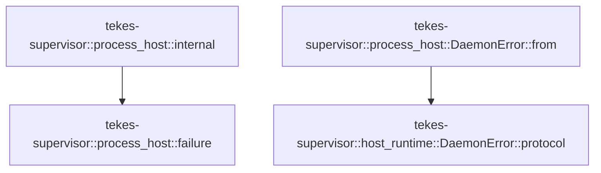

# tekes-supervisor::process_host

[Package atlas](index.md) · [Source](../../src/process_host.rs)

## Declarations

Visibility is the declaration spelling; trait members and reexports require their enclosing interface. `cfg` is not evaluated.

| Symbol | Kind | Visibility | Test / cfg |
|---|---|---|---|
| [tekes-supervisor::process_host::DELIVERY_TIMEOUT](../../src/process_host.rs#L62) | const_item | `private` |  |
| [tekes-supervisor::process_host::MCP_ONLY_APP_SANDBOX_MARKER](../../src/process_host.rs#L63) | const_item | `private` |  |
| [tekes-supervisor::process_host::WORKER_HANDSHAKE_TIMEOUT](../../src/process_host.rs#L64) | const_item | `private` |  |
| [tekes-supervisor::process_host::WORKER_HELLO_MAX_BYTES](../../src/process_host.rs#L65) | const_item | `private` |  |
| [tekes-supervisor::process_host::MANAGEMENT_RECOVERY_SECONDS](../../src/process_host.rs#L67) | const_item | `private` |  |
| [tekes-supervisor::process_host::PERIODIC_SWEEP_INTERVAL](../../src/process_host.rs#L68) | const_item | `private` |  |
| [tekes-supervisor::process_host::SweepLedgerIdentity](../../src/process_host.rs#L73) | struct_item | `private` |  |
| [tekes-supervisor::process_host::SweepLedgerIdentity::of](../../src/process_host.rs#L80) | function_item | `private` |  |
| [tekes-supervisor::process_host::SweepLedgerScan](../../src/process_host.rs#L93) | struct_item | `private` |  |
| [tekes-supervisor::process_host::AUTOMATIC_THREAD_TITLE_MODEL_HINT](../../src/process_host.rs#L107) | const_item | `private` |  |
| [tekes-supervisor::process_host::AUTOMATIC_THREAD_TITLE_MAX_CHARS](../../src/process_host.rs#L108) | const_item | `private` |  |
| [tekes-supervisor::process_host::AUTOMATIC_THREAD_TITLE_TIMEOUT](../../src/process_host.rs#L109) | const_item | `private` |  |
| [tekes-supervisor::process_host::AUTOMATIC_THREAD_TITLE_MAX_OUTPUT_TOKENS](../../src/process_host.rs#L113) | const_item | `private` |  |
| [tekes-supervisor::process_host::COMPACTION_SUMMARY_TIMEOUT](../../src/process_host.rs#L114) | const_item | `private` |  |
| [tekes-supervisor::process_host::AUTOMATIC_THREAD_TITLE_SYSTEM](../../src/process_host.rs#L115) | const_item | `private` |  |
| [tekes-supervisor::process_host::LineLockState](../../src/process_host.rs#L118) | enum_item | `private` |  |
| [tekes-supervisor::process_host::production_sandbox_backend](../../src/process_host.rs#L123) | function_item | `private` |  |
| [tekes-supervisor::process_host::seq_ranges](../../src/process_host.rs#L134) | function_item | `private` |  |
| [tekes-supervisor::process_host::spill_compaction_summary](../../src/process_host.rs#L153) | function_item | `private` |  |
| [tekes-supervisor::process_host::now_rfc3339](../../src/process_host.rs#L170) | function_item | `private` |  |
| [tekes-supervisor::process_host::session_event_time_now](../../src/process_host.rs#L174) | function_item | `private` |  |
| [tekes-supervisor::process_host::session_event_time](../../src/process_host.rs#L178) | function_item | `private` |  |
| [tekes-supervisor::process_host::compact_title_source](../../src/process_host.rs#L188) | function_item | `private` |  |
| [tekes-supervisor::process_host::bounded_title](../../src/process_host.rs#L192) | function_item | `private` |  |
| [tekes-supervisor::process_host::deterministic_automatic_thread_title](../../src/process_host.rs#L199) | function_item | `private` |  |
| [tekes-supervisor::process_host::normalized_automatic_thread_title](../../src/process_host.rs#L203) | function_item | `private` |  |
| [tekes-supervisor::process_host::prompt_text](../../src/process_host.rs#L228) | function_item | `private` |  |
| [tekes-supervisor::process_host::automatic_title_origin](../../src/process_host.rs#L239) | function_item | `private` |  |
| [tekes-supervisor::process_host::automatic_title_route](../../src/process_host.rs#L249) | function_item | `private` |  |
| [tekes-supervisor::process_host::session_model_route](../../src/process_host.rs#L288) | function_item | `private` |  |
| [tekes-supervisor::process_host::prepare_automatic_title_request](../../src/process_host.rs#L336) | function_item | `private` |  |
| [tekes-supervisor::process_host::prepare_automatic_text_request](../../src/process_host.rs#L353) | function_item | `private` |  |
| [tekes-supervisor::process_host::accepted_stream_event](../../src/process_host.rs#L404) | function_item | `private` | test; #[cfg(test)] |
| [tekes-supervisor::process_host::ProcessToolRuntime](../../src/process_host.rs#L419) | struct_item | `private` |  |
| [tekes-supervisor::process_host::ProductionProcessHost](../../src/process_host.rs#L423) | struct_item | `pub` |  |
| [tekes-supervisor::process_host::SessionProjectionCache](../../src/process_host.rs#L485) | struct_item | `private` |  |
| [tekes-supervisor::process_host::WorkerHandle](../../src/process_host.rs#L491) | struct_item | `private` |  |
| [tekes-supervisor::process_host::WorkerHandshakeGuard](../../src/process_host.rs#L512) | struct_item | `private` |  |
| [tekes-supervisor::process_host::WorkerHandshakeGuard::child_mut](../../src/process_host.rs#L519) | function_item | `private` |  |
| [tekes-supervisor::process_host::WorkerHandshakeGuard::take_child](../../src/process_host.rs#L523) | function_item | `private` |  |
| [tekes-supervisor::process_host::WorkerHandshakeGuard::take_credential_control](../../src/process_host.rs#L527) | function_item | `private` |  |
| [tekes-supervisor::process_host::WorkerHandshakeGuard::take_credential_broker](../../src/process_host.rs#L531) | function_item | `private` |  |
| [tekes-supervisor::process_host::WorkerHandshakeGuard::wait_for_exit](../../src/process_host.rs#L535) | function_item | `private` |  |
| [tekes-supervisor::process_host::WorkerHandshakeGuard::drop](../../src/process_host.rs#L548) | function_item | `private` |  |
| [tekes-supervisor::process_host::PendingWorker](../../src/process_host.rs#L561) | struct_item | `private` |  |
| [tekes-supervisor::process_host::WorkerProtocolQuarantine](../../src/process_host.rs#L568) | struct_item | `private` |  |
| [tekes-supervisor::process_host::RestartBackoff](../../src/process_host.rs#L575) | struct_item | `private` |  |
| [tekes-supervisor::process_host::ScheduledWorker](../../src/process_host.rs#L582) | struct_item | `private` |  |
| [tekes-supervisor::process_host::WorkerState](../../src/process_host.rs#L588) | struct_item | `private` |  |
| [tekes-supervisor::process_host::reconcile_credential_bindings](../../src/process_host.rs#L595) | function_item | `private` |  |
| [tekes-supervisor::process_host::credential_control](../../src/process_host.rs#L699) | function_item | `private` |  |
| [tekes-supervisor::process_host::active_material](../../src/process_host.rs#L710) | function_item | `private` |  |
| [tekes-supervisor::process_host::retain_prior_for_unknown_credentials](../../src/process_host.rs#L724) | function_item | `private` |  |
| [tekes-supervisor::process_host::ProductionProcessHost::open](../../src/process_host.rs#L767) | function_item | `pub` |  |
| [tekes-supervisor::process_host::ProductionProcessHost::open_with_secret_store](../../src/process_host.rs#L782) | function_item | `pub` |  |
| [tekes-supervisor::process_host::ProductionProcessHost::open_with_secret_authorities](../../src/process_host.rs#L802) | function_item | `pub` |  |
| [tekes-supervisor::process_host::ProductionProcessHost::mcp_runtime](../../src/process_host.rs#L914) | function_item | `pub` |  |
| [tekes-supervisor::process_host::ProductionProcessHost::credential_is_ready](../../src/process_host.rs#L921) | function_item | `pub` |  |
| [tekes-supervisor::process_host::ProductionProcessHost::validate_workspace_policy_candidate](../../src/process_host.rs#L942) | function_item | `pub` |  |
| [tekes-supervisor::process_host::ProductionProcessHost::workspace_policy_published](../../src/process_host.rs#L1040) | function_item | `pub` |  |
| [tekes-supervisor::process_host::ProductionProcessHost::workspace_policy_recovered](../../src/process_host.rs#L1069) | function_item | `pub` |  |
| [tekes-supervisor::process_host::ProductionProcessHost::plugin_store](../../src/process_host.rs#L1084) | function_item | `pub(crate)` |  |
| [tekes-supervisor::process_host::ProductionProcessHost::client_file_changes](../../src/process_host.rs#L1090) | function_item | `pub(crate)` |  |
| [tekes-supervisor::process_host::ProductionProcessHost::client_file_page](../../src/process_host.rs#L1128) | function_item | `pub(crate)` |  |
| [tekes-supervisor::process_host::ProductionProcessHost::user_agent_dir](../../src/process_host.rs#L1168) | function_item | `pub` |  |
| [tekes-supervisor::process_host::ProductionProcessHost::client_session_roots](../../src/process_host.rs#L1174) | function_item | `pub` |  |
| [tekes-supervisor::process_host::ProductionProcessHost::client_resource_catalog](../../src/process_host.rs#L1206) | function_item | `pub(crate)` |  |
| [tekes-supervisor::process_host::ProductionProcessHost::client_tool_catalog](../../src/process_host.rs#L1244) | function_item | `pub(crate)` |  |
| [tekes-supervisor::process_host::ProductionProcessHost::schedule_authority](../../src/process_host.rs#L1308) | function_item | `pub` |  |
| [tekes-supervisor::process_host::ProductionProcessHost::start_schedule_timer](../../src/process_host.rs#L1315) | function_item | `pub` |  |
| [tekes-supervisor::process_host::ProductionProcessHost::schedule_failure](../../src/process_host.rs#L1412) | function_item | `pub` |  |
| [tekes-supervisor::process_host::ProductionProcessHost::schedule_has_work](../../src/process_host.rs#L1419) | function_item | `private` |  |
| [tekes-supervisor::process_host::ProductionProcessHost::drive_schedule](../../src/process_host.rs#L1430) | function_item | `private` |  |
| [tekes-supervisor::process_host::ProductionProcessHost::execute_schedule_claim](../../src/process_host.rs#L1444) | function_item | `private` |  |
| [tekes-supervisor::process_host::ProductionProcessHost::reconcile_schedule_statuses](../../src/process_host.rs#L1514) | function_item | `private` |  |
| [tekes-supervisor::process_host::ProductionProcessHost::run_post_ready](../../src/process_host.rs#L1591) | function_item | `pub` |  |
| [tekes-supervisor::process_host::ProductionProcessHost::post_ready_tasks](../../src/process_host.rs#L1605) | function_item | `private` |  |
| [tekes-supervisor::process_host::ProductionProcessHost::cleanup_stale_ephemeral](../../src/process_host.rs#L1626) | function_item | `private` |  |
| [tekes-supervisor::process_host::ProductionProcessHost::live_sessions_for_cleanup](../../src/process_host.rs#L1651) | function_item | `private` |  |
| [tekes-supervisor::process_host::ProductionProcessHost::run_upgrade_pass](../../src/process_host.rs#L1664) | function_item | `private` |  |
| [tekes-supervisor::process_host::ProductionProcessHost::release_for_test](../../src/process_host.rs#L1707) | function_item | `pub(crate)` | test; #[cfg(test)] #[cfg_attr(not(target_os = "macos"), allow(dead_code))] |
| [tekes-supervisor::process_host::ProductionProcessHost::is_stale_ephemeral](../../src/process_host.rs#L1715) | function_item | `pub(crate)` |  |
| [tekes-supervisor::process_host::ProductionProcessHost::on_folder_event](../../src/process_host.rs#L1719) | function_item | `private` |  |
| [tekes-supervisor::process_host::ProductionProcessHost::attach_streams](../../src/process_host.rs#L1758) | function_item | `pub` |  |
| [tekes-supervisor::process_host::ProductionProcessHost::reconcile_child_line](../../src/process_host.rs#L1768) | function_item | `private` |  |
| [tekes-supervisor::process_host::ProductionProcessHost::publish_session_status](../../src/process_host.rs#L1787) | function_item | `private` |  |
| [tekes-supervisor::process_host::ProductionProcessHost::start_periodic_sweep](../../src/process_host.rs#L1804) | function_item | `pub` |  |
| [tekes-supervisor::process_host::ProductionProcessHost::recover_pending_management](../../src/process_host.rs#L1855) | function_item | `private` |  |
| [tekes-supervisor::process_host::ProductionProcessHost::refresh_live_credentials](../../src/process_host.rs#L1863) | function_item | `pub` |  |
| [tekes-supervisor::process_host::ProductionProcessHost::config_mutation_succeeded](../../src/process_host.rs#L1881) | function_item | `pub` |  |
| [tekes-supervisor::process_host::ProductionProcessHost::refresh_worker_credentials](../../src/process_host.rs#L1896) | function_item | `private` |  |
| [tekes-supervisor::process_host::ProductionProcessHost::boot_sweep](../../src/process_host.rs#L1935) | function_item | `pub` |  |
| [tekes-supervisor::process_host::ProductionProcessHost::arm_admission](../../src/process_host.rs#L1946) | function_item | `pub` |  |
| [tekes-supervisor::process_host::ProductionProcessHost::recover_client_sessions](../../src/process_host.rs#L1955) | function_item | `pub` |  |
| [tekes-supervisor::process_host::ProductionProcessHost::ensure_verified](../../src/process_host.rs#L1997) | function_item | `pub(crate)` |  |
| [tekes-supervisor::process_host::ProductionProcessHost::hydrate](../../src/process_host.rs#L2012) | function_item | `pub(crate)` |  |
| [tekes-supervisor::process_host::ProductionProcessHost::hydrate_with](../../src/process_host.rs#L2018) | function_item | `pub(crate)` |  |
| [tekes-supervisor::process_host::ProductionProcessHost::recently_failed](../../src/process_host.rs#L2038) | function_item | `private` |  |
| [tekes-supervisor::process_host::ProductionProcessHost::hydrate_unrecorded](../../src/process_host.rs#L2046) | function_item | `private` |  |
| [tekes-supervisor::process_host::ProductionProcessHost::repair_main_projection](../../src/process_host.rs#L2135) | function_item | `private` |  |
| [tekes-supervisor::process_host::ProductionProcessHost::periodic_sweep_once](../../src/process_host.rs#L2180) | function_item | `pub` |  |
| [tekes-supervisor::process_host::ProductionProcessHost::is_draining](../../src/process_host.rs#L2197) | function_item | `pub` |  |
| [tekes-supervisor::process_host::ProductionProcessHost::sweep_ledger_scan](../../src/process_host.rs#L2207) | function_item | `private` |  |
| [tekes-supervisor::process_host::ProductionProcessHost::sweep_once](../../src/process_host.rs#L2257) | function_item | `private` |  |
| [tekes-supervisor::process_host::ProductionProcessHost::sweep_ids](../../src/process_host.rs#L2277) | function_item | `private` |  |
| [tekes-supervisor::process_host::ProductionProcessHost::is_deferred](../../src/process_host.rs#L2306) | function_item | `private` |  |
| [tekes-supervisor::process_host::ProductionProcessHost::sweep_session](../../src/process_host.rs#L2318) | function_item | `private` |  |
| [tekes-supervisor::process_host::ProductionProcessHost::propagate_durable_stops_before_sweep](../../src/process_host.rs#L2401) | function_item | `private` |  |
| [tekes-supervisor::process_host::ProductionProcessHost::shutdown](../../src/process_host.rs#L2436) | function_item | `pub` |  |
| [tekes-supervisor::process_host::ProductionProcessHost::shutdown_with](../../src/process_host.rs#L2443) | function_item | `private` |  |
| [tekes-supervisor::process_host::ProductionProcessHost::ensure_running](../../src/process_host.rs#L2482) | function_item | `private` |  |
| [tekes-supervisor::process_host::ProductionProcessHost::live_worker](../../src/process_host.rs#L2496) | function_item | `private` |  |
| [tekes-supervisor::process_host::ProductionProcessHost::spawn_worker_at](../../src/process_host.rs#L2506) | function_item | `private` |  |
| [tekes-supervisor::process_host::ProductionProcessHost::spawn_worker_at_with_handshake_timeout](../../src/process_host.rs#L2522) | function_item | `private` |  |
| [tekes-supervisor::process_host::ProductionProcessHost::workspace_service_binary](../../src/process_host.rs#L2749) | function_item | `pub` |  |
| [tekes-supervisor::process_host::ProductionProcessHost::worker_binary_digest](../../src/process_host.rs#L2753) | function_item | `private` |  |
| [tekes-supervisor::process_host::ProductionProcessHost::refresh_limits](../../src/process_host.rs#L2758) | function_item | `private` |  |
| [tekes-supervisor::process_host::ProductionProcessHost::preflight_mandatory_authorities](../../src/process_host.rs#L2778) | function_item | `pub` |  |
| [tekes-supervisor::process_host::ProductionProcessHost::is_mcp_only_app_sandbox_host](../../src/process_host.rs#L2797) | function_item | `private` |  |
| [tekes-supervisor::process_host::ProductionProcessHost::freeze_tool_authority](../../src/process_host.rs#L2817) | function_item | `private` |  |
| [tekes-supervisor::process_host::ProductionProcessHost::schedule_main](../../src/process_host.rs#L2837) | function_item | `private` |  |
| [tekes-supervisor::process_host::ProductionProcessHost::schedule_line](../../src/process_host.rs#L2848) | function_item | `private` |  |
| [tekes-supervisor::process_host::ProductionProcessHost::schedule_worker_at](../../src/process_host.rs#L2864) | function_item | `private` |  |
| [tekes-supervisor::process_host::ProductionProcessHost::schedule_worker_at_with_startup](../../src/process_host.rs#L2875) | function_item | `private` |  |
| [tekes-supervisor::process_host::ProductionProcessHost::schedule_child_from_parent](../../src/process_host.rs#L2962) | function_item | `private` |  |
| [tekes-supervisor::process_host::ProductionProcessHost::wait_for_worker](../../src/process_host.rs#L3010) | function_item | `private` |  |
| [tekes-supervisor::process_host::ProductionProcessHost::start_pending_workers](../../src/process_host.rs#L3038) | function_item | `private` |  |
| [tekes-supervisor::process_host::ProductionProcessHost::has_worker_capacity](../../src/process_host.rs#L3105) | function_item | `private` |  |
| [tekes-supervisor::process_host::ProductionProcessHost::request_provider_lease](../../src/process_host.rs#L3113) | function_item | `private` |  |
| [tekes-supervisor::process_host::ProductionProcessHost::locked_prompt](../../src/process_host.rs#L3152) | function_item | `private` |  |
| [tekes-supervisor::process_host::ProductionProcessHost::locked_compact](../../src/process_host.rs#L3186) | function_item | `private` |  |
| [tekes-supervisor::process_host::ProductionProcessHost::first_root_input](../../src/process_host.rs#L3263) | function_item | `private` |  |
| [tekes-supervisor::process_host::ProductionProcessHost::seed_automatic_title](../../src/process_host.rs#L3295) | function_item | `private` |  |
| [tekes-supervisor::process_host::ProductionProcessHost::try_seed_automatic_title](../../src/process_host.rs#L3307) | function_item | `private` |  |
| [tekes-supervisor::process_host::ProductionProcessHost::wait_and_seed_automatic_title](../../src/process_host.rs#L3335) | function_item | `private` |  |
| [tekes-supervisor::process_host::ProductionProcessHost::spawn_automatic_title_refinement](../../src/process_host.rs#L3360) | function_item | `private` |  |
| [tekes-supervisor::process_host::ProductionProcessHost::spawn_automatic_title_seed_and_refinement](../../src/process_host.rs#L3374) | function_item | `private` |  |
| [tekes-supervisor::process_host::ProductionProcessHost::refine_automatic_title](../../src/process_host.rs#L3398) | function_item | `private` |  |
| [tekes-supervisor::process_host::ProductionProcessHost::complete_automatic_text](../../src/process_host.rs#L3435) | function_item | `private` |  |
| [tekes-supervisor::process_host::ProductionProcessHost::complete_automatic_terminal](../../src/process_host.rs#L3461) | function_item | `private` |  |
| [tekes-supervisor::process_host::ProductionProcessHost::summary_for_manual_compaction](../../src/process_host.rs#L3525) | function_item | `private` |  |
| [tekes-supervisor::process_host::ProductionProcessHost::generate_automatic_title](../../src/process_host.rs#L3596) | function_item | `private` |  |
| [tekes-supervisor::process_host::ProductionProcessHost::handle_tool_control](../../src/process_host.rs#L3621) | function_item | `private` |  |
| [tekes-supervisor::process_host::ProductionProcessHost::handle_tool_continuation](../../src/process_host.rs#L3656) | function_item | `private` |  |
| [tekes-supervisor::process_host::ProductionProcessHost::validate_child_proof](../../src/process_host.rs#L3694) | function_item | `private` |  |
| [tekes-supervisor::process_host::ProductionProcessHost::publish_appended](../../src/process_host.rs#L3711) | function_item | `private` |  |
| [tekes-supervisor::process_host::ProductionProcessHost::publish_appended_with](../../src/process_host.rs#L3717) | function_item | `private` |  |
| [tekes-supervisor::process_host::ProductionProcessHost::publish_frame](../../src/process_host.rs#L3916) | function_item | `private` |  |
| [tekes-supervisor::process_host::ProductionProcessHost::launch_child](../../src/process_host.rs#L4061) | function_item | `private` |  |
| [tekes-supervisor::process_host::ProductionProcessHost::propagate_parent_stop](../../src/process_host.rs#L4148) | function_item | `private` |  |
| [tekes-supervisor::process_host::ProductionProcessHost::cascade_stop_from](../../src/process_host.rs#L4240) | function_item | `private` |  |
| [tekes-supervisor::process_host::ProductionProcessHost::reconcile_after_exit](../../src/process_host.rs#L4326) | function_item | `private` |  |
| [tekes-supervisor::process_host::ProductionProcessHost::reset_restart_backoff](../../src/process_host.rs#L4389) | function_item | `private` |  |
| [tekes-supervisor::process_host::ProductionProcessHost::restart_is_due](../../src/process_host.rs#L4396) | function_item | `private` |  |
| [tekes-supervisor::process_host::ProductionProcessHost::note_restart_failure](../../src/process_host.rs#L4404) | function_item | `private` |  |
| [tekes-supervisor::process_host::ProductionProcessHost::record_spawn_failure](../../src/process_host.rs#L4445) | function_item | `private` |  |
| [tekes-supervisor::process_host::ProductionProcessHost::record_session_notice](../../src/process_host.rs#L4470) | function_item | `private` |  |
| [tekes-supervisor::process_host::MAX_NOTICE_TOOLS](../../src/process_host.rs#L4508) | const_item | `private` |  |
| [tekes-supervisor::process_host::mcp_launch_notices](../../src/process_host.rs#L4510) | function_item | `private` |  |
| [tekes-supervisor::process_host::frozen_tool_launch_policy](../../src/process_host.rs#L4588) | function_item | `private` |  |
| [tekes-supervisor::process_host::validator_tool_launch_policy](../../src/process_host.rs#L4613) | function_item | `private` |  |
| [tekes-supervisor::process_host::private_validator_launch_policy](../../src/process_host.rs#L4655) | function_item | `private` |  |
| [tekes-supervisor::process_host::web_search_scope_ready](../../src/process_host.rs#L4683) | function_item | `private` |  |
| [tekes-supervisor::process_host::mcp_failure_is_required](../../src/process_host.rs#L4701) | function_item | `private` |  |
| [tekes-supervisor::process_host::required_mcp_failure_reason](../../src/process_host.rs#L4717) | function_item | `private` |  |
| [tekes-supervisor::process_host::bounded_name_list](../../src/process_host.rs#L4733) | function_item | `private` |  |
| [tekes-supervisor::process_host::bounded_name_list::LISTED](../../src/process_host.rs#L4734) | const_item | `private` |  |
| [tekes-supervisor::process_host::PolicyCandidateError](../../src/process_host.rs#L4757) | struct_item | `pub` |  |
| [tekes-supervisor::process_host::PolicyCandidateError::new](../../src/process_host.rs#L4763) | function_item | `private` |  |
| [tekes-supervisor::process_host::PolicyCandidateError::fmt](../../src/process_host.rs#L4772) | function_item | `private` |  |
| [tekes-supervisor::process_host::PolicyCandidateCause](../../src/process_host.rs#L4780) | enum_item | `pub` |  |
| [tekes-supervisor::process_host::PolicyCandidateCause::code](../../src/process_host.rs#L4795) | function_item | `pub` |  |
| [tekes-supervisor::process_host::child_dependency_admitted](../../src/process_host.rs#L4805) | function_item | `private` |  |
| [tekes-supervisor::process_host::WorkerHandle::write](../../src/process_host.rs#L4810) | function_item | `private` |  |
| [tekes-supervisor::process_host::WorkerHandle::receipt](../../src/process_host.rs#L4819) | function_item | `private` |  |
| [tekes-supervisor::process_host::WorkerHandle::queue_result](../../src/process_host.rs#L4844) | function_item | `private` |  |
| [tekes-supervisor::process_host::worker_reader](../../src/process_host.rs#L4873) | function_item | `private` |  |
| [tekes-supervisor::process_host::terminate_worker](../../src/process_host.rs#L5130) | function_item | `private` |  |
| [tekes-supervisor::process_host::fail_worker](../../src/process_host.rs#L5157) | function_item | `private` |  |
| [tekes-supervisor::process_host::worker_stderr_reader](../../src/process_host.rs#L5181) | function_item | `private` |  |
| [tekes-supervisor::process_host::worker_stderr_reader::MAX_STDERR_TAIL](../../src/process_host.rs#L5182) | const_item | `private` |  |
| [tekes-supervisor::process_host::preserve_first_failure](../../src/process_host.rs#L5201) | function_item | `private` |  |
| [tekes-supervisor::process_host::ProductionProcessHost::session_metadata_changed](../../src/process_host.rs#L5208) | function_item | `private` |  |
| [tekes-supervisor::process_host::ProductionProcessHost::prompt](../../src/process_host.rs#L5212) | function_item | `private` |  |
| [tekes-supervisor::process_host::ProductionProcessHost::compact](../../src/process_host.rs#L5275) | function_item | `private` |  |
| [tekes-supervisor::process_host::ProductionProcessHost::cancel](../../src/process_host.rs#L5314) | function_item | `private` |  |
| [tekes-supervisor::process_host::ProductionProcessHost::rename](../../src/process_host.rs#L5398) | function_item | `private` |  |
| [tekes-supervisor::process_host::ProductionProcessHost::deliver_if_live](../../src/process_host.rs#L5435) | function_item | `private` |  |
| [tekes-supervisor::process_host::ProductionProcessHost::ensure_after_locked_append](../../src/process_host.rs#L5459) | function_item | `private` |  |
| [tekes-supervisor::process_host::cancel_stage_failure](../../src/process_host.rs#L5473) | function_item | `private` |  |
| [tekes-supervisor::process_host::child_exited_within](../../src/process_host.rs#L5492) | function_item | `private` |  |
| [tekes-supervisor::process_host::neutral_lifecycle](../../src/process_host.rs#L5514) | function_item | `private` |  |
| [tekes-supervisor::process_host::ledger_damage](../../src/process_host.rs#L5537) | function_item | `private` |  |
| [tekes-supervisor::process_host::DamageVerdict](../../src/process_host.rs#L5547) | enum_item | `private` |  |
| [tekes-supervisor::process_host::damage_under_lock](../../src/process_host.rs#L5563) | function_item | `private` |  |
| [tekes-supervisor::process_host::child_ledger_damage](../../src/process_host.rs#L5599) | function_item | `private` |  |
| [tekes-supervisor::process_host::is_single_line_ledger](../../src/process_host.rs#L5625) | function_item | `private` |  |
| [tekes-supervisor::process_host::HYDRATE_RETRY](../../src/process_host.rs#L5638) | const_item | `private` |  |
| [tekes-supervisor::process_host::DEFAULT_LIST_WAIT](../../src/process_host.rs#L5640) | const_item | `private` |  |
| [tekes-supervisor::process_host::ProductionProcessHost::list_wait](../../src/process_host.rs#L5643) | function_item | `private` |  |
| [tekes-supervisor::process_host::ProductionProcessHost::is_running](../../src/process_host.rs#L5658) | function_item | `private` |  |
| [tekes-supervisor::process_host::ProductionProcessHost::catalog_item](../../src/process_host.rs#L5668) | function_item | `private` |  |
| [tekes-supervisor::process_host::ProductionProcessHost::verify_within](../../src/process_host.rs#L5741) | function_item | `private` |  |
| [tekes-supervisor::process_host::ProductionProcessHost::build_inventory](../../src/process_host.rs#L5806) | function_item | `private` |  |
| [tekes-supervisor::process_host::ProductionProcessHost::inventory_items](../../src/process_host.rs#L5860) | function_item | `private` |  |
| [tekes-supervisor::process_host::ProductionProcessHost::ensure_verified](../../src/process_host.rs#L5870) | function_item | `private` |  |
| [tekes-supervisor::process_host::ProductionProcessHost::has_catalog](../../src/process_host.rs#L5885) | function_item | `private` |  |
| [tekes-supervisor::process_host::ProductionProcessHost::hold_catalog](../../src/process_host.rs#L5889) | function_item | `private` |  |
| [tekes-supervisor::process_host::ProductionProcessHost::inventory_item](../../src/process_host.rs#L5945) | function_item | `private` |  |
| [tekes-supervisor::process_host::ProductionProcessHost::live_sessions](../../src/process_host.rs#L5974) | function_item | `private` |  |
| [tekes-supervisor::process_host::ProductionProcessHost::reconcile_projection](../../src/process_host.rs#L5984) | function_item | `private` |  |
| [tekes-supervisor::process_host::ProductionProcessHost::execute](../../src/process_host.rs#L5994) | function_item | `private` |  |
| [tekes-supervisor::process_host::ProductionProcessHost::readiness](../../src/process_host.rs#L6022) | function_item | `private` |  |
| [tekes-supervisor::process_host::ProductionProcessHost::config_mutation_succeeded](../../src/process_host.rs#L6099) | function_item | `private` |  |
| [tekes-supervisor::process_host::ProcessToolRuntime::host](../../src/process_host.rs#L6123) | function_item | `private` |  |
| [tekes-supervisor::process_host::ProcessToolRuntime::ensure_running](../../src/process_host.rs#L6131) | function_item | `private` |  |
| [tekes-supervisor::process_host::ProcessToolRuntime::deliver_input](../../src/process_host.rs#L6142) | function_item | `private` |  |
| [tekes-supervisor::process_host::ProcessToolRuntime::interrupt](../../src/process_host.rs#L6178) | function_item | `private` |  |
| [tekes-supervisor::process_host::ProcessToolRuntime::ensure_child](../../src/process_host.rs#L6202) | function_item | `private` |  |
| [tekes-supervisor::process_host::ProcessToolRuntime::deliver_report](../../src/process_host.rs#L6216) | function_item | `private` |  |
| [tekes-supervisor::process_host::unresolved_parent_dependency](../../src/process_host.rs#L6238) | function_item | `private` |  |
| [tekes-supervisor::process_host::line_schedule_target](../../src/process_host.rs#L6313) | function_item | `private` |  |
| [tekes-supervisor::process_host::operation_unavailable](../../src/process_host.rs#L6349) | function_item | `private` |  |
| [tekes-supervisor::process_host::operation_value](../../src/process_host.rs#L6353) | function_item | `private` |  |
| [tekes-supervisor::process_host::workspace_quiescence_lock_path](../../src/process_host.rs#L6361) | function_item | `pub(crate)` |  |
| [tekes-supervisor::process_host::workspace_id](../../src/process_host.rs#L6366) | function_item | `private` |  |
| [tekes-supervisor::process_host::scoped_client_file_path](../../src/process_host.rs#L6370) | function_item | `private` |  |
| [tekes-supervisor::process_host::session_workspace_binding](../../src/process_host.rs#L6413) | function_item | `private` |  |
| [tekes-supervisor::process_host::ledger_needs_worker](../../src/process_host.rs#L6427) | function_item | `private` |  |
| [tekes-supervisor::process_host::goal_continuation_due](../../src/process_host.rs#L6445) | function_item | `private` |  |
| [tekes-supervisor::process_host::probe_line_lock](../../src/process_host.rs#L6489) | function_item | `private` |  |
| [tekes-supervisor::process_host::read_worker_hello](../../src/process_host.rs#L6523) | function_item | `private` |  |
| [tekes-supervisor::process_host::next_stop_generation](../../src/process_host.rs#L6593) | function_item | `private` |  |
| [tekes-supervisor::process_host::validate_worker_binary](../../src/process_host.rs#L6612) | function_item | `private` |  |
| [tekes-supervisor::process_host::failure](../../src/process_host.rs#L6624) | function_item | `private` |  |
| [tekes-supervisor::process_host::internal](../../src/process_host.rs#L6632) | function_item | `private` |  |
| [tekes-supervisor::process_host::DaemonError::from](../../src/process_host.rs#L6637) | function_item | `private` |  |
| [tekes-supervisor::process_host::tests::client_file_scope_uses_selected_directory_and_rejects_escape](../../src/process_host.rs#L6645) | function_item | `private` | test; #[cfg(test)] |
| [tekes-supervisor::process_host::tests::deepseek_title_provider](../../src/process_host.rs#L6688) | function_item | `private` | test; #[cfg(test)] |
| [tekes-supervisor::process_host::tests::serve_title_once](../../src/process_host.rs#L6711) | function_item | `private` | test; #[cfg(test)] |
| [tekes-supervisor::process_host::tests::serve_title_response](../../src/process_host.rs#L6726) | function_item | `private` | test; #[cfg(test)] |
| [tekes-supervisor::process_host::tests::automatic_title_text_normalization_matches_the_legacy_contract](../../src/process_host.rs#L6780) | function_item | `private` | test; #[cfg(test)] |
| [tekes-supervisor::process_host::tests::automatic_title_route_finds_flash_by_hint_and_falls_back_to_any_deepseek](../../src/process_host.rs#L6803) | function_item | `private` | test; #[cfg(test)] |
| [tekes-supervisor::process_host::tests::automatic_title_route_finds_flash_by_hint_and_falls_back_to_any_deepseek::providers_with](../../src/process_host.rs#L6804) | function_item | `private` | test; #[cfg(test)] |
| [tekes-supervisor::process_host::tests::automatic_title_request_uses_configured_deepseek_adapter_and_pins_flash](../../src/process_host.rs#L6847) | function_item | `private` | test; #[cfg(test)] |
| [tekes-supervisor::process_host::tests::automatic_title_uses_the_provider_runtime_and_normalizes_its_terminal](../../src/process_host.rs#L6883) | function_item | `private` | test; #[cfg(test)] |
| [tekes-supervisor::process_host::tests::automatic_title_rejects_cut_and_failed_responses](../../src/process_host.rs#L6928) | function_item | `private` | test; #[cfg(test)] |
| [tekes-supervisor::process_host::tests::automatic_title_request_fails_closed_without_a_reasoning_off_switch](../../src/process_host.rs#L6982) | function_item | `private` | test; #[cfg(test)] |
| [tekes-supervisor::process_host::tests::locked_manual_compact_covers_settled_history_and_is_keyed_by_origin](../../src/process_host.rs#L7015) | function_item | `private` | test; #[cfg(test)] |
| [tekes-supervisor::process_host::tests::worker_failure_preserves_first_root_cause](../../src/process_host.rs#L7112) | function_item | `private` | test; #[cfg(test)] |
| [tekes-supervisor::process_host::tests::restart_backoff_is_reason_scoped_bounded_and_user_resettable](../../src/process_host.rs#L7122) | function_item | `private` | test; #[cfg(test)] |
| [tekes-supervisor::process_host::tests::unavailable_credential_refresh_retains_last_authoritative_generation](../../src/process_host.rs#L7165) | function_item | `private` | test; #[cfg(test)] |
| [tekes-supervisor::process_host::tests::mcp_launch_notices_name_the_skipped_server_and_its_reason](../../src/process_host.rs#L7203) | function_item | `private` | test; #[cfg(test)] |
| [tekes-supervisor::process_host::tests::refused_tools_produce_one_bounded_notice_per_healthy_server](../../src/process_host.rs#L7245) | function_item | `private` | test; #[cfg(test)] |
| [tekes-supervisor::process_host::tests::write_catalog_server](../../src/process_host.rs#L7286) | function_item | `private` | test; #[cfg(test)] #[cfg(target_os = "macos")] |
| [tekes-supervisor::process_host::tests::launch_notice_for_policy](../../src/process_host.rs#L7302) | function_item | `private` | test; #[cfg(test)] #[cfg(target_os = "macos")] |
| [tekes-supervisor::process_host::tests::a_policy_set_accepts_never_breaks_the_launch_binding](../../src/process_host.rs#L7391) | function_item | `private` | test; #[cfg(test)] #[cfg(target_os = "macos")] |
| [tekes-supervisor::process_host::tests::unavailable_mcp_server_fails_launch_only_when_policy_names_its_tools](../../src/process_host.rs#L7437) | function_item | `private` | test; #[cfg(test)] |
| [tekes-supervisor::process_host::tests::durable_prompt_receipt_survives_spawn_failure_and_exact_retry_deduplicates](../../src/process_host.rs#L7460) | function_item | `private` | test; #[cfg(test)] #[cfg(target_os = "macos")] |
| [tekes-supervisor::process_host::tests::broken_mcp_registry_degrades_the_launch_and_warns_in_the_session](../../src/process_host.rs#L7545) | function_item | `private` | test; #[cfg(test)] #[cfg(target_os = "macos")] |
| [tekes-supervisor::process_host::tests::session_notices](../../src/process_host.rs#L7612) | function_item | `private` | test; #[cfg(test)] #[cfg(target_os = "macos")] |
| [tekes-supervisor::process_host::tests::late_provider_frame_does_not_reopen_sealed_output](../../src/process_host.rs#L7624) | function_item | `private` | test; #[cfg(test)] #[cfg(target_os = "macos")] |
| [tekes-supervisor::process_host::tests::late_provider_frame_does_not_reopen_sealed_output::SESSION](../../src/process_host.rs#L7625) | const_item | `private` | test; #[cfg(test)] #[cfg(target_os = "macos")] |
| [tekes-supervisor::process_host::tests::eager_tool_records_published_by_doorbell_do_not_drop_later_frames](../../src/process_host.rs#L7668) | function_item | `private` | test; #[cfg(test)] #[cfg(target_os = "macos")] |
| [tekes-supervisor::process_host::tests::eager_tool_records_published_by_doorbell_do_not_drop_later_frames::SESSION](../../src/process_host.rs#L7669) | const_item | `private` | test; #[cfg(test)] #[cfg(target_os = "macos")] |
| [tekes-supervisor::process_host::tests::late_stamped_frame_does_not_reopen_sealed_output](../../src/process_host.rs#L7753) | function_item | `private` | test; #[cfg(test)] #[cfg(target_os = "macos")] |
| [tekes-supervisor::process_host::tests::late_stamped_frame_does_not_reopen_sealed_output::SESSION](../../src/process_host.rs#L7754) | const_item | `private` | test; #[cfg(test)] #[cfg(target_os = "macos")] |
| [tekes-supervisor::process_host::tests::provider_frame_reaches_transient_sink_and_is_never_journaled](../../src/process_host.rs#L7791) | function_item | `private` | test; #[cfg(test)] |
| [tekes-supervisor::process_host::tests::provider_frame_reaches_transient_sink_and_is_never_journaled::SESSION](../../src/process_host.rs#L7792) | const_item | `private` | test; #[cfg(test)] |
| [tekes-supervisor::process_host::tests::block_on_ready](../../src/process_host.rs#L7878) | function_item | `private` | test; #[cfg(test)] |
| [tekes-supervisor::process_host::tests::appended_events_are_projected_before_any_endpoint_stream_is_attached](../../src/process_host.rs#L7890) | function_item | `private` | test; #[cfg(test)] #[cfg(target_os = "macos")] |
| [tekes-supervisor::process_host::tests::opening_a_thread_repairs_a_terminal_main_tail_missing_from_the_endpoint_journal](../../src/process_host.rs#L7939) | function_item | `private` | test; #[cfg(test)] #[cfg(target_os = "macos")] |
| [tekes-supervisor::process_host::tests::opening_a_thread_repairs_a_terminal_main_tail_missing_from_the_endpoint_journal::SESSION](../../src/process_host.rs#L7940) | const_item | `private` | test; #[cfg(test)] #[cfg(target_os = "macos")] |
| [tekes-supervisor::process_host::tests::attached_streams_report_inventory_running_from_the_line_lock_on_status_frames](../../src/process_host.rs#L7999) | function_item | `private` | test; #[cfg(test)] #[cfg(target_os = "macos")] |
| [tekes-supervisor::process_host::tests::periodic_sweep_repairs_a_stale_endpoint_journal_for_live_subscribers](../../src/process_host.rs#L8066) | function_item | `private` | test; #[cfg(test)] #[cfg(target_os = "macos")] |
| [tekes-supervisor::process_host::tests::periodic_sweep_repairs_a_stale_endpoint_journal_for_live_subscribers::SESSION](../../src/process_host.rs#L8067) | const_item | `private` | test; #[cfg(test)] #[cfg(target_os = "macos")] |
| [tekes-supervisor::process_host::tests::opening_a_mux_journal_reconciles_the_semantic_tail_first](../../src/process_host.rs#L8171) | function_item | `private` | test; #[cfg(test)] #[cfg(target_os = "macos")] |
| [tekes-supervisor::process_host::tests::opening_a_mux_journal_reconciles_the_semantic_tail_first::SESSION](../../src/process_host.rs#L8172) | const_item | `private` | test; #[cfg(test)] #[cfg(target_os = "macos")] |
| [tekes-supervisor::process_host::tests::wait_for_mux_frame](../../src/process_host.rs#L8224) | function_item | `private` | test; #[cfg(test)] #[cfg(target_os = "macos")] |
| [tekes-supervisor::process_host::tests::worker_exit_path_projects_the_settled_tail_and_refreshes_inventory](../../src/process_host.rs#L8256) | function_item | `private` | test; #[cfg(test)] #[cfg(target_os = "macos")] |
| [tekes-supervisor::process_host::tests::worker_exit_path_projects_the_settled_tail_and_refreshes_inventory::SESSION](../../src/process_host.rs#L8257) | const_item | `private` | test; #[cfg(test)] #[cfg(target_os = "macos")] |
| [tekes-supervisor::process_host::tests::sweep_retries_a_projection_that_failed_on_the_doorbell](../../src/process_host.rs#L8388) | function_item | `private` | test; #[cfg(test)] #[cfg(target_os = "macos")] |
| [tekes-supervisor::process_host::tests::sweep_retries_a_projection_that_failed_on_the_doorbell::SESSION](../../src/process_host.rs#L8389) | const_item | `private` | test; #[cfg(test)] #[cfg(target_os = "macos")] |
| [tekes-supervisor::process_host::tests::live_stream_time_is_integral_epoch_milliseconds](../../src/process_host.rs#L8453) | function_item | `private` | test; #[cfg(test)] |
| [tekes-supervisor::process_host::tests::terminal_attempt_pipe_tail_is_not_a_worker_failure](../../src/process_host.rs#L8460) | function_item | `private` | test; #[cfg(test)] |
| [tekes-supervisor::process_host::tests::tool_launch_policy_uses_selected_folder_without_dropping_other_roots](../../src/process_host.rs#L8476) | function_item | `private` | test; #[cfg(test)] |
| [tekes-supervisor::process_host::tests::report_wake_targets_the_exact_nested_parent_line](../../src/process_host.rs#L8567) | function_item | `private` | test; #[cfg(test)] |
| [tekes-supervisor::process_host::tests::report_wake_rejects_parent_line_aliases_and_path_escape](../../src/process_host.rs#L8577) | function_item | `private` | test; #[cfg(test)] |
| [tekes-supervisor::process_host::tests::child_dependency_overrides_only_its_live_parent_capacity_slot](../../src/process_host.rs#L8591) | function_item | `private` | test; #[cfg(test)] |
| [tekes-supervisor::process_host::tests::slice14c_gate_103_production_claim_uses_management_and_delivery_authorities](../../src/process_host.rs#L8606) | function_item | `private` | test; #[cfg(test)] #[cfg(target_os = "macos")] |
| [tekes-supervisor::process_host::tests::periodic_sweep_is_single_flight_and_stops_at_drain](../../src/process_host.rs#L8714) | function_item | `private` | test; #[cfg(test)] |
| [tekes-supervisor::process_host::tests::sweep_isolates_one_corrupt_session_and_still_recovers_the_next](../../src/process_host.rs#L8745) | function_item | `private` | test; #[cfg(test)] #[cfg(target_os = "macos")] |
| [tekes-supervisor::process_host::tests::builtin_recovery_waits_for_explicit_request_and_is_idempotent](../../src/process_host.rs#L8751) | function_item | `private` | test; #[cfg(test)] #[cfg(target_os = "macos")] |
| [tekes-supervisor::process_host::tests::check_sweep_recovery](../../src/process_host.rs#L8756) | function_item | `private` | test; #[cfg(test)] #[cfg(target_os = "macos")] |
| [tekes-supervisor::process_host::tests::sweep_scans_a_ledger_once_per_file_identity](../../src/process_host.rs#L8854) | function_item | `private` | test; #[cfg(test)] |
| [tekes-supervisor::process_host::tests::sweep_quarantines_busy_unknown_until_the_file_lock_is_free](../../src/process_host.rs#L8895) | function_item | `private` | test; #[cfg(test)] #[cfg(target_os = "macos")] |
| [tekes-supervisor::process_host::tests::ensure_existing_worker_refreshes_adjacent_secret_revocation](../../src/process_host.rs#L8960) | function_item | `private` | test; #[cfg(test)] #[cfg(target_os = "macos")] |
| [tekes-supervisor::process_host::tests::queue_recovery_is_preloaded_during_worker_negotiation](../../src/process_host.rs#L9047) | function_item | `private` | test; #[cfg(test)] #[cfg(target_os = "macos")] |
| [tekes-supervisor::process_host::tests::pending_queue_recovery_survives_an_ordinary_ensure_race](../../src/process_host.rs#L9132) | function_item | `private` | test; #[cfg(test)] #[cfg(target_os = "macos")] |
| [tekes-supervisor::process_host::tests::capacity_release_starts_a_pending_queue_transaction_on_a_settled_tail](../../src/process_host.rs#L9237) | function_item | `private` | test; #[cfg(test)] #[cfg(target_os = "macos")] |
| [tekes-supervisor::process_host::tests::no_mutual_worker_protocol_is_quarantined_until_binary_bytes_change](../../src/process_host.rs#L9352) | function_item | `private` | test; #[cfg(test)] #[cfg(target_os = "macos")] |
| [tekes-supervisor::process_host::tests::worker_hello_timeout_kills_waits_and_closes_the_broker](../../src/process_host.rs#L9424) | function_item | `private` | test; #[cfg(test)] #[cfg(target_os = "macos")] |
| [tekes-supervisor::process_host::tests::malformed_worker_hello_kills_waits_and_closes_the_broker](../../src/process_host.rs#L9434) | function_item | `private` | test; #[cfg(test)] #[cfg(target_os = "macos")] |
| [tekes-supervisor::process_host::tests::worker_early_eof_is_reaped_before_spawn_returns](../../src/process_host.rs#L9444) | function_item | `private` | test; #[cfg(test)] #[cfg(target_os = "macos")] |
| [tekes-supervisor::process_host::tests::assert_handshake_failure_reaps_worker](../../src/process_host.rs#L9453) | function_item | `private` | test; #[cfg(test)] #[cfg(target_os = "macos")] |
| [tekes-supervisor::process_host::tests::stop_cascade_durably_gates_the_entire_unpaired_spawn_graph](../../src/process_host.rs#L9554) | function_item | `private` | test; #[cfg(test)] #[cfg(target_os = "macos")] |
| [tekes-supervisor::process_host::tests::live_root_stop_receipt_precedes_the_same_durable_cascade](../../src/process_host.rs#L9560) | function_item | `private` | test; #[cfg(test)] #[cfg(target_os = "macos")] |
| [tekes-supervisor::process_host::tests::sweep_propagates_a_durable_root_stop_before_descendant_triage](../../src/process_host.rs#L9566) | function_item | `private` | test; #[cfg(test)] #[cfg(target_os = "macos")] |
| [tekes-supervisor::process_host::tests::exercise_stop_cascade](../../src/process_host.rs#L9650) | function_item | `private` | test; #[cfg(test)] #[cfg(target_os = "macos")] |
| [tekes-supervisor::process_host::tests::max_one_worker_dependency_chain_progresses_without_admitting_unrelated_work](../../src/process_host.rs#L9776) | function_item | `private` | test; #[cfg(test)] #[cfg(target_os = "macos")] |
| [tekes-supervisor::process_host::tests::prompt_after_confirmed_worker_exit_reuses_locked_origin](../../src/process_host.rs#L9940) | function_item | `private` | test; #[cfg(test)] #[cfg(target_os = "macos")] |
| [tekes-supervisor::process_host::tests::write_canonical_test_json](../../src/process_host.rs#L10011) | function_item | `private` | test; #[cfg(test)] #[cfg_attr(not(target_os = "macos"), allow(dead_code))] |
| [tekes-supervisor::process_host::tests::real_worker_recovers_final_before_settlement_with_resume_never](../../src/process_host.rs#L10020) | function_item | `private` | test; #[cfg(test)] #[cfg(target_os = "macos")] |
| [tekes-supervisor::process_host::tests::HELD_TS](../../src/process_host.rs#L10269) | const_item | `private` | test; #[cfg(test)] |
| [tekes-supervisor::process_host::tests::held_ledger_lines](../../src/process_host.rs#L10272) | function_item | `private` | test; #[cfg(test)] |
| [tekes-supervisor::process_host::tests::held_response_line](../../src/process_host.rs#L10305) | function_item | `private` | test; #[cfg(test)] #[cfg_attr(not(target_os = "macos"), allow(dead_code))] |
| [tekes-supervisor::process_host::tests::held_host](../../src/process_host.rs#L10312) | function_item | `private` | test; #[cfg(test)] #[cfg_attr(not(target_os = "macos"), allow(dead_code))] |
| [tekes-supervisor::process_host::tests::publish_appended_writes_a_fresh_card_that_matches_the_inventory_scan](../../src/process_host.rs#L10346) | function_item | `private` | test; #[cfg(test)] #[cfg(target_os = "macos")] |
| [tekes-supervisor::process_host::tests::card_writer_coalesces_and_flushes_at_shutdown](../../src/process_host.rs#L10394) | function_item | `private` | test; #[cfg(test)] #[cfg(target_os = "macos")] |
| [tekes-supervisor::process_host::tests::publish_appended_fast_path_publishes_the_pending_hold_from_one_decode](../../src/process_host.rs#L10427) | function_item | `private` | test; #[cfg(test)] #[cfg(target_os = "macos")] |
| [tekes-supervisor::process_host::tests::publish_appended_with_a_grown_ledger_does_not_resurrect_a_resolved_hold](../../src/process_host.rs#L10446) | function_item | `private` | test; #[cfg(test)] #[cfg(target_os = "macos")] |
| [tekes-supervisor::process_host::tests::a_reused_session_id_does_not_inherit_the_old_actionable_high_water_mark](../../src/process_host.rs#L10480) | function_item | `private` | test; #[cfg(test)] #[cfg(target_os = "macos")] |
| [tekes-supervisor::process_host::tests::held_thread_on_disk](../../src/process_host.rs#L10524) | function_item | `private` | test; #[cfg(test)] #[cfg_attr(not(target_os = "macos"), allow(dead_code))] |
| [tekes-supervisor::process_host::tests::the_catalog_list_equals_the_scan_list_and_a_late_thread_is_a_placeholder](../../src/process_host.rs#L10541) | function_item | `private` | test; #[cfg(test)] #[cfg(target_os = "macos")] |
| [tekes-supervisor::process_host::tests::only_threads_this_process_published_or_unarchived_are_admitted](../../src/process_host.rs#L10663) | function_item | `private` | test; #[cfg(test)] #[cfg(target_os = "macos")] |
| [tekes-supervisor::process_host::tests::open_host](../../src/process_host.rs#L10692) | function_item | `private` | test; #[cfg(test)] #[cfg_attr(not(target_os = "macos"), allow(dead_code))] |
| [tekes-supervisor::process_host::tests::poll_until_ready](../../src/process_host.rs#L10715) | function_item | `private` | test; #[cfg(test)] #[cfg_attr(not(target_os = "macos"), allow(dead_code))] |
| [tekes-supervisor::process_host::tests::a_thread_published_after_the_catalog_loaded_is_listed_swept_and_blank](../../src/process_host.rs#L10734) | function_item | `private` | test; #[cfg(test)] #[cfg(target_os = "macos")] |
| [tekes-supervisor::process_host::tests::hydrations_run_in_parallel_and_never_hold_up_a_doorbell](../../src/process_host.rs#L10789) | function_item | `private` | test; #[cfg(test)] #[cfg(target_os = "macos")] |
| [tekes-supervisor::process_host::tests::a_complete_invalid_line_quarantines_and_is_not_rehydrated](../../src/process_host.rs#L10864) | function_item | `private` | test; #[cfg(test)] #[cfg(target_os = "macos")] |
| [tekes-supervisor::process_host::tests::damage_in_a_held_ledger_is_deferred_until_the_lock_is_free](../../src/process_host.rs#L10907) | function_item | `private` | test; #[cfg(test)] #[cfg(target_os = "macos")] |
| [tekes-supervisor::process_host::tests::a_placeholder_row_is_followed_by_the_real_row_as_an_upsert](../../src/process_host.rs#L10954) | function_item | `private` | test; #[cfg(test)] #[cfg(target_os = "macos")] |
| [tekes-supervisor::process_host::tests::a_client_unarchive_admits_the_thread_and_lists_it_again](../../src/process_host.rs#L11001) | function_item | `private` | test; #[cfg(test)] #[cfg(target_os = "macos")] |
| [tekes-supervisor::process_host::tests::shutdown_stops_workers_before_it_flushes_the_cards_of_live_threads](../../src/process_host.rs#L11032) | function_item | `private` | test; #[cfg(test)] #[cfg(target_os = "macos")] |
| [tekes-supervisor::process_host::tests::a_fold_between_card_writes_does_not_rebuild_the_card_view](../../src/process_host.rs#L11067) | function_item | `private` | test; #[cfg(test)] #[cfg(target_os = "macos")] |
| [tekes-supervisor::process_host::tests::a_complete_invalid_line_in_a_child_ledger_quarantines_the_thread](../../src/process_host.rs#L11130) | function_item | `private` | test; #[cfg(test)] #[cfg(target_os = "macos")] |
| [tekes-supervisor::process_host::tests::a_published_folder_enters_the_catalog_unread](../../src/process_host.rs#L11153) | function_item | `private` | test; #[cfg(test)] #[cfg(target_os = "macos")] |
| [tekes-supervisor::process_host::tests::the_management_recovery_tick_runs_on_an_idle_root_and_reads_no_thread](../../src/process_host.rs#L11180) | function_item | `private` | test; #[cfg(test)] #[cfg(target_os = "macos")] |
| [tekes-supervisor::process_host::tests::a_thread_that_fails_verification_is_not_retried_by_every_list](../../src/process_host.rs#L11202) | function_item | `private` | test; #[cfg(test)] #[cfg(target_os = "macos")] |
| [tekes-supervisor::process_host::tests::opening_a_thread_bypasses_the_list_backoff](../../src/process_host.rs#L11235) | function_item | `private` | test; #[cfg(test)] #[cfg(target_os = "macos")] |
| [tekes-supervisor::process_host::tests::the_list_verifies_the_newest_ledgers_first](../../src/process_host.rs#L11261) | function_item | `private` | test; #[cfg(test)] #[cfg(target_os = "macos")] |
| [tekes-supervisor::process_host::tests::the_ready_path_does_not_read_any_thread_or_archive_folder](../../src/process_host.rs#L11308) | function_item | `private` | test; #[cfg(test)] #[cfg(target_os = "macos")] |
| [tekes-supervisor::process_host::tests::the_ready_path_does_not_read_any_thread_or_archive_folder::Restore](../../src/process_host.rs#L11326) | struct_item | `private` | test; #[cfg(test)] #[cfg(target_os = "macos")] |
| [tekes-supervisor::process_host::tests::the_ready_path_does_not_read_any_thread_or_archive_folder::Restore::drop](../../src/process_host.rs#L11328) | function_item | `private` | test; #[cfg(test)] #[cfg(target_os = "macos")] |
| [tekes-supervisor::process_host::tests::a_stale_projection_cannot_overwrite_a_newer_published_actionable_set](../../src/process_host.rs#L11363) | function_item | `private` | test; #[cfg(test)] #[cfg(target_os = "macos")] |
| [tekes-supervisor::process_host::tests::publish_appended_with_a_torn_tail_keeps_the_previous_error_path](../../src/process_host.rs#L11395) | function_item | `private` | test; #[cfg(test)] #[cfg(target_os = "macos")] |
| [tekes-supervisor::process_host::tests::write_test_genesis](../../src/process_host.rs#L11410) | function_item | `private` | test; #[cfg(test)] |
| [tekes-supervisor::process_host::tests::append_test_input](../../src/process_host.rs#L11427) | function_item | `private` | test; #[cfg(test)] |
| [tekes-supervisor::process_host::tests::append_test_stop](../../src/process_host.rs#L11450) | function_item | `private` | test; #[cfg(test)] #[cfg(target_os = "macos")] |
| [tekes-supervisor::process_host::tests::write_test_spawn_line](../../src/process_host.rs#L11473) | function_item | `private` | test; #[cfg(test)] #[cfg(target_os = "macos")] |
| [tekes-supervisor::process_host::tests::write_test_child_genesis](../../src/process_host.rs#L11532) | function_item | `private` | test; #[cfg(test)] #[cfg(target_os = "macos")] |
| [tekes-supervisor::process_host::tests::write_test_events](../../src/process_host.rs#L11555) | function_item | `private` | test; #[cfg(test)] #[cfg(target_os = "macos")] |
| [tekes-supervisor::process_host::tests::CHILD_TS](../../src/process_host.rs#L11568) | const_item | `private` | test; #[cfg(test)] #[cfg_attr(not(target_os = "macos"), allow(dead_code))] |
| [tekes-supervisor::process_host::tests::write_thread_with_child](../../src/process_host.rs#L11573) | function_item | `private` | test; #[cfg(test)] #[cfg(target_os = "macos")] |
| [tekes-supervisor::process_host::tests::child_request_event](../../src/process_host.rs#L11614) | function_item | `private` | test; #[cfg(test)] #[cfg(target_os = "macos")] |
| [tekes-supervisor::process_host::tests::child_response_event](../../src/process_host.rs#L11619) | function_item | `private` | test; #[cfg(test)] #[cfg(target_os = "macos")] |
| [tekes-supervisor::process_host::tests::append_test_events](../../src/process_host.rs#L11625) | function_item | `private` | test; #[cfg(test)] #[cfg(target_os = "macos")] |
| [tekes-supervisor::process_host::tests::child_rpc_id](../../src/process_host.rs#L11638) | function_item | `private` | test; #[cfg(test)] #[cfg(target_os = "macos")] |
| [tekes-supervisor::process_host::tests::a_live_child_hold_is_in_the_baseline_of_a_verified_thread_until_it_is_answered](../../src/process_host.rs#L11653) | function_item | `private` | test; #[cfg(test)] #[cfg(target_os = "macos")] |
| [tekes-supervisor::process_host::tests::a_child_exit_announces_a_hold_no_doorbell_announced](../../src/process_host.rs#L11694) | function_item | `private` | test; #[cfg(test)] #[cfg(target_os = "macos")] |
| [tekes-supervisor::process_host::tests::a_doorbell_fold_clears_child_exactness_and_the_prefilter_finds_the_new_hold](../../src/process_host.rs#L11719) | function_item | `private` | test; #[cfg(test)] #[cfg(target_os = "macos")] |
| [tekes-supervisor::process_host::tests::actionables_recomputes_do_not_reread_unchanged_child_files](../../src/process_host.rs#L11771) | function_item | `private` | test; #[cfg(test)] #[cfg(target_os = "macos")] |
| [tekes-supervisor::process_host::tests::a_busy_stale_scratch_thread_is_removed_by_the_retry](../../src/process_host.rs#L11809) | function_item | `private` | test; #[cfg(test)] #[cfg(target_os = "macos")] |
| [tekes-supervisor::process_host::tests::hydration_removes_a_dead_processs_card_temporary](../../src/process_host.rs#L11835) | function_item | `private` | test; #[cfg(test)] #[cfg(target_os = "macos")] |
| [tekes-supervisor::process_host::tests::hold_line_lock](../../src/process_host.rs#L11853) | function_item | `private` | test; #[cfg(test)] |
| [tekes-supervisor::process_host::tests::damage_is_decided_under_the_line_lock](../../src/process_host.rs#L11867) | function_item | `private` | test; #[cfg(test)] |
| [tekes-supervisor::process_host::tests::provider_admission_waits_fairly_and_drain_denies_waiter](../../src/process_host.rs#L11922) | function_item | `private` | test; #[cfg(test)] |

## Imports / reexports

| Local name | Source path | Visibility |
|---|---|---|
| `BTreeMap` | `std::collections::BTreeMap` | `private` |
| `BTreeSet` | `std::collections::BTreeSet` | `private` |
| `HashMap` | `std::collections::HashMap` | `private` |
| `HashSet` | `std::collections::HashSet` | `private` |
| `VecDeque` | `std::collections::VecDeque` | `private` |
| `_` | `std::fmt::Write` | `private` |
| `fs` | `std::fs` | `private` |
| `BufRead` | `std::io::BufRead` | `private` |
| `BufReader` | `std::io::BufReader` | `private` |
| `Read` | `std::io::Read` | `private` |
| `Write` | `std::io::Write` | `private` |
| `AsRawFd` | `std::os::fd::AsRawFd` | `private` |
| `MetadataExt` | `std::os::unix::fs::MetadataExt` | `private` |
| `OpenOptionsExt` | `std::os::unix::fs::OpenOptionsExt` | `private` |
| `Path` | `std::path::Path` | `private` |
| `PathBuf` | `std::path::PathBuf` | `private` |
| `Child` | `std::process::Child` | `private` |
| `ChildStdin` | `std::process::ChildStdin` | `private` |
| `AtomicBool` | `std::sync::atomic::AtomicBool` | `private` |
| `AtomicU64` | `std::sync::atomic::AtomicU64` | `private` |
| `Ordering` | `std::sync::atomic::Ordering` | `private` |
| `Arc` | `std::sync::Arc` | `private` |
| `Condvar` | `std::sync::Condvar` | `private` |
| `Mutex` | `std::sync::Mutex` | `private` |
| `TryLockError` | `std::sync::TryLockError` | `private` |
| `Weak` | `std::sync::Weak` | `private` |
| `Duration` | `std::time::Duration` | `private` |
| `Instant` | `std::time::Instant` | `private` |
| `UNIX_EPOCH` | `std::time::UNIX_EPOCH` | `private` |
| `DateTime` | `chrono::DateTime` | `private` |
| `Utc` | `chrono::Utc` | `private` |
| `AUTOMATIC_TITLE_REFINE_OPERATION` | `endpoint::AUTOMATIC_TITLE_REFINE_OPERATION` | `private` |
| `AUTOMATIC_TITLE_SEED_OPERATION` | `endpoint::AUTOMATIC_TITLE_SEED_OPERATION` | `private` |
| `AcceptedStreamFrame` | `endpoint::AcceptedStreamFrame` | `private` |
| `EndpointJournal` | `endpoint::EndpointJournal` | `private` |
| `ManagementStore` | `endpoint::ManagementStore` | `private` |
| `MaterializedPrompt` | `endpoint::MaterializedPrompt` | `private` |
| `MutationReceipt` | `endpoint::MutationReceipt` | `private` |
| `NativeEndpoint` | `endpoint::NativeEndpoint` | `private` |
| `Projector` | `endpoint::Projector` | `private` |
| `SESSION_NOTICE_OPERATION` | `endpoint::SESSION_NOTICE_OPERATION` | `private` |
| `SessionCreateOperation` | `endpoint::SessionCreateOperation` | `private` |
| `SessionInventoryItem` | `endpoint::SessionInventoryItem` | `private` |
| `SessionNotice` | `endpoint::SessionNotice` | `private` |
| `SessionNoticeSeverity` | `endpoint::SessionNoticeSeverity` | `private` |
| `AdmissionLease` | `engine::AdmissionLease` | `private` |
| `AdmissionPool` | `engine::AdmissionPool` | `private` |
| `EnsureAction` | `engine::EnsureAction` | `private` |
| `LockFacts` | `engine::LockFacts` | `private` |
| `TailState` | `engine::TailState` | `private` |
| `classify` | `engine::classify` | `private` |
| `ensure_action_at` | `engine::ensure_action_at` | `private` |
| `MacOsNativeHelperVerifier` | `plugins::MacOsNativeHelperVerifier` | `private` |
| `PluginStore` | `plugins::PluginStore` | `private` |
| `ConfigRepository` | `profile::ConfigRepository` | `private` |
| `ConfigSnapshot` | `profile::ConfigSnapshot` | `private` |
| `DynamicToolCatalog` | `profile::DynamicToolCatalog` | `private` |
| `Block` | `schema::Block` | `private` |
| `Event` | `schema::Event` | `private` |
| `EventKind` | `schema::EventKind` | `private` |
| `IJsonValue` | `schema::IJsonValue` | `private` |
| `OriginTuple` | `schema::OriginTuple` | `private` |
| `Digest` | `sha2::Digest` | `private` |
| `Sha256` | `sha2::Sha256` | `private` |
| `AssetStore` | `store::AssetStore` | `private` |
| `LockedLedger` | `store::LockedLedger` | `private` |
| `ThreadStore` | `store::ThreadStore` | `private` |
| `scan_valid_prefix` | `store::scan_valid_prefix` | `private` |
| `ApprovalResponse` | `worker_control::ApprovalResponse` | `private` |
| `Frame` | `worker_control::Frame` | `private` |
| `FrameChannel` | `worker_control::FrameChannel` | `private` |
| `Input` | `worker_control::Input` | `private` |
| `LaunchChild` | `worker_control::LaunchChild` | `private` |
| `LaunchResult` | `worker_control::LaunchResult` | `private` |
| `Lease` | `worker_control::Lease` | `private` |
| `Meta` | `worker_control::Meta` | `private` |
| `Receipt` | `worker_control::Receipt` | `private` |
| `Reject` | `worker_control::Reject` | `private` |
| `Stop` | `worker_control::Stop` | `private` |
| `WorkerMessage` | `worker_control::WorkerMessage` | `private` |
| `decode_hello` | `worker_control::decode_hello` | `private` |
| `decode_worker` | `worker_control::decode_worker` | `private` |
| `encode_line` | `worker_control::encode_line` | `private` |
| `QueueTransaction` | `worker_control::QueueTransaction` | `private` |
| `QueueTransactionResult` | `worker_control::QueueTransactionResult` | `private` |
| `Selection` | `worker_control::Selection` | `private` |
| `WorkerStartup` | `worker_control::WorkerStartup` | `private` |
| `decode_tool_control` | `worker_control::decode_tool_control` | `private` |
| `encode_queue_transaction` | `worker_control::encode_queue_transaction` | `private` |
| `resolve_worker_launch_bindings` | `crate::dynamic_bindings::resolve_worker_launch_bindings` | `private` |
| `HoldCatalog` | `crate::endpoint_carrier::HoldCatalog` | `private` |
| `HoldRef` | `crate::endpoint_carrier::HoldRef` | `private` |
| `LiveRespondAuthority` | `crate::endpoint_carrier::LiveRespondAuthority` | `private` |
| `ProductionCarrierError` | `crate::endpoint_carrier::ProductionCarrierError` | `private` |
| `ProductionCarrierStreams` | `crate::endpoint_carrier::ProductionCarrierStreams` | `private` |
| `SessionGateError` | `crate::endpoint_carrier::SessionGateError` | `private` |
| `SupervisorSessionAuthority` | `crate::endpoint_carrier::SupervisorSessionAuthority` | `private` |
| `VerifiedHolds` | `crate::endpoint_carrier::VerifiedHolds` | `private` |
| `ProductionRouteFailure` | `crate::endpoint_host::ProductionRouteFailure` | `private` |
| `ProviderReadinessAuthority` | `crate::endpoint_host::ProviderReadinessAuthority` | `private` |
| `QueueTransactionAuthority` | `crate::endpoint_host::QueueTransactionAuthority` | `private` |
| `RuntimeModelReadiness` | `crate::endpoint_host::RuntimeModelReadiness` | `private` |
| `RuntimeProviderFailure` | `crate::endpoint_host::RuntimeProviderFailure` | `private` |
| `RuntimeProviderReadiness` | `crate::endpoint_host::RuntimeProviderReadiness` | `private` |
| `RuntimeProviderStatus` | `crate::endpoint_host::RuntimeProviderStatus` | `private` |
| `SessionDeliveryAuthority` | `crate::endpoint_host::SessionDeliveryAuthority` | `private` |
| `DaemonError` | `crate::host_runtime::DaemonError` | `private` |
| `McpRuntime` | `crate::mcp_runtime::McpRuntime` | `private` |
| `ChildLaunchProof` | `crate::production_tool_control::ChildLaunchProof` | `private` |
| `DeliveryRequest` | `crate::production_tool_control::DeliveryRequest` | `private` |
| `DynamicSupervisorAuthority` | `crate::production_tool_control::DynamicSupervisorAuthority` | `private` |
| `InterruptRequest` | `crate::production_tool_control::InterruptRequest` | `private` |
| `JobBrokerSupervisorAuthority` | `crate::production_tool_control::JobBrokerSupervisorAuthority` | `private` |
| `ParentReportProof` | `crate::production_tool_control::ParentReportProof` | `private` |
| `ProductionToolControlHandler` | `crate::production_tool_control::ProductionToolControlHandler` | `private` |
| `ProductionToolControlPolicy` | `crate::production_tool_control::ProductionToolControlPolicy` | `private` |
| `SupervisorOperationError` | `crate::production_tool_control::SupervisorOperationError` | `private` |
| `SupervisorRuntimeAuthority` | `crate::production_tool_control::SupervisorRuntimeAuthority` | `private` |
| `ToolControlSession` | `crate::tool_control::ToolControlSession` | `private` |
| `ProfiledWorkerLaunchSpec` | `crate::ProfiledWorkerLaunchSpec` | `private` |
| `launch_profiled_worker_with_secret_store_and_binding_resolver` | `crate::launch_profiled_worker_with_secret_store_and_binding_resolver` | `private` |
| `Future` | `std::future::Future` | `private` |
| `_` | `std::io::Read` | `private` |
| `_` | `std::io::Write` | `private` |
| `TcpListener` | `std::net::TcpListener` | `private` |
| `PermissionsExt` | `std::os::unix::fs::PermissionsExt` | `private` |
| `mpsc` | `std::sync::mpsc` | `private` |
| `Context` | `std::task::Context` | `private` |
| `Poll` | `std::task::Poll` | `private` |
| `Waker` | `std::task::Waker` | `private` |
| `Value` | `serde_json::Value` | `private` |
| `json` | `serde_json::json` | `private` |
| `*` | `super::*` | `private` |

## Module declarations

| Module | Visibility | Attributes |
|---|---|---|
| `tekes-supervisor::process_host::tests` | `private` | #[cfg(test)] |

## Function call graphs

Edges below are syntactically resolved calls only, including private functions. Graphs partition callers into groups of 20; they are not execution order. All unresolved sites are listed below and in the JSON inventory.

Functions 1–20: 12 direct edges

```mermaid
flowchart TD
  n0["provider::dialect::resolve_profile"]
  n1["provider::request::prepare"]
  n2["schema::ijson::IJsonValue::parse"]
  n3["store::asset::AssetStore::new"]
  n4["tekes-supervisor::host_runtime::DaemonError::protocol"]
  n5["tekes-supervisor::process_host::production_sandbox_backend"]
  n6["tekes-supervisor::process_host::seq_ranges"]
  n7["tekes-supervisor::process_host::spill_compaction_summary"]
  n8["tekes-supervisor::process_host::now_rfc3339"]
  n9["tekes-supervisor::process_host::session_event_time_now"]
  n10["tekes-supervisor::process_host::session_event_time"]
  n11["tekes-supervisor::process_host::compact_title_source"]
  n12["tekes-supervisor::process_host::bounded_title"]
  n13["tekes-supervisor::process_host::deterministic_automatic_thread_title"]
  n14["tekes-supervisor::process_host::normalized_automatic_thread_title"]
  n15["tekes-supervisor::process_host::prompt_text"]
  n16["tekes-supervisor::process_host::automatic_title_origin"]
  n17["tekes-supervisor::process_host::automatic_title_route"]
  n18["tekes-supervisor::process_host::session_model_route"]
  n19["tekes-supervisor::process_host::prepare_automatic_title_request"]
  n20["tekes-supervisor::process_host::prepare_automatic_text_request"]
  n21["tekes-supervisor::process_host::WorkerHandshakeGuard::child_mut"]
  n22["tekes-supervisor::process_host::WorkerHandshakeGuard::take_child"]
  n23["tekes-supervisor::process_host::WorkerHandshakeGuard::take_credential_control"]
  n24["tekes-supervisor::process_host::SweepLedgerIdentity::of"]
  n7 --> n3
  n9 --> n10
  n10 --> n4
  n13 --> n11
  n13 --> n12
  n14 --> n11
  n14 --> n12
  n17 --> n0
  n18 --> n0
  n19 --> n20
  n20 --> n1
  n20 --> n2
```

Functions 21–40: 43 direct edges

```mermaid
flowchart TD
  n0["endpoint::service::NativeEndpoint::open"]
  n1["endpoint::types::validate_session_id"]
  n2["engine::admission::AdmissionPool::new"]
  n3["profile::config::ConfigRepository::open"]
  n4["profile::instruction::InstructionResolver::new_scoped"]
  n5["provider::secret_store::MemorySecretStore::new"]
  n6["schedule::ScheduleAuthority::open"]
  n7["store::folder::ThreadStore::open"]
  n8["store::folder_events::subscribe"]
  n9["store::folder_events::canonical_root"]
  n10["tekes-supervisor::catalog::Catalog::new"]
  n11["tekes-supervisor::dynamic_bindings::resolve_worker_launch_bindings"]
  n12["tekes-supervisor::host_runtime::DaemonError::invalid_config"]
  n13["tekes-supervisor::host_runtime::DaemonError::corrupt"]
  n14["tekes-supervisor::host_runtime::DaemonError::required_broker"]
  n15["tekes-supervisor::mcp_runtime::McpRuntime::open_production_authorities_with_mutation"]
  n16["tekes-supervisor::process_host::ProductionProcessHost::workspace_policy_published"]
  n17["tekes-supervisor::process_host::ProductionProcessHost::workspace_policy_recovered"]
  n18["tekes-supervisor::process_host::ProductionProcessHost::plugin_store"]
  n19["tekes-supervisor::process_host::ProductionProcessHost::client_file_changes"]
  n20["tekes-supervisor::process_host::ProductionProcessHost::client_file_page"]
  n21["tekes-supervisor::process_host::ProductionProcessHost::user_agent_dir"]
  n22["tekes-supervisor::process_host::ProductionProcessHost::client_session_roots"]
  n23["tekes-supervisor::process_host::mcp_failure_is_required"]
  n24["tekes-supervisor::process_host::required_mcp_failure_reason"]
  n25["tekes-supervisor::process_host::PolicyCandidateError::new"]
  n26["tekes-supervisor::process_host::terminate_worker"]
  n27["tekes-supervisor::process_host::WorkerHandshakeGuard::child_mut"]
  n28["tekes-supervisor::process_host::WorkerHandshakeGuard::take_credential_broker"]
  n29["tekes-supervisor::process_host::WorkerHandshakeGuard::wait_for_exit"]
  n30["tekes-supervisor::process_host::WorkerHandshakeGuard::drop"]
  n31["tekes-supervisor::process_host::reconcile_credential_bindings"]
  n32["tekes-supervisor::process_host::scoped_client_file_path"]
  n33["tekes-supervisor::process_host::session_workspace_binding"]
  n34["tekes-supervisor::process_host::validate_worker_binary"]
  n35["tekes-supervisor::process_host::credential_control"]
  n36["tekes-supervisor::process_host::active_material"]
  n37["tekes-supervisor::process_host::retain_prior_for_unknown_credentials"]
  n38["tekes-supervisor::process_host::ProductionProcessHost::open"]
  n39["tekes-supervisor::process_host::ProductionProcessHost::open_with_secret_store"]
  n40["tekes-supervisor::process_host::ProductionProcessHost::open_with_secret_authorities"]
  n41["tekes-supervisor::process_host::ProductionProcessHost::mcp_runtime"]
  n42["tekes-supervisor::process_host::ProductionProcessHost::credential_is_ready"]
  n43["tekes-supervisor::process_host::ProductionProcessHost::validate_workspace_policy_candidate"]
  n44["tekes-supervisor::thread_card::CardWriter::spawn_from_env"]
  n45["tools::builtin::BuiltinManifest::compiled"]
  n46["workspace-service::file_text_page"]
  n47["workspace-service::file_byte_page"]
  n16 --> n12
  n16 --> n26
  n17 --> n26
  n19 --> n1
  n19 --> n12
  n19 --> n33
  n20 --> n1
  n20 --> n12
  n20 --> n32
  n20 --> n33
  n20 --> n46
  n20 --> n47
  n22 --> n1
  n22 --> n12
  n22 --> n33
  n29 --> n27
  n31 --> n14
  n31 --> n35
  n31 --> n36
  n35 --> n14
  n38 --> n5
  n38 --> n39
  n39 --> n40
  n40 --> n0
  n40 --> n2
  n40 --> n3
  n40 --> n6
  n40 --> n7
  n40 --> n8
  n40 --> n9
  n40 --> n10
  n40 --> n12
  n40 --> n13
  n40 --> n14
  n40 --> n15
  n40 --> n34
  n40 --> n44
  n43 --> n4
  n43 --> n11
  n43 --> n23
  n43 --> n24
  n43 --> n25
  n43 --> n45
```

Functions 41–60: 34 direct edges

```mermaid
flowchart TD
  n0["endpoint::management::ManagementStore::open_light_at"]
  n1["engine::lifecycle::classify"]
  n2["profile::instruction::InstructionResolver::new_scoped"]
  n3["profile::resources::ResourceCatalog::from_snapshot"]
  n4["store::folder::ThreadStore::open"]
  n5["store::folder_events::is_admitted"]
  n6["store::tail::scan_valid_prefix"]
  n7["tekes-supervisor::boot_trace::phase"]
  n8["tekes-supervisor::dynamic_bindings::resolve_worker_launch_bindings"]
  n9["tekes-supervisor::host_runtime::DaemonError::protocol"]
  n10["tekes-supervisor::host_runtime::DaemonError::invalid_config"]
  n11["tekes-supervisor::host_runtime::DaemonError::corrupt"]
  n12["tekes-supervisor::host_runtime::DaemonError::required_broker"]
  n13["tekes-supervisor::process_host::ProductionProcessHost::client_resource_catalog"]
  n14["tekes-supervisor::process_host::ProductionProcessHost::client_tool_catalog"]
  n15["tekes-supervisor::process_host::ProductionProcessHost::schedule_authority"]
  n16["tekes-supervisor::process_host::ProductionProcessHost::start_schedule_timer"]
  n17["tekes-supervisor::process_host::ProductionProcessHost::schedule_failure"]
  n18["tekes-supervisor::process_host::ProductionProcessHost::schedule_has_work"]
  n19["tekes-supervisor::process_host::ProductionProcessHost::drive_schedule"]
  n20["tekes-supervisor::process_host::ProductionProcessHost::execute_schedule_claim"]
  n21["tekes-supervisor::process_host::ProductionProcessHost::reconcile_schedule_statuses"]
  n22["tekes-supervisor::process_host::ProductionProcessHost::run_post_ready"]
  n23["tekes-supervisor::process_host::ProductionProcessHost::post_ready_tasks"]
  n24["tekes-supervisor::process_host::ProductionProcessHost::cleanup_stale_ephemeral"]
  n25["tekes-supervisor::process_host::ProductionProcessHost::live_sessions_for_cleanup"]
  n26["tekes-supervisor::process_host::ProductionProcessHost::run_upgrade_pass"]
  n27["tekes-supervisor::process_host::ProductionProcessHost::is_stale_ephemeral"]
  n28["tekes-supervisor::process_host::ProductionProcessHost::on_folder_event"]
  n29["tekes-supervisor::process_host::ProductionProcessHost::attach_streams"]
  n30["tekes-supervisor::process_host::ProductionProcessHost::reconcile_child_line"]
  n31["tekes-supervisor::process_host::ProductionProcessHost::publish_session_status"]
  n32["tekes-supervisor::process_host::ProductionProcessHost::start_periodic_sweep"]
  n33["tekes-supervisor::process_host::ProductionProcessHost::hydrate"]
  n34["tekes-supervisor::process_host::ProductionProcessHost::recently_failed"]
  n35["tekes-supervisor::process_host::ProductionProcessHost::live_worker"]
  n36["tekes-supervisor::process_host::mcp_failure_is_required"]
  n37["tekes-supervisor::process_host::session_workspace_binding"]
  n38["tekes-supervisor::process_host::probe_line_lock"]
  n13 --> n2
  n13 --> n3
  n13 --> n10
  n13 --> n37
  n14 --> n2
  n14 --> n8
  n14 --> n10
  n14 --> n12
  n14 --> n36
  n14 --> n37
  n16 --> n18
  n16 --> n19
  n18 --> n11
  n19 --> n11
  n19 --> n20
  n19 --> n21
  n20 --> n0
  n20 --> n9
  n20 --> n11
  n21 --> n1
  n21 --> n6
  n21 --> n11
  n21 --> n35
  n21 --> n38
  n23 --> n7
  n23 --> n16
  n23 --> n24
  n23 --> n26
  n24 --> n4
  n24 --> n5
  n24 --> n25
  n26 --> n33
  n26 --> n34
  n27 --> n5
```

Functions 61–80: 51 direct edges

```mermaid
flowchart TD
  n0["engine::lifecycle::ensure_action_at"]
  n1["engine::lifecycle::classify"]
  n2["provider::secret_store::resolve_config_credentials"]
  n3["store::card::remove_stale_card_temps"]
  n4["store::folder_events::arm_admission"]
  n5["store::folder_events::is_admitted"]
  n6["store::folder_events::admitted_ids"]
  n7["store::tail::scan_valid_prefix"]
  n8["store::tail::repair_thread_tails"]
  n9["tekes-supervisor::boot_trace::detail"]
  n10["tekes-supervisor::boot_trace::per_item_enabled"]
  n11["tekes-supervisor::endpoint_host::recover_pending_management"]
  n12["tekes-supervisor::host_runtime::DaemonError::protocol"]
  n13["tekes-supervisor::host_runtime::DaemonError::invalid_config"]
  n14["tekes-supervisor::host_runtime::DaemonError::corrupt"]
  n15["tekes-supervisor::host_runtime::DaemonError::required_broker"]
  n16["tekes-supervisor::process_host::now_rfc3339"]
  n17["tekes-supervisor::process_host::ProductionProcessHost::recover_pending_management"]
  n18["tekes-supervisor::process_host::ProductionProcessHost::refresh_live_credentials"]
  n19["tekes-supervisor::process_host::ProductionProcessHost::config_mutation_succeeded"]
  n20["tekes-supervisor::process_host::ProductionProcessHost::refresh_worker_credentials"]
  n21["tekes-supervisor::process_host::ProductionProcessHost::boot_sweep"]
  n22["tekes-supervisor::process_host::ProductionProcessHost::arm_admission"]
  n23["tekes-supervisor::process_host::ProductionProcessHost::recover_client_sessions"]
  n24["tekes-supervisor::process_host::ProductionProcessHost::ensure_verified"]
  n25["tekes-supervisor::process_host::ProductionProcessHost::hydrate"]
  n26["tekes-supervisor::process_host::ProductionProcessHost::hydrate_with"]
  n27["tekes-supervisor::process_host::ProductionProcessHost::recently_failed"]
  n28["tekes-supervisor::process_host::ProductionProcessHost::hydrate_unrecorded"]
  n29["tekes-supervisor::process_host::ProductionProcessHost::repair_main_projection"]
  n30["tekes-supervisor::process_host::ProductionProcessHost::periodic_sweep_once"]
  n31["tekes-supervisor::process_host::ProductionProcessHost::is_draining"]
  n32["tekes-supervisor::process_host::ProductionProcessHost::sweep_ledger_scan"]
  n33["tekes-supervisor::process_host::ProductionProcessHost::sweep_once"]
  n34["tekes-supervisor::process_host::ProductionProcessHost::sweep_ids"]
  n35["tekes-supervisor::process_host::ProductionProcessHost::is_deferred"]
  n36["tekes-supervisor::process_host::ProductionProcessHost::sweep_session"]
  n37["tekes-supervisor::process_host::ProductionProcessHost::propagate_durable_stops_before_sweep"]
  n38["tekes-supervisor::process_host::ProductionProcessHost::refresh_limits"]
  n39["tekes-supervisor::process_host::ProductionProcessHost::schedule_worker_at"]
  n40["tekes-supervisor::process_host::ProductionProcessHost::publish_appended"]
  n41["tekes-supervisor::process_host::ProductionProcessHost::publish_appended_with"]
  n42["tekes-supervisor::process_host::ProductionProcessHost::restart_is_due"]
  n43["tekes-supervisor::process_host::ProductionProcessHost::note_restart_failure"]
  n44["tekes-supervisor::process_host::web_search_scope_ready"]
  n45["tekes-supervisor::process_host::terminate_worker"]
  n46["tekes-supervisor::process_host::damage_under_lock"]
  n47["tekes-supervisor::process_host::child_ledger_damage"]
  n48["tekes-supervisor::process_host::reconcile_credential_bindings"]
  n49["tekes-supervisor::process_host::goal_continuation_due"]
  n50["tekes-supervisor::process_host::probe_line_lock"]
  n51["tekes-supervisor::process_host::retain_prior_for_unknown_credentials"]
  n52["tekes-supervisor::process_host::SweepLedgerIdentity::of"]
  n53["tekes-supervisor::thread_card::fold_child_views"]
  n17 --> n11
  n18 --> n20
  n19 --> n18
  n20 --> n2
  n20 --> n15
  n20 --> n44
  n20 --> n45
  n20 --> n48
  n20 --> n51
  n21 --> n33
  n22 --> n4
  n23 --> n13
  n23 --> n24
  n23 --> n36
  n24 --> n13
  n24 --> n14
  n24 --> n25
  n25 --> n26
  n26 --> n28
  n28 --> n3
  n28 --> n8
  n28 --> n14
  n28 --> n41
  n28 --> n46
  n28 --> n47
  n28 --> n53
  n29 --> n40
  n30 --> n33
  n32 --> n7
  n32 --> n12
  n32 --> n14
  n32 --> n52
  n33 --> n9
  n33 --> n10
  n33 --> n34
  n33 --> n36
  n34 --> n6
  n35 --> n5
  n36 --> n0
  n36 --> n1
  n36 --> n16
  n36 --> n29
  n36 --> n32
  n36 --> n35
  n36 --> n37
  n36 --> n38
  n36 --> n39
  n36 --> n42
  n36 --> n43
  n36 --> n49
  n36 --> n50
```

Functions 81–100: 73 direct edges

```mermaid
flowchart TD
  n0["session-controls::bound_goal_id"]
  n1["store::platform::NamedLock::shared"]
  n2["tekes-supervisor::dynamic_bindings::resolve_worker_launch_bindings"]
  n3["tekes-supervisor::host_runtime::system_timestamp"]
  n4["tekes-supervisor::host_runtime::DaemonError::protocol"]
  n5["tekes-supervisor::host_runtime::DaemonError::io"]
  n6["tekes-supervisor::host_runtime::DaemonError::invalid_config"]
  n7["tekes-supervisor::host_runtime::DaemonError::required_broker"]
  n8["tekes-supervisor::launch_profiled_worker_with_secret_store_and_binding_resolver"]
  n9["tekes-supervisor::process_host::production_sandbox_backend"]
  n10["tekes-supervisor::process_host::ProductionProcessHost::live_sessions_for_cleanup"]
  n11["tekes-supervisor::process_host::ProductionProcessHost::publish_session_status"]
  n12["tekes-supervisor::process_host::ProductionProcessHost::refresh_worker_credentials"]
  n13["tekes-supervisor::process_host::ProductionProcessHost::ensure_verified"]
  n14["tekes-supervisor::process_host::ProductionProcessHost::sweep_ledger_scan"]
  n15["tekes-supervisor::process_host::ProductionProcessHost::propagate_durable_stops_before_sweep"]
  n16["tekes-supervisor::process_host::ProductionProcessHost::shutdown"]
  n17["tekes-supervisor::process_host::ProductionProcessHost::shutdown_with"]
  n18["tekes-supervisor::process_host::ProductionProcessHost::ensure_running"]
  n19["tekes-supervisor::process_host::ProductionProcessHost::live_worker"]
  n20["tekes-supervisor::process_host::ProductionProcessHost::spawn_worker_at"]
  n21["tekes-supervisor::process_host::ProductionProcessHost::spawn_worker_at_with_handshake_timeout"]
  n22["tekes-supervisor::process_host::ProductionProcessHost::workspace_service_binary"]
  n23["tekes-supervisor::process_host::ProductionProcessHost::worker_binary_digest"]
  n24["tekes-supervisor::process_host::ProductionProcessHost::refresh_limits"]
  n25["tekes-supervisor::process_host::ProductionProcessHost::preflight_mandatory_authorities"]
  n26["tekes-supervisor::process_host::ProductionProcessHost::is_mcp_only_app_sandbox_host"]
  n27["tekes-supervisor::process_host::ProductionProcessHost::freeze_tool_authority"]
  n28["tekes-supervisor::process_host::ProductionProcessHost::schedule_main"]
  n29["tekes-supervisor::process_host::ProductionProcessHost::schedule_line"]
  n30["tekes-supervisor::process_host::ProductionProcessHost::schedule_worker_at"]
  n31["tekes-supervisor::process_host::ProductionProcessHost::schedule_worker_at_with_startup"]
  n32["tekes-supervisor::process_host::ProductionProcessHost::schedule_child_from_parent"]
  n33["tekes-supervisor::process_host::ProductionProcessHost::wait_for_worker"]
  n34["tekes-supervisor::process_host::ProductionProcessHost::start_pending_workers"]
  n35["tekes-supervisor::process_host::ProductionProcessHost::has_worker_capacity"]
  n36["tekes-supervisor::process_host::ProductionProcessHost::cascade_stop_from"]
  n37["tekes-supervisor::process_host::ProductionProcessHost::reset_restart_backoff"]
  n38["tekes-supervisor::process_host::ProductionProcessHost::record_session_notice"]
  n39["tekes-supervisor::process_host::mcp_launch_notices"]
  n40["tekes-supervisor::process_host::frozen_tool_launch_policy"]
  n41["tekes-supervisor::process_host::validator_tool_launch_policy"]
  n42["tekes-supervisor::process_host::mcp_failure_is_required"]
  n43["tekes-supervisor::process_host::child_dependency_admitted"]
  n44["tekes-supervisor::process_host::worker_reader"]
  n45["tekes-supervisor::process_host::worker_stderr_reader"]
  n46["tekes-supervisor::process_host::unresolved_parent_dependency"]
  n47["tekes-supervisor::process_host::line_schedule_target"]
  n48["tekes-supervisor::process_host::workspace_quiescence_lock_path"]
  n49["tekes-supervisor::process_host::workspace_id"]
  n50["tekes-supervisor::process_host::session_workspace_binding"]
  n51["tekes-supervisor::process_host::ledger_needs_worker"]
  n52["tekes-supervisor::process_host::read_worker_hello"]
  n53["tools::runtime_backends::HelperJobLauncher::new"]
  n54["tools::runtime_backends::HelperJobLauncher::disabled"]
  n55["tools::sandbox::probe_backend"]
  n56["worker-control::durable::encode_queue_transaction"]
  n57["worker-control::negotiate"]
  n58["worker-control::encode_line"]
  n15 --> n14
  n15 --> n36
  n16 --> n17
  n17 --> n10
  n18 --> n24
  n18 --> n30
  n18 --> n33
  n18 --> n37
  n20 --> n21
  n21 --> n0
  n21 --> n1
  n21 --> n2
  n21 --> n3
  n21 --> n4
  n21 --> n6
  n21 --> n7
  n21 --> n8
  n21 --> n23
  n21 --> n27
  n21 --> n38
  n21 --> n39
  n21 --> n41
  n21 --> n42
  n21 --> n44
  n21 --> n45
  n21 --> n48
  n21 --> n50
  n21 --> n52
  n21 --> n56
  n21 --> n57
  n21 --> n58
  n24 --> n6
  n24 --> n49
  n25 --> n7
  n25 --> n9
  n25 --> n26
  n25 --> n53
  n25 --> n54
  n25 --> n55
  n26 --> n5
  n26 --> n7
  n27 --> n7
  n27 --> n9
  n27 --> n26
  n27 --> n40
  n27 --> n53
  n27 --> n54
  n27 --> n55
  n28 --> n30
  n29 --> n30
  n29 --> n32
  n29 --> n46
  n29 --> n47
  n30 --> n31
  n31 --> n4
  n31 --> n11
  n31 --> n12
  n31 --> n13
  n31 --> n19
  n31 --> n20
  n31 --> n24
  n31 --> n35
  n32 --> n11
  n32 --> n12
  n32 --> n20
  n32 --> n24
  n32 --> n35
  n32 --> n43
  n33 --> n7
  n34 --> n11
  n34 --> n20
  n34 --> n35
  n34 --> n51
```

Functions 101–120: 65 direct edges

```mermaid
flowchart TD
  n0["endpoint::journal::EndpointJournal::open"]
  n1["engine::compaction_summary::admit_summary_artifact"]
  n2["engine::compaction_summary::summary_request_bytes"]
  n3["engine::compaction_summary::CompactionSummary::from_outcome"]
  n4["engine::compaction_summary::freeze_source_bundle"]
  n5["engine::context::plan_context_compaction"]
  n6["provider::compaction_summary::prepare_summary_request"]
  n7["provider::compaction_summary::summary_completion_artifact"]
  n8["provider::http::HttpRuntime::new"]
  n9["schema::event::Event::from_value"]
  n10["schema::ijson::IJsonValue::parse"]
  n11["store::tail::scan_valid_prefix"]
  n12["store::tail::read_genesis"]
  n13["tekes-supervisor::host_runtime::DaemonError::protocol"]
  n14["tekes-supervisor::host_runtime::DaemonError::corrupt"]
  n15["tekes-supervisor::host_runtime::DaemonError::required_broker"]
  n16["tekes-supervisor::process_host::spill_compaction_summary"]
  n17["tekes-supervisor::process_host::deterministic_automatic_thread_title"]
  n18["tekes-supervisor::process_host::normalized_automatic_thread_title"]
  n19["tekes-supervisor::process_host::prompt_text"]
  n20["tekes-supervisor::process_host::automatic_title_origin"]
  n21["tekes-supervisor::process_host::automatic_title_route"]
  n22["tekes-supervisor::process_host::ProductionProcessHost::schedule_main"]
  n23["tekes-supervisor::process_host::session_model_route"]
  n24["tekes-supervisor::process_host::ProductionProcessHost::has_worker_capacity"]
  n25["tekes-supervisor::process_host::ProductionProcessHost::request_provider_lease"]
  n26["tekes-supervisor::process_host::ProductionProcessHost::locked_prompt"]
  n27["tekes-supervisor::process_host::ProductionProcessHost::locked_compact"]
  n28["tekes-supervisor::process_host::ProductionProcessHost::first_root_input"]
  n29["tekes-supervisor::process_host::ProductionProcessHost::seed_automatic_title"]
  n30["tekes-supervisor::process_host::ProductionProcessHost::try_seed_automatic_title"]
  n31["tekes-supervisor::process_host::ProductionProcessHost::wait_and_seed_automatic_title"]
  n32["tekes-supervisor::process_host::ProductionProcessHost::spawn_automatic_title_refinement"]
  n33["tekes-supervisor::process_host::prepare_automatic_title_request"]
  n34["tekes-supervisor::process_host::ProductionProcessHost::spawn_automatic_title_seed_and_refinement"]
  n35["tekes-supervisor::process_host::ProductionProcessHost::refine_automatic_title"]
  n36["tekes-supervisor::process_host::ProductionProcessHost::complete_automatic_text"]
  n37["tekes-supervisor::process_host::ProductionProcessHost::complete_automatic_terminal"]
  n38["tekes-supervisor::process_host::ProductionProcessHost::summary_for_manual_compaction"]
  n39["tekes-supervisor::process_host::ProductionProcessHost::generate_automatic_title"]
  n40["tekes-supervisor::process_host::ProductionProcessHost::handle_tool_control"]
  n41["tekes-supervisor::process_host::ProductionProcessHost::handle_tool_continuation"]
  n42["tekes-supervisor::process_host::ProductionProcessHost::validate_child_proof"]
  n43["tekes-supervisor::process_host::ProductionProcessHost::publish_appended"]
  n44["tekes-supervisor::process_host::ProductionProcessHost::publish_appended_with"]
  n45["tekes-supervisor::process_host::ProductionProcessHost::reset_restart_backoff"]
  n46["tekes-supervisor::process_host::ProductionProcessHost::record_spawn_failure"]
  n47["tekes-supervisor::process_host::ledger_damage"]
  n48["tekes-supervisor::process_host::damage_under_lock"]
  n49["tekes-supervisor::process_host::internal"]
  n50["tekes-supervisor::production_tool_control::JobBrokerSupervisorAuthority::new"]
  n51["tekes-supervisor::production_tool_control::ProductionToolControlHandler::new"]
  n52["tekes-supervisor::production_tool_control::ProductionToolControlPolicy::new"]
  n53["tekes-supervisor::thread_card::journal_input"]
  n54["tekes-supervisor::thread_card::prepare"]
  n55["tekes-supervisor::tool_control::ToolControlSession::new"]
  n56["tools::schema_registry::fixed_schema"]
  n57["worker-control::continuation::decode_tool_continuation"]
  n58["worker-control::continuation::encode_tool_continuation_result"]
  n26 --> n10
  n26 --> n19
  n26 --> n22
  n26 --> n28
  n26 --> n29
  n26 --> n32
  n26 --> n45
  n26 --> n46
  n27 --> n5
  n27 --> n9
  n27 --> n10
  n27 --> n16
  n27 --> n38
  n27 --> n43
  n27 --> n49
  n28 --> n11
  n29 --> n30
  n30 --> n17
  n30 --> n20
  n30 --> n43
  n31 --> n30
  n35 --> n20
  n35 --> n39
  n35 --> n43
  n36 --> n37
  n37 --> n8
  n38 --> n1
  n38 --> n2
  n38 --> n3
  n38 --> n4
  n38 --> n5
  n38 --> n6
  n38 --> n7
  n38 --> n10
  n38 --> n11
  n38 --> n23
  n38 --> n37
  n38 --> n56
  n39 --> n18
  n39 --> n21
  n39 --> n33
  n39 --> n36
  n40 --> n13
  n40 --> n15
  n40 --> n50
  n40 --> n51
  n40 --> n52
  n40 --> n55
  n41 --> n13
  n41 --> n15
  n41 --> n50
  n41 --> n51
  n41 --> n52
  n41 --> n57
  n41 --> n58
  n42 --> n12
  n42 --> n14
  n43 --> n44
  n44 --> n0
  n44 --> n11
  n44 --> n14
  n44 --> n47
  n44 --> n48
  n44 --> n53
  n44 --> n54
```

Functions 121–140: 56 direct edges

```mermaid
flowchart TD
  n0["endpoint::journal::EndpointJournal::open"]
  n1["engine::lifecycle::ensure_action_at"]
  n2["engine::lifecycle::classify"]
  n3["mcp::projection::project_name"]
  n4["provider::request::endpoint_origin"]
  n5["schema::event::Event::from_value"]
  n6["schema::ijson::IJsonValue::parse"]
  n7["store::tail::LockedLedger::open"]
  n8["store::tail::scan_valid_prefix"]
  n9["tekes-supervisor::host_runtime::system_timestamp"]
  n10["tekes-supervisor::host_runtime::DaemonError::protocol"]
  n11["tekes-supervisor::host_runtime::DaemonError::invalid_config"]
  n12["tekes-supervisor::host_runtime::DaemonError::corrupt"]
  n13["tekes-supervisor::host_runtime::DaemonError::required_broker"]
  n14["tekes-supervisor::process_host::now_rfc3339"]
  n15["tekes-supervisor::process_host::session_event_time_now"]
  n16["tekes-supervisor::process_host::ProductionProcessHost::refresh_limits"]
  n17["tekes-supervisor::process_host::ProductionProcessHost::schedule_worker_at"]
  n18["tekes-supervisor::process_host::ProductionProcessHost::schedule_child_from_parent"]
  n19["tekes-supervisor::process_host::ProductionProcessHost::publish_appended"]
  n20["tekes-supervisor::process_host::ProductionProcessHost::publish_frame"]
  n21["tekes-supervisor::process_host::ProductionProcessHost::launch_child"]
  n22["tekes-supervisor::process_host::ProductionProcessHost::propagate_parent_stop"]
  n23["tekes-supervisor::process_host::ProductionProcessHost::cascade_stop_from"]
  n24["tekes-supervisor::process_host::ProductionProcessHost::reconcile_after_exit"]
  n25["tekes-supervisor::process_host::ProductionProcessHost::reset_restart_backoff"]
  n26["tekes-supervisor::process_host::ProductionProcessHost::restart_is_due"]
  n27["tekes-supervisor::process_host::ProductionProcessHost::note_restart_failure"]
  n28["tekes-supervisor::process_host::ProductionProcessHost::record_spawn_failure"]
  n29["tekes-supervisor::process_host::ProductionProcessHost::record_session_notice"]
  n30["tekes-supervisor::process_host::mcp_launch_notices"]
  n31["tekes-supervisor::process_host::frozen_tool_launch_policy"]
  n32["tekes-supervisor::process_host::validator_tool_launch_policy"]
  n33["tekes-supervisor::process_host::private_validator_launch_policy"]
  n34["tekes-supervisor::process_host::web_search_scope_ready"]
  n35["tekes-supervisor::process_host::mcp_failure_is_required"]
  n36["tekes-supervisor::process_host::required_mcp_failure_reason"]
  n37["tekes-supervisor::process_host::bounded_name_list"]
  n38["tekes-supervisor::process_host::PolicyCandidateError::new"]
  n39["tekes-supervisor::process_host::PolicyCandidateError::fmt"]
  n40["tekes-supervisor::process_host::terminate_worker"]
  n41["tekes-supervisor::process_host::line_schedule_target"]
  n42["tekes-supervisor::process_host::goal_continuation_due"]
  n43["tekes-supervisor::process_host::probe_line_lock"]
  n44["tools::runtime_backends::JobLaunchPolicy::new"]
  n45["worker-control::encode_line"]
  n20 --> n0
  n20 --> n8
  n20 --> n12
  n20 --> n15
  n21 --> n1
  n21 --> n2
  n21 --> n8
  n21 --> n10
  n21 --> n12
  n21 --> n14
  n21 --> n18
  n21 --> n22
  n21 --> n43
  n22 --> n5
  n22 --> n6
  n22 --> n7
  n22 --> n8
  n22 --> n10
  n22 --> n12
  n22 --> n45
  n23 --> n8
  n23 --> n12
  n23 --> n18
  n23 --> n22
  n23 --> n23
  n23 --> n40
  n23 --> n41
  n24 --> n1
  n24 --> n2
  n24 --> n8
  n24 --> n12
  n24 --> n14
  n24 --> n16
  n24 --> n17
  n24 --> n19
  n24 --> n25
  n24 --> n26
  n24 --> n27
  n24 --> n42
  n24 --> n43
  n28 --> n29
  n29 --> n9
  n29 --> n19
  n31 --> n11
  n31 --> n13
  n31 --> n44
  n32 --> n8
  n32 --> n10
  n32 --> n12
  n32 --> n13
  n32 --> n33
  n33 --> n13
  n33 --> n44
  n34 --> n4
  n35 --> n3
  n36 --> n35
```

Functions 141–160: 25 direct edges

```mermaid
flowchart TD
  n0["tekes-supervisor::endpoint_host::ProductionRouteFailure::new"]
  n1["tekes-supervisor::host_runtime::DaemonError::protocol"]
  n2["tekes-supervisor::process_host::prompt_text"]
  n3["tekes-supervisor::process_host::PolicyCandidateCause::code"]
  n4["tekes-supervisor::process_host::child_dependency_admitted"]
  n5["tekes-supervisor::process_host::WorkerHandle::write"]
  n6["tekes-supervisor::process_host::WorkerHandle::receipt"]
  n7["tekes-supervisor::process_host::WorkerHandle::queue_result"]
  n8["tekes-supervisor::process_host::worker_reader"]
  n9["tekes-supervisor::process_host::terminate_worker"]
  n10["tekes-supervisor::process_host::fail_worker"]
  n11["tekes-supervisor::process_host::worker_stderr_reader"]
  n12["tekes-supervisor::process_host::preserve_first_failure"]
  n13["tekes-supervisor::process_host::ProductionProcessHost::session_metadata_changed"]
  n14["tekes-supervisor::process_host::ProductionProcessHost::prompt"]
  n15["tekes-supervisor::process_host::ProductionProcessHost::compact"]
  n16["tekes-supervisor::process_host::ProductionProcessHost::cancel"]
  n17["tekes-supervisor::process_host::ProductionProcessHost::rename"]
  n18["tekes-supervisor::process_host::ProductionProcessHost::deliver_if_live"]
  n19["tekes-supervisor::process_host::ProductionProcessHost::ensure_after_locked_append"]
  n20["tekes-supervisor::process_host::cancel_stage_failure"]
  n21["tekes-supervisor::process_host::child_exited_within"]
  n22["tekes-supervisor::process_host::neutral_lifecycle"]
  n23["tekes-supervisor::process_host::next_stop_generation"]
  n24["tekes-supervisor::process_host::internal"]
  n25["worker-control::continuation::decode_tool_continuation"]
  n26["worker-control::durable::decode_tool_control"]
  n27["worker-control::decode_worker"]
  n28["worker-control::encode_line"]
  n6 --> n24
  n7 --> n24
  n8 --> n1
  n8 --> n9
  n8 --> n10
  n8 --> n25
  n8 --> n26
  n8 --> n27
  n8 --> n28
  n10 --> n12
  n14 --> n2
  n14 --> n21
  n14 --> n28
  n15 --> n21
  n15 --> n28
  n16 --> n9
  n16 --> n20
  n16 --> n21
  n16 --> n23
  n16 --> n24
  n16 --> n28
  n17 --> n28
  n18 --> n21
  n18 --> n28
  n20 --> n0
```

Functions 161–180: 24 direct edges

```mermaid
flowchart TD
  n0["endpoint::service::last_record_updated_ms"]
  n1["endpoint::service::permission_mode_of"]
  n2["endpoint::types::validate_session_id"]
  n3["provider::dialect::validate_provider"]
  n4["provider::dialect::resolve_profile"]
  n5["provider::request::endpoint_origin"]
  n6["provider::secret_store::resolve_config_credentials"]
  n7["store::card::valid_line_name"]
  n8["store::folder_events::admitted_ids"]
  n9["store::tail::scan_valid_prefix"]
  n10["store::tail::read_genesis"]
  n11["tekes-supervisor::process_host::ProductionProcessHost::is_stale_ephemeral"]
  n12["tekes-supervisor::process_host::ProductionProcessHost::ensure_verified"]
  n13["tekes-supervisor::process_host::ProductionProcessHost::recently_failed"]
  n14["tekes-supervisor::process_host::neutral_lifecycle"]
  n15["tekes-supervisor::process_host::ledger_damage"]
  n16["tekes-supervisor::process_host::damage_under_lock"]
  n17["tekes-supervisor::process_host::child_ledger_damage"]
  n18["tekes-supervisor::process_host::is_single_line_ledger"]
  n19["tekes-supervisor::process_host::ProductionProcessHost::list_wait"]
  n20["tekes-supervisor::process_host::ProductionProcessHost::is_running"]
  n21["tekes-supervisor::process_host::ProductionProcessHost::catalog_item"]
  n22["tekes-supervisor::process_host::ProductionProcessHost::verify_within"]
  n23["tekes-supervisor::process_host::ProductionProcessHost::build_inventory"]
  n24["tekes-supervisor::process_host::ProductionProcessHost::inventory_items"]
  n25["tekes-supervisor::process_host::ProductionProcessHost::ensure_verified"]
  n26["tekes-supervisor::process_host::ProductionProcessHost::has_catalog"]
  n27["tekes-supervisor::process_host::ProductionProcessHost::hold_catalog"]
  n28["tekes-supervisor::process_host::ProductionProcessHost::inventory_item"]
  n29["tekes-supervisor::process_host::ProductionProcessHost::live_sessions"]
  n30["tekes-supervisor::process_host::ProductionProcessHost::reconcile_projection"]
  n31["tekes-supervisor::process_host::ProductionProcessHost::execute"]
  n32["tekes-supervisor::process_host::ProductionProcessHost::readiness"]
  n33["tekes-supervisor::process_host::ProductionProcessHost::config_mutation_succeeded"]
  n34["tekes-supervisor::process_host::ProcessToolRuntime::host"]
  n35["worker-control::durable::encode_queue_transaction"]
  n15 --> n9
  n16 --> n15
  n17 --> n7
  n17 --> n15
  n17 --> n16
  n21 --> n0
  n21 --> n1
  n21 --> n10
  n21 --> n11
  n21 --> n14
  n21 --> n18
  n21 --> n20
  n23 --> n2
  n23 --> n8
  n23 --> n13
  n23 --> n14
  n23 --> n21
  n23 --> n22
  n25 --> n12
  n31 --> n35
  n32 --> n3
  n32 --> n4
  n32 --> n5
  n32 --> n6
```

Functions 181–200: 38 direct edges

```mermaid
flowchart TD
  n0["engine::lifecycle::ensure_action_at"]
  n1["engine::lifecycle::classify"]
  n2["schema::ijson::IJsonValue::parse"]
  n3["schema::ijson::IJsonValue::parse_str"]
  n4["session-controls::read_goal"]
  n5["store::tail::scan_valid_prefix"]
  n6["store::tail::read_genesis"]
  n7["tekes-supervisor::endpoint_host::ProductionRouteFailure::new"]
  n8["tekes-supervisor::host_runtime::system_timestamp"]
  n9["tekes-supervisor::host_runtime::DaemonError::protocol"]
  n10["tekes-supervisor::host_runtime::DaemonError::io"]
  n11["tekes-supervisor::host_runtime::DaemonError::invalid_install"]
  n12["tekes-supervisor::host_runtime::DaemonError::invalid_install_reason"]
  n13["tekes-supervisor::host_runtime::DaemonError::invalid_config"]
  n14["tekes-supervisor::host_runtime::DaemonError::corrupt"]
  n15["tekes-supervisor::process_host::now_rfc3339"]
  n16["tekes-supervisor::process_host::ProcessToolRuntime::ensure_running"]
  n17["tekes-supervisor::process_host::ProcessToolRuntime::deliver_input"]
  n18["tekes-supervisor::process_host::ProcessToolRuntime::interrupt"]
  n19["tekes-supervisor::process_host::ProcessToolRuntime::ensure_child"]
  n20["tekes-supervisor::process_host::ProcessToolRuntime::deliver_report"]
  n21["tekes-supervisor::process_host::unresolved_parent_dependency"]
  n22["tekes-supervisor::process_host::line_schedule_target"]
  n23["tekes-supervisor::process_host::operation_unavailable"]
  n24["tekes-supervisor::process_host::operation_value"]
  n25["tekes-supervisor::process_host::workspace_quiescence_lock_path"]
  n26["tekes-supervisor::process_host::workspace_id"]
  n27["tekes-supervisor::process_host::scoped_client_file_path"]
  n28["tekes-supervisor::process_host::session_workspace_binding"]
  n29["tekes-supervisor::process_host::ledger_needs_worker"]
  n30["tekes-supervisor::process_host::goal_continuation_due"]
  n31["tekes-supervisor::process_host::probe_line_lock"]
  n32["tekes-supervisor::process_host::read_worker_hello"]
  n33["tekes-supervisor::process_host::next_stop_generation"]
  n34["tekes-supervisor::process_host::validate_worker_binary"]
  n35["tekes-supervisor::process_host::failure"]
  n36["tekes-supervisor::process_host::internal"]
  n37["worker-control::decode_hello"]
  n16 --> n24
  n17 --> n8
  n17 --> n24
  n18 --> n8
  n18 --> n24
  n19 --> n24
  n20 --> n24
  n21 --> n5
  n21 --> n14
  n21 --> n22
  n22 --> n14
  n24 --> n2
  n26 --> n28
  n27 --> n13
  n28 --> n6
  n28 --> n14
  n29 --> n0
  n29 --> n1
  n29 --> n5
  n29 --> n14
  n29 --> n15
  n29 --> n30
  n29 --> n31
  n30 --> n4
  n30 --> n5
  n30 --> n13
  n30 --> n14
  n31 --> n10
  n31 --> n14
  n32 --> n9
  n32 --> n10
  n32 --> n37
  n33 --> n5
  n33 --> n36
  n34 --> n11
  n34 --> n12
  n35 --> n3
  n35 --> n7
```

Functions 201–202: 2 direct edges

```mermaid
flowchart TD
  n0["tekes-supervisor::host_runtime::DaemonError::protocol"]
  n1["tekes-supervisor::process_host::failure"]
  n2["tekes-supervisor::process_host::internal"]
  n3["tekes-supervisor::process_host::DaemonError::from"]
  n2 --> n1
  n3 --> n0
```

## Call sites

Includes test functions (marked in declarations). Receiver-type-required sites need type analysis/manual tracing. Calls in closures are attributed to their enclosing function; their occurrence here does not mean the closure executes immediately.

| Caller | Callee expression | Source lines | Target / classification |
|---|---|---|---|
| `DELIVERY_TIMEOUT` | `Duration::from_secs` | [62](../../src/process_host.rs#L62) | external-constructor-callback-or-unresolved |
| `WORKER_HANDSHAKE_TIMEOUT` | `Duration::from_secs` | [64](../../src/process_host.rs#L64) | external-constructor-callback-or-unresolved |
| `PERIODIC_SWEEP_INTERVAL` | `Duration::from_secs` | [68](../../src/process_host.rs#L68) | external-constructor-callback-or-unresolved |
| `of` | `fs::metadata(path).map_err` | [81](../../src/process_host.rs#L81) | receiver-type-required |
| `of` | `fs::metadata` | [81](../../src/process_host.rs#L81) | external-constructor-callback-or-unresolved |
| `of` | `Ok` | [82](../../src/process_host.rs#L82) | external-constructor-callback-or-unresolved |
| `of` | `metadata.ino` | [83](../../src/process_host.rs#L83) | receiver-type-required |
| `of` | `metadata.len` | [84](../../src/process_host.rs#L84) | receiver-type-required |
| `of` | `i128::from` | [85](../../src/process_host.rs#L85), [86](../../src/process_host.rs#L86) | external-constructor-callback-or-unresolved |
| `of` | `metadata.mtime` | [85](../../src/process_host.rs#L85) | receiver-type-required |
| `of` | `metadata.mtime_nsec` | [86](../../src/process_host.rs#L86) | receiver-type-required |
| `AUTOMATIC_THREAD_TITLE_TIMEOUT` | `Duration::from_secs` | [109](../../src/process_host.rs#L109) | external-constructor-callback-or-unresolved |
| `COMPACTION_SUMMARY_TIMEOUT` | `Duration::from_secs` | [114](../../src/process_host.rs#L114) | external-constructor-callback-or-unresolved |
| `seq_ranges` | `Vec::new` | [135](../../src/process_host.rs#L135) | external-constructor-callback-or-unresolved |
| `seq_ranges` | `ranges.last_mut().and_then` | [137](../../src/process_host.rs#L137) | receiver-type-required |
| `seq_ranges` | `ranges.last_mut` | [137](../../src/process_host.rs#L137) | receiver-type-required |
| `seq_ranges` | `range.get("to").and_then` | [139](../../src/process_host.rs#L139) | receiver-type-required |
| `seq_ranges` | `range.get` | [139](../../src/process_host.rs#L139) | receiver-type-required |
| `seq_ranges` | `Some` | [140](../../src/process_host.rs#L140) | external-constructor-callback-or-unresolved |
| `seq_ranges` | `seq.saturating_sub` | [140](../../src/process_host.rs#L140) | receiver-type-required |
| `seq_ranges` | `range.insert` | [142](../../src/process_host.rs#L142) | receiver-type-required |
| `seq_ranges` | `"to".to_owned` | [142](../../src/process_host.rs#L142) | receiver-type-required |
| `seq_ranges` | `serde_json::Value::from` | [142](../../src/process_host.rs#L142) | external-constructor-callback-or-unresolved |
| `seq_ranges` | `ranges.push` | [144](../../src/process_host.rs#L144) | receiver-type-required |
| `spill_compaction_summary` | `serde_json_canonicalizer::to_vec(&serde_json::Value::String(summary.to_owned()))         .map_err` | [157](../../src/process_host.rs#L157) | receiver-type-required |
| `spill_compaction_summary` | `serde_json_canonicalizer::to_vec` | [157](../../src/process_host.rs#L157) | external-constructor-callback-or-unresolved |
| `spill_compaction_summary` | `serde_json::Value::String` | [157](../../src/process_host.rs#L157), [160](../../src/process_host.rs#L160) | external-constructor-callback-or-unresolved |
| `spill_compaction_summary` | `summary.to_owned` | [157](../../src/process_host.rs#L157), [160](../../src/process_host.rs#L160) | receiver-type-required |
| `spill_compaction_summary` | `store::StoreError::Corruption` | [158](../../src/process_host.rs#L158), [165](../../src/process_host.rs#L165) | external-constructor-callback-or-unresolved |
| `spill_compaction_summary` | `error.to_string` | [158](../../src/process_host.rs#L158) | receiver-type-required |
| `spill_compaction_summary` | `encoded.len` | [159](../../src/process_host.rs#L159) | receiver-type-required |
| `spill_compaction_summary` | `Ok` | [160](../../src/process_host.rs#L160), [167](../../src/process_host.rs#L167) | external-constructor-callback-or-unresolved |
| `spill_compaction_summary` | `ledger         .path()         .parent()         .ok_or_else` | [162](../../src/process_host.rs#L162) | receiver-type-required |
| `spill_compaction_summary` | `ledger         .path()         .parent` | [162](../../src/process_host.rs#L162) | receiver-type-required |
| `spill_compaction_summary` | `ledger         .path` | [162](../../src/process_host.rs#L162) | receiver-type-required |
| `spill_compaction_summary` | `"ledger has no folder".to_owned` | [165](../../src/process_host.rs#L165) | receiver-type-required |
| `spill_compaction_summary` | `AssetStore::new(folder.join("assets"))?.publish` | [166](../../src/process_host.rs#L166) | receiver-type-required |
| `spill_compaction_summary` | `AssetStore::new` | [166](../../src/process_host.rs#L166) | [store::asset::AssetStore::new](../../../store/src/asset.rs#L27) |
| `spill_compaction_summary` | `folder.join` | [166](../../src/process_host.rs#L166) | receiver-type-required |
| `now_rfc3339` | `Utc::now().to_rfc3339_opts` | [171](../../src/process_host.rs#L171) | receiver-type-required |
| `now_rfc3339` | `Utc::now` | [171](../../src/process_host.rs#L171) | external-constructor-callback-or-unresolved |
| `session_event_time_now` | `session_event_time` | [175](../../src/process_host.rs#L175) | [tekes-supervisor::process_host::session_event_time](../../src/process_host.rs#L178) |
| `session_event_time_now` | `std::time::SystemTime::now` | [175](../../src/process_host.rs#L175) | external-constructor-callback-or-unresolved |
| `session_event_time` | `time         .duration_since(std::time::UNIX_EPOCH)         .map_err(&#124;error&#124; DaemonError::protocol(error.to_string()))?         .as_millis` | [179](../../src/process_host.rs#L179) | receiver-type-required |
| `session_event_time` | `time         .duration_since(std::time::UNIX_EPOCH)         .map_err` | [179](../../src/process_host.rs#L179) | receiver-type-required |
| `session_event_time` | `time         .duration_since` | [179](../../src/process_host.rs#L179) | receiver-type-required |
| `session_event_time` | `DaemonError::protocol` | [181](../../src/process_host.rs#L181), [184](../../src/process_host.rs#L184) | [tekes-supervisor::host_runtime::DaemonError::protocol](../../src/host_runtime.rs#L536) |
| `session_event_time` | `error.to_string` | [181](../../src/process_host.rs#L181) | receiver-type-required |
| `session_event_time` | `u64::try_from(millis)         .map_err` | [183](../../src/process_host.rs#L183) | receiver-type-required |
| `session_event_time` | `u64::try_from` | [183](../../src/process_host.rs#L183) | external-constructor-callback-or-unresolved |
| `session_event_time` | `Ok` | [185](../../src/process_host.rs#L185) | external-constructor-callback-or-unresolved |
| `compact_title_source` | `value.split_whitespace().collect::<Vec<_>>().join` | [189](../../src/process_host.rs#L189) | receiver-type-required |
| `compact_title_source` | `value.split_whitespace().collect::<Vec<_>>` | [189](../../src/process_host.rs#L189) | receiver-type-required |
| `compact_title_source` | `value.split_whitespace` | [189](../../src/process_host.rs#L189) | receiver-type-required |
| `bounded_title` | `value         .chars()         .take(AUTOMATIC_THREAD_TITLE_MAX_CHARS)         .collect` | [193](../../src/process_host.rs#L193) | receiver-type-required |
| `bounded_title` | `value         .chars()         .take` | [193](../../src/process_host.rs#L193) | receiver-type-required |
| `bounded_title` | `value         .chars` | [193](../../src/process_host.rs#L193) | receiver-type-required |
| `deterministic_automatic_thread_title` | `bounded_title` | [200](../../src/process_host.rs#L200) | [tekes-supervisor::process_host::bounded_title](../../src/process_host.rs#L192) |
| `deterministic_automatic_thread_title` | `compact_title_source` | [200](../../src/process_host.rs#L200) | [tekes-supervisor::process_host::compact_title_source](../../src/process_host.rs#L188) |
| `normalized_automatic_thread_title` | `compact_title_source` | [204](../../src/process_host.rs#L204) | [tekes-supervisor::process_host::compact_title_source](../../src/process_host.rs#L188) |
| `normalized_automatic_thread_title` | `value.trim().to_owned` | [206](../../src/process_host.rs#L206), [216](../../src/process_host.rs#L216) | receiver-type-required |
| `normalized_automatic_thread_title` | `value.trim` | [206](../../src/process_host.rs#L206), [216](../../src/process_host.rs#L216) | receiver-type-required |
| `normalized_automatic_thread_title` | `value.chars().next` | [207](../../src/process_host.rs#L207) | receiver-type-required |
| `normalized_automatic_thread_title` | `value.chars` | [207](../../src/process_host.rs#L207), [217](../../src/process_host.rs#L217) | receiver-type-required |
| `normalized_automatic_thread_title` | `"#'\"'“‘".contains` | [210](../../src/process_host.rs#L210) | receiver-type-required |
| `normalized_automatic_thread_title` | `value.drain` | [213](../../src/process_host.rs#L213) | receiver-type-required |
| `normalized_automatic_thread_title` | `first.len_utf8` | [213](../../src/process_host.rs#L213) | receiver-type-required |
| `normalized_automatic_thread_title` | `value.chars().next_back` | [217](../../src/process_host.rs#L217) | receiver-type-required |
| `normalized_automatic_thread_title` | `"'\"'”’。.!！?？:：;；".contains` | [220](../../src/process_host.rs#L220) | receiver-type-required |
| `normalized_automatic_thread_title` | `value.truncate` | [223](../../src/process_host.rs#L223) | receiver-type-required |
| `normalized_automatic_thread_title` | `value.len` | [223](../../src/process_host.rs#L223) | receiver-type-required |
| `normalized_automatic_thread_title` | `last.len_utf8` | [223](../../src/process_host.rs#L223) | receiver-type-required |
| `normalized_automatic_thread_title` | `bounded_title` | [225](../../src/process_host.rs#L225) | [tekes-supervisor::process_host::bounded_title](../../src/process_host.rs#L192) |
| `prompt_text` | `blocks         .iter()         .filter_map(&#124;block&#124; match block {             Block::Text { text } => Some(text.as_str()),             _ => None,         })         .collect::<Vec<_>>()         .join` | [229](../../src/process_host.rs#L229) | receiver-type-required |
| `prompt_text` | `blocks         .iter()         .filter_map(&#124;block&#124; match block {             Block::Text { text } => Some(text.as_str()),             _ => None,         })         .collect::<Vec<_>>` | [229](../../src/process_host.rs#L229) | receiver-type-required |
| `prompt_text` | `blocks         .iter()         .filter_map` | [229](../../src/process_host.rs#L229) | receiver-type-required |
| `prompt_text` | `blocks         .iter` | [229](../../src/process_host.rs#L229) | receiver-type-required |
| `prompt_text` | `Some` | [232](../../src/process_host.rs#L232) | external-constructor-callback-or-unresolved |
| `prompt_text` | `text.as_str` | [232](../../src/process_host.rs#L232) | receiver-type-required |
| `automatic_title_origin` | `"host".to_owned` | [241](../../src/process_host.rs#L241) | receiver-type-required |
| `automatic_title_origin` | `"tekes-supervisor".to_owned` | [242](../../src/process_host.rs#L242) | receiver-type-required |
| `automatic_title_origin` | `session_id.to_owned` | [243](../../src/process_host.rs#L243) | receiver-type-required |
| `automatic_title_origin` | `operation.to_owned` | [244](../../src/process_host.rs#L244) | receiver-type-required |
| `automatic_title_route` | `configured.models.iter().filter` | [263](../../src/process_host.rs#L263) | receiver-type-required |
| `automatic_title_route` | `configured.models.iter` | [263](../../src/process_host.rs#L263) | receiver-type-required |
| `automatic_title_route` | `provider::resolve_profile` | [264](../../src/process_host.rs#L264) | [provider::dialect::resolve_profile](../../../provider/src/dialect.rs#L692) |
| `automatic_title_route` | `configured.clone` | [273](../../src/process_host.rs#L273) | receiver-type-required |
| `automatic_title_route` | `model.clone` | [273](../../src/process_host.rs#L273) | receiver-type-required |
| `automatic_title_route` | `model.id.contains` | [274](../../src/process_host.rs#L274) | receiver-type-required |
| `automatic_title_route` | `model.profile.contains` | [275](../../src/process_host.rs#L275) | receiver-type-required |
| `automatic_title_route` | `Ok` | [277](../../src/process_host.rs#L277) | external-constructor-callback-or-unresolved |
| `automatic_title_route` | `fallback.get_or_insert` | [279](../../src/process_host.rs#L279) | receiver-type-required |
| `automatic_title_route` | `fallback.ok_or_else` | [282](../../src/process_host.rs#L282) | receiver-type-required |
| `automatic_title_route` | `"no enabled DeepSeek model is configured".to_owned` | [282](../../src/process_host.rs#L282) | receiver-type-required |
| `session_model_route` | `session.provider.clone` | [303](../../src/process_host.rs#L303) | receiver-type-required |
| `session_model_route` | `session.model.clone` | [303](../../src/process_host.rs#L303) | receiver-type-required |
| `session_model_route` | `provider_id.clone` | [304](../../src/process_host.rs#L304) | receiver-type-required |
| `session_model_route` | `model_id.clone` | [304](../../src/process_host.rs#L304) | receiver-type-required |
| `session_model_route` | `config                 .providers                 .providers                 .iter()                 .find(&#124;configured&#124; configured.models.iter().any(&#124;model&#124; model.enabled))                 .ok_or` | [306](../../src/process_host.rs#L306) | receiver-type-required |
| `session_model_route` | `config                 .providers                 .providers                 .iter()                 .find` | [306](../../src/process_host.rs#L306) | receiver-type-required |
| `session_model_route` | `config                 .providers                 .providers                 .iter` | [306](../../src/process_host.rs#L306) | receiver-type-required |
| `session_model_route` | `configured.models.iter().any` | [310](../../src/process_host.rs#L310) | receiver-type-required |
| `session_model_route` | `configured.models.iter` | [310](../../src/process_host.rs#L310) | receiver-type-required |
| `session_model_route` | `configured                 .models                 .iter()                 .find(&#124;model&#124; model.enabled)                 .expect` | [312](../../src/process_host.rs#L312) | receiver-type-required |
| `session_model_route` | `configured                 .models                 .iter()                 .find` | [312](../../src/process_host.rs#L312) | receiver-type-required |
| `session_model_route` | `configured                 .models                 .iter` | [312](../../src/process_host.rs#L312) | receiver-type-required |
| `session_model_route` | `configured.id.clone` | [317](../../src/process_host.rs#L317) | receiver-type-required |
| `session_model_route` | `model.id.clone` | [317](../../src/process_host.rs#L317) | receiver-type-required |
| `session_model_route` | `config         .providers         .providers         .iter()         .find(&#124;configured&#124; configured.id == provider_id)         .ok_or_else` | [320](../../src/process_host.rs#L320) | receiver-type-required |
| `session_model_route` | `config         .providers         .providers         .iter()         .find` | [320](../../src/process_host.rs#L320) | receiver-type-required |
| `session_model_route` | `config         .providers         .providers         .iter` | [320](../../src/process_host.rs#L320) | receiver-type-required |
| `session_model_route` | `configured         .models         .iter()         .find(&#124;model&#124; model.enabled && model.id == model_id)         .ok_or_else` | [326](../../src/process_host.rs#L326) | receiver-type-required |
| `session_model_route` | `configured         .models         .iter()         .find` | [326](../../src/process_host.rs#L326) | receiver-type-required |
| `session_model_route` | `configured         .models         .iter` | [326](../../src/process_host.rs#L326) | receiver-type-required |
| `session_model_route` | `provider::resolve_profile(configured, model)         .map_err` | [331](../../src/process_host.rs#L331) | receiver-type-required |
| `session_model_route` | `provider::resolve_profile` | [331](../../src/process_host.rs#L331) | [provider::dialect::resolve_profile](../../../provider/src/dialect.rs#L692) |
| `session_model_route` | `Ok` | [333](../../src/process_host.rs#L333) | external-constructor-callback-or-unresolved |
| `session_model_route` | `configured.clone` | [333](../../src/process_host.rs#L333) | receiver-type-required |
| `session_model_route` | `model.clone` | [333](../../src/process_host.rs#L333) | receiver-type-required |
| `prepare_automatic_title_request` | `prepare_automatic_text_request` | [342](../../src/process_host.rs#L342) | [tekes-supervisor::process_host::prepare_automatic_text_request](../../src/process_host.rs#L353) |
| `prepare_automatic_text_request` | `IJsonValue::parse(         &serde_json_canonicalizer::to_vec(&serde_json::json!({             "controls": {                 "title_max_output_tokens": AUTOMATIC_THREAD_TITLE_MAX_OUTPUT_TOKENS,                 "reasoning_disabled": true,             },             "serializer_revision": resolved.serializer_revision,             "system": system,             "target": resolved.target,         }))         .map_err(&#124;error&#124; format!("request profile: {error}"))?,     )     .map_err` | [368](../../src/process_host.rs#L368) | receiver-type-required |
| `prepare_automatic_text_request` | `IJsonValue::parse` | [368](../../src/process_host.rs#L368), [381](../../src/process_host.rs#L381), [389](../../src/process_host.rs#L389) | [schema::ijson::IJsonValue::parse](../../../schema/src/ijson.rs#L16) |
| `prepare_automatic_text_request` | `serde_json_canonicalizer::to_vec(&serde_json::json!({             "controls": {                 "title_max_output_tokens": AUTOMATIC_THREAD_TITLE_MAX_OUTPUT_TOKENS,                 "reasoning_disabled": true,             },             "serializer_revision": resolved.serializer_revision,             "system": system,             "target": resolved.target,         }))         .map_err` | [369](../../src/process_host.rs#L369) | receiver-type-required |
| `prepare_automatic_text_request` | `serde_json_canonicalizer::to_vec` | [369](../../src/process_host.rs#L369), [382](../../src/process_host.rs#L382) | external-constructor-callback-or-unresolved |
| `prepare_automatic_text_request` | `IJsonValue::parse(         &serde_json_canonicalizer::to_vec(&serde_json::json!({             "content": [{"text": source, "type": "text"}],             "role": "user",         }))         .map_err(&#124;error&#124; format!("request input: {error}"))?,     )     .map_err` | [381](../../src/process_host.rs#L381) | receiver-type-required |
| `prepare_automatic_text_request` | `serde_json_canonicalizer::to_vec(&serde_json::json!({             "content": [{"text": source, "type": "text"}],             "role": "user",         }))         .map_err` | [382](../../src/process_host.rs#L382) | receiver-type-required |
| `prepare_automatic_text_request` | `IJsonValue::parse(b"[]").map_err` | [389](../../src/process_host.rs#L389) | receiver-type-required |
| `prepare_automatic_text_request` | `provider::prepare(&provider::PrepareInput {         attempt_id,         target: resolved.target.clone(),         endpoint: configured.endpoint.clone(),         epoch_profile,         continuation_id: None,         rendered_items: vec![rendered],         tool_catalog: tools,         stream: false,     })     .map_err` | [390](../../src/process_host.rs#L390) | receiver-type-required |
| `prepare_automatic_text_request` | `provider::prepare` | [390](../../src/process_host.rs#L390) | [provider::request::prepare](../../../provider/src/request.rs#L132) |
| `prepare_automatic_text_request` | `resolved.target.clone` | [392](../../src/process_host.rs#L392) | receiver-type-required |
| `prepare_automatic_text_request` | `configured.endpoint.clone` | [393](../../src/process_host.rs#L393) | receiver-type-required |
| `accepted_stream_event` | `Ok` | [408](../../src/process_host.rs#L408), [413](../../src/process_host.rs#L413) | external-constructor-callback-or-unresolved |
| `accepted_stream_event` | `Some` | [408](../../src/process_host.rs#L408) | external-constructor-callback-or-unresolved |
| `accepted_stream_event` | `Err` | [414](../../src/process_host.rs#L414) | external-constructor-callback-or-unresolved |
| `accepted_stream_event` | `DaemonError::protocol` | [414](../../src/process_host.rs#L414) | [tekes-supervisor::host_runtime::DaemonError::protocol](../../src/host_runtime.rs#L536) |
| `accepted_stream_event` | `error.to_string` | [414](../../src/process_host.rs#L414) | receiver-type-required |
| `child_mut` | `self.child.as_mut().expect` | [520](../../src/process_host.rs#L520) | receiver-type-required |
| `child_mut` | `self.child.as_mut` | [520](../../src/process_host.rs#L520) | receiver-type-required |
| `take_child` | `self.child.take().expect` | [524](../../src/process_host.rs#L524) | receiver-type-required |
| `take_child` | `self.child.take` | [524](../../src/process_host.rs#L524) | receiver-type-required |
| `take_credential_control` | `self.credential_control.take` | [528](../../src/process_host.rs#L528) | receiver-type-required |
| `take_credential_broker` | `self.credential_broker.take` | [532](../../src/process_host.rs#L532) | receiver-type-required |
| `wait_for_exit` | `Instant::now` | [536](../../src/process_host.rs#L536), [537](../../src/process_host.rs#L537) | external-constructor-callback-or-unresolved |
| `wait_for_exit` | `self.child_mut().try_wait` | [538](../../src/process_host.rs#L538) | receiver-type-required |
| `wait_for_exit` | `self.child_mut` | [538](../../src/process_host.rs#L538) | [tekes-supervisor::process_host::WorkerHandshakeGuard::child_mut](../../src/process_host.rs#L519) |
| `wait_for_exit` | `std::thread::sleep` | [540](../../src/process_host.rs#L540) | external-constructor-callback-or-unresolved |
| `wait_for_exit` | `Duration::from_millis` | [540](../../src/process_host.rs#L540) | external-constructor-callback-or-unresolved |
| `drop` | `self.child.take` | [549](../../src/process_host.rs#L549) | receiver-type-required |
| `drop` | `child.kill` | [550](../../src/process_host.rs#L550) | receiver-type-required |
| `drop` | `child.wait` | [551](../../src/process_host.rs#L551) | receiver-type-required |
| `drop` | `drop` | [553](../../src/process_host.rs#L553) | external-constructor-callback-or-unresolved |
| `drop` | `self.credential_control.take` | [553](../../src/process_host.rs#L553) | receiver-type-required |
| `drop` | `self.credential_broker.take` | [554](../../src/process_host.rs#L554) | receiver-type-required |
| `drop` | `join.join` | [555](../../src/process_host.rs#L555) | receiver-type-required |
| `reconcile_credential_bindings` | `previous         .availability         .keys()         .chain(current.availability.keys())         .cloned()         .collect::<BTreeSet<_>>` | [600](../../src/process_host.rs#L600) | receiver-type-required |
| `reconcile_credential_bindings` | `previous         .availability         .keys()         .chain(current.availability.keys())         .cloned` | [600](../../src/process_host.rs#L600) | receiver-type-required |
| `reconcile_credential_bindings` | `previous         .availability         .keys()         .chain` | [600](../../src/process_host.rs#L600) | receiver-type-required |
| `reconcile_credential_bindings` | `previous         .availability         .keys` | [600](../../src/process_host.rs#L600) | receiver-type-required |
| `reconcile_credential_bindings` | `current.availability.keys` | [603](../../src/process_host.rs#L603) | receiver-type-required |
| `reconcile_credential_bindings` | `previous.availability.get` | [607](../../src/process_host.rs#L607) | receiver-type-required |
| `reconcile_credential_bindings` | `current.availability.get` | [608](../../src/process_host.rs#L608) | receiver-type-required |
| `reconcile_credential_bindings` | `active_material` | [619](../../src/process_host.rs#L619), [620](../../src/process_host.rs#L620), [635](../../src/process_host.rs#L635), [677](../../src/process_host.rs#L677) | [tekes-supervisor::process_host::active_material](../../src/process_host.rs#L710) |
| `reconcile_credential_bindings` | `Err` | [622](../../src/process_host.rs#L622), [690](../../src/process_host.rs#L690) | external-constructor-callback-or-unresolved |
| `reconcile_credential_bindings` | `DaemonError::required_broker` | [622](../../src/process_host.rs#L622), [636](../../src/process_host.rs#L636), [644](../../src/process_host.rs#L644), [667](../../src/process_host.rs#L667), [678](../../src/process_host.rs#L678), [686](../../src/process_host.rs#L686), [690](../../src/process_host.rs#L690) | [tekes-supervisor::host_runtime::DaemonError::required_broker](../../src/host_runtime.rs#L586) |
| `reconcile_credential_bindings` | `active_material(current, &credential_id).ok_or_else` | [635](../../src/process_host.rs#L635), [677](../../src/process_host.rs#L677) | receiver-type-required |
| `reconcile_credential_bindings` | `credential_control(worker)?                     .rotate(                         credential_id.clone(),                         after_generation.to_string(),                         material.to_owned(),                     )                     .map_err` | [638](../../src/process_host.rs#L638), [680](../../src/process_host.rs#L680) | receiver-type-required |
| `reconcile_credential_bindings` | `credential_control(worker)?                     .rotate` | [638](../../src/process_host.rs#L638), [680](../../src/process_host.rs#L680) | receiver-type-required |
| `reconcile_credential_bindings` | `credential_control` | [638](../../src/process_host.rs#L638), [665](../../src/process_host.rs#L665), [680](../../src/process_host.rs#L680) | [tekes-supervisor::process_host::credential_control](../../src/process_host.rs#L699) |
| `reconcile_credential_bindings` | `credential_id.clone` | [640](../../src/process_host.rs#L640), [666](../../src/process_host.rs#L666), [682](../../src/process_host.rs#L682) | receiver-type-required |
| `reconcile_credential_bindings` | `after_generation.to_string` | [641](../../src/process_host.rs#L641), [666](../../src/process_host.rs#L666), [683](../../src/process_host.rs#L683) | receiver-type-required |
| `reconcile_credential_bindings` | `material.to_owned` | [642](../../src/process_host.rs#L642), [684](../../src/process_host.rs#L684) | receiver-type-required |
| `reconcile_credential_bindings` | `credential_control(worker)?                     .revoke(credential_id.clone(), after_generation.to_string())                     .map_err` | [665](../../src/process_host.rs#L665) | receiver-type-required |
| `reconcile_credential_bindings` | `credential_control(worker)?                     .revoke` | [665](../../src/process_host.rs#L665) | receiver-type-required |
| `reconcile_credential_bindings` | `Ok` | [696](../../src/process_host.rs#L696) | external-constructor-callback-or-unresolved |
| `credential_control` | `worker         .credential_control         .lock()         .unwrap_or_else(std::sync::PoisonError::into_inner)         .clone()         .ok_or_else` | [702](../../src/process_host.rs#L702) | receiver-type-required |
| `credential_control` | `worker         .credential_control         .lock()         .unwrap_or_else(std::sync::PoisonError::into_inner)         .clone` | [702](../../src/process_host.rs#L702) | receiver-type-required |
| `credential_control` | `worker         .credential_control         .lock()         .unwrap_or_else` | [702](../../src/process_host.rs#L702) | receiver-type-required |
| `credential_control` | `worker         .credential_control         .lock` | [702](../../src/process_host.rs#L702) | receiver-type-required |
| `credential_control` | `DaemonError::required_broker` | [707](../../src/process_host.rs#L707) | [tekes-supervisor::host_runtime::DaemonError::required_broker](../../src/host_runtime.rs#L586) |
| `active_material` | `bindings         .active         .iter()         .filter` | [714](../../src/process_host.rs#L714) | receiver-type-required |
| `active_material` | `bindings         .active         .iter` | [714](../../src/process_host.rs#L714) | receiver-type-required |
| `active_material` | `scopes.next()?.material.as_str` | [718](../../src/process_host.rs#L718) | receiver-type-required |
| `active_material` | `scopes.next` | [718](../../src/process_host.rs#L718) | receiver-type-required |
| `active_material` | `scopes         .all(&#124;scope&#124; scope.material == material)         .then_some` | [719](../../src/process_host.rs#L719) | receiver-type-required |
| `active_material` | `scopes         .all` | [719](../../src/process_host.rs#L719) | receiver-type-required |
| `retain_prior_for_unknown_credentials` | `current         .availability         .iter()         .filter_map(&#124;(credential_id, availability)&#124; {             matches!(availability, provider::CredentialAvailability::Unavailable)                 .then_some(credential_id.clone())         })         .collect::<BTreeSet<_>>` | [728](../../src/process_host.rs#L728) | receiver-type-required |
| `retain_prior_for_unknown_credentials` | `current         .availability         .iter()         .filter_map` | [728](../../src/process_host.rs#L728) | receiver-type-required |
| `retain_prior_for_unknown_credentials` | `current         .availability         .iter` | [728](../../src/process_host.rs#L728) | receiver-type-required |
| `retain_prior_for_unknown_credentials` | `matches!(availability, provider::CredentialAvailability::Unavailable)                 .then_some` | [732](../../src/process_host.rs#L732) | receiver-type-required |
| `retain_prior_for_unknown_credentials` | `credential_id.clone` | [733](../../src/process_host.rs#L733), [742](../../src/process_host.rs#L742) | receiver-type-required |
| `retain_prior_for_unknown_credentials` | `previous.availability.get` | [737](../../src/process_host.rs#L737) | receiver-type-required |
| `retain_prior_for_unknown_credentials` | `current             .availability             .insert` | [740](../../src/process_host.rs#L740) | receiver-type-required |
| `retain_prior_for_unknown_credentials` | `prior_availability.clone` | [742](../../src/process_host.rs#L742) | receiver-type-required |
| `retain_prior_for_unknown_credentials` | `current             .active             .retain` | [743](../../src/process_host.rs#L743) | receiver-type-required |
| `retain_prior_for_unknown_credentials` | `current             .revoked             .retain` | [746](../../src/process_host.rs#L746) | receiver-type-required |
| `retain_prior_for_unknown_credentials` | `current.active.extend` | [749](../../src/process_host.rs#L749) | receiver-type-required |
| `retain_prior_for_unknown_credentials` | `previous                 .active                 .iter()                 .filter(&#124;scope&#124; scope.credential_id == credential_id)                 .cloned` | [750](../../src/process_host.rs#L750) | receiver-type-required |
| `retain_prior_for_unknown_credentials` | `previous                 .active                 .iter()                 .filter` | [750](../../src/process_host.rs#L750) | receiver-type-required |
| `retain_prior_for_unknown_credentials` | `previous                 .active                 .iter` | [750](../../src/process_host.rs#L750) | receiver-type-required |
| `retain_prior_for_unknown_credentials` | `current.revoked.extend` | [756](../../src/process_host.rs#L756) | receiver-type-required |
| `retain_prior_for_unknown_credentials` | `previous                 .revoked                 .iter()                 .filter(&#124;scope&#124; scope.credential_id == credential_id)                 .cloned` | [757](../../src/process_host.rs#L757) | receiver-type-required |
| `retain_prior_for_unknown_credentials` | `previous                 .revoked                 .iter()                 .filter` | [757](../../src/process_host.rs#L757) | receiver-type-required |
| `retain_prior_for_unknown_credentials` | `previous                 .revoked                 .iter` | [757](../../src/process_host.rs#L757) | receiver-type-required |
| `open` | `Self::open_with_secret_store` | [773](../../src/process_host.rs#L773) | [tekes-supervisor::process_host::ProductionProcessHost::open_with_secret_store](../../src/process_host.rs#L782) |
| `open` | `Arc::new` | [778](../../src/process_host.rs#L778) | external-constructor-callback-or-unresolved |
| `open` | `provider::MemorySecretStore::new` | [778](../../src/process_host.rs#L778) | [provider::secret_store::MemorySecretStore::new](../../../provider/src/secret_store.rs#L179) |
| `open_with_secret_store` | `Self::open_with_secret_authorities` | [789](../../src/process_host.rs#L789) | [tekes-supervisor::process_host::ProductionProcessHost::open_with_secret_authorities](../../src/process_host.rs#L802) |
| `open_with_secret_authorities` | `root.as_ref().to_path_buf` | [810](../../src/process_host.rs#L810) | receiver-type-required |
| `open_with_secret_authorities` | `root.as_ref` | [810](../../src/process_host.rs#L810) | receiver-type-required |
| `open_with_secret_authorities` | `worker_binary.into` | [811](../../src/process_host.rs#L811) | receiver-type-required |
| `open_with_secret_authorities` | `validate_worker_binary` | [812](../../src/process_host.rs#L812) | [tekes-supervisor::process_host::validate_worker_binary](../../src/process_host.rs#L6612) |
| `open_with_secret_authorities` | `ConfigRepository::open(&root)             .map_err` | [813](../../src/process_host.rs#L813) | receiver-type-required |
| `open_with_secret_authorities` | `ConfigRepository::open` | [813](../../src/process_host.rs#L813) | [profile::config::ConfigRepository::open](../../../profile/src/config.rs#L684) |
| `open_with_secret_authorities` | `DaemonError::invalid_config` | [814](../../src/process_host.rs#L814) | [tekes-supervisor::host_runtime::DaemonError::invalid_config](../../src/host_runtime.rs#L578) |
| `open_with_secret_authorities` | `error.to_string` | [814](../../src/process_host.rs#L814), [816](../../src/process_host.rs#L816), [818](../../src/process_host.rs#L818), [827](../../src/process_host.rs#L827) | receiver-type-required |
| `open_with_secret_authorities` | `NativeEndpoint::open(&root).map_err` | [816](../../src/process_host.rs#L816) | receiver-type-required |
| `open_with_secret_authorities` | `NativeEndpoint::open` | [816](../../src/process_host.rs#L816) | [endpoint::service::NativeEndpoint::open](../../../endpoint/src/service.rs#L248) |
| `open_with_secret_authorities` | `DaemonError::corrupt` | [816](../../src/process_host.rs#L816), [818](../../src/process_host.rs#L818) | [tekes-supervisor::host_runtime::DaemonError::corrupt](../../src/host_runtime.rs#L582) |
| `open_with_secret_authorities` | `schedule::ScheduleAuthority::open(&root)             .map_err` | [817](../../src/process_host.rs#L817) | receiver-type-required |
| `open_with_secret_authorities` | `schedule::ScheduleAuthority::open` | [817](../../src/process_host.rs#L817) | [schedule::ScheduleAuthority::open](../../../schedule/src/lib.rs#L216) |
| `open_with_secret_authorities` | `build.into` | [819](../../src/process_host.rs#L819) | receiver-type-required |
| `open_with_secret_authorities` | `McpRuntime::open_production_authorities_with_mutation(             root.join("config"),             root.join("plugins"),             &build,             Arc::clone(&secret_store),             secret_mutation,         )         .map_err` | [820](../../src/process_host.rs#L820) | receiver-type-required |
| `open_with_secret_authorities` | `McpRuntime::open_production_authorities_with_mutation` | [820](../../src/process_host.rs#L820) | [tekes-supervisor::mcp_runtime::McpRuntime::open_production_authorities_with_mutation](../../src/mcp_runtime.rs#L293) |
| `open_with_secret_authorities` | `root.join` | [821](../../src/process_host.rs#L821), [822](../../src/process_host.rs#L822) | receiver-type-required |
| `open_with_secret_authorities` | `Arc::clone` | [824](../../src/process_host.rs#L824) | external-constructor-callback-or-unresolved |
| `open_with_secret_authorities` | `DaemonError::required_broker` | [827](../../src/process_host.rs#L827) | [tekes-supervisor::host_runtime::DaemonError::required_broker](../../src/host_runtime.rs#L586) |
| `open_with_secret_authorities` | `Arc::new` | [828](../../src/process_host.rs#L828), [845](../../src/process_host.rs#L845), [861](../../src/process_host.rs#L861), [888](../../src/process_host.rs#L888) | external-constructor-callback-or-unresolved |
| `open_with_secret_authorities` | `root.clone` | [829](../../src/process_host.rs#L829) | receiver-type-required |
| `open_with_secret_authorities` | `ThreadStore::open(&root_for_catalog).map_err` | [830](../../src/process_host.rs#L830) | receiver-type-required |
| `open_with_secret_authorities` | `ThreadStore::open` | [830](../../src/process_host.rs#L830) | [store::folder::ThreadStore::open](../../../store/src/folder.rs#L36) |
| `open_with_secret_authorities` | `Arc::new_cyclic` | [831](../../src/process_host.rs#L831) | external-constructor-callback-or-unresolved |
| `open_with_secret_authorities` | `crate::thread_card::CardWriter::spawn_from_env` | [832](../../src/process_host.rs#L832) | [tekes-supervisor::thread_card::CardWriter::spawn_from_env](../../src/thread_card.rs#L431) |
| `open_with_secret_authorities` | `user_agent_dir.into` | [838](../../src/process_host.rs#L838) | receiver-type-required |
| `open_with_secret_authorities` | `Mutex::new` | [843](../../src/process_host.rs#L843), [844](../../src/process_host.rs#L844), [847](../../src/process_host.rs#L847), [848](../../src/process_host.rs#L848), [855](../../src/process_host.rs#L855), [857](../../src/process_host.rs#L857), [859](../../src/process_host.rs#L859), [861](../../src/process_host.rs#L861), [862](../../src/process_host.rs#L862), [868](../../src/process_host.rs#L868), [869](../../src/process_host.rs#L869), [870](../../src/process_host.rs#L870), [871](../../src/process_host.rs#L871), [872](../../src/process_host.rs#L872), [873](../../src/process_host.rs#L873), [874](../../src/process_host.rs#L874), [875](../../src/process_host.rs#L875), [878](../../src/process_host.rs#L878), [879](../../src/process_host.rs#L879), [882](../../src/process_host.rs#L882) | external-constructor-callback-or-unresolved |
| `open_with_secret_authorities` | `HashMap::new` | [843](../../src/process_host.rs#L843), [847](../../src/process_host.rs#L847), [848](../../src/process_host.rs#L848), [869](../../src/process_host.rs#L869), [874](../../src/process_host.rs#L874), [879](../../src/process_host.rs#L879) | external-constructor-callback-or-unresolved |
| `open_with_secret_authorities` | `HashSet::new` | [844](../../src/process_host.rs#L844), [870](../../src/process_host.rs#L870), [871](../../src/process_host.rs#L871) | external-constructor-callback-or-unresolved |
| `open_with_secret_authorities` | `crate::catalog::Catalog::new` | [845](../../src/process_host.rs#L845) | [tekes-supervisor::catalog::Catalog::new](../../src/catalog.rs#L105) |
| `open_with_secret_authorities` | `std::sync::atomic::AtomicUsize::new` | [849](../../src/process_host.rs#L849) | external-constructor-callback-or-unresolved |
| `open_with_secret_authorities` | `AtomicU64::new` | [851](../../src/process_host.rs#L851), [853](../../src/process_host.rs#L853), [864](../../src/process_host.rs#L864), [865](../../src/process_host.rs#L865), [866](../../src/process_host.rs#L866) | external-constructor-callback-or-unresolved |
| `open_with_secret_authorities` | `Vec::new` | [855](../../src/process_host.rs#L855) | external-constructor-callback-or-unresolved |
| `open_with_secret_authorities` | `crate::file_observation::SessionFileObservations::default` | [858](../../src/process_host.rs#L858) | external-constructor-callback-or-unresolved |
| `open_with_secret_authorities` | `BTreeMap::new` | [859](../../src/process_host.rs#L859) | external-constructor-callback-or-unresolved |
| `open_with_secret_authorities` | `Condvar::new` | [860](../../src/process_host.rs#L860), [863](../../src/process_host.rs#L863) | external-constructor-callback-or-unresolved |
| `open_with_secret_authorities` | `AdmissionPool::new` | [861](../../src/process_host.rs#L861) | [engine::admission::AdmissionPool::new](../../../engine/src/admission.rs#L24) |
| `open_with_secret_authorities` | `VecDeque::new` | [862](../../src/process_host.rs#L862) | external-constructor-callback-or-unresolved |
| `open_with_secret_authorities` | `weak.clone` | [867](../../src/process_host.rs#L867) | receiver-type-required |
| `open_with_secret_authorities` | `BTreeSet::new` | [872](../../src/process_host.rs#L872) | external-constructor-callback-or-unresolved |
| `open_with_secret_authorities` | `AtomicBool::new` | [876](../../src/process_host.rs#L876), [877](../../src/process_host.rs#L877), [880](../../src/process_host.rs#L880) | external-constructor-callback-or-unresolved |
| `open_with_secret_authorities` | `Arc::downgrade` | [886](../../src/process_host.rs#L886), [897](../../src/process_host.rs#L897) | external-constructor-callback-or-unresolved |
| `open_with_secret_authorities` | `store::folder_events::canonical_root` | [887](../../src/process_host.rs#L887) | [store::folder_events::canonical_root](../../../store/src/folder_events.rs#L69) |
| `open_with_secret_authorities` | `store::folder_events::subscribe` | [888](../../src/process_host.rs#L888) | [store::folder_events::subscribe](../../../store/src/folder_events.rs#L135) |
| `open_with_secret_authorities` | `events_host.upgrade` | [889](../../src/process_host.rs#L889) | receiver-type-required |
| `open_with_secret_authorities` | `event.root` | [892](../../src/process_host.rs#L892) | receiver-type-required |
| `open_with_secret_authorities` | `host.on_folder_event` | [893](../../src/process_host.rs#L893) | receiver-type-required |
| `open_with_secret_authorities` | `std::thread::spawn` | [898](../../src/process_host.rs#L898) | external-constructor-callback-or-unresolved |
| `open_with_secret_authorities` | `refresh_host.upgrade` | [899](../../src/process_host.rs#L899) | receiver-type-required |
| `open_with_secret_authorities` | `host.draining.load` | [900](../../src/process_host.rs#L900), [904](../../src/process_host.rs#L904) | receiver-type-required |
| `open_with_secret_authorities` | `std::thread::sleep` | [903](../../src/process_host.rs#L903) | external-constructor-callback-or-unresolved |
| `open_with_secret_authorities` | `Duration::from_secs` | [903](../../src/process_host.rs#L903) | external-constructor-callback-or-unresolved |
| `open_with_secret_authorities` | `host.refresh_live_credentials` | [907](../../src/process_host.rs#L907) | receiver-type-required |
| `open_with_secret_authorities` | `Ok` | [910](../../src/process_host.rs#L910) | external-constructor-callback-or-unresolved |
| `mcp_runtime` | `Arc::clone` | [915](../../src/process_host.rs#L915) | external-constructor-callback-or-unresolved |
| `credential_is_ready` | `Ok` | [923](../../src/process_host.rs#L923), [925](../../src/process_host.rs#L925) | external-constructor-callback-or-unresolved |
| `validate_workspace_policy_candidate` | `self             .repository             .resolve(workspace_id)             .map_err` | [948](../../src/process_host.rs#L948) | receiver-type-required |
| `validate_workspace_policy_candidate` | `self             .repository             .resolve` | [948](../../src/process_host.rs#L948) | receiver-type-required |
| `validate_workspace_policy_candidate` | `PolicyCandidateError::new` | [951](../../src/process_host.rs#L951), [959](../../src/process_host.rs#L959), [968](../../src/process_host.rs#L968), [993](../../src/process_host.rs#L993), [1004](../../src/process_host.rs#L1004), [1006](../../src/process_host.rs#L1006), [1025](../../src/process_host.rs#L1025) | [tekes-supervisor::process_host::PolicyCandidateError::new](../../src/process_host.rs#L4763) |
| `validate_workspace_policy_candidate` | `policy.clone` | [952](../../src/process_host.rs#L952) | receiver-type-required |
| `validate_workspace_policy_candidate` | `profile::InstructionResolver::new_scoped(             &self.user_agent_dir,             self.root.join("workspaces").join(workspace_id),             config.workspace.cwd.iter().map(PathBuf::from),         )         .capture()         .map_err` | [953](../../src/process_host.rs#L953) | receiver-type-required |
| `validate_workspace_policy_candidate` | `profile::InstructionResolver::new_scoped(             &self.user_agent_dir,             self.root.join("workspaces").join(workspace_id),             config.workspace.cwd.iter().map(PathBuf::from),         )         .capture` | [953](../../src/process_host.rs#L953) | receiver-type-required |
| `validate_workspace_policy_candidate` | `profile::InstructionResolver::new_scoped` | [953](../../src/process_host.rs#L953) | [profile::instruction::InstructionResolver::new_scoped](../../../profile/src/instruction.rs#L300) |
| `validate_workspace_policy_candidate` | `self.root.join("workspaces").join` | [955](../../src/process_host.rs#L955) | receiver-type-required |
| `validate_workspace_policy_candidate` | `self.root.join` | [955](../../src/process_host.rs#L955) | receiver-type-required |
| `validate_workspace_policy_candidate` | `config.workspace.cwd.iter().map` | [956](../../src/process_host.rs#L956) | receiver-type-required |
| `validate_workspace_policy_candidate` | `config.workspace.cwd.iter` | [956](../../src/process_host.rs#L956) | receiver-type-required |
| `validate_workspace_policy_candidate` | `instruction.meet_workspace_policy` | [960](../../src/process_host.rs#L960) | receiver-type-required |
| `validate_workspace_policy_candidate` | `effective.allowed_tools.iter().collect::<BTreeSet<_>>` | [962](../../src/process_host.rs#L962) | receiver-type-required |
| `validate_workspace_policy_candidate` | `effective.allowed_tools.iter` | [962](../../src/process_host.rs#L962) | receiver-type-required |
| `validate_workspace_policy_candidate` | `policy.allowed_tools.iter().collect::<BTreeSet<_>>` | [963](../../src/process_host.rs#L963) | receiver-type-required |
| `validate_workspace_policy_candidate` | `policy.allowed_tools.iter` | [963](../../src/process_host.rs#L963) | receiver-type-required |
| `validate_workspace_policy_candidate` | `effective.writable_roots.iter().collect::<BTreeSet<_>>` | [964](../../src/process_host.rs#L964) | receiver-type-required |
| `validate_workspace_policy_candidate` | `effective.writable_roots.iter` | [964](../../src/process_host.rs#L964) | receiver-type-required |
| `validate_workspace_policy_candidate` | `policy.writable_roots.iter().collect::<BTreeSet<_>>` | [965](../../src/process_host.rs#L965) | receiver-type-required |
| `validate_workspace_policy_candidate` | `policy.writable_roots.iter` | [965](../../src/process_host.rs#L965) | receiver-type-required |
| `validate_workspace_policy_candidate` | `Err` | [968](../../src/process_host.rs#L968), [1006](../../src/process_host.rs#L1006), [1025](../../src/process_host.rs#L1025) | external-constructor-callback-or-unresolved |
| `validate_workspace_policy_candidate` | `policy             .allowed_tools             .iter()             .cloned()             .collect::<BTreeSet<_>>` | [974](../../src/process_host.rs#L974) | receiver-type-required |
| `validate_workspace_policy_candidate` | `policy             .allowed_tools             .iter()             .cloned` | [974](../../src/process_host.rs#L974) | receiver-type-required |
| `validate_workspace_policy_candidate` | `policy             .allowed_tools             .iter` | [974](../../src/process_host.rs#L974) | receiver-type-required |
| `validate_workspace_policy_candidate` | `tools::BuiltinManifest::compiled()             .tools             .into_iter()             .map(&#124;tool&#124; tool.name)             .collect::<BTreeSet<_>>` | [979](../../src/process_host.rs#L979) | receiver-type-required |
| `validate_workspace_policy_candidate` | `tools::BuiltinManifest::compiled()             .tools             .into_iter()             .map` | [979](../../src/process_host.rs#L979) | receiver-type-required |
| `validate_workspace_policy_candidate` | `tools::BuiltinManifest::compiled()             .tools             .into_iter` | [979](../../src/process_host.rs#L979) | receiver-type-required |
| `validate_workspace_policy_candidate` | `tools::BuiltinManifest::compiled` | [979](../../src/process_host.rs#L979) | [tools::builtin::BuiltinManifest::compiled](../../../tools/src/builtin.rs#L315) |
| `validate_workspace_policy_candidate` | `config.clone` | [984](../../src/process_host.rs#L984) | receiver-type-required |
| `validate_workspace_policy_candidate` | `discovery_config.workspace.policy.allowed_tools.clear` | [985](../../src/process_host.rs#L985) | receiver-type-required |
| `validate_workspace_policy_candidate` | `resolve_worker_launch_bindings(             &discovery_config,             &instruction,             None,             Vec::new(),             Vec::new(),         )         .map_err` | [986](../../src/process_host.rs#L986) | receiver-type-required |
| `validate_workspace_policy_candidate` | `resolve_worker_launch_bindings` | [986](../../src/process_host.rs#L986) | [tekes-supervisor::dynamic_bindings::resolve_worker_launch_bindings](../../src/dynamic_bindings.rs#L14) |
| `validate_workspace_policy_candidate` | `Vec::new` | [990](../../src/process_host.rs#L990), [991](../../src/process_host.rs#L991) | external-constructor-callback-or-unresolved |
| `validate_workspace_policy_candidate` | `available.extend` | [994](../../src/process_host.rs#L994), [1011](../../src/process_host.rs#L1011) | receiver-type-required |
| `validate_workspace_policy_candidate` | `bindings                 .dynamic_catalog                 .tools                 .into_iter()                 .map` | [995](../../src/process_host.rs#L995) | receiver-type-required |
| `validate_workspace_policy_candidate` | `bindings                 .dynamic_catalog                 .tools                 .into_iter` | [995](../../src/process_host.rs#L995) | receiver-type-required |
| `validate_workspace_policy_candidate` | `self             .mcp_runtime             .prepare_workspace(workspace_id)             .map_err` | [1001](../../src/process_host.rs#L1001) | receiver-type-required |
| `validate_workspace_policy_candidate` | `self             .mcp_runtime             .prepare_workspace` | [1001](../../src/process_host.rs#L1001) | receiver-type-required |
| `validate_workspace_policy_candidate` | `mcp_failure_is_required` | [1005](../../src/process_host.rs#L1005) | [tekes-supervisor::process_host::mcp_failure_is_required](../../src/process_host.rs#L4701) |
| `validate_workspace_policy_candidate` | `required_mcp_failure_reason` | [1008](../../src/process_host.rs#L1008) | [tekes-supervisor::process_host::required_mcp_failure_reason](../../src/process_host.rs#L4717) |
| `validate_workspace_policy_candidate` | `mcp.catalog.tools.iter().map` | [1011](../../src/process_host.rs#L1011) | receiver-type-required |
| `validate_workspace_policy_candidate` | `mcp.catalog.tools.iter` | [1011](../../src/process_host.rs#L1011) | receiver-type-required |
| `validate_workspace_policy_candidate` | `tool.name.clone` | [1011](../../src/process_host.rs#L1011) | receiver-type-required |
| `validate_workspace_policy_candidate` | `mcp.refused_allowed_tools` | [1015](../../src/process_host.rs#L1015) | receiver-type-required |
| `validate_workspace_policy_candidate` | `unavailable             .iter()             .filter_map(&#124;refused&#124; refused.refusal.name.clone())             .collect::<BTreeSet<_>>` | [1016](../../src/process_host.rs#L1016) | receiver-type-required |
| `validate_workspace_policy_candidate` | `unavailable             .iter()             .filter_map` | [1016](../../src/process_host.rs#L1016) | receiver-type-required |
| `validate_workspace_policy_candidate` | `unavailable             .iter` | [1016](../../src/process_host.rs#L1016) | receiver-type-required |
| `validate_workspace_policy_candidate` | `refused.refusal.name.clone` | [1018](../../src/process_host.rs#L1018) | receiver-type-required |
| `validate_workspace_policy_candidate` | `requested             .iter()             .filter(&#124;name&#124; !available.contains(*name) && !excused.contains(*name))             .collect::<Vec<_>>` | [1020](../../src/process_host.rs#L1020) | receiver-type-required |
| `validate_workspace_policy_candidate` | `requested             .iter()             .filter` | [1020](../../src/process_host.rs#L1020) | receiver-type-required |
| `validate_workspace_policy_candidate` | `requested             .iter` | [1020](../../src/process_host.rs#L1020) | receiver-type-required |
| `validate_workspace_policy_candidate` | `available.contains` | [1022](../../src/process_host.rs#L1022) | receiver-type-required |
| `validate_workspace_policy_candidate` | `excused.contains` | [1022](../../src/process_host.rs#L1022) | receiver-type-required |
| `validate_workspace_policy_candidate` | `unknown.is_empty` | [1024](../../src/process_host.rs#L1024) | receiver-type-required |
| `validate_workspace_policy_candidate` | `Ok` | [1033](../../src/process_host.rs#L1033) | external-constructor-callback-or-unresolved |
| `workspace_policy_published` | `self             .repository             .resolve(workspace_id)             .map_err` | [1045](../../src/process_host.rs#L1045) | receiver-type-required |
| `workspace_policy_published` | `self             .repository             .resolve` | [1045](../../src/process_host.rs#L1045) | receiver-type-required |
| `workspace_policy_published` | `DaemonError::invalid_config` | [1048](../../src/process_host.rs#L1048) | [tekes-supervisor::host_runtime::DaemonError::invalid_config](../../src/host_runtime.rs#L578) |
| `workspace_policy_published` | `error.to_string` | [1048](../../src/process_host.rs#L1048) | receiver-type-required |
| `workspace_policy_published` | `current.requires_respawn_from` | [1049](../../src/process_host.rs#L1049) | receiver-type-required |
| `workspace_policy_published` | `self                 .workers                 .lock()                 .unwrap_or_else(std::sync::PoisonError::into_inner)                 .values()                 .filter(&#124;worker&#124; worker.config_snapshot.workspace.id == workspace_id)                 .cloned()                 .collect::<Vec<_>>` | [1050](../../src/process_host.rs#L1050) | receiver-type-required |
| `workspace_policy_published` | `self                 .workers                 .lock()                 .unwrap_or_else(std::sync::PoisonError::into_inner)                 .values()                 .filter(&#124;worker&#124; worker.config_snapshot.workspace.id == workspace_id)                 .cloned` | [1050](../../src/process_host.rs#L1050) | receiver-type-required |
| `workspace_policy_published` | `self                 .workers                 .lock()                 .unwrap_or_else(std::sync::PoisonError::into_inner)                 .values()                 .filter` | [1050](../../src/process_host.rs#L1050) | receiver-type-required |
| `workspace_policy_published` | `self                 .workers                 .lock()                 .unwrap_or_else(std::sync::PoisonError::into_inner)                 .values` | [1050](../../src/process_host.rs#L1050) | receiver-type-required |
| `workspace_policy_published` | `self                 .workers                 .lock()                 .unwrap_or_else` | [1050](../../src/process_host.rs#L1050) | receiver-type-required |
| `workspace_policy_published` | `self                 .workers                 .lock` | [1050](../../src/process_host.rs#L1050) | receiver-type-required |
| `workspace_policy_published` | `terminate_worker` | [1059](../../src/process_host.rs#L1059) | [tekes-supervisor::process_host::terminate_worker](../../src/process_host.rs#L5130) |
| `workspace_policy_published` | `Ok` | [1062](../../src/process_host.rs#L1062) | external-constructor-callback-or-unresolved |
| `workspace_policy_recovered` | `self             .workers             .lock()             .unwrap_or_else(std::sync::PoisonError::into_inner)             .values()             .filter(&#124;worker&#124; worker.config_snapshot.workspace.id == workspace_id)             .cloned()             .collect::<Vec<_>>` | [1070](../../src/process_host.rs#L1070) | receiver-type-required |
| `workspace_policy_recovered` | `self             .workers             .lock()             .unwrap_or_else(std::sync::PoisonError::into_inner)             .values()             .filter(&#124;worker&#124; worker.config_snapshot.workspace.id == workspace_id)             .cloned` | [1070](../../src/process_host.rs#L1070) | receiver-type-required |
| `workspace_policy_recovered` | `self             .workers             .lock()             .unwrap_or_else(std::sync::PoisonError::into_inner)             .values()             .filter` | [1070](../../src/process_host.rs#L1070) | receiver-type-required |
| `workspace_policy_recovered` | `self             .workers             .lock()             .unwrap_or_else(std::sync::PoisonError::into_inner)             .values` | [1070](../../src/process_host.rs#L1070) | receiver-type-required |
| `workspace_policy_recovered` | `self             .workers             .lock()             .unwrap_or_else` | [1070](../../src/process_host.rs#L1070) | receiver-type-required |
| `workspace_policy_recovered` | `self             .workers             .lock` | [1070](../../src/process_host.rs#L1070) | receiver-type-required |
| `workspace_policy_recovered` | `terminate_worker` | [1079](../../src/process_host.rs#L1079) | [tekes-supervisor::process_host::terminate_worker](../../src/process_host.rs#L5130) |
| `plugin_store` | `self.plugin_store.clone` | [1087](../../src/process_host.rs#L1087) | receiver-type-required |
| `client_file_changes` | `endpoint::validate_session_id(session_id)             .map_err` | [1094](../../src/process_host.rs#L1094) | receiver-type-required |
| `client_file_changes` | `endpoint::validate_session_id` | [1094](../../src/process_host.rs#L1094) | [endpoint::types::validate_session_id](../../../endpoint/src/types.rs#L130) |
| `client_file_changes` | `DaemonError::invalid_config` | [1095](../../src/process_host.rs#L1095), [1100](../../src/process_host.rs#L1100) | [tekes-supervisor::host_runtime::DaemonError::invalid_config](../../src/host_runtime.rs#L578) |
| `client_file_changes` | `["threads", "archive"]             .into_iter()             .map(&#124;area&#124; self.root.join(area).join(session_id))             .find(&#124;path&#124; path.is_dir())             .ok_or_else` | [1096](../../src/process_host.rs#L1096) | receiver-type-required |
| `client_file_changes` | `["threads", "archive"]             .into_iter()             .map(&#124;area&#124; self.root.join(area).join(session_id))             .find` | [1096](../../src/process_host.rs#L1096) | receiver-type-required |
| `client_file_changes` | `["threads", "archive"]             .into_iter()             .map` | [1096](../../src/process_host.rs#L1096) | receiver-type-required |
| `client_file_changes` | `["threads", "archive"]             .into_iter` | [1096](../../src/process_host.rs#L1096) | receiver-type-required |
| `client_file_changes` | `self.root.join(area).join` | [1098](../../src/process_host.rs#L1098) | receiver-type-required |
| `client_file_changes` | `self.root.join` | [1098](../../src/process_host.rs#L1098) | receiver-type-required |
| `client_file_changes` | `path.is_dir` | [1099](../../src/process_host.rs#L1099) | receiver-type-required |
| `client_file_changes` | `session_workspace_binding` | [1101](../../src/process_host.rs#L1101) | [tekes-supervisor::process_host::session_workspace_binding](../../src/process_host.rs#L6413) |
| `client_file_changes` | `folder.join` | [1101](../../src/process_host.rs#L1101) | receiver-type-required |
| `client_file_changes` | `self.repository.clone` | [1102](../../src/process_host.rs#L1102) | receiver-type-required |
| `client_file_changes` | `match &binding {                 Some(binding) => {                     repository.resolve_for_session_binding(&workspace, &folder, binding)                 }                 None => repository.resolve_for_session(&workspace, &folder),             }             .map(&#124;config&#124; config.workspace)             .map_err` | [1104](../../src/process_host.rs#L1104) | receiver-type-required |
| `client_file_changes` | `match &binding {                 Some(binding) => {                     repository.resolve_for_session_binding(&workspace, &folder, binding)                 }                 None => repository.resolve_for_session(&workspace, &folder),             }             .map` | [1104](../../src/process_host.rs#L1104) | receiver-type-required |
| `client_file_changes` | `repository.resolve_for_session_binding` | [1106](../../src/process_host.rs#L1106) | receiver-type-required |
| `client_file_changes` | `repository.resolve_for_session` | [1108](../../src/process_host.rs#L1108) | receiver-type-required |
| `client_file_changes` | `error.to_string` | [1111](../../src/process_host.rs#L1111) | receiver-type-required |
| `client_file_changes` | `resolve().map_err` | [1113](../../src/process_host.rs#L1113) | receiver-type-required |
| `client_file_changes` | `resolve` | [1113](../../src/process_host.rs#L1113), [1119](../../src/process_host.rs#L1119) | external-constructor-callback-or-unresolved |
| `client_file_changes` | `self             .file_observations             .open(session_id)             .map_err` | [1114](../../src/process_host.rs#L1114) | receiver-type-required |
| `client_file_changes` | `self             .file_observations             .open` | [1114](../../src/process_host.rs#L1114) | receiver-type-required |
| `client_file_changes` | `Ok` | [1118](../../src/process_host.rs#L1118), [1122](../../src/process_host.rs#L1122) | external-constructor-callback-or-unresolved |
| `client_file_changes` | `subscription.with_authority_check` | [1118](../../src/process_host.rs#L1118) | receiver-type-required |
| `client_file_changes` | `Err` | [1120](../../src/process_host.rs#L1120) | external-constructor-callback-or-unresolved |
| `client_file_changes` | `"Session workspace authority changed".into` | [1120](../../src/process_host.rs#L1120) | receiver-type-required |
| `client_file_page` | `endpoint::validate_session_id(session_id)             .map_err` | [1136](../../src/process_host.rs#L1136) | receiver-type-required |
| `client_file_page` | `endpoint::validate_session_id` | [1136](../../src/process_host.rs#L1136) | [endpoint::types::validate_session_id](../../../endpoint/src/types.rs#L130) |
| `client_file_page` | `DaemonError::invalid_config` | [1137](../../src/process_host.rs#L1137), [1142](../../src/process_host.rs#L1142), [1150](../../src/process_host.rs#L1150), [1157](../../src/process_host.rs#L1157), [1163](../../src/process_host.rs#L1163) | [tekes-supervisor::host_runtime::DaemonError::invalid_config](../../src/host_runtime.rs#L578) |
| `client_file_page` | `["threads", "archive"]             .into_iter()             .map(&#124;area&#124; self.root.join(area).join(session_id))             .find(&#124;path&#124; path.is_dir())             .ok_or_else` | [1138](../../src/process_host.rs#L1138) | receiver-type-required |
| `client_file_page` | `["threads", "archive"]             .into_iter()             .map(&#124;area&#124; self.root.join(area).join(session_id))             .find` | [1138](../../src/process_host.rs#L1138) | receiver-type-required |
| `client_file_page` | `["threads", "archive"]             .into_iter()             .map` | [1138](../../src/process_host.rs#L1138) | receiver-type-required |
| `client_file_page` | `["threads", "archive"]             .into_iter` | [1138](../../src/process_host.rs#L1138) | receiver-type-required |
| `client_file_page` | `self.root.join(area).join` | [1140](../../src/process_host.rs#L1140) | receiver-type-required |
| `client_file_page` | `self.root.join` | [1140](../../src/process_host.rs#L1140) | receiver-type-required |
| `client_file_page` | `path.is_dir` | [1141](../../src/process_host.rs#L1141) | receiver-type-required |
| `client_file_page` | `session_workspace_binding` | [1143](../../src/process_host.rs#L1143) | [tekes-supervisor::process_host::session_workspace_binding](../../src/process_host.rs#L6413) |
| `client_file_page` | `folder.join` | [1143](../../src/process_host.rs#L1143) | receiver-type-required |
| `client_file_page` | `match binding {             Some(binding) => self                 .repository                 .resolve_for_session_binding(&workspace, &folder, &binding),             None => self.repository.resolve_for_session(&workspace, &folder),         }         .map_err` | [1144](../../src/process_host.rs#L1144) | receiver-type-required |
| `client_file_page` | `self                 .repository                 .resolve_for_session_binding` | [1145](../../src/process_host.rs#L1145) | receiver-type-required |
| `client_file_page` | `self.repository.resolve_for_session` | [1148](../../src/process_host.rs#L1148) | receiver-type-required |
| `client_file_page` | `error.to_string` | [1150](../../src/process_host.rs#L1150) | receiver-type-required |
| `client_file_page` | `scoped_client_file_path` | [1151](../../src/process_host.rs#L1151) | [tekes-supervisor::process_host::scoped_client_file_path](../../src/process_host.rs#L6370) |
| `client_file_page` | `self.file_observations             .register(session_id, &root, &relative)             .map_err` | [1152](../../src/process_host.rs#L1152) | receiver-type-required |
| `client_file_page` | `self.file_observations             .register` | [1152](../../src/process_host.rs#L1152) | receiver-type-required |
| `client_file_page` | `usize::try_from(offset)                 .map_err` | [1156](../../src/process_host.rs#L1156) | receiver-type-required |
| `client_file_page` | `usize::try_from` | [1156](../../src/process_host.rs#L1156) | external-constructor-callback-or-unresolved |
| `client_file_page` | `workspace_service::file_text_page` | [1158](../../src/process_host.rs#L1158) | [workspace-service::file_text_page](../../../workspace-service/src/lib.rs#L128) |
| `client_file_page` | `workspace_service::file_byte_page` | [1160](../../src/process_host.rs#L1160) | [workspace-service::file_byte_page](../../../workspace-service/src/lib.rs#L199) |
| `client_file_page` | `result.map_err` | [1162](../../src/process_host.rs#L1162) | receiver-type-required |
| `client_session_roots` | `endpoint::validate_session_id(session_id)             .map_err` | [1175](../../src/process_host.rs#L1175) | receiver-type-required |
| `client_session_roots` | `endpoint::validate_session_id` | [1175](../../src/process_host.rs#L1175) | [endpoint::types::validate_session_id](../../../endpoint/src/types.rs#L130) |
| `client_session_roots` | `DaemonError::invalid_config` | [1176](../../src/process_host.rs#L1176), [1181](../../src/process_host.rs#L1181), [1189](../../src/process_host.rs#L1189) | [tekes-supervisor::host_runtime::DaemonError::invalid_config](../../src/host_runtime.rs#L578) |
| `client_session_roots` | `["threads", "archive"]             .into_iter()             .map(&#124;area&#124; self.root.join(area).join(session_id))             .find(&#124;path&#124; path.is_dir())             .ok_or_else` | [1177](../../src/process_host.rs#L1177) | receiver-type-required |
| `client_session_roots` | `["threads", "archive"]             .into_iter()             .map(&#124;area&#124; self.root.join(area).join(session_id))             .find` | [1177](../../src/process_host.rs#L1177) | receiver-type-required |
| `client_session_roots` | `["threads", "archive"]             .into_iter()             .map` | [1177](../../src/process_host.rs#L1177) | receiver-type-required |
| `client_session_roots` | `["threads", "archive"]             .into_iter` | [1177](../../src/process_host.rs#L1177) | receiver-type-required |
| `client_session_roots` | `self.root.join(area).join` | [1179](../../src/process_host.rs#L1179) | receiver-type-required |
| `client_session_roots` | `self.root.join` | [1179](../../src/process_host.rs#L1179) | receiver-type-required |
| `client_session_roots` | `path.is_dir` | [1180](../../src/process_host.rs#L1180) | receiver-type-required |
| `client_session_roots` | `session_workspace_binding` | [1182](../../src/process_host.rs#L1182) | [tekes-supervisor::process_host::session_workspace_binding](../../src/process_host.rs#L6413) |
| `client_session_roots` | `folder.join` | [1182](../../src/process_host.rs#L1182) | receiver-type-required |
| `client_session_roots` | `match binding {             Some(binding) => self                 .repository                 .resolve_for_session_binding(&workspace, &folder, &binding),             None => self.repository.resolve_for_session(&workspace, &folder),         }         .map_err` | [1183](../../src/process_host.rs#L1183) | receiver-type-required |
| `client_session_roots` | `self                 .repository                 .resolve_for_session_binding` | [1184](../../src/process_host.rs#L1184) | receiver-type-required |
| `client_session_roots` | `self.repository.resolve_for_session` | [1187](../../src/process_host.rs#L1187) | receiver-type-required |
| `client_session_roots` | `error.to_string` | [1189](../../src/process_host.rs#L1189) | receiver-type-required |
| `client_session_roots` | `workspace.selected_cwd.as_deref` | [1191](../../src/process_host.rs#L1191) | receiver-type-required |
| `client_session_roots` | `selected             .into_iter()             .chain(                 workspace                     .cwd                     .iter()                     .map(String::as_str)                     .filter(&#124;root&#124; Some(*root) != selected),             )             .map(&#124;root&#124; Path::new(root).canonicalize().map_err(DaemonError::io))             .collect` | [1192](../../src/process_host.rs#L1192) | receiver-type-required |
| `client_session_roots` | `selected             .into_iter()             .chain(                 workspace                     .cwd                     .iter()                     .map(String::as_str)                     .filter(&#124;root&#124; Some(*root) != selected),             )             .map` | [1192](../../src/process_host.rs#L1192) | receiver-type-required |
| `client_session_roots` | `selected             .into_iter()             .chain` | [1192](../../src/process_host.rs#L1192) | receiver-type-required |
| `client_session_roots` | `selected             .into_iter` | [1192](../../src/process_host.rs#L1192) | receiver-type-required |
| `client_session_roots` | `workspace                     .cwd                     .iter()                     .map(String::as_str)                     .filter` | [1195](../../src/process_host.rs#L1195) | receiver-type-required |
| `client_session_roots` | `workspace                     .cwd                     .iter()                     .map` | [1195](../../src/process_host.rs#L1195) | receiver-type-required |
| `client_session_roots` | `workspace                     .cwd                     .iter` | [1195](../../src/process_host.rs#L1195) | receiver-type-required |
| `client_session_roots` | `Some` | [1199](../../src/process_host.rs#L1199) | external-constructor-callback-or-unresolved |
| `client_session_roots` | `Path::new(root).canonicalize().map_err` | [1201](../../src/process_host.rs#L1201) | receiver-type-required |
| `client_session_roots` | `Path::new(root).canonicalize` | [1201](../../src/process_host.rs#L1201) | receiver-type-required |
| `client_session_roots` | `Path::new` | [1201](../../src/process_host.rs#L1201) | external-constructor-callback-or-unresolved |
| `client_resource_catalog` | `session_id.is_empty` | [1210](../../src/process_host.rs#L1210) | receiver-type-required |
| `client_resource_catalog` | `session_id.contains` | [1211](../../src/process_host.rs#L1211) | receiver-type-required |
| `client_resource_catalog` | `Err` | [1215](../../src/process_host.rs#L1215) | external-constructor-callback-or-unresolved |
| `client_resource_catalog` | `DaemonError::invalid_config` | [1215](../../src/process_host.rs#L1215), [1221](../../src/process_host.rs#L1221), [1229](../../src/process_host.rs#L1229), [1236](../../src/process_host.rs#L1236), [1238](../../src/process_host.rs#L1238) | [tekes-supervisor::host_runtime::DaemonError::invalid_config](../../src/host_runtime.rs#L578) |
| `client_resource_catalog` | `["threads", "archive"]             .into_iter()             .map(&#124;area&#124; self.root.join(area).join(session_id))             .find(&#124;path&#124; path.is_dir())             .ok_or_else` | [1217](../../src/process_host.rs#L1217) | receiver-type-required |
| `client_resource_catalog` | `["threads", "archive"]             .into_iter()             .map(&#124;area&#124; self.root.join(area).join(session_id))             .find` | [1217](../../src/process_host.rs#L1217) | receiver-type-required |
| `client_resource_catalog` | `["threads", "archive"]             .into_iter()             .map` | [1217](../../src/process_host.rs#L1217) | receiver-type-required |
| `client_resource_catalog` | `["threads", "archive"]             .into_iter` | [1217](../../src/process_host.rs#L1217) | receiver-type-required |
| `client_resource_catalog` | `self.root.join(area).join` | [1219](../../src/process_host.rs#L1219) | receiver-type-required |
| `client_resource_catalog` | `self.root.join` | [1219](../../src/process_host.rs#L1219), [1232](../../src/process_host.rs#L1232) | receiver-type-required |
| `client_resource_catalog` | `path.is_dir` | [1220](../../src/process_host.rs#L1220) | receiver-type-required |
| `client_resource_catalog` | `session_workspace_binding` | [1222](../../src/process_host.rs#L1222) | [tekes-supervisor::process_host::session_workspace_binding](../../src/process_host.rs#L6413) |
| `client_resource_catalog` | `folder.join` | [1222](../../src/process_host.rs#L1222) | receiver-type-required |
| `client_resource_catalog` | `match binding {             Some(binding) => self                 .repository                 .resolve_for_session_binding(&workspace, &folder, &binding),             None => self.repository.resolve_for_session(&workspace, &folder),         }         .map_err` | [1223](../../src/process_host.rs#L1223) | receiver-type-required |
| `client_resource_catalog` | `self                 .repository                 .resolve_for_session_binding` | [1224](../../src/process_host.rs#L1224) | receiver-type-required |
| `client_resource_catalog` | `self.repository.resolve_for_session` | [1227](../../src/process_host.rs#L1227) | receiver-type-required |
| `client_resource_catalog` | `error.to_string` | [1229](../../src/process_host.rs#L1229), [1236](../../src/process_host.rs#L1236), [1238](../../src/process_host.rs#L1238) | receiver-type-required |
| `client_resource_catalog` | `profile::InstructionResolver::new_scoped(             &self.user_agent_dir,             self.root.join("workspaces").join(&workspace),             &config.workspace.cwd,         )         .capture()         .map_err` | [1230](../../src/process_host.rs#L1230) | receiver-type-required |
| `client_resource_catalog` | `profile::InstructionResolver::new_scoped(             &self.user_agent_dir,             self.root.join("workspaces").join(&workspace),             &config.workspace.cwd,         )         .capture` | [1230](../../src/process_host.rs#L1230) | receiver-type-required |
| `client_resource_catalog` | `profile::InstructionResolver::new_scoped` | [1230](../../src/process_host.rs#L1230) | [profile::instruction::InstructionResolver::new_scoped](../../../profile/src/instruction.rs#L300) |
| `client_resource_catalog` | `self.root.join("workspaces").join` | [1232](../../src/process_host.rs#L1232) | receiver-type-required |
| `client_resource_catalog` | `profile::ResourceCatalog::from_snapshot(&snapshot)             .map_err` | [1237](../../src/process_host.rs#L1237) | receiver-type-required |
| `client_resource_catalog` | `profile::ResourceCatalog::from_snapshot` | [1237](../../src/process_host.rs#L1237) | [profile::resources::ResourceCatalog::from_snapshot](../../../profile/src/resources.rs#L98) |
| `client_tool_catalog` | `session_id             .map_or_else(                 &#124;&#124; self.repository.resolve(workspace_id),                 &#124;session_id&#124; {                     let folder = ["threads", "archive"]                         .into_iter()                         .map(&#124;area&#124; self.root.join(area).join(session_id))                         .find(&#124;path&#124; path.is_dir())                         .ok_or_else(&#124;&#124; profile::ProfileError::InvalidPath {                             path: self.root.join("threads").join(session_id),                             reason: "session folder does not exist".to_owned(),                         })?;                     let (_, binding) = session_workspace_binding(&folder.join("main.jsonl"))                         .map_err(&#124;error&#124; profile::ProfileError::InvalidPath {                             path: folder.join("main.jsonl"),                             reason: error.to_string(),                         })?;                     match binding {                         Some(binding) => self.repository.resolve_for_session_binding(                             workspace_id,                             folder,                             &binding,                         ),                         None => self.repository.resolve_for_session(workspace_id, folder),                     }                 },             )             .map_err` | [1249](../../src/process_host.rs#L1249) | receiver-type-required |
| `client_tool_catalog` | `session_id             .map_or_else` | [1249](../../src/process_host.rs#L1249) | receiver-type-required |
| `client_tool_catalog` | `self.repository.resolve` | [1251](../../src/process_host.rs#L1251) | receiver-type-required |
| `client_tool_catalog` | `["threads", "archive"]                         .into_iter()                         .map(&#124;area&#124; self.root.join(area).join(session_id))                         .find(&#124;path&#124; path.is_dir())                         .ok_or_else` | [1253](../../src/process_host.rs#L1253) | receiver-type-required |
| `client_tool_catalog` | `["threads", "archive"]                         .into_iter()                         .map(&#124;area&#124; self.root.join(area).join(session_id))                         .find` | [1253](../../src/process_host.rs#L1253) | receiver-type-required |
| `client_tool_catalog` | `["threads", "archive"]                         .into_iter()                         .map` | [1253](../../src/process_host.rs#L1253) | receiver-type-required |
| `client_tool_catalog` | `["threads", "archive"]                         .into_iter` | [1253](../../src/process_host.rs#L1253) | receiver-type-required |
| `client_tool_catalog` | `self.root.join(area).join` | [1255](../../src/process_host.rs#L1255) | receiver-type-required |
| `client_tool_catalog` | `self.root.join` | [1255](../../src/process_host.rs#L1255), [1258](../../src/process_host.rs#L1258), [1279](../../src/process_host.rs#L1279) | receiver-type-required |
| `client_tool_catalog` | `path.is_dir` | [1256](../../src/process_host.rs#L1256) | receiver-type-required |
| `client_tool_catalog` | `self.root.join("threads").join` | [1258](../../src/process_host.rs#L1258) | receiver-type-required |
| `client_tool_catalog` | `"session folder does not exist".to_owned` | [1259](../../src/process_host.rs#L1259) | receiver-type-required |
| `client_tool_catalog` | `session_workspace_binding(&folder.join("main.jsonl"))                         .map_err` | [1261](../../src/process_host.rs#L1261) | receiver-type-required |
| `client_tool_catalog` | `session_workspace_binding` | [1261](../../src/process_host.rs#L1261) | [tekes-supervisor::process_host::session_workspace_binding](../../src/process_host.rs#L6413) |
| `client_tool_catalog` | `folder.join` | [1261](../../src/process_host.rs#L1261), [1263](../../src/process_host.rs#L1263) | receiver-type-required |
| `client_tool_catalog` | `error.to_string` | [1264](../../src/process_host.rs#L1264), [1276](../../src/process_host.rs#L1276), [1283](../../src/process_host.rs#L1283), [1287](../../src/process_host.rs#L1287), [1301](../../src/process_host.rs#L1301) | receiver-type-required |
| `client_tool_catalog` | `self.repository.resolve_for_session_binding` | [1267](../../src/process_host.rs#L1267) | receiver-type-required |
| `client_tool_catalog` | `self.repository.resolve_for_session` | [1272](../../src/process_host.rs#L1272) | receiver-type-required |
| `client_tool_catalog` | `DaemonError::invalid_config` | [1276](../../src/process_host.rs#L1276), [1283](../../src/process_host.rs#L1283) | [tekes-supervisor::host_runtime::DaemonError::invalid_config](../../src/host_runtime.rs#L578) |
| `client_tool_catalog` | `profile::InstructionResolver::new_scoped(             &self.user_agent_dir,             self.root.join("workspaces").join(workspace_id),             config.workspace.cwd.iter().map(PathBuf::from),         )         .capture()         .map_err` | [1277](../../src/process_host.rs#L1277) | receiver-type-required |
| `client_tool_catalog` | `profile::InstructionResolver::new_scoped(             &self.user_agent_dir,             self.root.join("workspaces").join(workspace_id),             config.workspace.cwd.iter().map(PathBuf::from),         )         .capture` | [1277](../../src/process_host.rs#L1277) | receiver-type-required |
| `client_tool_catalog` | `profile::InstructionResolver::new_scoped` | [1277](../../src/process_host.rs#L1277) | [profile::instruction::InstructionResolver::new_scoped](../../../profile/src/instruction.rs#L300) |
| `client_tool_catalog` | `self.root.join("workspaces").join` | [1279](../../src/process_host.rs#L1279) | receiver-type-required |
| `client_tool_catalog` | `config.workspace.cwd.iter().map` | [1280](../../src/process_host.rs#L1280) | receiver-type-required |
| `client_tool_catalog` | `config.workspace.cwd.iter` | [1280](../../src/process_host.rs#L1280) | receiver-type-required |
| `client_tool_catalog` | `self             .mcp_runtime             .prepare_workspace(workspace_id)             .map_err` | [1284](../../src/process_host.rs#L1284) | receiver-type-required |
| `client_tool_catalog` | `self             .mcp_runtime             .prepare_workspace` | [1284](../../src/process_host.rs#L1284) | receiver-type-required |
| `client_tool_catalog` | `DaemonError::required_broker` | [1287](../../src/process_host.rs#L1287), [1289](../../src/process_host.rs#L1289), [1301](../../src/process_host.rs#L1301) | [tekes-supervisor::host_runtime::DaemonError::required_broker](../../src/host_runtime.rs#L586) |
| `client_tool_catalog` | `mcp_failure_is_required` | [1288](../../src/process_host.rs#L1288) | [tekes-supervisor::process_host::mcp_failure_is_required](../../src/process_host.rs#L4701) |
| `client_tool_catalog` | `Err` | [1289](../../src/process_host.rs#L1289) | external-constructor-callback-or-unresolved |
| `client_tool_catalog` | `mcp.refused_allowed_tool_names` | [1293](../../src/process_host.rs#L1293) | receiver-type-required |
| `client_tool_catalog` | `resolve_worker_launch_bindings(             &config,             &instruction,             None,             mcp.catalog.tools,             unavailable,         )         .map_err` | [1294](../../src/process_host.rs#L1294) | receiver-type-required |
| `client_tool_catalog` | `resolve_worker_launch_bindings` | [1294](../../src/process_host.rs#L1294) | [tekes-supervisor::dynamic_bindings::resolve_worker_launch_bindings](../../src/dynamic_bindings.rs#L14) |
| `client_tool_catalog` | `Ok` | [1302](../../src/process_host.rs#L1302) | external-constructor-callback-or-unresolved |
| `start_schedule_timer` | `self.schedule_timer_started.swap` | [1316](../../src/process_host.rs#L1316) | receiver-type-required |
| `start_schedule_timer` | `Ok` | [1317](../../src/process_host.rs#L1317), [1329](../../src/process_host.rs#L1329), [1408](../../src/process_host.rs#L1408) | external-constructor-callback-or-unresolved |
| `start_schedule_timer` | `self             .schedule_failure             .lock()             .unwrap_or_else` | [1319](../../src/process_host.rs#L1319) | receiver-type-required |
| `start_schedule_timer` | `self             .schedule_failure             .lock` | [1319](../../src/process_host.rs#L1319) | receiver-type-required |
| `start_schedule_timer` | `self.drive_schedule` | [1323](../../src/process_host.rs#L1323) | [tekes-supervisor::process_host::ProductionProcessHost::drive_schedule](../../src/process_host.rs#L1430) |
| `start_schedule_timer` | `Utc::now` | [1323](../../src/process_host.rs#L1323), [1343](../../src/process_host.rs#L1343) | external-constructor-callback-or-unresolved |
| `start_schedule_timer` | `self.schedule_timer_started.store` | [1324](../../src/process_host.rs#L1324), [1328](../../src/process_host.rs#L1328) | receiver-type-required |
| `start_schedule_timer` | `Err` | [1325](../../src/process_host.rs#L1325) | external-constructor-callback-or-unresolved |
| `start_schedule_timer` | `self.schedule_has_work` | [1327](../../src/process_host.rs#L1327) | [tekes-supervisor::process_host::ProductionProcessHost::schedule_has_work](../../src/process_host.rs#L1419) |
| `start_schedule_timer` | `self.self_weak.clone` | [1331](../../src/process_host.rs#L1331) | receiver-type-required |
| `start_schedule_timer` | `std::thread::spawn` | [1332](../../src/process_host.rs#L1332) | external-constructor-callback-or-unresolved |
| `start_schedule_timer` | `host.upgrade` | [1333](../../src/process_host.rs#L1333) | receiver-type-required |
| `start_schedule_timer` | `host.draining.load` | [1334](../../src/process_host.rs#L1334), [1339](../../src/process_host.rs#L1339) | receiver-type-required |
| `start_schedule_timer` | `host.schedule_timer_started.store` | [1335](../../src/process_host.rs#L1335), [1340](../../src/process_host.rs#L1340), [1366](../../src/process_host.rs#L1366), [1402](../../src/process_host.rs#L1402) | receiver-type-required |
| `start_schedule_timer` | `std::thread::sleep` | [1338](../../src/process_host.rs#L1338) | external-constructor-callback-or-unresolved |
| `start_schedule_timer` | `Duration::from_secs` | [1338](../../src/process_host.rs#L1338) | external-constructor-callback-or-unresolved |
| `start_schedule_timer` | `host.drive_schedule` | [1343](../../src/process_host.rs#L1343) | receiver-type-required |
| `start_schedule_timer` | `host                             .schedule_failure                             .lock()                             .unwrap_or_else` | [1345](../../src/process_host.rs#L1345), [1355](../../src/process_host.rs#L1355), [1397](../../src/process_host.rs#L1397) | receiver-type-required |
| `start_schedule_timer` | `host                             .schedule_failure                             .lock` | [1345](../../src/process_host.rs#L1345), [1355](../../src/process_host.rs#L1355), [1397](../../src/process_host.rs#L1397) | receiver-type-required |
| `start_schedule_timer` | `Some` | [1359](../../src/process_host.rs#L1359), [1391](../../src/process_host.rs#L1391), [1401](../../src/process_host.rs#L1401) | external-constructor-callback-or-unresolved |
| `start_schedule_timer` | `error.to_string` | [1359](../../src/process_host.rs#L1359), [1391](../../src/process_host.rs#L1391), [1401](../../src/process_host.rs#L1401) | receiver-type-required |
| `start_schedule_timer` | `host.schedule_has_work` | [1363](../../src/process_host.rs#L1363), [1371](../../src/process_host.rs#L1371) | receiver-type-required |
| `start_schedule_timer` | `host                                     .schedule_timer_started                                     .compare_exchange(                                         false,                                         true,                                         Ordering::AcqRel,                                         Ordering::Acquire,                                     )                                     .is_ok` | [1373](../../src/process_host.rs#L1373) | receiver-type-required |
| `start_schedule_timer` | `host                                     .schedule_timer_started                                     .compare_exchange` | [1373](../../src/process_host.rs#L1373) | receiver-type-required |
| `start_schedule_timer` | `host                                     .schedule_failure                                     .lock()                                     .unwrap_or_else` | [1387](../../src/process_host.rs#L1387) | receiver-type-required |
| `start_schedule_timer` | `host                                     .schedule_failure                                     .lock` | [1387](../../src/process_host.rs#L1387) | receiver-type-required |
| `schedule_failure` | `self.schedule_failure             .lock()             .unwrap_or_else(std::sync::PoisonError::into_inner)             .clone` | [1413](../../src/process_host.rs#L1413) | receiver-type-required |
| `schedule_failure` | `self.schedule_failure             .lock()             .unwrap_or_else` | [1413](../../src/process_host.rs#L1413) | receiver-type-required |
| `schedule_failure` | `self.schedule_failure             .lock` | [1413](../../src/process_host.rs#L1413) | receiver-type-required |
| `schedule_has_work` | `self.schedule             .list(None)             .map(&#124;tasks&#124; {                 tasks                     .into_iter()                     .any(&#124;task&#124; task.definition.enabled &#124;&#124; task.last_status.is_active())             })             .map_err` | [1420](../../src/process_host.rs#L1420) | receiver-type-required |
| `schedule_has_work` | `self.schedule             .list(None)             .map` | [1420](../../src/process_host.rs#L1420) | receiver-type-required |
| `schedule_has_work` | `self.schedule             .list` | [1420](../../src/process_host.rs#L1420) | receiver-type-required |
| `schedule_has_work` | `tasks                     .into_iter()                     .any` | [1423](../../src/process_host.rs#L1423) | receiver-type-required |
| `schedule_has_work` | `tasks                     .into_iter` | [1423](../../src/process_host.rs#L1423) | receiver-type-required |
| `schedule_has_work` | `task.last_status.is_active` | [1425](../../src/process_host.rs#L1425) | receiver-type-required |
| `schedule_has_work` | `DaemonError::corrupt` | [1427](../../src/process_host.rs#L1427) | [tekes-supervisor::host_runtime::DaemonError::corrupt](../../src/host_runtime.rs#L582) |
| `schedule_has_work` | `error.to_string` | [1427](../../src/process_host.rs#L1427) | receiver-type-required |
| `drive_schedule` | `self.reconcile_schedule_statuses` | [1431](../../src/process_host.rs#L1431) | [tekes-supervisor::process_host::ProductionProcessHost::reconcile_schedule_statuses](../../src/process_host.rs#L1514) |
| `drive_schedule` | `if startup {             self.schedule.recover(now)         } else {             self.schedule.poll_due(now)         }         .map_err` | [1432](../../src/process_host.rs#L1432) | receiver-type-required |
| `drive_schedule` | `self.schedule.recover` | [1433](../../src/process_host.rs#L1433) | receiver-type-required |
| `drive_schedule` | `self.schedule.poll_due` | [1435](../../src/process_host.rs#L1435) | receiver-type-required |
| `drive_schedule` | `DaemonError::corrupt` | [1437](../../src/process_host.rs#L1437) | [tekes-supervisor::host_runtime::DaemonError::corrupt](../../src/host_runtime.rs#L582) |
| `drive_schedule` | `error.to_string` | [1437](../../src/process_host.rs#L1437) | receiver-type-required |
| `drive_schedule` | `self.execute_schedule_claim` | [1439](../../src/process_host.rs#L1439) | [tekes-supervisor::process_host::ProductionProcessHost::execute_schedule_claim](../../src/process_host.rs#L1444) |
| `drive_schedule` | `Ok` | [1441](../../src/process_host.rs#L1441) | external-constructor-callback-or-unresolved |
| `execute_schedule_claim` | `DateTime::parse_from_rfc3339(&claim.scheduled_for)             .map_err(&#124;error&#124; DaemonError::corrupt(error.to_string()))?             .with_timezone(&Utc)             .to_rfc3339_opts` | [1452](../../src/process_host.rs#L1452) | receiver-type-required |
| `execute_schedule_claim` | `DateTime::parse_from_rfc3339(&claim.scheduled_for)             .map_err(&#124;error&#124; DaemonError::corrupt(error.to_string()))?             .with_timezone` | [1452](../../src/process_host.rs#L1452) | receiver-type-required |
| `execute_schedule_claim` | `DateTime::parse_from_rfc3339(&claim.scheduled_for)             .map_err` | [1452](../../src/process_host.rs#L1452) | receiver-type-required |
| `execute_schedule_claim` | `DateTime::parse_from_rfc3339` | [1452](../../src/process_host.rs#L1452) | external-constructor-callback-or-unresolved |
| `execute_schedule_claim` | `DaemonError::corrupt` | [1453](../../src/process_host.rs#L1453), [1466](../../src/process_host.rs#L1466), [1479](../../src/process_host.rs#L1479), [1510](../../src/process_host.rs#L1510) | [tekes-supervisor::host_runtime::DaemonError::corrupt](../../src/host_runtime.rs#L582) |
| `execute_schedule_claim` | `error.to_string` | [1453](../../src/process_host.rs#L1453), [1457](../../src/process_host.rs#L1457), [1466](../../src/process_host.rs#L1466), [1479](../../src/process_host.rs#L1479), [1510](../../src/process_host.rs#L1510) | receiver-type-required |
| `execute_schedule_claim` | `serde_json_canonicalizer::to_vec(claim)             .map_err` | [1456](../../src/process_host.rs#L1456) | receiver-type-required |
| `execute_schedule_claim` | `serde_json_canonicalizer::to_vec` | [1456](../../src/process_host.rs#L1456) | external-constructor-callback-or-unresolved |
| `execute_schedule_claim` | `DaemonError::protocol` | [1457](../../src/process_host.rs#L1457), [1501](../../src/process_host.rs#L1501) | [tekes-supervisor::host_runtime::DaemonError::protocol](../../src/host_runtime.rs#L536) |
| `execute_schedule_claim` | `Sha256::digest(&request_bytes).iter().fold` | [1458](../../src/process_host.rs#L1458) | receiver-type-required |
| `execute_schedule_claim` | `Sha256::digest(&request_bytes).iter` | [1458](../../src/process_host.rs#L1458) | receiver-type-required |
| `execute_schedule_claim` | `Sha256::digest` | [1458](../../src/process_host.rs#L1458) | external-constructor-callback-or-unresolved |
| `execute_schedule_claim` | `String::with_capacity` | [1459](../../src/process_host.rs#L1459) | external-constructor-callback-or-unresolved |
| `execute_schedule_claim` | `write!(output, "{byte:02x}").expect` | [1461](../../src/process_host.rs#L1461) | receiver-type-required |
| `execute_schedule_claim` | `ManagementStore::open_light_at(&self.root, &timestamp)             .map_err` | [1465](../../src/process_host.rs#L1465) | receiver-type-required |
| `execute_schedule_claim` | `ManagementStore::open_light_at` | [1465](../../src/process_host.rs#L1465) | [endpoint::management::ManagementStore::open_light_at](../../../endpoint/src/management.rs#L426) |
| `execute_schedule_claim` | `management             .create_session(SessionCreateOperation {                 rpc_id: &claim.claim_id,                 request_sha256: &request_sha256,                 requested_session_id: None,                 workspace_id: Some(&claim.definition.workspace_id),                 cwd: None,                 identity_profile: None,                 user_agent_dir: &self.user_agent_dir,                 started_at: &timestamp,                 principal: "schedule",             })             .map_err` | [1467](../../src/process_host.rs#L1467) | receiver-type-required |
| `execute_schedule_claim` | `management             .create_session` | [1467](../../src/process_host.rs#L1467) | receiver-type-required |
| `execute_schedule_claim` | `Some` | [1472](../../src/process_host.rs#L1472) | external-constructor-callback-or-unresolved |
| `execute_schedule_claim` | `"schedule".to_owned` | [1481](../../src/process_host.rs#L1481), [1482](../../src/process_host.rs#L1482) | receiver-type-required |
| `execute_schedule_claim` | `session_id.clone` | [1483](../../src/process_host.rs#L1483) | receiver-type-required |
| `execute_schedule_claim` | `"session.prompt".to_owned` | [1484](../../src/process_host.rs#L1484) | receiver-type-required |
| `execute_schedule_claim` | `claim.claim_id.clone` | [1485](../../src/process_host.rs#L1485) | receiver-type-required |
| `execute_schedule_claim` | `SessionDeliveryAuthority::prompt(             self,             &session_id,             &timestamp,             &origin,             &MaterializedPrompt {                 blocks: vec![Block::Text {                     text: claim.definition.prompt.clone(),                 }],                 attachments: Vec::new(),                 files: Vec::new(),             },             false,         )         .map_err` | [1487](../../src/process_host.rs#L1487) | receiver-type-required |
| `execute_schedule_claim` | `SessionDeliveryAuthority::prompt` | [1487](../../src/process_host.rs#L1487) | external-constructor-callback-or-unresolved |
| `execute_schedule_claim` | `Vec::new` | [1496](../../src/process_host.rs#L1496), [1497](../../src/process_host.rs#L1497) | external-constructor-callback-or-unresolved |
| `execute_schedule_claim` | `self.schedule             .bind_launch(                 &claim.task_id,                 &claim.claim_id,                 &session_id,                 receipt.seq,                 now,             )             .map_err` | [1502](../../src/process_host.rs#L1502) | receiver-type-required |
| `execute_schedule_claim` | `self.schedule             .bind_launch` | [1502](../../src/process_host.rs#L1502) | receiver-type-required |
| `execute_schedule_claim` | `Ok` | [1511](../../src/process_host.rs#L1511) | external-constructor-callback-or-unresolved |
| `reconcile_schedule_statuses` | `self             .schedule             .list(None)             .map_err` | [1515](../../src/process_host.rs#L1515) | receiver-type-required |
| `reconcile_schedule_statuses` | `self             .schedule             .list` | [1515](../../src/process_host.rs#L1515) | receiver-type-required |
| `reconcile_schedule_statuses` | `DaemonError::corrupt` | [1518](../../src/process_host.rs#L1518), [1529](../../src/process_host.rs#L1529), [1541](../../src/process_host.rs#L1541), [1559](../../src/process_host.rs#L1559), [1569](../../src/process_host.rs#L1569), [1580](../../src/process_host.rs#L1580) | [tekes-supervisor::host_runtime::DaemonError::corrupt](../../src/host_runtime.rs#L582) |
| `reconcile_schedule_statuses` | `error.to_string` | [1518](../../src/process_host.rs#L1518), [1580](../../src/process_host.rs#L1580) | receiver-type-required |
| `reconcile_schedule_statuses` | `tasks.into_iter().filter` | [1519](../../src/process_host.rs#L1519) | receiver-type-required |
| `reconcile_schedule_statuses` | `tasks.into_iter` | [1519](../../src/process_host.rs#L1519) | receiver-type-required |
| `reconcile_schedule_statuses` | `task.active_claim_id.as_deref` | [1526](../../src/process_host.rs#L1526) | receiver-type-required |
| `reconcile_schedule_statuses` | `task.last_session_id.as_deref` | [1527](../../src/process_host.rs#L1527) | receiver-type-required |
| `reconcile_schedule_statuses` | `Err` | [1529](../../src/process_host.rs#L1529), [1569](../../src/process_host.rs#L1569) | external-constructor-callback-or-unresolved |
| `reconcile_schedule_statuses` | `self.root.join("threads").join` | [1533](../../src/process_host.rs#L1533) | receiver-type-required |
| `reconcile_schedule_statuses` | `self.root.join` | [1533](../../src/process_host.rs#L1533), [1534](../../src/process_host.rs#L1534) | receiver-type-required |
| `reconcile_schedule_statuses` | `self.root.join("archive").join` | [1534](../../src/process_host.rs#L1534) | receiver-type-required |
| `reconcile_schedule_statuses` | `active.is_dir` | [1535](../../src/process_host.rs#L1535) | receiver-type-required |
| `reconcile_schedule_statuses` | `folder.join` | [1536](../../src/process_host.rs#L1536) | receiver-type-required |
| `reconcile_schedule_statuses` | `fs::read(&ledger).map_err` | [1537](../../src/process_host.rs#L1537) | receiver-type-required |
| `reconcile_schedule_statuses` | `fs::read` | [1537](../../src/process_host.rs#L1537) | external-constructor-callback-or-unresolved |
| `reconcile_schedule_statuses` | `scan_valid_prefix` | [1538](../../src/process_host.rs#L1538) | [store::tail::scan_valid_prefix](../../../store/src/tail.rs#L37) |
| `reconcile_schedule_statuses` | `scan                 .projection                 .ok_or_else` | [1539](../../src/process_host.rs#L1539) | receiver-type-required |
| `reconcile_schedule_statuses` | `self.live_worker(session_id).is_some` | [1542](../../src/process_host.rs#L1542) | receiver-type-required |
| `reconcile_schedule_statuses` | `self.live_worker` | [1542](../../src/process_host.rs#L1542) | [tekes-supervisor::process_host::ProductionProcessHost::live_worker](../../src/process_host.rs#L2496) |
| `reconcile_schedule_statuses` | `probe_line_lock` | [1543](../../src/process_host.rs#L1543) | [tekes-supervisor::process_host::probe_line_lock](../../src/process_host.rs#L6489) |
| `reconcile_schedule_statuses` | `classify` | [1549](../../src/process_host.rs#L1549) | [engine::lifecycle::classify](../../../engine/src/lifecycle.rs#L84) |
| `reconcile_schedule_statuses` | `projection                         .events                         .iter()                         .rev()                         .find(&#124;event&#124; matches!(event.kind(), EventKind::Settle))                         .ok_or_else` | [1553](../../src/process_host.rs#L1553) | receiver-type-required |
| `reconcile_schedule_statuses` | `projection                         .events                         .iter()                         .rev()                         .find` | [1553](../../src/process_host.rs#L1553) | receiver-type-required |
| `reconcile_schedule_statuses` | `projection                         .events                         .iter()                         .rev` | [1553](../../src/process_host.rs#L1553) | receiver-type-required |
| `reconcile_schedule_statuses` | `projection                         .events                         .iter` | [1553](../../src/process_host.rs#L1553) | receiver-type-required |
| `reconcile_schedule_statuses` | `settle.string_field` | [1561](../../src/process_host.rs#L1561), [1566](../../src/process_host.rs#L1566) | receiver-type-required |
| `reconcile_schedule_statuses` | `settle.string_field("reason").map` | [1566](../../src/process_host.rs#L1566) | receiver-type-required |
| `reconcile_schedule_statuses` | `self.schedule                     .record_status(&task.definition.id, claim_id, status, error, now)                     .map_err` | [1578](../../src/process_host.rs#L1578) | receiver-type-required |
| `reconcile_schedule_statuses` | `self.schedule                     .record_status` | [1578](../../src/process_host.rs#L1578) | receiver-type-required |
| `reconcile_schedule_statuses` | `Ok` | [1583](../../src/process_host.rs#L1583) | external-constructor-callback-or-unresolved |
| `run_post_ready` | `Arc::downgrade` | [1592](../../src/process_host.rs#L1592) | external-constructor-callback-or-unresolved |
| `run_post_ready` | `std::thread::Builder::new()             .name("post-ready".to_owned())             .spawn` | [1593](../../src/process_host.rs#L1593) | receiver-type-required |
| `run_post_ready` | `std::thread::Builder::new()             .name` | [1593](../../src/process_host.rs#L1593) | receiver-type-required |
| `run_post_ready` | `std::thread::Builder::new` | [1593](../../src/process_host.rs#L1593) | external-constructor-callback-or-unresolved |
| `run_post_ready` | `"post-ready".to_owned` | [1594](../../src/process_host.rs#L1594) | receiver-type-required |
| `run_post_ready` | `host.upgrade` | [1596](../../src/process_host.rs#L1596) | receiver-type-required |
| `run_post_ready` | `host.post_ready_tasks` | [1597](../../src/process_host.rs#L1597) | receiver-type-required |
| `post_ready_tasks` | `self.catalog.ensure_loaded` | [1606](../../src/process_host.rs#L1606) | receiver-type-required |
| `post_ready_tasks` | `crate::boot_trace::phase` | [1607](../../src/process_host.rs#L1607), [1618](../../src/process_host.rs#L1618) | [tekes-supervisor::boot_trace::phase](../../src/boot_trace.rs#L60) |
| `post_ready_tasks` | `self.draining.load` | [1608](../../src/process_host.rs#L1608), [1612](../../src/process_host.rs#L1612) | receiver-type-required |
| `post_ready_tasks` | `self.cleanup_stale_ephemeral` | [1611](../../src/process_host.rs#L1611) | [tekes-supervisor::process_host::ProductionProcessHost::cleanup_stale_ephemeral](../../src/process_host.rs#L1626) |
| `post_ready_tasks` | `self.start_schedule_timer` | [1615](../../src/process_host.rs#L1615) | [tekes-supervisor::process_host::ProductionProcessHost::start_schedule_timer](../../src/process_host.rs#L1315) |
| `post_ready_tasks` | `self.run_upgrade_pass` | [1619](../../src/process_host.rs#L1619) | [tekes-supervisor::process_host::ProductionProcessHost::run_upgrade_pass](../../src/process_host.rs#L1664) |
| `cleanup_stale_ephemeral` | `store::ThreadStore::open` | [1627](../../src/process_host.rs#L1627) | [store::folder::ThreadStore::open](../../../store/src/folder.rs#L36) |
| `cleanup_stale_ephemeral` | `self.live_sessions_for_cleanup` | [1630](../../src/process_host.rs#L1630) | [tekes-supervisor::process_host::ProductionProcessHost::live_sessions_for_cleanup](../../src/process_host.rs#L1651) |
| `cleanup_stale_ephemeral` | `threads.cleanup_stale_ephemeral` | [1631](../../src/process_host.rs#L1631) | receiver-type-required |
| `cleanup_stale_ephemeral` | `store::folder_events::is_admitted` | [1632](../../src/process_host.rs#L1632) | [store::folder_events::is_admitted](../../../store/src/folder_events.rs#L148) |
| `cleanup_stale_ephemeral` | `live.contains` | [1632](../../src/process_host.rs#L1632) | receiver-type-required |
| `cleanup_stale_ephemeral` | `self.stale_ephemeral_busy                     .store` | [1636](../../src/process_host.rs#L1636) | receiver-type-required |
| `cleanup_stale_ephemeral` | `report.busy.len` | [1637](../../src/process_host.rs#L1637) | receiver-type-required |
| `cleanup_stale_ephemeral` | `report.removed.is_empty` | [1638](../../src/process_host.rs#L1638) | receiver-type-required |
| `cleanup_stale_ephemeral` | `report.busy.is_empty` | [1638](../../src/process_host.rs#L1638) | receiver-type-required |
| `live_sessions_for_cleanup` | `self.workers             .lock()             .unwrap_or_else(std::sync::PoisonError::into_inner)             .iter()             .filter(&#124;(_, worker)&#124; worker.alive.load(Ordering::Acquire))             .map(&#124;(key, _)&#124; key.split(':').next().unwrap_or(key).to_owned())             .collect` | [1652](../../src/process_host.rs#L1652) | receiver-type-required |
| `live_sessions_for_cleanup` | `self.workers             .lock()             .unwrap_or_else(std::sync::PoisonError::into_inner)             .iter()             .filter(&#124;(_, worker)&#124; worker.alive.load(Ordering::Acquire))             .map` | [1652](../../src/process_host.rs#L1652) | receiver-type-required |
| `live_sessions_for_cleanup` | `self.workers             .lock()             .unwrap_or_else(std::sync::PoisonError::into_inner)             .iter()             .filter` | [1652](../../src/process_host.rs#L1652) | receiver-type-required |
| `live_sessions_for_cleanup` | `self.workers             .lock()             .unwrap_or_else(std::sync::PoisonError::into_inner)             .iter` | [1652](../../src/process_host.rs#L1652) | receiver-type-required |
| `live_sessions_for_cleanup` | `self.workers             .lock()             .unwrap_or_else` | [1652](../../src/process_host.rs#L1652) | receiver-type-required |
| `live_sessions_for_cleanup` | `self.workers             .lock` | [1652](../../src/process_host.rs#L1652) | receiver-type-required |
| `live_sessions_for_cleanup` | `worker.alive.load` | [1656](../../src/process_host.rs#L1656) | receiver-type-required |
| `live_sessions_for_cleanup` | `key.split(':').next().unwrap_or(key).to_owned` | [1657](../../src/process_host.rs#L1657) | receiver-type-required |
| `live_sessions_for_cleanup` | `key.split(':').next().unwrap_or` | [1657](../../src/process_host.rs#L1657) | receiver-type-required |
| `live_sessions_for_cleanup` | `key.split(':').next` | [1657](../../src/process_host.rs#L1657) | receiver-type-required |
| `live_sessions_for_cleanup` | `key.split` | [1657](../../src/process_host.rs#L1657) | receiver-type-required |
| `run_upgrade_pass` | `self.catalog.unverified` | [1665](../../src/process_host.rs#L1665) | receiver-type-required |
| `run_upgrade_pass` | `work.is_empty` | [1666](../../src/process_host.rs#L1666) | receiver-type-required |
| `run_upgrade_pass` | `Instant::now` | [1669](../../src/process_host.rs#L1669), [1672](../../src/process_host.rs#L1672), [1680](../../src/process_host.rs#L1680), [1692](../../src/process_host.rs#L1692) | external-constructor-callback-or-unresolved |
| `run_upgrade_pass` | `work.len` | [1670](../../src/process_host.rs#L1670) | receiver-type-required |
| `run_upgrade_pass` | `self.draining.load` | [1674](../../src/process_host.rs#L1674) | receiver-type-required |
| `run_upgrade_pass` | `self.recently_failed` | [1677](../../src/process_host.rs#L1677) | [tekes-supervisor::process_host::ProductionProcessHost::recently_failed](../../src/process_host.rs#L2038) |
| `run_upgrade_pass` | `self.hydrate` | [1681](../../src/process_host.rs#L1681) | [tekes-supervisor::process_host::ProductionProcessHost::hydrate](../../src/process_host.rs#L2012) |
| `run_upgrade_pass` | `last_report.elapsed` | [1687](../../src/process_host.rs#L1687) | receiver-type-required |
| `run_upgrade_pass` | `Duration::from_millis` | [1687](../../src/process_host.rs#L1687), [1696](../../src/process_host.rs#L1696) | external-constructor-callback-or-unresolved |
| `run_upgrade_pass` | `std::thread::sleep` | [1696](../../src/process_host.rs#L1696) | external-constructor-callback-or-unresolved |
| `run_upgrade_pass` | `began.elapsed().min` | [1696](../../src/process_host.rs#L1696) | receiver-type-required |
| `run_upgrade_pass` | `began.elapsed` | [1696](../../src/process_host.rs#L1696) | receiver-type-required |
| `release_for_test` | `self.released             .lock()             .unwrap_or_else(std::sync::PoisonError::into_inner)             .insert` | [1708](../../src/process_host.rs#L1708) | receiver-type-required |
| `release_for_test` | `self.released             .lock()             .unwrap_or_else` | [1708](../../src/process_host.rs#L1708) | receiver-type-required |
| `release_for_test` | `self.released             .lock` | [1708](../../src/process_host.rs#L1708) | receiver-type-required |
| `release_for_test` | `session_id.to_owned` | [1711](../../src/process_host.rs#L1711) | receiver-type-required |
| `is_stale_ephemeral` | `store::folder_events::is_admitted` | [1716](../../src/process_host.rs#L1716) | [store::folder_events::is_admitted](../../../store/src/folder_events.rs#L148) |
| `on_folder_event` | `event.id` | [1721](../../src/process_host.rs#L1721) | receiver-type-required |
| `on_folder_event` | `self.catalog.forget` | [1722](../../src/process_host.rs#L1722) | receiver-type-required |
| `on_folder_event` | `self.catalog.note_present` | [1736](../../src/process_host.rs#L1736) | receiver-type-required |
| `on_folder_event` | `self.projection_cache             .lock()             .unwrap_or_else(std::sync::PoisonError::into_inner)             .remove` | [1738](../../src/process_host.rs#L1738) | receiver-type-required |
| `on_folder_event` | `self.projection_cache             .lock()             .unwrap_or_else` | [1738](../../src/process_host.rs#L1738) | receiver-type-required |
| `on_folder_event` | `self.projection_cache             .lock` | [1738](../../src/process_host.rs#L1738) | receiver-type-required |
| `on_folder_event` | `self             .streams             .lock()             .unwrap_or_else(std::sync::PoisonError::into_inner)             .clone` | [1742](../../src/process_host.rs#L1742) | receiver-type-required |
| `on_folder_event` | `self             .streams             .lock()             .unwrap_or_else` | [1742](../../src/process_host.rs#L1742) | receiver-type-required |
| `on_folder_event` | `self             .streams             .lock` | [1742](../../src/process_host.rs#L1742) | receiver-type-required |
| `on_folder_event` | `streams.forget_session` | [1748](../../src/process_host.rs#L1748) | receiver-type-required |
| `on_folder_event` | `self.released                 .lock()                 .unwrap_or_else(std::sync::PoisonError::into_inner)                 .remove` | [1751](../../src/process_host.rs#L1751) | receiver-type-required |
| `on_folder_event` | `self.released                 .lock()                 .unwrap_or_else` | [1751](../../src/process_host.rs#L1751) | receiver-type-required |
| `on_folder_event` | `self.released                 .lock` | [1751](../../src/process_host.rs#L1751) | receiver-type-required |
| `attach_streams` | `streams.attach_session_authority` | [1759](../../src/process_host.rs#L1759) | receiver-type-required |
| `attach_streams` | `self.self_weak.clone` | [1759](../../src/process_host.rs#L1759) | receiver-type-required |
| `attach_streams` | `self             .streams             .lock()             .unwrap_or_else` | [1760](../../src/process_host.rs#L1760) | receiver-type-required |
| `attach_streams` | `self             .streams             .lock` | [1760](../../src/process_host.rs#L1760) | receiver-type-required |
| `attach_streams` | `Some` | [1763](../../src/process_host.rs#L1763) | external-constructor-callback-or-unresolved |
| `reconcile_child_line` | `self             .streams             .lock()             .unwrap_or_else(std::sync::PoisonError::into_inner)             .clone` | [1769](../../src/process_host.rs#L1769) | receiver-type-required |
| `reconcile_child_line` | `self             .streams             .lock()             .unwrap_or_else` | [1769](../../src/process_host.rs#L1769) | receiver-type-required |
| `reconcile_child_line` | `self             .streams             .lock` | [1769](../../src/process_host.rs#L1769) | receiver-type-required |
| `reconcile_child_line` | `ledger.file_name().and_then` | [1775](../../src/process_host.rs#L1775) | receiver-type-required |
| `reconcile_child_line` | `ledger.file_name` | [1775](../../src/process_host.rs#L1775) | receiver-type-required |
| `reconcile_child_line` | `name.to_str` | [1775](../../src/process_host.rs#L1775) | receiver-type-required |
| `reconcile_child_line` | `streams.reconcile_actionables` | [1779](../../src/process_host.rs#L1779) | receiver-type-required |
| `reconcile_child_line` | `Some` | [1779](../../src/process_host.rs#L1779) | external-constructor-callback-or-unresolved |
| `publish_session_status` | `self             .streams             .lock()             .unwrap_or_else(std::sync::PoisonError::into_inner)             .clone` | [1788](../../src/process_host.rs#L1788) | receiver-type-required |
| `publish_session_status` | `self             .streams             .lock()             .unwrap_or_else` | [1788](../../src/process_host.rs#L1788) | receiver-type-required |
| `publish_session_status` | `self             .streams             .lock` | [1788](../../src/process_host.rs#L1788) | receiver-type-required |
| `publish_session_status` | `self.live_sessions().contains` | [1796](../../src/process_host.rs#L1796) | receiver-type-required |
| `publish_session_status` | `self.live_sessions` | [1796](../../src/process_host.rs#L1796) | receiver-type-required |
| `publish_session_status` | `streams.publish_session_status` | [1797](../../src/process_host.rs#L1797) | receiver-type-required |
| `start_periodic_sweep` | `self             .periodic_sweep_started             .compare_exchange(false, true, Ordering::AcqRel, Ordering::Acquire)             .is_err` | [1805](../../src/process_host.rs#L1805) | receiver-type-required |
| `start_periodic_sweep` | `self             .periodic_sweep_started             .compare_exchange` | [1805](../../src/process_host.rs#L1805) | receiver-type-required |
| `start_periodic_sweep` | `Arc::downgrade` | [1812](../../src/process_host.rs#L1812), [1829](../../src/process_host.rs#L1829) | external-constructor-callback-or-unresolved |
| `start_periodic_sweep` | `std::thread::spawn` | [1813](../../src/process_host.rs#L1813), [1830](../../src/process_host.rs#L1830) | external-constructor-callback-or-unresolved |
| `start_periodic_sweep` | `std::thread::sleep` | [1815](../../src/process_host.rs#L1815), [1834](../../src/process_host.rs#L1834) | external-constructor-callback-or-unresolved |
| `start_periodic_sweep` | `sweep_host.upgrade` | [1816](../../src/process_host.rs#L1816) | receiver-type-required |
| `start_periodic_sweep` | `host.draining.load` | [1819](../../src/process_host.rs#L1819), [1836](../../src/process_host.rs#L1836) | receiver-type-required |
| `start_periodic_sweep` | `host.periodic_sweep_once` | [1822](../../src/process_host.rs#L1822) | receiver-type-required |
| `start_periodic_sweep` | `endpoint::CompleteOperations::default` | [1831](../../src/process_host.rs#L1831) | external-constructor-callback-or-unresolved |
| `start_periodic_sweep` | `Duration::from_secs` | [1834](../../src/process_host.rs#L1834) | external-constructor-callback-or-unresolved |
| `start_periodic_sweep` | `recovery_host.upgrade` | [1835](../../src/process_host.rs#L1835), [1840](../../src/process_host.rs#L1840) | receiver-type-required |
| `start_periodic_sweep` | `host.recover_pending_management` | [1843](../../src/process_host.rs#L1843) | receiver-type-required |
| `start_periodic_sweep` | `host.stale_ephemeral_busy.load` | [1846](../../src/process_host.rs#L1846) | receiver-type-required |
| `start_periodic_sweep` | `host.cleanup_stale_ephemeral` | [1847](../../src/process_host.rs#L1847) | receiver-type-required |
| `recover_pending_management` | `crate::endpoint_host::recover_pending_management` | [1857](../../src/process_host.rs#L1857) | [tekes-supervisor::endpoint_host::recover_pending_management](../../src/endpoint_host.rs#L197) |
| `refresh_live_credentials` | `self             .workers             .lock()             .unwrap_or_else(std::sync::PoisonError::into_inner)             .values()             .filter(&#124;worker&#124; worker.alive.load(Ordering::Acquire))             .cloned()             .collect::<Vec<_>>` | [1864](../../src/process_host.rs#L1864) | receiver-type-required |
| `refresh_live_credentials` | `self             .workers             .lock()             .unwrap_or_else(std::sync::PoisonError::into_inner)             .values()             .filter(&#124;worker&#124; worker.alive.load(Ordering::Acquire))             .cloned` | [1864](../../src/process_host.rs#L1864) | receiver-type-required |
| `refresh_live_credentials` | `self             .workers             .lock()             .unwrap_or_else(std::sync::PoisonError::into_inner)             .values()             .filter` | [1864](../../src/process_host.rs#L1864) | receiver-type-required |
| `refresh_live_credentials` | `self             .workers             .lock()             .unwrap_or_else(std::sync::PoisonError::into_inner)             .values` | [1864](../../src/process_host.rs#L1864) | receiver-type-required |
| `refresh_live_credentials` | `self             .workers             .lock()             .unwrap_or_else` | [1864](../../src/process_host.rs#L1864) | receiver-type-required |
| `refresh_live_credentials` | `self             .workers             .lock` | [1864](../../src/process_host.rs#L1864) | receiver-type-required |
| `refresh_live_credentials` | `worker.alive.load` | [1869](../../src/process_host.rs#L1869) | receiver-type-required |
| `refresh_live_credentials` | `self.refresh_worker_credentials` | [1873](../../src/process_host.rs#L1873) | [tekes-supervisor::process_host::ProductionProcessHost::refresh_worker_credentials](../../src/process_host.rs#L1896) |
| `refresh_live_credentials` | `Ok` | [1875](../../src/process_host.rs#L1875) | external-constructor-callback-or-unresolved |
| `config_mutation_succeeded` | `self.refresh_live_credentials` | [1882](../../src/process_host.rs#L1882) | [tekes-supervisor::process_host::ProductionProcessHost::refresh_live_credentials](../../src/process_host.rs#L1863) |
| `config_mutation_succeeded` | `self             .streams             .lock()             .unwrap_or_else(std::sync::PoisonError::into_inner)             .clone` | [1883](../../src/process_host.rs#L1883) | receiver-type-required |
| `config_mutation_succeeded` | `self             .streams             .lock()             .unwrap_or_else` | [1883](../../src/process_host.rs#L1883) | receiver-type-required |
| `config_mutation_succeeded` | `self             .streams             .lock` | [1883](../../src/process_host.rs#L1883) | receiver-type-required |
| `config_mutation_succeeded` | `streams                 .refresh_all_context_projections()                 .map_err` | [1889](../../src/process_host.rs#L1889) | receiver-type-required |
| `config_mutation_succeeded` | `streams                 .refresh_all_context_projections` | [1889](../../src/process_host.rs#L1889) | receiver-type-required |
| `config_mutation_succeeded` | `Ok` | [1893](../../src/process_host.rs#L1893) | external-constructor-callback-or-unresolved |
| `refresh_worker_credentials` | `provider::resolve_config_credentials(             &worker.config_snapshot,             self.secret_store.as_ref(),         )         .map_err` | [1897](../../src/process_host.rs#L1897) | receiver-type-required |
| `refresh_worker_credentials` | `provider::resolve_config_credentials` | [1897](../../src/process_host.rs#L1897) | [provider::secret_store::resolve_config_credentials](../../../provider/src/secret_store.rs#L294) |
| `refresh_worker_credentials` | `self.secret_store.as_ref` | [1899](../../src/process_host.rs#L1899) | receiver-type-required |
| `refresh_worker_credentials` | `DaemonError::required_broker` | [1901](../../src/process_host.rs#L1901), [1909](../../src/process_host.rs#L1909) | [tekes-supervisor::host_runtime::DaemonError::required_broker](../../src/host_runtime.rs#L586) |
| `refresh_worker_credentials` | `worker             .credential_bindings             .lock()             .unwrap_or_else` | [1902](../../src/process_host.rs#L1902) | receiver-type-required |
| `refresh_worker_credentials` | `worker             .credential_bindings             .lock` | [1902](../../src/process_host.rs#L1902) | receiver-type-required |
| `refresh_worker_credentials` | `prior.as_ref` | [1906](../../src/process_host.rs#L1906) | receiver-type-required |
| `refresh_worker_credentials` | `current.availability.is_empty` | [1907](../../src/process_host.rs#L1907) | receiver-type-required |
| `refresh_worker_credentials` | `terminate_worker` | [1908](../../src/process_host.rs#L1908), [1918](../../src/process_host.rs#L1918), [1925](../../src/process_host.rs#L1925) | [tekes-supervisor::process_host::terminate_worker](../../src/process_host.rs#L5130) |
| `refresh_worker_credentials` | `Err` | [1909](../../src/process_host.rs#L1909), [1919](../../src/process_host.rs#L1919) | external-constructor-callback-or-unresolved |
| `refresh_worker_credentials` | `Some` | [1913](../../src/process_host.rs#L1913), [1924](../../src/process_host.rs#L1924), [1928](../../src/process_host.rs#L1928) | external-constructor-callback-or-unresolved |
| `refresh_worker_credentials` | `Ok` | [1914](../../src/process_host.rs#L1914), [1926](../../src/process_host.rs#L1926), [1929](../../src/process_host.rs#L1929) | external-constructor-callback-or-unresolved |
| `refresh_worker_credentials` | `retain_prior_for_unknown_credentials` | [1916](../../src/process_host.rs#L1916) | [tekes-supervisor::process_host::retain_prior_for_unknown_credentials](../../src/process_host.rs#L724) |
| `refresh_worker_credentials` | `reconcile_credential_bindings` | [1917](../../src/process_host.rs#L1917) | [tekes-supervisor::process_host::reconcile_credential_bindings](../../src/process_host.rs#L595) |
| `refresh_worker_credentials` | `web_search_scope_ready` | [1921](../../src/process_host.rs#L1921), [1922](../../src/process_host.rs#L1922) | [tekes-supervisor::process_host::web_search_scope_ready](../../src/process_host.rs#L4683) |
| `boot_sweep` | `self             .sweep_lock             .lock()             .unwrap_or_else` | [1936](../../src/process_host.rs#L1936) | receiver-type-required |
| `boot_sweep` | `self             .sweep_lock             .lock` | [1936](../../src/process_host.rs#L1936) | receiver-type-required |
| `boot_sweep` | `self.sweep_once` | [1940](../../src/process_host.rs#L1940) | [tekes-supervisor::process_host::ProductionProcessHost::sweep_once](../../src/process_host.rs#L2257) |
| `arm_admission` | `store::folder_events::arm_admission` | [1947](../../src/process_host.rs#L1947) | [store::folder_events::arm_admission](../../../store/src/folder_events.rs#L141) |
| `recover_client_sessions` | `session.is_empty` | [1957](../../src/process_host.rs#L1957) | receiver-type-required |
| `recover_client_sessions` | `session.contains` | [1958](../../src/process_host.rs#L1958) | receiver-type-required |
| `recover_client_sessions` | `self                     .root                     .join("threads")                     .join(session)                     .join("main.jsonl")                     .is_file` | [1961](../../src/process_host.rs#L1961) | receiver-type-required |
| `recover_client_sessions` | `self                     .root                     .join("threads")                     .join(session)                     .join` | [1961](../../src/process_host.rs#L1961) | receiver-type-required |
| `recover_client_sessions` | `self                     .root                     .join("threads")                     .join` | [1961](../../src/process_host.rs#L1961) | receiver-type-required |
| `recover_client_sessions` | `self                     .root                     .join` | [1961](../../src/process_host.rs#L1961) | receiver-type-required |
| `recover_client_sessions` | `Err` | [1968](../../src/process_host.rs#L1968) | external-constructor-callback-or-unresolved |
| `recover_client_sessions` | `DaemonError::invalid_config` | [1968](../../src/process_host.rs#L1968) | [tekes-supervisor::host_runtime::DaemonError::invalid_config](../../src/host_runtime.rs#L578) |
| `recover_client_sessions` | `self.ensure_verified` | [1972](../../src/process_host.rs#L1972) | [tekes-supervisor::process_host::ProductionProcessHost::ensure_verified](../../src/process_host.rs#L1997) |
| `recover_client_sessions` | `self.released                 .lock()                 .unwrap_or_else(std::sync::PoisonError::into_inner)                 .insert` | [1977](../../src/process_host.rs#L1977) | receiver-type-required |
| `recover_client_sessions` | `self.released                 .lock()                 .unwrap_or_else` | [1977](../../src/process_host.rs#L1977) | receiver-type-required |
| `recover_client_sessions` | `self.released                 .lock` | [1977](../../src/process_host.rs#L1977) | receiver-type-required |
| `recover_client_sessions` | `session.clone` | [1980](../../src/process_host.rs#L1980) | receiver-type-required |
| `recover_client_sessions` | `self                 .sweep_lock                 .lock()                 .unwrap_or_else` | [1981](../../src/process_host.rs#L1981) | receiver-type-required |
| `recover_client_sessions` | `self                 .sweep_lock                 .lock` | [1981](../../src/process_host.rs#L1981) | receiver-type-required |
| `recover_client_sessions` | `self.sweep_session` | [1985](../../src/process_host.rs#L1985) | [tekes-supervisor::process_host::ProductionProcessHost::sweep_session](../../src/process_host.rs#L2318) |
| `recover_client_sessions` | `Ok` | [1989](../../src/process_host.rs#L1989) | external-constructor-callback-or-unresolved |
| `ensure_verified` | `self.catalog.get` | [1998](../../src/process_host.rs#L1998) | receiver-type-required |
| `ensure_verified` | `Err` | [1999](../../src/process_host.rs#L1999), [2004](../../src/process_host.rs#L2004) | external-constructor-callback-or-unresolved |
| `ensure_verified` | `DaemonError::invalid_config` | [1999](../../src/process_host.rs#L1999) | [tekes-supervisor::host_runtime::DaemonError::invalid_config](../../src/host_runtime.rs#L578) |
| `ensure_verified` | `Ok` | [2002](../../src/process_host.rs#L2002) | external-constructor-callback-or-unresolved |
| `ensure_verified` | `DaemonError::corrupt` | [2004](../../src/process_host.rs#L2004) | [tekes-supervisor::host_runtime::DaemonError::corrupt](../../src/host_runtime.rs#L582) |
| `ensure_verified` | `self.hydrate` | [2008](../../src/process_host.rs#L2008) | [tekes-supervisor::process_host::ProductionProcessHost::hydrate](../../src/process_host.rs#L2012) |
| `hydrate` | `self.hydrate_with` | [2013](../../src/process_host.rs#L2013) | [tekes-supervisor::process_host::ProductionProcessHost::hydrate_with](../../src/process_host.rs#L2018) |
| `hydrate_with` | `self.hydrate_unrecorded` | [2023](../../src/process_host.rs#L2023) | [tekes-supervisor::process_host::ProductionProcessHost::hydrate_unrecorded](../../src/process_host.rs#L2046) |
| `hydrate_with` | `self             .hydrate_failures             .lock()             .unwrap_or_else` | [2024](../../src/process_host.rs#L2024) | receiver-type-required |
| `hydrate_with` | `self             .hydrate_failures             .lock` | [2024](../../src/process_host.rs#L2024) | receiver-type-required |
| `hydrate_with` | `outcome.is_ok` | [2028](../../src/process_host.rs#L2028) | receiver-type-required |
| `hydrate_with` | `failures.remove` | [2029](../../src/process_host.rs#L2029) | receiver-type-required |
| `hydrate_with` | `failures.insert` | [2031](../../src/process_host.rs#L2031) | receiver-type-required |
| `hydrate_with` | `session_id.to_owned` | [2031](../../src/process_host.rs#L2031) | receiver-type-required |
| `hydrate_with` | `Instant::now` | [2031](../../src/process_host.rs#L2031) | external-constructor-callback-or-unresolved |
| `recently_failed` | `self.hydrate_failures             .lock()             .unwrap_or_else(std::sync::PoisonError::into_inner)             .get(session_id)             .is_some_and` | [2039](../../src/process_host.rs#L2039) | receiver-type-required |
| `recently_failed` | `self.hydrate_failures             .lock()             .unwrap_or_else(std::sync::PoisonError::into_inner)             .get` | [2039](../../src/process_host.rs#L2039) | receiver-type-required |
| `recently_failed` | `self.hydrate_failures             .lock()             .unwrap_or_else` | [2039](../../src/process_host.rs#L2039) | receiver-type-required |
| `recently_failed` | `self.hydrate_failures             .lock` | [2039](../../src/process_host.rs#L2039) | receiver-type-required |
| `recently_failed` | `at.elapsed` | [2043](../../src/process_host.rs#L2043) | receiver-type-required |
| `hydrate_unrecorded` | `self                 .hydrating                 .lock()                 .unwrap_or_else` | [2052](../../src/process_host.rs#L2052) | receiver-type-required |
| `hydrate_unrecorded` | `self                 .hydrating                 .lock` | [2052](../../src/process_host.rs#L2052) | receiver-type-required |
| `hydrate_unrecorded` | `Arc::clone` | [2056](../../src/process_host.rs#L2056) | external-constructor-callback-or-unresolved |
| `hydrate_unrecorded` | `gates.entry(session_id.to_owned()).or_default` | [2056](../../src/process_host.rs#L2056) | receiver-type-required |
| `hydrate_unrecorded` | `gates.entry` | [2056](../../src/process_host.rs#L2056) | receiver-type-required |
| `hydrate_unrecorded` | `session_id.to_owned` | [2056](../../src/process_host.rs#L2056) | receiver-type-required |
| `hydrate_unrecorded` | `gate             .lock()             .unwrap_or_else` | [2058](../../src/process_host.rs#L2058) | receiver-type-required |
| `hydrate_unrecorded` | `gate             .lock` | [2058](../../src/process_host.rs#L2058) | receiver-type-required |
| `hydrate_unrecorded` | `self.catalog.get` | [2062](../../src/process_host.rs#L2062) | receiver-type-required |
| `hydrate_unrecorded` | `Ok` | [2064](../../src/process_host.rs#L2064), [2126](../../src/process_host.rs#L2126) | external-constructor-callback-or-unresolved |
| `hydrate_unrecorded` | `Err` | [2066](../../src/process_host.rs#L2066), [2093](../../src/process_host.rs#L2093), [2118](../../src/process_host.rs#L2118) | external-constructor-callback-or-unresolved |
| `hydrate_unrecorded` | `DaemonError::corrupt` | [2066](../../src/process_host.rs#L2066), [2093](../../src/process_host.rs#L2093), [2118](../../src/process_host.rs#L2118) | [tekes-supervisor::host_runtime::DaemonError::corrupt](../../src/host_runtime.rs#L582) |
| `hydrate_unrecorded` | `self.root.join("threads").join` | [2071](../../src/process_host.rs#L2071) | receiver-type-required |
| `hydrate_unrecorded` | `self.root.join` | [2071](../../src/process_host.rs#L2071) | receiver-type-required |
| `hydrate_unrecorded` | `store::repair_thread_tails(&folder).map_err` | [2072](../../src/process_host.rs#L2072) | receiver-type-required |
| `hydrate_unrecorded` | `store::repair_thread_tails` | [2072](../../src/process_host.rs#L2072) | [store::tail::repair_thread_tails](../../../store/src/tail.rs#L676) |
| `hydrate_unrecorded` | `report             .corrupt             .iter()             .find` | [2076](../../src/process_host.rs#L2076) | receiver-type-required |
| `hydrate_unrecorded` | `report             .corrupt             .iter` | [2076](../../src/process_host.rs#L2076) | receiver-type-required |
| `hydrate_unrecorded` | `damage_under_lock` | [2079](../../src/process_host.rs#L2079) | [tekes-supervisor::process_host::damage_under_lock](../../src/process_host.rs#L5563) |
| `hydrate_unrecorded` | `folder.join` | [2079](../../src/process_host.rs#L2079) | receiver-type-required |
| `hydrate_unrecorded` | `self.catalog.mark_corrupt` | [2092](../../src/process_host.rs#L2092), [2117](../../src/process_host.rs#L2117) | receiver-type-required |
| `hydrate_unrecorded` | `self.card_writer.governor().charge` | [2102](../../src/process_host.rs#L2102) | receiver-type-required |
| `hydrate_unrecorded` | `self.card_writer.governor` | [2102](../../src/process_host.rs#L2102) | receiver-type-required |
| `hydrate_unrecorded` | `store::card::remove_stale_card_temps` | [2106](../../src/process_host.rs#L2106) | [store::card::remove_stale_card_temps](../../../store/src/card.rs#L714) |
| `hydrate_unrecorded` | `self.card_writer.reset_window` | [2110](../../src/process_host.rs#L2110) | receiver-type-required |
| `hydrate_unrecorded` | `self.hydrate_runs.fetch_add` | [2112](../../src/process_host.rs#L2112) | receiver-type-required |
| `hydrate_unrecorded` | `self.publish_appended_with` | [2113](../../src/process_host.rs#L2113) | [tekes-supervisor::process_host::ProductionProcessHost::publish_appended_with](../../src/process_host.rs#L3717) |
| `hydrate_unrecorded` | `child_ledger_damage` | [2115](../../src/process_host.rs#L2115) | [tekes-supervisor::process_host::child_ledger_damage](../../src/process_host.rs#L5599) |
| `hydrate_unrecorded` | `self.catalog.set_children` | [2122](../../src/process_host.rs#L2122) | receiver-type-required |
| `hydrate_unrecorded` | `crate::thread_card::fold_child_views` | [2124](../../src/process_host.rs#L2124) | [tekes-supervisor::thread_card::fold_child_views](../../src/thread_card.rs#L184) |
| `repair_main_projection` | `self             .projection_cache             .lock()             .unwrap_or_else(std::sync::PoisonError::into_inner)             .get(session_id)             .map` | [2136](../../src/process_host.rs#L2136) | receiver-type-required |
| `repair_main_projection` | `self             .projection_cache             .lock()             .unwrap_or_else(std::sync::PoisonError::into_inner)             .get` | [2136](../../src/process_host.rs#L2136) | receiver-type-required |
| `repair_main_projection` | `self             .projection_cache             .lock()             .unwrap_or_else` | [2136](../../src/process_host.rs#L2136) | receiver-type-required |
| `repair_main_projection` | `self             .projection_cache             .lock` | [2136](../../src/process_host.rs#L2136) | receiver-type-required |
| `repair_main_projection` | `cache.projector.processed_through().unwrap_or` | [2141](../../src/process_host.rs#L2141) | receiver-type-required |
| `repair_main_projection` | `cache.projector.processed_through` | [2141](../../src/process_host.rs#L2141) | receiver-type-required |
| `repair_main_projection` | `cached_through.is_some_and` | [2142](../../src/process_host.rs#L2142) | receiver-type-required |
| `repair_main_projection` | `self                 .context_projection_retries                 .lock()                 .unwrap_or_else(std::sync::PoisonError::into_inner)                 .contains` | [2143](../../src/process_host.rs#L2143) | receiver-type-required |
| `repair_main_projection` | `self                 .context_projection_retries                 .lock()                 .unwrap_or_else` | [2143](../../src/process_host.rs#L2143) | receiver-type-required |
| `repair_main_projection` | `self                 .context_projection_retries                 .lock` | [2143](../../src/process_host.rs#L2143) | receiver-type-required |
| `repair_main_projection` | `self.publish_appended` | [2151](../../src/process_host.rs#L2151) | [tekes-supervisor::process_host::ProductionProcessHost::publish_appended](../../src/process_host.rs#L3711) |
| `repair_main_projection` | `self.projection_repair_failures                     .lock()                     .unwrap_or_else(std::sync::PoisonError::into_inner)                     .remove` | [2153](../../src/process_host.rs#L2153) | receiver-type-required |
| `repair_main_projection` | `self.projection_repair_failures                     .lock()                     .unwrap_or_else` | [2153](../../src/process_host.rs#L2153) | receiver-type-required |
| `repair_main_projection` | `self.projection_repair_failures                     .lock` | [2153](../../src/process_host.rs#L2153) | receiver-type-required |
| `repair_main_projection` | `self                     .projection_repair_failures                     .lock()                     .unwrap_or_else(std::sync::PoisonError::into_inner)                     .insert` | [2161](../../src/process_host.rs#L2161) | receiver-type-required |
| `repair_main_projection` | `self                     .projection_repair_failures                     .lock()                     .unwrap_or_else` | [2161](../../src/process_host.rs#L2161) | receiver-type-required |
| `repair_main_projection` | `self                     .projection_repair_failures                     .lock` | [2161](../../src/process_host.rs#L2161) | receiver-type-required |
| `repair_main_projection` | `session_id.to_owned` | [2165](../../src/process_host.rs#L2165) | receiver-type-required |
| `periodic_sweep_once` | `self.draining.load` | [2181](../../src/process_host.rs#L2181), [2189](../../src/process_host.rs#L2189) | receiver-type-required |
| `periodic_sweep_once` | `Ok` | [2182](../../src/process_host.rs#L2182), [2186](../../src/process_host.rs#L2186), [2190](../../src/process_host.rs#L2190), [2193](../../src/process_host.rs#L2193) | external-constructor-callback-or-unresolved |
| `periodic_sweep_once` | `self.sweep_lock.try_lock` | [2184](../../src/process_host.rs#L2184) | receiver-type-required |
| `periodic_sweep_once` | `poisoned.into_inner` | [2187](../../src/process_host.rs#L2187) | receiver-type-required |
| `periodic_sweep_once` | `self.sweep_once` | [2192](../../src/process_host.rs#L2192) | [tekes-supervisor::process_host::ProductionProcessHost::sweep_once](../../src/process_host.rs#L2257) |
| `is_draining` | `self.draining.load` | [2198](../../src/process_host.rs#L2198) | receiver-type-required |
| `sweep_ledger_scan` | `SweepLedgerIdentity::of` | [2208](../../src/process_host.rs#L2208) | [tekes-supervisor::process_host::SweepLedgerIdentity::of](../../src/process_host.rs#L80) |
| `sweep_ledger_scan` | `self             .sweep_scans             .lock()             .unwrap_or_else(std::sync::PoisonError::into_inner)             .get(path)             .filter` | [2209](../../src/process_host.rs#L2209) | receiver-type-required |
| `sweep_ledger_scan` | `self             .sweep_scans             .lock()             .unwrap_or_else(std::sync::PoisonError::into_inner)             .get` | [2209](../../src/process_host.rs#L2209) | receiver-type-required |
| `sweep_ledger_scan` | `self             .sweep_scans             .lock()             .unwrap_or_else` | [2209](../../src/process_host.rs#L2209) | receiver-type-required |
| `sweep_ledger_scan` | `self             .sweep_scans             .lock` | [2209](../../src/process_host.rs#L2209) | receiver-type-required |
| `sweep_ledger_scan` | `Ok` | [2216](../../src/process_host.rs#L2216), [2254](../../src/process_host.rs#L2254) | external-constructor-callback-or-unresolved |
| `sweep_ledger_scan` | `Arc::clone` | [2216](../../src/process_host.rs#L2216), [2253](../../src/process_host.rs#L2253) | external-constructor-callback-or-unresolved |
| `sweep_ledger_scan` | `fs::read(path).map_err` | [2218](../../src/process_host.rs#L2218) | receiver-type-required |
| `sweep_ledger_scan` | `fs::read` | [2218](../../src/process_host.rs#L2218) | external-constructor-callback-or-unresolved |
| `sweep_ledger_scan` | `scan_valid_prefix` | [2221](../../src/process_host.rs#L2221) | [store::tail::scan_valid_prefix](../../../store/src/tail.rs#L37) |
| `sweep_ledger_scan` | `self.sweep_scans                 .lock()                 .unwrap_or_else(std::sync::PoisonError::into_inner)                 .remove` | [2223](../../src/process_host.rs#L2223) | receiver-type-required |
| `sweep_ledger_scan` | `self.sweep_scans                 .lock()                 .unwrap_or_else` | [2223](../../src/process_host.rs#L2223) | receiver-type-required |
| `sweep_ledger_scan` | `self.sweep_scans                 .lock` | [2223](../../src/process_host.rs#L2223) | receiver-type-required |
| `sweep_ledger_scan` | `Err` | [2227](../../src/process_host.rs#L2227) | external-constructor-callback-or-unresolved |
| `sweep_ledger_scan` | `DaemonError::corrupt` | [2227](../../src/process_host.rs#L2227), [2232](../../src/process_host.rs#L2232), [2235](../../src/process_host.rs#L2235) | [tekes-supervisor::host_runtime::DaemonError::corrupt](../../src/host_runtime.rs#L582) |
| `sweep_ledger_scan` | `projection             .events             .first()             .ok_or_else` | [2229](../../src/process_host.rs#L2229) | receiver-type-required |
| `sweep_ledger_scan` | `projection             .events             .first` | [2229](../../src/process_host.rs#L2229) | receiver-type-required |
| `sweep_ledger_scan` | `genesis             .string_field("thread")             .ok_or_else(&#124;&#124; DaemonError::corrupt("line genesis has no thread"))?             .to_owned` | [2233](../../src/process_host.rs#L2233) | receiver-type-required |
| `sweep_ledger_scan` | `genesis             .string_field("thread")             .ok_or_else` | [2233](../../src/process_host.rs#L2233) | receiver-type-required |
| `sweep_ledger_scan` | `genesis             .string_field` | [2233](../../src/process_host.rs#L2233) | receiver-type-required |
| `sweep_ledger_scan` | `serde_json::to_value(genesis.raw())             .map_err(&#124;error&#124; DaemonError::protocol(error.to_string()))?             .get("parent")             .and_then(&#124;parent&#124; parent.get("file"))             .and_then(serde_json::Value::as_str)             .map` | [2237](../../src/process_host.rs#L2237) | receiver-type-required |
| `sweep_ledger_scan` | `serde_json::to_value(genesis.raw())             .map_err(&#124;error&#124; DaemonError::protocol(error.to_string()))?             .get("parent")             .and_then(&#124;parent&#124; parent.get("file"))             .and_then` | [2237](../../src/process_host.rs#L2237) | receiver-type-required |
| `sweep_ledger_scan` | `serde_json::to_value(genesis.raw())             .map_err(&#124;error&#124; DaemonError::protocol(error.to_string()))?             .get("parent")             .and_then` | [2237](../../src/process_host.rs#L2237) | receiver-type-required |
| `sweep_ledger_scan` | `serde_json::to_value(genesis.raw())             .map_err(&#124;error&#124; DaemonError::protocol(error.to_string()))?             .get` | [2237](../../src/process_host.rs#L2237) | receiver-type-required |
| `sweep_ledger_scan` | `serde_json::to_value(genesis.raw())             .map_err` | [2237](../../src/process_host.rs#L2237) | receiver-type-required |
| `sweep_ledger_scan` | `serde_json::to_value` | [2237](../../src/process_host.rs#L2237) | external-constructor-callback-or-unresolved |
| `sweep_ledger_scan` | `genesis.raw` | [2237](../../src/process_host.rs#L2237) | receiver-type-required |
| `sweep_ledger_scan` | `DaemonError::protocol` | [2238](../../src/process_host.rs#L2238) | [tekes-supervisor::host_runtime::DaemonError::protocol](../../src/host_runtime.rs#L536) |
| `sweep_ledger_scan` | `error.to_string` | [2238](../../src/process_host.rs#L2238) | receiver-type-required |
| `sweep_ledger_scan` | `parent.get` | [2240](../../src/process_host.rs#L2240) | receiver-type-required |
| `sweep_ledger_scan` | `Arc::new` | [2243](../../src/process_host.rs#L2243) | external-constructor-callback-or-unresolved |
| `sweep_ledger_scan` | `self.sweep_scans             .lock()             .unwrap_or_else(std::sync::PoisonError::into_inner)             .insert` | [2250](../../src/process_host.rs#L2250) | receiver-type-required |
| `sweep_ledger_scan` | `self.sweep_scans             .lock()             .unwrap_or_else` | [2250](../../src/process_host.rs#L2250) | receiver-type-required |
| `sweep_ledger_scan` | `self.sweep_scans             .lock` | [2250](../../src/process_host.rs#L2250) | receiver-type-required |
| `sweep_ledger_scan` | `path.to_path_buf` | [2253](../../src/process_host.rs#L2253) | receiver-type-required |
| `sweep_once` | `self.sweep_ids` | [2258](../../src/process_host.rs#L2258) | [tekes-supervisor::process_host::ProductionProcessHost::sweep_ids](../../src/process_host.rs#L2277) |
| `sweep_once` | `Instant::now` | [2259](../../src/process_host.rs#L2259) | external-constructor-callback-or-unresolved |
| `sweep_once` | `self.sweep_session` | [2260](../../src/process_host.rs#L2260) | [tekes-supervisor::process_host::ProductionProcessHost::sweep_session](../../src/process_host.rs#L2318) |
| `sweep_once` | `crate::boot_trace::per_item_enabled` | [2265](../../src/process_host.rs#L2265) | [tekes-supervisor::boot_trace::per_item_enabled](../../src/boot_trace.rs#L93) |
| `sweep_once` | `started.elapsed().as_millis` | [2265](../../src/process_host.rs#L2265) | receiver-type-required |
| `sweep_once` | `started.elapsed` | [2265](../../src/process_host.rs#L2265) | receiver-type-required |
| `sweep_once` | `crate::boot_trace::detail` | [2266](../../src/process_host.rs#L2266) | [tekes-supervisor::boot_trace::detail](../../src/boot_trace.rs#L65) |
| `sweep_once` | `Ok` | [2272](../../src/process_host.rs#L2272) | external-constructor-callback-or-unresolved |
| `sweep_ids` | `self.catalog.is_loaded` | [2278](../../src/process_host.rs#L2278) | receiver-type-required |
| `sweep_ids` | `self.catalog                 .entries_now()                 .into_iter()                 .map(&#124;(id, _)&#124; id)                 .collect::<Vec<_>>` | [2279](../../src/process_host.rs#L2279) | receiver-type-required |
| `sweep_ids` | `self.catalog                 .entries_now()                 .into_iter()                 .map` | [2279](../../src/process_host.rs#L2279) | receiver-type-required |
| `sweep_ids` | `self.catalog                 .entries_now()                 .into_iter` | [2279](../../src/process_host.rs#L2279) | receiver-type-required |
| `sweep_ids` | `self.catalog                 .entries_now` | [2279](../../src/process_host.rs#L2279) | receiver-type-required |
| `sweep_ids` | `Vec::new` | [2285](../../src/process_host.rs#L2285) | external-constructor-callback-or-unresolved |
| `sweep_ids` | `ids.extend` | [2289](../../src/process_host.rs#L2289), [2290](../../src/process_host.rs#L2290) | receiver-type-required |
| `sweep_ids` | `store::folder_events::admitted_ids` | [2289](../../src/process_host.rs#L2289) | [store::folder_events::admitted_ids](../../../store/src/folder_events.rs#L158) |
| `sweep_ids` | `self.released                 .lock()                 .unwrap_or_else(std::sync::PoisonError::into_inner)                 .iter()                 .cloned` | [2291](../../src/process_host.rs#L2291) | receiver-type-required |
| `sweep_ids` | `self.released                 .lock()                 .unwrap_or_else(std::sync::PoisonError::into_inner)                 .iter` | [2291](../../src/process_host.rs#L2291) | receiver-type-required |
| `sweep_ids` | `self.released                 .lock()                 .unwrap_or_else` | [2291](../../src/process_host.rs#L2291) | receiver-type-required |
| `sweep_ids` | `self.released                 .lock` | [2291](../../src/process_host.rs#L2291) | receiver-type-required |
| `sweep_ids` | `ids.sort` | [2297](../../src/process_host.rs#L2297) | receiver-type-required |
| `sweep_ids` | `ids.dedup` | [2298](../../src/process_host.rs#L2298) | receiver-type-required |
| `is_deferred` | `store::folder_events::is_admitted` | [2307](../../src/process_host.rs#L2307) | [store::folder_events::is_admitted](../../../store/src/folder_events.rs#L148) |
| `is_deferred` | `self                 .released                 .lock()                 .unwrap_or_else(std::sync::PoisonError::into_inner)                 .contains` | [2308](../../src/process_host.rs#L2308) | receiver-type-required |
| `is_deferred` | `self                 .released                 .lock()                 .unwrap_or_else` | [2308](../../src/process_host.rs#L2308) | receiver-type-required |
| `is_deferred` | `self                 .released                 .lock` | [2308](../../src/process_host.rs#L2308) | receiver-type-required |
| `sweep_session` | `self.catalog.get` | [2319](../../src/process_host.rs#L2319) | receiver-type-required |
| `sweep_session` | `Ok` | [2320](../../src/process_host.rs#L2320), [2323](../../src/process_host.rs#L2323), [2332](../../src/process_host.rs#L2332), [2355](../../src/process_host.rs#L2355), [2395](../../src/process_host.rs#L2395) | external-constructor-callback-or-unresolved |
| `sweep_session` | `self.is_deferred` | [2325](../../src/process_host.rs#L2325) | [tekes-supervisor::process_host::ProductionProcessHost::is_deferred](../../src/process_host.rs#L2306) |
| `sweep_session` | `entry                 .view                 .as_ref()                 .is_some_and` | [2327](../../src/process_host.rs#L2327) | receiver-type-required |
| `sweep_session` | `entry                 .view                 .as_ref` | [2327](../../src/process_host.rs#L2327) | receiver-type-required |
| `sweep_session` | `view.stop_active` | [2330](../../src/process_host.rs#L2330) | receiver-type-required |
| `sweep_session` | `self.root.join("threads").join` | [2334](../../src/process_host.rs#L2334) | receiver-type-required |
| `sweep_session` | `self.root.join` | [2334](../../src/process_host.rs#L2334) | receiver-type-required |
| `sweep_session` | `fs::read_dir(&session_dir)             .map_err(DaemonError::io)?             .collect::<Result<Vec<_>, _>>()             .map_err` | [2335](../../src/process_host.rs#L2335) | receiver-type-required |
| `sweep_session` | `fs::read_dir(&session_dir)             .map_err(DaemonError::io)?             .collect::<Result<Vec<_>, _>>` | [2335](../../src/process_host.rs#L2335) | receiver-type-required |
| `sweep_session` | `fs::read_dir(&session_dir)             .map_err` | [2335](../../src/process_host.rs#L2335) | receiver-type-required |
| `sweep_session` | `fs::read_dir` | [2335](../../src/process_host.rs#L2335) | external-constructor-callback-or-unresolved |
| `sweep_session` | `ledgers.retain` | [2339](../../src/process_host.rs#L2339) | receiver-type-required |
| `sweep_session` | `entry.file_type().is_ok_and` | [2340](../../src/process_host.rs#L2340) | receiver-type-required |
| `sweep_session` | `entry.file_type` | [2340](../../src/process_host.rs#L2340) | receiver-type-required |
| `sweep_session` | `kind.is_file` | [2340](../../src/process_host.rs#L2340) | receiver-type-required |
| `sweep_session` | `entry.path().extension().and_then` | [2341](../../src/process_host.rs#L2341) | receiver-type-required |
| `sweep_session` | `entry.path().extension` | [2341](../../src/process_host.rs#L2341) | receiver-type-required |
| `sweep_session` | `entry.path` | [2341](../../src/process_host.rs#L2341) | receiver-type-required |
| `sweep_session` | `value.to_str` | [2341](../../src/process_host.rs#L2341) | receiver-type-required |
| `sweep_session` | `Some` | [2341](../../src/process_host.rs#L2341), [2382](../../src/process_host.rs#L2382) | external-constructor-callback-or-unresolved |
| `sweep_session` | `entry                     .file_name()                     .to_str()                     .is_some_and` | [2342](../../src/process_host.rs#L2342) | receiver-type-required |
| `sweep_session` | `entry                     .file_name()                     .to_str` | [2342](../../src/process_host.rs#L2342) | receiver-type-required |
| `sweep_session` | `entry                     .file_name` | [2342](../../src/process_host.rs#L2342) | receiver-type-required |
| `sweep_session` | `ledgers.sort_by_key` | [2347](../../src/process_host.rs#L2347) | receiver-type-required |
| `sweep_session` | `entry.file_name` | [2349](../../src/process_host.rs#L2349), [2350](../../src/process_host.rs#L2350) | receiver-type-required |
| `sweep_session` | `std::ffi::OsStr::new` | [2349](../../src/process_host.rs#L2349), [2362](../../src/process_host.rs#L2362) | external-constructor-callback-or-unresolved |
| `sweep_session` | `self.propagate_durable_stops_before_sweep` | [2353](../../src/process_host.rs#L2353) | [tekes-supervisor::process_host::ProductionProcessHost::propagate_durable_stops_before_sweep](../../src/process_host.rs#L2401) |
| `sweep_session` | `ledger.path` | [2358](../../src/process_host.rs#L2358) | receiver-type-required |
| `sweep_session` | `self.sweep_ledger_scan` | [2359](../../src/process_host.rs#L2359) | [tekes-supervisor::process_host::ProductionProcessHost::sweep_ledger_scan](../../src/process_host.rs#L2207) |
| `sweep_session` | `ledger.file_name` | [2362](../../src/process_host.rs#L2362) | receiver-type-required |
| `sweep_session` | `session_id.to_owned` | [2363](../../src/process_host.rs#L2363) | receiver-type-required |
| `sweep_session` | `self                 .workers                 .lock()                 .unwrap_or_else(std::sync::PoisonError::into_inner)                 .get(&key)                 .is_some_and` | [2367](../../src/process_host.rs#L2367) | receiver-type-required |
| `sweep_session` | `self                 .workers                 .lock()                 .unwrap_or_else(std::sync::PoisonError::into_inner)                 .get` | [2367](../../src/process_host.rs#L2367) | receiver-type-required |
| `sweep_session` | `self                 .workers                 .lock()                 .unwrap_or_else` | [2367](../../src/process_host.rs#L2367) | receiver-type-required |
| `sweep_session` | `self                 .workers                 .lock` | [2367](../../src/process_host.rs#L2367) | receiver-type-required |
| `sweep_session` | `worker.alive.load` | [2372](../../src/process_host.rs#L2372) | receiver-type-required |
| `sweep_session` | `self.repair_main_projection` | [2374](../../src/process_host.rs#L2374) | [tekes-supervisor::process_host::ProductionProcessHost::repair_main_projection](../../src/process_host.rs#L2135) |
| `sweep_session` | `probe_line_lock` | [2376](../../src/process_host.rs#L2376) | [tekes-supervisor::process_host::probe_line_lock](../../src/process_host.rs#L6489) |
| `sweep_session` | `classify` | [2381](../../src/process_host.rs#L2381) | [engine::lifecycle::classify](../../../engine/src/lifecycle.rs#L84) |
| `sweep_session` | `ensure_action_at` | [2382](../../src/process_host.rs#L2382) | [engine::lifecycle::ensure_action_at](../../../engine/src/lifecycle.rs#L116) |
| `sweep_session` | `now_rfc3339` | [2382](../../src/process_host.rs#L2382) | [tekes-supervisor::process_host::now_rfc3339](../../src/process_host.rs#L170) |
| `sweep_session` | `goal_continuation_due` | [2383](../../src/process_host.rs#L2383) | [tekes-supervisor::process_host::goal_continuation_due](../../src/process_host.rs#L6445) |
| `sweep_session` | `self.restart_is_due` | [2387](../../src/process_host.rs#L2387) | [tekes-supervisor::process_host::ProductionProcessHost::restart_is_due](../../src/process_host.rs#L4396) |
| `sweep_session` | `self.refresh_limits` | [2390](../../src/process_host.rs#L2390) | [tekes-supervisor::process_host::ProductionProcessHost::refresh_limits](../../src/process_host.rs#L2758) |
| `sweep_session` | `self.schedule_worker_at` | [2391](../../src/process_host.rs#L2391) | [tekes-supervisor::process_host::ProductionProcessHost::schedule_worker_at](../../src/process_host.rs#L2864) |
| `sweep_session` | `self.note_restart_failure` | [2392](../../src/process_host.rs#L2392) | [tekes-supervisor::process_host::ProductionProcessHost::note_restart_failure](../../src/process_host.rs#L4404) |
| `sweep_session` | `error.bootstrap_code().as_bytes` | [2392](../../src/process_host.rs#L2392) | receiver-type-required |
| `sweep_session` | `error.bootstrap_code` | [2392](../../src/process_host.rs#L2392) | receiver-type-required |
| `propagate_durable_stops_before_sweep` | `self.root.join("threads").join` | [2406](../../src/process_host.rs#L2406) | receiver-type-required |
| `propagate_durable_stops_before_sweep` | `self.root.join` | [2406](../../src/process_host.rs#L2406) | receiver-type-required |
| `propagate_durable_stops_before_sweep` | `Vec::new` | [2407](../../src/process_host.rs#L2407) | external-constructor-callback-or-unresolved |
| `propagate_durable_stops_before_sweep` | `HashSet::new` | [2408](../../src/process_host.rs#L2408), [2431](../../src/process_host.rs#L2431) | external-constructor-callback-or-unresolved |
| `propagate_durable_stops_before_sweep` | `ledger.path` | [2410](../../src/process_host.rs#L2410) | receiver-type-required |
| `propagate_durable_stops_before_sweep` | `self.sweep_ledger_scan` | [2411](../../src/process_host.rs#L2411) | [tekes-supervisor::process_host::ProductionProcessHost::sweep_ledger_scan](../../src/process_host.rs#L2207) |
| `propagate_durable_stops_before_sweep` | `scan.parent_file.as_deref().map` | [2415](../../src/process_host.rs#L2415) | receiver-type-required |
| `propagate_durable_stops_before_sweep` | `scan.parent_file.as_deref` | [2415](../../src/process_host.rs#L2415) | receiver-type-required |
| `propagate_durable_stops_before_sweep` | `folder.join` | [2415](../../src/process_host.rs#L2415) | receiver-type-required |
| `propagate_durable_stops_before_sweep` | `active_paths.insert` | [2416](../../src/process_host.rs#L2416) | receiver-type-required |
| `propagate_durable_stops_before_sweep` | `path.clone` | [2416](../../src/process_host.rs#L2416) | receiver-type-required |
| `propagate_durable_stops_before_sweep` | `active.push` | [2417](../../src/process_host.rs#L2417) | receiver-type-required |
| `propagate_durable_stops_before_sweep` | `scan.line.clone` | [2417](../../src/process_host.rs#L2417) | receiver-type-required |
| `propagate_durable_stops_before_sweep` | `parent                 .as_ref()                 .is_some_and` | [2420](../../src/process_host.rs#L2420) | receiver-type-required |
| `propagate_durable_stops_before_sweep` | `parent                 .as_ref` | [2420](../../src/process_host.rs#L2420) | receiver-type-required |
| `propagate_durable_stops_before_sweep` | `active_paths.contains` | [2422](../../src/process_host.rs#L2422) | receiver-type-required |
| `propagate_durable_stops_before_sweep` | `path.file_name` | [2426](../../src/process_host.rs#L2426) | receiver-type-required |
| `propagate_durable_stops_before_sweep` | `Some` | [2426](../../src/process_host.rs#L2426) | external-constructor-callback-or-unresolved |
| `propagate_durable_stops_before_sweep` | `std::ffi::OsStr::new` | [2426](../../src/process_host.rs#L2426) | external-constructor-callback-or-unresolved |
| `propagate_durable_stops_before_sweep` | `session_id.to_owned` | [2427](../../src/process_host.rs#L2427) | receiver-type-required |
| `propagate_durable_stops_before_sweep` | `self.cascade_stop_from` | [2431](../../src/process_host.rs#L2431) | [tekes-supervisor::process_host::ProductionProcessHost::cascade_stop_from](../../src/process_host.rs#L4240) |
| `propagate_durable_stops_before_sweep` | `Ok` | [2433](../../src/process_host.rs#L2433) | external-constructor-callback-or-unresolved |
| `shutdown` | `self.shutdown_with` | [2437](../../src/process_host.rs#L2437) | [tekes-supervisor::process_host::ProductionProcessHost::shutdown_with](../../src/process_host.rs#L2443) |
| `shutdown` | `HashSet::new` | [2437](../../src/process_host.rs#L2437) | external-constructor-callback-or-unresolved |
| `shutdown_with` | `self.draining.store` | [2444](../../src/process_host.rs#L2444) | receiver-type-required |
| `shutdown_with` | `self.pending_workers             .lock()             .unwrap_or_else(std::sync::PoisonError::into_inner)             .clear` | [2445](../../src/process_host.rs#L2445) | receiver-type-required |
| `shutdown_with` | `self.pending_workers             .lock()             .unwrap_or_else` | [2445](../../src/process_host.rs#L2445) | receiver-type-required |
| `shutdown_with` | `self.pending_workers             .lock` | [2445](../../src/process_host.rs#L2445) | receiver-type-required |
| `shutdown_with` | `self.admission_changed.notify_all` | [2449](../../src/process_host.rs#L2449) | receiver-type-required |
| `shutdown_with` | `self.workers_changed.notify_all` | [2450](../../src/process_host.rs#L2450) | receiver-type-required |
| `shutdown_with` | `self.live_sessions_for_cleanup` | [2451](../../src/process_host.rs#L2451) | [tekes-supervisor::process_host::ProductionProcessHost::live_sessions_for_cleanup](../../src/process_host.rs#L1651) |
| `shutdown_with` | `live_before.extend` | [2452](../../src/process_host.rs#L2452) | receiver-type-required |
| `shutdown_with` | `also_live.iter().cloned` | [2452](../../src/process_host.rs#L2452) | receiver-type-required |
| `shutdown_with` | `also_live.iter` | [2452](../../src/process_host.rs#L2452) | receiver-type-required |
| `shutdown_with` | `self             .workers             .lock()             .unwrap_or_else(std::sync::PoisonError::into_inner)             .values()             .cloned()             .collect::<Vec<_>>` | [2453](../../src/process_host.rs#L2453) | receiver-type-required |
| `shutdown_with` | `self             .workers             .lock()             .unwrap_or_else(std::sync::PoisonError::into_inner)             .values()             .cloned` | [2453](../../src/process_host.rs#L2453) | receiver-type-required |
| `shutdown_with` | `self             .workers             .lock()             .unwrap_or_else(std::sync::PoisonError::into_inner)             .values` | [2453](../../src/process_host.rs#L2453) | receiver-type-required |
| `shutdown_with` | `self             .workers             .lock()             .unwrap_or_else` | [2453](../../src/process_host.rs#L2453) | receiver-type-required |
| `shutdown_with` | `self             .workers             .lock` | [2453](../../src/process_host.rs#L2453) | receiver-type-required |
| `shutdown_with` | `worker                 .child                 .lock()                 .unwrap_or_else` | [2461](../../src/process_host.rs#L2461) | receiver-type-required |
| `shutdown_with` | `worker                 .child                 .lock` | [2461](../../src/process_host.rs#L2461) | receiver-type-required |
| `shutdown_with` | `child.kill` | [2465](../../src/process_host.rs#L2465) | receiver-type-required |
| `shutdown_with` | `child.wait` | [2466](../../src/process_host.rs#L2466) | receiver-type-required |
| `shutdown_with` | `worker.alive.store` | [2467](../../src/process_host.rs#L2467) | receiver-type-required |
| `shutdown_with` | `after_workers_stopped` | [2473](../../src/process_host.rs#L2473) | external-constructor-callback-or-unresolved |
| `shutdown_with` | `self.root.join("threads").join` | [2476](../../src/process_host.rs#L2476) | receiver-type-required |
| `shutdown_with` | `self.root.join` | [2476](../../src/process_host.rs#L2476) | receiver-type-required |
| `shutdown_with` | `self.card_writer.mark_dirty` | [2477](../../src/process_host.rs#L2477) | receiver-type-required |
| `shutdown_with` | `self.card_writer.shutdown` | [2479](../../src/process_host.rs#L2479) | receiver-type-required |
| `ensure_running` | `self.reset_restart_backoff` | [2483](../../src/process_host.rs#L2483) | [tekes-supervisor::process_host::ProductionProcessHost::reset_restart_backoff](../../src/process_host.rs#L4389) |
| `ensure_running` | `self             .root             .join("threads")             .join(session_id)             .join` | [2484](../../src/process_host.rs#L2484) | receiver-type-required |
| `ensure_running` | `self             .root             .join("threads")             .join` | [2484](../../src/process_host.rs#L2484) | receiver-type-required |
| `ensure_running` | `self             .root             .join` | [2484](../../src/process_host.rs#L2484) | receiver-type-required |
| `ensure_running` | `self.refresh_limits` | [2489](../../src/process_host.rs#L2489) | [tekes-supervisor::process_host::ProductionProcessHost::refresh_limits](../../src/process_host.rs#L2758) |
| `ensure_running` | `self.schedule_worker_at` | [2490](../../src/process_host.rs#L2490) | [tekes-supervisor::process_host::ProductionProcessHost::schedule_worker_at](../../src/process_host.rs#L2864) |
| `ensure_running` | `Ok` | [2491](../../src/process_host.rs#L2491) | external-constructor-callback-or-unresolved |
| `ensure_running` | `self.wait_for_worker` | [2493](../../src/process_host.rs#L2493) | [tekes-supervisor::process_host::ProductionProcessHost::wait_for_worker](../../src/process_host.rs#L3010) |
| `live_worker` | `self             .workers             .lock()             .unwrap_or_else(std::sync::PoisonError::into_inner)             .get(session_id)             .cloned` | [2497](../../src/process_host.rs#L2497) | receiver-type-required |
| `live_worker` | `self             .workers             .lock()             .unwrap_or_else(std::sync::PoisonError::into_inner)             .get` | [2497](../../src/process_host.rs#L2497) | receiver-type-required |
| `live_worker` | `self             .workers             .lock()             .unwrap_or_else` | [2497](../../src/process_host.rs#L2497) | receiver-type-required |
| `live_worker` | `self             .workers             .lock` | [2497](../../src/process_host.rs#L2497) | receiver-type-required |
| `live_worker` | `worker.alive.load(Ordering::Acquire).then_some` | [2503](../../src/process_host.rs#L2503) | receiver-type-required |
| `live_worker` | `worker.alive.load` | [2503](../../src/process_host.rs#L2503) | receiver-type-required |
| `spawn_worker_at` | `self.spawn_worker_at_with_handshake_timeout` | [2513](../../src/process_host.rs#L2513) | [tekes-supervisor::process_host::ProductionProcessHost::spawn_worker_at_with_handshake_timeout](../../src/process_host.rs#L2522) |
| `spawn_worker_at_with_handshake_timeout` | `self.worker_binary_digest` | [2530](../../src/process_host.rs#L2530) | [tekes-supervisor::process_host::ProductionProcessHost::worker_binary_digest](../../src/process_host.rs#L2753) |
| `spawn_worker_at_with_handshake_timeout` | `self             .protocol_quarantine             .lock()             .unwrap_or_else(std::sync::PoisonError::into_inner)             .iter()             .any` | [2531](../../src/process_host.rs#L2531) | receiver-type-required |
| `spawn_worker_at_with_handshake_timeout` | `self             .protocol_quarantine             .lock()             .unwrap_or_else(std::sync::PoisonError::into_inner)             .iter` | [2531](../../src/process_host.rs#L2531) | receiver-type-required |
| `spawn_worker_at_with_handshake_timeout` | `self             .protocol_quarantine             .lock()             .unwrap_or_else` | [2531](../../src/process_host.rs#L2531) | receiver-type-required |
| `spawn_worker_at_with_handshake_timeout` | `self             .protocol_quarantine             .lock` | [2531](../../src/process_host.rs#L2531) | receiver-type-required |
| `spawn_worker_at_with_handshake_timeout` | `Err` | [2538](../../src/process_host.rs#L2538), [2580](../../src/process_host.rs#L2580), [2678](../../src/process_host.rs#L2678), [2680](../../src/process_host.rs#L2680) | external-constructor-callback-or-unresolved |
| `spawn_worker_at_with_handshake_timeout` | `DaemonError::protocol` | [2538](../../src/process_host.rs#L2538), [2641](../../src/process_host.rs#L2641), [2646](../../src/process_host.rs#L2646), [2651](../../src/process_host.rs#L2651), [2678](../../src/process_host.rs#L2678), [2680](../../src/process_host.rs#L2680), [2695](../../src/process_host.rs#L2695) | [tekes-supervisor::host_runtime::DaemonError::protocol](../../src/host_runtime.rs#L536) |
| `spawn_worker_at_with_handshake_timeout` | `session_workspace_binding` | [2542](../../src/process_host.rs#L2542) | [tekes-supervisor::process_host::session_workspace_binding](../../src/process_host.rs#L6413) |
| `spawn_worker_at_with_handshake_timeout` | `store::NamedLock::shared(workspace_quiescence_lock_path(&self.root, &workspace_id))                 .map_err` | [2544](../../src/process_host.rs#L2544) | receiver-type-required |
| `spawn_worker_at_with_handshake_timeout` | `store::NamedLock::shared` | [2544](../../src/process_host.rs#L2544) | [store::platform::NamedLock::shared](../../../store/src/platform.rs#L99) |
| `spawn_worker_at_with_handshake_timeout` | `workspace_quiescence_lock_path` | [2544](../../src/process_host.rs#L2544) | [tekes-supervisor::process_host::workspace_quiescence_lock_path](../../src/process_host.rs#L6361) |
| `spawn_worker_at_with_handshake_timeout` | `Arc::new` | [2546](../../src/process_host.rs#L2546), [2558](../../src/process_host.rs#L2558), [2711](../../src/process_host.rs#L2711) | external-constructor-callback-or-unresolved |
| `spawn_worker_at_with_handshake_timeout` | `Mutex::new` | [2546](../../src/process_host.rs#L2546), [2558](../../src/process_host.rs#L2558), [2713](../../src/process_host.rs#L2713), [2714](../../src/process_host.rs#L2714), [2715](../../src/process_host.rs#L2715), [2716](../../src/process_host.rs#L2716), [2721](../../src/process_host.rs#L2721), [2722](../../src/process_host.rs#L2722), [2723](../../src/process_host.rs#L2723) | external-constructor-callback-or-unresolved |
| `spawn_worker_at_with_handshake_timeout` | `Arc::clone` | [2549](../../src/process_host.rs#L2549), [2559](../../src/process_host.rs#L2559), [2729](../../src/process_host.rs#L2729), [2744](../../src/process_host.rs#L2744) | external-constructor-callback-or-unresolved |
| `spawn_worker_at_with_handshake_timeout` | `session_controls::bound_goal_id(&self.root, session_id)             .map_err` | [2553](../../src/process_host.rs#L2553) | receiver-type-required |
| `spawn_worker_at_with_handshake_timeout` | `session_controls::bound_goal_id` | [2553](../../src/process_host.rs#L2553) | [session-controls::bound_goal_id](../../../session-controls/src/lib.rs#L352) |
| `spawn_worker_at_with_handshake_timeout` | `DaemonError::invalid_config` | [2554](../../src/process_host.rs#L2554) | [tekes-supervisor::host_runtime::DaemonError::invalid_config](../../src/host_runtime.rs#L578) |
| `spawn_worker_at_with_handshake_timeout` | `error.to_string` | [2554](../../src/process_host.rs#L2554), [2578](../../src/process_host.rs#L2578), [2603](../../src/process_host.rs#L2603), [2613](../../src/process_host.rs#L2613), [2680](../../src/process_host.rs#L2680), [2695](../../src/process_host.rs#L2695) | receiver-type-required |
| `spawn_worker_at_with_handshake_timeout` | `self.next_run.fetch_add` | [2555](../../src/process_host.rs#L2555) | receiver-type-required |
| `spawn_worker_at_with_handshake_timeout` | `crate::host_runtime::system_timestamp().map_err` | [2556](../../src/process_host.rs#L2556) | receiver-type-required |
| `spawn_worker_at_with_handshake_timeout` | `crate::host_runtime::system_timestamp` | [2556](../../src/process_host.rs#L2556) | [tekes-supervisor::host_runtime::system_timestamp](../../src/host_runtime.rs#L495) |
| `spawn_worker_at_with_handshake_timeout` | `Vec::<SessionNotice>::new` | [2558](../../src/process_host.rs#L2558) | external-constructor-callback-or-unresolved |
| `spawn_worker_at_with_handshake_timeout` | `launch_profiled_worker_with_secret_store_and_binding_resolver(             &self.repository,             &ProfiledWorkerLaunchSpec {                 binary: self.worker_binary.clone(),                 ledger: ledger.clone(),                 timestamp,                 run_id: run_id.clone(),                 binary_attribution: self.build.clone(),                 workspace_id,                 folder_binding,                 user_agent_dir: self.user_agent_dir.clone(),             },             self.secret_store.as_ref(),             move &#124;config, instruction&#124; {                 // MCP tools join the effective catalog before the policy is                 // validated against it: a policy may allow-list an MCP tool.                 let mcp = mcp_runtime                     .prepare_workspace(&config.workspace.id)                     .map_err(&#124;error&#124; error.to_string())?;                 if mcp_failure_is_required(&mcp.failures, &config.workspace.policy.allowed_tools) {                     return Err("workspace policy requires an unavailable MCP server".to_owned());                 }                 // A degraded MCP catalog still launches; the session learns                 // what it is missing through a notice rather than a dead turn.                 *launch_notices_capture                     .lock()                     .unwrap_or_else(std::sync::PoisonError::into_inner) = mcp_launch_notices(                     mcp.registry_failure.as_deref(),                     &mcp.failures,                     &mcp.tool_refusals,                     &config.workspace.policy.allowed_tools,                 );                 let unavailable =                     mcp.refused_allowed_tool_names(&config.workspace.policy.allowed_tools);                 // The bound goal is the session's durable goals.v1 record id                 // (never a session, ledger, or process id).                 let bindings = resolve_worker_launch_bindings(                     config,                     instruction,                     goal_id.clone(),                     mcp.catalog.tools,                     unavailable,                 )                 .map_err(&#124;error&#124; error.to_string())?;                 *mcp_routes_capture                     .lock()                     .unwrap_or_else(std::sync::PoisonError::into_inner) = Some((                     bindings.dynamic_catalog.clone(),                     mcp.authority as Arc<dyn DynamicSupervisorAuthority>,                 ));                 Ok(bindings)             },         )         .map_err` | [2560](../../src/process_host.rs#L2560) | receiver-type-required |
| `spawn_worker_at_with_handshake_timeout` | `launch_profiled_worker_with_secret_store_and_binding_resolver` | [2560](../../src/process_host.rs#L2560) | [tekes-supervisor::launch_profiled_worker_with_secret_store_and_binding_resolver](../../src/lib.rs#L200) |
| `spawn_worker_at_with_handshake_timeout` | `self.worker_binary.clone` | [2563](../../src/process_host.rs#L2563) | receiver-type-required |
| `spawn_worker_at_with_handshake_timeout` | `ledger.clone` | [2564](../../src/process_host.rs#L2564), [2733](../../src/process_host.rs#L2733) | receiver-type-required |
| `spawn_worker_at_with_handshake_timeout` | `run_id.clone` | [2566](../../src/process_host.rs#L2566) | receiver-type-required |
| `spawn_worker_at_with_handshake_timeout` | `self.build.clone` | [2567](../../src/process_host.rs#L2567) | receiver-type-required |
| `spawn_worker_at_with_handshake_timeout` | `self.user_agent_dir.clone` | [2570](../../src/process_host.rs#L2570) | receiver-type-required |
| `spawn_worker_at_with_handshake_timeout` | `self.secret_store.as_ref` | [2572](../../src/process_host.rs#L2572) | receiver-type-required |
| `spawn_worker_at_with_handshake_timeout` | `mcp_runtime                     .prepare_workspace(&config.workspace.id)                     .map_err` | [2576](../../src/process_host.rs#L2576) | receiver-type-required |
| `spawn_worker_at_with_handshake_timeout` | `mcp_runtime                     .prepare_workspace` | [2576](../../src/process_host.rs#L2576) | receiver-type-required |
| `spawn_worker_at_with_handshake_timeout` | `mcp_failure_is_required` | [2579](../../src/process_host.rs#L2579) | [tekes-supervisor::process_host::mcp_failure_is_required](../../src/process_host.rs#L4701) |
| `spawn_worker_at_with_handshake_timeout` | `"workspace policy requires an unavailable MCP server".to_owned` | [2580](../../src/process_host.rs#L2580) | receiver-type-required |
| `spawn_worker_at_with_handshake_timeout` | `launch_notices_capture                     .lock()                     .unwrap_or_else` | [2584](../../src/process_host.rs#L2584) | receiver-type-required |
| `spawn_worker_at_with_handshake_timeout` | `launch_notices_capture                     .lock` | [2584](../../src/process_host.rs#L2584) | receiver-type-required |
| `spawn_worker_at_with_handshake_timeout` | `mcp_launch_notices` | [2586](../../src/process_host.rs#L2586) | [tekes-supervisor::process_host::mcp_launch_notices](../../src/process_host.rs#L4510) |
| `spawn_worker_at_with_handshake_timeout` | `mcp.registry_failure.as_deref` | [2587](../../src/process_host.rs#L2587) | receiver-type-required |
| `spawn_worker_at_with_handshake_timeout` | `mcp.refused_allowed_tool_names` | [2593](../../src/process_host.rs#L2593) | receiver-type-required |
| `spawn_worker_at_with_handshake_timeout` | `resolve_worker_launch_bindings(                     config,                     instruction,                     goal_id.clone(),                     mcp.catalog.tools,                     unavailable,                 )                 .map_err` | [2596](../../src/process_host.rs#L2596) | receiver-type-required |
| `spawn_worker_at_with_handshake_timeout` | `resolve_worker_launch_bindings` | [2596](../../src/process_host.rs#L2596) | [tekes-supervisor::dynamic_bindings::resolve_worker_launch_bindings](../../src/dynamic_bindings.rs#L14) |
| `spawn_worker_at_with_handshake_timeout` | `goal_id.clone` | [2599](../../src/process_host.rs#L2599) | receiver-type-required |
| `spawn_worker_at_with_handshake_timeout` | `mcp_routes_capture                     .lock()                     .unwrap_or_else` | [2604](../../src/process_host.rs#L2604) | receiver-type-required |
| `spawn_worker_at_with_handshake_timeout` | `mcp_routes_capture                     .lock` | [2604](../../src/process_host.rs#L2604) | receiver-type-required |
| `spawn_worker_at_with_handshake_timeout` | `Some` | [2606](../../src/process_host.rs#L2606), [2624](../../src/process_host.rs#L2624), [2709](../../src/process_host.rs#L2709) | external-constructor-callback-or-unresolved |
| `spawn_worker_at_with_handshake_timeout` | `bindings.dynamic_catalog.clone` | [2607](../../src/process_host.rs#L2607) | receiver-type-required |
| `spawn_worker_at_with_handshake_timeout` | `Ok` | [2610](../../src/process_host.rs#L2610), [2746](../../src/process_host.rs#L2746) | external-constructor-callback-or-unresolved |
| `spawn_worker_at_with_handshake_timeout` | `DaemonError::required_broker` | [2613](../../src/process_host.rs#L2613) | [tekes-supervisor::host_runtime::DaemonError::required_broker](../../src/host_runtime.rs#L586) |
| `spawn_worker_at_with_handshake_timeout` | `std::mem::take` | [2614](../../src/process_host.rs#L2614) | external-constructor-callback-or-unresolved |
| `spawn_worker_at_with_handshake_timeout` | `launch_notices                 .lock()                 .unwrap_or_else` | [2615](../../src/process_host.rs#L2615) | receiver-type-required |
| `spawn_worker_at_with_handshake_timeout` | `launch_notices                 .lock` | [2615](../../src/process_host.rs#L2615) | receiver-type-required |
| `spawn_worker_at_with_handshake_timeout` | `self.record_session_notice` | [2620](../../src/process_host.rs#L2620) | [tekes-supervisor::process_host::ProductionProcessHost::record_session_notice](../../src/process_host.rs#L4470) |
| `spawn_worker_at_with_handshake_timeout` | `Instant::now` | [2622](../../src/process_host.rs#L2622) | external-constructor-callback-or-unresolved |
| `spawn_worker_at_with_handshake_timeout` | `launch.credential_control.take` | [2625](../../src/process_host.rs#L2625) | receiver-type-required |
| `spawn_worker_at_with_handshake_timeout` | `launch.credential_broker.take` | [2626](../../src/process_host.rs#L2626) | receiver-type-required |
| `spawn_worker_at_with_handshake_timeout` | `self.freeze_tool_authority` | [2629](../../src/process_host.rs#L2629) | [tekes-supervisor::process_host::ProductionProcessHost::freeze_tool_authority](../../src/process_host.rs#L2817) |
| `spawn_worker_at_with_handshake_timeout` | `validator_tool_launch_policy` | [2630](../../src/process_host.rs#L2630) | [tekes-supervisor::process_host::validator_tool_launch_policy](../../src/process_host.rs#L4613) |
| `spawn_worker_at_with_handshake_timeout` | `guard             .child_mut()             .stdin             .take()             .ok_or_else` | [2637](../../src/process_host.rs#L2637) | receiver-type-required |
| `spawn_worker_at_with_handshake_timeout` | `guard             .child_mut()             .stdin             .take` | [2637](../../src/process_host.rs#L2637) | receiver-type-required |
| `spawn_worker_at_with_handshake_timeout` | `guard             .child_mut` | [2637](../../src/process_host.rs#L2637), [2642](../../src/process_host.rs#L2642), [2647](../../src/process_host.rs#L2647) | receiver-type-required |
| `spawn_worker_at_with_handshake_timeout` | `guard             .child_mut()             .stdout             .take()             .ok_or_else` | [2642](../../src/process_host.rs#L2642) | receiver-type-required |
| `spawn_worker_at_with_handshake_timeout` | `guard             .child_mut()             .stdout             .take` | [2642](../../src/process_host.rs#L2642) | receiver-type-required |
| `spawn_worker_at_with_handshake_timeout` | `guard             .child_mut()             .stderr             .take()             .ok_or_else` | [2647](../../src/process_host.rs#L2647) | receiver-type-required |
| `spawn_worker_at_with_handshake_timeout` | `guard             .child_mut()             .stderr             .take` | [2647](../../src/process_host.rs#L2647) | receiver-type-required |
| `spawn_worker_at_with_handshake_timeout` | `BufReader::new` | [2652](../../src/process_host.rs#L2652), [2745](../../src/process_host.rs#L2745) | external-constructor-callback-or-unresolved |
| `spawn_worker_at_with_handshake_timeout` | `read_worker_hello` | [2653](../../src/process_host.rs#L2653) | [tekes-supervisor::process_host::read_worker_hello](../../src/process_host.rs#L6523) |
| `spawn_worker_at_with_handshake_timeout` | `worker_control::negotiate` | [2654](../../src/process_host.rs#L2654) | [worker-control::negotiate](../../../worker-control/src/lib.rs#L276) |
| `spawn_worker_at_with_handshake_timeout` | `self.protocol_quarantine                     .lock()                     .unwrap_or_else(std::sync::PoisonError::into_inner)                     .insert` | [2661](../../src/process_host.rs#L2661) | receiver-type-required |
| `spawn_worker_at_with_handshake_timeout` | `self.protocol_quarantine                     .lock()                     .unwrap_or_else` | [2661](../../src/process_host.rs#L2661) | receiver-type-required |
| `spawn_worker_at_with_handshake_timeout` | `self.protocol_quarantine                     .lock` | [2661](../../src/process_host.rs#L2661) | receiver-type-required |
| `spawn_worker_at_with_handshake_timeout` | `encode_line` | [2669](../../src/process_host.rs#L2669), [2683](../../src/process_host.rs#L2683) | [worker-control::encode_line](../../../worker-control/src/lib.rs#L359) |
| `spawn_worker_at_with_handshake_timeout` | `"no_mutual_version".to_owned` | [2672](../../src/process_host.rs#L2672) | receiver-type-required |
| `spawn_worker_at_with_handshake_timeout` | `stdin.write_all(&reject).map_err` | [2675](../../src/process_host.rs#L2675) | receiver-type-required |
| `spawn_worker_at_with_handshake_timeout` | `stdin.write_all` | [2675](../../src/process_host.rs#L2675) | receiver-type-required |
| `spawn_worker_at_with_handshake_timeout` | `stdin.flush().map_err` | [2676](../../src/process_host.rs#L2676), [2699](../../src/process_host.rs#L2699) | receiver-type-required |
| `spawn_worker_at_with_handshake_timeout` | `stdin.flush` | [2676](../../src/process_host.rs#L2676), [2699](../../src/process_host.rs#L2699) | receiver-type-required |
| `spawn_worker_at_with_handshake_timeout` | `guard.wait_for_exit` | [2677](../../src/process_host.rs#L2677) | receiver-type-required |
| `spawn_worker_at_with_handshake_timeout` | `Duration::from_secs` | [2677](../../src/process_host.rs#L2677) | external-constructor-callback-or-unresolved |
| `spawn_worker_at_with_handshake_timeout` | `stdin             .write_all(&encode_line(                 "selected",                 &Selection {                     version: selected,                     startup: startup.map(&#124;_&#124; WorkerStartup::QueueTransaction),                 },             )?)             .map_err` | [2682](../../src/process_host.rs#L2682) | receiver-type-required |
| `spawn_worker_at_with_handshake_timeout` | `stdin             .write_all` | [2682](../../src/process_host.rs#L2682) | receiver-type-required |
| `spawn_worker_at_with_handshake_timeout` | `startup.map` | [2687](../../src/process_host.rs#L2687) | receiver-type-required |
| `spawn_worker_at_with_handshake_timeout` | `stdin                 .write_all(                     &encode_queue_transaction(transaction)                         .map_err(&#124;error&#124; DaemonError::protocol(error.to_string()))?,                 )                 .map_err` | [2692](../../src/process_host.rs#L2692) | receiver-type-required |
| `spawn_worker_at_with_handshake_timeout` | `stdin                 .write_all` | [2692](../../src/process_host.rs#L2692) | receiver-type-required |
| `spawn_worker_at_with_handshake_timeout` | `encode_queue_transaction(transaction)                         .map_err` | [2694](../../src/process_host.rs#L2694) | receiver-type-required |
| `spawn_worker_at_with_handshake_timeout` | `encode_queue_transaction` | [2694](../../src/process_host.rs#L2694) | [worker-control::durable::encode_queue_transaction](../../../worker-control/src/durable.rs#L499) |
| `spawn_worker_at_with_handshake_timeout` | `guard.take_child` | [2700](../../src/process_host.rs#L2700) | receiver-type-required |
| `spawn_worker_at_with_handshake_timeout` | `guard.take_credential_control` | [2701](../../src/process_host.rs#L2701) | receiver-type-required |
| `spawn_worker_at_with_handshake_timeout` | `guard.take_credential_broker` | [2702](../../src/process_host.rs#L2702) | receiver-type-required |
| `spawn_worker_at_with_handshake_timeout` | `mcp_routes             .lock()             .unwrap_or_else(std::sync::PoisonError::into_inner)             .take()             .map_or_else` | [2703](../../src/process_host.rs#L2703) | receiver-type-required |
| `spawn_worker_at_with_handshake_timeout` | `mcp_routes             .lock()             .unwrap_or_else(std::sync::PoisonError::into_inner)             .take` | [2703](../../src/process_host.rs#L2703) | receiver-type-required |
| `spawn_worker_at_with_handshake_timeout` | `mcp_routes             .lock()             .unwrap_or_else` | [2703](../../src/process_host.rs#L2703) | receiver-type-required |
| `spawn_worker_at_with_handshake_timeout` | `mcp_routes             .lock` | [2703](../../src/process_host.rs#L2703) | receiver-type-required |
| `spawn_worker_at_with_handshake_timeout` | `DynamicToolCatalog::default` | [2708](../../src/process_host.rs#L2708) | external-constructor-callback-or-unresolved |
| `spawn_worker_at_with_handshake_timeout` | `WorkerState::default` | [2715](../../src/process_host.rs#L2715) | external-constructor-callback-or-unresolved |
| `spawn_worker_at_with_handshake_timeout` | `Vec::new` | [2716](../../src/process_host.rs#L2716) | external-constructor-callback-or-unresolved |
| `spawn_worker_at_with_handshake_timeout` | `Condvar::new` | [2717](../../src/process_host.rs#L2717) | external-constructor-callback-or-unresolved |
| `spawn_worker_at_with_handshake_timeout` | `AtomicBool::new` | [2718](../../src/process_host.rs#L2718) | external-constructor-callback-or-unresolved |
| `spawn_worker_at_with_handshake_timeout` | `launch.credential_bindings.take` | [2723](../../src/process_host.rs#L2723) | receiver-type-required |
| `spawn_worker_at_with_handshake_timeout` | `tools::CancellationToken::default` | [2727](../../src/process_host.rs#L2727) | external-constructor-callback-or-unresolved |
| `spawn_worker_at_with_handshake_timeout` | `self.self_weak.clone` | [2730](../../src/process_host.rs#L2730) | receiver-type-required |
| `spawn_worker_at_with_handshake_timeout` | `session_id.to_owned` | [2731](../../src/process_host.rs#L2731) | receiver-type-required |
| `spawn_worker_at_with_handshake_timeout` | `process_key.to_owned` | [2732](../../src/process_host.rs#L2732) | receiver-type-required |
| `spawn_worker_at_with_handshake_timeout` | `std::thread::spawn` | [2734](../../src/process_host.rs#L2734), [2745](../../src/process_host.rs#L2745) | external-constructor-callback-or-unresolved |
| `spawn_worker_at_with_handshake_timeout` | `worker_reader` | [2735](../../src/process_host.rs#L2735) | [tekes-supervisor::process_host::worker_reader](../../src/process_host.rs#L4873) |
| `spawn_worker_at_with_handshake_timeout` | `worker_stderr_reader` | [2745](../../src/process_host.rs#L2745) | [tekes-supervisor::process_host::worker_stderr_reader](../../src/process_host.rs#L5181) |
| `workspace_service_binary` | `self.worker_binary.with_file_name` | [2750](../../src/process_host.rs#L2750) | receiver-type-required |
| `worker_binary_digest` | `fs::read(&self.worker_binary).map_err` | [2754](../../src/process_host.rs#L2754) | receiver-type-required |
| `worker_binary_digest` | `fs::read` | [2754](../../src/process_host.rs#L2754) | external-constructor-callback-or-unresolved |
| `worker_binary_digest` | `Ok` | [2755](../../src/process_host.rs#L2755) | external-constructor-callback-or-unresolved |
| `worker_binary_digest` | `Sha256::digest(bytes).into` | [2755](../../src/process_host.rs#L2755) | receiver-type-required |
| `worker_binary_digest` | `Sha256::digest` | [2755](../../src/process_host.rs#L2755) | external-constructor-callback-or-unresolved |
| `refresh_limits` | `workspace_id` | [2759](../../src/process_host.rs#L2759) | [tekes-supervisor::process_host::workspace_id](../../src/process_host.rs#L6366) |
| `refresh_limits` | `self             .repository             .resolve(&workspace)             .map_err` | [2760](../../src/process_host.rs#L2760) | receiver-type-required |
| `refresh_limits` | `self             .repository             .resolve` | [2760](../../src/process_host.rs#L2760) | receiver-type-required |
| `refresh_limits` | `DaemonError::invalid_config` | [2763](../../src/process_host.rs#L2763) | [tekes-supervisor::host_runtime::DaemonError::invalid_config](../../src/host_runtime.rs#L578) |
| `refresh_limits` | `error.to_string` | [2763](../../src/process_host.rs#L2763) | receiver-type-required |
| `refresh_limits` | `snapshot.settings.limits.as_ref` | [2764](../../src/process_host.rs#L2764) | receiver-type-required |
| `refresh_limits` | `self.max_workers.store` | [2765](../../src/process_host.rs#L2765) | receiver-type-required |
| `refresh_limits` | `limits.and_then(&#124;limits&#124; limits.max_workers).unwrap_or` | [2766](../../src/process_host.rs#L2766) | receiver-type-required |
| `refresh_limits` | `limits.and_then` | [2766](../../src/process_host.rs#L2766) | receiver-type-required |
| `refresh_limits` | `self.max_provider_leases.store` | [2769](../../src/process_host.rs#L2769) | receiver-type-required |
| `refresh_limits` | `limits                 .and_then(&#124;limits&#124; limits.max_provider_leases)                 .unwrap_or` | [2770](../../src/process_host.rs#L2770) | receiver-type-required |
| `refresh_limits` | `limits                 .and_then` | [2770](../../src/process_host.rs#L2770) | receiver-type-required |
| `refresh_limits` | `Ok` | [2775](../../src/process_host.rs#L2775) | external-constructor-callback-or-unresolved |
| `preflight_mandatory_authorities` | `self.root.join("jobs").is_dir` | [2779](../../src/process_host.rs#L2779) | receiver-type-required |
| `preflight_mandatory_authorities` | `self.root.join` | [2779](../../src/process_host.rs#L2779) | receiver-type-required |
| `preflight_mandatory_authorities` | `Err` | [2780](../../src/process_host.rs#L2780) | external-constructor-callback-or-unresolved |
| `preflight_mandatory_authorities` | `DaemonError::required_broker` | [2780](../../src/process_host.rs#L2780), [2786](../../src/process_host.rs#L2786), [2792](../../src/process_host.rs#L2792) | [tekes-supervisor::host_runtime::DaemonError::required_broker](../../src/host_runtime.rs#L586) |
| `preflight_mandatory_authorities` | `self.is_mcp_only_app_sandbox_host` | [2784](../../src/process_host.rs#L2784) | [tekes-supervisor::process_host::ProductionProcessHost::is_mcp_only_app_sandbox_host](../../src/process_host.rs#L2797) |
| `preflight_mandatory_authorities` | `tools::HelperJobLauncher::disabled(self.worker_binary.with_file_name("tekes-helper"))                 .map_err` | [2785](../../src/process_host.rs#L2785) | receiver-type-required |
| `preflight_mandatory_authorities` | `tools::HelperJobLauncher::disabled` | [2785](../../src/process_host.rs#L2785) | [tools::runtime_backends::HelperJobLauncher::disabled](../../../tools/src/runtime_backends.rs#L508) |
| `preflight_mandatory_authorities` | `self.worker_binary.with_file_name` | [2785](../../src/process_host.rs#L2785), [2789](../../src/process_host.rs#L2789) | receiver-type-required |
| `preflight_mandatory_authorities` | `error.to_string` | [2786](../../src/process_host.rs#L2786), [2792](../../src/process_host.rs#L2792) | receiver-type-required |
| `preflight_mandatory_authorities` | `tools::HelperJobLauncher::new(                 self.worker_binary.with_file_name("tekes-helper"),                 tools::probe_backend(production_sandbox_backend()),             )             .map_err` | [2788](../../src/process_host.rs#L2788) | receiver-type-required |
| `preflight_mandatory_authorities` | `tools::HelperJobLauncher::new` | [2788](../../src/process_host.rs#L2788) | [tools::runtime_backends::HelperJobLauncher::new](../../../tools/src/runtime_backends.rs#L490) |
| `preflight_mandatory_authorities` | `tools::probe_backend` | [2790](../../src/process_host.rs#L2790) | [tools::sandbox::probe_backend](../../../tools/src/sandbox.rs#L280) |
| `preflight_mandatory_authorities` | `production_sandbox_backend` | [2790](../../src/process_host.rs#L2790) | [tekes-supervisor::process_host::production_sandbox_backend](../../src/process_host.rs#L123) |
| `preflight_mandatory_authorities` | `Ok` | [2794](../../src/process_host.rs#L2794) | external-constructor-callback-or-unresolved |
| `is_mcp_only_app_sandbox_host` | `self.root.join` | [2798](../../src/process_host.rs#L2798) | receiver-type-required |
| `is_mcp_only_app_sandbox_host` | `libc::geteuid` | [2800](../../src/process_host.rs#L2800) | external-constructor-callback-or-unresolved |
| `is_mcp_only_app_sandbox_host` | `fs::symlink_metadata` | [2801](../../src/process_host.rs#L2801) | external-constructor-callback-or-unresolved |
| `is_mcp_only_app_sandbox_host` | `metadata.file_type().is_file` | [2803](../../src/process_host.rs#L2803) | receiver-type-required |
| `is_mcp_only_app_sandbox_host` | `metadata.file_type` | [2803](../../src/process_host.rs#L2803) | receiver-type-required |
| `is_mcp_only_app_sandbox_host` | `metadata.uid` | [2804](../../src/process_host.rs#L2804) | receiver-type-required |
| `is_mcp_only_app_sandbox_host` | `metadata.mode` | [2805](../../src/process_host.rs#L2805) | receiver-type-required |
| `is_mcp_only_app_sandbox_host` | `Ok` | [2807](../../src/process_host.rs#L2807), [2812](../../src/process_host.rs#L2812) | external-constructor-callback-or-unresolved |
| `is_mcp_only_app_sandbox_host` | `Err` | [2809](../../src/process_host.rs#L2809), [2813](../../src/process_host.rs#L2813) | external-constructor-callback-or-unresolved |
| `is_mcp_only_app_sandbox_host` | `DaemonError::required_broker` | [2809](../../src/process_host.rs#L2809) | [tekes-supervisor::host_runtime::DaemonError::required_broker](../../src/host_runtime.rs#L586) |
| `is_mcp_only_app_sandbox_host` | `error.kind` | [2812](../../src/process_host.rs#L2812) | receiver-type-required |
| `is_mcp_only_app_sandbox_host` | `DaemonError::io` | [2813](../../src/process_host.rs#L2813) | [tekes-supervisor::host_runtime::DaemonError::io](../../src/host_runtime.rs#L540) |
| `freeze_tool_authority` | `frozen_tool_launch_policy` | [2822](../../src/process_host.rs#L2822) | [tekes-supervisor::process_host::frozen_tool_launch_policy](../../src/process_host.rs#L4588) |
| `freeze_tool_authority` | `self.worker_binary.with_file_name` | [2823](../../src/process_host.rs#L2823) | receiver-type-required |
| `freeze_tool_authority` | `if self.is_mcp_only_app_sandbox_host()? {             tools::HelperJobLauncher::disabled(executable)         } else {             tools::HelperJobLauncher::new(                 executable,                 tools::probe_backend(production_sandbox_backend()),             )         }         .map_err` | [2824](../../src/process_host.rs#L2824) | receiver-type-required |
| `freeze_tool_authority` | `self.is_mcp_only_app_sandbox_host` | [2824](../../src/process_host.rs#L2824) | [tekes-supervisor::process_host::ProductionProcessHost::is_mcp_only_app_sandbox_host](../../src/process_host.rs#L2797) |
| `freeze_tool_authority` | `tools::HelperJobLauncher::disabled` | [2825](../../src/process_host.rs#L2825) | [tools::runtime_backends::HelperJobLauncher::disabled](../../../tools/src/runtime_backends.rs#L508) |
| `freeze_tool_authority` | `tools::HelperJobLauncher::new` | [2827](../../src/process_host.rs#L2827) | [tools::runtime_backends::HelperJobLauncher::new](../../../tools/src/runtime_backends.rs#L490) |
| `freeze_tool_authority` | `tools::probe_backend` | [2829](../../src/process_host.rs#L2829) | [tools::sandbox::probe_backend](../../../tools/src/sandbox.rs#L280) |
| `freeze_tool_authority` | `production_sandbox_backend` | [2829](../../src/process_host.rs#L2829) | [tekes-supervisor::process_host::production_sandbox_backend](../../src/process_host.rs#L123) |
| `freeze_tool_authority` | `DaemonError::required_broker` | [2832](../../src/process_host.rs#L2832) | [tekes-supervisor::host_runtime::DaemonError::required_broker](../../src/host_runtime.rs#L586) |
| `freeze_tool_authority` | `error.to_string` | [2832](../../src/process_host.rs#L2832) | receiver-type-required |
| `freeze_tool_authority` | `Arc::new` | [2833](../../src/process_host.rs#L2833) | external-constructor-callback-or-unresolved |
| `freeze_tool_authority` | `Ok` | [2834](../../src/process_host.rs#L2834) | external-constructor-callback-or-unresolved |
| `schedule_main` | `self.schedule_worker_at` | [2838](../../src/process_host.rs#L2838) | [tekes-supervisor::process_host::ProductionProcessHost::schedule_worker_at](../../src/process_host.rs#L2864) |
| `schedule_main` | `self.root                 .join("threads")                 .join(session_id)                 .join` | [2841](../../src/process_host.rs#L2841) | receiver-type-required |
| `schedule_main` | `self.root                 .join("threads")                 .join` | [2841](../../src/process_host.rs#L2841) | receiver-type-required |
| `schedule_main` | `self.root                 .join` | [2841](../../src/process_host.rs#L2841) | receiver-type-required |
| `schedule_line` | `line_schedule_target` | [2855](../../src/process_host.rs#L2855) | [tekes-supervisor::process_host::line_schedule_target](../../src/process_host.rs#L6313) |
| `schedule_line` | `unresolved_parent_dependency` | [2857](../../src/process_host.rs#L2857) | [tekes-supervisor::process_host::unresolved_parent_dependency](../../src/process_host.rs#L6238) |
| `schedule_line` | `self.schedule_child_from_parent` | [2859](../../src/process_host.rs#L2859) | [tekes-supervisor::process_host::ProductionProcessHost::schedule_child_from_parent](../../src/process_host.rs#L2962) |
| `schedule_line` | `self.schedule_worker_at` | [2861](../../src/process_host.rs#L2861) | [tekes-supervisor::process_host::ProductionProcessHost::schedule_worker_at](../../src/process_host.rs#L2864) |
| `schedule_worker_at` | `Ok` | [2870](../../src/process_host.rs#L2870) | external-constructor-callback-or-unresolved |
| `schedule_worker_at` | `self             .schedule_worker_at_with_startup` | [2870](../../src/process_host.rs#L2870) | [tekes-supervisor::process_host::ProductionProcessHost::schedule_worker_at_with_startup](../../src/process_host.rs#L2875) |
| `schedule_worker_at_with_startup` | `self.live_worker(process_key).is_none` | [2884](../../src/process_host.rs#L2884) | receiver-type-required |
| `schedule_worker_at_with_startup` | `self.live_worker` | [2884](../../src/process_host.rs#L2884) | [tekes-supervisor::process_host::ProductionProcessHost::live_worker](../../src/process_host.rs#L2496) |
| `schedule_worker_at_with_startup` | `ProductionProcessHost::ensure_verified` | [2885](../../src/process_host.rs#L2885) | [tekes-supervisor::process_host::ProductionProcessHost::ensure_verified](../../src/process_host.rs#L1997) |
| `schedule_worker_at_with_startup` | `self.refresh_limits` | [2887](../../src/process_host.rs#L2887) | [tekes-supervisor::process_host::ProductionProcessHost::refresh_limits](../../src/process_host.rs#L2758) |
| `schedule_worker_at_with_startup` | `self             .workers             .lock()             .unwrap_or_else` | [2888](../../src/process_host.rs#L2888) | receiver-type-required |
| `schedule_worker_at_with_startup` | `self             .workers             .lock` | [2888](../../src/process_host.rs#L2888) | receiver-type-required |
| `schedule_worker_at_with_startup` | `workers             .get(process_key)             .filter(&#124;worker&#124; worker.alive.load(Ordering::Acquire))             .cloned` | [2892](../../src/process_host.rs#L2892) | receiver-type-required |
| `schedule_worker_at_with_startup` | `workers             .get(process_key)             .filter` | [2892](../../src/process_host.rs#L2892) | receiver-type-required |
| `schedule_worker_at_with_startup` | `workers             .get` | [2892](../../src/process_host.rs#L2892) | receiver-type-required |
| `schedule_worker_at_with_startup` | `worker.alive.load` | [2894](../../src/process_host.rs#L2894) | receiver-type-required |
| `schedule_worker_at_with_startup` | `drop` | [2897](../../src/process_host.rs#L2897), [2953](../../src/process_host.rs#L2953) | external-constructor-callback-or-unresolved |
| `schedule_worker_at_with_startup` | `self.refresh_worker_credentials` | [2898](../../src/process_host.rs#L2898) | [tekes-supervisor::process_host::ProductionProcessHost::refresh_worker_credentials](../../src/process_host.rs#L1896) |
| `schedule_worker_at_with_startup` | `Ok` | [2899](../../src/process_host.rs#L2899), [2927](../../src/process_host.rs#L2927), [2956](../../src/process_host.rs#L2956) | external-constructor-callback-or-unresolved |
| `schedule_worker_at_with_startup` | `Some` | [2900](../../src/process_host.rs#L2900), [2924](../../src/process_host.rs#L2924), [2944](../../src/process_host.rs#L2944), [2957](../../src/process_host.rs#L2957) | external-constructor-callback-or-unresolved |
| `schedule_worker_at_with_startup` | `self.has_worker_capacity` | [2904](../../src/process_host.rs#L2904) | [tekes-supervisor::process_host::ProductionProcessHost::has_worker_capacity](../../src/process_host.rs#L3105) |
| `schedule_worker_at_with_startup` | `self                 .pending_workers                 .lock()                 .unwrap_or_else` | [2905](../../src/process_host.rs#L2905) | receiver-type-required |
| `schedule_worker_at_with_startup` | `self                 .pending_workers                 .lock` | [2905](../../src/process_host.rs#L2905) | receiver-type-required |
| `schedule_worker_at_with_startup` | `pending                 .entry(process_key.to_owned())                 .or_insert_with` | [2909](../../src/process_host.rs#L2909) | receiver-type-required |
| `schedule_worker_at_with_startup` | `pending                 .entry` | [2909](../../src/process_host.rs#L2909) | receiver-type-required |
| `schedule_worker_at_with_startup` | `process_key.to_owned` | [2910](../../src/process_host.rs#L2910), [2952](../../src/process_host.rs#L2952) | receiver-type-required |
| `schedule_worker_at_with_startup` | `session_id.to_owned` | [2912](../../src/process_host.rs#L2912) | receiver-type-required |
| `schedule_worker_at_with_startup` | `pending.startup.as_ref` | [2917](../../src/process_host.rs#L2917) | receiver-type-required |
| `schedule_worker_at_with_startup` | `Err` | [2919](../../src/process_host.rs#L2919), [2940](../../src/process_host.rs#L2940) | external-constructor-callback-or-unresolved |
| `schedule_worker_at_with_startup` | `DaemonError::protocol` | [2919](../../src/process_host.rs#L2919), [2940](../../src/process_host.rs#L2940) | [tekes-supervisor::host_runtime::DaemonError::protocol](../../src/host_runtime.rs#L536) |
| `schedule_worker_at_with_startup` | `startup.clone` | [2924](../../src/process_host.rs#L2924) | receiver-type-required |
| `schedule_worker_at_with_startup` | `startup.is_some` | [2929](../../src/process_host.rs#L2929) | receiver-type-required |
| `schedule_worker_at_with_startup` | `self             .pending_workers             .lock()             .unwrap_or_else(std::sync::PoisonError::into_inner)             .get(process_key)             .and_then` | [2932](../../src/process_host.rs#L2932) | receiver-type-required |
| `schedule_worker_at_with_startup` | `self             .pending_workers             .lock()             .unwrap_or_else(std::sync::PoisonError::into_inner)             .get` | [2932](../../src/process_host.rs#L2932) | receiver-type-required |
| `schedule_worker_at_with_startup` | `self             .pending_workers             .lock()             .unwrap_or_else` | [2932](../../src/process_host.rs#L2932) | receiver-type-required |
| `schedule_worker_at_with_startup` | `self             .pending_workers             .lock` | [2932](../../src/process_host.rs#L2932) | receiver-type-required |
| `schedule_worker_at_with_startup` | `pending.startup.clone` | [2937](../../src/process_host.rs#L2937) | receiver-type-required |
| `schedule_worker_at_with_startup` | `pending_startup.as_ref` | [2938](../../src/process_host.rs#L2938) | receiver-type-required |
| `schedule_worker_at_with_startup` | `self.spawn_worker_at` | [2947](../../src/process_host.rs#L2947) | [tekes-supervisor::process_host::ProductionProcessHost::spawn_worker_at](../../src/process_host.rs#L2506) |
| `schedule_worker_at_with_startup` | `self.pending_workers             .lock()             .unwrap_or_else(std::sync::PoisonError::into_inner)             .remove` | [2948](../../src/process_host.rs#L2948) | receiver-type-required |
| `schedule_worker_at_with_startup` | `self.pending_workers             .lock()             .unwrap_or_else` | [2948](../../src/process_host.rs#L2948) | receiver-type-required |
| `schedule_worker_at_with_startup` | `self.pending_workers             .lock` | [2948](../../src/process_host.rs#L2948) | receiver-type-required |
| `schedule_worker_at_with_startup` | `workers.insert` | [2952](../../src/process_host.rs#L2952) | receiver-type-required |
| `schedule_worker_at_with_startup` | `Arc::clone` | [2952](../../src/process_host.rs#L2952) | external-constructor-callback-or-unresolved |
| `schedule_worker_at_with_startup` | `self.workers_changed.notify_all` | [2954](../../src/process_host.rs#L2954) | receiver-type-required |
| `schedule_worker_at_with_startup` | `self.publish_session_status` | [2955](../../src/process_host.rs#L2955) | [tekes-supervisor::process_host::ProductionProcessHost::publish_session_status](../../src/process_host.rs#L1787) |
| `schedule_worker_at_with_startup` | `effective_startup.is_some` | [2958](../../src/process_host.rs#L2958) | receiver-type-required |
| `schedule_child_from_parent` | `self.refresh_limits` | [2969](../../src/process_host.rs#L2969) | [tekes-supervisor::process_host::ProductionProcessHost::refresh_limits](../../src/process_host.rs#L2758) |
| `schedule_child_from_parent` | `self             .workers             .lock()             .unwrap_or_else` | [2970](../../src/process_host.rs#L2970) | receiver-type-required |
| `schedule_child_from_parent` | `self             .workers             .lock` | [2970](../../src/process_host.rs#L2970) | receiver-type-required |
| `schedule_child_from_parent` | `workers             .get(child_process_key)             .filter(&#124;worker&#124; worker.alive.load(Ordering::Acquire))             .cloned` | [2974](../../src/process_host.rs#L2974) | receiver-type-required |
| `schedule_child_from_parent` | `workers             .get(child_process_key)             .filter` | [2974](../../src/process_host.rs#L2974) | receiver-type-required |
| `schedule_child_from_parent` | `workers             .get` | [2974](../../src/process_host.rs#L2974), [2983](../../src/process_host.rs#L2983) | receiver-type-required |
| `schedule_child_from_parent` | `worker.alive.load` | [2976](../../src/process_host.rs#L2976), [2985](../../src/process_host.rs#L2985) | receiver-type-required |
| `schedule_child_from_parent` | `drop` | [2979](../../src/process_host.rs#L2979), [3004](../../src/process_host.rs#L3004) | external-constructor-callback-or-unresolved |
| `schedule_child_from_parent` | `self.refresh_worker_credentials` | [2980](../../src/process_host.rs#L2980) | [tekes-supervisor::process_host::ProductionProcessHost::refresh_worker_credentials](../../src/process_host.rs#L1896) |
| `schedule_child_from_parent` | `Ok` | [2981](../../src/process_host.rs#L2981), [2996](../../src/process_host.rs#L2996), [3007](../../src/process_host.rs#L3007) | external-constructor-callback-or-unresolved |
| `schedule_child_from_parent` | `Some` | [2981](../../src/process_host.rs#L2981), [3007](../../src/process_host.rs#L3007) | external-constructor-callback-or-unresolved |
| `schedule_child_from_parent` | `workers             .get(parent_process_key)             .is_some_and` | [2983](../../src/process_host.rs#L2983) | receiver-type-required |
| `schedule_child_from_parent` | `child_dependency_admitted` | [2986](../../src/process_host.rs#L2986) | [tekes-supervisor::process_host::child_dependency_admitted](../../src/process_host.rs#L4805) |
| `schedule_child_from_parent` | `self.has_worker_capacity` | [2986](../../src/process_host.rs#L2986) | [tekes-supervisor::process_host::ProductionProcessHost::has_worker_capacity](../../src/process_host.rs#L3105) |
| `schedule_child_from_parent` | `self.pending_workers                 .lock()                 .unwrap_or_else(std::sync::PoisonError::into_inner)                 .entry(child_process_key.to_owned())                 .or_insert_with` | [2987](../../src/process_host.rs#L2987) | receiver-type-required |
| `schedule_child_from_parent` | `self.pending_workers                 .lock()                 .unwrap_or_else(std::sync::PoisonError::into_inner)                 .entry` | [2987](../../src/process_host.rs#L2987) | receiver-type-required |
| `schedule_child_from_parent` | `self.pending_workers                 .lock()                 .unwrap_or_else` | [2987](../../src/process_host.rs#L2987) | receiver-type-required |
| `schedule_child_from_parent` | `self.pending_workers                 .lock` | [2987](../../src/process_host.rs#L2987) | receiver-type-required |
| `schedule_child_from_parent` | `child_process_key.to_owned` | [2990](../../src/process_host.rs#L2990), [3003](../../src/process_host.rs#L3003) | receiver-type-required |
| `schedule_child_from_parent` | `session_id.to_owned` | [2992](../../src/process_host.rs#L2992) | receiver-type-required |
| `schedule_child_from_parent` | `self.spawn_worker_at` | [2998](../../src/process_host.rs#L2998) | [tekes-supervisor::process_host::ProductionProcessHost::spawn_worker_at](../../src/process_host.rs#L2506) |
| `schedule_child_from_parent` | `self.pending_workers             .lock()             .unwrap_or_else(std::sync::PoisonError::into_inner)             .remove` | [2999](../../src/process_host.rs#L2999) | receiver-type-required |
| `schedule_child_from_parent` | `self.pending_workers             .lock()             .unwrap_or_else` | [2999](../../src/process_host.rs#L2999) | receiver-type-required |
| `schedule_child_from_parent` | `self.pending_workers             .lock` | [2999](../../src/process_host.rs#L2999) | receiver-type-required |
| `schedule_child_from_parent` | `workers.insert` | [3003](../../src/process_host.rs#L3003) | receiver-type-required |
| `schedule_child_from_parent` | `Arc::clone` | [3003](../../src/process_host.rs#L3003) | external-constructor-callback-or-unresolved |
| `schedule_child_from_parent` | `self.workers_changed.notify_all` | [3005](../../src/process_host.rs#L3005) | receiver-type-required |
| `schedule_child_from_parent` | `self.publish_session_status` | [3006](../../src/process_host.rs#L3006) | [tekes-supervisor::process_host::ProductionProcessHost::publish_session_status](../../src/process_host.rs#L1787) |
| `wait_for_worker` | `Instant::now` | [3011](../../src/process_host.rs#L3011), [3026](../../src/process_host.rs#L3026) | external-constructor-callback-or-unresolved |
| `wait_for_worker` | `self             .workers             .lock()             .unwrap_or_else` | [3012](../../src/process_host.rs#L3012) | receiver-type-required |
| `wait_for_worker` | `self             .workers             .lock` | [3012](../../src/process_host.rs#L3012) | receiver-type-required |
| `wait_for_worker` | `workers                 .get(process_key)                 .filter` | [3017](../../src/process_host.rs#L3017) | receiver-type-required |
| `wait_for_worker` | `workers                 .get` | [3017](../../src/process_host.rs#L3017) | receiver-type-required |
| `wait_for_worker` | `worker.alive.load` | [3019](../../src/process_host.rs#L3019) | receiver-type-required |
| `wait_for_worker` | `Ok` | [3021](../../src/process_host.rs#L3021) | external-constructor-callback-or-unresolved |
| `wait_for_worker` | `Arc::clone` | [3021](../../src/process_host.rs#L3021) | external-constructor-callback-or-unresolved |
| `wait_for_worker` | `self.draining.load` | [3023](../../src/process_host.rs#L3023) | receiver-type-required |
| `wait_for_worker` | `Err` | [3024](../../src/process_host.rs#L3024), [3028](../../src/process_host.rs#L3028) | external-constructor-callback-or-unresolved |
| `wait_for_worker` | `DaemonError::required_broker` | [3024](../../src/process_host.rs#L3024), [3028](../../src/process_host.rs#L3028) | [tekes-supervisor::host_runtime::DaemonError::required_broker](../../src/host_runtime.rs#L586) |
| `wait_for_worker` | `self                 .workers_changed                 .wait_timeout(workers, deadline - now)                 .unwrap_or_else` | [3030](../../src/process_host.rs#L3030) | receiver-type-required |
| `wait_for_worker` | `self                 .workers_changed                 .wait_timeout` | [3030](../../src/process_host.rs#L3030) | receiver-type-required |
| `start_pending_workers` | `self.draining.load` | [3040](../../src/process_host.rs#L3040) | receiver-type-required |
| `start_pending_workers` | `self                 .workers                 .lock()                 .unwrap_or_else` | [3043](../../src/process_host.rs#L3043) | receiver-type-required |
| `start_pending_workers` | `self                 .workers                 .lock` | [3043](../../src/process_host.rs#L3043) | receiver-type-required |
| `start_pending_workers` | `self.has_worker_capacity` | [3047](../../src/process_host.rs#L3047) | [tekes-supervisor::process_host::ProductionProcessHost::has_worker_capacity](../../src/process_host.rs#L3105) |
| `start_pending_workers` | `self                     .pending_workers                     .lock()                     .unwrap_or_else` | [3051](../../src/process_host.rs#L3051) | receiver-type-required |
| `start_pending_workers` | `self                     .pending_workers                     .lock` | [3051](../../src/process_host.rs#L3051) | receiver-type-required |
| `start_pending_workers` | `pending.keys().next().cloned` | [3055](../../src/process_host.rs#L3055) | receiver-type-required |
| `start_pending_workers` | `pending.keys().next` | [3055](../../src/process_host.rs#L3055) | receiver-type-required |
| `start_pending_workers` | `pending.keys` | [3055](../../src/process_host.rs#L3055) | receiver-type-required |
| `start_pending_workers` | `pending.get(&key).cloned().map` | [3058](../../src/process_host.rs#L3058) | receiver-type-required |
| `start_pending_workers` | `pending.get(&key).cloned` | [3058](../../src/process_host.rs#L3058) | receiver-type-required |
| `start_pending_workers` | `pending.get` | [3058](../../src/process_host.rs#L3058) | receiver-type-required |
| `start_pending_workers` | `pending.startup.is_some` | [3063](../../src/process_host.rs#L3063) | receiver-type-required |
| `start_pending_workers` | `ledger_needs_worker` | [3066](../../src/process_host.rs#L3066) | [tekes-supervisor::process_host::ledger_needs_worker](../../src/process_host.rs#L6427) |
| `start_pending_workers` | `self.pending_workers                     .lock()                     .unwrap_or_else(std::sync::PoisonError::into_inner)                     .remove` | [3075](../../src/process_host.rs#L3075) | receiver-type-required |
| `start_pending_workers` | `self.pending_workers                     .lock()                     .unwrap_or_else` | [3075](../../src/process_host.rs#L3075) | receiver-type-required |
| `start_pending_workers` | `self.pending_workers                     .lock` | [3075](../../src/process_host.rs#L3075) | receiver-type-required |
| `start_pending_workers` | `self.spawn_worker_at` | [3081](../../src/process_host.rs#L3081) | [tekes-supervisor::process_host::ProductionProcessHost::spawn_worker_at](../../src/process_host.rs#L2506) |
| `start_pending_workers` | `pending.ledger.clone` | [3084](../../src/process_host.rs#L3084) | receiver-type-required |
| `start_pending_workers` | `pending.startup.as_ref` | [3085](../../src/process_host.rs#L3085) | receiver-type-required |
| `start_pending_workers` | `self.pending_workers                         .lock()                         .unwrap_or_else(std::sync::PoisonError::into_inner)                         .remove` | [3088](../../src/process_host.rs#L3088) | receiver-type-required |
| `start_pending_workers` | `self.pending_workers                         .lock()                         .unwrap_or_else` | [3088](../../src/process_host.rs#L3088) | receiver-type-required |
| `start_pending_workers` | `self.pending_workers                         .lock` | [3088](../../src/process_host.rs#L3088) | receiver-type-required |
| `start_pending_workers` | `workers.insert` | [3092](../../src/process_host.rs#L3092) | receiver-type-required |
| `start_pending_workers` | `drop` | [3093](../../src/process_host.rs#L3093) | external-constructor-callback-or-unresolved |
| `start_pending_workers` | `self.workers_changed.notify_all` | [3094](../../src/process_host.rs#L3094) | receiver-type-required |
| `start_pending_workers` | `self.publish_session_status` | [3095](../../src/process_host.rs#L3095) | [tekes-supervisor::process_host::ProductionProcessHost::publish_session_status](../../src/process_host.rs#L1787) |
| `has_worker_capacity` | `workers             .values()             .filter(&#124;worker&#124; worker.alive.load(Ordering::Acquire))             .count` | [3106](../../src/process_host.rs#L3106) | receiver-type-required |
| `has_worker_capacity` | `workers             .values()             .filter` | [3106](../../src/process_host.rs#L3106) | receiver-type-required |
| `has_worker_capacity` | `workers             .values` | [3106](../../src/process_host.rs#L3106) | receiver-type-required |
| `has_worker_capacity` | `worker.alive.load` | [3108](../../src/process_host.rs#L3108) | receiver-type-required |
| `has_worker_capacity` | `self.max_workers.load` | [3110](../../src/process_host.rs#L3110) | receiver-type-required |
| `request_provider_lease` | `lease.attempt.clone` | [3114](../../src/process_host.rs#L3114) | receiver-type-required |
| `request_provider_lease` | `self             .admission_waiters             .lock()             .unwrap_or_else` | [3115](../../src/process_host.rs#L3115) | receiver-type-required |
| `request_provider_lease` | `self             .admission_waiters             .lock` | [3115](../../src/process_host.rs#L3115) | receiver-type-required |
| `request_provider_lease` | `waiters.contains` | [3119](../../src/process_host.rs#L3119) | receiver-type-required |
| `request_provider_lease` | `waiters.push_back` | [3120](../../src/process_host.rs#L3120) | receiver-type-required |
| `request_provider_lease` | `attempt.clone` | [3120](../../src/process_host.rs#L3120) | receiver-type-required |
| `request_provider_lease` | `self.draining.load` | [3123](../../src/process_host.rs#L3123) | receiver-type-required |
| `request_provider_lease` | `waiters.retain` | [3124](../../src/process_host.rs#L3124) | receiver-type-required |
| `request_provider_lease` | `self.admission_changed.notify_all` | [3125](../../src/process_host.rs#L3125), [3141](../../src/process_host.rs#L3141) | receiver-type-required |
| `request_provider_lease` | `waiters.front` | [3128](../../src/process_host.rs#L3128) | receiver-type-required |
| `request_provider_lease` | `Some` | [3128](../../src/process_host.rs#L3128) | external-constructor-callback-or-unresolved |
| `request_provider_lease` | `self                     .admission                     .lock()                     .unwrap_or_else` | [3130](../../src/process_host.rs#L3130) | receiver-type-required |
| `request_provider_lease` | `self                     .admission                     .lock` | [3130](../../src/process_host.rs#L3130) | receiver-type-required |
| `request_provider_lease` | `admission.is_held` | [3134](../../src/process_host.rs#L3134) | receiver-type-required |
| `request_provider_lease` | `admission.held_count` | [3135](../../src/process_host.rs#L3135) | receiver-type-required |
| `request_provider_lease` | `self.max_provider_leases.load` | [3136](../../src/process_host.rs#L3136) | receiver-type-required |
| `request_provider_lease` | `admission.request` | [3137](../../src/process_host.rs#L3137) | receiver-type-required |
| `request_provider_lease` | `lease.clone` | [3137](../../src/process_host.rs#L3137) | receiver-type-required |
| `request_provider_lease` | `waiters.pop_front` | [3139](../../src/process_host.rs#L3139) | receiver-type-required |
| `request_provider_lease` | `drop` | [3140](../../src/process_host.rs#L3140) | external-constructor-callback-or-unresolved |
| `request_provider_lease` | `self                 .admission_changed                 .wait(waiters)                 .unwrap_or_else` | [3145](../../src/process_host.rs#L3145) | receiver-type-required |
| `request_provider_lease` | `self                 .admission_changed                 .wait` | [3145](../../src/process_host.rs#L3145) | receiver-type-required |
| `locked_prompt` | `IJsonValue::parse(&serde_json::to_vec(&prompt.blocks).map_err(internal)?)             .map_err` | [3160](../../src/process_host.rs#L3160) | receiver-type-required |
| `locked_prompt` | `IJsonValue::parse` | [3160](../../src/process_host.rs#L3160) | [schema::ijson::IJsonValue::parse](../../../schema/src/ijson.rs#L16) |
| `locked_prompt` | `serde_json::to_vec(&prompt.blocks).map_err` | [3160](../../src/process_host.rs#L3160) | receiver-type-required |
| `locked_prompt` | `serde_json::to_vec` | [3160](../../src/process_host.rs#L3160) | external-constructor-callback-or-unresolved |
| `locked_prompt` | `self             .endpoint             .prompt_for_endpoint(session_id, timestamp, origin, content, steer)             .map_err` | [3162](../../src/process_host.rs#L3162) | receiver-type-required |
| `locked_prompt` | `self             .endpoint             .prompt_for_endpoint` | [3162](../../src/process_host.rs#L3162) | receiver-type-required |
| `locked_prompt` | `self             .first_root_input(session_id)             .unwrap_or_else` | [3166](../../src/process_host.rs#L3166) | receiver-type-required |
| `locked_prompt` | `self             .first_root_input` | [3166](../../src/process_host.rs#L3166) | [tekes-supervisor::process_host::ProductionProcessHost::first_root_input](../../src/process_host.rs#L3263) |
| `locked_prompt` | `prompt_text` | [3168](../../src/process_host.rs#L3168) | [tekes-supervisor::process_host::prompt_text](../../src/process_host.rs#L228) |
| `locked_prompt` | `self.seed_automatic_title` | [3169](../../src/process_host.rs#L3169) | [tekes-supervisor::process_host::ProductionProcessHost::seed_automatic_title](../../src/process_host.rs#L3295) |
| `locked_prompt` | `self.reset_restart_backoff` | [3170](../../src/process_host.rs#L3170) | [tekes-supervisor::process_host::ProductionProcessHost::reset_restart_backoff](../../src/process_host.rs#L4389) |
| `locked_prompt` | `self.schedule_main` | [3171](../../src/process_host.rs#L3171) | [tekes-supervisor::process_host::ProductionProcessHost::schedule_main](../../src/process_host.rs#L2837) |
| `locked_prompt` | `self.record_spawn_failure` | [3172](../../src/process_host.rs#L3172) | [tekes-supervisor::process_host::ProductionProcessHost::record_spawn_failure](../../src/process_host.rs#L4445) |
| `locked_prompt` | `self.spawn_automatic_title_refinement` | [3175](../../src/process_host.rs#L3175) | [tekes-supervisor::process_host::ProductionProcessHost::spawn_automatic_title_refinement](../../src/process_host.rs#L3360) |
| `locked_prompt` | `session_id.to_owned` | [3175](../../src/process_host.rs#L3175) | receiver-type-required |
| `locked_prompt` | `Ok` | [3177](../../src/process_host.rs#L3177) | external-constructor-callback-or-unresolved |
| `locked_compact` | `std::thread::scope` | [3197](../../src/process_host.rs#L3197) | external-constructor-callback-or-unresolved |
| `locked_compact` | `scope                 .spawn(&#124;&#124; self.summary_for_manual_compaction(session_id))                 .join()                 .unwrap_or_else` | [3198](../../src/process_host.rs#L3198) | receiver-type-required |
| `locked_compact` | `scope                 .spawn(&#124;&#124; self.summary_for_manual_compaction(session_id))                 .join` | [3198](../../src/process_host.rs#L3198) | receiver-type-required |
| `locked_compact` | `scope                 .spawn` | [3198](../../src/process_host.rs#L3198) | receiver-type-required |
| `locked_compact` | `self.summary_for_manual_compaction` | [3199](../../src/process_host.rs#L3199) | [tekes-supervisor::process_host::ProductionProcessHost::summary_for_manual_compaction](../../src/process_host.rs#L3525) |
| `locked_compact` | `Err` | [3201](../../src/process_host.rs#L3201) | external-constructor-callback-or-unresolved |
| `locked_compact` | `"summary request thread panicked".to_owned` | [3201](../../src/process_host.rs#L3201) | receiver-type-required |
| `locked_compact` | `self             .endpoint             .author_keyed_with_ledger(session_id, origin, &#124;ledger&#124; {                 let (turn, plan) = {                     let projection = ledger.projection().ok_or_else(&#124;&#124; {                         store::StoreError::Corruption("empty thread ledger".to_owned())                     })?;                     let turn = projection                         .latest_turn                         .unwrap_or(0)                         .saturating_add(u64::from(                             projection.terminal_tail &#124;&#124; projection.latest_turn.is_none(),                         ));                     let plan = engine::plan_context_compaction(&projection.events, turn).map_err(                         &#124;error&#124; store::StoreError::Corruption(format!("compaction plan: {error}")),                     )?;                     (turn, plan)                 };                 let _ = turn;                 let (summary_record, summary_text) = match summary.as_ref() {                     Some(model_summary) => {                         let (record, text) =                             model_summary.apply(&plan.covers, plan.summary.clone());                         (Some(record), text)                     }                     None => (None, plan.summary.clone()),                 };                 ledger.create_checkpoint(timestamp, "manual compaction boundary")?;                 let summary = spill_compaction_summary(ledger, &summary_text)?;                 let mut value = serde_json::json!({                     "v": 1, "seq": ledger.next_seq(), "kind": "compact", "ts": timestamp,                     "covers": seq_ranges(&plan.covers), "summary": summary,                     "origin_key": origin.key, "origin_tuple": origin,                 });                 if let Some(record) = summary_record {                     value["summary_request"] = record;                 }                 let bytes = serde_json::to_vec(&value)                     .map_err(&#124;error&#124; store::StoreError::Corruption(error.to_string()))?;                 let parsed = IJsonValue::parse(&bytes)                     .map_err(&#124;error&#124; store::StoreError::Corruption(error.to_string()))?;                 Ok(Some(schema::Event::from_value(parsed)?))             })             .map_err` | [3212](../../src/process_host.rs#L3212) | receiver-type-required |
| `locked_compact` | `self             .endpoint             .author_keyed_with_ledger` | [3212](../../src/process_host.rs#L3212) | receiver-type-required |
| `locked_compact` | `ledger.projection().ok_or_else` | [3216](../../src/process_host.rs#L3216) | receiver-type-required |
| `locked_compact` | `ledger.projection` | [3216](../../src/process_host.rs#L3216) | receiver-type-required |
| `locked_compact` | `store::StoreError::Corruption` | [3217](../../src/process_host.rs#L3217), [3226](../../src/process_host.rs#L3226), [3250](../../src/process_host.rs#L3250), [3252](../../src/process_host.rs#L3252) | external-constructor-callback-or-unresolved |
| `locked_compact` | `"empty thread ledger".to_owned` | [3217](../../src/process_host.rs#L3217) | receiver-type-required |
| `locked_compact` | `projection                         .latest_turn                         .unwrap_or(0)                         .saturating_add` | [3219](../../src/process_host.rs#L3219) | receiver-type-required |
| `locked_compact` | `projection                         .latest_turn                         .unwrap_or` | [3219](../../src/process_host.rs#L3219) | receiver-type-required |
| `locked_compact` | `u64::from` | [3222](../../src/process_host.rs#L3222) | external-constructor-callback-or-unresolved |
| `locked_compact` | `projection.latest_turn.is_none` | [3223](../../src/process_host.rs#L3223) | receiver-type-required |
| `locked_compact` | `engine::plan_context_compaction(&projection.events, turn).map_err` | [3225](../../src/process_host.rs#L3225) | receiver-type-required |
| `locked_compact` | `engine::plan_context_compaction` | [3225](../../src/process_host.rs#L3225) | [engine::context::plan_context_compaction](../../../engine/src/context.rs#L106) |
| `locked_compact` | `summary.as_ref` | [3231](../../src/process_host.rs#L3231) | receiver-type-required |
| `locked_compact` | `model_summary.apply` | [3234](../../src/process_host.rs#L3234) | receiver-type-required |
| `locked_compact` | `plan.summary.clone` | [3234](../../src/process_host.rs#L3234), [3237](../../src/process_host.rs#L3237) | receiver-type-required |
| `locked_compact` | `Some` | [3235](../../src/process_host.rs#L3235), [3253](../../src/process_host.rs#L3253) | external-constructor-callback-or-unresolved |
| `locked_compact` | `ledger.create_checkpoint` | [3239](../../src/process_host.rs#L3239) | receiver-type-required |
| `locked_compact` | `spill_compaction_summary` | [3240](../../src/process_host.rs#L3240) | [tekes-supervisor::process_host::spill_compaction_summary](../../src/process_host.rs#L153) |
| `locked_compact` | `serde_json::to_vec(&value)                     .map_err` | [3249](../../src/process_host.rs#L3249) | receiver-type-required |
| `locked_compact` | `serde_json::to_vec` | [3249](../../src/process_host.rs#L3249) | external-constructor-callback-or-unresolved |
| `locked_compact` | `error.to_string` | [3250](../../src/process_host.rs#L3250), [3252](../../src/process_host.rs#L3252) | receiver-type-required |
| `locked_compact` | `IJsonValue::parse(&bytes)                     .map_err` | [3251](../../src/process_host.rs#L3251) | receiver-type-required |
| `locked_compact` | `IJsonValue::parse` | [3251](../../src/process_host.rs#L3251) | [schema::ijson::IJsonValue::parse](../../../schema/src/ijson.rs#L16) |
| `locked_compact` | `Ok` | [3253](../../src/process_host.rs#L3253), [3260](../../src/process_host.rs#L3260) | external-constructor-callback-or-unresolved |
| `locked_compact` | `schema::Event::from_value` | [3253](../../src/process_host.rs#L3253) | [schema::event::Event::from_value](../../../schema/src/event.rs#L179) |
| `locked_compact` | `appended.ok_or_else` | [3256](../../src/process_host.rs#L3256) | receiver-type-required |
| `locked_compact` | `internal` | [3256](../../src/process_host.rs#L3256) | [tekes-supervisor::process_host::internal](../../src/process_host.rs#L6632) |
| `locked_compact` | `self.publish_appended(session_id).map_err` | [3258](../../src/process_host.rs#L3258) | receiver-type-required |
| `locked_compact` | `self.publish_appended` | [3258](../../src/process_host.rs#L3258) | [tekes-supervisor::process_host::ProductionProcessHost::publish_appended](../../src/process_host.rs#L3711) |
| `first_root_input` | `self.root.join("threads").join` | [3264](../../src/process_host.rs#L3264) | receiver-type-required |
| `first_root_input` | `self.root.join` | [3264](../../src/process_host.rs#L3264) | receiver-type-required |
| `first_root_input` | `fs::read(folder.join("main.jsonl")).ok` | [3265](../../src/process_host.rs#L3265) | receiver-type-required |
| `first_root_input` | `fs::read` | [3265](../../src/process_host.rs#L3265) | external-constructor-callback-or-unresolved |
| `first_root_input` | `folder.join` | [3265](../../src/process_host.rs#L3265) | receiver-type-required |
| `first_root_input` | `scan_valid_prefix` | [3266](../../src/process_host.rs#L3266) | [store::tail::scan_valid_prefix](../../../store/src/tail.rs#L37) |
| `first_root_input` | `projection             .events             .iter()             .find(&#124;event&#124; *event.kind() == EventKind::Input)             .and_then(&#124;event&#124; serde_json::to_value(event.raw()).ok())             .and_then(&#124;event&#124; {                 event                     .get("content")                     .and_then(serde_json::Value::as_array)                     .cloned()             })             .map(&#124;blocks&#124; {                 blocks                     .iter()                     .filter_map(&#124;block&#124; {                         (block.get("type").and_then(serde_json::Value::as_str) == Some("text"))                             .then(&#124;&#124; block.get("text").and_then(serde_json::Value::as_str))                             .flatten()                     })                     .collect::<Vec<_>>()                     .join("\n")             })             .filter` | [3267](../../src/process_host.rs#L3267) | receiver-type-required |
| `first_root_input` | `projection             .events             .iter()             .find(&#124;event&#124; *event.kind() == EventKind::Input)             .and_then(&#124;event&#124; serde_json::to_value(event.raw()).ok())             .and_then(&#124;event&#124; {                 event                     .get("content")                     .and_then(serde_json::Value::as_array)                     .cloned()             })             .map` | [3267](../../src/process_host.rs#L3267) | receiver-type-required |
| `first_root_input` | `projection             .events             .iter()             .find(&#124;event&#124; *event.kind() == EventKind::Input)             .and_then(&#124;event&#124; serde_json::to_value(event.raw()).ok())             .and_then` | [3267](../../src/process_host.rs#L3267) | receiver-type-required |
| `first_root_input` | `projection             .events             .iter()             .find(&#124;event&#124; *event.kind() == EventKind::Input)             .and_then` | [3267](../../src/process_host.rs#L3267) | receiver-type-required |
| `first_root_input` | `projection             .events             .iter()             .find` | [3267](../../src/process_host.rs#L3267) | receiver-type-required |
| `first_root_input` | `projection             .events             .iter` | [3267](../../src/process_host.rs#L3267) | receiver-type-required |
| `first_root_input` | `event.kind` | [3270](../../src/process_host.rs#L3270) | receiver-type-required |
| `first_root_input` | `serde_json::to_value(event.raw()).ok` | [3271](../../src/process_host.rs#L3271) | receiver-type-required |
| `first_root_input` | `serde_json::to_value` | [3271](../../src/process_host.rs#L3271) | external-constructor-callback-or-unresolved |
| `first_root_input` | `event.raw` | [3271](../../src/process_host.rs#L3271) | receiver-type-required |
| `first_root_input` | `event                     .get("content")                     .and_then(serde_json::Value::as_array)                     .cloned` | [3273](../../src/process_host.rs#L3273) | receiver-type-required |
| `first_root_input` | `event                     .get("content")                     .and_then` | [3273](../../src/process_host.rs#L3273) | receiver-type-required |
| `first_root_input` | `event                     .get` | [3273](../../src/process_host.rs#L3273) | receiver-type-required |
| `first_root_input` | `blocks                     .iter()                     .filter_map(&#124;block&#124; {                         (block.get("type").and_then(serde_json::Value::as_str) == Some("text"))                             .then(&#124;&#124; block.get("text").and_then(serde_json::Value::as_str))                             .flatten()                     })                     .collect::<Vec<_>>()                     .join` | [3279](../../src/process_host.rs#L3279) | receiver-type-required |
| `first_root_input` | `blocks                     .iter()                     .filter_map(&#124;block&#124; {                         (block.get("type").and_then(serde_json::Value::as_str) == Some("text"))                             .then(&#124;&#124; block.get("text").and_then(serde_json::Value::as_str))                             .flatten()                     })                     .collect::<Vec<_>>` | [3279](../../src/process_host.rs#L3279) | receiver-type-required |
| `first_root_input` | `blocks                     .iter()                     .filter_map` | [3279](../../src/process_host.rs#L3279) | receiver-type-required |
| `first_root_input` | `blocks                     .iter` | [3279](../../src/process_host.rs#L3279) | receiver-type-required |
| `first_root_input` | `(block.get("type").and_then(serde_json::Value::as_str) == Some("text"))                             .then(&#124;&#124; block.get("text").and_then(serde_json::Value::as_str))                             .flatten` | [3282](../../src/process_host.rs#L3282) | receiver-type-required |
| `first_root_input` | `(block.get("type").and_then(serde_json::Value::as_str) == Some("text"))                             .then` | [3282](../../src/process_host.rs#L3282) | receiver-type-required |
| `first_root_input` | `block.get("type").and_then` | [3282](../../src/process_host.rs#L3282) | receiver-type-required |
| `first_root_input` | `block.get` | [3282](../../src/process_host.rs#L3282), [3283](../../src/process_host.rs#L3283) | receiver-type-required |
| `first_root_input` | `Some` | [3282](../../src/process_host.rs#L3282) | external-constructor-callback-or-unresolved |
| `first_root_input` | `block.get("text").and_then` | [3283](../../src/process_host.rs#L3283) | receiver-type-required |
| `first_root_input` | `value.trim().is_empty` | [3289](../../src/process_host.rs#L3289) | receiver-type-required |
| `first_root_input` | `value.trim` | [3289](../../src/process_host.rs#L3289) | receiver-type-required |
| `seed_automatic_title` | `self.try_seed_automatic_title` | [3296](../../src/process_host.rs#L3296) | [tekes-supervisor::process_host::ProductionProcessHost::try_seed_automatic_title](../../src/process_host.rs#L3307) |
| `try_seed_automatic_title` | `deterministic_automatic_thread_title` | [3313](../../src/process_host.rs#L3313) | [tekes-supervisor::process_host::deterministic_automatic_thread_title](../../src/process_host.rs#L199) |
| `try_seed_automatic_title` | `fallback.is_empty` | [3314](../../src/process_host.rs#L3314) | receiver-type-required |
| `try_seed_automatic_title` | `Ok` | [3315](../../src/process_host.rs#L3315), [3328](../../src/process_host.rs#L3328), [3330](../../src/process_host.rs#L3330) | external-constructor-callback-or-unresolved |
| `try_seed_automatic_title` | `automatic_title_origin` | [3317](../../src/process_host.rs#L3317) | [tekes-supervisor::process_host::automatic_title_origin](../../src/process_host.rs#L239) |
| `try_seed_automatic_title` | `self             .endpoint             .seed_automatic_title_if_missing` | [3318](../../src/process_host.rs#L3318) | receiver-type-required |
| `try_seed_automatic_title` | `self.publish_appended` | [3323](../../src/process_host.rs#L3323) | [tekes-supervisor::process_host::ProductionProcessHost::publish_appended](../../src/process_host.rs#L3711) |
| `try_seed_automatic_title` | `Err` | [3331](../../src/process_host.rs#L3331) | external-constructor-callback-or-unresolved |
| `wait_and_seed_automatic_title` | `self.draining.load` | [3342](../../src/process_host.rs#L3342) | receiver-type-required |
| `wait_and_seed_automatic_title` | `self.try_seed_automatic_title` | [3345](../../src/process_host.rs#L3345) | [tekes-supervisor::process_host::ProductionProcessHost::try_seed_automatic_title](../../src/process_host.rs#L3307) |
| `wait_and_seed_automatic_title` | `std::thread::sleep` | [3348](../../src/process_host.rs#L3348) | external-constructor-callback-or-unresolved |
| `wait_and_seed_automatic_title` | `Duration::from_millis` | [3348](../../src/process_host.rs#L3348) | external-constructor-callback-or-unresolved |
| `spawn_automatic_title_refinement` | `self.self_weak.clone` | [3361](../../src/process_host.rs#L3361) | receiver-type-required |
| `spawn_automatic_title_refinement` | `std::thread::spawn` | [3362](../../src/process_host.rs#L3362) | external-constructor-callback-or-unresolved |
| `spawn_automatic_title_refinement` | `owner.upgrade` | [3363](../../src/process_host.rs#L3363) | receiver-type-required |
| `spawn_automatic_title_refinement` | `owner.refine_automatic_title` | [3366](../../src/process_host.rs#L3366) | receiver-type-required |
| `spawn_automatic_title_seed_and_refinement` | `self.self_weak.clone` | [3380](../../src/process_host.rs#L3380) | receiver-type-required |
| `spawn_automatic_title_seed_and_refinement` | `std::thread::spawn` | [3381](../../src/process_host.rs#L3381) | external-constructor-callback-or-unresolved |
| `spawn_automatic_title_seed_and_refinement` | `owner.upgrade` | [3382](../../src/process_host.rs#L3382) | receiver-type-required |
| `spawn_automatic_title_seed_and_refinement` | `owner                 .first_root_input(&session_id)                 .unwrap_or` | [3385](../../src/process_host.rs#L3385) | receiver-type-required |
| `spawn_automatic_title_seed_and_refinement` | `owner                 .first_root_input` | [3385](../../src/process_host.rs#L3385) | receiver-type-required |
| `spawn_automatic_title_seed_and_refinement` | `owner.wait_and_seed_automatic_title` | [3388](../../src/process_host.rs#L3388) | receiver-type-required |
| `spawn_automatic_title_seed_and_refinement` | `owner.refine_automatic_title` | [3389](../../src/process_host.rs#L3389) | receiver-type-required |
| `refine_automatic_title` | `self.draining.load` | [3399](../../src/process_host.rs#L3399), [3410](../../src/process_host.rs#L3410) | receiver-type-required |
| `refine_automatic_title` | `Ok` | [3400](../../src/process_host.rs#L3400), [3411](../../src/process_host.rs#L3411), [3431](../../src/process_host.rs#L3431) | external-constructor-callback-or-unresolved |
| `refine_automatic_title` | `self             .endpoint             .session_config_snapshot(session_id)             .map_err` | [3402](../../src/process_host.rs#L3402) | receiver-type-required |
| `refine_automatic_title` | `self             .endpoint             .session_config_snapshot` | [3402](../../src/process_host.rs#L3402) | receiver-type-required |
| `refine_automatic_title` | `self.generate_automatic_title` | [3406](../../src/process_host.rs#L3406) | [tekes-supervisor::process_host::ProductionProcessHost::generate_automatic_title](../../src/process_host.rs#L3596) |
| `refine_automatic_title` | `automatic_title_origin` | [3407](../../src/process_host.rs#L3407) | [tekes-supervisor::process_host::automatic_title_origin](../../src/process_host.rs#L239) |
| `refine_automatic_title` | `Utc::now().to_rfc3339_opts` | [3408](../../src/process_host.rs#L3408) | receiver-type-required |
| `refine_automatic_title` | `Utc::now` | [3408](../../src/process_host.rs#L3408) | external-constructor-callback-or-unresolved |
| `refine_automatic_title` | `self                 .endpoint                 .refine_automatic_title` | [3413](../../src/process_host.rs#L3413) | receiver-type-required |
| `refine_automatic_title` | `std::thread::sleep` | [3422](../../src/process_host.rs#L3422) | external-constructor-callback-or-unresolved |
| `refine_automatic_title` | `Duration::from_millis` | [3422](../../src/process_host.rs#L3422) | external-constructor-callback-or-unresolved |
| `refine_automatic_title` | `Err` | [3424](../../src/process_host.rs#L3424) | external-constructor-callback-or-unresolved |
| `refine_automatic_title` | `receipt.is_some_and` | [3427](../../src/process_host.rs#L3427) | receiver-type-required |
| `refine_automatic_title` | `self.publish_appended(session_id)                 .map_err` | [3428](../../src/process_host.rs#L3428) | receiver-type-required |
| `refine_automatic_title` | `self.publish_appended` | [3428](../../src/process_host.rs#L3428) | [tekes-supervisor::process_host::ProductionProcessHost::publish_appended](../../src/process_host.rs#L3711) |
| `complete_automatic_text` | `self.complete_automatic_terminal` | [3442](../../src/process_host.rs#L3442) | [tekes-supervisor::process_host::ProductionProcessHost::complete_automatic_terminal](../../src/process_host.rs#L3461) |
| `complete_automatic_text` | `terminal.tool_calls.is_empty` | [3444](../../src/process_host.rs#L3444) | receiver-type-required |
| `complete_automatic_text` | `Err` | [3446](../../src/process_host.rs#L3446) | external-constructor-callback-or-unresolved |
| `complete_automatic_text` | `terminal             .content             .iter()             .filter_map(&#124;block&#124; match block {                 provider::ContentBlock::Text(text) => Some(text.as_str()),                 provider::ContentBlock::Reasoning(_) => None,             })             .collect::<Vec<_>>()             .join` | [3448](../../src/process_host.rs#L3448) | receiver-type-required |
| `complete_automatic_text` | `terminal             .content             .iter()             .filter_map(&#124;block&#124; match block {                 provider::ContentBlock::Text(text) => Some(text.as_str()),                 provider::ContentBlock::Reasoning(_) => None,             })             .collect::<Vec<_>>` | [3448](../../src/process_host.rs#L3448) | receiver-type-required |
| `complete_automatic_text` | `terminal             .content             .iter()             .filter_map` | [3448](../../src/process_host.rs#L3448) | receiver-type-required |
| `complete_automatic_text` | `terminal             .content             .iter` | [3448](../../src/process_host.rs#L3448) | receiver-type-required |
| `complete_automatic_text` | `Some` | [3452](../../src/process_host.rs#L3452) | external-constructor-callback-or-unresolved |
| `complete_automatic_text` | `text.as_str` | [3452](../../src/process_host.rs#L3452) | receiver-type-required |
| `complete_automatic_text` | `Ok` | [3457](../../src/process_host.rs#L3457) | external-constructor-callback-or-unresolved |
| `complete_automatic_terminal` | `configured             .credential_key             .as_deref()             .map(&#124;key&#124; self.secret_store.resolve(key))             .transpose()             .map_err` | [3468](../../src/process_host.rs#L3468) | receiver-type-required |
| `complete_automatic_terminal` | `configured             .credential_key             .as_deref()             .map(&#124;key&#124; self.secret_store.resolve(key))             .transpose` | [3468](../../src/process_host.rs#L3468) | receiver-type-required |
| `complete_automatic_terminal` | `configured             .credential_key             .as_deref()             .map` | [3468](../../src/process_host.rs#L3468) | receiver-type-required |
| `complete_automatic_terminal` | `configured             .credential_key             .as_deref` | [3468](../../src/process_host.rs#L3468) | receiver-type-required |
| `complete_automatic_terminal` | `self.secret_store.resolve` | [3471](../../src/process_host.rs#L3471) | receiver-type-required |
| `complete_automatic_terminal` | `credential.as_ref` | [3474](../../src/process_host.rs#L3474) | receiver-type-required |
| `complete_automatic_terminal` | `material.as_str` | [3478](../../src/process_host.rs#L3478) | receiver-type-required |
| `complete_automatic_terminal` | `Err` | [3483](../../src/process_host.rs#L3483), [3486](../../src/process_host.rs#L3486), [3514](../../src/process_host.rs#L3514) | external-constructor-callback-or-unresolved |
| `complete_automatic_terminal` | `"credential is revoked".to_owned` | [3483](../../src/process_host.rs#L3483) | receiver-type-required |
| `complete_automatic_terminal` | `"credential is missing".to_owned` | [3486](../../src/process_host.rs#L3486) | receiver-type-required |
| `complete_automatic_terminal` | `provider::HttpRuntime::new().map_err` | [3490](../../src/process_host.rs#L3490) | receiver-type-required |
| `complete_automatic_terminal` | `provider::HttpRuntime::new` | [3490](../../src/process_host.rs#L3490) | [provider::http::HttpRuntime::new](../../../provider/src/http.rs#L62) |
| `complete_automatic_terminal` | `error.to_string` | [3490](../../src/process_host.rs#L3490), [3510](../../src/process_host.rs#L3510) | receiver-type-required |
| `complete_automatic_terminal` | `Arc::new` | [3491](../../src/process_host.rs#L3491) | external-constructor-callback-or-unresolved |
| `complete_automatic_terminal` | `AtomicBool::new` | [3491](../../src/process_host.rs#L3491) | external-constructor-callback-or-unresolved |
| `complete_automatic_terminal` | `self             .automatic_title_test_redirect             .lock()             .unwrap_or_else(std::sync::PoisonError::into_inner)             .clone` | [3493](../../src/process_host.rs#L3493) | receiver-type-required |
| `complete_automatic_terminal` | `self             .automatic_title_test_redirect             .lock()             .unwrap_or_else` | [3493](../../src/process_host.rs#L3493) | receiver-type-required |
| `complete_automatic_terminal` | `self             .automatic_title_test_redirect             .lock` | [3493](../../src/process_host.rs#L3493) | receiver-type-required |
| `complete_automatic_terminal` | `runtime             .send_dialect_with_frames_and_wall_transport(                 resolved.dialect,                 prepared,                 transport_endpoint.as_deref(),                 material,                 &cancelled,                 Some(timeout),                 &#124;_&#124; Ok(()),             )             .map_err` | [3500](../../src/process_host.rs#L3500) | receiver-type-required |
| `complete_automatic_terminal` | `runtime             .send_dialect_with_frames_and_wall_transport` | [3500](../../src/process_host.rs#L3500) | receiver-type-required |
| `complete_automatic_terminal` | `transport_endpoint.as_deref` | [3504](../../src/process_host.rs#L3504) | receiver-type-required |
| `complete_automatic_terminal` | `Some` | [3507](../../src/process_host.rs#L3507) | external-constructor-callback-or-unresolved |
| `complete_automatic_terminal` | `Ok` | [3508](../../src/process_host.rs#L3508), [3512](../../src/process_host.rs#L3512) | external-constructor-callback-or-unresolved |
| `summary_for_manual_compaction` | `self             .endpoint             .session_config_snapshot(session_id)             .map_err` | [3529](../../src/process_host.rs#L3529) | receiver-type-required |
| `summary_for_manual_compaction` | `self             .endpoint             .session_config_snapshot` | [3529](../../src/process_host.rs#L3529) | receiver-type-required |
| `summary_for_manual_compaction` | `self.root.join("threads").join` | [3533](../../src/process_host.rs#L3533) | receiver-type-required |
| `summary_for_manual_compaction` | `self.root.join` | [3533](../../src/process_host.rs#L3533) | receiver-type-required |
| `summary_for_manual_compaction` | `fs::read(folder.join("main.jsonl")).map_err` | [3534](../../src/process_host.rs#L3534) | receiver-type-required |
| `summary_for_manual_compaction` | `fs::read` | [3534](../../src/process_host.rs#L3534) | external-constructor-callback-or-unresolved |
| `summary_for_manual_compaction` | `folder.join` | [3534](../../src/process_host.rs#L3534) | receiver-type-required |
| `summary_for_manual_compaction` | `error.to_string` | [3534](../../src/process_host.rs#L3534), [3545](../../src/process_host.rs#L3545), [3560](../../src/process_host.rs#L3560), [3562](../../src/process_host.rs#L3562) | receiver-type-required |
| `summary_for_manual_compaction` | `scan_valid_prefix(&bytes, 1)             .projection             .ok_or` | [3535](../../src/process_host.rs#L3535) | receiver-type-required |
| `summary_for_manual_compaction` | `scan_valid_prefix` | [3535](../../src/process_host.rs#L3535) | [store::tail::scan_valid_prefix](../../../store/src/tail.rs#L37) |
| `summary_for_manual_compaction` | `projection             .latest_turn             .unwrap_or(0)             .saturating_add` | [3538](../../src/process_host.rs#L3538) | receiver-type-required |
| `summary_for_manual_compaction` | `projection             .latest_turn             .unwrap_or` | [3538](../../src/process_host.rs#L3538) | receiver-type-required |
| `summary_for_manual_compaction` | `u64::from` | [3541](../../src/process_host.rs#L3541) | external-constructor-callback-or-unresolved |
| `summary_for_manual_compaction` | `projection.latest_turn.is_none` | [3542](../../src/process_host.rs#L3542) | receiver-type-required |
| `summary_for_manual_compaction` | `engine::plan_context_compaction(&projection.events, turn)             .map_err` | [3544](../../src/process_host.rs#L3544) | receiver-type-required |
| `summary_for_manual_compaction` | `engine::plan_context_compaction` | [3544](../../src/process_host.rs#L3544) | [engine::context::plan_context_compaction](../../../engine/src/context.rs#L106) |
| `summary_for_manual_compaction` | `plan.covers.is_empty` | [3546](../../src/process_host.rs#L3546) | receiver-type-required |
| `summary_for_manual_compaction` | `Ok` | [3547](../../src/process_host.rs#L3547), [3580](../../src/process_host.rs#L3580), [3591](../../src/process_host.rs#L3591) | external-constructor-callback-or-unresolved |
| `summary_for_manual_compaction` | `session_model_route` | [3549](../../src/process_host.rs#L3549) | [tekes-supervisor::process_host::session_model_route](../../src/process_host.rs#L288) |
| `summary_for_manual_compaction` | `engine::freeze_source_bundle` | [3550](../../src/process_host.rs#L3550) | [engine::compaction_summary::freeze_source_bundle](../../../engine/src/compaction_summary.rs#L39) |
| `summary_for_manual_compaction` | `engine::summary_request_bytes` | [3553](../../src/process_host.rs#L3553) | [engine::compaction_summary::summary_request_bytes](../../../engine/src/compaction_summary.rs#L18) |
| `summary_for_manual_compaction` | `(&#124;&#124; -> Result<_, String> {             let schema =                 tools::fixed_schema("summary_artifact").ok_or("summary_artifact schema missing")?;             let catalog = IJsonValue::parse(                 &serde_json::to_vec(&serde_json::json!([schema.model_schema()]))                     .map_err(&#124;error&#124; error.to_string())?,             )             .map_err(&#124;error&#124; error.to_string())?;             let prepared = provider::prepare_summary_request(                 &configured.endpoint,                 &resolved,                 engine::SUMMARY_SYSTEM,                 &bundle.rendered,                 catalog,                 format!("compaction-summary-{}", uuid::Uuid::new_v4()),             )?;             self.complete_automatic_terminal(                 &configured,                 &resolved,                 &prepared,                 COMPACTION_SUMMARY_TIMEOUT,             )         })` | [3555](../../src/process_host.rs#L3555) | external-constructor-callback-or-unresolved |
| `summary_for_manual_compaction` | `tools::fixed_schema("summary_artifact").ok_or` | [3557](../../src/process_host.rs#L3557) | receiver-type-required |
| `summary_for_manual_compaction` | `tools::fixed_schema` | [3557](../../src/process_host.rs#L3557) | [tools::schema_registry::fixed_schema](../../../tools/src/schema_registry.rs#L1225) |
| `summary_for_manual_compaction` | `IJsonValue::parse(                 &serde_json::to_vec(&serde_json::json!([schema.model_schema()]))                     .map_err(&#124;error&#124; error.to_string())?,             )             .map_err` | [3558](../../src/process_host.rs#L3558) | receiver-type-required |
| `summary_for_manual_compaction` | `IJsonValue::parse` | [3558](../../src/process_host.rs#L3558) | [schema::ijson::IJsonValue::parse](../../../schema/src/ijson.rs#L16) |
| `summary_for_manual_compaction` | `serde_json::to_vec(&serde_json::json!([schema.model_schema()]))                     .map_err` | [3559](../../src/process_host.rs#L3559) | receiver-type-required |
| `summary_for_manual_compaction` | `serde_json::to_vec` | [3559](../../src/process_host.rs#L3559) | external-constructor-callback-or-unresolved |
| `summary_for_manual_compaction` | `provider::prepare_summary_request` | [3563](../../src/process_host.rs#L3563) | [provider::compaction_summary::prepare_summary_request](../../../provider/src/compaction_summary.rs#L14) |
| `summary_for_manual_compaction` | `self.complete_automatic_terminal` | [3571](../../src/process_host.rs#L3571) | [tekes-supervisor::process_host::ProductionProcessHost::complete_automatic_terminal](../../src/process_host.rs#L3461) |
| `summary_for_manual_compaction` | `provider::summary_completion_artifact` | [3580](../../src/process_host.rs#L3580) | [provider::compaction_summary::summary_completion_artifact](../../../provider/src/compaction_summary.rs#L62) |
| `summary_for_manual_compaction` | `provider::ProviderCompletion::Terminal` | [3581](../../src/process_host.rs#L3581) | external-constructor-callback-or-unresolved |
| `summary_for_manual_compaction` | `artifact                         .and_then` | [3584](../../src/process_host.rs#L3584) | receiver-type-required |
| `summary_for_manual_compaction` | `engine::admit_summary_artifact` | [3585](../../src/process_host.rs#L3585) | [engine::compaction_summary::admit_summary_artifact](../../../engine/src/compaction_summary.rs#L103) |
| `summary_for_manual_compaction` | `Err` | [3589](../../src/process_host.rs#L3589) | external-constructor-callback-or-unresolved |
| `summary_for_manual_compaction` | `Some` | [3591](../../src/process_host.rs#L3591) | external-constructor-callback-or-unresolved |
| `summary_for_manual_compaction` | `engine::CompactionSummary::from_outcome` | [3591](../../src/process_host.rs#L3591) | [engine::compaction_summary::CompactionSummary::from_outcome](../../../engine/src/compaction_summary.rs#L192) |
| `generate_automatic_title` | `automatic_title_route` | [3601](../../src/process_host.rs#L3601) | [tekes-supervisor::process_host::automatic_title_route](../../src/process_host.rs#L249) |
| `generate_automatic_title` | `prepare_automatic_title_request` | [3602](../../src/process_host.rs#L3602) | [tekes-supervisor::process_host::prepare_automatic_title_request](../../src/process_host.rs#L336) |
| `generate_automatic_title` | `self.complete_automatic_text` | [3608](../../src/process_host.rs#L3608) | [tekes-supervisor::process_host::ProductionProcessHost::complete_automatic_text](../../src/process_host.rs#L3435) |
| `generate_automatic_title` | `normalized_automatic_thread_title` | [3614](../../src/process_host.rs#L3614) | [tekes-supervisor::process_host::normalized_automatic_thread_title](../../src/process_host.rs#L203) |
| `generate_automatic_title` | `title.is_empty` | [3615](../../src/process_host.rs#L3615) | receiver-type-required |
| `generate_automatic_title` | `Err` | [3616](../../src/process_host.rs#L3616) | external-constructor-callback-or-unresolved |
| `generate_automatic_title` | `"provider returned an empty title".to_owned` | [3616](../../src/process_host.rs#L3616) | receiver-type-required |
| `generate_automatic_title` | `Ok` | [3618](../../src/process_host.rs#L3618) | external-constructor-callback-or-unresolved |
| `handle_tool_control` | `JobBrokerSupervisorAuthority::new(             self.root.join("jobs"),             64 * 1024,             handle.tool_launch_policy.clone(),             Arc::clone(&handle.tool_launcher),             handle.tool_cancellation.clone(),         )         .map_err` | [3626](../../src/process_host.rs#L3626) | receiver-type-required |
| `handle_tool_control` | `JobBrokerSupervisorAuthority::new` | [3626](../../src/process_host.rs#L3626) | [tekes-supervisor::production_tool_control::JobBrokerSupervisorAuthority::new](../../src/production_tool_control.rs#L188) |
| `handle_tool_control` | `self.root.join` | [3627](../../src/process_host.rs#L3627) | receiver-type-required |
| `handle_tool_control` | `handle.tool_launch_policy.clone` | [3629](../../src/process_host.rs#L3629) | receiver-type-required |
| `handle_tool_control` | `Arc::clone` | [3630](../../src/process_host.rs#L3630), [3640](../../src/process_host.rs#L3640) | external-constructor-callback-or-unresolved |
| `handle_tool_control` | `handle.tool_cancellation.clone` | [3631](../../src/process_host.rs#L3631) | receiver-type-required |
| `handle_tool_control` | `DaemonError::required_broker` | [3633](../../src/process_host.rs#L3633) | [tekes-supervisor::host_runtime::DaemonError::required_broker](../../src/host_runtime.rs#L586) |
| `handle_tool_control` | `error.to_string` | [3633](../../src/process_host.rs#L3633), [3650](../../src/process_host.rs#L3650) | receiver-type-required |
| `handle_tool_control` | `self.self_weak.clone` | [3635](../../src/process_host.rs#L3635) | receiver-type-required |
| `handle_tool_control` | `ProductionToolControlHandler::new` | [3637](../../src/process_host.rs#L3637) | [tekes-supervisor::production_tool_control::ProductionToolControlHandler::new](../../src/production_tool_control.rs#L273) |
| `handle_tool_control` | `self.root.clone` | [3637](../../src/process_host.rs#L3637), [3643](../../src/process_host.rs#L3643) | receiver-type-required |
| `handle_tool_control` | `handle.dynamic_authority.as_ref` | [3638](../../src/process_host.rs#L3638) | receiver-type-required |
| `handle_tool_control` | `handler.with_dynamic_routes` | [3640](../../src/process_host.rs#L3640) | receiver-type-required |
| `handle_tool_control` | `handle.dynamic_catalog.clone` | [3640](../../src/process_host.rs#L3640) | receiver-type-required |
| `handle_tool_control` | `ToolControlSession::new` | [3642](../../src/process_host.rs#L3642) | [tekes-supervisor::tool_control::ToolControlSession::new](../../src/tool_control.rs#L125) |
| `handle_tool_control` | `ProductionToolControlPolicy::new` | [3646](../../src/process_host.rs#L3646) | [tekes-supervisor::production_tool_control::ProductionToolControlPolicy::new](../../src/production_tool_control.rs#L875) |
| `handle_tool_control` | `tools::SecretScanner::default` | [3646](../../src/process_host.rs#L3646) | external-constructor-callback-or-unresolved |
| `handle_tool_control` | `session             .handle_line(line)             .map_err` | [3648](../../src/process_host.rs#L3648) | receiver-type-required |
| `handle_tool_control` | `session             .handle_line` | [3648](../../src/process_host.rs#L3648) | receiver-type-required |
| `handle_tool_control` | `DaemonError::protocol` | [3650](../../src/process_host.rs#L3650) | [tekes-supervisor::host_runtime::DaemonError::protocol](../../src/host_runtime.rs#L536) |
| `handle_tool_continuation` | `worker_control::continuation::decode_tool_continuation(line)             .map_err` | [3661](../../src/process_host.rs#L3661) | receiver-type-required |
| `handle_tool_continuation` | `worker_control::continuation::decode_tool_continuation` | [3661](../../src/process_host.rs#L3661) | [worker-control::continuation::decode_tool_continuation](../../../worker-control/src/continuation.rs#L279) |
| `handle_tool_continuation` | `DaemonError::protocol` | [3662](../../src/process_host.rs#L3662), [3665](../../src/process_host.rs#L3665), [3667](../../src/process_host.rs#L3667), [3691](../../src/process_host.rs#L3691) | [tekes-supervisor::host_runtime::DaemonError::protocol](../../src/host_runtime.rs#L536) |
| `handle_tool_continuation` | `error.to_string` | [3662](../../src/process_host.rs#L3662), [3678](../../src/process_host.rs#L3678), [3691](../../src/process_host.rs#L3691) | receiver-type-required |
| `handle_tool_continuation` | `self.root.join("threads").join` | [3663](../../src/process_host.rs#L3663) | receiver-type-required |
| `handle_tool_continuation` | `self.root.join` | [3663](../../src/process_host.rs#L3663), [3672](../../src/process_host.rs#L3672) | receiver-type-required |
| `handle_tool_continuation` | `fs::symlink_metadata(&thread_folder)             .map_err` | [3664](../../src/process_host.rs#L3664) | receiver-type-required |
| `handle_tool_continuation` | `fs::symlink_metadata` | [3664](../../src/process_host.rs#L3664) | external-constructor-callback-or-unresolved |
| `handle_tool_continuation` | `metadata.is_dir` | [3666](../../src/process_host.rs#L3666) | receiver-type-required |
| `handle_tool_continuation` | `metadata.file_type().is_symlink` | [3666](../../src/process_host.rs#L3666) | receiver-type-required |
| `handle_tool_continuation` | `metadata.file_type` | [3666](../../src/process_host.rs#L3666) | receiver-type-required |
| `handle_tool_continuation` | `Err` | [3667](../../src/process_host.rs#L3667) | external-constructor-callback-or-unresolved |
| `handle_tool_continuation` | `JobBrokerSupervisorAuthority::new(             self.root.join("jobs"),             64 * 1024,             handle.tool_launch_policy.clone(),             Arc::clone(&handle.tool_launcher),             handle.tool_cancellation.clone(),         )         .map_err` | [3671](../../src/process_host.rs#L3671) | receiver-type-required |
| `handle_tool_continuation` | `JobBrokerSupervisorAuthority::new` | [3671](../../src/process_host.rs#L3671) | [tekes-supervisor::production_tool_control::JobBrokerSupervisorAuthority::new](../../src/production_tool_control.rs#L188) |
| `handle_tool_continuation` | `handle.tool_launch_policy.clone` | [3674](../../src/process_host.rs#L3674) | receiver-type-required |
| `handle_tool_continuation` | `Arc::clone` | [3675](../../src/process_host.rs#L3675), [3685](../../src/process_host.rs#L3685) | external-constructor-callback-or-unresolved |
| `handle_tool_continuation` | `handle.tool_cancellation.clone` | [3676](../../src/process_host.rs#L3676) | receiver-type-required |
| `handle_tool_continuation` | `DaemonError::required_broker` | [3678](../../src/process_host.rs#L3678) | [tekes-supervisor::host_runtime::DaemonError::required_broker](../../src/host_runtime.rs#L586) |
| `handle_tool_continuation` | `self.self_weak.clone` | [3680](../../src/process_host.rs#L3680) | receiver-type-required |
| `handle_tool_continuation` | `ProductionToolControlHandler::new` | [3682](../../src/process_host.rs#L3682) | [tekes-supervisor::production_tool_control::ProductionToolControlHandler::new](../../src/production_tool_control.rs#L273) |
| `handle_tool_continuation` | `self.root.clone` | [3682](../../src/process_host.rs#L3682) | receiver-type-required |
| `handle_tool_continuation` | `handle.dynamic_authority.as_ref` | [3683](../../src/process_host.rs#L3683) | receiver-type-required |
| `handle_tool_continuation` | `handler.with_dynamic_routes` | [3685](../../src/process_host.rs#L3685) | receiver-type-required |
| `handle_tool_continuation` | `handle.dynamic_catalog.clone` | [3685](../../src/process_host.rs#L3685) | receiver-type-required |
| `handle_tool_continuation` | `handler.continue_task` | [3687](../../src/process_host.rs#L3687) | receiver-type-required |
| `handle_tool_continuation` | `ProductionToolControlPolicy::new(tools::SecretScanner::default())             .apply_continuation` | [3688](../../src/process_host.rs#L3688) | receiver-type-required |
| `handle_tool_continuation` | `ProductionToolControlPolicy::new` | [3688](../../src/process_host.rs#L3688) | [tekes-supervisor::production_tool_control::ProductionToolControlPolicy::new](../../src/production_tool_control.rs#L875) |
| `handle_tool_continuation` | `tools::SecretScanner::default` | [3688](../../src/process_host.rs#L3688) | external-constructor-callback-or-unresolved |
| `handle_tool_continuation` | `worker_control::continuation::encode_tool_continuation_result(&response)             .map_err` | [3690](../../src/process_host.rs#L3690) | receiver-type-required |
| `handle_tool_continuation` | `worker_control::continuation::encode_tool_continuation_result` | [3690](../../src/process_host.rs#L3690) | [worker-control::continuation::encode_tool_continuation_result](../../../worker-control/src/continuation.rs#L289) |
| `validate_child_proof` | `self             .root             .join("threads")             .join(&proof.session)             .join` | [3695](../../src/process_host.rs#L3695) | receiver-type-required |
| `validate_child_proof` | `self             .root             .join("threads")             .join` | [3695](../../src/process_host.rs#L3695) | receiver-type-required |
| `validate_child_proof` | `self             .root             .join` | [3695](../../src/process_host.rs#L3695) | receiver-type-required |
| `validate_child_proof` | `store::read_genesis(&ledger)             .map_err(DaemonError::store)?             .ok_or_else` | [3700](../../src/process_host.rs#L3700) | receiver-type-required |
| `validate_child_proof` | `store::read_genesis(&ledger)             .map_err` | [3700](../../src/process_host.rs#L3700) | receiver-type-required |
| `validate_child_proof` | `store::read_genesis` | [3700](../../src/process_host.rs#L3700) | [store::tail::read_genesis](../../../store/src/tail.rs#L86) |
| `validate_child_proof` | `DaemonError::corrupt` | [3702](../../src/process_host.rs#L3702), [3704](../../src/process_host.rs#L3704) | [tekes-supervisor::host_runtime::DaemonError::corrupt](../../src/host_runtime.rs#L582) |
| `validate_child_proof` | `genesis.string_field` | [3703](../../src/process_host.rs#L3703) | receiver-type-required |
| `validate_child_proof` | `Some` | [3703](../../src/process_host.rs#L3703) | external-constructor-callback-or-unresolved |
| `validate_child_proof` | `proof.child_line.as_str` | [3703](../../src/process_host.rs#L3703) | receiver-type-required |
| `validate_child_proof` | `Err` | [3704](../../src/process_host.rs#L3704) | external-constructor-callback-or-unresolved |
| `validate_child_proof` | `Ok` | [3708](../../src/process_host.rs#L3708) | external-constructor-callback-or-unresolved |
| `publish_appended` | `self.publish_appended_with` | [3712](../../src/process_host.rs#L3712) | [tekes-supervisor::process_host::ProductionProcessHost::publish_appended_with](../../src/process_host.rs#L3717) |
| `publish_appended_with` | `self             .streams             .lock()             .unwrap_or_else(std::sync::PoisonError::into_inner)             .clone` | [3722](../../src/process_host.rs#L3722) | receiver-type-required |
| `publish_appended_with` | `self             .streams             .lock()             .unwrap_or_else` | [3722](../../src/process_host.rs#L3722) | receiver-type-required |
| `publish_appended_with` | `self             .streams             .lock` | [3722](../../src/process_host.rs#L3722) | receiver-type-required |
| `publish_appended_with` | `self.root.join("threads").join` | [3727](../../src/process_host.rs#L3727) | receiver-type-required |
| `publish_appended_with` | `self.root.join` | [3727](../../src/process_host.rs#L3727) | receiver-type-required |
| `publish_appended_with` | `folder.join` | [3728](../../src/process_host.rs#L3728) | receiver-type-required |
| `publish_appended_with` | `fs::read(&ledger_path).map_err` | [3732](../../src/process_host.rs#L3732), [3750](../../src/process_host.rs#L3750) | receiver-type-required |
| `publish_appended_with` | `fs::read` | [3732](../../src/process_host.rs#L3732), [3750](../../src/process_host.rs#L3750) | external-constructor-callback-or-unresolved |
| `publish_appended_with` | `scan_valid_prefix` | [3733](../../src/process_host.rs#L3733), [3751](../../src/process_host.rs#L3751) | [store::tail::scan_valid_prefix](../../../store/src/tail.rs#L37) |
| `publish_appended_with` | `ledger_damage(&bytes).is_some` | [3740](../../src/process_host.rs#L3740) | receiver-type-required |
| `publish_appended_with` | `ledger_damage` | [3740](../../src/process_host.rs#L3740) | [tekes-supervisor::process_host::ledger_damage](../../src/process_host.rs#L5537) |
| `publish_appended_with` | `damage_under_lock` | [3741](../../src/process_host.rs#L3741) | [tekes-supervisor::process_host::damage_under_lock](../../src/process_host.rs#L5563) |
| `publish_appended_with` | `self.catalog.mark_corrupt` | [3745](../../src/process_host.rs#L3745) | receiver-type-required |
| `publish_appended_with` | `Err` | [3746](../../src/process_host.rs#L3746), [3823](../../src/process_host.rs#L3823) | external-constructor-callback-or-unresolved |
| `publish_appended_with` | `DaemonError::corrupt` | [3746](../../src/process_host.rs#L3746), [3763](../../src/process_host.rs#L3763), [3797](../../src/process_host.rs#L3797), [3801](../../src/process_host.rs#L3801) | [tekes-supervisor::host_runtime::DaemonError::corrupt](../../src/host_runtime.rs#L582) |
| `publish_appended_with` | `bytes.len` | [3755](../../src/process_host.rs#L3755) | receiver-type-required |
| `publish_appended_with` | `usize::try_from(scan.valid_bytes).unwrap_or` | [3756](../../src/process_host.rs#L3756) | receiver-type-required |
| `publish_appended_with` | `usize::try_from` | [3756](../../src/process_host.rs#L3756) | external-constructor-callback-or-unresolved |
| `publish_appended_with` | `scan.needs_repair` | [3760](../../src/process_host.rs#L3760) | receiver-type-required |
| `publish_appended_with` | `scan             .projection             .ok_or_else` | [3761](../../src/process_host.rs#L3761) | receiver-type-required |
| `publish_appended_with` | `self.card_writer.is_due` | [3764](../../src/process_host.rs#L3764) | receiver-type-required |
| `publish_appended_with` | `self.catalog.refresh_light` | [3768](../../src/process_host.rs#L3768) | receiver-type-required |
| `publish_appended_with` | `self.card_builds.fetch_add` | [3771](../../src/process_host.rs#L3771) | receiver-type-required |
| `publish_appended_with` | `crate::thread_card::prepare` | [3774](../../src/process_host.rs#L3774) | [tekes-supervisor::thread_card::prepare](../../src/thread_card.rs#L155) |
| `publish_appended_with` | `folder.clone` | [3776](../../src/process_host.rs#L3776), [3865](../../src/process_host.rs#L3865), [3879](../../src/process_host.rs#L3879), [3887](../../src/process_host.rs#L3887) | receiver-type-required |
| `publish_appended_with` | `after_decode` | [3786](../../src/process_host.rs#L3786) | external-constructor-callback-or-unresolved |
| `publish_appended_with` | `self             .projection_lock             .lock()             .unwrap_or_else` | [3792](../../src/process_host.rs#L3792) | receiver-type-required |
| `publish_appended_with` | `self             .projection_lock             .lock` | [3792](../../src/process_host.rs#L3792) | receiver-type-required |
| `publish_appended_with` | `EndpointJournal::open(&folder)             .map_err` | [3796](../../src/process_host.rs#L3796) | receiver-type-required |
| `publish_appended_with` | `EndpointJournal::open` | [3796](../../src/process_host.rs#L3796) | [endpoint::journal::EndpointJournal::open](../../../endpoint/src/journal.rs#L165) |
| `publish_appended_with` | `error.to_string` | [3797](../../src/process_host.rs#L3797), [3801](../../src/process_host.rs#L3801) | receiver-type-required |
| `publish_appended_with` | `Projector::default` | [3798](../../src/process_host.rs#L3798) | external-constructor-callback-or-unresolved |
| `publish_appended_with` | `projector             .reconcile(&projection.events, &journal)             .map_err` | [3799](../../src/process_host.rs#L3799) | receiver-type-required |
| `publish_appended_with` | `projector             .reconcile` | [3799](../../src/process_host.rs#L3799) | receiver-type-required |
| `publish_appended_with` | `fs::metadata(&ledger_path).is_ok_and` | [3807](../../src/process_host.rs#L3807) | receiver-type-required |
| `publish_appended_with` | `fs::metadata` | [3807](../../src/process_host.rs#L3807) | external-constructor-callback-or-unresolved |
| `publish_appended_with` | `metadata.len` | [3807](../../src/process_host.rs#L3807) | receiver-type-required |
| `publish_appended_with` | `ledger_unchanged` | [3810](../../src/process_host.rs#L3810), [3834](../../src/process_host.rs#L3834) | external-constructor-callback-or-unresolved |
| `publish_appended_with` | `streams.reconcile_actionables_main` | [3811](../../src/process_host.rs#L3811) | receiver-type-required |
| `publish_appended_with` | `streams.reconcile_actionables` | [3813](../../src/process_host.rs#L3813) | receiver-type-required |
| `publish_appended_with` | `DaemonError::from` | [3823](../../src/process_host.rs#L3823) | external-constructor-callback-or-unresolved |
| `publish_appended_with` | `streams                     .publish_durable_session_event_from_journal(session_id, &journal, event, None)                     .map_err` | [3828](../../src/process_host.rs#L3828) | receiver-type-required |
| `publish_appended_with` | `streams                     .publish_durable_session_event_from_journal` | [3828](../../src/process_host.rs#L3828) | receiver-type-required |
| `publish_appended_with` | `streams.refresh_context_projection_shared` | [3835](../../src/process_host.rs#L3835) | receiver-type-required |
| `publish_appended_with` | `streams.refresh_context_projection` | [3837](../../src/process_host.rs#L3837) | receiver-type-required |
| `publish_appended_with` | `self.context_projection_retries                         .lock()                         .unwrap_or_else(std::sync::PoisonError::into_inner)                         .remove` | [3841](../../src/process_host.rs#L3841) | receiver-type-required |
| `publish_appended_with` | `self.context_projection_retries                         .lock()                         .unwrap_or_else` | [3841](../../src/process_host.rs#L3841), [3847](../../src/process_host.rs#L3847) | receiver-type-required |
| `publish_appended_with` | `self.context_projection_retries                         .lock` | [3841](../../src/process_host.rs#L3841), [3847](../../src/process_host.rs#L3847) | receiver-type-required |
| `publish_appended_with` | `self.context_projection_retries                         .lock()                         .unwrap_or_else(std::sync::PoisonError::into_inner)                         .insert` | [3847](../../src/process_host.rs#L3847) | receiver-type-required |
| `publish_appended_with` | `session_id.to_owned` | [3850](../../src/process_host.rs#L3850), [3899](../../src/process_host.rs#L3899), [3903](../../src/process_host.rs#L3903) | receiver-type-required |
| `publish_appended_with` | `self.card_writer.mark_dirty` | [3863](../../src/process_host.rs#L3863), [3877](../../src/process_host.rs#L3877) | receiver-type-required |
| `publish_appended_with` | `crate::thread_card::journal_input` | [3866](../../src/process_host.rs#L3866), [3869](../../src/process_host.rs#L3869) | [tekes-supervisor::thread_card::journal_input](../../src/thread_card.rs#L117) |
| `publish_appended_with` | `card.with_journal` | [3872](../../src/process_host.rs#L3872) | receiver-type-required |
| `publish_appended_with` | `self.catalog.set_fresh_main` | [3873](../../src/process_host.rs#L3873) | receiver-type-required |
| `publish_appended_with` | `card.view` | [3873](../../src/process_host.rs#L3873) | receiver-type-required |
| `publish_appended_with` | `self.card_writer.submit` | [3875](../../src/process_host.rs#L3875) | receiver-type-required |
| `publish_appended_with` | `self.card_writer                         .mark_dirty` | [3886](../../src/process_host.rs#L3886) | receiver-type-required |
| `publish_appended_with` | `self             .projection_cache             .lock()             .unwrap_or_else` | [3892](../../src/process_host.rs#L3892) | receiver-type-required |
| `publish_appended_with` | `self             .projection_cache             .lock` | [3892](../../src/process_host.rs#L3892) | receiver-type-required |
| `publish_appended_with` | `projection_cache.remove` | [3896](../../src/process_host.rs#L3896) | receiver-type-required |
| `publish_appended_with` | `projection_cache.insert` | [3899](../../src/process_host.rs#L3899), [3902](../../src/process_host.rs#L3902) | receiver-type-required |
| `publish_appended_with` | `previous.map(&#124;cache&#124; cache.next_frames).unwrap_or_default` | [3907](../../src/process_host.rs#L3907) | receiver-type-required |
| `publish_appended_with` | `previous.map` | [3907](../../src/process_host.rs#L3907) | receiver-type-required |
| `publish_appended_with` | `drop` | [3912](../../src/process_host.rs#L3912) | external-constructor-callback-or-unresolved |
| `publish_appended_with` | `Ok` | [3913](../../src/process_host.rs#L3913) | external-constructor-callback-or-unresolved |
| `publish_frame` | `self             .projection_lock             .lock()             .unwrap_or_else` | [3917](../../src/process_host.rs#L3917) | receiver-type-required |
| `publish_frame` | `self             .projection_lock             .lock` | [3917](../../src/process_host.rs#L3917) | receiver-type-required |
| `publish_frame` | `self             .streams             .lock()             .unwrap_or_else(std::sync::PoisonError::into_inner)             .clone` | [3921](../../src/process_host.rs#L3921) | receiver-type-required |
| `publish_frame` | `self             .streams             .lock()             .unwrap_or_else` | [3921](../../src/process_host.rs#L3921) | receiver-type-required |
| `publish_frame` | `self             .streams             .lock` | [3921](../../src/process_host.rs#L3921) | receiver-type-required |
| `publish_frame` | `self.root.join("threads").join` | [3926](../../src/process_host.rs#L3926) | receiver-type-required |
| `publish_frame` | `self.root.join` | [3926](../../src/process_host.rs#L3926) | receiver-type-required |
| `publish_frame` | `folder.join` | [3927](../../src/process_host.rs#L3927) | receiver-type-required |
| `publish_frame` | `fs::metadata(&ledger_path).map_err(DaemonError::io)?.len` | [3928](../../src/process_host.rs#L3928) | receiver-type-required |
| `publish_frame` | `fs::metadata(&ledger_path).map_err` | [3928](../../src/process_host.rs#L3928) | receiver-type-required |
| `publish_frame` | `fs::metadata` | [3928](../../src/process_host.rs#L3928) | external-constructor-callback-or-unresolved |
| `publish_frame` | `self             .projection_cache             .lock()             .unwrap_or_else` | [3929](../../src/process_host.rs#L3929) | receiver-type-required |
| `publish_frame` | `self             .projection_cache             .lock` | [3929](../../src/process_host.rs#L3929) | receiver-type-required |
| `publish_frame` | `projection_cache.get(session_id).is_some_and` | [3933](../../src/process_host.rs#L3933) | receiver-type-required |
| `publish_frame` | `projection_cache.get` | [3933](../../src/process_host.rs#L3933) | receiver-type-required |
| `publish_frame` | `cache.next_frames.contains_key` | [3935](../../src/process_host.rs#L3935) | receiver-type-required |
| `publish_frame` | `fs::read(&ledger_path).map_err` | [3938](../../src/process_host.rs#L3938) | receiver-type-required |
| `publish_frame` | `fs::read` | [3938](../../src/process_host.rs#L3938) | external-constructor-callback-or-unresolved |
| `publish_frame` | `scan_valid_prefix(&bytes, 1)                 .projection                 .ok_or_else` | [3939](../../src/process_host.rs#L3939) | receiver-type-required |
| `publish_frame` | `scan_valid_prefix` | [3939](../../src/process_host.rs#L3939) | [store::tail::scan_valid_prefix](../../../store/src/tail.rs#L37) |
| `publish_frame` | `DaemonError::corrupt` | [3941](../../src/process_host.rs#L3941), [3943](../../src/process_host.rs#L3943), [3949](../../src/process_host.rs#L3949), [3990](../../src/process_host.rs#L3990), [4045](../../src/process_host.rs#L4045) | [tekes-supervisor::host_runtime::DaemonError::corrupt](../../src/host_runtime.rs#L582) |
| `publish_frame` | `EndpointJournal::open(&folder)                 .map_err` | [3942](../../src/process_host.rs#L3942) | receiver-type-required |
| `publish_frame` | `EndpointJournal::open` | [3942](../../src/process_host.rs#L3942) | [endpoint::journal::EndpointJournal::open](../../../endpoint/src/journal.rs#L165) |
| `publish_frame` | `error.to_string` | [3943](../../src/process_host.rs#L3943), [3949](../../src/process_host.rs#L3949), [3990](../../src/process_host.rs#L3990), [4045](../../src/process_host.rs#L4045) | receiver-type-required |
| `publish_frame` | `journal                 .records()                 .map_err(&#124;error&#124; DaemonError::corrupt(error.to_string()))?                 .iter()                 .flat_map(&#124;record&#124; record.kernel_seqs.iter().copied())                 .max()                 .unwrap_or` | [3947](../../src/process_host.rs#L3947) | receiver-type-required |
| `publish_frame` | `journal                 .records()                 .map_err(&#124;error&#124; DaemonError::corrupt(error.to_string()))?                 .iter()                 .flat_map(&#124;record&#124; record.kernel_seqs.iter().copied())                 .max` | [3947](../../src/process_host.rs#L3947) | receiver-type-required |
| `publish_frame` | `journal                 .records()                 .map_err(&#124;error&#124; DaemonError::corrupt(error.to_string()))?                 .iter()                 .flat_map` | [3947](../../src/process_host.rs#L3947) | receiver-type-required |
| `publish_frame` | `journal                 .records()                 .map_err(&#124;error&#124; DaemonError::corrupt(error.to_string()))?                 .iter` | [3947](../../src/process_host.rs#L3947) | receiver-type-required |
| `publish_frame` | `journal                 .records()                 .map_err` | [3947](../../src/process_host.rs#L3947) | receiver-type-required |
| `publish_frame` | `journal                 .records` | [3947](../../src/process_host.rs#L3947) | receiver-type-required |
| `publish_frame` | `record.kernel_seqs.iter().copied` | [3951](../../src/process_host.rs#L3951) | receiver-type-required |
| `publish_frame` | `record.kernel_seqs.iter` | [3951](../../src/process_host.rs#L3951) | receiver-type-required |
| `publish_frame` | `ledger_seq.max` | [3962](../../src/process_host.rs#L3962) | receiver-type-required |
| `publish_frame` | `projection                     .events                     .partition_point` | [3963](../../src/process_host.rs#L3963) | receiver-type-required |
| `publish_frame` | `event.seq` | [3965](../../src/process_host.rs#L3965) | receiver-type-required |
| `publish_frame` | `projection                     .events                     .iter()                     .position(&#124;event&#124; {                         event.string_field("attempt") == Some(frame.attempt.as_str())                             && matches!(                                 event.kind(),                                 EventKind::ToolCall &#124; EventKind::Output &#124; EventKind::Error                             )                     })                     .unwrap_or` | [3967](../../src/process_host.rs#L3967) | receiver-type-required |
| `publish_frame` | `projection                     .events                     .iter()                     .position` | [3967](../../src/process_host.rs#L3967) | receiver-type-required |
| `publish_frame` | `projection                     .events                     .iter` | [3967](../../src/process_host.rs#L3967) | receiver-type-required |
| `publish_frame` | `event.string_field` | [3971](../../src/process_host.rs#L3971) | receiver-type-required |
| `publish_frame` | `Some` | [3971](../../src/process_host.rs#L3971) | external-constructor-callback-or-unresolved |
| `publish_frame` | `frame.attempt.as_str` | [3971](../../src/process_host.rs#L3971) | receiver-type-required |
| `publish_frame` | `projection.events.len` | [3977](../../src/process_host.rs#L3977) | receiver-type-required |
| `publish_frame` | `prefix.last().map_or` | [3979](../../src/process_host.rs#L3979) | receiver-type-required |
| `publish_frame` | `prefix.last` | [3979](../../src/process_host.rs#L3979) | receiver-type-required |
| `publish_frame` | `Ok` | [3983](../../src/process_host.rs#L3983), [4044](../../src/process_host.rs#L4044), [4058](../../src/process_host.rs#L4058) | external-constructor-callback-or-unresolved |
| `publish_frame` | `Projector::default` | [3987](../../src/process_host.rs#L3987) | external-constructor-callback-or-unresolved |
| `publish_frame` | `projector                 .reconcile(prefix, &journal)                 .map_err` | [3988](../../src/process_host.rs#L3988) | receiver-type-required |
| `publish_frame` | `projector                 .reconcile` | [3988](../../src/process_host.rs#L3988) | receiver-type-required |
| `publish_frame` | `streams                         .publish_durable_session_event_from_journal(                             session_id, &journal, event, None,                         )                         .map_err` | [3993](../../src/process_host.rs#L3993) | receiver-type-required |
| `publish_frame` | `streams                         .publish_durable_session_event_from_journal` | [3993](../../src/process_host.rs#L3993) | receiver-type-required |
| `publish_frame` | `projection_cache                 .remove(session_id)                 .map(&#124;previous&#124; previous.next_frames)                 .unwrap_or_default` | [4000](../../src/process_host.rs#L4000) | receiver-type-required |
| `publish_frame` | `projection_cache                 .remove(session_id)                 .map` | [4000](../../src/process_host.rs#L4000) | receiver-type-required |
| `publish_frame` | `projection_cache                 .remove` | [4000](../../src/process_host.rs#L4000) | receiver-type-required |
| `publish_frame` | `projection_cache.insert` | [4004](../../src/process_host.rs#L4004) | receiver-type-required |
| `publish_frame` | `session_id.to_owned` | [4005](../../src/process_host.rs#L4005), [4052](../../src/process_host.rs#L4052) | receiver-type-required |
| `publish_frame` | `projection_cache             .get_mut(session_id)             .expect` | [4013](../../src/process_host.rs#L4013) | receiver-type-required |
| `publish_frame` | `projection_cache             .get_mut` | [4013](../../src/process_host.rs#L4013) | receiver-type-required |
| `publish_frame` | `cache.next_frames.get(&frame.attempt).copied().unwrap_or` | [4018](../../src/process_host.rs#L4018) | receiver-type-required |
| `publish_frame` | `cache.next_frames.get(&frame.attempt).copied` | [4018](../../src/process_host.rs#L4018) | receiver-type-required |
| `publish_frame` | `cache.next_frames.get` | [4018](../../src/process_host.rs#L4018) | receiver-type-required |
| `publish_frame` | `cache             .next_frames             .insert` | [4019](../../src/process_host.rs#L4019) | receiver-type-required |
| `publish_frame` | `frame.attempt.clone` | [4021](../../src/process_host.rs#L4021) | receiver-type-required |
| `publish_frame` | `next_frame.saturating_add` | [4021](../../src/process_host.rs#L4021) | receiver-type-required |
| `publish_frame` | `session_event_time_now` | [4022](../../src/process_host.rs#L4022) | [tekes-supervisor::process_host::session_event_time_now](../../src/process_host.rs#L174) |
| `publish_frame` | `match frame.channel {                 FrameChannel::Text => "text",                 FrameChannel::Reasoning => "reasoning",                 FrameChannel::Tool => "tool",                 FrameChannel::Usage => "usage",             }             .to_owned` | [4027](../../src/process_host.rs#L4027) | receiver-type-required |
| `publish_frame` | `cache.projector.stream_event` | [4040](../../src/process_host.rs#L4040) | receiver-type-required |
| `publish_frame` | `Err` | [4045](../../src/process_host.rs#L4045) | external-constructor-callback-or-unresolved |
| `publish_frame` | `streams                 .publish_session_frame(                     session_id,                     endpoint::MuxFrame::Transient {                         session_id: session_id.to_owned(),                         event: transient.clone(),                     },                 )                 .map_err` | [4048](../../src/process_host.rs#L4048) | receiver-type-required |
| `publish_frame` | `streams                 .publish_session_frame` | [4048](../../src/process_host.rs#L4048) | receiver-type-required |
| `publish_frame` | `transient.clone` | [4053](../../src/process_host.rs#L4053) | receiver-type-required |
| `launch_child` | `self.root.join("threads").join` | [4068](../../src/process_host.rs#L4068) | receiver-type-required |
| `launch_child` | `self.root.join` | [4068](../../src/process_host.rs#L4068) | receiver-type-required |
| `launch_child` | `fs::read_dir(&folder)             .map_err(DaemonError::io)?             .collect::<Result<Vec<_>, _>>()             .map_err` | [4069](../../src/process_host.rs#L4069) | receiver-type-required |
| `launch_child` | `fs::read_dir(&folder)             .map_err(DaemonError::io)?             .collect::<Result<Vec<_>, _>>` | [4069](../../src/process_host.rs#L4069) | receiver-type-required |
| `launch_child` | `fs::read_dir(&folder)             .map_err` | [4069](../../src/process_host.rs#L4069) | receiver-type-required |
| `launch_child` | `fs::read_dir` | [4069](../../src/process_host.rs#L4069) | external-constructor-callback-or-unresolved |
| `launch_child` | `ledgers.sort_by_key` | [4073](../../src/process_host.rs#L4073) | receiver-type-required |
| `launch_child` | `ledger.path` | [4075](../../src/process_host.rs#L4075) | receiver-type-required |
| `launch_child` | `ledger.file_type().map_err(DaemonError::io)?.is_file` | [4076](../../src/process_host.rs#L4076) | receiver-type-required |
| `launch_child` | `ledger.file_type().map_err` | [4076](../../src/process_host.rs#L4076) | receiver-type-required |
| `launch_child` | `ledger.file_type` | [4076](../../src/process_host.rs#L4076) | receiver-type-required |
| `launch_child` | `path.extension().and_then` | [4077](../../src/process_host.rs#L4077) | receiver-type-required |
| `launch_child` | `path.extension` | [4077](../../src/process_host.rs#L4077) | receiver-type-required |
| `launch_child` | `value.to_str` | [4077](../../src/process_host.rs#L4077), [4080](../../src/process_host.rs#L4080) | receiver-type-required |
| `launch_child` | `Some` | [4077](../../src/process_host.rs#L4077), [4092](../../src/process_host.rs#L4092), [4101](../../src/process_host.rs#L4101), [4107](../../src/process_host.rs#L4107), [4128](../../src/process_host.rs#L4128), [4144](../../src/process_host.rs#L4144) | external-constructor-callback-or-unresolved |
| `launch_child` | `path                     .file_name()                     .and_then(&#124;value&#124; value.to_str())                     .is_some_and` | [4078](../../src/process_host.rs#L4078) | receiver-type-required |
| `launch_child` | `path                     .file_name()                     .and_then` | [4078](../../src/process_host.rs#L4078) | receiver-type-required |
| `launch_child` | `path                     .file_name` | [4078](../../src/process_host.rs#L4078) | receiver-type-required |
| `launch_child` | `fs::read(&path).map_err` | [4085](../../src/process_host.rs#L4085), [4112](../../src/process_host.rs#L4112) | receiver-type-required |
| `launch_child` | `fs::read` | [4085](../../src/process_host.rs#L4085), [4112](../../src/process_host.rs#L4112) | external-constructor-callback-or-unresolved |
| `launch_child` | `scan_valid_prefix(&bytes, 1)                 .projection                 .ok_or_else` | [4086](../../src/process_host.rs#L4086), [4113](../../src/process_host.rs#L4113) | receiver-type-required |
| `launch_child` | `scan_valid_prefix` | [4086](../../src/process_host.rs#L4086), [4113](../../src/process_host.rs#L4113) | [store::tail::scan_valid_prefix](../../../store/src/tail.rs#L37) |
| `launch_child` | `DaemonError::corrupt` | [4088](../../src/process_host.rs#L4088), [4115](../../src/process_host.rs#L4115) | [tekes-supervisor::host_runtime::DaemonError::corrupt](../../src/host_runtime.rs#L582) |
| `launch_child` | `projection.events.first` | [4089](../../src/process_host.rs#L4089) | receiver-type-required |
| `launch_child` | `genesis.string_field` | [4092](../../src/process_host.rs#L4092) | receiver-type-required |
| `launch_child` | `request.child.as_str` | [4092](../../src/process_host.rs#L4092) | receiver-type-required |
| `launch_child` | `serde_json::to_value(genesis.raw())                 .map_err` | [4095](../../src/process_host.rs#L4095) | receiver-type-required |
| `launch_child` | `serde_json::to_value` | [4095](../../src/process_host.rs#L4095) | external-constructor-callback-or-unresolved |
| `launch_child` | `genesis.raw` | [4095](../../src/process_host.rs#L4095) | receiver-type-required |
| `launch_child` | `DaemonError::protocol` | [4096](../../src/process_host.rs#L4096) | [tekes-supervisor::host_runtime::DaemonError::protocol](../../src/host_runtime.rs#L536) |
| `launch_child` | `error.to_string` | [4096](../../src/process_host.rs#L4096) | receiver-type-required |
| `launch_child` | `genesis_value                 .get("parent")                 .and_then(&#124;parent&#124; parent.get("spawn_id"))                 .and_then` | [4097](../../src/process_host.rs#L4097) | receiver-type-required |
| `launch_child` | `genesis_value                 .get("parent")                 .and_then` | [4097](../../src/process_host.rs#L4097) | receiver-type-required |
| `launch_child` | `genesis_value                 .get` | [4097](../../src/process_host.rs#L4097) | receiver-type-required |
| `launch_child` | `parent.get` | [4099](../../src/process_host.rs#L4099) | receiver-type-required |
| `launch_child` | `request.spawn_id.as_str` | [4101](../../src/process_host.rs#L4101) | receiver-type-required |
| `launch_child` | `Ok` | [4103](../../src/process_host.rs#L4103), [4133](../../src/process_host.rs#L4133), [4140](../../src/process_host.rs#L4140) | external-constructor-callback-or-unresolved |
| `launch_child` | `request.child.clone` | [4104](../../src/process_host.rs#L4104), [4134](../../src/process_host.rs#L4134), [4141](../../src/process_host.rs#L4141) | receiver-type-required |
| `launch_child` | `request.spawn_id.clone` | [4105](../../src/process_host.rs#L4105), [4135](../../src/process_host.rs#L4135), [4142](../../src/process_host.rs#L4142) | receiver-type-required |
| `launch_child` | `"spawn_mismatch".to_owned` | [4107](../../src/process_host.rs#L4107) | receiver-type-required |
| `launch_child` | `self.propagate_parent_stop` | [4111](../../src/process_host.rs#L4111) | [tekes-supervisor::process_host::ProductionProcessHost::propagate_parent_stop](../../src/process_host.rs#L4148) |
| `launch_child` | `self                 .workers                 .lock()                 .unwrap_or_else(std::sync::PoisonError::into_inner)                 .get(&key)                 .is_some_and` | [4117](../../src/process_host.rs#L4117) | receiver-type-required |
| `launch_child` | `self                 .workers                 .lock()                 .unwrap_or_else(std::sync::PoisonError::into_inner)                 .get` | [4117](../../src/process_host.rs#L4117) | receiver-type-required |
| `launch_child` | `self                 .workers                 .lock()                 .unwrap_or_else` | [4117](../../src/process_host.rs#L4117) | receiver-type-required |
| `launch_child` | `self                 .workers                 .lock` | [4117](../../src/process_host.rs#L4117) | receiver-type-required |
| `launch_child` | `worker.alive.load` | [4122](../../src/process_host.rs#L4122) | receiver-type-required |
| `launch_child` | `probe_line_lock` | [4123](../../src/process_host.rs#L4123) | [tekes-supervisor::process_host::probe_line_lock](../../src/process_host.rs#L6489) |
| `launch_child` | `ensure_action_at` | [4128](../../src/process_host.rs#L4128) | [engine::lifecycle::ensure_action_at](../../../engine/src/lifecycle.rs#L116) |
| `launch_child` | `classify` | [4128](../../src/process_host.rs#L4128) | [engine::lifecycle::classify](../../../engine/src/lifecycle.rs#L84) |
| `launch_child` | `now_rfc3339` | [4128](../../src/process_host.rs#L4128) | [tekes-supervisor::process_host::now_rfc3339](../../src/process_host.rs#L170) |
| `launch_child` | `self.schedule_child_from_parent` | [4131](../../src/process_host.rs#L4131) | [tekes-supervisor::process_host::ProductionProcessHost::schedule_child_from_parent](../../src/process_host.rs#L2962) |
| `launch_child` | `"missing".to_owned` | [4144](../../src/process_host.rs#L4144) | receiver-type-required |
| `propagate_parent_stop` | `fs::read(parent_ledger).map_err` | [4155](../../src/process_host.rs#L4155) | receiver-type-required |
| `propagate_parent_stop` | `fs::read` | [4155](../../src/process_host.rs#L4155), [4181](../../src/process_host.rs#L4181) | external-constructor-callback-or-unresolved |
| `propagate_parent_stop` | `scan_valid_prefix(&parent_bytes, 1)             .projection             .ok_or_else` | [4156](../../src/process_host.rs#L4156) | receiver-type-required |
| `propagate_parent_stop` | `scan_valid_prefix` | [4156](../../src/process_host.rs#L4156), [4182](../../src/process_host.rs#L4182) | [store::tail::scan_valid_prefix](../../../store/src/tail.rs#L37) |
| `propagate_parent_stop` | `DaemonError::corrupt` | [4158](../../src/process_host.rs#L4158), [4167](../../src/process_host.rs#L4167), [4170](../../src/process_host.rs#L4170), [4177](../../src/process_host.rs#L4177), [4184](../../src/process_host.rs#L4184) | [tekes-supervisor::host_runtime::DaemonError::corrupt](../../src/host_runtime.rs#L582) |
| `propagate_parent_stop` | `Ok` | [4160](../../src/process_host.rs#L4160), [4196](../../src/process_host.rs#L4196), [4218](../../src/process_host.rs#L4218) | external-constructor-callback-or-unresolved |
| `propagate_parent_stop` | `parent             .events             .iter()             .rev()             .find(&#124;event&#124; event.kind() == &schema::EventKind::StopRequested)             .ok_or_else` | [4162](../../src/process_host.rs#L4162) | receiver-type-required |
| `propagate_parent_stop` | `parent             .events             .iter()             .rev()             .find` | [4162](../../src/process_host.rs#L4162) | receiver-type-required |
| `propagate_parent_stop` | `parent             .events             .iter()             .rev` | [4162](../../src/process_host.rs#L4162) | receiver-type-required |
| `propagate_parent_stop` | `parent             .events             .iter` | [4162](../../src/process_host.rs#L4162) | receiver-type-required |
| `propagate_parent_stop` | `event.kind` | [4166](../../src/process_host.rs#L4166), [4189](../../src/process_host.rs#L4189) | receiver-type-required |
| `propagate_parent_stop` | `stop             .integer_field("generation")             .ok_or_else` | [4168](../../src/process_host.rs#L4168) | receiver-type-required |
| `propagate_parent_stop` | `stop             .integer_field` | [4168](../../src/process_host.rs#L4168) | receiver-type-required |
| `propagate_parent_stop` | `serde_json::to_value(stop.raw())             .map_err` | [4171](../../src/process_host.rs#L4171) | receiver-type-required |
| `propagate_parent_stop` | `serde_json::to_value` | [4171](../../src/process_host.rs#L4171) | external-constructor-callback-or-unresolved |
| `propagate_parent_stop` | `stop.raw` | [4171](../../src/process_host.rs#L4171) | receiver-type-required |
| `propagate_parent_stop` | `DaemonError::protocol` | [4172](../../src/process_host.rs#L4172), [4179](../../src/process_host.rs#L4179), [4217](../../src/process_host.rs#L4217), [4232](../../src/process_host.rs#L4232), [4234](../../src/process_host.rs#L4234), [4236](../../src/process_host.rs#L4236) | [tekes-supervisor::host_runtime::DaemonError::protocol](../../src/host_runtime.rs#L536) |
| `propagate_parent_stop` | `error.to_string` | [4172](../../src/process_host.rs#L4172), [4179](../../src/process_host.rs#L4179), [4232](../../src/process_host.rs#L4232), [4234](../../src/process_host.rs#L4234), [4236](../../src/process_host.rs#L4236) | receiver-type-required |
| `propagate_parent_stop` | `serde_json::from_value(             value                 .get("origin_tuple")                 .cloned()                 .ok_or_else(&#124;&#124; DaemonError::corrupt("parent stop has no origin tuple"))?,         )         .map_err` | [4173](../../src/process_host.rs#L4173) | receiver-type-required |
| `propagate_parent_stop` | `serde_json::from_value` | [4173](../../src/process_host.rs#L4173) | external-constructor-callback-or-unresolved |
| `propagate_parent_stop` | `value                 .get("origin_tuple")                 .cloned()                 .ok_or_else` | [4174](../../src/process_host.rs#L4174) | receiver-type-required |
| `propagate_parent_stop` | `value                 .get("origin_tuple")                 .cloned` | [4174](../../src/process_host.rs#L4174) | receiver-type-required |
| `propagate_parent_stop` | `value                 .get` | [4174](../../src/process_host.rs#L4174) | receiver-type-required |
| `propagate_parent_stop` | `fs::read(child_ledger).map_err` | [4181](../../src/process_host.rs#L4181) | receiver-type-required |
| `propagate_parent_stop` | `scan_valid_prefix(&child_bytes, 1)             .projection             .ok_or_else` | [4182](../../src/process_host.rs#L4182) | receiver-type-required |
| `propagate_parent_stop` | `child             .events             .iter()             .filter_map(&#124;event&#124; {                 (event.kind() == &schema::EventKind::StopRequested)                     .then(&#124;&#124; event.integer_field("generation"))                     .flatten()             })             .max()             .unwrap_or` | [4185](../../src/process_host.rs#L4185) | receiver-type-required |
| `propagate_parent_stop` | `child             .events             .iter()             .filter_map(&#124;event&#124; {                 (event.kind() == &schema::EventKind::StopRequested)                     .then(&#124;&#124; event.integer_field("generation"))                     .flatten()             })             .max` | [4185](../../src/process_host.rs#L4185) | receiver-type-required |
| `propagate_parent_stop` | `child             .events             .iter()             .filter_map` | [4185](../../src/process_host.rs#L4185) | receiver-type-required |
| `propagate_parent_stop` | `child             .events             .iter` | [4185](../../src/process_host.rs#L4185) | receiver-type-required |
| `propagate_parent_stop` | `(event.kind() == &schema::EventKind::StopRequested)                     .then(&#124;&#124; event.integer_field("generation"))                     .flatten` | [4189](../../src/process_host.rs#L4189) | receiver-type-required |
| `propagate_parent_stop` | `(event.kind() == &schema::EventKind::StopRequested)                     .then` | [4189](../../src/process_host.rs#L4189) | receiver-type-required |
| `propagate_parent_stop` | `event.integer_field` | [4190](../../src/process_host.rs#L4190) | receiver-type-required |
| `propagate_parent_stop` | `self             .workers             .lock()             .unwrap_or_else(std::sync::PoisonError::into_inner)             .get(child_key)             .filter(&#124;worker&#124; worker.alive.load(Ordering::Acquire))             .cloned` | [4198](../../src/process_host.rs#L4198) | receiver-type-required |
| `propagate_parent_stop` | `self             .workers             .lock()             .unwrap_or_else(std::sync::PoisonError::into_inner)             .get(child_key)             .filter` | [4198](../../src/process_host.rs#L4198) | receiver-type-required |
| `propagate_parent_stop` | `self             .workers             .lock()             .unwrap_or_else(std::sync::PoisonError::into_inner)             .get` | [4198](../../src/process_host.rs#L4198) | receiver-type-required |
| `propagate_parent_stop` | `self             .workers             .lock()             .unwrap_or_else` | [4198](../../src/process_host.rs#L4198) | receiver-type-required |
| `propagate_parent_stop` | `self             .workers             .lock` | [4198](../../src/process_host.rs#L4198) | receiver-type-required |
| `propagate_parent_stop` | `worker.alive.load` | [4203](../../src/process_host.rs#L4203) | receiver-type-required |
| `propagate_parent_stop` | `worker.write` | [4207](../../src/process_host.rs#L4207) | receiver-type-required |
| `propagate_parent_stop` | `encode_line` | [4207](../../src/process_host.rs#L4207) | [worker-control::encode_line](../../../worker-control/src/lib.rs#L359) |
| `propagate_parent_stop` | `delivery.clone` | [4210](../../src/process_host.rs#L4210) | receiver-type-required |
| `propagate_parent_stop` | `worker                 .receipt(&delivery)                 .map_err` | [4215](../../src/process_host.rs#L4215) | receiver-type-required |
| `propagate_parent_stop` | `worker                 .receipt` | [4215](../../src/process_host.rs#L4215) | receiver-type-required |
| `propagate_parent_stop` | `LockedLedger::open(child_ledger, 1).map_err` | [4220](../../src/process_host.rs#L4220) | receiver-type-required |
| `propagate_parent_stop` | `LockedLedger::open` | [4220](../../src/process_host.rs#L4220) | [store::tail::LockedLedger::open](../../../store/src/tail.rs#L186) |
| `propagate_parent_stop` | `schema::Event::from_value(             IJsonValue::parse(                 &serde_json::to_vec(&serde_json::json!({                     "v":1,                     "seq":ledger.next_seq(),                     "ts":crate::host_runtime::system_timestamp().map_err(DaemonError::protocol)?,                     "kind":"stop_requested",                     "generation":generation,                     "origin_key":origin.key,                     "origin_tuple":origin,                 }))                 .map_err(&#124;error&#124; DaemonError::protocol(error.to_string()))?,             )             .map_err(&#124;error&#124; DaemonError::protocol(error.to_string()))?,         )         .map_err` | [4221](../../src/process_host.rs#L4221) | receiver-type-required |
| `propagate_parent_stop` | `schema::Event::from_value` | [4221](../../src/process_host.rs#L4221) | [schema::event::Event::from_value](../../../schema/src/event.rs#L179) |
| `propagate_parent_stop` | `IJsonValue::parse(                 &serde_json::to_vec(&serde_json::json!({                     "v":1,                     "seq":ledger.next_seq(),                     "ts":crate::host_runtime::system_timestamp().map_err(DaemonError::protocol)?,                     "kind":"stop_requested",                     "generation":generation,                     "origin_key":origin.key,                     "origin_tuple":origin,                 }))                 .map_err(&#124;error&#124; DaemonError::protocol(error.to_string()))?,             )             .map_err` | [4222](../../src/process_host.rs#L4222) | receiver-type-required |
| `propagate_parent_stop` | `IJsonValue::parse` | [4222](../../src/process_host.rs#L4222) | [schema::ijson::IJsonValue::parse](../../../schema/src/ijson.rs#L16) |
| `propagate_parent_stop` | `serde_json::to_vec(&serde_json::json!({                     "v":1,                     "seq":ledger.next_seq(),                     "ts":crate::host_runtime::system_timestamp().map_err(DaemonError::protocol)?,                     "kind":"stop_requested",                     "generation":generation,                     "origin_key":origin.key,                     "origin_tuple":origin,                 }))                 .map_err` | [4223](../../src/process_host.rs#L4223) | receiver-type-required |
| `propagate_parent_stop` | `serde_json::to_vec` | [4223](../../src/process_host.rs#L4223) | external-constructor-callback-or-unresolved |
| `propagate_parent_stop` | `ledger.append(event, true).map_err` | [4237](../../src/process_host.rs#L4237) | receiver-type-required |
| `propagate_parent_stop` | `ledger.append` | [4237](../../src/process_host.rs#L4237) | receiver-type-required |
| `cascade_stop_from` | `parent_ledger.canonicalize().map_err` | [4247](../../src/process_host.rs#L4247) | receiver-type-required |
| `cascade_stop_from` | `parent_ledger.canonicalize` | [4247](../../src/process_host.rs#L4247) | receiver-type-required |
| `cascade_stop_from` | `visited.insert` | [4248](../../src/process_host.rs#L4248) | receiver-type-required |
| `cascade_stop_from` | `Err` | [4249](../../src/process_host.rs#L4249), [4282](../../src/process_host.rs#L4282), [4296](../../src/process_host.rs#L4296) | external-constructor-callback-or-unresolved |
| `cascade_stop_from` | `DaemonError::corrupt` | [4249](../../src/process_host.rs#L4249), [4253](../../src/process_host.rs#L4253), [4257](../../src/process_host.rs#L4257), [4282](../../src/process_host.rs#L4282), [4287](../../src/process_host.rs#L4287), [4292](../../src/process_host.rs#L4292), [4296](../../src/process_host.rs#L4296) | [tekes-supervisor::host_runtime::DaemonError::corrupt](../../src/host_runtime.rs#L582) |
| `cascade_stop_from` | `parent_ledger             .parent()             .ok_or_else` | [4251](../../src/process_host.rs#L4251) | receiver-type-required |
| `cascade_stop_from` | `parent_ledger             .parent` | [4251](../../src/process_host.rs#L4251) | receiver-type-required |
| `cascade_stop_from` | `fs::read(parent_ledger).map_err` | [4254](../../src/process_host.rs#L4254) | receiver-type-required |
| `cascade_stop_from` | `fs::read` | [4254](../../src/process_host.rs#L4254), [4284](../../src/process_host.rs#L4284) | external-constructor-callback-or-unresolved |
| `cascade_stop_from` | `scan_valid_prefix(&bytes, 1)             .projection             .ok_or_else` | [4255](../../src/process_host.rs#L4255) | receiver-type-required |
| `cascade_stop_from` | `scan_valid_prefix` | [4255](../../src/process_host.rs#L4255), [4285](../../src/process_host.rs#L4285) | [store::tail::scan_valid_prefix](../../../store/src/tail.rs#L37) |
| `cascade_stop_from` | `projection             .events             .iter()             .filter(&#124;event&#124; event.kind() == &EventKind::ChildResult)             .filter_map(&#124;event&#124; event.string_field("call"))             .collect::<HashSet<_>>` | [4258](../../src/process_host.rs#L4258) | receiver-type-required |
| `cascade_stop_from` | `projection             .events             .iter()             .filter(&#124;event&#124; event.kind() == &EventKind::ChildResult)             .filter_map` | [4258](../../src/process_host.rs#L4258) | receiver-type-required |
| `cascade_stop_from` | `projection             .events             .iter()             .filter` | [4258](../../src/process_host.rs#L4258), [4264](../../src/process_host.rs#L4264) | receiver-type-required |
| `cascade_stop_from` | `projection             .events             .iter` | [4258](../../src/process_host.rs#L4258), [4264](../../src/process_host.rs#L4264) | receiver-type-required |
| `cascade_stop_from` | `event.kind` | [4261](../../src/process_host.rs#L4261), [4267](../../src/process_host.rs#L4267) | receiver-type-required |
| `cascade_stop_from` | `event.string_field` | [4262](../../src/process_host.rs#L4262), [4269](../../src/process_host.rs#L4269), [4271](../../src/process_host.rs#L4271), [4291](../../src/process_host.rs#L4291) | receiver-type-required |
| `cascade_stop_from` | `projection             .events             .iter()             .filter(&#124;event&#124; event.kind() == &EventKind::Spawn)             .filter_map(&#124;event&#124; {                 let call = event.string_field("call")?;                 (!completed_calls.contains(call))                     .then(&#124;&#124; event.string_field("child").map(str::to_owned))                     .flatten()             })             .collect::<Vec<_>>` | [4264](../../src/process_host.rs#L4264) | receiver-type-required |
| `cascade_stop_from` | `projection             .events             .iter()             .filter(&#124;event&#124; event.kind() == &EventKind::Spawn)             .filter_map` | [4264](../../src/process_host.rs#L4264) | receiver-type-required |
| `cascade_stop_from` | `(!completed_calls.contains(call))                     .then(&#124;&#124; event.string_field("child").map(str::to_owned))                     .flatten` | [4270](../../src/process_host.rs#L4270) | receiver-type-required |
| `cascade_stop_from` | `(!completed_calls.contains(call))                     .then` | [4270](../../src/process_host.rs#L4270) | receiver-type-required |
| `cascade_stop_from` | `completed_calls.contains` | [4270](../../src/process_host.rs#L4270) | receiver-type-required |
| `cascade_stop_from` | `event.string_field("child").map` | [4271](../../src/process_host.rs#L4271) | receiver-type-required |
| `cascade_stop_from` | `children.sort_by` | [4275](../../src/process_host.rs#L4275) | receiver-type-required |
| `cascade_stop_from` | `left.as_bytes().cmp` | [4275](../../src/process_host.rs#L4275) | receiver-type-required |
| `cascade_stop_from` | `left.as_bytes` | [4275](../../src/process_host.rs#L4275) | receiver-type-required |
| `cascade_stop_from` | `right.as_bytes` | [4275](../../src/process_host.rs#L4275) | receiver-type-required |
| `cascade_stop_from` | `children.dedup` | [4276](../../src/process_host.rs#L4276) | receiver-type-required |
| `cascade_stop_from` | `folder.join` | [4278](../../src/process_host.rs#L4278) | receiver-type-required |
| `cascade_stop_from` | `child_ledger.parent` | [4279](../../src/process_host.rs#L4279) | receiver-type-required |
| `cascade_stop_from` | `Some` | [4279](../../src/process_host.rs#L4279), [4280](../../src/process_host.rs#L4280) | external-constructor-callback-or-unresolved |
| `cascade_stop_from` | `child_ledger.extension().and_then` | [4280](../../src/process_host.rs#L4280) | receiver-type-required |
| `cascade_stop_from` | `child_ledger.extension` | [4280](../../src/process_host.rs#L4280) | receiver-type-required |
| `cascade_stop_from` | `v.to_str` | [4280](../../src/process_host.rs#L4280) | receiver-type-required |
| `cascade_stop_from` | `fs::read(&child_ledger).map_err` | [4284](../../src/process_host.rs#L4284) | receiver-type-required |
| `cascade_stop_from` | `scan_valid_prefix(&child_bytes, 1)                 .projection                 .ok_or_else` | [4285](../../src/process_host.rs#L4285) | receiver-type-required |
| `cascade_stop_from` | `child_projection                 .events                 .first()                 .and_then(&#124;event&#124; event.string_field("thread"))                 .ok_or_else` | [4288](../../src/process_host.rs#L4288) | receiver-type-required |
| `cascade_stop_from` | `child_projection                 .events                 .first()                 .and_then` | [4288](../../src/process_host.rs#L4288) | receiver-type-required |
| `cascade_stop_from` | `child_projection                 .events                 .first` | [4288](../../src/process_host.rs#L4288) | receiver-type-required |
| `cascade_stop_from` | `line_schedule_target` | [4294](../../src/process_host.rs#L4294) | [tekes-supervisor::process_host::line_schedule_target](../../src/process_host.rs#L6313) |
| `cascade_stop_from` | `self.propagate_parent_stop` | [4300](../../src/process_host.rs#L4300) | [tekes-supervisor::process_host::ProductionProcessHost::propagate_parent_stop](../../src/process_host.rs#L4148) |
| `cascade_stop_from` | `self.cascade_stop_from` | [4301](../../src/process_host.rs#L4301) | [tekes-supervisor::process_host::ProductionProcessHost::cascade_stop_from](../../src/process_host.rs#L4240) |
| `cascade_stop_from` | `self                 .workers                 .lock()                 .unwrap_or_else(std::sync::PoisonError::into_inner)                 .get(&child_key)                 .cloned` | [4302](../../src/process_host.rs#L4302) | receiver-type-required |
| `cascade_stop_from` | `self                 .workers                 .lock()                 .unwrap_or_else(std::sync::PoisonError::into_inner)                 .get` | [4302](../../src/process_host.rs#L4302) | receiver-type-required |
| `cascade_stop_from` | `self                 .workers                 .lock()                 .unwrap_or_else` | [4302](../../src/process_host.rs#L4302) | receiver-type-required |
| `cascade_stop_from` | `self                 .workers                 .lock` | [4302](../../src/process_host.rs#L4302) | receiver-type-required |
| `cascade_stop_from` | `terminate_worker` | [4309](../../src/process_host.rs#L4309) | [tekes-supervisor::process_host::terminate_worker](../../src/process_host.rs#L5130) |
| `cascade_stop_from` | `self.schedule_child_from_parent` | [4311](../../src/process_host.rs#L4311) | [tekes-supervisor::process_host::ProductionProcessHost::schedule_child_from_parent](../../src/process_host.rs#L2962) |
| `cascade_stop_from` | `Ok` | [4319](../../src/process_host.rs#L4319) | external-constructor-callback-or-unresolved |
| `reconcile_after_exit` | `self.draining.load` | [4333](../../src/process_host.rs#L4333) | receiver-type-required |
| `reconcile_after_exit` | `(&#124;&#124; {             if process_key == session_id {                 self.publish_appended(session_id)?;             }             self.refresh_limits(ledger)?;             let bytes = fs::read(ledger).map_err(DaemonError::io)?;             let facts = scan_valid_prefix(&bytes, 1)                 .projection                 .ok_or_else(&#124;&#124; DaemonError::corrupt("worker ledger has no projection"))?                 .lifecycle;             let lock_facts = if probe_line_lock(ledger)? == LineLockState::Busy {                 LockFacts::OTHER             } else {                 LockFacts::FREE             };             let state = classify(&facts, lock_facts);             if ensure_action_at(state, &facts, Some(&now_rfc3339())) == EnsureAction::None                 && !(process_key == session_id && goal_continuation_due(ledger)?)             {                 self.reset_restart_backoff(process_key);                 return Ok(());             }             match failure {                 Some(failure) => {                     let Some(delay) = self.note_restart_failure(process_key, session_id, failure)                     else {                         return Ok(());                     };                     std::thread::sleep(delay);                     if !self.restart_is_due(process_key) {                         return Ok(());                     }                 }                 None => self.reset_restart_backoff(process_key),             }             match self.schedule_worker_at(process_key, session_id, ledger.to_owned()) {                 Ok(Some(_)) => {}                 Ok(None) => {}                 Err(error) => {                     self.note_restart_failure(                         process_key,                         session_id,                         error.bootstrap_code().as_bytes(),                     );                 }             }             Ok::<_, DaemonError>(())         })` | [4336](../../src/process_host.rs#L4336) | external-constructor-callback-or-unresolved |
| `reconcile_after_exit` | `self.publish_appended` | [4338](../../src/process_host.rs#L4338) | [tekes-supervisor::process_host::ProductionProcessHost::publish_appended](../../src/process_host.rs#L3711) |
| `reconcile_after_exit` | `self.refresh_limits` | [4340](../../src/process_host.rs#L4340) | [tekes-supervisor::process_host::ProductionProcessHost::refresh_limits](../../src/process_host.rs#L2758) |
| `reconcile_after_exit` | `fs::read(ledger).map_err` | [4341](../../src/process_host.rs#L4341) | receiver-type-required |
| `reconcile_after_exit` | `fs::read` | [4341](../../src/process_host.rs#L4341) | external-constructor-callback-or-unresolved |
| `reconcile_after_exit` | `scan_valid_prefix(&bytes, 1)                 .projection                 .ok_or_else` | [4342](../../src/process_host.rs#L4342) | receiver-type-required |
| `reconcile_after_exit` | `scan_valid_prefix` | [4342](../../src/process_host.rs#L4342) | [store::tail::scan_valid_prefix](../../../store/src/tail.rs#L37) |
| `reconcile_after_exit` | `DaemonError::corrupt` | [4344](../../src/process_host.rs#L4344) | [tekes-supervisor::host_runtime::DaemonError::corrupt](../../src/host_runtime.rs#L582) |
| `reconcile_after_exit` | `probe_line_lock` | [4346](../../src/process_host.rs#L4346) | [tekes-supervisor::process_host::probe_line_lock](../../src/process_host.rs#L6489) |
| `reconcile_after_exit` | `classify` | [4351](../../src/process_host.rs#L4351) | [engine::lifecycle::classify](../../../engine/src/lifecycle.rs#L84) |
| `reconcile_after_exit` | `ensure_action_at` | [4352](../../src/process_host.rs#L4352) | [engine::lifecycle::ensure_action_at](../../../engine/src/lifecycle.rs#L116) |
| `reconcile_after_exit` | `Some` | [4352](../../src/process_host.rs#L4352) | external-constructor-callback-or-unresolved |
| `reconcile_after_exit` | `now_rfc3339` | [4352](../../src/process_host.rs#L4352) | [tekes-supervisor::process_host::now_rfc3339](../../src/process_host.rs#L170) |
| `reconcile_after_exit` | `goal_continuation_due` | [4353](../../src/process_host.rs#L4353) | [tekes-supervisor::process_host::goal_continuation_due](../../src/process_host.rs#L6445) |
| `reconcile_after_exit` | `self.reset_restart_backoff` | [4355](../../src/process_host.rs#L4355), [4369](../../src/process_host.rs#L4369) | [tekes-supervisor::process_host::ProductionProcessHost::reset_restart_backoff](../../src/process_host.rs#L4389) |
| `reconcile_after_exit` | `Ok` | [4356](../../src/process_host.rs#L4356), [4362](../../src/process_host.rs#L4362), [4366](../../src/process_host.rs#L4366) | external-constructor-callback-or-unresolved |
| `reconcile_after_exit` | `self.note_restart_failure` | [4360](../../src/process_host.rs#L4360), [4375](../../src/process_host.rs#L4375) | [tekes-supervisor::process_host::ProductionProcessHost::note_restart_failure](../../src/process_host.rs#L4404) |
| `reconcile_after_exit` | `std::thread::sleep` | [4364](../../src/process_host.rs#L4364) | external-constructor-callback-or-unresolved |
| `reconcile_after_exit` | `self.restart_is_due` | [4365](../../src/process_host.rs#L4365) | [tekes-supervisor::process_host::ProductionProcessHost::restart_is_due](../../src/process_host.rs#L4396) |
| `reconcile_after_exit` | `self.schedule_worker_at` | [4371](../../src/process_host.rs#L4371) | [tekes-supervisor::process_host::ProductionProcessHost::schedule_worker_at](../../src/process_host.rs#L2864) |
| `reconcile_after_exit` | `ledger.to_owned` | [4371](../../src/process_host.rs#L4371) | receiver-type-required |
| `reconcile_after_exit` | `error.bootstrap_code().as_bytes` | [4378](../../src/process_host.rs#L4378) | receiver-type-required |
| `reconcile_after_exit` | `error.bootstrap_code` | [4378](../../src/process_host.rs#L4378) | receiver-type-required |
| `reconcile_after_exit` | `Ok::<_, DaemonError>` | [4382](../../src/process_host.rs#L4382) | external-constructor-callback-or-unresolved |
| `reset_restart_backoff` | `self.restart_failures             .lock()             .unwrap_or_else(std::sync::PoisonError::into_inner)             .remove` | [4390](../../src/process_host.rs#L4390) | receiver-type-required |
| `reset_restart_backoff` | `self.restart_failures             .lock()             .unwrap_or_else` | [4390](../../src/process_host.rs#L4390) | receiver-type-required |
| `reset_restart_backoff` | `self.restart_failures             .lock` | [4390](../../src/process_host.rs#L4390) | receiver-type-required |
| `restart_is_due` | `self.restart_failures             .lock()             .unwrap_or_else(std::sync::PoisonError::into_inner)             .get(process_key)             .is_none_or` | [4397](../../src/process_host.rs#L4397) | receiver-type-required |
| `restart_is_due` | `self.restart_failures             .lock()             .unwrap_or_else(std::sync::PoisonError::into_inner)             .get` | [4397](../../src/process_host.rs#L4397) | receiver-type-required |
| `restart_is_due` | `self.restart_failures             .lock()             .unwrap_or_else` | [4397](../../src/process_host.rs#L4397) | receiver-type-required |
| `restart_is_due` | `self.restart_failures             .lock` | [4397](../../src/process_host.rs#L4397) | receiver-type-required |
| `restart_is_due` | `Instant::now` | [4401](../../src/process_host.rs#L4401) | external-constructor-callback-or-unresolved |
| `note_restart_failure` | `Sha256::digest(reason).into` | [4410](../../src/process_host.rs#L4410) | receiver-type-required |
| `note_restart_failure` | `Sha256::digest` | [4410](../../src/process_host.rs#L4410) | external-constructor-callback-or-unresolved |
| `note_restart_failure` | `self             .restart_failures             .lock()             .unwrap_or_else` | [4411](../../src/process_host.rs#L4411) | receiver-type-required |
| `note_restart_failure` | `self             .restart_failures             .lock` | [4411](../../src/process_host.rs#L4411) | receiver-type-required |
| `note_restart_failure` | `Instant::now` | [4415](../../src/process_host.rs#L4415) | external-constructor-callback-or-unresolved |
| `note_restart_failure` | `failures             .entry(process_key.to_owned())             .or_insert` | [4416](../../src/process_host.rs#L4416) | receiver-type-required |
| `note_restart_failure` | `failures             .entry` | [4416](../../src/process_host.rs#L4416) | receiver-type-required |
| `note_restart_failure` | `process_key.to_owned` | [4417](../../src/process_host.rs#L4417) | receiver-type-required |
| `note_restart_failure` | `backoff.failures.saturating_add` | [4429](../../src/process_host.rs#L4429) | receiver-type-required |
| `note_restart_failure` | `(1_u64 << backoff.failures.saturating_sub(1).min(4)).min` | [4435](../../src/process_host.rs#L4435) | receiver-type-required |
| `note_restart_failure` | `backoff.failures.saturating_sub(1).min` | [4435](../../src/process_host.rs#L4435) | receiver-type-required |
| `note_restart_failure` | `backoff.failures.saturating_sub` | [4435](../../src/process_host.rs#L4435) | receiver-type-required |
| `note_restart_failure` | `Duration::from_secs` | [4436](../../src/process_host.rs#L4436) | external-constructor-callback-or-unresolved |
| `note_restart_failure` | `Some` | [4438](../../src/process_host.rs#L4438) | external-constructor-callback-or-unresolved |
| `record_spawn_failure` | `self.record_session_notice` | [4455](../../src/process_host.rs#L4455) | [tekes-supervisor::process_host::ProductionProcessHost::record_session_notice](../../src/process_host.rs#L4470) |
| `record_spawn_failure` | `"worker_launch".to_owned` | [4460](../../src/process_host.rs#L4460) | receiver-type-required |
| `record_spawn_failure` | `operation.to_owned` | [4461](../../src/process_host.rs#L4461) | receiver-type-required |
| `record_session_notice` | `crate::host_runtime::system_timestamp` | [4471](../../src/process_host.rs#L4471) | [tekes-supervisor::host_runtime::system_timestamp](../../src/host_runtime.rs#L495) |
| `record_session_notice` | `"host".to_owned` | [4479](../../src/process_host.rs#L4479) | receiver-type-required |
| `record_session_notice` | `"tekes-supervisor".to_owned` | [4480](../../src/process_host.rs#L4480) | receiver-type-required |
| `record_session_notice` | `session_id.to_owned` | [4481](../../src/process_host.rs#L4481) | receiver-type-required |
| `record_session_notice` | `SESSION_NOTICE_OPERATION.to_owned` | [4482](../../src/process_host.rs#L4482) | receiver-type-required |
| `record_session_notice` | `self             .endpoint             .record_session_notice` | [4485](../../src/process_host.rs#L4485) | receiver-type-required |
| `record_session_notice` | `self.publish_appended` | [4490](../../src/process_host.rs#L4490) | [tekes-supervisor::process_host::ProductionProcessHost::publish_appended](../../src/process_host.rs#L3711) |
| `mcp_launch_notices` | `Vec::new` | [4516](../../src/process_host.rs#L4516) | external-constructor-callback-or-unresolved |
| `mcp_launch_notices` | `notices.push` | [4518](../../src/process_host.rs#L4518), [4527](../../src/process_host.rs#L4527), [4574](../../src/process_host.rs#L4574) | receiver-type-required |
| `mcp_launch_notices` | `"mcp_registry".to_owned` | [4520](../../src/process_host.rs#L4520) | receiver-type-required |
| `mcp_launch_notices` | `"worker-launch".to_owned` | [4521](../../src/process_host.rs#L4521), [4530](../../src/process_host.rs#L4530), [4577](../../src/process_host.rs#L4577) | receiver-type-required |
| `mcp_launch_notices` | `failure.detail.as_deref().unwrap_or` | [4526](../../src/process_host.rs#L4526) | receiver-type-required |
| `mcp_launch_notices` | `failure.detail.as_deref` | [4526](../../src/process_host.rs#L4526) | receiver-type-required |
| `mcp_launch_notices` | `"mcp_server".to_owned` | [4529](../../src/process_host.rs#L4529) | receiver-type-required |
| `mcp_launch_notices` | `BTreeMap::<&mcp::McpServerReference, Vec<&mcp::McpToolRefusal>>::new` | [4541](../../src/process_host.rs#L4541) | external-constructor-callback-or-unresolved |
| `mcp_launch_notices` | `servers             .entry(&refused.server)             .or_default()             .push` | [4543](../../src/process_host.rs#L4543) | receiver-type-required |
| `mcp_launch_notices` | `servers             .entry(&refused.server)             .or_default` | [4543](../../src/process_host.rs#L4543) | receiver-type-required |
| `mcp_launch_notices` | `servers             .entry` | [4543](../../src/process_host.rs#L4543) | receiver-type-required |
| `mcp_launch_notices` | `refusals.sort_by_key` | [4549](../../src/process_host.rs#L4549) | receiver-type-required |
| `mcp_launch_notices` | `refusal                 .name                 .as_ref()                 .is_some_and` | [4550](../../src/process_host.rs#L4550) | receiver-type-required |
| `mcp_launch_notices` | `refusal                 .name                 .as_ref` | [4550](../../src/process_host.rs#L4550) | receiver-type-required |
| `mcp_launch_notices` | `allowed_tools.contains` | [4553](../../src/process_host.rs#L4553) | receiver-type-required |
| `mcp_launch_notices` | `refusals             .iter()             .take(MAX_NOTICE_TOOLS)             .map(&#124;refusal&#124; {                 let location = refusal                     .pointer                     .as_deref()                     .map(&#124;pointer&#124; format!(" at {pointer}"))                     .unwrap_or_default();                 format!("{}{location}: {}", refusal.tool, refusal.reason)             })             .collect::<Vec<_>>()             .join` | [4555](../../src/process_host.rs#L4555) | receiver-type-required |
| `mcp_launch_notices` | `refusals             .iter()             .take(MAX_NOTICE_TOOLS)             .map(&#124;refusal&#124; {                 let location = refusal                     .pointer                     .as_deref()                     .map(&#124;pointer&#124; format!(" at {pointer}"))                     .unwrap_or_default();                 format!("{}{location}: {}", refusal.tool, refusal.reason)             })             .collect::<Vec<_>>` | [4555](../../src/process_host.rs#L4555) | receiver-type-required |
| `mcp_launch_notices` | `refusals             .iter()             .take(MAX_NOTICE_TOOLS)             .map` | [4555](../../src/process_host.rs#L4555) | receiver-type-required |
| `mcp_launch_notices` | `refusals             .iter()             .take` | [4555](../../src/process_host.rs#L4555) | receiver-type-required |
| `mcp_launch_notices` | `refusals             .iter` | [4555](../../src/process_host.rs#L4555) | receiver-type-required |
| `mcp_launch_notices` | `refusal                     .pointer                     .as_deref()                     .map(&#124;pointer&#124; format!(" at {pointer}"))                     .unwrap_or_default` | [4559](../../src/process_host.rs#L4559) | receiver-type-required |
| `mcp_launch_notices` | `refusal                     .pointer                     .as_deref()                     .map` | [4559](../../src/process_host.rs#L4559) | receiver-type-required |
| `mcp_launch_notices` | `refusal                     .pointer                     .as_deref` | [4559](../../src/process_host.rs#L4559) | receiver-type-required |
| `mcp_launch_notices` | `refusals.len().saturating_sub` | [4568](../../src/process_host.rs#L4568) | receiver-type-required |
| `mcp_launch_notices` | `refusals.len` | [4568](../../src/process_host.rs#L4568) | receiver-type-required |
| `mcp_launch_notices` | `String::new` | [4570](../../src/process_host.rs#L4570) | external-constructor-callback-or-unresolved |
| `mcp_launch_notices` | `"mcp_tool".to_owned` | [4576](../../src/process_host.rs#L4576) | receiver-type-required |
| `frozen_tool_launch_policy` | `instruction.meet_workspace_policy` | [4592](../../src/process_host.rs#L4592) | receiver-type-required |
| `frozen_tool_launch_policy` | `config         .execution_cwd()         .map(str::to_owned)         .ok_or_else` | [4593](../../src/process_host.rs#L4593) | receiver-type-required |
| `frozen_tool_launch_policy` | `config         .execution_cwd()         .map` | [4593](../../src/process_host.rs#L4593) | receiver-type-required |
| `frozen_tool_launch_policy` | `config         .execution_cwd` | [4593](../../src/process_host.rs#L4593) | receiver-type-required |
| `frozen_tool_launch_policy` | `DaemonError::invalid_config` | [4596](../../src/process_host.rs#L4596) | [tekes-supervisor::host_runtime::DaemonError::invalid_config](../../src/host_runtime.rs#L578) |
| `frozen_tool_launch_policy` | `config.workspace.cwd.clone` | [4599](../../src/process_host.rs#L4599) | receiver-type-required |
| `frozen_tool_launch_policy` | `Vec::new` | [4600](../../src/process_host.rs#L4600) | external-constructor-callback-or-unresolved |
| `frozen_tool_launch_policy` | `tools::JobLaunchPolicy::new(execution_cwd, sandbox, effective.writable_roots)         .map_err` | [4609](../../src/process_host.rs#L4609) | receiver-type-required |
| `frozen_tool_launch_policy` | `tools::JobLaunchPolicy::new` | [4609](../../src/process_host.rs#L4609) | [tools::runtime_backends::JobLaunchPolicy::new](../../../tools/src/runtime_backends.rs#L319) |
| `frozen_tool_launch_policy` | `DaemonError::required_broker` | [4610](../../src/process_host.rs#L4610) | [tekes-supervisor::host_runtime::DaemonError::required_broker](../../src/host_runtime.rs#L586) |
| `frozen_tool_launch_policy` | `error.to_string` | [4610](../../src/process_host.rs#L4610) | receiver-type-required |
| `validator_tool_launch_policy` | `fs::read(ledger).map_err` | [4618](../../src/process_host.rs#L4618) | receiver-type-required |
| `validator_tool_launch_policy` | `fs::read` | [4618](../../src/process_host.rs#L4618) | external-constructor-callback-or-unresolved |
| `validator_tool_launch_policy` | `scan_valid_prefix(&bytes, 1)         .projection         .ok_or_else` | [4619](../../src/process_host.rs#L4619) | receiver-type-required |
| `validator_tool_launch_policy` | `scan_valid_prefix` | [4619](../../src/process_host.rs#L4619) | [store::tail::scan_valid_prefix](../../../store/src/tail.rs#L37) |
| `validator_tool_launch_policy` | `DaemonError::corrupt` | [4621](../../src/process_host.rs#L4621) | [tekes-supervisor::host_runtime::DaemonError::corrupt](../../src/host_runtime.rs#L582) |
| `validator_tool_launch_policy` | `projection         .events         .first()         .is_some_and` | [4622](../../src/process_host.rs#L4622) | receiver-type-required |
| `validator_tool_launch_policy` | `projection         .events         .first` | [4622](../../src/process_host.rs#L4622) | receiver-type-required |
| `validator_tool_launch_policy` | `genesis.has_field` | [4625](../../src/process_host.rs#L4625) | receiver-type-required |
| `validator_tool_launch_policy` | `Ok` | [4627](../../src/process_host.rs#L4627) | external-constructor-callback-or-unresolved |
| `validator_tool_launch_policy` | `ledger         .parent()         .ok_or_else(&#124;&#124; DaemonError::protocol("validator ledger has no folder"))?         .canonicalize()         .map_err` | [4629](../../src/process_host.rs#L4629) | receiver-type-required |
| `validator_tool_launch_policy` | `ledger         .parent()         .ok_or_else(&#124;&#124; DaemonError::protocol("validator ledger has no folder"))?         .canonicalize` | [4629](../../src/process_host.rs#L4629) | receiver-type-required |
| `validator_tool_launch_policy` | `ledger         .parent()         .ok_or_else` | [4629](../../src/process_host.rs#L4629) | receiver-type-required |
| `validator_tool_launch_policy` | `ledger         .parent` | [4629](../../src/process_host.rs#L4629) | receiver-type-required |
| `validator_tool_launch_policy` | `DaemonError::protocol` | [4631](../../src/process_host.rs#L4631), [4637](../../src/process_host.rs#L4637) | [tekes-supervisor::host_runtime::DaemonError::protocol](../../src/host_runtime.rs#L536) |
| `validator_tool_launch_policy` | `ledger         .file_stem()         .and_then(&#124;value&#124; value.to_str())         .ok_or_else` | [4634](../../src/process_host.rs#L4634) | receiver-type-required |
| `validator_tool_launch_policy` | `ledger         .file_stem()         .and_then` | [4634](../../src/process_host.rs#L4634) | receiver-type-required |
| `validator_tool_launch_policy` | `ledger         .file_stem` | [4634](../../src/process_host.rs#L4634) | receiver-type-required |
| `validator_tool_launch_policy` | `value.to_str` | [4636](../../src/process_host.rs#L4636) | receiver-type-required |
| `validator_tool_launch_policy` | `folder.join("validator-workspaces").join` | [4638](../../src/process_host.rs#L4638) | receiver-type-required |
| `validator_tool_launch_policy` | `folder.join` | [4638](../../src/process_host.rs#L4638) | receiver-type-required |
| `validator_tool_launch_policy` | `private         .join("scratch")         .canonicalize()         .map_err` | [4639](../../src/process_host.rs#L4639) | receiver-type-required |
| `validator_tool_launch_policy` | `private         .join("scratch")         .canonicalize` | [4639](../../src/process_host.rs#L4639) | receiver-type-required |
| `validator_tool_launch_policy` | `private         .join` | [4639](../../src/process_host.rs#L4639), [4643](../../src/process_host.rs#L4643) | receiver-type-required |
| `validator_tool_launch_policy` | `private         .join("snapshot")         .canonicalize()         .map_err` | [4643](../../src/process_host.rs#L4643) | receiver-type-required |
| `validator_tool_launch_policy` | `private         .join("snapshot")         .canonicalize` | [4643](../../src/process_host.rs#L4643) | receiver-type-required |
| `validator_tool_launch_policy` | `private.join` | [4647](../../src/process_host.rs#L4647) | receiver-type-required |
| `validator_tool_launch_policy` | `Err` | [4648](../../src/process_host.rs#L4648) | external-constructor-callback-or-unresolved |
| `validator_tool_launch_policy` | `DaemonError::required_broker` | [4648](../../src/process_host.rs#L4648) | [tekes-supervisor::host_runtime::DaemonError::required_broker](../../src/host_runtime.rs#L586) |
| `validator_tool_launch_policy` | `private_validator_launch_policy(&scratch, &snapshot, config, instruction).map` | [4652](../../src/process_host.rs#L4652) | receiver-type-required |
| `validator_tool_launch_policy` | `private_validator_launch_policy` | [4652](../../src/process_host.rs#L4652) | [tekes-supervisor::process_host::private_validator_launch_policy](../../src/process_host.rs#L4655) |
| `private_validator_launch_policy` | `scratch.to_string_lossy().into_owned` | [4661](../../src/process_host.rs#L4661) | receiver-type-required |
| `private_validator_launch_policy` | `scratch.to_string_lossy` | [4661](../../src/process_host.rs#L4661) | receiver-type-required |
| `private_validator_launch_policy` | `read_roots.extend` | [4663](../../src/process_host.rs#L4663) | receiver-type-required |
| `private_validator_launch_policy` | `config.workspace.cwd.iter().cloned` | [4663](../../src/process_host.rs#L4663) | receiver-type-required |
| `private_validator_launch_policy` | `config.workspace.cwd.iter` | [4663](../../src/process_host.rs#L4663) | receiver-type-required |
| `private_validator_launch_policy` | `read_roots.sort` | [4664](../../src/process_host.rs#L4664) | receiver-type-required |
| `private_validator_launch_policy` | `read_roots.dedup` | [4665](../../src/process_host.rs#L4665) | receiver-type-required |
| `private_validator_launch_policy` | `instruction.meet_workspace_policy` | [4666](../../src/process_host.rs#L4666) | receiver-type-required |
| `private_validator_launch_policy` | `Vec::new` | [4670](../../src/process_host.rs#L4670) | external-constructor-callback-or-unresolved |
| `private_validator_launch_policy` | `tools::JobLaunchPolicy::new(scratch.clone(), sandbox, vec![scratch])         .map_err` | [4679](../../src/process_host.rs#L4679) | receiver-type-required |
| `private_validator_launch_policy` | `tools::JobLaunchPolicy::new` | [4679](../../src/process_host.rs#L4679) | [tools::runtime_backends::JobLaunchPolicy::new](../../../tools/src/runtime_backends.rs#L319) |
| `private_validator_launch_policy` | `scratch.clone` | [4679](../../src/process_host.rs#L4679) | receiver-type-required |
| `private_validator_launch_policy` | `DaemonError::required_broker` | [4680](../../src/process_host.rs#L4680) | [tekes-supervisor::host_runtime::DaemonError::required_broker](../../src/host_runtime.rs#L586) |
| `private_validator_launch_policy` | `error.to_string` | [4680](../../src/process_host.rs#L4680) | receiver-type-required |
| `web_search_scope_ready` | `provider::endpoint_origin` | [4690](../../src/process_host.rs#L4690) | [provider::request::endpoint_origin](../../../provider/src/request.rs#L113) |
| `web_search_scope_ready` | `bindings.active.iter().any` | [4693](../../src/process_host.rs#L4693) | receiver-type-required |
| `web_search_scope_ready` | `bindings.active.iter` | [4693](../../src/process_host.rs#L4693) | receiver-type-required |
| `mcp_failure_is_required` | `failures.iter().any` | [4705](../../src/process_host.rs#L4705) | receiver-type-required |
| `mcp_failure_is_required` | `failures.iter` | [4705](../../src/process_host.rs#L4705) | receiver-type-required |
| `mcp_failure_is_required` | `mcp::project_name(&failure.server.name, "required_marker")             .expect` | [4706](../../src/process_host.rs#L4706) | receiver-type-required |
| `mcp_failure_is_required` | `mcp::project_name` | [4706](../../src/process_host.rs#L4706) | [mcp::projection::project_name](../../../mcp/src/projection.rs#L14) |
| `mcp_failure_is_required` | `marker             .strip_suffix("required_marker")             .expect` | [4708](../../src/process_host.rs#L4708) | receiver-type-required |
| `mcp_failure_is_required` | `marker             .strip_suffix` | [4708](../../src/process_host.rs#L4708) | receiver-type-required |
| `mcp_failure_is_required` | `allowed_tools.iter().any` | [4711](../../src/process_host.rs#L4711) | receiver-type-required |
| `mcp_failure_is_required` | `allowed_tools.iter` | [4711](../../src/process_host.rs#L4711) | receiver-type-required |
| `mcp_failure_is_required` | `tool.starts_with` | [4711](../../src/process_host.rs#L4711) | receiver-type-required |
| `required_mcp_failure_reason` | `failures         .iter()         .filter(&#124;failure&#124; mcp_failure_is_required(std::slice::from_ref(failure), allowed_tools))         .map(&#124;failure&#124; format!("{} ({})", failure.server.name, failure.code))         .collect::<Vec<_>>` | [4721](../../src/process_host.rs#L4721) | receiver-type-required |
| `required_mcp_failure_reason` | `failures         .iter()         .filter(&#124;failure&#124; mcp_failure_is_required(std::slice::from_ref(failure), allowed_tools))         .map` | [4721](../../src/process_host.rs#L4721) | receiver-type-required |
| `required_mcp_failure_reason` | `failures         .iter()         .filter` | [4721](../../src/process_host.rs#L4721) | receiver-type-required |
| `required_mcp_failure_reason` | `failures         .iter` | [4721](../../src/process_host.rs#L4721) | receiver-type-required |
| `required_mcp_failure_reason` | `mcp_failure_is_required` | [4723](../../src/process_host.rs#L4723) | [tekes-supervisor::process_host::mcp_failure_is_required](../../src/process_host.rs#L4701) |
| `required_mcp_failure_reason` | `std::slice::from_ref` | [4723](../../src/process_host.rs#L4723) | external-constructor-callback-or-unresolved |
| `bounded_name_list` | `names.collect::<Vec<_>>` | [4735](../../src/process_host.rs#L4735) | receiver-type-required |
| `bounded_name_list` | `names         .iter()         .take(LISTED)         .map(&#124;name&#124; {             let mut end = name.len().min(128);             while !name.is_char_boundary(end) {                 end -= 1;             }             name[..end].to_owned()         })         .collect::<Vec<_>>()         .join` | [4736](../../src/process_host.rs#L4736) | receiver-type-required |
| `bounded_name_list` | `names         .iter()         .take(LISTED)         .map(&#124;name&#124; {             let mut end = name.len().min(128);             while !name.is_char_boundary(end) {                 end -= 1;             }             name[..end].to_owned()         })         .collect::<Vec<_>>` | [4736](../../src/process_host.rs#L4736) | receiver-type-required |
| `bounded_name_list` | `names         .iter()         .take(LISTED)         .map` | [4736](../../src/process_host.rs#L4736) | receiver-type-required |
| `bounded_name_list` | `names         .iter()         .take` | [4736](../../src/process_host.rs#L4736) | receiver-type-required |
| `bounded_name_list` | `names         .iter` | [4736](../../src/process_host.rs#L4736) | receiver-type-required |
| `bounded_name_list` | `name.len().min` | [4740](../../src/process_host.rs#L4740) | receiver-type-required |
| `bounded_name_list` | `name.len` | [4740](../../src/process_host.rs#L4740) | receiver-type-required |
| `bounded_name_list` | `name.is_char_boundary` | [4741](../../src/process_host.rs#L4741) | receiver-type-required |
| `bounded_name_list` | `name[..end].to_owned` | [4744](../../src/process_host.rs#L4744) | receiver-type-required |
| `bounded_name_list` | `names.len` | [4748](../../src/process_host.rs#L4748) | receiver-type-required |
| `bounded_name_list` | `text.push_str` | [4749](../../src/process_host.rs#L4749) | receiver-type-required |
| `new` | `reason.to_string` | [4766](../../src/process_host.rs#L4766) | receiver-type-required |
| `fmt` | `formatter.write_str` | [4773](../../src/process_host.rs#L4773) | receiver-type-required |
| `write` | `self             .stdin             .lock()             .unwrap_or_else` | [4811](../../src/process_host.rs#L4811) | receiver-type-required |
| `write` | `self             .stdin             .lock` | [4811](../../src/process_host.rs#L4811) | receiver-type-required |
| `write` | `stdin.write_all(bytes).map_err` | [4815](../../src/process_host.rs#L4815) | receiver-type-required |
| `write` | `stdin.write_all` | [4815](../../src/process_host.rs#L4815) | receiver-type-required |
| `write` | `stdin.flush().map_err` | [4816](../../src/process_host.rs#L4816) | receiver-type-required |
| `write` | `stdin.flush` | [4816](../../src/process_host.rs#L4816) | receiver-type-required |
| `receipt` | `Instant::now` | [4820](../../src/process_host.rs#L4820), [4832](../../src/process_host.rs#L4832) | external-constructor-callback-or-unresolved |
| `receipt` | `self             .state             .lock()             .unwrap_or_else` | [4821](../../src/process_host.rs#L4821) | receiver-type-required |
| `receipt` | `self             .state             .lock` | [4821](../../src/process_host.rs#L4821) | receiver-type-required |
| `receipt` | `state.receipts.remove` | [4826](../../src/process_host.rs#L4826) | receiver-type-required |
| `receipt` | `Ok` | [4827](../../src/process_host.rs#L4827) | external-constructor-callback-or-unresolved |
| `receipt` | `state.failure.as_ref` | [4829](../../src/process_host.rs#L4829) | receiver-type-required |
| `receipt` | `Err` | [4830](../../src/process_host.rs#L4830), [4834](../../src/process_host.rs#L4834) | external-constructor-callback-or-unresolved |
| `receipt` | `internal` | [4830](../../src/process_host.rs#L4830), [4834](../../src/process_host.rs#L4834) | [tekes-supervisor::process_host::internal](../../src/process_host.rs#L6632) |
| `receipt` | `self                 .changed                 .wait_timeout(state, deadline - now)                 .unwrap_or_else` | [4836](../../src/process_host.rs#L4836) | receiver-type-required |
| `receipt` | `self                 .changed                 .wait_timeout` | [4836](../../src/process_host.rs#L4836) | receiver-type-required |
| `queue_result` | `Instant::now` | [4848](../../src/process_host.rs#L4848), [4860](../../src/process_host.rs#L4860) | external-constructor-callback-or-unresolved |
| `queue_result` | `self             .state             .lock()             .unwrap_or_else` | [4849](../../src/process_host.rs#L4849) | receiver-type-required |
| `queue_result` | `self             .state             .lock` | [4849](../../src/process_host.rs#L4849) | receiver-type-required |
| `queue_result` | `state.queue_results.remove` | [4854](../../src/process_host.rs#L4854) | receiver-type-required |
| `queue_result` | `Ok` | [4855](../../src/process_host.rs#L4855) | external-constructor-callback-or-unresolved |
| `queue_result` | `state.failure.as_ref` | [4857](../../src/process_host.rs#L4857) | receiver-type-required |
| `queue_result` | `Err` | [4858](../../src/process_host.rs#L4858), [4862](../../src/process_host.rs#L4862) | external-constructor-callback-or-unresolved |
| `queue_result` | `internal` | [4858](../../src/process_host.rs#L4858), [4862](../../src/process_host.rs#L4862) | [tekes-supervisor::process_host::internal](../../src/process_host.rs#L6632) |
| `queue_result` | `self                 .changed                 .wait_timeout(state, deadline - now)                 .unwrap_or_else` | [4864](../../src/process_host.rs#L4864) | receiver-type-required |
| `queue_result` | `self                 .changed                 .wait_timeout` | [4864](../../src/process_host.rs#L4864) | receiver-type-required |
| `worker_reader` | `String::new` | [4881](../../src/process_host.rs#L4881) | external-constructor-callback-or-unresolved |
| `worker_reader` | `line.clear` | [4884](../../src/process_host.rs#L4884) | receiver-type-required |
| `worker_reader` | `reader.read_line` | [4885](../../src/process_host.rs#L4885) | receiver-type-required |
| `worker_reader` | `fail_worker` | [4889](../../src/process_host.rs#L4889), [5001](../../src/process_host.rs#L5001), [5026](../../src/process_host.rs#L5026), [5035](../../src/process_host.rs#L5035), [5042](../../src/process_host.rs#L5042) | [tekes-supervisor::process_host::fail_worker](../../src/process_host.rs#L5157) |
| `worker_reader` | `error.to_string` | [4889](../../src/process_host.rs#L4889), [4996](../../src/process_host.rs#L4996), [5001](../../src/process_host.rs#L5001), [5026](../../src/process_host.rs#L5026), [5035](../../src/process_host.rs#L5035) | receiver-type-required |
| `worker_reader` | `decode_worker` | [4894](../../src/process_host.rs#L4894) | [worker-control::decode_worker](../../../worker-control/src/lib.rs#L330) |
| `worker_reader` | `line.as_bytes` | [4894](../../src/process_host.rs#L4894), [5008](../../src/process_host.rs#L5008), [5010](../../src/process_host.rs#L5010), [5018](../../src/process_host.rs#L5018), [5020](../../src/process_host.rs#L5020) | receiver-type-required |
| `worker_reader` | `handle                     .state                     .lock()                     .unwrap_or_else(std::sync::PoisonError::into_inner)                     .receipts                     .insert` | [4896](../../src/process_host.rs#L4896) | receiver-type-required |
| `worker_reader` | `handle                     .state                     .lock()                     .unwrap_or_else` | [4896](../../src/process_host.rs#L4896), [4905](../../src/process_host.rs#L4905) | receiver-type-required |
| `worker_reader` | `handle                     .state                     .lock` | [4896](../../src/process_host.rs#L4896), [4905](../../src/process_host.rs#L4905) | receiver-type-required |
| `worker_reader` | `receipt.delivery.clone` | [4901](../../src/process_host.rs#L4901) | receiver-type-required |
| `worker_reader` | `handle.changed.notify_all` | [4902](../../src/process_host.rs#L4902), [4911](../../src/process_host.rs#L4911) | receiver-type-required |
| `worker_reader` | `handle                     .state                     .lock()                     .unwrap_or_else(std::sync::PoisonError::into_inner)                     .queue_results                     .insert` | [4905](../../src/process_host.rs#L4905) | receiver-type-required |
| `worker_reader` | `result.delivery.clone` | [4910](../../src/process_host.rs#L4910) | receiver-type-required |
| `worker_reader` | `owner.upgrade().is_some_and` | [4914](../../src/process_host.rs#L4914) | receiver-type-required |
| `worker_reader` | `owner.upgrade` | [4914](../../src/process_host.rs#L4914), [4940](../../src/process_host.rs#L4940), [4957](../../src/process_host.rs#L4957), [4962](../../src/process_host.rs#L4962), [4971](../../src/process_host.rs#L4971), [5073](../../src/process_host.rs#L5073) | receiver-type-required |
| `worker_reader` | `owner.request_provider_lease` | [4915](../../src/process_host.rs#L4915) | receiver-type-required |
| `worker_reader` | `request.attempt.clone` | [4916](../../src/process_host.rs#L4916), [4926](../../src/process_host.rs#L4926) | receiver-type-required |
| `worker_reader` | `handle                         .state                         .lock()                         .unwrap_or_else(std::sync::PoisonError::into_inner)                         .held_attempts                         .insert` | [4921](../../src/process_host.rs#L4921) | receiver-type-required |
| `worker_reader` | `handle                         .state                         .lock()                         .unwrap_or_else` | [4921](../../src/process_host.rs#L4921), [4941](../../src/process_host.rs#L4941), [5111](../../src/process_host.rs#L5111) | receiver-type-required |
| `worker_reader` | `handle                         .state                         .lock` | [4921](../../src/process_host.rs#L4921), [4941](../../src/process_host.rs#L4941), [5111](../../src/process_host.rs#L5111) | receiver-type-required |
| `worker_reader` | `handle.write` | [4928](../../src/process_host.rs#L4928), [4995](../../src/process_host.rs#L4995), [5023](../../src/process_host.rs#L5023) | receiver-type-required |
| `worker_reader` | `encode_line(                         "lease",                         &Lease {                             attempt: request.attempt,                             granted,                         },                     )                     .unwrap_or_default` | [4929](../../src/process_host.rs#L4929) | receiver-type-required |
| `worker_reader` | `encode_line` | [4929](../../src/process_host.rs#L4929), [4994](../../src/process_host.rs#L4994) | [worker-control::encode_line](../../../worker-control/src/lib.rs#L359) |
| `worker_reader` | `handle                         .state                         .lock()                         .unwrap_or_else(std::sync::PoisonError::into_inner)                         .held_attempts                         .remove` | [4941](../../src/process_host.rs#L4941) | receiver-type-required |
| `worker_reader` | `owner                         .admission                         .lock()                         .unwrap_or_else(std::sync::PoisonError::into_inner)                         .settle` | [4947](../../src/process_host.rs#L4947) | receiver-type-required |
| `worker_reader` | `owner                         .admission                         .lock()                         .unwrap_or_else` | [4947](../../src/process_host.rs#L4947) | receiver-type-required |
| `worker_reader` | `owner                         .admission                         .lock` | [4947](../../src/process_host.rs#L4947) | receiver-type-required |
| `worker_reader` | `owner.admission_changed.notify_all` | [4952](../../src/process_host.rs#L4952), [5086](../../src/process_host.rs#L5086) | receiver-type-required |
| `worker_reader` | `owner.reconcile_child_line` | [4958](../../src/process_host.rs#L4958), [5103](../../src/process_host.rs#L5103) | receiver-type-required |
| `worker_reader` | `owner.publish_appended` | [4963](../../src/process_host.rs#L4963) | receiver-type-required |
| `worker_reader` | `owner.publish_frame` | [4972](../../src/process_host.rs#L4972) | receiver-type-required |
| `worker_reader` | `owner                     .upgrade()                     .ok_or_else(&#124;&#124; DaemonError::protocol("process host was dropped"))                     .and_then` | [4979](../../src/process_host.rs#L4979) | receiver-type-required |
| `worker_reader` | `owner                     .upgrade()                     .ok_or_else` | [4979](../../src/process_host.rs#L4979) | receiver-type-required |
| `worker_reader` | `owner                     .upgrade` | [4979](../../src/process_host.rs#L4979) | receiver-type-required |
| `worker_reader` | `DaemonError::protocol` | [4981](../../src/process_host.rs#L4981), [5015](../../src/process_host.rs#L5015) | [tekes-supervisor::host_runtime::DaemonError::protocol](../../src/host_runtime.rs#L536) |
| `worker_reader` | `owner.launch_child` | [4983](../../src/process_host.rs#L4983) | receiver-type-required |
| `worker_reader` | `Some` | [4991](../../src/process_host.rs#L4991), [5110](../../src/process_host.rs#L5110) | external-constructor-callback-or-unresolved |
| `worker_reader` | `error.bootstrap_code().to_owned` | [4991](../../src/process_host.rs#L4991) | receiver-type-required |
| `worker_reader` | `error.bootstrap_code` | [4991](../../src/process_host.rs#L4991) | receiver-type-required |
| `worker_reader` | `encode_line("launch_result", &result).and_then` | [4994](../../src/process_host.rs#L4994) | receiver-type-required |
| `worker_reader` | `handle.write(&bytes).map_err` | [4995](../../src/process_host.rs#L4995) | receiver-type-required |
| `worker_reader` | `worker_control::ProtocolError::InvalidDurableControl` | [4996](../../src/process_host.rs#L4996) | external-constructor-callback-or-unresolved |
| `worker_reader` | `decode_tool_control(line.as_bytes()).is_ok` | [5008](../../src/process_host.rs#L5008) | receiver-type-required |
| `worker_reader` | `decode_tool_control` | [5008](../../src/process_host.rs#L5008) | [worker-control::durable::decode_tool_control](../../../worker-control/src/durable.rs#L474) |
| `worker_reader` | `worker_control::continuation::decode_tool_continuation(line.as_bytes())                         .is_ok` | [5010](../../src/process_host.rs#L5010) | receiver-type-required |
| `worker_reader` | `worker_control::continuation::decode_tool_continuation` | [5010](../../src/process_host.rs#L5010) | [worker-control::continuation::decode_tool_continuation](../../../worker-control/src/continuation.rs#L279) |
| `worker_reader` | `owner                         .upgrade()                         .ok_or_else(&#124;&#124; DaemonError::protocol("process host was dropped"))                         .and_then` | [5013](../../src/process_host.rs#L5013) | receiver-type-required |
| `worker_reader` | `owner                         .upgrade()                         .ok_or_else` | [5013](../../src/process_host.rs#L5013) | receiver-type-required |
| `worker_reader` | `owner                         .upgrade` | [5013](../../src/process_host.rs#L5013) | receiver-type-required |
| `worker_reader` | `owner.handle_tool_control` | [5018](../../src/process_host.rs#L5018) | receiver-type-required |
| `worker_reader` | `owner.handle_tool_continuation` | [5020](../../src/process_host.rs#L5020) | receiver-type-required |
| `worker_reader` | `result.and_then` | [5023](../../src/process_host.rs#L5023) | receiver-type-required |
| `worker_reader` | `handle.alive.store` | [5041](../../src/process_host.rs#L5041) | receiver-type-required |
| `worker_reader` | `"worker exited".to_owned` | [5042](../../src/process_host.rs#L5042) | receiver-type-required |
| `worker_reader` | `terminate_worker` | [5044](../../src/process_host.rs#L5044) | [tekes-supervisor::process_host::terminate_worker](../../src/process_host.rs#L5130) |
| `worker_reader` | `handle         .child         .lock()         .unwrap_or_else(std::sync::PoisonError::into_inner)         .wait` | [5046](../../src/process_host.rs#L5046) | receiver-type-required |
| `worker_reader` | `handle         .child         .lock()         .unwrap_or_else` | [5046](../../src/process_host.rs#L5046) | receiver-type-required |
| `worker_reader` | `handle         .child         .lock` | [5046](../../src/process_host.rs#L5046) | receiver-type-required |
| `worker_reader` | `exit_status             .as_ref()             .is_ok_and` | [5055](../../src/process_host.rs#L5055) | receiver-type-required |
| `worker_reader` | `exit_status             .as_ref` | [5055](../../src/process_host.rs#L5055) | receiver-type-required |
| `worker_reader` | `drop` | [5058](../../src/process_host.rs#L5058), [5097](../../src/process_host.rs#L5097) | external-constructor-callback-or-unresolved |
| `worker_reader` | `handle             .credential_control             .lock()             .unwrap_or_else(std::sync::PoisonError::into_inner)             .take` | [5059](../../src/process_host.rs#L5059) | receiver-type-required |
| `worker_reader` | `handle             .credential_control             .lock()             .unwrap_or_else` | [5059](../../src/process_host.rs#L5059) | receiver-type-required |
| `worker_reader` | `handle             .credential_control             .lock` | [5059](../../src/process_host.rs#L5059) | receiver-type-required |
| `worker_reader` | `handle         .credential_broker         .lock()         .unwrap_or_else(std::sync::PoisonError::into_inner)         .take` | [5065](../../src/process_host.rs#L5065) | receiver-type-required |
| `worker_reader` | `handle         .credential_broker         .lock()         .unwrap_or_else` | [5065](../../src/process_host.rs#L5065) | receiver-type-required |
| `worker_reader` | `handle         .credential_broker         .lock` | [5065](../../src/process_host.rs#L5065) | receiver-type-required |
| `worker_reader` | `join.join` | [5071](../../src/process_host.rs#L5071) | receiver-type-required |
| `worker_reader` | `std::mem::take` | [5074](../../src/process_host.rs#L5074) | external-constructor-callback-or-unresolved |
| `worker_reader` | `handle                 .state                 .lock()                 .unwrap_or_else` | [5075](../../src/process_host.rs#L5075) | receiver-type-required |
| `worker_reader` | `handle                 .state                 .lock` | [5075](../../src/process_host.rs#L5075) | receiver-type-required |
| `worker_reader` | `owner             .admission             .lock()             .unwrap_or_else(std::sync::PoisonError::into_inner)             .reap` | [5081](../../src/process_host.rs#L5081) | receiver-type-required |
| `worker_reader` | `owner             .admission             .lock()             .unwrap_or_else` | [5081](../../src/process_host.rs#L5081) | receiver-type-required |
| `worker_reader` | `owner             .admission             .lock` | [5081](../../src/process_host.rs#L5081) | receiver-type-required |
| `worker_reader` | `owner             .workers             .lock()             .unwrap_or_else` | [5087](../../src/process_host.rs#L5087) | receiver-type-required |
| `worker_reader` | `owner             .workers             .lock` | [5087](../../src/process_host.rs#L5087) | receiver-type-required |
| `worker_reader` | `workers             .get(&process_key)             .is_some_and` | [5091](../../src/process_host.rs#L5091) | receiver-type-required |
| `worker_reader` | `workers             .get` | [5091](../../src/process_host.rs#L5091) | receiver-type-required |
| `worker_reader` | `Arc::ptr_eq` | [5093](../../src/process_host.rs#L5093) | external-constructor-callback-or-unresolved |
| `worker_reader` | `workers.remove` | [5095](../../src/process_host.rs#L5095) | receiver-type-required |
| `worker_reader` | `owner.workers_changed.notify_all` | [5098](../../src/process_host.rs#L5098) | receiver-type-required |
| `worker_reader` | `owner.publish_session_status` | [5099](../../src/process_host.rs#L5099) | receiver-type-required |
| `worker_reader` | `owner.start_pending_workers` | [5105](../../src/process_host.rs#L5105) | receiver-type-required |
| `worker_reader` | `owner.draining.load` | [5106](../../src/process_host.rs#L5106) | receiver-type-required |
| `worker_reader` | `handle                         .state                         .lock()                         .unwrap_or_else(std::sync::PoisonError::into_inner)                         .failure                         .clone()                         .unwrap_or_else` | [5111](../../src/process_host.rs#L5111) | receiver-type-required |
| `worker_reader` | `handle                         .state                         .lock()                         .unwrap_or_else(std::sync::PoisonError::into_inner)                         .failure                         .clone` | [5111](../../src/process_host.rs#L5111) | receiver-type-required |
| `worker_reader` | `"worker-exit".to_owned` | [5117](../../src/process_host.rs#L5117) | receiver-type-required |
| `worker_reader` | `owner.reconcile_after_exit` | [5120](../../src/process_host.rs#L5120) | receiver-type-required |
| `worker_reader` | `failure.as_deref().map` | [5124](../../src/process_host.rs#L5124) | receiver-type-required |
| `worker_reader` | `failure.as_deref` | [5124](../../src/process_host.rs#L5124) | receiver-type-required |
| `terminate_worker` | `handle.tool_cancellation.cancel` | [5131](../../src/process_host.rs#L5131) | receiver-type-required |
| `terminate_worker` | `handle.dynamic_authority.as_ref` | [5132](../../src/process_host.rs#L5132) | receiver-type-required |
| `terminate_worker` | `authority.cancel_inflight` | [5133](../../src/process_host.rs#L5133) | receiver-type-required |
| `terminate_worker` | `handle         .child         .lock()         .unwrap_or_else` | [5135](../../src/process_host.rs#L5135) | receiver-type-required |
| `terminate_worker` | `handle         .child         .lock` | [5135](../../src/process_host.rs#L5135) | receiver-type-required |
| `terminate_worker` | `child.id` | [5139](../../src/process_host.rs#L5139) | receiver-type-required |
| `terminate_worker` | `libc::kill` | [5141](../../src/process_host.rs#L5141) | external-constructor-callback-or-unresolved |
| `terminate_worker` | `Instant::now` | [5142](../../src/process_host.rs#L5142), [5146](../../src/process_host.rs#L5146) | external-constructor-callback-or-unresolved |
| `terminate_worker` | `Duration::from_secs` | [5142](../../src/process_host.rs#L5142) | external-constructor-callback-or-unresolved |
| `terminate_worker` | `child.try_wait` | [5144](../../src/process_host.rs#L5144) | receiver-type-required |
| `terminate_worker` | `std::thread::sleep` | [5147](../../src/process_host.rs#L5147) | external-constructor-callback-or-unresolved |
| `terminate_worker` | `Duration::from_millis` | [5147](../../src/process_host.rs#L5147) | external-constructor-callback-or-unresolved |
| `terminate_worker` | `child.kill` | [5150](../../src/process_host.rs#L5150) | receiver-type-required |
| `fail_worker` | `handle.tool_cancellation.cancel` | [5158](../../src/process_host.rs#L5158) | receiver-type-required |
| `fail_worker` | `handle.dynamic_authority.as_ref` | [5159](../../src/process_host.rs#L5159) | receiver-type-required |
| `fail_worker` | `authority.cancel_inflight` | [5160](../../src/process_host.rs#L5160) | receiver-type-required |
| `fail_worker` | `handle.alive.store` | [5162](../../src/process_host.rs#L5162) | receiver-type-required |
| `fail_worker` | `handle         .state         .lock()         .unwrap_or_else` | [5163](../../src/process_host.rs#L5163) | receiver-type-required |
| `fail_worker` | `handle         .state         .lock` | [5163](../../src/process_host.rs#L5163) | receiver-type-required |
| `fail_worker` | `handle         .stderr_tail         .lock()         .unwrap_or_else` | [5167](../../src/process_host.rs#L5167) | receiver-type-required |
| `fail_worker` | `handle         .stderr_tail         .lock` | [5167](../../src/process_host.rs#L5167) | receiver-type-required |
| `fail_worker` | `stderr.is_empty` | [5171](../../src/process_host.rs#L5171) | receiver-type-required |
| `fail_worker` | `preserve_first_failure` | [5176](../../src/process_host.rs#L5176) | [tekes-supervisor::process_host::preserve_first_failure](../../src/process_host.rs#L5201) |
| `fail_worker` | `drop` | [5177](../../src/process_host.rs#L5177) | external-constructor-callback-or-unresolved |
| `fail_worker` | `handle.changed.notify_all` | [5178](../../src/process_host.rs#L5178) | receiver-type-required |
| `worker_stderr_reader` | `reader.read` | [5185](../../src/process_host.rs#L5185) | receiver-type-required |
| `worker_stderr_reader` | `handle             .stderr_tail             .lock()             .unwrap_or_else` | [5189](../../src/process_host.rs#L5189) | receiver-type-required |
| `worker_stderr_reader` | `handle             .stderr_tail             .lock` | [5189](../../src/process_host.rs#L5189) | receiver-type-required |
| `worker_stderr_reader` | `tail.extend_from_slice` | [5193](../../src/process_host.rs#L5193) | receiver-type-required |
| `worker_stderr_reader` | `tail.len` | [5194](../../src/process_host.rs#L5194), [5195](../../src/process_host.rs#L5195) | receiver-type-required |
| `worker_stderr_reader` | `tail.drain` | [5196](../../src/process_host.rs#L5196) | receiver-type-required |
| `preserve_first_failure` | `failure.is_none` | [5202](../../src/process_host.rs#L5202) | receiver-type-required |
| `preserve_first_failure` | `Some` | [5203](../../src/process_host.rs#L5203) | external-constructor-callback-or-unresolved |
| `session_metadata_changed` | `self.publish_session_status` | [5209](../../src/process_host.rs#L5209) | receiver-type-required |
| `prompt` | `self.reset_restart_backoff` | [5220](../../src/process_host.rs#L5220) | receiver-type-required |
| `prompt` | `self.live_worker` | [5221](../../src/process_host.rs#L5221) | receiver-type-required |
| `prompt` | `origin.key.clone` | [5222](../../src/process_host.rs#L5222) | receiver-type-required |
| `prompt` | `worker                 .write(                     &encode_line(                         "input",                         &Input {                             delivery: delivery.clone(),                             origin: origin.clone(),                             content: prompt.blocks.clone(),                             submission: Some(                                 self.endpoint                                     .submission_snapshot(session_id)                                     .map_err(internal)?,                             ),                             steer: Some(steer),                             assets: (!prompt.attachments.is_empty()).then(&#124;&#124; {                                 prompt                                     .attachments                                     .iter()                                     .map(&#124;attachment&#124; worker_control::AssetRef {                                         asset: attachment.attachment_id.clone(),                                         mime: attachment.media_type.as_str().to_owned(),                                     })                                     .collect()                             }),                         },                     )                     .map_err(internal)?,                 )                 .map_err(internal)                 .and_then` | [5223](../../src/process_host.rs#L5223) | receiver-type-required |
| `prompt` | `worker                 .write(                     &encode_line(                         "input",                         &Input {                             delivery: delivery.clone(),                             origin: origin.clone(),                             content: prompt.blocks.clone(),                             submission: Some(                                 self.endpoint                                     .submission_snapshot(session_id)                                     .map_err(internal)?,                             ),                             steer: Some(steer),                             assets: (!prompt.attachments.is_empty()).then(&#124;&#124; {                                 prompt                                     .attachments                                     .iter()                                     .map(&#124;attachment&#124; worker_control::AssetRef {                                         asset: attachment.attachment_id.clone(),                                         mime: attachment.media_type.as_str().to_owned(),                                     })                                     .collect()                             }),                         },                     )                     .map_err(internal)?,                 )                 .map_err` | [5223](../../src/process_host.rs#L5223) | receiver-type-required |
| `prompt` | `worker                 .write` | [5223](../../src/process_host.rs#L5223) | receiver-type-required |
| `prompt` | `encode_line(                         "input",                         &Input {                             delivery: delivery.clone(),                             origin: origin.clone(),                             content: prompt.blocks.clone(),                             submission: Some(                                 self.endpoint                                     .submission_snapshot(session_id)                                     .map_err(internal)?,                             ),                             steer: Some(steer),                             assets: (!prompt.attachments.is_empty()).then(&#124;&#124; {                                 prompt                                     .attachments                                     .iter()                                     .map(&#124;attachment&#124; worker_control::AssetRef {                                         asset: attachment.attachment_id.clone(),                                         mime: attachment.media_type.as_str().to_owned(),                                     })                                     .collect()                             }),                         },                     )                     .map_err` | [5225](../../src/process_host.rs#L5225) | receiver-type-required |
| `prompt` | `encode_line` | [5225](../../src/process_host.rs#L5225) | [worker-control::encode_line](../../../worker-control/src/lib.rs#L359) |
| `prompt` | `delivery.clone` | [5228](../../src/process_host.rs#L5228) | receiver-type-required |
| `prompt` | `origin.clone` | [5229](../../src/process_host.rs#L5229) | receiver-type-required |
| `prompt` | `prompt.blocks.clone` | [5230](../../src/process_host.rs#L5230) | receiver-type-required |
| `prompt` | `Some` | [5231](../../src/process_host.rs#L5231), [5236](../../src/process_host.rs#L5236) | external-constructor-callback-or-unresolved |
| `prompt` | `self.endpoint                                     .submission_snapshot(session_id)                                     .map_err` | [5232](../../src/process_host.rs#L5232) | receiver-type-required |
| `prompt` | `self.endpoint                                     .submission_snapshot` | [5232](../../src/process_host.rs#L5232) | receiver-type-required |
| `prompt` | `(!prompt.attachments.is_empty()).then` | [5237](../../src/process_host.rs#L5237) | receiver-type-required |
| `prompt` | `prompt.attachments.is_empty` | [5237](../../src/process_host.rs#L5237) | receiver-type-required |
| `prompt` | `prompt                                     .attachments                                     .iter()                                     .map(&#124;attachment&#124; worker_control::AssetRef {                                         asset: attachment.attachment_id.clone(),                                         mime: attachment.media_type.as_str().to_owned(),                                     })                                     .collect` | [5238](../../src/process_host.rs#L5238) | receiver-type-required |
| `prompt` | `prompt                                     .attachments                                     .iter()                                     .map` | [5238](../../src/process_host.rs#L5238) | receiver-type-required |
| `prompt` | `prompt                                     .attachments                                     .iter` | [5238](../../src/process_host.rs#L5238) | receiver-type-required |
| `prompt` | `attachment.attachment_id.clone` | [5242](../../src/process_host.rs#L5242) | receiver-type-required |
| `prompt` | `attachment.media_type.as_str().to_owned` | [5243](../../src/process_host.rs#L5243) | receiver-type-required |
| `prompt` | `attachment.media_type.as_str` | [5243](../../src/process_host.rs#L5243) | receiver-type-required |
| `prompt` | `worker.receipt` | [5252](../../src/process_host.rs#L5252) | receiver-type-required |
| `prompt` | `self.spawn_automatic_title_seed_and_refinement` | [5254](../../src/process_host.rs#L5254) | receiver-type-required |
| `prompt` | `session_id.to_owned` | [5255](../../src/process_host.rs#L5255) | receiver-type-required |
| `prompt` | `timestamp.to_owned` | [5256](../../src/process_host.rs#L5256) | receiver-type-required |
| `prompt` | `prompt_text` | [5257](../../src/process_host.rs#L5257) | [tekes-supervisor::process_host::prompt_text](../../src/process_host.rs#L228) |
| `prompt` | `Ok` | [5259](../../src/process_host.rs#L5259) | external-constructor-callback-or-unresolved |
| `prompt` | `child_exited_within` | [5267](../../src/process_host.rs#L5267) | [tekes-supervisor::process_host::child_exited_within](../../src/process_host.rs#L5492) |
| `prompt` | `Duration::from_secs` | [5267](../../src/process_host.rs#L5267) | external-constructor-callback-or-unresolved |
| `prompt` | `Err` | [5268](../../src/process_host.rs#L5268) | external-constructor-callback-or-unresolved |
| `prompt` | `delivered.unwrap_err` | [5268](../../src/process_host.rs#L5268) | receiver-type-required |
| `prompt` | `worker.alive.store` | [5270](../../src/process_host.rs#L5270) | receiver-type-required |
| `prompt` | `self.locked_prompt` | [5272](../../src/process_host.rs#L5272) | receiver-type-required |
| `compact` | `self.reset_restart_backoff` | [5281](../../src/process_host.rs#L5281) | receiver-type-required |
| `compact` | `self.live_worker` | [5282](../../src/process_host.rs#L5282) | receiver-type-required |
| `compact` | `origin.key.clone` | [5283](../../src/process_host.rs#L5283) | receiver-type-required |
| `compact` | `worker                 .write(                     &encode_line(                         "compact",                         &worker_control::Compact {                             delivery: delivery.clone(),                             origin: origin.clone(),                         },                     )                     .map_err(internal)?,                 )                 .map_err(internal)                 .and_then` | [5284](../../src/process_host.rs#L5284) | receiver-type-required |
| `compact` | `worker                 .write(                     &encode_line(                         "compact",                         &worker_control::Compact {                             delivery: delivery.clone(),                             origin: origin.clone(),                         },                     )                     .map_err(internal)?,                 )                 .map_err` | [5284](../../src/process_host.rs#L5284) | receiver-type-required |
| `compact` | `worker                 .write` | [5284](../../src/process_host.rs#L5284) | receiver-type-required |
| `compact` | `encode_line(                         "compact",                         &worker_control::Compact {                             delivery: delivery.clone(),                             origin: origin.clone(),                         },                     )                     .map_err` | [5286](../../src/process_host.rs#L5286) | receiver-type-required |
| `compact` | `encode_line` | [5286](../../src/process_host.rs#L5286) | [worker-control::encode_line](../../../worker-control/src/lib.rs#L359) |
| `compact` | `delivery.clone` | [5289](../../src/process_host.rs#L5289) | receiver-type-required |
| `compact` | `origin.clone` | [5290](../../src/process_host.rs#L5290) | receiver-type-required |
| `compact` | `worker.receipt` | [5296](../../src/process_host.rs#L5296) | receiver-type-required |
| `compact` | `Ok` | [5298](../../src/process_host.rs#L5298) | external-constructor-callback-or-unresolved |
| `compact` | `child_exited_within` | [5306](../../src/process_host.rs#L5306) | [tekes-supervisor::process_host::child_exited_within](../../src/process_host.rs#L5492) |
| `compact` | `Duration::from_secs` | [5306](../../src/process_host.rs#L5306) | external-constructor-callback-or-unresolved |
| `compact` | `Err` | [5307](../../src/process_host.rs#L5307) | external-constructor-callback-or-unresolved |
| `compact` | `delivered.unwrap_err` | [5307](../../src/process_host.rs#L5307) | receiver-type-required |
| `compact` | `worker.alive.store` | [5309](../../src/process_host.rs#L5309) | receiver-type-required |
| `compact` | `self.locked_compact` | [5311](../../src/process_host.rs#L5311) | receiver-type-required |
| `cancel` | `self.reset_restart_backoff` | [5320](../../src/process_host.rs#L5320) | receiver-type-required |
| `cancel` | `Instant::now` | [5321](../../src/process_host.rs#L5321) | external-constructor-callback-or-unresolved |
| `cancel` | `self.live_worker` | [5322](../../src/process_host.rs#L5322) | receiver-type-required |
| `cancel` | `worker.tool_cancellation.cancel` | [5323](../../src/process_host.rs#L5323) | receiver-type-required |
| `cancel` | `worker.dynamic_authority.as_ref` | [5324](../../src/process_host.rs#L5324) | receiver-type-required |
| `cancel` | `authority.cancel_inflight` | [5325](../../src/process_host.rs#L5325) | receiver-type-required |
| `cancel` | `origin.key.clone` | [5327](../../src/process_host.rs#L5327) | receiver-type-required |
| `cancel` | `next_stop_generation` | [5328](../../src/process_host.rs#L5328) | [tekes-supervisor::process_host::next_stop_generation](../../src/process_host.rs#L6593) |
| `cancel` | `encode_line(                 "stop",                 &Stop {                     delivery: delivery.clone(),                     origin: origin.clone(),                     generation,                 },             )             .map_err` | [5329](../../src/process_host.rs#L5329) | receiver-type-required |
| `cancel` | `encode_line` | [5329](../../src/process_host.rs#L5329) | [worker-control::encode_line](../../../worker-control/src/lib.rs#L359) |
| `cancel` | `delivery.clone` | [5332](../../src/process_host.rs#L5332) | receiver-type-required |
| `cancel` | `origin.clone` | [5333](../../src/process_host.rs#L5333) | receiver-type-required |
| `cancel` | `worker                 .write(&stop)                 .map_err(&#124;error&#124; ("stop-write", internal(error)))                 .and_then` | [5338](../../src/process_host.rs#L5338) | receiver-type-required |
| `cancel` | `worker                 .write(&stop)                 .map_err` | [5338](../../src/process_host.rs#L5338) | receiver-type-required |
| `cancel` | `worker                 .write` | [5338](../../src/process_host.rs#L5338) | receiver-type-required |
| `cancel` | `internal` | [5340](../../src/process_host.rs#L5340), [5355](../../src/process_host.rs#L5355) | [tekes-supervisor::process_host::internal](../../src/process_host.rs#L6632) |
| `cancel` | `worker                         .receipt(&delivery)                         .map_err` | [5342](../../src/process_host.rs#L5342) | receiver-type-required |
| `cancel` | `worker                         .receipt` | [5342](../../src/process_host.rs#L5342) | receiver-type-required |
| `cancel` | `self                         .root                         .join("threads")                         .join(session_id)                         .join` | [5348](../../src/process_host.rs#L5348) | receiver-type-required |
| `cancel` | `self                         .root                         .join("threads")                         .join` | [5348](../../src/process_host.rs#L5348) | receiver-type-required |
| `cancel` | `self                         .root                         .join` | [5348](../../src/process_host.rs#L5348) | receiver-type-required |
| `cancel` | `self.cascade_stop_from(session_id, session_id, &ledger, &mut HashSet::new())                         .map_err` | [5353](../../src/process_host.rs#L5353) | receiver-type-required |
| `cancel` | `self.cascade_stop_from` | [5353](../../src/process_host.rs#L5353), [5390](../../src/process_host.rs#L5390) | receiver-type-required |
| `cancel` | `HashSet::new` | [5353](../../src/process_host.rs#L5353), [5390](../../src/process_host.rs#L5390) | external-constructor-callback-or-unresolved |
| `cancel` | `cancel_stage_failure` | [5355](../../src/process_host.rs#L5355), [5371](../../src/process_host.rs#L5371) | [tekes-supervisor::process_host::cancel_stage_failure](../../src/process_host.rs#L5473) |
| `cancel` | `terminate_worker` | [5357](../../src/process_host.rs#L5357) | [tekes-supervisor::process_host::terminate_worker](../../src/process_host.rs#L5130) |
| `cancel` | `Ok` | [5358](../../src/process_host.rs#L5358), [5395](../../src/process_host.rs#L5395) | external-constructor-callback-or-unresolved |
| `cancel` | `child_exited_within` | [5370](../../src/process_host.rs#L5370) | [tekes-supervisor::process_host::child_exited_within](../../src/process_host.rs#L5492) |
| `cancel` | `Duration::from_secs` | [5370](../../src/process_host.rs#L5370) | external-constructor-callback-or-unresolved |
| `cancel` | `Err` | [5371](../../src/process_host.rs#L5371) | external-constructor-callback-or-unresolved |
| `cancel` | `worker.alive.store` | [5373](../../src/process_host.rs#L5373) | receiver-type-required |
| `cancel` | `self             .endpoint             .cancel_for_endpoint(session_id, timestamp, origin)             .map_err` | [5381](../../src/process_host.rs#L5381) | receiver-type-required |
| `cancel` | `self             .endpoint             .cancel_for_endpoint` | [5381](../../src/process_host.rs#L5381) | receiver-type-required |
| `cancel` | `self             .root             .join("threads")             .join(session_id)             .join` | [5385](../../src/process_host.rs#L5385) | receiver-type-required |
| `cancel` | `self             .root             .join("threads")             .join` | [5385](../../src/process_host.rs#L5385) | receiver-type-required |
| `cancel` | `self             .root             .join` | [5385](../../src/process_host.rs#L5385) | receiver-type-required |
| `cancel` | `self.cascade_stop_from(session_id, session_id, &ledger, &mut HashSet::new())             .map_err` | [5390](../../src/process_host.rs#L5390) | receiver-type-required |
| `cancel` | `self.schedule_main` | [5392](../../src/process_host.rs#L5392) | receiver-type-required |
| `cancel` | `self.record_spawn_failure` | [5393](../../src/process_host.rs#L5393) | receiver-type-required |
| `rename` | `self.reset_restart_backoff` | [5405](../../src/process_host.rs#L5405) | receiver-type-required |
| `rename` | `self.live_worker` | [5406](../../src/process_host.rs#L5406) | receiver-type-required |
| `rename` | `origin.key.clone` | [5407](../../src/process_host.rs#L5407) | receiver-type-required |
| `rename` | `worker                 .write(                     &encode_line(                         "meta",                         &Meta {                             delivery: delivery.clone(),                             origin: origin.clone(),                             title: Some(title.to_owned()),                             labels: None,                         },                     )                     .map_err(internal)?,                 )                 .map_err` | [5408](../../src/process_host.rs#L5408) | receiver-type-required |
| `rename` | `worker                 .write` | [5408](../../src/process_host.rs#L5408) | receiver-type-required |
| `rename` | `encode_line(                         "meta",                         &Meta {                             delivery: delivery.clone(),                             origin: origin.clone(),                             title: Some(title.to_owned()),                             labels: None,                         },                     )                     .map_err` | [5410](../../src/process_host.rs#L5410) | receiver-type-required |
| `rename` | `encode_line` | [5410](../../src/process_host.rs#L5410) | [worker-control::encode_line](../../../worker-control/src/lib.rs#L359) |
| `rename` | `delivery.clone` | [5413](../../src/process_host.rs#L5413) | receiver-type-required |
| `rename` | `origin.clone` | [5414](../../src/process_host.rs#L5414) | receiver-type-required |
| `rename` | `Some` | [5415](../../src/process_host.rs#L5415) | external-constructor-callback-or-unresolved |
| `rename` | `title.to_owned` | [5415](../../src/process_host.rs#L5415) | receiver-type-required |
| `rename` | `worker.receipt` | [5422](../../src/process_host.rs#L5422) | receiver-type-required |
| `rename` | `Ok` | [5423](../../src/process_host.rs#L5423) | external-constructor-callback-or-unresolved |
| `rename` | `self.endpoint             .rename_session_for_endpoint(session_id, timestamp, origin, title)             .map_err` | [5428](../../src/process_host.rs#L5428) | receiver-type-required |
| `rename` | `self.endpoint             .rename_session_for_endpoint` | [5428](../../src/process_host.rs#L5428) | receiver-type-required |
| `deliver_if_live` | `self.live_worker` | [5440](../../src/process_host.rs#L5440) | receiver-type-required |
| `deliver_if_live` | `Ok` | [5441](../../src/process_host.rs#L5441), [5454](../../src/process_host.rs#L5454) | external-constructor-callback-or-unresolved |
| `deliver_if_live` | `encode_line("approval_response", response).map_err` | [5443](../../src/process_host.rs#L5443) | receiver-type-required |
| `deliver_if_live` | `encode_line` | [5443](../../src/process_host.rs#L5443) | [worker-control::encode_line](../../../worker-control/src/lib.rs#L359) |
| `deliver_if_live` | `worker             .write(&bytes)             .map_err(internal)             .and_then(&#124;()&#124; worker.receipt(&response.delivery))             .map` | [5444](../../src/process_host.rs#L5444) | receiver-type-required |
| `deliver_if_live` | `worker             .write(&bytes)             .map_err(internal)             .and_then` | [5444](../../src/process_host.rs#L5444) | receiver-type-required |
| `deliver_if_live` | `worker             .write(&bytes)             .map_err` | [5444](../../src/process_host.rs#L5444) | receiver-type-required |
| `deliver_if_live` | `worker             .write` | [5444](../../src/process_host.rs#L5444) | receiver-type-required |
| `deliver_if_live` | `worker.receipt` | [5447](../../src/process_host.rs#L5447) | receiver-type-required |
| `deliver_if_live` | `result.is_err` | [5449](../../src/process_host.rs#L5449) | receiver-type-required |
| `deliver_if_live` | `child_exited_within` | [5449](../../src/process_host.rs#L5449) | [tekes-supervisor::process_host::child_exited_within](../../src/process_host.rs#L5492) |
| `deliver_if_live` | `Duration::from_secs` | [5449](../../src/process_host.rs#L5449) | external-constructor-callback-or-unresolved |
| `ensure_after_locked_append` | `session_id.split_once` | [5460](../../src/process_host.rs#L5460) | receiver-type-required |
| `ensure_after_locked_append` | `self.schedule_line(session, child, &format!("{child}.jsonl"))                 .map(&#124;_&#124; ())                 .map_err` | [5461](../../src/process_host.rs#L5461) | receiver-type-required |
| `ensure_after_locked_append` | `self.schedule_line(session, child, &format!("{child}.jsonl"))                 .map` | [5461](../../src/process_host.rs#L5461) | receiver-type-required |
| `ensure_after_locked_append` | `self.schedule_line` | [5461](../../src/process_host.rs#L5461) | receiver-type-required |
| `ensure_after_locked_append` | `self.schedule_main(session_id).map(&#124;_&#124; ()).map_err` | [5465](../../src/process_host.rs#L5465) | receiver-type-required |
| `ensure_after_locked_append` | `self.schedule_main(session_id).map` | [5465](../../src/process_host.rs#L5465) | receiver-type-required |
| `ensure_after_locked_append` | `self.schedule_main` | [5465](../../src/process_host.rs#L5465) | receiver-type-required |
| `cancel_stage_failure` | `ProductionRouteFailure::new` | [5481](../../src/process_host.rs#L5481) | [tekes-supervisor::endpoint_host::ProductionRouteFailure::new](../../src/endpoint_host.rs#L513) |
| `child_exited_within` | `Instant::now` | [5493](../../src/process_host.rs#L5493), [5504](../../src/process_host.rs#L5504) | external-constructor-callback-or-unresolved |
| `child_exited_within` | `child.try_lock` | [5495](../../src/process_host.rs#L5495) | receiver-type-required |
| `child_exited_within` | `child.try_wait` | [5496](../../src/process_host.rs#L5496) | receiver-type-required |
| `child_exited_within` | `std::thread::sleep` | [5507](../../src/process_host.rs#L5507) | external-constructor-callback-or-unresolved |
| `child_exited_within` | `Duration::from_millis` | [5507](../../src/process_host.rs#L5507) | external-constructor-callback-or-unresolved |
| `neutral_lifecycle` | `Vec::new` | [5522](../../src/process_host.rs#L5522), [5523](../../src/process_host.rs#L5523), [5524](../../src/process_host.rs#L5524) | external-constructor-callback-or-unresolved |
| `ledger_damage` | `scan_valid_prefix` | [5538](../../src/process_host.rs#L5538) | [store::tail::scan_valid_prefix](../../../store/src/tail.rs#L37) |
| `ledger_damage` | `usize::try_from(scan.valid_bytes).unwrap_or` | [5539](../../src/process_host.rs#L5539) | receiver-type-required |
| `ledger_damage` | `usize::try_from` | [5539](../../src/process_host.rs#L5539) | external-constructor-callback-or-unresolved |
| `ledger_damage` | `(scan.projection.is_none()         &#124;&#124; (scan.needs_repair() && bytes.get(valid..).is_some_and(&#124;tail&#124; tail.contains(&b'\n'))))     .then` | [5540](../../src/process_host.rs#L5540) | receiver-type-required |
| `ledger_damage` | `scan.projection.is_none` | [5540](../../src/process_host.rs#L5540) | receiver-type-required |
| `ledger_damage` | `scan.needs_repair` | [5541](../../src/process_host.rs#L5541) | receiver-type-required |
| `ledger_damage` | `bytes.get(valid..).is_some_and` | [5541](../../src/process_host.rs#L5541) | receiver-type-required |
| `ledger_damage` | `bytes.get` | [5541](../../src/process_host.rs#L5541) | receiver-type-required |
| `ledger_damage` | `tail.contains` | [5541](../../src/process_host.rs#L5541) | receiver-type-required |
| `ledger_damage` | `scan.first_invalid_offset.unwrap_or` | [5542](../../src/process_host.rs#L5542) | receiver-type-required |
| `damage_under_lock` | `fs::OpenOptions::new()         .read(true)         .append(true)         .custom_flags(libc::O_CLOEXEC &#124; libc::O_NOFOLLOW)         .open` | [5564](../../src/process_host.rs#L5564) | receiver-type-required |
| `damage_under_lock` | `fs::OpenOptions::new()         .read(true)         .append(true)         .custom_flags` | [5564](../../src/process_host.rs#L5564) | receiver-type-required |
| `damage_under_lock` | `fs::OpenOptions::new()         .read(true)         .append` | [5564](../../src/process_host.rs#L5564) | receiver-type-required |
| `damage_under_lock` | `fs::OpenOptions::new()         .read` | [5564](../../src/process_host.rs#L5564) | receiver-type-required |
| `damage_under_lock` | `fs::OpenOptions::new` | [5564](../../src/process_host.rs#L5564) | external-constructor-callback-or-unresolved |
| `damage_under_lock` | `libc::flock` | [5574](../../src/process_host.rs#L5574) | external-constructor-callback-or-unresolved |
| `damage_under_lock` | `file.as_raw_fd` | [5574](../../src/process_host.rs#L5574) | receiver-type-required |
| `damage_under_lock` | `std::io::Error::last_os_error().kind` | [5577](../../src/process_host.rs#L5577) | receiver-type-required |
| `damage_under_lock` | `std::io::Error::last_os_error` | [5577](../../src/process_host.rs#L5577) | external-constructor-callback-or-unresolved |
| `damage_under_lock` | `file.metadata` | [5583](../../src/process_host.rs#L5583) | receiver-type-required |
| `damage_under_lock` | `fs::metadata` | [5583](../../src/process_host.rs#L5583) | external-constructor-callback-or-unresolved |
| `damage_under_lock` | `descriptor.dev` | [5586](../../src/process_host.rs#L5586) | receiver-type-required |
| `damage_under_lock` | `pathname.dev` | [5586](../../src/process_host.rs#L5586) | receiver-type-required |
| `damage_under_lock` | `descriptor.ino` | [5586](../../src/process_host.rs#L5586) | receiver-type-required |
| `damage_under_lock` | `pathname.ino` | [5586](../../src/process_host.rs#L5586) | receiver-type-required |
| `damage_under_lock` | `fs::read` | [5589](../../src/process_host.rs#L5589) | external-constructor-callback-or-unresolved |
| `damage_under_lock` | `ledger_damage(&bytes).map_or` | [5590](../../src/process_host.rs#L5590) | receiver-type-required |
| `damage_under_lock` | `ledger_damage` | [5590](../../src/process_host.rs#L5590) | [tekes-supervisor::process_host::ledger_damage](../../src/process_host.rs#L5537) |
| `child_ledger_damage` | `fs::read_dir(folder).ok` | [5600](../../src/process_host.rs#L5600) | receiver-type-required |
| `child_ledger_damage` | `fs::read_dir` | [5600](../../src/process_host.rs#L5600) | external-constructor-callback-or-unresolved |
| `child_ledger_damage` | `entries.flatten` | [5601](../../src/process_host.rs#L5601) | receiver-type-required |
| `child_ledger_damage` | `entry.file_name().to_string_lossy().into_owned` | [5602](../../src/process_host.rs#L5602) | receiver-type-required |
| `child_ledger_damage` | `entry.file_name().to_string_lossy` | [5602](../../src/process_host.rs#L5602) | receiver-type-required |
| `child_ledger_damage` | `entry.file_name` | [5602](../../src/process_host.rs#L5602) | receiver-type-required |
| `child_ledger_damage` | `store::card::valid_line_name` | [5604](../../src/process_host.rs#L5604) | [store::card::valid_line_name](../../../store/src/card.rs#L252) |
| `child_ledger_damage` | `entry.file_type().is_ok_and` | [5605](../../src/process_host.rs#L5605) | receiver-type-required |
| `child_ledger_damage` | `entry.file_type` | [5605](../../src/process_host.rs#L5605) | receiver-type-required |
| `child_ledger_damage` | `kind.is_file` | [5605](../../src/process_host.rs#L5605) | receiver-type-required |
| `child_ledger_damage` | `fs::read` | [5609](../../src/process_host.rs#L5609) | external-constructor-callback-or-unresolved |
| `child_ledger_damage` | `entry.path` | [5609](../../src/process_host.rs#L5609), [5616](../../src/process_host.rs#L5616) | receiver-type-required |
| `child_ledger_damage` | `bytes.is_empty` | [5612](../../src/process_host.rs#L5612) | receiver-type-required |
| `child_ledger_damage` | `ledger_damage(&bytes).is_some` | [5615](../../src/process_host.rs#L5615) | receiver-type-required |
| `child_ledger_damage` | `ledger_damage` | [5615](../../src/process_host.rs#L5615) | [tekes-supervisor::process_host::ledger_damage](../../src/process_host.rs#L5537) |
| `child_ledger_damage` | `damage_under_lock` | [5616](../../src/process_host.rs#L5616) | [tekes-supervisor::process_host::damage_under_lock](../../src/process_host.rs#L5563) |
| `child_ledger_damage` | `Some` | [5617](../../src/process_host.rs#L5617) | external-constructor-callback-or-unresolved |
| `is_single_line_ledger` | `fs::File::open` | [5626](../../src/process_host.rs#L5626) | external-constructor-callback-or-unresolved |
| `is_single_line_ledger` | `BufReader::new` | [5629](../../src/process_host.rs#L5629) | external-constructor-callback-or-unresolved |
| `is_single_line_ledger` | `Vec::new` | [5630](../../src/process_host.rs#L5630) | external-constructor-callback-or-unresolved |
| `is_single_line_ledger` | `reader.read_until(b'\n', &mut first).is_err` | [5631](../../src/process_host.rs#L5631) | receiver-type-required |
| `is_single_line_ledger` | `reader.read_until` | [5631](../../src/process_host.rs#L5631) | receiver-type-required |
| `is_single_line_ledger` | `first.last` | [5631](../../src/process_host.rs#L5631) | receiver-type-required |
| `is_single_line_ledger` | `Some` | [5631](../../src/process_host.rs#L5631) | external-constructor-callback-or-unresolved |
| `is_single_line_ledger` | `reader.fill_buf().is_ok_and` | [5634](../../src/process_host.rs#L5634) | receiver-type-required |
| `is_single_line_ledger` | `reader.fill_buf` | [5634](../../src/process_host.rs#L5634) | receiver-type-required |
| `HYDRATE_RETRY` | `Duration::from_secs` | [5638](../../src/process_host.rs#L5638) | external-constructor-callback-or-unresolved |
| `DEFAULT_LIST_WAIT` | `Duration::from_millis` | [5640](../../src/process_host.rs#L5640) | external-constructor-callback-or-unresolved |
| `list_wait` | `self             .list_wait_override             .lock()             .unwrap_or_else` | [5645](../../src/process_host.rs#L5645) | receiver-type-required |
| `list_wait` | `self             .list_wait_override             .lock` | [5645](../../src/process_host.rs#L5645) | receiver-type-required |
| `list_wait` | `std::env::var("TEKES_KERNEL_LIST_COLD_WAIT_MS")             .ok()             .and_then(&#124;value&#124; value.parse::<u64>().ok())             .map_or` | [5652](../../src/process_host.rs#L5652) | receiver-type-required |
| `list_wait` | `std::env::var("TEKES_KERNEL_LIST_COLD_WAIT_MS")             .ok()             .and_then` | [5652](../../src/process_host.rs#L5652) | receiver-type-required |
| `list_wait` | `std::env::var("TEKES_KERNEL_LIST_COLD_WAIT_MS")             .ok` | [5652](../../src/process_host.rs#L5652) | receiver-type-required |
| `list_wait` | `std::env::var` | [5652](../../src/process_host.rs#L5652) | external-constructor-callback-or-unresolved |
| `list_wait` | `value.parse::<u64>().ok` | [5654](../../src/process_host.rs#L5654) | receiver-type-required |
| `list_wait` | `value.parse::<u64>` | [5654](../../src/process_host.rs#L5654) | receiver-type-required |
| `is_running` | `live.contains` | [5659](../../src/process_host.rs#L5659) | receiver-type-required |
| `is_running` | `self                 .threads                 .session_has_live_line_holder(session_id)                 .unwrap_or` | [5660](../../src/process_host.rs#L5660) | receiver-type-required |
| `is_running` | `self                 .threads                 .session_has_live_line_holder` | [5660](../../src/process_host.rs#L5660) | receiver-type-required |
| `catalog_item` | `self.root.join("threads").join` | [5674](../../src/process_host.rs#L5674) | receiver-type-required |
| `catalog_item` | `self.root.join` | [5674](../../src/process_host.rs#L5674) | receiver-type-required |
| `catalog_item` | `self.is_running` | [5675](../../src/process_host.rs#L5675) | [tekes-supervisor::process_host::ProductionProcessHost::is_running](../../src/process_host.rs#L5658) |
| `catalog_item` | `entry             .view             .as_ref()             .filter` | [5676](../../src/process_host.rs#L5676) | receiver-type-required |
| `catalog_item` | `entry             .view             .as_ref` | [5676](../../src/process_host.rs#L5676) | receiver-type-required |
| `catalog_item` | `view.main` | [5681](../../src/process_host.rs#L5681) | receiver-type-required |
| `catalog_item` | `self.is_stale_ephemeral` | [5682](../../src/process_host.rs#L5682), [5704](../../src/process_host.rs#L5704) | [tekes-supervisor::process_host::ProductionProcessHost::is_stale_ephemeral](../../src/process_host.rs#L1715) |
| `catalog_item` | `Some` | [5685](../../src/process_host.rs#L5685), [5718](../../src/process_host.rs#L5718), [5730](../../src/process_host.rs#L5730), [5731](../../src/process_host.rs#L5731) | external-constructor-callback-or-unresolved |
| `catalog_item` | `session_id.to_owned` | [5686](../../src/process_host.rs#L5686), [5719](../../src/process_host.rs#L5719) | receiver-type-required |
| `catalog_item` | `view.summary.workspace.clone` | [5687](../../src/process_host.rs#L5687) | receiver-type-required |
| `catalog_item` | `view.summary.title.clone` | [5688](../../src/process_host.rs#L5688) | receiver-type-required |
| `catalog_item` | `main.facts.clone` | [5694](../../src/process_host.rs#L5694) | receiver-type-required |
| `catalog_item` | `endpoint::permission_mode_of` | [5695](../../src/process_host.rs#L5695), [5728](../../src/process_host.rs#L5728) | [endpoint::service::permission_mode_of](../../../endpoint/src/service.rs#L99) |
| `catalog_item` | `view.summary.identity_profile.clone` | [5696](../../src/process_host.rs#L5696) | receiver-type-required |
| `catalog_item` | `store::read_genesis(folder.join("main.jsonl")).ok` | [5702](../../src/process_host.rs#L5702) | receiver-type-required |
| `catalog_item` | `store::read_genesis` | [5702](../../src/process_host.rs#L5702) | [store::tail::read_genesis](../../../store/src/tail.rs#L86) |
| `catalog_item` | `folder.join` | [5702](../../src/process_host.rs#L5702), [5708](../../src/process_host.rs#L5708), [5710](../../src/process_host.rs#L5710), [5725](../../src/process_host.rs#L5725) | receiver-type-required |
| `catalog_item` | `genesis.is_ephemeral_genesis` | [5703](../../src/process_host.rs#L5703) | receiver-type-required |
| `catalog_item` | `endpoint::last_record_updated_ms(&folder.join("main.jsonl"))             .unwrap_or_else` | [5708](../../src/process_host.rs#L5708) | receiver-type-required |
| `catalog_item` | `endpoint::last_record_updated_ms` | [5708](../../src/process_host.rs#L5708) | [endpoint::service::last_record_updated_ms](../../../endpoint/src/service.rs#L163) |
| `catalog_item` | `fs::metadata(folder.join("main.jsonl"))                     .and_then(&#124;metadata&#124; metadata.modified())                     .ok()                     .and_then(&#124;time&#124; time.duration_since(UNIX_EPOCH).ok())                     .map_or` | [5710](../../src/process_host.rs#L5710) | receiver-type-required |
| `catalog_item` | `fs::metadata(folder.join("main.jsonl"))                     .and_then(&#124;metadata&#124; metadata.modified())                     .ok()                     .and_then` | [5710](../../src/process_host.rs#L5710) | receiver-type-required |
| `catalog_item` | `fs::metadata(folder.join("main.jsonl"))                     .and_then(&#124;metadata&#124; metadata.modified())                     .ok` | [5710](../../src/process_host.rs#L5710) | receiver-type-required |
| `catalog_item` | `fs::metadata(folder.join("main.jsonl"))                     .and_then` | [5710](../../src/process_host.rs#L5710) | receiver-type-required |
| `catalog_item` | `fs::metadata` | [5710](../../src/process_host.rs#L5710) | external-constructor-callback-or-unresolved |
| `catalog_item` | `metadata.modified` | [5711](../../src/process_host.rs#L5711) | receiver-type-required |
| `catalog_item` | `time.duration_since(UNIX_EPOCH).ok` | [5713](../../src/process_host.rs#L5713) | receiver-type-required |
| `catalog_item` | `time.duration_since` | [5713](../../src/process_host.rs#L5713) | receiver-type-required |
| `catalog_item` | `u64::try_from(duration.as_millis()).unwrap_or` | [5715](../../src/process_host.rs#L5715) | receiver-type-required |
| `catalog_item` | `u64::try_from` | [5715](../../src/process_host.rs#L5715) | external-constructor-callback-or-unresolved |
| `catalog_item` | `duration.as_millis` | [5715](../../src/process_host.rs#L5715) | receiver-type-required |
| `catalog_item` | `genesis.string_field("workspace")?.to_owned` | [5720](../../src/process_host.rs#L5720) | receiver-type-required |
| `catalog_item` | `genesis.string_field` | [5720](../../src/process_host.rs#L5720), [5729](../../src/process_host.rs#L5729) | receiver-type-required |
| `catalog_item` | `is_single_line_ledger` | [5725](../../src/process_host.rs#L5725) | [tekes-supervisor::process_host::is_single_line_ledger](../../src/process_host.rs#L5625) |
| `catalog_item` | `neutral_lifecycle` | [5727](../../src/process_host.rs#L5727) | [tekes-supervisor::process_host::neutral_lifecycle](../../src/process_host.rs#L5514) |
| `catalog_item` | `"coding".to_owned` | [5730](../../src/process_host.rs#L5730) | receiver-type-required |
| `catalog_item` | `profile.to_owned` | [5731](../../src/process_host.rs#L5731) | receiver-type-required |
| `verify_within` | `ids.is_empty` | [5742](../../src/process_host.rs#L5742) | receiver-type-required |
| `verify_within` | `self.self_weak.upgrade` | [5745](../../src/process_host.rs#L5745) | receiver-type-required |
| `verify_within` | `ids.len` | [5748](../../src/process_host.rs#L5748) | receiver-type-required |
| `verify_within` | `Arc::new` | [5749](../../src/process_host.rs#L5749), [5750](../../src/process_host.rs#L5750) | external-constructor-callback-or-unresolved |
| `verify_within` | `Mutex::new` | [5749](../../src/process_host.rs#L5749), [5750](../../src/process_host.rs#L5750) | external-constructor-callback-or-unresolved |
| `verify_within` | `ids.into_iter().collect::<VecDeque<_>>` | [5749](../../src/process_host.rs#L5749) | receiver-type-required |
| `verify_within` | `ids.into_iter` | [5749](../../src/process_host.rs#L5749) | receiver-type-required |
| `verify_within` | `Condvar::new` | [5750](../../src/process_host.rs#L5750) | external-constructor-callback-or-unresolved |
| `verify_within` | `std::thread::available_parallelism()             .map_or(2, std::num::NonZeroUsize::get)             .min(8)             .min` | [5751](../../src/process_host.rs#L5751) | receiver-type-required |
| `verify_within` | `std::thread::available_parallelism()             .map_or(2, std::num::NonZeroUsize::get)             .min` | [5751](../../src/process_host.rs#L5751) | receiver-type-required |
| `verify_within` | `std::thread::available_parallelism()             .map_or` | [5751](../../src/process_host.rs#L5751) | receiver-type-required |
| `verify_within` | `std::thread::available_parallelism` | [5751](../../src/process_host.rs#L5751) | external-constructor-callback-or-unresolved |
| `verify_within` | `Arc::clone` | [5757](../../src/process_host.rs#L5757) | external-constructor-callback-or-unresolved |
| `verify_within` | `std::thread::spawn` | [5758](../../src/process_host.rs#L5758) | external-constructor-callback-or-unresolved |
| `verify_within` | `queue                             .lock()                             .unwrap_or_else` | [5761](../../src/process_host.rs#L5761) | receiver-type-required |
| `verify_within` | `queue                             .lock` | [5761](../../src/process_host.rs#L5761) | receiver-type-required |
| `verify_within` | `queue.pop_front` | [5764](../../src/process_host.rs#L5764) | receiver-type-required |
| `verify_within` | `host.verify_order                                 .lock()                                 .unwrap_or_else(std::sync::PoisonError::into_inner)                                 .push` | [5768](../../src/process_host.rs#L5768) | receiver-type-required |
| `verify_within` | `host.verify_order                                 .lock()                                 .unwrap_or_else` | [5768](../../src/process_host.rs#L5768) | receiver-type-required |
| `verify_within` | `host.verify_order                                 .lock` | [5768](../../src/process_host.rs#L5768) | receiver-type-required |
| `verify_within` | `id.clone` | [5771](../../src/process_host.rs#L5771) | receiver-type-required |
| `verify_within` | `host.hydrate` | [5778](../../src/process_host.rs#L5778) | receiver-type-required |
| `verify_within` | `host.publish_session_status` | [5781](../../src/process_host.rs#L5781) | receiver-type-required |
| `verify_within` | `count                         .lock()                         .unwrap_or_else` | [5783](../../src/process_host.rs#L5783) | receiver-type-required |
| `verify_within` | `count                         .lock` | [5783](../../src/process_host.rs#L5783) | receiver-type-required |
| `verify_within` | `changed.notify_all` | [5786](../../src/process_host.rs#L5786) | receiver-type-required |
| `verify_within` | `Instant::now` | [5791](../../src/process_host.rs#L5791), [5796](../../src/process_host.rs#L5796) | external-constructor-callback-or-unresolved |
| `verify_within` | `count             .lock()             .unwrap_or_else` | [5792](../../src/process_host.rs#L5792) | receiver-type-required |
| `verify_within` | `count             .lock` | [5792](../../src/process_host.rs#L5792) | receiver-type-required |
| `verify_within` | `deadline.checked_duration_since` | [5796](../../src/process_host.rs#L5796) | receiver-type-required |
| `verify_within` | `changed                 .wait_timeout(done, remaining)                 .unwrap_or_else` | [5799](../../src/process_host.rs#L5799) | receiver-type-required |
| `verify_within` | `changed                 .wait_timeout` | [5799](../../src/process_host.rs#L5799) | receiver-type-required |
| `build_inventory` | `self.live_sessions` | [5811](../../src/process_host.rs#L5811) | receiver-type-required |
| `build_inventory` | `self.catalog.ensure_loaded` | [5812](../../src/process_host.rs#L5812) | receiver-type-required |
| `build_inventory` | `store::folder_events::admitted_ids` | [5813](../../src/process_host.rs#L5813) | [store::folder_events::admitted_ids](../../../store/src/folder_events.rs#L158) |
| `build_inventory` | `self.catalog.get` | [5814](../../src/process_host.rs#L5814) | receiver-type-required |
| `build_inventory` | `self             .catalog             .unverified()             .into_iter()             .filter(&#124;id&#124; !self.recently_failed(id))             .collect::<Vec<_>>` | [5817](../../src/process_host.rs#L5817) | receiver-type-required |
| `build_inventory` | `self             .catalog             .unverified()             .into_iter()             .filter` | [5817](../../src/process_host.rs#L5817) | receiver-type-required |
| `build_inventory` | `self             .catalog             .unverified()             .into_iter` | [5817](../../src/process_host.rs#L5817) | receiver-type-required |
| `build_inventory` | `self             .catalog             .unverified` | [5817](../../src/process_host.rs#L5817) | receiver-type-required |
| `build_inventory` | `self.recently_failed` | [5821](../../src/process_host.rs#L5821) | [tekes-supervisor::process_host::ProductionProcessHost::recently_failed](../../src/process_host.rs#L2038) |
| `build_inventory` | `self.verify_within` | [5823](../../src/process_host.rs#L5823) | [tekes-supervisor::process_host::ProductionProcessHost::verify_within](../../src/process_host.rs#L5741) |
| `build_inventory` | `self             .catalog             .entries_now()             .into_iter()             .filter_map(&#124;(id, entry)&#124; self.catalog_item(&id, &entry, &live))             .collect::<Vec<_>>` | [5824](../../src/process_host.rs#L5824) | receiver-type-required |
| `build_inventory` | `self             .catalog             .entries_now()             .into_iter()             .filter_map` | [5824](../../src/process_host.rs#L5824) | receiver-type-required |
| `build_inventory` | `self             .catalog             .entries_now()             .into_iter` | [5824](../../src/process_host.rs#L5824) | receiver-type-required |
| `build_inventory` | `self             .catalog             .entries_now` | [5824](../../src/process_host.rs#L5824) | receiver-type-required |
| `build_inventory` | `self.catalog_item` | [5828](../../src/process_host.rs#L5828) | [tekes-supervisor::process_host::ProductionProcessHost::catalog_item](../../src/process_host.rs#L5668) |
| `build_inventory` | `fs::read_dir(self.root.join("archive")).map_err` | [5831](../../src/process_host.rs#L5831) | receiver-type-required |
| `build_inventory` | `fs::read_dir` | [5831](../../src/process_host.rs#L5831) | external-constructor-callback-or-unresolved |
| `build_inventory` | `self.root.join` | [5831](../../src/process_host.rs#L5831) | receiver-type-required |
| `build_inventory` | `entry.map_err` | [5832](../../src/process_host.rs#L5832) | receiver-type-required |
| `build_inventory` | `entry.file_name().to_string_lossy().into_owned` | [5833](../../src/process_host.rs#L5833) | receiver-type-required |
| `build_inventory` | `entry.file_name().to_string_lossy` | [5833](../../src/process_host.rs#L5833) | receiver-type-required |
| `build_inventory` | `entry.file_name` | [5833](../../src/process_host.rs#L5833) | receiver-type-required |
| `build_inventory` | `entry.file_type().map_err(DaemonError::io)?.is_dir` | [5834](../../src/process_host.rs#L5834) | receiver-type-required |
| `build_inventory` | `entry.file_type().map_err` | [5834](../../src/process_host.rs#L5834) | receiver-type-required |
| `build_inventory` | `entry.file_type` | [5834](../../src/process_host.rs#L5834) | receiver-type-required |
| `build_inventory` | `endpoint::validate_session_id(&id).is_ok` | [5835](../../src/process_host.rs#L5835) | receiver-type-required |
| `build_inventory` | `endpoint::validate_session_id` | [5835](../../src/process_host.rs#L5835) | [endpoint::types::validate_session_id](../../../endpoint/src/types.rs#L130) |
| `build_inventory` | `items.push` | [5837](../../src/process_host.rs#L5837) | receiver-type-required |
| `build_inventory` | `String::new` | [5839](../../src/process_host.rs#L5839), [5847](../../src/process_host.rs#L5847) | external-constructor-callback-or-unresolved |
| `build_inventory` | `neutral_lifecycle` | [5846](../../src/process_host.rs#L5846) | [tekes-supervisor::process_host::neutral_lifecycle](../../src/process_host.rs#L5514) |
| `build_inventory` | `items.sort_by` | [5854](../../src/process_host.rs#L5854) | receiver-type-required |
| `build_inventory` | `left.session_id.as_bytes().cmp` | [5854](../../src/process_host.rs#L5854) | receiver-type-required |
| `build_inventory` | `left.session_id.as_bytes` | [5854](../../src/process_host.rs#L5854) | receiver-type-required |
| `build_inventory` | `right.session_id.as_bytes` | [5854](../../src/process_host.rs#L5854) | receiver-type-required |
| `build_inventory` | `Ok` | [5855](../../src/process_host.rs#L5855) | external-constructor-callback-or-unresolved |
| `inventory_items` | `Some` | [5864](../../src/process_host.rs#L5864) | external-constructor-callback-or-unresolved |
| `inventory_items` | `self.build_inventory(include_archived, self.list_wait())                 .map_err` | [5865](../../src/process_host.rs#L5865) | receiver-type-required |
| `inventory_items` | `self.build_inventory` | [5865](../../src/process_host.rs#L5865) | receiver-type-required |
| `inventory_items` | `self.list_wait` | [5865](../../src/process_host.rs#L5865) | receiver-type-required |
| `inventory_items` | `error.to_string` | [5866](../../src/process_host.rs#L5866) | receiver-type-required |
| `ensure_verified` | `self.live_worker(session_id).is_some` | [5872](../../src/process_host.rs#L5872) | receiver-type-required |
| `ensure_verified` | `self.live_worker` | [5872](../../src/process_host.rs#L5872) | receiver-type-required |
| `ensure_verified` | `Ok` | [5873](../../src/process_host.rs#L5873) | external-constructor-callback-or-unresolved |
| `ensure_verified` | `ProductionProcessHost::ensure_verified(self, session_id).map_err` | [5875](../../src/process_host.rs#L5875) | receiver-type-required |
| `ensure_verified` | `ProductionProcessHost::ensure_verified` | [5875](../../src/process_host.rs#L5875) | [tekes-supervisor::process_host::ProductionProcessHost::ensure_verified](../../src/process_host.rs#L1997) |
| `ensure_verified` | `error.to_string` | [5876](../../src/process_host.rs#L5876) | receiver-type-required |
| `ensure_verified` | `message.contains` | [5877](../../src/process_host.rs#L5877) | receiver-type-required |
| `ensure_verified` | `SessionGateError::Quarantined` | [5878](../../src/process_host.rs#L5878) | external-constructor-callback-or-unresolved |
| `ensure_verified` | `SessionGateError::Failed` | [5880](../../src/process_host.rs#L5880) | external-constructor-callback-or-unresolved |
| `hold_catalog` | `self.catalog.ensure_loaded` | [5891](../../src/process_host.rs#L5891) | receiver-type-required |
| `hold_catalog` | `HoldCatalog::default` | [5892](../../src/process_host.rs#L5892) | external-constructor-callback-or-unresolved |
| `hold_catalog` | `self.catalog.entries_now` | [5893](../../src/process_host.rs#L5893) | receiver-type-required |
| `hold_catalog` | `entry                 .view                 .as_ref()                 .map(&#124;view&#124; {                     view.lines                         .iter()                         .flat_map(&#124;line&#124; {                             line.holds.iter().map(&#124;hold&#124; HoldRef {                                 line: (line.file != "main.jsonl").then(&#124;&#124; line.file.clone()),                                 hold_seq: hold.hold_seq,                                 kind: if hold.kind == "question" {                                     endpoint::RequestFrameType::Question                                 } else {                                     endpoint::RequestFrameType::Approval                                 },                                 resolved: hold.resolved.is_some(),                             })                         })                         .collect::<Vec<_>>()                 })                 .unwrap_or_default` | [5894](../../src/process_host.rs#L5894) | receiver-type-required |
| `hold_catalog` | `entry                 .view                 .as_ref()                 .map` | [5894](../../src/process_host.rs#L5894) | receiver-type-required |
| `hold_catalog` | `entry                 .view                 .as_ref` | [5894](../../src/process_host.rs#L5894) | receiver-type-required |
| `hold_catalog` | `view.lines                         .iter()                         .flat_map(&#124;line&#124; {                             line.holds.iter().map(&#124;hold&#124; HoldRef {                                 line: (line.file != "main.jsonl").then(&#124;&#124; line.file.clone()),                                 hold_seq: hold.hold_seq,                                 kind: if hold.kind == "question" {                                     endpoint::RequestFrameType::Question                                 } else {                                     endpoint::RequestFrameType::Approval                                 },                                 resolved: hold.resolved.is_some(),                             })                         })                         .collect::<Vec<_>>` | [5898](../../src/process_host.rs#L5898) | receiver-type-required |
| `hold_catalog` | `view.lines                         .iter()                         .flat_map` | [5898](../../src/process_host.rs#L5898) | receiver-type-required |
| `hold_catalog` | `view.lines                         .iter` | [5898](../../src/process_host.rs#L5898) | receiver-type-required |
| `hold_catalog` | `line.holds.iter().map` | [5901](../../src/process_host.rs#L5901) | receiver-type-required |
| `hold_catalog` | `line.holds.iter` | [5901](../../src/process_host.rs#L5901) | receiver-type-required |
| `hold_catalog` | `(line.file != "main.jsonl").then` | [5902](../../src/process_host.rs#L5902) | receiver-type-required |
| `hold_catalog` | `line.file.clone` | [5902](../../src/process_host.rs#L5902) | receiver-type-required |
| `hold_catalog` | `hold.resolved.is_some` | [5909](../../src/process_host.rs#L5909) | receiver-type-required |
| `hold_catalog` | `entry.view.as_ref().is_some_and` | [5917](../../src/process_host.rs#L5917) | receiver-type-required |
| `hold_catalog` | `entry.view.as_ref` | [5917](../../src/process_host.rs#L5917) | receiver-type-required |
| `hold_catalog` | `result.children_unverified.push` | [5918](../../src/process_host.rs#L5918) | receiver-type-required |
| `hold_catalog` | `session.clone` | [5918](../../src/process_host.rs#L5918), [5933](../../src/process_host.rs#L5933) | receiver-type-required |
| `hold_catalog` | `result.verified.push` | [5920](../../src/process_host.rs#L5920), [5926](../../src/process_host.rs#L5926), [5932](../../src/process_host.rs#L5932) | receiver-type-required |
| `hold_catalog` | `result.unverified.push` | [5937](../../src/process_host.rs#L5937), [5939](../../src/process_host.rs#L5939) | receiver-type-required |
| `hold_catalog` | `Some` | [5942](../../src/process_host.rs#L5942) | external-constructor-callback-or-unresolved |
| `inventory_item` | `self.live_sessions` | [5949](../../src/process_host.rs#L5949) | receiver-type-required |
| `inventory_item` | `self.catalog.get` | [5950](../../src/process_host.rs#L5950), [5967](../../src/process_host.rs#L5967) | receiver-type-required |
| `inventory_item` | `entry.as_ref().is_some_and` | [5955](../../src/process_host.rs#L5955) | receiver-type-required |
| `inventory_item` | `entry.as_ref` | [5955](../../src/process_host.rs#L5955) | receiver-type-required |
| `inventory_item` | `self.live_worker(session_id).is_none` | [5960](../../src/process_host.rs#L5960) | receiver-type-required |
| `inventory_item` | `self.live_worker` | [5960](../../src/process_host.rs#L5960) | receiver-type-required |
| `inventory_item` | `self.hydrate` | [5962](../../src/process_host.rs#L5962) | receiver-type-required |
| `inventory_item` | `Some` | [5969](../../src/process_host.rs#L5969) | external-constructor-callback-or-unresolved |
| `inventory_item` | `Ok` | [5969](../../src/process_host.rs#L5969) | external-constructor-callback-or-unresolved |
| `inventory_item` | `entry.and_then` | [5969](../../src/process_host.rs#L5969) | receiver-type-required |
| `inventory_item` | `self.catalog_item` | [5970](../../src/process_host.rs#L5970) | receiver-type-required |
| `live_sessions` | `self.workers             .lock()             .unwrap_or_else(std::sync::PoisonError::into_inner)             .iter()             .filter(&#124;(_, worker)&#124; worker.alive.load(Ordering::Acquire))             .map(&#124;(key, _)&#124; key.split(':').next().unwrap_or(key).to_owned())             .collect` | [5975](../../src/process_host.rs#L5975) | receiver-type-required |
| `live_sessions` | `self.workers             .lock()             .unwrap_or_else(std::sync::PoisonError::into_inner)             .iter()             .filter(&#124;(_, worker)&#124; worker.alive.load(Ordering::Acquire))             .map` | [5975](../../src/process_host.rs#L5975) | receiver-type-required |
| `live_sessions` | `self.workers             .lock()             .unwrap_or_else(std::sync::PoisonError::into_inner)             .iter()             .filter` | [5975](../../src/process_host.rs#L5975) | receiver-type-required |
| `live_sessions` | `self.workers             .lock()             .unwrap_or_else(std::sync::PoisonError::into_inner)             .iter` | [5975](../../src/process_host.rs#L5975) | receiver-type-required |
| `live_sessions` | `self.workers             .lock()             .unwrap_or_else` | [5975](../../src/process_host.rs#L5975) | receiver-type-required |
| `live_sessions` | `self.workers             .lock` | [5975](../../src/process_host.rs#L5975) | receiver-type-required |
| `live_sessions` | `worker.alive.load` | [5979](../../src/process_host.rs#L5979) | receiver-type-required |
| `live_sessions` | `key.split(':').next().unwrap_or(key).to_owned` | [5980](../../src/process_host.rs#L5980) | receiver-type-required |
| `live_sessions` | `key.split(':').next().unwrap_or` | [5980](../../src/process_host.rs#L5980) | receiver-type-required |
| `live_sessions` | `key.split(':').next` | [5980](../../src/process_host.rs#L5980) | receiver-type-required |
| `live_sessions` | `key.split` | [5980](../../src/process_host.rs#L5980) | receiver-type-required |
| `reconcile_projection` | `self.live_worker(session_id).is_some` | [5985](../../src/process_host.rs#L5985) | receiver-type-required |
| `reconcile_projection` | `self.live_worker` | [5985](../../src/process_host.rs#L5985) | receiver-type-required |
| `reconcile_projection` | `Ok` | [5986](../../src/process_host.rs#L5986) | external-constructor-callback-or-unresolved |
| `reconcile_projection` | `self.publish_appended(session_id)             .map_err` | [5988](../../src/process_host.rs#L5988) | receiver-type-required |
| `reconcile_projection` | `self.publish_appended` | [5988](../../src/process_host.rs#L5988) | receiver-type-required |
| `reconcile_projection` | `error.to_string` | [5989](../../src/process_host.rs#L5989) | receiver-type-required |
| `execute` | `self.reset_restart_backoff` | [5999](../../src/process_host.rs#L5999) | receiver-type-required |
| `execute` | `self             .root             .join("threads")             .join(session_id)             .join` | [6000](../../src/process_host.rs#L6000) | receiver-type-required |
| `execute` | `self             .root             .join("threads")             .join` | [6000](../../src/process_host.rs#L6000) | receiver-type-required |
| `execute` | `self             .root             .join` | [6000](../../src/process_host.rs#L6000) | receiver-type-required |
| `execute` | `self             .schedule_worker_at_with_startup(session_id, session_id, ledger, Some(transaction))             .map_err` | [6005](../../src/process_host.rs#L6005) | receiver-type-required |
| `execute` | `self             .schedule_worker_at_with_startup` | [6005](../../src/process_host.rs#L6005) | receiver-type-required |
| `execute` | `Some` | [6006](../../src/process_host.rs#L6006) | external-constructor-callback-or-unresolved |
| `execute` | `self.wait_for_worker(session_id).map_err` | [6010](../../src/process_host.rs#L6010) | receiver-type-required |
| `execute` | `self.wait_for_worker` | [6010](../../src/process_host.rs#L6010) | receiver-type-required |
| `execute` | `worker                 .write(&encode_queue_transaction(transaction).map_err(internal)?)                 .map_err` | [6013](../../src/process_host.rs#L6013) | receiver-type-required |
| `execute` | `worker                 .write` | [6013](../../src/process_host.rs#L6013) | receiver-type-required |
| `execute` | `encode_queue_transaction(transaction).map_err` | [6014](../../src/process_host.rs#L6014) | receiver-type-required |
| `execute` | `encode_queue_transaction` | [6014](../../src/process_host.rs#L6014) | [worker-control::durable::encode_queue_transaction](../../../worker-control/src/durable.rs#L499) |
| `execute` | `worker.queue_result` | [6017](../../src/process_host.rs#L6017) | receiver-type-required |
| `readiness` | `provider::resolve_config_credentials(config, self.secret_store.as_ref())             .map_err` | [6027](../../src/process_host.rs#L6027) | receiver-type-required |
| `readiness` | `provider::resolve_config_credentials` | [6027](../../src/process_host.rs#L6027) | [provider::secret_store::resolve_config_credentials](../../../provider/src/secret_store.rs#L294) |
| `readiness` | `self.secret_store.as_ref` | [6027](../../src/process_host.rs#L6027) | receiver-type-required |
| `readiness` | `Ok` | [6029](../../src/process_host.rs#L6029) | external-constructor-callback-or-unresolved |
| `readiness` | `config             .providers             .providers             .iter()             .map(&#124;configured&#124; {                 let route_misconfigured = provider::validate_provider(configured).is_err();                 let resolved_models = configured                     .models                     .iter()                     .filter(&#124;model&#124; model.enabled)                     .filter_map(&#124;model&#124; {                         provider::resolve_profile(configured, model)                             .ok()                             .map(&#124;profile&#124; (model, profile))                     })                     .collect::<Vec<_>>();                 let status = if route_misconfigured                     &#124;&#124; provider::endpoint_origin(&configured.endpoint).is_err()                     &#124;&#124; resolved_models.is_empty()                 {                     RuntimeProviderStatus::Failed {                         failure: RuntimeProviderFailure::Misconfigured,                     }                 } else if let Some(credential_id) = &configured.credential_key {                     match credentials.availability.get(credential_id) {                         Some(provider::CredentialAvailability::Active { .. }) => {                             RuntimeProviderStatus::Ready                         }                         Some(provider::CredentialAvailability::Unavailable) => {                             RuntimeProviderStatus::Failed {                                 failure: RuntimeProviderFailure::Unavailable,                             }                         }                         Some(                             provider::CredentialAvailability::Revoked { .. }                             &#124; provider::CredentialAvailability::NotFound,                         )                         &#124; None => RuntimeProviderStatus::Failed {                             failure: RuntimeProviderFailure::InvalidCredential,                         },                     }                 } else {                     RuntimeProviderStatus::Ready                 };                 RuntimeProviderReadiness {                     provider: configured.id.clone(),                     models: if status == RuntimeProviderStatus::Ready {                         resolved_models                             .into_iter()                             .map(&#124;(model, profile)&#124; RuntimeModelReadiness {                                 id: model.id.clone(),                                 efforts: profile                                     .reasoning_efforts()                                     .iter()                                     .map(&#124;value&#124; (*value).to_owned())                                     .collect(),                                 default_effort: profile                                     .default_reasoning_effort()                                     .map(str::to_owned),                             })                             .collect()                     } else {                         Vec::new()                     },                     status,                 }             })             .collect` | [6029](../../src/process_host.rs#L6029) | receiver-type-required |
| `readiness` | `config             .providers             .providers             .iter()             .map` | [6029](../../src/process_host.rs#L6029) | receiver-type-required |
| `readiness` | `config             .providers             .providers             .iter` | [6029](../../src/process_host.rs#L6029) | receiver-type-required |
| `readiness` | `provider::validate_provider(configured).is_err` | [6034](../../src/process_host.rs#L6034) | receiver-type-required |
| `readiness` | `provider::validate_provider` | [6034](../../src/process_host.rs#L6034) | [provider::dialect::validate_provider](../../../provider/src/dialect.rs#L683) |
| `readiness` | `configured                     .models                     .iter()                     .filter(&#124;model&#124; model.enabled)                     .filter_map(&#124;model&#124; {                         provider::resolve_profile(configured, model)                             .ok()                             .map(&#124;profile&#124; (model, profile))                     })                     .collect::<Vec<_>>` | [6035](../../src/process_host.rs#L6035) | receiver-type-required |
| `readiness` | `configured                     .models                     .iter()                     .filter(&#124;model&#124; model.enabled)                     .filter_map` | [6035](../../src/process_host.rs#L6035) | receiver-type-required |
| `readiness` | `configured                     .models                     .iter()                     .filter` | [6035](../../src/process_host.rs#L6035) | receiver-type-required |
| `readiness` | `configured                     .models                     .iter` | [6035](../../src/process_host.rs#L6035) | receiver-type-required |
| `readiness` | `provider::resolve_profile(configured, model)                             .ok()                             .map` | [6040](../../src/process_host.rs#L6040) | receiver-type-required |
| `readiness` | `provider::resolve_profile(configured, model)                             .ok` | [6040](../../src/process_host.rs#L6040) | receiver-type-required |
| `readiness` | `provider::resolve_profile` | [6040](../../src/process_host.rs#L6040) | [provider::dialect::resolve_profile](../../../provider/src/dialect.rs#L692) |
| `readiness` | `provider::endpoint_origin(&configured.endpoint).is_err` | [6046](../../src/process_host.rs#L6046) | receiver-type-required |
| `readiness` | `provider::endpoint_origin` | [6046](../../src/process_host.rs#L6046) | [provider::request::endpoint_origin](../../../provider/src/request.rs#L113) |
| `readiness` | `resolved_models.is_empty` | [6047](../../src/process_host.rs#L6047) | receiver-type-required |
| `readiness` | `credentials.availability.get` | [6053](../../src/process_host.rs#L6053) | receiver-type-required |
| `readiness` | `configured.id.clone` | [6074](../../src/process_host.rs#L6074) | receiver-type-required |
| `readiness` | `resolved_models                             .into_iter()                             .map(&#124;(model, profile)&#124; RuntimeModelReadiness {                                 id: model.id.clone(),                                 efforts: profile                                     .reasoning_efforts()                                     .iter()                                     .map(&#124;value&#124; (*value).to_owned())                                     .collect(),                                 default_effort: profile                                     .default_reasoning_effort()                                     .map(str::to_owned),                             })                             .collect` | [6076](../../src/process_host.rs#L6076) | receiver-type-required |
| `readiness` | `resolved_models                             .into_iter()                             .map` | [6076](../../src/process_host.rs#L6076) | receiver-type-required |
| `readiness` | `resolved_models                             .into_iter` | [6076](../../src/process_host.rs#L6076) | receiver-type-required |
| `readiness` | `model.id.clone` | [6079](../../src/process_host.rs#L6079) | receiver-type-required |
| `readiness` | `profile                                     .reasoning_efforts()                                     .iter()                                     .map(&#124;value&#124; (*value).to_owned())                                     .collect` | [6080](../../src/process_host.rs#L6080) | receiver-type-required |
| `readiness` | `profile                                     .reasoning_efforts()                                     .iter()                                     .map` | [6080](../../src/process_host.rs#L6080) | receiver-type-required |
| `readiness` | `profile                                     .reasoning_efforts()                                     .iter` | [6080](../../src/process_host.rs#L6080) | receiver-type-required |
| `readiness` | `profile                                     .reasoning_efforts` | [6080](../../src/process_host.rs#L6080) | receiver-type-required |
| `readiness` | `(*value).to_owned` | [6083](../../src/process_host.rs#L6083) | receiver-type-required |
| `readiness` | `profile                                     .default_reasoning_effort()                                     .map` | [6085](../../src/process_host.rs#L6085) | receiver-type-required |
| `readiness` | `profile                                     .default_reasoning_effort` | [6085](../../src/process_host.rs#L6085) | receiver-type-required |
| `readiness` | `Vec::new` | [6091](../../src/process_host.rs#L6091) | external-constructor-callback-or-unresolved |
| `config_mutation_succeeded` | `self.refresh_live_credentials().map_err` | [6100](../../src/process_host.rs#L6100) | receiver-type-required |
| `config_mutation_succeeded` | `self.refresh_live_credentials` | [6100](../../src/process_host.rs#L6100) | receiver-type-required |
| `config_mutation_succeeded` | `self             .streams             .lock()             .unwrap_or_else(std::sync::PoisonError::into_inner)             .clone` | [6101](../../src/process_host.rs#L6101) | receiver-type-required |
| `config_mutation_succeeded` | `self             .streams             .lock()             .unwrap_or_else` | [6101](../../src/process_host.rs#L6101) | receiver-type-required |
| `config_mutation_succeeded` | `self             .streams             .lock` | [6101](../../src/process_host.rs#L6101) | receiver-type-required |
| `config_mutation_succeeded` | `session_id.is_empty` | [6107](../../src/process_host.rs#L6107) | receiver-type-required |
| `config_mutation_succeeded` | `streams.refresh_all_context_projections` | [6108](../../src/process_host.rs#L6108) | receiver-type-required |
| `config_mutation_succeeded` | `streams.refresh_context_projection` | [6110](../../src/process_host.rs#L6110) | receiver-type-required |
| `config_mutation_succeeded` | `Ok` | [6118](../../src/process_host.rs#L6118) | external-constructor-callback-or-unresolved |
| `host` | `self.host.upgrade().ok_or_else` | [6124](../../src/process_host.rs#L6124) | receiver-type-required |
| `host` | `self.host.upgrade` | [6124](../../src/process_host.rs#L6124) | receiver-type-required |
| `host` | `SupervisorOperationError::Unavailable` | [6125](../../src/process_host.rs#L6125) | external-constructor-callback-or-unresolved |
| `host` | `"production process host was dropped".into` | [6125](../../src/process_host.rs#L6125) | receiver-type-required |
| `ensure_running` | `self.host()?             .ensure_running(session)             .map_err` | [6136](../../src/process_host.rs#L6136) | receiver-type-required |
| `ensure_running` | `self.host()?             .ensure_running` | [6136](../../src/process_host.rs#L6136) | receiver-type-required |
| `ensure_running` | `self.host` | [6136](../../src/process_host.rs#L6136) | receiver-type-required |
| `ensure_running` | `operation_value` | [6139](../../src/process_host.rs#L6139) | [tekes-supervisor::process_host::operation_value](../../src/process_host.rs#L6353) |
| `deliver_input` | `self.host` | [6146](../../src/process_host.rs#L6146) | receiver-type-required |
| `deliver_input` | `crate::host_runtime::system_timestamp().map_err` | [6148](../../src/process_host.rs#L6148) | receiver-type-required |
| `deliver_input` | `crate::host_runtime::system_timestamp` | [6148](../../src/process_host.rs#L6148) | [tekes-supervisor::host_runtime::system_timestamp](../../src/host_runtime.rs#L495) |
| `deliver_input` | `"kernel-worker".into` | [6150](../../src/process_host.rs#L6150) | receiver-type-required |
| `deliver_input` | `"context".into` | [6151](../../src/process_host.rs#L6151) | receiver-type-required |
| `deliver_input` | `request.target_session.clone` | [6152](../../src/process_host.rs#L6152) | receiver-type-required |
| `deliver_input` | `"prompt".into` | [6153](../../src/process_host.rs#L6153) | receiver-type-required |
| `deliver_input` | `request.request_id.clone` | [6154](../../src/process_host.rs#L6154) | receiver-type-required |
| `deliver_input` | `host             .locked_prompt(                 &request.target_session,                 &timestamp,                 &origin,                 &MaterializedPrompt {                     blocks: vec![Block::Text {                         text: request.message.clone(),                     }],                     attachments: Vec::new(),                     files: Vec::new(),                 },                 false,             )             .map_err` | [6156](../../src/process_host.rs#L6156) | receiver-type-required |
| `deliver_input` | `host             .locked_prompt` | [6156](../../src/process_host.rs#L6156) | receiver-type-required |
| `deliver_input` | `Vec::new` | [6165](../../src/process_host.rs#L6165), [6166](../../src/process_host.rs#L6166) | external-constructor-callback-or-unresolved |
| `deliver_input` | `SupervisorOperationError::Unavailable` | [6170](../../src/process_host.rs#L6170) | external-constructor-callback-or-unresolved |
| `deliver_input` | `operation_value` | [6171](../../src/process_host.rs#L6171) | [tekes-supervisor::process_host::operation_value](../../src/process_host.rs#L6353) |
| `interrupt` | `self.host` | [6182](../../src/process_host.rs#L6182) | receiver-type-required |
| `interrupt` | `crate::host_runtime::system_timestamp().map_err` | [6184](../../src/process_host.rs#L6184) | receiver-type-required |
| `interrupt` | `crate::host_runtime::system_timestamp` | [6184](../../src/process_host.rs#L6184) | [tekes-supervisor::host_runtime::system_timestamp](../../src/host_runtime.rs#L495) |
| `interrupt` | `"kernel-worker".into` | [6186](../../src/process_host.rs#L6186) | receiver-type-required |
| `interrupt` | `"context".into` | [6187](../../src/process_host.rs#L6187) | receiver-type-required |
| `interrupt` | `request.target_session.clone` | [6188](../../src/process_host.rs#L6188) | receiver-type-required |
| `interrupt` | `"cancel".into` | [6189](../../src/process_host.rs#L6189) | receiver-type-required |
| `interrupt` | `request.request_id.clone` | [6190](../../src/process_host.rs#L6190) | receiver-type-required |
| `interrupt` | `host             .cancel(&request.target_session, &timestamp, &origin)             .map_err` | [6192](../../src/process_host.rs#L6192) | receiver-type-required |
| `interrupt` | `host             .cancel` | [6192](../../src/process_host.rs#L6192) | receiver-type-required |
| `interrupt` | `SupervisorOperationError::Unavailable` | [6194](../../src/process_host.rs#L6194) | external-constructor-callback-or-unresolved |
| `interrupt` | `operation_value` | [6195](../../src/process_host.rs#L6195) | [tekes-supervisor::process_host::operation_value](../../src/process_host.rs#L6353) |
| `ensure_child` | `self.host()?             .validate_child_proof(proof)             .map_err` | [6206](../../src/process_host.rs#L6206) | receiver-type-required |
| `ensure_child` | `self.host()?             .validate_child_proof` | [6206](../../src/process_host.rs#L6206) | receiver-type-required |
| `ensure_child` | `self.host` | [6206](../../src/process_host.rs#L6206) | receiver-type-required |
| `ensure_child` | `operation_value` | [6209](../../src/process_host.rs#L6209) | [tekes-supervisor::process_host::operation_value](../../src/process_host.rs#L6353) |
| `deliver_report` | `self.host()?             .schedule_line(&proof.session, &proof.parent_line, &proof.parent_file)             .map_err` | [6224](../../src/process_host.rs#L6224) | receiver-type-required |
| `deliver_report` | `self.host()?             .schedule_line` | [6224](../../src/process_host.rs#L6224) | receiver-type-required |
| `deliver_report` | `self.host` | [6224](../../src/process_host.rs#L6224) | receiver-type-required |
| `deliver_report` | `operation_value` | [6227](../../src/process_host.rs#L6227) | [tekes-supervisor::process_host::operation_value](../../src/process_host.rs#L6353) |
| `unresolved_parent_dependency` | `scan_valid_prefix(&fs::read(path).map_err(DaemonError::io)?, 1)             .projection             .ok_or_else` | [6245](../../src/process_host.rs#L6245) | receiver-type-required |
| `unresolved_parent_dependency` | `scan_valid_prefix` | [6245](../../src/process_host.rs#L6245) | [store::tail::scan_valid_prefix](../../../store/src/tail.rs#L37) |
| `unresolved_parent_dependency` | `fs::read(path).map_err` | [6245](../../src/process_host.rs#L6245) | receiver-type-required |
| `unresolved_parent_dependency` | `fs::read` | [6245](../../src/process_host.rs#L6245) | external-constructor-callback-or-unresolved |
| `unresolved_parent_dependency` | `DaemonError::corrupt` | [6247](../../src/process_host.rs#L6247), [6253](../../src/process_host.rs#L6253), [6255](../../src/process_host.rs#L6255), [6258](../../src/process_host.rs#L6258), [6264](../../src/process_host.rs#L6264), [6269](../../src/process_host.rs#L6269), [6273](../../src/process_host.rs#L6273), [6282](../../src/process_host.rs#L6282), [6286](../../src/process_host.rs#L6286), [6289](../../src/process_host.rs#L6289), [6294](../../src/process_host.rs#L6294), [6298](../../src/process_host.rs#L6298) | [tekes-supervisor::host_runtime::DaemonError::corrupt](../../src/host_runtime.rs#L582) |
| `unresolved_parent_dependency` | `read` | [6249](../../src/process_host.rs#L6249), [6275](../../src/process_host.rs#L6275) | external-constructor-callback-or-unresolved |
| `unresolved_parent_dependency` | `child         .events         .first()         .ok_or_else` | [6250](../../src/process_host.rs#L6250) | receiver-type-required |
| `unresolved_parent_dependency` | `child         .events         .first` | [6250](../../src/process_host.rs#L6250) | receiver-type-required |
| `unresolved_parent_dependency` | `genesis.string_field` | [6254](../../src/process_host.rs#L6254) | receiver-type-required |
| `unresolved_parent_dependency` | `Some` | [6254](../../src/process_host.rs#L6254), [6280](../../src/process_host.rs#L6280), [6296](../../src/process_host.rs#L6296), [6304](../../src/process_host.rs#L6304), [6310](../../src/process_host.rs#L6310) | external-constructor-callback-or-unresolved |
| `unresolved_parent_dependency` | `Err` | [6255](../../src/process_host.rs#L6255), [6273](../../src/process_host.rs#L6273), [6282](../../src/process_host.rs#L6282), [6298](../../src/process_host.rs#L6298) | external-constructor-callback-or-unresolved |
| `unresolved_parent_dependency` | `serde_json::to_value(genesis.raw()).map_err` | [6258](../../src/process_host.rs#L6258) | receiver-type-required |
| `unresolved_parent_dependency` | `serde_json::to_value` | [6258](../../src/process_host.rs#L6258) | external-constructor-callback-or-unresolved |
| `unresolved_parent_dependency` | `genesis.raw` | [6258](../../src/process_host.rs#L6258) | receiver-type-required |
| `unresolved_parent_dependency` | `e.to_string` | [6258](../../src/process_host.rs#L6258) | receiver-type-required |
| `unresolved_parent_dependency` | `raw.get` | [6259](../../src/process_host.rs#L6259) | receiver-type-required |
| `unresolved_parent_dependency` | `Ok` | [6260](../../src/process_host.rs#L6260), [6308](../../src/process_host.rs#L6308), [6310](../../src/process_host.rs#L6310) | external-constructor-callback-or-unresolved |
| `unresolved_parent_dependency` | `parent["file"]         .as_str()         .ok_or_else` | [6262](../../src/process_host.rs#L6262) | receiver-type-required |
| `unresolved_parent_dependency` | `parent["file"]         .as_str` | [6262](../../src/process_host.rs#L6262) | receiver-type-required |
| `unresolved_parent_dependency` | `file.strip_suffix(".jsonl")             .ok_or_else` | [6268](../../src/process_host.rs#L6268) | receiver-type-required |
| `unresolved_parent_dependency` | `file.strip_suffix` | [6268](../../src/process_host.rs#L6268) | receiver-type-required |
| `unresolved_parent_dependency` | `line_schedule_target` | [6271](../../src/process_host.rs#L6271) | [tekes-supervisor::process_host::line_schedule_target](../../src/process_host.rs#L6313) |
| `unresolved_parent_dependency` | `projection         .events         .first()         .and_then` | [6276](../../src/process_host.rs#L6276) | receiver-type-required |
| `unresolved_parent_dependency` | `projection         .events         .first` | [6276](../../src/process_host.rs#L6276) | receiver-type-required |
| `unresolved_parent_dependency` | `e.string_field` | [6279](../../src/process_host.rs#L6279), [6304](../../src/process_host.rs#L6304) | receiver-type-required |
| `unresolved_parent_dependency` | `parent["seq"]         .as_u64()         .ok_or_else` | [6284](../../src/process_host.rs#L6284) | receiver-type-required |
| `unresolved_parent_dependency` | `parent["seq"]         .as_u64` | [6284](../../src/process_host.rs#L6284) | receiver-type-required |
| `unresolved_parent_dependency` | `parent["spawn_id"]         .as_str()         .ok_or_else` | [6287](../../src/process_host.rs#L6287) | receiver-type-required |
| `unresolved_parent_dependency` | `parent["spawn_id"]         .as_str` | [6287](../../src/process_host.rs#L6287) | receiver-type-required |
| `unresolved_parent_dependency` | `projection         .events         .iter()         .find(&#124;e&#124; e.seq() == seq && e.kind() == &EventKind::Spawn)         .ok_or_else` | [6290](../../src/process_host.rs#L6290) | receiver-type-required |
| `unresolved_parent_dependency` | `projection         .events         .iter()         .find` | [6290](../../src/process_host.rs#L6290) | receiver-type-required |
| `unresolved_parent_dependency` | `projection         .events         .iter` | [6290](../../src/process_host.rs#L6290) | receiver-type-required |
| `unresolved_parent_dependency` | `e.seq` | [6293](../../src/process_host.rs#L6293), [6302](../../src/process_host.rs#L6302) | receiver-type-required |
| `unresolved_parent_dependency` | `e.kind` | [6293](../../src/process_host.rs#L6293), [6303](../../src/process_host.rs#L6303), [6305](../../src/process_host.rs#L6305) | receiver-type-required |
| `unresolved_parent_dependency` | `spawn.string_field` | [6295](../../src/process_host.rs#L6295), [6296](../../src/process_host.rs#L6296) | receiver-type-required |
| `unresolved_parent_dependency` | `child_path.file_name().and_then` | [6295](../../src/process_host.rs#L6295) | receiver-type-required |
| `unresolved_parent_dependency` | `child_path.file_name` | [6295](../../src/process_host.rs#L6295) | receiver-type-required |
| `unresolved_parent_dependency` | `n.to_str` | [6295](../../src/process_host.rs#L6295) | receiver-type-required |
| `unresolved_parent_dependency` | `spawn.turn` | [6300](../../src/process_host.rs#L6300), [6305](../../src/process_host.rs#L6305) | receiver-type-required |
| `unresolved_parent_dependency` | `projection.events.iter().any` | [6301](../../src/process_host.rs#L6301) | receiver-type-required |
| `unresolved_parent_dependency` | `projection.events.iter` | [6301](../../src/process_host.rs#L6301) | receiver-type-required |
| `unresolved_parent_dependency` | `e.turn` | [6305](../../src/process_host.rs#L6305) | receiver-type-required |
| `line_schedule_target` | `Path::new` | [6319](../../src/process_host.rs#L6319) | external-constructor-callback-or-unresolved |
| `line_schedule_target` | `file_path.file_name().and_then` | [6320](../../src/process_host.rs#L6320) | receiver-type-required |
| `line_schedule_target` | `file_path.file_name` | [6320](../../src/process_host.rs#L6320) | receiver-type-required |
| `line_schedule_target` | `name.to_str` | [6320](../../src/process_host.rs#L6320) | receiver-type-required |
| `line_schedule_target` | `Some` | [6320](../../src/process_host.rs#L6320), [6324](../../src/process_host.rs#L6324) | external-constructor-callback-or-unresolved |
| `line_schedule_target` | `file_path             .extension()             .and_then` | [6321](../../src/process_host.rs#L6321) | receiver-type-required |
| `line_schedule_target` | `file_path             .extension` | [6321](../../src/process_host.rs#L6321) | receiver-type-required |
| `line_schedule_target` | `extension.to_str` | [6323](../../src/process_host.rs#L6323) | receiver-type-required |
| `line_schedule_target` | `Err` | [6326](../../src/process_host.rs#L6326), [6330](../../src/process_host.rs#L6330), [6337](../../src/process_host.rs#L6337) | external-constructor-callback-or-unresolved |
| `line_schedule_target` | `DaemonError::corrupt` | [6326](../../src/process_host.rs#L6326), [6330](../../src/process_host.rs#L6330), [6337](../../src/process_host.rs#L6337) | [tekes-supervisor::host_runtime::DaemonError::corrupt](../../src/host_runtime.rs#L582) |
| `line_schedule_target` | `session_id.to_owned` | [6334](../../src/process_host.rs#L6334) | receiver-type-required |
| `line_schedule_target` | `Ok` | [6343](../../src/process_host.rs#L6343) | external-constructor-callback-or-unresolved |
| `line_schedule_target` | `root.join("threads").join(session_id).join` | [6345](../../src/process_host.rs#L6345) | receiver-type-required |
| `line_schedule_target` | `root.join("threads").join` | [6345](../../src/process_host.rs#L6345) | receiver-type-required |
| `line_schedule_target` | `root.join` | [6345](../../src/process_host.rs#L6345) | receiver-type-required |
| `operation_unavailable` | `SupervisorOperationError::Unavailable` | [6350](../../src/process_host.rs#L6350) | external-constructor-callback-or-unresolved |
| `operation_unavailable` | `error.to_string` | [6350](../../src/process_host.rs#L6350) | receiver-type-required |
| `operation_value` | `IJsonValue::parse(         &serde_json::to_vec(&value)             .map_err(&#124;error&#124; SupervisorOperationError::Protocol(error.to_string()))?,     )     .map_err` | [6354](../../src/process_host.rs#L6354) | receiver-type-required |
| `operation_value` | `IJsonValue::parse` | [6354](../../src/process_host.rs#L6354) | [schema::ijson::IJsonValue::parse](../../../schema/src/ijson.rs#L16) |
| `operation_value` | `serde_json::to_vec(&value)             .map_err` | [6355](../../src/process_host.rs#L6355) | receiver-type-required |
| `operation_value` | `serde_json::to_vec` | [6355](../../src/process_host.rs#L6355) | external-constructor-callback-or-unresolved |
| `operation_value` | `SupervisorOperationError::Protocol` | [6356](../../src/process_host.rs#L6356), [6358](../../src/process_host.rs#L6358) | external-constructor-callback-or-unresolved |
| `operation_value` | `error.to_string` | [6356](../../src/process_host.rs#L6356), [6358](../../src/process_host.rs#L6358) | receiver-type-required |
| `workspace_quiescence_lock_path` | `Sha256::digest` | [6362](../../src/process_host.rs#L6362) | external-constructor-callback-or-unresolved |
| `workspace_quiescence_lock_path` | `workspace_id.as_bytes` | [6362](../../src/process_host.rs#L6362) | receiver-type-required |
| `workspace_quiescence_lock_path` | `root.join` | [6363](../../src/process_host.rs#L6363) | receiver-type-required |
| `workspace_id` | `session_workspace_binding(ledger).map` | [6367](../../src/process_host.rs#L6367) | receiver-type-required |
| `workspace_id` | `session_workspace_binding` | [6367](../../src/process_host.rs#L6367) | [tekes-supervisor::process_host::session_workspace_binding](../../src/process_host.rs#L6413) |
| `scoped_client_file_path` | `Path::new` | [6374](../../src/process_host.rs#L6374), [6386](../../src/process_host.rs#L6386), [6396](../../src/process_host.rs#L6396) | external-constructor-callback-or-unresolved |
| `scoped_client_file_path` | `path.is_empty` | [6375](../../src/process_host.rs#L6375) | receiver-type-required |
| `scoped_client_file_path` | `path.contains` | [6376](../../src/process_host.rs#L6376) | receiver-type-required |
| `scoped_client_file_path` | `requested             .components()             .any` | [6377](../../src/process_host.rs#L6377) | receiver-type-required |
| `scoped_client_file_path` | `requested             .components` | [6377](../../src/process_host.rs#L6377) | receiver-type-required |
| `scoped_client_file_path` | `Err` | [6381](../../src/process_host.rs#L6381) | external-constructor-callback-or-unresolved |
| `scoped_client_file_path` | `DaemonError::invalid_config` | [6381](../../src/process_host.rs#L6381), [6395](../../src/process_host.rs#L6395), [6403](../../src/process_host.rs#L6403), [6408](../../src/process_host.rs#L6408) | [tekes-supervisor::host_runtime::DaemonError::invalid_config](../../src/host_runtime.rs#L578) |
| `scoped_client_file_path` | `workspace         .cwd         .iter()         .map(&#124;root&#124; Path::new(root).canonicalize().map_err(DaemonError::io))         .collect::<Result<Vec<_>, _>>` | [6383](../../src/process_host.rs#L6383) | receiver-type-required |
| `scoped_client_file_path` | `workspace         .cwd         .iter()         .map` | [6383](../../src/process_host.rs#L6383) | receiver-type-required |
| `scoped_client_file_path` | `workspace         .cwd         .iter` | [6383](../../src/process_host.rs#L6383) | receiver-type-required |
| `scoped_client_file_path` | `Path::new(root).canonicalize().map_err` | [6386](../../src/process_host.rs#L6386) | receiver-type-required |
| `scoped_client_file_path` | `Path::new(root).canonicalize` | [6386](../../src/process_host.rs#L6386) | receiver-type-required |
| `scoped_client_file_path` | `if requested.is_absolute() {         requested.to_owned()     } else {         let selected = workspace             .selected_cwd             .as_deref()             .or_else(&#124;&#124; workspace.cwd.first().map(String::as_str))             .ok_or_else(&#124;&#124; DaemonError::invalid_config("session has no directory"))?;         Path::new(selected).join(requested)     }     .canonicalize()     .map_err` | [6388](../../src/process_host.rs#L6388) | receiver-type-required |
| `scoped_client_file_path` | `if requested.is_absolute() {         requested.to_owned()     } else {         let selected = workspace             .selected_cwd             .as_deref()             .or_else(&#124;&#124; workspace.cwd.first().map(String::as_str))             .ok_or_else(&#124;&#124; DaemonError::invalid_config("session has no directory"))?;         Path::new(selected).join(requested)     }     .canonicalize` | [6388](../../src/process_host.rs#L6388) | receiver-type-required |
| `scoped_client_file_path` | `requested.is_absolute` | [6388](../../src/process_host.rs#L6388) | receiver-type-required |
| `scoped_client_file_path` | `requested.to_owned` | [6389](../../src/process_host.rs#L6389) | receiver-type-required |
| `scoped_client_file_path` | `workspace             .selected_cwd             .as_deref()             .or_else(&#124;&#124; workspace.cwd.first().map(String::as_str))             .ok_or_else` | [6391](../../src/process_host.rs#L6391) | receiver-type-required |
| `scoped_client_file_path` | `workspace             .selected_cwd             .as_deref()             .or_else` | [6391](../../src/process_host.rs#L6391) | receiver-type-required |
| `scoped_client_file_path` | `workspace             .selected_cwd             .as_deref` | [6391](../../src/process_host.rs#L6391) | receiver-type-required |
| `scoped_client_file_path` | `workspace.cwd.first().map` | [6394](../../src/process_host.rs#L6394) | receiver-type-required |
| `scoped_client_file_path` | `workspace.cwd.first` | [6394](../../src/process_host.rs#L6394) | receiver-type-required |
| `scoped_client_file_path` | `Path::new(selected).join` | [6396](../../src/process_host.rs#L6396) | receiver-type-required |
| `scoped_client_file_path` | `roots         .into_iter()         .find(&#124;root&#124; target.starts_with(root))         .ok_or_else` | [6400](../../src/process_host.rs#L6400) | receiver-type-required |
| `scoped_client_file_path` | `roots         .into_iter()         .find` | [6400](../../src/process_host.rs#L6400) | receiver-type-required |
| `scoped_client_file_path` | `roots         .into_iter` | [6400](../../src/process_host.rs#L6400) | receiver-type-required |
| `scoped_client_file_path` | `target.starts_with` | [6402](../../src/process_host.rs#L6402) | receiver-type-required |
| `scoped_client_file_path` | `target         .strip_prefix(&root)         .unwrap()         .to_str()         .ok_or_else(&#124;&#124; DaemonError::invalid_config("file path is not UTF-8"))?         .to_owned` | [6404](../../src/process_host.rs#L6404) | receiver-type-required |
| `scoped_client_file_path` | `target         .strip_prefix(&root)         .unwrap()         .to_str()         .ok_or_else` | [6404](../../src/process_host.rs#L6404) | receiver-type-required |
| `scoped_client_file_path` | `target         .strip_prefix(&root)         .unwrap()         .to_str` | [6404](../../src/process_host.rs#L6404) | receiver-type-required |
| `scoped_client_file_path` | `target         .strip_prefix(&root)         .unwrap` | [6404](../../src/process_host.rs#L6404) | receiver-type-required |
| `scoped_client_file_path` | `target         .strip_prefix` | [6404](../../src/process_host.rs#L6404) | receiver-type-required |
| `scoped_client_file_path` | `Ok` | [6410](../../src/process_host.rs#L6410) | external-constructor-callback-or-unresolved |
| `session_workspace_binding` | `store::read_genesis(ledger)         .map_err(DaemonError::store)?         .ok_or_else` | [6415](../../src/process_host.rs#L6415) | receiver-type-required |
| `session_workspace_binding` | `store::read_genesis(ledger)         .map_err` | [6415](../../src/process_host.rs#L6415) | receiver-type-required |
| `session_workspace_binding` | `store::read_genesis` | [6415](../../src/process_host.rs#L6415) | [store::tail::read_genesis](../../../store/src/tail.rs#L86) |
| `session_workspace_binding` | `DaemonError::corrupt` | [6417](../../src/process_host.rs#L6417), [6422](../../src/process_host.rs#L6422) | [tekes-supervisor::host_runtime::DaemonError::corrupt](../../src/host_runtime.rs#L582) |
| `session_workspace_binding` | `genesis         .string_field("workspace")         .map(str::to_owned)         .ok_or_else` | [6419](../../src/process_host.rs#L6419) | receiver-type-required |
| `session_workspace_binding` | `genesis         .string_field("workspace")         .map` | [6419](../../src/process_host.rs#L6419) | receiver-type-required |
| `session_workspace_binding` | `genesis         .string_field` | [6419](../../src/process_host.rs#L6419) | receiver-type-required |
| `session_workspace_binding` | `genesis.string_field("folder_binding").map` | [6423](../../src/process_host.rs#L6423) | receiver-type-required |
| `session_workspace_binding` | `genesis.string_field` | [6423](../../src/process_host.rs#L6423) | receiver-type-required |
| `session_workspace_binding` | `Ok` | [6424](../../src/process_host.rs#L6424) | external-constructor-callback-or-unresolved |
| `ledger_needs_worker` | `fs::read(ledger).map_err` | [6428](../../src/process_host.rs#L6428) | receiver-type-required |
| `ledger_needs_worker` | `fs::read` | [6428](../../src/process_host.rs#L6428) | external-constructor-callback-or-unresolved |
| `ledger_needs_worker` | `scan_valid_prefix(&bytes, 1)         .projection         .ok_or_else` | [6429](../../src/process_host.rs#L6429) | receiver-type-required |
| `ledger_needs_worker` | `scan_valid_prefix` | [6429](../../src/process_host.rs#L6429) | [store::tail::scan_valid_prefix](../../../store/src/tail.rs#L37) |
| `ledger_needs_worker` | `DaemonError::corrupt` | [6431](../../src/process_host.rs#L6431) | [tekes-supervisor::host_runtime::DaemonError::corrupt](../../src/host_runtime.rs#L582) |
| `ledger_needs_worker` | `probe_line_lock` | [6433](../../src/process_host.rs#L6433) | [tekes-supervisor::process_host::probe_line_lock](../../src/process_host.rs#L6489) |
| `ledger_needs_worker` | `Ok` | [6438](../../src/process_host.rs#L6438) | external-constructor-callback-or-unresolved |
| `ledger_needs_worker` | `ensure_action_at` | [6439](../../src/process_host.rs#L6439) | [engine::lifecycle::ensure_action_at](../../../engine/src/lifecycle.rs#L116) |
| `ledger_needs_worker` | `classify` | [6439](../../src/process_host.rs#L6439) | [engine::lifecycle::classify](../../../engine/src/lifecycle.rs#L84) |
| `ledger_needs_worker` | `Some` | [6439](../../src/process_host.rs#L6439) | external-constructor-callback-or-unresolved |
| `ledger_needs_worker` | `now_rfc3339` | [6439](../../src/process_host.rs#L6439) | [tekes-supervisor::process_host::now_rfc3339](../../src/process_host.rs#L170) |
| `ledger_needs_worker` | `goal_continuation_due` | [6441](../../src/process_host.rs#L6441) | [tekes-supervisor::process_host::goal_continuation_due](../../src/process_host.rs#L6445) |
| `goal_continuation_due` | `ledger.file_name` | [6446](../../src/process_host.rs#L6446) | receiver-type-required |
| `goal_continuation_due` | `Some` | [6446](../../src/process_host.rs#L6446), [6485](../../src/process_host.rs#L6485) | external-constructor-callback-or-unresolved |
| `goal_continuation_due` | `std::ffi::OsStr::new` | [6446](../../src/process_host.rs#L6446) | external-constructor-callback-or-unresolved |
| `goal_continuation_due` | `Ok` | [6447](../../src/process_host.rs#L6447), [6463](../../src/process_host.rs#L6463), [6466](../../src/process_host.rs#L6466), [6474](../../src/process_host.rs#L6474), [6477](../../src/process_host.rs#L6477), [6479](../../src/process_host.rs#L6479) | external-constructor-callback-or-unresolved |
| `goal_continuation_due` | `ledger         .parent()         .ok_or_else` | [6449](../../src/process_host.rs#L6449) | receiver-type-required |
| `goal_continuation_due` | `ledger         .parent` | [6449](../../src/process_host.rs#L6449) | receiver-type-required |
| `goal_continuation_due` | `DaemonError::corrupt` | [6451](../../src/process_host.rs#L6451), [6455](../../src/process_host.rs#L6455), [6459](../../src/process_host.rs#L6459), [6471](../../src/process_host.rs#L6471) | [tekes-supervisor::host_runtime::DaemonError::corrupt](../../src/host_runtime.rs#L582) |
| `goal_continuation_due` | `folder         .file_name()         .and_then(&#124;name&#124; name.to_str())         .ok_or_else` | [6452](../../src/process_host.rs#L6452) | receiver-type-required |
| `goal_continuation_due` | `folder         .file_name()         .and_then` | [6452](../../src/process_host.rs#L6452) | receiver-type-required |
| `goal_continuation_due` | `folder         .file_name` | [6452](../../src/process_host.rs#L6452) | receiver-type-required |
| `goal_continuation_due` | `name.to_str` | [6454](../../src/process_host.rs#L6454) | receiver-type-required |
| `goal_continuation_due` | `folder         .parent()         .and_then(Path::parent)         .ok_or_else` | [6456](../../src/process_host.rs#L6456) | receiver-type-required |
| `goal_continuation_due` | `folder         .parent()         .and_then` | [6456](../../src/process_host.rs#L6456) | receiver-type-required |
| `goal_continuation_due` | `folder         .parent` | [6456](../../src/process_host.rs#L6456) | receiver-type-required |
| `goal_continuation_due` | `session_controls::read_goal(root, session)         .map_err` | [6460](../../src/process_host.rs#L6460) | receiver-type-required |
| `goal_continuation_due` | `session_controls::read_goal` | [6460](../../src/process_host.rs#L6460) | [session-controls::read_goal](../../../session-controls/src/lib.rs#L366) |
| `goal_continuation_due` | `DaemonError::invalid_config` | [6461](../../src/process_host.rs#L6461) | [tekes-supervisor::host_runtime::DaemonError::invalid_config](../../src/host_runtime.rs#L578) |
| `goal_continuation_due` | `error.to_string` | [6461](../../src/process_host.rs#L6461) | receiver-type-required |
| `goal_continuation_due` | `fs::read(ledger).map_err` | [6468](../../src/process_host.rs#L6468) | receiver-type-required |
| `goal_continuation_due` | `fs::read` | [6468](../../src/process_host.rs#L6468) | external-constructor-callback-or-unresolved |
| `goal_continuation_due` | `scan_valid_prefix(&bytes, 1)         .projection         .ok_or_else` | [6469](../../src/process_host.rs#L6469) | receiver-type-required |
| `goal_continuation_due` | `scan_valid_prefix` | [6469](../../src/process_host.rs#L6469) | [store::tail::scan_valid_prefix](../../../store/src/tail.rs#L37) |
| `goal_continuation_due` | `facts.turn_open_inputs.is_empty` | [6473](../../src/process_host.rs#L6473) | receiver-type-required |
| `goal_continuation_due` | `projection         .events         .iter()         .rev()         .find(&#124;event&#124; event.kind() == &schema::EventKind::Settle)         .is_some_and` | [6479](../../src/process_host.rs#L6479) | receiver-type-required |
| `goal_continuation_due` | `projection         .events         .iter()         .rev()         .find` | [6479](../../src/process_host.rs#L6479) | receiver-type-required |
| `goal_continuation_due` | `projection         .events         .iter()         .rev` | [6479](../../src/process_host.rs#L6479) | receiver-type-required |
| `goal_continuation_due` | `projection         .events         .iter` | [6479](../../src/process_host.rs#L6479) | receiver-type-required |
| `goal_continuation_due` | `event.kind` | [6483](../../src/process_host.rs#L6483) | receiver-type-required |
| `goal_continuation_due` | `event.turn` | [6485](../../src/process_host.rs#L6485) | receiver-type-required |
| `goal_continuation_due` | `event.string_field` | [6485](../../src/process_host.rs#L6485) | receiver-type-required |
| `probe_line_lock` | `fs::OpenOptions::new()         .read(true)         .append(true)         .custom_flags(libc::O_CLOEXEC &#124; libc::O_NOFOLLOW)         .open(path)         .map_err` | [6490](../../src/process_host.rs#L6490) | receiver-type-required |
| `probe_line_lock` | `fs::OpenOptions::new()         .read(true)         .append(true)         .custom_flags(libc::O_CLOEXEC &#124; libc::O_NOFOLLOW)         .open` | [6490](../../src/process_host.rs#L6490) | receiver-type-required |
| `probe_line_lock` | `fs::OpenOptions::new()         .read(true)         .append(true)         .custom_flags` | [6490](../../src/process_host.rs#L6490) | receiver-type-required |
| `probe_line_lock` | `fs::OpenOptions::new()         .read(true)         .append` | [6490](../../src/process_host.rs#L6490) | receiver-type-required |
| `probe_line_lock` | `fs::OpenOptions::new()         .read` | [6490](../../src/process_host.rs#L6490) | receiver-type-required |
| `probe_line_lock` | `fs::OpenOptions::new` | [6490](../../src/process_host.rs#L6490) | external-constructor-callback-or-unresolved |
| `probe_line_lock` | `libc::flock` | [6498](../../src/process_host.rs#L6498), [6507](../../src/process_host.rs#L6507) | external-constructor-callback-or-unresolved |
| `probe_line_lock` | `file.as_raw_fd` | [6498](../../src/process_host.rs#L6498), [6507](../../src/process_host.rs#L6507) | receiver-type-required |
| `probe_line_lock` | `file.metadata().map_err` | [6499](../../src/process_host.rs#L6499) | receiver-type-required |
| `probe_line_lock` | `file.metadata` | [6499](../../src/process_host.rs#L6499) | receiver-type-required |
| `probe_line_lock` | `fs::metadata(path).map_err` | [6500](../../src/process_host.rs#L6500) | receiver-type-required |
| `probe_line_lock` | `fs::metadata` | [6500](../../src/process_host.rs#L6500) | external-constructor-callback-or-unresolved |
| `probe_line_lock` | `descriptor.dev` | [6501](../../src/process_host.rs#L6501) | receiver-type-required |
| `probe_line_lock` | `pathname.dev` | [6501](../../src/process_host.rs#L6501) | receiver-type-required |
| `probe_line_lock` | `descriptor.ino` | [6501](../../src/process_host.rs#L6501) | receiver-type-required |
| `probe_line_lock` | `pathname.ino` | [6501](../../src/process_host.rs#L6501) | receiver-type-required |
| `probe_line_lock` | `Err` | [6502](../../src/process_host.rs#L6502), [6508](../../src/process_host.rs#L6508), [6518](../../src/process_host.rs#L6518) | external-constructor-callback-or-unresolved |
| `probe_line_lock` | `DaemonError::corrupt` | [6502](../../src/process_host.rs#L6502) | [tekes-supervisor::host_runtime::DaemonError::corrupt](../../src/host_runtime.rs#L582) |
| `probe_line_lock` | `DaemonError::io` | [6508](../../src/process_host.rs#L6508), [6518](../../src/process_host.rs#L6518) | [tekes-supervisor::host_runtime::DaemonError::io](../../src/host_runtime.rs#L540) |
| `probe_line_lock` | `std::io::Error::last_os_error` | [6508](../../src/process_host.rs#L6508), [6512](../../src/process_host.rs#L6512) | external-constructor-callback-or-unresolved |
| `probe_line_lock` | `Ok` | [6510](../../src/process_host.rs#L6510), [6515](../../src/process_host.rs#L6515) | external-constructor-callback-or-unresolved |
| `probe_line_lock` | `error.raw_os_error` | [6513](../../src/process_host.rs#L6513) | receiver-type-required |
| `probe_line_lock` | `error.kind` | [6517](../../src/process_host.rs#L6517) | receiver-type-required |
| `read_worker_hello` | `Vec::new` | [6527](../../src/process_host.rs#L6527) | external-constructor-callback-or-unresolved |
| `read_worker_hello` | `Instant::now` | [6529](../../src/process_host.rs#L6529) | external-constructor-callback-or-unresolved |
| `read_worker_hello` | `remaining                 .as_millis()                 .saturating_add(u128::from(remaining.subsec_nanos() % 1_000_000 != 0))                 .clamp` | [6539](../../src/process_host.rs#L6539) | receiver-type-required |
| `read_worker_hello` | `remaining                 .as_millis()                 .saturating_add` | [6539](../../src/process_host.rs#L6539) | receiver-type-required |
| `read_worker_hello` | `remaining                 .as_millis` | [6539](../../src/process_host.rs#L6539) | receiver-type-required |
| `read_worker_hello` | `u128::from` | [6541](../../src/process_host.rs#L6541) | external-constructor-callback-or-unresolved |
| `read_worker_hello` | `remaining.subsec_nanos` | [6541](../../src/process_host.rs#L6541) | receiver-type-required |
| `read_worker_hello` | `reader.get_ref().as_raw_fd` | [6545](../../src/process_host.rs#L6545) | receiver-type-required |
| `read_worker_hello` | `reader.get_ref` | [6545](../../src/process_host.rs#L6545) | receiver-type-required |
| `read_worker_hello` | `libc::poll` | [6550](../../src/process_host.rs#L6550) | external-constructor-callback-or-unresolved |
| `read_worker_hello` | `Err` | [6552](../../src/process_host.rs#L6552), [6559](../../src/process_host.rs#L6559), [6562](../../src/process_host.rs#L6562), [6569](../../src/process_host.rs#L6569), [6574](../../src/process_host.rs#L6574), [6580](../../src/process_host.rs#L6580) | external-constructor-callback-or-unresolved |
| `read_worker_hello` | `DaemonError::protocol` | [6552](../../src/process_host.rs#L6552), [6562](../../src/process_host.rs#L6562), [6569](../../src/process_host.rs#L6569), [6574](../../src/process_host.rs#L6574), [6580](../../src/process_host.rs#L6580), [6588](../../src/process_host.rs#L6588) | [tekes-supervisor::host_runtime::DaemonError::protocol](../../src/host_runtime.rs#L536) |
| `read_worker_hello` | `std::io::Error::last_os_error` | [6555](../../src/process_host.rs#L6555) | external-constructor-callback-or-unresolved |
| `read_worker_hello` | `error.kind` | [6556](../../src/process_host.rs#L6556) | receiver-type-required |
| `read_worker_hello` | `DaemonError::io` | [6559](../../src/process_host.rs#L6559) | [tekes-supervisor::host_runtime::DaemonError::io](../../src/host_runtime.rs#L540) |
| `read_worker_hello` | `reader.fill_buf().map_err` | [6567](../../src/process_host.rs#L6567) | receiver-type-required |
| `read_worker_hello` | `reader.fill_buf` | [6567](../../src/process_host.rs#L6567) | receiver-type-required |
| `read_worker_hello` | `available.is_empty` | [6568](../../src/process_host.rs#L6568) | receiver-type-required |
| `read_worker_hello` | `available.iter().position` | [6571](../../src/process_host.rs#L6571) | receiver-type-required |
| `read_worker_hello` | `available.iter` | [6571](../../src/process_host.rs#L6571) | receiver-type-required |
| `read_worker_hello` | `line.len().saturating_add` | [6573](../../src/process_host.rs#L6573), [6579](../../src/process_host.rs#L6579) | receiver-type-required |
| `read_worker_hello` | `line.len` | [6573](../../src/process_host.rs#L6573), [6579](../../src/process_host.rs#L6579) | receiver-type-required |
| `read_worker_hello` | `line.extend_from_slice` | [6576](../../src/process_host.rs#L6576), [6582](../../src/process_host.rs#L6582) | receiver-type-required |
| `read_worker_hello` | `available.len` | [6579](../../src/process_host.rs#L6579), [6583](../../src/process_host.rs#L6583) | receiver-type-required |
| `read_worker_hello` | `reader.consume` | [6586](../../src/process_host.rs#L6586) | receiver-type-required |
| `read_worker_hello` | `decode_hello(&line).map_err` | [6588](../../src/process_host.rs#L6588) | receiver-type-required |
| `read_worker_hello` | `decode_hello` | [6588](../../src/process_host.rs#L6588) | [worker-control::decode_hello](../../../worker-control/src/lib.rs#L292) |
| `read_worker_hello` | `error.to_string` | [6588](../../src/process_host.rs#L6588) | receiver-type-required |
| `next_stop_generation` | `root.join("threads").join(session_id).join` | [6594](../../src/process_host.rs#L6594) | receiver-type-required |
| `next_stop_generation` | `root.join("threads").join` | [6594](../../src/process_host.rs#L6594) | receiver-type-required |
| `next_stop_generation` | `root.join` | [6594](../../src/process_host.rs#L6594) | receiver-type-required |
| `next_stop_generation` | `fs::read(&ledger).map_err` | [6595](../../src/process_host.rs#L6595) | receiver-type-required |
| `next_stop_generation` | `fs::read` | [6595](../../src/process_host.rs#L6595) | external-constructor-callback-or-unresolved |
| `next_stop_generation` | `scan_valid_prefix(&bytes, 1)         .projection         .ok_or_else` | [6596](../../src/process_host.rs#L6596) | receiver-type-required |
| `next_stop_generation` | `scan_valid_prefix` | [6596](../../src/process_host.rs#L6596) | [store::tail::scan_valid_prefix](../../../store/src/tail.rs#L37) |
| `next_stop_generation` | `internal` | [6598](../../src/process_host.rs#L6598) | [tekes-supervisor::process_host::internal](../../src/process_host.rs#L6632) |
| `next_stop_generation` | `Ok` | [6599](../../src/process_host.rs#L6599) | external-constructor-callback-or-unresolved |
| `next_stop_generation` | `projection         .events         .iter()         .filter_map(&#124;event&#124; {             (event.kind() == &schema::EventKind::StopRequested)                 .then(&#124;&#124; event.integer_field("generation"))                 .flatten()         })         .max()         .unwrap_or(0)         .saturating_add` | [6599](../../src/process_host.rs#L6599) | receiver-type-required |
| `next_stop_generation` | `projection         .events         .iter()         .filter_map(&#124;event&#124; {             (event.kind() == &schema::EventKind::StopRequested)                 .then(&#124;&#124; event.integer_field("generation"))                 .flatten()         })         .max()         .unwrap_or` | [6599](../../src/process_host.rs#L6599) | receiver-type-required |
| `next_stop_generation` | `projection         .events         .iter()         .filter_map(&#124;event&#124; {             (event.kind() == &schema::EventKind::StopRequested)                 .then(&#124;&#124; event.integer_field("generation"))                 .flatten()         })         .max` | [6599](../../src/process_host.rs#L6599) | receiver-type-required |
| `next_stop_generation` | `projection         .events         .iter()         .filter_map` | [6599](../../src/process_host.rs#L6599) | receiver-type-required |
| `next_stop_generation` | `projection         .events         .iter` | [6599](../../src/process_host.rs#L6599) | receiver-type-required |
| `next_stop_generation` | `(event.kind() == &schema::EventKind::StopRequested)                 .then(&#124;&#124; event.integer_field("generation"))                 .flatten` | [6603](../../src/process_host.rs#L6603) | receiver-type-required |
| `next_stop_generation` | `(event.kind() == &schema::EventKind::StopRequested)                 .then` | [6603](../../src/process_host.rs#L6603) | receiver-type-required |
| `next_stop_generation` | `event.kind` | [6603](../../src/process_host.rs#L6603) | receiver-type-required |
| `next_stop_generation` | `event.integer_field` | [6604](../../src/process_host.rs#L6604) | receiver-type-required |
| `validate_worker_binary` | `fs::symlink_metadata(path)         .map_err` | [6613](../../src/process_host.rs#L6613) | receiver-type-required |
| `validate_worker_binary` | `fs::symlink_metadata` | [6613](../../src/process_host.rs#L6613) | external-constructor-callback-or-unresolved |
| `validate_worker_binary` | `DaemonError::invalid_install` | [6614](../../src/process_host.rs#L6614) | [tekes-supervisor::host_runtime::DaemonError::invalid_install](../../src/host_runtime.rs#L570) |
| `validate_worker_binary` | `path.to_path_buf` | [6614](../../src/process_host.rs#L6614) | receiver-type-required |
| `validate_worker_binary` | `metadata.file_type().is_symlink` | [6615](../../src/process_host.rs#L6615) | receiver-type-required |
| `validate_worker_binary` | `metadata.file_type` | [6615](../../src/process_host.rs#L6615) | receiver-type-required |
| `validate_worker_binary` | `metadata.file_type().is_file` | [6615](../../src/process_host.rs#L6615) | receiver-type-required |
| `validate_worker_binary` | `Err` | [6616](../../src/process_host.rs#L6616) | external-constructor-callback-or-unresolved |
| `validate_worker_binary` | `DaemonError::invalid_install_reason` | [6616](../../src/process_host.rs#L6616) | [tekes-supervisor::host_runtime::DaemonError::invalid_install_reason](../../src/host_runtime.rs#L574) |
| `validate_worker_binary` | `Ok` | [6621](../../src/process_host.rs#L6621) | external-constructor-callback-or-unresolved |
| `failure` | `ProductionRouteFailure::new` | [6625](../../src/process_host.rs#L6625) | [tekes-supervisor::endpoint_host::ProductionRouteFailure::new](../../src/endpoint_host.rs#L513) |
| `failure` | `IJsonValue::parse_str("{}").expect` | [6628](../../src/process_host.rs#L6628) | receiver-type-required |
| `failure` | `IJsonValue::parse_str` | [6628](../../src/process_host.rs#L6628) | [schema::ijson::IJsonValue::parse_str](../../../schema/src/ijson.rs#L23) |
| `internal` | `failure` | [6633](../../src/process_host.rs#L6633) | [tekes-supervisor::process_host::failure](../../src/process_host.rs#L6624) |
| `internal` | `error.to_string` | [6633](../../src/process_host.rs#L6633) | receiver-type-required |
| `from` | `DaemonError::protocol` | [6638](../../src/process_host.rs#L6638) | [tekes-supervisor::host_runtime::DaemonError::protocol](../../src/host_runtime.rs#L536) |
| `from` | `error.to_string` | [6638](../../src/process_host.rs#L6638) | receiver-type-required |
| `client_file_scope_uses_selected_directory_and_rejects_escape` | `tempfile::tempdir().unwrap` | [6646](../../src/process_host.rs#L6646), [6647](../../src/process_host.rs#L6647), [6648](../../src/process_host.rs#L6648) | receiver-type-required |
| `client_file_scope_uses_selected_directory_and_rejects_escape` | `tempfile::tempdir` | [6646](../../src/process_host.rs#L6646), [6647](../../src/process_host.rs#L6647), [6648](../../src/process_host.rs#L6648) | external-constructor-callback-or-unresolved |
| `client_file_scope_uses_selected_directory_and_rejects_escape` | `first.path` | [6649](../../src/process_host.rs#L6649) | receiver-type-required |
| `client_file_scope_uses_selected_directory_and_rejects_escape` | `selected.path` | [6649](../../src/process_host.rs#L6649), [6672](../../src/process_host.rs#L6672) | receiver-type-required |
| `client_file_scope_uses_selected_directory_and_rejects_escape` | `outside.path` | [6649](../../src/process_host.rs#L6649), [6672](../../src/process_host.rs#L6672) | receiver-type-required |
| `client_file_scope_uses_selected_directory_and_rejects_escape` | `std::fs::write(directory.join("file"), "fixture").unwrap` | [6650](../../src/process_host.rs#L6650) | receiver-type-required |
| `client_file_scope_uses_selected_directory_and_rejects_escape` | `std::fs::write` | [6650](../../src/process_host.rs#L6650) | external-constructor-callback-or-unresolved |
| `client_file_scope_uses_selected_directory_and_rejects_escape` | `directory.join` | [6650](../../src/process_host.rs#L6650) | receiver-type-required |
| `client_file_scope_uses_selected_directory_and_rejects_escape` | `serde_json::from_value(serde_json::json!({             "format":1,"revision":1,"id":"w","name":"w","selected_cwd":selected.path(),             "cwd":[first.path(),selected.path()],"policy":{}         }))         .unwrap` | [6652](../../src/process_host.rs#L6652) | receiver-type-required |
| `client_file_scope_uses_selected_directory_and_rejects_escape` | `serde_json::from_value` | [6652](../../src/process_host.rs#L6652) | external-constructor-callback-or-unresolved |
| `client_file_scope_uses_selected_directory_and_rejects_escape` | `super::scoped_client_file_path(&workspace, "file").unwrap` | [6657](../../src/process_host.rs#L6657) | receiver-type-required |
| `client_file_scope_uses_selected_directory_and_rejects_escape` | `super::scoped_client_file_path` | [6657](../../src/process_host.rs#L6657) | [tekes-supervisor::process_host::scoped_client_file_path](../../src/process_host.rs#L6370) |
| `client_file_scope_uses_selected_directory_and_rejects_escape` | `std::os::unix::fs::symlink(outside.path().join("file"), selected.path().join("escape"))             .unwrap` | [6672](../../src/process_host.rs#L6672) | receiver-type-required |
| `client_file_scope_uses_selected_directory_and_rejects_escape` | `std::os::unix::fs::symlink` | [6672](../../src/process_host.rs#L6672) | external-constructor-callback-or-unresolved |
| `client_file_scope_uses_selected_directory_and_rejects_escape` | `outside.path().join` | [6672](../../src/process_host.rs#L6672) | receiver-type-required |
| `client_file_scope_uses_selected_directory_and_rejects_escape` | `selected.path().join` | [6672](../../src/process_host.rs#L6672) | receiver-type-required |
| `deepseek_title_provider` | `"deepseek-responses".to_owned` | [6690](../../src/process_host.rs#L6690) | receiver-type-required |
| `deepseek_title_provider` | `Some` | [6691](../../src/process_host.rs#L6691), [6699](../../src/process_host.rs#L6699) | external-constructor-callback-or-unresolved |
| `deepseek_title_provider` | `"DeepSeek".to_owned` | [6691](../../src/process_host.rs#L6691) | receiver-type-required |
| `deepseek_title_provider` | `"responses".to_owned` | [6692](../../src/process_host.rs#L6692) | receiver-type-required |
| `deepseek_title_provider` | `"deepseek_responses_v1".to_owned` | [6693](../../src/process_host.rs#L6693) | receiver-type-required |
| `deepseek_title_provider` | `"deepseek".to_owned` | [6694](../../src/process_host.rs#L6694) | receiver-type-required |
| `deepseek_title_provider` | `"direct".to_owned` | [6695](../../src/process_host.rs#L6695) | receiver-type-required |
| `deepseek_title_provider` | `"deepseek-direct-responses-v4-2026-07-31+function-json-schema-strict-v1".to_owned` | [6697](../../src/process_host.rs#L6697) | receiver-type-required |
| `deepseek_title_provider` | `"https://api.deepseek.com".to_owned` | [6698](../../src/process_host.rs#L6698) | receiver-type-required |
| `deepseek_title_provider` | `"deepseek-key".to_owned` | [6699](../../src/process_host.rs#L6699) | receiver-type-required |
| `serve_title_once` | `serve_title_response` | [6712](../../src/process_host.rs#L6712) | [tekes-supervisor::process_host::tests::serve_title_response](../../src/process_host.rs#L6726) |
| `serve_title_response` | `TcpListener::bind("127.0.0.1:0").expect` | [6730](../../src/process_host.rs#L6730) | receiver-type-required |
| `serve_title_response` | `TcpListener::bind` | [6730](../../src/process_host.rs#L6730) | external-constructor-callback-or-unresolved |
| `serve_title_response` | `listener.local_addr().expect` | [6731](../../src/process_host.rs#L6731) | receiver-type-required |
| `serve_title_response` | `listener.local_addr` | [6731](../../src/process_host.rs#L6731) | receiver-type-required |
| `serve_title_response` | `serde_json::to_vec(response).expect` | [6732](../../src/process_host.rs#L6732) | receiver-type-required |
| `serve_title_response` | `serde_json::to_vec` | [6732](../../src/process_host.rs#L6732) | external-constructor-callback-or-unresolved |
| `serve_title_response` | `std::thread::spawn` | [6733](../../src/process_host.rs#L6733) | external-constructor-callback-or-unresolved |
| `serve_title_response` | `listener.accept().expect` | [6734](../../src/process_host.rs#L6734) | receiver-type-required |
| `serve_title_response` | `listener.accept` | [6734](../../src/process_host.rs#L6734) | receiver-type-required |
| `serve_title_response` | `stream                 .set_read_timeout(Some(Duration::from_secs(2)))                 .expect` | [6735](../../src/process_host.rs#L6735) | receiver-type-required |
| `serve_title_response` | `stream                 .set_read_timeout` | [6735](../../src/process_host.rs#L6735) | receiver-type-required |
| `serve_title_response` | `Some` | [6736](../../src/process_host.rs#L6736), [6758](../../src/process_host.rs#L6758) | external-constructor-callback-or-unresolved |
| `serve_title_response` | `Duration::from_secs` | [6736](../../src/process_host.rs#L6736) | external-constructor-callback-or-unresolved |
| `serve_title_response` | `Vec::new` | [6738](../../src/process_host.rs#L6738) | external-constructor-callback-or-unresolved |
| `serve_title_response` | `stream.read(&mut chunk).expect` | [6742](../../src/process_host.rs#L6742) | receiver-type-required |
| `serve_title_response` | `stream.read` | [6742](../../src/process_host.rs#L6742) | receiver-type-required |
| `serve_title_response` | `request.extend_from_slice` | [6746](../../src/process_host.rs#L6746) | receiver-type-required |
| `serve_title_response` | `expected.is_none` | [6747](../../src/process_host.rs#L6747) | receiver-type-required |
| `serve_title_response` | `request.windows(4).position` | [6748](../../src/process_host.rs#L6748) | receiver-type-required |
| `serve_title_response` | `request.windows` | [6748](../../src/process_host.rs#L6748) | receiver-type-required |
| `serve_title_response` | `String::from_utf8_lossy` | [6749](../../src/process_host.rs#L6749) | external-constructor-callback-or-unresolved |
| `serve_title_response` | `headers                             .lines()                             .find_map(&#124;line&#124; {                                 line.strip_prefix("content-length: ")                                     .or_else(&#124;&#124; line.strip_prefix("Content-Length: "))                             })                             .and_then(&#124;value&#124; value.parse::<usize>().ok())                             .unwrap_or` | [6750](../../src/process_host.rs#L6750) | receiver-type-required |
| `serve_title_response` | `headers                             .lines()                             .find_map(&#124;line&#124; {                                 line.strip_prefix("content-length: ")                                     .or_else(&#124;&#124; line.strip_prefix("Content-Length: "))                             })                             .and_then` | [6750](../../src/process_host.rs#L6750) | receiver-type-required |
| `serve_title_response` | `headers                             .lines()                             .find_map` | [6750](../../src/process_host.rs#L6750) | receiver-type-required |
| `serve_title_response` | `headers                             .lines` | [6750](../../src/process_host.rs#L6750) | receiver-type-required |
| `serve_title_response` | `line.strip_prefix("content-length: ")                                     .or_else` | [6753](../../src/process_host.rs#L6753) | receiver-type-required |
| `serve_title_response` | `line.strip_prefix` | [6753](../../src/process_host.rs#L6753), [6754](../../src/process_host.rs#L6754) | receiver-type-required |
| `serve_title_response` | `value.parse::<usize>().ok` | [6756](../../src/process_host.rs#L6756) | receiver-type-required |
| `serve_title_response` | `value.parse::<usize>` | [6756](../../src/process_host.rs#L6756) | receiver-type-required |
| `serve_title_response` | `expected.is_some_and` | [6761](../../src/process_host.rs#L6761) | receiver-type-required |
| `serve_title_response` | `request.len` | [6761](../../src/process_host.rs#L6761) | receiver-type-required |
| `serve_title_response` | `stream                 .write_all(header.as_bytes())                 .expect` | [6769](../../src/process_host.rs#L6769) | receiver-type-required |
| `serve_title_response` | `stream                 .write_all` | [6769](../../src/process_host.rs#L6769) | receiver-type-required |
| `serve_title_response` | `header.as_bytes` | [6770](../../src/process_host.rs#L6770) | receiver-type-required |
| `serve_title_response` | `stream.write_all(&body).expect` | [6772](../../src/process_host.rs#L6772) | receiver-type-required |
| `serve_title_response` | `stream.write_all` | [6772](../../src/process_host.rs#L6772) | receiver-type-required |
| `serve_title_response` | `stream.flush().expect` | [6773](../../src/process_host.rs#L6773) | receiver-type-required |
| `serve_title_response` | `stream.flush` | [6773](../../src/process_host.rs#L6773) | receiver-type-required |
| `automatic_title_route_finds_flash_by_hint_and_falls_back_to_any_deepseek` | `providers_with` | [6825](../../src/process_host.rs#L6825), [6833](../../src/process_host.rs#L6833), [6838](../../src/process_host.rs#L6838) | external-constructor-callback-or-unresolved |
| `automatic_title_route_finds_flash_by_hint_and_falls_back_to_any_deepseek` | `automatic_title_route(&production).expect` | [6829](../../src/process_host.rs#L6829) | receiver-type-required |
| `automatic_title_route_finds_flash_by_hint_and_falls_back_to_any_deepseek` | `automatic_title_route` | [6829](../../src/process_host.rs#L6829), [6834](../../src/process_host.rs#L6834), [6842](../../src/process_host.rs#L6842) | external-constructor-callback-or-unresolved |
| `automatic_title_route_finds_flash_by_hint_and_falls_back_to_any_deepseek` | `automatic_title_route(&renamed).expect` | [6834](../../src/process_host.rs#L6834) | receiver-type-required |
| `automatic_title_route_finds_flash_by_hint_and_falls_back_to_any_deepseek` | `automatic_title_route(&pro_only).expect` | [6842](../../src/process_host.rs#L6842) | receiver-type-required |
| `providers_with` | `deepseek_title_provider` | [6805](../../src/process_host.rs#L6805) | external-constructor-callback-or-unresolved |
| `providers_with` | `models                 .into_iter()                 .map(&#124;(id, profile_id)&#124; profile::Model {                     id: id.to_owned(),                     profile: profile_id.to_owned(),                     enabled: true,                     context_window_tokens: 200_000,                     compact_trigger_tokens: 180_000,                 })                 .collect` | [6806](../../src/process_host.rs#L6806) | receiver-type-required |
| `providers_with` | `models                 .into_iter()                 .map` | [6806](../../src/process_host.rs#L6806) | receiver-type-required |
| `providers_with` | `models                 .into_iter` | [6806](../../src/process_host.rs#L6806) | receiver-type-required |
| `providers_with` | `id.to_owned` | [6809](../../src/process_host.rs#L6809) | receiver-type-required |
| `providers_with` | `profile_id.to_owned` | [6810](../../src/process_host.rs#L6810) | receiver-type-required |
| `automatic_title_request_uses_configured_deepseek_adapter_and_pins_flash` | `automatic_title_route(&providers).expect` | [6855](../../src/process_host.rs#L6855) | receiver-type-required |
| `automatic_title_request_uses_configured_deepseek_adapter_and_pins_flash` | `automatic_title_route` | [6855](../../src/process_host.rs#L6855) | external-constructor-callback-or-unresolved |
| `automatic_title_request_uses_configured_deepseek_adapter_and_pins_flash` | `prepare_automatic_title_request(             &configured,             &resolved,             "请修复登录问题",             "automatic-title-test".to_owned(),         )         .expect` | [6858](../../src/process_host.rs#L6858) | receiver-type-required |
| `automatic_title_request_uses_configured_deepseek_adapter_and_pins_flash` | `prepare_automatic_title_request` | [6858](../../src/process_host.rs#L6858) | external-constructor-callback-or-unresolved |
| `automatic_title_request_uses_configured_deepseek_adapter_and_pins_flash` | `"automatic-title-test".to_owned` | [6862](../../src/process_host.rs#L6862) | receiver-type-required |
| `automatic_title_request_uses_configured_deepseek_adapter_and_pins_flash` | `serde_json::from_slice(&prepared.body).expect` | [6866](../../src/process_host.rs#L6866) | receiver-type-required |
| `automatic_title_request_uses_configured_deepseek_adapter_and_pins_flash` | `serde_json::from_slice` | [6866](../../src/process_host.rs#L6866) | external-constructor-callback-or-unresolved |
| `automatic_title_uses_the_provider_runtime_and_normalizes_its_terminal` | `tempfile::tempdir().expect` | [6884](../../src/process_host.rs#L6884) | receiver-type-required |
| `automatic_title_uses_the_provider_runtime_and_normalizes_its_terminal` | `tempfile::tempdir` | [6884](../../src/process_host.rs#L6884) | external-constructor-callback-or-unresolved |
| `automatic_title_uses_the_provider_runtime_and_normalizes_its_terminal` | `Arc::new` | [6885](../../src/process_host.rs#L6885) | external-constructor-callback-or-unresolved |
| `automatic_title_uses_the_provider_runtime_and_normalizes_its_terminal` | `provider::MemorySecretStore::new` | [6885](../../src/process_host.rs#L6885) | [provider::secret_store::MemorySecretStore::new](../../../provider/src/secret_store.rs#L179) |
| `automatic_title_uses_the_provider_runtime_and_normalizes_its_terminal` | `secrets             .publish(                 "deepseek-key",                 provider::SecretRecord::Active {                     generation: 1,                     material: "fixture-title-secret".to_owned(),                 },             )             .expect` | [6886](../../src/process_host.rs#L6886) | receiver-type-required |
| `automatic_title_uses_the_provider_runtime_and_normalizes_its_terminal` | `secrets             .publish` | [6886](../../src/process_host.rs#L6886) | receiver-type-required |
| `automatic_title_uses_the_provider_runtime_and_normalizes_its_terminal` | `"fixture-title-secret".to_owned` | [6891](../../src/process_host.rs#L6891) | receiver-type-required |
| `automatic_title_uses_the_provider_runtime_and_normalizes_its_terminal` | `ProductionProcessHost::open_with_secret_store(             root.path(),             std::env::current_exe().expect("test executable"),             "test-build",             root.path().join("missing-agent-home"),             secrets,         )         .expect` | [6895](../../src/process_host.rs#L6895) | receiver-type-required |
| `automatic_title_uses_the_provider_runtime_and_normalizes_its_terminal` | `ProductionProcessHost::open_with_secret_store` | [6895](../../src/process_host.rs#L6895) | external-constructor-callback-or-unresolved |
| `automatic_title_uses_the_provider_runtime_and_normalizes_its_terminal` | `root.path` | [6896](../../src/process_host.rs#L6896), [6899](../../src/process_host.rs#L6899) | receiver-type-required |
| `automatic_title_uses_the_provider_runtime_and_normalizes_its_terminal` | `std::env::current_exe().expect` | [6897](../../src/process_host.rs#L6897) | receiver-type-required |
| `automatic_title_uses_the_provider_runtime_and_normalizes_its_terminal` | `std::env::current_exe` | [6897](../../src/process_host.rs#L6897) | external-constructor-callback-or-unresolved |
| `automatic_title_uses_the_provider_runtime_and_normalizes_its_terminal` | `root.path().join` | [6899](../../src/process_host.rs#L6899) | receiver-type-required |
| `automatic_title_uses_the_provider_runtime_and_normalizes_its_terminal` | `serve_title_once` | [6903](../../src/process_host.rs#L6903) | [tekes-supervisor::process_host::tests::serve_title_once](../../src/process_host.rs#L6711) |
| `automatic_title_uses_the_provider_runtime_and_normalizes_its_terminal` | `host             .automatic_title_test_redirect             .lock()             .unwrap_or_else` | [6904](../../src/process_host.rs#L6904) | receiver-type-required |
| `automatic_title_uses_the_provider_runtime_and_normalizes_its_terminal` | `host             .automatic_title_test_redirect             .lock` | [6904](../../src/process_host.rs#L6904) | receiver-type-required |
| `automatic_title_uses_the_provider_runtime_and_normalizes_its_terminal` | `Some` | [6907](../../src/process_host.rs#L6907) | external-constructor-callback-or-unresolved |
| `automatic_title_uses_the_provider_runtime_and_normalizes_its_terminal` | `String::from_utf8(request.join().expect("title server")).expect` | [6919](../../src/process_host.rs#L6919) | receiver-type-required |
| `automatic_title_uses_the_provider_runtime_and_normalizes_its_terminal` | `String::from_utf8` | [6919](../../src/process_host.rs#L6919) | external-constructor-callback-or-unresolved |
| `automatic_title_uses_the_provider_runtime_and_normalizes_its_terminal` | `request.join().expect` | [6919](../../src/process_host.rs#L6919) | receiver-type-required |
| `automatic_title_uses_the_provider_runtime_and_normalizes_its_terminal` | `request.join` | [6919](../../src/process_host.rs#L6919) | receiver-type-required |
| `automatic_title_uses_the_provider_runtime_and_normalizes_its_terminal` | `host.shutdown` | [6922](../../src/process_host.rs#L6922) | receiver-type-required |
| `automatic_title_rejects_cut_and_failed_responses` | `tempfile::tempdir().expect` | [6929](../../src/process_host.rs#L6929) | receiver-type-required |
| `automatic_title_rejects_cut_and_failed_responses` | `tempfile::tempdir` | [6929](../../src/process_host.rs#L6929) | external-constructor-callback-or-unresolved |
| `automatic_title_rejects_cut_and_failed_responses` | `Arc::new` | [6930](../../src/process_host.rs#L6930) | external-constructor-callback-or-unresolved |
| `automatic_title_rejects_cut_and_failed_responses` | `provider::MemorySecretStore::new` | [6930](../../src/process_host.rs#L6930) | [provider::secret_store::MemorySecretStore::new](../../../provider/src/secret_store.rs#L179) |
| `automatic_title_rejects_cut_and_failed_responses` | `secrets             .publish(                 "deepseek-key",                 provider::SecretRecord::Active {                     generation: 1,                     material: "fixture-title-secret".to_owned(),                 },             )             .expect` | [6931](../../src/process_host.rs#L6931) | receiver-type-required |
| `automatic_title_rejects_cut_and_failed_responses` | `secrets             .publish` | [6931](../../src/process_host.rs#L6931) | receiver-type-required |
| `automatic_title_rejects_cut_and_failed_responses` | `"fixture-title-secret".to_owned` | [6936](../../src/process_host.rs#L6936) | receiver-type-required |
| `automatic_title_rejects_cut_and_failed_responses` | `ProductionProcessHost::open_with_secret_store(             root.path(),             std::env::current_exe().expect("test executable"),             "test-build",             root.path().join("missing-agent-home"),             secrets,         )         .expect` | [6940](../../src/process_host.rs#L6940) | receiver-type-required |
| `automatic_title_rejects_cut_and_failed_responses` | `ProductionProcessHost::open_with_secret_store` | [6940](../../src/process_host.rs#L6940) | external-constructor-callback-or-unresolved |
| `automatic_title_rejects_cut_and_failed_responses` | `root.path` | [6941](../../src/process_host.rs#L6941), [6944](../../src/process_host.rs#L6944) | receiver-type-required |
| `automatic_title_rejects_cut_and_failed_responses` | `std::env::current_exe().expect` | [6942](../../src/process_host.rs#L6942) | receiver-type-required |
| `automatic_title_rejects_cut_and_failed_responses` | `std::env::current_exe` | [6942](../../src/process_host.rs#L6942) | external-constructor-callback-or-unresolved |
| `automatic_title_rejects_cut_and_failed_responses` | `root.path().join` | [6944](../../src/process_host.rs#L6944) | receiver-type-required |
| `automatic_title_rejects_cut_and_failed_responses` | `serve_title_response` | [6966](../../src/process_host.rs#L6966) | [tekes-supervisor::process_host::tests::serve_title_response](../../src/process_host.rs#L6726) |
| `automatic_title_rejects_cut_and_failed_responses` | `host                 .automatic_title_test_redirect                 .lock()                 .unwrap_or_else` | [6967](../../src/process_host.rs#L6967) | receiver-type-required |
| `automatic_title_rejects_cut_and_failed_responses` | `host                 .automatic_title_test_redirect                 .lock` | [6967](../../src/process_host.rs#L6967) | receiver-type-required |
| `automatic_title_rejects_cut_and_failed_responses` | `Some` | [6970](../../src/process_host.rs#L6970) | external-constructor-callback-or-unresolved |
| `automatic_title_rejects_cut_and_failed_responses` | `request.join().expect` | [6976](../../src/process_host.rs#L6976) | receiver-type-required |
| `automatic_title_rejects_cut_and_failed_responses` | `request.join` | [6976](../../src/process_host.rs#L6976) | receiver-type-required |
| `automatic_title_rejects_cut_and_failed_responses` | `host.shutdown` | [6978](../../src/process_host.rs#L6978) | receiver-type-required |
| `automatic_title_request_fails_closed_without_a_reasoning_off_switch` | `"openai".to_owned` | [6984](../../src/process_host.rs#L6984), [6988](../../src/process_host.rs#L6988) | receiver-type-required |
| `automatic_title_request_fails_closed_without_a_reasoning_off_switch` | `"responses".to_owned` | [6986](../../src/process_host.rs#L6986) | receiver-type-required |
| `automatic_title_request_fails_closed_without_a_reasoning_off_switch` | `"openai_responses_v1".to_owned` | [6987](../../src/process_host.rs#L6987) | receiver-type-required |
| `automatic_title_request_fails_closed_without_a_reasoning_off_switch` | `"direct".to_owned` | [6989](../../src/process_host.rs#L6989) | receiver-type-required |
| `automatic_title_request_fails_closed_without_a_reasoning_off_switch` | `"openai-2026-08-01".to_owned` | [6990](../../src/process_host.rs#L6990) | receiver-type-required |
| `automatic_title_request_fails_closed_without_a_reasoning_off_switch` | `"https://api.openai.com/v1".to_owned` | [6991](../../src/process_host.rs#L6991) | receiver-type-required |
| `automatic_title_request_fails_closed_without_a_reasoning_off_switch` | `provider::resolve_profile(&configured, &configured.models[0]).expect` | [7002](../../src/process_host.rs#L7002) | receiver-type-required |
| `automatic_title_request_fails_closed_without_a_reasoning_off_switch` | `provider::resolve_profile` | [7002](../../src/process_host.rs#L7002) | [provider::dialect::resolve_profile](../../../provider/src/dialect.rs#L692) |
| `locked_manual_compact_covers_settled_history_and_is_keyed_by_origin` | `tempfile::tempdir().expect` | [7016](../../src/process_host.rs#L7016) | receiver-type-required |
| `locked_manual_compact_covers_settled_history_and_is_keyed_by_origin` | `tempfile::tempdir` | [7016](../../src/process_host.rs#L7016) | external-constructor-callback-or-unresolved |
| `locked_manual_compact_covers_settled_history_and_is_keyed_by_origin` | `ProductionProcessHost::open(             root.path(),             std::env::current_exe().expect("test executable"),             "test-build",             root.path().join("missing-agent-home"),         )         .expect` | [7017](../../src/process_host.rs#L7017) | receiver-type-required |
| `locked_manual_compact_covers_settled_history_and_is_keyed_by_origin` | `ProductionProcessHost::open` | [7017](../../src/process_host.rs#L7017) | external-constructor-callback-or-unresolved |
| `locked_manual_compact_covers_settled_history_and_is_keyed_by_origin` | `root.path` | [7018](../../src/process_host.rs#L7018), [7021](../../src/process_host.rs#L7021), [7025](../../src/process_host.rs#L7025) | receiver-type-required |
| `locked_manual_compact_covers_settled_history_and_is_keyed_by_origin` | `std::env::current_exe().expect` | [7019](../../src/process_host.rs#L7019) | receiver-type-required |
| `locked_manual_compact_covers_settled_history_and_is_keyed_by_origin` | `std::env::current_exe` | [7019](../../src/process_host.rs#L7019) | external-constructor-callback-or-unresolved |
| `locked_manual_compact_covers_settled_history_and_is_keyed_by_origin` | `root.path().join` | [7021](../../src/process_host.rs#L7021), [7025](../../src/process_host.rs#L7025) | receiver-type-required |
| `locked_manual_compact_covers_settled_history_and_is_keyed_by_origin` | `root.path().join("threads").join` | [7025](../../src/process_host.rs#L7025) | receiver-type-required |
| `locked_manual_compact_covers_settled_history_and_is_keyed_by_origin` | `fs::create_dir_all(folder.join("assets")).expect` | [7026](../../src/process_host.rs#L7026) | receiver-type-required |
| `locked_manual_compact_covers_settled_history_and_is_keyed_by_origin` | `fs::create_dir_all` | [7026](../../src/process_host.rs#L7026) | external-constructor-callback-or-unresolved |
| `locked_manual_compact_covers_settled_history_and_is_keyed_by_origin` | `folder.join` | [7026](../../src/process_host.rs#L7026), [7027](../../src/process_host.rs#L7027), [7028](../../src/process_host.rs#L7028), [7034](../../src/process_host.rs#L7034), [7065](../../src/process_host.rs#L7065) | receiver-type-required |
| `locked_manual_compact_covers_settled_history_and_is_keyed_by_origin` | `write_test_genesis` | [7027](../../src/process_host.rs#L7027) | [tekes-supervisor::process_host::tests::write_test_genesis](../../src/process_host.rs#L11410) |
| `locked_manual_compact_covers_settled_history_and_is_keyed_by_origin` | `AssetStore::new(folder.join("assets"))             .expect("assets")             .publish(b"system")             .expect` | [7028](../../src/process_host.rs#L7028) | receiver-type-required |
| `locked_manual_compact_covers_settled_history_and_is_keyed_by_origin` | `AssetStore::new(folder.join("assets"))             .expect("assets")             .publish` | [7028](../../src/process_host.rs#L7028) | receiver-type-required |
| `locked_manual_compact_covers_settled_history_and_is_keyed_by_origin` | `AssetStore::new(folder.join("assets"))             .expect` | [7028](../../src/process_host.rs#L7028) | receiver-type-required |
| `locked_manual_compact_covers_settled_history_and_is_keyed_by_origin` | `AssetStore::new` | [7028](../../src/process_host.rs#L7028) | external-constructor-callback-or-unresolved |
| `locked_manual_compact_covers_settled_history_and_is_keyed_by_origin` | `store::LockedLedger::open(folder.join("main.jsonl"), 1).expect` | [7034](../../src/process_host.rs#L7034) | receiver-type-required |
| `locked_manual_compact_covers_settled_history_and_is_keyed_by_origin` | `store::LockedLedger::open` | [7034](../../src/process_host.rs#L7034) | [store::tail::LockedLedger::open](../../../store/src/tail.rs#L186) |
| `locked_manual_compact_covers_settled_history_and_is_keyed_by_origin` | `schema::Event::decode(&serde_json::to_vec(&value).expect("event JSON"))                     .expect` | [7047](../../src/process_host.rs#L7047) | receiver-type-required |
| `locked_manual_compact_covers_settled_history_and_is_keyed_by_origin` | `schema::Event::decode` | [7047](../../src/process_host.rs#L7047) | [schema::event::Event::decode](../../../schema/src/event.rs#L163) |
| `locked_manual_compact_covers_settled_history_and_is_keyed_by_origin` | `serde_json::to_vec(&value).expect` | [7047](../../src/process_host.rs#L7047) | receiver-type-required |
| `locked_manual_compact_covers_settled_history_and_is_keyed_by_origin` | `serde_json::to_vec` | [7047](../../src/process_host.rs#L7047) | external-constructor-callback-or-unresolved |
| `locked_manual_compact_covers_settled_history_and_is_keyed_by_origin` | `ledger                     .append_contract(event, store::BarrierContext::default())                     .expect` | [7049](../../src/process_host.rs#L7049) | receiver-type-required |
| `locked_manual_compact_covers_settled_history_and_is_keyed_by_origin` | `ledger                     .append_contract` | [7049](../../src/process_host.rs#L7049) | receiver-type-required |
| `locked_manual_compact_covers_settled_history_and_is_keyed_by_origin` | `store::BarrierContext::default` | [7050](../../src/process_host.rs#L7050) | external-constructor-callback-or-unresolved |
| `locked_manual_compact_covers_settled_history_and_is_keyed_by_origin` | `"uid:501".to_owned` | [7055](../../src/process_host.rs#L7055) | receiver-type-required |
| `locked_manual_compact_covers_settled_history_and_is_keyed_by_origin` | `"tekes-client-resource".to_owned` | [7056](../../src/process_host.rs#L7056) | receiver-type-required |
| `locked_manual_compact_covers_settled_history_and_is_keyed_by_origin` | `session.to_owned` | [7057](../../src/process_host.rs#L7057) | receiver-type-required |
| `locked_manual_compact_covers_settled_history_and_is_keyed_by_origin` | `"commands/run".to_owned` | [7058](../../src/process_host.rs#L7058) | receiver-type-required |
| `locked_manual_compact_covers_settled_history_and_is_keyed_by_origin` | `"compact-1".to_owned` | [7059](../../src/process_host.rs#L7059) | receiver-type-required |
| `locked_manual_compact_covers_settled_history_and_is_keyed_by_origin` | `host             .locked_compact(session, "2026-09-05T00:00:03.000Z", &origin)             .expect` | [7061](../../src/process_host.rs#L7061) | receiver-type-required |
| `locked_manual_compact_covers_settled_history_and_is_keyed_by_origin` | `host             .locked_compact` | [7061](../../src/process_host.rs#L7061), [7090](../../src/process_host.rs#L7090) | receiver-type-required |
| `locked_manual_compact_covers_settled_history_and_is_keyed_by_origin` | `fs::read_to_string(folder.join("main.jsonl")).expect` | [7065](../../src/process_host.rs#L7065) | receiver-type-required |
| `locked_manual_compact_covers_settled_history_and_is_keyed_by_origin` | `fs::read_to_string` | [7065](../../src/process_host.rs#L7065) | external-constructor-callback-or-unresolved |
| `locked_manual_compact_covers_settled_history_and_is_keyed_by_origin` | `ledger             .lines()             .map(&#124;line&#124; serde_json::from_str(line).expect("event"))             .collect` | [7066](../../src/process_host.rs#L7066) | receiver-type-required |
| `locked_manual_compact_covers_settled_history_and_is_keyed_by_origin` | `ledger             .lines()             .map` | [7066](../../src/process_host.rs#L7066) | receiver-type-required |
| `locked_manual_compact_covers_settled_history_and_is_keyed_by_origin` | `ledger             .lines` | [7066](../../src/process_host.rs#L7066) | receiver-type-required |
| `locked_manual_compact_covers_settled_history_and_is_keyed_by_origin` | `serde_json::from_str(line).expect` | [7068](../../src/process_host.rs#L7068) | receiver-type-required |
| `locked_manual_compact_covers_settled_history_and_is_keyed_by_origin` | `serde_json::from_str` | [7068](../../src/process_host.rs#L7068) | external-constructor-callback-or-unresolved |
| `locked_manual_compact_covers_settled_history_and_is_keyed_by_origin` | `events             .iter()             .find(&#124;event&#124; event["kind"] == "compact")             .expect` | [7070](../../src/process_host.rs#L7070) | receiver-type-required |
| `locked_manual_compact_covers_settled_history_and_is_keyed_by_origin` | `events             .iter()             .find` | [7070](../../src/process_host.rs#L7070) | receiver-type-required |
| `locked_manual_compact_covers_settled_history_and_is_keyed_by_origin` | `events             .iter` | [7070](../../src/process_host.rs#L7070) | receiver-type-required |
| `locked_manual_compact_covers_settled_history_and_is_keyed_by_origin` | `host             .locked_compact(session, "2026-09-05T00:00:04.000Z", &origin)             .expect` | [7090](../../src/process_host.rs#L7090) | receiver-type-required |
| `locked_manual_compact_covers_settled_history_and_is_keyed_by_origin` | `schema::validate_ledger(ledger.as_bytes(), 1).expect` | [7101](../../src/process_host.rs#L7101) | receiver-type-required |
| `locked_manual_compact_covers_settled_history_and_is_keyed_by_origin` | `schema::validate_ledger` | [7101](../../src/process_host.rs#L7101) | [schema::fold::validate_ledger](../../../schema/src/fold.rs#L1054) |
| `locked_manual_compact_covers_settled_history_and_is_keyed_by_origin` | `ledger.as_bytes` | [7101](../../src/process_host.rs#L7101) | receiver-type-required |
| `locked_manual_compact_covers_settled_history_and_is_keyed_by_origin` | `host.shutdown` | [7108](../../src/process_host.rs#L7108) | receiver-type-required |
| `worker_failure_preserves_first_root_cause` | `preserve_first_failure` | [7115](../../src/process_host.rs#L7115), [7116](../../src/process_host.rs#L7116) | external-constructor-callback-or-unresolved |
| `worker_failure_preserves_first_root_cause` | `"publish frame failed".to_owned` | [7115](../../src/process_host.rs#L7115) | receiver-type-required |
| `worker_failure_preserves_first_root_cause` | `"worker exited".to_owned` | [7116](../../src/process_host.rs#L7116) | receiver-type-required |
| `restart_backoff_is_reason_scoped_bounded_and_user_resettable` | `tempfile::tempdir().expect` | [7123](../../src/process_host.rs#L7123) | receiver-type-required |
| `restart_backoff_is_reason_scoped_bounded_and_user_resettable` | `tempfile::tempdir` | [7123](../../src/process_host.rs#L7123) | external-constructor-callback-or-unresolved |
| `restart_backoff_is_reason_scoped_bounded_and_user_resettable` | `ProductionProcessHost::open(             root.path(),             std::env::current_exe().expect("test executable"),             "test-build",             root.path().join("missing-agent-home"),         )         .expect` | [7124](../../src/process_host.rs#L7124) | receiver-type-required |
| `restart_backoff_is_reason_scoped_bounded_and_user_resettable` | `ProductionProcessHost::open` | [7124](../../src/process_host.rs#L7124) | external-constructor-callback-or-unresolved |
| `restart_backoff_is_reason_scoped_bounded_and_user_resettable` | `root.path` | [7125](../../src/process_host.rs#L7125), [7128](../../src/process_host.rs#L7128) | receiver-type-required |
| `restart_backoff_is_reason_scoped_bounded_and_user_resettable` | `std::env::current_exe().expect` | [7126](../../src/process_host.rs#L7126) | receiver-type-required |
| `restart_backoff_is_reason_scoped_bounded_and_user_resettable` | `std::env::current_exe` | [7126](../../src/process_host.rs#L7126) | external-constructor-callback-or-unresolved |
| `restart_backoff_is_reason_scoped_bounded_and_user_resettable` | `root.path().join` | [7128](../../src/process_host.rs#L7128) | receiver-type-required |
| `restart_backoff_is_reason_scoped_bounded_and_user_resettable` | `host.reset_restart_backoff` | [7159](../../src/process_host.rs#L7159) | receiver-type-required |
| `restart_backoff_is_reason_scoped_bounded_and_user_resettable` | `host.shutdown` | [7161](../../src/process_host.rs#L7161) | receiver-type-required |
| `unavailable_credential_refresh_retains_last_authoritative_generation` | `"provider-key".to_owned` | [7167](../../src/process_host.rs#L7167), [7178](../../src/process_host.rs#L7178), [7188](../../src/process_host.rs#L7188) | receiver-type-required |
| `unavailable_credential_refresh_retains_last_authoritative_generation` | `"responses".to_owned` | [7168](../../src/process_host.rs#L7168) | receiver-type-required |
| `unavailable_credential_refresh_retains_last_authoritative_generation` | `"https://api.example.test".to_owned` | [7169](../../src/process_host.rs#L7169) | receiver-type-required |
| `unavailable_credential_refresh_retains_last_authoritative_generation` | `"provider".to_owned` | [7170](../../src/process_host.rs#L7170) | receiver-type-required |
| `unavailable_credential_refresh_retains_last_authoritative_generation` | `"7".to_owned` | [7171](../../src/process_host.rs#L7171) | receiver-type-required |
| `unavailable_credential_refresh_retains_last_authoritative_generation` | `"fixture-secret-never-log".to_owned` | [7172](../../src/process_host.rs#L7172) | receiver-type-required |
| `unavailable_credential_refresh_retains_last_authoritative_generation` | `Vec::new` | [7176](../../src/process_host.rs#L7176), [7185](../../src/process_host.rs#L7185), [7186](../../src/process_host.rs#L7186) | external-constructor-callback-or-unresolved |
| `unavailable_credential_refresh_retains_last_authoritative_generation` | `[(                 "provider-key".to_owned(),                 provider::CredentialAvailability::Active { generation: 7 },             )]             .into_iter()             .collect` | [7177](../../src/process_host.rs#L7177) | receiver-type-required |
| `unavailable_credential_refresh_retains_last_authoritative_generation` | `[(                 "provider-key".to_owned(),                 provider::CredentialAvailability::Active { generation: 7 },             )]             .into_iter` | [7177](../../src/process_host.rs#L7177) | receiver-type-required |
| `unavailable_credential_refresh_retains_last_authoritative_generation` | `[(                 "provider-key".to_owned(),                 provider::CredentialAvailability::Unavailable,             )]             .into_iter()             .collect` | [7187](../../src/process_host.rs#L7187) | receiver-type-required |
| `unavailable_credential_refresh_retains_last_authoritative_generation` | `[(                 "provider-key".to_owned(),                 provider::CredentialAvailability::Unavailable,             )]             .into_iter` | [7187](../../src/process_host.rs#L7187) | receiver-type-required |
| `unavailable_credential_refresh_retains_last_authoritative_generation` | `retain_prior_for_unknown_credentials` | [7195](../../src/process_host.rs#L7195) | external-constructor-callback-or-unresolved |
| `mcp_launch_notices_name_the_skipped_server_and_its_reason` | `"ws".to_owned` | [7205](../../src/process_host.rs#L7205) | receiver-type-required |
| `mcp_launch_notices_name_the_skipped_server_and_its_reason` | `"dxf-editor".to_owned` | [7207](../../src/process_host.rs#L7207) | receiver-type-required |
| `mcp_launch_notices_name_the_skipped_server_and_its_reason` | `mcp_launch_notices` | [7209](../../src/process_host.rs#L7209) | external-constructor-callback-or-unresolved |
| `mcp_launch_notices_name_the_skipped_server_and_its_reason` | `reference.clone` | [7213](../../src/process_host.rs#L7213) | receiver-type-required |
| `mcp_launch_notices_name_the_skipped_server_and_its_reason` | `Some` | [7215](../../src/process_host.rs#L7215) | external-constructor-callback-or-unresolved |
| `mcp_launch_notices_name_the_skipped_server_and_its_reason` | `"MCP schema projection failed: tool get_entities: unsupported keyword"                             .to_owned` | [7216](../../src/process_host.rs#L7216) | receiver-type-required |
| `mcp_launch_notices_name_the_skipped_server_and_its_reason` | `"offline".to_owned` | [7222](../../src/process_host.rs#L7222) | receiver-type-required |
| `refused_tools_produce_one_bounded_notice_per_healthy_server` | `"ws".to_owned` | [7247](../../src/process_host.rs#L7247) | receiver-type-required |
| `refused_tools_produce_one_bounded_notice_per_healthy_server` | `"probe".to_owned` | [7249](../../src/process_host.rs#L7249) | receiver-type-required |
| `refused_tools_produce_one_bounded_notice_per_healthy_server` | `reference.clone` | [7252](../../src/process_host.rs#L7252) | receiver-type-required |
| `refused_tools_produce_one_bounded_notice_per_healthy_server` | `Some` | [7255](../../src/process_host.rs#L7255), [7257](../../src/process_host.rs#L7257), [7258](../../src/process_host.rs#L7258) | external-constructor-callback-or-unresolved |
| `refused_tools_produce_one_bounded_notice_per_healthy_server` | `"/parameters/properties/operand".to_owned` | [7257](../../src/process_host.rs#L7257) | receiver-type-required |
| `refused_tools_produce_one_bounded_notice_per_healthy_server` | `"maxProperties".to_owned` | [7258](../../src/process_host.rs#L7258) | receiver-type-required |
| `refused_tools_produce_one_bounded_notice_per_healthy_server` | `"uses unsupported keyword \"maxProperties\"".to_owned` | [7259](../../src/process_host.rs#L7259) | receiver-type-required |
| `refused_tools_produce_one_bounded_notice_per_healthy_server` | `mcp_launch_notices` | [7262](../../src/process_host.rs#L7262), [7272](../../src/process_host.rs#L7272) | external-constructor-callback-or-unresolved |
| `refused_tools_produce_one_bounded_notice_per_healthy_server` | `refusal` | [7262](../../src/process_host.rs#L7262) | external-constructor-callback-or-unresolved |
| `refused_tools_produce_one_bounded_notice_per_healthy_server` | `(0..MAX_NOTICE_TOOLS + 3).map(refusal).collect::<Vec<_>>` | [7269](../../src/process_host.rs#L7269) | receiver-type-required |
| `refused_tools_produce_one_bounded_notice_per_healthy_server` | `(0..MAX_NOTICE_TOOLS + 3).map` | [7269](../../src/process_host.rs#L7269) | receiver-type-required |
| `refused_tools_produce_one_bounded_notice_per_healthy_server` | `std::slice::from_ref` | [7272](../../src/process_host.rs#L7272) | external-constructor-callback-or-unresolved |
| `write_catalog_server` | `fs::write(             script,             format!(                 "#!/bin/sh\nwhile IFS= read -r line; do\ncase \"$line\" in\n*'\"method\":\"initialize\"'*) printf '%s\\n' '{{\"jsonrpc\":\"2.0\",\"id\":1,\"result\":{{\"protocolVersion\":\"{}\",\"capabilities\":{{\"tools\":{{}}}},\"serverInfo\":{{\"name\":\"catalog\",\"version\":\"1\"}}}}}}' ;;\n*'\"method\":\"tools/list\"'*) printf '%s\\n' '{{\"jsonrpc\":\"2.0\",\"id\":2,\"result\":{{\"tools\":{tools_json}}}}}' ;;\nesac\ndone\n",                 mcp::LEGACY_PROTOCOL_VERSION             ),         )         .expect` | [7287](../../src/process_host.rs#L7287) | receiver-type-required |
| `write_catalog_server` | `fs::write` | [7287](../../src/process_host.rs#L7287) | external-constructor-callback-or-unresolved |
| `write_catalog_server` | `fs::set_permissions(script, fs::Permissions::from_mode(0o755)).expect` | [7295](../../src/process_host.rs#L7295) | receiver-type-required |
| `write_catalog_server` | `fs::set_permissions` | [7295](../../src/process_host.rs#L7295) | external-constructor-callback-or-unresolved |
| `write_catalog_server` | `fs::Permissions::from_mode` | [7295](../../src/process_host.rs#L7295) | external-constructor-callback-or-unresolved |
| `launch_notice_for_policy` | `tempfile::tempdir().expect` | [7303](../../src/process_host.rs#L7303) | receiver-type-required |
| `launch_notice_for_policy` | `tempfile::tempdir` | [7303](../../src/process_host.rs#L7303) | external-constructor-callback-or-unresolved |
| `launch_notice_for_policy` | `root.path().join` | [7304](../../src/process_host.rs#L7304), [7306](../../src/process_host.rs#L7306), [7308](../../src/process_host.rs#L7308), [7314](../../src/process_host.rs#L7314), [7318](../../src/process_host.rs#L7318), [7321](../../src/process_host.rs#L7321), [7328](../../src/process_host.rs#L7328), [7332](../../src/process_host.rs#L7332) | receiver-type-required |
| `launch_notice_for_policy` | `root.path` | [7304](../../src/process_host.rs#L7304), [7306](../../src/process_host.rs#L7306), [7308](../../src/process_host.rs#L7308), [7314](../../src/process_host.rs#L7314), [7318](../../src/process_host.rs#L7318), [7321](../../src/process_host.rs#L7321), [7325](../../src/process_host.rs#L7325), [7328](../../src/process_host.rs#L7328), [7332](../../src/process_host.rs#L7332) | receiver-type-required |
| `launch_notice_for_policy` | `fs::create_dir_all(&workspace).expect` | [7305](../../src/process_host.rs#L7305) | receiver-type-required |
| `launch_notice_for_policy` | `fs::create_dir_all` | [7305](../../src/process_host.rs#L7305), [7306](../../src/process_host.rs#L7306), [7315](../../src/process_host.rs#L7315) | external-constructor-callback-or-unresolved |
| `launch_notice_for_policy` | `fs::create_dir_all(root.path().join("workspaces/ws")).expect` | [7306](../../src/process_host.rs#L7306) | receiver-type-required |
| `launch_notice_for_policy` | `write_canonical_test_json` | [7307](../../src/process_host.rs#L7307) | [tekes-supervisor::process_host::tests::write_canonical_test_json](../../src/process_host.rs#L10011) |
| `launch_notice_for_policy` | `root.path().join("threads").join` | [7314](../../src/process_host.rs#L7314) | receiver-type-required |
| `launch_notice_for_policy` | `fs::create_dir_all(folder.join("assets")).expect` | [7315](../../src/process_host.rs#L7315) | receiver-type-required |
| `launch_notice_for_policy` | `folder.join` | [7315](../../src/process_host.rs#L7315), [7316](../../src/process_host.rs#L7316) | receiver-type-required |
| `launch_notice_for_policy` | `write_test_genesis` | [7317](../../src/process_host.rs#L7317) | [tekes-supervisor::process_host::tests::write_test_genesis](../../src/process_host.rs#L11410) |
| `launch_notice_for_policy` | `fs::write(&worker, b"#!/bin/sh\nexit 1\n").expect` | [7319](../../src/process_host.rs#L7319) | receiver-type-required |
| `launch_notice_for_policy` | `fs::write` | [7319](../../src/process_host.rs#L7319), [7322](../../src/process_host.rs#L7322) | external-constructor-callback-or-unresolved |
| `launch_notice_for_policy` | `fs::set_permissions(&worker, fs::Permissions::from_mode(0o700)).expect` | [7320](../../src/process_host.rs#L7320) | receiver-type-required |
| `launch_notice_for_policy` | `fs::set_permissions` | [7320](../../src/process_host.rs#L7320), [7323](../../src/process_host.rs#L7323) | external-constructor-callback-or-unresolved |
| `launch_notice_for_policy` | `fs::Permissions::from_mode` | [7320](../../src/process_host.rs#L7320), [7323](../../src/process_host.rs#L7323) | external-constructor-callback-or-unresolved |
| `launch_notice_for_policy` | `fs::write(&helper, b"#!/bin/sh\nexit 0\n").expect` | [7322](../../src/process_host.rs#L7322) | receiver-type-required |
| `launch_notice_for_policy` | `fs::set_permissions(&helper, fs::Permissions::from_mode(0o700)).expect` | [7323](../../src/process_host.rs#L7323) | receiver-type-required |
| `launch_notice_for_policy` | `ProductionProcessHost::open(             root.path(),             worker,             "test-build",             root.path().join("missing-agent-home"),         )         .expect` | [7324](../../src/process_host.rs#L7324) | receiver-type-required |
| `launch_notice_for_policy` | `ProductionProcessHost::open` | [7324](../../src/process_host.rs#L7324) | external-constructor-callback-or-unresolved |
| `launch_notice_for_policy` | `write_catalog_server` | [7333](../../src/process_host.rs#L7333) | [tekes-supervisor::process_host::tests::write_catalog_server](../../src/process_host.rs#L7286) |
| `launch_notice_for_policy` | `host.mcp_runtime                 .mutate(                     &format!("save-{name}"),                     &mcp::McpManagementMutation::Save {                         server: mcp::McpServerConfig {                             reference: mcp::McpServerReference {                                 workspace_id: "ws".to_owned(),                                 scope: mcp::McpScope::User,                                 name: (*name).to_owned(),                             },                             transport: mcp::McpTransportConfig::Stdio {                                 command: vec![script.to_string_lossy().into_owned()],                                 cwd: None,                                 environment: BTreeMap::new(),                             },                             enabled: true,                             always_on: false,                             protocol_mode: mcp::ProtocolMode::Legacy,                             owner: None,                             plugin_component: None,                             project_trusted: true,                         },                         credential_fields: BTreeMap::new(),                     },                 )                 .expect` | [7334](../../src/process_host.rs#L7334) | receiver-type-required |
| `launch_notice_for_policy` | `host.mcp_runtime                 .mutate` | [7334](../../src/process_host.rs#L7334) | receiver-type-required |
| `launch_notice_for_policy` | `"ws".to_owned` | [7340](../../src/process_host.rs#L7340) | receiver-type-required |
| `launch_notice_for_policy` | `(*name).to_owned` | [7342](../../src/process_host.rs#L7342) | receiver-type-required |
| `launch_notice_for_policy` | `BTreeMap::new` | [7347](../../src/process_host.rs#L7347), [7356](../../src/process_host.rs#L7356) | external-constructor-callback-or-unresolved |
| `launch_notice_for_policy` | `"test".to_owned` | [7362](../../src/process_host.rs#L7362), [7363](../../src/process_host.rs#L7363) | receiver-type-required |
| `launch_notice_for_policy` | `session.to_owned` | [7364](../../src/process_host.rs#L7364) | receiver-type-required |
| `launch_notice_for_policy` | `"session.prompt".to_owned` | [7365](../../src/process_host.rs#L7365) | receiver-type-required |
| `launch_notice_for_policy` | `"rpc-launch-probe".to_owned` | [7366](../../src/process_host.rs#L7366) | receiver-type-required |
| `launch_notice_for_policy` | `Vec::new` | [7372](../../src/process_host.rs#L7372), [7373](../../src/process_host.rs#L7373) | external-constructor-callback-or-unresolved |
| `launch_notice_for_policy` | `host.locked_prompt(session, "2026-08-28T00:00:01.000Z", &origin, &prompt, false)             .expect` | [7375](../../src/process_host.rs#L7375) | receiver-type-required |
| `launch_notice_for_policy` | `host.locked_prompt` | [7375](../../src/process_host.rs#L7375) | receiver-type-required |
| `launch_notice_for_policy` | `session_notices` | [7377](../../src/process_host.rs#L7377) | [tekes-supervisor::process_host::tests::session_notices](../../src/process_host.rs#L7612) |
| `launch_notice_for_policy` | `fs::read(&ledger).expect` | [7377](../../src/process_host.rs#L7377) | receiver-type-required |
| `launch_notice_for_policy` | `fs::read` | [7377](../../src/process_host.rs#L7377) | external-constructor-callback-or-unresolved |
| `launch_notice_for_policy` | `notices             .iter()             .find(&#124;notice&#124; notice["classification"] == "worker_launch")             .unwrap_or_else` | [7378](../../src/process_host.rs#L7378) | receiver-type-required |
| `launch_notice_for_policy` | `notices             .iter()             .find` | [7378](../../src/process_host.rs#L7378) | receiver-type-required |
| `launch_notice_for_policy` | `notices             .iter` | [7378](../../src/process_host.rs#L7378) | receiver-type-required |
| `launch_notice_for_policy` | `launch["message"].as_str().unwrap_or_default().to_owned` | [7382](../../src/process_host.rs#L7382) | receiver-type-required |
| `launch_notice_for_policy` | `launch["message"].as_str().unwrap_or_default` | [7382](../../src/process_host.rs#L7382) | receiver-type-required |
| `launch_notice_for_policy` | `launch["message"].as_str` | [7382](../../src/process_host.rs#L7382) | receiver-type-required |
| `a_policy_set_accepts_never_breaks_the_launch_binding` | `message.contains` | [7403](../../src/process_host.rs#L7403) | receiver-type-required |
| `a_policy_set_accepts_never_breaks_the_launch_binding` | `launch_notice_for_policy` | [7405](../../src/process_host.rs#L7405), [7411](../../src/process_host.rs#L7411), [7417](../../src/process_host.rs#L7417), [7429](../../src/process_host.rs#L7429) | [tekes-supervisor::process_host::tests::launch_notice_for_policy](../../src/process_host.rs#L7302) |
| `a_policy_set_accepts_never_breaks_the_launch_binding` | `"x".repeat` | [7428](../../src/process_host.rs#L7428) | receiver-type-required |
| `durable_prompt_receipt_survives_spawn_failure_and_exact_retry_deduplicates` | `tempfile::tempdir().expect` | [7461](../../src/process_host.rs#L7461) | receiver-type-required |
| `durable_prompt_receipt_survives_spawn_failure_and_exact_retry_deduplicates` | `tempfile::tempdir` | [7461](../../src/process_host.rs#L7461) | external-constructor-callback-or-unresolved |
| `durable_prompt_receipt_survives_spawn_failure_and_exact_retry_deduplicates` | `root.path().join` | [7462](../../src/process_host.rs#L7462), [7464](../../src/process_host.rs#L7464), [7466](../../src/process_host.rs#L7466), [7472](../../src/process_host.rs#L7472), [7476](../../src/process_host.rs#L7476), [7479](../../src/process_host.rs#L7479), [7486](../../src/process_host.rs#L7486) | receiver-type-required |
| `durable_prompt_receipt_survives_spawn_failure_and_exact_retry_deduplicates` | `root.path` | [7462](../../src/process_host.rs#L7462), [7464](../../src/process_host.rs#L7464), [7466](../../src/process_host.rs#L7466), [7472](../../src/process_host.rs#L7472), [7476](../../src/process_host.rs#L7476), [7479](../../src/process_host.rs#L7479), [7483](../../src/process_host.rs#L7483), [7486](../../src/process_host.rs#L7486) | receiver-type-required |
| `durable_prompt_receipt_survives_spawn_failure_and_exact_retry_deduplicates` | `fs::create_dir_all(&workspace).expect` | [7463](../../src/process_host.rs#L7463) | receiver-type-required |
| `durable_prompt_receipt_survives_spawn_failure_and_exact_retry_deduplicates` | `fs::create_dir_all` | [7463](../../src/process_host.rs#L7463), [7464](../../src/process_host.rs#L7464), [7473](../../src/process_host.rs#L7473) | external-constructor-callback-or-unresolved |
| `durable_prompt_receipt_survives_spawn_failure_and_exact_retry_deduplicates` | `fs::create_dir_all(root.path().join("workspaces/ws")).expect` | [7464](../../src/process_host.rs#L7464) | receiver-type-required |
| `durable_prompt_receipt_survives_spawn_failure_and_exact_retry_deduplicates` | `write_canonical_test_json` | [7465](../../src/process_host.rs#L7465) | [tekes-supervisor::process_host::tests::write_canonical_test_json](../../src/process_host.rs#L10011) |
| `durable_prompt_receipt_survives_spawn_failure_and_exact_retry_deduplicates` | `root.path().join("threads").join` | [7472](../../src/process_host.rs#L7472) | receiver-type-required |
| `durable_prompt_receipt_survives_spawn_failure_and_exact_retry_deduplicates` | `fs::create_dir_all(folder.join("assets")).expect` | [7473](../../src/process_host.rs#L7473) | receiver-type-required |
| `durable_prompt_receipt_survives_spawn_failure_and_exact_retry_deduplicates` | `folder.join` | [7473](../../src/process_host.rs#L7473), [7474](../../src/process_host.rs#L7474) | receiver-type-required |
| `durable_prompt_receipt_survives_spawn_failure_and_exact_retry_deduplicates` | `write_test_genesis` | [7475](../../src/process_host.rs#L7475) | [tekes-supervisor::process_host::tests::write_test_genesis](../../src/process_host.rs#L11410) |
| `durable_prompt_receipt_survives_spawn_failure_and_exact_retry_deduplicates` | `fs::write(&worker, b"#!/bin/sh\nexit 1\n").expect` | [7477](../../src/process_host.rs#L7477) | receiver-type-required |
| `durable_prompt_receipt_survives_spawn_failure_and_exact_retry_deduplicates` | `fs::write` | [7477](../../src/process_host.rs#L7477), [7480](../../src/process_host.rs#L7480) | external-constructor-callback-or-unresolved |
| `durable_prompt_receipt_survives_spawn_failure_and_exact_retry_deduplicates` | `fs::set_permissions(&worker, fs::Permissions::from_mode(0o700)).expect` | [7478](../../src/process_host.rs#L7478) | receiver-type-required |
| `durable_prompt_receipt_survives_spawn_failure_and_exact_retry_deduplicates` | `fs::set_permissions` | [7478](../../src/process_host.rs#L7478), [7481](../../src/process_host.rs#L7481) | external-constructor-callback-or-unresolved |
| `durable_prompt_receipt_survives_spawn_failure_and_exact_retry_deduplicates` | `fs::Permissions::from_mode` | [7478](../../src/process_host.rs#L7478), [7481](../../src/process_host.rs#L7481) | external-constructor-callback-or-unresolved |
| `durable_prompt_receipt_survives_spawn_failure_and_exact_retry_deduplicates` | `fs::write(&helper, b"#!/bin/sh\nexit 0\n").expect` | [7480](../../src/process_host.rs#L7480) | receiver-type-required |
| `durable_prompt_receipt_survives_spawn_failure_and_exact_retry_deduplicates` | `fs::set_permissions(&helper, fs::Permissions::from_mode(0o700)).expect` | [7481](../../src/process_host.rs#L7481) | receiver-type-required |
| `durable_prompt_receipt_survives_spawn_failure_and_exact_retry_deduplicates` | `ProductionProcessHost::open(             root.path(),             worker,             "test-build",             root.path().join("missing-agent-home"),         )         .expect` | [7482](../../src/process_host.rs#L7482) | receiver-type-required |
| `durable_prompt_receipt_survives_spawn_failure_and_exact_retry_deduplicates` | `ProductionProcessHost::open` | [7482](../../src/process_host.rs#L7482) | external-constructor-callback-or-unresolved |
| `durable_prompt_receipt_survives_spawn_failure_and_exact_retry_deduplicates` | `"test".to_owned` | [7490](../../src/process_host.rs#L7490), [7491](../../src/process_host.rs#L7491) | receiver-type-required |
| `durable_prompt_receipt_survives_spawn_failure_and_exact_retry_deduplicates` | `session.to_owned` | [7492](../../src/process_host.rs#L7492) | receiver-type-required |
| `durable_prompt_receipt_survives_spawn_failure_and_exact_retry_deduplicates` | `"session.prompt".to_owned` | [7493](../../src/process_host.rs#L7493) | receiver-type-required |
| `durable_prompt_receipt_survives_spawn_failure_and_exact_retry_deduplicates` | `"rpc-durable-spawn-failure".to_owned` | [7494](../../src/process_host.rs#L7494) | receiver-type-required |
| `durable_prompt_receipt_survives_spawn_failure_and_exact_retry_deduplicates` | `Vec::new` | [7500](../../src/process_host.rs#L7500), [7501](../../src/process_host.rs#L7501) | external-constructor-callback-or-unresolved |
| `durable_prompt_receipt_survives_spawn_failure_and_exact_retry_deduplicates` | `host             .locked_prompt(session, "2026-08-28T00:00:01.000Z", &origin, &prompt, false)             .expect` | [7504](../../src/process_host.rs#L7504), [7507](../../src/process_host.rs#L7507) | receiver-type-required |
| `durable_prompt_receipt_survives_spawn_failure_and_exact_retry_deduplicates` | `host             .locked_prompt` | [7504](../../src/process_host.rs#L7504), [7507](../../src/process_host.rs#L7507) | receiver-type-required |
| `durable_prompt_receipt_survives_spawn_failure_and_exact_retry_deduplicates` | `fs::read(&ledger).expect` | [7514](../../src/process_host.rs#L7514) | receiver-type-required |
| `durable_prompt_receipt_survives_spawn_failure_and_exact_retry_deduplicates` | `fs::read` | [7514](../../src/process_host.rs#L7514) | external-constructor-callback-or-unresolved |
| `durable_prompt_receipt_survives_spawn_failure_and_exact_retry_deduplicates` | `session_notices` | [7524](../../src/process_host.rs#L7524) | [tekes-supervisor::process_host::tests::session_notices](../../src/process_host.rs#L7612) |
| `durable_prompt_receipt_survives_spawn_failure_and_exact_retry_deduplicates` | `host.shutdown` | [7536](../../src/process_host.rs#L7536) | receiver-type-required |
| `broken_mcp_registry_degrades_the_launch_and_warns_in_the_session` | `tempfile::tempdir().expect` | [7546](../../src/process_host.rs#L7546) | receiver-type-required |
| `broken_mcp_registry_degrades_the_launch_and_warns_in_the_session` | `tempfile::tempdir` | [7546](../../src/process_host.rs#L7546) | external-constructor-callback-or-unresolved |
| `broken_mcp_registry_degrades_the_launch_and_warns_in_the_session` | `root.path().join` | [7547](../../src/process_host.rs#L7547), [7549](../../src/process_host.rs#L7549), [7551](../../src/process_host.rs#L7551), [7556](../../src/process_host.rs#L7556), [7558](../../src/process_host.rs#L7558), [7563](../../src/process_host.rs#L7563), [7567](../../src/process_host.rs#L7567), [7574](../../src/process_host.rs#L7574) | receiver-type-required |
| `broken_mcp_registry_degrades_the_launch_and_warns_in_the_session` | `root.path` | [7547](../../src/process_host.rs#L7547), [7549](../../src/process_host.rs#L7549), [7551](../../src/process_host.rs#L7551), [7556](../../src/process_host.rs#L7556), [7558](../../src/process_host.rs#L7558), [7563](../../src/process_host.rs#L7563), [7567](../../src/process_host.rs#L7567), [7571](../../src/process_host.rs#L7571), [7574](../../src/process_host.rs#L7574) | receiver-type-required |
| `broken_mcp_registry_degrades_the_launch_and_warns_in_the_session` | `fs::create_dir_all(&workspace).expect` | [7548](../../src/process_host.rs#L7548) | receiver-type-required |
| `broken_mcp_registry_degrades_the_launch_and_warns_in_the_session` | `fs::create_dir_all` | [7548](../../src/process_host.rs#L7548), [7549](../../src/process_host.rs#L7549), [7556](../../src/process_host.rs#L7556), [7564](../../src/process_host.rs#L7564) | external-constructor-callback-or-unresolved |
| `broken_mcp_registry_degrades_the_launch_and_warns_in_the_session` | `fs::create_dir_all(root.path().join("workspaces/ws")).expect` | [7549](../../src/process_host.rs#L7549) | receiver-type-required |
| `broken_mcp_registry_degrades_the_launch_and_warns_in_the_session` | `write_canonical_test_json` | [7550](../../src/process_host.rs#L7550) | [tekes-supervisor::process_host::tests::write_canonical_test_json](../../src/process_host.rs#L10011) |
| `broken_mcp_registry_degrades_the_launch_and_warns_in_the_session` | `fs::create_dir_all(root.path().join("config")).expect` | [7556](../../src/process_host.rs#L7556) | receiver-type-required |
| `broken_mcp_registry_degrades_the_launch_and_warns_in_the_session` | `fs::write(             root.path().join("config/mcp-servers.json"),             b"{\"format\":1,\"servers\":[]} ",         )         .expect` | [7557](../../src/process_host.rs#L7557) | receiver-type-required |
| `broken_mcp_registry_degrades_the_launch_and_warns_in_the_session` | `fs::write` | [7557](../../src/process_host.rs#L7557), [7568](../../src/process_host.rs#L7568) | external-constructor-callback-or-unresolved |
| `broken_mcp_registry_degrades_the_launch_and_warns_in_the_session` | `root.path().join("threads").join` | [7563](../../src/process_host.rs#L7563) | receiver-type-required |
| `broken_mcp_registry_degrades_the_launch_and_warns_in_the_session` | `fs::create_dir_all(folder.join("assets")).expect` | [7564](../../src/process_host.rs#L7564) | receiver-type-required |
| `broken_mcp_registry_degrades_the_launch_and_warns_in_the_session` | `folder.join` | [7564](../../src/process_host.rs#L7564), [7565](../../src/process_host.rs#L7565) | receiver-type-required |
| `broken_mcp_registry_degrades_the_launch_and_warns_in_the_session` | `write_test_genesis` | [7566](../../src/process_host.rs#L7566) | [tekes-supervisor::process_host::tests::write_test_genesis](../../src/process_host.rs#L11410) |
| `broken_mcp_registry_degrades_the_launch_and_warns_in_the_session` | `fs::write(&worker, b"#!/bin/sh\nexit 1\n").expect` | [7568](../../src/process_host.rs#L7568) | receiver-type-required |
| `broken_mcp_registry_degrades_the_launch_and_warns_in_the_session` | `fs::set_permissions(&worker, fs::Permissions::from_mode(0o700)).expect` | [7569](../../src/process_host.rs#L7569) | receiver-type-required |
| `broken_mcp_registry_degrades_the_launch_and_warns_in_the_session` | `fs::set_permissions` | [7569](../../src/process_host.rs#L7569) | external-constructor-callback-or-unresolved |
| `broken_mcp_registry_degrades_the_launch_and_warns_in_the_session` | `fs::Permissions::from_mode` | [7569](../../src/process_host.rs#L7569) | external-constructor-callback-or-unresolved |
| `broken_mcp_registry_degrades_the_launch_and_warns_in_the_session` | `ProductionProcessHost::open(             root.path(),             worker,             "test-build",             root.path().join("missing-agent-home"),         )         .expect` | [7570](../../src/process_host.rs#L7570) | receiver-type-required |
| `broken_mcp_registry_degrades_the_launch_and_warns_in_the_session` | `ProductionProcessHost::open` | [7570](../../src/process_host.rs#L7570) | external-constructor-callback-or-unresolved |
| `broken_mcp_registry_degrades_the_launch_and_warns_in_the_session` | `"test".to_owned` | [7578](../../src/process_host.rs#L7578), [7579](../../src/process_host.rs#L7579) | receiver-type-required |
| `broken_mcp_registry_degrades_the_launch_and_warns_in_the_session` | `session.to_owned` | [7580](../../src/process_host.rs#L7580) | receiver-type-required |
| `broken_mcp_registry_degrades_the_launch_and_warns_in_the_session` | `"session.prompt".to_owned` | [7581](../../src/process_host.rs#L7581) | receiver-type-required |
| `broken_mcp_registry_degrades_the_launch_and_warns_in_the_session` | `"rpc-broken-registry".to_owned` | [7582](../../src/process_host.rs#L7582) | receiver-type-required |
| `broken_mcp_registry_degrades_the_launch_and_warns_in_the_session` | `Vec::new` | [7588](../../src/process_host.rs#L7588), [7589](../../src/process_host.rs#L7589) | external-constructor-callback-or-unresolved |
| `broken_mcp_registry_degrades_the_launch_and_warns_in_the_session` | `host.locked_prompt(session, "2026-09-20T00:00:01.000Z", &origin, &prompt, false)             .expect` | [7591](../../src/process_host.rs#L7591) | receiver-type-required |
| `broken_mcp_registry_degrades_the_launch_and_warns_in_the_session` | `host.locked_prompt` | [7591](../../src/process_host.rs#L7591) | receiver-type-required |
| `broken_mcp_registry_degrades_the_launch_and_warns_in_the_session` | `session_notices` | [7593](../../src/process_host.rs#L7593) | [tekes-supervisor::process_host::tests::session_notices](../../src/process_host.rs#L7612) |
| `broken_mcp_registry_degrades_the_launch_and_warns_in_the_session` | `fs::read(&ledger).expect` | [7593](../../src/process_host.rs#L7593) | receiver-type-required |
| `broken_mcp_registry_degrades_the_launch_and_warns_in_the_session` | `fs::read` | [7593](../../src/process_host.rs#L7593) | external-constructor-callback-or-unresolved |
| `broken_mcp_registry_degrades_the_launch_and_warns_in_the_session` | `notices             .iter()             .find(&#124;notice&#124; notice["severity"] == "warning")             .unwrap_or_else` | [7596](../../src/process_host.rs#L7596) | receiver-type-required |
| `broken_mcp_registry_degrades_the_launch_and_warns_in_the_session` | `notices             .iter()             .find` | [7596](../../src/process_host.rs#L7596) | receiver-type-required |
| `broken_mcp_registry_degrades_the_launch_and_warns_in_the_session` | `notices             .iter` | [7596](../../src/process_host.rs#L7596) | receiver-type-required |
| `broken_mcp_registry_degrades_the_launch_and_warns_in_the_session` | `warning["message"].as_str().expect` | [7601](../../src/process_host.rs#L7601) | receiver-type-required |
| `broken_mcp_registry_degrades_the_launch_and_warns_in_the_session` | `warning["message"].as_str` | [7601](../../src/process_host.rs#L7601) | receiver-type-required |
| `broken_mcp_registry_degrades_the_launch_and_warns_in_the_session` | `host.shutdown` | [7608](../../src/process_host.rs#L7608) | receiver-type-required |
| `session_notices` | `ledger             .split(&#124;byte&#124; *byte == b'\n')             .filter(&#124;line&#124; !line.is_empty())             .filter_map(&#124;line&#124; serde_json::from_slice::<serde_json::Value>(line).ok())             .filter(&#124;event&#124; event["kind"] == "meta")             .filter_map(&#124;event&#124; event.get("notice").cloned())             .collect` | [7613](../../src/process_host.rs#L7613) | receiver-type-required |
| `session_notices` | `ledger             .split(&#124;byte&#124; *byte == b'\n')             .filter(&#124;line&#124; !line.is_empty())             .filter_map(&#124;line&#124; serde_json::from_slice::<serde_json::Value>(line).ok())             .filter(&#124;event&#124; event["kind"] == "meta")             .filter_map` | [7613](../../src/process_host.rs#L7613) | receiver-type-required |
| `session_notices` | `ledger             .split(&#124;byte&#124; *byte == b'\n')             .filter(&#124;line&#124; !line.is_empty())             .filter_map(&#124;line&#124; serde_json::from_slice::<serde_json::Value>(line).ok())             .filter` | [7613](../../src/process_host.rs#L7613) | receiver-type-required |
| `session_notices` | `ledger             .split(&#124;byte&#124; *byte == b'\n')             .filter(&#124;line&#124; !line.is_empty())             .filter_map` | [7613](../../src/process_host.rs#L7613) | receiver-type-required |
| `session_notices` | `ledger             .split(&#124;byte&#124; *byte == b'\n')             .filter` | [7613](../../src/process_host.rs#L7613) | receiver-type-required |
| `session_notices` | `ledger             .split` | [7613](../../src/process_host.rs#L7613) | receiver-type-required |
| `session_notices` | `line.is_empty` | [7615](../../src/process_host.rs#L7615) | receiver-type-required |
| `session_notices` | `serde_json::from_slice::<serde_json::Value>(line).ok` | [7616](../../src/process_host.rs#L7616) | receiver-type-required |
| `session_notices` | `serde_json::from_slice::<serde_json::Value>` | [7616](../../src/process_host.rs#L7616) | external-constructor-callback-or-unresolved |
| `session_notices` | `event.get("notice").cloned` | [7618](../../src/process_host.rs#L7618) | receiver-type-required |
| `session_notices` | `event.get` | [7618](../../src/process_host.rs#L7618) | receiver-type-required |
| `late_provider_frame_does_not_reopen_sealed_output` | `tempfile::tempdir().unwrap` | [7626](../../src/process_host.rs#L7626) | receiver-type-required |
| `late_provider_frame_does_not_reopen_sealed_output` | `tempfile::tempdir` | [7626](../../src/process_host.rs#L7626) | external-constructor-callback-or-unresolved |
| `late_provider_frame_does_not_reopen_sealed_output` | `root.path().join("threads").join` | [7627](../../src/process_host.rs#L7627) | receiver-type-required |
| `late_provider_frame_does_not_reopen_sealed_output` | `root.path().join` | [7627](../../src/process_host.rs#L7627), [7638](../../src/process_host.rs#L7638) | receiver-type-required |
| `late_provider_frame_does_not_reopen_sealed_output` | `root.path` | [7627](../../src/process_host.rs#L7627), [7635](../../src/process_host.rs#L7635), [7638](../../src/process_host.rs#L7638) | receiver-type-required |
| `late_provider_frame_does_not_reopen_sealed_output` | `fs::create_dir_all(folder.join("assets")).unwrap` | [7628](../../src/process_host.rs#L7628) | receiver-type-required |
| `late_provider_frame_does_not_reopen_sealed_output` | `fs::create_dir_all` | [7628](../../src/process_host.rs#L7628) | external-constructor-callback-or-unresolved |
| `late_provider_frame_does_not_reopen_sealed_output` | `folder.join` | [7628](../../src/process_host.rs#L7628), [7630](../../src/process_host.rs#L7630), [7642](../../src/process_host.rs#L7642) | receiver-type-required |
| `late_provider_frame_does_not_reopen_sealed_output` | `fs::write(             folder.join("main.jsonl"),             include_str!("../../../fixtures/endpoint/projection-source.jsonl"),         )         .unwrap` | [7629](../../src/process_host.rs#L7629) | receiver-type-required |
| `late_provider_frame_does_not_reopen_sealed_output` | `fs::write` | [7629](../../src/process_host.rs#L7629) | external-constructor-callback-or-unresolved |
| `late_provider_frame_does_not_reopen_sealed_output` | `ProductionProcessHost::open(             root.path(),             std::env::current_exe().unwrap(),             "test-build",             root.path().join("missing-agent-home"),         )         .unwrap` | [7634](../../src/process_host.rs#L7634) | receiver-type-required |
| `late_provider_frame_does_not_reopen_sealed_output` | `ProductionProcessHost::open` | [7634](../../src/process_host.rs#L7634) | external-constructor-callback-or-unresolved |
| `late_provider_frame_does_not_reopen_sealed_output` | `std::env::current_exe().unwrap` | [7636](../../src/process_host.rs#L7636) | receiver-type-required |
| `late_provider_frame_does_not_reopen_sealed_output` | `std::env::current_exe` | [7636](../../src/process_host.rs#L7636) | external-constructor-callback-or-unresolved |
| `late_provider_frame_does_not_reopen_sealed_output` | `host.publish_appended(SESSION).unwrap` | [7641](../../src/process_host.rs#L7641), [7657](../../src/process_host.rs#L7657) | receiver-type-required |
| `late_provider_frame_does_not_reopen_sealed_output` | `host.publish_appended` | [7641](../../src/process_host.rs#L7641), [7657](../../src/process_host.rs#L7657) | receiver-type-required |
| `late_provider_frame_does_not_reopen_sealed_output` | `fs::read(folder.join("endpoint.jsonl")).unwrap` | [7642](../../src/process_host.rs#L7642) | receiver-type-required |
| `late_provider_frame_does_not_reopen_sealed_output` | `fs::read` | [7642](../../src/process_host.rs#L7642) | external-constructor-callback-or-unresolved |
| `late_provider_frame_does_not_reopen_sealed_output` | `host.publish_frame(             SESSION,             Frame {                 arguments_complete: None,                 ledger_seq: None,                 attempt: "a1".into(),                 channel: FrameChannel::Text,                 block: 0,                 delta: "late text".into(),                 call_id: None,                 name: None,             },         )         .unwrap` | [7643](../../src/process_host.rs#L7643) | receiver-type-required |
| `late_provider_frame_does_not_reopen_sealed_output` | `host.publish_frame` | [7643](../../src/process_host.rs#L7643) | receiver-type-required |
| `late_provider_frame_does_not_reopen_sealed_output` | `"a1".into` | [7648](../../src/process_host.rs#L7648) | receiver-type-required |
| `late_provider_frame_does_not_reopen_sealed_output` | `"late text".into` | [7651](../../src/process_host.rs#L7651) | receiver-type-required |
| `eager_tool_records_published_by_doorbell_do_not_drop_later_frames` | `tempfile::tempdir().unwrap` | [7670](../../src/process_host.rs#L7670) | receiver-type-required |
| `eager_tool_records_published_by_doorbell_do_not_drop_later_frames` | `tempfile::tempdir` | [7670](../../src/process_host.rs#L7670) | external-constructor-callback-or-unresolved |
| `eager_tool_records_published_by_doorbell_do_not_drop_later_frames` | `root.path().join("threads").join` | [7671](../../src/process_host.rs#L7671) | receiver-type-required |
| `eager_tool_records_published_by_doorbell_do_not_drop_later_frames` | `root.path().join` | [7671](../../src/process_host.rs#L7671), [7684](../../src/process_host.rs#L7684) | receiver-type-required |
| `eager_tool_records_published_by_doorbell_do_not_drop_later_frames` | `root.path` | [7671](../../src/process_host.rs#L7671), [7681](../../src/process_host.rs#L7681), [7684](../../src/process_host.rs#L7684) | receiver-type-required |
| `eager_tool_records_published_by_doorbell_do_not_drop_later_frames` | `fs::create_dir_all(folder.join("assets")).unwrap` | [7672](../../src/process_host.rs#L7672) | receiver-type-required |
| `eager_tool_records_published_by_doorbell_do_not_drop_later_frames` | `fs::create_dir_all` | [7672](../../src/process_host.rs#L7672) | external-constructor-callback-or-unresolved |
| `eager_tool_records_published_by_doorbell_do_not_drop_later_frames` | `folder.join` | [7672](../../src/process_host.rs#L7672), [7679](../../src/process_host.rs#L7679) | receiver-type-required |
| `eager_tool_records_published_by_doorbell_do_not_drop_later_frames` | `source.lines().take(6).collect::<Vec<_>>().join` | [7674](../../src/process_host.rs#L7674) | receiver-type-required |
| `eager_tool_records_published_by_doorbell_do_not_drop_later_frames` | `source.lines().take(6).collect::<Vec<_>>` | [7674](../../src/process_host.rs#L7674) | receiver-type-required |
| `eager_tool_records_published_by_doorbell_do_not_drop_later_frames` | `source.lines().take` | [7674](../../src/process_host.rs#L7674) | receiver-type-required |
| `eager_tool_records_published_by_doorbell_do_not_drop_later_frames` | `source.lines` | [7674](../../src/process_host.rs#L7674) | receiver-type-required |
| `eager_tool_records_published_by_doorbell_do_not_drop_later_frames` | `ledger.push_str` | [7675](../../src/process_host.rs#L7675), [7677](../../src/process_host.rs#L7677) | receiver-type-required |
| `eager_tool_records_published_by_doorbell_do_not_drop_later_frames` | `ledger.push` | [7676](../../src/process_host.rs#L7676), [7678](../../src/process_host.rs#L7678) | receiver-type-required |
| `eager_tool_records_published_by_doorbell_do_not_drop_later_frames` | `fs::write(folder.join("main.jsonl"), ledger).unwrap` | [7679](../../src/process_host.rs#L7679) | receiver-type-required |
| `eager_tool_records_published_by_doorbell_do_not_drop_later_frames` | `fs::write` | [7679](../../src/process_host.rs#L7679) | external-constructor-callback-or-unresolved |
| `eager_tool_records_published_by_doorbell_do_not_drop_later_frames` | `ProductionProcessHost::open(             root.path(),             std::env::current_exe().unwrap(),             "test-build",             root.path().join("missing-agent-home"),         )         .unwrap` | [7680](../../src/process_host.rs#L7680) | receiver-type-required |
| `eager_tool_records_published_by_doorbell_do_not_drop_later_frames` | `ProductionProcessHost::open` | [7680](../../src/process_host.rs#L7680) | external-constructor-callback-or-unresolved |
| `eager_tool_records_published_by_doorbell_do_not_drop_later_frames` | `std::env::current_exe().unwrap` | [7682](../../src/process_host.rs#L7682) | receiver-type-required |
| `eager_tool_records_published_by_doorbell_do_not_drop_later_frames` | `std::env::current_exe` | [7682](../../src/process_host.rs#L7682) | external-constructor-callback-or-unresolved |
| `eager_tool_records_published_by_doorbell_do_not_drop_later_frames` | `host.publish_appended(SESSION).unwrap` | [7687](../../src/process_host.rs#L7687) | receiver-type-required |
| `eager_tool_records_published_by_doorbell_do_not_drop_later_frames` | `host.publish_appended` | [7687](../../src/process_host.rs#L7687) | receiver-type-required |
| `eager_tool_records_published_by_doorbell_do_not_drop_later_frames` | `EndpointJournal::open(&folder).unwrap` | [7688](../../src/process_host.rs#L7688) | receiver-type-required |
| `eager_tool_records_published_by_doorbell_do_not_drop_later_frames` | `EndpointJournal::open` | [7688](../../src/process_host.rs#L7688) | external-constructor-callback-or-unresolved |
| `eager_tool_records_published_by_doorbell_do_not_drop_later_frames` | `host.publish_frame(             SESSION,             Frame {                 arguments_complete: None,                 ledger_seq: Some(8),                 attempt: "a1".into(),                 channel: FrameChannel::Text,                 block: 0,                 delta: "after the tool".into(),                 call_id: None,                 name: None,             },         )         .unwrap` | [7698](../../src/process_host.rs#L7698) | receiver-type-required |
| `eager_tool_records_published_by_doorbell_do_not_drop_later_frames` | `host.publish_frame` | [7698](../../src/process_host.rs#L7698), [7724](../../src/process_host.rs#L7724) | receiver-type-required |
| `eager_tool_records_published_by_doorbell_do_not_drop_later_frames` | `Some` | [7702](../../src/process_host.rs#L7702), [7728](../../src/process_host.rs#L7728) | external-constructor-callback-or-unresolved |
| `eager_tool_records_published_by_doorbell_do_not_drop_later_frames` | `"a1".into` | [7703](../../src/process_host.rs#L7703), [7729](../../src/process_host.rs#L7729) | receiver-type-required |
| `eager_tool_records_published_by_doorbell_do_not_drop_later_frames` | `"after the tool".into` | [7706](../../src/process_host.rs#L7706) | receiver-type-required |
| `eager_tool_records_published_by_doorbell_do_not_drop_later_frames` | `host.publish_frame(             SESSION,             Frame {                 arguments_complete: None,                 ledger_seq: Some(6),                 attempt: "a1".into(),                 channel: FrameChannel::Text,                 block: 1,                 delta: "stale stamp".into(),                 call_id: None,                 name: None,             },         )         .unwrap` | [7724](../../src/process_host.rs#L7724) | receiver-type-required |
| `eager_tool_records_published_by_doorbell_do_not_drop_later_frames` | `"stale stamp".into` | [7732](../../src/process_host.rs#L7732) | receiver-type-required |
| `late_stamped_frame_does_not_reopen_sealed_output` | `tempfile::tempdir().unwrap` | [7755](../../src/process_host.rs#L7755) | receiver-type-required |
| `late_stamped_frame_does_not_reopen_sealed_output` | `tempfile::tempdir` | [7755](../../src/process_host.rs#L7755) | external-constructor-callback-or-unresolved |
| `late_stamped_frame_does_not_reopen_sealed_output` | `root.path().join("threads").join` | [7756](../../src/process_host.rs#L7756) | receiver-type-required |
| `late_stamped_frame_does_not_reopen_sealed_output` | `root.path().join` | [7756](../../src/process_host.rs#L7756), [7767](../../src/process_host.rs#L7767) | receiver-type-required |
| `late_stamped_frame_does_not_reopen_sealed_output` | `root.path` | [7756](../../src/process_host.rs#L7756), [7764](../../src/process_host.rs#L7764), [7767](../../src/process_host.rs#L7767) | receiver-type-required |
| `late_stamped_frame_does_not_reopen_sealed_output` | `fs::create_dir_all(folder.join("assets")).unwrap` | [7757](../../src/process_host.rs#L7757) | receiver-type-required |
| `late_stamped_frame_does_not_reopen_sealed_output` | `fs::create_dir_all` | [7757](../../src/process_host.rs#L7757) | external-constructor-callback-or-unresolved |
| `late_stamped_frame_does_not_reopen_sealed_output` | `folder.join` | [7757](../../src/process_host.rs#L7757), [7759](../../src/process_host.rs#L7759), [7771](../../src/process_host.rs#L7771) | receiver-type-required |
| `late_stamped_frame_does_not_reopen_sealed_output` | `fs::write(             folder.join("main.jsonl"),             include_str!("../../../fixtures/endpoint/projection-source.jsonl"),         )         .unwrap` | [7758](../../src/process_host.rs#L7758) | receiver-type-required |
| `late_stamped_frame_does_not_reopen_sealed_output` | `fs::write` | [7758](../../src/process_host.rs#L7758) | external-constructor-callback-or-unresolved |
| `late_stamped_frame_does_not_reopen_sealed_output` | `ProductionProcessHost::open(             root.path(),             std::env::current_exe().unwrap(),             "test-build",             root.path().join("missing-agent-home"),         )         .unwrap` | [7763](../../src/process_host.rs#L7763) | receiver-type-required |
| `late_stamped_frame_does_not_reopen_sealed_output` | `ProductionProcessHost::open` | [7763](../../src/process_host.rs#L7763) | external-constructor-callback-or-unresolved |
| `late_stamped_frame_does_not_reopen_sealed_output` | `std::env::current_exe().unwrap` | [7765](../../src/process_host.rs#L7765) | receiver-type-required |
| `late_stamped_frame_does_not_reopen_sealed_output` | `std::env::current_exe` | [7765](../../src/process_host.rs#L7765) | external-constructor-callback-or-unresolved |
| `late_stamped_frame_does_not_reopen_sealed_output` | `host.publish_appended(SESSION).unwrap` | [7770](../../src/process_host.rs#L7770), [7786](../../src/process_host.rs#L7786) | receiver-type-required |
| `late_stamped_frame_does_not_reopen_sealed_output` | `host.publish_appended` | [7770](../../src/process_host.rs#L7770), [7786](../../src/process_host.rs#L7786) | receiver-type-required |
| `late_stamped_frame_does_not_reopen_sealed_output` | `fs::read(folder.join("endpoint.jsonl")).unwrap` | [7771](../../src/process_host.rs#L7771) | receiver-type-required |
| `late_stamped_frame_does_not_reopen_sealed_output` | `fs::read` | [7771](../../src/process_host.rs#L7771) | external-constructor-callback-or-unresolved |
| `late_stamped_frame_does_not_reopen_sealed_output` | `host.publish_frame(             SESSION,             Frame {                 arguments_complete: None,                 ledger_seq: Some(6),                 attempt: "a1".into(),                 channel: FrameChannel::Text,                 block: 0,                 delta: "late text".into(),                 call_id: None,                 name: None,             },         )         .unwrap` | [7772](../../src/process_host.rs#L7772) | receiver-type-required |
| `late_stamped_frame_does_not_reopen_sealed_output` | `host.publish_frame` | [7772](../../src/process_host.rs#L7772) | receiver-type-required |
| `late_stamped_frame_does_not_reopen_sealed_output` | `Some` | [7776](../../src/process_host.rs#L7776) | external-constructor-callback-or-unresolved |
| `late_stamped_frame_does_not_reopen_sealed_output` | `"a1".into` | [7777](../../src/process_host.rs#L7777) | receiver-type-required |
| `late_stamped_frame_does_not_reopen_sealed_output` | `"late text".into` | [7780](../../src/process_host.rs#L7780) | receiver-type-required |
| `provider_frame_reaches_transient_sink_and_is_never_journaled` | `tempfile::tempdir().expect` | [7793](../../src/process_host.rs#L7793) | receiver-type-required |
| `provider_frame_reaches_transient_sink_and_is_never_journaled` | `tempfile::tempdir` | [7793](../../src/process_host.rs#L7793) | external-constructor-callback-or-unresolved |
| `provider_frame_reaches_transient_sink_and_is_never_journaled` | `root.path().join("threads").join` | [7794](../../src/process_host.rs#L7794) | receiver-type-required |
| `provider_frame_reaches_transient_sink_and_is_never_journaled` | `root.path().join` | [7794](../../src/process_host.rs#L7794), [7804](../../src/process_host.rs#L7804) | receiver-type-required |
| `provider_frame_reaches_transient_sink_and_is_never_journaled` | `root.path` | [7794](../../src/process_host.rs#L7794), [7801](../../src/process_host.rs#L7801), [7804](../../src/process_host.rs#L7804), [7810](../../src/process_host.rs#L7810) | receiver-type-required |
| `provider_frame_reaches_transient_sink_and_is_never_journaled` | `fs::create_dir_all(folder.join("assets")).expect` | [7795](../../src/process_host.rs#L7795) | receiver-type-required |
| `provider_frame_reaches_transient_sink_and_is_never_journaled` | `fs::create_dir_all` | [7795](../../src/process_host.rs#L7795) | external-constructor-callback-or-unresolved |
| `provider_frame_reaches_transient_sink_and_is_never_journaled` | `folder.join` | [7795](../../src/process_host.rs#L7795), [7798](../../src/process_host.rs#L7798), [7827](../../src/process_host.rs#L7827) | receiver-type-required |
| `provider_frame_reaches_transient_sink_and_is_never_journaled` | `source.lines().take(6).collect::<Vec<_>>().join` | [7797](../../src/process_host.rs#L7797) | receiver-type-required |
| `provider_frame_reaches_transient_sink_and_is_never_journaled` | `source.lines().take(6).collect::<Vec<_>>` | [7797](../../src/process_host.rs#L7797) | receiver-type-required |
| `provider_frame_reaches_transient_sink_and_is_never_journaled` | `source.lines().take` | [7797](../../src/process_host.rs#L7797) | receiver-type-required |
| `provider_frame_reaches_transient_sink_and_is_never_journaled` | `source.lines` | [7797](../../src/process_host.rs#L7797) | receiver-type-required |
| `provider_frame_reaches_transient_sink_and_is_never_journaled` | `fs::write(folder.join("main.jsonl"), active_attempt).expect` | [7798](../../src/process_host.rs#L7798) | receiver-type-required |
| `provider_frame_reaches_transient_sink_and_is_never_journaled` | `fs::write` | [7798](../../src/process_host.rs#L7798), [7827](../../src/process_host.rs#L7827) | external-constructor-callback-or-unresolved |
| `provider_frame_reaches_transient_sink_and_is_never_journaled` | `ProductionProcessHost::open(             root.path(),             std::env::current_exe().expect("test executable"),             "test-build",             root.path().join("missing-agent-home"),         )         .expect` | [7800](../../src/process_host.rs#L7800) | receiver-type-required |
| `provider_frame_reaches_transient_sink_and_is_never_journaled` | `ProductionProcessHost::open` | [7800](../../src/process_host.rs#L7800) | external-constructor-callback-or-unresolved |
| `provider_frame_reaches_transient_sink_and_is_never_journaled` | `std::env::current_exe().expect` | [7802](../../src/process_host.rs#L7802) | receiver-type-required |
| `provider_frame_reaches_transient_sink_and_is_never_journaled` | `std::env::current_exe` | [7802](../../src/process_host.rs#L7802) | external-constructor-callback-or-unresolved |
| `provider_frame_reaches_transient_sink_and_is_never_journaled` | `host.publish_appended(SESSION)             .expect` | [7807](../../src/process_host.rs#L7807) | receiver-type-required |
| `provider_frame_reaches_transient_sink_and_is_never_journaled` | `host.publish_appended` | [7807](../../src/process_host.rs#L7807), [7863](../../src/process_host.rs#L7863) | receiver-type-required |
| `provider_frame_reaches_transient_sink_and_is_never_journaled` | `ProductionCarrierStreams::new` | [7810](../../src/process_host.rs#L7810) | external-constructor-callback-or-unresolved |
| `provider_frame_reaches_transient_sink_and_is_never_journaled` | `block_on_ready(endpoint::CarrierStreamHandler::open_stream(             &streams,             endpoint::StreamChannel::Mux,         ))         .expect` | [7811](../../src/process_host.rs#L7811) | receiver-type-required |
| `provider_frame_reaches_transient_sink_and_is_never_journaled` | `block_on_ready` | [7811](../../src/process_host.rs#L7811), [7820](../../src/process_host.rs#L7820), [7844](../../src/process_host.rs#L7844) | [tekes-supervisor::process_host::tests::block_on_ready](../../src/process_host.rs#L7878) |
| `provider_frame_reaches_transient_sink_and_is_never_journaled` | `endpoint::CarrierStreamHandler::open_stream` | [7811](../../src/process_host.rs#L7811) | external-constructor-callback-or-unresolved |
| `provider_frame_reaches_transient_sink_and_is_never_journaled` | `host.attach_streams` | [7816](../../src/process_host.rs#L7816) | receiver-type-required |
| `provider_frame_reaches_transient_sink_and_is_never_journaled` | `streams.clone` | [7816](../../src/process_host.rs#L7816) | receiver-type-required |
| `provider_frame_reaches_transient_sink_and_is_never_journaled` | `streams.attach_session(SESSION).expect` | [7819](../../src/process_host.rs#L7819) | receiver-type-required |
| `provider_frame_reaches_transient_sink_and_is_never_journaled` | `streams.attach_session` | [7819](../../src/process_host.rs#L7819) | receiver-type-required |
| `provider_frame_reaches_transient_sink_and_is_never_journaled` | `block_on_ready(mux.recv())             .expect("baseline item")             .expect` | [7820](../../src/process_host.rs#L7820) | receiver-type-required |
| `provider_frame_reaches_transient_sink_and_is_never_journaled` | `block_on_ready(mux.recv())             .expect` | [7820](../../src/process_host.rs#L7820), [7844](../../src/process_host.rs#L7844) | receiver-type-required |
| `provider_frame_reaches_transient_sink_and_is_never_journaled` | `mux.recv` | [7820](../../src/process_host.rs#L7820), [7844](../../src/process_host.rs#L7844) | receiver-type-required |
| `provider_frame_reaches_transient_sink_and_is_never_journaled` | `fs::write(folder.join("main.jsonl"), source).unwrap` | [7827](../../src/process_host.rs#L7827) | receiver-type-required |
| `provider_frame_reaches_transient_sink_and_is_never_journaled` | `host.publish_frame(             SESSION,             Frame {                 arguments_complete: None,                 ledger_seq: None,                 attempt: "a1".to_owned(),                 channel: FrameChannel::Reasoning,                 block: 0,                 delta: "live reasoning".to_owned(),                 call_id: None,                 name: None,             },         )         .expect` | [7829](../../src/process_host.rs#L7829) | receiver-type-required |
| `provider_frame_reaches_transient_sink_and_is_never_journaled` | `host.publish_frame` | [7829](../../src/process_host.rs#L7829) | receiver-type-required |
| `provider_frame_reaches_transient_sink_and_is_never_journaled` | `"a1".to_owned` | [7834](../../src/process_host.rs#L7834) | receiver-type-required |
| `provider_frame_reaches_transient_sink_and_is_never_journaled` | `"live reasoning".to_owned` | [7837](../../src/process_host.rs#L7837) | receiver-type-required |
| `provider_frame_reaches_transient_sink_and_is_never_journaled` | `block_on_ready(mux.recv())             .expect("transient item")             .expect` | [7844](../../src/process_host.rs#L7844) | receiver-type-required |
| `provider_frame_reaches_transient_sink_and_is_never_journaled` | `serde_json::from_slice(             &transient                 .payload                 .canonical_bytes()                 .expect("transient payload"),         )         .expect` | [7848](../../src/process_host.rs#L7848) | receiver-type-required |
| `provider_frame_reaches_transient_sink_and_is_never_journaled` | `serde_json::from_slice` | [7848](../../src/process_host.rs#L7848) | external-constructor-callback-or-unresolved |
| `provider_frame_reaches_transient_sink_and_is_never_journaled` | `transient                 .payload                 .canonical_bytes()                 .expect` | [7849](../../src/process_host.rs#L7849) | receiver-type-required |
| `provider_frame_reaches_transient_sink_and_is_never_journaled` | `transient                 .payload                 .canonical_bytes` | [7849](../../src/process_host.rs#L7849) | receiver-type-required |
| `provider_frame_reaches_transient_sink_and_is_never_journaled` | `host.publish_appended(SESSION).unwrap` | [7863](../../src/process_host.rs#L7863) | receiver-type-required |
| `provider_frame_reaches_transient_sink_and_is_never_journaled` | `EndpointJournal::open(&folder).expect` | [7864](../../src/process_host.rs#L7864) | receiver-type-required |
| `provider_frame_reaches_transient_sink_and_is_never_journaled` | `EndpointJournal::open` | [7864](../../src/process_host.rs#L7864) | external-constructor-callback-or-unresolved |
| `provider_frame_reaches_transient_sink_and_is_never_journaled` | `journal.records().unwrap` | [7865](../../src/process_host.rs#L7865) | receiver-type-required |
| `provider_frame_reaches_transient_sink_and_is_never_journaled` | `journal.records` | [7865](../../src/process_host.rs#L7865) | receiver-type-required |
| `provider_frame_reaches_transient_sink_and_is_never_journaled` | `host.shutdown` | [7875](../../src/process_host.rs#L7875) | receiver-type-required |
| `block_on_ready` | `Waker::noop` | [7879](../../src/process_host.rs#L7879) | external-constructor-callback-or-unresolved |
| `block_on_ready` | `Context::from_waker` | [7880](../../src/process_host.rs#L7880) | external-constructor-callback-or-unresolved |
| `block_on_ready` | `future.as_mut().poll` | [7882](../../src/process_host.rs#L7882) | receiver-type-required |
| `block_on_ready` | `future.as_mut` | [7882](../../src/process_host.rs#L7882) | receiver-type-required |
| `appended_events_are_projected_before_any_endpoint_stream_is_attached` | `tempfile::tempdir().expect` | [7891](../../src/process_host.rs#L7891) | receiver-type-required |
| `appended_events_are_projected_before_any_endpoint_stream_is_attached` | `tempfile::tempdir` | [7891](../../src/process_host.rs#L7891) | external-constructor-callback-or-unresolved |
| `appended_events_are_projected_before_any_endpoint_stream_is_attached` | `root.path().join("threads").join` | [7893](../../src/process_host.rs#L7893) | receiver-type-required |
| `appended_events_are_projected_before_any_endpoint_stream_is_attached` | `root.path().join` | [7893](../../src/process_host.rs#L7893), [7923](../../src/process_host.rs#L7923) | receiver-type-required |
| `appended_events_are_projected_before_any_endpoint_stream_is_attached` | `root.path` | [7893](../../src/process_host.rs#L7893), [7920](../../src/process_host.rs#L7920), [7923](../../src/process_host.rs#L7923) | receiver-type-required |
| `appended_events_are_projected_before_any_endpoint_stream_is_attached` | `fs::create_dir_all(folder.join("assets")).expect` | [7894](../../src/process_host.rs#L7894) | receiver-type-required |
| `appended_events_are_projected_before_any_endpoint_stream_is_attached` | `fs::create_dir_all` | [7894](../../src/process_host.rs#L7894) | external-constructor-callback-or-unresolved |
| `appended_events_are_projected_before_any_endpoint_stream_is_attached` | `folder.join` | [7894](../../src/process_host.rs#L7894), [7895](../../src/process_host.rs#L7895), [7896](../../src/process_host.rs#L7896), [7914](../../src/process_host.rs#L7914) | receiver-type-required |
| `appended_events_are_projected_before_any_endpoint_stream_is_attached` | `write_test_genesis` | [7895](../../src/process_host.rs#L7895) | [tekes-supervisor::process_host::tests::write_test_genesis](../../src/process_host.rs#L11410) |
| `appended_events_are_projected_before_any_endpoint_stream_is_attached` | `append_test_input` | [7896](../../src/process_host.rs#L7896) | [tekes-supervisor::process_host::tests::append_test_input](../../src/process_host.rs#L11427) |
| `appended_events_are_projected_before_any_endpoint_stream_is_attached` | `schema::Event::decode(&serde_json::to_vec(&value).expect("event JSON"))                 .expect` | [7908](../../src/process_host.rs#L7908) | receiver-type-required |
| `appended_events_are_projected_before_any_endpoint_stream_is_attached` | `schema::Event::decode` | [7908](../../src/process_host.rs#L7908) | [schema::event::Event::decode](../../../schema/src/event.rs#L163) |
| `appended_events_are_projected_before_any_endpoint_stream_is_attached` | `serde_json::to_vec(&value).expect` | [7908](../../src/process_host.rs#L7908) | receiver-type-required |
| `appended_events_are_projected_before_any_endpoint_stream_is_attached` | `serde_json::to_vec` | [7908](../../src/process_host.rs#L7908) | external-constructor-callback-or-unresolved |
| `appended_events_are_projected_before_any_endpoint_stream_is_attached` | `event.canonical_bytes().expect` | [7910](../../src/process_host.rs#L7910) | receiver-type-required |
| `appended_events_are_projected_before_any_endpoint_stream_is_attached` | `event.canonical_bytes` | [7910](../../src/process_host.rs#L7910) | receiver-type-required |
| `appended_events_are_projected_before_any_endpoint_stream_is_attached` | `bytes.push` | [7911](../../src/process_host.rs#L7911) | receiver-type-required |
| `appended_events_are_projected_before_any_endpoint_stream_is_attached` | `fs::OpenOptions::new()                 .append(true)                 .open(folder.join("main.jsonl"))                 .expect("open ledger")                 .write_all(&bytes)                 .expect` | [7912](../../src/process_host.rs#L7912) | receiver-type-required |
| `appended_events_are_projected_before_any_endpoint_stream_is_attached` | `fs::OpenOptions::new()                 .append(true)                 .open(folder.join("main.jsonl"))                 .expect("open ledger")                 .write_all` | [7912](../../src/process_host.rs#L7912) | receiver-type-required |
| `appended_events_are_projected_before_any_endpoint_stream_is_attached` | `fs::OpenOptions::new()                 .append(true)                 .open(folder.join("main.jsonl"))                 .expect` | [7912](../../src/process_host.rs#L7912) | receiver-type-required |
| `appended_events_are_projected_before_any_endpoint_stream_is_attached` | `fs::OpenOptions::new()                 .append(true)                 .open` | [7912](../../src/process_host.rs#L7912) | receiver-type-required |
| `appended_events_are_projected_before_any_endpoint_stream_is_attached` | `fs::OpenOptions::new()                 .append` | [7912](../../src/process_host.rs#L7912) | receiver-type-required |
| `appended_events_are_projected_before_any_endpoint_stream_is_attached` | `fs::OpenOptions::new` | [7912](../../src/process_host.rs#L7912) | external-constructor-callback-or-unresolved |
| `appended_events_are_projected_before_any_endpoint_stream_is_attached` | `ProductionProcessHost::open(             root.path(),             std::env::current_exe().expect("test executable"),             "test-build",             root.path().join("missing-agent-home"),         )         .expect` | [7919](../../src/process_host.rs#L7919) | receiver-type-required |
| `appended_events_are_projected_before_any_endpoint_stream_is_attached` | `ProductionProcessHost::open` | [7919](../../src/process_host.rs#L7919) | external-constructor-callback-or-unresolved |
| `appended_events_are_projected_before_any_endpoint_stream_is_attached` | `std::env::current_exe().expect` | [7921](../../src/process_host.rs#L7921) | receiver-type-required |
| `appended_events_are_projected_before_any_endpoint_stream_is_attached` | `std::env::current_exe` | [7921](../../src/process_host.rs#L7921) | external-constructor-callback-or-unresolved |
| `appended_events_are_projected_before_any_endpoint_stream_is_attached` | `host.publish_appended(session)             .expect` | [7927](../../src/process_host.rs#L7927) | receiver-type-required |
| `appended_events_are_projected_before_any_endpoint_stream_is_attached` | `host.publish_appended` | [7927](../../src/process_host.rs#L7927) | receiver-type-required |
| `appended_events_are_projected_before_any_endpoint_stream_is_attached` | `EndpointJournal::open(&folder).expect` | [7930](../../src/process_host.rs#L7930) | receiver-type-required |
| `appended_events_are_projected_before_any_endpoint_stream_is_attached` | `EndpointJournal::open` | [7930](../../src/process_host.rs#L7930) | external-constructor-callback-or-unresolved |
| `opening_a_thread_repairs_a_terminal_main_tail_missing_from_the_endpoint_journal` | `tempfile::tempdir().expect` | [7941](../../src/process_host.rs#L7941) | receiver-type-required |
| `opening_a_thread_repairs_a_terminal_main_tail_missing_from_the_endpoint_journal` | `tempfile::tempdir` | [7941](../../src/process_host.rs#L7941) | external-constructor-callback-or-unresolved |
| `opening_a_thread_repairs_a_terminal_main_tail_missing_from_the_endpoint_journal` | `root.path().join("threads").join` | [7942](../../src/process_host.rs#L7942) | receiver-type-required |
| `opening_a_thread_repairs_a_terminal_main_tail_missing_from_the_endpoint_journal` | `root.path().join` | [7942](../../src/process_host.rs#L7942), [7952](../../src/process_host.rs#L7952) | receiver-type-required |
| `opening_a_thread_repairs_a_terminal_main_tail_missing_from_the_endpoint_journal` | `root.path` | [7942](../../src/process_host.rs#L7942), [7949](../../src/process_host.rs#L7949), [7952](../../src/process_host.rs#L7952) | receiver-type-required |
| `opening_a_thread_repairs_a_terminal_main_tail_missing_from_the_endpoint_journal` | `fs::create_dir_all(folder.join("assets")).expect` | [7943](../../src/process_host.rs#L7943) | receiver-type-required |
| `opening_a_thread_repairs_a_terminal_main_tail_missing_from_the_endpoint_journal` | `fs::create_dir_all` | [7943](../../src/process_host.rs#L7943) | external-constructor-callback-or-unresolved |
| `opening_a_thread_repairs_a_terminal_main_tail_missing_from_the_endpoint_journal` | `folder.join` | [7943](../../src/process_host.rs#L7943), [7946](../../src/process_host.rs#L7946), [7971](../../src/process_host.rs#L7971) | receiver-type-required |
| `opening_a_thread_repairs_a_terminal_main_tail_missing_from_the_endpoint_journal` | `source.lines().collect::<Vec<_>>` | [7945](../../src/process_host.rs#L7945) | receiver-type-required |
| `opening_a_thread_repairs_a_terminal_main_tail_missing_from_the_endpoint_journal` | `source.lines` | [7945](../../src/process_host.rs#L7945) | receiver-type-required |
| `opening_a_thread_repairs_a_terminal_main_tail_missing_from_the_endpoint_journal` | `fs::write(folder.join("main.jsonl"), lines[..6].join("\n") + "\n")             .expect` | [7946](../../src/process_host.rs#L7946) | receiver-type-required |
| `opening_a_thread_repairs_a_terminal_main_tail_missing_from_the_endpoint_journal` | `fs::write` | [7946](../../src/process_host.rs#L7946), [7971](../../src/process_host.rs#L7971) | external-constructor-callback-or-unresolved |
| `opening_a_thread_repairs_a_terminal_main_tail_missing_from_the_endpoint_journal` | `lines[..6].join` | [7946](../../src/process_host.rs#L7946) | receiver-type-required |
| `opening_a_thread_repairs_a_terminal_main_tail_missing_from_the_endpoint_journal` | `ProductionProcessHost::open(             root.path(),             std::env::current_exe().expect("test executable"),             "test-build",             root.path().join("missing-agent-home"),         )         .expect` | [7948](../../src/process_host.rs#L7948) | receiver-type-required |
| `opening_a_thread_repairs_a_terminal_main_tail_missing_from_the_endpoint_journal` | `ProductionProcessHost::open` | [7948](../../src/process_host.rs#L7948) | external-constructor-callback-or-unresolved |
| `opening_a_thread_repairs_a_terminal_main_tail_missing_from_the_endpoint_journal` | `std::env::current_exe().expect` | [7950](../../src/process_host.rs#L7950) | receiver-type-required |
| `opening_a_thread_repairs_a_terminal_main_tail_missing_from_the_endpoint_journal` | `std::env::current_exe` | [7950](../../src/process_host.rs#L7950) | external-constructor-callback-or-unresolved |
| `opening_a_thread_repairs_a_terminal_main_tail_missing_from_the_endpoint_journal` | `host.publish_appended(SESSION)             .expect` | [7955](../../src/process_host.rs#L7955) | receiver-type-required |
| `opening_a_thread_repairs_a_terminal_main_tail_missing_from_the_endpoint_journal` | `host.publish_appended` | [7955](../../src/process_host.rs#L7955) | receiver-type-required |
| `opening_a_thread_repairs_a_terminal_main_tail_missing_from_the_endpoint_journal` | `host.publish_frame(             SESSION,             Frame {                 arguments_complete: None,                 ledger_seq: None,                 attempt: "a1".to_owned(),                 channel: FrameChannel::Text,                 block: 0,                 delta: "done".to_owned(),                 call_id: None,                 name: None,             },         )         .expect` | [7957](../../src/process_host.rs#L7957) | receiver-type-required |
| `opening_a_thread_repairs_a_terminal_main_tail_missing_from_the_endpoint_journal` | `host.publish_frame` | [7957](../../src/process_host.rs#L7957) | receiver-type-required |
| `opening_a_thread_repairs_a_terminal_main_tail_missing_from_the_endpoint_journal` | `"a1".to_owned` | [7962](../../src/process_host.rs#L7962) | receiver-type-required |
| `opening_a_thread_repairs_a_terminal_main_tail_missing_from_the_endpoint_journal` | `"done".to_owned` | [7965](../../src/process_host.rs#L7965) | receiver-type-required |
| `opening_a_thread_repairs_a_terminal_main_tail_missing_from_the_endpoint_journal` | `fs::write(folder.join("main.jsonl"), source).expect` | [7971](../../src/process_host.rs#L7971) | receiver-type-required |
| `opening_a_thread_repairs_a_terminal_main_tail_missing_from_the_endpoint_journal` | `SupervisorSessionAuthority::reconcile_projection(&*host, SESSION)             .expect` | [7975](../../src/process_host.rs#L7975) | receiver-type-required |
| `opening_a_thread_repairs_a_terminal_main_tail_missing_from_the_endpoint_journal` | `SupervisorSessionAuthority::reconcile_projection` | [7975](../../src/process_host.rs#L7975) | external-constructor-callback-or-unresolved |
| `opening_a_thread_repairs_a_terminal_main_tail_missing_from_the_endpoint_journal` | `EndpointJournal::open(&folder).expect` | [7978](../../src/process_host.rs#L7978) | receiver-type-required |
| `opening_a_thread_repairs_a_terminal_main_tail_missing_from_the_endpoint_journal` | `EndpointJournal::open` | [7978](../../src/process_host.rs#L7978) | external-constructor-callback-or-unresolved |
| `opening_a_thread_repairs_a_terminal_main_tail_missing_from_the_endpoint_journal` | `endpoint             .records()             .expect("endpoint records")             .into_iter()             .map(&#124;record&#124; record.event.event_type)             .collect::<Vec<_>>` | [7979](../../src/process_host.rs#L7979) | receiver-type-required |
| `opening_a_thread_repairs_a_terminal_main_tail_missing_from_the_endpoint_journal` | `endpoint             .records()             .expect("endpoint records")             .into_iter()             .map` | [7979](../../src/process_host.rs#L7979) | receiver-type-required |
| `opening_a_thread_repairs_a_terminal_main_tail_missing_from_the_endpoint_journal` | `endpoint             .records()             .expect("endpoint records")             .into_iter` | [7979](../../src/process_host.rs#L7979) | receiver-type-required |
| `opening_a_thread_repairs_a_terminal_main_tail_missing_from_the_endpoint_journal` | `endpoint             .records()             .expect` | [7979](../../src/process_host.rs#L7979) | receiver-type-required |
| `opening_a_thread_repairs_a_terminal_main_tail_missing_from_the_endpoint_journal` | `endpoint             .records` | [7979](../../src/process_host.rs#L7979) | receiver-type-required |
| `opening_a_thread_repairs_a_terminal_main_tail_missing_from_the_endpoint_journal` | `host.shutdown` | [7994](../../src/process_host.rs#L7994) | receiver-type-required |
| `attached_streams_report_inventory_running_from_the_line_lock_on_status_frames` | `tempfile::tempdir().expect` | [8000](../../src/process_host.rs#L8000) | receiver-type-required |
| `attached_streams_report_inventory_running_from_the_line_lock_on_status_frames` | `tempfile::tempdir` | [8000](../../src/process_host.rs#L8000) | external-constructor-callback-or-unresolved |
| `attached_streams_report_inventory_running_from_the_line_lock_on_status_frames` | `root.path().join("threads").join` | [8002](../../src/process_host.rs#L8002) | receiver-type-required |
| `attached_streams_report_inventory_running_from_the_line_lock_on_status_frames` | `root.path().join` | [8002](../../src/process_host.rs#L8002), [8004](../../src/process_host.rs#L8004), [8006](../../src/process_host.rs#L8006), [8018](../../src/process_host.rs#L8018) | receiver-type-required |
| `attached_streams_report_inventory_running_from_the_line_lock_on_status_frames` | `root.path` | [8002](../../src/process_host.rs#L8002), [8004](../../src/process_host.rs#L8004), [8006](../../src/process_host.rs#L8006), [8015](../../src/process_host.rs#L8015), [8018](../../src/process_host.rs#L8018), [8021](../../src/process_host.rs#L8021) | receiver-type-required |
| `attached_streams_report_inventory_running_from_the_line_lock_on_status_frames` | `fs::create_dir_all(folder.join("assets")).expect` | [8003](../../src/process_host.rs#L8003) | receiver-type-required |
| `attached_streams_report_inventory_running_from_the_line_lock_on_status_frames` | `fs::create_dir_all` | [8003](../../src/process_host.rs#L8003), [8004](../../src/process_host.rs#L8004) | external-constructor-callback-or-unresolved |
| `attached_streams_report_inventory_running_from_the_line_lock_on_status_frames` | `folder.join` | [8003](../../src/process_host.rs#L8003), [8013](../../src/process_host.rs#L8013), [8037](../../src/process_host.rs#L8037) | receiver-type-required |
| `attached_streams_report_inventory_running_from_the_line_lock_on_status_frames` | `fs::create_dir_all(root.path().join("workspaces/ws")).expect` | [8004](../../src/process_host.rs#L8004) | receiver-type-required |
| `attached_streams_report_inventory_running_from_the_line_lock_on_status_frames` | `write_canonical_test_json` | [8005](../../src/process_host.rs#L8005) | [tekes-supervisor::process_host::tests::write_canonical_test_json](../../src/process_host.rs#L10011) |
| `attached_streams_report_inventory_running_from_the_line_lock_on_status_frames` | `write_test_genesis` | [8013](../../src/process_host.rs#L8013) | [tekes-supervisor::process_host::tests::write_test_genesis](../../src/process_host.rs#L11410) |
| `attached_streams_report_inventory_running_from_the_line_lock_on_status_frames` | `ProductionProcessHost::open(             root.path(),             std::env::current_exe().expect("test executable"),             "test-build",             root.path().join("missing-agent-home"),         )         .expect` | [8014](../../src/process_host.rs#L8014) | receiver-type-required |
| `attached_streams_report_inventory_running_from_the_line_lock_on_status_frames` | `ProductionProcessHost::open` | [8014](../../src/process_host.rs#L8014) | external-constructor-callback-or-unresolved |
| `attached_streams_report_inventory_running_from_the_line_lock_on_status_frames` | `std::env::current_exe().expect` | [8016](../../src/process_host.rs#L8016) | receiver-type-required |
| `attached_streams_report_inventory_running_from_the_line_lock_on_status_frames` | `std::env::current_exe` | [8016](../../src/process_host.rs#L8016) | external-constructor-callback-or-unresolved |
| `attached_streams_report_inventory_running_from_the_line_lock_on_status_frames` | `ProductionCarrierStreams::new` | [8021](../../src/process_host.rs#L8021) | external-constructor-callback-or-unresolved |
| `attached_streams_report_inventory_running_from_the_line_lock_on_status_frames` | `host.attach_streams` | [8022](../../src/process_host.rs#L8022) | receiver-type-required |
| `attached_streams_report_inventory_running_from_the_line_lock_on_status_frames` | `streams.clone` | [8022](../../src/process_host.rs#L8022) | receiver-type-required |
| `attached_streams_report_inventory_running_from_the_line_lock_on_status_frames` | `streams             .open_mux(1, endpoint::SessionStreamTarget::SessionInventory)             .expect` | [8023](../../src/process_host.rs#L8023) | receiver-type-required |
| `attached_streams_report_inventory_running_from_the_line_lock_on_status_frames` | `streams             .open_mux` | [8023](../../src/process_host.rs#L8023) | receiver-type-required |
| `attached_streams_report_inventory_running_from_the_line_lock_on_status_frames` | `block_on_ready(inventory.recv())                 .expect("baseline item")                 .expect` | [8027](../../src/process_host.rs#L8027) | receiver-type-required |
| `attached_streams_report_inventory_running_from_the_line_lock_on_status_frames` | `block_on_ready(inventory.recv())                 .expect` | [8027](../../src/process_host.rs#L8027) | receiver-type-required |
| `attached_streams_report_inventory_running_from_the_line_lock_on_status_frames` | `block_on_ready` | [8027](../../src/process_host.rs#L8027), [8041](../../src/process_host.rs#L8041), [8054](../../src/process_host.rs#L8054) | [tekes-supervisor::process_host::tests::block_on_ready](../../src/process_host.rs#L7878) |
| `attached_streams_report_inventory_running_from_the_line_lock_on_status_frames` | `inventory.recv` | [8027](../../src/process_host.rs#L8027), [8041](../../src/process_host.rs#L8041), [8054](../../src/process_host.rs#L8054) | receiver-type-required |
| `attached_streams_report_inventory_running_from_the_line_lock_on_status_frames` | `LockedLedger::open(folder.join("main.jsonl"), 1).expect` | [8037](../../src/process_host.rs#L8037) | receiver-type-required |
| `attached_streams_report_inventory_running_from_the_line_lock_on_status_frames` | `LockedLedger::open` | [8037](../../src/process_host.rs#L8037) | external-constructor-callback-or-unresolved |
| `attached_streams_report_inventory_running_from_the_line_lock_on_status_frames` | `host.publish_session_status` | [8038](../../src/process_host.rs#L8038), [8051](../../src/process_host.rs#L8051) | receiver-type-required |
| `attached_streams_report_inventory_running_from_the_line_lock_on_status_frames` | `block_on_ready(inventory.recv())             .expect("running upsert item")             .expect` | [8041](../../src/process_host.rs#L8041) | receiver-type-required |
| `attached_streams_report_inventory_running_from_the_line_lock_on_status_frames` | `block_on_ready(inventory.recv())             .expect` | [8041](../../src/process_host.rs#L8041), [8054](../../src/process_host.rs#L8054) | receiver-type-required |
| `attached_streams_report_inventory_running_from_the_line_lock_on_status_frames` | `drop` | [8050](../../src/process_host.rs#L8050) | external-constructor-callback-or-unresolved |
| `attached_streams_report_inventory_running_from_the_line_lock_on_status_frames` | `block_on_ready(inventory.recv())             .expect("idle upsert item")             .expect` | [8054](../../src/process_host.rs#L8054) | receiver-type-required |
| `attached_streams_report_inventory_running_from_the_line_lock_on_status_frames` | `host.shutdown` | [8061](../../src/process_host.rs#L8061) | receiver-type-required |
| `periodic_sweep_repairs_a_stale_endpoint_journal_for_live_subscribers` | `tempfile::tempdir().expect` | [8068](../../src/process_host.rs#L8068) | receiver-type-required |
| `periodic_sweep_repairs_a_stale_endpoint_journal_for_live_subscribers` | `tempfile::tempdir` | [8068](../../src/process_host.rs#L8068) | external-constructor-callback-or-unresolved |
| `periodic_sweep_repairs_a_stale_endpoint_journal_for_live_subscribers` | `root.path().join("threads").join` | [8069](../../src/process_host.rs#L8069) | receiver-type-required |
| `periodic_sweep_repairs_a_stale_endpoint_journal_for_live_subscribers` | `root.path().join` | [8069](../../src/process_host.rs#L8069), [8080](../../src/process_host.rs#L8080) | receiver-type-required |
| `periodic_sweep_repairs_a_stale_endpoint_journal_for_live_subscribers` | `root.path` | [8069](../../src/process_host.rs#L8069), [8077](../../src/process_host.rs#L8077), [8080](../../src/process_host.rs#L8080), [8084](../../src/process_host.rs#L8084) | receiver-type-required |
| `periodic_sweep_repairs_a_stale_endpoint_journal_for_live_subscribers` | `fs::create_dir_all(folder.join("assets")).expect` | [8070](../../src/process_host.rs#L8070) | receiver-type-required |
| `periodic_sweep_repairs_a_stale_endpoint_journal_for_live_subscribers` | `fs::create_dir_all` | [8070](../../src/process_host.rs#L8070) | external-constructor-callback-or-unresolved |
| `periodic_sweep_repairs_a_stale_endpoint_journal_for_live_subscribers` | `folder.join` | [8070](../../src/process_host.rs#L8070), [8074](../../src/process_host.rs#L8074), [8129](../../src/process_host.rs#L8129) | receiver-type-required |
| `periodic_sweep_repairs_a_stale_endpoint_journal_for_live_subscribers` | `include_str!("../../../fixtures/endpoint/projection-source.jsonl")             .replace` | [8071](../../src/process_host.rs#L8071) | receiver-type-required |
| `periodic_sweep_repairs_a_stale_endpoint_journal_for_live_subscribers` | `source.lines().collect::<Vec<_>>` | [8073](../../src/process_host.rs#L8073) | receiver-type-required |
| `periodic_sweep_repairs_a_stale_endpoint_journal_for_live_subscribers` | `source.lines` | [8073](../../src/process_host.rs#L8073) | receiver-type-required |
| `periodic_sweep_repairs_a_stale_endpoint_journal_for_live_subscribers` | `fs::write(folder.join("main.jsonl"), lines[..6].join("\n") + "\n")             .expect` | [8074](../../src/process_host.rs#L8074) | receiver-type-required |
| `periodic_sweep_repairs_a_stale_endpoint_journal_for_live_subscribers` | `fs::write` | [8074](../../src/process_host.rs#L8074), [8129](../../src/process_host.rs#L8129) | external-constructor-callback-or-unresolved |
| `periodic_sweep_repairs_a_stale_endpoint_journal_for_live_subscribers` | `lines[..6].join` | [8074](../../src/process_host.rs#L8074) | receiver-type-required |
| `periodic_sweep_repairs_a_stale_endpoint_journal_for_live_subscribers` | `ProductionProcessHost::open(             root.path(),             std::env::current_exe().expect("test executable"),             "test-build",             root.path().join("missing-agent-home"),         )         .expect` | [8076](../../src/process_host.rs#L8076) | receiver-type-required |
| `periodic_sweep_repairs_a_stale_endpoint_journal_for_live_subscribers` | `ProductionProcessHost::open` | [8076](../../src/process_host.rs#L8076) | external-constructor-callback-or-unresolved |
| `periodic_sweep_repairs_a_stale_endpoint_journal_for_live_subscribers` | `std::env::current_exe().expect` | [8078](../../src/process_host.rs#L8078) | receiver-type-required |
| `periodic_sweep_repairs_a_stale_endpoint_journal_for_live_subscribers` | `std::env::current_exe` | [8078](../../src/process_host.rs#L8078) | external-constructor-callback-or-unresolved |
| `periodic_sweep_repairs_a_stale_endpoint_journal_for_live_subscribers` | `host.release_for_test` | [8083](../../src/process_host.rs#L8083) | receiver-type-required |
| `periodic_sweep_repairs_a_stale_endpoint_journal_for_live_subscribers` | `ProductionCarrierStreams::new` | [8084](../../src/process_host.rs#L8084) | external-constructor-callback-or-unresolved |
| `periodic_sweep_repairs_a_stale_endpoint_journal_for_live_subscribers` | `host.attach_streams` | [8085](../../src/process_host.rs#L8085) | receiver-type-required |
| `periodic_sweep_repairs_a_stale_endpoint_journal_for_live_subscribers` | `streams.clone` | [8085](../../src/process_host.rs#L8085) | receiver-type-required |
| `periodic_sweep_repairs_a_stale_endpoint_journal_for_live_subscribers` | `host.publish_appended(SESSION)             .expect` | [8086](../../src/process_host.rs#L8086) | receiver-type-required |
| `periodic_sweep_repairs_a_stale_endpoint_journal_for_live_subscribers` | `host.publish_appended` | [8086](../../src/process_host.rs#L8086) | receiver-type-required |
| `periodic_sweep_repairs_a_stale_endpoint_journal_for_live_subscribers` | `host.publish_frame(             SESSION,             Frame {                 arguments_complete: None,                 ledger_seq: None,                 attempt: "a1".to_owned(),                 channel: FrameChannel::Text,                 block: 0,                 delta: "done".to_owned(),                 call_id: None,                 name: None,             },         )         .expect` | [8088](../../src/process_host.rs#L8088) | receiver-type-required |
| `periodic_sweep_repairs_a_stale_endpoint_journal_for_live_subscribers` | `host.publish_frame` | [8088](../../src/process_host.rs#L8088) | receiver-type-required |
| `periodic_sweep_repairs_a_stale_endpoint_journal_for_live_subscribers` | `"a1".to_owned` | [8093](../../src/process_host.rs#L8093) | receiver-type-required |
| `periodic_sweep_repairs_a_stale_endpoint_journal_for_live_subscribers` | `"done".to_owned` | [8096](../../src/process_host.rs#L8096) | receiver-type-required |
| `periodic_sweep_repairs_a_stale_endpoint_journal_for_live_subscribers` | `streams             .open_mux(                 1,                 endpoint::SessionStreamTarget::SessionJournal {                     address: endpoint::SessionAddress {                         session_id: SESSION.to_owned(),                     },                     max_messages: 50,                 },             )             .expect` | [8102](../../src/process_host.rs#L8102) | receiver-type-required |
| `periodic_sweep_repairs_a_stale_endpoint_journal_for_live_subscribers` | `streams             .open_mux` | [8102](../../src/process_host.rs#L8102) | receiver-type-required |
| `periodic_sweep_repairs_a_stale_endpoint_journal_for_live_subscribers` | `SESSION.to_owned` | [8107](../../src/process_host.rs#L8107) | receiver-type-required |
| `periodic_sweep_repairs_a_stale_endpoint_journal_for_live_subscribers` | `block_on_ready(journal.recv())                 .expect("snapshot item")                 .expect` | [8114](../../src/process_host.rs#L8114) | receiver-type-required |
| `periodic_sweep_repairs_a_stale_endpoint_journal_for_live_subscribers` | `block_on_ready(journal.recv())                 .expect` | [8114](../../src/process_host.rs#L8114), [8136](../../src/process_host.rs#L8136) | receiver-type-required |
| `periodic_sweep_repairs_a_stale_endpoint_journal_for_live_subscribers` | `block_on_ready` | [8114](../../src/process_host.rs#L8114), [8136](../../src/process_host.rs#L8136) | [tekes-supervisor::process_host::tests::block_on_ready](../../src/process_host.rs#L7878) |
| `periodic_sweep_repairs_a_stale_endpoint_journal_for_live_subscribers` | `journal.recv` | [8114](../../src/process_host.rs#L8114), [8136](../../src/process_host.rs#L8136) | receiver-type-required |
| `periodic_sweep_repairs_a_stale_endpoint_journal_for_live_subscribers` | `fs::write(folder.join("main.jsonl"), source).expect` | [8129](../../src/process_host.rs#L8129) | receiver-type-required |
| `periodic_sweep_repairs_a_stale_endpoint_journal_for_live_subscribers` | `Vec::new` | [8133](../../src/process_host.rs#L8133), [8134](../../src/process_host.rs#L8134) | external-constructor-callback-or-unresolved |
| `periodic_sweep_repairs_a_stale_endpoint_journal_for_live_subscribers` | `delivered.len` | [8135](../../src/process_host.rs#L8135) | receiver-type-required |
| `periodic_sweep_repairs_a_stale_endpoint_journal_for_live_subscribers` | `block_on_ready(journal.recv())                 .expect("live repair item")                 .expect` | [8136](../../src/process_host.rs#L8136) | receiver-type-required |
| `periodic_sweep_repairs_a_stale_endpoint_journal_for_live_subscribers` | `replayed.push` | [8142](../../src/process_host.rs#L8142) | receiver-type-required |
| `periodic_sweep_repairs_a_stale_endpoint_journal_for_live_subscribers` | `delivered.push` | [8144](../../src/process_host.rs#L8144) | receiver-type-required |
| `periodic_sweep_repairs_a_stale_endpoint_journal_for_live_subscribers` | `EndpointJournal::open(&folder)             .expect("endpoint journal")             .records()             .expect` | [8156](../../src/process_host.rs#L8156) | receiver-type-required |
| `periodic_sweep_repairs_a_stale_endpoint_journal_for_live_subscribers` | `EndpointJournal::open(&folder)             .expect("endpoint journal")             .records` | [8156](../../src/process_host.rs#L8156) | receiver-type-required |
| `periodic_sweep_repairs_a_stale_endpoint_journal_for_live_subscribers` | `EndpointJournal::open(&folder)             .expect` | [8156](../../src/process_host.rs#L8156) | receiver-type-required |
| `periodic_sweep_repairs_a_stale_endpoint_journal_for_live_subscribers` | `EndpointJournal::open` | [8156](../../src/process_host.rs#L8156) | external-constructor-callback-or-unresolved |
| `periodic_sweep_repairs_a_stale_endpoint_journal_for_live_subscribers` | `host.shutdown` | [8166](../../src/process_host.rs#L8166) | receiver-type-required |
| `opening_a_mux_journal_reconciles_the_semantic_tail_first` | `tempfile::tempdir().expect` | [8173](../../src/process_host.rs#L8173) | receiver-type-required |
| `opening_a_mux_journal_reconciles_the_semantic_tail_first` | `tempfile::tempdir` | [8173](../../src/process_host.rs#L8173) | external-constructor-callback-or-unresolved |
| `opening_a_mux_journal_reconciles_the_semantic_tail_first` | `root.path().join("threads").join` | [8174](../../src/process_host.rs#L8174) | receiver-type-required |
| `opening_a_mux_journal_reconciles_the_semantic_tail_first` | `root.path().join` | [8174](../../src/process_host.rs#L8174), [8183](../../src/process_host.rs#L8183) | receiver-type-required |
| `opening_a_mux_journal_reconciles_the_semantic_tail_first` | `root.path` | [8174](../../src/process_host.rs#L8174), [8180](../../src/process_host.rs#L8180), [8183](../../src/process_host.rs#L8183), [8186](../../src/process_host.rs#L8186) | receiver-type-required |
| `opening_a_mux_journal_reconciles_the_semantic_tail_first` | `fs::create_dir_all(folder.join("assets")).expect` | [8175](../../src/process_host.rs#L8175) | receiver-type-required |
| `opening_a_mux_journal_reconciles_the_semantic_tail_first` | `fs::create_dir_all` | [8175](../../src/process_host.rs#L8175) | external-constructor-callback-or-unresolved |
| `opening_a_mux_journal_reconciles_the_semantic_tail_first` | `folder.join` | [8175](../../src/process_host.rs#L8175), [8178](../../src/process_host.rs#L8178) | receiver-type-required |
| `opening_a_mux_journal_reconciles_the_semantic_tail_first` | `include_str!("../../../fixtures/endpoint/projection-source.jsonl")             .replace` | [8176](../../src/process_host.rs#L8176) | receiver-type-required |
| `opening_a_mux_journal_reconciles_the_semantic_tail_first` | `fs::write(folder.join("main.jsonl"), source).expect` | [8178](../../src/process_host.rs#L8178) | receiver-type-required |
| `opening_a_mux_journal_reconciles_the_semantic_tail_first` | `fs::write` | [8178](../../src/process_host.rs#L8178) | external-constructor-callback-or-unresolved |
| `opening_a_mux_journal_reconciles_the_semantic_tail_first` | `ProductionProcessHost::open(             root.path(),             std::env::current_exe().expect("test executable"),             "test-build",             root.path().join("missing-agent-home"),         )         .expect` | [8179](../../src/process_host.rs#L8179) | receiver-type-required |
| `opening_a_mux_journal_reconciles_the_semantic_tail_first` | `ProductionProcessHost::open` | [8179](../../src/process_host.rs#L8179) | external-constructor-callback-or-unresolved |
| `opening_a_mux_journal_reconciles_the_semantic_tail_first` | `std::env::current_exe().expect` | [8181](../../src/process_host.rs#L8181) | receiver-type-required |
| `opening_a_mux_journal_reconciles_the_semantic_tail_first` | `std::env::current_exe` | [8181](../../src/process_host.rs#L8181) | external-constructor-callback-or-unresolved |
| `opening_a_mux_journal_reconciles_the_semantic_tail_first` | `ProductionCarrierStreams::new` | [8186](../../src/process_host.rs#L8186) | external-constructor-callback-or-unresolved |
| `opening_a_mux_journal_reconciles_the_semantic_tail_first` | `host.attach_streams` | [8187](../../src/process_host.rs#L8187) | receiver-type-required |
| `opening_a_mux_journal_reconciles_the_semantic_tail_first` | `streams.clone` | [8187](../../src/process_host.rs#L8187) | receiver-type-required |
| `opening_a_mux_journal_reconciles_the_semantic_tail_first` | `streams             .open_mux(                 1,                 endpoint::SessionStreamTarget::SessionJournal {                     address: endpoint::SessionAddress {                         session_id: SESSION.to_owned(),                     },                     max_messages: 50,                 },             )             .expect` | [8188](../../src/process_host.rs#L8188) | receiver-type-required |
| `opening_a_mux_journal_reconciles_the_semantic_tail_first` | `streams             .open_mux` | [8188](../../src/process_host.rs#L8188) | receiver-type-required |
| `opening_a_mux_journal_reconciles_the_semantic_tail_first` | `SESSION.to_owned` | [8193](../../src/process_host.rs#L8193) | receiver-type-required |
| `opening_a_mux_journal_reconciles_the_semantic_tail_first` | `block_on_ready(journal.recv())                 .expect("snapshot item")                 .expect` | [8200](../../src/process_host.rs#L8200) | receiver-type-required |
| `opening_a_mux_journal_reconciles_the_semantic_tail_first` | `block_on_ready(journal.recv())                 .expect` | [8200](../../src/process_host.rs#L8200) | receiver-type-required |
| `opening_a_mux_journal_reconciles_the_semantic_tail_first` | `block_on_ready` | [8200](../../src/process_host.rs#L8200) | [tekes-supervisor::process_host::tests::block_on_ready](../../src/process_host.rs#L7878) |
| `opening_a_mux_journal_reconciles_the_semantic_tail_first` | `journal.recv` | [8200](../../src/process_host.rs#L8200) | receiver-type-required |
| `opening_a_mux_journal_reconciles_the_semantic_tail_first` | `host.shutdown` | [8218](../../src/process_host.rs#L8218) | receiver-type-required |
| `wait_for_mux_frame` | `Instant::now` | [8228](../../src/process_host.rs#L8228), [8244](../../src/process_host.rs#L8244) | external-constructor-callback-or-unresolved |
| `wait_for_mux_frame` | `Waker::noop` | [8230](../../src/process_host.rs#L8230) | external-constructor-callback-or-unresolved |
| `wait_for_mux_frame` | `Context::from_waker` | [8231](../../src/process_host.rs#L8231) | external-constructor-callback-or-unresolved |
| `wait_for_mux_frame` | `future.as_mut().poll` | [8234](../../src/process_host.rs#L8234) | receiver-type-required |
| `wait_for_mux_frame` | `future.as_mut` | [8234](../../src/process_host.rs#L8234) | receiver-type-required |
| `wait_for_mux_frame` | `Some` | [8235](../../src/process_host.rs#L8235), [8237](../../src/process_host.rs#L8237) | external-constructor-callback-or-unresolved |
| `wait_for_mux_frame` | `std::thread::sleep` | [8247](../../src/process_host.rs#L8247) | external-constructor-callback-or-unresolved |
| `wait_for_mux_frame` | `Duration::from_millis` | [8247](../../src/process_host.rs#L8247) | external-constructor-callback-or-unresolved |
| `worker_exit_path_projects_the_settled_tail_and_refreshes_inventory` | `tempfile::tempdir().expect` | [8258](../../src/process_host.rs#L8258) | receiver-type-required |
| `worker_exit_path_projects_the_settled_tail_and_refreshes_inventory` | `tempfile::tempdir` | [8258](../../src/process_host.rs#L8258) | external-constructor-callback-or-unresolved |
| `worker_exit_path_projects_the_settled_tail_and_refreshes_inventory` | `root.path().join` | [8259](../../src/process_host.rs#L8259), [8261](../../src/process_host.rs#L8261), [8262](../../src/process_host.rs#L8262), [8263](../../src/process_host.rs#L8263), [8265](../../src/process_host.rs#L8265), [8277](../../src/process_host.rs#L8277), [8286](../../src/process_host.rs#L8286), [8290](../../src/process_host.rs#L8290), [8298](../../src/process_host.rs#L8298) | receiver-type-required |
| `worker_exit_path_projects_the_settled_tail_and_refreshes_inventory` | `root.path` | [8259](../../src/process_host.rs#L8259), [8261](../../src/process_host.rs#L8261), [8262](../../src/process_host.rs#L8262), [8263](../../src/process_host.rs#L8263), [8265](../../src/process_host.rs#L8265), [8277](../../src/process_host.rs#L8277), [8286](../../src/process_host.rs#L8286), [8290](../../src/process_host.rs#L8290), [8298](../../src/process_host.rs#L8298), [8301](../../src/process_host.rs#L8301) | receiver-type-required |
| `worker_exit_path_projects_the_settled_tail_and_refreshes_inventory` | `fs::create_dir_all(&workspace).expect` | [8260](../../src/process_host.rs#L8260) | receiver-type-required |
| `worker_exit_path_projects_the_settled_tail_and_refreshes_inventory` | `fs::create_dir_all` | [8260](../../src/process_host.rs#L8260), [8261](../../src/process_host.rs#L8261), [8262](../../src/process_host.rs#L8262), [8263](../../src/process_host.rs#L8263), [8291](../../src/process_host.rs#L8291) | external-constructor-callback-or-unresolved |
| `worker_exit_path_projects_the_settled_tail_and_refreshes_inventory` | `fs::create_dir_all(root.path().join("config")).expect` | [8261](../../src/process_host.rs#L8261) | receiver-type-required |
| `worker_exit_path_projects_the_settled_tail_and_refreshes_inventory` | `fs::create_dir_all(root.path().join("workspaces/ws")).expect` | [8262](../../src/process_host.rs#L8262) | receiver-type-required |
| `worker_exit_path_projects_the_settled_tail_and_refreshes_inventory` | `fs::create_dir_all(root.path().join("threads")).expect` | [8263](../../src/process_host.rs#L8263) | receiver-type-required |
| `worker_exit_path_projects_the_settled_tail_and_refreshes_inventory` | `write_canonical_test_json` | [8264](../../src/process_host.rs#L8264) | [tekes-supervisor::process_host::tests::write_canonical_test_json](../../src/process_host.rs#L10011) |
| `worker_exit_path_projects_the_settled_tail_and_refreshes_inventory` | `fs::write(             &bin,             format!(                 "#!/bin/sh\nLEDGER=\"$1\"\nprintf '%s\\n' '{{\"hello\":{{\"max\":2,\"min\":2,\"proto\":\"tekes-worker\"}}}}'\nIFS= read -r selected\nsleep 0.5\ncp '{fixture}' \"$LEDGER\"\nexit 0\n"             ),         )         .expect` | [8278](../../src/process_host.rs#L8278) | receiver-type-required |
| `worker_exit_path_projects_the_settled_tail_and_refreshes_inventory` | `fs::write` | [8278](../../src/process_host.rs#L8278), [8287](../../src/process_host.rs#L8287), [8294](../../src/process_host.rs#L8294) | external-constructor-callback-or-unresolved |
| `worker_exit_path_projects_the_settled_tail_and_refreshes_inventory` | `fs::set_permissions(&bin, fs::Permissions::from_mode(0o700)).expect` | [8285](../../src/process_host.rs#L8285) | receiver-type-required |
| `worker_exit_path_projects_the_settled_tail_and_refreshes_inventory` | `fs::set_permissions` | [8285](../../src/process_host.rs#L8285), [8288](../../src/process_host.rs#L8288) | external-constructor-callback-or-unresolved |
| `worker_exit_path_projects_the_settled_tail_and_refreshes_inventory` | `fs::Permissions::from_mode` | [8285](../../src/process_host.rs#L8285), [8288](../../src/process_host.rs#L8288) | external-constructor-callback-or-unresolved |
| `worker_exit_path_projects_the_settled_tail_and_refreshes_inventory` | `fs::write(&helper, b"#!/bin/sh\nexit 0\n").expect` | [8287](../../src/process_host.rs#L8287) | receiver-type-required |
| `worker_exit_path_projects_the_settled_tail_and_refreshes_inventory` | `fs::set_permissions(&helper, fs::Permissions::from_mode(0o700)).expect` | [8288](../../src/process_host.rs#L8288) | receiver-type-required |
| `worker_exit_path_projects_the_settled_tail_and_refreshes_inventory` | `root.path().join("threads").join` | [8290](../../src/process_host.rs#L8290) | receiver-type-required |
| `worker_exit_path_projects_the_settled_tail_and_refreshes_inventory` | `fs::create_dir_all(folder.join("assets")).expect` | [8291](../../src/process_host.rs#L8291) | receiver-type-required |
| `worker_exit_path_projects_the_settled_tail_and_refreshes_inventory` | `folder.join` | [8291](../../src/process_host.rs#L8291), [8294](../../src/process_host.rs#L8294) | receiver-type-required |
| `worker_exit_path_projects_the_settled_tail_and_refreshes_inventory` | `fs::read_to_string(fixture).expect` | [8292](../../src/process_host.rs#L8292) | receiver-type-required |
| `worker_exit_path_projects_the_settled_tail_and_refreshes_inventory` | `fs::read_to_string` | [8292](../../src/process_host.rs#L8292) | external-constructor-callback-or-unresolved |
| `worker_exit_path_projects_the_settled_tail_and_refreshes_inventory` | `source.lines().collect::<Vec<_>>` | [8293](../../src/process_host.rs#L8293) | receiver-type-required |
| `worker_exit_path_projects_the_settled_tail_and_refreshes_inventory` | `source.lines` | [8293](../../src/process_host.rs#L8293) | receiver-type-required |
| `worker_exit_path_projects_the_settled_tail_and_refreshes_inventory` | `fs::write(folder.join("main.jsonl"), lines[..2].join("\n") + "\n")             .expect` | [8294](../../src/process_host.rs#L8294) | receiver-type-required |
| `worker_exit_path_projects_the_settled_tail_and_refreshes_inventory` | `lines[..2].join` | [8294](../../src/process_host.rs#L8294) | receiver-type-required |
| `worker_exit_path_projects_the_settled_tail_and_refreshes_inventory` | `ProductionProcessHost::open(root.path(), &bin, "test", root.path().join(".agent"))                 .expect` | [8298](../../src/process_host.rs#L8298) | receiver-type-required |
| `worker_exit_path_projects_the_settled_tail_and_refreshes_inventory` | `ProductionProcessHost::open` | [8298](../../src/process_host.rs#L8298) | external-constructor-callback-or-unresolved |
| `worker_exit_path_projects_the_settled_tail_and_refreshes_inventory` | `host.release_for_test` | [8300](../../src/process_host.rs#L8300) | receiver-type-required |
| `worker_exit_path_projects_the_settled_tail_and_refreshes_inventory` | `ProductionCarrierStreams::new` | [8301](../../src/process_host.rs#L8301) | external-constructor-callback-or-unresolved |
| `worker_exit_path_projects_the_settled_tail_and_refreshes_inventory` | `host.attach_streams` | [8302](../../src/process_host.rs#L8302) | receiver-type-required |
| `worker_exit_path_projects_the_settled_tail_and_refreshes_inventory` | `streams.clone` | [8302](../../src/process_host.rs#L8302) | receiver-type-required |
| `worker_exit_path_projects_the_settled_tail_and_refreshes_inventory` | `streams             .open_mux(1, endpoint::SessionStreamTarget::SessionInventory)             .expect` | [8303](../../src/process_host.rs#L8303) | receiver-type-required |
| `worker_exit_path_projects_the_settled_tail_and_refreshes_inventory` | `streams             .open_mux` | [8303](../../src/process_host.rs#L8303), [8314](../../src/process_host.rs#L8314) | receiver-type-required |
| `worker_exit_path_projects_the_settled_tail_and_refreshes_inventory` | `block_on_ready(inventory.recv())                 .expect("baseline item")                 .expect` | [8307](../../src/process_host.rs#L8307) | receiver-type-required |
| `worker_exit_path_projects_the_settled_tail_and_refreshes_inventory` | `block_on_ready(inventory.recv())                 .expect` | [8307](../../src/process_host.rs#L8307) | receiver-type-required |
| `worker_exit_path_projects_the_settled_tail_and_refreshes_inventory` | `block_on_ready` | [8307](../../src/process_host.rs#L8307) | [tekes-supervisor::process_host::tests::block_on_ready](../../src/process_host.rs#L7878) |
| `worker_exit_path_projects_the_settled_tail_and_refreshes_inventory` | `inventory.recv` | [8307](../../src/process_host.rs#L8307) | receiver-type-required |
| `worker_exit_path_projects_the_settled_tail_and_refreshes_inventory` | `streams             .open_mux(                 1,                 endpoint::SessionStreamTarget::SessionJournal {                     address: endpoint::SessionAddress {                         session_id: SESSION.to_owned(),                     },                     max_messages: 50,                 },             )             .expect` | [8314](../../src/process_host.rs#L8314) | receiver-type-required |
| `worker_exit_path_projects_the_settled_tail_and_refreshes_inventory` | `SESSION.to_owned` | [8319](../../src/process_host.rs#L8319) | receiver-type-required |
| `worker_exit_path_projects_the_settled_tail_and_refreshes_inventory` | `wait_for_mux_frame` | [8336](../../src/process_host.rs#L8336), [8349](../../src/process_host.rs#L8349), [8366](../../src/process_host.rs#L8366) | [tekes-supervisor::process_host::tests::wait_for_mux_frame](../../src/process_host.rs#L8224) |
| `worker_exit_path_projects_the_settled_tail_and_refreshes_inventory` | `Duration::from_secs` | [8336](../../src/process_host.rs#L8336), [8343](../../src/process_host.rs#L8343), [8349](../../src/process_host.rs#L8349), [8360](../../src/process_host.rs#L8360) | external-constructor-callback-or-unresolved |
| `worker_exit_path_projects_the_settled_tail_and_refreshes_inventory` | `Vec::new` | [8342](../../src/process_host.rs#L8342) | external-constructor-callback-or-unresolved |
| `worker_exit_path_projects_the_settled_tail_and_refreshes_inventory` | `Instant::now` | [8343](../../src/process_host.rs#L8343), [8360](../../src/process_host.rs#L8360), [8368](../../src/process_host.rs#L8368) | external-constructor-callback-or-unresolved |
| `worker_exit_path_projects_the_settled_tail_and_refreshes_inventory` | `delivered.contains` | [8344](../../src/process_host.rs#L8344) | receiver-type-required |
| `worker_exit_path_projects_the_settled_tail_and_refreshes_inventory` | `"turn/end".to_owned` | [8344](../../src/process_host.rs#L8344) | receiver-type-required |
| `worker_exit_path_projects_the_settled_tail_and_refreshes_inventory` | `delivered.push` | [8351](../../src/process_host.rs#L8351) | receiver-type-required |
| `worker_exit_path_projects_the_settled_tail_and_refreshes_inventory` | `deadline.saturating_duration_since` | [8368](../../src/process_host.rs#L8368) | receiver-type-required |
| `worker_exit_path_projects_the_settled_tail_and_refreshes_inventory` | `host.shutdown` | [8381](../../src/process_host.rs#L8381) | receiver-type-required |
| `sweep_retries_a_projection_that_failed_on_the_doorbell` | `tempfile::tempdir().expect` | [8390](../../src/process_host.rs#L8390) | receiver-type-required |
| `sweep_retries_a_projection_that_failed_on_the_doorbell` | `tempfile::tempdir` | [8390](../../src/process_host.rs#L8390) | external-constructor-callback-or-unresolved |
| `sweep_retries_a_projection_that_failed_on_the_doorbell` | `root.path().join("threads").join` | [8391](../../src/process_host.rs#L8391) | receiver-type-required |
| `sweep_retries_a_projection_that_failed_on_the_doorbell` | `root.path().join` | [8391](../../src/process_host.rs#L8391), [8401](../../src/process_host.rs#L8401) | receiver-type-required |
| `sweep_retries_a_projection_that_failed_on_the_doorbell` | `root.path` | [8391](../../src/process_host.rs#L8391), [8398](../../src/process_host.rs#L8398), [8401](../../src/process_host.rs#L8401) | receiver-type-required |
| `sweep_retries_a_projection_that_failed_on_the_doorbell` | `fs::create_dir_all(folder.join("assets")).expect` | [8392](../../src/process_host.rs#L8392) | receiver-type-required |
| `sweep_retries_a_projection_that_failed_on_the_doorbell` | `fs::create_dir_all` | [8392](../../src/process_host.rs#L8392) | external-constructor-callback-or-unresolved |
| `sweep_retries_a_projection_that_failed_on_the_doorbell` | `folder.join` | [8392](../../src/process_host.rs#L8392), [8395](../../src/process_host.rs#L8395), [8407](../../src/process_host.rs#L8407), [8409](../../src/process_host.rs#L8409) | receiver-type-required |
| `sweep_retries_a_projection_that_failed_on_the_doorbell` | `source.lines().collect::<Vec<_>>` | [8394](../../src/process_host.rs#L8394) | receiver-type-required |
| `sweep_retries_a_projection_that_failed_on_the_doorbell` | `source.lines` | [8394](../../src/process_host.rs#L8394) | receiver-type-required |
| `sweep_retries_a_projection_that_failed_on_the_doorbell` | `fs::write(folder.join("main.jsonl"), lines[..6].join("\n") + "\n")             .expect` | [8395](../../src/process_host.rs#L8395) | receiver-type-required |
| `sweep_retries_a_projection_that_failed_on_the_doorbell` | `fs::write` | [8395](../../src/process_host.rs#L8395), [8407](../../src/process_host.rs#L8407) | external-constructor-callback-or-unresolved |
| `sweep_retries_a_projection_that_failed_on_the_doorbell` | `lines[..6].join` | [8395](../../src/process_host.rs#L8395) | receiver-type-required |
| `sweep_retries_a_projection_that_failed_on_the_doorbell` | `ProductionProcessHost::open(             root.path(),             std::env::current_exe().expect("test executable"),             "test-build",             root.path().join("missing-agent-home"),         )         .expect` | [8397](../../src/process_host.rs#L8397) | receiver-type-required |
| `sweep_retries_a_projection_that_failed_on_the_doorbell` | `ProductionProcessHost::open` | [8397](../../src/process_host.rs#L8397) | external-constructor-callback-or-unresolved |
| `sweep_retries_a_projection_that_failed_on_the_doorbell` | `std::env::current_exe().expect` | [8399](../../src/process_host.rs#L8399) | receiver-type-required |
| `sweep_retries_a_projection_that_failed_on_the_doorbell` | `std::env::current_exe` | [8399](../../src/process_host.rs#L8399) | external-constructor-callback-or-unresolved |
| `sweep_retries_a_projection_that_failed_on_the_doorbell` | `host.release_for_test` | [8404](../../src/process_host.rs#L8404) | receiver-type-required |
| `sweep_retries_a_projection_that_failed_on_the_doorbell` | `host.publish_appended(SESSION)             .expect` | [8405](../../src/process_host.rs#L8405) | receiver-type-required |
| `sweep_retries_a_projection_that_failed_on_the_doorbell` | `host.publish_appended` | [8405](../../src/process_host.rs#L8405) | receiver-type-required |
| `sweep_retries_a_projection_that_failed_on_the_doorbell` | `fs::write(folder.join("main.jsonl"), source).expect` | [8407](../../src/process_host.rs#L8407) | receiver-type-required |
| `sweep_retries_a_projection_that_failed_on_the_doorbell` | `fs::set_permissions(&journal_path, fs::Permissions::from_mode(0o400))             .expect` | [8410](../../src/process_host.rs#L8410) | receiver-type-required |
| `sweep_retries_a_projection_that_failed_on_the_doorbell` | `fs::set_permissions` | [8410](../../src/process_host.rs#L8410), [8430](../../src/process_host.rs#L8430) | external-constructor-callback-or-unresolved |
| `sweep_retries_a_projection_that_failed_on_the_doorbell` | `fs::Permissions::from_mode` | [8410](../../src/process_host.rs#L8410), [8430](../../src/process_host.rs#L8430) | external-constructor-callback-or-unresolved |
| `sweep_retries_a_projection_that_failed_on_the_doorbell` | `fs::read_to_string(&journal_path).expect` | [8424](../../src/process_host.rs#L8424) | receiver-type-required |
| `sweep_retries_a_projection_that_failed_on_the_doorbell` | `fs::read_to_string` | [8424](../../src/process_host.rs#L8424) | external-constructor-callback-or-unresolved |
| `sweep_retries_a_projection_that_failed_on_the_doorbell` | `fs::set_permissions(&journal_path, fs::Permissions::from_mode(0o644))             .expect` | [8430](../../src/process_host.rs#L8430) | receiver-type-required |
| `sweep_retries_a_projection_that_failed_on_the_doorbell` | `EndpointJournal::open(&folder)             .expect("endpoint journal")             .records()             .expect` | [8433](../../src/process_host.rs#L8433) | receiver-type-required |
| `sweep_retries_a_projection_that_failed_on_the_doorbell` | `EndpointJournal::open(&folder)             .expect("endpoint journal")             .records` | [8433](../../src/process_host.rs#L8433) | receiver-type-required |
| `sweep_retries_a_projection_that_failed_on_the_doorbell` | `EndpointJournal::open(&folder)             .expect` | [8433](../../src/process_host.rs#L8433) | receiver-type-required |
| `sweep_retries_a_projection_that_failed_on_the_doorbell` | `EndpointJournal::open` | [8433](../../src/process_host.rs#L8433) | external-constructor-callback-or-unresolved |
| `sweep_retries_a_projection_that_failed_on_the_doorbell` | `host.shutdown` | [8449](../../src/process_host.rs#L8449) | receiver-type-required |
| `live_stream_time_is_integral_epoch_milliseconds` | `Duration::from_micros` | [8454](../../src/process_host.rs#L8454) | external-constructor-callback-or-unresolved |
| `terminal_attempt_pipe_tail_is_not_a_worker_failure` | `accepted_stream_event(Err(endpoint::ProjectionError::TerminalAttempt(             "attempt-1".to_owned(),         )))         .expect` | [8461](../../src/process_host.rs#L8461) | receiver-type-required |
| `terminal_attempt_pipe_tail_is_not_a_worker_failure` | `accepted_stream_event` | [8461](../../src/process_host.rs#L8461) | external-constructor-callback-or-unresolved |
| `terminal_attempt_pipe_tail_is_not_a_worker_failure` | `Err` | [8461](../../src/process_host.rs#L8461) | external-constructor-callback-or-unresolved |
| `terminal_attempt_pipe_tail_is_not_a_worker_failure` | `endpoint::ProjectionError::TerminalAttempt` | [8461](../../src/process_host.rs#L8461) | external-constructor-callback-or-unresolved |
| `terminal_attempt_pipe_tail_is_not_a_worker_failure` | `"attempt-1".to_owned` | [8462](../../src/process_host.rs#L8462) | receiver-type-required |
| `tool_launch_policy_uses_selected_folder_without_dropping_other_roots` | `tempfile::tempdir().expect` | [8477](../../src/process_host.rs#L8477) | receiver-type-required |
| `tool_launch_policy_uses_selected_folder_without_dropping_other_roots` | `tempfile::tempdir` | [8477](../../src/process_host.rs#L8477) | external-constructor-callback-or-unresolved |
| `tool_launch_policy_uses_selected_folder_without_dropping_other_roots` | `root.path().join` | [8478](../../src/process_host.rs#L8478), [8479](../../src/process_host.rs#L8479), [8510](../../src/process_host.rs#L8510), [8539](../../src/process_host.rs#L8539), [8540](../../src/process_host.rs#L8540) | receiver-type-required |
| `tool_launch_policy_uses_selected_folder_without_dropping_other_roots` | `root.path` | [8478](../../src/process_host.rs#L8478), [8479](../../src/process_host.rs#L8479), [8482](../../src/process_host.rs#L8482), [8510](../../src/process_host.rs#L8510), [8539](../../src/process_host.rs#L8539), [8540](../../src/process_host.rs#L8540) | receiver-type-required |
| `tool_launch_policy_uses_selected_folder_without_dropping_other_roots` | `fs::create_dir(&first).expect` | [8480](../../src/process_host.rs#L8480) | receiver-type-required |
| `tool_launch_policy_uses_selected_folder_without_dropping_other_roots` | `fs::create_dir` | [8480](../../src/process_host.rs#L8480), [8481](../../src/process_host.rs#L8481) | external-constructor-callback-or-unresolved |
| `tool_launch_policy_uses_selected_folder_without_dropping_other_roots` | `fs::create_dir(&second).expect` | [8481](../../src/process_host.rs#L8481) | receiver-type-required |
| `tool_launch_policy_uses_selected_folder_without_dropping_other_roots` | `profile::ConfigRepository::open(root.path()).expect` | [8482](../../src/process_host.rs#L8482) | receiver-type-required |
| `tool_launch_policy_uses_selected_folder_without_dropping_other_roots` | `profile::ConfigRepository::open` | [8482](../../src/process_host.rs#L8482) | [profile::config::ConfigRepository::open](../../../profile/src/config.rs#L684) |
| `tool_launch_policy_uses_selected_folder_without_dropping_other_roots` | `repository             .publish_workspace(                 0,                 &profile::WorkspaceConfig {                     format: 1,                     revision: 1,                     id: "workspace-tools".to_owned(),                     name: "Workspace".to_owned(),                     cwd: Vec::new(),                     folders: vec![                         profile::WorkspaceFolder {                             id: "primary".to_owned(),                             path: first.display().to_string(),                         },                         profile::WorkspaceFolder {                             id: "secondary".to_owned(),                             path: second.display().to_string(),                         },                     ],                     policy: None,                 },             )             .expect` | [8483](../../src/process_host.rs#L8483) | receiver-type-required |
| `tool_launch_policy_uses_selected_folder_without_dropping_other_roots` | `repository             .publish_workspace` | [8483](../../src/process_host.rs#L8483) | receiver-type-required |
| `tool_launch_policy_uses_selected_folder_without_dropping_other_roots` | `"workspace-tools".to_owned` | [8489](../../src/process_host.rs#L8489) | receiver-type-required |
| `tool_launch_policy_uses_selected_folder_without_dropping_other_roots` | `"Workspace".to_owned` | [8490](../../src/process_host.rs#L8490) | receiver-type-required |
| `tool_launch_policy_uses_selected_folder_without_dropping_other_roots` | `Vec::new` | [8491](../../src/process_host.rs#L8491) | external-constructor-callback-or-unresolved |
| `tool_launch_policy_uses_selected_folder_without_dropping_other_roots` | `repository             .resolve_for_binding("workspace-tools", "secondary")             .expect` | [8506](../../src/process_host.rs#L8506) | receiver-type-required |
| `tool_launch_policy_uses_selected_folder_without_dropping_other_roots` | `repository             .resolve_for_binding` | [8506](../../src/process_host.rs#L8506) | receiver-type-required |
| `tool_launch_policy_uses_selected_folder_without_dropping_other_roots` | `profile::InstructionResolver::new(             root.path().join("missing-agent"),             config.workspace.cwd.iter().map(Path::new),         )         .capture()         .expect` | [8509](../../src/process_host.rs#L8509) | receiver-type-required |
| `tool_launch_policy_uses_selected_folder_without_dropping_other_roots` | `profile::InstructionResolver::new(             root.path().join("missing-agent"),             config.workspace.cwd.iter().map(Path::new),         )         .capture` | [8509](../../src/process_host.rs#L8509) | receiver-type-required |
| `tool_launch_policy_uses_selected_folder_without_dropping_other_roots` | `profile::InstructionResolver::new` | [8509](../../src/process_host.rs#L8509) | [profile::instruction::InstructionResolver::new](../../../profile/src/instruction.rs#L285) |
| `tool_launch_policy_uses_selected_folder_without_dropping_other_roots` | `config.workspace.cwd.iter().map` | [8511](../../src/process_host.rs#L8511) | receiver-type-required |
| `tool_launch_policy_uses_selected_folder_without_dropping_other_roots` | `config.workspace.cwd.iter` | [8511](../../src/process_host.rs#L8511) | receiver-type-required |
| `tool_launch_policy_uses_selected_folder_without_dropping_other_roots` | `frozen_tool_launch_policy(&config, &instruction).expect` | [8515](../../src/process_host.rs#L8515) | receiver-type-required |
| `tool_launch_policy_uses_selected_folder_without_dropping_other_roots` | `frozen_tool_launch_policy` | [8515](../../src/process_host.rs#L8515) | external-constructor-callback-or-unresolved |
| `tool_launch_policy_uses_selected_folder_without_dropping_other_roots` | `fs::create_dir_all(&scratch).expect` | [8541](../../src/process_host.rs#L8541) | receiver-type-required |
| `tool_launch_policy_uses_selected_folder_without_dropping_other_roots` | `fs::create_dir_all` | [8541](../../src/process_host.rs#L8541), [8542](../../src/process_host.rs#L8542) | external-constructor-callback-or-unresolved |
| `tool_launch_policy_uses_selected_folder_without_dropping_other_roots` | `fs::create_dir_all(&snapshot).expect` | [8542](../../src/process_host.rs#L8542) | receiver-type-required |
| `tool_launch_policy_uses_selected_folder_without_dropping_other_roots` | `scratch.canonicalize().expect` | [8543](../../src/process_host.rs#L8543) | receiver-type-required |
| `tool_launch_policy_uses_selected_folder_without_dropping_other_roots` | `scratch.canonicalize` | [8543](../../src/process_host.rs#L8543) | receiver-type-required |
| `tool_launch_policy_uses_selected_folder_without_dropping_other_roots` | `snapshot.canonicalize().expect` | [8544](../../src/process_host.rs#L8544) | receiver-type-required |
| `tool_launch_policy_uses_selected_folder_without_dropping_other_roots` | `snapshot.canonicalize` | [8544](../../src/process_host.rs#L8544) | receiver-type-required |
| `tool_launch_policy_uses_selected_folder_without_dropping_other_roots` | `private_validator_launch_policy(&scratch, &snapshot, &config, &instruction)             .expect` | [8545](../../src/process_host.rs#L8545) | receiver-type-required |
| `tool_launch_policy_uses_selected_folder_without_dropping_other_roots` | `private_validator_launch_policy` | [8545](../../src/process_host.rs#L8545) | external-constructor-callback-or-unresolved |
| `report_wake_targets_the_exact_nested_parent_line` | `Path::new` | [8568](../../src/process_host.rs#L8568) | external-constructor-callback-or-unresolved |
| `report_wake_targets_the_exact_nested_parent_line` | `line_schedule_target(root, "session-1", "parent-child", "parent-child.jsonl")                 .expect` | [8570](../../src/process_host.rs#L8570) | receiver-type-required |
| `report_wake_targets_the_exact_nested_parent_line` | `line_schedule_target` | [8570](../../src/process_host.rs#L8570) | external-constructor-callback-or-unresolved |
| `report_wake_rejects_parent_line_aliases_and_path_escape` | `Path::new` | [8578](../../src/process_host.rs#L8578) | external-constructor-callback-or-unresolved |
| `slice14c_gate_103_production_claim_uses_management_and_delivery_authorities` | `tempfile::tempdir().expect` | [8607](../../src/process_host.rs#L8607) | receiver-type-required |
| `slice14c_gate_103_production_claim_uses_management_and_delivery_authorities` | `tempfile::tempdir` | [8607](../../src/process_host.rs#L8607) | external-constructor-callback-or-unresolved |
| `slice14c_gate_103_production_claim_uses_management_and_delivery_authorities` | `root.path().join` | [8608](../../src/process_host.rs#L8608), [8626](../../src/process_host.rs#L8626), [8633](../../src/process_host.rs#L8633), [8638](../../src/process_host.rs#L8638) | receiver-type-required |
| `slice14c_gate_103_production_claim_uses_management_and_delivery_authorities` | `root.path` | [8608](../../src/process_host.rs#L8608), [8611](../../src/process_host.rs#L8611), [8626](../../src/process_host.rs#L8626), [8633](../../src/process_host.rs#L8633), [8638](../../src/process_host.rs#L8638) | receiver-type-required |
| `slice14c_gate_103_production_claim_uses_management_and_delivery_authorities` | `fs::create_dir_all(&workspace).expect` | [8609](../../src/process_host.rs#L8609) | receiver-type-required |
| `slice14c_gate_103_production_claim_uses_management_and_delivery_authorities` | `fs::create_dir_all` | [8609](../../src/process_host.rs#L8609) | external-constructor-callback-or-unresolved |
| `slice14c_gate_103_production_claim_uses_management_and_delivery_authorities` | `fs::canonicalize(&workspace).expect` | [8610](../../src/process_host.rs#L8610) | receiver-type-required |
| `slice14c_gate_103_production_claim_uses_management_and_delivery_authorities` | `fs::canonicalize` | [8610](../../src/process_host.rs#L8610) | external-constructor-callback-or-unresolved |
| `slice14c_gate_103_production_claim_uses_management_and_delivery_authorities` | `profile::ConfigRepository::open(root.path()).expect` | [8611](../../src/process_host.rs#L8611) | receiver-type-required |
| `slice14c_gate_103_production_claim_uses_management_and_delivery_authorities` | `profile::ConfigRepository::open` | [8611](../../src/process_host.rs#L8611) | [profile::config::ConfigRepository::open](../../../profile/src/config.rs#L684) |
| `slice14c_gate_103_production_claim_uses_management_and_delivery_authorities` | `repository             .publish_workspace(                 0,                 &profile::WorkspaceConfig {                     format: 1,                     revision: 1,                     id: "ws".to_owned(),                     name: "ws".to_owned(),                     cwd: vec![workspace.to_string_lossy().into_owned()],                     folders: Vec::new(),                     policy: Some(profile::WorkspacePolicy::default()),                 },             )             .expect` | [8612](../../src/process_host.rs#L8612) | receiver-type-required |
| `slice14c_gate_103_production_claim_uses_management_and_delivery_authorities` | `repository             .publish_workspace` | [8612](../../src/process_host.rs#L8612) | receiver-type-required |
| `slice14c_gate_103_production_claim_uses_management_and_delivery_authorities` | `"ws".to_owned` | [8618](../../src/process_host.rs#L8618), [8619](../../src/process_host.rs#L8619), [8653](../../src/process_host.rs#L8653) | receiver-type-required |
| `slice14c_gate_103_production_claim_uses_management_and_delivery_authorities` | `Vec::new` | [8621](../../src/process_host.rs#L8621) | external-constructor-callback-or-unresolved |
| `slice14c_gate_103_production_claim_uses_management_and_delivery_authorities` | `Some` | [8622](../../src/process_host.rs#L8622) | external-constructor-callback-or-unresolved |
| `slice14c_gate_103_production_claim_uses_management_and_delivery_authorities` | `profile::WorkspacePolicy::default` | [8622](../../src/process_host.rs#L8622) | external-constructor-callback-or-unresolved |
| `slice14c_gate_103_production_claim_uses_management_and_delivery_authorities` | `fs::write(             &bin,             b"#!/bin/sh\nprintf '%s\\n' '{\"hello\":{\"max\":2,\"min\":2,\"proto\":\"tekes-worker\"}}'\nIFS= read -r selected\nwhile IFS= read -r line; do :; done\n",         )         .expect` | [8627](../../src/process_host.rs#L8627) | receiver-type-required |
| `slice14c_gate_103_production_claim_uses_management_and_delivery_authorities` | `fs::write` | [8627](../../src/process_host.rs#L8627), [8634](../../src/process_host.rs#L8634) | external-constructor-callback-or-unresolved |
| `slice14c_gate_103_production_claim_uses_management_and_delivery_authorities` | `fs::set_permissions(&bin, fs::Permissions::from_mode(0o700)).expect` | [8632](../../src/process_host.rs#L8632) | receiver-type-required |
| `slice14c_gate_103_production_claim_uses_management_and_delivery_authorities` | `fs::set_permissions` | [8632](../../src/process_host.rs#L8632), [8635](../../src/process_host.rs#L8635) | external-constructor-callback-or-unresolved |
| `slice14c_gate_103_production_claim_uses_management_and_delivery_authorities` | `fs::Permissions::from_mode` | [8632](../../src/process_host.rs#L8632), [8635](../../src/process_host.rs#L8635) | external-constructor-callback-or-unresolved |
| `slice14c_gate_103_production_claim_uses_management_and_delivery_authorities` | `fs::write(&helper, b"#!/bin/sh\nexit 0\n").expect` | [8634](../../src/process_host.rs#L8634) | receiver-type-required |
| `slice14c_gate_103_production_claim_uses_management_and_delivery_authorities` | `fs::set_permissions(&helper, fs::Permissions::from_mode(0o700)).expect` | [8635](../../src/process_host.rs#L8635) | receiver-type-required |
| `slice14c_gate_103_production_claim_uses_management_and_delivery_authorities` | `ProductionProcessHost::open(root.path(), &bin, "test", root.path().join(".agent"))                 .expect` | [8638](../../src/process_host.rs#L8638) | receiver-type-required |
| `slice14c_gate_103_production_claim_uses_management_and_delivery_authorities` | `ProductionProcessHost::open` | [8638](../../src/process_host.rs#L8638) | external-constructor-callback-or-unresolved |
| `slice14c_gate_103_production_claim_uses_management_and_delivery_authorities` | `DateTime::parse_from_rfc3339("2026-08-29T04:00:00Z")             .expect("time")             .with_timezone` | [8640](../../src/process_host.rs#L8640) | receiver-type-required |
| `slice14c_gate_103_production_claim_uses_management_and_delivery_authorities` | `DateTime::parse_from_rfc3339("2026-08-29T04:00:00Z")             .expect` | [8640](../../src/process_host.rs#L8640) | receiver-type-required |
| `slice14c_gate_103_production_claim_uses_management_and_delivery_authorities` | `DateTime::parse_from_rfc3339` | [8640](../../src/process_host.rs#L8640) | external-constructor-callback-or-unresolved |
| `slice14c_gate_103_production_claim_uses_management_and_delivery_authorities` | `host.schedule             .save(                 schedule::OriginTuple {                     client_id: "test-client".to_owned(),                     key: "save".to_owned(),                 },                 schedule::ScheduleDefinition {                     id: task_id.to_owned(),                     name: "Scheduled review".to_owned(),                     workspace_id: "ws".to_owned(),                     cron: "0 * * * *".to_owned(),                     time_zone: "UTC".to_owned(),                     prompt: "Review now".to_owned(),                     permission_mode: "workspace-write".to_owned(),                     model_id: None,                     enabled: true,                     missed_policy: schedule::MissedPolicy::SkipAndRecord,                 },                 now,             )             .expect` | [8644](../../src/process_host.rs#L8644) | receiver-type-required |
| `slice14c_gate_103_production_claim_uses_management_and_delivery_authorities` | `host.schedule             .save` | [8644](../../src/process_host.rs#L8644) | receiver-type-required |
| `slice14c_gate_103_production_claim_uses_management_and_delivery_authorities` | `"test-client".to_owned` | [8647](../../src/process_host.rs#L8647), [8669](../../src/process_host.rs#L8669) | receiver-type-required |
| `slice14c_gate_103_production_claim_uses_management_and_delivery_authorities` | `"save".to_owned` | [8648](../../src/process_host.rs#L8648) | receiver-type-required |
| `slice14c_gate_103_production_claim_uses_management_and_delivery_authorities` | `task_id.to_owned` | [8651](../../src/process_host.rs#L8651) | receiver-type-required |
| `slice14c_gate_103_production_claim_uses_management_and_delivery_authorities` | `"Scheduled review".to_owned` | [8652](../../src/process_host.rs#L8652) | receiver-type-required |
| `slice14c_gate_103_production_claim_uses_management_and_delivery_authorities` | `"0 * * * *".to_owned` | [8654](../../src/process_host.rs#L8654) | receiver-type-required |
| `slice14c_gate_103_production_claim_uses_management_and_delivery_authorities` | `"UTC".to_owned` | [8655](../../src/process_host.rs#L8655) | receiver-type-required |
| `slice14c_gate_103_production_claim_uses_management_and_delivery_authorities` | `"Review now".to_owned` | [8656](../../src/process_host.rs#L8656) | receiver-type-required |
| `slice14c_gate_103_production_claim_uses_management_and_delivery_authorities` | `"workspace-write".to_owned` | [8657](../../src/process_host.rs#L8657) | receiver-type-required |
| `slice14c_gate_103_production_claim_uses_management_and_delivery_authorities` | `host             .schedule             .run_now(                 schedule::OriginTuple {                     client_id: "test-client".to_owned(),                     key: "run".to_owned(),                 },                 task_id,                 now,             )             .expect` | [8665](../../src/process_host.rs#L8665) | receiver-type-required |
| `slice14c_gate_103_production_claim_uses_management_and_delivery_authorities` | `host             .schedule             .run_now` | [8665](../../src/process_host.rs#L8665) | receiver-type-required |
| `slice14c_gate_103_production_claim_uses_management_and_delivery_authorities` | `"run".to_owned` | [8670](../../src/process_host.rs#L8670) | receiver-type-required |
| `slice14c_gate_103_production_claim_uses_management_and_delivery_authorities` | `host.execute_schedule_claim(&claim, now)             .expect` | [8676](../../src/process_host.rs#L8676) | receiver-type-required |
| `slice14c_gate_103_production_claim_uses_management_and_delivery_authorities` | `host.execute_schedule_claim` | [8676](../../src/process_host.rs#L8676) | receiver-type-required |
| `slice14c_gate_103_production_claim_uses_management_and_delivery_authorities` | `host.schedule.list(None).expect("schedule view").remove` | [8678](../../src/process_host.rs#L8678) | receiver-type-required |
| `slice14c_gate_103_production_claim_uses_management_and_delivery_authorities` | `host.schedule.list(None).expect` | [8678](../../src/process_host.rs#L8678) | receiver-type-required |
| `slice14c_gate_103_production_claim_uses_management_and_delivery_authorities` | `host.schedule.list` | [8678](../../src/process_host.rs#L8678) | receiver-type-required |
| `slice14c_gate_103_production_claim_uses_management_and_delivery_authorities` | `view.last_session_id.expect` | [8681](../../src/process_host.rs#L8681) | receiver-type-required |
| `slice14c_gate_103_production_claim_uses_management_and_delivery_authorities` | `root             .path()             .join("threads")             .join(&session)             .join` | [8682](../../src/process_host.rs#L8682) | receiver-type-required |
| `slice14c_gate_103_production_claim_uses_management_and_delivery_authorities` | `root             .path()             .join("threads")             .join` | [8682](../../src/process_host.rs#L8682) | receiver-type-required |
| `slice14c_gate_103_production_claim_uses_management_and_delivery_authorities` | `root             .path()             .join` | [8682](../../src/process_host.rs#L8682) | receiver-type-required |
| `slice14c_gate_103_production_claim_uses_management_and_delivery_authorities` | `root             .path` | [8682](../../src/process_host.rs#L8682) | receiver-type-required |
| `slice14c_gate_103_production_claim_uses_management_and_delivery_authorities` | `store::scan_valid_prefix(&fs::read(ledger).expect("ledger"), 1)             .projection             .expect` | [8687](../../src/process_host.rs#L8687) | receiver-type-required |
| `slice14c_gate_103_production_claim_uses_management_and_delivery_authorities` | `store::scan_valid_prefix` | [8687](../../src/process_host.rs#L8687) | [store::tail::scan_valid_prefix](../../../store/src/tail.rs#L37) |
| `slice14c_gate_103_production_claim_uses_management_and_delivery_authorities` | `fs::read(ledger).expect` | [8687](../../src/process_host.rs#L8687) | receiver-type-required |
| `slice14c_gate_103_production_claim_uses_management_and_delivery_authorities` | `fs::read` | [8687](../../src/process_host.rs#L8687) | external-constructor-callback-or-unresolved |
| `slice14c_gate_103_production_claim_uses_management_and_delivery_authorities` | `host.shutdown` | [8710](../../src/process_host.rs#L8710) | receiver-type-required |
| `periodic_sweep_is_single_flight_and_stops_at_drain` | `tempfile::tempdir().expect` | [8715](../../src/process_host.rs#L8715) | receiver-type-required |
| `periodic_sweep_is_single_flight_and_stops_at_drain` | `tempfile::tempdir` | [8715](../../src/process_host.rs#L8715) | external-constructor-callback-or-unresolved |
| `periodic_sweep_is_single_flight_and_stops_at_drain` | `fs::create_dir_all(root.path().join("threads")).expect` | [8716](../../src/process_host.rs#L8716) | receiver-type-required |
| `periodic_sweep_is_single_flight_and_stops_at_drain` | `fs::create_dir_all` | [8716](../../src/process_host.rs#L8716) | external-constructor-callback-or-unresolved |
| `periodic_sweep_is_single_flight_and_stops_at_drain` | `root.path().join` | [8716](../../src/process_host.rs#L8716), [8721](../../src/process_host.rs#L8721) | receiver-type-required |
| `periodic_sweep_is_single_flight_and_stops_at_drain` | `root.path` | [8716](../../src/process_host.rs#L8716), [8718](../../src/process_host.rs#L8718), [8721](../../src/process_host.rs#L8721) | receiver-type-required |
| `periodic_sweep_is_single_flight_and_stops_at_drain` | `ProductionProcessHost::open(             root.path(),             std::env::current_exe().expect("test executable"),             "test-build",             root.path().join("missing-agent-home"),         )         .expect` | [8717](../../src/process_host.rs#L8717) | receiver-type-required |
| `periodic_sweep_is_single_flight_and_stops_at_drain` | `ProductionProcessHost::open` | [8717](../../src/process_host.rs#L8717) | external-constructor-callback-or-unresolved |
| `periodic_sweep_is_single_flight_and_stops_at_drain` | `std::env::current_exe().expect` | [8719](../../src/process_host.rs#L8719) | receiver-type-required |
| `periodic_sweep_is_single_flight_and_stops_at_drain` | `std::env::current_exe` | [8719](../../src/process_host.rs#L8719) | external-constructor-callback-or-unresolved |
| `periodic_sweep_is_single_flight_and_stops_at_drain` | `host             .sweep_lock             .lock()             .unwrap_or_else` | [8725](../../src/process_host.rs#L8725) | receiver-type-required |
| `periodic_sweep_is_single_flight_and_stops_at_drain` | `host             .sweep_lock             .lock` | [8725](../../src/process_host.rs#L8725) | receiver-type-required |
| `periodic_sweep_is_single_flight_and_stops_at_drain` | `drop` | [8733](../../src/process_host.rs#L8733) | external-constructor-callback-or-unresolved |
| `periodic_sweep_is_single_flight_and_stops_at_drain` | `host.shutdown` | [8736](../../src/process_host.rs#L8736) | receiver-type-required |
| `sweep_isolates_one_corrupt_session_and_still_recovers_the_next` | `check_sweep_recovery` | [8746](../../src/process_host.rs#L8746) | [tekes-supervisor::process_host::tests::check_sweep_recovery](../../src/process_host.rs#L8756) |
| `builtin_recovery_waits_for_explicit_request_and_is_idempotent` | `check_sweep_recovery` | [8752](../../src/process_host.rs#L8752) | [tekes-supervisor::process_host::tests::check_sweep_recovery](../../src/process_host.rs#L8756) |
| `check_sweep_recovery` | `tempfile::tempdir().expect` | [8757](../../src/process_host.rs#L8757) | receiver-type-required |
| `check_sweep_recovery` | `tempfile::tempdir` | [8757](../../src/process_host.rs#L8757) | external-constructor-callback-or-unresolved |
| `check_sweep_recovery` | `root.path().join` | [8758](../../src/process_host.rs#L8758), [8760](../../src/process_host.rs#L8760), [8761](../../src/process_host.rs#L8761), [8762](../../src/process_host.rs#L8762), [8764](../../src/process_host.rs#L8764), [8771](../../src/process_host.rs#L8771), [8778](../../src/process_host.rs#L8778), [8783](../../src/process_host.rs#L8783), [8786](../../src/process_host.rs#L8786), [8790](../../src/process_host.rs#L8790) | receiver-type-required |
| `check_sweep_recovery` | `root.path` | [8758](../../src/process_host.rs#L8758), [8760](../../src/process_host.rs#L8760), [8761](../../src/process_host.rs#L8761), [8762](../../src/process_host.rs#L8762), [8764](../../src/process_host.rs#L8764), [8771](../../src/process_host.rs#L8771), [8778](../../src/process_host.rs#L8778), [8783](../../src/process_host.rs#L8783), [8786](../../src/process_host.rs#L8786), [8790](../../src/process_host.rs#L8790) | receiver-type-required |
| `check_sweep_recovery` | `fs::create_dir_all(&workspace).expect` | [8759](../../src/process_host.rs#L8759) | receiver-type-required |
| `check_sweep_recovery` | `fs::create_dir_all` | [8759](../../src/process_host.rs#L8759), [8760](../../src/process_host.rs#L8760), [8761](../../src/process_host.rs#L8761), [8762](../../src/process_host.rs#L8762), [8787](../../src/process_host.rs#L8787), [8791](../../src/process_host.rs#L8791) | external-constructor-callback-or-unresolved |
| `check_sweep_recovery` | `fs::create_dir_all(root.path().join("config")).expect` | [8760](../../src/process_host.rs#L8760) | receiver-type-required |
| `check_sweep_recovery` | `fs::create_dir_all(root.path().join("workspaces/ws")).expect` | [8761](../../src/process_host.rs#L8761) | receiver-type-required |
| `check_sweep_recovery` | `fs::create_dir_all(root.path().join("threads")).expect` | [8762](../../src/process_host.rs#L8762) | receiver-type-required |
| `check_sweep_recovery` | `write_canonical_test_json` | [8763](../../src/process_host.rs#L8763) | [tekes-supervisor::process_host::tests::write_canonical_test_json](../../src/process_host.rs#L10011) |
| `check_sweep_recovery` | `fs::write(             &bin,             b"#!/bin/sh\nprintf '%s\\n' '{\"hello\":{\"max\":2,\"min\":2,\"proto\":\"tekes-worker\"}}'\nIFS= read -r selected\nwhile IFS= read -r line; do :; done\n",         )         .expect` | [8772](../../src/process_host.rs#L8772) | receiver-type-required |
| `check_sweep_recovery` | `fs::write` | [8772](../../src/process_host.rs#L8772), [8779](../../src/process_host.rs#L8779), [8788](../../src/process_host.rs#L8788) | external-constructor-callback-or-unresolved |
| `check_sweep_recovery` | `fs::set_permissions(&bin, fs::Permissions::from_mode(0o700)).expect` | [8777](../../src/process_host.rs#L8777) | receiver-type-required |
| `check_sweep_recovery` | `fs::set_permissions` | [8777](../../src/process_host.rs#L8777), [8780](../../src/process_host.rs#L8780) | external-constructor-callback-or-unresolved |
| `check_sweep_recovery` | `fs::Permissions::from_mode` | [8777](../../src/process_host.rs#L8777), [8780](../../src/process_host.rs#L8780) | external-constructor-callback-or-unresolved |
| `check_sweep_recovery` | `fs::write(&helper, b"#!/bin/sh\nexit 0\n").expect` | [8779](../../src/process_host.rs#L8779) | receiver-type-required |
| `check_sweep_recovery` | `fs::set_permissions(&helper, fs::Permissions::from_mode(0o700)).expect` | [8780](../../src/process_host.rs#L8780) | receiver-type-required |
| `check_sweep_recovery` | `ProductionProcessHost::open(root.path(), &bin, "test", root.path().join(".agent"))                 .expect` | [8783](../../src/process_host.rs#L8783) | receiver-type-required |
| `check_sweep_recovery` | `ProductionProcessHost::open` | [8783](../../src/process_host.rs#L8783) | external-constructor-callback-or-unresolved |
| `check_sweep_recovery` | `root.path().join("threads").join` | [8786](../../src/process_host.rs#L8786), [8790](../../src/process_host.rs#L8790) | receiver-type-required |
| `check_sweep_recovery` | `fs::create_dir_all(corrupt_folder.join("assets")).expect` | [8787](../../src/process_host.rs#L8787) | receiver-type-required |
| `check_sweep_recovery` | `corrupt_folder.join` | [8787](../../src/process_host.rs#L8787), [8788](../../src/process_host.rs#L8788) | receiver-type-required |
| `check_sweep_recovery` | `fs::write(corrupt_folder.join("main.jsonl"), b"corrupt\n").expect` | [8788](../../src/process_host.rs#L8788) | receiver-type-required |
| `check_sweep_recovery` | `fs::create_dir_all(folder.join("assets")).expect` | [8791](../../src/process_host.rs#L8791) | receiver-type-required |
| `check_sweep_recovery` | `folder.join` | [8791](../../src/process_host.rs#L8791), [8792](../../src/process_host.rs#L8792), [8793](../../src/process_host.rs#L8793) | receiver-type-required |
| `check_sweep_recovery` | `write_test_genesis` | [8792](../../src/process_host.rs#L8792) | [tekes-supervisor::process_host::tests::write_test_genesis](../../src/process_host.rs#L11410) |
| `check_sweep_recovery` | `append_test_input` | [8793](../../src/process_host.rs#L8793) | [tekes-supervisor::process_host::tests::append_test_input](../../src/process_host.rs#L11427) |
| `check_sweep_recovery` | `host.boot_sweep().expect` | [8797](../../src/process_host.rs#L8797) | receiver-type-required |
| `check_sweep_recovery` | `host.boot_sweep` | [8797](../../src/process_host.rs#L8797) | receiver-type-required |
| `check_sweep_recovery` | `host.recover_client_sessions(&[session.to_owned()])                 .expect` | [8803](../../src/process_host.rs#L8803), [8812](../../src/process_host.rs#L8812) | receiver-type-required |
| `check_sweep_recovery` | `host.recover_client_sessions` | [8803](../../src/process_host.rs#L8803), [8812](../../src/process_host.rs#L8812) | receiver-type-required |
| `check_sweep_recovery` | `session.to_owned` | [8803](../../src/process_host.rs#L8803), [8812](../../src/process_host.rs#L8812), [8831](../../src/process_host.rs#L8831) | receiver-type-required |
| `check_sweep_recovery` | `host                 .workers                 .lock()                 .unwrap()                 .get(session)                 .cloned()                 .expect` | [8805](../../src/process_host.rs#L8805), [8814](../../src/process_host.rs#L8814) | receiver-type-required |
| `check_sweep_recovery` | `host                 .workers                 .lock()                 .unwrap()                 .get(session)                 .cloned` | [8805](../../src/process_host.rs#L8805), [8814](../../src/process_host.rs#L8814) | receiver-type-required |
| `check_sweep_recovery` | `host                 .workers                 .lock()                 .unwrap()                 .get` | [8805](../../src/process_host.rs#L8805), [8814](../../src/process_host.rs#L8814) | receiver-type-required |
| `check_sweep_recovery` | `host                 .workers                 .lock()                 .unwrap` | [8805](../../src/process_host.rs#L8805), [8814](../../src/process_host.rs#L8814) | receiver-type-required |
| `check_sweep_recovery` | `host                 .workers                 .lock` | [8805](../../src/process_host.rs#L8805), [8814](../../src/process_host.rs#L8814), [8836](../../src/process_host.rs#L8836) | receiver-type-required |
| `check_sweep_recovery` | `host.released                 .lock()                 .unwrap()                 .extend` | [8828](../../src/process_host.rs#L8828) | receiver-type-required |
| `check_sweep_recovery` | `host.released                 .lock()                 .unwrap` | [8828](../../src/process_host.rs#L8828) | receiver-type-required |
| `check_sweep_recovery` | `host.released                 .lock` | [8828](../../src/process_host.rs#L8828) | receiver-type-required |
| `check_sweep_recovery` | `corrupt.to_owned` | [8831](../../src/process_host.rs#L8831) | receiver-type-required |
| `check_sweep_recovery` | `host                 .workers                 .lock()                 .unwrap_or_else(std::sync::PoisonError::into_inner)                 .get(session)                 .is_some_and` | [8836](../../src/process_host.rs#L8836) | receiver-type-required |
| `check_sweep_recovery` | `host                 .workers                 .lock()                 .unwrap_or_else(std::sync::PoisonError::into_inner)                 .get` | [8836](../../src/process_host.rs#L8836) | receiver-type-required |
| `check_sweep_recovery` | `host                 .workers                 .lock()                 .unwrap_or_else` | [8836](../../src/process_host.rs#L8836) | receiver-type-required |
| `check_sweep_recovery` | `worker.alive.load` | [8841](../../src/process_host.rs#L8841) | receiver-type-required |
| `check_sweep_recovery` | `host.shutdown` | [8843](../../src/process_host.rs#L8843), [8848](../../src/process_host.rs#L8848) | receiver-type-required |
| `check_sweep_recovery` | `std::thread::sleep` | [8846](../../src/process_host.rs#L8846) | external-constructor-callback-or-unresolved |
| `check_sweep_recovery` | `Duration::from_millis` | [8846](../../src/process_host.rs#L8846) | external-constructor-callback-or-unresolved |
| `sweep_scans_a_ledger_once_per_file_identity` | `tempfile::tempdir().expect` | [8855](../../src/process_host.rs#L8855) | receiver-type-required |
| `sweep_scans_a_ledger_once_per_file_identity` | `tempfile::tempdir` | [8855](../../src/process_host.rs#L8855) | external-constructor-callback-or-unresolved |
| `sweep_scans_a_ledger_once_per_file_identity` | `fs::create_dir_all(root.path().join("config")).expect` | [8856](../../src/process_host.rs#L8856) | receiver-type-required |
| `sweep_scans_a_ledger_once_per_file_identity` | `fs::create_dir_all` | [8856](../../src/process_host.rs#L8856), [8857](../../src/process_host.rs#L8857), [8866](../../src/process_host.rs#L8866) | external-constructor-callback-or-unresolved |
| `sweep_scans_a_ledger_once_per_file_identity` | `root.path().join` | [8856](../../src/process_host.rs#L8856), [8857](../../src/process_host.rs#L8857), [8858](../../src/process_host.rs#L8858), [8862](../../src/process_host.rs#L8862), [8865](../../src/process_host.rs#L8865) | receiver-type-required |
| `sweep_scans_a_ledger_once_per_file_identity` | `root.path` | [8856](../../src/process_host.rs#L8856), [8857](../../src/process_host.rs#L8857), [8858](../../src/process_host.rs#L8858), [8862](../../src/process_host.rs#L8862), [8865](../../src/process_host.rs#L8865) | receiver-type-required |
| `sweep_scans_a_ledger_once_per_file_identity` | `fs::create_dir_all(root.path().join("threads")).expect` | [8857](../../src/process_host.rs#L8857) | receiver-type-required |
| `sweep_scans_a_ledger_once_per_file_identity` | `fs::write(&bin, b"#!/bin/sh\nexit 0\n").expect` | [8859](../../src/process_host.rs#L8859) | receiver-type-required |
| `sweep_scans_a_ledger_once_per_file_identity` | `fs::write` | [8859](../../src/process_host.rs#L8859), [8884](../../src/process_host.rs#L8884) | external-constructor-callback-or-unresolved |
| `sweep_scans_a_ledger_once_per_file_identity` | `fs::set_permissions(&bin, fs::Permissions::from_mode(0o700)).expect` | [8860](../../src/process_host.rs#L8860) | receiver-type-required |
| `sweep_scans_a_ledger_once_per_file_identity` | `fs::set_permissions` | [8860](../../src/process_host.rs#L8860) | external-constructor-callback-or-unresolved |
| `sweep_scans_a_ledger_once_per_file_identity` | `fs::Permissions::from_mode` | [8860](../../src/process_host.rs#L8860) | external-constructor-callback-or-unresolved |
| `sweep_scans_a_ledger_once_per_file_identity` | `ProductionProcessHost::open(root.path(), &bin, "test", root.path().join(".agent"))                 .expect` | [8862](../../src/process_host.rs#L8862) | receiver-type-required |
| `sweep_scans_a_ledger_once_per_file_identity` | `ProductionProcessHost::open` | [8862](../../src/process_host.rs#L8862) | external-constructor-callback-or-unresolved |
| `sweep_scans_a_ledger_once_per_file_identity` | `root.path().join("threads").join` | [8865](../../src/process_host.rs#L8865) | receiver-type-required |
| `sweep_scans_a_ledger_once_per_file_identity` | `fs::create_dir_all(&folder).expect` | [8866](../../src/process_host.rs#L8866) | receiver-type-required |
| `sweep_scans_a_ledger_once_per_file_identity` | `folder.join` | [8867](../../src/process_host.rs#L8867) | receiver-type-required |
| `sweep_scans_a_ledger_once_per_file_identity` | `write_test_genesis` | [8868](../../src/process_host.rs#L8868) | [tekes-supervisor::process_host::tests::write_test_genesis](../../src/process_host.rs#L11410) |
| `sweep_scans_a_ledger_once_per_file_identity` | `host.sweep_ledger_scan(&ledger).expect` | [8870](../../src/process_host.rs#L8870), [8871](../../src/process_host.rs#L8871), [8877](../../src/process_host.rs#L8877) | receiver-type-required |
| `sweep_scans_a_ledger_once_per_file_identity` | `host.sweep_ledger_scan` | [8870](../../src/process_host.rs#L8870), [8871](../../src/process_host.rs#L8871), [8877](../../src/process_host.rs#L8877) | receiver-type-required |
| `sweep_scans_a_ledger_once_per_file_identity` | `append_test_input` | [8876](../../src/process_host.rs#L8876) | [tekes-supervisor::process_host::tests::append_test_input](../../src/process_host.rs#L11427) |
| `sweep_scans_a_ledger_once_per_file_identity` | `fs::write(&ledger, b"corrupt\n").expect` | [8884](../../src/process_host.rs#L8884) | receiver-type-required |
| `sweep_scans_a_ledger_once_per_file_identity` | `host.shutdown` | [8890](../../src/process_host.rs#L8890) | receiver-type-required |
| `sweep_quarantines_busy_unknown_until_the_file_lock_is_free` | `tempfile::tempdir().expect` | [8896](../../src/process_host.rs#L8896) | receiver-type-required |
| `sweep_quarantines_busy_unknown_until_the_file_lock_is_free` | `tempfile::tempdir` | [8896](../../src/process_host.rs#L8896) | external-constructor-callback-or-unresolved |
| `sweep_quarantines_busy_unknown_until_the_file_lock_is_free` | `root.path().join` | [8897](../../src/process_host.rs#L8897), [8899](../../src/process_host.rs#L8899), [8900](../../src/process_host.rs#L8900), [8901](../../src/process_host.rs#L8901), [8903](../../src/process_host.rs#L8903), [8910](../../src/process_host.rs#L8910), [8917](../../src/process_host.rs#L8917), [8922](../../src/process_host.rs#L8922), [8932](../../src/process_host.rs#L8932) | receiver-type-required |
| `sweep_quarantines_busy_unknown_until_the_file_lock_is_free` | `root.path` | [8897](../../src/process_host.rs#L8897), [8899](../../src/process_host.rs#L8899), [8900](../../src/process_host.rs#L8900), [8901](../../src/process_host.rs#L8901), [8903](../../src/process_host.rs#L8903), [8910](../../src/process_host.rs#L8910), [8917](../../src/process_host.rs#L8917), [8922](../../src/process_host.rs#L8922), [8929](../../src/process_host.rs#L8929), [8932](../../src/process_host.rs#L8932) | receiver-type-required |
| `sweep_quarantines_busy_unknown_until_the_file_lock_is_free` | `fs::create_dir_all(&workspace).expect` | [8898](../../src/process_host.rs#L8898) | receiver-type-required |
| `sweep_quarantines_busy_unknown_until_the_file_lock_is_free` | `fs::create_dir_all` | [8898](../../src/process_host.rs#L8898), [8899](../../src/process_host.rs#L8899), [8900](../../src/process_host.rs#L8900), [8901](../../src/process_host.rs#L8901), [8923](../../src/process_host.rs#L8923) | external-constructor-callback-or-unresolved |
| `sweep_quarantines_busy_unknown_until_the_file_lock_is_free` | `fs::create_dir_all(root.path().join("config")).expect` | [8899](../../src/process_host.rs#L8899) | receiver-type-required |
| `sweep_quarantines_busy_unknown_until_the_file_lock_is_free` | `fs::create_dir_all(root.path().join("workspaces/ws")).expect` | [8900](../../src/process_host.rs#L8900) | receiver-type-required |
| `sweep_quarantines_busy_unknown_until_the_file_lock_is_free` | `fs::create_dir_all(root.path().join("threads")).expect` | [8901](../../src/process_host.rs#L8901) | receiver-type-required |
| `sweep_quarantines_busy_unknown_until_the_file_lock_is_free` | `write_canonical_test_json` | [8902](../../src/process_host.rs#L8902) | [tekes-supervisor::process_host::tests::write_canonical_test_json](../../src/process_host.rs#L10011) |
| `sweep_quarantines_busy_unknown_until_the_file_lock_is_free` | `fs::write(             &bin,             b"#!/bin/sh\nprintf '%s\n' '{\"hello\":{\"max\":2,\"min\":2,\"proto\":\"tekes-worker\"}}'\nIFS= read -r selected\nwhile IFS= read -r line; do :; done\n",         )         .expect` | [8911](../../src/process_host.rs#L8911) | receiver-type-required |
| `sweep_quarantines_busy_unknown_until_the_file_lock_is_free` | `fs::write` | [8911](../../src/process_host.rs#L8911), [8918](../../src/process_host.rs#L8918) | external-constructor-callback-or-unresolved |
| `sweep_quarantines_busy_unknown_until_the_file_lock_is_free` | `fs::set_permissions(&bin, fs::Permissions::from_mode(0o700)).expect` | [8916](../../src/process_host.rs#L8916) | receiver-type-required |
| `sweep_quarantines_busy_unknown_until_the_file_lock_is_free` | `fs::set_permissions` | [8916](../../src/process_host.rs#L8916), [8919](../../src/process_host.rs#L8919) | external-constructor-callback-or-unresolved |
| `sweep_quarantines_busy_unknown_until_the_file_lock_is_free` | `fs::Permissions::from_mode` | [8916](../../src/process_host.rs#L8916), [8919](../../src/process_host.rs#L8919) | external-constructor-callback-or-unresolved |
| `sweep_quarantines_busy_unknown_until_the_file_lock_is_free` | `fs::write(&helper, b"#!/bin/sh\nexit 0\n").expect` | [8918](../../src/process_host.rs#L8918) | receiver-type-required |
| `sweep_quarantines_busy_unknown_until_the_file_lock_is_free` | `fs::set_permissions(&helper, fs::Permissions::from_mode(0o700)).expect` | [8919](../../src/process_host.rs#L8919) | receiver-type-required |
| `sweep_quarantines_busy_unknown_until_the_file_lock_is_free` | `root.path().join("threads").join` | [8922](../../src/process_host.rs#L8922) | receiver-type-required |
| `sweep_quarantines_busy_unknown_until_the_file_lock_is_free` | `fs::create_dir_all(folder.join("assets")).expect` | [8923](../../src/process_host.rs#L8923) | receiver-type-required |
| `sweep_quarantines_busy_unknown_until_the_file_lock_is_free` | `folder.join` | [8923](../../src/process_host.rs#L8923), [8924](../../src/process_host.rs#L8924) | receiver-type-required |
| `sweep_quarantines_busy_unknown_until_the_file_lock_is_free` | `write_test_genesis` | [8925](../../src/process_host.rs#L8925) | [tekes-supervisor::process_host::tests::write_test_genesis](../../src/process_host.rs#L11410) |
| `sweep_quarantines_busy_unknown_until_the_file_lock_is_free` | `append_test_input` | [8926](../../src/process_host.rs#L8926) | [tekes-supervisor::process_host::tests::append_test_input](../../src/process_host.rs#L11427) |
| `sweep_quarantines_busy_unknown_until_the_file_lock_is_free` | `LockedLedger::open(&ledger, 1).expect` | [8927](../../src/process_host.rs#L8927) | receiver-type-required |
| `sweep_quarantines_busy_unknown_until_the_file_lock_is_free` | `LockedLedger::open` | [8927](../../src/process_host.rs#L8927) | external-constructor-callback-or-unresolved |
| `sweep_quarantines_busy_unknown_until_the_file_lock_is_free` | `ProductionProcessHost::open(             root.path(),             &bin,             "test",             root.path().join("missing-agent-home"),         )         .expect` | [8928](../../src/process_host.rs#L8928) | receiver-type-required |
| `sweep_quarantines_busy_unknown_until_the_file_lock_is_free` | `ProductionProcessHost::open` | [8928](../../src/process_host.rs#L8928) | external-constructor-callback-or-unresolved |
| `sweep_quarantines_busy_unknown_until_the_file_lock_is_free` | `host.release_for_test` | [8935](../../src/process_host.rs#L8935) | receiver-type-required |
| `sweep_quarantines_busy_unknown_until_the_file_lock_is_free` | `drop` | [8945](../../src/process_host.rs#L8945) | external-constructor-callback-or-unresolved |
| `sweep_quarantines_busy_unknown_until_the_file_lock_is_free` | `host.shutdown` | [8955](../../src/process_host.rs#L8955) | receiver-type-required |
| `ensure_existing_worker_refreshes_adjacent_secret_revocation` | `tempfile::tempdir().expect` | [8961](../../src/process_host.rs#L8961) | receiver-type-required |
| `ensure_existing_worker_refreshes_adjacent_secret_revocation` | `tempfile::tempdir` | [8961](../../src/process_host.rs#L8961) | external-constructor-callback-or-unresolved |
| `ensure_existing_worker_refreshes_adjacent_secret_revocation` | `root.path().join` | [8962](../../src/process_host.rs#L8962), [8964](../../src/process_host.rs#L8964), [8965](../../src/process_host.rs#L8965), [8967](../../src/process_host.rs#L8967), [8975](../../src/process_host.rs#L8975), [8987](../../src/process_host.rs#L8987), [8994](../../src/process_host.rs#L8994), [8999](../../src/process_host.rs#L8999), [9016](../../src/process_host.rs#L9016) | receiver-type-required |
| `ensure_existing_worker_refreshes_adjacent_secret_revocation` | `root.path` | [8962](../../src/process_host.rs#L8962), [8964](../../src/process_host.rs#L8964), [8965](../../src/process_host.rs#L8965), [8967](../../src/process_host.rs#L8967), [8975](../../src/process_host.rs#L8975), [8987](../../src/process_host.rs#L8987), [8994](../../src/process_host.rs#L8994), [8999](../../src/process_host.rs#L8999), [9013](../../src/process_host.rs#L9013), [9016](../../src/process_host.rs#L9016) | receiver-type-required |
| `ensure_existing_worker_refreshes_adjacent_secret_revocation` | `fs::create_dir_all(&workspace).expect` | [8963](../../src/process_host.rs#L8963) | receiver-type-required |
| `ensure_existing_worker_refreshes_adjacent_secret_revocation` | `fs::create_dir_all` | [8963](../../src/process_host.rs#L8963), [8964](../../src/process_host.rs#L8964), [8965](../../src/process_host.rs#L8965), [9000](../../src/process_host.rs#L9000) | external-constructor-callback-or-unresolved |
| `ensure_existing_worker_refreshes_adjacent_secret_revocation` | `fs::create_dir_all(root.path().join("config")).expect` | [8964](../../src/process_host.rs#L8964) | receiver-type-required |
| `ensure_existing_worker_refreshes_adjacent_secret_revocation` | `fs::create_dir_all(root.path().join("workspaces/ws")).expect` | [8965](../../src/process_host.rs#L8965) | receiver-type-required |
| `ensure_existing_worker_refreshes_adjacent_secret_revocation` | `write_canonical_test_json` | [8966](../../src/process_host.rs#L8966), [8974](../../src/process_host.rs#L8974) | [tekes-supervisor::process_host::tests::write_canonical_test_json](../../src/process_host.rs#L10011) |
| `ensure_existing_worker_refreshes_adjacent_secret_revocation` | `fs::write(             &bin,             b"#!/bin/sh\nprintf '%s\\n' '{\"hello\":{\"max\":2,\"min\":2,\"proto\":\"tekes-worker\"}}'\nIFS= read -r selected\nwhile IFS= read -r line; do :; done\n",         )         .expect` | [8988](../../src/process_host.rs#L8988) | receiver-type-required |
| `ensure_existing_worker_refreshes_adjacent_secret_revocation` | `fs::write` | [8988](../../src/process_host.rs#L8988), [8995](../../src/process_host.rs#L8995) | external-constructor-callback-or-unresolved |
| `ensure_existing_worker_refreshes_adjacent_secret_revocation` | `fs::set_permissions(&bin, fs::Permissions::from_mode(0o700)).expect` | [8993](../../src/process_host.rs#L8993) | receiver-type-required |
| `ensure_existing_worker_refreshes_adjacent_secret_revocation` | `fs::set_permissions` | [8993](../../src/process_host.rs#L8993), [8996](../../src/process_host.rs#L8996) | external-constructor-callback-or-unresolved |
| `ensure_existing_worker_refreshes_adjacent_secret_revocation` | `fs::Permissions::from_mode` | [8993](../../src/process_host.rs#L8993), [8996](../../src/process_host.rs#L8996) | external-constructor-callback-or-unresolved |
| `ensure_existing_worker_refreshes_adjacent_secret_revocation` | `fs::write(&helper, b"#!/bin/sh\nexit 0\n").expect` | [8995](../../src/process_host.rs#L8995) | receiver-type-required |
| `ensure_existing_worker_refreshes_adjacent_secret_revocation` | `fs::set_permissions(&helper, fs::Permissions::from_mode(0o700)).expect` | [8996](../../src/process_host.rs#L8996) | receiver-type-required |
| `ensure_existing_worker_refreshes_adjacent_secret_revocation` | `root.path().join("threads").join` | [8999](../../src/process_host.rs#L8999) | receiver-type-required |
| `ensure_existing_worker_refreshes_adjacent_secret_revocation` | `fs::create_dir_all(folder.join("assets")).expect` | [9000](../../src/process_host.rs#L9000) | receiver-type-required |
| `ensure_existing_worker_refreshes_adjacent_secret_revocation` | `folder.join` | [9000](../../src/process_host.rs#L9000), [9001](../../src/process_host.rs#L9001), [9021](../../src/process_host.rs#L9021), [9029](../../src/process_host.rs#L9029) | receiver-type-required |
| `ensure_existing_worker_refreshes_adjacent_secret_revocation` | `write_test_genesis` | [9001](../../src/process_host.rs#L9001) | [tekes-supervisor::process_host::tests::write_test_genesis](../../src/process_host.rs#L11410) |
| `ensure_existing_worker_refreshes_adjacent_secret_revocation` | `Arc::new` | [9002](../../src/process_host.rs#L9002) | external-constructor-callback-or-unresolved |
| `ensure_existing_worker_refreshes_adjacent_secret_revocation` | `provider::MemorySecretStore::new` | [9002](../../src/process_host.rs#L9002) | [provider::secret_store::MemorySecretStore::new](../../../provider/src/secret_store.rs#L179) |
| `ensure_existing_worker_refreshes_adjacent_secret_revocation` | `store             .publish(                 "shared",                 provider::SecretRecord::Active {                     generation: 1,                     material: "fixture-secret-never-log".to_owned(),                 },             )             .expect` | [9003](../../src/process_host.rs#L9003) | receiver-type-required |
| `ensure_existing_worker_refreshes_adjacent_secret_revocation` | `store             .publish` | [9003](../../src/process_host.rs#L9003), [9025](../../src/process_host.rs#L9025) | receiver-type-required |
| `ensure_existing_worker_refreshes_adjacent_secret_revocation` | `"fixture-secret-never-log".to_owned` | [9008](../../src/process_host.rs#L9008) | receiver-type-required |
| `ensure_existing_worker_refreshes_adjacent_secret_revocation` | `ProductionProcessHost::open_with_secret_store(             root.path(),             &bin,             "test",             root.path().join(".agent"),             Arc::clone(&store) as Arc<dyn provider::SecretStore>,         )         .expect` | [9012](../../src/process_host.rs#L9012) | receiver-type-required |
| `ensure_existing_worker_refreshes_adjacent_secret_revocation` | `ProductionProcessHost::open_with_secret_store` | [9012](../../src/process_host.rs#L9012) | external-constructor-callback-or-unresolved |
| `ensure_existing_worker_refreshes_adjacent_secret_revocation` | `Arc::clone` | [9017](../../src/process_host.rs#L9017) | external-constructor-callback-or-unresolved |
| `ensure_existing_worker_refreshes_adjacent_secret_revocation` | `host             .schedule_worker_at(session, session, folder.join("main.jsonl"))             .expect("first ensure")             .expect` | [9020](../../src/process_host.rs#L9020) | receiver-type-required |
| `ensure_existing_worker_refreshes_adjacent_secret_revocation` | `host             .schedule_worker_at(session, session, folder.join("main.jsonl"))             .expect` | [9020](../../src/process_host.rs#L9020), [9028](../../src/process_host.rs#L9028) | receiver-type-required |
| `ensure_existing_worker_refreshes_adjacent_secret_revocation` | `host             .schedule_worker_at` | [9020](../../src/process_host.rs#L9020), [9028](../../src/process_host.rs#L9028) | receiver-type-required |
| `ensure_existing_worker_refreshes_adjacent_secret_revocation` | `store             .publish("shared", provider::SecretRecord::Revoked { generation: 2 })             .expect` | [9025](../../src/process_host.rs#L9025) | receiver-type-required |
| `ensure_existing_worker_refreshes_adjacent_secret_revocation` | `host             .schedule_worker_at(session, session, folder.join("main.jsonl"))             .expect("second ensure")             .expect` | [9028](../../src/process_host.rs#L9028) | receiver-type-required |
| `ensure_existing_worker_refreshes_adjacent_secret_revocation` | `host.shutdown` | [9042](../../src/process_host.rs#L9042) | receiver-type-required |
| `queue_recovery_is_preloaded_during_worker_negotiation` | `tempfile::tempdir().expect` | [9048](../../src/process_host.rs#L9048) | receiver-type-required |
| `queue_recovery_is_preloaded_during_worker_negotiation` | `tempfile::tempdir` | [9048](../../src/process_host.rs#L9048) | external-constructor-callback-or-unresolved |
| `queue_recovery_is_preloaded_during_worker_negotiation` | `root.path().join` | [9049](../../src/process_host.rs#L9049), [9051](../../src/process_host.rs#L9051), [9052](../../src/process_host.rs#L9052), [9054](../../src/process_host.rs#L9054), [9061](../../src/process_host.rs#L9061), [9074](../../src/process_host.rs#L9074), [9085](../../src/process_host.rs#L9085), [9090](../../src/process_host.rs#L9090), [9110](../../src/process_host.rs#L9110) | receiver-type-required |
| `queue_recovery_is_preloaded_during_worker_negotiation` | `root.path` | [9049](../../src/process_host.rs#L9049), [9051](../../src/process_host.rs#L9051), [9052](../../src/process_host.rs#L9052), [9054](../../src/process_host.rs#L9054), [9061](../../src/process_host.rs#L9061), [9074](../../src/process_host.rs#L9074), [9085](../../src/process_host.rs#L9085), [9090](../../src/process_host.rs#L9090), [9107](../../src/process_host.rs#L9107), [9110](../../src/process_host.rs#L9110) | receiver-type-required |
| `queue_recovery_is_preloaded_during_worker_negotiation` | `fs::create_dir_all(&workspace).expect` | [9050](../../src/process_host.rs#L9050) | receiver-type-required |
| `queue_recovery_is_preloaded_during_worker_negotiation` | `fs::create_dir_all` | [9050](../../src/process_host.rs#L9050), [9051](../../src/process_host.rs#L9051), [9052](../../src/process_host.rs#L9052), [9091](../../src/process_host.rs#L9091) | external-constructor-callback-or-unresolved |
| `queue_recovery_is_preloaded_during_worker_negotiation` | `fs::create_dir_all(root.path().join("config")).expect` | [9051](../../src/process_host.rs#L9051) | receiver-type-required |
| `queue_recovery_is_preloaded_during_worker_negotiation` | `fs::create_dir_all(root.path().join("workspaces/ws")).expect` | [9052](../../src/process_host.rs#L9052) | receiver-type-required |
| `queue_recovery_is_preloaded_during_worker_negotiation` | `write_canonical_test_json` | [9053](../../src/process_host.rs#L9053) | [tekes-supervisor::process_host::tests::write_canonical_test_json](../../src/process_host.rs#L10011) |
| `queue_recovery_is_preloaded_during_worker_negotiation` | `"rpc-queue".to_owned` | [9063](../../src/process_host.rs#L9063), [9094](../../src/process_host.rs#L9094), [9095](../../src/process_host.rs#L9095) | receiver-type-required |
| `queue_recovery_is_preloaded_during_worker_negotiation` | `String::from_utf8(             worker_control::encode_queue_transaction_result(&result).expect("queue result line"),         )         .expect` | [9070](../../src/process_host.rs#L9070) | receiver-type-required |
| `queue_recovery_is_preloaded_during_worker_negotiation` | `String::from_utf8` | [9070](../../src/process_host.rs#L9070) | external-constructor-callback-or-unresolved |
| `queue_recovery_is_preloaded_during_worker_negotiation` | `worker_control::encode_queue_transaction_result(&result).expect` | [9071](../../src/process_host.rs#L9071) | receiver-type-required |
| `queue_recovery_is_preloaded_during_worker_negotiation` | `worker_control::encode_queue_transaction_result` | [9071](../../src/process_host.rs#L9071) | [worker-control::durable::encode_queue_transaction_result](../../../worker-control/src/durable.rs#L512) |
| `queue_recovery_is_preloaded_during_worker_negotiation` | `fs::write(             &bin,             format!(                 "#!/bin/sh\nprintf '%s\\n' '{{\"hello\":{{\"max\":2,\"min\":2,\"proto\":\"tekes-worker\"}}}}'\nIFS= read -r selected\nIFS= read -r startup\nprintf '%s\\n%s\\n' \"$selected\" \"$startup\" > '{}'\nprintf '%s\\n' '{}'\nwhile IFS= read -r line; do :; done\n",                 capture.display(),                 result_line.trim_end()             ),         )         .expect` | [9075](../../src/process_host.rs#L9075) | receiver-type-required |
| `queue_recovery_is_preloaded_during_worker_negotiation` | `fs::write` | [9075](../../src/process_host.rs#L9075), [9086](../../src/process_host.rs#L9086) | external-constructor-callback-or-unresolved |
| `queue_recovery_is_preloaded_during_worker_negotiation` | `fs::set_permissions(&bin, fs::Permissions::from_mode(0o700)).expect` | [9084](../../src/process_host.rs#L9084) | receiver-type-required |
| `queue_recovery_is_preloaded_during_worker_negotiation` | `fs::set_permissions` | [9084](../../src/process_host.rs#L9084), [9087](../../src/process_host.rs#L9087) | external-constructor-callback-or-unresolved |
| `queue_recovery_is_preloaded_during_worker_negotiation` | `fs::Permissions::from_mode` | [9084](../../src/process_host.rs#L9084), [9087](../../src/process_host.rs#L9087) | external-constructor-callback-or-unresolved |
| `queue_recovery_is_preloaded_during_worker_negotiation` | `fs::write(&helper, b"#!/bin/sh\nexit 0\n").expect` | [9086](../../src/process_host.rs#L9086) | receiver-type-required |
| `queue_recovery_is_preloaded_during_worker_negotiation` | `fs::set_permissions(&helper, fs::Permissions::from_mode(0o700)).expect` | [9087](../../src/process_host.rs#L9087) | receiver-type-required |
| `queue_recovery_is_preloaded_during_worker_negotiation` | `root.path().join("threads").join` | [9090](../../src/process_host.rs#L9090) | receiver-type-required |
| `queue_recovery_is_preloaded_during_worker_negotiation` | `fs::create_dir_all(folder.join("assets")).expect` | [9091](../../src/process_host.rs#L9091) | receiver-type-required |
| `queue_recovery_is_preloaded_during_worker_negotiation` | `folder.join` | [9091](../../src/process_host.rs#L9091), [9092](../../src/process_host.rs#L9092) | receiver-type-required |
| `queue_recovery_is_preloaded_during_worker_negotiation` | `write_test_genesis` | [9092](../../src/process_host.rs#L9092) | [tekes-supervisor::process_host::tests::write_test_genesis](../../src/process_host.rs#L11410) |
| `queue_recovery_is_preloaded_during_worker_negotiation` | `"client".to_owned` | [9098](../../src/process_host.rs#L9098) | receiver-type-required |
| `queue_recovery_is_preloaded_during_worker_negotiation` | `"principal".to_owned` | [9099](../../src/process_host.rs#L9099) | receiver-type-required |
| `queue_recovery_is_preloaded_during_worker_negotiation` | `"session.updateQueue".to_owned` | [9100](../../src/process_host.rs#L9100) | receiver-type-required |
| `queue_recovery_is_preloaded_during_worker_negotiation` | `session.to_owned` | [9101](../../src/process_host.rs#L9101) | receiver-type-required |
| `queue_recovery_is_preloaded_during_worker_negotiation` | `"rpc-queue/retract".to_owned` | [9102](../../src/process_host.rs#L9102) | receiver-type-required |
| `queue_recovery_is_preloaded_during_worker_negotiation` | `ProductionProcessHost::open(             root.path(),             &bin,             "test",             root.path().join("missing-agent-home"),         )         .expect` | [9106](../../src/process_host.rs#L9106) | receiver-type-required |
| `queue_recovery_is_preloaded_during_worker_negotiation` | `ProductionProcessHost::open` | [9106](../../src/process_host.rs#L9106) | external-constructor-callback-or-unresolved |
| `queue_recovery_is_preloaded_during_worker_negotiation` | `QueueTransactionAuthority::execute(&*host, session, &transaction)             .expect` | [9113](../../src/process_host.rs#L9113) | receiver-type-required |
| `queue_recovery_is_preloaded_during_worker_negotiation` | `QueueTransactionAuthority::execute` | [9113](../../src/process_host.rs#L9113) | external-constructor-callback-or-unresolved |
| `queue_recovery_is_preloaded_during_worker_negotiation` | `fs::read(&capture).expect` | [9116](../../src/process_host.rs#L9116) | receiver-type-required |
| `queue_recovery_is_preloaded_during_worker_negotiation` | `fs::read` | [9116](../../src/process_host.rs#L9116) | external-constructor-callback-or-unresolved |
| `queue_recovery_is_preloaded_during_worker_negotiation` | `lines.split_inclusive` | [9117](../../src/process_host.rs#L9117) | receiver-type-required |
| `queue_recovery_is_preloaded_during_worker_negotiation` | `worker_control::decode_selection(lines.next().expect("selection line"))             .expect` | [9118](../../src/process_host.rs#L9118) | receiver-type-required |
| `queue_recovery_is_preloaded_during_worker_negotiation` | `worker_control::decode_selection` | [9118](../../src/process_host.rs#L9118) | [worker-control::durable::decode_selection](../../../worker-control/src/durable.rs#L493) |
| `queue_recovery_is_preloaded_during_worker_negotiation` | `lines.next().expect` | [9118](../../src/process_host.rs#L9118) | receiver-type-required |
| `queue_recovery_is_preloaded_during_worker_negotiation` | `lines.next` | [9118](../../src/process_host.rs#L9118) | receiver-type-required |
| `queue_recovery_is_preloaded_during_worker_negotiation` | `host.shutdown` | [9127](../../src/process_host.rs#L9127) | receiver-type-required |
| `pending_queue_recovery_survives_an_ordinary_ensure_race` | `tempfile::tempdir().expect` | [9133](../../src/process_host.rs#L9133) | receiver-type-required |
| `pending_queue_recovery_survives_an_ordinary_ensure_race` | `tempfile::tempdir` | [9133](../../src/process_host.rs#L9133) | external-constructor-callback-or-unresolved |
| `pending_queue_recovery_survives_an_ordinary_ensure_race` | `root.path().join` | [9134](../../src/process_host.rs#L9134), [9136](../../src/process_host.rs#L9136), [9137](../../src/process_host.rs#L9137), [9138](../../src/process_host.rs#L9138), [9140](../../src/process_host.rs#L9140), [9147](../../src/process_host.rs#L9147), [9160](../../src/process_host.rs#L9160), [9171](../../src/process_host.rs#L9171), [9176](../../src/process_host.rs#L9176), [9197](../../src/process_host.rs#L9197) | receiver-type-required |
| `pending_queue_recovery_survives_an_ordinary_ensure_race` | `root.path` | [9134](../../src/process_host.rs#L9134), [9136](../../src/process_host.rs#L9136), [9137](../../src/process_host.rs#L9137), [9138](../../src/process_host.rs#L9138), [9140](../../src/process_host.rs#L9140), [9147](../../src/process_host.rs#L9147), [9160](../../src/process_host.rs#L9160), [9171](../../src/process_host.rs#L9171), [9176](../../src/process_host.rs#L9176), [9194](../../src/process_host.rs#L9194), [9197](../../src/process_host.rs#L9197) | receiver-type-required |
| `pending_queue_recovery_survives_an_ordinary_ensure_race` | `fs::create_dir_all(&workspace).expect` | [9135](../../src/process_host.rs#L9135) | receiver-type-required |
| `pending_queue_recovery_survives_an_ordinary_ensure_race` | `fs::create_dir_all` | [9135](../../src/process_host.rs#L9135), [9136](../../src/process_host.rs#L9136), [9137](../../src/process_host.rs#L9137), [9138](../../src/process_host.rs#L9138), [9177](../../src/process_host.rs#L9177) | external-constructor-callback-or-unresolved |
| `pending_queue_recovery_survives_an_ordinary_ensure_race` | `fs::create_dir_all(root.path().join("config")).expect` | [9136](../../src/process_host.rs#L9136) | receiver-type-required |
| `pending_queue_recovery_survives_an_ordinary_ensure_race` | `fs::create_dir_all(root.path().join("workspaces/ws")).expect` | [9137](../../src/process_host.rs#L9137) | receiver-type-required |
| `pending_queue_recovery_survives_an_ordinary_ensure_race` | `fs::create_dir_all(root.path().join("threads")).expect` | [9138](../../src/process_host.rs#L9138) | receiver-type-required |
| `pending_queue_recovery_survives_an_ordinary_ensure_race` | `write_canonical_test_json` | [9139](../../src/process_host.rs#L9139) | [tekes-supervisor::process_host::tests::write_canonical_test_json](../../src/process_host.rs#L10011) |
| `pending_queue_recovery_survives_an_ordinary_ensure_race` | `"rpc-pending".to_owned` | [9149](../../src/process_host.rs#L9149), [9181](../../src/process_host.rs#L9181), [9182](../../src/process_host.rs#L9182) | receiver-type-required |
| `pending_queue_recovery_survives_an_ordinary_ensure_race` | `String::from_utf8(             worker_control::encode_queue_transaction_result(&result).expect("queue result line"),         )         .expect` | [9156](../../src/process_host.rs#L9156) | receiver-type-required |
| `pending_queue_recovery_survives_an_ordinary_ensure_race` | `String::from_utf8` | [9156](../../src/process_host.rs#L9156) | external-constructor-callback-or-unresolved |
| `pending_queue_recovery_survives_an_ordinary_ensure_race` | `worker_control::encode_queue_transaction_result(&result).expect` | [9157](../../src/process_host.rs#L9157) | receiver-type-required |
| `pending_queue_recovery_survives_an_ordinary_ensure_race` | `worker_control::encode_queue_transaction_result` | [9157](../../src/process_host.rs#L9157) | [worker-control::durable::encode_queue_transaction_result](../../../worker-control/src/durable.rs#L512) |
| `pending_queue_recovery_survives_an_ordinary_ensure_race` | `fs::write(             &bin,             format!(                 "#!/bin/sh\nprintf '%s\\n' '{{\"hello\":{{\"max\":2,\"min\":2,\"proto\":\"tekes-worker\"}}}}'\nIFS= read -r selected\nIFS= read -r startup\nprintf '%s\\n%s\\n' \"$selected\" \"$startup\" > '{}'\nprintf '%s\\n' '{}'\nwhile IFS= read -r line; do :; done\n",                 capture.display(),                 result_line.trim_end()             ),         )         .expect` | [9161](../../src/process_host.rs#L9161) | receiver-type-required |
| `pending_queue_recovery_survives_an_ordinary_ensure_race` | `fs::write` | [9161](../../src/process_host.rs#L9161), [9172](../../src/process_host.rs#L9172) | external-constructor-callback-or-unresolved |
| `pending_queue_recovery_survives_an_ordinary_ensure_race` | `fs::set_permissions(&bin, fs::Permissions::from_mode(0o700)).expect` | [9170](../../src/process_host.rs#L9170) | receiver-type-required |
| `pending_queue_recovery_survives_an_ordinary_ensure_race` | `fs::set_permissions` | [9170](../../src/process_host.rs#L9170), [9173](../../src/process_host.rs#L9173) | external-constructor-callback-or-unresolved |
| `pending_queue_recovery_survives_an_ordinary_ensure_race` | `fs::Permissions::from_mode` | [9170](../../src/process_host.rs#L9170), [9173](../../src/process_host.rs#L9173) | external-constructor-callback-or-unresolved |
| `pending_queue_recovery_survives_an_ordinary_ensure_race` | `fs::write(&helper, b"#!/bin/sh\nexit 0\n").expect` | [9172](../../src/process_host.rs#L9172) | receiver-type-required |
| `pending_queue_recovery_survives_an_ordinary_ensure_race` | `fs::set_permissions(&helper, fs::Permissions::from_mode(0o700)).expect` | [9173](../../src/process_host.rs#L9173) | receiver-type-required |
| `pending_queue_recovery_survives_an_ordinary_ensure_race` | `root.path().join("threads").join` | [9176](../../src/process_host.rs#L9176) | receiver-type-required |
| `pending_queue_recovery_survives_an_ordinary_ensure_race` | `fs::create_dir_all(folder.join("assets")).expect` | [9177](../../src/process_host.rs#L9177) | receiver-type-required |
| `pending_queue_recovery_survives_an_ordinary_ensure_race` | `folder.join` | [9177](../../src/process_host.rs#L9177), [9178](../../src/process_host.rs#L9178) | receiver-type-required |
| `pending_queue_recovery_survives_an_ordinary_ensure_race` | `write_test_genesis` | [9179](../../src/process_host.rs#L9179) | [tekes-supervisor::process_host::tests::write_test_genesis](../../src/process_host.rs#L11410) |
| `pending_queue_recovery_survives_an_ordinary_ensure_race` | `"client".to_owned` | [9185](../../src/process_host.rs#L9185) | receiver-type-required |
| `pending_queue_recovery_survives_an_ordinary_ensure_race` | `"principal".to_owned` | [9186](../../src/process_host.rs#L9186) | receiver-type-required |
| `pending_queue_recovery_survives_an_ordinary_ensure_race` | `"session.updateQueue".to_owned` | [9187](../../src/process_host.rs#L9187) | receiver-type-required |
| `pending_queue_recovery_survives_an_ordinary_ensure_race` | `session.to_owned` | [9188](../../src/process_host.rs#L9188), [9204](../../src/process_host.rs#L9204), [9206](../../src/process_host.rs#L9206) | receiver-type-required |
| `pending_queue_recovery_survives_an_ordinary_ensure_race` | `"rpc-pending/retract".to_owned` | [9189](../../src/process_host.rs#L9189) | receiver-type-required |
| `pending_queue_recovery_survives_an_ordinary_ensure_race` | `ProductionProcessHost::open(             root.path(),             &bin,             "test",             root.path().join("missing-agent-home"),         )         .expect` | [9193](../../src/process_host.rs#L9193) | receiver-type-required |
| `pending_queue_recovery_survives_an_ordinary_ensure_race` | `ProductionProcessHost::open` | [9193](../../src/process_host.rs#L9193) | external-constructor-callback-or-unresolved |
| `pending_queue_recovery_survives_an_ordinary_ensure_race` | `host.pending_workers             .lock()             .unwrap_or_else(std::sync::PoisonError::into_inner)             .insert` | [9200](../../src/process_host.rs#L9200) | receiver-type-required |
| `pending_queue_recovery_survives_an_ordinary_ensure_race` | `host.pending_workers             .lock()             .unwrap_or_else` | [9200](../../src/process_host.rs#L9200) | receiver-type-required |
| `pending_queue_recovery_survives_an_ordinary_ensure_race` | `host.pending_workers             .lock` | [9200](../../src/process_host.rs#L9200) | receiver-type-required |
| `pending_queue_recovery_survives_an_ordinary_ensure_race` | `ledger.clone` | [9207](../../src/process_host.rs#L9207) | receiver-type-required |
| `pending_queue_recovery_survives_an_ordinary_ensure_race` | `Some` | [9208](../../src/process_host.rs#L9208) | external-constructor-callback-or-unresolved |
| `pending_queue_recovery_survives_an_ordinary_ensure_race` | `transaction.clone` | [9208](../../src/process_host.rs#L9208) | receiver-type-required |
| `pending_queue_recovery_survives_an_ordinary_ensure_race` | `host             .schedule_worker_at(session, session, ledger)             .expect("ordinary ensure")             .expect` | [9211](../../src/process_host.rs#L9211) | receiver-type-required |
| `pending_queue_recovery_survives_an_ordinary_ensure_race` | `host             .schedule_worker_at(session, session, ledger)             .expect` | [9211](../../src/process_host.rs#L9211) | receiver-type-required |
| `pending_queue_recovery_survives_an_ordinary_ensure_race` | `host             .schedule_worker_at` | [9211](../../src/process_host.rs#L9211) | receiver-type-required |
| `pending_queue_recovery_survives_an_ordinary_ensure_race` | `fs::read(&capture).expect` | [9221](../../src/process_host.rs#L9221) | receiver-type-required |
| `pending_queue_recovery_survives_an_ordinary_ensure_race` | `fs::read` | [9221](../../src/process_host.rs#L9221) | external-constructor-callback-or-unresolved |
| `pending_queue_recovery_survives_an_ordinary_ensure_race` | `lines.split_inclusive` | [9222](../../src/process_host.rs#L9222) | receiver-type-required |
| `pending_queue_recovery_survives_an_ordinary_ensure_race` | `worker_control::decode_selection(lines.next().expect("selection line"))             .expect` | [9223](../../src/process_host.rs#L9223) | receiver-type-required |
| `pending_queue_recovery_survives_an_ordinary_ensure_race` | `worker_control::decode_selection` | [9223](../../src/process_host.rs#L9223) | [worker-control::durable::decode_selection](../../../worker-control/src/durable.rs#L493) |
| `pending_queue_recovery_survives_an_ordinary_ensure_race` | `lines.next().expect` | [9223](../../src/process_host.rs#L9223) | receiver-type-required |
| `pending_queue_recovery_survives_an_ordinary_ensure_race` | `lines.next` | [9223](../../src/process_host.rs#L9223) | receiver-type-required |
| `pending_queue_recovery_survives_an_ordinary_ensure_race` | `host.shutdown` | [9232](../../src/process_host.rs#L9232) | receiver-type-required |
| `capacity_release_starts_a_pending_queue_transaction_on_a_settled_tail` | `tempfile::tempdir().expect` | [9238](../../src/process_host.rs#L9238) | receiver-type-required |
| `capacity_release_starts_a_pending_queue_transaction_on_a_settled_tail` | `tempfile::tempdir` | [9238](../../src/process_host.rs#L9238) | external-constructor-callback-or-unresolved |
| `capacity_release_starts_a_pending_queue_transaction_on_a_settled_tail` | `root.path().join` | [9239](../../src/process_host.rs#L9239), [9241](../../src/process_host.rs#L9241), [9242](../../src/process_host.rs#L9242), [9243](../../src/process_host.rs#L9243), [9245](../../src/process_host.rs#L9245), [9253](../../src/process_host.rs#L9253), [9268](../../src/process_host.rs#L9268), [9280](../../src/process_host.rs#L9280), [9287](../../src/process_host.rs#L9287), [9308](../../src/process_host.rs#L9308), [9319](../../src/process_host.rs#L9319) | receiver-type-required |
| `capacity_release_starts_a_pending_queue_transaction_on_a_settled_tail` | `root.path` | [9239](../../src/process_host.rs#L9239), [9241](../../src/process_host.rs#L9241), [9242](../../src/process_host.rs#L9242), [9243](../../src/process_host.rs#L9243), [9245](../../src/process_host.rs#L9245), [9253](../../src/process_host.rs#L9253), [9268](../../src/process_host.rs#L9268), [9280](../../src/process_host.rs#L9280), [9287](../../src/process_host.rs#L9287), [9305](../../src/process_host.rs#L9305), [9308](../../src/process_host.rs#L9308), [9319](../../src/process_host.rs#L9319) | receiver-type-required |
| `capacity_release_starts_a_pending_queue_transaction_on_a_settled_tail` | `fs::create_dir_all(&workspace).expect` | [9240](../../src/process_host.rs#L9240) | receiver-type-required |
| `capacity_release_starts_a_pending_queue_transaction_on_a_settled_tail` | `fs::create_dir_all` | [9240](../../src/process_host.rs#L9240), [9241](../../src/process_host.rs#L9241), [9242](../../src/process_host.rs#L9242), [9243](../../src/process_host.rs#L9243), [9288](../../src/process_host.rs#L9288) | external-constructor-callback-or-unresolved |
| `capacity_release_starts_a_pending_queue_transaction_on_a_settled_tail` | `fs::create_dir_all(root.path().join("config")).expect` | [9241](../../src/process_host.rs#L9241) | receiver-type-required |
| `capacity_release_starts_a_pending_queue_transaction_on_a_settled_tail` | `fs::create_dir_all(root.path().join("workspaces/ws")).expect` | [9242](../../src/process_host.rs#L9242) | receiver-type-required |
| `capacity_release_starts_a_pending_queue_transaction_on_a_settled_tail` | `fs::create_dir_all(root.path().join("threads")).expect` | [9243](../../src/process_host.rs#L9243) | receiver-type-required |
| `capacity_release_starts_a_pending_queue_transaction_on_a_settled_tail` | `write_canonical_test_json` | [9244](../../src/process_host.rs#L9244), [9252](../../src/process_host.rs#L9252) | [tekes-supervisor::process_host::tests::write_canonical_test_json](../../src/process_host.rs#L10011) |
| `capacity_release_starts_a_pending_queue_transaction_on_a_settled_tail` | `"rpc-capacity".to_owned` | [9257](../../src/process_host.rs#L9257), [9292](../../src/process_host.rs#L9292), [9293](../../src/process_host.rs#L9293) | receiver-type-required |
| `capacity_release_starts_a_pending_queue_transaction_on_a_settled_tail` | `String::from_utf8(             worker_control::encode_queue_transaction_result(&result).expect("queue result line"),         )         .expect` | [9264](../../src/process_host.rs#L9264) | receiver-type-required |
| `capacity_release_starts_a_pending_queue_transaction_on_a_settled_tail` | `String::from_utf8` | [9264](../../src/process_host.rs#L9264) | external-constructor-callback-or-unresolved |
| `capacity_release_starts_a_pending_queue_transaction_on_a_settled_tail` | `worker_control::encode_queue_transaction_result(&result).expect` | [9265](../../src/process_host.rs#L9265) | receiver-type-required |
| `capacity_release_starts_a_pending_queue_transaction_on_a_settled_tail` | `worker_control::encode_queue_transaction_result` | [9265](../../src/process_host.rs#L9265) | [worker-control::durable::encode_queue_transaction_result](../../../worker-control/src/durable.rs#L512) |
| `capacity_release_starts_a_pending_queue_transaction_on_a_settled_tail` | `fs::write(             &bin,             format!(                 "#!/bin/sh\nprintf '%s\\n' '{{\"hello\":{{\"max\":2,\"min\":2,\"proto\":\"tekes-worker\"}}}}'\nIFS= read -r selected\ncase \"$selected\" in\n  *queue-transaction*) IFS= read -r startup; printf '%s\\n' '{}'; while IFS= read -r line; do :; done ;;\n  *) while IFS= read -r line; do :; done ;;\nesac\n",                 result_line.trim_end()             ),         )         .expect` | [9271](../../src/process_host.rs#L9271) | receiver-type-required |
| `capacity_release_starts_a_pending_queue_transaction_on_a_settled_tail` | `fs::write` | [9271](../../src/process_host.rs#L9271), [9281](../../src/process_host.rs#L9281) | external-constructor-callback-or-unresolved |
| `capacity_release_starts_a_pending_queue_transaction_on_a_settled_tail` | `fs::set_permissions(&bin, fs::Permissions::from_mode(0o700)).expect` | [9279](../../src/process_host.rs#L9279) | receiver-type-required |
| `capacity_release_starts_a_pending_queue_transaction_on_a_settled_tail` | `fs::set_permissions` | [9279](../../src/process_host.rs#L9279), [9282](../../src/process_host.rs#L9282) | external-constructor-callback-or-unresolved |
| `capacity_release_starts_a_pending_queue_transaction_on_a_settled_tail` | `fs::Permissions::from_mode` | [9279](../../src/process_host.rs#L9279), [9282](../../src/process_host.rs#L9282) | external-constructor-callback-or-unresolved |
| `capacity_release_starts_a_pending_queue_transaction_on_a_settled_tail` | `fs::write(&helper, b"#!/bin/sh\nexit 0\n").expect` | [9281](../../src/process_host.rs#L9281) | receiver-type-required |
| `capacity_release_starts_a_pending_queue_transaction_on_a_settled_tail` | `fs::set_permissions(&helper, fs::Permissions::from_mode(0o700)).expect` | [9282](../../src/process_host.rs#L9282) | receiver-type-required |
| `capacity_release_starts_a_pending_queue_transaction_on_a_settled_tail` | `root.path().join("threads").join` | [9287](../../src/process_host.rs#L9287), [9319](../../src/process_host.rs#L9319) | receiver-type-required |
| `capacity_release_starts_a_pending_queue_transaction_on_a_settled_tail` | `fs::create_dir_all(folder.join("assets")).expect` | [9288](../../src/process_host.rs#L9288) | receiver-type-required |
| `capacity_release_starts_a_pending_queue_transaction_on_a_settled_tail` | `folder.join` | [9288](../../src/process_host.rs#L9288), [9289](../../src/process_host.rs#L9289) | receiver-type-required |
| `capacity_release_starts_a_pending_queue_transaction_on_a_settled_tail` | `write_test_genesis` | [9289](../../src/process_host.rs#L9289) | [tekes-supervisor::process_host::tests::write_test_genesis](../../src/process_host.rs#L11410) |
| `capacity_release_starts_a_pending_queue_transaction_on_a_settled_tail` | `"client".to_owned` | [9296](../../src/process_host.rs#L9296) | receiver-type-required |
| `capacity_release_starts_a_pending_queue_transaction_on_a_settled_tail` | `"principal".to_owned` | [9297](../../src/process_host.rs#L9297) | receiver-type-required |
| `capacity_release_starts_a_pending_queue_transaction_on_a_settled_tail` | `"session.updateQueue".to_owned` | [9298](../../src/process_host.rs#L9298) | receiver-type-required |
| `capacity_release_starts_a_pending_queue_transaction_on_a_settled_tail` | `target.to_owned` | [9299](../../src/process_host.rs#L9299) | receiver-type-required |
| `capacity_release_starts_a_pending_queue_transaction_on_a_settled_tail` | `"rpc-capacity/retract".to_owned` | [9300](../../src/process_host.rs#L9300) | receiver-type-required |
| `capacity_release_starts_a_pending_queue_transaction_on_a_settled_tail` | `ProductionProcessHost::open(             root.path(),             &bin,             "test",             root.path().join("missing-agent-home"),         )         .expect` | [9304](../../src/process_host.rs#L9304) | receiver-type-required |
| `capacity_release_starts_a_pending_queue_transaction_on_a_settled_tail` | `ProductionProcessHost::open` | [9304](../../src/process_host.rs#L9304) | external-constructor-callback-or-unresolved |
| `capacity_release_starts_a_pending_queue_transaction_on_a_settled_tail` | `host             .schedule_main(blocker)             .expect("blocker schedule")             .expect` | [9311](../../src/process_host.rs#L9311) | receiver-type-required |
| `capacity_release_starts_a_pending_queue_transaction_on_a_settled_tail` | `host             .schedule_main(blocker)             .expect` | [9311](../../src/process_host.rs#L9311) | receiver-type-required |
| `capacity_release_starts_a_pending_queue_transaction_on_a_settled_tail` | `host             .schedule_main` | [9311](../../src/process_host.rs#L9311) | receiver-type-required |
| `capacity_release_starts_a_pending_queue_transaction_on_a_settled_tail` | `host             .schedule_worker_at_with_startup(                 target,                 target,                 root.path().join("threads").join(target).join("main.jsonl"),                 Some(&transaction),             )             .expect` | [9315](../../src/process_host.rs#L9315) | receiver-type-required |
| `capacity_release_starts_a_pending_queue_transaction_on_a_settled_tail` | `host             .schedule_worker_at_with_startup` | [9315](../../src/process_host.rs#L9315) | receiver-type-required |
| `capacity_release_starts_a_pending_queue_transaction_on_a_settled_tail` | `root.path().join("threads").join(target).join` | [9319](../../src/process_host.rs#L9319) | receiver-type-required |
| `capacity_release_starts_a_pending_queue_transaction_on_a_settled_tail` | `Some` | [9320](../../src/process_host.rs#L9320) | external-constructor-callback-or-unresolved |
| `capacity_release_starts_a_pending_queue_transaction_on_a_settled_tail` | `blocker_worker             .child             .lock()             .unwrap_or_else(std::sync::PoisonError::into_inner)             .kill()             .expect` | [9326](../../src/process_host.rs#L9326) | receiver-type-required |
| `capacity_release_starts_a_pending_queue_transaction_on_a_settled_tail` | `blocker_worker             .child             .lock()             .unwrap_or_else(std::sync::PoisonError::into_inner)             .kill` | [9326](../../src/process_host.rs#L9326) | receiver-type-required |
| `capacity_release_starts_a_pending_queue_transaction_on_a_settled_tail` | `blocker_worker             .child             .lock()             .unwrap_or_else` | [9326](../../src/process_host.rs#L9326) | receiver-type-required |
| `capacity_release_starts_a_pending_queue_transaction_on_a_settled_tail` | `blocker_worker             .child             .lock` | [9326](../../src/process_host.rs#L9326) | receiver-type-required |
| `capacity_release_starts_a_pending_queue_transaction_on_a_settled_tail` | `host.wait_for_worker(target).expect` | [9332](../../src/process_host.rs#L9332) | receiver-type-required |
| `capacity_release_starts_a_pending_queue_transaction_on_a_settled_tail` | `host.wait_for_worker` | [9332](../../src/process_host.rs#L9332) | receiver-type-required |
| `capacity_release_starts_a_pending_queue_transaction_on_a_settled_tail` | `host.shutdown` | [9347](../../src/process_host.rs#L9347) | receiver-type-required |
| `no_mutual_worker_protocol_is_quarantined_until_binary_bytes_change` | `tempfile::tempdir().expect` | [9353](../../src/process_host.rs#L9353) | receiver-type-required |
| `no_mutual_worker_protocol_is_quarantined_until_binary_bytes_change` | `tempfile::tempdir` | [9353](../../src/process_host.rs#L9353) | external-constructor-callback-or-unresolved |
| `no_mutual_worker_protocol_is_quarantined_until_binary_bytes_change` | `root.path().join` | [9354](../../src/process_host.rs#L9354), [9356](../../src/process_host.rs#L9356), [9357](../../src/process_host.rs#L9357), [9358](../../src/process_host.rs#L9358), [9360](../../src/process_host.rs#L9360), [9369](../../src/process_host.rs#L9369), [9380](../../src/process_host.rs#L9380), [9384](../../src/process_host.rs#L9384), [9392](../../src/process_host.rs#L9392) | receiver-type-required |
| `no_mutual_worker_protocol_is_quarantined_until_binary_bytes_change` | `root.path` | [9354](../../src/process_host.rs#L9354), [9356](../../src/process_host.rs#L9356), [9357](../../src/process_host.rs#L9357), [9358](../../src/process_host.rs#L9358), [9360](../../src/process_host.rs#L9360), [9369](../../src/process_host.rs#L9369), [9380](../../src/process_host.rs#L9380), [9384](../../src/process_host.rs#L9384), [9389](../../src/process_host.rs#L9389), [9392](../../src/process_host.rs#L9392) | receiver-type-required |
| `no_mutual_worker_protocol_is_quarantined_until_binary_bytes_change` | `fs::create_dir_all(&workspace).expect` | [9355](../../src/process_host.rs#L9355) | receiver-type-required |
| `no_mutual_worker_protocol_is_quarantined_until_binary_bytes_change` | `fs::create_dir_all` | [9355](../../src/process_host.rs#L9355), [9356](../../src/process_host.rs#L9356), [9357](../../src/process_host.rs#L9357), [9358](../../src/process_host.rs#L9358), [9385](../../src/process_host.rs#L9385) | external-constructor-callback-or-unresolved |
| `no_mutual_worker_protocol_is_quarantined_until_binary_bytes_change` | `fs::create_dir_all(root.path().join("config")).expect` | [9356](../../src/process_host.rs#L9356) | receiver-type-required |
| `no_mutual_worker_protocol_is_quarantined_until_binary_bytes_change` | `fs::create_dir_all(root.path().join("workspaces/ws")).expect` | [9357](../../src/process_host.rs#L9357) | receiver-type-required |
| `no_mutual_worker_protocol_is_quarantined_until_binary_bytes_change` | `fs::create_dir_all(root.path().join("threads")).expect` | [9358](../../src/process_host.rs#L9358) | receiver-type-required |
| `no_mutual_worker_protocol_is_quarantined_until_binary_bytes_change` | `write_canonical_test_json` | [9359](../../src/process_host.rs#L9359) | [tekes-supervisor::process_host::tests::write_canonical_test_json](../../src/process_host.rs#L10011) |
| `no_mutual_worker_protocol_is_quarantined_until_binary_bytes_change` | `workspace.join` | [9367](../../src/process_host.rs#L9367), [9368](../../src/process_host.rs#L9368) | receiver-type-required |
| `no_mutual_worker_protocol_is_quarantined_until_binary_bytes_change` | `fs::write(             &bin,             format!(                 "#!/bin/sh\nprintf x >> '{}'\nprintf '%s\\n' '{{\"hello\":{{\"max\":4,\"min\":3,\"proto\":\"tekes-worker\"}}}}'\nIFS= read -r line\nprintf '%s\\n' \"$line\" > '{}'\nexit 76\n",                 launches.display(),                 reject.display(),             ),         )         .expect` | [9370](../../src/process_host.rs#L9370) | receiver-type-required |
| `no_mutual_worker_protocol_is_quarantined_until_binary_bytes_change` | `fs::write` | [9370](../../src/process_host.rs#L9370), [9381](../../src/process_host.rs#L9381) | external-constructor-callback-or-unresolved |
| `no_mutual_worker_protocol_is_quarantined_until_binary_bytes_change` | `fs::set_permissions(&bin, fs::Permissions::from_mode(0o700)).expect` | [9379](../../src/process_host.rs#L9379) | receiver-type-required |
| `no_mutual_worker_protocol_is_quarantined_until_binary_bytes_change` | `fs::set_permissions` | [9379](../../src/process_host.rs#L9379), [9382](../../src/process_host.rs#L9382) | external-constructor-callback-or-unresolved |
| `no_mutual_worker_protocol_is_quarantined_until_binary_bytes_change` | `fs::Permissions::from_mode` | [9379](../../src/process_host.rs#L9379), [9382](../../src/process_host.rs#L9382) | external-constructor-callback-or-unresolved |
| `no_mutual_worker_protocol_is_quarantined_until_binary_bytes_change` | `fs::write(&helper, b"#!/bin/sh\nexit 0\n").expect` | [9381](../../src/process_host.rs#L9381) | receiver-type-required |
| `no_mutual_worker_protocol_is_quarantined_until_binary_bytes_change` | `fs::set_permissions(&helper, fs::Permissions::from_mode(0o700)).expect` | [9382](../../src/process_host.rs#L9382) | receiver-type-required |
| `no_mutual_worker_protocol_is_quarantined_until_binary_bytes_change` | `root.path().join("threads").join` | [9384](../../src/process_host.rs#L9384) | receiver-type-required |
| `no_mutual_worker_protocol_is_quarantined_until_binary_bytes_change` | `fs::create_dir_all(folder.join("assets")).expect` | [9385](../../src/process_host.rs#L9385) | receiver-type-required |
| `no_mutual_worker_protocol_is_quarantined_until_binary_bytes_change` | `folder.join` | [9385](../../src/process_host.rs#L9385), [9386](../../src/process_host.rs#L9386) | receiver-type-required |
| `no_mutual_worker_protocol_is_quarantined_until_binary_bytes_change` | `write_test_genesis` | [9387](../../src/process_host.rs#L9387) | [tekes-supervisor::process_host::tests::write_test_genesis](../../src/process_host.rs#L11410) |
| `no_mutual_worker_protocol_is_quarantined_until_binary_bytes_change` | `ProductionProcessHost::open(             root.path(),             &bin,             "test",             root.path().join("missing-agent-home"),         )         .expect` | [9388](../../src/process_host.rs#L9388) | receiver-type-required |
| `no_mutual_worker_protocol_is_quarantined_until_binary_bytes_change` | `ProductionProcessHost::open` | [9388](../../src/process_host.rs#L9388) | external-constructor-callback-or-unresolved |
| `no_mutual_worker_protocol_is_quarantined_until_binary_bytes_change` | `host.schedule_worker_at` | [9396](../../src/process_host.rs#L9396), [9401](../../src/process_host.rs#L9401) | receiver-type-required |
| `no_mutual_worker_protocol_is_quarantined_until_binary_bytes_change` | `ledger.clone` | [9396](../../src/process_host.rs#L9396) | receiver-type-required |
| `no_mutual_worker_protocol_is_quarantined_until_binary_bytes_change` | `host.shutdown` | [9419](../../src/process_host.rs#L9419) | receiver-type-required |
| `worker_hello_timeout_kills_waits_and_closes_the_broker` | `assert_handshake_failure_reaps_worker` | [9425](../../src/process_host.rs#L9425) | [tekes-supervisor::process_host::tests::assert_handshake_failure_reaps_worker](../../src/process_host.rs#L9453) |
| `worker_hello_timeout_kills_waits_and_closes_the_broker` | `Duration::from_secs` | [9427](../../src/process_host.rs#L9427) | external-constructor-callback-or-unresolved |
| `worker_hello_timeout_kills_waits_and_closes_the_broker` | `Some` | [9428](../../src/process_host.rs#L9428) | external-constructor-callback-or-unresolved |
| `malformed_worker_hello_kills_waits_and_closes_the_broker` | `assert_handshake_failure_reaps_worker` | [9435](../../src/process_host.rs#L9435) | [tekes-supervisor::process_host::tests::assert_handshake_failure_reaps_worker](../../src/process_host.rs#L9453) |
| `malformed_worker_hello_kills_waits_and_closes_the_broker` | `Duration::from_secs` | [9437](../../src/process_host.rs#L9437) | external-constructor-callback-or-unresolved |
| `worker_early_eof_is_reaped_before_spawn_returns` | `assert_handshake_failure_reaps_worker` | [9445](../../src/process_host.rs#L9445) | [tekes-supervisor::process_host::tests::assert_handshake_failure_reaps_worker](../../src/process_host.rs#L9453) |
| `worker_early_eof_is_reaped_before_spawn_returns` | `Duration::from_secs` | [9447](../../src/process_host.rs#L9447) | external-constructor-callback-or-unresolved |
| `worker_early_eof_is_reaped_before_spawn_returns` | `Some` | [9448](../../src/process_host.rs#L9448) | external-constructor-callback-or-unresolved |
| `assert_handshake_failure_reaps_worker` | `tempfile::tempdir().expect` | [9458](../../src/process_host.rs#L9458) | receiver-type-required |
| `assert_handshake_failure_reaps_worker` | `tempfile::tempdir` | [9458](../../src/process_host.rs#L9458) | external-constructor-callback-or-unresolved |
| `assert_handshake_failure_reaps_worker` | `root.path().join` | [9459](../../src/process_host.rs#L9459), [9461](../../src/process_host.rs#L9461), [9462](../../src/process_host.rs#L9462), [9463](../../src/process_host.rs#L9463), [9465](../../src/process_host.rs#L9465), [9474](../../src/process_host.rs#L9474), [9487](../../src/process_host.rs#L9487), [9497](../../src/process_host.rs#L9497), [9502](../../src/process_host.rs#L9502), [9520](../../src/process_host.rs#L9520) | receiver-type-required |
| `assert_handshake_failure_reaps_worker` | `root.path` | [9459](../../src/process_host.rs#L9459), [9461](../../src/process_host.rs#L9461), [9462](../../src/process_host.rs#L9462), [9463](../../src/process_host.rs#L9463), [9465](../../src/process_host.rs#L9465), [9474](../../src/process_host.rs#L9474), [9487](../../src/process_host.rs#L9487), [9497](../../src/process_host.rs#L9497), [9502](../../src/process_host.rs#L9502), [9517](../../src/process_host.rs#L9517), [9520](../../src/process_host.rs#L9520) | receiver-type-required |
| `assert_handshake_failure_reaps_worker` | `fs::create_dir_all(&workspace).expect` | [9460](../../src/process_host.rs#L9460) | receiver-type-required |
| `assert_handshake_failure_reaps_worker` | `fs::create_dir_all` | [9460](../../src/process_host.rs#L9460), [9461](../../src/process_host.rs#L9461), [9462](../../src/process_host.rs#L9462), [9463](../../src/process_host.rs#L9463), [9503](../../src/process_host.rs#L9503) | external-constructor-callback-or-unresolved |
| `assert_handshake_failure_reaps_worker` | `fs::create_dir_all(root.path().join("config")).expect` | [9461](../../src/process_host.rs#L9461) | receiver-type-required |
| `assert_handshake_failure_reaps_worker` | `fs::create_dir_all(root.path().join("workspaces/ws")).expect` | [9462](../../src/process_host.rs#L9462) | receiver-type-required |
| `assert_handshake_failure_reaps_worker` | `fs::create_dir_all(root.path().join("threads")).expect` | [9463](../../src/process_host.rs#L9463) | receiver-type-required |
| `assert_handshake_failure_reaps_worker` | `write_canonical_test_json` | [9464](../../src/process_host.rs#L9464), [9473](../../src/process_host.rs#L9473) | [tekes-supervisor::process_host::tests::write_canonical_test_json](../../src/process_host.rs#L10011) |
| `assert_handshake_failure_reaps_worker` | `workspace.join` | [9486](../../src/process_host.rs#L9486) | receiver-type-required |
| `assert_handshake_failure_reaps_worker` | `fs::write(             &bin,             format!(                 "#!/bin/sh\nprintf '%s\\n' \"$$\" > '{}'\n{behavior}\n",                 pid_file.display()             ),         )         .expect` | [9488](../../src/process_host.rs#L9488) | receiver-type-required |
| `assert_handshake_failure_reaps_worker` | `fs::write` | [9488](../../src/process_host.rs#L9488), [9498](../../src/process_host.rs#L9498) | external-constructor-callback-or-unresolved |
| `assert_handshake_failure_reaps_worker` | `fs::set_permissions(&bin, fs::Permissions::from_mode(0o700)).expect` | [9496](../../src/process_host.rs#L9496) | receiver-type-required |
| `assert_handshake_failure_reaps_worker` | `fs::set_permissions` | [9496](../../src/process_host.rs#L9496), [9499](../../src/process_host.rs#L9499) | external-constructor-callback-or-unresolved |
| `assert_handshake_failure_reaps_worker` | `fs::Permissions::from_mode` | [9496](../../src/process_host.rs#L9496), [9499](../../src/process_host.rs#L9499) | external-constructor-callback-or-unresolved |
| `assert_handshake_failure_reaps_worker` | `fs::write(&helper, b"#!/bin/sh\nexit 0\n").expect` | [9498](../../src/process_host.rs#L9498) | receiver-type-required |
| `assert_handshake_failure_reaps_worker` | `fs::set_permissions(&helper, fs::Permissions::from_mode(0o700)).expect` | [9499](../../src/process_host.rs#L9499) | receiver-type-required |
| `assert_handshake_failure_reaps_worker` | `root.path().join("threads").join` | [9502](../../src/process_host.rs#L9502) | receiver-type-required |
| `assert_handshake_failure_reaps_worker` | `fs::create_dir_all(folder.join("assets")).expect` | [9503](../../src/process_host.rs#L9503) | receiver-type-required |
| `assert_handshake_failure_reaps_worker` | `folder.join` | [9503](../../src/process_host.rs#L9503), [9504](../../src/process_host.rs#L9504) | receiver-type-required |
| `assert_handshake_failure_reaps_worker` | `write_test_genesis` | [9505](../../src/process_host.rs#L9505) | [tekes-supervisor::process_host::tests::write_test_genesis](../../src/process_host.rs#L11410) |
| `assert_handshake_failure_reaps_worker` | `Arc::new` | [9506](../../src/process_host.rs#L9506) | external-constructor-callback-or-unresolved |
| `assert_handshake_failure_reaps_worker` | `provider::MemorySecretStore::new` | [9506](../../src/process_host.rs#L9506) | [provider::secret_store::MemorySecretStore::new](../../../provider/src/secret_store.rs#L179) |
| `assert_handshake_failure_reaps_worker` | `store             .publish(                 "shared",                 provider::SecretRecord::Active {                     generation: 1,                     material: "fixture-secret-never-log".to_owned(),                 },             )             .expect` | [9507](../../src/process_host.rs#L9507) | receiver-type-required |
| `assert_handshake_failure_reaps_worker` | `store             .publish` | [9507](../../src/process_host.rs#L9507) | receiver-type-required |
| `assert_handshake_failure_reaps_worker` | `"fixture-secret-never-log".to_owned` | [9512](../../src/process_host.rs#L9512) | receiver-type-required |
| `assert_handshake_failure_reaps_worker` | `ProductionProcessHost::open_with_secret_store(             root.path(),             &bin,             "test",             root.path().join("missing-agent-home"),             store as Arc<dyn provider::SecretStore>,         )         .expect` | [9516](../../src/process_host.rs#L9516) | receiver-type-required |
| `assert_handshake_failure_reaps_worker` | `ProductionProcessHost::open_with_secret_store` | [9516](../../src/process_host.rs#L9516) | external-constructor-callback-or-unresolved |
| `assert_handshake_failure_reaps_worker` | `host             .spawn_worker_at_with_handshake_timeout` | [9524](../../src/process_host.rs#L9524) | receiver-type-required |
| `assert_handshake_failure_reaps_worker` | `fs::read_to_string(&pid_file)             .expect("worker pid witness")             .trim()             .parse::<libc::pid_t>()             .expect` | [9537](../../src/process_host.rs#L9537) | receiver-type-required |
| `assert_handshake_failure_reaps_worker` | `fs::read_to_string(&pid_file)             .expect("worker pid witness")             .trim()             .parse::<libc::pid_t>` | [9537](../../src/process_host.rs#L9537) | receiver-type-required |
| `assert_handshake_failure_reaps_worker` | `fs::read_to_string(&pid_file)             .expect("worker pid witness")             .trim` | [9537](../../src/process_host.rs#L9537) | receiver-type-required |
| `assert_handshake_failure_reaps_worker` | `fs::read_to_string(&pid_file)             .expect` | [9537](../../src/process_host.rs#L9537) | receiver-type-required |
| `assert_handshake_failure_reaps_worker` | `fs::read_to_string` | [9537](../../src/process_host.rs#L9537) | external-constructor-callback-or-unresolved |
| `assert_handshake_failure_reaps_worker` | `host.shutdown` | [9549](../../src/process_host.rs#L9549) | receiver-type-required |
| `stop_cascade_durably_gates_the_entire_unpaired_spawn_graph` | `exercise_stop_cascade` | [9555](../../src/process_host.rs#L9555) | [tekes-supervisor::process_host::tests::exercise_stop_cascade](../../src/process_host.rs#L9650) |
| `live_root_stop_receipt_precedes_the_same_durable_cascade` | `exercise_stop_cascade` | [9561](../../src/process_host.rs#L9561) | [tekes-supervisor::process_host::tests::exercise_stop_cascade](../../src/process_host.rs#L9650) |
| `sweep_propagates_a_durable_root_stop_before_descendant_triage` | `tempfile::tempdir().expect` | [9567](../../src/process_host.rs#L9567) | receiver-type-required |
| `sweep_propagates_a_durable_root_stop_before_descendant_triage` | `tempfile::tempdir` | [9567](../../src/process_host.rs#L9567) | external-constructor-callback-or-unresolved |
| `sweep_propagates_a_durable_root_stop_before_descendant_triage` | `root.path().join` | [9568](../../src/process_host.rs#L9568), [9570](../../src/process_host.rs#L9570), [9571](../../src/process_host.rs#L9571), [9572](../../src/process_host.rs#L9572), [9574](../../src/process_host.rs#L9574), [9582](../../src/process_host.rs#L9582), [9585](../../src/process_host.rs#L9585), [9592](../../src/process_host.rs#L9592), [9599](../../src/process_host.rs#L9599), [9627](../../src/process_host.rs#L9627) | receiver-type-required |
| `sweep_propagates_a_durable_root_stop_before_descendant_triage` | `root.path` | [9568](../../src/process_host.rs#L9568), [9570](../../src/process_host.rs#L9570), [9571](../../src/process_host.rs#L9571), [9572](../../src/process_host.rs#L9572), [9574](../../src/process_host.rs#L9574), [9582](../../src/process_host.rs#L9582), [9585](../../src/process_host.rs#L9585), [9592](../../src/process_host.rs#L9592), [9599](../../src/process_host.rs#L9599), [9624](../../src/process_host.rs#L9624), [9627](../../src/process_host.rs#L9627) | receiver-type-required |
| `sweep_propagates_a_durable_root_stop_before_descendant_triage` | `fs::create_dir_all(&workspace).expect` | [9569](../../src/process_host.rs#L9569) | receiver-type-required |
| `sweep_propagates_a_durable_root_stop_before_descendant_triage` | `fs::create_dir_all` | [9569](../../src/process_host.rs#L9569), [9570](../../src/process_host.rs#L9570), [9571](../../src/process_host.rs#L9571), [9572](../../src/process_host.rs#L9572), [9600](../../src/process_host.rs#L9600) | external-constructor-callback-or-unresolved |
| `sweep_propagates_a_durable_root_stop_before_descendant_triage` | `fs::create_dir_all(root.path().join("config")).expect` | [9570](../../src/process_host.rs#L9570) | receiver-type-required |
| `sweep_propagates_a_durable_root_stop_before_descendant_triage` | `fs::create_dir_all(root.path().join("workspaces/ws")).expect` | [9571](../../src/process_host.rs#L9571) | receiver-type-required |
| `sweep_propagates_a_durable_root_stop_before_descendant_triage` | `fs::create_dir_all(root.path().join("threads")).expect` | [9572](../../src/process_host.rs#L9572) | receiver-type-required |
| `sweep_propagates_a_durable_root_stop_before_descendant_triage` | `write_canonical_test_json` | [9573](../../src/process_host.rs#L9573), [9581](../../src/process_host.rs#L9581) | [tekes-supervisor::process_host::tests::write_canonical_test_json](../../src/process_host.rs#L10011) |
| `sweep_propagates_a_durable_root_stop_before_descendant_triage` | `fs::write(             &bin,             b"#!/bin/sh\nprintf '%s\n' '{\"hello\":{\"max\":2,\"min\":2,\"proto\":\"tekes-worker\"}}'\nIFS= read -r selected\nwhile IFS= read -r line; do :; done\n",         )         .expect` | [9586](../../src/process_host.rs#L9586) | receiver-type-required |
| `sweep_propagates_a_durable_root_stop_before_descendant_triage` | `fs::write` | [9586](../../src/process_host.rs#L9586), [9593](../../src/process_host.rs#L9593) | external-constructor-callback-or-unresolved |
| `sweep_propagates_a_durable_root_stop_before_descendant_triage` | `fs::set_permissions(&bin, fs::Permissions::from_mode(0o700)).expect` | [9591](../../src/process_host.rs#L9591) | receiver-type-required |
| `sweep_propagates_a_durable_root_stop_before_descendant_triage` | `fs::set_permissions` | [9591](../../src/process_host.rs#L9591), [9594](../../src/process_host.rs#L9594) | external-constructor-callback-or-unresolved |
| `sweep_propagates_a_durable_root_stop_before_descendant_triage` | `fs::Permissions::from_mode` | [9591](../../src/process_host.rs#L9591), [9594](../../src/process_host.rs#L9594) | external-constructor-callback-or-unresolved |
| `sweep_propagates_a_durable_root_stop_before_descendant_triage` | `fs::write(&helper, b"#!/bin/sh\nexit 0\n").expect` | [9593](../../src/process_host.rs#L9593) | receiver-type-required |
| `sweep_propagates_a_durable_root_stop_before_descendant_triage` | `fs::set_permissions(&helper, fs::Permissions::from_mode(0o700)).expect` | [9594](../../src/process_host.rs#L9594) | receiver-type-required |
| `sweep_propagates_a_durable_root_stop_before_descendant_triage` | `root.path().join("threads").join` | [9599](../../src/process_host.rs#L9599) | receiver-type-required |
| `sweep_propagates_a_durable_root_stop_before_descendant_triage` | `fs::create_dir_all(folder.join("assets")).expect` | [9600](../../src/process_host.rs#L9600) | receiver-type-required |
| `sweep_propagates_a_durable_root_stop_before_descendant_triage` | `folder.join` | [9600](../../src/process_host.rs#L9600), [9601](../../src/process_host.rs#L9601), [9602](../../src/process_host.rs#L9602), [9603](../../src/process_host.rs#L9603) | receiver-type-required |
| `sweep_propagates_a_durable_root_stop_before_descendant_triage` | `write_test_spawn_line` | [9604](../../src/process_host.rs#L9604), [9605](../../src/process_host.rs#L9605) | [tekes-supervisor::process_host::tests::write_test_spawn_line](../../src/process_host.rs#L11473) |
| `sweep_propagates_a_durable_root_stop_before_descendant_triage` | `Some` | [9610](../../src/process_host.rs#L9610) | external-constructor-callback-or-unresolved |
| `sweep_propagates_a_durable_root_stop_before_descendant_triage` | `write_test_child_genesis` | [9614](../../src/process_host.rs#L9614) | [tekes-supervisor::process_host::tests::write_test_child_genesis](../../src/process_host.rs#L11532) |
| `sweep_propagates_a_durable_root_stop_before_descendant_triage` | `append_test_stop` | [9621](../../src/process_host.rs#L9621) | [tekes-supervisor::process_host::tests::append_test_stop](../../src/process_host.rs#L11450) |
| `sweep_propagates_a_durable_root_stop_before_descendant_triage` | `ProductionProcessHost::open(             root.path(),             &bin,             "test",             root.path().join("missing-agent-home"),         )         .expect` | [9623](../../src/process_host.rs#L9623) | receiver-type-required |
| `sweep_propagates_a_durable_root_stop_before_descendant_triage` | `ProductionProcessHost::open` | [9623](../../src/process_host.rs#L9623) | external-constructor-callback-or-unresolved |
| `sweep_propagates_a_durable_root_stop_before_descendant_triage` | `host.release_for_test` | [9630](../../src/process_host.rs#L9630) | receiver-type-required |
| `sweep_propagates_a_durable_root_stop_before_descendant_triage` | `host.boot_sweep().expect` | [9631](../../src/process_host.rs#L9631) | receiver-type-required |
| `sweep_propagates_a_durable_root_stop_before_descendant_triage` | `host.boot_sweep` | [9631](../../src/process_host.rs#L9631) | receiver-type-required |
| `sweep_propagates_a_durable_root_stop_before_descendant_triage` | `fs::read(ledger).expect` | [9634](../../src/process_host.rs#L9634) | receiver-type-required |
| `sweep_propagates_a_durable_root_stop_before_descendant_triage` | `fs::read` | [9634](../../src/process_host.rs#L9634) | external-constructor-callback-or-unresolved |
| `sweep_propagates_a_durable_root_stop_before_descendant_triage` | `scan_valid_prefix(&bytes, 1)                 .projection                 .expect` | [9635](../../src/process_host.rs#L9635) | receiver-type-required |
| `sweep_propagates_a_durable_root_stop_before_descendant_triage` | `scan_valid_prefix` | [9635](../../src/process_host.rs#L9635) | external-constructor-callback-or-unresolved |
| `sweep_propagates_a_durable_root_stop_before_descendant_triage` | `host.shutdown` | [9646](../../src/process_host.rs#L9646) | receiver-type-required |
| `exercise_stop_cascade` | `tempfile::tempdir().expect` | [9651](../../src/process_host.rs#L9651) | receiver-type-required |
| `exercise_stop_cascade` | `tempfile::tempdir` | [9651](../../src/process_host.rs#L9651) | external-constructor-callback-or-unresolved |
| `exercise_stop_cascade` | `root.path().join` | [9652](../../src/process_host.rs#L9652), [9654](../../src/process_host.rs#L9654), [9655](../../src/process_host.rs#L9655), [9656](../../src/process_host.rs#L9656), [9658](../../src/process_host.rs#L9658), [9666](../../src/process_host.rs#L9666), [9669](../../src/process_host.rs#L9669), [9676](../../src/process_host.rs#L9676), [9683](../../src/process_host.rs#L9683), [9710](../../src/process_host.rs#L9710) | receiver-type-required |
| `exercise_stop_cascade` | `root.path` | [9652](../../src/process_host.rs#L9652), [9654](../../src/process_host.rs#L9654), [9655](../../src/process_host.rs#L9655), [9656](../../src/process_host.rs#L9656), [9658](../../src/process_host.rs#L9658), [9666](../../src/process_host.rs#L9666), [9669](../../src/process_host.rs#L9669), [9676](../../src/process_host.rs#L9676), [9683](../../src/process_host.rs#L9683), [9707](../../src/process_host.rs#L9707), [9710](../../src/process_host.rs#L9710) | receiver-type-required |
| `exercise_stop_cascade` | `fs::create_dir_all(&workspace).expect` | [9653](../../src/process_host.rs#L9653) | receiver-type-required |
| `exercise_stop_cascade` | `fs::create_dir_all` | [9653](../../src/process_host.rs#L9653), [9654](../../src/process_host.rs#L9654), [9655](../../src/process_host.rs#L9655), [9656](../../src/process_host.rs#L9656), [9684](../../src/process_host.rs#L9684) | external-constructor-callback-or-unresolved |
| `exercise_stop_cascade` | `fs::create_dir_all(root.path().join("config")).expect` | [9654](../../src/process_host.rs#L9654) | receiver-type-required |
| `exercise_stop_cascade` | `fs::create_dir_all(root.path().join("workspaces/ws")).expect` | [9655](../../src/process_host.rs#L9655) | receiver-type-required |
| `exercise_stop_cascade` | `fs::create_dir_all(root.path().join("threads")).expect` | [9656](../../src/process_host.rs#L9656) | receiver-type-required |
| `exercise_stop_cascade` | `write_canonical_test_json` | [9657](../../src/process_host.rs#L9657), [9665](../../src/process_host.rs#L9665) | [tekes-supervisor::process_host::tests::write_canonical_test_json](../../src/process_host.rs#L10011) |
| `exercise_stop_cascade` | `fs::write(             &bin,             b"#!/bin/sh\nprintf '%s\\n' '{\"hello\":{\"max\":2,\"min\":2,\"proto\":\"tekes-worker\"}}'\nIFS= read -r selected\nwhile IFS= read -r line; do\n  case \"$line\" in\n    *'\"stop\"'*)\n      printf '%s\\n' '{\"generation\":1,\"kind\":\"stop_requested\",\"origin_key\":\"root-stop\",\"origin_tuple\":{\"client\":\"test\",\"key\":\"root-stop\",\"op\":\"session.cancel\",\"principal\":\"test\",\"target\":\"018f0000-0000-7000-8000-000000000109\"},\"seq\":6,\"ts\":\"2026-08-28T00:00:05.000Z\",\"v\":1}' >> \"$1\"\n      sync\n      printf '%s\\n' '{\"receipt\":{\"deduplicated\":false,\"delivery\":\"root-stop\",\"seq\":6}}'\n      ;;\n  esac\ndone\n",         )         .expect` | [9670](../../src/process_host.rs#L9670) | receiver-type-required |
| `exercise_stop_cascade` | `fs::write` | [9670](../../src/process_host.rs#L9670), [9677](../../src/process_host.rs#L9677) | external-constructor-callback-or-unresolved |
| `exercise_stop_cascade` | `fs::set_permissions(&bin, fs::Permissions::from_mode(0o700)).expect` | [9675](../../src/process_host.rs#L9675) | receiver-type-required |
| `exercise_stop_cascade` | `fs::set_permissions` | [9675](../../src/process_host.rs#L9675), [9678](../../src/process_host.rs#L9678) | external-constructor-callback-or-unresolved |
| `exercise_stop_cascade` | `fs::Permissions::from_mode` | [9675](../../src/process_host.rs#L9675), [9678](../../src/process_host.rs#L9678) | external-constructor-callback-or-unresolved |
| `exercise_stop_cascade` | `fs::write(&helper, b"#!/bin/sh\nexit 0\n").expect` | [9677](../../src/process_host.rs#L9677) | receiver-type-required |
| `exercise_stop_cascade` | `fs::set_permissions(&helper, fs::Permissions::from_mode(0o700)).expect` | [9678](../../src/process_host.rs#L9678) | receiver-type-required |
| `exercise_stop_cascade` | `root.path().join("threads").join` | [9683](../../src/process_host.rs#L9683) | receiver-type-required |
| `exercise_stop_cascade` | `fs::create_dir_all(folder.join("assets")).expect` | [9684](../../src/process_host.rs#L9684) | receiver-type-required |
| `exercise_stop_cascade` | `folder.join` | [9684](../../src/process_host.rs#L9684), [9685](../../src/process_host.rs#L9685), [9686](../../src/process_host.rs#L9686), [9687](../../src/process_host.rs#L9687) | receiver-type-required |
| `exercise_stop_cascade` | `write_test_spawn_line` | [9688](../../src/process_host.rs#L9688), [9689](../../src/process_host.rs#L9689) | [tekes-supervisor::process_host::tests::write_test_spawn_line](../../src/process_host.rs#L11473) |
| `exercise_stop_cascade` | `Some` | [9694](../../src/process_host.rs#L9694), [9714](../../src/process_host.rs#L9714) | external-constructor-callback-or-unresolved |
| `exercise_stop_cascade` | `write_test_child_genesis` | [9698](../../src/process_host.rs#L9698) | [tekes-supervisor::process_host::tests::write_test_child_genesis](../../src/process_host.rs#L11532) |
| `exercise_stop_cascade` | `ProductionProcessHost::open(             root.path(),             &bin,             "test",             root.path().join("missing-agent-home"),         )         .expect` | [9706](../../src/process_host.rs#L9706) | receiver-type-required |
| `exercise_stop_cascade` | `ProductionProcessHost::open` | [9706](../../src/process_host.rs#L9706) | external-constructor-callback-or-unresolved |
| `exercise_stop_cascade` | `host.schedule_worker_at(session, session, main.clone())                     .expect("schedule root")                     .expect` | [9715](../../src/process_host.rs#L9715) | receiver-type-required |
| `exercise_stop_cascade` | `host.schedule_worker_at(session, session, main.clone())                     .expect` | [9715](../../src/process_host.rs#L9715) | receiver-type-required |
| `exercise_stop_cascade` | `host.schedule_worker_at` | [9715](../../src/process_host.rs#L9715) | receiver-type-required |
| `exercise_stop_cascade` | `main.clone` | [9715](../../src/process_host.rs#L9715) | receiver-type-required |
| `exercise_stop_cascade` | `host             .cancel(                 session,                 "2026-08-28T00:00:05.000Z",                 &OriginTuple {                     principal: "test".to_owned(),                     client: "test".to_owned(),                     target: session.to_owned(),                     op: "session.cancel".to_owned(),                     key: "root-stop".to_owned(),                 },             )             .expect` | [9722](../../src/process_host.rs#L9722) | receiver-type-required |
| `exercise_stop_cascade` | `host             .cancel` | [9722](../../src/process_host.rs#L9722) | receiver-type-required |
| `exercise_stop_cascade` | `"test".to_owned` | [9727](../../src/process_host.rs#L9727), [9728](../../src/process_host.rs#L9728) | receiver-type-required |
| `exercise_stop_cascade` | `session.to_owned` | [9729](../../src/process_host.rs#L9729) | receiver-type-required |
| `exercise_stop_cascade` | `"session.cancel".to_owned` | [9730](../../src/process_host.rs#L9730) | receiver-type-required |
| `exercise_stop_cascade` | `"root-stop".to_owned` | [9731](../../src/process_host.rs#L9731) | receiver-type-required |
| `exercise_stop_cascade` | `fs::read(ledger).expect` | [9738](../../src/process_host.rs#L9738) | receiver-type-required |
| `exercise_stop_cascade` | `fs::read` | [9738](../../src/process_host.rs#L9738) | external-constructor-callback-or-unresolved |
| `exercise_stop_cascade` | `scan_valid_prefix(&bytes, 1)                 .projection                 .expect` | [9739](../../src/process_host.rs#L9739) | receiver-type-required |
| `exercise_stop_cascade` | `scan_valid_prefix` | [9739](../../src/process_host.rs#L9739) | external-constructor-callback-or-unresolved |
| `exercise_stop_cascade` | `host                     .workers                     .lock()                     .unwrap_or_else(std::sync::PoisonError::into_inner)                     .get(session)                     .filter(&#124;worker&#124; worker.alive.load(Ordering::Acquire))                     .is_some_and` | [9755](../../src/process_host.rs#L9755) | receiver-type-required |
| `exercise_stop_cascade` | `host                     .workers                     .lock()                     .unwrap_or_else(std::sync::PoisonError::into_inner)                     .get(session)                     .filter` | [9755](../../src/process_host.rs#L9755) | receiver-type-required |
| `exercise_stop_cascade` | `host                     .workers                     .lock()                     .unwrap_or_else(std::sync::PoisonError::into_inner)                     .get` | [9755](../../src/process_host.rs#L9755) | receiver-type-required |
| `exercise_stop_cascade` | `host                     .workers                     .lock()                     .unwrap_or_else` | [9755](../../src/process_host.rs#L9755) | receiver-type-required |
| `exercise_stop_cascade` | `host                     .workers                     .lock` | [9755](../../src/process_host.rs#L9755) | receiver-type-required |
| `exercise_stop_cascade` | `worker.alive.load` | [9760](../../src/process_host.rs#L9760) | receiver-type-required |
| `exercise_stop_cascade` | `Arc::ptr_eq` | [9761](../../src/process_host.rs#L9761) | external-constructor-callback-or-unresolved |
| `exercise_stop_cascade` | `host.shutdown` | [9763](../../src/process_host.rs#L9763), [9768](../../src/process_host.rs#L9768), [9771](../../src/process_host.rs#L9771) | receiver-type-required |
| `exercise_stop_cascade` | `std::thread::sleep` | [9766](../../src/process_host.rs#L9766) | external-constructor-callback-or-unresolved |
| `exercise_stop_cascade` | `Duration::from_millis` | [9766](../../src/process_host.rs#L9766) | external-constructor-callback-or-unresolved |
| `max_one_worker_dependency_chain_progresses_without_admitting_unrelated_work` | `tempfile::tempdir().expect` | [9777](../../src/process_host.rs#L9777) | receiver-type-required |
| `max_one_worker_dependency_chain_progresses_without_admitting_unrelated_work` | `tempfile::tempdir` | [9777](../../src/process_host.rs#L9777) | external-constructor-callback-or-unresolved |
| `max_one_worker_dependency_chain_progresses_without_admitting_unrelated_work` | `root.path().join` | [9778](../../src/process_host.rs#L9778), [9780](../../src/process_host.rs#L9780), [9781](../../src/process_host.rs#L9781), [9783](../../src/process_host.rs#L9783), [9791](../../src/process_host.rs#L9791), [9794](../../src/process_host.rs#L9794), [9801](../../src/process_host.rs#L9801), [9809](../../src/process_host.rs#L9809), [9817](../../src/process_host.rs#L9817) | receiver-type-required |
| `max_one_worker_dependency_chain_progresses_without_admitting_unrelated_work` | `root.path` | [9778](../../src/process_host.rs#L9778), [9780](../../src/process_host.rs#L9780), [9781](../../src/process_host.rs#L9781), [9783](../../src/process_host.rs#L9783), [9791](../../src/process_host.rs#L9791), [9794](../../src/process_host.rs#L9794), [9801](../../src/process_host.rs#L9801), [9809](../../src/process_host.rs#L9809), [9817](../../src/process_host.rs#L9817) | receiver-type-required |
| `max_one_worker_dependency_chain_progresses_without_admitting_unrelated_work` | `fs::create_dir_all(&workspace).expect` | [9779](../../src/process_host.rs#L9779) | receiver-type-required |
| `max_one_worker_dependency_chain_progresses_without_admitting_unrelated_work` | `fs::create_dir_all` | [9779](../../src/process_host.rs#L9779), [9780](../../src/process_host.rs#L9780), [9781](../../src/process_host.rs#L9781), [9810](../../src/process_host.rs#L9810) | external-constructor-callback-or-unresolved |
| `max_one_worker_dependency_chain_progresses_without_admitting_unrelated_work` | `fs::create_dir_all(root.path().join("config")).expect` | [9780](../../src/process_host.rs#L9780) | receiver-type-required |
| `max_one_worker_dependency_chain_progresses_without_admitting_unrelated_work` | `fs::create_dir_all(root.path().join("workspaces/ws")).expect` | [9781](../../src/process_host.rs#L9781) | receiver-type-required |
| `max_one_worker_dependency_chain_progresses_without_admitting_unrelated_work` | `write_canonical_test_json` | [9782](../../src/process_host.rs#L9782), [9790](../../src/process_host.rs#L9790) | [tekes-supervisor::process_host::tests::write_canonical_test_json](../../src/process_host.rs#L10011) |
| `max_one_worker_dependency_chain_progresses_without_admitting_unrelated_work` | `fs::write(             &bin,             b"#!/bin/sh\nprintf '%s\\n' '{\"hello\":{\"max\":2,\"min\":2,\"proto\":\"tekes-worker\"}}'\nIFS= read -r selected\nwhile IFS= read -r line; do :; done\n",         )         .expect` | [9795](../../src/process_host.rs#L9795) | receiver-type-required |
| `max_one_worker_dependency_chain_progresses_without_admitting_unrelated_work` | `fs::write` | [9795](../../src/process_host.rs#L9795), [9802](../../src/process_host.rs#L9802), [9849](../../src/process_host.rs#L9849), [9857](../../src/process_host.rs#L9857), [9870](../../src/process_host.rs#L9870) | external-constructor-callback-or-unresolved |
| `max_one_worker_dependency_chain_progresses_without_admitting_unrelated_work` | `fs::set_permissions(&bin, fs::Permissions::from_mode(0o700)).expect` | [9800](../../src/process_host.rs#L9800) | receiver-type-required |
| `max_one_worker_dependency_chain_progresses_without_admitting_unrelated_work` | `fs::set_permissions` | [9800](../../src/process_host.rs#L9800), [9803](../../src/process_host.rs#L9803) | external-constructor-callback-or-unresolved |
| `max_one_worker_dependency_chain_progresses_without_admitting_unrelated_work` | `fs::Permissions::from_mode` | [9800](../../src/process_host.rs#L9800), [9803](../../src/process_host.rs#L9803) | external-constructor-callback-or-unresolved |
| `max_one_worker_dependency_chain_progresses_without_admitting_unrelated_work` | `fs::write(&helper, b"#!/bin/sh\nexit 0\n").expect` | [9802](../../src/process_host.rs#L9802) | receiver-type-required |
| `max_one_worker_dependency_chain_progresses_without_admitting_unrelated_work` | `fs::set_permissions(&helper, fs::Permissions::from_mode(0o700)).expect` | [9803](../../src/process_host.rs#L9803) | receiver-type-required |
| `max_one_worker_dependency_chain_progresses_without_admitting_unrelated_work` | `root.path().join("threads").join` | [9809](../../src/process_host.rs#L9809) | receiver-type-required |
| `max_one_worker_dependency_chain_progresses_without_admitting_unrelated_work` | `fs::create_dir_all(folder.join("assets")).expect` | [9810](../../src/process_host.rs#L9810) | receiver-type-required |
| `max_one_worker_dependency_chain_progresses_without_admitting_unrelated_work` | `folder.join` | [9810](../../src/process_host.rs#L9810), [9811](../../src/process_host.rs#L9811), [9812](../../src/process_host.rs#L9812), [9813](../../src/process_host.rs#L9813), [9814](../../src/process_host.rs#L9814), [9819](../../src/process_host.rs#L9819), [9837](../../src/process_host.rs#L9837), [9838](../../src/process_host.rs#L9838), [9877](../../src/process_host.rs#L9877) | receiver-type-required |
| `max_one_worker_dependency_chain_progresses_without_admitting_unrelated_work` | `write_test_genesis` | [9811](../../src/process_host.rs#L9811), [9812](../../src/process_host.rs#L9812), [9813](../../src/process_host.rs#L9813), [9814](../../src/process_host.rs#L9814) | [tekes-supervisor::process_host::tests::write_test_genesis](../../src/process_host.rs#L11410) |
| `max_one_worker_dependency_chain_progresses_without_admitting_unrelated_work` | `ProductionProcessHost::open(root.path(), &bin, "test", root.path().join(".agent"))                 .expect` | [9817](../../src/process_host.rs#L9817) | receiver-type-required |
| `max_one_worker_dependency_chain_progresses_without_admitting_unrelated_work` | `ProductionProcessHost::open` | [9817](../../src/process_host.rs#L9817) | external-constructor-callback-or-unresolved |
| `max_one_worker_dependency_chain_progresses_without_admitting_unrelated_work` | `host.schedule_worker_at(session, session, folder.join("main.jsonl"))             .expect("parent schedule")             .expect` | [9819](../../src/process_host.rs#L9819) | receiver-type-required |
| `max_one_worker_dependency_chain_progresses_without_admitting_unrelated_work` | `host.schedule_worker_at(session, session, folder.join("main.jsonl"))             .expect` | [9819](../../src/process_host.rs#L9819) | receiver-type-required |
| `max_one_worker_dependency_chain_progresses_without_admitting_unrelated_work` | `host.schedule_worker_at` | [9819](../../src/process_host.rs#L9819) | receiver-type-required |
| `max_one_worker_dependency_chain_progresses_without_admitting_unrelated_work` | `append_test_input` | [9839](../../src/process_host.rs#L9839) | [tekes-supervisor::process_host::tests::append_test_input](../../src/process_host.rs#L11427) |
| `max_one_worker_dependency_chain_progresses_without_admitting_unrelated_work` | `fs::read(&parent_path).unwrap` | [9840](../../src/process_host.rs#L9840) | receiver-type-required |
| `max_one_worker_dependency_chain_progresses_without_admitting_unrelated_work` | `fs::read` | [9840](../../src/process_host.rs#L9840), [9851](../../src/process_host.rs#L9851) | external-constructor-callback-or-unresolved |
| `max_one_worker_dependency_chain_progresses_without_admitting_unrelated_work` | `Event::decode(&serde_json::to_vec(&value).unwrap()).unwrap` | [9845](../../src/process_host.rs#L9845) | receiver-type-required |
| `max_one_worker_dependency_chain_progresses_without_admitting_unrelated_work` | `Event::decode` | [9845](../../src/process_host.rs#L9845), [9854](../../src/process_host.rs#L9854), [9867](../../src/process_host.rs#L9867) | external-constructor-callback-or-unresolved |
| `max_one_worker_dependency_chain_progresses_without_admitting_unrelated_work` | `serde_json::to_vec(&value).unwrap` | [9845](../../src/process_host.rs#L9845) | receiver-type-required |
| `max_one_worker_dependency_chain_progresses_without_admitting_unrelated_work` | `serde_json::to_vec` | [9845](../../src/process_host.rs#L9845), [9854](../../src/process_host.rs#L9854), [9867](../../src/process_host.rs#L9867) | external-constructor-callback-or-unresolved |
| `max_one_worker_dependency_chain_progresses_without_admitting_unrelated_work` | `parent_bytes.extend` | [9846](../../src/process_host.rs#L9846) | receiver-type-required |
| `max_one_worker_dependency_chain_progresses_without_admitting_unrelated_work` | `event.canonical_bytes().unwrap` | [9846](../../src/process_host.rs#L9846), [9855](../../src/process_host.rs#L9855), [9868](../../src/process_host.rs#L9868) | receiver-type-required |
| `max_one_worker_dependency_chain_progresses_without_admitting_unrelated_work` | `event.canonical_bytes` | [9846](../../src/process_host.rs#L9846), [9855](../../src/process_host.rs#L9855), [9868](../../src/process_host.rs#L9868) | receiver-type-required |
| `max_one_worker_dependency_chain_progresses_without_admitting_unrelated_work` | `parent_bytes.push` | [9847](../../src/process_host.rs#L9847) | receiver-type-required |
| `max_one_worker_dependency_chain_progresses_without_admitting_unrelated_work` | `fs::write(&parent_path, &parent_bytes).unwrap` | [9849](../../src/process_host.rs#L9849) | receiver-type-required |
| `max_one_worker_dependency_chain_progresses_without_admitting_unrelated_work` | `serde_json::from_slice(&fs::read(&child_path).unwrap()).unwrap` | [9851](../../src/process_host.rs#L9851) | receiver-type-required |
| `max_one_worker_dependency_chain_progresses_without_admitting_unrelated_work` | `serde_json::from_slice` | [9851](../../src/process_host.rs#L9851) | external-constructor-callback-or-unresolved |
| `max_one_worker_dependency_chain_progresses_without_admitting_unrelated_work` | `fs::read(&child_path).unwrap` | [9851](../../src/process_host.rs#L9851) | receiver-type-required |
| `max_one_worker_dependency_chain_progresses_without_admitting_unrelated_work` | `Event::decode(&serde_json::to_vec(&child_genesis).unwrap()).unwrap` | [9854](../../src/process_host.rs#L9854), [9867](../../src/process_host.rs#L9867) | receiver-type-required |
| `max_one_worker_dependency_chain_progresses_without_admitting_unrelated_work` | `serde_json::to_vec(&child_genesis).unwrap` | [9854](../../src/process_host.rs#L9854), [9867](../../src/process_host.rs#L9867) | receiver-type-required |
| `max_one_worker_dependency_chain_progresses_without_admitting_unrelated_work` | `bytes.push` | [9856](../../src/process_host.rs#L9856), [9869](../../src/process_host.rs#L9869) | receiver-type-required |
| `max_one_worker_dependency_chain_progresses_without_admitting_unrelated_work` | `fs::write(&child_path, bytes).unwrap` | [9857](../../src/process_host.rs#L9857), [9870](../../src/process_host.rs#L9870) | receiver-type-required |
| `max_one_worker_dependency_chain_progresses_without_admitting_unrelated_work` | `host.ensure_after_locked_append(&child_key)             .expect` | [9862](../../src/process_host.rs#L9862) | receiver-type-required |
| `max_one_worker_dependency_chain_progresses_without_admitting_unrelated_work` | `host.ensure_after_locked_append` | [9862](../../src/process_host.rs#L9862) | receiver-type-required |
| `max_one_worker_dependency_chain_progresses_without_admitting_unrelated_work` | `host.schedule_child_from_parent(             &child_key,             &grandchild_key,             session,             folder.join(format!("{grandchild}.jsonl")),         )         .expect("grandchild dependency schedule")         .expect` | [9873](../../src/process_host.rs#L9873) | receiver-type-required |
| `max_one_worker_dependency_chain_progresses_without_admitting_unrelated_work` | `host.schedule_child_from_parent(             &child_key,             &grandchild_key,             session,             folder.join(format!("{grandchild}.jsonl")),         )         .expect` | [9873](../../src/process_host.rs#L9873) | receiver-type-required |
| `max_one_worker_dependency_chain_progresses_without_admitting_unrelated_work` | `host.schedule_child_from_parent` | [9873](../../src/process_host.rs#L9873) | receiver-type-required |
| `max_one_worker_dependency_chain_progresses_without_admitting_unrelated_work` | `host             .workers             .lock()             .unwrap_or_else(std::sync::PoisonError::into_inner)             .get(&grandchild_key)             .cloned()             .expect` | [9908](../../src/process_host.rs#L9908) | receiver-type-required |
| `max_one_worker_dependency_chain_progresses_without_admitting_unrelated_work` | `host             .workers             .lock()             .unwrap_or_else(std::sync::PoisonError::into_inner)             .get(&grandchild_key)             .cloned` | [9908](../../src/process_host.rs#L9908) | receiver-type-required |
| `max_one_worker_dependency_chain_progresses_without_admitting_unrelated_work` | `host             .workers             .lock()             .unwrap_or_else(std::sync::PoisonError::into_inner)             .get` | [9908](../../src/process_host.rs#L9908) | receiver-type-required |
| `max_one_worker_dependency_chain_progresses_without_admitting_unrelated_work` | `host             .workers             .lock()             .unwrap_or_else` | [9908](../../src/process_host.rs#L9908) | receiver-type-required |
| `max_one_worker_dependency_chain_progresses_without_admitting_unrelated_work` | `host             .workers             .lock` | [9908](../../src/process_host.rs#L9908) | receiver-type-required |
| `max_one_worker_dependency_chain_progresses_without_admitting_unrelated_work` | `grandchild_worker             .child             .lock()             .unwrap_or_else(std::sync::PoisonError::into_inner)             .kill()             .expect` | [9915](../../src/process_host.rs#L9915) | receiver-type-required |
| `max_one_worker_dependency_chain_progresses_without_admitting_unrelated_work` | `grandchild_worker             .child             .lock()             .unwrap_or_else(std::sync::PoisonError::into_inner)             .kill` | [9915](../../src/process_host.rs#L9915) | receiver-type-required |
| `max_one_worker_dependency_chain_progresses_without_admitting_unrelated_work` | `grandchild_worker             .child             .lock()             .unwrap_or_else` | [9915](../../src/process_host.rs#L9915) | receiver-type-required |
| `max_one_worker_dependency_chain_progresses_without_admitting_unrelated_work` | `grandchild_worker             .child             .lock` | [9915](../../src/process_host.rs#L9915) | receiver-type-required |
| `max_one_worker_dependency_chain_progresses_without_admitting_unrelated_work` | `grandchild_worker.alive.load` | [9922](../../src/process_host.rs#L9922) | receiver-type-required |
| `max_one_worker_dependency_chain_progresses_without_admitting_unrelated_work` | `std::thread::sleep` | [9925](../../src/process_host.rs#L9925) | external-constructor-callback-or-unresolved |
| `max_one_worker_dependency_chain_progresses_without_admitting_unrelated_work` | `Duration::from_millis` | [9925](../../src/process_host.rs#L9925) | external-constructor-callback-or-unresolved |
| `max_one_worker_dependency_chain_progresses_without_admitting_unrelated_work` | `host.shutdown` | [9935](../../src/process_host.rs#L9935) | receiver-type-required |
| `prompt_after_confirmed_worker_exit_reuses_locked_origin` | `tempfile::tempdir().unwrap` | [9941](../../src/process_host.rs#L9941) | receiver-type-required |
| `prompt_after_confirmed_worker_exit_reuses_locked_origin` | `tempfile::tempdir` | [9941](../../src/process_host.rs#L9941) | external-constructor-callback-or-unresolved |
| `prompt_after_confirmed_worker_exit_reuses_locked_origin` | `root.path().join` | [9942](../../src/process_host.rs#L9942), [9944](../../src/process_host.rs#L9944), [9946](../../src/process_host.rs#L9946), [9950](../../src/process_host.rs#L9950), [9953](../../src/process_host.rs#L9953), [9957](../../src/process_host.rs#L9957), [9962](../../src/process_host.rs#L9962) | receiver-type-required |
| `prompt_after_confirmed_worker_exit_reuses_locked_origin` | `root.path` | [9942](../../src/process_host.rs#L9942), [9944](../../src/process_host.rs#L9944), [9946](../../src/process_host.rs#L9946), [9950](../../src/process_host.rs#L9950), [9953](../../src/process_host.rs#L9953), [9957](../../src/process_host.rs#L9957), [9962](../../src/process_host.rs#L9962) | receiver-type-required |
| `prompt_after_confirmed_worker_exit_reuses_locked_origin` | `fs::create_dir_all(&workspace).unwrap` | [9943](../../src/process_host.rs#L9943) | receiver-type-required |
| `prompt_after_confirmed_worker_exit_reuses_locked_origin` | `fs::create_dir_all` | [9943](../../src/process_host.rs#L9943), [9944](../../src/process_host.rs#L9944), [9958](../../src/process_host.rs#L9958) | external-constructor-callback-or-unresolved |
| `prompt_after_confirmed_worker_exit_reuses_locked_origin` | `fs::create_dir_all(root.path().join("workspaces/ws")).unwrap` | [9944](../../src/process_host.rs#L9944) | receiver-type-required |
| `prompt_after_confirmed_worker_exit_reuses_locked_origin` | `write_canonical_test_json` | [9945](../../src/process_host.rs#L9945) | [tekes-supervisor::process_host::tests::write_canonical_test_json](../../src/process_host.rs#L10011) |
| `prompt_after_confirmed_worker_exit_reuses_locked_origin` | `fs::write(&bin,b"#!/bin/sh\nprintf '%s\\n' '{\"hello\":{\"max\":2,\"min\":2,\"proto\":\"tekes-worker\"}}'\nIFS= read -r selected\nexit 0\n").unwrap` | [9951](../../src/process_host.rs#L9951) | receiver-type-required |
| `prompt_after_confirmed_worker_exit_reuses_locked_origin` | `fs::write` | [9951](../../src/process_host.rs#L9951), [9954](../../src/process_host.rs#L9954) | external-constructor-callback-or-unresolved |
| `prompt_after_confirmed_worker_exit_reuses_locked_origin` | `fs::set_permissions(&bin, fs::Permissions::from_mode(0o700)).unwrap` | [9952](../../src/process_host.rs#L9952) | receiver-type-required |
| `prompt_after_confirmed_worker_exit_reuses_locked_origin` | `fs::set_permissions` | [9952](../../src/process_host.rs#L9952), [9955](../../src/process_host.rs#L9955) | external-constructor-callback-or-unresolved |
| `prompt_after_confirmed_worker_exit_reuses_locked_origin` | `fs::Permissions::from_mode` | [9952](../../src/process_host.rs#L9952), [9955](../../src/process_host.rs#L9955) | external-constructor-callback-or-unresolved |
| `prompt_after_confirmed_worker_exit_reuses_locked_origin` | `fs::write(&helper, b"#!/bin/sh\nexit 0\n").unwrap` | [9954](../../src/process_host.rs#L9954) | receiver-type-required |
| `prompt_after_confirmed_worker_exit_reuses_locked_origin` | `fs::set_permissions(&helper, fs::Permissions::from_mode(0o700)).unwrap` | [9955](../../src/process_host.rs#L9955) | receiver-type-required |
| `prompt_after_confirmed_worker_exit_reuses_locked_origin` | `root.path().join("threads").join` | [9957](../../src/process_host.rs#L9957) | receiver-type-required |
| `prompt_after_confirmed_worker_exit_reuses_locked_origin` | `fs::create_dir_all(folder.join("assets")).unwrap` | [9958](../../src/process_host.rs#L9958) | receiver-type-required |
| `prompt_after_confirmed_worker_exit_reuses_locked_origin` | `folder.join` | [9958](../../src/process_host.rs#L9958), [9959](../../src/process_host.rs#L9959) | receiver-type-required |
| `prompt_after_confirmed_worker_exit_reuses_locked_origin` | `write_test_genesis` | [9960](../../src/process_host.rs#L9960) | [tekes-supervisor::process_host::tests::write_test_genesis](../../src/process_host.rs#L11410) |
| `prompt_after_confirmed_worker_exit_reuses_locked_origin` | `ProductionProcessHost::open(root.path(), &bin, "test", root.path().join(".agent"))                 .unwrap` | [9962](../../src/process_host.rs#L9962) | receiver-type-required |
| `prompt_after_confirmed_worker_exit_reuses_locked_origin` | `ProductionProcessHost::open` | [9962](../../src/process_host.rs#L9962) | external-constructor-callback-or-unresolved |
| `prompt_after_confirmed_worker_exit_reuses_locked_origin` | `host             .spawn_worker_at(session, session, path.clone(), None)             .unwrap` | [9964](../../src/process_host.rs#L9964) | receiver-type-required |
| `prompt_after_confirmed_worker_exit_reuses_locked_origin` | `host             .spawn_worker_at` | [9964](../../src/process_host.rs#L9964) | receiver-type-required |
| `prompt_after_confirmed_worker_exit_reuses_locked_origin` | `path.clone` | [9965](../../src/process_host.rs#L9965) | receiver-type-required |
| `prompt_after_confirmed_worker_exit_reuses_locked_origin` | `worker.alive.store` | [9970](../../src/process_host.rs#L9970) | receiver-type-required |
| `prompt_after_confirmed_worker_exit_reuses_locked_origin` | `host.workers.lock().unwrap().insert` | [9971](../../src/process_host.rs#L9971) | receiver-type-required |
| `prompt_after_confirmed_worker_exit_reuses_locked_origin` | `host.workers.lock().unwrap` | [9971](../../src/process_host.rs#L9971) | receiver-type-required |
| `prompt_after_confirmed_worker_exit_reuses_locked_origin` | `host.workers.lock` | [9971](../../src/process_host.rs#L9971) | receiver-type-required |
| `prompt_after_confirmed_worker_exit_reuses_locked_origin` | `session.into` | [9971](../../src/process_host.rs#L9971), [9975](../../src/process_host.rs#L9975) | receiver-type-required |
| `prompt_after_confirmed_worker_exit_reuses_locked_origin` | `"test".into` | [9973](../../src/process_host.rs#L9973), [9974](../../src/process_host.rs#L9974) | receiver-type-required |
| `prompt_after_confirmed_worker_exit_reuses_locked_origin` | `"session.prompt".into` | [9976](../../src/process_host.rs#L9976) | receiver-type-required |
| `prompt_after_confirmed_worker_exit_reuses_locked_origin` | `"exit-input".into` | [9977](../../src/process_host.rs#L9977) | receiver-type-required |
| `prompt_after_confirmed_worker_exit_reuses_locked_origin` | `Vec::new` | [9984](../../src/process_host.rs#L9984) | external-constructor-callback-or-unresolved |
| `prompt_after_confirmed_worker_exit_reuses_locked_origin` | `SessionDeliveryAuthority::prompt(             &*host,             session,             "2026-09-04T00:00:00.000Z",             &origin,             &prompt,             false,         )         .unwrap` | [9986](../../src/process_host.rs#L9986) | receiver-type-required |
| `prompt_after_confirmed_worker_exit_reuses_locked_origin` | `SessionDeliveryAuthority::prompt` | [9986](../../src/process_host.rs#L9986) | external-constructor-callback-or-unresolved |
| `prompt_after_confirmed_worker_exit_reuses_locked_origin` | `host.shutdown` | [9995](../../src/process_host.rs#L9995) | receiver-type-required |
| `prompt_after_confirmed_worker_exit_reuses_locked_origin` | `LockedLedger::open(&path, 1).unwrap` | [9996](../../src/process_host.rs#L9996) | receiver-type-required |
| `prompt_after_confirmed_worker_exit_reuses_locked_origin` | `LockedLedger::open` | [9996](../../src/process_host.rs#L9996) | external-constructor-callback-or-unresolved |
| `prompt_after_confirmed_worker_exit_reuses_locked_origin` | `ledger.projection().unwrap` | [9997](../../src/process_host.rs#L9997) | receiver-type-required |
| `prompt_after_confirmed_worker_exit_reuses_locked_origin` | `ledger.projection` | [9997](../../src/process_host.rs#L9997) | receiver-type-required |
| `write_canonical_test_json` | `serde_json_canonicalizer::to_vec(&value).expect` | [10012](../../src/process_host.rs#L10012) | receiver-type-required |
| `write_canonical_test_json` | `serde_json_canonicalizer::to_vec` | [10012](../../src/process_host.rs#L10012) | external-constructor-callback-or-unresolved |
| `write_canonical_test_json` | `bytes.push` | [10013](../../src/process_host.rs#L10013) | receiver-type-required |
| `write_canonical_test_json` | `fs::write(path, bytes).expect` | [10014](../../src/process_host.rs#L10014) | receiver-type-required |
| `write_canonical_test_json` | `fs::write` | [10014](../../src/process_host.rs#L10014) | external-constructor-callback-or-unresolved |
| `real_worker_recovers_final_before_settlement_with_resume_never` | `boundary.contains` | [10028](../../src/process_host.rs#L10028) | receiver-type-required |
| `real_worker_recovers_final_before_settlement_with_resume_never` | `PathBuf::from` | [10031](../../src/process_host.rs#L10031) | external-constructor-callback-or-unresolved |
| `real_worker_recovers_final_before_settlement_with_resume_never` | `std::env::var("TEKES_TEST_REAL_WORKER").expect` | [10031](../../src/process_host.rs#L10031) | receiver-type-required |
| `real_worker_recovers_final_before_settlement_with_resume_never` | `std::env::var` | [10031](../../src/process_host.rs#L10031) | external-constructor-callback-or-unresolved |
| `real_worker_recovers_final_before_settlement_with_resume_never` | `tempfile::tempdir().unwrap` | [10032](../../src/process_host.rs#L10032) | receiver-type-required |
| `real_worker_recovers_final_before_settlement_with_resume_never` | `tempfile::tempdir` | [10032](../../src/process_host.rs#L10032) | external-constructor-callback-or-unresolved |
| `real_worker_recovers_final_before_settlement_with_resume_never` | `root.path().join` | [10033](../../src/process_host.rs#L10033), [10035](../../src/process_host.rs#L10035), [10037](../../src/process_host.rs#L10037), [10042](../../src/process_host.rs#L10042), [10122](../../src/process_host.rs#L10122) | receiver-type-required |
| `real_worker_recovers_final_before_settlement_with_resume_never` | `root.path` | [10033](../../src/process_host.rs#L10033), [10035](../../src/process_host.rs#L10035), [10037](../../src/process_host.rs#L10037), [10042](../../src/process_host.rs#L10042), [10119](../../src/process_host.rs#L10119), [10122](../../src/process_host.rs#L10122) | receiver-type-required |
| `real_worker_recovers_final_before_settlement_with_resume_never` | `fs::create_dir_all(&workspace).unwrap` | [10034](../../src/process_host.rs#L10034) | receiver-type-required |
| `real_worker_recovers_final_before_settlement_with_resume_never` | `fs::create_dir_all` | [10034](../../src/process_host.rs#L10034), [10035](../../src/process_host.rs#L10035), [10043](../../src/process_host.rs#L10043) | external-constructor-callback-or-unresolved |
| `real_worker_recovers_final_before_settlement_with_resume_never` | `fs::create_dir_all(root.path().join("workspaces/ws")).unwrap` | [10035](../../src/process_host.rs#L10035) | receiver-type-required |
| `real_worker_recovers_final_before_settlement_with_resume_never` | `write_canonical_test_json` | [10036](../../src/process_host.rs#L10036) | [tekes-supervisor::process_host::tests::write_canonical_test_json](../../src/process_host.rs#L10011) |
| `real_worker_recovers_final_before_settlement_with_resume_never` | `root.path().join("threads").join` | [10042](../../src/process_host.rs#L10042) | receiver-type-required |
| `real_worker_recovers_final_before_settlement_with_resume_never` | `fs::create_dir_all(folder.join("assets")).unwrap` | [10043](../../src/process_host.rs#L10043) | receiver-type-required |
| `real_worker_recovers_final_before_settlement_with_resume_never` | `folder.join` | [10043](../../src/process_host.rs#L10043), [10044](../../src/process_host.rs#L10044), [10047](../../src/process_host.rs#L10047), [10244](../../src/process_host.rs#L10244) | receiver-type-required |
| `real_worker_recovers_final_before_settlement_with_resume_never` | `write_test_genesis` | [10045](../../src/process_host.rs#L10045) | [tekes-supervisor::process_host::tests::write_test_genesis](../../src/process_host.rs#L11410) |
| `real_worker_recovers_final_before_settlement_with_resume_never` | `append_test_input` | [10046](../../src/process_host.rs#L10046) | [tekes-supervisor::process_host::tests::append_test_input](../../src/process_host.rs#L11427) |
| `real_worker_recovers_final_before_settlement_with_resume_never` | `AssetStore::new(folder.join("assets"))                 .unwrap()                 .publish(b"{}")                 .unwrap` | [10047](../../src/process_host.rs#L10047) | receiver-type-required |
| `real_worker_recovers_final_before_settlement_with_resume_never` | `AssetStore::new(folder.join("assets"))                 .unwrap()                 .publish` | [10047](../../src/process_host.rs#L10047) | receiver-type-required |
| `real_worker_recovers_final_before_settlement_with_resume_never` | `AssetStore::new(folder.join("assets"))                 .unwrap` | [10047](../../src/process_host.rs#L10047) | receiver-type-required |
| `real_worker_recovers_final_before_settlement_with_resume_never` | `AssetStore::new` | [10047](../../src/process_host.rs#L10047) | external-constructor-callback-or-unresolved |
| `real_worker_recovers_final_before_settlement_with_resume_never` | `fs::read(&path).unwrap` | [10051](../../src/process_host.rs#L10051), [10116](../../src/process_host.rs#L10116) | receiver-type-required |
| `real_worker_recovers_final_before_settlement_with_resume_never` | `fs::read` | [10051](../../src/process_host.rs#L10051), [10116](../../src/process_host.rs#L10116) | external-constructor-callback-or-unresolved |
| `real_worker_recovers_final_before_settlement_with_resume_never` | `records                 .iter()                 .position(&#124;record&#124; record["kind"] == "output")                 .unwrap` | [10059](../../src/process_host.rs#L10059) | receiver-type-required |
| `real_worker_recovers_final_before_settlement_with_resume_never` | `records                 .iter()                 .position` | [10059](../../src/process_host.rs#L10059) | receiver-type-required |
| `real_worker_recovers_final_before_settlement_with_resume_never` | `records                 .iter` | [10059](../../src/process_host.rs#L10059) | receiver-type-required |
| `real_worker_recovers_final_before_settlement_with_resume_never` | `records.into_iter().enumerate` | [10064](../../src/process_host.rs#L10064) | receiver-type-required |
| `real_worker_recovers_final_before_settlement_with_resume_never` | `records.into_iter` | [10064](../../src/process_host.rs#L10064) | receiver-type-required |
| `real_worker_recovers_final_before_settlement_with_resume_never` | `schema::Event::decode(&serde_json::to_vec(&raw).unwrap()).unwrap` | [10068](../../src/process_host.rs#L10068), [10111](../../src/process_host.rs#L10111) | receiver-type-required |
| `real_worker_recovers_final_before_settlement_with_resume_never` | `schema::Event::decode` | [10068](../../src/process_host.rs#L10068), [10111](../../src/process_host.rs#L10111) | [schema::event::Event::decode](../../../schema/src/event.rs#L163) |
| `real_worker_recovers_final_before_settlement_with_resume_never` | `serde_json::to_vec(&raw).unwrap` | [10068](../../src/process_host.rs#L10068), [10111](../../src/process_host.rs#L10111) | receiver-type-required |
| `real_worker_recovers_final_before_settlement_with_resume_never` | `serde_json::to_vec` | [10068](../../src/process_host.rs#L10068), [10111](../../src/process_host.rs#L10111) | external-constructor-callback-or-unresolved |
| `real_worker_recovers_final_before_settlement_with_resume_never` | `bytes.extend` | [10069](../../src/process_host.rs#L10069) | receiver-type-required |
| `real_worker_recovers_final_before_settlement_with_resume_never` | `event.canonical_bytes().unwrap` | [10069](../../src/process_host.rs#L10069) | receiver-type-required |
| `real_worker_recovers_final_before_settlement_with_resume_never` | `event.canonical_bytes` | [10069](../../src/process_host.rs#L10069) | receiver-type-required |
| `real_worker_recovers_final_before_settlement_with_resume_never` | `bytes.push` | [10070](../../src/process_host.rs#L10070) | receiver-type-required |
| `real_worker_recovers_final_before_settlement_with_resume_never` | `fs::write(&path, bytes).unwrap` | [10072](../../src/process_host.rs#L10072) | receiver-type-required |
| `real_worker_recovers_final_before_settlement_with_resume_never` | `fs::write` | [10072](../../src/process_host.rs#L10072), [10085](../../src/process_host.rs#L10085) | external-constructor-callback-or-unresolved |
| `real_worker_recovers_final_before_settlement_with_resume_never` | `store::LockedLedger::open(&path, 1).unwrap` | [10074](../../src/process_host.rs#L10074), [10105](../../src/process_host.rs#L10105) | receiver-type-required |
| `real_worker_recovers_final_before_settlement_with_resume_never` | `store::LockedLedger::open` | [10074](../../src/process_host.rs#L10074), [10105](../../src/process_host.rs#L10105) | [store::tail::LockedLedger::open](../../../store/src/tail.rs#L186) |
| `real_worker_recovers_final_before_settlement_with_resume_never` | `session.into` | [10076](../../src/process_host.rs#L10076), [10077](../../src/process_host.rs#L10077) | receiver-type-required |
| `real_worker_recovers_final_before_settlement_with_resume_never` | `Default::default` | [10080](../../src/process_host.rs#L10080) | external-constructor-callback-or-unresolved |
| `real_worker_recovers_final_before_settlement_with_resume_never` | `workspace.join` | [10084](../../src/process_host.rs#L10084) | receiver-type-required |
| `real_worker_recovers_final_before_settlement_with_resume_never` | `fs::write(&artifact, b"frozen draft").unwrap` | [10085](../../src/process_host.rs#L10085) | receiver-type-required |
| `real_worker_recovers_final_before_settlement_with_resume_never` | `binding.snapshot.insert` | [10086](../../src/process_host.rs#L10086) | receiver-type-required |
| `real_worker_recovers_final_before_settlement_with_resume_never` | `artifact.to_string_lossy().into_owned` | [10087](../../src/process_host.rs#L10087) | receiver-type-required |
| `real_worker_recovers_final_before_settlement_with_resume_never` | `artifact.to_string_lossy` | [10087](../../src/process_host.rs#L10087) | receiver-type-required |
| `real_worker_recovers_final_before_settlement_with_resume_never` | `engine::begin_validation(&mut ledger, "2026-08-28T00:00:03.000Z", &binding)                         .unwrap` | [10092](../../src/process_host.rs#L10092) | receiver-type-required |
| `real_worker_recovers_final_before_settlement_with_resume_never` | `engine::begin_validation` | [10092](../../src/process_host.rs#L10092) | [engine::validation_writer::begin_validation](../../../engine/src/validation_writer.rs#L25) |
| `real_worker_recovers_final_before_settlement_with_resume_never` | `engine::commit_validation_decision(                         &mut ledger,                         "2026-08-28T00:00:04.000Z",                         candidate,                         candidate,                     )                     .unwrap` | [10095](../../src/process_host.rs#L10095) | receiver-type-required |
| `real_worker_recovers_final_before_settlement_with_resume_never` | `engine::commit_validation_decision` | [10095](../../src/process_host.rs#L10095) | [engine::validation_writer::commit_validation_decision](../../../engine/src/validation_writer.rs#L92) |
| `real_worker_recovers_final_before_settlement_with_resume_never` | `ledger                     .append(                         schema::Event::decode(&serde_json::to_vec(&raw).unwrap()).unwrap(),                         true,                     )                     .unwrap` | [10109](../../src/process_host.rs#L10109) | receiver-type-required |
| `real_worker_recovers_final_before_settlement_with_resume_never` | `ledger                     .append` | [10109](../../src/process_host.rs#L10109) | receiver-type-required |
| `real_worker_recovers_final_before_settlement_with_resume_never` | `ProductionProcessHost::open(                 root.path(),                 worker,                 "test",                 root.path().join(".agent"),             )             .unwrap` | [10118](../../src/process_host.rs#L10118) | receiver-type-required |
| `real_worker_recovers_final_before_settlement_with_resume_never` | `ProductionProcessHost::open` | [10118](../../src/process_host.rs#L10118) | external-constructor-callback-or-unresolved |
| `real_worker_recovers_final_before_settlement_with_resume_never` | `std::panic::catch_unwind` | [10125](../../src/process_host.rs#L10125) | external-constructor-callback-or-unresolved |
| `real_worker_recovers_final_before_settlement_with_resume_never` | `std::panic::AssertUnwindSafe` | [10125](../../src/process_host.rs#L10125) | external-constructor-callback-or-unresolved |
| `real_worker_recovers_final_before_settlement_with_resume_never` | `host.schedule_main(session)                     .unwrap()                     .expect` | [10126](../../src/process_host.rs#L10126) | receiver-type-required |
| `real_worker_recovers_final_before_settlement_with_resume_never` | `host.schedule_main(session)                     .unwrap` | [10126](../../src/process_host.rs#L10126) | receiver-type-required |
| `real_worker_recovers_final_before_settlement_with_resume_never` | `host.schedule_main` | [10126](../../src/process_host.rs#L10126) | receiver-type-required |
| `real_worker_recovers_final_before_settlement_with_resume_never` | `Instant::now` | [10129](../../src/process_host.rs#L10129) | external-constructor-callback-or-unresolved |
| `real_worker_recovers_final_before_settlement_with_resume_never` | `Duration::from_secs` | [10129](../../src/process_host.rs#L10129) | external-constructor-callback-or-unresolved |
| `real_worker_recovers_final_before_settlement_with_resume_never` | `fs::read_to_string(&path).unwrap` | [10131](../../src/process_host.rs#L10131) | receiver-type-required |
| `real_worker_recovers_final_before_settlement_with_resume_never` | `fs::read_to_string` | [10131](../../src/process_host.rs#L10131), [10213](../../src/process_host.rs#L10213), [10244](../../src/process_host.rs#L10244) | external-constructor-callback-or-unresolved |
| `real_worker_recovers_final_before_settlement_with_resume_never` | `text                         .lines()                         .map(&#124;line&#124; serde_json::from_str::<Value>(line).unwrap())                         .collect::<Vec<_>>` | [10132](../../src/process_host.rs#L10132) | receiver-type-required |
| `real_worker_recovers_final_before_settlement_with_resume_never` | `text                         .lines()                         .map` | [10132](../../src/process_host.rs#L10132) | receiver-type-required |
| `real_worker_recovers_final_before_settlement_with_resume_never` | `text                         .lines` | [10132](../../src/process_host.rs#L10132) | receiver-type-required |
| `real_worker_recovers_final_before_settlement_with_resume_never` | `serde_json::from_str::<Value>(line).unwrap` | [10134](../../src/process_host.rs#L10134), [10216](../../src/process_host.rs#L10216), [10247](../../src/process_host.rs#L10247) | receiver-type-required |
| `real_worker_recovers_final_before_settlement_with_resume_never` | `serde_json::from_str::<Value>` | [10134](../../src/process_host.rs#L10134), [10216](../../src/process_host.rs#L10216), [10247](../../src/process_host.rs#L10247) | external-constructor-callback-or-unresolved |
| `real_worker_recovers_final_before_settlement_with_resume_never` | `events.iter().find` | [10136](../../src/process_host.rs#L10136) | receiver-type-required |
| `real_worker_recovers_final_before_settlement_with_resume_never` | `events.iter` | [10136](../../src/process_host.rs#L10136) | receiver-type-required |
| `real_worker_recovers_final_before_settlement_with_resume_never` | `events                                 .iter()                                 .find` | [10160](../../src/process_host.rs#L10160) | receiver-type-required |
| `real_worker_recovers_final_before_settlement_with_resume_never` | `events                                 .iter` | [10160](../../src/process_host.rs#L10160) | receiver-type-required |
| `real_worker_recovers_final_before_settlement_with_resume_never` | `events                                     .iter()                                     .find(&#124;e&#124; e["kind"] == "turn_open" && e["turn"] == 2)                                     .unwrap` | [10164](../../src/process_host.rs#L10164) | receiver-type-required |
| `real_worker_recovers_final_before_settlement_with_resume_never` | `events                                     .iter()                                     .find` | [10164](../../src/process_host.rs#L10164), [10173](../../src/process_host.rs#L10173) | receiver-type-required |
| `real_worker_recovers_final_before_settlement_with_resume_never` | `events                                     .iter` | [10164](../../src/process_host.rs#L10164), [10173](../../src/process_host.rs#L10173) | receiver-type-required |
| `real_worker_recovers_final_before_settlement_with_resume_never` | `events                                     .iter()                                     .find(&#124;event&#124; {                                         event["kind"] == "input"                                             && event["origin_key"] == "queued-second"                                     })                                     .unwrap` | [10173](../../src/process_host.rs#L10173) | receiver-type-required |
| `real_worker_recovers_final_before_settlement_with_resume_never` | `std::thread::sleep` | [10199](../../src/process_host.rs#L10199) | external-constructor-callback-or-unresolved |
| `real_worker_recovers_final_before_settlement_with_resume_never` | `Duration::from_millis` | [10199](../../src/process_host.rs#L10199) | external-constructor-callback-or-unresolved |
| `real_worker_recovers_final_before_settlement_with_resume_never` | `host.shutdown` | [10202](../../src/process_host.rs#L10202) | receiver-type-required |
| `real_worker_recovers_final_before_settlement_with_resume_never` | `std::panic::resume_unwind` | [10204](../../src/process_host.rs#L10204) | external-constructor-callback-or-unresolved |
| `real_worker_recovers_final_before_settlement_with_resume_never` | `fs::read_to_string(&path)                 .unwrap()                 .lines()                 .map(&#124;line&#124; serde_json::from_str::<Value>(line).unwrap())                 .collect::<Vec<_>>` | [10213](../../src/process_host.rs#L10213) | receiver-type-required |
| `real_worker_recovers_final_before_settlement_with_resume_never` | `fs::read_to_string(&path)                 .unwrap()                 .lines()                 .map` | [10213](../../src/process_host.rs#L10213) | receiver-type-required |
| `real_worker_recovers_final_before_settlement_with_resume_never` | `fs::read_to_string(&path)                 .unwrap()                 .lines` | [10213](../../src/process_host.rs#L10213) | receiver-type-required |
| `real_worker_recovers_final_before_settlement_with_resume_never` | `fs::read_to_string(&path)                 .unwrap` | [10213](../../src/process_host.rs#L10213) | receiver-type-required |
| `real_worker_recovers_final_before_settlement_with_resume_never` | `records                     .iter()                     .find(&#124;e&#124; e["kind"] == "spawn")                     .expect` | [10239](../../src/process_host.rs#L10239) | receiver-type-required |
| `real_worker_recovers_final_before_settlement_with_resume_never` | `records                     .iter()                     .find` | [10239](../../src/process_host.rs#L10239) | receiver-type-required |
| `real_worker_recovers_final_before_settlement_with_resume_never` | `records                     .iter` | [10239](../../src/process_host.rs#L10239) | receiver-type-required |
| `real_worker_recovers_final_before_settlement_with_resume_never` | `fs::read_to_string(folder.join(spawn["child"].as_str().unwrap())).unwrap` | [10244](../../src/process_host.rs#L10244) | receiver-type-required |
| `real_worker_recovers_final_before_settlement_with_resume_never` | `spawn["child"].as_str().unwrap` | [10244](../../src/process_host.rs#L10244) | receiver-type-required |
| `real_worker_recovers_final_before_settlement_with_resume_never` | `spawn["child"].as_str` | [10244](../../src/process_host.rs#L10244) | receiver-type-required |
| `real_worker_recovers_final_before_settlement_with_resume_never` | `child                     .lines()                     .map(&#124;line&#124; serde_json::from_str::<Value>(line).unwrap())                     .collect::<Vec<_>>` | [10245](../../src/process_host.rs#L10245) | receiver-type-required |
| `real_worker_recovers_final_before_settlement_with_resume_never` | `child                     .lines()                     .map` | [10245](../../src/process_host.rs#L10245) | receiver-type-required |
| `real_worker_recovers_final_before_settlement_with_resume_never` | `child                     .lines` | [10245](../../src/process_host.rs#L10245) | receiver-type-required |
| `held_host` | `root.join("threads").join` | [10321](../../src/process_host.rs#L10321) | receiver-type-required |
| `held_host` | `root.join` | [10321](../../src/process_host.rs#L10321), [10333](../../src/process_host.rs#L10333) | receiver-type-required |
| `held_host` | `fs::create_dir_all(folder.join("assets")).expect` | [10322](../../src/process_host.rs#L10322) | receiver-type-required |
| `held_host` | `fs::create_dir_all` | [10322](../../src/process_host.rs#L10322) | external-constructor-callback-or-unresolved |
| `held_host` | `folder.join` | [10322](../../src/process_host.rs#L10322), [10323](../../src/process_host.rs#L10323) | receiver-type-required |
| `held_host` | `fs::write(             &ledger,             held_ledger_lines(session).join("\n") + "\n" + extra,         )         .expect` | [10324](../../src/process_host.rs#L10324) | receiver-type-required |
| `held_host` | `fs::write` | [10324](../../src/process_host.rs#L10324) | external-constructor-callback-or-unresolved |
| `held_host` | `held_ledger_lines(session).join` | [10326](../../src/process_host.rs#L10326) | receiver-type-required |
| `held_host` | `held_ledger_lines` | [10326](../../src/process_host.rs#L10326) | [tekes-supervisor::process_host::tests::held_ledger_lines](../../src/process_host.rs#L10272) |
| `held_host` | `ProductionProcessHost::open(             root,             std::env::current_exe().expect("test executable"),             "test-build",             root.join("missing-agent-home"),         )         .expect` | [10329](../../src/process_host.rs#L10329) | receiver-type-required |
| `held_host` | `ProductionProcessHost::open` | [10329](../../src/process_host.rs#L10329) | external-constructor-callback-or-unresolved |
| `held_host` | `std::env::current_exe().expect` | [10331](../../src/process_host.rs#L10331) | receiver-type-required |
| `held_host` | `std::env::current_exe` | [10331](../../src/process_host.rs#L10331) | external-constructor-callback-or-unresolved |
| `held_host` | `ProductionCarrierStreams::new` | [10336](../../src/process_host.rs#L10336) | external-constructor-callback-or-unresolved |
| `held_host` | `host.attach_streams` | [10337](../../src/process_host.rs#L10337) | receiver-type-required |
| `held_host` | `streams.clone` | [10337](../../src/process_host.rs#L10337) | receiver-type-required |
| `publish_appended_writes_a_fresh_card_that_matches_the_inventory_scan` | `tempfile::tempdir().expect` | [10347](../../src/process_host.rs#L10347) | receiver-type-required |
| `publish_appended_writes_a_fresh_card_that_matches_the_inventory_scan` | `tempfile::tempdir` | [10347](../../src/process_host.rs#L10347) | external-constructor-callback-or-unresolved |
| `publish_appended_writes_a_fresh_card_that_matches_the_inventory_scan` | `held_host` | [10349](../../src/process_host.rs#L10349) | [tekes-supervisor::process_host::tests::held_host](../../src/process_host.rs#L10312) |
| `publish_appended_writes_a_fresh_card_that_matches_the_inventory_scan` | `root.path` | [10349](../../src/process_host.rs#L10349), [10352](../../src/process_host.rs#L10352), [10361](../../src/process_host.rs#L10361) | receiver-type-required |
| `publish_appended_writes_a_fresh_card_that_matches_the_inventory_scan` | `host.publish_appended(session).expect` | [10350](../../src/process_host.rs#L10350) | receiver-type-required |
| `publish_appended_writes_a_fresh_card_that_matches_the_inventory_scan` | `host.publish_appended` | [10350](../../src/process_host.rs#L10350) | receiver-type-required |
| `publish_appended_writes_a_fresh_card_that_matches_the_inventory_scan` | `host.card_writer.shutdown` | [10351](../../src/process_host.rs#L10351) | receiver-type-required |
| `publish_appended_writes_a_fresh_card_that_matches_the_inventory_scan` | `root.path().join("threads").join` | [10352](../../src/process_host.rs#L10352) | receiver-type-required |
| `publish_appended_writes_a_fresh_card_that_matches_the_inventory_scan` | `root.path().join` | [10352](../../src/process_host.rs#L10352) | receiver-type-required |
| `publish_appended_writes_a_fresh_card_that_matches_the_inventory_scan` | `store::card::read_card(&folder).expect` | [10353](../../src/process_host.rs#L10353) | receiver-type-required |
| `publish_appended_writes_a_fresh_card_that_matches_the_inventory_scan` | `store::card::read_card` | [10353](../../src/process_host.rs#L10353) | [store::card::read_card](../../../store/src/card.rs#L172) |
| `publish_appended_writes_a_fresh_card_that_matches_the_inventory_scan` | `store::card::classify(&folder, &card).expect` | [10354](../../src/process_host.rs#L10354), [10387](../../src/process_host.rs#L10387) | receiver-type-required |
| `publish_appended_writes_a_fresh_card_that_matches_the_inventory_scan` | `store::card::classify` | [10354](../../src/process_host.rs#L10354), [10387](../../src/process_host.rs#L10387) | [store::card::classify](../../../store/src/card.rs#L387) |
| `publish_appended_writes_a_fresh_card_that_matches_the_inventory_scan` | `NativeEndpoint::open(root.path())             .expect("endpoint")             .list_sessions(&HashSet::new())             .expect("scan")             .into_iter()             .find(&#124;item&#124; item.session_id == session)             .expect` | [10361](../../src/process_host.rs#L10361) | receiver-type-required |
| `publish_appended_writes_a_fresh_card_that_matches_the_inventory_scan` | `NativeEndpoint::open(root.path())             .expect("endpoint")             .list_sessions(&HashSet::new())             .expect("scan")             .into_iter()             .find` | [10361](../../src/process_host.rs#L10361) | receiver-type-required |
| `publish_appended_writes_a_fresh_card_that_matches_the_inventory_scan` | `NativeEndpoint::open(root.path())             .expect("endpoint")             .list_sessions(&HashSet::new())             .expect("scan")             .into_iter` | [10361](../../src/process_host.rs#L10361) | receiver-type-required |
| `publish_appended_writes_a_fresh_card_that_matches_the_inventory_scan` | `NativeEndpoint::open(root.path())             .expect("endpoint")             .list_sessions(&HashSet::new())             .expect` | [10361](../../src/process_host.rs#L10361) | receiver-type-required |
| `publish_appended_writes_a_fresh_card_that_matches_the_inventory_scan` | `NativeEndpoint::open(root.path())             .expect("endpoint")             .list_sessions` | [10361](../../src/process_host.rs#L10361) | receiver-type-required |
| `publish_appended_writes_a_fresh_card_that_matches_the_inventory_scan` | `NativeEndpoint::open(root.path())             .expect` | [10361](../../src/process_host.rs#L10361) | receiver-type-required |
| `publish_appended_writes_a_fresh_card_that_matches_the_inventory_scan` | `NativeEndpoint::open` | [10361](../../src/process_host.rs#L10361) | external-constructor-callback-or-unresolved |
| `publish_appended_writes_a_fresh_card_that_matches_the_inventory_scan` | `HashSet::new` | [10363](../../src/process_host.rs#L10363) | external-constructor-callback-or-unresolved |
| `publish_appended_writes_a_fresh_card_that_matches_the_inventory_scan` | `fs::OpenOptions::new()                 .append(true)                 .open(&ledger)                 .expect` | [10380](../../src/process_host.rs#L10380) | receiver-type-required |
| `publish_appended_writes_a_fresh_card_that_matches_the_inventory_scan` | `fs::OpenOptions::new()                 .append(true)                 .open` | [10380](../../src/process_host.rs#L10380) | receiver-type-required |
| `publish_appended_writes_a_fresh_card_that_matches_the_inventory_scan` | `fs::OpenOptions::new()                 .append` | [10380](../../src/process_host.rs#L10380) | receiver-type-required |
| `publish_appended_writes_a_fresh_card_that_matches_the_inventory_scan` | `fs::OpenOptions::new` | [10380](../../src/process_host.rs#L10380) | external-constructor-callback-or-unresolved |
| `publish_appended_writes_a_fresh_card_that_matches_the_inventory_scan` | `file.write_all((held_response_line(session) + "\n").as_bytes())                 .expect` | [10384](../../src/process_host.rs#L10384) | receiver-type-required |
| `publish_appended_writes_a_fresh_card_that_matches_the_inventory_scan` | `file.write_all` | [10384](../../src/process_host.rs#L10384) | receiver-type-required |
| `publish_appended_writes_a_fresh_card_that_matches_the_inventory_scan` | `(held_response_line(session) + "\n").as_bytes` | [10384](../../src/process_host.rs#L10384) | receiver-type-required |
| `publish_appended_writes_a_fresh_card_that_matches_the_inventory_scan` | `held_response_line` | [10384](../../src/process_host.rs#L10384) | [tekes-supervisor::process_host::tests::held_response_line](../../src/process_host.rs#L10305) |
| `publish_appended_writes_a_fresh_card_that_matches_the_inventory_scan` | `host.shutdown` | [10389](../../src/process_host.rs#L10389) | receiver-type-required |
| `card_writer_coalesces_and_flushes_at_shutdown` | `tempfile::tempdir().expect` | [10395](../../src/process_host.rs#L10395) | receiver-type-required |
| `card_writer_coalesces_and_flushes_at_shutdown` | `tempfile::tempdir` | [10395](../../src/process_host.rs#L10395) | external-constructor-callback-or-unresolved |
| `card_writer_coalesces_and_flushes_at_shutdown` | `held_host` | [10397](../../src/process_host.rs#L10397) | [tekes-supervisor::process_host::tests::held_host](../../src/process_host.rs#L10312) |
| `card_writer_coalesces_and_flushes_at_shutdown` | `root.path` | [10397](../../src/process_host.rs#L10397), [10410](../../src/process_host.rs#L10410) | receiver-type-required |
| `card_writer_coalesces_and_flushes_at_shutdown` | `host.publish_appended(session).expect` | [10398](../../src/process_host.rs#L10398), [10408](../../src/process_host.rs#L10408) | receiver-type-required |
| `card_writer_coalesces_and_flushes_at_shutdown` | `host.publish_appended` | [10398](../../src/process_host.rs#L10398), [10408](../../src/process_host.rs#L10408) | receiver-type-required |
| `card_writer_coalesces_and_flushes_at_shutdown` | `fs::OpenOptions::new()                 .append(true)                 .open(&ledger)                 .expect` | [10401](../../src/process_host.rs#L10401) | receiver-type-required |
| `card_writer_coalesces_and_flushes_at_shutdown` | `fs::OpenOptions::new()                 .append(true)                 .open` | [10401](../../src/process_host.rs#L10401) | receiver-type-required |
| `card_writer_coalesces_and_flushes_at_shutdown` | `fs::OpenOptions::new()                 .append` | [10401](../../src/process_host.rs#L10401) | receiver-type-required |
| `card_writer_coalesces_and_flushes_at_shutdown` | `fs::OpenOptions::new` | [10401](../../src/process_host.rs#L10401) | external-constructor-callback-or-unresolved |
| `card_writer_coalesces_and_flushes_at_shutdown` | `file.write_all((held_response_line(session) + "\n").as_bytes())                 .expect` | [10405](../../src/process_host.rs#L10405) | receiver-type-required |
| `card_writer_coalesces_and_flushes_at_shutdown` | `file.write_all` | [10405](../../src/process_host.rs#L10405) | receiver-type-required |
| `card_writer_coalesces_and_flushes_at_shutdown` | `(held_response_line(session) + "\n").as_bytes` | [10405](../../src/process_host.rs#L10405) | receiver-type-required |
| `card_writer_coalesces_and_flushes_at_shutdown` | `held_response_line` | [10405](../../src/process_host.rs#L10405) | [tekes-supervisor::process_host::tests::held_response_line](../../src/process_host.rs#L10305) |
| `card_writer_coalesces_and_flushes_at_shutdown` | `host.shutdown` | [10409](../../src/process_host.rs#L10409) | receiver-type-required |
| `card_writer_coalesces_and_flushes_at_shutdown` | `root.path().join("threads").join` | [10410](../../src/process_host.rs#L10410) | receiver-type-required |
| `card_writer_coalesces_and_flushes_at_shutdown` | `root.path().join` | [10410](../../src/process_host.rs#L10410) | receiver-type-required |
| `card_writer_coalesces_and_flushes_at_shutdown` | `store::card::read_card(&folder).expect` | [10411](../../src/process_host.rs#L10411) | receiver-type-required |
| `card_writer_coalesces_and_flushes_at_shutdown` | `store::card::read_card` | [10411](../../src/process_host.rs#L10411) | [store::card::read_card](../../../store/src/card.rs#L172) |
| `publish_appended_fast_path_publishes_the_pending_hold_from_one_decode` | `tempfile::tempdir().expect` | [10428](../../src/process_host.rs#L10428) | receiver-type-required |
| `publish_appended_fast_path_publishes_the_pending_hold_from_one_decode` | `tempfile::tempdir` | [10428](../../src/process_host.rs#L10428) | external-constructor-callback-or-unresolved |
| `publish_appended_fast_path_publishes_the_pending_hold_from_one_decode` | `held_host` | [10430](../../src/process_host.rs#L10430) | [tekes-supervisor::process_host::tests::held_host](../../src/process_host.rs#L10312) |
| `publish_appended_fast_path_publishes_the_pending_hold_from_one_decode` | `root.path` | [10430](../../src/process_host.rs#L10430) | receiver-type-required |
| `publish_appended_fast_path_publishes_the_pending_hold_from_one_decode` | `host.publish_appended(session).expect` | [10431](../../src/process_host.rs#L10431) | receiver-type-required |
| `publish_appended_fast_path_publishes_the_pending_hold_from_one_decode` | `host.publish_appended` | [10431](../../src/process_host.rs#L10431) | receiver-type-required |
| `publish_appended_fast_path_publishes_the_pending_hold_from_one_decode` | `host.shutdown` | [10437](../../src/process_host.rs#L10437) | receiver-type-required |
| `publish_appended_with_a_grown_ledger_does_not_resurrect_a_resolved_hold` | `tempfile::tempdir().expect` | [10447](../../src/process_host.rs#L10447) | receiver-type-required |
| `publish_appended_with_a_grown_ledger_does_not_resurrect_a_resolved_hold` | `tempfile::tempdir` | [10447](../../src/process_host.rs#L10447) | external-constructor-callback-or-unresolved |
| `publish_appended_with_a_grown_ledger_does_not_resurrect_a_resolved_hold` | `held_host` | [10449](../../src/process_host.rs#L10449) | [tekes-supervisor::process_host::tests::held_host](../../src/process_host.rs#L10312) |
| `publish_appended_with_a_grown_ledger_does_not_resurrect_a_resolved_hold` | `root.path` | [10449](../../src/process_host.rs#L10449) | receiver-type-required |
| `publish_appended_with_a_grown_ledger_does_not_resurrect_a_resolved_hold` | `host.publish_appended(session).expect` | [10451](../../src/process_host.rs#L10451) | receiver-type-required |
| `publish_appended_with_a_grown_ledger_does_not_resurrect_a_resolved_hold` | `host.publish_appended` | [10451](../../src/process_host.rs#L10451) | receiver-type-required |
| `publish_appended_with_a_grown_ledger_does_not_resurrect_a_resolved_hold` | `fs::OpenOptions::new()                 .append(true)                 .open(&ledger)                 .expect` | [10454](../../src/process_host.rs#L10454) | receiver-type-required |
| `publish_appended_with_a_grown_ledger_does_not_resurrect_a_resolved_hold` | `fs::OpenOptions::new()                 .append(true)                 .open` | [10454](../../src/process_host.rs#L10454) | receiver-type-required |
| `publish_appended_with_a_grown_ledger_does_not_resurrect_a_resolved_hold` | `fs::OpenOptions::new()                 .append` | [10454](../../src/process_host.rs#L10454) | receiver-type-required |
| `publish_appended_with_a_grown_ledger_does_not_resurrect_a_resolved_hold` | `fs::OpenOptions::new` | [10454](../../src/process_host.rs#L10454) | external-constructor-callback-or-unresolved |
| `publish_appended_with_a_grown_ledger_does_not_resurrect_a_resolved_hold` | `file.write_all((held_response_line(session) + "\n").as_bytes())                 .expect` | [10458](../../src/process_host.rs#L10458) | receiver-type-required |
| `publish_appended_with_a_grown_ledger_does_not_resurrect_a_resolved_hold` | `file.write_all` | [10458](../../src/process_host.rs#L10458) | receiver-type-required |
| `publish_appended_with_a_grown_ledger_does_not_resurrect_a_resolved_hold` | `(held_response_line(session) + "\n").as_bytes` | [10458](../../src/process_host.rs#L10458) | receiver-type-required |
| `publish_appended_with_a_grown_ledger_does_not_resurrect_a_resolved_hold` | `held_response_line` | [10458](../../src/process_host.rs#L10458) | [tekes-supervisor::process_host::tests::held_response_line](../../src/process_host.rs#L10305) |
| `publish_appended_with_a_grown_ledger_does_not_resurrect_a_resolved_hold` | `drop` | [10460](../../src/process_host.rs#L10460) | external-constructor-callback-or-unresolved |
| `publish_appended_with_a_grown_ledger_does_not_resurrect_a_resolved_hold` | `streams                 .reconcile_actionables(session, None)                 .expect` | [10461](../../src/process_host.rs#L10461) | receiver-type-required |
| `publish_appended_with_a_grown_ledger_does_not_resurrect_a_resolved_hold` | `streams                 .reconcile_actionables` | [10461](../../src/process_host.rs#L10461) | receiver-type-required |
| `publish_appended_with_a_grown_ledger_does_not_resurrect_a_resolved_hold` | `host.publish_appended_with(session, Some(&respond))             .expect` | [10465](../../src/process_host.rs#L10465) | receiver-type-required |
| `publish_appended_with_a_grown_ledger_does_not_resurrect_a_resolved_hold` | `host.publish_appended_with` | [10465](../../src/process_host.rs#L10465) | receiver-type-required |
| `publish_appended_with_a_grown_ledger_does_not_resurrect_a_resolved_hold` | `Some` | [10465](../../src/process_host.rs#L10465) | external-constructor-callback-or-unresolved |
| `publish_appended_with_a_grown_ledger_does_not_resurrect_a_resolved_hold` | `host.shutdown` | [10471](../../src/process_host.rs#L10471) | receiver-type-required |
| `a_reused_session_id_does_not_inherit_the_old_actionable_high_water_mark` | `tempfile::tempdir().expect` | [10481](../../src/process_host.rs#L10481) | receiver-type-required |
| `a_reused_session_id_does_not_inherit_the_old_actionable_high_water_mark` | `tempfile::tempdir` | [10481](../../src/process_host.rs#L10481) | external-constructor-callback-or-unresolved |
| `a_reused_session_id_does_not_inherit_the_old_actionable_high_water_mark` | `held_host` | [10483](../../src/process_host.rs#L10483) | [tekes-supervisor::process_host::tests::held_host](../../src/process_host.rs#L10312) |
| `a_reused_session_id_does_not_inherit_the_old_actionable_high_water_mark` | `root.path` | [10483](../../src/process_host.rs#L10483), [10503](../../src/process_host.rs#L10503), [10507](../../src/process_host.rs#L10507) | receiver-type-required |
| `a_reused_session_id_does_not_inherit_the_old_actionable_high_water_mark` | `fs::read_to_string(&ledger).expect` | [10485](../../src/process_host.rs#L10485) | receiver-type-required |
| `a_reused_session_id_does_not_inherit_the_old_actionable_high_water_mark` | `fs::read_to_string` | [10485](../../src/process_host.rs#L10485) | external-constructor-callback-or-unresolved |
| `a_reused_session_id_does_not_inherit_the_old_actionable_high_water_mark` | `text.replacen` | [10487](../../src/process_host.rs#L10487) | receiver-type-required |
| `a_reused_session_id_does_not_inherit_the_old_actionable_high_water_mark` | `fs::write(&ledger, &ephemeral).expect` | [10489](../../src/process_host.rs#L10489) | receiver-type-required |
| `a_reused_session_id_does_not_inherit_the_old_actionable_high_water_mark` | `fs::write` | [10489](../../src/process_host.rs#L10489), [10509](../../src/process_host.rs#L10509) | external-constructor-callback-or-unresolved |
| `a_reused_session_id_does_not_inherit_the_old_actionable_high_water_mark` | `fs::OpenOptions::new()                 .append(true)                 .open(&ledger)                 .expect` | [10492](../../src/process_host.rs#L10492) | receiver-type-required |
| `a_reused_session_id_does_not_inherit_the_old_actionable_high_water_mark` | `fs::OpenOptions::new()                 .append(true)                 .open` | [10492](../../src/process_host.rs#L10492) | receiver-type-required |
| `a_reused_session_id_does_not_inherit_the_old_actionable_high_water_mark` | `fs::OpenOptions::new()                 .append` | [10492](../../src/process_host.rs#L10492) | receiver-type-required |
| `a_reused_session_id_does_not_inherit_the_old_actionable_high_water_mark` | `fs::OpenOptions::new` | [10492](../../src/process_host.rs#L10492) | external-constructor-callback-or-unresolved |
| `a_reused_session_id_does_not_inherit_the_old_actionable_high_water_mark` | `file.write_all((held_response_line(session) + "\n").as_bytes())                 .expect` | [10496](../../src/process_host.rs#L10496) | receiver-type-required |
| `a_reused_session_id_does_not_inherit_the_old_actionable_high_water_mark` | `file.write_all` | [10496](../../src/process_host.rs#L10496) | receiver-type-required |
| `a_reused_session_id_does_not_inherit_the_old_actionable_high_water_mark` | `(held_response_line(session) + "\n").as_bytes` | [10496](../../src/process_host.rs#L10496) | receiver-type-required |
| `a_reused_session_id_does_not_inherit_the_old_actionable_high_water_mark` | `held_response_line` | [10496](../../src/process_host.rs#L10496) | [tekes-supervisor::process_host::tests::held_response_line](../../src/process_host.rs#L10305) |
| `a_reused_session_id_does_not_inherit_the_old_actionable_high_water_mark` | `host.publish_appended(session).expect` | [10499](../../src/process_host.rs#L10499), [10514](../../src/process_host.rs#L10514) | receiver-type-required |
| `a_reused_session_id_does_not_inherit_the_old_actionable_high_water_mark` | `host.publish_appended` | [10499](../../src/process_host.rs#L10499), [10514](../../src/process_host.rs#L10514) | receiver-type-required |
| `a_reused_session_id_does_not_inherit_the_old_actionable_high_water_mark` | `store::ThreadStore::open(root.path())             .expect("store")             .discard_ephemeral(session)             .expect` | [10503](../../src/process_host.rs#L10503) | receiver-type-required |
| `a_reused_session_id_does_not_inherit_the_old_actionable_high_water_mark` | `store::ThreadStore::open(root.path())             .expect("store")             .discard_ephemeral` | [10503](../../src/process_host.rs#L10503) | receiver-type-required |
| `a_reused_session_id_does_not_inherit_the_old_actionable_high_water_mark` | `store::ThreadStore::open(root.path())             .expect` | [10503](../../src/process_host.rs#L10503) | receiver-type-required |
| `a_reused_session_id_does_not_inherit_the_old_actionable_high_water_mark` | `store::ThreadStore::open` | [10503](../../src/process_host.rs#L10503) | [store::folder::ThreadStore::open](../../../store/src/folder.rs#L36) |
| `a_reused_session_id_does_not_inherit_the_old_actionable_high_water_mark` | `root.path().join("threads").join` | [10507](../../src/process_host.rs#L10507) | receiver-type-required |
| `a_reused_session_id_does_not_inherit_the_old_actionable_high_water_mark` | `root.path().join` | [10507](../../src/process_host.rs#L10507) | receiver-type-required |
| `a_reused_session_id_does_not_inherit_the_old_actionable_high_water_mark` | `fs::create_dir_all(folder.join("assets")).expect` | [10508](../../src/process_host.rs#L10508) | receiver-type-required |
| `a_reused_session_id_does_not_inherit_the_old_actionable_high_water_mark` | `fs::create_dir_all` | [10508](../../src/process_host.rs#L10508) | external-constructor-callback-or-unresolved |
| `a_reused_session_id_does_not_inherit_the_old_actionable_high_water_mark` | `folder.join` | [10508](../../src/process_host.rs#L10508), [10510](../../src/process_host.rs#L10510) | receiver-type-required |
| `a_reused_session_id_does_not_inherit_the_old_actionable_high_water_mark` | `fs::write(             folder.join("main.jsonl"),             held_ledger_lines(session).join("\n") + "\n",         )         .expect` | [10509](../../src/process_host.rs#L10509) | receiver-type-required |
| `a_reused_session_id_does_not_inherit_the_old_actionable_high_water_mark` | `held_ledger_lines(session).join` | [10511](../../src/process_host.rs#L10511) | receiver-type-required |
| `a_reused_session_id_does_not_inherit_the_old_actionable_high_water_mark` | `held_ledger_lines` | [10511](../../src/process_host.rs#L10511) | [tekes-supervisor::process_host::tests::held_ledger_lines](../../src/process_host.rs#L10272) |
| `a_reused_session_id_does_not_inherit_the_old_actionable_high_water_mark` | `host.shutdown` | [10520](../../src/process_host.rs#L10520) | receiver-type-required |
| `held_thread_on_disk` | `root.join("threads").join` | [10525](../../src/process_host.rs#L10525) | receiver-type-required |
| `held_thread_on_disk` | `root.join` | [10525](../../src/process_host.rs#L10525) | receiver-type-required |
| `held_thread_on_disk` | `fs::create_dir_all(folder.join("assets")).expect` | [10526](../../src/process_host.rs#L10526) | receiver-type-required |
| `held_thread_on_disk` | `fs::create_dir_all` | [10526](../../src/process_host.rs#L10526) | external-constructor-callback-or-unresolved |
| `held_thread_on_disk` | `folder.join` | [10526](../../src/process_host.rs#L10526), [10528](../../src/process_host.rs#L10528) | receiver-type-required |
| `held_thread_on_disk` | `fs::write(             folder.join("main.jsonl"),             held_ledger_lines(session).join("\n") + "\n",         )         .expect` | [10527](../../src/process_host.rs#L10527) | receiver-type-required |
| `held_thread_on_disk` | `fs::write` | [10527](../../src/process_host.rs#L10527) | external-constructor-callback-or-unresolved |
| `held_thread_on_disk` | `held_ledger_lines(session).join` | [10529](../../src/process_host.rs#L10529) | receiver-type-required |
| `held_thread_on_disk` | `held_ledger_lines` | [10529](../../src/process_host.rs#L10529) | [tekes-supervisor::process_host::tests::held_ledger_lines](../../src/process_host.rs#L10272) |
| `the_catalog_list_equals_the_scan_list_and_a_late_thread_is_a_placeholder` | `tempfile::tempdir().expect` | [10542](../../src/process_host.rs#L10542) | receiver-type-required |
| `the_catalog_list_equals_the_scan_list_and_a_late_thread_is_a_placeholder` | `tempfile::tempdir` | [10542](../../src/process_host.rs#L10542) | external-constructor-callback-or-unresolved |
| `the_catalog_list_equals_the_scan_list_and_a_late_thread_is_a_placeholder` | `(0..14)             .map(&#124;n&#124; format!("018f0000-0000-7000-8000-0000000000b{n:x}"))             .collect::<Vec<_>>` | [10543](../../src/process_host.rs#L10543) | receiver-type-required |
| `the_catalog_list_equals_the_scan_list_and_a_late_thread_is_a_placeholder` | `(0..14)             .map` | [10543](../../src/process_host.rs#L10543) | receiver-type-required |
| `the_catalog_list_equals_the_scan_list_and_a_late_thread_is_a_placeholder` | `ids.iter().enumerate` | [10546](../../src/process_host.rs#L10546) | receiver-type-required |
| `the_catalog_list_equals_the_scan_list_and_a_late_thread_is_a_placeholder` | `ids.iter` | [10546](../../src/process_host.rs#L10546) | receiver-type-required |
| `the_catalog_list_equals_the_scan_list_and_a_late_thread_is_a_placeholder` | `held_thread_on_disk` | [10550](../../src/process_host.rs#L10550), [10567](../../src/process_host.rs#L10567), [10587](../../src/process_host.rs#L10587) | [tekes-supervisor::process_host::tests::held_thread_on_disk](../../src/process_host.rs#L10524) |
| `the_catalog_list_equals_the_scan_list_and_a_late_thread_is_a_placeholder` | `root.path` | [10550](../../src/process_host.rs#L10550), [10554](../../src/process_host.rs#L10554), [10560](../../src/process_host.rs#L10560), [10567](../../src/process_host.rs#L10567), [10577](../../src/process_host.rs#L10577), [10587](../../src/process_host.rs#L10587), [10588](../../src/process_host.rs#L10588), [10591](../../src/process_host.rs#L10591), [10594](../../src/process_host.rs#L10594), [10597](../../src/process_host.rs#L10597), [10608](../../src/process_host.rs#L10608) | receiver-type-required |
| `the_catalog_list_equals_the_scan_list_and_a_late_thread_is_a_placeholder` | `root.path().join("threads").join` | [10554](../../src/process_host.rs#L10554), [10560](../../src/process_host.rs#L10560), [10577](../../src/process_host.rs#L10577) | receiver-type-required |
| `the_catalog_list_equals_the_scan_list_and_a_late_thread_is_a_placeholder` | `root.path().join` | [10554](../../src/process_host.rs#L10554), [10560](../../src/process_host.rs#L10560), [10577](../../src/process_host.rs#L10577), [10588](../../src/process_host.rs#L10588), [10591](../../src/process_host.rs#L10591) | receiver-type-required |
| `the_catalog_list_equals_the_scan_list_and_a_late_thread_is_a_placeholder` | `fs::create_dir_all(folder.join("assets")).expect` | [10555](../../src/process_host.rs#L10555), [10561](../../src/process_host.rs#L10561), [10578](../../src/process_host.rs#L10578) | receiver-type-required |
| `the_catalog_list_equals_the_scan_list_and_a_late_thread_is_a_placeholder` | `fs::create_dir_all` | [10555](../../src/process_host.rs#L10555), [10561](../../src/process_host.rs#L10561), [10578](../../src/process_host.rs#L10578), [10588](../../src/process_host.rs#L10588) | external-constructor-callback-or-unresolved |
| `the_catalog_list_equals_the_scan_list_and_a_late_thread_is_a_placeholder` | `folder.join` | [10555](../../src/process_host.rs#L10555), [10556](../../src/process_host.rs#L10556), [10561](../../src/process_host.rs#L10561), [10562](../../src/process_host.rs#L10562), [10563](../../src/process_host.rs#L10563), [10568](../../src/process_host.rs#L10568), [10570](../../src/process_host.rs#L10570), [10578](../../src/process_host.rs#L10578), [10579](../../src/process_host.rs#L10579), [10580](../../src/process_host.rs#L10580), [10581](../../src/process_host.rs#L10581) | receiver-type-required |
| `the_catalog_list_equals_the_scan_list_and_a_late_thread_is_a_placeholder` | `write_test_genesis` | [10556](../../src/process_host.rs#L10556), [10562](../../src/process_host.rs#L10562), [10579](../../src/process_host.rs#L10579) | [tekes-supervisor::process_host::tests::write_test_genesis](../../src/process_host.rs#L11410) |
| `the_catalog_list_equals_the_scan_list_and_a_late_thread_is_a_placeholder` | `append_test_input` | [10563](../../src/process_host.rs#L10563), [10580](../../src/process_host.rs#L10580) | [tekes-supervisor::process_host::tests::append_test_input](../../src/process_host.rs#L11427) |
| `the_catalog_list_equals_the_scan_list_and_a_late_thread_is_a_placeholder` | `fs::read_to_string(folder.join("main.jsonl")).expect` | [10568](../../src/process_host.rs#L10568) | receiver-type-required |
| `the_catalog_list_equals_the_scan_list_and_a_late_thread_is_a_placeholder` | `fs::read_to_string` | [10568](../../src/process_host.rs#L10568) | external-constructor-callback-or-unresolved |
| `the_catalog_list_equals_the_scan_list_and_a_late_thread_is_a_placeholder` | `fs::write(                         folder.join("main.jsonl"),                         text.replacen(r#""format":1,"#, r#""ephemeral":true,"format":1,"#, 1),                     )                     .expect` | [10569](../../src/process_host.rs#L10569) | receiver-type-required |
| `the_catalog_list_equals_the_scan_list_and_a_late_thread_is_a_placeholder` | `fs::write` | [10569](../../src/process_host.rs#L10569) | external-constructor-callback-or-unresolved |
| `the_catalog_list_equals_the_scan_list_and_a_late_thread_is_a_placeholder` | `text.replacen` | [10571](../../src/process_host.rs#L10571) | receiver-type-required |
| `the_catalog_list_equals_the_scan_list_and_a_late_thread_is_a_placeholder` | `append_test_stop` | [10581](../../src/process_host.rs#L10581) | [tekes-supervisor::process_host::tests::append_test_stop](../../src/process_host.rs#L11450) |
| `the_catalog_list_equals_the_scan_list_and_a_late_thread_is_a_placeholder` | `fs::create_dir_all(root.path().join("archive")).expect` | [10588](../../src/process_host.rs#L10588) | receiver-type-required |
| `the_catalog_list_equals_the_scan_list_and_a_late_thread_is_a_placeholder` | `store::move_thread_folder(             &archived_folder,             &root.path().join("archive").join(archived),         )         .expect` | [10589](../../src/process_host.rs#L10589) | receiver-type-required |
| `the_catalog_list_equals_the_scan_list_and_a_late_thread_is_a_placeholder` | `store::move_thread_folder` | [10589](../../src/process_host.rs#L10589) | [store::folder::move_thread_folder](../../../store/src/folder.rs#L980) |
| `the_catalog_list_equals_the_scan_list_and_a_late_thread_is_a_placeholder` | `root.path().join("archive").join` | [10591](../../src/process_host.rs#L10591) | receiver-type-required |
| `the_catalog_list_equals_the_scan_list_and_a_late_thread_is_a_placeholder` | `open_host` | [10594](../../src/process_host.rs#L10594) | [tekes-supervisor::process_host::tests::open_host](../../src/process_host.rs#L10692) |
| `the_catalog_list_equals_the_scan_list_and_a_late_thread_is_a_placeholder` | `host.arm_admission` | [10596](../../src/process_host.rs#L10596) | receiver-type-required |
| `the_catalog_list_equals_the_scan_list_and_a_late_thread_is_a_placeholder` | `store::folder_events::arm_admission` | [10597](../../src/process_host.rs#L10597) | [store::folder_events::arm_admission](../../../store/src/folder_events.rs#L141) |
| `the_catalog_list_equals_the_scan_list_and_a_late_thread_is_a_placeholder` | `host             .build_inventory(false, Duration::ZERO)             .expect` | [10600](../../src/process_host.rs#L10600) | receiver-type-required |
| `the_catalog_list_equals_the_scan_list_and_a_late_thread_is_a_placeholder` | `host             .build_inventory` | [10600](../../src/process_host.rs#L10600), [10605](../../src/process_host.rs#L10605) | receiver-type-required |
| `the_catalog_list_equals_the_scan_list_and_a_late_thread_is_a_placeholder` | `host             .build_inventory(true, Duration::from_secs(120))             .expect` | [10605](../../src/process_host.rs#L10605) | receiver-type-required |
| `the_catalog_list_equals_the_scan_list_and_a_late_thread_is_a_placeholder` | `Duration::from_secs` | [10606](../../src/process_host.rs#L10606) | external-constructor-callback-or-unresolved |
| `the_catalog_list_equals_the_scan_list_and_a_late_thread_is_a_placeholder` | `NativeEndpoint::open(root.path())             .expect("endpoint")             .list_sessions(&HashSet::new())             .expect` | [10608](../../src/process_host.rs#L10608) | receiver-type-required |
| `the_catalog_list_equals_the_scan_list_and_a_late_thread_is_a_placeholder` | `NativeEndpoint::open(root.path())             .expect("endpoint")             .list_sessions` | [10608](../../src/process_host.rs#L10608) | receiver-type-required |
| `the_catalog_list_equals_the_scan_list_and_a_late_thread_is_a_placeholder` | `NativeEndpoint::open(root.path())             .expect` | [10608](../../src/process_host.rs#L10608) | receiver-type-required |
| `the_catalog_list_equals_the_scan_list_and_a_late_thread_is_a_placeholder` | `NativeEndpoint::open` | [10608](../../src/process_host.rs#L10608) | external-constructor-callback-or-unresolved |
| `the_catalog_list_equals_the_scan_list_and_a_late_thread_is_a_placeholder` | `HashSet::new` | [10610](../../src/process_host.rs#L10610) | external-constructor-callback-or-unresolved |
| `the_catalog_list_equals_the_scan_list_and_a_late_thread_is_a_placeholder` | `items                 .iter()                 .filter(&#124;item&#124; !item.archived)                 .cloned()                 .collect::<Vec<_>>` | [10613](../../src/process_host.rs#L10613) | receiver-type-required |
| `the_catalog_list_equals_the_scan_list_and_a_late_thread_is_a_placeholder` | `items                 .iter()                 .filter(&#124;item&#124; !item.archived)                 .cloned` | [10613](../../src/process_host.rs#L10613) | receiver-type-required |
| `the_catalog_list_equals_the_scan_list_and_a_late_thread_is_a_placeholder` | `items                 .iter()                 .filter` | [10613](../../src/process_host.rs#L10613) | receiver-type-required |
| `the_catalog_list_equals_the_scan_list_and_a_late_thread_is_a_placeholder` | `items                 .iter` | [10613](../../src/process_host.rs#L10613) | receiver-type-required |
| `the_catalog_list_equals_the_scan_list_and_a_late_thread_is_a_placeholder` | `active` | [10619](../../src/process_host.rs#L10619) | external-constructor-callback-or-unresolved |
| `the_catalog_list_equals_the_scan_list_and_a_late_thread_is_a_placeholder` | `right             .into_iter()             .filter(&#124;item&#124; !item.ephemeral)             .collect::<Vec<_>>` | [10622](../../src/process_host.rs#L10622) | receiver-type-required |
| `the_catalog_list_equals_the_scan_list_and_a_late_thread_is_a_placeholder` | `right             .into_iter()             .filter` | [10622](../../src/process_host.rs#L10622) | receiver-type-required |
| `the_catalog_list_equals_the_scan_list_and_a_late_thread_is_a_placeholder` | `right             .into_iter` | [10622](../../src/process_host.rs#L10622) | receiver-type-required |
| `the_catalog_list_equals_the_scan_list_and_a_late_thread_is_a_placeholder` | `rows.iter()                 .map(&#124;row&#124; row.session_id.clone())                 .collect::<Vec<_>>` | [10627](../../src/process_host.rs#L10627) | receiver-type-required |
| `the_catalog_list_equals_the_scan_list_and_a_late_thread_is_a_placeholder` | `rows.iter()                 .map` | [10627](../../src/process_host.rs#L10627) | receiver-type-required |
| `the_catalog_list_equals_the_scan_list_and_a_late_thread_is_a_placeholder` | `rows.iter` | [10627](../../src/process_host.rs#L10627) | receiver-type-required |
| `the_catalog_list_equals_the_scan_list_and_a_late_thread_is_a_placeholder` | `row.session_id.clone` | [10628](../../src/process_host.rs#L10628) | receiver-type-required |
| `the_catalog_list_equals_the_scan_list_and_a_late_thread_is_a_placeholder` | `left.iter().zip` | [10632](../../src/process_host.rs#L10632) | receiver-type-required |
| `the_catalog_list_equals_the_scan_list_and_a_late_thread_is_a_placeholder` | `left.iter` | [10632](../../src/process_host.rs#L10632) | receiver-type-required |
| `the_catalog_list_equals_the_scan_list_and_a_late_thread_is_a_placeholder` | `patient             .iter()             .filter(&#124;item&#124; item.archived)             .map(&#124;item&#124; item.session_id.as_str())             .collect::<Vec<_>>` | [10635](../../src/process_host.rs#L10635) | receiver-type-required |
| `the_catalog_list_equals_the_scan_list_and_a_late_thread_is_a_placeholder` | `patient             .iter()             .filter(&#124;item&#124; item.archived)             .map` | [10635](../../src/process_host.rs#L10635) | receiver-type-required |
| `the_catalog_list_equals_the_scan_list_and_a_late_thread_is_a_placeholder` | `patient             .iter()             .filter` | [10635](../../src/process_host.rs#L10635) | receiver-type-required |
| `the_catalog_list_equals_the_scan_list_and_a_late_thread_is_a_placeholder` | `patient             .iter` | [10635](../../src/process_host.rs#L10635) | receiver-type-required |
| `the_catalog_list_equals_the_scan_list_and_a_late_thread_is_a_placeholder` | `item.session_id.as_str` | [10638](../../src/process_host.rs#L10638) | receiver-type-required |
| `the_catalog_list_equals_the_scan_list_and_a_late_thread_is_a_placeholder` | `host             .inventory_item(&ids[1])             .expect("catalog backed")             .expect("ok")             .expect` | [10642](../../src/process_host.rs#L10642) | receiver-type-required |
| `the_catalog_list_equals_the_scan_list_and_a_late_thread_is_a_placeholder` | `host             .inventory_item(&ids[1])             .expect("catalog backed")             .expect` | [10642](../../src/process_host.rs#L10642) | receiver-type-required |
| `the_catalog_list_equals_the_scan_list_and_a_late_thread_is_a_placeholder` | `host             .inventory_item(&ids[1])             .expect` | [10642](../../src/process_host.rs#L10642) | receiver-type-required |
| `the_catalog_list_equals_the_scan_list_and_a_late_thread_is_a_placeholder` | `host             .inventory_item` | [10642](../../src/process_host.rs#L10642) | receiver-type-required |
| `the_catalog_list_equals_the_scan_list_and_a_late_thread_is_a_placeholder` | `host.shutdown` | [10655](../../src/process_host.rs#L10655) | receiver-type-required |
| `only_threads_this_process_published_or_unarchived_are_admitted` | `tempfile::tempdir().expect` | [10664](../../src/process_host.rs#L10664) | receiver-type-required |
| `only_threads_this_process_published_or_unarchived_are_admitted` | `tempfile::tempdir` | [10664](../../src/process_host.rs#L10664) | external-constructor-callback-or-unresolved |
| `only_threads_this_process_published_or_unarchived_are_admitted` | `held_thread_on_disk` | [10667](../../src/process_host.rs#L10667), [10668](../../src/process_host.rs#L10668) | [tekes-supervisor::process_host::tests::held_thread_on_disk](../../src/process_host.rs#L10524) |
| `only_threads_this_process_published_or_unarchived_are_admitted` | `root.path` | [10667](../../src/process_host.rs#L10667), [10668](../../src/process_host.rs#L10668), [10669](../../src/process_host.rs#L10669), [10670](../../src/process_host.rs#L10670), [10673](../../src/process_host.rs#L10673), [10676](../../src/process_host.rs#L10676), [10682](../../src/process_host.rs#L10682) | receiver-type-required |
| `only_threads_this_process_published_or_unarchived_are_admitted` | `fs::create_dir_all(root.path().join("archive")).expect` | [10669](../../src/process_host.rs#L10669) | receiver-type-required |
| `only_threads_this_process_published_or_unarchived_are_admitted` | `fs::create_dir_all` | [10669](../../src/process_host.rs#L10669) | external-constructor-callback-or-unresolved |
| `only_threads_this_process_published_or_unarchived_are_admitted` | `root.path().join` | [10669](../../src/process_host.rs#L10669), [10670](../../src/process_host.rs#L10670), [10676](../../src/process_host.rs#L10676), [10682](../../src/process_host.rs#L10682) | receiver-type-required |
| `only_threads_this_process_published_or_unarchived_are_admitted` | `root.path().join("archive").join` | [10670](../../src/process_host.rs#L10670) | receiver-type-required |
| `only_threads_this_process_published_or_unarchived_are_admitted` | `store::move_thread_folder(&archived_folder, &in_archive).expect` | [10671](../../src/process_host.rs#L10671) | receiver-type-required |
| `only_threads_this_process_published_or_unarchived_are_admitted` | `store::move_thread_folder` | [10671](../../src/process_host.rs#L10671), [10682](../../src/process_host.rs#L10682) | [store::folder::move_thread_folder](../../../store/src/folder.rs#L980) |
| `only_threads_this_process_published_or_unarchived_are_admitted` | `ProductionProcessHost::open(             root.path(),             std::env::current_exe().expect("test executable"),             "test-build",             root.path().join("missing-agent-home"),         )         .expect` | [10672](../../src/process_host.rs#L10672) | receiver-type-required |
| `only_threads_this_process_published_or_unarchived_are_admitted` | `ProductionProcessHost::open` | [10672](../../src/process_host.rs#L10672) | external-constructor-callback-or-unresolved |
| `only_threads_this_process_published_or_unarchived_are_admitted` | `std::env::current_exe().expect` | [10674](../../src/process_host.rs#L10674) | receiver-type-required |
| `only_threads_this_process_published_or_unarchived_are_admitted` | `std::env::current_exe` | [10674](../../src/process_host.rs#L10674) | external-constructor-callback-or-unresolved |
| `only_threads_this_process_published_or_unarchived_are_admitted` | `host.arm_admission` | [10679](../../src/process_host.rs#L10679) | receiver-type-required |
| `only_threads_this_process_published_or_unarchived_are_admitted` | `store::move_thread_folder(&in_archive, &root.path().join("threads").join(archived))             .expect` | [10682](../../src/process_host.rs#L10682) | receiver-type-required |
| `only_threads_this_process_published_or_unarchived_are_admitted` | `root.path().join("threads").join` | [10682](../../src/process_host.rs#L10682) | receiver-type-required |
| `only_threads_this_process_published_or_unarchived_are_admitted` | `host.release_for_test` | [10686](../../src/process_host.rs#L10686) | receiver-type-required |
| `only_threads_this_process_published_or_unarchived_are_admitted` | `host.shutdown` | [10688](../../src/process_host.rs#L10688) | receiver-type-required |
| `open_host` | `fs::create_dir_all(root.join("workspaces/ws")).expect` | [10693](../../src/process_host.rs#L10693) | receiver-type-required |
| `open_host` | `fs::create_dir_all` | [10693](../../src/process_host.rs#L10693) | external-constructor-callback-or-unresolved |
| `open_host` | `root.join` | [10693](../../src/process_host.rs#L10693), [10695](../../src/process_host.rs#L10695), [10706](../../src/process_host.rs#L10706) | receiver-type-required |
| `open_host` | `write_canonical_test_json` | [10694](../../src/process_host.rs#L10694) | [tekes-supervisor::process_host::tests::write_canonical_test_json](../../src/process_host.rs#L10011) |
| `open_host` | `ProductionProcessHost::open(             root,             std::env::current_exe().expect("test executable"),             "test-build",             root.join("missing-agent-home"),         )         .expect` | [10702](../../src/process_host.rs#L10702) | receiver-type-required |
| `open_host` | `ProductionProcessHost::open` | [10702](../../src/process_host.rs#L10702) | external-constructor-callback-or-unresolved |
| `open_host` | `std::env::current_exe().expect` | [10704](../../src/process_host.rs#L10704) | receiver-type-required |
| `open_host` | `std::env::current_exe` | [10704](../../src/process_host.rs#L10704) | external-constructor-callback-or-unresolved |
| `open_host` | `ProductionCarrierStreams::new` | [10709](../../src/process_host.rs#L10709) | external-constructor-callback-or-unresolved |
| `open_host` | `host.attach_streams` | [10710](../../src/process_host.rs#L10710) | receiver-type-required |
| `open_host` | `streams.clone` | [10710](../../src/process_host.rs#L10710) | receiver-type-required |
| `poll_until_ready` | `Waker::noop` | [10716](../../src/process_host.rs#L10716) | external-constructor-callback-or-unresolved |
| `poll_until_ready` | `Context::from_waker` | [10717](../../src/process_host.rs#L10717) | external-constructor-callback-or-unresolved |
| `poll_until_ready` | `Instant::now` | [10719](../../src/process_host.rs#L10719) | external-constructor-callback-or-unresolved |
| `poll_until_ready` | `Duration::from_secs` | [10719](../../src/process_host.rs#L10719) | external-constructor-callback-or-unresolved |
| `poll_until_ready` | `future.as_mut().poll` | [10721](../../src/process_host.rs#L10721) | receiver-type-required |
| `poll_until_ready` | `future.as_mut` | [10721](../../src/process_host.rs#L10721) | receiver-type-required |
| `poll_until_ready` | `std::thread::sleep` | [10725](../../src/process_host.rs#L10725) | external-constructor-callback-or-unresolved |
| `poll_until_ready` | `Duration::from_millis` | [10725](../../src/process_host.rs#L10725) | external-constructor-callback-or-unresolved |
| `a_thread_published_after_the_catalog_loaded_is_listed_swept_and_blank` | `tempfile::tempdir().expect` | [10735](../../src/process_host.rs#L10735) | receiver-type-required |
| `a_thread_published_after_the_catalog_loaded_is_listed_swept_and_blank` | `tempfile::tempdir` | [10735](../../src/process_host.rs#L10735) | external-constructor-callback-or-unresolved |
| `a_thread_published_after_the_catalog_loaded_is_listed_swept_and_blank` | `held_thread_on_disk` | [10738](../../src/process_host.rs#L10738) | [tekes-supervisor::process_host::tests::held_thread_on_disk](../../src/process_host.rs#L10524) |
| `a_thread_published_after_the_catalog_loaded_is_listed_swept_and_blank` | `root.path` | [10738](../../src/process_host.rs#L10738), [10739](../../src/process_host.rs#L10739), [10745](../../src/process_host.rs#L10745) | receiver-type-required |
| `a_thread_published_after_the_catalog_loaded_is_listed_swept_and_blank` | `open_host` | [10739](../../src/process_host.rs#L10739) | [tekes-supervisor::process_host::tests::open_host](../../src/process_host.rs#L10692) |
| `a_thread_published_after_the_catalog_loaded_is_listed_swept_and_blank` | `host.arm_admission` | [10740](../../src/process_host.rs#L10740) | receiver-type-required |
| `a_thread_published_after_the_catalog_loaded_is_listed_swept_and_blank` | `host.catalog.ensure_loaded` | [10741](../../src/process_host.rs#L10741) | receiver-type-required |
| `a_thread_published_after_the_catalog_loaded_is_listed_swept_and_blank` | `schema::Event::decode_canonical(held_ledger_lines(fresh)[0].as_bytes())             .expect` | [10743](../../src/process_host.rs#L10743) | receiver-type-required |
| `a_thread_published_after_the_catalog_loaded_is_listed_swept_and_blank` | `schema::Event::decode_canonical` | [10743](../../src/process_host.rs#L10743) | [schema::event::Event::decode_canonical](../../../schema/src/event.rs#L168) |
| `a_thread_published_after_the_catalog_loaded_is_listed_swept_and_blank` | `held_ledger_lines(fresh)[0].as_bytes` | [10743](../../src/process_host.rs#L10743) | receiver-type-required |
| `a_thread_published_after_the_catalog_loaded_is_listed_swept_and_blank` | `held_ledger_lines` | [10743](../../src/process_host.rs#L10743) | [tekes-supervisor::process_host::tests::held_ledger_lines](../../src/process_host.rs#L10272) |
| `a_thread_published_after_the_catalog_loaded_is_listed_swept_and_blank` | `store::ThreadStore::open(root.path())             .expect("store")             .create_thread(fresh, genesis)             .expect` | [10745](../../src/process_host.rs#L10745) | receiver-type-required |
| `a_thread_published_after_the_catalog_loaded_is_listed_swept_and_blank` | `store::ThreadStore::open(root.path())             .expect("store")             .create_thread` | [10745](../../src/process_host.rs#L10745) | receiver-type-required |
| `a_thread_published_after_the_catalog_loaded_is_listed_swept_and_blank` | `store::ThreadStore::open(root.path())             .expect` | [10745](../../src/process_host.rs#L10745) | receiver-type-required |
| `a_thread_published_after_the_catalog_loaded_is_listed_swept_and_blank` | `store::ThreadStore::open` | [10745](../../src/process_host.rs#L10745) | [store::folder::ThreadStore::open](../../../store/src/folder.rs#L36) |
| `a_thread_published_after_the_catalog_loaded_is_listed_swept_and_blank` | `host             .build_inventory(false, Duration::from_secs(60))             .expect` | [10753](../../src/process_host.rs#L10753) | receiver-type-required |
| `a_thread_published_after_the_catalog_loaded_is_listed_swept_and_blank` | `host             .build_inventory` | [10753](../../src/process_host.rs#L10753) | receiver-type-required |
| `a_thread_published_after_the_catalog_loaded_is_listed_swept_and_blank` | `Duration::from_secs` | [10754](../../src/process_host.rs#L10754) | external-constructor-callback-or-unresolved |
| `a_thread_published_after_the_catalog_loaded_is_listed_swept_and_blank` | `list             .iter()             .find(&#124;item&#124; item.session_id == fresh)             .expect` | [10756](../../src/process_host.rs#L10756) | receiver-type-required |
| `a_thread_published_after_the_catalog_loaded_is_listed_swept_and_blank` | `list             .iter()             .find` | [10756](../../src/process_host.rs#L10756) | receiver-type-required |
| `a_thread_published_after_the_catalog_loaded_is_listed_swept_and_blank` | `list             .iter` | [10756](../../src/process_host.rs#L10756) | receiver-type-required |
| `a_thread_published_after_the_catalog_loaded_is_listed_swept_and_blank` | `host             .inventory_item(fresh)             .expect("catalog backed")             .expect("ok")             .expect` | [10762](../../src/process_host.rs#L10762) | receiver-type-required |
| `a_thread_published_after_the_catalog_loaded_is_listed_swept_and_blank` | `host             .inventory_item(fresh)             .expect("catalog backed")             .expect` | [10762](../../src/process_host.rs#L10762) | receiver-type-required |
| `a_thread_published_after_the_catalog_loaded_is_listed_swept_and_blank` | `host             .inventory_item(fresh)             .expect` | [10762](../../src/process_host.rs#L10762) | receiver-type-required |
| `a_thread_published_after_the_catalog_loaded_is_listed_swept_and_blank` | `host             .inventory_item` | [10762](../../src/process_host.rs#L10762) | receiver-type-required |
| `a_thread_published_after_the_catalog_loaded_is_listed_swept_and_blank` | `streams             .open_mux(7, endpoint::SessionStreamTarget::SessionInventory)             .expect` | [10770](../../src/process_host.rs#L10770) | receiver-type-required |
| `a_thread_published_after_the_catalog_loaded_is_listed_swept_and_blank` | `streams             .open_mux` | [10770](../../src/process_host.rs#L10770) | receiver-type-required |
| `a_thread_published_after_the_catalog_loaded_is_listed_swept_and_blank` | `poll_until_ready(inventory.recv())                 .expect("baseline item")                 .expect` | [10774](../../src/process_host.rs#L10774) | receiver-type-required |
| `a_thread_published_after_the_catalog_loaded_is_listed_swept_and_blank` | `poll_until_ready(inventory.recv())                 .expect` | [10774](../../src/process_host.rs#L10774) | receiver-type-required |
| `a_thread_published_after_the_catalog_loaded_is_listed_swept_and_blank` | `poll_until_ready` | [10774](../../src/process_host.rs#L10774) | [tekes-supervisor::process_host::tests::poll_until_ready](../../src/process_host.rs#L10715) |
| `a_thread_published_after_the_catalog_loaded_is_listed_swept_and_blank` | `inventory.recv` | [10774](../../src/process_host.rs#L10774) | receiver-type-required |
| `a_thread_published_after_the_catalog_loaded_is_listed_swept_and_blank` | `host.shutdown` | [10781](../../src/process_host.rs#L10781) | receiver-type-required |
| `hydrations_run_in_parallel_and_never_hold_up_a_doorbell` | `tempfile::tempdir().expect` | [10790](../../src/process_host.rs#L10790) | receiver-type-required |
| `hydrations_run_in_parallel_and_never_hold_up_a_doorbell` | `tempfile::tempdir` | [10790](../../src/process_host.rs#L10790) | external-constructor-callback-or-unresolved |
| `hydrations_run_in_parallel_and_never_hold_up_a_doorbell` | `(0..8)             .map(&#124;n&#124; format!("018f0000-0000-7000-8000-0000000000f{n}"))             .collect::<Vec<_>>` | [10791](../../src/process_host.rs#L10791) | receiver-type-required |
| `hydrations_run_in_parallel_and_never_hold_up_a_doorbell` | `(0..8)             .map` | [10791](../../src/process_host.rs#L10791) | receiver-type-required |
| `hydrations_run_in_parallel_and_never_hold_up_a_doorbell` | `held_thread_on_disk` | [10795](../../src/process_host.rs#L10795), [10828](../../src/process_host.rs#L10828), [10829](../../src/process_host.rs#L10829) | [tekes-supervisor::process_host::tests::held_thread_on_disk](../../src/process_host.rs#L10524) |
| `hydrations_run_in_parallel_and_never_hold_up_a_doorbell` | `root.path` | [10795](../../src/process_host.rs#L10795), [10797](../../src/process_host.rs#L10797), [10828](../../src/process_host.rs#L10828), [10829](../../src/process_host.rs#L10829) | receiver-type-required |
| `hydrations_run_in_parallel_and_never_hold_up_a_doorbell` | `open_host` | [10797](../../src/process_host.rs#L10797) | [tekes-supervisor::process_host::tests::open_host](../../src/process_host.rs#L10692) |
| `hydrations_run_in_parallel_and_never_hold_up_a_doorbell` | `std::sync::atomic::AtomicUsize::new` | [10798](../../src/process_host.rs#L10798) | external-constructor-callback-or-unresolved |
| `hydrations_run_in_parallel_and_never_hold_up_a_doorbell` | `std::thread::scope` | [10799](../../src/process_host.rs#L10799), [10832](../../src/process_host.rs#L10832) | external-constructor-callback-or-unresolved |
| `hydrations_run_in_parallel_and_never_hold_up_a_doorbell` | `scope.spawn` | [10802](../../src/process_host.rs#L10802), [10834](../../src/process_host.rs#L10834) | receiver-type-required |
| `hydrations_run_in_parallel_and_never_hold_up_a_doorbell` | `arrived.fetch_add` | [10804](../../src/process_host.rs#L10804) | receiver-type-required |
| `hydrations_run_in_parallel_and_never_hold_up_a_doorbell` | `Instant::now` | [10805](../../src/process_host.rs#L10805), [10837](../../src/process_host.rs#L10837), [10847](../../src/process_host.rs#L10847) | external-constructor-callback-or-unresolved |
| `hydrations_run_in_parallel_and_never_hold_up_a_doorbell` | `Duration::from_secs` | [10805](../../src/process_host.rs#L10805), [10837](../../src/process_host.rs#L10837), [10847](../../src/process_host.rs#L10847) | external-constructor-callback-or-unresolved |
| `hydrations_run_in_parallel_and_never_hold_up_a_doorbell` | `arrived.load` | [10806](../../src/process_host.rs#L10806) | receiver-type-required |
| `hydrations_run_in_parallel_and_never_hold_up_a_doorbell` | `std::thread::sleep` | [10812](../../src/process_host.rs#L10812), [10840](../../src/process_host.rs#L10840), [10850](../../src/process_host.rs#L10850) | external-constructor-callback-or-unresolved |
| `hydrations_run_in_parallel_and_never_hold_up_a_doorbell` | `Duration::from_millis` | [10812](../../src/process_host.rs#L10812), [10840](../../src/process_host.rs#L10840), [10850](../../src/process_host.rs#L10850) | external-constructor-callback-or-unresolved |
| `hydrations_run_in_parallel_and_never_hold_up_a_doorbell` | `host.hydrate_with(id, Some(&rendezvous)).expect` | [10815](../../src/process_host.rs#L10815) | receiver-type-required |
| `hydrations_run_in_parallel_and_never_hold_up_a_doorbell` | `host.hydrate_with` | [10815](../../src/process_host.rs#L10815) | receiver-type-required |
| `hydrations_run_in_parallel_and_never_hold_up_a_doorbell` | `Some` | [10815](../../src/process_host.rs#L10815), [10844](../../src/process_host.rs#L10844) | external-constructor-callback-or-unresolved |
| `hydrations_run_in_parallel_and_never_hold_up_a_doorbell` | `std::sync::atomic::AtomicBool::new` | [10830](../../src/process_host.rs#L10830), [10831](../../src/process_host.rs#L10831) | external-constructor-callback-or-unresolved |
| `hydrations_run_in_parallel_and_never_hold_up_a_doorbell` | `holding.store` | [10836](../../src/process_host.rs#L10836) | receiver-type-required |
| `hydrations_run_in_parallel_and_never_hold_up_a_doorbell` | `release.load` | [10838](../../src/process_host.rs#L10838) | receiver-type-required |
| `hydrations_run_in_parallel_and_never_hold_up_a_doorbell` | `host_ref                     .hydrate_with(cold, Some(&hold))                     .expect` | [10843](../../src/process_host.rs#L10843) | receiver-type-required |
| `hydrations_run_in_parallel_and_never_hold_up_a_doorbell` | `host_ref                     .hydrate_with` | [10843](../../src/process_host.rs#L10843) | receiver-type-required |
| `hydrations_run_in_parallel_and_never_hold_up_a_doorbell` | `holding.load` | [10848](../../src/process_host.rs#L10848) | receiver-type-required |
| `hydrations_run_in_parallel_and_never_hold_up_a_doorbell` | `host.publish_appended(live)                 .expect` | [10852](../../src/process_host.rs#L10852) | receiver-type-required |
| `hydrations_run_in_parallel_and_never_hold_up_a_doorbell` | `host.publish_appended` | [10852](../../src/process_host.rs#L10852) | receiver-type-required |
| `hydrations_run_in_parallel_and_never_hold_up_a_doorbell` | `release.store` | [10854](../../src/process_host.rs#L10854) | receiver-type-required |
| `hydrations_run_in_parallel_and_never_hold_up_a_doorbell` | `slow.join().expect` | [10855](../../src/process_host.rs#L10855) | receiver-type-required |
| `hydrations_run_in_parallel_and_never_hold_up_a_doorbell` | `slow.join` | [10855](../../src/process_host.rs#L10855) | receiver-type-required |
| `hydrations_run_in_parallel_and_never_hold_up_a_doorbell` | `host.shutdown` | [10857](../../src/process_host.rs#L10857) | receiver-type-required |
| `a_complete_invalid_line_quarantines_and_is_not_rehydrated` | `tempfile::tempdir().expect` | [10865](../../src/process_host.rs#L10865) | receiver-type-required |
| `a_complete_invalid_line_quarantines_and_is_not_rehydrated` | `tempfile::tempdir` | [10865](../../src/process_host.rs#L10865) | external-constructor-callback-or-unresolved |
| `a_complete_invalid_line_quarantines_and_is_not_rehydrated` | `held_thread_on_disk` | [10868](../../src/process_host.rs#L10868), [10869](../../src/process_host.rs#L10869) | [tekes-supervisor::process_host::tests::held_thread_on_disk](../../src/process_host.rs#L10524) |
| `a_complete_invalid_line_quarantines_and_is_not_rehydrated` | `root.path` | [10868](../../src/process_host.rs#L10868), [10869](../../src/process_host.rs#L10869), [10880](../../src/process_host.rs#L10880) | receiver-type-required |
| `a_complete_invalid_line_quarantines_and_is_not_rehydrated` | `fs::OpenOptions::new()                 .append(true)                 .open(folder.join("main.jsonl"))                 .expect` | [10871](../../src/process_host.rs#L10871) | receiver-type-required |
| `a_complete_invalid_line_quarantines_and_is_not_rehydrated` | `fs::OpenOptions::new()                 .append(true)                 .open` | [10871](../../src/process_host.rs#L10871) | receiver-type-required |
| `a_complete_invalid_line_quarantines_and_is_not_rehydrated` | `fs::OpenOptions::new()                 .append` | [10871](../../src/process_host.rs#L10871) | receiver-type-required |
| `a_complete_invalid_line_quarantines_and_is_not_rehydrated` | `fs::OpenOptions::new` | [10871](../../src/process_host.rs#L10871) | external-constructor-callback-or-unresolved |
| `a_complete_invalid_line_quarantines_and_is_not_rehydrated` | `folder.join` | [10873](../../src/process_host.rs#L10873) | receiver-type-required |
| `a_complete_invalid_line_quarantines_and_is_not_rehydrated` | `ledger                 .write_all(b"{\"not\":\"an event\"}\n")                 .expect` | [10876](../../src/process_host.rs#L10876) | receiver-type-required |
| `a_complete_invalid_line_quarantines_and_is_not_rehydrated` | `ledger                 .write_all` | [10876](../../src/process_host.rs#L10876) | receiver-type-required |
| `a_complete_invalid_line_quarantines_and_is_not_rehydrated` | `open_host` | [10880](../../src/process_host.rs#L10880) | [tekes-supervisor::process_host::tests::open_host](../../src/process_host.rs#L10692) |
| `a_complete_invalid_line_quarantines_and_is_not_rehydrated` | `host.hydrate(bad).expect_err` | [10881](../../src/process_host.rs#L10881) | receiver-type-required |
| `a_complete_invalid_line_quarantines_and_is_not_rehydrated` | `host.hydrate` | [10881](../../src/process_host.rs#L10881) | receiver-type-required |
| `a_complete_invalid_line_quarantines_and_is_not_rehydrated` | `host.hydrate_runs.load` | [10887](../../src/process_host.rs#L10887) | receiver-type-required |
| `a_complete_invalid_line_quarantines_and_is_not_rehydrated` | `host                 .build_inventory(false, Duration::from_secs(60))                 .expect` | [10889](../../src/process_host.rs#L10889) | receiver-type-required |
| `a_complete_invalid_line_quarantines_and_is_not_rehydrated` | `host                 .build_inventory` | [10889](../../src/process_host.rs#L10889) | receiver-type-required |
| `a_complete_invalid_line_quarantines_and_is_not_rehydrated` | `Duration::from_secs` | [10890](../../src/process_host.rs#L10890) | external-constructor-callback-or-unresolved |
| `a_complete_invalid_line_quarantines_and_is_not_rehydrated` | `host.ensure_verified(bad).expect_err` | [10897](../../src/process_host.rs#L10897) | receiver-type-required |
| `a_complete_invalid_line_quarantines_and_is_not_rehydrated` | `host.ensure_verified` | [10897](../../src/process_host.rs#L10897) | receiver-type-required |
| `a_complete_invalid_line_quarantines_and_is_not_rehydrated` | `host.shutdown` | [10899](../../src/process_host.rs#L10899) | receiver-type-required |
| `damage_in_a_held_ledger_is_deferred_until_the_lock_is_free` | `tempfile::tempdir().expect` | [10908](../../src/process_host.rs#L10908) | receiver-type-required |
| `damage_in_a_held_ledger_is_deferred_until_the_lock_is_free` | `tempfile::tempdir` | [10908](../../src/process_host.rs#L10908) | external-constructor-callback-or-unresolved |
| `damage_in_a_held_ledger_is_deferred_until_the_lock_is_free` | `held_thread_on_disk` | [10910](../../src/process_host.rs#L10910) | [tekes-supervisor::process_host::tests::held_thread_on_disk](../../src/process_host.rs#L10524) |
| `damage_in_a_held_ledger_is_deferred_until_the_lock_is_free` | `root.path` | [10910](../../src/process_host.rs#L10910), [10917](../../src/process_host.rs#L10917), [10938](../../src/process_host.rs#L10938) | receiver-type-required |
| `damage_in_a_held_ledger_is_deferred_until_the_lock_is_free` | `fs::OpenOptions::new()             .append(true)             .open(folder.join("main.jsonl"))             .expect("ledger")             .write_all(b"{\"not\":\"an event\"}\n")             .expect` | [10911](../../src/process_host.rs#L10911) | receiver-type-required |
| `damage_in_a_held_ledger_is_deferred_until_the_lock_is_free` | `fs::OpenOptions::new()             .append(true)             .open(folder.join("main.jsonl"))             .expect("ledger")             .write_all` | [10911](../../src/process_host.rs#L10911) | receiver-type-required |
| `damage_in_a_held_ledger_is_deferred_until_the_lock_is_free` | `fs::OpenOptions::new()             .append(true)             .open(folder.join("main.jsonl"))             .expect` | [10911](../../src/process_host.rs#L10911) | receiver-type-required |
| `damage_in_a_held_ledger_is_deferred_until_the_lock_is_free` | `fs::OpenOptions::new()             .append(true)             .open` | [10911](../../src/process_host.rs#L10911) | receiver-type-required |
| `damage_in_a_held_ledger_is_deferred_until_the_lock_is_free` | `fs::OpenOptions::new()             .append` | [10911](../../src/process_host.rs#L10911) | receiver-type-required |
| `damage_in_a_held_ledger_is_deferred_until_the_lock_is_free` | `fs::OpenOptions::new` | [10911](../../src/process_host.rs#L10911), [10918](../../src/process_host.rs#L10918) | external-constructor-callback-or-unresolved |
| `damage_in_a_held_ledger_is_deferred_until_the_lock_is_free` | `folder.join` | [10913](../../src/process_host.rs#L10913), [10921](../../src/process_host.rs#L10921) | receiver-type-required |
| `damage_in_a_held_ledger_is_deferred_until_the_lock_is_free` | `open_host` | [10917](../../src/process_host.rs#L10917), [10938](../../src/process_host.rs#L10938) | [tekes-supervisor::process_host::tests::open_host](../../src/process_host.rs#L10692) |
| `damage_in_a_held_ledger_is_deferred_until_the_lock_is_free` | `fs::OpenOptions::new()             .read(true)             .append(true)             .open(folder.join("main.jsonl"))             .expect` | [10918](../../src/process_host.rs#L10918) | receiver-type-required |
| `damage_in_a_held_ledger_is_deferred_until_the_lock_is_free` | `fs::OpenOptions::new()             .read(true)             .append(true)             .open` | [10918](../../src/process_host.rs#L10918) | receiver-type-required |
| `damage_in_a_held_ledger_is_deferred_until_the_lock_is_free` | `fs::OpenOptions::new()             .read(true)             .append` | [10918](../../src/process_host.rs#L10918) | receiver-type-required |
| `damage_in_a_held_ledger_is_deferred_until_the_lock_is_free` | `fs::OpenOptions::new()             .read` | [10918](../../src/process_host.rs#L10918) | receiver-type-required |
| `damage_in_a_held_ledger_is_deferred_until_the_lock_is_free` | `hold_line_lock` | [10923](../../src/process_host.rs#L10923) | [tekes-supervisor::process_host::tests::hold_line_lock](../../src/process_host.rs#L11853) |
| `damage_in_a_held_ledger_is_deferred_until_the_lock_is_free` | `host.hydrate` | [10924](../../src/process_host.rs#L10924), [10939](../../src/process_host.rs#L10939) | receiver-type-required |
| `damage_in_a_held_ledger_is_deferred_until_the_lock_is_free` | `drop` | [10932](../../src/process_host.rs#L10932) | external-constructor-callback-or-unresolved |
| `damage_in_a_held_ledger_is_deferred_until_the_lock_is_free` | `host.shutdown` | [10933](../../src/process_host.rs#L10933), [10940](../../src/process_host.rs#L10940) | receiver-type-required |
| `damage_in_a_held_ledger_is_deferred_until_the_lock_is_free` | `outcome.is_err_and` | [10941](../../src/process_host.rs#L10941) | receiver-type-required |
| `damage_in_a_held_ledger_is_deferred_until_the_lock_is_free` | `error.to_string().contains` | [10941](../../src/process_host.rs#L10941) | receiver-type-required |
| `damage_in_a_held_ledger_is_deferred_until_the_lock_is_free` | `error.to_string` | [10941](../../src/process_host.rs#L10941) | receiver-type-required |
| `damage_in_a_held_ledger_is_deferred_until_the_lock_is_free` | `std::thread::sleep` | [10945](../../src/process_host.rs#L10945) | external-constructor-callback-or-unresolved |
| `damage_in_a_held_ledger_is_deferred_until_the_lock_is_free` | `Duration::from_millis` | [10945](../../src/process_host.rs#L10945) | external-constructor-callback-or-unresolved |
| `a_placeholder_row_is_followed_by_the_real_row_as_an_upsert` | `tempfile::tempdir().expect` | [10955](../../src/process_host.rs#L10955) | receiver-type-required |
| `a_placeholder_row_is_followed_by_the_real_row_as_an_upsert` | `tempfile::tempdir` | [10955](../../src/process_host.rs#L10955) | external-constructor-callback-or-unresolved |
| `a_placeholder_row_is_followed_by_the_real_row_as_an_upsert` | `held_thread_on_disk` | [10957](../../src/process_host.rs#L10957) | [tekes-supervisor::process_host::tests::held_thread_on_disk](../../src/process_host.rs#L10524) |
| `a_placeholder_row_is_followed_by_the_real_row_as_an_upsert` | `root.path` | [10957](../../src/process_host.rs#L10957), [10958](../../src/process_host.rs#L10958) | receiver-type-required |
| `a_placeholder_row_is_followed_by_the_real_row_as_an_upsert` | `open_host` | [10958](../../src/process_host.rs#L10958) | [tekes-supervisor::process_host::tests::open_host](../../src/process_host.rs#L10692) |
| `a_placeholder_row_is_followed_by_the_real_row_as_an_upsert` | `host             .list_wait_override             .lock()             .unwrap_or_else` | [10959](../../src/process_host.rs#L10959) | receiver-type-required |
| `a_placeholder_row_is_followed_by_the_real_row_as_an_upsert` | `host             .list_wait_override             .lock` | [10959](../../src/process_host.rs#L10959) | receiver-type-required |
| `a_placeholder_row_is_followed_by_the_real_row_as_an_upsert` | `Some` | [10962](../../src/process_host.rs#L10962) | external-constructor-callback-or-unresolved |
| `a_placeholder_row_is_followed_by_the_real_row_as_an_upsert` | `streams             .open_mux(3, endpoint::SessionStreamTarget::SessionInventory)             .expect` | [10963](../../src/process_host.rs#L10963) | receiver-type-required |
| `a_placeholder_row_is_followed_by_the_real_row_as_an_upsert` | `streams             .open_mux` | [10963](../../src/process_host.rs#L10963) | receiver-type-required |
| `a_placeholder_row_is_followed_by_the_real_row_as_an_upsert` | `poll_until_ready(inventory.recv())                 .expect("baseline item")                 .expect` | [10967](../../src/process_host.rs#L10967) | receiver-type-required |
| `a_placeholder_row_is_followed_by_the_real_row_as_an_upsert` | `poll_until_ready(inventory.recv())                 .expect` | [10967](../../src/process_host.rs#L10967), [10982](../../src/process_host.rs#L10982) | receiver-type-required |
| `a_placeholder_row_is_followed_by_the_real_row_as_an_upsert` | `poll_until_ready` | [10967](../../src/process_host.rs#L10967), [10982](../../src/process_host.rs#L10982) | [tekes-supervisor::process_host::tests::poll_until_ready](../../src/process_host.rs#L10715) |
| `a_placeholder_row_is_followed_by_the_real_row_as_an_upsert` | `inventory.recv` | [10967](../../src/process_host.rs#L10967), [10982](../../src/process_host.rs#L10982) | receiver-type-required |
| `a_placeholder_row_is_followed_by_the_real_row_as_an_upsert` | `poll_until_ready(inventory.recv())                 .expect("upsert item")                 .expect` | [10982](../../src/process_host.rs#L10982) | receiver-type-required |
| `a_placeholder_row_is_followed_by_the_real_row_as_an_upsert` | `host.shutdown` | [10994](../../src/process_host.rs#L10994) | receiver-type-required |
| `a_client_unarchive_admits_the_thread_and_lists_it_again` | `tempfile::tempdir().expect` | [11002](../../src/process_host.rs#L11002) | receiver-type-required |
| `a_client_unarchive_admits_the_thread_and_lists_it_again` | `tempfile::tempdir` | [11002](../../src/process_host.rs#L11002) | external-constructor-callback-or-unresolved |
| `a_client_unarchive_admits_the_thread_and_lists_it_again` | `held_thread_on_disk` | [11004](../../src/process_host.rs#L11004) | [tekes-supervisor::process_host::tests::held_thread_on_disk](../../src/process_host.rs#L10524) |
| `a_client_unarchive_admits_the_thread_and_lists_it_again` | `root.path` | [11004](../../src/process_host.rs#L11004), [11005](../../src/process_host.rs#L11005), [11009](../../src/process_host.rs#L11009) | receiver-type-required |
| `a_client_unarchive_admits_the_thread_and_lists_it_again` | `open_host` | [11005](../../src/process_host.rs#L11005) | [tekes-supervisor::process_host::tests::open_host](../../src/process_host.rs#L10692) |
| `a_client_unarchive_admits_the_thread_and_lists_it_again` | `host.arm_admission` | [11006](../../src/process_host.rs#L11006) | receiver-type-required |
| `a_client_unarchive_admits_the_thread_and_lists_it_again` | `host.catalog.ensure_loaded` | [11007](../../src/process_host.rs#L11007) | receiver-type-required |
| `a_client_unarchive_admits_the_thread_and_lists_it_again` | `endpoint::ManagementStore::open_light(root.path()).expect` | [11009](../../src/process_host.rs#L11009) | receiver-type-required |
| `a_client_unarchive_admits_the_thread_and_lists_it_again` | `endpoint::ManagementStore::open_light` | [11009](../../src/process_host.rs#L11009) | [endpoint::management::ManagementStore::open_light](../../../endpoint/src/management.rs#L422) |
| `a_client_unarchive_admits_the_thread_and_lists_it_again` | `"a".repeat` | [11010](../../src/process_host.rs#L11010) | receiver-type-required |
| `a_client_unarchive_admits_the_thread_and_lists_it_again` | `management             .archive_session("rpc-archive-1", &sha, session, "2026-10-12T00:00:00.000Z")             .expect` | [11011](../../src/process_host.rs#L11011) | receiver-type-required |
| `a_client_unarchive_admits_the_thread_and_lists_it_again` | `management             .archive_session` | [11011](../../src/process_host.rs#L11011) | receiver-type-required |
| `a_client_unarchive_admits_the_thread_and_lists_it_again` | `management             .unarchive_session("rpc-unarchive-1", &sha, session, "2026-10-12T00:00:00.000Z")             .expect` | [11015](../../src/process_host.rs#L11015) | receiver-type-required |
| `a_client_unarchive_admits_the_thread_and_lists_it_again` | `management             .unarchive_session` | [11015](../../src/process_host.rs#L11015) | receiver-type-required |
| `a_client_unarchive_admits_the_thread_and_lists_it_again` | `host.shutdown` | [11025](../../src/process_host.rs#L11025) | receiver-type-required |
| `shutdown_stops_workers_before_it_flushes_the_cards_of_live_threads` | `tempfile::tempdir().expect` | [11033](../../src/process_host.rs#L11033) | receiver-type-required |
| `shutdown_stops_workers_before_it_flushes_the_cards_of_live_threads` | `tempfile::tempdir` | [11033](../../src/process_host.rs#L11033) | external-constructor-callback-or-unresolved |
| `shutdown_stops_workers_before_it_flushes_the_cards_of_live_threads` | `held_host` | [11035](../../src/process_host.rs#L11035) | [tekes-supervisor::process_host::tests::held_host](../../src/process_host.rs#L10312) |
| `shutdown_stops_workers_before_it_flushes_the_cards_of_live_threads` | `root.path` | [11035](../../src/process_host.rs#L11035), [11037](../../src/process_host.rs#L11037) | receiver-type-required |
| `shutdown_stops_workers_before_it_flushes_the_cards_of_live_threads` | `host.publish_appended(session).expect` | [11036](../../src/process_host.rs#L11036) | receiver-type-required |
| `shutdown_stops_workers_before_it_flushes_the_cards_of_live_threads` | `host.publish_appended` | [11036](../../src/process_host.rs#L11036) | receiver-type-required |
| `shutdown_stops_workers_before_it_flushes_the_cards_of_live_threads` | `root.path().join("threads").join` | [11037](../../src/process_host.rs#L11037) | receiver-type-required |
| `shutdown_stops_workers_before_it_flushes_the_cards_of_live_threads` | `root.path().join` | [11037](../../src/process_host.rs#L11037) | receiver-type-required |
| `shutdown_stops_workers_before_it_flushes_the_cards_of_live_threads` | `fs::OpenOptions::new()                 .append(true)                 .open(&ledger)                 .expect` | [11039](../../src/process_host.rs#L11039) | receiver-type-required |
| `shutdown_stops_workers_before_it_flushes_the_cards_of_live_threads` | `fs::OpenOptions::new()                 .append(true)                 .open` | [11039](../../src/process_host.rs#L11039) | receiver-type-required |
| `shutdown_stops_workers_before_it_flushes_the_cards_of_live_threads` | `fs::OpenOptions::new()                 .append` | [11039](../../src/process_host.rs#L11039) | receiver-type-required |
| `shutdown_stops_workers_before_it_flushes_the_cards_of_live_threads` | `fs::OpenOptions::new` | [11039](../../src/process_host.rs#L11039) | external-constructor-callback-or-unresolved |
| `shutdown_stops_workers_before_it_flushes_the_cards_of_live_threads` | `file.write_all((held_response_line(session) + "\n").as_bytes())                 .expect` | [11043](../../src/process_host.rs#L11043) | receiver-type-required |
| `shutdown_stops_workers_before_it_flushes_the_cards_of_live_threads` | `file.write_all` | [11043](../../src/process_host.rs#L11043) | receiver-type-required |
| `shutdown_stops_workers_before_it_flushes_the_cards_of_live_threads` | `(held_response_line(session) + "\n").as_bytes` | [11043](../../src/process_host.rs#L11043) | receiver-type-required |
| `shutdown_stops_workers_before_it_flushes_the_cards_of_live_threads` | `held_response_line` | [11043](../../src/process_host.rs#L11043) | [tekes-supervisor::process_host::tests::held_response_line](../../src/process_host.rs#L10305) |
| `shutdown_stops_workers_before_it_flushes_the_cards_of_live_threads` | `host.shutdown_with` | [11046](../../src/process_host.rs#L11046) | receiver-type-required |
| `shutdown_stops_workers_before_it_flushes_the_cards_of_live_threads` | `Some` | [11047](../../src/process_host.rs#L11047) | external-constructor-callback-or-unresolved |
| `shutdown_stops_workers_before_it_flushes_the_cards_of_live_threads` | `HashSet::from` | [11048](../../src/process_host.rs#L11048) | external-constructor-callback-or-unresolved |
| `shutdown_stops_workers_before_it_flushes_the_cards_of_live_threads` | `session.to_owned` | [11048](../../src/process_host.rs#L11048) | receiver-type-required |
| `shutdown_stops_workers_before_it_flushes_the_cards_of_live_threads` | `store::card::read_card(&folder).expect` | [11050](../../src/process_host.rs#L11050) | receiver-type-required |
| `shutdown_stops_workers_before_it_flushes_the_cards_of_live_threads` | `store::card::read_card` | [11050](../../src/process_host.rs#L11050) | [store::card::read_card](../../../store/src/card.rs#L172) |
| `a_fold_between_card_writes_does_not_rebuild_the_card_view` | `tempfile::tempdir().expect` | [11068](../../src/process_host.rs#L11068) | receiver-type-required |
| `a_fold_between_card_writes_does_not_rebuild_the_card_view` | `tempfile::tempdir` | [11068](../../src/process_host.rs#L11068) | external-constructor-callback-or-unresolved |
| `a_fold_between_card_writes_does_not_rebuild_the_card_view` | `root.path().join("threads").join` | [11070](../../src/process_host.rs#L11070) | receiver-type-required |
| `a_fold_between_card_writes_does_not_rebuild_the_card_view` | `root.path().join` | [11070](../../src/process_host.rs#L11070) | receiver-type-required |
| `a_fold_between_card_writes_does_not_rebuild_the_card_view` | `root.path` | [11070](../../src/process_host.rs#L11070), [11073](../../src/process_host.rs#L11073), [11093](../../src/process_host.rs#L11093) | receiver-type-required |
| `a_fold_between_card_writes_does_not_rebuild_the_card_view` | `fs::create_dir_all(folder.join("assets")).expect` | [11071](../../src/process_host.rs#L11071) | receiver-type-required |
| `a_fold_between_card_writes_does_not_rebuild_the_card_view` | `fs::create_dir_all` | [11071](../../src/process_host.rs#L11071) | external-constructor-callback-or-unresolved |
| `a_fold_between_card_writes_does_not_rebuild_the_card_view` | `folder.join` | [11071](../../src/process_host.rs#L11071), [11072](../../src/process_host.rs#L11072), [11078](../../src/process_host.rs#L11078), [11107](../../src/process_host.rs#L11107) | receiver-type-required |
| `a_fold_between_card_writes_does_not_rebuild_the_card_view` | `write_test_genesis` | [11072](../../src/process_host.rs#L11072) | [tekes-supervisor::process_host::tests::write_test_genesis](../../src/process_host.rs#L11410) |
| `a_fold_between_card_writes_does_not_rebuild_the_card_view` | `open_host` | [11073](../../src/process_host.rs#L11073) | [tekes-supervisor::process_host::tests::open_host](../../src/process_host.rs#L10692) |
| `a_fold_between_card_writes_does_not_rebuild_the_card_view` | `host.publish_appended(session).expect` | [11074](../../src/process_host.rs#L11074), [11079](../../src/process_host.rs#L11079), [11117](../../src/process_host.rs#L11117) | receiver-type-required |
| `a_fold_between_card_writes_does_not_rebuild_the_card_view` | `host.publish_appended` | [11074](../../src/process_host.rs#L11074), [11079](../../src/process_host.rs#L11079), [11117](../../src/process_host.rs#L11117) | receiver-type-required |
| `a_fold_between_card_writes_does_not_rebuild_the_card_view` | `append_test_input` | [11078](../../src/process_host.rs#L11078) | [tekes-supervisor::process_host::tests::append_test_input](../../src/process_host.rs#L11427) |
| `a_fold_between_card_writes_does_not_rebuild_the_card_view` | `host.catalog.get(session).expect` | [11085](../../src/process_host.rs#L11085), [11119](../../src/process_host.rs#L11119) | receiver-type-required |
| `a_fold_between_card_writes_does_not_rebuild_the_card_view` | `host.catalog.get` | [11085](../../src/process_host.rs#L11085), [11119](../../src/process_host.rs#L11119) | receiver-type-required |
| `a_fold_between_card_writes_does_not_rebuild_the_card_view` | `entry             .view             .as_ref()             .and_then(&#124;view&#124; view.main())             .expect` | [11086](../../src/process_host.rs#L11086) | receiver-type-required |
| `a_fold_between_card_writes_does_not_rebuild_the_card_view` | `entry             .view             .as_ref()             .and_then` | [11086](../../src/process_host.rs#L11086) | receiver-type-required |
| `a_fold_between_card_writes_does_not_rebuild_the_card_view` | `entry             .view             .as_ref` | [11086](../../src/process_host.rs#L11086) | receiver-type-required |
| `a_fold_between_card_writes_does_not_rebuild_the_card_view` | `view.main` | [11089](../../src/process_host.rs#L11089) | receiver-type-required |
| `a_fold_between_card_writes_does_not_rebuild_the_card_view` | `NativeEndpoint::open(root.path())             .expect("endpoint")             .list_sessions(&HashSet::new())             .expect("scan")             .into_iter()             .find(&#124;item&#124; item.session_id == session)             .expect` | [11093](../../src/process_host.rs#L11093) | receiver-type-required |
| `a_fold_between_card_writes_does_not_rebuild_the_card_view` | `NativeEndpoint::open(root.path())             .expect("endpoint")             .list_sessions(&HashSet::new())             .expect("scan")             .into_iter()             .find` | [11093](../../src/process_host.rs#L11093) | receiver-type-required |
| `a_fold_between_card_writes_does_not_rebuild_the_card_view` | `NativeEndpoint::open(root.path())             .expect("endpoint")             .list_sessions(&HashSet::new())             .expect("scan")             .into_iter` | [11093](../../src/process_host.rs#L11093) | receiver-type-required |
| `a_fold_between_card_writes_does_not_rebuild_the_card_view` | `NativeEndpoint::open(root.path())             .expect("endpoint")             .list_sessions(&HashSet::new())             .expect` | [11093](../../src/process_host.rs#L11093) | receiver-type-required |
| `a_fold_between_card_writes_does_not_rebuild_the_card_view` | `NativeEndpoint::open(root.path())             .expect("endpoint")             .list_sessions` | [11093](../../src/process_host.rs#L11093) | receiver-type-required |
| `a_fold_between_card_writes_does_not_rebuild_the_card_view` | `NativeEndpoint::open(root.path())             .expect` | [11093](../../src/process_host.rs#L11093) | receiver-type-required |
| `a_fold_between_card_writes_does_not_rebuild_the_card_view` | `NativeEndpoint::open` | [11093](../../src/process_host.rs#L11093) | external-constructor-callback-or-unresolved |
| `a_fold_between_card_writes_does_not_rebuild_the_card_view` | `HashSet::new` | [11095](../../src/process_host.rs#L11095), [11100](../../src/process_host.rs#L11100) | external-constructor-callback-or-unresolved |
| `a_fold_between_card_writes_does_not_rebuild_the_card_view` | `host.catalog_item(session, &entry, &live).expect` | [11101](../../src/process_host.rs#L11101) | receiver-type-required |
| `a_fold_between_card_writes_does_not_rebuild_the_card_view` | `host.catalog_item` | [11101](../../src/process_host.rs#L11101) | receiver-type-required |
| `a_fold_between_card_writes_does_not_rebuild_the_card_view` | `fs::OpenOptions::new()                 .append(true)                 .open(folder.join("main.jsonl"))                 .expect` | [11105](../../src/process_host.rs#L11105) | receiver-type-required |
| `a_fold_between_card_writes_does_not_rebuild_the_card_view` | `fs::OpenOptions::new()                 .append(true)                 .open` | [11105](../../src/process_host.rs#L11105) | receiver-type-required |
| `a_fold_between_card_writes_does_not_rebuild_the_card_view` | `fs::OpenOptions::new()                 .append` | [11105](../../src/process_host.rs#L11105) | receiver-type-required |
| `a_fold_between_card_writes_does_not_rebuild_the_card_view` | `fs::OpenOptions::new` | [11105](../../src/process_host.rs#L11105) | external-constructor-callback-or-unresolved |
| `a_fold_between_card_writes_does_not_rebuild_the_card_view` | `ledger                 .write_all(                     (r#"{"kind":"meta","seq":3,"title":"A title","ts":"2026-08-28T00:00:02.000Z","v":1}"#.to_owned()                         + "\n")                         .as_bytes(),                 )                 .expect` | [11109](../../src/process_host.rs#L11109) | receiver-type-required |
| `a_fold_between_card_writes_does_not_rebuild_the_card_view` | `ledger                 .write_all` | [11109](../../src/process_host.rs#L11109) | receiver-type-required |
| `a_fold_between_card_writes_does_not_rebuild_the_card_view` | `(r#"{"kind":"meta","seq":3,"title":"A title","ts":"2026-08-28T00:00:02.000Z","v":1}"#.to_owned()                         + "\n")                         .as_bytes` | [11111](../../src/process_host.rs#L11111) | receiver-type-required |
| `a_fold_between_card_writes_does_not_rebuild_the_card_view` | `r#"{"kind":"meta","seq":3,"title":"A title","ts":"2026-08-28T00:00:02.000Z","v":1}"#.to_owned` | [11111](../../src/process_host.rs#L11111) | receiver-type-required |
| `a_fold_between_card_writes_does_not_rebuild_the_card_view` | `host.shutdown` | [11124](../../src/process_host.rs#L11124) | receiver-type-required |
| `a_complete_invalid_line_in_a_child_ledger_quarantines_the_thread` | `tempfile::tempdir().expect` | [11131](../../src/process_host.rs#L11131) | receiver-type-required |
| `a_complete_invalid_line_in_a_child_ledger_quarantines_the_thread` | `tempfile::tempdir` | [11131](../../src/process_host.rs#L11131) | external-constructor-callback-or-unresolved |
| `a_complete_invalid_line_in_a_child_ledger_quarantines_the_thread` | `held_thread_on_disk` | [11133](../../src/process_host.rs#L11133) | [tekes-supervisor::process_host::tests::held_thread_on_disk](../../src/process_host.rs#L10524) |
| `a_complete_invalid_line_in_a_child_ledger_quarantines_the_thread` | `root.path` | [11133](../../src/process_host.rs#L11133), [11139](../../src/process_host.rs#L11139) | receiver-type-required |
| `a_complete_invalid_line_in_a_child_ledger_quarantines_the_thread` | `fs::write(             folder.join("018f0000-0000-7000-8000-0000000000c0.jsonl"),             b"{\"not\":\"a record\"}\n",         )         .expect` | [11134](../../src/process_host.rs#L11134) | receiver-type-required |
| `a_complete_invalid_line_in_a_child_ledger_quarantines_the_thread` | `fs::write` | [11134](../../src/process_host.rs#L11134) | external-constructor-callback-or-unresolved |
| `a_complete_invalid_line_in_a_child_ledger_quarantines_the_thread` | `folder.join` | [11135](../../src/process_host.rs#L11135) | receiver-type-required |
| `a_complete_invalid_line_in_a_child_ledger_quarantines_the_thread` | `open_host` | [11139](../../src/process_host.rs#L11139) | [tekes-supervisor::process_host::tests::open_host](../../src/process_host.rs#L10692) |
| `a_complete_invalid_line_in_a_child_ledger_quarantines_the_thread` | `host.hydrate(session).expect_err` | [11140](../../src/process_host.rs#L11140) | receiver-type-required |
| `a_complete_invalid_line_in_a_child_ledger_quarantines_the_thread` | `host.hydrate` | [11140](../../src/process_host.rs#L11140) | receiver-type-required |
| `a_complete_invalid_line_in_a_child_ledger_quarantines_the_thread` | `host.shutdown` | [11146](../../src/process_host.rs#L11146) | receiver-type-required |
| `a_published_folder_enters_the_catalog_unread` | `tempfile::tempdir().expect` | [11154](../../src/process_host.rs#L11154) | receiver-type-required |
| `a_published_folder_enters_the_catalog_unread` | `tempfile::tempdir` | [11154](../../src/process_host.rs#L11154) | external-constructor-callback-or-unresolved |
| `a_published_folder_enters_the_catalog_unread` | `open_host` | [11156](../../src/process_host.rs#L11156) | [tekes-supervisor::process_host::tests::open_host](../../src/process_host.rs#L10692) |
| `a_published_folder_enters_the_catalog_unread` | `root.path` | [11156](../../src/process_host.rs#L11156), [11160](../../src/process_host.rs#L11160) | receiver-type-required |
| `a_published_folder_enters_the_catalog_unread` | `host.arm_admission` | [11157](../../src/process_host.rs#L11157) | receiver-type-required |
| `a_published_folder_enters_the_catalog_unread` | `schema::Event::decode_canonical(held_ledger_lines(session)[0].as_bytes())             .expect` | [11158](../../src/process_host.rs#L11158) | receiver-type-required |
| `a_published_folder_enters_the_catalog_unread` | `schema::Event::decode_canonical` | [11158](../../src/process_host.rs#L11158) | [schema::event::Event::decode_canonical](../../../schema/src/event.rs#L168) |
| `a_published_folder_enters_the_catalog_unread` | `held_ledger_lines(session)[0].as_bytes` | [11158](../../src/process_host.rs#L11158) | receiver-type-required |
| `a_published_folder_enters_the_catalog_unread` | `held_ledger_lines` | [11158](../../src/process_host.rs#L11158) | [tekes-supervisor::process_host::tests::held_ledger_lines](../../src/process_host.rs#L10272) |
| `a_published_folder_enters_the_catalog_unread` | `store::ThreadStore::open(root.path())             .expect("store")             .create_thread(session, genesis)             .expect` | [11160](../../src/process_host.rs#L11160) | receiver-type-required |
| `a_published_folder_enters_the_catalog_unread` | `store::ThreadStore::open(root.path())             .expect("store")             .create_thread` | [11160](../../src/process_host.rs#L11160) | receiver-type-required |
| `a_published_folder_enters_the_catalog_unread` | `store::ThreadStore::open(root.path())             .expect` | [11160](../../src/process_host.rs#L11160) | receiver-type-required |
| `a_published_folder_enters_the_catalog_unread` | `store::ThreadStore::open` | [11160](../../src/process_host.rs#L11160) | [store::folder::ThreadStore::open](../../../store/src/folder.rs#L36) |
| `a_published_folder_enters_the_catalog_unread` | `host.catalog.entries_now` | [11164](../../src/process_host.rs#L11164) | receiver-type-required |
| `a_published_folder_enters_the_catalog_unread` | `listed             .iter()             .find(&#124;(id, _)&#124; id == session)             .expect` | [11165](../../src/process_host.rs#L11165) | receiver-type-required |
| `a_published_folder_enters_the_catalog_unread` | `listed             .iter()             .find` | [11165](../../src/process_host.rs#L11165) | receiver-type-required |
| `a_published_folder_enters_the_catalog_unread` | `listed             .iter` | [11165](../../src/process_host.rs#L11165) | receiver-type-required |
| `a_published_folder_enters_the_catalog_unread` | `host.catalog.get(session).expect` | [11171](../../src/process_host.rs#L11171) | receiver-type-required |
| `a_published_folder_enters_the_catalog_unread` | `host.catalog.get` | [11171](../../src/process_host.rs#L11171) | receiver-type-required |
| `a_published_folder_enters_the_catalog_unread` | `host.shutdown` | [11173](../../src/process_host.rs#L11173) | receiver-type-required |
| `the_management_recovery_tick_runs_on_an_idle_root_and_reads_no_thread` | `tempfile::tempdir().expect` | [11182](../../src/process_host.rs#L11182) | receiver-type-required |
| `the_management_recovery_tick_runs_on_an_idle_root_and_reads_no_thread` | `tempfile::tempdir` | [11182](../../src/process_host.rs#L11182) | external-constructor-callback-or-unresolved |
| `the_management_recovery_tick_runs_on_an_idle_root_and_reads_no_thread` | `held_thread_on_disk` | [11184](../../src/process_host.rs#L11184) | [tekes-supervisor::process_host::tests::held_thread_on_disk](../../src/process_host.rs#L10524) |
| `the_management_recovery_tick_runs_on_an_idle_root_and_reads_no_thread` | `root.path` | [11184](../../src/process_host.rs#L11184), [11185](../../src/process_host.rs#L11185), [11188](../../src/process_host.rs#L11188), [11192](../../src/process_host.rs#L11192) | receiver-type-required |
| `the_management_recovery_tick_runs_on_an_idle_root_and_reads_no_thread` | `open_host` | [11185](../../src/process_host.rs#L11185) | [tekes-supervisor::process_host::tests::open_host](../../src/process_host.rs#L10692) |
| `the_management_recovery_tick_runs_on_an_idle_root_and_reads_no_thread` | `endpoint::CompleteOperations::default` | [11187](../../src/process_host.rs#L11187) | external-constructor-callback-or-unresolved |
| `the_management_recovery_tick_runs_on_an_idle_root_and_reads_no_thread` | `crate::endpoint_host::recover_pending_management(root.path(), &*host, &mut validated)             .expect` | [11188](../../src/process_host.rs#L11188) | receiver-type-required |
| `the_management_recovery_tick_runs_on_an_idle_root_and_reads_no_thread` | `crate::endpoint_host::recover_pending_management` | [11188](../../src/process_host.rs#L11188), [11192](../../src/process_host.rs#L11192) | [tekes-supervisor::endpoint_host::recover_pending_management](../../src/endpoint_host.rs#L197) |
| `the_management_recovery_tick_runs_on_an_idle_root_and_reads_no_thread` | `fs::set_permissions(&folder, fs::Permissions::from_mode(0o000)).expect` | [11190](../../src/process_host.rs#L11190) | receiver-type-required |
| `the_management_recovery_tick_runs_on_an_idle_root_and_reads_no_thread` | `fs::set_permissions` | [11190](../../src/process_host.rs#L11190), [11193](../../src/process_host.rs#L11193) | external-constructor-callback-or-unresolved |
| `the_management_recovery_tick_runs_on_an_idle_root_and_reads_no_thread` | `fs::Permissions::from_mode` | [11190](../../src/process_host.rs#L11190), [11193](../../src/process_host.rs#L11193) | external-constructor-callback-or-unresolved |
| `the_management_recovery_tick_runs_on_an_idle_root_and_reads_no_thread` | `fs::set_permissions(&folder, fs::Permissions::from_mode(0o700)).expect` | [11193](../../src/process_host.rs#L11193) | receiver-type-required |
| `the_management_recovery_tick_runs_on_an_idle_root_and_reads_no_thread` | `outcome.expect` | [11194](../../src/process_host.rs#L11194) | receiver-type-required |
| `the_management_recovery_tick_runs_on_an_idle_root_and_reads_no_thread` | `host.shutdown` | [11195](../../src/process_host.rs#L11195) | receiver-type-required |
| `a_thread_that_fails_verification_is_not_retried_by_every_list` | `tempfile::tempdir().expect` | [11203](../../src/process_host.rs#L11203) | receiver-type-required |
| `a_thread_that_fails_verification_is_not_retried_by_every_list` | `tempfile::tempdir` | [11203](../../src/process_host.rs#L11203) | external-constructor-callback-or-unresolved |
| `a_thread_that_fails_verification_is_not_retried_by_every_list` | `held_thread_on_disk` | [11205](../../src/process_host.rs#L11205) | [tekes-supervisor::process_host::tests::held_thread_on_disk](../../src/process_host.rs#L10524) |
| `a_thread_that_fails_verification_is_not_retried_by_every_list` | `root.path` | [11205](../../src/process_host.rs#L11205), [11207](../../src/process_host.rs#L11207) | receiver-type-required |
| `a_thread_that_fails_verification_is_not_retried_by_every_list` | `fs::create_dir(folder.join("endpoint.jsonl")).expect` | [11206](../../src/process_host.rs#L11206) | receiver-type-required |
| `a_thread_that_fails_verification_is_not_retried_by_every_list` | `fs::create_dir` | [11206](../../src/process_host.rs#L11206) | external-constructor-callback-or-unresolved |
| `a_thread_that_fails_verification_is_not_retried_by_every_list` | `folder.join` | [11206](../../src/process_host.rs#L11206) | receiver-type-required |
| `a_thread_that_fails_verification_is_not_retried_by_every_list` | `open_host` | [11207](../../src/process_host.rs#L11207) | [tekes-supervisor::process_host::tests::open_host](../../src/process_host.rs#L10692) |
| `a_thread_that_fails_verification_is_not_retried_by_every_list` | `host             .build_inventory(false, Duration::from_secs(30))             .expect` | [11208](../../src/process_host.rs#L11208) | receiver-type-required |
| `a_thread_that_fails_verification_is_not_retried_by_every_list` | `host             .build_inventory` | [11208](../../src/process_host.rs#L11208) | receiver-type-required |
| `a_thread_that_fails_verification_is_not_retried_by_every_list` | `Duration::from_secs` | [11209](../../src/process_host.rs#L11209), [11220](../../src/process_host.rs#L11220) | external-constructor-callback-or-unresolved |
| `a_thread_that_fails_verification_is_not_retried_by_every_list` | `host.hydrate_runs.load` | [11212](../../src/process_host.rs#L11212) | receiver-type-required |
| `a_thread_that_fails_verification_is_not_retried_by_every_list` | `host.build_inventory(false, Duration::from_secs(30))                 .expect` | [11220](../../src/process_host.rs#L11220) | receiver-type-required |
| `a_thread_that_fails_verification_is_not_retried_by_every_list` | `host.build_inventory` | [11220](../../src/process_host.rs#L11220) | receiver-type-required |
| `a_thread_that_fails_verification_is_not_retried_by_every_list` | `host.shutdown` | [11228](../../src/process_host.rs#L11228) | receiver-type-required |
| `opening_a_thread_bypasses_the_list_backoff` | `tempfile::tempdir().expect` | [11236](../../src/process_host.rs#L11236) | receiver-type-required |
| `opening_a_thread_bypasses_the_list_backoff` | `tempfile::tempdir` | [11236](../../src/process_host.rs#L11236) | external-constructor-callback-or-unresolved |
| `opening_a_thread_bypasses_the_list_backoff` | `held_thread_on_disk` | [11238](../../src/process_host.rs#L11238) | [tekes-supervisor::process_host::tests::held_thread_on_disk](../../src/process_host.rs#L10524) |
| `opening_a_thread_bypasses_the_list_backoff` | `root.path` | [11238](../../src/process_host.rs#L11238), [11240](../../src/process_host.rs#L11240) | receiver-type-required |
| `opening_a_thread_bypasses_the_list_backoff` | `fs::create_dir(folder.join("endpoint.jsonl")).expect` | [11239](../../src/process_host.rs#L11239) | receiver-type-required |
| `opening_a_thread_bypasses_the_list_backoff` | `fs::create_dir` | [11239](../../src/process_host.rs#L11239) | external-constructor-callback-or-unresolved |
| `opening_a_thread_bypasses_the_list_backoff` | `folder.join` | [11239](../../src/process_host.rs#L11239), [11246](../../src/process_host.rs#L11246) | receiver-type-required |
| `opening_a_thread_bypasses_the_list_backoff` | `open_host` | [11240](../../src/process_host.rs#L11240) | [tekes-supervisor::process_host::tests::open_host](../../src/process_host.rs#L10692) |
| `opening_a_thread_bypasses_the_list_backoff` | `host.build_inventory(false, Duration::from_secs(30))             .expect` | [11241](../../src/process_host.rs#L11241), [11247](../../src/process_host.rs#L11247) | receiver-type-required |
| `opening_a_thread_bypasses_the_list_backoff` | `host.build_inventory` | [11241](../../src/process_host.rs#L11241), [11247](../../src/process_host.rs#L11247) | receiver-type-required |
| `opening_a_thread_bypasses_the_list_backoff` | `Duration::from_secs` | [11241](../../src/process_host.rs#L11241), [11247](../../src/process_host.rs#L11247) | external-constructor-callback-or-unresolved |
| `opening_a_thread_bypasses_the_list_backoff` | `host.hydrate_runs.load` | [11243](../../src/process_host.rs#L11243) | receiver-type-required |
| `opening_a_thread_bypasses_the_list_backoff` | `fs::remove_dir(folder.join("endpoint.jsonl")).expect` | [11246](../../src/process_host.rs#L11246) | receiver-type-required |
| `opening_a_thread_bypasses_the_list_backoff` | `fs::remove_dir` | [11246](../../src/process_host.rs#L11246) | external-constructor-callback-or-unresolved |
| `opening_a_thread_bypasses_the_list_backoff` | `host.ensure_verified(broken)             .expect` | [11250](../../src/process_host.rs#L11250) | receiver-type-required |
| `opening_a_thread_bypasses_the_list_backoff` | `host.ensure_verified` | [11250](../../src/process_host.rs#L11250) | receiver-type-required |
| `opening_a_thread_bypasses_the_list_backoff` | `host.shutdown` | [11254](../../src/process_host.rs#L11254) | receiver-type-required |
| `the_list_verifies_the_newest_ledgers_first` | `tempfile::tempdir().expect` | [11262](../../src/process_host.rs#L11262) | receiver-type-required |
| `the_list_verifies_the_newest_ledgers_first` | `tempfile::tempdir` | [11262](../../src/process_host.rs#L11262) | external-constructor-callback-or-unresolved |
| `the_list_verifies_the_newest_ledgers_first` | `std::time::SystemTime::now` | [11271](../../src/process_host.rs#L11271) | external-constructor-callback-or-unresolved |
| `the_list_verifies_the_newest_ledgers_first` | `Duration::from_secs` | [11271](../../src/process_host.rs#L11271), [11278](../../src/process_host.rs#L11278), [11289](../../src/process_host.rs#L11289) | external-constructor-callback-or-unresolved |
| `the_list_verifies_the_newest_ledgers_first` | `ids.iter().enumerate` | [11272](../../src/process_host.rs#L11272) | receiver-type-required |
| `the_list_verifies_the_newest_ledgers_first` | `ids.iter` | [11272](../../src/process_host.rs#L11272) | receiver-type-required |
| `the_list_verifies_the_newest_ledgers_first` | `held_thread_on_disk` | [11273](../../src/process_host.rs#L11273) | [tekes-supervisor::process_host::tests::held_thread_on_disk](../../src/process_host.rs#L10524) |
| `the_list_verifies_the_newest_ledgers_first` | `root.path` | [11273](../../src/process_host.rs#L11273), [11281](../../src/process_host.rs#L11281) | receiver-type-required |
| `the_list_verifies_the_newest_ledgers_first` | `fs::OpenOptions::new()                 .write(true)                 .open(folder.join("main.jsonl"))                 .expect` | [11274](../../src/process_host.rs#L11274) | receiver-type-required |
| `the_list_verifies_the_newest_ledgers_first` | `fs::OpenOptions::new()                 .write(true)                 .open` | [11274](../../src/process_host.rs#L11274) | receiver-type-required |
| `the_list_verifies_the_newest_ledgers_first` | `fs::OpenOptions::new()                 .write` | [11274](../../src/process_host.rs#L11274) | receiver-type-required |
| `the_list_verifies_the_newest_ledgers_first` | `fs::OpenOptions::new` | [11274](../../src/process_host.rs#L11274) | external-constructor-callback-or-unresolved |
| `the_list_verifies_the_newest_ledgers_first` | `folder.join` | [11276](../../src/process_host.rs#L11276) | receiver-type-required |
| `the_list_verifies_the_newest_ledgers_first` | `file.set_modified(base + Duration::from_secs(1_000 * (n as u64 + 1)))                 .expect` | [11278](../../src/process_host.rs#L11278) | receiver-type-required |
| `the_list_verifies_the_newest_ledgers_first` | `file.set_modified` | [11278](../../src/process_host.rs#L11278) | receiver-type-required |
| `the_list_verifies_the_newest_ledgers_first` | `open_host` | [11281](../../src/process_host.rs#L11281) | [tekes-supervisor::process_host::tests::open_host](../../src/process_host.rs#L10692) |
| `the_list_verifies_the_newest_ledgers_first` | `host.catalog.ensure_loaded` | [11282](../../src/process_host.rs#L11282) | receiver-type-required |
| `the_list_verifies_the_newest_ledgers_first` | `ids             .iter()             .rev()             .map(ToString::to_string)             .collect::<Vec<_>>` | [11283](../../src/process_host.rs#L11283) | receiver-type-required |
| `the_list_verifies_the_newest_ledgers_first` | `ids             .iter()             .rev()             .map` | [11283](../../src/process_host.rs#L11283) | receiver-type-required |
| `the_list_verifies_the_newest_ledgers_first` | `ids             .iter()             .rev` | [11283](../../src/process_host.rs#L11283) | receiver-type-required |
| `the_list_verifies_the_newest_ledgers_first` | `ids             .iter` | [11283](../../src/process_host.rs#L11283) | receiver-type-required |
| `the_list_verifies_the_newest_ledgers_first` | `host.build_inventory(false, Duration::from_secs(30))             .expect` | [11289](../../src/process_host.rs#L11289) | receiver-type-required |
| `the_list_verifies_the_newest_ledgers_first` | `host.build_inventory` | [11289](../../src/process_host.rs#L11289) | receiver-type-required |
| `the_list_verifies_the_newest_ledgers_first` | `host.shutdown` | [11299](../../src/process_host.rs#L11299) | receiver-type-required |
| `the_ready_path_does_not_read_any_thread_or_archive_folder` | `tempfile::tempdir().expect` | [11310](../../src/process_host.rs#L11310) | receiver-type-required |
| `the_ready_path_does_not_read_any_thread_or_archive_folder` | `tempfile::tempdir` | [11310](../../src/process_host.rs#L11310) | external-constructor-callback-or-unresolved |
| `the_ready_path_does_not_read_any_thread_or_archive_folder` | `fs::canonicalize(root_dir.path()).expect` | [11311](../../src/process_host.rs#L11311) | receiver-type-required |
| `the_ready_path_does_not_read_any_thread_or_archive_folder` | `fs::canonicalize` | [11311](../../src/process_host.rs#L11311) | external-constructor-callback-or-unresolved |
| `the_ready_path_does_not_read_any_thread_or_archive_folder` | `root_dir.path` | [11311](../../src/process_host.rs#L11311) | receiver-type-required |
| `the_ready_path_does_not_read_any_thread_or_archive_folder` | `Vec::new` | [11312](../../src/process_host.rs#L11312) | external-constructor-callback-or-unresolved |
| `the_ready_path_does_not_read_any_thread_or_archive_folder` | `["threads", "archive"].into_iter().enumerate` | [11313](../../src/process_host.rs#L11313) | receiver-type-required |
| `the_ready_path_does_not_read_any_thread_or_archive_folder` | `["threads", "archive"].into_iter` | [11313](../../src/process_host.rs#L11313) | receiver-type-required |
| `the_ready_path_does_not_read_any_thread_or_archive_folder` | `root_path.join(area).join` | [11316](../../src/process_host.rs#L11316) | receiver-type-required |
| `the_ready_path_does_not_read_any_thread_or_archive_folder` | `root_path.join` | [11316](../../src/process_host.rs#L11316), [11339](../../src/process_host.rs#L11339), [11342](../../src/process_host.rs#L11342), [11348](../../src/process_host.rs#L11348) | receiver-type-required |
| `the_ready_path_does_not_read_any_thread_or_archive_folder` | `fs::create_dir_all(folder.join("assets")).expect` | [11317](../../src/process_host.rs#L11317) | receiver-type-required |
| `the_ready_path_does_not_read_any_thread_or_archive_folder` | `fs::create_dir_all` | [11317](../../src/process_host.rs#L11317) | external-constructor-callback-or-unresolved |
| `the_ready_path_does_not_read_any_thread_or_archive_folder` | `folder.join` | [11317](../../src/process_host.rs#L11317), [11319](../../src/process_host.rs#L11319) | receiver-type-required |
| `the_ready_path_does_not_read_any_thread_or_archive_folder` | `fs::write(                     folder.join("main.jsonl"),                     held_ledger_lines(&id).join("\n") + "\n",                 )                 .expect` | [11318](../../src/process_host.rs#L11318) | receiver-type-required |
| `the_ready_path_does_not_read_any_thread_or_archive_folder` | `fs::write` | [11318](../../src/process_host.rs#L11318) | external-constructor-callback-or-unresolved |
| `the_ready_path_does_not_read_any_thread_or_archive_folder` | `held_ledger_lines(&id).join` | [11320](../../src/process_host.rs#L11320) | receiver-type-required |
| `the_ready_path_does_not_read_any_thread_or_archive_folder` | `held_ledger_lines` | [11320](../../src/process_host.rs#L11320) | [tekes-supervisor::process_host::tests::held_ledger_lines](../../src/process_host.rs#L10272) |
| `the_ready_path_does_not_read_any_thread_or_archive_folder` | `locked.push` | [11323](../../src/process_host.rs#L11323) | receiver-type-required |
| `the_ready_path_does_not_read_any_thread_or_archive_folder` | `Restore` | [11334](../../src/process_host.rs#L11334) | external-constructor-callback-or-unresolved |
| `the_ready_path_does_not_read_any_thread_or_archive_folder` | `locked.clone` | [11334](../../src/process_host.rs#L11334) | receiver-type-required |
| `the_ready_path_does_not_read_any_thread_or_archive_folder` | `fs::set_permissions(folder, fs::Permissions::from_mode(0o000)).expect` | [11336](../../src/process_host.rs#L11336) | receiver-type-required |
| `the_ready_path_does_not_read_any_thread_or_archive_folder` | `fs::set_permissions` | [11336](../../src/process_host.rs#L11336), [11339](../../src/process_host.rs#L11339) | external-constructor-callback-or-unresolved |
| `the_ready_path_does_not_read_any_thread_or_archive_folder` | `fs::Permissions::from_mode` | [11336](../../src/process_host.rs#L11336), [11339](../../src/process_host.rs#L11339) | external-constructor-callback-or-unresolved |
| `the_ready_path_does_not_read_any_thread_or_archive_folder` | `fs::set_permissions(root_path.join(area), fs::Permissions::from_mode(0o700))                 .expect` | [11339](../../src/process_host.rs#L11339) | receiver-type-required |
| `the_ready_path_does_not_read_any_thread_or_archive_folder` | `crate::host_runtime::prepare_storage(&root_path.join("threads"))             .expect` | [11342](../../src/process_host.rs#L11342) | receiver-type-required |
| `the_ready_path_does_not_read_any_thread_or_archive_folder` | `crate::host_runtime::prepare_storage` | [11342](../../src/process_host.rs#L11342) | [tekes-supervisor::host_runtime::prepare_storage](../../src/host_runtime.rs#L187) |
| `the_ready_path_does_not_read_any_thread_or_archive_folder` | `ProductionProcessHost::open(             &root_path,             std::env::current_exe().expect("test executable"),             "test-build",             root_path.join("missing-agent-home"),         )         .expect` | [11344](../../src/process_host.rs#L11344) | receiver-type-required |
| `the_ready_path_does_not_read_any_thread_or_archive_folder` | `ProductionProcessHost::open` | [11344](../../src/process_host.rs#L11344) | external-constructor-callback-or-unresolved |
| `the_ready_path_does_not_read_any_thread_or_archive_folder` | `std::env::current_exe().expect` | [11346](../../src/process_host.rs#L11346) | receiver-type-required |
| `the_ready_path_does_not_read_any_thread_or_archive_folder` | `std::env::current_exe` | [11346](../../src/process_host.rs#L11346) | external-constructor-callback-or-unresolved |
| `the_ready_path_does_not_read_any_thread_or_archive_folder` | `host.arm_admission` | [11351](../../src/process_host.rs#L11351) | receiver-type-required |
| `the_ready_path_does_not_read_any_thread_or_archive_folder` | `host.shutdown` | [11356](../../src/process_host.rs#L11356) | receiver-type-required |
| `drop` | `fs::set_permissions` | [11330](../../src/process_host.rs#L11330) | external-constructor-callback-or-unresolved |
| `drop` | `fs::Permissions::from_mode` | [11330](../../src/process_host.rs#L11330) | external-constructor-callback-or-unresolved |
| `a_stale_projection_cannot_overwrite_a_newer_published_actionable_set` | `tempfile::tempdir().expect` | [11364](../../src/process_host.rs#L11364) | receiver-type-required |
| `a_stale_projection_cannot_overwrite_a_newer_published_actionable_set` | `tempfile::tempdir` | [11364](../../src/process_host.rs#L11364) | external-constructor-callback-or-unresolved |
| `a_stale_projection_cannot_overwrite_a_newer_published_actionable_set` | `held_host` | [11366](../../src/process_host.rs#L11366) | [tekes-supervisor::process_host::tests::held_host](../../src/process_host.rs#L10312) |
| `a_stale_projection_cannot_overwrite_a_newer_published_actionable_set` | `root.path` | [11366](../../src/process_host.rs#L11366) | receiver-type-required |
| `a_stale_projection_cannot_overwrite_a_newer_published_actionable_set` | `scan_valid_prefix(&fs::read(&ledger).expect("ledger"), 1)             .projection             .expect` | [11367](../../src/process_host.rs#L11367) | receiver-type-required |
| `a_stale_projection_cannot_overwrite_a_newer_published_actionable_set` | `scan_valid_prefix` | [11367](../../src/process_host.rs#L11367) | external-constructor-callback-or-unresolved |
| `a_stale_projection_cannot_overwrite_a_newer_published_actionable_set` | `fs::read(&ledger).expect` | [11367](../../src/process_host.rs#L11367) | receiver-type-required |
| `a_stale_projection_cannot_overwrite_a_newer_published_actionable_set` | `fs::read` | [11367](../../src/process_host.rs#L11367) | external-constructor-callback-or-unresolved |
| `a_stale_projection_cannot_overwrite_a_newer_published_actionable_set` | `fs::OpenOptions::new()                 .append(true)                 .open(&ledger)                 .expect` | [11372](../../src/process_host.rs#L11372) | receiver-type-required |
| `a_stale_projection_cannot_overwrite_a_newer_published_actionable_set` | `fs::OpenOptions::new()                 .append(true)                 .open` | [11372](../../src/process_host.rs#L11372) | receiver-type-required |
| `a_stale_projection_cannot_overwrite_a_newer_published_actionable_set` | `fs::OpenOptions::new()                 .append` | [11372](../../src/process_host.rs#L11372) | receiver-type-required |
| `a_stale_projection_cannot_overwrite_a_newer_published_actionable_set` | `fs::OpenOptions::new` | [11372](../../src/process_host.rs#L11372) | external-constructor-callback-or-unresolved |
| `a_stale_projection_cannot_overwrite_a_newer_published_actionable_set` | `file.write_all((held_response_line(session) + "\n").as_bytes())                 .expect` | [11376](../../src/process_host.rs#L11376) | receiver-type-required |
| `a_stale_projection_cannot_overwrite_a_newer_published_actionable_set` | `file.write_all` | [11376](../../src/process_host.rs#L11376) | receiver-type-required |
| `a_stale_projection_cannot_overwrite_a_newer_published_actionable_set` | `(held_response_line(session) + "\n").as_bytes` | [11376](../../src/process_host.rs#L11376) | receiver-type-required |
| `a_stale_projection_cannot_overwrite_a_newer_published_actionable_set` | `held_response_line` | [11376](../../src/process_host.rs#L11376) | [tekes-supervisor::process_host::tests::held_response_line](../../src/process_host.rs#L10305) |
| `a_stale_projection_cannot_overwrite_a_newer_published_actionable_set` | `host.publish_appended(session)             .expect` | [11379](../../src/process_host.rs#L11379) | receiver-type-required |
| `a_stale_projection_cannot_overwrite_a_newer_published_actionable_set` | `host.publish_appended` | [11379](../../src/process_host.rs#L11379) | receiver-type-required |
| `a_stale_projection_cannot_overwrite_a_newer_published_actionable_set` | `streams             .reconcile_actionables_main(session, &stale)             .expect` | [11383](../../src/process_host.rs#L11383) | receiver-type-required |
| `a_stale_projection_cannot_overwrite_a_newer_published_actionable_set` | `streams             .reconcile_actionables_main` | [11383](../../src/process_host.rs#L11383) | receiver-type-required |
| `a_stale_projection_cannot_overwrite_a_newer_published_actionable_set` | `host.shutdown` | [11390](../../src/process_host.rs#L11390) | receiver-type-required |
| `publish_appended_with_a_torn_tail_keeps_the_previous_error_path` | `tempfile::tempdir().expect` | [11396](../../src/process_host.rs#L11396) | receiver-type-required |
| `publish_appended_with_a_torn_tail_keeps_the_previous_error_path` | `tempfile::tempdir` | [11396](../../src/process_host.rs#L11396) | external-constructor-callback-or-unresolved |
| `publish_appended_with_a_torn_tail_keeps_the_previous_error_path` | `held_host` | [11398](../../src/process_host.rs#L11398) | [tekes-supervisor::process_host::tests::held_host](../../src/process_host.rs#L10312) |
| `publish_appended_with_a_torn_tail_keeps_the_previous_error_path` | `root.path` | [11398](../../src/process_host.rs#L11398) | receiver-type-required |
| `publish_appended_with_a_torn_tail_keeps_the_previous_error_path` | `host             .publish_appended(session)             .expect_err` | [11399](../../src/process_host.rs#L11399) | receiver-type-required |
| `publish_appended_with_a_torn_tail_keeps_the_previous_error_path` | `host             .publish_appended` | [11399](../../src/process_host.rs#L11399) | receiver-type-required |
| `publish_appended_with_a_torn_tail_keeps_the_previous_error_path` | `host.shutdown` | [11407](../../src/process_host.rs#L11407) | receiver-type-required |
| `write_test_genesis` | `schema::Event::decode(             &serde_json::to_vec(&json!({                 "v":1,"seq":1,"kind":"genesis","ts":"2026-08-28T00:00:00.000Z",                 "format":1,"min_reader":1,"min_writer":1,"thread":thread,"workspace":"ws",                 "origin_key":format!("create-{thread}"),                 "origin_tuple":{"principal":"test","client":"test","target":thread,"op":"create","key":format!("create-{thread}")},                 "resume":"never","config":{"digest":"test"}             }))             .expect("genesis JSON"),         )         .expect` | [11411](../../src/process_host.rs#L11411) | receiver-type-required |
| `write_test_genesis` | `schema::Event::decode` | [11411](../../src/process_host.rs#L11411) | [schema::event::Event::decode](../../../schema/src/event.rs#L163) |
| `write_test_genesis` | `serde_json::to_vec(&json!({                 "v":1,"seq":1,"kind":"genesis","ts":"2026-08-28T00:00:00.000Z",                 "format":1,"min_reader":1,"min_writer":1,"thread":thread,"workspace":"ws",                 "origin_key":format!("create-{thread}"),                 "origin_tuple":{"principal":"test","client":"test","target":thread,"op":"create","key":format!("create-{thread}")},                 "resume":"never","config":{"digest":"test"}             }))             .expect` | [11412](../../src/process_host.rs#L11412) | receiver-type-required |
| `write_test_genesis` | `serde_json::to_vec` | [11412](../../src/process_host.rs#L11412) | external-constructor-callback-or-unresolved |
| `write_test_genesis` | `event.canonical_bytes().expect` | [11422](../../src/process_host.rs#L11422) | receiver-type-required |
| `write_test_genesis` | `event.canonical_bytes` | [11422](../../src/process_host.rs#L11422) | receiver-type-required |
| `write_test_genesis` | `bytes.push` | [11423](../../src/process_host.rs#L11423) | receiver-type-required |
| `write_test_genesis` | `fs::write(path, bytes).expect` | [11424](../../src/process_host.rs#L11424) | receiver-type-required |
| `write_test_genesis` | `fs::write` | [11424](../../src/process_host.rs#L11424) | external-constructor-callback-or-unresolved |
| `append_test_input` | `schema::Event::decode(             &serde_json::to_vec(&json!({                 "v":1,"seq":2,"kind":"input","ts":"2026-08-28T00:00:01.000Z",                 "content":[{"type":"text","text":"recover"}],                 "origin_key":"periodic-input",                 "origin_tuple":{"principal":"test","client":"test","target":thread,                     "op":"submit","key":"periodic-input"}             }))             .expect("input JSON"),         )         .expect` | [11428](../../src/process_host.rs#L11428) | receiver-type-required |
| `append_test_input` | `schema::Event::decode` | [11428](../../src/process_host.rs#L11428) | [schema::event::Event::decode](../../../schema/src/event.rs#L163) |
| `append_test_input` | `serde_json::to_vec(&json!({                 "v":1,"seq":2,"kind":"input","ts":"2026-08-28T00:00:01.000Z",                 "content":[{"type":"text","text":"recover"}],                 "origin_key":"periodic-input",                 "origin_tuple":{"principal":"test","client":"test","target":thread,                     "op":"submit","key":"periodic-input"}             }))             .expect` | [11429](../../src/process_host.rs#L11429) | receiver-type-required |
| `append_test_input` | `serde_json::to_vec` | [11429](../../src/process_host.rs#L11429) | external-constructor-callback-or-unresolved |
| `append_test_input` | `event.canonical_bytes().expect` | [11439](../../src/process_host.rs#L11439) | receiver-type-required |
| `append_test_input` | `event.canonical_bytes` | [11439](../../src/process_host.rs#L11439) | receiver-type-required |
| `append_test_input` | `bytes.push` | [11440](../../src/process_host.rs#L11440) | receiver-type-required |
| `append_test_input` | `fs::OpenOptions::new()             .append(true)             .open(path)             .expect("open ledger")             .write_all(&bytes)             .expect` | [11441](../../src/process_host.rs#L11441) | receiver-type-required |
| `append_test_input` | `fs::OpenOptions::new()             .append(true)             .open(path)             .expect("open ledger")             .write_all` | [11441](../../src/process_host.rs#L11441) | receiver-type-required |
| `append_test_input` | `fs::OpenOptions::new()             .append(true)             .open(path)             .expect` | [11441](../../src/process_host.rs#L11441) | receiver-type-required |
| `append_test_input` | `fs::OpenOptions::new()             .append(true)             .open` | [11441](../../src/process_host.rs#L11441) | receiver-type-required |
| `append_test_input` | `fs::OpenOptions::new()             .append` | [11441](../../src/process_host.rs#L11441) | receiver-type-required |
| `append_test_input` | `fs::OpenOptions::new` | [11441](../../src/process_host.rs#L11441) | external-constructor-callback-or-unresolved |
| `append_test_stop` | `schema::Event::decode(             &serde_json::to_vec(&json!({                 "v":1,"seq":seq,"kind":"stop_requested",                 "ts":"2026-08-28T00:00:05.000Z","generation":generation,                 "origin_key":"root-stop",                 "origin_tuple":{"principal":"test","client":"test","target":thread,                     "op":"session.cancel","key":"root-stop"}             }))             .expect("stop JSON"),         )         .expect` | [11451](../../src/process_host.rs#L11451) | receiver-type-required |
| `append_test_stop` | `schema::Event::decode` | [11451](../../src/process_host.rs#L11451) | [schema::event::Event::decode](../../../schema/src/event.rs#L163) |
| `append_test_stop` | `serde_json::to_vec(&json!({                 "v":1,"seq":seq,"kind":"stop_requested",                 "ts":"2026-08-28T00:00:05.000Z","generation":generation,                 "origin_key":"root-stop",                 "origin_tuple":{"principal":"test","client":"test","target":thread,                     "op":"session.cancel","key":"root-stop"}             }))             .expect` | [11452](../../src/process_host.rs#L11452) | receiver-type-required |
| `append_test_stop` | `serde_json::to_vec` | [11452](../../src/process_host.rs#L11452) | external-constructor-callback-or-unresolved |
| `append_test_stop` | `event.canonical_bytes().expect` | [11462](../../src/process_host.rs#L11462) | receiver-type-required |
| `append_test_stop` | `event.canonical_bytes` | [11462](../../src/process_host.rs#L11462) | receiver-type-required |
| `append_test_stop` | `bytes.push` | [11463](../../src/process_host.rs#L11463) | receiver-type-required |
| `append_test_stop` | `fs::OpenOptions::new()             .append(true)             .open(path)             .expect("open ledger")             .write_all(&bytes)             .expect` | [11464](../../src/process_host.rs#L11464) | receiver-type-required |
| `append_test_stop` | `fs::OpenOptions::new()             .append(true)             .open(path)             .expect("open ledger")             .write_all` | [11464](../../src/process_host.rs#L11464) | receiver-type-required |
| `append_test_stop` | `fs::OpenOptions::new()             .append(true)             .open(path)             .expect` | [11464](../../src/process_host.rs#L11464) | receiver-type-required |
| `append_test_stop` | `fs::OpenOptions::new()             .append(true)             .open` | [11464](../../src/process_host.rs#L11464) | receiver-type-required |
| `append_test_stop` | `fs::OpenOptions::new()             .append` | [11464](../../src/process_host.rs#L11464) | receiver-type-required |
| `append_test_stop` | `fs::OpenOptions::new` | [11464](../../src/process_host.rs#L11464) | external-constructor-callback-or-unresolved |
| `write_test_spawn_line` | `parent.is_none` | [11499](../../src/process_host.rs#L11499) | receiver-type-required |
| `write_test_spawn_line` | `events.extend` | [11500](../../src/process_host.rs#L11500) | receiver-type-required |
| `write_test_spawn_line` | `events.push` | [11518](../../src/process_host.rs#L11518), [11523](../../src/process_host.rs#L11523) | receiver-type-required |
| `write_test_spawn_line` | `write_test_events` | [11528](../../src/process_host.rs#L11528) | [tekes-supervisor::process_host::tests::write_test_events](../../src/process_host.rs#L11555) |
| `write_test_child_genesis` | `write_test_events` | [11539](../../src/process_host.rs#L11539) | [tekes-supervisor::process_host::tests::write_test_events](../../src/process_host.rs#L11555) |
| `write_test_events` | `Vec::new` | [11556](../../src/process_host.rs#L11556) | external-constructor-callback-or-unresolved |
| `write_test_events` | `schema::Event::decode(&serde_json::to_vec(&value).expect("event JSON"))                 .expect` | [11558](../../src/process_host.rs#L11558) | receiver-type-required |
| `write_test_events` | `schema::Event::decode` | [11558](../../src/process_host.rs#L11558) | [schema::event::Event::decode](../../../schema/src/event.rs#L163) |
| `write_test_events` | `serde_json::to_vec(&value).expect` | [11558](../../src/process_host.rs#L11558) | receiver-type-required |
| `write_test_events` | `serde_json::to_vec` | [11558](../../src/process_host.rs#L11558) | external-constructor-callback-or-unresolved |
| `write_test_events` | `bytes.extend_from_slice` | [11560](../../src/process_host.rs#L11560) | receiver-type-required |
| `write_test_events` | `event.canonical_bytes().expect` | [11560](../../src/process_host.rs#L11560) | receiver-type-required |
| `write_test_events` | `event.canonical_bytes` | [11560](../../src/process_host.rs#L11560) | receiver-type-required |
| `write_test_events` | `bytes.push` | [11561](../../src/process_host.rs#L11561) | receiver-type-required |
| `write_test_events` | `schema::validate_ledger(&bytes, 1).expect` | [11563](../../src/process_host.rs#L11563) | receiver-type-required |
| `write_test_events` | `schema::validate_ledger` | [11563](../../src/process_host.rs#L11563) | [schema::fold::validate_ledger](../../../schema/src/fold.rs#L1054) |
| `write_test_events` | `fs::write(path, bytes).expect` | [11564](../../src/process_host.rs#L11564) | receiver-type-required |
| `write_test_events` | `fs::write` | [11564](../../src/process_host.rs#L11564) | external-constructor-callback-or-unresolved |
| `write_thread_with_child` | `root.join("threads").join` | [11574](../../src/process_host.rs#L11574) | receiver-type-required |
| `write_thread_with_child` | `root.join` | [11574](../../src/process_host.rs#L11574) | receiver-type-required |
| `write_thread_with_child` | `fs::create_dir_all(folder.join("assets")).expect` | [11575](../../src/process_host.rs#L11575) | receiver-type-required |
| `write_thread_with_child` | `fs::create_dir_all` | [11575](../../src/process_host.rs#L11575) | external-constructor-callback-or-unresolved |
| `write_thread_with_child` | `folder.join` | [11575](../../src/process_host.rs#L11575), [11577](../../src/process_host.rs#L11577), [11608](../../src/process_host.rs#L11608) | receiver-type-required |
| `write_thread_with_child` | `write_test_spawn_line` | [11576](../../src/process_host.rs#L11576) | [tekes-supervisor::process_host::tests::write_test_spawn_line](../../src/process_host.rs#L11473) |
| `write_thread_with_child` | `events.push` | [11606](../../src/process_host.rs#L11606) | receiver-type-required |
| `write_thread_with_child` | `child_request_event` | [11606](../../src/process_host.rs#L11606) | [tekes-supervisor::process_host::tests::child_request_event](../../src/process_host.rs#L11614) |
| `write_thread_with_child` | `write_test_events` | [11609](../../src/process_host.rs#L11609) | [tekes-supervisor::process_host::tests::write_test_events](../../src/process_host.rs#L11555) |
| `append_test_events` | `fs::read(path).expect` | [11626](../../src/process_host.rs#L11626) | receiver-type-required |
| `append_test_events` | `fs::read` | [11626](../../src/process_host.rs#L11626) | external-constructor-callback-or-unresolved |
| `append_test_events` | `schema::Event::decode(&serde_json::to_vec(&value).expect("event JSON"))                 .expect` | [11628](../../src/process_host.rs#L11628) | receiver-type-required |
| `append_test_events` | `schema::Event::decode` | [11628](../../src/process_host.rs#L11628) | [schema::event::Event::decode](../../../schema/src/event.rs#L163) |
| `append_test_events` | `serde_json::to_vec(&value).expect` | [11628](../../src/process_host.rs#L11628) | receiver-type-required |
| `append_test_events` | `serde_json::to_vec` | [11628](../../src/process_host.rs#L11628) | external-constructor-callback-or-unresolved |
| `append_test_events` | `bytes.extend_from_slice` | [11630](../../src/process_host.rs#L11630) | receiver-type-required |
| `append_test_events` | `event.canonical_bytes().expect` | [11630](../../src/process_host.rs#L11630) | receiver-type-required |
| `append_test_events` | `event.canonical_bytes` | [11630](../../src/process_host.rs#L11630) | receiver-type-required |
| `append_test_events` | `bytes.push` | [11631](../../src/process_host.rs#L11631) | receiver-type-required |
| `append_test_events` | `schema::validate_ledger(&bytes, 1).expect` | [11633](../../src/process_host.rs#L11633) | receiver-type-required |
| `append_test_events` | `schema::validate_ledger` | [11633](../../src/process_host.rs#L11633) | [schema::fold::validate_ledger](../../../schema/src/fold.rs#L1054) |
| `append_test_events` | `fs::write(path, bytes).expect` | [11634](../../src/process_host.rs#L11634) | receiver-type-required |
| `append_test_events` | `fs::write` | [11634](../../src/process_host.rs#L11634) | external-constructor-callback-or-unresolved |
| `child_rpc_id` | `endpoint::derive_line_request_rpc_id` | [11639](../../src/process_host.rs#L11639) | [endpoint::requests::derive_line_request_rpc_id](../../../endpoint/src/requests.rs#L128) |
| `child_rpc_id` | `Some` | [11641](../../src/process_host.rs#L11641) | external-constructor-callback-or-unresolved |
| `a_live_child_hold_is_in_the_baseline_of_a_verified_thread_until_it_is_answered` | `tempfile::tempdir().expect` | [11654](../../src/process_host.rs#L11654) | receiver-type-required |
| `a_live_child_hold_is_in_the_baseline_of_a_verified_thread_until_it_is_answered` | `tempfile::tempdir` | [11654](../../src/process_host.rs#L11654) | external-constructor-callback-or-unresolved |
| `a_live_child_hold_is_in_the_baseline_of_a_verified_thread_until_it_is_answered` | `write_thread_with_child` | [11657](../../src/process_host.rs#L11657) | [tekes-supervisor::process_host::tests::write_thread_with_child](../../src/process_host.rs#L11573) |
| `a_live_child_hold_is_in_the_baseline_of_a_verified_thread_until_it_is_answered` | `root.path` | [11657](../../src/process_host.rs#L11657), [11658](../../src/process_host.rs#L11658) | receiver-type-required |
| `a_live_child_hold_is_in_the_baseline_of_a_verified_thread_until_it_is_answered` | `open_host` | [11658](../../src/process_host.rs#L11658) | [tekes-supervisor::process_host::tests::open_host](../../src/process_host.rs#L10692) |
| `a_live_child_hold_is_in_the_baseline_of_a_verified_thread_until_it_is_answered` | `host.hydrate(session).expect` | [11659](../../src/process_host.rs#L11659) | receiver-type-required |
| `a_live_child_hold_is_in_the_baseline_of_a_verified_thread_until_it_is_answered` | `host.hydrate` | [11659](../../src/process_host.rs#L11659) | receiver-type-required |
| `a_live_child_hold_is_in_the_baseline_of_a_verified_thread_until_it_is_answered` | `host             .catalog             .get(session)             .and_then(&#124;entry&#124; entry.view)             .expect` | [11660](../../src/process_host.rs#L11660) | receiver-type-required |
| `a_live_child_hold_is_in_the_baseline_of_a_verified_thread_until_it_is_answered` | `host             .catalog             .get(session)             .and_then` | [11660](../../src/process_host.rs#L11660) | receiver-type-required |
| `a_live_child_hold_is_in_the_baseline_of_a_verified_thread_until_it_is_answered` | `host             .catalog             .get` | [11660](../../src/process_host.rs#L11660) | receiver-type-required |
| `a_live_child_hold_is_in_the_baseline_of_a_verified_thread_until_it_is_answered` | `append_test_events` | [11669](../../src/process_host.rs#L11669), [11679](../../src/process_host.rs#L11679) | [tekes-supervisor::process_host::tests::append_test_events](../../src/process_host.rs#L11625) |
| `a_live_child_hold_is_in_the_baseline_of_a_verified_thread_until_it_is_answered` | `streams             .reconcile_actionables(session, Some(&line))             .expect` | [11671](../../src/process_host.rs#L11671), [11680](../../src/process_host.rs#L11680) | receiver-type-required |
| `a_live_child_hold_is_in_the_baseline_of_a_verified_thread_until_it_is_answered` | `streams             .reconcile_actionables` | [11671](../../src/process_host.rs#L11671), [11680](../../src/process_host.rs#L11680) | receiver-type-required |
| `a_live_child_hold_is_in_the_baseline_of_a_verified_thread_until_it_is_answered` | `Some` | [11672](../../src/process_host.rs#L11672), [11681](../../src/process_host.rs#L11681) | external-constructor-callback-or-unresolved |
| `a_live_child_hold_is_in_the_baseline_of_a_verified_thread_until_it_is_answered` | `host.shutdown` | [11687](../../src/process_host.rs#L11687) | receiver-type-required |
| `a_child_exit_announces_a_hold_no_doorbell_announced` | `tempfile::tempdir().expect` | [11695](../../src/process_host.rs#L11695) | receiver-type-required |
| `a_child_exit_announces_a_hold_no_doorbell_announced` | `tempfile::tempdir` | [11695](../../src/process_host.rs#L11695) | external-constructor-callback-or-unresolved |
| `a_child_exit_announces_a_hold_no_doorbell_announced` | `write_thread_with_child` | [11698](../../src/process_host.rs#L11698) | [tekes-supervisor::process_host::tests::write_thread_with_child](../../src/process_host.rs#L11573) |
| `a_child_exit_announces_a_hold_no_doorbell_announced` | `root.path` | [11698](../../src/process_host.rs#L11698), [11699](../../src/process_host.rs#L11699) | receiver-type-required |
| `a_child_exit_announces_a_hold_no_doorbell_announced` | `open_host` | [11699](../../src/process_host.rs#L11699) | [tekes-supervisor::process_host::tests::open_host](../../src/process_host.rs#L10692) |
| `a_child_exit_announces_a_hold_no_doorbell_announced` | `host.hydrate(session).expect` | [11700](../../src/process_host.rs#L11700) | receiver-type-required |
| `a_child_exit_announces_a_hold_no_doorbell_announced` | `host.hydrate` | [11700](../../src/process_host.rs#L11700) | receiver-type-required |
| `a_child_exit_announces_a_hold_no_doorbell_announced` | `append_test_events` | [11701](../../src/process_host.rs#L11701) | [tekes-supervisor::process_host::tests::append_test_events](../../src/process_host.rs#L11625) |
| `a_child_exit_announces_a_hold_no_doorbell_announced` | `host.reconcile_child_line` | [11706](../../src/process_host.rs#L11706) | receiver-type-required |
| `a_child_exit_announces_a_hold_no_doorbell_announced` | `host.shutdown` | [11711](../../src/process_host.rs#L11711) | receiver-type-required |
| `a_doorbell_fold_clears_child_exactness_and_the_prefilter_finds_the_new_hold` | `tempfile::tempdir().expect` | [11720](../../src/process_host.rs#L11720) | receiver-type-required |
| `a_doorbell_fold_clears_child_exactness_and_the_prefilter_finds_the_new_hold` | `tempfile::tempdir` | [11720](../../src/process_host.rs#L11720) | external-constructor-callback-or-unresolved |
| `a_doorbell_fold_clears_child_exactness_and_the_prefilter_finds_the_new_hold` | `write_thread_with_child` | [11723](../../src/process_host.rs#L11723) | [tekes-supervisor::process_host::tests::write_thread_with_child](../../src/process_host.rs#L11573) |
| `a_doorbell_fold_clears_child_exactness_and_the_prefilter_finds_the_new_hold` | `root.path` | [11723](../../src/process_host.rs#L11723), [11724](../../src/process_host.rs#L11724) | receiver-type-required |
| `a_doorbell_fold_clears_child_exactness_and_the_prefilter_finds_the_new_hold` | `open_host` | [11724](../../src/process_host.rs#L11724) | [tekes-supervisor::process_host::tests::open_host](../../src/process_host.rs#L10692) |
| `a_doorbell_fold_clears_child_exactness_and_the_prefilter_finds_the_new_hold` | `host.hydrate(session).expect` | [11725](../../src/process_host.rs#L11725) | receiver-type-required |
| `a_doorbell_fold_clears_child_exactness_and_the_prefilter_finds_the_new_hold` | `host.hydrate` | [11725](../../src/process_host.rs#L11725) | receiver-type-required |
| `a_doorbell_fold_clears_child_exactness_and_the_prefilter_finds_the_new_hold` | `append_test_events` | [11741](../../src/process_host.rs#L11741) | [tekes-supervisor::process_host::tests::append_test_events](../../src/process_host.rs#L11625) |
| `a_doorbell_fold_clears_child_exactness_and_the_prefilter_finds_the_new_hold` | `host.publish_appended(session).expect` | [11742](../../src/process_host.rs#L11742) | receiver-type-required |
| `a_doorbell_fold_clears_child_exactness_and_the_prefilter_finds_the_new_hold` | `host.publish_appended` | [11742](../../src/process_host.rs#L11742) | receiver-type-required |
| `a_doorbell_fold_clears_child_exactness_and_the_prefilter_finds_the_new_hold` | `host.shutdown` | [11763](../../src/process_host.rs#L11763) | receiver-type-required |
| `actionables_recomputes_do_not_reread_unchanged_child_files` | `tempfile::tempdir().expect` | [11772](../../src/process_host.rs#L11772) | receiver-type-required |
| `actionables_recomputes_do_not_reread_unchanged_child_files` | `tempfile::tempdir` | [11772](../../src/process_host.rs#L11772) | external-constructor-callback-or-unresolved |
| `actionables_recomputes_do_not_reread_unchanged_child_files` | `write_thread_with_child` | [11775](../../src/process_host.rs#L11775) | [tekes-supervisor::process_host::tests::write_thread_with_child](../../src/process_host.rs#L11573) |
| `actionables_recomputes_do_not_reread_unchanged_child_files` | `root.path` | [11775](../../src/process_host.rs#L11775), [11776](../../src/process_host.rs#L11776) | receiver-type-required |
| `actionables_recomputes_do_not_reread_unchanged_child_files` | `open_host` | [11776](../../src/process_host.rs#L11776) | [tekes-supervisor::process_host::tests::open_host](../../src/process_host.rs#L10692) |
| `actionables_recomputes_do_not_reread_unchanged_child_files` | `host.hydrate(session).expect` | [11777](../../src/process_host.rs#L11777) | receiver-type-required |
| `actionables_recomputes_do_not_reread_unchanged_child_files` | `host.hydrate` | [11777](../../src/process_host.rs#L11777) | receiver-type-required |
| `actionables_recomputes_do_not_reread_unchanged_child_files` | `host.publish_appended(session).expect` | [11778](../../src/process_host.rs#L11778) | receiver-type-required |
| `actionables_recomputes_do_not_reread_unchanged_child_files` | `host.publish_appended` | [11778](../../src/process_host.rs#L11778) | receiver-type-required |
| `actionables_recomputes_do_not_reread_unchanged_child_files` | `append_test_events` | [11794](../../src/process_host.rs#L11794) | [tekes-supervisor::process_host::tests::append_test_events](../../src/process_host.rs#L11625) |
| `actionables_recomputes_do_not_reread_unchanged_child_files` | `host.shutdown` | [11801](../../src/process_host.rs#L11801) | receiver-type-required |
| `a_busy_stale_scratch_thread_is_removed_by_the_retry` | `tempfile::tempdir().expect` | [11810](../../src/process_host.rs#L11810) | receiver-type-required |
| `a_busy_stale_scratch_thread_is_removed_by_the_retry` | `tempfile::tempdir` | [11810](../../src/process_host.rs#L11810) | external-constructor-callback-or-unresolved |
| `a_busy_stale_scratch_thread_is_removed_by_the_retry` | `held_thread_on_disk` | [11812](../../src/process_host.rs#L11812) | [tekes-supervisor::process_host::tests::held_thread_on_disk](../../src/process_host.rs#L10524) |
| `a_busy_stale_scratch_thread_is_removed_by_the_retry` | `root.path` | [11812](../../src/process_host.rs#L11812), [11820](../../src/process_host.rs#L11820) | receiver-type-required |
| `a_busy_stale_scratch_thread_is_removed_by_the_retry` | `folder.join` | [11813](../../src/process_host.rs#L11813) | receiver-type-required |
| `a_busy_stale_scratch_thread_is_removed_by_the_retry` | `fs::read_to_string(&ledger).expect` | [11814](../../src/process_host.rs#L11814) | receiver-type-required |
| `a_busy_stale_scratch_thread_is_removed_by_the_retry` | `fs::read_to_string` | [11814](../../src/process_host.rs#L11814) | external-constructor-callback-or-unresolved |
| `a_busy_stale_scratch_thread_is_removed_by_the_retry` | `fs::write(             &ledger,             text.replacen(r#""format":1,"#, r#""ephemeral":true,"format":1,"#, 1),         )         .expect` | [11815](../../src/process_host.rs#L11815) | receiver-type-required |
| `a_busy_stale_scratch_thread_is_removed_by_the_retry` | `fs::write` | [11815](../../src/process_host.rs#L11815) | external-constructor-callback-or-unresolved |
| `a_busy_stale_scratch_thread_is_removed_by_the_retry` | `text.replacen` | [11817](../../src/process_host.rs#L11817) | receiver-type-required |
| `a_busy_stale_scratch_thread_is_removed_by_the_retry` | `open_host` | [11820](../../src/process_host.rs#L11820) | [tekes-supervisor::process_host::tests::open_host](../../src/process_host.rs#L10692) |
| `a_busy_stale_scratch_thread_is_removed_by_the_retry` | `store::LockedLedger::open(ledger.clone(), 1).expect` | [11821](../../src/process_host.rs#L11821) | receiver-type-required |
| `a_busy_stale_scratch_thread_is_removed_by_the_retry` | `store::LockedLedger::open` | [11821](../../src/process_host.rs#L11821) | [store::tail::LockedLedger::open](../../../store/src/tail.rs#L186) |
| `a_busy_stale_scratch_thread_is_removed_by_the_retry` | `ledger.clone` | [11821](../../src/process_host.rs#L11821) | receiver-type-required |
| `a_busy_stale_scratch_thread_is_removed_by_the_retry` | `host.cleanup_stale_ephemeral` | [11822](../../src/process_host.rs#L11822), [11826](../../src/process_host.rs#L11826) | receiver-type-required |
| `a_busy_stale_scratch_thread_is_removed_by_the_retry` | `drop` | [11825](../../src/process_host.rs#L11825) | external-constructor-callback-or-unresolved |
| `a_busy_stale_scratch_thread_is_removed_by_the_retry` | `host.shutdown` | [11829](../../src/process_host.rs#L11829) | receiver-type-required |
| `hydration_removes_a_dead_processs_card_temporary` | `tempfile::tempdir().expect` | [11836](../../src/process_host.rs#L11836) | receiver-type-required |
| `hydration_removes_a_dead_processs_card_temporary` | `tempfile::tempdir` | [11836](../../src/process_host.rs#L11836) | external-constructor-callback-or-unresolved |
| `hydration_removes_a_dead_processs_card_temporary` | `held_thread_on_disk` | [11838](../../src/process_host.rs#L11838) | [tekes-supervisor::process_host::tests::held_thread_on_disk](../../src/process_host.rs#L10524) |
| `hydration_removes_a_dead_processs_card_temporary` | `root.path` | [11838](../../src/process_host.rs#L11838), [11844](../../src/process_host.rs#L11844) | receiver-type-required |
| `hydration_removes_a_dead_processs_card_temporary` | `std::process::Command::new("true").spawn().expect` | [11839](../../src/process_host.rs#L11839) | receiver-type-required |
| `hydration_removes_a_dead_processs_card_temporary` | `std::process::Command::new("true").spawn` | [11839](../../src/process_host.rs#L11839) | receiver-type-required |
| `hydration_removes_a_dead_processs_card_temporary` | `std::process::Command::new` | [11839](../../src/process_host.rs#L11839) | external-constructor-callback-or-unresolved |
| `hydration_removes_a_dead_processs_card_temporary` | `gone.id` | [11840](../../src/process_host.rs#L11840) | receiver-type-required |
| `hydration_removes_a_dead_processs_card_temporary` | `gone.wait().expect` | [11841](../../src/process_host.rs#L11841) | receiver-type-required |
| `hydration_removes_a_dead_processs_card_temporary` | `gone.wait` | [11841](../../src/process_host.rs#L11841) | receiver-type-required |
| `hydration_removes_a_dead_processs_card_temporary` | `folder.join` | [11842](../../src/process_host.rs#L11842) | receiver-type-required |
| `hydration_removes_a_dead_processs_card_temporary` | `fs::write(&stale, b"half a card").expect` | [11843](../../src/process_host.rs#L11843) | receiver-type-required |
| `hydration_removes_a_dead_processs_card_temporary` | `fs::write` | [11843](../../src/process_host.rs#L11843) | external-constructor-callback-or-unresolved |
| `hydration_removes_a_dead_processs_card_temporary` | `open_host` | [11844](../../src/process_host.rs#L11844) | [tekes-supervisor::process_host::tests::open_host](../../src/process_host.rs#L10692) |
| `hydration_removes_a_dead_processs_card_temporary` | `host.hydrate(session).expect` | [11845](../../src/process_host.rs#L11845) | receiver-type-required |
| `hydration_removes_a_dead_processs_card_temporary` | `host.hydrate` | [11845](../../src/process_host.rs#L11845) | receiver-type-required |
| `hydration_removes_a_dead_processs_card_temporary` | `host.shutdown` | [11847](../../src/process_host.rs#L11847) | receiver-type-required |
| `hold_line_lock` | `libc::flock` | [11856](../../src/process_host.rs#L11856) | external-constructor-callback-or-unresolved |
| `hold_line_lock` | `holder.as_raw_fd` | [11856](../../src/process_host.rs#L11856) | receiver-type-required |
| `hold_line_lock` | `std::thread::sleep` | [11859](../../src/process_host.rs#L11859) | external-constructor-callback-or-unresolved |
| `hold_line_lock` | `Duration::from_millis` | [11859](../../src/process_host.rs#L11859) | external-constructor-callback-or-unresolved |
| `damage_is_decided_under_the_line_lock` | `damage_under_lock` | [11872](../../src/process_host.rs#L11872) | external-constructor-callback-or-unresolved |
| `damage_is_decided_under_the_line_lock` | `std::thread::sleep` | [11876](../../src/process_host.rs#L11876) | external-constructor-callback-or-unresolved |
| `damage_is_decided_under_the_line_lock` | `Duration::from_millis` | [11876](../../src/process_host.rs#L11876) | external-constructor-callback-or-unresolved |
| `damage_is_decided_under_the_line_lock` | `tempfile::tempdir().expect` | [11880](../../src/process_host.rs#L11880) | receiver-type-required |
| `damage_is_decided_under_the_line_lock` | `tempfile::tempdir` | [11880](../../src/process_host.rs#L11880) | external-constructor-callback-or-unresolved |
| `damage_is_decided_under_the_line_lock` | `dir.path().join` | [11881](../../src/process_host.rs#L11881) | receiver-type-required |
| `damage_is_decided_under_the_line_lock` | `dir.path` | [11881](../../src/process_host.rs#L11881) | receiver-type-required |
| `damage_is_decided_under_the_line_lock` | `fs::write(&path, &good).expect` | [11886](../../src/process_host.rs#L11886) | receiver-type-required |
| `damage_is_decided_under_the_line_lock` | `fs::write` | [11886](../../src/process_host.rs#L11886), [11894](../../src/process_host.rs#L11894) | external-constructor-callback-or-unresolved |
| `damage_is_decided_under_the_line_lock` | `fs::write(&path, &damaged).expect` | [11894](../../src/process_host.rs#L11894) | receiver-type-required |
| `damage_is_decided_under_the_line_lock` | `ledger_damage(damaged.as_bytes()).expect` | [11895](../../src/process_host.rs#L11895) | receiver-type-required |
| `damage_is_decided_under_the_line_lock` | `ledger_damage` | [11895](../../src/process_host.rs#L11895) | external-constructor-callback-or-unresolved |
| `damage_is_decided_under_the_line_lock` | `damaged.as_bytes` | [11895](../../src/process_host.rs#L11895) | receiver-type-required |
| `damage_is_decided_under_the_line_lock` | `fs::OpenOptions::new()             .read(true)             .append(true)             .open(&path)             .expect` | [11902](../../src/process_host.rs#L11902) | receiver-type-required |
| `damage_is_decided_under_the_line_lock` | `fs::OpenOptions::new()             .read(true)             .append(true)             .open` | [11902](../../src/process_host.rs#L11902) | receiver-type-required |
| `damage_is_decided_under_the_line_lock` | `fs::OpenOptions::new()             .read(true)             .append` | [11902](../../src/process_host.rs#L11902) | receiver-type-required |
| `damage_is_decided_under_the_line_lock` | `fs::OpenOptions::new()             .read` | [11902](../../src/process_host.rs#L11902) | receiver-type-required |
| `damage_is_decided_under_the_line_lock` | `fs::OpenOptions::new` | [11902](../../src/process_host.rs#L11902) | external-constructor-callback-or-unresolved |
| `damage_is_decided_under_the_line_lock` | `hold_line_lock` | [11907](../../src/process_host.rs#L11907) | [tekes-supervisor::process_host::tests::hold_line_lock](../../src/process_host.rs#L11853) |
| `damage_is_decided_under_the_line_lock` | `drop` | [11909](../../src/process_host.rs#L11909) | external-constructor-callback-or-unresolved |
| `provider_admission_waits_fairly_and_drain_denies_waiter` | `tempfile::tempdir().expect` | [11923](../../src/process_host.rs#L11923) | receiver-type-required |
| `provider_admission_waits_fairly_and_drain_denies_waiter` | `tempfile::tempdir` | [11923](../../src/process_host.rs#L11923) | external-constructor-callback-or-unresolved |
| `provider_admission_waits_fairly_and_drain_denies_waiter` | `ProductionProcessHost::open(             root.path(),             std::env::current_exe().expect("test executable"),             "test-build",             root.path().join("missing-agent-home"),         )         .expect` | [11924](../../src/process_host.rs#L11924) | receiver-type-required |
| `provider_admission_waits_fairly_and_drain_denies_waiter` | `ProductionProcessHost::open` | [11924](../../src/process_host.rs#L11924) | external-constructor-callback-or-unresolved |
| `provider_admission_waits_fairly_and_drain_denies_waiter` | `root.path` | [11925](../../src/process_host.rs#L11925), [11928](../../src/process_host.rs#L11928) | receiver-type-required |
| `provider_admission_waits_fairly_and_drain_denies_waiter` | `std::env::current_exe().expect` | [11926](../../src/process_host.rs#L11926) | receiver-type-required |
| `provider_admission_waits_fairly_and_drain_denies_waiter` | `std::env::current_exe` | [11926](../../src/process_host.rs#L11926) | external-constructor-callback-or-unresolved |
| `provider_admission_waits_fairly_and_drain_denies_waiter` | `root.path().join` | [11928](../../src/process_host.rs#L11928) | receiver-type-required |
| `provider_admission_waits_fairly_and_drain_denies_waiter` | `host.max_provider_leases.store` | [11931](../../src/process_host.rs#L11931) | receiver-type-required |
| `provider_admission_waits_fairly_and_drain_denies_waiter` | `mpsc::channel` | [11937](../../src/process_host.rs#L11937), [11962](../../src/process_host.rs#L11962) | external-constructor-callback-or-unresolved |
| `provider_admission_waits_fairly_and_drain_denies_waiter` | `Arc::clone` | [11938](../../src/process_host.rs#L11938), [11963](../../src/process_host.rs#L11963) | external-constructor-callback-or-unresolved |
| `provider_admission_waits_fairly_and_drain_denies_waiter` | `std::thread::spawn` | [11939](../../src/process_host.rs#L11939), [11964](../../src/process_host.rs#L11964) | external-constructor-callback-or-unresolved |
| `provider_admission_waits_fairly_and_drain_denies_waiter` | `sent.send(waiter.request_provider_lease(AdmissionLease {                 attempt: "attempt-b".to_owned(),                 class: "provider".to_owned(),             }))             .expect` | [11940](../../src/process_host.rs#L11940) | receiver-type-required |
| `provider_admission_waits_fairly_and_drain_denies_waiter` | `sent.send` | [11940](../../src/process_host.rs#L11940), [11965](../../src/process_host.rs#L11965) | receiver-type-required |
| `provider_admission_waits_fairly_and_drain_denies_waiter` | `waiter.request_provider_lease` | [11940](../../src/process_host.rs#L11940), [11965](../../src/process_host.rs#L11965) | receiver-type-required |
| `provider_admission_waits_fairly_and_drain_denies_waiter` | `"attempt-b".to_owned` | [11941](../../src/process_host.rs#L11941) | receiver-type-required |
| `provider_admission_waits_fairly_and_drain_denies_waiter` | `"provider".to_owned` | [11942](../../src/process_host.rs#L11942), [11967](../../src/process_host.rs#L11967) | receiver-type-required |
| `provider_admission_waits_fairly_and_drain_denies_waiter` | `host.admission             .lock()             .unwrap_or_else(std::sync::PoisonError::into_inner)             .settle` | [11950](../../src/process_host.rs#L11950) | receiver-type-required |
| `provider_admission_waits_fairly_and_drain_denies_waiter` | `host.admission             .lock()             .unwrap_or_else` | [11950](../../src/process_host.rs#L11950) | receiver-type-required |
| `provider_admission_waits_fairly_and_drain_denies_waiter` | `host.admission             .lock` | [11950](../../src/process_host.rs#L11950) | receiver-type-required |
| `provider_admission_waits_fairly_and_drain_denies_waiter` | `host.admission_changed.notify_all` | [11954](../../src/process_host.rs#L11954), [11973](../../src/process_host.rs#L11973) | receiver-type-required |
| `provider_admission_waits_fairly_and_drain_denies_waiter` | `join.join().expect` | [11960](../../src/process_host.rs#L11960), [11979](../../src/process_host.rs#L11979) | receiver-type-required |
| `provider_admission_waits_fairly_and_drain_denies_waiter` | `join.join` | [11960](../../src/process_host.rs#L11960), [11979](../../src/process_host.rs#L11979) | receiver-type-required |
| `provider_admission_waits_fairly_and_drain_denies_waiter` | `sent.send(waiter.request_provider_lease(AdmissionLease {                 attempt: "attempt-c".to_owned(),                 class: "provider".to_owned(),             }))             .expect` | [11965](../../src/process_host.rs#L11965) | receiver-type-required |
| `provider_admission_waits_fairly_and_drain_denies_waiter` | `"attempt-c".to_owned` | [11966](../../src/process_host.rs#L11966) | receiver-type-required |
| `provider_admission_waits_fairly_and_drain_denies_waiter` | `host.draining.store` | [11972](../../src/process_host.rs#L11972) | receiver-type-required |
