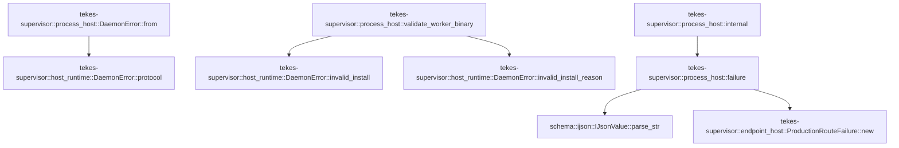

# tekes-supervisor::process_host

[Package atlas](index.md) · [Source](../../src/process_host.rs)

## Declarations

Visibility is the declaration spelling; trait members and reexports require their enclosing interface. `cfg` is not evaluated.

| Symbol | Kind | Visibility | Test / cfg |
|---|---|---|---|
| [tekes-supervisor::process_host::DELIVERY_TIMEOUT](../../src/process_host.rs#L62) | const_item | `private` |  |
| [tekes-supervisor::process_host::MCP_ONLY_APP_SANDBOX_MARKER](../../src/process_host.rs#L63) | const_item | `private` |  |
| [tekes-supervisor::process_host::WORKER_HANDSHAKE_TIMEOUT](../../src/process_host.rs#L64) | const_item | `private` |  |
| [tekes-supervisor::process_host::WORKER_HELLO_MAX_BYTES](../../src/process_host.rs#L65) | const_item | `private` |  |
| [tekes-supervisor::process_host::MANAGEMENT_RECOVERY_SECONDS](../../src/process_host.rs#L67) | const_item | `private` |  |
| [tekes-supervisor::process_host::PERIODIC_SWEEP_INTERVAL](../../src/process_host.rs#L68) | const_item | `private` |  |
| [tekes-supervisor::process_host::SweepLedgerIdentity](../../src/process_host.rs#L73) | struct_item | `private` |  |
| [tekes-supervisor::process_host::SweepLedgerIdentity::of](../../src/process_host.rs#L80) | function_item | `private` |  |
| [tekes-supervisor::process_host::SweepLedgerScan](../../src/process_host.rs#L93) | struct_item | `private` |  |
| [tekes-supervisor::process_host::AUTOMATIC_THREAD_TITLE_MODEL_HINT](../../src/process_host.rs#L107) | const_item | `private` |  |
| [tekes-supervisor::process_host::AUTOMATIC_THREAD_TITLE_MAX_CHARS](../../src/process_host.rs#L108) | const_item | `private` |  |
| [tekes-supervisor::process_host::AUTOMATIC_THREAD_TITLE_TIMEOUT](../../src/process_host.rs#L109) | const_item | `private` |  |
| [tekes-supervisor::process_host::AUTOMATIC_THREAD_TITLE_MAX_OUTPUT_TOKENS](../../src/process_host.rs#L113) | const_item | `private` |  |
| [tekes-supervisor::process_host::COMPACTION_SUMMARY_TIMEOUT](../../src/process_host.rs#L114) | const_item | `private` |  |
| [tekes-supervisor::process_host::AUTOMATIC_THREAD_TITLE_SYSTEM](../../src/process_host.rs#L115) | const_item | `private` |  |
| [tekes-supervisor::process_host::LineLockState](../../src/process_host.rs#L118) | enum_item | `private` |  |
| [tekes-supervisor::process_host::production_sandbox_backend](../../src/process_host.rs#L123) | function_item | `private` |  |
| [tekes-supervisor::process_host::seq_ranges](../../src/process_host.rs#L134) | function_item | `private` |  |
| [tekes-supervisor::process_host::spill_compaction_summary](../../src/process_host.rs#L153) | function_item | `private` |  |
| [tekes-supervisor::process_host::now_rfc3339](../../src/process_host.rs#L170) | function_item | `private` |  |
| [tekes-supervisor::process_host::session_event_time_now](../../src/process_host.rs#L174) | function_item | `private` |  |
| [tekes-supervisor::process_host::session_event_time](../../src/process_host.rs#L178) | function_item | `private` |  |
| [tekes-supervisor::process_host::compact_title_source](../../src/process_host.rs#L188) | function_item | `private` |  |
| [tekes-supervisor::process_host::bounded_title](../../src/process_host.rs#L192) | function_item | `private` |  |
| [tekes-supervisor::process_host::deterministic_automatic_thread_title](../../src/process_host.rs#L199) | function_item | `private` |  |
| [tekes-supervisor::process_host::normalized_automatic_thread_title](../../src/process_host.rs#L203) | function_item | `private` |  |
| [tekes-supervisor::process_host::prompt_text](../../src/process_host.rs#L228) | function_item | `private` |  |
| [tekes-supervisor::process_host::automatic_title_origin](../../src/process_host.rs#L239) | function_item | `private` |  |
| [tekes-supervisor::process_host::automatic_title_route](../../src/process_host.rs#L249) | function_item | `private` |  |
| [tekes-supervisor::process_host::session_model_route](../../src/process_host.rs#L288) | function_item | `private` |  |
| [tekes-supervisor::process_host::prepare_automatic_title_request](../../src/process_host.rs#L336) | function_item | `private` |  |
| [tekes-supervisor::process_host::prepare_automatic_text_request](../../src/process_host.rs#L353) | function_item | `private` |  |
| [tekes-supervisor::process_host::accepted_stream_event](../../src/process_host.rs#L404) | function_item | `private` | test; #[cfg(test)] |
| [tekes-supervisor::process_host::ProcessToolRuntime](../../src/process_host.rs#L419) | struct_item | `private` |  |
| [tekes-supervisor::process_host::ProductionProcessHost](../../src/process_host.rs#L423) | struct_item | `pub` |  |
| [tekes-supervisor::process_host::SessionProjectionCache](../../src/process_host.rs#L485) | struct_item | `private` |  |
| [tekes-supervisor::process_host::WorkerHandle](../../src/process_host.rs#L491) | struct_item | `private` |  |
| [tekes-supervisor::process_host::WorkerHandshakeGuard](../../src/process_host.rs#L512) | struct_item | `private` |  |
| [tekes-supervisor::process_host::WorkerHandshakeGuard::child_mut](../../src/process_host.rs#L519) | function_item | `private` |  |
| [tekes-supervisor::process_host::WorkerHandshakeGuard::take_child](../../src/process_host.rs#L523) | function_item | `private` |  |
| [tekes-supervisor::process_host::WorkerHandshakeGuard::take_credential_control](../../src/process_host.rs#L527) | function_item | `private` |  |
| [tekes-supervisor::process_host::WorkerHandshakeGuard::take_credential_broker](../../src/process_host.rs#L531) | function_item | `private` |  |
| [tekes-supervisor::process_host::WorkerHandshakeGuard::wait_for_exit](../../src/process_host.rs#L535) | function_item | `private` |  |
| [tekes-supervisor::process_host::WorkerHandshakeGuard::drop](../../src/process_host.rs#L548) | function_item | `private` |  |
| [tekes-supervisor::process_host::PendingWorker](../../src/process_host.rs#L561) | struct_item | `private` |  |
| [tekes-supervisor::process_host::WorkerProtocolQuarantine](../../src/process_host.rs#L568) | struct_item | `private` |  |
| [tekes-supervisor::process_host::RestartBackoff](../../src/process_host.rs#L575) | struct_item | `private` |  |
| [tekes-supervisor::process_host::ScheduledWorker](../../src/process_host.rs#L582) | struct_item | `private` |  |
| [tekes-supervisor::process_host::WorkerState](../../src/process_host.rs#L588) | struct_item | `private` |  |
| [tekes-supervisor::process_host::reconcile_credential_bindings](../../src/process_host.rs#L595) | function_item | `private` |  |
| [tekes-supervisor::process_host::credential_control](../../src/process_host.rs#L699) | function_item | `private` |  |
| [tekes-supervisor::process_host::active_material](../../src/process_host.rs#L710) | function_item | `private` |  |
| [tekes-supervisor::process_host::retain_prior_for_unknown_credentials](../../src/process_host.rs#L724) | function_item | `private` |  |
| [tekes-supervisor::process_host::ProductionProcessHost::open](../../src/process_host.rs#L767) | function_item | `pub` |  |
| [tekes-supervisor::process_host::ProductionProcessHost::open_with_secret_store](../../src/process_host.rs#L782) | function_item | `pub` |  |
| [tekes-supervisor::process_host::ProductionProcessHost::open_with_secret_authorities](../../src/process_host.rs#L802) | function_item | `pub` |  |
| [tekes-supervisor::process_host::ProductionProcessHost::mcp_runtime](../../src/process_host.rs#L914) | function_item | `pub` |  |
| [tekes-supervisor::process_host::ProductionProcessHost::credential_is_ready](../../src/process_host.rs#L921) | function_item | `pub` |  |
| [tekes-supervisor::process_host::ProductionProcessHost::validate_workspace_policy_candidate](../../src/process_host.rs#L942) | function_item | `pub` |  |
| [tekes-supervisor::process_host::ProductionProcessHost::workspace_policy_published](../../src/process_host.rs#L1040) | function_item | `pub` |  |
| [tekes-supervisor::process_host::ProductionProcessHost::workspace_policy_recovered](../../src/process_host.rs#L1069) | function_item | `pub` |  |
| [tekes-supervisor::process_host::ProductionProcessHost::plugin_store](../../src/process_host.rs#L1084) | function_item | `pub(crate)` |  |
| [tekes-supervisor::process_host::ProductionProcessHost::client_file_changes](../../src/process_host.rs#L1090) | function_item | `pub(crate)` |  |
| [tekes-supervisor::process_host::ProductionProcessHost::client_file_page](../../src/process_host.rs#L1128) | function_item | `pub(crate)` |  |
| [tekes-supervisor::process_host::ProductionProcessHost::user_agent_dir](../../src/process_host.rs#L1168) | function_item | `pub` |  |
| [tekes-supervisor::process_host::ProductionProcessHost::client_session_roots](../../src/process_host.rs#L1174) | function_item | `pub` |  |
| [tekes-supervisor::process_host::ProductionProcessHost::client_resource_catalog](../../src/process_host.rs#L1206) | function_item | `pub(crate)` |  |
| [tekes-supervisor::process_host::ProductionProcessHost::client_tool_catalog](../../src/process_host.rs#L1244) | function_item | `pub(crate)` |  |
| [tekes-supervisor::process_host::ProductionProcessHost::schedule_authority](../../src/process_host.rs#L1308) | function_item | `pub` |  |
| [tekes-supervisor::process_host::ProductionProcessHost::start_schedule_timer](../../src/process_host.rs#L1315) | function_item | `pub` |  |
| [tekes-supervisor::process_host::ProductionProcessHost::schedule_failure](../../src/process_host.rs#L1412) | function_item | `pub` |  |
| [tekes-supervisor::process_host::ProductionProcessHost::schedule_has_work](../../src/process_host.rs#L1419) | function_item | `private` |  |
| [tekes-supervisor::process_host::ProductionProcessHost::drive_schedule](../../src/process_host.rs#L1430) | function_item | `private` |  |
| [tekes-supervisor::process_host::ProductionProcessHost::execute_schedule_claim](../../src/process_host.rs#L1444) | function_item | `private` |  |
| [tekes-supervisor::process_host::ProductionProcessHost::reconcile_schedule_statuses](../../src/process_host.rs#L1516) | function_item | `private` |  |
| [tekes-supervisor::process_host::ProductionProcessHost::run_post_ready](../../src/process_host.rs#L1593) | function_item | `pub` |  |
| [tekes-supervisor::process_host::ProductionProcessHost::post_ready_tasks](../../src/process_host.rs#L1607) | function_item | `private` |  |
| [tekes-supervisor::process_host::ProductionProcessHost::cleanup_stale_ephemeral](../../src/process_host.rs#L1628) | function_item | `private` |  |
| [tekes-supervisor::process_host::ProductionProcessHost::live_sessions_for_cleanup](../../src/process_host.rs#L1653) | function_item | `private` |  |
| [tekes-supervisor::process_host::ProductionProcessHost::run_upgrade_pass](../../src/process_host.rs#L1666) | function_item | `private` |  |
| [tekes-supervisor::process_host::ProductionProcessHost::release_for_test](../../src/process_host.rs#L1709) | function_item | `pub(crate)` | test; #[cfg(test)] #[cfg_attr(not(target_os = "macos"), allow(dead_code))] |
| [tekes-supervisor::process_host::ProductionProcessHost::is_stale_ephemeral](../../src/process_host.rs#L1717) | function_item | `pub(crate)` |  |
| [tekes-supervisor::process_host::ProductionProcessHost::on_folder_event](../../src/process_host.rs#L1721) | function_item | `private` |  |
| [tekes-supervisor::process_host::ProductionProcessHost::attach_streams](../../src/process_host.rs#L1760) | function_item | `pub` |  |
| [tekes-supervisor::process_host::ProductionProcessHost::reconcile_child_line](../../src/process_host.rs#L1770) | function_item | `private` |  |
| [tekes-supervisor::process_host::ProductionProcessHost::publish_session_status](../../src/process_host.rs#L1789) | function_item | `private` |  |
| [tekes-supervisor::process_host::ProductionProcessHost::start_periodic_sweep](../../src/process_host.rs#L1806) | function_item | `pub` |  |
| [tekes-supervisor::process_host::ProductionProcessHost::recover_pending_management](../../src/process_host.rs#L1857) | function_item | `private` |  |
| [tekes-supervisor::process_host::ProductionProcessHost::refresh_live_credentials](../../src/process_host.rs#L1865) | function_item | `pub` |  |
| [tekes-supervisor::process_host::ProductionProcessHost::config_mutation_succeeded](../../src/process_host.rs#L1883) | function_item | `pub` |  |
| [tekes-supervisor::process_host::ProductionProcessHost::refresh_worker_credentials](../../src/process_host.rs#L1898) | function_item | `private` |  |
| [tekes-supervisor::process_host::ProductionProcessHost::boot_sweep](../../src/process_host.rs#L1937) | function_item | `pub` |  |
| [tekes-supervisor::process_host::ProductionProcessHost::arm_admission](../../src/process_host.rs#L1948) | function_item | `pub` |  |
| [tekes-supervisor::process_host::ProductionProcessHost::recover_client_sessions](../../src/process_host.rs#L1957) | function_item | `pub` |  |
| [tekes-supervisor::process_host::ProductionProcessHost::ensure_verified](../../src/process_host.rs#L1999) | function_item | `pub(crate)` |  |
| [tekes-supervisor::process_host::ProductionProcessHost::hydrate](../../src/process_host.rs#L2014) | function_item | `pub(crate)` |  |
| [tekes-supervisor::process_host::ProductionProcessHost::hydrate_with](../../src/process_host.rs#L2020) | function_item | `pub(crate)` |  |
| [tekes-supervisor::process_host::ProductionProcessHost::recently_failed](../../src/process_host.rs#L2040) | function_item | `private` |  |
| [tekes-supervisor::process_host::ProductionProcessHost::hydrate_unrecorded](../../src/process_host.rs#L2048) | function_item | `private` |  |
| [tekes-supervisor::process_host::ProductionProcessHost::repair_main_projection](../../src/process_host.rs#L2137) | function_item | `private` |  |
| [tekes-supervisor::process_host::ProductionProcessHost::periodic_sweep_once](../../src/process_host.rs#L2182) | function_item | `pub` |  |
| [tekes-supervisor::process_host::ProductionProcessHost::is_draining](../../src/process_host.rs#L2199) | function_item | `pub` |  |
| [tekes-supervisor::process_host::ProductionProcessHost::sweep_ledger_scan](../../src/process_host.rs#L2209) | function_item | `private` |  |
| [tekes-supervisor::process_host::ProductionProcessHost::sweep_once](../../src/process_host.rs#L2259) | function_item | `private` |  |
| [tekes-supervisor::process_host::ProductionProcessHost::sweep_ids](../../src/process_host.rs#L2279) | function_item | `private` |  |
| [tekes-supervisor::process_host::ProductionProcessHost::is_deferred](../../src/process_host.rs#L2308) | function_item | `private` |  |
| [tekes-supervisor::process_host::ProductionProcessHost::sweep_session](../../src/process_host.rs#L2320) | function_item | `private` |  |
| [tekes-supervisor::process_host::ProductionProcessHost::propagate_durable_stops_before_sweep](../../src/process_host.rs#L2403) | function_item | `private` |  |
| [tekes-supervisor::process_host::ProductionProcessHost::shutdown](../../src/process_host.rs#L2438) | function_item | `pub` |  |
| [tekes-supervisor::process_host::ProductionProcessHost::shutdown_with](../../src/process_host.rs#L2445) | function_item | `private` |  |
| [tekes-supervisor::process_host::ProductionProcessHost::ensure_running](../../src/process_host.rs#L2484) | function_item | `private` |  |
| [tekes-supervisor::process_host::ProductionProcessHost::live_worker](../../src/process_host.rs#L2498) | function_item | `private` |  |
| [tekes-supervisor::process_host::ProductionProcessHost::spawn_worker_at](../../src/process_host.rs#L2508) | function_item | `private` |  |
| [tekes-supervisor::process_host::ProductionProcessHost::spawn_worker_at_with_handshake_timeout](../../src/process_host.rs#L2524) | function_item | `private` |  |
| [tekes-supervisor::process_host::ProductionProcessHost::workspace_service_binary](../../src/process_host.rs#L2757) | function_item | `pub` |  |
| [tekes-supervisor::process_host::ProductionProcessHost::worker_binary_digest](../../src/process_host.rs#L2761) | function_item | `private` |  |
| [tekes-supervisor::process_host::ProductionProcessHost::refresh_limits](../../src/process_host.rs#L2766) | function_item | `private` |  |
| [tekes-supervisor::process_host::ProductionProcessHost::preflight_mandatory_authorities](../../src/process_host.rs#L2786) | function_item | `pub` |  |
| [tekes-supervisor::process_host::ProductionProcessHost::is_mcp_only_app_sandbox_host](../../src/process_host.rs#L2805) | function_item | `private` |  |
| [tekes-supervisor::process_host::ProductionProcessHost::freeze_tool_authority](../../src/process_host.rs#L2825) | function_item | `private` |  |
| [tekes-supervisor::process_host::ProductionProcessHost::schedule_main](../../src/process_host.rs#L2845) | function_item | `private` |  |
| [tekes-supervisor::process_host::ProductionProcessHost::schedule_line](../../src/process_host.rs#L2856) | function_item | `private` |  |
| [tekes-supervisor::process_host::ProductionProcessHost::schedule_worker_at](../../src/process_host.rs#L2872) | function_item | `private` |  |
| [tekes-supervisor::process_host::ProductionProcessHost::schedule_worker_at_with_startup](../../src/process_host.rs#L2883) | function_item | `private` |  |
| [tekes-supervisor::process_host::ProductionProcessHost::schedule_child_from_parent](../../src/process_host.rs#L2970) | function_item | `private` |  |
| [tekes-supervisor::process_host::ProductionProcessHost::wait_for_worker](../../src/process_host.rs#L3018) | function_item | `private` |  |
| [tekes-supervisor::process_host::ProductionProcessHost::start_pending_workers](../../src/process_host.rs#L3046) | function_item | `private` |  |
| [tekes-supervisor::process_host::ProductionProcessHost::has_worker_capacity](../../src/process_host.rs#L3113) | function_item | `private` |  |
| [tekes-supervisor::process_host::ProductionProcessHost::request_provider_lease](../../src/process_host.rs#L3121) | function_item | `private` |  |
| [tekes-supervisor::process_host::ProductionProcessHost::locked_prompt](../../src/process_host.rs#L3160) | function_item | `private` |  |
| [tekes-supervisor::process_host::ProductionProcessHost::locked_compact](../../src/process_host.rs#L3194) | function_item | `private` |  |
| [tekes-supervisor::process_host::ProductionProcessHost::first_root_input](../../src/process_host.rs#L3271) | function_item | `private` |  |
| [tekes-supervisor::process_host::ProductionProcessHost::seed_automatic_title](../../src/process_host.rs#L3303) | function_item | `private` |  |
| [tekes-supervisor::process_host::ProductionProcessHost::try_seed_automatic_title](../../src/process_host.rs#L3315) | function_item | `private` |  |
| [tekes-supervisor::process_host::ProductionProcessHost::wait_and_seed_automatic_title](../../src/process_host.rs#L3343) | function_item | `private` |  |
| [tekes-supervisor::process_host::ProductionProcessHost::spawn_automatic_title_refinement](../../src/process_host.rs#L3368) | function_item | `private` |  |
| [tekes-supervisor::process_host::ProductionProcessHost::spawn_automatic_title_seed_and_refinement](../../src/process_host.rs#L3382) | function_item | `private` |  |
| [tekes-supervisor::process_host::ProductionProcessHost::refine_automatic_title](../../src/process_host.rs#L3406) | function_item | `private` |  |
| [tekes-supervisor::process_host::ProductionProcessHost::complete_automatic_text](../../src/process_host.rs#L3443) | function_item | `private` |  |
| [tekes-supervisor::process_host::ProductionProcessHost::complete_automatic_terminal](../../src/process_host.rs#L3469) | function_item | `private` |  |
| [tekes-supervisor::process_host::ProductionProcessHost::summary_for_manual_compaction](../../src/process_host.rs#L3533) | function_item | `private` |  |
| [tekes-supervisor::process_host::ProductionProcessHost::generate_automatic_title](../../src/process_host.rs#L3604) | function_item | `private` |  |
| [tekes-supervisor::process_host::ProductionProcessHost::handle_tool_control](../../src/process_host.rs#L3629) | function_item | `private` |  |
| [tekes-supervisor::process_host::ProductionProcessHost::handle_tool_continuation](../../src/process_host.rs#L3664) | function_item | `private` |  |
| [tekes-supervisor::process_host::ProductionProcessHost::validate_child_proof](../../src/process_host.rs#L3702) | function_item | `private` |  |
| [tekes-supervisor::process_host::ProductionProcessHost::publish_appended](../../src/process_host.rs#L3719) | function_item | `private` |  |
| [tekes-supervisor::process_host::ProductionProcessHost::publish_appended_with](../../src/process_host.rs#L3725) | function_item | `private` |  |
| [tekes-supervisor::process_host::ProductionProcessHost::publish_frame](../../src/process_host.rs#L3924) | function_item | `private` |  |
| [tekes-supervisor::process_host::ProductionProcessHost::launch_child](../../src/process_host.rs#L4069) | function_item | `private` |  |
| [tekes-supervisor::process_host::ProductionProcessHost::propagate_parent_stop](../../src/process_host.rs#L4156) | function_item | `private` |  |
| [tekes-supervisor::process_host::ProductionProcessHost::cascade_stop_from](../../src/process_host.rs#L4249) | function_item | `private` |  |
| [tekes-supervisor::process_host::ProductionProcessHost::reconcile_after_exit](../../src/process_host.rs#L4335) | function_item | `private` |  |
| [tekes-supervisor::process_host::ProductionProcessHost::reset_restart_backoff](../../src/process_host.rs#L4398) | function_item | `private` |  |
| [tekes-supervisor::process_host::ProductionProcessHost::restart_is_due](../../src/process_host.rs#L4405) | function_item | `private` |  |
| [tekes-supervisor::process_host::ProductionProcessHost::note_restart_failure](../../src/process_host.rs#L4413) | function_item | `private` |  |
| [tekes-supervisor::process_host::ProductionProcessHost::record_spawn_failure](../../src/process_host.rs#L4454) | function_item | `private` |  |
| [tekes-supervisor::process_host::ProductionProcessHost::record_session_notice](../../src/process_host.rs#L4479) | function_item | `private` |  |
| [tekes-supervisor::process_host::MAX_NOTICE_TOOLS](../../src/process_host.rs#L4517) | const_item | `private` |  |
| [tekes-supervisor::process_host::genesis_preset_skills](../../src/process_host.rs#L4520) | function_item | `private` |  |
| [tekes-supervisor::process_host::missing_preset_skill_notice](../../src/process_host.rs#L4531) | function_item | `private` |  |
| [tekes-supervisor::process_host::mcp_launch_notices](../../src/process_host.rs#L4552) | function_item | `private` |  |
| [tekes-supervisor::process_host::frozen_tool_launch_policy](../../src/process_host.rs#L4630) | function_item | `private` |  |
| [tekes-supervisor::process_host::validator_tool_launch_policy](../../src/process_host.rs#L4655) | function_item | `private` |  |
| [tekes-supervisor::process_host::private_validator_launch_policy](../../src/process_host.rs#L4697) | function_item | `private` |  |
| [tekes-supervisor::process_host::web_search_scope_ready](../../src/process_host.rs#L4725) | function_item | `private` |  |
| [tekes-supervisor::process_host::mcp_failure_is_required](../../src/process_host.rs#L4743) | function_item | `private` |  |
| [tekes-supervisor::process_host::required_mcp_failure_reason](../../src/process_host.rs#L4759) | function_item | `private` |  |
| [tekes-supervisor::process_host::bounded_name_list](../../src/process_host.rs#L4775) | function_item | `private` |  |
| [tekes-supervisor::process_host::bounded_name_list::LISTED](../../src/process_host.rs#L4776) | const_item | `private` |  |
| [tekes-supervisor::process_host::PolicyCandidateError](../../src/process_host.rs#L4799) | struct_item | `pub` |  |
| [tekes-supervisor::process_host::PolicyCandidateError::new](../../src/process_host.rs#L4805) | function_item | `private` |  |
| [tekes-supervisor::process_host::PolicyCandidateError::fmt](../../src/process_host.rs#L4814) | function_item | `private` |  |
| [tekes-supervisor::process_host::PolicyCandidateCause](../../src/process_host.rs#L4822) | enum_item | `pub` |  |
| [tekes-supervisor::process_host::PolicyCandidateCause::code](../../src/process_host.rs#L4837) | function_item | `pub` |  |
| [tekes-supervisor::process_host::child_dependency_admitted](../../src/process_host.rs#L4847) | function_item | `private` |  |
| [tekes-supervisor::process_host::WorkerHandle::write](../../src/process_host.rs#L4852) | function_item | `private` |  |
| [tekes-supervisor::process_host::WorkerHandle::receipt](../../src/process_host.rs#L4861) | function_item | `private` |  |
| [tekes-supervisor::process_host::WorkerHandle::queue_result](../../src/process_host.rs#L4886) | function_item | `private` |  |
| [tekes-supervisor::process_host::worker_reader](../../src/process_host.rs#L4915) | function_item | `private` |  |
| [tekes-supervisor::process_host::terminate_worker](../../src/process_host.rs#L5170) | function_item | `private` |  |
| [tekes-supervisor::process_host::fail_worker](../../src/process_host.rs#L5197) | function_item | `private` |  |
| [tekes-supervisor::process_host::worker_stderr_reader](../../src/process_host.rs#L5221) | function_item | `private` |  |
| [tekes-supervisor::process_host::worker_stderr_reader::MAX_STDERR_TAIL](../../src/process_host.rs#L5222) | const_item | `private` |  |
| [tekes-supervisor::process_host::preserve_first_failure](../../src/process_host.rs#L5241) | function_item | `private` |  |
| [tekes-supervisor::process_host::ProductionProcessHost::session_metadata_changed](../../src/process_host.rs#L5248) | function_item | `private` |  |
| [tekes-supervisor::process_host::ProductionProcessHost::prompt](../../src/process_host.rs#L5252) | function_item | `private` |  |
| [tekes-supervisor::process_host::ProductionProcessHost::compact](../../src/process_host.rs#L5315) | function_item | `private` |  |
| [tekes-supervisor::process_host::ProductionProcessHost::cancel](../../src/process_host.rs#L5354) | function_item | `private` |  |
| [tekes-supervisor::process_host::ProductionProcessHost::rename](../../src/process_host.rs#L5438) | function_item | `private` |  |
| [tekes-supervisor::process_host::ProductionProcessHost::deliver_if_live](../../src/process_host.rs#L5475) | function_item | `private` |  |
| [tekes-supervisor::process_host::ProductionProcessHost::ensure_after_locked_append](../../src/process_host.rs#L5499) | function_item | `private` |  |
| [tekes-supervisor::process_host::cancel_stage_failure](../../src/process_host.rs#L5513) | function_item | `private` |  |
| [tekes-supervisor::process_host::child_exited_within](../../src/process_host.rs#L5532) | function_item | `private` |  |
| [tekes-supervisor::process_host::neutral_lifecycle](../../src/process_host.rs#L5554) | function_item | `private` |  |
| [tekes-supervisor::process_host::ledger_damage](../../src/process_host.rs#L5577) | function_item | `private` |  |
| [tekes-supervisor::process_host::DamageVerdict](../../src/process_host.rs#L5587) | enum_item | `private` |  |
| [tekes-supervisor::process_host::damage_under_lock](../../src/process_host.rs#L5603) | function_item | `private` |  |
| [tekes-supervisor::process_host::child_ledger_damage](../../src/process_host.rs#L5639) | function_item | `private` |  |
| [tekes-supervisor::process_host::is_single_line_ledger](../../src/process_host.rs#L5665) | function_item | `private` |  |
| [tekes-supervisor::process_host::HYDRATE_RETRY](../../src/process_host.rs#L5678) | const_item | `private` |  |
| [tekes-supervisor::process_host::DEFAULT_LIST_WAIT](../../src/process_host.rs#L5680) | const_item | `private` |  |
| [tekes-supervisor::process_host::ProductionProcessHost::list_wait](../../src/process_host.rs#L5683) | function_item | `private` |  |
| [tekes-supervisor::process_host::ProductionProcessHost::is_running](../../src/process_host.rs#L5698) | function_item | `private` |  |
| [tekes-supervisor::process_host::ProductionProcessHost::catalog_item](../../src/process_host.rs#L5708) | function_item | `private` |  |
| [tekes-supervisor::process_host::ProductionProcessHost::verify_within](../../src/process_host.rs#L5784) | function_item | `private` |  |
| [tekes-supervisor::process_host::ProductionProcessHost::build_inventory](../../src/process_host.rs#L5849) | function_item | `private` |  |
| [tekes-supervisor::process_host::ProductionProcessHost::inventory_items](../../src/process_host.rs#L5904) | function_item | `private` |  |
| [tekes-supervisor::process_host::ProductionProcessHost::ensure_verified](../../src/process_host.rs#L5914) | function_item | `private` |  |
| [tekes-supervisor::process_host::ProductionProcessHost::has_catalog](../../src/process_host.rs#L5929) | function_item | `private` |  |
| [tekes-supervisor::process_host::ProductionProcessHost::hold_catalog](../../src/process_host.rs#L5933) | function_item | `private` |  |
| [tekes-supervisor::process_host::ProductionProcessHost::inventory_item](../../src/process_host.rs#L5989) | function_item | `private` |  |
| [tekes-supervisor::process_host::ProductionProcessHost::live_sessions](../../src/process_host.rs#L6018) | function_item | `private` |  |
| [tekes-supervisor::process_host::ProductionProcessHost::reconcile_projection](../../src/process_host.rs#L6028) | function_item | `private` |  |
| [tekes-supervisor::process_host::ProductionProcessHost::execute](../../src/process_host.rs#L6038) | function_item | `private` |  |
| [tekes-supervisor::process_host::ProductionProcessHost::readiness](../../src/process_host.rs#L6066) | function_item | `private` |  |
| [tekes-supervisor::process_host::ProductionProcessHost::config_mutation_succeeded](../../src/process_host.rs#L6143) | function_item | `private` |  |
| [tekes-supervisor::process_host::ProcessToolRuntime::host](../../src/process_host.rs#L6167) | function_item | `private` |  |
| [tekes-supervisor::process_host::ProcessToolRuntime::ensure_running](../../src/process_host.rs#L6175) | function_item | `private` |  |
| [tekes-supervisor::process_host::ProcessToolRuntime::deliver_input](../../src/process_host.rs#L6186) | function_item | `private` |  |
| [tekes-supervisor::process_host::ProcessToolRuntime::interrupt](../../src/process_host.rs#L6222) | function_item | `private` |  |
| [tekes-supervisor::process_host::ProcessToolRuntime::ensure_child](../../src/process_host.rs#L6246) | function_item | `private` |  |
| [tekes-supervisor::process_host::ProcessToolRuntime::deliver_report](../../src/process_host.rs#L6260) | function_item | `private` |  |
| [tekes-supervisor::process_host::unresolved_parent_dependency](../../src/process_host.rs#L6282) | function_item | `private` |  |
| [tekes-supervisor::process_host::line_schedule_target](../../src/process_host.rs#L6360) | function_item | `private` |  |
| [tekes-supervisor::process_host::operation_unavailable](../../src/process_host.rs#L6396) | function_item | `private` |  |
| [tekes-supervisor::process_host::operation_value](../../src/process_host.rs#L6400) | function_item | `private` |  |
| [tekes-supervisor::process_host::workspace_quiescence_lock_path](../../src/process_host.rs#L6408) | function_item | `pub(crate)` |  |
| [tekes-supervisor::process_host::workspace_id](../../src/process_host.rs#L6413) | function_item | `private` |  |
| [tekes-supervisor::process_host::scoped_client_file_path](../../src/process_host.rs#L6417) | function_item | `private` |  |
| [tekes-supervisor::process_host::session_workspace_binding](../../src/process_host.rs#L6460) | function_item | `private` |  |
| [tekes-supervisor::process_host::ledger_needs_worker](../../src/process_host.rs#L6474) | function_item | `private` |  |
| [tekes-supervisor::process_host::goal_continuation_due](../../src/process_host.rs#L6492) | function_item | `private` |  |
| [tekes-supervisor::process_host::probe_line_lock](../../src/process_host.rs#L6536) | function_item | `private` |  |
| [tekes-supervisor::process_host::read_worker_hello](../../src/process_host.rs#L6570) | function_item | `private` |  |
| [tekes-supervisor::process_host::next_stop_generation](../../src/process_host.rs#L6642) | function_item | `private` |  |
| [tekes-supervisor::process_host::validate_worker_binary](../../src/process_host.rs#L6661) | function_item | `private` |  |
| [tekes-supervisor::process_host::failure](../../src/process_host.rs#L6673) | function_item | `private` |  |
| [tekes-supervisor::process_host::internal](../../src/process_host.rs#L6681) | function_item | `private` |  |
| [tekes-supervisor::process_host::DaemonError::from](../../src/process_host.rs#L6686) | function_item | `private` |  |
| [tekes-supervisor::process_host::tests::client_file_scope_uses_selected_directory_and_rejects_escape](../../src/process_host.rs#L6694) | function_item | `private` | test; #[cfg(test)] |
| [tekes-supervisor::process_host::tests::deepseek_title_provider](../../src/process_host.rs#L6737) | function_item | `private` | test; #[cfg(test)] |
| [tekes-supervisor::process_host::tests::serve_title_once](../../src/process_host.rs#L6760) | function_item | `private` | test; #[cfg(test)] |
| [tekes-supervisor::process_host::tests::serve_title_response](../../src/process_host.rs#L6775) | function_item | `private` | test; #[cfg(test)] |
| [tekes-supervisor::process_host::tests::automatic_title_text_normalization_matches_the_legacy_contract](../../src/process_host.rs#L6829) | function_item | `private` | test; #[cfg(test)] |
| [tekes-supervisor::process_host::tests::automatic_title_route_finds_flash_by_hint_and_falls_back_to_any_deepseek](../../src/process_host.rs#L6852) | function_item | `private` | test; #[cfg(test)] |
| [tekes-supervisor::process_host::tests::automatic_title_route_finds_flash_by_hint_and_falls_back_to_any_deepseek::providers_with](../../src/process_host.rs#L6853) | function_item | `private` | test; #[cfg(test)] |
| [tekes-supervisor::process_host::tests::automatic_title_request_uses_configured_deepseek_adapter_and_pins_flash](../../src/process_host.rs#L6896) | function_item | `private` | test; #[cfg(test)] |
| [tekes-supervisor::process_host::tests::automatic_title_uses_the_provider_runtime_and_normalizes_its_terminal](../../src/process_host.rs#L6932) | function_item | `private` | test; #[cfg(test)] |
| [tekes-supervisor::process_host::tests::automatic_title_rejects_cut_and_failed_responses](../../src/process_host.rs#L6977) | function_item | `private` | test; #[cfg(test)] |
| [tekes-supervisor::process_host::tests::automatic_title_request_fails_closed_without_a_reasoning_off_switch](../../src/process_host.rs#L7031) | function_item | `private` | test; #[cfg(test)] |
| [tekes-supervisor::process_host::tests::locked_manual_compact_covers_settled_history_and_is_keyed_by_origin](../../src/process_host.rs#L7064) | function_item | `private` | test; #[cfg(test)] |
| [tekes-supervisor::process_host::tests::worker_failure_preserves_first_root_cause](../../src/process_host.rs#L7163) | function_item | `private` | test; #[cfg(test)] |
| [tekes-supervisor::process_host::tests::restart_backoff_is_reason_scoped_bounded_and_user_resettable](../../src/process_host.rs#L7173) | function_item | `private` | test; #[cfg(test)] |
| [tekes-supervisor::process_host::tests::unavailable_credential_refresh_retains_last_authoritative_generation](../../src/process_host.rs#L7216) | function_item | `private` | test; #[cfg(test)] |
| [tekes-supervisor::process_host::tests::a_missing_preset_skill_is_one_warning](../../src/process_host.rs#L7254) | function_item | `private` | test; #[cfg(test)] |
| [tekes-supervisor::process_host::tests::mcp_launch_notices_name_the_skipped_server_and_its_reason](../../src/process_host.rs#L7283) | function_item | `private` | test; #[cfg(test)] |
| [tekes-supervisor::process_host::tests::refused_tools_produce_one_bounded_notice_per_healthy_server](../../src/process_host.rs#L7325) | function_item | `private` | test; #[cfg(test)] |
| [tekes-supervisor::process_host::tests::write_catalog_server](../../src/process_host.rs#L7366) | function_item | `private` | test; #[cfg(test)] #[cfg(target_os = "macos")] |
| [tekes-supervisor::process_host::tests::launch_notice_for_policy](../../src/process_host.rs#L7382) | function_item | `private` | test; #[cfg(test)] #[cfg(target_os = "macos")] |
| [tekes-supervisor::process_host::tests::a_policy_set_accepts_never_breaks_the_launch_binding](../../src/process_host.rs#L7471) | function_item | `private` | test; #[cfg(test)] #[cfg(target_os = "macos")] |
| [tekes-supervisor::process_host::tests::unavailable_mcp_server_fails_launch_only_when_policy_names_its_tools](../../src/process_host.rs#L7517) | function_item | `private` | test; #[cfg(test)] |
| [tekes-supervisor::process_host::tests::durable_prompt_receipt_survives_spawn_failure_and_exact_retry_deduplicates](../../src/process_host.rs#L7540) | function_item | `private` | test; #[cfg(test)] #[cfg(target_os = "macos")] |
| [tekes-supervisor::process_host::tests::broken_mcp_registry_degrades_the_launch_and_warns_in_the_session](../../src/process_host.rs#L7625) | function_item | `private` | test; #[cfg(test)] #[cfg(target_os = "macos")] |
| [tekes-supervisor::process_host::tests::session_notices](../../src/process_host.rs#L7692) | function_item | `private` | test; #[cfg(test)] #[cfg(target_os = "macos")] |
| [tekes-supervisor::process_host::tests::late_provider_frame_does_not_reopen_sealed_output](../../src/process_host.rs#L7704) | function_item | `private` | test; #[cfg(test)] #[cfg(target_os = "macos")] |
| [tekes-supervisor::process_host::tests::late_provider_frame_does_not_reopen_sealed_output::SESSION](../../src/process_host.rs#L7705) | const_item | `private` | test; #[cfg(test)] #[cfg(target_os = "macos")] |
| [tekes-supervisor::process_host::tests::eager_tool_records_published_by_doorbell_do_not_drop_later_frames](../../src/process_host.rs#L7748) | function_item | `private` | test; #[cfg(test)] #[cfg(target_os = "macos")] |
| [tekes-supervisor::process_host::tests::eager_tool_records_published_by_doorbell_do_not_drop_later_frames::SESSION](../../src/process_host.rs#L7749) | const_item | `private` | test; #[cfg(test)] #[cfg(target_os = "macos")] |
| [tekes-supervisor::process_host::tests::late_stamped_frame_does_not_reopen_sealed_output](../../src/process_host.rs#L7833) | function_item | `private` | test; #[cfg(test)] #[cfg(target_os = "macos")] |
| [tekes-supervisor::process_host::tests::late_stamped_frame_does_not_reopen_sealed_output::SESSION](../../src/process_host.rs#L7834) | const_item | `private` | test; #[cfg(test)] #[cfg(target_os = "macos")] |
| [tekes-supervisor::process_host::tests::provider_frame_reaches_transient_sink_and_is_never_journaled](../../src/process_host.rs#L7871) | function_item | `private` | test; #[cfg(test)] |
| [tekes-supervisor::process_host::tests::provider_frame_reaches_transient_sink_and_is_never_journaled::SESSION](../../src/process_host.rs#L7872) | const_item | `private` | test; #[cfg(test)] |
| [tekes-supervisor::process_host::tests::block_on_ready](../../src/process_host.rs#L7958) | function_item | `private` | test; #[cfg(test)] |
| [tekes-supervisor::process_host::tests::appended_events_are_projected_before_any_endpoint_stream_is_attached](../../src/process_host.rs#L7970) | function_item | `private` | test; #[cfg(test)] #[cfg(target_os = "macos")] |
| [tekes-supervisor::process_host::tests::opening_a_thread_repairs_a_terminal_main_tail_missing_from_the_endpoint_journal](../../src/process_host.rs#L8019) | function_item | `private` | test; #[cfg(test)] #[cfg(target_os = "macos")] |
| [tekes-supervisor::process_host::tests::opening_a_thread_repairs_a_terminal_main_tail_missing_from_the_endpoint_journal::SESSION](../../src/process_host.rs#L8020) | const_item | `private` | test; #[cfg(test)] #[cfg(target_os = "macos")] |
| [tekes-supervisor::process_host::tests::attached_streams_report_inventory_running_from_the_line_lock_on_status_frames](../../src/process_host.rs#L8079) | function_item | `private` | test; #[cfg(test)] #[cfg(target_os = "macos")] |
| [tekes-supervisor::process_host::tests::periodic_sweep_repairs_a_stale_endpoint_journal_for_live_subscribers](../../src/process_host.rs#L8147) | function_item | `private` | test; #[cfg(test)] #[cfg(target_os = "macos")] |
| [tekes-supervisor::process_host::tests::periodic_sweep_repairs_a_stale_endpoint_journal_for_live_subscribers::SESSION](../../src/process_host.rs#L8148) | const_item | `private` | test; #[cfg(test)] #[cfg(target_os = "macos")] |
| [tekes-supervisor::process_host::tests::opening_a_mux_journal_reconciles_the_semantic_tail_first](../../src/process_host.rs#L8252) | function_item | `private` | test; #[cfg(test)] #[cfg(target_os = "macos")] |
| [tekes-supervisor::process_host::tests::opening_a_mux_journal_reconciles_the_semantic_tail_first::SESSION](../../src/process_host.rs#L8253) | const_item | `private` | test; #[cfg(test)] #[cfg(target_os = "macos")] |
| [tekes-supervisor::process_host::tests::wait_for_mux_frame](../../src/process_host.rs#L8305) | function_item | `private` | test; #[cfg(test)] #[cfg(target_os = "macos")] |
| [tekes-supervisor::process_host::tests::worker_exit_path_projects_the_settled_tail_and_refreshes_inventory](../../src/process_host.rs#L8337) | function_item | `private` | test; #[cfg(test)] #[cfg(target_os = "macos")] |
| [tekes-supervisor::process_host::tests::worker_exit_path_projects_the_settled_tail_and_refreshes_inventory::SESSION](../../src/process_host.rs#L8338) | const_item | `private` | test; #[cfg(test)] #[cfg(target_os = "macos")] |
| [tekes-supervisor::process_host::tests::sweep_retries_a_projection_that_failed_on_the_doorbell](../../src/process_host.rs#L8469) | function_item | `private` | test; #[cfg(test)] #[cfg(target_os = "macos")] |
| [tekes-supervisor::process_host::tests::sweep_retries_a_projection_that_failed_on_the_doorbell::SESSION](../../src/process_host.rs#L8470) | const_item | `private` | test; #[cfg(test)] #[cfg(target_os = "macos")] |
| [tekes-supervisor::process_host::tests::live_stream_time_is_integral_epoch_milliseconds](../../src/process_host.rs#L8534) | function_item | `private` | test; #[cfg(test)] |
| [tekes-supervisor::process_host::tests::terminal_attempt_pipe_tail_is_not_a_worker_failure](../../src/process_host.rs#L8541) | function_item | `private` | test; #[cfg(test)] |
| [tekes-supervisor::process_host::tests::tool_launch_policy_uses_selected_folder_without_dropping_other_roots](../../src/process_host.rs#L8557) | function_item | `private` | test; #[cfg(test)] |
| [tekes-supervisor::process_host::tests::report_wake_targets_the_exact_nested_parent_line](../../src/process_host.rs#L8648) | function_item | `private` | test; #[cfg(test)] |
| [tekes-supervisor::process_host::tests::report_wake_rejects_parent_line_aliases_and_path_escape](../../src/process_host.rs#L8658) | function_item | `private` | test; #[cfg(test)] |
| [tekes-supervisor::process_host::tests::child_dependency_overrides_only_its_live_parent_capacity_slot](../../src/process_host.rs#L8672) | function_item | `private` | test; #[cfg(test)] |
| [tekes-supervisor::process_host::tests::slice14c_gate_103_production_claim_uses_management_and_delivery_authorities](../../src/process_host.rs#L8687) | function_item | `private` | test; #[cfg(test)] #[cfg(target_os = "macos")] |
| [tekes-supervisor::process_host::tests::periodic_sweep_is_single_flight_and_stops_at_drain](../../src/process_host.rs#L8796) | function_item | `private` | test; #[cfg(test)] |
| [tekes-supervisor::process_host::tests::sweep_isolates_one_corrupt_session_and_still_recovers_the_next](../../src/process_host.rs#L8827) | function_item | `private` | test; #[cfg(test)] #[cfg(target_os = "macos")] |
| [tekes-supervisor::process_host::tests::builtin_recovery_waits_for_explicit_request_and_is_idempotent](../../src/process_host.rs#L8833) | function_item | `private` | test; #[cfg(test)] #[cfg(target_os = "macos")] |
| [tekes-supervisor::process_host::tests::check_sweep_recovery](../../src/process_host.rs#L8838) | function_item | `private` | test; #[cfg(test)] #[cfg(target_os = "macos")] |
| [tekes-supervisor::process_host::tests::sweep_scans_a_ledger_once_per_file_identity](../../src/process_host.rs#L8936) | function_item | `private` | test; #[cfg(test)] |
| [tekes-supervisor::process_host::tests::sweep_quarantines_busy_unknown_until_the_file_lock_is_free](../../src/process_host.rs#L8977) | function_item | `private` | test; #[cfg(test)] #[cfg(target_os = "macos")] |
| [tekes-supervisor::process_host::tests::ensure_existing_worker_refreshes_adjacent_secret_revocation](../../src/process_host.rs#L9043) | function_item | `private` | test; #[cfg(test)] #[cfg(target_os = "macos")] |
| [tekes-supervisor::process_host::tests::queue_recovery_is_preloaded_during_worker_negotiation](../../src/process_host.rs#L9130) | function_item | `private` | test; #[cfg(test)] #[cfg(target_os = "macos")] |
| [tekes-supervisor::process_host::tests::pending_queue_recovery_survives_an_ordinary_ensure_race](../../src/process_host.rs#L9215) | function_item | `private` | test; #[cfg(test)] #[cfg(target_os = "macos")] |
| [tekes-supervisor::process_host::tests::capacity_release_starts_a_pending_queue_transaction_on_a_settled_tail](../../src/process_host.rs#L9320) | function_item | `private` | test; #[cfg(test)] #[cfg(target_os = "macos")] |
| [tekes-supervisor::process_host::tests::no_mutual_worker_protocol_is_quarantined_until_binary_bytes_change](../../src/process_host.rs#L9435) | function_item | `private` | test; #[cfg(test)] #[cfg(target_os = "macos")] |
| [tekes-supervisor::process_host::tests::worker_hello_timeout_kills_waits_and_closes_the_broker](../../src/process_host.rs#L9507) | function_item | `private` | test; #[cfg(test)] #[cfg(target_os = "macos")] |
| [tekes-supervisor::process_host::tests::malformed_worker_hello_kills_waits_and_closes_the_broker](../../src/process_host.rs#L9517) | function_item | `private` | test; #[cfg(test)] #[cfg(target_os = "macos")] |
| [tekes-supervisor::process_host::tests::worker_early_eof_is_reaped_before_spawn_returns](../../src/process_host.rs#L9527) | function_item | `private` | test; #[cfg(test)] #[cfg(target_os = "macos")] |
| [tekes-supervisor::process_host::tests::assert_handshake_failure_reaps_worker](../../src/process_host.rs#L9536) | function_item | `private` | test; #[cfg(test)] #[cfg(target_os = "macos")] |
| [tekes-supervisor::process_host::tests::stop_cascade_durably_gates_the_entire_unpaired_spawn_graph](../../src/process_host.rs#L9637) | function_item | `private` | test; #[cfg(test)] #[cfg(target_os = "macos")] |
| [tekes-supervisor::process_host::tests::live_root_stop_receipt_precedes_the_same_durable_cascade](../../src/process_host.rs#L9643) | function_item | `private` | test; #[cfg(test)] #[cfg(target_os = "macos")] |
| [tekes-supervisor::process_host::tests::sweep_propagates_a_durable_root_stop_before_descendant_triage](../../src/process_host.rs#L9649) | function_item | `private` | test; #[cfg(test)] #[cfg(target_os = "macos")] |
| [tekes-supervisor::process_host::tests::exercise_stop_cascade](../../src/process_host.rs#L9733) | function_item | `private` | test; #[cfg(test)] #[cfg(target_os = "macos")] |
| [tekes-supervisor::process_host::tests::max_one_worker_dependency_chain_progresses_without_admitting_unrelated_work](../../src/process_host.rs#L9859) | function_item | `private` | test; #[cfg(test)] #[cfg(target_os = "macos")] |
| [tekes-supervisor::process_host::tests::prompt_after_confirmed_worker_exit_reuses_locked_origin](../../src/process_host.rs#L10023) | function_item | `private` | test; #[cfg(test)] #[cfg(target_os = "macos")] |
| [tekes-supervisor::process_host::tests::write_canonical_test_json](../../src/process_host.rs#L10094) | function_item | `private` | test; #[cfg(test)] #[cfg_attr(not(target_os = "macos"), allow(dead_code))] |
| [tekes-supervisor::process_host::tests::real_worker_recovers_final_before_settlement_with_resume_never](../../src/process_host.rs#L10103) | function_item | `private` | test; #[cfg(test)] #[cfg(target_os = "macos")] |
| [tekes-supervisor::process_host::tests::HELD_TS](../../src/process_host.rs#L10352) | const_item | `private` | test; #[cfg(test)] |
| [tekes-supervisor::process_host::tests::held_ledger_lines](../../src/process_host.rs#L10355) | function_item | `private` | test; #[cfg(test)] |
| [tekes-supervisor::process_host::tests::held_response_line](../../src/process_host.rs#L10388) | function_item | `private` | test; #[cfg(test)] #[cfg_attr(not(target_os = "macos"), allow(dead_code))] |
| [tekes-supervisor::process_host::tests::held_host](../../src/process_host.rs#L10395) | function_item | `private` | test; #[cfg(test)] #[cfg_attr(not(target_os = "macos"), allow(dead_code))] |
| [tekes-supervisor::process_host::tests::publish_appended_writes_a_fresh_card_that_matches_the_inventory_scan](../../src/process_host.rs#L10429) | function_item | `private` | test; #[cfg(test)] #[cfg(target_os = "macos")] |
| [tekes-supervisor::process_host::tests::card_writer_coalesces_and_flushes_at_shutdown](../../src/process_host.rs#L10477) | function_item | `private` | test; #[cfg(test)] #[cfg(target_os = "macos")] |
| [tekes-supervisor::process_host::tests::publish_appended_fast_path_publishes_the_pending_hold_from_one_decode](../../src/process_host.rs#L10510) | function_item | `private` | test; #[cfg(test)] #[cfg(target_os = "macos")] |
| [tekes-supervisor::process_host::tests::publish_appended_with_a_grown_ledger_does_not_resurrect_a_resolved_hold](../../src/process_host.rs#L10529) | function_item | `private` | test; #[cfg(test)] #[cfg(target_os = "macos")] |
| [tekes-supervisor::process_host::tests::a_reused_session_id_does_not_inherit_the_old_actionable_high_water_mark](../../src/process_host.rs#L10563) | function_item | `private` | test; #[cfg(test)] #[cfg(target_os = "macos")] |
| [tekes-supervisor::process_host::tests::held_thread_on_disk](../../src/process_host.rs#L10607) | function_item | `private` | test; #[cfg(test)] #[cfg_attr(not(target_os = "macos"), allow(dead_code))] |
| [tekes-supervisor::process_host::tests::the_catalog_list_equals_the_scan_list_and_a_late_thread_is_a_placeholder](../../src/process_host.rs#L10624) | function_item | `private` | test; #[cfg(test)] #[cfg(target_os = "macos")] |
| [tekes-supervisor::process_host::tests::only_threads_this_process_published_or_unarchived_are_admitted](../../src/process_host.rs#L10746) | function_item | `private` | test; #[cfg(test)] #[cfg(target_os = "macos")] |
| [tekes-supervisor::process_host::tests::open_host](../../src/process_host.rs#L10775) | function_item | `private` | test; #[cfg(test)] #[cfg_attr(not(target_os = "macos"), allow(dead_code))] |
| [tekes-supervisor::process_host::tests::poll_until_ready](../../src/process_host.rs#L10798) | function_item | `private` | test; #[cfg(test)] #[cfg_attr(not(target_os = "macos"), allow(dead_code))] |
| [tekes-supervisor::process_host::tests::a_thread_published_after_the_catalog_loaded_is_listed_swept_and_blank](../../src/process_host.rs#L10817) | function_item | `private` | test; #[cfg(test)] #[cfg(target_os = "macos")] |
| [tekes-supervisor::process_host::tests::hydrations_run_in_parallel_and_never_hold_up_a_doorbell](../../src/process_host.rs#L10872) | function_item | `private` | test; #[cfg(test)] #[cfg(target_os = "macos")] |
| [tekes-supervisor::process_host::tests::a_complete_invalid_line_quarantines_and_is_not_rehydrated](../../src/process_host.rs#L10947) | function_item | `private` | test; #[cfg(test)] #[cfg(target_os = "macos")] |
| [tekes-supervisor::process_host::tests::damage_in_a_held_ledger_is_deferred_until_the_lock_is_free](../../src/process_host.rs#L10990) | function_item | `private` | test; #[cfg(test)] #[cfg(target_os = "macos")] |
| [tekes-supervisor::process_host::tests::a_placeholder_row_is_followed_by_the_real_row_as_an_upsert](../../src/process_host.rs#L11037) | function_item | `private` | test; #[cfg(test)] #[cfg(target_os = "macos")] |
| [tekes-supervisor::process_host::tests::a_client_unarchive_admits_the_thread_and_lists_it_again](../../src/process_host.rs#L11084) | function_item | `private` | test; #[cfg(test)] #[cfg(target_os = "macos")] |
| [tekes-supervisor::process_host::tests::shutdown_stops_workers_before_it_flushes_the_cards_of_live_threads](../../src/process_host.rs#L11115) | function_item | `private` | test; #[cfg(test)] #[cfg(target_os = "macos")] |
| [tekes-supervisor::process_host::tests::a_fold_between_card_writes_does_not_rebuild_the_card_view](../../src/process_host.rs#L11150) | function_item | `private` | test; #[cfg(test)] #[cfg(target_os = "macos")] |
| [tekes-supervisor::process_host::tests::a_complete_invalid_line_in_a_child_ledger_quarantines_the_thread](../../src/process_host.rs#L11213) | function_item | `private` | test; #[cfg(test)] #[cfg(target_os = "macos")] |
| [tekes-supervisor::process_host::tests::a_published_folder_enters_the_catalog_unread](../../src/process_host.rs#L11236) | function_item | `private` | test; #[cfg(test)] #[cfg(target_os = "macos")] |
| [tekes-supervisor::process_host::tests::the_management_recovery_tick_runs_on_an_idle_root_and_reads_no_thread](../../src/process_host.rs#L11263) | function_item | `private` | test; #[cfg(test)] #[cfg(target_os = "macos")] |
| [tekes-supervisor::process_host::tests::a_thread_that_fails_verification_is_not_retried_by_every_list](../../src/process_host.rs#L11285) | function_item | `private` | test; #[cfg(test)] #[cfg(target_os = "macos")] |
| [tekes-supervisor::process_host::tests::opening_a_thread_bypasses_the_list_backoff](../../src/process_host.rs#L11318) | function_item | `private` | test; #[cfg(test)] #[cfg(target_os = "macos")] |
| [tekes-supervisor::process_host::tests::the_list_verifies_the_newest_ledgers_first](../../src/process_host.rs#L11344) | function_item | `private` | test; #[cfg(test)] #[cfg(target_os = "macos")] |
| [tekes-supervisor::process_host::tests::the_ready_path_does_not_read_any_thread_or_archive_folder](../../src/process_host.rs#L11391) | function_item | `private` | test; #[cfg(test)] #[cfg(target_os = "macos")] |
| [tekes-supervisor::process_host::tests::the_ready_path_does_not_read_any_thread_or_archive_folder::Restore](../../src/process_host.rs#L11409) | struct_item | `private` | test; #[cfg(test)] #[cfg(target_os = "macos")] |
| [tekes-supervisor::process_host::tests::the_ready_path_does_not_read_any_thread_or_archive_folder::Restore::drop](../../src/process_host.rs#L11411) | function_item | `private` | test; #[cfg(test)] #[cfg(target_os = "macos")] |
| [tekes-supervisor::process_host::tests::a_stale_projection_cannot_overwrite_a_newer_published_actionable_set](../../src/process_host.rs#L11446) | function_item | `private` | test; #[cfg(test)] #[cfg(target_os = "macos")] |
| [tekes-supervisor::process_host::tests::publish_appended_with_a_torn_tail_keeps_the_previous_error_path](../../src/process_host.rs#L11478) | function_item | `private` | test; #[cfg(test)] #[cfg(target_os = "macos")] |
| [tekes-supervisor::process_host::tests::write_test_genesis](../../src/process_host.rs#L11493) | function_item | `private` | test; #[cfg(test)] |
| [tekes-supervisor::process_host::tests::write_test_genesis_with_identity](../../src/process_host.rs#L11499) | function_item | `private` | test; #[cfg(test)] |
| [tekes-supervisor::process_host::tests::append_test_input](../../src/process_host.rs#L11517) | function_item | `private` | test; #[cfg(test)] |
| [tekes-supervisor::process_host::tests::append_test_stop](../../src/process_host.rs#L11540) | function_item | `private` | test; #[cfg(test)] #[cfg(target_os = "macos")] |
| [tekes-supervisor::process_host::tests::write_test_spawn_line](../../src/process_host.rs#L11563) | function_item | `private` | test; #[cfg(test)] #[cfg(target_os = "macos")] |
| [tekes-supervisor::process_host::tests::write_test_child_genesis](../../src/process_host.rs#L11622) | function_item | `private` | test; #[cfg(test)] #[cfg(target_os = "macos")] |
| [tekes-supervisor::process_host::tests::write_test_events](../../src/process_host.rs#L11645) | function_item | `private` | test; #[cfg(test)] #[cfg(target_os = "macos")] |
| [tekes-supervisor::process_host::tests::CHILD_TS](../../src/process_host.rs#L11658) | const_item | `private` | test; #[cfg(test)] #[cfg_attr(not(target_os = "macos"), allow(dead_code))] |
| [tekes-supervisor::process_host::tests::write_thread_with_child](../../src/process_host.rs#L11663) | function_item | `private` | test; #[cfg(test)] #[cfg(target_os = "macos")] |
| [tekes-supervisor::process_host::tests::child_request_event](../../src/process_host.rs#L11704) | function_item | `private` | test; #[cfg(test)] #[cfg(target_os = "macos")] |
| [tekes-supervisor::process_host::tests::child_response_event](../../src/process_host.rs#L11709) | function_item | `private` | test; #[cfg(test)] #[cfg(target_os = "macos")] |
| [tekes-supervisor::process_host::tests::append_test_events](../../src/process_host.rs#L11715) | function_item | `private` | test; #[cfg(test)] #[cfg(target_os = "macos")] |
| [tekes-supervisor::process_host::tests::child_rpc_id](../../src/process_host.rs#L11728) | function_item | `private` | test; #[cfg(test)] #[cfg(target_os = "macos")] |
| [tekes-supervisor::process_host::tests::a_live_child_hold_is_in_the_baseline_of_a_verified_thread_until_it_is_answered](../../src/process_host.rs#L11743) | function_item | `private` | test; #[cfg(test)] #[cfg(target_os = "macos")] |
| [tekes-supervisor::process_host::tests::a_child_exit_announces_a_hold_no_doorbell_announced](../../src/process_host.rs#L11784) | function_item | `private` | test; #[cfg(test)] #[cfg(target_os = "macos")] |
| [tekes-supervisor::process_host::tests::a_doorbell_fold_clears_child_exactness_and_the_prefilter_finds_the_new_hold](../../src/process_host.rs#L11809) | function_item | `private` | test; #[cfg(test)] #[cfg(target_os = "macos")] |
| [tekes-supervisor::process_host::tests::actionables_recomputes_do_not_reread_unchanged_child_files](../../src/process_host.rs#L11861) | function_item | `private` | test; #[cfg(test)] #[cfg(target_os = "macos")] |
| [tekes-supervisor::process_host::tests::a_busy_stale_scratch_thread_is_removed_by_the_retry](../../src/process_host.rs#L11899) | function_item | `private` | test; #[cfg(test)] #[cfg(target_os = "macos")] |
| [tekes-supervisor::process_host::tests::hydration_removes_a_dead_processs_card_temporary](../../src/process_host.rs#L11926) | function_item | `private` | test; #[cfg(test)] #[cfg(target_os = "macos")] |
| [tekes-supervisor::process_host::tests::hold_line_lock](../../src/process_host.rs#L11944) | function_item | `private` | test; #[cfg(test)] |
| [tekes-supervisor::process_host::tests::damage_is_decided_under_the_line_lock](../../src/process_host.rs#L11958) | function_item | `private` | test; #[cfg(test)] |
| [tekes-supervisor::process_host::tests::provider_admission_waits_fairly_and_drain_denies_waiter](../../src/process_host.rs#L12013) | function_item | `private` | test; #[cfg(test)] |

## Imports / reexports

| Local name | Source path | Visibility |
|---|---|---|
| `BTreeMap` | `std::collections::BTreeMap` | `private` |
| `BTreeSet` | `std::collections::BTreeSet` | `private` |
| `HashMap` | `std::collections::HashMap` | `private` |
| `HashSet` | `std::collections::HashSet` | `private` |
| `VecDeque` | `std::collections::VecDeque` | `private` |
| `_` | `std::fmt::Write` | `private` |
| `fs` | `std::fs` | `private` |
| `BufRead` | `std::io::BufRead` | `private` |
| `BufReader` | `std::io::BufReader` | `private` |
| `Read` | `std::io::Read` | `private` |
| `Write` | `std::io::Write` | `private` |
| `AsRawFd` | `std::os::fd::AsRawFd` | `private` |
| `MetadataExt` | `std::os::unix::fs::MetadataExt` | `private` |
| `OpenOptionsExt` | `std::os::unix::fs::OpenOptionsExt` | `private` |
| `Path` | `std::path::Path` | `private` |
| `PathBuf` | `std::path::PathBuf` | `private` |
| `Child` | `std::process::Child` | `private` |
| `ChildStdin` | `std::process::ChildStdin` | `private` |
| `AtomicBool` | `std::sync::atomic::AtomicBool` | `private` |
| `AtomicU64` | `std::sync::atomic::AtomicU64` | `private` |
| `Ordering` | `std::sync::atomic::Ordering` | `private` |
| `Arc` | `std::sync::Arc` | `private` |
| `Condvar` | `std::sync::Condvar` | `private` |
| `Mutex` | `std::sync::Mutex` | `private` |
| `TryLockError` | `std::sync::TryLockError` | `private` |
| `Weak` | `std::sync::Weak` | `private` |
| `Duration` | `std::time::Duration` | `private` |
| `Instant` | `std::time::Instant` | `private` |
| `UNIX_EPOCH` | `std::time::UNIX_EPOCH` | `private` |
| `DateTime` | `chrono::DateTime` | `private` |
| `Utc` | `chrono::Utc` | `private` |
| `AUTOMATIC_TITLE_REFINE_OPERATION` | `endpoint::AUTOMATIC_TITLE_REFINE_OPERATION` | `private` |
| `AUTOMATIC_TITLE_SEED_OPERATION` | `endpoint::AUTOMATIC_TITLE_SEED_OPERATION` | `private` |
| `AcceptedStreamFrame` | `endpoint::AcceptedStreamFrame` | `private` |
| `EndpointJournal` | `endpoint::EndpointJournal` | `private` |
| `ManagementStore` | `endpoint::ManagementStore` | `private` |
| `MaterializedPrompt` | `endpoint::MaterializedPrompt` | `private` |
| `MutationReceipt` | `endpoint::MutationReceipt` | `private` |
| `NativeEndpoint` | `endpoint::NativeEndpoint` | `private` |
| `Projector` | `endpoint::Projector` | `private` |
| `SESSION_NOTICE_OPERATION` | `endpoint::SESSION_NOTICE_OPERATION` | `private` |
| `SessionCreateOperation` | `endpoint::SessionCreateOperation` | `private` |
| `SessionInventoryItem` | `endpoint::SessionInventoryItem` | `private` |
| `SessionNotice` | `endpoint::SessionNotice` | `private` |
| `SessionNoticeSeverity` | `endpoint::SessionNoticeSeverity` | `private` |
| `AdmissionLease` | `engine::AdmissionLease` | `private` |
| `AdmissionPool` | `engine::AdmissionPool` | `private` |
| `EnsureAction` | `engine::EnsureAction` | `private` |
| `LockFacts` | `engine::LockFacts` | `private` |
| `TailState` | `engine::TailState` | `private` |
| `classify` | `engine::classify` | `private` |
| `ensure_action_at` | `engine::ensure_action_at` | `private` |
| `MacOsNativeHelperVerifier` | `plugins::MacOsNativeHelperVerifier` | `private` |
| `PluginStore` | `plugins::PluginStore` | `private` |
| `ConfigRepository` | `profile::ConfigRepository` | `private` |
| `ConfigSnapshot` | `profile::ConfigSnapshot` | `private` |
| `DynamicToolCatalog` | `profile::DynamicToolCatalog` | `private` |
| `Block` | `schema::Block` | `private` |
| `Event` | `schema::Event` | `private` |
| `EventKind` | `schema::EventKind` | `private` |
| `IJsonValue` | `schema::IJsonValue` | `private` |
| `OriginTuple` | `schema::OriginTuple` | `private` |
| `Digest` | `sha2::Digest` | `private` |
| `Sha256` | `sha2::Sha256` | `private` |
| `AssetStore` | `store::AssetStore` | `private` |
| `LockedLedger` | `store::LockedLedger` | `private` |
| `ThreadStore` | `store::ThreadStore` | `private` |
| `scan_valid_prefix` | `store::scan_valid_prefix` | `private` |
| `ApprovalResponse` | `worker_control::ApprovalResponse` | `private` |
| `Frame` | `worker_control::Frame` | `private` |
| `FrameChannel` | `worker_control::FrameChannel` | `private` |
| `Input` | `worker_control::Input` | `private` |
| `LaunchChild` | `worker_control::LaunchChild` | `private` |
| `LaunchResult` | `worker_control::LaunchResult` | `private` |
| `Lease` | `worker_control::Lease` | `private` |
| `Meta` | `worker_control::Meta` | `private` |
| `Receipt` | `worker_control::Receipt` | `private` |
| `Reject` | `worker_control::Reject` | `private` |
| `Stop` | `worker_control::Stop` | `private` |
| `WorkerMessage` | `worker_control::WorkerMessage` | `private` |
| `decode_hello` | `worker_control::decode_hello` | `private` |
| `decode_worker` | `worker_control::decode_worker` | `private` |
| `encode_line` | `worker_control::encode_line` | `private` |
| `QueueTransaction` | `worker_control::QueueTransaction` | `private` |
| `QueueTransactionResult` | `worker_control::QueueTransactionResult` | `private` |
| `Selection` | `worker_control::Selection` | `private` |
| `WorkerStartup` | `worker_control::WorkerStartup` | `private` |
| `decode_tool_control` | `worker_control::decode_tool_control` | `private` |
| `encode_queue_transaction` | `worker_control::encode_queue_transaction` | `private` |
| `resolve_worker_launch_bindings` | `crate::dynamic_bindings::resolve_worker_launch_bindings` | `private` |
| `HoldCatalog` | `crate::endpoint_carrier::HoldCatalog` | `private` |
| `HoldRef` | `crate::endpoint_carrier::HoldRef` | `private` |
| `LiveRespondAuthority` | `crate::endpoint_carrier::LiveRespondAuthority` | `private` |
| `ProductionCarrierError` | `crate::endpoint_carrier::ProductionCarrierError` | `private` |
| `ProductionCarrierStreams` | `crate::endpoint_carrier::ProductionCarrierStreams` | `private` |
| `SessionGateError` | `crate::endpoint_carrier::SessionGateError` | `private` |
| `SupervisorSessionAuthority` | `crate::endpoint_carrier::SupervisorSessionAuthority` | `private` |
| `VerifiedHolds` | `crate::endpoint_carrier::VerifiedHolds` | `private` |
| `ProductionRouteFailure` | `crate::endpoint_host::ProductionRouteFailure` | `private` |
| `ProviderReadinessAuthority` | `crate::endpoint_host::ProviderReadinessAuthority` | `private` |
| `QueueTransactionAuthority` | `crate::endpoint_host::QueueTransactionAuthority` | `private` |
| `RuntimeModelReadiness` | `crate::endpoint_host::RuntimeModelReadiness` | `private` |
| `RuntimeProviderFailure` | `crate::endpoint_host::RuntimeProviderFailure` | `private` |
| `RuntimeProviderReadiness` | `crate::endpoint_host::RuntimeProviderReadiness` | `private` |
| `RuntimeProviderStatus` | `crate::endpoint_host::RuntimeProviderStatus` | `private` |
| `SessionDeliveryAuthority` | `crate::endpoint_host::SessionDeliveryAuthority` | `private` |
| `DaemonError` | `crate::host_runtime::DaemonError` | `private` |
| `McpRuntime` | `crate::mcp_runtime::McpRuntime` | `private` |
| `ChildLaunchProof` | `crate::production_tool_control::ChildLaunchProof` | `private` |
| `DeliveryRequest` | `crate::production_tool_control::DeliveryRequest` | `private` |
| `DynamicSupervisorAuthority` | `crate::production_tool_control::DynamicSupervisorAuthority` | `private` |
| `InterruptRequest` | `crate::production_tool_control::InterruptRequest` | `private` |
| `JobBrokerSupervisorAuthority` | `crate::production_tool_control::JobBrokerSupervisorAuthority` | `private` |
| `ParentReportProof` | `crate::production_tool_control::ParentReportProof` | `private` |
| `ProductionToolControlHandler` | `crate::production_tool_control::ProductionToolControlHandler` | `private` |
| `ProductionToolControlPolicy` | `crate::production_tool_control::ProductionToolControlPolicy` | `private` |
| `SupervisorOperationError` | `crate::production_tool_control::SupervisorOperationError` | `private` |
| `SupervisorRuntimeAuthority` | `crate::production_tool_control::SupervisorRuntimeAuthority` | `private` |
| `ToolControlSession` | `crate::tool_control::ToolControlSession` | `private` |
| `ProfiledWorkerLaunchSpec` | `crate::ProfiledWorkerLaunchSpec` | `private` |
| `launch_profiled_worker_with_secret_store_and_binding_resolver` | `crate::launch_profiled_worker_with_secret_store_and_binding_resolver` | `private` |
| `Future` | `std::future::Future` | `private` |
| `_` | `std::io::Read` | `private` |
| `_` | `std::io::Write` | `private` |
| `TcpListener` | `std::net::TcpListener` | `private` |
| `PermissionsExt` | `std::os::unix::fs::PermissionsExt` | `private` |
| `mpsc` | `std::sync::mpsc` | `private` |
| `Context` | `std::task::Context` | `private` |
| `Poll` | `std::task::Poll` | `private` |
| `Waker` | `std::task::Waker` | `private` |
| `Value` | `serde_json::Value` | `private` |
| `json` | `serde_json::json` | `private` |
| `*` | `super::*` | `private` |

## Module declarations

| Module | Visibility | Attributes |
|---|---|---|
| `tekes-supervisor::process_host::tests` | `private` | #[cfg(test)] |

## Function call graphs

Edges below are syntactically resolved calls only, including private functions. Graphs partition callers into groups of 20; they are not execution order. All unresolved sites are listed below and in the JSON inventory.

Functions 1–20: 12 direct edges

```mermaid
flowchart TD
  n0["provider::dialect::resolve_profile"]
  n1["provider::request::prepare"]
  n2["schema::ijson::IJsonValue::parse"]
  n3["store::asset::AssetStore::new"]
  n4["tekes-supervisor::host_runtime::DaemonError::protocol"]
  n5["tekes-supervisor::process_host::production_sandbox_backend"]
  n6["tekes-supervisor::process_host::seq_ranges"]
  n7["tekes-supervisor::process_host::spill_compaction_summary"]
  n8["tekes-supervisor::process_host::now_rfc3339"]
  n9["tekes-supervisor::process_host::session_event_time_now"]
  n10["tekes-supervisor::process_host::session_event_time"]
  n11["tekes-supervisor::process_host::compact_title_source"]
  n12["tekes-supervisor::process_host::bounded_title"]
  n13["tekes-supervisor::process_host::deterministic_automatic_thread_title"]
  n14["tekes-supervisor::process_host::normalized_automatic_thread_title"]
  n15["tekes-supervisor::process_host::prompt_text"]
  n16["tekes-supervisor::process_host::automatic_title_origin"]
  n17["tekes-supervisor::process_host::automatic_title_route"]
  n18["tekes-supervisor::process_host::session_model_route"]
  n19["tekes-supervisor::process_host::prepare_automatic_title_request"]
  n20["tekes-supervisor::process_host::prepare_automatic_text_request"]
  n21["tekes-supervisor::process_host::WorkerHandshakeGuard::child_mut"]
  n22["tekes-supervisor::process_host::WorkerHandshakeGuard::take_child"]
  n23["tekes-supervisor::process_host::WorkerHandshakeGuard::take_credential_control"]
  n24["tekes-supervisor::process_host::SweepLedgerIdentity::of"]
  n7 --> n3
  n9 --> n10
  n10 --> n4
  n13 --> n11
  n13 --> n12
  n14 --> n11
  n14 --> n12
  n17 --> n0
  n18 --> n0
  n19 --> n20
  n20 --> n1
  n20 --> n2
```

Functions 21–40: 43 direct edges

```mermaid
flowchart TD
  n0["endpoint::service::NativeEndpoint::open"]
  n1["endpoint::types::validate_session_id"]
  n2["engine::admission::AdmissionPool::new"]
  n3["profile::config::ConfigRepository::open"]
  n4["profile::instruction::InstructionResolver::new_scoped"]
  n5["provider::secret_store::MemorySecretStore::new"]
  n6["schedule::ScheduleAuthority::open"]
  n7["store::folder::ThreadStore::open"]
  n8["store::folder_events::subscribe"]
  n9["store::folder_events::canonical_root"]
  n10["tekes-supervisor::catalog::Catalog::new"]
  n11["tekes-supervisor::dynamic_bindings::resolve_worker_launch_bindings"]
  n12["tekes-supervisor::host_runtime::DaemonError::invalid_config"]
  n13["tekes-supervisor::host_runtime::DaemonError::corrupt"]
  n14["tekes-supervisor::host_runtime::DaemonError::required_broker"]
  n15["tekes-supervisor::mcp_runtime::McpRuntime::open_production_authorities_with_mutation"]
  n16["tekes-supervisor::process_host::ProductionProcessHost::workspace_policy_published"]
  n17["tekes-supervisor::process_host::ProductionProcessHost::workspace_policy_recovered"]
  n18["tekes-supervisor::process_host::ProductionProcessHost::plugin_store"]
  n19["tekes-supervisor::process_host::ProductionProcessHost::client_file_changes"]
  n20["tekes-supervisor::process_host::ProductionProcessHost::client_file_page"]
  n21["tekes-supervisor::process_host::ProductionProcessHost::user_agent_dir"]
  n22["tekes-supervisor::process_host::ProductionProcessHost::client_session_roots"]
  n23["tekes-supervisor::process_host::mcp_failure_is_required"]
  n24["tekes-supervisor::process_host::required_mcp_failure_reason"]
  n25["tekes-supervisor::process_host::PolicyCandidateError::new"]
  n26["tekes-supervisor::process_host::terminate_worker"]
  n27["tekes-supervisor::process_host::WorkerHandshakeGuard::child_mut"]
  n28["tekes-supervisor::process_host::WorkerHandshakeGuard::take_credential_broker"]
  n29["tekes-supervisor::process_host::WorkerHandshakeGuard::wait_for_exit"]
  n30["tekes-supervisor::process_host::WorkerHandshakeGuard::drop"]
  n31["tekes-supervisor::process_host::reconcile_credential_bindings"]
  n32["tekes-supervisor::process_host::scoped_client_file_path"]
  n33["tekes-supervisor::process_host::session_workspace_binding"]
  n34["tekes-supervisor::process_host::validate_worker_binary"]
  n35["tekes-supervisor::process_host::credential_control"]
  n36["tekes-supervisor::process_host::active_material"]
  n37["tekes-supervisor::process_host::retain_prior_for_unknown_credentials"]
  n38["tekes-supervisor::process_host::ProductionProcessHost::open"]
  n39["tekes-supervisor::process_host::ProductionProcessHost::open_with_secret_store"]
  n40["tekes-supervisor::process_host::ProductionProcessHost::open_with_secret_authorities"]
  n41["tekes-supervisor::process_host::ProductionProcessHost::mcp_runtime"]
  n42["tekes-supervisor::process_host::ProductionProcessHost::credential_is_ready"]
  n43["tekes-supervisor::process_host::ProductionProcessHost::validate_workspace_policy_candidate"]
  n44["tekes-supervisor::thread_card::CardWriter::spawn_from_env"]
  n45["tools::builtin::BuiltinManifest::compiled"]
  n46["workspace-service::file_text_page"]
  n47["workspace-service::file_byte_page"]
  n16 --> n12
  n16 --> n26
  n17 --> n26
  n19 --> n1
  n19 --> n12
  n19 --> n33
  n20 --> n1
  n20 --> n12
  n20 --> n32
  n20 --> n33
  n20 --> n46
  n20 --> n47
  n22 --> n1
  n22 --> n12
  n22 --> n33
  n29 --> n27
  n31 --> n14
  n31 --> n35
  n31 --> n36
  n35 --> n14
  n38 --> n5
  n38 --> n39
  n39 --> n40
  n40 --> n0
  n40 --> n2
  n40 --> n3
  n40 --> n6
  n40 --> n7
  n40 --> n8
  n40 --> n9
  n40 --> n10
  n40 --> n12
  n40 --> n13
  n40 --> n14
  n40 --> n15
  n40 --> n34
  n40 --> n44
  n43 --> n4
  n43 --> n11
  n43 --> n23
  n43 --> n24
  n43 --> n25
  n43 --> n45
```

Functions 41–60: 34 direct edges

```mermaid
flowchart TD
  n0["endpoint::management::ManagementStore::open_light_at"]
  n1["engine::lifecycle::classify"]
  n2["profile::instruction::InstructionResolver::new_scoped"]
  n3["profile::resources::ResourceCatalog::from_snapshot"]
  n4["store::folder::ThreadStore::open"]
  n5["store::folder_events::is_admitted"]
  n6["store::tail::scan_valid_prefix"]
  n7["tekes-supervisor::boot_trace::phase"]
  n8["tekes-supervisor::dynamic_bindings::resolve_worker_launch_bindings"]
  n9["tekes-supervisor::host_runtime::DaemonError::protocol"]
  n10["tekes-supervisor::host_runtime::DaemonError::invalid_config"]
  n11["tekes-supervisor::host_runtime::DaemonError::corrupt"]
  n12["tekes-supervisor::host_runtime::DaemonError::required_broker"]
  n13["tekes-supervisor::process_host::ProductionProcessHost::client_resource_catalog"]
  n14["tekes-supervisor::process_host::ProductionProcessHost::client_tool_catalog"]
  n15["tekes-supervisor::process_host::ProductionProcessHost::schedule_authority"]
  n16["tekes-supervisor::process_host::ProductionProcessHost::start_schedule_timer"]
  n17["tekes-supervisor::process_host::ProductionProcessHost::schedule_failure"]
  n18["tekes-supervisor::process_host::ProductionProcessHost::schedule_has_work"]
  n19["tekes-supervisor::process_host::ProductionProcessHost::drive_schedule"]
  n20["tekes-supervisor::process_host::ProductionProcessHost::execute_schedule_claim"]
  n21["tekes-supervisor::process_host::ProductionProcessHost::reconcile_schedule_statuses"]
  n22["tekes-supervisor::process_host::ProductionProcessHost::run_post_ready"]
  n23["tekes-supervisor::process_host::ProductionProcessHost::post_ready_tasks"]
  n24["tekes-supervisor::process_host::ProductionProcessHost::cleanup_stale_ephemeral"]
  n25["tekes-supervisor::process_host::ProductionProcessHost::live_sessions_for_cleanup"]
  n26["tekes-supervisor::process_host::ProductionProcessHost::run_upgrade_pass"]
  n27["tekes-supervisor::process_host::ProductionProcessHost::is_stale_ephemeral"]
  n28["tekes-supervisor::process_host::ProductionProcessHost::on_folder_event"]
  n29["tekes-supervisor::process_host::ProductionProcessHost::attach_streams"]
  n30["tekes-supervisor::process_host::ProductionProcessHost::reconcile_child_line"]
  n31["tekes-supervisor::process_host::ProductionProcessHost::publish_session_status"]
  n32["tekes-supervisor::process_host::ProductionProcessHost::start_periodic_sweep"]
  n33["tekes-supervisor::process_host::ProductionProcessHost::hydrate"]
  n34["tekes-supervisor::process_host::ProductionProcessHost::recently_failed"]
  n35["tekes-supervisor::process_host::ProductionProcessHost::live_worker"]
  n36["tekes-supervisor::process_host::mcp_failure_is_required"]
  n37["tekes-supervisor::process_host::session_workspace_binding"]
  n38["tekes-supervisor::process_host::probe_line_lock"]
  n13 --> n2
  n13 --> n3
  n13 --> n10
  n13 --> n37
  n14 --> n2
  n14 --> n8
  n14 --> n10
  n14 --> n12
  n14 --> n36
  n14 --> n37
  n16 --> n18
  n16 --> n19
  n18 --> n11
  n19 --> n11
  n19 --> n20
  n19 --> n21
  n20 --> n0
  n20 --> n9
  n20 --> n11
  n21 --> n1
  n21 --> n6
  n21 --> n11
  n21 --> n35
  n21 --> n38
  n23 --> n7
  n23 --> n16
  n23 --> n24
  n23 --> n26
  n24 --> n4
  n24 --> n5
  n24 --> n25
  n26 --> n33
  n26 --> n34
  n27 --> n5
```

Functions 61–80: 51 direct edges

```mermaid
flowchart TD
  n0["engine::lifecycle::ensure_action_at"]
  n1["engine::lifecycle::classify"]
  n2["provider::secret_store::resolve_config_credentials"]
  n3["store::card::remove_stale_card_temps"]
  n4["store::folder_events::arm_admission"]
  n5["store::folder_events::is_admitted"]
  n6["store::folder_events::admitted_ids"]
  n7["store::tail::scan_valid_prefix"]
  n8["store::tail::repair_thread_tails"]
  n9["tekes-supervisor::boot_trace::detail"]
  n10["tekes-supervisor::boot_trace::per_item_enabled"]
  n11["tekes-supervisor::endpoint_host::recover_pending_management"]
  n12["tekes-supervisor::host_runtime::DaemonError::protocol"]
  n13["tekes-supervisor::host_runtime::DaemonError::invalid_config"]
  n14["tekes-supervisor::host_runtime::DaemonError::corrupt"]
  n15["tekes-supervisor::host_runtime::DaemonError::required_broker"]
  n16["tekes-supervisor::process_host::now_rfc3339"]
  n17["tekes-supervisor::process_host::ProductionProcessHost::recover_pending_management"]
  n18["tekes-supervisor::process_host::ProductionProcessHost::refresh_live_credentials"]
  n19["tekes-supervisor::process_host::ProductionProcessHost::config_mutation_succeeded"]
  n20["tekes-supervisor::process_host::ProductionProcessHost::refresh_worker_credentials"]
  n21["tekes-supervisor::process_host::ProductionProcessHost::boot_sweep"]
  n22["tekes-supervisor::process_host::ProductionProcessHost::arm_admission"]
  n23["tekes-supervisor::process_host::ProductionProcessHost::recover_client_sessions"]
  n24["tekes-supervisor::process_host::ProductionProcessHost::ensure_verified"]
  n25["tekes-supervisor::process_host::ProductionProcessHost::hydrate"]
  n26["tekes-supervisor::process_host::ProductionProcessHost::hydrate_with"]
  n27["tekes-supervisor::process_host::ProductionProcessHost::recently_failed"]
  n28["tekes-supervisor::process_host::ProductionProcessHost::hydrate_unrecorded"]
  n29["tekes-supervisor::process_host::ProductionProcessHost::repair_main_projection"]
  n30["tekes-supervisor::process_host::ProductionProcessHost::periodic_sweep_once"]
  n31["tekes-supervisor::process_host::ProductionProcessHost::is_draining"]
  n32["tekes-supervisor::process_host::ProductionProcessHost::sweep_ledger_scan"]
  n33["tekes-supervisor::process_host::ProductionProcessHost::sweep_once"]
  n34["tekes-supervisor::process_host::ProductionProcessHost::sweep_ids"]
  n35["tekes-supervisor::process_host::ProductionProcessHost::is_deferred"]
  n36["tekes-supervisor::process_host::ProductionProcessHost::sweep_session"]
  n37["tekes-supervisor::process_host::ProductionProcessHost::propagate_durable_stops_before_sweep"]
  n38["tekes-supervisor::process_host::ProductionProcessHost::refresh_limits"]
  n39["tekes-supervisor::process_host::ProductionProcessHost::schedule_worker_at"]
  n40["tekes-supervisor::process_host::ProductionProcessHost::publish_appended"]
  n41["tekes-supervisor::process_host::ProductionProcessHost::publish_appended_with"]
  n42["tekes-supervisor::process_host::ProductionProcessHost::restart_is_due"]
  n43["tekes-supervisor::process_host::ProductionProcessHost::note_restart_failure"]
  n44["tekes-supervisor::process_host::web_search_scope_ready"]
  n45["tekes-supervisor::process_host::terminate_worker"]
  n46["tekes-supervisor::process_host::damage_under_lock"]
  n47["tekes-supervisor::process_host::child_ledger_damage"]
  n48["tekes-supervisor::process_host::reconcile_credential_bindings"]
  n49["tekes-supervisor::process_host::goal_continuation_due"]
  n50["tekes-supervisor::process_host::probe_line_lock"]
  n51["tekes-supervisor::process_host::retain_prior_for_unknown_credentials"]
  n52["tekes-supervisor::process_host::SweepLedgerIdentity::of"]
  n53["tekes-supervisor::thread_card::fold_child_views"]
  n17 --> n11
  n18 --> n20
  n19 --> n18
  n20 --> n2
  n20 --> n15
  n20 --> n44
  n20 --> n45
  n20 --> n48
  n20 --> n51
  n21 --> n33
  n22 --> n4
  n23 --> n13
  n23 --> n24
  n23 --> n36
  n24 --> n13
  n24 --> n14
  n24 --> n25
  n25 --> n26
  n26 --> n28
  n28 --> n3
  n28 --> n8
  n28 --> n14
  n28 --> n41
  n28 --> n46
  n28 --> n47
  n28 --> n53
  n29 --> n40
  n30 --> n33
  n32 --> n7
  n32 --> n12
  n32 --> n14
  n32 --> n52
  n33 --> n9
  n33 --> n10
  n33 --> n34
  n33 --> n36
  n34 --> n6
  n35 --> n5
  n36 --> n0
  n36 --> n1
  n36 --> n16
  n36 --> n29
  n36 --> n32
  n36 --> n35
  n36 --> n37
  n36 --> n38
  n36 --> n39
  n36 --> n42
  n36 --> n43
  n36 --> n49
  n36 --> n50
```

Functions 81–100: 75 direct edges

```mermaid
flowchart TD
  n0["session-controls::bound_goal_id"]
  n1["store::platform::NamedLock::shared"]
  n2["tekes-supervisor::dynamic_bindings::resolve_worker_launch_bindings"]
  n3["tekes-supervisor::host_runtime::system_timestamp"]
  n4["tekes-supervisor::host_runtime::DaemonError::protocol"]
  n5["tekes-supervisor::host_runtime::DaemonError::io"]
  n6["tekes-supervisor::host_runtime::DaemonError::invalid_config"]
  n7["tekes-supervisor::host_runtime::DaemonError::required_broker"]
  n8["tekes-supervisor::launch_profiled_worker_with_secret_store_and_binding_resolver"]
  n9["tekes-supervisor::process_host::production_sandbox_backend"]
  n10["tekes-supervisor::process_host::ProductionProcessHost::live_sessions_for_cleanup"]
  n11["tekes-supervisor::process_host::ProductionProcessHost::publish_session_status"]
  n12["tekes-supervisor::process_host::ProductionProcessHost::refresh_worker_credentials"]
  n13["tekes-supervisor::process_host::ProductionProcessHost::ensure_verified"]
  n14["tekes-supervisor::process_host::ProductionProcessHost::sweep_ledger_scan"]
  n15["tekes-supervisor::process_host::ProductionProcessHost::propagate_durable_stops_before_sweep"]
  n16["tekes-supervisor::process_host::ProductionProcessHost::shutdown"]
  n17["tekes-supervisor::process_host::ProductionProcessHost::shutdown_with"]
  n18["tekes-supervisor::process_host::ProductionProcessHost::ensure_running"]
  n19["tekes-supervisor::process_host::ProductionProcessHost::live_worker"]
  n20["tekes-supervisor::process_host::ProductionProcessHost::spawn_worker_at"]
  n21["tekes-supervisor::process_host::ProductionProcessHost::spawn_worker_at_with_handshake_timeout"]
  n22["tekes-supervisor::process_host::ProductionProcessHost::workspace_service_binary"]
  n23["tekes-supervisor::process_host::ProductionProcessHost::worker_binary_digest"]
  n24["tekes-supervisor::process_host::ProductionProcessHost::refresh_limits"]
  n25["tekes-supervisor::process_host::ProductionProcessHost::preflight_mandatory_authorities"]
  n26["tekes-supervisor::process_host::ProductionProcessHost::is_mcp_only_app_sandbox_host"]
  n27["tekes-supervisor::process_host::ProductionProcessHost::freeze_tool_authority"]
  n28["tekes-supervisor::process_host::ProductionProcessHost::schedule_main"]
  n29["tekes-supervisor::process_host::ProductionProcessHost::schedule_line"]
  n30["tekes-supervisor::process_host::ProductionProcessHost::schedule_worker_at"]
  n31["tekes-supervisor::process_host::ProductionProcessHost::schedule_worker_at_with_startup"]
  n32["tekes-supervisor::process_host::ProductionProcessHost::schedule_child_from_parent"]
  n33["tekes-supervisor::process_host::ProductionProcessHost::wait_for_worker"]
  n34["tekes-supervisor::process_host::ProductionProcessHost::start_pending_workers"]
  n35["tekes-supervisor::process_host::ProductionProcessHost::has_worker_capacity"]
  n36["tekes-supervisor::process_host::ProductionProcessHost::cascade_stop_from"]
  n37["tekes-supervisor::process_host::ProductionProcessHost::reset_restart_backoff"]
  n38["tekes-supervisor::process_host::ProductionProcessHost::record_session_notice"]
  n39["tekes-supervisor::process_host::genesis_preset_skills"]
  n40["tekes-supervisor::process_host::missing_preset_skill_notice"]
  n41["tekes-supervisor::process_host::mcp_launch_notices"]
  n42["tekes-supervisor::process_host::frozen_tool_launch_policy"]
  n43["tekes-supervisor::process_host::validator_tool_launch_policy"]
  n44["tekes-supervisor::process_host::mcp_failure_is_required"]
  n45["tekes-supervisor::process_host::child_dependency_admitted"]
  n46["tekes-supervisor::process_host::worker_reader"]
  n47["tekes-supervisor::process_host::worker_stderr_reader"]
  n48["tekes-supervisor::process_host::unresolved_parent_dependency"]
  n49["tekes-supervisor::process_host::line_schedule_target"]
  n50["tekes-supervisor::process_host::workspace_quiescence_lock_path"]
  n51["tekes-supervisor::process_host::workspace_id"]
  n52["tekes-supervisor::process_host::session_workspace_binding"]
  n53["tekes-supervisor::process_host::ledger_needs_worker"]
  n54["tekes-supervisor::process_host::read_worker_hello"]
  n55["tools::runtime_backends::HelperJobLauncher::new"]
  n56["tools::runtime_backends::HelperJobLauncher::disabled"]
  n57["tools::sandbox::probe_backend"]
  n58["worker-control::durable::encode_queue_transaction"]
  n59["worker-control::negotiate"]
  n60["worker-control::encode_line"]
  n15 --> n14
  n15 --> n36
  n16 --> n17
  n17 --> n10
  n18 --> n24
  n18 --> n30
  n18 --> n33
  n18 --> n37
  n20 --> n21
  n21 --> n0
  n21 --> n1
  n21 --> n2
  n21 --> n3
  n21 --> n4
  n21 --> n6
  n21 --> n7
  n21 --> n8
  n21 --> n23
  n21 --> n27
  n21 --> n38
  n21 --> n39
  n21 --> n40
  n21 --> n41
  n21 --> n43
  n21 --> n44
  n21 --> n46
  n21 --> n47
  n21 --> n50
  n21 --> n52
  n21 --> n54
  n21 --> n58
  n21 --> n59
  n21 --> n60
  n24 --> n6
  n24 --> n51
  n25 --> n7
  n25 --> n9
  n25 --> n26
  n25 --> n55
  n25 --> n56
  n25 --> n57
  n26 --> n5
  n26 --> n7
  n27 --> n7
  n27 --> n9
  n27 --> n26
  n27 --> n42
  n27 --> n55
  n27 --> n56
  n27 --> n57
  n28 --> n30
  n29 --> n30
  n29 --> n32
  n29 --> n48
  n29 --> n49
  n30 --> n31
  n31 --> n4
  n31 --> n11
  n31 --> n12
  n31 --> n13
  n31 --> n19
  n31 --> n20
  n31 --> n24
  n31 --> n35
  n32 --> n11
  n32 --> n12
  n32 --> n20
  n32 --> n24
  n32 --> n35
  n32 --> n45
  n33 --> n7
  n34 --> n11
  n34 --> n20
  n34 --> n35
  n34 --> n53
```

Functions 101–120: 65 direct edges

```mermaid
flowchart TD
  n0["endpoint::journal::EndpointJournal::open"]
  n1["engine::compaction_summary::admit_summary_artifact"]
  n2["engine::compaction_summary::summary_request_bytes"]
  n3["engine::compaction_summary::CompactionSummary::from_outcome"]
  n4["engine::compaction_summary::freeze_source_bundle"]
  n5["engine::context::plan_context_compaction"]
  n6["provider::compaction_summary::prepare_summary_request"]
  n7["provider::compaction_summary::summary_completion_artifact"]
  n8["provider::http::HttpRuntime::new"]
  n9["schema::event::Event::from_value"]
  n10["schema::ijson::IJsonValue::parse"]
  n11["store::tail::scan_valid_prefix"]
  n12["store::tail::read_genesis"]
  n13["tekes-supervisor::host_runtime::DaemonError::protocol"]
  n14["tekes-supervisor::host_runtime::DaemonError::corrupt"]
  n15["tekes-supervisor::host_runtime::DaemonError::required_broker"]
  n16["tekes-supervisor::process_host::spill_compaction_summary"]
  n17["tekes-supervisor::process_host::deterministic_automatic_thread_title"]
  n18["tekes-supervisor::process_host::normalized_automatic_thread_title"]
  n19["tekes-supervisor::process_host::prompt_text"]
  n20["tekes-supervisor::process_host::automatic_title_origin"]
  n21["tekes-supervisor::process_host::automatic_title_route"]
  n22["tekes-supervisor::process_host::ProductionProcessHost::schedule_main"]
  n23["tekes-supervisor::process_host::session_model_route"]
  n24["tekes-supervisor::process_host::ProductionProcessHost::has_worker_capacity"]
  n25["tekes-supervisor::process_host::ProductionProcessHost::request_provider_lease"]
  n26["tekes-supervisor::process_host::ProductionProcessHost::locked_prompt"]
  n27["tekes-supervisor::process_host::ProductionProcessHost::locked_compact"]
  n28["tekes-supervisor::process_host::ProductionProcessHost::first_root_input"]
  n29["tekes-supervisor::process_host::ProductionProcessHost::seed_automatic_title"]
  n30["tekes-supervisor::process_host::ProductionProcessHost::try_seed_automatic_title"]
  n31["tekes-supervisor::process_host::ProductionProcessHost::wait_and_seed_automatic_title"]
  n32["tekes-supervisor::process_host::ProductionProcessHost::spawn_automatic_title_refinement"]
  n33["tekes-supervisor::process_host::prepare_automatic_title_request"]
  n34["tekes-supervisor::process_host::ProductionProcessHost::spawn_automatic_title_seed_and_refinement"]
  n35["tekes-supervisor::process_host::ProductionProcessHost::refine_automatic_title"]
  n36["tekes-supervisor::process_host::ProductionProcessHost::complete_automatic_text"]
  n37["tekes-supervisor::process_host::ProductionProcessHost::complete_automatic_terminal"]
  n38["tekes-supervisor::process_host::ProductionProcessHost::summary_for_manual_compaction"]
  n39["tekes-supervisor::process_host::ProductionProcessHost::generate_automatic_title"]
  n40["tekes-supervisor::process_host::ProductionProcessHost::handle_tool_control"]
  n41["tekes-supervisor::process_host::ProductionProcessHost::handle_tool_continuation"]
  n42["tekes-supervisor::process_host::ProductionProcessHost::validate_child_proof"]
  n43["tekes-supervisor::process_host::ProductionProcessHost::publish_appended"]
  n44["tekes-supervisor::process_host::ProductionProcessHost::publish_appended_with"]
  n45["tekes-supervisor::process_host::ProductionProcessHost::reset_restart_backoff"]
  n46["tekes-supervisor::process_host::ProductionProcessHost::record_spawn_failure"]
  n47["tekes-supervisor::process_host::ledger_damage"]
  n48["tekes-supervisor::process_host::damage_under_lock"]
  n49["tekes-supervisor::process_host::internal"]
  n50["tekes-supervisor::production_tool_control::JobBrokerSupervisorAuthority::new"]
  n51["tekes-supervisor::production_tool_control::ProductionToolControlHandler::new"]
  n52["tekes-supervisor::production_tool_control::ProductionToolControlPolicy::new"]
  n53["tekes-supervisor::thread_card::journal_input"]
  n54["tekes-supervisor::thread_card::prepare"]
  n55["tekes-supervisor::tool_control::ToolControlSession::new"]
  n56["tools::schema_registry::fixed_schema"]
  n57["worker-control::continuation::decode_tool_continuation"]
  n58["worker-control::continuation::encode_tool_continuation_result"]
  n26 --> n10
  n26 --> n19
  n26 --> n22
  n26 --> n28
  n26 --> n29
  n26 --> n32
  n26 --> n45
  n26 --> n46
  n27 --> n5
  n27 --> n9
  n27 --> n10
  n27 --> n16
  n27 --> n38
  n27 --> n43
  n27 --> n49
  n28 --> n11
  n29 --> n30
  n30 --> n17
  n30 --> n20
  n30 --> n43
  n31 --> n30
  n35 --> n20
  n35 --> n39
  n35 --> n43
  n36 --> n37
  n37 --> n8
  n38 --> n1
  n38 --> n2
  n38 --> n3
  n38 --> n4
  n38 --> n5
  n38 --> n6
  n38 --> n7
  n38 --> n10
  n38 --> n11
  n38 --> n23
  n38 --> n37
  n38 --> n56
  n39 --> n18
  n39 --> n21
  n39 --> n33
  n39 --> n36
  n40 --> n13
  n40 --> n15
  n40 --> n50
  n40 --> n51
  n40 --> n52
  n40 --> n55
  n41 --> n13
  n41 --> n15
  n41 --> n50
  n41 --> n51
  n41 --> n52
  n41 --> n57
  n41 --> n58
  n42 --> n12
  n42 --> n14
  n43 --> n44
  n44 --> n0
  n44 --> n11
  n44 --> n14
  n44 --> n47
  n44 --> n48
  n44 --> n53
  n44 --> n54
```

Functions 121–140: 59 direct edges

```mermaid
flowchart TD
  n0["endpoint::journal::EndpointJournal::open"]
  n1["engine::lifecycle::ensure_action_at"]
  n2["engine::lifecycle::classify"]
  n3["mcp::projection::project_name"]
  n4["profile::resources::ResourceCatalog::skill_package_names"]
  n5["provider::request::endpoint_origin"]
  n6["schema::event::Event::from_value"]
  n7["schema::ijson::IJsonValue::parse"]
  n8["store::tail::LockedLedger::open"]
  n9["store::tail::scan_valid_prefix"]
  n10["store::tail::read_genesis"]
  n11["tekes-supervisor::host_runtime::system_timestamp"]
  n12["tekes-supervisor::host_runtime::DaemonError::protocol"]
  n13["tekes-supervisor::host_runtime::DaemonError::invalid_config"]
  n14["tekes-supervisor::host_runtime::DaemonError::corrupt"]
  n15["tekes-supervisor::host_runtime::DaemonError::required_broker"]
  n16["tekes-supervisor::process_host::now_rfc3339"]
  n17["tekes-supervisor::process_host::session_event_time_now"]
  n18["tekes-supervisor::process_host::ProductionProcessHost::refresh_limits"]
  n19["tekes-supervisor::process_host::ProductionProcessHost::schedule_worker_at"]
  n20["tekes-supervisor::process_host::ProductionProcessHost::schedule_child_from_parent"]
  n21["tekes-supervisor::process_host::ProductionProcessHost::publish_appended"]
  n22["tekes-supervisor::process_host::ProductionProcessHost::publish_frame"]
  n23["tekes-supervisor::process_host::ProductionProcessHost::launch_child"]
  n24["tekes-supervisor::process_host::ProductionProcessHost::propagate_parent_stop"]
  n25["tekes-supervisor::process_host::ProductionProcessHost::cascade_stop_from"]
  n26["tekes-supervisor::process_host::ProductionProcessHost::reconcile_after_exit"]
  n27["tekes-supervisor::process_host::ProductionProcessHost::reset_restart_backoff"]
  n28["tekes-supervisor::process_host::ProductionProcessHost::restart_is_due"]
  n29["tekes-supervisor::process_host::ProductionProcessHost::note_restart_failure"]
  n30["tekes-supervisor::process_host::ProductionProcessHost::record_spawn_failure"]
  n31["tekes-supervisor::process_host::ProductionProcessHost::record_session_notice"]
  n32["tekes-supervisor::process_host::genesis_preset_skills"]
  n33["tekes-supervisor::process_host::missing_preset_skill_notice"]
  n34["tekes-supervisor::process_host::mcp_launch_notices"]
  n35["tekes-supervisor::process_host::frozen_tool_launch_policy"]
  n36["tekes-supervisor::process_host::validator_tool_launch_policy"]
  n37["tekes-supervisor::process_host::private_validator_launch_policy"]
  n38["tekes-supervisor::process_host::web_search_scope_ready"]
  n39["tekes-supervisor::process_host::mcp_failure_is_required"]
  n40["tekes-supervisor::process_host::required_mcp_failure_reason"]
  n41["tekes-supervisor::process_host::bounded_name_list"]
  n42["tekes-supervisor::process_host::terminate_worker"]
  n43["tekes-supervisor::process_host::line_schedule_target"]
  n44["tekes-supervisor::process_host::goal_continuation_due"]
  n45["tekes-supervisor::process_host::probe_line_lock"]
  n46["tools::preset::ResolvedPreset::from_genesis"]
  n47["tools::runtime_backends::JobLaunchPolicy::new"]
  n48["worker-control::encode_line"]
  n22 --> n0
  n22 --> n9
  n22 --> n14
  n22 --> n17
  n23 --> n1
  n23 --> n2
  n23 --> n9
  n23 --> n12
  n23 --> n14
  n23 --> n16
  n23 --> n20
  n23 --> n24
  n23 --> n45
  n24 --> n6
  n24 --> n7
  n24 --> n8
  n24 --> n9
  n24 --> n12
  n24 --> n14
  n24 --> n48
  n25 --> n9
  n25 --> n14
  n25 --> n20
  n25 --> n24
  n25 --> n25
  n25 --> n42
  n25 --> n43
  n26 --> n1
  n26 --> n2
  n26 --> n9
  n26 --> n14
  n26 --> n16
  n26 --> n18
  n26 --> n19
  n26 --> n21
  n26 --> n27
  n26 --> n28
  n26 --> n29
  n26 --> n44
  n26 --> n45
  n30 --> n31
  n31 --> n11
  n31 --> n21
  n32 --> n10
  n32 --> n46
  n33 --> n4
  n35 --> n13
  n35 --> n15
  n35 --> n47
  n36 --> n9
  n36 --> n12
  n36 --> n14
  n36 --> n15
  n36 --> n37
  n37 --> n15
  n37 --> n47
  n38 --> n5
  n39 --> n3
  n40 --> n39
```

Functions 141–160: 25 direct edges

```mermaid
flowchart TD
  n0["tekes-supervisor::endpoint_host::ProductionRouteFailure::new"]
  n1["tekes-supervisor::host_runtime::DaemonError::protocol"]
  n2["tekes-supervisor::process_host::prompt_text"]
  n3["tekes-supervisor::process_host::PolicyCandidateError::new"]
  n4["tekes-supervisor::process_host::PolicyCandidateError::fmt"]
  n5["tekes-supervisor::process_host::PolicyCandidateCause::code"]
  n6["tekes-supervisor::process_host::child_dependency_admitted"]
  n7["tekes-supervisor::process_host::WorkerHandle::write"]
  n8["tekes-supervisor::process_host::WorkerHandle::receipt"]
  n9["tekes-supervisor::process_host::WorkerHandle::queue_result"]
  n10["tekes-supervisor::process_host::worker_reader"]
  n11["tekes-supervisor::process_host::terminate_worker"]
  n12["tekes-supervisor::process_host::fail_worker"]
  n13["tekes-supervisor::process_host::worker_stderr_reader"]
  n14["tekes-supervisor::process_host::preserve_first_failure"]
  n15["tekes-supervisor::process_host::ProductionProcessHost::session_metadata_changed"]
  n16["tekes-supervisor::process_host::ProductionProcessHost::prompt"]
  n17["tekes-supervisor::process_host::ProductionProcessHost::compact"]
  n18["tekes-supervisor::process_host::ProductionProcessHost::cancel"]
  n19["tekes-supervisor::process_host::ProductionProcessHost::rename"]
  n20["tekes-supervisor::process_host::ProductionProcessHost::deliver_if_live"]
  n21["tekes-supervisor::process_host::ProductionProcessHost::ensure_after_locked_append"]
  n22["tekes-supervisor::process_host::cancel_stage_failure"]
  n23["tekes-supervisor::process_host::child_exited_within"]
  n24["tekes-supervisor::process_host::next_stop_generation"]
  n25["tekes-supervisor::process_host::internal"]
  n26["worker-control::continuation::decode_tool_continuation"]
  n27["worker-control::durable::decode_tool_control"]
  n28["worker-control::decode_worker"]
  n29["worker-control::encode_line"]
  n8 --> n25
  n9 --> n25
  n10 --> n1
  n10 --> n11
  n10 --> n12
  n10 --> n26
  n10 --> n27
  n10 --> n28
  n10 --> n29
  n12 --> n14
  n16 --> n2
  n16 --> n23
  n16 --> n29
  n17 --> n23
  n17 --> n29
  n18 --> n11
  n18 --> n22
  n18 --> n23
  n18 --> n24
  n18 --> n25
  n18 --> n29
  n19 --> n29
  n20 --> n23
  n20 --> n29
  n22 --> n0
```

Functions 161–180: 25 direct edges

```mermaid
flowchart TD
  n0["endpoint::service::genesis_preset_summary"]
  n1["endpoint::service::permission_mode_of"]
  n2["endpoint::service::last_record_updated_ms"]
  n3["endpoint::types::validate_session_id"]
  n4["provider::dialect::validate_provider"]
  n5["provider::dialect::resolve_profile"]
  n6["provider::request::endpoint_origin"]
  n7["provider::secret_store::resolve_config_credentials"]
  n8["store::card::valid_line_name"]
  n9["store::folder_events::admitted_ids"]
  n10["store::tail::scan_valid_prefix"]
  n11["store::tail::read_genesis"]
  n12["tekes-supervisor::process_host::ProductionProcessHost::is_stale_ephemeral"]
  n13["tekes-supervisor::process_host::ProductionProcessHost::ensure_verified"]
  n14["tekes-supervisor::process_host::ProductionProcessHost::recently_failed"]
  n15["tekes-supervisor::process_host::child_exited_within"]
  n16["tekes-supervisor::process_host::neutral_lifecycle"]
  n17["tekes-supervisor::process_host::ledger_damage"]
  n18["tekes-supervisor::process_host::damage_under_lock"]
  n19["tekes-supervisor::process_host::child_ledger_damage"]
  n20["tekes-supervisor::process_host::is_single_line_ledger"]
  n21["tekes-supervisor::process_host::ProductionProcessHost::list_wait"]
  n22["tekes-supervisor::process_host::ProductionProcessHost::is_running"]
  n23["tekes-supervisor::process_host::ProductionProcessHost::catalog_item"]
  n24["tekes-supervisor::process_host::ProductionProcessHost::verify_within"]
  n25["tekes-supervisor::process_host::ProductionProcessHost::build_inventory"]
  n26["tekes-supervisor::process_host::ProductionProcessHost::inventory_items"]
  n27["tekes-supervisor::process_host::ProductionProcessHost::ensure_verified"]
  n28["tekes-supervisor::process_host::ProductionProcessHost::has_catalog"]
  n29["tekes-supervisor::process_host::ProductionProcessHost::hold_catalog"]
  n30["tekes-supervisor::process_host::ProductionProcessHost::inventory_item"]
  n31["tekes-supervisor::process_host::ProductionProcessHost::live_sessions"]
  n32["tekes-supervisor::process_host::ProductionProcessHost::reconcile_projection"]
  n33["tekes-supervisor::process_host::ProductionProcessHost::execute"]
  n34["tekes-supervisor::process_host::ProductionProcessHost::readiness"]
  n35["worker-control::durable::encode_queue_transaction"]
  n17 --> n10
  n18 --> n17
  n19 --> n8
  n19 --> n17
  n19 --> n18
  n23 --> n0
  n23 --> n1
  n23 --> n2
  n23 --> n11
  n23 --> n12
  n23 --> n16
  n23 --> n20
  n23 --> n22
  n25 --> n3
  n25 --> n9
  n25 --> n14
  n25 --> n16
  n25 --> n23
  n25 --> n24
  n27 --> n13
  n33 --> n35
  n34 --> n4
  n34 --> n5
  n34 --> n6
  n34 --> n7
```

Functions 181–200: 34 direct edges

```mermaid
flowchart TD
  n0["engine::lifecycle::ensure_action_at"]
  n1["engine::lifecycle::classify"]
  n2["schema::ijson::IJsonValue::parse"]
  n3["session-controls::read_goal"]
  n4["store::tail::scan_valid_prefix"]
  n5["store::tail::read_genesis"]
  n6["tekes-supervisor::host_runtime::system_timestamp"]
  n7["tekes-supervisor::host_runtime::DaemonError::protocol"]
  n8["tekes-supervisor::host_runtime::DaemonError::io"]
  n9["tekes-supervisor::host_runtime::DaemonError::invalid_config"]
  n10["tekes-supervisor::host_runtime::DaemonError::corrupt"]
  n11["tekes-supervisor::process_host::now_rfc3339"]
  n12["tekes-supervisor::process_host::ProductionProcessHost::config_mutation_succeeded"]
  n13["tekes-supervisor::process_host::ProcessToolRuntime::host"]
  n14["tekes-supervisor::process_host::ProcessToolRuntime::ensure_running"]
  n15["tekes-supervisor::process_host::ProcessToolRuntime::deliver_input"]
  n16["tekes-supervisor::process_host::ProcessToolRuntime::interrupt"]
  n17["tekes-supervisor::process_host::ProcessToolRuntime::ensure_child"]
  n18["tekes-supervisor::process_host::ProcessToolRuntime::deliver_report"]
  n19["tekes-supervisor::process_host::unresolved_parent_dependency"]
  n20["tekes-supervisor::process_host::line_schedule_target"]
  n21["tekes-supervisor::process_host::operation_unavailable"]
  n22["tekes-supervisor::process_host::operation_value"]
  n23["tekes-supervisor::process_host::workspace_quiescence_lock_path"]
  n24["tekes-supervisor::process_host::workspace_id"]
  n25["tekes-supervisor::process_host::scoped_client_file_path"]
  n26["tekes-supervisor::process_host::session_workspace_binding"]
  n27["tekes-supervisor::process_host::ledger_needs_worker"]
  n28["tekes-supervisor::process_host::goal_continuation_due"]
  n29["tekes-supervisor::process_host::probe_line_lock"]
  n30["tekes-supervisor::process_host::read_worker_hello"]
  n31["tekes-supervisor::process_host::next_stop_generation"]
  n32["tekes-supervisor::process_host::internal"]
  n33["worker-control::decode_hello"]
  n14 --> n22
  n15 --> n6
  n15 --> n22
  n16 --> n6
  n16 --> n22
  n17 --> n22
  n18 --> n22
  n19 --> n4
  n19 --> n10
  n19 --> n20
  n20 --> n10
  n22 --> n2
  n24 --> n26
  n25 --> n9
  n26 --> n5
  n26 --> n10
  n27 --> n0
  n27 --> n1
  n27 --> n4
  n27 --> n10
  n27 --> n11
  n27 --> n28
  n27 --> n29
  n28 --> n3
  n28 --> n4
  n28 --> n9
  n28 --> n10
  n29 --> n8
  n29 --> n10
  n30 --> n7
  n30 --> n8
  n30 --> n33
  n31 --> n4
  n31 --> n32
```

Functions 201–204: 6 direct edges

```mermaid
flowchart TD
  n0["schema::ijson::IJsonValue::parse_str"]
  n1["tekes-supervisor::endpoint_host::ProductionRouteFailure::new"]
  n2["tekes-supervisor::host_runtime::DaemonError::protocol"]
  n3["tekes-supervisor::host_runtime::DaemonError::invalid_install"]
  n4["tekes-supervisor::host_runtime::DaemonError::invalid_install_reason"]
  n5["tekes-supervisor::process_host::validate_worker_binary"]
  n6["tekes-supervisor::process_host::failure"]
  n7["tekes-supervisor::process_host::internal"]
  n8["tekes-supervisor::process_host::DaemonError::from"]
  n5 --> n3
  n5 --> n4
  n6 --> n0
  n6 --> n1
  n7 --> n6
  n8 --> n2
```

## Call sites

Includes test functions (marked in declarations). Receiver-type-required sites need type analysis/manual tracing. Calls in closures are attributed to their enclosing function; their occurrence here does not mean the closure executes immediately.

| Caller | Callee expression | Source lines | Target / classification |
|---|---|---|---|
| `DELIVERY_TIMEOUT` | `Duration::from_secs` | [62](../../src/process_host.rs#L62) | external-constructor-callback-or-unresolved |
| `WORKER_HANDSHAKE_TIMEOUT` | `Duration::from_secs` | [64](../../src/process_host.rs#L64) | external-constructor-callback-or-unresolved |
| `PERIODIC_SWEEP_INTERVAL` | `Duration::from_secs` | [68](../../src/process_host.rs#L68) | external-constructor-callback-or-unresolved |
| `of` | `fs::metadata(path).map_err` | [81](../../src/process_host.rs#L81) | receiver-type-required |
| `of` | `fs::metadata` | [81](../../src/process_host.rs#L81) | external-constructor-callback-or-unresolved |
| `of` | `Ok` | [82](../../src/process_host.rs#L82) | external-constructor-callback-or-unresolved |
| `of` | `metadata.ino` | [83](../../src/process_host.rs#L83) | receiver-type-required |
| `of` | `metadata.len` | [84](../../src/process_host.rs#L84) | receiver-type-required |
| `of` | `i128::from` | [85](../../src/process_host.rs#L85), [86](../../src/process_host.rs#L86) | external-constructor-callback-or-unresolved |
| `of` | `metadata.mtime` | [85](../../src/process_host.rs#L85) | receiver-type-required |
| `of` | `metadata.mtime_nsec` | [86](../../src/process_host.rs#L86) | receiver-type-required |
| `AUTOMATIC_THREAD_TITLE_TIMEOUT` | `Duration::from_secs` | [109](../../src/process_host.rs#L109) | external-constructor-callback-or-unresolved |
| `COMPACTION_SUMMARY_TIMEOUT` | `Duration::from_secs` | [114](../../src/process_host.rs#L114) | external-constructor-callback-or-unresolved |
| `seq_ranges` | `Vec::new` | [135](../../src/process_host.rs#L135) | external-constructor-callback-or-unresolved |
| `seq_ranges` | `ranges.last_mut().and_then` | [137](../../src/process_host.rs#L137) | receiver-type-required |
| `seq_ranges` | `ranges.last_mut` | [137](../../src/process_host.rs#L137) | receiver-type-required |
| `seq_ranges` | `range.get("to").and_then` | [139](../../src/process_host.rs#L139) | receiver-type-required |
| `seq_ranges` | `range.get` | [139](../../src/process_host.rs#L139) | receiver-type-required |
| `seq_ranges` | `Some` | [140](../../src/process_host.rs#L140) | external-constructor-callback-or-unresolved |
| `seq_ranges` | `seq.saturating_sub` | [140](../../src/process_host.rs#L140) | receiver-type-required |
| `seq_ranges` | `range.insert` | [142](../../src/process_host.rs#L142) | receiver-type-required |
| `seq_ranges` | `"to".to_owned` | [142](../../src/process_host.rs#L142) | receiver-type-required |
| `seq_ranges` | `serde_json::Value::from` | [142](../../src/process_host.rs#L142) | external-constructor-callback-or-unresolved |
| `seq_ranges` | `ranges.push` | [144](../../src/process_host.rs#L144) | receiver-type-required |
| `spill_compaction_summary` | `serde_json_canonicalizer::to_vec(&serde_json::Value::String(summary.to_owned()))         .map_err` | [157](../../src/process_host.rs#L157) | receiver-type-required |
| `spill_compaction_summary` | `serde_json_canonicalizer::to_vec` | [157](../../src/process_host.rs#L157) | external-constructor-callback-or-unresolved |
| `spill_compaction_summary` | `serde_json::Value::String` | [157](../../src/process_host.rs#L157), [160](../../src/process_host.rs#L160) | external-constructor-callback-or-unresolved |
| `spill_compaction_summary` | `summary.to_owned` | [157](../../src/process_host.rs#L157), [160](../../src/process_host.rs#L160) | receiver-type-required |
| `spill_compaction_summary` | `store::StoreError::Corruption` | [158](../../src/process_host.rs#L158), [165](../../src/process_host.rs#L165) | external-constructor-callback-or-unresolved |
| `spill_compaction_summary` | `error.to_string` | [158](../../src/process_host.rs#L158) | receiver-type-required |
| `spill_compaction_summary` | `encoded.len` | [159](../../src/process_host.rs#L159) | receiver-type-required |
| `spill_compaction_summary` | `Ok` | [160](../../src/process_host.rs#L160), [167](../../src/process_host.rs#L167) | external-constructor-callback-or-unresolved |
| `spill_compaction_summary` | `ledger         .path()         .parent()         .ok_or_else` | [162](../../src/process_host.rs#L162) | receiver-type-required |
| `spill_compaction_summary` | `ledger         .path()         .parent` | [162](../../src/process_host.rs#L162) | receiver-type-required |
| `spill_compaction_summary` | `ledger         .path` | [162](../../src/process_host.rs#L162) | receiver-type-required |
| `spill_compaction_summary` | `"ledger has no folder".to_owned` | [165](../../src/process_host.rs#L165) | receiver-type-required |
| `spill_compaction_summary` | `AssetStore::new(folder.join("assets"))?.publish` | [166](../../src/process_host.rs#L166) | receiver-type-required |
| `spill_compaction_summary` | `AssetStore::new` | [166](../../src/process_host.rs#L166) | [store::asset::AssetStore::new](../../../store/src/asset.rs#L27) |
| `spill_compaction_summary` | `folder.join` | [166](../../src/process_host.rs#L166) | receiver-type-required |
| `now_rfc3339` | `Utc::now().to_rfc3339_opts` | [171](../../src/process_host.rs#L171) | receiver-type-required |
| `now_rfc3339` | `Utc::now` | [171](../../src/process_host.rs#L171) | external-constructor-callback-or-unresolved |
| `session_event_time_now` | `session_event_time` | [175](../../src/process_host.rs#L175) | [tekes-supervisor::process_host::session_event_time](../../src/process_host.rs#L178) |
| `session_event_time_now` | `std::time::SystemTime::now` | [175](../../src/process_host.rs#L175) | external-constructor-callback-or-unresolved |
| `session_event_time` | `time         .duration_since(std::time::UNIX_EPOCH)         .map_err(&#124;error&#124; DaemonError::protocol(error.to_string()))?         .as_millis` | [179](../../src/process_host.rs#L179) | receiver-type-required |
| `session_event_time` | `time         .duration_since(std::time::UNIX_EPOCH)         .map_err` | [179](../../src/process_host.rs#L179) | receiver-type-required |
| `session_event_time` | `time         .duration_since` | [179](../../src/process_host.rs#L179) | receiver-type-required |
| `session_event_time` | `DaemonError::protocol` | [181](../../src/process_host.rs#L181), [184](../../src/process_host.rs#L184) | [tekes-supervisor::host_runtime::DaemonError::protocol](../../src/host_runtime.rs#L538) |
| `session_event_time` | `error.to_string` | [181](../../src/process_host.rs#L181) | receiver-type-required |
| `session_event_time` | `u64::try_from(millis)         .map_err` | [183](../../src/process_host.rs#L183) | receiver-type-required |
| `session_event_time` | `u64::try_from` | [183](../../src/process_host.rs#L183) | external-constructor-callback-or-unresolved |
| `session_event_time` | `Ok` | [185](../../src/process_host.rs#L185) | external-constructor-callback-or-unresolved |
| `compact_title_source` | `value.split_whitespace().collect::<Vec<_>>().join` | [189](../../src/process_host.rs#L189) | receiver-type-required |
| `compact_title_source` | `value.split_whitespace().collect::<Vec<_>>` | [189](../../src/process_host.rs#L189) | receiver-type-required |
| `compact_title_source` | `value.split_whitespace` | [189](../../src/process_host.rs#L189) | receiver-type-required |
| `bounded_title` | `value         .chars()         .take(AUTOMATIC_THREAD_TITLE_MAX_CHARS)         .collect` | [193](../../src/process_host.rs#L193) | receiver-type-required |
| `bounded_title` | `value         .chars()         .take` | [193](../../src/process_host.rs#L193) | receiver-type-required |
| `bounded_title` | `value         .chars` | [193](../../src/process_host.rs#L193) | receiver-type-required |
| `deterministic_automatic_thread_title` | `bounded_title` | [200](../../src/process_host.rs#L200) | [tekes-supervisor::process_host::bounded_title](../../src/process_host.rs#L192) |
| `deterministic_automatic_thread_title` | `compact_title_source` | [200](../../src/process_host.rs#L200) | [tekes-supervisor::process_host::compact_title_source](../../src/process_host.rs#L188) |
| `normalized_automatic_thread_title` | `compact_title_source` | [204](../../src/process_host.rs#L204) | [tekes-supervisor::process_host::compact_title_source](../../src/process_host.rs#L188) |
| `normalized_automatic_thread_title` | `value.trim().to_owned` | [206](../../src/process_host.rs#L206), [216](../../src/process_host.rs#L216) | receiver-type-required |
| `normalized_automatic_thread_title` | `value.trim` | [206](../../src/process_host.rs#L206), [216](../../src/process_host.rs#L216) | receiver-type-required |
| `normalized_automatic_thread_title` | `value.chars().next` | [207](../../src/process_host.rs#L207) | receiver-type-required |
| `normalized_automatic_thread_title` | `value.chars` | [207](../../src/process_host.rs#L207), [217](../../src/process_host.rs#L217) | receiver-type-required |
| `normalized_automatic_thread_title` | `"#'\"'“‘".contains` | [210](../../src/process_host.rs#L210) | receiver-type-required |
| `normalized_automatic_thread_title` | `value.drain` | [213](../../src/process_host.rs#L213) | receiver-type-required |
| `normalized_automatic_thread_title` | `first.len_utf8` | [213](../../src/process_host.rs#L213) | receiver-type-required |
| `normalized_automatic_thread_title` | `value.chars().next_back` | [217](../../src/process_host.rs#L217) | receiver-type-required |
| `normalized_automatic_thread_title` | `"'\"'”’。.!！?？:：;；".contains` | [220](../../src/process_host.rs#L220) | receiver-type-required |
| `normalized_automatic_thread_title` | `value.truncate` | [223](../../src/process_host.rs#L223) | receiver-type-required |
| `normalized_automatic_thread_title` | `value.len` | [223](../../src/process_host.rs#L223) | receiver-type-required |
| `normalized_automatic_thread_title` | `last.len_utf8` | [223](../../src/process_host.rs#L223) | receiver-type-required |
| `normalized_automatic_thread_title` | `bounded_title` | [225](../../src/process_host.rs#L225) | [tekes-supervisor::process_host::bounded_title](../../src/process_host.rs#L192) |
| `prompt_text` | `blocks         .iter()         .filter_map(&#124;block&#124; match block {             Block::Text { text } => Some(text.as_str()),             _ => None,         })         .collect::<Vec<_>>()         .join` | [229](../../src/process_host.rs#L229) | receiver-type-required |
| `prompt_text` | `blocks         .iter()         .filter_map(&#124;block&#124; match block {             Block::Text { text } => Some(text.as_str()),             _ => None,         })         .collect::<Vec<_>>` | [229](../../src/process_host.rs#L229) | receiver-type-required |
| `prompt_text` | `blocks         .iter()         .filter_map` | [229](../../src/process_host.rs#L229) | receiver-type-required |
| `prompt_text` | `blocks         .iter` | [229](../../src/process_host.rs#L229) | receiver-type-required |
| `prompt_text` | `Some` | [232](../../src/process_host.rs#L232) | external-constructor-callback-or-unresolved |
| `prompt_text` | `text.as_str` | [232](../../src/process_host.rs#L232) | receiver-type-required |
| `automatic_title_origin` | `"host".to_owned` | [241](../../src/process_host.rs#L241) | receiver-type-required |
| `automatic_title_origin` | `"tekes-supervisor".to_owned` | [242](../../src/process_host.rs#L242) | receiver-type-required |
| `automatic_title_origin` | `session_id.to_owned` | [243](../../src/process_host.rs#L243) | receiver-type-required |
| `automatic_title_origin` | `operation.to_owned` | [244](../../src/process_host.rs#L244) | receiver-type-required |
| `automatic_title_route` | `configured.models.iter().filter` | [263](../../src/process_host.rs#L263) | receiver-type-required |
| `automatic_title_route` | `configured.models.iter` | [263](../../src/process_host.rs#L263) | receiver-type-required |
| `automatic_title_route` | `provider::resolve_profile` | [264](../../src/process_host.rs#L264) | [provider::dialect::resolve_profile](../../../provider/src/dialect.rs#L692) |
| `automatic_title_route` | `configured.clone` | [273](../../src/process_host.rs#L273) | receiver-type-required |
| `automatic_title_route` | `model.clone` | [273](../../src/process_host.rs#L273) | receiver-type-required |
| `automatic_title_route` | `model.id.contains` | [274](../../src/process_host.rs#L274) | receiver-type-required |
| `automatic_title_route` | `model.profile.contains` | [275](../../src/process_host.rs#L275) | receiver-type-required |
| `automatic_title_route` | `Ok` | [277](../../src/process_host.rs#L277) | external-constructor-callback-or-unresolved |
| `automatic_title_route` | `fallback.get_or_insert` | [279](../../src/process_host.rs#L279) | receiver-type-required |
| `automatic_title_route` | `fallback.ok_or_else` | [282](../../src/process_host.rs#L282) | receiver-type-required |
| `automatic_title_route` | `"no enabled DeepSeek model is configured".to_owned` | [282](../../src/process_host.rs#L282) | receiver-type-required |
| `session_model_route` | `session.provider.clone` | [303](../../src/process_host.rs#L303) | receiver-type-required |
| `session_model_route` | `session.model.clone` | [303](../../src/process_host.rs#L303) | receiver-type-required |
| `session_model_route` | `provider_id.clone` | [304](../../src/process_host.rs#L304) | receiver-type-required |
| `session_model_route` | `model_id.clone` | [304](../../src/process_host.rs#L304) | receiver-type-required |
| `session_model_route` | `config                 .providers                 .providers                 .iter()                 .find(&#124;configured&#124; configured.models.iter().any(&#124;model&#124; model.enabled))                 .ok_or` | [306](../../src/process_host.rs#L306) | receiver-type-required |
| `session_model_route` | `config                 .providers                 .providers                 .iter()                 .find` | [306](../../src/process_host.rs#L306) | receiver-type-required |
| `session_model_route` | `config                 .providers                 .providers                 .iter` | [306](../../src/process_host.rs#L306) | receiver-type-required |
| `session_model_route` | `configured.models.iter().any` | [310](../../src/process_host.rs#L310) | receiver-type-required |
| `session_model_route` | `configured.models.iter` | [310](../../src/process_host.rs#L310) | receiver-type-required |
| `session_model_route` | `configured                 .models                 .iter()                 .find(&#124;model&#124; model.enabled)                 .expect` | [312](../../src/process_host.rs#L312) | receiver-type-required |
| `session_model_route` | `configured                 .models                 .iter()                 .find` | [312](../../src/process_host.rs#L312) | receiver-type-required |
| `session_model_route` | `configured                 .models                 .iter` | [312](../../src/process_host.rs#L312) | receiver-type-required |
| `session_model_route` | `configured.id.clone` | [317](../../src/process_host.rs#L317) | receiver-type-required |
| `session_model_route` | `model.id.clone` | [317](../../src/process_host.rs#L317) | receiver-type-required |
| `session_model_route` | `config         .providers         .providers         .iter()         .find(&#124;configured&#124; configured.id == provider_id)         .ok_or_else` | [320](../../src/process_host.rs#L320) | receiver-type-required |
| `session_model_route` | `config         .providers         .providers         .iter()         .find` | [320](../../src/process_host.rs#L320) | receiver-type-required |
| `session_model_route` | `config         .providers         .providers         .iter` | [320](../../src/process_host.rs#L320) | receiver-type-required |
| `session_model_route` | `configured         .models         .iter()         .find(&#124;model&#124; model.enabled && model.id == model_id)         .ok_or_else` | [326](../../src/process_host.rs#L326) | receiver-type-required |
| `session_model_route` | `configured         .models         .iter()         .find` | [326](../../src/process_host.rs#L326) | receiver-type-required |
| `session_model_route` | `configured         .models         .iter` | [326](../../src/process_host.rs#L326) | receiver-type-required |
| `session_model_route` | `provider::resolve_profile(configured, model)         .map_err` | [331](../../src/process_host.rs#L331) | receiver-type-required |
| `session_model_route` | `provider::resolve_profile` | [331](../../src/process_host.rs#L331) | [provider::dialect::resolve_profile](../../../provider/src/dialect.rs#L692) |
| `session_model_route` | `Ok` | [333](../../src/process_host.rs#L333) | external-constructor-callback-or-unresolved |
| `session_model_route` | `configured.clone` | [333](../../src/process_host.rs#L333) | receiver-type-required |
| `session_model_route` | `model.clone` | [333](../../src/process_host.rs#L333) | receiver-type-required |
| `prepare_automatic_title_request` | `prepare_automatic_text_request` | [342](../../src/process_host.rs#L342) | [tekes-supervisor::process_host::prepare_automatic_text_request](../../src/process_host.rs#L353) |
| `prepare_automatic_text_request` | `IJsonValue::parse(         &serde_json_canonicalizer::to_vec(&serde_json::json!({             "controls": {                 "title_max_output_tokens": AUTOMATIC_THREAD_TITLE_MAX_OUTPUT_TOKENS,                 "reasoning_disabled": true,             },             "serializer_revision": resolved.serializer_revision,             "system": system,             "target": resolved.target,         }))         .map_err(&#124;error&#124; format!("request profile: {error}"))?,     )     .map_err` | [368](../../src/process_host.rs#L368) | receiver-type-required |
| `prepare_automatic_text_request` | `IJsonValue::parse` | [368](../../src/process_host.rs#L368), [381](../../src/process_host.rs#L381), [389](../../src/process_host.rs#L389) | [schema::ijson::IJsonValue::parse](../../../schema/src/ijson.rs#L16) |
| `prepare_automatic_text_request` | `serde_json_canonicalizer::to_vec(&serde_json::json!({             "controls": {                 "title_max_output_tokens": AUTOMATIC_THREAD_TITLE_MAX_OUTPUT_TOKENS,                 "reasoning_disabled": true,             },             "serializer_revision": resolved.serializer_revision,             "system": system,             "target": resolved.target,         }))         .map_err` | [369](../../src/process_host.rs#L369) | receiver-type-required |
| `prepare_automatic_text_request` | `serde_json_canonicalizer::to_vec` | [369](../../src/process_host.rs#L369), [382](../../src/process_host.rs#L382) | external-constructor-callback-or-unresolved |
| `prepare_automatic_text_request` | `IJsonValue::parse(         &serde_json_canonicalizer::to_vec(&serde_json::json!({             "content": [{"text": source, "type": "text"}],             "role": "user",         }))         .map_err(&#124;error&#124; format!("request input: {error}"))?,     )     .map_err` | [381](../../src/process_host.rs#L381) | receiver-type-required |
| `prepare_automatic_text_request` | `serde_json_canonicalizer::to_vec(&serde_json::json!({             "content": [{"text": source, "type": "text"}],             "role": "user",         }))         .map_err` | [382](../../src/process_host.rs#L382) | receiver-type-required |
| `prepare_automatic_text_request` | `IJsonValue::parse(b"[]").map_err` | [389](../../src/process_host.rs#L389) | receiver-type-required |
| `prepare_automatic_text_request` | `provider::prepare(&provider::PrepareInput {         attempt_id,         target: resolved.target.clone(),         endpoint: configured.endpoint.clone(),         epoch_profile,         continuation_id: None,         rendered_items: vec![rendered],         tool_catalog: tools,         stream: false,     })     .map_err` | [390](../../src/process_host.rs#L390) | receiver-type-required |
| `prepare_automatic_text_request` | `provider::prepare` | [390](../../src/process_host.rs#L390) | [provider::request::prepare](../../../provider/src/request.rs#L132) |
| `prepare_automatic_text_request` | `resolved.target.clone` | [392](../../src/process_host.rs#L392) | receiver-type-required |
| `prepare_automatic_text_request` | `configured.endpoint.clone` | [393](../../src/process_host.rs#L393) | receiver-type-required |
| `accepted_stream_event` | `Ok` | [408](../../src/process_host.rs#L408), [413](../../src/process_host.rs#L413) | external-constructor-callback-or-unresolved |
| `accepted_stream_event` | `Some` | [408](../../src/process_host.rs#L408) | external-constructor-callback-or-unresolved |
| `accepted_stream_event` | `Err` | [414](../../src/process_host.rs#L414) | external-constructor-callback-or-unresolved |
| `accepted_stream_event` | `DaemonError::protocol` | [414](../../src/process_host.rs#L414) | [tekes-supervisor::host_runtime::DaemonError::protocol](../../src/host_runtime.rs#L538) |
| `accepted_stream_event` | `error.to_string` | [414](../../src/process_host.rs#L414) | receiver-type-required |
| `child_mut` | `self.child.as_mut().expect` | [520](../../src/process_host.rs#L520) | receiver-type-required |
| `child_mut` | `self.child.as_mut` | [520](../../src/process_host.rs#L520) | receiver-type-required |
| `take_child` | `self.child.take().expect` | [524](../../src/process_host.rs#L524) | receiver-type-required |
| `take_child` | `self.child.take` | [524](../../src/process_host.rs#L524) | receiver-type-required |
| `take_credential_control` | `self.credential_control.take` | [528](../../src/process_host.rs#L528) | receiver-type-required |
| `take_credential_broker` | `self.credential_broker.take` | [532](../../src/process_host.rs#L532) | receiver-type-required |
| `wait_for_exit` | `Instant::now` | [536](../../src/process_host.rs#L536), [537](../../src/process_host.rs#L537) | external-constructor-callback-or-unresolved |
| `wait_for_exit` | `self.child_mut().try_wait` | [538](../../src/process_host.rs#L538) | receiver-type-required |
| `wait_for_exit` | `self.child_mut` | [538](../../src/process_host.rs#L538) | [tekes-supervisor::process_host::WorkerHandshakeGuard::child_mut](../../src/process_host.rs#L519) |
| `wait_for_exit` | `std::thread::sleep` | [540](../../src/process_host.rs#L540) | external-constructor-callback-or-unresolved |
| `wait_for_exit` | `Duration::from_millis` | [540](../../src/process_host.rs#L540) | external-constructor-callback-or-unresolved |
| `drop` | `self.child.take` | [549](../../src/process_host.rs#L549) | receiver-type-required |
| `drop` | `child.kill` | [550](../../src/process_host.rs#L550) | receiver-type-required |
| `drop` | `child.wait` | [551](../../src/process_host.rs#L551) | receiver-type-required |
| `drop` | `drop` | [553](../../src/process_host.rs#L553) | external-constructor-callback-or-unresolved |
| `drop` | `self.credential_control.take` | [553](../../src/process_host.rs#L553) | receiver-type-required |
| `drop` | `self.credential_broker.take` | [554](../../src/process_host.rs#L554) | receiver-type-required |
| `drop` | `join.join` | [555](../../src/process_host.rs#L555) | receiver-type-required |
| `reconcile_credential_bindings` | `previous         .availability         .keys()         .chain(current.availability.keys())         .cloned()         .collect::<BTreeSet<_>>` | [600](../../src/process_host.rs#L600) | receiver-type-required |
| `reconcile_credential_bindings` | `previous         .availability         .keys()         .chain(current.availability.keys())         .cloned` | [600](../../src/process_host.rs#L600) | receiver-type-required |
| `reconcile_credential_bindings` | `previous         .availability         .keys()         .chain` | [600](../../src/process_host.rs#L600) | receiver-type-required |
| `reconcile_credential_bindings` | `previous         .availability         .keys` | [600](../../src/process_host.rs#L600) | receiver-type-required |
| `reconcile_credential_bindings` | `current.availability.keys` | [603](../../src/process_host.rs#L603) | receiver-type-required |
| `reconcile_credential_bindings` | `previous.availability.get` | [607](../../src/process_host.rs#L607) | receiver-type-required |
| `reconcile_credential_bindings` | `current.availability.get` | [608](../../src/process_host.rs#L608) | receiver-type-required |
| `reconcile_credential_bindings` | `active_material` | [619](../../src/process_host.rs#L619), [620](../../src/process_host.rs#L620), [635](../../src/process_host.rs#L635), [677](../../src/process_host.rs#L677) | [tekes-supervisor::process_host::active_material](../../src/process_host.rs#L710) |
| `reconcile_credential_bindings` | `Err` | [622](../../src/process_host.rs#L622), [690](../../src/process_host.rs#L690) | external-constructor-callback-or-unresolved |
| `reconcile_credential_bindings` | `DaemonError::required_broker` | [622](../../src/process_host.rs#L622), [636](../../src/process_host.rs#L636), [644](../../src/process_host.rs#L644), [667](../../src/process_host.rs#L667), [678](../../src/process_host.rs#L678), [686](../../src/process_host.rs#L686), [690](../../src/process_host.rs#L690) | [tekes-supervisor::host_runtime::DaemonError::required_broker](../../src/host_runtime.rs#L588) |
| `reconcile_credential_bindings` | `active_material(current, &credential_id).ok_or_else` | [635](../../src/process_host.rs#L635), [677](../../src/process_host.rs#L677) | receiver-type-required |
| `reconcile_credential_bindings` | `credential_control(worker)?                     .rotate(                         credential_id.clone(),                         after_generation.to_string(),                         material.to_owned(),                     )                     .map_err` | [638](../../src/process_host.rs#L638), [680](../../src/process_host.rs#L680) | receiver-type-required |
| `reconcile_credential_bindings` | `credential_control(worker)?                     .rotate` | [638](../../src/process_host.rs#L638), [680](../../src/process_host.rs#L680) | receiver-type-required |
| `reconcile_credential_bindings` | `credential_control` | [638](../../src/process_host.rs#L638), [665](../../src/process_host.rs#L665), [680](../../src/process_host.rs#L680) | [tekes-supervisor::process_host::credential_control](../../src/process_host.rs#L699) |
| `reconcile_credential_bindings` | `credential_id.clone` | [640](../../src/process_host.rs#L640), [666](../../src/process_host.rs#L666), [682](../../src/process_host.rs#L682) | receiver-type-required |
| `reconcile_credential_bindings` | `after_generation.to_string` | [641](../../src/process_host.rs#L641), [666](../../src/process_host.rs#L666), [683](../../src/process_host.rs#L683) | receiver-type-required |
| `reconcile_credential_bindings` | `material.to_owned` | [642](../../src/process_host.rs#L642), [684](../../src/process_host.rs#L684) | receiver-type-required |
| `reconcile_credential_bindings` | `credential_control(worker)?                     .revoke(credential_id.clone(), after_generation.to_string())                     .map_err` | [665](../../src/process_host.rs#L665) | receiver-type-required |
| `reconcile_credential_bindings` | `credential_control(worker)?                     .revoke` | [665](../../src/process_host.rs#L665) | receiver-type-required |
| `reconcile_credential_bindings` | `Ok` | [696](../../src/process_host.rs#L696) | external-constructor-callback-or-unresolved |
| `credential_control` | `worker         .credential_control         .lock()         .unwrap_or_else(std::sync::PoisonError::into_inner)         .clone()         .ok_or_else` | [702](../../src/process_host.rs#L702) | receiver-type-required |
| `credential_control` | `worker         .credential_control         .lock()         .unwrap_or_else(std::sync::PoisonError::into_inner)         .clone` | [702](../../src/process_host.rs#L702) | receiver-type-required |
| `credential_control` | `worker         .credential_control         .lock()         .unwrap_or_else` | [702](../../src/process_host.rs#L702) | receiver-type-required |
| `credential_control` | `worker         .credential_control         .lock` | [702](../../src/process_host.rs#L702) | receiver-type-required |
| `credential_control` | `DaemonError::required_broker` | [707](../../src/process_host.rs#L707) | [tekes-supervisor::host_runtime::DaemonError::required_broker](../../src/host_runtime.rs#L588) |
| `active_material` | `bindings         .active         .iter()         .filter` | [714](../../src/process_host.rs#L714) | receiver-type-required |
| `active_material` | `bindings         .active         .iter` | [714](../../src/process_host.rs#L714) | receiver-type-required |
| `active_material` | `scopes.next()?.material.as_str` | [718](../../src/process_host.rs#L718) | receiver-type-required |
| `active_material` | `scopes.next` | [718](../../src/process_host.rs#L718) | receiver-type-required |
| `active_material` | `scopes         .all(&#124;scope&#124; scope.material == material)         .then_some` | [719](../../src/process_host.rs#L719) | receiver-type-required |
| `active_material` | `scopes         .all` | [719](../../src/process_host.rs#L719) | receiver-type-required |
| `retain_prior_for_unknown_credentials` | `current         .availability         .iter()         .filter_map(&#124;(credential_id, availability)&#124; {             matches!(availability, provider::CredentialAvailability::Unavailable)                 .then_some(credential_id.clone())         })         .collect::<BTreeSet<_>>` | [728](../../src/process_host.rs#L728) | receiver-type-required |
| `retain_prior_for_unknown_credentials` | `current         .availability         .iter()         .filter_map` | [728](../../src/process_host.rs#L728) | receiver-type-required |
| `retain_prior_for_unknown_credentials` | `current         .availability         .iter` | [728](../../src/process_host.rs#L728) | receiver-type-required |
| `retain_prior_for_unknown_credentials` | `matches!(availability, provider::CredentialAvailability::Unavailable)                 .then_some` | [732](../../src/process_host.rs#L732) | receiver-type-required |
| `retain_prior_for_unknown_credentials` | `credential_id.clone` | [733](../../src/process_host.rs#L733), [742](../../src/process_host.rs#L742) | receiver-type-required |
| `retain_prior_for_unknown_credentials` | `previous.availability.get` | [737](../../src/process_host.rs#L737) | receiver-type-required |
| `retain_prior_for_unknown_credentials` | `current             .availability             .insert` | [740](../../src/process_host.rs#L740) | receiver-type-required |
| `retain_prior_for_unknown_credentials` | `prior_availability.clone` | [742](../../src/process_host.rs#L742) | receiver-type-required |
| `retain_prior_for_unknown_credentials` | `current             .active             .retain` | [743](../../src/process_host.rs#L743) | receiver-type-required |
| `retain_prior_for_unknown_credentials` | `current             .revoked             .retain` | [746](../../src/process_host.rs#L746) | receiver-type-required |
| `retain_prior_for_unknown_credentials` | `current.active.extend` | [749](../../src/process_host.rs#L749) | receiver-type-required |
| `retain_prior_for_unknown_credentials` | `previous                 .active                 .iter()                 .filter(&#124;scope&#124; scope.credential_id == credential_id)                 .cloned` | [750](../../src/process_host.rs#L750) | receiver-type-required |
| `retain_prior_for_unknown_credentials` | `previous                 .active                 .iter()                 .filter` | [750](../../src/process_host.rs#L750) | receiver-type-required |
| `retain_prior_for_unknown_credentials` | `previous                 .active                 .iter` | [750](../../src/process_host.rs#L750) | receiver-type-required |
| `retain_prior_for_unknown_credentials` | `current.revoked.extend` | [756](../../src/process_host.rs#L756) | receiver-type-required |
| `retain_prior_for_unknown_credentials` | `previous                 .revoked                 .iter()                 .filter(&#124;scope&#124; scope.credential_id == credential_id)                 .cloned` | [757](../../src/process_host.rs#L757) | receiver-type-required |
| `retain_prior_for_unknown_credentials` | `previous                 .revoked                 .iter()                 .filter` | [757](../../src/process_host.rs#L757) | receiver-type-required |
| `retain_prior_for_unknown_credentials` | `previous                 .revoked                 .iter` | [757](../../src/process_host.rs#L757) | receiver-type-required |
| `open` | `Self::open_with_secret_store` | [773](../../src/process_host.rs#L773) | [tekes-supervisor::process_host::ProductionProcessHost::open_with_secret_store](../../src/process_host.rs#L782) |
| `open` | `Arc::new` | [778](../../src/process_host.rs#L778) | external-constructor-callback-or-unresolved |
| `open` | `provider::MemorySecretStore::new` | [778](../../src/process_host.rs#L778) | [provider::secret_store::MemorySecretStore::new](../../../provider/src/secret_store.rs#L179) |
| `open_with_secret_store` | `Self::open_with_secret_authorities` | [789](../../src/process_host.rs#L789) | [tekes-supervisor::process_host::ProductionProcessHost::open_with_secret_authorities](../../src/process_host.rs#L802) |
| `open_with_secret_authorities` | `root.as_ref().to_path_buf` | [810](../../src/process_host.rs#L810) | receiver-type-required |
| `open_with_secret_authorities` | `root.as_ref` | [810](../../src/process_host.rs#L810) | receiver-type-required |
| `open_with_secret_authorities` | `worker_binary.into` | [811](../../src/process_host.rs#L811) | receiver-type-required |
| `open_with_secret_authorities` | `validate_worker_binary` | [812](../../src/process_host.rs#L812) | [tekes-supervisor::process_host::validate_worker_binary](../../src/process_host.rs#L6661) |
| `open_with_secret_authorities` | `ConfigRepository::open(&root)             .map_err` | [813](../../src/process_host.rs#L813) | receiver-type-required |
| `open_with_secret_authorities` | `ConfigRepository::open` | [813](../../src/process_host.rs#L813) | [profile::config::ConfigRepository::open](../../../profile/src/config.rs#L688) |
| `open_with_secret_authorities` | `DaemonError::invalid_config` | [814](../../src/process_host.rs#L814) | [tekes-supervisor::host_runtime::DaemonError::invalid_config](../../src/host_runtime.rs#L580) |
| `open_with_secret_authorities` | `error.to_string` | [814](../../src/process_host.rs#L814), [816](../../src/process_host.rs#L816), [818](../../src/process_host.rs#L818), [827](../../src/process_host.rs#L827) | receiver-type-required |
| `open_with_secret_authorities` | `NativeEndpoint::open(&root).map_err` | [816](../../src/process_host.rs#L816) | receiver-type-required |
| `open_with_secret_authorities` | `NativeEndpoint::open` | [816](../../src/process_host.rs#L816) | [endpoint::service::NativeEndpoint::open](../../../endpoint/src/service.rs#L263) |
| `open_with_secret_authorities` | `DaemonError::corrupt` | [816](../../src/process_host.rs#L816), [818](../../src/process_host.rs#L818) | [tekes-supervisor::host_runtime::DaemonError::corrupt](../../src/host_runtime.rs#L584) |
| `open_with_secret_authorities` | `schedule::ScheduleAuthority::open(&root)             .map_err` | [817](../../src/process_host.rs#L817) | receiver-type-required |
| `open_with_secret_authorities` | `schedule::ScheduleAuthority::open` | [817](../../src/process_host.rs#L817) | [schedule::ScheduleAuthority::open](../../../schedule/src/lib.rs#L216) |
| `open_with_secret_authorities` | `build.into` | [819](../../src/process_host.rs#L819) | receiver-type-required |
| `open_with_secret_authorities` | `McpRuntime::open_production_authorities_with_mutation(             root.join("config"),             root.join("plugins"),             &build,             Arc::clone(&secret_store),             secret_mutation,         )         .map_err` | [820](../../src/process_host.rs#L820) | receiver-type-required |
| `open_with_secret_authorities` | `McpRuntime::open_production_authorities_with_mutation` | [820](../../src/process_host.rs#L820) | [tekes-supervisor::mcp_runtime::McpRuntime::open_production_authorities_with_mutation](../../src/mcp_runtime.rs#L293) |
| `open_with_secret_authorities` | `root.join` | [821](../../src/process_host.rs#L821), [822](../../src/process_host.rs#L822) | receiver-type-required |
| `open_with_secret_authorities` | `Arc::clone` | [824](../../src/process_host.rs#L824) | external-constructor-callback-or-unresolved |
| `open_with_secret_authorities` | `DaemonError::required_broker` | [827](../../src/process_host.rs#L827) | [tekes-supervisor::host_runtime::DaemonError::required_broker](../../src/host_runtime.rs#L588) |
| `open_with_secret_authorities` | `Arc::new` | [828](../../src/process_host.rs#L828), [845](../../src/process_host.rs#L845), [861](../../src/process_host.rs#L861), [888](../../src/process_host.rs#L888) | external-constructor-callback-or-unresolved |
| `open_with_secret_authorities` | `root.clone` | [829](../../src/process_host.rs#L829) | receiver-type-required |
| `open_with_secret_authorities` | `ThreadStore::open(&root_for_catalog).map_err` | [830](../../src/process_host.rs#L830) | receiver-type-required |
| `open_with_secret_authorities` | `ThreadStore::open` | [830](../../src/process_host.rs#L830) | [store::folder::ThreadStore::open](../../../store/src/folder.rs#L36) |
| `open_with_secret_authorities` | `Arc::new_cyclic` | [831](../../src/process_host.rs#L831) | external-constructor-callback-or-unresolved |
| `open_with_secret_authorities` | `crate::thread_card::CardWriter::spawn_from_env` | [832](../../src/process_host.rs#L832) | [tekes-supervisor::thread_card::CardWriter::spawn_from_env](../../src/thread_card.rs#L431) |
| `open_with_secret_authorities` | `user_agent_dir.into` | [838](../../src/process_host.rs#L838) | receiver-type-required |
| `open_with_secret_authorities` | `Mutex::new` | [843](../../src/process_host.rs#L843), [844](../../src/process_host.rs#L844), [847](../../src/process_host.rs#L847), [848](../../src/process_host.rs#L848), [855](../../src/process_host.rs#L855), [857](../../src/process_host.rs#L857), [859](../../src/process_host.rs#L859), [861](../../src/process_host.rs#L861), [862](../../src/process_host.rs#L862), [868](../../src/process_host.rs#L868), [869](../../src/process_host.rs#L869), [870](../../src/process_host.rs#L870), [871](../../src/process_host.rs#L871), [872](../../src/process_host.rs#L872), [873](../../src/process_host.rs#L873), [874](../../src/process_host.rs#L874), [875](../../src/process_host.rs#L875), [878](../../src/process_host.rs#L878), [879](../../src/process_host.rs#L879), [882](../../src/process_host.rs#L882) | external-constructor-callback-or-unresolved |
| `open_with_secret_authorities` | `HashMap::new` | [843](../../src/process_host.rs#L843), [847](../../src/process_host.rs#L847), [848](../../src/process_host.rs#L848), [869](../../src/process_host.rs#L869), [874](../../src/process_host.rs#L874), [879](../../src/process_host.rs#L879) | external-constructor-callback-or-unresolved |
| `open_with_secret_authorities` | `HashSet::new` | [844](../../src/process_host.rs#L844), [870](../../src/process_host.rs#L870), [871](../../src/process_host.rs#L871) | external-constructor-callback-or-unresolved |
| `open_with_secret_authorities` | `crate::catalog::Catalog::new` | [845](../../src/process_host.rs#L845) | [tekes-supervisor::catalog::Catalog::new](../../src/catalog.rs#L105) |
| `open_with_secret_authorities` | `std::sync::atomic::AtomicUsize::new` | [849](../../src/process_host.rs#L849) | external-constructor-callback-or-unresolved |
| `open_with_secret_authorities` | `AtomicU64::new` | [851](../../src/process_host.rs#L851), [853](../../src/process_host.rs#L853), [864](../../src/process_host.rs#L864), [865](../../src/process_host.rs#L865), [866](../../src/process_host.rs#L866) | external-constructor-callback-or-unresolved |
| `open_with_secret_authorities` | `Vec::new` | [855](../../src/process_host.rs#L855) | external-constructor-callback-or-unresolved |
| `open_with_secret_authorities` | `crate::file_observation::SessionFileObservations::default` | [858](../../src/process_host.rs#L858) | external-constructor-callback-or-unresolved |
| `open_with_secret_authorities` | `BTreeMap::new` | [859](../../src/process_host.rs#L859) | external-constructor-callback-or-unresolved |
| `open_with_secret_authorities` | `Condvar::new` | [860](../../src/process_host.rs#L860), [863](../../src/process_host.rs#L863) | external-constructor-callback-or-unresolved |
| `open_with_secret_authorities` | `AdmissionPool::new` | [861](../../src/process_host.rs#L861) | [engine::admission::AdmissionPool::new](../../../engine/src/admission.rs#L24) |
| `open_with_secret_authorities` | `VecDeque::new` | [862](../../src/process_host.rs#L862) | external-constructor-callback-or-unresolved |
| `open_with_secret_authorities` | `weak.clone` | [867](../../src/process_host.rs#L867) | receiver-type-required |
| `open_with_secret_authorities` | `BTreeSet::new` | [872](../../src/process_host.rs#L872) | external-constructor-callback-or-unresolved |
| `open_with_secret_authorities` | `AtomicBool::new` | [876](../../src/process_host.rs#L876), [877](../../src/process_host.rs#L877), [880](../../src/process_host.rs#L880) | external-constructor-callback-or-unresolved |
| `open_with_secret_authorities` | `Arc::downgrade` | [886](../../src/process_host.rs#L886), [897](../../src/process_host.rs#L897) | external-constructor-callback-or-unresolved |
| `open_with_secret_authorities` | `store::folder_events::canonical_root` | [887](../../src/process_host.rs#L887) | [store::folder_events::canonical_root](../../../store/src/folder_events.rs#L69) |
| `open_with_secret_authorities` | `store::folder_events::subscribe` | [888](../../src/process_host.rs#L888) | [store::folder_events::subscribe](../../../store/src/folder_events.rs#L135) |
| `open_with_secret_authorities` | `events_host.upgrade` | [889](../../src/process_host.rs#L889) | receiver-type-required |
| `open_with_secret_authorities` | `event.root` | [892](../../src/process_host.rs#L892) | receiver-type-required |
| `open_with_secret_authorities` | `host.on_folder_event` | [893](../../src/process_host.rs#L893) | receiver-type-required |
| `open_with_secret_authorities` | `std::thread::spawn` | [898](../../src/process_host.rs#L898) | external-constructor-callback-or-unresolved |
| `open_with_secret_authorities` | `refresh_host.upgrade` | [899](../../src/process_host.rs#L899) | receiver-type-required |
| `open_with_secret_authorities` | `host.draining.load` | [900](../../src/process_host.rs#L900), [904](../../src/process_host.rs#L904) | receiver-type-required |
| `open_with_secret_authorities` | `std::thread::sleep` | [903](../../src/process_host.rs#L903) | external-constructor-callback-or-unresolved |
| `open_with_secret_authorities` | `Duration::from_secs` | [903](../../src/process_host.rs#L903) | external-constructor-callback-or-unresolved |
| `open_with_secret_authorities` | `host.refresh_live_credentials` | [907](../../src/process_host.rs#L907) | receiver-type-required |
| `open_with_secret_authorities` | `Ok` | [910](../../src/process_host.rs#L910) | external-constructor-callback-or-unresolved |
| `mcp_runtime` | `Arc::clone` | [915](../../src/process_host.rs#L915) | external-constructor-callback-or-unresolved |
| `credential_is_ready` | `Ok` | [923](../../src/process_host.rs#L923), [925](../../src/process_host.rs#L925) | external-constructor-callback-or-unresolved |
| `validate_workspace_policy_candidate` | `self             .repository             .resolve(workspace_id)             .map_err` | [948](../../src/process_host.rs#L948) | receiver-type-required |
| `validate_workspace_policy_candidate` | `self             .repository             .resolve` | [948](../../src/process_host.rs#L948) | receiver-type-required |
| `validate_workspace_policy_candidate` | `PolicyCandidateError::new` | [951](../../src/process_host.rs#L951), [959](../../src/process_host.rs#L959), [968](../../src/process_host.rs#L968), [993](../../src/process_host.rs#L993), [1004](../../src/process_host.rs#L1004), [1006](../../src/process_host.rs#L1006), [1025](../../src/process_host.rs#L1025) | [tekes-supervisor::process_host::PolicyCandidateError::new](../../src/process_host.rs#L4805) |
| `validate_workspace_policy_candidate` | `policy.clone` | [952](../../src/process_host.rs#L952) | receiver-type-required |
| `validate_workspace_policy_candidate` | `profile::InstructionResolver::new_scoped(             &self.user_agent_dir,             self.root.join("workspaces").join(workspace_id),             config.workspace.cwd.iter().map(PathBuf::from),         )         .capture()         .map_err` | [953](../../src/process_host.rs#L953) | receiver-type-required |
| `validate_workspace_policy_candidate` | `profile::InstructionResolver::new_scoped(             &self.user_agent_dir,             self.root.join("workspaces").join(workspace_id),             config.workspace.cwd.iter().map(PathBuf::from),         )         .capture` | [953](../../src/process_host.rs#L953) | receiver-type-required |
| `validate_workspace_policy_candidate` | `profile::InstructionResolver::new_scoped` | [953](../../src/process_host.rs#L953) | [profile::instruction::InstructionResolver::new_scoped](../../../profile/src/instruction.rs#L300) |
| `validate_workspace_policy_candidate` | `self.root.join("workspaces").join` | [955](../../src/process_host.rs#L955) | receiver-type-required |
| `validate_workspace_policy_candidate` | `self.root.join` | [955](../../src/process_host.rs#L955) | receiver-type-required |
| `validate_workspace_policy_candidate` | `config.workspace.cwd.iter().map` | [956](../../src/process_host.rs#L956) | receiver-type-required |
| `validate_workspace_policy_candidate` | `config.workspace.cwd.iter` | [956](../../src/process_host.rs#L956) | receiver-type-required |
| `validate_workspace_policy_candidate` | `instruction.meet_workspace_policy` | [960](../../src/process_host.rs#L960) | receiver-type-required |
| `validate_workspace_policy_candidate` | `effective.allowed_tools.iter().collect::<BTreeSet<_>>` | [962](../../src/process_host.rs#L962) | receiver-type-required |
| `validate_workspace_policy_candidate` | `effective.allowed_tools.iter` | [962](../../src/process_host.rs#L962) | receiver-type-required |
| `validate_workspace_policy_candidate` | `policy.allowed_tools.iter().collect::<BTreeSet<_>>` | [963](../../src/process_host.rs#L963) | receiver-type-required |
| `validate_workspace_policy_candidate` | `policy.allowed_tools.iter` | [963](../../src/process_host.rs#L963) | receiver-type-required |
| `validate_workspace_policy_candidate` | `effective.writable_roots.iter().collect::<BTreeSet<_>>` | [964](../../src/process_host.rs#L964) | receiver-type-required |
| `validate_workspace_policy_candidate` | `effective.writable_roots.iter` | [964](../../src/process_host.rs#L964) | receiver-type-required |
| `validate_workspace_policy_candidate` | `policy.writable_roots.iter().collect::<BTreeSet<_>>` | [965](../../src/process_host.rs#L965) | receiver-type-required |
| `validate_workspace_policy_candidate` | `policy.writable_roots.iter` | [965](../../src/process_host.rs#L965) | receiver-type-required |
| `validate_workspace_policy_candidate` | `Err` | [968](../../src/process_host.rs#L968), [1006](../../src/process_host.rs#L1006), [1025](../../src/process_host.rs#L1025) | external-constructor-callback-or-unresolved |
| `validate_workspace_policy_candidate` | `policy             .allowed_tools             .iter()             .cloned()             .collect::<BTreeSet<_>>` | [974](../../src/process_host.rs#L974) | receiver-type-required |
| `validate_workspace_policy_candidate` | `policy             .allowed_tools             .iter()             .cloned` | [974](../../src/process_host.rs#L974) | receiver-type-required |
| `validate_workspace_policy_candidate` | `policy             .allowed_tools             .iter` | [974](../../src/process_host.rs#L974) | receiver-type-required |
| `validate_workspace_policy_candidate` | `tools::BuiltinManifest::compiled()             .tools             .into_iter()             .map(&#124;tool&#124; tool.name)             .collect::<BTreeSet<_>>` | [979](../../src/process_host.rs#L979) | receiver-type-required |
| `validate_workspace_policy_candidate` | `tools::BuiltinManifest::compiled()             .tools             .into_iter()             .map` | [979](../../src/process_host.rs#L979) | receiver-type-required |
| `validate_workspace_policy_candidate` | `tools::BuiltinManifest::compiled()             .tools             .into_iter` | [979](../../src/process_host.rs#L979) | receiver-type-required |
| `validate_workspace_policy_candidate` | `tools::BuiltinManifest::compiled` | [979](../../src/process_host.rs#L979) | [tools::builtin::BuiltinManifest::compiled](../../../tools/src/builtin.rs#L315) |
| `validate_workspace_policy_candidate` | `config.clone` | [984](../../src/process_host.rs#L984) | receiver-type-required |
| `validate_workspace_policy_candidate` | `discovery_config.workspace.policy.allowed_tools.clear` | [985](../../src/process_host.rs#L985) | receiver-type-required |
| `validate_workspace_policy_candidate` | `resolve_worker_launch_bindings(             &discovery_config,             &instruction,             None,             Vec::new(),             Vec::new(),         )         .map_err` | [986](../../src/process_host.rs#L986) | receiver-type-required |
| `validate_workspace_policy_candidate` | `resolve_worker_launch_bindings` | [986](../../src/process_host.rs#L986) | [tekes-supervisor::dynamic_bindings::resolve_worker_launch_bindings](../../src/dynamic_bindings.rs#L14) |
| `validate_workspace_policy_candidate` | `Vec::new` | [990](../../src/process_host.rs#L990), [991](../../src/process_host.rs#L991) | external-constructor-callback-or-unresolved |
| `validate_workspace_policy_candidate` | `available.extend` | [994](../../src/process_host.rs#L994), [1011](../../src/process_host.rs#L1011) | receiver-type-required |
| `validate_workspace_policy_candidate` | `bindings                 .dynamic_catalog                 .tools                 .into_iter()                 .map` | [995](../../src/process_host.rs#L995) | receiver-type-required |
| `validate_workspace_policy_candidate` | `bindings                 .dynamic_catalog                 .tools                 .into_iter` | [995](../../src/process_host.rs#L995) | receiver-type-required |
| `validate_workspace_policy_candidate` | `self             .mcp_runtime             .prepare_workspace(workspace_id)             .map_err` | [1001](../../src/process_host.rs#L1001) | receiver-type-required |
| `validate_workspace_policy_candidate` | `self             .mcp_runtime             .prepare_workspace` | [1001](../../src/process_host.rs#L1001) | receiver-type-required |
| `validate_workspace_policy_candidate` | `mcp_failure_is_required` | [1005](../../src/process_host.rs#L1005) | [tekes-supervisor::process_host::mcp_failure_is_required](../../src/process_host.rs#L4743) |
| `validate_workspace_policy_candidate` | `required_mcp_failure_reason` | [1008](../../src/process_host.rs#L1008) | [tekes-supervisor::process_host::required_mcp_failure_reason](../../src/process_host.rs#L4759) |
| `validate_workspace_policy_candidate` | `mcp.catalog.tools.iter().map` | [1011](../../src/process_host.rs#L1011) | receiver-type-required |
| `validate_workspace_policy_candidate` | `mcp.catalog.tools.iter` | [1011](../../src/process_host.rs#L1011) | receiver-type-required |
| `validate_workspace_policy_candidate` | `tool.name.clone` | [1011](../../src/process_host.rs#L1011) | receiver-type-required |
| `validate_workspace_policy_candidate` | `mcp.refused_allowed_tools` | [1015](../../src/process_host.rs#L1015) | receiver-type-required |
| `validate_workspace_policy_candidate` | `unavailable             .iter()             .filter_map(&#124;refused&#124; refused.refusal.name.clone())             .collect::<BTreeSet<_>>` | [1016](../../src/process_host.rs#L1016) | receiver-type-required |
| `validate_workspace_policy_candidate` | `unavailable             .iter()             .filter_map` | [1016](../../src/process_host.rs#L1016) | receiver-type-required |
| `validate_workspace_policy_candidate` | `unavailable             .iter` | [1016](../../src/process_host.rs#L1016) | receiver-type-required |
| `validate_workspace_policy_candidate` | `refused.refusal.name.clone` | [1018](../../src/process_host.rs#L1018) | receiver-type-required |
| `validate_workspace_policy_candidate` | `requested             .iter()             .filter(&#124;name&#124; !available.contains(*name) && !excused.contains(*name))             .collect::<Vec<_>>` | [1020](../../src/process_host.rs#L1020) | receiver-type-required |
| `validate_workspace_policy_candidate` | `requested             .iter()             .filter` | [1020](../../src/process_host.rs#L1020) | receiver-type-required |
| `validate_workspace_policy_candidate` | `requested             .iter` | [1020](../../src/process_host.rs#L1020) | receiver-type-required |
| `validate_workspace_policy_candidate` | `available.contains` | [1022](../../src/process_host.rs#L1022) | receiver-type-required |
| `validate_workspace_policy_candidate` | `excused.contains` | [1022](../../src/process_host.rs#L1022) | receiver-type-required |
| `validate_workspace_policy_candidate` | `unknown.is_empty` | [1024](../../src/process_host.rs#L1024) | receiver-type-required |
| `validate_workspace_policy_candidate` | `Ok` | [1033](../../src/process_host.rs#L1033) | external-constructor-callback-or-unresolved |
| `workspace_policy_published` | `self             .repository             .resolve(workspace_id)             .map_err` | [1045](../../src/process_host.rs#L1045) | receiver-type-required |
| `workspace_policy_published` | `self             .repository             .resolve` | [1045](../../src/process_host.rs#L1045) | receiver-type-required |
| `workspace_policy_published` | `DaemonError::invalid_config` | [1048](../../src/process_host.rs#L1048) | [tekes-supervisor::host_runtime::DaemonError::invalid_config](../../src/host_runtime.rs#L580) |
| `workspace_policy_published` | `error.to_string` | [1048](../../src/process_host.rs#L1048) | receiver-type-required |
| `workspace_policy_published` | `current.requires_respawn_from` | [1049](../../src/process_host.rs#L1049) | receiver-type-required |
| `workspace_policy_published` | `self                 .workers                 .lock()                 .unwrap_or_else(std::sync::PoisonError::into_inner)                 .values()                 .filter(&#124;worker&#124; worker.config_snapshot.workspace.id == workspace_id)                 .cloned()                 .collect::<Vec<_>>` | [1050](../../src/process_host.rs#L1050) | receiver-type-required |
| `workspace_policy_published` | `self                 .workers                 .lock()                 .unwrap_or_else(std::sync::PoisonError::into_inner)                 .values()                 .filter(&#124;worker&#124; worker.config_snapshot.workspace.id == workspace_id)                 .cloned` | [1050](../../src/process_host.rs#L1050) | receiver-type-required |
| `workspace_policy_published` | `self                 .workers                 .lock()                 .unwrap_or_else(std::sync::PoisonError::into_inner)                 .values()                 .filter` | [1050](../../src/process_host.rs#L1050) | receiver-type-required |
| `workspace_policy_published` | `self                 .workers                 .lock()                 .unwrap_or_else(std::sync::PoisonError::into_inner)                 .values` | [1050](../../src/process_host.rs#L1050) | receiver-type-required |
| `workspace_policy_published` | `self                 .workers                 .lock()                 .unwrap_or_else` | [1050](../../src/process_host.rs#L1050) | receiver-type-required |
| `workspace_policy_published` | `self                 .workers                 .lock` | [1050](../../src/process_host.rs#L1050) | receiver-type-required |
| `workspace_policy_published` | `terminate_worker` | [1059](../../src/process_host.rs#L1059) | [tekes-supervisor::process_host::terminate_worker](../../src/process_host.rs#L5170) |
| `workspace_policy_published` | `Ok` | [1062](../../src/process_host.rs#L1062) | external-constructor-callback-or-unresolved |
| `workspace_policy_recovered` | `self             .workers             .lock()             .unwrap_or_else(std::sync::PoisonError::into_inner)             .values()             .filter(&#124;worker&#124; worker.config_snapshot.workspace.id == workspace_id)             .cloned()             .collect::<Vec<_>>` | [1070](../../src/process_host.rs#L1070) | receiver-type-required |
| `workspace_policy_recovered` | `self             .workers             .lock()             .unwrap_or_else(std::sync::PoisonError::into_inner)             .values()             .filter(&#124;worker&#124; worker.config_snapshot.workspace.id == workspace_id)             .cloned` | [1070](../../src/process_host.rs#L1070) | receiver-type-required |
| `workspace_policy_recovered` | `self             .workers             .lock()             .unwrap_or_else(std::sync::PoisonError::into_inner)             .values()             .filter` | [1070](../../src/process_host.rs#L1070) | receiver-type-required |
| `workspace_policy_recovered` | `self             .workers             .lock()             .unwrap_or_else(std::sync::PoisonError::into_inner)             .values` | [1070](../../src/process_host.rs#L1070) | receiver-type-required |
| `workspace_policy_recovered` | `self             .workers             .lock()             .unwrap_or_else` | [1070](../../src/process_host.rs#L1070) | receiver-type-required |
| `workspace_policy_recovered` | `self             .workers             .lock` | [1070](../../src/process_host.rs#L1070) | receiver-type-required |
| `workspace_policy_recovered` | `terminate_worker` | [1079](../../src/process_host.rs#L1079) | [tekes-supervisor::process_host::terminate_worker](../../src/process_host.rs#L5170) |
| `plugin_store` | `self.plugin_store.clone` | [1087](../../src/process_host.rs#L1087) | receiver-type-required |
| `client_file_changes` | `endpoint::validate_session_id(session_id)             .map_err` | [1094](../../src/process_host.rs#L1094) | receiver-type-required |
| `client_file_changes` | `endpoint::validate_session_id` | [1094](../../src/process_host.rs#L1094) | [endpoint::types::validate_session_id](../../../endpoint/src/types.rs#L130) |
| `client_file_changes` | `DaemonError::invalid_config` | [1095](../../src/process_host.rs#L1095), [1100](../../src/process_host.rs#L1100) | [tekes-supervisor::host_runtime::DaemonError::invalid_config](../../src/host_runtime.rs#L580) |
| `client_file_changes` | `["threads", "archive"]             .into_iter()             .map(&#124;area&#124; self.root.join(area).join(session_id))             .find(&#124;path&#124; path.is_dir())             .ok_or_else` | [1096](../../src/process_host.rs#L1096) | receiver-type-required |
| `client_file_changes` | `["threads", "archive"]             .into_iter()             .map(&#124;area&#124; self.root.join(area).join(session_id))             .find` | [1096](../../src/process_host.rs#L1096) | receiver-type-required |
| `client_file_changes` | `["threads", "archive"]             .into_iter()             .map` | [1096](../../src/process_host.rs#L1096) | receiver-type-required |
| `client_file_changes` | `["threads", "archive"]             .into_iter` | [1096](../../src/process_host.rs#L1096) | receiver-type-required |
| `client_file_changes` | `self.root.join(area).join` | [1098](../../src/process_host.rs#L1098) | receiver-type-required |
| `client_file_changes` | `self.root.join` | [1098](../../src/process_host.rs#L1098) | receiver-type-required |
| `client_file_changes` | `path.is_dir` | [1099](../../src/process_host.rs#L1099) | receiver-type-required |
| `client_file_changes` | `session_workspace_binding` | [1101](../../src/process_host.rs#L1101) | [tekes-supervisor::process_host::session_workspace_binding](../../src/process_host.rs#L6460) |
| `client_file_changes` | `folder.join` | [1101](../../src/process_host.rs#L1101) | receiver-type-required |
| `client_file_changes` | `self.repository.clone` | [1102](../../src/process_host.rs#L1102) | receiver-type-required |
| `client_file_changes` | `match &binding {                 Some(binding) => {                     repository.resolve_for_session_binding(&workspace, &folder, binding)                 }                 None => repository.resolve_for_session(&workspace, &folder),             }             .map(&#124;config&#124; config.workspace)             .map_err` | [1104](../../src/process_host.rs#L1104) | receiver-type-required |
| `client_file_changes` | `match &binding {                 Some(binding) => {                     repository.resolve_for_session_binding(&workspace, &folder, binding)                 }                 None => repository.resolve_for_session(&workspace, &folder),             }             .map` | [1104](../../src/process_host.rs#L1104) | receiver-type-required |
| `client_file_changes` | `repository.resolve_for_session_binding` | [1106](../../src/process_host.rs#L1106) | receiver-type-required |
| `client_file_changes` | `repository.resolve_for_session` | [1108](../../src/process_host.rs#L1108) | receiver-type-required |
| `client_file_changes` | `error.to_string` | [1111](../../src/process_host.rs#L1111) | receiver-type-required |
| `client_file_changes` | `resolve().map_err` | [1113](../../src/process_host.rs#L1113) | receiver-type-required |
| `client_file_changes` | `resolve` | [1113](../../src/process_host.rs#L1113), [1119](../../src/process_host.rs#L1119) | external-constructor-callback-or-unresolved |
| `client_file_changes` | `self             .file_observations             .open(session_id)             .map_err` | [1114](../../src/process_host.rs#L1114) | receiver-type-required |
| `client_file_changes` | `self             .file_observations             .open` | [1114](../../src/process_host.rs#L1114) | receiver-type-required |
| `client_file_changes` | `Ok` | [1118](../../src/process_host.rs#L1118), [1122](../../src/process_host.rs#L1122) | external-constructor-callback-or-unresolved |
| `client_file_changes` | `subscription.with_authority_check` | [1118](../../src/process_host.rs#L1118) | receiver-type-required |
| `client_file_changes` | `Err` | [1120](../../src/process_host.rs#L1120) | external-constructor-callback-or-unresolved |
| `client_file_changes` | `"Session workspace authority changed".into` | [1120](../../src/process_host.rs#L1120) | receiver-type-required |
| `client_file_page` | `endpoint::validate_session_id(session_id)             .map_err` | [1136](../../src/process_host.rs#L1136) | receiver-type-required |
| `client_file_page` | `endpoint::validate_session_id` | [1136](../../src/process_host.rs#L1136) | [endpoint::types::validate_session_id](../../../endpoint/src/types.rs#L130) |
| `client_file_page` | `DaemonError::invalid_config` | [1137](../../src/process_host.rs#L1137), [1142](../../src/process_host.rs#L1142), [1150](../../src/process_host.rs#L1150), [1157](../../src/process_host.rs#L1157), [1163](../../src/process_host.rs#L1163) | [tekes-supervisor::host_runtime::DaemonError::invalid_config](../../src/host_runtime.rs#L580) |
| `client_file_page` | `["threads", "archive"]             .into_iter()             .map(&#124;area&#124; self.root.join(area).join(session_id))             .find(&#124;path&#124; path.is_dir())             .ok_or_else` | [1138](../../src/process_host.rs#L1138) | receiver-type-required |
| `client_file_page` | `["threads", "archive"]             .into_iter()             .map(&#124;area&#124; self.root.join(area).join(session_id))             .find` | [1138](../../src/process_host.rs#L1138) | receiver-type-required |
| `client_file_page` | `["threads", "archive"]             .into_iter()             .map` | [1138](../../src/process_host.rs#L1138) | receiver-type-required |
| `client_file_page` | `["threads", "archive"]             .into_iter` | [1138](../../src/process_host.rs#L1138) | receiver-type-required |
| `client_file_page` | `self.root.join(area).join` | [1140](../../src/process_host.rs#L1140) | receiver-type-required |
| `client_file_page` | `self.root.join` | [1140](../../src/process_host.rs#L1140) | receiver-type-required |
| `client_file_page` | `path.is_dir` | [1141](../../src/process_host.rs#L1141) | receiver-type-required |
| `client_file_page` | `session_workspace_binding` | [1143](../../src/process_host.rs#L1143) | [tekes-supervisor::process_host::session_workspace_binding](../../src/process_host.rs#L6460) |
| `client_file_page` | `folder.join` | [1143](../../src/process_host.rs#L1143) | receiver-type-required |
| `client_file_page` | `match binding {             Some(binding) => self                 .repository                 .resolve_for_session_binding(&workspace, &folder, &binding),             None => self.repository.resolve_for_session(&workspace, &folder),         }         .map_err` | [1144](../../src/process_host.rs#L1144) | receiver-type-required |
| `client_file_page` | `self                 .repository                 .resolve_for_session_binding` | [1145](../../src/process_host.rs#L1145) | receiver-type-required |
| `client_file_page` | `self.repository.resolve_for_session` | [1148](../../src/process_host.rs#L1148) | receiver-type-required |
| `client_file_page` | `error.to_string` | [1150](../../src/process_host.rs#L1150) | receiver-type-required |
| `client_file_page` | `scoped_client_file_path` | [1151](../../src/process_host.rs#L1151) | [tekes-supervisor::process_host::scoped_client_file_path](../../src/process_host.rs#L6417) |
| `client_file_page` | `self.file_observations             .register(session_id, &root, &relative)             .map_err` | [1152](../../src/process_host.rs#L1152) | receiver-type-required |
| `client_file_page` | `self.file_observations             .register` | [1152](../../src/process_host.rs#L1152) | receiver-type-required |
| `client_file_page` | `usize::try_from(offset)                 .map_err` | [1156](../../src/process_host.rs#L1156) | receiver-type-required |
| `client_file_page` | `usize::try_from` | [1156](../../src/process_host.rs#L1156) | external-constructor-callback-or-unresolved |
| `client_file_page` | `workspace_service::file_text_page` | [1158](../../src/process_host.rs#L1158) | [workspace-service::file_text_page](../../../workspace-service/src/lib.rs#L128) |
| `client_file_page` | `workspace_service::file_byte_page` | [1160](../../src/process_host.rs#L1160) | [workspace-service::file_byte_page](../../../workspace-service/src/lib.rs#L199) |
| `client_file_page` | `result.map_err` | [1162](../../src/process_host.rs#L1162) | receiver-type-required |
| `client_session_roots` | `endpoint::validate_session_id(session_id)             .map_err` | [1175](../../src/process_host.rs#L1175) | receiver-type-required |
| `client_session_roots` | `endpoint::validate_session_id` | [1175](../../src/process_host.rs#L1175) | [endpoint::types::validate_session_id](../../../endpoint/src/types.rs#L130) |
| `client_session_roots` | `DaemonError::invalid_config` | [1176](../../src/process_host.rs#L1176), [1181](../../src/process_host.rs#L1181), [1189](../../src/process_host.rs#L1189) | [tekes-supervisor::host_runtime::DaemonError::invalid_config](../../src/host_runtime.rs#L580) |
| `client_session_roots` | `["threads", "archive"]             .into_iter()             .map(&#124;area&#124; self.root.join(area).join(session_id))             .find(&#124;path&#124; path.is_dir())             .ok_or_else` | [1177](../../src/process_host.rs#L1177) | receiver-type-required |
| `client_session_roots` | `["threads", "archive"]             .into_iter()             .map(&#124;area&#124; self.root.join(area).join(session_id))             .find` | [1177](../../src/process_host.rs#L1177) | receiver-type-required |
| `client_session_roots` | `["threads", "archive"]             .into_iter()             .map` | [1177](../../src/process_host.rs#L1177) | receiver-type-required |
| `client_session_roots` | `["threads", "archive"]             .into_iter` | [1177](../../src/process_host.rs#L1177) | receiver-type-required |
| `client_session_roots` | `self.root.join(area).join` | [1179](../../src/process_host.rs#L1179) | receiver-type-required |
| `client_session_roots` | `self.root.join` | [1179](../../src/process_host.rs#L1179) | receiver-type-required |
| `client_session_roots` | `path.is_dir` | [1180](../../src/process_host.rs#L1180) | receiver-type-required |
| `client_session_roots` | `session_workspace_binding` | [1182](../../src/process_host.rs#L1182) | [tekes-supervisor::process_host::session_workspace_binding](../../src/process_host.rs#L6460) |
| `client_session_roots` | `folder.join` | [1182](../../src/process_host.rs#L1182) | receiver-type-required |
| `client_session_roots` | `match binding {             Some(binding) => self                 .repository                 .resolve_for_session_binding(&workspace, &folder, &binding),             None => self.repository.resolve_for_session(&workspace, &folder),         }         .map_err` | [1183](../../src/process_host.rs#L1183) | receiver-type-required |
| `client_session_roots` | `self                 .repository                 .resolve_for_session_binding` | [1184](../../src/process_host.rs#L1184) | receiver-type-required |
| `client_session_roots` | `self.repository.resolve_for_session` | [1187](../../src/process_host.rs#L1187) | receiver-type-required |
| `client_session_roots` | `error.to_string` | [1189](../../src/process_host.rs#L1189) | receiver-type-required |
| `client_session_roots` | `workspace.selected_cwd.as_deref` | [1191](../../src/process_host.rs#L1191) | receiver-type-required |
| `client_session_roots` | `selected             .into_iter()             .chain(                 workspace                     .cwd                     .iter()                     .map(String::as_str)                     .filter(&#124;root&#124; Some(*root) != selected),             )             .map(&#124;root&#124; Path::new(root).canonicalize().map_err(DaemonError::io))             .collect` | [1192](../../src/process_host.rs#L1192) | receiver-type-required |
| `client_session_roots` | `selected             .into_iter()             .chain(                 workspace                     .cwd                     .iter()                     .map(String::as_str)                     .filter(&#124;root&#124; Some(*root) != selected),             )             .map` | [1192](../../src/process_host.rs#L1192) | receiver-type-required |
| `client_session_roots` | `selected             .into_iter()             .chain` | [1192](../../src/process_host.rs#L1192) | receiver-type-required |
| `client_session_roots` | `selected             .into_iter` | [1192](../../src/process_host.rs#L1192) | receiver-type-required |
| `client_session_roots` | `workspace                     .cwd                     .iter()                     .map(String::as_str)                     .filter` | [1195](../../src/process_host.rs#L1195) | receiver-type-required |
| `client_session_roots` | `workspace                     .cwd                     .iter()                     .map` | [1195](../../src/process_host.rs#L1195) | receiver-type-required |
| `client_session_roots` | `workspace                     .cwd                     .iter` | [1195](../../src/process_host.rs#L1195) | receiver-type-required |
| `client_session_roots` | `Some` | [1199](../../src/process_host.rs#L1199) | external-constructor-callback-or-unresolved |
| `client_session_roots` | `Path::new(root).canonicalize().map_err` | [1201](../../src/process_host.rs#L1201) | receiver-type-required |
| `client_session_roots` | `Path::new(root).canonicalize` | [1201](../../src/process_host.rs#L1201) | receiver-type-required |
| `client_session_roots` | `Path::new` | [1201](../../src/process_host.rs#L1201) | external-constructor-callback-or-unresolved |
| `client_resource_catalog` | `session_id.is_empty` | [1210](../../src/process_host.rs#L1210) | receiver-type-required |
| `client_resource_catalog` | `session_id.contains` | [1211](../../src/process_host.rs#L1211) | receiver-type-required |
| `client_resource_catalog` | `Err` | [1215](../../src/process_host.rs#L1215) | external-constructor-callback-or-unresolved |
| `client_resource_catalog` | `DaemonError::invalid_config` | [1215](../../src/process_host.rs#L1215), [1221](../../src/process_host.rs#L1221), [1229](../../src/process_host.rs#L1229), [1236](../../src/process_host.rs#L1236), [1238](../../src/process_host.rs#L1238) | [tekes-supervisor::host_runtime::DaemonError::invalid_config](../../src/host_runtime.rs#L580) |
| `client_resource_catalog` | `["threads", "archive"]             .into_iter()             .map(&#124;area&#124; self.root.join(area).join(session_id))             .find(&#124;path&#124; path.is_dir())             .ok_or_else` | [1217](../../src/process_host.rs#L1217) | receiver-type-required |
| `client_resource_catalog` | `["threads", "archive"]             .into_iter()             .map(&#124;area&#124; self.root.join(area).join(session_id))             .find` | [1217](../../src/process_host.rs#L1217) | receiver-type-required |
| `client_resource_catalog` | `["threads", "archive"]             .into_iter()             .map` | [1217](../../src/process_host.rs#L1217) | receiver-type-required |
| `client_resource_catalog` | `["threads", "archive"]             .into_iter` | [1217](../../src/process_host.rs#L1217) | receiver-type-required |
| `client_resource_catalog` | `self.root.join(area).join` | [1219](../../src/process_host.rs#L1219) | receiver-type-required |
| `client_resource_catalog` | `self.root.join` | [1219](../../src/process_host.rs#L1219), [1232](../../src/process_host.rs#L1232) | receiver-type-required |
| `client_resource_catalog` | `path.is_dir` | [1220](../../src/process_host.rs#L1220) | receiver-type-required |
| `client_resource_catalog` | `session_workspace_binding` | [1222](../../src/process_host.rs#L1222) | [tekes-supervisor::process_host::session_workspace_binding](../../src/process_host.rs#L6460) |
| `client_resource_catalog` | `folder.join` | [1222](../../src/process_host.rs#L1222) | receiver-type-required |
| `client_resource_catalog` | `match binding {             Some(binding) => self                 .repository                 .resolve_for_session_binding(&workspace, &folder, &binding),             None => self.repository.resolve_for_session(&workspace, &folder),         }         .map_err` | [1223](../../src/process_host.rs#L1223) | receiver-type-required |
| `client_resource_catalog` | `self                 .repository                 .resolve_for_session_binding` | [1224](../../src/process_host.rs#L1224) | receiver-type-required |
| `client_resource_catalog` | `self.repository.resolve_for_session` | [1227](../../src/process_host.rs#L1227) | receiver-type-required |
| `client_resource_catalog` | `error.to_string` | [1229](../../src/process_host.rs#L1229), [1236](../../src/process_host.rs#L1236), [1238](../../src/process_host.rs#L1238) | receiver-type-required |
| `client_resource_catalog` | `profile::InstructionResolver::new_scoped(             &self.user_agent_dir,             self.root.join("workspaces").join(&workspace),             &config.workspace.cwd,         )         .capture()         .map_err` | [1230](../../src/process_host.rs#L1230) | receiver-type-required |
| `client_resource_catalog` | `profile::InstructionResolver::new_scoped(             &self.user_agent_dir,             self.root.join("workspaces").join(&workspace),             &config.workspace.cwd,         )         .capture` | [1230](../../src/process_host.rs#L1230) | receiver-type-required |
| `client_resource_catalog` | `profile::InstructionResolver::new_scoped` | [1230](../../src/process_host.rs#L1230) | [profile::instruction::InstructionResolver::new_scoped](../../../profile/src/instruction.rs#L300) |
| `client_resource_catalog` | `self.root.join("workspaces").join` | [1232](../../src/process_host.rs#L1232) | receiver-type-required |
| `client_resource_catalog` | `profile::ResourceCatalog::from_snapshot(&snapshot)             .map_err` | [1237](../../src/process_host.rs#L1237) | receiver-type-required |
| `client_resource_catalog` | `profile::ResourceCatalog::from_snapshot` | [1237](../../src/process_host.rs#L1237) | [profile::resources::ResourceCatalog::from_snapshot](../../../profile/src/resources.rs#L98) |
| `client_tool_catalog` | `session_id             .map_or_else(                 &#124;&#124; self.repository.resolve(workspace_id),                 &#124;session_id&#124; {                     let folder = ["threads", "archive"]                         .into_iter()                         .map(&#124;area&#124; self.root.join(area).join(session_id))                         .find(&#124;path&#124; path.is_dir())                         .ok_or_else(&#124;&#124; profile::ProfileError::InvalidPath {                             path: self.root.join("threads").join(session_id),                             reason: "session folder does not exist".to_owned(),                         })?;                     let (_, binding) = session_workspace_binding(&folder.join("main.jsonl"))                         .map_err(&#124;error&#124; profile::ProfileError::InvalidPath {                             path: folder.join("main.jsonl"),                             reason: error.to_string(),                         })?;                     match binding {                         Some(binding) => self.repository.resolve_for_session_binding(                             workspace_id,                             folder,                             &binding,                         ),                         None => self.repository.resolve_for_session(workspace_id, folder),                     }                 },             )             .map_err` | [1249](../../src/process_host.rs#L1249) | receiver-type-required |
| `client_tool_catalog` | `session_id             .map_or_else` | [1249](../../src/process_host.rs#L1249) | receiver-type-required |
| `client_tool_catalog` | `self.repository.resolve` | [1251](../../src/process_host.rs#L1251) | receiver-type-required |
| `client_tool_catalog` | `["threads", "archive"]                         .into_iter()                         .map(&#124;area&#124; self.root.join(area).join(session_id))                         .find(&#124;path&#124; path.is_dir())                         .ok_or_else` | [1253](../../src/process_host.rs#L1253) | receiver-type-required |
| `client_tool_catalog` | `["threads", "archive"]                         .into_iter()                         .map(&#124;area&#124; self.root.join(area).join(session_id))                         .find` | [1253](../../src/process_host.rs#L1253) | receiver-type-required |
| `client_tool_catalog` | `["threads", "archive"]                         .into_iter()                         .map` | [1253](../../src/process_host.rs#L1253) | receiver-type-required |
| `client_tool_catalog` | `["threads", "archive"]                         .into_iter` | [1253](../../src/process_host.rs#L1253) | receiver-type-required |
| `client_tool_catalog` | `self.root.join(area).join` | [1255](../../src/process_host.rs#L1255) | receiver-type-required |
| `client_tool_catalog` | `self.root.join` | [1255](../../src/process_host.rs#L1255), [1258](../../src/process_host.rs#L1258), [1279](../../src/process_host.rs#L1279) | receiver-type-required |
| `client_tool_catalog` | `path.is_dir` | [1256](../../src/process_host.rs#L1256) | receiver-type-required |
| `client_tool_catalog` | `self.root.join("threads").join` | [1258](../../src/process_host.rs#L1258) | receiver-type-required |
| `client_tool_catalog` | `"session folder does not exist".to_owned` | [1259](../../src/process_host.rs#L1259) | receiver-type-required |
| `client_tool_catalog` | `session_workspace_binding(&folder.join("main.jsonl"))                         .map_err` | [1261](../../src/process_host.rs#L1261) | receiver-type-required |
| `client_tool_catalog` | `session_workspace_binding` | [1261](../../src/process_host.rs#L1261) | [tekes-supervisor::process_host::session_workspace_binding](../../src/process_host.rs#L6460) |
| `client_tool_catalog` | `folder.join` | [1261](../../src/process_host.rs#L1261), [1263](../../src/process_host.rs#L1263) | receiver-type-required |
| `client_tool_catalog` | `error.to_string` | [1264](../../src/process_host.rs#L1264), [1276](../../src/process_host.rs#L1276), [1283](../../src/process_host.rs#L1283), [1287](../../src/process_host.rs#L1287), [1301](../../src/process_host.rs#L1301) | receiver-type-required |
| `client_tool_catalog` | `self.repository.resolve_for_session_binding` | [1267](../../src/process_host.rs#L1267) | receiver-type-required |
| `client_tool_catalog` | `self.repository.resolve_for_session` | [1272](../../src/process_host.rs#L1272) | receiver-type-required |
| `client_tool_catalog` | `DaemonError::invalid_config` | [1276](../../src/process_host.rs#L1276), [1283](../../src/process_host.rs#L1283) | [tekes-supervisor::host_runtime::DaemonError::invalid_config](../../src/host_runtime.rs#L580) |
| `client_tool_catalog` | `profile::InstructionResolver::new_scoped(             &self.user_agent_dir,             self.root.join("workspaces").join(workspace_id),             config.workspace.cwd.iter().map(PathBuf::from),         )         .capture()         .map_err` | [1277](../../src/process_host.rs#L1277) | receiver-type-required |
| `client_tool_catalog` | `profile::InstructionResolver::new_scoped(             &self.user_agent_dir,             self.root.join("workspaces").join(workspace_id),             config.workspace.cwd.iter().map(PathBuf::from),         )         .capture` | [1277](../../src/process_host.rs#L1277) | receiver-type-required |
| `client_tool_catalog` | `profile::InstructionResolver::new_scoped` | [1277](../../src/process_host.rs#L1277) | [profile::instruction::InstructionResolver::new_scoped](../../../profile/src/instruction.rs#L300) |
| `client_tool_catalog` | `self.root.join("workspaces").join` | [1279](../../src/process_host.rs#L1279) | receiver-type-required |
| `client_tool_catalog` | `config.workspace.cwd.iter().map` | [1280](../../src/process_host.rs#L1280) | receiver-type-required |
| `client_tool_catalog` | `config.workspace.cwd.iter` | [1280](../../src/process_host.rs#L1280) | receiver-type-required |
| `client_tool_catalog` | `self             .mcp_runtime             .prepare_workspace(workspace_id)             .map_err` | [1284](../../src/process_host.rs#L1284) | receiver-type-required |
| `client_tool_catalog` | `self             .mcp_runtime             .prepare_workspace` | [1284](../../src/process_host.rs#L1284) | receiver-type-required |
| `client_tool_catalog` | `DaemonError::required_broker` | [1287](../../src/process_host.rs#L1287), [1289](../../src/process_host.rs#L1289), [1301](../../src/process_host.rs#L1301) | [tekes-supervisor::host_runtime::DaemonError::required_broker](../../src/host_runtime.rs#L588) |
| `client_tool_catalog` | `mcp_failure_is_required` | [1288](../../src/process_host.rs#L1288) | [tekes-supervisor::process_host::mcp_failure_is_required](../../src/process_host.rs#L4743) |
| `client_tool_catalog` | `Err` | [1289](../../src/process_host.rs#L1289) | external-constructor-callback-or-unresolved |
| `client_tool_catalog` | `mcp.refused_allowed_tool_names` | [1293](../../src/process_host.rs#L1293) | receiver-type-required |
| `client_tool_catalog` | `resolve_worker_launch_bindings(             &config,             &instruction,             None,             mcp.catalog.tools,             unavailable,         )         .map_err` | [1294](../../src/process_host.rs#L1294) | receiver-type-required |
| `client_tool_catalog` | `resolve_worker_launch_bindings` | [1294](../../src/process_host.rs#L1294) | [tekes-supervisor::dynamic_bindings::resolve_worker_launch_bindings](../../src/dynamic_bindings.rs#L14) |
| `client_tool_catalog` | `Ok` | [1302](../../src/process_host.rs#L1302) | external-constructor-callback-or-unresolved |
| `start_schedule_timer` | `self.schedule_timer_started.swap` | [1316](../../src/process_host.rs#L1316) | receiver-type-required |
| `start_schedule_timer` | `Ok` | [1317](../../src/process_host.rs#L1317), [1329](../../src/process_host.rs#L1329), [1408](../../src/process_host.rs#L1408) | external-constructor-callback-or-unresolved |
| `start_schedule_timer` | `self             .schedule_failure             .lock()             .unwrap_or_else` | [1319](../../src/process_host.rs#L1319) | receiver-type-required |
| `start_schedule_timer` | `self             .schedule_failure             .lock` | [1319](../../src/process_host.rs#L1319) | receiver-type-required |
| `start_schedule_timer` | `self.drive_schedule` | [1323](../../src/process_host.rs#L1323) | [tekes-supervisor::process_host::ProductionProcessHost::drive_schedule](../../src/process_host.rs#L1430) |
| `start_schedule_timer` | `Utc::now` | [1323](../../src/process_host.rs#L1323), [1343](../../src/process_host.rs#L1343) | external-constructor-callback-or-unresolved |
| `start_schedule_timer` | `self.schedule_timer_started.store` | [1324](../../src/process_host.rs#L1324), [1328](../../src/process_host.rs#L1328) | receiver-type-required |
| `start_schedule_timer` | `Err` | [1325](../../src/process_host.rs#L1325) | external-constructor-callback-or-unresolved |
| `start_schedule_timer` | `self.schedule_has_work` | [1327](../../src/process_host.rs#L1327) | [tekes-supervisor::process_host::ProductionProcessHost::schedule_has_work](../../src/process_host.rs#L1419) |
| `start_schedule_timer` | `self.self_weak.clone` | [1331](../../src/process_host.rs#L1331) | receiver-type-required |
| `start_schedule_timer` | `std::thread::spawn` | [1332](../../src/process_host.rs#L1332) | external-constructor-callback-or-unresolved |
| `start_schedule_timer` | `host.upgrade` | [1333](../../src/process_host.rs#L1333) | receiver-type-required |
| `start_schedule_timer` | `host.draining.load` | [1334](../../src/process_host.rs#L1334), [1339](../../src/process_host.rs#L1339) | receiver-type-required |
| `start_schedule_timer` | `host.schedule_timer_started.store` | [1335](../../src/process_host.rs#L1335), [1340](../../src/process_host.rs#L1340), [1366](../../src/process_host.rs#L1366), [1402](../../src/process_host.rs#L1402) | receiver-type-required |
| `start_schedule_timer` | `std::thread::sleep` | [1338](../../src/process_host.rs#L1338) | external-constructor-callback-or-unresolved |
| `start_schedule_timer` | `Duration::from_secs` | [1338](../../src/process_host.rs#L1338) | external-constructor-callback-or-unresolved |
| `start_schedule_timer` | `host.drive_schedule` | [1343](../../src/process_host.rs#L1343) | receiver-type-required |
| `start_schedule_timer` | `host                             .schedule_failure                             .lock()                             .unwrap_or_else` | [1345](../../src/process_host.rs#L1345), [1355](../../src/process_host.rs#L1355), [1397](../../src/process_host.rs#L1397) | receiver-type-required |
| `start_schedule_timer` | `host                             .schedule_failure                             .lock` | [1345](../../src/process_host.rs#L1345), [1355](../../src/process_host.rs#L1355), [1397](../../src/process_host.rs#L1397) | receiver-type-required |
| `start_schedule_timer` | `Some` | [1359](../../src/process_host.rs#L1359), [1391](../../src/process_host.rs#L1391), [1401](../../src/process_host.rs#L1401) | external-constructor-callback-or-unresolved |
| `start_schedule_timer` | `error.to_string` | [1359](../../src/process_host.rs#L1359), [1391](../../src/process_host.rs#L1391), [1401](../../src/process_host.rs#L1401) | receiver-type-required |
| `start_schedule_timer` | `host.schedule_has_work` | [1363](../../src/process_host.rs#L1363), [1371](../../src/process_host.rs#L1371) | receiver-type-required |
| `start_schedule_timer` | `host                                     .schedule_timer_started                                     .compare_exchange(                                         false,                                         true,                                         Ordering::AcqRel,                                         Ordering::Acquire,                                     )                                     .is_ok` | [1373](../../src/process_host.rs#L1373) | receiver-type-required |
| `start_schedule_timer` | `host                                     .schedule_timer_started                                     .compare_exchange` | [1373](../../src/process_host.rs#L1373) | receiver-type-required |
| `start_schedule_timer` | `host                                     .schedule_failure                                     .lock()                                     .unwrap_or_else` | [1387](../../src/process_host.rs#L1387) | receiver-type-required |
| `start_schedule_timer` | `host                                     .schedule_failure                                     .lock` | [1387](../../src/process_host.rs#L1387) | receiver-type-required |
| `schedule_failure` | `self.schedule_failure             .lock()             .unwrap_or_else(std::sync::PoisonError::into_inner)             .clone` | [1413](../../src/process_host.rs#L1413) | receiver-type-required |
| `schedule_failure` | `self.schedule_failure             .lock()             .unwrap_or_else` | [1413](../../src/process_host.rs#L1413) | receiver-type-required |
| `schedule_failure` | `self.schedule_failure             .lock` | [1413](../../src/process_host.rs#L1413) | receiver-type-required |
| `schedule_has_work` | `self.schedule             .list(None)             .map(&#124;tasks&#124; {                 tasks                     .into_iter()                     .any(&#124;task&#124; task.definition.enabled &#124;&#124; task.last_status.is_active())             })             .map_err` | [1420](../../src/process_host.rs#L1420) | receiver-type-required |
| `schedule_has_work` | `self.schedule             .list(None)             .map` | [1420](../../src/process_host.rs#L1420) | receiver-type-required |
| `schedule_has_work` | `self.schedule             .list` | [1420](../../src/process_host.rs#L1420) | receiver-type-required |
| `schedule_has_work` | `tasks                     .into_iter()                     .any` | [1423](../../src/process_host.rs#L1423) | receiver-type-required |
| `schedule_has_work` | `tasks                     .into_iter` | [1423](../../src/process_host.rs#L1423) | receiver-type-required |
| `schedule_has_work` | `task.last_status.is_active` | [1425](../../src/process_host.rs#L1425) | receiver-type-required |
| `schedule_has_work` | `DaemonError::corrupt` | [1427](../../src/process_host.rs#L1427) | [tekes-supervisor::host_runtime::DaemonError::corrupt](../../src/host_runtime.rs#L584) |
| `schedule_has_work` | `error.to_string` | [1427](../../src/process_host.rs#L1427) | receiver-type-required |
| `drive_schedule` | `self.reconcile_schedule_statuses` | [1431](../../src/process_host.rs#L1431) | [tekes-supervisor::process_host::ProductionProcessHost::reconcile_schedule_statuses](../../src/process_host.rs#L1516) |
| `drive_schedule` | `if startup {             self.schedule.recover(now)         } else {             self.schedule.poll_due(now)         }         .map_err` | [1432](../../src/process_host.rs#L1432) | receiver-type-required |
| `drive_schedule` | `self.schedule.recover` | [1433](../../src/process_host.rs#L1433) | receiver-type-required |
| `drive_schedule` | `self.schedule.poll_due` | [1435](../../src/process_host.rs#L1435) | receiver-type-required |
| `drive_schedule` | `DaemonError::corrupt` | [1437](../../src/process_host.rs#L1437) | [tekes-supervisor::host_runtime::DaemonError::corrupt](../../src/host_runtime.rs#L584) |
| `drive_schedule` | `error.to_string` | [1437](../../src/process_host.rs#L1437) | receiver-type-required |
| `drive_schedule` | `self.execute_schedule_claim` | [1439](../../src/process_host.rs#L1439) | [tekes-supervisor::process_host::ProductionProcessHost::execute_schedule_claim](../../src/process_host.rs#L1444) |
| `drive_schedule` | `Ok` | [1441](../../src/process_host.rs#L1441) | external-constructor-callback-or-unresolved |
| `execute_schedule_claim` | `DateTime::parse_from_rfc3339(&claim.scheduled_for)             .map_err(&#124;error&#124; DaemonError::corrupt(error.to_string()))?             .with_timezone(&Utc)             .to_rfc3339_opts` | [1452](../../src/process_host.rs#L1452) | receiver-type-required |
| `execute_schedule_claim` | `DateTime::parse_from_rfc3339(&claim.scheduled_for)             .map_err(&#124;error&#124; DaemonError::corrupt(error.to_string()))?             .with_timezone` | [1452](../../src/process_host.rs#L1452) | receiver-type-required |
| `execute_schedule_claim` | `DateTime::parse_from_rfc3339(&claim.scheduled_for)             .map_err` | [1452](../../src/process_host.rs#L1452) | receiver-type-required |
| `execute_schedule_claim` | `DateTime::parse_from_rfc3339` | [1452](../../src/process_host.rs#L1452) | external-constructor-callback-or-unresolved |
| `execute_schedule_claim` | `DaemonError::corrupt` | [1453](../../src/process_host.rs#L1453), [1466](../../src/process_host.rs#L1466), [1481](../../src/process_host.rs#L1481), [1512](../../src/process_host.rs#L1512) | [tekes-supervisor::host_runtime::DaemonError::corrupt](../../src/host_runtime.rs#L584) |
| `execute_schedule_claim` | `error.to_string` | [1453](../../src/process_host.rs#L1453), [1457](../../src/process_host.rs#L1457), [1466](../../src/process_host.rs#L1466), [1481](../../src/process_host.rs#L1481), [1512](../../src/process_host.rs#L1512) | receiver-type-required |
| `execute_schedule_claim` | `serde_json_canonicalizer::to_vec(claim)             .map_err` | [1456](../../src/process_host.rs#L1456) | receiver-type-required |
| `execute_schedule_claim` | `serde_json_canonicalizer::to_vec` | [1456](../../src/process_host.rs#L1456) | external-constructor-callback-or-unresolved |
| `execute_schedule_claim` | `DaemonError::protocol` | [1457](../../src/process_host.rs#L1457), [1503](../../src/process_host.rs#L1503) | [tekes-supervisor::host_runtime::DaemonError::protocol](../../src/host_runtime.rs#L538) |
| `execute_schedule_claim` | `Sha256::digest(&request_bytes).iter().fold` | [1458](../../src/process_host.rs#L1458) | receiver-type-required |
| `execute_schedule_claim` | `Sha256::digest(&request_bytes).iter` | [1458](../../src/process_host.rs#L1458) | receiver-type-required |
| `execute_schedule_claim` | `Sha256::digest` | [1458](../../src/process_host.rs#L1458) | external-constructor-callback-or-unresolved |
| `execute_schedule_claim` | `String::with_capacity` | [1459](../../src/process_host.rs#L1459) | external-constructor-callback-or-unresolved |
| `execute_schedule_claim` | `write!(output, "{byte:02x}").expect` | [1461](../../src/process_host.rs#L1461) | receiver-type-required |
| `execute_schedule_claim` | `ManagementStore::open_light_at(&self.root, &timestamp)             .map_err` | [1465](../../src/process_host.rs#L1465) | receiver-type-required |
| `execute_schedule_claim` | `ManagementStore::open_light_at` | [1465](../../src/process_host.rs#L1465) | [endpoint::management::ManagementStore::open_light_at](../../../endpoint/src/management.rs#L504) |
| `execute_schedule_claim` | `management             .create_session(SessionCreateOperation {                 rpc_id: &claim.claim_id,                 request_sha256: &request_sha256,                 requested_session_id: None,                 workspace_id: Some(&claim.definition.workspace_id),                 cwd: None,                 identity_profile: None,                 preset: None,                 preset_mcp: None,                 user_agent_dir: &self.user_agent_dir,                 started_at: &timestamp,                 principal: "schedule",             })             .map_err` | [1467](../../src/process_host.rs#L1467) | receiver-type-required |
| `execute_schedule_claim` | `management             .create_session` | [1467](../../src/process_host.rs#L1467) | receiver-type-required |
| `execute_schedule_claim` | `Some` | [1472](../../src/process_host.rs#L1472) | external-constructor-callback-or-unresolved |
| `execute_schedule_claim` | `"schedule".to_owned` | [1483](../../src/process_host.rs#L1483), [1484](../../src/process_host.rs#L1484) | receiver-type-required |
| `execute_schedule_claim` | `session_id.clone` | [1485](../../src/process_host.rs#L1485) | receiver-type-required |
| `execute_schedule_claim` | `"session.prompt".to_owned` | [1486](../../src/process_host.rs#L1486) | receiver-type-required |
| `execute_schedule_claim` | `claim.claim_id.clone` | [1487](../../src/process_host.rs#L1487) | receiver-type-required |
| `execute_schedule_claim` | `SessionDeliveryAuthority::prompt(             self,             &session_id,             &timestamp,             &origin,             &MaterializedPrompt {                 blocks: vec![Block::Text {                     text: claim.definition.prompt.clone(),                 }],                 attachments: Vec::new(),                 files: Vec::new(),             },             false,         )         .map_err` | [1489](../../src/process_host.rs#L1489) | receiver-type-required |
| `execute_schedule_claim` | `SessionDeliveryAuthority::prompt` | [1489](../../src/process_host.rs#L1489) | external-constructor-callback-or-unresolved |
| `execute_schedule_claim` | `Vec::new` | [1498](../../src/process_host.rs#L1498), [1499](../../src/process_host.rs#L1499) | external-constructor-callback-or-unresolved |
| `execute_schedule_claim` | `self.schedule             .bind_launch(                 &claim.task_id,                 &claim.claim_id,                 &session_id,                 receipt.seq,                 now,             )             .map_err` | [1504](../../src/process_host.rs#L1504) | receiver-type-required |
| `execute_schedule_claim` | `self.schedule             .bind_launch` | [1504](../../src/process_host.rs#L1504) | receiver-type-required |
| `execute_schedule_claim` | `Ok` | [1513](../../src/process_host.rs#L1513) | external-constructor-callback-or-unresolved |
| `reconcile_schedule_statuses` | `self             .schedule             .list(None)             .map_err` | [1517](../../src/process_host.rs#L1517) | receiver-type-required |
| `reconcile_schedule_statuses` | `self             .schedule             .list` | [1517](../../src/process_host.rs#L1517) | receiver-type-required |
| `reconcile_schedule_statuses` | `DaemonError::corrupt` | [1520](../../src/process_host.rs#L1520), [1531](../../src/process_host.rs#L1531), [1543](../../src/process_host.rs#L1543), [1561](../../src/process_host.rs#L1561), [1571](../../src/process_host.rs#L1571), [1582](../../src/process_host.rs#L1582) | [tekes-supervisor::host_runtime::DaemonError::corrupt](../../src/host_runtime.rs#L584) |
| `reconcile_schedule_statuses` | `error.to_string` | [1520](../../src/process_host.rs#L1520), [1582](../../src/process_host.rs#L1582) | receiver-type-required |
| `reconcile_schedule_statuses` | `tasks.into_iter().filter` | [1521](../../src/process_host.rs#L1521) | receiver-type-required |
| `reconcile_schedule_statuses` | `tasks.into_iter` | [1521](../../src/process_host.rs#L1521) | receiver-type-required |
| `reconcile_schedule_statuses` | `task.active_claim_id.as_deref` | [1528](../../src/process_host.rs#L1528) | receiver-type-required |
| `reconcile_schedule_statuses` | `task.last_session_id.as_deref` | [1529](../../src/process_host.rs#L1529) | receiver-type-required |
| `reconcile_schedule_statuses` | `Err` | [1531](../../src/process_host.rs#L1531), [1571](../../src/process_host.rs#L1571) | external-constructor-callback-or-unresolved |
| `reconcile_schedule_statuses` | `self.root.join("threads").join` | [1535](../../src/process_host.rs#L1535) | receiver-type-required |
| `reconcile_schedule_statuses` | `self.root.join` | [1535](../../src/process_host.rs#L1535), [1536](../../src/process_host.rs#L1536) | receiver-type-required |
| `reconcile_schedule_statuses` | `self.root.join("archive").join` | [1536](../../src/process_host.rs#L1536) | receiver-type-required |
| `reconcile_schedule_statuses` | `active.is_dir` | [1537](../../src/process_host.rs#L1537) | receiver-type-required |
| `reconcile_schedule_statuses` | `folder.join` | [1538](../../src/process_host.rs#L1538) | receiver-type-required |
| `reconcile_schedule_statuses` | `fs::read(&ledger).map_err` | [1539](../../src/process_host.rs#L1539) | receiver-type-required |
| `reconcile_schedule_statuses` | `fs::read` | [1539](../../src/process_host.rs#L1539) | external-constructor-callback-or-unresolved |
| `reconcile_schedule_statuses` | `scan_valid_prefix` | [1540](../../src/process_host.rs#L1540) | [store::tail::scan_valid_prefix](../../../store/src/tail.rs#L37) |
| `reconcile_schedule_statuses` | `scan                 .projection                 .ok_or_else` | [1541](../../src/process_host.rs#L1541) | receiver-type-required |
| `reconcile_schedule_statuses` | `self.live_worker(session_id).is_some` | [1544](../../src/process_host.rs#L1544) | receiver-type-required |
| `reconcile_schedule_statuses` | `self.live_worker` | [1544](../../src/process_host.rs#L1544) | [tekes-supervisor::process_host::ProductionProcessHost::live_worker](../../src/process_host.rs#L2498) |
| `reconcile_schedule_statuses` | `probe_line_lock` | [1545](../../src/process_host.rs#L1545) | [tekes-supervisor::process_host::probe_line_lock](../../src/process_host.rs#L6536) |
| `reconcile_schedule_statuses` | `classify` | [1551](../../src/process_host.rs#L1551) | [engine::lifecycle::classify](../../../engine/src/lifecycle.rs#L84) |
| `reconcile_schedule_statuses` | `projection                         .events                         .iter()                         .rev()                         .find(&#124;event&#124; matches!(event.kind(), EventKind::Settle))                         .ok_or_else` | [1555](../../src/process_host.rs#L1555) | receiver-type-required |
| `reconcile_schedule_statuses` | `projection                         .events                         .iter()                         .rev()                         .find` | [1555](../../src/process_host.rs#L1555) | receiver-type-required |
| `reconcile_schedule_statuses` | `projection                         .events                         .iter()                         .rev` | [1555](../../src/process_host.rs#L1555) | receiver-type-required |
| `reconcile_schedule_statuses` | `projection                         .events                         .iter` | [1555](../../src/process_host.rs#L1555) | receiver-type-required |
| `reconcile_schedule_statuses` | `settle.string_field` | [1563](../../src/process_host.rs#L1563), [1568](../../src/process_host.rs#L1568) | receiver-type-required |
| `reconcile_schedule_statuses` | `settle.string_field("reason").map` | [1568](../../src/process_host.rs#L1568) | receiver-type-required |
| `reconcile_schedule_statuses` | `self.schedule                     .record_status(&task.definition.id, claim_id, status, error, now)                     .map_err` | [1580](../../src/process_host.rs#L1580) | receiver-type-required |
| `reconcile_schedule_statuses` | `self.schedule                     .record_status` | [1580](../../src/process_host.rs#L1580) | receiver-type-required |
| `reconcile_schedule_statuses` | `Ok` | [1585](../../src/process_host.rs#L1585) | external-constructor-callback-or-unresolved |
| `run_post_ready` | `Arc::downgrade` | [1594](../../src/process_host.rs#L1594) | external-constructor-callback-or-unresolved |
| `run_post_ready` | `std::thread::Builder::new()             .name("post-ready".to_owned())             .spawn` | [1595](../../src/process_host.rs#L1595) | receiver-type-required |
| `run_post_ready` | `std::thread::Builder::new()             .name` | [1595](../../src/process_host.rs#L1595) | receiver-type-required |
| `run_post_ready` | `std::thread::Builder::new` | [1595](../../src/process_host.rs#L1595) | external-constructor-callback-or-unresolved |
| `run_post_ready` | `"post-ready".to_owned` | [1596](../../src/process_host.rs#L1596) | receiver-type-required |
| `run_post_ready` | `host.upgrade` | [1598](../../src/process_host.rs#L1598) | receiver-type-required |
| `run_post_ready` | `host.post_ready_tasks` | [1599](../../src/process_host.rs#L1599) | receiver-type-required |
| `post_ready_tasks` | `self.catalog.ensure_loaded` | [1608](../../src/process_host.rs#L1608) | receiver-type-required |
| `post_ready_tasks` | `crate::boot_trace::phase` | [1609](../../src/process_host.rs#L1609), [1620](../../src/process_host.rs#L1620) | [tekes-supervisor::boot_trace::phase](../../src/boot_trace.rs#L60) |
| `post_ready_tasks` | `self.draining.load` | [1610](../../src/process_host.rs#L1610), [1614](../../src/process_host.rs#L1614) | receiver-type-required |
| `post_ready_tasks` | `self.cleanup_stale_ephemeral` | [1613](../../src/process_host.rs#L1613) | [tekes-supervisor::process_host::ProductionProcessHost::cleanup_stale_ephemeral](../../src/process_host.rs#L1628) |
| `post_ready_tasks` | `self.start_schedule_timer` | [1617](../../src/process_host.rs#L1617) | [tekes-supervisor::process_host::ProductionProcessHost::start_schedule_timer](../../src/process_host.rs#L1315) |
| `post_ready_tasks` | `self.run_upgrade_pass` | [1621](../../src/process_host.rs#L1621) | [tekes-supervisor::process_host::ProductionProcessHost::run_upgrade_pass](../../src/process_host.rs#L1666) |
| `cleanup_stale_ephemeral` | `store::ThreadStore::open` | [1629](../../src/process_host.rs#L1629) | [store::folder::ThreadStore::open](../../../store/src/folder.rs#L36) |
| `cleanup_stale_ephemeral` | `self.live_sessions_for_cleanup` | [1632](../../src/process_host.rs#L1632) | [tekes-supervisor::process_host::ProductionProcessHost::live_sessions_for_cleanup](../../src/process_host.rs#L1653) |
| `cleanup_stale_ephemeral` | `threads.cleanup_stale_ephemeral` | [1633](../../src/process_host.rs#L1633) | receiver-type-required |
| `cleanup_stale_ephemeral` | `store::folder_events::is_admitted` | [1634](../../src/process_host.rs#L1634) | [store::folder_events::is_admitted](../../../store/src/folder_events.rs#L148) |
| `cleanup_stale_ephemeral` | `live.contains` | [1634](../../src/process_host.rs#L1634) | receiver-type-required |
| `cleanup_stale_ephemeral` | `self.stale_ephemeral_busy                     .store` | [1638](../../src/process_host.rs#L1638) | receiver-type-required |
| `cleanup_stale_ephemeral` | `report.busy.len` | [1639](../../src/process_host.rs#L1639) | receiver-type-required |
| `cleanup_stale_ephemeral` | `report.removed.is_empty` | [1640](../../src/process_host.rs#L1640) | receiver-type-required |
| `cleanup_stale_ephemeral` | `report.busy.is_empty` | [1640](../../src/process_host.rs#L1640) | receiver-type-required |
| `live_sessions_for_cleanup` | `self.workers             .lock()             .unwrap_or_else(std::sync::PoisonError::into_inner)             .iter()             .filter(&#124;(_, worker)&#124; worker.alive.load(Ordering::Acquire))             .map(&#124;(key, _)&#124; key.split(':').next().unwrap_or(key).to_owned())             .collect` | [1654](../../src/process_host.rs#L1654) | receiver-type-required |
| `live_sessions_for_cleanup` | `self.workers             .lock()             .unwrap_or_else(std::sync::PoisonError::into_inner)             .iter()             .filter(&#124;(_, worker)&#124; worker.alive.load(Ordering::Acquire))             .map` | [1654](../../src/process_host.rs#L1654) | receiver-type-required |
| `live_sessions_for_cleanup` | `self.workers             .lock()             .unwrap_or_else(std::sync::PoisonError::into_inner)             .iter()             .filter` | [1654](../../src/process_host.rs#L1654) | receiver-type-required |
| `live_sessions_for_cleanup` | `self.workers             .lock()             .unwrap_or_else(std::sync::PoisonError::into_inner)             .iter` | [1654](../../src/process_host.rs#L1654) | receiver-type-required |
| `live_sessions_for_cleanup` | `self.workers             .lock()             .unwrap_or_else` | [1654](../../src/process_host.rs#L1654) | receiver-type-required |
| `live_sessions_for_cleanup` | `self.workers             .lock` | [1654](../../src/process_host.rs#L1654) | receiver-type-required |
| `live_sessions_for_cleanup` | `worker.alive.load` | [1658](../../src/process_host.rs#L1658) | receiver-type-required |
| `live_sessions_for_cleanup` | `key.split(':').next().unwrap_or(key).to_owned` | [1659](../../src/process_host.rs#L1659) | receiver-type-required |
| `live_sessions_for_cleanup` | `key.split(':').next().unwrap_or` | [1659](../../src/process_host.rs#L1659) | receiver-type-required |
| `live_sessions_for_cleanup` | `key.split(':').next` | [1659](../../src/process_host.rs#L1659) | receiver-type-required |
| `live_sessions_for_cleanup` | `key.split` | [1659](../../src/process_host.rs#L1659) | receiver-type-required |
| `run_upgrade_pass` | `self.catalog.unverified` | [1667](../../src/process_host.rs#L1667) | receiver-type-required |
| `run_upgrade_pass` | `work.is_empty` | [1668](../../src/process_host.rs#L1668) | receiver-type-required |
| `run_upgrade_pass` | `Instant::now` | [1671](../../src/process_host.rs#L1671), [1674](../../src/process_host.rs#L1674), [1682](../../src/process_host.rs#L1682), [1694](../../src/process_host.rs#L1694) | external-constructor-callback-or-unresolved |
| `run_upgrade_pass` | `work.len` | [1672](../../src/process_host.rs#L1672) | receiver-type-required |
| `run_upgrade_pass` | `self.draining.load` | [1676](../../src/process_host.rs#L1676) | receiver-type-required |
| `run_upgrade_pass` | `self.recently_failed` | [1679](../../src/process_host.rs#L1679) | [tekes-supervisor::process_host::ProductionProcessHost::recently_failed](../../src/process_host.rs#L2040) |
| `run_upgrade_pass` | `self.hydrate` | [1683](../../src/process_host.rs#L1683) | [tekes-supervisor::process_host::ProductionProcessHost::hydrate](../../src/process_host.rs#L2014) |
| `run_upgrade_pass` | `last_report.elapsed` | [1689](../../src/process_host.rs#L1689) | receiver-type-required |
| `run_upgrade_pass` | `Duration::from_millis` | [1689](../../src/process_host.rs#L1689), [1698](../../src/process_host.rs#L1698) | external-constructor-callback-or-unresolved |
| `run_upgrade_pass` | `std::thread::sleep` | [1698](../../src/process_host.rs#L1698) | external-constructor-callback-or-unresolved |
| `run_upgrade_pass` | `began.elapsed().min` | [1698](../../src/process_host.rs#L1698) | receiver-type-required |
| `run_upgrade_pass` | `began.elapsed` | [1698](../../src/process_host.rs#L1698) | receiver-type-required |
| `release_for_test` | `self.released             .lock()             .unwrap_or_else(std::sync::PoisonError::into_inner)             .insert` | [1710](../../src/process_host.rs#L1710) | receiver-type-required |
| `release_for_test` | `self.released             .lock()             .unwrap_or_else` | [1710](../../src/process_host.rs#L1710) | receiver-type-required |
| `release_for_test` | `self.released             .lock` | [1710](../../src/process_host.rs#L1710) | receiver-type-required |
| `release_for_test` | `session_id.to_owned` | [1713](../../src/process_host.rs#L1713) | receiver-type-required |
| `is_stale_ephemeral` | `store::folder_events::is_admitted` | [1718](../../src/process_host.rs#L1718) | [store::folder_events::is_admitted](../../../store/src/folder_events.rs#L148) |
| `on_folder_event` | `event.id` | [1723](../../src/process_host.rs#L1723) | receiver-type-required |
| `on_folder_event` | `self.catalog.forget` | [1724](../../src/process_host.rs#L1724) | receiver-type-required |
| `on_folder_event` | `self.catalog.note_present` | [1738](../../src/process_host.rs#L1738) | receiver-type-required |
| `on_folder_event` | `self.projection_cache             .lock()             .unwrap_or_else(std::sync::PoisonError::into_inner)             .remove` | [1740](../../src/process_host.rs#L1740) | receiver-type-required |
| `on_folder_event` | `self.projection_cache             .lock()             .unwrap_or_else` | [1740](../../src/process_host.rs#L1740) | receiver-type-required |
| `on_folder_event` | `self.projection_cache             .lock` | [1740](../../src/process_host.rs#L1740) | receiver-type-required |
| `on_folder_event` | `self             .streams             .lock()             .unwrap_or_else(std::sync::PoisonError::into_inner)             .clone` | [1744](../../src/process_host.rs#L1744) | receiver-type-required |
| `on_folder_event` | `self             .streams             .lock()             .unwrap_or_else` | [1744](../../src/process_host.rs#L1744) | receiver-type-required |
| `on_folder_event` | `self             .streams             .lock` | [1744](../../src/process_host.rs#L1744) | receiver-type-required |
| `on_folder_event` | `streams.forget_session` | [1750](../../src/process_host.rs#L1750) | receiver-type-required |
| `on_folder_event` | `self.released                 .lock()                 .unwrap_or_else(std::sync::PoisonError::into_inner)                 .remove` | [1753](../../src/process_host.rs#L1753) | receiver-type-required |
| `on_folder_event` | `self.released                 .lock()                 .unwrap_or_else` | [1753](../../src/process_host.rs#L1753) | receiver-type-required |
| `on_folder_event` | `self.released                 .lock` | [1753](../../src/process_host.rs#L1753) | receiver-type-required |
| `attach_streams` | `streams.attach_session_authority` | [1761](../../src/process_host.rs#L1761) | receiver-type-required |
| `attach_streams` | `self.self_weak.clone` | [1761](../../src/process_host.rs#L1761) | receiver-type-required |
| `attach_streams` | `self             .streams             .lock()             .unwrap_or_else` | [1762](../../src/process_host.rs#L1762) | receiver-type-required |
| `attach_streams` | `self             .streams             .lock` | [1762](../../src/process_host.rs#L1762) | receiver-type-required |
| `attach_streams` | `Some` | [1765](../../src/process_host.rs#L1765) | external-constructor-callback-or-unresolved |
| `reconcile_child_line` | `self             .streams             .lock()             .unwrap_or_else(std::sync::PoisonError::into_inner)             .clone` | [1771](../../src/process_host.rs#L1771) | receiver-type-required |
| `reconcile_child_line` | `self             .streams             .lock()             .unwrap_or_else` | [1771](../../src/process_host.rs#L1771) | receiver-type-required |
| `reconcile_child_line` | `self             .streams             .lock` | [1771](../../src/process_host.rs#L1771) | receiver-type-required |
| `reconcile_child_line` | `ledger.file_name().and_then` | [1777](../../src/process_host.rs#L1777) | receiver-type-required |
| `reconcile_child_line` | `ledger.file_name` | [1777](../../src/process_host.rs#L1777) | receiver-type-required |
| `reconcile_child_line` | `name.to_str` | [1777](../../src/process_host.rs#L1777) | receiver-type-required |
| `reconcile_child_line` | `streams.reconcile_actionables` | [1781](../../src/process_host.rs#L1781) | receiver-type-required |
| `reconcile_child_line` | `Some` | [1781](../../src/process_host.rs#L1781) | external-constructor-callback-or-unresolved |
| `publish_session_status` | `self             .streams             .lock()             .unwrap_or_else(std::sync::PoisonError::into_inner)             .clone` | [1790](../../src/process_host.rs#L1790) | receiver-type-required |
| `publish_session_status` | `self             .streams             .lock()             .unwrap_or_else` | [1790](../../src/process_host.rs#L1790) | receiver-type-required |
| `publish_session_status` | `self             .streams             .lock` | [1790](../../src/process_host.rs#L1790) | receiver-type-required |
| `publish_session_status` | `self.live_sessions().contains` | [1798](../../src/process_host.rs#L1798) | receiver-type-required |
| `publish_session_status` | `self.live_sessions` | [1798](../../src/process_host.rs#L1798) | receiver-type-required |
| `publish_session_status` | `streams.publish_session_status` | [1799](../../src/process_host.rs#L1799) | receiver-type-required |
| `start_periodic_sweep` | `self             .periodic_sweep_started             .compare_exchange(false, true, Ordering::AcqRel, Ordering::Acquire)             .is_err` | [1807](../../src/process_host.rs#L1807) | receiver-type-required |
| `start_periodic_sweep` | `self             .periodic_sweep_started             .compare_exchange` | [1807](../../src/process_host.rs#L1807) | receiver-type-required |
| `start_periodic_sweep` | `Arc::downgrade` | [1814](../../src/process_host.rs#L1814), [1831](../../src/process_host.rs#L1831) | external-constructor-callback-or-unresolved |
| `start_periodic_sweep` | `std::thread::spawn` | [1815](../../src/process_host.rs#L1815), [1832](../../src/process_host.rs#L1832) | external-constructor-callback-or-unresolved |
| `start_periodic_sweep` | `std::thread::sleep` | [1817](../../src/process_host.rs#L1817), [1836](../../src/process_host.rs#L1836) | external-constructor-callback-or-unresolved |
| `start_periodic_sweep` | `sweep_host.upgrade` | [1818](../../src/process_host.rs#L1818) | receiver-type-required |
| `start_periodic_sweep` | `host.draining.load` | [1821](../../src/process_host.rs#L1821), [1838](../../src/process_host.rs#L1838) | receiver-type-required |
| `start_periodic_sweep` | `host.periodic_sweep_once` | [1824](../../src/process_host.rs#L1824) | receiver-type-required |
| `start_periodic_sweep` | `endpoint::CompleteOperations::default` | [1833](../../src/process_host.rs#L1833) | external-constructor-callback-or-unresolved |
| `start_periodic_sweep` | `Duration::from_secs` | [1836](../../src/process_host.rs#L1836) | external-constructor-callback-or-unresolved |
| `start_periodic_sweep` | `recovery_host.upgrade` | [1837](../../src/process_host.rs#L1837), [1842](../../src/process_host.rs#L1842) | receiver-type-required |
| `start_periodic_sweep` | `host.recover_pending_management` | [1845](../../src/process_host.rs#L1845) | receiver-type-required |
| `start_periodic_sweep` | `host.stale_ephemeral_busy.load` | [1848](../../src/process_host.rs#L1848) | receiver-type-required |
| `start_periodic_sweep` | `host.cleanup_stale_ephemeral` | [1849](../../src/process_host.rs#L1849) | receiver-type-required |
| `recover_pending_management` | `crate::endpoint_host::recover_pending_management` | [1859](../../src/process_host.rs#L1859) | [tekes-supervisor::endpoint_host::recover_pending_management](../../src/endpoint_host.rs#L197) |
| `refresh_live_credentials` | `self             .workers             .lock()             .unwrap_or_else(std::sync::PoisonError::into_inner)             .values()             .filter(&#124;worker&#124; worker.alive.load(Ordering::Acquire))             .cloned()             .collect::<Vec<_>>` | [1866](../../src/process_host.rs#L1866) | receiver-type-required |
| `refresh_live_credentials` | `self             .workers             .lock()             .unwrap_or_else(std::sync::PoisonError::into_inner)             .values()             .filter(&#124;worker&#124; worker.alive.load(Ordering::Acquire))             .cloned` | [1866](../../src/process_host.rs#L1866) | receiver-type-required |
| `refresh_live_credentials` | `self             .workers             .lock()             .unwrap_or_else(std::sync::PoisonError::into_inner)             .values()             .filter` | [1866](../../src/process_host.rs#L1866) | receiver-type-required |
| `refresh_live_credentials` | `self             .workers             .lock()             .unwrap_or_else(std::sync::PoisonError::into_inner)             .values` | [1866](../../src/process_host.rs#L1866) | receiver-type-required |
| `refresh_live_credentials` | `self             .workers             .lock()             .unwrap_or_else` | [1866](../../src/process_host.rs#L1866) | receiver-type-required |
| `refresh_live_credentials` | `self             .workers             .lock` | [1866](../../src/process_host.rs#L1866) | receiver-type-required |
| `refresh_live_credentials` | `worker.alive.load` | [1871](../../src/process_host.rs#L1871) | receiver-type-required |
| `refresh_live_credentials` | `self.refresh_worker_credentials` | [1875](../../src/process_host.rs#L1875) | [tekes-supervisor::process_host::ProductionProcessHost::refresh_worker_credentials](../../src/process_host.rs#L1898) |
| `refresh_live_credentials` | `Ok` | [1877](../../src/process_host.rs#L1877) | external-constructor-callback-or-unresolved |
| `config_mutation_succeeded` | `self.refresh_live_credentials` | [1884](../../src/process_host.rs#L1884) | [tekes-supervisor::process_host::ProductionProcessHost::refresh_live_credentials](../../src/process_host.rs#L1865) |
| `config_mutation_succeeded` | `self             .streams             .lock()             .unwrap_or_else(std::sync::PoisonError::into_inner)             .clone` | [1885](../../src/process_host.rs#L1885) | receiver-type-required |
| `config_mutation_succeeded` | `self             .streams             .lock()             .unwrap_or_else` | [1885](../../src/process_host.rs#L1885) | receiver-type-required |
| `config_mutation_succeeded` | `self             .streams             .lock` | [1885](../../src/process_host.rs#L1885) | receiver-type-required |
| `config_mutation_succeeded` | `streams                 .refresh_all_context_projections()                 .map_err` | [1891](../../src/process_host.rs#L1891) | receiver-type-required |
| `config_mutation_succeeded` | `streams                 .refresh_all_context_projections` | [1891](../../src/process_host.rs#L1891) | receiver-type-required |
| `config_mutation_succeeded` | `Ok` | [1895](../../src/process_host.rs#L1895) | external-constructor-callback-or-unresolved |
| `refresh_worker_credentials` | `provider::resolve_config_credentials(             &worker.config_snapshot,             self.secret_store.as_ref(),         )         .map_err` | [1899](../../src/process_host.rs#L1899) | receiver-type-required |
| `refresh_worker_credentials` | `provider::resolve_config_credentials` | [1899](../../src/process_host.rs#L1899) | [provider::secret_store::resolve_config_credentials](../../../provider/src/secret_store.rs#L294) |
| `refresh_worker_credentials` | `self.secret_store.as_ref` | [1901](../../src/process_host.rs#L1901) | receiver-type-required |
| `refresh_worker_credentials` | `DaemonError::required_broker` | [1903](../../src/process_host.rs#L1903), [1911](../../src/process_host.rs#L1911) | [tekes-supervisor::host_runtime::DaemonError::required_broker](../../src/host_runtime.rs#L588) |
| `refresh_worker_credentials` | `worker             .credential_bindings             .lock()             .unwrap_or_else` | [1904](../../src/process_host.rs#L1904) | receiver-type-required |
| `refresh_worker_credentials` | `worker             .credential_bindings             .lock` | [1904](../../src/process_host.rs#L1904) | receiver-type-required |
| `refresh_worker_credentials` | `prior.as_ref` | [1908](../../src/process_host.rs#L1908) | receiver-type-required |
| `refresh_worker_credentials` | `current.availability.is_empty` | [1909](../../src/process_host.rs#L1909) | receiver-type-required |
| `refresh_worker_credentials` | `terminate_worker` | [1910](../../src/process_host.rs#L1910), [1920](../../src/process_host.rs#L1920), [1927](../../src/process_host.rs#L1927) | [tekes-supervisor::process_host::terminate_worker](../../src/process_host.rs#L5170) |
| `refresh_worker_credentials` | `Err` | [1911](../../src/process_host.rs#L1911), [1921](../../src/process_host.rs#L1921) | external-constructor-callback-or-unresolved |
| `refresh_worker_credentials` | `Some` | [1915](../../src/process_host.rs#L1915), [1926](../../src/process_host.rs#L1926), [1930](../../src/process_host.rs#L1930) | external-constructor-callback-or-unresolved |
| `refresh_worker_credentials` | `Ok` | [1916](../../src/process_host.rs#L1916), [1928](../../src/process_host.rs#L1928), [1931](../../src/process_host.rs#L1931) | external-constructor-callback-or-unresolved |
| `refresh_worker_credentials` | `retain_prior_for_unknown_credentials` | [1918](../../src/process_host.rs#L1918) | [tekes-supervisor::process_host::retain_prior_for_unknown_credentials](../../src/process_host.rs#L724) |
| `refresh_worker_credentials` | `reconcile_credential_bindings` | [1919](../../src/process_host.rs#L1919) | [tekes-supervisor::process_host::reconcile_credential_bindings](../../src/process_host.rs#L595) |
| `refresh_worker_credentials` | `web_search_scope_ready` | [1923](../../src/process_host.rs#L1923), [1924](../../src/process_host.rs#L1924) | [tekes-supervisor::process_host::web_search_scope_ready](../../src/process_host.rs#L4725) |
| `boot_sweep` | `self             .sweep_lock             .lock()             .unwrap_or_else` | [1938](../../src/process_host.rs#L1938) | receiver-type-required |
| `boot_sweep` | `self             .sweep_lock             .lock` | [1938](../../src/process_host.rs#L1938) | receiver-type-required |
| `boot_sweep` | `self.sweep_once` | [1942](../../src/process_host.rs#L1942) | [tekes-supervisor::process_host::ProductionProcessHost::sweep_once](../../src/process_host.rs#L2259) |
| `arm_admission` | `store::folder_events::arm_admission` | [1949](../../src/process_host.rs#L1949) | [store::folder_events::arm_admission](../../../store/src/folder_events.rs#L141) |
| `recover_client_sessions` | `session.is_empty` | [1959](../../src/process_host.rs#L1959) | receiver-type-required |
| `recover_client_sessions` | `session.contains` | [1960](../../src/process_host.rs#L1960) | receiver-type-required |
| `recover_client_sessions` | `self                     .root                     .join("threads")                     .join(session)                     .join("main.jsonl")                     .is_file` | [1963](../../src/process_host.rs#L1963) | receiver-type-required |
| `recover_client_sessions` | `self                     .root                     .join("threads")                     .join(session)                     .join` | [1963](../../src/process_host.rs#L1963) | receiver-type-required |
| `recover_client_sessions` | `self                     .root                     .join("threads")                     .join` | [1963](../../src/process_host.rs#L1963) | receiver-type-required |
| `recover_client_sessions` | `self                     .root                     .join` | [1963](../../src/process_host.rs#L1963) | receiver-type-required |
| `recover_client_sessions` | `Err` | [1970](../../src/process_host.rs#L1970) | external-constructor-callback-or-unresolved |
| `recover_client_sessions` | `DaemonError::invalid_config` | [1970](../../src/process_host.rs#L1970) | [tekes-supervisor::host_runtime::DaemonError::invalid_config](../../src/host_runtime.rs#L580) |
| `recover_client_sessions` | `self.ensure_verified` | [1974](../../src/process_host.rs#L1974) | [tekes-supervisor::process_host::ProductionProcessHost::ensure_verified](../../src/process_host.rs#L1999) |
| `recover_client_sessions` | `self.released                 .lock()                 .unwrap_or_else(std::sync::PoisonError::into_inner)                 .insert` | [1979](../../src/process_host.rs#L1979) | receiver-type-required |
| `recover_client_sessions` | `self.released                 .lock()                 .unwrap_or_else` | [1979](../../src/process_host.rs#L1979) | receiver-type-required |
| `recover_client_sessions` | `self.released                 .lock` | [1979](../../src/process_host.rs#L1979) | receiver-type-required |
| `recover_client_sessions` | `session.clone` | [1982](../../src/process_host.rs#L1982) | receiver-type-required |
| `recover_client_sessions` | `self                 .sweep_lock                 .lock()                 .unwrap_or_else` | [1983](../../src/process_host.rs#L1983) | receiver-type-required |
| `recover_client_sessions` | `self                 .sweep_lock                 .lock` | [1983](../../src/process_host.rs#L1983) | receiver-type-required |
| `recover_client_sessions` | `self.sweep_session` | [1987](../../src/process_host.rs#L1987) | [tekes-supervisor::process_host::ProductionProcessHost::sweep_session](../../src/process_host.rs#L2320) |
| `recover_client_sessions` | `Ok` | [1991](../../src/process_host.rs#L1991) | external-constructor-callback-or-unresolved |
| `ensure_verified` | `self.catalog.get` | [2000](../../src/process_host.rs#L2000) | receiver-type-required |
| `ensure_verified` | `Err` | [2001](../../src/process_host.rs#L2001), [2006](../../src/process_host.rs#L2006) | external-constructor-callback-or-unresolved |
| `ensure_verified` | `DaemonError::invalid_config` | [2001](../../src/process_host.rs#L2001) | [tekes-supervisor::host_runtime::DaemonError::invalid_config](../../src/host_runtime.rs#L580) |
| `ensure_verified` | `Ok` | [2004](../../src/process_host.rs#L2004) | external-constructor-callback-or-unresolved |
| `ensure_verified` | `DaemonError::corrupt` | [2006](../../src/process_host.rs#L2006) | [tekes-supervisor::host_runtime::DaemonError::corrupt](../../src/host_runtime.rs#L584) |
| `ensure_verified` | `self.hydrate` | [2010](../../src/process_host.rs#L2010) | [tekes-supervisor::process_host::ProductionProcessHost::hydrate](../../src/process_host.rs#L2014) |
| `hydrate` | `self.hydrate_with` | [2015](../../src/process_host.rs#L2015) | [tekes-supervisor::process_host::ProductionProcessHost::hydrate_with](../../src/process_host.rs#L2020) |
| `hydrate_with` | `self.hydrate_unrecorded` | [2025](../../src/process_host.rs#L2025) | [tekes-supervisor::process_host::ProductionProcessHost::hydrate_unrecorded](../../src/process_host.rs#L2048) |
| `hydrate_with` | `self             .hydrate_failures             .lock()             .unwrap_or_else` | [2026](../../src/process_host.rs#L2026) | receiver-type-required |
| `hydrate_with` | `self             .hydrate_failures             .lock` | [2026](../../src/process_host.rs#L2026) | receiver-type-required |
| `hydrate_with` | `outcome.is_ok` | [2030](../../src/process_host.rs#L2030) | receiver-type-required |
| `hydrate_with` | `failures.remove` | [2031](../../src/process_host.rs#L2031) | receiver-type-required |
| `hydrate_with` | `failures.insert` | [2033](../../src/process_host.rs#L2033) | receiver-type-required |
| `hydrate_with` | `session_id.to_owned` | [2033](../../src/process_host.rs#L2033) | receiver-type-required |
| `hydrate_with` | `Instant::now` | [2033](../../src/process_host.rs#L2033) | external-constructor-callback-or-unresolved |
| `recently_failed` | `self.hydrate_failures             .lock()             .unwrap_or_else(std::sync::PoisonError::into_inner)             .get(session_id)             .is_some_and` | [2041](../../src/process_host.rs#L2041) | receiver-type-required |
| `recently_failed` | `self.hydrate_failures             .lock()             .unwrap_or_else(std::sync::PoisonError::into_inner)             .get` | [2041](../../src/process_host.rs#L2041) | receiver-type-required |
| `recently_failed` | `self.hydrate_failures             .lock()             .unwrap_or_else` | [2041](../../src/process_host.rs#L2041) | receiver-type-required |
| `recently_failed` | `self.hydrate_failures             .lock` | [2041](../../src/process_host.rs#L2041) | receiver-type-required |
| `recently_failed` | `at.elapsed` | [2045](../../src/process_host.rs#L2045) | receiver-type-required |
| `hydrate_unrecorded` | `self                 .hydrating                 .lock()                 .unwrap_or_else` | [2054](../../src/process_host.rs#L2054) | receiver-type-required |
| `hydrate_unrecorded` | `self                 .hydrating                 .lock` | [2054](../../src/process_host.rs#L2054) | receiver-type-required |
| `hydrate_unrecorded` | `Arc::clone` | [2058](../../src/process_host.rs#L2058) | external-constructor-callback-or-unresolved |
| `hydrate_unrecorded` | `gates.entry(session_id.to_owned()).or_default` | [2058](../../src/process_host.rs#L2058) | receiver-type-required |
| `hydrate_unrecorded` | `gates.entry` | [2058](../../src/process_host.rs#L2058) | receiver-type-required |
| `hydrate_unrecorded` | `session_id.to_owned` | [2058](../../src/process_host.rs#L2058) | receiver-type-required |
| `hydrate_unrecorded` | `gate             .lock()             .unwrap_or_else` | [2060](../../src/process_host.rs#L2060) | receiver-type-required |
| `hydrate_unrecorded` | `gate             .lock` | [2060](../../src/process_host.rs#L2060) | receiver-type-required |
| `hydrate_unrecorded` | `self.catalog.get` | [2064](../../src/process_host.rs#L2064) | receiver-type-required |
| `hydrate_unrecorded` | `Ok` | [2066](../../src/process_host.rs#L2066), [2128](../../src/process_host.rs#L2128) | external-constructor-callback-or-unresolved |
| `hydrate_unrecorded` | `Err` | [2068](../../src/process_host.rs#L2068), [2095](../../src/process_host.rs#L2095), [2120](../../src/process_host.rs#L2120) | external-constructor-callback-or-unresolved |
| `hydrate_unrecorded` | `DaemonError::corrupt` | [2068](../../src/process_host.rs#L2068), [2095](../../src/process_host.rs#L2095), [2120](../../src/process_host.rs#L2120) | [tekes-supervisor::host_runtime::DaemonError::corrupt](../../src/host_runtime.rs#L584) |
| `hydrate_unrecorded` | `self.root.join("threads").join` | [2073](../../src/process_host.rs#L2073) | receiver-type-required |
| `hydrate_unrecorded` | `self.root.join` | [2073](../../src/process_host.rs#L2073) | receiver-type-required |
| `hydrate_unrecorded` | `store::repair_thread_tails(&folder).map_err` | [2074](../../src/process_host.rs#L2074) | receiver-type-required |
| `hydrate_unrecorded` | `store::repair_thread_tails` | [2074](../../src/process_host.rs#L2074) | [store::tail::repair_thread_tails](../../../store/src/tail.rs#L676) |
| `hydrate_unrecorded` | `report             .corrupt             .iter()             .find` | [2078](../../src/process_host.rs#L2078) | receiver-type-required |
| `hydrate_unrecorded` | `report             .corrupt             .iter` | [2078](../../src/process_host.rs#L2078) | receiver-type-required |
| `hydrate_unrecorded` | `damage_under_lock` | [2081](../../src/process_host.rs#L2081) | [tekes-supervisor::process_host::damage_under_lock](../../src/process_host.rs#L5603) |
| `hydrate_unrecorded` | `folder.join` | [2081](../../src/process_host.rs#L2081) | receiver-type-required |
| `hydrate_unrecorded` | `self.catalog.mark_corrupt` | [2094](../../src/process_host.rs#L2094), [2119](../../src/process_host.rs#L2119) | receiver-type-required |
| `hydrate_unrecorded` | `self.card_writer.governor().charge` | [2104](../../src/process_host.rs#L2104) | receiver-type-required |
| `hydrate_unrecorded` | `self.card_writer.governor` | [2104](../../src/process_host.rs#L2104) | receiver-type-required |
| `hydrate_unrecorded` | `store::card::remove_stale_card_temps` | [2108](../../src/process_host.rs#L2108) | [store::card::remove_stale_card_temps](../../../store/src/card.rs#L717) |
| `hydrate_unrecorded` | `self.card_writer.reset_window` | [2112](../../src/process_host.rs#L2112) | receiver-type-required |
| `hydrate_unrecorded` | `self.hydrate_runs.fetch_add` | [2114](../../src/process_host.rs#L2114) | receiver-type-required |
| `hydrate_unrecorded` | `self.publish_appended_with` | [2115](../../src/process_host.rs#L2115) | [tekes-supervisor::process_host::ProductionProcessHost::publish_appended_with](../../src/process_host.rs#L3725) |
| `hydrate_unrecorded` | `child_ledger_damage` | [2117](../../src/process_host.rs#L2117) | [tekes-supervisor::process_host::child_ledger_damage](../../src/process_host.rs#L5639) |
| `hydrate_unrecorded` | `self.catalog.set_children` | [2124](../../src/process_host.rs#L2124) | receiver-type-required |
| `hydrate_unrecorded` | `crate::thread_card::fold_child_views` | [2126](../../src/process_host.rs#L2126) | [tekes-supervisor::thread_card::fold_child_views](../../src/thread_card.rs#L184) |
| `repair_main_projection` | `self             .projection_cache             .lock()             .unwrap_or_else(std::sync::PoisonError::into_inner)             .get(session_id)             .map` | [2138](../../src/process_host.rs#L2138) | receiver-type-required |
| `repair_main_projection` | `self             .projection_cache             .lock()             .unwrap_or_else(std::sync::PoisonError::into_inner)             .get` | [2138](../../src/process_host.rs#L2138) | receiver-type-required |
| `repair_main_projection` | `self             .projection_cache             .lock()             .unwrap_or_else` | [2138](../../src/process_host.rs#L2138) | receiver-type-required |
| `repair_main_projection` | `self             .projection_cache             .lock` | [2138](../../src/process_host.rs#L2138) | receiver-type-required |
| `repair_main_projection` | `cache.projector.processed_through().unwrap_or` | [2143](../../src/process_host.rs#L2143) | receiver-type-required |
| `repair_main_projection` | `cache.projector.processed_through` | [2143](../../src/process_host.rs#L2143) | receiver-type-required |
| `repair_main_projection` | `cached_through.is_some_and` | [2144](../../src/process_host.rs#L2144) | receiver-type-required |
| `repair_main_projection` | `self                 .context_projection_retries                 .lock()                 .unwrap_or_else(std::sync::PoisonError::into_inner)                 .contains` | [2145](../../src/process_host.rs#L2145) | receiver-type-required |
| `repair_main_projection` | `self                 .context_projection_retries                 .lock()                 .unwrap_or_else` | [2145](../../src/process_host.rs#L2145) | receiver-type-required |
| `repair_main_projection` | `self                 .context_projection_retries                 .lock` | [2145](../../src/process_host.rs#L2145) | receiver-type-required |
| `repair_main_projection` | `self.publish_appended` | [2153](../../src/process_host.rs#L2153) | [tekes-supervisor::process_host::ProductionProcessHost::publish_appended](../../src/process_host.rs#L3719) |
| `repair_main_projection` | `self.projection_repair_failures                     .lock()                     .unwrap_or_else(std::sync::PoisonError::into_inner)                     .remove` | [2155](../../src/process_host.rs#L2155) | receiver-type-required |
| `repair_main_projection` | `self.projection_repair_failures                     .lock()                     .unwrap_or_else` | [2155](../../src/process_host.rs#L2155) | receiver-type-required |
| `repair_main_projection` | `self.projection_repair_failures                     .lock` | [2155](../../src/process_host.rs#L2155) | receiver-type-required |
| `repair_main_projection` | `self                     .projection_repair_failures                     .lock()                     .unwrap_or_else(std::sync::PoisonError::into_inner)                     .insert` | [2163](../../src/process_host.rs#L2163) | receiver-type-required |
| `repair_main_projection` | `self                     .projection_repair_failures                     .lock()                     .unwrap_or_else` | [2163](../../src/process_host.rs#L2163) | receiver-type-required |
| `repair_main_projection` | `self                     .projection_repair_failures                     .lock` | [2163](../../src/process_host.rs#L2163) | receiver-type-required |
| `repair_main_projection` | `session_id.to_owned` | [2167](../../src/process_host.rs#L2167) | receiver-type-required |
| `periodic_sweep_once` | `self.draining.load` | [2183](../../src/process_host.rs#L2183), [2191](../../src/process_host.rs#L2191) | receiver-type-required |
| `periodic_sweep_once` | `Ok` | [2184](../../src/process_host.rs#L2184), [2188](../../src/process_host.rs#L2188), [2192](../../src/process_host.rs#L2192), [2195](../../src/process_host.rs#L2195) | external-constructor-callback-or-unresolved |
| `periodic_sweep_once` | `self.sweep_lock.try_lock` | [2186](../../src/process_host.rs#L2186) | receiver-type-required |
| `periodic_sweep_once` | `poisoned.into_inner` | [2189](../../src/process_host.rs#L2189) | receiver-type-required |
| `periodic_sweep_once` | `self.sweep_once` | [2194](../../src/process_host.rs#L2194) | [tekes-supervisor::process_host::ProductionProcessHost::sweep_once](../../src/process_host.rs#L2259) |
| `is_draining` | `self.draining.load` | [2200](../../src/process_host.rs#L2200) | receiver-type-required |
| `sweep_ledger_scan` | `SweepLedgerIdentity::of` | [2210](../../src/process_host.rs#L2210) | [tekes-supervisor::process_host::SweepLedgerIdentity::of](../../src/process_host.rs#L80) |
| `sweep_ledger_scan` | `self             .sweep_scans             .lock()             .unwrap_or_else(std::sync::PoisonError::into_inner)             .get(path)             .filter` | [2211](../../src/process_host.rs#L2211) | receiver-type-required |
| `sweep_ledger_scan` | `self             .sweep_scans             .lock()             .unwrap_or_else(std::sync::PoisonError::into_inner)             .get` | [2211](../../src/process_host.rs#L2211) | receiver-type-required |
| `sweep_ledger_scan` | `self             .sweep_scans             .lock()             .unwrap_or_else` | [2211](../../src/process_host.rs#L2211) | receiver-type-required |
| `sweep_ledger_scan` | `self             .sweep_scans             .lock` | [2211](../../src/process_host.rs#L2211) | receiver-type-required |
| `sweep_ledger_scan` | `Ok` | [2218](../../src/process_host.rs#L2218), [2256](../../src/process_host.rs#L2256) | external-constructor-callback-or-unresolved |
| `sweep_ledger_scan` | `Arc::clone` | [2218](../../src/process_host.rs#L2218), [2255](../../src/process_host.rs#L2255) | external-constructor-callback-or-unresolved |
| `sweep_ledger_scan` | `fs::read(path).map_err` | [2220](../../src/process_host.rs#L2220) | receiver-type-required |
| `sweep_ledger_scan` | `fs::read` | [2220](../../src/process_host.rs#L2220) | external-constructor-callback-or-unresolved |
| `sweep_ledger_scan` | `scan_valid_prefix` | [2223](../../src/process_host.rs#L2223) | [store::tail::scan_valid_prefix](../../../store/src/tail.rs#L37) |
| `sweep_ledger_scan` | `self.sweep_scans                 .lock()                 .unwrap_or_else(std::sync::PoisonError::into_inner)                 .remove` | [2225](../../src/process_host.rs#L2225) | receiver-type-required |
| `sweep_ledger_scan` | `self.sweep_scans                 .lock()                 .unwrap_or_else` | [2225](../../src/process_host.rs#L2225) | receiver-type-required |
| `sweep_ledger_scan` | `self.sweep_scans                 .lock` | [2225](../../src/process_host.rs#L2225) | receiver-type-required |
| `sweep_ledger_scan` | `Err` | [2229](../../src/process_host.rs#L2229) | external-constructor-callback-or-unresolved |
| `sweep_ledger_scan` | `DaemonError::corrupt` | [2229](../../src/process_host.rs#L2229), [2234](../../src/process_host.rs#L2234), [2237](../../src/process_host.rs#L2237) | [tekes-supervisor::host_runtime::DaemonError::corrupt](../../src/host_runtime.rs#L584) |
| `sweep_ledger_scan` | `projection             .events             .first()             .ok_or_else` | [2231](../../src/process_host.rs#L2231) | receiver-type-required |
| `sweep_ledger_scan` | `projection             .events             .first` | [2231](../../src/process_host.rs#L2231) | receiver-type-required |
| `sweep_ledger_scan` | `genesis             .string_field("thread")             .ok_or_else(&#124;&#124; DaemonError::corrupt("line genesis has no thread"))?             .to_owned` | [2235](../../src/process_host.rs#L2235) | receiver-type-required |
| `sweep_ledger_scan` | `genesis             .string_field("thread")             .ok_or_else` | [2235](../../src/process_host.rs#L2235) | receiver-type-required |
| `sweep_ledger_scan` | `genesis             .string_field` | [2235](../../src/process_host.rs#L2235) | receiver-type-required |
| `sweep_ledger_scan` | `serde_json::to_value(genesis.raw())             .map_err(&#124;error&#124; DaemonError::protocol(error.to_string()))?             .get("parent")             .and_then(&#124;parent&#124; parent.get("file"))             .and_then(serde_json::Value::as_str)             .map` | [2239](../../src/process_host.rs#L2239) | receiver-type-required |
| `sweep_ledger_scan` | `serde_json::to_value(genesis.raw())             .map_err(&#124;error&#124; DaemonError::protocol(error.to_string()))?             .get("parent")             .and_then(&#124;parent&#124; parent.get("file"))             .and_then` | [2239](../../src/process_host.rs#L2239) | receiver-type-required |
| `sweep_ledger_scan` | `serde_json::to_value(genesis.raw())             .map_err(&#124;error&#124; DaemonError::protocol(error.to_string()))?             .get("parent")             .and_then` | [2239](../../src/process_host.rs#L2239) | receiver-type-required |
| `sweep_ledger_scan` | `serde_json::to_value(genesis.raw())             .map_err(&#124;error&#124; DaemonError::protocol(error.to_string()))?             .get` | [2239](../../src/process_host.rs#L2239) | receiver-type-required |
| `sweep_ledger_scan` | `serde_json::to_value(genesis.raw())             .map_err` | [2239](../../src/process_host.rs#L2239) | receiver-type-required |
| `sweep_ledger_scan` | `serde_json::to_value` | [2239](../../src/process_host.rs#L2239) | external-constructor-callback-or-unresolved |
| `sweep_ledger_scan` | `genesis.raw` | [2239](../../src/process_host.rs#L2239) | receiver-type-required |
| `sweep_ledger_scan` | `DaemonError::protocol` | [2240](../../src/process_host.rs#L2240) | [tekes-supervisor::host_runtime::DaemonError::protocol](../../src/host_runtime.rs#L538) |
| `sweep_ledger_scan` | `error.to_string` | [2240](../../src/process_host.rs#L2240) | receiver-type-required |
| `sweep_ledger_scan` | `parent.get` | [2242](../../src/process_host.rs#L2242) | receiver-type-required |
| `sweep_ledger_scan` | `Arc::new` | [2245](../../src/process_host.rs#L2245) | external-constructor-callback-or-unresolved |
| `sweep_ledger_scan` | `self.sweep_scans             .lock()             .unwrap_or_else(std::sync::PoisonError::into_inner)             .insert` | [2252](../../src/process_host.rs#L2252) | receiver-type-required |
| `sweep_ledger_scan` | `self.sweep_scans             .lock()             .unwrap_or_else` | [2252](../../src/process_host.rs#L2252) | receiver-type-required |
| `sweep_ledger_scan` | `self.sweep_scans             .lock` | [2252](../../src/process_host.rs#L2252) | receiver-type-required |
| `sweep_ledger_scan` | `path.to_path_buf` | [2255](../../src/process_host.rs#L2255) | receiver-type-required |
| `sweep_once` | `self.sweep_ids` | [2260](../../src/process_host.rs#L2260) | [tekes-supervisor::process_host::ProductionProcessHost::sweep_ids](../../src/process_host.rs#L2279) |
| `sweep_once` | `Instant::now` | [2261](../../src/process_host.rs#L2261) | external-constructor-callback-or-unresolved |
| `sweep_once` | `self.sweep_session` | [2262](../../src/process_host.rs#L2262) | [tekes-supervisor::process_host::ProductionProcessHost::sweep_session](../../src/process_host.rs#L2320) |
| `sweep_once` | `crate::boot_trace::per_item_enabled` | [2267](../../src/process_host.rs#L2267) | [tekes-supervisor::boot_trace::per_item_enabled](../../src/boot_trace.rs#L93) |
| `sweep_once` | `started.elapsed().as_millis` | [2267](../../src/process_host.rs#L2267) | receiver-type-required |
| `sweep_once` | `started.elapsed` | [2267](../../src/process_host.rs#L2267) | receiver-type-required |
| `sweep_once` | `crate::boot_trace::detail` | [2268](../../src/process_host.rs#L2268) | [tekes-supervisor::boot_trace::detail](../../src/boot_trace.rs#L65) |
| `sweep_once` | `Ok` | [2274](../../src/process_host.rs#L2274) | external-constructor-callback-or-unresolved |
| `sweep_ids` | `self.catalog.is_loaded` | [2280](../../src/process_host.rs#L2280) | receiver-type-required |
| `sweep_ids` | `self.catalog                 .entries_now()                 .into_iter()                 .map(&#124;(id, _)&#124; id)                 .collect::<Vec<_>>` | [2281](../../src/process_host.rs#L2281) | receiver-type-required |
| `sweep_ids` | `self.catalog                 .entries_now()                 .into_iter()                 .map` | [2281](../../src/process_host.rs#L2281) | receiver-type-required |
| `sweep_ids` | `self.catalog                 .entries_now()                 .into_iter` | [2281](../../src/process_host.rs#L2281) | receiver-type-required |
| `sweep_ids` | `self.catalog                 .entries_now` | [2281](../../src/process_host.rs#L2281) | receiver-type-required |
| `sweep_ids` | `Vec::new` | [2287](../../src/process_host.rs#L2287) | external-constructor-callback-or-unresolved |
| `sweep_ids` | `ids.extend` | [2291](../../src/process_host.rs#L2291), [2292](../../src/process_host.rs#L2292) | receiver-type-required |
| `sweep_ids` | `store::folder_events::admitted_ids` | [2291](../../src/process_host.rs#L2291) | [store::folder_events::admitted_ids](../../../store/src/folder_events.rs#L158) |
| `sweep_ids` | `self.released                 .lock()                 .unwrap_or_else(std::sync::PoisonError::into_inner)                 .iter()                 .cloned` | [2293](../../src/process_host.rs#L2293) | receiver-type-required |
| `sweep_ids` | `self.released                 .lock()                 .unwrap_or_else(std::sync::PoisonError::into_inner)                 .iter` | [2293](../../src/process_host.rs#L2293) | receiver-type-required |
| `sweep_ids` | `self.released                 .lock()                 .unwrap_or_else` | [2293](../../src/process_host.rs#L2293) | receiver-type-required |
| `sweep_ids` | `self.released                 .lock` | [2293](../../src/process_host.rs#L2293) | receiver-type-required |
| `sweep_ids` | `ids.sort` | [2299](../../src/process_host.rs#L2299) | receiver-type-required |
| `sweep_ids` | `ids.dedup` | [2300](../../src/process_host.rs#L2300) | receiver-type-required |
| `is_deferred` | `store::folder_events::is_admitted` | [2309](../../src/process_host.rs#L2309) | [store::folder_events::is_admitted](../../../store/src/folder_events.rs#L148) |
| `is_deferred` | `self                 .released                 .lock()                 .unwrap_or_else(std::sync::PoisonError::into_inner)                 .contains` | [2310](../../src/process_host.rs#L2310) | receiver-type-required |
| `is_deferred` | `self                 .released                 .lock()                 .unwrap_or_else` | [2310](../../src/process_host.rs#L2310) | receiver-type-required |
| `is_deferred` | `self                 .released                 .lock` | [2310](../../src/process_host.rs#L2310) | receiver-type-required |
| `sweep_session` | `self.catalog.get` | [2321](../../src/process_host.rs#L2321) | receiver-type-required |
| `sweep_session` | `Ok` | [2322](../../src/process_host.rs#L2322), [2325](../../src/process_host.rs#L2325), [2334](../../src/process_host.rs#L2334), [2357](../../src/process_host.rs#L2357), [2397](../../src/process_host.rs#L2397) | external-constructor-callback-or-unresolved |
| `sweep_session` | `self.is_deferred` | [2327](../../src/process_host.rs#L2327) | [tekes-supervisor::process_host::ProductionProcessHost::is_deferred](../../src/process_host.rs#L2308) |
| `sweep_session` | `entry                 .view                 .as_ref()                 .is_some_and` | [2329](../../src/process_host.rs#L2329) | receiver-type-required |
| `sweep_session` | `entry                 .view                 .as_ref` | [2329](../../src/process_host.rs#L2329) | receiver-type-required |
| `sweep_session` | `view.stop_active` | [2332](../../src/process_host.rs#L2332) | receiver-type-required |
| `sweep_session` | `self.root.join("threads").join` | [2336](../../src/process_host.rs#L2336) | receiver-type-required |
| `sweep_session` | `self.root.join` | [2336](../../src/process_host.rs#L2336) | receiver-type-required |
| `sweep_session` | `fs::read_dir(&session_dir)             .map_err(DaemonError::io)?             .collect::<Result<Vec<_>, _>>()             .map_err` | [2337](../../src/process_host.rs#L2337) | receiver-type-required |
| `sweep_session` | `fs::read_dir(&session_dir)             .map_err(DaemonError::io)?             .collect::<Result<Vec<_>, _>>` | [2337](../../src/process_host.rs#L2337) | receiver-type-required |
| `sweep_session` | `fs::read_dir(&session_dir)             .map_err` | [2337](../../src/process_host.rs#L2337) | receiver-type-required |
| `sweep_session` | `fs::read_dir` | [2337](../../src/process_host.rs#L2337) | external-constructor-callback-or-unresolved |
| `sweep_session` | `ledgers.retain` | [2341](../../src/process_host.rs#L2341) | receiver-type-required |
| `sweep_session` | `entry.file_type().is_ok_and` | [2342](../../src/process_host.rs#L2342) | receiver-type-required |
| `sweep_session` | `entry.file_type` | [2342](../../src/process_host.rs#L2342) | receiver-type-required |
| `sweep_session` | `kind.is_file` | [2342](../../src/process_host.rs#L2342) | receiver-type-required |
| `sweep_session` | `entry.path().extension().and_then` | [2343](../../src/process_host.rs#L2343) | receiver-type-required |
| `sweep_session` | `entry.path().extension` | [2343](../../src/process_host.rs#L2343) | receiver-type-required |
| `sweep_session` | `entry.path` | [2343](../../src/process_host.rs#L2343) | receiver-type-required |
| `sweep_session` | `value.to_str` | [2343](../../src/process_host.rs#L2343) | receiver-type-required |
| `sweep_session` | `Some` | [2343](../../src/process_host.rs#L2343), [2384](../../src/process_host.rs#L2384) | external-constructor-callback-or-unresolved |
| `sweep_session` | `entry                     .file_name()                     .to_str()                     .is_some_and` | [2344](../../src/process_host.rs#L2344) | receiver-type-required |
| `sweep_session` | `entry                     .file_name()                     .to_str` | [2344](../../src/process_host.rs#L2344) | receiver-type-required |
| `sweep_session` | `entry                     .file_name` | [2344](../../src/process_host.rs#L2344) | receiver-type-required |
| `sweep_session` | `ledgers.sort_by_key` | [2349](../../src/process_host.rs#L2349) | receiver-type-required |
| `sweep_session` | `entry.file_name` | [2351](../../src/process_host.rs#L2351), [2352](../../src/process_host.rs#L2352) | receiver-type-required |
| `sweep_session` | `std::ffi::OsStr::new` | [2351](../../src/process_host.rs#L2351), [2364](../../src/process_host.rs#L2364) | external-constructor-callback-or-unresolved |
| `sweep_session` | `self.propagate_durable_stops_before_sweep` | [2355](../../src/process_host.rs#L2355) | [tekes-supervisor::process_host::ProductionProcessHost::propagate_durable_stops_before_sweep](../../src/process_host.rs#L2403) |
| `sweep_session` | `ledger.path` | [2360](../../src/process_host.rs#L2360) | receiver-type-required |
| `sweep_session` | `self.sweep_ledger_scan` | [2361](../../src/process_host.rs#L2361) | [tekes-supervisor::process_host::ProductionProcessHost::sweep_ledger_scan](../../src/process_host.rs#L2209) |
| `sweep_session` | `ledger.file_name` | [2364](../../src/process_host.rs#L2364) | receiver-type-required |
| `sweep_session` | `session_id.to_owned` | [2365](../../src/process_host.rs#L2365) | receiver-type-required |
| `sweep_session` | `self                 .workers                 .lock()                 .unwrap_or_else(std::sync::PoisonError::into_inner)                 .get(&key)                 .is_some_and` | [2369](../../src/process_host.rs#L2369) | receiver-type-required |
| `sweep_session` | `self                 .workers                 .lock()                 .unwrap_or_else(std::sync::PoisonError::into_inner)                 .get` | [2369](../../src/process_host.rs#L2369) | receiver-type-required |
| `sweep_session` | `self                 .workers                 .lock()                 .unwrap_or_else` | [2369](../../src/process_host.rs#L2369) | receiver-type-required |
| `sweep_session` | `self                 .workers                 .lock` | [2369](../../src/process_host.rs#L2369) | receiver-type-required |
| `sweep_session` | `worker.alive.load` | [2374](../../src/process_host.rs#L2374) | receiver-type-required |
| `sweep_session` | `self.repair_main_projection` | [2376](../../src/process_host.rs#L2376) | [tekes-supervisor::process_host::ProductionProcessHost::repair_main_projection](../../src/process_host.rs#L2137) |
| `sweep_session` | `probe_line_lock` | [2378](../../src/process_host.rs#L2378) | [tekes-supervisor::process_host::probe_line_lock](../../src/process_host.rs#L6536) |
| `sweep_session` | `classify` | [2383](../../src/process_host.rs#L2383) | [engine::lifecycle::classify](../../../engine/src/lifecycle.rs#L84) |
| `sweep_session` | `ensure_action_at` | [2384](../../src/process_host.rs#L2384) | [engine::lifecycle::ensure_action_at](../../../engine/src/lifecycle.rs#L116) |
| `sweep_session` | `now_rfc3339` | [2384](../../src/process_host.rs#L2384) | [tekes-supervisor::process_host::now_rfc3339](../../src/process_host.rs#L170) |
| `sweep_session` | `goal_continuation_due` | [2385](../../src/process_host.rs#L2385) | [tekes-supervisor::process_host::goal_continuation_due](../../src/process_host.rs#L6492) |
| `sweep_session` | `self.restart_is_due` | [2389](../../src/process_host.rs#L2389) | [tekes-supervisor::process_host::ProductionProcessHost::restart_is_due](../../src/process_host.rs#L4405) |
| `sweep_session` | `self.refresh_limits` | [2392](../../src/process_host.rs#L2392) | [tekes-supervisor::process_host::ProductionProcessHost::refresh_limits](../../src/process_host.rs#L2766) |
| `sweep_session` | `self.schedule_worker_at` | [2393](../../src/process_host.rs#L2393) | [tekes-supervisor::process_host::ProductionProcessHost::schedule_worker_at](../../src/process_host.rs#L2872) |
| `sweep_session` | `self.note_restart_failure` | [2394](../../src/process_host.rs#L2394) | [tekes-supervisor::process_host::ProductionProcessHost::note_restart_failure](../../src/process_host.rs#L4413) |
| `sweep_session` | `error.bootstrap_code().as_bytes` | [2394](../../src/process_host.rs#L2394) | receiver-type-required |
| `sweep_session` | `error.bootstrap_code` | [2394](../../src/process_host.rs#L2394) | receiver-type-required |
| `propagate_durable_stops_before_sweep` | `self.root.join("threads").join` | [2408](../../src/process_host.rs#L2408) | receiver-type-required |
| `propagate_durable_stops_before_sweep` | `self.root.join` | [2408](../../src/process_host.rs#L2408) | receiver-type-required |
| `propagate_durable_stops_before_sweep` | `Vec::new` | [2409](../../src/process_host.rs#L2409) | external-constructor-callback-or-unresolved |
| `propagate_durable_stops_before_sweep` | `HashSet::new` | [2410](../../src/process_host.rs#L2410), [2433](../../src/process_host.rs#L2433) | external-constructor-callback-or-unresolved |
| `propagate_durable_stops_before_sweep` | `ledger.path` | [2412](../../src/process_host.rs#L2412) | receiver-type-required |
| `propagate_durable_stops_before_sweep` | `self.sweep_ledger_scan` | [2413](../../src/process_host.rs#L2413) | [tekes-supervisor::process_host::ProductionProcessHost::sweep_ledger_scan](../../src/process_host.rs#L2209) |
| `propagate_durable_stops_before_sweep` | `scan.parent_file.as_deref().map` | [2417](../../src/process_host.rs#L2417) | receiver-type-required |
| `propagate_durable_stops_before_sweep` | `scan.parent_file.as_deref` | [2417](../../src/process_host.rs#L2417) | receiver-type-required |
| `propagate_durable_stops_before_sweep` | `folder.join` | [2417](../../src/process_host.rs#L2417) | receiver-type-required |
| `propagate_durable_stops_before_sweep` | `active_paths.insert` | [2418](../../src/process_host.rs#L2418) | receiver-type-required |
| `propagate_durable_stops_before_sweep` | `path.clone` | [2418](../../src/process_host.rs#L2418) | receiver-type-required |
| `propagate_durable_stops_before_sweep` | `active.push` | [2419](../../src/process_host.rs#L2419) | receiver-type-required |
| `propagate_durable_stops_before_sweep` | `scan.line.clone` | [2419](../../src/process_host.rs#L2419) | receiver-type-required |
| `propagate_durable_stops_before_sweep` | `parent                 .as_ref()                 .is_some_and` | [2422](../../src/process_host.rs#L2422) | receiver-type-required |
| `propagate_durable_stops_before_sweep` | `parent                 .as_ref` | [2422](../../src/process_host.rs#L2422) | receiver-type-required |
| `propagate_durable_stops_before_sweep` | `active_paths.contains` | [2424](../../src/process_host.rs#L2424) | receiver-type-required |
| `propagate_durable_stops_before_sweep` | `path.file_name` | [2428](../../src/process_host.rs#L2428) | receiver-type-required |
| `propagate_durable_stops_before_sweep` | `Some` | [2428](../../src/process_host.rs#L2428) | external-constructor-callback-or-unresolved |
| `propagate_durable_stops_before_sweep` | `std::ffi::OsStr::new` | [2428](../../src/process_host.rs#L2428) | external-constructor-callback-or-unresolved |
| `propagate_durable_stops_before_sweep` | `session_id.to_owned` | [2429](../../src/process_host.rs#L2429) | receiver-type-required |
| `propagate_durable_stops_before_sweep` | `self.cascade_stop_from` | [2433](../../src/process_host.rs#L2433) | [tekes-supervisor::process_host::ProductionProcessHost::cascade_stop_from](../../src/process_host.rs#L4249) |
| `propagate_durable_stops_before_sweep` | `Ok` | [2435](../../src/process_host.rs#L2435) | external-constructor-callback-or-unresolved |
| `shutdown` | `self.shutdown_with` | [2439](../../src/process_host.rs#L2439) | [tekes-supervisor::process_host::ProductionProcessHost::shutdown_with](../../src/process_host.rs#L2445) |
| `shutdown` | `HashSet::new` | [2439](../../src/process_host.rs#L2439) | external-constructor-callback-or-unresolved |
| `shutdown_with` | `self.draining.store` | [2446](../../src/process_host.rs#L2446) | receiver-type-required |
| `shutdown_with` | `self.pending_workers             .lock()             .unwrap_or_else(std::sync::PoisonError::into_inner)             .clear` | [2447](../../src/process_host.rs#L2447) | receiver-type-required |
| `shutdown_with` | `self.pending_workers             .lock()             .unwrap_or_else` | [2447](../../src/process_host.rs#L2447) | receiver-type-required |
| `shutdown_with` | `self.pending_workers             .lock` | [2447](../../src/process_host.rs#L2447) | receiver-type-required |
| `shutdown_with` | `self.admission_changed.notify_all` | [2451](../../src/process_host.rs#L2451) | receiver-type-required |
| `shutdown_with` | `self.workers_changed.notify_all` | [2452](../../src/process_host.rs#L2452) | receiver-type-required |
| `shutdown_with` | `self.live_sessions_for_cleanup` | [2453](../../src/process_host.rs#L2453) | [tekes-supervisor::process_host::ProductionProcessHost::live_sessions_for_cleanup](../../src/process_host.rs#L1653) |
| `shutdown_with` | `live_before.extend` | [2454](../../src/process_host.rs#L2454) | receiver-type-required |
| `shutdown_with` | `also_live.iter().cloned` | [2454](../../src/process_host.rs#L2454) | receiver-type-required |
| `shutdown_with` | `also_live.iter` | [2454](../../src/process_host.rs#L2454) | receiver-type-required |
| `shutdown_with` | `self             .workers             .lock()             .unwrap_or_else(std::sync::PoisonError::into_inner)             .values()             .cloned()             .collect::<Vec<_>>` | [2455](../../src/process_host.rs#L2455) | receiver-type-required |
| `shutdown_with` | `self             .workers             .lock()             .unwrap_or_else(std::sync::PoisonError::into_inner)             .values()             .cloned` | [2455](../../src/process_host.rs#L2455) | receiver-type-required |
| `shutdown_with` | `self             .workers             .lock()             .unwrap_or_else(std::sync::PoisonError::into_inner)             .values` | [2455](../../src/process_host.rs#L2455) | receiver-type-required |
| `shutdown_with` | `self             .workers             .lock()             .unwrap_or_else` | [2455](../../src/process_host.rs#L2455) | receiver-type-required |
| `shutdown_with` | `self             .workers             .lock` | [2455](../../src/process_host.rs#L2455) | receiver-type-required |
| `shutdown_with` | `worker                 .child                 .lock()                 .unwrap_or_else` | [2463](../../src/process_host.rs#L2463) | receiver-type-required |
| `shutdown_with` | `worker                 .child                 .lock` | [2463](../../src/process_host.rs#L2463) | receiver-type-required |
| `shutdown_with` | `child.kill` | [2467](../../src/process_host.rs#L2467) | receiver-type-required |
| `shutdown_with` | `child.wait` | [2468](../../src/process_host.rs#L2468) | receiver-type-required |
| `shutdown_with` | `worker.alive.store` | [2469](../../src/process_host.rs#L2469) | receiver-type-required |
| `shutdown_with` | `after_workers_stopped` | [2475](../../src/process_host.rs#L2475) | external-constructor-callback-or-unresolved |
| `shutdown_with` | `self.root.join("threads").join` | [2478](../../src/process_host.rs#L2478) | receiver-type-required |
| `shutdown_with` | `self.root.join` | [2478](../../src/process_host.rs#L2478) | receiver-type-required |
| `shutdown_with` | `self.card_writer.mark_dirty` | [2479](../../src/process_host.rs#L2479) | receiver-type-required |
| `shutdown_with` | `self.card_writer.shutdown` | [2481](../../src/process_host.rs#L2481) | receiver-type-required |
| `ensure_running` | `self.reset_restart_backoff` | [2485](../../src/process_host.rs#L2485) | [tekes-supervisor::process_host::ProductionProcessHost::reset_restart_backoff](../../src/process_host.rs#L4398) |
| `ensure_running` | `self             .root             .join("threads")             .join(session_id)             .join` | [2486](../../src/process_host.rs#L2486) | receiver-type-required |
| `ensure_running` | `self             .root             .join("threads")             .join` | [2486](../../src/process_host.rs#L2486) | receiver-type-required |
| `ensure_running` | `self             .root             .join` | [2486](../../src/process_host.rs#L2486) | receiver-type-required |
| `ensure_running` | `self.refresh_limits` | [2491](../../src/process_host.rs#L2491) | [tekes-supervisor::process_host::ProductionProcessHost::refresh_limits](../../src/process_host.rs#L2766) |
| `ensure_running` | `self.schedule_worker_at` | [2492](../../src/process_host.rs#L2492) | [tekes-supervisor::process_host::ProductionProcessHost::schedule_worker_at](../../src/process_host.rs#L2872) |
| `ensure_running` | `Ok` | [2493](../../src/process_host.rs#L2493) | external-constructor-callback-or-unresolved |
| `ensure_running` | `self.wait_for_worker` | [2495](../../src/process_host.rs#L2495) | [tekes-supervisor::process_host::ProductionProcessHost::wait_for_worker](../../src/process_host.rs#L3018) |
| `live_worker` | `self             .workers             .lock()             .unwrap_or_else(std::sync::PoisonError::into_inner)             .get(session_id)             .cloned` | [2499](../../src/process_host.rs#L2499) | receiver-type-required |
| `live_worker` | `self             .workers             .lock()             .unwrap_or_else(std::sync::PoisonError::into_inner)             .get` | [2499](../../src/process_host.rs#L2499) | receiver-type-required |
| `live_worker` | `self             .workers             .lock()             .unwrap_or_else` | [2499](../../src/process_host.rs#L2499) | receiver-type-required |
| `live_worker` | `self             .workers             .lock` | [2499](../../src/process_host.rs#L2499) | receiver-type-required |
| `live_worker` | `worker.alive.load(Ordering::Acquire).then_some` | [2505](../../src/process_host.rs#L2505) | receiver-type-required |
| `live_worker` | `worker.alive.load` | [2505](../../src/process_host.rs#L2505) | receiver-type-required |
| `spawn_worker_at` | `self.spawn_worker_at_with_handshake_timeout` | [2515](../../src/process_host.rs#L2515) | [tekes-supervisor::process_host::ProductionProcessHost::spawn_worker_at_with_handshake_timeout](../../src/process_host.rs#L2524) |
| `spawn_worker_at_with_handshake_timeout` | `self.worker_binary_digest` | [2532](../../src/process_host.rs#L2532) | [tekes-supervisor::process_host::ProductionProcessHost::worker_binary_digest](../../src/process_host.rs#L2761) |
| `spawn_worker_at_with_handshake_timeout` | `self             .protocol_quarantine             .lock()             .unwrap_or_else(std::sync::PoisonError::into_inner)             .iter()             .any` | [2533](../../src/process_host.rs#L2533) | receiver-type-required |
| `spawn_worker_at_with_handshake_timeout` | `self             .protocol_quarantine             .lock()             .unwrap_or_else(std::sync::PoisonError::into_inner)             .iter` | [2533](../../src/process_host.rs#L2533) | receiver-type-required |
| `spawn_worker_at_with_handshake_timeout` | `self             .protocol_quarantine             .lock()             .unwrap_or_else` | [2533](../../src/process_host.rs#L2533) | receiver-type-required |
| `spawn_worker_at_with_handshake_timeout` | `self             .protocol_quarantine             .lock` | [2533](../../src/process_host.rs#L2533) | receiver-type-required |
| `spawn_worker_at_with_handshake_timeout` | `Err` | [2540](../../src/process_host.rs#L2540), [2583](../../src/process_host.rs#L2583), [2686](../../src/process_host.rs#L2686), [2688](../../src/process_host.rs#L2688) | external-constructor-callback-or-unresolved |
| `spawn_worker_at_with_handshake_timeout` | `DaemonError::protocol` | [2540](../../src/process_host.rs#L2540), [2649](../../src/process_host.rs#L2649), [2654](../../src/process_host.rs#L2654), [2659](../../src/process_host.rs#L2659), [2686](../../src/process_host.rs#L2686), [2688](../../src/process_host.rs#L2688), [2703](../../src/process_host.rs#L2703) | [tekes-supervisor::host_runtime::DaemonError::protocol](../../src/host_runtime.rs#L538) |
| `spawn_worker_at_with_handshake_timeout` | `session_workspace_binding` | [2544](../../src/process_host.rs#L2544) | [tekes-supervisor::process_host::session_workspace_binding](../../src/process_host.rs#L6460) |
| `spawn_worker_at_with_handshake_timeout` | `store::NamedLock::shared(workspace_quiescence_lock_path(&self.root, &workspace_id))                 .map_err` | [2546](../../src/process_host.rs#L2546) | receiver-type-required |
| `spawn_worker_at_with_handshake_timeout` | `store::NamedLock::shared` | [2546](../../src/process_host.rs#L2546) | [store::platform::NamedLock::shared](../../../store/src/platform.rs#L99) |
| `spawn_worker_at_with_handshake_timeout` | `workspace_quiescence_lock_path` | [2546](../../src/process_host.rs#L2546) | [tekes-supervisor::process_host::workspace_quiescence_lock_path](../../src/process_host.rs#L6408) |
| `spawn_worker_at_with_handshake_timeout` | `Arc::new` | [2548](../../src/process_host.rs#L2548), [2560](../../src/process_host.rs#L2560), [2719](../../src/process_host.rs#L2719) | external-constructor-callback-or-unresolved |
| `spawn_worker_at_with_handshake_timeout` | `Mutex::new` | [2548](../../src/process_host.rs#L2548), [2560](../../src/process_host.rs#L2560), [2721](../../src/process_host.rs#L2721), [2722](../../src/process_host.rs#L2722), [2723](../../src/process_host.rs#L2723), [2724](../../src/process_host.rs#L2724), [2729](../../src/process_host.rs#L2729), [2730](../../src/process_host.rs#L2730), [2731](../../src/process_host.rs#L2731) | external-constructor-callback-or-unresolved |
| `spawn_worker_at_with_handshake_timeout` | `Arc::clone` | [2551](../../src/process_host.rs#L2551), [2561](../../src/process_host.rs#L2561), [2737](../../src/process_host.rs#L2737), [2752](../../src/process_host.rs#L2752) | external-constructor-callback-or-unresolved |
| `spawn_worker_at_with_handshake_timeout` | `session_controls::bound_goal_id(&self.root, session_id)             .map_err` | [2555](../../src/process_host.rs#L2555) | receiver-type-required |
| `spawn_worker_at_with_handshake_timeout` | `session_controls::bound_goal_id` | [2555](../../src/process_host.rs#L2555) | [session-controls::bound_goal_id](../../../session-controls/src/lib.rs#L352) |
| `spawn_worker_at_with_handshake_timeout` | `DaemonError::invalid_config` | [2556](../../src/process_host.rs#L2556) | [tekes-supervisor::host_runtime::DaemonError::invalid_config](../../src/host_runtime.rs#L580) |
| `spawn_worker_at_with_handshake_timeout` | `error.to_string` | [2556](../../src/process_host.rs#L2556), [2581](../../src/process_host.rs#L2581), [2611](../../src/process_host.rs#L2611), [2621](../../src/process_host.rs#L2621), [2688](../../src/process_host.rs#L2688), [2703](../../src/process_host.rs#L2703) | receiver-type-required |
| `spawn_worker_at_with_handshake_timeout` | `self.next_run.fetch_add` | [2557](../../src/process_host.rs#L2557) | receiver-type-required |
| `spawn_worker_at_with_handshake_timeout` | `crate::host_runtime::system_timestamp().map_err` | [2558](../../src/process_host.rs#L2558) | receiver-type-required |
| `spawn_worker_at_with_handshake_timeout` | `crate::host_runtime::system_timestamp` | [2558](../../src/process_host.rs#L2558) | [tekes-supervisor::host_runtime::system_timestamp](../../src/host_runtime.rs#L497) |
| `spawn_worker_at_with_handshake_timeout` | `Vec::<SessionNotice>::new` | [2560](../../src/process_host.rs#L2560) | external-constructor-callback-or-unresolved |
| `spawn_worker_at_with_handshake_timeout` | `genesis_preset_skills` | [2562](../../src/process_host.rs#L2562) | [tekes-supervisor::process_host::genesis_preset_skills](../../src/process_host.rs#L4520) |
| `spawn_worker_at_with_handshake_timeout` | `launch_profiled_worker_with_secret_store_and_binding_resolver(             &self.repository,             &ProfiledWorkerLaunchSpec {                 binary: self.worker_binary.clone(),                 ledger: ledger.clone(),                 timestamp,                 run_id: run_id.clone(),                 binary_attribution: self.build.clone(),                 workspace_id,                 folder_binding,                 user_agent_dir: self.user_agent_dir.clone(),             },             self.secret_store.as_ref(),             move &#124;config, instruction&#124; {                 // MCP tools join the effective catalog before the policy is                 // validated against it: a policy may allow-list an MCP tool.                 let mcp = mcp_runtime                     .prepare_workspace(&config.workspace.id)                     .map_err(&#124;error&#124; error.to_string())?;                 if mcp_failure_is_required(&mcp.failures, &config.workspace.policy.allowed_tools) {                     return Err("workspace policy requires an unavailable MCP server".to_owned());                 }                 // A degraded MCP catalog still launches; the session learns                 // what it is missing through a notice rather than a dead turn.                 let mut notices = mcp_launch_notices(                     mcp.registry_failure.as_deref(),                     &mcp.failures,                     &mcp.tool_refusals,                     &config.workspace.policy.allowed_tools,                 );                 notices.extend(missing_preset_skill_notice(                     preset_skills.as_deref(),                     instruction,                 ));                 *launch_notices_capture                     .lock()                     .unwrap_or_else(std::sync::PoisonError::into_inner) = notices;                 let unavailable =                     mcp.refused_allowed_tool_names(&config.workspace.policy.allowed_tools);                 // The bound goal is the session's durable goals.v1 record id                 // (never a session, ledger, or process id).                 let bindings = resolve_worker_launch_bindings(                     config,                     instruction,                     goal_id.clone(),                     mcp.catalog.tools,                     unavailable,                 )                 .map_err(&#124;error&#124; error.to_string())?;                 *mcp_routes_capture                     .lock()                     .unwrap_or_else(std::sync::PoisonError::into_inner) = Some((                     bindings.dynamic_catalog.clone(),                     mcp.authority as Arc<dyn DynamicSupervisorAuthority>,                 ));                 Ok(bindings)             },         )         .map_err` | [2563](../../src/process_host.rs#L2563) | receiver-type-required |
| `spawn_worker_at_with_handshake_timeout` | `launch_profiled_worker_with_secret_store_and_binding_resolver` | [2563](../../src/process_host.rs#L2563) | [tekes-supervisor::launch_profiled_worker_with_secret_store_and_binding_resolver](../../src/lib.rs#L200) |
| `spawn_worker_at_with_handshake_timeout` | `self.worker_binary.clone` | [2566](../../src/process_host.rs#L2566) | receiver-type-required |
| `spawn_worker_at_with_handshake_timeout` | `ledger.clone` | [2567](../../src/process_host.rs#L2567), [2741](../../src/process_host.rs#L2741) | receiver-type-required |
| `spawn_worker_at_with_handshake_timeout` | `run_id.clone` | [2569](../../src/process_host.rs#L2569) | receiver-type-required |
| `spawn_worker_at_with_handshake_timeout` | `self.build.clone` | [2570](../../src/process_host.rs#L2570) | receiver-type-required |
| `spawn_worker_at_with_handshake_timeout` | `self.user_agent_dir.clone` | [2573](../../src/process_host.rs#L2573) | receiver-type-required |
| `spawn_worker_at_with_handshake_timeout` | `self.secret_store.as_ref` | [2575](../../src/process_host.rs#L2575) | receiver-type-required |
| `spawn_worker_at_with_handshake_timeout` | `mcp_runtime                     .prepare_workspace(&config.workspace.id)                     .map_err` | [2579](../../src/process_host.rs#L2579) | receiver-type-required |
| `spawn_worker_at_with_handshake_timeout` | `mcp_runtime                     .prepare_workspace` | [2579](../../src/process_host.rs#L2579) | receiver-type-required |
| `spawn_worker_at_with_handshake_timeout` | `mcp_failure_is_required` | [2582](../../src/process_host.rs#L2582) | [tekes-supervisor::process_host::mcp_failure_is_required](../../src/process_host.rs#L4743) |
| `spawn_worker_at_with_handshake_timeout` | `"workspace policy requires an unavailable MCP server".to_owned` | [2583](../../src/process_host.rs#L2583) | receiver-type-required |
| `spawn_worker_at_with_handshake_timeout` | `mcp_launch_notices` | [2587](../../src/process_host.rs#L2587) | [tekes-supervisor::process_host::mcp_launch_notices](../../src/process_host.rs#L4552) |
| `spawn_worker_at_with_handshake_timeout` | `mcp.registry_failure.as_deref` | [2588](../../src/process_host.rs#L2588) | receiver-type-required |
| `spawn_worker_at_with_handshake_timeout` | `notices.extend` | [2593](../../src/process_host.rs#L2593) | receiver-type-required |
| `spawn_worker_at_with_handshake_timeout` | `missing_preset_skill_notice` | [2593](../../src/process_host.rs#L2593) | [tekes-supervisor::process_host::missing_preset_skill_notice](../../src/process_host.rs#L4531) |
| `spawn_worker_at_with_handshake_timeout` | `preset_skills.as_deref` | [2594](../../src/process_host.rs#L2594) | receiver-type-required |
| `spawn_worker_at_with_handshake_timeout` | `launch_notices_capture                     .lock()                     .unwrap_or_else` | [2597](../../src/process_host.rs#L2597) | receiver-type-required |
| `spawn_worker_at_with_handshake_timeout` | `launch_notices_capture                     .lock` | [2597](../../src/process_host.rs#L2597) | receiver-type-required |
| `spawn_worker_at_with_handshake_timeout` | `mcp.refused_allowed_tool_names` | [2601](../../src/process_host.rs#L2601) | receiver-type-required |
| `spawn_worker_at_with_handshake_timeout` | `resolve_worker_launch_bindings(                     config,                     instruction,                     goal_id.clone(),                     mcp.catalog.tools,                     unavailable,                 )                 .map_err` | [2604](../../src/process_host.rs#L2604) | receiver-type-required |
| `spawn_worker_at_with_handshake_timeout` | `resolve_worker_launch_bindings` | [2604](../../src/process_host.rs#L2604) | [tekes-supervisor::dynamic_bindings::resolve_worker_launch_bindings](../../src/dynamic_bindings.rs#L14) |
| `spawn_worker_at_with_handshake_timeout` | `goal_id.clone` | [2607](../../src/process_host.rs#L2607) | receiver-type-required |
| `spawn_worker_at_with_handshake_timeout` | `mcp_routes_capture                     .lock()                     .unwrap_or_else` | [2612](../../src/process_host.rs#L2612) | receiver-type-required |
| `spawn_worker_at_with_handshake_timeout` | `mcp_routes_capture                     .lock` | [2612](../../src/process_host.rs#L2612) | receiver-type-required |
| `spawn_worker_at_with_handshake_timeout` | `Some` | [2614](../../src/process_host.rs#L2614), [2632](../../src/process_host.rs#L2632), [2717](../../src/process_host.rs#L2717) | external-constructor-callback-or-unresolved |
| `spawn_worker_at_with_handshake_timeout` | `bindings.dynamic_catalog.clone` | [2615](../../src/process_host.rs#L2615) | receiver-type-required |
| `spawn_worker_at_with_handshake_timeout` | `Ok` | [2618](../../src/process_host.rs#L2618), [2754](../../src/process_host.rs#L2754) | external-constructor-callback-or-unresolved |
| `spawn_worker_at_with_handshake_timeout` | `DaemonError::required_broker` | [2621](../../src/process_host.rs#L2621) | [tekes-supervisor::host_runtime::DaemonError::required_broker](../../src/host_runtime.rs#L588) |
| `spawn_worker_at_with_handshake_timeout` | `std::mem::take` | [2622](../../src/process_host.rs#L2622) | external-constructor-callback-or-unresolved |
| `spawn_worker_at_with_handshake_timeout` | `launch_notices                 .lock()                 .unwrap_or_else` | [2623](../../src/process_host.rs#L2623) | receiver-type-required |
| `spawn_worker_at_with_handshake_timeout` | `launch_notices                 .lock` | [2623](../../src/process_host.rs#L2623) | receiver-type-required |
| `spawn_worker_at_with_handshake_timeout` | `self.record_session_notice` | [2628](../../src/process_host.rs#L2628) | [tekes-supervisor::process_host::ProductionProcessHost::record_session_notice](../../src/process_host.rs#L4479) |
| `spawn_worker_at_with_handshake_timeout` | `Instant::now` | [2630](../../src/process_host.rs#L2630) | external-constructor-callback-or-unresolved |
| `spawn_worker_at_with_handshake_timeout` | `launch.credential_control.take` | [2633](../../src/process_host.rs#L2633) | receiver-type-required |
| `spawn_worker_at_with_handshake_timeout` | `launch.credential_broker.take` | [2634](../../src/process_host.rs#L2634) | receiver-type-required |
| `spawn_worker_at_with_handshake_timeout` | `self.freeze_tool_authority` | [2637](../../src/process_host.rs#L2637) | [tekes-supervisor::process_host::ProductionProcessHost::freeze_tool_authority](../../src/process_host.rs#L2825) |
| `spawn_worker_at_with_handshake_timeout` | `validator_tool_launch_policy` | [2638](../../src/process_host.rs#L2638) | [tekes-supervisor::process_host::validator_tool_launch_policy](../../src/process_host.rs#L4655) |
| `spawn_worker_at_with_handshake_timeout` | `guard             .child_mut()             .stdin             .take()             .ok_or_else` | [2645](../../src/process_host.rs#L2645) | receiver-type-required |
| `spawn_worker_at_with_handshake_timeout` | `guard             .child_mut()             .stdin             .take` | [2645](../../src/process_host.rs#L2645) | receiver-type-required |
| `spawn_worker_at_with_handshake_timeout` | `guard             .child_mut` | [2645](../../src/process_host.rs#L2645), [2650](../../src/process_host.rs#L2650), [2655](../../src/process_host.rs#L2655) | receiver-type-required |
| `spawn_worker_at_with_handshake_timeout` | `guard             .child_mut()             .stdout             .take()             .ok_or_else` | [2650](../../src/process_host.rs#L2650) | receiver-type-required |
| `spawn_worker_at_with_handshake_timeout` | `guard             .child_mut()             .stdout             .take` | [2650](../../src/process_host.rs#L2650) | receiver-type-required |
| `spawn_worker_at_with_handshake_timeout` | `guard             .child_mut()             .stderr             .take()             .ok_or_else` | [2655](../../src/process_host.rs#L2655) | receiver-type-required |
| `spawn_worker_at_with_handshake_timeout` | `guard             .child_mut()             .stderr             .take` | [2655](../../src/process_host.rs#L2655) | receiver-type-required |
| `spawn_worker_at_with_handshake_timeout` | `BufReader::new` | [2660](../../src/process_host.rs#L2660), [2753](../../src/process_host.rs#L2753) | external-constructor-callback-or-unresolved |
| `spawn_worker_at_with_handshake_timeout` | `read_worker_hello` | [2661](../../src/process_host.rs#L2661) | [tekes-supervisor::process_host::read_worker_hello](../../src/process_host.rs#L6570) |
| `spawn_worker_at_with_handshake_timeout` | `worker_control::negotiate` | [2662](../../src/process_host.rs#L2662) | [worker-control::negotiate](../../../worker-control/src/lib.rs#L276) |
| `spawn_worker_at_with_handshake_timeout` | `self.protocol_quarantine                     .lock()                     .unwrap_or_else(std::sync::PoisonError::into_inner)                     .insert` | [2669](../../src/process_host.rs#L2669) | receiver-type-required |
| `spawn_worker_at_with_handshake_timeout` | `self.protocol_quarantine                     .lock()                     .unwrap_or_else` | [2669](../../src/process_host.rs#L2669) | receiver-type-required |
| `spawn_worker_at_with_handshake_timeout` | `self.protocol_quarantine                     .lock` | [2669](../../src/process_host.rs#L2669) | receiver-type-required |
| `spawn_worker_at_with_handshake_timeout` | `encode_line` | [2677](../../src/process_host.rs#L2677), [2691](../../src/process_host.rs#L2691) | [worker-control::encode_line](../../../worker-control/src/lib.rs#L359) |
| `spawn_worker_at_with_handshake_timeout` | `"no_mutual_version".to_owned` | [2680](../../src/process_host.rs#L2680) | receiver-type-required |
| `spawn_worker_at_with_handshake_timeout` | `stdin.write_all(&reject).map_err` | [2683](../../src/process_host.rs#L2683) | receiver-type-required |
| `spawn_worker_at_with_handshake_timeout` | `stdin.write_all` | [2683](../../src/process_host.rs#L2683) | receiver-type-required |
| `spawn_worker_at_with_handshake_timeout` | `stdin.flush().map_err` | [2684](../../src/process_host.rs#L2684), [2707](../../src/process_host.rs#L2707) | receiver-type-required |
| `spawn_worker_at_with_handshake_timeout` | `stdin.flush` | [2684](../../src/process_host.rs#L2684), [2707](../../src/process_host.rs#L2707) | receiver-type-required |
| `spawn_worker_at_with_handshake_timeout` | `guard.wait_for_exit` | [2685](../../src/process_host.rs#L2685) | receiver-type-required |
| `spawn_worker_at_with_handshake_timeout` | `Duration::from_secs` | [2685](../../src/process_host.rs#L2685) | external-constructor-callback-or-unresolved |
| `spawn_worker_at_with_handshake_timeout` | `stdin             .write_all(&encode_line(                 "selected",                 &Selection {                     version: selected,                     startup: startup.map(&#124;_&#124; WorkerStartup::QueueTransaction),                 },             )?)             .map_err` | [2690](../../src/process_host.rs#L2690) | receiver-type-required |
| `spawn_worker_at_with_handshake_timeout` | `stdin             .write_all` | [2690](../../src/process_host.rs#L2690) | receiver-type-required |
| `spawn_worker_at_with_handshake_timeout` | `startup.map` | [2695](../../src/process_host.rs#L2695) | receiver-type-required |
| `spawn_worker_at_with_handshake_timeout` | `stdin                 .write_all(                     &encode_queue_transaction(transaction)                         .map_err(&#124;error&#124; DaemonError::protocol(error.to_string()))?,                 )                 .map_err` | [2700](../../src/process_host.rs#L2700) | receiver-type-required |
| `spawn_worker_at_with_handshake_timeout` | `stdin                 .write_all` | [2700](../../src/process_host.rs#L2700) | receiver-type-required |
| `spawn_worker_at_with_handshake_timeout` | `encode_queue_transaction(transaction)                         .map_err` | [2702](../../src/process_host.rs#L2702) | receiver-type-required |
| `spawn_worker_at_with_handshake_timeout` | `encode_queue_transaction` | [2702](../../src/process_host.rs#L2702) | [worker-control::durable::encode_queue_transaction](../../../worker-control/src/durable.rs#L499) |
| `spawn_worker_at_with_handshake_timeout` | `guard.take_child` | [2708](../../src/process_host.rs#L2708) | receiver-type-required |
| `spawn_worker_at_with_handshake_timeout` | `guard.take_credential_control` | [2709](../../src/process_host.rs#L2709) | receiver-type-required |
| `spawn_worker_at_with_handshake_timeout` | `guard.take_credential_broker` | [2710](../../src/process_host.rs#L2710) | receiver-type-required |
| `spawn_worker_at_with_handshake_timeout` | `mcp_routes             .lock()             .unwrap_or_else(std::sync::PoisonError::into_inner)             .take()             .map_or_else` | [2711](../../src/process_host.rs#L2711) | receiver-type-required |
| `spawn_worker_at_with_handshake_timeout` | `mcp_routes             .lock()             .unwrap_or_else(std::sync::PoisonError::into_inner)             .take` | [2711](../../src/process_host.rs#L2711) | receiver-type-required |
| `spawn_worker_at_with_handshake_timeout` | `mcp_routes             .lock()             .unwrap_or_else` | [2711](../../src/process_host.rs#L2711) | receiver-type-required |
| `spawn_worker_at_with_handshake_timeout` | `mcp_routes             .lock` | [2711](../../src/process_host.rs#L2711) | receiver-type-required |
| `spawn_worker_at_with_handshake_timeout` | `DynamicToolCatalog::default` | [2716](../../src/process_host.rs#L2716) | external-constructor-callback-or-unresolved |
| `spawn_worker_at_with_handshake_timeout` | `WorkerState::default` | [2723](../../src/process_host.rs#L2723) | external-constructor-callback-or-unresolved |
| `spawn_worker_at_with_handshake_timeout` | `Vec::new` | [2724](../../src/process_host.rs#L2724) | external-constructor-callback-or-unresolved |
| `spawn_worker_at_with_handshake_timeout` | `Condvar::new` | [2725](../../src/process_host.rs#L2725) | external-constructor-callback-or-unresolved |
| `spawn_worker_at_with_handshake_timeout` | `AtomicBool::new` | [2726](../../src/process_host.rs#L2726) | external-constructor-callback-or-unresolved |
| `spawn_worker_at_with_handshake_timeout` | `launch.credential_bindings.take` | [2731](../../src/process_host.rs#L2731) | receiver-type-required |
| `spawn_worker_at_with_handshake_timeout` | `tools::CancellationToken::default` | [2735](../../src/process_host.rs#L2735) | external-constructor-callback-or-unresolved |
| `spawn_worker_at_with_handshake_timeout` | `self.self_weak.clone` | [2738](../../src/process_host.rs#L2738) | receiver-type-required |
| `spawn_worker_at_with_handshake_timeout` | `session_id.to_owned` | [2739](../../src/process_host.rs#L2739) | receiver-type-required |
| `spawn_worker_at_with_handshake_timeout` | `process_key.to_owned` | [2740](../../src/process_host.rs#L2740) | receiver-type-required |
| `spawn_worker_at_with_handshake_timeout` | `std::thread::spawn` | [2742](../../src/process_host.rs#L2742), [2753](../../src/process_host.rs#L2753) | external-constructor-callback-or-unresolved |
| `spawn_worker_at_with_handshake_timeout` | `worker_reader` | [2743](../../src/process_host.rs#L2743) | [tekes-supervisor::process_host::worker_reader](../../src/process_host.rs#L4915) |
| `spawn_worker_at_with_handshake_timeout` | `worker_stderr_reader` | [2753](../../src/process_host.rs#L2753) | [tekes-supervisor::process_host::worker_stderr_reader](../../src/process_host.rs#L5221) |
| `workspace_service_binary` | `self.worker_binary.with_file_name` | [2758](../../src/process_host.rs#L2758) | receiver-type-required |
| `worker_binary_digest` | `fs::read(&self.worker_binary).map_err` | [2762](../../src/process_host.rs#L2762) | receiver-type-required |
| `worker_binary_digest` | `fs::read` | [2762](../../src/process_host.rs#L2762) | external-constructor-callback-or-unresolved |
| `worker_binary_digest` | `Ok` | [2763](../../src/process_host.rs#L2763) | external-constructor-callback-or-unresolved |
| `worker_binary_digest` | `Sha256::digest(bytes).into` | [2763](../../src/process_host.rs#L2763) | receiver-type-required |
| `worker_binary_digest` | `Sha256::digest` | [2763](../../src/process_host.rs#L2763) | external-constructor-callback-or-unresolved |
| `refresh_limits` | `workspace_id` | [2767](../../src/process_host.rs#L2767) | [tekes-supervisor::process_host::workspace_id](../../src/process_host.rs#L6413) |
| `refresh_limits` | `self             .repository             .resolve(&workspace)             .map_err` | [2768](../../src/process_host.rs#L2768) | receiver-type-required |
| `refresh_limits` | `self             .repository             .resolve` | [2768](../../src/process_host.rs#L2768) | receiver-type-required |
| `refresh_limits` | `DaemonError::invalid_config` | [2771](../../src/process_host.rs#L2771) | [tekes-supervisor::host_runtime::DaemonError::invalid_config](../../src/host_runtime.rs#L580) |
| `refresh_limits` | `error.to_string` | [2771](../../src/process_host.rs#L2771) | receiver-type-required |
| `refresh_limits` | `snapshot.settings.limits.as_ref` | [2772](../../src/process_host.rs#L2772) | receiver-type-required |
| `refresh_limits` | `self.max_workers.store` | [2773](../../src/process_host.rs#L2773) | receiver-type-required |
| `refresh_limits` | `limits.and_then(&#124;limits&#124; limits.max_workers).unwrap_or` | [2774](../../src/process_host.rs#L2774) | receiver-type-required |
| `refresh_limits` | `limits.and_then` | [2774](../../src/process_host.rs#L2774) | receiver-type-required |
| `refresh_limits` | `self.max_provider_leases.store` | [2777](../../src/process_host.rs#L2777) | receiver-type-required |
| `refresh_limits` | `limits                 .and_then(&#124;limits&#124; limits.max_provider_leases)                 .unwrap_or` | [2778](../../src/process_host.rs#L2778) | receiver-type-required |
| `refresh_limits` | `limits                 .and_then` | [2778](../../src/process_host.rs#L2778) | receiver-type-required |
| `refresh_limits` | `Ok` | [2783](../../src/process_host.rs#L2783) | external-constructor-callback-or-unresolved |
| `preflight_mandatory_authorities` | `self.root.join("jobs").is_dir` | [2787](../../src/process_host.rs#L2787) | receiver-type-required |
| `preflight_mandatory_authorities` | `self.root.join` | [2787](../../src/process_host.rs#L2787) | receiver-type-required |
| `preflight_mandatory_authorities` | `Err` | [2788](../../src/process_host.rs#L2788) | external-constructor-callback-or-unresolved |
| `preflight_mandatory_authorities` | `DaemonError::required_broker` | [2788](../../src/process_host.rs#L2788), [2794](../../src/process_host.rs#L2794), [2800](../../src/process_host.rs#L2800) | [tekes-supervisor::host_runtime::DaemonError::required_broker](../../src/host_runtime.rs#L588) |
| `preflight_mandatory_authorities` | `self.is_mcp_only_app_sandbox_host` | [2792](../../src/process_host.rs#L2792) | [tekes-supervisor::process_host::ProductionProcessHost::is_mcp_only_app_sandbox_host](../../src/process_host.rs#L2805) |
| `preflight_mandatory_authorities` | `tools::HelperJobLauncher::disabled(self.worker_binary.with_file_name("tekes-helper"))                 .map_err` | [2793](../../src/process_host.rs#L2793) | receiver-type-required |
| `preflight_mandatory_authorities` | `tools::HelperJobLauncher::disabled` | [2793](../../src/process_host.rs#L2793) | [tools::runtime_backends::HelperJobLauncher::disabled](../../../tools/src/runtime_backends.rs#L508) |
| `preflight_mandatory_authorities` | `self.worker_binary.with_file_name` | [2793](../../src/process_host.rs#L2793), [2797](../../src/process_host.rs#L2797) | receiver-type-required |
| `preflight_mandatory_authorities` | `error.to_string` | [2794](../../src/process_host.rs#L2794), [2800](../../src/process_host.rs#L2800) | receiver-type-required |
| `preflight_mandatory_authorities` | `tools::HelperJobLauncher::new(                 self.worker_binary.with_file_name("tekes-helper"),                 tools::probe_backend(production_sandbox_backend()),             )             .map_err` | [2796](../../src/process_host.rs#L2796) | receiver-type-required |
| `preflight_mandatory_authorities` | `tools::HelperJobLauncher::new` | [2796](../../src/process_host.rs#L2796) | [tools::runtime_backends::HelperJobLauncher::new](../../../tools/src/runtime_backends.rs#L490) |
| `preflight_mandatory_authorities` | `tools::probe_backend` | [2798](../../src/process_host.rs#L2798) | [tools::sandbox::probe_backend](../../../tools/src/sandbox.rs#L280) |
| `preflight_mandatory_authorities` | `production_sandbox_backend` | [2798](../../src/process_host.rs#L2798) | [tekes-supervisor::process_host::production_sandbox_backend](../../src/process_host.rs#L123) |
| `preflight_mandatory_authorities` | `Ok` | [2802](../../src/process_host.rs#L2802) | external-constructor-callback-or-unresolved |
| `is_mcp_only_app_sandbox_host` | `self.root.join` | [2806](../../src/process_host.rs#L2806) | receiver-type-required |
| `is_mcp_only_app_sandbox_host` | `libc::geteuid` | [2808](../../src/process_host.rs#L2808) | external-constructor-callback-or-unresolved |
| `is_mcp_only_app_sandbox_host` | `fs::symlink_metadata` | [2809](../../src/process_host.rs#L2809) | external-constructor-callback-or-unresolved |
| `is_mcp_only_app_sandbox_host` | `metadata.file_type().is_file` | [2811](../../src/process_host.rs#L2811) | receiver-type-required |
| `is_mcp_only_app_sandbox_host` | `metadata.file_type` | [2811](../../src/process_host.rs#L2811) | receiver-type-required |
| `is_mcp_only_app_sandbox_host` | `metadata.uid` | [2812](../../src/process_host.rs#L2812) | receiver-type-required |
| `is_mcp_only_app_sandbox_host` | `metadata.mode` | [2813](../../src/process_host.rs#L2813) | receiver-type-required |
| `is_mcp_only_app_sandbox_host` | `Ok` | [2815](../../src/process_host.rs#L2815), [2820](../../src/process_host.rs#L2820) | external-constructor-callback-or-unresolved |
| `is_mcp_only_app_sandbox_host` | `Err` | [2817](../../src/process_host.rs#L2817), [2821](../../src/process_host.rs#L2821) | external-constructor-callback-or-unresolved |
| `is_mcp_only_app_sandbox_host` | `DaemonError::required_broker` | [2817](../../src/process_host.rs#L2817) | [tekes-supervisor::host_runtime::DaemonError::required_broker](../../src/host_runtime.rs#L588) |
| `is_mcp_only_app_sandbox_host` | `error.kind` | [2820](../../src/process_host.rs#L2820) | receiver-type-required |
| `is_mcp_only_app_sandbox_host` | `DaemonError::io` | [2821](../../src/process_host.rs#L2821) | [tekes-supervisor::host_runtime::DaemonError::io](../../src/host_runtime.rs#L542) |
| `freeze_tool_authority` | `frozen_tool_launch_policy` | [2830](../../src/process_host.rs#L2830) | [tekes-supervisor::process_host::frozen_tool_launch_policy](../../src/process_host.rs#L4630) |
| `freeze_tool_authority` | `self.worker_binary.with_file_name` | [2831](../../src/process_host.rs#L2831) | receiver-type-required |
| `freeze_tool_authority` | `if self.is_mcp_only_app_sandbox_host()? {             tools::HelperJobLauncher::disabled(executable)         } else {             tools::HelperJobLauncher::new(                 executable,                 tools::probe_backend(production_sandbox_backend()),             )         }         .map_err` | [2832](../../src/process_host.rs#L2832) | receiver-type-required |
| `freeze_tool_authority` | `self.is_mcp_only_app_sandbox_host` | [2832](../../src/process_host.rs#L2832) | [tekes-supervisor::process_host::ProductionProcessHost::is_mcp_only_app_sandbox_host](../../src/process_host.rs#L2805) |
| `freeze_tool_authority` | `tools::HelperJobLauncher::disabled` | [2833](../../src/process_host.rs#L2833) | [tools::runtime_backends::HelperJobLauncher::disabled](../../../tools/src/runtime_backends.rs#L508) |
| `freeze_tool_authority` | `tools::HelperJobLauncher::new` | [2835](../../src/process_host.rs#L2835) | [tools::runtime_backends::HelperJobLauncher::new](../../../tools/src/runtime_backends.rs#L490) |
| `freeze_tool_authority` | `tools::probe_backend` | [2837](../../src/process_host.rs#L2837) | [tools::sandbox::probe_backend](../../../tools/src/sandbox.rs#L280) |
| `freeze_tool_authority` | `production_sandbox_backend` | [2837](../../src/process_host.rs#L2837) | [tekes-supervisor::process_host::production_sandbox_backend](../../src/process_host.rs#L123) |
| `freeze_tool_authority` | `DaemonError::required_broker` | [2840](../../src/process_host.rs#L2840) | [tekes-supervisor::host_runtime::DaemonError::required_broker](../../src/host_runtime.rs#L588) |
| `freeze_tool_authority` | `error.to_string` | [2840](../../src/process_host.rs#L2840) | receiver-type-required |
| `freeze_tool_authority` | `Arc::new` | [2841](../../src/process_host.rs#L2841) | external-constructor-callback-or-unresolved |
| `freeze_tool_authority` | `Ok` | [2842](../../src/process_host.rs#L2842) | external-constructor-callback-or-unresolved |
| `schedule_main` | `self.schedule_worker_at` | [2846](../../src/process_host.rs#L2846) | [tekes-supervisor::process_host::ProductionProcessHost::schedule_worker_at](../../src/process_host.rs#L2872) |
| `schedule_main` | `self.root                 .join("threads")                 .join(session_id)                 .join` | [2849](../../src/process_host.rs#L2849) | receiver-type-required |
| `schedule_main` | `self.root                 .join("threads")                 .join` | [2849](../../src/process_host.rs#L2849) | receiver-type-required |
| `schedule_main` | `self.root                 .join` | [2849](../../src/process_host.rs#L2849) | receiver-type-required |
| `schedule_line` | `line_schedule_target` | [2863](../../src/process_host.rs#L2863) | [tekes-supervisor::process_host::line_schedule_target](../../src/process_host.rs#L6360) |
| `schedule_line` | `unresolved_parent_dependency` | [2865](../../src/process_host.rs#L2865) | [tekes-supervisor::process_host::unresolved_parent_dependency](../../src/process_host.rs#L6282) |
| `schedule_line` | `self.schedule_child_from_parent` | [2867](../../src/process_host.rs#L2867) | [tekes-supervisor::process_host::ProductionProcessHost::schedule_child_from_parent](../../src/process_host.rs#L2970) |
| `schedule_line` | `self.schedule_worker_at` | [2869](../../src/process_host.rs#L2869) | [tekes-supervisor::process_host::ProductionProcessHost::schedule_worker_at](../../src/process_host.rs#L2872) |
| `schedule_worker_at` | `Ok` | [2878](../../src/process_host.rs#L2878) | external-constructor-callback-or-unresolved |
| `schedule_worker_at` | `self             .schedule_worker_at_with_startup` | [2878](../../src/process_host.rs#L2878) | [tekes-supervisor::process_host::ProductionProcessHost::schedule_worker_at_with_startup](../../src/process_host.rs#L2883) |
| `schedule_worker_at_with_startup` | `self.live_worker(process_key).is_none` | [2892](../../src/process_host.rs#L2892) | receiver-type-required |
| `schedule_worker_at_with_startup` | `self.live_worker` | [2892](../../src/process_host.rs#L2892) | [tekes-supervisor::process_host::ProductionProcessHost::live_worker](../../src/process_host.rs#L2498) |
| `schedule_worker_at_with_startup` | `ProductionProcessHost::ensure_verified` | [2893](../../src/process_host.rs#L2893) | [tekes-supervisor::process_host::ProductionProcessHost::ensure_verified](../../src/process_host.rs#L1999) |
| `schedule_worker_at_with_startup` | `self.refresh_limits` | [2895](../../src/process_host.rs#L2895) | [tekes-supervisor::process_host::ProductionProcessHost::refresh_limits](../../src/process_host.rs#L2766) |
| `schedule_worker_at_with_startup` | `self             .workers             .lock()             .unwrap_or_else` | [2896](../../src/process_host.rs#L2896) | receiver-type-required |
| `schedule_worker_at_with_startup` | `self             .workers             .lock` | [2896](../../src/process_host.rs#L2896) | receiver-type-required |
| `schedule_worker_at_with_startup` | `workers             .get(process_key)             .filter(&#124;worker&#124; worker.alive.load(Ordering::Acquire))             .cloned` | [2900](../../src/process_host.rs#L2900) | receiver-type-required |
| `schedule_worker_at_with_startup` | `workers             .get(process_key)             .filter` | [2900](../../src/process_host.rs#L2900) | receiver-type-required |
| `schedule_worker_at_with_startup` | `workers             .get` | [2900](../../src/process_host.rs#L2900) | receiver-type-required |
| `schedule_worker_at_with_startup` | `worker.alive.load` | [2902](../../src/process_host.rs#L2902) | receiver-type-required |
| `schedule_worker_at_with_startup` | `drop` | [2905](../../src/process_host.rs#L2905), [2961](../../src/process_host.rs#L2961) | external-constructor-callback-or-unresolved |
| `schedule_worker_at_with_startup` | `self.refresh_worker_credentials` | [2906](../../src/process_host.rs#L2906) | [tekes-supervisor::process_host::ProductionProcessHost::refresh_worker_credentials](../../src/process_host.rs#L1898) |
| `schedule_worker_at_with_startup` | `Ok` | [2907](../../src/process_host.rs#L2907), [2935](../../src/process_host.rs#L2935), [2964](../../src/process_host.rs#L2964) | external-constructor-callback-or-unresolved |
| `schedule_worker_at_with_startup` | `Some` | [2908](../../src/process_host.rs#L2908), [2932](../../src/process_host.rs#L2932), [2952](../../src/process_host.rs#L2952), [2965](../../src/process_host.rs#L2965) | external-constructor-callback-or-unresolved |
| `schedule_worker_at_with_startup` | `self.has_worker_capacity` | [2912](../../src/process_host.rs#L2912) | [tekes-supervisor::process_host::ProductionProcessHost::has_worker_capacity](../../src/process_host.rs#L3113) |
| `schedule_worker_at_with_startup` | `self                 .pending_workers                 .lock()                 .unwrap_or_else` | [2913](../../src/process_host.rs#L2913) | receiver-type-required |
| `schedule_worker_at_with_startup` | `self                 .pending_workers                 .lock` | [2913](../../src/process_host.rs#L2913) | receiver-type-required |
| `schedule_worker_at_with_startup` | `pending                 .entry(process_key.to_owned())                 .or_insert_with` | [2917](../../src/process_host.rs#L2917) | receiver-type-required |
| `schedule_worker_at_with_startup` | `pending                 .entry` | [2917](../../src/process_host.rs#L2917) | receiver-type-required |
| `schedule_worker_at_with_startup` | `process_key.to_owned` | [2918](../../src/process_host.rs#L2918), [2960](../../src/process_host.rs#L2960) | receiver-type-required |
| `schedule_worker_at_with_startup` | `session_id.to_owned` | [2920](../../src/process_host.rs#L2920) | receiver-type-required |
| `schedule_worker_at_with_startup` | `pending.startup.as_ref` | [2925](../../src/process_host.rs#L2925) | receiver-type-required |
| `schedule_worker_at_with_startup` | `Err` | [2927](../../src/process_host.rs#L2927), [2948](../../src/process_host.rs#L2948) | external-constructor-callback-or-unresolved |
| `schedule_worker_at_with_startup` | `DaemonError::protocol` | [2927](../../src/process_host.rs#L2927), [2948](../../src/process_host.rs#L2948) | [tekes-supervisor::host_runtime::DaemonError::protocol](../../src/host_runtime.rs#L538) |
| `schedule_worker_at_with_startup` | `startup.clone` | [2932](../../src/process_host.rs#L2932) | receiver-type-required |
| `schedule_worker_at_with_startup` | `startup.is_some` | [2937](../../src/process_host.rs#L2937) | receiver-type-required |
| `schedule_worker_at_with_startup` | `self             .pending_workers             .lock()             .unwrap_or_else(std::sync::PoisonError::into_inner)             .get(process_key)             .and_then` | [2940](../../src/process_host.rs#L2940) | receiver-type-required |
| `schedule_worker_at_with_startup` | `self             .pending_workers             .lock()             .unwrap_or_else(std::sync::PoisonError::into_inner)             .get` | [2940](../../src/process_host.rs#L2940) | receiver-type-required |
| `schedule_worker_at_with_startup` | `self             .pending_workers             .lock()             .unwrap_or_else` | [2940](../../src/process_host.rs#L2940) | receiver-type-required |
| `schedule_worker_at_with_startup` | `self             .pending_workers             .lock` | [2940](../../src/process_host.rs#L2940) | receiver-type-required |
| `schedule_worker_at_with_startup` | `pending.startup.clone` | [2945](../../src/process_host.rs#L2945) | receiver-type-required |
| `schedule_worker_at_with_startup` | `pending_startup.as_ref` | [2946](../../src/process_host.rs#L2946) | receiver-type-required |
| `schedule_worker_at_with_startup` | `self.spawn_worker_at` | [2955](../../src/process_host.rs#L2955) | [tekes-supervisor::process_host::ProductionProcessHost::spawn_worker_at](../../src/process_host.rs#L2508) |
| `schedule_worker_at_with_startup` | `self.pending_workers             .lock()             .unwrap_or_else(std::sync::PoisonError::into_inner)             .remove` | [2956](../../src/process_host.rs#L2956) | receiver-type-required |
| `schedule_worker_at_with_startup` | `self.pending_workers             .lock()             .unwrap_or_else` | [2956](../../src/process_host.rs#L2956) | receiver-type-required |
| `schedule_worker_at_with_startup` | `self.pending_workers             .lock` | [2956](../../src/process_host.rs#L2956) | receiver-type-required |
| `schedule_worker_at_with_startup` | `workers.insert` | [2960](../../src/process_host.rs#L2960) | receiver-type-required |
| `schedule_worker_at_with_startup` | `Arc::clone` | [2960](../../src/process_host.rs#L2960) | external-constructor-callback-or-unresolved |
| `schedule_worker_at_with_startup` | `self.workers_changed.notify_all` | [2962](../../src/process_host.rs#L2962) | receiver-type-required |
| `schedule_worker_at_with_startup` | `self.publish_session_status` | [2963](../../src/process_host.rs#L2963) | [tekes-supervisor::process_host::ProductionProcessHost::publish_session_status](../../src/process_host.rs#L1789) |
| `schedule_worker_at_with_startup` | `effective_startup.is_some` | [2966](../../src/process_host.rs#L2966) | receiver-type-required |
| `schedule_child_from_parent` | `self.refresh_limits` | [2977](../../src/process_host.rs#L2977) | [tekes-supervisor::process_host::ProductionProcessHost::refresh_limits](../../src/process_host.rs#L2766) |
| `schedule_child_from_parent` | `self             .workers             .lock()             .unwrap_or_else` | [2978](../../src/process_host.rs#L2978) | receiver-type-required |
| `schedule_child_from_parent` | `self             .workers             .lock` | [2978](../../src/process_host.rs#L2978) | receiver-type-required |
| `schedule_child_from_parent` | `workers             .get(child_process_key)             .filter(&#124;worker&#124; worker.alive.load(Ordering::Acquire))             .cloned` | [2982](../../src/process_host.rs#L2982) | receiver-type-required |
| `schedule_child_from_parent` | `workers             .get(child_process_key)             .filter` | [2982](../../src/process_host.rs#L2982) | receiver-type-required |
| `schedule_child_from_parent` | `workers             .get` | [2982](../../src/process_host.rs#L2982), [2991](../../src/process_host.rs#L2991) | receiver-type-required |
| `schedule_child_from_parent` | `worker.alive.load` | [2984](../../src/process_host.rs#L2984), [2993](../../src/process_host.rs#L2993) | receiver-type-required |
| `schedule_child_from_parent` | `drop` | [2987](../../src/process_host.rs#L2987), [3012](../../src/process_host.rs#L3012) | external-constructor-callback-or-unresolved |
| `schedule_child_from_parent` | `self.refresh_worker_credentials` | [2988](../../src/process_host.rs#L2988) | [tekes-supervisor::process_host::ProductionProcessHost::refresh_worker_credentials](../../src/process_host.rs#L1898) |
| `schedule_child_from_parent` | `Ok` | [2989](../../src/process_host.rs#L2989), [3004](../../src/process_host.rs#L3004), [3015](../../src/process_host.rs#L3015) | external-constructor-callback-or-unresolved |
| `schedule_child_from_parent` | `Some` | [2989](../../src/process_host.rs#L2989), [3015](../../src/process_host.rs#L3015) | external-constructor-callback-or-unresolved |
| `schedule_child_from_parent` | `workers             .get(parent_process_key)             .is_some_and` | [2991](../../src/process_host.rs#L2991) | receiver-type-required |
| `schedule_child_from_parent` | `child_dependency_admitted` | [2994](../../src/process_host.rs#L2994) | [tekes-supervisor::process_host::child_dependency_admitted](../../src/process_host.rs#L4847) |
| `schedule_child_from_parent` | `self.has_worker_capacity` | [2994](../../src/process_host.rs#L2994) | [tekes-supervisor::process_host::ProductionProcessHost::has_worker_capacity](../../src/process_host.rs#L3113) |
| `schedule_child_from_parent` | `self.pending_workers                 .lock()                 .unwrap_or_else(std::sync::PoisonError::into_inner)                 .entry(child_process_key.to_owned())                 .or_insert_with` | [2995](../../src/process_host.rs#L2995) | receiver-type-required |
| `schedule_child_from_parent` | `self.pending_workers                 .lock()                 .unwrap_or_else(std::sync::PoisonError::into_inner)                 .entry` | [2995](../../src/process_host.rs#L2995) | receiver-type-required |
| `schedule_child_from_parent` | `self.pending_workers                 .lock()                 .unwrap_or_else` | [2995](../../src/process_host.rs#L2995) | receiver-type-required |
| `schedule_child_from_parent` | `self.pending_workers                 .lock` | [2995](../../src/process_host.rs#L2995) | receiver-type-required |
| `schedule_child_from_parent` | `child_process_key.to_owned` | [2998](../../src/process_host.rs#L2998), [3011](../../src/process_host.rs#L3011) | receiver-type-required |
| `schedule_child_from_parent` | `session_id.to_owned` | [3000](../../src/process_host.rs#L3000) | receiver-type-required |
| `schedule_child_from_parent` | `self.spawn_worker_at` | [3006](../../src/process_host.rs#L3006) | [tekes-supervisor::process_host::ProductionProcessHost::spawn_worker_at](../../src/process_host.rs#L2508) |
| `schedule_child_from_parent` | `self.pending_workers             .lock()             .unwrap_or_else(std::sync::PoisonError::into_inner)             .remove` | [3007](../../src/process_host.rs#L3007) | receiver-type-required |
| `schedule_child_from_parent` | `self.pending_workers             .lock()             .unwrap_or_else` | [3007](../../src/process_host.rs#L3007) | receiver-type-required |
| `schedule_child_from_parent` | `self.pending_workers             .lock` | [3007](../../src/process_host.rs#L3007) | receiver-type-required |
| `schedule_child_from_parent` | `workers.insert` | [3011](../../src/process_host.rs#L3011) | receiver-type-required |
| `schedule_child_from_parent` | `Arc::clone` | [3011](../../src/process_host.rs#L3011) | external-constructor-callback-or-unresolved |
| `schedule_child_from_parent` | `self.workers_changed.notify_all` | [3013](../../src/process_host.rs#L3013) | receiver-type-required |
| `schedule_child_from_parent` | `self.publish_session_status` | [3014](../../src/process_host.rs#L3014) | [tekes-supervisor::process_host::ProductionProcessHost::publish_session_status](../../src/process_host.rs#L1789) |
| `wait_for_worker` | `Instant::now` | [3019](../../src/process_host.rs#L3019), [3034](../../src/process_host.rs#L3034) | external-constructor-callback-or-unresolved |
| `wait_for_worker` | `self             .workers             .lock()             .unwrap_or_else` | [3020](../../src/process_host.rs#L3020) | receiver-type-required |
| `wait_for_worker` | `self             .workers             .lock` | [3020](../../src/process_host.rs#L3020) | receiver-type-required |
| `wait_for_worker` | `workers                 .get(process_key)                 .filter` | [3025](../../src/process_host.rs#L3025) | receiver-type-required |
| `wait_for_worker` | `workers                 .get` | [3025](../../src/process_host.rs#L3025) | receiver-type-required |
| `wait_for_worker` | `worker.alive.load` | [3027](../../src/process_host.rs#L3027) | receiver-type-required |
| `wait_for_worker` | `Ok` | [3029](../../src/process_host.rs#L3029) | external-constructor-callback-or-unresolved |
| `wait_for_worker` | `Arc::clone` | [3029](../../src/process_host.rs#L3029) | external-constructor-callback-or-unresolved |
| `wait_for_worker` | `self.draining.load` | [3031](../../src/process_host.rs#L3031) | receiver-type-required |
| `wait_for_worker` | `Err` | [3032](../../src/process_host.rs#L3032), [3036](../../src/process_host.rs#L3036) | external-constructor-callback-or-unresolved |
| `wait_for_worker` | `DaemonError::required_broker` | [3032](../../src/process_host.rs#L3032), [3036](../../src/process_host.rs#L3036) | [tekes-supervisor::host_runtime::DaemonError::required_broker](../../src/host_runtime.rs#L588) |
| `wait_for_worker` | `self                 .workers_changed                 .wait_timeout(workers, deadline - now)                 .unwrap_or_else` | [3038](../../src/process_host.rs#L3038) | receiver-type-required |
| `wait_for_worker` | `self                 .workers_changed                 .wait_timeout` | [3038](../../src/process_host.rs#L3038) | receiver-type-required |
| `start_pending_workers` | `self.draining.load` | [3048](../../src/process_host.rs#L3048) | receiver-type-required |
| `start_pending_workers` | `self                 .workers                 .lock()                 .unwrap_or_else` | [3051](../../src/process_host.rs#L3051) | receiver-type-required |
| `start_pending_workers` | `self                 .workers                 .lock` | [3051](../../src/process_host.rs#L3051) | receiver-type-required |
| `start_pending_workers` | `self.has_worker_capacity` | [3055](../../src/process_host.rs#L3055) | [tekes-supervisor::process_host::ProductionProcessHost::has_worker_capacity](../../src/process_host.rs#L3113) |
| `start_pending_workers` | `self                     .pending_workers                     .lock()                     .unwrap_or_else` | [3059](../../src/process_host.rs#L3059) | receiver-type-required |
| `start_pending_workers` | `self                     .pending_workers                     .lock` | [3059](../../src/process_host.rs#L3059) | receiver-type-required |
| `start_pending_workers` | `pending.keys().next().cloned` | [3063](../../src/process_host.rs#L3063) | receiver-type-required |
| `start_pending_workers` | `pending.keys().next` | [3063](../../src/process_host.rs#L3063) | receiver-type-required |
| `start_pending_workers` | `pending.keys` | [3063](../../src/process_host.rs#L3063) | receiver-type-required |
| `start_pending_workers` | `pending.get(&key).cloned().map` | [3066](../../src/process_host.rs#L3066) | receiver-type-required |
| `start_pending_workers` | `pending.get(&key).cloned` | [3066](../../src/process_host.rs#L3066) | receiver-type-required |
| `start_pending_workers` | `pending.get` | [3066](../../src/process_host.rs#L3066) | receiver-type-required |
| `start_pending_workers` | `pending.startup.is_some` | [3071](../../src/process_host.rs#L3071) | receiver-type-required |
| `start_pending_workers` | `ledger_needs_worker` | [3074](../../src/process_host.rs#L3074) | [tekes-supervisor::process_host::ledger_needs_worker](../../src/process_host.rs#L6474) |
| `start_pending_workers` | `self.pending_workers                     .lock()                     .unwrap_or_else(std::sync::PoisonError::into_inner)                     .remove` | [3083](../../src/process_host.rs#L3083) | receiver-type-required |
| `start_pending_workers` | `self.pending_workers                     .lock()                     .unwrap_or_else` | [3083](../../src/process_host.rs#L3083) | receiver-type-required |
| `start_pending_workers` | `self.pending_workers                     .lock` | [3083](../../src/process_host.rs#L3083) | receiver-type-required |
| `start_pending_workers` | `self.spawn_worker_at` | [3089](../../src/process_host.rs#L3089) | [tekes-supervisor::process_host::ProductionProcessHost::spawn_worker_at](../../src/process_host.rs#L2508) |
| `start_pending_workers` | `pending.ledger.clone` | [3092](../../src/process_host.rs#L3092) | receiver-type-required |
| `start_pending_workers` | `pending.startup.as_ref` | [3093](../../src/process_host.rs#L3093) | receiver-type-required |
| `start_pending_workers` | `self.pending_workers                         .lock()                         .unwrap_or_else(std::sync::PoisonError::into_inner)                         .remove` | [3096](../../src/process_host.rs#L3096) | receiver-type-required |
| `start_pending_workers` | `self.pending_workers                         .lock()                         .unwrap_or_else` | [3096](../../src/process_host.rs#L3096) | receiver-type-required |
| `start_pending_workers` | `self.pending_workers                         .lock` | [3096](../../src/process_host.rs#L3096) | receiver-type-required |
| `start_pending_workers` | `workers.insert` | [3100](../../src/process_host.rs#L3100) | receiver-type-required |
| `start_pending_workers` | `drop` | [3101](../../src/process_host.rs#L3101) | external-constructor-callback-or-unresolved |
| `start_pending_workers` | `self.workers_changed.notify_all` | [3102](../../src/process_host.rs#L3102) | receiver-type-required |
| `start_pending_workers` | `self.publish_session_status` | [3103](../../src/process_host.rs#L3103) | [tekes-supervisor::process_host::ProductionProcessHost::publish_session_status](../../src/process_host.rs#L1789) |
| `has_worker_capacity` | `workers             .values()             .filter(&#124;worker&#124; worker.alive.load(Ordering::Acquire))             .count` | [3114](../../src/process_host.rs#L3114) | receiver-type-required |
| `has_worker_capacity` | `workers             .values()             .filter` | [3114](../../src/process_host.rs#L3114) | receiver-type-required |
| `has_worker_capacity` | `workers             .values` | [3114](../../src/process_host.rs#L3114) | receiver-type-required |
| `has_worker_capacity` | `worker.alive.load` | [3116](../../src/process_host.rs#L3116) | receiver-type-required |
| `has_worker_capacity` | `self.max_workers.load` | [3118](../../src/process_host.rs#L3118) | receiver-type-required |
| `request_provider_lease` | `lease.attempt.clone` | [3122](../../src/process_host.rs#L3122) | receiver-type-required |
| `request_provider_lease` | `self             .admission_waiters             .lock()             .unwrap_or_else` | [3123](../../src/process_host.rs#L3123) | receiver-type-required |
| `request_provider_lease` | `self             .admission_waiters             .lock` | [3123](../../src/process_host.rs#L3123) | receiver-type-required |
| `request_provider_lease` | `waiters.contains` | [3127](../../src/process_host.rs#L3127) | receiver-type-required |
| `request_provider_lease` | `waiters.push_back` | [3128](../../src/process_host.rs#L3128) | receiver-type-required |
| `request_provider_lease` | `attempt.clone` | [3128](../../src/process_host.rs#L3128) | receiver-type-required |
| `request_provider_lease` | `self.draining.load` | [3131](../../src/process_host.rs#L3131) | receiver-type-required |
| `request_provider_lease` | `waiters.retain` | [3132](../../src/process_host.rs#L3132) | receiver-type-required |
| `request_provider_lease` | `self.admission_changed.notify_all` | [3133](../../src/process_host.rs#L3133), [3149](../../src/process_host.rs#L3149) | receiver-type-required |
| `request_provider_lease` | `waiters.front` | [3136](../../src/process_host.rs#L3136) | receiver-type-required |
| `request_provider_lease` | `Some` | [3136](../../src/process_host.rs#L3136) | external-constructor-callback-or-unresolved |
| `request_provider_lease` | `self                     .admission                     .lock()                     .unwrap_or_else` | [3138](../../src/process_host.rs#L3138) | receiver-type-required |
| `request_provider_lease` | `self                     .admission                     .lock` | [3138](../../src/process_host.rs#L3138) | receiver-type-required |
| `request_provider_lease` | `admission.is_held` | [3142](../../src/process_host.rs#L3142) | receiver-type-required |
| `request_provider_lease` | `admission.held_count` | [3143](../../src/process_host.rs#L3143) | receiver-type-required |
| `request_provider_lease` | `self.max_provider_leases.load` | [3144](../../src/process_host.rs#L3144) | receiver-type-required |
| `request_provider_lease` | `admission.request` | [3145](../../src/process_host.rs#L3145) | receiver-type-required |
| `request_provider_lease` | `lease.clone` | [3145](../../src/process_host.rs#L3145) | receiver-type-required |
| `request_provider_lease` | `waiters.pop_front` | [3147](../../src/process_host.rs#L3147) | receiver-type-required |
| `request_provider_lease` | `drop` | [3148](../../src/process_host.rs#L3148) | external-constructor-callback-or-unresolved |
| `request_provider_lease` | `self                 .admission_changed                 .wait(waiters)                 .unwrap_or_else` | [3153](../../src/process_host.rs#L3153) | receiver-type-required |
| `request_provider_lease` | `self                 .admission_changed                 .wait` | [3153](../../src/process_host.rs#L3153) | receiver-type-required |
| `locked_prompt` | `IJsonValue::parse(&serde_json::to_vec(&prompt.blocks).map_err(internal)?)             .map_err` | [3168](../../src/process_host.rs#L3168) | receiver-type-required |
| `locked_prompt` | `IJsonValue::parse` | [3168](../../src/process_host.rs#L3168) | [schema::ijson::IJsonValue::parse](../../../schema/src/ijson.rs#L16) |
| `locked_prompt` | `serde_json::to_vec(&prompt.blocks).map_err` | [3168](../../src/process_host.rs#L3168) | receiver-type-required |
| `locked_prompt` | `serde_json::to_vec` | [3168](../../src/process_host.rs#L3168) | external-constructor-callback-or-unresolved |
| `locked_prompt` | `self             .endpoint             .prompt_for_endpoint(session_id, timestamp, origin, content, steer)             .map_err` | [3170](../../src/process_host.rs#L3170) | receiver-type-required |
| `locked_prompt` | `self             .endpoint             .prompt_for_endpoint` | [3170](../../src/process_host.rs#L3170) | receiver-type-required |
| `locked_prompt` | `self             .first_root_input(session_id)             .unwrap_or_else` | [3174](../../src/process_host.rs#L3174) | receiver-type-required |
| `locked_prompt` | `self             .first_root_input` | [3174](../../src/process_host.rs#L3174) | [tekes-supervisor::process_host::ProductionProcessHost::first_root_input](../../src/process_host.rs#L3271) |
| `locked_prompt` | `prompt_text` | [3176](../../src/process_host.rs#L3176) | [tekes-supervisor::process_host::prompt_text](../../src/process_host.rs#L228) |
| `locked_prompt` | `self.seed_automatic_title` | [3177](../../src/process_host.rs#L3177) | [tekes-supervisor::process_host::ProductionProcessHost::seed_automatic_title](../../src/process_host.rs#L3303) |
| `locked_prompt` | `self.reset_restart_backoff` | [3178](../../src/process_host.rs#L3178) | [tekes-supervisor::process_host::ProductionProcessHost::reset_restart_backoff](../../src/process_host.rs#L4398) |
| `locked_prompt` | `self.schedule_main` | [3179](../../src/process_host.rs#L3179) | [tekes-supervisor::process_host::ProductionProcessHost::schedule_main](../../src/process_host.rs#L2845) |
| `locked_prompt` | `self.record_spawn_failure` | [3180](../../src/process_host.rs#L3180) | [tekes-supervisor::process_host::ProductionProcessHost::record_spawn_failure](../../src/process_host.rs#L4454) |
| `locked_prompt` | `self.spawn_automatic_title_refinement` | [3183](../../src/process_host.rs#L3183) | [tekes-supervisor::process_host::ProductionProcessHost::spawn_automatic_title_refinement](../../src/process_host.rs#L3368) |
| `locked_prompt` | `session_id.to_owned` | [3183](../../src/process_host.rs#L3183) | receiver-type-required |
| `locked_prompt` | `Ok` | [3185](../../src/process_host.rs#L3185) | external-constructor-callback-or-unresolved |
| `locked_compact` | `std::thread::scope` | [3205](../../src/process_host.rs#L3205) | external-constructor-callback-or-unresolved |
| `locked_compact` | `scope                 .spawn(&#124;&#124; self.summary_for_manual_compaction(session_id))                 .join()                 .unwrap_or_else` | [3206](../../src/process_host.rs#L3206) | receiver-type-required |
| `locked_compact` | `scope                 .spawn(&#124;&#124; self.summary_for_manual_compaction(session_id))                 .join` | [3206](../../src/process_host.rs#L3206) | receiver-type-required |
| `locked_compact` | `scope                 .spawn` | [3206](../../src/process_host.rs#L3206) | receiver-type-required |
| `locked_compact` | `self.summary_for_manual_compaction` | [3207](../../src/process_host.rs#L3207) | [tekes-supervisor::process_host::ProductionProcessHost::summary_for_manual_compaction](../../src/process_host.rs#L3533) |
| `locked_compact` | `Err` | [3209](../../src/process_host.rs#L3209) | external-constructor-callback-or-unresolved |
| `locked_compact` | `"summary request thread panicked".to_owned` | [3209](../../src/process_host.rs#L3209) | receiver-type-required |
| `locked_compact` | `self             .endpoint             .author_keyed_with_ledger(session_id, origin, &#124;ledger&#124; {                 let (turn, plan) = {                     let projection = ledger.projection().ok_or_else(&#124;&#124; {                         store::StoreError::Corruption("empty thread ledger".to_owned())                     })?;                     let turn = projection                         .latest_turn                         .unwrap_or(0)                         .saturating_add(u64::from(                             projection.terminal_tail &#124;&#124; projection.latest_turn.is_none(),                         ));                     let plan = engine::plan_context_compaction(&projection.events, turn).map_err(                         &#124;error&#124; store::StoreError::Corruption(format!("compaction plan: {error}")),                     )?;                     (turn, plan)                 };                 let _ = turn;                 let (summary_record, summary_text) = match summary.as_ref() {                     Some(model_summary) => {                         let (record, text) =                             model_summary.apply(&plan.covers, plan.summary.clone());                         (Some(record), text)                     }                     None => (None, plan.summary.clone()),                 };                 ledger.create_checkpoint(timestamp, "manual compaction boundary")?;                 let summary = spill_compaction_summary(ledger, &summary_text)?;                 let mut value = serde_json::json!({                     "v": 1, "seq": ledger.next_seq(), "kind": "compact", "ts": timestamp,                     "covers": seq_ranges(&plan.covers), "summary": summary,                     "origin_key": origin.key, "origin_tuple": origin,                 });                 if let Some(record) = summary_record {                     value["summary_request"] = record;                 }                 let bytes = serde_json::to_vec(&value)                     .map_err(&#124;error&#124; store::StoreError::Corruption(error.to_string()))?;                 let parsed = IJsonValue::parse(&bytes)                     .map_err(&#124;error&#124; store::StoreError::Corruption(error.to_string()))?;                 Ok(Some(schema::Event::from_value(parsed)?))             })             .map_err` | [3220](../../src/process_host.rs#L3220) | receiver-type-required |
| `locked_compact` | `self             .endpoint             .author_keyed_with_ledger` | [3220](../../src/process_host.rs#L3220) | receiver-type-required |
| `locked_compact` | `ledger.projection().ok_or_else` | [3224](../../src/process_host.rs#L3224) | receiver-type-required |
| `locked_compact` | `ledger.projection` | [3224](../../src/process_host.rs#L3224) | receiver-type-required |
| `locked_compact` | `store::StoreError::Corruption` | [3225](../../src/process_host.rs#L3225), [3234](../../src/process_host.rs#L3234), [3258](../../src/process_host.rs#L3258), [3260](../../src/process_host.rs#L3260) | external-constructor-callback-or-unresolved |
| `locked_compact` | `"empty thread ledger".to_owned` | [3225](../../src/process_host.rs#L3225) | receiver-type-required |
| `locked_compact` | `projection                         .latest_turn                         .unwrap_or(0)                         .saturating_add` | [3227](../../src/process_host.rs#L3227) | receiver-type-required |
| `locked_compact` | `projection                         .latest_turn                         .unwrap_or` | [3227](../../src/process_host.rs#L3227) | receiver-type-required |
| `locked_compact` | `u64::from` | [3230](../../src/process_host.rs#L3230) | external-constructor-callback-or-unresolved |
| `locked_compact` | `projection.latest_turn.is_none` | [3231](../../src/process_host.rs#L3231) | receiver-type-required |
| `locked_compact` | `engine::plan_context_compaction(&projection.events, turn).map_err` | [3233](../../src/process_host.rs#L3233) | receiver-type-required |
| `locked_compact` | `engine::plan_context_compaction` | [3233](../../src/process_host.rs#L3233) | [engine::context::plan_context_compaction](../../../engine/src/context.rs#L106) |
| `locked_compact` | `summary.as_ref` | [3239](../../src/process_host.rs#L3239) | receiver-type-required |
| `locked_compact` | `model_summary.apply` | [3242](../../src/process_host.rs#L3242) | receiver-type-required |
| `locked_compact` | `plan.summary.clone` | [3242](../../src/process_host.rs#L3242), [3245](../../src/process_host.rs#L3245) | receiver-type-required |
| `locked_compact` | `Some` | [3243](../../src/process_host.rs#L3243), [3261](../../src/process_host.rs#L3261) | external-constructor-callback-or-unresolved |
| `locked_compact` | `ledger.create_checkpoint` | [3247](../../src/process_host.rs#L3247) | receiver-type-required |
| `locked_compact` | `spill_compaction_summary` | [3248](../../src/process_host.rs#L3248) | [tekes-supervisor::process_host::spill_compaction_summary](../../src/process_host.rs#L153) |
| `locked_compact` | `serde_json::to_vec(&value)                     .map_err` | [3257](../../src/process_host.rs#L3257) | receiver-type-required |
| `locked_compact` | `serde_json::to_vec` | [3257](../../src/process_host.rs#L3257) | external-constructor-callback-or-unresolved |
| `locked_compact` | `error.to_string` | [3258](../../src/process_host.rs#L3258), [3260](../../src/process_host.rs#L3260) | receiver-type-required |
| `locked_compact` | `IJsonValue::parse(&bytes)                     .map_err` | [3259](../../src/process_host.rs#L3259) | receiver-type-required |
| `locked_compact` | `IJsonValue::parse` | [3259](../../src/process_host.rs#L3259) | [schema::ijson::IJsonValue::parse](../../../schema/src/ijson.rs#L16) |
| `locked_compact` | `Ok` | [3261](../../src/process_host.rs#L3261), [3268](../../src/process_host.rs#L3268) | external-constructor-callback-or-unresolved |
| `locked_compact` | `schema::Event::from_value` | [3261](../../src/process_host.rs#L3261) | [schema::event::Event::from_value](../../../schema/src/event.rs#L179) |
| `locked_compact` | `appended.ok_or_else` | [3264](../../src/process_host.rs#L3264) | receiver-type-required |
| `locked_compact` | `internal` | [3264](../../src/process_host.rs#L3264) | [tekes-supervisor::process_host::internal](../../src/process_host.rs#L6681) |
| `locked_compact` | `self.publish_appended(session_id).map_err` | [3266](../../src/process_host.rs#L3266) | receiver-type-required |
| `locked_compact` | `self.publish_appended` | [3266](../../src/process_host.rs#L3266) | [tekes-supervisor::process_host::ProductionProcessHost::publish_appended](../../src/process_host.rs#L3719) |
| `first_root_input` | `self.root.join("threads").join` | [3272](../../src/process_host.rs#L3272) | receiver-type-required |
| `first_root_input` | `self.root.join` | [3272](../../src/process_host.rs#L3272) | receiver-type-required |
| `first_root_input` | `fs::read(folder.join("main.jsonl")).ok` | [3273](../../src/process_host.rs#L3273) | receiver-type-required |
| `first_root_input` | `fs::read` | [3273](../../src/process_host.rs#L3273) | external-constructor-callback-or-unresolved |
| `first_root_input` | `folder.join` | [3273](../../src/process_host.rs#L3273) | receiver-type-required |
| `first_root_input` | `scan_valid_prefix` | [3274](../../src/process_host.rs#L3274) | [store::tail::scan_valid_prefix](../../../store/src/tail.rs#L37) |
| `first_root_input` | `projection             .events             .iter()             .find(&#124;event&#124; *event.kind() == EventKind::Input)             .and_then(&#124;event&#124; serde_json::to_value(event.raw()).ok())             .and_then(&#124;event&#124; {                 event                     .get("content")                     .and_then(serde_json::Value::as_array)                     .cloned()             })             .map(&#124;blocks&#124; {                 blocks                     .iter()                     .filter_map(&#124;block&#124; {                         (block.get("type").and_then(serde_json::Value::as_str) == Some("text"))                             .then(&#124;&#124; block.get("text").and_then(serde_json::Value::as_str))                             .flatten()                     })                     .collect::<Vec<_>>()                     .join("\n")             })             .filter` | [3275](../../src/process_host.rs#L3275) | receiver-type-required |
| `first_root_input` | `projection             .events             .iter()             .find(&#124;event&#124; *event.kind() == EventKind::Input)             .and_then(&#124;event&#124; serde_json::to_value(event.raw()).ok())             .and_then(&#124;event&#124; {                 event                     .get("content")                     .and_then(serde_json::Value::as_array)                     .cloned()             })             .map` | [3275](../../src/process_host.rs#L3275) | receiver-type-required |
| `first_root_input` | `projection             .events             .iter()             .find(&#124;event&#124; *event.kind() == EventKind::Input)             .and_then(&#124;event&#124; serde_json::to_value(event.raw()).ok())             .and_then` | [3275](../../src/process_host.rs#L3275) | receiver-type-required |
| `first_root_input` | `projection             .events             .iter()             .find(&#124;event&#124; *event.kind() == EventKind::Input)             .and_then` | [3275](../../src/process_host.rs#L3275) | receiver-type-required |
| `first_root_input` | `projection             .events             .iter()             .find` | [3275](../../src/process_host.rs#L3275) | receiver-type-required |
| `first_root_input` | `projection             .events             .iter` | [3275](../../src/process_host.rs#L3275) | receiver-type-required |
| `first_root_input` | `event.kind` | [3278](../../src/process_host.rs#L3278) | receiver-type-required |
| `first_root_input` | `serde_json::to_value(event.raw()).ok` | [3279](../../src/process_host.rs#L3279) | receiver-type-required |
| `first_root_input` | `serde_json::to_value` | [3279](../../src/process_host.rs#L3279) | external-constructor-callback-or-unresolved |
| `first_root_input` | `event.raw` | [3279](../../src/process_host.rs#L3279) | receiver-type-required |
| `first_root_input` | `event                     .get("content")                     .and_then(serde_json::Value::as_array)                     .cloned` | [3281](../../src/process_host.rs#L3281) | receiver-type-required |
| `first_root_input` | `event                     .get("content")                     .and_then` | [3281](../../src/process_host.rs#L3281) | receiver-type-required |
| `first_root_input` | `event                     .get` | [3281](../../src/process_host.rs#L3281) | receiver-type-required |
| `first_root_input` | `blocks                     .iter()                     .filter_map(&#124;block&#124; {                         (block.get("type").and_then(serde_json::Value::as_str) == Some("text"))                             .then(&#124;&#124; block.get("text").and_then(serde_json::Value::as_str))                             .flatten()                     })                     .collect::<Vec<_>>()                     .join` | [3287](../../src/process_host.rs#L3287) | receiver-type-required |
| `first_root_input` | `blocks                     .iter()                     .filter_map(&#124;block&#124; {                         (block.get("type").and_then(serde_json::Value::as_str) == Some("text"))                             .then(&#124;&#124; block.get("text").and_then(serde_json::Value::as_str))                             .flatten()                     })                     .collect::<Vec<_>>` | [3287](../../src/process_host.rs#L3287) | receiver-type-required |
| `first_root_input` | `blocks                     .iter()                     .filter_map` | [3287](../../src/process_host.rs#L3287) | receiver-type-required |
| `first_root_input` | `blocks                     .iter` | [3287](../../src/process_host.rs#L3287) | receiver-type-required |
| `first_root_input` | `(block.get("type").and_then(serde_json::Value::as_str) == Some("text"))                             .then(&#124;&#124; block.get("text").and_then(serde_json::Value::as_str))                             .flatten` | [3290](../../src/process_host.rs#L3290) | receiver-type-required |
| `first_root_input` | `(block.get("type").and_then(serde_json::Value::as_str) == Some("text"))                             .then` | [3290](../../src/process_host.rs#L3290) | receiver-type-required |
| `first_root_input` | `block.get("type").and_then` | [3290](../../src/process_host.rs#L3290) | receiver-type-required |
| `first_root_input` | `block.get` | [3290](../../src/process_host.rs#L3290), [3291](../../src/process_host.rs#L3291) | receiver-type-required |
| `first_root_input` | `Some` | [3290](../../src/process_host.rs#L3290) | external-constructor-callback-or-unresolved |
| `first_root_input` | `block.get("text").and_then` | [3291](../../src/process_host.rs#L3291) | receiver-type-required |
| `first_root_input` | `value.trim().is_empty` | [3297](../../src/process_host.rs#L3297) | receiver-type-required |
| `first_root_input` | `value.trim` | [3297](../../src/process_host.rs#L3297) | receiver-type-required |
| `seed_automatic_title` | `self.try_seed_automatic_title` | [3304](../../src/process_host.rs#L3304) | [tekes-supervisor::process_host::ProductionProcessHost::try_seed_automatic_title](../../src/process_host.rs#L3315) |
| `try_seed_automatic_title` | `deterministic_automatic_thread_title` | [3321](../../src/process_host.rs#L3321) | [tekes-supervisor::process_host::deterministic_automatic_thread_title](../../src/process_host.rs#L199) |
| `try_seed_automatic_title` | `fallback.is_empty` | [3322](../../src/process_host.rs#L3322) | receiver-type-required |
| `try_seed_automatic_title` | `Ok` | [3323](../../src/process_host.rs#L3323), [3336](../../src/process_host.rs#L3336), [3338](../../src/process_host.rs#L3338) | external-constructor-callback-or-unresolved |
| `try_seed_automatic_title` | `automatic_title_origin` | [3325](../../src/process_host.rs#L3325) | [tekes-supervisor::process_host::automatic_title_origin](../../src/process_host.rs#L239) |
| `try_seed_automatic_title` | `self             .endpoint             .seed_automatic_title_if_missing` | [3326](../../src/process_host.rs#L3326) | receiver-type-required |
| `try_seed_automatic_title` | `self.publish_appended` | [3331](../../src/process_host.rs#L3331) | [tekes-supervisor::process_host::ProductionProcessHost::publish_appended](../../src/process_host.rs#L3719) |
| `try_seed_automatic_title` | `Err` | [3339](../../src/process_host.rs#L3339) | external-constructor-callback-or-unresolved |
| `wait_and_seed_automatic_title` | `self.draining.load` | [3350](../../src/process_host.rs#L3350) | receiver-type-required |
| `wait_and_seed_automatic_title` | `self.try_seed_automatic_title` | [3353](../../src/process_host.rs#L3353) | [tekes-supervisor::process_host::ProductionProcessHost::try_seed_automatic_title](../../src/process_host.rs#L3315) |
| `wait_and_seed_automatic_title` | `std::thread::sleep` | [3356](../../src/process_host.rs#L3356) | external-constructor-callback-or-unresolved |
| `wait_and_seed_automatic_title` | `Duration::from_millis` | [3356](../../src/process_host.rs#L3356) | external-constructor-callback-or-unresolved |
| `spawn_automatic_title_refinement` | `self.self_weak.clone` | [3369](../../src/process_host.rs#L3369) | receiver-type-required |
| `spawn_automatic_title_refinement` | `std::thread::spawn` | [3370](../../src/process_host.rs#L3370) | external-constructor-callback-or-unresolved |
| `spawn_automatic_title_refinement` | `owner.upgrade` | [3371](../../src/process_host.rs#L3371) | receiver-type-required |
| `spawn_automatic_title_refinement` | `owner.refine_automatic_title` | [3374](../../src/process_host.rs#L3374) | receiver-type-required |
| `spawn_automatic_title_seed_and_refinement` | `self.self_weak.clone` | [3388](../../src/process_host.rs#L3388) | receiver-type-required |
| `spawn_automatic_title_seed_and_refinement` | `std::thread::spawn` | [3389](../../src/process_host.rs#L3389) | external-constructor-callback-or-unresolved |
| `spawn_automatic_title_seed_and_refinement` | `owner.upgrade` | [3390](../../src/process_host.rs#L3390) | receiver-type-required |
| `spawn_automatic_title_seed_and_refinement` | `owner                 .first_root_input(&session_id)                 .unwrap_or` | [3393](../../src/process_host.rs#L3393) | receiver-type-required |
| `spawn_automatic_title_seed_and_refinement` | `owner                 .first_root_input` | [3393](../../src/process_host.rs#L3393) | receiver-type-required |
| `spawn_automatic_title_seed_and_refinement` | `owner.wait_and_seed_automatic_title` | [3396](../../src/process_host.rs#L3396) | receiver-type-required |
| `spawn_automatic_title_seed_and_refinement` | `owner.refine_automatic_title` | [3397](../../src/process_host.rs#L3397) | receiver-type-required |
| `refine_automatic_title` | `self.draining.load` | [3407](../../src/process_host.rs#L3407), [3418](../../src/process_host.rs#L3418) | receiver-type-required |
| `refine_automatic_title` | `Ok` | [3408](../../src/process_host.rs#L3408), [3419](../../src/process_host.rs#L3419), [3439](../../src/process_host.rs#L3439) | external-constructor-callback-or-unresolved |
| `refine_automatic_title` | `self             .endpoint             .session_config_snapshot(session_id)             .map_err` | [3410](../../src/process_host.rs#L3410) | receiver-type-required |
| `refine_automatic_title` | `self             .endpoint             .session_config_snapshot` | [3410](../../src/process_host.rs#L3410) | receiver-type-required |
| `refine_automatic_title` | `self.generate_automatic_title` | [3414](../../src/process_host.rs#L3414) | [tekes-supervisor::process_host::ProductionProcessHost::generate_automatic_title](../../src/process_host.rs#L3604) |
| `refine_automatic_title` | `automatic_title_origin` | [3415](../../src/process_host.rs#L3415) | [tekes-supervisor::process_host::automatic_title_origin](../../src/process_host.rs#L239) |
| `refine_automatic_title` | `Utc::now().to_rfc3339_opts` | [3416](../../src/process_host.rs#L3416) | receiver-type-required |
| `refine_automatic_title` | `Utc::now` | [3416](../../src/process_host.rs#L3416) | external-constructor-callback-or-unresolved |
| `refine_automatic_title` | `self                 .endpoint                 .refine_automatic_title` | [3421](../../src/process_host.rs#L3421) | receiver-type-required |
| `refine_automatic_title` | `std::thread::sleep` | [3430](../../src/process_host.rs#L3430) | external-constructor-callback-or-unresolved |
| `refine_automatic_title` | `Duration::from_millis` | [3430](../../src/process_host.rs#L3430) | external-constructor-callback-or-unresolved |
| `refine_automatic_title` | `Err` | [3432](../../src/process_host.rs#L3432) | external-constructor-callback-or-unresolved |
| `refine_automatic_title` | `receipt.is_some_and` | [3435](../../src/process_host.rs#L3435) | receiver-type-required |
| `refine_automatic_title` | `self.publish_appended(session_id)                 .map_err` | [3436](../../src/process_host.rs#L3436) | receiver-type-required |
| `refine_automatic_title` | `self.publish_appended` | [3436](../../src/process_host.rs#L3436) | [tekes-supervisor::process_host::ProductionProcessHost::publish_appended](../../src/process_host.rs#L3719) |
| `complete_automatic_text` | `self.complete_automatic_terminal` | [3450](../../src/process_host.rs#L3450) | [tekes-supervisor::process_host::ProductionProcessHost::complete_automatic_terminal](../../src/process_host.rs#L3469) |
| `complete_automatic_text` | `terminal.tool_calls.is_empty` | [3452](../../src/process_host.rs#L3452) | receiver-type-required |
| `complete_automatic_text` | `Err` | [3454](../../src/process_host.rs#L3454) | external-constructor-callback-or-unresolved |
| `complete_automatic_text` | `terminal             .content             .iter()             .filter_map(&#124;block&#124; match block {                 provider::ContentBlock::Text(text) => Some(text.as_str()),                 provider::ContentBlock::Reasoning(_) => None,             })             .collect::<Vec<_>>()             .join` | [3456](../../src/process_host.rs#L3456) | receiver-type-required |
| `complete_automatic_text` | `terminal             .content             .iter()             .filter_map(&#124;block&#124; match block {                 provider::ContentBlock::Text(text) => Some(text.as_str()),                 provider::ContentBlock::Reasoning(_) => None,             })             .collect::<Vec<_>>` | [3456](../../src/process_host.rs#L3456) | receiver-type-required |
| `complete_automatic_text` | `terminal             .content             .iter()             .filter_map` | [3456](../../src/process_host.rs#L3456) | receiver-type-required |
| `complete_automatic_text` | `terminal             .content             .iter` | [3456](../../src/process_host.rs#L3456) | receiver-type-required |
| `complete_automatic_text` | `Some` | [3460](../../src/process_host.rs#L3460) | external-constructor-callback-or-unresolved |
| `complete_automatic_text` | `text.as_str` | [3460](../../src/process_host.rs#L3460) | receiver-type-required |
| `complete_automatic_text` | `Ok` | [3465](../../src/process_host.rs#L3465) | external-constructor-callback-or-unresolved |
| `complete_automatic_terminal` | `configured             .credential_key             .as_deref()             .map(&#124;key&#124; self.secret_store.resolve(key))             .transpose()             .map_err` | [3476](../../src/process_host.rs#L3476) | receiver-type-required |
| `complete_automatic_terminal` | `configured             .credential_key             .as_deref()             .map(&#124;key&#124; self.secret_store.resolve(key))             .transpose` | [3476](../../src/process_host.rs#L3476) | receiver-type-required |
| `complete_automatic_terminal` | `configured             .credential_key             .as_deref()             .map` | [3476](../../src/process_host.rs#L3476) | receiver-type-required |
| `complete_automatic_terminal` | `configured             .credential_key             .as_deref` | [3476](../../src/process_host.rs#L3476) | receiver-type-required |
| `complete_automatic_terminal` | `self.secret_store.resolve` | [3479](../../src/process_host.rs#L3479) | receiver-type-required |
| `complete_automatic_terminal` | `credential.as_ref` | [3482](../../src/process_host.rs#L3482) | receiver-type-required |
| `complete_automatic_terminal` | `material.as_str` | [3486](../../src/process_host.rs#L3486) | receiver-type-required |
| `complete_automatic_terminal` | `Err` | [3491](../../src/process_host.rs#L3491), [3494](../../src/process_host.rs#L3494), [3522](../../src/process_host.rs#L3522) | external-constructor-callback-or-unresolved |
| `complete_automatic_terminal` | `"credential is revoked".to_owned` | [3491](../../src/process_host.rs#L3491) | receiver-type-required |
| `complete_automatic_terminal` | `"credential is missing".to_owned` | [3494](../../src/process_host.rs#L3494) | receiver-type-required |
| `complete_automatic_terminal` | `provider::HttpRuntime::new().map_err` | [3498](../../src/process_host.rs#L3498) | receiver-type-required |
| `complete_automatic_terminal` | `provider::HttpRuntime::new` | [3498](../../src/process_host.rs#L3498) | [provider::http::HttpRuntime::new](../../../provider/src/http.rs#L62) |
| `complete_automatic_terminal` | `error.to_string` | [3498](../../src/process_host.rs#L3498), [3518](../../src/process_host.rs#L3518) | receiver-type-required |
| `complete_automatic_terminal` | `Arc::new` | [3499](../../src/process_host.rs#L3499) | external-constructor-callback-or-unresolved |
| `complete_automatic_terminal` | `AtomicBool::new` | [3499](../../src/process_host.rs#L3499) | external-constructor-callback-or-unresolved |
| `complete_automatic_terminal` | `self             .automatic_title_test_redirect             .lock()             .unwrap_or_else(std::sync::PoisonError::into_inner)             .clone` | [3501](../../src/process_host.rs#L3501) | receiver-type-required |
| `complete_automatic_terminal` | `self             .automatic_title_test_redirect             .lock()             .unwrap_or_else` | [3501](../../src/process_host.rs#L3501) | receiver-type-required |
| `complete_automatic_terminal` | `self             .automatic_title_test_redirect             .lock` | [3501](../../src/process_host.rs#L3501) | receiver-type-required |
| `complete_automatic_terminal` | `runtime             .send_dialect_with_frames_and_wall_transport(                 resolved.dialect,                 prepared,                 transport_endpoint.as_deref(),                 material,                 &cancelled,                 Some(timeout),                 &#124;_&#124; Ok(()),             )             .map_err` | [3508](../../src/process_host.rs#L3508) | receiver-type-required |
| `complete_automatic_terminal` | `runtime             .send_dialect_with_frames_and_wall_transport` | [3508](../../src/process_host.rs#L3508) | receiver-type-required |
| `complete_automatic_terminal` | `transport_endpoint.as_deref` | [3512](../../src/process_host.rs#L3512) | receiver-type-required |
| `complete_automatic_terminal` | `Some` | [3515](../../src/process_host.rs#L3515) | external-constructor-callback-or-unresolved |
| `complete_automatic_terminal` | `Ok` | [3516](../../src/process_host.rs#L3516), [3520](../../src/process_host.rs#L3520) | external-constructor-callback-or-unresolved |
| `summary_for_manual_compaction` | `self             .endpoint             .session_config_snapshot(session_id)             .map_err` | [3537](../../src/process_host.rs#L3537) | receiver-type-required |
| `summary_for_manual_compaction` | `self             .endpoint             .session_config_snapshot` | [3537](../../src/process_host.rs#L3537) | receiver-type-required |
| `summary_for_manual_compaction` | `self.root.join("threads").join` | [3541](../../src/process_host.rs#L3541) | receiver-type-required |
| `summary_for_manual_compaction` | `self.root.join` | [3541](../../src/process_host.rs#L3541) | receiver-type-required |
| `summary_for_manual_compaction` | `fs::read(folder.join("main.jsonl")).map_err` | [3542](../../src/process_host.rs#L3542) | receiver-type-required |
| `summary_for_manual_compaction` | `fs::read` | [3542](../../src/process_host.rs#L3542) | external-constructor-callback-or-unresolved |
| `summary_for_manual_compaction` | `folder.join` | [3542](../../src/process_host.rs#L3542) | receiver-type-required |
| `summary_for_manual_compaction` | `error.to_string` | [3542](../../src/process_host.rs#L3542), [3553](../../src/process_host.rs#L3553), [3568](../../src/process_host.rs#L3568), [3570](../../src/process_host.rs#L3570) | receiver-type-required |
| `summary_for_manual_compaction` | `scan_valid_prefix(&bytes, schema::READER_VERSION)             .projection             .ok_or` | [3543](../../src/process_host.rs#L3543) | receiver-type-required |
| `summary_for_manual_compaction` | `scan_valid_prefix` | [3543](../../src/process_host.rs#L3543) | [store::tail::scan_valid_prefix](../../../store/src/tail.rs#L37) |
| `summary_for_manual_compaction` | `projection             .latest_turn             .unwrap_or(0)             .saturating_add` | [3546](../../src/process_host.rs#L3546) | receiver-type-required |
| `summary_for_manual_compaction` | `projection             .latest_turn             .unwrap_or` | [3546](../../src/process_host.rs#L3546) | receiver-type-required |
| `summary_for_manual_compaction` | `u64::from` | [3549](../../src/process_host.rs#L3549) | external-constructor-callback-or-unresolved |
| `summary_for_manual_compaction` | `projection.latest_turn.is_none` | [3550](../../src/process_host.rs#L3550) | receiver-type-required |
| `summary_for_manual_compaction` | `engine::plan_context_compaction(&projection.events, turn)             .map_err` | [3552](../../src/process_host.rs#L3552) | receiver-type-required |
| `summary_for_manual_compaction` | `engine::plan_context_compaction` | [3552](../../src/process_host.rs#L3552) | [engine::context::plan_context_compaction](../../../engine/src/context.rs#L106) |
| `summary_for_manual_compaction` | `plan.covers.is_empty` | [3554](../../src/process_host.rs#L3554) | receiver-type-required |
| `summary_for_manual_compaction` | `Ok` | [3555](../../src/process_host.rs#L3555), [3588](../../src/process_host.rs#L3588), [3599](../../src/process_host.rs#L3599) | external-constructor-callback-or-unresolved |
| `summary_for_manual_compaction` | `session_model_route` | [3557](../../src/process_host.rs#L3557) | [tekes-supervisor::process_host::session_model_route](../../src/process_host.rs#L288) |
| `summary_for_manual_compaction` | `engine::freeze_source_bundle` | [3558](../../src/process_host.rs#L3558) | [engine::compaction_summary::freeze_source_bundle](../../../engine/src/compaction_summary.rs#L39) |
| `summary_for_manual_compaction` | `engine::summary_request_bytes` | [3561](../../src/process_host.rs#L3561) | [engine::compaction_summary::summary_request_bytes](../../../engine/src/compaction_summary.rs#L18) |
| `summary_for_manual_compaction` | `(&#124;&#124; -> Result<_, String> {             let schema =                 tools::fixed_schema("summary_artifact").ok_or("summary_artifact schema missing")?;             let catalog = IJsonValue::parse(                 &serde_json::to_vec(&serde_json::json!([schema.model_schema()]))                     .map_err(&#124;error&#124; error.to_string())?,             )             .map_err(&#124;error&#124; error.to_string())?;             let prepared = provider::prepare_summary_request(                 &configured.endpoint,                 &resolved,                 engine::SUMMARY_SYSTEM,                 &bundle.rendered,                 catalog,                 format!("compaction-summary-{}", uuid::Uuid::new_v4()),             )?;             self.complete_automatic_terminal(                 &configured,                 &resolved,                 &prepared,                 COMPACTION_SUMMARY_TIMEOUT,             )         })` | [3563](../../src/process_host.rs#L3563) | external-constructor-callback-or-unresolved |
| `summary_for_manual_compaction` | `tools::fixed_schema("summary_artifact").ok_or` | [3565](../../src/process_host.rs#L3565) | receiver-type-required |
| `summary_for_manual_compaction` | `tools::fixed_schema` | [3565](../../src/process_host.rs#L3565) | [tools::schema_registry::fixed_schema](../../../tools/src/schema_registry.rs#L1225) |
| `summary_for_manual_compaction` | `IJsonValue::parse(                 &serde_json::to_vec(&serde_json::json!([schema.model_schema()]))                     .map_err(&#124;error&#124; error.to_string())?,             )             .map_err` | [3566](../../src/process_host.rs#L3566) | receiver-type-required |
| `summary_for_manual_compaction` | `IJsonValue::parse` | [3566](../../src/process_host.rs#L3566) | [schema::ijson::IJsonValue::parse](../../../schema/src/ijson.rs#L16) |
| `summary_for_manual_compaction` | `serde_json::to_vec(&serde_json::json!([schema.model_schema()]))                     .map_err` | [3567](../../src/process_host.rs#L3567) | receiver-type-required |
| `summary_for_manual_compaction` | `serde_json::to_vec` | [3567](../../src/process_host.rs#L3567) | external-constructor-callback-or-unresolved |
| `summary_for_manual_compaction` | `provider::prepare_summary_request` | [3571](../../src/process_host.rs#L3571) | [provider::compaction_summary::prepare_summary_request](../../../provider/src/compaction_summary.rs#L14) |
| `summary_for_manual_compaction` | `self.complete_automatic_terminal` | [3579](../../src/process_host.rs#L3579) | [tekes-supervisor::process_host::ProductionProcessHost::complete_automatic_terminal](../../src/process_host.rs#L3469) |
| `summary_for_manual_compaction` | `provider::summary_completion_artifact` | [3588](../../src/process_host.rs#L3588) | [provider::compaction_summary::summary_completion_artifact](../../../provider/src/compaction_summary.rs#L62) |
| `summary_for_manual_compaction` | `provider::ProviderCompletion::Terminal` | [3589](../../src/process_host.rs#L3589) | external-constructor-callback-or-unresolved |
| `summary_for_manual_compaction` | `artifact                         .and_then` | [3592](../../src/process_host.rs#L3592) | receiver-type-required |
| `summary_for_manual_compaction` | `engine::admit_summary_artifact` | [3593](../../src/process_host.rs#L3593) | [engine::compaction_summary::admit_summary_artifact](../../../engine/src/compaction_summary.rs#L103) |
| `summary_for_manual_compaction` | `Err` | [3597](../../src/process_host.rs#L3597) | external-constructor-callback-or-unresolved |
| `summary_for_manual_compaction` | `Some` | [3599](../../src/process_host.rs#L3599) | external-constructor-callback-or-unresolved |
| `summary_for_manual_compaction` | `engine::CompactionSummary::from_outcome` | [3599](../../src/process_host.rs#L3599) | [engine::compaction_summary::CompactionSummary::from_outcome](../../../engine/src/compaction_summary.rs#L192) |
| `generate_automatic_title` | `automatic_title_route` | [3609](../../src/process_host.rs#L3609) | [tekes-supervisor::process_host::automatic_title_route](../../src/process_host.rs#L249) |
| `generate_automatic_title` | `prepare_automatic_title_request` | [3610](../../src/process_host.rs#L3610) | [tekes-supervisor::process_host::prepare_automatic_title_request](../../src/process_host.rs#L336) |
| `generate_automatic_title` | `self.complete_automatic_text` | [3616](../../src/process_host.rs#L3616) | [tekes-supervisor::process_host::ProductionProcessHost::complete_automatic_text](../../src/process_host.rs#L3443) |
| `generate_automatic_title` | `normalized_automatic_thread_title` | [3622](../../src/process_host.rs#L3622) | [tekes-supervisor::process_host::normalized_automatic_thread_title](../../src/process_host.rs#L203) |
| `generate_automatic_title` | `title.is_empty` | [3623](../../src/process_host.rs#L3623) | receiver-type-required |
| `generate_automatic_title` | `Err` | [3624](../../src/process_host.rs#L3624) | external-constructor-callback-or-unresolved |
| `generate_automatic_title` | `"provider returned an empty title".to_owned` | [3624](../../src/process_host.rs#L3624) | receiver-type-required |
| `generate_automatic_title` | `Ok` | [3626](../../src/process_host.rs#L3626) | external-constructor-callback-or-unresolved |
| `handle_tool_control` | `JobBrokerSupervisorAuthority::new(             self.root.join("jobs"),             64 * 1024,             handle.tool_launch_policy.clone(),             Arc::clone(&handle.tool_launcher),             handle.tool_cancellation.clone(),         )         .map_err` | [3634](../../src/process_host.rs#L3634) | receiver-type-required |
| `handle_tool_control` | `JobBrokerSupervisorAuthority::new` | [3634](../../src/process_host.rs#L3634) | [tekes-supervisor::production_tool_control::JobBrokerSupervisorAuthority::new](../../src/production_tool_control.rs#L188) |
| `handle_tool_control` | `self.root.join` | [3635](../../src/process_host.rs#L3635) | receiver-type-required |
| `handle_tool_control` | `handle.tool_launch_policy.clone` | [3637](../../src/process_host.rs#L3637) | receiver-type-required |
| `handle_tool_control` | `Arc::clone` | [3638](../../src/process_host.rs#L3638), [3648](../../src/process_host.rs#L3648) | external-constructor-callback-or-unresolved |
| `handle_tool_control` | `handle.tool_cancellation.clone` | [3639](../../src/process_host.rs#L3639) | receiver-type-required |
| `handle_tool_control` | `DaemonError::required_broker` | [3641](../../src/process_host.rs#L3641) | [tekes-supervisor::host_runtime::DaemonError::required_broker](../../src/host_runtime.rs#L588) |
| `handle_tool_control` | `error.to_string` | [3641](../../src/process_host.rs#L3641), [3658](../../src/process_host.rs#L3658) | receiver-type-required |
| `handle_tool_control` | `self.self_weak.clone` | [3643](../../src/process_host.rs#L3643) | receiver-type-required |
| `handle_tool_control` | `ProductionToolControlHandler::new` | [3645](../../src/process_host.rs#L3645) | [tekes-supervisor::production_tool_control::ProductionToolControlHandler::new](../../src/production_tool_control.rs#L273) |
| `handle_tool_control` | `self.root.clone` | [3645](../../src/process_host.rs#L3645), [3651](../../src/process_host.rs#L3651) | receiver-type-required |
| `handle_tool_control` | `handle.dynamic_authority.as_ref` | [3646](../../src/process_host.rs#L3646) | receiver-type-required |
| `handle_tool_control` | `handler.with_dynamic_routes` | [3648](../../src/process_host.rs#L3648) | receiver-type-required |
| `handle_tool_control` | `handle.dynamic_catalog.clone` | [3648](../../src/process_host.rs#L3648) | receiver-type-required |
| `handle_tool_control` | `ToolControlSession::new` | [3650](../../src/process_host.rs#L3650) | [tekes-supervisor::tool_control::ToolControlSession::new](../../src/tool_control.rs#L125) |
| `handle_tool_control` | `ProductionToolControlPolicy::new` | [3654](../../src/process_host.rs#L3654) | [tekes-supervisor::production_tool_control::ProductionToolControlPolicy::new](../../src/production_tool_control.rs#L875) |
| `handle_tool_control` | `tools::SecretScanner::default` | [3654](../../src/process_host.rs#L3654) | external-constructor-callback-or-unresolved |
| `handle_tool_control` | `session             .handle_line(line)             .map_err` | [3656](../../src/process_host.rs#L3656) | receiver-type-required |
| `handle_tool_control` | `session             .handle_line` | [3656](../../src/process_host.rs#L3656) | receiver-type-required |
| `handle_tool_control` | `DaemonError::protocol` | [3658](../../src/process_host.rs#L3658) | [tekes-supervisor::host_runtime::DaemonError::protocol](../../src/host_runtime.rs#L538) |
| `handle_tool_continuation` | `worker_control::continuation::decode_tool_continuation(line)             .map_err` | [3669](../../src/process_host.rs#L3669) | receiver-type-required |
| `handle_tool_continuation` | `worker_control::continuation::decode_tool_continuation` | [3669](../../src/process_host.rs#L3669) | [worker-control::continuation::decode_tool_continuation](../../../worker-control/src/continuation.rs#L277) |
| `handle_tool_continuation` | `DaemonError::protocol` | [3670](../../src/process_host.rs#L3670), [3673](../../src/process_host.rs#L3673), [3675](../../src/process_host.rs#L3675), [3699](../../src/process_host.rs#L3699) | [tekes-supervisor::host_runtime::DaemonError::protocol](../../src/host_runtime.rs#L538) |
| `handle_tool_continuation` | `error.to_string` | [3670](../../src/process_host.rs#L3670), [3686](../../src/process_host.rs#L3686), [3699](../../src/process_host.rs#L3699) | receiver-type-required |
| `handle_tool_continuation` | `self.root.join("threads").join` | [3671](../../src/process_host.rs#L3671) | receiver-type-required |
| `handle_tool_continuation` | `self.root.join` | [3671](../../src/process_host.rs#L3671), [3680](../../src/process_host.rs#L3680) | receiver-type-required |
| `handle_tool_continuation` | `fs::symlink_metadata(&thread_folder)             .map_err` | [3672](../../src/process_host.rs#L3672) | receiver-type-required |
| `handle_tool_continuation` | `fs::symlink_metadata` | [3672](../../src/process_host.rs#L3672) | external-constructor-callback-or-unresolved |
| `handle_tool_continuation` | `metadata.is_dir` | [3674](../../src/process_host.rs#L3674) | receiver-type-required |
| `handle_tool_continuation` | `metadata.file_type().is_symlink` | [3674](../../src/process_host.rs#L3674) | receiver-type-required |
| `handle_tool_continuation` | `metadata.file_type` | [3674](../../src/process_host.rs#L3674) | receiver-type-required |
| `handle_tool_continuation` | `Err` | [3675](../../src/process_host.rs#L3675) | external-constructor-callback-or-unresolved |
| `handle_tool_continuation` | `JobBrokerSupervisorAuthority::new(             self.root.join("jobs"),             64 * 1024,             handle.tool_launch_policy.clone(),             Arc::clone(&handle.tool_launcher),             handle.tool_cancellation.clone(),         )         .map_err` | [3679](../../src/process_host.rs#L3679) | receiver-type-required |
| `handle_tool_continuation` | `JobBrokerSupervisorAuthority::new` | [3679](../../src/process_host.rs#L3679) | [tekes-supervisor::production_tool_control::JobBrokerSupervisorAuthority::new](../../src/production_tool_control.rs#L188) |
| `handle_tool_continuation` | `handle.tool_launch_policy.clone` | [3682](../../src/process_host.rs#L3682) | receiver-type-required |
| `handle_tool_continuation` | `Arc::clone` | [3683](../../src/process_host.rs#L3683), [3693](../../src/process_host.rs#L3693) | external-constructor-callback-or-unresolved |
| `handle_tool_continuation` | `handle.tool_cancellation.clone` | [3684](../../src/process_host.rs#L3684) | receiver-type-required |
| `handle_tool_continuation` | `DaemonError::required_broker` | [3686](../../src/process_host.rs#L3686) | [tekes-supervisor::host_runtime::DaemonError::required_broker](../../src/host_runtime.rs#L588) |
| `handle_tool_continuation` | `self.self_weak.clone` | [3688](../../src/process_host.rs#L3688) | receiver-type-required |
| `handle_tool_continuation` | `ProductionToolControlHandler::new` | [3690](../../src/process_host.rs#L3690) | [tekes-supervisor::production_tool_control::ProductionToolControlHandler::new](../../src/production_tool_control.rs#L273) |
| `handle_tool_continuation` | `self.root.clone` | [3690](../../src/process_host.rs#L3690) | receiver-type-required |
| `handle_tool_continuation` | `handle.dynamic_authority.as_ref` | [3691](../../src/process_host.rs#L3691) | receiver-type-required |
| `handle_tool_continuation` | `handler.with_dynamic_routes` | [3693](../../src/process_host.rs#L3693) | receiver-type-required |
| `handle_tool_continuation` | `handle.dynamic_catalog.clone` | [3693](../../src/process_host.rs#L3693) | receiver-type-required |
| `handle_tool_continuation` | `handler.continue_task` | [3695](../../src/process_host.rs#L3695) | receiver-type-required |
| `handle_tool_continuation` | `ProductionToolControlPolicy::new(tools::SecretScanner::default())             .apply_continuation` | [3696](../../src/process_host.rs#L3696) | receiver-type-required |
| `handle_tool_continuation` | `ProductionToolControlPolicy::new` | [3696](../../src/process_host.rs#L3696) | [tekes-supervisor::production_tool_control::ProductionToolControlPolicy::new](../../src/production_tool_control.rs#L875) |
| `handle_tool_continuation` | `tools::SecretScanner::default` | [3696](../../src/process_host.rs#L3696) | external-constructor-callback-or-unresolved |
| `handle_tool_continuation` | `worker_control::continuation::encode_tool_continuation_result(&response)             .map_err` | [3698](../../src/process_host.rs#L3698) | receiver-type-required |
| `handle_tool_continuation` | `worker_control::continuation::encode_tool_continuation_result` | [3698](../../src/process_host.rs#L3698) | [worker-control::continuation::encode_tool_continuation_result](../../../worker-control/src/continuation.rs#L287) |
| `validate_child_proof` | `self             .root             .join("threads")             .join(&proof.session)             .join` | [3703](../../src/process_host.rs#L3703) | receiver-type-required |
| `validate_child_proof` | `self             .root             .join("threads")             .join` | [3703](../../src/process_host.rs#L3703) | receiver-type-required |
| `validate_child_proof` | `self             .root             .join` | [3703](../../src/process_host.rs#L3703) | receiver-type-required |
| `validate_child_proof` | `store::read_genesis(&ledger)             .map_err(DaemonError::store)?             .ok_or_else` | [3708](../../src/process_host.rs#L3708) | receiver-type-required |
| `validate_child_proof` | `store::read_genesis(&ledger)             .map_err` | [3708](../../src/process_host.rs#L3708) | receiver-type-required |
| `validate_child_proof` | `store::read_genesis` | [3708](../../src/process_host.rs#L3708) | [store::tail::read_genesis](../../../store/src/tail.rs#L86) |
| `validate_child_proof` | `DaemonError::corrupt` | [3710](../../src/process_host.rs#L3710), [3712](../../src/process_host.rs#L3712) | [tekes-supervisor::host_runtime::DaemonError::corrupt](../../src/host_runtime.rs#L584) |
| `validate_child_proof` | `genesis.string_field` | [3711](../../src/process_host.rs#L3711) | receiver-type-required |
| `validate_child_proof` | `Some` | [3711](../../src/process_host.rs#L3711) | external-constructor-callback-or-unresolved |
| `validate_child_proof` | `proof.child_line.as_str` | [3711](../../src/process_host.rs#L3711) | receiver-type-required |
| `validate_child_proof` | `Err` | [3712](../../src/process_host.rs#L3712) | external-constructor-callback-or-unresolved |
| `validate_child_proof` | `Ok` | [3716](../../src/process_host.rs#L3716) | external-constructor-callback-or-unresolved |
| `publish_appended` | `self.publish_appended_with` | [3720](../../src/process_host.rs#L3720) | [tekes-supervisor::process_host::ProductionProcessHost::publish_appended_with](../../src/process_host.rs#L3725) |
| `publish_appended_with` | `self             .streams             .lock()             .unwrap_or_else(std::sync::PoisonError::into_inner)             .clone` | [3730](../../src/process_host.rs#L3730) | receiver-type-required |
| `publish_appended_with` | `self             .streams             .lock()             .unwrap_or_else` | [3730](../../src/process_host.rs#L3730) | receiver-type-required |
| `publish_appended_with` | `self             .streams             .lock` | [3730](../../src/process_host.rs#L3730) | receiver-type-required |
| `publish_appended_with` | `self.root.join("threads").join` | [3735](../../src/process_host.rs#L3735) | receiver-type-required |
| `publish_appended_with` | `self.root.join` | [3735](../../src/process_host.rs#L3735) | receiver-type-required |
| `publish_appended_with` | `folder.join` | [3736](../../src/process_host.rs#L3736) | receiver-type-required |
| `publish_appended_with` | `fs::read(&ledger_path).map_err` | [3740](../../src/process_host.rs#L3740), [3758](../../src/process_host.rs#L3758) | receiver-type-required |
| `publish_appended_with` | `fs::read` | [3740](../../src/process_host.rs#L3740), [3758](../../src/process_host.rs#L3758) | external-constructor-callback-or-unresolved |
| `publish_appended_with` | `scan_valid_prefix` | [3741](../../src/process_host.rs#L3741), [3759](../../src/process_host.rs#L3759) | [store::tail::scan_valid_prefix](../../../store/src/tail.rs#L37) |
| `publish_appended_with` | `ledger_damage(&bytes).is_some` | [3748](../../src/process_host.rs#L3748) | receiver-type-required |
| `publish_appended_with` | `ledger_damage` | [3748](../../src/process_host.rs#L3748) | [tekes-supervisor::process_host::ledger_damage](../../src/process_host.rs#L5577) |
| `publish_appended_with` | `damage_under_lock` | [3749](../../src/process_host.rs#L3749) | [tekes-supervisor::process_host::damage_under_lock](../../src/process_host.rs#L5603) |
| `publish_appended_with` | `self.catalog.mark_corrupt` | [3753](../../src/process_host.rs#L3753) | receiver-type-required |
| `publish_appended_with` | `Err` | [3754](../../src/process_host.rs#L3754), [3831](../../src/process_host.rs#L3831) | external-constructor-callback-or-unresolved |
| `publish_appended_with` | `DaemonError::corrupt` | [3754](../../src/process_host.rs#L3754), [3771](../../src/process_host.rs#L3771), [3805](../../src/process_host.rs#L3805), [3809](../../src/process_host.rs#L3809) | [tekes-supervisor::host_runtime::DaemonError::corrupt](../../src/host_runtime.rs#L584) |
| `publish_appended_with` | `bytes.len` | [3763](../../src/process_host.rs#L3763) | receiver-type-required |
| `publish_appended_with` | `usize::try_from(scan.valid_bytes).unwrap_or` | [3764](../../src/process_host.rs#L3764) | receiver-type-required |
| `publish_appended_with` | `usize::try_from` | [3764](../../src/process_host.rs#L3764) | external-constructor-callback-or-unresolved |
| `publish_appended_with` | `scan.needs_repair` | [3768](../../src/process_host.rs#L3768) | receiver-type-required |
| `publish_appended_with` | `scan             .projection             .ok_or_else` | [3769](../../src/process_host.rs#L3769) | receiver-type-required |
| `publish_appended_with` | `self.card_writer.is_due` | [3772](../../src/process_host.rs#L3772) | receiver-type-required |
| `publish_appended_with` | `self.catalog.refresh_light` | [3776](../../src/process_host.rs#L3776) | receiver-type-required |
| `publish_appended_with` | `self.card_builds.fetch_add` | [3779](../../src/process_host.rs#L3779) | receiver-type-required |
| `publish_appended_with` | `crate::thread_card::prepare` | [3782](../../src/process_host.rs#L3782) | [tekes-supervisor::thread_card::prepare](../../src/thread_card.rs#L155) |
| `publish_appended_with` | `folder.clone` | [3784](../../src/process_host.rs#L3784), [3873](../../src/process_host.rs#L3873), [3887](../../src/process_host.rs#L3887), [3895](../../src/process_host.rs#L3895) | receiver-type-required |
| `publish_appended_with` | `after_decode` | [3794](../../src/process_host.rs#L3794) | external-constructor-callback-or-unresolved |
| `publish_appended_with` | `self             .projection_lock             .lock()             .unwrap_or_else` | [3800](../../src/process_host.rs#L3800) | receiver-type-required |
| `publish_appended_with` | `self             .projection_lock             .lock` | [3800](../../src/process_host.rs#L3800) | receiver-type-required |
| `publish_appended_with` | `EndpointJournal::open(&folder)             .map_err` | [3804](../../src/process_host.rs#L3804) | receiver-type-required |
| `publish_appended_with` | `EndpointJournal::open` | [3804](../../src/process_host.rs#L3804) | [endpoint::journal::EndpointJournal::open](../../../endpoint/src/journal.rs#L165) |
| `publish_appended_with` | `error.to_string` | [3805](../../src/process_host.rs#L3805), [3809](../../src/process_host.rs#L3809) | receiver-type-required |
| `publish_appended_with` | `Projector::default` | [3806](../../src/process_host.rs#L3806) | external-constructor-callback-or-unresolved |
| `publish_appended_with` | `projector             .reconcile(&projection.events, &journal)             .map_err` | [3807](../../src/process_host.rs#L3807) | receiver-type-required |
| `publish_appended_with` | `projector             .reconcile` | [3807](../../src/process_host.rs#L3807) | receiver-type-required |
| `publish_appended_with` | `fs::metadata(&ledger_path).is_ok_and` | [3815](../../src/process_host.rs#L3815) | receiver-type-required |
| `publish_appended_with` | `fs::metadata` | [3815](../../src/process_host.rs#L3815) | external-constructor-callback-or-unresolved |
| `publish_appended_with` | `metadata.len` | [3815](../../src/process_host.rs#L3815) | receiver-type-required |
| `publish_appended_with` | `ledger_unchanged` | [3818](../../src/process_host.rs#L3818), [3842](../../src/process_host.rs#L3842) | external-constructor-callback-or-unresolved |
| `publish_appended_with` | `streams.reconcile_actionables_main` | [3819](../../src/process_host.rs#L3819) | receiver-type-required |
| `publish_appended_with` | `streams.reconcile_actionables` | [3821](../../src/process_host.rs#L3821) | receiver-type-required |
| `publish_appended_with` | `DaemonError::from` | [3831](../../src/process_host.rs#L3831) | external-constructor-callback-or-unresolved |
| `publish_appended_with` | `streams                     .publish_durable_session_event_from_journal(session_id, &journal, event, None)                     .map_err` | [3836](../../src/process_host.rs#L3836) | receiver-type-required |
| `publish_appended_with` | `streams                     .publish_durable_session_event_from_journal` | [3836](../../src/process_host.rs#L3836) | receiver-type-required |
| `publish_appended_with` | `streams.refresh_context_projection_shared` | [3843](../../src/process_host.rs#L3843) | receiver-type-required |
| `publish_appended_with` | `streams.refresh_context_projection` | [3845](../../src/process_host.rs#L3845) | receiver-type-required |
| `publish_appended_with` | `self.context_projection_retries                         .lock()                         .unwrap_or_else(std::sync::PoisonError::into_inner)                         .remove` | [3849](../../src/process_host.rs#L3849) | receiver-type-required |
| `publish_appended_with` | `self.context_projection_retries                         .lock()                         .unwrap_or_else` | [3849](../../src/process_host.rs#L3849), [3855](../../src/process_host.rs#L3855) | receiver-type-required |
| `publish_appended_with` | `self.context_projection_retries                         .lock` | [3849](../../src/process_host.rs#L3849), [3855](../../src/process_host.rs#L3855) | receiver-type-required |
| `publish_appended_with` | `self.context_projection_retries                         .lock()                         .unwrap_or_else(std::sync::PoisonError::into_inner)                         .insert` | [3855](../../src/process_host.rs#L3855) | receiver-type-required |
| `publish_appended_with` | `session_id.to_owned` | [3858](../../src/process_host.rs#L3858), [3907](../../src/process_host.rs#L3907), [3911](../../src/process_host.rs#L3911) | receiver-type-required |
| `publish_appended_with` | `self.card_writer.mark_dirty` | [3871](../../src/process_host.rs#L3871), [3885](../../src/process_host.rs#L3885) | receiver-type-required |
| `publish_appended_with` | `crate::thread_card::journal_input` | [3874](../../src/process_host.rs#L3874), [3877](../../src/process_host.rs#L3877) | [tekes-supervisor::thread_card::journal_input](../../src/thread_card.rs#L117) |
| `publish_appended_with` | `card.with_journal` | [3880](../../src/process_host.rs#L3880) | receiver-type-required |
| `publish_appended_with` | `self.catalog.set_fresh_main` | [3881](../../src/process_host.rs#L3881) | receiver-type-required |
| `publish_appended_with` | `card.view` | [3881](../../src/process_host.rs#L3881) | receiver-type-required |
| `publish_appended_with` | `self.card_writer.submit` | [3883](../../src/process_host.rs#L3883) | receiver-type-required |
| `publish_appended_with` | `self.card_writer                         .mark_dirty` | [3894](../../src/process_host.rs#L3894) | receiver-type-required |
| `publish_appended_with` | `self             .projection_cache             .lock()             .unwrap_or_else` | [3900](../../src/process_host.rs#L3900) | receiver-type-required |
| `publish_appended_with` | `self             .projection_cache             .lock` | [3900](../../src/process_host.rs#L3900) | receiver-type-required |
| `publish_appended_with` | `projection_cache.remove` | [3904](../../src/process_host.rs#L3904) | receiver-type-required |
| `publish_appended_with` | `projection_cache.insert` | [3907](../../src/process_host.rs#L3907), [3910](../../src/process_host.rs#L3910) | receiver-type-required |
| `publish_appended_with` | `previous.map(&#124;cache&#124; cache.next_frames).unwrap_or_default` | [3915](../../src/process_host.rs#L3915) | receiver-type-required |
| `publish_appended_with` | `previous.map` | [3915](../../src/process_host.rs#L3915) | receiver-type-required |
| `publish_appended_with` | `drop` | [3920](../../src/process_host.rs#L3920) | external-constructor-callback-or-unresolved |
| `publish_appended_with` | `Ok` | [3921](../../src/process_host.rs#L3921) | external-constructor-callback-or-unresolved |
| `publish_frame` | `self             .projection_lock             .lock()             .unwrap_or_else` | [3925](../../src/process_host.rs#L3925) | receiver-type-required |
| `publish_frame` | `self             .projection_lock             .lock` | [3925](../../src/process_host.rs#L3925) | receiver-type-required |
| `publish_frame` | `self             .streams             .lock()             .unwrap_or_else(std::sync::PoisonError::into_inner)             .clone` | [3929](../../src/process_host.rs#L3929) | receiver-type-required |
| `publish_frame` | `self             .streams             .lock()             .unwrap_or_else` | [3929](../../src/process_host.rs#L3929) | receiver-type-required |
| `publish_frame` | `self             .streams             .lock` | [3929](../../src/process_host.rs#L3929) | receiver-type-required |
| `publish_frame` | `self.root.join("threads").join` | [3934](../../src/process_host.rs#L3934) | receiver-type-required |
| `publish_frame` | `self.root.join` | [3934](../../src/process_host.rs#L3934) | receiver-type-required |
| `publish_frame` | `folder.join` | [3935](../../src/process_host.rs#L3935) | receiver-type-required |
| `publish_frame` | `fs::metadata(&ledger_path).map_err(DaemonError::io)?.len` | [3936](../../src/process_host.rs#L3936) | receiver-type-required |
| `publish_frame` | `fs::metadata(&ledger_path).map_err` | [3936](../../src/process_host.rs#L3936) | receiver-type-required |
| `publish_frame` | `fs::metadata` | [3936](../../src/process_host.rs#L3936) | external-constructor-callback-or-unresolved |
| `publish_frame` | `self             .projection_cache             .lock()             .unwrap_or_else` | [3937](../../src/process_host.rs#L3937) | receiver-type-required |
| `publish_frame` | `self             .projection_cache             .lock` | [3937](../../src/process_host.rs#L3937) | receiver-type-required |
| `publish_frame` | `projection_cache.get(session_id).is_some_and` | [3941](../../src/process_host.rs#L3941) | receiver-type-required |
| `publish_frame` | `projection_cache.get` | [3941](../../src/process_host.rs#L3941) | receiver-type-required |
| `publish_frame` | `cache.next_frames.contains_key` | [3943](../../src/process_host.rs#L3943) | receiver-type-required |
| `publish_frame` | `fs::read(&ledger_path).map_err` | [3946](../../src/process_host.rs#L3946) | receiver-type-required |
| `publish_frame` | `fs::read` | [3946](../../src/process_host.rs#L3946) | external-constructor-callback-or-unresolved |
| `publish_frame` | `scan_valid_prefix(&bytes, schema::READER_VERSION)                 .projection                 .ok_or_else` | [3947](../../src/process_host.rs#L3947) | receiver-type-required |
| `publish_frame` | `scan_valid_prefix` | [3947](../../src/process_host.rs#L3947) | [store::tail::scan_valid_prefix](../../../store/src/tail.rs#L37) |
| `publish_frame` | `DaemonError::corrupt` | [3949](../../src/process_host.rs#L3949), [3951](../../src/process_host.rs#L3951), [3957](../../src/process_host.rs#L3957), [3998](../../src/process_host.rs#L3998), [4053](../../src/process_host.rs#L4053) | [tekes-supervisor::host_runtime::DaemonError::corrupt](../../src/host_runtime.rs#L584) |
| `publish_frame` | `EndpointJournal::open(&folder)                 .map_err` | [3950](../../src/process_host.rs#L3950) | receiver-type-required |
| `publish_frame` | `EndpointJournal::open` | [3950](../../src/process_host.rs#L3950) | [endpoint::journal::EndpointJournal::open](../../../endpoint/src/journal.rs#L165) |
| `publish_frame` | `error.to_string` | [3951](../../src/process_host.rs#L3951), [3957](../../src/process_host.rs#L3957), [3998](../../src/process_host.rs#L3998), [4053](../../src/process_host.rs#L4053) | receiver-type-required |
| `publish_frame` | `journal                 .records()                 .map_err(&#124;error&#124; DaemonError::corrupt(error.to_string()))?                 .iter()                 .flat_map(&#124;record&#124; record.kernel_seqs.iter().copied())                 .max()                 .unwrap_or` | [3955](../../src/process_host.rs#L3955) | receiver-type-required |
| `publish_frame` | `journal                 .records()                 .map_err(&#124;error&#124; DaemonError::corrupt(error.to_string()))?                 .iter()                 .flat_map(&#124;record&#124; record.kernel_seqs.iter().copied())                 .max` | [3955](../../src/process_host.rs#L3955) | receiver-type-required |
| `publish_frame` | `journal                 .records()                 .map_err(&#124;error&#124; DaemonError::corrupt(error.to_string()))?                 .iter()                 .flat_map` | [3955](../../src/process_host.rs#L3955) | receiver-type-required |
| `publish_frame` | `journal                 .records()                 .map_err(&#124;error&#124; DaemonError::corrupt(error.to_string()))?                 .iter` | [3955](../../src/process_host.rs#L3955) | receiver-type-required |
| `publish_frame` | `journal                 .records()                 .map_err` | [3955](../../src/process_host.rs#L3955) | receiver-type-required |
| `publish_frame` | `journal                 .records` | [3955](../../src/process_host.rs#L3955) | receiver-type-required |
| `publish_frame` | `record.kernel_seqs.iter().copied` | [3959](../../src/process_host.rs#L3959) | receiver-type-required |
| `publish_frame` | `record.kernel_seqs.iter` | [3959](../../src/process_host.rs#L3959) | receiver-type-required |
| `publish_frame` | `ledger_seq.max` | [3970](../../src/process_host.rs#L3970) | receiver-type-required |
| `publish_frame` | `projection                     .events                     .partition_point` | [3971](../../src/process_host.rs#L3971) | receiver-type-required |
| `publish_frame` | `event.seq` | [3973](../../src/process_host.rs#L3973) | receiver-type-required |
| `publish_frame` | `projection                     .events                     .iter()                     .position(&#124;event&#124; {                         event.string_field("attempt") == Some(frame.attempt.as_str())                             && matches!(                                 event.kind(),                                 EventKind::ToolCall &#124; EventKind::Output &#124; EventKind::Error                             )                     })                     .unwrap_or` | [3975](../../src/process_host.rs#L3975) | receiver-type-required |
| `publish_frame` | `projection                     .events                     .iter()                     .position` | [3975](../../src/process_host.rs#L3975) | receiver-type-required |
| `publish_frame` | `projection                     .events                     .iter` | [3975](../../src/process_host.rs#L3975) | receiver-type-required |
| `publish_frame` | `event.string_field` | [3979](../../src/process_host.rs#L3979) | receiver-type-required |
| `publish_frame` | `Some` | [3979](../../src/process_host.rs#L3979) | external-constructor-callback-or-unresolved |
| `publish_frame` | `frame.attempt.as_str` | [3979](../../src/process_host.rs#L3979) | receiver-type-required |
| `publish_frame` | `projection.events.len` | [3985](../../src/process_host.rs#L3985) | receiver-type-required |
| `publish_frame` | `prefix.last().map_or` | [3987](../../src/process_host.rs#L3987) | receiver-type-required |
| `publish_frame` | `prefix.last` | [3987](../../src/process_host.rs#L3987) | receiver-type-required |
| `publish_frame` | `Ok` | [3991](../../src/process_host.rs#L3991), [4052](../../src/process_host.rs#L4052), [4066](../../src/process_host.rs#L4066) | external-constructor-callback-or-unresolved |
| `publish_frame` | `Projector::default` | [3995](../../src/process_host.rs#L3995) | external-constructor-callback-or-unresolved |
| `publish_frame` | `projector                 .reconcile(prefix, &journal)                 .map_err` | [3996](../../src/process_host.rs#L3996) | receiver-type-required |
| `publish_frame` | `projector                 .reconcile` | [3996](../../src/process_host.rs#L3996) | receiver-type-required |
| `publish_frame` | `streams                         .publish_durable_session_event_from_journal(                             session_id, &journal, event, None,                         )                         .map_err` | [4001](../../src/process_host.rs#L4001) | receiver-type-required |
| `publish_frame` | `streams                         .publish_durable_session_event_from_journal` | [4001](../../src/process_host.rs#L4001) | receiver-type-required |
| `publish_frame` | `projection_cache                 .remove(session_id)                 .map(&#124;previous&#124; previous.next_frames)                 .unwrap_or_default` | [4008](../../src/process_host.rs#L4008) | receiver-type-required |
| `publish_frame` | `projection_cache                 .remove(session_id)                 .map` | [4008](../../src/process_host.rs#L4008) | receiver-type-required |
| `publish_frame` | `projection_cache                 .remove` | [4008](../../src/process_host.rs#L4008) | receiver-type-required |
| `publish_frame` | `projection_cache.insert` | [4012](../../src/process_host.rs#L4012) | receiver-type-required |
| `publish_frame` | `session_id.to_owned` | [4013](../../src/process_host.rs#L4013), [4060](../../src/process_host.rs#L4060) | receiver-type-required |
| `publish_frame` | `projection_cache             .get_mut(session_id)             .expect` | [4021](../../src/process_host.rs#L4021) | receiver-type-required |
| `publish_frame` | `projection_cache             .get_mut` | [4021](../../src/process_host.rs#L4021) | receiver-type-required |
| `publish_frame` | `cache.next_frames.get(&frame.attempt).copied().unwrap_or` | [4026](../../src/process_host.rs#L4026) | receiver-type-required |
| `publish_frame` | `cache.next_frames.get(&frame.attempt).copied` | [4026](../../src/process_host.rs#L4026) | receiver-type-required |
| `publish_frame` | `cache.next_frames.get` | [4026](../../src/process_host.rs#L4026) | receiver-type-required |
| `publish_frame` | `cache             .next_frames             .insert` | [4027](../../src/process_host.rs#L4027) | receiver-type-required |
| `publish_frame` | `frame.attempt.clone` | [4029](../../src/process_host.rs#L4029) | receiver-type-required |
| `publish_frame` | `next_frame.saturating_add` | [4029](../../src/process_host.rs#L4029) | receiver-type-required |
| `publish_frame` | `session_event_time_now` | [4030](../../src/process_host.rs#L4030) | [tekes-supervisor::process_host::session_event_time_now](../../src/process_host.rs#L174) |
| `publish_frame` | `match frame.channel {                 FrameChannel::Text => "text",                 FrameChannel::Reasoning => "reasoning",                 FrameChannel::Tool => "tool",                 FrameChannel::Usage => "usage",             }             .to_owned` | [4035](../../src/process_host.rs#L4035) | receiver-type-required |
| `publish_frame` | `cache.projector.stream_event` | [4048](../../src/process_host.rs#L4048) | receiver-type-required |
| `publish_frame` | `Err` | [4053](../../src/process_host.rs#L4053) | external-constructor-callback-or-unresolved |
| `publish_frame` | `streams                 .publish_session_frame(                     session_id,                     endpoint::MuxFrame::Transient {                         session_id: session_id.to_owned(),                         event: transient.clone(),                     },                 )                 .map_err` | [4056](../../src/process_host.rs#L4056) | receiver-type-required |
| `publish_frame` | `streams                 .publish_session_frame` | [4056](../../src/process_host.rs#L4056) | receiver-type-required |
| `publish_frame` | `transient.clone` | [4061](../../src/process_host.rs#L4061) | receiver-type-required |
| `launch_child` | `self.root.join("threads").join` | [4076](../../src/process_host.rs#L4076) | receiver-type-required |
| `launch_child` | `self.root.join` | [4076](../../src/process_host.rs#L4076) | receiver-type-required |
| `launch_child` | `fs::read_dir(&folder)             .map_err(DaemonError::io)?             .collect::<Result<Vec<_>, _>>()             .map_err` | [4077](../../src/process_host.rs#L4077) | receiver-type-required |
| `launch_child` | `fs::read_dir(&folder)             .map_err(DaemonError::io)?             .collect::<Result<Vec<_>, _>>` | [4077](../../src/process_host.rs#L4077) | receiver-type-required |
| `launch_child` | `fs::read_dir(&folder)             .map_err` | [4077](../../src/process_host.rs#L4077) | receiver-type-required |
| `launch_child` | `fs::read_dir` | [4077](../../src/process_host.rs#L4077) | external-constructor-callback-or-unresolved |
| `launch_child` | `ledgers.sort_by_key` | [4081](../../src/process_host.rs#L4081) | receiver-type-required |
| `launch_child` | `ledger.path` | [4083](../../src/process_host.rs#L4083) | receiver-type-required |
| `launch_child` | `ledger.file_type().map_err(DaemonError::io)?.is_file` | [4084](../../src/process_host.rs#L4084) | receiver-type-required |
| `launch_child` | `ledger.file_type().map_err` | [4084](../../src/process_host.rs#L4084) | receiver-type-required |
| `launch_child` | `ledger.file_type` | [4084](../../src/process_host.rs#L4084) | receiver-type-required |
| `launch_child` | `path.extension().and_then` | [4085](../../src/process_host.rs#L4085) | receiver-type-required |
| `launch_child` | `path.extension` | [4085](../../src/process_host.rs#L4085) | receiver-type-required |
| `launch_child` | `value.to_str` | [4085](../../src/process_host.rs#L4085), [4088](../../src/process_host.rs#L4088) | receiver-type-required |
| `launch_child` | `Some` | [4085](../../src/process_host.rs#L4085), [4100](../../src/process_host.rs#L4100), [4109](../../src/process_host.rs#L4109), [4115](../../src/process_host.rs#L4115), [4136](../../src/process_host.rs#L4136), [4152](../../src/process_host.rs#L4152) | external-constructor-callback-or-unresolved |
| `launch_child` | `path                     .file_name()                     .and_then(&#124;value&#124; value.to_str())                     .is_some_and` | [4086](../../src/process_host.rs#L4086) | receiver-type-required |
| `launch_child` | `path                     .file_name()                     .and_then` | [4086](../../src/process_host.rs#L4086) | receiver-type-required |
| `launch_child` | `path                     .file_name` | [4086](../../src/process_host.rs#L4086) | receiver-type-required |
| `launch_child` | `fs::read(&path).map_err` | [4093](../../src/process_host.rs#L4093), [4120](../../src/process_host.rs#L4120) | receiver-type-required |
| `launch_child` | `fs::read` | [4093](../../src/process_host.rs#L4093), [4120](../../src/process_host.rs#L4120) | external-constructor-callback-or-unresolved |
| `launch_child` | `scan_valid_prefix(&bytes, schema::READER_VERSION)                 .projection                 .ok_or_else` | [4094](../../src/process_host.rs#L4094), [4121](../../src/process_host.rs#L4121) | receiver-type-required |
| `launch_child` | `scan_valid_prefix` | [4094](../../src/process_host.rs#L4094), [4121](../../src/process_host.rs#L4121) | [store::tail::scan_valid_prefix](../../../store/src/tail.rs#L37) |
| `launch_child` | `DaemonError::corrupt` | [4096](../../src/process_host.rs#L4096), [4123](../../src/process_host.rs#L4123) | [tekes-supervisor::host_runtime::DaemonError::corrupt](../../src/host_runtime.rs#L584) |
| `launch_child` | `projection.events.first` | [4097](../../src/process_host.rs#L4097) | receiver-type-required |
| `launch_child` | `genesis.string_field` | [4100](../../src/process_host.rs#L4100) | receiver-type-required |
| `launch_child` | `request.child.as_str` | [4100](../../src/process_host.rs#L4100) | receiver-type-required |
| `launch_child` | `serde_json::to_value(genesis.raw())                 .map_err` | [4103](../../src/process_host.rs#L4103) | receiver-type-required |
| `launch_child` | `serde_json::to_value` | [4103](../../src/process_host.rs#L4103) | external-constructor-callback-or-unresolved |
| `launch_child` | `genesis.raw` | [4103](../../src/process_host.rs#L4103) | receiver-type-required |
| `launch_child` | `DaemonError::protocol` | [4104](../../src/process_host.rs#L4104) | [tekes-supervisor::host_runtime::DaemonError::protocol](../../src/host_runtime.rs#L538) |
| `launch_child` | `error.to_string` | [4104](../../src/process_host.rs#L4104) | receiver-type-required |
| `launch_child` | `genesis_value                 .get("parent")                 .and_then(&#124;parent&#124; parent.get("spawn_id"))                 .and_then` | [4105](../../src/process_host.rs#L4105) | receiver-type-required |
| `launch_child` | `genesis_value                 .get("parent")                 .and_then` | [4105](../../src/process_host.rs#L4105) | receiver-type-required |
| `launch_child` | `genesis_value                 .get` | [4105](../../src/process_host.rs#L4105) | receiver-type-required |
| `launch_child` | `parent.get` | [4107](../../src/process_host.rs#L4107) | receiver-type-required |
| `launch_child` | `request.spawn_id.as_str` | [4109](../../src/process_host.rs#L4109) | receiver-type-required |
| `launch_child` | `Ok` | [4111](../../src/process_host.rs#L4111), [4141](../../src/process_host.rs#L4141), [4148](../../src/process_host.rs#L4148) | external-constructor-callback-or-unresolved |
| `launch_child` | `request.child.clone` | [4112](../../src/process_host.rs#L4112), [4142](../../src/process_host.rs#L4142), [4149](../../src/process_host.rs#L4149) | receiver-type-required |
| `launch_child` | `request.spawn_id.clone` | [4113](../../src/process_host.rs#L4113), [4143](../../src/process_host.rs#L4143), [4150](../../src/process_host.rs#L4150) | receiver-type-required |
| `launch_child` | `"spawn_mismatch".to_owned` | [4115](../../src/process_host.rs#L4115) | receiver-type-required |
| `launch_child` | `self.propagate_parent_stop` | [4119](../../src/process_host.rs#L4119) | [tekes-supervisor::process_host::ProductionProcessHost::propagate_parent_stop](../../src/process_host.rs#L4156) |
| `launch_child` | `self                 .workers                 .lock()                 .unwrap_or_else(std::sync::PoisonError::into_inner)                 .get(&key)                 .is_some_and` | [4125](../../src/process_host.rs#L4125) | receiver-type-required |
| `launch_child` | `self                 .workers                 .lock()                 .unwrap_or_else(std::sync::PoisonError::into_inner)                 .get` | [4125](../../src/process_host.rs#L4125) | receiver-type-required |
| `launch_child` | `self                 .workers                 .lock()                 .unwrap_or_else` | [4125](../../src/process_host.rs#L4125) | receiver-type-required |
| `launch_child` | `self                 .workers                 .lock` | [4125](../../src/process_host.rs#L4125) | receiver-type-required |
| `launch_child` | `worker.alive.load` | [4130](../../src/process_host.rs#L4130) | receiver-type-required |
| `launch_child` | `probe_line_lock` | [4131](../../src/process_host.rs#L4131) | [tekes-supervisor::process_host::probe_line_lock](../../src/process_host.rs#L6536) |
| `launch_child` | `ensure_action_at` | [4136](../../src/process_host.rs#L4136) | [engine::lifecycle::ensure_action_at](../../../engine/src/lifecycle.rs#L116) |
| `launch_child` | `classify` | [4136](../../src/process_host.rs#L4136) | [engine::lifecycle::classify](../../../engine/src/lifecycle.rs#L84) |
| `launch_child` | `now_rfc3339` | [4136](../../src/process_host.rs#L4136) | [tekes-supervisor::process_host::now_rfc3339](../../src/process_host.rs#L170) |
| `launch_child` | `self.schedule_child_from_parent` | [4139](../../src/process_host.rs#L4139) | [tekes-supervisor::process_host::ProductionProcessHost::schedule_child_from_parent](../../src/process_host.rs#L2970) |
| `launch_child` | `"missing".to_owned` | [4152](../../src/process_host.rs#L4152) | receiver-type-required |
| `propagate_parent_stop` | `fs::read(parent_ledger).map_err` | [4163](../../src/process_host.rs#L4163) | receiver-type-required |
| `propagate_parent_stop` | `fs::read` | [4163](../../src/process_host.rs#L4163), [4189](../../src/process_host.rs#L4189) | external-constructor-callback-or-unresolved |
| `propagate_parent_stop` | `scan_valid_prefix(&parent_bytes, schema::READER_VERSION)             .projection             .ok_or_else` | [4164](../../src/process_host.rs#L4164) | receiver-type-required |
| `propagate_parent_stop` | `scan_valid_prefix` | [4164](../../src/process_host.rs#L4164), [4190](../../src/process_host.rs#L4190) | [store::tail::scan_valid_prefix](../../../store/src/tail.rs#L37) |
| `propagate_parent_stop` | `DaemonError::corrupt` | [4166](../../src/process_host.rs#L4166), [4175](../../src/process_host.rs#L4175), [4178](../../src/process_host.rs#L4178), [4185](../../src/process_host.rs#L4185), [4192](../../src/process_host.rs#L4192) | [tekes-supervisor::host_runtime::DaemonError::corrupt](../../src/host_runtime.rs#L584) |
| `propagate_parent_stop` | `Ok` | [4168](../../src/process_host.rs#L4168), [4204](../../src/process_host.rs#L4204), [4226](../../src/process_host.rs#L4226) | external-constructor-callback-or-unresolved |
| `propagate_parent_stop` | `parent             .events             .iter()             .rev()             .find(&#124;event&#124; event.kind() == &schema::EventKind::StopRequested)             .ok_or_else` | [4170](../../src/process_host.rs#L4170) | receiver-type-required |
| `propagate_parent_stop` | `parent             .events             .iter()             .rev()             .find` | [4170](../../src/process_host.rs#L4170) | receiver-type-required |
| `propagate_parent_stop` | `parent             .events             .iter()             .rev` | [4170](../../src/process_host.rs#L4170) | receiver-type-required |
| `propagate_parent_stop` | `parent             .events             .iter` | [4170](../../src/process_host.rs#L4170) | receiver-type-required |
| `propagate_parent_stop` | `event.kind` | [4174](../../src/process_host.rs#L4174), [4197](../../src/process_host.rs#L4197) | receiver-type-required |
| `propagate_parent_stop` | `stop             .integer_field("generation")             .ok_or_else` | [4176](../../src/process_host.rs#L4176) | receiver-type-required |
| `propagate_parent_stop` | `stop             .integer_field` | [4176](../../src/process_host.rs#L4176) | receiver-type-required |
| `propagate_parent_stop` | `serde_json::to_value(stop.raw())             .map_err` | [4179](../../src/process_host.rs#L4179) | receiver-type-required |
| `propagate_parent_stop` | `serde_json::to_value` | [4179](../../src/process_host.rs#L4179) | external-constructor-callback-or-unresolved |
| `propagate_parent_stop` | `stop.raw` | [4179](../../src/process_host.rs#L4179) | receiver-type-required |
| `propagate_parent_stop` | `DaemonError::protocol` | [4180](../../src/process_host.rs#L4180), [4187](../../src/process_host.rs#L4187), [4225](../../src/process_host.rs#L4225), [4241](../../src/process_host.rs#L4241), [4243](../../src/process_host.rs#L4243), [4245](../../src/process_host.rs#L4245) | [tekes-supervisor::host_runtime::DaemonError::protocol](../../src/host_runtime.rs#L538) |
| `propagate_parent_stop` | `error.to_string` | [4180](../../src/process_host.rs#L4180), [4187](../../src/process_host.rs#L4187), [4241](../../src/process_host.rs#L4241), [4243](../../src/process_host.rs#L4243), [4245](../../src/process_host.rs#L4245) | receiver-type-required |
| `propagate_parent_stop` | `serde_json::from_value(             value                 .get("origin_tuple")                 .cloned()                 .ok_or_else(&#124;&#124; DaemonError::corrupt("parent stop has no origin tuple"))?,         )         .map_err` | [4181](../../src/process_host.rs#L4181) | receiver-type-required |
| `propagate_parent_stop` | `serde_json::from_value` | [4181](../../src/process_host.rs#L4181) | external-constructor-callback-or-unresolved |
| `propagate_parent_stop` | `value                 .get("origin_tuple")                 .cloned()                 .ok_or_else` | [4182](../../src/process_host.rs#L4182) | receiver-type-required |
| `propagate_parent_stop` | `value                 .get("origin_tuple")                 .cloned` | [4182](../../src/process_host.rs#L4182) | receiver-type-required |
| `propagate_parent_stop` | `value                 .get` | [4182](../../src/process_host.rs#L4182) | receiver-type-required |
| `propagate_parent_stop` | `fs::read(child_ledger).map_err` | [4189](../../src/process_host.rs#L4189) | receiver-type-required |
| `propagate_parent_stop` | `scan_valid_prefix(&child_bytes, schema::READER_VERSION)             .projection             .ok_or_else` | [4190](../../src/process_host.rs#L4190) | receiver-type-required |
| `propagate_parent_stop` | `child             .events             .iter()             .filter_map(&#124;event&#124; {                 (event.kind() == &schema::EventKind::StopRequested)                     .then(&#124;&#124; event.integer_field("generation"))                     .flatten()             })             .max()             .unwrap_or` | [4193](../../src/process_host.rs#L4193) | receiver-type-required |
| `propagate_parent_stop` | `child             .events             .iter()             .filter_map(&#124;event&#124; {                 (event.kind() == &schema::EventKind::StopRequested)                     .then(&#124;&#124; event.integer_field("generation"))                     .flatten()             })             .max` | [4193](../../src/process_host.rs#L4193) | receiver-type-required |
| `propagate_parent_stop` | `child             .events             .iter()             .filter_map` | [4193](../../src/process_host.rs#L4193) | receiver-type-required |
| `propagate_parent_stop` | `child             .events             .iter` | [4193](../../src/process_host.rs#L4193) | receiver-type-required |
| `propagate_parent_stop` | `(event.kind() == &schema::EventKind::StopRequested)                     .then(&#124;&#124; event.integer_field("generation"))                     .flatten` | [4197](../../src/process_host.rs#L4197) | receiver-type-required |
| `propagate_parent_stop` | `(event.kind() == &schema::EventKind::StopRequested)                     .then` | [4197](../../src/process_host.rs#L4197) | receiver-type-required |
| `propagate_parent_stop` | `event.integer_field` | [4198](../../src/process_host.rs#L4198) | receiver-type-required |
| `propagate_parent_stop` | `self             .workers             .lock()             .unwrap_or_else(std::sync::PoisonError::into_inner)             .get(child_key)             .filter(&#124;worker&#124; worker.alive.load(Ordering::Acquire))             .cloned` | [4206](../../src/process_host.rs#L4206) | receiver-type-required |
| `propagate_parent_stop` | `self             .workers             .lock()             .unwrap_or_else(std::sync::PoisonError::into_inner)             .get(child_key)             .filter` | [4206](../../src/process_host.rs#L4206) | receiver-type-required |
| `propagate_parent_stop` | `self             .workers             .lock()             .unwrap_or_else(std::sync::PoisonError::into_inner)             .get` | [4206](../../src/process_host.rs#L4206) | receiver-type-required |
| `propagate_parent_stop` | `self             .workers             .lock()             .unwrap_or_else` | [4206](../../src/process_host.rs#L4206) | receiver-type-required |
| `propagate_parent_stop` | `self             .workers             .lock` | [4206](../../src/process_host.rs#L4206) | receiver-type-required |
| `propagate_parent_stop` | `worker.alive.load` | [4211](../../src/process_host.rs#L4211) | receiver-type-required |
| `propagate_parent_stop` | `worker.write` | [4215](../../src/process_host.rs#L4215) | receiver-type-required |
| `propagate_parent_stop` | `encode_line` | [4215](../../src/process_host.rs#L4215) | [worker-control::encode_line](../../../worker-control/src/lib.rs#L359) |
| `propagate_parent_stop` | `delivery.clone` | [4218](../../src/process_host.rs#L4218) | receiver-type-required |
| `propagate_parent_stop` | `worker                 .receipt(&delivery)                 .map_err` | [4223](../../src/process_host.rs#L4223) | receiver-type-required |
| `propagate_parent_stop` | `worker                 .receipt` | [4223](../../src/process_host.rs#L4223) | receiver-type-required |
| `propagate_parent_stop` | `LockedLedger::open(child_ledger, schema::READER_VERSION).map_err` | [4229](../../src/process_host.rs#L4229) | receiver-type-required |
| `propagate_parent_stop` | `LockedLedger::open` | [4229](../../src/process_host.rs#L4229) | [store::tail::LockedLedger::open](../../../store/src/tail.rs#L186) |
| `propagate_parent_stop` | `schema::Event::from_value(             IJsonValue::parse(                 &serde_json::to_vec(&serde_json::json!({                     "v":1,                     "seq":ledger.next_seq(),                     "ts":crate::host_runtime::system_timestamp().map_err(DaemonError::protocol)?,                     "kind":"stop_requested",                     "generation":generation,                     "origin_key":origin.key,                     "origin_tuple":origin,                 }))                 .map_err(&#124;error&#124; DaemonError::protocol(error.to_string()))?,             )             .map_err(&#124;error&#124; DaemonError::protocol(error.to_string()))?,         )         .map_err` | [4230](../../src/process_host.rs#L4230) | receiver-type-required |
| `propagate_parent_stop` | `schema::Event::from_value` | [4230](../../src/process_host.rs#L4230) | [schema::event::Event::from_value](../../../schema/src/event.rs#L179) |
| `propagate_parent_stop` | `IJsonValue::parse(                 &serde_json::to_vec(&serde_json::json!({                     "v":1,                     "seq":ledger.next_seq(),                     "ts":crate::host_runtime::system_timestamp().map_err(DaemonError::protocol)?,                     "kind":"stop_requested",                     "generation":generation,                     "origin_key":origin.key,                     "origin_tuple":origin,                 }))                 .map_err(&#124;error&#124; DaemonError::protocol(error.to_string()))?,             )             .map_err` | [4231](../../src/process_host.rs#L4231) | receiver-type-required |
| `propagate_parent_stop` | `IJsonValue::parse` | [4231](../../src/process_host.rs#L4231) | [schema::ijson::IJsonValue::parse](../../../schema/src/ijson.rs#L16) |
| `propagate_parent_stop` | `serde_json::to_vec(&serde_json::json!({                     "v":1,                     "seq":ledger.next_seq(),                     "ts":crate::host_runtime::system_timestamp().map_err(DaemonError::protocol)?,                     "kind":"stop_requested",                     "generation":generation,                     "origin_key":origin.key,                     "origin_tuple":origin,                 }))                 .map_err` | [4232](../../src/process_host.rs#L4232) | receiver-type-required |
| `propagate_parent_stop` | `serde_json::to_vec` | [4232](../../src/process_host.rs#L4232) | external-constructor-callback-or-unresolved |
| `propagate_parent_stop` | `ledger.append(event, true).map_err` | [4246](../../src/process_host.rs#L4246) | receiver-type-required |
| `propagate_parent_stop` | `ledger.append` | [4246](../../src/process_host.rs#L4246) | receiver-type-required |
| `cascade_stop_from` | `parent_ledger.canonicalize().map_err` | [4256](../../src/process_host.rs#L4256) | receiver-type-required |
| `cascade_stop_from` | `parent_ledger.canonicalize` | [4256](../../src/process_host.rs#L4256) | receiver-type-required |
| `cascade_stop_from` | `visited.insert` | [4257](../../src/process_host.rs#L4257) | receiver-type-required |
| `cascade_stop_from` | `Err` | [4258](../../src/process_host.rs#L4258), [4291](../../src/process_host.rs#L4291), [4305](../../src/process_host.rs#L4305) | external-constructor-callback-or-unresolved |
| `cascade_stop_from` | `DaemonError::corrupt` | [4258](../../src/process_host.rs#L4258), [4262](../../src/process_host.rs#L4262), [4266](../../src/process_host.rs#L4266), [4291](../../src/process_host.rs#L4291), [4296](../../src/process_host.rs#L4296), [4301](../../src/process_host.rs#L4301), [4305](../../src/process_host.rs#L4305) | [tekes-supervisor::host_runtime::DaemonError::corrupt](../../src/host_runtime.rs#L584) |
| `cascade_stop_from` | `parent_ledger             .parent()             .ok_or_else` | [4260](../../src/process_host.rs#L4260) | receiver-type-required |
| `cascade_stop_from` | `parent_ledger             .parent` | [4260](../../src/process_host.rs#L4260) | receiver-type-required |
| `cascade_stop_from` | `fs::read(parent_ledger).map_err` | [4263](../../src/process_host.rs#L4263) | receiver-type-required |
| `cascade_stop_from` | `fs::read` | [4263](../../src/process_host.rs#L4263), [4293](../../src/process_host.rs#L4293) | external-constructor-callback-or-unresolved |
| `cascade_stop_from` | `scan_valid_prefix(&bytes, schema::READER_VERSION)             .projection             .ok_or_else` | [4264](../../src/process_host.rs#L4264) | receiver-type-required |
| `cascade_stop_from` | `scan_valid_prefix` | [4264](../../src/process_host.rs#L4264), [4294](../../src/process_host.rs#L4294) | [store::tail::scan_valid_prefix](../../../store/src/tail.rs#L37) |
| `cascade_stop_from` | `projection             .events             .iter()             .filter(&#124;event&#124; event.kind() == &EventKind::ChildResult)             .filter_map(&#124;event&#124; event.string_field("call"))             .collect::<HashSet<_>>` | [4267](../../src/process_host.rs#L4267) | receiver-type-required |
| `cascade_stop_from` | `projection             .events             .iter()             .filter(&#124;event&#124; event.kind() == &EventKind::ChildResult)             .filter_map` | [4267](../../src/process_host.rs#L4267) | receiver-type-required |
| `cascade_stop_from` | `projection             .events             .iter()             .filter` | [4267](../../src/process_host.rs#L4267), [4273](../../src/process_host.rs#L4273) | receiver-type-required |
| `cascade_stop_from` | `projection             .events             .iter` | [4267](../../src/process_host.rs#L4267), [4273](../../src/process_host.rs#L4273) | receiver-type-required |
| `cascade_stop_from` | `event.kind` | [4270](../../src/process_host.rs#L4270), [4276](../../src/process_host.rs#L4276) | receiver-type-required |
| `cascade_stop_from` | `event.string_field` | [4271](../../src/process_host.rs#L4271), [4278](../../src/process_host.rs#L4278), [4280](../../src/process_host.rs#L4280), [4300](../../src/process_host.rs#L4300) | receiver-type-required |
| `cascade_stop_from` | `projection             .events             .iter()             .filter(&#124;event&#124; event.kind() == &EventKind::Spawn)             .filter_map(&#124;event&#124; {                 let call = event.string_field("call")?;                 (!completed_calls.contains(call))                     .then(&#124;&#124; event.string_field("child").map(str::to_owned))                     .flatten()             })             .collect::<Vec<_>>` | [4273](../../src/process_host.rs#L4273) | receiver-type-required |
| `cascade_stop_from` | `projection             .events             .iter()             .filter(&#124;event&#124; event.kind() == &EventKind::Spawn)             .filter_map` | [4273](../../src/process_host.rs#L4273) | receiver-type-required |
| `cascade_stop_from` | `(!completed_calls.contains(call))                     .then(&#124;&#124; event.string_field("child").map(str::to_owned))                     .flatten` | [4279](../../src/process_host.rs#L4279) | receiver-type-required |
| `cascade_stop_from` | `(!completed_calls.contains(call))                     .then` | [4279](../../src/process_host.rs#L4279) | receiver-type-required |
| `cascade_stop_from` | `completed_calls.contains` | [4279](../../src/process_host.rs#L4279) | receiver-type-required |
| `cascade_stop_from` | `event.string_field("child").map` | [4280](../../src/process_host.rs#L4280) | receiver-type-required |
| `cascade_stop_from` | `children.sort_by` | [4284](../../src/process_host.rs#L4284) | receiver-type-required |
| `cascade_stop_from` | `left.as_bytes().cmp` | [4284](../../src/process_host.rs#L4284) | receiver-type-required |
| `cascade_stop_from` | `left.as_bytes` | [4284](../../src/process_host.rs#L4284) | receiver-type-required |
| `cascade_stop_from` | `right.as_bytes` | [4284](../../src/process_host.rs#L4284) | receiver-type-required |
| `cascade_stop_from` | `children.dedup` | [4285](../../src/process_host.rs#L4285) | receiver-type-required |
| `cascade_stop_from` | `folder.join` | [4287](../../src/process_host.rs#L4287) | receiver-type-required |
| `cascade_stop_from` | `child_ledger.parent` | [4288](../../src/process_host.rs#L4288) | receiver-type-required |
| `cascade_stop_from` | `Some` | [4288](../../src/process_host.rs#L4288), [4289](../../src/process_host.rs#L4289) | external-constructor-callback-or-unresolved |
| `cascade_stop_from` | `child_ledger.extension().and_then` | [4289](../../src/process_host.rs#L4289) | receiver-type-required |
| `cascade_stop_from` | `child_ledger.extension` | [4289](../../src/process_host.rs#L4289) | receiver-type-required |
| `cascade_stop_from` | `v.to_str` | [4289](../../src/process_host.rs#L4289) | receiver-type-required |
| `cascade_stop_from` | `fs::read(&child_ledger).map_err` | [4293](../../src/process_host.rs#L4293) | receiver-type-required |
| `cascade_stop_from` | `scan_valid_prefix(&child_bytes, schema::READER_VERSION)                 .projection                 .ok_or_else` | [4294](../../src/process_host.rs#L4294) | receiver-type-required |
| `cascade_stop_from` | `child_projection                 .events                 .first()                 .and_then(&#124;event&#124; event.string_field("thread"))                 .ok_or_else` | [4297](../../src/process_host.rs#L4297) | receiver-type-required |
| `cascade_stop_from` | `child_projection                 .events                 .first()                 .and_then` | [4297](../../src/process_host.rs#L4297) | receiver-type-required |
| `cascade_stop_from` | `child_projection                 .events                 .first` | [4297](../../src/process_host.rs#L4297) | receiver-type-required |
| `cascade_stop_from` | `line_schedule_target` | [4303](../../src/process_host.rs#L4303) | [tekes-supervisor::process_host::line_schedule_target](../../src/process_host.rs#L6360) |
| `cascade_stop_from` | `self.propagate_parent_stop` | [4309](../../src/process_host.rs#L4309) | [tekes-supervisor::process_host::ProductionProcessHost::propagate_parent_stop](../../src/process_host.rs#L4156) |
| `cascade_stop_from` | `self.cascade_stop_from` | [4310](../../src/process_host.rs#L4310) | [tekes-supervisor::process_host::ProductionProcessHost::cascade_stop_from](../../src/process_host.rs#L4249) |
| `cascade_stop_from` | `self                 .workers                 .lock()                 .unwrap_or_else(std::sync::PoisonError::into_inner)                 .get(&child_key)                 .cloned` | [4311](../../src/process_host.rs#L4311) | receiver-type-required |
| `cascade_stop_from` | `self                 .workers                 .lock()                 .unwrap_or_else(std::sync::PoisonError::into_inner)                 .get` | [4311](../../src/process_host.rs#L4311) | receiver-type-required |
| `cascade_stop_from` | `self                 .workers                 .lock()                 .unwrap_or_else` | [4311](../../src/process_host.rs#L4311) | receiver-type-required |
| `cascade_stop_from` | `self                 .workers                 .lock` | [4311](../../src/process_host.rs#L4311) | receiver-type-required |
| `cascade_stop_from` | `terminate_worker` | [4318](../../src/process_host.rs#L4318) | [tekes-supervisor::process_host::terminate_worker](../../src/process_host.rs#L5170) |
| `cascade_stop_from` | `self.schedule_child_from_parent` | [4320](../../src/process_host.rs#L4320) | [tekes-supervisor::process_host::ProductionProcessHost::schedule_child_from_parent](../../src/process_host.rs#L2970) |
| `cascade_stop_from` | `Ok` | [4328](../../src/process_host.rs#L4328) | external-constructor-callback-or-unresolved |
| `reconcile_after_exit` | `self.draining.load` | [4342](../../src/process_host.rs#L4342) | receiver-type-required |
| `reconcile_after_exit` | `(&#124;&#124; {             if process_key == session_id {                 self.publish_appended(session_id)?;             }             self.refresh_limits(ledger)?;             let bytes = fs::read(ledger).map_err(DaemonError::io)?;             let facts = scan_valid_prefix(&bytes, schema::READER_VERSION)                 .projection                 .ok_or_else(&#124;&#124; DaemonError::corrupt("worker ledger has no projection"))?                 .lifecycle;             let lock_facts = if probe_line_lock(ledger)? == LineLockState::Busy {                 LockFacts::OTHER             } else {                 LockFacts::FREE             };             let state = classify(&facts, lock_facts);             if ensure_action_at(state, &facts, Some(&now_rfc3339())) == EnsureAction::None                 && !(process_key == session_id && goal_continuation_due(ledger)?)             {                 self.reset_restart_backoff(process_key);                 return Ok(());             }             match failure {                 Some(failure) => {                     let Some(delay) = self.note_restart_failure(process_key, session_id, failure)                     else {                         return Ok(());                     };                     std::thread::sleep(delay);                     if !self.restart_is_due(process_key) {                         return Ok(());                     }                 }                 None => self.reset_restart_backoff(process_key),             }             match self.schedule_worker_at(process_key, session_id, ledger.to_owned()) {                 Ok(Some(_)) => {}                 Ok(None) => {}                 Err(error) => {                     self.note_restart_failure(                         process_key,                         session_id,                         error.bootstrap_code().as_bytes(),                     );                 }             }             Ok::<_, DaemonError>(())         })` | [4345](../../src/process_host.rs#L4345) | external-constructor-callback-or-unresolved |
| `reconcile_after_exit` | `self.publish_appended` | [4347](../../src/process_host.rs#L4347) | [tekes-supervisor::process_host::ProductionProcessHost::publish_appended](../../src/process_host.rs#L3719) |
| `reconcile_after_exit` | `self.refresh_limits` | [4349](../../src/process_host.rs#L4349) | [tekes-supervisor::process_host::ProductionProcessHost::refresh_limits](../../src/process_host.rs#L2766) |
| `reconcile_after_exit` | `fs::read(ledger).map_err` | [4350](../../src/process_host.rs#L4350) | receiver-type-required |
| `reconcile_after_exit` | `fs::read` | [4350](../../src/process_host.rs#L4350) | external-constructor-callback-or-unresolved |
| `reconcile_after_exit` | `scan_valid_prefix(&bytes, schema::READER_VERSION)                 .projection                 .ok_or_else` | [4351](../../src/process_host.rs#L4351) | receiver-type-required |
| `reconcile_after_exit` | `scan_valid_prefix` | [4351](../../src/process_host.rs#L4351) | [store::tail::scan_valid_prefix](../../../store/src/tail.rs#L37) |
| `reconcile_after_exit` | `DaemonError::corrupt` | [4353](../../src/process_host.rs#L4353) | [tekes-supervisor::host_runtime::DaemonError::corrupt](../../src/host_runtime.rs#L584) |
| `reconcile_after_exit` | `probe_line_lock` | [4355](../../src/process_host.rs#L4355) | [tekes-supervisor::process_host::probe_line_lock](../../src/process_host.rs#L6536) |
| `reconcile_after_exit` | `classify` | [4360](../../src/process_host.rs#L4360) | [engine::lifecycle::classify](../../../engine/src/lifecycle.rs#L84) |
| `reconcile_after_exit` | `ensure_action_at` | [4361](../../src/process_host.rs#L4361) | [engine::lifecycle::ensure_action_at](../../../engine/src/lifecycle.rs#L116) |
| `reconcile_after_exit` | `Some` | [4361](../../src/process_host.rs#L4361) | external-constructor-callback-or-unresolved |
| `reconcile_after_exit` | `now_rfc3339` | [4361](../../src/process_host.rs#L4361) | [tekes-supervisor::process_host::now_rfc3339](../../src/process_host.rs#L170) |
| `reconcile_after_exit` | `goal_continuation_due` | [4362](../../src/process_host.rs#L4362) | [tekes-supervisor::process_host::goal_continuation_due](../../src/process_host.rs#L6492) |
| `reconcile_after_exit` | `self.reset_restart_backoff` | [4364](../../src/process_host.rs#L4364), [4378](../../src/process_host.rs#L4378) | [tekes-supervisor::process_host::ProductionProcessHost::reset_restart_backoff](../../src/process_host.rs#L4398) |
| `reconcile_after_exit` | `Ok` | [4365](../../src/process_host.rs#L4365), [4371](../../src/process_host.rs#L4371), [4375](../../src/process_host.rs#L4375) | external-constructor-callback-or-unresolved |
| `reconcile_after_exit` | `self.note_restart_failure` | [4369](../../src/process_host.rs#L4369), [4384](../../src/process_host.rs#L4384) | [tekes-supervisor::process_host::ProductionProcessHost::note_restart_failure](../../src/process_host.rs#L4413) |
| `reconcile_after_exit` | `std::thread::sleep` | [4373](../../src/process_host.rs#L4373) | external-constructor-callback-or-unresolved |
| `reconcile_after_exit` | `self.restart_is_due` | [4374](../../src/process_host.rs#L4374) | [tekes-supervisor::process_host::ProductionProcessHost::restart_is_due](../../src/process_host.rs#L4405) |
| `reconcile_after_exit` | `self.schedule_worker_at` | [4380](../../src/process_host.rs#L4380) | [tekes-supervisor::process_host::ProductionProcessHost::schedule_worker_at](../../src/process_host.rs#L2872) |
| `reconcile_after_exit` | `ledger.to_owned` | [4380](../../src/process_host.rs#L4380) | receiver-type-required |
| `reconcile_after_exit` | `error.bootstrap_code().as_bytes` | [4387](../../src/process_host.rs#L4387) | receiver-type-required |
| `reconcile_after_exit` | `error.bootstrap_code` | [4387](../../src/process_host.rs#L4387) | receiver-type-required |
| `reconcile_after_exit` | `Ok::<_, DaemonError>` | [4391](../../src/process_host.rs#L4391) | external-constructor-callback-or-unresolved |
| `reset_restart_backoff` | `self.restart_failures             .lock()             .unwrap_or_else(std::sync::PoisonError::into_inner)             .remove` | [4399](../../src/process_host.rs#L4399) | receiver-type-required |
| `reset_restart_backoff` | `self.restart_failures             .lock()             .unwrap_or_else` | [4399](../../src/process_host.rs#L4399) | receiver-type-required |
| `reset_restart_backoff` | `self.restart_failures             .lock` | [4399](../../src/process_host.rs#L4399) | receiver-type-required |
| `restart_is_due` | `self.restart_failures             .lock()             .unwrap_or_else(std::sync::PoisonError::into_inner)             .get(process_key)             .is_none_or` | [4406](../../src/process_host.rs#L4406) | receiver-type-required |
| `restart_is_due` | `self.restart_failures             .lock()             .unwrap_or_else(std::sync::PoisonError::into_inner)             .get` | [4406](../../src/process_host.rs#L4406) | receiver-type-required |
| `restart_is_due` | `self.restart_failures             .lock()             .unwrap_or_else` | [4406](../../src/process_host.rs#L4406) | receiver-type-required |
| `restart_is_due` | `self.restart_failures             .lock` | [4406](../../src/process_host.rs#L4406) | receiver-type-required |
| `restart_is_due` | `Instant::now` | [4410](../../src/process_host.rs#L4410) | external-constructor-callback-or-unresolved |
| `note_restart_failure` | `Sha256::digest(reason).into` | [4419](../../src/process_host.rs#L4419) | receiver-type-required |
| `note_restart_failure` | `Sha256::digest` | [4419](../../src/process_host.rs#L4419) | external-constructor-callback-or-unresolved |
| `note_restart_failure` | `self             .restart_failures             .lock()             .unwrap_or_else` | [4420](../../src/process_host.rs#L4420) | receiver-type-required |
| `note_restart_failure` | `self             .restart_failures             .lock` | [4420](../../src/process_host.rs#L4420) | receiver-type-required |
| `note_restart_failure` | `Instant::now` | [4424](../../src/process_host.rs#L4424) | external-constructor-callback-or-unresolved |
| `note_restart_failure` | `failures             .entry(process_key.to_owned())             .or_insert` | [4425](../../src/process_host.rs#L4425) | receiver-type-required |
| `note_restart_failure` | `failures             .entry` | [4425](../../src/process_host.rs#L4425) | receiver-type-required |
| `note_restart_failure` | `process_key.to_owned` | [4426](../../src/process_host.rs#L4426) | receiver-type-required |
| `note_restart_failure` | `backoff.failures.saturating_add` | [4438](../../src/process_host.rs#L4438) | receiver-type-required |
| `note_restart_failure` | `(1_u64 << backoff.failures.saturating_sub(1).min(4)).min` | [4444](../../src/process_host.rs#L4444) | receiver-type-required |
| `note_restart_failure` | `backoff.failures.saturating_sub(1).min` | [4444](../../src/process_host.rs#L4444) | receiver-type-required |
| `note_restart_failure` | `backoff.failures.saturating_sub` | [4444](../../src/process_host.rs#L4444) | receiver-type-required |
| `note_restart_failure` | `Duration::from_secs` | [4445](../../src/process_host.rs#L4445) | external-constructor-callback-or-unresolved |
| `note_restart_failure` | `Some` | [4447](../../src/process_host.rs#L4447) | external-constructor-callback-or-unresolved |
| `record_spawn_failure` | `self.record_session_notice` | [4464](../../src/process_host.rs#L4464) | [tekes-supervisor::process_host::ProductionProcessHost::record_session_notice](../../src/process_host.rs#L4479) |
| `record_spawn_failure` | `"worker_launch".to_owned` | [4469](../../src/process_host.rs#L4469) | receiver-type-required |
| `record_spawn_failure` | `operation.to_owned` | [4470](../../src/process_host.rs#L4470) | receiver-type-required |
| `record_session_notice` | `crate::host_runtime::system_timestamp` | [4480](../../src/process_host.rs#L4480) | [tekes-supervisor::host_runtime::system_timestamp](../../src/host_runtime.rs#L497) |
| `record_session_notice` | `"host".to_owned` | [4488](../../src/process_host.rs#L4488) | receiver-type-required |
| `record_session_notice` | `"tekes-supervisor".to_owned` | [4489](../../src/process_host.rs#L4489) | receiver-type-required |
| `record_session_notice` | `session_id.to_owned` | [4490](../../src/process_host.rs#L4490) | receiver-type-required |
| `record_session_notice` | `SESSION_NOTICE_OPERATION.to_owned` | [4491](../../src/process_host.rs#L4491) | receiver-type-required |
| `record_session_notice` | `self             .endpoint             .record_session_notice` | [4494](../../src/process_host.rs#L4494) | receiver-type-required |
| `record_session_notice` | `self.publish_appended` | [4499](../../src/process_host.rs#L4499) | [tekes-supervisor::process_host::ProductionProcessHost::publish_appended](../../src/process_host.rs#L3719) |
| `genesis_preset_skills` | `store::read_genesis(ledger).ok` | [4521](../../src/process_host.rs#L4521) | receiver-type-required |
| `genesis_preset_skills` | `store::read_genesis` | [4521](../../src/process_host.rs#L4521) | [store::tail::read_genesis](../../../store/src/tail.rs#L86) |
| `genesis_preset_skills` | `serde_json::to_value(genesis.raw()).ok` | [4522](../../src/process_host.rs#L4522) | receiver-type-required |
| `genesis_preset_skills` | `serde_json::to_value` | [4522](../../src/process_host.rs#L4522) | external-constructor-callback-or-unresolved |
| `genesis_preset_skills` | `genesis.raw` | [4522](../../src/process_host.rs#L4522) | receiver-type-required |
| `genesis_preset_skills` | `tools::ResolvedPreset::from_genesis(raw.get("preset")?)         .ok` | [4523](../../src/process_host.rs#L4523) | receiver-type-required |
| `genesis_preset_skills` | `tools::ResolvedPreset::from_genesis` | [4523](../../src/process_host.rs#L4523) | [tools::preset::ResolvedPreset::from_genesis](../../../tools/src/preset.rs#L783) |
| `genesis_preset_skills` | `raw.get` | [4523](../../src/process_host.rs#L4523) | receiver-type-required |
| `missing_preset_skill_notice` | `profile::ResourceCatalog::skill_package_names` | [4535](../../src/process_host.rs#L4535) | [profile::resources::ResourceCatalog::skill_package_names](../../../profile/src/resources.rs#L109) |
| `missing_preset_skill_notice` | `selected?         .iter()         .filter(&#124;name&#124; !packages.contains(name.as_str()))         .map(String::as_str)         .collect::<Vec<_>>` | [4536](../../src/process_host.rs#L4536) | receiver-type-required |
| `missing_preset_skill_notice` | `selected?         .iter()         .filter(&#124;name&#124; !packages.contains(name.as_str()))         .map` | [4536](../../src/process_host.rs#L4536) | receiver-type-required |
| `missing_preset_skill_notice` | `selected?         .iter()         .filter` | [4536](../../src/process_host.rs#L4536) | receiver-type-required |
| `missing_preset_skill_notice` | `selected?         .iter` | [4536](../../src/process_host.rs#L4536) | receiver-type-required |
| `missing_preset_skill_notice` | `packages.contains` | [4538](../../src/process_host.rs#L4538) | receiver-type-required |
| `missing_preset_skill_notice` | `name.as_str` | [4538](../../src/process_host.rs#L4538) | receiver-type-required |
| `missing_preset_skill_notice` | `(!missing.is_empty()).then` | [4541](../../src/process_host.rs#L4541) | receiver-type-required |
| `missing_preset_skill_notice` | `missing.is_empty` | [4541](../../src/process_host.rs#L4541) | receiver-type-required |
| `missing_preset_skill_notice` | `"preset_skill".to_owned` | [4543](../../src/process_host.rs#L4543) | receiver-type-required |
| `missing_preset_skill_notice` | `"worker-launch".to_owned` | [4544](../../src/process_host.rs#L4544) | receiver-type-required |
| `mcp_launch_notices` | `Vec::new` | [4558](../../src/process_host.rs#L4558) | external-constructor-callback-or-unresolved |
| `mcp_launch_notices` | `notices.push` | [4560](../../src/process_host.rs#L4560), [4569](../../src/process_host.rs#L4569), [4616](../../src/process_host.rs#L4616) | receiver-type-required |
| `mcp_launch_notices` | `"mcp_registry".to_owned` | [4562](../../src/process_host.rs#L4562) | receiver-type-required |
| `mcp_launch_notices` | `"worker-launch".to_owned` | [4563](../../src/process_host.rs#L4563), [4572](../../src/process_host.rs#L4572), [4619](../../src/process_host.rs#L4619) | receiver-type-required |
| `mcp_launch_notices` | `failure.detail.as_deref().unwrap_or` | [4568](../../src/process_host.rs#L4568) | receiver-type-required |
| `mcp_launch_notices` | `failure.detail.as_deref` | [4568](../../src/process_host.rs#L4568) | receiver-type-required |
| `mcp_launch_notices` | `"mcp_server".to_owned` | [4571](../../src/process_host.rs#L4571) | receiver-type-required |
| `mcp_launch_notices` | `BTreeMap::<&mcp::McpServerReference, Vec<&mcp::McpToolRefusal>>::new` | [4583](../../src/process_host.rs#L4583) | external-constructor-callback-or-unresolved |
| `mcp_launch_notices` | `servers             .entry(&refused.server)             .or_default()             .push` | [4585](../../src/process_host.rs#L4585) | receiver-type-required |
| `mcp_launch_notices` | `servers             .entry(&refused.server)             .or_default` | [4585](../../src/process_host.rs#L4585) | receiver-type-required |
| `mcp_launch_notices` | `servers             .entry` | [4585](../../src/process_host.rs#L4585) | receiver-type-required |
| `mcp_launch_notices` | `refusals.sort_by_key` | [4591](../../src/process_host.rs#L4591) | receiver-type-required |
| `mcp_launch_notices` | `refusal                 .name                 .as_ref()                 .is_some_and` | [4592](../../src/process_host.rs#L4592) | receiver-type-required |
| `mcp_launch_notices` | `refusal                 .name                 .as_ref` | [4592](../../src/process_host.rs#L4592) | receiver-type-required |
| `mcp_launch_notices` | `allowed_tools.contains` | [4595](../../src/process_host.rs#L4595) | receiver-type-required |
| `mcp_launch_notices` | `refusals             .iter()             .take(MAX_NOTICE_TOOLS)             .map(&#124;refusal&#124; {                 let location = refusal                     .pointer                     .as_deref()                     .map(&#124;pointer&#124; format!(" at {pointer}"))                     .unwrap_or_default();                 format!("{}{location}: {}", refusal.tool, refusal.reason)             })             .collect::<Vec<_>>()             .join` | [4597](../../src/process_host.rs#L4597) | receiver-type-required |
| `mcp_launch_notices` | `refusals             .iter()             .take(MAX_NOTICE_TOOLS)             .map(&#124;refusal&#124; {                 let location = refusal                     .pointer                     .as_deref()                     .map(&#124;pointer&#124; format!(" at {pointer}"))                     .unwrap_or_default();                 format!("{}{location}: {}", refusal.tool, refusal.reason)             })             .collect::<Vec<_>>` | [4597](../../src/process_host.rs#L4597) | receiver-type-required |
| `mcp_launch_notices` | `refusals             .iter()             .take(MAX_NOTICE_TOOLS)             .map` | [4597](../../src/process_host.rs#L4597) | receiver-type-required |
| `mcp_launch_notices` | `refusals             .iter()             .take` | [4597](../../src/process_host.rs#L4597) | receiver-type-required |
| `mcp_launch_notices` | `refusals             .iter` | [4597](../../src/process_host.rs#L4597) | receiver-type-required |
| `mcp_launch_notices` | `refusal                     .pointer                     .as_deref()                     .map(&#124;pointer&#124; format!(" at {pointer}"))                     .unwrap_or_default` | [4601](../../src/process_host.rs#L4601) | receiver-type-required |
| `mcp_launch_notices` | `refusal                     .pointer                     .as_deref()                     .map` | [4601](../../src/process_host.rs#L4601) | receiver-type-required |
| `mcp_launch_notices` | `refusal                     .pointer                     .as_deref` | [4601](../../src/process_host.rs#L4601) | receiver-type-required |
| `mcp_launch_notices` | `refusals.len().saturating_sub` | [4610](../../src/process_host.rs#L4610) | receiver-type-required |
| `mcp_launch_notices` | `refusals.len` | [4610](../../src/process_host.rs#L4610) | receiver-type-required |
| `mcp_launch_notices` | `String::new` | [4612](../../src/process_host.rs#L4612) | external-constructor-callback-or-unresolved |
| `mcp_launch_notices` | `"mcp_tool".to_owned` | [4618](../../src/process_host.rs#L4618) | receiver-type-required |
| `frozen_tool_launch_policy` | `instruction.meet_workspace_policy` | [4634](../../src/process_host.rs#L4634) | receiver-type-required |
| `frozen_tool_launch_policy` | `config         .execution_cwd()         .map(str::to_owned)         .ok_or_else` | [4635](../../src/process_host.rs#L4635) | receiver-type-required |
| `frozen_tool_launch_policy` | `config         .execution_cwd()         .map` | [4635](../../src/process_host.rs#L4635) | receiver-type-required |
| `frozen_tool_launch_policy` | `config         .execution_cwd` | [4635](../../src/process_host.rs#L4635) | receiver-type-required |
| `frozen_tool_launch_policy` | `DaemonError::invalid_config` | [4638](../../src/process_host.rs#L4638) | [tekes-supervisor::host_runtime::DaemonError::invalid_config](../../src/host_runtime.rs#L580) |
| `frozen_tool_launch_policy` | `config.workspace.cwd.clone` | [4641](../../src/process_host.rs#L4641) | receiver-type-required |
| `frozen_tool_launch_policy` | `Vec::new` | [4642](../../src/process_host.rs#L4642) | external-constructor-callback-or-unresolved |
| `frozen_tool_launch_policy` | `tools::JobLaunchPolicy::new(execution_cwd, sandbox, effective.writable_roots)         .map_err` | [4651](../../src/process_host.rs#L4651) | receiver-type-required |
| `frozen_tool_launch_policy` | `tools::JobLaunchPolicy::new` | [4651](../../src/process_host.rs#L4651) | [tools::runtime_backends::JobLaunchPolicy::new](../../../tools/src/runtime_backends.rs#L319) |
| `frozen_tool_launch_policy` | `DaemonError::required_broker` | [4652](../../src/process_host.rs#L4652) | [tekes-supervisor::host_runtime::DaemonError::required_broker](../../src/host_runtime.rs#L588) |
| `frozen_tool_launch_policy` | `error.to_string` | [4652](../../src/process_host.rs#L4652) | receiver-type-required |
| `validator_tool_launch_policy` | `fs::read(ledger).map_err` | [4660](../../src/process_host.rs#L4660) | receiver-type-required |
| `validator_tool_launch_policy` | `fs::read` | [4660](../../src/process_host.rs#L4660) | external-constructor-callback-or-unresolved |
| `validator_tool_launch_policy` | `scan_valid_prefix(&bytes, schema::READER_VERSION)         .projection         .ok_or_else` | [4661](../../src/process_host.rs#L4661) | receiver-type-required |
| `validator_tool_launch_policy` | `scan_valid_prefix` | [4661](../../src/process_host.rs#L4661) | [store::tail::scan_valid_prefix](../../../store/src/tail.rs#L37) |
| `validator_tool_launch_policy` | `DaemonError::corrupt` | [4663](../../src/process_host.rs#L4663) | [tekes-supervisor::host_runtime::DaemonError::corrupt](../../src/host_runtime.rs#L584) |
| `validator_tool_launch_policy` | `projection         .events         .first()         .is_some_and` | [4664](../../src/process_host.rs#L4664) | receiver-type-required |
| `validator_tool_launch_policy` | `projection         .events         .first` | [4664](../../src/process_host.rs#L4664) | receiver-type-required |
| `validator_tool_launch_policy` | `genesis.has_field` | [4667](../../src/process_host.rs#L4667) | receiver-type-required |
| `validator_tool_launch_policy` | `Ok` | [4669](../../src/process_host.rs#L4669) | external-constructor-callback-or-unresolved |
| `validator_tool_launch_policy` | `ledger         .parent()         .ok_or_else(&#124;&#124; DaemonError::protocol("validator ledger has no folder"))?         .canonicalize()         .map_err` | [4671](../../src/process_host.rs#L4671) | receiver-type-required |
| `validator_tool_launch_policy` | `ledger         .parent()         .ok_or_else(&#124;&#124; DaemonError::protocol("validator ledger has no folder"))?         .canonicalize` | [4671](../../src/process_host.rs#L4671) | receiver-type-required |
| `validator_tool_launch_policy` | `ledger         .parent()         .ok_or_else` | [4671](../../src/process_host.rs#L4671) | receiver-type-required |
| `validator_tool_launch_policy` | `ledger         .parent` | [4671](../../src/process_host.rs#L4671) | receiver-type-required |
| `validator_tool_launch_policy` | `DaemonError::protocol` | [4673](../../src/process_host.rs#L4673), [4679](../../src/process_host.rs#L4679) | [tekes-supervisor::host_runtime::DaemonError::protocol](../../src/host_runtime.rs#L538) |
| `validator_tool_launch_policy` | `ledger         .file_stem()         .and_then(&#124;value&#124; value.to_str())         .ok_or_else` | [4676](../../src/process_host.rs#L4676) | receiver-type-required |
| `validator_tool_launch_policy` | `ledger         .file_stem()         .and_then` | [4676](../../src/process_host.rs#L4676) | receiver-type-required |
| `validator_tool_launch_policy` | `ledger         .file_stem` | [4676](../../src/process_host.rs#L4676) | receiver-type-required |
| `validator_tool_launch_policy` | `value.to_str` | [4678](../../src/process_host.rs#L4678) | receiver-type-required |
| `validator_tool_launch_policy` | `folder.join("validator-workspaces").join` | [4680](../../src/process_host.rs#L4680) | receiver-type-required |
| `validator_tool_launch_policy` | `folder.join` | [4680](../../src/process_host.rs#L4680) | receiver-type-required |
| `validator_tool_launch_policy` | `private         .join("scratch")         .canonicalize()         .map_err` | [4681](../../src/process_host.rs#L4681) | receiver-type-required |
| `validator_tool_launch_policy` | `private         .join("scratch")         .canonicalize` | [4681](../../src/process_host.rs#L4681) | receiver-type-required |
| `validator_tool_launch_policy` | `private         .join` | [4681](../../src/process_host.rs#L4681), [4685](../../src/process_host.rs#L4685) | receiver-type-required |
| `validator_tool_launch_policy` | `private         .join("snapshot")         .canonicalize()         .map_err` | [4685](../../src/process_host.rs#L4685) | receiver-type-required |
| `validator_tool_launch_policy` | `private         .join("snapshot")         .canonicalize` | [4685](../../src/process_host.rs#L4685) | receiver-type-required |
| `validator_tool_launch_policy` | `private.join` | [4689](../../src/process_host.rs#L4689) | receiver-type-required |
| `validator_tool_launch_policy` | `Err` | [4690](../../src/process_host.rs#L4690) | external-constructor-callback-or-unresolved |
| `validator_tool_launch_policy` | `DaemonError::required_broker` | [4690](../../src/process_host.rs#L4690) | [tekes-supervisor::host_runtime::DaemonError::required_broker](../../src/host_runtime.rs#L588) |
| `validator_tool_launch_policy` | `private_validator_launch_policy(&scratch, &snapshot, config, instruction).map` | [4694](../../src/process_host.rs#L4694) | receiver-type-required |
| `validator_tool_launch_policy` | `private_validator_launch_policy` | [4694](../../src/process_host.rs#L4694) | [tekes-supervisor::process_host::private_validator_launch_policy](../../src/process_host.rs#L4697) |
| `private_validator_launch_policy` | `scratch.to_string_lossy().into_owned` | [4703](../../src/process_host.rs#L4703) | receiver-type-required |
| `private_validator_launch_policy` | `scratch.to_string_lossy` | [4703](../../src/process_host.rs#L4703) | receiver-type-required |
| `private_validator_launch_policy` | `read_roots.extend` | [4705](../../src/process_host.rs#L4705) | receiver-type-required |
| `private_validator_launch_policy` | `config.workspace.cwd.iter().cloned` | [4705](../../src/process_host.rs#L4705) | receiver-type-required |
| `private_validator_launch_policy` | `config.workspace.cwd.iter` | [4705](../../src/process_host.rs#L4705) | receiver-type-required |
| `private_validator_launch_policy` | `read_roots.sort` | [4706](../../src/process_host.rs#L4706) | receiver-type-required |
| `private_validator_launch_policy` | `read_roots.dedup` | [4707](../../src/process_host.rs#L4707) | receiver-type-required |
| `private_validator_launch_policy` | `instruction.meet_workspace_policy` | [4708](../../src/process_host.rs#L4708) | receiver-type-required |
| `private_validator_launch_policy` | `Vec::new` | [4712](../../src/process_host.rs#L4712) | external-constructor-callback-or-unresolved |
| `private_validator_launch_policy` | `tools::JobLaunchPolicy::new(scratch.clone(), sandbox, vec![scratch])         .map_err` | [4721](../../src/process_host.rs#L4721) | receiver-type-required |
| `private_validator_launch_policy` | `tools::JobLaunchPolicy::new` | [4721](../../src/process_host.rs#L4721) | [tools::runtime_backends::JobLaunchPolicy::new](../../../tools/src/runtime_backends.rs#L319) |
| `private_validator_launch_policy` | `scratch.clone` | [4721](../../src/process_host.rs#L4721) | receiver-type-required |
| `private_validator_launch_policy` | `DaemonError::required_broker` | [4722](../../src/process_host.rs#L4722) | [tekes-supervisor::host_runtime::DaemonError::required_broker](../../src/host_runtime.rs#L588) |
| `private_validator_launch_policy` | `error.to_string` | [4722](../../src/process_host.rs#L4722) | receiver-type-required |
| `web_search_scope_ready` | `provider::endpoint_origin` | [4732](../../src/process_host.rs#L4732) | [provider::request::endpoint_origin](../../../provider/src/request.rs#L113) |
| `web_search_scope_ready` | `bindings.active.iter().any` | [4735](../../src/process_host.rs#L4735) | receiver-type-required |
| `web_search_scope_ready` | `bindings.active.iter` | [4735](../../src/process_host.rs#L4735) | receiver-type-required |
| `mcp_failure_is_required` | `failures.iter().any` | [4747](../../src/process_host.rs#L4747) | receiver-type-required |
| `mcp_failure_is_required` | `failures.iter` | [4747](../../src/process_host.rs#L4747) | receiver-type-required |
| `mcp_failure_is_required` | `mcp::project_name(&failure.server.name, "required_marker")             .expect` | [4748](../../src/process_host.rs#L4748) | receiver-type-required |
| `mcp_failure_is_required` | `mcp::project_name` | [4748](../../src/process_host.rs#L4748) | [mcp::projection::project_name](../../../mcp/src/projection.rs#L14) |
| `mcp_failure_is_required` | `marker             .strip_suffix("required_marker")             .expect` | [4750](../../src/process_host.rs#L4750) | receiver-type-required |
| `mcp_failure_is_required` | `marker             .strip_suffix` | [4750](../../src/process_host.rs#L4750) | receiver-type-required |
| `mcp_failure_is_required` | `allowed_tools.iter().any` | [4753](../../src/process_host.rs#L4753) | receiver-type-required |
| `mcp_failure_is_required` | `allowed_tools.iter` | [4753](../../src/process_host.rs#L4753) | receiver-type-required |
| `mcp_failure_is_required` | `tool.starts_with` | [4753](../../src/process_host.rs#L4753) | receiver-type-required |
| `required_mcp_failure_reason` | `failures         .iter()         .filter(&#124;failure&#124; mcp_failure_is_required(std::slice::from_ref(failure), allowed_tools))         .map(&#124;failure&#124; format!("{} ({})", failure.server.name, failure.code))         .collect::<Vec<_>>` | [4763](../../src/process_host.rs#L4763) | receiver-type-required |
| `required_mcp_failure_reason` | `failures         .iter()         .filter(&#124;failure&#124; mcp_failure_is_required(std::slice::from_ref(failure), allowed_tools))         .map` | [4763](../../src/process_host.rs#L4763) | receiver-type-required |
| `required_mcp_failure_reason` | `failures         .iter()         .filter` | [4763](../../src/process_host.rs#L4763) | receiver-type-required |
| `required_mcp_failure_reason` | `failures         .iter` | [4763](../../src/process_host.rs#L4763) | receiver-type-required |
| `required_mcp_failure_reason` | `mcp_failure_is_required` | [4765](../../src/process_host.rs#L4765) | [tekes-supervisor::process_host::mcp_failure_is_required](../../src/process_host.rs#L4743) |
| `required_mcp_failure_reason` | `std::slice::from_ref` | [4765](../../src/process_host.rs#L4765) | external-constructor-callback-or-unresolved |
| `bounded_name_list` | `names.collect::<Vec<_>>` | [4777](../../src/process_host.rs#L4777) | receiver-type-required |
| `bounded_name_list` | `names         .iter()         .take(LISTED)         .map(&#124;name&#124; {             let mut end = name.len().min(128);             while !name.is_char_boundary(end) {                 end -= 1;             }             name[..end].to_owned()         })         .collect::<Vec<_>>()         .join` | [4778](../../src/process_host.rs#L4778) | receiver-type-required |
| `bounded_name_list` | `names         .iter()         .take(LISTED)         .map(&#124;name&#124; {             let mut end = name.len().min(128);             while !name.is_char_boundary(end) {                 end -= 1;             }             name[..end].to_owned()         })         .collect::<Vec<_>>` | [4778](../../src/process_host.rs#L4778) | receiver-type-required |
| `bounded_name_list` | `names         .iter()         .take(LISTED)         .map` | [4778](../../src/process_host.rs#L4778) | receiver-type-required |
| `bounded_name_list` | `names         .iter()         .take` | [4778](../../src/process_host.rs#L4778) | receiver-type-required |
| `bounded_name_list` | `names         .iter` | [4778](../../src/process_host.rs#L4778) | receiver-type-required |
| `bounded_name_list` | `name.len().min` | [4782](../../src/process_host.rs#L4782) | receiver-type-required |
| `bounded_name_list` | `name.len` | [4782](../../src/process_host.rs#L4782) | receiver-type-required |
| `bounded_name_list` | `name.is_char_boundary` | [4783](../../src/process_host.rs#L4783) | receiver-type-required |
| `bounded_name_list` | `name[..end].to_owned` | [4786](../../src/process_host.rs#L4786) | receiver-type-required |
| `bounded_name_list` | `names.len` | [4790](../../src/process_host.rs#L4790) | receiver-type-required |
| `bounded_name_list` | `text.push_str` | [4791](../../src/process_host.rs#L4791) | receiver-type-required |
| `new` | `reason.to_string` | [4808](../../src/process_host.rs#L4808) | receiver-type-required |
| `fmt` | `formatter.write_str` | [4815](../../src/process_host.rs#L4815) | receiver-type-required |
| `write` | `self             .stdin             .lock()             .unwrap_or_else` | [4853](../../src/process_host.rs#L4853) | receiver-type-required |
| `write` | `self             .stdin             .lock` | [4853](../../src/process_host.rs#L4853) | receiver-type-required |
| `write` | `stdin.write_all(bytes).map_err` | [4857](../../src/process_host.rs#L4857) | receiver-type-required |
| `write` | `stdin.write_all` | [4857](../../src/process_host.rs#L4857) | receiver-type-required |
| `write` | `stdin.flush().map_err` | [4858](../../src/process_host.rs#L4858) | receiver-type-required |
| `write` | `stdin.flush` | [4858](../../src/process_host.rs#L4858) | receiver-type-required |
| `receipt` | `Instant::now` | [4862](../../src/process_host.rs#L4862), [4874](../../src/process_host.rs#L4874) | external-constructor-callback-or-unresolved |
| `receipt` | `self             .state             .lock()             .unwrap_or_else` | [4863](../../src/process_host.rs#L4863) | receiver-type-required |
| `receipt` | `self             .state             .lock` | [4863](../../src/process_host.rs#L4863) | receiver-type-required |
| `receipt` | `state.receipts.remove` | [4868](../../src/process_host.rs#L4868) | receiver-type-required |
| `receipt` | `Ok` | [4869](../../src/process_host.rs#L4869) | external-constructor-callback-or-unresolved |
| `receipt` | `state.failure.as_ref` | [4871](../../src/process_host.rs#L4871) | receiver-type-required |
| `receipt` | `Err` | [4872](../../src/process_host.rs#L4872), [4876](../../src/process_host.rs#L4876) | external-constructor-callback-or-unresolved |
| `receipt` | `internal` | [4872](../../src/process_host.rs#L4872), [4876](../../src/process_host.rs#L4876) | [tekes-supervisor::process_host::internal](../../src/process_host.rs#L6681) |
| `receipt` | `self                 .changed                 .wait_timeout(state, deadline - now)                 .unwrap_or_else` | [4878](../../src/process_host.rs#L4878) | receiver-type-required |
| `receipt` | `self                 .changed                 .wait_timeout` | [4878](../../src/process_host.rs#L4878) | receiver-type-required |
| `queue_result` | `Instant::now` | [4890](../../src/process_host.rs#L4890), [4902](../../src/process_host.rs#L4902) | external-constructor-callback-or-unresolved |
| `queue_result` | `self             .state             .lock()             .unwrap_or_else` | [4891](../../src/process_host.rs#L4891) | receiver-type-required |
| `queue_result` | `self             .state             .lock` | [4891](../../src/process_host.rs#L4891) | receiver-type-required |
| `queue_result` | `state.queue_results.remove` | [4896](../../src/process_host.rs#L4896) | receiver-type-required |
| `queue_result` | `Ok` | [4897](../../src/process_host.rs#L4897) | external-constructor-callback-or-unresolved |
| `queue_result` | `state.failure.as_ref` | [4899](../../src/process_host.rs#L4899) | receiver-type-required |
| `queue_result` | `Err` | [4900](../../src/process_host.rs#L4900), [4904](../../src/process_host.rs#L4904) | external-constructor-callback-or-unresolved |
| `queue_result` | `internal` | [4900](../../src/process_host.rs#L4900), [4904](../../src/process_host.rs#L4904) | [tekes-supervisor::process_host::internal](../../src/process_host.rs#L6681) |
| `queue_result` | `self                 .changed                 .wait_timeout(state, deadline - now)                 .unwrap_or_else` | [4906](../../src/process_host.rs#L4906) | receiver-type-required |
| `queue_result` | `self                 .changed                 .wait_timeout` | [4906](../../src/process_host.rs#L4906) | receiver-type-required |
| `worker_reader` | `String::new` | [4923](../../src/process_host.rs#L4923) | external-constructor-callback-or-unresolved |
| `worker_reader` | `line.clear` | [4926](../../src/process_host.rs#L4926) | receiver-type-required |
| `worker_reader` | `reader.read_line` | [4927](../../src/process_host.rs#L4927) | receiver-type-required |
| `worker_reader` | `fail_worker` | [4931](../../src/process_host.rs#L4931), [5041](../../src/process_host.rs#L5041), [5066](../../src/process_host.rs#L5066), [5075](../../src/process_host.rs#L5075), [5082](../../src/process_host.rs#L5082) | [tekes-supervisor::process_host::fail_worker](../../src/process_host.rs#L5197) |
| `worker_reader` | `error.to_string` | [4931](../../src/process_host.rs#L4931), [5036](../../src/process_host.rs#L5036), [5041](../../src/process_host.rs#L5041), [5066](../../src/process_host.rs#L5066), [5075](../../src/process_host.rs#L5075) | receiver-type-required |
| `worker_reader` | `decode_worker` | [4936](../../src/process_host.rs#L4936) | [worker-control::decode_worker](../../../worker-control/src/lib.rs#L330) |
| `worker_reader` | `line.as_bytes` | [4936](../../src/process_host.rs#L4936), [5048](../../src/process_host.rs#L5048), [5050](../../src/process_host.rs#L5050), [5058](../../src/process_host.rs#L5058), [5060](../../src/process_host.rs#L5060) | receiver-type-required |
| `worker_reader` | `handle                     .state                     .lock()                     .unwrap_or_else(std::sync::PoisonError::into_inner)                     .receipts                     .insert` | [4938](../../src/process_host.rs#L4938) | receiver-type-required |
| `worker_reader` | `handle                     .state                     .lock()                     .unwrap_or_else` | [4938](../../src/process_host.rs#L4938), [4947](../../src/process_host.rs#L4947) | receiver-type-required |
| `worker_reader` | `handle                     .state                     .lock` | [4938](../../src/process_host.rs#L4938), [4947](../../src/process_host.rs#L4947) | receiver-type-required |
| `worker_reader` | `receipt.delivery.clone` | [4943](../../src/process_host.rs#L4943) | receiver-type-required |
| `worker_reader` | `handle.changed.notify_all` | [4944](../../src/process_host.rs#L4944), [4953](../../src/process_host.rs#L4953) | receiver-type-required |
| `worker_reader` | `handle                     .state                     .lock()                     .unwrap_or_else(std::sync::PoisonError::into_inner)                     .queue_results                     .insert` | [4947](../../src/process_host.rs#L4947) | receiver-type-required |
| `worker_reader` | `result.delivery.clone` | [4952](../../src/process_host.rs#L4952) | receiver-type-required |
| `worker_reader` | `owner.upgrade().is_some_and` | [4956](../../src/process_host.rs#L4956) | receiver-type-required |
| `worker_reader` | `owner.upgrade` | [4956](../../src/process_host.rs#L4956), [4982](../../src/process_host.rs#L4982), [4999](../../src/process_host.rs#L4999), [5004](../../src/process_host.rs#L5004), [5012](../../src/process_host.rs#L5012), [5113](../../src/process_host.rs#L5113) | receiver-type-required |
| `worker_reader` | `owner.request_provider_lease` | [4957](../../src/process_host.rs#L4957) | receiver-type-required |
| `worker_reader` | `request.attempt.clone` | [4958](../../src/process_host.rs#L4958), [4968](../../src/process_host.rs#L4968) | receiver-type-required |
| `worker_reader` | `handle                         .state                         .lock()                         .unwrap_or_else(std::sync::PoisonError::into_inner)                         .held_attempts                         .insert` | [4963](../../src/process_host.rs#L4963) | receiver-type-required |
| `worker_reader` | `handle                         .state                         .lock()                         .unwrap_or_else` | [4963](../../src/process_host.rs#L4963), [4983](../../src/process_host.rs#L4983), [5151](../../src/process_host.rs#L5151) | receiver-type-required |
| `worker_reader` | `handle                         .state                         .lock` | [4963](../../src/process_host.rs#L4963), [4983](../../src/process_host.rs#L4983), [5151](../../src/process_host.rs#L5151) | receiver-type-required |
| `worker_reader` | `handle.write` | [4970](../../src/process_host.rs#L4970), [5035](../../src/process_host.rs#L5035), [5063](../../src/process_host.rs#L5063) | receiver-type-required |
| `worker_reader` | `encode_line(                         "lease",                         &Lease {                             attempt: request.attempt,                             granted,                         },                     )                     .unwrap_or_default` | [4971](../../src/process_host.rs#L4971) | receiver-type-required |
| `worker_reader` | `encode_line` | [4971](../../src/process_host.rs#L4971), [5034](../../src/process_host.rs#L5034) | [worker-control::encode_line](../../../worker-control/src/lib.rs#L359) |
| `worker_reader` | `handle                         .state                         .lock()                         .unwrap_or_else(std::sync::PoisonError::into_inner)                         .held_attempts                         .remove` | [4983](../../src/process_host.rs#L4983) | receiver-type-required |
| `worker_reader` | `owner                         .admission                         .lock()                         .unwrap_or_else(std::sync::PoisonError::into_inner)                         .settle` | [4989](../../src/process_host.rs#L4989) | receiver-type-required |
| `worker_reader` | `owner                         .admission                         .lock()                         .unwrap_or_else` | [4989](../../src/process_host.rs#L4989) | receiver-type-required |
| `worker_reader` | `owner                         .admission                         .lock` | [4989](../../src/process_host.rs#L4989) | receiver-type-required |
| `worker_reader` | `owner.admission_changed.notify_all` | [4994](../../src/process_host.rs#L4994), [5126](../../src/process_host.rs#L5126) | receiver-type-required |
| `worker_reader` | `owner.reconcile_child_line` | [5001](../../src/process_host.rs#L5001), [5143](../../src/process_host.rs#L5143) | receiver-type-required |
| `worker_reader` | `owner.publish_appended` | [5005](../../src/process_host.rs#L5005) | receiver-type-required |
| `worker_reader` | `owner.publish_frame` | [5013](../../src/process_host.rs#L5013) | receiver-type-required |
| `worker_reader` | `owner                     .upgrade()                     .ok_or_else(&#124;&#124; DaemonError::protocol("process host was dropped"))                     .and_then` | [5019](../../src/process_host.rs#L5019) | receiver-type-required |
| `worker_reader` | `owner                     .upgrade()                     .ok_or_else` | [5019](../../src/process_host.rs#L5019) | receiver-type-required |
| `worker_reader` | `owner                     .upgrade` | [5019](../../src/process_host.rs#L5019) | receiver-type-required |
| `worker_reader` | `DaemonError::protocol` | [5021](../../src/process_host.rs#L5021), [5055](../../src/process_host.rs#L5055) | [tekes-supervisor::host_runtime::DaemonError::protocol](../../src/host_runtime.rs#L538) |
| `worker_reader` | `owner.launch_child` | [5023](../../src/process_host.rs#L5023) | receiver-type-required |
| `worker_reader` | `Some` | [5031](../../src/process_host.rs#L5031), [5150](../../src/process_host.rs#L5150) | external-constructor-callback-or-unresolved |
| `worker_reader` | `error.bootstrap_code().to_owned` | [5031](../../src/process_host.rs#L5031) | receiver-type-required |
| `worker_reader` | `error.bootstrap_code` | [5031](../../src/process_host.rs#L5031) | receiver-type-required |
| `worker_reader` | `encode_line("launch_result", &result).and_then` | [5034](../../src/process_host.rs#L5034) | receiver-type-required |
| `worker_reader` | `handle.write(&bytes).map_err` | [5035](../../src/process_host.rs#L5035) | receiver-type-required |
| `worker_reader` | `worker_control::ProtocolError::InvalidDurableControl` | [5036](../../src/process_host.rs#L5036) | external-constructor-callback-or-unresolved |
| `worker_reader` | `decode_tool_control(line.as_bytes()).is_ok` | [5048](../../src/process_host.rs#L5048) | receiver-type-required |
| `worker_reader` | `decode_tool_control` | [5048](../../src/process_host.rs#L5048) | [worker-control::durable::decode_tool_control](../../../worker-control/src/durable.rs#L474) |
| `worker_reader` | `worker_control::continuation::decode_tool_continuation(line.as_bytes())                         .is_ok` | [5050](../../src/process_host.rs#L5050) | receiver-type-required |
| `worker_reader` | `worker_control::continuation::decode_tool_continuation` | [5050](../../src/process_host.rs#L5050) | [worker-control::continuation::decode_tool_continuation](../../../worker-control/src/continuation.rs#L277) |
| `worker_reader` | `owner                         .upgrade()                         .ok_or_else(&#124;&#124; DaemonError::protocol("process host was dropped"))                         .and_then` | [5053](../../src/process_host.rs#L5053) | receiver-type-required |
| `worker_reader` | `owner                         .upgrade()                         .ok_or_else` | [5053](../../src/process_host.rs#L5053) | receiver-type-required |
| `worker_reader` | `owner                         .upgrade` | [5053](../../src/process_host.rs#L5053) | receiver-type-required |
| `worker_reader` | `owner.handle_tool_control` | [5058](../../src/process_host.rs#L5058) | receiver-type-required |
| `worker_reader` | `owner.handle_tool_continuation` | [5060](../../src/process_host.rs#L5060) | receiver-type-required |
| `worker_reader` | `result.and_then` | [5063](../../src/process_host.rs#L5063) | receiver-type-required |
| `worker_reader` | `handle.alive.store` | [5081](../../src/process_host.rs#L5081) | receiver-type-required |
| `worker_reader` | `"worker exited".to_owned` | [5082](../../src/process_host.rs#L5082) | receiver-type-required |
| `worker_reader` | `terminate_worker` | [5084](../../src/process_host.rs#L5084) | [tekes-supervisor::process_host::terminate_worker](../../src/process_host.rs#L5170) |
| `worker_reader` | `handle         .child         .lock()         .unwrap_or_else(std::sync::PoisonError::into_inner)         .wait` | [5086](../../src/process_host.rs#L5086) | receiver-type-required |
| `worker_reader` | `handle         .child         .lock()         .unwrap_or_else` | [5086](../../src/process_host.rs#L5086) | receiver-type-required |
| `worker_reader` | `handle         .child         .lock` | [5086](../../src/process_host.rs#L5086) | receiver-type-required |
| `worker_reader` | `exit_status             .as_ref()             .is_ok_and` | [5095](../../src/process_host.rs#L5095) | receiver-type-required |
| `worker_reader` | `exit_status             .as_ref` | [5095](../../src/process_host.rs#L5095) | receiver-type-required |
| `worker_reader` | `drop` | [5098](../../src/process_host.rs#L5098), [5137](../../src/process_host.rs#L5137) | external-constructor-callback-or-unresolved |
| `worker_reader` | `handle             .credential_control             .lock()             .unwrap_or_else(std::sync::PoisonError::into_inner)             .take` | [5099](../../src/process_host.rs#L5099) | receiver-type-required |
| `worker_reader` | `handle             .credential_control             .lock()             .unwrap_or_else` | [5099](../../src/process_host.rs#L5099) | receiver-type-required |
| `worker_reader` | `handle             .credential_control             .lock` | [5099](../../src/process_host.rs#L5099) | receiver-type-required |
| `worker_reader` | `handle         .credential_broker         .lock()         .unwrap_or_else(std::sync::PoisonError::into_inner)         .take` | [5105](../../src/process_host.rs#L5105) | receiver-type-required |
| `worker_reader` | `handle         .credential_broker         .lock()         .unwrap_or_else` | [5105](../../src/process_host.rs#L5105) | receiver-type-required |
| `worker_reader` | `handle         .credential_broker         .lock` | [5105](../../src/process_host.rs#L5105) | receiver-type-required |
| `worker_reader` | `join.join` | [5111](../../src/process_host.rs#L5111) | receiver-type-required |
| `worker_reader` | `std::mem::take` | [5114](../../src/process_host.rs#L5114) | external-constructor-callback-or-unresolved |
| `worker_reader` | `handle                 .state                 .lock()                 .unwrap_or_else` | [5115](../../src/process_host.rs#L5115) | receiver-type-required |
| `worker_reader` | `handle                 .state                 .lock` | [5115](../../src/process_host.rs#L5115) | receiver-type-required |
| `worker_reader` | `owner             .admission             .lock()             .unwrap_or_else(std::sync::PoisonError::into_inner)             .reap` | [5121](../../src/process_host.rs#L5121) | receiver-type-required |
| `worker_reader` | `owner             .admission             .lock()             .unwrap_or_else` | [5121](../../src/process_host.rs#L5121) | receiver-type-required |
| `worker_reader` | `owner             .admission             .lock` | [5121](../../src/process_host.rs#L5121) | receiver-type-required |
| `worker_reader` | `owner             .workers             .lock()             .unwrap_or_else` | [5127](../../src/process_host.rs#L5127) | receiver-type-required |
| `worker_reader` | `owner             .workers             .lock` | [5127](../../src/process_host.rs#L5127) | receiver-type-required |
| `worker_reader` | `workers             .get(&process_key)             .is_some_and` | [5131](../../src/process_host.rs#L5131) | receiver-type-required |
| `worker_reader` | `workers             .get` | [5131](../../src/process_host.rs#L5131) | receiver-type-required |
| `worker_reader` | `Arc::ptr_eq` | [5133](../../src/process_host.rs#L5133) | external-constructor-callback-or-unresolved |
| `worker_reader` | `workers.remove` | [5135](../../src/process_host.rs#L5135) | receiver-type-required |
| `worker_reader` | `owner.workers_changed.notify_all` | [5138](../../src/process_host.rs#L5138) | receiver-type-required |
| `worker_reader` | `owner.publish_session_status` | [5139](../../src/process_host.rs#L5139) | receiver-type-required |
| `worker_reader` | `owner.start_pending_workers` | [5145](../../src/process_host.rs#L5145) | receiver-type-required |
| `worker_reader` | `owner.draining.load` | [5146](../../src/process_host.rs#L5146) | receiver-type-required |
| `worker_reader` | `handle                         .state                         .lock()                         .unwrap_or_else(std::sync::PoisonError::into_inner)                         .failure                         .clone()                         .unwrap_or_else` | [5151](../../src/process_host.rs#L5151) | receiver-type-required |
| `worker_reader` | `handle                         .state                         .lock()                         .unwrap_or_else(std::sync::PoisonError::into_inner)                         .failure                         .clone` | [5151](../../src/process_host.rs#L5151) | receiver-type-required |
| `worker_reader` | `"worker-exit".to_owned` | [5157](../../src/process_host.rs#L5157) | receiver-type-required |
| `worker_reader` | `owner.reconcile_after_exit` | [5160](../../src/process_host.rs#L5160) | receiver-type-required |
| `worker_reader` | `failure.as_deref().map` | [5164](../../src/process_host.rs#L5164) | receiver-type-required |
| `worker_reader` | `failure.as_deref` | [5164](../../src/process_host.rs#L5164) | receiver-type-required |
| `terminate_worker` | `handle.tool_cancellation.cancel` | [5171](../../src/process_host.rs#L5171) | receiver-type-required |
| `terminate_worker` | `handle.dynamic_authority.as_ref` | [5172](../../src/process_host.rs#L5172) | receiver-type-required |
| `terminate_worker` | `authority.cancel_inflight` | [5173](../../src/process_host.rs#L5173) | receiver-type-required |
| `terminate_worker` | `handle         .child         .lock()         .unwrap_or_else` | [5175](../../src/process_host.rs#L5175) | receiver-type-required |
| `terminate_worker` | `handle         .child         .lock` | [5175](../../src/process_host.rs#L5175) | receiver-type-required |
| `terminate_worker` | `child.id` | [5179](../../src/process_host.rs#L5179) | receiver-type-required |
| `terminate_worker` | `libc::kill` | [5181](../../src/process_host.rs#L5181) | external-constructor-callback-or-unresolved |
| `terminate_worker` | `Instant::now` | [5182](../../src/process_host.rs#L5182), [5186](../../src/process_host.rs#L5186) | external-constructor-callback-or-unresolved |
| `terminate_worker` | `Duration::from_secs` | [5182](../../src/process_host.rs#L5182) | external-constructor-callback-or-unresolved |
| `terminate_worker` | `child.try_wait` | [5184](../../src/process_host.rs#L5184) | receiver-type-required |
| `terminate_worker` | `std::thread::sleep` | [5187](../../src/process_host.rs#L5187) | external-constructor-callback-or-unresolved |
| `terminate_worker` | `Duration::from_millis` | [5187](../../src/process_host.rs#L5187) | external-constructor-callback-or-unresolved |
| `terminate_worker` | `child.kill` | [5190](../../src/process_host.rs#L5190) | receiver-type-required |
| `fail_worker` | `handle.tool_cancellation.cancel` | [5198](../../src/process_host.rs#L5198) | receiver-type-required |
| `fail_worker` | `handle.dynamic_authority.as_ref` | [5199](../../src/process_host.rs#L5199) | receiver-type-required |
| `fail_worker` | `authority.cancel_inflight` | [5200](../../src/process_host.rs#L5200) | receiver-type-required |
| `fail_worker` | `handle.alive.store` | [5202](../../src/process_host.rs#L5202) | receiver-type-required |
| `fail_worker` | `handle         .state         .lock()         .unwrap_or_else` | [5203](../../src/process_host.rs#L5203) | receiver-type-required |
| `fail_worker` | `handle         .state         .lock` | [5203](../../src/process_host.rs#L5203) | receiver-type-required |
| `fail_worker` | `handle         .stderr_tail         .lock()         .unwrap_or_else` | [5207](../../src/process_host.rs#L5207) | receiver-type-required |
| `fail_worker` | `handle         .stderr_tail         .lock` | [5207](../../src/process_host.rs#L5207) | receiver-type-required |
| `fail_worker` | `stderr.is_empty` | [5211](../../src/process_host.rs#L5211) | receiver-type-required |
| `fail_worker` | `preserve_first_failure` | [5216](../../src/process_host.rs#L5216) | [tekes-supervisor::process_host::preserve_first_failure](../../src/process_host.rs#L5241) |
| `fail_worker` | `drop` | [5217](../../src/process_host.rs#L5217) | external-constructor-callback-or-unresolved |
| `fail_worker` | `handle.changed.notify_all` | [5218](../../src/process_host.rs#L5218) | receiver-type-required |
| `worker_stderr_reader` | `reader.read` | [5225](../../src/process_host.rs#L5225) | receiver-type-required |
| `worker_stderr_reader` | `handle             .stderr_tail             .lock()             .unwrap_or_else` | [5229](../../src/process_host.rs#L5229) | receiver-type-required |
| `worker_stderr_reader` | `handle             .stderr_tail             .lock` | [5229](../../src/process_host.rs#L5229) | receiver-type-required |
| `worker_stderr_reader` | `tail.extend_from_slice` | [5233](../../src/process_host.rs#L5233) | receiver-type-required |
| `worker_stderr_reader` | `tail.len` | [5234](../../src/process_host.rs#L5234), [5235](../../src/process_host.rs#L5235) | receiver-type-required |
| `worker_stderr_reader` | `tail.drain` | [5236](../../src/process_host.rs#L5236) | receiver-type-required |
| `preserve_first_failure` | `failure.is_none` | [5242](../../src/process_host.rs#L5242) | receiver-type-required |
| `preserve_first_failure` | `Some` | [5243](../../src/process_host.rs#L5243) | external-constructor-callback-or-unresolved |
| `session_metadata_changed` | `self.publish_session_status` | [5249](../../src/process_host.rs#L5249) | receiver-type-required |
| `prompt` | `self.reset_restart_backoff` | [5260](../../src/process_host.rs#L5260) | receiver-type-required |
| `prompt` | `self.live_worker` | [5261](../../src/process_host.rs#L5261) | receiver-type-required |
| `prompt` | `origin.key.clone` | [5262](../../src/process_host.rs#L5262) | receiver-type-required |
| `prompt` | `worker                 .write(                     &encode_line(                         "input",                         &Input {                             delivery: delivery.clone(),                             origin: origin.clone(),                             content: prompt.blocks.clone(),                             submission: Some(                                 self.endpoint                                     .submission_snapshot(session_id)                                     .map_err(internal)?,                             ),                             steer: Some(steer),                             assets: (!prompt.attachments.is_empty()).then(&#124;&#124; {                                 prompt                                     .attachments                                     .iter()                                     .map(&#124;attachment&#124; worker_control::AssetRef {                                         asset: attachment.attachment_id.clone(),                                         mime: attachment.media_type.as_str().to_owned(),                                     })                                     .collect()                             }),                         },                     )                     .map_err(internal)?,                 )                 .map_err(internal)                 .and_then` | [5263](../../src/process_host.rs#L5263) | receiver-type-required |
| `prompt` | `worker                 .write(                     &encode_line(                         "input",                         &Input {                             delivery: delivery.clone(),                             origin: origin.clone(),                             content: prompt.blocks.clone(),                             submission: Some(                                 self.endpoint                                     .submission_snapshot(session_id)                                     .map_err(internal)?,                             ),                             steer: Some(steer),                             assets: (!prompt.attachments.is_empty()).then(&#124;&#124; {                                 prompt                                     .attachments                                     .iter()                                     .map(&#124;attachment&#124; worker_control::AssetRef {                                         asset: attachment.attachment_id.clone(),                                         mime: attachment.media_type.as_str().to_owned(),                                     })                                     .collect()                             }),                         },                     )                     .map_err(internal)?,                 )                 .map_err` | [5263](../../src/process_host.rs#L5263) | receiver-type-required |
| `prompt` | `worker                 .write` | [5263](../../src/process_host.rs#L5263) | receiver-type-required |
| `prompt` | `encode_line(                         "input",                         &Input {                             delivery: delivery.clone(),                             origin: origin.clone(),                             content: prompt.blocks.clone(),                             submission: Some(                                 self.endpoint                                     .submission_snapshot(session_id)                                     .map_err(internal)?,                             ),                             steer: Some(steer),                             assets: (!prompt.attachments.is_empty()).then(&#124;&#124; {                                 prompt                                     .attachments                                     .iter()                                     .map(&#124;attachment&#124; worker_control::AssetRef {                                         asset: attachment.attachment_id.clone(),                                         mime: attachment.media_type.as_str().to_owned(),                                     })                                     .collect()                             }),                         },                     )                     .map_err` | [5265](../../src/process_host.rs#L5265) | receiver-type-required |
| `prompt` | `encode_line` | [5265](../../src/process_host.rs#L5265) | [worker-control::encode_line](../../../worker-control/src/lib.rs#L359) |
| `prompt` | `delivery.clone` | [5268](../../src/process_host.rs#L5268) | receiver-type-required |
| `prompt` | `origin.clone` | [5269](../../src/process_host.rs#L5269) | receiver-type-required |
| `prompt` | `prompt.blocks.clone` | [5270](../../src/process_host.rs#L5270) | receiver-type-required |
| `prompt` | `Some` | [5271](../../src/process_host.rs#L5271), [5276](../../src/process_host.rs#L5276) | external-constructor-callback-or-unresolved |
| `prompt` | `self.endpoint                                     .submission_snapshot(session_id)                                     .map_err` | [5272](../../src/process_host.rs#L5272) | receiver-type-required |
| `prompt` | `self.endpoint                                     .submission_snapshot` | [5272](../../src/process_host.rs#L5272) | receiver-type-required |
| `prompt` | `(!prompt.attachments.is_empty()).then` | [5277](../../src/process_host.rs#L5277) | receiver-type-required |
| `prompt` | `prompt.attachments.is_empty` | [5277](../../src/process_host.rs#L5277) | receiver-type-required |
| `prompt` | `prompt                                     .attachments                                     .iter()                                     .map(&#124;attachment&#124; worker_control::AssetRef {                                         asset: attachment.attachment_id.clone(),                                         mime: attachment.media_type.as_str().to_owned(),                                     })                                     .collect` | [5278](../../src/process_host.rs#L5278) | receiver-type-required |
| `prompt` | `prompt                                     .attachments                                     .iter()                                     .map` | [5278](../../src/process_host.rs#L5278) | receiver-type-required |
| `prompt` | `prompt                                     .attachments                                     .iter` | [5278](../../src/process_host.rs#L5278) | receiver-type-required |
| `prompt` | `attachment.attachment_id.clone` | [5282](../../src/process_host.rs#L5282) | receiver-type-required |
| `prompt` | `attachment.media_type.as_str().to_owned` | [5283](../../src/process_host.rs#L5283) | receiver-type-required |
| `prompt` | `attachment.media_type.as_str` | [5283](../../src/process_host.rs#L5283) | receiver-type-required |
| `prompt` | `worker.receipt` | [5292](../../src/process_host.rs#L5292) | receiver-type-required |
| `prompt` | `self.spawn_automatic_title_seed_and_refinement` | [5294](../../src/process_host.rs#L5294) | receiver-type-required |
| `prompt` | `session_id.to_owned` | [5295](../../src/process_host.rs#L5295) | receiver-type-required |
| `prompt` | `timestamp.to_owned` | [5296](../../src/process_host.rs#L5296) | receiver-type-required |
| `prompt` | `prompt_text` | [5297](../../src/process_host.rs#L5297) | [tekes-supervisor::process_host::prompt_text](../../src/process_host.rs#L228) |
| `prompt` | `Ok` | [5299](../../src/process_host.rs#L5299) | external-constructor-callback-or-unresolved |
| `prompt` | `child_exited_within` | [5307](../../src/process_host.rs#L5307) | [tekes-supervisor::process_host::child_exited_within](../../src/process_host.rs#L5532) |
| `prompt` | `Duration::from_secs` | [5307](../../src/process_host.rs#L5307) | external-constructor-callback-or-unresolved |
| `prompt` | `Err` | [5308](../../src/process_host.rs#L5308) | external-constructor-callback-or-unresolved |
| `prompt` | `delivered.unwrap_err` | [5308](../../src/process_host.rs#L5308) | receiver-type-required |
| `prompt` | `worker.alive.store` | [5310](../../src/process_host.rs#L5310) | receiver-type-required |
| `prompt` | `self.locked_prompt` | [5312](../../src/process_host.rs#L5312) | receiver-type-required |
| `compact` | `self.reset_restart_backoff` | [5321](../../src/process_host.rs#L5321) | receiver-type-required |
| `compact` | `self.live_worker` | [5322](../../src/process_host.rs#L5322) | receiver-type-required |
| `compact` | `origin.key.clone` | [5323](../../src/process_host.rs#L5323) | receiver-type-required |
| `compact` | `worker                 .write(                     &encode_line(                         "compact",                         &worker_control::Compact {                             delivery: delivery.clone(),                             origin: origin.clone(),                         },                     )                     .map_err(internal)?,                 )                 .map_err(internal)                 .and_then` | [5324](../../src/process_host.rs#L5324) | receiver-type-required |
| `compact` | `worker                 .write(                     &encode_line(                         "compact",                         &worker_control::Compact {                             delivery: delivery.clone(),                             origin: origin.clone(),                         },                     )                     .map_err(internal)?,                 )                 .map_err` | [5324](../../src/process_host.rs#L5324) | receiver-type-required |
| `compact` | `worker                 .write` | [5324](../../src/process_host.rs#L5324) | receiver-type-required |
| `compact` | `encode_line(                         "compact",                         &worker_control::Compact {                             delivery: delivery.clone(),                             origin: origin.clone(),                         },                     )                     .map_err` | [5326](../../src/process_host.rs#L5326) | receiver-type-required |
| `compact` | `encode_line` | [5326](../../src/process_host.rs#L5326) | [worker-control::encode_line](../../../worker-control/src/lib.rs#L359) |
| `compact` | `delivery.clone` | [5329](../../src/process_host.rs#L5329) | receiver-type-required |
| `compact` | `origin.clone` | [5330](../../src/process_host.rs#L5330) | receiver-type-required |
| `compact` | `worker.receipt` | [5336](../../src/process_host.rs#L5336) | receiver-type-required |
| `compact` | `Ok` | [5338](../../src/process_host.rs#L5338) | external-constructor-callback-or-unresolved |
| `compact` | `child_exited_within` | [5346](../../src/process_host.rs#L5346) | [tekes-supervisor::process_host::child_exited_within](../../src/process_host.rs#L5532) |
| `compact` | `Duration::from_secs` | [5346](../../src/process_host.rs#L5346) | external-constructor-callback-or-unresolved |
| `compact` | `Err` | [5347](../../src/process_host.rs#L5347) | external-constructor-callback-or-unresolved |
| `compact` | `delivered.unwrap_err` | [5347](../../src/process_host.rs#L5347) | receiver-type-required |
| `compact` | `worker.alive.store` | [5349](../../src/process_host.rs#L5349) | receiver-type-required |
| `compact` | `self.locked_compact` | [5351](../../src/process_host.rs#L5351) | receiver-type-required |
| `cancel` | `self.reset_restart_backoff` | [5360](../../src/process_host.rs#L5360) | receiver-type-required |
| `cancel` | `Instant::now` | [5361](../../src/process_host.rs#L5361) | external-constructor-callback-or-unresolved |
| `cancel` | `self.live_worker` | [5362](../../src/process_host.rs#L5362) | receiver-type-required |
| `cancel` | `worker.tool_cancellation.cancel` | [5363](../../src/process_host.rs#L5363) | receiver-type-required |
| `cancel` | `worker.dynamic_authority.as_ref` | [5364](../../src/process_host.rs#L5364) | receiver-type-required |
| `cancel` | `authority.cancel_inflight` | [5365](../../src/process_host.rs#L5365) | receiver-type-required |
| `cancel` | `origin.key.clone` | [5367](../../src/process_host.rs#L5367) | receiver-type-required |
| `cancel` | `next_stop_generation` | [5368](../../src/process_host.rs#L5368) | [tekes-supervisor::process_host::next_stop_generation](../../src/process_host.rs#L6642) |
| `cancel` | `encode_line(                 "stop",                 &Stop {                     delivery: delivery.clone(),                     origin: origin.clone(),                     generation,                 },             )             .map_err` | [5369](../../src/process_host.rs#L5369) | receiver-type-required |
| `cancel` | `encode_line` | [5369](../../src/process_host.rs#L5369) | [worker-control::encode_line](../../../worker-control/src/lib.rs#L359) |
| `cancel` | `delivery.clone` | [5372](../../src/process_host.rs#L5372) | receiver-type-required |
| `cancel` | `origin.clone` | [5373](../../src/process_host.rs#L5373) | receiver-type-required |
| `cancel` | `worker                 .write(&stop)                 .map_err(&#124;error&#124; ("stop-write", internal(error)))                 .and_then` | [5378](../../src/process_host.rs#L5378) | receiver-type-required |
| `cancel` | `worker                 .write(&stop)                 .map_err` | [5378](../../src/process_host.rs#L5378) | receiver-type-required |
| `cancel` | `worker                 .write` | [5378](../../src/process_host.rs#L5378) | receiver-type-required |
| `cancel` | `internal` | [5380](../../src/process_host.rs#L5380), [5395](../../src/process_host.rs#L5395) | [tekes-supervisor::process_host::internal](../../src/process_host.rs#L6681) |
| `cancel` | `worker                         .receipt(&delivery)                         .map_err` | [5382](../../src/process_host.rs#L5382) | receiver-type-required |
| `cancel` | `worker                         .receipt` | [5382](../../src/process_host.rs#L5382) | receiver-type-required |
| `cancel` | `self                         .root                         .join("threads")                         .join(session_id)                         .join` | [5388](../../src/process_host.rs#L5388) | receiver-type-required |
| `cancel` | `self                         .root                         .join("threads")                         .join` | [5388](../../src/process_host.rs#L5388) | receiver-type-required |
| `cancel` | `self                         .root                         .join` | [5388](../../src/process_host.rs#L5388) | receiver-type-required |
| `cancel` | `self.cascade_stop_from(session_id, session_id, &ledger, &mut HashSet::new())                         .map_err` | [5393](../../src/process_host.rs#L5393) | receiver-type-required |
| `cancel` | `self.cascade_stop_from` | [5393](../../src/process_host.rs#L5393), [5430](../../src/process_host.rs#L5430) | receiver-type-required |
| `cancel` | `HashSet::new` | [5393](../../src/process_host.rs#L5393), [5430](../../src/process_host.rs#L5430) | external-constructor-callback-or-unresolved |
| `cancel` | `cancel_stage_failure` | [5395](../../src/process_host.rs#L5395), [5411](../../src/process_host.rs#L5411) | [tekes-supervisor::process_host::cancel_stage_failure](../../src/process_host.rs#L5513) |
| `cancel` | `terminate_worker` | [5397](../../src/process_host.rs#L5397) | [tekes-supervisor::process_host::terminate_worker](../../src/process_host.rs#L5170) |
| `cancel` | `Ok` | [5398](../../src/process_host.rs#L5398), [5435](../../src/process_host.rs#L5435) | external-constructor-callback-or-unresolved |
| `cancel` | `child_exited_within` | [5410](../../src/process_host.rs#L5410) | [tekes-supervisor::process_host::child_exited_within](../../src/process_host.rs#L5532) |
| `cancel` | `Duration::from_secs` | [5410](../../src/process_host.rs#L5410) | external-constructor-callback-or-unresolved |
| `cancel` | `Err` | [5411](../../src/process_host.rs#L5411) | external-constructor-callback-or-unresolved |
| `cancel` | `worker.alive.store` | [5413](../../src/process_host.rs#L5413) | receiver-type-required |
| `cancel` | `self             .endpoint             .cancel_for_endpoint(session_id, timestamp, origin)             .map_err` | [5421](../../src/process_host.rs#L5421) | receiver-type-required |
| `cancel` | `self             .endpoint             .cancel_for_endpoint` | [5421](../../src/process_host.rs#L5421) | receiver-type-required |
| `cancel` | `self             .root             .join("threads")             .join(session_id)             .join` | [5425](../../src/process_host.rs#L5425) | receiver-type-required |
| `cancel` | `self             .root             .join("threads")             .join` | [5425](../../src/process_host.rs#L5425) | receiver-type-required |
| `cancel` | `self             .root             .join` | [5425](../../src/process_host.rs#L5425) | receiver-type-required |
| `cancel` | `self.cascade_stop_from(session_id, session_id, &ledger, &mut HashSet::new())             .map_err` | [5430](../../src/process_host.rs#L5430) | receiver-type-required |
| `cancel` | `self.schedule_main` | [5432](../../src/process_host.rs#L5432) | receiver-type-required |
| `cancel` | `self.record_spawn_failure` | [5433](../../src/process_host.rs#L5433) | receiver-type-required |
| `rename` | `self.reset_restart_backoff` | [5445](../../src/process_host.rs#L5445) | receiver-type-required |
| `rename` | `self.live_worker` | [5446](../../src/process_host.rs#L5446) | receiver-type-required |
| `rename` | `origin.key.clone` | [5447](../../src/process_host.rs#L5447) | receiver-type-required |
| `rename` | `worker                 .write(                     &encode_line(                         "meta",                         &Meta {                             delivery: delivery.clone(),                             origin: origin.clone(),                             title: Some(title.to_owned()),                             labels: None,                         },                     )                     .map_err(internal)?,                 )                 .map_err` | [5448](../../src/process_host.rs#L5448) | receiver-type-required |
| `rename` | `worker                 .write` | [5448](../../src/process_host.rs#L5448) | receiver-type-required |
| `rename` | `encode_line(                         "meta",                         &Meta {                             delivery: delivery.clone(),                             origin: origin.clone(),                             title: Some(title.to_owned()),                             labels: None,                         },                     )                     .map_err` | [5450](../../src/process_host.rs#L5450) | receiver-type-required |
| `rename` | `encode_line` | [5450](../../src/process_host.rs#L5450) | [worker-control::encode_line](../../../worker-control/src/lib.rs#L359) |
| `rename` | `delivery.clone` | [5453](../../src/process_host.rs#L5453) | receiver-type-required |
| `rename` | `origin.clone` | [5454](../../src/process_host.rs#L5454) | receiver-type-required |
| `rename` | `Some` | [5455](../../src/process_host.rs#L5455) | external-constructor-callback-or-unresolved |
| `rename` | `title.to_owned` | [5455](../../src/process_host.rs#L5455) | receiver-type-required |
| `rename` | `worker.receipt` | [5462](../../src/process_host.rs#L5462) | receiver-type-required |
| `rename` | `Ok` | [5463](../../src/process_host.rs#L5463) | external-constructor-callback-or-unresolved |
| `rename` | `self.endpoint             .rename_session_for_endpoint(session_id, timestamp, origin, title)             .map_err` | [5468](../../src/process_host.rs#L5468) | receiver-type-required |
| `rename` | `self.endpoint             .rename_session_for_endpoint` | [5468](../../src/process_host.rs#L5468) | receiver-type-required |
| `deliver_if_live` | `self.live_worker` | [5480](../../src/process_host.rs#L5480) | receiver-type-required |
| `deliver_if_live` | `Ok` | [5481](../../src/process_host.rs#L5481), [5494](../../src/process_host.rs#L5494) | external-constructor-callback-or-unresolved |
| `deliver_if_live` | `encode_line("approval_response", response).map_err` | [5483](../../src/process_host.rs#L5483) | receiver-type-required |
| `deliver_if_live` | `encode_line` | [5483](../../src/process_host.rs#L5483) | [worker-control::encode_line](../../../worker-control/src/lib.rs#L359) |
| `deliver_if_live` | `worker             .write(&bytes)             .map_err(internal)             .and_then(&#124;()&#124; worker.receipt(&response.delivery))             .map` | [5484](../../src/process_host.rs#L5484) | receiver-type-required |
| `deliver_if_live` | `worker             .write(&bytes)             .map_err(internal)             .and_then` | [5484](../../src/process_host.rs#L5484) | receiver-type-required |
| `deliver_if_live` | `worker             .write(&bytes)             .map_err` | [5484](../../src/process_host.rs#L5484) | receiver-type-required |
| `deliver_if_live` | `worker             .write` | [5484](../../src/process_host.rs#L5484) | receiver-type-required |
| `deliver_if_live` | `worker.receipt` | [5487](../../src/process_host.rs#L5487) | receiver-type-required |
| `deliver_if_live` | `result.is_err` | [5489](../../src/process_host.rs#L5489) | receiver-type-required |
| `deliver_if_live` | `child_exited_within` | [5489](../../src/process_host.rs#L5489) | [tekes-supervisor::process_host::child_exited_within](../../src/process_host.rs#L5532) |
| `deliver_if_live` | `Duration::from_secs` | [5489](../../src/process_host.rs#L5489) | external-constructor-callback-or-unresolved |
| `ensure_after_locked_append` | `session_id.split_once` | [5500](../../src/process_host.rs#L5500) | receiver-type-required |
| `ensure_after_locked_append` | `self.schedule_line(session, child, &format!("{child}.jsonl"))                 .map(&#124;_&#124; ())                 .map_err` | [5501](../../src/process_host.rs#L5501) | receiver-type-required |
| `ensure_after_locked_append` | `self.schedule_line(session, child, &format!("{child}.jsonl"))                 .map` | [5501](../../src/process_host.rs#L5501) | receiver-type-required |
| `ensure_after_locked_append` | `self.schedule_line` | [5501](../../src/process_host.rs#L5501) | receiver-type-required |
| `ensure_after_locked_append` | `self.schedule_main(session_id).map(&#124;_&#124; ()).map_err` | [5505](../../src/process_host.rs#L5505) | receiver-type-required |
| `ensure_after_locked_append` | `self.schedule_main(session_id).map` | [5505](../../src/process_host.rs#L5505) | receiver-type-required |
| `ensure_after_locked_append` | `self.schedule_main` | [5505](../../src/process_host.rs#L5505) | receiver-type-required |
| `cancel_stage_failure` | `ProductionRouteFailure::new` | [5521](../../src/process_host.rs#L5521) | [tekes-supervisor::endpoint_host::ProductionRouteFailure::new](../../src/endpoint_host.rs#L513) |
| `child_exited_within` | `Instant::now` | [5533](../../src/process_host.rs#L5533), [5544](../../src/process_host.rs#L5544) | external-constructor-callback-or-unresolved |
| `child_exited_within` | `child.try_lock` | [5535](../../src/process_host.rs#L5535) | receiver-type-required |
| `child_exited_within` | `child.try_wait` | [5536](../../src/process_host.rs#L5536) | receiver-type-required |
| `child_exited_within` | `std::thread::sleep` | [5547](../../src/process_host.rs#L5547) | external-constructor-callback-or-unresolved |
| `child_exited_within` | `Duration::from_millis` | [5547](../../src/process_host.rs#L5547) | external-constructor-callback-or-unresolved |
| `neutral_lifecycle` | `Vec::new` | [5562](../../src/process_host.rs#L5562), [5563](../../src/process_host.rs#L5563), [5564](../../src/process_host.rs#L5564) | external-constructor-callback-or-unresolved |
| `ledger_damage` | `scan_valid_prefix` | [5578](../../src/process_host.rs#L5578) | [store::tail::scan_valid_prefix](../../../store/src/tail.rs#L37) |
| `ledger_damage` | `usize::try_from(scan.valid_bytes).unwrap_or` | [5579](../../src/process_host.rs#L5579) | receiver-type-required |
| `ledger_damage` | `usize::try_from` | [5579](../../src/process_host.rs#L5579) | external-constructor-callback-or-unresolved |
| `ledger_damage` | `(scan.projection.is_none()         &#124;&#124; (scan.needs_repair() && bytes.get(valid..).is_some_and(&#124;tail&#124; tail.contains(&b'\n'))))     .then` | [5580](../../src/process_host.rs#L5580) | receiver-type-required |
| `ledger_damage` | `scan.projection.is_none` | [5580](../../src/process_host.rs#L5580) | receiver-type-required |
| `ledger_damage` | `scan.needs_repair` | [5581](../../src/process_host.rs#L5581) | receiver-type-required |
| `ledger_damage` | `bytes.get(valid..).is_some_and` | [5581](../../src/process_host.rs#L5581) | receiver-type-required |
| `ledger_damage` | `bytes.get` | [5581](../../src/process_host.rs#L5581) | receiver-type-required |
| `ledger_damage` | `tail.contains` | [5581](../../src/process_host.rs#L5581) | receiver-type-required |
| `ledger_damage` | `scan.first_invalid_offset.unwrap_or` | [5582](../../src/process_host.rs#L5582) | receiver-type-required |
| `damage_under_lock` | `fs::OpenOptions::new()         .read(true)         .append(true)         .custom_flags(libc::O_CLOEXEC &#124; libc::O_NOFOLLOW)         .open` | [5604](../../src/process_host.rs#L5604) | receiver-type-required |
| `damage_under_lock` | `fs::OpenOptions::new()         .read(true)         .append(true)         .custom_flags` | [5604](../../src/process_host.rs#L5604) | receiver-type-required |
| `damage_under_lock` | `fs::OpenOptions::new()         .read(true)         .append` | [5604](../../src/process_host.rs#L5604) | receiver-type-required |
| `damage_under_lock` | `fs::OpenOptions::new()         .read` | [5604](../../src/process_host.rs#L5604) | receiver-type-required |
| `damage_under_lock` | `fs::OpenOptions::new` | [5604](../../src/process_host.rs#L5604) | external-constructor-callback-or-unresolved |
| `damage_under_lock` | `libc::flock` | [5614](../../src/process_host.rs#L5614) | external-constructor-callback-or-unresolved |
| `damage_under_lock` | `file.as_raw_fd` | [5614](../../src/process_host.rs#L5614) | receiver-type-required |
| `damage_under_lock` | `std::io::Error::last_os_error().kind` | [5617](../../src/process_host.rs#L5617) | receiver-type-required |
| `damage_under_lock` | `std::io::Error::last_os_error` | [5617](../../src/process_host.rs#L5617) | external-constructor-callback-or-unresolved |
| `damage_under_lock` | `file.metadata` | [5623](../../src/process_host.rs#L5623) | receiver-type-required |
| `damage_under_lock` | `fs::metadata` | [5623](../../src/process_host.rs#L5623) | external-constructor-callback-or-unresolved |
| `damage_under_lock` | `descriptor.dev` | [5626](../../src/process_host.rs#L5626) | receiver-type-required |
| `damage_under_lock` | `pathname.dev` | [5626](../../src/process_host.rs#L5626) | receiver-type-required |
| `damage_under_lock` | `descriptor.ino` | [5626](../../src/process_host.rs#L5626) | receiver-type-required |
| `damage_under_lock` | `pathname.ino` | [5626](../../src/process_host.rs#L5626) | receiver-type-required |
| `damage_under_lock` | `fs::read` | [5629](../../src/process_host.rs#L5629) | external-constructor-callback-or-unresolved |
| `damage_under_lock` | `ledger_damage(&bytes).map_or` | [5630](../../src/process_host.rs#L5630) | receiver-type-required |
| `damage_under_lock` | `ledger_damage` | [5630](../../src/process_host.rs#L5630) | [tekes-supervisor::process_host::ledger_damage](../../src/process_host.rs#L5577) |
| `child_ledger_damage` | `fs::read_dir(folder).ok` | [5640](../../src/process_host.rs#L5640) | receiver-type-required |
| `child_ledger_damage` | `fs::read_dir` | [5640](../../src/process_host.rs#L5640) | external-constructor-callback-or-unresolved |
| `child_ledger_damage` | `entries.flatten` | [5641](../../src/process_host.rs#L5641) | receiver-type-required |
| `child_ledger_damage` | `entry.file_name().to_string_lossy().into_owned` | [5642](../../src/process_host.rs#L5642) | receiver-type-required |
| `child_ledger_damage` | `entry.file_name().to_string_lossy` | [5642](../../src/process_host.rs#L5642) | receiver-type-required |
| `child_ledger_damage` | `entry.file_name` | [5642](../../src/process_host.rs#L5642) | receiver-type-required |
| `child_ledger_damage` | `store::card::valid_line_name` | [5644](../../src/process_host.rs#L5644) | [store::card::valid_line_name](../../../store/src/card.rs#L255) |
| `child_ledger_damage` | `entry.file_type().is_ok_and` | [5645](../../src/process_host.rs#L5645) | receiver-type-required |
| `child_ledger_damage` | `entry.file_type` | [5645](../../src/process_host.rs#L5645) | receiver-type-required |
| `child_ledger_damage` | `kind.is_file` | [5645](../../src/process_host.rs#L5645) | receiver-type-required |
| `child_ledger_damage` | `fs::read` | [5649](../../src/process_host.rs#L5649) | external-constructor-callback-or-unresolved |
| `child_ledger_damage` | `entry.path` | [5649](../../src/process_host.rs#L5649), [5656](../../src/process_host.rs#L5656) | receiver-type-required |
| `child_ledger_damage` | `bytes.is_empty` | [5652](../../src/process_host.rs#L5652) | receiver-type-required |
| `child_ledger_damage` | `ledger_damage(&bytes).is_some` | [5655](../../src/process_host.rs#L5655) | receiver-type-required |
| `child_ledger_damage` | `ledger_damage` | [5655](../../src/process_host.rs#L5655) | [tekes-supervisor::process_host::ledger_damage](../../src/process_host.rs#L5577) |
| `child_ledger_damage` | `damage_under_lock` | [5656](../../src/process_host.rs#L5656) | [tekes-supervisor::process_host::damage_under_lock](../../src/process_host.rs#L5603) |
| `child_ledger_damage` | `Some` | [5658](../../src/process_host.rs#L5658) | external-constructor-callback-or-unresolved |
| `is_single_line_ledger` | `fs::File::open` | [5666](../../src/process_host.rs#L5666) | external-constructor-callback-or-unresolved |
| `is_single_line_ledger` | `BufReader::new` | [5669](../../src/process_host.rs#L5669) | external-constructor-callback-or-unresolved |
| `is_single_line_ledger` | `Vec::new` | [5670](../../src/process_host.rs#L5670) | external-constructor-callback-or-unresolved |
| `is_single_line_ledger` | `reader.read_until(b'\n', &mut first).is_err` | [5671](../../src/process_host.rs#L5671) | receiver-type-required |
| `is_single_line_ledger` | `reader.read_until` | [5671](../../src/process_host.rs#L5671) | receiver-type-required |
| `is_single_line_ledger` | `first.last` | [5671](../../src/process_host.rs#L5671) | receiver-type-required |
| `is_single_line_ledger` | `Some` | [5671](../../src/process_host.rs#L5671) | external-constructor-callback-or-unresolved |
| `is_single_line_ledger` | `reader.fill_buf().is_ok_and` | [5674](../../src/process_host.rs#L5674) | receiver-type-required |
| `is_single_line_ledger` | `reader.fill_buf` | [5674](../../src/process_host.rs#L5674) | receiver-type-required |
| `HYDRATE_RETRY` | `Duration::from_secs` | [5678](../../src/process_host.rs#L5678) | external-constructor-callback-or-unresolved |
| `DEFAULT_LIST_WAIT` | `Duration::from_millis` | [5680](../../src/process_host.rs#L5680) | external-constructor-callback-or-unresolved |
| `list_wait` | `self             .list_wait_override             .lock()             .unwrap_or_else` | [5685](../../src/process_host.rs#L5685) | receiver-type-required |
| `list_wait` | `self             .list_wait_override             .lock` | [5685](../../src/process_host.rs#L5685) | receiver-type-required |
| `list_wait` | `std::env::var("TEKES_KERNEL_LIST_COLD_WAIT_MS")             .ok()             .and_then(&#124;value&#124; value.parse::<u64>().ok())             .map_or` | [5692](../../src/process_host.rs#L5692) | receiver-type-required |
| `list_wait` | `std::env::var("TEKES_KERNEL_LIST_COLD_WAIT_MS")             .ok()             .and_then` | [5692](../../src/process_host.rs#L5692) | receiver-type-required |
| `list_wait` | `std::env::var("TEKES_KERNEL_LIST_COLD_WAIT_MS")             .ok` | [5692](../../src/process_host.rs#L5692) | receiver-type-required |
| `list_wait` | `std::env::var` | [5692](../../src/process_host.rs#L5692) | external-constructor-callback-or-unresolved |
| `list_wait` | `value.parse::<u64>().ok` | [5694](../../src/process_host.rs#L5694) | receiver-type-required |
| `list_wait` | `value.parse::<u64>` | [5694](../../src/process_host.rs#L5694) | receiver-type-required |
| `is_running` | `live.contains` | [5699](../../src/process_host.rs#L5699) | receiver-type-required |
| `is_running` | `self                 .threads                 .session_has_live_line_holder(session_id)                 .unwrap_or` | [5700](../../src/process_host.rs#L5700) | receiver-type-required |
| `is_running` | `self                 .threads                 .session_has_live_line_holder` | [5700](../../src/process_host.rs#L5700) | receiver-type-required |
| `catalog_item` | `self.root.join("threads").join` | [5714](../../src/process_host.rs#L5714) | receiver-type-required |
| `catalog_item` | `self.root.join` | [5714](../../src/process_host.rs#L5714) | receiver-type-required |
| `catalog_item` | `self.is_running` | [5715](../../src/process_host.rs#L5715) | [tekes-supervisor::process_host::ProductionProcessHost::is_running](../../src/process_host.rs#L5698) |
| `catalog_item` | `entry             .view             .as_ref()             .filter` | [5716](../../src/process_host.rs#L5716) | receiver-type-required |
| `catalog_item` | `entry             .view             .as_ref` | [5716](../../src/process_host.rs#L5716) | receiver-type-required |
| `catalog_item` | `view.main` | [5721](../../src/process_host.rs#L5721) | receiver-type-required |
| `catalog_item` | `self.is_stale_ephemeral` | [5722](../../src/process_host.rs#L5722), [5745](../../src/process_host.rs#L5745) | [tekes-supervisor::process_host::ProductionProcessHost::is_stale_ephemeral](../../src/process_host.rs#L1717) |
| `catalog_item` | `Some` | [5725](../../src/process_host.rs#L5725), [5759](../../src/process_host.rs#L5759), [5773](../../src/process_host.rs#L5773), [5774](../../src/process_host.rs#L5774) | external-constructor-callback-or-unresolved |
| `catalog_item` | `session_id.to_owned` | [5726](../../src/process_host.rs#L5726), [5760](../../src/process_host.rs#L5760) | receiver-type-required |
| `catalog_item` | `view.summary.workspace.clone` | [5727](../../src/process_host.rs#L5727) | receiver-type-required |
| `catalog_item` | `view.summary.title.clone` | [5728](../../src/process_host.rs#L5728) | receiver-type-required |
| `catalog_item` | `main.facts.clone` | [5734](../../src/process_host.rs#L5734) | receiver-type-required |
| `catalog_item` | `endpoint::permission_mode_of` | [5735](../../src/process_host.rs#L5735), [5769](../../src/process_host.rs#L5769) | [endpoint::service::permission_mode_of](../../../endpoint/src/service.rs#L110) |
| `catalog_item` | `view.summary.identity_profile.clone` | [5736](../../src/process_host.rs#L5736) | receiver-type-required |
| `catalog_item` | `view.summary.preset.clone` | [5737](../../src/process_host.rs#L5737) | receiver-type-required |
| `catalog_item` | `store::read_genesis(folder.join("main.jsonl")).ok` | [5743](../../src/process_host.rs#L5743) | receiver-type-required |
| `catalog_item` | `store::read_genesis` | [5743](../../src/process_host.rs#L5743) | [store::tail::read_genesis](../../../store/src/tail.rs#L86) |
| `catalog_item` | `folder.join` | [5743](../../src/process_host.rs#L5743), [5749](../../src/process_host.rs#L5749), [5751](../../src/process_host.rs#L5751), [5766](../../src/process_host.rs#L5766) | receiver-type-required |
| `catalog_item` | `genesis.is_ephemeral_genesis` | [5744](../../src/process_host.rs#L5744) | receiver-type-required |
| `catalog_item` | `endpoint::last_record_updated_ms(&folder.join("main.jsonl"))             .unwrap_or_else` | [5749](../../src/process_host.rs#L5749) | receiver-type-required |
| `catalog_item` | `endpoint::last_record_updated_ms` | [5749](../../src/process_host.rs#L5749) | [endpoint::service::last_record_updated_ms](../../../endpoint/src/service.rs#L175) |
| `catalog_item` | `fs::metadata(folder.join("main.jsonl"))                     .and_then(&#124;metadata&#124; metadata.modified())                     .ok()                     .and_then(&#124;time&#124; time.duration_since(UNIX_EPOCH).ok())                     .map_or` | [5751](../../src/process_host.rs#L5751) | receiver-type-required |
| `catalog_item` | `fs::metadata(folder.join("main.jsonl"))                     .and_then(&#124;metadata&#124; metadata.modified())                     .ok()                     .and_then` | [5751](../../src/process_host.rs#L5751) | receiver-type-required |
| `catalog_item` | `fs::metadata(folder.join("main.jsonl"))                     .and_then(&#124;metadata&#124; metadata.modified())                     .ok` | [5751](../../src/process_host.rs#L5751) | receiver-type-required |
| `catalog_item` | `fs::metadata(folder.join("main.jsonl"))                     .and_then` | [5751](../../src/process_host.rs#L5751) | receiver-type-required |
| `catalog_item` | `fs::metadata` | [5751](../../src/process_host.rs#L5751) | external-constructor-callback-or-unresolved |
| `catalog_item` | `metadata.modified` | [5752](../../src/process_host.rs#L5752) | receiver-type-required |
| `catalog_item` | `time.duration_since(UNIX_EPOCH).ok` | [5754](../../src/process_host.rs#L5754) | receiver-type-required |
| `catalog_item` | `time.duration_since` | [5754](../../src/process_host.rs#L5754) | receiver-type-required |
| `catalog_item` | `u64::try_from(duration.as_millis()).unwrap_or` | [5756](../../src/process_host.rs#L5756) | receiver-type-required |
| `catalog_item` | `u64::try_from` | [5756](../../src/process_host.rs#L5756) | external-constructor-callback-or-unresolved |
| `catalog_item` | `duration.as_millis` | [5756](../../src/process_host.rs#L5756) | receiver-type-required |
| `catalog_item` | `genesis.string_field("workspace")?.to_owned` | [5761](../../src/process_host.rs#L5761) | receiver-type-required |
| `catalog_item` | `genesis.string_field` | [5761](../../src/process_host.rs#L5761), [5771](../../src/process_host.rs#L5771) | receiver-type-required |
| `catalog_item` | `is_single_line_ledger` | [5766](../../src/process_host.rs#L5766) | [tekes-supervisor::process_host::is_single_line_ledger](../../src/process_host.rs#L5665) |
| `catalog_item` | `neutral_lifecycle` | [5768](../../src/process_host.rs#L5768) | [tekes-supervisor::process_host::neutral_lifecycle](../../src/process_host.rs#L5554) |
| `catalog_item` | `endpoint::genesis_preset_summary` | [5770](../../src/process_host.rs#L5770), [5772](../../src/process_host.rs#L5772) | [endpoint::service::genesis_preset_summary](../../../endpoint/src/service.rs#L104) |
| `catalog_item` | `endpoint::genesis_preset_summary(&genesis).is_some` | [5772](../../src/process_host.rs#L5772) | receiver-type-required |
| `catalog_item` | `"coding".to_owned` | [5773](../../src/process_host.rs#L5773) | receiver-type-required |
| `catalog_item` | `profile.to_owned` | [5774](../../src/process_host.rs#L5774) | receiver-type-required |
| `verify_within` | `ids.is_empty` | [5785](../../src/process_host.rs#L5785) | receiver-type-required |
| `verify_within` | `self.self_weak.upgrade` | [5788](../../src/process_host.rs#L5788) | receiver-type-required |
| `verify_within` | `ids.len` | [5791](../../src/process_host.rs#L5791) | receiver-type-required |
| `verify_within` | `Arc::new` | [5792](../../src/process_host.rs#L5792), [5793](../../src/process_host.rs#L5793) | external-constructor-callback-or-unresolved |
| `verify_within` | `Mutex::new` | [5792](../../src/process_host.rs#L5792), [5793](../../src/process_host.rs#L5793) | external-constructor-callback-or-unresolved |
| `verify_within` | `ids.into_iter().collect::<VecDeque<_>>` | [5792](../../src/process_host.rs#L5792) | receiver-type-required |
| `verify_within` | `ids.into_iter` | [5792](../../src/process_host.rs#L5792) | receiver-type-required |
| `verify_within` | `Condvar::new` | [5793](../../src/process_host.rs#L5793) | external-constructor-callback-or-unresolved |
| `verify_within` | `std::thread::available_parallelism()             .map_or(2, std::num::NonZeroUsize::get)             .min(8)             .min` | [5794](../../src/process_host.rs#L5794) | receiver-type-required |
| `verify_within` | `std::thread::available_parallelism()             .map_or(2, std::num::NonZeroUsize::get)             .min` | [5794](../../src/process_host.rs#L5794) | receiver-type-required |
| `verify_within` | `std::thread::available_parallelism()             .map_or` | [5794](../../src/process_host.rs#L5794) | receiver-type-required |
| `verify_within` | `std::thread::available_parallelism` | [5794](../../src/process_host.rs#L5794) | external-constructor-callback-or-unresolved |
| `verify_within` | `Arc::clone` | [5800](../../src/process_host.rs#L5800) | external-constructor-callback-or-unresolved |
| `verify_within` | `std::thread::spawn` | [5801](../../src/process_host.rs#L5801) | external-constructor-callback-or-unresolved |
| `verify_within` | `queue                             .lock()                             .unwrap_or_else` | [5804](../../src/process_host.rs#L5804) | receiver-type-required |
| `verify_within` | `queue                             .lock` | [5804](../../src/process_host.rs#L5804) | receiver-type-required |
| `verify_within` | `queue.pop_front` | [5807](../../src/process_host.rs#L5807) | receiver-type-required |
| `verify_within` | `host.verify_order                                 .lock()                                 .unwrap_or_else(std::sync::PoisonError::into_inner)                                 .push` | [5811](../../src/process_host.rs#L5811) | receiver-type-required |
| `verify_within` | `host.verify_order                                 .lock()                                 .unwrap_or_else` | [5811](../../src/process_host.rs#L5811) | receiver-type-required |
| `verify_within` | `host.verify_order                                 .lock` | [5811](../../src/process_host.rs#L5811) | receiver-type-required |
| `verify_within` | `id.clone` | [5814](../../src/process_host.rs#L5814) | receiver-type-required |
| `verify_within` | `host.hydrate` | [5821](../../src/process_host.rs#L5821) | receiver-type-required |
| `verify_within` | `host.publish_session_status` | [5824](../../src/process_host.rs#L5824) | receiver-type-required |
| `verify_within` | `count                         .lock()                         .unwrap_or_else` | [5826](../../src/process_host.rs#L5826) | receiver-type-required |
| `verify_within` | `count                         .lock` | [5826](../../src/process_host.rs#L5826) | receiver-type-required |
| `verify_within` | `changed.notify_all` | [5829](../../src/process_host.rs#L5829) | receiver-type-required |
| `verify_within` | `Instant::now` | [5834](../../src/process_host.rs#L5834), [5839](../../src/process_host.rs#L5839) | external-constructor-callback-or-unresolved |
| `verify_within` | `count             .lock()             .unwrap_or_else` | [5835](../../src/process_host.rs#L5835) | receiver-type-required |
| `verify_within` | `count             .lock` | [5835](../../src/process_host.rs#L5835) | receiver-type-required |
| `verify_within` | `deadline.checked_duration_since` | [5839](../../src/process_host.rs#L5839) | receiver-type-required |
| `verify_within` | `changed                 .wait_timeout(done, remaining)                 .unwrap_or_else` | [5842](../../src/process_host.rs#L5842) | receiver-type-required |
| `verify_within` | `changed                 .wait_timeout` | [5842](../../src/process_host.rs#L5842) | receiver-type-required |
| `build_inventory` | `self.live_sessions` | [5854](../../src/process_host.rs#L5854) | receiver-type-required |
| `build_inventory` | `self.catalog.ensure_loaded` | [5855](../../src/process_host.rs#L5855) | receiver-type-required |
| `build_inventory` | `store::folder_events::admitted_ids` | [5856](../../src/process_host.rs#L5856) | [store::folder_events::admitted_ids](../../../store/src/folder_events.rs#L158) |
| `build_inventory` | `self.catalog.get` | [5857](../../src/process_host.rs#L5857) | receiver-type-required |
| `build_inventory` | `self             .catalog             .unverified()             .into_iter()             .filter(&#124;id&#124; !self.recently_failed(id))             .collect::<Vec<_>>` | [5860](../../src/process_host.rs#L5860) | receiver-type-required |
| `build_inventory` | `self             .catalog             .unverified()             .into_iter()             .filter` | [5860](../../src/process_host.rs#L5860) | receiver-type-required |
| `build_inventory` | `self             .catalog             .unverified()             .into_iter` | [5860](../../src/process_host.rs#L5860) | receiver-type-required |
| `build_inventory` | `self             .catalog             .unverified` | [5860](../../src/process_host.rs#L5860) | receiver-type-required |
| `build_inventory` | `self.recently_failed` | [5864](../../src/process_host.rs#L5864) | [tekes-supervisor::process_host::ProductionProcessHost::recently_failed](../../src/process_host.rs#L2040) |
| `build_inventory` | `self.verify_within` | [5866](../../src/process_host.rs#L5866) | [tekes-supervisor::process_host::ProductionProcessHost::verify_within](../../src/process_host.rs#L5784) |
| `build_inventory` | `self             .catalog             .entries_now()             .into_iter()             .filter_map(&#124;(id, entry)&#124; self.catalog_item(&id, &entry, &live))             .collect::<Vec<_>>` | [5867](../../src/process_host.rs#L5867) | receiver-type-required |
| `build_inventory` | `self             .catalog             .entries_now()             .into_iter()             .filter_map` | [5867](../../src/process_host.rs#L5867) | receiver-type-required |
| `build_inventory` | `self             .catalog             .entries_now()             .into_iter` | [5867](../../src/process_host.rs#L5867) | receiver-type-required |
| `build_inventory` | `self             .catalog             .entries_now` | [5867](../../src/process_host.rs#L5867) | receiver-type-required |
| `build_inventory` | `self.catalog_item` | [5871](../../src/process_host.rs#L5871) | [tekes-supervisor::process_host::ProductionProcessHost::catalog_item](../../src/process_host.rs#L5708) |
| `build_inventory` | `fs::read_dir(self.root.join("archive")).map_err` | [5874](../../src/process_host.rs#L5874) | receiver-type-required |
| `build_inventory` | `fs::read_dir` | [5874](../../src/process_host.rs#L5874) | external-constructor-callback-or-unresolved |
| `build_inventory` | `self.root.join` | [5874](../../src/process_host.rs#L5874) | receiver-type-required |
| `build_inventory` | `entry.map_err` | [5875](../../src/process_host.rs#L5875) | receiver-type-required |
| `build_inventory` | `entry.file_name().to_string_lossy().into_owned` | [5876](../../src/process_host.rs#L5876) | receiver-type-required |
| `build_inventory` | `entry.file_name().to_string_lossy` | [5876](../../src/process_host.rs#L5876) | receiver-type-required |
| `build_inventory` | `entry.file_name` | [5876](../../src/process_host.rs#L5876) | receiver-type-required |
| `build_inventory` | `entry.file_type().map_err(DaemonError::io)?.is_dir` | [5877](../../src/process_host.rs#L5877) | receiver-type-required |
| `build_inventory` | `entry.file_type().map_err` | [5877](../../src/process_host.rs#L5877) | receiver-type-required |
| `build_inventory` | `entry.file_type` | [5877](../../src/process_host.rs#L5877) | receiver-type-required |
| `build_inventory` | `endpoint::validate_session_id(&id).is_ok` | [5878](../../src/process_host.rs#L5878) | receiver-type-required |
| `build_inventory` | `endpoint::validate_session_id` | [5878](../../src/process_host.rs#L5878) | [endpoint::types::validate_session_id](../../../endpoint/src/types.rs#L130) |
| `build_inventory` | `items.push` | [5880](../../src/process_host.rs#L5880) | receiver-type-required |
| `build_inventory` | `String::new` | [5882](../../src/process_host.rs#L5882), [5890](../../src/process_host.rs#L5890) | external-constructor-callback-or-unresolved |
| `build_inventory` | `neutral_lifecycle` | [5889](../../src/process_host.rs#L5889) | [tekes-supervisor::process_host::neutral_lifecycle](../../src/process_host.rs#L5554) |
| `build_inventory` | `items.sort_by` | [5898](../../src/process_host.rs#L5898) | receiver-type-required |
| `build_inventory` | `left.session_id.as_bytes().cmp` | [5898](../../src/process_host.rs#L5898) | receiver-type-required |
| `build_inventory` | `left.session_id.as_bytes` | [5898](../../src/process_host.rs#L5898) | receiver-type-required |
| `build_inventory` | `right.session_id.as_bytes` | [5898](../../src/process_host.rs#L5898) | receiver-type-required |
| `build_inventory` | `Ok` | [5899](../../src/process_host.rs#L5899) | external-constructor-callback-or-unresolved |
| `inventory_items` | `Some` | [5908](../../src/process_host.rs#L5908) | external-constructor-callback-or-unresolved |
| `inventory_items` | `self.build_inventory(include_archived, self.list_wait())                 .map_err` | [5909](../../src/process_host.rs#L5909) | receiver-type-required |
| `inventory_items` | `self.build_inventory` | [5909](../../src/process_host.rs#L5909) | receiver-type-required |
| `inventory_items` | `self.list_wait` | [5909](../../src/process_host.rs#L5909) | receiver-type-required |
| `inventory_items` | `error.to_string` | [5910](../../src/process_host.rs#L5910) | receiver-type-required |
| `ensure_verified` | `self.live_worker(session_id).is_some` | [5916](../../src/process_host.rs#L5916) | receiver-type-required |
| `ensure_verified` | `self.live_worker` | [5916](../../src/process_host.rs#L5916) | receiver-type-required |
| `ensure_verified` | `Ok` | [5917](../../src/process_host.rs#L5917) | external-constructor-callback-or-unresolved |
| `ensure_verified` | `ProductionProcessHost::ensure_verified(self, session_id).map_err` | [5919](../../src/process_host.rs#L5919) | receiver-type-required |
| `ensure_verified` | `ProductionProcessHost::ensure_verified` | [5919](../../src/process_host.rs#L5919) | [tekes-supervisor::process_host::ProductionProcessHost::ensure_verified](../../src/process_host.rs#L1999) |
| `ensure_verified` | `error.to_string` | [5920](../../src/process_host.rs#L5920) | receiver-type-required |
| `ensure_verified` | `message.contains` | [5921](../../src/process_host.rs#L5921) | receiver-type-required |
| `ensure_verified` | `SessionGateError::Quarantined` | [5922](../../src/process_host.rs#L5922) | external-constructor-callback-or-unresolved |
| `ensure_verified` | `SessionGateError::Failed` | [5924](../../src/process_host.rs#L5924) | external-constructor-callback-or-unresolved |
| `hold_catalog` | `self.catalog.ensure_loaded` | [5935](../../src/process_host.rs#L5935) | receiver-type-required |
| `hold_catalog` | `HoldCatalog::default` | [5936](../../src/process_host.rs#L5936) | external-constructor-callback-or-unresolved |
| `hold_catalog` | `self.catalog.entries_now` | [5937](../../src/process_host.rs#L5937) | receiver-type-required |
| `hold_catalog` | `entry                 .view                 .as_ref()                 .map(&#124;view&#124; {                     view.lines                         .iter()                         .flat_map(&#124;line&#124; {                             line.holds.iter().map(&#124;hold&#124; HoldRef {                                 line: (line.file != "main.jsonl").then(&#124;&#124; line.file.clone()),                                 hold_seq: hold.hold_seq,                                 kind: if hold.kind == "question" {                                     endpoint::RequestFrameType::Question                                 } else {                                     endpoint::RequestFrameType::Approval                                 },                                 resolved: hold.resolved.is_some(),                             })                         })                         .collect::<Vec<_>>()                 })                 .unwrap_or_default` | [5938](../../src/process_host.rs#L5938) | receiver-type-required |
| `hold_catalog` | `entry                 .view                 .as_ref()                 .map` | [5938](../../src/process_host.rs#L5938) | receiver-type-required |
| `hold_catalog` | `entry                 .view                 .as_ref` | [5938](../../src/process_host.rs#L5938) | receiver-type-required |
| `hold_catalog` | `view.lines                         .iter()                         .flat_map(&#124;line&#124; {                             line.holds.iter().map(&#124;hold&#124; HoldRef {                                 line: (line.file != "main.jsonl").then(&#124;&#124; line.file.clone()),                                 hold_seq: hold.hold_seq,                                 kind: if hold.kind == "question" {                                     endpoint::RequestFrameType::Question                                 } else {                                     endpoint::RequestFrameType::Approval                                 },                                 resolved: hold.resolved.is_some(),                             })                         })                         .collect::<Vec<_>>` | [5942](../../src/process_host.rs#L5942) | receiver-type-required |
| `hold_catalog` | `view.lines                         .iter()                         .flat_map` | [5942](../../src/process_host.rs#L5942) | receiver-type-required |
| `hold_catalog` | `view.lines                         .iter` | [5942](../../src/process_host.rs#L5942) | receiver-type-required |
| `hold_catalog` | `line.holds.iter().map` | [5945](../../src/process_host.rs#L5945) | receiver-type-required |
| `hold_catalog` | `line.holds.iter` | [5945](../../src/process_host.rs#L5945) | receiver-type-required |
| `hold_catalog` | `(line.file != "main.jsonl").then` | [5946](../../src/process_host.rs#L5946) | receiver-type-required |
| `hold_catalog` | `line.file.clone` | [5946](../../src/process_host.rs#L5946) | receiver-type-required |
| `hold_catalog` | `hold.resolved.is_some` | [5953](../../src/process_host.rs#L5953) | receiver-type-required |
| `hold_catalog` | `entry.view.as_ref().is_some_and` | [5961](../../src/process_host.rs#L5961) | receiver-type-required |
| `hold_catalog` | `entry.view.as_ref` | [5961](../../src/process_host.rs#L5961) | receiver-type-required |
| `hold_catalog` | `result.children_unverified.push` | [5962](../../src/process_host.rs#L5962) | receiver-type-required |
| `hold_catalog` | `session.clone` | [5962](../../src/process_host.rs#L5962), [5977](../../src/process_host.rs#L5977) | receiver-type-required |
| `hold_catalog` | `result.verified.push` | [5964](../../src/process_host.rs#L5964), [5970](../../src/process_host.rs#L5970), [5976](../../src/process_host.rs#L5976) | receiver-type-required |
| `hold_catalog` | `result.unverified.push` | [5981](../../src/process_host.rs#L5981), [5983](../../src/process_host.rs#L5983) | receiver-type-required |
| `hold_catalog` | `Some` | [5986](../../src/process_host.rs#L5986) | external-constructor-callback-or-unresolved |
| `inventory_item` | `self.live_sessions` | [5993](../../src/process_host.rs#L5993) | receiver-type-required |
| `inventory_item` | `self.catalog.get` | [5994](../../src/process_host.rs#L5994), [6011](../../src/process_host.rs#L6011) | receiver-type-required |
| `inventory_item` | `entry.as_ref().is_some_and` | [5999](../../src/process_host.rs#L5999) | receiver-type-required |
| `inventory_item` | `entry.as_ref` | [5999](../../src/process_host.rs#L5999) | receiver-type-required |
| `inventory_item` | `self.live_worker(session_id).is_none` | [6004](../../src/process_host.rs#L6004) | receiver-type-required |
| `inventory_item` | `self.live_worker` | [6004](../../src/process_host.rs#L6004) | receiver-type-required |
| `inventory_item` | `self.hydrate` | [6006](../../src/process_host.rs#L6006) | receiver-type-required |
| `inventory_item` | `Some` | [6013](../../src/process_host.rs#L6013) | external-constructor-callback-or-unresolved |
| `inventory_item` | `Ok` | [6013](../../src/process_host.rs#L6013) | external-constructor-callback-or-unresolved |
| `inventory_item` | `entry.and_then` | [6013](../../src/process_host.rs#L6013) | receiver-type-required |
| `inventory_item` | `self.catalog_item` | [6014](../../src/process_host.rs#L6014) | receiver-type-required |
| `live_sessions` | `self.workers             .lock()             .unwrap_or_else(std::sync::PoisonError::into_inner)             .iter()             .filter(&#124;(_, worker)&#124; worker.alive.load(Ordering::Acquire))             .map(&#124;(key, _)&#124; key.split(':').next().unwrap_or(key).to_owned())             .collect` | [6019](../../src/process_host.rs#L6019) | receiver-type-required |
| `live_sessions` | `self.workers             .lock()             .unwrap_or_else(std::sync::PoisonError::into_inner)             .iter()             .filter(&#124;(_, worker)&#124; worker.alive.load(Ordering::Acquire))             .map` | [6019](../../src/process_host.rs#L6019) | receiver-type-required |
| `live_sessions` | `self.workers             .lock()             .unwrap_or_else(std::sync::PoisonError::into_inner)             .iter()             .filter` | [6019](../../src/process_host.rs#L6019) | receiver-type-required |
| `live_sessions` | `self.workers             .lock()             .unwrap_or_else(std::sync::PoisonError::into_inner)             .iter` | [6019](../../src/process_host.rs#L6019) | receiver-type-required |
| `live_sessions` | `self.workers             .lock()             .unwrap_or_else` | [6019](../../src/process_host.rs#L6019) | receiver-type-required |
| `live_sessions` | `self.workers             .lock` | [6019](../../src/process_host.rs#L6019) | receiver-type-required |
| `live_sessions` | `worker.alive.load` | [6023](../../src/process_host.rs#L6023) | receiver-type-required |
| `live_sessions` | `key.split(':').next().unwrap_or(key).to_owned` | [6024](../../src/process_host.rs#L6024) | receiver-type-required |
| `live_sessions` | `key.split(':').next().unwrap_or` | [6024](../../src/process_host.rs#L6024) | receiver-type-required |
| `live_sessions` | `key.split(':').next` | [6024](../../src/process_host.rs#L6024) | receiver-type-required |
| `live_sessions` | `key.split` | [6024](../../src/process_host.rs#L6024) | receiver-type-required |
| `reconcile_projection` | `self.live_worker(session_id).is_some` | [6029](../../src/process_host.rs#L6029) | receiver-type-required |
| `reconcile_projection` | `self.live_worker` | [6029](../../src/process_host.rs#L6029) | receiver-type-required |
| `reconcile_projection` | `Ok` | [6030](../../src/process_host.rs#L6030) | external-constructor-callback-or-unresolved |
| `reconcile_projection` | `self.publish_appended(session_id)             .map_err` | [6032](../../src/process_host.rs#L6032) | receiver-type-required |
| `reconcile_projection` | `self.publish_appended` | [6032](../../src/process_host.rs#L6032) | receiver-type-required |
| `reconcile_projection` | `error.to_string` | [6033](../../src/process_host.rs#L6033) | receiver-type-required |
| `execute` | `self.reset_restart_backoff` | [6043](../../src/process_host.rs#L6043) | receiver-type-required |
| `execute` | `self             .root             .join("threads")             .join(session_id)             .join` | [6044](../../src/process_host.rs#L6044) | receiver-type-required |
| `execute` | `self             .root             .join("threads")             .join` | [6044](../../src/process_host.rs#L6044) | receiver-type-required |
| `execute` | `self             .root             .join` | [6044](../../src/process_host.rs#L6044) | receiver-type-required |
| `execute` | `self             .schedule_worker_at_with_startup(session_id, session_id, ledger, Some(transaction))             .map_err` | [6049](../../src/process_host.rs#L6049) | receiver-type-required |
| `execute` | `self             .schedule_worker_at_with_startup` | [6049](../../src/process_host.rs#L6049) | receiver-type-required |
| `execute` | `Some` | [6050](../../src/process_host.rs#L6050) | external-constructor-callback-or-unresolved |
| `execute` | `self.wait_for_worker(session_id).map_err` | [6054](../../src/process_host.rs#L6054) | receiver-type-required |
| `execute` | `self.wait_for_worker` | [6054](../../src/process_host.rs#L6054) | receiver-type-required |
| `execute` | `worker                 .write(&encode_queue_transaction(transaction).map_err(internal)?)                 .map_err` | [6057](../../src/process_host.rs#L6057) | receiver-type-required |
| `execute` | `worker                 .write` | [6057](../../src/process_host.rs#L6057) | receiver-type-required |
| `execute` | `encode_queue_transaction(transaction).map_err` | [6058](../../src/process_host.rs#L6058) | receiver-type-required |
| `execute` | `encode_queue_transaction` | [6058](../../src/process_host.rs#L6058) | [worker-control::durable::encode_queue_transaction](../../../worker-control/src/durable.rs#L499) |
| `execute` | `worker.queue_result` | [6061](../../src/process_host.rs#L6061) | receiver-type-required |
| `readiness` | `provider::resolve_config_credentials(config, self.secret_store.as_ref())             .map_err` | [6071](../../src/process_host.rs#L6071) | receiver-type-required |
| `readiness` | `provider::resolve_config_credentials` | [6071](../../src/process_host.rs#L6071) | [provider::secret_store::resolve_config_credentials](../../../provider/src/secret_store.rs#L294) |
| `readiness` | `self.secret_store.as_ref` | [6071](../../src/process_host.rs#L6071) | receiver-type-required |
| `readiness` | `Ok` | [6073](../../src/process_host.rs#L6073) | external-constructor-callback-or-unresolved |
| `readiness` | `config             .providers             .providers             .iter()             .map(&#124;configured&#124; {                 let route_misconfigured = provider::validate_provider(configured).is_err();                 let resolved_models = configured                     .models                     .iter()                     .filter(&#124;model&#124; model.enabled)                     .filter_map(&#124;model&#124; {                         provider::resolve_profile(configured, model)                             .ok()                             .map(&#124;profile&#124; (model, profile))                     })                     .collect::<Vec<_>>();                 let status = if route_misconfigured                     &#124;&#124; provider::endpoint_origin(&configured.endpoint).is_err()                     &#124;&#124; resolved_models.is_empty()                 {                     RuntimeProviderStatus::Failed {                         failure: RuntimeProviderFailure::Misconfigured,                     }                 } else if let Some(credential_id) = &configured.credential_key {                     match credentials.availability.get(credential_id) {                         Some(provider::CredentialAvailability::Active { .. }) => {                             RuntimeProviderStatus::Ready                         }                         Some(provider::CredentialAvailability::Unavailable) => {                             RuntimeProviderStatus::Failed {                                 failure: RuntimeProviderFailure::Unavailable,                             }                         }                         Some(                             provider::CredentialAvailability::Revoked { .. }                             &#124; provider::CredentialAvailability::NotFound,                         )                         &#124; None => RuntimeProviderStatus::Failed {                             failure: RuntimeProviderFailure::InvalidCredential,                         },                     }                 } else {                     RuntimeProviderStatus::Ready                 };                 RuntimeProviderReadiness {                     provider: configured.id.clone(),                     models: if status == RuntimeProviderStatus::Ready {                         resolved_models                             .into_iter()                             .map(&#124;(model, profile)&#124; RuntimeModelReadiness {                                 id: model.id.clone(),                                 efforts: profile                                     .reasoning_efforts()                                     .iter()                                     .map(&#124;value&#124; (*value).to_owned())                                     .collect(),                                 default_effort: profile                                     .default_reasoning_effort()                                     .map(str::to_owned),                             })                             .collect()                     } else {                         Vec::new()                     },                     status,                 }             })             .collect` | [6073](../../src/process_host.rs#L6073) | receiver-type-required |
| `readiness` | `config             .providers             .providers             .iter()             .map` | [6073](../../src/process_host.rs#L6073) | receiver-type-required |
| `readiness` | `config             .providers             .providers             .iter` | [6073](../../src/process_host.rs#L6073) | receiver-type-required |
| `readiness` | `provider::validate_provider(configured).is_err` | [6078](../../src/process_host.rs#L6078) | receiver-type-required |
| `readiness` | `provider::validate_provider` | [6078](../../src/process_host.rs#L6078) | [provider::dialect::validate_provider](../../../provider/src/dialect.rs#L683) |
| `readiness` | `configured                     .models                     .iter()                     .filter(&#124;model&#124; model.enabled)                     .filter_map(&#124;model&#124; {                         provider::resolve_profile(configured, model)                             .ok()                             .map(&#124;profile&#124; (model, profile))                     })                     .collect::<Vec<_>>` | [6079](../../src/process_host.rs#L6079) | receiver-type-required |
| `readiness` | `configured                     .models                     .iter()                     .filter(&#124;model&#124; model.enabled)                     .filter_map` | [6079](../../src/process_host.rs#L6079) | receiver-type-required |
| `readiness` | `configured                     .models                     .iter()                     .filter` | [6079](../../src/process_host.rs#L6079) | receiver-type-required |
| `readiness` | `configured                     .models                     .iter` | [6079](../../src/process_host.rs#L6079) | receiver-type-required |
| `readiness` | `provider::resolve_profile(configured, model)                             .ok()                             .map` | [6084](../../src/process_host.rs#L6084) | receiver-type-required |
| `readiness` | `provider::resolve_profile(configured, model)                             .ok` | [6084](../../src/process_host.rs#L6084) | receiver-type-required |
| `readiness` | `provider::resolve_profile` | [6084](../../src/process_host.rs#L6084) | [provider::dialect::resolve_profile](../../../provider/src/dialect.rs#L692) |
| `readiness` | `provider::endpoint_origin(&configured.endpoint).is_err` | [6090](../../src/process_host.rs#L6090) | receiver-type-required |
| `readiness` | `provider::endpoint_origin` | [6090](../../src/process_host.rs#L6090) | [provider::request::endpoint_origin](../../../provider/src/request.rs#L113) |
| `readiness` | `resolved_models.is_empty` | [6091](../../src/process_host.rs#L6091) | receiver-type-required |
| `readiness` | `credentials.availability.get` | [6097](../../src/process_host.rs#L6097) | receiver-type-required |
| `readiness` | `configured.id.clone` | [6118](../../src/process_host.rs#L6118) | receiver-type-required |
| `readiness` | `resolved_models                             .into_iter()                             .map(&#124;(model, profile)&#124; RuntimeModelReadiness {                                 id: model.id.clone(),                                 efforts: profile                                     .reasoning_efforts()                                     .iter()                                     .map(&#124;value&#124; (*value).to_owned())                                     .collect(),                                 default_effort: profile                                     .default_reasoning_effort()                                     .map(str::to_owned),                             })                             .collect` | [6120](../../src/process_host.rs#L6120) | receiver-type-required |
| `readiness` | `resolved_models                             .into_iter()                             .map` | [6120](../../src/process_host.rs#L6120) | receiver-type-required |
| `readiness` | `resolved_models                             .into_iter` | [6120](../../src/process_host.rs#L6120) | receiver-type-required |
| `readiness` | `model.id.clone` | [6123](../../src/process_host.rs#L6123) | receiver-type-required |
| `readiness` | `profile                                     .reasoning_efforts()                                     .iter()                                     .map(&#124;value&#124; (*value).to_owned())                                     .collect` | [6124](../../src/process_host.rs#L6124) | receiver-type-required |
| `readiness` | `profile                                     .reasoning_efforts()                                     .iter()                                     .map` | [6124](../../src/process_host.rs#L6124) | receiver-type-required |
| `readiness` | `profile                                     .reasoning_efforts()                                     .iter` | [6124](../../src/process_host.rs#L6124) | receiver-type-required |
| `readiness` | `profile                                     .reasoning_efforts` | [6124](../../src/process_host.rs#L6124) | receiver-type-required |
| `readiness` | `(*value).to_owned` | [6127](../../src/process_host.rs#L6127) | receiver-type-required |
| `readiness` | `profile                                     .default_reasoning_effort()                                     .map` | [6129](../../src/process_host.rs#L6129) | receiver-type-required |
| `readiness` | `profile                                     .default_reasoning_effort` | [6129](../../src/process_host.rs#L6129) | receiver-type-required |
| `readiness` | `Vec::new` | [6135](../../src/process_host.rs#L6135) | external-constructor-callback-or-unresolved |
| `config_mutation_succeeded` | `self.refresh_live_credentials().map_err` | [6144](../../src/process_host.rs#L6144) | receiver-type-required |
| `config_mutation_succeeded` | `self.refresh_live_credentials` | [6144](../../src/process_host.rs#L6144) | receiver-type-required |
| `config_mutation_succeeded` | `self             .streams             .lock()             .unwrap_or_else(std::sync::PoisonError::into_inner)             .clone` | [6145](../../src/process_host.rs#L6145) | receiver-type-required |
| `config_mutation_succeeded` | `self             .streams             .lock()             .unwrap_or_else` | [6145](../../src/process_host.rs#L6145) | receiver-type-required |
| `config_mutation_succeeded` | `self             .streams             .lock` | [6145](../../src/process_host.rs#L6145) | receiver-type-required |
| `config_mutation_succeeded` | `session_id.is_empty` | [6151](../../src/process_host.rs#L6151) | receiver-type-required |
| `config_mutation_succeeded` | `streams.refresh_all_context_projections` | [6152](../../src/process_host.rs#L6152) | receiver-type-required |
| `config_mutation_succeeded` | `streams.refresh_context_projection` | [6154](../../src/process_host.rs#L6154) | receiver-type-required |
| `config_mutation_succeeded` | `Ok` | [6162](../../src/process_host.rs#L6162) | external-constructor-callback-or-unresolved |
| `host` | `self.host.upgrade().ok_or_else` | [6168](../../src/process_host.rs#L6168) | receiver-type-required |
| `host` | `self.host.upgrade` | [6168](../../src/process_host.rs#L6168) | receiver-type-required |
| `host` | `SupervisorOperationError::Unavailable` | [6169](../../src/process_host.rs#L6169) | external-constructor-callback-or-unresolved |
| `host` | `"production process host was dropped".into` | [6169](../../src/process_host.rs#L6169) | receiver-type-required |
| `ensure_running` | `self.host()?             .ensure_running(session)             .map_err` | [6180](../../src/process_host.rs#L6180) | receiver-type-required |
| `ensure_running` | `self.host()?             .ensure_running` | [6180](../../src/process_host.rs#L6180) | receiver-type-required |
| `ensure_running` | `self.host` | [6180](../../src/process_host.rs#L6180) | receiver-type-required |
| `ensure_running` | `operation_value` | [6183](../../src/process_host.rs#L6183) | [tekes-supervisor::process_host::operation_value](../../src/process_host.rs#L6400) |
| `deliver_input` | `self.host` | [6190](../../src/process_host.rs#L6190) | receiver-type-required |
| `deliver_input` | `crate::host_runtime::system_timestamp().map_err` | [6192](../../src/process_host.rs#L6192) | receiver-type-required |
| `deliver_input` | `crate::host_runtime::system_timestamp` | [6192](../../src/process_host.rs#L6192) | [tekes-supervisor::host_runtime::system_timestamp](../../src/host_runtime.rs#L497) |
| `deliver_input` | `"kernel-worker".into` | [6194](../../src/process_host.rs#L6194) | receiver-type-required |
| `deliver_input` | `"context".into` | [6195](../../src/process_host.rs#L6195) | receiver-type-required |
| `deliver_input` | `request.target_session.clone` | [6196](../../src/process_host.rs#L6196) | receiver-type-required |
| `deliver_input` | `"prompt".into` | [6197](../../src/process_host.rs#L6197) | receiver-type-required |
| `deliver_input` | `request.request_id.clone` | [6198](../../src/process_host.rs#L6198) | receiver-type-required |
| `deliver_input` | `host             .locked_prompt(                 &request.target_session,                 &timestamp,                 &origin,                 &MaterializedPrompt {                     blocks: vec![Block::Text {                         text: request.message.clone(),                     }],                     attachments: Vec::new(),                     files: Vec::new(),                 },                 false,             )             .map_err` | [6200](../../src/process_host.rs#L6200) | receiver-type-required |
| `deliver_input` | `host             .locked_prompt` | [6200](../../src/process_host.rs#L6200) | receiver-type-required |
| `deliver_input` | `Vec::new` | [6209](../../src/process_host.rs#L6209), [6210](../../src/process_host.rs#L6210) | external-constructor-callback-or-unresolved |
| `deliver_input` | `SupervisorOperationError::Unavailable` | [6214](../../src/process_host.rs#L6214) | external-constructor-callback-or-unresolved |
| `deliver_input` | `operation_value` | [6215](../../src/process_host.rs#L6215) | [tekes-supervisor::process_host::operation_value](../../src/process_host.rs#L6400) |
| `interrupt` | `self.host` | [6226](../../src/process_host.rs#L6226) | receiver-type-required |
| `interrupt` | `crate::host_runtime::system_timestamp().map_err` | [6228](../../src/process_host.rs#L6228) | receiver-type-required |
| `interrupt` | `crate::host_runtime::system_timestamp` | [6228](../../src/process_host.rs#L6228) | [tekes-supervisor::host_runtime::system_timestamp](../../src/host_runtime.rs#L497) |
| `interrupt` | `"kernel-worker".into` | [6230](../../src/process_host.rs#L6230) | receiver-type-required |
| `interrupt` | `"context".into` | [6231](../../src/process_host.rs#L6231) | receiver-type-required |
| `interrupt` | `request.target_session.clone` | [6232](../../src/process_host.rs#L6232) | receiver-type-required |
| `interrupt` | `"cancel".into` | [6233](../../src/process_host.rs#L6233) | receiver-type-required |
| `interrupt` | `request.request_id.clone` | [6234](../../src/process_host.rs#L6234) | receiver-type-required |
| `interrupt` | `host             .cancel(&request.target_session, &timestamp, &origin)             .map_err` | [6236](../../src/process_host.rs#L6236) | receiver-type-required |
| `interrupt` | `host             .cancel` | [6236](../../src/process_host.rs#L6236) | receiver-type-required |
| `interrupt` | `SupervisorOperationError::Unavailable` | [6238](../../src/process_host.rs#L6238) | external-constructor-callback-or-unresolved |
| `interrupt` | `operation_value` | [6239](../../src/process_host.rs#L6239) | [tekes-supervisor::process_host::operation_value](../../src/process_host.rs#L6400) |
| `ensure_child` | `self.host()?             .validate_child_proof(proof)             .map_err` | [6250](../../src/process_host.rs#L6250) | receiver-type-required |
| `ensure_child` | `self.host()?             .validate_child_proof` | [6250](../../src/process_host.rs#L6250) | receiver-type-required |
| `ensure_child` | `self.host` | [6250](../../src/process_host.rs#L6250) | receiver-type-required |
| `ensure_child` | `operation_value` | [6253](../../src/process_host.rs#L6253) | [tekes-supervisor::process_host::operation_value](../../src/process_host.rs#L6400) |
| `deliver_report` | `self.host()?             .schedule_line(&proof.session, &proof.parent_line, &proof.parent_file)             .map_err` | [6268](../../src/process_host.rs#L6268) | receiver-type-required |
| `deliver_report` | `self.host()?             .schedule_line` | [6268](../../src/process_host.rs#L6268) | receiver-type-required |
| `deliver_report` | `self.host` | [6268](../../src/process_host.rs#L6268) | receiver-type-required |
| `deliver_report` | `operation_value` | [6271](../../src/process_host.rs#L6271) | [tekes-supervisor::process_host::operation_value](../../src/process_host.rs#L6400) |
| `unresolved_parent_dependency` | `scan_valid_prefix(             &fs::read(path).map_err(DaemonError::io)?,             schema::READER_VERSION,         )         .projection         .ok_or_else` | [6289](../../src/process_host.rs#L6289) | receiver-type-required |
| `unresolved_parent_dependency` | `scan_valid_prefix` | [6289](../../src/process_host.rs#L6289) | [store::tail::scan_valid_prefix](../../../store/src/tail.rs#L37) |
| `unresolved_parent_dependency` | `fs::read(path).map_err` | [6290](../../src/process_host.rs#L6290) | receiver-type-required |
| `unresolved_parent_dependency` | `fs::read` | [6290](../../src/process_host.rs#L6290) | external-constructor-callback-or-unresolved |
| `unresolved_parent_dependency` | `DaemonError::corrupt` | [6294](../../src/process_host.rs#L6294), [6300](../../src/process_host.rs#L6300), [6302](../../src/process_host.rs#L6302), [6305](../../src/process_host.rs#L6305), [6311](../../src/process_host.rs#L6311), [6316](../../src/process_host.rs#L6316), [6320](../../src/process_host.rs#L6320), [6329](../../src/process_host.rs#L6329), [6333](../../src/process_host.rs#L6333), [6336](../../src/process_host.rs#L6336), [6341](../../src/process_host.rs#L6341), [6345](../../src/process_host.rs#L6345) | [tekes-supervisor::host_runtime::DaemonError::corrupt](../../src/host_runtime.rs#L584) |
| `unresolved_parent_dependency` | `read` | [6296](../../src/process_host.rs#L6296), [6322](../../src/process_host.rs#L6322) | external-constructor-callback-or-unresolved |
| `unresolved_parent_dependency` | `child         .events         .first()         .ok_or_else` | [6297](../../src/process_host.rs#L6297) | receiver-type-required |
| `unresolved_parent_dependency` | `child         .events         .first` | [6297](../../src/process_host.rs#L6297) | receiver-type-required |
| `unresolved_parent_dependency` | `genesis.string_field` | [6301](../../src/process_host.rs#L6301) | receiver-type-required |
| `unresolved_parent_dependency` | `Some` | [6301](../../src/process_host.rs#L6301), [6327](../../src/process_host.rs#L6327), [6343](../../src/process_host.rs#L6343), [6351](../../src/process_host.rs#L6351), [6357](../../src/process_host.rs#L6357) | external-constructor-callback-or-unresolved |
| `unresolved_parent_dependency` | `Err` | [6302](../../src/process_host.rs#L6302), [6320](../../src/process_host.rs#L6320), [6329](../../src/process_host.rs#L6329), [6345](../../src/process_host.rs#L6345) | external-constructor-callback-or-unresolved |
| `unresolved_parent_dependency` | `serde_json::to_value(genesis.raw()).map_err` | [6305](../../src/process_host.rs#L6305) | receiver-type-required |
| `unresolved_parent_dependency` | `serde_json::to_value` | [6305](../../src/process_host.rs#L6305) | external-constructor-callback-or-unresolved |
| `unresolved_parent_dependency` | `genesis.raw` | [6305](../../src/process_host.rs#L6305) | receiver-type-required |
| `unresolved_parent_dependency` | `e.to_string` | [6305](../../src/process_host.rs#L6305) | receiver-type-required |
| `unresolved_parent_dependency` | `raw.get` | [6306](../../src/process_host.rs#L6306) | receiver-type-required |
| `unresolved_parent_dependency` | `Ok` | [6307](../../src/process_host.rs#L6307), [6355](../../src/process_host.rs#L6355), [6357](../../src/process_host.rs#L6357) | external-constructor-callback-or-unresolved |
| `unresolved_parent_dependency` | `parent["file"]         .as_str()         .ok_or_else` | [6309](../../src/process_host.rs#L6309) | receiver-type-required |
| `unresolved_parent_dependency` | `parent["file"]         .as_str` | [6309](../../src/process_host.rs#L6309) | receiver-type-required |
| `unresolved_parent_dependency` | `file.strip_suffix(".jsonl")             .ok_or_else` | [6315](../../src/process_host.rs#L6315) | receiver-type-required |
| `unresolved_parent_dependency` | `file.strip_suffix` | [6315](../../src/process_host.rs#L6315) | receiver-type-required |
| `unresolved_parent_dependency` | `line_schedule_target` | [6318](../../src/process_host.rs#L6318) | [tekes-supervisor::process_host::line_schedule_target](../../src/process_host.rs#L6360) |
| `unresolved_parent_dependency` | `projection         .events         .first()         .and_then` | [6323](../../src/process_host.rs#L6323) | receiver-type-required |
| `unresolved_parent_dependency` | `projection         .events         .first` | [6323](../../src/process_host.rs#L6323) | receiver-type-required |
| `unresolved_parent_dependency` | `e.string_field` | [6326](../../src/process_host.rs#L6326), [6351](../../src/process_host.rs#L6351) | receiver-type-required |
| `unresolved_parent_dependency` | `parent["seq"]         .as_u64()         .ok_or_else` | [6331](../../src/process_host.rs#L6331) | receiver-type-required |
| `unresolved_parent_dependency` | `parent["seq"]         .as_u64` | [6331](../../src/process_host.rs#L6331) | receiver-type-required |
| `unresolved_parent_dependency` | `parent["spawn_id"]         .as_str()         .ok_or_else` | [6334](../../src/process_host.rs#L6334) | receiver-type-required |
| `unresolved_parent_dependency` | `parent["spawn_id"]         .as_str` | [6334](../../src/process_host.rs#L6334) | receiver-type-required |
| `unresolved_parent_dependency` | `projection         .events         .iter()         .find(&#124;e&#124; e.seq() == seq && e.kind() == &EventKind::Spawn)         .ok_or_else` | [6337](../../src/process_host.rs#L6337) | receiver-type-required |
| `unresolved_parent_dependency` | `projection         .events         .iter()         .find` | [6337](../../src/process_host.rs#L6337) | receiver-type-required |
| `unresolved_parent_dependency` | `projection         .events         .iter` | [6337](../../src/process_host.rs#L6337) | receiver-type-required |
| `unresolved_parent_dependency` | `e.seq` | [6340](../../src/process_host.rs#L6340), [6349](../../src/process_host.rs#L6349) | receiver-type-required |
| `unresolved_parent_dependency` | `e.kind` | [6340](../../src/process_host.rs#L6340), [6350](../../src/process_host.rs#L6350), [6352](../../src/process_host.rs#L6352) | receiver-type-required |
| `unresolved_parent_dependency` | `spawn.string_field` | [6342](../../src/process_host.rs#L6342), [6343](../../src/process_host.rs#L6343) | receiver-type-required |
| `unresolved_parent_dependency` | `child_path.file_name().and_then` | [6342](../../src/process_host.rs#L6342) | receiver-type-required |
| `unresolved_parent_dependency` | `child_path.file_name` | [6342](../../src/process_host.rs#L6342) | receiver-type-required |
| `unresolved_parent_dependency` | `n.to_str` | [6342](../../src/process_host.rs#L6342) | receiver-type-required |
| `unresolved_parent_dependency` | `spawn.turn` | [6347](../../src/process_host.rs#L6347), [6352](../../src/process_host.rs#L6352) | receiver-type-required |
| `unresolved_parent_dependency` | `projection.events.iter().any` | [6348](../../src/process_host.rs#L6348) | receiver-type-required |
| `unresolved_parent_dependency` | `projection.events.iter` | [6348](../../src/process_host.rs#L6348) | receiver-type-required |
| `unresolved_parent_dependency` | `e.turn` | [6352](../../src/process_host.rs#L6352) | receiver-type-required |
| `line_schedule_target` | `Path::new` | [6366](../../src/process_host.rs#L6366) | external-constructor-callback-or-unresolved |
| `line_schedule_target` | `file_path.file_name().and_then` | [6367](../../src/process_host.rs#L6367) | receiver-type-required |
| `line_schedule_target` | `file_path.file_name` | [6367](../../src/process_host.rs#L6367) | receiver-type-required |
| `line_schedule_target` | `name.to_str` | [6367](../../src/process_host.rs#L6367) | receiver-type-required |
| `line_schedule_target` | `Some` | [6367](../../src/process_host.rs#L6367), [6371](../../src/process_host.rs#L6371) | external-constructor-callback-or-unresolved |
| `line_schedule_target` | `file_path             .extension()             .and_then` | [6368](../../src/process_host.rs#L6368) | receiver-type-required |
| `line_schedule_target` | `file_path             .extension` | [6368](../../src/process_host.rs#L6368) | receiver-type-required |
| `line_schedule_target` | `extension.to_str` | [6370](../../src/process_host.rs#L6370) | receiver-type-required |
| `line_schedule_target` | `Err` | [6373](../../src/process_host.rs#L6373), [6377](../../src/process_host.rs#L6377), [6384](../../src/process_host.rs#L6384) | external-constructor-callback-or-unresolved |
| `line_schedule_target` | `DaemonError::corrupt` | [6373](../../src/process_host.rs#L6373), [6377](../../src/process_host.rs#L6377), [6384](../../src/process_host.rs#L6384) | [tekes-supervisor::host_runtime::DaemonError::corrupt](../../src/host_runtime.rs#L584) |
| `line_schedule_target` | `session_id.to_owned` | [6381](../../src/process_host.rs#L6381) | receiver-type-required |
| `line_schedule_target` | `Ok` | [6390](../../src/process_host.rs#L6390) | external-constructor-callback-or-unresolved |
| `line_schedule_target` | `root.join("threads").join(session_id).join` | [6392](../../src/process_host.rs#L6392) | receiver-type-required |
| `line_schedule_target` | `root.join("threads").join` | [6392](../../src/process_host.rs#L6392) | receiver-type-required |
| `line_schedule_target` | `root.join` | [6392](../../src/process_host.rs#L6392) | receiver-type-required |
| `operation_unavailable` | `SupervisorOperationError::Unavailable` | [6397](../../src/process_host.rs#L6397) | external-constructor-callback-or-unresolved |
| `operation_unavailable` | `error.to_string` | [6397](../../src/process_host.rs#L6397) | receiver-type-required |
| `operation_value` | `IJsonValue::parse(         &serde_json::to_vec(&value)             .map_err(&#124;error&#124; SupervisorOperationError::Protocol(error.to_string()))?,     )     .map_err` | [6401](../../src/process_host.rs#L6401) | receiver-type-required |
| `operation_value` | `IJsonValue::parse` | [6401](../../src/process_host.rs#L6401) | [schema::ijson::IJsonValue::parse](../../../schema/src/ijson.rs#L16) |
| `operation_value` | `serde_json::to_vec(&value)             .map_err` | [6402](../../src/process_host.rs#L6402) | receiver-type-required |
| `operation_value` | `serde_json::to_vec` | [6402](../../src/process_host.rs#L6402) | external-constructor-callback-or-unresolved |
| `operation_value` | `SupervisorOperationError::Protocol` | [6403](../../src/process_host.rs#L6403), [6405](../../src/process_host.rs#L6405) | external-constructor-callback-or-unresolved |
| `operation_value` | `error.to_string` | [6403](../../src/process_host.rs#L6403), [6405](../../src/process_host.rs#L6405) | receiver-type-required |
| `workspace_quiescence_lock_path` | `Sha256::digest` | [6409](../../src/process_host.rs#L6409) | external-constructor-callback-or-unresolved |
| `workspace_quiescence_lock_path` | `workspace_id.as_bytes` | [6409](../../src/process_host.rs#L6409) | receiver-type-required |
| `workspace_quiescence_lock_path` | `root.join` | [6410](../../src/process_host.rs#L6410) | receiver-type-required |
| `workspace_id` | `session_workspace_binding(ledger).map` | [6414](../../src/process_host.rs#L6414) | receiver-type-required |
| `workspace_id` | `session_workspace_binding` | [6414](../../src/process_host.rs#L6414) | [tekes-supervisor::process_host::session_workspace_binding](../../src/process_host.rs#L6460) |
| `scoped_client_file_path` | `Path::new` | [6421](../../src/process_host.rs#L6421), [6433](../../src/process_host.rs#L6433), [6443](../../src/process_host.rs#L6443) | external-constructor-callback-or-unresolved |
| `scoped_client_file_path` | `path.is_empty` | [6422](../../src/process_host.rs#L6422) | receiver-type-required |
| `scoped_client_file_path` | `path.contains` | [6423](../../src/process_host.rs#L6423) | receiver-type-required |
| `scoped_client_file_path` | `requested             .components()             .any` | [6424](../../src/process_host.rs#L6424) | receiver-type-required |
| `scoped_client_file_path` | `requested             .components` | [6424](../../src/process_host.rs#L6424) | receiver-type-required |
| `scoped_client_file_path` | `Err` | [6428](../../src/process_host.rs#L6428) | external-constructor-callback-or-unresolved |
| `scoped_client_file_path` | `DaemonError::invalid_config` | [6428](../../src/process_host.rs#L6428), [6442](../../src/process_host.rs#L6442), [6450](../../src/process_host.rs#L6450), [6455](../../src/process_host.rs#L6455) | [tekes-supervisor::host_runtime::DaemonError::invalid_config](../../src/host_runtime.rs#L580) |
| `scoped_client_file_path` | `workspace         .cwd         .iter()         .map(&#124;root&#124; Path::new(root).canonicalize().map_err(DaemonError::io))         .collect::<Result<Vec<_>, _>>` | [6430](../../src/process_host.rs#L6430) | receiver-type-required |
| `scoped_client_file_path` | `workspace         .cwd         .iter()         .map` | [6430](../../src/process_host.rs#L6430) | receiver-type-required |
| `scoped_client_file_path` | `workspace         .cwd         .iter` | [6430](../../src/process_host.rs#L6430) | receiver-type-required |
| `scoped_client_file_path` | `Path::new(root).canonicalize().map_err` | [6433](../../src/process_host.rs#L6433) | receiver-type-required |
| `scoped_client_file_path` | `Path::new(root).canonicalize` | [6433](../../src/process_host.rs#L6433) | receiver-type-required |
| `scoped_client_file_path` | `if requested.is_absolute() {         requested.to_owned()     } else {         let selected = workspace             .selected_cwd             .as_deref()             .or_else(&#124;&#124; workspace.cwd.first().map(String::as_str))             .ok_or_else(&#124;&#124; DaemonError::invalid_config("session has no directory"))?;         Path::new(selected).join(requested)     }     .canonicalize()     .map_err` | [6435](../../src/process_host.rs#L6435) | receiver-type-required |
| `scoped_client_file_path` | `if requested.is_absolute() {         requested.to_owned()     } else {         let selected = workspace             .selected_cwd             .as_deref()             .or_else(&#124;&#124; workspace.cwd.first().map(String::as_str))             .ok_or_else(&#124;&#124; DaemonError::invalid_config("session has no directory"))?;         Path::new(selected).join(requested)     }     .canonicalize` | [6435](../../src/process_host.rs#L6435) | receiver-type-required |
| `scoped_client_file_path` | `requested.is_absolute` | [6435](../../src/process_host.rs#L6435) | receiver-type-required |
| `scoped_client_file_path` | `requested.to_owned` | [6436](../../src/process_host.rs#L6436) | receiver-type-required |
| `scoped_client_file_path` | `workspace             .selected_cwd             .as_deref()             .or_else(&#124;&#124; workspace.cwd.first().map(String::as_str))             .ok_or_else` | [6438](../../src/process_host.rs#L6438) | receiver-type-required |
| `scoped_client_file_path` | `workspace             .selected_cwd             .as_deref()             .or_else` | [6438](../../src/process_host.rs#L6438) | receiver-type-required |
| `scoped_client_file_path` | `workspace             .selected_cwd             .as_deref` | [6438](../../src/process_host.rs#L6438) | receiver-type-required |
| `scoped_client_file_path` | `workspace.cwd.first().map` | [6441](../../src/process_host.rs#L6441) | receiver-type-required |
| `scoped_client_file_path` | `workspace.cwd.first` | [6441](../../src/process_host.rs#L6441) | receiver-type-required |
| `scoped_client_file_path` | `Path::new(selected).join` | [6443](../../src/process_host.rs#L6443) | receiver-type-required |
| `scoped_client_file_path` | `roots         .into_iter()         .find(&#124;root&#124; target.starts_with(root))         .ok_or_else` | [6447](../../src/process_host.rs#L6447) | receiver-type-required |
| `scoped_client_file_path` | `roots         .into_iter()         .find` | [6447](../../src/process_host.rs#L6447) | receiver-type-required |
| `scoped_client_file_path` | `roots         .into_iter` | [6447](../../src/process_host.rs#L6447) | receiver-type-required |
| `scoped_client_file_path` | `target.starts_with` | [6449](../../src/process_host.rs#L6449) | receiver-type-required |
| `scoped_client_file_path` | `target         .strip_prefix(&root)         .unwrap()         .to_str()         .ok_or_else(&#124;&#124; DaemonError::invalid_config("file path is not UTF-8"))?         .to_owned` | [6451](../../src/process_host.rs#L6451) | receiver-type-required |
| `scoped_client_file_path` | `target         .strip_prefix(&root)         .unwrap()         .to_str()         .ok_or_else` | [6451](../../src/process_host.rs#L6451) | receiver-type-required |
| `scoped_client_file_path` | `target         .strip_prefix(&root)         .unwrap()         .to_str` | [6451](../../src/process_host.rs#L6451) | receiver-type-required |
| `scoped_client_file_path` | `target         .strip_prefix(&root)         .unwrap` | [6451](../../src/process_host.rs#L6451) | receiver-type-required |
| `scoped_client_file_path` | `target         .strip_prefix` | [6451](../../src/process_host.rs#L6451) | receiver-type-required |
| `scoped_client_file_path` | `Ok` | [6457](../../src/process_host.rs#L6457) | external-constructor-callback-or-unresolved |
| `session_workspace_binding` | `store::read_genesis(ledger)         .map_err(DaemonError::store)?         .ok_or_else` | [6462](../../src/process_host.rs#L6462) | receiver-type-required |
| `session_workspace_binding` | `store::read_genesis(ledger)         .map_err` | [6462](../../src/process_host.rs#L6462) | receiver-type-required |
| `session_workspace_binding` | `store::read_genesis` | [6462](../../src/process_host.rs#L6462) | [store::tail::read_genesis](../../../store/src/tail.rs#L86) |
| `session_workspace_binding` | `DaemonError::corrupt` | [6464](../../src/process_host.rs#L6464), [6469](../../src/process_host.rs#L6469) | [tekes-supervisor::host_runtime::DaemonError::corrupt](../../src/host_runtime.rs#L584) |
| `session_workspace_binding` | `genesis         .string_field("workspace")         .map(str::to_owned)         .ok_or_else` | [6466](../../src/process_host.rs#L6466) | receiver-type-required |
| `session_workspace_binding` | `genesis         .string_field("workspace")         .map` | [6466](../../src/process_host.rs#L6466) | receiver-type-required |
| `session_workspace_binding` | `genesis         .string_field` | [6466](../../src/process_host.rs#L6466) | receiver-type-required |
| `session_workspace_binding` | `genesis.string_field("folder_binding").map` | [6470](../../src/process_host.rs#L6470) | receiver-type-required |
| `session_workspace_binding` | `genesis.string_field` | [6470](../../src/process_host.rs#L6470) | receiver-type-required |
| `session_workspace_binding` | `Ok` | [6471](../../src/process_host.rs#L6471) | external-constructor-callback-or-unresolved |
| `ledger_needs_worker` | `fs::read(ledger).map_err` | [6475](../../src/process_host.rs#L6475) | receiver-type-required |
| `ledger_needs_worker` | `fs::read` | [6475](../../src/process_host.rs#L6475) | external-constructor-callback-or-unresolved |
| `ledger_needs_worker` | `scan_valid_prefix(&bytes, schema::READER_VERSION)         .projection         .ok_or_else` | [6476](../../src/process_host.rs#L6476) | receiver-type-required |
| `ledger_needs_worker` | `scan_valid_prefix` | [6476](../../src/process_host.rs#L6476) | [store::tail::scan_valid_prefix](../../../store/src/tail.rs#L37) |
| `ledger_needs_worker` | `DaemonError::corrupt` | [6478](../../src/process_host.rs#L6478) | [tekes-supervisor::host_runtime::DaemonError::corrupt](../../src/host_runtime.rs#L584) |
| `ledger_needs_worker` | `probe_line_lock` | [6480](../../src/process_host.rs#L6480) | [tekes-supervisor::process_host::probe_line_lock](../../src/process_host.rs#L6536) |
| `ledger_needs_worker` | `Ok` | [6485](../../src/process_host.rs#L6485) | external-constructor-callback-or-unresolved |
| `ledger_needs_worker` | `ensure_action_at` | [6486](../../src/process_host.rs#L6486) | [engine::lifecycle::ensure_action_at](../../../engine/src/lifecycle.rs#L116) |
| `ledger_needs_worker` | `classify` | [6486](../../src/process_host.rs#L6486) | [engine::lifecycle::classify](../../../engine/src/lifecycle.rs#L84) |
| `ledger_needs_worker` | `Some` | [6486](../../src/process_host.rs#L6486) | external-constructor-callback-or-unresolved |
| `ledger_needs_worker` | `now_rfc3339` | [6486](../../src/process_host.rs#L6486) | [tekes-supervisor::process_host::now_rfc3339](../../src/process_host.rs#L170) |
| `ledger_needs_worker` | `goal_continuation_due` | [6488](../../src/process_host.rs#L6488) | [tekes-supervisor::process_host::goal_continuation_due](../../src/process_host.rs#L6492) |
| `goal_continuation_due` | `ledger.file_name` | [6493](../../src/process_host.rs#L6493) | receiver-type-required |
| `goal_continuation_due` | `Some` | [6493](../../src/process_host.rs#L6493), [6532](../../src/process_host.rs#L6532) | external-constructor-callback-or-unresolved |
| `goal_continuation_due` | `std::ffi::OsStr::new` | [6493](../../src/process_host.rs#L6493) | external-constructor-callback-or-unresolved |
| `goal_continuation_due` | `Ok` | [6494](../../src/process_host.rs#L6494), [6510](../../src/process_host.rs#L6510), [6513](../../src/process_host.rs#L6513), [6521](../../src/process_host.rs#L6521), [6524](../../src/process_host.rs#L6524), [6526](../../src/process_host.rs#L6526) | external-constructor-callback-or-unresolved |
| `goal_continuation_due` | `ledger         .parent()         .ok_or_else` | [6496](../../src/process_host.rs#L6496) | receiver-type-required |
| `goal_continuation_due` | `ledger         .parent` | [6496](../../src/process_host.rs#L6496) | receiver-type-required |
| `goal_continuation_due` | `DaemonError::corrupt` | [6498](../../src/process_host.rs#L6498), [6502](../../src/process_host.rs#L6502), [6506](../../src/process_host.rs#L6506), [6518](../../src/process_host.rs#L6518) | [tekes-supervisor::host_runtime::DaemonError::corrupt](../../src/host_runtime.rs#L584) |
| `goal_continuation_due` | `folder         .file_name()         .and_then(&#124;name&#124; name.to_str())         .ok_or_else` | [6499](../../src/process_host.rs#L6499) | receiver-type-required |
| `goal_continuation_due` | `folder         .file_name()         .and_then` | [6499](../../src/process_host.rs#L6499) | receiver-type-required |
| `goal_continuation_due` | `folder         .file_name` | [6499](../../src/process_host.rs#L6499) | receiver-type-required |
| `goal_continuation_due` | `name.to_str` | [6501](../../src/process_host.rs#L6501) | receiver-type-required |
| `goal_continuation_due` | `folder         .parent()         .and_then(Path::parent)         .ok_or_else` | [6503](../../src/process_host.rs#L6503) | receiver-type-required |
| `goal_continuation_due` | `folder         .parent()         .and_then` | [6503](../../src/process_host.rs#L6503) | receiver-type-required |
| `goal_continuation_due` | `folder         .parent` | [6503](../../src/process_host.rs#L6503) | receiver-type-required |
| `goal_continuation_due` | `session_controls::read_goal(root, session)         .map_err` | [6507](../../src/process_host.rs#L6507) | receiver-type-required |
| `goal_continuation_due` | `session_controls::read_goal` | [6507](../../src/process_host.rs#L6507) | [session-controls::read_goal](../../../session-controls/src/lib.rs#L366) |
| `goal_continuation_due` | `DaemonError::invalid_config` | [6508](../../src/process_host.rs#L6508) | [tekes-supervisor::host_runtime::DaemonError::invalid_config](../../src/host_runtime.rs#L580) |
| `goal_continuation_due` | `error.to_string` | [6508](../../src/process_host.rs#L6508) | receiver-type-required |
| `goal_continuation_due` | `fs::read(ledger).map_err` | [6515](../../src/process_host.rs#L6515) | receiver-type-required |
| `goal_continuation_due` | `fs::read` | [6515](../../src/process_host.rs#L6515) | external-constructor-callback-or-unresolved |
| `goal_continuation_due` | `scan_valid_prefix(&bytes, schema::READER_VERSION)         .projection         .ok_or_else` | [6516](../../src/process_host.rs#L6516) | receiver-type-required |
| `goal_continuation_due` | `scan_valid_prefix` | [6516](../../src/process_host.rs#L6516) | [store::tail::scan_valid_prefix](../../../store/src/tail.rs#L37) |
| `goal_continuation_due` | `facts.turn_open_inputs.is_empty` | [6520](../../src/process_host.rs#L6520) | receiver-type-required |
| `goal_continuation_due` | `projection         .events         .iter()         .rev()         .find(&#124;event&#124; event.kind() == &schema::EventKind::Settle)         .is_some_and` | [6526](../../src/process_host.rs#L6526) | receiver-type-required |
| `goal_continuation_due` | `projection         .events         .iter()         .rev()         .find` | [6526](../../src/process_host.rs#L6526) | receiver-type-required |
| `goal_continuation_due` | `projection         .events         .iter()         .rev` | [6526](../../src/process_host.rs#L6526) | receiver-type-required |
| `goal_continuation_due` | `projection         .events         .iter` | [6526](../../src/process_host.rs#L6526) | receiver-type-required |
| `goal_continuation_due` | `event.kind` | [6530](../../src/process_host.rs#L6530) | receiver-type-required |
| `goal_continuation_due` | `event.turn` | [6532](../../src/process_host.rs#L6532) | receiver-type-required |
| `goal_continuation_due` | `event.string_field` | [6532](../../src/process_host.rs#L6532) | receiver-type-required |
| `probe_line_lock` | `fs::OpenOptions::new()         .read(true)         .append(true)         .custom_flags(libc::O_CLOEXEC &#124; libc::O_NOFOLLOW)         .open(path)         .map_err` | [6537](../../src/process_host.rs#L6537) | receiver-type-required |
| `probe_line_lock` | `fs::OpenOptions::new()         .read(true)         .append(true)         .custom_flags(libc::O_CLOEXEC &#124; libc::O_NOFOLLOW)         .open` | [6537](../../src/process_host.rs#L6537) | receiver-type-required |
| `probe_line_lock` | `fs::OpenOptions::new()         .read(true)         .append(true)         .custom_flags` | [6537](../../src/process_host.rs#L6537) | receiver-type-required |
| `probe_line_lock` | `fs::OpenOptions::new()         .read(true)         .append` | [6537](../../src/process_host.rs#L6537) | receiver-type-required |
| `probe_line_lock` | `fs::OpenOptions::new()         .read` | [6537](../../src/process_host.rs#L6537) | receiver-type-required |
| `probe_line_lock` | `fs::OpenOptions::new` | [6537](../../src/process_host.rs#L6537) | external-constructor-callback-or-unresolved |
| `probe_line_lock` | `libc::flock` | [6545](../../src/process_host.rs#L6545), [6554](../../src/process_host.rs#L6554) | external-constructor-callback-or-unresolved |
| `probe_line_lock` | `file.as_raw_fd` | [6545](../../src/process_host.rs#L6545), [6554](../../src/process_host.rs#L6554) | receiver-type-required |
| `probe_line_lock` | `file.metadata().map_err` | [6546](../../src/process_host.rs#L6546) | receiver-type-required |
| `probe_line_lock` | `file.metadata` | [6546](../../src/process_host.rs#L6546) | receiver-type-required |
| `probe_line_lock` | `fs::metadata(path).map_err` | [6547](../../src/process_host.rs#L6547) | receiver-type-required |
| `probe_line_lock` | `fs::metadata` | [6547](../../src/process_host.rs#L6547) | external-constructor-callback-or-unresolved |
| `probe_line_lock` | `descriptor.dev` | [6548](../../src/process_host.rs#L6548) | receiver-type-required |
| `probe_line_lock` | `pathname.dev` | [6548](../../src/process_host.rs#L6548) | receiver-type-required |
| `probe_line_lock` | `descriptor.ino` | [6548](../../src/process_host.rs#L6548) | receiver-type-required |
| `probe_line_lock` | `pathname.ino` | [6548](../../src/process_host.rs#L6548) | receiver-type-required |
| `probe_line_lock` | `Err` | [6549](../../src/process_host.rs#L6549), [6555](../../src/process_host.rs#L6555), [6565](../../src/process_host.rs#L6565) | external-constructor-callback-or-unresolved |
| `probe_line_lock` | `DaemonError::corrupt` | [6549](../../src/process_host.rs#L6549) | [tekes-supervisor::host_runtime::DaemonError::corrupt](../../src/host_runtime.rs#L584) |
| `probe_line_lock` | `DaemonError::io` | [6555](../../src/process_host.rs#L6555), [6565](../../src/process_host.rs#L6565) | [tekes-supervisor::host_runtime::DaemonError::io](../../src/host_runtime.rs#L542) |
| `probe_line_lock` | `std::io::Error::last_os_error` | [6555](../../src/process_host.rs#L6555), [6559](../../src/process_host.rs#L6559) | external-constructor-callback-or-unresolved |
| `probe_line_lock` | `Ok` | [6557](../../src/process_host.rs#L6557), [6562](../../src/process_host.rs#L6562) | external-constructor-callback-or-unresolved |
| `probe_line_lock` | `error.raw_os_error` | [6560](../../src/process_host.rs#L6560) | receiver-type-required |
| `probe_line_lock` | `error.kind` | [6564](../../src/process_host.rs#L6564) | receiver-type-required |
| `read_worker_hello` | `Vec::new` | [6574](../../src/process_host.rs#L6574) | external-constructor-callback-or-unresolved |
| `read_worker_hello` | `Instant::now` | [6576](../../src/process_host.rs#L6576) | external-constructor-callback-or-unresolved |
| `read_worker_hello` | `remaining                 .as_millis()                 .saturating_add(u128::from(                     !remaining.subsec_nanos().is_multiple_of(1_000_000),                 ))                 .clamp` | [6586](../../src/process_host.rs#L6586) | receiver-type-required |
| `read_worker_hello` | `remaining                 .as_millis()                 .saturating_add` | [6586](../../src/process_host.rs#L6586) | receiver-type-required |
| `read_worker_hello` | `remaining                 .as_millis` | [6586](../../src/process_host.rs#L6586) | receiver-type-required |
| `read_worker_hello` | `u128::from` | [6588](../../src/process_host.rs#L6588) | external-constructor-callback-or-unresolved |
| `read_worker_hello` | `remaining.subsec_nanos().is_multiple_of` | [6589](../../src/process_host.rs#L6589) | receiver-type-required |
| `read_worker_hello` | `remaining.subsec_nanos` | [6589](../../src/process_host.rs#L6589) | receiver-type-required |
| `read_worker_hello` | `reader.get_ref().as_raw_fd` | [6594](../../src/process_host.rs#L6594) | receiver-type-required |
| `read_worker_hello` | `reader.get_ref` | [6594](../../src/process_host.rs#L6594) | receiver-type-required |
| `read_worker_hello` | `libc::poll` | [6599](../../src/process_host.rs#L6599) | external-constructor-callback-or-unresolved |
| `read_worker_hello` | `Err` | [6601](../../src/process_host.rs#L6601), [6608](../../src/process_host.rs#L6608), [6611](../../src/process_host.rs#L6611), [6618](../../src/process_host.rs#L6618), [6623](../../src/process_host.rs#L6623), [6629](../../src/process_host.rs#L6629) | external-constructor-callback-or-unresolved |
| `read_worker_hello` | `DaemonError::protocol` | [6601](../../src/process_host.rs#L6601), [6611](../../src/process_host.rs#L6611), [6618](../../src/process_host.rs#L6618), [6623](../../src/process_host.rs#L6623), [6629](../../src/process_host.rs#L6629), [6637](../../src/process_host.rs#L6637) | [tekes-supervisor::host_runtime::DaemonError::protocol](../../src/host_runtime.rs#L538) |
| `read_worker_hello` | `std::io::Error::last_os_error` | [6604](../../src/process_host.rs#L6604) | external-constructor-callback-or-unresolved |
| `read_worker_hello` | `error.kind` | [6605](../../src/process_host.rs#L6605) | receiver-type-required |
| `read_worker_hello` | `DaemonError::io` | [6608](../../src/process_host.rs#L6608) | [tekes-supervisor::host_runtime::DaemonError::io](../../src/host_runtime.rs#L542) |
| `read_worker_hello` | `reader.fill_buf().map_err` | [6616](../../src/process_host.rs#L6616) | receiver-type-required |
| `read_worker_hello` | `reader.fill_buf` | [6616](../../src/process_host.rs#L6616) | receiver-type-required |
| `read_worker_hello` | `available.is_empty` | [6617](../../src/process_host.rs#L6617) | receiver-type-required |
| `read_worker_hello` | `available.iter().position` | [6620](../../src/process_host.rs#L6620) | receiver-type-required |
| `read_worker_hello` | `available.iter` | [6620](../../src/process_host.rs#L6620) | receiver-type-required |
| `read_worker_hello` | `line.len().saturating_add` | [6622](../../src/process_host.rs#L6622), [6628](../../src/process_host.rs#L6628) | receiver-type-required |
| `read_worker_hello` | `line.len` | [6622](../../src/process_host.rs#L6622), [6628](../../src/process_host.rs#L6628) | receiver-type-required |
| `read_worker_hello` | `line.extend_from_slice` | [6625](../../src/process_host.rs#L6625), [6631](../../src/process_host.rs#L6631) | receiver-type-required |
| `read_worker_hello` | `available.len` | [6628](../../src/process_host.rs#L6628), [6632](../../src/process_host.rs#L6632) | receiver-type-required |
| `read_worker_hello` | `reader.consume` | [6635](../../src/process_host.rs#L6635) | receiver-type-required |
| `read_worker_hello` | `decode_hello(&line).map_err` | [6637](../../src/process_host.rs#L6637) | receiver-type-required |
| `read_worker_hello` | `decode_hello` | [6637](../../src/process_host.rs#L6637) | [worker-control::decode_hello](../../../worker-control/src/lib.rs#L292) |
| `read_worker_hello` | `error.to_string` | [6637](../../src/process_host.rs#L6637) | receiver-type-required |
| `next_stop_generation` | `root.join("threads").join(session_id).join` | [6643](../../src/process_host.rs#L6643) | receiver-type-required |
| `next_stop_generation` | `root.join("threads").join` | [6643](../../src/process_host.rs#L6643) | receiver-type-required |
| `next_stop_generation` | `root.join` | [6643](../../src/process_host.rs#L6643) | receiver-type-required |
| `next_stop_generation` | `fs::read(&ledger).map_err` | [6644](../../src/process_host.rs#L6644) | receiver-type-required |
| `next_stop_generation` | `fs::read` | [6644](../../src/process_host.rs#L6644) | external-constructor-callback-or-unresolved |
| `next_stop_generation` | `scan_valid_prefix(&bytes, schema::READER_VERSION)         .projection         .ok_or_else` | [6645](../../src/process_host.rs#L6645) | receiver-type-required |
| `next_stop_generation` | `scan_valid_prefix` | [6645](../../src/process_host.rs#L6645) | [store::tail::scan_valid_prefix](../../../store/src/tail.rs#L37) |
| `next_stop_generation` | `internal` | [6647](../../src/process_host.rs#L6647) | [tekes-supervisor::process_host::internal](../../src/process_host.rs#L6681) |
| `next_stop_generation` | `Ok` | [6648](../../src/process_host.rs#L6648) | external-constructor-callback-or-unresolved |
| `next_stop_generation` | `projection         .events         .iter()         .filter_map(&#124;event&#124; {             (event.kind() == &schema::EventKind::StopRequested)                 .then(&#124;&#124; event.integer_field("generation"))                 .flatten()         })         .max()         .unwrap_or(0)         .saturating_add` | [6648](../../src/process_host.rs#L6648) | receiver-type-required |
| `next_stop_generation` | `projection         .events         .iter()         .filter_map(&#124;event&#124; {             (event.kind() == &schema::EventKind::StopRequested)                 .then(&#124;&#124; event.integer_field("generation"))                 .flatten()         })         .max()         .unwrap_or` | [6648](../../src/process_host.rs#L6648) | receiver-type-required |
| `next_stop_generation` | `projection         .events         .iter()         .filter_map(&#124;event&#124; {             (event.kind() == &schema::EventKind::StopRequested)                 .then(&#124;&#124; event.integer_field("generation"))                 .flatten()         })         .max` | [6648](../../src/process_host.rs#L6648) | receiver-type-required |
| `next_stop_generation` | `projection         .events         .iter()         .filter_map` | [6648](../../src/process_host.rs#L6648) | receiver-type-required |
| `next_stop_generation` | `projection         .events         .iter` | [6648](../../src/process_host.rs#L6648) | receiver-type-required |
| `next_stop_generation` | `(event.kind() == &schema::EventKind::StopRequested)                 .then(&#124;&#124; event.integer_field("generation"))                 .flatten` | [6652](../../src/process_host.rs#L6652) | receiver-type-required |
| `next_stop_generation` | `(event.kind() == &schema::EventKind::StopRequested)                 .then` | [6652](../../src/process_host.rs#L6652) | receiver-type-required |
| `next_stop_generation` | `event.kind` | [6652](../../src/process_host.rs#L6652) | receiver-type-required |
| `next_stop_generation` | `event.integer_field` | [6653](../../src/process_host.rs#L6653) | receiver-type-required |
| `validate_worker_binary` | `fs::symlink_metadata(path)         .map_err` | [6662](../../src/process_host.rs#L6662) | receiver-type-required |
| `validate_worker_binary` | `fs::symlink_metadata` | [6662](../../src/process_host.rs#L6662) | external-constructor-callback-or-unresolved |
| `validate_worker_binary` | `DaemonError::invalid_install` | [6663](../../src/process_host.rs#L6663) | [tekes-supervisor::host_runtime::DaemonError::invalid_install](../../src/host_runtime.rs#L572) |
| `validate_worker_binary` | `path.to_path_buf` | [6663](../../src/process_host.rs#L6663) | receiver-type-required |
| `validate_worker_binary` | `metadata.file_type().is_symlink` | [6664](../../src/process_host.rs#L6664) | receiver-type-required |
| `validate_worker_binary` | `metadata.file_type` | [6664](../../src/process_host.rs#L6664) | receiver-type-required |
| `validate_worker_binary` | `metadata.file_type().is_file` | [6664](../../src/process_host.rs#L6664) | receiver-type-required |
| `validate_worker_binary` | `Err` | [6665](../../src/process_host.rs#L6665) | external-constructor-callback-or-unresolved |
| `validate_worker_binary` | `DaemonError::invalid_install_reason` | [6665](../../src/process_host.rs#L6665) | [tekes-supervisor::host_runtime::DaemonError::invalid_install_reason](../../src/host_runtime.rs#L576) |
| `validate_worker_binary` | `Ok` | [6670](../../src/process_host.rs#L6670) | external-constructor-callback-or-unresolved |
| `failure` | `ProductionRouteFailure::new` | [6674](../../src/process_host.rs#L6674) | [tekes-supervisor::endpoint_host::ProductionRouteFailure::new](../../src/endpoint_host.rs#L513) |
| `failure` | `IJsonValue::parse_str("{}").expect` | [6677](../../src/process_host.rs#L6677) | receiver-type-required |
| `failure` | `IJsonValue::parse_str` | [6677](../../src/process_host.rs#L6677) | [schema::ijson::IJsonValue::parse_str](../../../schema/src/ijson.rs#L23) |
| `internal` | `failure` | [6682](../../src/process_host.rs#L6682) | [tekes-supervisor::process_host::failure](../../src/process_host.rs#L6673) |
| `internal` | `error.to_string` | [6682](../../src/process_host.rs#L6682) | receiver-type-required |
| `from` | `DaemonError::protocol` | [6687](../../src/process_host.rs#L6687) | [tekes-supervisor::host_runtime::DaemonError::protocol](../../src/host_runtime.rs#L538) |
| `from` | `error.to_string` | [6687](../../src/process_host.rs#L6687) | receiver-type-required |
| `client_file_scope_uses_selected_directory_and_rejects_escape` | `tempfile::tempdir().unwrap` | [6695](../../src/process_host.rs#L6695), [6696](../../src/process_host.rs#L6696), [6697](../../src/process_host.rs#L6697) | receiver-type-required |
| `client_file_scope_uses_selected_directory_and_rejects_escape` | `tempfile::tempdir` | [6695](../../src/process_host.rs#L6695), [6696](../../src/process_host.rs#L6696), [6697](../../src/process_host.rs#L6697) | external-constructor-callback-or-unresolved |
| `client_file_scope_uses_selected_directory_and_rejects_escape` | `first.path` | [6698](../../src/process_host.rs#L6698) | receiver-type-required |
| `client_file_scope_uses_selected_directory_and_rejects_escape` | `selected.path` | [6698](../../src/process_host.rs#L6698), [6721](../../src/process_host.rs#L6721) | receiver-type-required |
| `client_file_scope_uses_selected_directory_and_rejects_escape` | `outside.path` | [6698](../../src/process_host.rs#L6698), [6721](../../src/process_host.rs#L6721) | receiver-type-required |
| `client_file_scope_uses_selected_directory_and_rejects_escape` | `std::fs::write(directory.join("file"), "fixture").unwrap` | [6699](../../src/process_host.rs#L6699) | receiver-type-required |
| `client_file_scope_uses_selected_directory_and_rejects_escape` | `std::fs::write` | [6699](../../src/process_host.rs#L6699) | external-constructor-callback-or-unresolved |
| `client_file_scope_uses_selected_directory_and_rejects_escape` | `directory.join` | [6699](../../src/process_host.rs#L6699) | receiver-type-required |
| `client_file_scope_uses_selected_directory_and_rejects_escape` | `serde_json::from_value(serde_json::json!({             "format":1,"revision":1,"id":"w","name":"w","selected_cwd":selected.path(),             "cwd":[first.path(),selected.path()],"policy":{}         }))         .unwrap` | [6701](../../src/process_host.rs#L6701) | receiver-type-required |
| `client_file_scope_uses_selected_directory_and_rejects_escape` | `serde_json::from_value` | [6701](../../src/process_host.rs#L6701) | external-constructor-callback-or-unresolved |
| `client_file_scope_uses_selected_directory_and_rejects_escape` | `super::scoped_client_file_path(&workspace, "file").unwrap` | [6706](../../src/process_host.rs#L6706) | receiver-type-required |
| `client_file_scope_uses_selected_directory_and_rejects_escape` | `super::scoped_client_file_path` | [6706](../../src/process_host.rs#L6706) | [tekes-supervisor::process_host::scoped_client_file_path](../../src/process_host.rs#L6417) |
| `client_file_scope_uses_selected_directory_and_rejects_escape` | `std::os::unix::fs::symlink(outside.path().join("file"), selected.path().join("escape"))             .unwrap` | [6721](../../src/process_host.rs#L6721) | receiver-type-required |
| `client_file_scope_uses_selected_directory_and_rejects_escape` | `std::os::unix::fs::symlink` | [6721](../../src/process_host.rs#L6721) | external-constructor-callback-or-unresolved |
| `client_file_scope_uses_selected_directory_and_rejects_escape` | `outside.path().join` | [6721](../../src/process_host.rs#L6721) | receiver-type-required |
| `client_file_scope_uses_selected_directory_and_rejects_escape` | `selected.path().join` | [6721](../../src/process_host.rs#L6721) | receiver-type-required |
| `deepseek_title_provider` | `"deepseek-responses".to_owned` | [6739](../../src/process_host.rs#L6739) | receiver-type-required |
| `deepseek_title_provider` | `Some` | [6740](../../src/process_host.rs#L6740), [6748](../../src/process_host.rs#L6748) | external-constructor-callback-or-unresolved |
| `deepseek_title_provider` | `"DeepSeek".to_owned` | [6740](../../src/process_host.rs#L6740) | receiver-type-required |
| `deepseek_title_provider` | `"responses".to_owned` | [6741](../../src/process_host.rs#L6741) | receiver-type-required |
| `deepseek_title_provider` | `"deepseek_responses_v1".to_owned` | [6742](../../src/process_host.rs#L6742) | receiver-type-required |
| `deepseek_title_provider` | `"deepseek".to_owned` | [6743](../../src/process_host.rs#L6743) | receiver-type-required |
| `deepseek_title_provider` | `"direct".to_owned` | [6744](../../src/process_host.rs#L6744) | receiver-type-required |
| `deepseek_title_provider` | `"deepseek-direct-responses-v4-2026-07-31+function-json-schema-strict-v1".to_owned` | [6746](../../src/process_host.rs#L6746) | receiver-type-required |
| `deepseek_title_provider` | `"https://api.deepseek.com".to_owned` | [6747](../../src/process_host.rs#L6747) | receiver-type-required |
| `deepseek_title_provider` | `"deepseek-key".to_owned` | [6748](../../src/process_host.rs#L6748) | receiver-type-required |
| `serve_title_once` | `serve_title_response` | [6761](../../src/process_host.rs#L6761) | [tekes-supervisor::process_host::tests::serve_title_response](../../src/process_host.rs#L6775) |
| `serve_title_response` | `TcpListener::bind("127.0.0.1:0").expect` | [6779](../../src/process_host.rs#L6779) | receiver-type-required |
| `serve_title_response` | `TcpListener::bind` | [6779](../../src/process_host.rs#L6779) | external-constructor-callback-or-unresolved |
| `serve_title_response` | `listener.local_addr().expect` | [6780](../../src/process_host.rs#L6780) | receiver-type-required |
| `serve_title_response` | `listener.local_addr` | [6780](../../src/process_host.rs#L6780) | receiver-type-required |
| `serve_title_response` | `serde_json::to_vec(response).expect` | [6781](../../src/process_host.rs#L6781) | receiver-type-required |
| `serve_title_response` | `serde_json::to_vec` | [6781](../../src/process_host.rs#L6781) | external-constructor-callback-or-unresolved |
| `serve_title_response` | `std::thread::spawn` | [6782](../../src/process_host.rs#L6782) | external-constructor-callback-or-unresolved |
| `serve_title_response` | `listener.accept().expect` | [6783](../../src/process_host.rs#L6783) | receiver-type-required |
| `serve_title_response` | `listener.accept` | [6783](../../src/process_host.rs#L6783) | receiver-type-required |
| `serve_title_response` | `stream                 .set_read_timeout(Some(Duration::from_secs(2)))                 .expect` | [6784](../../src/process_host.rs#L6784) | receiver-type-required |
| `serve_title_response` | `stream                 .set_read_timeout` | [6784](../../src/process_host.rs#L6784) | receiver-type-required |
| `serve_title_response` | `Some` | [6785](../../src/process_host.rs#L6785), [6808](../../src/process_host.rs#L6808) | external-constructor-callback-or-unresolved |
| `serve_title_response` | `Duration::from_secs` | [6785](../../src/process_host.rs#L6785) | external-constructor-callback-or-unresolved |
| `serve_title_response` | `Vec::new` | [6787](../../src/process_host.rs#L6787) | external-constructor-callback-or-unresolved |
| `serve_title_response` | `stream.read(&mut chunk).expect` | [6791](../../src/process_host.rs#L6791) | receiver-type-required |
| `serve_title_response` | `stream.read` | [6791](../../src/process_host.rs#L6791) | receiver-type-required |
| `serve_title_response` | `request.extend_from_slice` | [6795](../../src/process_host.rs#L6795) | receiver-type-required |
| `serve_title_response` | `expected.is_none` | [6796](../../src/process_host.rs#L6796) | receiver-type-required |
| `serve_title_response` | `request.windows(4).position` | [6797](../../src/process_host.rs#L6797) | receiver-type-required |
| `serve_title_response` | `request.windows` | [6797](../../src/process_host.rs#L6797) | receiver-type-required |
| `serve_title_response` | `String::from_utf8_lossy` | [6799](../../src/process_host.rs#L6799) | external-constructor-callback-or-unresolved |
| `serve_title_response` | `headers                         .lines()                         .find_map(&#124;line&#124; {                             line.strip_prefix("content-length: ")                                 .or_else(&#124;&#124; line.strip_prefix("Content-Length: "))                         })                         .and_then(&#124;value&#124; value.parse::<usize>().ok())                         .unwrap_or` | [6800](../../src/process_host.rs#L6800) | receiver-type-required |
| `serve_title_response` | `headers                         .lines()                         .find_map(&#124;line&#124; {                             line.strip_prefix("content-length: ")                                 .or_else(&#124;&#124; line.strip_prefix("Content-Length: "))                         })                         .and_then` | [6800](../../src/process_host.rs#L6800) | receiver-type-required |
| `serve_title_response` | `headers                         .lines()                         .find_map` | [6800](../../src/process_host.rs#L6800) | receiver-type-required |
| `serve_title_response` | `headers                         .lines` | [6800](../../src/process_host.rs#L6800) | receiver-type-required |
| `serve_title_response` | `line.strip_prefix("content-length: ")                                 .or_else` | [6803](../../src/process_host.rs#L6803) | receiver-type-required |
| `serve_title_response` | `line.strip_prefix` | [6803](../../src/process_host.rs#L6803), [6804](../../src/process_host.rs#L6804) | receiver-type-required |
| `serve_title_response` | `value.parse::<usize>().ok` | [6806](../../src/process_host.rs#L6806) | receiver-type-required |
| `serve_title_response` | `value.parse::<usize>` | [6806](../../src/process_host.rs#L6806) | receiver-type-required |
| `serve_title_response` | `expected.is_some_and` | [6810](../../src/process_host.rs#L6810) | receiver-type-required |
| `serve_title_response` | `request.len` | [6810](../../src/process_host.rs#L6810) | receiver-type-required |
| `serve_title_response` | `stream                 .write_all(header.as_bytes())                 .expect` | [6818](../../src/process_host.rs#L6818) | receiver-type-required |
| `serve_title_response` | `stream                 .write_all` | [6818](../../src/process_host.rs#L6818) | receiver-type-required |
| `serve_title_response` | `header.as_bytes` | [6819](../../src/process_host.rs#L6819) | receiver-type-required |
| `serve_title_response` | `stream.write_all(&body).expect` | [6821](../../src/process_host.rs#L6821) | receiver-type-required |
| `serve_title_response` | `stream.write_all` | [6821](../../src/process_host.rs#L6821) | receiver-type-required |
| `serve_title_response` | `stream.flush().expect` | [6822](../../src/process_host.rs#L6822) | receiver-type-required |
| `serve_title_response` | `stream.flush` | [6822](../../src/process_host.rs#L6822) | receiver-type-required |
| `automatic_title_route_finds_flash_by_hint_and_falls_back_to_any_deepseek` | `providers_with` | [6874](../../src/process_host.rs#L6874), [6882](../../src/process_host.rs#L6882), [6887](../../src/process_host.rs#L6887) | external-constructor-callback-or-unresolved |
| `automatic_title_route_finds_flash_by_hint_and_falls_back_to_any_deepseek` | `automatic_title_route(&production).expect` | [6878](../../src/process_host.rs#L6878) | receiver-type-required |
| `automatic_title_route_finds_flash_by_hint_and_falls_back_to_any_deepseek` | `automatic_title_route` | [6878](../../src/process_host.rs#L6878), [6883](../../src/process_host.rs#L6883), [6891](../../src/process_host.rs#L6891) | external-constructor-callback-or-unresolved |
| `automatic_title_route_finds_flash_by_hint_and_falls_back_to_any_deepseek` | `automatic_title_route(&renamed).expect` | [6883](../../src/process_host.rs#L6883) | receiver-type-required |
| `automatic_title_route_finds_flash_by_hint_and_falls_back_to_any_deepseek` | `automatic_title_route(&pro_only).expect` | [6891](../../src/process_host.rs#L6891) | receiver-type-required |
| `providers_with` | `deepseek_title_provider` | [6854](../../src/process_host.rs#L6854) | external-constructor-callback-or-unresolved |
| `providers_with` | `models                 .into_iter()                 .map(&#124;(id, profile_id)&#124; profile::Model {                     id: id.to_owned(),                     profile: profile_id.to_owned(),                     enabled: true,                     context_window_tokens: 200_000,                     compact_trigger_tokens: 180_000,                 })                 .collect` | [6855](../../src/process_host.rs#L6855) | receiver-type-required |
| `providers_with` | `models                 .into_iter()                 .map` | [6855](../../src/process_host.rs#L6855) | receiver-type-required |
| `providers_with` | `models                 .into_iter` | [6855](../../src/process_host.rs#L6855) | receiver-type-required |
| `providers_with` | `id.to_owned` | [6858](../../src/process_host.rs#L6858) | receiver-type-required |
| `providers_with` | `profile_id.to_owned` | [6859](../../src/process_host.rs#L6859) | receiver-type-required |
| `automatic_title_request_uses_configured_deepseek_adapter_and_pins_flash` | `automatic_title_route(&providers).expect` | [6904](../../src/process_host.rs#L6904) | receiver-type-required |
| `automatic_title_request_uses_configured_deepseek_adapter_and_pins_flash` | `automatic_title_route` | [6904](../../src/process_host.rs#L6904) | external-constructor-callback-or-unresolved |
| `automatic_title_request_uses_configured_deepseek_adapter_and_pins_flash` | `prepare_automatic_title_request(             &configured,             &resolved,             "请修复登录问题",             "automatic-title-test".to_owned(),         )         .expect` | [6907](../../src/process_host.rs#L6907) | receiver-type-required |
| `automatic_title_request_uses_configured_deepseek_adapter_and_pins_flash` | `prepare_automatic_title_request` | [6907](../../src/process_host.rs#L6907) | external-constructor-callback-or-unresolved |
| `automatic_title_request_uses_configured_deepseek_adapter_and_pins_flash` | `"automatic-title-test".to_owned` | [6911](../../src/process_host.rs#L6911) | receiver-type-required |
| `automatic_title_request_uses_configured_deepseek_adapter_and_pins_flash` | `serde_json::from_slice(&prepared.body).expect` | [6915](../../src/process_host.rs#L6915) | receiver-type-required |
| `automatic_title_request_uses_configured_deepseek_adapter_and_pins_flash` | `serde_json::from_slice` | [6915](../../src/process_host.rs#L6915) | external-constructor-callback-or-unresolved |
| `automatic_title_uses_the_provider_runtime_and_normalizes_its_terminal` | `tempfile::tempdir().expect` | [6933](../../src/process_host.rs#L6933) | receiver-type-required |
| `automatic_title_uses_the_provider_runtime_and_normalizes_its_terminal` | `tempfile::tempdir` | [6933](../../src/process_host.rs#L6933) | external-constructor-callback-or-unresolved |
| `automatic_title_uses_the_provider_runtime_and_normalizes_its_terminal` | `Arc::new` | [6934](../../src/process_host.rs#L6934) | external-constructor-callback-or-unresolved |
| `automatic_title_uses_the_provider_runtime_and_normalizes_its_terminal` | `provider::MemorySecretStore::new` | [6934](../../src/process_host.rs#L6934) | [provider::secret_store::MemorySecretStore::new](../../../provider/src/secret_store.rs#L179) |
| `automatic_title_uses_the_provider_runtime_and_normalizes_its_terminal` | `secrets             .publish(                 "deepseek-key",                 provider::SecretRecord::Active {                     generation: 1,                     material: "fixture-title-secret".to_owned(),                 },             )             .expect` | [6935](../../src/process_host.rs#L6935) | receiver-type-required |
| `automatic_title_uses_the_provider_runtime_and_normalizes_its_terminal` | `secrets             .publish` | [6935](../../src/process_host.rs#L6935) | receiver-type-required |
| `automatic_title_uses_the_provider_runtime_and_normalizes_its_terminal` | `"fixture-title-secret".to_owned` | [6940](../../src/process_host.rs#L6940) | receiver-type-required |
| `automatic_title_uses_the_provider_runtime_and_normalizes_its_terminal` | `ProductionProcessHost::open_with_secret_store(             root.path(),             std::env::current_exe().expect("test executable"),             "test-build",             root.path().join("missing-agent-home"),             secrets,         )         .expect` | [6944](../../src/process_host.rs#L6944) | receiver-type-required |
| `automatic_title_uses_the_provider_runtime_and_normalizes_its_terminal` | `ProductionProcessHost::open_with_secret_store` | [6944](../../src/process_host.rs#L6944) | external-constructor-callback-or-unresolved |
| `automatic_title_uses_the_provider_runtime_and_normalizes_its_terminal` | `root.path` | [6945](../../src/process_host.rs#L6945), [6948](../../src/process_host.rs#L6948) | receiver-type-required |
| `automatic_title_uses_the_provider_runtime_and_normalizes_its_terminal` | `std::env::current_exe().expect` | [6946](../../src/process_host.rs#L6946) | receiver-type-required |
| `automatic_title_uses_the_provider_runtime_and_normalizes_its_terminal` | `std::env::current_exe` | [6946](../../src/process_host.rs#L6946) | external-constructor-callback-or-unresolved |
| `automatic_title_uses_the_provider_runtime_and_normalizes_its_terminal` | `root.path().join` | [6948](../../src/process_host.rs#L6948) | receiver-type-required |
| `automatic_title_uses_the_provider_runtime_and_normalizes_its_terminal` | `serve_title_once` | [6952](../../src/process_host.rs#L6952) | [tekes-supervisor::process_host::tests::serve_title_once](../../src/process_host.rs#L6760) |
| `automatic_title_uses_the_provider_runtime_and_normalizes_its_terminal` | `host             .automatic_title_test_redirect             .lock()             .unwrap_or_else` | [6953](../../src/process_host.rs#L6953) | receiver-type-required |
| `automatic_title_uses_the_provider_runtime_and_normalizes_its_terminal` | `host             .automatic_title_test_redirect             .lock` | [6953](../../src/process_host.rs#L6953) | receiver-type-required |
| `automatic_title_uses_the_provider_runtime_and_normalizes_its_terminal` | `Some` | [6956](../../src/process_host.rs#L6956) | external-constructor-callback-or-unresolved |
| `automatic_title_uses_the_provider_runtime_and_normalizes_its_terminal` | `String::from_utf8(request.join().expect("title server")).expect` | [6968](../../src/process_host.rs#L6968) | receiver-type-required |
| `automatic_title_uses_the_provider_runtime_and_normalizes_its_terminal` | `String::from_utf8` | [6968](../../src/process_host.rs#L6968) | external-constructor-callback-or-unresolved |
| `automatic_title_uses_the_provider_runtime_and_normalizes_its_terminal` | `request.join().expect` | [6968](../../src/process_host.rs#L6968) | receiver-type-required |
| `automatic_title_uses_the_provider_runtime_and_normalizes_its_terminal` | `request.join` | [6968](../../src/process_host.rs#L6968) | receiver-type-required |
| `automatic_title_uses_the_provider_runtime_and_normalizes_its_terminal` | `host.shutdown` | [6971](../../src/process_host.rs#L6971) | receiver-type-required |
| `automatic_title_rejects_cut_and_failed_responses` | `tempfile::tempdir().expect` | [6978](../../src/process_host.rs#L6978) | receiver-type-required |
| `automatic_title_rejects_cut_and_failed_responses` | `tempfile::tempdir` | [6978](../../src/process_host.rs#L6978) | external-constructor-callback-or-unresolved |
| `automatic_title_rejects_cut_and_failed_responses` | `Arc::new` | [6979](../../src/process_host.rs#L6979) | external-constructor-callback-or-unresolved |
| `automatic_title_rejects_cut_and_failed_responses` | `provider::MemorySecretStore::new` | [6979](../../src/process_host.rs#L6979) | [provider::secret_store::MemorySecretStore::new](../../../provider/src/secret_store.rs#L179) |
| `automatic_title_rejects_cut_and_failed_responses` | `secrets             .publish(                 "deepseek-key",                 provider::SecretRecord::Active {                     generation: 1,                     material: "fixture-title-secret".to_owned(),                 },             )             .expect` | [6980](../../src/process_host.rs#L6980) | receiver-type-required |
| `automatic_title_rejects_cut_and_failed_responses` | `secrets             .publish` | [6980](../../src/process_host.rs#L6980) | receiver-type-required |
| `automatic_title_rejects_cut_and_failed_responses` | `"fixture-title-secret".to_owned` | [6985](../../src/process_host.rs#L6985) | receiver-type-required |
| `automatic_title_rejects_cut_and_failed_responses` | `ProductionProcessHost::open_with_secret_store(             root.path(),             std::env::current_exe().expect("test executable"),             "test-build",             root.path().join("missing-agent-home"),             secrets,         )         .expect` | [6989](../../src/process_host.rs#L6989) | receiver-type-required |
| `automatic_title_rejects_cut_and_failed_responses` | `ProductionProcessHost::open_with_secret_store` | [6989](../../src/process_host.rs#L6989) | external-constructor-callback-or-unresolved |
| `automatic_title_rejects_cut_and_failed_responses` | `root.path` | [6990](../../src/process_host.rs#L6990), [6993](../../src/process_host.rs#L6993) | receiver-type-required |
| `automatic_title_rejects_cut_and_failed_responses` | `std::env::current_exe().expect` | [6991](../../src/process_host.rs#L6991) | receiver-type-required |
| `automatic_title_rejects_cut_and_failed_responses` | `std::env::current_exe` | [6991](../../src/process_host.rs#L6991) | external-constructor-callback-or-unresolved |
| `automatic_title_rejects_cut_and_failed_responses` | `root.path().join` | [6993](../../src/process_host.rs#L6993) | receiver-type-required |
| `automatic_title_rejects_cut_and_failed_responses` | `serve_title_response` | [7015](../../src/process_host.rs#L7015) | [tekes-supervisor::process_host::tests::serve_title_response](../../src/process_host.rs#L6775) |
| `automatic_title_rejects_cut_and_failed_responses` | `host                 .automatic_title_test_redirect                 .lock()                 .unwrap_or_else` | [7016](../../src/process_host.rs#L7016) | receiver-type-required |
| `automatic_title_rejects_cut_and_failed_responses` | `host                 .automatic_title_test_redirect                 .lock` | [7016](../../src/process_host.rs#L7016) | receiver-type-required |
| `automatic_title_rejects_cut_and_failed_responses` | `Some` | [7019](../../src/process_host.rs#L7019) | external-constructor-callback-or-unresolved |
| `automatic_title_rejects_cut_and_failed_responses` | `request.join().expect` | [7025](../../src/process_host.rs#L7025) | receiver-type-required |
| `automatic_title_rejects_cut_and_failed_responses` | `request.join` | [7025](../../src/process_host.rs#L7025) | receiver-type-required |
| `automatic_title_rejects_cut_and_failed_responses` | `host.shutdown` | [7027](../../src/process_host.rs#L7027) | receiver-type-required |
| `automatic_title_request_fails_closed_without_a_reasoning_off_switch` | `"openai".to_owned` | [7033](../../src/process_host.rs#L7033), [7037](../../src/process_host.rs#L7037) | receiver-type-required |
| `automatic_title_request_fails_closed_without_a_reasoning_off_switch` | `"responses".to_owned` | [7035](../../src/process_host.rs#L7035) | receiver-type-required |
| `automatic_title_request_fails_closed_without_a_reasoning_off_switch` | `"openai_responses_v1".to_owned` | [7036](../../src/process_host.rs#L7036) | receiver-type-required |
| `automatic_title_request_fails_closed_without_a_reasoning_off_switch` | `"direct".to_owned` | [7038](../../src/process_host.rs#L7038) | receiver-type-required |
| `automatic_title_request_fails_closed_without_a_reasoning_off_switch` | `"openai-2026-08-01".to_owned` | [7039](../../src/process_host.rs#L7039) | receiver-type-required |
| `automatic_title_request_fails_closed_without_a_reasoning_off_switch` | `"https://api.openai.com/v1".to_owned` | [7040](../../src/process_host.rs#L7040) | receiver-type-required |
| `automatic_title_request_fails_closed_without_a_reasoning_off_switch` | `provider::resolve_profile(&configured, &configured.models[0]).expect` | [7051](../../src/process_host.rs#L7051) | receiver-type-required |
| `automatic_title_request_fails_closed_without_a_reasoning_off_switch` | `provider::resolve_profile` | [7051](../../src/process_host.rs#L7051) | [provider::dialect::resolve_profile](../../../provider/src/dialect.rs#L692) |
| `locked_manual_compact_covers_settled_history_and_is_keyed_by_origin` | `tempfile::tempdir().expect` | [7065](../../src/process_host.rs#L7065) | receiver-type-required |
| `locked_manual_compact_covers_settled_history_and_is_keyed_by_origin` | `tempfile::tempdir` | [7065](../../src/process_host.rs#L7065) | external-constructor-callback-or-unresolved |
| `locked_manual_compact_covers_settled_history_and_is_keyed_by_origin` | `ProductionProcessHost::open(             root.path(),             std::env::current_exe().expect("test executable"),             "test-build",             root.path().join("missing-agent-home"),         )         .expect` | [7066](../../src/process_host.rs#L7066) | receiver-type-required |
| `locked_manual_compact_covers_settled_history_and_is_keyed_by_origin` | `ProductionProcessHost::open` | [7066](../../src/process_host.rs#L7066) | external-constructor-callback-or-unresolved |
| `locked_manual_compact_covers_settled_history_and_is_keyed_by_origin` | `root.path` | [7067](../../src/process_host.rs#L7067), [7070](../../src/process_host.rs#L7070), [7074](../../src/process_host.rs#L7074) | receiver-type-required |
| `locked_manual_compact_covers_settled_history_and_is_keyed_by_origin` | `std::env::current_exe().expect` | [7068](../../src/process_host.rs#L7068) | receiver-type-required |
| `locked_manual_compact_covers_settled_history_and_is_keyed_by_origin` | `std::env::current_exe` | [7068](../../src/process_host.rs#L7068) | external-constructor-callback-or-unresolved |
| `locked_manual_compact_covers_settled_history_and_is_keyed_by_origin` | `root.path().join` | [7070](../../src/process_host.rs#L7070), [7074](../../src/process_host.rs#L7074) | receiver-type-required |
| `locked_manual_compact_covers_settled_history_and_is_keyed_by_origin` | `root.path().join("threads").join` | [7074](../../src/process_host.rs#L7074) | receiver-type-required |
| `locked_manual_compact_covers_settled_history_and_is_keyed_by_origin` | `fs::create_dir_all(folder.join("assets")).expect` | [7075](../../src/process_host.rs#L7075) | receiver-type-required |
| `locked_manual_compact_covers_settled_history_and_is_keyed_by_origin` | `fs::create_dir_all` | [7075](../../src/process_host.rs#L7075) | external-constructor-callback-or-unresolved |
| `locked_manual_compact_covers_settled_history_and_is_keyed_by_origin` | `folder.join` | [7075](../../src/process_host.rs#L7075), [7076](../../src/process_host.rs#L7076), [7077](../../src/process_host.rs#L7077), [7083](../../src/process_host.rs#L7083), [7115](../../src/process_host.rs#L7115) | receiver-type-required |
| `locked_manual_compact_covers_settled_history_and_is_keyed_by_origin` | `write_test_genesis` | [7076](../../src/process_host.rs#L7076) | [tekes-supervisor::process_host::tests::write_test_genesis](../../src/process_host.rs#L11493) |
| `locked_manual_compact_covers_settled_history_and_is_keyed_by_origin` | `AssetStore::new(folder.join("assets"))             .expect("assets")             .publish(b"system")             .expect` | [7077](../../src/process_host.rs#L7077) | receiver-type-required |
| `locked_manual_compact_covers_settled_history_and_is_keyed_by_origin` | `AssetStore::new(folder.join("assets"))             .expect("assets")             .publish` | [7077](../../src/process_host.rs#L7077) | receiver-type-required |
| `locked_manual_compact_covers_settled_history_and_is_keyed_by_origin` | `AssetStore::new(folder.join("assets"))             .expect` | [7077](../../src/process_host.rs#L7077) | receiver-type-required |
| `locked_manual_compact_covers_settled_history_and_is_keyed_by_origin` | `AssetStore::new` | [7077](../../src/process_host.rs#L7077) | external-constructor-callback-or-unresolved |
| `locked_manual_compact_covers_settled_history_and_is_keyed_by_origin` | `store::LockedLedger::open(folder.join("main.jsonl"), schema::READER_VERSION)                     .expect` | [7083](../../src/process_host.rs#L7083) | receiver-type-required |
| `locked_manual_compact_covers_settled_history_and_is_keyed_by_origin` | `store::LockedLedger::open` | [7083](../../src/process_host.rs#L7083) | [store::tail::LockedLedger::open](../../../store/src/tail.rs#L186) |
| `locked_manual_compact_covers_settled_history_and_is_keyed_by_origin` | `schema::Event::decode(&serde_json::to_vec(&value).expect("event JSON"))                     .expect` | [7097](../../src/process_host.rs#L7097) | receiver-type-required |
| `locked_manual_compact_covers_settled_history_and_is_keyed_by_origin` | `schema::Event::decode` | [7097](../../src/process_host.rs#L7097) | [schema::event::Event::decode](../../../schema/src/event.rs#L163) |
| `locked_manual_compact_covers_settled_history_and_is_keyed_by_origin` | `serde_json::to_vec(&value).expect` | [7097](../../src/process_host.rs#L7097) | receiver-type-required |
| `locked_manual_compact_covers_settled_history_and_is_keyed_by_origin` | `serde_json::to_vec` | [7097](../../src/process_host.rs#L7097) | external-constructor-callback-or-unresolved |
| `locked_manual_compact_covers_settled_history_and_is_keyed_by_origin` | `ledger                     .append_contract(event, store::BarrierContext::default())                     .expect` | [7099](../../src/process_host.rs#L7099) | receiver-type-required |
| `locked_manual_compact_covers_settled_history_and_is_keyed_by_origin` | `ledger                     .append_contract` | [7099](../../src/process_host.rs#L7099) | receiver-type-required |
| `locked_manual_compact_covers_settled_history_and_is_keyed_by_origin` | `store::BarrierContext::default` | [7100](../../src/process_host.rs#L7100) | external-constructor-callback-or-unresolved |
| `locked_manual_compact_covers_settled_history_and_is_keyed_by_origin` | `"uid:501".to_owned` | [7105](../../src/process_host.rs#L7105) | receiver-type-required |
| `locked_manual_compact_covers_settled_history_and_is_keyed_by_origin` | `"tekes-client-resource".to_owned` | [7106](../../src/process_host.rs#L7106) | receiver-type-required |
| `locked_manual_compact_covers_settled_history_and_is_keyed_by_origin` | `session.to_owned` | [7107](../../src/process_host.rs#L7107) | receiver-type-required |
| `locked_manual_compact_covers_settled_history_and_is_keyed_by_origin` | `"commands/run".to_owned` | [7108](../../src/process_host.rs#L7108) | receiver-type-required |
| `locked_manual_compact_covers_settled_history_and_is_keyed_by_origin` | `"compact-1".to_owned` | [7109](../../src/process_host.rs#L7109) | receiver-type-required |
| `locked_manual_compact_covers_settled_history_and_is_keyed_by_origin` | `host             .locked_compact(session, "2026-09-05T00:00:03.000Z", &origin)             .expect` | [7111](../../src/process_host.rs#L7111) | receiver-type-required |
| `locked_manual_compact_covers_settled_history_and_is_keyed_by_origin` | `host             .locked_compact` | [7111](../../src/process_host.rs#L7111), [7140](../../src/process_host.rs#L7140) | receiver-type-required |
| `locked_manual_compact_covers_settled_history_and_is_keyed_by_origin` | `fs::read_to_string(folder.join("main.jsonl")).expect` | [7115](../../src/process_host.rs#L7115) | receiver-type-required |
| `locked_manual_compact_covers_settled_history_and_is_keyed_by_origin` | `fs::read_to_string` | [7115](../../src/process_host.rs#L7115) | external-constructor-callback-or-unresolved |
| `locked_manual_compact_covers_settled_history_and_is_keyed_by_origin` | `ledger             .lines()             .map(&#124;line&#124; serde_json::from_str(line).expect("event"))             .collect` | [7116](../../src/process_host.rs#L7116) | receiver-type-required |
| `locked_manual_compact_covers_settled_history_and_is_keyed_by_origin` | `ledger             .lines()             .map` | [7116](../../src/process_host.rs#L7116) | receiver-type-required |
| `locked_manual_compact_covers_settled_history_and_is_keyed_by_origin` | `ledger             .lines` | [7116](../../src/process_host.rs#L7116) | receiver-type-required |
| `locked_manual_compact_covers_settled_history_and_is_keyed_by_origin` | `serde_json::from_str(line).expect` | [7118](../../src/process_host.rs#L7118) | receiver-type-required |
| `locked_manual_compact_covers_settled_history_and_is_keyed_by_origin` | `serde_json::from_str` | [7118](../../src/process_host.rs#L7118) | external-constructor-callback-or-unresolved |
| `locked_manual_compact_covers_settled_history_and_is_keyed_by_origin` | `events             .iter()             .find(&#124;event&#124; event["kind"] == "compact")             .expect` | [7120](../../src/process_host.rs#L7120) | receiver-type-required |
| `locked_manual_compact_covers_settled_history_and_is_keyed_by_origin` | `events             .iter()             .find` | [7120](../../src/process_host.rs#L7120) | receiver-type-required |
| `locked_manual_compact_covers_settled_history_and_is_keyed_by_origin` | `events             .iter` | [7120](../../src/process_host.rs#L7120) | receiver-type-required |
| `locked_manual_compact_covers_settled_history_and_is_keyed_by_origin` | `host             .locked_compact(session, "2026-09-05T00:00:04.000Z", &origin)             .expect` | [7140](../../src/process_host.rs#L7140) | receiver-type-required |
| `locked_manual_compact_covers_settled_history_and_is_keyed_by_origin` | `schema::validate_ledger(ledger.as_bytes(), schema::READER_VERSION)             .expect` | [7151](../../src/process_host.rs#L7151) | receiver-type-required |
| `locked_manual_compact_covers_settled_history_and_is_keyed_by_origin` | `schema::validate_ledger` | [7151](../../src/process_host.rs#L7151) | [schema::fold::validate_ledger](../../../schema/src/fold.rs#L1053) |
| `locked_manual_compact_covers_settled_history_and_is_keyed_by_origin` | `ledger.as_bytes` | [7151](../../src/process_host.rs#L7151) | receiver-type-required |
| `locked_manual_compact_covers_settled_history_and_is_keyed_by_origin` | `host.shutdown` | [7159](../../src/process_host.rs#L7159) | receiver-type-required |
| `worker_failure_preserves_first_root_cause` | `preserve_first_failure` | [7166](../../src/process_host.rs#L7166), [7167](../../src/process_host.rs#L7167) | external-constructor-callback-or-unresolved |
| `worker_failure_preserves_first_root_cause` | `"publish frame failed".to_owned` | [7166](../../src/process_host.rs#L7166) | receiver-type-required |
| `worker_failure_preserves_first_root_cause` | `"worker exited".to_owned` | [7167](../../src/process_host.rs#L7167) | receiver-type-required |
| `restart_backoff_is_reason_scoped_bounded_and_user_resettable` | `tempfile::tempdir().expect` | [7174](../../src/process_host.rs#L7174) | receiver-type-required |
| `restart_backoff_is_reason_scoped_bounded_and_user_resettable` | `tempfile::tempdir` | [7174](../../src/process_host.rs#L7174) | external-constructor-callback-or-unresolved |
| `restart_backoff_is_reason_scoped_bounded_and_user_resettable` | `ProductionProcessHost::open(             root.path(),             std::env::current_exe().expect("test executable"),             "test-build",             root.path().join("missing-agent-home"),         )         .expect` | [7175](../../src/process_host.rs#L7175) | receiver-type-required |
| `restart_backoff_is_reason_scoped_bounded_and_user_resettable` | `ProductionProcessHost::open` | [7175](../../src/process_host.rs#L7175) | external-constructor-callback-or-unresolved |
| `restart_backoff_is_reason_scoped_bounded_and_user_resettable` | `root.path` | [7176](../../src/process_host.rs#L7176), [7179](../../src/process_host.rs#L7179) | receiver-type-required |
| `restart_backoff_is_reason_scoped_bounded_and_user_resettable` | `std::env::current_exe().expect` | [7177](../../src/process_host.rs#L7177) | receiver-type-required |
| `restart_backoff_is_reason_scoped_bounded_and_user_resettable` | `std::env::current_exe` | [7177](../../src/process_host.rs#L7177) | external-constructor-callback-or-unresolved |
| `restart_backoff_is_reason_scoped_bounded_and_user_resettable` | `root.path().join` | [7179](../../src/process_host.rs#L7179) | receiver-type-required |
| `restart_backoff_is_reason_scoped_bounded_and_user_resettable` | `host.reset_restart_backoff` | [7210](../../src/process_host.rs#L7210) | receiver-type-required |
| `restart_backoff_is_reason_scoped_bounded_and_user_resettable` | `host.shutdown` | [7212](../../src/process_host.rs#L7212) | receiver-type-required |
| `unavailable_credential_refresh_retains_last_authoritative_generation` | `"provider-key".to_owned` | [7218](../../src/process_host.rs#L7218), [7229](../../src/process_host.rs#L7229), [7239](../../src/process_host.rs#L7239) | receiver-type-required |
| `unavailable_credential_refresh_retains_last_authoritative_generation` | `"responses".to_owned` | [7219](../../src/process_host.rs#L7219) | receiver-type-required |
| `unavailable_credential_refresh_retains_last_authoritative_generation` | `"https://api.example.test".to_owned` | [7220](../../src/process_host.rs#L7220) | receiver-type-required |
| `unavailable_credential_refresh_retains_last_authoritative_generation` | `"provider".to_owned` | [7221](../../src/process_host.rs#L7221) | receiver-type-required |
| `unavailable_credential_refresh_retains_last_authoritative_generation` | `"7".to_owned` | [7222](../../src/process_host.rs#L7222) | receiver-type-required |
| `unavailable_credential_refresh_retains_last_authoritative_generation` | `"fixture-secret-never-log".to_owned` | [7223](../../src/process_host.rs#L7223) | receiver-type-required |
| `unavailable_credential_refresh_retains_last_authoritative_generation` | `Vec::new` | [7227](../../src/process_host.rs#L7227), [7236](../../src/process_host.rs#L7236), [7237](../../src/process_host.rs#L7237) | external-constructor-callback-or-unresolved |
| `unavailable_credential_refresh_retains_last_authoritative_generation` | `[(                 "provider-key".to_owned(),                 provider::CredentialAvailability::Active { generation: 7 },             )]             .into_iter()             .collect` | [7228](../../src/process_host.rs#L7228) | receiver-type-required |
| `unavailable_credential_refresh_retains_last_authoritative_generation` | `[(                 "provider-key".to_owned(),                 provider::CredentialAvailability::Active { generation: 7 },             )]             .into_iter` | [7228](../../src/process_host.rs#L7228) | receiver-type-required |
| `unavailable_credential_refresh_retains_last_authoritative_generation` | `[(                 "provider-key".to_owned(),                 provider::CredentialAvailability::Unavailable,             )]             .into_iter()             .collect` | [7238](../../src/process_host.rs#L7238) | receiver-type-required |
| `unavailable_credential_refresh_retains_last_authoritative_generation` | `[(                 "provider-key".to_owned(),                 provider::CredentialAvailability::Unavailable,             )]             .into_iter` | [7238](../../src/process_host.rs#L7238) | receiver-type-required |
| `unavailable_credential_refresh_retains_last_authoritative_generation` | `retain_prior_for_unknown_credentials` | [7246](../../src/process_host.rs#L7246) | external-constructor-callback-or-unresolved |
| `a_missing_preset_skill_is_one_warning` | `profile::EffectiveInstructions::default` | [7265](../../src/process_host.rs#L7265) | external-constructor-callback-or-unresolved |
| `a_missing_preset_skill_is_one_warning` | `missing_preset_skill_notice(Some(&selected), &instruction).expect` | [7268](../../src/process_host.rs#L7268) | receiver-type-required |
| `a_missing_preset_skill_is_one_warning` | `missing_preset_skill_notice` | [7268](../../src/process_host.rs#L7268) | external-constructor-callback-or-unresolved |
| `a_missing_preset_skill_is_one_warning` | `Some` | [7268](../../src/process_host.rs#L7268) | external-constructor-callback-or-unresolved |
| `mcp_launch_notices_name_the_skipped_server_and_its_reason` | `"ws".to_owned` | [7285](../../src/process_host.rs#L7285) | receiver-type-required |
| `mcp_launch_notices_name_the_skipped_server_and_its_reason` | `"drawing-editor".to_owned` | [7287](../../src/process_host.rs#L7287) | receiver-type-required |
| `mcp_launch_notices_name_the_skipped_server_and_its_reason` | `mcp_launch_notices` | [7289](../../src/process_host.rs#L7289) | external-constructor-callback-or-unresolved |
| `mcp_launch_notices_name_the_skipped_server_and_its_reason` | `reference.clone` | [7293](../../src/process_host.rs#L7293) | receiver-type-required |
| `mcp_launch_notices_name_the_skipped_server_and_its_reason` | `Some` | [7295](../../src/process_host.rs#L7295) | external-constructor-callback-or-unresolved |
| `mcp_launch_notices_name_the_skipped_server_and_its_reason` | `"MCP schema projection failed: tool get_entities: unsupported keyword"                             .to_owned` | [7296](../../src/process_host.rs#L7296) | receiver-type-required |
| `mcp_launch_notices_name_the_skipped_server_and_its_reason` | `"offline".to_owned` | [7302](../../src/process_host.rs#L7302) | receiver-type-required |
| `refused_tools_produce_one_bounded_notice_per_healthy_server` | `"ws".to_owned` | [7327](../../src/process_host.rs#L7327) | receiver-type-required |
| `refused_tools_produce_one_bounded_notice_per_healthy_server` | `"probe".to_owned` | [7329](../../src/process_host.rs#L7329) | receiver-type-required |
| `refused_tools_produce_one_bounded_notice_per_healthy_server` | `reference.clone` | [7332](../../src/process_host.rs#L7332) | receiver-type-required |
| `refused_tools_produce_one_bounded_notice_per_healthy_server` | `Some` | [7335](../../src/process_host.rs#L7335), [7337](../../src/process_host.rs#L7337), [7338](../../src/process_host.rs#L7338) | external-constructor-callback-or-unresolved |
| `refused_tools_produce_one_bounded_notice_per_healthy_server` | `"/parameters/properties/operand".to_owned` | [7337](../../src/process_host.rs#L7337) | receiver-type-required |
| `refused_tools_produce_one_bounded_notice_per_healthy_server` | `"maxProperties".to_owned` | [7338](../../src/process_host.rs#L7338) | receiver-type-required |
| `refused_tools_produce_one_bounded_notice_per_healthy_server` | `"uses unsupported keyword \"maxProperties\"".to_owned` | [7339](../../src/process_host.rs#L7339) | receiver-type-required |
| `refused_tools_produce_one_bounded_notice_per_healthy_server` | `mcp_launch_notices` | [7342](../../src/process_host.rs#L7342), [7352](../../src/process_host.rs#L7352) | external-constructor-callback-or-unresolved |
| `refused_tools_produce_one_bounded_notice_per_healthy_server` | `refusal` | [7342](../../src/process_host.rs#L7342) | external-constructor-callback-or-unresolved |
| `refused_tools_produce_one_bounded_notice_per_healthy_server` | `(0..MAX_NOTICE_TOOLS + 3).map(refusal).collect::<Vec<_>>` | [7349](../../src/process_host.rs#L7349) | receiver-type-required |
| `refused_tools_produce_one_bounded_notice_per_healthy_server` | `(0..MAX_NOTICE_TOOLS + 3).map` | [7349](../../src/process_host.rs#L7349) | receiver-type-required |
| `refused_tools_produce_one_bounded_notice_per_healthy_server` | `std::slice::from_ref` | [7352](../../src/process_host.rs#L7352) | external-constructor-callback-or-unresolved |
| `write_catalog_server` | `fs::write(             script,             format!(                 "#!/bin/sh\nwhile IFS= read -r line; do\ncase \"$line\" in\n*'\"method\":\"initialize\"'*) printf '%s\\n' '{{\"jsonrpc\":\"2.0\",\"id\":1,\"result\":{{\"protocolVersion\":\"{}\",\"capabilities\":{{\"tools\":{{}}}},\"serverInfo\":{{\"name\":\"catalog\",\"version\":\"1\"}}}}}}' ;;\n*'\"method\":\"tools/list\"'*) printf '%s\\n' '{{\"jsonrpc\":\"2.0\",\"id\":2,\"result\":{{\"tools\":{tools_json}}}}}' ;;\nesac\ndone\n",                 mcp::LEGACY_PROTOCOL_VERSION             ),         )         .expect` | [7367](../../src/process_host.rs#L7367) | receiver-type-required |
| `write_catalog_server` | `fs::write` | [7367](../../src/process_host.rs#L7367) | external-constructor-callback-or-unresolved |
| `write_catalog_server` | `fs::set_permissions(script, fs::Permissions::from_mode(0o755)).expect` | [7375](../../src/process_host.rs#L7375) | receiver-type-required |
| `write_catalog_server` | `fs::set_permissions` | [7375](../../src/process_host.rs#L7375) | external-constructor-callback-or-unresolved |
| `write_catalog_server` | `fs::Permissions::from_mode` | [7375](../../src/process_host.rs#L7375) | external-constructor-callback-or-unresolved |
| `launch_notice_for_policy` | `tempfile::tempdir().expect` | [7383](../../src/process_host.rs#L7383) | receiver-type-required |
| `launch_notice_for_policy` | `tempfile::tempdir` | [7383](../../src/process_host.rs#L7383) | external-constructor-callback-or-unresolved |
| `launch_notice_for_policy` | `root.path().join` | [7384](../../src/process_host.rs#L7384), [7386](../../src/process_host.rs#L7386), [7388](../../src/process_host.rs#L7388), [7394](../../src/process_host.rs#L7394), [7398](../../src/process_host.rs#L7398), [7401](../../src/process_host.rs#L7401), [7408](../../src/process_host.rs#L7408), [7412](../../src/process_host.rs#L7412) | receiver-type-required |
| `launch_notice_for_policy` | `root.path` | [7384](../../src/process_host.rs#L7384), [7386](../../src/process_host.rs#L7386), [7388](../../src/process_host.rs#L7388), [7394](../../src/process_host.rs#L7394), [7398](../../src/process_host.rs#L7398), [7401](../../src/process_host.rs#L7401), [7405](../../src/process_host.rs#L7405), [7408](../../src/process_host.rs#L7408), [7412](../../src/process_host.rs#L7412) | receiver-type-required |
| `launch_notice_for_policy` | `fs::create_dir_all(&workspace).expect` | [7385](../../src/process_host.rs#L7385) | receiver-type-required |
| `launch_notice_for_policy` | `fs::create_dir_all` | [7385](../../src/process_host.rs#L7385), [7386](../../src/process_host.rs#L7386), [7395](../../src/process_host.rs#L7395) | external-constructor-callback-or-unresolved |
| `launch_notice_for_policy` | `fs::create_dir_all(root.path().join("workspaces/ws")).expect` | [7386](../../src/process_host.rs#L7386) | receiver-type-required |
| `launch_notice_for_policy` | `write_canonical_test_json` | [7387](../../src/process_host.rs#L7387) | [tekes-supervisor::process_host::tests::write_canonical_test_json](../../src/process_host.rs#L10094) |
| `launch_notice_for_policy` | `root.path().join("threads").join` | [7394](../../src/process_host.rs#L7394) | receiver-type-required |
| `launch_notice_for_policy` | `fs::create_dir_all(folder.join("assets")).expect` | [7395](../../src/process_host.rs#L7395) | receiver-type-required |
| `launch_notice_for_policy` | `folder.join` | [7395](../../src/process_host.rs#L7395), [7396](../../src/process_host.rs#L7396) | receiver-type-required |
| `launch_notice_for_policy` | `write_test_genesis` | [7397](../../src/process_host.rs#L7397) | [tekes-supervisor::process_host::tests::write_test_genesis](../../src/process_host.rs#L11493) |
| `launch_notice_for_policy` | `fs::write(&worker, b"#!/bin/sh\nexit 1\n").expect` | [7399](../../src/process_host.rs#L7399) | receiver-type-required |
| `launch_notice_for_policy` | `fs::write` | [7399](../../src/process_host.rs#L7399), [7402](../../src/process_host.rs#L7402) | external-constructor-callback-or-unresolved |
| `launch_notice_for_policy` | `fs::set_permissions(&worker, fs::Permissions::from_mode(0o700)).expect` | [7400](../../src/process_host.rs#L7400) | receiver-type-required |
| `launch_notice_for_policy` | `fs::set_permissions` | [7400](../../src/process_host.rs#L7400), [7403](../../src/process_host.rs#L7403) | external-constructor-callback-or-unresolved |
| `launch_notice_for_policy` | `fs::Permissions::from_mode` | [7400](../../src/process_host.rs#L7400), [7403](../../src/process_host.rs#L7403) | external-constructor-callback-or-unresolved |
| `launch_notice_for_policy` | `fs::write(&helper, b"#!/bin/sh\nexit 0\n").expect` | [7402](../../src/process_host.rs#L7402) | receiver-type-required |
| `launch_notice_for_policy` | `fs::set_permissions(&helper, fs::Permissions::from_mode(0o700)).expect` | [7403](../../src/process_host.rs#L7403) | receiver-type-required |
| `launch_notice_for_policy` | `ProductionProcessHost::open(             root.path(),             worker,             "test-build",             root.path().join("missing-agent-home"),         )         .expect` | [7404](../../src/process_host.rs#L7404) | receiver-type-required |
| `launch_notice_for_policy` | `ProductionProcessHost::open` | [7404](../../src/process_host.rs#L7404) | external-constructor-callback-or-unresolved |
| `launch_notice_for_policy` | `write_catalog_server` | [7413](../../src/process_host.rs#L7413) | [tekes-supervisor::process_host::tests::write_catalog_server](../../src/process_host.rs#L7366) |
| `launch_notice_for_policy` | `host.mcp_runtime                 .mutate(                     &format!("save-{name}"),                     &mcp::McpManagementMutation::Save {                         server: mcp::McpServerConfig {                             reference: mcp::McpServerReference {                                 workspace_id: "ws".to_owned(),                                 scope: mcp::McpScope::User,                                 name: (*name).to_owned(),                             },                             transport: mcp::McpTransportConfig::Stdio {                                 command: vec![script.to_string_lossy().into_owned()],                                 cwd: None,                                 environment: BTreeMap::new(),                             },                             enabled: true,                             always_on: false,                             protocol_mode: mcp::ProtocolMode::Legacy,                             owner: None,                             plugin_component: None,                             project_trusted: true,                         },                         credential_fields: BTreeMap::new(),                     },                 )                 .expect` | [7414](../../src/process_host.rs#L7414) | receiver-type-required |
| `launch_notice_for_policy` | `host.mcp_runtime                 .mutate` | [7414](../../src/process_host.rs#L7414) | receiver-type-required |
| `launch_notice_for_policy` | `"ws".to_owned` | [7420](../../src/process_host.rs#L7420) | receiver-type-required |
| `launch_notice_for_policy` | `(*name).to_owned` | [7422](../../src/process_host.rs#L7422) | receiver-type-required |
| `launch_notice_for_policy` | `BTreeMap::new` | [7427](../../src/process_host.rs#L7427), [7436](../../src/process_host.rs#L7436) | external-constructor-callback-or-unresolved |
| `launch_notice_for_policy` | `"test".to_owned` | [7442](../../src/process_host.rs#L7442), [7443](../../src/process_host.rs#L7443) | receiver-type-required |
| `launch_notice_for_policy` | `session.to_owned` | [7444](../../src/process_host.rs#L7444) | receiver-type-required |
| `launch_notice_for_policy` | `"session.prompt".to_owned` | [7445](../../src/process_host.rs#L7445) | receiver-type-required |
| `launch_notice_for_policy` | `"rpc-launch-probe".to_owned` | [7446](../../src/process_host.rs#L7446) | receiver-type-required |
| `launch_notice_for_policy` | `Vec::new` | [7452](../../src/process_host.rs#L7452), [7453](../../src/process_host.rs#L7453) | external-constructor-callback-or-unresolved |
| `launch_notice_for_policy` | `host.locked_prompt(session, "2026-08-28T00:00:01.000Z", &origin, &prompt, false)             .expect` | [7455](../../src/process_host.rs#L7455) | receiver-type-required |
| `launch_notice_for_policy` | `host.locked_prompt` | [7455](../../src/process_host.rs#L7455) | receiver-type-required |
| `launch_notice_for_policy` | `session_notices` | [7457](../../src/process_host.rs#L7457) | [tekes-supervisor::process_host::tests::session_notices](../../src/process_host.rs#L7692) |
| `launch_notice_for_policy` | `fs::read(&ledger).expect` | [7457](../../src/process_host.rs#L7457) | receiver-type-required |
| `launch_notice_for_policy` | `fs::read` | [7457](../../src/process_host.rs#L7457) | external-constructor-callback-or-unresolved |
| `launch_notice_for_policy` | `notices             .iter()             .find(&#124;notice&#124; notice["classification"] == "worker_launch")             .unwrap_or_else` | [7458](../../src/process_host.rs#L7458) | receiver-type-required |
| `launch_notice_for_policy` | `notices             .iter()             .find` | [7458](../../src/process_host.rs#L7458) | receiver-type-required |
| `launch_notice_for_policy` | `notices             .iter` | [7458](../../src/process_host.rs#L7458) | receiver-type-required |
| `launch_notice_for_policy` | `launch["message"].as_str().unwrap_or_default().to_owned` | [7462](../../src/process_host.rs#L7462) | receiver-type-required |
| `launch_notice_for_policy` | `launch["message"].as_str().unwrap_or_default` | [7462](../../src/process_host.rs#L7462) | receiver-type-required |
| `launch_notice_for_policy` | `launch["message"].as_str` | [7462](../../src/process_host.rs#L7462) | receiver-type-required |
| `a_policy_set_accepts_never_breaks_the_launch_binding` | `message.contains` | [7483](../../src/process_host.rs#L7483) | receiver-type-required |
| `a_policy_set_accepts_never_breaks_the_launch_binding` | `launch_notice_for_policy` | [7485](../../src/process_host.rs#L7485), [7491](../../src/process_host.rs#L7491), [7497](../../src/process_host.rs#L7497), [7509](../../src/process_host.rs#L7509) | [tekes-supervisor::process_host::tests::launch_notice_for_policy](../../src/process_host.rs#L7382) |
| `a_policy_set_accepts_never_breaks_the_launch_binding` | `"x".repeat` | [7508](../../src/process_host.rs#L7508) | receiver-type-required |
| `durable_prompt_receipt_survives_spawn_failure_and_exact_retry_deduplicates` | `tempfile::tempdir().expect` | [7541](../../src/process_host.rs#L7541) | receiver-type-required |
| `durable_prompt_receipt_survives_spawn_failure_and_exact_retry_deduplicates` | `tempfile::tempdir` | [7541](../../src/process_host.rs#L7541) | external-constructor-callback-or-unresolved |
| `durable_prompt_receipt_survives_spawn_failure_and_exact_retry_deduplicates` | `root.path().join` | [7542](../../src/process_host.rs#L7542), [7544](../../src/process_host.rs#L7544), [7546](../../src/process_host.rs#L7546), [7552](../../src/process_host.rs#L7552), [7556](../../src/process_host.rs#L7556), [7559](../../src/process_host.rs#L7559), [7566](../../src/process_host.rs#L7566) | receiver-type-required |
| `durable_prompt_receipt_survives_spawn_failure_and_exact_retry_deduplicates` | `root.path` | [7542](../../src/process_host.rs#L7542), [7544](../../src/process_host.rs#L7544), [7546](../../src/process_host.rs#L7546), [7552](../../src/process_host.rs#L7552), [7556](../../src/process_host.rs#L7556), [7559](../../src/process_host.rs#L7559), [7563](../../src/process_host.rs#L7563), [7566](../../src/process_host.rs#L7566) | receiver-type-required |
| `durable_prompt_receipt_survives_spawn_failure_and_exact_retry_deduplicates` | `fs::create_dir_all(&workspace).expect` | [7543](../../src/process_host.rs#L7543) | receiver-type-required |
| `durable_prompt_receipt_survives_spawn_failure_and_exact_retry_deduplicates` | `fs::create_dir_all` | [7543](../../src/process_host.rs#L7543), [7544](../../src/process_host.rs#L7544), [7553](../../src/process_host.rs#L7553) | external-constructor-callback-or-unresolved |
| `durable_prompt_receipt_survives_spawn_failure_and_exact_retry_deduplicates` | `fs::create_dir_all(root.path().join("workspaces/ws")).expect` | [7544](../../src/process_host.rs#L7544) | receiver-type-required |
| `durable_prompt_receipt_survives_spawn_failure_and_exact_retry_deduplicates` | `write_canonical_test_json` | [7545](../../src/process_host.rs#L7545) | [tekes-supervisor::process_host::tests::write_canonical_test_json](../../src/process_host.rs#L10094) |
| `durable_prompt_receipt_survives_spawn_failure_and_exact_retry_deduplicates` | `root.path().join("threads").join` | [7552](../../src/process_host.rs#L7552) | receiver-type-required |
| `durable_prompt_receipt_survives_spawn_failure_and_exact_retry_deduplicates` | `fs::create_dir_all(folder.join("assets")).expect` | [7553](../../src/process_host.rs#L7553) | receiver-type-required |
| `durable_prompt_receipt_survives_spawn_failure_and_exact_retry_deduplicates` | `folder.join` | [7553](../../src/process_host.rs#L7553), [7554](../../src/process_host.rs#L7554) | receiver-type-required |
| `durable_prompt_receipt_survives_spawn_failure_and_exact_retry_deduplicates` | `write_test_genesis` | [7555](../../src/process_host.rs#L7555) | [tekes-supervisor::process_host::tests::write_test_genesis](../../src/process_host.rs#L11493) |
| `durable_prompt_receipt_survives_spawn_failure_and_exact_retry_deduplicates` | `fs::write(&worker, b"#!/bin/sh\nexit 1\n").expect` | [7557](../../src/process_host.rs#L7557) | receiver-type-required |
| `durable_prompt_receipt_survives_spawn_failure_and_exact_retry_deduplicates` | `fs::write` | [7557](../../src/process_host.rs#L7557), [7560](../../src/process_host.rs#L7560) | external-constructor-callback-or-unresolved |
| `durable_prompt_receipt_survives_spawn_failure_and_exact_retry_deduplicates` | `fs::set_permissions(&worker, fs::Permissions::from_mode(0o700)).expect` | [7558](../../src/process_host.rs#L7558) | receiver-type-required |
| `durable_prompt_receipt_survives_spawn_failure_and_exact_retry_deduplicates` | `fs::set_permissions` | [7558](../../src/process_host.rs#L7558), [7561](../../src/process_host.rs#L7561) | external-constructor-callback-or-unresolved |
| `durable_prompt_receipt_survives_spawn_failure_and_exact_retry_deduplicates` | `fs::Permissions::from_mode` | [7558](../../src/process_host.rs#L7558), [7561](../../src/process_host.rs#L7561) | external-constructor-callback-or-unresolved |
| `durable_prompt_receipt_survives_spawn_failure_and_exact_retry_deduplicates` | `fs::write(&helper, b"#!/bin/sh\nexit 0\n").expect` | [7560](../../src/process_host.rs#L7560) | receiver-type-required |
| `durable_prompt_receipt_survives_spawn_failure_and_exact_retry_deduplicates` | `fs::set_permissions(&helper, fs::Permissions::from_mode(0o700)).expect` | [7561](../../src/process_host.rs#L7561) | receiver-type-required |
| `durable_prompt_receipt_survives_spawn_failure_and_exact_retry_deduplicates` | `ProductionProcessHost::open(             root.path(),             worker,             "test-build",             root.path().join("missing-agent-home"),         )         .expect` | [7562](../../src/process_host.rs#L7562) | receiver-type-required |
| `durable_prompt_receipt_survives_spawn_failure_and_exact_retry_deduplicates` | `ProductionProcessHost::open` | [7562](../../src/process_host.rs#L7562) | external-constructor-callback-or-unresolved |
| `durable_prompt_receipt_survives_spawn_failure_and_exact_retry_deduplicates` | `"test".to_owned` | [7570](../../src/process_host.rs#L7570), [7571](../../src/process_host.rs#L7571) | receiver-type-required |
| `durable_prompt_receipt_survives_spawn_failure_and_exact_retry_deduplicates` | `session.to_owned` | [7572](../../src/process_host.rs#L7572) | receiver-type-required |
| `durable_prompt_receipt_survives_spawn_failure_and_exact_retry_deduplicates` | `"session.prompt".to_owned` | [7573](../../src/process_host.rs#L7573) | receiver-type-required |
| `durable_prompt_receipt_survives_spawn_failure_and_exact_retry_deduplicates` | `"rpc-durable-spawn-failure".to_owned` | [7574](../../src/process_host.rs#L7574) | receiver-type-required |
| `durable_prompt_receipt_survives_spawn_failure_and_exact_retry_deduplicates` | `Vec::new` | [7580](../../src/process_host.rs#L7580), [7581](../../src/process_host.rs#L7581) | external-constructor-callback-or-unresolved |
| `durable_prompt_receipt_survives_spawn_failure_and_exact_retry_deduplicates` | `host             .locked_prompt(session, "2026-08-28T00:00:01.000Z", &origin, &prompt, false)             .expect` | [7584](../../src/process_host.rs#L7584), [7587](../../src/process_host.rs#L7587) | receiver-type-required |
| `durable_prompt_receipt_survives_spawn_failure_and_exact_retry_deduplicates` | `host             .locked_prompt` | [7584](../../src/process_host.rs#L7584), [7587](../../src/process_host.rs#L7587) | receiver-type-required |
| `durable_prompt_receipt_survives_spawn_failure_and_exact_retry_deduplicates` | `fs::read(&ledger).expect` | [7594](../../src/process_host.rs#L7594) | receiver-type-required |
| `durable_prompt_receipt_survives_spawn_failure_and_exact_retry_deduplicates` | `fs::read` | [7594](../../src/process_host.rs#L7594) | external-constructor-callback-or-unresolved |
| `durable_prompt_receipt_survives_spawn_failure_and_exact_retry_deduplicates` | `session_notices` | [7604](../../src/process_host.rs#L7604) | [tekes-supervisor::process_host::tests::session_notices](../../src/process_host.rs#L7692) |
| `durable_prompt_receipt_survives_spawn_failure_and_exact_retry_deduplicates` | `host.shutdown` | [7616](../../src/process_host.rs#L7616) | receiver-type-required |
| `broken_mcp_registry_degrades_the_launch_and_warns_in_the_session` | `tempfile::tempdir().expect` | [7626](../../src/process_host.rs#L7626) | receiver-type-required |
| `broken_mcp_registry_degrades_the_launch_and_warns_in_the_session` | `tempfile::tempdir` | [7626](../../src/process_host.rs#L7626) | external-constructor-callback-or-unresolved |
| `broken_mcp_registry_degrades_the_launch_and_warns_in_the_session` | `root.path().join` | [7627](../../src/process_host.rs#L7627), [7629](../../src/process_host.rs#L7629), [7631](../../src/process_host.rs#L7631), [7636](../../src/process_host.rs#L7636), [7638](../../src/process_host.rs#L7638), [7643](../../src/process_host.rs#L7643), [7647](../../src/process_host.rs#L7647), [7654](../../src/process_host.rs#L7654) | receiver-type-required |
| `broken_mcp_registry_degrades_the_launch_and_warns_in_the_session` | `root.path` | [7627](../../src/process_host.rs#L7627), [7629](../../src/process_host.rs#L7629), [7631](../../src/process_host.rs#L7631), [7636](../../src/process_host.rs#L7636), [7638](../../src/process_host.rs#L7638), [7643](../../src/process_host.rs#L7643), [7647](../../src/process_host.rs#L7647), [7651](../../src/process_host.rs#L7651), [7654](../../src/process_host.rs#L7654) | receiver-type-required |
| `broken_mcp_registry_degrades_the_launch_and_warns_in_the_session` | `fs::create_dir_all(&workspace).expect` | [7628](../../src/process_host.rs#L7628) | receiver-type-required |
| `broken_mcp_registry_degrades_the_launch_and_warns_in_the_session` | `fs::create_dir_all` | [7628](../../src/process_host.rs#L7628), [7629](../../src/process_host.rs#L7629), [7636](../../src/process_host.rs#L7636), [7644](../../src/process_host.rs#L7644) | external-constructor-callback-or-unresolved |
| `broken_mcp_registry_degrades_the_launch_and_warns_in_the_session` | `fs::create_dir_all(root.path().join("workspaces/ws")).expect` | [7629](../../src/process_host.rs#L7629) | receiver-type-required |
| `broken_mcp_registry_degrades_the_launch_and_warns_in_the_session` | `write_canonical_test_json` | [7630](../../src/process_host.rs#L7630) | [tekes-supervisor::process_host::tests::write_canonical_test_json](../../src/process_host.rs#L10094) |
| `broken_mcp_registry_degrades_the_launch_and_warns_in_the_session` | `fs::create_dir_all(root.path().join("config")).expect` | [7636](../../src/process_host.rs#L7636) | receiver-type-required |
| `broken_mcp_registry_degrades_the_launch_and_warns_in_the_session` | `fs::write(             root.path().join("config/mcp-servers.json"),             b"{\"format\":1,\"servers\":[]} ",         )         .expect` | [7637](../../src/process_host.rs#L7637) | receiver-type-required |
| `broken_mcp_registry_degrades_the_launch_and_warns_in_the_session` | `fs::write` | [7637](../../src/process_host.rs#L7637), [7648](../../src/process_host.rs#L7648) | external-constructor-callback-or-unresolved |
| `broken_mcp_registry_degrades_the_launch_and_warns_in_the_session` | `root.path().join("threads").join` | [7643](../../src/process_host.rs#L7643) | receiver-type-required |
| `broken_mcp_registry_degrades_the_launch_and_warns_in_the_session` | `fs::create_dir_all(folder.join("assets")).expect` | [7644](../../src/process_host.rs#L7644) | receiver-type-required |
| `broken_mcp_registry_degrades_the_launch_and_warns_in_the_session` | `folder.join` | [7644](../../src/process_host.rs#L7644), [7645](../../src/process_host.rs#L7645) | receiver-type-required |
| `broken_mcp_registry_degrades_the_launch_and_warns_in_the_session` | `write_test_genesis` | [7646](../../src/process_host.rs#L7646) | [tekes-supervisor::process_host::tests::write_test_genesis](../../src/process_host.rs#L11493) |
| `broken_mcp_registry_degrades_the_launch_and_warns_in_the_session` | `fs::write(&worker, b"#!/bin/sh\nexit 1\n").expect` | [7648](../../src/process_host.rs#L7648) | receiver-type-required |
| `broken_mcp_registry_degrades_the_launch_and_warns_in_the_session` | `fs::set_permissions(&worker, fs::Permissions::from_mode(0o700)).expect` | [7649](../../src/process_host.rs#L7649) | receiver-type-required |
| `broken_mcp_registry_degrades_the_launch_and_warns_in_the_session` | `fs::set_permissions` | [7649](../../src/process_host.rs#L7649) | external-constructor-callback-or-unresolved |
| `broken_mcp_registry_degrades_the_launch_and_warns_in_the_session` | `fs::Permissions::from_mode` | [7649](../../src/process_host.rs#L7649) | external-constructor-callback-or-unresolved |
| `broken_mcp_registry_degrades_the_launch_and_warns_in_the_session` | `ProductionProcessHost::open(             root.path(),             worker,             "test-build",             root.path().join("missing-agent-home"),         )         .expect` | [7650](../../src/process_host.rs#L7650) | receiver-type-required |
| `broken_mcp_registry_degrades_the_launch_and_warns_in_the_session` | `ProductionProcessHost::open` | [7650](../../src/process_host.rs#L7650) | external-constructor-callback-or-unresolved |
| `broken_mcp_registry_degrades_the_launch_and_warns_in_the_session` | `"test".to_owned` | [7658](../../src/process_host.rs#L7658), [7659](../../src/process_host.rs#L7659) | receiver-type-required |
| `broken_mcp_registry_degrades_the_launch_and_warns_in_the_session` | `session.to_owned` | [7660](../../src/process_host.rs#L7660) | receiver-type-required |
| `broken_mcp_registry_degrades_the_launch_and_warns_in_the_session` | `"session.prompt".to_owned` | [7661](../../src/process_host.rs#L7661) | receiver-type-required |
| `broken_mcp_registry_degrades_the_launch_and_warns_in_the_session` | `"rpc-broken-registry".to_owned` | [7662](../../src/process_host.rs#L7662) | receiver-type-required |
| `broken_mcp_registry_degrades_the_launch_and_warns_in_the_session` | `Vec::new` | [7668](../../src/process_host.rs#L7668), [7669](../../src/process_host.rs#L7669) | external-constructor-callback-or-unresolved |
| `broken_mcp_registry_degrades_the_launch_and_warns_in_the_session` | `host.locked_prompt(session, "2026-09-20T00:00:01.000Z", &origin, &prompt, false)             .expect` | [7671](../../src/process_host.rs#L7671) | receiver-type-required |
| `broken_mcp_registry_degrades_the_launch_and_warns_in_the_session` | `host.locked_prompt` | [7671](../../src/process_host.rs#L7671) | receiver-type-required |
| `broken_mcp_registry_degrades_the_launch_and_warns_in_the_session` | `session_notices` | [7673](../../src/process_host.rs#L7673) | [tekes-supervisor::process_host::tests::session_notices](../../src/process_host.rs#L7692) |
| `broken_mcp_registry_degrades_the_launch_and_warns_in_the_session` | `fs::read(&ledger).expect` | [7673](../../src/process_host.rs#L7673) | receiver-type-required |
| `broken_mcp_registry_degrades_the_launch_and_warns_in_the_session` | `fs::read` | [7673](../../src/process_host.rs#L7673) | external-constructor-callback-or-unresolved |
| `broken_mcp_registry_degrades_the_launch_and_warns_in_the_session` | `notices             .iter()             .find(&#124;notice&#124; notice["severity"] == "warning")             .unwrap_or_else` | [7676](../../src/process_host.rs#L7676) | receiver-type-required |
| `broken_mcp_registry_degrades_the_launch_and_warns_in_the_session` | `notices             .iter()             .find` | [7676](../../src/process_host.rs#L7676) | receiver-type-required |
| `broken_mcp_registry_degrades_the_launch_and_warns_in_the_session` | `notices             .iter` | [7676](../../src/process_host.rs#L7676) | receiver-type-required |
| `broken_mcp_registry_degrades_the_launch_and_warns_in_the_session` | `warning["message"].as_str().expect` | [7681](../../src/process_host.rs#L7681) | receiver-type-required |
| `broken_mcp_registry_degrades_the_launch_and_warns_in_the_session` | `warning["message"].as_str` | [7681](../../src/process_host.rs#L7681) | receiver-type-required |
| `broken_mcp_registry_degrades_the_launch_and_warns_in_the_session` | `host.shutdown` | [7688](../../src/process_host.rs#L7688) | receiver-type-required |
| `session_notices` | `ledger             .split(&#124;byte&#124; *byte == b'\n')             .filter(&#124;line&#124; !line.is_empty())             .filter_map(&#124;line&#124; serde_json::from_slice::<serde_json::Value>(line).ok())             .filter(&#124;event&#124; event["kind"] == "meta")             .filter_map(&#124;event&#124; event.get("notice").cloned())             .collect` | [7693](../../src/process_host.rs#L7693) | receiver-type-required |
| `session_notices` | `ledger             .split(&#124;byte&#124; *byte == b'\n')             .filter(&#124;line&#124; !line.is_empty())             .filter_map(&#124;line&#124; serde_json::from_slice::<serde_json::Value>(line).ok())             .filter(&#124;event&#124; event["kind"] == "meta")             .filter_map` | [7693](../../src/process_host.rs#L7693) | receiver-type-required |
| `session_notices` | `ledger             .split(&#124;byte&#124; *byte == b'\n')             .filter(&#124;line&#124; !line.is_empty())             .filter_map(&#124;line&#124; serde_json::from_slice::<serde_json::Value>(line).ok())             .filter` | [7693](../../src/process_host.rs#L7693) | receiver-type-required |
| `session_notices` | `ledger             .split(&#124;byte&#124; *byte == b'\n')             .filter(&#124;line&#124; !line.is_empty())             .filter_map` | [7693](../../src/process_host.rs#L7693) | receiver-type-required |
| `session_notices` | `ledger             .split(&#124;byte&#124; *byte == b'\n')             .filter` | [7693](../../src/process_host.rs#L7693) | receiver-type-required |
| `session_notices` | `ledger             .split` | [7693](../../src/process_host.rs#L7693) | receiver-type-required |
| `session_notices` | `line.is_empty` | [7695](../../src/process_host.rs#L7695) | receiver-type-required |
| `session_notices` | `serde_json::from_slice::<serde_json::Value>(line).ok` | [7696](../../src/process_host.rs#L7696) | receiver-type-required |
| `session_notices` | `serde_json::from_slice::<serde_json::Value>` | [7696](../../src/process_host.rs#L7696) | external-constructor-callback-or-unresolved |
| `session_notices` | `event.get("notice").cloned` | [7698](../../src/process_host.rs#L7698) | receiver-type-required |
| `session_notices` | `event.get` | [7698](../../src/process_host.rs#L7698) | receiver-type-required |
| `late_provider_frame_does_not_reopen_sealed_output` | `tempfile::tempdir().unwrap` | [7706](../../src/process_host.rs#L7706) | receiver-type-required |
| `late_provider_frame_does_not_reopen_sealed_output` | `tempfile::tempdir` | [7706](../../src/process_host.rs#L7706) | external-constructor-callback-or-unresolved |
| `late_provider_frame_does_not_reopen_sealed_output` | `root.path().join("threads").join` | [7707](../../src/process_host.rs#L7707) | receiver-type-required |
| `late_provider_frame_does_not_reopen_sealed_output` | `root.path().join` | [7707](../../src/process_host.rs#L7707), [7718](../../src/process_host.rs#L7718) | receiver-type-required |
| `late_provider_frame_does_not_reopen_sealed_output` | `root.path` | [7707](../../src/process_host.rs#L7707), [7715](../../src/process_host.rs#L7715), [7718](../../src/process_host.rs#L7718) | receiver-type-required |
| `late_provider_frame_does_not_reopen_sealed_output` | `fs::create_dir_all(folder.join("assets")).unwrap` | [7708](../../src/process_host.rs#L7708) | receiver-type-required |
| `late_provider_frame_does_not_reopen_sealed_output` | `fs::create_dir_all` | [7708](../../src/process_host.rs#L7708) | external-constructor-callback-or-unresolved |
| `late_provider_frame_does_not_reopen_sealed_output` | `folder.join` | [7708](../../src/process_host.rs#L7708), [7710](../../src/process_host.rs#L7710), [7722](../../src/process_host.rs#L7722) | receiver-type-required |
| `late_provider_frame_does_not_reopen_sealed_output` | `fs::write(             folder.join("main.jsonl"),             include_str!("../../../fixtures/endpoint/projection-source.jsonl"),         )         .unwrap` | [7709](../../src/process_host.rs#L7709) | receiver-type-required |
| `late_provider_frame_does_not_reopen_sealed_output` | `fs::write` | [7709](../../src/process_host.rs#L7709) | external-constructor-callback-or-unresolved |
| `late_provider_frame_does_not_reopen_sealed_output` | `ProductionProcessHost::open(             root.path(),             std::env::current_exe().unwrap(),             "test-build",             root.path().join("missing-agent-home"),         )         .unwrap` | [7714](../../src/process_host.rs#L7714) | receiver-type-required |
| `late_provider_frame_does_not_reopen_sealed_output` | `ProductionProcessHost::open` | [7714](../../src/process_host.rs#L7714) | external-constructor-callback-or-unresolved |
| `late_provider_frame_does_not_reopen_sealed_output` | `std::env::current_exe().unwrap` | [7716](../../src/process_host.rs#L7716) | receiver-type-required |
| `late_provider_frame_does_not_reopen_sealed_output` | `std::env::current_exe` | [7716](../../src/process_host.rs#L7716) | external-constructor-callback-or-unresolved |
| `late_provider_frame_does_not_reopen_sealed_output` | `host.publish_appended(SESSION).unwrap` | [7721](../../src/process_host.rs#L7721), [7737](../../src/process_host.rs#L7737) | receiver-type-required |
| `late_provider_frame_does_not_reopen_sealed_output` | `host.publish_appended` | [7721](../../src/process_host.rs#L7721), [7737](../../src/process_host.rs#L7737) | receiver-type-required |
| `late_provider_frame_does_not_reopen_sealed_output` | `fs::read(folder.join("endpoint.jsonl")).unwrap` | [7722](../../src/process_host.rs#L7722) | receiver-type-required |
| `late_provider_frame_does_not_reopen_sealed_output` | `fs::read` | [7722](../../src/process_host.rs#L7722) | external-constructor-callback-or-unresolved |
| `late_provider_frame_does_not_reopen_sealed_output` | `host.publish_frame(             SESSION,             Frame {                 arguments_complete: None,                 ledger_seq: None,                 attempt: "a1".into(),                 channel: FrameChannel::Text,                 block: 0,                 delta: "late text".into(),                 call_id: None,                 name: None,             },         )         .unwrap` | [7723](../../src/process_host.rs#L7723) | receiver-type-required |
| `late_provider_frame_does_not_reopen_sealed_output` | `host.publish_frame` | [7723](../../src/process_host.rs#L7723) | receiver-type-required |
| `late_provider_frame_does_not_reopen_sealed_output` | `"a1".into` | [7728](../../src/process_host.rs#L7728) | receiver-type-required |
| `late_provider_frame_does_not_reopen_sealed_output` | `"late text".into` | [7731](../../src/process_host.rs#L7731) | receiver-type-required |
| `eager_tool_records_published_by_doorbell_do_not_drop_later_frames` | `tempfile::tempdir().unwrap` | [7750](../../src/process_host.rs#L7750) | receiver-type-required |
| `eager_tool_records_published_by_doorbell_do_not_drop_later_frames` | `tempfile::tempdir` | [7750](../../src/process_host.rs#L7750) | external-constructor-callback-or-unresolved |
| `eager_tool_records_published_by_doorbell_do_not_drop_later_frames` | `root.path().join("threads").join` | [7751](../../src/process_host.rs#L7751) | receiver-type-required |
| `eager_tool_records_published_by_doorbell_do_not_drop_later_frames` | `root.path().join` | [7751](../../src/process_host.rs#L7751), [7764](../../src/process_host.rs#L7764) | receiver-type-required |
| `eager_tool_records_published_by_doorbell_do_not_drop_later_frames` | `root.path` | [7751](../../src/process_host.rs#L7751), [7761](../../src/process_host.rs#L7761), [7764](../../src/process_host.rs#L7764) | receiver-type-required |
| `eager_tool_records_published_by_doorbell_do_not_drop_later_frames` | `fs::create_dir_all(folder.join("assets")).unwrap` | [7752](../../src/process_host.rs#L7752) | receiver-type-required |
| `eager_tool_records_published_by_doorbell_do_not_drop_later_frames` | `fs::create_dir_all` | [7752](../../src/process_host.rs#L7752) | external-constructor-callback-or-unresolved |
| `eager_tool_records_published_by_doorbell_do_not_drop_later_frames` | `folder.join` | [7752](../../src/process_host.rs#L7752), [7759](../../src/process_host.rs#L7759) | receiver-type-required |
| `eager_tool_records_published_by_doorbell_do_not_drop_later_frames` | `source.lines().take(6).collect::<Vec<_>>().join` | [7754](../../src/process_host.rs#L7754) | receiver-type-required |
| `eager_tool_records_published_by_doorbell_do_not_drop_later_frames` | `source.lines().take(6).collect::<Vec<_>>` | [7754](../../src/process_host.rs#L7754) | receiver-type-required |
| `eager_tool_records_published_by_doorbell_do_not_drop_later_frames` | `source.lines().take` | [7754](../../src/process_host.rs#L7754) | receiver-type-required |
| `eager_tool_records_published_by_doorbell_do_not_drop_later_frames` | `source.lines` | [7754](../../src/process_host.rs#L7754) | receiver-type-required |
| `eager_tool_records_published_by_doorbell_do_not_drop_later_frames` | `ledger.push_str` | [7755](../../src/process_host.rs#L7755), [7757](../../src/process_host.rs#L7757) | receiver-type-required |
| `eager_tool_records_published_by_doorbell_do_not_drop_later_frames` | `ledger.push` | [7756](../../src/process_host.rs#L7756), [7758](../../src/process_host.rs#L7758) | receiver-type-required |
| `eager_tool_records_published_by_doorbell_do_not_drop_later_frames` | `fs::write(folder.join("main.jsonl"), ledger).unwrap` | [7759](../../src/process_host.rs#L7759) | receiver-type-required |
| `eager_tool_records_published_by_doorbell_do_not_drop_later_frames` | `fs::write` | [7759](../../src/process_host.rs#L7759) | external-constructor-callback-or-unresolved |
| `eager_tool_records_published_by_doorbell_do_not_drop_later_frames` | `ProductionProcessHost::open(             root.path(),             std::env::current_exe().unwrap(),             "test-build",             root.path().join("missing-agent-home"),         )         .unwrap` | [7760](../../src/process_host.rs#L7760) | receiver-type-required |
| `eager_tool_records_published_by_doorbell_do_not_drop_later_frames` | `ProductionProcessHost::open` | [7760](../../src/process_host.rs#L7760) | external-constructor-callback-or-unresolved |
| `eager_tool_records_published_by_doorbell_do_not_drop_later_frames` | `std::env::current_exe().unwrap` | [7762](../../src/process_host.rs#L7762) | receiver-type-required |
| `eager_tool_records_published_by_doorbell_do_not_drop_later_frames` | `std::env::current_exe` | [7762](../../src/process_host.rs#L7762) | external-constructor-callback-or-unresolved |
| `eager_tool_records_published_by_doorbell_do_not_drop_later_frames` | `host.publish_appended(SESSION).unwrap` | [7767](../../src/process_host.rs#L7767) | receiver-type-required |
| `eager_tool_records_published_by_doorbell_do_not_drop_later_frames` | `host.publish_appended` | [7767](../../src/process_host.rs#L7767) | receiver-type-required |
| `eager_tool_records_published_by_doorbell_do_not_drop_later_frames` | `EndpointJournal::open(&folder).unwrap` | [7768](../../src/process_host.rs#L7768) | receiver-type-required |
| `eager_tool_records_published_by_doorbell_do_not_drop_later_frames` | `EndpointJournal::open` | [7768](../../src/process_host.rs#L7768) | external-constructor-callback-or-unresolved |
| `eager_tool_records_published_by_doorbell_do_not_drop_later_frames` | `host.publish_frame(             SESSION,             Frame {                 arguments_complete: None,                 ledger_seq: Some(8),                 attempt: "a1".into(),                 channel: FrameChannel::Text,                 block: 0,                 delta: "after the tool".into(),                 call_id: None,                 name: None,             },         )         .unwrap` | [7778](../../src/process_host.rs#L7778) | receiver-type-required |
| `eager_tool_records_published_by_doorbell_do_not_drop_later_frames` | `host.publish_frame` | [7778](../../src/process_host.rs#L7778), [7804](../../src/process_host.rs#L7804) | receiver-type-required |
| `eager_tool_records_published_by_doorbell_do_not_drop_later_frames` | `Some` | [7782](../../src/process_host.rs#L7782), [7808](../../src/process_host.rs#L7808) | external-constructor-callback-or-unresolved |
| `eager_tool_records_published_by_doorbell_do_not_drop_later_frames` | `"a1".into` | [7783](../../src/process_host.rs#L7783), [7809](../../src/process_host.rs#L7809) | receiver-type-required |
| `eager_tool_records_published_by_doorbell_do_not_drop_later_frames` | `"after the tool".into` | [7786](../../src/process_host.rs#L7786) | receiver-type-required |
| `eager_tool_records_published_by_doorbell_do_not_drop_later_frames` | `host.publish_frame(             SESSION,             Frame {                 arguments_complete: None,                 ledger_seq: Some(6),                 attempt: "a1".into(),                 channel: FrameChannel::Text,                 block: 1,                 delta: "stale stamp".into(),                 call_id: None,                 name: None,             },         )         .unwrap` | [7804](../../src/process_host.rs#L7804) | receiver-type-required |
| `eager_tool_records_published_by_doorbell_do_not_drop_later_frames` | `"stale stamp".into` | [7812](../../src/process_host.rs#L7812) | receiver-type-required |
| `late_stamped_frame_does_not_reopen_sealed_output` | `tempfile::tempdir().unwrap` | [7835](../../src/process_host.rs#L7835) | receiver-type-required |
| `late_stamped_frame_does_not_reopen_sealed_output` | `tempfile::tempdir` | [7835](../../src/process_host.rs#L7835) | external-constructor-callback-or-unresolved |
| `late_stamped_frame_does_not_reopen_sealed_output` | `root.path().join("threads").join` | [7836](../../src/process_host.rs#L7836) | receiver-type-required |
| `late_stamped_frame_does_not_reopen_sealed_output` | `root.path().join` | [7836](../../src/process_host.rs#L7836), [7847](../../src/process_host.rs#L7847) | receiver-type-required |
| `late_stamped_frame_does_not_reopen_sealed_output` | `root.path` | [7836](../../src/process_host.rs#L7836), [7844](../../src/process_host.rs#L7844), [7847](../../src/process_host.rs#L7847) | receiver-type-required |
| `late_stamped_frame_does_not_reopen_sealed_output` | `fs::create_dir_all(folder.join("assets")).unwrap` | [7837](../../src/process_host.rs#L7837) | receiver-type-required |
| `late_stamped_frame_does_not_reopen_sealed_output` | `fs::create_dir_all` | [7837](../../src/process_host.rs#L7837) | external-constructor-callback-or-unresolved |
| `late_stamped_frame_does_not_reopen_sealed_output` | `folder.join` | [7837](../../src/process_host.rs#L7837), [7839](../../src/process_host.rs#L7839), [7851](../../src/process_host.rs#L7851) | receiver-type-required |
| `late_stamped_frame_does_not_reopen_sealed_output` | `fs::write(             folder.join("main.jsonl"),             include_str!("../../../fixtures/endpoint/projection-source.jsonl"),         )         .unwrap` | [7838](../../src/process_host.rs#L7838) | receiver-type-required |
| `late_stamped_frame_does_not_reopen_sealed_output` | `fs::write` | [7838](../../src/process_host.rs#L7838) | external-constructor-callback-or-unresolved |
| `late_stamped_frame_does_not_reopen_sealed_output` | `ProductionProcessHost::open(             root.path(),             std::env::current_exe().unwrap(),             "test-build",             root.path().join("missing-agent-home"),         )         .unwrap` | [7843](../../src/process_host.rs#L7843) | receiver-type-required |
| `late_stamped_frame_does_not_reopen_sealed_output` | `ProductionProcessHost::open` | [7843](../../src/process_host.rs#L7843) | external-constructor-callback-or-unresolved |
| `late_stamped_frame_does_not_reopen_sealed_output` | `std::env::current_exe().unwrap` | [7845](../../src/process_host.rs#L7845) | receiver-type-required |
| `late_stamped_frame_does_not_reopen_sealed_output` | `std::env::current_exe` | [7845](../../src/process_host.rs#L7845) | external-constructor-callback-or-unresolved |
| `late_stamped_frame_does_not_reopen_sealed_output` | `host.publish_appended(SESSION).unwrap` | [7850](../../src/process_host.rs#L7850), [7866](../../src/process_host.rs#L7866) | receiver-type-required |
| `late_stamped_frame_does_not_reopen_sealed_output` | `host.publish_appended` | [7850](../../src/process_host.rs#L7850), [7866](../../src/process_host.rs#L7866) | receiver-type-required |
| `late_stamped_frame_does_not_reopen_sealed_output` | `fs::read(folder.join("endpoint.jsonl")).unwrap` | [7851](../../src/process_host.rs#L7851) | receiver-type-required |
| `late_stamped_frame_does_not_reopen_sealed_output` | `fs::read` | [7851](../../src/process_host.rs#L7851) | external-constructor-callback-or-unresolved |
| `late_stamped_frame_does_not_reopen_sealed_output` | `host.publish_frame(             SESSION,             Frame {                 arguments_complete: None,                 ledger_seq: Some(6),                 attempt: "a1".into(),                 channel: FrameChannel::Text,                 block: 0,                 delta: "late text".into(),                 call_id: None,                 name: None,             },         )         .unwrap` | [7852](../../src/process_host.rs#L7852) | receiver-type-required |
| `late_stamped_frame_does_not_reopen_sealed_output` | `host.publish_frame` | [7852](../../src/process_host.rs#L7852) | receiver-type-required |
| `late_stamped_frame_does_not_reopen_sealed_output` | `Some` | [7856](../../src/process_host.rs#L7856) | external-constructor-callback-or-unresolved |
| `late_stamped_frame_does_not_reopen_sealed_output` | `"a1".into` | [7857](../../src/process_host.rs#L7857) | receiver-type-required |
| `late_stamped_frame_does_not_reopen_sealed_output` | `"late text".into` | [7860](../../src/process_host.rs#L7860) | receiver-type-required |
| `provider_frame_reaches_transient_sink_and_is_never_journaled` | `tempfile::tempdir().expect` | [7873](../../src/process_host.rs#L7873) | receiver-type-required |
| `provider_frame_reaches_transient_sink_and_is_never_journaled` | `tempfile::tempdir` | [7873](../../src/process_host.rs#L7873) | external-constructor-callback-or-unresolved |
| `provider_frame_reaches_transient_sink_and_is_never_journaled` | `root.path().join("threads").join` | [7874](../../src/process_host.rs#L7874) | receiver-type-required |
| `provider_frame_reaches_transient_sink_and_is_never_journaled` | `root.path().join` | [7874](../../src/process_host.rs#L7874), [7884](../../src/process_host.rs#L7884) | receiver-type-required |
| `provider_frame_reaches_transient_sink_and_is_never_journaled` | `root.path` | [7874](../../src/process_host.rs#L7874), [7881](../../src/process_host.rs#L7881), [7884](../../src/process_host.rs#L7884), [7890](../../src/process_host.rs#L7890) | receiver-type-required |
| `provider_frame_reaches_transient_sink_and_is_never_journaled` | `fs::create_dir_all(folder.join("assets")).expect` | [7875](../../src/process_host.rs#L7875) | receiver-type-required |
| `provider_frame_reaches_transient_sink_and_is_never_journaled` | `fs::create_dir_all` | [7875](../../src/process_host.rs#L7875) | external-constructor-callback-or-unresolved |
| `provider_frame_reaches_transient_sink_and_is_never_journaled` | `folder.join` | [7875](../../src/process_host.rs#L7875), [7878](../../src/process_host.rs#L7878), [7907](../../src/process_host.rs#L7907) | receiver-type-required |
| `provider_frame_reaches_transient_sink_and_is_never_journaled` | `source.lines().take(6).collect::<Vec<_>>().join` | [7877](../../src/process_host.rs#L7877) | receiver-type-required |
| `provider_frame_reaches_transient_sink_and_is_never_journaled` | `source.lines().take(6).collect::<Vec<_>>` | [7877](../../src/process_host.rs#L7877) | receiver-type-required |
| `provider_frame_reaches_transient_sink_and_is_never_journaled` | `source.lines().take` | [7877](../../src/process_host.rs#L7877) | receiver-type-required |
| `provider_frame_reaches_transient_sink_and_is_never_journaled` | `source.lines` | [7877](../../src/process_host.rs#L7877) | receiver-type-required |
| `provider_frame_reaches_transient_sink_and_is_never_journaled` | `fs::write(folder.join("main.jsonl"), active_attempt).expect` | [7878](../../src/process_host.rs#L7878) | receiver-type-required |
| `provider_frame_reaches_transient_sink_and_is_never_journaled` | `fs::write` | [7878](../../src/process_host.rs#L7878), [7907](../../src/process_host.rs#L7907) | external-constructor-callback-or-unresolved |
| `provider_frame_reaches_transient_sink_and_is_never_journaled` | `ProductionProcessHost::open(             root.path(),             std::env::current_exe().expect("test executable"),             "test-build",             root.path().join("missing-agent-home"),         )         .expect` | [7880](../../src/process_host.rs#L7880) | receiver-type-required |
| `provider_frame_reaches_transient_sink_and_is_never_journaled` | `ProductionProcessHost::open` | [7880](../../src/process_host.rs#L7880) | external-constructor-callback-or-unresolved |
| `provider_frame_reaches_transient_sink_and_is_never_journaled` | `std::env::current_exe().expect` | [7882](../../src/process_host.rs#L7882) | receiver-type-required |
| `provider_frame_reaches_transient_sink_and_is_never_journaled` | `std::env::current_exe` | [7882](../../src/process_host.rs#L7882) | external-constructor-callback-or-unresolved |
| `provider_frame_reaches_transient_sink_and_is_never_journaled` | `host.publish_appended(SESSION)             .expect` | [7887](../../src/process_host.rs#L7887) | receiver-type-required |
| `provider_frame_reaches_transient_sink_and_is_never_journaled` | `host.publish_appended` | [7887](../../src/process_host.rs#L7887), [7943](../../src/process_host.rs#L7943) | receiver-type-required |
| `provider_frame_reaches_transient_sink_and_is_never_journaled` | `ProductionCarrierStreams::new` | [7890](../../src/process_host.rs#L7890) | external-constructor-callback-or-unresolved |
| `provider_frame_reaches_transient_sink_and_is_never_journaled` | `block_on_ready(endpoint::CarrierStreamHandler::open_stream(             &streams,             endpoint::StreamChannel::Mux,         ))         .expect` | [7891](../../src/process_host.rs#L7891) | receiver-type-required |
| `provider_frame_reaches_transient_sink_and_is_never_journaled` | `block_on_ready` | [7891](../../src/process_host.rs#L7891), [7900](../../src/process_host.rs#L7900), [7924](../../src/process_host.rs#L7924) | [tekes-supervisor::process_host::tests::block_on_ready](../../src/process_host.rs#L7958) |
| `provider_frame_reaches_transient_sink_and_is_never_journaled` | `endpoint::CarrierStreamHandler::open_stream` | [7891](../../src/process_host.rs#L7891) | external-constructor-callback-or-unresolved |
| `provider_frame_reaches_transient_sink_and_is_never_journaled` | `host.attach_streams` | [7896](../../src/process_host.rs#L7896) | receiver-type-required |
| `provider_frame_reaches_transient_sink_and_is_never_journaled` | `streams.clone` | [7896](../../src/process_host.rs#L7896) | receiver-type-required |
| `provider_frame_reaches_transient_sink_and_is_never_journaled` | `streams.attach_session(SESSION).expect` | [7899](../../src/process_host.rs#L7899) | receiver-type-required |
| `provider_frame_reaches_transient_sink_and_is_never_journaled` | `streams.attach_session` | [7899](../../src/process_host.rs#L7899) | receiver-type-required |
| `provider_frame_reaches_transient_sink_and_is_never_journaled` | `block_on_ready(mux.recv())             .expect("baseline item")             .expect` | [7900](../../src/process_host.rs#L7900) | receiver-type-required |
| `provider_frame_reaches_transient_sink_and_is_never_journaled` | `block_on_ready(mux.recv())             .expect` | [7900](../../src/process_host.rs#L7900), [7924](../../src/process_host.rs#L7924) | receiver-type-required |
| `provider_frame_reaches_transient_sink_and_is_never_journaled` | `mux.recv` | [7900](../../src/process_host.rs#L7900), [7924](../../src/process_host.rs#L7924) | receiver-type-required |
| `provider_frame_reaches_transient_sink_and_is_never_journaled` | `fs::write(folder.join("main.jsonl"), source).unwrap` | [7907](../../src/process_host.rs#L7907) | receiver-type-required |
| `provider_frame_reaches_transient_sink_and_is_never_journaled` | `host.publish_frame(             SESSION,             Frame {                 arguments_complete: None,                 ledger_seq: None,                 attempt: "a1".to_owned(),                 channel: FrameChannel::Reasoning,                 block: 0,                 delta: "live reasoning".to_owned(),                 call_id: None,                 name: None,             },         )         .expect` | [7909](../../src/process_host.rs#L7909) | receiver-type-required |
| `provider_frame_reaches_transient_sink_and_is_never_journaled` | `host.publish_frame` | [7909](../../src/process_host.rs#L7909) | receiver-type-required |
| `provider_frame_reaches_transient_sink_and_is_never_journaled` | `"a1".to_owned` | [7914](../../src/process_host.rs#L7914) | receiver-type-required |
| `provider_frame_reaches_transient_sink_and_is_never_journaled` | `"live reasoning".to_owned` | [7917](../../src/process_host.rs#L7917) | receiver-type-required |
| `provider_frame_reaches_transient_sink_and_is_never_journaled` | `block_on_ready(mux.recv())             .expect("transient item")             .expect` | [7924](../../src/process_host.rs#L7924) | receiver-type-required |
| `provider_frame_reaches_transient_sink_and_is_never_journaled` | `serde_json::from_slice(             &transient                 .payload                 .canonical_bytes()                 .expect("transient payload"),         )         .expect` | [7928](../../src/process_host.rs#L7928) | receiver-type-required |
| `provider_frame_reaches_transient_sink_and_is_never_journaled` | `serde_json::from_slice` | [7928](../../src/process_host.rs#L7928) | external-constructor-callback-or-unresolved |
| `provider_frame_reaches_transient_sink_and_is_never_journaled` | `transient                 .payload                 .canonical_bytes()                 .expect` | [7929](../../src/process_host.rs#L7929) | receiver-type-required |
| `provider_frame_reaches_transient_sink_and_is_never_journaled` | `transient                 .payload                 .canonical_bytes` | [7929](../../src/process_host.rs#L7929) | receiver-type-required |
| `provider_frame_reaches_transient_sink_and_is_never_journaled` | `host.publish_appended(SESSION).unwrap` | [7943](../../src/process_host.rs#L7943) | receiver-type-required |
| `provider_frame_reaches_transient_sink_and_is_never_journaled` | `EndpointJournal::open(&folder).expect` | [7944](../../src/process_host.rs#L7944) | receiver-type-required |
| `provider_frame_reaches_transient_sink_and_is_never_journaled` | `EndpointJournal::open` | [7944](../../src/process_host.rs#L7944) | external-constructor-callback-or-unresolved |
| `provider_frame_reaches_transient_sink_and_is_never_journaled` | `journal.records().unwrap` | [7945](../../src/process_host.rs#L7945) | receiver-type-required |
| `provider_frame_reaches_transient_sink_and_is_never_journaled` | `journal.records` | [7945](../../src/process_host.rs#L7945) | receiver-type-required |
| `provider_frame_reaches_transient_sink_and_is_never_journaled` | `host.shutdown` | [7955](../../src/process_host.rs#L7955) | receiver-type-required |
| `block_on_ready` | `Waker::noop` | [7959](../../src/process_host.rs#L7959) | external-constructor-callback-or-unresolved |
| `block_on_ready` | `Context::from_waker` | [7960](../../src/process_host.rs#L7960) | external-constructor-callback-or-unresolved |
| `block_on_ready` | `future.as_mut().poll` | [7962](../../src/process_host.rs#L7962) | receiver-type-required |
| `block_on_ready` | `future.as_mut` | [7962](../../src/process_host.rs#L7962) | receiver-type-required |
| `appended_events_are_projected_before_any_endpoint_stream_is_attached` | `tempfile::tempdir().expect` | [7971](../../src/process_host.rs#L7971) | receiver-type-required |
| `appended_events_are_projected_before_any_endpoint_stream_is_attached` | `tempfile::tempdir` | [7971](../../src/process_host.rs#L7971) | external-constructor-callback-or-unresolved |
| `appended_events_are_projected_before_any_endpoint_stream_is_attached` | `root.path().join("threads").join` | [7973](../../src/process_host.rs#L7973) | receiver-type-required |
| `appended_events_are_projected_before_any_endpoint_stream_is_attached` | `root.path().join` | [7973](../../src/process_host.rs#L7973), [8003](../../src/process_host.rs#L8003) | receiver-type-required |
| `appended_events_are_projected_before_any_endpoint_stream_is_attached` | `root.path` | [7973](../../src/process_host.rs#L7973), [8000](../../src/process_host.rs#L8000), [8003](../../src/process_host.rs#L8003) | receiver-type-required |
| `appended_events_are_projected_before_any_endpoint_stream_is_attached` | `fs::create_dir_all(folder.join("assets")).expect` | [7974](../../src/process_host.rs#L7974) | receiver-type-required |
| `appended_events_are_projected_before_any_endpoint_stream_is_attached` | `fs::create_dir_all` | [7974](../../src/process_host.rs#L7974) | external-constructor-callback-or-unresolved |
| `appended_events_are_projected_before_any_endpoint_stream_is_attached` | `folder.join` | [7974](../../src/process_host.rs#L7974), [7975](../../src/process_host.rs#L7975), [7976](../../src/process_host.rs#L7976), [7994](../../src/process_host.rs#L7994) | receiver-type-required |
| `appended_events_are_projected_before_any_endpoint_stream_is_attached` | `write_test_genesis` | [7975](../../src/process_host.rs#L7975) | [tekes-supervisor::process_host::tests::write_test_genesis](../../src/process_host.rs#L11493) |
| `appended_events_are_projected_before_any_endpoint_stream_is_attached` | `append_test_input` | [7976](../../src/process_host.rs#L7976) | [tekes-supervisor::process_host::tests::append_test_input](../../src/process_host.rs#L11517) |
| `appended_events_are_projected_before_any_endpoint_stream_is_attached` | `schema::Event::decode(&serde_json::to_vec(&value).expect("event JSON"))                 .expect` | [7988](../../src/process_host.rs#L7988) | receiver-type-required |
| `appended_events_are_projected_before_any_endpoint_stream_is_attached` | `schema::Event::decode` | [7988](../../src/process_host.rs#L7988) | [schema::event::Event::decode](../../../schema/src/event.rs#L163) |
| `appended_events_are_projected_before_any_endpoint_stream_is_attached` | `serde_json::to_vec(&value).expect` | [7988](../../src/process_host.rs#L7988) | receiver-type-required |
| `appended_events_are_projected_before_any_endpoint_stream_is_attached` | `serde_json::to_vec` | [7988](../../src/process_host.rs#L7988) | external-constructor-callback-or-unresolved |
| `appended_events_are_projected_before_any_endpoint_stream_is_attached` | `event.canonical_bytes().expect` | [7990](../../src/process_host.rs#L7990) | receiver-type-required |
| `appended_events_are_projected_before_any_endpoint_stream_is_attached` | `event.canonical_bytes` | [7990](../../src/process_host.rs#L7990) | receiver-type-required |
| `appended_events_are_projected_before_any_endpoint_stream_is_attached` | `bytes.push` | [7991](../../src/process_host.rs#L7991) | receiver-type-required |
| `appended_events_are_projected_before_any_endpoint_stream_is_attached` | `fs::OpenOptions::new()                 .append(true)                 .open(folder.join("main.jsonl"))                 .expect("open ledger")                 .write_all(&bytes)                 .expect` | [7992](../../src/process_host.rs#L7992) | receiver-type-required |
| `appended_events_are_projected_before_any_endpoint_stream_is_attached` | `fs::OpenOptions::new()                 .append(true)                 .open(folder.join("main.jsonl"))                 .expect("open ledger")                 .write_all` | [7992](../../src/process_host.rs#L7992) | receiver-type-required |
| `appended_events_are_projected_before_any_endpoint_stream_is_attached` | `fs::OpenOptions::new()                 .append(true)                 .open(folder.join("main.jsonl"))                 .expect` | [7992](../../src/process_host.rs#L7992) | receiver-type-required |
| `appended_events_are_projected_before_any_endpoint_stream_is_attached` | `fs::OpenOptions::new()                 .append(true)                 .open` | [7992](../../src/process_host.rs#L7992) | receiver-type-required |
| `appended_events_are_projected_before_any_endpoint_stream_is_attached` | `fs::OpenOptions::new()                 .append` | [7992](../../src/process_host.rs#L7992) | receiver-type-required |
| `appended_events_are_projected_before_any_endpoint_stream_is_attached` | `fs::OpenOptions::new` | [7992](../../src/process_host.rs#L7992) | external-constructor-callback-or-unresolved |
| `appended_events_are_projected_before_any_endpoint_stream_is_attached` | `ProductionProcessHost::open(             root.path(),             std::env::current_exe().expect("test executable"),             "test-build",             root.path().join("missing-agent-home"),         )         .expect` | [7999](../../src/process_host.rs#L7999) | receiver-type-required |
| `appended_events_are_projected_before_any_endpoint_stream_is_attached` | `ProductionProcessHost::open` | [7999](../../src/process_host.rs#L7999) | external-constructor-callback-or-unresolved |
| `appended_events_are_projected_before_any_endpoint_stream_is_attached` | `std::env::current_exe().expect` | [8001](../../src/process_host.rs#L8001) | receiver-type-required |
| `appended_events_are_projected_before_any_endpoint_stream_is_attached` | `std::env::current_exe` | [8001](../../src/process_host.rs#L8001) | external-constructor-callback-or-unresolved |
| `appended_events_are_projected_before_any_endpoint_stream_is_attached` | `host.publish_appended(session)             .expect` | [8007](../../src/process_host.rs#L8007) | receiver-type-required |
| `appended_events_are_projected_before_any_endpoint_stream_is_attached` | `host.publish_appended` | [8007](../../src/process_host.rs#L8007) | receiver-type-required |
| `appended_events_are_projected_before_any_endpoint_stream_is_attached` | `EndpointJournal::open(&folder).expect` | [8010](../../src/process_host.rs#L8010) | receiver-type-required |
| `appended_events_are_projected_before_any_endpoint_stream_is_attached` | `EndpointJournal::open` | [8010](../../src/process_host.rs#L8010) | external-constructor-callback-or-unresolved |
| `opening_a_thread_repairs_a_terminal_main_tail_missing_from_the_endpoint_journal` | `tempfile::tempdir().expect` | [8021](../../src/process_host.rs#L8021) | receiver-type-required |
| `opening_a_thread_repairs_a_terminal_main_tail_missing_from_the_endpoint_journal` | `tempfile::tempdir` | [8021](../../src/process_host.rs#L8021) | external-constructor-callback-or-unresolved |
| `opening_a_thread_repairs_a_terminal_main_tail_missing_from_the_endpoint_journal` | `root.path().join("threads").join` | [8022](../../src/process_host.rs#L8022) | receiver-type-required |
| `opening_a_thread_repairs_a_terminal_main_tail_missing_from_the_endpoint_journal` | `root.path().join` | [8022](../../src/process_host.rs#L8022), [8032](../../src/process_host.rs#L8032) | receiver-type-required |
| `opening_a_thread_repairs_a_terminal_main_tail_missing_from_the_endpoint_journal` | `root.path` | [8022](../../src/process_host.rs#L8022), [8029](../../src/process_host.rs#L8029), [8032](../../src/process_host.rs#L8032) | receiver-type-required |
| `opening_a_thread_repairs_a_terminal_main_tail_missing_from_the_endpoint_journal` | `fs::create_dir_all(folder.join("assets")).expect` | [8023](../../src/process_host.rs#L8023) | receiver-type-required |
| `opening_a_thread_repairs_a_terminal_main_tail_missing_from_the_endpoint_journal` | `fs::create_dir_all` | [8023](../../src/process_host.rs#L8023) | external-constructor-callback-or-unresolved |
| `opening_a_thread_repairs_a_terminal_main_tail_missing_from_the_endpoint_journal` | `folder.join` | [8023](../../src/process_host.rs#L8023), [8026](../../src/process_host.rs#L8026), [8051](../../src/process_host.rs#L8051) | receiver-type-required |
| `opening_a_thread_repairs_a_terminal_main_tail_missing_from_the_endpoint_journal` | `source.lines().collect::<Vec<_>>` | [8025](../../src/process_host.rs#L8025) | receiver-type-required |
| `opening_a_thread_repairs_a_terminal_main_tail_missing_from_the_endpoint_journal` | `source.lines` | [8025](../../src/process_host.rs#L8025) | receiver-type-required |
| `opening_a_thread_repairs_a_terminal_main_tail_missing_from_the_endpoint_journal` | `fs::write(folder.join("main.jsonl"), lines[..6].join("\n") + "\n")             .expect` | [8026](../../src/process_host.rs#L8026) | receiver-type-required |
| `opening_a_thread_repairs_a_terminal_main_tail_missing_from_the_endpoint_journal` | `fs::write` | [8026](../../src/process_host.rs#L8026), [8051](../../src/process_host.rs#L8051) | external-constructor-callback-or-unresolved |
| `opening_a_thread_repairs_a_terminal_main_tail_missing_from_the_endpoint_journal` | `lines[..6].join` | [8026](../../src/process_host.rs#L8026) | receiver-type-required |
| `opening_a_thread_repairs_a_terminal_main_tail_missing_from_the_endpoint_journal` | `ProductionProcessHost::open(             root.path(),             std::env::current_exe().expect("test executable"),             "test-build",             root.path().join("missing-agent-home"),         )         .expect` | [8028](../../src/process_host.rs#L8028) | receiver-type-required |
| `opening_a_thread_repairs_a_terminal_main_tail_missing_from_the_endpoint_journal` | `ProductionProcessHost::open` | [8028](../../src/process_host.rs#L8028) | external-constructor-callback-or-unresolved |
| `opening_a_thread_repairs_a_terminal_main_tail_missing_from_the_endpoint_journal` | `std::env::current_exe().expect` | [8030](../../src/process_host.rs#L8030) | receiver-type-required |
| `opening_a_thread_repairs_a_terminal_main_tail_missing_from_the_endpoint_journal` | `std::env::current_exe` | [8030](../../src/process_host.rs#L8030) | external-constructor-callback-or-unresolved |
| `opening_a_thread_repairs_a_terminal_main_tail_missing_from_the_endpoint_journal` | `host.publish_appended(SESSION)             .expect` | [8035](../../src/process_host.rs#L8035) | receiver-type-required |
| `opening_a_thread_repairs_a_terminal_main_tail_missing_from_the_endpoint_journal` | `host.publish_appended` | [8035](../../src/process_host.rs#L8035) | receiver-type-required |
| `opening_a_thread_repairs_a_terminal_main_tail_missing_from_the_endpoint_journal` | `host.publish_frame(             SESSION,             Frame {                 arguments_complete: None,                 ledger_seq: None,                 attempt: "a1".to_owned(),                 channel: FrameChannel::Text,                 block: 0,                 delta: "done".to_owned(),                 call_id: None,                 name: None,             },         )         .expect` | [8037](../../src/process_host.rs#L8037) | receiver-type-required |
| `opening_a_thread_repairs_a_terminal_main_tail_missing_from_the_endpoint_journal` | `host.publish_frame` | [8037](../../src/process_host.rs#L8037) | receiver-type-required |
| `opening_a_thread_repairs_a_terminal_main_tail_missing_from_the_endpoint_journal` | `"a1".to_owned` | [8042](../../src/process_host.rs#L8042) | receiver-type-required |
| `opening_a_thread_repairs_a_terminal_main_tail_missing_from_the_endpoint_journal` | `"done".to_owned` | [8045](../../src/process_host.rs#L8045) | receiver-type-required |
| `opening_a_thread_repairs_a_terminal_main_tail_missing_from_the_endpoint_journal` | `fs::write(folder.join("main.jsonl"), source).expect` | [8051](../../src/process_host.rs#L8051) | receiver-type-required |
| `opening_a_thread_repairs_a_terminal_main_tail_missing_from_the_endpoint_journal` | `SupervisorSessionAuthority::reconcile_projection(&*host, SESSION)             .expect` | [8055](../../src/process_host.rs#L8055) | receiver-type-required |
| `opening_a_thread_repairs_a_terminal_main_tail_missing_from_the_endpoint_journal` | `SupervisorSessionAuthority::reconcile_projection` | [8055](../../src/process_host.rs#L8055) | external-constructor-callback-or-unresolved |
| `opening_a_thread_repairs_a_terminal_main_tail_missing_from_the_endpoint_journal` | `EndpointJournal::open(&folder).expect` | [8058](../../src/process_host.rs#L8058) | receiver-type-required |
| `opening_a_thread_repairs_a_terminal_main_tail_missing_from_the_endpoint_journal` | `EndpointJournal::open` | [8058](../../src/process_host.rs#L8058) | external-constructor-callback-or-unresolved |
| `opening_a_thread_repairs_a_terminal_main_tail_missing_from_the_endpoint_journal` | `endpoint             .records()             .expect("endpoint records")             .into_iter()             .map(&#124;record&#124; record.event.event_type)             .collect::<Vec<_>>` | [8059](../../src/process_host.rs#L8059) | receiver-type-required |
| `opening_a_thread_repairs_a_terminal_main_tail_missing_from_the_endpoint_journal` | `endpoint             .records()             .expect("endpoint records")             .into_iter()             .map` | [8059](../../src/process_host.rs#L8059) | receiver-type-required |
| `opening_a_thread_repairs_a_terminal_main_tail_missing_from_the_endpoint_journal` | `endpoint             .records()             .expect("endpoint records")             .into_iter` | [8059](../../src/process_host.rs#L8059) | receiver-type-required |
| `opening_a_thread_repairs_a_terminal_main_tail_missing_from_the_endpoint_journal` | `endpoint             .records()             .expect` | [8059](../../src/process_host.rs#L8059) | receiver-type-required |
| `opening_a_thread_repairs_a_terminal_main_tail_missing_from_the_endpoint_journal` | `endpoint             .records` | [8059](../../src/process_host.rs#L8059) | receiver-type-required |
| `opening_a_thread_repairs_a_terminal_main_tail_missing_from_the_endpoint_journal` | `host.shutdown` | [8074](../../src/process_host.rs#L8074) | receiver-type-required |
| `attached_streams_report_inventory_running_from_the_line_lock_on_status_frames` | `tempfile::tempdir().expect` | [8080](../../src/process_host.rs#L8080) | receiver-type-required |
| `attached_streams_report_inventory_running_from_the_line_lock_on_status_frames` | `tempfile::tempdir` | [8080](../../src/process_host.rs#L8080) | external-constructor-callback-or-unresolved |
| `attached_streams_report_inventory_running_from_the_line_lock_on_status_frames` | `root.path().join("threads").join` | [8082](../../src/process_host.rs#L8082) | receiver-type-required |
| `attached_streams_report_inventory_running_from_the_line_lock_on_status_frames` | `root.path().join` | [8082](../../src/process_host.rs#L8082), [8084](../../src/process_host.rs#L8084), [8086](../../src/process_host.rs#L8086), [8098](../../src/process_host.rs#L8098) | receiver-type-required |
| `attached_streams_report_inventory_running_from_the_line_lock_on_status_frames` | `root.path` | [8082](../../src/process_host.rs#L8082), [8084](../../src/process_host.rs#L8084), [8086](../../src/process_host.rs#L8086), [8095](../../src/process_host.rs#L8095), [8098](../../src/process_host.rs#L8098), [8101](../../src/process_host.rs#L8101) | receiver-type-required |
| `attached_streams_report_inventory_running_from_the_line_lock_on_status_frames` | `fs::create_dir_all(folder.join("assets")).expect` | [8083](../../src/process_host.rs#L8083) | receiver-type-required |
| `attached_streams_report_inventory_running_from_the_line_lock_on_status_frames` | `fs::create_dir_all` | [8083](../../src/process_host.rs#L8083), [8084](../../src/process_host.rs#L8084) | external-constructor-callback-or-unresolved |
| `attached_streams_report_inventory_running_from_the_line_lock_on_status_frames` | `folder.join` | [8083](../../src/process_host.rs#L8083), [8093](../../src/process_host.rs#L8093), [8117](../../src/process_host.rs#L8117) | receiver-type-required |
| `attached_streams_report_inventory_running_from_the_line_lock_on_status_frames` | `fs::create_dir_all(root.path().join("workspaces/ws")).expect` | [8084](../../src/process_host.rs#L8084) | receiver-type-required |
| `attached_streams_report_inventory_running_from_the_line_lock_on_status_frames` | `write_canonical_test_json` | [8085](../../src/process_host.rs#L8085) | [tekes-supervisor::process_host::tests::write_canonical_test_json](../../src/process_host.rs#L10094) |
| `attached_streams_report_inventory_running_from_the_line_lock_on_status_frames` | `write_test_genesis` | [8093](../../src/process_host.rs#L8093) | [tekes-supervisor::process_host::tests::write_test_genesis](../../src/process_host.rs#L11493) |
| `attached_streams_report_inventory_running_from_the_line_lock_on_status_frames` | `ProductionProcessHost::open(             root.path(),             std::env::current_exe().expect("test executable"),             "test-build",             root.path().join("missing-agent-home"),         )         .expect` | [8094](../../src/process_host.rs#L8094) | receiver-type-required |
| `attached_streams_report_inventory_running_from_the_line_lock_on_status_frames` | `ProductionProcessHost::open` | [8094](../../src/process_host.rs#L8094) | external-constructor-callback-or-unresolved |
| `attached_streams_report_inventory_running_from_the_line_lock_on_status_frames` | `std::env::current_exe().expect` | [8096](../../src/process_host.rs#L8096) | receiver-type-required |
| `attached_streams_report_inventory_running_from_the_line_lock_on_status_frames` | `std::env::current_exe` | [8096](../../src/process_host.rs#L8096) | external-constructor-callback-or-unresolved |
| `attached_streams_report_inventory_running_from_the_line_lock_on_status_frames` | `ProductionCarrierStreams::new` | [8101](../../src/process_host.rs#L8101) | external-constructor-callback-or-unresolved |
| `attached_streams_report_inventory_running_from_the_line_lock_on_status_frames` | `host.attach_streams` | [8102](../../src/process_host.rs#L8102) | receiver-type-required |
| `attached_streams_report_inventory_running_from_the_line_lock_on_status_frames` | `streams.clone` | [8102](../../src/process_host.rs#L8102) | receiver-type-required |
| `attached_streams_report_inventory_running_from_the_line_lock_on_status_frames` | `streams             .open_mux(1, endpoint::SessionStreamTarget::SessionInventory)             .expect` | [8103](../../src/process_host.rs#L8103) | receiver-type-required |
| `attached_streams_report_inventory_running_from_the_line_lock_on_status_frames` | `streams             .open_mux` | [8103](../../src/process_host.rs#L8103) | receiver-type-required |
| `attached_streams_report_inventory_running_from_the_line_lock_on_status_frames` | `block_on_ready(inventory.recv())                 .expect("baseline item")                 .expect` | [8107](../../src/process_host.rs#L8107) | receiver-type-required |
| `attached_streams_report_inventory_running_from_the_line_lock_on_status_frames` | `block_on_ready(inventory.recv())                 .expect` | [8107](../../src/process_host.rs#L8107) | receiver-type-required |
| `attached_streams_report_inventory_running_from_the_line_lock_on_status_frames` | `block_on_ready` | [8107](../../src/process_host.rs#L8107), [8122](../../src/process_host.rs#L8122), [8135](../../src/process_host.rs#L8135) | [tekes-supervisor::process_host::tests::block_on_ready](../../src/process_host.rs#L7958) |
| `attached_streams_report_inventory_running_from_the_line_lock_on_status_frames` | `inventory.recv` | [8107](../../src/process_host.rs#L8107), [8122](../../src/process_host.rs#L8122), [8135](../../src/process_host.rs#L8135) | receiver-type-required |
| `attached_streams_report_inventory_running_from_the_line_lock_on_status_frames` | `LockedLedger::open(folder.join("main.jsonl"), schema::READER_VERSION)             .expect` | [8117](../../src/process_host.rs#L8117) | receiver-type-required |
| `attached_streams_report_inventory_running_from_the_line_lock_on_status_frames` | `LockedLedger::open` | [8117](../../src/process_host.rs#L8117) | external-constructor-callback-or-unresolved |
| `attached_streams_report_inventory_running_from_the_line_lock_on_status_frames` | `host.publish_session_status` | [8119](../../src/process_host.rs#L8119), [8132](../../src/process_host.rs#L8132) | receiver-type-required |
| `attached_streams_report_inventory_running_from_the_line_lock_on_status_frames` | `block_on_ready(inventory.recv())             .expect("running upsert item")             .expect` | [8122](../../src/process_host.rs#L8122) | receiver-type-required |
| `attached_streams_report_inventory_running_from_the_line_lock_on_status_frames` | `block_on_ready(inventory.recv())             .expect` | [8122](../../src/process_host.rs#L8122), [8135](../../src/process_host.rs#L8135) | receiver-type-required |
| `attached_streams_report_inventory_running_from_the_line_lock_on_status_frames` | `drop` | [8131](../../src/process_host.rs#L8131) | external-constructor-callback-or-unresolved |
| `attached_streams_report_inventory_running_from_the_line_lock_on_status_frames` | `block_on_ready(inventory.recv())             .expect("idle upsert item")             .expect` | [8135](../../src/process_host.rs#L8135) | receiver-type-required |
| `attached_streams_report_inventory_running_from_the_line_lock_on_status_frames` | `host.shutdown` | [8142](../../src/process_host.rs#L8142) | receiver-type-required |
| `periodic_sweep_repairs_a_stale_endpoint_journal_for_live_subscribers` | `tempfile::tempdir().expect` | [8149](../../src/process_host.rs#L8149) | receiver-type-required |
| `periodic_sweep_repairs_a_stale_endpoint_journal_for_live_subscribers` | `tempfile::tempdir` | [8149](../../src/process_host.rs#L8149) | external-constructor-callback-or-unresolved |
| `periodic_sweep_repairs_a_stale_endpoint_journal_for_live_subscribers` | `root.path().join("threads").join` | [8150](../../src/process_host.rs#L8150) | receiver-type-required |
| `periodic_sweep_repairs_a_stale_endpoint_journal_for_live_subscribers` | `root.path().join` | [8150](../../src/process_host.rs#L8150), [8161](../../src/process_host.rs#L8161) | receiver-type-required |
| `periodic_sweep_repairs_a_stale_endpoint_journal_for_live_subscribers` | `root.path` | [8150](../../src/process_host.rs#L8150), [8158](../../src/process_host.rs#L8158), [8161](../../src/process_host.rs#L8161), [8165](../../src/process_host.rs#L8165) | receiver-type-required |
| `periodic_sweep_repairs_a_stale_endpoint_journal_for_live_subscribers` | `fs::create_dir_all(folder.join("assets")).expect` | [8151](../../src/process_host.rs#L8151) | receiver-type-required |
| `periodic_sweep_repairs_a_stale_endpoint_journal_for_live_subscribers` | `fs::create_dir_all` | [8151](../../src/process_host.rs#L8151) | external-constructor-callback-or-unresolved |
| `periodic_sweep_repairs_a_stale_endpoint_journal_for_live_subscribers` | `folder.join` | [8151](../../src/process_host.rs#L8151), [8155](../../src/process_host.rs#L8155), [8210](../../src/process_host.rs#L8210) | receiver-type-required |
| `periodic_sweep_repairs_a_stale_endpoint_journal_for_live_subscribers` | `include_str!("../../../fixtures/endpoint/projection-source.jsonl")             .replace` | [8152](../../src/process_host.rs#L8152) | receiver-type-required |
| `periodic_sweep_repairs_a_stale_endpoint_journal_for_live_subscribers` | `source.lines().collect::<Vec<_>>` | [8154](../../src/process_host.rs#L8154) | receiver-type-required |
| `periodic_sweep_repairs_a_stale_endpoint_journal_for_live_subscribers` | `source.lines` | [8154](../../src/process_host.rs#L8154) | receiver-type-required |
| `periodic_sweep_repairs_a_stale_endpoint_journal_for_live_subscribers` | `fs::write(folder.join("main.jsonl"), lines[..6].join("\n") + "\n")             .expect` | [8155](../../src/process_host.rs#L8155) | receiver-type-required |
| `periodic_sweep_repairs_a_stale_endpoint_journal_for_live_subscribers` | `fs::write` | [8155](../../src/process_host.rs#L8155), [8210](../../src/process_host.rs#L8210) | external-constructor-callback-or-unresolved |
| `periodic_sweep_repairs_a_stale_endpoint_journal_for_live_subscribers` | `lines[..6].join` | [8155](../../src/process_host.rs#L8155) | receiver-type-required |
| `periodic_sweep_repairs_a_stale_endpoint_journal_for_live_subscribers` | `ProductionProcessHost::open(             root.path(),             std::env::current_exe().expect("test executable"),             "test-build",             root.path().join("missing-agent-home"),         )         .expect` | [8157](../../src/process_host.rs#L8157) | receiver-type-required |
| `periodic_sweep_repairs_a_stale_endpoint_journal_for_live_subscribers` | `ProductionProcessHost::open` | [8157](../../src/process_host.rs#L8157) | external-constructor-callback-or-unresolved |
| `periodic_sweep_repairs_a_stale_endpoint_journal_for_live_subscribers` | `std::env::current_exe().expect` | [8159](../../src/process_host.rs#L8159) | receiver-type-required |
| `periodic_sweep_repairs_a_stale_endpoint_journal_for_live_subscribers` | `std::env::current_exe` | [8159](../../src/process_host.rs#L8159) | external-constructor-callback-or-unresolved |
| `periodic_sweep_repairs_a_stale_endpoint_journal_for_live_subscribers` | `host.release_for_test` | [8164](../../src/process_host.rs#L8164) | receiver-type-required |
| `periodic_sweep_repairs_a_stale_endpoint_journal_for_live_subscribers` | `ProductionCarrierStreams::new` | [8165](../../src/process_host.rs#L8165) | external-constructor-callback-or-unresolved |
| `periodic_sweep_repairs_a_stale_endpoint_journal_for_live_subscribers` | `host.attach_streams` | [8166](../../src/process_host.rs#L8166) | receiver-type-required |
| `periodic_sweep_repairs_a_stale_endpoint_journal_for_live_subscribers` | `streams.clone` | [8166](../../src/process_host.rs#L8166) | receiver-type-required |
| `periodic_sweep_repairs_a_stale_endpoint_journal_for_live_subscribers` | `host.publish_appended(SESSION)             .expect` | [8167](../../src/process_host.rs#L8167) | receiver-type-required |
| `periodic_sweep_repairs_a_stale_endpoint_journal_for_live_subscribers` | `host.publish_appended` | [8167](../../src/process_host.rs#L8167) | receiver-type-required |
| `periodic_sweep_repairs_a_stale_endpoint_journal_for_live_subscribers` | `host.publish_frame(             SESSION,             Frame {                 arguments_complete: None,                 ledger_seq: None,                 attempt: "a1".to_owned(),                 channel: FrameChannel::Text,                 block: 0,                 delta: "done".to_owned(),                 call_id: None,                 name: None,             },         )         .expect` | [8169](../../src/process_host.rs#L8169) | receiver-type-required |
| `periodic_sweep_repairs_a_stale_endpoint_journal_for_live_subscribers` | `host.publish_frame` | [8169](../../src/process_host.rs#L8169) | receiver-type-required |
| `periodic_sweep_repairs_a_stale_endpoint_journal_for_live_subscribers` | `"a1".to_owned` | [8174](../../src/process_host.rs#L8174) | receiver-type-required |
| `periodic_sweep_repairs_a_stale_endpoint_journal_for_live_subscribers` | `"done".to_owned` | [8177](../../src/process_host.rs#L8177) | receiver-type-required |
| `periodic_sweep_repairs_a_stale_endpoint_journal_for_live_subscribers` | `streams             .open_mux(                 1,                 endpoint::SessionStreamTarget::SessionJournal {                     address: endpoint::SessionAddress {                         session_id: SESSION.to_owned(),                     },                     max_messages: 50,                 },             )             .expect` | [8183](../../src/process_host.rs#L8183) | receiver-type-required |
| `periodic_sweep_repairs_a_stale_endpoint_journal_for_live_subscribers` | `streams             .open_mux` | [8183](../../src/process_host.rs#L8183) | receiver-type-required |
| `periodic_sweep_repairs_a_stale_endpoint_journal_for_live_subscribers` | `SESSION.to_owned` | [8188](../../src/process_host.rs#L8188) | receiver-type-required |
| `periodic_sweep_repairs_a_stale_endpoint_journal_for_live_subscribers` | `block_on_ready(journal.recv())                 .expect("snapshot item")                 .expect` | [8195](../../src/process_host.rs#L8195) | receiver-type-required |
| `periodic_sweep_repairs_a_stale_endpoint_journal_for_live_subscribers` | `block_on_ready(journal.recv())                 .expect` | [8195](../../src/process_host.rs#L8195), [8217](../../src/process_host.rs#L8217) | receiver-type-required |
| `periodic_sweep_repairs_a_stale_endpoint_journal_for_live_subscribers` | `block_on_ready` | [8195](../../src/process_host.rs#L8195), [8217](../../src/process_host.rs#L8217) | [tekes-supervisor::process_host::tests::block_on_ready](../../src/process_host.rs#L7958) |
| `periodic_sweep_repairs_a_stale_endpoint_journal_for_live_subscribers` | `journal.recv` | [8195](../../src/process_host.rs#L8195), [8217](../../src/process_host.rs#L8217) | receiver-type-required |
| `periodic_sweep_repairs_a_stale_endpoint_journal_for_live_subscribers` | `fs::write(folder.join("main.jsonl"), source).expect` | [8210](../../src/process_host.rs#L8210) | receiver-type-required |
| `periodic_sweep_repairs_a_stale_endpoint_journal_for_live_subscribers` | `Vec::new` | [8214](../../src/process_host.rs#L8214), [8215](../../src/process_host.rs#L8215) | external-constructor-callback-or-unresolved |
| `periodic_sweep_repairs_a_stale_endpoint_journal_for_live_subscribers` | `delivered.len` | [8216](../../src/process_host.rs#L8216) | receiver-type-required |
| `periodic_sweep_repairs_a_stale_endpoint_journal_for_live_subscribers` | `block_on_ready(journal.recv())                 .expect("live repair item")                 .expect` | [8217](../../src/process_host.rs#L8217) | receiver-type-required |
| `periodic_sweep_repairs_a_stale_endpoint_journal_for_live_subscribers` | `replayed.push` | [8223](../../src/process_host.rs#L8223) | receiver-type-required |
| `periodic_sweep_repairs_a_stale_endpoint_journal_for_live_subscribers` | `delivered.push` | [8225](../../src/process_host.rs#L8225) | receiver-type-required |
| `periodic_sweep_repairs_a_stale_endpoint_journal_for_live_subscribers` | `EndpointJournal::open(&folder)             .expect("endpoint journal")             .records()             .expect` | [8237](../../src/process_host.rs#L8237) | receiver-type-required |
| `periodic_sweep_repairs_a_stale_endpoint_journal_for_live_subscribers` | `EndpointJournal::open(&folder)             .expect("endpoint journal")             .records` | [8237](../../src/process_host.rs#L8237) | receiver-type-required |
| `periodic_sweep_repairs_a_stale_endpoint_journal_for_live_subscribers` | `EndpointJournal::open(&folder)             .expect` | [8237](../../src/process_host.rs#L8237) | receiver-type-required |
| `periodic_sweep_repairs_a_stale_endpoint_journal_for_live_subscribers` | `EndpointJournal::open` | [8237](../../src/process_host.rs#L8237) | external-constructor-callback-or-unresolved |
| `periodic_sweep_repairs_a_stale_endpoint_journal_for_live_subscribers` | `host.shutdown` | [8247](../../src/process_host.rs#L8247) | receiver-type-required |
| `opening_a_mux_journal_reconciles_the_semantic_tail_first` | `tempfile::tempdir().expect` | [8254](../../src/process_host.rs#L8254) | receiver-type-required |
| `opening_a_mux_journal_reconciles_the_semantic_tail_first` | `tempfile::tempdir` | [8254](../../src/process_host.rs#L8254) | external-constructor-callback-or-unresolved |
| `opening_a_mux_journal_reconciles_the_semantic_tail_first` | `root.path().join("threads").join` | [8255](../../src/process_host.rs#L8255) | receiver-type-required |
| `opening_a_mux_journal_reconciles_the_semantic_tail_first` | `root.path().join` | [8255](../../src/process_host.rs#L8255), [8264](../../src/process_host.rs#L8264) | receiver-type-required |
| `opening_a_mux_journal_reconciles_the_semantic_tail_first` | `root.path` | [8255](../../src/process_host.rs#L8255), [8261](../../src/process_host.rs#L8261), [8264](../../src/process_host.rs#L8264), [8267](../../src/process_host.rs#L8267) | receiver-type-required |
| `opening_a_mux_journal_reconciles_the_semantic_tail_first` | `fs::create_dir_all(folder.join("assets")).expect` | [8256](../../src/process_host.rs#L8256) | receiver-type-required |
| `opening_a_mux_journal_reconciles_the_semantic_tail_first` | `fs::create_dir_all` | [8256](../../src/process_host.rs#L8256) | external-constructor-callback-or-unresolved |
| `opening_a_mux_journal_reconciles_the_semantic_tail_first` | `folder.join` | [8256](../../src/process_host.rs#L8256), [8259](../../src/process_host.rs#L8259) | receiver-type-required |
| `opening_a_mux_journal_reconciles_the_semantic_tail_first` | `include_str!("../../../fixtures/endpoint/projection-source.jsonl")             .replace` | [8257](../../src/process_host.rs#L8257) | receiver-type-required |
| `opening_a_mux_journal_reconciles_the_semantic_tail_first` | `fs::write(folder.join("main.jsonl"), source).expect` | [8259](../../src/process_host.rs#L8259) | receiver-type-required |
| `opening_a_mux_journal_reconciles_the_semantic_tail_first` | `fs::write` | [8259](../../src/process_host.rs#L8259) | external-constructor-callback-or-unresolved |
| `opening_a_mux_journal_reconciles_the_semantic_tail_first` | `ProductionProcessHost::open(             root.path(),             std::env::current_exe().expect("test executable"),             "test-build",             root.path().join("missing-agent-home"),         )         .expect` | [8260](../../src/process_host.rs#L8260) | receiver-type-required |
| `opening_a_mux_journal_reconciles_the_semantic_tail_first` | `ProductionProcessHost::open` | [8260](../../src/process_host.rs#L8260) | external-constructor-callback-or-unresolved |
| `opening_a_mux_journal_reconciles_the_semantic_tail_first` | `std::env::current_exe().expect` | [8262](../../src/process_host.rs#L8262) | receiver-type-required |
| `opening_a_mux_journal_reconciles_the_semantic_tail_first` | `std::env::current_exe` | [8262](../../src/process_host.rs#L8262) | external-constructor-callback-or-unresolved |
| `opening_a_mux_journal_reconciles_the_semantic_tail_first` | `ProductionCarrierStreams::new` | [8267](../../src/process_host.rs#L8267) | external-constructor-callback-or-unresolved |
| `opening_a_mux_journal_reconciles_the_semantic_tail_first` | `host.attach_streams` | [8268](../../src/process_host.rs#L8268) | receiver-type-required |
| `opening_a_mux_journal_reconciles_the_semantic_tail_first` | `streams.clone` | [8268](../../src/process_host.rs#L8268) | receiver-type-required |
| `opening_a_mux_journal_reconciles_the_semantic_tail_first` | `streams             .open_mux(                 1,                 endpoint::SessionStreamTarget::SessionJournal {                     address: endpoint::SessionAddress {                         session_id: SESSION.to_owned(),                     },                     max_messages: 50,                 },             )             .expect` | [8269](../../src/process_host.rs#L8269) | receiver-type-required |
| `opening_a_mux_journal_reconciles_the_semantic_tail_first` | `streams             .open_mux` | [8269](../../src/process_host.rs#L8269) | receiver-type-required |
| `opening_a_mux_journal_reconciles_the_semantic_tail_first` | `SESSION.to_owned` | [8274](../../src/process_host.rs#L8274) | receiver-type-required |
| `opening_a_mux_journal_reconciles_the_semantic_tail_first` | `block_on_ready(journal.recv())                 .expect("snapshot item")                 .expect` | [8281](../../src/process_host.rs#L8281) | receiver-type-required |
| `opening_a_mux_journal_reconciles_the_semantic_tail_first` | `block_on_ready(journal.recv())                 .expect` | [8281](../../src/process_host.rs#L8281) | receiver-type-required |
| `opening_a_mux_journal_reconciles_the_semantic_tail_first` | `block_on_ready` | [8281](../../src/process_host.rs#L8281) | [tekes-supervisor::process_host::tests::block_on_ready](../../src/process_host.rs#L7958) |
| `opening_a_mux_journal_reconciles_the_semantic_tail_first` | `journal.recv` | [8281](../../src/process_host.rs#L8281) | receiver-type-required |
| `opening_a_mux_journal_reconciles_the_semantic_tail_first` | `host.shutdown` | [8299](../../src/process_host.rs#L8299) | receiver-type-required |
| `wait_for_mux_frame` | `Instant::now` | [8309](../../src/process_host.rs#L8309), [8325](../../src/process_host.rs#L8325) | external-constructor-callback-or-unresolved |
| `wait_for_mux_frame` | `Waker::noop` | [8311](../../src/process_host.rs#L8311) | external-constructor-callback-or-unresolved |
| `wait_for_mux_frame` | `Context::from_waker` | [8312](../../src/process_host.rs#L8312) | external-constructor-callback-or-unresolved |
| `wait_for_mux_frame` | `future.as_mut().poll` | [8315](../../src/process_host.rs#L8315) | receiver-type-required |
| `wait_for_mux_frame` | `future.as_mut` | [8315](../../src/process_host.rs#L8315) | receiver-type-required |
| `wait_for_mux_frame` | `Some` | [8316](../../src/process_host.rs#L8316), [8318](../../src/process_host.rs#L8318) | external-constructor-callback-or-unresolved |
| `wait_for_mux_frame` | `std::thread::sleep` | [8328](../../src/process_host.rs#L8328) | external-constructor-callback-or-unresolved |
| `wait_for_mux_frame` | `Duration::from_millis` | [8328](../../src/process_host.rs#L8328) | external-constructor-callback-or-unresolved |
| `worker_exit_path_projects_the_settled_tail_and_refreshes_inventory` | `tempfile::tempdir().expect` | [8339](../../src/process_host.rs#L8339) | receiver-type-required |
| `worker_exit_path_projects_the_settled_tail_and_refreshes_inventory` | `tempfile::tempdir` | [8339](../../src/process_host.rs#L8339) | external-constructor-callback-or-unresolved |
| `worker_exit_path_projects_the_settled_tail_and_refreshes_inventory` | `root.path().join` | [8340](../../src/process_host.rs#L8340), [8342](../../src/process_host.rs#L8342), [8343](../../src/process_host.rs#L8343), [8344](../../src/process_host.rs#L8344), [8346](../../src/process_host.rs#L8346), [8358](../../src/process_host.rs#L8358), [8367](../../src/process_host.rs#L8367), [8371](../../src/process_host.rs#L8371), [8379](../../src/process_host.rs#L8379) | receiver-type-required |
| `worker_exit_path_projects_the_settled_tail_and_refreshes_inventory` | `root.path` | [8340](../../src/process_host.rs#L8340), [8342](../../src/process_host.rs#L8342), [8343](../../src/process_host.rs#L8343), [8344](../../src/process_host.rs#L8344), [8346](../../src/process_host.rs#L8346), [8358](../../src/process_host.rs#L8358), [8367](../../src/process_host.rs#L8367), [8371](../../src/process_host.rs#L8371), [8379](../../src/process_host.rs#L8379), [8382](../../src/process_host.rs#L8382) | receiver-type-required |
| `worker_exit_path_projects_the_settled_tail_and_refreshes_inventory` | `fs::create_dir_all(&workspace).expect` | [8341](../../src/process_host.rs#L8341) | receiver-type-required |
| `worker_exit_path_projects_the_settled_tail_and_refreshes_inventory` | `fs::create_dir_all` | [8341](../../src/process_host.rs#L8341), [8342](../../src/process_host.rs#L8342), [8343](../../src/process_host.rs#L8343), [8344](../../src/process_host.rs#L8344), [8372](../../src/process_host.rs#L8372) | external-constructor-callback-or-unresolved |
| `worker_exit_path_projects_the_settled_tail_and_refreshes_inventory` | `fs::create_dir_all(root.path().join("config")).expect` | [8342](../../src/process_host.rs#L8342) | receiver-type-required |
| `worker_exit_path_projects_the_settled_tail_and_refreshes_inventory` | `fs::create_dir_all(root.path().join("workspaces/ws")).expect` | [8343](../../src/process_host.rs#L8343) | receiver-type-required |
| `worker_exit_path_projects_the_settled_tail_and_refreshes_inventory` | `fs::create_dir_all(root.path().join("threads")).expect` | [8344](../../src/process_host.rs#L8344) | receiver-type-required |
| `worker_exit_path_projects_the_settled_tail_and_refreshes_inventory` | `write_canonical_test_json` | [8345](../../src/process_host.rs#L8345) | [tekes-supervisor::process_host::tests::write_canonical_test_json](../../src/process_host.rs#L10094) |
| `worker_exit_path_projects_the_settled_tail_and_refreshes_inventory` | `fs::write(             &bin,             format!(                 "#!/bin/sh\nLEDGER=\"$1\"\nprintf '%s\\n' '{{\"hello\":{{\"max\":2,\"min\":2,\"proto\":\"tekes-worker\"}}}}'\nIFS= read -r selected\nsleep 0.5\ncp '{fixture}' \"$LEDGER\"\nexit 0\n"             ),         )         .expect` | [8359](../../src/process_host.rs#L8359) | receiver-type-required |
| `worker_exit_path_projects_the_settled_tail_and_refreshes_inventory` | `fs::write` | [8359](../../src/process_host.rs#L8359), [8368](../../src/process_host.rs#L8368), [8375](../../src/process_host.rs#L8375) | external-constructor-callback-or-unresolved |
| `worker_exit_path_projects_the_settled_tail_and_refreshes_inventory` | `fs::set_permissions(&bin, fs::Permissions::from_mode(0o700)).expect` | [8366](../../src/process_host.rs#L8366) | receiver-type-required |
| `worker_exit_path_projects_the_settled_tail_and_refreshes_inventory` | `fs::set_permissions` | [8366](../../src/process_host.rs#L8366), [8369](../../src/process_host.rs#L8369) | external-constructor-callback-or-unresolved |
| `worker_exit_path_projects_the_settled_tail_and_refreshes_inventory` | `fs::Permissions::from_mode` | [8366](../../src/process_host.rs#L8366), [8369](../../src/process_host.rs#L8369) | external-constructor-callback-or-unresolved |
| `worker_exit_path_projects_the_settled_tail_and_refreshes_inventory` | `fs::write(&helper, b"#!/bin/sh\nexit 0\n").expect` | [8368](../../src/process_host.rs#L8368) | receiver-type-required |
| `worker_exit_path_projects_the_settled_tail_and_refreshes_inventory` | `fs::set_permissions(&helper, fs::Permissions::from_mode(0o700)).expect` | [8369](../../src/process_host.rs#L8369) | receiver-type-required |
| `worker_exit_path_projects_the_settled_tail_and_refreshes_inventory` | `root.path().join("threads").join` | [8371](../../src/process_host.rs#L8371) | receiver-type-required |
| `worker_exit_path_projects_the_settled_tail_and_refreshes_inventory` | `fs::create_dir_all(folder.join("assets")).expect` | [8372](../../src/process_host.rs#L8372) | receiver-type-required |
| `worker_exit_path_projects_the_settled_tail_and_refreshes_inventory` | `folder.join` | [8372](../../src/process_host.rs#L8372), [8375](../../src/process_host.rs#L8375) | receiver-type-required |
| `worker_exit_path_projects_the_settled_tail_and_refreshes_inventory` | `fs::read_to_string(fixture).expect` | [8373](../../src/process_host.rs#L8373) | receiver-type-required |
| `worker_exit_path_projects_the_settled_tail_and_refreshes_inventory` | `fs::read_to_string` | [8373](../../src/process_host.rs#L8373) | external-constructor-callback-or-unresolved |
| `worker_exit_path_projects_the_settled_tail_and_refreshes_inventory` | `source.lines().collect::<Vec<_>>` | [8374](../../src/process_host.rs#L8374) | receiver-type-required |
| `worker_exit_path_projects_the_settled_tail_and_refreshes_inventory` | `source.lines` | [8374](../../src/process_host.rs#L8374) | receiver-type-required |
| `worker_exit_path_projects_the_settled_tail_and_refreshes_inventory` | `fs::write(folder.join("main.jsonl"), lines[..2].join("\n") + "\n")             .expect` | [8375](../../src/process_host.rs#L8375) | receiver-type-required |
| `worker_exit_path_projects_the_settled_tail_and_refreshes_inventory` | `lines[..2].join` | [8375](../../src/process_host.rs#L8375) | receiver-type-required |
| `worker_exit_path_projects_the_settled_tail_and_refreshes_inventory` | `ProductionProcessHost::open(root.path(), &bin, "test", root.path().join(".agent"))                 .expect` | [8379](../../src/process_host.rs#L8379) | receiver-type-required |
| `worker_exit_path_projects_the_settled_tail_and_refreshes_inventory` | `ProductionProcessHost::open` | [8379](../../src/process_host.rs#L8379) | external-constructor-callback-or-unresolved |
| `worker_exit_path_projects_the_settled_tail_and_refreshes_inventory` | `host.release_for_test` | [8381](../../src/process_host.rs#L8381) | receiver-type-required |
| `worker_exit_path_projects_the_settled_tail_and_refreshes_inventory` | `ProductionCarrierStreams::new` | [8382](../../src/process_host.rs#L8382) | external-constructor-callback-or-unresolved |
| `worker_exit_path_projects_the_settled_tail_and_refreshes_inventory` | `host.attach_streams` | [8383](../../src/process_host.rs#L8383) | receiver-type-required |
| `worker_exit_path_projects_the_settled_tail_and_refreshes_inventory` | `streams.clone` | [8383](../../src/process_host.rs#L8383) | receiver-type-required |
| `worker_exit_path_projects_the_settled_tail_and_refreshes_inventory` | `streams             .open_mux(1, endpoint::SessionStreamTarget::SessionInventory)             .expect` | [8384](../../src/process_host.rs#L8384) | receiver-type-required |
| `worker_exit_path_projects_the_settled_tail_and_refreshes_inventory` | `streams             .open_mux` | [8384](../../src/process_host.rs#L8384), [8395](../../src/process_host.rs#L8395) | receiver-type-required |
| `worker_exit_path_projects_the_settled_tail_and_refreshes_inventory` | `block_on_ready(inventory.recv())                 .expect("baseline item")                 .expect` | [8388](../../src/process_host.rs#L8388) | receiver-type-required |
| `worker_exit_path_projects_the_settled_tail_and_refreshes_inventory` | `block_on_ready(inventory.recv())                 .expect` | [8388](../../src/process_host.rs#L8388) | receiver-type-required |
| `worker_exit_path_projects_the_settled_tail_and_refreshes_inventory` | `block_on_ready` | [8388](../../src/process_host.rs#L8388) | [tekes-supervisor::process_host::tests::block_on_ready](../../src/process_host.rs#L7958) |
| `worker_exit_path_projects_the_settled_tail_and_refreshes_inventory` | `inventory.recv` | [8388](../../src/process_host.rs#L8388) | receiver-type-required |
| `worker_exit_path_projects_the_settled_tail_and_refreshes_inventory` | `streams             .open_mux(                 1,                 endpoint::SessionStreamTarget::SessionJournal {                     address: endpoint::SessionAddress {                         session_id: SESSION.to_owned(),                     },                     max_messages: 50,                 },             )             .expect` | [8395](../../src/process_host.rs#L8395) | receiver-type-required |
| `worker_exit_path_projects_the_settled_tail_and_refreshes_inventory` | `SESSION.to_owned` | [8400](../../src/process_host.rs#L8400) | receiver-type-required |
| `worker_exit_path_projects_the_settled_tail_and_refreshes_inventory` | `wait_for_mux_frame` | [8417](../../src/process_host.rs#L8417), [8430](../../src/process_host.rs#L8430), [8447](../../src/process_host.rs#L8447) | [tekes-supervisor::process_host::tests::wait_for_mux_frame](../../src/process_host.rs#L8305) |
| `worker_exit_path_projects_the_settled_tail_and_refreshes_inventory` | `Duration::from_secs` | [8417](../../src/process_host.rs#L8417), [8424](../../src/process_host.rs#L8424), [8430](../../src/process_host.rs#L8430), [8441](../../src/process_host.rs#L8441) | external-constructor-callback-or-unresolved |
| `worker_exit_path_projects_the_settled_tail_and_refreshes_inventory` | `Vec::new` | [8423](../../src/process_host.rs#L8423) | external-constructor-callback-or-unresolved |
| `worker_exit_path_projects_the_settled_tail_and_refreshes_inventory` | `Instant::now` | [8424](../../src/process_host.rs#L8424), [8441](../../src/process_host.rs#L8441), [8449](../../src/process_host.rs#L8449) | external-constructor-callback-or-unresolved |
| `worker_exit_path_projects_the_settled_tail_and_refreshes_inventory` | `delivered.contains` | [8425](../../src/process_host.rs#L8425) | receiver-type-required |
| `worker_exit_path_projects_the_settled_tail_and_refreshes_inventory` | `"turn/end".to_owned` | [8425](../../src/process_host.rs#L8425) | receiver-type-required |
| `worker_exit_path_projects_the_settled_tail_and_refreshes_inventory` | `delivered.push` | [8432](../../src/process_host.rs#L8432) | receiver-type-required |
| `worker_exit_path_projects_the_settled_tail_and_refreshes_inventory` | `deadline.saturating_duration_since` | [8449](../../src/process_host.rs#L8449) | receiver-type-required |
| `worker_exit_path_projects_the_settled_tail_and_refreshes_inventory` | `host.shutdown` | [8462](../../src/process_host.rs#L8462) | receiver-type-required |
| `sweep_retries_a_projection_that_failed_on_the_doorbell` | `tempfile::tempdir().expect` | [8471](../../src/process_host.rs#L8471) | receiver-type-required |
| `sweep_retries_a_projection_that_failed_on_the_doorbell` | `tempfile::tempdir` | [8471](../../src/process_host.rs#L8471) | external-constructor-callback-or-unresolved |
| `sweep_retries_a_projection_that_failed_on_the_doorbell` | `root.path().join("threads").join` | [8472](../../src/process_host.rs#L8472) | receiver-type-required |
| `sweep_retries_a_projection_that_failed_on_the_doorbell` | `root.path().join` | [8472](../../src/process_host.rs#L8472), [8482](../../src/process_host.rs#L8482) | receiver-type-required |
| `sweep_retries_a_projection_that_failed_on_the_doorbell` | `root.path` | [8472](../../src/process_host.rs#L8472), [8479](../../src/process_host.rs#L8479), [8482](../../src/process_host.rs#L8482) | receiver-type-required |
| `sweep_retries_a_projection_that_failed_on_the_doorbell` | `fs::create_dir_all(folder.join("assets")).expect` | [8473](../../src/process_host.rs#L8473) | receiver-type-required |
| `sweep_retries_a_projection_that_failed_on_the_doorbell` | `fs::create_dir_all` | [8473](../../src/process_host.rs#L8473) | external-constructor-callback-or-unresolved |
| `sweep_retries_a_projection_that_failed_on_the_doorbell` | `folder.join` | [8473](../../src/process_host.rs#L8473), [8476](../../src/process_host.rs#L8476), [8488](../../src/process_host.rs#L8488), [8490](../../src/process_host.rs#L8490) | receiver-type-required |
| `sweep_retries_a_projection_that_failed_on_the_doorbell` | `source.lines().collect::<Vec<_>>` | [8475](../../src/process_host.rs#L8475) | receiver-type-required |
| `sweep_retries_a_projection_that_failed_on_the_doorbell` | `source.lines` | [8475](../../src/process_host.rs#L8475) | receiver-type-required |
| `sweep_retries_a_projection_that_failed_on_the_doorbell` | `fs::write(folder.join("main.jsonl"), lines[..6].join("\n") + "\n")             .expect` | [8476](../../src/process_host.rs#L8476) | receiver-type-required |
| `sweep_retries_a_projection_that_failed_on_the_doorbell` | `fs::write` | [8476](../../src/process_host.rs#L8476), [8488](../../src/process_host.rs#L8488) | external-constructor-callback-or-unresolved |
| `sweep_retries_a_projection_that_failed_on_the_doorbell` | `lines[..6].join` | [8476](../../src/process_host.rs#L8476) | receiver-type-required |
| `sweep_retries_a_projection_that_failed_on_the_doorbell` | `ProductionProcessHost::open(             root.path(),             std::env::current_exe().expect("test executable"),             "test-build",             root.path().join("missing-agent-home"),         )         .expect` | [8478](../../src/process_host.rs#L8478) | receiver-type-required |
| `sweep_retries_a_projection_that_failed_on_the_doorbell` | `ProductionProcessHost::open` | [8478](../../src/process_host.rs#L8478) | external-constructor-callback-or-unresolved |
| `sweep_retries_a_projection_that_failed_on_the_doorbell` | `std::env::current_exe().expect` | [8480](../../src/process_host.rs#L8480) | receiver-type-required |
| `sweep_retries_a_projection_that_failed_on_the_doorbell` | `std::env::current_exe` | [8480](../../src/process_host.rs#L8480) | external-constructor-callback-or-unresolved |
| `sweep_retries_a_projection_that_failed_on_the_doorbell` | `host.release_for_test` | [8485](../../src/process_host.rs#L8485) | receiver-type-required |
| `sweep_retries_a_projection_that_failed_on_the_doorbell` | `host.publish_appended(SESSION)             .expect` | [8486](../../src/process_host.rs#L8486) | receiver-type-required |
| `sweep_retries_a_projection_that_failed_on_the_doorbell` | `host.publish_appended` | [8486](../../src/process_host.rs#L8486) | receiver-type-required |
| `sweep_retries_a_projection_that_failed_on_the_doorbell` | `fs::write(folder.join("main.jsonl"), source).expect` | [8488](../../src/process_host.rs#L8488) | receiver-type-required |
| `sweep_retries_a_projection_that_failed_on_the_doorbell` | `fs::set_permissions(&journal_path, fs::Permissions::from_mode(0o400))             .expect` | [8491](../../src/process_host.rs#L8491) | receiver-type-required |
| `sweep_retries_a_projection_that_failed_on_the_doorbell` | `fs::set_permissions` | [8491](../../src/process_host.rs#L8491), [8511](../../src/process_host.rs#L8511) | external-constructor-callback-or-unresolved |
| `sweep_retries_a_projection_that_failed_on_the_doorbell` | `fs::Permissions::from_mode` | [8491](../../src/process_host.rs#L8491), [8511](../../src/process_host.rs#L8511) | external-constructor-callback-or-unresolved |
| `sweep_retries_a_projection_that_failed_on_the_doorbell` | `fs::read_to_string(&journal_path).expect` | [8505](../../src/process_host.rs#L8505) | receiver-type-required |
| `sweep_retries_a_projection_that_failed_on_the_doorbell` | `fs::read_to_string` | [8505](../../src/process_host.rs#L8505) | external-constructor-callback-or-unresolved |
| `sweep_retries_a_projection_that_failed_on_the_doorbell` | `fs::set_permissions(&journal_path, fs::Permissions::from_mode(0o644))             .expect` | [8511](../../src/process_host.rs#L8511) | receiver-type-required |
| `sweep_retries_a_projection_that_failed_on_the_doorbell` | `EndpointJournal::open(&folder)             .expect("endpoint journal")             .records()             .expect` | [8514](../../src/process_host.rs#L8514) | receiver-type-required |
| `sweep_retries_a_projection_that_failed_on_the_doorbell` | `EndpointJournal::open(&folder)             .expect("endpoint journal")             .records` | [8514](../../src/process_host.rs#L8514) | receiver-type-required |
| `sweep_retries_a_projection_that_failed_on_the_doorbell` | `EndpointJournal::open(&folder)             .expect` | [8514](../../src/process_host.rs#L8514) | receiver-type-required |
| `sweep_retries_a_projection_that_failed_on_the_doorbell` | `EndpointJournal::open` | [8514](../../src/process_host.rs#L8514) | external-constructor-callback-or-unresolved |
| `sweep_retries_a_projection_that_failed_on_the_doorbell` | `host.shutdown` | [8530](../../src/process_host.rs#L8530) | receiver-type-required |
| `live_stream_time_is_integral_epoch_milliseconds` | `Duration::from_micros` | [8535](../../src/process_host.rs#L8535) | external-constructor-callback-or-unresolved |
| `terminal_attempt_pipe_tail_is_not_a_worker_failure` | `accepted_stream_event(Err(endpoint::ProjectionError::TerminalAttempt(             "attempt-1".to_owned(),         )))         .expect` | [8542](../../src/process_host.rs#L8542) | receiver-type-required |
| `terminal_attempt_pipe_tail_is_not_a_worker_failure` | `accepted_stream_event` | [8542](../../src/process_host.rs#L8542) | external-constructor-callback-or-unresolved |
| `terminal_attempt_pipe_tail_is_not_a_worker_failure` | `Err` | [8542](../../src/process_host.rs#L8542) | external-constructor-callback-or-unresolved |
| `terminal_attempt_pipe_tail_is_not_a_worker_failure` | `endpoint::ProjectionError::TerminalAttempt` | [8542](../../src/process_host.rs#L8542) | external-constructor-callback-or-unresolved |
| `terminal_attempt_pipe_tail_is_not_a_worker_failure` | `"attempt-1".to_owned` | [8543](../../src/process_host.rs#L8543) | receiver-type-required |
| `tool_launch_policy_uses_selected_folder_without_dropping_other_roots` | `tempfile::tempdir().expect` | [8558](../../src/process_host.rs#L8558) | receiver-type-required |
| `tool_launch_policy_uses_selected_folder_without_dropping_other_roots` | `tempfile::tempdir` | [8558](../../src/process_host.rs#L8558) | external-constructor-callback-or-unresolved |
| `tool_launch_policy_uses_selected_folder_without_dropping_other_roots` | `root.path().join` | [8559](../../src/process_host.rs#L8559), [8560](../../src/process_host.rs#L8560), [8591](../../src/process_host.rs#L8591), [8620](../../src/process_host.rs#L8620), [8621](../../src/process_host.rs#L8621) | receiver-type-required |
| `tool_launch_policy_uses_selected_folder_without_dropping_other_roots` | `root.path` | [8559](../../src/process_host.rs#L8559), [8560](../../src/process_host.rs#L8560), [8563](../../src/process_host.rs#L8563), [8591](../../src/process_host.rs#L8591), [8620](../../src/process_host.rs#L8620), [8621](../../src/process_host.rs#L8621) | receiver-type-required |
| `tool_launch_policy_uses_selected_folder_without_dropping_other_roots` | `fs::create_dir(&first).expect` | [8561](../../src/process_host.rs#L8561) | receiver-type-required |
| `tool_launch_policy_uses_selected_folder_without_dropping_other_roots` | `fs::create_dir` | [8561](../../src/process_host.rs#L8561), [8562](../../src/process_host.rs#L8562) | external-constructor-callback-or-unresolved |
| `tool_launch_policy_uses_selected_folder_without_dropping_other_roots` | `fs::create_dir(&second).expect` | [8562](../../src/process_host.rs#L8562) | receiver-type-required |
| `tool_launch_policy_uses_selected_folder_without_dropping_other_roots` | `profile::ConfigRepository::open(root.path()).expect` | [8563](../../src/process_host.rs#L8563) | receiver-type-required |
| `tool_launch_policy_uses_selected_folder_without_dropping_other_roots` | `profile::ConfigRepository::open` | [8563](../../src/process_host.rs#L8563) | [profile::config::ConfigRepository::open](../../../profile/src/config.rs#L688) |
| `tool_launch_policy_uses_selected_folder_without_dropping_other_roots` | `repository             .publish_workspace(                 0,                 &profile::WorkspaceConfig {                     format: 1,                     revision: 1,                     id: "workspace-tools".to_owned(),                     name: "Workspace".to_owned(),                     cwd: Vec::new(),                     folders: vec![                         profile::WorkspaceFolder {                             id: "primary".to_owned(),                             path: first.display().to_string(),                         },                         profile::WorkspaceFolder {                             id: "secondary".to_owned(),                             path: second.display().to_string(),                         },                     ],                     policy: None,                 },             )             .expect` | [8564](../../src/process_host.rs#L8564) | receiver-type-required |
| `tool_launch_policy_uses_selected_folder_without_dropping_other_roots` | `repository             .publish_workspace` | [8564](../../src/process_host.rs#L8564) | receiver-type-required |
| `tool_launch_policy_uses_selected_folder_without_dropping_other_roots` | `"workspace-tools".to_owned` | [8570](../../src/process_host.rs#L8570) | receiver-type-required |
| `tool_launch_policy_uses_selected_folder_without_dropping_other_roots` | `"Workspace".to_owned` | [8571](../../src/process_host.rs#L8571) | receiver-type-required |
| `tool_launch_policy_uses_selected_folder_without_dropping_other_roots` | `Vec::new` | [8572](../../src/process_host.rs#L8572) | external-constructor-callback-or-unresolved |
| `tool_launch_policy_uses_selected_folder_without_dropping_other_roots` | `repository             .resolve_for_binding("workspace-tools", "secondary")             .expect` | [8587](../../src/process_host.rs#L8587) | receiver-type-required |
| `tool_launch_policy_uses_selected_folder_without_dropping_other_roots` | `repository             .resolve_for_binding` | [8587](../../src/process_host.rs#L8587) | receiver-type-required |
| `tool_launch_policy_uses_selected_folder_without_dropping_other_roots` | `profile::InstructionResolver::new(             root.path().join("missing-agent"),             config.workspace.cwd.iter().map(Path::new),         )         .capture()         .expect` | [8590](../../src/process_host.rs#L8590) | receiver-type-required |
| `tool_launch_policy_uses_selected_folder_without_dropping_other_roots` | `profile::InstructionResolver::new(             root.path().join("missing-agent"),             config.workspace.cwd.iter().map(Path::new),         )         .capture` | [8590](../../src/process_host.rs#L8590) | receiver-type-required |
| `tool_launch_policy_uses_selected_folder_without_dropping_other_roots` | `profile::InstructionResolver::new` | [8590](../../src/process_host.rs#L8590) | [profile::instruction::InstructionResolver::new](../../../profile/src/instruction.rs#L285) |
| `tool_launch_policy_uses_selected_folder_without_dropping_other_roots` | `config.workspace.cwd.iter().map` | [8592](../../src/process_host.rs#L8592) | receiver-type-required |
| `tool_launch_policy_uses_selected_folder_without_dropping_other_roots` | `config.workspace.cwd.iter` | [8592](../../src/process_host.rs#L8592) | receiver-type-required |
| `tool_launch_policy_uses_selected_folder_without_dropping_other_roots` | `frozen_tool_launch_policy(&config, &instruction).expect` | [8596](../../src/process_host.rs#L8596) | receiver-type-required |
| `tool_launch_policy_uses_selected_folder_without_dropping_other_roots` | `frozen_tool_launch_policy` | [8596](../../src/process_host.rs#L8596) | external-constructor-callback-or-unresolved |
| `tool_launch_policy_uses_selected_folder_without_dropping_other_roots` | `fs::create_dir_all(&scratch).expect` | [8622](../../src/process_host.rs#L8622) | receiver-type-required |
| `tool_launch_policy_uses_selected_folder_without_dropping_other_roots` | `fs::create_dir_all` | [8622](../../src/process_host.rs#L8622), [8623](../../src/process_host.rs#L8623) | external-constructor-callback-or-unresolved |
| `tool_launch_policy_uses_selected_folder_without_dropping_other_roots` | `fs::create_dir_all(&snapshot).expect` | [8623](../../src/process_host.rs#L8623) | receiver-type-required |
| `tool_launch_policy_uses_selected_folder_without_dropping_other_roots` | `scratch.canonicalize().expect` | [8624](../../src/process_host.rs#L8624) | receiver-type-required |
| `tool_launch_policy_uses_selected_folder_without_dropping_other_roots` | `scratch.canonicalize` | [8624](../../src/process_host.rs#L8624) | receiver-type-required |
| `tool_launch_policy_uses_selected_folder_without_dropping_other_roots` | `snapshot.canonicalize().expect` | [8625](../../src/process_host.rs#L8625) | receiver-type-required |
| `tool_launch_policy_uses_selected_folder_without_dropping_other_roots` | `snapshot.canonicalize` | [8625](../../src/process_host.rs#L8625) | receiver-type-required |
| `tool_launch_policy_uses_selected_folder_without_dropping_other_roots` | `private_validator_launch_policy(&scratch, &snapshot, &config, &instruction)             .expect` | [8626](../../src/process_host.rs#L8626) | receiver-type-required |
| `tool_launch_policy_uses_selected_folder_without_dropping_other_roots` | `private_validator_launch_policy` | [8626](../../src/process_host.rs#L8626) | external-constructor-callback-or-unresolved |
| `report_wake_targets_the_exact_nested_parent_line` | `Path::new` | [8649](../../src/process_host.rs#L8649) | external-constructor-callback-or-unresolved |
| `report_wake_targets_the_exact_nested_parent_line` | `line_schedule_target(root, "session-1", "parent-child", "parent-child.jsonl")                 .expect` | [8651](../../src/process_host.rs#L8651) | receiver-type-required |
| `report_wake_targets_the_exact_nested_parent_line` | `line_schedule_target` | [8651](../../src/process_host.rs#L8651) | external-constructor-callback-or-unresolved |
| `report_wake_rejects_parent_line_aliases_and_path_escape` | `Path::new` | [8659](../../src/process_host.rs#L8659) | external-constructor-callback-or-unresolved |
| `slice14c_gate_103_production_claim_uses_management_and_delivery_authorities` | `tempfile::tempdir().expect` | [8688](../../src/process_host.rs#L8688) | receiver-type-required |
| `slice14c_gate_103_production_claim_uses_management_and_delivery_authorities` | `tempfile::tempdir` | [8688](../../src/process_host.rs#L8688) | external-constructor-callback-or-unresolved |
| `slice14c_gate_103_production_claim_uses_management_and_delivery_authorities` | `root.path().join` | [8689](../../src/process_host.rs#L8689), [8707](../../src/process_host.rs#L8707), [8714](../../src/process_host.rs#L8714), [8719](../../src/process_host.rs#L8719) | receiver-type-required |
| `slice14c_gate_103_production_claim_uses_management_and_delivery_authorities` | `root.path` | [8689](../../src/process_host.rs#L8689), [8692](../../src/process_host.rs#L8692), [8707](../../src/process_host.rs#L8707), [8714](../../src/process_host.rs#L8714), [8719](../../src/process_host.rs#L8719) | receiver-type-required |
| `slice14c_gate_103_production_claim_uses_management_and_delivery_authorities` | `fs::create_dir_all(&workspace).expect` | [8690](../../src/process_host.rs#L8690) | receiver-type-required |
| `slice14c_gate_103_production_claim_uses_management_and_delivery_authorities` | `fs::create_dir_all` | [8690](../../src/process_host.rs#L8690) | external-constructor-callback-or-unresolved |
| `slice14c_gate_103_production_claim_uses_management_and_delivery_authorities` | `fs::canonicalize(&workspace).expect` | [8691](../../src/process_host.rs#L8691) | receiver-type-required |
| `slice14c_gate_103_production_claim_uses_management_and_delivery_authorities` | `fs::canonicalize` | [8691](../../src/process_host.rs#L8691) | external-constructor-callback-or-unresolved |
| `slice14c_gate_103_production_claim_uses_management_and_delivery_authorities` | `profile::ConfigRepository::open(root.path()).expect` | [8692](../../src/process_host.rs#L8692) | receiver-type-required |
| `slice14c_gate_103_production_claim_uses_management_and_delivery_authorities` | `profile::ConfigRepository::open` | [8692](../../src/process_host.rs#L8692) | [profile::config::ConfigRepository::open](../../../profile/src/config.rs#L688) |
| `slice14c_gate_103_production_claim_uses_management_and_delivery_authorities` | `repository             .publish_workspace(                 0,                 &profile::WorkspaceConfig {                     format: 1,                     revision: 1,                     id: "ws".to_owned(),                     name: "ws".to_owned(),                     cwd: vec![workspace.to_string_lossy().into_owned()],                     folders: Vec::new(),                     policy: Some(profile::WorkspacePolicy::default()),                 },             )             .expect` | [8693](../../src/process_host.rs#L8693) | receiver-type-required |
| `slice14c_gate_103_production_claim_uses_management_and_delivery_authorities` | `repository             .publish_workspace` | [8693](../../src/process_host.rs#L8693) | receiver-type-required |
| `slice14c_gate_103_production_claim_uses_management_and_delivery_authorities` | `"ws".to_owned` | [8699](../../src/process_host.rs#L8699), [8700](../../src/process_host.rs#L8700), [8734](../../src/process_host.rs#L8734) | receiver-type-required |
| `slice14c_gate_103_production_claim_uses_management_and_delivery_authorities` | `Vec::new` | [8702](../../src/process_host.rs#L8702) | external-constructor-callback-or-unresolved |
| `slice14c_gate_103_production_claim_uses_management_and_delivery_authorities` | `Some` | [8703](../../src/process_host.rs#L8703) | external-constructor-callback-or-unresolved |
| `slice14c_gate_103_production_claim_uses_management_and_delivery_authorities` | `profile::WorkspacePolicy::default` | [8703](../../src/process_host.rs#L8703) | external-constructor-callback-or-unresolved |
| `slice14c_gate_103_production_claim_uses_management_and_delivery_authorities` | `fs::write(             &bin,             b"#!/bin/sh\nprintf '%s\\n' '{\"hello\":{\"max\":2,\"min\":2,\"proto\":\"tekes-worker\"}}'\nIFS= read -r selected\nwhile IFS= read -r line; do :; done\n",         )         .expect` | [8708](../../src/process_host.rs#L8708) | receiver-type-required |
| `slice14c_gate_103_production_claim_uses_management_and_delivery_authorities` | `fs::write` | [8708](../../src/process_host.rs#L8708), [8715](../../src/process_host.rs#L8715) | external-constructor-callback-or-unresolved |
| `slice14c_gate_103_production_claim_uses_management_and_delivery_authorities` | `fs::set_permissions(&bin, fs::Permissions::from_mode(0o700)).expect` | [8713](../../src/process_host.rs#L8713) | receiver-type-required |
| `slice14c_gate_103_production_claim_uses_management_and_delivery_authorities` | `fs::set_permissions` | [8713](../../src/process_host.rs#L8713), [8716](../../src/process_host.rs#L8716) | external-constructor-callback-or-unresolved |
| `slice14c_gate_103_production_claim_uses_management_and_delivery_authorities` | `fs::Permissions::from_mode` | [8713](../../src/process_host.rs#L8713), [8716](../../src/process_host.rs#L8716) | external-constructor-callback-or-unresolved |
| `slice14c_gate_103_production_claim_uses_management_and_delivery_authorities` | `fs::write(&helper, b"#!/bin/sh\nexit 0\n").expect` | [8715](../../src/process_host.rs#L8715) | receiver-type-required |
| `slice14c_gate_103_production_claim_uses_management_and_delivery_authorities` | `fs::set_permissions(&helper, fs::Permissions::from_mode(0o700)).expect` | [8716](../../src/process_host.rs#L8716) | receiver-type-required |
| `slice14c_gate_103_production_claim_uses_management_and_delivery_authorities` | `ProductionProcessHost::open(root.path(), &bin, "test", root.path().join(".agent"))                 .expect` | [8719](../../src/process_host.rs#L8719) | receiver-type-required |
| `slice14c_gate_103_production_claim_uses_management_and_delivery_authorities` | `ProductionProcessHost::open` | [8719](../../src/process_host.rs#L8719) | external-constructor-callback-or-unresolved |
| `slice14c_gate_103_production_claim_uses_management_and_delivery_authorities` | `DateTime::parse_from_rfc3339("2026-08-29T04:00:00Z")             .expect("time")             .with_timezone` | [8721](../../src/process_host.rs#L8721) | receiver-type-required |
| `slice14c_gate_103_production_claim_uses_management_and_delivery_authorities` | `DateTime::parse_from_rfc3339("2026-08-29T04:00:00Z")             .expect` | [8721](../../src/process_host.rs#L8721) | receiver-type-required |
| `slice14c_gate_103_production_claim_uses_management_and_delivery_authorities` | `DateTime::parse_from_rfc3339` | [8721](../../src/process_host.rs#L8721) | external-constructor-callback-or-unresolved |
| `slice14c_gate_103_production_claim_uses_management_and_delivery_authorities` | `host.schedule             .save(                 schedule::OriginTuple {                     client_id: "test-client".to_owned(),                     key: "save".to_owned(),                 },                 schedule::ScheduleDefinition {                     id: task_id.to_owned(),                     name: "Scheduled review".to_owned(),                     workspace_id: "ws".to_owned(),                     cron: "0 * * * *".to_owned(),                     time_zone: "UTC".to_owned(),                     prompt: "Review now".to_owned(),                     permission_mode: "workspace-write".to_owned(),                     model_id: None,                     enabled: true,                     missed_policy: schedule::MissedPolicy::SkipAndRecord,                 },                 now,             )             .expect` | [8725](../../src/process_host.rs#L8725) | receiver-type-required |
| `slice14c_gate_103_production_claim_uses_management_and_delivery_authorities` | `host.schedule             .save` | [8725](../../src/process_host.rs#L8725) | receiver-type-required |
| `slice14c_gate_103_production_claim_uses_management_and_delivery_authorities` | `"test-client".to_owned` | [8728](../../src/process_host.rs#L8728), [8750](../../src/process_host.rs#L8750) | receiver-type-required |
| `slice14c_gate_103_production_claim_uses_management_and_delivery_authorities` | `"save".to_owned` | [8729](../../src/process_host.rs#L8729) | receiver-type-required |
| `slice14c_gate_103_production_claim_uses_management_and_delivery_authorities` | `task_id.to_owned` | [8732](../../src/process_host.rs#L8732) | receiver-type-required |
| `slice14c_gate_103_production_claim_uses_management_and_delivery_authorities` | `"Scheduled review".to_owned` | [8733](../../src/process_host.rs#L8733) | receiver-type-required |
| `slice14c_gate_103_production_claim_uses_management_and_delivery_authorities` | `"0 * * * *".to_owned` | [8735](../../src/process_host.rs#L8735) | receiver-type-required |
| `slice14c_gate_103_production_claim_uses_management_and_delivery_authorities` | `"UTC".to_owned` | [8736](../../src/process_host.rs#L8736) | receiver-type-required |
| `slice14c_gate_103_production_claim_uses_management_and_delivery_authorities` | `"Review now".to_owned` | [8737](../../src/process_host.rs#L8737) | receiver-type-required |
| `slice14c_gate_103_production_claim_uses_management_and_delivery_authorities` | `"workspace-write".to_owned` | [8738](../../src/process_host.rs#L8738) | receiver-type-required |
| `slice14c_gate_103_production_claim_uses_management_and_delivery_authorities` | `host             .schedule             .run_now(                 schedule::OriginTuple {                     client_id: "test-client".to_owned(),                     key: "run".to_owned(),                 },                 task_id,                 now,             )             .expect` | [8746](../../src/process_host.rs#L8746) | receiver-type-required |
| `slice14c_gate_103_production_claim_uses_management_and_delivery_authorities` | `host             .schedule             .run_now` | [8746](../../src/process_host.rs#L8746) | receiver-type-required |
| `slice14c_gate_103_production_claim_uses_management_and_delivery_authorities` | `"run".to_owned` | [8751](../../src/process_host.rs#L8751) | receiver-type-required |
| `slice14c_gate_103_production_claim_uses_management_and_delivery_authorities` | `host.execute_schedule_claim(&claim, now)             .expect` | [8757](../../src/process_host.rs#L8757) | receiver-type-required |
| `slice14c_gate_103_production_claim_uses_management_and_delivery_authorities` | `host.execute_schedule_claim` | [8757](../../src/process_host.rs#L8757) | receiver-type-required |
| `slice14c_gate_103_production_claim_uses_management_and_delivery_authorities` | `host.schedule.list(None).expect("schedule view").remove` | [8759](../../src/process_host.rs#L8759) | receiver-type-required |
| `slice14c_gate_103_production_claim_uses_management_and_delivery_authorities` | `host.schedule.list(None).expect` | [8759](../../src/process_host.rs#L8759) | receiver-type-required |
| `slice14c_gate_103_production_claim_uses_management_and_delivery_authorities` | `host.schedule.list` | [8759](../../src/process_host.rs#L8759) | receiver-type-required |
| `slice14c_gate_103_production_claim_uses_management_and_delivery_authorities` | `view.last_session_id.expect` | [8762](../../src/process_host.rs#L8762) | receiver-type-required |
| `slice14c_gate_103_production_claim_uses_management_and_delivery_authorities` | `root             .path()             .join("threads")             .join(&session)             .join` | [8763](../../src/process_host.rs#L8763) | receiver-type-required |
| `slice14c_gate_103_production_claim_uses_management_and_delivery_authorities` | `root             .path()             .join("threads")             .join` | [8763](../../src/process_host.rs#L8763) | receiver-type-required |
| `slice14c_gate_103_production_claim_uses_management_and_delivery_authorities` | `root             .path()             .join` | [8763](../../src/process_host.rs#L8763) | receiver-type-required |
| `slice14c_gate_103_production_claim_uses_management_and_delivery_authorities` | `root             .path` | [8763](../../src/process_host.rs#L8763) | receiver-type-required |
| `slice14c_gate_103_production_claim_uses_management_and_delivery_authorities` | `store::scan_valid_prefix(&fs::read(ledger).expect("ledger"), schema::READER_VERSION)                 .projection                 .expect` | [8769](../../src/process_host.rs#L8769) | receiver-type-required |
| `slice14c_gate_103_production_claim_uses_management_and_delivery_authorities` | `store::scan_valid_prefix` | [8769](../../src/process_host.rs#L8769) | [store::tail::scan_valid_prefix](../../../store/src/tail.rs#L37) |
| `slice14c_gate_103_production_claim_uses_management_and_delivery_authorities` | `fs::read(ledger).expect` | [8769](../../src/process_host.rs#L8769) | receiver-type-required |
| `slice14c_gate_103_production_claim_uses_management_and_delivery_authorities` | `fs::read` | [8769](../../src/process_host.rs#L8769) | external-constructor-callback-or-unresolved |
| `slice14c_gate_103_production_claim_uses_management_and_delivery_authorities` | `host.shutdown` | [8792](../../src/process_host.rs#L8792) | receiver-type-required |
| `periodic_sweep_is_single_flight_and_stops_at_drain` | `tempfile::tempdir().expect` | [8797](../../src/process_host.rs#L8797) | receiver-type-required |
| `periodic_sweep_is_single_flight_and_stops_at_drain` | `tempfile::tempdir` | [8797](../../src/process_host.rs#L8797) | external-constructor-callback-or-unresolved |
| `periodic_sweep_is_single_flight_and_stops_at_drain` | `fs::create_dir_all(root.path().join("threads")).expect` | [8798](../../src/process_host.rs#L8798) | receiver-type-required |
| `periodic_sweep_is_single_flight_and_stops_at_drain` | `fs::create_dir_all` | [8798](../../src/process_host.rs#L8798) | external-constructor-callback-or-unresolved |
| `periodic_sweep_is_single_flight_and_stops_at_drain` | `root.path().join` | [8798](../../src/process_host.rs#L8798), [8803](../../src/process_host.rs#L8803) | receiver-type-required |
| `periodic_sweep_is_single_flight_and_stops_at_drain` | `root.path` | [8798](../../src/process_host.rs#L8798), [8800](../../src/process_host.rs#L8800), [8803](../../src/process_host.rs#L8803) | receiver-type-required |
| `periodic_sweep_is_single_flight_and_stops_at_drain` | `ProductionProcessHost::open(             root.path(),             std::env::current_exe().expect("test executable"),             "test-build",             root.path().join("missing-agent-home"),         )         .expect` | [8799](../../src/process_host.rs#L8799) | receiver-type-required |
| `periodic_sweep_is_single_flight_and_stops_at_drain` | `ProductionProcessHost::open` | [8799](../../src/process_host.rs#L8799) | external-constructor-callback-or-unresolved |
| `periodic_sweep_is_single_flight_and_stops_at_drain` | `std::env::current_exe().expect` | [8801](../../src/process_host.rs#L8801) | receiver-type-required |
| `periodic_sweep_is_single_flight_and_stops_at_drain` | `std::env::current_exe` | [8801](../../src/process_host.rs#L8801) | external-constructor-callback-or-unresolved |
| `periodic_sweep_is_single_flight_and_stops_at_drain` | `host             .sweep_lock             .lock()             .unwrap_or_else` | [8807](../../src/process_host.rs#L8807) | receiver-type-required |
| `periodic_sweep_is_single_flight_and_stops_at_drain` | `host             .sweep_lock             .lock` | [8807](../../src/process_host.rs#L8807) | receiver-type-required |
| `periodic_sweep_is_single_flight_and_stops_at_drain` | `drop` | [8815](../../src/process_host.rs#L8815) | external-constructor-callback-or-unresolved |
| `periodic_sweep_is_single_flight_and_stops_at_drain` | `host.shutdown` | [8818](../../src/process_host.rs#L8818) | receiver-type-required |
| `sweep_isolates_one_corrupt_session_and_still_recovers_the_next` | `check_sweep_recovery` | [8828](../../src/process_host.rs#L8828) | [tekes-supervisor::process_host::tests::check_sweep_recovery](../../src/process_host.rs#L8838) |
| `builtin_recovery_waits_for_explicit_request_and_is_idempotent` | `check_sweep_recovery` | [8834](../../src/process_host.rs#L8834) | [tekes-supervisor::process_host::tests::check_sweep_recovery](../../src/process_host.rs#L8838) |
| `check_sweep_recovery` | `tempfile::tempdir().expect` | [8839](../../src/process_host.rs#L8839) | receiver-type-required |
| `check_sweep_recovery` | `tempfile::tempdir` | [8839](../../src/process_host.rs#L8839) | external-constructor-callback-or-unresolved |
| `check_sweep_recovery` | `root.path().join` | [8840](../../src/process_host.rs#L8840), [8842](../../src/process_host.rs#L8842), [8843](../../src/process_host.rs#L8843), [8844](../../src/process_host.rs#L8844), [8846](../../src/process_host.rs#L8846), [8853](../../src/process_host.rs#L8853), [8860](../../src/process_host.rs#L8860), [8865](../../src/process_host.rs#L8865), [8868](../../src/process_host.rs#L8868), [8872](../../src/process_host.rs#L8872) | receiver-type-required |
| `check_sweep_recovery` | `root.path` | [8840](../../src/process_host.rs#L8840), [8842](../../src/process_host.rs#L8842), [8843](../../src/process_host.rs#L8843), [8844](../../src/process_host.rs#L8844), [8846](../../src/process_host.rs#L8846), [8853](../../src/process_host.rs#L8853), [8860](../../src/process_host.rs#L8860), [8865](../../src/process_host.rs#L8865), [8868](../../src/process_host.rs#L8868), [8872](../../src/process_host.rs#L8872) | receiver-type-required |
| `check_sweep_recovery` | `fs::create_dir_all(&workspace).expect` | [8841](../../src/process_host.rs#L8841) | receiver-type-required |
| `check_sweep_recovery` | `fs::create_dir_all` | [8841](../../src/process_host.rs#L8841), [8842](../../src/process_host.rs#L8842), [8843](../../src/process_host.rs#L8843), [8844](../../src/process_host.rs#L8844), [8869](../../src/process_host.rs#L8869), [8873](../../src/process_host.rs#L8873) | external-constructor-callback-or-unresolved |
| `check_sweep_recovery` | `fs::create_dir_all(root.path().join("config")).expect` | [8842](../../src/process_host.rs#L8842) | receiver-type-required |
| `check_sweep_recovery` | `fs::create_dir_all(root.path().join("workspaces/ws")).expect` | [8843](../../src/process_host.rs#L8843) | receiver-type-required |
| `check_sweep_recovery` | `fs::create_dir_all(root.path().join("threads")).expect` | [8844](../../src/process_host.rs#L8844) | receiver-type-required |
| `check_sweep_recovery` | `write_canonical_test_json` | [8845](../../src/process_host.rs#L8845) | [tekes-supervisor::process_host::tests::write_canonical_test_json](../../src/process_host.rs#L10094) |
| `check_sweep_recovery` | `fs::write(             &bin,             b"#!/bin/sh\nprintf '%s\\n' '{\"hello\":{\"max\":2,\"min\":2,\"proto\":\"tekes-worker\"}}'\nIFS= read -r selected\nwhile IFS= read -r line; do :; done\n",         )         .expect` | [8854](../../src/process_host.rs#L8854) | receiver-type-required |
| `check_sweep_recovery` | `fs::write` | [8854](../../src/process_host.rs#L8854), [8861](../../src/process_host.rs#L8861), [8870](../../src/process_host.rs#L8870) | external-constructor-callback-or-unresolved |
| `check_sweep_recovery` | `fs::set_permissions(&bin, fs::Permissions::from_mode(0o700)).expect` | [8859](../../src/process_host.rs#L8859) | receiver-type-required |
| `check_sweep_recovery` | `fs::set_permissions` | [8859](../../src/process_host.rs#L8859), [8862](../../src/process_host.rs#L8862) | external-constructor-callback-or-unresolved |
| `check_sweep_recovery` | `fs::Permissions::from_mode` | [8859](../../src/process_host.rs#L8859), [8862](../../src/process_host.rs#L8862) | external-constructor-callback-or-unresolved |
| `check_sweep_recovery` | `fs::write(&helper, b"#!/bin/sh\nexit 0\n").expect` | [8861](../../src/process_host.rs#L8861) | receiver-type-required |
| `check_sweep_recovery` | `fs::set_permissions(&helper, fs::Permissions::from_mode(0o700)).expect` | [8862](../../src/process_host.rs#L8862) | receiver-type-required |
| `check_sweep_recovery` | `ProductionProcessHost::open(root.path(), &bin, "test", root.path().join(".agent"))                 .expect` | [8865](../../src/process_host.rs#L8865) | receiver-type-required |
| `check_sweep_recovery` | `ProductionProcessHost::open` | [8865](../../src/process_host.rs#L8865) | external-constructor-callback-or-unresolved |
| `check_sweep_recovery` | `root.path().join("threads").join` | [8868](../../src/process_host.rs#L8868), [8872](../../src/process_host.rs#L8872) | receiver-type-required |
| `check_sweep_recovery` | `fs::create_dir_all(corrupt_folder.join("assets")).expect` | [8869](../../src/process_host.rs#L8869) | receiver-type-required |
| `check_sweep_recovery` | `corrupt_folder.join` | [8869](../../src/process_host.rs#L8869), [8870](../../src/process_host.rs#L8870) | receiver-type-required |
| `check_sweep_recovery` | `fs::write(corrupt_folder.join("main.jsonl"), b"corrupt\n").expect` | [8870](../../src/process_host.rs#L8870) | receiver-type-required |
| `check_sweep_recovery` | `fs::create_dir_all(folder.join("assets")).expect` | [8873](../../src/process_host.rs#L8873) | receiver-type-required |
| `check_sweep_recovery` | `folder.join` | [8873](../../src/process_host.rs#L8873), [8874](../../src/process_host.rs#L8874), [8875](../../src/process_host.rs#L8875) | receiver-type-required |
| `check_sweep_recovery` | `write_test_genesis` | [8874](../../src/process_host.rs#L8874) | [tekes-supervisor::process_host::tests::write_test_genesis](../../src/process_host.rs#L11493) |
| `check_sweep_recovery` | `append_test_input` | [8875](../../src/process_host.rs#L8875) | [tekes-supervisor::process_host::tests::append_test_input](../../src/process_host.rs#L11517) |
| `check_sweep_recovery` | `host.boot_sweep().expect` | [8879](../../src/process_host.rs#L8879) | receiver-type-required |
| `check_sweep_recovery` | `host.boot_sweep` | [8879](../../src/process_host.rs#L8879) | receiver-type-required |
| `check_sweep_recovery` | `host.recover_client_sessions(&[session.to_owned()])                 .expect` | [8885](../../src/process_host.rs#L8885), [8894](../../src/process_host.rs#L8894) | receiver-type-required |
| `check_sweep_recovery` | `host.recover_client_sessions` | [8885](../../src/process_host.rs#L8885), [8894](../../src/process_host.rs#L8894) | receiver-type-required |
| `check_sweep_recovery` | `session.to_owned` | [8885](../../src/process_host.rs#L8885), [8894](../../src/process_host.rs#L8894), [8913](../../src/process_host.rs#L8913) | receiver-type-required |
| `check_sweep_recovery` | `host                 .workers                 .lock()                 .unwrap()                 .get(session)                 .cloned()                 .expect` | [8887](../../src/process_host.rs#L8887), [8896](../../src/process_host.rs#L8896) | receiver-type-required |
| `check_sweep_recovery` | `host                 .workers                 .lock()                 .unwrap()                 .get(session)                 .cloned` | [8887](../../src/process_host.rs#L8887), [8896](../../src/process_host.rs#L8896) | receiver-type-required |
| `check_sweep_recovery` | `host                 .workers                 .lock()                 .unwrap()                 .get` | [8887](../../src/process_host.rs#L8887), [8896](../../src/process_host.rs#L8896) | receiver-type-required |
| `check_sweep_recovery` | `host                 .workers                 .lock()                 .unwrap` | [8887](../../src/process_host.rs#L8887), [8896](../../src/process_host.rs#L8896) | receiver-type-required |
| `check_sweep_recovery` | `host                 .workers                 .lock` | [8887](../../src/process_host.rs#L8887), [8896](../../src/process_host.rs#L8896), [8918](../../src/process_host.rs#L8918) | receiver-type-required |
| `check_sweep_recovery` | `host.released                 .lock()                 .unwrap()                 .extend` | [8910](../../src/process_host.rs#L8910) | receiver-type-required |
| `check_sweep_recovery` | `host.released                 .lock()                 .unwrap` | [8910](../../src/process_host.rs#L8910) | receiver-type-required |
| `check_sweep_recovery` | `host.released                 .lock` | [8910](../../src/process_host.rs#L8910) | receiver-type-required |
| `check_sweep_recovery` | `corrupt.to_owned` | [8913](../../src/process_host.rs#L8913) | receiver-type-required |
| `check_sweep_recovery` | `host                 .workers                 .lock()                 .unwrap_or_else(std::sync::PoisonError::into_inner)                 .get(session)                 .is_some_and` | [8918](../../src/process_host.rs#L8918) | receiver-type-required |
| `check_sweep_recovery` | `host                 .workers                 .lock()                 .unwrap_or_else(std::sync::PoisonError::into_inner)                 .get` | [8918](../../src/process_host.rs#L8918) | receiver-type-required |
| `check_sweep_recovery` | `host                 .workers                 .lock()                 .unwrap_or_else` | [8918](../../src/process_host.rs#L8918) | receiver-type-required |
| `check_sweep_recovery` | `worker.alive.load` | [8923](../../src/process_host.rs#L8923) | receiver-type-required |
| `check_sweep_recovery` | `host.shutdown` | [8925](../../src/process_host.rs#L8925), [8930](../../src/process_host.rs#L8930) | receiver-type-required |
| `check_sweep_recovery` | `std::thread::sleep` | [8928](../../src/process_host.rs#L8928) | external-constructor-callback-or-unresolved |
| `check_sweep_recovery` | `Duration::from_millis` | [8928](../../src/process_host.rs#L8928) | external-constructor-callback-or-unresolved |
| `sweep_scans_a_ledger_once_per_file_identity` | `tempfile::tempdir().expect` | [8937](../../src/process_host.rs#L8937) | receiver-type-required |
| `sweep_scans_a_ledger_once_per_file_identity` | `tempfile::tempdir` | [8937](../../src/process_host.rs#L8937) | external-constructor-callback-or-unresolved |
| `sweep_scans_a_ledger_once_per_file_identity` | `fs::create_dir_all(root.path().join("config")).expect` | [8938](../../src/process_host.rs#L8938) | receiver-type-required |
| `sweep_scans_a_ledger_once_per_file_identity` | `fs::create_dir_all` | [8938](../../src/process_host.rs#L8938), [8939](../../src/process_host.rs#L8939), [8948](../../src/process_host.rs#L8948) | external-constructor-callback-or-unresolved |
| `sweep_scans_a_ledger_once_per_file_identity` | `root.path().join` | [8938](../../src/process_host.rs#L8938), [8939](../../src/process_host.rs#L8939), [8940](../../src/process_host.rs#L8940), [8944](../../src/process_host.rs#L8944), [8947](../../src/process_host.rs#L8947) | receiver-type-required |
| `sweep_scans_a_ledger_once_per_file_identity` | `root.path` | [8938](../../src/process_host.rs#L8938), [8939](../../src/process_host.rs#L8939), [8940](../../src/process_host.rs#L8940), [8944](../../src/process_host.rs#L8944), [8947](../../src/process_host.rs#L8947) | receiver-type-required |
| `sweep_scans_a_ledger_once_per_file_identity` | `fs::create_dir_all(root.path().join("threads")).expect` | [8939](../../src/process_host.rs#L8939) | receiver-type-required |
| `sweep_scans_a_ledger_once_per_file_identity` | `fs::write(&bin, b"#!/bin/sh\nexit 0\n").expect` | [8941](../../src/process_host.rs#L8941) | receiver-type-required |
| `sweep_scans_a_ledger_once_per_file_identity` | `fs::write` | [8941](../../src/process_host.rs#L8941), [8966](../../src/process_host.rs#L8966) | external-constructor-callback-or-unresolved |
| `sweep_scans_a_ledger_once_per_file_identity` | `fs::set_permissions(&bin, fs::Permissions::from_mode(0o700)).expect` | [8942](../../src/process_host.rs#L8942) | receiver-type-required |
| `sweep_scans_a_ledger_once_per_file_identity` | `fs::set_permissions` | [8942](../../src/process_host.rs#L8942) | external-constructor-callback-or-unresolved |
| `sweep_scans_a_ledger_once_per_file_identity` | `fs::Permissions::from_mode` | [8942](../../src/process_host.rs#L8942) | external-constructor-callback-or-unresolved |
| `sweep_scans_a_ledger_once_per_file_identity` | `ProductionProcessHost::open(root.path(), &bin, "test", root.path().join(".agent"))                 .expect` | [8944](../../src/process_host.rs#L8944) | receiver-type-required |
| `sweep_scans_a_ledger_once_per_file_identity` | `ProductionProcessHost::open` | [8944](../../src/process_host.rs#L8944) | external-constructor-callback-or-unresolved |
| `sweep_scans_a_ledger_once_per_file_identity` | `root.path().join("threads").join` | [8947](../../src/process_host.rs#L8947) | receiver-type-required |
| `sweep_scans_a_ledger_once_per_file_identity` | `fs::create_dir_all(&folder).expect` | [8948](../../src/process_host.rs#L8948) | receiver-type-required |
| `sweep_scans_a_ledger_once_per_file_identity` | `folder.join` | [8949](../../src/process_host.rs#L8949) | receiver-type-required |
| `sweep_scans_a_ledger_once_per_file_identity` | `write_test_genesis` | [8950](../../src/process_host.rs#L8950) | [tekes-supervisor::process_host::tests::write_test_genesis](../../src/process_host.rs#L11493) |
| `sweep_scans_a_ledger_once_per_file_identity` | `host.sweep_ledger_scan(&ledger).expect` | [8952](../../src/process_host.rs#L8952), [8953](../../src/process_host.rs#L8953), [8959](../../src/process_host.rs#L8959) | receiver-type-required |
| `sweep_scans_a_ledger_once_per_file_identity` | `host.sweep_ledger_scan` | [8952](../../src/process_host.rs#L8952), [8953](../../src/process_host.rs#L8953), [8959](../../src/process_host.rs#L8959) | receiver-type-required |
| `sweep_scans_a_ledger_once_per_file_identity` | `append_test_input` | [8958](../../src/process_host.rs#L8958) | [tekes-supervisor::process_host::tests::append_test_input](../../src/process_host.rs#L11517) |
| `sweep_scans_a_ledger_once_per_file_identity` | `fs::write(&ledger, b"corrupt\n").expect` | [8966](../../src/process_host.rs#L8966) | receiver-type-required |
| `sweep_scans_a_ledger_once_per_file_identity` | `host.shutdown` | [8972](../../src/process_host.rs#L8972) | receiver-type-required |
| `sweep_quarantines_busy_unknown_until_the_file_lock_is_free` | `tempfile::tempdir().expect` | [8978](../../src/process_host.rs#L8978) | receiver-type-required |
| `sweep_quarantines_busy_unknown_until_the_file_lock_is_free` | `tempfile::tempdir` | [8978](../../src/process_host.rs#L8978) | external-constructor-callback-or-unresolved |
| `sweep_quarantines_busy_unknown_until_the_file_lock_is_free` | `root.path().join` | [8979](../../src/process_host.rs#L8979), [8981](../../src/process_host.rs#L8981), [8982](../../src/process_host.rs#L8982), [8983](../../src/process_host.rs#L8983), [8985](../../src/process_host.rs#L8985), [8992](../../src/process_host.rs#L8992), [8999](../../src/process_host.rs#L8999), [9004](../../src/process_host.rs#L9004), [9015](../../src/process_host.rs#L9015) | receiver-type-required |
| `sweep_quarantines_busy_unknown_until_the_file_lock_is_free` | `root.path` | [8979](../../src/process_host.rs#L8979), [8981](../../src/process_host.rs#L8981), [8982](../../src/process_host.rs#L8982), [8983](../../src/process_host.rs#L8983), [8985](../../src/process_host.rs#L8985), [8992](../../src/process_host.rs#L8992), [8999](../../src/process_host.rs#L8999), [9004](../../src/process_host.rs#L9004), [9012](../../src/process_host.rs#L9012), [9015](../../src/process_host.rs#L9015) | receiver-type-required |
| `sweep_quarantines_busy_unknown_until_the_file_lock_is_free` | `fs::create_dir_all(&workspace).expect` | [8980](../../src/process_host.rs#L8980) | receiver-type-required |
| `sweep_quarantines_busy_unknown_until_the_file_lock_is_free` | `fs::create_dir_all` | [8980](../../src/process_host.rs#L8980), [8981](../../src/process_host.rs#L8981), [8982](../../src/process_host.rs#L8982), [8983](../../src/process_host.rs#L8983), [9005](../../src/process_host.rs#L9005) | external-constructor-callback-or-unresolved |
| `sweep_quarantines_busy_unknown_until_the_file_lock_is_free` | `fs::create_dir_all(root.path().join("config")).expect` | [8981](../../src/process_host.rs#L8981) | receiver-type-required |
| `sweep_quarantines_busy_unknown_until_the_file_lock_is_free` | `fs::create_dir_all(root.path().join("workspaces/ws")).expect` | [8982](../../src/process_host.rs#L8982) | receiver-type-required |
| `sweep_quarantines_busy_unknown_until_the_file_lock_is_free` | `fs::create_dir_all(root.path().join("threads")).expect` | [8983](../../src/process_host.rs#L8983) | receiver-type-required |
| `sweep_quarantines_busy_unknown_until_the_file_lock_is_free` | `write_canonical_test_json` | [8984](../../src/process_host.rs#L8984) | [tekes-supervisor::process_host::tests::write_canonical_test_json](../../src/process_host.rs#L10094) |
| `sweep_quarantines_busy_unknown_until_the_file_lock_is_free` | `fs::write(             &bin,             b"#!/bin/sh\nprintf '%s\n' '{\"hello\":{\"max\":2,\"min\":2,\"proto\":\"tekes-worker\"}}'\nIFS= read -r selected\nwhile IFS= read -r line; do :; done\n",         )         .expect` | [8993](../../src/process_host.rs#L8993) | receiver-type-required |
| `sweep_quarantines_busy_unknown_until_the_file_lock_is_free` | `fs::write` | [8993](../../src/process_host.rs#L8993), [9000](../../src/process_host.rs#L9000) | external-constructor-callback-or-unresolved |
| `sweep_quarantines_busy_unknown_until_the_file_lock_is_free` | `fs::set_permissions(&bin, fs::Permissions::from_mode(0o700)).expect` | [8998](../../src/process_host.rs#L8998) | receiver-type-required |
| `sweep_quarantines_busy_unknown_until_the_file_lock_is_free` | `fs::set_permissions` | [8998](../../src/process_host.rs#L8998), [9001](../../src/process_host.rs#L9001) | external-constructor-callback-or-unresolved |
| `sweep_quarantines_busy_unknown_until_the_file_lock_is_free` | `fs::Permissions::from_mode` | [8998](../../src/process_host.rs#L8998), [9001](../../src/process_host.rs#L9001) | external-constructor-callback-or-unresolved |
| `sweep_quarantines_busy_unknown_until_the_file_lock_is_free` | `fs::write(&helper, b"#!/bin/sh\nexit 0\n").expect` | [9000](../../src/process_host.rs#L9000) | receiver-type-required |
| `sweep_quarantines_busy_unknown_until_the_file_lock_is_free` | `fs::set_permissions(&helper, fs::Permissions::from_mode(0o700)).expect` | [9001](../../src/process_host.rs#L9001) | receiver-type-required |
| `sweep_quarantines_busy_unknown_until_the_file_lock_is_free` | `root.path().join("threads").join` | [9004](../../src/process_host.rs#L9004) | receiver-type-required |
| `sweep_quarantines_busy_unknown_until_the_file_lock_is_free` | `fs::create_dir_all(folder.join("assets")).expect` | [9005](../../src/process_host.rs#L9005) | receiver-type-required |
| `sweep_quarantines_busy_unknown_until_the_file_lock_is_free` | `folder.join` | [9005](../../src/process_host.rs#L9005), [9006](../../src/process_host.rs#L9006) | receiver-type-required |
| `sweep_quarantines_busy_unknown_until_the_file_lock_is_free` | `write_test_genesis` | [9007](../../src/process_host.rs#L9007) | [tekes-supervisor::process_host::tests::write_test_genesis](../../src/process_host.rs#L11493) |
| `sweep_quarantines_busy_unknown_until_the_file_lock_is_free` | `append_test_input` | [9008](../../src/process_host.rs#L9008) | [tekes-supervisor::process_host::tests::append_test_input](../../src/process_host.rs#L11517) |
| `sweep_quarantines_busy_unknown_until_the_file_lock_is_free` | `LockedLedger::open(&ledger, schema::READER_VERSION).expect` | [9010](../../src/process_host.rs#L9010) | receiver-type-required |
| `sweep_quarantines_busy_unknown_until_the_file_lock_is_free` | `LockedLedger::open` | [9010](../../src/process_host.rs#L9010) | external-constructor-callback-or-unresolved |
| `sweep_quarantines_busy_unknown_until_the_file_lock_is_free` | `ProductionProcessHost::open(             root.path(),             &bin,             "test",             root.path().join("missing-agent-home"),         )         .expect` | [9011](../../src/process_host.rs#L9011) | receiver-type-required |
| `sweep_quarantines_busy_unknown_until_the_file_lock_is_free` | `ProductionProcessHost::open` | [9011](../../src/process_host.rs#L9011) | external-constructor-callback-or-unresolved |
| `sweep_quarantines_busy_unknown_until_the_file_lock_is_free` | `host.release_for_test` | [9018](../../src/process_host.rs#L9018) | receiver-type-required |
| `sweep_quarantines_busy_unknown_until_the_file_lock_is_free` | `drop` | [9028](../../src/process_host.rs#L9028) | external-constructor-callback-or-unresolved |
| `sweep_quarantines_busy_unknown_until_the_file_lock_is_free` | `host.shutdown` | [9038](../../src/process_host.rs#L9038) | receiver-type-required |
| `ensure_existing_worker_refreshes_adjacent_secret_revocation` | `tempfile::tempdir().expect` | [9044](../../src/process_host.rs#L9044) | receiver-type-required |
| `ensure_existing_worker_refreshes_adjacent_secret_revocation` | `tempfile::tempdir` | [9044](../../src/process_host.rs#L9044) | external-constructor-callback-or-unresolved |
| `ensure_existing_worker_refreshes_adjacent_secret_revocation` | `root.path().join` | [9045](../../src/process_host.rs#L9045), [9047](../../src/process_host.rs#L9047), [9048](../../src/process_host.rs#L9048), [9050](../../src/process_host.rs#L9050), [9058](../../src/process_host.rs#L9058), [9070](../../src/process_host.rs#L9070), [9077](../../src/process_host.rs#L9077), [9082](../../src/process_host.rs#L9082), [9099](../../src/process_host.rs#L9099) | receiver-type-required |
| `ensure_existing_worker_refreshes_adjacent_secret_revocation` | `root.path` | [9045](../../src/process_host.rs#L9045), [9047](../../src/process_host.rs#L9047), [9048](../../src/process_host.rs#L9048), [9050](../../src/process_host.rs#L9050), [9058](../../src/process_host.rs#L9058), [9070](../../src/process_host.rs#L9070), [9077](../../src/process_host.rs#L9077), [9082](../../src/process_host.rs#L9082), [9096](../../src/process_host.rs#L9096), [9099](../../src/process_host.rs#L9099) | receiver-type-required |
| `ensure_existing_worker_refreshes_adjacent_secret_revocation` | `fs::create_dir_all(&workspace).expect` | [9046](../../src/process_host.rs#L9046) | receiver-type-required |
| `ensure_existing_worker_refreshes_adjacent_secret_revocation` | `fs::create_dir_all` | [9046](../../src/process_host.rs#L9046), [9047](../../src/process_host.rs#L9047), [9048](../../src/process_host.rs#L9048), [9083](../../src/process_host.rs#L9083) | external-constructor-callback-or-unresolved |
| `ensure_existing_worker_refreshes_adjacent_secret_revocation` | `fs::create_dir_all(root.path().join("config")).expect` | [9047](../../src/process_host.rs#L9047) | receiver-type-required |
| `ensure_existing_worker_refreshes_adjacent_secret_revocation` | `fs::create_dir_all(root.path().join("workspaces/ws")).expect` | [9048](../../src/process_host.rs#L9048) | receiver-type-required |
| `ensure_existing_worker_refreshes_adjacent_secret_revocation` | `write_canonical_test_json` | [9049](../../src/process_host.rs#L9049), [9057](../../src/process_host.rs#L9057) | [tekes-supervisor::process_host::tests::write_canonical_test_json](../../src/process_host.rs#L10094) |
| `ensure_existing_worker_refreshes_adjacent_secret_revocation` | `fs::write(             &bin,             b"#!/bin/sh\nprintf '%s\\n' '{\"hello\":{\"max\":2,\"min\":2,\"proto\":\"tekes-worker\"}}'\nIFS= read -r selected\nwhile IFS= read -r line; do :; done\n",         )         .expect` | [9071](../../src/process_host.rs#L9071) | receiver-type-required |
| `ensure_existing_worker_refreshes_adjacent_secret_revocation` | `fs::write` | [9071](../../src/process_host.rs#L9071), [9078](../../src/process_host.rs#L9078) | external-constructor-callback-or-unresolved |
| `ensure_existing_worker_refreshes_adjacent_secret_revocation` | `fs::set_permissions(&bin, fs::Permissions::from_mode(0o700)).expect` | [9076](../../src/process_host.rs#L9076) | receiver-type-required |
| `ensure_existing_worker_refreshes_adjacent_secret_revocation` | `fs::set_permissions` | [9076](../../src/process_host.rs#L9076), [9079](../../src/process_host.rs#L9079) | external-constructor-callback-or-unresolved |
| `ensure_existing_worker_refreshes_adjacent_secret_revocation` | `fs::Permissions::from_mode` | [9076](../../src/process_host.rs#L9076), [9079](../../src/process_host.rs#L9079) | external-constructor-callback-or-unresolved |
| `ensure_existing_worker_refreshes_adjacent_secret_revocation` | `fs::write(&helper, b"#!/bin/sh\nexit 0\n").expect` | [9078](../../src/process_host.rs#L9078) | receiver-type-required |
| `ensure_existing_worker_refreshes_adjacent_secret_revocation` | `fs::set_permissions(&helper, fs::Permissions::from_mode(0o700)).expect` | [9079](../../src/process_host.rs#L9079) | receiver-type-required |
| `ensure_existing_worker_refreshes_adjacent_secret_revocation` | `root.path().join("threads").join` | [9082](../../src/process_host.rs#L9082) | receiver-type-required |
| `ensure_existing_worker_refreshes_adjacent_secret_revocation` | `fs::create_dir_all(folder.join("assets")).expect` | [9083](../../src/process_host.rs#L9083) | receiver-type-required |
| `ensure_existing_worker_refreshes_adjacent_secret_revocation` | `folder.join` | [9083](../../src/process_host.rs#L9083), [9084](../../src/process_host.rs#L9084), [9104](../../src/process_host.rs#L9104), [9112](../../src/process_host.rs#L9112) | receiver-type-required |
| `ensure_existing_worker_refreshes_adjacent_secret_revocation` | `write_test_genesis` | [9084](../../src/process_host.rs#L9084) | [tekes-supervisor::process_host::tests::write_test_genesis](../../src/process_host.rs#L11493) |
| `ensure_existing_worker_refreshes_adjacent_secret_revocation` | `Arc::new` | [9085](../../src/process_host.rs#L9085) | external-constructor-callback-or-unresolved |
| `ensure_existing_worker_refreshes_adjacent_secret_revocation` | `provider::MemorySecretStore::new` | [9085](../../src/process_host.rs#L9085) | [provider::secret_store::MemorySecretStore::new](../../../provider/src/secret_store.rs#L179) |
| `ensure_existing_worker_refreshes_adjacent_secret_revocation` | `store             .publish(                 "shared",                 provider::SecretRecord::Active {                     generation: 1,                     material: "fixture-secret-never-log".to_owned(),                 },             )             .expect` | [9086](../../src/process_host.rs#L9086) | receiver-type-required |
| `ensure_existing_worker_refreshes_adjacent_secret_revocation` | `store             .publish` | [9086](../../src/process_host.rs#L9086), [9108](../../src/process_host.rs#L9108) | receiver-type-required |
| `ensure_existing_worker_refreshes_adjacent_secret_revocation` | `"fixture-secret-never-log".to_owned` | [9091](../../src/process_host.rs#L9091) | receiver-type-required |
| `ensure_existing_worker_refreshes_adjacent_secret_revocation` | `ProductionProcessHost::open_with_secret_store(             root.path(),             &bin,             "test",             root.path().join(".agent"),             Arc::clone(&store) as Arc<dyn provider::SecretStore>,         )         .expect` | [9095](../../src/process_host.rs#L9095) | receiver-type-required |
| `ensure_existing_worker_refreshes_adjacent_secret_revocation` | `ProductionProcessHost::open_with_secret_store` | [9095](../../src/process_host.rs#L9095) | external-constructor-callback-or-unresolved |
| `ensure_existing_worker_refreshes_adjacent_secret_revocation` | `Arc::clone` | [9100](../../src/process_host.rs#L9100) | external-constructor-callback-or-unresolved |
| `ensure_existing_worker_refreshes_adjacent_secret_revocation` | `host             .schedule_worker_at(session, session, folder.join("main.jsonl"))             .expect("first ensure")             .expect` | [9103](../../src/process_host.rs#L9103) | receiver-type-required |
| `ensure_existing_worker_refreshes_adjacent_secret_revocation` | `host             .schedule_worker_at(session, session, folder.join("main.jsonl"))             .expect` | [9103](../../src/process_host.rs#L9103), [9111](../../src/process_host.rs#L9111) | receiver-type-required |
| `ensure_existing_worker_refreshes_adjacent_secret_revocation` | `host             .schedule_worker_at` | [9103](../../src/process_host.rs#L9103), [9111](../../src/process_host.rs#L9111) | receiver-type-required |
| `ensure_existing_worker_refreshes_adjacent_secret_revocation` | `store             .publish("shared", provider::SecretRecord::Revoked { generation: 2 })             .expect` | [9108](../../src/process_host.rs#L9108) | receiver-type-required |
| `ensure_existing_worker_refreshes_adjacent_secret_revocation` | `host             .schedule_worker_at(session, session, folder.join("main.jsonl"))             .expect("second ensure")             .expect` | [9111](../../src/process_host.rs#L9111) | receiver-type-required |
| `ensure_existing_worker_refreshes_adjacent_secret_revocation` | `host.shutdown` | [9125](../../src/process_host.rs#L9125) | receiver-type-required |
| `queue_recovery_is_preloaded_during_worker_negotiation` | `tempfile::tempdir().expect` | [9131](../../src/process_host.rs#L9131) | receiver-type-required |
| `queue_recovery_is_preloaded_during_worker_negotiation` | `tempfile::tempdir` | [9131](../../src/process_host.rs#L9131) | external-constructor-callback-or-unresolved |
| `queue_recovery_is_preloaded_during_worker_negotiation` | `root.path().join` | [9132](../../src/process_host.rs#L9132), [9134](../../src/process_host.rs#L9134), [9135](../../src/process_host.rs#L9135), [9137](../../src/process_host.rs#L9137), [9144](../../src/process_host.rs#L9144), [9157](../../src/process_host.rs#L9157), [9168](../../src/process_host.rs#L9168), [9173](../../src/process_host.rs#L9173), [9193](../../src/process_host.rs#L9193) | receiver-type-required |
| `queue_recovery_is_preloaded_during_worker_negotiation` | `root.path` | [9132](../../src/process_host.rs#L9132), [9134](../../src/process_host.rs#L9134), [9135](../../src/process_host.rs#L9135), [9137](../../src/process_host.rs#L9137), [9144](../../src/process_host.rs#L9144), [9157](../../src/process_host.rs#L9157), [9168](../../src/process_host.rs#L9168), [9173](../../src/process_host.rs#L9173), [9190](../../src/process_host.rs#L9190), [9193](../../src/process_host.rs#L9193) | receiver-type-required |
| `queue_recovery_is_preloaded_during_worker_negotiation` | `fs::create_dir_all(&workspace).expect` | [9133](../../src/process_host.rs#L9133) | receiver-type-required |
| `queue_recovery_is_preloaded_during_worker_negotiation` | `fs::create_dir_all` | [9133](../../src/process_host.rs#L9133), [9134](../../src/process_host.rs#L9134), [9135](../../src/process_host.rs#L9135), [9174](../../src/process_host.rs#L9174) | external-constructor-callback-or-unresolved |
| `queue_recovery_is_preloaded_during_worker_negotiation` | `fs::create_dir_all(root.path().join("config")).expect` | [9134](../../src/process_host.rs#L9134) | receiver-type-required |
| `queue_recovery_is_preloaded_during_worker_negotiation` | `fs::create_dir_all(root.path().join("workspaces/ws")).expect` | [9135](../../src/process_host.rs#L9135) | receiver-type-required |
| `queue_recovery_is_preloaded_during_worker_negotiation` | `write_canonical_test_json` | [9136](../../src/process_host.rs#L9136) | [tekes-supervisor::process_host::tests::write_canonical_test_json](../../src/process_host.rs#L10094) |
| `queue_recovery_is_preloaded_during_worker_negotiation` | `"rpc-queue".to_owned` | [9146](../../src/process_host.rs#L9146), [9177](../../src/process_host.rs#L9177), [9178](../../src/process_host.rs#L9178) | receiver-type-required |
| `queue_recovery_is_preloaded_during_worker_negotiation` | `String::from_utf8(             worker_control::encode_queue_transaction_result(&result).expect("queue result line"),         )         .expect` | [9153](../../src/process_host.rs#L9153) | receiver-type-required |
| `queue_recovery_is_preloaded_during_worker_negotiation` | `String::from_utf8` | [9153](../../src/process_host.rs#L9153) | external-constructor-callback-or-unresolved |
| `queue_recovery_is_preloaded_during_worker_negotiation` | `worker_control::encode_queue_transaction_result(&result).expect` | [9154](../../src/process_host.rs#L9154) | receiver-type-required |
| `queue_recovery_is_preloaded_during_worker_negotiation` | `worker_control::encode_queue_transaction_result` | [9154](../../src/process_host.rs#L9154) | [worker-control::durable::encode_queue_transaction_result](../../../worker-control/src/durable.rs#L512) |
| `queue_recovery_is_preloaded_during_worker_negotiation` | `fs::write(             &bin,             format!(                 "#!/bin/sh\nprintf '%s\\n' '{{\"hello\":{{\"max\":2,\"min\":2,\"proto\":\"tekes-worker\"}}}}'\nIFS= read -r selected\nIFS= read -r startup\nprintf '%s\\n%s\\n' \"$selected\" \"$startup\" > '{}'\nprintf '%s\\n' '{}'\nwhile IFS= read -r line; do :; done\n",                 capture.display(),                 result_line.trim_end()             ),         )         .expect` | [9158](../../src/process_host.rs#L9158) | receiver-type-required |
| `queue_recovery_is_preloaded_during_worker_negotiation` | `fs::write` | [9158](../../src/process_host.rs#L9158), [9169](../../src/process_host.rs#L9169) | external-constructor-callback-or-unresolved |
| `queue_recovery_is_preloaded_during_worker_negotiation` | `fs::set_permissions(&bin, fs::Permissions::from_mode(0o700)).expect` | [9167](../../src/process_host.rs#L9167) | receiver-type-required |
| `queue_recovery_is_preloaded_during_worker_negotiation` | `fs::set_permissions` | [9167](../../src/process_host.rs#L9167), [9170](../../src/process_host.rs#L9170) | external-constructor-callback-or-unresolved |
| `queue_recovery_is_preloaded_during_worker_negotiation` | `fs::Permissions::from_mode` | [9167](../../src/process_host.rs#L9167), [9170](../../src/process_host.rs#L9170) | external-constructor-callback-or-unresolved |
| `queue_recovery_is_preloaded_during_worker_negotiation` | `fs::write(&helper, b"#!/bin/sh\nexit 0\n").expect` | [9169](../../src/process_host.rs#L9169) | receiver-type-required |
| `queue_recovery_is_preloaded_during_worker_negotiation` | `fs::set_permissions(&helper, fs::Permissions::from_mode(0o700)).expect` | [9170](../../src/process_host.rs#L9170) | receiver-type-required |
| `queue_recovery_is_preloaded_during_worker_negotiation` | `root.path().join("threads").join` | [9173](../../src/process_host.rs#L9173) | receiver-type-required |
| `queue_recovery_is_preloaded_during_worker_negotiation` | `fs::create_dir_all(folder.join("assets")).expect` | [9174](../../src/process_host.rs#L9174) | receiver-type-required |
| `queue_recovery_is_preloaded_during_worker_negotiation` | `folder.join` | [9174](../../src/process_host.rs#L9174), [9175](../../src/process_host.rs#L9175) | receiver-type-required |
| `queue_recovery_is_preloaded_during_worker_negotiation` | `write_test_genesis` | [9175](../../src/process_host.rs#L9175) | [tekes-supervisor::process_host::tests::write_test_genesis](../../src/process_host.rs#L11493) |
| `queue_recovery_is_preloaded_during_worker_negotiation` | `"client".to_owned` | [9181](../../src/process_host.rs#L9181) | receiver-type-required |
| `queue_recovery_is_preloaded_during_worker_negotiation` | `"principal".to_owned` | [9182](../../src/process_host.rs#L9182) | receiver-type-required |
| `queue_recovery_is_preloaded_during_worker_negotiation` | `"session.updateQueue".to_owned` | [9183](../../src/process_host.rs#L9183) | receiver-type-required |
| `queue_recovery_is_preloaded_during_worker_negotiation` | `session.to_owned` | [9184](../../src/process_host.rs#L9184) | receiver-type-required |
| `queue_recovery_is_preloaded_during_worker_negotiation` | `"rpc-queue/retract".to_owned` | [9185](../../src/process_host.rs#L9185) | receiver-type-required |
| `queue_recovery_is_preloaded_during_worker_negotiation` | `ProductionProcessHost::open(             root.path(),             &bin,             "test",             root.path().join("missing-agent-home"),         )         .expect` | [9189](../../src/process_host.rs#L9189) | receiver-type-required |
| `queue_recovery_is_preloaded_during_worker_negotiation` | `ProductionProcessHost::open` | [9189](../../src/process_host.rs#L9189) | external-constructor-callback-or-unresolved |
| `queue_recovery_is_preloaded_during_worker_negotiation` | `QueueTransactionAuthority::execute(&*host, session, &transaction)             .expect` | [9196](../../src/process_host.rs#L9196) | receiver-type-required |
| `queue_recovery_is_preloaded_during_worker_negotiation` | `QueueTransactionAuthority::execute` | [9196](../../src/process_host.rs#L9196) | external-constructor-callback-or-unresolved |
| `queue_recovery_is_preloaded_during_worker_negotiation` | `fs::read(&capture).expect` | [9199](../../src/process_host.rs#L9199) | receiver-type-required |
| `queue_recovery_is_preloaded_during_worker_negotiation` | `fs::read` | [9199](../../src/process_host.rs#L9199) | external-constructor-callback-or-unresolved |
| `queue_recovery_is_preloaded_during_worker_negotiation` | `lines.split_inclusive` | [9200](../../src/process_host.rs#L9200) | receiver-type-required |
| `queue_recovery_is_preloaded_during_worker_negotiation` | `worker_control::decode_selection(lines.next().expect("selection line"))             .expect` | [9201](../../src/process_host.rs#L9201) | receiver-type-required |
| `queue_recovery_is_preloaded_during_worker_negotiation` | `worker_control::decode_selection` | [9201](../../src/process_host.rs#L9201) | [worker-control::durable::decode_selection](../../../worker-control/src/durable.rs#L493) |
| `queue_recovery_is_preloaded_during_worker_negotiation` | `lines.next().expect` | [9201](../../src/process_host.rs#L9201) | receiver-type-required |
| `queue_recovery_is_preloaded_during_worker_negotiation` | `lines.next` | [9201](../../src/process_host.rs#L9201) | receiver-type-required |
| `queue_recovery_is_preloaded_during_worker_negotiation` | `host.shutdown` | [9210](../../src/process_host.rs#L9210) | receiver-type-required |
| `pending_queue_recovery_survives_an_ordinary_ensure_race` | `tempfile::tempdir().expect` | [9216](../../src/process_host.rs#L9216) | receiver-type-required |
| `pending_queue_recovery_survives_an_ordinary_ensure_race` | `tempfile::tempdir` | [9216](../../src/process_host.rs#L9216) | external-constructor-callback-or-unresolved |
| `pending_queue_recovery_survives_an_ordinary_ensure_race` | `root.path().join` | [9217](../../src/process_host.rs#L9217), [9219](../../src/process_host.rs#L9219), [9220](../../src/process_host.rs#L9220), [9221](../../src/process_host.rs#L9221), [9223](../../src/process_host.rs#L9223), [9230](../../src/process_host.rs#L9230), [9243](../../src/process_host.rs#L9243), [9254](../../src/process_host.rs#L9254), [9259](../../src/process_host.rs#L9259), [9280](../../src/process_host.rs#L9280) | receiver-type-required |
| `pending_queue_recovery_survives_an_ordinary_ensure_race` | `root.path` | [9217](../../src/process_host.rs#L9217), [9219](../../src/process_host.rs#L9219), [9220](../../src/process_host.rs#L9220), [9221](../../src/process_host.rs#L9221), [9223](../../src/process_host.rs#L9223), [9230](../../src/process_host.rs#L9230), [9243](../../src/process_host.rs#L9243), [9254](../../src/process_host.rs#L9254), [9259](../../src/process_host.rs#L9259), [9277](../../src/process_host.rs#L9277), [9280](../../src/process_host.rs#L9280) | receiver-type-required |
| `pending_queue_recovery_survives_an_ordinary_ensure_race` | `fs::create_dir_all(&workspace).expect` | [9218](../../src/process_host.rs#L9218) | receiver-type-required |
| `pending_queue_recovery_survives_an_ordinary_ensure_race` | `fs::create_dir_all` | [9218](../../src/process_host.rs#L9218), [9219](../../src/process_host.rs#L9219), [9220](../../src/process_host.rs#L9220), [9221](../../src/process_host.rs#L9221), [9260](../../src/process_host.rs#L9260) | external-constructor-callback-or-unresolved |
| `pending_queue_recovery_survives_an_ordinary_ensure_race` | `fs::create_dir_all(root.path().join("config")).expect` | [9219](../../src/process_host.rs#L9219) | receiver-type-required |
| `pending_queue_recovery_survives_an_ordinary_ensure_race` | `fs::create_dir_all(root.path().join("workspaces/ws")).expect` | [9220](../../src/process_host.rs#L9220) | receiver-type-required |
| `pending_queue_recovery_survives_an_ordinary_ensure_race` | `fs::create_dir_all(root.path().join("threads")).expect` | [9221](../../src/process_host.rs#L9221) | receiver-type-required |
| `pending_queue_recovery_survives_an_ordinary_ensure_race` | `write_canonical_test_json` | [9222](../../src/process_host.rs#L9222) | [tekes-supervisor::process_host::tests::write_canonical_test_json](../../src/process_host.rs#L10094) |
| `pending_queue_recovery_survives_an_ordinary_ensure_race` | `"rpc-pending".to_owned` | [9232](../../src/process_host.rs#L9232), [9264](../../src/process_host.rs#L9264), [9265](../../src/process_host.rs#L9265) | receiver-type-required |
| `pending_queue_recovery_survives_an_ordinary_ensure_race` | `String::from_utf8(             worker_control::encode_queue_transaction_result(&result).expect("queue result line"),         )         .expect` | [9239](../../src/process_host.rs#L9239) | receiver-type-required |
| `pending_queue_recovery_survives_an_ordinary_ensure_race` | `String::from_utf8` | [9239](../../src/process_host.rs#L9239) | external-constructor-callback-or-unresolved |
| `pending_queue_recovery_survives_an_ordinary_ensure_race` | `worker_control::encode_queue_transaction_result(&result).expect` | [9240](../../src/process_host.rs#L9240) | receiver-type-required |
| `pending_queue_recovery_survives_an_ordinary_ensure_race` | `worker_control::encode_queue_transaction_result` | [9240](../../src/process_host.rs#L9240) | [worker-control::durable::encode_queue_transaction_result](../../../worker-control/src/durable.rs#L512) |
| `pending_queue_recovery_survives_an_ordinary_ensure_race` | `fs::write(             &bin,             format!(                 "#!/bin/sh\nprintf '%s\\n' '{{\"hello\":{{\"max\":2,\"min\":2,\"proto\":\"tekes-worker\"}}}}'\nIFS= read -r selected\nIFS= read -r startup\nprintf '%s\\n%s\\n' \"$selected\" \"$startup\" > '{}'\nprintf '%s\\n' '{}'\nwhile IFS= read -r line; do :; done\n",                 capture.display(),                 result_line.trim_end()             ),         )         .expect` | [9244](../../src/process_host.rs#L9244) | receiver-type-required |
| `pending_queue_recovery_survives_an_ordinary_ensure_race` | `fs::write` | [9244](../../src/process_host.rs#L9244), [9255](../../src/process_host.rs#L9255) | external-constructor-callback-or-unresolved |
| `pending_queue_recovery_survives_an_ordinary_ensure_race` | `fs::set_permissions(&bin, fs::Permissions::from_mode(0o700)).expect` | [9253](../../src/process_host.rs#L9253) | receiver-type-required |
| `pending_queue_recovery_survives_an_ordinary_ensure_race` | `fs::set_permissions` | [9253](../../src/process_host.rs#L9253), [9256](../../src/process_host.rs#L9256) | external-constructor-callback-or-unresolved |
| `pending_queue_recovery_survives_an_ordinary_ensure_race` | `fs::Permissions::from_mode` | [9253](../../src/process_host.rs#L9253), [9256](../../src/process_host.rs#L9256) | external-constructor-callback-or-unresolved |
| `pending_queue_recovery_survives_an_ordinary_ensure_race` | `fs::write(&helper, b"#!/bin/sh\nexit 0\n").expect` | [9255](../../src/process_host.rs#L9255) | receiver-type-required |
| `pending_queue_recovery_survives_an_ordinary_ensure_race` | `fs::set_permissions(&helper, fs::Permissions::from_mode(0o700)).expect` | [9256](../../src/process_host.rs#L9256) | receiver-type-required |
| `pending_queue_recovery_survives_an_ordinary_ensure_race` | `root.path().join("threads").join` | [9259](../../src/process_host.rs#L9259) | receiver-type-required |
| `pending_queue_recovery_survives_an_ordinary_ensure_race` | `fs::create_dir_all(folder.join("assets")).expect` | [9260](../../src/process_host.rs#L9260) | receiver-type-required |
| `pending_queue_recovery_survives_an_ordinary_ensure_race` | `folder.join` | [9260](../../src/process_host.rs#L9260), [9261](../../src/process_host.rs#L9261) | receiver-type-required |
| `pending_queue_recovery_survives_an_ordinary_ensure_race` | `write_test_genesis` | [9262](../../src/process_host.rs#L9262) | [tekes-supervisor::process_host::tests::write_test_genesis](../../src/process_host.rs#L11493) |
| `pending_queue_recovery_survives_an_ordinary_ensure_race` | `"client".to_owned` | [9268](../../src/process_host.rs#L9268) | receiver-type-required |
| `pending_queue_recovery_survives_an_ordinary_ensure_race` | `"principal".to_owned` | [9269](../../src/process_host.rs#L9269) | receiver-type-required |
| `pending_queue_recovery_survives_an_ordinary_ensure_race` | `"session.updateQueue".to_owned` | [9270](../../src/process_host.rs#L9270) | receiver-type-required |
| `pending_queue_recovery_survives_an_ordinary_ensure_race` | `session.to_owned` | [9271](../../src/process_host.rs#L9271), [9287](../../src/process_host.rs#L9287), [9289](../../src/process_host.rs#L9289) | receiver-type-required |
| `pending_queue_recovery_survives_an_ordinary_ensure_race` | `"rpc-pending/retract".to_owned` | [9272](../../src/process_host.rs#L9272) | receiver-type-required |
| `pending_queue_recovery_survives_an_ordinary_ensure_race` | `ProductionProcessHost::open(             root.path(),             &bin,             "test",             root.path().join("missing-agent-home"),         )         .expect` | [9276](../../src/process_host.rs#L9276) | receiver-type-required |
| `pending_queue_recovery_survives_an_ordinary_ensure_race` | `ProductionProcessHost::open` | [9276](../../src/process_host.rs#L9276) | external-constructor-callback-or-unresolved |
| `pending_queue_recovery_survives_an_ordinary_ensure_race` | `host.pending_workers             .lock()             .unwrap_or_else(std::sync::PoisonError::into_inner)             .insert` | [9283](../../src/process_host.rs#L9283) | receiver-type-required |
| `pending_queue_recovery_survives_an_ordinary_ensure_race` | `host.pending_workers             .lock()             .unwrap_or_else` | [9283](../../src/process_host.rs#L9283) | receiver-type-required |
| `pending_queue_recovery_survives_an_ordinary_ensure_race` | `host.pending_workers             .lock` | [9283](../../src/process_host.rs#L9283) | receiver-type-required |
| `pending_queue_recovery_survives_an_ordinary_ensure_race` | `ledger.clone` | [9290](../../src/process_host.rs#L9290) | receiver-type-required |
| `pending_queue_recovery_survives_an_ordinary_ensure_race` | `Some` | [9291](../../src/process_host.rs#L9291) | external-constructor-callback-or-unresolved |
| `pending_queue_recovery_survives_an_ordinary_ensure_race` | `transaction.clone` | [9291](../../src/process_host.rs#L9291) | receiver-type-required |
| `pending_queue_recovery_survives_an_ordinary_ensure_race` | `host             .schedule_worker_at(session, session, ledger)             .expect("ordinary ensure")             .expect` | [9294](../../src/process_host.rs#L9294) | receiver-type-required |
| `pending_queue_recovery_survives_an_ordinary_ensure_race` | `host             .schedule_worker_at(session, session, ledger)             .expect` | [9294](../../src/process_host.rs#L9294) | receiver-type-required |
| `pending_queue_recovery_survives_an_ordinary_ensure_race` | `host             .schedule_worker_at` | [9294](../../src/process_host.rs#L9294) | receiver-type-required |
| `pending_queue_recovery_survives_an_ordinary_ensure_race` | `fs::read(&capture).expect` | [9304](../../src/process_host.rs#L9304) | receiver-type-required |
| `pending_queue_recovery_survives_an_ordinary_ensure_race` | `fs::read` | [9304](../../src/process_host.rs#L9304) | external-constructor-callback-or-unresolved |
| `pending_queue_recovery_survives_an_ordinary_ensure_race` | `lines.split_inclusive` | [9305](../../src/process_host.rs#L9305) | receiver-type-required |
| `pending_queue_recovery_survives_an_ordinary_ensure_race` | `worker_control::decode_selection(lines.next().expect("selection line"))             .expect` | [9306](../../src/process_host.rs#L9306) | receiver-type-required |
| `pending_queue_recovery_survives_an_ordinary_ensure_race` | `worker_control::decode_selection` | [9306](../../src/process_host.rs#L9306) | [worker-control::durable::decode_selection](../../../worker-control/src/durable.rs#L493) |
| `pending_queue_recovery_survives_an_ordinary_ensure_race` | `lines.next().expect` | [9306](../../src/process_host.rs#L9306) | receiver-type-required |
| `pending_queue_recovery_survives_an_ordinary_ensure_race` | `lines.next` | [9306](../../src/process_host.rs#L9306) | receiver-type-required |
| `pending_queue_recovery_survives_an_ordinary_ensure_race` | `host.shutdown` | [9315](../../src/process_host.rs#L9315) | receiver-type-required |
| `capacity_release_starts_a_pending_queue_transaction_on_a_settled_tail` | `tempfile::tempdir().expect` | [9321](../../src/process_host.rs#L9321) | receiver-type-required |
| `capacity_release_starts_a_pending_queue_transaction_on_a_settled_tail` | `tempfile::tempdir` | [9321](../../src/process_host.rs#L9321) | external-constructor-callback-or-unresolved |
| `capacity_release_starts_a_pending_queue_transaction_on_a_settled_tail` | `root.path().join` | [9322](../../src/process_host.rs#L9322), [9324](../../src/process_host.rs#L9324), [9325](../../src/process_host.rs#L9325), [9326](../../src/process_host.rs#L9326), [9328](../../src/process_host.rs#L9328), [9336](../../src/process_host.rs#L9336), [9351](../../src/process_host.rs#L9351), [9363](../../src/process_host.rs#L9363), [9370](../../src/process_host.rs#L9370), [9391](../../src/process_host.rs#L9391), [9402](../../src/process_host.rs#L9402) | receiver-type-required |
| `capacity_release_starts_a_pending_queue_transaction_on_a_settled_tail` | `root.path` | [9322](../../src/process_host.rs#L9322), [9324](../../src/process_host.rs#L9324), [9325](../../src/process_host.rs#L9325), [9326](../../src/process_host.rs#L9326), [9328](../../src/process_host.rs#L9328), [9336](../../src/process_host.rs#L9336), [9351](../../src/process_host.rs#L9351), [9363](../../src/process_host.rs#L9363), [9370](../../src/process_host.rs#L9370), [9388](../../src/process_host.rs#L9388), [9391](../../src/process_host.rs#L9391), [9402](../../src/process_host.rs#L9402) | receiver-type-required |
| `capacity_release_starts_a_pending_queue_transaction_on_a_settled_tail` | `fs::create_dir_all(&workspace).expect` | [9323](../../src/process_host.rs#L9323) | receiver-type-required |
| `capacity_release_starts_a_pending_queue_transaction_on_a_settled_tail` | `fs::create_dir_all` | [9323](../../src/process_host.rs#L9323), [9324](../../src/process_host.rs#L9324), [9325](../../src/process_host.rs#L9325), [9326](../../src/process_host.rs#L9326), [9371](../../src/process_host.rs#L9371) | external-constructor-callback-or-unresolved |
| `capacity_release_starts_a_pending_queue_transaction_on_a_settled_tail` | `fs::create_dir_all(root.path().join("config")).expect` | [9324](../../src/process_host.rs#L9324) | receiver-type-required |
| `capacity_release_starts_a_pending_queue_transaction_on_a_settled_tail` | `fs::create_dir_all(root.path().join("workspaces/ws")).expect` | [9325](../../src/process_host.rs#L9325) | receiver-type-required |
| `capacity_release_starts_a_pending_queue_transaction_on_a_settled_tail` | `fs::create_dir_all(root.path().join("threads")).expect` | [9326](../../src/process_host.rs#L9326) | receiver-type-required |
| `capacity_release_starts_a_pending_queue_transaction_on_a_settled_tail` | `write_canonical_test_json` | [9327](../../src/process_host.rs#L9327), [9335](../../src/process_host.rs#L9335) | [tekes-supervisor::process_host::tests::write_canonical_test_json](../../src/process_host.rs#L10094) |
| `capacity_release_starts_a_pending_queue_transaction_on_a_settled_tail` | `"rpc-capacity".to_owned` | [9340](../../src/process_host.rs#L9340), [9375](../../src/process_host.rs#L9375), [9376](../../src/process_host.rs#L9376) | receiver-type-required |
| `capacity_release_starts_a_pending_queue_transaction_on_a_settled_tail` | `String::from_utf8(             worker_control::encode_queue_transaction_result(&result).expect("queue result line"),         )         .expect` | [9347](../../src/process_host.rs#L9347) | receiver-type-required |
| `capacity_release_starts_a_pending_queue_transaction_on_a_settled_tail` | `String::from_utf8` | [9347](../../src/process_host.rs#L9347) | external-constructor-callback-or-unresolved |
| `capacity_release_starts_a_pending_queue_transaction_on_a_settled_tail` | `worker_control::encode_queue_transaction_result(&result).expect` | [9348](../../src/process_host.rs#L9348) | receiver-type-required |
| `capacity_release_starts_a_pending_queue_transaction_on_a_settled_tail` | `worker_control::encode_queue_transaction_result` | [9348](../../src/process_host.rs#L9348) | [worker-control::durable::encode_queue_transaction_result](../../../worker-control/src/durable.rs#L512) |
| `capacity_release_starts_a_pending_queue_transaction_on_a_settled_tail` | `fs::write(             &bin,             format!(                 "#!/bin/sh\nprintf '%s\\n' '{{\"hello\":{{\"max\":2,\"min\":2,\"proto\":\"tekes-worker\"}}}}'\nIFS= read -r selected\ncase \"$selected\" in\n  *queue-transaction*) IFS= read -r startup; printf '%s\\n' '{}'; while IFS= read -r line; do :; done ;;\n  *) while IFS= read -r line; do :; done ;;\nesac\n",                 result_line.trim_end()             ),         )         .expect` | [9354](../../src/process_host.rs#L9354) | receiver-type-required |
| `capacity_release_starts_a_pending_queue_transaction_on_a_settled_tail` | `fs::write` | [9354](../../src/process_host.rs#L9354), [9364](../../src/process_host.rs#L9364) | external-constructor-callback-or-unresolved |
| `capacity_release_starts_a_pending_queue_transaction_on_a_settled_tail` | `fs::set_permissions(&bin, fs::Permissions::from_mode(0o700)).expect` | [9362](../../src/process_host.rs#L9362) | receiver-type-required |
| `capacity_release_starts_a_pending_queue_transaction_on_a_settled_tail` | `fs::set_permissions` | [9362](../../src/process_host.rs#L9362), [9365](../../src/process_host.rs#L9365) | external-constructor-callback-or-unresolved |
| `capacity_release_starts_a_pending_queue_transaction_on_a_settled_tail` | `fs::Permissions::from_mode` | [9362](../../src/process_host.rs#L9362), [9365](../../src/process_host.rs#L9365) | external-constructor-callback-or-unresolved |
| `capacity_release_starts_a_pending_queue_transaction_on_a_settled_tail` | `fs::write(&helper, b"#!/bin/sh\nexit 0\n").expect` | [9364](../../src/process_host.rs#L9364) | receiver-type-required |
| `capacity_release_starts_a_pending_queue_transaction_on_a_settled_tail` | `fs::set_permissions(&helper, fs::Permissions::from_mode(0o700)).expect` | [9365](../../src/process_host.rs#L9365) | receiver-type-required |
| `capacity_release_starts_a_pending_queue_transaction_on_a_settled_tail` | `root.path().join("threads").join` | [9370](../../src/process_host.rs#L9370), [9402](../../src/process_host.rs#L9402) | receiver-type-required |
| `capacity_release_starts_a_pending_queue_transaction_on_a_settled_tail` | `fs::create_dir_all(folder.join("assets")).expect` | [9371](../../src/process_host.rs#L9371) | receiver-type-required |
| `capacity_release_starts_a_pending_queue_transaction_on_a_settled_tail` | `folder.join` | [9371](../../src/process_host.rs#L9371), [9372](../../src/process_host.rs#L9372) | receiver-type-required |
| `capacity_release_starts_a_pending_queue_transaction_on_a_settled_tail` | `write_test_genesis` | [9372](../../src/process_host.rs#L9372) | [tekes-supervisor::process_host::tests::write_test_genesis](../../src/process_host.rs#L11493) |
| `capacity_release_starts_a_pending_queue_transaction_on_a_settled_tail` | `"client".to_owned` | [9379](../../src/process_host.rs#L9379) | receiver-type-required |
| `capacity_release_starts_a_pending_queue_transaction_on_a_settled_tail` | `"principal".to_owned` | [9380](../../src/process_host.rs#L9380) | receiver-type-required |
| `capacity_release_starts_a_pending_queue_transaction_on_a_settled_tail` | `"session.updateQueue".to_owned` | [9381](../../src/process_host.rs#L9381) | receiver-type-required |
| `capacity_release_starts_a_pending_queue_transaction_on_a_settled_tail` | `target.to_owned` | [9382](../../src/process_host.rs#L9382) | receiver-type-required |
| `capacity_release_starts_a_pending_queue_transaction_on_a_settled_tail` | `"rpc-capacity/retract".to_owned` | [9383](../../src/process_host.rs#L9383) | receiver-type-required |
| `capacity_release_starts_a_pending_queue_transaction_on_a_settled_tail` | `ProductionProcessHost::open(             root.path(),             &bin,             "test",             root.path().join("missing-agent-home"),         )         .expect` | [9387](../../src/process_host.rs#L9387) | receiver-type-required |
| `capacity_release_starts_a_pending_queue_transaction_on_a_settled_tail` | `ProductionProcessHost::open` | [9387](../../src/process_host.rs#L9387) | external-constructor-callback-or-unresolved |
| `capacity_release_starts_a_pending_queue_transaction_on_a_settled_tail` | `host             .schedule_main(blocker)             .expect("blocker schedule")             .expect` | [9394](../../src/process_host.rs#L9394) | receiver-type-required |
| `capacity_release_starts_a_pending_queue_transaction_on_a_settled_tail` | `host             .schedule_main(blocker)             .expect` | [9394](../../src/process_host.rs#L9394) | receiver-type-required |
| `capacity_release_starts_a_pending_queue_transaction_on_a_settled_tail` | `host             .schedule_main` | [9394](../../src/process_host.rs#L9394) | receiver-type-required |
| `capacity_release_starts_a_pending_queue_transaction_on_a_settled_tail` | `host             .schedule_worker_at_with_startup(                 target,                 target,                 root.path().join("threads").join(target).join("main.jsonl"),                 Some(&transaction),             )             .expect` | [9398](../../src/process_host.rs#L9398) | receiver-type-required |
| `capacity_release_starts_a_pending_queue_transaction_on_a_settled_tail` | `host             .schedule_worker_at_with_startup` | [9398](../../src/process_host.rs#L9398) | receiver-type-required |
| `capacity_release_starts_a_pending_queue_transaction_on_a_settled_tail` | `root.path().join("threads").join(target).join` | [9402](../../src/process_host.rs#L9402) | receiver-type-required |
| `capacity_release_starts_a_pending_queue_transaction_on_a_settled_tail` | `Some` | [9403](../../src/process_host.rs#L9403) | external-constructor-callback-or-unresolved |
| `capacity_release_starts_a_pending_queue_transaction_on_a_settled_tail` | `blocker_worker             .child             .lock()             .unwrap_or_else(std::sync::PoisonError::into_inner)             .kill()             .expect` | [9409](../../src/process_host.rs#L9409) | receiver-type-required |
| `capacity_release_starts_a_pending_queue_transaction_on_a_settled_tail` | `blocker_worker             .child             .lock()             .unwrap_or_else(std::sync::PoisonError::into_inner)             .kill` | [9409](../../src/process_host.rs#L9409) | receiver-type-required |
| `capacity_release_starts_a_pending_queue_transaction_on_a_settled_tail` | `blocker_worker             .child             .lock()             .unwrap_or_else` | [9409](../../src/process_host.rs#L9409) | receiver-type-required |
| `capacity_release_starts_a_pending_queue_transaction_on_a_settled_tail` | `blocker_worker             .child             .lock` | [9409](../../src/process_host.rs#L9409) | receiver-type-required |
| `capacity_release_starts_a_pending_queue_transaction_on_a_settled_tail` | `host.wait_for_worker(target).expect` | [9415](../../src/process_host.rs#L9415) | receiver-type-required |
| `capacity_release_starts_a_pending_queue_transaction_on_a_settled_tail` | `host.wait_for_worker` | [9415](../../src/process_host.rs#L9415) | receiver-type-required |
| `capacity_release_starts_a_pending_queue_transaction_on_a_settled_tail` | `host.shutdown` | [9430](../../src/process_host.rs#L9430) | receiver-type-required |
| `no_mutual_worker_protocol_is_quarantined_until_binary_bytes_change` | `tempfile::tempdir().expect` | [9436](../../src/process_host.rs#L9436) | receiver-type-required |
| `no_mutual_worker_protocol_is_quarantined_until_binary_bytes_change` | `tempfile::tempdir` | [9436](../../src/process_host.rs#L9436) | external-constructor-callback-or-unresolved |
| `no_mutual_worker_protocol_is_quarantined_until_binary_bytes_change` | `root.path().join` | [9437](../../src/process_host.rs#L9437), [9439](../../src/process_host.rs#L9439), [9440](../../src/process_host.rs#L9440), [9441](../../src/process_host.rs#L9441), [9443](../../src/process_host.rs#L9443), [9452](../../src/process_host.rs#L9452), [9463](../../src/process_host.rs#L9463), [9467](../../src/process_host.rs#L9467), [9475](../../src/process_host.rs#L9475) | receiver-type-required |
| `no_mutual_worker_protocol_is_quarantined_until_binary_bytes_change` | `root.path` | [9437](../../src/process_host.rs#L9437), [9439](../../src/process_host.rs#L9439), [9440](../../src/process_host.rs#L9440), [9441](../../src/process_host.rs#L9441), [9443](../../src/process_host.rs#L9443), [9452](../../src/process_host.rs#L9452), [9463](../../src/process_host.rs#L9463), [9467](../../src/process_host.rs#L9467), [9472](../../src/process_host.rs#L9472), [9475](../../src/process_host.rs#L9475) | receiver-type-required |
| `no_mutual_worker_protocol_is_quarantined_until_binary_bytes_change` | `fs::create_dir_all(&workspace).expect` | [9438](../../src/process_host.rs#L9438) | receiver-type-required |
| `no_mutual_worker_protocol_is_quarantined_until_binary_bytes_change` | `fs::create_dir_all` | [9438](../../src/process_host.rs#L9438), [9439](../../src/process_host.rs#L9439), [9440](../../src/process_host.rs#L9440), [9441](../../src/process_host.rs#L9441), [9468](../../src/process_host.rs#L9468) | external-constructor-callback-or-unresolved |
| `no_mutual_worker_protocol_is_quarantined_until_binary_bytes_change` | `fs::create_dir_all(root.path().join("config")).expect` | [9439](../../src/process_host.rs#L9439) | receiver-type-required |
| `no_mutual_worker_protocol_is_quarantined_until_binary_bytes_change` | `fs::create_dir_all(root.path().join("workspaces/ws")).expect` | [9440](../../src/process_host.rs#L9440) | receiver-type-required |
| `no_mutual_worker_protocol_is_quarantined_until_binary_bytes_change` | `fs::create_dir_all(root.path().join("threads")).expect` | [9441](../../src/process_host.rs#L9441) | receiver-type-required |
| `no_mutual_worker_protocol_is_quarantined_until_binary_bytes_change` | `write_canonical_test_json` | [9442](../../src/process_host.rs#L9442) | [tekes-supervisor::process_host::tests::write_canonical_test_json](../../src/process_host.rs#L10094) |
| `no_mutual_worker_protocol_is_quarantined_until_binary_bytes_change` | `workspace.join` | [9450](../../src/process_host.rs#L9450), [9451](../../src/process_host.rs#L9451) | receiver-type-required |
| `no_mutual_worker_protocol_is_quarantined_until_binary_bytes_change` | `fs::write(             &bin,             format!(                 "#!/bin/sh\nprintf x >> '{}'\nprintf '%s\\n' '{{\"hello\":{{\"max\":4,\"min\":3,\"proto\":\"tekes-worker\"}}}}'\nIFS= read -r line\nprintf '%s\\n' \"$line\" > '{}'\nexit 76\n",                 launches.display(),                 reject.display(),             ),         )         .expect` | [9453](../../src/process_host.rs#L9453) | receiver-type-required |
| `no_mutual_worker_protocol_is_quarantined_until_binary_bytes_change` | `fs::write` | [9453](../../src/process_host.rs#L9453), [9464](../../src/process_host.rs#L9464) | external-constructor-callback-or-unresolved |
| `no_mutual_worker_protocol_is_quarantined_until_binary_bytes_change` | `fs::set_permissions(&bin, fs::Permissions::from_mode(0o700)).expect` | [9462](../../src/process_host.rs#L9462) | receiver-type-required |
| `no_mutual_worker_protocol_is_quarantined_until_binary_bytes_change` | `fs::set_permissions` | [9462](../../src/process_host.rs#L9462), [9465](../../src/process_host.rs#L9465) | external-constructor-callback-or-unresolved |
| `no_mutual_worker_protocol_is_quarantined_until_binary_bytes_change` | `fs::Permissions::from_mode` | [9462](../../src/process_host.rs#L9462), [9465](../../src/process_host.rs#L9465) | external-constructor-callback-or-unresolved |
| `no_mutual_worker_protocol_is_quarantined_until_binary_bytes_change` | `fs::write(&helper, b"#!/bin/sh\nexit 0\n").expect` | [9464](../../src/process_host.rs#L9464) | receiver-type-required |
| `no_mutual_worker_protocol_is_quarantined_until_binary_bytes_change` | `fs::set_permissions(&helper, fs::Permissions::from_mode(0o700)).expect` | [9465](../../src/process_host.rs#L9465) | receiver-type-required |
| `no_mutual_worker_protocol_is_quarantined_until_binary_bytes_change` | `root.path().join("threads").join` | [9467](../../src/process_host.rs#L9467) | receiver-type-required |
| `no_mutual_worker_protocol_is_quarantined_until_binary_bytes_change` | `fs::create_dir_all(folder.join("assets")).expect` | [9468](../../src/process_host.rs#L9468) | receiver-type-required |
| `no_mutual_worker_protocol_is_quarantined_until_binary_bytes_change` | `folder.join` | [9468](../../src/process_host.rs#L9468), [9469](../../src/process_host.rs#L9469) | receiver-type-required |
| `no_mutual_worker_protocol_is_quarantined_until_binary_bytes_change` | `write_test_genesis` | [9470](../../src/process_host.rs#L9470) | [tekes-supervisor::process_host::tests::write_test_genesis](../../src/process_host.rs#L11493) |
| `no_mutual_worker_protocol_is_quarantined_until_binary_bytes_change` | `ProductionProcessHost::open(             root.path(),             &bin,             "test",             root.path().join("missing-agent-home"),         )         .expect` | [9471](../../src/process_host.rs#L9471) | receiver-type-required |
| `no_mutual_worker_protocol_is_quarantined_until_binary_bytes_change` | `ProductionProcessHost::open` | [9471](../../src/process_host.rs#L9471) | external-constructor-callback-or-unresolved |
| `no_mutual_worker_protocol_is_quarantined_until_binary_bytes_change` | `host.schedule_worker_at` | [9479](../../src/process_host.rs#L9479), [9484](../../src/process_host.rs#L9484) | receiver-type-required |
| `no_mutual_worker_protocol_is_quarantined_until_binary_bytes_change` | `ledger.clone` | [9479](../../src/process_host.rs#L9479) | receiver-type-required |
| `no_mutual_worker_protocol_is_quarantined_until_binary_bytes_change` | `host.shutdown` | [9502](../../src/process_host.rs#L9502) | receiver-type-required |
| `worker_hello_timeout_kills_waits_and_closes_the_broker` | `assert_handshake_failure_reaps_worker` | [9508](../../src/process_host.rs#L9508) | [tekes-supervisor::process_host::tests::assert_handshake_failure_reaps_worker](../../src/process_host.rs#L9536) |
| `worker_hello_timeout_kills_waits_and_closes_the_broker` | `Duration::from_secs` | [9510](../../src/process_host.rs#L9510) | external-constructor-callback-or-unresolved |
| `worker_hello_timeout_kills_waits_and_closes_the_broker` | `Some` | [9511](../../src/process_host.rs#L9511) | external-constructor-callback-or-unresolved |
| `malformed_worker_hello_kills_waits_and_closes_the_broker` | `assert_handshake_failure_reaps_worker` | [9518](../../src/process_host.rs#L9518) | [tekes-supervisor::process_host::tests::assert_handshake_failure_reaps_worker](../../src/process_host.rs#L9536) |
| `malformed_worker_hello_kills_waits_and_closes_the_broker` | `Duration::from_secs` | [9520](../../src/process_host.rs#L9520) | external-constructor-callback-or-unresolved |
| `worker_early_eof_is_reaped_before_spawn_returns` | `assert_handshake_failure_reaps_worker` | [9528](../../src/process_host.rs#L9528) | [tekes-supervisor::process_host::tests::assert_handshake_failure_reaps_worker](../../src/process_host.rs#L9536) |
| `worker_early_eof_is_reaped_before_spawn_returns` | `Duration::from_secs` | [9530](../../src/process_host.rs#L9530) | external-constructor-callback-or-unresolved |
| `worker_early_eof_is_reaped_before_spawn_returns` | `Some` | [9531](../../src/process_host.rs#L9531) | external-constructor-callback-or-unresolved |
| `assert_handshake_failure_reaps_worker` | `tempfile::tempdir().expect` | [9541](../../src/process_host.rs#L9541) | receiver-type-required |
| `assert_handshake_failure_reaps_worker` | `tempfile::tempdir` | [9541](../../src/process_host.rs#L9541) | external-constructor-callback-or-unresolved |
| `assert_handshake_failure_reaps_worker` | `root.path().join` | [9542](../../src/process_host.rs#L9542), [9544](../../src/process_host.rs#L9544), [9545](../../src/process_host.rs#L9545), [9546](../../src/process_host.rs#L9546), [9548](../../src/process_host.rs#L9548), [9557](../../src/process_host.rs#L9557), [9570](../../src/process_host.rs#L9570), [9580](../../src/process_host.rs#L9580), [9585](../../src/process_host.rs#L9585), [9603](../../src/process_host.rs#L9603) | receiver-type-required |
| `assert_handshake_failure_reaps_worker` | `root.path` | [9542](../../src/process_host.rs#L9542), [9544](../../src/process_host.rs#L9544), [9545](../../src/process_host.rs#L9545), [9546](../../src/process_host.rs#L9546), [9548](../../src/process_host.rs#L9548), [9557](../../src/process_host.rs#L9557), [9570](../../src/process_host.rs#L9570), [9580](../../src/process_host.rs#L9580), [9585](../../src/process_host.rs#L9585), [9600](../../src/process_host.rs#L9600), [9603](../../src/process_host.rs#L9603) | receiver-type-required |
| `assert_handshake_failure_reaps_worker` | `fs::create_dir_all(&workspace).expect` | [9543](../../src/process_host.rs#L9543) | receiver-type-required |
| `assert_handshake_failure_reaps_worker` | `fs::create_dir_all` | [9543](../../src/process_host.rs#L9543), [9544](../../src/process_host.rs#L9544), [9545](../../src/process_host.rs#L9545), [9546](../../src/process_host.rs#L9546), [9586](../../src/process_host.rs#L9586) | external-constructor-callback-or-unresolved |
| `assert_handshake_failure_reaps_worker` | `fs::create_dir_all(root.path().join("config")).expect` | [9544](../../src/process_host.rs#L9544) | receiver-type-required |
| `assert_handshake_failure_reaps_worker` | `fs::create_dir_all(root.path().join("workspaces/ws")).expect` | [9545](../../src/process_host.rs#L9545) | receiver-type-required |
| `assert_handshake_failure_reaps_worker` | `fs::create_dir_all(root.path().join("threads")).expect` | [9546](../../src/process_host.rs#L9546) | receiver-type-required |
| `assert_handshake_failure_reaps_worker` | `write_canonical_test_json` | [9547](../../src/process_host.rs#L9547), [9556](../../src/process_host.rs#L9556) | [tekes-supervisor::process_host::tests::write_canonical_test_json](../../src/process_host.rs#L10094) |
| `assert_handshake_failure_reaps_worker` | `workspace.join` | [9569](../../src/process_host.rs#L9569) | receiver-type-required |
| `assert_handshake_failure_reaps_worker` | `fs::write(             &bin,             format!(                 "#!/bin/sh\nprintf '%s\\n' \"$$\" > '{}'\n{behavior}\n",                 pid_file.display()             ),         )         .expect` | [9571](../../src/process_host.rs#L9571) | receiver-type-required |
| `assert_handshake_failure_reaps_worker` | `fs::write` | [9571](../../src/process_host.rs#L9571), [9581](../../src/process_host.rs#L9581) | external-constructor-callback-or-unresolved |
| `assert_handshake_failure_reaps_worker` | `fs::set_permissions(&bin, fs::Permissions::from_mode(0o700)).expect` | [9579](../../src/process_host.rs#L9579) | receiver-type-required |
| `assert_handshake_failure_reaps_worker` | `fs::set_permissions` | [9579](../../src/process_host.rs#L9579), [9582](../../src/process_host.rs#L9582) | external-constructor-callback-or-unresolved |
| `assert_handshake_failure_reaps_worker` | `fs::Permissions::from_mode` | [9579](../../src/process_host.rs#L9579), [9582](../../src/process_host.rs#L9582) | external-constructor-callback-or-unresolved |
| `assert_handshake_failure_reaps_worker` | `fs::write(&helper, b"#!/bin/sh\nexit 0\n").expect` | [9581](../../src/process_host.rs#L9581) | receiver-type-required |
| `assert_handshake_failure_reaps_worker` | `fs::set_permissions(&helper, fs::Permissions::from_mode(0o700)).expect` | [9582](../../src/process_host.rs#L9582) | receiver-type-required |
| `assert_handshake_failure_reaps_worker` | `root.path().join("threads").join` | [9585](../../src/process_host.rs#L9585) | receiver-type-required |
| `assert_handshake_failure_reaps_worker` | `fs::create_dir_all(folder.join("assets")).expect` | [9586](../../src/process_host.rs#L9586) | receiver-type-required |
| `assert_handshake_failure_reaps_worker` | `folder.join` | [9586](../../src/process_host.rs#L9586), [9587](../../src/process_host.rs#L9587) | receiver-type-required |
| `assert_handshake_failure_reaps_worker` | `write_test_genesis` | [9588](../../src/process_host.rs#L9588) | [tekes-supervisor::process_host::tests::write_test_genesis](../../src/process_host.rs#L11493) |
| `assert_handshake_failure_reaps_worker` | `Arc::new` | [9589](../../src/process_host.rs#L9589) | external-constructor-callback-or-unresolved |
| `assert_handshake_failure_reaps_worker` | `provider::MemorySecretStore::new` | [9589](../../src/process_host.rs#L9589) | [provider::secret_store::MemorySecretStore::new](../../../provider/src/secret_store.rs#L179) |
| `assert_handshake_failure_reaps_worker` | `store             .publish(                 "shared",                 provider::SecretRecord::Active {                     generation: 1,                     material: "fixture-secret-never-log".to_owned(),                 },             )             .expect` | [9590](../../src/process_host.rs#L9590) | receiver-type-required |
| `assert_handshake_failure_reaps_worker` | `store             .publish` | [9590](../../src/process_host.rs#L9590) | receiver-type-required |
| `assert_handshake_failure_reaps_worker` | `"fixture-secret-never-log".to_owned` | [9595](../../src/process_host.rs#L9595) | receiver-type-required |
| `assert_handshake_failure_reaps_worker` | `ProductionProcessHost::open_with_secret_store(             root.path(),             &bin,             "test",             root.path().join("missing-agent-home"),             store as Arc<dyn provider::SecretStore>,         )         .expect` | [9599](../../src/process_host.rs#L9599) | receiver-type-required |
| `assert_handshake_failure_reaps_worker` | `ProductionProcessHost::open_with_secret_store` | [9599](../../src/process_host.rs#L9599) | external-constructor-callback-or-unresolved |
| `assert_handshake_failure_reaps_worker` | `host             .spawn_worker_at_with_handshake_timeout` | [9607](../../src/process_host.rs#L9607) | receiver-type-required |
| `assert_handshake_failure_reaps_worker` | `fs::read_to_string(&pid_file)             .expect("worker pid witness")             .trim()             .parse::<libc::pid_t>()             .expect` | [9620](../../src/process_host.rs#L9620) | receiver-type-required |
| `assert_handshake_failure_reaps_worker` | `fs::read_to_string(&pid_file)             .expect("worker pid witness")             .trim()             .parse::<libc::pid_t>` | [9620](../../src/process_host.rs#L9620) | receiver-type-required |
| `assert_handshake_failure_reaps_worker` | `fs::read_to_string(&pid_file)             .expect("worker pid witness")             .trim` | [9620](../../src/process_host.rs#L9620) | receiver-type-required |
| `assert_handshake_failure_reaps_worker` | `fs::read_to_string(&pid_file)             .expect` | [9620](../../src/process_host.rs#L9620) | receiver-type-required |
| `assert_handshake_failure_reaps_worker` | `fs::read_to_string` | [9620](../../src/process_host.rs#L9620) | external-constructor-callback-or-unresolved |
| `assert_handshake_failure_reaps_worker` | `host.shutdown` | [9632](../../src/process_host.rs#L9632) | receiver-type-required |
| `stop_cascade_durably_gates_the_entire_unpaired_spawn_graph` | `exercise_stop_cascade` | [9638](../../src/process_host.rs#L9638) | [tekes-supervisor::process_host::tests::exercise_stop_cascade](../../src/process_host.rs#L9733) |
| `live_root_stop_receipt_precedes_the_same_durable_cascade` | `exercise_stop_cascade` | [9644](../../src/process_host.rs#L9644) | [tekes-supervisor::process_host::tests::exercise_stop_cascade](../../src/process_host.rs#L9733) |
| `sweep_propagates_a_durable_root_stop_before_descendant_triage` | `tempfile::tempdir().expect` | [9650](../../src/process_host.rs#L9650) | receiver-type-required |
| `sweep_propagates_a_durable_root_stop_before_descendant_triage` | `tempfile::tempdir` | [9650](../../src/process_host.rs#L9650) | external-constructor-callback-or-unresolved |
| `sweep_propagates_a_durable_root_stop_before_descendant_triage` | `root.path().join` | [9651](../../src/process_host.rs#L9651), [9653](../../src/process_host.rs#L9653), [9654](../../src/process_host.rs#L9654), [9655](../../src/process_host.rs#L9655), [9657](../../src/process_host.rs#L9657), [9665](../../src/process_host.rs#L9665), [9668](../../src/process_host.rs#L9668), [9675](../../src/process_host.rs#L9675), [9682](../../src/process_host.rs#L9682), [9710](../../src/process_host.rs#L9710) | receiver-type-required |
| `sweep_propagates_a_durable_root_stop_before_descendant_triage` | `root.path` | [9651](../../src/process_host.rs#L9651), [9653](../../src/process_host.rs#L9653), [9654](../../src/process_host.rs#L9654), [9655](../../src/process_host.rs#L9655), [9657](../../src/process_host.rs#L9657), [9665](../../src/process_host.rs#L9665), [9668](../../src/process_host.rs#L9668), [9675](../../src/process_host.rs#L9675), [9682](../../src/process_host.rs#L9682), [9707](../../src/process_host.rs#L9707), [9710](../../src/process_host.rs#L9710) | receiver-type-required |
| `sweep_propagates_a_durable_root_stop_before_descendant_triage` | `fs::create_dir_all(&workspace).expect` | [9652](../../src/process_host.rs#L9652) | receiver-type-required |
| `sweep_propagates_a_durable_root_stop_before_descendant_triage` | `fs::create_dir_all` | [9652](../../src/process_host.rs#L9652), [9653](../../src/process_host.rs#L9653), [9654](../../src/process_host.rs#L9654), [9655](../../src/process_host.rs#L9655), [9683](../../src/process_host.rs#L9683) | external-constructor-callback-or-unresolved |
| `sweep_propagates_a_durable_root_stop_before_descendant_triage` | `fs::create_dir_all(root.path().join("config")).expect` | [9653](../../src/process_host.rs#L9653) | receiver-type-required |
| `sweep_propagates_a_durable_root_stop_before_descendant_triage` | `fs::create_dir_all(root.path().join("workspaces/ws")).expect` | [9654](../../src/process_host.rs#L9654) | receiver-type-required |
| `sweep_propagates_a_durable_root_stop_before_descendant_triage` | `fs::create_dir_all(root.path().join("threads")).expect` | [9655](../../src/process_host.rs#L9655) | receiver-type-required |
| `sweep_propagates_a_durable_root_stop_before_descendant_triage` | `write_canonical_test_json` | [9656](../../src/process_host.rs#L9656), [9664](../../src/process_host.rs#L9664) | [tekes-supervisor::process_host::tests::write_canonical_test_json](../../src/process_host.rs#L10094) |
| `sweep_propagates_a_durable_root_stop_before_descendant_triage` | `fs::write(             &bin,             b"#!/bin/sh\nprintf '%s\n' '{\"hello\":{\"max\":2,\"min\":2,\"proto\":\"tekes-worker\"}}'\nIFS= read -r selected\nwhile IFS= read -r line; do :; done\n",         )         .expect` | [9669](../../src/process_host.rs#L9669) | receiver-type-required |
| `sweep_propagates_a_durable_root_stop_before_descendant_triage` | `fs::write` | [9669](../../src/process_host.rs#L9669), [9676](../../src/process_host.rs#L9676) | external-constructor-callback-or-unresolved |
| `sweep_propagates_a_durable_root_stop_before_descendant_triage` | `fs::set_permissions(&bin, fs::Permissions::from_mode(0o700)).expect` | [9674](../../src/process_host.rs#L9674) | receiver-type-required |
| `sweep_propagates_a_durable_root_stop_before_descendant_triage` | `fs::set_permissions` | [9674](../../src/process_host.rs#L9674), [9677](../../src/process_host.rs#L9677) | external-constructor-callback-or-unresolved |
| `sweep_propagates_a_durable_root_stop_before_descendant_triage` | `fs::Permissions::from_mode` | [9674](../../src/process_host.rs#L9674), [9677](../../src/process_host.rs#L9677) | external-constructor-callback-or-unresolved |
| `sweep_propagates_a_durable_root_stop_before_descendant_triage` | `fs::write(&helper, b"#!/bin/sh\nexit 0\n").expect` | [9676](../../src/process_host.rs#L9676) | receiver-type-required |
| `sweep_propagates_a_durable_root_stop_before_descendant_triage` | `fs::set_permissions(&helper, fs::Permissions::from_mode(0o700)).expect` | [9677](../../src/process_host.rs#L9677) | receiver-type-required |
| `sweep_propagates_a_durable_root_stop_before_descendant_triage` | `root.path().join("threads").join` | [9682](../../src/process_host.rs#L9682) | receiver-type-required |
| `sweep_propagates_a_durable_root_stop_before_descendant_triage` | `fs::create_dir_all(folder.join("assets")).expect` | [9683](../../src/process_host.rs#L9683) | receiver-type-required |
| `sweep_propagates_a_durable_root_stop_before_descendant_triage` | `folder.join` | [9683](../../src/process_host.rs#L9683), [9684](../../src/process_host.rs#L9684), [9685](../../src/process_host.rs#L9685), [9686](../../src/process_host.rs#L9686) | receiver-type-required |
| `sweep_propagates_a_durable_root_stop_before_descendant_triage` | `write_test_spawn_line` | [9687](../../src/process_host.rs#L9687), [9688](../../src/process_host.rs#L9688) | [tekes-supervisor::process_host::tests::write_test_spawn_line](../../src/process_host.rs#L11563) |
| `sweep_propagates_a_durable_root_stop_before_descendant_triage` | `Some` | [9693](../../src/process_host.rs#L9693) | external-constructor-callback-or-unresolved |
| `sweep_propagates_a_durable_root_stop_before_descendant_triage` | `write_test_child_genesis` | [9697](../../src/process_host.rs#L9697) | [tekes-supervisor::process_host::tests::write_test_child_genesis](../../src/process_host.rs#L11622) |
| `sweep_propagates_a_durable_root_stop_before_descendant_triage` | `append_test_stop` | [9704](../../src/process_host.rs#L9704) | [tekes-supervisor::process_host::tests::append_test_stop](../../src/process_host.rs#L11540) |
| `sweep_propagates_a_durable_root_stop_before_descendant_triage` | `ProductionProcessHost::open(             root.path(),             &bin,             "test",             root.path().join("missing-agent-home"),         )         .expect` | [9706](../../src/process_host.rs#L9706) | receiver-type-required |
| `sweep_propagates_a_durable_root_stop_before_descendant_triage` | `ProductionProcessHost::open` | [9706](../../src/process_host.rs#L9706) | external-constructor-callback-or-unresolved |
| `sweep_propagates_a_durable_root_stop_before_descendant_triage` | `host.release_for_test` | [9713](../../src/process_host.rs#L9713) | receiver-type-required |
| `sweep_propagates_a_durable_root_stop_before_descendant_triage` | `host.boot_sweep().expect` | [9714](../../src/process_host.rs#L9714) | receiver-type-required |
| `sweep_propagates_a_durable_root_stop_before_descendant_triage` | `host.boot_sweep` | [9714](../../src/process_host.rs#L9714) | receiver-type-required |
| `sweep_propagates_a_durable_root_stop_before_descendant_triage` | `fs::read(ledger).expect` | [9717](../../src/process_host.rs#L9717) | receiver-type-required |
| `sweep_propagates_a_durable_root_stop_before_descendant_triage` | `fs::read` | [9717](../../src/process_host.rs#L9717) | external-constructor-callback-or-unresolved |
| `sweep_propagates_a_durable_root_stop_before_descendant_triage` | `scan_valid_prefix(&bytes, schema::READER_VERSION)                 .projection                 .expect` | [9718](../../src/process_host.rs#L9718) | receiver-type-required |
| `sweep_propagates_a_durable_root_stop_before_descendant_triage` | `scan_valid_prefix` | [9718](../../src/process_host.rs#L9718) | external-constructor-callback-or-unresolved |
| `sweep_propagates_a_durable_root_stop_before_descendant_triage` | `host.shutdown` | [9729](../../src/process_host.rs#L9729) | receiver-type-required |
| `exercise_stop_cascade` | `tempfile::tempdir().expect` | [9734](../../src/process_host.rs#L9734) | receiver-type-required |
| `exercise_stop_cascade` | `tempfile::tempdir` | [9734](../../src/process_host.rs#L9734) | external-constructor-callback-or-unresolved |
| `exercise_stop_cascade` | `root.path().join` | [9735](../../src/process_host.rs#L9735), [9737](../../src/process_host.rs#L9737), [9738](../../src/process_host.rs#L9738), [9739](../../src/process_host.rs#L9739), [9741](../../src/process_host.rs#L9741), [9749](../../src/process_host.rs#L9749), [9752](../../src/process_host.rs#L9752), [9759](../../src/process_host.rs#L9759), [9766](../../src/process_host.rs#L9766), [9793](../../src/process_host.rs#L9793) | receiver-type-required |
| `exercise_stop_cascade` | `root.path` | [9735](../../src/process_host.rs#L9735), [9737](../../src/process_host.rs#L9737), [9738](../../src/process_host.rs#L9738), [9739](../../src/process_host.rs#L9739), [9741](../../src/process_host.rs#L9741), [9749](../../src/process_host.rs#L9749), [9752](../../src/process_host.rs#L9752), [9759](../../src/process_host.rs#L9759), [9766](../../src/process_host.rs#L9766), [9790](../../src/process_host.rs#L9790), [9793](../../src/process_host.rs#L9793) | receiver-type-required |
| `exercise_stop_cascade` | `fs::create_dir_all(&workspace).expect` | [9736](../../src/process_host.rs#L9736) | receiver-type-required |
| `exercise_stop_cascade` | `fs::create_dir_all` | [9736](../../src/process_host.rs#L9736), [9737](../../src/process_host.rs#L9737), [9738](../../src/process_host.rs#L9738), [9739](../../src/process_host.rs#L9739), [9767](../../src/process_host.rs#L9767) | external-constructor-callback-or-unresolved |
| `exercise_stop_cascade` | `fs::create_dir_all(root.path().join("config")).expect` | [9737](../../src/process_host.rs#L9737) | receiver-type-required |
| `exercise_stop_cascade` | `fs::create_dir_all(root.path().join("workspaces/ws")).expect` | [9738](../../src/process_host.rs#L9738) | receiver-type-required |
| `exercise_stop_cascade` | `fs::create_dir_all(root.path().join("threads")).expect` | [9739](../../src/process_host.rs#L9739) | receiver-type-required |
| `exercise_stop_cascade` | `write_canonical_test_json` | [9740](../../src/process_host.rs#L9740), [9748](../../src/process_host.rs#L9748) | [tekes-supervisor::process_host::tests::write_canonical_test_json](../../src/process_host.rs#L10094) |
| `exercise_stop_cascade` | `fs::write(             &bin,             b"#!/bin/sh\nprintf '%s\\n' '{\"hello\":{\"max\":2,\"min\":2,\"proto\":\"tekes-worker\"}}'\nIFS= read -r selected\nwhile IFS= read -r line; do\n  case \"$line\" in\n    *'\"stop\"'*)\n      printf '%s\\n' '{\"generation\":1,\"kind\":\"stop_requested\",\"origin_key\":\"root-stop\",\"origin_tuple\":{\"client\":\"test\",\"key\":\"root-stop\",\"op\":\"session.cancel\",\"principal\":\"test\",\"target\":\"018f0000-0000-7000-8000-000000000109\"},\"seq\":6,\"ts\":\"2026-08-28T00:00:05.000Z\",\"v\":1}' >> \"$1\"\n      sync\n      printf '%s\\n' '{\"receipt\":{\"deduplicated\":false,\"delivery\":\"root-stop\",\"seq\":6}}'\n      ;;\n  esac\ndone\n",         )         .expect` | [9753](../../src/process_host.rs#L9753) | receiver-type-required |
| `exercise_stop_cascade` | `fs::write` | [9753](../../src/process_host.rs#L9753), [9760](../../src/process_host.rs#L9760) | external-constructor-callback-or-unresolved |
| `exercise_stop_cascade` | `fs::set_permissions(&bin, fs::Permissions::from_mode(0o700)).expect` | [9758](../../src/process_host.rs#L9758) | receiver-type-required |
| `exercise_stop_cascade` | `fs::set_permissions` | [9758](../../src/process_host.rs#L9758), [9761](../../src/process_host.rs#L9761) | external-constructor-callback-or-unresolved |
| `exercise_stop_cascade` | `fs::Permissions::from_mode` | [9758](../../src/process_host.rs#L9758), [9761](../../src/process_host.rs#L9761) | external-constructor-callback-or-unresolved |
| `exercise_stop_cascade` | `fs::write(&helper, b"#!/bin/sh\nexit 0\n").expect` | [9760](../../src/process_host.rs#L9760) | receiver-type-required |
| `exercise_stop_cascade` | `fs::set_permissions(&helper, fs::Permissions::from_mode(0o700)).expect` | [9761](../../src/process_host.rs#L9761) | receiver-type-required |
| `exercise_stop_cascade` | `root.path().join("threads").join` | [9766](../../src/process_host.rs#L9766) | receiver-type-required |
| `exercise_stop_cascade` | `fs::create_dir_all(folder.join("assets")).expect` | [9767](../../src/process_host.rs#L9767) | receiver-type-required |
| `exercise_stop_cascade` | `folder.join` | [9767](../../src/process_host.rs#L9767), [9768](../../src/process_host.rs#L9768), [9769](../../src/process_host.rs#L9769), [9770](../../src/process_host.rs#L9770) | receiver-type-required |
| `exercise_stop_cascade` | `write_test_spawn_line` | [9771](../../src/process_host.rs#L9771), [9772](../../src/process_host.rs#L9772) | [tekes-supervisor::process_host::tests::write_test_spawn_line](../../src/process_host.rs#L11563) |
| `exercise_stop_cascade` | `Some` | [9777](../../src/process_host.rs#L9777), [9797](../../src/process_host.rs#L9797) | external-constructor-callback-or-unresolved |
| `exercise_stop_cascade` | `write_test_child_genesis` | [9781](../../src/process_host.rs#L9781) | [tekes-supervisor::process_host::tests::write_test_child_genesis](../../src/process_host.rs#L11622) |
| `exercise_stop_cascade` | `ProductionProcessHost::open(             root.path(),             &bin,             "test",             root.path().join("missing-agent-home"),         )         .expect` | [9789](../../src/process_host.rs#L9789) | receiver-type-required |
| `exercise_stop_cascade` | `ProductionProcessHost::open` | [9789](../../src/process_host.rs#L9789) | external-constructor-callback-or-unresolved |
| `exercise_stop_cascade` | `host.schedule_worker_at(session, session, main.clone())                     .expect("schedule root")                     .expect` | [9798](../../src/process_host.rs#L9798) | receiver-type-required |
| `exercise_stop_cascade` | `host.schedule_worker_at(session, session, main.clone())                     .expect` | [9798](../../src/process_host.rs#L9798) | receiver-type-required |
| `exercise_stop_cascade` | `host.schedule_worker_at` | [9798](../../src/process_host.rs#L9798) | receiver-type-required |
| `exercise_stop_cascade` | `main.clone` | [9798](../../src/process_host.rs#L9798) | receiver-type-required |
| `exercise_stop_cascade` | `host             .cancel(                 session,                 "2026-08-28T00:00:05.000Z",                 &OriginTuple {                     principal: "test".to_owned(),                     client: "test".to_owned(),                     target: session.to_owned(),                     op: "session.cancel".to_owned(),                     key: "root-stop".to_owned(),                 },             )             .expect` | [9805](../../src/process_host.rs#L9805) | receiver-type-required |
| `exercise_stop_cascade` | `host             .cancel` | [9805](../../src/process_host.rs#L9805) | receiver-type-required |
| `exercise_stop_cascade` | `"test".to_owned` | [9810](../../src/process_host.rs#L9810), [9811](../../src/process_host.rs#L9811) | receiver-type-required |
| `exercise_stop_cascade` | `session.to_owned` | [9812](../../src/process_host.rs#L9812) | receiver-type-required |
| `exercise_stop_cascade` | `"session.cancel".to_owned` | [9813](../../src/process_host.rs#L9813) | receiver-type-required |
| `exercise_stop_cascade` | `"root-stop".to_owned` | [9814](../../src/process_host.rs#L9814) | receiver-type-required |
| `exercise_stop_cascade` | `fs::read(ledger).expect` | [9821](../../src/process_host.rs#L9821) | receiver-type-required |
| `exercise_stop_cascade` | `fs::read` | [9821](../../src/process_host.rs#L9821) | external-constructor-callback-or-unresolved |
| `exercise_stop_cascade` | `scan_valid_prefix(&bytes, schema::READER_VERSION)                 .projection                 .expect` | [9822](../../src/process_host.rs#L9822) | receiver-type-required |
| `exercise_stop_cascade` | `scan_valid_prefix` | [9822](../../src/process_host.rs#L9822) | external-constructor-callback-or-unresolved |
| `exercise_stop_cascade` | `host                     .workers                     .lock()                     .unwrap_or_else(std::sync::PoisonError::into_inner)                     .get(session)                     .filter(&#124;worker&#124; worker.alive.load(Ordering::Acquire))                     .is_some_and` | [9838](../../src/process_host.rs#L9838) | receiver-type-required |
| `exercise_stop_cascade` | `host                     .workers                     .lock()                     .unwrap_or_else(std::sync::PoisonError::into_inner)                     .get(session)                     .filter` | [9838](../../src/process_host.rs#L9838) | receiver-type-required |
| `exercise_stop_cascade` | `host                     .workers                     .lock()                     .unwrap_or_else(std::sync::PoisonError::into_inner)                     .get` | [9838](../../src/process_host.rs#L9838) | receiver-type-required |
| `exercise_stop_cascade` | `host                     .workers                     .lock()                     .unwrap_or_else` | [9838](../../src/process_host.rs#L9838) | receiver-type-required |
| `exercise_stop_cascade` | `host                     .workers                     .lock` | [9838](../../src/process_host.rs#L9838) | receiver-type-required |
| `exercise_stop_cascade` | `worker.alive.load` | [9843](../../src/process_host.rs#L9843) | receiver-type-required |
| `exercise_stop_cascade` | `Arc::ptr_eq` | [9844](../../src/process_host.rs#L9844) | external-constructor-callback-or-unresolved |
| `exercise_stop_cascade` | `host.shutdown` | [9846](../../src/process_host.rs#L9846), [9851](../../src/process_host.rs#L9851), [9854](../../src/process_host.rs#L9854) | receiver-type-required |
| `exercise_stop_cascade` | `std::thread::sleep` | [9849](../../src/process_host.rs#L9849) | external-constructor-callback-or-unresolved |
| `exercise_stop_cascade` | `Duration::from_millis` | [9849](../../src/process_host.rs#L9849) | external-constructor-callback-or-unresolved |
| `max_one_worker_dependency_chain_progresses_without_admitting_unrelated_work` | `tempfile::tempdir().expect` | [9860](../../src/process_host.rs#L9860) | receiver-type-required |
| `max_one_worker_dependency_chain_progresses_without_admitting_unrelated_work` | `tempfile::tempdir` | [9860](../../src/process_host.rs#L9860) | external-constructor-callback-or-unresolved |
| `max_one_worker_dependency_chain_progresses_without_admitting_unrelated_work` | `root.path().join` | [9861](../../src/process_host.rs#L9861), [9863](../../src/process_host.rs#L9863), [9864](../../src/process_host.rs#L9864), [9866](../../src/process_host.rs#L9866), [9874](../../src/process_host.rs#L9874), [9877](../../src/process_host.rs#L9877), [9884](../../src/process_host.rs#L9884), [9892](../../src/process_host.rs#L9892), [9900](../../src/process_host.rs#L9900) | receiver-type-required |
| `max_one_worker_dependency_chain_progresses_without_admitting_unrelated_work` | `root.path` | [9861](../../src/process_host.rs#L9861), [9863](../../src/process_host.rs#L9863), [9864](../../src/process_host.rs#L9864), [9866](../../src/process_host.rs#L9866), [9874](../../src/process_host.rs#L9874), [9877](../../src/process_host.rs#L9877), [9884](../../src/process_host.rs#L9884), [9892](../../src/process_host.rs#L9892), [9900](../../src/process_host.rs#L9900) | receiver-type-required |
| `max_one_worker_dependency_chain_progresses_without_admitting_unrelated_work` | `fs::create_dir_all(&workspace).expect` | [9862](../../src/process_host.rs#L9862) | receiver-type-required |
| `max_one_worker_dependency_chain_progresses_without_admitting_unrelated_work` | `fs::create_dir_all` | [9862](../../src/process_host.rs#L9862), [9863](../../src/process_host.rs#L9863), [9864](../../src/process_host.rs#L9864), [9893](../../src/process_host.rs#L9893) | external-constructor-callback-or-unresolved |
| `max_one_worker_dependency_chain_progresses_without_admitting_unrelated_work` | `fs::create_dir_all(root.path().join("config")).expect` | [9863](../../src/process_host.rs#L9863) | receiver-type-required |
| `max_one_worker_dependency_chain_progresses_without_admitting_unrelated_work` | `fs::create_dir_all(root.path().join("workspaces/ws")).expect` | [9864](../../src/process_host.rs#L9864) | receiver-type-required |
| `max_one_worker_dependency_chain_progresses_without_admitting_unrelated_work` | `write_canonical_test_json` | [9865](../../src/process_host.rs#L9865), [9873](../../src/process_host.rs#L9873) | [tekes-supervisor::process_host::tests::write_canonical_test_json](../../src/process_host.rs#L10094) |
| `max_one_worker_dependency_chain_progresses_without_admitting_unrelated_work` | `fs::write(             &bin,             b"#!/bin/sh\nprintf '%s\\n' '{\"hello\":{\"max\":2,\"min\":2,\"proto\":\"tekes-worker\"}}'\nIFS= read -r selected\nwhile IFS= read -r line; do :; done\n",         )         .expect` | [9878](../../src/process_host.rs#L9878) | receiver-type-required |
| `max_one_worker_dependency_chain_progresses_without_admitting_unrelated_work` | `fs::write` | [9878](../../src/process_host.rs#L9878), [9885](../../src/process_host.rs#L9885), [9932](../../src/process_host.rs#L9932), [9940](../../src/process_host.rs#L9940), [9953](../../src/process_host.rs#L9953) | external-constructor-callback-or-unresolved |
| `max_one_worker_dependency_chain_progresses_without_admitting_unrelated_work` | `fs::set_permissions(&bin, fs::Permissions::from_mode(0o700)).expect` | [9883](../../src/process_host.rs#L9883) | receiver-type-required |
| `max_one_worker_dependency_chain_progresses_without_admitting_unrelated_work` | `fs::set_permissions` | [9883](../../src/process_host.rs#L9883), [9886](../../src/process_host.rs#L9886) | external-constructor-callback-or-unresolved |
| `max_one_worker_dependency_chain_progresses_without_admitting_unrelated_work` | `fs::Permissions::from_mode` | [9883](../../src/process_host.rs#L9883), [9886](../../src/process_host.rs#L9886) | external-constructor-callback-or-unresolved |
| `max_one_worker_dependency_chain_progresses_without_admitting_unrelated_work` | `fs::write(&helper, b"#!/bin/sh\nexit 0\n").expect` | [9885](../../src/process_host.rs#L9885) | receiver-type-required |
| `max_one_worker_dependency_chain_progresses_without_admitting_unrelated_work` | `fs::set_permissions(&helper, fs::Permissions::from_mode(0o700)).expect` | [9886](../../src/process_host.rs#L9886) | receiver-type-required |
| `max_one_worker_dependency_chain_progresses_without_admitting_unrelated_work` | `root.path().join("threads").join` | [9892](../../src/process_host.rs#L9892) | receiver-type-required |
| `max_one_worker_dependency_chain_progresses_without_admitting_unrelated_work` | `fs::create_dir_all(folder.join("assets")).expect` | [9893](../../src/process_host.rs#L9893) | receiver-type-required |
| `max_one_worker_dependency_chain_progresses_without_admitting_unrelated_work` | `folder.join` | [9893](../../src/process_host.rs#L9893), [9894](../../src/process_host.rs#L9894), [9895](../../src/process_host.rs#L9895), [9896](../../src/process_host.rs#L9896), [9897](../../src/process_host.rs#L9897), [9902](../../src/process_host.rs#L9902), [9920](../../src/process_host.rs#L9920), [9921](../../src/process_host.rs#L9921), [9960](../../src/process_host.rs#L9960) | receiver-type-required |
| `max_one_worker_dependency_chain_progresses_without_admitting_unrelated_work` | `write_test_genesis` | [9894](../../src/process_host.rs#L9894), [9895](../../src/process_host.rs#L9895), [9896](../../src/process_host.rs#L9896), [9897](../../src/process_host.rs#L9897) | [tekes-supervisor::process_host::tests::write_test_genesis](../../src/process_host.rs#L11493) |
| `max_one_worker_dependency_chain_progresses_without_admitting_unrelated_work` | `ProductionProcessHost::open(root.path(), &bin, "test", root.path().join(".agent"))                 .expect` | [9900](../../src/process_host.rs#L9900) | receiver-type-required |
| `max_one_worker_dependency_chain_progresses_without_admitting_unrelated_work` | `ProductionProcessHost::open` | [9900](../../src/process_host.rs#L9900) | external-constructor-callback-or-unresolved |
| `max_one_worker_dependency_chain_progresses_without_admitting_unrelated_work` | `host.schedule_worker_at(session, session, folder.join("main.jsonl"))             .expect("parent schedule")             .expect` | [9902](../../src/process_host.rs#L9902) | receiver-type-required |
| `max_one_worker_dependency_chain_progresses_without_admitting_unrelated_work` | `host.schedule_worker_at(session, session, folder.join("main.jsonl"))             .expect` | [9902](../../src/process_host.rs#L9902) | receiver-type-required |
| `max_one_worker_dependency_chain_progresses_without_admitting_unrelated_work` | `host.schedule_worker_at` | [9902](../../src/process_host.rs#L9902) | receiver-type-required |
| `max_one_worker_dependency_chain_progresses_without_admitting_unrelated_work` | `append_test_input` | [9922](../../src/process_host.rs#L9922) | [tekes-supervisor::process_host::tests::append_test_input](../../src/process_host.rs#L11517) |
| `max_one_worker_dependency_chain_progresses_without_admitting_unrelated_work` | `fs::read(&parent_path).unwrap` | [9923](../../src/process_host.rs#L9923) | receiver-type-required |
| `max_one_worker_dependency_chain_progresses_without_admitting_unrelated_work` | `fs::read` | [9923](../../src/process_host.rs#L9923), [9934](../../src/process_host.rs#L9934) | external-constructor-callback-or-unresolved |
| `max_one_worker_dependency_chain_progresses_without_admitting_unrelated_work` | `Event::decode(&serde_json::to_vec(&value).unwrap()).unwrap` | [9928](../../src/process_host.rs#L9928) | receiver-type-required |
| `max_one_worker_dependency_chain_progresses_without_admitting_unrelated_work` | `Event::decode` | [9928](../../src/process_host.rs#L9928), [9937](../../src/process_host.rs#L9937), [9950](../../src/process_host.rs#L9950) | external-constructor-callback-or-unresolved |
| `max_one_worker_dependency_chain_progresses_without_admitting_unrelated_work` | `serde_json::to_vec(&value).unwrap` | [9928](../../src/process_host.rs#L9928) | receiver-type-required |
| `max_one_worker_dependency_chain_progresses_without_admitting_unrelated_work` | `serde_json::to_vec` | [9928](../../src/process_host.rs#L9928), [9937](../../src/process_host.rs#L9937), [9950](../../src/process_host.rs#L9950) | external-constructor-callback-or-unresolved |
| `max_one_worker_dependency_chain_progresses_without_admitting_unrelated_work` | `parent_bytes.extend` | [9929](../../src/process_host.rs#L9929) | receiver-type-required |
| `max_one_worker_dependency_chain_progresses_without_admitting_unrelated_work` | `event.canonical_bytes().unwrap` | [9929](../../src/process_host.rs#L9929), [9938](../../src/process_host.rs#L9938), [9951](../../src/process_host.rs#L9951) | receiver-type-required |
| `max_one_worker_dependency_chain_progresses_without_admitting_unrelated_work` | `event.canonical_bytes` | [9929](../../src/process_host.rs#L9929), [9938](../../src/process_host.rs#L9938), [9951](../../src/process_host.rs#L9951) | receiver-type-required |
| `max_one_worker_dependency_chain_progresses_without_admitting_unrelated_work` | `parent_bytes.push` | [9930](../../src/process_host.rs#L9930) | receiver-type-required |
| `max_one_worker_dependency_chain_progresses_without_admitting_unrelated_work` | `fs::write(&parent_path, &parent_bytes).unwrap` | [9932](../../src/process_host.rs#L9932) | receiver-type-required |
| `max_one_worker_dependency_chain_progresses_without_admitting_unrelated_work` | `serde_json::from_slice(&fs::read(&child_path).unwrap()).unwrap` | [9934](../../src/process_host.rs#L9934) | receiver-type-required |
| `max_one_worker_dependency_chain_progresses_without_admitting_unrelated_work` | `serde_json::from_slice` | [9934](../../src/process_host.rs#L9934) | external-constructor-callback-or-unresolved |
| `max_one_worker_dependency_chain_progresses_without_admitting_unrelated_work` | `fs::read(&child_path).unwrap` | [9934](../../src/process_host.rs#L9934) | receiver-type-required |
| `max_one_worker_dependency_chain_progresses_without_admitting_unrelated_work` | `Event::decode(&serde_json::to_vec(&child_genesis).unwrap()).unwrap` | [9937](../../src/process_host.rs#L9937), [9950](../../src/process_host.rs#L9950) | receiver-type-required |
| `max_one_worker_dependency_chain_progresses_without_admitting_unrelated_work` | `serde_json::to_vec(&child_genesis).unwrap` | [9937](../../src/process_host.rs#L9937), [9950](../../src/process_host.rs#L9950) | receiver-type-required |
| `max_one_worker_dependency_chain_progresses_without_admitting_unrelated_work` | `bytes.push` | [9939](../../src/process_host.rs#L9939), [9952](../../src/process_host.rs#L9952) | receiver-type-required |
| `max_one_worker_dependency_chain_progresses_without_admitting_unrelated_work` | `fs::write(&child_path, bytes).unwrap` | [9940](../../src/process_host.rs#L9940), [9953](../../src/process_host.rs#L9953) | receiver-type-required |
| `max_one_worker_dependency_chain_progresses_without_admitting_unrelated_work` | `host.ensure_after_locked_append(&child_key)             .expect` | [9945](../../src/process_host.rs#L9945) | receiver-type-required |
| `max_one_worker_dependency_chain_progresses_without_admitting_unrelated_work` | `host.ensure_after_locked_append` | [9945](../../src/process_host.rs#L9945) | receiver-type-required |
| `max_one_worker_dependency_chain_progresses_without_admitting_unrelated_work` | `host.schedule_child_from_parent(             &child_key,             &grandchild_key,             session,             folder.join(format!("{grandchild}.jsonl")),         )         .expect("grandchild dependency schedule")         .expect` | [9956](../../src/process_host.rs#L9956) | receiver-type-required |
| `max_one_worker_dependency_chain_progresses_without_admitting_unrelated_work` | `host.schedule_child_from_parent(             &child_key,             &grandchild_key,             session,             folder.join(format!("{grandchild}.jsonl")),         )         .expect` | [9956](../../src/process_host.rs#L9956) | receiver-type-required |
| `max_one_worker_dependency_chain_progresses_without_admitting_unrelated_work` | `host.schedule_child_from_parent` | [9956](../../src/process_host.rs#L9956) | receiver-type-required |
| `max_one_worker_dependency_chain_progresses_without_admitting_unrelated_work` | `host             .workers             .lock()             .unwrap_or_else(std::sync::PoisonError::into_inner)             .get(&grandchild_key)             .cloned()             .expect` | [9991](../../src/process_host.rs#L9991) | receiver-type-required |
| `max_one_worker_dependency_chain_progresses_without_admitting_unrelated_work` | `host             .workers             .lock()             .unwrap_or_else(std::sync::PoisonError::into_inner)             .get(&grandchild_key)             .cloned` | [9991](../../src/process_host.rs#L9991) | receiver-type-required |
| `max_one_worker_dependency_chain_progresses_without_admitting_unrelated_work` | `host             .workers             .lock()             .unwrap_or_else(std::sync::PoisonError::into_inner)             .get` | [9991](../../src/process_host.rs#L9991) | receiver-type-required |
| `max_one_worker_dependency_chain_progresses_without_admitting_unrelated_work` | `host             .workers             .lock()             .unwrap_or_else` | [9991](../../src/process_host.rs#L9991) | receiver-type-required |
| `max_one_worker_dependency_chain_progresses_without_admitting_unrelated_work` | `host             .workers             .lock` | [9991](../../src/process_host.rs#L9991) | receiver-type-required |
| `max_one_worker_dependency_chain_progresses_without_admitting_unrelated_work` | `grandchild_worker             .child             .lock()             .unwrap_or_else(std::sync::PoisonError::into_inner)             .kill()             .expect` | [9998](../../src/process_host.rs#L9998) | receiver-type-required |
| `max_one_worker_dependency_chain_progresses_without_admitting_unrelated_work` | `grandchild_worker             .child             .lock()             .unwrap_or_else(std::sync::PoisonError::into_inner)             .kill` | [9998](../../src/process_host.rs#L9998) | receiver-type-required |
| `max_one_worker_dependency_chain_progresses_without_admitting_unrelated_work` | `grandchild_worker             .child             .lock()             .unwrap_or_else` | [9998](../../src/process_host.rs#L9998) | receiver-type-required |
| `max_one_worker_dependency_chain_progresses_without_admitting_unrelated_work` | `grandchild_worker             .child             .lock` | [9998](../../src/process_host.rs#L9998) | receiver-type-required |
| `max_one_worker_dependency_chain_progresses_without_admitting_unrelated_work` | `grandchild_worker.alive.load` | [10005](../../src/process_host.rs#L10005) | receiver-type-required |
| `max_one_worker_dependency_chain_progresses_without_admitting_unrelated_work` | `std::thread::sleep` | [10008](../../src/process_host.rs#L10008) | external-constructor-callback-or-unresolved |
| `max_one_worker_dependency_chain_progresses_without_admitting_unrelated_work` | `Duration::from_millis` | [10008](../../src/process_host.rs#L10008) | external-constructor-callback-or-unresolved |
| `max_one_worker_dependency_chain_progresses_without_admitting_unrelated_work` | `host.shutdown` | [10018](../../src/process_host.rs#L10018) | receiver-type-required |
| `prompt_after_confirmed_worker_exit_reuses_locked_origin` | `tempfile::tempdir().unwrap` | [10024](../../src/process_host.rs#L10024) | receiver-type-required |
| `prompt_after_confirmed_worker_exit_reuses_locked_origin` | `tempfile::tempdir` | [10024](../../src/process_host.rs#L10024) | external-constructor-callback-or-unresolved |
| `prompt_after_confirmed_worker_exit_reuses_locked_origin` | `root.path().join` | [10025](../../src/process_host.rs#L10025), [10027](../../src/process_host.rs#L10027), [10029](../../src/process_host.rs#L10029), [10033](../../src/process_host.rs#L10033), [10036](../../src/process_host.rs#L10036), [10040](../../src/process_host.rs#L10040), [10045](../../src/process_host.rs#L10045) | receiver-type-required |
| `prompt_after_confirmed_worker_exit_reuses_locked_origin` | `root.path` | [10025](../../src/process_host.rs#L10025), [10027](../../src/process_host.rs#L10027), [10029](../../src/process_host.rs#L10029), [10033](../../src/process_host.rs#L10033), [10036](../../src/process_host.rs#L10036), [10040](../../src/process_host.rs#L10040), [10045](../../src/process_host.rs#L10045) | receiver-type-required |
| `prompt_after_confirmed_worker_exit_reuses_locked_origin` | `fs::create_dir_all(&workspace).unwrap` | [10026](../../src/process_host.rs#L10026) | receiver-type-required |
| `prompt_after_confirmed_worker_exit_reuses_locked_origin` | `fs::create_dir_all` | [10026](../../src/process_host.rs#L10026), [10027](../../src/process_host.rs#L10027), [10041](../../src/process_host.rs#L10041) | external-constructor-callback-or-unresolved |
| `prompt_after_confirmed_worker_exit_reuses_locked_origin` | `fs::create_dir_all(root.path().join("workspaces/ws")).unwrap` | [10027](../../src/process_host.rs#L10027) | receiver-type-required |
| `prompt_after_confirmed_worker_exit_reuses_locked_origin` | `write_canonical_test_json` | [10028](../../src/process_host.rs#L10028) | [tekes-supervisor::process_host::tests::write_canonical_test_json](../../src/process_host.rs#L10094) |
| `prompt_after_confirmed_worker_exit_reuses_locked_origin` | `fs::write(&bin,b"#!/bin/sh\nprintf '%s\\n' '{\"hello\":{\"max\":2,\"min\":2,\"proto\":\"tekes-worker\"}}'\nIFS= read -r selected\nexit 0\n").unwrap` | [10034](../../src/process_host.rs#L10034) | receiver-type-required |
| `prompt_after_confirmed_worker_exit_reuses_locked_origin` | `fs::write` | [10034](../../src/process_host.rs#L10034), [10037](../../src/process_host.rs#L10037) | external-constructor-callback-or-unresolved |
| `prompt_after_confirmed_worker_exit_reuses_locked_origin` | `fs::set_permissions(&bin, fs::Permissions::from_mode(0o700)).unwrap` | [10035](../../src/process_host.rs#L10035) | receiver-type-required |
| `prompt_after_confirmed_worker_exit_reuses_locked_origin` | `fs::set_permissions` | [10035](../../src/process_host.rs#L10035), [10038](../../src/process_host.rs#L10038) | external-constructor-callback-or-unresolved |
| `prompt_after_confirmed_worker_exit_reuses_locked_origin` | `fs::Permissions::from_mode` | [10035](../../src/process_host.rs#L10035), [10038](../../src/process_host.rs#L10038) | external-constructor-callback-or-unresolved |
| `prompt_after_confirmed_worker_exit_reuses_locked_origin` | `fs::write(&helper, b"#!/bin/sh\nexit 0\n").unwrap` | [10037](../../src/process_host.rs#L10037) | receiver-type-required |
| `prompt_after_confirmed_worker_exit_reuses_locked_origin` | `fs::set_permissions(&helper, fs::Permissions::from_mode(0o700)).unwrap` | [10038](../../src/process_host.rs#L10038) | receiver-type-required |
| `prompt_after_confirmed_worker_exit_reuses_locked_origin` | `root.path().join("threads").join` | [10040](../../src/process_host.rs#L10040) | receiver-type-required |
| `prompt_after_confirmed_worker_exit_reuses_locked_origin` | `fs::create_dir_all(folder.join("assets")).unwrap` | [10041](../../src/process_host.rs#L10041) | receiver-type-required |
| `prompt_after_confirmed_worker_exit_reuses_locked_origin` | `folder.join` | [10041](../../src/process_host.rs#L10041), [10042](../../src/process_host.rs#L10042) | receiver-type-required |
| `prompt_after_confirmed_worker_exit_reuses_locked_origin` | `write_test_genesis` | [10043](../../src/process_host.rs#L10043) | [tekes-supervisor::process_host::tests::write_test_genesis](../../src/process_host.rs#L11493) |
| `prompt_after_confirmed_worker_exit_reuses_locked_origin` | `ProductionProcessHost::open(root.path(), &bin, "test", root.path().join(".agent"))                 .unwrap` | [10045](../../src/process_host.rs#L10045) | receiver-type-required |
| `prompt_after_confirmed_worker_exit_reuses_locked_origin` | `ProductionProcessHost::open` | [10045](../../src/process_host.rs#L10045) | external-constructor-callback-or-unresolved |
| `prompt_after_confirmed_worker_exit_reuses_locked_origin` | `host             .spawn_worker_at(session, session, path.clone(), None)             .unwrap` | [10047](../../src/process_host.rs#L10047) | receiver-type-required |
| `prompt_after_confirmed_worker_exit_reuses_locked_origin` | `host             .spawn_worker_at` | [10047](../../src/process_host.rs#L10047) | receiver-type-required |
| `prompt_after_confirmed_worker_exit_reuses_locked_origin` | `path.clone` | [10048](../../src/process_host.rs#L10048) | receiver-type-required |
| `prompt_after_confirmed_worker_exit_reuses_locked_origin` | `worker.alive.store` | [10053](../../src/process_host.rs#L10053) | receiver-type-required |
| `prompt_after_confirmed_worker_exit_reuses_locked_origin` | `host.workers.lock().unwrap().insert` | [10054](../../src/process_host.rs#L10054) | receiver-type-required |
| `prompt_after_confirmed_worker_exit_reuses_locked_origin` | `host.workers.lock().unwrap` | [10054](../../src/process_host.rs#L10054) | receiver-type-required |
| `prompt_after_confirmed_worker_exit_reuses_locked_origin` | `host.workers.lock` | [10054](../../src/process_host.rs#L10054) | receiver-type-required |
| `prompt_after_confirmed_worker_exit_reuses_locked_origin` | `session.into` | [10054](../../src/process_host.rs#L10054), [10058](../../src/process_host.rs#L10058) | receiver-type-required |
| `prompt_after_confirmed_worker_exit_reuses_locked_origin` | `"test".into` | [10056](../../src/process_host.rs#L10056), [10057](../../src/process_host.rs#L10057) | receiver-type-required |
| `prompt_after_confirmed_worker_exit_reuses_locked_origin` | `"session.prompt".into` | [10059](../../src/process_host.rs#L10059) | receiver-type-required |
| `prompt_after_confirmed_worker_exit_reuses_locked_origin` | `"exit-input".into` | [10060](../../src/process_host.rs#L10060) | receiver-type-required |
| `prompt_after_confirmed_worker_exit_reuses_locked_origin` | `Vec::new` | [10067](../../src/process_host.rs#L10067) | external-constructor-callback-or-unresolved |
| `prompt_after_confirmed_worker_exit_reuses_locked_origin` | `SessionDeliveryAuthority::prompt(             &*host,             session,             "2026-09-04T00:00:00.000Z",             &origin,             &prompt,             false,         )         .unwrap` | [10069](../../src/process_host.rs#L10069) | receiver-type-required |
| `prompt_after_confirmed_worker_exit_reuses_locked_origin` | `SessionDeliveryAuthority::prompt` | [10069](../../src/process_host.rs#L10069) | external-constructor-callback-or-unresolved |
| `prompt_after_confirmed_worker_exit_reuses_locked_origin` | `host.shutdown` | [10078](../../src/process_host.rs#L10078) | receiver-type-required |
| `prompt_after_confirmed_worker_exit_reuses_locked_origin` | `LockedLedger::open(&path, schema::READER_VERSION).unwrap` | [10079](../../src/process_host.rs#L10079) | receiver-type-required |
| `prompt_after_confirmed_worker_exit_reuses_locked_origin` | `LockedLedger::open` | [10079](../../src/process_host.rs#L10079) | external-constructor-callback-or-unresolved |
| `prompt_after_confirmed_worker_exit_reuses_locked_origin` | `ledger.projection().unwrap` | [10080](../../src/process_host.rs#L10080) | receiver-type-required |
| `prompt_after_confirmed_worker_exit_reuses_locked_origin` | `ledger.projection` | [10080](../../src/process_host.rs#L10080) | receiver-type-required |
| `write_canonical_test_json` | `serde_json_canonicalizer::to_vec(&value).expect` | [10095](../../src/process_host.rs#L10095) | receiver-type-required |
| `write_canonical_test_json` | `serde_json_canonicalizer::to_vec` | [10095](../../src/process_host.rs#L10095) | external-constructor-callback-or-unresolved |
| `write_canonical_test_json` | `bytes.push` | [10096](../../src/process_host.rs#L10096) | receiver-type-required |
| `write_canonical_test_json` | `fs::write(path, bytes).expect` | [10097](../../src/process_host.rs#L10097) | receiver-type-required |
| `write_canonical_test_json` | `fs::write` | [10097](../../src/process_host.rs#L10097) | external-constructor-callback-or-unresolved |
| `real_worker_recovers_final_before_settlement_with_resume_never` | `boundary.contains` | [10111](../../src/process_host.rs#L10111) | receiver-type-required |
| `real_worker_recovers_final_before_settlement_with_resume_never` | `PathBuf::from` | [10114](../../src/process_host.rs#L10114) | external-constructor-callback-or-unresolved |
| `real_worker_recovers_final_before_settlement_with_resume_never` | `std::env::var("TEKES_TEST_REAL_WORKER").expect` | [10114](../../src/process_host.rs#L10114) | receiver-type-required |
| `real_worker_recovers_final_before_settlement_with_resume_never` | `std::env::var` | [10114](../../src/process_host.rs#L10114) | external-constructor-callback-or-unresolved |
| `real_worker_recovers_final_before_settlement_with_resume_never` | `tempfile::tempdir().unwrap` | [10115](../../src/process_host.rs#L10115) | receiver-type-required |
| `real_worker_recovers_final_before_settlement_with_resume_never` | `tempfile::tempdir` | [10115](../../src/process_host.rs#L10115) | external-constructor-callback-or-unresolved |
| `real_worker_recovers_final_before_settlement_with_resume_never` | `root.path().join` | [10116](../../src/process_host.rs#L10116), [10118](../../src/process_host.rs#L10118), [10120](../../src/process_host.rs#L10120), [10125](../../src/process_host.rs#L10125), [10205](../../src/process_host.rs#L10205) | receiver-type-required |
| `real_worker_recovers_final_before_settlement_with_resume_never` | `root.path` | [10116](../../src/process_host.rs#L10116), [10118](../../src/process_host.rs#L10118), [10120](../../src/process_host.rs#L10120), [10125](../../src/process_host.rs#L10125), [10202](../../src/process_host.rs#L10202), [10205](../../src/process_host.rs#L10205) | receiver-type-required |
| `real_worker_recovers_final_before_settlement_with_resume_never` | `fs::create_dir_all(&workspace).unwrap` | [10117](../../src/process_host.rs#L10117) | receiver-type-required |
| `real_worker_recovers_final_before_settlement_with_resume_never` | `fs::create_dir_all` | [10117](../../src/process_host.rs#L10117), [10118](../../src/process_host.rs#L10118), [10126](../../src/process_host.rs#L10126) | external-constructor-callback-or-unresolved |
| `real_worker_recovers_final_before_settlement_with_resume_never` | `fs::create_dir_all(root.path().join("workspaces/ws")).unwrap` | [10118](../../src/process_host.rs#L10118) | receiver-type-required |
| `real_worker_recovers_final_before_settlement_with_resume_never` | `write_canonical_test_json` | [10119](../../src/process_host.rs#L10119) | [tekes-supervisor::process_host::tests::write_canonical_test_json](../../src/process_host.rs#L10094) |
| `real_worker_recovers_final_before_settlement_with_resume_never` | `root.path().join("threads").join` | [10125](../../src/process_host.rs#L10125) | receiver-type-required |
| `real_worker_recovers_final_before_settlement_with_resume_never` | `fs::create_dir_all(folder.join("assets")).unwrap` | [10126](../../src/process_host.rs#L10126) | receiver-type-required |
| `real_worker_recovers_final_before_settlement_with_resume_never` | `folder.join` | [10126](../../src/process_host.rs#L10126), [10127](../../src/process_host.rs#L10127), [10130](../../src/process_host.rs#L10130), [10327](../../src/process_host.rs#L10327) | receiver-type-required |
| `real_worker_recovers_final_before_settlement_with_resume_never` | `write_test_genesis` | [10128](../../src/process_host.rs#L10128) | [tekes-supervisor::process_host::tests::write_test_genesis](../../src/process_host.rs#L11493) |
| `real_worker_recovers_final_before_settlement_with_resume_never` | `append_test_input` | [10129](../../src/process_host.rs#L10129) | [tekes-supervisor::process_host::tests::append_test_input](../../src/process_host.rs#L11517) |
| `real_worker_recovers_final_before_settlement_with_resume_never` | `AssetStore::new(folder.join("assets"))                 .unwrap()                 .publish(b"{}")                 .unwrap` | [10130](../../src/process_host.rs#L10130) | receiver-type-required |
| `real_worker_recovers_final_before_settlement_with_resume_never` | `AssetStore::new(folder.join("assets"))                 .unwrap()                 .publish` | [10130](../../src/process_host.rs#L10130) | receiver-type-required |
| `real_worker_recovers_final_before_settlement_with_resume_never` | `AssetStore::new(folder.join("assets"))                 .unwrap` | [10130](../../src/process_host.rs#L10130) | receiver-type-required |
| `real_worker_recovers_final_before_settlement_with_resume_never` | `AssetStore::new` | [10130](../../src/process_host.rs#L10130) | external-constructor-callback-or-unresolved |
| `real_worker_recovers_final_before_settlement_with_resume_never` | `fs::read(&path).unwrap` | [10134](../../src/process_host.rs#L10134), [10199](../../src/process_host.rs#L10199) | receiver-type-required |
| `real_worker_recovers_final_before_settlement_with_resume_never` | `fs::read` | [10134](../../src/process_host.rs#L10134), [10199](../../src/process_host.rs#L10199) | external-constructor-callback-or-unresolved |
| `real_worker_recovers_final_before_settlement_with_resume_never` | `records                 .iter()                 .position(&#124;record&#124; record["kind"] == "output")                 .unwrap` | [10142](../../src/process_host.rs#L10142) | receiver-type-required |
| `real_worker_recovers_final_before_settlement_with_resume_never` | `records                 .iter()                 .position` | [10142](../../src/process_host.rs#L10142) | receiver-type-required |
| `real_worker_recovers_final_before_settlement_with_resume_never` | `records                 .iter` | [10142](../../src/process_host.rs#L10142) | receiver-type-required |
| `real_worker_recovers_final_before_settlement_with_resume_never` | `records.into_iter().enumerate` | [10147](../../src/process_host.rs#L10147) | receiver-type-required |
| `real_worker_recovers_final_before_settlement_with_resume_never` | `records.into_iter` | [10147](../../src/process_host.rs#L10147) | receiver-type-required |
| `real_worker_recovers_final_before_settlement_with_resume_never` | `schema::Event::decode(&serde_json::to_vec(&raw).unwrap()).unwrap` | [10151](../../src/process_host.rs#L10151), [10194](../../src/process_host.rs#L10194) | receiver-type-required |
| `real_worker_recovers_final_before_settlement_with_resume_never` | `schema::Event::decode` | [10151](../../src/process_host.rs#L10151), [10194](../../src/process_host.rs#L10194) | [schema::event::Event::decode](../../../schema/src/event.rs#L163) |
| `real_worker_recovers_final_before_settlement_with_resume_never` | `serde_json::to_vec(&raw).unwrap` | [10151](../../src/process_host.rs#L10151), [10194](../../src/process_host.rs#L10194) | receiver-type-required |
| `real_worker_recovers_final_before_settlement_with_resume_never` | `serde_json::to_vec` | [10151](../../src/process_host.rs#L10151), [10194](../../src/process_host.rs#L10194) | external-constructor-callback-or-unresolved |
| `real_worker_recovers_final_before_settlement_with_resume_never` | `bytes.extend` | [10152](../../src/process_host.rs#L10152) | receiver-type-required |
| `real_worker_recovers_final_before_settlement_with_resume_never` | `event.canonical_bytes().unwrap` | [10152](../../src/process_host.rs#L10152) | receiver-type-required |
| `real_worker_recovers_final_before_settlement_with_resume_never` | `event.canonical_bytes` | [10152](../../src/process_host.rs#L10152) | receiver-type-required |
| `real_worker_recovers_final_before_settlement_with_resume_never` | `bytes.push` | [10153](../../src/process_host.rs#L10153) | receiver-type-required |
| `real_worker_recovers_final_before_settlement_with_resume_never` | `fs::write(&path, bytes).unwrap` | [10155](../../src/process_host.rs#L10155) | receiver-type-required |
| `real_worker_recovers_final_before_settlement_with_resume_never` | `fs::write` | [10155](../../src/process_host.rs#L10155), [10168](../../src/process_host.rs#L10168) | external-constructor-callback-or-unresolved |
| `real_worker_recovers_final_before_settlement_with_resume_never` | `store::LockedLedger::open(&path, schema::READER_VERSION).unwrap` | [10157](../../src/process_host.rs#L10157), [10188](../../src/process_host.rs#L10188) | receiver-type-required |
| `real_worker_recovers_final_before_settlement_with_resume_never` | `store::LockedLedger::open` | [10157](../../src/process_host.rs#L10157), [10188](../../src/process_host.rs#L10188) | [store::tail::LockedLedger::open](../../../store/src/tail.rs#L186) |
| `real_worker_recovers_final_before_settlement_with_resume_never` | `session.into` | [10159](../../src/process_host.rs#L10159), [10160](../../src/process_host.rs#L10160) | receiver-type-required |
| `real_worker_recovers_final_before_settlement_with_resume_never` | `Default::default` | [10163](../../src/process_host.rs#L10163) | external-constructor-callback-or-unresolved |
| `real_worker_recovers_final_before_settlement_with_resume_never` | `workspace.join` | [10167](../../src/process_host.rs#L10167) | receiver-type-required |
| `real_worker_recovers_final_before_settlement_with_resume_never` | `fs::write(&artifact, b"frozen draft").unwrap` | [10168](../../src/process_host.rs#L10168) | receiver-type-required |
| `real_worker_recovers_final_before_settlement_with_resume_never` | `binding.snapshot.insert` | [10169](../../src/process_host.rs#L10169) | receiver-type-required |
| `real_worker_recovers_final_before_settlement_with_resume_never` | `artifact.to_string_lossy().into_owned` | [10170](../../src/process_host.rs#L10170) | receiver-type-required |
| `real_worker_recovers_final_before_settlement_with_resume_never` | `artifact.to_string_lossy` | [10170](../../src/process_host.rs#L10170) | receiver-type-required |
| `real_worker_recovers_final_before_settlement_with_resume_never` | `engine::begin_validation(&mut ledger, "2026-08-28T00:00:03.000Z", &binding)                         .unwrap` | [10175](../../src/process_host.rs#L10175) | receiver-type-required |
| `real_worker_recovers_final_before_settlement_with_resume_never` | `engine::begin_validation` | [10175](../../src/process_host.rs#L10175) | [engine::validation_writer::begin_validation](../../../engine/src/validation_writer.rs#L25) |
| `real_worker_recovers_final_before_settlement_with_resume_never` | `engine::commit_validation_decision(                         &mut ledger,                         "2026-08-28T00:00:04.000Z",                         candidate,                         candidate,                     )                     .unwrap` | [10178](../../src/process_host.rs#L10178) | receiver-type-required |
| `real_worker_recovers_final_before_settlement_with_resume_never` | `engine::commit_validation_decision` | [10178](../../src/process_host.rs#L10178) | [engine::validation_writer::commit_validation_decision](../../../engine/src/validation_writer.rs#L92) |
| `real_worker_recovers_final_before_settlement_with_resume_never` | `ledger                     .append(                         schema::Event::decode(&serde_json::to_vec(&raw).unwrap()).unwrap(),                         true,                     )                     .unwrap` | [10192](../../src/process_host.rs#L10192) | receiver-type-required |
| `real_worker_recovers_final_before_settlement_with_resume_never` | `ledger                     .append` | [10192](../../src/process_host.rs#L10192) | receiver-type-required |
| `real_worker_recovers_final_before_settlement_with_resume_never` | `ProductionProcessHost::open(                 root.path(),                 worker,                 "test",                 root.path().join(".agent"),             )             .unwrap` | [10201](../../src/process_host.rs#L10201) | receiver-type-required |
| `real_worker_recovers_final_before_settlement_with_resume_never` | `ProductionProcessHost::open` | [10201](../../src/process_host.rs#L10201) | external-constructor-callback-or-unresolved |
| `real_worker_recovers_final_before_settlement_with_resume_never` | `std::panic::catch_unwind` | [10208](../../src/process_host.rs#L10208) | external-constructor-callback-or-unresolved |
| `real_worker_recovers_final_before_settlement_with_resume_never` | `std::panic::AssertUnwindSafe` | [10208](../../src/process_host.rs#L10208) | external-constructor-callback-or-unresolved |
| `real_worker_recovers_final_before_settlement_with_resume_never` | `host.schedule_main(session)                     .unwrap()                     .expect` | [10209](../../src/process_host.rs#L10209) | receiver-type-required |
| `real_worker_recovers_final_before_settlement_with_resume_never` | `host.schedule_main(session)                     .unwrap` | [10209](../../src/process_host.rs#L10209) | receiver-type-required |
| `real_worker_recovers_final_before_settlement_with_resume_never` | `host.schedule_main` | [10209](../../src/process_host.rs#L10209) | receiver-type-required |
| `real_worker_recovers_final_before_settlement_with_resume_never` | `Instant::now` | [10212](../../src/process_host.rs#L10212) | external-constructor-callback-or-unresolved |
| `real_worker_recovers_final_before_settlement_with_resume_never` | `Duration::from_secs` | [10212](../../src/process_host.rs#L10212) | external-constructor-callback-or-unresolved |
| `real_worker_recovers_final_before_settlement_with_resume_never` | `fs::read_to_string(&path).unwrap` | [10214](../../src/process_host.rs#L10214) | receiver-type-required |
| `real_worker_recovers_final_before_settlement_with_resume_never` | `fs::read_to_string` | [10214](../../src/process_host.rs#L10214), [10296](../../src/process_host.rs#L10296), [10327](../../src/process_host.rs#L10327) | external-constructor-callback-or-unresolved |
| `real_worker_recovers_final_before_settlement_with_resume_never` | `text                         .lines()                         .map(&#124;line&#124; serde_json::from_str::<Value>(line).unwrap())                         .collect::<Vec<_>>` | [10215](../../src/process_host.rs#L10215) | receiver-type-required |
| `real_worker_recovers_final_before_settlement_with_resume_never` | `text                         .lines()                         .map` | [10215](../../src/process_host.rs#L10215) | receiver-type-required |
| `real_worker_recovers_final_before_settlement_with_resume_never` | `text                         .lines` | [10215](../../src/process_host.rs#L10215) | receiver-type-required |
| `real_worker_recovers_final_before_settlement_with_resume_never` | `serde_json::from_str::<Value>(line).unwrap` | [10217](../../src/process_host.rs#L10217), [10299](../../src/process_host.rs#L10299), [10330](../../src/process_host.rs#L10330) | receiver-type-required |
| `real_worker_recovers_final_before_settlement_with_resume_never` | `serde_json::from_str::<Value>` | [10217](../../src/process_host.rs#L10217), [10299](../../src/process_host.rs#L10299), [10330](../../src/process_host.rs#L10330) | external-constructor-callback-or-unresolved |
| `real_worker_recovers_final_before_settlement_with_resume_never` | `events.iter().find` | [10219](../../src/process_host.rs#L10219) | receiver-type-required |
| `real_worker_recovers_final_before_settlement_with_resume_never` | `events.iter` | [10219](../../src/process_host.rs#L10219) | receiver-type-required |
| `real_worker_recovers_final_before_settlement_with_resume_never` | `events                                 .iter()                                 .find` | [10243](../../src/process_host.rs#L10243) | receiver-type-required |
| `real_worker_recovers_final_before_settlement_with_resume_never` | `events                                 .iter` | [10243](../../src/process_host.rs#L10243) | receiver-type-required |
| `real_worker_recovers_final_before_settlement_with_resume_never` | `events                                     .iter()                                     .find(&#124;e&#124; e["kind"] == "turn_open" && e["turn"] == 2)                                     .unwrap` | [10247](../../src/process_host.rs#L10247) | receiver-type-required |
| `real_worker_recovers_final_before_settlement_with_resume_never` | `events                                     .iter()                                     .find` | [10247](../../src/process_host.rs#L10247), [10256](../../src/process_host.rs#L10256) | receiver-type-required |
| `real_worker_recovers_final_before_settlement_with_resume_never` | `events                                     .iter` | [10247](../../src/process_host.rs#L10247), [10256](../../src/process_host.rs#L10256) | receiver-type-required |
| `real_worker_recovers_final_before_settlement_with_resume_never` | `events                                     .iter()                                     .find(&#124;event&#124; {                                         event["kind"] == "input"                                             && event["origin_key"] == "queued-second"                                     })                                     .unwrap` | [10256](../../src/process_host.rs#L10256) | receiver-type-required |
| `real_worker_recovers_final_before_settlement_with_resume_never` | `std::thread::sleep` | [10282](../../src/process_host.rs#L10282) | external-constructor-callback-or-unresolved |
| `real_worker_recovers_final_before_settlement_with_resume_never` | `Duration::from_millis` | [10282](../../src/process_host.rs#L10282) | external-constructor-callback-or-unresolved |
| `real_worker_recovers_final_before_settlement_with_resume_never` | `host.shutdown` | [10285](../../src/process_host.rs#L10285) | receiver-type-required |
| `real_worker_recovers_final_before_settlement_with_resume_never` | `std::panic::resume_unwind` | [10287](../../src/process_host.rs#L10287) | external-constructor-callback-or-unresolved |
| `real_worker_recovers_final_before_settlement_with_resume_never` | `fs::read_to_string(&path)                 .unwrap()                 .lines()                 .map(&#124;line&#124; serde_json::from_str::<Value>(line).unwrap())                 .collect::<Vec<_>>` | [10296](../../src/process_host.rs#L10296) | receiver-type-required |
| `real_worker_recovers_final_before_settlement_with_resume_never` | `fs::read_to_string(&path)                 .unwrap()                 .lines()                 .map` | [10296](../../src/process_host.rs#L10296) | receiver-type-required |
| `real_worker_recovers_final_before_settlement_with_resume_never` | `fs::read_to_string(&path)                 .unwrap()                 .lines` | [10296](../../src/process_host.rs#L10296) | receiver-type-required |
| `real_worker_recovers_final_before_settlement_with_resume_never` | `fs::read_to_string(&path)                 .unwrap` | [10296](../../src/process_host.rs#L10296) | receiver-type-required |
| `real_worker_recovers_final_before_settlement_with_resume_never` | `records                     .iter()                     .find(&#124;e&#124; e["kind"] == "spawn")                     .expect` | [10322](../../src/process_host.rs#L10322) | receiver-type-required |
| `real_worker_recovers_final_before_settlement_with_resume_never` | `records                     .iter()                     .find` | [10322](../../src/process_host.rs#L10322) | receiver-type-required |
| `real_worker_recovers_final_before_settlement_with_resume_never` | `records                     .iter` | [10322](../../src/process_host.rs#L10322) | receiver-type-required |
| `real_worker_recovers_final_before_settlement_with_resume_never` | `fs::read_to_string(folder.join(spawn["child"].as_str().unwrap())).unwrap` | [10327](../../src/process_host.rs#L10327) | receiver-type-required |
| `real_worker_recovers_final_before_settlement_with_resume_never` | `spawn["child"].as_str().unwrap` | [10327](../../src/process_host.rs#L10327) | receiver-type-required |
| `real_worker_recovers_final_before_settlement_with_resume_never` | `spawn["child"].as_str` | [10327](../../src/process_host.rs#L10327) | receiver-type-required |
| `real_worker_recovers_final_before_settlement_with_resume_never` | `child                     .lines()                     .map(&#124;line&#124; serde_json::from_str::<Value>(line).unwrap())                     .collect::<Vec<_>>` | [10328](../../src/process_host.rs#L10328) | receiver-type-required |
| `real_worker_recovers_final_before_settlement_with_resume_never` | `child                     .lines()                     .map` | [10328](../../src/process_host.rs#L10328) | receiver-type-required |
| `real_worker_recovers_final_before_settlement_with_resume_never` | `child                     .lines` | [10328](../../src/process_host.rs#L10328) | receiver-type-required |
| `held_host` | `root.join("threads").join` | [10404](../../src/process_host.rs#L10404) | receiver-type-required |
| `held_host` | `root.join` | [10404](../../src/process_host.rs#L10404), [10416](../../src/process_host.rs#L10416) | receiver-type-required |
| `held_host` | `fs::create_dir_all(folder.join("assets")).expect` | [10405](../../src/process_host.rs#L10405) | receiver-type-required |
| `held_host` | `fs::create_dir_all` | [10405](../../src/process_host.rs#L10405) | external-constructor-callback-or-unresolved |
| `held_host` | `folder.join` | [10405](../../src/process_host.rs#L10405), [10406](../../src/process_host.rs#L10406) | receiver-type-required |
| `held_host` | `fs::write(             &ledger,             held_ledger_lines(session).join("\n") + "\n" + extra,         )         .expect` | [10407](../../src/process_host.rs#L10407) | receiver-type-required |
| `held_host` | `fs::write` | [10407](../../src/process_host.rs#L10407) | external-constructor-callback-or-unresolved |
| `held_host` | `held_ledger_lines(session).join` | [10409](../../src/process_host.rs#L10409) | receiver-type-required |
| `held_host` | `held_ledger_lines` | [10409](../../src/process_host.rs#L10409) | [tekes-supervisor::process_host::tests::held_ledger_lines](../../src/process_host.rs#L10355) |
| `held_host` | `ProductionProcessHost::open(             root,             std::env::current_exe().expect("test executable"),             "test-build",             root.join("missing-agent-home"),         )         .expect` | [10412](../../src/process_host.rs#L10412) | receiver-type-required |
| `held_host` | `ProductionProcessHost::open` | [10412](../../src/process_host.rs#L10412) | external-constructor-callback-or-unresolved |
| `held_host` | `std::env::current_exe().expect` | [10414](../../src/process_host.rs#L10414) | receiver-type-required |
| `held_host` | `std::env::current_exe` | [10414](../../src/process_host.rs#L10414) | external-constructor-callback-or-unresolved |
| `held_host` | `ProductionCarrierStreams::new` | [10419](../../src/process_host.rs#L10419) | external-constructor-callback-or-unresolved |
| `held_host` | `host.attach_streams` | [10420](../../src/process_host.rs#L10420) | receiver-type-required |
| `held_host` | `streams.clone` | [10420](../../src/process_host.rs#L10420) | receiver-type-required |
| `publish_appended_writes_a_fresh_card_that_matches_the_inventory_scan` | `tempfile::tempdir().expect` | [10430](../../src/process_host.rs#L10430) | receiver-type-required |
| `publish_appended_writes_a_fresh_card_that_matches_the_inventory_scan` | `tempfile::tempdir` | [10430](../../src/process_host.rs#L10430) | external-constructor-callback-or-unresolved |
| `publish_appended_writes_a_fresh_card_that_matches_the_inventory_scan` | `held_host` | [10432](../../src/process_host.rs#L10432) | [tekes-supervisor::process_host::tests::held_host](../../src/process_host.rs#L10395) |
| `publish_appended_writes_a_fresh_card_that_matches_the_inventory_scan` | `root.path` | [10432](../../src/process_host.rs#L10432), [10435](../../src/process_host.rs#L10435), [10444](../../src/process_host.rs#L10444) | receiver-type-required |
| `publish_appended_writes_a_fresh_card_that_matches_the_inventory_scan` | `host.publish_appended(session).expect` | [10433](../../src/process_host.rs#L10433) | receiver-type-required |
| `publish_appended_writes_a_fresh_card_that_matches_the_inventory_scan` | `host.publish_appended` | [10433](../../src/process_host.rs#L10433) | receiver-type-required |
| `publish_appended_writes_a_fresh_card_that_matches_the_inventory_scan` | `host.card_writer.shutdown` | [10434](../../src/process_host.rs#L10434) | receiver-type-required |
| `publish_appended_writes_a_fresh_card_that_matches_the_inventory_scan` | `root.path().join("threads").join` | [10435](../../src/process_host.rs#L10435) | receiver-type-required |
| `publish_appended_writes_a_fresh_card_that_matches_the_inventory_scan` | `root.path().join` | [10435](../../src/process_host.rs#L10435) | receiver-type-required |
| `publish_appended_writes_a_fresh_card_that_matches_the_inventory_scan` | `store::card::read_card(&folder).expect` | [10436](../../src/process_host.rs#L10436) | receiver-type-required |
| `publish_appended_writes_a_fresh_card_that_matches_the_inventory_scan` | `store::card::read_card` | [10436](../../src/process_host.rs#L10436) | [store::card::read_card](../../../store/src/card.rs#L175) |
| `publish_appended_writes_a_fresh_card_that_matches_the_inventory_scan` | `store::card::classify(&folder, &card).expect` | [10437](../../src/process_host.rs#L10437), [10470](../../src/process_host.rs#L10470) | receiver-type-required |
| `publish_appended_writes_a_fresh_card_that_matches_the_inventory_scan` | `store::card::classify` | [10437](../../src/process_host.rs#L10437), [10470](../../src/process_host.rs#L10470) | [store::card::classify](../../../store/src/card.rs#L390) |
| `publish_appended_writes_a_fresh_card_that_matches_the_inventory_scan` | `NativeEndpoint::open(root.path())             .expect("endpoint")             .list_sessions(&HashSet::new())             .expect("scan")             .into_iter()             .find(&#124;item&#124; item.session_id == session)             .expect` | [10444](../../src/process_host.rs#L10444) | receiver-type-required |
| `publish_appended_writes_a_fresh_card_that_matches_the_inventory_scan` | `NativeEndpoint::open(root.path())             .expect("endpoint")             .list_sessions(&HashSet::new())             .expect("scan")             .into_iter()             .find` | [10444](../../src/process_host.rs#L10444) | receiver-type-required |
| `publish_appended_writes_a_fresh_card_that_matches_the_inventory_scan` | `NativeEndpoint::open(root.path())             .expect("endpoint")             .list_sessions(&HashSet::new())             .expect("scan")             .into_iter` | [10444](../../src/process_host.rs#L10444) | receiver-type-required |
| `publish_appended_writes_a_fresh_card_that_matches_the_inventory_scan` | `NativeEndpoint::open(root.path())             .expect("endpoint")             .list_sessions(&HashSet::new())             .expect` | [10444](../../src/process_host.rs#L10444) | receiver-type-required |
| `publish_appended_writes_a_fresh_card_that_matches_the_inventory_scan` | `NativeEndpoint::open(root.path())             .expect("endpoint")             .list_sessions` | [10444](../../src/process_host.rs#L10444) | receiver-type-required |
| `publish_appended_writes_a_fresh_card_that_matches_the_inventory_scan` | `NativeEndpoint::open(root.path())             .expect` | [10444](../../src/process_host.rs#L10444) | receiver-type-required |
| `publish_appended_writes_a_fresh_card_that_matches_the_inventory_scan` | `NativeEndpoint::open` | [10444](../../src/process_host.rs#L10444) | external-constructor-callback-or-unresolved |
| `publish_appended_writes_a_fresh_card_that_matches_the_inventory_scan` | `HashSet::new` | [10446](../../src/process_host.rs#L10446) | external-constructor-callback-or-unresolved |
| `publish_appended_writes_a_fresh_card_that_matches_the_inventory_scan` | `fs::OpenOptions::new()                 .append(true)                 .open(&ledger)                 .expect` | [10463](../../src/process_host.rs#L10463) | receiver-type-required |
| `publish_appended_writes_a_fresh_card_that_matches_the_inventory_scan` | `fs::OpenOptions::new()                 .append(true)                 .open` | [10463](../../src/process_host.rs#L10463) | receiver-type-required |
| `publish_appended_writes_a_fresh_card_that_matches_the_inventory_scan` | `fs::OpenOptions::new()                 .append` | [10463](../../src/process_host.rs#L10463) | receiver-type-required |
| `publish_appended_writes_a_fresh_card_that_matches_the_inventory_scan` | `fs::OpenOptions::new` | [10463](../../src/process_host.rs#L10463) | external-constructor-callback-or-unresolved |
| `publish_appended_writes_a_fresh_card_that_matches_the_inventory_scan` | `file.write_all((held_response_line(session) + "\n").as_bytes())                 .expect` | [10467](../../src/process_host.rs#L10467) | receiver-type-required |
| `publish_appended_writes_a_fresh_card_that_matches_the_inventory_scan` | `file.write_all` | [10467](../../src/process_host.rs#L10467) | receiver-type-required |
| `publish_appended_writes_a_fresh_card_that_matches_the_inventory_scan` | `(held_response_line(session) + "\n").as_bytes` | [10467](../../src/process_host.rs#L10467) | receiver-type-required |
| `publish_appended_writes_a_fresh_card_that_matches_the_inventory_scan` | `held_response_line` | [10467](../../src/process_host.rs#L10467) | [tekes-supervisor::process_host::tests::held_response_line](../../src/process_host.rs#L10388) |
| `publish_appended_writes_a_fresh_card_that_matches_the_inventory_scan` | `host.shutdown` | [10472](../../src/process_host.rs#L10472) | receiver-type-required |
| `card_writer_coalesces_and_flushes_at_shutdown` | `tempfile::tempdir().expect` | [10478](../../src/process_host.rs#L10478) | receiver-type-required |
| `card_writer_coalesces_and_flushes_at_shutdown` | `tempfile::tempdir` | [10478](../../src/process_host.rs#L10478) | external-constructor-callback-or-unresolved |
| `card_writer_coalesces_and_flushes_at_shutdown` | `held_host` | [10480](../../src/process_host.rs#L10480) | [tekes-supervisor::process_host::tests::held_host](../../src/process_host.rs#L10395) |
| `card_writer_coalesces_and_flushes_at_shutdown` | `root.path` | [10480](../../src/process_host.rs#L10480), [10493](../../src/process_host.rs#L10493) | receiver-type-required |
| `card_writer_coalesces_and_flushes_at_shutdown` | `host.publish_appended(session).expect` | [10481](../../src/process_host.rs#L10481), [10491](../../src/process_host.rs#L10491) | receiver-type-required |
| `card_writer_coalesces_and_flushes_at_shutdown` | `host.publish_appended` | [10481](../../src/process_host.rs#L10481), [10491](../../src/process_host.rs#L10491) | receiver-type-required |
| `card_writer_coalesces_and_flushes_at_shutdown` | `fs::OpenOptions::new()                 .append(true)                 .open(&ledger)                 .expect` | [10484](../../src/process_host.rs#L10484) | receiver-type-required |
| `card_writer_coalesces_and_flushes_at_shutdown` | `fs::OpenOptions::new()                 .append(true)                 .open` | [10484](../../src/process_host.rs#L10484) | receiver-type-required |
| `card_writer_coalesces_and_flushes_at_shutdown` | `fs::OpenOptions::new()                 .append` | [10484](../../src/process_host.rs#L10484) | receiver-type-required |
| `card_writer_coalesces_and_flushes_at_shutdown` | `fs::OpenOptions::new` | [10484](../../src/process_host.rs#L10484) | external-constructor-callback-or-unresolved |
| `card_writer_coalesces_and_flushes_at_shutdown` | `file.write_all((held_response_line(session) + "\n").as_bytes())                 .expect` | [10488](../../src/process_host.rs#L10488) | receiver-type-required |
| `card_writer_coalesces_and_flushes_at_shutdown` | `file.write_all` | [10488](../../src/process_host.rs#L10488) | receiver-type-required |
| `card_writer_coalesces_and_flushes_at_shutdown` | `(held_response_line(session) + "\n").as_bytes` | [10488](../../src/process_host.rs#L10488) | receiver-type-required |
| `card_writer_coalesces_and_flushes_at_shutdown` | `held_response_line` | [10488](../../src/process_host.rs#L10488) | [tekes-supervisor::process_host::tests::held_response_line](../../src/process_host.rs#L10388) |
| `card_writer_coalesces_and_flushes_at_shutdown` | `host.shutdown` | [10492](../../src/process_host.rs#L10492) | receiver-type-required |
| `card_writer_coalesces_and_flushes_at_shutdown` | `root.path().join("threads").join` | [10493](../../src/process_host.rs#L10493) | receiver-type-required |
| `card_writer_coalesces_and_flushes_at_shutdown` | `root.path().join` | [10493](../../src/process_host.rs#L10493) | receiver-type-required |
| `card_writer_coalesces_and_flushes_at_shutdown` | `store::card::read_card(&folder).expect` | [10494](../../src/process_host.rs#L10494) | receiver-type-required |
| `card_writer_coalesces_and_flushes_at_shutdown` | `store::card::read_card` | [10494](../../src/process_host.rs#L10494) | [store::card::read_card](../../../store/src/card.rs#L175) |
| `publish_appended_fast_path_publishes_the_pending_hold_from_one_decode` | `tempfile::tempdir().expect` | [10511](../../src/process_host.rs#L10511) | receiver-type-required |
| `publish_appended_fast_path_publishes_the_pending_hold_from_one_decode` | `tempfile::tempdir` | [10511](../../src/process_host.rs#L10511) | external-constructor-callback-or-unresolved |
| `publish_appended_fast_path_publishes_the_pending_hold_from_one_decode` | `held_host` | [10513](../../src/process_host.rs#L10513) | [tekes-supervisor::process_host::tests::held_host](../../src/process_host.rs#L10395) |
| `publish_appended_fast_path_publishes_the_pending_hold_from_one_decode` | `root.path` | [10513](../../src/process_host.rs#L10513) | receiver-type-required |
| `publish_appended_fast_path_publishes_the_pending_hold_from_one_decode` | `host.publish_appended(session).expect` | [10514](../../src/process_host.rs#L10514) | receiver-type-required |
| `publish_appended_fast_path_publishes_the_pending_hold_from_one_decode` | `host.publish_appended` | [10514](../../src/process_host.rs#L10514) | receiver-type-required |
| `publish_appended_fast_path_publishes_the_pending_hold_from_one_decode` | `host.shutdown` | [10520](../../src/process_host.rs#L10520) | receiver-type-required |
| `publish_appended_with_a_grown_ledger_does_not_resurrect_a_resolved_hold` | `tempfile::tempdir().expect` | [10530](../../src/process_host.rs#L10530) | receiver-type-required |
| `publish_appended_with_a_grown_ledger_does_not_resurrect_a_resolved_hold` | `tempfile::tempdir` | [10530](../../src/process_host.rs#L10530) | external-constructor-callback-or-unresolved |
| `publish_appended_with_a_grown_ledger_does_not_resurrect_a_resolved_hold` | `held_host` | [10532](../../src/process_host.rs#L10532) | [tekes-supervisor::process_host::tests::held_host](../../src/process_host.rs#L10395) |
| `publish_appended_with_a_grown_ledger_does_not_resurrect_a_resolved_hold` | `root.path` | [10532](../../src/process_host.rs#L10532) | receiver-type-required |
| `publish_appended_with_a_grown_ledger_does_not_resurrect_a_resolved_hold` | `host.publish_appended(session).expect` | [10534](../../src/process_host.rs#L10534) | receiver-type-required |
| `publish_appended_with_a_grown_ledger_does_not_resurrect_a_resolved_hold` | `host.publish_appended` | [10534](../../src/process_host.rs#L10534) | receiver-type-required |
| `publish_appended_with_a_grown_ledger_does_not_resurrect_a_resolved_hold` | `fs::OpenOptions::new()                 .append(true)                 .open(&ledger)                 .expect` | [10537](../../src/process_host.rs#L10537) | receiver-type-required |
| `publish_appended_with_a_grown_ledger_does_not_resurrect_a_resolved_hold` | `fs::OpenOptions::new()                 .append(true)                 .open` | [10537](../../src/process_host.rs#L10537) | receiver-type-required |
| `publish_appended_with_a_grown_ledger_does_not_resurrect_a_resolved_hold` | `fs::OpenOptions::new()                 .append` | [10537](../../src/process_host.rs#L10537) | receiver-type-required |
| `publish_appended_with_a_grown_ledger_does_not_resurrect_a_resolved_hold` | `fs::OpenOptions::new` | [10537](../../src/process_host.rs#L10537) | external-constructor-callback-or-unresolved |
| `publish_appended_with_a_grown_ledger_does_not_resurrect_a_resolved_hold` | `file.write_all((held_response_line(session) + "\n").as_bytes())                 .expect` | [10541](../../src/process_host.rs#L10541) | receiver-type-required |
| `publish_appended_with_a_grown_ledger_does_not_resurrect_a_resolved_hold` | `file.write_all` | [10541](../../src/process_host.rs#L10541) | receiver-type-required |
| `publish_appended_with_a_grown_ledger_does_not_resurrect_a_resolved_hold` | `(held_response_line(session) + "\n").as_bytes` | [10541](../../src/process_host.rs#L10541) | receiver-type-required |
| `publish_appended_with_a_grown_ledger_does_not_resurrect_a_resolved_hold` | `held_response_line` | [10541](../../src/process_host.rs#L10541) | [tekes-supervisor::process_host::tests::held_response_line](../../src/process_host.rs#L10388) |
| `publish_appended_with_a_grown_ledger_does_not_resurrect_a_resolved_hold` | `drop` | [10543](../../src/process_host.rs#L10543) | external-constructor-callback-or-unresolved |
| `publish_appended_with_a_grown_ledger_does_not_resurrect_a_resolved_hold` | `streams                 .reconcile_actionables(session, None)                 .expect` | [10544](../../src/process_host.rs#L10544) | receiver-type-required |
| `publish_appended_with_a_grown_ledger_does_not_resurrect_a_resolved_hold` | `streams                 .reconcile_actionables` | [10544](../../src/process_host.rs#L10544) | receiver-type-required |
| `publish_appended_with_a_grown_ledger_does_not_resurrect_a_resolved_hold` | `host.publish_appended_with(session, Some(&respond))             .expect` | [10548](../../src/process_host.rs#L10548) | receiver-type-required |
| `publish_appended_with_a_grown_ledger_does_not_resurrect_a_resolved_hold` | `host.publish_appended_with` | [10548](../../src/process_host.rs#L10548) | receiver-type-required |
| `publish_appended_with_a_grown_ledger_does_not_resurrect_a_resolved_hold` | `Some` | [10548](../../src/process_host.rs#L10548) | external-constructor-callback-or-unresolved |
| `publish_appended_with_a_grown_ledger_does_not_resurrect_a_resolved_hold` | `host.shutdown` | [10554](../../src/process_host.rs#L10554) | receiver-type-required |
| `a_reused_session_id_does_not_inherit_the_old_actionable_high_water_mark` | `tempfile::tempdir().expect` | [10564](../../src/process_host.rs#L10564) | receiver-type-required |
| `a_reused_session_id_does_not_inherit_the_old_actionable_high_water_mark` | `tempfile::tempdir` | [10564](../../src/process_host.rs#L10564) | external-constructor-callback-or-unresolved |
| `a_reused_session_id_does_not_inherit_the_old_actionable_high_water_mark` | `held_host` | [10566](../../src/process_host.rs#L10566) | [tekes-supervisor::process_host::tests::held_host](../../src/process_host.rs#L10395) |
| `a_reused_session_id_does_not_inherit_the_old_actionable_high_water_mark` | `root.path` | [10566](../../src/process_host.rs#L10566), [10586](../../src/process_host.rs#L10586), [10590](../../src/process_host.rs#L10590) | receiver-type-required |
| `a_reused_session_id_does_not_inherit_the_old_actionable_high_water_mark` | `fs::read_to_string(&ledger).expect` | [10568](../../src/process_host.rs#L10568) | receiver-type-required |
| `a_reused_session_id_does_not_inherit_the_old_actionable_high_water_mark` | `fs::read_to_string` | [10568](../../src/process_host.rs#L10568) | external-constructor-callback-or-unresolved |
| `a_reused_session_id_does_not_inherit_the_old_actionable_high_water_mark` | `text.replacen` | [10570](../../src/process_host.rs#L10570) | receiver-type-required |
| `a_reused_session_id_does_not_inherit_the_old_actionable_high_water_mark` | `fs::write(&ledger, &ephemeral).expect` | [10572](../../src/process_host.rs#L10572) | receiver-type-required |
| `a_reused_session_id_does_not_inherit_the_old_actionable_high_water_mark` | `fs::write` | [10572](../../src/process_host.rs#L10572), [10592](../../src/process_host.rs#L10592) | external-constructor-callback-or-unresolved |
| `a_reused_session_id_does_not_inherit_the_old_actionable_high_water_mark` | `fs::OpenOptions::new()                 .append(true)                 .open(&ledger)                 .expect` | [10575](../../src/process_host.rs#L10575) | receiver-type-required |
| `a_reused_session_id_does_not_inherit_the_old_actionable_high_water_mark` | `fs::OpenOptions::new()                 .append(true)                 .open` | [10575](../../src/process_host.rs#L10575) | receiver-type-required |
| `a_reused_session_id_does_not_inherit_the_old_actionable_high_water_mark` | `fs::OpenOptions::new()                 .append` | [10575](../../src/process_host.rs#L10575) | receiver-type-required |
| `a_reused_session_id_does_not_inherit_the_old_actionable_high_water_mark` | `fs::OpenOptions::new` | [10575](../../src/process_host.rs#L10575) | external-constructor-callback-or-unresolved |
| `a_reused_session_id_does_not_inherit_the_old_actionable_high_water_mark` | `file.write_all((held_response_line(session) + "\n").as_bytes())                 .expect` | [10579](../../src/process_host.rs#L10579) | receiver-type-required |
| `a_reused_session_id_does_not_inherit_the_old_actionable_high_water_mark` | `file.write_all` | [10579](../../src/process_host.rs#L10579) | receiver-type-required |
| `a_reused_session_id_does_not_inherit_the_old_actionable_high_water_mark` | `(held_response_line(session) + "\n").as_bytes` | [10579](../../src/process_host.rs#L10579) | receiver-type-required |
| `a_reused_session_id_does_not_inherit_the_old_actionable_high_water_mark` | `held_response_line` | [10579](../../src/process_host.rs#L10579) | [tekes-supervisor::process_host::tests::held_response_line](../../src/process_host.rs#L10388) |
| `a_reused_session_id_does_not_inherit_the_old_actionable_high_water_mark` | `host.publish_appended(session).expect` | [10582](../../src/process_host.rs#L10582), [10597](../../src/process_host.rs#L10597) | receiver-type-required |
| `a_reused_session_id_does_not_inherit_the_old_actionable_high_water_mark` | `host.publish_appended` | [10582](../../src/process_host.rs#L10582), [10597](../../src/process_host.rs#L10597) | receiver-type-required |
| `a_reused_session_id_does_not_inherit_the_old_actionable_high_water_mark` | `store::ThreadStore::open(root.path())             .expect("store")             .discard_ephemeral(session)             .expect` | [10586](../../src/process_host.rs#L10586) | receiver-type-required |
| `a_reused_session_id_does_not_inherit_the_old_actionable_high_water_mark` | `store::ThreadStore::open(root.path())             .expect("store")             .discard_ephemeral` | [10586](../../src/process_host.rs#L10586) | receiver-type-required |
| `a_reused_session_id_does_not_inherit_the_old_actionable_high_water_mark` | `store::ThreadStore::open(root.path())             .expect` | [10586](../../src/process_host.rs#L10586) | receiver-type-required |
| `a_reused_session_id_does_not_inherit_the_old_actionable_high_water_mark` | `store::ThreadStore::open` | [10586](../../src/process_host.rs#L10586) | [store::folder::ThreadStore::open](../../../store/src/folder.rs#L36) |
| `a_reused_session_id_does_not_inherit_the_old_actionable_high_water_mark` | `root.path().join("threads").join` | [10590](../../src/process_host.rs#L10590) | receiver-type-required |
| `a_reused_session_id_does_not_inherit_the_old_actionable_high_water_mark` | `root.path().join` | [10590](../../src/process_host.rs#L10590) | receiver-type-required |
| `a_reused_session_id_does_not_inherit_the_old_actionable_high_water_mark` | `fs::create_dir_all(folder.join("assets")).expect` | [10591](../../src/process_host.rs#L10591) | receiver-type-required |
| `a_reused_session_id_does_not_inherit_the_old_actionable_high_water_mark` | `fs::create_dir_all` | [10591](../../src/process_host.rs#L10591) | external-constructor-callback-or-unresolved |
| `a_reused_session_id_does_not_inherit_the_old_actionable_high_water_mark` | `folder.join` | [10591](../../src/process_host.rs#L10591), [10593](../../src/process_host.rs#L10593) | receiver-type-required |
| `a_reused_session_id_does_not_inherit_the_old_actionable_high_water_mark` | `fs::write(             folder.join("main.jsonl"),             held_ledger_lines(session).join("\n") + "\n",         )         .expect` | [10592](../../src/process_host.rs#L10592) | receiver-type-required |
| `a_reused_session_id_does_not_inherit_the_old_actionable_high_water_mark` | `held_ledger_lines(session).join` | [10594](../../src/process_host.rs#L10594) | receiver-type-required |
| `a_reused_session_id_does_not_inherit_the_old_actionable_high_water_mark` | `held_ledger_lines` | [10594](../../src/process_host.rs#L10594) | [tekes-supervisor::process_host::tests::held_ledger_lines](../../src/process_host.rs#L10355) |
| `a_reused_session_id_does_not_inherit_the_old_actionable_high_water_mark` | `host.shutdown` | [10603](../../src/process_host.rs#L10603) | receiver-type-required |
| `held_thread_on_disk` | `root.join("threads").join` | [10608](../../src/process_host.rs#L10608) | receiver-type-required |
| `held_thread_on_disk` | `root.join` | [10608](../../src/process_host.rs#L10608) | receiver-type-required |
| `held_thread_on_disk` | `fs::create_dir_all(folder.join("assets")).expect` | [10609](../../src/process_host.rs#L10609) | receiver-type-required |
| `held_thread_on_disk` | `fs::create_dir_all` | [10609](../../src/process_host.rs#L10609) | external-constructor-callback-or-unresolved |
| `held_thread_on_disk` | `folder.join` | [10609](../../src/process_host.rs#L10609), [10611](../../src/process_host.rs#L10611) | receiver-type-required |
| `held_thread_on_disk` | `fs::write(             folder.join("main.jsonl"),             held_ledger_lines(session).join("\n") + "\n",         )         .expect` | [10610](../../src/process_host.rs#L10610) | receiver-type-required |
| `held_thread_on_disk` | `fs::write` | [10610](../../src/process_host.rs#L10610) | external-constructor-callback-or-unresolved |
| `held_thread_on_disk` | `held_ledger_lines(session).join` | [10612](../../src/process_host.rs#L10612) | receiver-type-required |
| `held_thread_on_disk` | `held_ledger_lines` | [10612](../../src/process_host.rs#L10612) | [tekes-supervisor::process_host::tests::held_ledger_lines](../../src/process_host.rs#L10355) |
| `the_catalog_list_equals_the_scan_list_and_a_late_thread_is_a_placeholder` | `tempfile::tempdir().expect` | [10625](../../src/process_host.rs#L10625) | receiver-type-required |
| `the_catalog_list_equals_the_scan_list_and_a_late_thread_is_a_placeholder` | `tempfile::tempdir` | [10625](../../src/process_host.rs#L10625) | external-constructor-callback-or-unresolved |
| `the_catalog_list_equals_the_scan_list_and_a_late_thread_is_a_placeholder` | `(0..14)             .map(&#124;n&#124; format!("018f0000-0000-7000-8000-0000000000b{n:x}"))             .collect::<Vec<_>>` | [10626](../../src/process_host.rs#L10626) | receiver-type-required |
| `the_catalog_list_equals_the_scan_list_and_a_late_thread_is_a_placeholder` | `(0..14)             .map` | [10626](../../src/process_host.rs#L10626) | receiver-type-required |
| `the_catalog_list_equals_the_scan_list_and_a_late_thread_is_a_placeholder` | `ids.iter().enumerate` | [10629](../../src/process_host.rs#L10629) | receiver-type-required |
| `the_catalog_list_equals_the_scan_list_and_a_late_thread_is_a_placeholder` | `ids.iter` | [10629](../../src/process_host.rs#L10629) | receiver-type-required |
| `the_catalog_list_equals_the_scan_list_and_a_late_thread_is_a_placeholder` | `held_thread_on_disk` | [10633](../../src/process_host.rs#L10633), [10650](../../src/process_host.rs#L10650), [10670](../../src/process_host.rs#L10670) | [tekes-supervisor::process_host::tests::held_thread_on_disk](../../src/process_host.rs#L10607) |
| `the_catalog_list_equals_the_scan_list_and_a_late_thread_is_a_placeholder` | `root.path` | [10633](../../src/process_host.rs#L10633), [10637](../../src/process_host.rs#L10637), [10643](../../src/process_host.rs#L10643), [10650](../../src/process_host.rs#L10650), [10660](../../src/process_host.rs#L10660), [10670](../../src/process_host.rs#L10670), [10671](../../src/process_host.rs#L10671), [10674](../../src/process_host.rs#L10674), [10677](../../src/process_host.rs#L10677), [10680](../../src/process_host.rs#L10680), [10691](../../src/process_host.rs#L10691) | receiver-type-required |
| `the_catalog_list_equals_the_scan_list_and_a_late_thread_is_a_placeholder` | `root.path().join("threads").join` | [10637](../../src/process_host.rs#L10637), [10643](../../src/process_host.rs#L10643), [10660](../../src/process_host.rs#L10660) | receiver-type-required |
| `the_catalog_list_equals_the_scan_list_and_a_late_thread_is_a_placeholder` | `root.path().join` | [10637](../../src/process_host.rs#L10637), [10643](../../src/process_host.rs#L10643), [10660](../../src/process_host.rs#L10660), [10671](../../src/process_host.rs#L10671), [10674](../../src/process_host.rs#L10674) | receiver-type-required |
| `the_catalog_list_equals_the_scan_list_and_a_late_thread_is_a_placeholder` | `fs::create_dir_all(folder.join("assets")).expect` | [10638](../../src/process_host.rs#L10638), [10644](../../src/process_host.rs#L10644), [10661](../../src/process_host.rs#L10661) | receiver-type-required |
| `the_catalog_list_equals_the_scan_list_and_a_late_thread_is_a_placeholder` | `fs::create_dir_all` | [10638](../../src/process_host.rs#L10638), [10644](../../src/process_host.rs#L10644), [10661](../../src/process_host.rs#L10661), [10671](../../src/process_host.rs#L10671) | external-constructor-callback-or-unresolved |
| `the_catalog_list_equals_the_scan_list_and_a_late_thread_is_a_placeholder` | `folder.join` | [10638](../../src/process_host.rs#L10638), [10639](../../src/process_host.rs#L10639), [10644](../../src/process_host.rs#L10644), [10645](../../src/process_host.rs#L10645), [10646](../../src/process_host.rs#L10646), [10651](../../src/process_host.rs#L10651), [10653](../../src/process_host.rs#L10653), [10661](../../src/process_host.rs#L10661), [10662](../../src/process_host.rs#L10662), [10663](../../src/process_host.rs#L10663), [10664](../../src/process_host.rs#L10664) | receiver-type-required |
| `the_catalog_list_equals_the_scan_list_and_a_late_thread_is_a_placeholder` | `write_test_genesis` | [10639](../../src/process_host.rs#L10639), [10645](../../src/process_host.rs#L10645), [10662](../../src/process_host.rs#L10662) | [tekes-supervisor::process_host::tests::write_test_genesis](../../src/process_host.rs#L11493) |
| `the_catalog_list_equals_the_scan_list_and_a_late_thread_is_a_placeholder` | `append_test_input` | [10646](../../src/process_host.rs#L10646), [10663](../../src/process_host.rs#L10663) | [tekes-supervisor::process_host::tests::append_test_input](../../src/process_host.rs#L11517) |
| `the_catalog_list_equals_the_scan_list_and_a_late_thread_is_a_placeholder` | `fs::read_to_string(folder.join("main.jsonl")).expect` | [10651](../../src/process_host.rs#L10651) | receiver-type-required |
| `the_catalog_list_equals_the_scan_list_and_a_late_thread_is_a_placeholder` | `fs::read_to_string` | [10651](../../src/process_host.rs#L10651) | external-constructor-callback-or-unresolved |
| `the_catalog_list_equals_the_scan_list_and_a_late_thread_is_a_placeholder` | `fs::write(                         folder.join("main.jsonl"),                         text.replacen(r#""format":1,"#, r#""ephemeral":true,"format":1,"#, 1),                     )                     .expect` | [10652](../../src/process_host.rs#L10652) | receiver-type-required |
| `the_catalog_list_equals_the_scan_list_and_a_late_thread_is_a_placeholder` | `fs::write` | [10652](../../src/process_host.rs#L10652) | external-constructor-callback-or-unresolved |
| `the_catalog_list_equals_the_scan_list_and_a_late_thread_is_a_placeholder` | `text.replacen` | [10654](../../src/process_host.rs#L10654) | receiver-type-required |
| `the_catalog_list_equals_the_scan_list_and_a_late_thread_is_a_placeholder` | `append_test_stop` | [10664](../../src/process_host.rs#L10664) | [tekes-supervisor::process_host::tests::append_test_stop](../../src/process_host.rs#L11540) |
| `the_catalog_list_equals_the_scan_list_and_a_late_thread_is_a_placeholder` | `fs::create_dir_all(root.path().join("archive")).expect` | [10671](../../src/process_host.rs#L10671) | receiver-type-required |
| `the_catalog_list_equals_the_scan_list_and_a_late_thread_is_a_placeholder` | `store::move_thread_folder(             &archived_folder,             &root.path().join("archive").join(archived),         )         .expect` | [10672](../../src/process_host.rs#L10672) | receiver-type-required |
| `the_catalog_list_equals_the_scan_list_and_a_late_thread_is_a_placeholder` | `store::move_thread_folder` | [10672](../../src/process_host.rs#L10672) | [store::folder::move_thread_folder](../../../store/src/folder.rs#L986) |
| `the_catalog_list_equals_the_scan_list_and_a_late_thread_is_a_placeholder` | `root.path().join("archive").join` | [10674](../../src/process_host.rs#L10674) | receiver-type-required |
| `the_catalog_list_equals_the_scan_list_and_a_late_thread_is_a_placeholder` | `open_host` | [10677](../../src/process_host.rs#L10677) | [tekes-supervisor::process_host::tests::open_host](../../src/process_host.rs#L10775) |
| `the_catalog_list_equals_the_scan_list_and_a_late_thread_is_a_placeholder` | `host.arm_admission` | [10679](../../src/process_host.rs#L10679) | receiver-type-required |
| `the_catalog_list_equals_the_scan_list_and_a_late_thread_is_a_placeholder` | `store::folder_events::arm_admission` | [10680](../../src/process_host.rs#L10680) | [store::folder_events::arm_admission](../../../store/src/folder_events.rs#L141) |
| `the_catalog_list_equals_the_scan_list_and_a_late_thread_is_a_placeholder` | `host             .build_inventory(false, Duration::ZERO)             .expect` | [10683](../../src/process_host.rs#L10683) | receiver-type-required |
| `the_catalog_list_equals_the_scan_list_and_a_late_thread_is_a_placeholder` | `host             .build_inventory` | [10683](../../src/process_host.rs#L10683), [10688](../../src/process_host.rs#L10688) | receiver-type-required |
| `the_catalog_list_equals_the_scan_list_and_a_late_thread_is_a_placeholder` | `host             .build_inventory(true, Duration::from_secs(120))             .expect` | [10688](../../src/process_host.rs#L10688) | receiver-type-required |
| `the_catalog_list_equals_the_scan_list_and_a_late_thread_is_a_placeholder` | `Duration::from_secs` | [10689](../../src/process_host.rs#L10689) | external-constructor-callback-or-unresolved |
| `the_catalog_list_equals_the_scan_list_and_a_late_thread_is_a_placeholder` | `NativeEndpoint::open(root.path())             .expect("endpoint")             .list_sessions(&HashSet::new())             .expect` | [10691](../../src/process_host.rs#L10691) | receiver-type-required |
| `the_catalog_list_equals_the_scan_list_and_a_late_thread_is_a_placeholder` | `NativeEndpoint::open(root.path())             .expect("endpoint")             .list_sessions` | [10691](../../src/process_host.rs#L10691) | receiver-type-required |
| `the_catalog_list_equals_the_scan_list_and_a_late_thread_is_a_placeholder` | `NativeEndpoint::open(root.path())             .expect` | [10691](../../src/process_host.rs#L10691) | receiver-type-required |
| `the_catalog_list_equals_the_scan_list_and_a_late_thread_is_a_placeholder` | `NativeEndpoint::open` | [10691](../../src/process_host.rs#L10691) | external-constructor-callback-or-unresolved |
| `the_catalog_list_equals_the_scan_list_and_a_late_thread_is_a_placeholder` | `HashSet::new` | [10693](../../src/process_host.rs#L10693) | external-constructor-callback-or-unresolved |
| `the_catalog_list_equals_the_scan_list_and_a_late_thread_is_a_placeholder` | `items                 .iter()                 .filter(&#124;item&#124; !item.archived)                 .cloned()                 .collect::<Vec<_>>` | [10696](../../src/process_host.rs#L10696) | receiver-type-required |
| `the_catalog_list_equals_the_scan_list_and_a_late_thread_is_a_placeholder` | `items                 .iter()                 .filter(&#124;item&#124; !item.archived)                 .cloned` | [10696](../../src/process_host.rs#L10696) | receiver-type-required |
| `the_catalog_list_equals_the_scan_list_and_a_late_thread_is_a_placeholder` | `items                 .iter()                 .filter` | [10696](../../src/process_host.rs#L10696) | receiver-type-required |
| `the_catalog_list_equals_the_scan_list_and_a_late_thread_is_a_placeholder` | `items                 .iter` | [10696](../../src/process_host.rs#L10696) | receiver-type-required |
| `the_catalog_list_equals_the_scan_list_and_a_late_thread_is_a_placeholder` | `active` | [10702](../../src/process_host.rs#L10702) | external-constructor-callback-or-unresolved |
| `the_catalog_list_equals_the_scan_list_and_a_late_thread_is_a_placeholder` | `right             .into_iter()             .filter(&#124;item&#124; !item.ephemeral)             .collect::<Vec<_>>` | [10705](../../src/process_host.rs#L10705) | receiver-type-required |
| `the_catalog_list_equals_the_scan_list_and_a_late_thread_is_a_placeholder` | `right             .into_iter()             .filter` | [10705](../../src/process_host.rs#L10705) | receiver-type-required |
| `the_catalog_list_equals_the_scan_list_and_a_late_thread_is_a_placeholder` | `right             .into_iter` | [10705](../../src/process_host.rs#L10705) | receiver-type-required |
| `the_catalog_list_equals_the_scan_list_and_a_late_thread_is_a_placeholder` | `rows.iter()                 .map(&#124;row&#124; row.session_id.clone())                 .collect::<Vec<_>>` | [10710](../../src/process_host.rs#L10710) | receiver-type-required |
| `the_catalog_list_equals_the_scan_list_and_a_late_thread_is_a_placeholder` | `rows.iter()                 .map` | [10710](../../src/process_host.rs#L10710) | receiver-type-required |
| `the_catalog_list_equals_the_scan_list_and_a_late_thread_is_a_placeholder` | `rows.iter` | [10710](../../src/process_host.rs#L10710) | receiver-type-required |
| `the_catalog_list_equals_the_scan_list_and_a_late_thread_is_a_placeholder` | `row.session_id.clone` | [10711](../../src/process_host.rs#L10711) | receiver-type-required |
| `the_catalog_list_equals_the_scan_list_and_a_late_thread_is_a_placeholder` | `left.iter().zip` | [10715](../../src/process_host.rs#L10715) | receiver-type-required |
| `the_catalog_list_equals_the_scan_list_and_a_late_thread_is_a_placeholder` | `left.iter` | [10715](../../src/process_host.rs#L10715) | receiver-type-required |
| `the_catalog_list_equals_the_scan_list_and_a_late_thread_is_a_placeholder` | `patient             .iter()             .filter(&#124;item&#124; item.archived)             .map(&#124;item&#124; item.session_id.as_str())             .collect::<Vec<_>>` | [10718](../../src/process_host.rs#L10718) | receiver-type-required |
| `the_catalog_list_equals_the_scan_list_and_a_late_thread_is_a_placeholder` | `patient             .iter()             .filter(&#124;item&#124; item.archived)             .map` | [10718](../../src/process_host.rs#L10718) | receiver-type-required |
| `the_catalog_list_equals_the_scan_list_and_a_late_thread_is_a_placeholder` | `patient             .iter()             .filter` | [10718](../../src/process_host.rs#L10718) | receiver-type-required |
| `the_catalog_list_equals_the_scan_list_and_a_late_thread_is_a_placeholder` | `patient             .iter` | [10718](../../src/process_host.rs#L10718) | receiver-type-required |
| `the_catalog_list_equals_the_scan_list_and_a_late_thread_is_a_placeholder` | `item.session_id.as_str` | [10721](../../src/process_host.rs#L10721) | receiver-type-required |
| `the_catalog_list_equals_the_scan_list_and_a_late_thread_is_a_placeholder` | `host             .inventory_item(&ids[1])             .expect("catalog backed")             .expect("ok")             .expect` | [10725](../../src/process_host.rs#L10725) | receiver-type-required |
| `the_catalog_list_equals_the_scan_list_and_a_late_thread_is_a_placeholder` | `host             .inventory_item(&ids[1])             .expect("catalog backed")             .expect` | [10725](../../src/process_host.rs#L10725) | receiver-type-required |
| `the_catalog_list_equals_the_scan_list_and_a_late_thread_is_a_placeholder` | `host             .inventory_item(&ids[1])             .expect` | [10725](../../src/process_host.rs#L10725) | receiver-type-required |
| `the_catalog_list_equals_the_scan_list_and_a_late_thread_is_a_placeholder` | `host             .inventory_item` | [10725](../../src/process_host.rs#L10725) | receiver-type-required |
| `the_catalog_list_equals_the_scan_list_and_a_late_thread_is_a_placeholder` | `host.shutdown` | [10738](../../src/process_host.rs#L10738) | receiver-type-required |
| `only_threads_this_process_published_or_unarchived_are_admitted` | `tempfile::tempdir().expect` | [10747](../../src/process_host.rs#L10747) | receiver-type-required |
| `only_threads_this_process_published_or_unarchived_are_admitted` | `tempfile::tempdir` | [10747](../../src/process_host.rs#L10747) | external-constructor-callback-or-unresolved |
| `only_threads_this_process_published_or_unarchived_are_admitted` | `held_thread_on_disk` | [10750](../../src/process_host.rs#L10750), [10751](../../src/process_host.rs#L10751) | [tekes-supervisor::process_host::tests::held_thread_on_disk](../../src/process_host.rs#L10607) |
| `only_threads_this_process_published_or_unarchived_are_admitted` | `root.path` | [10750](../../src/process_host.rs#L10750), [10751](../../src/process_host.rs#L10751), [10752](../../src/process_host.rs#L10752), [10753](../../src/process_host.rs#L10753), [10756](../../src/process_host.rs#L10756), [10759](../../src/process_host.rs#L10759), [10765](../../src/process_host.rs#L10765) | receiver-type-required |
| `only_threads_this_process_published_or_unarchived_are_admitted` | `fs::create_dir_all(root.path().join("archive")).expect` | [10752](../../src/process_host.rs#L10752) | receiver-type-required |
| `only_threads_this_process_published_or_unarchived_are_admitted` | `fs::create_dir_all` | [10752](../../src/process_host.rs#L10752) | external-constructor-callback-or-unresolved |
| `only_threads_this_process_published_or_unarchived_are_admitted` | `root.path().join` | [10752](../../src/process_host.rs#L10752), [10753](../../src/process_host.rs#L10753), [10759](../../src/process_host.rs#L10759), [10765](../../src/process_host.rs#L10765) | receiver-type-required |
| `only_threads_this_process_published_or_unarchived_are_admitted` | `root.path().join("archive").join` | [10753](../../src/process_host.rs#L10753) | receiver-type-required |
| `only_threads_this_process_published_or_unarchived_are_admitted` | `store::move_thread_folder(&archived_folder, &in_archive).expect` | [10754](../../src/process_host.rs#L10754) | receiver-type-required |
| `only_threads_this_process_published_or_unarchived_are_admitted` | `store::move_thread_folder` | [10754](../../src/process_host.rs#L10754), [10765](../../src/process_host.rs#L10765) | [store::folder::move_thread_folder](../../../store/src/folder.rs#L986) |
| `only_threads_this_process_published_or_unarchived_are_admitted` | `ProductionProcessHost::open(             root.path(),             std::env::current_exe().expect("test executable"),             "test-build",             root.path().join("missing-agent-home"),         )         .expect` | [10755](../../src/process_host.rs#L10755) | receiver-type-required |
| `only_threads_this_process_published_or_unarchived_are_admitted` | `ProductionProcessHost::open` | [10755](../../src/process_host.rs#L10755) | external-constructor-callback-or-unresolved |
| `only_threads_this_process_published_or_unarchived_are_admitted` | `std::env::current_exe().expect` | [10757](../../src/process_host.rs#L10757) | receiver-type-required |
| `only_threads_this_process_published_or_unarchived_are_admitted` | `std::env::current_exe` | [10757](../../src/process_host.rs#L10757) | external-constructor-callback-or-unresolved |
| `only_threads_this_process_published_or_unarchived_are_admitted` | `host.arm_admission` | [10762](../../src/process_host.rs#L10762) | receiver-type-required |
| `only_threads_this_process_published_or_unarchived_are_admitted` | `store::move_thread_folder(&in_archive, &root.path().join("threads").join(archived))             .expect` | [10765](../../src/process_host.rs#L10765) | receiver-type-required |
| `only_threads_this_process_published_or_unarchived_are_admitted` | `root.path().join("threads").join` | [10765](../../src/process_host.rs#L10765) | receiver-type-required |
| `only_threads_this_process_published_or_unarchived_are_admitted` | `host.release_for_test` | [10769](../../src/process_host.rs#L10769) | receiver-type-required |
| `only_threads_this_process_published_or_unarchived_are_admitted` | `host.shutdown` | [10771](../../src/process_host.rs#L10771) | receiver-type-required |
| `open_host` | `fs::create_dir_all(root.join("workspaces/ws")).expect` | [10776](../../src/process_host.rs#L10776) | receiver-type-required |
| `open_host` | `fs::create_dir_all` | [10776](../../src/process_host.rs#L10776) | external-constructor-callback-or-unresolved |
| `open_host` | `root.join` | [10776](../../src/process_host.rs#L10776), [10778](../../src/process_host.rs#L10778), [10789](../../src/process_host.rs#L10789) | receiver-type-required |
| `open_host` | `write_canonical_test_json` | [10777](../../src/process_host.rs#L10777) | [tekes-supervisor::process_host::tests::write_canonical_test_json](../../src/process_host.rs#L10094) |
| `open_host` | `ProductionProcessHost::open(             root,             std::env::current_exe().expect("test executable"),             "test-build",             root.join("missing-agent-home"),         )         .expect` | [10785](../../src/process_host.rs#L10785) | receiver-type-required |
| `open_host` | `ProductionProcessHost::open` | [10785](../../src/process_host.rs#L10785) | external-constructor-callback-or-unresolved |
| `open_host` | `std::env::current_exe().expect` | [10787](../../src/process_host.rs#L10787) | receiver-type-required |
| `open_host` | `std::env::current_exe` | [10787](../../src/process_host.rs#L10787) | external-constructor-callback-or-unresolved |
| `open_host` | `ProductionCarrierStreams::new` | [10792](../../src/process_host.rs#L10792) | external-constructor-callback-or-unresolved |
| `open_host` | `host.attach_streams` | [10793](../../src/process_host.rs#L10793) | receiver-type-required |
| `open_host` | `streams.clone` | [10793](../../src/process_host.rs#L10793) | receiver-type-required |
| `poll_until_ready` | `Waker::noop` | [10799](../../src/process_host.rs#L10799) | external-constructor-callback-or-unresolved |
| `poll_until_ready` | `Context::from_waker` | [10800](../../src/process_host.rs#L10800) | external-constructor-callback-or-unresolved |
| `poll_until_ready` | `Instant::now` | [10802](../../src/process_host.rs#L10802) | external-constructor-callback-or-unresolved |
| `poll_until_ready` | `Duration::from_secs` | [10802](../../src/process_host.rs#L10802) | external-constructor-callback-or-unresolved |
| `poll_until_ready` | `future.as_mut().poll` | [10804](../../src/process_host.rs#L10804) | receiver-type-required |
| `poll_until_ready` | `future.as_mut` | [10804](../../src/process_host.rs#L10804) | receiver-type-required |
| `poll_until_ready` | `std::thread::sleep` | [10808](../../src/process_host.rs#L10808) | external-constructor-callback-or-unresolved |
| `poll_until_ready` | `Duration::from_millis` | [10808](../../src/process_host.rs#L10808) | external-constructor-callback-or-unresolved |
| `a_thread_published_after_the_catalog_loaded_is_listed_swept_and_blank` | `tempfile::tempdir().expect` | [10818](../../src/process_host.rs#L10818) | receiver-type-required |
| `a_thread_published_after_the_catalog_loaded_is_listed_swept_and_blank` | `tempfile::tempdir` | [10818](../../src/process_host.rs#L10818) | external-constructor-callback-or-unresolved |
| `a_thread_published_after_the_catalog_loaded_is_listed_swept_and_blank` | `held_thread_on_disk` | [10821](../../src/process_host.rs#L10821) | [tekes-supervisor::process_host::tests::held_thread_on_disk](../../src/process_host.rs#L10607) |
| `a_thread_published_after_the_catalog_loaded_is_listed_swept_and_blank` | `root.path` | [10821](../../src/process_host.rs#L10821), [10822](../../src/process_host.rs#L10822), [10828](../../src/process_host.rs#L10828) | receiver-type-required |
| `a_thread_published_after_the_catalog_loaded_is_listed_swept_and_blank` | `open_host` | [10822](../../src/process_host.rs#L10822) | [tekes-supervisor::process_host::tests::open_host](../../src/process_host.rs#L10775) |
| `a_thread_published_after_the_catalog_loaded_is_listed_swept_and_blank` | `host.arm_admission` | [10823](../../src/process_host.rs#L10823) | receiver-type-required |
| `a_thread_published_after_the_catalog_loaded_is_listed_swept_and_blank` | `host.catalog.ensure_loaded` | [10824](../../src/process_host.rs#L10824) | receiver-type-required |
| `a_thread_published_after_the_catalog_loaded_is_listed_swept_and_blank` | `schema::Event::decode_canonical(held_ledger_lines(fresh)[0].as_bytes())             .expect` | [10826](../../src/process_host.rs#L10826) | receiver-type-required |
| `a_thread_published_after_the_catalog_loaded_is_listed_swept_and_blank` | `schema::Event::decode_canonical` | [10826](../../src/process_host.rs#L10826) | [schema::event::Event::decode_canonical](../../../schema/src/event.rs#L168) |
| `a_thread_published_after_the_catalog_loaded_is_listed_swept_and_blank` | `held_ledger_lines(fresh)[0].as_bytes` | [10826](../../src/process_host.rs#L10826) | receiver-type-required |
| `a_thread_published_after_the_catalog_loaded_is_listed_swept_and_blank` | `held_ledger_lines` | [10826](../../src/process_host.rs#L10826) | [tekes-supervisor::process_host::tests::held_ledger_lines](../../src/process_host.rs#L10355) |
| `a_thread_published_after_the_catalog_loaded_is_listed_swept_and_blank` | `store::ThreadStore::open(root.path())             .expect("store")             .create_thread(fresh, genesis)             .expect` | [10828](../../src/process_host.rs#L10828) | receiver-type-required |
| `a_thread_published_after_the_catalog_loaded_is_listed_swept_and_blank` | `store::ThreadStore::open(root.path())             .expect("store")             .create_thread` | [10828](../../src/process_host.rs#L10828) | receiver-type-required |
| `a_thread_published_after_the_catalog_loaded_is_listed_swept_and_blank` | `store::ThreadStore::open(root.path())             .expect` | [10828](../../src/process_host.rs#L10828) | receiver-type-required |
| `a_thread_published_after_the_catalog_loaded_is_listed_swept_and_blank` | `store::ThreadStore::open` | [10828](../../src/process_host.rs#L10828) | [store::folder::ThreadStore::open](../../../store/src/folder.rs#L36) |
| `a_thread_published_after_the_catalog_loaded_is_listed_swept_and_blank` | `host             .build_inventory(false, Duration::from_secs(60))             .expect` | [10836](../../src/process_host.rs#L10836) | receiver-type-required |
| `a_thread_published_after_the_catalog_loaded_is_listed_swept_and_blank` | `host             .build_inventory` | [10836](../../src/process_host.rs#L10836) | receiver-type-required |
| `a_thread_published_after_the_catalog_loaded_is_listed_swept_and_blank` | `Duration::from_secs` | [10837](../../src/process_host.rs#L10837) | external-constructor-callback-or-unresolved |
| `a_thread_published_after_the_catalog_loaded_is_listed_swept_and_blank` | `list             .iter()             .find(&#124;item&#124; item.session_id == fresh)             .expect` | [10839](../../src/process_host.rs#L10839) | receiver-type-required |
| `a_thread_published_after_the_catalog_loaded_is_listed_swept_and_blank` | `list             .iter()             .find` | [10839](../../src/process_host.rs#L10839) | receiver-type-required |
| `a_thread_published_after_the_catalog_loaded_is_listed_swept_and_blank` | `list             .iter` | [10839](../../src/process_host.rs#L10839) | receiver-type-required |
| `a_thread_published_after_the_catalog_loaded_is_listed_swept_and_blank` | `host             .inventory_item(fresh)             .expect("catalog backed")             .expect("ok")             .expect` | [10845](../../src/process_host.rs#L10845) | receiver-type-required |
| `a_thread_published_after_the_catalog_loaded_is_listed_swept_and_blank` | `host             .inventory_item(fresh)             .expect("catalog backed")             .expect` | [10845](../../src/process_host.rs#L10845) | receiver-type-required |
| `a_thread_published_after_the_catalog_loaded_is_listed_swept_and_blank` | `host             .inventory_item(fresh)             .expect` | [10845](../../src/process_host.rs#L10845) | receiver-type-required |
| `a_thread_published_after_the_catalog_loaded_is_listed_swept_and_blank` | `host             .inventory_item` | [10845](../../src/process_host.rs#L10845) | receiver-type-required |
| `a_thread_published_after_the_catalog_loaded_is_listed_swept_and_blank` | `streams             .open_mux(7, endpoint::SessionStreamTarget::SessionInventory)             .expect` | [10853](../../src/process_host.rs#L10853) | receiver-type-required |
| `a_thread_published_after_the_catalog_loaded_is_listed_swept_and_blank` | `streams             .open_mux` | [10853](../../src/process_host.rs#L10853) | receiver-type-required |
| `a_thread_published_after_the_catalog_loaded_is_listed_swept_and_blank` | `poll_until_ready(inventory.recv())                 .expect("baseline item")                 .expect` | [10857](../../src/process_host.rs#L10857) | receiver-type-required |
| `a_thread_published_after_the_catalog_loaded_is_listed_swept_and_blank` | `poll_until_ready(inventory.recv())                 .expect` | [10857](../../src/process_host.rs#L10857) | receiver-type-required |
| `a_thread_published_after_the_catalog_loaded_is_listed_swept_and_blank` | `poll_until_ready` | [10857](../../src/process_host.rs#L10857) | [tekes-supervisor::process_host::tests::poll_until_ready](../../src/process_host.rs#L10798) |
| `a_thread_published_after_the_catalog_loaded_is_listed_swept_and_blank` | `inventory.recv` | [10857](../../src/process_host.rs#L10857) | receiver-type-required |
| `a_thread_published_after_the_catalog_loaded_is_listed_swept_and_blank` | `host.shutdown` | [10864](../../src/process_host.rs#L10864) | receiver-type-required |
| `hydrations_run_in_parallel_and_never_hold_up_a_doorbell` | `tempfile::tempdir().expect` | [10873](../../src/process_host.rs#L10873) | receiver-type-required |
| `hydrations_run_in_parallel_and_never_hold_up_a_doorbell` | `tempfile::tempdir` | [10873](../../src/process_host.rs#L10873) | external-constructor-callback-or-unresolved |
| `hydrations_run_in_parallel_and_never_hold_up_a_doorbell` | `(0..8)             .map(&#124;n&#124; format!("018f0000-0000-7000-8000-0000000000f{n}"))             .collect::<Vec<_>>` | [10874](../../src/process_host.rs#L10874) | receiver-type-required |
| `hydrations_run_in_parallel_and_never_hold_up_a_doorbell` | `(0..8)             .map` | [10874](../../src/process_host.rs#L10874) | receiver-type-required |
| `hydrations_run_in_parallel_and_never_hold_up_a_doorbell` | `held_thread_on_disk` | [10878](../../src/process_host.rs#L10878), [10911](../../src/process_host.rs#L10911), [10912](../../src/process_host.rs#L10912) | [tekes-supervisor::process_host::tests::held_thread_on_disk](../../src/process_host.rs#L10607) |
| `hydrations_run_in_parallel_and_never_hold_up_a_doorbell` | `root.path` | [10878](../../src/process_host.rs#L10878), [10880](../../src/process_host.rs#L10880), [10911](../../src/process_host.rs#L10911), [10912](../../src/process_host.rs#L10912) | receiver-type-required |
| `hydrations_run_in_parallel_and_never_hold_up_a_doorbell` | `open_host` | [10880](../../src/process_host.rs#L10880) | [tekes-supervisor::process_host::tests::open_host](../../src/process_host.rs#L10775) |
| `hydrations_run_in_parallel_and_never_hold_up_a_doorbell` | `std::sync::atomic::AtomicUsize::new` | [10881](../../src/process_host.rs#L10881) | external-constructor-callback-or-unresolved |
| `hydrations_run_in_parallel_and_never_hold_up_a_doorbell` | `std::thread::scope` | [10882](../../src/process_host.rs#L10882), [10915](../../src/process_host.rs#L10915) | external-constructor-callback-or-unresolved |
| `hydrations_run_in_parallel_and_never_hold_up_a_doorbell` | `scope.spawn` | [10885](../../src/process_host.rs#L10885), [10917](../../src/process_host.rs#L10917) | receiver-type-required |
| `hydrations_run_in_parallel_and_never_hold_up_a_doorbell` | `arrived.fetch_add` | [10887](../../src/process_host.rs#L10887) | receiver-type-required |
| `hydrations_run_in_parallel_and_never_hold_up_a_doorbell` | `Instant::now` | [10888](../../src/process_host.rs#L10888), [10920](../../src/process_host.rs#L10920), [10930](../../src/process_host.rs#L10930) | external-constructor-callback-or-unresolved |
| `hydrations_run_in_parallel_and_never_hold_up_a_doorbell` | `Duration::from_secs` | [10888](../../src/process_host.rs#L10888), [10920](../../src/process_host.rs#L10920), [10930](../../src/process_host.rs#L10930) | external-constructor-callback-or-unresolved |
| `hydrations_run_in_parallel_and_never_hold_up_a_doorbell` | `arrived.load` | [10889](../../src/process_host.rs#L10889) | receiver-type-required |
| `hydrations_run_in_parallel_and_never_hold_up_a_doorbell` | `std::thread::sleep` | [10895](../../src/process_host.rs#L10895), [10923](../../src/process_host.rs#L10923), [10933](../../src/process_host.rs#L10933) | external-constructor-callback-or-unresolved |
| `hydrations_run_in_parallel_and_never_hold_up_a_doorbell` | `Duration::from_millis` | [10895](../../src/process_host.rs#L10895), [10923](../../src/process_host.rs#L10923), [10933](../../src/process_host.rs#L10933) | external-constructor-callback-or-unresolved |
| `hydrations_run_in_parallel_and_never_hold_up_a_doorbell` | `host.hydrate_with(id, Some(&rendezvous)).expect` | [10898](../../src/process_host.rs#L10898) | receiver-type-required |
| `hydrations_run_in_parallel_and_never_hold_up_a_doorbell` | `host.hydrate_with` | [10898](../../src/process_host.rs#L10898) | receiver-type-required |
| `hydrations_run_in_parallel_and_never_hold_up_a_doorbell` | `Some` | [10898](../../src/process_host.rs#L10898), [10927](../../src/process_host.rs#L10927) | external-constructor-callback-or-unresolved |
| `hydrations_run_in_parallel_and_never_hold_up_a_doorbell` | `std::sync::atomic::AtomicBool::new` | [10913](../../src/process_host.rs#L10913), [10914](../../src/process_host.rs#L10914) | external-constructor-callback-or-unresolved |
| `hydrations_run_in_parallel_and_never_hold_up_a_doorbell` | `holding.store` | [10919](../../src/process_host.rs#L10919) | receiver-type-required |
| `hydrations_run_in_parallel_and_never_hold_up_a_doorbell` | `release.load` | [10921](../../src/process_host.rs#L10921) | receiver-type-required |
| `hydrations_run_in_parallel_and_never_hold_up_a_doorbell` | `host_ref                     .hydrate_with(cold, Some(&hold))                     .expect` | [10926](../../src/process_host.rs#L10926) | receiver-type-required |
| `hydrations_run_in_parallel_and_never_hold_up_a_doorbell` | `host_ref                     .hydrate_with` | [10926](../../src/process_host.rs#L10926) | receiver-type-required |
| `hydrations_run_in_parallel_and_never_hold_up_a_doorbell` | `holding.load` | [10931](../../src/process_host.rs#L10931) | receiver-type-required |
| `hydrations_run_in_parallel_and_never_hold_up_a_doorbell` | `host.publish_appended(live)                 .expect` | [10935](../../src/process_host.rs#L10935) | receiver-type-required |
| `hydrations_run_in_parallel_and_never_hold_up_a_doorbell` | `host.publish_appended` | [10935](../../src/process_host.rs#L10935) | receiver-type-required |
| `hydrations_run_in_parallel_and_never_hold_up_a_doorbell` | `release.store` | [10937](../../src/process_host.rs#L10937) | receiver-type-required |
| `hydrations_run_in_parallel_and_never_hold_up_a_doorbell` | `slow.join().expect` | [10938](../../src/process_host.rs#L10938) | receiver-type-required |
| `hydrations_run_in_parallel_and_never_hold_up_a_doorbell` | `slow.join` | [10938](../../src/process_host.rs#L10938) | receiver-type-required |
| `hydrations_run_in_parallel_and_never_hold_up_a_doorbell` | `host.shutdown` | [10940](../../src/process_host.rs#L10940) | receiver-type-required |
| `a_complete_invalid_line_quarantines_and_is_not_rehydrated` | `tempfile::tempdir().expect` | [10948](../../src/process_host.rs#L10948) | receiver-type-required |
| `a_complete_invalid_line_quarantines_and_is_not_rehydrated` | `tempfile::tempdir` | [10948](../../src/process_host.rs#L10948) | external-constructor-callback-or-unresolved |
| `a_complete_invalid_line_quarantines_and_is_not_rehydrated` | `held_thread_on_disk` | [10951](../../src/process_host.rs#L10951), [10952](../../src/process_host.rs#L10952) | [tekes-supervisor::process_host::tests::held_thread_on_disk](../../src/process_host.rs#L10607) |
| `a_complete_invalid_line_quarantines_and_is_not_rehydrated` | `root.path` | [10951](../../src/process_host.rs#L10951), [10952](../../src/process_host.rs#L10952), [10963](../../src/process_host.rs#L10963) | receiver-type-required |
| `a_complete_invalid_line_quarantines_and_is_not_rehydrated` | `fs::OpenOptions::new()                 .append(true)                 .open(folder.join("main.jsonl"))                 .expect` | [10954](../../src/process_host.rs#L10954) | receiver-type-required |
| `a_complete_invalid_line_quarantines_and_is_not_rehydrated` | `fs::OpenOptions::new()                 .append(true)                 .open` | [10954](../../src/process_host.rs#L10954) | receiver-type-required |
| `a_complete_invalid_line_quarantines_and_is_not_rehydrated` | `fs::OpenOptions::new()                 .append` | [10954](../../src/process_host.rs#L10954) | receiver-type-required |
| `a_complete_invalid_line_quarantines_and_is_not_rehydrated` | `fs::OpenOptions::new` | [10954](../../src/process_host.rs#L10954) | external-constructor-callback-or-unresolved |
| `a_complete_invalid_line_quarantines_and_is_not_rehydrated` | `folder.join` | [10956](../../src/process_host.rs#L10956) | receiver-type-required |
| `a_complete_invalid_line_quarantines_and_is_not_rehydrated` | `ledger                 .write_all(b"{\"not\":\"an event\"}\n")                 .expect` | [10959](../../src/process_host.rs#L10959) | receiver-type-required |
| `a_complete_invalid_line_quarantines_and_is_not_rehydrated` | `ledger                 .write_all` | [10959](../../src/process_host.rs#L10959) | receiver-type-required |
| `a_complete_invalid_line_quarantines_and_is_not_rehydrated` | `open_host` | [10963](../../src/process_host.rs#L10963) | [tekes-supervisor::process_host::tests::open_host](../../src/process_host.rs#L10775) |
| `a_complete_invalid_line_quarantines_and_is_not_rehydrated` | `host.hydrate(bad).expect_err` | [10964](../../src/process_host.rs#L10964) | receiver-type-required |
| `a_complete_invalid_line_quarantines_and_is_not_rehydrated` | `host.hydrate` | [10964](../../src/process_host.rs#L10964) | receiver-type-required |
| `a_complete_invalid_line_quarantines_and_is_not_rehydrated` | `host.hydrate_runs.load` | [10970](../../src/process_host.rs#L10970) | receiver-type-required |
| `a_complete_invalid_line_quarantines_and_is_not_rehydrated` | `host                 .build_inventory(false, Duration::from_secs(60))                 .expect` | [10972](../../src/process_host.rs#L10972) | receiver-type-required |
| `a_complete_invalid_line_quarantines_and_is_not_rehydrated` | `host                 .build_inventory` | [10972](../../src/process_host.rs#L10972) | receiver-type-required |
| `a_complete_invalid_line_quarantines_and_is_not_rehydrated` | `Duration::from_secs` | [10973](../../src/process_host.rs#L10973) | external-constructor-callback-or-unresolved |
| `a_complete_invalid_line_quarantines_and_is_not_rehydrated` | `host.ensure_verified(bad).expect_err` | [10980](../../src/process_host.rs#L10980) | receiver-type-required |
| `a_complete_invalid_line_quarantines_and_is_not_rehydrated` | `host.ensure_verified` | [10980](../../src/process_host.rs#L10980) | receiver-type-required |
| `a_complete_invalid_line_quarantines_and_is_not_rehydrated` | `host.shutdown` | [10982](../../src/process_host.rs#L10982) | receiver-type-required |
| `damage_in_a_held_ledger_is_deferred_until_the_lock_is_free` | `tempfile::tempdir().expect` | [10991](../../src/process_host.rs#L10991) | receiver-type-required |
| `damage_in_a_held_ledger_is_deferred_until_the_lock_is_free` | `tempfile::tempdir` | [10991](../../src/process_host.rs#L10991) | external-constructor-callback-or-unresolved |
| `damage_in_a_held_ledger_is_deferred_until_the_lock_is_free` | `held_thread_on_disk` | [10993](../../src/process_host.rs#L10993) | [tekes-supervisor::process_host::tests::held_thread_on_disk](../../src/process_host.rs#L10607) |
| `damage_in_a_held_ledger_is_deferred_until_the_lock_is_free` | `root.path` | [10993](../../src/process_host.rs#L10993), [11000](../../src/process_host.rs#L11000), [11021](../../src/process_host.rs#L11021) | receiver-type-required |
| `damage_in_a_held_ledger_is_deferred_until_the_lock_is_free` | `fs::OpenOptions::new()             .append(true)             .open(folder.join("main.jsonl"))             .expect("ledger")             .write_all(b"{\"not\":\"an event\"}\n")             .expect` | [10994](../../src/process_host.rs#L10994) | receiver-type-required |
| `damage_in_a_held_ledger_is_deferred_until_the_lock_is_free` | `fs::OpenOptions::new()             .append(true)             .open(folder.join("main.jsonl"))             .expect("ledger")             .write_all` | [10994](../../src/process_host.rs#L10994) | receiver-type-required |
| `damage_in_a_held_ledger_is_deferred_until_the_lock_is_free` | `fs::OpenOptions::new()             .append(true)             .open(folder.join("main.jsonl"))             .expect` | [10994](../../src/process_host.rs#L10994) | receiver-type-required |
| `damage_in_a_held_ledger_is_deferred_until_the_lock_is_free` | `fs::OpenOptions::new()             .append(true)             .open` | [10994](../../src/process_host.rs#L10994) | receiver-type-required |
| `damage_in_a_held_ledger_is_deferred_until_the_lock_is_free` | `fs::OpenOptions::new()             .append` | [10994](../../src/process_host.rs#L10994) | receiver-type-required |
| `damage_in_a_held_ledger_is_deferred_until_the_lock_is_free` | `fs::OpenOptions::new` | [10994](../../src/process_host.rs#L10994), [11001](../../src/process_host.rs#L11001) | external-constructor-callback-or-unresolved |
| `damage_in_a_held_ledger_is_deferred_until_the_lock_is_free` | `folder.join` | [10996](../../src/process_host.rs#L10996), [11004](../../src/process_host.rs#L11004) | receiver-type-required |
| `damage_in_a_held_ledger_is_deferred_until_the_lock_is_free` | `open_host` | [11000](../../src/process_host.rs#L11000), [11021](../../src/process_host.rs#L11021) | [tekes-supervisor::process_host::tests::open_host](../../src/process_host.rs#L10775) |
| `damage_in_a_held_ledger_is_deferred_until_the_lock_is_free` | `fs::OpenOptions::new()             .read(true)             .append(true)             .open(folder.join("main.jsonl"))             .expect` | [11001](../../src/process_host.rs#L11001) | receiver-type-required |
| `damage_in_a_held_ledger_is_deferred_until_the_lock_is_free` | `fs::OpenOptions::new()             .read(true)             .append(true)             .open` | [11001](../../src/process_host.rs#L11001) | receiver-type-required |
| `damage_in_a_held_ledger_is_deferred_until_the_lock_is_free` | `fs::OpenOptions::new()             .read(true)             .append` | [11001](../../src/process_host.rs#L11001) | receiver-type-required |
| `damage_in_a_held_ledger_is_deferred_until_the_lock_is_free` | `fs::OpenOptions::new()             .read` | [11001](../../src/process_host.rs#L11001) | receiver-type-required |
| `damage_in_a_held_ledger_is_deferred_until_the_lock_is_free` | `hold_line_lock` | [11006](../../src/process_host.rs#L11006) | [tekes-supervisor::process_host::tests::hold_line_lock](../../src/process_host.rs#L11944) |
| `damage_in_a_held_ledger_is_deferred_until_the_lock_is_free` | `host.hydrate` | [11007](../../src/process_host.rs#L11007), [11022](../../src/process_host.rs#L11022) | receiver-type-required |
| `damage_in_a_held_ledger_is_deferred_until_the_lock_is_free` | `drop` | [11015](../../src/process_host.rs#L11015) | external-constructor-callback-or-unresolved |
| `damage_in_a_held_ledger_is_deferred_until_the_lock_is_free` | `host.shutdown` | [11016](../../src/process_host.rs#L11016), [11023](../../src/process_host.rs#L11023) | receiver-type-required |
| `damage_in_a_held_ledger_is_deferred_until_the_lock_is_free` | `outcome.is_err_and` | [11024](../../src/process_host.rs#L11024) | receiver-type-required |
| `damage_in_a_held_ledger_is_deferred_until_the_lock_is_free` | `error.to_string().contains` | [11024](../../src/process_host.rs#L11024) | receiver-type-required |
| `damage_in_a_held_ledger_is_deferred_until_the_lock_is_free` | `error.to_string` | [11024](../../src/process_host.rs#L11024) | receiver-type-required |
| `damage_in_a_held_ledger_is_deferred_until_the_lock_is_free` | `std::thread::sleep` | [11028](../../src/process_host.rs#L11028) | external-constructor-callback-or-unresolved |
| `damage_in_a_held_ledger_is_deferred_until_the_lock_is_free` | `Duration::from_millis` | [11028](../../src/process_host.rs#L11028) | external-constructor-callback-or-unresolved |
| `a_placeholder_row_is_followed_by_the_real_row_as_an_upsert` | `tempfile::tempdir().expect` | [11038](../../src/process_host.rs#L11038) | receiver-type-required |
| `a_placeholder_row_is_followed_by_the_real_row_as_an_upsert` | `tempfile::tempdir` | [11038](../../src/process_host.rs#L11038) | external-constructor-callback-or-unresolved |
| `a_placeholder_row_is_followed_by_the_real_row_as_an_upsert` | `held_thread_on_disk` | [11040](../../src/process_host.rs#L11040) | [tekes-supervisor::process_host::tests::held_thread_on_disk](../../src/process_host.rs#L10607) |
| `a_placeholder_row_is_followed_by_the_real_row_as_an_upsert` | `root.path` | [11040](../../src/process_host.rs#L11040), [11041](../../src/process_host.rs#L11041) | receiver-type-required |
| `a_placeholder_row_is_followed_by_the_real_row_as_an_upsert` | `open_host` | [11041](../../src/process_host.rs#L11041) | [tekes-supervisor::process_host::tests::open_host](../../src/process_host.rs#L10775) |
| `a_placeholder_row_is_followed_by_the_real_row_as_an_upsert` | `host             .list_wait_override             .lock()             .unwrap_or_else` | [11042](../../src/process_host.rs#L11042) | receiver-type-required |
| `a_placeholder_row_is_followed_by_the_real_row_as_an_upsert` | `host             .list_wait_override             .lock` | [11042](../../src/process_host.rs#L11042) | receiver-type-required |
| `a_placeholder_row_is_followed_by_the_real_row_as_an_upsert` | `Some` | [11045](../../src/process_host.rs#L11045) | external-constructor-callback-or-unresolved |
| `a_placeholder_row_is_followed_by_the_real_row_as_an_upsert` | `streams             .open_mux(3, endpoint::SessionStreamTarget::SessionInventory)             .expect` | [11046](../../src/process_host.rs#L11046) | receiver-type-required |
| `a_placeholder_row_is_followed_by_the_real_row_as_an_upsert` | `streams             .open_mux` | [11046](../../src/process_host.rs#L11046) | receiver-type-required |
| `a_placeholder_row_is_followed_by_the_real_row_as_an_upsert` | `poll_until_ready(inventory.recv())                 .expect("baseline item")                 .expect` | [11050](../../src/process_host.rs#L11050) | receiver-type-required |
| `a_placeholder_row_is_followed_by_the_real_row_as_an_upsert` | `poll_until_ready(inventory.recv())                 .expect` | [11050](../../src/process_host.rs#L11050), [11065](../../src/process_host.rs#L11065) | receiver-type-required |
| `a_placeholder_row_is_followed_by_the_real_row_as_an_upsert` | `poll_until_ready` | [11050](../../src/process_host.rs#L11050), [11065](../../src/process_host.rs#L11065) | [tekes-supervisor::process_host::tests::poll_until_ready](../../src/process_host.rs#L10798) |
| `a_placeholder_row_is_followed_by_the_real_row_as_an_upsert` | `inventory.recv` | [11050](../../src/process_host.rs#L11050), [11065](../../src/process_host.rs#L11065) | receiver-type-required |
| `a_placeholder_row_is_followed_by_the_real_row_as_an_upsert` | `poll_until_ready(inventory.recv())                 .expect("upsert item")                 .expect` | [11065](../../src/process_host.rs#L11065) | receiver-type-required |
| `a_placeholder_row_is_followed_by_the_real_row_as_an_upsert` | `host.shutdown` | [11077](../../src/process_host.rs#L11077) | receiver-type-required |
| `a_client_unarchive_admits_the_thread_and_lists_it_again` | `tempfile::tempdir().expect` | [11085](../../src/process_host.rs#L11085) | receiver-type-required |
| `a_client_unarchive_admits_the_thread_and_lists_it_again` | `tempfile::tempdir` | [11085](../../src/process_host.rs#L11085) | external-constructor-callback-or-unresolved |
| `a_client_unarchive_admits_the_thread_and_lists_it_again` | `held_thread_on_disk` | [11087](../../src/process_host.rs#L11087) | [tekes-supervisor::process_host::tests::held_thread_on_disk](../../src/process_host.rs#L10607) |
| `a_client_unarchive_admits_the_thread_and_lists_it_again` | `root.path` | [11087](../../src/process_host.rs#L11087), [11088](../../src/process_host.rs#L11088), [11092](../../src/process_host.rs#L11092) | receiver-type-required |
| `a_client_unarchive_admits_the_thread_and_lists_it_again` | `open_host` | [11088](../../src/process_host.rs#L11088) | [tekes-supervisor::process_host::tests::open_host](../../src/process_host.rs#L10775) |
| `a_client_unarchive_admits_the_thread_and_lists_it_again` | `host.arm_admission` | [11089](../../src/process_host.rs#L11089) | receiver-type-required |
| `a_client_unarchive_admits_the_thread_and_lists_it_again` | `host.catalog.ensure_loaded` | [11090](../../src/process_host.rs#L11090) | receiver-type-required |
| `a_client_unarchive_admits_the_thread_and_lists_it_again` | `endpoint::ManagementStore::open_light(root.path()).expect` | [11092](../../src/process_host.rs#L11092) | receiver-type-required |
| `a_client_unarchive_admits_the_thread_and_lists_it_again` | `endpoint::ManagementStore::open_light` | [11092](../../src/process_host.rs#L11092) | [endpoint::management::ManagementStore::open_light](../../../endpoint/src/management.rs#L500) |
| `a_client_unarchive_admits_the_thread_and_lists_it_again` | `"a".repeat` | [11093](../../src/process_host.rs#L11093) | receiver-type-required |
| `a_client_unarchive_admits_the_thread_and_lists_it_again` | `management             .archive_session("rpc-archive-1", &sha, session, "2026-10-12T00:00:00.000Z")             .expect` | [11094](../../src/process_host.rs#L11094) | receiver-type-required |
| `a_client_unarchive_admits_the_thread_and_lists_it_again` | `management             .archive_session` | [11094](../../src/process_host.rs#L11094) | receiver-type-required |
| `a_client_unarchive_admits_the_thread_and_lists_it_again` | `management             .unarchive_session("rpc-unarchive-1", &sha, session, "2026-10-12T00:00:00.000Z")             .expect` | [11098](../../src/process_host.rs#L11098) | receiver-type-required |
| `a_client_unarchive_admits_the_thread_and_lists_it_again` | `management             .unarchive_session` | [11098](../../src/process_host.rs#L11098) | receiver-type-required |
| `a_client_unarchive_admits_the_thread_and_lists_it_again` | `host.shutdown` | [11108](../../src/process_host.rs#L11108) | receiver-type-required |
| `shutdown_stops_workers_before_it_flushes_the_cards_of_live_threads` | `tempfile::tempdir().expect` | [11116](../../src/process_host.rs#L11116) | receiver-type-required |
| `shutdown_stops_workers_before_it_flushes_the_cards_of_live_threads` | `tempfile::tempdir` | [11116](../../src/process_host.rs#L11116) | external-constructor-callback-or-unresolved |
| `shutdown_stops_workers_before_it_flushes_the_cards_of_live_threads` | `held_host` | [11118](../../src/process_host.rs#L11118) | [tekes-supervisor::process_host::tests::held_host](../../src/process_host.rs#L10395) |
| `shutdown_stops_workers_before_it_flushes_the_cards_of_live_threads` | `root.path` | [11118](../../src/process_host.rs#L11118), [11120](../../src/process_host.rs#L11120) | receiver-type-required |
| `shutdown_stops_workers_before_it_flushes_the_cards_of_live_threads` | `host.publish_appended(session).expect` | [11119](../../src/process_host.rs#L11119) | receiver-type-required |
| `shutdown_stops_workers_before_it_flushes_the_cards_of_live_threads` | `host.publish_appended` | [11119](../../src/process_host.rs#L11119) | receiver-type-required |
| `shutdown_stops_workers_before_it_flushes_the_cards_of_live_threads` | `root.path().join("threads").join` | [11120](../../src/process_host.rs#L11120) | receiver-type-required |
| `shutdown_stops_workers_before_it_flushes_the_cards_of_live_threads` | `root.path().join` | [11120](../../src/process_host.rs#L11120) | receiver-type-required |
| `shutdown_stops_workers_before_it_flushes_the_cards_of_live_threads` | `fs::OpenOptions::new()                 .append(true)                 .open(&ledger)                 .expect` | [11122](../../src/process_host.rs#L11122) | receiver-type-required |
| `shutdown_stops_workers_before_it_flushes_the_cards_of_live_threads` | `fs::OpenOptions::new()                 .append(true)                 .open` | [11122](../../src/process_host.rs#L11122) | receiver-type-required |
| `shutdown_stops_workers_before_it_flushes_the_cards_of_live_threads` | `fs::OpenOptions::new()                 .append` | [11122](../../src/process_host.rs#L11122) | receiver-type-required |
| `shutdown_stops_workers_before_it_flushes_the_cards_of_live_threads` | `fs::OpenOptions::new` | [11122](../../src/process_host.rs#L11122) | external-constructor-callback-or-unresolved |
| `shutdown_stops_workers_before_it_flushes_the_cards_of_live_threads` | `file.write_all((held_response_line(session) + "\n").as_bytes())                 .expect` | [11126](../../src/process_host.rs#L11126) | receiver-type-required |
| `shutdown_stops_workers_before_it_flushes_the_cards_of_live_threads` | `file.write_all` | [11126](../../src/process_host.rs#L11126) | receiver-type-required |
| `shutdown_stops_workers_before_it_flushes_the_cards_of_live_threads` | `(held_response_line(session) + "\n").as_bytes` | [11126](../../src/process_host.rs#L11126) | receiver-type-required |
| `shutdown_stops_workers_before_it_flushes_the_cards_of_live_threads` | `held_response_line` | [11126](../../src/process_host.rs#L11126) | [tekes-supervisor::process_host::tests::held_response_line](../../src/process_host.rs#L10388) |
| `shutdown_stops_workers_before_it_flushes_the_cards_of_live_threads` | `host.shutdown_with` | [11129](../../src/process_host.rs#L11129) | receiver-type-required |
| `shutdown_stops_workers_before_it_flushes_the_cards_of_live_threads` | `Some` | [11130](../../src/process_host.rs#L11130) | external-constructor-callback-or-unresolved |
| `shutdown_stops_workers_before_it_flushes_the_cards_of_live_threads` | `HashSet::from` | [11131](../../src/process_host.rs#L11131) | external-constructor-callback-or-unresolved |
| `shutdown_stops_workers_before_it_flushes_the_cards_of_live_threads` | `session.to_owned` | [11131](../../src/process_host.rs#L11131) | receiver-type-required |
| `shutdown_stops_workers_before_it_flushes_the_cards_of_live_threads` | `store::card::read_card(&folder).expect` | [11133](../../src/process_host.rs#L11133) | receiver-type-required |
| `shutdown_stops_workers_before_it_flushes_the_cards_of_live_threads` | `store::card::read_card` | [11133](../../src/process_host.rs#L11133) | [store::card::read_card](../../../store/src/card.rs#L175) |
| `a_fold_between_card_writes_does_not_rebuild_the_card_view` | `tempfile::tempdir().expect` | [11151](../../src/process_host.rs#L11151) | receiver-type-required |
| `a_fold_between_card_writes_does_not_rebuild_the_card_view` | `tempfile::tempdir` | [11151](../../src/process_host.rs#L11151) | external-constructor-callback-or-unresolved |
| `a_fold_between_card_writes_does_not_rebuild_the_card_view` | `root.path().join("threads").join` | [11153](../../src/process_host.rs#L11153) | receiver-type-required |
| `a_fold_between_card_writes_does_not_rebuild_the_card_view` | `root.path().join` | [11153](../../src/process_host.rs#L11153) | receiver-type-required |
| `a_fold_between_card_writes_does_not_rebuild_the_card_view` | `root.path` | [11153](../../src/process_host.rs#L11153), [11156](../../src/process_host.rs#L11156), [11176](../../src/process_host.rs#L11176) | receiver-type-required |
| `a_fold_between_card_writes_does_not_rebuild_the_card_view` | `fs::create_dir_all(folder.join("assets")).expect` | [11154](../../src/process_host.rs#L11154) | receiver-type-required |
| `a_fold_between_card_writes_does_not_rebuild_the_card_view` | `fs::create_dir_all` | [11154](../../src/process_host.rs#L11154) | external-constructor-callback-or-unresolved |
| `a_fold_between_card_writes_does_not_rebuild_the_card_view` | `folder.join` | [11154](../../src/process_host.rs#L11154), [11155](../../src/process_host.rs#L11155), [11161](../../src/process_host.rs#L11161), [11190](../../src/process_host.rs#L11190) | receiver-type-required |
| `a_fold_between_card_writes_does_not_rebuild_the_card_view` | `write_test_genesis` | [11155](../../src/process_host.rs#L11155) | [tekes-supervisor::process_host::tests::write_test_genesis](../../src/process_host.rs#L11493) |
| `a_fold_between_card_writes_does_not_rebuild_the_card_view` | `open_host` | [11156](../../src/process_host.rs#L11156) | [tekes-supervisor::process_host::tests::open_host](../../src/process_host.rs#L10775) |
| `a_fold_between_card_writes_does_not_rebuild_the_card_view` | `host.publish_appended(session).expect` | [11157](../../src/process_host.rs#L11157), [11162](../../src/process_host.rs#L11162), [11200](../../src/process_host.rs#L11200) | receiver-type-required |
| `a_fold_between_card_writes_does_not_rebuild_the_card_view` | `host.publish_appended` | [11157](../../src/process_host.rs#L11157), [11162](../../src/process_host.rs#L11162), [11200](../../src/process_host.rs#L11200) | receiver-type-required |
| `a_fold_between_card_writes_does_not_rebuild_the_card_view` | `append_test_input` | [11161](../../src/process_host.rs#L11161) | [tekes-supervisor::process_host::tests::append_test_input](../../src/process_host.rs#L11517) |
| `a_fold_between_card_writes_does_not_rebuild_the_card_view` | `host.catalog.get(session).expect` | [11168](../../src/process_host.rs#L11168), [11202](../../src/process_host.rs#L11202) | receiver-type-required |
| `a_fold_between_card_writes_does_not_rebuild_the_card_view` | `host.catalog.get` | [11168](../../src/process_host.rs#L11168), [11202](../../src/process_host.rs#L11202) | receiver-type-required |
| `a_fold_between_card_writes_does_not_rebuild_the_card_view` | `entry             .view             .as_ref()             .and_then(&#124;view&#124; view.main())             .expect` | [11169](../../src/process_host.rs#L11169) | receiver-type-required |
| `a_fold_between_card_writes_does_not_rebuild_the_card_view` | `entry             .view             .as_ref()             .and_then` | [11169](../../src/process_host.rs#L11169) | receiver-type-required |
| `a_fold_between_card_writes_does_not_rebuild_the_card_view` | `entry             .view             .as_ref` | [11169](../../src/process_host.rs#L11169) | receiver-type-required |
| `a_fold_between_card_writes_does_not_rebuild_the_card_view` | `view.main` | [11172](../../src/process_host.rs#L11172) | receiver-type-required |
| `a_fold_between_card_writes_does_not_rebuild_the_card_view` | `NativeEndpoint::open(root.path())             .expect("endpoint")             .list_sessions(&HashSet::new())             .expect("scan")             .into_iter()             .find(&#124;item&#124; item.session_id == session)             .expect` | [11176](../../src/process_host.rs#L11176) | receiver-type-required |
| `a_fold_between_card_writes_does_not_rebuild_the_card_view` | `NativeEndpoint::open(root.path())             .expect("endpoint")             .list_sessions(&HashSet::new())             .expect("scan")             .into_iter()             .find` | [11176](../../src/process_host.rs#L11176) | receiver-type-required |
| `a_fold_between_card_writes_does_not_rebuild_the_card_view` | `NativeEndpoint::open(root.path())             .expect("endpoint")             .list_sessions(&HashSet::new())             .expect("scan")             .into_iter` | [11176](../../src/process_host.rs#L11176) | receiver-type-required |
| `a_fold_between_card_writes_does_not_rebuild_the_card_view` | `NativeEndpoint::open(root.path())             .expect("endpoint")             .list_sessions(&HashSet::new())             .expect` | [11176](../../src/process_host.rs#L11176) | receiver-type-required |
| `a_fold_between_card_writes_does_not_rebuild_the_card_view` | `NativeEndpoint::open(root.path())             .expect("endpoint")             .list_sessions` | [11176](../../src/process_host.rs#L11176) | receiver-type-required |
| `a_fold_between_card_writes_does_not_rebuild_the_card_view` | `NativeEndpoint::open(root.path())             .expect` | [11176](../../src/process_host.rs#L11176) | receiver-type-required |
| `a_fold_between_card_writes_does_not_rebuild_the_card_view` | `NativeEndpoint::open` | [11176](../../src/process_host.rs#L11176) | external-constructor-callback-or-unresolved |
| `a_fold_between_card_writes_does_not_rebuild_the_card_view` | `HashSet::new` | [11178](../../src/process_host.rs#L11178), [11183](../../src/process_host.rs#L11183) | external-constructor-callback-or-unresolved |
| `a_fold_between_card_writes_does_not_rebuild_the_card_view` | `host.catalog_item(session, &entry, &live).expect` | [11184](../../src/process_host.rs#L11184) | receiver-type-required |
| `a_fold_between_card_writes_does_not_rebuild_the_card_view` | `host.catalog_item` | [11184](../../src/process_host.rs#L11184) | receiver-type-required |
| `a_fold_between_card_writes_does_not_rebuild_the_card_view` | `fs::OpenOptions::new()                 .append(true)                 .open(folder.join("main.jsonl"))                 .expect` | [11188](../../src/process_host.rs#L11188) | receiver-type-required |
| `a_fold_between_card_writes_does_not_rebuild_the_card_view` | `fs::OpenOptions::new()                 .append(true)                 .open` | [11188](../../src/process_host.rs#L11188) | receiver-type-required |
| `a_fold_between_card_writes_does_not_rebuild_the_card_view` | `fs::OpenOptions::new()                 .append` | [11188](../../src/process_host.rs#L11188) | receiver-type-required |
| `a_fold_between_card_writes_does_not_rebuild_the_card_view` | `fs::OpenOptions::new` | [11188](../../src/process_host.rs#L11188) | external-constructor-callback-or-unresolved |
| `a_fold_between_card_writes_does_not_rebuild_the_card_view` | `ledger                 .write_all(                     (r#"{"kind":"meta","seq":3,"title":"A title","ts":"2026-08-28T00:00:02.000Z","v":1}"#.to_owned()                         + "\n")                         .as_bytes(),                 )                 .expect` | [11192](../../src/process_host.rs#L11192) | receiver-type-required |
| `a_fold_between_card_writes_does_not_rebuild_the_card_view` | `ledger                 .write_all` | [11192](../../src/process_host.rs#L11192) | receiver-type-required |
| `a_fold_between_card_writes_does_not_rebuild_the_card_view` | `(r#"{"kind":"meta","seq":3,"title":"A title","ts":"2026-08-28T00:00:02.000Z","v":1}"#.to_owned()                         + "\n")                         .as_bytes` | [11194](../../src/process_host.rs#L11194) | receiver-type-required |
| `a_fold_between_card_writes_does_not_rebuild_the_card_view` | `r#"{"kind":"meta","seq":3,"title":"A title","ts":"2026-08-28T00:00:02.000Z","v":1}"#.to_owned` | [11194](../../src/process_host.rs#L11194) | receiver-type-required |
| `a_fold_between_card_writes_does_not_rebuild_the_card_view` | `host.shutdown` | [11207](../../src/process_host.rs#L11207) | receiver-type-required |
| `a_complete_invalid_line_in_a_child_ledger_quarantines_the_thread` | `tempfile::tempdir().expect` | [11214](../../src/process_host.rs#L11214) | receiver-type-required |
| `a_complete_invalid_line_in_a_child_ledger_quarantines_the_thread` | `tempfile::tempdir` | [11214](../../src/process_host.rs#L11214) | external-constructor-callback-or-unresolved |
| `a_complete_invalid_line_in_a_child_ledger_quarantines_the_thread` | `held_thread_on_disk` | [11216](../../src/process_host.rs#L11216) | [tekes-supervisor::process_host::tests::held_thread_on_disk](../../src/process_host.rs#L10607) |
| `a_complete_invalid_line_in_a_child_ledger_quarantines_the_thread` | `root.path` | [11216](../../src/process_host.rs#L11216), [11222](../../src/process_host.rs#L11222) | receiver-type-required |
| `a_complete_invalid_line_in_a_child_ledger_quarantines_the_thread` | `fs::write(             folder.join("018f0000-0000-7000-8000-0000000000c0.jsonl"),             b"{\"not\":\"a record\"}\n",         )         .expect` | [11217](../../src/process_host.rs#L11217) | receiver-type-required |
| `a_complete_invalid_line_in_a_child_ledger_quarantines_the_thread` | `fs::write` | [11217](../../src/process_host.rs#L11217) | external-constructor-callback-or-unresolved |
| `a_complete_invalid_line_in_a_child_ledger_quarantines_the_thread` | `folder.join` | [11218](../../src/process_host.rs#L11218) | receiver-type-required |
| `a_complete_invalid_line_in_a_child_ledger_quarantines_the_thread` | `open_host` | [11222](../../src/process_host.rs#L11222) | [tekes-supervisor::process_host::tests::open_host](../../src/process_host.rs#L10775) |
| `a_complete_invalid_line_in_a_child_ledger_quarantines_the_thread` | `host.hydrate(session).expect_err` | [11223](../../src/process_host.rs#L11223) | receiver-type-required |
| `a_complete_invalid_line_in_a_child_ledger_quarantines_the_thread` | `host.hydrate` | [11223](../../src/process_host.rs#L11223) | receiver-type-required |
| `a_complete_invalid_line_in_a_child_ledger_quarantines_the_thread` | `host.shutdown` | [11229](../../src/process_host.rs#L11229) | receiver-type-required |
| `a_published_folder_enters_the_catalog_unread` | `tempfile::tempdir().expect` | [11237](../../src/process_host.rs#L11237) | receiver-type-required |
| `a_published_folder_enters_the_catalog_unread` | `tempfile::tempdir` | [11237](../../src/process_host.rs#L11237) | external-constructor-callback-or-unresolved |
| `a_published_folder_enters_the_catalog_unread` | `open_host` | [11239](../../src/process_host.rs#L11239) | [tekes-supervisor::process_host::tests::open_host](../../src/process_host.rs#L10775) |
| `a_published_folder_enters_the_catalog_unread` | `root.path` | [11239](../../src/process_host.rs#L11239), [11243](../../src/process_host.rs#L11243) | receiver-type-required |
| `a_published_folder_enters_the_catalog_unread` | `host.arm_admission` | [11240](../../src/process_host.rs#L11240) | receiver-type-required |
| `a_published_folder_enters_the_catalog_unread` | `schema::Event::decode_canonical(held_ledger_lines(session)[0].as_bytes())             .expect` | [11241](../../src/process_host.rs#L11241) | receiver-type-required |
| `a_published_folder_enters_the_catalog_unread` | `schema::Event::decode_canonical` | [11241](../../src/process_host.rs#L11241) | [schema::event::Event::decode_canonical](../../../schema/src/event.rs#L168) |
| `a_published_folder_enters_the_catalog_unread` | `held_ledger_lines(session)[0].as_bytes` | [11241](../../src/process_host.rs#L11241) | receiver-type-required |
| `a_published_folder_enters_the_catalog_unread` | `held_ledger_lines` | [11241](../../src/process_host.rs#L11241) | [tekes-supervisor::process_host::tests::held_ledger_lines](../../src/process_host.rs#L10355) |
| `a_published_folder_enters_the_catalog_unread` | `store::ThreadStore::open(root.path())             .expect("store")             .create_thread(session, genesis)             .expect` | [11243](../../src/process_host.rs#L11243) | receiver-type-required |
| `a_published_folder_enters_the_catalog_unread` | `store::ThreadStore::open(root.path())             .expect("store")             .create_thread` | [11243](../../src/process_host.rs#L11243) | receiver-type-required |
| `a_published_folder_enters_the_catalog_unread` | `store::ThreadStore::open(root.path())             .expect` | [11243](../../src/process_host.rs#L11243) | receiver-type-required |
| `a_published_folder_enters_the_catalog_unread` | `store::ThreadStore::open` | [11243](../../src/process_host.rs#L11243) | [store::folder::ThreadStore::open](../../../store/src/folder.rs#L36) |
| `a_published_folder_enters_the_catalog_unread` | `host.catalog.entries_now` | [11247](../../src/process_host.rs#L11247) | receiver-type-required |
| `a_published_folder_enters_the_catalog_unread` | `listed             .iter()             .find(&#124;(id, _)&#124; id == session)             .expect` | [11248](../../src/process_host.rs#L11248) | receiver-type-required |
| `a_published_folder_enters_the_catalog_unread` | `listed             .iter()             .find` | [11248](../../src/process_host.rs#L11248) | receiver-type-required |
| `a_published_folder_enters_the_catalog_unread` | `listed             .iter` | [11248](../../src/process_host.rs#L11248) | receiver-type-required |
| `a_published_folder_enters_the_catalog_unread` | `host.catalog.get(session).expect` | [11254](../../src/process_host.rs#L11254) | receiver-type-required |
| `a_published_folder_enters_the_catalog_unread` | `host.catalog.get` | [11254](../../src/process_host.rs#L11254) | receiver-type-required |
| `a_published_folder_enters_the_catalog_unread` | `host.shutdown` | [11256](../../src/process_host.rs#L11256) | receiver-type-required |
| `the_management_recovery_tick_runs_on_an_idle_root_and_reads_no_thread` | `tempfile::tempdir().expect` | [11265](../../src/process_host.rs#L11265) | receiver-type-required |
| `the_management_recovery_tick_runs_on_an_idle_root_and_reads_no_thread` | `tempfile::tempdir` | [11265](../../src/process_host.rs#L11265) | external-constructor-callback-or-unresolved |
| `the_management_recovery_tick_runs_on_an_idle_root_and_reads_no_thread` | `held_thread_on_disk` | [11267](../../src/process_host.rs#L11267) | [tekes-supervisor::process_host::tests::held_thread_on_disk](../../src/process_host.rs#L10607) |
| `the_management_recovery_tick_runs_on_an_idle_root_and_reads_no_thread` | `root.path` | [11267](../../src/process_host.rs#L11267), [11268](../../src/process_host.rs#L11268), [11271](../../src/process_host.rs#L11271), [11275](../../src/process_host.rs#L11275) | receiver-type-required |
| `the_management_recovery_tick_runs_on_an_idle_root_and_reads_no_thread` | `open_host` | [11268](../../src/process_host.rs#L11268) | [tekes-supervisor::process_host::tests::open_host](../../src/process_host.rs#L10775) |
| `the_management_recovery_tick_runs_on_an_idle_root_and_reads_no_thread` | `endpoint::CompleteOperations::default` | [11270](../../src/process_host.rs#L11270) | external-constructor-callback-or-unresolved |
| `the_management_recovery_tick_runs_on_an_idle_root_and_reads_no_thread` | `crate::endpoint_host::recover_pending_management(root.path(), &*host, &mut validated)             .expect` | [11271](../../src/process_host.rs#L11271) | receiver-type-required |
| `the_management_recovery_tick_runs_on_an_idle_root_and_reads_no_thread` | `crate::endpoint_host::recover_pending_management` | [11271](../../src/process_host.rs#L11271), [11275](../../src/process_host.rs#L11275) | [tekes-supervisor::endpoint_host::recover_pending_management](../../src/endpoint_host.rs#L197) |
| `the_management_recovery_tick_runs_on_an_idle_root_and_reads_no_thread` | `fs::set_permissions(&folder, fs::Permissions::from_mode(0o000)).expect` | [11273](../../src/process_host.rs#L11273) | receiver-type-required |
| `the_management_recovery_tick_runs_on_an_idle_root_and_reads_no_thread` | `fs::set_permissions` | [11273](../../src/process_host.rs#L11273), [11276](../../src/process_host.rs#L11276) | external-constructor-callback-or-unresolved |
| `the_management_recovery_tick_runs_on_an_idle_root_and_reads_no_thread` | `fs::Permissions::from_mode` | [11273](../../src/process_host.rs#L11273), [11276](../../src/process_host.rs#L11276) | external-constructor-callback-or-unresolved |
| `the_management_recovery_tick_runs_on_an_idle_root_and_reads_no_thread` | `fs::set_permissions(&folder, fs::Permissions::from_mode(0o700)).expect` | [11276](../../src/process_host.rs#L11276) | receiver-type-required |
| `the_management_recovery_tick_runs_on_an_idle_root_and_reads_no_thread` | `outcome.expect` | [11277](../../src/process_host.rs#L11277) | receiver-type-required |
| `the_management_recovery_tick_runs_on_an_idle_root_and_reads_no_thread` | `host.shutdown` | [11278](../../src/process_host.rs#L11278) | receiver-type-required |
| `a_thread_that_fails_verification_is_not_retried_by_every_list` | `tempfile::tempdir().expect` | [11286](../../src/process_host.rs#L11286) | receiver-type-required |
| `a_thread_that_fails_verification_is_not_retried_by_every_list` | `tempfile::tempdir` | [11286](../../src/process_host.rs#L11286) | external-constructor-callback-or-unresolved |
| `a_thread_that_fails_verification_is_not_retried_by_every_list` | `held_thread_on_disk` | [11288](../../src/process_host.rs#L11288) | [tekes-supervisor::process_host::tests::held_thread_on_disk](../../src/process_host.rs#L10607) |
| `a_thread_that_fails_verification_is_not_retried_by_every_list` | `root.path` | [11288](../../src/process_host.rs#L11288), [11290](../../src/process_host.rs#L11290) | receiver-type-required |
| `a_thread_that_fails_verification_is_not_retried_by_every_list` | `fs::create_dir(folder.join("endpoint.jsonl")).expect` | [11289](../../src/process_host.rs#L11289) | receiver-type-required |
| `a_thread_that_fails_verification_is_not_retried_by_every_list` | `fs::create_dir` | [11289](../../src/process_host.rs#L11289) | external-constructor-callback-or-unresolved |
| `a_thread_that_fails_verification_is_not_retried_by_every_list` | `folder.join` | [11289](../../src/process_host.rs#L11289) | receiver-type-required |
| `a_thread_that_fails_verification_is_not_retried_by_every_list` | `open_host` | [11290](../../src/process_host.rs#L11290) | [tekes-supervisor::process_host::tests::open_host](../../src/process_host.rs#L10775) |
| `a_thread_that_fails_verification_is_not_retried_by_every_list` | `host             .build_inventory(false, Duration::from_secs(30))             .expect` | [11291](../../src/process_host.rs#L11291) | receiver-type-required |
| `a_thread_that_fails_verification_is_not_retried_by_every_list` | `host             .build_inventory` | [11291](../../src/process_host.rs#L11291) | receiver-type-required |
| `a_thread_that_fails_verification_is_not_retried_by_every_list` | `Duration::from_secs` | [11292](../../src/process_host.rs#L11292), [11303](../../src/process_host.rs#L11303) | external-constructor-callback-or-unresolved |
| `a_thread_that_fails_verification_is_not_retried_by_every_list` | `host.hydrate_runs.load` | [11295](../../src/process_host.rs#L11295) | receiver-type-required |
| `a_thread_that_fails_verification_is_not_retried_by_every_list` | `host.build_inventory(false, Duration::from_secs(30))                 .expect` | [11303](../../src/process_host.rs#L11303) | receiver-type-required |
| `a_thread_that_fails_verification_is_not_retried_by_every_list` | `host.build_inventory` | [11303](../../src/process_host.rs#L11303) | receiver-type-required |
| `a_thread_that_fails_verification_is_not_retried_by_every_list` | `host.shutdown` | [11311](../../src/process_host.rs#L11311) | receiver-type-required |
| `opening_a_thread_bypasses_the_list_backoff` | `tempfile::tempdir().expect` | [11319](../../src/process_host.rs#L11319) | receiver-type-required |
| `opening_a_thread_bypasses_the_list_backoff` | `tempfile::tempdir` | [11319](../../src/process_host.rs#L11319) | external-constructor-callback-or-unresolved |
| `opening_a_thread_bypasses_the_list_backoff` | `held_thread_on_disk` | [11321](../../src/process_host.rs#L11321) | [tekes-supervisor::process_host::tests::held_thread_on_disk](../../src/process_host.rs#L10607) |
| `opening_a_thread_bypasses_the_list_backoff` | `root.path` | [11321](../../src/process_host.rs#L11321), [11323](../../src/process_host.rs#L11323) | receiver-type-required |
| `opening_a_thread_bypasses_the_list_backoff` | `fs::create_dir(folder.join("endpoint.jsonl")).expect` | [11322](../../src/process_host.rs#L11322) | receiver-type-required |
| `opening_a_thread_bypasses_the_list_backoff` | `fs::create_dir` | [11322](../../src/process_host.rs#L11322) | external-constructor-callback-or-unresolved |
| `opening_a_thread_bypasses_the_list_backoff` | `folder.join` | [11322](../../src/process_host.rs#L11322), [11329](../../src/process_host.rs#L11329) | receiver-type-required |
| `opening_a_thread_bypasses_the_list_backoff` | `open_host` | [11323](../../src/process_host.rs#L11323) | [tekes-supervisor::process_host::tests::open_host](../../src/process_host.rs#L10775) |
| `opening_a_thread_bypasses_the_list_backoff` | `host.build_inventory(false, Duration::from_secs(30))             .expect` | [11324](../../src/process_host.rs#L11324), [11330](../../src/process_host.rs#L11330) | receiver-type-required |
| `opening_a_thread_bypasses_the_list_backoff` | `host.build_inventory` | [11324](../../src/process_host.rs#L11324), [11330](../../src/process_host.rs#L11330) | receiver-type-required |
| `opening_a_thread_bypasses_the_list_backoff` | `Duration::from_secs` | [11324](../../src/process_host.rs#L11324), [11330](../../src/process_host.rs#L11330) | external-constructor-callback-or-unresolved |
| `opening_a_thread_bypasses_the_list_backoff` | `host.hydrate_runs.load` | [11326](../../src/process_host.rs#L11326) | receiver-type-required |
| `opening_a_thread_bypasses_the_list_backoff` | `fs::remove_dir(folder.join("endpoint.jsonl")).expect` | [11329](../../src/process_host.rs#L11329) | receiver-type-required |
| `opening_a_thread_bypasses_the_list_backoff` | `fs::remove_dir` | [11329](../../src/process_host.rs#L11329) | external-constructor-callback-or-unresolved |
| `opening_a_thread_bypasses_the_list_backoff` | `host.ensure_verified(broken)             .expect` | [11333](../../src/process_host.rs#L11333) | receiver-type-required |
| `opening_a_thread_bypasses_the_list_backoff` | `host.ensure_verified` | [11333](../../src/process_host.rs#L11333) | receiver-type-required |
| `opening_a_thread_bypasses_the_list_backoff` | `host.shutdown` | [11337](../../src/process_host.rs#L11337) | receiver-type-required |
| `the_list_verifies_the_newest_ledgers_first` | `tempfile::tempdir().expect` | [11345](../../src/process_host.rs#L11345) | receiver-type-required |
| `the_list_verifies_the_newest_ledgers_first` | `tempfile::tempdir` | [11345](../../src/process_host.rs#L11345) | external-constructor-callback-or-unresolved |
| `the_list_verifies_the_newest_ledgers_first` | `std::time::SystemTime::now` | [11354](../../src/process_host.rs#L11354) | external-constructor-callback-or-unresolved |
| `the_list_verifies_the_newest_ledgers_first` | `Duration::from_secs` | [11354](../../src/process_host.rs#L11354), [11361](../../src/process_host.rs#L11361), [11372](../../src/process_host.rs#L11372) | external-constructor-callback-or-unresolved |
| `the_list_verifies_the_newest_ledgers_first` | `ids.iter().enumerate` | [11355](../../src/process_host.rs#L11355) | receiver-type-required |
| `the_list_verifies_the_newest_ledgers_first` | `ids.iter` | [11355](../../src/process_host.rs#L11355) | receiver-type-required |
| `the_list_verifies_the_newest_ledgers_first` | `held_thread_on_disk` | [11356](../../src/process_host.rs#L11356) | [tekes-supervisor::process_host::tests::held_thread_on_disk](../../src/process_host.rs#L10607) |
| `the_list_verifies_the_newest_ledgers_first` | `root.path` | [11356](../../src/process_host.rs#L11356), [11364](../../src/process_host.rs#L11364) | receiver-type-required |
| `the_list_verifies_the_newest_ledgers_first` | `fs::OpenOptions::new()                 .write(true)                 .open(folder.join("main.jsonl"))                 .expect` | [11357](../../src/process_host.rs#L11357) | receiver-type-required |
| `the_list_verifies_the_newest_ledgers_first` | `fs::OpenOptions::new()                 .write(true)                 .open` | [11357](../../src/process_host.rs#L11357) | receiver-type-required |
| `the_list_verifies_the_newest_ledgers_first` | `fs::OpenOptions::new()                 .write` | [11357](../../src/process_host.rs#L11357) | receiver-type-required |
| `the_list_verifies_the_newest_ledgers_first` | `fs::OpenOptions::new` | [11357](../../src/process_host.rs#L11357) | external-constructor-callback-or-unresolved |
| `the_list_verifies_the_newest_ledgers_first` | `folder.join` | [11359](../../src/process_host.rs#L11359) | receiver-type-required |
| `the_list_verifies_the_newest_ledgers_first` | `file.set_modified(base + Duration::from_secs(1_000 * (n as u64 + 1)))                 .expect` | [11361](../../src/process_host.rs#L11361) | receiver-type-required |
| `the_list_verifies_the_newest_ledgers_first` | `file.set_modified` | [11361](../../src/process_host.rs#L11361) | receiver-type-required |
| `the_list_verifies_the_newest_ledgers_first` | `open_host` | [11364](../../src/process_host.rs#L11364) | [tekes-supervisor::process_host::tests::open_host](../../src/process_host.rs#L10775) |
| `the_list_verifies_the_newest_ledgers_first` | `host.catalog.ensure_loaded` | [11365](../../src/process_host.rs#L11365) | receiver-type-required |
| `the_list_verifies_the_newest_ledgers_first` | `ids             .iter()             .rev()             .map(ToString::to_string)             .collect::<Vec<_>>` | [11366](../../src/process_host.rs#L11366) | receiver-type-required |
| `the_list_verifies_the_newest_ledgers_first` | `ids             .iter()             .rev()             .map` | [11366](../../src/process_host.rs#L11366) | receiver-type-required |
| `the_list_verifies_the_newest_ledgers_first` | `ids             .iter()             .rev` | [11366](../../src/process_host.rs#L11366) | receiver-type-required |
| `the_list_verifies_the_newest_ledgers_first` | `ids             .iter` | [11366](../../src/process_host.rs#L11366) | receiver-type-required |
| `the_list_verifies_the_newest_ledgers_first` | `host.build_inventory(false, Duration::from_secs(30))             .expect` | [11372](../../src/process_host.rs#L11372) | receiver-type-required |
| `the_list_verifies_the_newest_ledgers_first` | `host.build_inventory` | [11372](../../src/process_host.rs#L11372) | receiver-type-required |
| `the_list_verifies_the_newest_ledgers_first` | `host.shutdown` | [11382](../../src/process_host.rs#L11382) | receiver-type-required |
| `the_ready_path_does_not_read_any_thread_or_archive_folder` | `tempfile::tempdir().expect` | [11393](../../src/process_host.rs#L11393) | receiver-type-required |
| `the_ready_path_does_not_read_any_thread_or_archive_folder` | `tempfile::tempdir` | [11393](../../src/process_host.rs#L11393) | external-constructor-callback-or-unresolved |
| `the_ready_path_does_not_read_any_thread_or_archive_folder` | `fs::canonicalize(root_dir.path()).expect` | [11394](../../src/process_host.rs#L11394) | receiver-type-required |
| `the_ready_path_does_not_read_any_thread_or_archive_folder` | `fs::canonicalize` | [11394](../../src/process_host.rs#L11394) | external-constructor-callback-or-unresolved |
| `the_ready_path_does_not_read_any_thread_or_archive_folder` | `root_dir.path` | [11394](../../src/process_host.rs#L11394) | receiver-type-required |
| `the_ready_path_does_not_read_any_thread_or_archive_folder` | `Vec::new` | [11395](../../src/process_host.rs#L11395) | external-constructor-callback-or-unresolved |
| `the_ready_path_does_not_read_any_thread_or_archive_folder` | `["threads", "archive"].into_iter().enumerate` | [11396](../../src/process_host.rs#L11396) | receiver-type-required |
| `the_ready_path_does_not_read_any_thread_or_archive_folder` | `["threads", "archive"].into_iter` | [11396](../../src/process_host.rs#L11396) | receiver-type-required |
| `the_ready_path_does_not_read_any_thread_or_archive_folder` | `root_path.join(area).join` | [11399](../../src/process_host.rs#L11399) | receiver-type-required |
| `the_ready_path_does_not_read_any_thread_or_archive_folder` | `root_path.join` | [11399](../../src/process_host.rs#L11399), [11422](../../src/process_host.rs#L11422), [11425](../../src/process_host.rs#L11425), [11431](../../src/process_host.rs#L11431) | receiver-type-required |
| `the_ready_path_does_not_read_any_thread_or_archive_folder` | `fs::create_dir_all(folder.join("assets")).expect` | [11400](../../src/process_host.rs#L11400) | receiver-type-required |
| `the_ready_path_does_not_read_any_thread_or_archive_folder` | `fs::create_dir_all` | [11400](../../src/process_host.rs#L11400) | external-constructor-callback-or-unresolved |
| `the_ready_path_does_not_read_any_thread_or_archive_folder` | `folder.join` | [11400](../../src/process_host.rs#L11400), [11402](../../src/process_host.rs#L11402) | receiver-type-required |
| `the_ready_path_does_not_read_any_thread_or_archive_folder` | `fs::write(                     folder.join("main.jsonl"),                     held_ledger_lines(&id).join("\n") + "\n",                 )                 .expect` | [11401](../../src/process_host.rs#L11401) | receiver-type-required |
| `the_ready_path_does_not_read_any_thread_or_archive_folder` | `fs::write` | [11401](../../src/process_host.rs#L11401) | external-constructor-callback-or-unresolved |
| `the_ready_path_does_not_read_any_thread_or_archive_folder` | `held_ledger_lines(&id).join` | [11403](../../src/process_host.rs#L11403) | receiver-type-required |
| `the_ready_path_does_not_read_any_thread_or_archive_folder` | `held_ledger_lines` | [11403](../../src/process_host.rs#L11403) | [tekes-supervisor::process_host::tests::held_ledger_lines](../../src/process_host.rs#L10355) |
| `the_ready_path_does_not_read_any_thread_or_archive_folder` | `locked.push` | [11406](../../src/process_host.rs#L11406) | receiver-type-required |
| `the_ready_path_does_not_read_any_thread_or_archive_folder` | `Restore` | [11417](../../src/process_host.rs#L11417) | external-constructor-callback-or-unresolved |
| `the_ready_path_does_not_read_any_thread_or_archive_folder` | `locked.clone` | [11417](../../src/process_host.rs#L11417) | receiver-type-required |
| `the_ready_path_does_not_read_any_thread_or_archive_folder` | `fs::set_permissions(folder, fs::Permissions::from_mode(0o000)).expect` | [11419](../../src/process_host.rs#L11419) | receiver-type-required |
| `the_ready_path_does_not_read_any_thread_or_archive_folder` | `fs::set_permissions` | [11419](../../src/process_host.rs#L11419), [11422](../../src/process_host.rs#L11422) | external-constructor-callback-or-unresolved |
| `the_ready_path_does_not_read_any_thread_or_archive_folder` | `fs::Permissions::from_mode` | [11419](../../src/process_host.rs#L11419), [11422](../../src/process_host.rs#L11422) | external-constructor-callback-or-unresolved |
| `the_ready_path_does_not_read_any_thread_or_archive_folder` | `fs::set_permissions(root_path.join(area), fs::Permissions::from_mode(0o700))                 .expect` | [11422](../../src/process_host.rs#L11422) | receiver-type-required |
| `the_ready_path_does_not_read_any_thread_or_archive_folder` | `crate::host_runtime::prepare_storage(&root_path.join("threads"))             .expect` | [11425](../../src/process_host.rs#L11425) | receiver-type-required |
| `the_ready_path_does_not_read_any_thread_or_archive_folder` | `crate::host_runtime::prepare_storage` | [11425](../../src/process_host.rs#L11425) | [tekes-supervisor::host_runtime::prepare_storage](../../src/host_runtime.rs#L187) |
| `the_ready_path_does_not_read_any_thread_or_archive_folder` | `ProductionProcessHost::open(             &root_path,             std::env::current_exe().expect("test executable"),             "test-build",             root_path.join("missing-agent-home"),         )         .expect` | [11427](../../src/process_host.rs#L11427) | receiver-type-required |
| `the_ready_path_does_not_read_any_thread_or_archive_folder` | `ProductionProcessHost::open` | [11427](../../src/process_host.rs#L11427) | external-constructor-callback-or-unresolved |
| `the_ready_path_does_not_read_any_thread_or_archive_folder` | `std::env::current_exe().expect` | [11429](../../src/process_host.rs#L11429) | receiver-type-required |
| `the_ready_path_does_not_read_any_thread_or_archive_folder` | `std::env::current_exe` | [11429](../../src/process_host.rs#L11429) | external-constructor-callback-or-unresolved |
| `the_ready_path_does_not_read_any_thread_or_archive_folder` | `host.arm_admission` | [11434](../../src/process_host.rs#L11434) | receiver-type-required |
| `the_ready_path_does_not_read_any_thread_or_archive_folder` | `host.shutdown` | [11439](../../src/process_host.rs#L11439) | receiver-type-required |
| `drop` | `fs::set_permissions` | [11413](../../src/process_host.rs#L11413) | external-constructor-callback-or-unresolved |
| `drop` | `fs::Permissions::from_mode` | [11413](../../src/process_host.rs#L11413) | external-constructor-callback-or-unresolved |
| `a_stale_projection_cannot_overwrite_a_newer_published_actionable_set` | `tempfile::tempdir().expect` | [11447](../../src/process_host.rs#L11447) | receiver-type-required |
| `a_stale_projection_cannot_overwrite_a_newer_published_actionable_set` | `tempfile::tempdir` | [11447](../../src/process_host.rs#L11447) | external-constructor-callback-or-unresolved |
| `a_stale_projection_cannot_overwrite_a_newer_published_actionable_set` | `held_host` | [11449](../../src/process_host.rs#L11449) | [tekes-supervisor::process_host::tests::held_host](../../src/process_host.rs#L10395) |
| `a_stale_projection_cannot_overwrite_a_newer_published_actionable_set` | `root.path` | [11449](../../src/process_host.rs#L11449) | receiver-type-required |
| `a_stale_projection_cannot_overwrite_a_newer_published_actionable_set` | `scan_valid_prefix(&fs::read(&ledger).expect("ledger"), schema::READER_VERSION)             .projection             .expect` | [11450](../../src/process_host.rs#L11450) | receiver-type-required |
| `a_stale_projection_cannot_overwrite_a_newer_published_actionable_set` | `scan_valid_prefix` | [11450](../../src/process_host.rs#L11450) | external-constructor-callback-or-unresolved |
| `a_stale_projection_cannot_overwrite_a_newer_published_actionable_set` | `fs::read(&ledger).expect` | [11450](../../src/process_host.rs#L11450) | receiver-type-required |
| `a_stale_projection_cannot_overwrite_a_newer_published_actionable_set` | `fs::read` | [11450](../../src/process_host.rs#L11450) | external-constructor-callback-or-unresolved |
| `a_stale_projection_cannot_overwrite_a_newer_published_actionable_set` | `fs::OpenOptions::new()                 .append(true)                 .open(&ledger)                 .expect` | [11455](../../src/process_host.rs#L11455) | receiver-type-required |
| `a_stale_projection_cannot_overwrite_a_newer_published_actionable_set` | `fs::OpenOptions::new()                 .append(true)                 .open` | [11455](../../src/process_host.rs#L11455) | receiver-type-required |
| `a_stale_projection_cannot_overwrite_a_newer_published_actionable_set` | `fs::OpenOptions::new()                 .append` | [11455](../../src/process_host.rs#L11455) | receiver-type-required |
| `a_stale_projection_cannot_overwrite_a_newer_published_actionable_set` | `fs::OpenOptions::new` | [11455](../../src/process_host.rs#L11455) | external-constructor-callback-or-unresolved |
| `a_stale_projection_cannot_overwrite_a_newer_published_actionable_set` | `file.write_all((held_response_line(session) + "\n").as_bytes())                 .expect` | [11459](../../src/process_host.rs#L11459) | receiver-type-required |
| `a_stale_projection_cannot_overwrite_a_newer_published_actionable_set` | `file.write_all` | [11459](../../src/process_host.rs#L11459) | receiver-type-required |
| `a_stale_projection_cannot_overwrite_a_newer_published_actionable_set` | `(held_response_line(session) + "\n").as_bytes` | [11459](../../src/process_host.rs#L11459) | receiver-type-required |
| `a_stale_projection_cannot_overwrite_a_newer_published_actionable_set` | `held_response_line` | [11459](../../src/process_host.rs#L11459) | [tekes-supervisor::process_host::tests::held_response_line](../../src/process_host.rs#L10388) |
| `a_stale_projection_cannot_overwrite_a_newer_published_actionable_set` | `host.publish_appended(session)             .expect` | [11462](../../src/process_host.rs#L11462) | receiver-type-required |
| `a_stale_projection_cannot_overwrite_a_newer_published_actionable_set` | `host.publish_appended` | [11462](../../src/process_host.rs#L11462) | receiver-type-required |
| `a_stale_projection_cannot_overwrite_a_newer_published_actionable_set` | `streams             .reconcile_actionables_main(session, &stale)             .expect` | [11466](../../src/process_host.rs#L11466) | receiver-type-required |
| `a_stale_projection_cannot_overwrite_a_newer_published_actionable_set` | `streams             .reconcile_actionables_main` | [11466](../../src/process_host.rs#L11466) | receiver-type-required |
| `a_stale_projection_cannot_overwrite_a_newer_published_actionable_set` | `host.shutdown` | [11473](../../src/process_host.rs#L11473) | receiver-type-required |
| `publish_appended_with_a_torn_tail_keeps_the_previous_error_path` | `tempfile::tempdir().expect` | [11479](../../src/process_host.rs#L11479) | receiver-type-required |
| `publish_appended_with_a_torn_tail_keeps_the_previous_error_path` | `tempfile::tempdir` | [11479](../../src/process_host.rs#L11479) | external-constructor-callback-or-unresolved |
| `publish_appended_with_a_torn_tail_keeps_the_previous_error_path` | `held_host` | [11481](../../src/process_host.rs#L11481) | [tekes-supervisor::process_host::tests::held_host](../../src/process_host.rs#L10395) |
| `publish_appended_with_a_torn_tail_keeps_the_previous_error_path` | `root.path` | [11481](../../src/process_host.rs#L11481) | receiver-type-required |
| `publish_appended_with_a_torn_tail_keeps_the_previous_error_path` | `host             .publish_appended(session)             .expect_err` | [11482](../../src/process_host.rs#L11482) | receiver-type-required |
| `publish_appended_with_a_torn_tail_keeps_the_previous_error_path` | `host             .publish_appended` | [11482](../../src/process_host.rs#L11482) | receiver-type-required |
| `publish_appended_with_a_torn_tail_keeps_the_previous_error_path` | `host.shutdown` | [11490](../../src/process_host.rs#L11490) | receiver-type-required |
| `write_test_genesis` | `write_test_genesis_with_identity` | [11494](../../src/process_host.rs#L11494) | [tekes-supervisor::process_host::tests::write_test_genesis_with_identity](../../src/process_host.rs#L11499) |
| `write_test_genesis_with_identity` | `schema::Event::decode(&serde_json::to_vec(&genesis).expect("genesis JSON"))             .expect` | [11510](../../src/process_host.rs#L11510) | receiver-type-required |
| `write_test_genesis_with_identity` | `schema::Event::decode` | [11510](../../src/process_host.rs#L11510) | [schema::event::Event::decode](../../../schema/src/event.rs#L163) |
| `write_test_genesis_with_identity` | `serde_json::to_vec(&genesis).expect` | [11510](../../src/process_host.rs#L11510) | receiver-type-required |
| `write_test_genesis_with_identity` | `serde_json::to_vec` | [11510](../../src/process_host.rs#L11510) | external-constructor-callback-or-unresolved |
| `write_test_genesis_with_identity` | `event.canonical_bytes().expect` | [11512](../../src/process_host.rs#L11512) | receiver-type-required |
| `write_test_genesis_with_identity` | `event.canonical_bytes` | [11512](../../src/process_host.rs#L11512) | receiver-type-required |
| `write_test_genesis_with_identity` | `bytes.push` | [11513](../../src/process_host.rs#L11513) | receiver-type-required |
| `write_test_genesis_with_identity` | `fs::write(path, bytes).expect` | [11514](../../src/process_host.rs#L11514) | receiver-type-required |
| `write_test_genesis_with_identity` | `fs::write` | [11514](../../src/process_host.rs#L11514) | external-constructor-callback-or-unresolved |
| `append_test_input` | `schema::Event::decode(             &serde_json::to_vec(&json!({                 "v":1,"seq":2,"kind":"input","ts":"2026-08-28T00:00:01.000Z",                 "content":[{"type":"text","text":"recover"}],                 "origin_key":"periodic-input",                 "origin_tuple":{"principal":"test","client":"test","target":thread,                     "op":"submit","key":"periodic-input"}             }))             .expect("input JSON"),         )         .expect` | [11518](../../src/process_host.rs#L11518) | receiver-type-required |
| `append_test_input` | `schema::Event::decode` | [11518](../../src/process_host.rs#L11518) | [schema::event::Event::decode](../../../schema/src/event.rs#L163) |
| `append_test_input` | `serde_json::to_vec(&json!({                 "v":1,"seq":2,"kind":"input","ts":"2026-08-28T00:00:01.000Z",                 "content":[{"type":"text","text":"recover"}],                 "origin_key":"periodic-input",                 "origin_tuple":{"principal":"test","client":"test","target":thread,                     "op":"submit","key":"periodic-input"}             }))             .expect` | [11519](../../src/process_host.rs#L11519) | receiver-type-required |
| `append_test_input` | `serde_json::to_vec` | [11519](../../src/process_host.rs#L11519) | external-constructor-callback-or-unresolved |
| `append_test_input` | `event.canonical_bytes().expect` | [11529](../../src/process_host.rs#L11529) | receiver-type-required |
| `append_test_input` | `event.canonical_bytes` | [11529](../../src/process_host.rs#L11529) | receiver-type-required |
| `append_test_input` | `bytes.push` | [11530](../../src/process_host.rs#L11530) | receiver-type-required |
| `append_test_input` | `fs::OpenOptions::new()             .append(true)             .open(path)             .expect("open ledger")             .write_all(&bytes)             .expect` | [11531](../../src/process_host.rs#L11531) | receiver-type-required |
| `append_test_input` | `fs::OpenOptions::new()             .append(true)             .open(path)             .expect("open ledger")             .write_all` | [11531](../../src/process_host.rs#L11531) | receiver-type-required |
| `append_test_input` | `fs::OpenOptions::new()             .append(true)             .open(path)             .expect` | [11531](../../src/process_host.rs#L11531) | receiver-type-required |
| `append_test_input` | `fs::OpenOptions::new()             .append(true)             .open` | [11531](../../src/process_host.rs#L11531) | receiver-type-required |
| `append_test_input` | `fs::OpenOptions::new()             .append` | [11531](../../src/process_host.rs#L11531) | receiver-type-required |
| `append_test_input` | `fs::OpenOptions::new` | [11531](../../src/process_host.rs#L11531) | external-constructor-callback-or-unresolved |
| `append_test_stop` | `schema::Event::decode(             &serde_json::to_vec(&json!({                 "v":1,"seq":seq,"kind":"stop_requested",                 "ts":"2026-08-28T00:00:05.000Z","generation":generation,                 "origin_key":"root-stop",                 "origin_tuple":{"principal":"test","client":"test","target":thread,                     "op":"session.cancel","key":"root-stop"}             }))             .expect("stop JSON"),         )         .expect` | [11541](../../src/process_host.rs#L11541) | receiver-type-required |
| `append_test_stop` | `schema::Event::decode` | [11541](../../src/process_host.rs#L11541) | [schema::event::Event::decode](../../../schema/src/event.rs#L163) |
| `append_test_stop` | `serde_json::to_vec(&json!({                 "v":1,"seq":seq,"kind":"stop_requested",                 "ts":"2026-08-28T00:00:05.000Z","generation":generation,                 "origin_key":"root-stop",                 "origin_tuple":{"principal":"test","client":"test","target":thread,                     "op":"session.cancel","key":"root-stop"}             }))             .expect` | [11542](../../src/process_host.rs#L11542) | receiver-type-required |
| `append_test_stop` | `serde_json::to_vec` | [11542](../../src/process_host.rs#L11542) | external-constructor-callback-or-unresolved |
| `append_test_stop` | `event.canonical_bytes().expect` | [11552](../../src/process_host.rs#L11552) | receiver-type-required |
| `append_test_stop` | `event.canonical_bytes` | [11552](../../src/process_host.rs#L11552) | receiver-type-required |
| `append_test_stop` | `bytes.push` | [11553](../../src/process_host.rs#L11553) | receiver-type-required |
| `append_test_stop` | `fs::OpenOptions::new()             .append(true)             .open(path)             .expect("open ledger")             .write_all(&bytes)             .expect` | [11554](../../src/process_host.rs#L11554) | receiver-type-required |
| `append_test_stop` | `fs::OpenOptions::new()             .append(true)             .open(path)             .expect("open ledger")             .write_all` | [11554](../../src/process_host.rs#L11554) | receiver-type-required |
| `append_test_stop` | `fs::OpenOptions::new()             .append(true)             .open(path)             .expect` | [11554](../../src/process_host.rs#L11554) | receiver-type-required |
| `append_test_stop` | `fs::OpenOptions::new()             .append(true)             .open` | [11554](../../src/process_host.rs#L11554) | receiver-type-required |
| `append_test_stop` | `fs::OpenOptions::new()             .append` | [11554](../../src/process_host.rs#L11554) | receiver-type-required |
| `append_test_stop` | `fs::OpenOptions::new` | [11554](../../src/process_host.rs#L11554) | external-constructor-callback-or-unresolved |
| `write_test_spawn_line` | `parent.is_none` | [11589](../../src/process_host.rs#L11589) | receiver-type-required |
| `write_test_spawn_line` | `events.extend` | [11590](../../src/process_host.rs#L11590) | receiver-type-required |
| `write_test_spawn_line` | `events.push` | [11608](../../src/process_host.rs#L11608), [11613](../../src/process_host.rs#L11613) | receiver-type-required |
| `write_test_spawn_line` | `write_test_events` | [11618](../../src/process_host.rs#L11618) | [tekes-supervisor::process_host::tests::write_test_events](../../src/process_host.rs#L11645) |
| `write_test_child_genesis` | `write_test_events` | [11629](../../src/process_host.rs#L11629) | [tekes-supervisor::process_host::tests::write_test_events](../../src/process_host.rs#L11645) |
| `write_test_events` | `Vec::new` | [11646](../../src/process_host.rs#L11646) | external-constructor-callback-or-unresolved |
| `write_test_events` | `schema::Event::decode(&serde_json::to_vec(&value).expect("event JSON"))                 .expect` | [11648](../../src/process_host.rs#L11648) | receiver-type-required |
| `write_test_events` | `schema::Event::decode` | [11648](../../src/process_host.rs#L11648) | [schema::event::Event::decode](../../../schema/src/event.rs#L163) |
| `write_test_events` | `serde_json::to_vec(&value).expect` | [11648](../../src/process_host.rs#L11648) | receiver-type-required |
| `write_test_events` | `serde_json::to_vec` | [11648](../../src/process_host.rs#L11648) | external-constructor-callback-or-unresolved |
| `write_test_events` | `bytes.extend_from_slice` | [11650](../../src/process_host.rs#L11650) | receiver-type-required |
| `write_test_events` | `event.canonical_bytes().expect` | [11650](../../src/process_host.rs#L11650) | receiver-type-required |
| `write_test_events` | `event.canonical_bytes` | [11650](../../src/process_host.rs#L11650) | receiver-type-required |
| `write_test_events` | `bytes.push` | [11651](../../src/process_host.rs#L11651) | receiver-type-required |
| `write_test_events` | `schema::validate_ledger(&bytes, schema::READER_VERSION).expect` | [11653](../../src/process_host.rs#L11653) | receiver-type-required |
| `write_test_events` | `schema::validate_ledger` | [11653](../../src/process_host.rs#L11653) | [schema::fold::validate_ledger](../../../schema/src/fold.rs#L1053) |
| `write_test_events` | `fs::write(path, bytes).expect` | [11654](../../src/process_host.rs#L11654) | receiver-type-required |
| `write_test_events` | `fs::write` | [11654](../../src/process_host.rs#L11654) | external-constructor-callback-or-unresolved |
| `write_thread_with_child` | `root.join("threads").join` | [11664](../../src/process_host.rs#L11664) | receiver-type-required |
| `write_thread_with_child` | `root.join` | [11664](../../src/process_host.rs#L11664) | receiver-type-required |
| `write_thread_with_child` | `fs::create_dir_all(folder.join("assets")).expect` | [11665](../../src/process_host.rs#L11665) | receiver-type-required |
| `write_thread_with_child` | `fs::create_dir_all` | [11665](../../src/process_host.rs#L11665) | external-constructor-callback-or-unresolved |
| `write_thread_with_child` | `folder.join` | [11665](../../src/process_host.rs#L11665), [11667](../../src/process_host.rs#L11667), [11698](../../src/process_host.rs#L11698) | receiver-type-required |
| `write_thread_with_child` | `write_test_spawn_line` | [11666](../../src/process_host.rs#L11666) | [tekes-supervisor::process_host::tests::write_test_spawn_line](../../src/process_host.rs#L11563) |
| `write_thread_with_child` | `events.push` | [11696](../../src/process_host.rs#L11696) | receiver-type-required |
| `write_thread_with_child` | `child_request_event` | [11696](../../src/process_host.rs#L11696) | [tekes-supervisor::process_host::tests::child_request_event](../../src/process_host.rs#L11704) |
| `write_thread_with_child` | `write_test_events` | [11699](../../src/process_host.rs#L11699) | [tekes-supervisor::process_host::tests::write_test_events](../../src/process_host.rs#L11645) |
| `append_test_events` | `fs::read(path).expect` | [11716](../../src/process_host.rs#L11716) | receiver-type-required |
| `append_test_events` | `fs::read` | [11716](../../src/process_host.rs#L11716) | external-constructor-callback-or-unresolved |
| `append_test_events` | `schema::Event::decode(&serde_json::to_vec(&value).expect("event JSON"))                 .expect` | [11718](../../src/process_host.rs#L11718) | receiver-type-required |
| `append_test_events` | `schema::Event::decode` | [11718](../../src/process_host.rs#L11718) | [schema::event::Event::decode](../../../schema/src/event.rs#L163) |
| `append_test_events` | `serde_json::to_vec(&value).expect` | [11718](../../src/process_host.rs#L11718) | receiver-type-required |
| `append_test_events` | `serde_json::to_vec` | [11718](../../src/process_host.rs#L11718) | external-constructor-callback-or-unresolved |
| `append_test_events` | `bytes.extend_from_slice` | [11720](../../src/process_host.rs#L11720) | receiver-type-required |
| `append_test_events` | `event.canonical_bytes().expect` | [11720](../../src/process_host.rs#L11720) | receiver-type-required |
| `append_test_events` | `event.canonical_bytes` | [11720](../../src/process_host.rs#L11720) | receiver-type-required |
| `append_test_events` | `bytes.push` | [11721](../../src/process_host.rs#L11721) | receiver-type-required |
| `append_test_events` | `schema::validate_ledger(&bytes, schema::READER_VERSION).expect` | [11723](../../src/process_host.rs#L11723) | receiver-type-required |
| `append_test_events` | `schema::validate_ledger` | [11723](../../src/process_host.rs#L11723) | [schema::fold::validate_ledger](../../../schema/src/fold.rs#L1053) |
| `append_test_events` | `fs::write(path, bytes).expect` | [11724](../../src/process_host.rs#L11724) | receiver-type-required |
| `append_test_events` | `fs::write` | [11724](../../src/process_host.rs#L11724) | external-constructor-callback-or-unresolved |
| `child_rpc_id` | `endpoint::derive_line_request_rpc_id` | [11729](../../src/process_host.rs#L11729) | [endpoint::requests::derive_line_request_rpc_id](../../../endpoint/src/requests.rs#L128) |
| `child_rpc_id` | `Some` | [11731](../../src/process_host.rs#L11731) | external-constructor-callback-or-unresolved |
| `a_live_child_hold_is_in_the_baseline_of_a_verified_thread_until_it_is_answered` | `tempfile::tempdir().expect` | [11744](../../src/process_host.rs#L11744) | receiver-type-required |
| `a_live_child_hold_is_in_the_baseline_of_a_verified_thread_until_it_is_answered` | `tempfile::tempdir` | [11744](../../src/process_host.rs#L11744) | external-constructor-callback-or-unresolved |
| `a_live_child_hold_is_in_the_baseline_of_a_verified_thread_until_it_is_answered` | `write_thread_with_child` | [11747](../../src/process_host.rs#L11747) | [tekes-supervisor::process_host::tests::write_thread_with_child](../../src/process_host.rs#L11663) |
| `a_live_child_hold_is_in_the_baseline_of_a_verified_thread_until_it_is_answered` | `root.path` | [11747](../../src/process_host.rs#L11747), [11748](../../src/process_host.rs#L11748) | receiver-type-required |
| `a_live_child_hold_is_in_the_baseline_of_a_verified_thread_until_it_is_answered` | `open_host` | [11748](../../src/process_host.rs#L11748) | [tekes-supervisor::process_host::tests::open_host](../../src/process_host.rs#L10775) |
| `a_live_child_hold_is_in_the_baseline_of_a_verified_thread_until_it_is_answered` | `host.hydrate(session).expect` | [11749](../../src/process_host.rs#L11749) | receiver-type-required |
| `a_live_child_hold_is_in_the_baseline_of_a_verified_thread_until_it_is_answered` | `host.hydrate` | [11749](../../src/process_host.rs#L11749) | receiver-type-required |
| `a_live_child_hold_is_in_the_baseline_of_a_verified_thread_until_it_is_answered` | `host             .catalog             .get(session)             .and_then(&#124;entry&#124; entry.view)             .expect` | [11750](../../src/process_host.rs#L11750) | receiver-type-required |
| `a_live_child_hold_is_in_the_baseline_of_a_verified_thread_until_it_is_answered` | `host             .catalog             .get(session)             .and_then` | [11750](../../src/process_host.rs#L11750) | receiver-type-required |
| `a_live_child_hold_is_in_the_baseline_of_a_verified_thread_until_it_is_answered` | `host             .catalog             .get` | [11750](../../src/process_host.rs#L11750) | receiver-type-required |
| `a_live_child_hold_is_in_the_baseline_of_a_verified_thread_until_it_is_answered` | `append_test_events` | [11759](../../src/process_host.rs#L11759), [11769](../../src/process_host.rs#L11769) | [tekes-supervisor::process_host::tests::append_test_events](../../src/process_host.rs#L11715) |
| `a_live_child_hold_is_in_the_baseline_of_a_verified_thread_until_it_is_answered` | `streams             .reconcile_actionables(session, Some(&line))             .expect` | [11761](../../src/process_host.rs#L11761), [11770](../../src/process_host.rs#L11770) | receiver-type-required |
| `a_live_child_hold_is_in_the_baseline_of_a_verified_thread_until_it_is_answered` | `streams             .reconcile_actionables` | [11761](../../src/process_host.rs#L11761), [11770](../../src/process_host.rs#L11770) | receiver-type-required |
| `a_live_child_hold_is_in_the_baseline_of_a_verified_thread_until_it_is_answered` | `Some` | [11762](../../src/process_host.rs#L11762), [11771](../../src/process_host.rs#L11771) | external-constructor-callback-or-unresolved |
| `a_live_child_hold_is_in_the_baseline_of_a_verified_thread_until_it_is_answered` | `host.shutdown` | [11777](../../src/process_host.rs#L11777) | receiver-type-required |
| `a_child_exit_announces_a_hold_no_doorbell_announced` | `tempfile::tempdir().expect` | [11785](../../src/process_host.rs#L11785) | receiver-type-required |
| `a_child_exit_announces_a_hold_no_doorbell_announced` | `tempfile::tempdir` | [11785](../../src/process_host.rs#L11785) | external-constructor-callback-or-unresolved |
| `a_child_exit_announces_a_hold_no_doorbell_announced` | `write_thread_with_child` | [11788](../../src/process_host.rs#L11788) | [tekes-supervisor::process_host::tests::write_thread_with_child](../../src/process_host.rs#L11663) |
| `a_child_exit_announces_a_hold_no_doorbell_announced` | `root.path` | [11788](../../src/process_host.rs#L11788), [11789](../../src/process_host.rs#L11789) | receiver-type-required |
| `a_child_exit_announces_a_hold_no_doorbell_announced` | `open_host` | [11789](../../src/process_host.rs#L11789) | [tekes-supervisor::process_host::tests::open_host](../../src/process_host.rs#L10775) |
| `a_child_exit_announces_a_hold_no_doorbell_announced` | `host.hydrate(session).expect` | [11790](../../src/process_host.rs#L11790) | receiver-type-required |
| `a_child_exit_announces_a_hold_no_doorbell_announced` | `host.hydrate` | [11790](../../src/process_host.rs#L11790) | receiver-type-required |
| `a_child_exit_announces_a_hold_no_doorbell_announced` | `append_test_events` | [11791](../../src/process_host.rs#L11791) | [tekes-supervisor::process_host::tests::append_test_events](../../src/process_host.rs#L11715) |
| `a_child_exit_announces_a_hold_no_doorbell_announced` | `host.reconcile_child_line` | [11796](../../src/process_host.rs#L11796) | receiver-type-required |
| `a_child_exit_announces_a_hold_no_doorbell_announced` | `host.shutdown` | [11801](../../src/process_host.rs#L11801) | receiver-type-required |
| `a_doorbell_fold_clears_child_exactness_and_the_prefilter_finds_the_new_hold` | `tempfile::tempdir().expect` | [11810](../../src/process_host.rs#L11810) | receiver-type-required |
| `a_doorbell_fold_clears_child_exactness_and_the_prefilter_finds_the_new_hold` | `tempfile::tempdir` | [11810](../../src/process_host.rs#L11810) | external-constructor-callback-or-unresolved |
| `a_doorbell_fold_clears_child_exactness_and_the_prefilter_finds_the_new_hold` | `write_thread_with_child` | [11813](../../src/process_host.rs#L11813) | [tekes-supervisor::process_host::tests::write_thread_with_child](../../src/process_host.rs#L11663) |
| `a_doorbell_fold_clears_child_exactness_and_the_prefilter_finds_the_new_hold` | `root.path` | [11813](../../src/process_host.rs#L11813), [11814](../../src/process_host.rs#L11814) | receiver-type-required |
| `a_doorbell_fold_clears_child_exactness_and_the_prefilter_finds_the_new_hold` | `open_host` | [11814](../../src/process_host.rs#L11814) | [tekes-supervisor::process_host::tests::open_host](../../src/process_host.rs#L10775) |
| `a_doorbell_fold_clears_child_exactness_and_the_prefilter_finds_the_new_hold` | `host.hydrate(session).expect` | [11815](../../src/process_host.rs#L11815) | receiver-type-required |
| `a_doorbell_fold_clears_child_exactness_and_the_prefilter_finds_the_new_hold` | `host.hydrate` | [11815](../../src/process_host.rs#L11815) | receiver-type-required |
| `a_doorbell_fold_clears_child_exactness_and_the_prefilter_finds_the_new_hold` | `append_test_events` | [11831](../../src/process_host.rs#L11831) | [tekes-supervisor::process_host::tests::append_test_events](../../src/process_host.rs#L11715) |
| `a_doorbell_fold_clears_child_exactness_and_the_prefilter_finds_the_new_hold` | `host.publish_appended(session).expect` | [11832](../../src/process_host.rs#L11832) | receiver-type-required |
| `a_doorbell_fold_clears_child_exactness_and_the_prefilter_finds_the_new_hold` | `host.publish_appended` | [11832](../../src/process_host.rs#L11832) | receiver-type-required |
| `a_doorbell_fold_clears_child_exactness_and_the_prefilter_finds_the_new_hold` | `host.shutdown` | [11853](../../src/process_host.rs#L11853) | receiver-type-required |
| `actionables_recomputes_do_not_reread_unchanged_child_files` | `tempfile::tempdir().expect` | [11862](../../src/process_host.rs#L11862) | receiver-type-required |
| `actionables_recomputes_do_not_reread_unchanged_child_files` | `tempfile::tempdir` | [11862](../../src/process_host.rs#L11862) | external-constructor-callback-or-unresolved |
| `actionables_recomputes_do_not_reread_unchanged_child_files` | `write_thread_with_child` | [11865](../../src/process_host.rs#L11865) | [tekes-supervisor::process_host::tests::write_thread_with_child](../../src/process_host.rs#L11663) |
| `actionables_recomputes_do_not_reread_unchanged_child_files` | `root.path` | [11865](../../src/process_host.rs#L11865), [11866](../../src/process_host.rs#L11866) | receiver-type-required |
| `actionables_recomputes_do_not_reread_unchanged_child_files` | `open_host` | [11866](../../src/process_host.rs#L11866) | [tekes-supervisor::process_host::tests::open_host](../../src/process_host.rs#L10775) |
| `actionables_recomputes_do_not_reread_unchanged_child_files` | `host.hydrate(session).expect` | [11867](../../src/process_host.rs#L11867) | receiver-type-required |
| `actionables_recomputes_do_not_reread_unchanged_child_files` | `host.hydrate` | [11867](../../src/process_host.rs#L11867) | receiver-type-required |
| `actionables_recomputes_do_not_reread_unchanged_child_files` | `host.publish_appended(session).expect` | [11868](../../src/process_host.rs#L11868) | receiver-type-required |
| `actionables_recomputes_do_not_reread_unchanged_child_files` | `host.publish_appended` | [11868](../../src/process_host.rs#L11868) | receiver-type-required |
| `actionables_recomputes_do_not_reread_unchanged_child_files` | `append_test_events` | [11884](../../src/process_host.rs#L11884) | [tekes-supervisor::process_host::tests::append_test_events](../../src/process_host.rs#L11715) |
| `actionables_recomputes_do_not_reread_unchanged_child_files` | `host.shutdown` | [11891](../../src/process_host.rs#L11891) | receiver-type-required |
| `a_busy_stale_scratch_thread_is_removed_by_the_retry` | `tempfile::tempdir().expect` | [11900](../../src/process_host.rs#L11900) | receiver-type-required |
| `a_busy_stale_scratch_thread_is_removed_by_the_retry` | `tempfile::tempdir` | [11900](../../src/process_host.rs#L11900) | external-constructor-callback-or-unresolved |
| `a_busy_stale_scratch_thread_is_removed_by_the_retry` | `held_thread_on_disk` | [11902](../../src/process_host.rs#L11902) | [tekes-supervisor::process_host::tests::held_thread_on_disk](../../src/process_host.rs#L10607) |
| `a_busy_stale_scratch_thread_is_removed_by_the_retry` | `root.path` | [11902](../../src/process_host.rs#L11902), [11910](../../src/process_host.rs#L11910) | receiver-type-required |
| `a_busy_stale_scratch_thread_is_removed_by_the_retry` | `folder.join` | [11903](../../src/process_host.rs#L11903) | receiver-type-required |
| `a_busy_stale_scratch_thread_is_removed_by_the_retry` | `fs::read_to_string(&ledger).expect` | [11904](../../src/process_host.rs#L11904) | receiver-type-required |
| `a_busy_stale_scratch_thread_is_removed_by_the_retry` | `fs::read_to_string` | [11904](../../src/process_host.rs#L11904) | external-constructor-callback-or-unresolved |
| `a_busy_stale_scratch_thread_is_removed_by_the_retry` | `fs::write(             &ledger,             text.replacen(r#""format":1,"#, r#""ephemeral":true,"format":1,"#, 1),         )         .expect` | [11905](../../src/process_host.rs#L11905) | receiver-type-required |
| `a_busy_stale_scratch_thread_is_removed_by_the_retry` | `fs::write` | [11905](../../src/process_host.rs#L11905) | external-constructor-callback-or-unresolved |
| `a_busy_stale_scratch_thread_is_removed_by_the_retry` | `text.replacen` | [11907](../../src/process_host.rs#L11907) | receiver-type-required |
| `a_busy_stale_scratch_thread_is_removed_by_the_retry` | `open_host` | [11910](../../src/process_host.rs#L11910) | [tekes-supervisor::process_host::tests::open_host](../../src/process_host.rs#L10775) |
| `a_busy_stale_scratch_thread_is_removed_by_the_retry` | `store::LockedLedger::open(ledger.clone(), schema::READER_VERSION)             .expect` | [11911](../../src/process_host.rs#L11911) | receiver-type-required |
| `a_busy_stale_scratch_thread_is_removed_by_the_retry` | `store::LockedLedger::open` | [11911](../../src/process_host.rs#L11911) | [store::tail::LockedLedger::open](../../../store/src/tail.rs#L186) |
| `a_busy_stale_scratch_thread_is_removed_by_the_retry` | `ledger.clone` | [11911](../../src/process_host.rs#L11911) | receiver-type-required |
| `a_busy_stale_scratch_thread_is_removed_by_the_retry` | `host.cleanup_stale_ephemeral` | [11913](../../src/process_host.rs#L11913), [11917](../../src/process_host.rs#L11917) | receiver-type-required |
| `a_busy_stale_scratch_thread_is_removed_by_the_retry` | `drop` | [11916](../../src/process_host.rs#L11916) | external-constructor-callback-or-unresolved |
| `a_busy_stale_scratch_thread_is_removed_by_the_retry` | `host.shutdown` | [11920](../../src/process_host.rs#L11920) | receiver-type-required |
| `hydration_removes_a_dead_processs_card_temporary` | `tempfile::tempdir().expect` | [11927](../../src/process_host.rs#L11927) | receiver-type-required |
| `hydration_removes_a_dead_processs_card_temporary` | `tempfile::tempdir` | [11927](../../src/process_host.rs#L11927) | external-constructor-callback-or-unresolved |
| `hydration_removes_a_dead_processs_card_temporary` | `held_thread_on_disk` | [11929](../../src/process_host.rs#L11929) | [tekes-supervisor::process_host::tests::held_thread_on_disk](../../src/process_host.rs#L10607) |
| `hydration_removes_a_dead_processs_card_temporary` | `root.path` | [11929](../../src/process_host.rs#L11929), [11935](../../src/process_host.rs#L11935) | receiver-type-required |
| `hydration_removes_a_dead_processs_card_temporary` | `std::process::Command::new("true").spawn().expect` | [11930](../../src/process_host.rs#L11930) | receiver-type-required |
| `hydration_removes_a_dead_processs_card_temporary` | `std::process::Command::new("true").spawn` | [11930](../../src/process_host.rs#L11930) | receiver-type-required |
| `hydration_removes_a_dead_processs_card_temporary` | `std::process::Command::new` | [11930](../../src/process_host.rs#L11930) | external-constructor-callback-or-unresolved |
| `hydration_removes_a_dead_processs_card_temporary` | `gone.id` | [11931](../../src/process_host.rs#L11931) | receiver-type-required |
| `hydration_removes_a_dead_processs_card_temporary` | `gone.wait().expect` | [11932](../../src/process_host.rs#L11932) | receiver-type-required |
| `hydration_removes_a_dead_processs_card_temporary` | `gone.wait` | [11932](../../src/process_host.rs#L11932) | receiver-type-required |
| `hydration_removes_a_dead_processs_card_temporary` | `folder.join` | [11933](../../src/process_host.rs#L11933) | receiver-type-required |
| `hydration_removes_a_dead_processs_card_temporary` | `fs::write(&stale, b"half a card").expect` | [11934](../../src/process_host.rs#L11934) | receiver-type-required |
| `hydration_removes_a_dead_processs_card_temporary` | `fs::write` | [11934](../../src/process_host.rs#L11934) | external-constructor-callback-or-unresolved |
| `hydration_removes_a_dead_processs_card_temporary` | `open_host` | [11935](../../src/process_host.rs#L11935) | [tekes-supervisor::process_host::tests::open_host](../../src/process_host.rs#L10775) |
| `hydration_removes_a_dead_processs_card_temporary` | `host.hydrate(session).expect` | [11936](../../src/process_host.rs#L11936) | receiver-type-required |
| `hydration_removes_a_dead_processs_card_temporary` | `host.hydrate` | [11936](../../src/process_host.rs#L11936) | receiver-type-required |
| `hydration_removes_a_dead_processs_card_temporary` | `host.shutdown` | [11938](../../src/process_host.rs#L11938) | receiver-type-required |
| `hold_line_lock` | `libc::flock` | [11947](../../src/process_host.rs#L11947) | external-constructor-callback-or-unresolved |
| `hold_line_lock` | `holder.as_raw_fd` | [11947](../../src/process_host.rs#L11947) | receiver-type-required |
| `hold_line_lock` | `std::thread::sleep` | [11950](../../src/process_host.rs#L11950) | external-constructor-callback-or-unresolved |
| `hold_line_lock` | `Duration::from_millis` | [11950](../../src/process_host.rs#L11950) | external-constructor-callback-or-unresolved |
| `damage_is_decided_under_the_line_lock` | `damage_under_lock` | [11963](../../src/process_host.rs#L11963) | external-constructor-callback-or-unresolved |
| `damage_is_decided_under_the_line_lock` | `std::thread::sleep` | [11967](../../src/process_host.rs#L11967) | external-constructor-callback-or-unresolved |
| `damage_is_decided_under_the_line_lock` | `Duration::from_millis` | [11967](../../src/process_host.rs#L11967) | external-constructor-callback-or-unresolved |
| `damage_is_decided_under_the_line_lock` | `tempfile::tempdir().expect` | [11971](../../src/process_host.rs#L11971) | receiver-type-required |
| `damage_is_decided_under_the_line_lock` | `tempfile::tempdir` | [11971](../../src/process_host.rs#L11971) | external-constructor-callback-or-unresolved |
| `damage_is_decided_under_the_line_lock` | `dir.path().join` | [11972](../../src/process_host.rs#L11972) | receiver-type-required |
| `damage_is_decided_under_the_line_lock` | `dir.path` | [11972](../../src/process_host.rs#L11972) | receiver-type-required |
| `damage_is_decided_under_the_line_lock` | `fs::write(&path, &good).expect` | [11977](../../src/process_host.rs#L11977) | receiver-type-required |
| `damage_is_decided_under_the_line_lock` | `fs::write` | [11977](../../src/process_host.rs#L11977), [11985](../../src/process_host.rs#L11985) | external-constructor-callback-or-unresolved |
| `damage_is_decided_under_the_line_lock` | `fs::write(&path, &damaged).expect` | [11985](../../src/process_host.rs#L11985) | receiver-type-required |
| `damage_is_decided_under_the_line_lock` | `ledger_damage(damaged.as_bytes()).expect` | [11986](../../src/process_host.rs#L11986) | receiver-type-required |
| `damage_is_decided_under_the_line_lock` | `ledger_damage` | [11986](../../src/process_host.rs#L11986) | external-constructor-callback-or-unresolved |
| `damage_is_decided_under_the_line_lock` | `damaged.as_bytes` | [11986](../../src/process_host.rs#L11986) | receiver-type-required |
| `damage_is_decided_under_the_line_lock` | `fs::OpenOptions::new()             .read(true)             .append(true)             .open(&path)             .expect` | [11993](../../src/process_host.rs#L11993) | receiver-type-required |
| `damage_is_decided_under_the_line_lock` | `fs::OpenOptions::new()             .read(true)             .append(true)             .open` | [11993](../../src/process_host.rs#L11993) | receiver-type-required |
| `damage_is_decided_under_the_line_lock` | `fs::OpenOptions::new()             .read(true)             .append` | [11993](../../src/process_host.rs#L11993) | receiver-type-required |
| `damage_is_decided_under_the_line_lock` | `fs::OpenOptions::new()             .read` | [11993](../../src/process_host.rs#L11993) | receiver-type-required |
| `damage_is_decided_under_the_line_lock` | `fs::OpenOptions::new` | [11993](../../src/process_host.rs#L11993) | external-constructor-callback-or-unresolved |
| `damage_is_decided_under_the_line_lock` | `hold_line_lock` | [11998](../../src/process_host.rs#L11998) | [tekes-supervisor::process_host::tests::hold_line_lock](../../src/process_host.rs#L11944) |
| `damage_is_decided_under_the_line_lock` | `drop` | [12000](../../src/process_host.rs#L12000) | external-constructor-callback-or-unresolved |
| `provider_admission_waits_fairly_and_drain_denies_waiter` | `tempfile::tempdir().expect` | [12014](../../src/process_host.rs#L12014) | receiver-type-required |
| `provider_admission_waits_fairly_and_drain_denies_waiter` | `tempfile::tempdir` | [12014](../../src/process_host.rs#L12014) | external-constructor-callback-or-unresolved |
| `provider_admission_waits_fairly_and_drain_denies_waiter` | `ProductionProcessHost::open(             root.path(),             std::env::current_exe().expect("test executable"),             "test-build",             root.path().join("missing-agent-home"),         )         .expect` | [12015](../../src/process_host.rs#L12015) | receiver-type-required |
| `provider_admission_waits_fairly_and_drain_denies_waiter` | `ProductionProcessHost::open` | [12015](../../src/process_host.rs#L12015) | external-constructor-callback-or-unresolved |
| `provider_admission_waits_fairly_and_drain_denies_waiter` | `root.path` | [12016](../../src/process_host.rs#L12016), [12019](../../src/process_host.rs#L12019) | receiver-type-required |
| `provider_admission_waits_fairly_and_drain_denies_waiter` | `std::env::current_exe().expect` | [12017](../../src/process_host.rs#L12017) | receiver-type-required |
| `provider_admission_waits_fairly_and_drain_denies_waiter` | `std::env::current_exe` | [12017](../../src/process_host.rs#L12017) | external-constructor-callback-or-unresolved |
| `provider_admission_waits_fairly_and_drain_denies_waiter` | `root.path().join` | [12019](../../src/process_host.rs#L12019) | receiver-type-required |
| `provider_admission_waits_fairly_and_drain_denies_waiter` | `host.max_provider_leases.store` | [12022](../../src/process_host.rs#L12022) | receiver-type-required |
| `provider_admission_waits_fairly_and_drain_denies_waiter` | `mpsc::channel` | [12028](../../src/process_host.rs#L12028), [12053](../../src/process_host.rs#L12053) | external-constructor-callback-or-unresolved |
| `provider_admission_waits_fairly_and_drain_denies_waiter` | `Arc::clone` | [12029](../../src/process_host.rs#L12029), [12054](../../src/process_host.rs#L12054) | external-constructor-callback-or-unresolved |
| `provider_admission_waits_fairly_and_drain_denies_waiter` | `std::thread::spawn` | [12030](../../src/process_host.rs#L12030), [12055](../../src/process_host.rs#L12055) | external-constructor-callback-or-unresolved |
| `provider_admission_waits_fairly_and_drain_denies_waiter` | `sent.send(waiter.request_provider_lease(AdmissionLease {                 attempt: "attempt-b".to_owned(),                 class: "provider".to_owned(),             }))             .expect` | [12031](../../src/process_host.rs#L12031) | receiver-type-required |
| `provider_admission_waits_fairly_and_drain_denies_waiter` | `sent.send` | [12031](../../src/process_host.rs#L12031), [12056](../../src/process_host.rs#L12056) | receiver-type-required |
| `provider_admission_waits_fairly_and_drain_denies_waiter` | `waiter.request_provider_lease` | [12031](../../src/process_host.rs#L12031), [12056](../../src/process_host.rs#L12056) | receiver-type-required |
| `provider_admission_waits_fairly_and_drain_denies_waiter` | `"attempt-b".to_owned` | [12032](../../src/process_host.rs#L12032) | receiver-type-required |
| `provider_admission_waits_fairly_and_drain_denies_waiter` | `"provider".to_owned` | [12033](../../src/process_host.rs#L12033), [12058](../../src/process_host.rs#L12058) | receiver-type-required |
| `provider_admission_waits_fairly_and_drain_denies_waiter` | `host.admission             .lock()             .unwrap_or_else(std::sync::PoisonError::into_inner)             .settle` | [12041](../../src/process_host.rs#L12041) | receiver-type-required |
| `provider_admission_waits_fairly_and_drain_denies_waiter` | `host.admission             .lock()             .unwrap_or_else` | [12041](../../src/process_host.rs#L12041) | receiver-type-required |
| `provider_admission_waits_fairly_and_drain_denies_waiter` | `host.admission             .lock` | [12041](../../src/process_host.rs#L12041) | receiver-type-required |
| `provider_admission_waits_fairly_and_drain_denies_waiter` | `host.admission_changed.notify_all` | [12045](../../src/process_host.rs#L12045), [12064](../../src/process_host.rs#L12064) | receiver-type-required |
| `provider_admission_waits_fairly_and_drain_denies_waiter` | `join.join().expect` | [12051](../../src/process_host.rs#L12051), [12070](../../src/process_host.rs#L12070) | receiver-type-required |
| `provider_admission_waits_fairly_and_drain_denies_waiter` | `join.join` | [12051](../../src/process_host.rs#L12051), [12070](../../src/process_host.rs#L12070) | receiver-type-required |
| `provider_admission_waits_fairly_and_drain_denies_waiter` | `sent.send(waiter.request_provider_lease(AdmissionLease {                 attempt: "attempt-c".to_owned(),                 class: "provider".to_owned(),             }))             .expect` | [12056](../../src/process_host.rs#L12056) | receiver-type-required |
| `provider_admission_waits_fairly_and_drain_denies_waiter` | `"attempt-c".to_owned` | [12057](../../src/process_host.rs#L12057) | receiver-type-required |
| `provider_admission_waits_fairly_and_drain_denies_waiter` | `host.draining.store` | [12063](../../src/process_host.rs#L12063) | receiver-type-required |
