```mermaid
flowchart TD
  n0["schema::event::Event::from_value"]
  n1["store::folder::ThreadStore::open"]
  n2["store::tail::scan_valid_prefix"]
  n3["tekes-supervisor::production_tool_control::parent_report_proof"]
  n4["tekes-supervisor::production_tool_control::session_lines"]
  n5["tekes-supervisor::production_tool_control::resolve_workspace_line"]
  n6["tekes-supervisor::production_tool_control::workspace_sessions"]
  n7["tekes-supervisor::production_tool_control::require_session_in_workspace"]
  n8["tekes-supervisor::production_tool_control::require_active_session_in_workspace"]
  n9["tekes-supervisor::production_tool_control::session_folder"]
  n10["tekes-supervisor::production_tool_control::read_projection"]
  n11["tekes-supervisor::production_tool_control::genesis_workspace"]
  n12["tekes-supervisor::production_tool_control::genesis_line"]
  n13["tekes-supervisor::production_tool_control::paired_tool_timestamp"]
  n14["tekes-supervisor::production_tool_control::encode_cursor"]
  n15["tekes-supervisor::production_tool_control::decode_cursor"]
  n16["tekes-supervisor::production_tool_control::deterministic_uuid"]
  n17["tekes-supervisor::production_tool_control::validate_line_file_name"]
  n18["tekes-supervisor::production_tool_control::to_ijson"]
  n19["tekes-supervisor::production_tool_control::ProductionToolControlHandler::context_start"]
  n20["tekes-supervisor::production_tool_control::ProductionToolControlHandler::context_fork"]
  n21["tekes-supervisor::production_tool_control::ProductionToolControlHandler::execute_context_get"]
  n22["tekes-supervisor::production_tool_control::is_fixed_supervisor_tool"]
  n23["tekes-supervisor::production_tool_control::ProductionToolControlPolicy::new"]
  n24["tekes-supervisor::production_tool_control::ProductionToolControlPolicy::apply_continuation"]
  n25["tekes-supervisor::production_tool_control::ProductionToolControlPolicy::apply"]
  n26["tekes-supervisor::production_tool_control::policy_withheld"]
  n27["tekes-supervisor::production_tool_control::child_launch_proof"]
  n28["worker-control::durable::ToolControlResult::failure"]
  n3 --> n10
  n3 --> n12
  n3 --> n17
  n4 --> n10
  n5 --> n4
  n5 --> n6
  n5 --> n9
  n5 --> n12
  n6 --> n10
  n6 --> n11
  n7 --> n9
  n7 --> n10
  n7 --> n11
  n8 --> n10
  n8 --> n11
  n10 --> n2
  n19 --> n0
  n19 --> n1
  n19 --> n13
  n19 --> n16
  n19 --> n18
  n20 --> n1
  n20 --> n13
  n20 --> n16
  n20 --> n18
  n21 --> n5
  n21 --> n11
  n21 --> n14
  n21 --> n15
  n21 --> n18
  n25 --> n26
  n26 --> n28
  n27 --> n10
  n27 --> n12
  n27 --> n17
```

# tekes-supervisor::production_tool_control

[Package atlas](index.md) · [Source](../../src/production_tool_control.rs)

## Declarations

Visibility is the declaration spelling; trait members and reexports require their enclosing interface. `cfg` is not evaluated.

| Symbol | Kind | Visibility | Test / cfg |
|---|---|---|---|
| [tekes-supervisor::production_tool_control::DEFAULT_PAGE_BYTES](../../src/production_tool_control.rs#L32) | const_item | `private` |  |
| [tekes-supervisor::production_tool_control::DEFAULT_SEARCH_LIMIT](../../src/production_tool_control.rs#L33) | const_item | `private` |  |
| [tekes-supervisor::production_tool_control::MAX_SEARCH_LIMIT](../../src/production_tool_control.rs#L34) | const_item | `private` |  |
| [tekes-supervisor::production_tool_control::DeliveryRequest](../../src/production_tool_control.rs#L37) | struct_item | `pub` |  |
| [tekes-supervisor::production_tool_control::InterruptRequest](../../src/production_tool_control.rs#L47) | struct_item | `pub` |  |
| [tekes-supervisor::production_tool_control::ChildLaunchProof](../../src/production_tool_control.rs#L55) | struct_item | `pub` |  |
| [tekes-supervisor::production_tool_control::ParentReportProof](../../src/production_tool_control.rs#L67) | struct_item | `pub` |  |
| [tekes-supervisor::production_tool_control::SupervisorRuntimeAuthority](../../src/production_tool_control.rs#L81) | trait_item | `pub` |  |
| [tekes-supervisor::production_tool_control::SupervisorRuntimeAuthority::ensure_running](../../src/production_tool_control.rs#L82) | function_signature_item | `private` |  |
| [tekes-supervisor::production_tool_control::SupervisorRuntimeAuthority::deliver_input](../../src/production_tool_control.rs#L88) | function_signature_item | `private` |  |
| [tekes-supervisor::production_tool_control::SupervisorRuntimeAuthority::interrupt](../../src/production_tool_control.rs#L93) | function_signature_item | `private` |  |
| [tekes-supervisor::production_tool_control::SupervisorRuntimeAuthority::ensure_child](../../src/production_tool_control.rs#L98) | function_signature_item | `private` |  |
| [tekes-supervisor::production_tool_control::SupervisorRuntimeAuthority::deliver_report](../../src/production_tool_control.rs#L103) | function_signature_item | `private` |  |
| [tekes-supervisor::production_tool_control::SupervisorJobAuthority](../../src/production_tool_control.rs#L113) | trait_item | `pub` |  |
| [tekes-supervisor::production_tool_control::SupervisorJobAuthority::execute](../../src/production_tool_control.rs#L114) | function_signature_item | `private` |  |
| [tekes-supervisor::production_tool_control::DynamicExecutionOutcome](../../src/production_tool_control.rs#L124) | enum_item | `pub` |  |
| [tekes-supervisor::production_tool_control::DynamicSupervisorAuthority](../../src/production_tool_control.rs#L132) | trait_item | `pub` |  |
| [tekes-supervisor::production_tool_control::DynamicSupervisorAuthority::supports](../../src/production_tool_control.rs#L133) | function_signature_item | `private` |  |
| [tekes-supervisor::production_tool_control::DynamicSupervisorAuthority::execute](../../src/production_tool_control.rs#L135) | function_signature_item | `private` |  |
| [tekes-supervisor::production_tool_control::DynamicSupervisorAuthority::execute_outcome](../../src/production_tool_control.rs#L144) | function_item | `private` |  |
| [tekes-supervisor::production_tool_control::DynamicSupervisorAuthority::continue_task](../../src/production_tool_control.rs#L156) | function_item | `private` |  |
| [tekes-supervisor::production_tool_control::DynamicSupervisorAuthority::reconcile](../../src/production_tool_control.rs#L168) | function_item | `private` |  |
| [tekes-supervisor::production_tool_control::DynamicSupervisorAuthority::cancel_inflight](../../src/production_tool_control.rs#L177) | function_item | `private` |  |
| [tekes-supervisor::production_tool_control::JobBrokerSupervisorAuthority](../../src/production_tool_control.rs#L180) | struct_item | `pub` |  |
| [tekes-supervisor::production_tool_control::JobBrokerSupervisorAuthority::new](../../src/production_tool_control.rs#L188) | function_item | `pub` |  |
| [tekes-supervisor::production_tool_control::JobBrokerSupervisorAuthority::execute](../../src/production_tool_control.rs#L205) | function_item | `private` |  |
| [tekes-supervisor::production_tool_control::ProductionToolControlHandler](../../src/production_tool_control.rs#L263) | struct_item | `pub` |  |
| [tekes-supervisor::production_tool_control::ProductionToolControlHandler::new](../../src/production_tool_control.rs#L273) | function_item | `pub` |  |
| [tekes-supervisor::production_tool_control::ProductionToolControlHandler::with_dynamic_routes](../../src/production_tool_control.rs#L284) | function_item | `pub` |  |
| [tekes-supervisor::production_tool_control::ProductionToolControlHandler::runtime](../../src/production_tool_control.rs#L295) | function_item | `pub` |  |
| [tekes-supervisor::production_tool_control::ProductionToolControlHandler::execute](../../src/production_tool_control.rs#L303) | function_item | `private` |  |
| [tekes-supervisor::production_tool_control::ProductionToolControlHandler::recovery](../../src/production_tool_control.rs#L327) | function_item | `private` |  |
| [tekes-supervisor::production_tool_control::ProductionToolControlHandler::reconcile](../../src/production_tool_control.rs#L351) | function_item | `private` |  |
| [tekes-supervisor::production_tool_control::ProductionToolControlHandler::continue_task](../../src/production_tool_control.rs#L375) | function_item | `pub` |  |
| [tekes-supervisor::production_tool_control::ProductionToolControlHandler::execute_inner](../../src/production_tool_control.rs#L411) | function_item | `private` |  |
| [tekes-supervisor::production_tool_control::ProductionToolControlHandler::execute_dynamic](../../src/production_tool_control.rs#L448) | function_item | `private` |  |
| [tekes-supervisor::production_tool_control::ProductionToolControlHandler::execute_context](../../src/production_tool_control.rs#L479) | function_item | `private` |  |
| [tekes-supervisor::production_tool_control::ProductionToolControlHandler::context_threads](../../src/production_tool_control.rs#L551) | function_item | `private` |  |
| [tekes-supervisor::production_tool_control::ProductionToolControlHandler::context_read](../../src/production_tool_control.rs#L589) | function_item | `private` |  |
| [tekes-supervisor::production_tool_control::ProductionToolControlHandler::context_records](../../src/production_tool_control.rs#L614) | function_item | `private` |  |
| [tekes-supervisor::production_tool_control::ProductionToolControlHandler::context_search](../../src/production_tool_control.rs#L643) | function_item | `private` |  |
| [tekes-supervisor::production_tool_control::ProductionToolControlHandler::context_start](../../src/production_tool_control.rs#L719) | function_item | `private` |  |
| [tekes-supervisor::production_tool_control::ProductionToolControlHandler::context_fork](../../src/production_tool_control.rs#L758) | function_item | `private` |  |
| [tekes-supervisor::production_tool_control::ProductionToolControlHandler::execute_context_get](../../src/production_tool_control.rs#L778) | function_item | `private` |  |
| [tekes-supervisor::production_tool_control::is_fixed_supervisor_tool](../../src/production_tool_control.rs#L859) | function_item | `private` |  |
| [tekes-supervisor::production_tool_control::ProductionToolControlPolicy](../../src/production_tool_control.rs#L867) | struct_item | `pub` |  |
| [tekes-supervisor::production_tool_control::ProductionToolControlPolicy::new](../../src/production_tool_control.rs#L873) | function_item | `pub` |  |
| [tekes-supervisor::production_tool_control::ProductionToolControlPolicy::apply_continuation](../../src/production_tool_control.rs#L883) | function_item | `pub` |  |
| [tekes-supervisor::production_tool_control::ProductionToolControlPolicy::apply](../../src/production_tool_control.rs#L925) | function_item | `private` |  |
| [tekes-supervisor::production_tool_control::policy_withheld](../../src/production_tool_control.rs#L964) | function_item | `private` |  |
| [tekes-supervisor::production_tool_control::child_launch_proof](../../src/production_tool_control.rs#L976) | function_item | `private` |  |
| [tekes-supervisor::production_tool_control::parent_report_proof](../../src/production_tool_control.rs#L1048) | function_item | `private` |  |
| [tekes-supervisor::production_tool_control::session_lines](../../src/production_tool_control.rs#L1110) | function_item | `private` |  |
| [tekes-supervisor::production_tool_control::resolve_workspace_line](../../src/production_tool_control.rs#L1132) | function_item | `private` |  |
| [tekes-supervisor::production_tool_control::workspace_sessions](../../src/production_tool_control.rs#L1154) | function_item | `private` |  |
| [tekes-supervisor::production_tool_control::require_session_in_workspace](../../src/production_tool_control.rs#L1175) | function_item | `private` |  |
| [tekes-supervisor::production_tool_control::require_active_session_in_workspace](../../src/production_tool_control.rs#L1190) | function_item | `private` |  |
| [tekes-supervisor::production_tool_control::session_folder](../../src/production_tool_control.rs#L1210) | function_item | `private` |  |
| [tekes-supervisor::production_tool_control::read_projection](../../src/production_tool_control.rs#L1224) | function_item | `private` |  |
| [tekes-supervisor::production_tool_control::genesis_workspace](../../src/production_tool_control.rs#L1235) | function_item | `private` |  |
| [tekes-supervisor::production_tool_control::genesis_line](../../src/production_tool_control.rs#L1245) | function_item | `private` |  |
| [tekes-supervisor::production_tool_control::paired_tool_timestamp](../../src/production_tool_control.rs#L1253) | function_item | `private` |  |
| [tekes-supervisor::production_tool_control::event_record](../../src/production_tool_control.rs#L1269) | function_item | `private` |  |
| [tekes-supervisor::production_tool_control::required_string](../../src/production_tool_control.rs#L1275) | function_item | `private` |  |
| [tekes-supervisor::production_tool_control::string_array](../../src/production_tool_control.rs#L1283) | function_item | `private` |  |
| [tekes-supervisor::production_tool_control::job_record_outcome](../../src/production_tool_control.rs#L1298) | function_item | `private` |  |
| [tekes-supervisor::production_tool_control::map_backend](../../src/production_tool_control.rs#L1311) | function_item | `private` |  |
| [tekes-supervisor::production_tool_control::argument_limit](../../src/production_tool_control.rs#L1330) | function_item | `private` |  |
| [tekes-supervisor::production_tool_control::encode_cursor](../../src/production_tool_control.rs#L1343) | function_item | `private` |  |
| [tekes-supervisor::production_tool_control::decode_cursor](../../src/production_tool_control.rs#L1348) | function_item | `private` |  |
| [tekes-supervisor::production_tool_control::deterministic_uuid](../../src/production_tool_control.rs#L1373) | function_item | `private` |  |
| [tekes-supervisor::production_tool_control::validate_line_file_name](../../src/production_tool_control.rs#L1393) | function_item | `private` |  |
| [tekes-supervisor::production_tool_control::bounded_snippet](../../src/production_tool_control.rs#L1406) | function_item | `private` |  |
| [tekes-supervisor::production_tool_control::to_ijson](../../src/production_tool_control.rs#L1417) | function_item | `private` |  |
| [tekes-supervisor::production_tool_control::map_io](../../src/production_tool_control.rs#L1425) | function_item | `private` |  |
| [tekes-supervisor::production_tool_control::map_store](../../src/production_tool_control.rs#L1433) | function_item | `private` |  |
| [tekes-supervisor::production_tool_control::map_schema](../../src/production_tool_control.rs#L1445) | function_item | `private` |  |
| [tekes-supervisor::production_tool_control::SupervisorOperationError](../../src/production_tool_control.rs#L1450) | enum_item | `pub` |  |
| [tekes-supervisor::production_tool_control::SupervisorOperationError::into_control_error](../../src/production_tool_control.rs#L1480) | function_item | `private` |  |
| [tekes-supervisor::production_tool_control::tool_failure_tests::definitive_remote_tool_failure_is_not_retryable_transport_loss](../../src/production_tool_control.rs#L1507) | function_item | `private` | test; #[cfg(test)] |
| [tekes-supervisor::production_tool_control::continuation_policy_tests::value](../../src/production_tool_control.rs#L1526) | function_item | `private` | test; #[cfg(test)] |
| [tekes-supervisor::production_tool_control::continuation_policy_tests::pending_results_and_continuation_responses_pass_the_secret_policy](../../src/production_tool_control.rs#L1533) | function_item | `private` | test; #[cfg(test)] |

## Imports / reexports

| Local name | Source path | Visibility |
|---|---|---|
| `BTreeSet` | `std::collections::BTreeSet` | `private` |
| `fs` | `std::fs` | `private` |
| `Component` | `std::path::Component` | `private` |
| `Path` | `std::path::Path` | `private` |
| `PathBuf` | `std::path::PathBuf` | `private` |
| `Arc` | `std::sync::Arc` | `private` |
| `DynamicTool` | `profile::DynamicTool` | `private` |
| `DynamicToolCatalog` | `profile::DynamicToolCatalog` | `private` |
| `DynamicToolEffect` | `profile::DynamicToolEffect` | `private` |
| `Event` | `schema::Event` | `private` |
| `EventKind` | `schema::EventKind` | `private` |
| `IJsonValue` | `schema::IJsonValue` | `private` |
| `OriginTuple` | `schema::OriginTuple` | `private` |
| `Value` | `serde_json::Value` | `private` |
| `json` | `serde_json::json` | `private` |
| `Digest` | `sha2::Digest` | `private` |
| `Sha256` | `sha2::Sha256` | `private` |
| `ThreadStore` | `store::ThreadStore` | `private` |
| `scan_valid_prefix` | `store::scan_valid_prefix` | `private` |
| `Error` | `thiserror::Error` | `private` |
| `BackendFailure` | `tools::BackendFailure` | `private` |
| `BackendGate` | `tools::BackendGate` | `private` |
| `BackendOutcome` | `tools::BackendOutcome` | `private` |
| `CancellationToken` | `tools::CancellationToken` | `private` |
| `JobBroker` | `tools::JobBroker` | `private` |
| `JobLaunchPolicy` | `tools::JobLaunchPolicy` | `private` |
| `JobSpec` | `tools::JobSpec` | `private` |
| `SandboxedJobLauncher` | `tools::SandboxedJobLauncher` | `private` |
| `SecretScan` | `tools::SecretScan` | `private` |
| `SecretScanner` | `tools::SecretScanner` | `private` |
| `validate_fixed_arguments` | `tools::validate_fixed_arguments` | `private` |
| `ToolContinuationOutcome` | `worker_control::continuation::ToolContinuationOutcome` | `private` |
| `ToolContinuationRequest` | `worker_control::continuation::ToolContinuationRequest` | `private` |
| `ToolContinuationResponse` | `worker_control::continuation::ToolContinuationResponse` | `private` |
| `ToolControl` | `worker_control::ToolControl` | `private` |
| `ToolControlError` | `worker_control::ToolControlError` | `private` |
| `ToolControlErrorCode` | `worker_control::ToolControlErrorCode` | `private` |
| `ToolControlResult` | `worker_control::ToolControlResult` | `private` |
| `ExternalEffectResolution` | `crate::tool_control::ExternalEffectResolution` | `private` |
| `ToolControlHandler` | `crate::tool_control::ToolControlHandler` | `private` |
| `ToolControlPolicy` | `crate::tool_control::ToolControlPolicy` | `private` |
| `ToolControlRecovery` | `crate::tool_control::ToolControlRecovery` | `private` |
| `resolve_durable_binding` | `crate::tool_control::resolve_durable_binding` | `private` |
| `*` | `super::*` | `private` |
| `*` | `super::*` | `private` |
| `ContinuationOperation` | `worker_control::continuation::ContinuationOperation` | `private` |
| `ToolContinuationRequest` | `worker_control::continuation::ToolContinuationRequest` | `private` |

## Module declarations

| Module | Visibility | Attributes |
|---|---|---|
| `tekes-supervisor::production_tool_control::tool_failure_tests` | `private` | #[cfg(test)] |
| `tekes-supervisor::production_tool_control::continuation_policy_tests` | `private` | #[cfg(test)] |

## Function call graphs

Edges below are syntactically resolved calls only, including private functions. Graphs partition callers into groups of 20; they are not execution order. All unresolved sites are listed below and in the JSON inventory.

```mermaid
flowchart TD
  n0["engine::dynamic_catalog::validate_dynamic_invocation"]
  n1["store::folder::ThreadStore::open"]
  n2["tekes-supervisor::production_tool_control::parent_report_proof"]
  n3["tekes-supervisor::production_tool_control::session_lines"]
  n4["tekes-supervisor::production_tool_control::workspace_sessions"]
  n5["tekes-supervisor::production_tool_control::require_session_in_workspace"]
  n6["tekes-supervisor::production_tool_control::require_active_session_in_workspace"]
  n7["tekes-supervisor::production_tool_control::session_folder"]
  n8["tekes-supervisor::production_tool_control::read_projection"]
  n9["tekes-supervisor::production_tool_control::genesis_workspace"]
  n10["tekes-supervisor::production_tool_control::genesis_line"]
  n11["tekes-supervisor::production_tool_control::required_string"]
  n12["tekes-supervisor::production_tool_control::string_array"]
  n13["tekes-supervisor::production_tool_control::job_record_outcome"]
  n14["tekes-supervisor::production_tool_control::map_backend"]
  n15["tekes-supervisor::production_tool_control::argument_limit"]
  n16["tekes-supervisor::production_tool_control::encode_cursor"]
  n17["tekes-supervisor::production_tool_control::decode_cursor"]
  n18["tekes-supervisor::production_tool_control::to_ijson"]
  n19["tekes-supervisor::production_tool_control::DynamicSupervisorAuthority::execute_outcome"]
  n20["tekes-supervisor::production_tool_control::DynamicSupervisorAuthority::continue_task"]
  n21["tekes-supervisor::production_tool_control::DynamicSupervisorAuthority::reconcile"]
  n22["tekes-supervisor::production_tool_control::DynamicSupervisorAuthority::cancel_inflight"]
  n23["tekes-supervisor::production_tool_control::JobBrokerSupervisorAuthority::new"]
  n24["tekes-supervisor::production_tool_control::JobBrokerSupervisorAuthority::execute"]
  n25["tekes-supervisor::production_tool_control::ProductionToolControlHandler::new"]
  n26["tekes-supervisor::production_tool_control::ProductionToolControlHandler::with_dynamic_routes"]
  n27["tekes-supervisor::production_tool_control::ProductionToolControlHandler::runtime"]
  n28["tekes-supervisor::production_tool_control::ProductionToolControlHandler::execute"]
  n29["tekes-supervisor::production_tool_control::ProductionToolControlHandler::recovery"]
  n30["tekes-supervisor::production_tool_control::ProductionToolControlHandler::reconcile"]
  n31["tekes-supervisor::production_tool_control::ProductionToolControlHandler::continue_task"]
  n32["tekes-supervisor::production_tool_control::ProductionToolControlHandler::execute_inner"]
  n33["tekes-supervisor::production_tool_control::ProductionToolControlHandler::execute_dynamic"]
  n34["tekes-supervisor::production_tool_control::ProductionToolControlHandler::execute_context"]
  n35["tekes-supervisor::production_tool_control::ProductionToolControlHandler::context_threads"]
  n36["tekes-supervisor::production_tool_control::ProductionToolControlHandler::context_read"]
  n37["tekes-supervisor::production_tool_control::ProductionToolControlHandler::context_records"]
  n38["tekes-supervisor::production_tool_control::ProductionToolControlHandler::context_search"]
  n39["tekes-supervisor::production_tool_control::ProductionToolControlHandler::context_start"]
  n40["tekes-supervisor::production_tool_control::ProductionToolControlHandler::context_fork"]
  n41["tekes-supervisor::production_tool_control::ProductionToolControlHandler::execute_context_get"]
  n42["tekes-supervisor::production_tool_control::is_fixed_supervisor_tool"]
  n43["tekes-supervisor::production_tool_control::child_launch_proof"]
  n44["tekes-supervisor::tool_control::resolve_durable_binding"]
  n45["tools::runtime_backends::JobBroker::new"]
  n46["tools::schema_registry::validate_fixed_arguments"]
  n47["worker-control::durable::ToolControlResult::pending"]
  n48["worker-control::durable::ToolControlResult::success"]
  n49["worker-control::durable::ToolControlResult::failure"]
  n23 --> n45
  n24 --> n11
  n24 --> n12
  n24 --> n13
  n24 --> n14
  n24 --> n18
  n28 --> n47
  n28 --> n48
  n28 --> n49
  n29 --> n42
  n32 --> n2
  n32 --> n18
  n32 --> n33
  n32 --> n34
  n32 --> n41
  n32 --> n42
  n32 --> n43
  n32 --> n44
  n32 --> n46
  n33 --> n0
  n34 --> n1
  n34 --> n5
  n34 --> n6
  n34 --> n9
  n34 --> n11
  n34 --> n18
  n34 --> n35
  n34 --> n36
  n34 --> n37
  n34 --> n38
  n34 --> n39
  n34 --> n40
  n35 --> n8
  n35 --> n9
  n35 --> n18
  n36 --> n7
  n36 --> n8
  n36 --> n9
  n36 --> n18
  n37 --> n11
  n37 --> n15
  n37 --> n16
  n37 --> n17
  n37 --> n18
  n38 --> n3
  n38 --> n4
  n38 --> n5
  n38 --> n7
  n38 --> n10
  n38 --> n11
  n38 --> n15
  n38 --> n16
  n38 --> n17
  n38 --> n18
```

Functions 1–20: 54 direct edges

Functions 21–40: 35 direct edges

Functions 41–56: 4 direct edges

## Call sites

Includes test functions (marked in declarations). Receiver-type-required sites need type analysis/manual tracing. Calls in closures are attributed to their enclosing function; their occurrence here does not mean the closure executes immediately.

| Caller | Callee expression | Source lines | Target / classification |
|---|---|---|---|
| `execute_outcome` | `self.execute(tool, request)             .map` | [150](../../src/production_tool_control.rs#L150) | receiver-type-required |
| `execute_outcome` | `self.execute` | [150](../../src/production_tool_control.rs#L150) | receiver-type-required |
| `continue_task` | `Err` | [162](../../src/production_tool_control.rs#L162) | external-constructor-callback-or-unresolved |
| `continue_task` | `SupervisorOperationError::Unsupported` | [162](../../src/production_tool_control.rs#L162) | external-constructor-callback-or-unresolved |
| `new` | `Ok` | [195](../../src/production_tool_control.rs#L195) | external-constructor-callback-or-unresolved |
| `new` | `JobBroker::new` | [196](../../src/production_tool_control.rs#L196) | [tools::runtime_backends::JobBroker::new](../../../tools/src/runtime_backends.rs#L535) |
| `execute` | `serde_json::to_value(&request.arguments)             .map_err` | [206](../../src/production_tool_control.rs#L206) | receiver-type-required |
| `execute` | `serde_json::to_value` | [206](../../src/production_tool_control.rs#L206) | external-constructor-callback-or-unresolved |
| `execute` | `SupervisorOperationError::Protocol` | [207](../../src/production_tool_control.rs#L207) | external-constructor-callback-or-unresolved |
| `execute` | `error.to_string` | [207](../../src/production_tool_control.rs#L207) | receiver-type-required |
| `execute` | `required_string` | [208](../../src/production_tool_control.rs#L208), [218](../../src/production_tool_control.rs#L218), [248](../../src/production_tool_control.rs#L248), [252](../../src/production_tool_control.rs#L252) | [tekes-supervisor::production_tool_control::required_string](../../src/production_tool_control.rs#L1275) |
| `execute` | `arguments                     .get("job_id")                     .and_then(Value::as_str)                     .filter(&#124;value&#124; !value.is_empty())                     .map(ToOwned::to_owned)                     .unwrap_or_else` | [211](../../src/production_tool_control.rs#L211) | receiver-type-required |
| `execute` | `arguments                     .get("job_id")                     .and_then(Value::as_str)                     .filter(&#124;value&#124; !value.is_empty())                     .map` | [211](../../src/production_tool_control.rs#L211) | receiver-type-required |
| `execute` | `arguments                     .get("job_id")                     .and_then(Value::as_str)                     .filter` | [211](../../src/production_tool_control.rs#L211) | receiver-type-required |
| `execute` | `arguments                     .get("job_id")                     .and_then` | [211](../../src/production_tool_control.rs#L211) | receiver-type-required |
| `execute` | `arguments                     .get` | [211](../../src/production_tool_control.rs#L211) | receiver-type-required |
| `execute` | `value.is_empty` | [214](../../src/production_tool_control.rs#L214), [223](../../src/production_tool_control.rs#L223) | receiver-type-required |
| `execute` | `required_string(&arguments, "program")?.to_owned` | [218](../../src/production_tool_control.rs#L218) | receiver-type-required |
| `execute` | `string_array` | [219](../../src/production_tool_control.rs#L219), [225](../../src/production_tool_control.rs#L225) | [tekes-supervisor::production_tool_control::string_array](../../src/production_tool_control.rs#L1283) |
| `execute` | `arguments                         .get("working_directory")                         .and_then(Value::as_str)                         .filter(&#124;value&#124; !value.is_empty())                         .map` | [220](../../src/production_tool_control.rs#L220) | receiver-type-required |
| `execute` | `arguments                         .get("working_directory")                         .and_then(Value::as_str)                         .filter` | [220](../../src/production_tool_control.rs#L220) | receiver-type-required |
| `execute` | `arguments                         .get("working_directory")                         .and_then` | [220](../../src/production_tool_control.rs#L220) | receiver-type-required |
| `execute` | `arguments                         .get` | [220](../../src/production_tool_control.rs#L220) | receiver-type-required |
| `execute` | `Default::default` | [226](../../src/production_tool_control.rs#L226) | external-constructor-callback-or-unresolved |
| `execute` | `job_record_outcome` | [228](../../src/production_tool_control.rs#L228), [249](../../src/production_tool_control.rs#L249), [253](../../src/production_tool_control.rs#L253) | [tekes-supervisor::production_tool_control::job_record_outcome](../../src/production_tool_control.rs#L1298) |
| `execute` | `self.broker.start` | [228](../../src/production_tool_control.rs#L228) | receiver-type-required |
| `execute` | `Arc::clone` | [232](../../src/production_tool_control.rs#L232) | external-constructor-callback-or-unresolved |
| `execute` | `self.broker.list` | [237](../../src/production_tool_control.rs#L237) | receiver-type-required |
| `execute` | `to_ijson` | [238](../../src/production_tool_control.rs#L238) | [tekes-supervisor::production_tool_control::to_ijson](../../src/production_tool_control.rs#L1417) |
| `execute` | `Err` | [239](../../src/production_tool_control.rs#L239), [240](../../src/production_tool_control.rs#L240), [244](../../src/production_tool_control.rs#L244), [255](../../src/production_tool_control.rs#L255) | external-constructor-callback-or-unresolved |
| `execute` | `map_backend` | [239](../../src/production_tool_control.rs#L239) | [tekes-supervisor::production_tool_control::map_backend](../../src/production_tool_control.rs#L1311) |
| `execute` | `SupervisorOperationError::Denied` | [240](../../src/production_tool_control.rs#L240) | external-constructor-callback-or-unresolved |
| `execute` | `"job list unexpectedly requested approval".into` | [241](../../src/production_tool_control.rs#L241) | receiver-type-required |
| `execute` | `SupervisorOperationError::Unavailable` | [244](../../src/production_tool_control.rs#L244) | external-constructor-callback-or-unresolved |
| `execute` | `self.broker.status` | [249](../../src/production_tool_control.rs#L249) | receiver-type-required |
| `execute` | `self.broker.stop` | [253](../../src/production_tool_control.rs#L253) | receiver-type-required |
| `execute` | `SupervisorOperationError::Unsupported` | [255](../../src/production_tool_control.rs#L255) | external-constructor-callback-or-unresolved |
| `execute` | `Ok` | [259](../../src/production_tool_control.rs#L259) | external-constructor-callback-or-unresolved |
| `new` | `root.into` | [275](../../src/production_tool_control.rs#L275) | receiver-type-required |
| `new` | `DynamicToolCatalog::default` | [278](../../src/production_tool_control.rs#L278) | external-constructor-callback-or-unresolved |
| `with_dynamic_routes` | `Some` | [290](../../src/production_tool_control.rs#L290) | external-constructor-callback-or-unresolved |
| `execute` | `self.execute_inner` | [304](../../src/production_tool_control.rs#L304) | receiver-type-required |
| `execute` | `ToolControlResult::success` | [305](../../src/production_tool_control.rs#L305) | [worker-control::durable::ToolControlResult::success](../../../worker-control/src/durable.rs#L360) |
| `execute` | `request.request_id.clone` | [306](../../src/production_tool_control.rs#L306), [314](../../src/production_tool_control.rs#L314), [320](../../src/production_tool_control.rs#L320) | receiver-type-required |
| `execute` | `request.call_id.clone` | [307](../../src/production_tool_control.rs#L307), [315](../../src/production_tool_control.rs#L315), [321](../../src/production_tool_control.rs#L321) | receiver-type-required |
| `execute` | `ToolControlResult::pending` | [313](../../src/production_tool_control.rs#L313) | [worker-control::durable::ToolControlResult::pending](../../../worker-control/src/durable.rs#L340) |
| `execute` | `ToolControlResult::failure` | [319](../../src/production_tool_control.rs#L319) | [worker-control::durable::ToolControlResult::failure](../../../worker-control/src/durable.rs#L375) |
| `execute` | `error.into_control_error` | [322](../../src/production_tool_control.rs#L322) | receiver-type-required |
| `recovery` | `is_fixed_supervisor_tool` | [328](../../src/production_tool_control.rs#L328) | [tekes-supervisor::production_tool_control::is_fixed_supervisor_tool](../../src/production_tool_control.rs#L859) |
| `recovery` | `self             .dynamic_catalog             .tools             .iter()             .find` | [331](../../src/production_tool_control.rs#L331) | receiver-type-required |
| `recovery` | `self             .dynamic_catalog             .tools             .iter` | [331](../../src/production_tool_control.rs#L331) | receiver-type-required |
| `recovery` | `tool.external_effect.is_some` | [344](../../src/production_tool_control.rs#L344) | receiver-type-required |
| `reconcile` | `self             .dynamic_catalog             .tools             .iter()             .find` | [352](../../src/production_tool_control.rs#L352) | receiver-type-required |
| `reconcile` | `self             .dynamic_catalog             .tools             .iter` | [352](../../src/production_tool_control.rs#L352) | receiver-type-required |
| `reconcile` | `self.dynamic.as_ref().filter` | [362](../../src/production_tool_control.rs#L362) | receiver-type-required |
| `reconcile` | `self.dynamic.as_ref` | [362](../../src/production_tool_control.rs#L362) | receiver-type-required |
| `reconcile` | `route.supports` | [362](../../src/production_tool_control.rs#L362) | receiver-type-required |
| `reconcile` | `authority.reconcile` | [367](../../src/production_tool_control.rs#L367) | receiver-type-required |
| `continue_task` | `request.request_id.clone` | [377](../../src/production_tool_control.rs#L377) | receiver-type-required |
| `continue_task` | `request.original.call_id.clone` | [378](../../src/production_tool_control.rs#L378) | receiver-type-required |
| `continue_task` | `error.into_control_error` | [380](../../src/production_tool_control.rs#L380) | receiver-type-required |
| `continue_task` | `self             .dynamic_catalog             .tools             .iter()             .find` | [383](../../src/production_tool_control.rs#L383) | receiver-type-required |
| `continue_task` | `self             .dynamic_catalog             .tools             .iter` | [383](../../src/production_tool_control.rs#L383) | receiver-type-required |
| `continue_task` | `failed` | [389](../../src/production_tool_control.rs#L389), [395](../../src/production_tool_control.rs#L395), [407](../../src/production_tool_control.rs#L407) | external-constructor-callback-or-unresolved |
| `continue_task` | `SupervisorOperationError::Unsupported` | [389](../../src/production_tool_control.rs#L389), [395](../../src/production_tool_control.rs#L395) | external-constructor-callback-or-unresolved |
| `continue_task` | `self.dynamic.as_ref().filter` | [394](../../src/production_tool_control.rs#L394) | receiver-type-required |
| `continue_task` | `self.dynamic.as_ref` | [394](../../src/production_tool_control.rs#L394) | receiver-type-required |
| `continue_task` | `route.supports` | [394](../../src/production_tool_control.rs#L394) | receiver-type-required |
| `continue_task` | `self             .root             .join("threads")             .join(&request.original.session)             .join` | [400](../../src/production_tool_control.rs#L400) | receiver-type-required |
| `continue_task` | `self             .root             .join("threads")             .join` | [400](../../src/production_tool_control.rs#L400) | receiver-type-required |
| `continue_task` | `self             .root             .join` | [400](../../src/production_tool_control.rs#L400) | receiver-type-required |
| `continue_task` | `authority.continue_task` | [405](../../src/production_tool_control.rs#L405) | receiver-type-required |
| `execute_inner` | `serde_json::to_value(&request.arguments)             .map_err` | [415](../../src/production_tool_control.rs#L415) | receiver-type-required |
| `execute_inner` | `serde_json::to_value` | [415](../../src/production_tool_control.rs#L415) | external-constructor-callback-or-unresolved |
| `execute_inner` | `SupervisorOperationError::Protocol` | [416](../../src/production_tool_control.rs#L416) | external-constructor-callback-or-unresolved |
| `execute_inner` | `error.to_string` | [416](../../src/production_tool_control.rs#L416), [419](../../src/production_tool_control.rs#L419), [424](../../src/production_tool_control.rs#L424) | receiver-type-required |
| `execute_inner` | `self.root.join("threads").join` | [417](../../src/production_tool_control.rs#L417) | receiver-type-required |
| `execute_inner` | `self.root.join` | [417](../../src/production_tool_control.rs#L417) | receiver-type-required |
| `execute_inner` | `resolve_durable_binding(&session_folder, request)             .map_err` | [418](../../src/production_tool_control.rs#L418) | receiver-type-required |
| `execute_inner` | `resolve_durable_binding` | [418](../../src/production_tool_control.rs#L418) | [tekes-supervisor::tool_control::resolve_durable_binding](../../src/tool_control.rs#L546) |
| `execute_inner` | `SupervisorOperationError::Conflict` | [419](../../src/production_tool_control.rs#L419) | external-constructor-callback-or-unresolved |
| `execute_inner` | `is_fixed_supervisor_tool` | [420](../../src/production_tool_control.rs#L420) | [tekes-supervisor::production_tool_control::is_fixed_supervisor_tool](../../src/production_tool_control.rs#L859) |
| `execute_inner` | `self.execute_dynamic` | [421](../../src/production_tool_control.rs#L421) | [tekes-supervisor::production_tool_control::ProductionToolControlHandler::execute_dynamic](../../src/production_tool_control.rs#L448) |
| `execute_inner` | `session_folder.join` | [421](../../src/production_tool_control.rs#L421) | receiver-type-required |
| `execute_inner` | `validate_fixed_arguments(&request.name, &arguments)             .map_err` | [423](../../src/production_tool_control.rs#L423) | receiver-type-required |
| `execute_inner` | `validate_fixed_arguments` | [423](../../src/production_tool_control.rs#L423) | [tools::schema_registry::validate_fixed_arguments](../../../tools/src/schema_registry.rs#L1231) |
| `execute_inner` | `SupervisorOperationError::Invalid` | [424](../../src/production_tool_control.rs#L424), [436](../../src/production_tool_control.rs#L436) | external-constructor-callback-or-unresolved |
| `execute_inner` | `request.name.as_str` | [425](../../src/production_tool_control.rs#L425) | receiver-type-required |
| `execute_inner` | `self.execute_context` | [426](../../src/production_tool_control.rs#L426) | [tekes-supervisor::production_tool_control::ProductionToolControlHandler::execute_context](../../src/production_tool_control.rs#L479) |
| `execute_inner` | `self.execute_context_get` | [427](../../src/production_tool_control.rs#L427) | [tekes-supervisor::production_tool_control::ProductionToolControlHandler::execute_context_get](../../src/production_tool_control.rs#L778) |
| `execute_inner` | `self.jobs.execute` | [428](../../src/production_tool_control.rs#L428) | receiver-type-required |
| `execute_inner` | `child_launch_proof` | [430](../../src/production_tool_control.rs#L430) | [tekes-supervisor::production_tool_control::child_launch_proof](../../src/production_tool_control.rs#L976) |
| `execute_inner` | `self.runtime.ensure_child` | [431](../../src/production_tool_control.rs#L431) | receiver-type-required |
| `execute_inner` | `parent_report_proof` | [434](../../src/production_tool_control.rs#L434) | [tekes-supervisor::production_tool_control::parent_report_proof](../../src/production_tool_control.rs#L1048) |
| `execute_inner` | `arguments.get("result").ok_or_else` | [435](../../src/production_tool_control.rs#L435) | receiver-type-required |
| `execute_inner` | `arguments.get` | [435](../../src/production_tool_control.rs#L435) | receiver-type-required |
| `execute_inner` | `"report.result missing".into` | [436](../../src/production_tool_control.rs#L436) | receiver-type-required |
| `execute_inner` | `to_ijson` | [438](../../src/production_tool_control.rs#L438) | [tekes-supervisor::production_tool_control::to_ijson](../../src/production_tool_control.rs#L1417) |
| `execute_inner` | `self.runtime.deliver_report` | [439](../../src/production_tool_control.rs#L439) | receiver-type-required |
| `execute_inner` | `Err` | [441](../../src/production_tool_control.rs#L441) | external-constructor-callback-or-unresolved |
| `execute_inner` | `SupervisorOperationError::Unsupported` | [441](../../src/production_tool_control.rs#L441) | external-constructor-callback-or-unresolved |
| `execute_inner` | `Ok` | [445](../../src/production_tool_control.rs#L445) | external-constructor-callback-or-unresolved |
| `execute_inner` | `DynamicExecutionOutcome::Value` | [445](../../src/production_tool_control.rs#L445) | external-constructor-callback-or-unresolved |
| `execute_dynamic` | `self             .dynamic_catalog             .tools             .iter()             .find(&#124;tool&#124; tool.name == request.name)             .ok_or_else` | [453](../../src/production_tool_control.rs#L453) | receiver-type-required |
| `execute_dynamic` | `self             .dynamic_catalog             .tools             .iter()             .find` | [453](../../src/production_tool_control.rs#L453) | receiver-type-required |
| `execute_dynamic` | `self             .dynamic_catalog             .tools             .iter` | [453](../../src/production_tool_control.rs#L453) | receiver-type-required |
| `execute_dynamic` | `SupervisorOperationError::Unsupported` | [459](../../src/production_tool_control.rs#L459), [471](../../src/production_tool_control.rs#L471) | external-constructor-callback-or-unresolved |
| `execute_dynamic` | `engine::validate_dynamic_invocation(tool, &request.arguments)             .map_err` | [464](../../src/production_tool_control.rs#L464) | receiver-type-required |
| `execute_dynamic` | `engine::validate_dynamic_invocation` | [464](../../src/production_tool_control.rs#L464) | [engine::dynamic_catalog::validate_dynamic_invocation](../../../engine/src/dynamic_catalog.rs#L140) |
| `execute_dynamic` | `SupervisorOperationError::Invalid` | [465](../../src/production_tool_control.rs#L465) | external-constructor-callback-or-unresolved |
| `execute_dynamic` | `error.to_string` | [465](../../src/production_tool_control.rs#L465) | receiver-type-required |
| `execute_dynamic` | `self             .dynamic             .as_ref()             .filter(&#124;route&#124; route.supports(tool))             .ok_or_else` | [466](../../src/production_tool_control.rs#L466) | receiver-type-required |
| `execute_dynamic` | `self             .dynamic             .as_ref()             .filter` | [466](../../src/production_tool_control.rs#L466) | receiver-type-required |
| `execute_dynamic` | `self             .dynamic             .as_ref` | [466](../../src/production_tool_control.rs#L466) | receiver-type-required |
| `execute_dynamic` | `route.supports` | [469](../../src/production_tool_control.rs#L469) | receiver-type-required |
| `execute_dynamic` | `authority.execute_outcome` | [476](../../src/production_tool_control.rs#L476) | receiver-type-required |
| `execute_context` | `arguments             .get("operation")             .and_then(Value::as_str)             .ok_or_else` | [485](../../src/production_tool_control.rs#L485) | receiver-type-required |
| `execute_context` | `arguments             .get("operation")             .and_then` | [485](../../src/production_tool_control.rs#L485) | receiver-type-required |
| `execute_context` | `arguments             .get` | [485](../../src/production_tool_control.rs#L485) | receiver-type-required |
| `execute_context` | `SupervisorOperationError::Invalid` | [488](../../src/production_tool_control.rs#L488) | external-constructor-callback-or-unresolved |
| `execute_context` | `"context.operation missing".into` | [488](../../src/production_tool_control.rs#L488) | receiver-type-required |
| `execute_context` | `genesis_workspace` | [489](../../src/production_tool_control.rs#L489) | [tekes-supervisor::production_tool_control::genesis_workspace](../../src/production_tool_control.rs#L1235) |
| `execute_context` | `self.context_threads` | [491](../../src/production_tool_control.rs#L491) | [tekes-supervisor::production_tool_control::ProductionToolControlHandler::context_threads](../../src/production_tool_control.rs#L551) |
| `execute_context` | `required_string` | [493](../../src/production_tool_control.rs#L493), [501](../../src/production_tool_control.rs#L501), [503](../../src/production_tool_control.rs#L503), [517](../../src/production_tool_control.rs#L517), [522](../../src/production_tool_control.rs#L522), [536](../../src/production_tool_control.rs#L536) | [tekes-supervisor::production_tool_control::required_string](../../src/production_tool_control.rs#L1275) |
| `execute_context` | `self.context_read` | [494](../../src/production_tool_control.rs#L494) | [tekes-supervisor::production_tool_control::ProductionToolControlHandler::context_read](../../src/production_tool_control.rs#L589) |
| `execute_context` | `self.context_records` | [496](../../src/production_tool_control.rs#L496) | [tekes-supervisor::production_tool_control::ProductionToolControlHandler::context_records](../../src/production_tool_control.rs#L614) |
| `execute_context` | `self.context_search` | [497](../../src/production_tool_control.rs#L497) | [tekes-supervisor::production_tool_control::ProductionToolControlHandler::context_search](../../src/production_tool_control.rs#L643) |
| `execute_context` | `self.context_start` | [498](../../src/production_tool_control.rs#L498) | [tekes-supervisor::production_tool_control::ProductionToolControlHandler::context_start](../../src/production_tool_control.rs#L719) |
| `execute_context` | `self.context_fork` | [499](../../src/production_tool_control.rs#L499) | [tekes-supervisor::production_tool_control::ProductionToolControlHandler::context_fork](../../src/production_tool_control.rs#L758) |
| `execute_context` | `require_session_in_workspace` | [502](../../src/production_tool_control.rs#L502), [518](../../src/production_tool_control.rs#L518), [537](../../src/production_tool_control.rs#L537) | [tekes-supervisor::production_tool_control::require_session_in_workspace](../../src/production_tool_control.rs#L1175) |
| `execute_context` | `self.runtime.deliver_input` | [504](../../src/production_tool_control.rs#L504) | receiver-type-required |
| `execute_context` | `request.session.clone` | [505](../../src/production_tool_control.rs#L505), [539](../../src/production_tool_control.rs#L539) | receiver-type-required |
| `execute_context` | `request.thread.clone` | [506](../../src/production_tool_control.rs#L506), [540](../../src/production_tool_control.rs#L540) | receiver-type-required |
| `execute_context` | `target.to_owned` | [507](../../src/production_tool_control.rs#L507), [541](../../src/production_tool_control.rs#L541) | receiver-type-required |
| `execute_context` | `request.request_id.clone` | [508](../../src/production_tool_control.rs#L508), [542](../../src/production_tool_control.rs#L542) | receiver-type-required |
| `execute_context` | `message.to_owned` | [509](../../src/production_tool_control.rs#L509) | receiver-type-required |
| `execute_context` | `arguments                         .get("goal")                         .and_then(Value::as_bool)                         .unwrap_or` | [510](../../src/production_tool_control.rs#L510) | receiver-type-required |
| `execute_context` | `arguments                         .get("goal")                         .and_then` | [510](../../src/production_tool_control.rs#L510) | receiver-type-required |
| `execute_context` | `arguments                         .get` | [510](../../src/production_tool_control.rs#L510) | receiver-type-required |
| `execute_context` | `self.runtime.ensure_running` | [519](../../src/production_tool_control.rs#L519) | receiver-type-required |
| `execute_context` | `Err` | [524](../../src/production_tool_control.rs#L524), [545](../../src/production_tool_control.rs#L545) | external-constructor-callback-or-unresolved |
| `execute_context` | `SupervisorOperationError::Denied` | [524](../../src/production_tool_control.rs#L524) | external-constructor-callback-or-unresolved |
| `execute_context` | `"a running worker cannot archive its containing session".into` | [525](../../src/production_tool_control.rs#L525) | receiver-type-required |
| `execute_context` | `require_active_session_in_workspace` | [528](../../src/production_tool_control.rs#L528) | [tekes-supervisor::production_tool_control::require_active_session_in_workspace](../../src/production_tool_control.rs#L1190) |
| `execute_context` | `ThreadStore::open(&self.root)                     .map_err(map_store)?                     .archive(target)                     .map_err` | [529](../../src/production_tool_control.rs#L529) | receiver-type-required |
| `execute_context` | `ThreadStore::open(&self.root)                     .map_err(map_store)?                     .archive` | [529](../../src/production_tool_control.rs#L529) | receiver-type-required |
| `execute_context` | `ThreadStore::open(&self.root)                     .map_err` | [529](../../src/production_tool_control.rs#L529) | receiver-type-required |
| `execute_context` | `ThreadStore::open` | [529](../../src/production_tool_control.rs#L529) | [store::folder::ThreadStore::open](../../../store/src/folder.rs#L35) |
| `execute_context` | `to_ijson` | [533](../../src/production_tool_control.rs#L533) | [tekes-supervisor::production_tool_control::to_ijson](../../src/production_tool_control.rs#L1417) |
| `execute_context` | `self.runtime.interrupt` | [538](../../src/production_tool_control.rs#L538) | receiver-type-required |
| `execute_context` | `SupervisorOperationError::Unsupported` | [545](../../src/production_tool_control.rs#L545) | external-constructor-callback-or-unresolved |
| `context_threads` | `Vec::new` | [552](../../src/production_tool_control.rs#L552) | external-constructor-callback-or-unresolved |
| `context_threads` | `fs::read_dir(self.root.join(area)).map_err` | [554](../../src/production_tool_control.rs#L554) | receiver-type-required |
| `context_threads` | `fs::read_dir` | [554](../../src/production_tool_control.rs#L554) | external-constructor-callback-or-unresolved |
| `context_threads` | `self.root.join` | [554](../../src/production_tool_control.rs#L554) | receiver-type-required |
| `context_threads` | `entry.map_err` | [555](../../src/production_tool_control.rs#L555) | receiver-type-required |
| `context_threads` | `entry.file_type().map_err(map_io)?.is_dir` | [556](../../src/production_tool_control.rs#L556) | receiver-type-required |
| `context_threads` | `entry.file_type().map_err` | [556](../../src/production_tool_control.rs#L556) | receiver-type-required |
| `context_threads` | `entry.file_type` | [556](../../src/production_tool_control.rs#L556) | receiver-type-required |
| `context_threads` | `entry.file_name().to_string_lossy().into_owned` | [559](../../src/production_tool_control.rs#L559) | receiver-type-required |
| `context_threads` | `entry.file_name().to_string_lossy` | [559](../../src/production_tool_control.rs#L559) | receiver-type-required |
| `context_threads` | `entry.file_name` | [559](../../src/production_tool_control.rs#L559) | receiver-type-required |
| `context_threads` | `read_projection` | [560](../../src/production_tool_control.rs#L560) | [tekes-supervisor::production_tool_control::read_projection](../../src/production_tool_control.rs#L1224) |
| `context_threads` | `entry.path().join` | [560](../../src/production_tool_control.rs#L560) | receiver-type-required |
| `context_threads` | `entry.path` | [560](../../src/production_tool_control.rs#L560) | receiver-type-required |
| `context_threads` | `genesis_workspace` | [561](../../src/production_tool_control.rs#L561) | [tekes-supervisor::production_tool_control::genesis_workspace](../../src/production_tool_control.rs#L1235) |
| `context_threads` | `projection.events.first().expect` | [564](../../src/production_tool_control.rs#L564) | receiver-type-required |
| `context_threads` | `projection.events.first` | [564](../../src/production_tool_control.rs#L564) | receiver-type-required |
| `context_threads` | `projection                     .events                     .iter()                     .rev()                     .find_map` | [565](../../src/production_tool_control.rs#L565) | receiver-type-required |
| `context_threads` | `projection                     .events                     .iter()                     .rev` | [565](../../src/production_tool_control.rs#L565) | receiver-type-required |
| `context_threads` | `projection                     .events                     .iter` | [565](../../src/production_tool_control.rs#L565) | receiver-type-required |
| `context_threads` | `event.string_field` | [569](../../src/production_tool_control.rs#L569) | receiver-type-required |
| `context_threads` | `items.push` | [570](../../src/production_tool_control.rs#L570) | receiver-type-required |
| `context_threads` | `items.sort_by` | [581](../../src/production_tool_control.rs#L581) | receiver-type-required |
| `context_threads` | `left.get("session_id")                 .and_then(Value::as_str)                 .cmp` | [582](../../src/production_tool_control.rs#L582) | receiver-type-required |
| `context_threads` | `left.get("session_id")                 .and_then` | [582](../../src/production_tool_control.rs#L582) | receiver-type-required |
| `context_threads` | `left.get` | [582](../../src/production_tool_control.rs#L582) | receiver-type-required |
| `context_threads` | `right.get("session_id").and_then` | [584](../../src/production_tool_control.rs#L584) | receiver-type-required |
| `context_threads` | `right.get` | [584](../../src/production_tool_control.rs#L584) | receiver-type-required |
| `context_threads` | `to_ijson` | [586](../../src/production_tool_control.rs#L586) | [tekes-supervisor::production_tool_control::to_ijson](../../src/production_tool_control.rs#L1417) |
| `context_read` | `session_folder` | [594](../../src/production_tool_control.rs#L594) | [tekes-supervisor::production_tool_control::session_folder](../../src/production_tool_control.rs#L1210) |
| `context_read` | `read_projection` | [595](../../src/production_tool_control.rs#L595) | [tekes-supervisor::production_tool_control::read_projection](../../src/production_tool_control.rs#L1224) |
| `context_read` | `folder.join` | [595](../../src/production_tool_control.rs#L595) | receiver-type-required |
| `context_read` | `genesis_workspace` | [596](../../src/production_tool_control.rs#L596) | [tekes-supervisor::production_tool_control::genesis_workspace](../../src/production_tool_control.rs#L1235) |
| `context_read` | `Err` | [597](../../src/production_tool_control.rs#L597) | external-constructor-callback-or-unresolved |
| `context_read` | `SupervisorOperationError::NotFound` | [597](../../src/production_tool_control.rs#L597) | external-constructor-callback-or-unresolved |
| `context_read` | `"thread not found in this workspace".into` | [598](../../src/production_tool_control.rs#L598) | receiver-type-required |
| `context_read` | `projection.events.first().expect` | [601](../../src/production_tool_control.rs#L601) | receiver-type-required |
| `context_read` | `projection.events.first` | [601](../../src/production_tool_control.rs#L601) | receiver-type-required |
| `context_read` | `to_ijson` | [602](../../src/production_tool_control.rs#L602) | [tekes-supervisor::production_tool_control::to_ijson](../../src/production_tool_control.rs#L1417) |
| `context_records` | `required_string(arguments, "turn_id")?             .parse::<u64>()             .map_err` | [619](../../src/production_tool_control.rs#L619) | receiver-type-required |
| `context_records` | `required_string(arguments, "turn_id")?             .parse::<u64>` | [619](../../src/production_tool_control.rs#L619) | receiver-type-required |
| `context_records` | `required_string` | [619](../../src/production_tool_control.rs#L619) | [tekes-supervisor::production_tool_control::required_string](../../src/production_tool_control.rs#L1275) |
| `context_records` | `SupervisorOperationError::Invalid` | [622](../../src/production_tool_control.rs#L622) | external-constructor-callback-or-unresolved |
| `context_records` | `"turn_id is not a positive integer".into` | [622](../../src/production_tool_control.rs#L622) | receiver-type-required |
| `context_records` | `decode_cursor` | [624](../../src/production_tool_control.rs#L624) | [tekes-supervisor::production_tool_control::decode_cursor](../../src/production_tool_control.rs#L1348) |
| `context_records` | `arguments.get` | [624](../../src/production_tool_control.rs#L624) | receiver-type-required |
| `context_records` | `argument_limit` | [625](../../src/production_tool_control.rs#L625) | [tekes-supervisor::production_tool_control::argument_limit](../../src/production_tool_control.rs#L1330) |
| `context_records` | `resolved             .projection             .events             .iter()             .filter(&#124;event&#124; event.turn() == Some(turn))             .collect::<Vec<_>>` | [626](../../src/production_tool_control.rs#L626) | receiver-type-required |
| `context_records` | `resolved             .projection             .events             .iter()             .filter` | [626](../../src/production_tool_control.rs#L626) | receiver-type-required |
| `context_records` | `resolved             .projection             .events             .iter` | [626](../../src/production_tool_control.rs#L626) | receiver-type-required |
| `context_records` | `event.turn` | [630](../../src/production_tool_control.rs#L630) | receiver-type-required |
| `context_records` | `Some` | [630](../../src/production_tool_control.rs#L630) | external-constructor-callback-or-unresolved |
| `context_records` | `matching             .iter()             .skip(offset)             .take(limit)             .map(event_record)             .collect::<Result<Vec<_>, _>>` | [632](../../src/production_tool_control.rs#L632) | receiver-type-required |
| `context_records` | `matching             .iter()             .skip(offset)             .take(limit)             .map` | [632](../../src/production_tool_control.rs#L632) | receiver-type-required |
| `context_records` | `matching             .iter()             .skip(offset)             .take` | [632](../../src/production_tool_control.rs#L632) | receiver-type-required |
| `context_records` | `matching             .iter()             .skip` | [632](../../src/production_tool_control.rs#L632) | receiver-type-required |
| `context_records` | `matching             .iter` | [632](../../src/production_tool_control.rs#L632) | receiver-type-required |
| `context_records` | `(offset + records.len() < matching.len())             .then` | [638](../../src/production_tool_control.rs#L638) | receiver-type-required |
| `context_records` | `records.len` | [638](../../src/production_tool_control.rs#L638), [639](../../src/production_tool_control.rs#L639) | receiver-type-required |
| `context_records` | `matching.len` | [638](../../src/production_tool_control.rs#L638) | receiver-type-required |
| `context_records` | `encode_cursor` | [639](../../src/production_tool_control.rs#L639) | [tekes-supervisor::production_tool_control::encode_cursor](../../src/production_tool_control.rs#L1343) |
| `context_records` | `to_ijson` | [640](../../src/production_tool_control.rs#L640) | [tekes-supervisor::production_tool_control::to_ijson](../../src/production_tool_control.rs#L1417) |
| `context_search` | `required_string` | [650](../../src/production_tool_control.rs#L650), [659](../../src/production_tool_control.rs#L659) | [tekes-supervisor::production_tool_control::required_string](../../src/production_tool_control.rs#L1275) |
| `context_search` | `query.to_lowercase` | [651](../../src/production_tool_control.rs#L651) | receiver-type-required |
| `context_search` | `arguments             .get("scope")             .and_then(Value::as_str)             .unwrap_or` | [652](../../src/production_tool_control.rs#L652) | receiver-type-required |
| `context_search` | `arguments             .get("scope")             .and_then` | [652](../../src/production_tool_control.rs#L652) | receiver-type-required |
| `context_search` | `arguments             .get` | [652](../../src/production_tool_control.rs#L652) | receiver-type-required |
| `context_search` | `require_session_in_workspace` | [660](../../src/production_tool_control.rs#L660) | [tekes-supervisor::production_tool_control::require_session_in_workspace](../../src/production_tool_control.rs#L1175) |
| `context_search` | `workspace_sessions` | [663](../../src/production_tool_control.rs#L663) | [tekes-supervisor::production_tool_control::workspace_sessions](../../src/production_tool_control.rs#L1154) |
| `context_search` | `Err` | [665](../../src/production_tool_control.rs#L665) | external-constructor-callback-or-unresolved |
| `context_search` | `SupervisorOperationError::Invalid` | [665](../../src/production_tool_control.rs#L665) | external-constructor-callback-or-unresolved |
| `context_search` | `"invalid context.search scope".into` | [666](../../src/production_tool_control.rs#L666) | receiver-type-required |
| `context_search` | `decode_cursor` | [671](../../src/production_tool_control.rs#L671) | [tekes-supervisor::production_tool_control::decode_cursor](../../src/production_tool_control.rs#L1348) |
| `context_search` | `arguments.get` | [671](../../src/production_tool_control.rs#L671) | receiver-type-required |
| `context_search` | `argument_limit` | [672](../../src/production_tool_control.rs#L672) | [tekes-supervisor::production_tool_control::argument_limit](../../src/production_tool_control.rs#L1330) |
| `context_search` | `Vec::new` | [673](../../src/production_tool_control.rs#L673) | external-constructor-callback-or-unresolved |
| `context_search` | `session_folder` | [675](../../src/production_tool_control.rs#L675) | [tekes-supervisor::production_tool_control::session_folder](../../src/production_tool_control.rs#L1210) |
| `context_search` | `session_lines` | [676](../../src/production_tool_control.rs#L676) | [tekes-supervisor::production_tool_control::session_lines](../../src/production_tool_control.rs#L1110) |
| `context_search` | `genesis_line` | [677](../../src/production_tool_control.rs#L677) | [tekes-supervisor::production_tool_control::genesis_line](../../src/production_tool_control.rs#L1245) |
| `context_search` | `String::from_utf8(event.canonical_bytes().map_err(map_schema)?)                         .map_err` | [679](../../src/production_tool_control.rs#L679) | receiver-type-required |
| `context_search` | `String::from_utf8` | [679](../../src/production_tool_control.rs#L679) | external-constructor-callback-or-unresolved |
| `context_search` | `event.canonical_bytes().map_err` | [679](../../src/production_tool_control.rs#L679) | receiver-type-required |
| `context_search` | `event.canonical_bytes` | [679](../../src/production_tool_control.rs#L679) | receiver-type-required |
| `context_search` | `SupervisorOperationError::Protocol` | [680](../../src/production_tool_control.rs#L680) | external-constructor-callback-or-unresolved |
| `context_search` | `error.to_string` | [680](../../src/production_tool_control.rs#L680) | receiver-type-required |
| `context_search` | `canonical.to_lowercase().contains` | [681](../../src/production_tool_control.rs#L681) | receiver-type-required |
| `context_search` | `canonical.to_lowercase` | [681](../../src/production_tool_control.rs#L681) | receiver-type-required |
| `context_search` | `hits.push` | [682](../../src/production_tool_control.rs#L682) | receiver-type-required |
| `context_search` | `hits.sort_by` | [695](../../src/production_tool_control.rs#L695) | receiver-type-required |
| `context_search` | `(                 left.get("session_id").and_then(Value::as_str),                 left.get("thread_id").and_then(Value::as_str),                 left.get("record_id").and_then(Value::as_u64),             )                 .cmp` | [696](../../src/production_tool_control.rs#L696) | receiver-type-required |
| `context_search` | `left.get("session_id").and_then` | [697](../../src/production_tool_control.rs#L697) | receiver-type-required |
| `context_search` | `left.get` | [697](../../src/production_tool_control.rs#L697), [698](../../src/production_tool_control.rs#L698), [699](../../src/production_tool_control.rs#L699) | receiver-type-required |
| `context_search` | `left.get("thread_id").and_then` | [698](../../src/production_tool_control.rs#L698) | receiver-type-required |
| `context_search` | `left.get("record_id").and_then` | [699](../../src/production_tool_control.rs#L699) | receiver-type-required |
| `context_search` | `right.get("session_id").and_then` | [702](../../src/production_tool_control.rs#L702) | receiver-type-required |
| `context_search` | `right.get` | [702](../../src/production_tool_control.rs#L702), [703](../../src/production_tool_control.rs#L703), [704](../../src/production_tool_control.rs#L704) | receiver-type-required |
| `context_search` | `right.get("thread_id").and_then` | [703](../../src/production_tool_control.rs#L703) | receiver-type-required |
| `context_search` | `right.get("record_id").and_then` | [704](../../src/production_tool_control.rs#L704) | receiver-type-required |
| `context_search` | `hits             .iter()             .skip(offset)             .take(limit)             .cloned()             .collect::<Vec<_>>` | [707](../../src/production_tool_control.rs#L707) | receiver-type-required |
| `context_search` | `hits             .iter()             .skip(offset)             .take(limit)             .cloned` | [707](../../src/production_tool_control.rs#L707) | receiver-type-required |
| `context_search` | `hits             .iter()             .skip(offset)             .take` | [707](../../src/production_tool_control.rs#L707) | receiver-type-required |
| `context_search` | `hits             .iter()             .skip` | [707](../../src/production_tool_control.rs#L707) | receiver-type-required |
| `context_search` | `hits             .iter` | [707](../../src/production_tool_control.rs#L707) | receiver-type-required |
| `context_search` | `(offset + page.len() < hits.len())             .then` | [713](../../src/production_tool_control.rs#L713) | receiver-type-required |
| `context_search` | `page.len` | [713](../../src/production_tool_control.rs#L713), [714](../../src/production_tool_control.rs#L714) | receiver-type-required |
| `context_search` | `hits.len` | [713](../../src/production_tool_control.rs#L713) | receiver-type-required |
| `context_search` | `encode_cursor` | [714](../../src/production_tool_control.rs#L714) | [tekes-supervisor::production_tool_control::encode_cursor](../../src/production_tool_control.rs#L1343) |
| `context_search` | `to_ijson` | [716](../../src/production_tool_control.rs#L716) | [tekes-supervisor::production_tool_control::to_ijson](../../src/production_tool_control.rs#L1417) |
| `context_start` | `resolved.projection.events.first().ok_or_else` | [725](../../src/production_tool_control.rs#L725) | receiver-type-required |
| `context_start` | `resolved.projection.events.first` | [725](../../src/production_tool_control.rs#L725) | receiver-type-required |
| `context_start` | `SupervisorOperationError::Corruption` | [726](../../src/production_tool_control.rs#L726) | external-constructor-callback-or-unresolved |
| `context_start` | `"caller has no genesis".into` | [726](../../src/production_tool_control.rs#L726) | receiver-type-required |
| `context_start` | `serde_json::to_value(genesis.raw())             .map_err` | [728](../../src/production_tool_control.rs#L728) | receiver-type-required |
| `context_start` | `serde_json::to_value` | [728](../../src/production_tool_control.rs#L728) | external-constructor-callback-or-unresolved |
| `context_start` | `genesis.raw` | [728](../../src/production_tool_control.rs#L728) | receiver-type-required |
| `context_start` | `SupervisorOperationError::Protocol` | [729](../../src/production_tool_control.rs#L729) | external-constructor-callback-or-unresolved |
| `context_start` | `error.to_string` | [729](../../src/production_tool_control.rs#L729) | receiver-type-required |
| `context_start` | `deterministic_uuid` | [730](../../src/production_tool_control.rs#L730) | [tekes-supervisor::production_tool_control::deterministic_uuid](../../src/production_tool_control.rs#L1373) |
| `context_start` | `paired_tool_timestamp` | [731](../../src/production_tool_control.rs#L731) | [tekes-supervisor::production_tool_control::paired_tool_timestamp](../../src/production_tool_control.rs#L1253) |
| `context_start` | `"kernel-worker".into` | [733](../../src/production_tool_control.rs#L733) | receiver-type-required |
| `context_start` | `"context".into` | [734](../../src/production_tool_control.rs#L734) | receiver-type-required |
| `context_start` | `session.clone` | [735](../../src/production_tool_control.rs#L735) | receiver-type-required |
| `context_start` | `"create".into` | [736](../../src/production_tool_control.rs#L736) | receiver-type-required |
| `context_start` | `request.request_id.clone` | [737](../../src/production_tool_control.rs#L737) | receiver-type-required |
| `context_start` | `source.get` | [747](../../src/production_tool_control.rs#L747) | receiver-type-required |
| `context_start` | `instruction.clone` | [748](../../src/production_tool_control.rs#L748) | receiver-type-required |
| `context_start` | `Event::from_value(to_ijson(&event)?).map_err` | [750](../../src/production_tool_control.rs#L750) | receiver-type-required |
| `context_start` | `Event::from_value` | [750](../../src/production_tool_control.rs#L750) | [schema::event::Event::from_value](../../../schema/src/event.rs#L178) |
| `context_start` | `to_ijson` | [750](../../src/production_tool_control.rs#L750) | [tekes-supervisor::production_tool_control::to_ijson](../../src/production_tool_control.rs#L1417) |
| `context_start` | `ThreadStore::open(&self.root)             .map_err(map_store)?             .create_thread(&session, event)             .map_err` | [751](../../src/production_tool_control.rs#L751) | receiver-type-required |
| `context_start` | `ThreadStore::open(&self.root)             .map_err(map_store)?             .create_thread` | [751](../../src/production_tool_control.rs#L751) | receiver-type-required |
| `context_start` | `ThreadStore::open(&self.root)             .map_err` | [751](../../src/production_tool_control.rs#L751) | receiver-type-required |
| `context_start` | `ThreadStore::open` | [751](../../src/production_tool_control.rs#L751) | [store::folder::ThreadStore::open](../../../store/src/folder.rs#L35) |
| `context_start` | `self.runtime.ensure_running` | [755](../../src/production_tool_control.rs#L755) | receiver-type-required |
| `context_fork` | `deterministic_uuid` | [763](../../src/production_tool_control.rs#L763) | [tekes-supervisor::production_tool_control::deterministic_uuid](../../src/production_tool_control.rs#L1373) |
| `context_fork` | `paired_tool_timestamp` | [764](../../src/production_tool_control.rs#L764) | [tekes-supervisor::production_tool_control::paired_tool_timestamp](../../src/production_tool_control.rs#L1253) |
| `context_fork` | `ThreadStore::open(&self.root).map_err` | [765](../../src/production_tool_control.rs#L765) | receiver-type-required |
| `context_fork` | `ThreadStore::open` | [765](../../src/production_tool_control.rs#L765) | [store::folder::ThreadStore::open](../../../store/src/folder.rs#L35) |
| `context_fork` | `store             .begin_fork(                 &request.request_id,                 &request.session,                 &destination,                 timestamp,             )             .map_err` | [766](../../src/production_tool_control.rs#L766) | receiver-type-required |
| `context_fork` | `store             .begin_fork` | [766](../../src/production_tool_control.rs#L766) | receiver-type-required |
| `context_fork` | `store.recover_rewrites().map_err` | [774](../../src/production_tool_control.rs#L774) | receiver-type-required |
| `context_fork` | `store.recover_rewrites` | [774](../../src/production_tool_control.rs#L774) | receiver-type-required |
| `context_fork` | `to_ijson` | [775](../../src/production_tool_control.rs#L775) | [tekes-supervisor::production_tool_control::to_ijson](../../src/production_tool_control.rs#L1417) |
| `execute_context_get` | `genesis_workspace` | [784](../../src/production_tool_control.rs#L784) | [tekes-supervisor::production_tool_control::genesis_workspace](../../src/production_tool_control.rs#L1235) |
| `execute_context_get` | `arguments.get("thread_id").and_then` | [785](../../src/production_tool_control.rs#L785) | receiver-type-required |
| `execute_context_get` | `arguments.get` | [785](../../src/production_tool_control.rs#L785), [816](../../src/production_tool_control.rs#L816) | receiver-type-required |
| `execute_context_get` | `resolve_workspace_line` | [787](../../src/production_tool_control.rs#L787) | [tekes-supervisor::production_tool_control::resolve_workspace_line](../../src/production_tool_control.rs#L1132) |
| `execute_context_get` | `resolved.projection.clone` | [789](../../src/production_tool_control.rs#L789) | receiver-type-required |
| `execute_context_get` | `arguments             .get("record_ids")             .and_then(Value::as_array)             .ok_or_else` | [791](../../src/production_tool_control.rs#L791) | receiver-type-required |
| `execute_context_get` | `arguments             .get("record_ids")             .and_then` | [791](../../src/production_tool_control.rs#L791) | receiver-type-required |
| `execute_context_get` | `arguments             .get` | [791](../../src/production_tool_control.rs#L791), [817](../../src/production_tool_control.rs#L817) | receiver-type-required |
| `execute_context_get` | `SupervisorOperationError::Invalid` | [795](../../src/production_tool_control.rs#L795), [801](../../src/production_tool_control.rs#L801), [828](../../src/production_tool_control.rs#L828) | external-constructor-callback-or-unresolved |
| `execute_context_get` | `"context_get.record_ids missing".into` | [795](../../src/production_tool_control.rs#L795) | receiver-type-required |
| `execute_context_get` | `Vec::new` | [797](../../src/production_tool_control.rs#L797), [821](../../src/production_tool_control.rs#L821) | external-constructor-callback-or-unresolved |
| `execute_context_get` | `BTreeSet::new` | [798](../../src/production_tool_control.rs#L798) | external-constructor-callback-or-unresolved |
| `execute_context_get` | `id.as_u64().ok_or_else` | [800](../../src/production_tool_control.rs#L800) | receiver-type-required |
| `execute_context_get` | `id.as_u64` | [800](../../src/production_tool_control.rs#L800) | receiver-type-required |
| `execute_context_get` | `"record id is not an integer".into` | [801](../../src/production_tool_control.rs#L801) | receiver-type-required |
| `execute_context_get` | `seen.insert` | [803](../../src/production_tool_control.rs#L803) | receiver-type-required |
| `execute_context_get` | `ordered.push` | [804](../../src/production_tool_control.rs#L804) | receiver-type-required |
| `execute_context_get` | `decode_cursor` | [816](../../src/production_tool_control.rs#L816) | [tekes-supervisor::production_tool_control::decode_cursor](../../src/production_tool_control.rs#L1348) |
| `execute_context_get` | `arguments             .get("page_bytes")             .and_then(Value::as_u64)             .map_or` | [817](../../src/production_tool_control.rs#L817) | receiver-type-required |
| `execute_context_get` | `arguments             .get("page_bytes")             .and_then` | [817](../../src/production_tool_control.rs#L817) | receiver-type-required |
| `execute_context_get` | `ordered.iter().skip` | [824](../../src/production_tool_control.rs#L824) | receiver-type-required |
| `execute_context_get` | `ordered.iter` | [824](../../src/production_tool_control.rs#L824) | receiver-type-required |
| `execute_context_get` | `projection                 .events                 .get(usize::try_from(*id - 1).map_err(&#124;_&#124; {                     SupervisorOperationError::Invalid("record id does not fit this platform".into())                 })?)                 .filter(&#124;event&#124; event.seq() == *id)                 .ok_or_else` | [825](../../src/production_tool_control.rs#L825) | receiver-type-required |
| `execute_context_get` | `projection                 .events                 .get(usize::try_from(*id - 1).map_err(&#124;_&#124; {                     SupervisorOperationError::Invalid("record id does not fit this platform".into())                 })?)                 .filter` | [825](../../src/production_tool_control.rs#L825) | receiver-type-required |
| `execute_context_get` | `projection                 .events                 .get` | [825](../../src/production_tool_control.rs#L825) | receiver-type-required |
| `execute_context_get` | `usize::try_from(*id - 1).map_err` | [827](../../src/production_tool_control.rs#L827) | receiver-type-required |
| `execute_context_get` | `usize::try_from` | [827](../../src/production_tool_control.rs#L827) | external-constructor-callback-or-unresolved |
| `execute_context_get` | `"record id does not fit this platform".into` | [828](../../src/production_tool_control.rs#L828) | receiver-type-required |
| `execute_context_get` | `event.seq` | [830](../../src/production_tool_control.rs#L830) | receiver-type-required |
| `execute_context_get` | `SupervisorOperationError::NotFound` | [831](../../src/production_tool_control.rs#L831) | external-constructor-callback-or-unresolved |
| `execute_context_get` | `event.canonical_bytes().map_err` | [832](../../src/production_tool_control.rs#L832) | receiver-type-required |
| `execute_context_get` | `event.canonical_bytes` | [832](../../src/production_tool_control.rs#L832) | receiver-type-required |
| `execute_context_get` | `canonical.len` | [833](../../src/production_tool_control.rs#L833), [838](../../src/production_tool_control.rs#L838), [841](../../src/production_tool_control.rs#L841) | receiver-type-required |
| `execute_context_get` | `Err` | [834](../../src/production_tool_control.rs#L834) | external-constructor-callback-or-unresolved |
| `execute_context_get` | `SupervisorOperationError::Limit` | [834](../../src/production_tool_control.rs#L834) | external-constructor-callback-or-unresolved |
| `execute_context_get` | `records.push` | [843](../../src/production_tool_control.rs#L843) | receiver-type-required |
| `execute_context_get` | `(offset + consumed < ordered.len())             .then` | [849](../../src/production_tool_control.rs#L849) | receiver-type-required |
| `execute_context_get` | `ordered.len` | [849](../../src/production_tool_control.rs#L849) | receiver-type-required |
| `execute_context_get` | `encode_cursor` | [850](../../src/production_tool_control.rs#L850) | [tekes-supervisor::production_tool_control::encode_cursor](../../src/production_tool_control.rs#L1343) |
| `execute_context_get` | `to_ijson` | [851](../../src/production_tool_control.rs#L851) | [tekes-supervisor::production_tool_control::to_ijson](../../src/production_tool_control.rs#L1417) |
| `apply_continuation` | `response.request_id.clone` | [888](../../src/production_tool_control.rs#L888) | receiver-type-required |
| `apply_continuation` | `response.call_id.clone` | [889](../../src/production_tool_control.rs#L889) | receiver-type-required |
| `apply_continuation` | `"tool continuation result withheld by secret policy".into` | [893](../../src/production_tool_control.rs#L893) | receiver-type-required |
| `apply_continuation` | `self.scanner.scan` | [899](../../src/production_tool_control.rs#L899), [903](../../src/production_tool_control.rs#L903), [909](../../src/production_tool_control.rs#L909) | receiver-type-required |
| `apply_continuation` | `withheld` | [901](../../src/production_tool_control.rs#L901), [905](../../src/production_tool_control.rs#L905), [916](../../src/production_tool_control.rs#L916) | external-constructor-callback-or-unresolved |
| `apply_continuation` | `IJsonValue::from` | [908](../../src/production_tool_control.rs#L908) | external-constructor-callback-or-unresolved |
| `apply_continuation` | `error.message.clone` | [908](../../src/production_tool_control.rs#L908) | receiver-type-required |
| `apply_continuation` | `serde_json::from_value(                             serde_json::to_value(message).unwrap_or(Value::Null),                         )                         .unwrap_or_else` | [911](../../src/production_tool_control.rs#L911) | receiver-type-required |
| `apply_continuation` | `serde_json::from_value` | [911](../../src/production_tool_control.rs#L911) | external-constructor-callback-or-unresolved |
| `apply_continuation` | `serde_json::to_value(message).unwrap_or` | [912](../../src/production_tool_control.rs#L912) | receiver-type-required |
| `apply_continuation` | `serde_json::to_value` | [912](../../src/production_tool_control.rs#L912) | external-constructor-callback-or-unresolved |
| `apply_continuation` | `"continuation error was redacted".to_owned` | [914](../../src/production_tool_control.rs#L914) | receiver-type-required |
| `apply` | `result.pending.as_mut` | [926](../../src/production_tool_control.rs#L926) | receiver-type-required |
| `apply` | `self.scanner.scan` | [929](../../src/production_tool_control.rs#L929), [938](../../src/production_tool_control.rs#L938), [948](../../src/production_tool_control.rs#L948) | receiver-type-required |
| `apply` | `policy_withheld` | [934](../../src/production_tool_control.rs#L934), [943](../../src/production_tool_control.rs#L943), [956](../../src/production_tool_control.rs#L956), [959](../../src/production_tool_control.rs#L959) | [tekes-supervisor::production_tool_control::policy_withheld](../../src/production_tool_control.rs#L964) |
| `apply` | `result.value.take` | [937](../../src/production_tool_control.rs#L937) | receiver-type-required |
| `apply` | `Some` | [940](../../src/production_tool_control.rs#L940) | external-constructor-callback-or-unresolved |
| `apply` | `result.error.as_mut` | [946](../../src/production_tool_control.rs#L946) | receiver-type-required |
| `apply` | `IJsonValue::from` | [947](../../src/production_tool_control.rs#L947) | external-constructor-callback-or-unresolved |
| `apply` | `error.message.clone` | [947](../../src/production_tool_control.rs#L947) | receiver-type-required |
| `apply` | `serde_json::from_value(                         serde_json::to_value(message).unwrap_or(Value::Null),                     )                     .unwrap_or_else` | [950](../../src/production_tool_control.rs#L950) | receiver-type-required |
| `apply` | `serde_json::from_value` | [950](../../src/production_tool_control.rs#L950) | external-constructor-callback-or-unresolved |
| `apply` | `serde_json::to_value(message).unwrap_or` | [951](../../src/production_tool_control.rs#L951) | receiver-type-required |
| `apply` | `serde_json::to_value` | [951](../../src/production_tool_control.rs#L951) | external-constructor-callback-or-unresolved |
| `apply` | `"backend error was redacted".to_owned` | [953](../../src/production_tool_control.rs#L953) | receiver-type-required |
| `policy_withheld` | `ToolControlResult::failure` | [965](../../src/production_tool_control.rs#L965) | [worker-control::durable::ToolControlResult::failure](../../../worker-control/src/durable.rs#L375) |
| `policy_withheld` | `"tool-control result withheld by secret policy".into` | [970](../../src/production_tool_control.rs#L970) | receiver-type-required |
| `child_launch_proof` | `resolved         .projection         .events         .iter()         .find(&#124;event&#124; {             matches!(event.kind(), EventKind::Spawn)                 && event.turn() == Some(request.turn)                 && event.string_field("call") == Some(request.call_id.as_str())         })         .ok_or_else` | [980](../../src/production_tool_control.rs#L980) | receiver-type-required |
| `child_launch_proof` | `resolved         .projection         .events         .iter()         .find` | [980](../../src/production_tool_control.rs#L980) | receiver-type-required |
| `child_launch_proof` | `resolved         .projection         .events         .iter` | [980](../../src/production_tool_control.rs#L980) | receiver-type-required |
| `child_launch_proof` | `event.turn` | [986](../../src/production_tool_control.rs#L986) | receiver-type-required |
| `child_launch_proof` | `Some` | [986](../../src/production_tool_control.rs#L986), [987](../../src/production_tool_control.rs#L987), [996](../../src/production_tool_control.rs#L996), [1028](../../src/production_tool_control.rs#L1028), [1029](../../src/production_tool_control.rs#L1029), [1030](../../src/production_tool_control.rs#L1030) | external-constructor-callback-or-unresolved |
| `child_launch_proof` | `event.string_field` | [987](../../src/production_tool_control.rs#L987), [996](../../src/production_tool_control.rs#L996) | receiver-type-required |
| `child_launch_proof` | `request.call_id.as_str` | [987](../../src/production_tool_control.rs#L987), [996](../../src/production_tool_control.rs#L996) | receiver-type-required |
| `child_launch_proof` | `SupervisorOperationError::Conflict` | [990](../../src/production_tool_control.rs#L990), [998](../../src/production_tool_control.rs#L998), [1017](../../src/production_tool_control.rs#L1017), [1032](../../src/production_tool_control.rs#L1032) | external-constructor-callback-or-unresolved |
| `child_launch_proof` | `"task/subagent has no durable parent spawn proof".into` | [991](../../src/production_tool_control.rs#L991) | receiver-type-required |
| `child_launch_proof` | `resolved.projection.events.iter().any` | [994](../../src/production_tool_control.rs#L994) | receiver-type-required |
| `child_launch_proof` | `resolved.projection.events.iter` | [994](../../src/production_tool_control.rs#L994) | receiver-type-required |
| `child_launch_proof` | `Err` | [998](../../src/production_tool_control.rs#L998), [1032](../../src/production_tool_control.rs#L1032) | external-constructor-callback-or-unresolved |
| `child_launch_proof` | `"child_result already terminalized this spawn".into` | [999](../../src/production_tool_control.rs#L999) | receiver-type-required |
| `child_launch_proof` | `spawn         .string_field("child")         .ok_or_else` | [1002](../../src/production_tool_control.rs#L1002) | receiver-type-required |
| `child_launch_proof` | `spawn         .string_field` | [1002](../../src/production_tool_control.rs#L1002), [1025](../../src/production_tool_control.rs#L1025) | receiver-type-required |
| `child_launch_proof` | `SupervisorOperationError::Corruption` | [1004](../../src/production_tool_control.rs#L1004), [1011](../../src/production_tool_control.rs#L1011), [1023](../../src/production_tool_control.rs#L1023), [1027](../../src/production_tool_control.rs#L1027) | external-constructor-callback-or-unresolved |
| `child_launch_proof` | `"spawn.child missing".into` | [1004](../../src/production_tool_control.rs#L1004) | receiver-type-required |
| `child_launch_proof` | `validate_line_file_name` | [1005](../../src/production_tool_control.rs#L1005) | [tekes-supervisor::production_tool_control::validate_line_file_name](../../src/production_tool_control.rs#L1393) |
| `child_launch_proof` | `resolved.thread_folder.join` | [1006](../../src/production_tool_control.rs#L1006) | receiver-type-required |
| `child_launch_proof` | `read_projection` | [1007](../../src/production_tool_control.rs#L1007) | [tekes-supervisor::production_tool_control::read_projection](../../src/production_tool_control.rs#L1224) |
| `child_launch_proof` | `child         .events         .first()         .ok_or_else` | [1008](../../src/production_tool_control.rs#L1008) | receiver-type-required |
| `child_launch_proof` | `child         .events         .first` | [1008](../../src/production_tool_control.rs#L1008) | receiver-type-required |
| `child_launch_proof` | `"child genesis missing".into` | [1011](../../src/production_tool_control.rs#L1011) | receiver-type-required |
| `child_launch_proof` | `serde_json::to_value(genesis.raw())         .map_err` | [1012](../../src/production_tool_control.rs#L1012) | receiver-type-required |
| `child_launch_proof` | `serde_json::to_value` | [1012](../../src/production_tool_control.rs#L1012) | external-constructor-callback-or-unresolved |
| `child_launch_proof` | `genesis.raw` | [1012](../../src/production_tool_control.rs#L1012) | receiver-type-required |
| `child_launch_proof` | `SupervisorOperationError::Protocol` | [1013](../../src/production_tool_control.rs#L1013) | external-constructor-callback-or-unresolved |
| `child_launch_proof` | `error.to_string` | [1013](../../src/production_tool_control.rs#L1013) | receiver-type-required |
| `child_launch_proof` | `value         .get("parent")         .and_then(Value::as_object)         .ok_or_else` | [1014](../../src/production_tool_control.rs#L1014) | receiver-type-required |
| `child_launch_proof` | `value         .get("parent")         .and_then` | [1014](../../src/production_tool_control.rs#L1014) | receiver-type-required |
| `child_launch_proof` | `value         .get` | [1014](../../src/production_tool_control.rs#L1014) | receiver-type-required |
| `child_launch_proof` | `"child parent binding missing".into` | [1017](../../src/production_tool_control.rs#L1017) | receiver-type-required |
| `child_launch_proof` | `resolved         .line_path         .file_name()         .and_then(&#124;value&#124; value.to_str())         .ok_or_else` | [1018](../../src/production_tool_control.rs#L1018) | receiver-type-required |
| `child_launch_proof` | `resolved         .line_path         .file_name()         .and_then` | [1018](../../src/production_tool_control.rs#L1018) | receiver-type-required |
| `child_launch_proof` | `resolved         .line_path         .file_name` | [1018](../../src/production_tool_control.rs#L1018) | receiver-type-required |
| `child_launch_proof` | `value.to_str` | [1021](../../src/production_tool_control.rs#L1021) | receiver-type-required |
| `child_launch_proof` | `"parent file name is not UTF-8".into` | [1023](../../src/production_tool_control.rs#L1023) | receiver-type-required |
| `child_launch_proof` | `spawn         .string_field("spawn_id")         .ok_or_else` | [1025](../../src/production_tool_control.rs#L1025) | receiver-type-required |
| `child_launch_proof` | `"spawn_id missing".into` | [1027](../../src/production_tool_control.rs#L1027) | receiver-type-required |
| `child_launch_proof` | `parent.get("file").and_then` | [1028](../../src/production_tool_control.rs#L1028) | receiver-type-required |
| `child_launch_proof` | `parent.get` | [1028](../../src/production_tool_control.rs#L1028), [1029](../../src/production_tool_control.rs#L1029), [1030](../../src/production_tool_control.rs#L1030) | receiver-type-required |
| `child_launch_proof` | `parent.get("seq").and_then` | [1029](../../src/production_tool_control.rs#L1029) | receiver-type-required |
| `child_launch_proof` | `spawn.seq` | [1029](../../src/production_tool_control.rs#L1029), [1040](../../src/production_tool_control.rs#L1040) | receiver-type-required |
| `child_launch_proof` | `parent.get("spawn_id").and_then` | [1030](../../src/production_tool_control.rs#L1030) | receiver-type-required |
| `child_launch_proof` | `"child genesis does not match the durable parent spawn".into` | [1033](../../src/production_tool_control.rs#L1033) | receiver-type-required |
| `child_launch_proof` | `Ok` | [1036](../../src/production_tool_control.rs#L1036) | external-constructor-callback-or-unresolved |
| `child_launch_proof` | `request.session.clone` | [1037](../../src/production_tool_control.rs#L1037) | receiver-type-required |
| `child_launch_proof` | `request.thread.clone` | [1038](../../src/production_tool_control.rs#L1038) | receiver-type-required |
| `child_launch_proof` | `parent_file.to_owned` | [1039](../../src/production_tool_control.rs#L1039) | receiver-type-required |
| `child_launch_proof` | `genesis_line(&child)?.to_owned` | [1041](../../src/production_tool_control.rs#L1041) | receiver-type-required |
| `child_launch_proof` | `genesis_line` | [1041](../../src/production_tool_control.rs#L1041) | [tekes-supervisor::production_tool_control::genesis_line](../../src/production_tool_control.rs#L1245) |
| `child_launch_proof` | `child_file.to_owned` | [1042](../../src/production_tool_control.rs#L1042) | receiver-type-required |
| `child_launch_proof` | `spawn_id.to_owned` | [1043](../../src/production_tool_control.rs#L1043) | receiver-type-required |
| `child_launch_proof` | `request.call_id.clone` | [1044](../../src/production_tool_control.rs#L1044) | receiver-type-required |
| `parent_report_proof` | `resolved.projection.events.first().ok_or_else` | [1052](../../src/production_tool_control.rs#L1052) | receiver-type-required |
| `parent_report_proof` | `resolved.projection.events.first` | [1052](../../src/production_tool_control.rs#L1052) | receiver-type-required |
| `parent_report_proof` | `SupervisorOperationError::Corruption` | [1053](../../src/production_tool_control.rs#L1053), [1066](../../src/production_tool_control.rs#L1066), [1071](../../src/production_tool_control.rs#L1071), [1075](../../src/production_tool_control.rs#L1075), [1080](../../src/production_tool_control.rs#L1080), [1089](../../src/production_tool_control.rs#L1089) | external-constructor-callback-or-unresolved |
| `parent_report_proof` | `"reporting line has no genesis".into` | [1053](../../src/production_tool_control.rs#L1053) | receiver-type-required |
| `parent_report_proof` | `serde_json::to_value(child_genesis.raw())         .map_err` | [1055](../../src/production_tool_control.rs#L1055) | receiver-type-required |
| `parent_report_proof` | `serde_json::to_value` | [1055](../../src/production_tool_control.rs#L1055) | external-constructor-callback-or-unresolved |
| `parent_report_proof` | `child_genesis.raw` | [1055](../../src/production_tool_control.rs#L1055) | receiver-type-required |
| `parent_report_proof` | `SupervisorOperationError::Protocol` | [1056](../../src/production_tool_control.rs#L1056) | external-constructor-callback-or-unresolved |
| `parent_report_proof` | `error.to_string` | [1056](../../src/production_tool_control.rs#L1056) | receiver-type-required |
| `parent_report_proof` | `value         .get("parent")         .and_then(Value::as_object)         .ok_or_else` | [1057](../../src/production_tool_control.rs#L1057) | receiver-type-required |
| `parent_report_proof` | `value         .get("parent")         .and_then` | [1057](../../src/production_tool_control.rs#L1057) | receiver-type-required |
| `parent_report_proof` | `value         .get` | [1057](../../src/production_tool_control.rs#L1057) | receiver-type-required |
| `parent_report_proof` | `SupervisorOperationError::Denied` | [1061](../../src/production_tool_control.rs#L1061) | external-constructor-callback-or-unresolved |
| `parent_report_proof` | `"report is valid only in a child line".into` | [1061](../../src/production_tool_control.rs#L1061) | receiver-type-required |
| `parent_report_proof` | `parent         .get("file")         .and_then(Value::as_str)         .ok_or_else` | [1063](../../src/production_tool_control.rs#L1063) | receiver-type-required |
| `parent_report_proof` | `parent         .get("file")         .and_then` | [1063](../../src/production_tool_control.rs#L1063) | receiver-type-required |
| `parent_report_proof` | `parent         .get` | [1063](../../src/production_tool_control.rs#L1063), [1068](../../src/production_tool_control.rs#L1068), [1072](../../src/production_tool_control.rs#L1072) | receiver-type-required |
| `parent_report_proof` | `"parent.file missing".into` | [1066](../../src/production_tool_control.rs#L1066) | receiver-type-required |
| `parent_report_proof` | `validate_line_file_name` | [1067](../../src/production_tool_control.rs#L1067) | [tekes-supervisor::production_tool_control::validate_line_file_name](../../src/production_tool_control.rs#L1393) |
| `parent_report_proof` | `parent         .get("seq")         .and_then(Value::as_u64)         .ok_or_else` | [1068](../../src/production_tool_control.rs#L1068) | receiver-type-required |
| `parent_report_proof` | `parent         .get("seq")         .and_then` | [1068](../../src/production_tool_control.rs#L1068) | receiver-type-required |
| `parent_report_proof` | `"parent.seq missing".into` | [1071](../../src/production_tool_control.rs#L1071) | receiver-type-required |
| `parent_report_proof` | `parent         .get("spawn_id")         .and_then(Value::as_str)         .ok_or_else` | [1072](../../src/production_tool_control.rs#L1072) | receiver-type-required |
| `parent_report_proof` | `parent         .get("spawn_id")         .and_then` | [1072](../../src/production_tool_control.rs#L1072) | receiver-type-required |
| `parent_report_proof` | `"parent.spawn_id missing".into` | [1075](../../src/production_tool_control.rs#L1075) | receiver-type-required |
| `parent_report_proof` | `read_projection` | [1076](../../src/production_tool_control.rs#L1076) | [tekes-supervisor::production_tool_control::read_projection](../../src/production_tool_control.rs#L1224) |
| `parent_report_proof` | `resolved.thread_folder.join` | [1076](../../src/production_tool_control.rs#L1076) | receiver-type-required |
| `parent_report_proof` | `parent_projection         .events         .get(usize::try_from(parent_seq - 1).map_err(&#124;_&#124; {             SupervisorOperationError::Corruption("parent seq does not fit this platform".into())         })?)         .filter(&#124;event&#124; event.seq() == parent_seq && matches!(event.kind(), EventKind::Spawn))         .ok_or_else` | [1077](../../src/production_tool_control.rs#L1077) | receiver-type-required |
| `parent_report_proof` | `parent_projection         .events         .get(usize::try_from(parent_seq - 1).map_err(&#124;_&#124; {             SupervisorOperationError::Corruption("parent seq does not fit this platform".into())         })?)         .filter` | [1077](../../src/production_tool_control.rs#L1077) | receiver-type-required |
| `parent_report_proof` | `parent_projection         .events         .get` | [1077](../../src/production_tool_control.rs#L1077) | receiver-type-required |
| `parent_report_proof` | `usize::try_from(parent_seq - 1).map_err` | [1079](../../src/production_tool_control.rs#L1079) | receiver-type-required |
| `parent_report_proof` | `usize::try_from` | [1079](../../src/production_tool_control.rs#L1079) | external-constructor-callback-or-unresolved |
| `parent_report_proof` | `"parent seq does not fit this platform".into` | [1080](../../src/production_tool_control.rs#L1080) | receiver-type-required |
| `parent_report_proof` | `event.seq` | [1082](../../src/production_tool_control.rs#L1082) | receiver-type-required |
| `parent_report_proof` | `SupervisorOperationError::Conflict` | [1083](../../src/production_tool_control.rs#L1083), [1094](../../src/production_tool_control.rs#L1094) | external-constructor-callback-or-unresolved |
| `parent_report_proof` | `"parent spawn proof missing".into` | [1083](../../src/production_tool_control.rs#L1083) | receiver-type-required |
| `parent_report_proof` | `resolved         .line_path         .file_name()         .and_then(&#124;value&#124; value.to_str())         .ok_or_else` | [1084](../../src/production_tool_control.rs#L1084) | receiver-type-required |
| `parent_report_proof` | `resolved         .line_path         .file_name()         .and_then` | [1084](../../src/production_tool_control.rs#L1084) | receiver-type-required |
| `parent_report_proof` | `resolved         .line_path         .file_name` | [1084](../../src/production_tool_control.rs#L1084) | receiver-type-required |
| `parent_report_proof` | `value.to_str` | [1087](../../src/production_tool_control.rs#L1087) | receiver-type-required |
| `parent_report_proof` | `"child file name is not UTF-8".into` | [1089](../../src/production_tool_control.rs#L1089) | receiver-type-required |
| `parent_report_proof` | `spawn.string_field` | [1091](../../src/production_tool_control.rs#L1091), [1092](../../src/production_tool_control.rs#L1092) | receiver-type-required |
| `parent_report_proof` | `Some` | [1091](../../src/production_tool_control.rs#L1091), [1092](../../src/production_tool_control.rs#L1092) | external-constructor-callback-or-unresolved |
| `parent_report_proof` | `Err` | [1094](../../src/production_tool_control.rs#L1094) | external-constructor-callback-or-unresolved |
| `parent_report_proof` | `"reporting child does not match parent spawn".into` | [1095](../../src/production_tool_control.rs#L1095) | receiver-type-required |
| `parent_report_proof` | `Ok` | [1098](../../src/production_tool_control.rs#L1098) | external-constructor-callback-or-unresolved |
| `parent_report_proof` | `request.session.clone` | [1099](../../src/production_tool_control.rs#L1099) | receiver-type-required |
| `parent_report_proof` | `request.thread.clone` | [1100](../../src/production_tool_control.rs#L1100) | receiver-type-required |
| `parent_report_proof` | `child_file.to_owned` | [1101](../../src/production_tool_control.rs#L1101) | receiver-type-required |
| `parent_report_proof` | `genesis_line(&parent_projection)?.to_owned` | [1102](../../src/production_tool_control.rs#L1102) | receiver-type-required |
| `parent_report_proof` | `genesis_line` | [1102](../../src/production_tool_control.rs#L1102) | [tekes-supervisor::production_tool_control::genesis_line](../../src/production_tool_control.rs#L1245) |
| `parent_report_proof` | `parent_file.to_owned` | [1103](../../src/production_tool_control.rs#L1103) | receiver-type-required |
| `parent_report_proof` | `spawn_id.to_owned` | [1105](../../src/production_tool_control.rs#L1105) | receiver-type-required |
| `parent_report_proof` | `request.call_id.clone` | [1106](../../src/production_tool_control.rs#L1106) | receiver-type-required |
| `session_lines` | `Vec::new` | [1113](../../src/production_tool_control.rs#L1113) | external-constructor-callback-or-unresolved |
| `session_lines` | `fs::read_dir(folder).map_err` | [1114](../../src/production_tool_control.rs#L1114) | receiver-type-required |
| `session_lines` | `fs::read_dir` | [1114](../../src/production_tool_control.rs#L1114) | external-constructor-callback-or-unresolved |
| `session_lines` | `entry.map_err` | [1115](../../src/production_tool_control.rs#L1115) | receiver-type-required |
| `session_lines` | `entry.file_type().map_err(map_io)?.is_file` | [1116](../../src/production_tool_control.rs#L1116) | receiver-type-required |
| `session_lines` | `entry.file_type().map_err` | [1116](../../src/production_tool_control.rs#L1116) | receiver-type-required |
| `session_lines` | `entry.file_type` | [1116](../../src/production_tool_control.rs#L1116) | receiver-type-required |
| `session_lines` | `entry.path` | [1119](../../src/production_tool_control.rs#L1119) | receiver-type-required |
| `session_lines` | `path.extension().and_then` | [1120](../../src/production_tool_control.rs#L1120) | receiver-type-required |
| `session_lines` | `path.extension` | [1120](../../src/production_tool_control.rs#L1120) | receiver-type-required |
| `session_lines` | `value.to_str` | [1120](../../src/production_tool_control.rs#L1120), [1121](../../src/production_tool_control.rs#L1121) | receiver-type-required |
| `session_lines` | `Some` | [1120](../../src/production_tool_control.rs#L1120), [1121](../../src/production_tool_control.rs#L1121) | external-constructor-callback-or-unresolved |
| `session_lines` | `path.file_name().and_then` | [1121](../../src/production_tool_control.rs#L1121) | receiver-type-required |
| `session_lines` | `path.file_name` | [1121](../../src/production_tool_control.rs#L1121) | receiver-type-required |
| `session_lines` | `read_projection` | [1123](../../src/production_tool_control.rs#L1123) | [tekes-supervisor::production_tool_control::read_projection](../../src/production_tool_control.rs#L1224) |
| `session_lines` | `lines.push` | [1124](../../src/production_tool_control.rs#L1124) | receiver-type-required |
| `session_lines` | `lines.sort_by` | [1128](../../src/production_tool_control.rs#L1128) | receiver-type-required |
| `session_lines` | `left.0.as_os_str().cmp` | [1128](../../src/production_tool_control.rs#L1128) | receiver-type-required |
| `session_lines` | `left.0.as_os_str` | [1128](../../src/production_tool_control.rs#L1128) | receiver-type-required |
| `session_lines` | `right.0.as_os_str` | [1128](../../src/production_tool_control.rs#L1128) | receiver-type-required |
| `session_lines` | `Ok` | [1129](../../src/production_tool_control.rs#L1129) | external-constructor-callback-or-unresolved |
| `resolve_workspace_line` | `workspace_sessions` | [1138](../../src/production_tool_control.rs#L1138) | [tekes-supervisor::production_tool_control::workspace_sessions](../../src/production_tool_control.rs#L1154) |
| `resolve_workspace_line` | `session_folder` | [1139](../../src/production_tool_control.rs#L1139) | [tekes-supervisor::production_tool_control::session_folder](../../src/production_tool_control.rs#L1210) |
| `resolve_workspace_line` | `session_lines` | [1140](../../src/production_tool_control.rs#L1140) | [tekes-supervisor::production_tool_control::session_lines](../../src/production_tool_control.rs#L1110) |
| `resolve_workspace_line` | `genesis_line` | [1141](../../src/production_tool_control.rs#L1141) | [tekes-supervisor::production_tool_control::genesis_line](../../src/production_tool_control.rs#L1245) |
| `resolve_workspace_line` | `found.is_some` | [1142](../../src/production_tool_control.rs#L1142) | receiver-type-required |
| `resolve_workspace_line` | `Err` | [1143](../../src/production_tool_control.rs#L1143) | external-constructor-callback-or-unresolved |
| `resolve_workspace_line` | `SupervisorOperationError::Corruption` | [1143](../../src/production_tool_control.rs#L1143) | external-constructor-callback-or-unresolved |
| `resolve_workspace_line` | `"line identity is duplicated across the workspace".into` | [1144](../../src/production_tool_control.rs#L1144) | receiver-type-required |
| `resolve_workspace_line` | `Some` | [1147](../../src/production_tool_control.rs#L1147) | external-constructor-callback-or-unresolved |
| `resolve_workspace_line` | `found.ok_or_else` | [1151](../../src/production_tool_control.rs#L1151) | receiver-type-required |
| `resolve_workspace_line` | `SupervisorOperationError::NotFound` | [1151](../../src/production_tool_control.rs#L1151) | external-constructor-callback-or-unresolved |
| `resolve_workspace_line` | `"line not found in workspace".into` | [1151](../../src/production_tool_control.rs#L1151) | receiver-type-required |
| `workspace_sessions` | `Vec::new` | [1158](../../src/production_tool_control.rs#L1158) | external-constructor-callback-or-unresolved |
| `workspace_sessions` | `fs::read_dir(root.join(area)).map_err` | [1160](../../src/production_tool_control.rs#L1160) | receiver-type-required |
| `workspace_sessions` | `fs::read_dir` | [1160](../../src/production_tool_control.rs#L1160) | external-constructor-callback-or-unresolved |
| `workspace_sessions` | `root.join` | [1160](../../src/production_tool_control.rs#L1160) | receiver-type-required |
| `workspace_sessions` | `entry.map_err` | [1161](../../src/production_tool_control.rs#L1161) | receiver-type-required |
| `workspace_sessions` | `entry.file_type().map_err(map_io)?.is_dir` | [1162](../../src/production_tool_control.rs#L1162) | receiver-type-required |
| `workspace_sessions` | `entry.file_type().map_err` | [1162](../../src/production_tool_control.rs#L1162) | receiver-type-required |
| `workspace_sessions` | `entry.file_type` | [1162](../../src/production_tool_control.rs#L1162) | receiver-type-required |
| `workspace_sessions` | `read_projection(&entry.path().join("main.jsonl"))                     .and_then(&#124;projection&#124; Ok(genesis_workspace(&projection)?.to_owned()))                     .is_ok_and` | [1163](../../src/production_tool_control.rs#L1163) | receiver-type-required |
| `workspace_sessions` | `read_projection(&entry.path().join("main.jsonl"))                     .and_then` | [1163](../../src/production_tool_control.rs#L1163) | receiver-type-required |
| `workspace_sessions` | `read_projection` | [1163](../../src/production_tool_control.rs#L1163) | [tekes-supervisor::production_tool_control::read_projection](../../src/production_tool_control.rs#L1224) |
| `workspace_sessions` | `entry.path().join` | [1163](../../src/production_tool_control.rs#L1163) | receiver-type-required |
| `workspace_sessions` | `entry.path` | [1163](../../src/production_tool_control.rs#L1163) | receiver-type-required |
| `workspace_sessions` | `Ok` | [1164](../../src/production_tool_control.rs#L1164), [1172](../../src/production_tool_control.rs#L1172) | external-constructor-callback-or-unresolved |
| `workspace_sessions` | `genesis_workspace(&projection)?.to_owned` | [1164](../../src/production_tool_control.rs#L1164) | receiver-type-required |
| `workspace_sessions` | `genesis_workspace` | [1164](../../src/production_tool_control.rs#L1164) | [tekes-supervisor::production_tool_control::genesis_workspace](../../src/production_tool_control.rs#L1235) |
| `workspace_sessions` | `sessions.push` | [1167](../../src/production_tool_control.rs#L1167) | receiver-type-required |
| `workspace_sessions` | `entry.file_name().to_string_lossy().into_owned` | [1167](../../src/production_tool_control.rs#L1167) | receiver-type-required |
| `workspace_sessions` | `entry.file_name().to_string_lossy` | [1167](../../src/production_tool_control.rs#L1167) | receiver-type-required |
| `workspace_sessions` | `entry.file_name` | [1167](../../src/production_tool_control.rs#L1167) | receiver-type-required |
| `workspace_sessions` | `sessions.sort` | [1171](../../src/production_tool_control.rs#L1171) | receiver-type-required |
| `require_session_in_workspace` | `session_folder` | [1180](../../src/production_tool_control.rs#L1180) | [tekes-supervisor::production_tool_control::session_folder](../../src/production_tool_control.rs#L1210) |
| `require_session_in_workspace` | `read_projection` | [1181](../../src/production_tool_control.rs#L1181) | [tekes-supervisor::production_tool_control::read_projection](../../src/production_tool_control.rs#L1224) |
| `require_session_in_workspace` | `folder.join` | [1181](../../src/production_tool_control.rs#L1181) | receiver-type-required |
| `require_session_in_workspace` | `genesis_workspace` | [1182](../../src/production_tool_control.rs#L1182) | [tekes-supervisor::production_tool_control::genesis_workspace](../../src/production_tool_control.rs#L1235) |
| `require_session_in_workspace` | `Err` | [1183](../../src/production_tool_control.rs#L1183) | external-constructor-callback-or-unresolved |
| `require_session_in_workspace` | `SupervisorOperationError::NotFound` | [1183](../../src/production_tool_control.rs#L1183) | external-constructor-callback-or-unresolved |
| `require_session_in_workspace` | `"thread not found in this workspace".into` | [1184](../../src/production_tool_control.rs#L1184) | receiver-type-required |
| `require_session_in_workspace` | `Ok` | [1187](../../src/production_tool_control.rs#L1187) | external-constructor-callback-or-unresolved |
| `require_active_session_in_workspace` | `root.join("threads").join` | [1195](../../src/production_tool_control.rs#L1195) | receiver-type-required |
| `require_active_session_in_workspace` | `root.join` | [1195](../../src/production_tool_control.rs#L1195) | receiver-type-required |
| `require_active_session_in_workspace` | `folder.is_dir` | [1196](../../src/production_tool_control.rs#L1196) | receiver-type-required |
| `require_active_session_in_workspace` | `Err` | [1197](../../src/production_tool_control.rs#L1197), [1203](../../src/production_tool_control.rs#L1203) | external-constructor-callback-or-unresolved |
| `require_active_session_in_workspace` | `SupervisorOperationError::NotFound` | [1197](../../src/production_tool_control.rs#L1197), [1203](../../src/production_tool_control.rs#L1203) | external-constructor-callback-or-unresolved |
| `require_active_session_in_workspace` | `"active thread not found in this workspace".into` | [1198](../../src/production_tool_control.rs#L1198), [1204](../../src/production_tool_control.rs#L1204) | receiver-type-required |
| `require_active_session_in_workspace` | `read_projection` | [1201](../../src/production_tool_control.rs#L1201) | [tekes-supervisor::production_tool_control::read_projection](../../src/production_tool_control.rs#L1224) |
| `require_active_session_in_workspace` | `folder.join` | [1201](../../src/production_tool_control.rs#L1201) | receiver-type-required |
| `require_active_session_in_workspace` | `genesis_workspace` | [1202](../../src/production_tool_control.rs#L1202) | [tekes-supervisor::production_tool_control::genesis_workspace](../../src/production_tool_control.rs#L1235) |
| `require_active_session_in_workspace` | `Ok` | [1207](../../src/production_tool_control.rs#L1207) | external-constructor-callback-or-unresolved |
| `session_folder` | `root.join("threads").join` | [1211](../../src/production_tool_control.rs#L1211) | receiver-type-required |
| `session_folder` | `root.join` | [1211](../../src/production_tool_control.rs#L1211), [1215](../../src/production_tool_control.rs#L1215) | receiver-type-required |
| `session_folder` | `active.is_dir` | [1212](../../src/production_tool_control.rs#L1212) | receiver-type-required |
| `session_folder` | `Ok` | [1213](../../src/production_tool_control.rs#L1213), [1217](../../src/production_tool_control.rs#L1217) | external-constructor-callback-or-unresolved |
| `session_folder` | `root.join("archive").join` | [1215](../../src/production_tool_control.rs#L1215) | receiver-type-required |
| `session_folder` | `archived.is_dir` | [1216](../../src/production_tool_control.rs#L1216) | receiver-type-required |
| `session_folder` | `Err` | [1219](../../src/production_tool_control.rs#L1219) | external-constructor-callback-or-unresolved |
| `session_folder` | `SupervisorOperationError::NotFound` | [1219](../../src/production_tool_control.rs#L1219) | external-constructor-callback-or-unresolved |
| `session_folder` | `"thread not found".into` | [1220](../../src/production_tool_control.rs#L1220) | receiver-type-required |
| `read_projection` | `fs::read(path).map_err` | [1225](../../src/production_tool_control.rs#L1225) | receiver-type-required |
| `read_projection` | `fs::read` | [1225](../../src/production_tool_control.rs#L1225) | external-constructor-callback-or-unresolved |
| `read_projection` | `scan_valid_prefix` | [1226](../../src/production_tool_control.rs#L1226) | [store::tail::scan_valid_prefix](../../../store/src/tail.rs#L37) |
| `read_projection` | `scan.projection.ok_or_else` | [1227](../../src/production_tool_control.rs#L1227) | receiver-type-required |
| `read_projection` | `SupervisorOperationError::Corruption` | [1228](../../src/production_tool_control.rs#L1228) | external-constructor-callback-or-unresolved |
| `genesis_workspace` | `projection         .events         .first()         .and_then(&#124;event&#124; event.string_field("workspace"))         .ok_or_else` | [1238](../../src/production_tool_control.rs#L1238) | receiver-type-required |
| `genesis_workspace` | `projection         .events         .first()         .and_then` | [1238](../../src/production_tool_control.rs#L1238) | receiver-type-required |
| `genesis_workspace` | `projection         .events         .first` | [1238](../../src/production_tool_control.rs#L1238) | receiver-type-required |
| `genesis_workspace` | `event.string_field` | [1241](../../src/production_tool_control.rs#L1241) | receiver-type-required |
| `genesis_workspace` | `SupervisorOperationError::Corruption` | [1242](../../src/production_tool_control.rs#L1242) | external-constructor-callback-or-unresolved |
| `genesis_workspace` | `"genesis workspace missing".into` | [1242](../../src/production_tool_control.rs#L1242) | receiver-type-required |
| `genesis_line` | `projection         .events         .first()         .and_then(&#124;event&#124; event.string_field("thread"))         .ok_or_else` | [1246](../../src/production_tool_control.rs#L1246) | receiver-type-required |
| `genesis_line` | `projection         .events         .first()         .and_then` | [1246](../../src/production_tool_control.rs#L1246) | receiver-type-required |
| `genesis_line` | `projection         .events         .first` | [1246](../../src/production_tool_control.rs#L1246) | receiver-type-required |
| `genesis_line` | `event.string_field` | [1249](../../src/production_tool_control.rs#L1249) | receiver-type-required |
| `genesis_line` | `SupervisorOperationError::Corruption` | [1250](../../src/production_tool_control.rs#L1250) | external-constructor-callback-or-unresolved |
| `genesis_line` | `"genesis thread missing".into` | [1250](../../src/production_tool_control.rs#L1250) | receiver-type-required |
| `paired_tool_timestamp` | `projection         .events         .iter()         .find(&#124;event&#124; {             matches!(event.kind(), EventKind::ToolCall)                 && event.turn() == Some(request.turn)                 && event.string_field("call") == Some(request.call_id.as_str())         })         .and_then(&#124;event&#124; event.string_field("ts"))         .ok_or_else` | [1257](../../src/production_tool_control.rs#L1257) | receiver-type-required |
| `paired_tool_timestamp` | `projection         .events         .iter()         .find(&#124;event&#124; {             matches!(event.kind(), EventKind::ToolCall)                 && event.turn() == Some(request.turn)                 && event.string_field("call") == Some(request.call_id.as_str())         })         .and_then` | [1257](../../src/production_tool_control.rs#L1257) | receiver-type-required |
| `paired_tool_timestamp` | `projection         .events         .iter()         .find` | [1257](../../src/production_tool_control.rs#L1257) | receiver-type-required |
| `paired_tool_timestamp` | `projection         .events         .iter` | [1257](../../src/production_tool_control.rs#L1257) | receiver-type-required |
| `paired_tool_timestamp` | `event.turn` | [1262](../../src/production_tool_control.rs#L1262) | receiver-type-required |
| `paired_tool_timestamp` | `Some` | [1262](../../src/production_tool_control.rs#L1262), [1263](../../src/production_tool_control.rs#L1263) | external-constructor-callback-or-unresolved |
| `paired_tool_timestamp` | `event.string_field` | [1263](../../src/production_tool_control.rs#L1263), [1265](../../src/production_tool_control.rs#L1265) | receiver-type-required |
| `paired_tool_timestamp` | `request.call_id.as_str` | [1263](../../src/production_tool_control.rs#L1263) | receiver-type-required |
| `paired_tool_timestamp` | `SupervisorOperationError::Corruption` | [1266](../../src/production_tool_control.rs#L1266) | external-constructor-callback-or-unresolved |
| `paired_tool_timestamp` | `"tool_call timestamp missing".into` | [1266](../../src/production_tool_control.rs#L1266) | receiver-type-required |
| `event_record` | `event.canonical_bytes().map_err` | [1270](../../src/production_tool_control.rs#L1270) | receiver-type-required |
| `event_record` | `event.canonical_bytes` | [1270](../../src/production_tool_control.rs#L1270) | receiver-type-required |
| `event_record` | `serde_json::from_slice(&canonical)         .map_err` | [1271](../../src/production_tool_control.rs#L1271) | receiver-type-required |
| `event_record` | `serde_json::from_slice` | [1271](../../src/production_tool_control.rs#L1271) | external-constructor-callback-or-unresolved |
| `event_record` | `SupervisorOperationError::Protocol` | [1272](../../src/production_tool_control.rs#L1272) | external-constructor-callback-or-unresolved |
| `event_record` | `error.to_string` | [1272](../../src/production_tool_control.rs#L1272) | receiver-type-required |
| `required_string` | `value         .get(field)         .and_then(Value::as_str)         .filter(&#124;value&#124; !value.is_empty())         .ok_or_else` | [1276](../../src/production_tool_control.rs#L1276) | receiver-type-required |
| `required_string` | `value         .get(field)         .and_then(Value::as_str)         .filter` | [1276](../../src/production_tool_control.rs#L1276) | receiver-type-required |
| `required_string` | `value         .get(field)         .and_then` | [1276](../../src/production_tool_control.rs#L1276) | receiver-type-required |
| `required_string` | `value         .get` | [1276](../../src/production_tool_control.rs#L1276) | receiver-type-required |
| `required_string` | `value.is_empty` | [1279](../../src/production_tool_control.rs#L1279) | receiver-type-required |
| `required_string` | `SupervisorOperationError::Invalid` | [1280](../../src/production_tool_control.rs#L1280) | external-constructor-callback-or-unresolved |
| `string_array` | `value.get(field).map_or` | [1284](../../src/production_tool_control.rs#L1284) | receiver-type-required |
| `string_array` | `value.get` | [1284](../../src/production_tool_control.rs#L1284) | receiver-type-required |
| `string_array` | `Ok` | [1284](../../src/production_tool_control.rs#L1284) | external-constructor-callback-or-unresolved |
| `string_array` | `Vec::new` | [1284](../../src/production_tool_control.rs#L1284) | external-constructor-callback-or-unresolved |
| `string_array` | `value             .as_array()             .ok_or_else(&#124;&#124; SupervisorOperationError::Invalid(format!("{field} must be an array")))?             .iter()             .map(&#124;value&#124; {                 value.as_str().map(ToOwned::to_owned).ok_or_else(&#124;&#124; {                     SupervisorOperationError::Invalid(format!("{field} contains a non-string"))                 })             })             .collect` | [1285](../../src/production_tool_control.rs#L1285) | receiver-type-required |
| `string_array` | `value             .as_array()             .ok_or_else(&#124;&#124; SupervisorOperationError::Invalid(format!("{field} must be an array")))?             .iter()             .map` | [1285](../../src/production_tool_control.rs#L1285) | receiver-type-required |
| `string_array` | `value             .as_array()             .ok_or_else(&#124;&#124; SupervisorOperationError::Invalid(format!("{field} must be an array")))?             .iter` | [1285](../../src/production_tool_control.rs#L1285) | receiver-type-required |
| `string_array` | `value             .as_array()             .ok_or_else` | [1285](../../src/production_tool_control.rs#L1285) | receiver-type-required |
| `string_array` | `value             .as_array` | [1285](../../src/production_tool_control.rs#L1285) | receiver-type-required |
| `string_array` | `SupervisorOperationError::Invalid` | [1287](../../src/production_tool_control.rs#L1287), [1291](../../src/production_tool_control.rs#L1291) | external-constructor-callback-or-unresolved |
| `string_array` | `value.as_str().map(ToOwned::to_owned).ok_or_else` | [1290](../../src/production_tool_control.rs#L1290) | receiver-type-required |
| `string_array` | `value.as_str().map` | [1290](../../src/production_tool_control.rs#L1290) | receiver-type-required |
| `string_array` | `value.as_str` | [1290](../../src/production_tool_control.rs#L1290) | receiver-type-required |
| `job_record_outcome` | `to_ijson` | [1302](../../src/production_tool_control.rs#L1302) | [tekes-supervisor::production_tool_control::to_ijson](../../src/production_tool_control.rs#L1417) |
| `job_record_outcome` | `Err` | [1303](../../src/production_tool_control.rs#L1303), [1304](../../src/production_tool_control.rs#L1304), [1306](../../src/production_tool_control.rs#L1306) | external-constructor-callback-or-unresolved |
| `job_record_outcome` | `map_backend` | [1303](../../src/production_tool_control.rs#L1303) | [tekes-supervisor::production_tool_control::map_backend](../../src/production_tool_control.rs#L1311) |
| `job_record_outcome` | `SupervisorOperationError::Denied` | [1304](../../src/production_tool_control.rs#L1304) | external-constructor-callback-or-unresolved |
| `job_record_outcome` | `SupervisorOperationError::Unavailable` | [1306](../../src/production_tool_control.rs#L1306) | external-constructor-callback-or-unresolved |
| `map_backend` | `SupervisorOperationError::Invalid` | [1313](../../src/production_tool_control.rs#L1313) | external-constructor-callback-or-unresolved |
| `map_backend` | `SupervisorOperationError::Denied` | [1314](../../src/production_tool_control.rs#L1314) | external-constructor-callback-or-unresolved |
| `map_backend` | `SupervisorOperationError::Unavailable` | [1315](../../src/production_tool_control.rs#L1315), [1320](../../src/production_tool_control.rs#L1320), [1322](../../src/production_tool_control.rs#L1322), [1324](../../src/production_tool_control.rs#L1324), [1326](../../src/production_tool_control.rs#L1326) | external-constructor-callback-or-unresolved |
| `map_backend` | `"job cancelled".into` | [1315](../../src/production_tool_control.rs#L1315) | receiver-type-required |
| `map_backend` | `SupervisorOperationError::Timeout` | [1316](../../src/production_tool_control.rs#L1316) | external-constructor-callback-or-unresolved |
| `map_backend` | `"job timed out".into` | [1316](../../src/production_tool_control.rs#L1316) | receiver-type-required |
| `map_backend` | `SupervisorOperationError::Limit` | [1317](../../src/production_tool_control.rs#L1317) | external-constructor-callback-or-unresolved |
| `map_backend` | `SupervisorOperationError::NotFound` | [1318](../../src/production_tool_control.rs#L1318) | external-constructor-callback-or-unresolved |
| `map_backend` | `SupervisorOperationError::Conflict` | [1319](../../src/production_tool_control.rs#L1319) | external-constructor-callback-or-unresolved |
| `map_backend` | `SupervisorOperationError::Protocol` | [1325](../../src/production_tool_control.rs#L1325) | external-constructor-callback-or-unresolved |
| `argument_limit` | `value         .get("limit")         .and_then(Value::as_u64)         .map_or` | [1331](../../src/production_tool_control.rs#L1331) | receiver-type-required |
| `argument_limit` | `value         .get("limit")         .and_then` | [1331](../../src/production_tool_control.rs#L1331) | receiver-type-required |
| `argument_limit` | `value         .get` | [1331](../../src/production_tool_control.rs#L1331) | receiver-type-required |
| `argument_limit` | `Err` | [1336](../../src/production_tool_control.rs#L1336) | external-constructor-callback-or-unresolved |
| `argument_limit` | `SupervisorOperationError::Limit` | [1336](../../src/production_tool_control.rs#L1336) | external-constructor-callback-or-unresolved |
| `argument_limit` | `Ok` | [1340](../../src/production_tool_control.rs#L1340) | external-constructor-callback-or-unresolved |
| `encode_cursor` | `Sha256::digest` | [1344](../../src/production_tool_control.rs#L1344) | external-constructor-callback-or-unresolved |
| `encode_cursor` | `identity.as_bytes` | [1344](../../src/production_tool_control.rs#L1344) | receiver-type-required |
| `decode_cursor` | `value         .and_then(Value::as_str)         .filter` | [1349](../../src/production_tool_control.rs#L1349) | receiver-type-required |
| `decode_cursor` | `value         .and_then` | [1349](../../src/production_tool_control.rs#L1349) | receiver-type-required |
| `decode_cursor` | `value.is_empty` | [1351](../../src/production_tool_control.rs#L1351) | receiver-type-required |
| `decode_cursor` | `Ok` | [1353](../../src/production_tool_control.rs#L1353) | external-constructor-callback-or-unresolved |
| `decode_cursor` | `encode_cursor` | [1355](../../src/production_tool_control.rs#L1355) | [tekes-supervisor::production_tool_control::encode_cursor](../../src/production_tool_control.rs#L1343) |
| `decode_cursor` | `cursor_zero         .rsplit_once('-')         .map(&#124;(prefix, _)&#124; prefix)         .expect` | [1356](../../src/production_tool_control.rs#L1356) | receiver-type-required |
| `decode_cursor` | `cursor_zero         .rsplit_once('-')         .map` | [1356](../../src/production_tool_control.rs#L1356) | receiver-type-required |
| `decode_cursor` | `cursor_zero         .rsplit_once` | [1356](../../src/production_tool_control.rs#L1356) | receiver-type-required |
| `decode_cursor` | `cursor         .rsplit_once('-')         .ok_or_else` | [1360](../../src/production_tool_control.rs#L1360) | receiver-type-required |
| `decode_cursor` | `cursor         .rsplit_once` | [1360](../../src/production_tool_control.rs#L1360) | receiver-type-required |
| `decode_cursor` | `SupervisorOperationError::Invalid` | [1362](../../src/production_tool_control.rs#L1362), [1370](../../src/production_tool_control.rs#L1370) | external-constructor-callback-or-unresolved |
| `decode_cursor` | `"invalid cursor".into` | [1362](../../src/production_tool_control.rs#L1362) | receiver-type-required |
| `decode_cursor` | `Err` | [1364](../../src/production_tool_control.rs#L1364) | external-constructor-callback-or-unresolved |
| `decode_cursor` | `SupervisorOperationError::Conflict` | [1364](../../src/production_tool_control.rs#L1364) | external-constructor-callback-or-unresolved |
| `decode_cursor` | `"cursor does not belong to this query".into` | [1365](../../src/production_tool_control.rs#L1365) | receiver-type-required |
| `decode_cursor` | `offset         .parse()         .map_err` | [1368](../../src/production_tool_control.rs#L1368) | receiver-type-required |
| `decode_cursor` | `offset         .parse` | [1368](../../src/production_tool_control.rs#L1368) | receiver-type-required |
| `decode_cursor` | `"invalid cursor offset".into` | [1370](../../src/production_tool_control.rs#L1370) | receiver-type-required |
| `deterministic_uuid` | `request_id.as_bytes()[..32].to_vec` | [1374](../../src/production_tool_control.rs#L1374) | receiver-type-required |
| `deterministic_uuid` | `request_id.as_bytes` | [1374](../../src/production_tool_control.rs#L1374) | receiver-type-required |
| `deterministic_uuid` | `String::from_utf8(bytes).expect` | [1382](../../src/production_tool_control.rs#L1382) | receiver-type-required |
| `deterministic_uuid` | `String::from_utf8` | [1382](../../src/production_tool_control.rs#L1382) | external-constructor-callback-or-unresolved |
| `validate_line_file_name` | `Path::new` | [1394](../../src/production_tool_control.rs#L1394) | external-constructor-callback-or-unresolved |
| `validate_line_file_name` | `path.components().count` | [1395](../../src/production_tool_control.rs#L1395) | receiver-type-required |
| `validate_line_file_name` | `path.components` | [1395](../../src/production_tool_control.rs#L1395) | receiver-type-required |
| `validate_line_file_name` | `path.extension().and_then` | [1397](../../src/production_tool_control.rs#L1397) | receiver-type-required |
| `validate_line_file_name` | `path.extension` | [1397](../../src/production_tool_control.rs#L1397) | receiver-type-required |
| `validate_line_file_name` | `value.to_str` | [1397](../../src/production_tool_control.rs#L1397) | receiver-type-required |
| `validate_line_file_name` | `Some` | [1397](../../src/production_tool_control.rs#L1397) | external-constructor-callback-or-unresolved |
| `validate_line_file_name` | `Err` | [1399](../../src/production_tool_control.rs#L1399) | external-constructor-callback-or-unresolved |
| `validate_line_file_name` | `SupervisorOperationError::Denied` | [1399](../../src/production_tool_control.rs#L1399) | external-constructor-callback-or-unresolved |
| `validate_line_file_name` | `"line file escapes the session folder".into` | [1400](../../src/production_tool_control.rs#L1400) | receiver-type-required |
| `validate_line_file_name` | `Ok` | [1403](../../src/production_tool_control.rs#L1403) | external-constructor-callback-or-unresolved |
| `bounded_snippet` | `value.len` | [1407](../../src/production_tool_control.rs#L1407) | receiver-type-required |
| `bounded_snippet` | `value.to_owned` | [1408](../../src/production_tool_control.rs#L1408) | receiver-type-required |
| `bounded_snippet` | `value.is_char_boundary` | [1411](../../src/production_tool_control.rs#L1411) | receiver-type-required |
| `to_ijson` | `IJsonValue::parse(         &serde_json::to_vec(value)             .map_err(&#124;error&#124; SupervisorOperationError::Protocol(error.to_string()))?,     )     .map_err` | [1418](../../src/production_tool_control.rs#L1418) | receiver-type-required |
| `to_ijson` | `IJsonValue::parse` | [1418](../../src/production_tool_control.rs#L1418) | [schema::ijson::IJsonValue::parse](../../../schema/src/ijson.rs#L16) |
| `to_ijson` | `serde_json::to_vec(value)             .map_err` | [1419](../../src/production_tool_control.rs#L1419) | receiver-type-required |
| `to_ijson` | `serde_json::to_vec` | [1419](../../src/production_tool_control.rs#L1419) | external-constructor-callback-or-unresolved |
| `to_ijson` | `SupervisorOperationError::Protocol` | [1420](../../src/production_tool_control.rs#L1420) | external-constructor-callback-or-unresolved |
| `to_ijson` | `error.to_string` | [1420](../../src/production_tool_control.rs#L1420) | receiver-type-required |
| `map_io` | `error.kind` | [1426](../../src/production_tool_control.rs#L1426) | receiver-type-required |
| `map_io` | `SupervisorOperationError::NotFound` | [1427](../../src/production_tool_control.rs#L1427) | external-constructor-callback-or-unresolved |
| `map_io` | `"resource not found".into` | [1427](../../src/production_tool_control.rs#L1427) | receiver-type-required |
| `map_io` | `SupervisorOperationError::Unavailable` | [1429](../../src/production_tool_control.rs#L1429) | external-constructor-callback-or-unresolved |
| `map_io` | `error.to_string` | [1429](../../src/production_tool_control.rs#L1429) | receiver-type-required |
| `map_store` | `SupervisorOperationError::NotFound` | [1436](../../src/production_tool_control.rs#L1436) | external-constructor-callback-or-unresolved |
| `map_store` | `"thread not found".into` | [1436](../../src/production_tool_control.rs#L1436) | receiver-type-required |
| `map_store` | `SupervisorOperationError::Conflict` | [1439](../../src/production_tool_control.rs#L1439) | external-constructor-callback-or-unresolved |
| `map_store` | `"thread is archived".into` | [1439](../../src/production_tool_control.rs#L1439) | receiver-type-required |
| `map_store` | `SupervisorOperationError::Unavailable` | [1441](../../src/production_tool_control.rs#L1441) | external-constructor-callback-or-unresolved |
| `map_store` | `other.to_string` | [1441](../../src/production_tool_control.rs#L1441) | receiver-type-required |
| `map_schema` | `SupervisorOperationError::Corruption` | [1446](../../src/production_tool_control.rs#L1446) | external-constructor-callback-or-unresolved |
| `map_schema` | `error.to_string` | [1446](../../src/production_tool_control.rs#L1446) | receiver-type-required |
| `into_control_error` | `self.to_string` | [1497](../../src/production_tool_control.rs#L1497) | receiver-type-required |
| `definitive_remote_tool_failure_is_not_retryable_transport_loss` | `SupervisorOperationError::ToolFailed("remote details".into()).into_control_error` | [1509](../../src/production_tool_control.rs#L1509) | receiver-type-required |
| `definitive_remote_tool_failure_is_not_retryable_transport_loss` | `SupervisorOperationError::ToolFailed` | [1509](../../src/production_tool_control.rs#L1509) | external-constructor-callback-or-unresolved |
| `definitive_remote_tool_failure_is_not_retryable_transport_loss` | `"remote details".into` | [1509](../../src/production_tool_control.rs#L1509) | receiver-type-required |
| `value` | `IJsonValue::parse(raw.as_bytes()).unwrap` | [1527](../../src/production_tool_control.rs#L1527) | receiver-type-required |
| `value` | `IJsonValue::parse` | [1527](../../src/production_tool_control.rs#L1527) | external-constructor-callback-or-unresolved |
| `value` | `raw.as_bytes` | [1527](../../src/production_tool_control.rs#L1527) | receiver-type-required |
| `pending_results_and_continuation_responses_pass_the_secret_policy` | `ProductionToolControlPolicy::new` | [1534](../../src/production_tool_control.rs#L1534), [1585](../../src/production_tool_control.rs#L1585) | external-constructor-callback-or-unresolved |
| `pending_results_and_continuation_responses_pass_the_secret_policy` | `tools::SecretScanner::default` | [1534](../../src/production_tool_control.rs#L1534) | external-constructor-callback-or-unresolved |
| `pending_results_and_continuation_responses_pass_the_secret_policy` | `ToolControlResult::pending` | [1535](../../src/production_tool_control.rs#L1535) | external-constructor-callback-or-unresolved |
| `pending_results_and_continuation_responses_pass_the_secret_policy` | `"a".repeat` | [1536](../../src/production_tool_control.rs#L1536) | receiver-type-required |
| `pending_results_and_continuation_responses_pass_the_secret_policy` | `"b".repeat` | [1538](../../src/production_tool_control.rs#L1538), [1553](../../src/production_tool_control.rs#L1553) | receiver-type-required |
| `pending_results_and_continuation_responses_pass_the_secret_policy` | `value` | [1539](../../src/production_tool_control.rs#L1539), [1549](../../src/production_tool_control.rs#L1549), [1559](../../src/production_tool_control.rs#L1559), [1567](../../src/production_tool_control.rs#L1567) | [tekes-supervisor::production_tool_control::continuation_policy_tests::value](../../src/production_tool_control.rs#L1526) |
| `pending_results_and_continuation_responses_pass_the_secret_policy` | `policy.apply` | [1541](../../src/production_tool_control.rs#L1541) | receiver-type-required |
| `pending_results_and_continuation_responses_pass_the_secret_policy` | `pending.clone` | [1541](../../src/production_tool_control.rs#L1541) | receiver-type-required |
| `pending_results_and_continuation_responses_pass_the_secret_policy` | `ToolControl::new(             "018f0000-0000-7000-8000-000000000003",             "018f0000-0000-7000-8000-000000000003",             1,             "call-1",             "mcp__t__x",             value("{}"),         )         .unwrap` | [1543](../../src/production_tool_control.rs#L1543) | receiver-type-required |
| `pending_results_and_continuation_responses_pass_the_secret_policy` | `ToolControl::new` | [1543](../../src/production_tool_control.rs#L1543) | external-constructor-callback-or-unresolved |
| `pending_results_and_continuation_responses_pass_the_secret_policy` | `ToolContinuationRequest::new(original, "b".repeat(64), 1, ContinuationOperation::Query)                 .unwrap` | [1553](../../src/production_tool_control.rs#L1553) | receiver-type-required |
| `pending_results_and_continuation_responses_pass_the_secret_policy` | `ToolContinuationRequest::new` | [1553](../../src/production_tool_control.rs#L1553) | [worker-control::continuation::ToolContinuationRequest::new](../../../worker-control/src/continuation.rs#L32) |
| `pending_results_and_continuation_responses_pass_the_secret_policy` | `request.request_id.clone` | [1556](../../src/production_tool_control.rs#L1556), [1564](../../src/production_tool_control.rs#L1564) | receiver-type-required |
| `pending_results_and_continuation_responses_pass_the_secret_policy` | `"call-1".into` | [1557](../../src/production_tool_control.rs#L1557), [1565](../../src/production_tool_control.rs#L1565) | receiver-type-required |
| `pending_results_and_continuation_responses_pass_the_secret_policy` | `policy.apply_continuation` | [1572](../../src/production_tool_control.rs#L1572) | receiver-type-required |
| `pending_results_and_continuation_responses_pass_the_secret_policy` | `serde_json::to_value(value).unwrap()["content"][0]["text"]                     .as_str()                     .unwrap()                     .to_owned` | [1574](../../src/production_tool_control.rs#L1574) | receiver-type-required |
| `pending_results_and_continuation_responses_pass_the_secret_policy` | `serde_json::to_value(value).unwrap()["content"][0]["text"]                     .as_str()                     .unwrap` | [1574](../../src/production_tool_control.rs#L1574) | receiver-type-required |
| `pending_results_and_continuation_responses_pass_the_secret_policy` | `serde_json::to_value(value).unwrap()["content"][0]["text"]                     .as_str` | [1574](../../src/production_tool_control.rs#L1574) | receiver-type-required |
| `pending_results_and_continuation_responses_pass_the_secret_policy` | `serde_json::to_value(value).unwrap` | [1574](../../src/production_tool_control.rs#L1574) | receiver-type-required |
| `pending_results_and_continuation_responses_pass_the_secret_policy` | `serde_json::to_value` | [1574](../../src/production_tool_control.rs#L1574) | external-constructor-callback-or-unresolved |
| `pending_results_and_continuation_responses_pass_the_secret_policy` | `tools::SecretScanner::failing` | [1585](../../src/production_tool_control.rs#L1585) | [tools::pipeline::SecretScanner::failing](../../../tools/src/pipeline.rs#L107) |
