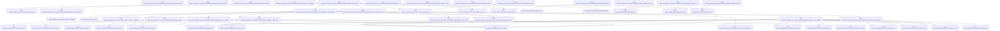
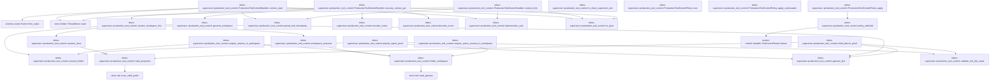

# tekes-supervisor::production_tool_control

[Package atlas](index.md) · [Source](../../src/production_tool_control.rs)

## Declarations

Visibility is the declaration spelling; trait members and reexports require their enclosing interface. `cfg` is not evaluated.

| Symbol | Kind | Visibility | Test / cfg |
|---|---|---|---|
| [tekes-supervisor::production_tool_control::DEFAULT_PAGE_BYTES](../../src/production_tool_control.rs#L32) | const_item | `private` |  |
| [tekes-supervisor::production_tool_control::DEFAULT_SEARCH_LIMIT](../../src/production_tool_control.rs#L33) | const_item | `private` |  |
| [tekes-supervisor::production_tool_control::MAX_SEARCH_LIMIT](../../src/production_tool_control.rs#L34) | const_item | `private` |  |
| [tekes-supervisor::production_tool_control::DeliveryRequest](../../src/production_tool_control.rs#L37) | struct_item | `pub` |  |
| [tekes-supervisor::production_tool_control::InterruptRequest](../../src/production_tool_control.rs#L47) | struct_item | `pub` |  |
| [tekes-supervisor::production_tool_control::ChildLaunchProof](../../src/production_tool_control.rs#L55) | struct_item | `pub` |  |
| [tekes-supervisor::production_tool_control::ParentReportProof](../../src/production_tool_control.rs#L67) | struct_item | `pub` |  |
| [tekes-supervisor::production_tool_control::SupervisorRuntimeAuthority](../../src/production_tool_control.rs#L81) | trait_item | `pub` |  |
| [tekes-supervisor::production_tool_control::SupervisorRuntimeAuthority::ensure_running](../../src/production_tool_control.rs#L82) | function_signature_item | `private` |  |
| [tekes-supervisor::production_tool_control::SupervisorRuntimeAuthority::deliver_input](../../src/production_tool_control.rs#L88) | function_signature_item | `private` |  |
| [tekes-supervisor::production_tool_control::SupervisorRuntimeAuthority::interrupt](../../src/production_tool_control.rs#L93) | function_signature_item | `private` |  |
| [tekes-supervisor::production_tool_control::SupervisorRuntimeAuthority::ensure_child](../../src/production_tool_control.rs#L98) | function_signature_item | `private` |  |
| [tekes-supervisor::production_tool_control::SupervisorRuntimeAuthority::deliver_report](../../src/production_tool_control.rs#L103) | function_signature_item | `private` |  |
| [tekes-supervisor::production_tool_control::SupervisorJobAuthority](../../src/production_tool_control.rs#L113) | trait_item | `pub` |  |
| [tekes-supervisor::production_tool_control::SupervisorJobAuthority::execute](../../src/production_tool_control.rs#L114) | function_signature_item | `private` |  |
| [tekes-supervisor::production_tool_control::DynamicExecutionOutcome](../../src/production_tool_control.rs#L124) | enum_item | `pub` |  |
| [tekes-supervisor::production_tool_control::DynamicSupervisorAuthority](../../src/production_tool_control.rs#L132) | trait_item | `pub` |  |
| [tekes-supervisor::production_tool_control::DynamicSupervisorAuthority::supports](../../src/production_tool_control.rs#L133) | function_signature_item | `private` |  |
| [tekes-supervisor::production_tool_control::DynamicSupervisorAuthority::execute](../../src/production_tool_control.rs#L135) | function_signature_item | `private` |  |
| [tekes-supervisor::production_tool_control::DynamicSupervisorAuthority::execute_outcome](../../src/production_tool_control.rs#L144) | function_item | `private` |  |
| [tekes-supervisor::production_tool_control::DynamicSupervisorAuthority::continue_task](../../src/production_tool_control.rs#L156) | function_item | `private` |  |
| [tekes-supervisor::production_tool_control::DynamicSupervisorAuthority::reconcile](../../src/production_tool_control.rs#L168) | function_item | `private` |  |
| [tekes-supervisor::production_tool_control::DynamicSupervisorAuthority::cancel_inflight](../../src/production_tool_control.rs#L177) | function_item | `private` |  |
| [tekes-supervisor::production_tool_control::JobBrokerSupervisorAuthority](../../src/production_tool_control.rs#L180) | struct_item | `pub` |  |
| [tekes-supervisor::production_tool_control::JobBrokerSupervisorAuthority::new](../../src/production_tool_control.rs#L188) | function_item | `pub` |  |
| [tekes-supervisor::production_tool_control::JobBrokerSupervisorAuthority::execute](../../src/production_tool_control.rs#L205) | function_item | `private` |  |
| [tekes-supervisor::production_tool_control::ProductionToolControlHandler](../../src/production_tool_control.rs#L263) | struct_item | `pub` |  |
| [tekes-supervisor::production_tool_control::ProductionToolControlHandler::new](../../src/production_tool_control.rs#L273) | function_item | `pub` |  |
| [tekes-supervisor::production_tool_control::ProductionToolControlHandler::with_dynamic_routes](../../src/production_tool_control.rs#L284) | function_item | `pub` |  |
| [tekes-supervisor::production_tool_control::ProductionToolControlHandler::runtime](../../src/production_tool_control.rs#L295) | function_item | `pub` |  |
| [tekes-supervisor::production_tool_control::ProductionToolControlHandler::execute](../../src/production_tool_control.rs#L303) | function_item | `private` |  |
| [tekes-supervisor::production_tool_control::ProductionToolControlHandler::recovery](../../src/production_tool_control.rs#L327) | function_item | `private` |  |
| [tekes-supervisor::production_tool_control::ProductionToolControlHandler::reconcile](../../src/production_tool_control.rs#L351) | function_item | `private` |  |
| [tekes-supervisor::production_tool_control::ProductionToolControlHandler::continue_task](../../src/production_tool_control.rs#L375) | function_item | `pub` |  |
| [tekes-supervisor::production_tool_control::ProductionToolControlHandler::execute_inner](../../src/production_tool_control.rs#L411) | function_item | `private` |  |
| [tekes-supervisor::production_tool_control::ProductionToolControlHandler::execute_dynamic](../../src/production_tool_control.rs#L448) | function_item | `private` |  |
| [tekes-supervisor::production_tool_control::ProductionToolControlHandler::execute_context](../../src/production_tool_control.rs#L479) | function_item | `private` |  |
| [tekes-supervisor::production_tool_control::ProductionToolControlHandler::context_threads](../../src/production_tool_control.rs#L551) | function_item | `private` |  |
| [tekes-supervisor::production_tool_control::ProductionToolControlHandler::context_read](../../src/production_tool_control.rs#L591) | function_item | `private` |  |
| [tekes-supervisor::production_tool_control::ProductionToolControlHandler::context_records](../../src/production_tool_control.rs#L616) | function_item | `private` |  |
| [tekes-supervisor::production_tool_control::ProductionToolControlHandler::context_search](../../src/production_tool_control.rs#L645) | function_item | `private` |  |
| [tekes-supervisor::production_tool_control::ProductionToolControlHandler::context_start](../../src/production_tool_control.rs#L721) | function_item | `private` |  |
| [tekes-supervisor::production_tool_control::ProductionToolControlHandler::context_fork](../../src/production_tool_control.rs#L760) | function_item | `private` |  |
| [tekes-supervisor::production_tool_control::ProductionToolControlHandler::execute_context_get](../../src/production_tool_control.rs#L780) | function_item | `private` |  |
| [tekes-supervisor::production_tool_control::is_fixed_supervisor_tool](../../src/production_tool_control.rs#L861) | function_item | `private` |  |
| [tekes-supervisor::production_tool_control::ProductionToolControlPolicy](../../src/production_tool_control.rs#L869) | struct_item | `pub` |  |
| [tekes-supervisor::production_tool_control::ProductionToolControlPolicy::new](../../src/production_tool_control.rs#L875) | function_item | `pub` |  |
| [tekes-supervisor::production_tool_control::ProductionToolControlPolicy::apply_continuation](../../src/production_tool_control.rs#L885) | function_item | `pub` |  |
| [tekes-supervisor::production_tool_control::ProductionToolControlPolicy::apply](../../src/production_tool_control.rs#L927) | function_item | `private` |  |
| [tekes-supervisor::production_tool_control::policy_withheld](../../src/production_tool_control.rs#L966) | function_item | `private` |  |
| [tekes-supervisor::production_tool_control::child_launch_proof](../../src/production_tool_control.rs#L978) | function_item | `private` |  |
| [tekes-supervisor::production_tool_control::parent_report_proof](../../src/production_tool_control.rs#L1050) | function_item | `private` |  |
| [tekes-supervisor::production_tool_control::session_lines](../../src/production_tool_control.rs#L1112) | function_item | `private` |  |
| [tekes-supervisor::production_tool_control::resolve_workspace_line](../../src/production_tool_control.rs#L1134) | function_item | `private` |  |
| [tekes-supervisor::production_tool_control::workspace_sessions](../../src/production_tool_control.rs#L1156) | function_item | `private` |  |
| [tekes-supervisor::production_tool_control::require_session_in_workspace](../../src/production_tool_control.rs#L1175) | function_item | `private` |  |
| [tekes-supervisor::production_tool_control::require_active_session_in_workspace](../../src/production_tool_control.rs#L1189) | function_item | `private` |  |
| [tekes-supervisor::production_tool_control::session_folder](../../src/production_tool_control.rs#L1208) | function_item | `private` |  |
| [tekes-supervisor::production_tool_control::read_projection](../../src/production_tool_control.rs#L1222) | function_item | `private` |  |
| [tekes-supervisor::production_tool_control::folder_workspace](../../src/production_tool_control.rs#L1235) | function_item | `private` |  |
| [tekes-supervisor::production_tool_control::genesis_workspace](../../src/production_tool_control.rs#L1250) | function_item | `private` |  |
| [tekes-supervisor::production_tool_control::genesis_line](../../src/production_tool_control.rs#L1260) | function_item | `private` |  |
| [tekes-supervisor::production_tool_control::paired_tool_timestamp](../../src/production_tool_control.rs#L1268) | function_item | `private` |  |
| [tekes-supervisor::production_tool_control::event_record](../../src/production_tool_control.rs#L1284) | function_item | `private` |  |
| [tekes-supervisor::production_tool_control::required_string](../../src/production_tool_control.rs#L1290) | function_item | `private` |  |
| [tekes-supervisor::production_tool_control::string_array](../../src/production_tool_control.rs#L1298) | function_item | `private` |  |
| [tekes-supervisor::production_tool_control::job_record_outcome](../../src/production_tool_control.rs#L1313) | function_item | `private` |  |
| [tekes-supervisor::production_tool_control::map_backend](../../src/production_tool_control.rs#L1326) | function_item | `private` |  |
| [tekes-supervisor::production_tool_control::argument_limit](../../src/production_tool_control.rs#L1345) | function_item | `private` |  |
| [tekes-supervisor::production_tool_control::encode_cursor](../../src/production_tool_control.rs#L1358) | function_item | `private` |  |
| [tekes-supervisor::production_tool_control::decode_cursor](../../src/production_tool_control.rs#L1363) | function_item | `private` |  |
| [tekes-supervisor::production_tool_control::deterministic_uuid](../../src/production_tool_control.rs#L1388) | function_item | `private` |  |
| [tekes-supervisor::production_tool_control::validate_line_file_name](../../src/production_tool_control.rs#L1408) | function_item | `private` |  |
| [tekes-supervisor::production_tool_control::bounded_snippet](../../src/production_tool_control.rs#L1421) | function_item | `private` |  |
| [tekes-supervisor::production_tool_control::to_ijson](../../src/production_tool_control.rs#L1432) | function_item | `private` |  |
| [tekes-supervisor::production_tool_control::map_io](../../src/production_tool_control.rs#L1440) | function_item | `private` |  |
| [tekes-supervisor::production_tool_control::map_store](../../src/production_tool_control.rs#L1448) | function_item | `private` |  |
| [tekes-supervisor::production_tool_control::map_schema](../../src/production_tool_control.rs#L1460) | function_item | `private` |  |
| [tekes-supervisor::production_tool_control::SupervisorOperationError](../../src/production_tool_control.rs#L1465) | enum_item | `pub` |  |
| [tekes-supervisor::production_tool_control::SupervisorOperationError::into_control_error](../../src/production_tool_control.rs#L1495) | function_item | `private` |  |
| [tekes-supervisor::production_tool_control::tool_failure_tests::definitive_remote_tool_failure_is_not_retryable_transport_loss](../../src/production_tool_control.rs#L1522) | function_item | `private` | test; #[cfg(test)] |
| [tekes-supervisor::production_tool_control::continuation_policy_tests::value](../../src/production_tool_control.rs#L1541) | function_item | `private` | test; #[cfg(test)] |
| [tekes-supervisor::production_tool_control::continuation_policy_tests::pending_results_and_continuation_responses_pass_the_secret_policy](../../src/production_tool_control.rs#L1548) | function_item | `private` | test; #[cfg(test)] |

## Imports / reexports

| Local name | Source path | Visibility |
|---|---|---|
| `BTreeSet` | `std::collections::BTreeSet` | `private` |
| `fs` | `std::fs` | `private` |
| `Component` | `std::path::Component` | `private` |
| `Path` | `std::path::Path` | `private` |
| `PathBuf` | `std::path::PathBuf` | `private` |
| `Arc` | `std::sync::Arc` | `private` |
| `DynamicTool` | `profile::DynamicTool` | `private` |
| `DynamicToolCatalog` | `profile::DynamicToolCatalog` | `private` |
| `DynamicToolEffect` | `profile::DynamicToolEffect` | `private` |
| `Event` | `schema::Event` | `private` |
| `EventKind` | `schema::EventKind` | `private` |
| `IJsonValue` | `schema::IJsonValue` | `private` |
| `OriginTuple` | `schema::OriginTuple` | `private` |
| `Value` | `serde_json::Value` | `private` |
| `json` | `serde_json::json` | `private` |
| `Digest` | `sha2::Digest` | `private` |
| `Sha256` | `sha2::Sha256` | `private` |
| `ThreadStore` | `store::ThreadStore` | `private` |
| `scan_valid_prefix` | `store::scan_valid_prefix` | `private` |
| `Error` | `thiserror::Error` | `private` |
| `BackendFailure` | `tools::BackendFailure` | `private` |
| `BackendGate` | `tools::BackendGate` | `private` |
| `BackendOutcome` | `tools::BackendOutcome` | `private` |
| `CancellationToken` | `tools::CancellationToken` | `private` |
| `JobBroker` | `tools::JobBroker` | `private` |
| `JobLaunchPolicy` | `tools::JobLaunchPolicy` | `private` |
| `JobSpec` | `tools::JobSpec` | `private` |
| `SandboxedJobLauncher` | `tools::SandboxedJobLauncher` | `private` |
| `SecretScan` | `tools::SecretScan` | `private` |
| `SecretScanner` | `tools::SecretScanner` | `private` |
| `validate_fixed_arguments` | `tools::validate_fixed_arguments` | `private` |
| `ToolContinuationOutcome` | `worker_control::continuation::ToolContinuationOutcome` | `private` |
| `ToolContinuationRequest` | `worker_control::continuation::ToolContinuationRequest` | `private` |
| `ToolContinuationResponse` | `worker_control::continuation::ToolContinuationResponse` | `private` |
| `ToolControl` | `worker_control::ToolControl` | `private` |
| `ToolControlError` | `worker_control::ToolControlError` | `private` |
| `ToolControlErrorCode` | `worker_control::ToolControlErrorCode` | `private` |
| `ToolControlResult` | `worker_control::ToolControlResult` | `private` |
| `ExternalEffectResolution` | `crate::tool_control::ExternalEffectResolution` | `private` |
| `ToolControlHandler` | `crate::tool_control::ToolControlHandler` | `private` |
| `ToolControlPolicy` | `crate::tool_control::ToolControlPolicy` | `private` |
| `ToolControlRecovery` | `crate::tool_control::ToolControlRecovery` | `private` |
| `resolve_durable_binding` | `crate::tool_control::resolve_durable_binding` | `private` |
| `*` | `super::*` | `private` |
| `*` | `super::*` | `private` |
| `ContinuationOperation` | `worker_control::continuation::ContinuationOperation` | `private` |
| `ToolContinuationRequest` | `worker_control::continuation::ToolContinuationRequest` | `private` |

## Module declarations

| Module | Visibility | Attributes |
|---|---|---|
| `tekes-supervisor::production_tool_control::tool_failure_tests` | `private` | #[cfg(test)] |
| `tekes-supervisor::production_tool_control::continuation_policy_tests` | `private` | #[cfg(test)] |

## Function call graphs

Edges below are syntactically resolved calls only, including private functions. Graphs partition callers into groups of 20; they are not execution order. All unresolved sites are listed below and in the JSON inventory.

Functions 1–20: 54 direct edges

```mermaid
flowchart TD
  n0["engine::dynamic_catalog::validate_dynamic_invocation"]
  n1["store::folder::ThreadStore::open"]
  n2["tekes-supervisor::production_tool_control::parent_report_proof"]
  n3["tekes-supervisor::production_tool_control::session_lines"]
  n4["tekes-supervisor::production_tool_control::workspace_sessions"]
  n5["tekes-supervisor::production_tool_control::require_session_in_workspace"]
  n6["tekes-supervisor::production_tool_control::require_active_session_in_workspace"]
  n7["tekes-supervisor::production_tool_control::session_folder"]
  n8["tekes-supervisor::production_tool_control::read_projection"]
  n9["tekes-supervisor::production_tool_control::folder_workspace"]
  n10["tekes-supervisor::production_tool_control::genesis_workspace"]
  n11["tekes-supervisor::production_tool_control::genesis_line"]
  n12["tekes-supervisor::production_tool_control::required_string"]
  n13["tekes-supervisor::production_tool_control::string_array"]
  n14["tekes-supervisor::production_tool_control::job_record_outcome"]
  n15["tekes-supervisor::production_tool_control::map_backend"]
  n16["tekes-supervisor::production_tool_control::argument_limit"]
  n17["tekes-supervisor::production_tool_control::encode_cursor"]
  n18["tekes-supervisor::production_tool_control::decode_cursor"]
  n19["tekes-supervisor::production_tool_control::to_ijson"]
  n20["tekes-supervisor::production_tool_control::DynamicSupervisorAuthority::execute_outcome"]
  n21["tekes-supervisor::production_tool_control::DynamicSupervisorAuthority::continue_task"]
  n22["tekes-supervisor::production_tool_control::DynamicSupervisorAuthority::reconcile"]
  n23["tekes-supervisor::production_tool_control::DynamicSupervisorAuthority::cancel_inflight"]
  n24["tekes-supervisor::production_tool_control::JobBrokerSupervisorAuthority::new"]
  n25["tekes-supervisor::production_tool_control::JobBrokerSupervisorAuthority::execute"]
  n26["tekes-supervisor::production_tool_control::ProductionToolControlHandler::new"]
  n27["tekes-supervisor::production_tool_control::ProductionToolControlHandler::with_dynamic_routes"]
  n28["tekes-supervisor::production_tool_control::ProductionToolControlHandler::runtime"]
  n29["tekes-supervisor::production_tool_control::ProductionToolControlHandler::execute"]
  n30["tekes-supervisor::production_tool_control::ProductionToolControlHandler::recovery"]
  n31["tekes-supervisor::production_tool_control::ProductionToolControlHandler::reconcile"]
  n32["tekes-supervisor::production_tool_control::ProductionToolControlHandler::continue_task"]
  n33["tekes-supervisor::production_tool_control::ProductionToolControlHandler::execute_inner"]
  n34["tekes-supervisor::production_tool_control::ProductionToolControlHandler::execute_dynamic"]
  n35["tekes-supervisor::production_tool_control::ProductionToolControlHandler::execute_context"]
  n36["tekes-supervisor::production_tool_control::ProductionToolControlHandler::context_threads"]
  n37["tekes-supervisor::production_tool_control::ProductionToolControlHandler::context_read"]
  n38["tekes-supervisor::production_tool_control::ProductionToolControlHandler::context_records"]
  n39["tekes-supervisor::production_tool_control::ProductionToolControlHandler::context_search"]
  n40["tekes-supervisor::production_tool_control::ProductionToolControlHandler::context_start"]
  n41["tekes-supervisor::production_tool_control::ProductionToolControlHandler::context_fork"]
  n42["tekes-supervisor::production_tool_control::ProductionToolControlHandler::execute_context_get"]
  n43["tekes-supervisor::production_tool_control::is_fixed_supervisor_tool"]
  n44["tekes-supervisor::production_tool_control::child_launch_proof"]
  n45["tekes-supervisor::tool_control::resolve_durable_binding"]
  n46["tools::runtime_backends::JobBroker::new"]
  n47["tools::schema_registry::validate_fixed_arguments"]
  n48["worker-control::durable::ToolControlResult::pending"]
  n49["worker-control::durable::ToolControlResult::success"]
  n50["worker-control::durable::ToolControlResult::failure"]
  n24 --> n46
  n25 --> n12
  n25 --> n13
  n25 --> n14
  n25 --> n15
  n25 --> n19
  n29 --> n48
  n29 --> n49
  n29 --> n50
  n30 --> n43
  n33 --> n2
  n33 --> n19
  n33 --> n34
  n33 --> n35
  n33 --> n42
  n33 --> n43
  n33 --> n44
  n33 --> n45
  n33 --> n47
  n34 --> n0
  n35 --> n1
  n35 --> n5
  n35 --> n6
  n35 --> n10
  n35 --> n12
  n35 --> n19
  n35 --> n36
  n35 --> n37
  n35 --> n38
  n35 --> n39
  n35 --> n40
  n35 --> n41
  n36 --> n8
  n36 --> n9
  n36 --> n19
  n37 --> n7
  n37 --> n8
  n37 --> n10
  n37 --> n19
  n38 --> n12
  n38 --> n16
  n38 --> n17
  n38 --> n18
  n38 --> n19
  n39 --> n3
  n39 --> n4
  n39 --> n5
  n39 --> n7
  n39 --> n11
  n39 --> n12
  n39 --> n16
  n39 --> n17
  n39 --> n18
  n39 --> n19
```

Functions 21–40: 33 direct edges

```mermaid
flowchart TD
  n0["schema::event::Event::from_value"]
  n1["store::folder::ThreadStore::open"]
  n2["store::tail::scan_valid_prefix"]
  n3["store::tail::read_genesis"]
  n4["tekes-supervisor::production_tool_control::parent_report_proof"]
  n5["tekes-supervisor::production_tool_control::session_lines"]
  n6["tekes-supervisor::production_tool_control::resolve_workspace_line"]
  n7["tekes-supervisor::production_tool_control::workspace_sessions"]
  n8["tekes-supervisor::production_tool_control::require_session_in_workspace"]
  n9["tekes-supervisor::production_tool_control::require_active_session_in_workspace"]
  n10["tekes-supervisor::production_tool_control::session_folder"]
  n11["tekes-supervisor::production_tool_control::read_projection"]
  n12["tekes-supervisor::production_tool_control::folder_workspace"]
  n13["tekes-supervisor::production_tool_control::genesis_workspace"]
  n14["tekes-supervisor::production_tool_control::genesis_line"]
  n15["tekes-supervisor::production_tool_control::paired_tool_timestamp"]
  n16["tekes-supervisor::production_tool_control::encode_cursor"]
  n17["tekes-supervisor::production_tool_control::decode_cursor"]
  n18["tekes-supervisor::production_tool_control::deterministic_uuid"]
  n19["tekes-supervisor::production_tool_control::validate_line_file_name"]
  n20["tekes-supervisor::production_tool_control::to_ijson"]
  n21["tekes-supervisor::production_tool_control::ProductionToolControlHandler::context_start"]
  n22["tekes-supervisor::production_tool_control::ProductionToolControlHandler::context_fork"]
  n23["tekes-supervisor::production_tool_control::ProductionToolControlHandler::execute_context_get"]
  n24["tekes-supervisor::production_tool_control::is_fixed_supervisor_tool"]
  n25["tekes-supervisor::production_tool_control::ProductionToolControlPolicy::new"]
  n26["tekes-supervisor::production_tool_control::ProductionToolControlPolicy::apply_continuation"]
  n27["tekes-supervisor::production_tool_control::ProductionToolControlPolicy::apply"]
  n28["tekes-supervisor::production_tool_control::policy_withheld"]
  n29["tekes-supervisor::production_tool_control::child_launch_proof"]
  n30["worker-control::durable::ToolControlResult::failure"]
  n4 --> n11
  n4 --> n14
  n4 --> n19
  n5 --> n11
  n6 --> n5
  n6 --> n7
  n6 --> n10
  n6 --> n14
  n7 --> n12
  n8 --> n10
  n8 --> n12
  n9 --> n12
  n11 --> n2
  n12 --> n3
  n21 --> n0
  n21 --> n1
  n21 --> n15
  n21 --> n18
  n21 --> n20
  n22 --> n1
  n22 --> n15
  n22 --> n18
  n22 --> n20
  n23 --> n6
  n23 --> n13
  n23 --> n16
  n23 --> n17
  n23 --> n20
  n27 --> n28
  n28 --> n30
  n29 --> n11
  n29 --> n14
  n29 --> n19
```

Functions 41–57: 4 direct edges

```mermaid
flowchart TD
  n0["schema::ijson::IJsonValue::parse"]
  n1["tekes-supervisor::production_tool_control::paired_tool_timestamp"]
  n2["tekes-supervisor::production_tool_control::event_record"]
  n3["tekes-supervisor::production_tool_control::required_string"]
  n4["tekes-supervisor::production_tool_control::string_array"]
  n5["tekes-supervisor::production_tool_control::job_record_outcome"]
  n6["tekes-supervisor::production_tool_control::map_backend"]
  n7["tekes-supervisor::production_tool_control::argument_limit"]
  n8["tekes-supervisor::production_tool_control::encode_cursor"]
  n9["tekes-supervisor::production_tool_control::decode_cursor"]
  n10["tekes-supervisor::production_tool_control::deterministic_uuid"]
  n11["tekes-supervisor::production_tool_control::validate_line_file_name"]
  n12["tekes-supervisor::production_tool_control::bounded_snippet"]
  n13["tekes-supervisor::production_tool_control::to_ijson"]
  n14["tekes-supervisor::production_tool_control::map_io"]
  n15["tekes-supervisor::production_tool_control::map_store"]
  n16["tekes-supervisor::production_tool_control::map_schema"]
  n17["tekes-supervisor::production_tool_control::SupervisorOperationError::into_control_error"]
  n5 --> n6
  n5 --> n13
  n9 --> n8
  n13 --> n0
```

## Call sites

Includes test functions (marked in declarations). Receiver-type-required sites need type analysis/manual tracing. Calls in closures are attributed to their enclosing function; their occurrence here does not mean the closure executes immediately.

| Caller | Callee expression | Source lines | Target / classification |
|---|---|---|---|
| `execute_outcome` | `self.execute(tool, request)             .map` | [150](../../src/production_tool_control.rs#L150) | receiver-type-required |
| `execute_outcome` | `self.execute` | [150](../../src/production_tool_control.rs#L150) | receiver-type-required |
| `continue_task` | `Err` | [162](../../src/production_tool_control.rs#L162) | external-constructor-callback-or-unresolved |
| `continue_task` | `SupervisorOperationError::Unsupported` | [162](../../src/production_tool_control.rs#L162) | external-constructor-callback-or-unresolved |
| `new` | `Ok` | [195](../../src/production_tool_control.rs#L195) | external-constructor-callback-or-unresolved |
| `new` | `JobBroker::new` | [196](../../src/production_tool_control.rs#L196) | [tools::runtime_backends::JobBroker::new](../../../tools/src/runtime_backends.rs#L558) |
| `execute` | `serde_json::to_value(&request.arguments)             .map_err` | [206](../../src/production_tool_control.rs#L206) | receiver-type-required |
| `execute` | `serde_json::to_value` | [206](../../src/production_tool_control.rs#L206) | external-constructor-callback-or-unresolved |
| `execute` | `SupervisorOperationError::Protocol` | [207](../../src/production_tool_control.rs#L207) | external-constructor-callback-or-unresolved |
| `execute` | `error.to_string` | [207](../../src/production_tool_control.rs#L207) | receiver-type-required |
| `execute` | `required_string` | [208](../../src/production_tool_control.rs#L208), [218](../../src/production_tool_control.rs#L218), [248](../../src/production_tool_control.rs#L248), [252](../../src/production_tool_control.rs#L252) | [tekes-supervisor::production_tool_control::required_string](../../src/production_tool_control.rs#L1290) |
| `execute` | `arguments                     .get("job_id")                     .and_then(Value::as_str)                     .filter(&#124;value&#124; !value.is_empty())                     .map(ToOwned::to_owned)                     .unwrap_or_else` | [211](../../src/production_tool_control.rs#L211) | receiver-type-required |
| `execute` | `arguments                     .get("job_id")                     .and_then(Value::as_str)                     .filter(&#124;value&#124; !value.is_empty())                     .map` | [211](../../src/production_tool_control.rs#L211) | receiver-type-required |
| `execute` | `arguments                     .get("job_id")                     .and_then(Value::as_str)                     .filter` | [211](../../src/production_tool_control.rs#L211) | receiver-type-required |
| `execute` | `arguments                     .get("job_id")                     .and_then` | [211](../../src/production_tool_control.rs#L211) | receiver-type-required |
| `execute` | `arguments                     .get` | [211](../../src/production_tool_control.rs#L211) | receiver-type-required |
| `execute` | `value.is_empty` | [214](../../src/production_tool_control.rs#L214), [223](../../src/production_tool_control.rs#L223) | receiver-type-required |
| `execute` | `required_string(&arguments, "program")?.to_owned` | [218](../../src/production_tool_control.rs#L218) | receiver-type-required |
| `execute` | `string_array` | [219](../../src/production_tool_control.rs#L219), [225](../../src/production_tool_control.rs#L225) | [tekes-supervisor::production_tool_control::string_array](../../src/production_tool_control.rs#L1298) |
| `execute` | `arguments                         .get("working_directory")                         .and_then(Value::as_str)                         .filter(&#124;value&#124; !value.is_empty())                         .map` | [220](../../src/production_tool_control.rs#L220) | receiver-type-required |
| `execute` | `arguments                         .get("working_directory")                         .and_then(Value::as_str)                         .filter` | [220](../../src/production_tool_control.rs#L220) | receiver-type-required |
| `execute` | `arguments                         .get("working_directory")                         .and_then` | [220](../../src/production_tool_control.rs#L220) | receiver-type-required |
| `execute` | `arguments                         .get` | [220](../../src/production_tool_control.rs#L220) | receiver-type-required |
| `execute` | `Default::default` | [226](../../src/production_tool_control.rs#L226) | external-constructor-callback-or-unresolved |
| `execute` | `job_record_outcome` | [228](../../src/production_tool_control.rs#L228), [249](../../src/production_tool_control.rs#L249), [253](../../src/production_tool_control.rs#L253) | [tekes-supervisor::production_tool_control::job_record_outcome](../../src/production_tool_control.rs#L1313) |
| `execute` | `self.broker.start` | [228](../../src/production_tool_control.rs#L228) | receiver-type-required |
| `execute` | `Arc::clone` | [232](../../src/production_tool_control.rs#L232) | external-constructor-callback-or-unresolved |
| `execute` | `self.broker.list` | [237](../../src/production_tool_control.rs#L237) | receiver-type-required |
| `execute` | `to_ijson` | [238](../../src/production_tool_control.rs#L238) | [tekes-supervisor::production_tool_control::to_ijson](../../src/production_tool_control.rs#L1432) |
| `execute` | `Err` | [239](../../src/production_tool_control.rs#L239), [240](../../src/production_tool_control.rs#L240), [244](../../src/production_tool_control.rs#L244), [255](../../src/production_tool_control.rs#L255) | external-constructor-callback-or-unresolved |
| `execute` | `map_backend` | [239](../../src/production_tool_control.rs#L239) | [tekes-supervisor::production_tool_control::map_backend](../../src/production_tool_control.rs#L1326) |
| `execute` | `SupervisorOperationError::Denied` | [240](../../src/production_tool_control.rs#L240) | external-constructor-callback-or-unresolved |
| `execute` | `"job list unexpectedly requested approval".into` | [241](../../src/production_tool_control.rs#L241) | receiver-type-required |
| `execute` | `SupervisorOperationError::Unavailable` | [244](../../src/production_tool_control.rs#L244) | external-constructor-callback-or-unresolved |
| `execute` | `self.broker.status` | [249](../../src/production_tool_control.rs#L249) | receiver-type-required |
| `execute` | `self.broker.stop` | [253](../../src/production_tool_control.rs#L253) | receiver-type-required |
| `execute` | `SupervisorOperationError::Unsupported` | [255](../../src/production_tool_control.rs#L255) | external-constructor-callback-or-unresolved |
| `execute` | `Ok` | [259](../../src/production_tool_control.rs#L259) | external-constructor-callback-or-unresolved |
| `new` | `root.into` | [275](../../src/production_tool_control.rs#L275) | receiver-type-required |
| `new` | `DynamicToolCatalog::default` | [278](../../src/production_tool_control.rs#L278) | external-constructor-callback-or-unresolved |
| `with_dynamic_routes` | `Some` | [290](../../src/production_tool_control.rs#L290) | external-constructor-callback-or-unresolved |
| `execute` | `self.execute_inner` | [304](../../src/production_tool_control.rs#L304) | receiver-type-required |
| `execute` | `ToolControlResult::success` | [305](../../src/production_tool_control.rs#L305) | [worker-control::durable::ToolControlResult::success](../../../worker-control/src/durable.rs#L360) |
| `execute` | `request.request_id.clone` | [306](../../src/production_tool_control.rs#L306), [314](../../src/production_tool_control.rs#L314), [320](../../src/production_tool_control.rs#L320) | receiver-type-required |
| `execute` | `request.call_id.clone` | [307](../../src/production_tool_control.rs#L307), [315](../../src/production_tool_control.rs#L315), [321](../../src/production_tool_control.rs#L321) | receiver-type-required |
| `execute` | `ToolControlResult::pending` | [313](../../src/production_tool_control.rs#L313) | [worker-control::durable::ToolControlResult::pending](../../../worker-control/src/durable.rs#L340) |
| `execute` | `ToolControlResult::failure` | [319](../../src/production_tool_control.rs#L319) | [worker-control::durable::ToolControlResult::failure](../../../worker-control/src/durable.rs#L375) |
| `execute` | `error.into_control_error` | [322](../../src/production_tool_control.rs#L322) | receiver-type-required |
| `recovery` | `is_fixed_supervisor_tool` | [328](../../src/production_tool_control.rs#L328) | [tekes-supervisor::production_tool_control::is_fixed_supervisor_tool](../../src/production_tool_control.rs#L861) |
| `recovery` | `self             .dynamic_catalog             .tools             .iter()             .find` | [331](../../src/production_tool_control.rs#L331) | receiver-type-required |
| `recovery` | `self             .dynamic_catalog             .tools             .iter` | [331](../../src/production_tool_control.rs#L331) | receiver-type-required |
| `recovery` | `tool.external_effect.is_some` | [344](../../src/production_tool_control.rs#L344) | receiver-type-required |
| `reconcile` | `self             .dynamic_catalog             .tools             .iter()             .find` | [352](../../src/production_tool_control.rs#L352) | receiver-type-required |
| `reconcile` | `self             .dynamic_catalog             .tools             .iter` | [352](../../src/production_tool_control.rs#L352) | receiver-type-required |
| `reconcile` | `self.dynamic.as_ref().filter` | [362](../../src/production_tool_control.rs#L362) | receiver-type-required |
| `reconcile` | `self.dynamic.as_ref` | [362](../../src/production_tool_control.rs#L362) | receiver-type-required |
| `reconcile` | `route.supports` | [362](../../src/production_tool_control.rs#L362) | receiver-type-required |
| `reconcile` | `authority.reconcile` | [367](../../src/production_tool_control.rs#L367) | receiver-type-required |
| `continue_task` | `request.request_id.clone` | [377](../../src/production_tool_control.rs#L377) | receiver-type-required |
| `continue_task` | `request.original.call_id.clone` | [378](../../src/production_tool_control.rs#L378) | receiver-type-required |
| `continue_task` | `error.into_control_error` | [380](../../src/production_tool_control.rs#L380) | receiver-type-required |
| `continue_task` | `self             .dynamic_catalog             .tools             .iter()             .find` | [383](../../src/production_tool_control.rs#L383) | receiver-type-required |
| `continue_task` | `self             .dynamic_catalog             .tools             .iter` | [383](../../src/production_tool_control.rs#L383) | receiver-type-required |
| `continue_task` | `failed` | [389](../../src/production_tool_control.rs#L389), [395](../../src/production_tool_control.rs#L395), [407](../../src/production_tool_control.rs#L407) | external-constructor-callback-or-unresolved |
| `continue_task` | `SupervisorOperationError::Unsupported` | [389](../../src/production_tool_control.rs#L389), [395](../../src/production_tool_control.rs#L395) | external-constructor-callback-or-unresolved |
| `continue_task` | `self.dynamic.as_ref().filter` | [394](../../src/production_tool_control.rs#L394) | receiver-type-required |
| `continue_task` | `self.dynamic.as_ref` | [394](../../src/production_tool_control.rs#L394) | receiver-type-required |
| `continue_task` | `route.supports` | [394](../../src/production_tool_control.rs#L394) | receiver-type-required |
| `continue_task` | `self             .root             .join("threads")             .join(&request.original.session)             .join` | [400](../../src/production_tool_control.rs#L400) | receiver-type-required |
| `continue_task` | `self             .root             .join("threads")             .join` | [400](../../src/production_tool_control.rs#L400) | receiver-type-required |
| `continue_task` | `self             .root             .join` | [400](../../src/production_tool_control.rs#L400) | receiver-type-required |
| `continue_task` | `authority.continue_task` | [405](../../src/production_tool_control.rs#L405) | receiver-type-required |
| `execute_inner` | `serde_json::to_value(&request.arguments)             .map_err` | [415](../../src/production_tool_control.rs#L415) | receiver-type-required |
| `execute_inner` | `serde_json::to_value` | [415](../../src/production_tool_control.rs#L415) | external-constructor-callback-or-unresolved |
| `execute_inner` | `SupervisorOperationError::Protocol` | [416](../../src/production_tool_control.rs#L416) | external-constructor-callback-or-unresolved |
| `execute_inner` | `error.to_string` | [416](../../src/production_tool_control.rs#L416), [419](../../src/production_tool_control.rs#L419), [424](../../src/production_tool_control.rs#L424) | receiver-type-required |
| `execute_inner` | `self.root.join("threads").join` | [417](../../src/production_tool_control.rs#L417) | receiver-type-required |
| `execute_inner` | `self.root.join` | [417](../../src/production_tool_control.rs#L417) | receiver-type-required |
| `execute_inner` | `resolve_durable_binding(&session_folder, request)             .map_err` | [418](../../src/production_tool_control.rs#L418) | receiver-type-required |
| `execute_inner` | `resolve_durable_binding` | [418](../../src/production_tool_control.rs#L418) | [tekes-supervisor::tool_control::resolve_durable_binding](../../src/tool_control.rs#L546) |
| `execute_inner` | `SupervisorOperationError::Conflict` | [419](../../src/production_tool_control.rs#L419) | external-constructor-callback-or-unresolved |
| `execute_inner` | `is_fixed_supervisor_tool` | [420](../../src/production_tool_control.rs#L420) | [tekes-supervisor::production_tool_control::is_fixed_supervisor_tool](../../src/production_tool_control.rs#L861) |
| `execute_inner` | `self.execute_dynamic` | [421](../../src/production_tool_control.rs#L421) | [tekes-supervisor::production_tool_control::ProductionToolControlHandler::execute_dynamic](../../src/production_tool_control.rs#L448) |
| `execute_inner` | `session_folder.join` | [421](../../src/production_tool_control.rs#L421) | receiver-type-required |
| `execute_inner` | `validate_fixed_arguments(&request.name, &arguments)             .map_err` | [423](../../src/production_tool_control.rs#L423) | receiver-type-required |
| `execute_inner` | `validate_fixed_arguments` | [423](../../src/production_tool_control.rs#L423) | [tools::schema_registry::validate_fixed_arguments](../../../tools/src/schema_registry.rs#L1231) |
| `execute_inner` | `SupervisorOperationError::Invalid` | [424](../../src/production_tool_control.rs#L424), [436](../../src/production_tool_control.rs#L436) | external-constructor-callback-or-unresolved |
| `execute_inner` | `request.name.as_str` | [425](../../src/production_tool_control.rs#L425) | receiver-type-required |
| `execute_inner` | `self.execute_context` | [426](../../src/production_tool_control.rs#L426) | [tekes-supervisor::production_tool_control::ProductionToolControlHandler::execute_context](../../src/production_tool_control.rs#L479) |
| `execute_inner` | `self.execute_context_get` | [427](../../src/production_tool_control.rs#L427) | [tekes-supervisor::production_tool_control::ProductionToolControlHandler::execute_context_get](../../src/production_tool_control.rs#L780) |
| `execute_inner` | `self.jobs.execute` | [428](../../src/production_tool_control.rs#L428) | receiver-type-required |
| `execute_inner` | `child_launch_proof` | [430](../../src/production_tool_control.rs#L430) | [tekes-supervisor::production_tool_control::child_launch_proof](../../src/production_tool_control.rs#L978) |
| `execute_inner` | `self.runtime.ensure_child` | [431](../../src/production_tool_control.rs#L431) | receiver-type-required |
| `execute_inner` | `parent_report_proof` | [434](../../src/production_tool_control.rs#L434) | [tekes-supervisor::production_tool_control::parent_report_proof](../../src/production_tool_control.rs#L1050) |
| `execute_inner` | `arguments.get("result").ok_or_else` | [435](../../src/production_tool_control.rs#L435) | receiver-type-required |
| `execute_inner` | `arguments.get` | [435](../../src/production_tool_control.rs#L435) | receiver-type-required |
| `execute_inner` | `"report.result missing".into` | [436](../../src/production_tool_control.rs#L436) | receiver-type-required |
| `execute_inner` | `to_ijson` | [438](../../src/production_tool_control.rs#L438) | [tekes-supervisor::production_tool_control::to_ijson](../../src/production_tool_control.rs#L1432) |
| `execute_inner` | `self.runtime.deliver_report` | [439](../../src/production_tool_control.rs#L439) | receiver-type-required |
| `execute_inner` | `Err` | [441](../../src/production_tool_control.rs#L441) | external-constructor-callback-or-unresolved |
| `execute_inner` | `SupervisorOperationError::Unsupported` | [441](../../src/production_tool_control.rs#L441) | external-constructor-callback-or-unresolved |
| `execute_inner` | `Ok` | [445](../../src/production_tool_control.rs#L445) | external-constructor-callback-or-unresolved |
| `execute_inner` | `DynamicExecutionOutcome::Value` | [445](../../src/production_tool_control.rs#L445) | external-constructor-callback-or-unresolved |
| `execute_dynamic` | `self             .dynamic_catalog             .tools             .iter()             .find(&#124;tool&#124; tool.name == request.name)             .ok_or_else` | [453](../../src/production_tool_control.rs#L453) | receiver-type-required |
| `execute_dynamic` | `self             .dynamic_catalog             .tools             .iter()             .find` | [453](../../src/production_tool_control.rs#L453) | receiver-type-required |
| `execute_dynamic` | `self             .dynamic_catalog             .tools             .iter` | [453](../../src/production_tool_control.rs#L453) | receiver-type-required |
| `execute_dynamic` | `SupervisorOperationError::Unsupported` | [459](../../src/production_tool_control.rs#L459), [471](../../src/production_tool_control.rs#L471) | external-constructor-callback-or-unresolved |
| `execute_dynamic` | `engine::validate_dynamic_invocation(tool, &request.arguments)             .map_err` | [464](../../src/production_tool_control.rs#L464) | receiver-type-required |
| `execute_dynamic` | `engine::validate_dynamic_invocation` | [464](../../src/production_tool_control.rs#L464) | [engine::dynamic_catalog::validate_dynamic_invocation](../../../engine/src/dynamic_catalog.rs#L140) |
| `execute_dynamic` | `SupervisorOperationError::Invalid` | [465](../../src/production_tool_control.rs#L465) | external-constructor-callback-or-unresolved |
| `execute_dynamic` | `error.to_string` | [465](../../src/production_tool_control.rs#L465) | receiver-type-required |
| `execute_dynamic` | `self             .dynamic             .as_ref()             .filter(&#124;route&#124; route.supports(tool))             .ok_or_else` | [466](../../src/production_tool_control.rs#L466) | receiver-type-required |
| `execute_dynamic` | `self             .dynamic             .as_ref()             .filter` | [466](../../src/production_tool_control.rs#L466) | receiver-type-required |
| `execute_dynamic` | `self             .dynamic             .as_ref` | [466](../../src/production_tool_control.rs#L466) | receiver-type-required |
| `execute_dynamic` | `route.supports` | [469](../../src/production_tool_control.rs#L469) | receiver-type-required |
| `execute_dynamic` | `authority.execute_outcome` | [476](../../src/production_tool_control.rs#L476) | receiver-type-required |
| `execute_context` | `arguments             .get("operation")             .and_then(Value::as_str)             .ok_or_else` | [485](../../src/production_tool_control.rs#L485) | receiver-type-required |
| `execute_context` | `arguments             .get("operation")             .and_then` | [485](../../src/production_tool_control.rs#L485) | receiver-type-required |
| `execute_context` | `arguments             .get` | [485](../../src/production_tool_control.rs#L485) | receiver-type-required |
| `execute_context` | `SupervisorOperationError::Invalid` | [488](../../src/production_tool_control.rs#L488) | external-constructor-callback-or-unresolved |
| `execute_context` | `"context.operation missing".into` | [488](../../src/production_tool_control.rs#L488) | receiver-type-required |
| `execute_context` | `genesis_workspace` | [489](../../src/production_tool_control.rs#L489) | [tekes-supervisor::production_tool_control::genesis_workspace](../../src/production_tool_control.rs#L1250) |
| `execute_context` | `self.context_threads` | [491](../../src/production_tool_control.rs#L491) | [tekes-supervisor::production_tool_control::ProductionToolControlHandler::context_threads](../../src/production_tool_control.rs#L551) |
| `execute_context` | `required_string` | [493](../../src/production_tool_control.rs#L493), [501](../../src/production_tool_control.rs#L501), [503](../../src/production_tool_control.rs#L503), [517](../../src/production_tool_control.rs#L517), [522](../../src/production_tool_control.rs#L522), [536](../../src/production_tool_control.rs#L536) | [tekes-supervisor::production_tool_control::required_string](../../src/production_tool_control.rs#L1290) |
| `execute_context` | `self.context_read` | [494](../../src/production_tool_control.rs#L494) | [tekes-supervisor::production_tool_control::ProductionToolControlHandler::context_read](../../src/production_tool_control.rs#L591) |
| `execute_context` | `self.context_records` | [496](../../src/production_tool_control.rs#L496) | [tekes-supervisor::production_tool_control::ProductionToolControlHandler::context_records](../../src/production_tool_control.rs#L616) |
| `execute_context` | `self.context_search` | [497](../../src/production_tool_control.rs#L497) | [tekes-supervisor::production_tool_control::ProductionToolControlHandler::context_search](../../src/production_tool_control.rs#L645) |
| `execute_context` | `self.context_start` | [498](../../src/production_tool_control.rs#L498) | [tekes-supervisor::production_tool_control::ProductionToolControlHandler::context_start](../../src/production_tool_control.rs#L721) |
| `execute_context` | `self.context_fork` | [499](../../src/production_tool_control.rs#L499) | [tekes-supervisor::production_tool_control::ProductionToolControlHandler::context_fork](../../src/production_tool_control.rs#L760) |
| `execute_context` | `require_session_in_workspace` | [502](../../src/production_tool_control.rs#L502), [518](../../src/production_tool_control.rs#L518), [537](../../src/production_tool_control.rs#L537) | [tekes-supervisor::production_tool_control::require_session_in_workspace](../../src/production_tool_control.rs#L1175) |
| `execute_context` | `self.runtime.deliver_input` | [504](../../src/production_tool_control.rs#L504) | receiver-type-required |
| `execute_context` | `request.session.clone` | [505](../../src/production_tool_control.rs#L505), [539](../../src/production_tool_control.rs#L539) | receiver-type-required |
| `execute_context` | `request.thread.clone` | [506](../../src/production_tool_control.rs#L506), [540](../../src/production_tool_control.rs#L540) | receiver-type-required |
| `execute_context` | `target.to_owned` | [507](../../src/production_tool_control.rs#L507), [541](../../src/production_tool_control.rs#L541) | receiver-type-required |
| `execute_context` | `request.request_id.clone` | [508](../../src/production_tool_control.rs#L508), [542](../../src/production_tool_control.rs#L542) | receiver-type-required |
| `execute_context` | `message.to_owned` | [509](../../src/production_tool_control.rs#L509) | receiver-type-required |
| `execute_context` | `arguments                         .get("goal")                         .and_then(Value::as_bool)                         .unwrap_or` | [510](../../src/production_tool_control.rs#L510) | receiver-type-required |
| `execute_context` | `arguments                         .get("goal")                         .and_then` | [510](../../src/production_tool_control.rs#L510) | receiver-type-required |
| `execute_context` | `arguments                         .get` | [510](../../src/production_tool_control.rs#L510) | receiver-type-required |
| `execute_context` | `self.runtime.ensure_running` | [519](../../src/production_tool_control.rs#L519) | receiver-type-required |
| `execute_context` | `Err` | [524](../../src/production_tool_control.rs#L524), [545](../../src/production_tool_control.rs#L545) | external-constructor-callback-or-unresolved |
| `execute_context` | `SupervisorOperationError::Denied` | [524](../../src/production_tool_control.rs#L524) | external-constructor-callback-or-unresolved |
| `execute_context` | `"a running worker cannot archive its containing session".into` | [525](../../src/production_tool_control.rs#L525) | receiver-type-required |
| `execute_context` | `require_active_session_in_workspace` | [528](../../src/production_tool_control.rs#L528) | [tekes-supervisor::production_tool_control::require_active_session_in_workspace](../../src/production_tool_control.rs#L1189) |
| `execute_context` | `ThreadStore::open(&self.root)                     .map_err(map_store)?                     .archive(target)                     .map_err` | [529](../../src/production_tool_control.rs#L529) | receiver-type-required |
| `execute_context` | `ThreadStore::open(&self.root)                     .map_err(map_store)?                     .archive` | [529](../../src/production_tool_control.rs#L529) | receiver-type-required |
| `execute_context` | `ThreadStore::open(&self.root)                     .map_err` | [529](../../src/production_tool_control.rs#L529) | receiver-type-required |
| `execute_context` | `ThreadStore::open` | [529](../../src/production_tool_control.rs#L529) | [store::folder::ThreadStore::open](../../../store/src/folder.rs#L36) |
| `execute_context` | `to_ijson` | [533](../../src/production_tool_control.rs#L533) | [tekes-supervisor::production_tool_control::to_ijson](../../src/production_tool_control.rs#L1432) |
| `execute_context` | `self.runtime.interrupt` | [538](../../src/production_tool_control.rs#L538) | receiver-type-required |
| `execute_context` | `SupervisorOperationError::Unsupported` | [545](../../src/production_tool_control.rs#L545) | external-constructor-callback-or-unresolved |
| `context_threads` | `Vec::new` | [552](../../src/production_tool_control.rs#L552) | external-constructor-callback-or-unresolved |
| `context_threads` | `fs::read_dir(self.root.join(area)).map_err` | [554](../../src/production_tool_control.rs#L554) | receiver-type-required |
| `context_threads` | `fs::read_dir` | [554](../../src/production_tool_control.rs#L554) | external-constructor-callback-or-unresolved |
| `context_threads` | `self.root.join` | [554](../../src/production_tool_control.rs#L554) | receiver-type-required |
| `context_threads` | `entry.map_err` | [555](../../src/production_tool_control.rs#L555) | receiver-type-required |
| `context_threads` | `entry.file_type().map_err(map_io)?.is_dir` | [556](../../src/production_tool_control.rs#L556) | receiver-type-required |
| `context_threads` | `entry.file_type().map_err` | [556](../../src/production_tool_control.rs#L556) | receiver-type-required |
| `context_threads` | `entry.file_type` | [556](../../src/production_tool_control.rs#L556) | receiver-type-required |
| `context_threads` | `entry.file_name().to_string_lossy().into_owned` | [559](../../src/production_tool_control.rs#L559) | receiver-type-required |
| `context_threads` | `entry.file_name().to_string_lossy` | [559](../../src/production_tool_control.rs#L559) | receiver-type-required |
| `context_threads` | `entry.file_name` | [559](../../src/production_tool_control.rs#L559) | receiver-type-required |
| `context_threads` | `folder_workspace` | [562](../../src/production_tool_control.rs#L562) | [tekes-supervisor::production_tool_control::folder_workspace](../../src/production_tool_control.rs#L1235) |
| `context_threads` | `entry.path` | [562](../../src/production_tool_control.rs#L562), [565](../../src/production_tool_control.rs#L565) | receiver-type-required |
| `context_threads` | `read_projection` | [565](../../src/production_tool_control.rs#L565) | [tekes-supervisor::production_tool_control::read_projection](../../src/production_tool_control.rs#L1222) |
| `context_threads` | `entry.path().join` | [565](../../src/production_tool_control.rs#L565) | receiver-type-required |
| `context_threads` | `projection.events.first().expect` | [566](../../src/production_tool_control.rs#L566) | receiver-type-required |
| `context_threads` | `projection.events.first` | [566](../../src/production_tool_control.rs#L566) | receiver-type-required |
| `context_threads` | `projection                     .events                     .iter()                     .rev()                     .find_map` | [567](../../src/production_tool_control.rs#L567) | receiver-type-required |
| `context_threads` | `projection                     .events                     .iter()                     .rev` | [567](../../src/production_tool_control.rs#L567) | receiver-type-required |
| `context_threads` | `projection                     .events                     .iter` | [567](../../src/production_tool_control.rs#L567) | receiver-type-required |
| `context_threads` | `event.string_field` | [571](../../src/production_tool_control.rs#L571) | receiver-type-required |
| `context_threads` | `items.push` | [572](../../src/production_tool_control.rs#L572) | receiver-type-required |
| `context_threads` | `items.sort_by` | [583](../../src/production_tool_control.rs#L583) | receiver-type-required |
| `context_threads` | `left.get("session_id")                 .and_then(Value::as_str)                 .cmp` | [584](../../src/production_tool_control.rs#L584) | receiver-type-required |
| `context_threads` | `left.get("session_id")                 .and_then` | [584](../../src/production_tool_control.rs#L584) | receiver-type-required |
| `context_threads` | `left.get` | [584](../../src/production_tool_control.rs#L584) | receiver-type-required |
| `context_threads` | `right.get("session_id").and_then` | [586](../../src/production_tool_control.rs#L586) | receiver-type-required |
| `context_threads` | `right.get` | [586](../../src/production_tool_control.rs#L586) | receiver-type-required |
| `context_threads` | `to_ijson` | [588](../../src/production_tool_control.rs#L588) | [tekes-supervisor::production_tool_control::to_ijson](../../src/production_tool_control.rs#L1432) |
| `context_read` | `session_folder` | [596](../../src/production_tool_control.rs#L596) | [tekes-supervisor::production_tool_control::session_folder](../../src/production_tool_control.rs#L1208) |
| `context_read` | `read_projection` | [597](../../src/production_tool_control.rs#L597) | [tekes-supervisor::production_tool_control::read_projection](../../src/production_tool_control.rs#L1222) |
| `context_read` | `folder.join` | [597](../../src/production_tool_control.rs#L597) | receiver-type-required |
| `context_read` | `genesis_workspace` | [598](../../src/production_tool_control.rs#L598) | [tekes-supervisor::production_tool_control::genesis_workspace](../../src/production_tool_control.rs#L1250) |
| `context_read` | `Err` | [599](../../src/production_tool_control.rs#L599) | external-constructor-callback-or-unresolved |
| `context_read` | `SupervisorOperationError::NotFound` | [599](../../src/production_tool_control.rs#L599) | external-constructor-callback-or-unresolved |
| `context_read` | `"thread not found in this workspace".into` | [600](../../src/production_tool_control.rs#L600) | receiver-type-required |
| `context_read` | `projection.events.first().expect` | [603](../../src/production_tool_control.rs#L603) | receiver-type-required |
| `context_read` | `projection.events.first` | [603](../../src/production_tool_control.rs#L603) | receiver-type-required |
| `context_read` | `to_ijson` | [604](../../src/production_tool_control.rs#L604) | [tekes-supervisor::production_tool_control::to_ijson](../../src/production_tool_control.rs#L1432) |
| `context_records` | `required_string(arguments, "turn_id")?             .parse::<u64>()             .map_err` | [621](../../src/production_tool_control.rs#L621) | receiver-type-required |
| `context_records` | `required_string(arguments, "turn_id")?             .parse::<u64>` | [621](../../src/production_tool_control.rs#L621) | receiver-type-required |
| `context_records` | `required_string` | [621](../../src/production_tool_control.rs#L621) | [tekes-supervisor::production_tool_control::required_string](../../src/production_tool_control.rs#L1290) |
| `context_records` | `SupervisorOperationError::Invalid` | [624](../../src/production_tool_control.rs#L624) | external-constructor-callback-or-unresolved |
| `context_records` | `"turn_id is not a positive integer".into` | [624](../../src/production_tool_control.rs#L624) | receiver-type-required |
| `context_records` | `decode_cursor` | [626](../../src/production_tool_control.rs#L626) | [tekes-supervisor::production_tool_control::decode_cursor](../../src/production_tool_control.rs#L1363) |
| `context_records` | `arguments.get` | [626](../../src/production_tool_control.rs#L626) | receiver-type-required |
| `context_records` | `argument_limit` | [627](../../src/production_tool_control.rs#L627) | [tekes-supervisor::production_tool_control::argument_limit](../../src/production_tool_control.rs#L1345) |
| `context_records` | `resolved             .projection             .events             .iter()             .filter(&#124;event&#124; event.turn() == Some(turn))             .collect::<Vec<_>>` | [628](../../src/production_tool_control.rs#L628) | receiver-type-required |
| `context_records` | `resolved             .projection             .events             .iter()             .filter` | [628](../../src/production_tool_control.rs#L628) | receiver-type-required |
| `context_records` | `resolved             .projection             .events             .iter` | [628](../../src/production_tool_control.rs#L628) | receiver-type-required |
| `context_records` | `event.turn` | [632](../../src/production_tool_control.rs#L632) | receiver-type-required |
| `context_records` | `Some` | [632](../../src/production_tool_control.rs#L632) | external-constructor-callback-or-unresolved |
| `context_records` | `matching             .iter()             .skip(offset)             .take(limit)             .map(event_record)             .collect::<Result<Vec<_>, _>>` | [634](../../src/production_tool_control.rs#L634) | receiver-type-required |
| `context_records` | `matching             .iter()             .skip(offset)             .take(limit)             .map` | [634](../../src/production_tool_control.rs#L634) | receiver-type-required |
| `context_records` | `matching             .iter()             .skip(offset)             .take` | [634](../../src/production_tool_control.rs#L634) | receiver-type-required |
| `context_records` | `matching             .iter()             .skip` | [634](../../src/production_tool_control.rs#L634) | receiver-type-required |
| `context_records` | `matching             .iter` | [634](../../src/production_tool_control.rs#L634) | receiver-type-required |
| `context_records` | `(offset + records.len() < matching.len())             .then` | [640](../../src/production_tool_control.rs#L640) | receiver-type-required |
| `context_records` | `records.len` | [640](../../src/production_tool_control.rs#L640), [641](../../src/production_tool_control.rs#L641) | receiver-type-required |
| `context_records` | `matching.len` | [640](../../src/production_tool_control.rs#L640) | receiver-type-required |
| `context_records` | `encode_cursor` | [641](../../src/production_tool_control.rs#L641) | [tekes-supervisor::production_tool_control::encode_cursor](../../src/production_tool_control.rs#L1358) |
| `context_records` | `to_ijson` | [642](../../src/production_tool_control.rs#L642) | [tekes-supervisor::production_tool_control::to_ijson](../../src/production_tool_control.rs#L1432) |
| `context_search` | `required_string` | [652](../../src/production_tool_control.rs#L652), [661](../../src/production_tool_control.rs#L661) | [tekes-supervisor::production_tool_control::required_string](../../src/production_tool_control.rs#L1290) |
| `context_search` | `query.to_lowercase` | [653](../../src/production_tool_control.rs#L653) | receiver-type-required |
| `context_search` | `arguments             .get("scope")             .and_then(Value::as_str)             .unwrap_or` | [654](../../src/production_tool_control.rs#L654) | receiver-type-required |
| `context_search` | `arguments             .get("scope")             .and_then` | [654](../../src/production_tool_control.rs#L654) | receiver-type-required |
| `context_search` | `arguments             .get` | [654](../../src/production_tool_control.rs#L654) | receiver-type-required |
| `context_search` | `require_session_in_workspace` | [662](../../src/production_tool_control.rs#L662) | [tekes-supervisor::production_tool_control::require_session_in_workspace](../../src/production_tool_control.rs#L1175) |
| `context_search` | `workspace_sessions` | [665](../../src/production_tool_control.rs#L665) | [tekes-supervisor::production_tool_control::workspace_sessions](../../src/production_tool_control.rs#L1156) |
| `context_search` | `Err` | [667](../../src/production_tool_control.rs#L667) | external-constructor-callback-or-unresolved |
| `context_search` | `SupervisorOperationError::Invalid` | [667](../../src/production_tool_control.rs#L667) | external-constructor-callback-or-unresolved |
| `context_search` | `"invalid context.search scope".into` | [668](../../src/production_tool_control.rs#L668) | receiver-type-required |
| `context_search` | `decode_cursor` | [673](../../src/production_tool_control.rs#L673) | [tekes-supervisor::production_tool_control::decode_cursor](../../src/production_tool_control.rs#L1363) |
| `context_search` | `arguments.get` | [673](../../src/production_tool_control.rs#L673) | receiver-type-required |
| `context_search` | `argument_limit` | [674](../../src/production_tool_control.rs#L674) | [tekes-supervisor::production_tool_control::argument_limit](../../src/production_tool_control.rs#L1345) |
| `context_search` | `Vec::new` | [675](../../src/production_tool_control.rs#L675) | external-constructor-callback-or-unresolved |
| `context_search` | `session_folder` | [677](../../src/production_tool_control.rs#L677) | [tekes-supervisor::production_tool_control::session_folder](../../src/production_tool_control.rs#L1208) |
| `context_search` | `session_lines` | [678](../../src/production_tool_control.rs#L678) | [tekes-supervisor::production_tool_control::session_lines](../../src/production_tool_control.rs#L1112) |
| `context_search` | `genesis_line` | [679](../../src/production_tool_control.rs#L679) | [tekes-supervisor::production_tool_control::genesis_line](../../src/production_tool_control.rs#L1260) |
| `context_search` | `String::from_utf8(event.canonical_bytes().map_err(map_schema)?)                         .map_err` | [681](../../src/production_tool_control.rs#L681) | receiver-type-required |
| `context_search` | `String::from_utf8` | [681](../../src/production_tool_control.rs#L681) | external-constructor-callback-or-unresolved |
| `context_search` | `event.canonical_bytes().map_err` | [681](../../src/production_tool_control.rs#L681) | receiver-type-required |
| `context_search` | `event.canonical_bytes` | [681](../../src/production_tool_control.rs#L681) | receiver-type-required |
| `context_search` | `SupervisorOperationError::Protocol` | [682](../../src/production_tool_control.rs#L682) | external-constructor-callback-or-unresolved |
| `context_search` | `error.to_string` | [682](../../src/production_tool_control.rs#L682) | receiver-type-required |
| `context_search` | `canonical.to_lowercase().contains` | [683](../../src/production_tool_control.rs#L683) | receiver-type-required |
| `context_search` | `canonical.to_lowercase` | [683](../../src/production_tool_control.rs#L683) | receiver-type-required |
| `context_search` | `hits.push` | [684](../../src/production_tool_control.rs#L684) | receiver-type-required |
| `context_search` | `hits.sort_by` | [697](../../src/production_tool_control.rs#L697) | receiver-type-required |
| `context_search` | `(                 left.get("session_id").and_then(Value::as_str),                 left.get("thread_id").and_then(Value::as_str),                 left.get("record_id").and_then(Value::as_u64),             )                 .cmp` | [698](../../src/production_tool_control.rs#L698) | receiver-type-required |
| `context_search` | `left.get("session_id").and_then` | [699](../../src/production_tool_control.rs#L699) | receiver-type-required |
| `context_search` | `left.get` | [699](../../src/production_tool_control.rs#L699), [700](../../src/production_tool_control.rs#L700), [701](../../src/production_tool_control.rs#L701) | receiver-type-required |
| `context_search` | `left.get("thread_id").and_then` | [700](../../src/production_tool_control.rs#L700) | receiver-type-required |
| `context_search` | `left.get("record_id").and_then` | [701](../../src/production_tool_control.rs#L701) | receiver-type-required |
| `context_search` | `right.get("session_id").and_then` | [704](../../src/production_tool_control.rs#L704) | receiver-type-required |
| `context_search` | `right.get` | [704](../../src/production_tool_control.rs#L704), [705](../../src/production_tool_control.rs#L705), [706](../../src/production_tool_control.rs#L706) | receiver-type-required |
| `context_search` | `right.get("thread_id").and_then` | [705](../../src/production_tool_control.rs#L705) | receiver-type-required |
| `context_search` | `right.get("record_id").and_then` | [706](../../src/production_tool_control.rs#L706) | receiver-type-required |
| `context_search` | `hits             .iter()             .skip(offset)             .take(limit)             .cloned()             .collect::<Vec<_>>` | [709](../../src/production_tool_control.rs#L709) | receiver-type-required |
| `context_search` | `hits             .iter()             .skip(offset)             .take(limit)             .cloned` | [709](../../src/production_tool_control.rs#L709) | receiver-type-required |
| `context_search` | `hits             .iter()             .skip(offset)             .take` | [709](../../src/production_tool_control.rs#L709) | receiver-type-required |
| `context_search` | `hits             .iter()             .skip` | [709](../../src/production_tool_control.rs#L709) | receiver-type-required |
| `context_search` | `hits             .iter` | [709](../../src/production_tool_control.rs#L709) | receiver-type-required |
| `context_search` | `(offset + page.len() < hits.len())             .then` | [715](../../src/production_tool_control.rs#L715) | receiver-type-required |
| `context_search` | `page.len` | [715](../../src/production_tool_control.rs#L715), [716](../../src/production_tool_control.rs#L716) | receiver-type-required |
| `context_search` | `hits.len` | [715](../../src/production_tool_control.rs#L715) | receiver-type-required |
| `context_search` | `encode_cursor` | [716](../../src/production_tool_control.rs#L716) | [tekes-supervisor::production_tool_control::encode_cursor](../../src/production_tool_control.rs#L1358) |
| `context_search` | `to_ijson` | [718](../../src/production_tool_control.rs#L718) | [tekes-supervisor::production_tool_control::to_ijson](../../src/production_tool_control.rs#L1432) |
| `context_start` | `resolved.projection.events.first().ok_or_else` | [727](../../src/production_tool_control.rs#L727) | receiver-type-required |
| `context_start` | `resolved.projection.events.first` | [727](../../src/production_tool_control.rs#L727) | receiver-type-required |
| `context_start` | `SupervisorOperationError::Corruption` | [728](../../src/production_tool_control.rs#L728) | external-constructor-callback-or-unresolved |
| `context_start` | `"caller has no genesis".into` | [728](../../src/production_tool_control.rs#L728) | receiver-type-required |
| `context_start` | `serde_json::to_value(genesis.raw())             .map_err` | [730](../../src/production_tool_control.rs#L730) | receiver-type-required |
| `context_start` | `serde_json::to_value` | [730](../../src/production_tool_control.rs#L730) | external-constructor-callback-or-unresolved |
| `context_start` | `genesis.raw` | [730](../../src/production_tool_control.rs#L730) | receiver-type-required |
| `context_start` | `SupervisorOperationError::Protocol` | [731](../../src/production_tool_control.rs#L731) | external-constructor-callback-or-unresolved |
| `context_start` | `error.to_string` | [731](../../src/production_tool_control.rs#L731) | receiver-type-required |
| `context_start` | `deterministic_uuid` | [732](../../src/production_tool_control.rs#L732) | [tekes-supervisor::production_tool_control::deterministic_uuid](../../src/production_tool_control.rs#L1388) |
| `context_start` | `paired_tool_timestamp` | [733](../../src/production_tool_control.rs#L733) | [tekes-supervisor::production_tool_control::paired_tool_timestamp](../../src/production_tool_control.rs#L1268) |
| `context_start` | `"kernel-worker".into` | [735](../../src/production_tool_control.rs#L735) | receiver-type-required |
| `context_start` | `"context".into` | [736](../../src/production_tool_control.rs#L736) | receiver-type-required |
| `context_start` | `session.clone` | [737](../../src/production_tool_control.rs#L737) | receiver-type-required |
| `context_start` | `"create".into` | [738](../../src/production_tool_control.rs#L738) | receiver-type-required |
| `context_start` | `request.request_id.clone` | [739](../../src/production_tool_control.rs#L739) | receiver-type-required |
| `context_start` | `source.get` | [749](../../src/production_tool_control.rs#L749) | receiver-type-required |
| `context_start` | `instruction.clone` | [750](../../src/production_tool_control.rs#L750) | receiver-type-required |
| `context_start` | `Event::from_value(to_ijson(&event)?).map_err` | [752](../../src/production_tool_control.rs#L752) | receiver-type-required |
| `context_start` | `Event::from_value` | [752](../../src/production_tool_control.rs#L752) | [schema::event::Event::from_value](../../../schema/src/event.rs#L179) |
| `context_start` | `to_ijson` | [752](../../src/production_tool_control.rs#L752) | [tekes-supervisor::production_tool_control::to_ijson](../../src/production_tool_control.rs#L1432) |
| `context_start` | `ThreadStore::open(&self.root)             .map_err(map_store)?             .create_thread(&session, event)             .map_err` | [753](../../src/production_tool_control.rs#L753) | receiver-type-required |
| `context_start` | `ThreadStore::open(&self.root)             .map_err(map_store)?             .create_thread` | [753](../../src/production_tool_control.rs#L753) | receiver-type-required |
| `context_start` | `ThreadStore::open(&self.root)             .map_err` | [753](../../src/production_tool_control.rs#L753) | receiver-type-required |
| `context_start` | `ThreadStore::open` | [753](../../src/production_tool_control.rs#L753) | [store::folder::ThreadStore::open](../../../store/src/folder.rs#L36) |
| `context_start` | `self.runtime.ensure_running` | [757](../../src/production_tool_control.rs#L757) | receiver-type-required |
| `context_fork` | `deterministic_uuid` | [765](../../src/production_tool_control.rs#L765) | [tekes-supervisor::production_tool_control::deterministic_uuid](../../src/production_tool_control.rs#L1388) |
| `context_fork` | `paired_tool_timestamp` | [766](../../src/production_tool_control.rs#L766) | [tekes-supervisor::production_tool_control::paired_tool_timestamp](../../src/production_tool_control.rs#L1268) |
| `context_fork` | `ThreadStore::open(&self.root).map_err` | [767](../../src/production_tool_control.rs#L767) | receiver-type-required |
| `context_fork` | `ThreadStore::open` | [767](../../src/production_tool_control.rs#L767) | [store::folder::ThreadStore::open](../../../store/src/folder.rs#L36) |
| `context_fork` | `store             .begin_fork(                 &request.request_id,                 &request.session,                 &destination,                 timestamp,             )             .map_err` | [768](../../src/production_tool_control.rs#L768) | receiver-type-required |
| `context_fork` | `store             .begin_fork` | [768](../../src/production_tool_control.rs#L768) | receiver-type-required |
| `context_fork` | `store.recover_rewrites().map_err` | [776](../../src/production_tool_control.rs#L776) | receiver-type-required |
| `context_fork` | `store.recover_rewrites` | [776](../../src/production_tool_control.rs#L776) | receiver-type-required |
| `context_fork` | `to_ijson` | [777](../../src/production_tool_control.rs#L777) | [tekes-supervisor::production_tool_control::to_ijson](../../src/production_tool_control.rs#L1432) |
| `execute_context_get` | `genesis_workspace` | [786](../../src/production_tool_control.rs#L786) | [tekes-supervisor::production_tool_control::genesis_workspace](../../src/production_tool_control.rs#L1250) |
| `execute_context_get` | `arguments.get("thread_id").and_then` | [787](../../src/production_tool_control.rs#L787) | receiver-type-required |
| `execute_context_get` | `arguments.get` | [787](../../src/production_tool_control.rs#L787), [818](../../src/production_tool_control.rs#L818) | receiver-type-required |
| `execute_context_get` | `resolve_workspace_line` | [789](../../src/production_tool_control.rs#L789) | [tekes-supervisor::production_tool_control::resolve_workspace_line](../../src/production_tool_control.rs#L1134) |
| `execute_context_get` | `resolved.projection.clone` | [791](../../src/production_tool_control.rs#L791) | receiver-type-required |
| `execute_context_get` | `arguments             .get("record_ids")             .and_then(Value::as_array)             .ok_or_else` | [793](../../src/production_tool_control.rs#L793) | receiver-type-required |
| `execute_context_get` | `arguments             .get("record_ids")             .and_then` | [793](../../src/production_tool_control.rs#L793) | receiver-type-required |
| `execute_context_get` | `arguments             .get` | [793](../../src/production_tool_control.rs#L793), [819](../../src/production_tool_control.rs#L819) | receiver-type-required |
| `execute_context_get` | `SupervisorOperationError::Invalid` | [797](../../src/production_tool_control.rs#L797), [803](../../src/production_tool_control.rs#L803), [830](../../src/production_tool_control.rs#L830) | external-constructor-callback-or-unresolved |
| `execute_context_get` | `"context_get.record_ids missing".into` | [797](../../src/production_tool_control.rs#L797) | receiver-type-required |
| `execute_context_get` | `Vec::new` | [799](../../src/production_tool_control.rs#L799), [823](../../src/production_tool_control.rs#L823) | external-constructor-callback-or-unresolved |
| `execute_context_get` | `BTreeSet::new` | [800](../../src/production_tool_control.rs#L800) | external-constructor-callback-or-unresolved |
| `execute_context_get` | `id.as_u64().ok_or_else` | [802](../../src/production_tool_control.rs#L802) | receiver-type-required |
| `execute_context_get` | `id.as_u64` | [802](../../src/production_tool_control.rs#L802) | receiver-type-required |
| `execute_context_get` | `"record id is not an integer".into` | [803](../../src/production_tool_control.rs#L803) | receiver-type-required |
| `execute_context_get` | `seen.insert` | [805](../../src/production_tool_control.rs#L805) | receiver-type-required |
| `execute_context_get` | `ordered.push` | [806](../../src/production_tool_control.rs#L806) | receiver-type-required |
| `execute_context_get` | `decode_cursor` | [818](../../src/production_tool_control.rs#L818) | [tekes-supervisor::production_tool_control::decode_cursor](../../src/production_tool_control.rs#L1363) |
| `execute_context_get` | `arguments             .get("page_bytes")             .and_then(Value::as_u64)             .map_or` | [819](../../src/production_tool_control.rs#L819) | receiver-type-required |
| `execute_context_get` | `arguments             .get("page_bytes")             .and_then` | [819](../../src/production_tool_control.rs#L819) | receiver-type-required |
| `execute_context_get` | `ordered.iter().skip` | [826](../../src/production_tool_control.rs#L826) | receiver-type-required |
| `execute_context_get` | `ordered.iter` | [826](../../src/production_tool_control.rs#L826) | receiver-type-required |
| `execute_context_get` | `projection                 .events                 .get(usize::try_from(*id - 1).map_err(&#124;_&#124; {                     SupervisorOperationError::Invalid("record id does not fit this platform".into())                 })?)                 .filter(&#124;event&#124; event.seq() == *id)                 .ok_or_else` | [827](../../src/production_tool_control.rs#L827) | receiver-type-required |
| `execute_context_get` | `projection                 .events                 .get(usize::try_from(*id - 1).map_err(&#124;_&#124; {                     SupervisorOperationError::Invalid("record id does not fit this platform".into())                 })?)                 .filter` | [827](../../src/production_tool_control.rs#L827) | receiver-type-required |
| `execute_context_get` | `projection                 .events                 .get` | [827](../../src/production_tool_control.rs#L827) | receiver-type-required |
| `execute_context_get` | `usize::try_from(*id - 1).map_err` | [829](../../src/production_tool_control.rs#L829) | receiver-type-required |
| `execute_context_get` | `usize::try_from` | [829](../../src/production_tool_control.rs#L829) | external-constructor-callback-or-unresolved |
| `execute_context_get` | `"record id does not fit this platform".into` | [830](../../src/production_tool_control.rs#L830) | receiver-type-required |
| `execute_context_get` | `event.seq` | [832](../../src/production_tool_control.rs#L832) | receiver-type-required |
| `execute_context_get` | `SupervisorOperationError::NotFound` | [833](../../src/production_tool_control.rs#L833) | external-constructor-callback-or-unresolved |
| `execute_context_get` | `event.canonical_bytes().map_err` | [834](../../src/production_tool_control.rs#L834) | receiver-type-required |
| `execute_context_get` | `event.canonical_bytes` | [834](../../src/production_tool_control.rs#L834) | receiver-type-required |
| `execute_context_get` | `canonical.len` | [835](../../src/production_tool_control.rs#L835), [840](../../src/production_tool_control.rs#L840), [843](../../src/production_tool_control.rs#L843) | receiver-type-required |
| `execute_context_get` | `Err` | [836](../../src/production_tool_control.rs#L836) | external-constructor-callback-or-unresolved |
| `execute_context_get` | `SupervisorOperationError::Limit` | [836](../../src/production_tool_control.rs#L836) | external-constructor-callback-or-unresolved |
| `execute_context_get` | `records.push` | [845](../../src/production_tool_control.rs#L845) | receiver-type-required |
| `execute_context_get` | `(offset + consumed < ordered.len())             .then` | [851](../../src/production_tool_control.rs#L851) | receiver-type-required |
| `execute_context_get` | `ordered.len` | [851](../../src/production_tool_control.rs#L851) | receiver-type-required |
| `execute_context_get` | `encode_cursor` | [852](../../src/production_tool_control.rs#L852) | [tekes-supervisor::production_tool_control::encode_cursor](../../src/production_tool_control.rs#L1358) |
| `execute_context_get` | `to_ijson` | [853](../../src/production_tool_control.rs#L853) | [tekes-supervisor::production_tool_control::to_ijson](../../src/production_tool_control.rs#L1432) |
| `apply_continuation` | `response.request_id.clone` | [890](../../src/production_tool_control.rs#L890) | receiver-type-required |
| `apply_continuation` | `response.call_id.clone` | [891](../../src/production_tool_control.rs#L891) | receiver-type-required |
| `apply_continuation` | `"tool continuation result withheld by secret policy".into` | [895](../../src/production_tool_control.rs#L895) | receiver-type-required |
| `apply_continuation` | `self.scanner.scan` | [901](../../src/production_tool_control.rs#L901), [905](../../src/production_tool_control.rs#L905), [911](../../src/production_tool_control.rs#L911) | receiver-type-required |
| `apply_continuation` | `withheld` | [903](../../src/production_tool_control.rs#L903), [907](../../src/production_tool_control.rs#L907), [918](../../src/production_tool_control.rs#L918) | external-constructor-callback-or-unresolved |
| `apply_continuation` | `IJsonValue::from` | [910](../../src/production_tool_control.rs#L910) | external-constructor-callback-or-unresolved |
| `apply_continuation` | `error.message.clone` | [910](../../src/production_tool_control.rs#L910) | receiver-type-required |
| `apply_continuation` | `serde_json::from_value(                             serde_json::to_value(message).unwrap_or(Value::Null),                         )                         .unwrap_or_else` | [913](../../src/production_tool_control.rs#L913) | receiver-type-required |
| `apply_continuation` | `serde_json::from_value` | [913](../../src/production_tool_control.rs#L913) | external-constructor-callback-or-unresolved |
| `apply_continuation` | `serde_json::to_value(message).unwrap_or` | [914](../../src/production_tool_control.rs#L914) | receiver-type-required |
| `apply_continuation` | `serde_json::to_value` | [914](../../src/production_tool_control.rs#L914) | external-constructor-callback-or-unresolved |
| `apply_continuation` | `"continuation error was redacted".to_owned` | [916](../../src/production_tool_control.rs#L916) | receiver-type-required |
| `apply` | `result.pending.as_mut` | [928](../../src/production_tool_control.rs#L928) | receiver-type-required |
| `apply` | `self.scanner.scan` | [931](../../src/production_tool_control.rs#L931), [940](../../src/production_tool_control.rs#L940), [950](../../src/production_tool_control.rs#L950) | receiver-type-required |
| `apply` | `policy_withheld` | [936](../../src/production_tool_control.rs#L936), [945](../../src/production_tool_control.rs#L945), [958](../../src/production_tool_control.rs#L958), [961](../../src/production_tool_control.rs#L961) | [tekes-supervisor::production_tool_control::policy_withheld](../../src/production_tool_control.rs#L966) |
| `apply` | `result.value.take` | [939](../../src/production_tool_control.rs#L939) | receiver-type-required |
| `apply` | `Some` | [942](../../src/production_tool_control.rs#L942) | external-constructor-callback-or-unresolved |
| `apply` | `result.error.as_mut` | [948](../../src/production_tool_control.rs#L948) | receiver-type-required |
| `apply` | `IJsonValue::from` | [949](../../src/production_tool_control.rs#L949) | external-constructor-callback-or-unresolved |
| `apply` | `error.message.clone` | [949](../../src/production_tool_control.rs#L949) | receiver-type-required |
| `apply` | `serde_json::from_value(                         serde_json::to_value(message).unwrap_or(Value::Null),                     )                     .unwrap_or_else` | [952](../../src/production_tool_control.rs#L952) | receiver-type-required |
| `apply` | `serde_json::from_value` | [952](../../src/production_tool_control.rs#L952) | external-constructor-callback-or-unresolved |
| `apply` | `serde_json::to_value(message).unwrap_or` | [953](../../src/production_tool_control.rs#L953) | receiver-type-required |
| `apply` | `serde_json::to_value` | [953](../../src/production_tool_control.rs#L953) | external-constructor-callback-or-unresolved |
| `apply` | `"backend error was redacted".to_owned` | [955](../../src/production_tool_control.rs#L955) | receiver-type-required |
| `policy_withheld` | `ToolControlResult::failure` | [967](../../src/production_tool_control.rs#L967) | [worker-control::durable::ToolControlResult::failure](../../../worker-control/src/durable.rs#L375) |
| `policy_withheld` | `"tool-control result withheld by secret policy".into` | [972](../../src/production_tool_control.rs#L972) | receiver-type-required |
| `child_launch_proof` | `resolved         .projection         .events         .iter()         .find(&#124;event&#124; {             matches!(event.kind(), EventKind::Spawn)                 && event.turn() == Some(request.turn)                 && event.string_field("call") == Some(request.call_id.as_str())         })         .ok_or_else` | [982](../../src/production_tool_control.rs#L982) | receiver-type-required |
| `child_launch_proof` | `resolved         .projection         .events         .iter()         .find` | [982](../../src/production_tool_control.rs#L982) | receiver-type-required |
| `child_launch_proof` | `resolved         .projection         .events         .iter` | [982](../../src/production_tool_control.rs#L982) | receiver-type-required |
| `child_launch_proof` | `event.turn` | [988](../../src/production_tool_control.rs#L988) | receiver-type-required |
| `child_launch_proof` | `Some` | [988](../../src/production_tool_control.rs#L988), [989](../../src/production_tool_control.rs#L989), [998](../../src/production_tool_control.rs#L998), [1030](../../src/production_tool_control.rs#L1030), [1031](../../src/production_tool_control.rs#L1031), [1032](../../src/production_tool_control.rs#L1032) | external-constructor-callback-or-unresolved |
| `child_launch_proof` | `event.string_field` | [989](../../src/production_tool_control.rs#L989), [998](../../src/production_tool_control.rs#L998) | receiver-type-required |
| `child_launch_proof` | `request.call_id.as_str` | [989](../../src/production_tool_control.rs#L989), [998](../../src/production_tool_control.rs#L998) | receiver-type-required |
| `child_launch_proof` | `SupervisorOperationError::Conflict` | [992](../../src/production_tool_control.rs#L992), [1000](../../src/production_tool_control.rs#L1000), [1019](../../src/production_tool_control.rs#L1019), [1034](../../src/production_tool_control.rs#L1034) | external-constructor-callback-or-unresolved |
| `child_launch_proof` | `"task/subagent has no durable parent spawn proof".into` | [993](../../src/production_tool_control.rs#L993) | receiver-type-required |
| `child_launch_proof` | `resolved.projection.events.iter().any` | [996](../../src/production_tool_control.rs#L996) | receiver-type-required |
| `child_launch_proof` | `resolved.projection.events.iter` | [996](../../src/production_tool_control.rs#L996) | receiver-type-required |
| `child_launch_proof` | `Err` | [1000](../../src/production_tool_control.rs#L1000), [1034](../../src/production_tool_control.rs#L1034) | external-constructor-callback-or-unresolved |
| `child_launch_proof` | `"child_result already terminalized this spawn".into` | [1001](../../src/production_tool_control.rs#L1001) | receiver-type-required |
| `child_launch_proof` | `spawn         .string_field("child")         .ok_or_else` | [1004](../../src/production_tool_control.rs#L1004) | receiver-type-required |
| `child_launch_proof` | `spawn         .string_field` | [1004](../../src/production_tool_control.rs#L1004), [1027](../../src/production_tool_control.rs#L1027) | receiver-type-required |
| `child_launch_proof` | `SupervisorOperationError::Corruption` | [1006](../../src/production_tool_control.rs#L1006), [1013](../../src/production_tool_control.rs#L1013), [1025](../../src/production_tool_control.rs#L1025), [1029](../../src/production_tool_control.rs#L1029) | external-constructor-callback-or-unresolved |
| `child_launch_proof` | `"spawn.child missing".into` | [1006](../../src/production_tool_control.rs#L1006) | receiver-type-required |
| `child_launch_proof` | `validate_line_file_name` | [1007](../../src/production_tool_control.rs#L1007) | [tekes-supervisor::production_tool_control::validate_line_file_name](../../src/production_tool_control.rs#L1408) |
| `child_launch_proof` | `resolved.thread_folder.join` | [1008](../../src/production_tool_control.rs#L1008) | receiver-type-required |
| `child_launch_proof` | `read_projection` | [1009](../../src/production_tool_control.rs#L1009) | [tekes-supervisor::production_tool_control::read_projection](../../src/production_tool_control.rs#L1222) |
| `child_launch_proof` | `child         .events         .first()         .ok_or_else` | [1010](../../src/production_tool_control.rs#L1010) | receiver-type-required |
| `child_launch_proof` | `child         .events         .first` | [1010](../../src/production_tool_control.rs#L1010) | receiver-type-required |
| `child_launch_proof` | `"child genesis missing".into` | [1013](../../src/production_tool_control.rs#L1013) | receiver-type-required |
| `child_launch_proof` | `serde_json::to_value(genesis.raw())         .map_err` | [1014](../../src/production_tool_control.rs#L1014) | receiver-type-required |
| `child_launch_proof` | `serde_json::to_value` | [1014](../../src/production_tool_control.rs#L1014) | external-constructor-callback-or-unresolved |
| `child_launch_proof` | `genesis.raw` | [1014](../../src/production_tool_control.rs#L1014) | receiver-type-required |
| `child_launch_proof` | `SupervisorOperationError::Protocol` | [1015](../../src/production_tool_control.rs#L1015) | external-constructor-callback-or-unresolved |
| `child_launch_proof` | `error.to_string` | [1015](../../src/production_tool_control.rs#L1015) | receiver-type-required |
| `child_launch_proof` | `value         .get("parent")         .and_then(Value::as_object)         .ok_or_else` | [1016](../../src/production_tool_control.rs#L1016) | receiver-type-required |
| `child_launch_proof` | `value         .get("parent")         .and_then` | [1016](../../src/production_tool_control.rs#L1016) | receiver-type-required |
| `child_launch_proof` | `value         .get` | [1016](../../src/production_tool_control.rs#L1016) | receiver-type-required |
| `child_launch_proof` | `"child parent binding missing".into` | [1019](../../src/production_tool_control.rs#L1019) | receiver-type-required |
| `child_launch_proof` | `resolved         .line_path         .file_name()         .and_then(&#124;value&#124; value.to_str())         .ok_or_else` | [1020](../../src/production_tool_control.rs#L1020) | receiver-type-required |
| `child_launch_proof` | `resolved         .line_path         .file_name()         .and_then` | [1020](../../src/production_tool_control.rs#L1020) | receiver-type-required |
| `child_launch_proof` | `resolved         .line_path         .file_name` | [1020](../../src/production_tool_control.rs#L1020) | receiver-type-required |
| `child_launch_proof` | `value.to_str` | [1023](../../src/production_tool_control.rs#L1023) | receiver-type-required |
| `child_launch_proof` | `"parent file name is not UTF-8".into` | [1025](../../src/production_tool_control.rs#L1025) | receiver-type-required |
| `child_launch_proof` | `spawn         .string_field("spawn_id")         .ok_or_else` | [1027](../../src/production_tool_control.rs#L1027) | receiver-type-required |
| `child_launch_proof` | `"spawn_id missing".into` | [1029](../../src/production_tool_control.rs#L1029) | receiver-type-required |
| `child_launch_proof` | `parent.get("file").and_then` | [1030](../../src/production_tool_control.rs#L1030) | receiver-type-required |
| `child_launch_proof` | `parent.get` | [1030](../../src/production_tool_control.rs#L1030), [1031](../../src/production_tool_control.rs#L1031), [1032](../../src/production_tool_control.rs#L1032) | receiver-type-required |
| `child_launch_proof` | `parent.get("seq").and_then` | [1031](../../src/production_tool_control.rs#L1031) | receiver-type-required |
| `child_launch_proof` | `spawn.seq` | [1031](../../src/production_tool_control.rs#L1031), [1042](../../src/production_tool_control.rs#L1042) | receiver-type-required |
| `child_launch_proof` | `parent.get("spawn_id").and_then` | [1032](../../src/production_tool_control.rs#L1032) | receiver-type-required |
| `child_launch_proof` | `"child genesis does not match the durable parent spawn".into` | [1035](../../src/production_tool_control.rs#L1035) | receiver-type-required |
| `child_launch_proof` | `Ok` | [1038](../../src/production_tool_control.rs#L1038) | external-constructor-callback-or-unresolved |
| `child_launch_proof` | `request.session.clone` | [1039](../../src/production_tool_control.rs#L1039) | receiver-type-required |
| `child_launch_proof` | `request.thread.clone` | [1040](../../src/production_tool_control.rs#L1040) | receiver-type-required |
| `child_launch_proof` | `parent_file.to_owned` | [1041](../../src/production_tool_control.rs#L1041) | receiver-type-required |
| `child_launch_proof` | `genesis_line(&child)?.to_owned` | [1043](../../src/production_tool_control.rs#L1043) | receiver-type-required |
| `child_launch_proof` | `genesis_line` | [1043](../../src/production_tool_control.rs#L1043) | [tekes-supervisor::production_tool_control::genesis_line](../../src/production_tool_control.rs#L1260) |
| `child_launch_proof` | `child_file.to_owned` | [1044](../../src/production_tool_control.rs#L1044) | receiver-type-required |
| `child_launch_proof` | `spawn_id.to_owned` | [1045](../../src/production_tool_control.rs#L1045) | receiver-type-required |
| `child_launch_proof` | `request.call_id.clone` | [1046](../../src/production_tool_control.rs#L1046) | receiver-type-required |
| `parent_report_proof` | `resolved.projection.events.first().ok_or_else` | [1054](../../src/production_tool_control.rs#L1054) | receiver-type-required |
| `parent_report_proof` | `resolved.projection.events.first` | [1054](../../src/production_tool_control.rs#L1054) | receiver-type-required |
| `parent_report_proof` | `SupervisorOperationError::Corruption` | [1055](../../src/production_tool_control.rs#L1055), [1068](../../src/production_tool_control.rs#L1068), [1073](../../src/production_tool_control.rs#L1073), [1077](../../src/production_tool_control.rs#L1077), [1082](../../src/production_tool_control.rs#L1082), [1091](../../src/production_tool_control.rs#L1091) | external-constructor-callback-or-unresolved |
| `parent_report_proof` | `"reporting line has no genesis".into` | [1055](../../src/production_tool_control.rs#L1055) | receiver-type-required |
| `parent_report_proof` | `serde_json::to_value(child_genesis.raw())         .map_err` | [1057](../../src/production_tool_control.rs#L1057) | receiver-type-required |
| `parent_report_proof` | `serde_json::to_value` | [1057](../../src/production_tool_control.rs#L1057) | external-constructor-callback-or-unresolved |
| `parent_report_proof` | `child_genesis.raw` | [1057](../../src/production_tool_control.rs#L1057) | receiver-type-required |
| `parent_report_proof` | `SupervisorOperationError::Protocol` | [1058](../../src/production_tool_control.rs#L1058) | external-constructor-callback-or-unresolved |
| `parent_report_proof` | `error.to_string` | [1058](../../src/production_tool_control.rs#L1058) | receiver-type-required |
| `parent_report_proof` | `value         .get("parent")         .and_then(Value::as_object)         .ok_or_else` | [1059](../../src/production_tool_control.rs#L1059) | receiver-type-required |
| `parent_report_proof` | `value         .get("parent")         .and_then` | [1059](../../src/production_tool_control.rs#L1059) | receiver-type-required |
| `parent_report_proof` | `value         .get` | [1059](../../src/production_tool_control.rs#L1059) | receiver-type-required |
| `parent_report_proof` | `SupervisorOperationError::Denied` | [1063](../../src/production_tool_control.rs#L1063) | external-constructor-callback-or-unresolved |
| `parent_report_proof` | `"report is valid only in a child line".into` | [1063](../../src/production_tool_control.rs#L1063) | receiver-type-required |
| `parent_report_proof` | `parent         .get("file")         .and_then(Value::as_str)         .ok_or_else` | [1065](../../src/production_tool_control.rs#L1065) | receiver-type-required |
| `parent_report_proof` | `parent         .get("file")         .and_then` | [1065](../../src/production_tool_control.rs#L1065) | receiver-type-required |
| `parent_report_proof` | `parent         .get` | [1065](../../src/production_tool_control.rs#L1065), [1070](../../src/production_tool_control.rs#L1070), [1074](../../src/production_tool_control.rs#L1074) | receiver-type-required |
| `parent_report_proof` | `"parent.file missing".into` | [1068](../../src/production_tool_control.rs#L1068) | receiver-type-required |
| `parent_report_proof` | `validate_line_file_name` | [1069](../../src/production_tool_control.rs#L1069) | [tekes-supervisor::production_tool_control::validate_line_file_name](../../src/production_tool_control.rs#L1408) |
| `parent_report_proof` | `parent         .get("seq")         .and_then(Value::as_u64)         .ok_or_else` | [1070](../../src/production_tool_control.rs#L1070) | receiver-type-required |
| `parent_report_proof` | `parent         .get("seq")         .and_then` | [1070](../../src/production_tool_control.rs#L1070) | receiver-type-required |
| `parent_report_proof` | `"parent.seq missing".into` | [1073](../../src/production_tool_control.rs#L1073) | receiver-type-required |
| `parent_report_proof` | `parent         .get("spawn_id")         .and_then(Value::as_str)         .ok_or_else` | [1074](../../src/production_tool_control.rs#L1074) | receiver-type-required |
| `parent_report_proof` | `parent         .get("spawn_id")         .and_then` | [1074](../../src/production_tool_control.rs#L1074) | receiver-type-required |
| `parent_report_proof` | `"parent.spawn_id missing".into` | [1077](../../src/production_tool_control.rs#L1077) | receiver-type-required |
| `parent_report_proof` | `read_projection` | [1078](../../src/production_tool_control.rs#L1078) | [tekes-supervisor::production_tool_control::read_projection](../../src/production_tool_control.rs#L1222) |
| `parent_report_proof` | `resolved.thread_folder.join` | [1078](../../src/production_tool_control.rs#L1078) | receiver-type-required |
| `parent_report_proof` | `parent_projection         .events         .get(usize::try_from(parent_seq - 1).map_err(&#124;_&#124; {             SupervisorOperationError::Corruption("parent seq does not fit this platform".into())         })?)         .filter(&#124;event&#124; event.seq() == parent_seq && matches!(event.kind(), EventKind::Spawn))         .ok_or_else` | [1079](../../src/production_tool_control.rs#L1079) | receiver-type-required |
| `parent_report_proof` | `parent_projection         .events         .get(usize::try_from(parent_seq - 1).map_err(&#124;_&#124; {             SupervisorOperationError::Corruption("parent seq does not fit this platform".into())         })?)         .filter` | [1079](../../src/production_tool_control.rs#L1079) | receiver-type-required |
| `parent_report_proof` | `parent_projection         .events         .get` | [1079](../../src/production_tool_control.rs#L1079) | receiver-type-required |
| `parent_report_proof` | `usize::try_from(parent_seq - 1).map_err` | [1081](../../src/production_tool_control.rs#L1081) | receiver-type-required |
| `parent_report_proof` | `usize::try_from` | [1081](../../src/production_tool_control.rs#L1081) | external-constructor-callback-or-unresolved |
| `parent_report_proof` | `"parent seq does not fit this platform".into` | [1082](../../src/production_tool_control.rs#L1082) | receiver-type-required |
| `parent_report_proof` | `event.seq` | [1084](../../src/production_tool_control.rs#L1084) | receiver-type-required |
| `parent_report_proof` | `SupervisorOperationError::Conflict` | [1085](../../src/production_tool_control.rs#L1085), [1096](../../src/production_tool_control.rs#L1096) | external-constructor-callback-or-unresolved |
| `parent_report_proof` | `"parent spawn proof missing".into` | [1085](../../src/production_tool_control.rs#L1085) | receiver-type-required |
| `parent_report_proof` | `resolved         .line_path         .file_name()         .and_then(&#124;value&#124; value.to_str())         .ok_or_else` | [1086](../../src/production_tool_control.rs#L1086) | receiver-type-required |
| `parent_report_proof` | `resolved         .line_path         .file_name()         .and_then` | [1086](../../src/production_tool_control.rs#L1086) | receiver-type-required |
| `parent_report_proof` | `resolved         .line_path         .file_name` | [1086](../../src/production_tool_control.rs#L1086) | receiver-type-required |
| `parent_report_proof` | `value.to_str` | [1089](../../src/production_tool_control.rs#L1089) | receiver-type-required |
| `parent_report_proof` | `"child file name is not UTF-8".into` | [1091](../../src/production_tool_control.rs#L1091) | receiver-type-required |
| `parent_report_proof` | `spawn.string_field` | [1093](../../src/production_tool_control.rs#L1093), [1094](../../src/production_tool_control.rs#L1094) | receiver-type-required |
| `parent_report_proof` | `Some` | [1093](../../src/production_tool_control.rs#L1093), [1094](../../src/production_tool_control.rs#L1094) | external-constructor-callback-or-unresolved |
| `parent_report_proof` | `Err` | [1096](../../src/production_tool_control.rs#L1096) | external-constructor-callback-or-unresolved |
| `parent_report_proof` | `"reporting child does not match parent spawn".into` | [1097](../../src/production_tool_control.rs#L1097) | receiver-type-required |
| `parent_report_proof` | `Ok` | [1100](../../src/production_tool_control.rs#L1100) | external-constructor-callback-or-unresolved |
| `parent_report_proof` | `request.session.clone` | [1101](../../src/production_tool_control.rs#L1101) | receiver-type-required |
| `parent_report_proof` | `request.thread.clone` | [1102](../../src/production_tool_control.rs#L1102) | receiver-type-required |
| `parent_report_proof` | `child_file.to_owned` | [1103](../../src/production_tool_control.rs#L1103) | receiver-type-required |
| `parent_report_proof` | `genesis_line(&parent_projection)?.to_owned` | [1104](../../src/production_tool_control.rs#L1104) | receiver-type-required |
| `parent_report_proof` | `genesis_line` | [1104](../../src/production_tool_control.rs#L1104) | [tekes-supervisor::production_tool_control::genesis_line](../../src/production_tool_control.rs#L1260) |
| `parent_report_proof` | `parent_file.to_owned` | [1105](../../src/production_tool_control.rs#L1105) | receiver-type-required |
| `parent_report_proof` | `spawn_id.to_owned` | [1107](../../src/production_tool_control.rs#L1107) | receiver-type-required |
| `parent_report_proof` | `request.call_id.clone` | [1108](../../src/production_tool_control.rs#L1108) | receiver-type-required |
| `session_lines` | `Vec::new` | [1115](../../src/production_tool_control.rs#L1115) | external-constructor-callback-or-unresolved |
| `session_lines` | `fs::read_dir(folder).map_err` | [1116](../../src/production_tool_control.rs#L1116) | receiver-type-required |
| `session_lines` | `fs::read_dir` | [1116](../../src/production_tool_control.rs#L1116) | external-constructor-callback-or-unresolved |
| `session_lines` | `entry.map_err` | [1117](../../src/production_tool_control.rs#L1117) | receiver-type-required |
| `session_lines` | `entry.file_type().map_err(map_io)?.is_file` | [1118](../../src/production_tool_control.rs#L1118) | receiver-type-required |
| `session_lines` | `entry.file_type().map_err` | [1118](../../src/production_tool_control.rs#L1118) | receiver-type-required |
| `session_lines` | `entry.file_type` | [1118](../../src/production_tool_control.rs#L1118) | receiver-type-required |
| `session_lines` | `entry.path` | [1121](../../src/production_tool_control.rs#L1121) | receiver-type-required |
| `session_lines` | `path.extension().and_then` | [1122](../../src/production_tool_control.rs#L1122) | receiver-type-required |
| `session_lines` | `path.extension` | [1122](../../src/production_tool_control.rs#L1122) | receiver-type-required |
| `session_lines` | `value.to_str` | [1122](../../src/production_tool_control.rs#L1122), [1123](../../src/production_tool_control.rs#L1123) | receiver-type-required |
| `session_lines` | `Some` | [1122](../../src/production_tool_control.rs#L1122), [1123](../../src/production_tool_control.rs#L1123) | external-constructor-callback-or-unresolved |
| `session_lines` | `path.file_name().and_then` | [1123](../../src/production_tool_control.rs#L1123) | receiver-type-required |
| `session_lines` | `path.file_name` | [1123](../../src/production_tool_control.rs#L1123) | receiver-type-required |
| `session_lines` | `read_projection` | [1125](../../src/production_tool_control.rs#L1125) | [tekes-supervisor::production_tool_control::read_projection](../../src/production_tool_control.rs#L1222) |
| `session_lines` | `lines.push` | [1126](../../src/production_tool_control.rs#L1126) | receiver-type-required |
| `session_lines` | `lines.sort_by` | [1130](../../src/production_tool_control.rs#L1130) | receiver-type-required |
| `session_lines` | `left.0.as_os_str().cmp` | [1130](../../src/production_tool_control.rs#L1130) | receiver-type-required |
| `session_lines` | `left.0.as_os_str` | [1130](../../src/production_tool_control.rs#L1130) | receiver-type-required |
| `session_lines` | `right.0.as_os_str` | [1130](../../src/production_tool_control.rs#L1130) | receiver-type-required |
| `session_lines` | `Ok` | [1131](../../src/production_tool_control.rs#L1131) | external-constructor-callback-or-unresolved |
| `resolve_workspace_line` | `workspace_sessions` | [1140](../../src/production_tool_control.rs#L1140) | [tekes-supervisor::production_tool_control::workspace_sessions](../../src/production_tool_control.rs#L1156) |
| `resolve_workspace_line` | `session_folder` | [1141](../../src/production_tool_control.rs#L1141) | [tekes-supervisor::production_tool_control::session_folder](../../src/production_tool_control.rs#L1208) |
| `resolve_workspace_line` | `session_lines` | [1142](../../src/production_tool_control.rs#L1142) | [tekes-supervisor::production_tool_control::session_lines](../../src/production_tool_control.rs#L1112) |
| `resolve_workspace_line` | `genesis_line` | [1143](../../src/production_tool_control.rs#L1143) | [tekes-supervisor::production_tool_control::genesis_line](../../src/production_tool_control.rs#L1260) |
| `resolve_workspace_line` | `found.is_some` | [1144](../../src/production_tool_control.rs#L1144) | receiver-type-required |
| `resolve_workspace_line` | `Err` | [1145](../../src/production_tool_control.rs#L1145) | external-constructor-callback-or-unresolved |
| `resolve_workspace_line` | `SupervisorOperationError::Corruption` | [1145](../../src/production_tool_control.rs#L1145) | external-constructor-callback-or-unresolved |
| `resolve_workspace_line` | `"line identity is duplicated across the workspace".into` | [1146](../../src/production_tool_control.rs#L1146) | receiver-type-required |
| `resolve_workspace_line` | `Some` | [1149](../../src/production_tool_control.rs#L1149) | external-constructor-callback-or-unresolved |
| `resolve_workspace_line` | `found.ok_or_else` | [1153](../../src/production_tool_control.rs#L1153) | receiver-type-required |
| `resolve_workspace_line` | `SupervisorOperationError::NotFound` | [1153](../../src/production_tool_control.rs#L1153) | external-constructor-callback-or-unresolved |
| `resolve_workspace_line` | `"line not found in workspace".into` | [1153](../../src/production_tool_control.rs#L1153) | receiver-type-required |
| `workspace_sessions` | `Vec::new` | [1160](../../src/production_tool_control.rs#L1160) | external-constructor-callback-or-unresolved |
| `workspace_sessions` | `fs::read_dir(root.join(area)).map_err` | [1162](../../src/production_tool_control.rs#L1162) | receiver-type-required |
| `workspace_sessions` | `fs::read_dir` | [1162](../../src/production_tool_control.rs#L1162) | external-constructor-callback-or-unresolved |
| `workspace_sessions` | `root.join` | [1162](../../src/production_tool_control.rs#L1162) | receiver-type-required |
| `workspace_sessions` | `entry.map_err` | [1163](../../src/production_tool_control.rs#L1163) | receiver-type-required |
| `workspace_sessions` | `entry.file_type().map_err(map_io)?.is_dir` | [1164](../../src/production_tool_control.rs#L1164) | receiver-type-required |
| `workspace_sessions` | `entry.file_type().map_err` | [1164](../../src/production_tool_control.rs#L1164) | receiver-type-required |
| `workspace_sessions` | `entry.file_type` | [1164](../../src/production_tool_control.rs#L1164) | receiver-type-required |
| `workspace_sessions` | `folder_workspace(&entry.path()).is_ok_and` | [1165](../../src/production_tool_control.rs#L1165) | receiver-type-required |
| `workspace_sessions` | `folder_workspace` | [1165](../../src/production_tool_control.rs#L1165) | [tekes-supervisor::production_tool_control::folder_workspace](../../src/production_tool_control.rs#L1235) |
| `workspace_sessions` | `entry.path` | [1165](../../src/production_tool_control.rs#L1165) | receiver-type-required |
| `workspace_sessions` | `sessions.push` | [1167](../../src/production_tool_control.rs#L1167) | receiver-type-required |
| `workspace_sessions` | `entry.file_name().to_string_lossy().into_owned` | [1167](../../src/production_tool_control.rs#L1167) | receiver-type-required |
| `workspace_sessions` | `entry.file_name().to_string_lossy` | [1167](../../src/production_tool_control.rs#L1167) | receiver-type-required |
| `workspace_sessions` | `entry.file_name` | [1167](../../src/production_tool_control.rs#L1167) | receiver-type-required |
| `workspace_sessions` | `sessions.sort` | [1171](../../src/production_tool_control.rs#L1171) | receiver-type-required |
| `workspace_sessions` | `Ok` | [1172](../../src/production_tool_control.rs#L1172) | external-constructor-callback-or-unresolved |
| `require_session_in_workspace` | `session_folder` | [1180](../../src/production_tool_control.rs#L1180) | [tekes-supervisor::production_tool_control::session_folder](../../src/production_tool_control.rs#L1208) |
| `require_session_in_workspace` | `folder_workspace` | [1181](../../src/production_tool_control.rs#L1181) | [tekes-supervisor::production_tool_control::folder_workspace](../../src/production_tool_control.rs#L1235) |
| `require_session_in_workspace` | `Err` | [1182](../../src/production_tool_control.rs#L1182) | external-constructor-callback-or-unresolved |
| `require_session_in_workspace` | `SupervisorOperationError::NotFound` | [1182](../../src/production_tool_control.rs#L1182) | external-constructor-callback-or-unresolved |
| `require_session_in_workspace` | `"thread not found in this workspace".into` | [1183](../../src/production_tool_control.rs#L1183) | receiver-type-required |
| `require_session_in_workspace` | `Ok` | [1186](../../src/production_tool_control.rs#L1186) | external-constructor-callback-or-unresolved |
| `require_active_session_in_workspace` | `root.join("threads").join` | [1194](../../src/production_tool_control.rs#L1194) | receiver-type-required |
| `require_active_session_in_workspace` | `root.join` | [1194](../../src/production_tool_control.rs#L1194) | receiver-type-required |
| `require_active_session_in_workspace` | `folder.is_dir` | [1195](../../src/production_tool_control.rs#L1195) | receiver-type-required |
| `require_active_session_in_workspace` | `Err` | [1196](../../src/production_tool_control.rs#L1196), [1201](../../src/production_tool_control.rs#L1201) | external-constructor-callback-or-unresolved |
| `require_active_session_in_workspace` | `SupervisorOperationError::NotFound` | [1196](../../src/production_tool_control.rs#L1196), [1201](../../src/production_tool_control.rs#L1201) | external-constructor-callback-or-unresolved |
| `require_active_session_in_workspace` | `"active thread not found in this workspace".into` | [1197](../../src/production_tool_control.rs#L1197), [1202](../../src/production_tool_control.rs#L1202) | receiver-type-required |
| `require_active_session_in_workspace` | `folder_workspace` | [1200](../../src/production_tool_control.rs#L1200) | [tekes-supervisor::production_tool_control::folder_workspace](../../src/production_tool_control.rs#L1235) |
| `require_active_session_in_workspace` | `Ok` | [1205](../../src/production_tool_control.rs#L1205) | external-constructor-callback-or-unresolved |
| `session_folder` | `root.join("threads").join` | [1209](../../src/production_tool_control.rs#L1209) | receiver-type-required |
| `session_folder` | `root.join` | [1209](../../src/production_tool_control.rs#L1209), [1213](../../src/production_tool_control.rs#L1213) | receiver-type-required |
| `session_folder` | `active.is_dir` | [1210](../../src/production_tool_control.rs#L1210) | receiver-type-required |
| `session_folder` | `Ok` | [1211](../../src/production_tool_control.rs#L1211), [1215](../../src/production_tool_control.rs#L1215) | external-constructor-callback-or-unresolved |
| `session_folder` | `root.join("archive").join` | [1213](../../src/production_tool_control.rs#L1213) | receiver-type-required |
| `session_folder` | `archived.is_dir` | [1214](../../src/production_tool_control.rs#L1214) | receiver-type-required |
| `session_folder` | `Err` | [1217](../../src/production_tool_control.rs#L1217) | external-constructor-callback-or-unresolved |
| `session_folder` | `SupervisorOperationError::NotFound` | [1217](../../src/production_tool_control.rs#L1217) | external-constructor-callback-or-unresolved |
| `session_folder` | `"thread not found".into` | [1218](../../src/production_tool_control.rs#L1218) | receiver-type-required |
| `read_projection` | `fs::read(path).map_err` | [1223](../../src/production_tool_control.rs#L1223) | receiver-type-required |
| `read_projection` | `fs::read` | [1223](../../src/production_tool_control.rs#L1223) | external-constructor-callback-or-unresolved |
| `read_projection` | `scan_valid_prefix` | [1224](../../src/production_tool_control.rs#L1224) | [store::tail::scan_valid_prefix](../../../store/src/tail.rs#L37) |
| `read_projection` | `scan.projection.ok_or_else` | [1225](../../src/production_tool_control.rs#L1225) | receiver-type-required |
| `read_projection` | `SupervisorOperationError::Corruption` | [1226](../../src/production_tool_control.rs#L1226) | external-constructor-callback-or-unresolved |
| `folder_workspace` | `store::read_genesis(folder.join("main.jsonl"))         .map_err(map_store)?         .ok_or_else` | [1236](../../src/production_tool_control.rs#L1236) | receiver-type-required |
| `folder_workspace` | `store::read_genesis(folder.join("main.jsonl"))         .map_err` | [1236](../../src/production_tool_control.rs#L1236) | receiver-type-required |
| `folder_workspace` | `store::read_genesis` | [1236](../../src/production_tool_control.rs#L1236) | [store::tail::read_genesis](../../../store/src/tail.rs#L86) |
| `folder_workspace` | `folder.join` | [1236](../../src/production_tool_control.rs#L1236) | receiver-type-required |
| `folder_workspace` | `SupervisorOperationError::Corruption` | [1239](../../src/production_tool_control.rs#L1239), [1247](../../src/production_tool_control.rs#L1247) | external-constructor-callback-or-unresolved |
| `folder_workspace` | `genesis         .string_field("workspace")         .map(str::to_owned)         .ok_or_else` | [1244](../../src/production_tool_control.rs#L1244) | receiver-type-required |
| `folder_workspace` | `genesis         .string_field("workspace")         .map` | [1244](../../src/production_tool_control.rs#L1244) | receiver-type-required |
| `folder_workspace` | `genesis         .string_field` | [1244](../../src/production_tool_control.rs#L1244) | receiver-type-required |
| `folder_workspace` | `"genesis workspace missing".into` | [1247](../../src/production_tool_control.rs#L1247) | receiver-type-required |
| `genesis_workspace` | `projection         .events         .first()         .and_then(&#124;event&#124; event.string_field("workspace"))         .ok_or_else` | [1253](../../src/production_tool_control.rs#L1253) | receiver-type-required |
| `genesis_workspace` | `projection         .events         .first()         .and_then` | [1253](../../src/production_tool_control.rs#L1253) | receiver-type-required |
| `genesis_workspace` | `projection         .events         .first` | [1253](../../src/production_tool_control.rs#L1253) | receiver-type-required |
| `genesis_workspace` | `event.string_field` | [1256](../../src/production_tool_control.rs#L1256) | receiver-type-required |
| `genesis_workspace` | `SupervisorOperationError::Corruption` | [1257](../../src/production_tool_control.rs#L1257) | external-constructor-callback-or-unresolved |
| `genesis_workspace` | `"genesis workspace missing".into` | [1257](../../src/production_tool_control.rs#L1257) | receiver-type-required |
| `genesis_line` | `projection         .events         .first()         .and_then(&#124;event&#124; event.string_field("thread"))         .ok_or_else` | [1261](../../src/production_tool_control.rs#L1261) | receiver-type-required |
| `genesis_line` | `projection         .events         .first()         .and_then` | [1261](../../src/production_tool_control.rs#L1261) | receiver-type-required |
| `genesis_line` | `projection         .events         .first` | [1261](../../src/production_tool_control.rs#L1261) | receiver-type-required |
| `genesis_line` | `event.string_field` | [1264](../../src/production_tool_control.rs#L1264) | receiver-type-required |
| `genesis_line` | `SupervisorOperationError::Corruption` | [1265](../../src/production_tool_control.rs#L1265) | external-constructor-callback-or-unresolved |
| `genesis_line` | `"genesis thread missing".into` | [1265](../../src/production_tool_control.rs#L1265) | receiver-type-required |
| `paired_tool_timestamp` | `projection         .events         .iter()         .find(&#124;event&#124; {             matches!(event.kind(), EventKind::ToolCall)                 && event.turn() == Some(request.turn)                 && event.string_field("call") == Some(request.call_id.as_str())         })         .and_then(&#124;event&#124; event.string_field("ts"))         .ok_or_else` | [1272](../../src/production_tool_control.rs#L1272) | receiver-type-required |
| `paired_tool_timestamp` | `projection         .events         .iter()         .find(&#124;event&#124; {             matches!(event.kind(), EventKind::ToolCall)                 && event.turn() == Some(request.turn)                 && event.string_field("call") == Some(request.call_id.as_str())         })         .and_then` | [1272](../../src/production_tool_control.rs#L1272) | receiver-type-required |
| `paired_tool_timestamp` | `projection         .events         .iter()         .find` | [1272](../../src/production_tool_control.rs#L1272) | receiver-type-required |
| `paired_tool_timestamp` | `projection         .events         .iter` | [1272](../../src/production_tool_control.rs#L1272) | receiver-type-required |
| `paired_tool_timestamp` | `event.turn` | [1277](../../src/production_tool_control.rs#L1277) | receiver-type-required |
| `paired_tool_timestamp` | `Some` | [1277](../../src/production_tool_control.rs#L1277), [1278](../../src/production_tool_control.rs#L1278) | external-constructor-callback-or-unresolved |
| `paired_tool_timestamp` | `event.string_field` | [1278](../../src/production_tool_control.rs#L1278), [1280](../../src/production_tool_control.rs#L1280) | receiver-type-required |
| `paired_tool_timestamp` | `request.call_id.as_str` | [1278](../../src/production_tool_control.rs#L1278) | receiver-type-required |
| `paired_tool_timestamp` | `SupervisorOperationError::Corruption` | [1281](../../src/production_tool_control.rs#L1281) | external-constructor-callback-or-unresolved |
| `paired_tool_timestamp` | `"tool_call timestamp missing".into` | [1281](../../src/production_tool_control.rs#L1281) | receiver-type-required |
| `event_record` | `event.canonical_bytes().map_err` | [1285](../../src/production_tool_control.rs#L1285) | receiver-type-required |
| `event_record` | `event.canonical_bytes` | [1285](../../src/production_tool_control.rs#L1285) | receiver-type-required |
| `event_record` | `serde_json::from_slice(&canonical)         .map_err` | [1286](../../src/production_tool_control.rs#L1286) | receiver-type-required |
| `event_record` | `serde_json::from_slice` | [1286](../../src/production_tool_control.rs#L1286) | external-constructor-callback-or-unresolved |
| `event_record` | `SupervisorOperationError::Protocol` | [1287](../../src/production_tool_control.rs#L1287) | external-constructor-callback-or-unresolved |
| `event_record` | `error.to_string` | [1287](../../src/production_tool_control.rs#L1287) | receiver-type-required |
| `required_string` | `value         .get(field)         .and_then(Value::as_str)         .filter(&#124;value&#124; !value.is_empty())         .ok_or_else` | [1291](../../src/production_tool_control.rs#L1291) | receiver-type-required |
| `required_string` | `value         .get(field)         .and_then(Value::as_str)         .filter` | [1291](../../src/production_tool_control.rs#L1291) | receiver-type-required |
| `required_string` | `value         .get(field)         .and_then` | [1291](../../src/production_tool_control.rs#L1291) | receiver-type-required |
| `required_string` | `value         .get` | [1291](../../src/production_tool_control.rs#L1291) | receiver-type-required |
| `required_string` | `value.is_empty` | [1294](../../src/production_tool_control.rs#L1294) | receiver-type-required |
| `required_string` | `SupervisorOperationError::Invalid` | [1295](../../src/production_tool_control.rs#L1295) | external-constructor-callback-or-unresolved |
| `string_array` | `value.get(field).map_or` | [1299](../../src/production_tool_control.rs#L1299) | receiver-type-required |
| `string_array` | `value.get` | [1299](../../src/production_tool_control.rs#L1299) | receiver-type-required |
| `string_array` | `Ok` | [1299](../../src/production_tool_control.rs#L1299) | external-constructor-callback-or-unresolved |
| `string_array` | `Vec::new` | [1299](../../src/production_tool_control.rs#L1299) | external-constructor-callback-or-unresolved |
| `string_array` | `value             .as_array()             .ok_or_else(&#124;&#124; SupervisorOperationError::Invalid(format!("{field} must be an array")))?             .iter()             .map(&#124;value&#124; {                 value.as_str().map(ToOwned::to_owned).ok_or_else(&#124;&#124; {                     SupervisorOperationError::Invalid(format!("{field} contains a non-string"))                 })             })             .collect` | [1300](../../src/production_tool_control.rs#L1300) | receiver-type-required |
| `string_array` | `value             .as_array()             .ok_or_else(&#124;&#124; SupervisorOperationError::Invalid(format!("{field} must be an array")))?             .iter()             .map` | [1300](../../src/production_tool_control.rs#L1300) | receiver-type-required |
| `string_array` | `value             .as_array()             .ok_or_else(&#124;&#124; SupervisorOperationError::Invalid(format!("{field} must be an array")))?             .iter` | [1300](../../src/production_tool_control.rs#L1300) | receiver-type-required |
| `string_array` | `value             .as_array()             .ok_or_else` | [1300](../../src/production_tool_control.rs#L1300) | receiver-type-required |
| `string_array` | `value             .as_array` | [1300](../../src/production_tool_control.rs#L1300) | receiver-type-required |
| `string_array` | `SupervisorOperationError::Invalid` | [1302](../../src/production_tool_control.rs#L1302), [1306](../../src/production_tool_control.rs#L1306) | external-constructor-callback-or-unresolved |
| `string_array` | `value.as_str().map(ToOwned::to_owned).ok_or_else` | [1305](../../src/production_tool_control.rs#L1305) | receiver-type-required |
| `string_array` | `value.as_str().map` | [1305](../../src/production_tool_control.rs#L1305) | receiver-type-required |
| `string_array` | `value.as_str` | [1305](../../src/production_tool_control.rs#L1305) | receiver-type-required |
| `job_record_outcome` | `to_ijson` | [1317](../../src/production_tool_control.rs#L1317) | [tekes-supervisor::production_tool_control::to_ijson](../../src/production_tool_control.rs#L1432) |
| `job_record_outcome` | `Err` | [1318](../../src/production_tool_control.rs#L1318), [1319](../../src/production_tool_control.rs#L1319), [1321](../../src/production_tool_control.rs#L1321) | external-constructor-callback-or-unresolved |
| `job_record_outcome` | `map_backend` | [1318](../../src/production_tool_control.rs#L1318) | [tekes-supervisor::production_tool_control::map_backend](../../src/production_tool_control.rs#L1326) |
| `job_record_outcome` | `SupervisorOperationError::Denied` | [1319](../../src/production_tool_control.rs#L1319) | external-constructor-callback-or-unresolved |
| `job_record_outcome` | `SupervisorOperationError::Unavailable` | [1321](../../src/production_tool_control.rs#L1321) | external-constructor-callback-or-unresolved |
| `map_backend` | `SupervisorOperationError::Invalid` | [1328](../../src/production_tool_control.rs#L1328) | external-constructor-callback-or-unresolved |
| `map_backend` | `SupervisorOperationError::Denied` | [1329](../../src/production_tool_control.rs#L1329) | external-constructor-callback-or-unresolved |
| `map_backend` | `SupervisorOperationError::Unavailable` | [1330](../../src/production_tool_control.rs#L1330), [1335](../../src/production_tool_control.rs#L1335), [1337](../../src/production_tool_control.rs#L1337), [1339](../../src/production_tool_control.rs#L1339), [1341](../../src/production_tool_control.rs#L1341) | external-constructor-callback-or-unresolved |
| `map_backend` | `"job cancelled".into` | [1330](../../src/production_tool_control.rs#L1330) | receiver-type-required |
| `map_backend` | `SupervisorOperationError::Timeout` | [1331](../../src/production_tool_control.rs#L1331) | external-constructor-callback-or-unresolved |
| `map_backend` | `"job timed out".into` | [1331](../../src/production_tool_control.rs#L1331) | receiver-type-required |
| `map_backend` | `SupervisorOperationError::Limit` | [1332](../../src/production_tool_control.rs#L1332) | external-constructor-callback-or-unresolved |
| `map_backend` | `SupervisorOperationError::NotFound` | [1333](../../src/production_tool_control.rs#L1333) | external-constructor-callback-or-unresolved |
| `map_backend` | `SupervisorOperationError::Conflict` | [1334](../../src/production_tool_control.rs#L1334) | external-constructor-callback-or-unresolved |
| `map_backend` | `SupervisorOperationError::Protocol` | [1340](../../src/production_tool_control.rs#L1340) | external-constructor-callback-or-unresolved |
| `argument_limit` | `value         .get("limit")         .and_then(Value::as_u64)         .map_or` | [1346](../../src/production_tool_control.rs#L1346) | receiver-type-required |
| `argument_limit` | `value         .get("limit")         .and_then` | [1346](../../src/production_tool_control.rs#L1346) | receiver-type-required |
| `argument_limit` | `value         .get` | [1346](../../src/production_tool_control.rs#L1346) | receiver-type-required |
| `argument_limit` | `Err` | [1351](../../src/production_tool_control.rs#L1351) | external-constructor-callback-or-unresolved |
| `argument_limit` | `SupervisorOperationError::Limit` | [1351](../../src/production_tool_control.rs#L1351) | external-constructor-callback-or-unresolved |
| `argument_limit` | `Ok` | [1355](../../src/production_tool_control.rs#L1355) | external-constructor-callback-or-unresolved |
| `encode_cursor` | `Sha256::digest` | [1359](../../src/production_tool_control.rs#L1359) | external-constructor-callback-or-unresolved |
| `encode_cursor` | `identity.as_bytes` | [1359](../../src/production_tool_control.rs#L1359) | receiver-type-required |
| `decode_cursor` | `value         .and_then(Value::as_str)         .filter` | [1364](../../src/production_tool_control.rs#L1364) | receiver-type-required |
| `decode_cursor` | `value         .and_then` | [1364](../../src/production_tool_control.rs#L1364) | receiver-type-required |
| `decode_cursor` | `value.is_empty` | [1366](../../src/production_tool_control.rs#L1366) | receiver-type-required |
| `decode_cursor` | `Ok` | [1368](../../src/production_tool_control.rs#L1368) | external-constructor-callback-or-unresolved |
| `decode_cursor` | `encode_cursor` | [1370](../../src/production_tool_control.rs#L1370) | [tekes-supervisor::production_tool_control::encode_cursor](../../src/production_tool_control.rs#L1358) |
| `decode_cursor` | `cursor_zero         .rsplit_once('-')         .map(&#124;(prefix, _)&#124; prefix)         .expect` | [1371](../../src/production_tool_control.rs#L1371) | receiver-type-required |
| `decode_cursor` | `cursor_zero         .rsplit_once('-')         .map` | [1371](../../src/production_tool_control.rs#L1371) | receiver-type-required |
| `decode_cursor` | `cursor_zero         .rsplit_once` | [1371](../../src/production_tool_control.rs#L1371) | receiver-type-required |
| `decode_cursor` | `cursor         .rsplit_once('-')         .ok_or_else` | [1375](../../src/production_tool_control.rs#L1375) | receiver-type-required |
| `decode_cursor` | `cursor         .rsplit_once` | [1375](../../src/production_tool_control.rs#L1375) | receiver-type-required |
| `decode_cursor` | `SupervisorOperationError::Invalid` | [1377](../../src/production_tool_control.rs#L1377), [1385](../../src/production_tool_control.rs#L1385) | external-constructor-callback-or-unresolved |
| `decode_cursor` | `"invalid cursor".into` | [1377](../../src/production_tool_control.rs#L1377) | receiver-type-required |
| `decode_cursor` | `Err` | [1379](../../src/production_tool_control.rs#L1379) | external-constructor-callback-or-unresolved |
| `decode_cursor` | `SupervisorOperationError::Conflict` | [1379](../../src/production_tool_control.rs#L1379) | external-constructor-callback-or-unresolved |
| `decode_cursor` | `"cursor does not belong to this query".into` | [1380](../../src/production_tool_control.rs#L1380) | receiver-type-required |
| `decode_cursor` | `offset         .parse()         .map_err` | [1383](../../src/production_tool_control.rs#L1383) | receiver-type-required |
| `decode_cursor` | `offset         .parse` | [1383](../../src/production_tool_control.rs#L1383) | receiver-type-required |
| `decode_cursor` | `"invalid cursor offset".into` | [1385](../../src/production_tool_control.rs#L1385) | receiver-type-required |
| `deterministic_uuid` | `request_id.as_bytes()[..32].to_vec` | [1389](../../src/production_tool_control.rs#L1389) | receiver-type-required |
| `deterministic_uuid` | `request_id.as_bytes` | [1389](../../src/production_tool_control.rs#L1389) | receiver-type-required |
| `deterministic_uuid` | `String::from_utf8(bytes).expect` | [1397](../../src/production_tool_control.rs#L1397) | receiver-type-required |
| `deterministic_uuid` | `String::from_utf8` | [1397](../../src/production_tool_control.rs#L1397) | external-constructor-callback-or-unresolved |
| `validate_line_file_name` | `Path::new` | [1409](../../src/production_tool_control.rs#L1409) | external-constructor-callback-or-unresolved |
| `validate_line_file_name` | `path.components().count` | [1410](../../src/production_tool_control.rs#L1410) | receiver-type-required |
| `validate_line_file_name` | `path.components` | [1410](../../src/production_tool_control.rs#L1410) | receiver-type-required |
| `validate_line_file_name` | `path.extension().and_then` | [1412](../../src/production_tool_control.rs#L1412) | receiver-type-required |
| `validate_line_file_name` | `path.extension` | [1412](../../src/production_tool_control.rs#L1412) | receiver-type-required |
| `validate_line_file_name` | `value.to_str` | [1412](../../src/production_tool_control.rs#L1412) | receiver-type-required |
| `validate_line_file_name` | `Some` | [1412](../../src/production_tool_control.rs#L1412) | external-constructor-callback-or-unresolved |
| `validate_line_file_name` | `Err` | [1414](../../src/production_tool_control.rs#L1414) | external-constructor-callback-or-unresolved |
| `validate_line_file_name` | `SupervisorOperationError::Denied` | [1414](../../src/production_tool_control.rs#L1414) | external-constructor-callback-or-unresolved |
| `validate_line_file_name` | `"line file escapes the session folder".into` | [1415](../../src/production_tool_control.rs#L1415) | receiver-type-required |
| `validate_line_file_name` | `Ok` | [1418](../../src/production_tool_control.rs#L1418) | external-constructor-callback-or-unresolved |
| `bounded_snippet` | `value.len` | [1422](../../src/production_tool_control.rs#L1422) | receiver-type-required |
| `bounded_snippet` | `value.to_owned` | [1423](../../src/production_tool_control.rs#L1423) | receiver-type-required |
| `bounded_snippet` | `value.is_char_boundary` | [1426](../../src/production_tool_control.rs#L1426) | receiver-type-required |
| `to_ijson` | `IJsonValue::parse(         &serde_json::to_vec(value)             .map_err(&#124;error&#124; SupervisorOperationError::Protocol(error.to_string()))?,     )     .map_err` | [1433](../../src/production_tool_control.rs#L1433) | receiver-type-required |
| `to_ijson` | `IJsonValue::parse` | [1433](../../src/production_tool_control.rs#L1433) | [schema::ijson::IJsonValue::parse](../../../schema/src/ijson.rs#L16) |
| `to_ijson` | `serde_json::to_vec(value)             .map_err` | [1434](../../src/production_tool_control.rs#L1434) | receiver-type-required |
| `to_ijson` | `serde_json::to_vec` | [1434](../../src/production_tool_control.rs#L1434) | external-constructor-callback-or-unresolved |
| `to_ijson` | `SupervisorOperationError::Protocol` | [1435](../../src/production_tool_control.rs#L1435) | external-constructor-callback-or-unresolved |
| `to_ijson` | `error.to_string` | [1435](../../src/production_tool_control.rs#L1435) | receiver-type-required |
| `map_io` | `error.kind` | [1441](../../src/production_tool_control.rs#L1441) | receiver-type-required |
| `map_io` | `SupervisorOperationError::NotFound` | [1442](../../src/production_tool_control.rs#L1442) | external-constructor-callback-or-unresolved |
| `map_io` | `"resource not found".into` | [1442](../../src/production_tool_control.rs#L1442) | receiver-type-required |
| `map_io` | `SupervisorOperationError::Unavailable` | [1444](../../src/production_tool_control.rs#L1444) | external-constructor-callback-or-unresolved |
| `map_io` | `error.to_string` | [1444](../../src/production_tool_control.rs#L1444) | receiver-type-required |
| `map_store` | `SupervisorOperationError::NotFound` | [1451](../../src/production_tool_control.rs#L1451) | external-constructor-callback-or-unresolved |
| `map_store` | `"thread not found".into` | [1451](../../src/production_tool_control.rs#L1451) | receiver-type-required |
| `map_store` | `SupervisorOperationError::Conflict` | [1454](../../src/production_tool_control.rs#L1454) | external-constructor-callback-or-unresolved |
| `map_store` | `"thread is archived".into` | [1454](../../src/production_tool_control.rs#L1454) | receiver-type-required |
| `map_store` | `SupervisorOperationError::Unavailable` | [1456](../../src/production_tool_control.rs#L1456) | external-constructor-callback-or-unresolved |
| `map_store` | `other.to_string` | [1456](../../src/production_tool_control.rs#L1456) | receiver-type-required |
| `map_schema` | `SupervisorOperationError::Corruption` | [1461](../../src/production_tool_control.rs#L1461) | external-constructor-callback-or-unresolved |
| `map_schema` | `error.to_string` | [1461](../../src/production_tool_control.rs#L1461) | receiver-type-required |
| `into_control_error` | `self.to_string` | [1512](../../src/production_tool_control.rs#L1512) | receiver-type-required |
| `definitive_remote_tool_failure_is_not_retryable_transport_loss` | `SupervisorOperationError::ToolFailed("remote details".into()).into_control_error` | [1524](../../src/production_tool_control.rs#L1524) | receiver-type-required |
| `definitive_remote_tool_failure_is_not_retryable_transport_loss` | `SupervisorOperationError::ToolFailed` | [1524](../../src/production_tool_control.rs#L1524) | external-constructor-callback-or-unresolved |
| `definitive_remote_tool_failure_is_not_retryable_transport_loss` | `"remote details".into` | [1524](../../src/production_tool_control.rs#L1524) | receiver-type-required |
| `value` | `IJsonValue::parse(raw.as_bytes()).unwrap` | [1542](../../src/production_tool_control.rs#L1542) | receiver-type-required |
| `value` | `IJsonValue::parse` | [1542](../../src/production_tool_control.rs#L1542) | external-constructor-callback-or-unresolved |
| `value` | `raw.as_bytes` | [1542](../../src/production_tool_control.rs#L1542) | receiver-type-required |
| `pending_results_and_continuation_responses_pass_the_secret_policy` | `ProductionToolControlPolicy::new` | [1549](../../src/production_tool_control.rs#L1549), [1600](../../src/production_tool_control.rs#L1600) | external-constructor-callback-or-unresolved |
| `pending_results_and_continuation_responses_pass_the_secret_policy` | `tools::SecretScanner::default` | [1549](../../src/production_tool_control.rs#L1549) | external-constructor-callback-or-unresolved |
| `pending_results_and_continuation_responses_pass_the_secret_policy` | `ToolControlResult::pending` | [1550](../../src/production_tool_control.rs#L1550) | external-constructor-callback-or-unresolved |
| `pending_results_and_continuation_responses_pass_the_secret_policy` | `"a".repeat` | [1551](../../src/production_tool_control.rs#L1551) | receiver-type-required |
| `pending_results_and_continuation_responses_pass_the_secret_policy` | `"b".repeat` | [1553](../../src/production_tool_control.rs#L1553), [1568](../../src/production_tool_control.rs#L1568) | receiver-type-required |
| `pending_results_and_continuation_responses_pass_the_secret_policy` | `value` | [1554](../../src/production_tool_control.rs#L1554), [1564](../../src/production_tool_control.rs#L1564), [1574](../../src/production_tool_control.rs#L1574), [1582](../../src/production_tool_control.rs#L1582) | [tekes-supervisor::production_tool_control::continuation_policy_tests::value](../../src/production_tool_control.rs#L1541) |
| `pending_results_and_continuation_responses_pass_the_secret_policy` | `policy.apply` | [1556](../../src/production_tool_control.rs#L1556) | receiver-type-required |
| `pending_results_and_continuation_responses_pass_the_secret_policy` | `pending.clone` | [1556](../../src/production_tool_control.rs#L1556) | receiver-type-required |
| `pending_results_and_continuation_responses_pass_the_secret_policy` | `ToolControl::new(             "018f0000-0000-7000-8000-000000000003",             "018f0000-0000-7000-8000-000000000003",             1,             "call-1",             "mcp__t__x",             value("{}"),         )         .unwrap` | [1558](../../src/production_tool_control.rs#L1558) | receiver-type-required |
| `pending_results_and_continuation_responses_pass_the_secret_policy` | `ToolControl::new` | [1558](../../src/production_tool_control.rs#L1558) | external-constructor-callback-or-unresolved |
| `pending_results_and_continuation_responses_pass_the_secret_policy` | `ToolContinuationRequest::new(original, "b".repeat(64), 1, ContinuationOperation::Query)                 .unwrap` | [1568](../../src/production_tool_control.rs#L1568) | receiver-type-required |
| `pending_results_and_continuation_responses_pass_the_secret_policy` | `ToolContinuationRequest::new` | [1568](../../src/production_tool_control.rs#L1568) | [worker-control::continuation::ToolContinuationRequest::new](../../../worker-control/src/continuation.rs#L32) |
| `pending_results_and_continuation_responses_pass_the_secret_policy` | `request.request_id.clone` | [1571](../../src/production_tool_control.rs#L1571), [1579](../../src/production_tool_control.rs#L1579) | receiver-type-required |
| `pending_results_and_continuation_responses_pass_the_secret_policy` | `"call-1".into` | [1572](../../src/production_tool_control.rs#L1572), [1580](../../src/production_tool_control.rs#L1580) | receiver-type-required |
| `pending_results_and_continuation_responses_pass_the_secret_policy` | `policy.apply_continuation` | [1587](../../src/production_tool_control.rs#L1587) | receiver-type-required |
| `pending_results_and_continuation_responses_pass_the_secret_policy` | `serde_json::to_value(value).unwrap()["content"][0]["text"]                     .as_str()                     .unwrap()                     .to_owned` | [1589](../../src/production_tool_control.rs#L1589) | receiver-type-required |
| `pending_results_and_continuation_responses_pass_the_secret_policy` | `serde_json::to_value(value).unwrap()["content"][0]["text"]                     .as_str()                     .unwrap` | [1589](../../src/production_tool_control.rs#L1589) | receiver-type-required |
| `pending_results_and_continuation_responses_pass_the_secret_policy` | `serde_json::to_value(value).unwrap()["content"][0]["text"]                     .as_str` | [1589](../../src/production_tool_control.rs#L1589) | receiver-type-required |
| `pending_results_and_continuation_responses_pass_the_secret_policy` | `serde_json::to_value(value).unwrap` | [1589](../../src/production_tool_control.rs#L1589) | receiver-type-required |
| `pending_results_and_continuation_responses_pass_the_secret_policy` | `serde_json::to_value` | [1589](../../src/production_tool_control.rs#L1589) | external-constructor-callback-or-unresolved |
| `pending_results_and_continuation_responses_pass_the_secret_policy` | `tools::SecretScanner::failing` | [1600](../../src/production_tool_control.rs#L1600) | [tools::pipeline::SecretScanner::failing](../../../tools/src/pipeline.rs#L107) |
