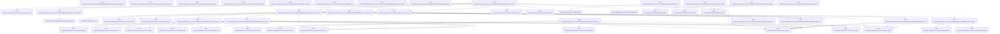
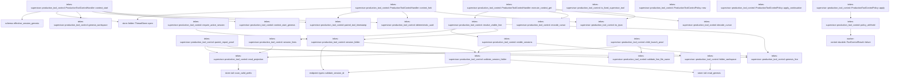

# tekes-supervisor::production_tool_control

[Package atlas](index.md) · [Source](../../src/production_tool_control.rs)

## Declarations

Visibility is the declaration spelling; trait members and reexports require their enclosing interface. `cfg` is not evaluated.

| Symbol | Kind | Visibility | Test / cfg |
|---|---|---|---|
| [tekes-supervisor::production_tool_control::DEFAULT_PAGE_BYTES](../../src/production_tool_control.rs#L32) | const_item | `private` |  |
| [tekes-supervisor::production_tool_control::DEFAULT_SEARCH_LIMIT](../../src/production_tool_control.rs#L33) | const_item | `private` |  |
| [tekes-supervisor::production_tool_control::MAX_SEARCH_LIMIT](../../src/production_tool_control.rs#L34) | const_item | `private` |  |
| [tekes-supervisor::production_tool_control::DeliveryRequest](../../src/production_tool_control.rs#L37) | struct_item | `pub` |  |
| [tekes-supervisor::production_tool_control::InterruptRequest](../../src/production_tool_control.rs#L47) | struct_item | `pub` |  |
| [tekes-supervisor::production_tool_control::ChildLaunchProof](../../src/production_tool_control.rs#L55) | struct_item | `pub` |  |
| [tekes-supervisor::production_tool_control::ParentReportProof](../../src/production_tool_control.rs#L67) | struct_item | `pub` |  |
| [tekes-supervisor::production_tool_control::SupervisorRuntimeAuthority](../../src/production_tool_control.rs#L81) | trait_item | `pub` |  |
| [tekes-supervisor::production_tool_control::SupervisorRuntimeAuthority::ensure_running](../../src/production_tool_control.rs#L82) | function_signature_item | `private` |  |
| [tekes-supervisor::production_tool_control::SupervisorRuntimeAuthority::deliver_input](../../src/production_tool_control.rs#L88) | function_signature_item | `private` |  |
| [tekes-supervisor::production_tool_control::SupervisorRuntimeAuthority::interrupt](../../src/production_tool_control.rs#L93) | function_signature_item | `private` |  |
| [tekes-supervisor::production_tool_control::SupervisorRuntimeAuthority::ensure_child](../../src/production_tool_control.rs#L98) | function_signature_item | `private` |  |
| [tekes-supervisor::production_tool_control::SupervisorRuntimeAuthority::deliver_report](../../src/production_tool_control.rs#L103) | function_signature_item | `private` |  |
| [tekes-supervisor::production_tool_control::SupervisorJobAuthority](../../src/production_tool_control.rs#L113) | trait_item | `pub` |  |
| [tekes-supervisor::production_tool_control::SupervisorJobAuthority::execute](../../src/production_tool_control.rs#L114) | function_signature_item | `private` |  |
| [tekes-supervisor::production_tool_control::DynamicExecutionOutcome](../../src/production_tool_control.rs#L124) | enum_item | `pub` |  |
| [tekes-supervisor::production_tool_control::DynamicSupervisorAuthority](../../src/production_tool_control.rs#L132) | trait_item | `pub` |  |
| [tekes-supervisor::production_tool_control::DynamicSupervisorAuthority::supports](../../src/production_tool_control.rs#L133) | function_signature_item | `private` |  |
| [tekes-supervisor::production_tool_control::DynamicSupervisorAuthority::execute](../../src/production_tool_control.rs#L135) | function_signature_item | `private` |  |
| [tekes-supervisor::production_tool_control::DynamicSupervisorAuthority::execute_outcome](../../src/production_tool_control.rs#L144) | function_item | `private` |  |
| [tekes-supervisor::production_tool_control::DynamicSupervisorAuthority::continue_task](../../src/production_tool_control.rs#L156) | function_item | `private` |  |
| [tekes-supervisor::production_tool_control::DynamicSupervisorAuthority::reconcile](../../src/production_tool_control.rs#L168) | function_item | `private` |  |
| [tekes-supervisor::production_tool_control::DynamicSupervisorAuthority::cancel_inflight](../../src/production_tool_control.rs#L177) | function_item | `private` |  |
| [tekes-supervisor::production_tool_control::JobBrokerSupervisorAuthority](../../src/production_tool_control.rs#L180) | struct_item | `pub` |  |
| [tekes-supervisor::production_tool_control::JobBrokerSupervisorAuthority::new](../../src/production_tool_control.rs#L188) | function_item | `pub` |  |
| [tekes-supervisor::production_tool_control::JobBrokerSupervisorAuthority::execute](../../src/production_tool_control.rs#L205) | function_item | `private` |  |
| [tekes-supervisor::production_tool_control::ProductionToolControlHandler](../../src/production_tool_control.rs#L263) | struct_item | `pub` |  |
| [tekes-supervisor::production_tool_control::ProductionToolControlHandler::new](../../src/production_tool_control.rs#L273) | function_item | `pub` |  |
| [tekes-supervisor::production_tool_control::ProductionToolControlHandler::with_dynamic_routes](../../src/production_tool_control.rs#L284) | function_item | `pub` |  |
| [tekes-supervisor::production_tool_control::ProductionToolControlHandler::runtime](../../src/production_tool_control.rs#L295) | function_item | `pub` |  |
| [tekes-supervisor::production_tool_control::ProductionToolControlHandler::execute](../../src/production_tool_control.rs#L303) | function_item | `private` |  |
| [tekes-supervisor::production_tool_control::ProductionToolControlHandler::recovery](../../src/production_tool_control.rs#L327) | function_item | `private` |  |
| [tekes-supervisor::production_tool_control::ProductionToolControlHandler::reconcile](../../src/production_tool_control.rs#L351) | function_item | `private` |  |
| [tekes-supervisor::production_tool_control::ProductionToolControlHandler::continue_task](../../src/production_tool_control.rs#L375) | function_item | `pub` |  |
| [tekes-supervisor::production_tool_control::ProductionToolControlHandler::execute_inner](../../src/production_tool_control.rs#L411) | function_item | `private` |  |
| [tekes-supervisor::production_tool_control::ProductionToolControlHandler::execute_dynamic](../../src/production_tool_control.rs#L448) | function_item | `private` |  |
| [tekes-supervisor::production_tool_control::ProductionToolControlHandler::execute_context](../../src/production_tool_control.rs#L479) | function_item | `private` |  |
| [tekes-supervisor::production_tool_control::ProductionToolControlHandler::context_threads](../../src/production_tool_control.rs#L551) | function_item | `private` |  |
| [tekes-supervisor::production_tool_control::ProductionToolControlHandler::context_read](../../src/production_tool_control.rs#L587) | function_item | `private` |  |
| [tekes-supervisor::production_tool_control::ProductionToolControlHandler::context_records](../../src/production_tool_control.rs#L603) | function_item | `private` |  |
| [tekes-supervisor::production_tool_control::ProductionToolControlHandler::context_search](../../src/production_tool_control.rs#L632) | function_item | `private` |  |
| [tekes-supervisor::production_tool_control::ProductionToolControlHandler::context_start](../../src/production_tool_control.rs#L716) | function_item | `private` |  |
| [tekes-supervisor::production_tool_control::ProductionToolControlHandler::context_fork](../../src/production_tool_control.rs#L752) | function_item | `private` |  |
| [tekes-supervisor::production_tool_control::ProductionToolControlHandler::execute_context_get](../../src/production_tool_control.rs#L772) | function_item | `private` |  |
| [tekes-supervisor::production_tool_control::is_fixed_supervisor_tool](../../src/production_tool_control.rs#L850) | function_item | `private` |  |
| [tekes-supervisor::production_tool_control::ProductionToolControlPolicy](../../src/production_tool_control.rs#L858) | struct_item | `pub` |  |
| [tekes-supervisor::production_tool_control::ProductionToolControlPolicy::new](../../src/production_tool_control.rs#L864) | function_item | `pub` |  |
| [tekes-supervisor::production_tool_control::ProductionToolControlPolicy::apply_continuation](../../src/production_tool_control.rs#L874) | function_item | `pub` |  |
| [tekes-supervisor::production_tool_control::ProductionToolControlPolicy::apply](../../src/production_tool_control.rs#L916) | function_item | `private` |  |
| [tekes-supervisor::production_tool_control::policy_withheld](../../src/production_tool_control.rs#L955) | function_item | `private` |  |
| [tekes-supervisor::production_tool_control::child_launch_proof](../../src/production_tool_control.rs#L967) | function_item | `private` |  |
| [tekes-supervisor::production_tool_control::parent_report_proof](../../src/production_tool_control.rs#L1039) | function_item | `private` |  |
| [tekes-supervisor::production_tool_control::session_lines](../../src/production_tool_control.rs#L1101) | function_item | `private` |  |
| [tekes-supervisor::production_tool_control::resolve_visible_line](../../src/production_tool_control.rs#L1122) | function_item | `private` |  |
| [tekes-supervisor::production_tool_control::visible_sessions](../../src/production_tool_control.rs#L1143) | function_item | `private` |  |
| [tekes-supervisor::production_tool_control::require_active_session](../../src/production_tool_control.rs#L1171) | function_item | `private` |  |
| [tekes-supervisor::production_tool_control::validate_session_folder](../../src/production_tool_control.rs#L1181) | function_item | `private` |  |
| [tekes-supervisor::production_tool_control::session_folder](../../src/production_tool_control.rs#L1201) | function_item | `private` |  |
| [tekes-supervisor::production_tool_control::read_projection](../../src/production_tool_control.rs#L1216) | function_item | `private` |  |
| [tekes-supervisor::production_tool_control::folder_workspace](../../src/production_tool_control.rs#L1229) | function_item | `private` |  |
| [tekes-supervisor::production_tool_control::genesis_workspace](../../src/production_tool_control.rs#L1244) | function_item | `private` |  |
| [tekes-supervisor::production_tool_control::genesis_line](../../src/production_tool_control.rs#L1254) | function_item | `private` |  |
| [tekes-supervisor::production_tool_control::paired_tool_timestamp](../../src/production_tool_control.rs#L1262) | function_item | `private` |  |
| [tekes-supervisor::production_tool_control::event_record](../../src/production_tool_control.rs#L1278) | function_item | `private` |  |
| [tekes-supervisor::production_tool_control::required_string](../../src/production_tool_control.rs#L1284) | function_item | `private` |  |
| [tekes-supervisor::production_tool_control::string_array](../../src/production_tool_control.rs#L1292) | function_item | `private` |  |
| [tekes-supervisor::production_tool_control::job_record_outcome](../../src/production_tool_control.rs#L1307) | function_item | `private` |  |
| [tekes-supervisor::production_tool_control::map_backend](../../src/production_tool_control.rs#L1320) | function_item | `private` |  |
| [tekes-supervisor::production_tool_control::argument_limit](../../src/production_tool_control.rs#L1339) | function_item | `private` |  |
| [tekes-supervisor::production_tool_control::encode_cursor](../../src/production_tool_control.rs#L1352) | function_item | `private` |  |
| [tekes-supervisor::production_tool_control::decode_cursor](../../src/production_tool_control.rs#L1357) | function_item | `private` |  |
| [tekes-supervisor::production_tool_control::context_start_genesis](../../src/production_tool_control.rs#L1386) | function_item | `private` |  |
| [tekes-supervisor::production_tool_control::deterministic_uuid](../../src/production_tool_control.rs#L1416) | function_item | `private` |  |
| [tekes-supervisor::production_tool_control::validate_line_file_name](../../src/production_tool_control.rs#L1436) | function_item | `private` |  |
| [tekes-supervisor::production_tool_control::bounded_snippet](../../src/production_tool_control.rs#L1449) | function_item | `private` |  |
| [tekes-supervisor::production_tool_control::to_ijson](../../src/production_tool_control.rs#L1460) | function_item | `private` |  |
| [tekes-supervisor::production_tool_control::map_io](../../src/production_tool_control.rs#L1468) | function_item | `private` |  |
| [tekes-supervisor::production_tool_control::map_store](../../src/production_tool_control.rs#L1476) | function_item | `private` |  |
| [tekes-supervisor::production_tool_control::map_schema](../../src/production_tool_control.rs#L1488) | function_item | `private` |  |
| [tekes-supervisor::production_tool_control::SupervisorOperationError](../../src/production_tool_control.rs#L1493) | enum_item | `pub` |  |
| [tekes-supervisor::production_tool_control::SupervisorOperationError::into_control_error](../../src/production_tool_control.rs#L1523) | function_item | `private` |  |
| [tekes-supervisor::production_tool_control::tool_failure_tests::definitive_remote_tool_failure_is_not_retryable_transport_loss](../../src/production_tool_control.rs#L1550) | function_item | `private` | test; #[cfg(test)] |
| [tekes-supervisor::production_tool_control::continuation_policy_tests::value](../../src/production_tool_control.rs#L1569) | function_item | `private` | test; #[cfg(test)] |
| [tekes-supervisor::production_tool_control::continuation_policy_tests::pending_results_and_continuation_responses_pass_the_secret_policy](../../src/production_tool_control.rs#L1576) | function_item | `private` | test; #[cfg(test)] |
| [tekes-supervisor::production_tool_control::context_start_tests::a_started_session_inherits_the_callers_scope_and_preset](../../src/production_tool_control.rs#L1648) | function_item | `private` | test; #[cfg(test)] |

## Imports / reexports

| Local name | Source path | Visibility |
|---|---|---|
| `BTreeSet` | `std::collections::BTreeSet` | `private` |
| `fs` | `std::fs` | `private` |
| `Component` | `std::path::Component` | `private` |
| `Path` | `std::path::Path` | `private` |
| `PathBuf` | `std::path::PathBuf` | `private` |
| `Arc` | `std::sync::Arc` | `private` |
| `DynamicTool` | `profile::DynamicTool` | `private` |
| `DynamicToolCatalog` | `profile::DynamicToolCatalog` | `private` |
| `DynamicToolEffect` | `profile::DynamicToolEffect` | `private` |
| `Event` | `schema::Event` | `private` |
| `EventKind` | `schema::EventKind` | `private` |
| `IJsonValue` | `schema::IJsonValue` | `private` |
| `OriginTuple` | `schema::OriginTuple` | `private` |
| `Value` | `serde_json::Value` | `private` |
| `json` | `serde_json::json` | `private` |
| `Digest` | `sha2::Digest` | `private` |
| `Sha256` | `sha2::Sha256` | `private` |
| `ThreadStore` | `store::ThreadStore` | `private` |
| `scan_valid_prefix` | `store::scan_valid_prefix` | `private` |
| `Error` | `thiserror::Error` | `private` |
| `BackendFailure` | `tools::BackendFailure` | `private` |
| `BackendGate` | `tools::BackendGate` | `private` |
| `BackendOutcome` | `tools::BackendOutcome` | `private` |
| `CancellationToken` | `tools::CancellationToken` | `private` |
| `JobBroker` | `tools::JobBroker` | `private` |
| `JobLaunchPolicy` | `tools::JobLaunchPolicy` | `private` |
| `JobSpec` | `tools::JobSpec` | `private` |
| `SandboxedJobLauncher` | `tools::SandboxedJobLauncher` | `private` |
| `SecretScan` | `tools::SecretScan` | `private` |
| `SecretScanner` | `tools::SecretScanner` | `private` |
| `validate_fixed_arguments` | `tools::validate_fixed_arguments` | `private` |
| `ToolContinuationOutcome` | `worker_control::continuation::ToolContinuationOutcome` | `private` |
| `ToolContinuationRequest` | `worker_control::continuation::ToolContinuationRequest` | `private` |
| `ToolContinuationResponse` | `worker_control::continuation::ToolContinuationResponse` | `private` |
| `ToolControl` | `worker_control::ToolControl` | `private` |
| `ToolControlError` | `worker_control::ToolControlError` | `private` |
| `ToolControlErrorCode` | `worker_control::ToolControlErrorCode` | `private` |
| `ToolControlResult` | `worker_control::ToolControlResult` | `private` |
| `ExternalEffectResolution` | `crate::tool_control::ExternalEffectResolution` | `private` |
| `ToolControlHandler` | `crate::tool_control::ToolControlHandler` | `private` |
| `ToolControlPolicy` | `crate::tool_control::ToolControlPolicy` | `private` |
| `ToolControlRecovery` | `crate::tool_control::ToolControlRecovery` | `private` |
| `resolve_durable_binding` | `crate::tool_control::resolve_durable_binding` | `private` |
| `*` | `super::*` | `private` |
| `*` | `super::*` | `private` |
| `ContinuationOperation` | `worker_control::continuation::ContinuationOperation` | `private` |
| `ToolContinuationRequest` | `worker_control::continuation::ToolContinuationRequest` | `private` |
| `*` | `super::*` | `private` |

## Module declarations

| Module | Visibility | Attributes |
|---|---|---|
| `tekes-supervisor::production_tool_control::tool_failure_tests` | `private` | #[cfg(test)] |
| `tekes-supervisor::production_tool_control::continuation_policy_tests` | `private` | #[cfg(test)] |
| `tekes-supervisor::production_tool_control::context_start_tests` | `private` | #[cfg(test)] |

## Function call graphs

Edges below are syntactically resolved calls only, including private functions. Graphs partition callers into groups of 20; they are not execution order. All unresolved sites are listed below and in the JSON inventory.

Functions 1–20: 52 direct edges

```mermaid
flowchart TD
  n0["engine::dynamic_catalog::validate_dynamic_invocation"]
  n1["store::folder::ThreadStore::open"]
  n2["tekes-supervisor::production_tool_control::parent_report_proof"]
  n3["tekes-supervisor::production_tool_control::session_lines"]
  n4["tekes-supervisor::production_tool_control::visible_sessions"]
  n5["tekes-supervisor::production_tool_control::require_active_session"]
  n6["tekes-supervisor::production_tool_control::validate_session_folder"]
  n7["tekes-supervisor::production_tool_control::session_folder"]
  n8["tekes-supervisor::production_tool_control::read_projection"]
  n9["tekes-supervisor::production_tool_control::genesis_workspace"]
  n10["tekes-supervisor::production_tool_control::genesis_line"]
  n11["tekes-supervisor::production_tool_control::required_string"]
  n12["tekes-supervisor::production_tool_control::string_array"]
  n13["tekes-supervisor::production_tool_control::job_record_outcome"]
  n14["tekes-supervisor::production_tool_control::map_backend"]
  n15["tekes-supervisor::production_tool_control::argument_limit"]
  n16["tekes-supervisor::production_tool_control::encode_cursor"]
  n17["tekes-supervisor::production_tool_control::decode_cursor"]
  n18["tekes-supervisor::production_tool_control::DynamicSupervisorAuthority::execute_outcome"]
  n19["tekes-supervisor::production_tool_control::to_ijson"]
  n20["tekes-supervisor::production_tool_control::DynamicSupervisorAuthority::continue_task"]
  n21["tekes-supervisor::production_tool_control::DynamicSupervisorAuthority::reconcile"]
  n22["tekes-supervisor::production_tool_control::DynamicSupervisorAuthority::cancel_inflight"]
  n23["tekes-supervisor::production_tool_control::JobBrokerSupervisorAuthority::new"]
  n24["tekes-supervisor::production_tool_control::JobBrokerSupervisorAuthority::execute"]
  n25["tekes-supervisor::production_tool_control::ProductionToolControlHandler::new"]
  n26["tekes-supervisor::production_tool_control::ProductionToolControlHandler::with_dynamic_routes"]
  n27["tekes-supervisor::production_tool_control::ProductionToolControlHandler::runtime"]
  n28["tekes-supervisor::production_tool_control::ProductionToolControlHandler::execute"]
  n29["tekes-supervisor::production_tool_control::ProductionToolControlHandler::recovery"]
  n30["tekes-supervisor::production_tool_control::ProductionToolControlHandler::reconcile"]
  n31["tekes-supervisor::production_tool_control::ProductionToolControlHandler::continue_task"]
  n32["tekes-supervisor::production_tool_control::ProductionToolControlHandler::execute_inner"]
  n33["tekes-supervisor::production_tool_control::ProductionToolControlHandler::execute_dynamic"]
  n34["tekes-supervisor::production_tool_control::ProductionToolControlHandler::execute_context"]
  n35["tekes-supervisor::production_tool_control::ProductionToolControlHandler::context_threads"]
  n36["tekes-supervisor::production_tool_control::ProductionToolControlHandler::context_read"]
  n37["tekes-supervisor::production_tool_control::ProductionToolControlHandler::context_records"]
  n38["tekes-supervisor::production_tool_control::ProductionToolControlHandler::context_search"]
  n39["tekes-supervisor::production_tool_control::ProductionToolControlHandler::context_start"]
  n40["tekes-supervisor::production_tool_control::ProductionToolControlHandler::context_fork"]
  n41["tekes-supervisor::production_tool_control::ProductionToolControlHandler::execute_context_get"]
  n42["tekes-supervisor::production_tool_control::is_fixed_supervisor_tool"]
  n43["tekes-supervisor::production_tool_control::child_launch_proof"]
  n44["tekes-supervisor::tool_control::resolve_durable_binding"]
  n45["tools::runtime_backends::JobBroker::new"]
  n46["tools::schema_registry::validate_fixed_arguments"]
  n47["worker-control::durable::ToolControlResult::pending"]
  n48["worker-control::durable::ToolControlResult::success"]
  n49["worker-control::durable::ToolControlResult::failure"]
  n23 --> n45
  n24 --> n11
  n24 --> n12
  n24 --> n13
  n24 --> n14
  n24 --> n19
  n28 --> n47
  n28 --> n48
  n28 --> n49
  n29 --> n42
  n32 --> n2
  n32 --> n19
  n32 --> n33
  n32 --> n34
  n32 --> n41
  n32 --> n42
  n32 --> n43
  n32 --> n44
  n32 --> n46
  n33 --> n0
  n34 --> n1
  n34 --> n5
  n34 --> n7
  n34 --> n9
  n34 --> n11
  n34 --> n19
  n34 --> n35
  n34 --> n36
  n34 --> n37
  n34 --> n38
  n34 --> n39
  n34 --> n40
  n35 --> n6
  n35 --> n8
  n35 --> n19
  n36 --> n7
  n36 --> n8
  n36 --> n19
  n37 --> n11
  n37 --> n15
  n37 --> n16
  n37 --> n17
  n37 --> n19
  n38 --> n3
  n38 --> n4
  n38 --> n7
  n38 --> n10
  n38 --> n11
  n38 --> n15
  n38 --> n16
  n38 --> n17
  n38 --> n19
```

Functions 21–40: 36 direct edges

```mermaid
flowchart TD
  n0["endpoint::types::validate_session_id"]
  n1["schema::effective_session_genesis"]
  n2["store::folder::ThreadStore::open"]
  n3["store::tail::scan_valid_prefix"]
  n4["store::tail::read_genesis"]
  n5["tekes-supervisor::production_tool_control::parent_report_proof"]
  n6["tekes-supervisor::production_tool_control::session_lines"]
  n7["tekes-supervisor::production_tool_control::resolve_visible_line"]
  n8["tekes-supervisor::production_tool_control::visible_sessions"]
  n9["tekes-supervisor::production_tool_control::require_active_session"]
  n10["tekes-supervisor::production_tool_control::validate_session_folder"]
  n11["tekes-supervisor::production_tool_control::session_folder"]
  n12["tekes-supervisor::production_tool_control::read_projection"]
  n13["tekes-supervisor::production_tool_control::folder_workspace"]
  n14["tekes-supervisor::production_tool_control::genesis_workspace"]
  n15["tekes-supervisor::production_tool_control::genesis_line"]
  n16["tekes-supervisor::production_tool_control::paired_tool_timestamp"]
  n17["tekes-supervisor::production_tool_control::encode_cursor"]
  n18["tekes-supervisor::production_tool_control::decode_cursor"]
  n19["tekes-supervisor::production_tool_control::context_start_genesis"]
  n20["tekes-supervisor::production_tool_control::deterministic_uuid"]
  n21["tekes-supervisor::production_tool_control::validate_line_file_name"]
  n22["tekes-supervisor::production_tool_control::to_ijson"]
  n23["tekes-supervisor::production_tool_control::ProductionToolControlHandler::context_start"]
  n24["tekes-supervisor::production_tool_control::ProductionToolControlHandler::context_fork"]
  n25["tekes-supervisor::production_tool_control::ProductionToolControlHandler::execute_context_get"]
  n26["tekes-supervisor::production_tool_control::is_fixed_supervisor_tool"]
  n27["tekes-supervisor::production_tool_control::ProductionToolControlPolicy::new"]
  n28["tekes-supervisor::production_tool_control::ProductionToolControlPolicy::apply_continuation"]
  n29["tekes-supervisor::production_tool_control::ProductionToolControlPolicy::apply"]
  n30["tekes-supervisor::production_tool_control::policy_withheld"]
  n31["tekes-supervisor::production_tool_control::child_launch_proof"]
  n32["worker-control::durable::ToolControlResult::failure"]
  n5 --> n12
  n5 --> n15
  n5 --> n21
  n6 --> n12
  n7 --> n6
  n7 --> n8
  n7 --> n11
  n7 --> n15
  n8 --> n10
  n8 --> n13
  n9 --> n11
  n10 --> n0
  n10 --> n4
  n11 --> n0
  n11 --> n10
  n12 --> n3
  n13 --> n4
  n23 --> n1
  n23 --> n2
  n23 --> n14
  n23 --> n16
  n23 --> n19
  n23 --> n20
  n24 --> n2
  n24 --> n16
  n24 --> n20
  n24 --> n22
  n25 --> n7
  n25 --> n17
  n25 --> n18
  n25 --> n22
  n29 --> n30
  n30 --> n32
  n31 --> n12
  n31 --> n15
  n31 --> n21
```

Functions 41–58: 6 direct edges

```mermaid
flowchart TD
  n0["schema::event::Event::from_value"]
  n1["schema::ijson::IJsonValue::parse"]
  n2["tekes-supervisor::production_tool_control::paired_tool_timestamp"]
  n3["tekes-supervisor::production_tool_control::event_record"]
  n4["tekes-supervisor::production_tool_control::required_string"]
  n5["tekes-supervisor::production_tool_control::string_array"]
  n6["tekes-supervisor::production_tool_control::job_record_outcome"]
  n7["tekes-supervisor::production_tool_control::map_backend"]
  n8["tekes-supervisor::production_tool_control::argument_limit"]
  n9["tekes-supervisor::production_tool_control::encode_cursor"]
  n10["tekes-supervisor::production_tool_control::decode_cursor"]
  n11["tekes-supervisor::production_tool_control::context_start_genesis"]
  n12["tekes-supervisor::production_tool_control::deterministic_uuid"]
  n13["tekes-supervisor::production_tool_control::validate_line_file_name"]
  n14["tekes-supervisor::production_tool_control::bounded_snippet"]
  n15["tekes-supervisor::production_tool_control::to_ijson"]
  n16["tekes-supervisor::production_tool_control::map_io"]
  n17["tekes-supervisor::production_tool_control::map_store"]
  n18["tekes-supervisor::production_tool_control::map_schema"]
  n19["tekes-supervisor::production_tool_control::SupervisorOperationError::into_control_error"]
  n6 --> n7
  n6 --> n15
  n10 --> n9
  n11 --> n0
  n11 --> n15
  n15 --> n1
```

## Call sites

Includes test functions (marked in declarations). Receiver-type-required sites need type analysis/manual tracing. Calls in closures are attributed to their enclosing function; their occurrence here does not mean the closure executes immediately.

| Caller | Callee expression | Source lines | Target / classification |
|---|---|---|---|
| `execute_outcome` | `self.execute(tool, request)             .map` | [150](../../src/production_tool_control.rs#L150) | receiver-type-required |
| `execute_outcome` | `self.execute` | [150](../../src/production_tool_control.rs#L150) | receiver-type-required |
| `continue_task` | `Err` | [162](../../src/production_tool_control.rs#L162) | external-constructor-callback-or-unresolved |
| `continue_task` | `SupervisorOperationError::Unsupported` | [162](../../src/production_tool_control.rs#L162) | external-constructor-callback-or-unresolved |
| `new` | `Ok` | [195](../../src/production_tool_control.rs#L195) | external-constructor-callback-or-unresolved |
| `new` | `JobBroker::new` | [196](../../src/production_tool_control.rs#L196) | [tools::runtime_backends::JobBroker::new](../../../tools/src/runtime_backends.rs#L566) |
| `execute` | `serde_json::to_value(&request.arguments)             .map_err` | [206](../../src/production_tool_control.rs#L206) | receiver-type-required |
| `execute` | `serde_json::to_value` | [206](../../src/production_tool_control.rs#L206) | external-constructor-callback-or-unresolved |
| `execute` | `SupervisorOperationError::Protocol` | [207](../../src/production_tool_control.rs#L207) | external-constructor-callback-or-unresolved |
| `execute` | `error.to_string` | [207](../../src/production_tool_control.rs#L207) | receiver-type-required |
| `execute` | `required_string` | [208](../../src/production_tool_control.rs#L208), [218](../../src/production_tool_control.rs#L218), [248](../../src/production_tool_control.rs#L248), [252](../../src/production_tool_control.rs#L252) | [tekes-supervisor::production_tool_control::required_string](../../src/production_tool_control.rs#L1284) |
| `execute` | `arguments                     .get("job_id")                     .and_then(Value::as_str)                     .filter(&#124;value&#124; !value.is_empty())                     .map(ToOwned::to_owned)                     .unwrap_or_else` | [211](../../src/production_tool_control.rs#L211) | receiver-type-required |
| `execute` | `arguments                     .get("job_id")                     .and_then(Value::as_str)                     .filter(&#124;value&#124; !value.is_empty())                     .map` | [211](../../src/production_tool_control.rs#L211) | receiver-type-required |
| `execute` | `arguments                     .get("job_id")                     .and_then(Value::as_str)                     .filter` | [211](../../src/production_tool_control.rs#L211) | receiver-type-required |
| `execute` | `arguments                     .get("job_id")                     .and_then` | [211](../../src/production_tool_control.rs#L211) | receiver-type-required |
| `execute` | `arguments                     .get` | [211](../../src/production_tool_control.rs#L211) | receiver-type-required |
| `execute` | `value.is_empty` | [214](../../src/production_tool_control.rs#L214), [223](../../src/production_tool_control.rs#L223) | receiver-type-required |
| `execute` | `required_string(&arguments, "program")?.to_owned` | [218](../../src/production_tool_control.rs#L218) | receiver-type-required |
| `execute` | `string_array` | [219](../../src/production_tool_control.rs#L219), [225](../../src/production_tool_control.rs#L225) | [tekes-supervisor::production_tool_control::string_array](../../src/production_tool_control.rs#L1292) |
| `execute` | `arguments                         .get("working_directory")                         .and_then(Value::as_str)                         .filter(&#124;value&#124; !value.is_empty())                         .map` | [220](../../src/production_tool_control.rs#L220) | receiver-type-required |
| `execute` | `arguments                         .get("working_directory")                         .and_then(Value::as_str)                         .filter` | [220](../../src/production_tool_control.rs#L220) | receiver-type-required |
| `execute` | `arguments                         .get("working_directory")                         .and_then` | [220](../../src/production_tool_control.rs#L220) | receiver-type-required |
| `execute` | `arguments                         .get` | [220](../../src/production_tool_control.rs#L220) | receiver-type-required |
| `execute` | `Default::default` | [226](../../src/production_tool_control.rs#L226) | external-constructor-callback-or-unresolved |
| `execute` | `job_record_outcome` | [228](../../src/production_tool_control.rs#L228), [249](../../src/production_tool_control.rs#L249), [253](../../src/production_tool_control.rs#L253) | [tekes-supervisor::production_tool_control::job_record_outcome](../../src/production_tool_control.rs#L1307) |
| `execute` | `self.broker.start` | [228](../../src/production_tool_control.rs#L228) | receiver-type-required |
| `execute` | `Arc::clone` | [232](../../src/production_tool_control.rs#L232) | external-constructor-callback-or-unresolved |
| `execute` | `self.broker.list` | [237](../../src/production_tool_control.rs#L237) | receiver-type-required |
| `execute` | `to_ijson` | [238](../../src/production_tool_control.rs#L238) | [tekes-supervisor::production_tool_control::to_ijson](../../src/production_tool_control.rs#L1460) |
| `execute` | `Err` | [239](../../src/production_tool_control.rs#L239), [240](../../src/production_tool_control.rs#L240), [244](../../src/production_tool_control.rs#L244), [255](../../src/production_tool_control.rs#L255) | external-constructor-callback-or-unresolved |
| `execute` | `map_backend` | [239](../../src/production_tool_control.rs#L239) | [tekes-supervisor::production_tool_control::map_backend](../../src/production_tool_control.rs#L1320) |
| `execute` | `SupervisorOperationError::Denied` | [240](../../src/production_tool_control.rs#L240) | external-constructor-callback-or-unresolved |
| `execute` | `"job list unexpectedly requested approval".into` | [241](../../src/production_tool_control.rs#L241) | receiver-type-required |
| `execute` | `SupervisorOperationError::Unavailable` | [244](../../src/production_tool_control.rs#L244) | external-constructor-callback-or-unresolved |
| `execute` | `self.broker.status` | [249](../../src/production_tool_control.rs#L249) | receiver-type-required |
| `execute` | `self.broker.stop` | [253](../../src/production_tool_control.rs#L253) | receiver-type-required |
| `execute` | `SupervisorOperationError::Unsupported` | [255](../../src/production_tool_control.rs#L255) | external-constructor-callback-or-unresolved |
| `execute` | `Ok` | [259](../../src/production_tool_control.rs#L259) | external-constructor-callback-or-unresolved |
| `new` | `root.into` | [275](../../src/production_tool_control.rs#L275) | receiver-type-required |
| `new` | `DynamicToolCatalog::default` | [278](../../src/production_tool_control.rs#L278) | external-constructor-callback-or-unresolved |
| `with_dynamic_routes` | `Some` | [290](../../src/production_tool_control.rs#L290) | external-constructor-callback-or-unresolved |
| `execute` | `self.execute_inner` | [304](../../src/production_tool_control.rs#L304) | receiver-type-required |
| `execute` | `ToolControlResult::success` | [305](../../src/production_tool_control.rs#L305) | [worker-control::durable::ToolControlResult::success](../../../worker-control/src/durable.rs#L360) |
| `execute` | `request.request_id.clone` | [306](../../src/production_tool_control.rs#L306), [314](../../src/production_tool_control.rs#L314), [320](../../src/production_tool_control.rs#L320) | receiver-type-required |
| `execute` | `request.call_id.clone` | [307](../../src/production_tool_control.rs#L307), [315](../../src/production_tool_control.rs#L315), [321](../../src/production_tool_control.rs#L321) | receiver-type-required |
| `execute` | `ToolControlResult::pending` | [313](../../src/production_tool_control.rs#L313) | [worker-control::durable::ToolControlResult::pending](../../../worker-control/src/durable.rs#L340) |
| `execute` | `ToolControlResult::failure` | [319](../../src/production_tool_control.rs#L319) | [worker-control::durable::ToolControlResult::failure](../../../worker-control/src/durable.rs#L375) |
| `execute` | `error.into_control_error` | [322](../../src/production_tool_control.rs#L322) | receiver-type-required |
| `recovery` | `is_fixed_supervisor_tool` | [328](../../src/production_tool_control.rs#L328) | [tekes-supervisor::production_tool_control::is_fixed_supervisor_tool](../../src/production_tool_control.rs#L850) |
| `recovery` | `self             .dynamic_catalog             .tools             .iter()             .find` | [331](../../src/production_tool_control.rs#L331) | receiver-type-required |
| `recovery` | `self             .dynamic_catalog             .tools             .iter` | [331](../../src/production_tool_control.rs#L331) | receiver-type-required |
| `recovery` | `tool.external_effect.is_some` | [344](../../src/production_tool_control.rs#L344) | receiver-type-required |
| `reconcile` | `self             .dynamic_catalog             .tools             .iter()             .find` | [352](../../src/production_tool_control.rs#L352) | receiver-type-required |
| `reconcile` | `self             .dynamic_catalog             .tools             .iter` | [352](../../src/production_tool_control.rs#L352) | receiver-type-required |
| `reconcile` | `self.dynamic.as_ref().filter` | [362](../../src/production_tool_control.rs#L362) | receiver-type-required |
| `reconcile` | `self.dynamic.as_ref` | [362](../../src/production_tool_control.rs#L362) | receiver-type-required |
| `reconcile` | `route.supports` | [362](../../src/production_tool_control.rs#L362) | receiver-type-required |
| `reconcile` | `authority.reconcile` | [367](../../src/production_tool_control.rs#L367) | receiver-type-required |
| `continue_task` | `request.request_id.clone` | [377](../../src/production_tool_control.rs#L377) | receiver-type-required |
| `continue_task` | `request.original.call_id.clone` | [378](../../src/production_tool_control.rs#L378) | receiver-type-required |
| `continue_task` | `error.into_control_error` | [380](../../src/production_tool_control.rs#L380) | receiver-type-required |
| `continue_task` | `self             .dynamic_catalog             .tools             .iter()             .find` | [383](../../src/production_tool_control.rs#L383) | receiver-type-required |
| `continue_task` | `self             .dynamic_catalog             .tools             .iter` | [383](../../src/production_tool_control.rs#L383) | receiver-type-required |
| `continue_task` | `failed` | [389](../../src/production_tool_control.rs#L389), [395](../../src/production_tool_control.rs#L395), [407](../../src/production_tool_control.rs#L407) | external-constructor-callback-or-unresolved |
| `continue_task` | `SupervisorOperationError::Unsupported` | [389](../../src/production_tool_control.rs#L389), [395](../../src/production_tool_control.rs#L395) | external-constructor-callback-or-unresolved |
| `continue_task` | `self.dynamic.as_ref().filter` | [394](../../src/production_tool_control.rs#L394) | receiver-type-required |
| `continue_task` | `self.dynamic.as_ref` | [394](../../src/production_tool_control.rs#L394) | receiver-type-required |
| `continue_task` | `route.supports` | [394](../../src/production_tool_control.rs#L394) | receiver-type-required |
| `continue_task` | `self             .root             .join("threads")             .join(&request.original.session)             .join` | [400](../../src/production_tool_control.rs#L400) | receiver-type-required |
| `continue_task` | `self             .root             .join("threads")             .join` | [400](../../src/production_tool_control.rs#L400) | receiver-type-required |
| `continue_task` | `self             .root             .join` | [400](../../src/production_tool_control.rs#L400) | receiver-type-required |
| `continue_task` | `authority.continue_task` | [405](../../src/production_tool_control.rs#L405) | receiver-type-required |
| `execute_inner` | `serde_json::to_value(&request.arguments)             .map_err` | [415](../../src/production_tool_control.rs#L415) | receiver-type-required |
| `execute_inner` | `serde_json::to_value` | [415](../../src/production_tool_control.rs#L415) | external-constructor-callback-or-unresolved |
| `execute_inner` | `SupervisorOperationError::Protocol` | [416](../../src/production_tool_control.rs#L416) | external-constructor-callback-or-unresolved |
| `execute_inner` | `error.to_string` | [416](../../src/production_tool_control.rs#L416), [419](../../src/production_tool_control.rs#L419), [424](../../src/production_tool_control.rs#L424) | receiver-type-required |
| `execute_inner` | `self.root.join("threads").join` | [417](../../src/production_tool_control.rs#L417) | receiver-type-required |
| `execute_inner` | `self.root.join` | [417](../../src/production_tool_control.rs#L417) | receiver-type-required |
| `execute_inner` | `resolve_durable_binding(&session_folder, request)             .map_err` | [418](../../src/production_tool_control.rs#L418) | receiver-type-required |
| `execute_inner` | `resolve_durable_binding` | [418](../../src/production_tool_control.rs#L418) | [tekes-supervisor::tool_control::resolve_durable_binding](../../src/tool_control.rs#L546) |
| `execute_inner` | `SupervisorOperationError::Conflict` | [419](../../src/production_tool_control.rs#L419) | external-constructor-callback-or-unresolved |
| `execute_inner` | `is_fixed_supervisor_tool` | [420](../../src/production_tool_control.rs#L420) | [tekes-supervisor::production_tool_control::is_fixed_supervisor_tool](../../src/production_tool_control.rs#L850) |
| `execute_inner` | `self.execute_dynamic` | [421](../../src/production_tool_control.rs#L421) | [tekes-supervisor::production_tool_control::ProductionToolControlHandler::execute_dynamic](../../src/production_tool_control.rs#L448) |
| `execute_inner` | `session_folder.join` | [421](../../src/production_tool_control.rs#L421) | receiver-type-required |
| `execute_inner` | `validate_fixed_arguments(&request.name, &arguments)             .map_err` | [423](../../src/production_tool_control.rs#L423) | receiver-type-required |
| `execute_inner` | `validate_fixed_arguments` | [423](../../src/production_tool_control.rs#L423) | [tools::schema_registry::validate_fixed_arguments](../../../tools/src/schema_registry.rs#L1231) |
| `execute_inner` | `SupervisorOperationError::Invalid` | [424](../../src/production_tool_control.rs#L424), [436](../../src/production_tool_control.rs#L436) | external-constructor-callback-or-unresolved |
| `execute_inner` | `request.name.as_str` | [425](../../src/production_tool_control.rs#L425) | receiver-type-required |
| `execute_inner` | `self.execute_context` | [426](../../src/production_tool_control.rs#L426) | [tekes-supervisor::production_tool_control::ProductionToolControlHandler::execute_context](../../src/production_tool_control.rs#L479) |
| `execute_inner` | `self.execute_context_get` | [427](../../src/production_tool_control.rs#L427) | [tekes-supervisor::production_tool_control::ProductionToolControlHandler::execute_context_get](../../src/production_tool_control.rs#L772) |
| `execute_inner` | `self.jobs.execute` | [428](../../src/production_tool_control.rs#L428) | receiver-type-required |
| `execute_inner` | `child_launch_proof` | [430](../../src/production_tool_control.rs#L430) | [tekes-supervisor::production_tool_control::child_launch_proof](../../src/production_tool_control.rs#L967) |
| `execute_inner` | `self.runtime.ensure_child` | [431](../../src/production_tool_control.rs#L431) | receiver-type-required |
| `execute_inner` | `parent_report_proof` | [434](../../src/production_tool_control.rs#L434) | [tekes-supervisor::production_tool_control::parent_report_proof](../../src/production_tool_control.rs#L1039) |
| `execute_inner` | `arguments.get("result").ok_or_else` | [435](../../src/production_tool_control.rs#L435) | receiver-type-required |
| `execute_inner` | `arguments.get` | [435](../../src/production_tool_control.rs#L435) | receiver-type-required |
| `execute_inner` | `"report.result missing".into` | [436](../../src/production_tool_control.rs#L436) | receiver-type-required |
| `execute_inner` | `to_ijson` | [438](../../src/production_tool_control.rs#L438) | [tekes-supervisor::production_tool_control::to_ijson](../../src/production_tool_control.rs#L1460) |
| `execute_inner` | `self.runtime.deliver_report` | [439](../../src/production_tool_control.rs#L439) | receiver-type-required |
| `execute_inner` | `Err` | [441](../../src/production_tool_control.rs#L441) | external-constructor-callback-or-unresolved |
| `execute_inner` | `SupervisorOperationError::Unsupported` | [441](../../src/production_tool_control.rs#L441) | external-constructor-callback-or-unresolved |
| `execute_inner` | `Ok` | [445](../../src/production_tool_control.rs#L445) | external-constructor-callback-or-unresolved |
| `execute_inner` | `DynamicExecutionOutcome::Value` | [445](../../src/production_tool_control.rs#L445) | external-constructor-callback-or-unresolved |
| `execute_dynamic` | `self             .dynamic_catalog             .tools             .iter()             .find(&#124;tool&#124; tool.name == request.name)             .ok_or_else` | [453](../../src/production_tool_control.rs#L453) | receiver-type-required |
| `execute_dynamic` | `self             .dynamic_catalog             .tools             .iter()             .find` | [453](../../src/production_tool_control.rs#L453) | receiver-type-required |
| `execute_dynamic` | `self             .dynamic_catalog             .tools             .iter` | [453](../../src/production_tool_control.rs#L453) | receiver-type-required |
| `execute_dynamic` | `SupervisorOperationError::Unsupported` | [459](../../src/production_tool_control.rs#L459), [471](../../src/production_tool_control.rs#L471) | external-constructor-callback-or-unresolved |
| `execute_dynamic` | `engine::validate_dynamic_invocation(tool, &request.arguments)             .map_err` | [464](../../src/production_tool_control.rs#L464) | receiver-type-required |
| `execute_dynamic` | `engine::validate_dynamic_invocation` | [464](../../src/production_tool_control.rs#L464) | [engine::dynamic_catalog::validate_dynamic_invocation](../../../engine/src/dynamic_catalog.rs#L140) |
| `execute_dynamic` | `SupervisorOperationError::Invalid` | [465](../../src/production_tool_control.rs#L465) | external-constructor-callback-or-unresolved |
| `execute_dynamic` | `error.to_string` | [465](../../src/production_tool_control.rs#L465) | receiver-type-required |
| `execute_dynamic` | `self             .dynamic             .as_ref()             .filter(&#124;route&#124; route.supports(tool))             .ok_or_else` | [466](../../src/production_tool_control.rs#L466) | receiver-type-required |
| `execute_dynamic` | `self             .dynamic             .as_ref()             .filter` | [466](../../src/production_tool_control.rs#L466) | receiver-type-required |
| `execute_dynamic` | `self             .dynamic             .as_ref` | [466](../../src/production_tool_control.rs#L466) | receiver-type-required |
| `execute_dynamic` | `route.supports` | [469](../../src/production_tool_control.rs#L469) | receiver-type-required |
| `execute_dynamic` | `authority.execute_outcome` | [476](../../src/production_tool_control.rs#L476) | receiver-type-required |
| `execute_context` | `arguments             .get("operation")             .and_then(Value::as_str)             .ok_or_else` | [485](../../src/production_tool_control.rs#L485) | receiver-type-required |
| `execute_context` | `arguments             .get("operation")             .and_then` | [485](../../src/production_tool_control.rs#L485) | receiver-type-required |
| `execute_context` | `arguments             .get` | [485](../../src/production_tool_control.rs#L485) | receiver-type-required |
| `execute_context` | `SupervisorOperationError::Invalid` | [488](../../src/production_tool_control.rs#L488) | external-constructor-callback-or-unresolved |
| `execute_context` | `"context.operation missing".into` | [488](../../src/production_tool_control.rs#L488) | receiver-type-required |
| `execute_context` | `genesis_workspace` | [489](../../src/production_tool_control.rs#L489) | [tekes-supervisor::production_tool_control::genesis_workspace](../../src/production_tool_control.rs#L1244) |
| `execute_context` | `self.context_threads` | [491](../../src/production_tool_control.rs#L491) | [tekes-supervisor::production_tool_control::ProductionToolControlHandler::context_threads](../../src/production_tool_control.rs#L551) |
| `execute_context` | `required_string` | [493](../../src/production_tool_control.rs#L493), [501](../../src/production_tool_control.rs#L501), [503](../../src/production_tool_control.rs#L503), [517](../../src/production_tool_control.rs#L517), [522](../../src/production_tool_control.rs#L522), [536](../../src/production_tool_control.rs#L536) | [tekes-supervisor::production_tool_control::required_string](../../src/production_tool_control.rs#L1284) |
| `execute_context` | `self.context_read` | [494](../../src/production_tool_control.rs#L494) | [tekes-supervisor::production_tool_control::ProductionToolControlHandler::context_read](../../src/production_tool_control.rs#L587) |
| `execute_context` | `self.context_records` | [496](../../src/production_tool_control.rs#L496) | [tekes-supervisor::production_tool_control::ProductionToolControlHandler::context_records](../../src/production_tool_control.rs#L603) |
| `execute_context` | `self.context_search` | [497](../../src/production_tool_control.rs#L497) | [tekes-supervisor::production_tool_control::ProductionToolControlHandler::context_search](../../src/production_tool_control.rs#L632) |
| `execute_context` | `self.context_start` | [498](../../src/production_tool_control.rs#L498) | [tekes-supervisor::production_tool_control::ProductionToolControlHandler::context_start](../../src/production_tool_control.rs#L716) |
| `execute_context` | `self.context_fork` | [499](../../src/production_tool_control.rs#L499) | [tekes-supervisor::production_tool_control::ProductionToolControlHandler::context_fork](../../src/production_tool_control.rs#L752) |
| `execute_context` | `session_folder` | [502](../../src/production_tool_control.rs#L502), [518](../../src/production_tool_control.rs#L518), [537](../../src/production_tool_control.rs#L537) | [tekes-supervisor::production_tool_control::session_folder](../../src/production_tool_control.rs#L1201) |
| `execute_context` | `self.runtime.deliver_input` | [504](../../src/production_tool_control.rs#L504) | receiver-type-required |
| `execute_context` | `request.session.clone` | [505](../../src/production_tool_control.rs#L505), [539](../../src/production_tool_control.rs#L539) | receiver-type-required |
| `execute_context` | `request.thread.clone` | [506](../../src/production_tool_control.rs#L506), [540](../../src/production_tool_control.rs#L540) | receiver-type-required |
| `execute_context` | `target.to_owned` | [507](../../src/production_tool_control.rs#L507), [541](../../src/production_tool_control.rs#L541) | receiver-type-required |
| `execute_context` | `request.request_id.clone` | [508](../../src/production_tool_control.rs#L508), [542](../../src/production_tool_control.rs#L542) | receiver-type-required |
| `execute_context` | `message.to_owned` | [509](../../src/production_tool_control.rs#L509) | receiver-type-required |
| `execute_context` | `arguments                         .get("goal")                         .and_then(Value::as_bool)                         .unwrap_or` | [510](../../src/production_tool_control.rs#L510) | receiver-type-required |
| `execute_context` | `arguments                         .get("goal")                         .and_then` | [510](../../src/production_tool_control.rs#L510) | receiver-type-required |
| `execute_context` | `arguments                         .get` | [510](../../src/production_tool_control.rs#L510) | receiver-type-required |
| `execute_context` | `self.runtime.ensure_running` | [519](../../src/production_tool_control.rs#L519) | receiver-type-required |
| `execute_context` | `Err` | [524](../../src/production_tool_control.rs#L524), [545](../../src/production_tool_control.rs#L545) | external-constructor-callback-or-unresolved |
| `execute_context` | `SupervisorOperationError::Denied` | [524](../../src/production_tool_control.rs#L524) | external-constructor-callback-or-unresolved |
| `execute_context` | `"a running worker cannot archive its containing session".into` | [525](../../src/production_tool_control.rs#L525) | receiver-type-required |
| `execute_context` | `require_active_session` | [528](../../src/production_tool_control.rs#L528) | [tekes-supervisor::production_tool_control::require_active_session](../../src/production_tool_control.rs#L1171) |
| `execute_context` | `ThreadStore::open(&self.root)                     .map_err(map_store)?                     .archive(target)                     .map_err` | [529](../../src/production_tool_control.rs#L529) | receiver-type-required |
| `execute_context` | `ThreadStore::open(&self.root)                     .map_err(map_store)?                     .archive` | [529](../../src/production_tool_control.rs#L529) | receiver-type-required |
| `execute_context` | `ThreadStore::open(&self.root)                     .map_err` | [529](../../src/production_tool_control.rs#L529) | receiver-type-required |
| `execute_context` | `ThreadStore::open` | [529](../../src/production_tool_control.rs#L529) | [store::folder::ThreadStore::open](../../../store/src/folder.rs#L36) |
| `execute_context` | `to_ijson` | [533](../../src/production_tool_control.rs#L533) | [tekes-supervisor::production_tool_control::to_ijson](../../src/production_tool_control.rs#L1460) |
| `execute_context` | `self.runtime.interrupt` | [538](../../src/production_tool_control.rs#L538) | receiver-type-required |
| `execute_context` | `SupervisorOperationError::Unsupported` | [545](../../src/production_tool_control.rs#L545) | external-constructor-callback-or-unresolved |
| `context_threads` | `Vec::new` | [552](../../src/production_tool_control.rs#L552) | external-constructor-callback-or-unresolved |
| `context_threads` | `fs::read_dir(self.root.join(area)).map_err` | [554](../../src/production_tool_control.rs#L554) | receiver-type-required |
| `context_threads` | `fs::read_dir` | [554](../../src/production_tool_control.rs#L554) | external-constructor-callback-or-unresolved |
| `context_threads` | `self.root.join` | [554](../../src/production_tool_control.rs#L554) | receiver-type-required |
| `context_threads` | `entry.map_err` | [555](../../src/production_tool_control.rs#L555) | receiver-type-required |
| `context_threads` | `entry.file_type().map_err(map_io)?.is_dir` | [556](../../src/production_tool_control.rs#L556) | receiver-type-required |
| `context_threads` | `entry.file_type().map_err` | [556](../../src/production_tool_control.rs#L556) | receiver-type-required |
| `context_threads` | `entry.file_type` | [556](../../src/production_tool_control.rs#L556) | receiver-type-required |
| `context_threads` | `entry.file_name().to_string_lossy().into_owned` | [559](../../src/production_tool_control.rs#L559) | receiver-type-required |
| `context_threads` | `entry.file_name().to_string_lossy` | [559](../../src/production_tool_control.rs#L559) | receiver-type-required |
| `context_threads` | `entry.file_name` | [559](../../src/production_tool_control.rs#L559) | receiver-type-required |
| `context_threads` | `validate_session_folder` | [560](../../src/production_tool_control.rs#L560) | [tekes-supervisor::production_tool_control::validate_session_folder](../../src/production_tool_control.rs#L1181) |
| `context_threads` | `entry.path` | [560](../../src/production_tool_control.rs#L560), [561](../../src/production_tool_control.rs#L561) | receiver-type-required |
| `context_threads` | `read_projection` | [561](../../src/production_tool_control.rs#L561) | [tekes-supervisor::production_tool_control::read_projection](../../src/production_tool_control.rs#L1216) |
| `context_threads` | `entry.path().join` | [561](../../src/production_tool_control.rs#L561) | receiver-type-required |
| `context_threads` | `projection.events.first().expect` | [562](../../src/production_tool_control.rs#L562) | receiver-type-required |
| `context_threads` | `projection.events.first` | [562](../../src/production_tool_control.rs#L562) | receiver-type-required |
| `context_threads` | `projection                     .events                     .iter()                     .rev()                     .find_map` | [563](../../src/production_tool_control.rs#L563) | receiver-type-required |
| `context_threads` | `projection                     .events                     .iter()                     .rev` | [563](../../src/production_tool_control.rs#L563) | receiver-type-required |
| `context_threads` | `projection                     .events                     .iter` | [563](../../src/production_tool_control.rs#L563) | receiver-type-required |
| `context_threads` | `event.string_field` | [567](../../src/production_tool_control.rs#L567) | receiver-type-required |
| `context_threads` | `items.push` | [568](../../src/production_tool_control.rs#L568) | receiver-type-required |
| `context_threads` | `items.sort_by` | [579](../../src/production_tool_control.rs#L579) | receiver-type-required |
| `context_threads` | `left.get("session_id")                 .and_then(Value::as_str)                 .cmp` | [580](../../src/production_tool_control.rs#L580) | receiver-type-required |
| `context_threads` | `left.get("session_id")                 .and_then` | [580](../../src/production_tool_control.rs#L580) | receiver-type-required |
| `context_threads` | `left.get` | [580](../../src/production_tool_control.rs#L580) | receiver-type-required |
| `context_threads` | `right.get("session_id").and_then` | [582](../../src/production_tool_control.rs#L582) | receiver-type-required |
| `context_threads` | `right.get` | [582](../../src/production_tool_control.rs#L582) | receiver-type-required |
| `context_threads` | `to_ijson` | [584](../../src/production_tool_control.rs#L584) | [tekes-supervisor::production_tool_control::to_ijson](../../src/production_tool_control.rs#L1460) |
| `context_read` | `session_folder` | [588](../../src/production_tool_control.rs#L588) | [tekes-supervisor::production_tool_control::session_folder](../../src/production_tool_control.rs#L1201) |
| `context_read` | `read_projection` | [589](../../src/production_tool_control.rs#L589) | [tekes-supervisor::production_tool_control::read_projection](../../src/production_tool_control.rs#L1216) |
| `context_read` | `folder.join` | [589](../../src/production_tool_control.rs#L589) | receiver-type-required |
| `context_read` | `projection.events.first().expect` | [590](../../src/production_tool_control.rs#L590) | receiver-type-required |
| `context_read` | `projection.events.first` | [590](../../src/production_tool_control.rs#L590) | receiver-type-required |
| `context_read` | `to_ijson` | [591](../../src/production_tool_control.rs#L591) | [tekes-supervisor::production_tool_control::to_ijson](../../src/production_tool_control.rs#L1460) |
| `context_records` | `required_string(arguments, "turn_id")?             .parse::<u64>()             .map_err` | [608](../../src/production_tool_control.rs#L608) | receiver-type-required |
| `context_records` | `required_string(arguments, "turn_id")?             .parse::<u64>` | [608](../../src/production_tool_control.rs#L608) | receiver-type-required |
| `context_records` | `required_string` | [608](../../src/production_tool_control.rs#L608) | [tekes-supervisor::production_tool_control::required_string](../../src/production_tool_control.rs#L1284) |
| `context_records` | `SupervisorOperationError::Invalid` | [611](../../src/production_tool_control.rs#L611) | external-constructor-callback-or-unresolved |
| `context_records` | `"turn_id is not a positive integer".into` | [611](../../src/production_tool_control.rs#L611) | receiver-type-required |
| `context_records` | `decode_cursor` | [613](../../src/production_tool_control.rs#L613) | [tekes-supervisor::production_tool_control::decode_cursor](../../src/production_tool_control.rs#L1357) |
| `context_records` | `arguments.get` | [613](../../src/production_tool_control.rs#L613) | receiver-type-required |
| `context_records` | `argument_limit` | [614](../../src/production_tool_control.rs#L614) | [tekes-supervisor::production_tool_control::argument_limit](../../src/production_tool_control.rs#L1339) |
| `context_records` | `resolved             .projection             .events             .iter()             .filter(&#124;event&#124; event.turn() == Some(turn))             .collect::<Vec<_>>` | [615](../../src/production_tool_control.rs#L615) | receiver-type-required |
| `context_records` | `resolved             .projection             .events             .iter()             .filter` | [615](../../src/production_tool_control.rs#L615) | receiver-type-required |
| `context_records` | `resolved             .projection             .events             .iter` | [615](../../src/production_tool_control.rs#L615) | receiver-type-required |
| `context_records` | `event.turn` | [619](../../src/production_tool_control.rs#L619) | receiver-type-required |
| `context_records` | `Some` | [619](../../src/production_tool_control.rs#L619) | external-constructor-callback-or-unresolved |
| `context_records` | `matching             .iter()             .skip(offset)             .take(limit)             .map(event_record)             .collect::<Result<Vec<_>, _>>` | [621](../../src/production_tool_control.rs#L621) | receiver-type-required |
| `context_records` | `matching             .iter()             .skip(offset)             .take(limit)             .map` | [621](../../src/production_tool_control.rs#L621) | receiver-type-required |
| `context_records` | `matching             .iter()             .skip(offset)             .take` | [621](../../src/production_tool_control.rs#L621) | receiver-type-required |
| `context_records` | `matching             .iter()             .skip` | [621](../../src/production_tool_control.rs#L621) | receiver-type-required |
| `context_records` | `matching             .iter` | [621](../../src/production_tool_control.rs#L621) | receiver-type-required |
| `context_records` | `(offset + records.len() < matching.len())             .then` | [627](../../src/production_tool_control.rs#L627) | receiver-type-required |
| `context_records` | `records.len` | [627](../../src/production_tool_control.rs#L627), [628](../../src/production_tool_control.rs#L628) | receiver-type-required |
| `context_records` | `matching.len` | [627](../../src/production_tool_control.rs#L627) | receiver-type-required |
| `context_records` | `encode_cursor` | [628](../../src/production_tool_control.rs#L628) | [tekes-supervisor::production_tool_control::encode_cursor](../../src/production_tool_control.rs#L1352) |
| `context_records` | `to_ijson` | [629](../../src/production_tool_control.rs#L629) | [tekes-supervisor::production_tool_control::to_ijson](../../src/production_tool_control.rs#L1460) |
| `context_search` | `required_string` | [638](../../src/production_tool_control.rs#L638), [647](../../src/production_tool_control.rs#L647), [663](../../src/production_tool_control.rs#L663) | [tekes-supervisor::production_tool_control::required_string](../../src/production_tool_control.rs#L1284) |
| `context_search` | `query.to_lowercase` | [639](../../src/production_tool_control.rs#L639) | receiver-type-required |
| `context_search` | `arguments             .get("scope")             .and_then(Value::as_str)             .unwrap_or` | [640](../../src/production_tool_control.rs#L640) | receiver-type-required |
| `context_search` | `arguments             .get("scope")             .and_then` | [640](../../src/production_tool_control.rs#L640) | receiver-type-required |
| `context_search` | `arguments             .get` | [640](../../src/production_tool_control.rs#L640) | receiver-type-required |
| `context_search` | `session_folder` | [648](../../src/production_tool_control.rs#L648), [673](../../src/production_tool_control.rs#L673) | [tekes-supervisor::production_tool_control::session_folder](../../src/production_tool_control.rs#L1201) |
| `context_search` | `visible_sessions` | [651](../../src/production_tool_control.rs#L651), [652](../../src/production_tool_control.rs#L652) | [tekes-supervisor::production_tool_control::visible_sessions](../../src/production_tool_control.rs#L1143) |
| `context_search` | `Some` | [651](../../src/production_tool_control.rs#L651) | external-constructor-callback-or-unresolved |
| `context_search` | `Err` | [654](../../src/production_tool_control.rs#L654) | external-constructor-callback-or-unresolved |
| `context_search` | `SupervisorOperationError::Invalid` | [654](../../src/production_tool_control.rs#L654) | external-constructor-callback-or-unresolved |
| `context_search` | `"invalid context.search scope".into` | [655](../../src/production_tool_control.rs#L655) | receiver-type-required |
| `context_search` | `request.session.as_str` | [662](../../src/production_tool_control.rs#L662) | receiver-type-required |
| `context_search` | `json!(["context-search-v2", scope, target, query]).to_string` | [668](../../src/production_tool_control.rs#L668) | receiver-type-required |
| `context_search` | `decode_cursor` | [669](../../src/production_tool_control.rs#L669) | [tekes-supervisor::production_tool_control::decode_cursor](../../src/production_tool_control.rs#L1357) |
| `context_search` | `arguments.get` | [669](../../src/production_tool_control.rs#L669) | receiver-type-required |
| `context_search` | `argument_limit` | [670](../../src/production_tool_control.rs#L670) | [tekes-supervisor::production_tool_control::argument_limit](../../src/production_tool_control.rs#L1339) |
| `context_search` | `Vec::new` | [671](../../src/production_tool_control.rs#L671) | external-constructor-callback-or-unresolved |
| `context_search` | `session_lines` | [674](../../src/production_tool_control.rs#L674) | [tekes-supervisor::production_tool_control::session_lines](../../src/production_tool_control.rs#L1101) |
| `context_search` | `genesis_line` | [675](../../src/production_tool_control.rs#L675) | [tekes-supervisor::production_tool_control::genesis_line](../../src/production_tool_control.rs#L1254) |
| `context_search` | `String::from_utf8(event.canonical_bytes().map_err(map_schema)?)                         .map_err` | [677](../../src/production_tool_control.rs#L677) | receiver-type-required |
| `context_search` | `String::from_utf8` | [677](../../src/production_tool_control.rs#L677) | external-constructor-callback-or-unresolved |
| `context_search` | `event.canonical_bytes().map_err` | [677](../../src/production_tool_control.rs#L677) | receiver-type-required |
| `context_search` | `event.canonical_bytes` | [677](../../src/production_tool_control.rs#L677) | receiver-type-required |
| `context_search` | `SupervisorOperationError::Protocol` | [678](../../src/production_tool_control.rs#L678) | external-constructor-callback-or-unresolved |
| `context_search` | `error.to_string` | [678](../../src/production_tool_control.rs#L678) | receiver-type-required |
| `context_search` | `canonical.to_lowercase().contains` | [679](../../src/production_tool_control.rs#L679) | receiver-type-required |
| `context_search` | `canonical.to_lowercase` | [679](../../src/production_tool_control.rs#L679) | receiver-type-required |
| `context_search` | `hits.push` | [680](../../src/production_tool_control.rs#L680) | receiver-type-required |
| `context_search` | `hits.sort_by` | [693](../../src/production_tool_control.rs#L693) | receiver-type-required |
| `context_search` | `(                 left.get("session_id").and_then(Value::as_str),                 left.get("thread_id").and_then(Value::as_str),                 left.get("record_id").and_then(Value::as_u64),             )                 .cmp` | [694](../../src/production_tool_control.rs#L694) | receiver-type-required |
| `context_search` | `left.get("session_id").and_then` | [695](../../src/production_tool_control.rs#L695) | receiver-type-required |
| `context_search` | `left.get` | [695](../../src/production_tool_control.rs#L695), [696](../../src/production_tool_control.rs#L696), [697](../../src/production_tool_control.rs#L697) | receiver-type-required |
| `context_search` | `left.get("thread_id").and_then` | [696](../../src/production_tool_control.rs#L696) | receiver-type-required |
| `context_search` | `left.get("record_id").and_then` | [697](../../src/production_tool_control.rs#L697) | receiver-type-required |
| `context_search` | `right.get("session_id").and_then` | [700](../../src/production_tool_control.rs#L700) | receiver-type-required |
| `context_search` | `right.get` | [700](../../src/production_tool_control.rs#L700), [701](../../src/production_tool_control.rs#L701), [702](../../src/production_tool_control.rs#L702) | receiver-type-required |
| `context_search` | `right.get("thread_id").and_then` | [701](../../src/production_tool_control.rs#L701) | receiver-type-required |
| `context_search` | `right.get("record_id").and_then` | [702](../../src/production_tool_control.rs#L702) | receiver-type-required |
| `context_search` | `hits             .iter()             .skip(offset)             .take(limit)             .cloned()             .collect::<Vec<_>>` | [705](../../src/production_tool_control.rs#L705) | receiver-type-required |
| `context_search` | `hits             .iter()             .skip(offset)             .take(limit)             .cloned` | [705](../../src/production_tool_control.rs#L705) | receiver-type-required |
| `context_search` | `hits             .iter()             .skip(offset)             .take` | [705](../../src/production_tool_control.rs#L705) | receiver-type-required |
| `context_search` | `hits             .iter()             .skip` | [705](../../src/production_tool_control.rs#L705) | receiver-type-required |
| `context_search` | `hits             .iter` | [705](../../src/production_tool_control.rs#L705) | receiver-type-required |
| `context_search` | `(offset + page.len() < hits.len())             .then` | [711](../../src/production_tool_control.rs#L711) | receiver-type-required |
| `context_search` | `page.len` | [711](../../src/production_tool_control.rs#L711), [712](../../src/production_tool_control.rs#L712) | receiver-type-required |
| `context_search` | `hits.len` | [711](../../src/production_tool_control.rs#L711) | receiver-type-required |
| `context_search` | `encode_cursor` | [712](../../src/production_tool_control.rs#L712) | [tekes-supervisor::production_tool_control::encode_cursor](../../src/production_tool_control.rs#L1352) |
| `context_search` | `to_ijson` | [713](../../src/production_tool_control.rs#L713) | [tekes-supervisor::production_tool_control::to_ijson](../../src/production_tool_control.rs#L1460) |
| `context_start` | `resolved             .projection             .events             .first()             .ok_or_else` | [721](../../src/production_tool_control.rs#L721) | receiver-type-required |
| `context_start` | `resolved             .projection             .events             .first` | [721](../../src/production_tool_control.rs#L721) | receiver-type-required |
| `context_start` | `SupervisorOperationError::Corruption` | [725](../../src/production_tool_control.rs#L725) | external-constructor-callback-or-unresolved |
| `context_start` | `"caller has no genesis".into` | [725](../../src/production_tool_control.rs#L725) | receiver-type-required |
| `context_start` | `schema::effective_session_genesis(&resolved.projection.events)             .map_err(map_schema)?             .expect` | [726](../../src/production_tool_control.rs#L726) | receiver-type-required |
| `context_start` | `schema::effective_session_genesis(&resolved.projection.events)             .map_err` | [726](../../src/production_tool_control.rs#L726) | receiver-type-required |
| `context_start` | `schema::effective_session_genesis` | [726](../../src/production_tool_control.rs#L726) | [schema::effective_session_genesis](../../../schema/src/lib.rs#L48) |
| `context_start` | `deterministic_uuid` | [729](../../src/production_tool_control.rs#L729) | [tekes-supervisor::production_tool_control::deterministic_uuid](../../src/production_tool_control.rs#L1416) |
| `context_start` | `paired_tool_timestamp` | [730](../../src/production_tool_control.rs#L730) | [tekes-supervisor::production_tool_control::paired_tool_timestamp](../../src/production_tool_control.rs#L1262) |
| `context_start` | `"kernel-worker".into` | [732](../../src/production_tool_control.rs#L732) | receiver-type-required |
| `context_start` | `"context".into` | [733](../../src/production_tool_control.rs#L733) | receiver-type-required |
| `context_start` | `session.clone` | [734](../../src/production_tool_control.rs#L734) | receiver-type-required |
| `context_start` | `"create".into` | [735](../../src/production_tool_control.rs#L735) | receiver-type-required |
| `context_start` | `request.request_id.clone` | [736](../../src/production_tool_control.rs#L736) | receiver-type-required |
| `context_start` | `context_start_genesis` | [738](../../src/production_tool_control.rs#L738) | [tekes-supervisor::production_tool_control::context_start_genesis](../../src/production_tool_control.rs#L1386) |
| `context_start` | `genesis_workspace` | [740](../../src/production_tool_control.rs#L740) | [tekes-supervisor::production_tool_control::genesis_workspace](../../src/production_tool_control.rs#L1244) |
| `context_start` | `ThreadStore::open(&self.root)             .map_err(map_store)?             .create_thread(&session, event)             .map_err` | [745](../../src/production_tool_control.rs#L745) | receiver-type-required |
| `context_start` | `ThreadStore::open(&self.root)             .map_err(map_store)?             .create_thread` | [745](../../src/production_tool_control.rs#L745) | receiver-type-required |
| `context_start` | `ThreadStore::open(&self.root)             .map_err` | [745](../../src/production_tool_control.rs#L745) | receiver-type-required |
| `context_start` | `ThreadStore::open` | [745](../../src/production_tool_control.rs#L745) | [store::folder::ThreadStore::open](../../../store/src/folder.rs#L36) |
| `context_start` | `self.runtime.ensure_running` | [749](../../src/production_tool_control.rs#L749) | receiver-type-required |
| `context_fork` | `deterministic_uuid` | [757](../../src/production_tool_control.rs#L757) | [tekes-supervisor::production_tool_control::deterministic_uuid](../../src/production_tool_control.rs#L1416) |
| `context_fork` | `paired_tool_timestamp` | [758](../../src/production_tool_control.rs#L758) | [tekes-supervisor::production_tool_control::paired_tool_timestamp](../../src/production_tool_control.rs#L1262) |
| `context_fork` | `ThreadStore::open(&self.root).map_err` | [759](../../src/production_tool_control.rs#L759) | receiver-type-required |
| `context_fork` | `ThreadStore::open` | [759](../../src/production_tool_control.rs#L759) | [store::folder::ThreadStore::open](../../../store/src/folder.rs#L36) |
| `context_fork` | `store             .begin_fork(                 &request.request_id,                 &request.session,                 &destination,                 timestamp,             )             .map_err` | [760](../../src/production_tool_control.rs#L760) | receiver-type-required |
| `context_fork` | `store             .begin_fork` | [760](../../src/production_tool_control.rs#L760) | receiver-type-required |
| `context_fork` | `store.recover_rewrites().map_err` | [768](../../src/production_tool_control.rs#L768) | receiver-type-required |
| `context_fork` | `store.recover_rewrites` | [768](../../src/production_tool_control.rs#L768) | receiver-type-required |
| `context_fork` | `to_ijson` | [769](../../src/production_tool_control.rs#L769) | [tekes-supervisor::production_tool_control::to_ijson](../../src/production_tool_control.rs#L1460) |
| `execute_context_get` | `arguments.get("thread_id").and_then` | [778](../../src/production_tool_control.rs#L778) | receiver-type-required |
| `execute_context_get` | `arguments.get` | [778](../../src/production_tool_control.rs#L778), [807](../../src/production_tool_control.rs#L807) | receiver-type-required |
| `execute_context_get` | `resolve_visible_line` | [779](../../src/production_tool_control.rs#L779) | [tekes-supervisor::production_tool_control::resolve_visible_line](../../src/production_tool_control.rs#L1122) |
| `execute_context_get` | `resolved.projection.clone` | [780](../../src/production_tool_control.rs#L780) | receiver-type-required |
| `execute_context_get` | `arguments             .get("record_ids")             .and_then(Value::as_array)             .ok_or_else` | [782](../../src/production_tool_control.rs#L782) | receiver-type-required |
| `execute_context_get` | `arguments             .get("record_ids")             .and_then` | [782](../../src/production_tool_control.rs#L782) | receiver-type-required |
| `execute_context_get` | `arguments             .get` | [782](../../src/production_tool_control.rs#L782), [808](../../src/production_tool_control.rs#L808) | receiver-type-required |
| `execute_context_get` | `SupervisorOperationError::Invalid` | [786](../../src/production_tool_control.rs#L786), [792](../../src/production_tool_control.rs#L792), [819](../../src/production_tool_control.rs#L819) | external-constructor-callback-or-unresolved |
| `execute_context_get` | `"context_get.record_ids missing".into` | [786](../../src/production_tool_control.rs#L786) | receiver-type-required |
| `execute_context_get` | `Vec::new` | [788](../../src/production_tool_control.rs#L788), [812](../../src/production_tool_control.rs#L812) | external-constructor-callback-or-unresolved |
| `execute_context_get` | `BTreeSet::new` | [789](../../src/production_tool_control.rs#L789) | external-constructor-callback-or-unresolved |
| `execute_context_get` | `id.as_u64().ok_or_else` | [791](../../src/production_tool_control.rs#L791) | receiver-type-required |
| `execute_context_get` | `id.as_u64` | [791](../../src/production_tool_control.rs#L791) | receiver-type-required |
| `execute_context_get` | `"record id is not an integer".into` | [792](../../src/production_tool_control.rs#L792) | receiver-type-required |
| `execute_context_get` | `seen.insert` | [794](../../src/production_tool_control.rs#L794) | receiver-type-required |
| `execute_context_get` | `ordered.push` | [795](../../src/production_tool_control.rs#L795) | receiver-type-required |
| `execute_context_get` | `decode_cursor` | [807](../../src/production_tool_control.rs#L807) | [tekes-supervisor::production_tool_control::decode_cursor](../../src/production_tool_control.rs#L1357) |
| `execute_context_get` | `arguments             .get("page_bytes")             .and_then(Value::as_u64)             .map_or` | [808](../../src/production_tool_control.rs#L808) | receiver-type-required |
| `execute_context_get` | `arguments             .get("page_bytes")             .and_then` | [808](../../src/production_tool_control.rs#L808) | receiver-type-required |
| `execute_context_get` | `ordered.iter().skip` | [815](../../src/production_tool_control.rs#L815) | receiver-type-required |
| `execute_context_get` | `ordered.iter` | [815](../../src/production_tool_control.rs#L815) | receiver-type-required |
| `execute_context_get` | `projection                 .events                 .get(usize::try_from(*id - 1).map_err(&#124;_&#124; {                     SupervisorOperationError::Invalid("record id does not fit this platform".into())                 })?)                 .filter(&#124;event&#124; event.seq() == *id)                 .ok_or_else` | [816](../../src/production_tool_control.rs#L816) | receiver-type-required |
| `execute_context_get` | `projection                 .events                 .get(usize::try_from(*id - 1).map_err(&#124;_&#124; {                     SupervisorOperationError::Invalid("record id does not fit this platform".into())                 })?)                 .filter` | [816](../../src/production_tool_control.rs#L816) | receiver-type-required |
| `execute_context_get` | `projection                 .events                 .get` | [816](../../src/production_tool_control.rs#L816) | receiver-type-required |
| `execute_context_get` | `usize::try_from(*id - 1).map_err` | [818](../../src/production_tool_control.rs#L818) | receiver-type-required |
| `execute_context_get` | `usize::try_from` | [818](../../src/production_tool_control.rs#L818) | external-constructor-callback-or-unresolved |
| `execute_context_get` | `"record id does not fit this platform".into` | [819](../../src/production_tool_control.rs#L819) | receiver-type-required |
| `execute_context_get` | `event.seq` | [821](../../src/production_tool_control.rs#L821) | receiver-type-required |
| `execute_context_get` | `SupervisorOperationError::NotFound` | [822](../../src/production_tool_control.rs#L822) | external-constructor-callback-or-unresolved |
| `execute_context_get` | `event.canonical_bytes().map_err` | [823](../../src/production_tool_control.rs#L823) | receiver-type-required |
| `execute_context_get` | `event.canonical_bytes` | [823](../../src/production_tool_control.rs#L823) | receiver-type-required |
| `execute_context_get` | `canonical.len` | [824](../../src/production_tool_control.rs#L824), [829](../../src/production_tool_control.rs#L829), [832](../../src/production_tool_control.rs#L832) | receiver-type-required |
| `execute_context_get` | `Err` | [825](../../src/production_tool_control.rs#L825) | external-constructor-callback-or-unresolved |
| `execute_context_get` | `SupervisorOperationError::Limit` | [825](../../src/production_tool_control.rs#L825) | external-constructor-callback-or-unresolved |
| `execute_context_get` | `records.push` | [834](../../src/production_tool_control.rs#L834) | receiver-type-required |
| `execute_context_get` | `(offset + consumed < ordered.len())             .then` | [840](../../src/production_tool_control.rs#L840) | receiver-type-required |
| `execute_context_get` | `ordered.len` | [840](../../src/production_tool_control.rs#L840) | receiver-type-required |
| `execute_context_get` | `encode_cursor` | [841](../../src/production_tool_control.rs#L841) | [tekes-supervisor::production_tool_control::encode_cursor](../../src/production_tool_control.rs#L1352) |
| `execute_context_get` | `to_ijson` | [842](../../src/production_tool_control.rs#L842) | [tekes-supervisor::production_tool_control::to_ijson](../../src/production_tool_control.rs#L1460) |
| `apply_continuation` | `response.request_id.clone` | [879](../../src/production_tool_control.rs#L879) | receiver-type-required |
| `apply_continuation` | `response.call_id.clone` | [880](../../src/production_tool_control.rs#L880) | receiver-type-required |
| `apply_continuation` | `"tool continuation result withheld by secret policy".into` | [884](../../src/production_tool_control.rs#L884) | receiver-type-required |
| `apply_continuation` | `self.scanner.scan` | [890](../../src/production_tool_control.rs#L890), [894](../../src/production_tool_control.rs#L894), [900](../../src/production_tool_control.rs#L900) | receiver-type-required |
| `apply_continuation` | `withheld` | [892](../../src/production_tool_control.rs#L892), [896](../../src/production_tool_control.rs#L896), [907](../../src/production_tool_control.rs#L907) | external-constructor-callback-or-unresolved |
| `apply_continuation` | `IJsonValue::from` | [899](../../src/production_tool_control.rs#L899) | external-constructor-callback-or-unresolved |
| `apply_continuation` | `error.message.clone` | [899](../../src/production_tool_control.rs#L899) | receiver-type-required |
| `apply_continuation` | `serde_json::from_value(                             serde_json::to_value(message).unwrap_or(Value::Null),                         )                         .unwrap_or_else` | [902](../../src/production_tool_control.rs#L902) | receiver-type-required |
| `apply_continuation` | `serde_json::from_value` | [902](../../src/production_tool_control.rs#L902) | external-constructor-callback-or-unresolved |
| `apply_continuation` | `serde_json::to_value(message).unwrap_or` | [903](../../src/production_tool_control.rs#L903) | receiver-type-required |
| `apply_continuation` | `serde_json::to_value` | [903](../../src/production_tool_control.rs#L903) | external-constructor-callback-or-unresolved |
| `apply_continuation` | `"continuation error was redacted".to_owned` | [905](../../src/production_tool_control.rs#L905) | receiver-type-required |
| `apply` | `result.pending.as_mut` | [917](../../src/production_tool_control.rs#L917) | receiver-type-required |
| `apply` | `self.scanner.scan` | [920](../../src/production_tool_control.rs#L920), [929](../../src/production_tool_control.rs#L929), [939](../../src/production_tool_control.rs#L939) | receiver-type-required |
| `apply` | `policy_withheld` | [925](../../src/production_tool_control.rs#L925), [934](../../src/production_tool_control.rs#L934), [947](../../src/production_tool_control.rs#L947), [950](../../src/production_tool_control.rs#L950) | [tekes-supervisor::production_tool_control::policy_withheld](../../src/production_tool_control.rs#L955) |
| `apply` | `result.value.take` | [928](../../src/production_tool_control.rs#L928) | receiver-type-required |
| `apply` | `Some` | [931](../../src/production_tool_control.rs#L931) | external-constructor-callback-or-unresolved |
| `apply` | `result.error.as_mut` | [937](../../src/production_tool_control.rs#L937) | receiver-type-required |
| `apply` | `IJsonValue::from` | [938](../../src/production_tool_control.rs#L938) | external-constructor-callback-or-unresolved |
| `apply` | `error.message.clone` | [938](../../src/production_tool_control.rs#L938) | receiver-type-required |
| `apply` | `serde_json::from_value(                         serde_json::to_value(message).unwrap_or(Value::Null),                     )                     .unwrap_or_else` | [941](../../src/production_tool_control.rs#L941) | receiver-type-required |
| `apply` | `serde_json::from_value` | [941](../../src/production_tool_control.rs#L941) | external-constructor-callback-or-unresolved |
| `apply` | `serde_json::to_value(message).unwrap_or` | [942](../../src/production_tool_control.rs#L942) | receiver-type-required |
| `apply` | `serde_json::to_value` | [942](../../src/production_tool_control.rs#L942) | external-constructor-callback-or-unresolved |
| `apply` | `"backend error was redacted".to_owned` | [944](../../src/production_tool_control.rs#L944) | receiver-type-required |
| `policy_withheld` | `ToolControlResult::failure` | [956](../../src/production_tool_control.rs#L956) | [worker-control::durable::ToolControlResult::failure](../../../worker-control/src/durable.rs#L375) |
| `policy_withheld` | `"tool-control result withheld by secret policy".into` | [961](../../src/production_tool_control.rs#L961) | receiver-type-required |
| `child_launch_proof` | `resolved         .projection         .events         .iter()         .find(&#124;event&#124; {             matches!(event.kind(), EventKind::Spawn)                 && event.turn() == Some(request.turn)                 && event.string_field("call") == Some(request.call_id.as_str())         })         .ok_or_else` | [971](../../src/production_tool_control.rs#L971) | receiver-type-required |
| `child_launch_proof` | `resolved         .projection         .events         .iter()         .find` | [971](../../src/production_tool_control.rs#L971) | receiver-type-required |
| `child_launch_proof` | `resolved         .projection         .events         .iter` | [971](../../src/production_tool_control.rs#L971) | receiver-type-required |
| `child_launch_proof` | `event.turn` | [977](../../src/production_tool_control.rs#L977) | receiver-type-required |
| `child_launch_proof` | `Some` | [977](../../src/production_tool_control.rs#L977), [978](../../src/production_tool_control.rs#L978), [987](../../src/production_tool_control.rs#L987), [1019](../../src/production_tool_control.rs#L1019), [1020](../../src/production_tool_control.rs#L1020), [1021](../../src/production_tool_control.rs#L1021) | external-constructor-callback-or-unresolved |
| `child_launch_proof` | `event.string_field` | [978](../../src/production_tool_control.rs#L978), [987](../../src/production_tool_control.rs#L987) | receiver-type-required |
| `child_launch_proof` | `request.call_id.as_str` | [978](../../src/production_tool_control.rs#L978), [987](../../src/production_tool_control.rs#L987) | receiver-type-required |
| `child_launch_proof` | `SupervisorOperationError::Conflict` | [981](../../src/production_tool_control.rs#L981), [989](../../src/production_tool_control.rs#L989), [1008](../../src/production_tool_control.rs#L1008), [1023](../../src/production_tool_control.rs#L1023) | external-constructor-callback-or-unresolved |
| `child_launch_proof` | `"task/subagent has no durable parent spawn proof".into` | [982](../../src/production_tool_control.rs#L982) | receiver-type-required |
| `child_launch_proof` | `resolved.projection.events.iter().any` | [985](../../src/production_tool_control.rs#L985) | receiver-type-required |
| `child_launch_proof` | `resolved.projection.events.iter` | [985](../../src/production_tool_control.rs#L985) | receiver-type-required |
| `child_launch_proof` | `Err` | [989](../../src/production_tool_control.rs#L989), [1023](../../src/production_tool_control.rs#L1023) | external-constructor-callback-or-unresolved |
| `child_launch_proof` | `"child_result already terminalized this spawn".into` | [990](../../src/production_tool_control.rs#L990) | receiver-type-required |
| `child_launch_proof` | `spawn         .string_field("child")         .ok_or_else` | [993](../../src/production_tool_control.rs#L993) | receiver-type-required |
| `child_launch_proof` | `spawn         .string_field` | [993](../../src/production_tool_control.rs#L993), [1016](../../src/production_tool_control.rs#L1016) | receiver-type-required |
| `child_launch_proof` | `SupervisorOperationError::Corruption` | [995](../../src/production_tool_control.rs#L995), [1002](../../src/production_tool_control.rs#L1002), [1014](../../src/production_tool_control.rs#L1014), [1018](../../src/production_tool_control.rs#L1018) | external-constructor-callback-or-unresolved |
| `child_launch_proof` | `"spawn.child missing".into` | [995](../../src/production_tool_control.rs#L995) | receiver-type-required |
| `child_launch_proof` | `validate_line_file_name` | [996](../../src/production_tool_control.rs#L996) | [tekes-supervisor::production_tool_control::validate_line_file_name](../../src/production_tool_control.rs#L1436) |
| `child_launch_proof` | `resolved.thread_folder.join` | [997](../../src/production_tool_control.rs#L997) | receiver-type-required |
| `child_launch_proof` | `read_projection` | [998](../../src/production_tool_control.rs#L998) | [tekes-supervisor::production_tool_control::read_projection](../../src/production_tool_control.rs#L1216) |
| `child_launch_proof` | `child         .events         .first()         .ok_or_else` | [999](../../src/production_tool_control.rs#L999) | receiver-type-required |
| `child_launch_proof` | `child         .events         .first` | [999](../../src/production_tool_control.rs#L999) | receiver-type-required |
| `child_launch_proof` | `"child genesis missing".into` | [1002](../../src/production_tool_control.rs#L1002) | receiver-type-required |
| `child_launch_proof` | `serde_json::to_value(genesis.raw())         .map_err` | [1003](../../src/production_tool_control.rs#L1003) | receiver-type-required |
| `child_launch_proof` | `serde_json::to_value` | [1003](../../src/production_tool_control.rs#L1003) | external-constructor-callback-or-unresolved |
| `child_launch_proof` | `genesis.raw` | [1003](../../src/production_tool_control.rs#L1003) | receiver-type-required |
| `child_launch_proof` | `SupervisorOperationError::Protocol` | [1004](../../src/production_tool_control.rs#L1004) | external-constructor-callback-or-unresolved |
| `child_launch_proof` | `error.to_string` | [1004](../../src/production_tool_control.rs#L1004) | receiver-type-required |
| `child_launch_proof` | `value         .get("parent")         .and_then(Value::as_object)         .ok_or_else` | [1005](../../src/production_tool_control.rs#L1005) | receiver-type-required |
| `child_launch_proof` | `value         .get("parent")         .and_then` | [1005](../../src/production_tool_control.rs#L1005) | receiver-type-required |
| `child_launch_proof` | `value         .get` | [1005](../../src/production_tool_control.rs#L1005) | receiver-type-required |
| `child_launch_proof` | `"child parent binding missing".into` | [1008](../../src/production_tool_control.rs#L1008) | receiver-type-required |
| `child_launch_proof` | `resolved         .line_path         .file_name()         .and_then(&#124;value&#124; value.to_str())         .ok_or_else` | [1009](../../src/production_tool_control.rs#L1009) | receiver-type-required |
| `child_launch_proof` | `resolved         .line_path         .file_name()         .and_then` | [1009](../../src/production_tool_control.rs#L1009) | receiver-type-required |
| `child_launch_proof` | `resolved         .line_path         .file_name` | [1009](../../src/production_tool_control.rs#L1009) | receiver-type-required |
| `child_launch_proof` | `value.to_str` | [1012](../../src/production_tool_control.rs#L1012) | receiver-type-required |
| `child_launch_proof` | `"parent file name is not UTF-8".into` | [1014](../../src/production_tool_control.rs#L1014) | receiver-type-required |
| `child_launch_proof` | `spawn         .string_field("spawn_id")         .ok_or_else` | [1016](../../src/production_tool_control.rs#L1016) | receiver-type-required |
| `child_launch_proof` | `"spawn_id missing".into` | [1018](../../src/production_tool_control.rs#L1018) | receiver-type-required |
| `child_launch_proof` | `parent.get("file").and_then` | [1019](../../src/production_tool_control.rs#L1019) | receiver-type-required |
| `child_launch_proof` | `parent.get` | [1019](../../src/production_tool_control.rs#L1019), [1020](../../src/production_tool_control.rs#L1020), [1021](../../src/production_tool_control.rs#L1021) | receiver-type-required |
| `child_launch_proof` | `parent.get("seq").and_then` | [1020](../../src/production_tool_control.rs#L1020) | receiver-type-required |
| `child_launch_proof` | `spawn.seq` | [1020](../../src/production_tool_control.rs#L1020), [1031](../../src/production_tool_control.rs#L1031) | receiver-type-required |
| `child_launch_proof` | `parent.get("spawn_id").and_then` | [1021](../../src/production_tool_control.rs#L1021) | receiver-type-required |
| `child_launch_proof` | `"child genesis does not match the durable parent spawn".into` | [1024](../../src/production_tool_control.rs#L1024) | receiver-type-required |
| `child_launch_proof` | `Ok` | [1027](../../src/production_tool_control.rs#L1027) | external-constructor-callback-or-unresolved |
| `child_launch_proof` | `request.session.clone` | [1028](../../src/production_tool_control.rs#L1028) | receiver-type-required |
| `child_launch_proof` | `request.thread.clone` | [1029](../../src/production_tool_control.rs#L1029) | receiver-type-required |
| `child_launch_proof` | `parent_file.to_owned` | [1030](../../src/production_tool_control.rs#L1030) | receiver-type-required |
| `child_launch_proof` | `genesis_line(&child)?.to_owned` | [1032](../../src/production_tool_control.rs#L1032) | receiver-type-required |
| `child_launch_proof` | `genesis_line` | [1032](../../src/production_tool_control.rs#L1032) | [tekes-supervisor::production_tool_control::genesis_line](../../src/production_tool_control.rs#L1254) |
| `child_launch_proof` | `child_file.to_owned` | [1033](../../src/production_tool_control.rs#L1033) | receiver-type-required |
| `child_launch_proof` | `spawn_id.to_owned` | [1034](../../src/production_tool_control.rs#L1034) | receiver-type-required |
| `child_launch_proof` | `request.call_id.clone` | [1035](../../src/production_tool_control.rs#L1035) | receiver-type-required |
| `parent_report_proof` | `resolved.projection.events.first().ok_or_else` | [1043](../../src/production_tool_control.rs#L1043) | receiver-type-required |
| `parent_report_proof` | `resolved.projection.events.first` | [1043](../../src/production_tool_control.rs#L1043) | receiver-type-required |
| `parent_report_proof` | `SupervisorOperationError::Corruption` | [1044](../../src/production_tool_control.rs#L1044), [1057](../../src/production_tool_control.rs#L1057), [1062](../../src/production_tool_control.rs#L1062), [1066](../../src/production_tool_control.rs#L1066), [1071](../../src/production_tool_control.rs#L1071), [1080](../../src/production_tool_control.rs#L1080) | external-constructor-callback-or-unresolved |
| `parent_report_proof` | `"reporting line has no genesis".into` | [1044](../../src/production_tool_control.rs#L1044) | receiver-type-required |
| `parent_report_proof` | `serde_json::to_value(child_genesis.raw())         .map_err` | [1046](../../src/production_tool_control.rs#L1046) | receiver-type-required |
| `parent_report_proof` | `serde_json::to_value` | [1046](../../src/production_tool_control.rs#L1046) | external-constructor-callback-or-unresolved |
| `parent_report_proof` | `child_genesis.raw` | [1046](../../src/production_tool_control.rs#L1046) | receiver-type-required |
| `parent_report_proof` | `SupervisorOperationError::Protocol` | [1047](../../src/production_tool_control.rs#L1047) | external-constructor-callback-or-unresolved |
| `parent_report_proof` | `error.to_string` | [1047](../../src/production_tool_control.rs#L1047) | receiver-type-required |
| `parent_report_proof` | `value         .get("parent")         .and_then(Value::as_object)         .ok_or_else` | [1048](../../src/production_tool_control.rs#L1048) | receiver-type-required |
| `parent_report_proof` | `value         .get("parent")         .and_then` | [1048](../../src/production_tool_control.rs#L1048) | receiver-type-required |
| `parent_report_proof` | `value         .get` | [1048](../../src/production_tool_control.rs#L1048) | receiver-type-required |
| `parent_report_proof` | `SupervisorOperationError::Denied` | [1052](../../src/production_tool_control.rs#L1052) | external-constructor-callback-or-unresolved |
| `parent_report_proof` | `"report is valid only in a child line".into` | [1052](../../src/production_tool_control.rs#L1052) | receiver-type-required |
| `parent_report_proof` | `parent         .get("file")         .and_then(Value::as_str)         .ok_or_else` | [1054](../../src/production_tool_control.rs#L1054) | receiver-type-required |
| `parent_report_proof` | `parent         .get("file")         .and_then` | [1054](../../src/production_tool_control.rs#L1054) | receiver-type-required |
| `parent_report_proof` | `parent         .get` | [1054](../../src/production_tool_control.rs#L1054), [1059](../../src/production_tool_control.rs#L1059), [1063](../../src/production_tool_control.rs#L1063) | receiver-type-required |
| `parent_report_proof` | `"parent.file missing".into` | [1057](../../src/production_tool_control.rs#L1057) | receiver-type-required |
| `parent_report_proof` | `validate_line_file_name` | [1058](../../src/production_tool_control.rs#L1058) | [tekes-supervisor::production_tool_control::validate_line_file_name](../../src/production_tool_control.rs#L1436) |
| `parent_report_proof` | `parent         .get("seq")         .and_then(Value::as_u64)         .ok_or_else` | [1059](../../src/production_tool_control.rs#L1059) | receiver-type-required |
| `parent_report_proof` | `parent         .get("seq")         .and_then` | [1059](../../src/production_tool_control.rs#L1059) | receiver-type-required |
| `parent_report_proof` | `"parent.seq missing".into` | [1062](../../src/production_tool_control.rs#L1062) | receiver-type-required |
| `parent_report_proof` | `parent         .get("spawn_id")         .and_then(Value::as_str)         .ok_or_else` | [1063](../../src/production_tool_control.rs#L1063) | receiver-type-required |
| `parent_report_proof` | `parent         .get("spawn_id")         .and_then` | [1063](../../src/production_tool_control.rs#L1063) | receiver-type-required |
| `parent_report_proof` | `"parent.spawn_id missing".into` | [1066](../../src/production_tool_control.rs#L1066) | receiver-type-required |
| `parent_report_proof` | `read_projection` | [1067](../../src/production_tool_control.rs#L1067) | [tekes-supervisor::production_tool_control::read_projection](../../src/production_tool_control.rs#L1216) |
| `parent_report_proof` | `resolved.thread_folder.join` | [1067](../../src/production_tool_control.rs#L1067) | receiver-type-required |
| `parent_report_proof` | `parent_projection         .events         .get(usize::try_from(parent_seq - 1).map_err(&#124;_&#124; {             SupervisorOperationError::Corruption("parent seq does not fit this platform".into())         })?)         .filter(&#124;event&#124; event.seq() == parent_seq && matches!(event.kind(), EventKind::Spawn))         .ok_or_else` | [1068](../../src/production_tool_control.rs#L1068) | receiver-type-required |
| `parent_report_proof` | `parent_projection         .events         .get(usize::try_from(parent_seq - 1).map_err(&#124;_&#124; {             SupervisorOperationError::Corruption("parent seq does not fit this platform".into())         })?)         .filter` | [1068](../../src/production_tool_control.rs#L1068) | receiver-type-required |
| `parent_report_proof` | `parent_projection         .events         .get` | [1068](../../src/production_tool_control.rs#L1068) | receiver-type-required |
| `parent_report_proof` | `usize::try_from(parent_seq - 1).map_err` | [1070](../../src/production_tool_control.rs#L1070) | receiver-type-required |
| `parent_report_proof` | `usize::try_from` | [1070](../../src/production_tool_control.rs#L1070) | external-constructor-callback-or-unresolved |
| `parent_report_proof` | `"parent seq does not fit this platform".into` | [1071](../../src/production_tool_control.rs#L1071) | receiver-type-required |
| `parent_report_proof` | `event.seq` | [1073](../../src/production_tool_control.rs#L1073) | receiver-type-required |
| `parent_report_proof` | `SupervisorOperationError::Conflict` | [1074](../../src/production_tool_control.rs#L1074), [1085](../../src/production_tool_control.rs#L1085) | external-constructor-callback-or-unresolved |
| `parent_report_proof` | `"parent spawn proof missing".into` | [1074](../../src/production_tool_control.rs#L1074) | receiver-type-required |
| `parent_report_proof` | `resolved         .line_path         .file_name()         .and_then(&#124;value&#124; value.to_str())         .ok_or_else` | [1075](../../src/production_tool_control.rs#L1075) | receiver-type-required |
| `parent_report_proof` | `resolved         .line_path         .file_name()         .and_then` | [1075](../../src/production_tool_control.rs#L1075) | receiver-type-required |
| `parent_report_proof` | `resolved         .line_path         .file_name` | [1075](../../src/production_tool_control.rs#L1075) | receiver-type-required |
| `parent_report_proof` | `value.to_str` | [1078](../../src/production_tool_control.rs#L1078) | receiver-type-required |
| `parent_report_proof` | `"child file name is not UTF-8".into` | [1080](../../src/production_tool_control.rs#L1080) | receiver-type-required |
| `parent_report_proof` | `spawn.string_field` | [1082](../../src/production_tool_control.rs#L1082), [1083](../../src/production_tool_control.rs#L1083) | receiver-type-required |
| `parent_report_proof` | `Some` | [1082](../../src/production_tool_control.rs#L1082), [1083](../../src/production_tool_control.rs#L1083) | external-constructor-callback-or-unresolved |
| `parent_report_proof` | `Err` | [1085](../../src/production_tool_control.rs#L1085) | external-constructor-callback-or-unresolved |
| `parent_report_proof` | `"reporting child does not match parent spawn".into` | [1086](../../src/production_tool_control.rs#L1086) | receiver-type-required |
| `parent_report_proof` | `Ok` | [1089](../../src/production_tool_control.rs#L1089) | external-constructor-callback-or-unresolved |
| `parent_report_proof` | `request.session.clone` | [1090](../../src/production_tool_control.rs#L1090) | receiver-type-required |
| `parent_report_proof` | `request.thread.clone` | [1091](../../src/production_tool_control.rs#L1091) | receiver-type-required |
| `parent_report_proof` | `child_file.to_owned` | [1092](../../src/production_tool_control.rs#L1092) | receiver-type-required |
| `parent_report_proof` | `genesis_line(&parent_projection)?.to_owned` | [1093](../../src/production_tool_control.rs#L1093) | receiver-type-required |
| `parent_report_proof` | `genesis_line` | [1093](../../src/production_tool_control.rs#L1093) | [tekes-supervisor::production_tool_control::genesis_line](../../src/production_tool_control.rs#L1254) |
| `parent_report_proof` | `parent_file.to_owned` | [1094](../../src/production_tool_control.rs#L1094) | receiver-type-required |
| `parent_report_proof` | `spawn_id.to_owned` | [1096](../../src/production_tool_control.rs#L1096) | receiver-type-required |
| `parent_report_proof` | `request.call_id.clone` | [1097](../../src/production_tool_control.rs#L1097) | receiver-type-required |
| `session_lines` | `Vec::new` | [1104](../../src/production_tool_control.rs#L1104) | external-constructor-callback-or-unresolved |
| `session_lines` | `fs::read_dir(folder).map_err` | [1105](../../src/production_tool_control.rs#L1105) | receiver-type-required |
| `session_lines` | `fs::read_dir` | [1105](../../src/production_tool_control.rs#L1105) | external-constructor-callback-or-unresolved |
| `session_lines` | `entry.map_err` | [1106](../../src/production_tool_control.rs#L1106) | receiver-type-required |
| `session_lines` | `entry.file_type().map_err(map_io)?.is_file` | [1107](../../src/production_tool_control.rs#L1107) | receiver-type-required |
| `session_lines` | `entry.file_type().map_err` | [1107](../../src/production_tool_control.rs#L1107) | receiver-type-required |
| `session_lines` | `entry.file_type` | [1107](../../src/production_tool_control.rs#L1107) | receiver-type-required |
| `session_lines` | `entry.path` | [1110](../../src/production_tool_control.rs#L1110) | receiver-type-required |
| `session_lines` | `path.extension().and_then` | [1111](../../src/production_tool_control.rs#L1111) | receiver-type-required |
| `session_lines` | `path.extension` | [1111](../../src/production_tool_control.rs#L1111) | receiver-type-required |
| `session_lines` | `value.to_str` | [1111](../../src/production_tool_control.rs#L1111), [1112](../../src/production_tool_control.rs#L1112) | receiver-type-required |
| `session_lines` | `Some` | [1111](../../src/production_tool_control.rs#L1111), [1112](../../src/production_tool_control.rs#L1112) | external-constructor-callback-or-unresolved |
| `session_lines` | `path.file_name().and_then` | [1112](../../src/production_tool_control.rs#L1112) | receiver-type-required |
| `session_lines` | `path.file_name` | [1112](../../src/production_tool_control.rs#L1112) | receiver-type-required |
| `session_lines` | `read_projection` | [1113](../../src/production_tool_control.rs#L1113) | [tekes-supervisor::production_tool_control::read_projection](../../src/production_tool_control.rs#L1216) |
| `session_lines` | `lines.push` | [1115](../../src/production_tool_control.rs#L1115) | receiver-type-required |
| `session_lines` | `lines.sort_by` | [1118](../../src/production_tool_control.rs#L1118) | receiver-type-required |
| `session_lines` | `left.0.as_os_str().cmp` | [1118](../../src/production_tool_control.rs#L1118) | receiver-type-required |
| `session_lines` | `left.0.as_os_str` | [1118](../../src/production_tool_control.rs#L1118) | receiver-type-required |
| `session_lines` | `right.0.as_os_str` | [1118](../../src/production_tool_control.rs#L1118) | receiver-type-required |
| `session_lines` | `Ok` | [1119](../../src/production_tool_control.rs#L1119) | external-constructor-callback-or-unresolved |
| `resolve_visible_line` | `visible_sessions` | [1127](../../src/production_tool_control.rs#L1127) | [tekes-supervisor::production_tool_control::visible_sessions](../../src/production_tool_control.rs#L1143) |
| `resolve_visible_line` | `session_folder` | [1128](../../src/production_tool_control.rs#L1128) | [tekes-supervisor::production_tool_control::session_folder](../../src/production_tool_control.rs#L1201) |
| `resolve_visible_line` | `session_lines` | [1129](../../src/production_tool_control.rs#L1129) | [tekes-supervisor::production_tool_control::session_lines](../../src/production_tool_control.rs#L1101) |
| `resolve_visible_line` | `genesis_line` | [1130](../../src/production_tool_control.rs#L1130) | [tekes-supervisor::production_tool_control::genesis_line](../../src/production_tool_control.rs#L1254) |
| `resolve_visible_line` | `found.is_some` | [1131](../../src/production_tool_control.rs#L1131) | receiver-type-required |
| `resolve_visible_line` | `Err` | [1132](../../src/production_tool_control.rs#L1132) | external-constructor-callback-or-unresolved |
| `resolve_visible_line` | `SupervisorOperationError::Corruption` | [1132](../../src/production_tool_control.rs#L1132) | external-constructor-callback-or-unresolved |
| `resolve_visible_line` | `"line identity is duplicated across sessions".into` | [1133](../../src/production_tool_control.rs#L1133) | receiver-type-required |
| `resolve_visible_line` | `Some` | [1136](../../src/production_tool_control.rs#L1136) | external-constructor-callback-or-unresolved |
| `resolve_visible_line` | `found.ok_or_else` | [1140](../../src/production_tool_control.rs#L1140) | receiver-type-required |
| `resolve_visible_line` | `SupervisorOperationError::NotFound` | [1140](../../src/production_tool_control.rs#L1140) | external-constructor-callback-or-unresolved |
| `resolve_visible_line` | `"line not found".into` | [1140](../../src/production_tool_control.rs#L1140) | receiver-type-required |
| `visible_sessions` | `BTreeSet::new` | [1147](../../src/production_tool_control.rs#L1147) | external-constructor-callback-or-unresolved |
| `visible_sessions` | `fs::read_dir(root.join(area)).map_err` | [1149](../../src/production_tool_control.rs#L1149) | receiver-type-required |
| `visible_sessions` | `fs::read_dir` | [1149](../../src/production_tool_control.rs#L1149) | external-constructor-callback-or-unresolved |
| `visible_sessions` | `root.join` | [1149](../../src/production_tool_control.rs#L1149) | receiver-type-required |
| `visible_sessions` | `entry.map_err` | [1150](../../src/production_tool_control.rs#L1150) | receiver-type-required |
| `visible_sessions` | `entry.file_type().map_err(map_io)?.is_dir` | [1151](../../src/production_tool_control.rs#L1151) | receiver-type-required |
| `visible_sessions` | `entry.file_type().map_err` | [1151](../../src/production_tool_control.rs#L1151) | receiver-type-required |
| `visible_sessions` | `entry.file_type` | [1151](../../src/production_tool_control.rs#L1151) | receiver-type-required |
| `visible_sessions` | `entry.file_name().to_string_lossy().into_owned` | [1154](../../src/production_tool_control.rs#L1154) | receiver-type-required |
| `visible_sessions` | `entry.file_name().to_string_lossy` | [1154](../../src/production_tool_control.rs#L1154) | receiver-type-required |
| `visible_sessions` | `entry.file_name` | [1154](../../src/production_tool_control.rs#L1154) | receiver-type-required |
| `visible_sessions` | `validate_session_folder` | [1155](../../src/production_tool_control.rs#L1155) | [tekes-supervisor::production_tool_control::validate_session_folder](../../src/production_tool_control.rs#L1181) |
| `visible_sessions` | `entry.path` | [1155](../../src/production_tool_control.rs#L1155), [1157](../../src/production_tool_control.rs#L1157) | receiver-type-required |
| `visible_sessions` | `folder_workspace` | [1157](../../src/production_tool_control.rs#L1157) | [tekes-supervisor::production_tool_control::folder_workspace](../../src/production_tool_control.rs#L1229) |
| `visible_sessions` | `sessions.insert` | [1161](../../src/production_tool_control.rs#L1161) | receiver-type-required |
| `visible_sessions` | `Err` | [1162](../../src/production_tool_control.rs#L1162) | external-constructor-callback-or-unresolved |
| `visible_sessions` | `SupervisorOperationError::Corruption` | [1162](../../src/production_tool_control.rs#L1162) | external-constructor-callback-or-unresolved |
| `visible_sessions` | `"session exists in active and archive catalogs".into` | [1163](../../src/production_tool_control.rs#L1163) | receiver-type-required |
| `visible_sessions` | `Ok` | [1168](../../src/production_tool_control.rs#L1168) | external-constructor-callback-or-unresolved |
| `visible_sessions` | `sessions.into_iter().collect` | [1168](../../src/production_tool_control.rs#L1168) | receiver-type-required |
| `visible_sessions` | `sessions.into_iter` | [1168](../../src/production_tool_control.rs#L1168) | receiver-type-required |
| `require_active_session` | `session_folder` | [1172](../../src/production_tool_control.rs#L1172) | [tekes-supervisor::production_tool_control::session_folder](../../src/production_tool_control.rs#L1201) |
| `require_active_session` | `Err` | [1174](../../src/production_tool_control.rs#L1174) | external-constructor-callback-or-unresolved |
| `require_active_session` | `SupervisorOperationError::NotFound` | [1174](../../src/production_tool_control.rs#L1174) | external-constructor-callback-or-unresolved |
| `require_active_session` | `"active thread not found".into` | [1175](../../src/production_tool_control.rs#L1175) | receiver-type-required |
| `require_active_session` | `Ok` | [1178](../../src/production_tool_control.rs#L1178) | external-constructor-callback-or-unresolved |
| `validate_session_folder` | `endpoint::validate_session_id(session)         .map_err` | [1182](../../src/production_tool_control.rs#L1182) | receiver-type-required |
| `validate_session_folder` | `endpoint::validate_session_id` | [1182](../../src/production_tool_control.rs#L1182) | [endpoint::types::validate_session_id](../../../endpoint/src/types.rs#L130) |
| `validate_session_folder` | `SupervisorOperationError::Invalid` | [1183](../../src/production_tool_control.rs#L1183) | external-constructor-callback-or-unresolved |
| `validate_session_folder` | `"invalid session identity".into` | [1183](../../src/production_tool_control.rs#L1183) | receiver-type-required |
| `validate_session_folder` | `fs::symlink_metadata(folder).map_err` | [1184](../../src/production_tool_control.rs#L1184) | receiver-type-required |
| `validate_session_folder` | `fs::symlink_metadata` | [1184](../../src/production_tool_control.rs#L1184) | external-constructor-callback-or-unresolved |
| `validate_session_folder` | `metadata.is_dir` | [1185](../../src/production_tool_control.rs#L1185) | receiver-type-required |
| `validate_session_folder` | `metadata.file_type().is_symlink` | [1185](../../src/production_tool_control.rs#L1185) | receiver-type-required |
| `validate_session_folder` | `metadata.file_type` | [1185](../../src/production_tool_control.rs#L1185) | receiver-type-required |
| `validate_session_folder` | `Err` | [1186](../../src/production_tool_control.rs#L1186), [1194](../../src/production_tool_control.rs#L1194) | external-constructor-callback-or-unresolved |
| `validate_session_folder` | `SupervisorOperationError::NotFound` | [1186](../../src/production_tool_control.rs#L1186) | external-constructor-callback-or-unresolved |
| `validate_session_folder` | `"thread not found".into` | [1187](../../src/production_tool_control.rs#L1187) | receiver-type-required |
| `validate_session_folder` | `store::read_genesis(folder.join("main.jsonl"))         .map_err(map_store)?         .ok_or_else` | [1190](../../src/production_tool_control.rs#L1190) | receiver-type-required |
| `validate_session_folder` | `store::read_genesis(folder.join("main.jsonl"))         .map_err` | [1190](../../src/production_tool_control.rs#L1190) | receiver-type-required |
| `validate_session_folder` | `store::read_genesis` | [1190](../../src/production_tool_control.rs#L1190) | [store::tail::read_genesis](../../../store/src/tail.rs#L86) |
| `validate_session_folder` | `folder.join` | [1190](../../src/production_tool_control.rs#L1190) | receiver-type-required |
| `validate_session_folder` | `SupervisorOperationError::Corruption` | [1192](../../src/production_tool_control.rs#L1192), [1194](../../src/production_tool_control.rs#L1194) | external-constructor-callback-or-unresolved |
| `validate_session_folder` | `"genesis missing".into` | [1192](../../src/production_tool_control.rs#L1192) | receiver-type-required |
| `validate_session_folder` | `genesis.string_field` | [1193](../../src/production_tool_control.rs#L1193) | receiver-type-required |
| `validate_session_folder` | `Some` | [1193](../../src/production_tool_control.rs#L1193) | external-constructor-callback-or-unresolved |
| `validate_session_folder` | `"folder/genesis identity mismatch".into` | [1195](../../src/production_tool_control.rs#L1195) | receiver-type-required |
| `validate_session_folder` | `Ok` | [1198](../../src/production_tool_control.rs#L1198) | external-constructor-callback-or-unresolved |
| `session_folder` | `endpoint::validate_session_id(session)         .map_err` | [1202](../../src/production_tool_control.rs#L1202) | receiver-type-required |
| `session_folder` | `endpoint::validate_session_id` | [1202](../../src/production_tool_control.rs#L1202) | [endpoint::types::validate_session_id](../../../endpoint/src/types.rs#L130) |
| `session_folder` | `SupervisorOperationError::Invalid` | [1203](../../src/production_tool_control.rs#L1203) | external-constructor-callback-or-unresolved |
| `session_folder` | `"invalid session identity".into` | [1203](../../src/production_tool_control.rs#L1203) | receiver-type-required |
| `session_folder` | `root.join(area).join` | [1205](../../src/production_tool_control.rs#L1205) | receiver-type-required |
| `session_folder` | `root.join` | [1205](../../src/production_tool_control.rs#L1205) | receiver-type-required |
| `session_folder` | `fs::symlink_metadata(&folder).is_ok` | [1206](../../src/production_tool_control.rs#L1206) | receiver-type-required |
| `session_folder` | `fs::symlink_metadata` | [1206](../../src/production_tool_control.rs#L1206) | external-constructor-callback-or-unresolved |
| `session_folder` | `validate_session_folder` | [1207](../../src/production_tool_control.rs#L1207) | [tekes-supervisor::production_tool_control::validate_session_folder](../../src/production_tool_control.rs#L1181) |
| `session_folder` | `Ok` | [1208](../../src/production_tool_control.rs#L1208) | external-constructor-callback-or-unresolved |
| `session_folder` | `Err` | [1211](../../src/production_tool_control.rs#L1211) | external-constructor-callback-or-unresolved |
| `session_folder` | `SupervisorOperationError::NotFound` | [1211](../../src/production_tool_control.rs#L1211) | external-constructor-callback-or-unresolved |
| `session_folder` | `"thread not found".into` | [1212](../../src/production_tool_control.rs#L1212) | receiver-type-required |
| `read_projection` | `fs::read(path).map_err` | [1217](../../src/production_tool_control.rs#L1217) | receiver-type-required |
| `read_projection` | `fs::read` | [1217](../../src/production_tool_control.rs#L1217) | external-constructor-callback-or-unresolved |
| `read_projection` | `scan_valid_prefix` | [1218](../../src/production_tool_control.rs#L1218) | [store::tail::scan_valid_prefix](../../../store/src/tail.rs#L37) |
| `read_projection` | `scan.projection.ok_or_else` | [1219](../../src/production_tool_control.rs#L1219) | receiver-type-required |
| `read_projection` | `SupervisorOperationError::Corruption` | [1220](../../src/production_tool_control.rs#L1220) | external-constructor-callback-or-unresolved |
| `folder_workspace` | `store::read_genesis(folder.join("main.jsonl"))         .map_err(map_store)?         .ok_or_else` | [1230](../../src/production_tool_control.rs#L1230) | receiver-type-required |
| `folder_workspace` | `store::read_genesis(folder.join("main.jsonl"))         .map_err` | [1230](../../src/production_tool_control.rs#L1230) | receiver-type-required |
| `folder_workspace` | `store::read_genesis` | [1230](../../src/production_tool_control.rs#L1230) | [store::tail::read_genesis](../../../store/src/tail.rs#L86) |
| `folder_workspace` | `folder.join` | [1230](../../src/production_tool_control.rs#L1230) | receiver-type-required |
| `folder_workspace` | `SupervisorOperationError::Corruption` | [1233](../../src/production_tool_control.rs#L1233), [1241](../../src/production_tool_control.rs#L1241) | external-constructor-callback-or-unresolved |
| `folder_workspace` | `genesis         .string_field("workspace")         .map(str::to_owned)         .ok_or_else` | [1238](../../src/production_tool_control.rs#L1238) | receiver-type-required |
| `folder_workspace` | `genesis         .string_field("workspace")         .map` | [1238](../../src/production_tool_control.rs#L1238) | receiver-type-required |
| `folder_workspace` | `genesis         .string_field` | [1238](../../src/production_tool_control.rs#L1238) | receiver-type-required |
| `folder_workspace` | `"genesis workspace missing".into` | [1241](../../src/production_tool_control.rs#L1241) | receiver-type-required |
| `genesis_workspace` | `projection         .events         .first()         .and_then(&#124;event&#124; event.string_field("workspace"))         .ok_or_else` | [1247](../../src/production_tool_control.rs#L1247) | receiver-type-required |
| `genesis_workspace` | `projection         .events         .first()         .and_then` | [1247](../../src/production_tool_control.rs#L1247) | receiver-type-required |
| `genesis_workspace` | `projection         .events         .first` | [1247](../../src/production_tool_control.rs#L1247) | receiver-type-required |
| `genesis_workspace` | `event.string_field` | [1250](../../src/production_tool_control.rs#L1250) | receiver-type-required |
| `genesis_workspace` | `SupervisorOperationError::Corruption` | [1251](../../src/production_tool_control.rs#L1251) | external-constructor-callback-or-unresolved |
| `genesis_workspace` | `"genesis workspace missing".into` | [1251](../../src/production_tool_control.rs#L1251) | receiver-type-required |
| `genesis_line` | `projection         .events         .first()         .and_then(&#124;event&#124; event.string_field("thread"))         .ok_or_else` | [1255](../../src/production_tool_control.rs#L1255) | receiver-type-required |
| `genesis_line` | `projection         .events         .first()         .and_then` | [1255](../../src/production_tool_control.rs#L1255) | receiver-type-required |
| `genesis_line` | `projection         .events         .first` | [1255](../../src/production_tool_control.rs#L1255) | receiver-type-required |
| `genesis_line` | `event.string_field` | [1258](../../src/production_tool_control.rs#L1258) | receiver-type-required |
| `genesis_line` | `SupervisorOperationError::Corruption` | [1259](../../src/production_tool_control.rs#L1259) | external-constructor-callback-or-unresolved |
| `genesis_line` | `"genesis thread missing".into` | [1259](../../src/production_tool_control.rs#L1259) | receiver-type-required |
| `paired_tool_timestamp` | `projection         .events         .iter()         .find(&#124;event&#124; {             matches!(event.kind(), EventKind::ToolCall)                 && event.turn() == Some(request.turn)                 && event.string_field("call") == Some(request.call_id.as_str())         })         .and_then(&#124;event&#124; event.string_field("ts"))         .ok_or_else` | [1266](../../src/production_tool_control.rs#L1266) | receiver-type-required |
| `paired_tool_timestamp` | `projection         .events         .iter()         .find(&#124;event&#124; {             matches!(event.kind(), EventKind::ToolCall)                 && event.turn() == Some(request.turn)                 && event.string_field("call") == Some(request.call_id.as_str())         })         .and_then` | [1266](../../src/production_tool_control.rs#L1266) | receiver-type-required |
| `paired_tool_timestamp` | `projection         .events         .iter()         .find` | [1266](../../src/production_tool_control.rs#L1266) | receiver-type-required |
| `paired_tool_timestamp` | `projection         .events         .iter` | [1266](../../src/production_tool_control.rs#L1266) | receiver-type-required |
| `paired_tool_timestamp` | `event.turn` | [1271](../../src/production_tool_control.rs#L1271) | receiver-type-required |
| `paired_tool_timestamp` | `Some` | [1271](../../src/production_tool_control.rs#L1271), [1272](../../src/production_tool_control.rs#L1272) | external-constructor-callback-or-unresolved |
| `paired_tool_timestamp` | `event.string_field` | [1272](../../src/production_tool_control.rs#L1272), [1274](../../src/production_tool_control.rs#L1274) | receiver-type-required |
| `paired_tool_timestamp` | `request.call_id.as_str` | [1272](../../src/production_tool_control.rs#L1272) | receiver-type-required |
| `paired_tool_timestamp` | `SupervisorOperationError::Corruption` | [1275](../../src/production_tool_control.rs#L1275) | external-constructor-callback-or-unresolved |
| `paired_tool_timestamp` | `"tool_call timestamp missing".into` | [1275](../../src/production_tool_control.rs#L1275) | receiver-type-required |
| `event_record` | `event.canonical_bytes().map_err` | [1279](../../src/production_tool_control.rs#L1279) | receiver-type-required |
| `event_record` | `event.canonical_bytes` | [1279](../../src/production_tool_control.rs#L1279) | receiver-type-required |
| `event_record` | `serde_json::from_slice(&canonical)         .map_err` | [1280](../../src/production_tool_control.rs#L1280) | receiver-type-required |
| `event_record` | `serde_json::from_slice` | [1280](../../src/production_tool_control.rs#L1280) | external-constructor-callback-or-unresolved |
| `event_record` | `SupervisorOperationError::Protocol` | [1281](../../src/production_tool_control.rs#L1281) | external-constructor-callback-or-unresolved |
| `event_record` | `error.to_string` | [1281](../../src/production_tool_control.rs#L1281) | receiver-type-required |
| `required_string` | `value         .get(field)         .and_then(Value::as_str)         .filter(&#124;value&#124; !value.is_empty())         .ok_or_else` | [1285](../../src/production_tool_control.rs#L1285) | receiver-type-required |
| `required_string` | `value         .get(field)         .and_then(Value::as_str)         .filter` | [1285](../../src/production_tool_control.rs#L1285) | receiver-type-required |
| `required_string` | `value         .get(field)         .and_then` | [1285](../../src/production_tool_control.rs#L1285) | receiver-type-required |
| `required_string` | `value         .get` | [1285](../../src/production_tool_control.rs#L1285) | receiver-type-required |
| `required_string` | `value.is_empty` | [1288](../../src/production_tool_control.rs#L1288) | receiver-type-required |
| `required_string` | `SupervisorOperationError::Invalid` | [1289](../../src/production_tool_control.rs#L1289) | external-constructor-callback-or-unresolved |
| `string_array` | `value.get(field).map_or` | [1293](../../src/production_tool_control.rs#L1293) | receiver-type-required |
| `string_array` | `value.get` | [1293](../../src/production_tool_control.rs#L1293) | receiver-type-required |
| `string_array` | `Ok` | [1293](../../src/production_tool_control.rs#L1293) | external-constructor-callback-or-unresolved |
| `string_array` | `Vec::new` | [1293](../../src/production_tool_control.rs#L1293) | external-constructor-callback-or-unresolved |
| `string_array` | `value             .as_array()             .ok_or_else(&#124;&#124; SupervisorOperationError::Invalid(format!("{field} must be an array")))?             .iter()             .map(&#124;value&#124; {                 value.as_str().map(ToOwned::to_owned).ok_or_else(&#124;&#124; {                     SupervisorOperationError::Invalid(format!("{field} contains a non-string"))                 })             })             .collect` | [1294](../../src/production_tool_control.rs#L1294) | receiver-type-required |
| `string_array` | `value             .as_array()             .ok_or_else(&#124;&#124; SupervisorOperationError::Invalid(format!("{field} must be an array")))?             .iter()             .map` | [1294](../../src/production_tool_control.rs#L1294) | receiver-type-required |
| `string_array` | `value             .as_array()             .ok_or_else(&#124;&#124; SupervisorOperationError::Invalid(format!("{field} must be an array")))?             .iter` | [1294](../../src/production_tool_control.rs#L1294) | receiver-type-required |
| `string_array` | `value             .as_array()             .ok_or_else` | [1294](../../src/production_tool_control.rs#L1294) | receiver-type-required |
| `string_array` | `value             .as_array` | [1294](../../src/production_tool_control.rs#L1294) | receiver-type-required |
| `string_array` | `SupervisorOperationError::Invalid` | [1296](../../src/production_tool_control.rs#L1296), [1300](../../src/production_tool_control.rs#L1300) | external-constructor-callback-or-unresolved |
| `string_array` | `value.as_str().map(ToOwned::to_owned).ok_or_else` | [1299](../../src/production_tool_control.rs#L1299) | receiver-type-required |
| `string_array` | `value.as_str().map` | [1299](../../src/production_tool_control.rs#L1299) | receiver-type-required |
| `string_array` | `value.as_str` | [1299](../../src/production_tool_control.rs#L1299) | receiver-type-required |
| `job_record_outcome` | `to_ijson` | [1311](../../src/production_tool_control.rs#L1311) | [tekes-supervisor::production_tool_control::to_ijson](../../src/production_tool_control.rs#L1460) |
| `job_record_outcome` | `Err` | [1312](../../src/production_tool_control.rs#L1312), [1313](../../src/production_tool_control.rs#L1313), [1315](../../src/production_tool_control.rs#L1315) | external-constructor-callback-or-unresolved |
| `job_record_outcome` | `map_backend` | [1312](../../src/production_tool_control.rs#L1312) | [tekes-supervisor::production_tool_control::map_backend](../../src/production_tool_control.rs#L1320) |
| `job_record_outcome` | `SupervisorOperationError::Denied` | [1313](../../src/production_tool_control.rs#L1313) | external-constructor-callback-or-unresolved |
| `job_record_outcome` | `SupervisorOperationError::Unavailable` | [1315](../../src/production_tool_control.rs#L1315) | external-constructor-callback-or-unresolved |
| `map_backend` | `SupervisorOperationError::Invalid` | [1322](../../src/production_tool_control.rs#L1322) | external-constructor-callback-or-unresolved |
| `map_backend` | `SupervisorOperationError::Denied` | [1323](../../src/production_tool_control.rs#L1323) | external-constructor-callback-or-unresolved |
| `map_backend` | `SupervisorOperationError::Unavailable` | [1324](../../src/production_tool_control.rs#L1324), [1329](../../src/production_tool_control.rs#L1329), [1331](../../src/production_tool_control.rs#L1331), [1333](../../src/production_tool_control.rs#L1333), [1335](../../src/production_tool_control.rs#L1335) | external-constructor-callback-or-unresolved |
| `map_backend` | `"job cancelled".into` | [1324](../../src/production_tool_control.rs#L1324) | receiver-type-required |
| `map_backend` | `SupervisorOperationError::Timeout` | [1325](../../src/production_tool_control.rs#L1325) | external-constructor-callback-or-unresolved |
| `map_backend` | `"job timed out".into` | [1325](../../src/production_tool_control.rs#L1325) | receiver-type-required |
| `map_backend` | `SupervisorOperationError::Limit` | [1326](../../src/production_tool_control.rs#L1326) | external-constructor-callback-or-unresolved |
| `map_backend` | `SupervisorOperationError::NotFound` | [1327](../../src/production_tool_control.rs#L1327) | external-constructor-callback-or-unresolved |
| `map_backend` | `SupervisorOperationError::Conflict` | [1328](../../src/production_tool_control.rs#L1328) | external-constructor-callback-or-unresolved |
| `map_backend` | `SupervisorOperationError::Protocol` | [1334](../../src/production_tool_control.rs#L1334) | external-constructor-callback-or-unresolved |
| `argument_limit` | `value         .get("limit")         .and_then(Value::as_u64)         .map_or` | [1340](../../src/production_tool_control.rs#L1340) | receiver-type-required |
| `argument_limit` | `value         .get("limit")         .and_then` | [1340](../../src/production_tool_control.rs#L1340) | receiver-type-required |
| `argument_limit` | `value         .get` | [1340](../../src/production_tool_control.rs#L1340) | receiver-type-required |
| `argument_limit` | `Err` | [1345](../../src/production_tool_control.rs#L1345) | external-constructor-callback-or-unresolved |
| `argument_limit` | `SupervisorOperationError::Limit` | [1345](../../src/production_tool_control.rs#L1345) | external-constructor-callback-or-unresolved |
| `argument_limit` | `Ok` | [1349](../../src/production_tool_control.rs#L1349) | external-constructor-callback-or-unresolved |
| `encode_cursor` | `Sha256::digest` | [1353](../../src/production_tool_control.rs#L1353) | external-constructor-callback-or-unresolved |
| `encode_cursor` | `identity.as_bytes` | [1353](../../src/production_tool_control.rs#L1353) | receiver-type-required |
| `decode_cursor` | `value         .and_then(Value::as_str)         .filter` | [1358](../../src/production_tool_control.rs#L1358) | receiver-type-required |
| `decode_cursor` | `value         .and_then` | [1358](../../src/production_tool_control.rs#L1358) | receiver-type-required |
| `decode_cursor` | `value.is_empty` | [1360](../../src/production_tool_control.rs#L1360) | receiver-type-required |
| `decode_cursor` | `Ok` | [1362](../../src/production_tool_control.rs#L1362) | external-constructor-callback-or-unresolved |
| `decode_cursor` | `encode_cursor` | [1364](../../src/production_tool_control.rs#L1364) | [tekes-supervisor::production_tool_control::encode_cursor](../../src/production_tool_control.rs#L1352) |
| `decode_cursor` | `cursor_zero         .rsplit_once('-')         .map(&#124;(prefix, _)&#124; prefix)         .expect` | [1365](../../src/production_tool_control.rs#L1365) | receiver-type-required |
| `decode_cursor` | `cursor_zero         .rsplit_once('-')         .map` | [1365](../../src/production_tool_control.rs#L1365) | receiver-type-required |
| `decode_cursor` | `cursor_zero         .rsplit_once` | [1365](../../src/production_tool_control.rs#L1365) | receiver-type-required |
| `decode_cursor` | `cursor         .rsplit_once('-')         .ok_or_else` | [1369](../../src/production_tool_control.rs#L1369) | receiver-type-required |
| `decode_cursor` | `cursor         .rsplit_once` | [1369](../../src/production_tool_control.rs#L1369) | receiver-type-required |
| `decode_cursor` | `SupervisorOperationError::Invalid` | [1371](../../src/production_tool_control.rs#L1371), [1379](../../src/production_tool_control.rs#L1379) | external-constructor-callback-or-unresolved |
| `decode_cursor` | `"invalid cursor".into` | [1371](../../src/production_tool_control.rs#L1371) | receiver-type-required |
| `decode_cursor` | `Err` | [1373](../../src/production_tool_control.rs#L1373) | external-constructor-callback-or-unresolved |
| `decode_cursor` | `SupervisorOperationError::Conflict` | [1373](../../src/production_tool_control.rs#L1373) | external-constructor-callback-or-unresolved |
| `decode_cursor` | `"cursor does not belong to this query".into` | [1374](../../src/production_tool_control.rs#L1374) | receiver-type-required |
| `decode_cursor` | `offset         .parse()         .map_err` | [1377](../../src/production_tool_control.rs#L1377) | receiver-type-required |
| `decode_cursor` | `offset         .parse` | [1377](../../src/production_tool_control.rs#L1377) | receiver-type-required |
| `decode_cursor` | `"invalid cursor offset".into` | [1379](../../src/production_tool_control.rs#L1379) | receiver-type-required |
| `context_start_genesis` | `source.get` | [1402](../../src/production_tool_control.rs#L1402), [1406](../../src/production_tool_control.rs#L1406), [1408](../../src/production_tool_control.rs#L1408), [1410](../../src/production_tool_control.rs#L1410) | receiver-type-required |
| `context_start_genesis` | `value.clone` | [1403](../../src/production_tool_control.rs#L1403) | receiver-type-required |
| `context_start_genesis` | `source.get("session_scope").is_some` | [1406](../../src/production_tool_control.rs#L1406) | receiver-type-required |
| `context_start_genesis` | `source.get("folders").is_some` | [1408](../../src/production_tool_control.rs#L1408) | receiver-type-required |
| `context_start_genesis` | `source.get("preset").is_some` | [1410](../../src/production_tool_control.rs#L1410) | receiver-type-required |
| `context_start_genesis` | `Event::from_value(to_ijson(&event)?).map_err` | [1413](../../src/production_tool_control.rs#L1413) | receiver-type-required |
| `context_start_genesis` | `Event::from_value` | [1413](../../src/production_tool_control.rs#L1413) | [schema::event::Event::from_value](../../../schema/src/event.rs#L179) |
| `context_start_genesis` | `to_ijson` | [1413](../../src/production_tool_control.rs#L1413) | [tekes-supervisor::production_tool_control::to_ijson](../../src/production_tool_control.rs#L1460) |
| `deterministic_uuid` | `request_id.as_bytes()[..32].to_vec` | [1417](../../src/production_tool_control.rs#L1417) | receiver-type-required |
| `deterministic_uuid` | `request_id.as_bytes` | [1417](../../src/production_tool_control.rs#L1417) | receiver-type-required |
| `deterministic_uuid` | `String::from_utf8(bytes).expect` | [1425](../../src/production_tool_control.rs#L1425) | receiver-type-required |
| `deterministic_uuid` | `String::from_utf8` | [1425](../../src/production_tool_control.rs#L1425) | external-constructor-callback-or-unresolved |
| `validate_line_file_name` | `Path::new` | [1437](../../src/production_tool_control.rs#L1437) | external-constructor-callback-or-unresolved |
| `validate_line_file_name` | `path.components().count` | [1438](../../src/production_tool_control.rs#L1438) | receiver-type-required |
| `validate_line_file_name` | `path.components` | [1438](../../src/production_tool_control.rs#L1438) | receiver-type-required |
| `validate_line_file_name` | `path.extension().and_then` | [1440](../../src/production_tool_control.rs#L1440) | receiver-type-required |
| `validate_line_file_name` | `path.extension` | [1440](../../src/production_tool_control.rs#L1440) | receiver-type-required |
| `validate_line_file_name` | `value.to_str` | [1440](../../src/production_tool_control.rs#L1440) | receiver-type-required |
| `validate_line_file_name` | `Some` | [1440](../../src/production_tool_control.rs#L1440) | external-constructor-callback-or-unresolved |
| `validate_line_file_name` | `Err` | [1442](../../src/production_tool_control.rs#L1442) | external-constructor-callback-or-unresolved |
| `validate_line_file_name` | `SupervisorOperationError::Denied` | [1442](../../src/production_tool_control.rs#L1442) | external-constructor-callback-or-unresolved |
| `validate_line_file_name` | `"line file escapes the session folder".into` | [1443](../../src/production_tool_control.rs#L1443) | receiver-type-required |
| `validate_line_file_name` | `Ok` | [1446](../../src/production_tool_control.rs#L1446) | external-constructor-callback-or-unresolved |
| `bounded_snippet` | `value.len` | [1450](../../src/production_tool_control.rs#L1450) | receiver-type-required |
| `bounded_snippet` | `value.to_owned` | [1451](../../src/production_tool_control.rs#L1451) | receiver-type-required |
| `bounded_snippet` | `value.is_char_boundary` | [1454](../../src/production_tool_control.rs#L1454) | receiver-type-required |
| `to_ijson` | `IJsonValue::parse(         &serde_json::to_vec(value)             .map_err(&#124;error&#124; SupervisorOperationError::Protocol(error.to_string()))?,     )     .map_err` | [1461](../../src/production_tool_control.rs#L1461) | receiver-type-required |
| `to_ijson` | `IJsonValue::parse` | [1461](../../src/production_tool_control.rs#L1461) | [schema::ijson::IJsonValue::parse](../../../schema/src/ijson.rs#L16) |
| `to_ijson` | `serde_json::to_vec(value)             .map_err` | [1462](../../src/production_tool_control.rs#L1462) | receiver-type-required |
| `to_ijson` | `serde_json::to_vec` | [1462](../../src/production_tool_control.rs#L1462) | external-constructor-callback-or-unresolved |
| `to_ijson` | `SupervisorOperationError::Protocol` | [1463](../../src/production_tool_control.rs#L1463) | external-constructor-callback-or-unresolved |
| `to_ijson` | `error.to_string` | [1463](../../src/production_tool_control.rs#L1463) | receiver-type-required |
| `map_io` | `error.kind` | [1469](../../src/production_tool_control.rs#L1469) | receiver-type-required |
| `map_io` | `SupervisorOperationError::NotFound` | [1470](../../src/production_tool_control.rs#L1470) | external-constructor-callback-or-unresolved |
| `map_io` | `"resource not found".into` | [1470](../../src/production_tool_control.rs#L1470) | receiver-type-required |
| `map_io` | `SupervisorOperationError::Unavailable` | [1472](../../src/production_tool_control.rs#L1472) | external-constructor-callback-or-unresolved |
| `map_io` | `error.to_string` | [1472](../../src/production_tool_control.rs#L1472) | receiver-type-required |
| `map_store` | `SupervisorOperationError::NotFound` | [1479](../../src/production_tool_control.rs#L1479) | external-constructor-callback-or-unresolved |
| `map_store` | `"thread not found".into` | [1479](../../src/production_tool_control.rs#L1479) | receiver-type-required |
| `map_store` | `SupervisorOperationError::Conflict` | [1482](../../src/production_tool_control.rs#L1482) | external-constructor-callback-or-unresolved |
| `map_store` | `"thread is archived".into` | [1482](../../src/production_tool_control.rs#L1482) | receiver-type-required |
| `map_store` | `SupervisorOperationError::Unavailable` | [1484](../../src/production_tool_control.rs#L1484) | external-constructor-callback-or-unresolved |
| `map_store` | `other.to_string` | [1484](../../src/production_tool_control.rs#L1484) | receiver-type-required |
| `map_schema` | `SupervisorOperationError::Corruption` | [1489](../../src/production_tool_control.rs#L1489) | external-constructor-callback-or-unresolved |
| `map_schema` | `error.to_string` | [1489](../../src/production_tool_control.rs#L1489) | receiver-type-required |
| `into_control_error` | `self.to_string` | [1540](../../src/production_tool_control.rs#L1540) | receiver-type-required |
| `definitive_remote_tool_failure_is_not_retryable_transport_loss` | `SupervisorOperationError::ToolFailed("remote details".into()).into_control_error` | [1552](../../src/production_tool_control.rs#L1552) | receiver-type-required |
| `definitive_remote_tool_failure_is_not_retryable_transport_loss` | `SupervisorOperationError::ToolFailed` | [1552](../../src/production_tool_control.rs#L1552) | external-constructor-callback-or-unresolved |
| `definitive_remote_tool_failure_is_not_retryable_transport_loss` | `"remote details".into` | [1552](../../src/production_tool_control.rs#L1552) | receiver-type-required |
| `value` | `IJsonValue::parse(raw.as_bytes()).unwrap` | [1570](../../src/production_tool_control.rs#L1570) | receiver-type-required |
| `value` | `IJsonValue::parse` | [1570](../../src/production_tool_control.rs#L1570) | external-constructor-callback-or-unresolved |
| `value` | `raw.as_bytes` | [1570](../../src/production_tool_control.rs#L1570) | receiver-type-required |
| `pending_results_and_continuation_responses_pass_the_secret_policy` | `ProductionToolControlPolicy::new` | [1577](../../src/production_tool_control.rs#L1577), [1628](../../src/production_tool_control.rs#L1628) | external-constructor-callback-or-unresolved |
| `pending_results_and_continuation_responses_pass_the_secret_policy` | `tools::SecretScanner::default` | [1577](../../src/production_tool_control.rs#L1577) | external-constructor-callback-or-unresolved |
| `pending_results_and_continuation_responses_pass_the_secret_policy` | `ToolControlResult::pending` | [1578](../../src/production_tool_control.rs#L1578) | external-constructor-callback-or-unresolved |
| `pending_results_and_continuation_responses_pass_the_secret_policy` | `"a".repeat` | [1579](../../src/production_tool_control.rs#L1579) | receiver-type-required |
| `pending_results_and_continuation_responses_pass_the_secret_policy` | `"b".repeat` | [1581](../../src/production_tool_control.rs#L1581), [1596](../../src/production_tool_control.rs#L1596) | receiver-type-required |
| `pending_results_and_continuation_responses_pass_the_secret_policy` | `value` | [1582](../../src/production_tool_control.rs#L1582), [1592](../../src/production_tool_control.rs#L1592), [1602](../../src/production_tool_control.rs#L1602), [1610](../../src/production_tool_control.rs#L1610) | [tekes-supervisor::production_tool_control::continuation_policy_tests::value](../../src/production_tool_control.rs#L1569) |
| `pending_results_and_continuation_responses_pass_the_secret_policy` | `policy.apply` | [1584](../../src/production_tool_control.rs#L1584) | receiver-type-required |
| `pending_results_and_continuation_responses_pass_the_secret_policy` | `pending.clone` | [1584](../../src/production_tool_control.rs#L1584) | receiver-type-required |
| `pending_results_and_continuation_responses_pass_the_secret_policy` | `ToolControl::new(             "018f0000-0000-7000-8000-000000000003",             "018f0000-0000-7000-8000-000000000003",             1,             "call-1",             "mcp__t__x",             value("{}"),         )         .unwrap` | [1586](../../src/production_tool_control.rs#L1586) | receiver-type-required |
| `pending_results_and_continuation_responses_pass_the_secret_policy` | `ToolControl::new` | [1586](../../src/production_tool_control.rs#L1586) | external-constructor-callback-or-unresolved |
| `pending_results_and_continuation_responses_pass_the_secret_policy` | `ToolContinuationRequest::new(original, "b".repeat(64), 1, ContinuationOperation::Query)                 .unwrap` | [1596](../../src/production_tool_control.rs#L1596) | receiver-type-required |
| `pending_results_and_continuation_responses_pass_the_secret_policy` | `ToolContinuationRequest::new` | [1596](../../src/production_tool_control.rs#L1596) | [worker-control::continuation::ToolContinuationRequest::new](../../../worker-control/src/continuation.rs#L32) |
| `pending_results_and_continuation_responses_pass_the_secret_policy` | `request.request_id.clone` | [1599](../../src/production_tool_control.rs#L1599), [1607](../../src/production_tool_control.rs#L1607) | receiver-type-required |
| `pending_results_and_continuation_responses_pass_the_secret_policy` | `"call-1".into` | [1600](../../src/production_tool_control.rs#L1600), [1608](../../src/production_tool_control.rs#L1608) | receiver-type-required |
| `pending_results_and_continuation_responses_pass_the_secret_policy` | `policy.apply_continuation` | [1615](../../src/production_tool_control.rs#L1615) | receiver-type-required |
| `pending_results_and_continuation_responses_pass_the_secret_policy` | `serde_json::to_value(value).unwrap()["content"][0]["text"]                     .as_str()                     .unwrap()                     .to_owned` | [1617](../../src/production_tool_control.rs#L1617) | receiver-type-required |
| `pending_results_and_continuation_responses_pass_the_secret_policy` | `serde_json::to_value(value).unwrap()["content"][0]["text"]                     .as_str()                     .unwrap` | [1617](../../src/production_tool_control.rs#L1617) | receiver-type-required |
| `pending_results_and_continuation_responses_pass_the_secret_policy` | `serde_json::to_value(value).unwrap()["content"][0]["text"]                     .as_str` | [1617](../../src/production_tool_control.rs#L1617) | receiver-type-required |
| `pending_results_and_continuation_responses_pass_the_secret_policy` | `serde_json::to_value(value).unwrap` | [1617](../../src/production_tool_control.rs#L1617) | receiver-type-required |
| `pending_results_and_continuation_responses_pass_the_secret_policy` | `serde_json::to_value` | [1617](../../src/production_tool_control.rs#L1617) | external-constructor-callback-or-unresolved |
| `pending_results_and_continuation_responses_pass_the_secret_policy` | `tools::SecretScanner::failing` | [1628](../../src/production_tool_control.rs#L1628) | [tools::pipeline::SecretScanner::failing](../../../tools/src/pipeline.rs#L107) |
| `a_started_session_inherits_the_callers_scope_and_preset` | `"kernel-worker".into` | [1657](../../src/production_tool_control.rs#L1657) | receiver-type-required |
| `a_started_session_inherits_the_callers_scope_and_preset` | `"context".into` | [1658](../../src/production_tool_control.rs#L1658) | receiver-type-required |
| `a_started_session_inherits_the_callers_scope_and_preset` | `session.into` | [1659](../../src/production_tool_control.rs#L1659) | receiver-type-required |
| `a_started_session_inherits_the_callers_scope_and_preset` | `"create".into` | [1660](../../src/production_tool_control.rs#L1660) | receiver-type-required |
| `a_started_session_inherits_the_callers_scope_and_preset` | `"request".into` | [1661](../../src/production_tool_control.rs#L1661) | receiver-type-required |
| `a_started_session_inherits_the_callers_scope_and_preset` | `context_start_genesis(&source, "ws", session, "2026-10-15T00:00:00.000Z", &origin)                 .expect` | [1664](../../src/production_tool_control.rs#L1664) | receiver-type-required |
| `a_started_session_inherits_the_callers_scope_and_preset` | `context_start_genesis` | [1664](../../src/production_tool_control.rs#L1664), [1681](../../src/production_tool_control.rs#L1681) | external-constructor-callback-or-unresolved |
| `a_started_session_inherits_the_callers_scope_and_preset` | `serde_json::to_value(event.raw()).unwrap` | [1666](../../src/production_tool_control.rs#L1666), [1683](../../src/production_tool_control.rs#L1683) | receiver-type-required |
| `a_started_session_inherits_the_callers_scope_and_preset` | `serde_json::to_value` | [1666](../../src/production_tool_control.rs#L1666), [1683](../../src/production_tool_control.rs#L1683) | external-constructor-callback-or-unresolved |
| `a_started_session_inherits_the_callers_scope_and_preset` | `event.raw` | [1666](../../src/production_tool_control.rs#L1666), [1683](../../src/production_tool_control.rs#L1683) | receiver-type-required |
| `a_started_session_inherits_the_callers_scope_and_preset` | `source.clone` | [1675](../../src/production_tool_control.rs#L1675) | receiver-type-required |
| `a_started_session_inherits_the_callers_scope_and_preset` | `plain.as_object_mut().unwrap` | [1676](../../src/production_tool_control.rs#L1676) | receiver-type-required |
| `a_started_session_inherits_the_callers_scope_and_preset` | `plain.as_object_mut` | [1676](../../src/production_tool_control.rs#L1676) | receiver-type-required |
| `a_started_session_inherits_the_callers_scope_and_preset` | `object.remove` | [1677](../../src/production_tool_control.rs#L1677), [1679](../../src/production_tool_control.rs#L1679) | receiver-type-required |
| `a_started_session_inherits_the_callers_scope_and_preset` | `object.insert` | [1678](../../src/production_tool_control.rs#L1678) | receiver-type-required |
| `a_started_session_inherits_the_callers_scope_and_preset` | `"identity_profile".into` | [1678](../../src/production_tool_control.rs#L1678) | receiver-type-required |
| `a_started_session_inherits_the_callers_scope_and_preset` | `context_start_genesis(&plain, "ws", session, "2026-10-15T00:00:00.000Z", &origin)                 .expect` | [1681](../../src/production_tool_control.rs#L1681) | receiver-type-required |
