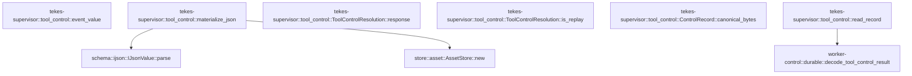

# tekes-supervisor::tool_control

[Package atlas](index.md) · [Source](../../src/tool_control.rs)

## Declarations

Visibility is the declaration spelling; trait members and reexports require their enclosing interface. `cfg` is not evaluated.

| Symbol | Kind | Visibility | Test / cfg |
|---|---|---|---|
| [tekes-supervisor::tool_control::RECORD_FORMAT](../../src/tool_control.rs#L18) | const_item | `private` |  |
| [tekes-supervisor::tool_control::CONTROL_DIR](../../src/tool_control.rs#L20) | const_item | `pub` |  |
| [tekes-supervisor::tool_control::LEGACY_CONTROL_DIRS](../../src/tool_control.rs#L22) | const_item | `private` |  |
| [tekes-supervisor::tool_control::ToolControlHandler](../../src/tool_control.rs#L24) | trait_item | `pub` |  |
| [tekes-supervisor::tool_control::ToolControlHandler::execute](../../src/tool_control.rs#L25) | function_signature_item | `private` |  |
| [tekes-supervisor::tool_control::ToolControlHandler::recovery](../../src/tool_control.rs#L27) | function_item | `private` |  |
| [tekes-supervisor::tool_control::ToolControlHandler::reconcile](../../src/tool_control.rs#L31) | function_item | `private` |  |
| [tekes-supervisor::tool_control::ToolControlRecovery](../../src/tool_control.rs#L42) | enum_item | `pub` |  |
| [tekes-supervisor::tool_control::ExternalEffectResolution](../../src/tool_control.rs#L54) | enum_item | `pub` |  |
| [tekes-supervisor::tool_control::ToolControlAttempt](../../src/tool_control.rs#L61) | enum_item | `private` |  |
| [tekes-supervisor::tool_control::ToolControlAttemptResult](../../src/tool_control.rs#L66) | enum_item | `private` |  |
| [tekes-supervisor::tool_control::ToolControlPolicy](../../src/tool_control.rs#L71) | trait_item | `pub` |  |
| [tekes-supervisor::tool_control::ToolControlPolicy::apply](../../src/tool_control.rs#L72) | function_signature_item | `private` |  |
| [tekes-supervisor::tool_control::UnavailableToolControlHandler](../../src/tool_control.rs#L78) | struct_item | `pub` |  |
| [tekes-supervisor::tool_control::UnavailableToolControlHandler::execute](../../src/tool_control.rs#L81) | function_item | `private` |  |
| [tekes-supervisor::tool_control::FailClosedToolControlPolicy](../../src/tool_control.rs#L97) | struct_item | `pub` |  |
| [tekes-supervisor::tool_control::FailClosedToolControlPolicy::apply](../../src/tool_control.rs#L100) | function_item | `private` |  |
| [tekes-supervisor::tool_control::ToolControlSession](../../src/tool_control.rs#L116) | struct_item | `pub` |  |
| [tekes-supervisor::tool_control::ToolControlSession::new](../../src/tool_control.rs#L125) | function_item | `pub` |  |
| [tekes-supervisor::tool_control::ToolControlSession::handle_line](../../src/tool_control.rs#L137) | function_item | `pub` |  |
| [tekes-supervisor::tool_control::ToolControlReceiptStore](../../src/tool_control.rs#L180) | struct_item | `pub` |  |
| [tekes-supervisor::tool_control::ToolControlReceiptStore::new](../../src/tool_control.rs#L187) | function_item | `pub` |  |
| [tekes-supervisor::tool_control::ToolControlReceiptStore::record_path](../../src/tool_control.rs#L198) | function_item | `pub` |  |
| [tekes-supervisor::tool_control::ToolControlReceiptStore::read_record](../../src/tool_control.rs#L206) | function_item | `pub` |  |
| [tekes-supervisor::tool_control::ToolControlReceiptStore::publish_or_reconcile](../../src/tool_control.rs#L217) | function_item | `private` |  |
| [tekes-supervisor::tool_control::ToolControlReceiptStore::resolve_external](../../src/tool_control.rs#L333) | function_item | `private` |  |
| [tekes-supervisor::tool_control::ToolControlReceiptStore::unresolved](../../src/tool_control.rs#L384) | function_item | `private` |  |
| [tekes-supervisor::tool_control::ToolControlReceiptStore::lookup_settled](../../src/tool_control.rs#L408) | function_item | `private` |  |
| [tekes-supervisor::tool_control::ToolControlReceiptStore::publish_response](../../src/tool_control.rs#L429) | function_item | `private` |  |
| [tekes-supervisor::tool_control::ToolControlReceiptStore::publish_or_replay](../../src/tool_control.rs#L451) | function_item | `pub` |  |
| [tekes-supervisor::tool_control::ToolControlReceiptStore::control_root](../../src/tool_control.rs#L489) | function_item | `private` |  |
| [tekes-supervisor::tool_control::ToolControlReceiptStore::lock](../../src/tool_control.rs#L495) | function_item | `private` |  |
| [tekes-supervisor::tool_control::ToolControlReceiptStore::retire_legacy_layout](../../src/tool_control.rs#L503) | function_item | `private` |  |
| [tekes-supervisor::tool_control::ResolvedToolControlLine](../../src/tool_control.rs#L540) | struct_item | `pub(crate)` |  |
| [tekes-supervisor::tool_control::resolve_durable_binding](../../src/tool_control.rs#L546) | function_item | `pub(crate)` |  |
| [tekes-supervisor::tool_control::resolve_line](../../src/tool_control.rs#L621) | function_item | `private` |  |
| [tekes-supervisor::tool_control::event_value](../../src/tool_control.rs#L658) | function_item | `private` |  |
| [tekes-supervisor::tool_control::materialize_json](../../src/tool_control.rs#L662) | function_item | `private` |  |
| [tekes-supervisor::tool_control::ToolControlResolution](../../src/tool_control.rs#L690) | enum_item | `pub` |  |
| [tekes-supervisor::tool_control::ToolControlResolution::response](../../src/tool_control.rs#L710) | function_item | `pub` |  |
| [tekes-supervisor::tool_control::ToolControlResolution::is_replay](../../src/tool_control.rs#L720) | function_item | `pub` |  |
| [tekes-supervisor::tool_control::ControlRecord](../../src/tool_control.rs#L729) | struct_item | `pub` |  |
| [tekes-supervisor::tool_control::ControlRecord::canonical_bytes](../../src/tool_control.rs#L735) | function_item | `private` |  |
| [tekes-supervisor::tool_control::read_record](../../src/tool_control.rs#L752) | function_item | `private` |  |
| [tekes-supervisor::tool_control::ToolControlReceiptError](../../src/tool_control.rs#L798) | enum_item | `pub` |  |

## Imports / reexports

| Local name | Source path | Visibility |
|---|---|---|
| `fs` | `std::fs` | `private` |
| `OpenOptions` | `std::fs::OpenOptions` | `private` |
| `Read` | `std::io::Read` | `private` |
| `OpenOptionsExt` | `std::os::unix::fs::OpenOptionsExt` | `private` |
| `Path` | `std::path::Path` | `private` |
| `PathBuf` | `std::path::PathBuf` | `private` |
| `EventKind` | `schema::EventKind` | `private` |
| `IJsonValue` | `schema::IJsonValue` | `private` |
| `Map` | `serde_json::Map` | `private` |
| `Value` | `serde_json::Value` | `private` |
| `AtomicPublisher` | `store::AtomicPublisher` | `private` |
| `NamedLock` | `store::NamedLock` | `private` |
| `StoreError` | `store::StoreError` | `private` |
| `Error` | `thiserror::Error` | `private` |
| `Selected` | `worker_control::Selected` | `private` |
| `DurableControlError` | `worker_control::DurableControlError` | `private` |
| `ToolControl` | `worker_control::ToolControl` | `private` |
| `ToolControlBinding` | `worker_control::ToolControlBinding` | `private` |
| `ToolControlError` | `worker_control::ToolControlError` | `private` |
| `ToolControlErrorCode` | `worker_control::ToolControlErrorCode` | `private` |
| `ToolControlResult` | `worker_control::ToolControlResult` | `private` |
| `decode_tool_control` | `worker_control::decode_tool_control` | `private` |
| `decode_tool_control_result` | `worker_control::decode_tool_control_result` | `private` |
| `encode_tool_control_result` | `worker_control::encode_tool_control_result` | `private` |

## Module declarations

| Module | Visibility | Attributes |
|---|---|---|

## Function call graphs

Edges below are syntactically resolved calls only, including private functions. Graphs partition callers into groups of 20; they are not execution order. All unresolved sites are listed below and in the JSON inventory.

```mermaid
flowchart TD
  n0["store::atomic::AtomicPublisher::replace"]
  n1["store::platform::NamedLock::exclusive"]
  n2["store::tail::scan_valid_prefix"]
  n3["tekes-supervisor::tool_control::FailClosedToolControlPolicy::apply"]
  n4["tekes-supervisor::tool_control::ToolControlSession::new"]
  n5["tekes-supervisor::tool_control::ToolControlSession::handle_line"]
  n6["tekes-supervisor::tool_control::ToolControlReceiptStore::new"]
  n7["tekes-supervisor::tool_control::ToolControlReceiptStore::record_path"]
  n8["tekes-supervisor::tool_control::ToolControlReceiptStore::read_record"]
  n9["tekes-supervisor::tool_control::ToolControlReceiptStore::publish_or_reconcile"]
  n10["tekes-supervisor::tool_control::ToolControlHandler::recovery"]
  n11["tekes-supervisor::tool_control::ToolControlHandler::reconcile"]
  n12["tekes-supervisor::tool_control::ToolControlReceiptStore::resolve_external"]
  n13["tekes-supervisor::tool_control::ToolControlReceiptStore::unresolved"]
  n14["tekes-supervisor::tool_control::ToolControlReceiptStore::lookup_settled"]
  n15["tekes-supervisor::tool_control::ToolControlReceiptStore::publish_response"]
  n16["tekes-supervisor::tool_control::ToolControlReceiptStore::publish_or_replay"]
  n17["tekes-supervisor::tool_control::ToolControlReceiptStore::control_root"]
  n18["tekes-supervisor::tool_control::ToolControlReceiptStore::lock"]
  n19["tekes-supervisor::tool_control::ToolControlReceiptStore::retire_legacy_layout"]
  n20["tekes-supervisor::tool_control::resolve_durable_binding"]
  n21["tekes-supervisor::tool_control::resolve_line"]
  n22["tekes-supervisor::tool_control::event_value"]
  n23["tekes-supervisor::tool_control::materialize_json"]
  n24["tekes-supervisor::tool_control::read_record"]
  n25["tekes-supervisor::tool_control::UnavailableToolControlHandler::execute"]
  n26["worker-control::durable::ToolControlResult::failure"]
  n27["worker-control::durable::ToolControlResult::conflict"]
  n28["worker-control::durable::require_version"]
  n29["worker-control::durable::decode_tool_control"]
  n30["worker-control::durable::encode_tool_control_result"]
  n3 --> n26
  n5 --> n6
  n5 --> n20
  n5 --> n26
  n5 --> n28
  n5 --> n29
  n7 --> n17
  n8 --> n7
  n8 --> n24
  n9 --> n0
  n9 --> n7
  n9 --> n8
  n9 --> n12
  n9 --> n13
  n9 --> n14
  n9 --> n15
  n9 --> n18
  n9 --> n26
  n9 --> n27
  n9 --> n30
  n12 --> n13
  n12 --> n15
  n13 --> n26
  n13 --> n30
  n14 --> n8
  n14 --> n27
  n14 --> n30
  n15 --> n0
  n15 --> n7
  n15 --> n30
  n16 --> n0
  n16 --> n7
  n16 --> n14
  n16 --> n18
  n16 --> n30
  n18 --> n1
  n18 --> n17
  n18 --> n19
  n19 --> n7
  n20 --> n21
  n20 --> n22
  n20 --> n23
  n21 --> n2
  n25 --> n26
```

Functions 1–20: 44 direct edges

Functions 21–26: 3 direct edges

## Call sites

Includes test functions (marked in declarations). Receiver-type-required sites need type analysis/manual tracing. Calls in closures are attributed to their enclosing function; their occurrence here does not mean the closure executes immediately.

| Caller | Callee expression | Source lines | Target / classification |
|---|---|---|---|
| `execute` | `ToolControlResult::failure` | [82](../../src/tool_control.rs#L82) | [worker-control::durable::ToolControlResult::failure](../../../worker-control/src/durable.rs#L375) |
| `execute` | `request.request_id.clone` | [83](../../src/tool_control.rs#L83) | receiver-type-required |
| `execute` | `request.call_id.clone` | [84](../../src/tool_control.rs#L84) | receiver-type-required |
| `execute` | `"supervisor tool-control authority is not configured".to_owned` | [87](../../src/tool_control.rs#L87) | receiver-type-required |
| `apply` | `result.value.is_none` | [101](../../src/tool_control.rs#L101) | receiver-type-required |
| `apply` | `ToolControlResult::failure` | [104](../../src/tool_control.rs#L104) | [worker-control::durable::ToolControlResult::failure](../../../worker-control/src/durable.rs#L375) |
| `apply` | `"tool-control result policy is not configured".to_owned` | [109](../../src/tool_control.rs#L109) | receiver-type-required |
| `new` | `root.into` | [127](../../src/tool_control.rs#L127) | receiver-type-required |
| `handle_line` | `worker_control::require_version` | [138](../../src/tool_control.rs#L138) | [worker-control::durable::require_version](../../../worker-control/src/durable.rs#L443) |
| `handle_line` | `decode_tool_control` | [139](../../src/tool_control.rs#L139) | [worker-control::durable::decode_tool_control](../../../worker-control/src/durable.rs#L474) |
| `handle_line` | `self.root.join("threads").join` | [140](../../src/tool_control.rs#L140) | receiver-type-required |
| `handle_line` | `self.root.join` | [140](../../src/tool_control.rs#L140) | receiver-type-required |
| `handle_line` | `fs::symlink_metadata(&thread_folder)             .map_err` | [141](../../src/tool_control.rs#L141) | receiver-type-required |
| `handle_line` | `fs::symlink_metadata` | [141](../../src/tool_control.rs#L141) | external-constructor-callback-or-unresolved |
| `handle_line` | `thread_metadata.is_dir` | [143](../../src/tool_control.rs#L143) | receiver-type-required |
| `handle_line` | `thread_metadata.file_type().is_symlink` | [143](../../src/tool_control.rs#L143) | receiver-type-required |
| `handle_line` | `thread_metadata.file_type` | [143](../../src/tool_control.rs#L143) | receiver-type-required |
| `handle_line` | `Err` | [144](../../src/tool_control.rs#L144) | external-constructor-callback-or-unresolved |
| `handle_line` | `ToolControlReceiptStore::new` | [146](../../src/tool_control.rs#L146) | [tekes-supervisor::tool_control::ToolControlReceiptStore::new](../../src/tool_control.rs#L187) |
| `handle_line` | `store.thread_folder.clone` | [147](../../src/tool_control.rs#L147) | receiver-type-required |
| `handle_line` | `handler.recovery` | [150](../../src/tool_control.rs#L150) | receiver-type-required |
| `handle_line` | `store.publish_or_reconcile` | [151](../../src/tool_control.rs#L151) | receiver-type-required |
| `handle_line` | `resolve_durable_binding` | [154](../../src/tool_control.rs#L154) | [tekes-supervisor::tool_control::resolve_durable_binding](../../src/tool_control.rs#L546) |
| `handle_line` | `ToolControlAttemptResult::Executed` | [157](../../src/tool_control.rs#L157), [163](../../src/tool_control.rs#L163) | external-constructor-callback-or-unresolved |
| `handle_line` | `handler.execute` | [157](../../src/tool_control.rs#L157) | receiver-type-required |
| `handle_line` | `ToolControlAttemptResult::Reconciled` | [160](../../src/tool_control.rs#L160) | external-constructor-callback-or-unresolved |
| `handle_line` | `handler.reconcile` | [160](../../src/tool_control.rs#L160) | receiver-type-required |
| `handle_line` | `ToolControlResult::failure` | [163](../../src/tool_control.rs#L163) | [worker-control::durable::ToolControlResult::failure](../../../worker-control/src/durable.rs#L375) |
| `handle_line` | `request.request_id.clone` | [164](../../src/tool_control.rs#L164) | receiver-type-required |
| `handle_line` | `request.call_id.clone` | [165](../../src/tool_control.rs#L165) | receiver-type-required |
| `handle_line` | `policy.apply` | [173](../../src/tool_control.rs#L173) | receiver-type-required |
| `handle_line` | `Ok` | [175](../../src/tool_control.rs#L175) | external-constructor-callback-or-unresolved |
| `handle_line` | `resolution.response().to_vec` | [175](../../src/tool_control.rs#L175) | receiver-type-required |
| `handle_line` | `resolution.response` | [175](../../src/tool_control.rs#L175) | receiver-type-required |
| `new` | `thread_folder.into` | [189](../../src/tool_control.rs#L189) | receiver-type-required |
| `new` | `bound_session.into` | [190](../../src/tool_control.rs#L190) | receiver-type-required |
| `record_path` | `request_id.get(..2).unwrap_or` | [199](../../src/tool_control.rs#L199) | receiver-type-required |
| `record_path` | `request_id.get` | [199](../../src/tool_control.rs#L199) | receiver-type-required |
| `record_path` | `self.control_root()             .join(prefix)             .join` | [200](../../src/tool_control.rs#L200) | receiver-type-required |
| `record_path` | `self.control_root()             .join` | [200](../../src/tool_control.rs#L200) | receiver-type-required |
| `record_path` | `self.control_root` | [200](../../src/tool_control.rs#L200) | [tekes-supervisor::tool_control::ToolControlReceiptStore::control_root](../../src/tool_control.rs#L489) |
| `read_record` | `self.record_path` | [210](../../src/tool_control.rs#L210) | [tekes-supervisor::tool_control::ToolControlReceiptStore::record_path](../../src/tool_control.rs#L198) |
| `read_record` | `path.exists` | [211](../../src/tool_control.rs#L211) | receiver-type-required |
| `read_record` | `Ok` | [212](../../src/tool_control.rs#L212) | external-constructor-callback-or-unresolved |
| `read_record` | `read_record(&path).map` | [214](../../src/tool_control.rs#L214) | receiver-type-required |
| `read_record` | `read_record` | [214](../../src/tool_control.rs#L214) | [tekes-supervisor::tool_control::read_record](../../src/tool_control.rs#L752) |
| `publish_or_reconcile` | `request.validate_for_receipt_lookup` | [228](../../src/tool_control.rs#L228) | receiver-type-required |
| `publish_or_reconcile` | `Err` | [230](../../src/tool_control.rs#L230), [243](../../src/tool_control.rs#L243), [287](../../src/tool_control.rs#L287), [300](../../src/tool_control.rs#L300), [308](../../src/tool_control.rs#L308) | external-constructor-callback-or-unresolved |
| `publish_or_reconcile` | `self.lock` | [232](../../src/tool_control.rs#L232) | [tekes-supervisor::tool_control::ToolControlReceiptStore::lock](../../src/tool_control.rs#L495) |
| `publish_or_reconcile` | `self.lookup_settled` | [233](../../src/tool_control.rs#L233) | [tekes-supervisor::tool_control::ToolControlReceiptStore::lookup_settled](../../src/tool_control.rs#L408) |
| `publish_or_reconcile` | `Ok` | [234](../../src/tool_control.rs#L234), [264](../../src/tool_control.rs#L264) | external-constructor-callback-or-unresolved |
| `publish_or_reconcile` | `request.validate` | [236](../../src/tool_control.rs#L236) | receiver-type-required |
| `publish_or_reconcile` | `backend` | [241](../../src/tool_control.rs#L241), [285](../../src/tool_control.rs#L285), [298](../../src/tool_control.rs#L298), [306](../../src/tool_control.rs#L306) | external-constructor-callback-or-unresolved |
| `publish_or_reconcile` | `self.publish_response` | [245](../../src/tool_control.rs#L245), [247](../../src/tool_control.rs#L247), [328](../../src/tool_control.rs#L328) | [tekes-supervisor::tool_control::ToolControlReceiptStore::publish_response](../../src/tool_control.rs#L429) |
| `publish_or_reconcile` | `apply_policy` | [245](../../src/tool_control.rs#L245), [328](../../src/tool_control.rs#L328) | external-constructor-callback-or-unresolved |
| `publish_or_reconcile` | `ToolControlResult::failure` | [249](../../src/tool_control.rs#L249) | [worker-control::durable::ToolControlResult::failure](../../../worker-control/src/durable.rs#L375) |
| `publish_or_reconcile` | `request.request_id.clone` | [250](../../src/tool_control.rs#L250) | receiver-type-required |
| `publish_or_reconcile` | `request.call_id.clone` | [251](../../src/tool_control.rs#L251) | receiver-type-required |
| `publish_or_reconcile` | `"effectful tool has no idempotency-reconcile authority; manual execution is required".to_owned` | [254](../../src/tool_control.rs#L254) | receiver-type-required |
| `publish_or_reconcile` | `self.read_record` | [262](../../src/tool_control.rs#L262) | [tekes-supervisor::tool_control::ToolControlReceiptStore::read_record](../../src/tool_control.rs#L206) |
| `publish_or_reconcile` | `encode_tool_control_result` | [265](../../src/tool_control.rs#L265) | [worker-control::durable::encode_tool_control_result](../../../worker-control/src/durable.rs#L480) |
| `publish_or_reconcile` | `ToolControlResult::conflict` | [265](../../src/tool_control.rs#L265) | [worker-control::durable::ToolControlResult::conflict](../../../worker-control/src/durable.rs#L390) |
| `publish_or_reconcile` | `request.clone` | [273](../../src/tool_control.rs#L273) | receiver-type-required |
| `publish_or_reconcile` | `AtomicPublisher::replace` | [276](../../src/tool_control.rs#L276) | [store::atomic::AtomicPublisher::replace](../../../store/src/atomic.rs#L16) |
| `publish_or_reconcile` | `self.record_path` | [277](../../src/tool_control.rs#L277) | [tekes-supervisor::tool_control::ToolControlReceiptStore::record_path](../../src/tool_control.rs#L198) |
| `publish_or_reconcile` | `intent.canonical_bytes` | [278](../../src/tool_control.rs#L278) | receiver-type-required |
| `publish_or_reconcile` | `self.resolve_external` | [289](../../src/tool_control.rs#L289), [310](../../src/tool_control.rs#L310) | [tekes-supervisor::tool_control::ToolControlReceiptStore::resolve_external](../../src/tool_control.rs#L333) |
| `publish_or_reconcile` | `response.error.as_ref().is_some_and` | [302](../../src/tool_control.rs#L302) | receiver-type-required |
| `publish_or_reconcile` | `response.error.as_ref` | [302](../../src/tool_control.rs#L302) | receiver-type-required |
| `publish_or_reconcile` | `response                     .error                     .as_ref()                     .filter` | [317](../../src/tool_control.rs#L317) | receiver-type-required |
| `publish_or_reconcile` | `response                     .error                     .as_ref` | [317](../../src/tool_control.rs#L317) | receiver-type-required |
| `publish_or_reconcile` | `self.unresolved` | [322](../../src/tool_control.rs#L322) | [tekes-supervisor::tool_control::ToolControlReceiptStore::unresolved](../../src/tool_control.rs#L384) |
| `resolve_external` | `self.publish_response` | [346](../../src/tool_control.rs#L346), [373](../../src/tool_control.rs#L373) | [tekes-supervisor::tool_control::ToolControlReceiptStore::publish_response](../../src/tool_control.rs#L429) |
| `resolve_external` | `apply_policy` | [346](../../src/tool_control.rs#L346), [373](../../src/tool_control.rs#L373) | external-constructor-callback-or-unresolved |
| `resolve_external` | `backend` | [350](../../src/tool_control.rs#L350) | external-constructor-callback-or-unresolved |
| `resolve_external` | `Err` | [352](../../src/tool_control.rs#L352) | external-constructor-callback-or-unresolved |
| `resolve_external` | `response.error.as_ref` | [354](../../src/tool_control.rs#L354) | receiver-type-required |
| `resolve_external` | `self.unresolved` | [357](../../src/tool_control.rs#L357), [364](../../src/tool_control.rs#L364), [376](../../src/tool_control.rs#L376), [379](../../src/tool_control.rs#L379) | [tekes-supervisor::tool_control::ToolControlReceiptStore::unresolved](../../src/tool_control.rs#L384) |
| `unresolved` | `ToolControlResult::failure` | [390](../../src/tool_control.rs#L390) | [worker-control::durable::ToolControlResult::failure](../../../worker-control/src/durable.rs#L375) |
| `unresolved` | `request.request_id.clone` | [391](../../src/tool_control.rs#L391) | receiver-type-required |
| `unresolved` | `request.call_id.clone` | [392](../../src/tool_control.rs#L392) | receiver-type-required |
| `unresolved` | `Ok` | [401](../../src/tool_control.rs#L401) | external-constructor-callback-or-unresolved |
| `unresolved` | `encode_tool_control_result` | [402](../../src/tool_control.rs#L402) | [worker-control::durable::encode_tool_control_result](../../../worker-control/src/durable.rs#L480) |
| `lookup_settled` | `self.read_record` | [412](../../src/tool_control.rs#L412) | [tekes-supervisor::tool_control::ToolControlReceiptStore::read_record](../../src/tool_control.rs#L206) |
| `lookup_settled` | `Ok` | [413](../../src/tool_control.rs#L413), [416](../../src/tool_control.rs#L416), [420](../../src/tool_control.rs#L420), [424](../../src/tool_control.rs#L424) | external-constructor-callback-or-unresolved |
| `lookup_settled` | `response.validate_for` | [419](../../src/tool_control.rs#L419) | receiver-type-required |
| `lookup_settled` | `Some` | [420](../../src/tool_control.rs#L420), [424](../../src/tool_control.rs#L424) | external-constructor-callback-or-unresolved |
| `lookup_settled` | `encode_tool_control_result` | [421](../../src/tool_control.rs#L421), [425](../../src/tool_control.rs#L425) | [worker-control::durable::encode_tool_control_result](../../../worker-control/src/durable.rs#L480) |
| `lookup_settled` | `ToolControlResult::conflict` | [425](../../src/tool_control.rs#L425) | [worker-control::durable::ToolControlResult::conflict](../../../worker-control/src/durable.rs#L390) |
| `publish_response` | `response.validate_for` | [434](../../src/tool_control.rs#L434) | receiver-type-required |
| `publish_response` | `request.clone` | [436](../../src/tool_control.rs#L436) | receiver-type-required |
| `publish_response` | `Some` | [437](../../src/tool_control.rs#L437) | external-constructor-callback-or-unresolved |
| `publish_response` | `self.record_path` | [439](../../src/tool_control.rs#L439) | [tekes-supervisor::tool_control::ToolControlReceiptStore::record_path](../../src/tool_control.rs#L198) |
| `publish_response` | `AtomicPublisher::replace` | [440](../../src/tool_control.rs#L440) | [store::atomic::AtomicPublisher::replace](../../../store/src/atomic.rs#L16) |
| `publish_response` | `receipt.canonical_bytes` | [440](../../src/tool_control.rs#L440) | receiver-type-required |
| `publish_response` | `Ok` | [441](../../src/tool_control.rs#L441) | external-constructor-callback-or-unresolved |
| `publish_response` | `encode_tool_control_result` | [442](../../src/tool_control.rs#L442) | [worker-control::durable::encode_tool_control_result](../../../worker-control/src/durable.rs#L480) |
| `publish_response` | `receipt.response.as_ref().expect` | [442](../../src/tool_control.rs#L442) | receiver-type-required |
| `publish_response` | `receipt.response.as_ref` | [442](../../src/tool_control.rs#L442) | receiver-type-required |
| `publish_or_replay` | `request.validate_for_receipt_lookup` | [461](../../src/tool_control.rs#L461) | receiver-type-required |
| `publish_or_replay` | `Err` | [463](../../src/tool_control.rs#L463) | external-constructor-callback-or-unresolved |
| `publish_or_replay` | `self.lock` | [466](../../src/tool_control.rs#L466) | [tekes-supervisor::tool_control::ToolControlReceiptStore::lock](../../src/tool_control.rs#L495) |
| `publish_or_replay` | `self.lookup_settled` | [467](../../src/tool_control.rs#L467) | [tekes-supervisor::tool_control::ToolControlReceiptStore::lookup_settled](../../src/tool_control.rs#L408) |
| `publish_or_replay` | `Ok` | [468](../../src/tool_control.rs#L468), [483](../../src/tool_control.rs#L483) | external-constructor-callback-or-unresolved |
| `publish_or_replay` | `self.record_path` | [470](../../src/tool_control.rs#L470) | [tekes-supervisor::tool_control::ToolControlReceiptStore::record_path](../../src/tool_control.rs#L198) |
| `publish_or_replay` | `request.validate` | [473](../../src/tool_control.rs#L473) | receiver-type-required |
| `publish_or_replay` | `apply_policy` | [474](../../src/tool_control.rs#L474) | external-constructor-callback-or-unresolved |
| `publish_or_replay` | `backend` | [474](../../src/tool_control.rs#L474) | external-constructor-callback-or-unresolved |
| `publish_or_replay` | `response.validate_for` | [475](../../src/tool_control.rs#L475) | receiver-type-required |
| `publish_or_replay` | `request.clone` | [477](../../src/tool_control.rs#L477) | receiver-type-required |
| `publish_or_replay` | `Some` | [478](../../src/tool_control.rs#L478) | external-constructor-callback-or-unresolved |
| `publish_or_replay` | `receipt.canonical_bytes` | [480](../../src/tool_control.rs#L480) | receiver-type-required |
| `publish_or_replay` | `AtomicPublisher::replace` | [481](../../src/tool_control.rs#L481) | [store::atomic::AtomicPublisher::replace](../../../store/src/atomic.rs#L16) |
| `publish_or_replay` | `encode_tool_control_result` | [482](../../src/tool_control.rs#L482) | [worker-control::durable::encode_tool_control_result](../../../worker-control/src/durable.rs#L480) |
| `publish_or_replay` | `receipt.response.as_ref().expect` | [482](../../src/tool_control.rs#L482) | receiver-type-required |
| `publish_or_replay` | `receipt.response.as_ref` | [482](../../src/tool_control.rs#L482) | receiver-type-required |
| `control_root` | `self.thread_folder.join` | [490](../../src/tool_control.rs#L490) | receiver-type-required |
| `lock` | `self.control_root` | [496](../../src/tool_control.rs#L496) | [tekes-supervisor::tool_control::ToolControlReceiptStore::control_root](../../src/tool_control.rs#L489) |
| `lock` | `fs::create_dir_all` | [497](../../src/tool_control.rs#L497) | external-constructor-callback-or-unresolved |
| `lock` | `NamedLock::exclusive` | [498](../../src/tool_control.rs#L498) | [store::platform::NamedLock::exclusive](../../../store/src/platform.rs#L102) |
| `lock` | `root.join` | [498](../../src/tool_control.rs#L498) | receiver-type-required |
| `lock` | `self.retire_legacy_layout` | [499](../../src/tool_control.rs#L499) | [tekes-supervisor::tool_control::ToolControlReceiptStore::retire_legacy_layout](../../src/tool_control.rs#L503) |
| `lock` | `Ok` | [500](../../src/tool_control.rs#L500) | external-constructor-callback-or-unresolved |
| `retire_legacy_layout` | `self.thread_folder.join` | [507](../../src/tool_control.rs#L507) | receiver-type-required |
| `retire_legacy_layout` | `legacy_root.is_dir` | [508](../../src/tool_control.rs#L508) | receiver-type-required |
| `retire_legacy_layout` | `fs::read_dir` | [511](../../src/tool_control.rs#L511), [516](../../src/tool_control.rs#L516) | external-constructor-callback-or-unresolved |
| `retire_legacy_layout` | `prefix.file_type()?.is_dir` | [513](../../src/tool_control.rs#L513) | receiver-type-required |
| `retire_legacy_layout` | `prefix.file_type` | [513](../../src/tool_control.rs#L513) | receiver-type-required |
| `retire_legacy_layout` | `prefix.path` | [516](../../src/tool_control.rs#L516) | receiver-type-required |
| `retire_legacy_layout` | `entry.file_name` | [518](../../src/tool_control.rs#L518) | receiver-type-required |
| `retire_legacy_layout` | `name.to_str().and_then` | [520](../../src/tool_control.rs#L520) | receiver-type-required |
| `retire_legacy_layout` | `name.to_str` | [520](../../src/tool_control.rs#L520) | receiver-type-required |
| `retire_legacy_layout` | `name.strip_suffix` | [520](../../src/tool_control.rs#L520) | receiver-type-required |
| `retire_legacy_layout` | `self.record_path` | [524](../../src/tool_control.rs#L524) | [tekes-supervisor::tool_control::ToolControlReceiptStore::record_path](../../src/tool_control.rs#L198) |
| `retire_legacy_layout` | `target.exists` | [525](../../src/tool_control.rs#L525) | receiver-type-required |
| `retire_legacy_layout` | `fs::remove_file` | [527](../../src/tool_control.rs#L527) | external-constructor-callback-or-unresolved |
| `retire_legacy_layout` | `entry.path` | [527](../../src/tool_control.rs#L527), [531](../../src/tool_control.rs#L531) | receiver-type-required |
| `retire_legacy_layout` | `fs::create_dir_all` | [530](../../src/tool_control.rs#L530) | external-constructor-callback-or-unresolved |
| `retire_legacy_layout` | `target.parent().expect` | [530](../../src/tool_control.rs#L530) | receiver-type-required |
| `retire_legacy_layout` | `target.parent` | [530](../../src/tool_control.rs#L530) | receiver-type-required |
| `retire_legacy_layout` | `fs::rename` | [531](../../src/tool_control.rs#L531) | external-constructor-callback-or-unresolved |
| `retire_legacy_layout` | `fs::remove_dir_all` | [534](../../src/tool_control.rs#L534) | external-constructor-callback-or-unresolved |
| `retire_legacy_layout` | `Ok` | [536](../../src/tool_control.rs#L536) | external-constructor-callback-or-unresolved |
| `resolve_durable_binding` | `resolve_line` | [550](../../src/tool_control.rs#L550) | [tekes-supervisor::tool_control::resolve_line](../../src/tool_control.rs#L621) |
| `resolve_durable_binding` | `event.turn` | [555](../../src/tool_control.rs#L555) | receiver-type-required |
| `resolve_durable_binding` | `Some` | [555](../../src/tool_control.rs#L555), [556](../../src/tool_control.rs#L556), [568](../../src/tool_control.rs#L568), [577](../../src/tool_control.rs#L577), [581](../../src/tool_control.rs#L581) | external-constructor-callback-or-unresolved |
| `resolve_durable_binding` | `event.string_field` | [556](../../src/tool_control.rs#L556), [576](../../src/tool_control.rs#L576) | receiver-type-required |
| `resolve_durable_binding` | `request.call_id.as_str` | [556](../../src/tool_control.rs#L556) | receiver-type-required |
| `resolve_durable_binding` | `event.kind` | [560](../../src/tool_control.rs#L560) | receiver-type-required |
| `resolve_durable_binding` | `tool_call_seq.is_some` | [562](../../src/tool_control.rs#L562) | receiver-type-required |
| `resolve_durable_binding` | `Err` | [563](../../src/tool_control.rs#L563), [612](../../src/tool_control.rs#L612) | external-constructor-callback-or-unresolved |
| `resolve_durable_binding` | `ToolControlReceiptError::DurableBinding` | [563](../../src/tool_control.rs#L563), [572](../../src/tool_control.rs#L572), [585](../../src/tool_control.rs#L585), [593](../../src/tool_control.rs#L593), [596](../../src/tool_control.rs#L596) | external-constructor-callback-or-unresolved |
| `resolve_durable_binding` | `event_value` | [567](../../src/tool_control.rs#L567), [580](../../src/tool_control.rs#L580) | [tekes-supervisor::tool_control::event_value](../../src/tool_control.rs#L658) |
| `resolve_durable_binding` | `materialize_json` | [568](../../src/tool_control.rs#L568), [581](../../src/tool_control.rs#L581) | [tekes-supervisor::tool_control::materialize_json](../../src/tool_control.rs#L662) |
| `resolve_durable_binding` | `value                         .get("args")                         .ok_or` | [570](../../src/tool_control.rs#L570) | receiver-type-required |
| `resolve_durable_binding` | `value                         .get` | [570](../../src/tool_control.rs#L570), [583](../../src/tool_control.rs#L583) | receiver-type-required |
| `resolve_durable_binding` | `event.string_field("name").map` | [576](../../src/tool_control.rs#L576) | receiver-type-required |
| `resolve_durable_binding` | `event.seq` | [577](../../src/tool_control.rs#L577), [579](../../src/tool_control.rs#L579) | receiver-type-required |
| `resolve_durable_binding` | `tool_call_seq.is_some_and` | [579](../../src/tool_control.rs#L579) | receiver-type-required |
| `resolve_durable_binding` | `value                         .get("invocation")                         .ok_or` | [583](../../src/tool_control.rs#L583) | receiver-type-required |
| `resolve_durable_binding` | `invocation.ok_or` | [593](../../src/tool_control.rs#L593) | receiver-type-required |
| `resolve_durable_binding` | `name.ok_or` | [596](../../src/tool_control.rs#L596) | receiver-type-required |
| `resolve_durable_binding` | `request.validate_against` | [599](../../src/tool_control.rs#L599) | receiver-type-required |
| `resolve_durable_binding` | `line_path.is_file` | [611](../../src/tool_control.rs#L611) | receiver-type-required |
| `resolve_durable_binding` | `Ok` | [614](../../src/tool_control.rs#L614) | external-constructor-callback-or-unresolved |
| `resolve_durable_binding` | `thread_folder.to_path_buf` | [615](../../src/tool_control.rs#L615) | receiver-type-required |
| `resolve_line` | `Vec::new` | [625](../../src/tool_control.rs#L625) | external-constructor-callback-or-unresolved |
| `resolve_line` | `fs::read_dir` | [626](../../src/tool_control.rs#L626) | external-constructor-callback-or-unresolved |
| `resolve_line` | `entry.file_type()?.is_file` | [628](../../src/tool_control.rs#L628) | receiver-type-required |
| `resolve_line` | `entry.file_type` | [628](../../src/tool_control.rs#L628) | receiver-type-required |
| `resolve_line` | `entry.path` | [631](../../src/tool_control.rs#L631) | receiver-type-required |
| `resolve_line` | `path.extension().and_then` | [632](../../src/tool_control.rs#L632) | receiver-type-required |
| `resolve_line` | `path.extension` | [632](../../src/tool_control.rs#L632) | receiver-type-required |
| `resolve_line` | `value.to_str` | [632](../../src/tool_control.rs#L632), [633](../../src/tool_control.rs#L633) | receiver-type-required |
| `resolve_line` | `Some` | [632](../../src/tool_control.rs#L632), [633](../../src/tool_control.rs#L633), [644](../../src/tool_control.rs#L644) | external-constructor-callback-or-unresolved |
| `resolve_line` | `path.file_name().and_then` | [633](../../src/tool_control.rs#L633) | receiver-type-required |
| `resolve_line` | `path.file_name` | [633](../../src/tool_control.rs#L633) | receiver-type-required |
| `resolve_line` | `fs::read` | [637](../../src/tool_control.rs#L637) | external-constructor-callback-or-unresolved |
| `resolve_line` | `store::scan_valid_prefix` | [638](../../src/tool_control.rs#L638) | [store::tail::scan_valid_prefix](../../../store/src/tail.rs#L37) |
| `resolve_line` | `projection.events.first().is_some_and` | [642](../../src/tool_control.rs#L642) | receiver-type-required |
| `resolve_line` | `projection.events.first` | [642](../../src/tool_control.rs#L642) | receiver-type-required |
| `resolve_line` | `genesis.string_field` | [644](../../src/tool_control.rs#L644) | receiver-type-required |
| `resolve_line` | `matches.push` | [646](../../src/tool_control.rs#L646) | receiver-type-required |
| `resolve_line` | `matches.len` | [649](../../src/tool_control.rs#L649) | receiver-type-required |
| `resolve_line` | `Ok` | [650](../../src/tool_control.rs#L650) | external-constructor-callback-or-unresolved |
| `resolve_line` | `matches.pop().expect` | [650](../../src/tool_control.rs#L650) | receiver-type-required |
| `resolve_line` | `matches.pop` | [650](../../src/tool_control.rs#L650) | receiver-type-required |
| `resolve_line` | `Err` | [651](../../src/tool_control.rs#L651), [652](../../src/tool_control.rs#L652) | external-constructor-callback-or-unresolved |
| `resolve_line` | `ToolControlReceiptError::DurableBinding` | [652](../../src/tool_control.rs#L652) | external-constructor-callback-or-unresolved |
| `event_value` | `serde_json::to_value(event.raw()).map_err` | [659](../../src/tool_control.rs#L659) | receiver-type-required |
| `event_value` | `serde_json::to_value` | [659](../../src/tool_control.rs#L659) | external-constructor-callback-or-unresolved |
| `event_value` | `event.raw` | [659](../../src/tool_control.rs#L659) | receiver-type-required |
| `materialize_json` | `value.get("$spill").and_then` | [666](../../src/tool_control.rs#L666) | receiver-type-required |
| `materialize_json` | `value.get` | [666](../../src/tool_control.rs#L666) | receiver-type-required |
| `materialize_json` | `value.as_object().is_none_or` | [667](../../src/tool_control.rs#L667) | receiver-type-required |
| `materialize_json` | `value.as_object` | [667](../../src/tool_control.rs#L667) | receiver-type-required |
| `materialize_json` | `object.len` | [667](../../src/tool_control.rs#L667) | receiver-type-required |
| `materialize_json` | `Err` | [668](../../src/tool_control.rs#L668), [680](../../src/tool_control.rs#L680) | external-constructor-callback-or-unresolved |
| `materialize_json` | `ToolControlReceiptError::DurableBinding` | [668](../../src/tool_control.rs#L668), [673](../../src/tool_control.rs#L673), [676](../../src/tool_control.rs#L676), [680](../../src/tool_control.rs#L680) | external-constructor-callback-or-unresolved |
| `materialize_json` | `spill.get("asset").and_then(Value::as_str).ok_or` | [672](../../src/tool_control.rs#L672) | receiver-type-required |
| `materialize_json` | `spill.get("asset").and_then` | [672](../../src/tool_control.rs#L672) | receiver-type-required |
| `materialize_json` | `spill.get` | [672](../../src/tool_control.rs#L672), [675](../../src/tool_control.rs#L675) | receiver-type-required |
| `materialize_json` | `spill.get("bytes").and_then(Value::as_u64).ok_or` | [675](../../src/tool_control.rs#L675) | receiver-type-required |
| `materialize_json` | `spill.get("bytes").and_then` | [675](../../src/tool_control.rs#L675) | receiver-type-required |
| `materialize_json` | `store::AssetStore::new(thread_folder.join("assets"))?.read_verified` | [678](../../src/tool_control.rs#L678) | receiver-type-required |
| `materialize_json` | `store::AssetStore::new` | [678](../../src/tool_control.rs#L678) | [store::asset::AssetStore::new](../../../store/src/asset.rs#L27) |
| `materialize_json` | `thread_folder.join` | [678](../../src/tool_control.rs#L678) | receiver-type-required |
| `materialize_json` | `u64::try_from(bytes.len()).ok` | [679](../../src/tool_control.rs#L679) | receiver-type-required |
| `materialize_json` | `u64::try_from` | [679](../../src/tool_control.rs#L679) | external-constructor-callback-or-unresolved |
| `materialize_json` | `bytes.len` | [679](../../src/tool_control.rs#L679) | receiver-type-required |
| `materialize_json` | `Some` | [679](../../src/tool_control.rs#L679) | external-constructor-callback-or-unresolved |
| `materialize_json` | `Ok` | [684](../../src/tool_control.rs#L684), [686](../../src/tool_control.rs#L686) | external-constructor-callback-or-unresolved |
| `materialize_json` | `IJsonValue::parse` | [684](../../src/tool_control.rs#L684), [686](../../src/tool_control.rs#L686) | [schema::ijson::IJsonValue::parse](../../../schema/src/ijson.rs#L16) |
| `materialize_json` | `serde_json::to_vec` | [686](../../src/tool_control.rs#L686) | external-constructor-callback-or-unresolved |
| `canonical_bytes` | `Map::new` | [741](../../src/tool_control.rs#L741) | external-constructor-callback-or-unresolved |
| `canonical_bytes` | `envelope.insert` | [742](../../src/tool_control.rs#L742) | receiver-type-required |
| `canonical_bytes` | `"tool_control_result".to_owned` | [743](../../src/tool_control.rs#L743) | receiver-type-required |
| `canonical_bytes` | `serde_json::to_value` | [744](../../src/tool_control.rs#L744) | external-constructor-callback-or-unresolved |
| `canonical_bytes` | `Value::Object` | [746](../../src/tool_control.rs#L746) | external-constructor-callback-or-unresolved |
| `canonical_bytes` | `Ok` | [748](../../src/tool_control.rs#L748) | external-constructor-callback-or-unresolved |
| `canonical_bytes` | `serde_json_canonicalizer::to_vec` | [748](../../src/tool_control.rs#L748) | external-constructor-callback-or-unresolved |
| `read_record` | `OpenOptions::new()         .read(true)         .custom_flags(libc::O_CLOEXEC &#124; libc::O_NOFOLLOW)         .open` | [753](../../src/tool_control.rs#L753) | receiver-type-required |
| `read_record` | `OpenOptions::new()         .read(true)         .custom_flags` | [753](../../src/tool_control.rs#L753) | receiver-type-required |
| `read_record` | `OpenOptions::new()         .read` | [753](../../src/tool_control.rs#L753) | receiver-type-required |
| `read_record` | `OpenOptions::new` | [753](../../src/tool_control.rs#L753) | external-constructor-callback-or-unresolved |
| `read_record` | `file.metadata()?.file_type().is_file` | [757](../../src/tool_control.rs#L757) | receiver-type-required |
| `read_record` | `file.metadata()?.file_type` | [757](../../src/tool_control.rs#L757) | receiver-type-required |
| `read_record` | `file.metadata` | [757](../../src/tool_control.rs#L757) | receiver-type-required |
| `read_record` | `Err` | [758](../../src/tool_control.rs#L758), [764](../../src/tool_control.rs#L764), [772](../../src/tool_control.rs#L772), [775](../../src/tool_control.rs#L775) | external-constructor-callback-or-unresolved |
| `read_record` | `Vec::new` | [760](../../src/tool_control.rs#L760) | external-constructor-callback-or-unresolved |
| `read_record` | `file.read_to_end` | [761](../../src/tool_control.rs#L761) | receiver-type-required |
| `read_record` | `serde_json::from_slice` | [762](../../src/tool_control.rs#L762) | external-constructor-callback-or-unresolved |
| `read_record` | `serde_json_canonicalizer::to_vec` | [763](../../src/tool_control.rs#L763), [786](../../src/tool_control.rs#L786) | external-constructor-callback-or-unresolved |
| `read_record` | `value         .as_object()         .ok_or` | [766](../../src/tool_control.rs#L766) | receiver-type-required |
| `read_record` | `value         .as_object` | [766](../../src/tool_control.rs#L766) | receiver-type-required |
| `read_record` | `object.len` | [769](../../src/tool_control.rs#L769) | receiver-type-required |
| `read_record` | `object.contains_key` | [771](../../src/tool_control.rs#L771) | receiver-type-required |
| `read_record` | `object.get("format").and_then` | [774](../../src/tool_control.rs#L774) | receiver-type-required |
| `read_record` | `object.get` | [774](../../src/tool_control.rs#L774) | receiver-type-required |
| `read_record` | `Some` | [774](../../src/tool_control.rs#L774), [790](../../src/tool_control.rs#L790) | external-constructor-callback-or-unresolved |
| `read_record` | `serde_json::from_value` | [777](../../src/tool_control.rs#L777) | external-constructor-callback-or-unresolved |
| `read_record` | `object             .get("request")             .cloned()             .ok_or` | [778](../../src/tool_control.rs#L778) | receiver-type-required |
| `read_record` | `object             .get("request")             .cloned` | [778](../../src/tool_control.rs#L778) | receiver-type-required |
| `read_record` | `object             .get` | [778](../../src/tool_control.rs#L778) | receiver-type-required |
| `read_record` | `request.validate` | [783](../../src/tool_control.rs#L783) | receiver-type-required |
| `read_record` | `bytes.push` | [787](../../src/tool_control.rs#L787) | receiver-type-required |
| `read_record` | `decode_tool_control_result` | [790](../../src/tool_control.rs#L790) | [worker-control::durable::decode_tool_control_result](../../../worker-control/src/durable.rs#L487) |
| `read_record` | `Ok` | [794](../../src/tool_control.rs#L794) | external-constructor-callback-or-unresolved |
