# tekes-supervisor::workspace_routes

[Package atlas](index.md) · [Source](../../src/workspace_routes.rs)

## Declarations

Visibility is the declaration spelling; trait members and reexports require their enclosing interface. `cfg` is not evaluated.

| Symbol | Kind | Visibility | Test / cfg |
|---|---|---|---|
| [tekes-supervisor::workspace_routes::READS](../../src/workspace_routes.rs#L10) | const_item | `private` |  |
| [tekes-supervisor::workspace_routes::WRITES](../../src/workspace_routes.rs#L23) | const_item | `private` |  |
| [tekes-supervisor::workspace_routes::failure](../../src/workspace_routes.rs#L24) | function_item | `private` |  |
| [tekes-supervisor::workspace_routes::wire](../../src/workspace_routes.rs#L27) | function_item | `private` |  |
| [tekes-supervisor::workspace_routes::method](../../src/workspace_routes.rs#L31) | function_item | `private` |  |
| [tekes-supervisor::workspace_routes::WorkspaceRoutes](../../src/workspace_routes.rs#L36) | struct_item | `pub` |  |
| [tekes-supervisor::workspace_routes::WorkspaceRoutes::open](../../src/workspace_routes.rs#L43) | function_item | `pub` |  |
| [tekes-supervisor::workspace_routes::WorkspaceRoutes::authority](../../src/workspace_routes.rs#L55) | function_item | `private` |  |
| [tekes-supervisor::workspace_routes::WorkspaceRoutes::capabilities](../../src/workspace_routes.rs#L77) | function_item | `private` |  |
| [tekes-supervisor::workspace_routes::WorkspaceRoutes::extension_method_class](../../src/workspace_routes.rs#L84) | function_item | `private` |  |
| [tekes-supervisor::workspace_routes::WorkspaceRoutes::validate_extension_payload](../../src/workspace_routes.rs#L93) | function_item | `private` |  |
| [tekes-supervisor::workspace_routes::WorkspaceRoutes::extension_failure_is_exact](../../src/workspace_routes.rs#L160) | function_item | `private` |  |
| [tekes-supervisor::workspace_routes::WorkspaceRoutes::execute](../../src/workspace_routes.rs#L198) | function_item | `private` |  |

## Imports / reexports

| Local name | Source path | Visibility |
|---|---|---|
| `ProductionEndpointRoutes` | `crate::endpoint_host::ProductionEndpointRoutes` | `private` |
| `ProductionRouteFailure` | `crate::endpoint_host::ProductionRouteFailure` | `private` |
| `EndpointHostCall` | `endpoint::EndpointHostCall` | `private` |
| `ManagementStore` | `endpoint::ManagementStore` | `private` |
| `MethodClass` | `endpoint::MethodClass` | `private` |
| `NativeEndpoint` | `endpoint::NativeEndpoint` | `private` |
| `IJsonValue` | `schema::IJsonValue` | `private` |
| `Value` | `serde_json::Value` | `private` |
| `json` | `serde_json::json` | `private` |
| `BTreeSet` | `std::collections::BTreeSet` | `private` |
| `HashSet` | `std::collections::HashSet` | `private` |
| `Write` | `std::io::Write` | `private` |
| `Path` | `std::path::Path` | `private` |
| `PathBuf` | `std::path::PathBuf` | `private` |

## Module declarations

| Module | Visibility | Attributes |
|---|---|---|

## Function call graphs

Edges below are syntactically resolved calls only, including private functions. Graphs partition callers into groups of 20; they are not execution order. All unresolved sites are listed below and in the JSON inventory.

```mermaid
flowchart TD
  n0["endpoint::management::ManagementStore::open"]
  n1["endpoint::service::NativeEndpoint::open"]
  n2["schema::ijson::IJsonValue::parse"]
  n3["schema::ijson::IJsonValue::parse_str"]
  n4["tekes-supervisor::endpoint_host::ProductionRouteFailure::new"]
  n5["tekes-supervisor::workspace_routes::WorkspaceRoutes::extension_failure_is_exact"]
  n6["tekes-supervisor::workspace_routes::WorkspaceRoutes::execute"]
  n7["tekes-supervisor::workspace_routes::failure"]
  n8["tekes-supervisor::workspace_routes::wire"]
  n9["tekes-supervisor::workspace_routes::method"]
  n10["tekes-supervisor::workspace_routes::WorkspaceRoutes::open"]
  n11["tekes-supervisor::workspace_routes::WorkspaceRoutes::authority"]
  n12["tekes-supervisor::workspace_routes::WorkspaceRoutes::capabilities"]
  n13["tekes-supervisor::workspace_routes::WorkspaceRoutes::extension_method_class"]
  n14["tekes-supervisor::workspace_routes::WorkspaceRoutes::validate_extension_payload"]
  n15["workspace-service::process::invoke_with_authority"]
  n5 --> n9
  n6 --> n7
  n6 --> n8
  n6 --> n9
  n6 --> n15
  n7 --> n3
  n7 --> n4
  n8 --> n2
  n8 --> n7
  n10 --> n0
  n10 --> n1
  n10 --> n7
  n11 --> n7
  n13 --> n9
  n14 --> n7
  n14 --> n9
```

Functions 1–10: 16 direct edges

## Call sites

Includes test functions (marked in declarations). Receiver-type-required sites need type analysis/manual tracing. Calls in closures are attributed to their enclosing function; their occurrence here does not mean the closure executes immediately.

| Caller | Callee expression | Source lines | Target / classification |
|---|---|---|---|
| `failure` | `ProductionRouteFailure::new` | [25](../../src/workspace_routes.rs#L25) | [tekes-supervisor::endpoint_host::ProductionRouteFailure::new](../../src/endpoint_host.rs#L491) |
| `failure` | `message.into` | [25](../../src/workspace_routes.rs#L25) | receiver-type-required |
| `failure` | `IJsonValue::parse_str("{}").unwrap` | [25](../../src/workspace_routes.rs#L25) | receiver-type-required |
| `failure` | `IJsonValue::parse_str` | [25](../../src/workspace_routes.rs#L25) | [schema::ijson::IJsonValue::parse_str](../../../schema/src/ijson.rs#L23) |
| `wire` | `IJsonValue::parse(&serde_json::to_vec(value).map_err(&#124;e&#124; failure("internal", e.to_string()))?)         .map_err` | [28](../../src/workspace_routes.rs#L28) | receiver-type-required |
| `wire` | `IJsonValue::parse` | [28](../../src/workspace_routes.rs#L28) | [schema::ijson::IJsonValue::parse](../../../schema/src/ijson.rs#L16) |
| `wire` | `serde_json::to_vec(value).map_err` | [28](../../src/workspace_routes.rs#L28) | receiver-type-required |
| `wire` | `serde_json::to_vec` | [28](../../src/workspace_routes.rs#L28) | external-constructor-callback-or-unresolved |
| `wire` | `failure` | [28](../../src/workspace_routes.rs#L28), [29](../../src/workspace_routes.rs#L29) | [tekes-supervisor::workspace_routes::failure](../../src/workspace_routes.rs#L24) |
| `wire` | `e.to_string` | [28](../../src/workspace_routes.rs#L28), [29](../../src/workspace_routes.rs#L29) | receiver-type-required |
| `method` | `operation.strip_prefix` | [32](../../src/workspace_routes.rs#L32) | receiver-type-required |
| `method` | `(READS.contains(&name) &#124;&#124; WRITES.contains(&name)).then_some` | [33](../../src/workspace_routes.rs#L33) | receiver-type-required |
| `method` | `READS.contains` | [33](../../src/workspace_routes.rs#L33) | receiver-type-required |
| `method` | `WRITES.contains` | [33](../../src/workspace_routes.rs#L33) | receiver-type-required |
| `open` | `executable.is_absolute` | [44](../../src/workspace_routes.rs#L44) | receiver-type-required |
| `open` | `executable.is_file` | [44](../../src/workspace_routes.rs#L44) | receiver-type-required |
| `open` | `Err` | [45](../../src/workspace_routes.rs#L45) | external-constructor-callback-or-unresolved |
| `open` | `failure` | [45](../../src/workspace_routes.rs#L45), [51](../../src/workspace_routes.rs#L51), [52](../../src/workspace_routes.rs#L52) | [tekes-supervisor::workspace_routes::failure](../../src/workspace_routes.rs#L24) |
| `open` | `Ok` | [47](../../src/workspace_routes.rs#L47) | external-constructor-callback-or-unresolved |
| `open` | `root.to_owned` | [48](../../src/workspace_routes.rs#L48) | receiver-type-required |
| `open` | `ManagementStore::open(root)                 .map_err` | [50](../../src/workspace_routes.rs#L50) | receiver-type-required |
| `open` | `ManagementStore::open` | [50](../../src/workspace_routes.rs#L50) | [endpoint::management::ManagementStore::open](../../../endpoint/src/management.rs#L316) |
| `open` | `e.to_string` | [51](../../src/workspace_routes.rs#L51), [52](../../src/workspace_routes.rs#L52) | receiver-type-required |
| `open` | `NativeEndpoint::open(root).map_err` | [52](../../src/workspace_routes.rs#L52) | receiver-type-required |
| `open` | `NativeEndpoint::open` | [52](../../src/workspace_routes.rs#L52) | [endpoint::service::NativeEndpoint::open](../../../endpoint/src/service.rs#L130) |
| `authority` | `self.root.join` | [58](../../src/workspace_routes.rs#L58) | receiver-type-required |
| `authority` | `std::fs::read` | [59](../../src/workspace_routes.rs#L59) | external-constructor-callback-or-unresolved |
| `authority` | `serde_json::from_slice::<Value>(&bytes)                 .map_err` | [60](../../src/workspace_routes.rs#L60) | receiver-type-required |
| `authority` | `serde_json::from_slice::<Value>` | [60](../../src/workspace_routes.rs#L60) | external-constructor-callback-or-unresolved |
| `authority` | `failure` | [61](../../src/workspace_routes.rs#L61), [65](../../src/workspace_routes.rs#L65), [68](../../src/workspace_routes.rs#L68), [72](../../src/workspace_routes.rs#L72) | [tekes-supervisor::workspace_routes::failure](../../src/workspace_routes.rs#L24) |
| `authority` | `e.to_string` | [61](../../src/workspace_routes.rs#L61), [65](../../src/workspace_routes.rs#L65), [72](../../src/workspace_routes.rs#L72) | receiver-type-required |
| `authority` | `e.kind` | [62](../../src/workspace_routes.rs#L62) | receiver-type-required |
| `authority` | `Err` | [65](../../src/workspace_routes.rs#L65), [68](../../src/workspace_routes.rs#L68) | external-constructor-callback-or-unresolved |
| `authority` | `authority.is_object` | [67](../../src/workspace_routes.rs#L67) | receiver-type-required |
| `authority` | `serde_json::from_value::<workspace_service::git::MutationAuthority>(authority.clone())             .map_err` | [71](../../src/workspace_routes.rs#L71) | receiver-type-required |
| `authority` | `serde_json::from_value::<workspace_service::git::MutationAuthority>` | [71](../../src/workspace_routes.rs#L71) | external-constructor-callback-or-unresolved |
| `authority` | `authority.clone` | [71](../../src/workspace_routes.rs#L71) | receiver-type-required |
| `authority` | `Ok` | [73](../../src/workspace_routes.rs#L73) | external-constructor-callback-or-unresolved |
| `capabilities` | `READS             .iter()             .chain(WRITES)             .map(&#124;name&#124; format!("tekesWorkspace.{name}"))             .collect` | [78](../../src/workspace_routes.rs#L78) | receiver-type-required |
| `capabilities` | `READS             .iter()             .chain(WRITES)             .map` | [78](../../src/workspace_routes.rs#L78) | receiver-type-required |
| `capabilities` | `READS             .iter()             .chain` | [78](../../src/workspace_routes.rs#L78) | receiver-type-required |
| `capabilities` | `READS             .iter` | [78](../../src/workspace_routes.rs#L78) | receiver-type-required |
| `extension_method_class` | `method(name).map` | [85](../../src/workspace_routes.rs#L85) | receiver-type-required |
| `extension_method_class` | `method` | [85](../../src/workspace_routes.rs#L85) | [tekes-supervisor::workspace_routes::method](../../src/workspace_routes.rs#L31) |
| `extension_method_class` | `WRITES.contains` | [86](../../src/workspace_routes.rs#L86) | receiver-type-required |
| `validate_extension_payload` | `method(operation)             .ok_or_else` | [98](../../src/workspace_routes.rs#L98) | receiver-type-required |
| `validate_extension_payload` | `method` | [98](../../src/workspace_routes.rs#L98) | [tekes-supervisor::workspace_routes::method](../../src/workspace_routes.rs#L31) |
| `validate_extension_payload` | `failure` | [99](../../src/workspace_routes.rs#L99), [102](../../src/workspace_routes.rs#L102), [122](../../src/workspace_routes.rs#L122), [125](../../src/workspace_routes.rs#L125), [141](../../src/workspace_routes.rs#L141), [145](../../src/workspace_routes.rs#L145), [148](../../src/workspace_routes.rs#L148), [152](../../src/workspace_routes.rs#L152), [156](../../src/workspace_routes.rs#L156) | [tekes-supervisor::workspace_routes::failure](../../src/workspace_routes.rs#L24) |
| `validate_extension_payload` | `payload             .as_object()             .ok_or_else` | [100](../../src/workspace_routes.rs#L100) | receiver-type-required |
| `validate_extension_payload` | `payload             .as_object` | [100](../../src/workspace_routes.rs#L100) | receiver-type-required |
| `validate_extension_payload` | `object.keys().any` | [119](../../src/workspace_routes.rs#L119) | receiver-type-required |
| `validate_extension_payload` | `object.keys` | [119](../../src/workspace_routes.rs#L119) | receiver-type-required |
| `validate_extension_payload` | `fields.contains` | [120](../../src/workspace_routes.rs#L120) | receiver-type-required |
| `validate_extension_payload` | `key.as_str` | [120](../../src/workspace_routes.rs#L120) | receiver-type-required |
| `validate_extension_payload` | `Err` | [122](../../src/workspace_routes.rs#L122), [125](../../src/workspace_routes.rs#L125), [141](../../src/workspace_routes.rs#L141) | external-constructor-callback-or-unresolved |
| `validate_extension_payload` | `payload["workspaceId"].as_str().is_none_or` | [124](../../src/workspace_routes.rs#L124) | receiver-type-required |
| `validate_extension_payload` | `payload["workspaceId"].as_str` | [124](../../src/workspace_routes.rs#L124) | receiver-type-required |
| `validate_extension_payload` | `required             .iter()             .any` | [137](../../src/workspace_routes.rs#L137) | receiver-type-required |
| `validate_extension_payload` | `required             .iter` | [137](../../src/workspace_routes.rs#L137) | receiver-type-required |
| `validate_extension_payload` | `payload[key].as_str().is_none_or` | [139](../../src/workspace_routes.rs#L139) | receiver-type-required |
| `validate_extension_payload` | `payload[key].as_str` | [139](../../src/workspace_routes.rs#L139) | receiver-type-required |
| `validate_extension_payload` | `serde_json::from_value::<workspace_service::write::Request>(payload.clone())                 .map_err` | [144](../../src/workspace_routes.rs#L144) | receiver-type-required |
| `validate_extension_payload` | `serde_json::from_value::<workspace_service::write::Request>` | [144](../../src/workspace_routes.rs#L144) | external-constructor-callback-or-unresolved |
| `validate_extension_payload` | `payload.clone` | [144](../../src/workspace_routes.rs#L144), [147](../../src/workspace_routes.rs#L147), [151](../../src/workspace_routes.rs#L151), [155](../../src/workspace_routes.rs#L155) | receiver-type-required |
| `validate_extension_payload` | `e.to_string` | [145](../../src/workspace_routes.rs#L145), [148](../../src/workspace_routes.rs#L148), [152](../../src/workspace_routes.rs#L152), [156](../../src/workspace_routes.rs#L156) | receiver-type-required |
| `validate_extension_payload` | `name.starts_with` | [146](../../src/workspace_routes.rs#L146), [150](../../src/workspace_routes.rs#L150) | receiver-type-required |
| `validate_extension_payload` | `serde_json::from_value::<workspace_service::FilesRequest>(payload.clone())                 .map_err` | [147](../../src/workspace_routes.rs#L147) | receiver-type-required |
| `validate_extension_payload` | `serde_json::from_value::<workspace_service::FilesRequest>` | [147](../../src/workspace_routes.rs#L147) | external-constructor-callback-or-unresolved |
| `validate_extension_payload` | `serde_json::from_value::<workspace_service::git::Query>(payload.clone())                 .map_err` | [151](../../src/workspace_routes.rs#L151) | receiver-type-required |
| `validate_extension_payload` | `serde_json::from_value::<workspace_service::git::Query>` | [151](../../src/workspace_routes.rs#L151) | external-constructor-callback-or-unresolved |
| `validate_extension_payload` | `serde_json::from_value::<workspace_service::turn::Request>(payload.clone())                 .map_err` | [155](../../src/workspace_routes.rs#L155) | receiver-type-required |
| `validate_extension_payload` | `serde_json::from_value::<workspace_service::turn::Request>` | [155](../../src/workspace_routes.rs#L155) | external-constructor-callback-or-unresolved |
| `validate_extension_payload` | `Ok` | [158](../../src/workspace_routes.rs#L158) | external-constructor-callback-or-unresolved |
| `extension_failure_is_exact` | `method(operation).is_some` | [161](../../src/workspace_routes.rs#L161) | receiver-type-required |
| `extension_failure_is_exact` | `method` | [161](../../src/workspace_routes.rs#L161) | [tekes-supervisor::workspace_routes::method](../../src/workspace_routes.rs#L31) |
| `extension_failure_is_exact` | `[                 "invalid-request",                 "unavailable",                 "workspace-missing",                 "session-outside-workspace",                 "invalid-authority",                 "permission-denied",                 "outcome-unknown",                 "path-missing",                 "path-outside-workspace",                 "repository-outside-workspace",                 "not-file",                 "snapshot-changed",                 "revision-conflict",                 "not-repository",                 "repository-selection-required",                 "invalid-output",                 "git-failed",                 "invalid-remote",                 "no-branch",                 "upstream-mismatch",                 "conflicts",                 "stale-selection",                 "busy",                 "timeout",                 "output-limit",                 "process-failed",                 "invalid-response",                 "io-error",                 "discovery-limit",                 "storage-limit",                 "corrupt-ledger",                 "internal",             ]             .contains` | [162](../../src/workspace_routes.rs#L162) | receiver-type-required |
| `extension_failure_is_exact` | `error.code.as_str` | [196](../../src/workspace_routes.rs#L196) | receiver-type-required |
| `execute` | `self.validate_extension_payload` | [204](../../src/workspace_routes.rs#L204) | receiver-type-required |
| `execute` | `method(&request.operation).unwrap` | [205](../../src/workspace_routes.rs#L205) | receiver-type-required |
| `execute` | `method` | [205](../../src/workspace_routes.rs#L205) | [tekes-supervisor::workspace_routes::method](../../src/workspace_routes.rs#L31) |
| `execute` | `self.authority` | [206](../../src/workspace_routes.rs#L206) | receiver-type-required |
| `execute` | `authority["allowedOperations"].as_array().unwrap` | [210](../../src/workspace_routes.rs#L210) | receiver-type-required |
| `execute` | `authority["allowedOperations"].as_array` | [210](../../src/workspace_routes.rs#L210) | receiver-type-required |
| `execute` | `operations.iter().any` | [212](../../src/workspace_routes.rs#L212) | receiver-type-required |
| `execute` | `operations.iter` | [212](../../src/workspace_routes.rs#L212) | receiver-type-required |
| `execute` | `v.as_str` | [212](../../src/workspace_routes.rs#L212), [226](../../src/workspace_routes.rs#L226) | receiver-type-required |
| `execute` | `Some` | [212](../../src/workspace_routes.rs#L212), [288](../../src/workspace_routes.rs#L288) | external-constructor-callback-or-unresolved |
| `execute` | `READS                 .iter()                 .copied()                 .filter(&#124;m&#124; *m != "capabilities")                 .collect::<Vec<_>>` | [213](../../src/workspace_routes.rs#L213) | receiver-type-required |
| `execute` | `READS                 .iter()                 .copied()                 .filter` | [213](../../src/workspace_routes.rs#L213) | receiver-type-required |
| `execute` | `READS                 .iter()                 .copied` | [213](../../src/workspace_routes.rs#L213) | receiver-type-required |
| `execute` | `READS                 .iter` | [213](../../src/workspace_routes.rs#L213) | receiver-type-required |
| `execute` | `allowed` | [218](../../src/workspace_routes.rs#L218), [221](../../src/workspace_routes.rs#L221) | external-constructor-callback-or-unresolved |
| `execute` | `methods.push` | [219](../../src/workspace_routes.rs#L219), [222](../../src/workspace_routes.rs#L222), [228](../../src/workspace_routes.rs#L228), [232](../../src/workspace_routes.rs#L232) | receiver-type-required |
| `execute` | `operations                 .iter()                 .any` | [224](../../src/workspace_routes.rs#L224) | receiver-type-required |
| `execute` | `operations                 .iter` | [224](../../src/workspace_routes.rs#L224) | receiver-type-required |
| `execute` | `v.as_str().is_some_and` | [226](../../src/workspace_routes.rs#L226) | receiver-type-required |
| `execute` | `s.starts_with` | [226](../../src/workspace_routes.rs#L226) | receiver-type-required |
| `execute` | `authority["allowFileWrites"].as_bool().unwrap_or` | [230](../../src/workspace_routes.rs#L230) | receiver-type-required |
| `execute` | `authority["allowFileWrites"].as_bool` | [230](../../src/workspace_routes.rs#L230) | receiver-type-required |
| `execute` | `wire` | [234](../../src/workspace_routes.rs#L234), [305](../../src/workspace_routes.rs#L305) | [tekes-supervisor::workspace_routes::wire](../../src/workspace_routes.rs#L27) |
| `execute` | `WRITES.contains` | [238](../../src/workspace_routes.rs#L238) | receiver-type-required |
| `execute` | `Err` | [239](../../src/workspace_routes.rs#L239), [260](../../src/workspace_routes.rs#L260), [298](../../src/workspace_routes.rs#L298) | external-constructor-callback-or-unresolved |
| `execute` | `failure` | [239](../../src/workspace_routes.rs#L239), [248](../../src/workspace_routes.rs#L248), [255](../../src/workspace_routes.rs#L255), [260](../../src/workspace_routes.rs#L260), [267](../../src/workspace_routes.rs#L267), [270](../../src/workspace_routes.rs#L270), [272](../../src/workspace_routes.rs#L272), [275](../../src/workspace_routes.rs#L275), [283](../../src/workspace_routes.rs#L283), [293](../../src/workspace_routes.rs#L293), [296](../../src/workspace_routes.rs#L296), [298](../../src/workspace_routes.rs#L298) | [tekes-supervisor::workspace_routes::failure](../../src/workspace_routes.rs#L24) |
| `execute` | `payload["workspaceId"].as_str().unwrap` | [244](../../src/workspace_routes.rs#L244) | receiver-type-required |
| `execute` | `payload["workspaceId"].as_str` | [244](../../src/workspace_routes.rs#L244) | receiver-type-required |
| `execute` | `PathBuf::from` | [245](../../src/workspace_routes.rs#L245) | external-constructor-callback-or-unresolved |
| `execute` | `self.management                 .workspace_path(workspace_id)                 .map_err` | [246](../../src/workspace_routes.rs#L246) | receiver-type-required |
| `execute` | `self.management                 .workspace_path` | [246](../../src/workspace_routes.rs#L246) | receiver-type-required |
| `execute` | `e.to_string` | [248](../../src/workspace_routes.rs#L248), [255](../../src/workspace_routes.rs#L255), [267](../../src/workspace_routes.rs#L267), [270](../../src/workspace_routes.rs#L270), [272](../../src/workspace_routes.rs#L272), [275](../../src/workspace_routes.rs#L275), [283](../../src/workspace_routes.rs#L283) | receiver-type-required |
| `execute` | `payload["sessionId"].as_str().unwrap` | [251](../../src/workspace_routes.rs#L251) | receiver-type-required |
| `execute` | `payload["sessionId"].as_str` | [251](../../src/workspace_routes.rs#L251) | receiver-type-required |
| `execute` | `self                 .endpoint                 .list_sessions(&HashSet::new())                 .map_err` | [252](../../src/workspace_routes.rs#L252) | receiver-type-required |
| `execute` | `self                 .endpoint                 .list_sessions` | [252](../../src/workspace_routes.rs#L252) | receiver-type-required |
| `execute` | `HashSet::new` | [254](../../src/workspace_routes.rs#L254) | external-constructor-callback-or-unresolved |
| `execute` | `sessions                 .iter()                 .any` | [256](../../src/workspace_routes.rs#L256) | receiver-type-required |
| `execute` | `sessions                 .iter` | [256](../../src/workspace_routes.rs#L256) | receiver-type-required |
| `execute` | `tempfile::NamedTempFile::new().map_err` | [267](../../src/workspace_routes.rs#L267) | receiver-type-required |
| `execute` | `tempfile::NamedTempFile::new` | [267](../../src/workspace_routes.rs#L267) | external-constructor-callback-or-unresolved |
| `execute` | `authority_file             .write_all(                 &serde_json::to_vec(&authority).map_err(&#124;e&#124; failure("internal", e.to_string()))?,             )             .map_err` | [268](../../src/workspace_routes.rs#L268) | receiver-type-required |
| `execute` | `authority_file             .write_all` | [268](../../src/workspace_routes.rs#L268) | receiver-type-required |
| `execute` | `serde_json::to_vec(&authority).map_err` | [270](../../src/workspace_routes.rs#L270) | receiver-type-required |
| `execute` | `serde_json::to_vec` | [270](../../src/workspace_routes.rs#L270) | external-constructor-callback-or-unresolved |
| `execute` | `authority_file             .flush()             .map_err` | [273](../../src/workspace_routes.rs#L273) | receiver-type-required |
| `execute` | `authority_file             .flush` | [273](../../src/workspace_routes.rs#L273) | receiver-type-required |
| `execute` | `self.executable.clone` | [276](../../src/workspace_routes.rs#L276) | receiver-type-required |
| `execute` | `name.to_owned` | [277](../../src/workspace_routes.rs#L277) | receiver-type-required |
| `execute` | `payload.clone` | [278](../../src/workspace_routes.rs#L278) | receiver-type-required |
| `execute` | `std::thread::spawn(move &#124;&#124; {             let runtime = tokio::runtime::Builder::new_current_thread()                 .enable_all()                 .build()                 .map_err(&#124;e&#124; failure("internal", e.to_string()))?;             runtime                 .block_on(workspace_service::process::invoke_with_authority(                     &executable,                     &workspace,                     Some(authority_file.path()),                     &name,                     payload,                     std::time::Duration::from_secs(if name == "gitPush" { 135 } else { 30 }),                 ))                 .map_err(&#124;e&#124; failure(e.code, e.message))         })         .join()         .map_err` | [279](../../src/workspace_routes.rs#L279) | receiver-type-required |
| `execute` | `std::thread::spawn(move &#124;&#124; {             let runtime = tokio::runtime::Builder::new_current_thread()                 .enable_all()                 .build()                 .map_err(&#124;e&#124; failure("internal", e.to_string()))?;             runtime                 .block_on(workspace_service::process::invoke_with_authority(                     &executable,                     &workspace,                     Some(authority_file.path()),                     &name,                     payload,                     std::time::Duration::from_secs(if name == "gitPush" { 135 } else { 30 }),                 ))                 .map_err(&#124;e&#124; failure(e.code, e.message))         })         .join` | [279](../../src/workspace_routes.rs#L279) | receiver-type-required |
| `execute` | `std::thread::spawn` | [279](../../src/workspace_routes.rs#L279) | external-constructor-callback-or-unresolved |
| `execute` | `tokio::runtime::Builder::new_current_thread()                 .enable_all()                 .build()                 .map_err` | [280](../../src/workspace_routes.rs#L280) | receiver-type-required |
| `execute` | `tokio::runtime::Builder::new_current_thread()                 .enable_all()                 .build` | [280](../../src/workspace_routes.rs#L280) | receiver-type-required |
| `execute` | `tokio::runtime::Builder::new_current_thread()                 .enable_all` | [280](../../src/workspace_routes.rs#L280) | receiver-type-required |
| `execute` | `tokio::runtime::Builder::new_current_thread` | [280](../../src/workspace_routes.rs#L280) | external-constructor-callback-or-unresolved |
| `execute` | `runtime                 .block_on(workspace_service::process::invoke_with_authority(                     &executable,                     &workspace,                     Some(authority_file.path()),                     &name,                     payload,                     std::time::Duration::from_secs(if name == "gitPush" { 135 } else { 30 }),                 ))                 .map_err` | [284](../../src/workspace_routes.rs#L284) | receiver-type-required |
| `execute` | `runtime                 .block_on` | [284](../../src/workspace_routes.rs#L284) | receiver-type-required |
| `execute` | `workspace_service::process::invoke_with_authority` | [285](../../src/workspace_routes.rs#L285) | [workspace-service::process::invoke_with_authority](../../../workspace-service/src/process.rs#L36) |
| `execute` | `authority_file.path` | [288](../../src/workspace_routes.rs#L288) | receiver-type-required |
| `execute` | `std::time::Duration::from_secs` | [291](../../src/workspace_routes.rs#L291) | external-constructor-callback-or-unresolved |
| `execute` | `response.get` | [297](../../src/workspace_routes.rs#L297) | receiver-type-required |
| `execute` | `error["code"].as_str().unwrap_or` | [299](../../src/workspace_routes.rs#L299) | receiver-type-required |
| `execute` | `error["code"].as_str` | [299](../../src/workspace_routes.rs#L299) | receiver-type-required |
| `execute` | `error["message"]                     .as_str()                     .unwrap_or` | [300](../../src/workspace_routes.rs#L300) | receiver-type-required |
| `execute` | `error["message"]                     .as_str` | [300](../../src/workspace_routes.rs#L300) | receiver-type-required |
