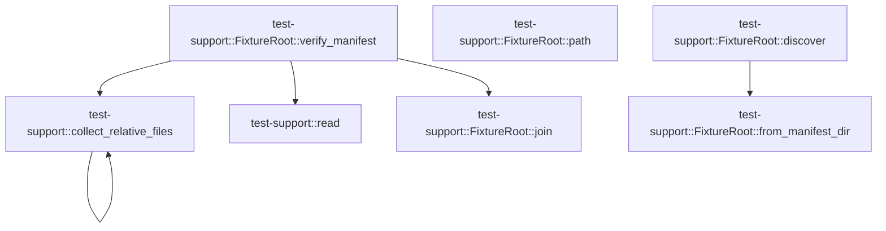

# test-support

[Package atlas](index.md) · [Source](../../src/lib.rs)

## Declarations

Visibility is the declaration spelling; trait members and reexports require their enclosing interface. `cfg` is not evaluated.

| Symbol | Kind | Visibility | Test / cfg |
|---|---|---|---|
| [test-support::FixtureError](../../src/lib.rs#L10) | enum_item | `pub` |  |
| [test-support::FixtureRoot](../../src/lib.rs#L33) | struct_item | `pub` |  |
| [test-support::FixtureRoot::discover](../../src/lib.rs#L36) | function_item | `pub` |  |
| [test-support::FixtureRoot::from_manifest_dir](../../src/lib.rs#L47) | function_item | `pub` |  |
| [test-support::FixtureRoot::path](../../src/lib.rs#L61) | function_item | `pub` |  |
| [test-support::FixtureRoot::join](../../src/lib.rs#L66) | function_item | `pub` |  |
| [test-support::FixtureRoot::verify_manifest](../../src/lib.rs#L70) | function_item | `pub` |  |
| [test-support::collect_relative_files](../../src/lib.rs#L139) | function_item | `private` |  |
| [test-support::FixtureManifest](../../src/lib.rs#L174) | struct_item | `pub` |  |
| [test-support::read](../../src/lib.rs#L179) | function_item | `pub` |  |
| [test-support::tests::manifest_rejects_undeclared_top_level_corpus](../../src/lib.rs#L191) | function_item | `private` | test; #[cfg(test)] |

## Imports / reexports

| Local name | Source path | Visibility |
|---|---|---|
| `BTreeMap` | `std::collections::BTreeMap` | `private` |
| `BTreeSet` | `std::collections::BTreeSet` | `private` |
| `fs` | `std::fs` | `private` |
| `Path` | `std::path::Path` | `private` |
| `PathBuf` | `std::path::PathBuf` | `private` |
| `Deserialize` | `serde::Deserialize` | `private` |
| `Digest` | `sha2::Digest` | `private` |
| `Sha256` | `sha2::Sha256` | `private` |
| `Error` | `thiserror::Error` | `private` |
| `*` | `super::*` | `private` |

## Module declarations

| Module | Visibility | Attributes |
|---|---|---|
| `test-support::tests` | `private` | #[cfg(test)] |

## Function call graphs

Edges below are syntactically resolved calls only, including private functions. Graphs partition callers into groups of 20; they are not execution order. All unresolved sites are listed below and in the JSON inventory.

Functions 1–7: 5 direct edges

## Call sites

Includes test functions (marked in declarations). Receiver-type-required sites need type analysis/manual tracing. Calls in closures are attributed to their enclosing function; their occurrence here does not mean the closure executes immediately.

| Caller | Callee expression | Source lines | Target / classification |
|---|---|---|---|
| `discover` | `std::env::var_os` | [37](../../src/lib.rs#L37) | external-constructor-callback-or-unresolved |
| `discover` | `PathBuf::from` | [38](../../src/lib.rs#L38) | external-constructor-callback-or-unresolved |
| `discover` | `path.is_absolute` | [39](../../src/lib.rs#L39) | receiver-type-required |
| `discover` | `path.is_dir` | [39](../../src/lib.rs#L39) | receiver-type-required |
| `discover` | `Ok` | [40](../../src/lib.rs#L40) | external-constructor-callback-or-unresolved |
| `discover` | `Self` | [40](../../src/lib.rs#L40) | external-constructor-callback-or-unresolved |
| `discover` | `Err` | [42](../../src/lib.rs#L42) | external-constructor-callback-or-unresolved |
| `discover` | `FixtureError::InvalidOverride` | [42](../../src/lib.rs#L42) | external-constructor-callback-or-unresolved |
| `discover` | `path.display().to_string` | [42](../../src/lib.rs#L42) | receiver-type-required |
| `discover` | `path.display` | [42](../../src/lib.rs#L42) | receiver-type-required |
| `discover` | `Self::from_manifest_dir` | [44](../../src/lib.rs#L44) | [test-support::FixtureRoot::from_manifest_dir](../../src/lib.rs#L47) |
| `discover` | `Path::new` | [44](../../src/lib.rs#L44) | external-constructor-callback-or-unresolved |
| `from_manifest_dir` | `Vec::new` | [48](../../src/lib.rs#L48) | external-constructor-callback-or-unresolved |
| `from_manifest_dir` | `start.ancestors` | [49](../../src/lib.rs#L49) | receiver-type-required |
| `from_manifest_dir` | `checked.push` | [50](../../src/lib.rs#L50) | receiver-type-required |
| `from_manifest_dir` | `ancestor.to_path_buf` | [50](../../src/lib.rs#L50) | receiver-type-required |
| `from_manifest_dir` | `ancestor.join("Cargo.toml").is_file` | [51](../../src/lib.rs#L51) | receiver-type-required |
| `from_manifest_dir` | `ancestor.join` | [51](../../src/lib.rs#L51), [52](../../src/lib.rs#L52), [54](../../src/lib.rs#L54) | receiver-type-required |
| `from_manifest_dir` | `ancestor.join("fixtures/manifest.json").is_file` | [52](../../src/lib.rs#L52) | receiver-type-required |
| `from_manifest_dir` | `Ok` | [54](../../src/lib.rs#L54) | external-constructor-callback-or-unresolved |
| `from_manifest_dir` | `Self` | [54](../../src/lib.rs#L54) | external-constructor-callback-or-unresolved |
| `from_manifest_dir` | `Err` | [57](../../src/lib.rs#L57) | external-constructor-callback-or-unresolved |
| `from_manifest_dir` | `FixtureError::NotFound` | [57](../../src/lib.rs#L57) | external-constructor-callback-or-unresolved |
| `join` | `self.0.join` | [67](../../src/lib.rs#L67) | receiver-type-required |
| `verify_manifest` | `self.join` | [71](../../src/lib.rs#L71), [111](../../src/lib.rs#L111), [126](../../src/lib.rs#L126) | [test-support::FixtureRoot::join](../../src/lib.rs#L66) |
| `verify_manifest` | `read` | [72](../../src/lib.rs#L72), [126](../../src/lib.rs#L126) | [test-support::read](../../src/lib.rs#L179) |
| `verify_manifest` | `serde_json::from_slice` | [73](../../src/lib.rs#L73) | external-constructor-callback-or-unresolved |
| `verify_manifest` | `BTreeSet::new` | [74](../../src/lib.rs#L74), [112](../../src/lib.rs#L112) | external-constructor-callback-or-unresolved |
| `verify_manifest` | `fs::read_dir(&self.0).map_err` | [75](../../src/lib.rs#L75) | receiver-type-required |
| `verify_manifest` | `fs::read_dir` | [75](../../src/lib.rs#L75) | external-constructor-callback-or-unresolved |
| `verify_manifest` | `self.0.clone` | [76](../../src/lib.rs#L76), [80](../../src/lib.rs#L80) | receiver-type-required |
| `verify_manifest` | `entry.map_err` | [79](../../src/lib.rs#L79) | receiver-type-required |
| `verify_manifest` | `entry                 .file_type()                 .map_err(&#124;source&#124; FixtureError::Io {                     path: entry.path(),                     source,                 })?                 .is_dir` | [83](../../src/lib.rs#L83) | receiver-type-required |
| `verify_manifest` | `entry                 .file_type()                 .map_err` | [83](../../src/lib.rs#L83) | receiver-type-required |
| `verify_manifest` | `entry                 .file_type` | [83](../../src/lib.rs#L83) | receiver-type-required |
| `verify_manifest` | `entry.path` | [86](../../src/lib.rs#L86) | receiver-type-required |
| `verify_manifest` | `disk_corpora.insert` | [91](../../src/lib.rs#L91) | receiver-type-required |
| `verify_manifest` | `entry.file_name().to_string_lossy().into_owned` | [91](../../src/lib.rs#L91) | receiver-type-required |
| `verify_manifest` | `entry.file_name().to_string_lossy` | [91](../../src/lib.rs#L91) | receiver-type-required |
| `verify_manifest` | `entry.file_name` | [91](../../src/lib.rs#L91) | receiver-type-required |
| `verify_manifest` | `manifest.corpora.keys().cloned().collect::<BTreeSet<_>>` | [94](../../src/lib.rs#L94) | receiver-type-required |
| `verify_manifest` | `manifest.corpora.keys().cloned` | [94](../../src/lib.rs#L94) | receiver-type-required |
| `verify_manifest` | `manifest.corpora.keys` | [94](../../src/lib.rs#L94) | receiver-type-required |
| `verify_manifest` | `declared_corpora             .difference(&disk_corpora)             .cloned()             .collect::<BTreeSet<_>>` | [95](../../src/lib.rs#L95) | receiver-type-required |
| `verify_manifest` | `declared_corpora             .difference(&disk_corpora)             .cloned` | [95](../../src/lib.rs#L95) | receiver-type-required |
| `verify_manifest` | `declared_corpora             .difference` | [95](../../src/lib.rs#L95) | receiver-type-required |
| `verify_manifest` | `disk_corpora             .difference(&declared_corpora)             .cloned()             .collect::<BTreeSet<_>>` | [99](../../src/lib.rs#L99) | receiver-type-required |
| `verify_manifest` | `disk_corpora             .difference(&declared_corpora)             .cloned` | [99](../../src/lib.rs#L99) | receiver-type-required |
| `verify_manifest` | `disk_corpora             .difference` | [99](../../src/lib.rs#L99) | receiver-type-required |
| `verify_manifest` | `missing.is_empty` | [103](../../src/lib.rs#L103), [117](../../src/lib.rs#L117) | receiver-type-required |
| `verify_manifest` | `extra.is_empty` | [103](../../src/lib.rs#L103), [117](../../src/lib.rs#L117) | receiver-type-required |
| `verify_manifest` | `Err` | [104](../../src/lib.rs#L104), [118](../../src/lib.rs#L118), [129](../../src/lib.rs#L129) | external-constructor-callback-or-unresolved |
| `verify_manifest` | `"<root>".to_owned` | [105](../../src/lib.rs#L105) | receiver-type-required |
| `verify_manifest` | `collect_relative_files` | [113](../../src/lib.rs#L113) | [test-support::collect_relative_files](../../src/lib.rs#L139) |
| `verify_manifest` | `declared.iter().cloned().collect` | [114](../../src/lib.rs#L114) | receiver-type-required |
| `verify_manifest` | `declared.iter().cloned` | [114](../../src/lib.rs#L114) | receiver-type-required |
| `verify_manifest` | `declared.iter` | [114](../../src/lib.rs#L114) | receiver-type-required |
| `verify_manifest` | `declared.difference(&disk).cloned().collect::<BTreeSet<_>>` | [115](../../src/lib.rs#L115) | receiver-type-required |
| `verify_manifest` | `declared.difference(&disk).cloned` | [115](../../src/lib.rs#L115) | receiver-type-required |
| `verify_manifest` | `declared.difference` | [115](../../src/lib.rs#L115) | receiver-type-required |
| `verify_manifest` | `disk.difference(&declared).cloned().collect::<BTreeSet<_>>` | [116](../../src/lib.rs#L116) | receiver-type-required |
| `verify_manifest` | `disk.difference(&declared).cloned` | [116](../../src/lib.rs#L116) | receiver-type-required |
| `verify_manifest` | `disk.difference` | [116](../../src/lib.rs#L116) | receiver-type-required |
| `verify_manifest` | `corpus.clone` | [119](../../src/lib.rs#L119) | receiver-type-required |
| `verify_manifest` | `manifest.corpora.get("assets").into_iter().flatten` | [125](../../src/lib.rs#L125) | receiver-type-required |
| `verify_manifest` | `manifest.corpora.get("assets").into_iter` | [125](../../src/lib.rs#L125) | receiver-type-required |
| `verify_manifest` | `manifest.corpora.get` | [125](../../src/lib.rs#L125) | receiver-type-required |
| `verify_manifest` | `self.join("assets").join` | [126](../../src/lib.rs#L126) | receiver-type-required |
| `verify_manifest` | `name.clone` | [130](../../src/lib.rs#L130) | receiver-type-required |
| `verify_manifest` | `Ok` | [135](../../src/lib.rs#L135) | external-constructor-callback-or-unresolved |
| `collect_relative_files` | `fs::read_dir(current).map_err` | [144](../../src/lib.rs#L144) | receiver-type-required |
| `collect_relative_files` | `fs::read_dir` | [144](../../src/lib.rs#L144) | external-constructor-callback-or-unresolved |
| `collect_relative_files` | `current.to_path_buf` | [145](../../src/lib.rs#L145), [149](../../src/lib.rs#L149) | receiver-type-required |
| `collect_relative_files` | `entry.map_err` | [148](../../src/lib.rs#L148) | receiver-type-required |
| `collect_relative_files` | `entry.file_type().map_err` | [152](../../src/lib.rs#L152) | receiver-type-required |
| `collect_relative_files` | `entry.file_type` | [152](../../src/lib.rs#L152) | receiver-type-required |
| `collect_relative_files` | `entry.path` | [153](../../src/lib.rs#L153), [157](../../src/lib.rs#L157) | receiver-type-required |
| `collect_relative_files` | `file_type.is_dir` | [156](../../src/lib.rs#L156) | receiver-type-required |
| `collect_relative_files` | `collect_relative_files` | [157](../../src/lib.rs#L157) | [test-support::collect_relative_files](../../src/lib.rs#L139) |
| `collect_relative_files` | `file_type.is_file` | [158](../../src/lib.rs#L158) | receiver-type-required |
| `collect_relative_files` | `entry                 .path()                 .strip_prefix(root)                 .expect("fixture descendant")                 .components()                 .map(&#124;part&#124; part.as_os_str().to_string_lossy())                 .collect::<Vec<_>>()                 .join` | [159](../../src/lib.rs#L159) | receiver-type-required |
| `collect_relative_files` | `entry                 .path()                 .strip_prefix(root)                 .expect("fixture descendant")                 .components()                 .map(&#124;part&#124; part.as_os_str().to_string_lossy())                 .collect::<Vec<_>>` | [159](../../src/lib.rs#L159) | receiver-type-required |
| `collect_relative_files` | `entry                 .path()                 .strip_prefix(root)                 .expect("fixture descendant")                 .components()                 .map` | [159](../../src/lib.rs#L159) | receiver-type-required |
| `collect_relative_files` | `entry                 .path()                 .strip_prefix(root)                 .expect("fixture descendant")                 .components` | [159](../../src/lib.rs#L159) | receiver-type-required |
| `collect_relative_files` | `entry                 .path()                 .strip_prefix(root)                 .expect` | [159](../../src/lib.rs#L159) | receiver-type-required |
| `collect_relative_files` | `entry                 .path()                 .strip_prefix` | [159](../../src/lib.rs#L159) | receiver-type-required |
| `collect_relative_files` | `entry                 .path` | [159](../../src/lib.rs#L159) | receiver-type-required |
| `collect_relative_files` | `part.as_os_str().to_string_lossy` | [164](../../src/lib.rs#L164) | receiver-type-required |
| `collect_relative_files` | `part.as_os_str` | [164](../../src/lib.rs#L164) | receiver-type-required |
| `collect_relative_files` | `output.insert` | [167](../../src/lib.rs#L167) | receiver-type-required |
| `collect_relative_files` | `Ok` | [170](../../src/lib.rs#L170) | external-constructor-callback-or-unresolved |
| `read` | `fs::read(path).map_err` | [180](../../src/lib.rs#L180) | receiver-type-required |
| `read` | `fs::read` | [180](../../src/lib.rs#L180) | external-constructor-callback-or-unresolved |
| `read` | `path.to_path_buf` | [181](../../src/lib.rs#L181) | receiver-type-required |
| `manifest_rejects_undeclared_top_level_corpus` | `tempfile::tempdir().expect` | [192](../../src/lib.rs#L192) | receiver-type-required |
| `manifest_rejects_undeclared_top_level_corpus` | `tempfile::tempdir` | [192](../../src/lib.rs#L192) | external-constructor-callback-or-unresolved |
| `manifest_rejects_undeclared_top_level_corpus` | `fs::write(             root.path().join("manifest.json"),             br#"{"corpora":{"known":["case.txt"]},"version":1}"#,         )         .expect` | [193](../../src/lib.rs#L193) | receiver-type-required |
| `manifest_rejects_undeclared_top_level_corpus` | `fs::write` | [193](../../src/lib.rs#L193), [199](../../src/lib.rs#L199) | external-constructor-callback-or-unresolved |
| `manifest_rejects_undeclared_top_level_corpus` | `root.path().join` | [194](../../src/lib.rs#L194), [198](../../src/lib.rs#L198), [199](../../src/lib.rs#L199), [200](../../src/lib.rs#L200) | receiver-type-required |
| `manifest_rejects_undeclared_top_level_corpus` | `root.path` | [194](../../src/lib.rs#L194), [198](../../src/lib.rs#L198), [199](../../src/lib.rs#L199), [200](../../src/lib.rs#L200), [202](../../src/lib.rs#L202) | receiver-type-required |
| `manifest_rejects_undeclared_top_level_corpus` | `fs::create_dir(root.path().join("known")).expect` | [198](../../src/lib.rs#L198) | receiver-type-required |
| `manifest_rejects_undeclared_top_level_corpus` | `fs::create_dir` | [198](../../src/lib.rs#L198), [200](../../src/lib.rs#L200) | external-constructor-callback-or-unresolved |
| `manifest_rejects_undeclared_top_level_corpus` | `fs::write(root.path().join("known/case.txt"), b"case").expect` | [199](../../src/lib.rs#L199) | receiver-type-required |
| `manifest_rejects_undeclared_top_level_corpus` | `fs::create_dir(root.path().join("undeclared")).expect` | [200](../../src/lib.rs#L200) | receiver-type-required |
| `manifest_rejects_undeclared_top_level_corpus` | `FixtureRoot(root.path().to_path_buf())             .verify_manifest()             .expect_err` | [202](../../src/lib.rs#L202) | receiver-type-required |
| `manifest_rejects_undeclared_top_level_corpus` | `FixtureRoot(root.path().to_path_buf())             .verify_manifest` | [202](../../src/lib.rs#L202) | receiver-type-required |
| `manifest_rejects_undeclared_top_level_corpus` | `FixtureRoot` | [202](../../src/lib.rs#L202) | external-constructor-callback-or-unresolved |
| `manifest_rejects_undeclared_top_level_corpus` | `root.path().to_path_buf` | [202](../../src/lib.rs#L202) | receiver-type-required |
