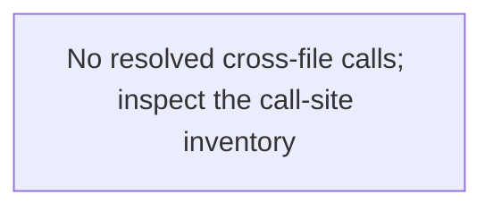

# thread-search — generated atlas

[All packages](../../../../docs/architecture/generated/index.md) · [Maintained explanation](../README.md)

## Cargo targets

| Target | Kind | Entry |
|---|---|---|
| `thread_search` | lib | [crates/thread-search/src/lib.rs](../../src/lib.rs) |
| `slice14d_gates` | test | [crates/thread-search/tests/slice14d_gates.rs](../../tests/slice14d_gates.rs) |

## Direct workspace dependencies

| Dependency | Kind | Target cfg |
|---|---|---|
| `schema` | normal | all |
| `store` | normal | all |

[Public/restricted API and direct callers](api.md)

## Source files / lexical modules

`src` files have full symbol/call tables and partitioned function graphs. Integration tests and examples remain in the JSON inventory.
File-derived paths below are lexical navigation, not a compiler-resolved module tree; inline module declarations are listed separately.

| File | Symbols | Call sites | Detail |
|---|---:|---:|---|
| [crates/thread-search/src/host.rs](../../src/host.rs) | 4 | 75 | [Symbols and calls](src--host.md) |
| [crates/thread-search/src/lib.rs](../../src/lib.rs) | 39 | 293 | [Symbols and calls](src--lib.md) |
| [crates/thread-search/tests/slice14d_gates.rs](../../tests/slice14d_gates.rs) | 18 | 293 | `inventory.json` |

## Cross-file direct calls

Source files stand in for out-of-line modules; see declarations for inline modules. Counts are syntactic call sites, not runtime frequency.

