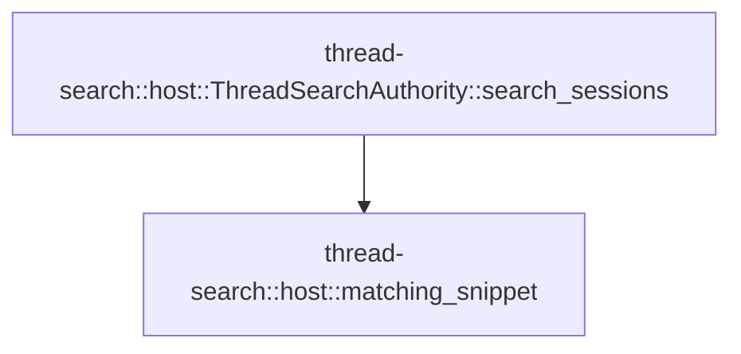

# thread-search::host

[Package atlas](index.md) · [Source](../../src/host.rs)

## Declarations

Visibility is the declaration spelling; trait members and reexports require their enclosing interface. `cfg` is not evaluated.

| Symbol | Kind | Visibility | Test / cfg |
|---|---|---|---|
| [thread-search::host::SessionSearchHit](../../src/host.rs#L6) | struct_item | `pub` |  |
| [thread-search::host::SessionSearchResults](../../src/host.rs#L13) | struct_item | `pub` |  |
| [thread-search::host::ThreadSearchAuthority::search_sessions](../../src/host.rs#L21) | function_item | `pub` |  |
| [thread-search::host::matching_snippet](../../src/host.rs#L105) | function_item | `private` |  |

## Imports / reexports

| Local name | Source path | Visibility |
|---|---|---|
| `*` | `super::*` | `private` |

## Module declarations

| Module | Visibility | Attributes |
|---|---|---|

## Function call graphs

Edges below are syntactically resolved calls only, including private functions. Graphs partition callers into groups of 20; they are not execution order. All unresolved sites are listed below and in the JSON inventory.

Functions 1–2: 1 direct edges

## Call sites

Includes test functions (marked in declarations). Receiver-type-required sites need type analysis/manual tracing. Calls in closures are attributed to their enclosing function; their occurrence here does not mean the closure executes immediately.

| Caller | Callee expression | Source lines | Target / classification |
|---|---|---|---|
| `search_sessions` | `validate_request` | [22](../../src/host.rs#L22) | external-constructor-callback-or-unresolved |
| `search_sessions` | `"host".into` | [23](../../src/host.rs#L23) | receiver-type-required |
| `search_sessions` | `query.into` | [24](../../src/host.rs#L24) | receiver-type-required |
| `search_sessions` | `normalize` | [29](../../src/host.rs#L29) | external-constructor-callback-or-unresolved |
| `search_sessions` | `NamedLock::exclusive` | [30](../../src/host.rs#L30) | external-constructor-callback-or-unresolved |
| `search_sessions` | `self.store.root().join` | [30](../../src/host.rs#L30), [31](../../src/host.rs#L31), [32](../../src/host.rs#L32) | receiver-type-required |
| `search_sessions` | `self.store.root` | [30](../../src/host.rs#L30), [31](../../src/host.rs#L31), [32](../../src/host.rs#L32), [33](../../src/host.rs#L33) | receiver-type-required |
| `search_sessions` | `NamedLock::shared` | [31](../../src/host.rs#L31), [32](../../src/host.rs#L32) | external-constructor-callback-or-unresolved |
| `search_sessions` | `scan_sources` | [33](../../src/host.rs#L33) | external-constructor-callback-or-unresolved |
| `search_sessions` | `Vec::new` | [34](../../src/host.rs#L34) | external-constructor-callback-or-unresolved |
| `search_sessions` | `source                 .title                 .as_deref()                 .and_then` | [36](../../src/host.rs#L36) | receiver-type-required |
| `search_sessions` | `source                 .title                 .as_deref` | [36](../../src/host.rs#L36) | receiver-type-required |
| `search_sessions` | `matching_snippet` | [39](../../src/host.rs#L39), [74](../../src/host.rs#L74) | [thread-search::host::matching_snippet](../../src/host.rs#L105) |
| `search_sessions` | `snippet.is_none` | [40](../../src/host.rs#L40) | receiver-type-required |
| `search_sessions` | `fs::read` | [41](../../src/host.rs#L41) | external-constructor-callback-or-unresolved |
| `search_sessions` | `source.folder.join` | [41](../../src/host.rs#L41) | receiver-type-required |
| `search_sessions` | `scan_valid_prefix(&bytes, 1).projection.ok_or_else` | [42](../../src/host.rs#L42) | receiver-type-required |
| `search_sessions` | `scan_valid_prefix` | [42](../../src/host.rs#L42) | external-constructor-callback-or-unresolved |
| `search_sessions` | `SearchError::SourceCorrupt` | [43](../../src/host.rs#L43), [62](../../src/host.rs#L62), [64](../../src/host.rs#L64) | external-constructor-callback-or-unresolved |
| `search_sessions` | `"Conversation has no valid prefix".into` | [43](../../src/host.rs#L43) | receiver-type-required |
| `search_sessions` | `projection                     .events                     .into_iter()                     .filter(&#124;event&#124; event.seq() <= source.as_of_seq)                     .collect` | [46](../../src/host.rs#L46) | receiver-type-required |
| `search_sessions` | `projection                     .events                     .into_iter()                     .filter` | [46](../../src/host.rs#L46) | receiver-type-required |
| `search_sessions` | `projection                     .events                     .into_iter` | [46](../../src/host.rs#L46) | receiver-type-required |
| `search_sessions` | `event.seq` | [49](../../src/host.rs#L49), [53](../../src/host.rs#L53) | receiver-type-required |
| `search_sessions` | `superseded_sequences` | [51](../../src/host.rs#L51) | external-constructor-callback-or-unresolved |
| `search_sessions` | `events.iter().rev` | [52](../../src/host.rs#L52) | receiver-type-required |
| `search_sessions` | `events.iter` | [52](../../src/host.rs#L52) | receiver-type-required |
| `search_sessions` | `superseded.contains` | [53](../../src/host.rs#L53) | receiver-type-required |
| `search_sessions` | `serde_json::from_slice(                         &event                             .raw()                             .canonical_bytes()                             .map_err(&#124;error&#124; SearchError::SourceCorrupt(error.to_string()))?,                     )                     .map_err` | [58](../../src/host.rs#L58) | receiver-type-required |
| `search_sessions` | `serde_json::from_slice` | [58](../../src/host.rs#L58) | external-constructor-callback-or-unresolved |
| `search_sessions` | `event                             .raw()                             .canonical_bytes()                             .map_err` | [59](../../src/host.rs#L59) | receiver-type-required |
| `search_sessions` | `event                             .raw()                             .canonical_bytes` | [59](../../src/host.rs#L59) | receiver-type-required |
| `search_sessions` | `event                             .raw` | [59](../../src/host.rs#L59) | receiver-type-required |
| `search_sessions` | `error.to_string` | [62](../../src/host.rs#L62), [64](../../src/host.rs#L64) | receiver-type-required |
| `search_sessions` | `raw.get("content").and_then` | [65](../../src/host.rs#L65) | receiver-type-required |
| `search_sessions` | `raw.get` | [65](../../src/host.rs#L65) | receiver-type-required |
| `search_sessions` | `block.get("type").and_then` | [70](../../src/host.rs#L70) | receiver-type-required |
| `search_sessions` | `block.get` | [70](../../src/host.rs#L70), [73](../../src/host.rs#L73) | receiver-type-required |
| `search_sessions` | `Some` | [70](../../src/host.rs#L70) | external-constructor-callback-or-unresolved |
| `search_sessions` | `block.get("text").and_then` | [73](../../src/host.rs#L73) | receiver-type-required |
| `search_sessions` | `snippet.is_some` | [75](../../src/host.rs#L75), [80](../../src/host.rs#L80) | receiver-type-required |
| `search_sessions` | `items.len` | [86](../../src/host.rs#L86) | receiver-type-required |
| `search_sessions` | `Ok` | [87](../../src/host.rs#L87), [98](../../src/host.rs#L98) | external-constructor-callback-or-unresolved |
| `search_sessions` | `items.push` | [92](../../src/host.rs#L92) | receiver-type-required |
| `matching_snippet` | `normalize` | [108](../../src/host.rs#L108) | external-constructor-callback-or-unresolved |
| `matching_snippet` | `text.find` | [109](../../src/host.rs#L109) | receiver-type-required |
| `matching_snippet` | `text[..position].chars().count` | [110](../../src/host.rs#L110) | receiver-type-required |
| `matching_snippet` | `text[..position].chars` | [110](../../src/host.rs#L110) | receiver-type-required |
| `matching_snippet` | `before.saturating_sub` | [111](../../src/host.rs#L111) | receiver-type-required |
| `matching_snippet` | `query.chars().count().saturating_add` | [112](../../src/host.rs#L112) | receiver-type-required |
| `matching_snippet` | `query.chars().count` | [112](../../src/host.rs#L112) | receiver-type-required |
| `matching_snippet` | `query.chars` | [112](../../src/host.rs#L112) | receiver-type-required |
| `matching_snippet` | `text.chars().skip(start).take(count).collect` | [113](../../src/host.rs#L113) | receiver-type-required |
| `matching_snippet` | `text.chars().skip(start).take` | [113](../../src/host.rs#L113) | receiver-type-required |
| `matching_snippet` | `text.chars().skip` | [113](../../src/host.rs#L113) | receiver-type-required |
| `matching_snippet` | `text.chars` | [113](../../src/host.rs#L113), [117](../../src/host.rs#L117) | receiver-type-required |
| `matching_snippet` | `result.insert` | [115](../../src/host.rs#L115) | receiver-type-required |
| `matching_snippet` | `text.chars().count` | [117](../../src/host.rs#L117) | receiver-type-required |
| `matching_snippet` | `result.push` | [118](../../src/host.rs#L118) | receiver-type-required |
| `matching_snippet` | `Some` | [120](../../src/host.rs#L120) | external-constructor-callback-or-unresolved |
