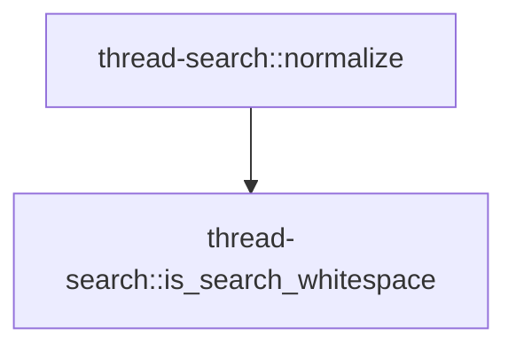

# thread-search

[Package atlas](index.md) · [Source](../../src/lib.rs)

## Declarations

Visibility is the declaration spelling; trait members and reexports require their enclosing interface. `cfg` is not evaluated.

| Symbol | Kind | Visibility | Test / cfg |
|---|---|---|---|
| [thread-search::FORMAT](../../src/lib.rs#L23) | const_item | `private` |  |
| [thread-search::INDEX_NAME](../../src/lib.rs#L24) | const_item | `private` |  |
| [thread-search::LEGACY_INDEX_NAME](../../src/lib.rs#L26) | const_item | `private` |  |
| [thread-search::MAX_QUERY_BYTES](../../src/lib.rs#L27) | const_item | `private` |  |
| [thread-search::MAX_WORKSPACE_BYTES](../../src/lib.rs#L28) | const_item | `private` |  |
| [thread-search::MAX_PAGE_SIZE](../../src/lib.rs#L29) | const_item | `private` |  |
| [thread-search::ArchiveVisibility](../../src/lib.rs#L33) | enum_item | `pub` |  |
| [thread-search::SearchRequest](../../src/lib.rs#L40) | struct_item | `pub` |  |
| [thread-search::MatchClass](../../src/lib.rs#L50) | enum_item | `pub` |  |
| [thread-search::SearchResult](../../src/lib.rs#L58) | struct_item | `pub` |  |
| [thread-search::IndexUse](../../src/lib.rs#L71) | struct_item | `pub` |  |
| [thread-search::SearchPage](../../src/lib.rs#L81) | struct_item | `pub` |  |
| [thread-search::ThreadSearchAuthority](../../src/lib.rs#L90) | struct_item | `pub` |  |
| [thread-search::ThreadSearchAuthority::open](../../src/lib.rs#L95) | function_item | `pub` |  |
| [thread-search::ThreadSearchAuthority::search](../../src/lib.rs#L104) | function_item | `pub` |  |
| [thread-search::ThreadSearchAuthority::rebuild_index](../../src/lib.rs#L171) | function_item | `pub` |  |
| [thread-search::ThreadSearchAuthority::scan_and_repair_indices](../../src/lib.rs#L182) | function_item | `private` |  |
| [thread-search::IndexFile](../../src/lib.rs#L222) | struct_item | `private` |  |
| [thread-search::IndexEntry](../../src/lib.rs#L230) | struct_item | `private` |  |
| [thread-search::CursorBody](../../src/lib.rs#L244) | struct_item | `private` |  |
| [thread-search::validate_request](../../src/lib.rs#L254) | function_item | `private` |  |
| [thread-search::valid_workspace_id](../../src/lib.rs#L273) | function_item | `private` |  |
| [thread-search::visibility_includes](../../src/lib.rs#L282) | function_item | `private` |  |
| [thread-search::rank](../../src/lib.rs#L287) | function_item | `private` |  |
| [thread-search::scan_sources](../../src/lib.rs#L310) | function_item | `private` |  |
| [thread-search::superseded_sequences](../../src/lib.rs#L403) | function_item | `private` |  |
| [thread-search::validate_session_id](../../src/lib.rs#L415) | function_item | `private` |  |
| [thread-search::publish_index](../../src/lib.rs#L423) | function_item | `private` |  |
| [thread-search::same_projection](../../src/lib.rs#L437) | function_item | `private` |  |
| [thread-search::decode_index](../../src/lib.rs#L447) | function_item | `private` |  |
| [thread-search::digest_entries](../../src/lib.rs#L483) | function_item | `private` |  |
| [thread-search::encode_cursor](../../src/lib.rs#L489) | function_item | `private` |  |
| [thread-search::decode_cursor](../../src/lib.rs#L499) | function_item | `private` |  |
| [thread-search::valid_sha256_label](../../src/lib.rs#L535) | function_item | `private` |  |
| [thread-search::validate_cursor_scope](../../src/lib.rs#L543) | function_item | `private` |  |
| [thread-search::hex_digest](../../src/lib.rs#L561) | function_item | `private` |  |
| [thread-search::normalize](../../src/lib.rs#L565) | function_item | `private` |  |
| [thread-search::is_search_whitespace](../../src/lib.rs#L586) | function_item | `private` |  |
| [thread-search::SearchError](../../src/lib.rs#L604) | enum_item | `pub` |  |

## Imports / reexports

| Local name | Source path | Visibility |
|---|---|---|
| `SessionSearchHit` | `host::SessionSearchHit` | `pub` |
| `SessionSearchResults` | `host::SessionSearchResults` | `pub` |
| `BTreeSet` | `std::collections::BTreeSet` | `private` |
| `HashSet` | `std::collections::HashSet` | `private` |
| `fs` | `std::fs` | `private` |
| `Path` | `std::path::Path` | `private` |
| `PathBuf` | `std::path::PathBuf` | `private` |
| `_` | `base64::Engine` | `private` |
| `URL_SAFE_NO_PAD` | `base64::engine::general_purpose::URL_SAFE_NO_PAD` | `private` |
| `EventKind` | `schema::EventKind` | `private` |
| `Deserialize` | `serde::Deserialize` | `private` |
| `Serialize` | `serde::Serialize` | `private` |
| `Digest` | `sha2::Digest` | `private` |
| `Sha256` | `sha2::Sha256` | `private` |
| `AtomicPublisher` | `store::AtomicPublisher` | `private` |
| `NamedLock` | `store::NamedLock` | `private` |
| `ThreadStore` | `store::ThreadStore` | `private` |
| `scan_valid_prefix` | `store::scan_valid_prefix` | `private` |
| `Error` | `thiserror::Error` | `private` |
| `UnicodeNormalization` | `unicode_normalization::UnicodeNormalization` | `private` |
| `Uuid` | `uuid::Uuid` | `private` |

## Module declarations

| Module | Visibility | Attributes |
|---|---|---|
| `thread-search::host` | `private` |  |

## Function call graphs

Edges below are syntactically resolved calls only, including private functions. Graphs partition callers into groups of 20; they are not execution order. All unresolved sites are listed below and in the JSON inventory.

```mermaid
flowchart TD
  n0["store::atomic::AtomicPublisher::replace"]
  n1["store::folder::ThreadStore::open"]
  n2["store::platform::NamedLock::exclusive"]
  n3["store::platform::NamedLock::shared"]
  n4["store::tail::scan_valid_prefix"]
  n5["thread-search::ThreadSearchAuthority::search"]
  n6["thread-search::ThreadSearchAuthority::rebuild_index"]
  n7["thread-search::ThreadSearchAuthority::scan_and_repair_indices"]
  n8["thread-search::validate_request"]
  n9["thread-search::valid_workspace_id"]
  n10["thread-search::visibility_includes"]
  n11["thread-search::rank"]
  n12["thread-search::scan_sources"]
  n13["thread-search::superseded_sequences"]
  n14["thread-search::validate_session_id"]
  n15["thread-search::publish_index"]
  n16["thread-search::same_projection"]
  n17["thread-search::decode_index"]
  n18["thread-search::digest_entries"]
  n19["thread-search::encode_cursor"]
  n20["thread-search::decode_cursor"]
  n21["thread-search::valid_sha256_label"]
  n22["thread-search::validate_cursor_scope"]
  n23["thread-search::hex_digest"]
  n24["thread-search::normalize"]
  n25["thread-search::is_search_whitespace"]
  n26["thread-search::ThreadSearchAuthority::open"]
  n5 --> n2
  n5 --> n3
  n5 --> n7
  n5 --> n8
  n5 --> n10
  n5 --> n11
  n5 --> n18
  n5 --> n19
  n5 --> n20
  n5 --> n22
  n5 --> n24
  n6 --> n2
  n6 --> n3
  n6 --> n12
  n6 --> n15
  n6 --> n18
  n7 --> n12
  n7 --> n15
  n7 --> n16
  n7 --> n17
  n8 --> n9
  n8 --> n24
  n8 --> n25
  n12 --> n4
  n12 --> n9
  n12 --> n13
  n12 --> n14
  n15 --> n0
  n15 --> n18
  n17 --> n9
  n17 --> n14
  n17 --> n18
  n20 --> n9
  n20 --> n14
  n20 --> n21
  n20 --> n23
  n20 --> n24
  n26 --> n1
```

Functions 1–20: 38 direct edges

Functions 21–22: 1 direct edges

## Call sites

Includes test functions (marked in declarations). Receiver-type-required sites need type analysis/manual tracing. Calls in closures are attributed to their enclosing function; their occurrence here does not mean the closure executes immediately.

| Caller | Callee expression | Source lines | Target / classification |
|---|---|---|---|
| `open` | `Ok` | [96](../../src/lib.rs#L96) | external-constructor-callback-or-unresolved |
| `open` | `ThreadStore::open` | [97](../../src/lib.rs#L97) | [store::folder::ThreadStore::open](../../../store/src/folder.rs#L35) |
| `search` | `validate_request` | [105](../../src/lib.rs#L105) | [thread-search::validate_request](../../src/lib.rs#L254) |
| `search` | `normalize` | [106](../../src/lib.rs#L106) | [thread-search::normalize](../../src/lib.rs#L565) |
| `search` | `NamedLock::exclusive` | [107](../../src/lib.rs#L107) | [store::platform::NamedLock::exclusive](../../../store/src/platform.rs#L102) |
| `search` | `self.store.root().join` | [107](../../src/lib.rs#L107), [108](../../src/lib.rs#L108), [109](../../src/lib.rs#L109) | receiver-type-required |
| `search` | `self.store.root` | [107](../../src/lib.rs#L107), [108](../../src/lib.rs#L108), [109](../../src/lib.rs#L109) | receiver-type-required |
| `search` | `NamedLock::shared` | [108](../../src/lib.rs#L108), [109](../../src/lib.rs#L109) | [store::platform::NamedLock::shared](../../../store/src/platform.rs#L98) |
| `search` | `self.scan_and_repair_indices` | [110](../../src/lib.rs#L110) | [thread-search::ThreadSearchAuthority::scan_and_repair_indices](../../src/lib.rs#L182) |
| `search` | `entries             .into_iter()             .filter(&#124;entry&#124; entry.workspace_id == request.workspace_id)             .filter(&#124;entry&#124; visibility_includes(request.visibility, entry.archived))             .collect::<Vec<_>>` | [111](../../src/lib.rs#L111) | receiver-type-required |
| `search` | `entries             .into_iter()             .filter(&#124;entry&#124; entry.workspace_id == request.workspace_id)             .filter` | [111](../../src/lib.rs#L111) | receiver-type-required |
| `search` | `entries             .into_iter()             .filter` | [111](../../src/lib.rs#L111) | receiver-type-required |
| `search` | `entries             .into_iter` | [111](../../src/lib.rs#L111) | receiver-type-required |
| `search` | `visibility_includes` | [114](../../src/lib.rs#L114) | [thread-search::visibility_includes](../../src/lib.rs#L282) |
| `search` | `digest_entries` | [116](../../src/lib.rs#L116) | [thread-search::digest_entries](../../src/lib.rs#L483) |
| `search` | `scoped             .into_iter()             .filter_map(&#124;entry&#124; rank(entry, &normalized_query))             .collect::<Vec<_>>` | [118](../../src/lib.rs#L118) | receiver-type-required |
| `search` | `scoped             .into_iter()             .filter_map` | [118](../../src/lib.rs#L118) | receiver-type-required |
| `search` | `scoped             .into_iter` | [118](../../src/lib.rs#L118) | receiver-type-required |
| `search` | `rank` | [120](../../src/lib.rs#L120) | [thread-search::rank](../../src/lib.rs#L287) |
| `search` | `ranked.sort_by` | [122](../../src/lib.rs#L122) | receiver-type-required |
| `search` | `right                 .score                 .cmp(&left.score)                 .then_with` | [123](../../src/lib.rs#L123) | receiver-type-required |
| `search` | `right                 .score                 .cmp` | [123](../../src/lib.rs#L123) | receiver-type-required |
| `search` | `left.session_id.as_bytes().cmp` | [126](../../src/lib.rs#L126) | receiver-type-required |
| `search` | `left.session_id.as_bytes` | [126](../../src/lib.rs#L126) | receiver-type-required |
| `search` | `right.session_id.as_bytes` | [126](../../src/lib.rs#L126) | receiver-type-required |
| `search` | `decode_cursor` | [130](../../src/lib.rs#L130) | [thread-search::decode_cursor](../../src/lib.rs#L499) |
| `search` | `validate_cursor_scope` | [131](../../src/lib.rs#L131) | [thread-search::validate_cursor_scope](../../src/lib.rs#L543) |
| `search` | `ranked                 .iter()                 .position(&#124;candidate&#124; {                     candidate.session_id == cursor.session_id && candidate.score == cursor.score                 })                 .ok_or` | [132](../../src/lib.rs#L132) | receiver-type-required |
| `search` | `ranked                 .iter()                 .position` | [132](../../src/lib.rs#L132) | receiver-type-required |
| `search` | `ranked                 .iter` | [132](../../src/lib.rs#L132) | receiver-type-required |
| `search` | `start.saturating_add(request.limit).min` | [142](../../src/lib.rs#L142) | receiver-type-required |
| `search` | `start.saturating_add` | [142](../../src/lib.rs#L142) | receiver-type-required |
| `search` | `ranked.len` | [142](../../src/lib.rs#L142), [144](../../src/lib.rs#L144) | receiver-type-required |
| `search` | `ranked[start..end].to_vec` | [143](../../src/lib.rs#L143) | receiver-type-required |
| `search` | `(!reached_end)             .then(&#124;&#124; {                 let last = results.last().ok_or(SearchError::CursorPosition)?;                 encode_cursor(&CursorBody {                     v: FORMAT,                     workspace_id: request.workspace_id.clone(),                     visibility: request.visibility,                     normalized_query: normalized_query.clone(),                     catalog_digest: catalog_digest.clone(),                     score: last.score,                     session_id: last.session_id.clone(),                 })             })             .transpose` | [145](../../src/lib.rs#L145) | receiver-type-required |
| `search` | `(!reached_end)             .then` | [145](../../src/lib.rs#L145) | receiver-type-required |
| `search` | `results.last().ok_or` | [147](../../src/lib.rs#L147) | receiver-type-required |
| `search` | `results.last` | [147](../../src/lib.rs#L147) | receiver-type-required |
| `search` | `encode_cursor` | [148](../../src/lib.rs#L148) | [thread-search::encode_cursor](../../src/lib.rs#L489) |
| `search` | `request.workspace_id.clone` | [150](../../src/lib.rs#L150) | receiver-type-required |
| `search` | `normalized_query.clone` | [152](../../src/lib.rs#L152) | receiver-type-required |
| `search` | `catalog_digest.clone` | [153](../../src/lib.rs#L153) | receiver-type-required |
| `search` | `last.session_id.clone` | [155](../../src/lib.rs#L155) | receiver-type-required |
| `search` | `Ok` | [159](../../src/lib.rs#L159) | external-constructor-callback-or-unresolved |
| `rebuild_index` | `NamedLock::exclusive` | [172](../../src/lib.rs#L172) | [store::platform::NamedLock::exclusive](../../../store/src/platform.rs#L102) |
| `rebuild_index` | `self.store.root().join` | [172](../../src/lib.rs#L172), [173](../../src/lib.rs#L173), [174](../../src/lib.rs#L174) | receiver-type-required |
| `rebuild_index` | `self.store.root` | [172](../../src/lib.rs#L172), [173](../../src/lib.rs#L173), [174](../../src/lib.rs#L174), [175](../../src/lib.rs#L175) | receiver-type-required |
| `rebuild_index` | `NamedLock::shared` | [173](../../src/lib.rs#L173), [174](../../src/lib.rs#L174) | [store::platform::NamedLock::shared](../../../store/src/platform.rs#L98) |
| `rebuild_index` | `scan_sources` | [175](../../src/lib.rs#L175) | [thread-search::scan_sources](../../src/lib.rs#L310) |
| `rebuild_index` | `publish_index` | [177](../../src/lib.rs#L177) | [thread-search::publish_index](../../src/lib.rs#L423) |
| `rebuild_index` | `digest_entries` | [179](../../src/lib.rs#L179) | [thread-search::digest_entries](../../src/lib.rs#L483) |
| `scan_and_repair_indices` | `scan_sources` | [183](../../src/lib.rs#L183) | [thread-search::scan_sources](../../src/lib.rs#L310) |
| `scan_and_repair_indices` | `self.store.root` | [183](../../src/lib.rs#L183) | receiver-type-required |
| `scan_and_repair_indices` | `IndexUse::default` | [184](../../src/lib.rs#L184) | external-constructor-callback-or-unresolved |
| `scan_and_repair_indices` | `Vec::with_capacity` | [185](../../src/lib.rs#L185) | external-constructor-callback-or-unresolved |
| `scan_and_repair_indices` | `sources.len` | [185](../../src/lib.rs#L185) | receiver-type-required |
| `scan_and_repair_indices` | `std::fs::remove_file` | [187](../../src/lib.rs#L187) | external-constructor-callback-or-unresolved |
| `scan_and_repair_indices` | `source.folder.join` | [187](../../src/lib.rs#L187), [188](../../src/lib.rs#L188) | receiver-type-required |
| `scan_and_repair_indices` | `fs::read` | [189](../../src/lib.rs#L189) | external-constructor-callback-or-unresolved |
| `scan_and_repair_indices` | `decode_index` | [190](../../src/lib.rs#L190) | [thread-search::decode_index](../../src/lib.rs#L447) |
| `scan_and_repair_indices` | `same_projection` | [191](../../src/lib.rs#L191) | [thread-search::same_projection](../../src/lib.rs#L437) |
| `scan_and_repair_indices` | `usable.push` | [194](../../src/lib.rs#L194), [214](../../src/lib.rs#L214) | receiver-type-required |
| `scan_and_repair_indices` | `error.kind` | [204](../../src/lib.rs#L204) | receiver-type-required |
| `scan_and_repair_indices` | `publish_index(&source).is_err` | [211](../../src/lib.rs#L211) | receiver-type-required |
| `scan_and_repair_indices` | `publish_index` | [211](../../src/lib.rs#L211) | [thread-search::publish_index](../../src/lib.rs#L423) |
| `scan_and_repair_indices` | `Ok` | [216](../../src/lib.rs#L216) | external-constructor-callback-or-unresolved |
| `validate_request` | `valid_workspace_id` | [255](../../src/lib.rs#L255) | [thread-search::valid_workspace_id](../../src/lib.rs#L273) |
| `validate_request` | `Err` | [256](../../src/lib.rs#L256), [265](../../src/lib.rs#L265), [268](../../src/lib.rs#L268) | external-constructor-callback-or-unresolved |
| `validate_request` | `request.query.len` | [258](../../src/lib.rs#L258) | receiver-type-required |
| `validate_request` | `request             .query             .chars()             .any` | [259](../../src/lib.rs#L259) | receiver-type-required |
| `validate_request` | `request             .query             .chars` | [259](../../src/lib.rs#L259) | receiver-type-required |
| `validate_request` | `value.is_control` | [262](../../src/lib.rs#L262) | receiver-type-required |
| `validate_request` | `is_search_whitespace` | [262](../../src/lib.rs#L262) | [thread-search::is_search_whitespace](../../src/lib.rs#L586) |
| `validate_request` | `normalize(&request.query).is_empty` | [263](../../src/lib.rs#L263) | receiver-type-required |
| `validate_request` | `normalize` | [263](../../src/lib.rs#L263) | [thread-search::normalize](../../src/lib.rs#L565) |
| `validate_request` | `(1..=MAX_PAGE_SIZE).contains` | [267](../../src/lib.rs#L267) | receiver-type-required |
| `validate_request` | `Ok` | [270](../../src/lib.rs#L270) | external-constructor-callback-or-unresolved |
| `valid_workspace_id` | `value.is_empty` | [274](../../src/lib.rs#L274) | receiver-type-required |
| `valid_workspace_id` | `value.len` | [275](../../src/lib.rs#L275) | receiver-type-required |
| `valid_workspace_id` | `value.starts_with` | [276](../../src/lib.rs#L276) | receiver-type-required |
| `valid_workspace_id` | `value             .bytes()             .all` | [277](../../src/lib.rs#L277) | receiver-type-required |
| `valid_workspace_id` | `value             .bytes` | [277](../../src/lib.rs#L277) | receiver-type-required |
| `valid_workspace_id` | `byte.is_ascii_alphanumeric` | [279](../../src/lib.rs#L279) | receiver-type-required |
| `rank` | `entry.normalized_title.as_deref` | [288](../../src/lib.rs#L288) | receiver-type-required |
| `rank` | `normalized.starts_with` | [291](../../src/lib.rs#L291) | receiver-type-required |
| `rank` | `query.split(' ').all` | [293](../../src/lib.rs#L293) | receiver-type-required |
| `rank` | `query.split` | [293](../../src/lib.rs#L293) | receiver-type-required |
| `rank` | `normalized.contains` | [293](../../src/lib.rs#L293) | receiver-type-required |
| `rank` | `Some` | [298](../../src/lib.rs#L298) | external-constructor-callback-or-unresolved |
| `rank` | `entry.title.expect` | [301](../../src/lib.rs#L301) | receiver-type-required |
| `scan_sources` | `Vec::new` | [311](../../src/lib.rs#L311) | external-constructor-callback-or-unresolved |
| `scan_sources` | `HashSet::new` | [312](../../src/lib.rs#L312) | external-constructor-callback-or-unresolved |
| `scan_sources` | `fs::read_dir(root.join(area))?.collect::<Result<Vec<_>, _>>` | [314](../../src/lib.rs#L314) | receiver-type-required |
| `scan_sources` | `fs::read_dir` | [314](../../src/lib.rs#L314) | external-constructor-callback-or-unresolved |
| `scan_sources` | `root.join` | [314](../../src/lib.rs#L314) | receiver-type-required |
| `scan_sources` | `folders.sort_by_key` | [315](../../src/lib.rs#L315) | receiver-type-required |
| `scan_sources` | `folder.file_type()?.is_dir` | [317](../../src/lib.rs#L317) | receiver-type-required |
| `scan_sources` | `folder.file_type` | [317](../../src/lib.rs#L317) | receiver-type-required |
| `scan_sources` | `folder.file_name().to_string_lossy().into_owned` | [320](../../src/lib.rs#L320) | receiver-type-required |
| `scan_sources` | `folder.file_name().to_string_lossy` | [320](../../src/lib.rs#L320) | receiver-type-required |
| `scan_sources` | `folder.file_name` | [320](../../src/lib.rs#L320) | receiver-type-required |
| `scan_sources` | `validate_session_id` | [321](../../src/lib.rs#L321) | [thread-search::validate_session_id](../../src/lib.rs#L415) |
| `scan_sources` | `identities.insert` | [322](../../src/lib.rs#L322) | receiver-type-required |
| `scan_sources` | `session_id.clone` | [322](../../src/lib.rs#L322) | receiver-type-required |
| `scan_sources` | `Err` | [323](../../src/lib.rs#L323), [335](../../src/lib.rs#L335), [350](../../src/lib.rs#L350), [363](../../src/lib.rs#L363) | external-constructor-callback-or-unresolved |
| `scan_sources` | `SearchError::SourceCorrupt` | [323](../../src/lib.rs#L323), [330](../../src/lib.rs#L330), [335](../../src/lib.rs#L335), [340](../../src/lib.rs#L340), [345](../../src/lib.rs#L345), [350](../../src/lib.rs#L350), [357](../../src/lib.rs#L357), [363](../../src/lib.rs#L363), [384](../../src/lib.rs#L384) | external-constructor-callback-or-unresolved |
| `scan_sources` | `fs::read` | [327](../../src/lib.rs#L327) | external-constructor-callback-or-unresolved |
| `scan_sources` | `folder.path().join` | [327](../../src/lib.rs#L327) | receiver-type-required |
| `scan_sources` | `folder.path` | [327](../../src/lib.rs#L327), [395](../../src/lib.rs#L395) | receiver-type-required |
| `scan_sources` | `scan_valid_prefix` | [328](../../src/lib.rs#L328) | [store::tail::scan_valid_prefix](../../../store/src/tail.rs#L37) |
| `scan_sources` | `usize::try_from(scan.valid_bytes)                 .map_err` | [329](../../src/lib.rs#L329) | receiver-type-required |
| `scan_sources` | `usize::try_from` | [329](../../src/lib.rs#L329) | external-constructor-callback-or-unresolved |
| `scan_sources` | `"valid prefix is too large".to_owned` | [330](../../src/lib.rs#L330) | receiver-type-required |
| `scan_sources` | `bytes                 .get(valid_len..)                 .is_some_and` | [331](../../src/lib.rs#L331) | receiver-type-required |
| `scan_sources` | `bytes                 .get` | [331](../../src/lib.rs#L331) | receiver-type-required |
| `scan_sources` | `tail.contains` | [333](../../src/lib.rs#L333) | receiver-type-required |
| `scan_sources` | `scan.projection.ok_or_else` | [339](../../src/lib.rs#L339) | receiver-type-required |
| `scan_sources` | `projection.events.first().ok_or_else` | [344](../../src/lib.rs#L344) | receiver-type-required |
| `scan_sources` | `projection.events.first` | [344](../../src/lib.rs#L344) | receiver-type-required |
| `scan_sources` | `genesis.string_field` | [348](../../src/lib.rs#L348) | receiver-type-required |
| `scan_sources` | `Some` | [348](../../src/lib.rs#L348) | external-constructor-callback-or-unresolved |
| `scan_sources` | `session_id.as_str` | [348](../../src/lib.rs#L348) | receiver-type-required |
| `scan_sources` | `genesis                 .string_field("workspace")                 .ok_or_else(&#124;&#124; {                     SearchError::SourceCorrupt(format!(                         "session {session_id} genesis lacks workspace"                     ))                 })?                 .to_owned` | [354](../../src/lib.rs#L354) | receiver-type-required |
| `scan_sources` | `genesis                 .string_field("workspace")                 .ok_or_else` | [354](../../src/lib.rs#L354) | receiver-type-required |
| `scan_sources` | `genesis                 .string_field` | [354](../../src/lib.rs#L354) | receiver-type-required |
| `scan_sources` | `valid_workspace_id` | [362](../../src/lib.rs#L362) | [thread-search::valid_workspace_id](../../src/lib.rs#L273) |
| `scan_sources` | `superseded_sequences` | [367](../../src/lib.rs#L367) | [thread-search::superseded_sequences](../../src/lib.rs#L403) |
| `scan_sources` | `projection                 .events                 .iter()                 .rev()                 .find(&#124;event&#124; {                     matches!(event.kind(), EventKind::Meta)                         && event.string_field("title").is_some()                         && !superseded.contains(&event.seq())                 })                 .and_then(&#124;event&#124; event.string_field("title"))                 .map` | [368](../../src/lib.rs#L368) | receiver-type-required |
| `scan_sources` | `projection                 .events                 .iter()                 .rev()                 .find(&#124;event&#124; {                     matches!(event.kind(), EventKind::Meta)                         && event.string_field("title").is_some()                         && !superseded.contains(&event.seq())                 })                 .and_then` | [368](../../src/lib.rs#L368) | receiver-type-required |
| `scan_sources` | `projection                 .events                 .iter()                 .rev()                 .find` | [368](../../src/lib.rs#L368) | receiver-type-required |
| `scan_sources` | `projection                 .events                 .iter()                 .rev` | [368](../../src/lib.rs#L368) | receiver-type-required |
| `scan_sources` | `projection                 .events                 .iter` | [368](../../src/lib.rs#L368) | receiver-type-required |
| `scan_sources` | `event.string_field("title").is_some` | [374](../../src/lib.rs#L374) | receiver-type-required |
| `scan_sources` | `event.string_field` | [374](../../src/lib.rs#L374), [377](../../src/lib.rs#L377), [382](../../src/lib.rs#L382) | receiver-type-required |
| `scan_sources` | `superseded.contains` | [375](../../src/lib.rs#L375) | receiver-type-required |
| `scan_sources` | `event.seq` | [375](../../src/lib.rs#L375) | receiver-type-required |
| `scan_sources` | `projection                 .events                 .last()                 .and_then(&#124;event&#124; event.string_field("ts"))                 .ok_or_else(&#124;&#124; {                     SearchError::SourceCorrupt(format!("session {session_id} tail lacks timestamp"))                 })?                 .to_owned` | [379](../../src/lib.rs#L379) | receiver-type-required |
| `scan_sources` | `projection                 .events                 .last()                 .and_then(&#124;event&#124; event.string_field("ts"))                 .ok_or_else` | [379](../../src/lib.rs#L379) | receiver-type-required |
| `scan_sources` | `projection                 .events                 .last()                 .and_then` | [379](../../src/lib.rs#L379) | receiver-type-required |
| `scan_sources` | `projection                 .events                 .last` | [379](../../src/lib.rs#L379) | receiver-type-required |
| `scan_sources` | `entries.push` | [387](../../src/lib.rs#L387) | receiver-type-required |
| `scan_sources` | `title.as_deref().map` | [390](../../src/lib.rs#L390) | receiver-type-required |
| `scan_sources` | `title.as_deref` | [390](../../src/lib.rs#L390) | receiver-type-required |
| `scan_sources` | `entries.sort_by` | [399](../../src/lib.rs#L399) | receiver-type-required |
| `scan_sources` | `left.session_id.as_bytes().cmp` | [399](../../src/lib.rs#L399) | receiver-type-required |
| `scan_sources` | `left.session_id.as_bytes` | [399](../../src/lib.rs#L399) | receiver-type-required |
| `scan_sources` | `right.session_id.as_bytes` | [399](../../src/lib.rs#L399) | receiver-type-required |
| `scan_sources` | `Ok` | [400](../../src/lib.rs#L400) | external-constructor-callback-or-unresolved |
| `superseded_sequences` | `BTreeSet::new` | [404](../../src/lib.rs#L404) | external-constructor-callback-or-unresolved |
| `superseded_sequences` | `event.supersedes().map_err` | [406](../../src/lib.rs#L406) | receiver-type-required |
| `superseded_sequences` | `event.supersedes` | [406](../../src/lib.rs#L406) | receiver-type-required |
| `superseded_sequences` | `SearchError::SourceCorrupt` | [407](../../src/lib.rs#L407) | external-constructor-callback-or-unresolved |
| `superseded_sequences` | `superseded.extend` | [409](../../src/lib.rs#L409) | receiver-type-required |
| `superseded_sequences` | `Ok` | [412](../../src/lib.rs#L412) | external-constructor-callback-or-unresolved |
| `validate_session_id` | `Uuid::parse_str(value).map_err` | [416](../../src/lib.rs#L416) | receiver-type-required |
| `validate_session_id` | `Uuid::parse_str` | [416](../../src/lib.rs#L416) | external-constructor-callback-or-unresolved |
| `validate_session_id` | `parsed.hyphenated().to_string` | [417](../../src/lib.rs#L417) | receiver-type-required |
| `validate_session_id` | `parsed.hyphenated` | [417](../../src/lib.rs#L417) | receiver-type-required |
| `validate_session_id` | `value.to_ascii_lowercase` | [417](../../src/lib.rs#L417) | receiver-type-required |
| `validate_session_id` | `Err` | [418](../../src/lib.rs#L418) | external-constructor-callback-or-unresolved |
| `validate_session_id` | `Ok` | [420](../../src/lib.rs#L420) | external-constructor-callback-or-unresolved |
| `publish_index` | `digest_entries` | [426](../../src/lib.rs#L426) | [thread-search::digest_entries](../../src/lib.rs#L483) |
| `publish_index` | `std::slice::from_ref` | [426](../../src/lib.rs#L426) | external-constructor-callback-or-unresolved |
| `publish_index` | `entry.clone` | [427](../../src/lib.rs#L427) | receiver-type-required |
| `publish_index` | `serde_json_canonicalizer::to_vec(&value)         .map_err` | [429](../../src/lib.rs#L429) | receiver-type-required |
| `publish_index` | `serde_json_canonicalizer::to_vec` | [429](../../src/lib.rs#L429) | external-constructor-callback-or-unresolved |
| `publish_index` | `SearchError::Canonical` | [430](../../src/lib.rs#L430) | external-constructor-callback-or-unresolved |
| `publish_index` | `error.to_string` | [430](../../src/lib.rs#L430) | receiver-type-required |
| `publish_index` | `bytes.push` | [431](../../src/lib.rs#L431) | receiver-type-required |
| `publish_index` | `AtomicPublisher::replace` | [432](../../src/lib.rs#L432) | [store::atomic::AtomicPublisher::replace](../../../store/src/atomic.rs#L16) |
| `publish_index` | `entry.folder.join` | [432](../../src/lib.rs#L432), [433](../../src/lib.rs#L433) | receiver-type-required |
| `publish_index` | `std::fs::remove_file` | [433](../../src/lib.rs#L433) | external-constructor-callback-or-unresolved |
| `publish_index` | `Ok` | [434](../../src/lib.rs#L434) | external-constructor-callback-or-unresolved |
| `decode_index` | `bytes         .strip_suffix(b"\n")         .ok_or_else` | [448](../../src/lib.rs#L448) | receiver-type-required |
| `decode_index` | `bytes         .strip_suffix` | [448](../../src/lib.rs#L448) | receiver-type-required |
| `decode_index` | `SearchError::IndexCorrupt` | [450](../../src/lib.rs#L450), [452](../../src/lib.rs#L452), [457](../../src/lib.rs#L457), [459](../../src/lib.rs#L459), [469](../../src/lib.rs#L469), [476](../../src/lib.rs#L476) | external-constructor-callback-or-unresolved |
| `decode_index` | `"index lacks final LF".to_owned` | [450](../../src/lib.rs#L450) | receiver-type-required |
| `decode_index` | `line.contains` | [451](../../src/lib.rs#L451) | receiver-type-required |
| `decode_index` | `Err` | [452](../../src/lib.rs#L452), [459](../../src/lib.rs#L459), [469](../../src/lib.rs#L469), [476](../../src/lib.rs#L476) | external-constructor-callback-or-unresolved |
| `decode_index` | `"index contains multiple lines".to_owned` | [453](../../src/lib.rs#L453) | receiver-type-required |
| `decode_index` | `serde_json::from_slice(line)         .map_err` | [456](../../src/lib.rs#L456) | receiver-type-required |
| `decode_index` | `serde_json::from_slice` | [456](../../src/lib.rs#L456) | external-constructor-callback-or-unresolved |
| `decode_index` | `error.to_string` | [457](../../src/lib.rs#L457), [474](../../src/lib.rs#L474) | receiver-type-required |
| `decode_index` | `"unsupported index format".to_owned` | [460](../../src/lib.rs#L460) | receiver-type-required |
| `decode_index` | `validate_session_id` | [463](../../src/lib.rs#L463) | [thread-search::validate_session_id](../../src/lib.rs#L415) |
| `decode_index` | `valid_workspace_id` | [464](../../src/lib.rs#L464) | [thread-search::valid_workspace_id](../../src/lib.rs#L273) |
| `decode_index` | `index.entry.title.as_deref().map` | [466](../../src/lib.rs#L466) | receiver-type-required |
| `decode_index` | `index.entry.title.as_deref` | [466](../../src/lib.rs#L466) | receiver-type-required |
| `decode_index` | `digest_entries` | [467](../../src/lib.rs#L467) | [thread-search::digest_entries](../../src/lib.rs#L483) |
| `decode_index` | `std::slice::from_ref` | [467](../../src/lib.rs#L467) | external-constructor-callback-or-unresolved |
| `decode_index` | `"index source projection mismatch".to_owned` | [470](../../src/lib.rs#L470) | receiver-type-required |
| `decode_index` | `serde_json_canonicalizer::to_vec(&index)         .map_err` | [473](../../src/lib.rs#L473) | receiver-type-required |
| `decode_index` | `serde_json_canonicalizer::to_vec` | [473](../../src/lib.rs#L473) | external-constructor-callback-or-unresolved |
| `decode_index` | `SearchError::Canonical` | [474](../../src/lib.rs#L474) | external-constructor-callback-or-unresolved |
| `decode_index` | `"index is not canonical JSON".to_owned` | [477](../../src/lib.rs#L477) | receiver-type-required |
| `decode_index` | `Ok` | [480](../../src/lib.rs#L480) | external-constructor-callback-or-unresolved |
| `digest_entries` | `serde_json_canonicalizer::to_vec(&entries)         .map_err` | [484](../../src/lib.rs#L484) | receiver-type-required |
| `digest_entries` | `serde_json_canonicalizer::to_vec` | [484](../../src/lib.rs#L484) | external-constructor-callback-or-unresolved |
| `digest_entries` | `SearchError::Canonical` | [485](../../src/lib.rs#L485) | external-constructor-callback-or-unresolved |
| `digest_entries` | `error.to_string` | [485](../../src/lib.rs#L485) | receiver-type-required |
| `digest_entries` | `Ok` | [486](../../src/lib.rs#L486) | external-constructor-callback-or-unresolved |
| `encode_cursor` | `serde_json_canonicalizer::to_vec(cursor)         .map_err` | [490](../../src/lib.rs#L490) | receiver-type-required |
| `encode_cursor` | `serde_json_canonicalizer::to_vec` | [490](../../src/lib.rs#L490) | external-constructor-callback-or-unresolved |
| `encode_cursor` | `SearchError::Canonical` | [491](../../src/lib.rs#L491) | external-constructor-callback-or-unresolved |
| `encode_cursor` | `error.to_string` | [491](../../src/lib.rs#L491) | receiver-type-required |
| `encode_cursor` | `Ok` | [492](../../src/lib.rs#L492) | external-constructor-callback-or-unresolved |
| `decode_cursor` | `value.split` | [500](../../src/lib.rs#L500) | receiver-type-required |
| `decode_cursor` | `fields.next().ok_or` | [501](../../src/lib.rs#L501), [502](../../src/lib.rs#L502) | receiver-type-required |
| `decode_cursor` | `fields.next` | [501](../../src/lib.rs#L501), [502](../../src/lib.rs#L502), [503](../../src/lib.rs#L503) | receiver-type-required |
| `decode_cursor` | `fields.next().is_some` | [503](../../src/lib.rs#L503) | receiver-type-required |
| `decode_cursor` | `digest.len` | [504](../../src/lib.rs#L504) | receiver-type-required |
| `decode_cursor` | `digest             .bytes()             .all` | [505](../../src/lib.rs#L505) | receiver-type-required |
| `decode_cursor` | `digest             .bytes` | [505](../../src/lib.rs#L505) | receiver-type-required |
| `decode_cursor` | `byte.is_ascii_digit` | [507](../../src/lib.rs#L507) | receiver-type-required |
| `decode_cursor` | `(b'a'..=b'f').contains` | [507](../../src/lib.rs#L507) | receiver-type-required |
| `decode_cursor` | `Err` | [509](../../src/lib.rs#L509), [515](../../src/lib.rs#L515), [530](../../src/lib.rs#L530) | external-constructor-callback-or-unresolved |
| `decode_cursor` | `URL_SAFE_NO_PAD         .decode(encoded)         .map_err` | [511](../../src/lib.rs#L511) | receiver-type-required |
| `decode_cursor` | `URL_SAFE_NO_PAD         .decode` | [511](../../src/lib.rs#L511) | receiver-type-required |
| `decode_cursor` | `URL_SAFE_NO_PAD.encode` | [514](../../src/lib.rs#L514) | receiver-type-required |
| `decode_cursor` | `hex_digest` | [514](../../src/lib.rs#L514) | [thread-search::hex_digest](../../src/lib.rs#L561) |
| `decode_cursor` | `serde_json::from_slice(&bytes).map_err` | [518](../../src/lib.rs#L518) | receiver-type-required |
| `decode_cursor` | `serde_json::from_slice` | [518](../../src/lib.rs#L518) | external-constructor-callback-or-unresolved |
| `decode_cursor` | `serde_json_canonicalizer::to_vec(&cursor).map_err` | [520](../../src/lib.rs#L520) | receiver-type-required |
| `decode_cursor` | `serde_json_canonicalizer::to_vec` | [520](../../src/lib.rs#L520) | external-constructor-callback-or-unresolved |
| `decode_cursor` | `validate_session_id(&cursor.session_id).is_err` | [524](../../src/lib.rs#L524) | receiver-type-required |
| `decode_cursor` | `validate_session_id` | [524](../../src/lib.rs#L524) | [thread-search::validate_session_id](../../src/lib.rs#L415) |
| `decode_cursor` | `valid_workspace_id` | [525](../../src/lib.rs#L525) | [thread-search::valid_workspace_id](../../src/lib.rs#L273) |
| `decode_cursor` | `cursor.normalized_query.is_empty` | [526](../../src/lib.rs#L526) | receiver-type-required |
| `decode_cursor` | `normalize` | [527](../../src/lib.rs#L527) | [thread-search::normalize](../../src/lib.rs#L565) |
| `decode_cursor` | `valid_sha256_label` | [528](../../src/lib.rs#L528) | [thread-search::valid_sha256_label](../../src/lib.rs#L535) |
| `decode_cursor` | `Ok` | [532](../../src/lib.rs#L532) | external-constructor-callback-or-unresolved |
| `valid_sha256_label` | `value.len` | [536](../../src/lib.rs#L536) | receiver-type-required |
| `valid_sha256_label` | `value.starts_with` | [537](../../src/lib.rs#L537) | receiver-type-required |
| `valid_sha256_label` | `value[7..]             .bytes()             .all` | [538](../../src/lib.rs#L538) | receiver-type-required |
| `valid_sha256_label` | `value[7..]             .bytes` | [538](../../src/lib.rs#L538) | receiver-type-required |
| `valid_sha256_label` | `byte.is_ascii_digit` | [540](../../src/lib.rs#L540) | receiver-type-required |
| `valid_sha256_label` | `(b'a'..=b'f').contains` | [540](../../src/lib.rs#L540) | receiver-type-required |
| `validate_cursor_scope` | `Err` | [553](../../src/lib.rs#L553), [556](../../src/lib.rs#L556) | external-constructor-callback-or-unresolved |
| `validate_cursor_scope` | `Ok` | [558](../../src/lib.rs#L558) | external-constructor-callback-or-unresolved |
| `normalize` | `String::new` | [566](../../src/lib.rs#L566) | external-constructor-callback-or-unresolved |
| `normalize` | `value.nfkc` | [568](../../src/lib.rs#L568) | receiver-type-required |
| `normalize` | `is_search_whitespace` | [569](../../src/lib.rs#L569) | [thread-search::is_search_whitespace](../../src/lib.rs#L586) |
| `normalize` | `output.is_empty` | [570](../../src/lib.rs#L570) | receiver-type-required |
| `normalize` | `output.push` | [574](../../src/lib.rs#L574), [577](../../src/lib.rs#L577) | receiver-type-required |
| `normalize` | `scalar.is_ascii_uppercase` | [577](../../src/lib.rs#L577) | receiver-type-required |
| `normalize` | `scalar.to_ascii_lowercase` | [578](../../src/lib.rs#L578) | receiver-type-required |
