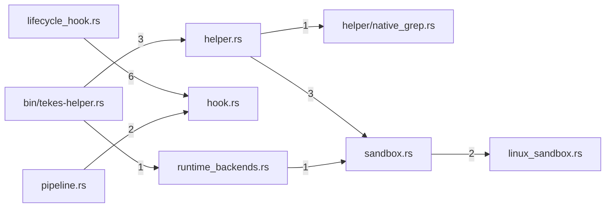

# tools — generated atlas

[All packages](../../../../docs/architecture/generated/index.md) · [Maintained explanation](../README.md)

## Cargo targets

| Target | Kind | Entry |
|---|---|---|
| `tools` | lib | [crates/tools/src/lib.rs](../../src/lib.rs) |
| `tekes-helper` | bin | [crates/tools/src/bin/tekes-helper.rs](../../src/bin/tekes-helper.rs) |
| `lifecycle_hooks` | test | [crates/tools/tests/lifecycle_hooks.rs](../../tests/lifecycle_hooks.rs) |
| `slice14e_web` | test | [crates/tools/tests/slice14e_web.rs](../../tests/slice14e_web.rs) |
| `slice4_gates` | test | [crates/tools/tests/slice4_gates.rs](../../tests/slice4_gates.rs) |
| `slice8_runtime_backends` | test | [crates/tools/tests/slice8_runtime_backends.rs](../../tests/slice8_runtime_backends.rs) |
| `slice8_schema_registry` | test | [crates/tools/tests/slice8_schema_registry.rs](../../tests/slice8_schema_registry.rs) |
| `slice8_tool_runtime_oracle` | test | [crates/tools/tests/slice8_tool_runtime_oracle.rs](../../tests/slice8_tool_runtime_oracle.rs) |

## Direct workspace dependencies

| Dependency | Kind | Target cfg |
|---|---|---|
| `schema` | normal | all |
| `store` | normal | all |
| `test-support` | dev | all |

[Public/restricted API and direct callers](api.md)

## Source files / lexical modules

`src` files have full symbol/call tables and partitioned function graphs. Integration tests and examples remain in the JSON inventory.
File-derived paths below are lexical navigation, not a compiler-resolved module tree; inline module declarations are listed separately.

| File | Symbols | Call sites | Detail |
|---|---:|---:|---|
| [crates/tools/src/bin/tekes-helper.rs](../../src/bin/tekes-helper.rs) | 2 | 31 | [Symbols and calls](src--bin--tekes-helper.md) |
| [crates/tools/src/builtin.rs](../../src/builtin.rs) | 22 | 103 | [Symbols and calls](src--builtin.md) |
| [crates/tools/src/guidance.rs](../../src/guidance.rs) | 11 | 22 | [Symbols and calls](src--guidance.md) |
| [crates/tools/src/helper/native_grep.rs](../../src/helper/native_grep.rs) | 2 | 181 | [Symbols and calls](src--helper--native_grep.md) |
| [crates/tools/src/helper.rs](../../src/helper.rs) | 84 | 736 | [Symbols and calls](src--helper.md) |
| [crates/tools/src/hook.rs](../../src/hook.rs) | 25 | 154 | [Symbols and calls](src--hook.md) |
| [crates/tools/src/lib.rs](../../src/lib.rs) | 0 | 0 | [Symbols and calls](src--lib.md) |
| [crates/tools/src/lifecycle_hook.rs](../../src/lifecycle_hook.rs) | 10 | 39 | [Symbols and calls](src--lifecycle_hook.md) |
| [crates/tools/src/linux_sandbox.rs](../../src/linux_sandbox.rs) | 61 | 234 | [Symbols and calls](src--linux_sandbox.md) |
| [crates/tools/src/pipeline.rs](../../src/pipeline.rs) | 44 | 483 | [Symbols and calls](src--pipeline.md) |
| [crates/tools/src/runtime_backends.rs](../../src/runtime_backends.rs) | 114 | 1114 | [Symbols and calls](src--runtime_backends.md) |
| [crates/tools/src/sandbox.rs](../../src/sandbox.rs) | 23 | 164 | [Symbols and calls](src--sandbox.md) |
| [crates/tools/src/schema_registry.rs](../../src/schema_registry.rs) | 58 | 349 | [Symbols and calls](src--schema_registry.md) |
| [crates/tools/tests/lifecycle_hooks.rs](../../tests/lifecycle_hooks.rs) | 7 | 26 | `inventory.json` |
| [crates/tools/tests/slice14e_web.rs](../../tests/slice14e_web.rs) | 5 | 86 | `inventory.json` |
| [crates/tools/tests/slice4_gates.rs](../../tests/slice4_gates.rs) | 31 | 532 | `inventory.json` |
| [crates/tools/tests/slice8_runtime_backends.rs](../../tests/slice8_runtime_backends.rs) | 21 | 258 | `inventory.json` |
| [crates/tools/tests/slice8_schema_registry.rs](../../tests/slice8_schema_registry.rs) | 15 | 170 | `inventory.json` |
| [crates/tools/tests/slice8_tool_runtime_oracle.rs](../../tests/slice8_tool_runtime_oracle.rs) | 10 | 212 | `inventory.json` |

## Cross-file direct calls

Source files stand in for out-of-line modules; see declarations for inline modules. Counts are syntactic call sites, not runtime frequency.

