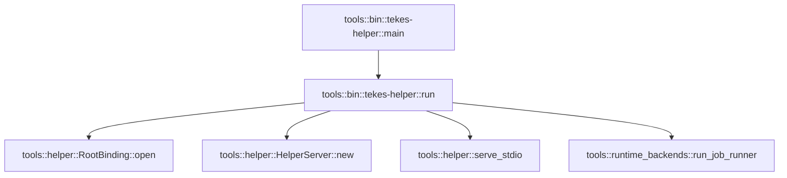

# tools::bin::tekes-helper

[Package atlas](index.md) · [Source](../../src/bin/tekes-helper.rs)

## Declarations

Visibility is the declaration spelling; trait members and reexports require their enclosing interface. `cfg` is not evaluated.

| Symbol | Kind | Visibility | Test / cfg |
|---|---|---|---|
| [tools::bin::tekes-helper::main](../../src/bin/tekes-helper.rs#L7) | function_item | `private` |  |
| [tools::bin::tekes-helper::run](../../src/bin/tekes-helper.rs#L17) | function_item | `private` |  |

## Imports / reexports

| Local name | Source path | Visibility |
|---|---|---|
| `PathBuf` | `std::path::PathBuf` | `private` |
| `HelperServer` | `tools::HelperServer` | `private` |
| `RootBinding` | `tools::RootBinding` | `private` |

## Module declarations

| Module | Visibility | Attributes |
|---|---|---|

## Function call graphs

Edges below are syntactically resolved calls only, including private functions. Graphs partition callers into groups of 20; they are not execution order. All unresolved sites are listed below and in the JSON inventory.

Functions 1–2: 5 direct edges

## Call sites

Includes test functions (marked in declarations). Receiver-type-required sites need type analysis/manual tracing. Calls in closures are attributed to their enclosing function; their occurrence here does not mean the closure executes immediately.

| Caller | Callee expression | Source lines | Target / classification |
|---|---|---|---|
| `main` | `run` | [8](../../src/bin/tekes-helper.rs#L8) | [tools::bin::tekes-helper::run](../../src/bin/tekes-helper.rs#L17) |
| `main` | `std::process::exit` | [12](../../src/bin/tekes-helper.rs#L12) | external-constructor-callback-or-unresolved |
| `run` | `std::env::args_os().skip(1).collect` | [18](../../src/bin/tekes-helper.rs#L18) | receiver-type-required |
| `run` | `std::env::args_os().skip` | [18](../../src/bin/tekes-helper.rs#L18) | receiver-type-required |
| `run` | `std::env::args_os` | [18](../../src/bin/tekes-helper.rs#L18) | external-constructor-callback-or-unresolved |
| `run` | `arguments.first().is_some_and` | [19](../../src/bin/tekes-helper.rs#L19) | receiver-type-required |
| `run` | `arguments.first` | [19](../../src/bin/tekes-helper.rs#L19) | receiver-type-required |
| `run` | `arguments             .get(1)             .ok_or` | [20](../../src/bin/tekes-helper.rs#L20) | receiver-type-required |
| `run` | `arguments             .get` | [20](../../src/bin/tekes-helper.rs#L20) | receiver-type-required |
| `run` | `arguments.len` | [23](../../src/bin/tekes-helper.rs#L23) | receiver-type-required |
| `run` | `Err` | [24](../../src/bin/tekes-helper.rs#L24), [33](../../src/bin/tekes-helper.rs#L33) | external-constructor-callback-or-unresolved |
| `run` | `"--job-runner accepts exactly one request path".into` | [24](../../src/bin/tekes-helper.rs#L24) | receiver-type-required |
| `run` | `tools::run_job_runner` | [26](../../src/bin/tekes-helper.rs#L26) | [tools::runtime_backends::run_job_runner](../../src/runtime_backends.rs#L847) |
| `run` | `PathBuf::from` | [26](../../src/bin/tekes-helper.rs#L26), [42](../../src/bin/tekes-helper.rs#L42) | external-constructor-callback-or-unresolved |
| `run` | `Ok` | [27](../../src/bin/tekes-helper.rs#L27), [46](../../src/bin/tekes-helper.rs#L46) | external-constructor-callback-or-unresolved |
| `run` | `arguments.into_iter` | [29](../../src/bin/tekes-helper.rs#L29) | receiver-type-required |
| `run` | `Vec::new` | [30](../../src/bin/tekes-helper.rs#L30) | external-constructor-callback-or-unresolved |
| `run` | `arguments.next` | [31](../../src/bin/tekes-helper.rs#L31) | receiver-type-required |
| `run` | `format!("unknown argument {flag:?}").into` | [33](../../src/bin/tekes-helper.rs#L33) | receiver-type-required |
| `run` | `arguments             .next()             .ok_or` | [35](../../src/bin/tekes-helper.rs#L35) | receiver-type-required |
| `run` | `arguments             .next` | [35](../../src/bin/tekes-helper.rs#L35) | receiver-type-required |
| `run` | `binding.to_string_lossy` | [38](../../src/bin/tekes-helper.rs#L38) | receiver-type-required |
| `run` | `binding             .split_once('=')             .ok_or` | [39](../../src/bin/tekes-helper.rs#L39) | receiver-type-required |
| `run` | `binding             .split_once` | [39](../../src/bin/tekes-helper.rs#L39) | receiver-type-required |
| `run` | `roots.push` | [42](../../src/bin/tekes-helper.rs#L42) | receiver-type-required |
| `run` | `RootBinding::open` | [42](../../src/bin/tekes-helper.rs#L42) | [tools::helper::RootBinding::open](../../src/helper.rs#L369) |
| `run` | `HelperServer::new` | [44](../../src/bin/tekes-helper.rs#L44) | [tools::helper::HelperServer::new](../../src/helper.rs#L414) |
| `run` | `tools::serve_stdio` | [45](../../src/bin/tekes-helper.rs#L45) | [tools::helper::serve_stdio](../../src/helper.rs#L942) |
