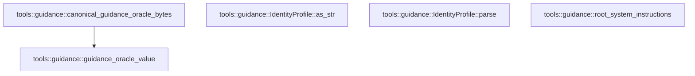

# tools::guidance

[Package atlas](index.md) · [Source](../../src/guidance.rs)

## Declarations

Visibility is the declaration spelling; trait members and reexports require their enclosing interface. `cfg` is not evaluated.

| Symbol | Kind | Visibility | Test / cfg |
|---|---|---|---|
| [tools::guidance::HARNESS_IDENTITY](../../src/guidance.rs#L18) | const_item | `pub` |  |
| [tools::guidance::CODING_PROFILE](../../src/guidance.rs#L22) | const_item | `pub` |  |
| [tools::guidance::GENERAL_PROFILE](../../src/guidance.rs#L25) | const_item | `pub` |  |
| [tools::guidance::IdentityProfile](../../src/guidance.rs#L31) | enum_item | `pub` |  |
| [tools::guidance::IdentityProfile::as_str](../../src/guidance.rs#L39) | function_item | `pub` |  |
| [tools::guidance::IdentityProfile::parse](../../src/guidance.rs#L47) | function_item | `pub` |  |
| [tools::guidance::WORKING_DIRECTORY](../../src/guidance.rs#L57) | const_item | `pub` |  |
| [tools::guidance::root_system_instructions](../../src/guidance.rs#L63) | function_item | `pub` |  |
| [tools::guidance::guidance_oracle_value](../../src/guidance.rs#L89) | function_item | `pub` |  |
| [tools::guidance::canonical_guidance_oracle_bytes](../../src/guidance.rs#L109) | function_item | `pub` |  |
| [tools::guidance::tests::root_instructions_are_identity_profile_cwd_then_agents_text](../../src/guidance.rs#L121) | function_item | `private` | test; #[cfg(test)] |

## Imports / reexports

| Local name | Source path | Visibility |
|---|---|---|
| `Deserialize` | `serde::Deserialize` | `private` |
| `Serialize` | `serde::Serialize` | `private` |
| `Value` | `serde_json::Value` | `private` |
| `json` | `serde_json::json` | `private` |
| `Digest` | `sha2::Digest` | `private` |
| `Sha256` | `sha2::Sha256` | `private` |
| `*` | `super::*` | `private` |

## Module declarations

| Module | Visibility | Attributes |
|---|---|---|
| `tools::guidance::tests` | `private` | #[cfg(test)] |

## Function call graphs

Edges below are syntactically resolved calls only, including private functions. Graphs partition callers into groups of 20; they are not execution order. All unresolved sites are listed below and in the JSON inventory.

Functions 1–5: 1 direct edges

## Call sites

Includes test functions (marked in declarations). Receiver-type-required sites need type analysis/manual tracing. Calls in closures are attributed to their enclosing function; their occurrence here does not mean the closure executes immediately.

| Caller | Callee expression | Source lines | Target / classification |
|---|---|---|---|
| `parse` | `Some` | [49](../../src/guidance.rs#L49), [50](../../src/guidance.rs#L50) | external-constructor-callback-or-unresolved |
| `root_system_instructions` | `sections.push` | [78](../../src/guidance.rs#L78), [82](../../src/guidance.rs#L82) | receiver-type-required |
| `root_system_instructions` | `WORKING_DIRECTORY.replace` | [78](../../src/guidance.rs#L78) | receiver-type-required |
| `root_system_instructions` | `instruction_text.trim` | [80](../../src/guidance.rs#L80) | receiver-type-required |
| `root_system_instructions` | `instruction_text.is_empty` | [81](../../src/guidance.rs#L81) | receiver-type-required |
| `root_system_instructions` | `instruction_text.to_owned` | [82](../../src/guidance.rs#L82) | receiver-type-required |
| `root_system_instructions` | `sections.join` | [84](../../src/guidance.rs#L84) | receiver-type-required |
| `guidance_oracle_value` | `serde_json_canonicalizer::to_vec(&preimage).expect` | [96](../../src/guidance.rs#L96) | receiver-type-required |
| `guidance_oracle_value` | `serde_json_canonicalizer::to_vec` | [96](../../src/guidance.rs#L96) | external-constructor-callback-or-unresolved |
| `canonical_guidance_oracle_bytes` | `serde_json_canonicalizer::to_vec(&guidance_oracle_value())         .expect` | [110](../../src/guidance.rs#L110) | receiver-type-required |
| `canonical_guidance_oracle_bytes` | `serde_json_canonicalizer::to_vec` | [110](../../src/guidance.rs#L110) | external-constructor-callback-or-unresolved |
| `canonical_guidance_oracle_bytes` | `guidance_oracle_value` | [110](../../src/guidance.rs#L110) | [tools::guidance::guidance_oracle_value](../../src/guidance.rs#L89) |
| `canonical_guidance_oracle_bytes` | `bytes.push` | [112](../../src/guidance.rs#L112) | receiver-type-required |
| `root_instructions_are_identity_profile_cwd_then_agents_text` | `CODING_PROFILE.trim().replace` | [122](../../src/guidance.rs#L122) | receiver-type-required |
| `root_instructions_are_identity_profile_cwd_then_agents_text` | `CODING_PROFILE.trim` | [122](../../src/guidance.rs#L122) | receiver-type-required |
| `root_instructions_are_identity_profile_cwd_then_agents_text` | `root_system_instructions` | [127](../../src/guidance.rs#L127), [139](../../src/guidance.rs#L139), [147](../../src/guidance.rs#L147) | external-constructor-callback-or-unresolved |
| `root_instructions_are_identity_profile_cwd_then_agents_text` | `Some` | [130](../../src/guidance.rs#L130), [147](../../src/guidance.rs#L147) | external-constructor-callback-or-unresolved |
