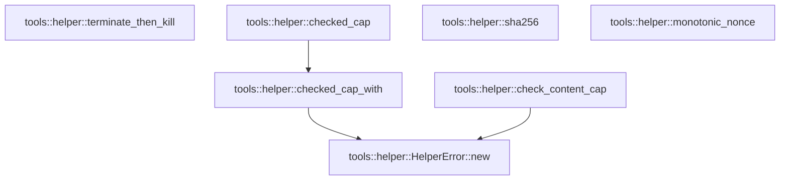

```mermaid
flowchart TD
  n0["store::platform::FullSync::full_sync"]
  n1["tools::helper::from_payload"]
  n2["tools::helper::read_line_limited"]
  n3["tools::helper::valid_root_name"]
  n4["tools::helper::normalized_relative"]
  n5["tools::helper::split_parent"]
  n6["tools::helper::open_parent"]
  n7["tools::helper::create_parent"]
  n8["tools::helper::duplicate_fd"]
  n9["tools::helper::open_directory_at"]
  n10["tools::helper::open_regular_at"]
  n11["tools::helper::classify_open"]
  n12["tools::helper::read_regular"]
  n13["tools::helper::atomic_replace"]
  n14["tools::helper::rename_at"]
  n15["tools::helper::unlink_at"]
  n16["tools::helper::glob_beneath"]
  n17["tools::helper::glob_match"]
  n18["tools::helper::glob_match::matches"]
  n19["tools::helper::read_capped"]
  n20["tools::helper::HelperError::new"]
  n21["tools::helper::HelperError::io"]
  n22["tools::helper::decode_helper_line"]
  n23["tools::helper::decode_terminal"]
  n1 --> n20
  n2 --> n20
  n4 --> n20
  n5 --> n4
  n5 --> n20
  n6 --> n8
  n6 --> n9
  n7 --> n8
  n7 --> n9
  n7 --> n11
  n7 --> n20
  n8 --> n21
  n9 --> n11
  n9 --> n20
  n10 --> n11
  n10 --> n20
  n11 --> n20
  n11 --> n21
  n12 --> n5
  n12 --> n6
  n12 --> n10
  n12 --> n20
  n13 --> n0
  n13 --> n5
  n13 --> n6
  n13 --> n7
  n13 --> n10
  n13 --> n14
  n13 --> n15
  n13 --> n20
  n14 --> n20
  n14 --> n21
  n15 --> n20
  n15 --> n21
  n16 --> n17
  n16 --> n20
  n18 --> n18
  n23 --> n1
  n23 --> n20
  n23 --> n22
```

# tools::helper

[Package atlas](index.md) · [Source](../../src/helper.rs)

## Declarations

Visibility is the declaration spelling; trait members and reexports require their enclosing interface. `cfg` is not evaluated.

| Symbol | Kind | Visibility | Test / cfg |
|---|---|---|---|
| [tools::helper::HELPER_PROTOCOL](../../src/helper.rs#L32) | const_item | `pub` |  |
| [tools::helper::HELPER_VERSION](../../src/helper.rs#L33) | const_item | `pub` |  |
| [tools::helper::EX_PROTOCOL](../../src/helper.rs#L34) | const_item | `pub` |  |
| [tools::helper::HARD_BYTES](../../src/helper.rs#L35) | const_item | `private` |  |
| [tools::helper::HARD_READ_BYTES](../../src/helper.rs#L36) | const_item | `private` |  |
| [tools::helper::HARD_TIMEOUT_MS](../../src/helper.rs#L37) | const_item | `private` |  |
| [tools::helper::TERM_GRACE_MS](../../src/helper.rs#L38) | const_item | `private` |  |
| [tools::helper::HELPER_PROCESS_TIMEOUT_MS](../../src/helper.rs#L39) | const_item | `private` |  |
| [tools::helper::HELPER_PROTOCOL_STDOUT_BYTES](../../src/helper.rs#L42) | const_item | `private` |  |
| [tools::helper::HELPER_PROTOCOL_STDERR_BYTES](../../src/helper.rs#L43) | const_item | `private` |  |
| [tools::helper::ByteString](../../src/helper.rs#L47) | struct_item | `pub` |  |
| [tools::helper::ByteEncoding](../../src/helper.rs#L54) | enum_item | `pub` |  |
| [tools::helper::ByteString::from_bytes](../../src/helper.rs#L61) | function_item | `pub` |  |
| [tools::helper::ByteString::decode](../../src/helper.rs#L74) | function_item | `pub` |  |
| [tools::helper::CreateMode](../../src/helper.rs#L89) | enum_item | `pub` |  |
| [tools::helper::ExecRequest](../../src/helper.rs#L97) | struct_item | `pub` |  |
| [tools::helper::HelperPath](../../src/helper.rs#L115) | struct_item | `pub` |  |
| [tools::helper::HelperOperation](../../src/helper.rs#L122) | enum_item | `pub` |  |
| [tools::helper::HelperRequest](../../src/helper.rs#L161) | struct_item | `pub` |  |
| [tools::helper::ReadValue](../../src/helper.rs#L168) | struct_item | `pub` |  |
| [tools::helper::WriteValue](../../src/helper.rs#L176) | struct_item | `pub` |  |
| [tools::helper::ExecValue](../../src/helper.rs#L183) | struct_item | `pub` |  |
| [tools::helper::HelperValue](../../src/helper.rs#L193) | enum_item | `pub` |  |
| [tools::helper::HelperErrorClass](../../src/helper.rs#L203) | enum_item | `pub` |  |
| [tools::helper::HelperError](../../src/helper.rs#L223) | struct_item | `pub` |  |
| [tools::helper::HelperClientError](../../src/helper.rs#L230) | enum_item | `pub` |  |
| [tools::helper::HelperError::new](../../src/helper.rs#L239) | function_item | `pub` |  |
| [tools::helper::HelperError::io](../../src/helper.rs#L247) | function_item | `private` |  |
| [tools::helper::HelperError::from](../../src/helper.rs#L259) | function_item | `private` |  |
| [tools::helper::HelperResponse](../../src/helper.rs#L265) | enum_item | `pub` |  |
| [tools::helper::Hello](../../src/helper.rs#L272) | struct_item | `private` |  |
| [tools::helper::Selected](../../src/helper.rs#L280) | struct_item | `private` |  |
| [tools::helper::Reject](../../src/helper.rs#L286) | struct_item | `private` |  |
| [tools::helper::ResultPayload](../../src/helper.rs#L292) | struct_item | `private` |  |
| [tools::helper::ErrorPayload](../../src/helper.rs#L299) | struct_item | `private` |  |
| [tools::helper::encode_helper_line](../../src/helper.rs#L305) | function_item | `pub` |  |
| [tools::helper::decode_helper_line](../../src/helper.rs#L318) | function_item | `pub` |  |
| [tools::helper::RootBinding](../../src/helper.rs#L362) | struct_item | `pub` |  |
| [tools::helper::RootBinding::open](../../src/helper.rs#L369) | function_item | `pub` |  |
| [tools::helper::HelperServer](../../src/helper.rs#L409) | struct_item | `pub` |  |
| [tools::helper::HelperServer::new](../../src/helper.rs#L414) | function_item | `pub` |  |
| [tools::helper::HelperServer::execute](../../src/helper.rs#L427) | function_item | `pub` |  |
| [tools::helper::HelperServer::execute_inner](../../src/helper.rs#L441) | function_item | `private` |  |
| [tools::helper::HelperServer::root](../../src/helper.rs#L544) | function_item | `private` |  |
| [tools::helper::HelperServer::exec](../../src/helper.rs#L553) | function_item | `private` |  |
| [tools::helper::HelperClient](../../src/helper.rs#L672) | struct_item | `pub` |  |
| [tools::helper::HelperIsolation](../../src/helper.rs#L680) | enum_item | `private` |  |
| [tools::helper::HelperClient::sandboxed_with_scratch](../../src/helper.rs#L690) | function_item | `pub` |  |
| [tools::helper::HelperClient::scratch_path](../../src/helper.rs#L716) | function_item | `pub` |  |
| [tools::helper::HelperClient::sandboxed](../../src/helper.rs#L723) | function_item | `pub` |  |
| [tools::helper::HelperClient::approved_unsandboxed](../../src/helper.rs#L746) | function_item | `pub` |  |
| [tools::helper::HelperClient::execute](../../src/helper.rs#L767) | function_item | `pub` |  |
| [tools::helper::HelperClient::execute_cancellable](../../src/helper.rs#L784) | function_item | `pub` |  |
| [tools::helper::serve_stdio](../../src/helper.rs#L942) | function_item | `pub` |  |
| [tools::helper::decode_terminal](../../src/helper.rs#L996) | function_item | `private` |  |
| [tools::helper::from_payload](../../src/helper.rs#L1020) | function_item | `private` |  |
| [tools::helper::read_line_limited](../../src/helper.rs#L1025) | function_item | `private` |  |
| [tools::helper::valid_root_name](../../src/helper.rs#L1044) | function_item | `private` |  |
| [tools::helper::normalized_relative](../../src/helper.rs#L1053) | function_item | `private` |  |
| [tools::helper::split_parent](../../src/helper.rs#L1076) | function_item | `private` |  |
| [tools::helper::open_parent](../../src/helper.rs#L1098) | function_item | `private` |  |
| [tools::helper::create_parent](../../src/helper.rs#L1106) | function_item | `private` |  |
| [tools::helper::duplicate_fd](../../src/helper.rs#L1133) | function_item | `private` |  |
| [tools::helper::open_directory_at](../../src/helper.rs#L1143) | function_item | `private` |  |
| [tools::helper::open_regular_at](../../src/helper.rs#L1165) | function_item | `private` |  |
| [tools::helper::classify_open](../../src/helper.rs#L1197) | function_item | `private` |  |
| [tools::helper::read_regular](../../src/helper.rs#L1205) | function_item | `private` |  |
| [tools::helper::atomic_replace](../../src/helper.rs#L1228) | function_item | `private` |  |
| [tools::helper::rename_at](../../src/helper.rs#L1280) | function_item | `private` |  |
| [tools::helper::unlink_at](../../src/helper.rs#L1322) | function_item | `private` |  |
| [tools::helper::glob_beneath](../../src/helper.rs#L1332) | function_item | `private` |  |
| [tools::helper::glob_match](../../src/helper.rs#L1383) | function_item | `private` |  |
| [tools::helper::glob_match::matches](../../src/helper.rs#L1384) | function_item | `private` |  |
| [tools::helper::read_capped](../../src/helper.rs#L1423) | function_item | `private` |  |
| [tools::helper::terminate_then_kill](../../src/helper.rs#L1439) | function_item | `private` |  |
| [tools::helper::checked_cap](../../src/helper.rs#L1459) | function_item | `private` |  |
| [tools::helper::checked_cap_with](../../src/helper.rs#L1463) | function_item | `private` |  |
| [tools::helper::check_content_cap](../../src/helper.rs#L1475) | function_item | `private` |  |
| [tools::helper::sha256](../../src/helper.rs#L1485) | function_item | `private` |  |
| [tools::helper::monotonic_nonce](../../src/helper.rs#L1489) | function_item | `private` |  |
| [tools::helper::monotonic_nonce::NONCE](../../src/helper.rs#L1491) | static_item | `private` |  |
| [tools::helper::nested_create_tests::create_builds_parents_and_preserves_no_replace](../../src/helper.rs#L1501) | function_item | `private` | test; #[cfg(test)] |
| [tools::helper::nested_create_tests::parent_creation_is_limited_to_new_and_validates_entire_path_first](../../src/helper.rs#L1531) | function_item | `private` | test; #[cfg(test)] |
| [tools::helper::nested_create_tests::parent_creation_cannot_follow_symlinks_or_escape_root](../../src/helper.rs#L1568) | function_item | `private` | test; #[cfg(test)] |

## Imports / reexports

| Local name | Source path | Visibility |
|---|---|---|
| `BTreeMap` | `std::collections::BTreeMap` | `private` |
| `CString` | `std::ffi::CString` | `private` |
| `OsStr` | `std::ffi::OsStr` | `private` |
| `OsString` | `std::ffi::OsString` | `private` |
| `File` | `std::fs::File` | `private` |
| `Read` | `std::io::Read` | `private` |
| `Write` | `std::io::Write` | `private` |
| `AsRawFd` | `std::os::fd::AsRawFd` | `private` |
| `FromRawFd` | `std::os::fd::FromRawFd` | `private` |
| `RawFd` | `std::os::fd::RawFd` | `private` |
| `_` | `std::os::unix::ffi::OsStrExt` | `private` |
| `_` | `std::os::unix::fs::PermissionsExt` | `private` |
| `_` | `std::os::unix::process::CommandExt` | `private` |
| `Component` | `std::path::Component` | `private` |
| `Path` | `std::path::Path` | `private` |
| `PathBuf` | `std::path::PathBuf` | `private` |
| `Command` | `std::process::Command` | `private` |
| `Stdio` | `std::process::Stdio` | `private` |
| `thread` | `std::thread` | `private` |
| `Duration` | `std::time::Duration` | `private` |
| `Instant` | `std::time::Instant` | `private` |
| `_` | `base64::Engine` | `private` |
| `BASE64` | `base64::engine::general_purpose::STANDARD` | `private` |
| `DeserializeOwned` | `serde::de::DeserializeOwned` | `private` |
| `Deserialize` | `serde::Deserialize` | `private` |
| `Serialize` | `serde::Serialize` | `private` |
| `Map` | `serde_json::Map` | `private` |
| `Value` | `serde_json::Value` | `private` |
| `Digest` | `sha2::Digest` | `private` |
| `Sha256` | `sha2::Sha256` | `private` |
| `Error` | `thiserror::Error` | `private` |
| `FullSync` | `store::FullSync` | `private` |
| `ProbeStatus` | `crate::sandbox::ProbeStatus` | `private` |
| `SandboxApproval` | `crate::sandbox::SandboxApproval` | `private` |
| `SandboxPolicy` | `crate::sandbox::SandboxPolicy` | `private` |
| `policy_digest` | `crate::sandbox::policy_digest` | `private` |
| `sandbox_command` | `crate::sandbox::sandbox_command` | `private` |
| `validate_unsandboxed_approval` | `crate::sandbox::validate_unsandboxed_approval` | `private` |
| `*` | `super::*` | `private` |
| `symlink` | `std::os::unix::fs::symlink` | `private` |

## Module declarations

| Module | Visibility | Attributes |
|---|---|---|
| `tools::helper::native_grep` | `private` | #[path = "helper/native_grep.rs"] |
| `tools::helper::nested_create_tests` | `private` | #[cfg(test)] |

## Function call graphs

Edges below are syntactically resolved calls only, including private functions. Graphs partition callers into groups of 20; they are not execution order. All unresolved sites are listed below and in the JSON inventory.

```mermaid
flowchart TD
  n0["schema::ijson::IJsonValue::parse"]
  n1["tools::helper::from_payload"]
  n2["tools::helper::read_line_limited"]
  n3["tools::helper::valid_root_name"]
  n4["tools::helper::normalized_relative"]
  n5["tools::helper::open_parent"]
  n6["tools::helper::open_directory_at"]
  n7["tools::helper::read_regular"]
  n8["tools::helper::atomic_replace"]
  n9["tools::helper::glob_beneath"]
  n10["tools::helper::read_capped"]
  n11["tools::helper::terminate_then_kill"]
  n12["tools::helper::checked_cap"]
  n13["tools::helper::checked_cap_with"]
  n14["tools::helper::check_content_cap"]
  n15["tools::helper::sha256"]
  n16["tools::helper::HelperError::new"]
  n17["tools::helper::HelperError::io"]
  n18["tools::helper::HelperError::from"]
  n19["tools::helper::encode_helper_line"]
  n20["tools::helper::decode_helper_line"]
  n21["tools::helper::RootBinding::open"]
  n22["tools::helper::HelperServer::new"]
  n23["tools::helper::HelperServer::execute"]
  n24["tools::helper::HelperServer::execute_inner"]
  n25["tools::helper::HelperServer::root"]
  n26["tools::helper::HelperServer::exec"]
  n27["tools::helper::ByteString::from_bytes"]
  n28["tools::helper::HelperClient::sandboxed_with_scratch"]
  n29["tools::helper::HelperClient::scratch_path"]
  n30["tools::helper::HelperClient::sandboxed"]
  n31["tools::helper::HelperClient::approved_unsandboxed"]
  n32["tools::helper::ByteString::decode"]
  n33["tools::helper::HelperClient::execute"]
  n34["tools::helper::HelperClient::execute_cancellable"]
  n35["tools::helper::serve_stdio"]
  n36["tools::helper::decode_terminal"]
  n37["tools::helper::native_grep::search"]
  n38["tools::sandbox::policy_digest"]
  n39["tools::sandbox::validate_unsandboxed_approval"]
  n40["tools::sandbox::sandbox_command"]
  n17 --> n16
  n19 --> n16
  n20 --> n0
  n20 --> n16
  n21 --> n3
  n21 --> n6
  n21 --> n16
  n22 --> n16
  n23 --> n24
  n24 --> n7
  n24 --> n8
  n24 --> n9
  n24 --> n12
  n24 --> n13
  n24 --> n14
  n24 --> n15
  n24 --> n16
  n24 --> n25
  n24 --> n26
  n24 --> n27
  n24 --> n37
  n25 --> n16
  n26 --> n4
  n26 --> n5
  n26 --> n10
  n26 --> n11
  n26 --> n12
  n26 --> n14
  n26 --> n16
  n26 --> n17
  n26 --> n25
  n26 --> n27
  n28 --> n16
  n28 --> n30
  n30 --> n16
  n31 --> n16
  n31 --> n38
  n31 --> n39
  n32 --> n16
  n33 --> n16
  n33 --> n34
  n34 --> n1
  n34 --> n10
  n34 --> n11
  n34 --> n16
  n34 --> n17
  n34 --> n19
  n34 --> n20
  n34 --> n36
  n34 --> n40
  n35 --> n1
  n35 --> n2
  n35 --> n16
  n35 --> n19
  n35 --> n20
```

Functions 1–20: 55 direct edges

Functions 21–40: 40 direct edges

Functions 41–46: 3 direct edges

## Call sites

Includes test functions (marked in declarations). Receiver-type-required sites need type analysis/manual tracing. Calls in closures are attributed to their enclosing function; their occurrence here does not mean the closure executes immediately.

| Caller | Callee expression | Source lines | Target / classification |
|---|---|---|---|
| `from_bytes` | `std::str::from_utf8` | [62](../../src/helper.rs#L62) | external-constructor-callback-or-unresolved |
| `from_bytes` | `text.to_owned` | [65](../../src/helper.rs#L65) | receiver-type-required |
| `from_bytes` | `BASE64.encode` | [69](../../src/helper.rs#L69) | receiver-type-required |
| `decode` | `Ok` | [76](../../src/helper.rs#L76) | external-constructor-callback-or-unresolved |
| `decode` | `self.data.as_bytes().to_vec` | [76](../../src/helper.rs#L76) | receiver-type-required |
| `decode` | `self.data.as_bytes` | [76](../../src/helper.rs#L76) | receiver-type-required |
| `decode` | `BASE64.decode(&self.data).map_err` | [77](../../src/helper.rs#L77) | receiver-type-required |
| `decode` | `BASE64.decode` | [77](../../src/helper.rs#L77) | receiver-type-required |
| `decode` | `HelperError::new` | [78](../../src/helper.rs#L78) | [tools::helper::HelperError::new](../../src/helper.rs#L239) |
| `new` | `message.into` | [242](../../src/helper.rs#L242) | receiver-type-required |
| `io` | `error.kind` | [248](../../src/helper.rs#L248) | receiver-type-required |
| `io` | `Self::new` | [254](../../src/helper.rs#L254) | [tools::helper::HelperError::new](../../src/helper.rs#L239) |
| `io` | `error.to_string` | [254](../../src/helper.rs#L254) | receiver-type-required |
| `from` | `Self::io` | [260](../../src/helper.rs#L260) | external-constructor-callback-or-unresolved |
| `encode_helper_line` | `Map::new` | [306](../../src/helper.rs#L306) | external-constructor-callback-or-unresolved |
| `encode_helper_line` | `object.insert` | [307](../../src/helper.rs#L307) | receiver-type-required |
| `encode_helper_line` | `key.to_owned` | [308](../../src/helper.rs#L308) | receiver-type-required |
| `encode_helper_line` | `serde_json::to_value(payload)             .map_err` | [309](../../src/helper.rs#L309) | receiver-type-required |
| `encode_helper_line` | `serde_json::to_value` | [309](../../src/helper.rs#L309) | external-constructor-callback-or-unresolved |
| `encode_helper_line` | `HelperError::new` | [310](../../src/helper.rs#L310), [313](../../src/helper.rs#L313) | [tools::helper::HelperError::new](../../src/helper.rs#L239) |
| `encode_helper_line` | `error.to_string` | [310](../../src/helper.rs#L310), [313](../../src/helper.rs#L313) | receiver-type-required |
| `encode_helper_line` | `serde_json_canonicalizer::to_vec(&Value::Object(object))         .map_err` | [312](../../src/helper.rs#L312) | receiver-type-required |
| `encode_helper_line` | `serde_json_canonicalizer::to_vec` | [312](../../src/helper.rs#L312) | external-constructor-callback-or-unresolved |
| `encode_helper_line` | `Value::Object` | [312](../../src/helper.rs#L312) | external-constructor-callback-or-unresolved |
| `encode_helper_line` | `bytes.push` | [314](../../src/helper.rs#L314) | receiver-type-required |
| `encode_helper_line` | `Ok` | [315](../../src/helper.rs#L315) | external-constructor-callback-or-unresolved |
| `decode_helper_line` | `bytes.strip_suffix` | [319](../../src/helper.rs#L319) | receiver-type-required |
| `decode_helper_line` | `Err` | [320](../../src/helper.rs#L320), [326](../../src/helper.rs#L326), [338](../../src/helper.rs#L338), [349](../../src/helper.rs#L349) | external-constructor-callback-or-unresolved |
| `decode_helper_line` | `HelperError::new` | [320](../../src/helper.rs#L320), [326](../../src/helper.rs#L326), [332](../../src/helper.rs#L332), [335](../../src/helper.rs#L335), [338](../../src/helper.rs#L338), [344](../../src/helper.rs#L344), [347](../../src/helper.rs#L347), [349](../../src/helper.rs#L349) | [tools::helper::HelperError::new](../../src/helper.rs#L239) |
| `decode_helper_line` | `body.is_empty` | [325](../../src/helper.rs#L325) | receiver-type-required |
| `decode_helper_line` | `body.contains` | [325](../../src/helper.rs#L325) | receiver-type-required |
| `decode_helper_line` | `schema::IJsonValue::parse(body)         .map_err` | [331](../../src/helper.rs#L331) | receiver-type-required |
| `decode_helper_line` | `schema::IJsonValue::parse` | [331](../../src/helper.rs#L331) | [schema::ijson::IJsonValue::parse](../../../schema/src/ijson.rs#L16) |
| `decode_helper_line` | `error.to_string` | [332](../../src/helper.rs#L332), [335](../../src/helper.rs#L335), [344](../../src/helper.rs#L344) | receiver-type-required |
| `decode_helper_line` | `parsed         .canonical_bytes()         .map_err` | [333](../../src/helper.rs#L333) | receiver-type-required |
| `decode_helper_line` | `parsed         .canonical_bytes` | [333](../../src/helper.rs#L333) | receiver-type-required |
| `decode_helper_line` | `serde_json::from_slice(body)         .map_err` | [343](../../src/helper.rs#L343) | receiver-type-required |
| `decode_helper_line` | `serde_json::from_slice` | [343](../../src/helper.rs#L343) | external-constructor-callback-or-unresolved |
| `decode_helper_line` | `value         .as_object()         .ok_or_else` | [345](../../src/helper.rs#L345) | receiver-type-required |
| `decode_helper_line` | `value         .as_object` | [345](../../src/helper.rs#L345) | receiver-type-required |
| `decode_helper_line` | `object.len` | [348](../../src/helper.rs#L348) | receiver-type-required |
| `decode_helper_line` | `Ok` | [354](../../src/helper.rs#L354) | external-constructor-callback-or-unresolved |
| `decode_helper_line` | `object         .iter()         .next()         .map(&#124;(key, value)&#124; (key.clone(), value.clone()))         .expect` | [354](../../src/helper.rs#L354) | receiver-type-required |
| `decode_helper_line` | `object         .iter()         .next()         .map` | [354](../../src/helper.rs#L354) | receiver-type-required |
| `decode_helper_line` | `object         .iter()         .next` | [354](../../src/helper.rs#L354) | receiver-type-required |
| `decode_helper_line` | `object         .iter` | [354](../../src/helper.rs#L354) | receiver-type-required |
| `decode_helper_line` | `key.clone` | [357](../../src/helper.rs#L357) | receiver-type-required |
| `decode_helper_line` | `value.clone` | [357](../../src/helper.rs#L357) | receiver-type-required |
| `open` | `name.into` | [370](../../src/helper.rs#L370) | receiver-type-required |
| `open` | `valid_root_name` | [371](../../src/helper.rs#L371) | [tools::helper::valid_root_name](../../src/helper.rs#L1044) |
| `open` | `Err` | [372](../../src/helper.rs#L372), [379](../../src/helper.rs#L379), [390](../../src/helper.rs#L390) | external-constructor-callback-or-unresolved |
| `open` | `HelperError::new` | [372](../../src/helper.rs#L372), [379](../../src/helper.rs#L379), [390](../../src/helper.rs#L390) | [tools::helper::HelperError::new](../../src/helper.rs#L239) |
| `open` | `path.as_ref` | [377](../../src/helper.rs#L377) | receiver-type-required |
| `open` | `path.is_absolute` | [378](../../src/helper.rs#L378) | receiver-type-required |
| `open` | `path.to_str().is_none` | [378](../../src/helper.rs#L378) | receiver-type-required |
| `open` | `path.to_str` | [378](../../src/helper.rs#L378) | receiver-type-required |
| `open` | `path.components().any` | [384](../../src/helper.rs#L384) | receiver-type-required |
| `open` | `path.components` | [384](../../src/helper.rs#L384) | receiver-type-required |
| `open` | `open_directory_at(libc::AT_FDCWD, path.as_os_str()).map_err` | [396](../../src/helper.rs#L396) | receiver-type-required |
| `open` | `open_directory_at` | [396](../../src/helper.rs#L396) | [tools::helper::open_directory_at](../../src/helper.rs#L1143) |
| `open` | `path.as_os_str` | [396](../../src/helper.rs#L396) | receiver-type-required |
| `open` | `Ok` | [400](../../src/helper.rs#L400) | external-constructor-callback-or-unresolved |
| `open` | `path.to_path_buf` | [402](../../src/helper.rs#L402) | receiver-type-required |
| `new` | `BTreeMap::new` | [415](../../src/helper.rs#L415) | external-constructor-callback-or-unresolved |
| `new` | `map.insert(root.name.clone(), root).is_some` | [417](../../src/helper.rs#L417) | receiver-type-required |
| `new` | `map.insert` | [417](../../src/helper.rs#L417) | receiver-type-required |
| `new` | `root.name.clone` | [417](../../src/helper.rs#L417) | receiver-type-required |
| `new` | `Err` | [418](../../src/helper.rs#L418) | external-constructor-callback-or-unresolved |
| `new` | `HelperError::new` | [418](../../src/helper.rs#L418) | [tools::helper::HelperError::new](../../src/helper.rs#L239) |
| `new` | `Ok` | [424](../../src/helper.rs#L424) | external-constructor-callback-or-unresolved |
| `execute` | `self.execute_inner` | [428](../../src/helper.rs#L428) | [tools::helper::HelperServer::execute_inner](../../src/helper.rs#L441) |
| `execute` | `request.id.clone` | [431](../../src/helper.rs#L431), [435](../../src/helper.rs#L435) | receiver-type-required |
| `execute_inner` | `request.id.is_empty` | [442](../../src/helper.rs#L442) | receiver-type-required |
| `execute_inner` | `Err` | [443](../../src/helper.rs#L443), [487](../../src/helper.rs#L487) | external-constructor-callback-or-unresolved |
| `execute_inner` | `HelperError::new` | [443](../../src/helper.rs#L443), [487](../../src/helper.rs#L487) | [tools::helper::HelperError::new](../../src/helper.rs#L239) |
| `execute_inner` | `checked_cap_with` | [454](../../src/helper.rs#L454) | [tools::helper::checked_cap_with](../../src/helper.rs#L1463) |
| `execute_inner` | `self.root` | [455](../../src/helper.rs#L455), [469](../../src/helper.rs#L469), [484](../../src/helper.rs#L484), [511](../../src/helper.rs#L511), [526](../../src/helper.rs#L526) | [tools::helper::HelperServer::root](../../src/helper.rs#L544) |
| `execute_inner` | `read_regular` | [456](../../src/helper.rs#L456), [485](../../src/helper.rs#L485) | [tools::helper::read_regular](../../src/helper.rs#L1205) |
| `execute_inner` | `root.directory.as_raw_fd` | [456](../../src/helper.rs#L456), [472](../../src/helper.rs#L472), [485](../../src/helper.rs#L485), [495](../../src/helper.rs#L495) | receiver-type-required |
| `execute_inner` | `Ok` | [457](../../src/helper.rs#L457), [473](../../src/helper.rs#L473), [500](../../src/helper.rs#L500), [513](../../src/helper.rs#L513), [540](../../src/helper.rs#L540) | external-constructor-callback-or-unresolved |
| `execute_inner` | `HelperValue::Read` | [457](../../src/helper.rs#L457) | external-constructor-callback-or-unresolved |
| `execute_inner` | `ByteString::from_bytes` | [458](../../src/helper.rs#L458) | [tools::helper::ByteString::from_bytes](../../src/helper.rs#L61) |
| `execute_inner` | `bytes.len` | [459](../../src/helper.rs#L459), [474](../../src/helper.rs#L474), [501](../../src/helper.rs#L501) | receiver-type-required |
| `execute_inner` | `sha256` | [460](../../src/helper.rs#L460), [475](../../src/helper.rs#L475), [486](../../src/helper.rs#L486), [502](../../src/helper.rs#L502) | [tools::helper::sha256](../../src/helper.rs#L1485) |
| `execute_inner` | `content.decode` | [470](../../src/helper.rs#L470) | receiver-type-required |
| `execute_inner` | `check_content_cap` | [471](../../src/helper.rs#L471), [493](../../src/helper.rs#L493) | [tools::helper::check_content_cap](../../src/helper.rs#L1475) |
| `execute_inner` | `atomic_replace` | [472](../../src/helper.rs#L472), [494](../../src/helper.rs#L494) | [tools::helper::atomic_replace](../../src/helper.rs#L1228) |
| `execute_inner` | `HelperValue::Write` | [473](../../src/helper.rs#L473) | external-constructor-callback-or-unresolved |
| `execute_inner` | `replacement.decode` | [492](../../src/helper.rs#L492) | receiver-type-required |
| `execute_inner` | `HelperValue::Patch` | [500](../../src/helper.rs#L500) | external-constructor-callback-or-unresolved |
| `execute_inner` | `checked_cap` | [510](../../src/helper.rs#L510) | [tools::helper::checked_cap](../../src/helper.rs#L1459) |
| `execute_inner` | `glob_beneath` | [512](../../src/helper.rs#L512) | [tools::helper::glob_beneath](../../src/helper.rs#L1332) |
| `execute_inner` | `native_grep::search(                     root,                     path,                     pattern,                     glob.as_deref(),                     output_mode,                     *case_insensitive,                     *context_lines,                     *stdout_bytes,                     *timeout_ms,                 )                 .map` | [527](../../src/helper.rs#L527) | receiver-type-required |
| `execute_inner` | `native_grep::search` | [527](../../src/helper.rs#L527) | [tools::helper::native_grep::search](../../src/helper/native_grep.rs#L8) |
| `execute_inner` | `glob.as_deref` | [531](../../src/helper.rs#L531) | receiver-type-required |
| `execute_inner` | `HelperValue::Exec` | [540](../../src/helper.rs#L540) | external-constructor-callback-or-unresolved |
| `execute_inner` | `self.exec` | [540](../../src/helper.rs#L540) | [tools::helper::HelperServer::exec](../../src/helper.rs#L553) |
| `root` | `self.roots.get(name).ok_or_else` | [545](../../src/helper.rs#L545) | receiver-type-required |
| `root` | `self.roots.get` | [545](../../src/helper.rs#L545) | receiver-type-required |
| `root` | `HelperError::new` | [546](../../src/helper.rs#L546) | [tools::helper::HelperError::new](../../src/helper.rs#L239) |
| `exec` | `request.argv.first().is_none_or` | [554](../../src/helper.rs#L554) | receiver-type-required |
| `exec` | `request.argv.first` | [554](../../src/helper.rs#L554) | receiver-type-required |
| `exec` | `Err` | [555](../../src/helper.rs#L555), [563](../../src/helper.rs#L563), [601](../../src/helper.rs#L601), [646](../../src/helper.rs#L646) | external-constructor-callback-or-unresolved |
| `exec` | `HelperError::new` | [555](../../src/helper.rs#L555), [563](../../src/helper.rs#L563), [619](../../src/helper.rs#L619), [628](../../src/helper.rs#L628), [632](../../src/helper.rs#L632), [646](../../src/helper.rs#L646), [655](../../src/helper.rs#L655), [659](../../src/helper.rs#L659) | [tools::helper::HelperError::new](../../src/helper.rs#L239) |
| `exec` | `checked_cap` | [560](../../src/helper.rs#L560), [561](../../src/helper.rs#L561) | [tools::helper::checked_cap](../../src/helper.rs#L1459) |
| `exec` | `Some` | [562](../../src/helper.rs#L562) | external-constructor-callback-or-unresolved |
| `exec` | `Command::new` | [568](../../src/helper.rs#L568) | external-constructor-callback-or-unresolved |
| `exec` | `command             .args(&request.argv[1..])             .env_clear()             .envs(&request.env)             .stdin(Stdio::piped())             .stdout(Stdio::piped())             .stderr` | [569](../../src/helper.rs#L569) | receiver-type-required |
| `exec` | `command             .args(&request.argv[1..])             .env_clear()             .envs(&request.env)             .stdin(Stdio::piped())             .stdout` | [569](../../src/helper.rs#L569) | receiver-type-required |
| `exec` | `command             .args(&request.argv[1..])             .env_clear()             .envs(&request.env)             .stdin` | [569](../../src/helper.rs#L569) | receiver-type-required |
| `exec` | `command             .args(&request.argv[1..])             .env_clear()             .envs` | [569](../../src/helper.rs#L569) | receiver-type-required |
| `exec` | `command             .args(&request.argv[1..])             .env_clear` | [569](../../src/helper.rs#L569) | receiver-type-required |
| `exec` | `command             .args` | [569](../../src/helper.rs#L569) | receiver-type-required |
| `exec` | `Stdio::piped` | [573](../../src/helper.rs#L573), [574](../../src/helper.rs#L574), [575](../../src/helper.rs#L575) | external-constructor-callback-or-unresolved |
| `exec` | `command.process_group` | [576](../../src/helper.rs#L576) | receiver-type-required |
| `exec` | `self.root` | [578](../../src/helper.rs#L578) | [tools::helper::HelperServer::root](../../src/helper.rs#L544) |
| `exec` | `cwd.path.is_empty` | [581](../../src/helper.rs#L581) | receiver-type-required |
| `exec` | `PathBuf::new` | [582](../../src/helper.rs#L582) | external-constructor-callback-or-unresolved |
| `exec` | `normalized_relative` | [584](../../src/helper.rs#L584) | [tools::helper::normalized_relative](../../src/helper.rs#L1053) |
| `exec` | `relative                 .components()                 .map(&#124;component&#124; match component {                     Component::Normal(name) => name.to_os_string(),                     _ => unreachable!("cwd was normalized"),                 })                 .collect::<Vec<_>>` | [586](../../src/helper.rs#L586) | receiver-type-required |
| `exec` | `relative                 .components()                 .map` | [586](../../src/helper.rs#L586) | receiver-type-required |
| `exec` | `relative                 .components` | [586](../../src/helper.rs#L586) | receiver-type-required |
| `exec` | `name.to_os_string` | [589](../../src/helper.rs#L589) | receiver-type-required |
| `exec` | `open_parent` | [593](../../src/helper.rs#L593) | [tools::helper::open_parent](../../src/helper.rs#L1098) |
| `exec` | `root.directory.as_raw_fd` | [593](../../src/helper.rs#L593) | receiver-type-required |
| `exec` | `command.pre_exec` | [599](../../src/helper.rs#L599) | receiver-type-required |
| `exec` | `libc::fchdir` | [600](../../src/helper.rs#L600) | external-constructor-callback-or-unresolved |
| `exec` | `directory.as_raw_fd` | [600](../../src/helper.rs#L600) | receiver-type-required |
| `exec` | `std::io::Error::last_os_error` | [601](../../src/helper.rs#L601) | external-constructor-callback-or-unresolved |
| `exec` | `Ok` | [603](../../src/helper.rs#L603), [661](../../src/helper.rs#L661) | external-constructor-callback-or-unresolved |
| `exec` | `command.spawn().map_err` | [608](../../src/helper.rs#L608) | receiver-type-required |
| `exec` | `command.spawn` | [608](../../src/helper.rs#L608) | receiver-type-required |
| `exec` | `HelperError::io` | [609](../../src/helper.rs#L609) | [tools::helper::HelperError::io](../../src/helper.rs#L247) |
| `exec` | `input.decode` | [614](../../src/helper.rs#L614) | receiver-type-required |
| `exec` | `check_content_cap` | [615](../../src/helper.rs#L615) | [tools::helper::check_content_cap](../../src/helper.rs#L1475) |
| `exec` | `child                 .stdin                 .take()                 .ok_or_else(&#124;&#124; HelperError::new(HelperErrorClass::Io, "child stdin missing"))?                 .write_all(&bytes)                 .map_err` | [616](../../src/helper.rs#L616) | receiver-type-required |
| `exec` | `child                 .stdin                 .take()                 .ok_or_else(&#124;&#124; HelperError::new(HelperErrorClass::Io, "child stdin missing"))?                 .write_all` | [616](../../src/helper.rs#L616) | receiver-type-required |
| `exec` | `child                 .stdin                 .take()                 .ok_or_else` | [616](../../src/helper.rs#L616) | receiver-type-required |
| `exec` | `child                 .stdin                 .take` | [616](../../src/helper.rs#L616) | receiver-type-required |
| `exec` | `drop` | [623](../../src/helper.rs#L623) | external-constructor-callback-or-unresolved |
| `exec` | `child.stdin.take` | [623](../../src/helper.rs#L623) | receiver-type-required |
| `exec` | `child             .stdout             .take()             .ok_or_else` | [625](../../src/helper.rs#L625) | receiver-type-required |
| `exec` | `child             .stdout             .take` | [625](../../src/helper.rs#L625) | receiver-type-required |
| `exec` | `child             .stderr             .take()             .ok_or_else` | [629](../../src/helper.rs#L629) | receiver-type-required |
| `exec` | `child             .stderr             .take` | [629](../../src/helper.rs#L629) | receiver-type-required |
| `exec` | `thread::spawn` | [633](../../src/helper.rs#L633), [634](../../src/helper.rs#L634) | external-constructor-callback-or-unresolved |
| `exec` | `read_capped` | [633](../../src/helper.rs#L633), [634](../../src/helper.rs#L634) | [tools::helper::read_capped](../../src/helper.rs#L1423) |
| `exec` | `request             .timeout_ms             .map` | [635](../../src/helper.rs#L635) | receiver-type-required |
| `exec` | `Instant::now` | [637](../../src/helper.rs#L637), [642](../../src/helper.rs#L642) | external-constructor-callback-or-unresolved |
| `exec` | `Duration::from_millis` | [637](../../src/helper.rs#L637), [651](../../src/helper.rs#L651) | external-constructor-callback-or-unresolved |
| `exec` | `child.try_wait().map_err` | [639](../../src/helper.rs#L639) | receiver-type-required |
| `exec` | `child.try_wait` | [639](../../src/helper.rs#L639) | receiver-type-required |
| `exec` | `deadline.is_some_and` | [642](../../src/helper.rs#L642) | receiver-type-required |
| `exec` | `terminate_then_kill` | [643](../../src/helper.rs#L643) | [tools::helper::terminate_then_kill](../../src/helper.rs#L1439) |
| `exec` | `stdout_thread.join` | [644](../../src/helper.rs#L644) | receiver-type-required |
| `exec` | `stderr_thread.join` | [645](../../src/helper.rs#L645) | receiver-type-required |
| `exec` | `thread::sleep` | [651](../../src/helper.rs#L651) | external-constructor-callback-or-unresolved |
| `exec` | `stdout_thread             .join()             .map_err(&#124;_&#124; HelperError::new(HelperErrorClass::Io, "stdout reader panicked"))?             .map_err` | [653](../../src/helper.rs#L653) | receiver-type-required |
| `exec` | `stdout_thread             .join()             .map_err` | [653](../../src/helper.rs#L653) | receiver-type-required |
| `exec` | `stdout_thread             .join` | [653](../../src/helper.rs#L653) | receiver-type-required |
| `exec` | `stderr_thread             .join()             .map_err(&#124;_&#124; HelperError::new(HelperErrorClass::Io, "stderr reader panicked"))?             .map_err` | [657](../../src/helper.rs#L657) | receiver-type-required |
| `exec` | `stderr_thread             .join()             .map_err` | [657](../../src/helper.rs#L657) | receiver-type-required |
| `exec` | `stderr_thread             .join` | [657](../../src/helper.rs#L657) | receiver-type-required |
| `exec` | `status.code().unwrap_or` | [662](../../src/helper.rs#L662) | receiver-type-required |
| `exec` | `status.code` | [662](../../src/helper.rs#L662) | receiver-type-required |
| `exec` | `ByteString::from_bytes` | [663](../../src/helper.rs#L663), [664](../../src/helper.rs#L664) | [tools::helper::ByteString::from_bytes](../../src/helper.rs#L61) |
| `sandboxed_with_scratch` | `policy.scratch.is_some` | [696](../../src/helper.rs#L696) | receiver-type-required |
| `sandboxed_with_scratch` | `Err` | [697](../../src/helper.rs#L697) | external-constructor-callback-or-unresolved |
| `sandboxed_with_scratch` | `HelperError::new` | [697](../../src/helper.rs#L697) | [tools::helper::HelperError::new](../../src/helper.rs#L239) |
| `sandboxed_with_scratch` | `tempfile::Builder::new()             .prefix("tekes-tool-")             .permissions(std::fs::Permissions::from_mode(0o700))             .tempdir` | [702](../../src/helper.rs#L702) | receiver-type-required |
| `sandboxed_with_scratch` | `tempfile::Builder::new()             .prefix("tekes-tool-")             .permissions` | [702](../../src/helper.rs#L702) | receiver-type-required |
| `sandboxed_with_scratch` | `tempfile::Builder::new()             .prefix` | [702](../../src/helper.rs#L702) | receiver-type-required |
| `sandboxed_with_scratch` | `tempfile::Builder::new` | [702](../../src/helper.rs#L702) | external-constructor-callback-or-unresolved |
| `sandboxed_with_scratch` | `std::fs::Permissions::from_mode` | [704](../../src/helper.rs#L704) | external-constructor-callback-or-unresolved |
| `sandboxed_with_scratch` | `Some` | [706](../../src/helper.rs#L706), [712](../../src/helper.rs#L712) | external-constructor-callback-or-unresolved |
| `sandboxed_with_scratch` | `std::fs::canonicalize(scratch.path())?                 .to_string_lossy()                 .into_owned` | [707](../../src/helper.rs#L707) | receiver-type-required |
| `sandboxed_with_scratch` | `std::fs::canonicalize(scratch.path())?                 .to_string_lossy` | [707](../../src/helper.rs#L707) | receiver-type-required |
| `sandboxed_with_scratch` | `std::fs::canonicalize` | [707](../../src/helper.rs#L707) | external-constructor-callback-or-unresolved |
| `sandboxed_with_scratch` | `scratch.path` | [707](../../src/helper.rs#L707) | receiver-type-required |
| `sandboxed_with_scratch` | `Self::sandboxed` | [711](../../src/helper.rs#L711) | [tools::helper::HelperClient::sandboxed](../../src/helper.rs#L723) |
| `sandboxed_with_scratch` | `std::sync::Arc::new` | [712](../../src/helper.rs#L712) | external-constructor-callback-or-unresolved |
| `sandboxed_with_scratch` | `Ok` | [713](../../src/helper.rs#L713) | external-constructor-callback-or-unresolved |
| `scratch_path` | `policy.scratch.as_deref` | [718](../../src/helper.rs#L718) | receiver-type-required |
| `sandboxed` | `policy.validate().map_err` | [729](../../src/helper.rs#L729) | receiver-type-required |
| `sandboxed` | `policy.validate` | [729](../../src/helper.rs#L729) | receiver-type-required |
| `sandboxed` | `HelperError::new` | [730](../../src/helper.rs#L730), [733](../../src/helper.rs#L733) | [tools::helper::HelperError::new](../../src/helper.rs#L239) |
| `sandboxed` | `error.to_string` | [730](../../src/helper.rs#L730) | receiver-type-required |
| `sandboxed` | `Err` | [733](../../src/helper.rs#L733) | external-constructor-callback-or-unresolved |
| `sandboxed` | `Ok` | [738](../../src/helper.rs#L738) | external-constructor-callback-or-unresolved |
| `sandboxed` | `executable.into` | [739](../../src/helper.rs#L739) | receiver-type-required |
| `approved_unsandboxed` | `policy_digest(policy).map_err` | [754](../../src/helper.rs#L754) | receiver-type-required |
| `approved_unsandboxed` | `policy_digest` | [754](../../src/helper.rs#L754) | [tools::sandbox::policy_digest](../../src/sandbox.rs#L110) |
| `approved_unsandboxed` | `HelperError::new` | [755](../../src/helper.rs#L755), [758](../../src/helper.rs#L758) | [tools::helper::HelperError::new](../../src/helper.rs#L239) |
| `approved_unsandboxed` | `error.to_string` | [755](../../src/helper.rs#L755), [758](../../src/helper.rs#L758) | receiver-type-required |
| `approved_unsandboxed` | `validate_unsandboxed_approval(approval, run, call, &digest)             .map_err` | [757](../../src/helper.rs#L757) | receiver-type-required |
| `approved_unsandboxed` | `validate_unsandboxed_approval` | [757](../../src/helper.rs#L757) | [tools::sandbox::validate_unsandboxed_approval](../../src/sandbox.rs#L218) |
| `approved_unsandboxed` | `Ok` | [759](../../src/helper.rs#L759) | external-constructor-callback-or-unresolved |
| `approved_unsandboxed` | `executable.into` | [760](../../src/helper.rs#L760) | receiver-type-required |
| `execute` | `self.execute_cancellable(             request,             Some(Duration::from_millis(HELPER_PROCESS_TIMEOUT_MS)),             &#124;&#124; false,         )         .map_err` | [768](../../src/helper.rs#L768) | receiver-type-required |
| `execute` | `self.execute_cancellable` | [768](../../src/helper.rs#L768) | [tools::helper::HelperClient::execute_cancellable](../../src/helper.rs#L784) |
| `execute` | `Some` | [770](../../src/helper.rs#L770) | external-constructor-callback-or-unresolved |
| `execute` | `Duration::from_millis` | [770](../../src/helper.rs#L770) | external-constructor-callback-or-unresolved |
| `execute` | `HelperError::new` | [776](../../src/helper.rs#L776) | [tools::helper::HelperError::new](../../src/helper.rs#L239) |
| `execute_cancellable` | `timeout.is_some_and` | [793](../../src/helper.rs#L793) | receiver-type-required |
| `execute_cancellable` | `timeout.is_zero` | [793](../../src/helper.rs#L793) | receiver-type-required |
| `execute_cancellable` | `Err` | [794](../../src/helper.rs#L794), [835](../../src/helper.rs#L835), [839](../../src/helper.rs#L839), [844](../../src/helper.rs#L844), [850](../../src/helper.rs#L850), [864](../../src/helper.rs#L864), [870](../../src/helper.rs#L870), [883](../../src/helper.rs#L883), [897](../../src/helper.rs#L897), [904](../../src/helper.rs#L904), [920](../../src/helper.rs#L920), [926](../../src/helper.rs#L926), [936](../../src/helper.rs#L936) | external-constructor-callback-or-unresolved |
| `execute_cancellable` | `HelperError::new(                 HelperErrorClass::InvalidRequest,                 "helper process timeout is outside hard limits",             )             .into` | [794](../../src/helper.rs#L794) | receiver-type-required |
| `execute_cancellable` | `HelperError::new` | [794](../../src/helper.rs#L794), [812](../../src/helper.rs#L812), [832](../../src/helper.rs#L832), [845](../../src/helper.rs#L845), [851](../../src/helper.rs#L851), [870](../../src/helper.rs#L870), [890](../../src/helper.rs#L890), [894](../../src/helper.rs#L894), [897](../../src/helper.rs#L897), [904](../../src/helper.rs#L904), [916](../../src/helper.rs#L916), [921](../../src/helper.rs#L921), [926](../../src/helper.rs#L926), [933](../../src/helper.rs#L933), [936](../../src/helper.rs#L936) | [tools::helper::HelperError::new](../../src/helper.rs#L239) |
| `execute_cancellable` | `encode_helper_line` | [800](../../src/helper.rs#L800), [808](../../src/helper.rs#L808) | [tools::helper::encode_helper_line](../../src/helper.rs#L305) |
| `execute_cancellable` | `HELPER_PROTOCOL.to_owned` | [803](../../src/helper.rs#L803) | receiver-type-required |
| `execute_cancellable` | `sandbox_command(policy, probe, &self.executable).map_err` | [811](../../src/helper.rs#L811) | receiver-type-required |
| `execute_cancellable` | `sandbox_command` | [811](../../src/helper.rs#L811) | [tools::sandbox::sandbox_command](../../src/sandbox.rs#L242) |
| `execute_cancellable` | `error.to_string` | [812](../../src/helper.rs#L812) | receiver-type-required |
| `execute_cancellable` | `Command::new` | [815](../../src/helper.rs#L815) | external-constructor-callback-or-unresolved |
| `execute_cancellable` | `command                 .arg("--root")                 .arg` | [818](../../src/helper.rs#L818) | receiver-type-required |
| `execute_cancellable` | `command                 .arg` | [818](../../src/helper.rs#L818) | receiver-type-required |
| `execute_cancellable` | `command.process_group` | [822](../../src/helper.rs#L822) | receiver-type-required |
| `execute_cancellable` | `command             .stdin(Stdio::piped())             .stdout(Stdio::piped())             .stderr(Stdio::piped())             .spawn()             .map_err` | [823](../../src/helper.rs#L823) | receiver-type-required |
| `execute_cancellable` | `command             .stdin(Stdio::piped())             .stdout(Stdio::piped())             .stderr(Stdio::piped())             .spawn` | [823](../../src/helper.rs#L823) | receiver-type-required |
| `execute_cancellable` | `command             .stdin(Stdio::piped())             .stdout(Stdio::piped())             .stderr` | [823](../../src/helper.rs#L823) | receiver-type-required |
| `execute_cancellable` | `command             .stdin(Stdio::piped())             .stdout` | [823](../../src/helper.rs#L823) | receiver-type-required |
| `execute_cancellable` | `command             .stdin` | [823](../../src/helper.rs#L823) | receiver-type-required |
| `execute_cancellable` | `Stdio::piped` | [824](../../src/helper.rs#L824), [825](../../src/helper.rs#L825), [826](../../src/helper.rs#L826) | external-constructor-callback-or-unresolved |
| `execute_cancellable` | `child             .stdin             .take()             .ok_or_else` | [829](../../src/helper.rs#L829) | receiver-type-required |
| `execute_cancellable` | `child             .stdin             .take` | [829](../../src/helper.rs#L829) | receiver-type-required |
| `execute_cancellable` | `stdin.write_all` | [833](../../src/helper.rs#L833), [837](../../src/helper.rs#L837) | receiver-type-required |
| `execute_cancellable` | `terminate_then_kill` | [834](../../src/helper.rs#L834), [838](../../src/helper.rs#L838), [843](../../src/helper.rs#L843), [849](../../src/helper.rs#L849), [861](../../src/helper.rs#L861), [867](../../src/helper.rs#L867), [880](../../src/helper.rs#L880) | [tools::helper::terminate_then_kill](../../src/helper.rs#L1439) |
| `execute_cancellable` | `HelperError::io(error).into` | [835](../../src/helper.rs#L835), [839](../../src/helper.rs#L839), [883](../../src/helper.rs#L883) | receiver-type-required |
| `execute_cancellable` | `HelperError::io` | [835](../../src/helper.rs#L835), [839](../../src/helper.rs#L839), [883](../../src/helper.rs#L883) | [tools::helper::HelperError::io](../../src/helper.rs#L247) |
| `execute_cancellable` | `drop` | [841](../../src/helper.rs#L841) | external-constructor-callback-or-unresolved |
| `execute_cancellable` | `child.stdout.take` | [842](../../src/helper.rs#L842) | receiver-type-required |
| `execute_cancellable` | `HelperError::new(HelperErrorClass::Protocol, "helper stdout missing").into` | [845](../../src/helper.rs#L845) | receiver-type-required |
| `execute_cancellable` | `child.stderr.take` | [848](../../src/helper.rs#L848) | receiver-type-required |
| `execute_cancellable` | `HelperError::new(HelperErrorClass::Protocol, "helper stderr missing").into` | [851](../../src/helper.rs#L851) | receiver-type-required |
| `execute_cancellable` | `thread::spawn` | [855](../../src/helper.rs#L855), [857](../../src/helper.rs#L857) | external-constructor-callback-or-unresolved |
| `execute_cancellable` | `read_capped` | [855](../../src/helper.rs#L855), [857](../../src/helper.rs#L857) | [tools::helper::read_capped](../../src/helper.rs#L1423) |
| `execute_cancellable` | `timeout.map` | [858](../../src/helper.rs#L858) | receiver-type-required |
| `execute_cancellable` | `Instant::now` | [858](../../src/helper.rs#L858), [866](../../src/helper.rs#L866) | external-constructor-callback-or-unresolved |
| `execute_cancellable` | `cancelled` | [860](../../src/helper.rs#L860) | external-constructor-callback-or-unresolved |
| `execute_cancellable` | `stdout_thread.join` | [862](../../src/helper.rs#L862), [868](../../src/helper.rs#L868), [881](../../src/helper.rs#L881) | receiver-type-required |
| `execute_cancellable` | `stderr_thread.join` | [863](../../src/helper.rs#L863), [869](../../src/helper.rs#L869), [882](../../src/helper.rs#L882) | receiver-type-required |
| `execute_cancellable` | `deadline.is_some_and` | [866](../../src/helper.rs#L866) | receiver-type-required |
| `execute_cancellable` | `HelperError::new(                     HelperErrorClass::Timeout,                     "helper process timed out",                 )                 .into` | [870](../../src/helper.rs#L870) | receiver-type-required |
| `execute_cancellable` | `child.try_wait` | [876](../../src/helper.rs#L876) | receiver-type-required |
| `execute_cancellable` | `thread::sleep` | [886](../../src/helper.rs#L886) | external-constructor-callback-or-unresolved |
| `execute_cancellable` | `Duration::from_millis` | [886](../../src/helper.rs#L886) | external-constructor-callback-or-unresolved |
| `execute_cancellable` | `stdout_thread             .join()             .map_err(&#124;_&#124; HelperError::new(HelperErrorClass::Io, "helper stdout reader panicked"))?             .map_err` | [888](../../src/helper.rs#L888) | receiver-type-required |
| `execute_cancellable` | `stdout_thread             .join()             .map_err` | [888](../../src/helper.rs#L888) | receiver-type-required |
| `execute_cancellable` | `stdout_thread             .join` | [888](../../src/helper.rs#L888) | receiver-type-required |
| `execute_cancellable` | `stderr_thread             .join()             .map_err(&#124;_&#124; HelperError::new(HelperErrorClass::Io, "helper stderr reader panicked"))?             .map_err` | [892](../../src/helper.rs#L892) | receiver-type-required |
| `execute_cancellable` | `stderr_thread             .join()             .map_err` | [892](../../src/helper.rs#L892) | receiver-type-required |
| `execute_cancellable` | `stderr_thread             .join` | [892](../../src/helper.rs#L892) | receiver-type-required |
| `execute_cancellable` | `HelperError::new(                 HelperErrorClass::Limit,                 "helper protocol output exceeded its cap",             )             .into` | [897](../../src/helper.rs#L897) | receiver-type-required |
| `execute_cancellable` | `status.success` | [903](../../src/helper.rs#L903) | receiver-type-required |
| `execute_cancellable` | `HelperError::new(                 HelperErrorClass::Protocol,                 format!(                     "helper exited {}: {}",                     status.code().unwrap_or(-1),                     String::from_utf8_lossy(&stderr)                 ),             )             .into` | [904](../../src/helper.rs#L904) | receiver-type-required |
| `execute_cancellable` | `stdout.split_inclusive` | [914](../../src/helper.rs#L914) | receiver-type-required |
| `execute_cancellable` | `lines.next().ok_or_else` | [915](../../src/helper.rs#L915), [932](../../src/helper.rs#L932) | receiver-type-required |
| `execute_cancellable` | `lines.next` | [915](../../src/helper.rs#L915), [932](../../src/helper.rs#L932), [935](../../src/helper.rs#L935) | receiver-type-required |
| `execute_cancellable` | `decode_helper_line` | [918](../../src/helper.rs#L918) | [tools::helper::decode_helper_line](../../src/helper.rs#L318) |
| `execute_cancellable` | `HelperError::new(HelperErrorClass::Protocol, "expected selected response").into` | [921](../../src/helper.rs#L921) | receiver-type-required |
| `execute_cancellable` | `from_payload` | [924](../../src/helper.rs#L924) | [tools::helper::from_payload](../../src/helper.rs#L1020) |
| `execute_cancellable` | `HelperError::new(                 HelperErrorClass::Protocol,                 "helper selected unsupported version",             )             .into` | [926](../../src/helper.rs#L926) | receiver-type-required |
| `execute_cancellable` | `lines.next().is_some` | [935](../../src/helper.rs#L935) | receiver-type-required |
| `execute_cancellable` | `HelperError::new(HelperErrorClass::Protocol, "extra helper output").into` | [936](../../src/helper.rs#L936) | receiver-type-required |
| `execute_cancellable` | `Ok` | [938](../../src/helper.rs#L938) | external-constructor-callback-or-unresolved |
| `execute_cancellable` | `decode_terminal` | [938](../../src/helper.rs#L938) | [tools::helper::decode_terminal](../../src/helper.rs#L996) |
| `serve_stdio` | `std::io::stdin().lock` | [943](../../src/helper.rs#L943) | receiver-type-required |
| `serve_stdio` | `std::io::stdin` | [943](../../src/helper.rs#L943) | external-constructor-callback-or-unresolved |
| `serve_stdio` | `std::io::stdout().lock` | [944](../../src/helper.rs#L944) | receiver-type-required |
| `serve_stdio` | `std::io::stdout` | [944](../../src/helper.rs#L944) | external-constructor-callback-or-unresolved |
| `serve_stdio` | `read_line_limited` | [945](../../src/helper.rs#L945), [974](../../src/helper.rs#L974) | [tools::helper::read_line_limited](../../src/helper.rs#L1025) |
| `serve_stdio` | `decode_helper_line` | [946](../../src/helper.rs#L946), [975](../../src/helper.rs#L975) | [tools::helper::decode_helper_line](../../src/helper.rs#L318) |
| `serve_stdio` | `Err` | [948](../../src/helper.rs#L948), [962](../../src/helper.rs#L962), [977](../../src/helper.rs#L977) | external-constructor-callback-or-unresolved |
| `serve_stdio` | `HelperError::new` | [948](../../src/helper.rs#L948), [962](../../src/helper.rs#L962), [977](../../src/helper.rs#L977) | [tools::helper::HelperError::new](../../src/helper.rs#L239) |
| `serve_stdio` | `from_payload` | [953](../../src/helper.rs#L953), [982](../../src/helper.rs#L982) | [tools::helper::from_payload](../../src/helper.rs#L1020) |
| `serve_stdio` | `output.write_all` | [955](../../src/helper.rs#L955), [967](../../src/helper.rs#L967), [986](../../src/helper.rs#L986), [989](../../src/helper.rs#L989) | receiver-type-required |
| `serve_stdio` | `encode_helper_line` | [955](../../src/helper.rs#L955), [967](../../src/helper.rs#L967), [986](../../src/helper.rs#L986), [989](../../src/helper.rs#L989) | [tools::helper::encode_helper_line](../../src/helper.rs#L305) |
| `serve_stdio` | `"no mutual protocol version".to_owned` | [958](../../src/helper.rs#L958) | receiver-type-required |
| `serve_stdio` | `output.flush` | [961](../../src/helper.rs#L961), [973](../../src/helper.rs#L973), [992](../../src/helper.rs#L992) | receiver-type-required |
| `serve_stdio` | `server.execute` | [983](../../src/helper.rs#L983) | receiver-type-required |
| `serve_stdio` | `Ok` | [993](../../src/helper.rs#L993) | external-constructor-callback-or-unresolved |
| `decode_terminal` | `decode_helper_line` | [997](../../src/helper.rs#L997) | [tools::helper::decode_helper_line](../../src/helper.rs#L318) |
| `decode_terminal` | `key.as_str` | [998](../../src/helper.rs#L998) | receiver-type-required |
| `decode_terminal` | `from_payload` | [1000](../../src/helper.rs#L1000), [1007](../../src/helper.rs#L1007) | [tools::helper::from_payload](../../src/helper.rs#L1020) |
| `decode_terminal` | `Ok` | [1001](../../src/helper.rs#L1001), [1008](../../src/helper.rs#L1008) | external-constructor-callback-or-unresolved |
| `decode_terminal` | `Err` | [1013](../../src/helper.rs#L1013) | external-constructor-callback-or-unresolved |
| `decode_terminal` | `HelperError::new` | [1013](../../src/helper.rs#L1013) | [tools::helper::HelperError::new](../../src/helper.rs#L239) |
| `from_payload` | `serde_json::from_value(value)         .map_err` | [1021](../../src/helper.rs#L1021) | receiver-type-required |
| `from_payload` | `serde_json::from_value` | [1021](../../src/helper.rs#L1021) | external-constructor-callback-or-unresolved |
| `from_payload` | `HelperError::new` | [1022](../../src/helper.rs#L1022) | [tools::helper::HelperError::new](../../src/helper.rs#L239) |
| `from_payload` | `error.to_string` | [1022](../../src/helper.rs#L1022) | receiver-type-required |
| `read_line_limited` | `Vec::new` | [1026](../../src/helper.rs#L1026) | external-constructor-callback-or-unresolved |
| `read_line_limited` | `output.len` | [1028](../../src/helper.rs#L1028) | receiver-type-required |
| `read_line_limited` | `reader.read(&mut byte).map_err` | [1029](../../src/helper.rs#L1029) | receiver-type-required |
| `read_line_limited` | `reader.read` | [1029](../../src/helper.rs#L1029) | receiver-type-required |
| `read_line_limited` | `output.push` | [1033](../../src/helper.rs#L1033) | receiver-type-required |
| `read_line_limited` | `Ok` | [1035](../../src/helper.rs#L1035) | external-constructor-callback-or-unresolved |
| `read_line_limited` | `Err` | [1038](../../src/helper.rs#L1038) | external-constructor-callback-or-unresolved |
| `read_line_limited` | `HelperError::new` | [1038](../../src/helper.rs#L1038) | [tools::helper::HelperError::new](../../src/helper.rs#L239) |
| `valid_root_name` | `name.chars` | [1045](../../src/helper.rs#L1045) | receiver-type-required |
| `valid_root_name` | `chars         .next()         .is_some_and` | [1046](../../src/helper.rs#L1046) | receiver-type-required |
| `valid_root_name` | `chars         .next` | [1046](../../src/helper.rs#L1046) | receiver-type-required |
| `valid_root_name` | `value.is_ascii_alphabetic` | [1048](../../src/helper.rs#L1048) | receiver-type-required |
| `valid_root_name` | `name.len` | [1049](../../src/helper.rs#L1049) | receiver-type-required |
| `valid_root_name` | `chars.all` | [1050](../../src/helper.rs#L1050) | receiver-type-required |
| `valid_root_name` | `value.is_ascii_alphanumeric` | [1050](../../src/helper.rs#L1050) | receiver-type-required |
| `normalized_relative` | `Path::new` | [1054](../../src/helper.rs#L1054) | external-constructor-callback-or-unresolved |
| `normalized_relative` | `path.as_os_str().is_empty` | [1055](../../src/helper.rs#L1055) | receiver-type-required |
| `normalized_relative` | `path.as_os_str` | [1055](../../src/helper.rs#L1055) | receiver-type-required |
| `normalized_relative` | `path.is_absolute` | [1055](../../src/helper.rs#L1055) | receiver-type-required |
| `normalized_relative` | `Err` | [1056](../../src/helper.rs#L1056), [1066](../../src/helper.rs#L1066) | external-constructor-callback-or-unresolved |
| `normalized_relative` | `HelperError::new` | [1056](../../src/helper.rs#L1056), [1066](../../src/helper.rs#L1066) | [tools::helper::HelperError::new](../../src/helper.rs#L239) |
| `normalized_relative` | `PathBuf::new` | [1061](../../src/helper.rs#L1061) | external-constructor-callback-or-unresolved |
| `normalized_relative` | `path.components` | [1062](../../src/helper.rs#L1062) | receiver-type-required |
| `normalized_relative` | `value.as_bytes().contains` | [1064](../../src/helper.rs#L1064) | receiver-type-required |
| `normalized_relative` | `value.as_bytes` | [1064](../../src/helper.rs#L1064) | receiver-type-required |
| `normalized_relative` | `result.push` | [1064](../../src/helper.rs#L1064) | receiver-type-required |
| `normalized_relative` | `Ok` | [1073](../../src/helper.rs#L1073) | external-constructor-callback-or-unresolved |
| `split_parent` | `normalized_relative` | [1077](../../src/helper.rs#L1077) | [tools::helper::normalized_relative](../../src/helper.rs#L1053) |
| `split_parent` | `normalized.components().collect::<Vec<_>>` | [1078](../../src/helper.rs#L1078) | receiver-type-required |
| `split_parent` | `normalized.components` | [1078](../../src/helper.rs#L1078) | receiver-type-required |
| `split_parent` | `components.pop` | [1079](../../src/helper.rs#L1079) | receiver-type-required |
| `split_parent` | `value.to_os_string` | [1080](../../src/helper.rs#L1080), [1091](../../src/helper.rs#L1091) | receiver-type-required |
| `split_parent` | `Err` | [1082](../../src/helper.rs#L1082) | external-constructor-callback-or-unresolved |
| `split_parent` | `HelperError::new` | [1082](../../src/helper.rs#L1082) | [tools::helper::HelperError::new](../../src/helper.rs#L239) |
| `split_parent` | `components         .into_iter()         .map(&#124;component&#124; match component {             Component::Normal(value) => value.to_os_string(),             _ => unreachable!("normalized components"),         })         .collect` | [1088](../../src/helper.rs#L1088) | receiver-type-required |
| `split_parent` | `components         .into_iter()         .map` | [1088](../../src/helper.rs#L1088) | receiver-type-required |
| `split_parent` | `components         .into_iter` | [1088](../../src/helper.rs#L1088) | receiver-type-required |
| `split_parent` | `Ok` | [1095](../../src/helper.rs#L1095) | external-constructor-callback-or-unresolved |
| `open_parent` | `duplicate_fd` | [1099](../../src/helper.rs#L1099) | [tools::helper::duplicate_fd](../../src/helper.rs#L1133) |
| `open_parent` | `open_directory_at` | [1101](../../src/helper.rs#L1101) | [tools::helper::open_directory_at](../../src/helper.rs#L1143) |
| `open_parent` | `current.as_raw_fd` | [1101](../../src/helper.rs#L1101) | receiver-type-required |
| `open_parent` | `component.as_os_str` | [1101](../../src/helper.rs#L1101) | receiver-type-required |
| `open_parent` | `Ok` | [1103](../../src/helper.rs#L1103) | external-constructor-callback-or-unresolved |
| `create_parent` | `duplicate_fd` | [1107](../../src/helper.rs#L1107) | [tools::helper::duplicate_fd](../../src/helper.rs#L1133) |
| `create_parent` | `open_directory_at` | [1109](../../src/helper.rs#L1109), [1123](../../src/helper.rs#L1123) | [tools::helper::open_directory_at](../../src/helper.rs#L1143) |
| `create_parent` | `current.as_raw_fd` | [1109](../../src/helper.rs#L1109), [1116](../../src/helper.rs#L1116), [1123](../../src/helper.rs#L1123) | receiver-type-required |
| `create_parent` | `component.as_os_str` | [1109](../../src/helper.rs#L1109), [1123](../../src/helper.rs#L1123) | receiver-type-required |
| `create_parent` | `CString::new(component.as_bytes()).map_err` | [1112](../../src/helper.rs#L1112) | receiver-type-required |
| `create_parent` | `CString::new` | [1112](../../src/helper.rs#L1112) | external-constructor-callback-or-unresolved |
| `create_parent` | `component.as_bytes` | [1112](../../src/helper.rs#L1112) | receiver-type-required |
| `create_parent` | `HelperError::new` | [1113](../../src/helper.rs#L1113) | [tools::helper::HelperError::new](../../src/helper.rs#L239) |
| `create_parent` | `libc::mkdirat` | [1116](../../src/helper.rs#L1116) | external-constructor-callback-or-unresolved |
| `create_parent` | `name.as_ptr` | [1116](../../src/helper.rs#L1116) | receiver-type-required |
| `create_parent` | `std::io::Error::last_os_error` | [1117](../../src/helper.rs#L1117) | external-constructor-callback-or-unresolved |
| `create_parent` | `error.raw_os_error` | [1118](../../src/helper.rs#L1118) | receiver-type-required |
| `create_parent` | `Some` | [1118](../../src/helper.rs#L1118) | external-constructor-callback-or-unresolved |
| `create_parent` | `Err` | [1119](../../src/helper.rs#L1119), [1127](../../src/helper.rs#L1127) | external-constructor-callback-or-unresolved |
| `create_parent` | `classify_open` | [1119](../../src/helper.rs#L1119) | [tools::helper::classify_open](../../src/helper.rs#L1197) |
| `create_parent` | `current.sync_all().map_err` | [1124](../../src/helper.rs#L1124) | receiver-type-required |
| `create_parent` | `current.sync_all` | [1124](../../src/helper.rs#L1124) | receiver-type-required |
| `create_parent` | `Ok` | [1130](../../src/helper.rs#L1130) | external-constructor-callback-or-unresolved |
| `duplicate_fd` | `libc::fcntl` | [1135](../../src/helper.rs#L1135) | external-constructor-callback-or-unresolved |
| `duplicate_fd` | `Err` | [1137](../../src/helper.rs#L1137) | external-constructor-callback-or-unresolved |
| `duplicate_fd` | `HelperError::io` | [1137](../../src/helper.rs#L1137) | [tools::helper::HelperError::io](../../src/helper.rs#L247) |
| `duplicate_fd` | `std::io::Error::last_os_error` | [1137](../../src/helper.rs#L1137) | external-constructor-callback-or-unresolved |
| `duplicate_fd` | `Ok` | [1140](../../src/helper.rs#L1140) | external-constructor-callback-or-unresolved |
| `duplicate_fd` | `File::from_raw_fd` | [1140](../../src/helper.rs#L1140) | external-constructor-callback-or-unresolved |
| `open_directory_at` | `CString::new(name.as_bytes())         .map_err` | [1144](../../src/helper.rs#L1144) | receiver-type-required |
| `open_directory_at` | `CString::new` | [1144](../../src/helper.rs#L1144) | external-constructor-callback-or-unresolved |
| `open_directory_at` | `name.as_bytes` | [1144](../../src/helper.rs#L1144) | receiver-type-required |
| `open_directory_at` | `HelperError::new` | [1145](../../src/helper.rs#L1145) | [tools::helper::HelperError::new](../../src/helper.rs#L239) |
| `open_directory_at` | `libc::openat` | [1148](../../src/helper.rs#L1148) | external-constructor-callback-or-unresolved |
| `open_directory_at` | `name.as_ptr` | [1150](../../src/helper.rs#L1150) | receiver-type-required |
| `open_directory_at` | `Err` | [1159](../../src/helper.rs#L1159) | external-constructor-callback-or-unresolved |
| `open_directory_at` | `classify_open` | [1159](../../src/helper.rs#L1159) | [tools::helper::classify_open](../../src/helper.rs#L1197) |
| `open_directory_at` | `std::io::Error::last_os_error` | [1159](../../src/helper.rs#L1159) | external-constructor-callback-or-unresolved |
| `open_directory_at` | `Ok` | [1162](../../src/helper.rs#L1162) | external-constructor-callback-or-unresolved |
| `open_directory_at` | `File::from_raw_fd` | [1162](../../src/helper.rs#L1162) | external-constructor-callback-or-unresolved |
| `open_regular_at` | `CString::new(leaf.as_bytes())         .map_err` | [1171](../../src/helper.rs#L1171) | receiver-type-required |
| `open_regular_at` | `CString::new` | [1171](../../src/helper.rs#L1171) | external-constructor-callback-or-unresolved |
| `open_regular_at` | `leaf.as_bytes` | [1171](../../src/helper.rs#L1171) | receiver-type-required |
| `open_regular_at` | `HelperError::new` | [1172](../../src/helper.rs#L1172), [1189](../../src/helper.rs#L1189) | [tools::helper::HelperError::new](../../src/helper.rs#L239) |
| `open_regular_at` | `libc::openat` | [1175](../../src/helper.rs#L1175) | external-constructor-callback-or-unresolved |
| `open_regular_at` | `leaf.as_ptr` | [1177](../../src/helper.rs#L1177) | receiver-type-required |
| `open_regular_at` | `Err` | [1183](../../src/helper.rs#L1183), [1189](../../src/helper.rs#L1189) | external-constructor-callback-or-unresolved |
| `open_regular_at` | `classify_open` | [1183](../../src/helper.rs#L1183) | [tools::helper::classify_open](../../src/helper.rs#L1197) |
| `open_regular_at` | `std::io::Error::last_os_error` | [1183](../../src/helper.rs#L1183) | external-constructor-callback-or-unresolved |
| `open_regular_at` | `File::from_raw_fd` | [1186](../../src/helper.rs#L1186) | external-constructor-callback-or-unresolved |
| `open_regular_at` | `file.metadata().map_err` | [1187](../../src/helper.rs#L1187) | receiver-type-required |
| `open_regular_at` | `file.metadata` | [1187](../../src/helper.rs#L1187) | receiver-type-required |
| `open_regular_at` | `metadata.file_type().is_file` | [1188](../../src/helper.rs#L1188) | receiver-type-required |
| `open_regular_at` | `metadata.file_type` | [1188](../../src/helper.rs#L1188) | receiver-type-required |
| `open_regular_at` | `Ok` | [1194](../../src/helper.rs#L1194) | external-constructor-callback-or-unresolved |
| `classify_open` | `error.raw_os_error` | [1198](../../src/helper.rs#L1198) | receiver-type-required |
| `classify_open` | `HelperError::new` | [1199](../../src/helper.rs#L1199), [1200](../../src/helper.rs#L1200) | [tools::helper::HelperError::new](../../src/helper.rs#L239) |
| `classify_open` | `error.to_string` | [1199](../../src/helper.rs#L1199), [1200](../../src/helper.rs#L1200) | receiver-type-required |
| `classify_open` | `HelperError::io` | [1201](../../src/helper.rs#L1201) | [tools::helper::HelperError::io](../../src/helper.rs#L247) |
| `read_regular` | `split_parent` | [1206](../../src/helper.rs#L1206) | [tools::helper::split_parent](../../src/helper.rs#L1076) |
| `read_regular` | `open_parent` | [1207](../../src/helper.rs#L1207) | [tools::helper::open_parent](../../src/helper.rs#L1098) |
| `read_regular` | `open_regular_at` | [1208](../../src/helper.rs#L1208) | [tools::helper::open_regular_at](../../src/helper.rs#L1165) |
| `read_regular` | `parent.as_raw_fd` | [1208](../../src/helper.rs#L1208) | receiver-type-required |
| `read_regular` | `file.metadata().map_err(HelperError::io)?.len` | [1209](../../src/helper.rs#L1209) | receiver-type-required |
| `read_regular` | `file.metadata().map_err` | [1209](../../src/helper.rs#L1209) | receiver-type-required |
| `read_regular` | `file.metadata` | [1209](../../src/helper.rs#L1209) | receiver-type-required |
| `read_regular` | `Err` | [1210](../../src/helper.rs#L1210), [1220](../../src/helper.rs#L1220) | external-constructor-callback-or-unresolved |
| `read_regular` | `HelperError::new` | [1210](../../src/helper.rs#L1210), [1220](../../src/helper.rs#L1220) | [tools::helper::HelperError::new](../../src/helper.rs#L239) |
| `read_regular` | `Vec::new` | [1215](../../src/helper.rs#L1215) | external-constructor-callback-or-unresolved |
| `read_regular` | `file.take((cap as u64) + 1)         .read_to_end(&mut bytes)         .map_err` | [1216](../../src/helper.rs#L1216) | receiver-type-required |
| `read_regular` | `file.take((cap as u64) + 1)         .read_to_end` | [1216](../../src/helper.rs#L1216) | receiver-type-required |
| `read_regular` | `file.take` | [1216](../../src/helper.rs#L1216) | receiver-type-required |
| `read_regular` | `bytes.len` | [1219](../../src/helper.rs#L1219) | receiver-type-required |
| `read_regular` | `Ok` | [1225](../../src/helper.rs#L1225) | external-constructor-callback-or-unresolved |
| `atomic_replace` | `split_parent` | [1234](../../src/helper.rs#L1234) | [tools::helper::split_parent](../../src/helper.rs#L1076) |
| `atomic_replace` | `create_parent` | [1236](../../src/helper.rs#L1236) | [tools::helper::create_parent](../../src/helper.rs#L1106) |
| `atomic_replace` | `open_parent` | [1238](../../src/helper.rs#L1238) | [tools::helper::open_parent](../../src/helper.rs#L1098) |
| `atomic_replace` | `open_regular_at` | [1240](../../src/helper.rs#L1240), [1256](../../src/helper.rs#L1256) | [tools::helper::open_regular_at](../../src/helper.rs#L1165) |
| `atomic_replace` | `parent.as_raw_fd` | [1240](../../src/helper.rs#L1240), [1257](../../src/helper.rs#L1257), [1266](../../src/helper.rs#L1266), [1275](../../src/helper.rs#L1275) | receiver-type-required |
| `atomic_replace` | `Err` | [1243](../../src/helper.rs#L1243), [1249](../../src/helper.rs#L1249), [1251](../../src/helper.rs#L1251) | external-constructor-callback-or-unresolved |
| `atomic_replace` | `HelperError::new` | [1243](../../src/helper.rs#L1243) | [tools::helper::HelperError::new](../../src/helper.rs#L239) |
| `atomic_replace` | `error.clone` | [1249](../../src/helper.rs#L1249), [1251](../../src/helper.rs#L1251) | receiver-type-required |
| `atomic_replace` | `OsStr::new` | [1255](../../src/helper.rs#L1255) | external-constructor-callback-or-unresolved |
| `atomic_replace` | `(&#124;&#124; {         temp.write_all(bytes).map_err(HelperError::io)?;         FullSync::full_sync(&temp).map_err(HelperError::io)?;         rename_at(             parent.as_raw_fd(),             temp_os,             &leaf,             create == CreateMode::New,         )?;         FullSync::full_sync(&parent).map_err(HelperError::io)?;         Ok(())     })` | [1262](../../src/helper.rs#L1262) | external-constructor-callback-or-unresolved |
| `atomic_replace` | `temp.write_all(bytes).map_err` | [1263](../../src/helper.rs#L1263) | receiver-type-required |
| `atomic_replace` | `temp.write_all` | [1263](../../src/helper.rs#L1263) | receiver-type-required |
| `atomic_replace` | `FullSync::full_sync(&temp).map_err` | [1264](../../src/helper.rs#L1264) | receiver-type-required |
| `atomic_replace` | `FullSync::full_sync` | [1264](../../src/helper.rs#L1264), [1271](../../src/helper.rs#L1271) | [store::platform::FullSync::full_sync](../../../store/src/platform.rs#L31) |
| `atomic_replace` | `rename_at` | [1265](../../src/helper.rs#L1265) | [tools::helper::rename_at](../../src/helper.rs#L1280) |
| `atomic_replace` | `FullSync::full_sync(&parent).map_err` | [1271](../../src/helper.rs#L1271) | receiver-type-required |
| `atomic_replace` | `Ok` | [1272](../../src/helper.rs#L1272) | external-constructor-callback-or-unresolved |
| `atomic_replace` | `result.is_err` | [1274](../../src/helper.rs#L1274) | receiver-type-required |
| `atomic_replace` | `unlink_at` | [1275](../../src/helper.rs#L1275) | [tools::helper::unlink_at](../../src/helper.rs#L1322) |
| `rename_at` | `CString::new(source.as_bytes())         .map_err` | [1286](../../src/helper.rs#L1286) | receiver-type-required |
| `rename_at` | `CString::new` | [1286](../../src/helper.rs#L1286), [1288](../../src/helper.rs#L1288) | external-constructor-callback-or-unresolved |
| `rename_at` | `source.as_bytes` | [1286](../../src/helper.rs#L1286) | receiver-type-required |
| `rename_at` | `HelperError::new` | [1287](../../src/helper.rs#L1287), [1289](../../src/helper.rs#L1289) | [tools::helper::HelperError::new](../../src/helper.rs#L239) |
| `rename_at` | `CString::new(destination.as_bytes())         .map_err` | [1288](../../src/helper.rs#L1288) | receiver-type-required |
| `rename_at` | `destination.as_bytes` | [1288](../../src/helper.rs#L1288) | receiver-type-required |
| `rename_at` | `libc::renameatx_np` | [1293](../../src/helper.rs#L1293) | external-constructor-callback-or-unresolved |
| `rename_at` | `source.as_ptr` | [1295](../../src/helper.rs#L1295), [1305](../../src/helper.rs#L1305), [1308](../../src/helper.rs#L1308), [1314](../../src/helper.rs#L1314) | receiver-type-required |
| `rename_at` | `destination.as_ptr` | [1297](../../src/helper.rs#L1297), [1305](../../src/helper.rs#L1305), [1314](../../src/helper.rs#L1314) | receiver-type-required |
| `rename_at` | `libc::linkat` | [1305](../../src/helper.rs#L1305) | external-constructor-callback-or-unresolved |
| `rename_at` | `libc::unlinkat` | [1308](../../src/helper.rs#L1308) | external-constructor-callback-or-unresolved |
| `rename_at` | `libc::renameat` | [1314](../../src/helper.rs#L1314) | external-constructor-callback-or-unresolved |
| `rename_at` | `Err` | [1317](../../src/helper.rs#L1317) | external-constructor-callback-or-unresolved |
| `rename_at` | `HelperError::io` | [1317](../../src/helper.rs#L1317) | [tools::helper::HelperError::io](../../src/helper.rs#L247) |
| `rename_at` | `std::io::Error::last_os_error` | [1317](../../src/helper.rs#L1317) | external-constructor-callback-or-unresolved |
| `rename_at` | `Ok` | [1319](../../src/helper.rs#L1319) | external-constructor-callback-or-unresolved |
| `unlink_at` | `CString::new(name.as_bytes())         .map_err` | [1323](../../src/helper.rs#L1323) | receiver-type-required |
| `unlink_at` | `CString::new` | [1323](../../src/helper.rs#L1323) | external-constructor-callback-or-unresolved |
| `unlink_at` | `name.as_bytes` | [1323](../../src/helper.rs#L1323) | receiver-type-required |
| `unlink_at` | `HelperError::new` | [1324](../../src/helper.rs#L1324) | [tools::helper::HelperError::new](../../src/helper.rs#L239) |
| `unlink_at` | `libc::unlinkat` | [1326](../../src/helper.rs#L1326) | external-constructor-callback-or-unresolved |
| `unlink_at` | `name.as_ptr` | [1326](../../src/helper.rs#L1326) | receiver-type-required |
| `unlink_at` | `Err` | [1327](../../src/helper.rs#L1327) | external-constructor-callback-or-unresolved |
| `unlink_at` | `HelperError::io` | [1327](../../src/helper.rs#L1327) | [tools::helper::HelperError::io](../../src/helper.rs#L247) |
| `unlink_at` | `std::io::Error::last_os_error` | [1327](../../src/helper.rs#L1327) | external-constructor-callback-or-unresolved |
| `unlink_at` | `Ok` | [1329](../../src/helper.rs#L1329) | external-constructor-callback-or-unresolved |
| `glob_beneath` | `pattern.is_empty` | [1333](../../src/helper.rs#L1333) | receiver-type-required |
| `glob_beneath` | `Path::new(pattern).is_absolute` | [1333](../../src/helper.rs#L1333) | receiver-type-required |
| `glob_beneath` | `Path::new` | [1333](../../src/helper.rs#L1333) | external-constructor-callback-or-unresolved |
| `glob_beneath` | `pattern.contains` | [1333](../../src/helper.rs#L1333) | receiver-type-required |
| `glob_beneath` | `Err` | [1334](../../src/helper.rs#L1334), [1347](../../src/helper.rs#L1347) | external-constructor-callback-or-unresolved |
| `glob_beneath` | `HelperError::new` | [1334](../../src/helper.rs#L1334), [1347](../../src/helper.rs#L1347), [1359](../../src/helper.rs#L1359) | [tools::helper::HelperError::new](../../src/helper.rs#L239) |
| `glob_beneath` | `Vec::new` | [1340](../../src/helper.rs#L1340) | external-constructor-callback-or-unresolved |
| `glob_beneath` | `stack.pop` | [1342](../../src/helper.rs#L1342) | receiver-type-required |
| `glob_beneath` | `std::fs::read_dir(&directory).map_err` | [1343](../../src/helper.rs#L1343) | receiver-type-required |
| `glob_beneath` | `std::fs::read_dir` | [1343](../../src/helper.rs#L1343) | external-constructor-callback-or-unresolved |
| `glob_beneath` | `entry.map_err` | [1344](../../src/helper.rs#L1344) | receiver-type-required |
| `glob_beneath` | `scanned.saturating_add` | [1345](../../src/helper.rs#L1345) | receiver-type-required |
| `glob_beneath` | `entry.file_type().map_err` | [1352](../../src/helper.rs#L1352) | receiver-type-required |
| `glob_beneath` | `entry.file_type` | [1352](../../src/helper.rs#L1352) | receiver-type-required |
| `glob_beneath` | `file_type.is_symlink` | [1353](../../src/helper.rs#L1353) | receiver-type-required |
| `glob_beneath` | `entry                 .path()                 .strip_prefix(root)                 .map_err(&#124;_&#124; HelperError::new(HelperErrorClass::PathEscape, "glob escaped root"))?                 .to_string_lossy()                 .replace` | [1356](../../src/helper.rs#L1356) | receiver-type-required |
| `glob_beneath` | `entry                 .path()                 .strip_prefix(root)                 .map_err(&#124;_&#124; HelperError::new(HelperErrorClass::PathEscape, "glob escaped root"))?                 .to_string_lossy` | [1356](../../src/helper.rs#L1356) | receiver-type-required |
| `glob_beneath` | `entry                 .path()                 .strip_prefix(root)                 .map_err` | [1356](../../src/helper.rs#L1356) | receiver-type-required |
| `glob_beneath` | `entry                 .path()                 .strip_prefix` | [1356](../../src/helper.rs#L1356) | receiver-type-required |
| `glob_beneath` | `entry                 .path` | [1356](../../src/helper.rs#L1356) | receiver-type-required |
| `glob_beneath` | `glob_match` | [1362](../../src/helper.rs#L1362) | [tools::helper::glob_match](../../src/helper.rs#L1383) |
| `glob_beneath` | `pattern.as_bytes` | [1362](../../src/helper.rs#L1362) | receiver-type-required |
| `glob_beneath` | `relative.as_bytes` | [1362](../../src/helper.rs#L1362) | receiver-type-required |
| `glob_beneath` | `entry                     .metadata()                     .and_then(&#124;metadata&#124; metadata.modified())                     .unwrap_or` | [1363](../../src/helper.rs#L1363) | receiver-type-required |
| `glob_beneath` | `entry                     .metadata()                     .and_then` | [1363](../../src/helper.rs#L1363) | receiver-type-required |
| `glob_beneath` | `entry                     .metadata` | [1363](../../src/helper.rs#L1363) | receiver-type-required |
| `glob_beneath` | `metadata.modified` | [1365](../../src/helper.rs#L1365) | receiver-type-required |
| `glob_beneath` | `result.push` | [1367](../../src/helper.rs#L1367) | receiver-type-required |
| `glob_beneath` | `relative.clone` | [1367](../../src/helper.rs#L1367) | receiver-type-required |
| `glob_beneath` | `file_type.is_dir` | [1369](../../src/helper.rs#L1369) | receiver-type-required |
| `glob_beneath` | `stack.push` | [1370](../../src/helper.rs#L1370) | receiver-type-required |
| `glob_beneath` | `entry.path` | [1370](../../src/helper.rs#L1370) | receiver-type-required |
| `glob_beneath` | `result.sort_by` | [1374](../../src/helper.rs#L1374) | receiver-type-required |
| `glob_beneath` | `right_time             .cmp(left_time)             .then_with` | [1375](../../src/helper.rs#L1375) | receiver-type-required |
| `glob_beneath` | `right_time             .cmp` | [1375](../../src/helper.rs#L1375) | receiver-type-required |
| `glob_beneath` | `left_path.as_bytes().cmp` | [1377](../../src/helper.rs#L1377) | receiver-type-required |
| `glob_beneath` | `left_path.as_bytes` | [1377](../../src/helper.rs#L1377) | receiver-type-required |
| `glob_beneath` | `right_path.as_bytes` | [1377](../../src/helper.rs#L1377) | receiver-type-required |
| `glob_beneath` | `result.truncate` | [1379](../../src/helper.rs#L1379) | receiver-type-required |
| `glob_beneath` | `Ok` | [1380](../../src/helper.rs#L1380) | external-constructor-callback-or-unresolved |
| `glob_beneath` | `result.into_iter().map(&#124;(_, path)&#124; path).collect` | [1380](../../src/helper.rs#L1380) | receiver-type-required |
| `glob_beneath` | `result.into_iter().map` | [1380](../../src/helper.rs#L1380) | receiver-type-required |
| `glob_beneath` | `result.into_iter` | [1380](../../src/helper.rs#L1380) | receiver-type-required |
| `glob_match` | `matches` | [1420](../../src/helper.rs#L1420) | external-constructor-callback-or-unresolved |
| `glob_match` | `BTreeMap::new` | [1420](../../src/helper.rs#L1420) | external-constructor-callback-or-unresolved |
| `matches` | `memo.get` | [1391](../../src/helper.rs#L1391) | receiver-type-required |
| `matches` | `pattern.len` | [1394](../../src/helper.rs#L1394) | receiver-type-required |
| `matches` | `text.len` | [1395](../../src/helper.rs#L1395), [1398](../../src/helper.rs#L1398), [1402](../../src/helper.rs#L1402), [1406](../../src/helper.rs#L1406), [1409](../../src/helper.rs#L1409) | receiver-type-required |
| `matches` | `pattern[pattern_index..].starts_with` | [1396](../../src/helper.rs#L1396), [1400](../../src/helper.rs#L1400) | receiver-type-required |
| `matches` | `matches` | [1397](../../src/helper.rs#L1397), [1399](../../src/helper.rs#L1399), [1401](../../src/helper.rs#L1401), [1403](../../src/helper.rs#L1403), [1405](../../src/helper.rs#L1405), [1408](../../src/helper.rs#L1408), [1413](../../src/helper.rs#L1413) | [tools::helper::glob_match::matches](../../src/helper.rs#L1384) |
| `matches` | `memo.insert` | [1417](../../src/helper.rs#L1417) | receiver-type-required |
| `read_capped` | `Vec::with_capacity` | [1424](../../src/helper.rs#L1424) | external-constructor-callback-or-unresolved |
| `read_capped` | `cap.min` | [1424](../../src/helper.rs#L1424) | receiver-type-required |
| `read_capped` | `reader.read` | [1428](../../src/helper.rs#L1428) | receiver-type-required |
| `read_capped` | `cap.saturating_sub` | [1432](../../src/helper.rs#L1432) | receiver-type-required |
| `read_capped` | `output.len` | [1432](../../src/helper.rs#L1432) | receiver-type-required |
| `read_capped` | `output.extend_from_slice` | [1433](../../src/helper.rs#L1433) | receiver-type-required |
| `read_capped` | `count.min` | [1433](../../src/helper.rs#L1433) | receiver-type-required |
| `read_capped` | `Ok` | [1436](../../src/helper.rs#L1436) | external-constructor-callback-or-unresolved |
| `terminate_then_kill` | `child.id` | [1440](../../src/helper.rs#L1440) | receiver-type-required |
| `terminate_then_kill` | `libc::kill` | [1443](../../src/helper.rs#L1443), [1454](../../src/helper.rs#L1454) | external-constructor-callback-or-unresolved |
| `terminate_then_kill` | `Instant::now` | [1445](../../src/helper.rs#L1445), [1446](../../src/helper.rs#L1446) | external-constructor-callback-or-unresolved |
| `terminate_then_kill` | `Duration::from_millis` | [1445](../../src/helper.rs#L1445), [1450](../../src/helper.rs#L1450) | external-constructor-callback-or-unresolved |
| `terminate_then_kill` | `child.try_wait().ok().flatten().is_some` | [1447](../../src/helper.rs#L1447) | receiver-type-required |
| `terminate_then_kill` | `child.try_wait().ok().flatten` | [1447](../../src/helper.rs#L1447) | receiver-type-required |
| `terminate_then_kill` | `child.try_wait().ok` | [1447](../../src/helper.rs#L1447) | receiver-type-required |
| `terminate_then_kill` | `child.try_wait` | [1447](../../src/helper.rs#L1447) | receiver-type-required |
| `terminate_then_kill` | `thread::sleep` | [1450](../../src/helper.rs#L1450) | external-constructor-callback-or-unresolved |
| `terminate_then_kill` | `child.wait` | [1456](../../src/helper.rs#L1456) | receiver-type-required |
| `checked_cap` | `checked_cap_with` | [1460](../../src/helper.rs#L1460) | [tools::helper::checked_cap_with](../../src/helper.rs#L1463) |
| `checked_cap_with` | `usize::try_from(value)         .map_err` | [1464](../../src/helper.rs#L1464) | receiver-type-required |
| `checked_cap_with` | `usize::try_from` | [1464](../../src/helper.rs#L1464) | external-constructor-callback-or-unresolved |
| `checked_cap_with` | `HelperError::new` | [1465](../../src/helper.rs#L1465), [1467](../../src/helper.rs#L1467) | [tools::helper::HelperError::new](../../src/helper.rs#L239) |
| `checked_cap_with` | `Err` | [1467](../../src/helper.rs#L1467) | external-constructor-callback-or-unresolved |
| `checked_cap_with` | `Ok` | [1472](../../src/helper.rs#L1472) | external-constructor-callback-or-unresolved |
| `check_content_cap` | `bytes.len` | [1476](../../src/helper.rs#L1476) | receiver-type-required |
| `check_content_cap` | `Err` | [1477](../../src/helper.rs#L1477) | external-constructor-callback-or-unresolved |
| `check_content_cap` | `HelperError::new` | [1477](../../src/helper.rs#L1477) | [tools::helper::HelperError::new](../../src/helper.rs#L239) |
| `check_content_cap` | `Ok` | [1482](../../src/helper.rs#L1482) | external-constructor-callback-or-unresolved |
| `monotonic_nonce` | `NONCE.fetch_add` | [1492](../../src/helper.rs#L1492) | receiver-type-required |
| `NONCE` | `AtomicU64::new` | [1491](../../src/helper.rs#L1491) | external-constructor-callback-or-unresolved |
| `create_builds_parents_and_preserves_no_replace` | `tempfile::tempdir().unwrap` | [1502](../../src/helper.rs#L1502) | receiver-type-required |
| `create_builds_parents_and_preserves_no_replace` | `tempfile::tempdir` | [1502](../../src/helper.rs#L1502) | external-constructor-callback-or-unresolved |
| `create_builds_parents_and_preserves_no_replace` | `File::open(root.path()).unwrap` | [1503](../../src/helper.rs#L1503) | receiver-type-required |
| `create_builds_parents_and_preserves_no_replace` | `File::open` | [1503](../../src/helper.rs#L1503) | external-constructor-callback-or-unresolved |
| `create_builds_parents_and_preserves_no_replace` | `root.path` | [1503](../../src/helper.rs#L1503) | receiver-type-required |
| `create_builds_parents_and_preserves_no_replace` | `atomic_replace(             directory.as_raw_fd(),             "docs/nested/file.md",             b"LIVE_OK\n",             CreateMode::New,         )         .unwrap` | [1504](../../src/helper.rs#L1504) | receiver-type-required |
| `create_builds_parents_and_preserves_no_replace` | `atomic_replace` | [1504](../../src/helper.rs#L1504) | external-constructor-callback-or-unresolved |
| `create_builds_parents_and_preserves_no_replace` | `directory.as_raw_fd` | [1505](../../src/helper.rs#L1505) | receiver-type-required |
| `parent_creation_is_limited_to_new_and_validates_entire_path_first` | `tempfile::tempdir().unwrap` | [1532](../../src/helper.rs#L1532) | receiver-type-required |
| `parent_creation_is_limited_to_new_and_validates_entire_path_first` | `tempfile::tempdir` | [1532](../../src/helper.rs#L1532) | external-constructor-callback-or-unresolved |
| `parent_creation_is_limited_to_new_and_validates_entire_path_first` | `File::open(root.path()).unwrap` | [1533](../../src/helper.rs#L1533) | receiver-type-required |
| `parent_creation_is_limited_to_new_and_validates_entire_path_first` | `File::open` | [1533](../../src/helper.rs#L1533) | external-constructor-callback-or-unresolved |
| `parent_creation_is_limited_to_new_and_validates_entire_path_first` | `root.path` | [1533](../../src/helper.rs#L1533), [1551](../../src/helper.rs#L1551) | receiver-type-required |
| `parent_creation_is_limited_to_new_and_validates_entire_path_first` | `std::fs::write(root.path().join("regular"), b"unchanged").unwrap` | [1551](../../src/helper.rs#L1551) | receiver-type-required |
| `parent_creation_is_limited_to_new_and_validates_entire_path_first` | `std::fs::write` | [1551](../../src/helper.rs#L1551) | external-constructor-callback-or-unresolved |
| `parent_creation_is_limited_to_new_and_validates_entire_path_first` | `root.path().join` | [1551](../../src/helper.rs#L1551) | receiver-type-required |
| `parent_creation_cannot_follow_symlinks_or_escape_root` | `tempfile::tempdir().unwrap` | [1569](../../src/helper.rs#L1569), [1570](../../src/helper.rs#L1570) | receiver-type-required |
| `parent_creation_cannot_follow_symlinks_or_escape_root` | `tempfile::tempdir` | [1569](../../src/helper.rs#L1569), [1570](../../src/helper.rs#L1570) | external-constructor-callback-or-unresolved |
| `parent_creation_cannot_follow_symlinks_or_escape_root` | `File::open(root.path()).unwrap` | [1571](../../src/helper.rs#L1571) | receiver-type-required |
| `parent_creation_cannot_follow_symlinks_or_escape_root` | `File::open` | [1571](../../src/helper.rs#L1571) | external-constructor-callback-or-unresolved |
| `parent_creation_cannot_follow_symlinks_or_escape_root` | `root.path` | [1571](../../src/helper.rs#L1571), [1572](../../src/helper.rs#L1572) | receiver-type-required |
| `parent_creation_cannot_follow_symlinks_or_escape_root` | `symlink(outside.path(), root.path().join("escape")).unwrap` | [1572](../../src/helper.rs#L1572) | receiver-type-required |
| `parent_creation_cannot_follow_symlinks_or_escape_root` | `symlink` | [1572](../../src/helper.rs#L1572) | external-constructor-callback-or-unresolved |
| `parent_creation_cannot_follow_symlinks_or_escape_root` | `outside.path` | [1572](../../src/helper.rs#L1572) | receiver-type-required |
| `parent_creation_cannot_follow_symlinks_or_escape_root` | `root.path().join` | [1572](../../src/helper.rs#L1572) | receiver-type-required |
