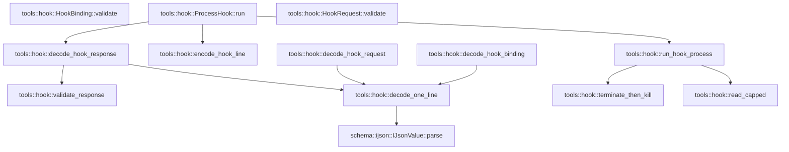

# tools::hook

[Package atlas](index.md) · [Source](../../src/hook.rs)

## Declarations

Visibility is the declaration spelling; trait members and reexports require their enclosing interface. `cfg` is not evaluated.

| Symbol | Kind | Visibility | Test / cfg |
|---|---|---|---|
| [tools::hook::HARD_TIMEOUT_MS](../../src/hook.rs#L13) | const_item | `private` |  |
| [tools::hook::HARD_OUTPUT_BYTES](../../src/hook.rs#L14) | const_item | `private` |  |
| [tools::hook::HookPhase](../../src/hook.rs#L18) | enum_item | `pub` |  |
| [tools::hook::HookResultView](../../src/hook.rs#L25) | struct_item | `pub` |  |
| [tools::hook::HookRequest](../../src/hook.rs#L35) | struct_item | `pub` |  |
| [tools::hook::HookRequest::validate](../../src/hook.rs#L47) | function_item | `pub` |  |
| [tools::hook::PreVerdict](../../src/hook.rs#L66) | enum_item | `pub` |  |
| [tools::hook::PostVerdict](../../src/hook.rs#L84) | enum_item | `pub` |  |
| [tools::hook::HookResponse](../../src/hook.rs#L97) | enum_item | `pub` |  |
| [tools::hook::RawResponse](../../src/hook.rs#L114) | struct_item | `private` |  |
| [tools::hook::HookFailureMode](../../src/hook.rs#L123) | enum_item | `pub` |  |
| [tools::hook::HookBinding](../../src/hook.rs#L130) | struct_item | `pub` |  |
| [tools::hook::HookBinding::validate](../../src/hook.rs#L144) | function_item | `pub` |  |
| [tools::hook::decode_hook_binding](../../src/hook.rs#L165) | function_item | `pub` |  |
| [tools::hook::HookError](../../src/hook.rs#L177) | enum_item | `pub` |  |
| [tools::hook::encode_hook_line](../../src/hook.rs#L198) | function_item | `pub` |  |
| [tools::hook::decode_hook_request](../../src/hook.rs#L204) | function_item | `pub` |  |
| [tools::hook::decode_hook_response](../../src/hook.rs#L210) | function_item | `pub` |  |
| [tools::hook::validate_response](../../src/hook.rs#L238) | function_item | `private` |  |
| [tools::hook::decode_one_line](../../src/hook.rs#L248) | function_item | `pub(crate)` |  |
| [tools::hook::ProcessHook](../../src/hook.rs#L267) | struct_item | `pub` |  |
| [tools::hook::ProcessHook::run](../../src/hook.rs#L270) | function_item | `pub` |  |
| [tools::hook::run_hook_process](../../src/hook.rs#L283) | function_item | `pub(crate)` |  |
| [tools::hook::terminate_then_kill](../../src/hook.rs#L368) | function_item | `private` |  |
| [tools::hook::read_capped](../../src/hook.rs#L386) | function_item | `private` |  |

## Imports / reexports

| Local name | Source path | Visibility |
|---|---|---|
| `BTreeMap` | `std::collections::BTreeMap` | `private` |
| `_` | `std::io::Write` | `private` |
| `_` | `std::os::unix::process::CommandExt` | `private` |
| `Command` | `std::process::Command` | `private` |
| `Stdio` | `std::process::Stdio` | `private` |
| `thread` | `std::thread` | `private` |
| `Duration` | `std::time::Duration` | `private` |
| `Instant` | `std::time::Instant` | `private` |
| `IJsonValue` | `schema::IJsonValue` | `private` |
| `DeserializeOwned` | `serde::de::DeserializeOwned` | `private` |
| `Deserialize` | `serde::Deserialize` | `private` |
| `Serialize` | `serde::Serialize` | `private` |
| `Error` | `thiserror::Error` | `private` |

## Module declarations

| Module | Visibility | Attributes |
|---|---|---|

## Function call graphs

Edges below are syntactically resolved calls only, including private functions. Graphs partition callers into groups of 20; they are not execution order. All unresolved sites are listed below and in the JSON inventory.

Functions 1–12: 10 direct edges

## Call sites

Includes test functions (marked in declarations). Receiver-type-required sites need type analysis/manual tracing. Calls in closures are attributed to their enclosing function; their occurrence here does not mean the closure executes immediately.

| Caller | Callee expression | Source lines | Target / classification |
|---|---|---|---|
| `validate` | `Err` | [49](../../src/hook.rs#L49), [52](../../src/hook.rs#L52), [58](../../src/hook.rs#L58), [59](../../src/hook.rs#L59) | external-constructor-callback-or-unresolved |
| `validate` | `HookError::Invalid` | [49](../../src/hook.rs#L49), [52](../../src/hook.rs#L52), [58](../../src/hook.rs#L58), [59](../../src/hook.rs#L59) | external-constructor-callback-or-unresolved |
| `validate` | `self.hook_id.is_empty` | [51](../../src/hook.rs#L51) | receiver-type-required |
| `validate` | `self.call.is_empty` | [51](../../src/hook.rs#L51) | receiver-type-required |
| `validate` | `self.name.is_empty` | [51](../../src/hook.rs#L51) | receiver-type-required |
| `validate` | `self.result.is_some` | [56](../../src/hook.rs#L56) | receiver-type-required |
| `validate` | `Ok` | [57](../../src/hook.rs#L57) | external-constructor-callback-or-unresolved |
| `validate` | `Err` | [146](../../src/hook.rs#L146), [149](../../src/hook.rs#L149), [152](../../src/hook.rs#L152), [159](../../src/hook.rs#L159) | external-constructor-callback-or-unresolved |
| `validate` | `HookError::Invalid` | [146](../../src/hook.rs#L146), [149](../../src/hook.rs#L149), [152](../../src/hook.rs#L152), [159](../../src/hook.rs#L159) | external-constructor-callback-or-unresolved |
| `validate` | `self.id.is_empty` | [148](../../src/hook.rs#L148) | receiver-type-required |
| `validate` | `self.argv.first().is_none_or` | [148](../../src/hook.rs#L148) | receiver-type-required |
| `validate` | `self.argv.first` | [148](../../src/hook.rs#L148) | receiver-type-required |
| `validate` | `Ok` | [161](../../src/hook.rs#L161) | external-constructor-callback-or-unresolved |
| `decode_hook_binding` | `decode_one_line` | [166](../../src/hook.rs#L166) | [tools::hook::decode_one_line](../../src/hook.rs#L248) |
| `decode_hook_binding` | `binding.validate` | [167](../../src/hook.rs#L167) | receiver-type-required |
| `decode_hook_binding` | `Err` | [169](../../src/hook.rs#L169) | external-constructor-callback-or-unresolved |
| `decode_hook_binding` | `HookError::Invalid` | [169](../../src/hook.rs#L169) | external-constructor-callback-or-unresolved |
| `decode_hook_binding` | `Ok` | [173](../../src/hook.rs#L173) | external-constructor-callback-or-unresolved |
| `encode_hook_line` | `serde_json_canonicalizer::to_vec` | [199](../../src/hook.rs#L199) | external-constructor-callback-or-unresolved |
| `encode_hook_line` | `bytes.push` | [200](../../src/hook.rs#L200) | receiver-type-required |
| `encode_hook_line` | `Ok` | [201](../../src/hook.rs#L201) | external-constructor-callback-or-unresolved |
| `decode_hook_request` | `decode_one_line` | [205](../../src/hook.rs#L205) | [tools::hook::decode_one_line](../../src/hook.rs#L248) |
| `decode_hook_request` | `request.validate` | [206](../../src/hook.rs#L206) | receiver-type-required |
| `decode_hook_request` | `Ok` | [207](../../src/hook.rs#L207) | external-constructor-callback-or-unresolved |
| `decode_hook_response` | `decode_one_line` | [216](../../src/hook.rs#L216), [226](../../src/hook.rs#L226) | [tools::hook::decode_one_line](../../src/hook.rs#L248) |
| `decode_hook_response` | `validate_response` | [217](../../src/hook.rs#L217), [227](../../src/hook.rs#L227) | [tools::hook::validate_response](../../src/hook.rs#L238) |
| `decode_hook_response` | `Ok` | [218](../../src/hook.rs#L218), [228](../../src/hook.rs#L228) | external-constructor-callback-or-unresolved |
| `validate_response` | `Err` | [240](../../src/hook.rs#L240), [243](../../src/hook.rs#L243) | external-constructor-callback-or-unresolved |
| `validate_response` | `HookError::Invalid` | [240](../../src/hook.rs#L240) | external-constructor-callback-or-unresolved |
| `validate_response` | `Ok` | [245](../../src/hook.rs#L245) | external-constructor-callback-or-unresolved |
| `decode_one_line` | `bytes.strip_suffix` | [249](../../src/hook.rs#L249) | receiver-type-required |
| `decode_one_line` | `Err` | [250](../../src/hook.rs#L250), [253](../../src/hook.rs#L253), [261](../../src/hook.rs#L261) | external-constructor-callback-or-unresolved |
| `decode_one_line` | `HookError::Invalid` | [250](../../src/hook.rs#L250), [253](../../src/hook.rs#L253), [255](../../src/hook.rs#L255), [258](../../src/hook.rs#L258), [261](../../src/hook.rs#L261) | external-constructor-callback-or-unresolved |
| `decode_one_line` | `body.is_empty` | [252](../../src/hook.rs#L252) | receiver-type-required |
| `decode_one_line` | `body.contains` | [252](../../src/hook.rs#L252) | receiver-type-required |
| `decode_one_line` | `IJsonValue::parse(body).map_err` | [255](../../src/hook.rs#L255) | receiver-type-required |
| `decode_one_line` | `IJsonValue::parse` | [255](../../src/hook.rs#L255) | [schema::ijson::IJsonValue::parse](../../../schema/src/ijson.rs#L16) |
| `decode_one_line` | `parsed         .canonical_bytes()         .map_err` | [256](../../src/hook.rs#L256) | receiver-type-required |
| `decode_one_line` | `parsed         .canonical_bytes` | [256](../../src/hook.rs#L256) | receiver-type-required |
| `decode_one_line` | `Ok` | [263](../../src/hook.rs#L263) | external-constructor-callback-or-unresolved |
| `decode_one_line` | `serde_json::from_slice` | [263](../../src/hook.rs#L263) | external-constructor-callback-or-unresolved |
| `run` | `binding.validate` | [271](../../src/hook.rs#L271) | receiver-type-required |
| `run` | `request.validate` | [272](../../src/hook.rs#L272) | receiver-type-required |
| `run` | `Err` | [274](../../src/hook.rs#L274) | external-constructor-callback-or-unresolved |
| `run` | `run_hook_process` | [276](../../src/hook.rs#L276) | [tools::hook::run_hook_process](../../src/hook.rs#L283) |
| `run` | `encode_hook_line` | [276](../../src/hook.rs#L276) | [tools::hook::encode_hook_line](../../src/hook.rs#L198) |
| `run` | `decode_hook_response` | [277](../../src/hook.rs#L277) | [tools::hook::decode_hook_response](../../src/hook.rs#L210) |
| `run_hook_process` | `binding.validate` | [288](../../src/hook.rs#L288) | receiver-type-required |
| `run_hook_process` | `cancelled` | [289](../../src/hook.rs#L289), [341](../../src/hook.rs#L341) | external-constructor-callback-or-unresolved |
| `run_hook_process` | `Err` | [290](../../src/hook.rs#L290), [343](../../src/hook.rs#L343), [347](../../src/hook.rs#L347), [353](../../src/hook.rs#L353), [359](../../src/hook.rs#L359) | external-constructor-callback-or-unresolved |
| `run_hook_process` | `Command::new` | [292](../../src/hook.rs#L292) | external-constructor-callback-or-unresolved |
| `run_hook_process` | `command         .args(&binding.argv[1..])         .env_clear()         .envs(&binding.env)         .stdin(Stdio::piped())         .stdout(Stdio::piped())         .stderr` | [293](../../src/hook.rs#L293) | receiver-type-required |
| `run_hook_process` | `command         .args(&binding.argv[1..])         .env_clear()         .envs(&binding.env)         .stdin(Stdio::piped())         .stdout` | [293](../../src/hook.rs#L293) | receiver-type-required |
| `run_hook_process` | `command         .args(&binding.argv[1..])         .env_clear()         .envs(&binding.env)         .stdin` | [293](../../src/hook.rs#L293) | receiver-type-required |
| `run_hook_process` | `command         .args(&binding.argv[1..])         .env_clear()         .envs` | [293](../../src/hook.rs#L293) | receiver-type-required |
| `run_hook_process` | `command         .args(&binding.argv[1..])         .env_clear` | [293](../../src/hook.rs#L293) | receiver-type-required |
| `run_hook_process` | `command         .args` | [293](../../src/hook.rs#L293) | receiver-type-required |
| `run_hook_process` | `Stdio::piped` | [297](../../src/hook.rs#L297), [298](../../src/hook.rs#L298), [299](../../src/hook.rs#L299) | external-constructor-callback-or-unresolved |
| `run_hook_process` | `command.process_group` | [300](../../src/hook.rs#L300) | receiver-type-required |
| `run_hook_process` | `command.spawn` | [301](../../src/hook.rs#L301) | receiver-type-required |
| `run_hook_process` | `child         .stdin         .take()         .ok_or` | [302](../../src/hook.rs#L302) | receiver-type-required |
| `run_hook_process` | `child         .stdin         .take` | [302](../../src/hook.rs#L302) | receiver-type-required |
| `run_hook_process` | `HookError::Invalid` | [305](../../src/hook.rs#L305), [309](../../src/hook.rs#L309), [313](../../src/hook.rs#L313) | external-constructor-callback-or-unresolved |
| `run_hook_process` | `child         .stdout         .take()         .ok_or` | [306](../../src/hook.rs#L306) | receiver-type-required |
| `run_hook_process` | `child         .stdout         .take` | [306](../../src/hook.rs#L306) | receiver-type-required |
| `run_hook_process` | `child         .stderr         .take()         .ok_or` | [310](../../src/hook.rs#L310) | receiver-type-required |
| `run_hook_process` | `child         .stderr         .take` | [310](../../src/hook.rs#L310) | receiver-type-required |
| `run_hook_process` | `std::sync::mpsc::channel` | [314](../../src/hook.rs#L314) | external-constructor-callback-or-unresolved |
| `run_hook_process` | `tx.clone` | [315](../../src/hook.rs#L315), [316](../../src/hook.rs#L316) | receiver-type-required |
| `run_hook_process` | `thread::spawn` | [319](../../src/hook.rs#L319), [322](../../src/hook.rs#L322), [325](../../src/hook.rs#L325) | external-constructor-callback-or-unresolved |
| `run_hook_process` | `tx.send` | [320](../../src/hook.rs#L320) | receiver-type-required |
| `run_hook_process` | `stdin.write_all(&input).map` | [320](../../src/hook.rs#L320) | receiver-type-required |
| `run_hook_process` | `stdin.write_all` | [320](../../src/hook.rs#L320) | receiver-type-required |
| `run_hook_process` | `Vec::new` | [320](../../src/hook.rs#L320), [330](../../src/hook.rs#L330), [355](../../src/hook.rs#L355) | external-constructor-callback-or-unresolved |
| `run_hook_process` | `output_tx.send` | [323](../../src/hook.rs#L323) | receiver-type-required |
| `run_hook_process` | `read_capped` | [323](../../src/hook.rs#L323), [326](../../src/hook.rs#L326) | [tools::hook::read_capped](../../src/hook.rs#L386) |
| `run_hook_process` | `error_tx.send` | [326](../../src/hook.rs#L326) | receiver-type-required |
| `run_hook_process` | `Instant::now` | [328](../../src/hook.rs#L328), [345](../../src/hook.rs#L345) | external-constructor-callback-or-unresolved |
| `run_hook_process` | `Duration::from_millis` | [328](../../src/hook.rs#L328), [349](../../src/hook.rs#L349) | external-constructor-callback-or-unresolved |
| `run_hook_process` | `status.is_none` | [331](../../src/hook.rs#L331), [332](../../src/hook.rs#L332) | receiver-type-required |
| `run_hook_process` | `results.len` | [331](../../src/hook.rs#L331), [338](../../src/hook.rs#L338) | receiver-type-required |
| `run_hook_process` | `child.try_wait` | [333](../../src/hook.rs#L333) | receiver-type-required |
| `run_hook_process` | `rx.try_recv` | [335](../../src/hook.rs#L335) | receiver-type-required |
| `run_hook_process` | `results.push` | [336](../../src/hook.rs#L336) | receiver-type-required |
| `run_hook_process` | `status.is_some` | [338](../../src/hook.rs#L338) | receiver-type-required |
| `run_hook_process` | `terminate_then_kill` | [342](../../src/hook.rs#L342), [346](../../src/hook.rs#L346) | [tools::hook::terminate_then_kill](../../src/hook.rs#L368) |
| `run_hook_process` | `thread::sleep` | [349](../../src/hook.rs#L349) | external-constructor-callback-or-unresolved |
| `run_hook_process` | `status.expect` | [351](../../src/hook.rs#L351) | receiver-type-required |
| `run_hook_process` | `status.success` | [352](../../src/hook.rs#L352) | receiver-type-required |
| `run_hook_process` | `HookError::Exit` | [353](../../src/hook.rs#L353) | external-constructor-callback-or-unresolved |
| `run_hook_process` | `status.code().unwrap_or` | [353](../../src/hook.rs#L353) | receiver-type-required |
| `run_hook_process` | `status.code` | [353](../../src/hook.rs#L353) | receiver-type-required |
| `run_hook_process` | `Ok` | [365](../../src/hook.rs#L365) | external-constructor-callback-or-unresolved |
| `terminate_then_kill` | `child.id` | [369](../../src/hook.rs#L369) | receiver-type-required |
| `terminate_then_kill` | `libc::kill` | [372](../../src/hook.rs#L372), [381](../../src/hook.rs#L381) | external-constructor-callback-or-unresolved |
| `terminate_then_kill` | `Instant::now` | [374](../../src/hook.rs#L374), [375](../../src/hook.rs#L375) | external-constructor-callback-or-unresolved |
| `terminate_then_kill` | `Duration::from_millis` | [374](../../src/hook.rs#L374), [377](../../src/hook.rs#L377) | external-constructor-callback-or-unresolved |
| `terminate_then_kill` | `child.try_wait` | [376](../../src/hook.rs#L376) | receiver-type-required |
| `terminate_then_kill` | `thread::sleep` | [377](../../src/hook.rs#L377) | external-constructor-callback-or-unresolved |
| `terminate_then_kill` | `child.wait` | [383](../../src/hook.rs#L383) | receiver-type-required |
| `read_capped` | `Vec::with_capacity` | [390](../../src/hook.rs#L390) | external-constructor-callback-or-unresolved |
| `read_capped` | `cap.min` | [390](../../src/hook.rs#L390) | receiver-type-required |
| `read_capped` | `reader.read` | [394](../../src/hook.rs#L394) | receiver-type-required |
| `read_capped` | `cap.saturating_sub` | [398](../../src/hook.rs#L398) | receiver-type-required |
| `read_capped` | `output.len` | [398](../../src/hook.rs#L398) | receiver-type-required |
| `read_capped` | `output.extend_from_slice` | [399](../../src/hook.rs#L399) | receiver-type-required |
| `read_capped` | `count.min` | [399](../../src/hook.rs#L399) | receiver-type-required |
| `read_capped` | `Ok` | [402](../../src/hook.rs#L402) | external-constructor-callback-or-unresolved |
