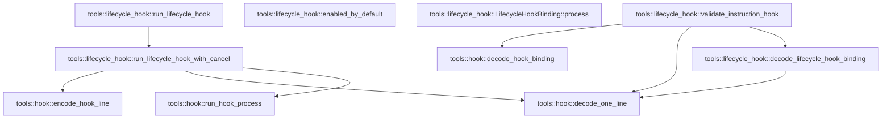

# tools::lifecycle_hook

[Package atlas](index.md) · [Source](../../src/lifecycle_hook.rs)

## Declarations

Visibility is the declaration spelling; trait members and reexports require their enclosing interface. `cfg` is not evaluated.

| Symbol | Kind | Visibility | Test / cfg |
|---|---|---|---|
| [tools::lifecycle_hook::LifecycleEvent](../../src/lifecycle_hook.rs#L9) | enum_item | `pub` |  |
| [tools::lifecycle_hook::LifecycleHookBinding](../../src/lifecycle_hook.rs#L24) | struct_item | `pub` |  |
| [tools::lifecycle_hook::enabled_by_default](../../src/lifecycle_hook.rs#L38) | function_item | `private` |  |
| [tools::lifecycle_hook::LifecycleHookBinding::process](../../src/lifecycle_hook.rs#L43) | function_item | `private` |  |
| [tools::lifecycle_hook::decode_lifecycle_hook_binding](../../src/lifecycle_hook.rs#L59) | function_item | `pub` |  |
| [tools::lifecycle_hook::validate_instruction_hook](../../src/lifecycle_hook.rs#L76) | function_item | `pub` |  |
| [tools::lifecycle_hook::LifecycleHookRequest](../../src/lifecycle_hook.rs#L87) | struct_item | `pub` |  |
| [tools::lifecycle_hook::LifecycleHookResponse](../../src/lifecycle_hook.rs#L100) | struct_item | `pub` |  |
| [tools::lifecycle_hook::run_lifecycle_hook](../../src/lifecycle_hook.rs#L108) | function_item | `pub` |  |
| [tools::lifecycle_hook::run_lifecycle_hook_with_cancel](../../src/lifecycle_hook.rs#L115) | function_item | `pub` |  |

## Imports / reexports

| Local name | Source path | Visibility |
|---|---|---|
| `HookError` | `crate::hook::HookError` | `private` |
| `decode_one_line` | `crate::hook::decode_one_line` | `private` |
| `run_hook_process` | `crate::hook::run_hook_process` | `private` |
| `HookBinding` | `crate::HookBinding` | `private` |
| `HookFailureMode` | `crate::HookFailureMode` | `private` |
| `HookPhase` | `crate::HookPhase` | `private` |
| `encode_hook_line` | `crate::encode_hook_line` | `private` |
| `IJsonValue` | `schema::IJsonValue` | `private` |
| `Deserialize` | `serde::Deserialize` | `private` |
| `Serialize` | `serde::Serialize` | `private` |
| `BTreeMap` | `std::collections::BTreeMap` | `private` |

## Module declarations

| Module | Visibility | Attributes |
|---|---|---|

## Function call graphs

Edges below are syntactically resolved calls only, including private functions. Graphs partition callers into groups of 20; they are not execution order. All unresolved sites are listed below and in the JSON inventory.

Functions 1–6: 8 direct edges

## Call sites

Includes test functions (marked in declarations). Receiver-type-required sites need type analysis/manual tracing. Calls in closures are attributed to their enclosing function; their occurrence here does not mean the closure executes immediately.

| Caller | Callee expression | Source lines | Target / classification |
|---|---|---|---|
| `process` | `self.id.clone` | [46](../../src/lifecycle_hook.rs#L46) | receiver-type-required |
| `process` | `self.argv.clone` | [47](../../src/lifecycle_hook.rs#L47) | receiver-type-required |
| `process` | `self.env.clone` | [53](../../src/lifecycle_hook.rs#L53) | receiver-type-required |
| `decode_lifecycle_hook_binding` | `decode_one_line` | [63](../../src/lifecycle_hook.rs#L63) | [tools::hook::decode_one_line](../../src/hook.rs#L248) |
| `decode_lifecycle_hook_binding` | `Err` | [65](../../src/lifecycle_hook.rs#L65), [71](../../src/lifecycle_hook.rs#L71) | external-constructor-callback-or-unresolved |
| `decode_lifecycle_hook_binding` | `HookError::Invalid` | [65](../../src/lifecycle_hook.rs#L65), [71](../../src/lifecycle_hook.rs#L71) | external-constructor-callback-or-unresolved |
| `decode_lifecycle_hook_binding` | `binding.process().validate` | [69](../../src/lifecycle_hook.rs#L69) | receiver-type-required |
| `decode_lifecycle_hook_binding` | `binding.process` | [69](../../src/lifecycle_hook.rs#L69) | receiver-type-required |
| `decode_lifecycle_hook_binding` | `Ok` | [73](../../src/lifecycle_hook.rs#L73) | external-constructor-callback-or-unresolved |
| `validate_instruction_hook` | `decode_one_line` | [77](../../src/lifecycle_hook.rs#L77) | [tools::hook::decode_one_line](../../src/hook.rs#L248) |
| `validate_instruction_hook` | `value.get("format").and_then` | [78](../../src/lifecycle_hook.rs#L78) | receiver-type-required |
| `validate_instruction_hook` | `value.get` | [78](../../src/lifecycle_hook.rs#L78) | receiver-type-required |
| `validate_instruction_hook` | `crate::decode_hook_binding(bytes, id).map` | [79](../../src/lifecycle_hook.rs#L79) | receiver-type-required |
| `validate_instruction_hook` | `crate::decode_hook_binding` | [79](../../src/lifecycle_hook.rs#L79) | [tools::hook::decode_hook_binding](../../src/hook.rs#L165) |
| `validate_instruction_hook` | `decode_lifecycle_hook_binding(bytes, id).map` | [80](../../src/lifecycle_hook.rs#L80) | receiver-type-required |
| `validate_instruction_hook` | `decode_lifecycle_hook_binding` | [80](../../src/lifecycle_hook.rs#L80) | [tools::lifecycle_hook::decode_lifecycle_hook_binding](../../src/lifecycle_hook.rs#L59) |
| `validate_instruction_hook` | `Err` | [81](../../src/lifecycle_hook.rs#L81) | external-constructor-callback-or-unresolved |
| `validate_instruction_hook` | `HookError::Invalid` | [81](../../src/lifecycle_hook.rs#L81) | external-constructor-callback-or-unresolved |
| `run_lifecycle_hook` | `run_lifecycle_hook_with_cancel` | [112](../../src/lifecycle_hook.rs#L112) | [tools::lifecycle_hook::run_lifecycle_hook_with_cancel](../../src/lifecycle_hook.rs#L115) |
| `run_lifecycle_hook_with_cancel` | `request.event_id.is_empty` | [124](../../src/lifecycle_hook.rs#L124) | receiver-type-required |
| `run_lifecycle_hook_with_cancel` | `request.workspace_id.is_empty` | [125](../../src/lifecycle_hook.rs#L125) | receiver-type-required |
| `run_lifecycle_hook_with_cancel` | `request.thread_id.is_empty` | [126](../../src/lifecycle_hook.rs#L126) | receiver-type-required |
| `run_lifecycle_hook_with_cancel` | `Err` | [130](../../src/lifecycle_hook.rs#L130), [138](../../src/lifecycle_hook.rs#L138), [141](../../src/lifecycle_hook.rs#L141), [148](../../src/lifecycle_hook.rs#L148) | external-constructor-callback-or-unresolved |
| `run_lifecycle_hook_with_cancel` | `run_hook_process` | [132](../../src/lifecycle_hook.rs#L132) | [tools::hook::run_hook_process](../../src/hook.rs#L283) |
| `run_lifecycle_hook_with_cancel` | `binding.process` | [132](../../src/lifecycle_hook.rs#L132) | receiver-type-required |
| `run_lifecycle_hook_with_cancel` | `encode_hook_line` | [132](../../src/lifecycle_hook.rs#L132) | [tools::hook::encode_hook_line](../../src/hook.rs#L198) |
| `run_lifecycle_hook_with_cancel` | `decode_one_line` | [133](../../src/lifecycle_hook.rs#L133) | [tools::hook::decode_one_line](../../src/hook.rs#L248) |
| `run_lifecycle_hook_with_cancel` | `response.context.is_empty` | [140](../../src/lifecycle_hook.rs#L140) | receiver-type-required |
| `run_lifecycle_hook_with_cancel` | `HookError::Invalid` | [141](../../src/lifecycle_hook.rs#L141) | external-constructor-callback-or-unresolved |
| `run_lifecycle_hook_with_cancel` | `response.context.len` | [145](../../src/lifecycle_hook.rs#L145) | receiver-type-required |
| `run_lifecycle_hook_with_cancel` | `response.context.iter().map(String::len).sum::<usize>` | [146](../../src/lifecycle_hook.rs#L146) | receiver-type-required |
| `run_lifecycle_hook_with_cancel` | `response.context.iter().map` | [146](../../src/lifecycle_hook.rs#L146) | receiver-type-required |
| `run_lifecycle_hook_with_cancel` | `response.context.iter` | [146](../../src/lifecycle_hook.rs#L146) | receiver-type-required |
| `run_lifecycle_hook_with_cancel` | `Ok` | [150](../../src/lifecycle_hook.rs#L150) | external-constructor-callback-or-unresolved |
