# tools::linux_sandbox

[Package atlas](index.md) · [Source](../../src/linux_sandbox.rs)

## Declarations

Visibility is the declaration spelling; trait members and reexports require their enclosing interface. `cfg` is not evaluated.

| Symbol | Kind | Visibility | Test / cfg |
|---|---|---|---|
| [tools::linux_sandbox::BACKEND](../../src/linux_sandbox.rs#L19) | const_item | `pub(crate)` |  |
| [tools::linux_sandbox::LANDLOCK_CREATE_RULESET_VERSION](../../src/linux_sandbox.rs#L21) | const_item | `private` |  |
| [tools::linux_sandbox::LANDLOCK_RULE_PATH_BENEATH](../../src/linux_sandbox.rs#L22) | const_item | `private` |  |
| [tools::linux_sandbox::ACCESS_EXECUTE](../../src/linux_sandbox.rs#L24) | const_item | `private` |  |
| [tools::linux_sandbox::ACCESS_WRITE_FILE](../../src/linux_sandbox.rs#L25) | const_item | `private` |  |
| [tools::linux_sandbox::ACCESS_READ_FILE](../../src/linux_sandbox.rs#L26) | const_item | `private` |  |
| [tools::linux_sandbox::ACCESS_READ_DIR](../../src/linux_sandbox.rs#L27) | const_item | `private` |  |
| [tools::linux_sandbox::ACCESS_ABI_1](../../src/linux_sandbox.rs#L29) | const_item | `private` |  |
| [tools::linux_sandbox::ACCESS_REFER](../../src/linux_sandbox.rs#L30) | const_item | `private` |  |
| [tools::linux_sandbox::ACCESS_TRUNCATE](../../src/linux_sandbox.rs#L31) | const_item | `private` |  |
| [tools::linux_sandbox::ACCESS_FILE](../../src/linux_sandbox.rs#L33) | const_item | `private` |  |
| [tools::linux_sandbox::SYSTEM_READ_ROOTS](../../src/linux_sandbox.rs#L38) | const_item | `private` |  |
| [tools::linux_sandbox::SYSTEM_DEVICES](../../src/linux_sandbox.rs#L55) | const_item | `private` |  |
| [tools::linux_sandbox::RulesetAttr](../../src/linux_sandbox.rs#L65) | struct_item | `private` |  |
| [tools::linux_sandbox::PathBeneathAttr](../../src/linux_sandbox.rs#L70) | struct_item | `private` |  |
| [tools::linux_sandbox::supported_abi](../../src/linux_sandbox.rs#L77) | function_item | `pub(crate)` |  |
| [tools::linux_sandbox::confine](../../src/linux_sandbox.rs#L107) | function_item | `pub(crate)` |  |
| [tools::linux_sandbox::landlock_ruleset](../../src/linux_sandbox.rs#L152) | function_item | `private` |  |
| [tools::linux_sandbox::add_rule](../../src/linux_sandbox.rs#L232) | function_item | `private` |  |
| [tools::linux_sandbox::elf_interpreter](../../src/linux_sandbox.rs#L293) | function_item | `private` |  |
| [tools::linux_sandbox::elf_interpreter::PT_INTERP](../../src/linux_sandbox.rs#L324) | const_item | `private` |  |
| [tools::linux_sandbox::AUDIT_ARCH](../../src/linux_sandbox.rs#L343) | const_item | `private` | #[cfg(target_arch = "x86_64")] |
| [tools::linux_sandbox::AUDIT_ARCH](../../src/linux_sandbox.rs#L345) | const_item | `private` | #[cfg(target_arch = "aarch64")] |
| [tools::linux_sandbox::SECCOMP_RET_KILL_PROCESS](../../src/linux_sandbox.rs#L347) | const_item | `private` |  |
| [tools::linux_sandbox::SECCOMP_RET_ERRNO](../../src/linux_sandbox.rs#L348) | const_item | `private` |  |
| [tools::linux_sandbox::SECCOMP_RET_ALLOW](../../src/linux_sandbox.rs#L349) | const_item | `private` |  |
| [tools::linux_sandbox::BPF_LD_W_ABS](../../src/linux_sandbox.rs#L351) | const_item | `private` |  |
| [tools::linux_sandbox::BPF_JMP_JEQ_K](../../src/linux_sandbox.rs#L352) | const_item | `private` |  |
| [tools::linux_sandbox::BPF_JMP_JGE_K](../../src/linux_sandbox.rs#L353) | const_item | `private` |  |
| [tools::linux_sandbox::BPF_JMP_JSET_K](../../src/linux_sandbox.rs#L354) | const_item | `private` |  |
| [tools::linux_sandbox::BPF_RET_K](../../src/linux_sandbox.rs#L355) | const_item | `private` |  |
| [tools::linux_sandbox::DATA_NR](../../src/linux_sandbox.rs#L357) | const_item | `private` |  |
| [tools::linux_sandbox::DATA_ARCH](../../src/linux_sandbox.rs#L358) | const_item | `private` |  |
| [tools::linux_sandbox::data_arg](../../src/linux_sandbox.rs#L360) | function_item | `private` |  |
| [tools::linux_sandbox::CLONE_THREAD](../../src/linux_sandbox.rs#L364) | const_item | `private` |  |
| [tools::linux_sandbox::CLONE_NAMESPACES](../../src/linux_sandbox.rs#L365) | const_item | `private` |  |
| [tools::linux_sandbox::TIOCSTI](../../src/linux_sandbox.rs#L373) | const_item | `private` |  |
| [tools::linux_sandbox::TIOCLINUX](../../src/linux_sandbox.rs#L374) | const_item | `private` |  |
| [tools::linux_sandbox::DENIED](../../src/linux_sandbox.rs#L379) | const_item | `private` |  |
| [tools::linux_sandbox::Program](../../src/linux_sandbox.rs#L413) | struct_item | `private` |  |
| [tools::linux_sandbox::Program::push](../../src/linux_sandbox.rs#L416) | function_item | `private` |  |
| [tools::linux_sandbox::Program::load](../../src/linux_sandbox.rs#L420) | function_item | `private` |  |
| [tools::linux_sandbox::Program::ret](../../src/linux_sandbox.rs#L424) | function_item | `private` |  |
| [tools::linux_sandbox::Program::deny](../../src/linux_sandbox.rs#L428) | function_item | `private` |  |
| [tools::linux_sandbox::Program::deny_if_any](../../src/linux_sandbox.rs#L435) | function_item | `private` |  |
| [tools::linux_sandbox::Program::deny_unless_any](../../src/linux_sandbox.rs#L444) | function_item | `private` |  |
| [tools::linux_sandbox::Program::deny_if_equal](../../src/linux_sandbox.rs#L453) | function_item | `private` |  |
| [tools::linux_sandbox::seccomp_filter](../../src/linux_sandbox.rs#L462) | function_item | `private` |  |
| [tools::linux_sandbox::seccomp_filter::X32_SYSCALL_BIT](../../src/linux_sandbox.rs#L470) | const_item | `private` |  |
| [tools::linux_sandbox::tests::Fixture](../../src/linux_sandbox.rs#L511) | struct_item | `private` | test; #[cfg(test)] |
| [tools::linux_sandbox::tests::fixture](../../src/linux_sandbox.rs#L517) | function_item | `private` | test; #[cfg(test)] |
| [tools::linux_sandbox::tests::policy](../../src/linux_sandbox.rs#L533) | function_item | `private` | test; #[cfg(test)] |
| [tools::linux_sandbox::tests::run](../../src/linux_sandbox.rs#L545) | function_item | `private` | test; #[cfg(test)] |
| [tools::linux_sandbox::tests::sh](../../src/linux_sandbox.rs#L555) | function_item | `private` | test; #[cfg(test)] |
| [tools::linux_sandbox::tests::stderr](../../src/linux_sandbox.rs#L559) | function_item | `private` | test; #[cfg(test)] |
| [tools::linux_sandbox::tests::filesystem_access_is_limited_to_policy_roots](../../src/linux_sandbox.rs#L564) | function_item | `private` | test; #[cfg(test)] |
| [tools::linux_sandbox::tests::read_roots_are_not_writable](../../src/linux_sandbox.rs#L599) | function_item | `private` | test; #[cfg(test)] |
| [tools::linux_sandbox::tests::denied_network_refuses_sockets_and_all_permits_them](../../src/linux_sandbox.rs#L612) | function_item | `private` | test; #[cfg(test)] |
| [tools::linux_sandbox::tests::loopback_only_network_is_refused](../../src/linux_sandbox.rs#L640) | function_item | `private` | test; #[cfg(test)] |
| [tools::linux_sandbox::tests::without_process_permission_only_the_requested_program_runs](../../src/linux_sandbox.rs#L654) | function_item | `private` | test; #[cfg(test)] |
| [tools::linux_sandbox::tests::namespaces_and_outside_processes_are_out_of_reach](../../src/linux_sandbox.rs#L668) | function_item | `private` | test; #[cfg(test)] |

## Imports / reexports

| Local name | Source path | Visibility |
|---|---|---|
| `CString` | `std::ffi::CString` | `private` |
| `File` | `std::fs::File` | `private` |
| `io` | `std::io` | `private` |
| `Read` | `std::io::Read` | `private` |
| `AsRawFd` | `std::os::fd::AsRawFd` | `private` |
| `FromRawFd` | `std::os::fd::FromRawFd` | `private` |
| `OwnedFd` | `std::os::fd::OwnedFd` | `private` |
| `OsStrExt` | `std::os::unix::ffi::OsStrExt` | `private` |
| `CommandExt` | `std::os::unix::process::CommandExt` | `private` |
| `Path` | `std::path::Path` | `private` |
| `PathBuf` | `std::path::PathBuf` | `private` |
| `Command` | `std::process::Command` | `private` |
| `NetworkPolicy` | `crate::sandbox::NetworkPolicy` | `private` |
| `ProbeFailure` | `crate::sandbox::ProbeFailure` | `private` |
| `SandboxError` | `crate::sandbox::SandboxError` | `private` |
| `SandboxPolicy` | `crate::sandbox::SandboxPolicy` | `private` |
| `fs` | `std::fs` | `private` |
| `Path` | `std::path::Path` | `private` |
| `PathBuf` | `std::path::PathBuf` | `private` |
| `Output` | `std::process::Output` | `private` |
| `NetworkPolicy` | `crate::sandbox::NetworkPolicy` | `private` |
| `ProbeStatus` | `crate::sandbox::ProbeStatus` | `private` |
| `SandboxBackend` | `crate::sandbox::SandboxBackend` | `private` |
| `SandboxPolicy` | `crate::sandbox::SandboxPolicy` | `private` |
| `probe_backend` | `crate::sandbox::probe_backend` | `private` |
| `sandbox_command` | `crate::sandbox::sandbox_command` | `private` |

## Module declarations

| Module | Visibility | Attributes |
|---|---|---|
| `tools::linux_sandbox::tests` | `private` | #[cfg(test)] |

## Function call graphs

Edges below are syntactically resolved calls only, including private functions. Graphs partition callers into groups of 20; they are not execution order. All unresolved sites are listed below and in the JSON inventory.

```mermaid
flowchart TD
  n0["tools::linux_sandbox::confine"]
  n1["tools::linux_sandbox::landlock_ruleset"]
  n2["tools::linux_sandbox::add_rule"]
  n3["tools::linux_sandbox::elf_interpreter"]
  n4["tools::linux_sandbox::data_arg"]
  n5["tools::linux_sandbox::Program::push"]
  n6["tools::linux_sandbox::Program::load"]
  n7["tools::linux_sandbox::Program::ret"]
  n8["tools::linux_sandbox::Program::deny"]
  n9["tools::linux_sandbox::Program::deny_if_any"]
  n10["tools::linux_sandbox::Program::deny_unless_any"]
  n11["tools::linux_sandbox::Program::deny_if_equal"]
  n12["tools::linux_sandbox::seccomp_filter"]
  n13["tools::linux_sandbox::supported_abi"]
  n0 --> n1
  n0 --> n12
  n0 --> n13
  n1 --> n2
  n1 --> n3
  n6 --> n5
  n7 --> n5
  n8 --> n5
  n8 --> n6
  n8 --> n7
  n9 --> n4
  n9 --> n5
  n9 --> n6
  n9 --> n7
  n10 --> n4
  n10 --> n5
  n10 --> n6
  n10 --> n7
  n11 --> n4
  n11 --> n5
  n11 --> n6
  n11 --> n7
```

Functions 1–14: 22 direct edges

## Call sites

Includes test functions (marked in declarations). Receiver-type-required sites need type analysis/manual tracing. Calls in closures are attributed to their enclosing function; their occurrence here does not mean the closure executes immediately.

| Caller | Callee expression | Source lines | Target / classification |
|---|---|---|---|
| `supported_abi` | `libc::syscall` | [81](../../src/linux_sandbox.rs#L81) | external-constructor-callback-or-unresolved |
| `supported_abi` | `std::ptr::null::<RulesetAttr>` | [83](../../src/linux_sandbox.rs#L83) | external-constructor-callback-or-unresolved |
| `supported_abi` | `io::Error::last_os_error` | [89](../../src/linux_sandbox.rs#L89), [97](../../src/linux_sandbox.rs#L97) | external-constructor-callback-or-unresolved |
| `supported_abi` | `Err` | [90](../../src/linux_sandbox.rs#L90), [98](../../src/linux_sandbox.rs#L98) | external-constructor-callback-or-unresolved |
| `supported_abi` | `libc::prctl` | [96](../../src/linux_sandbox.rs#L96) | external-constructor-callback-or-unresolved |
| `supported_abi` | `u32::try_from(abi).map_err` | [103](../../src/linux_sandbox.rs#L103) | receiver-type-required |
| `supported_abi` | `u32::try_from` | [103](../../src/linux_sandbox.rs#L103) | external-constructor-callback-or-unresolved |
| `supported_abi` | `"invalid Landlock ABI".to_owned` | [103](../../src/linux_sandbox.rs#L103) | receiver-type-required |
| `confine` | `policy.validate` | [112](../../src/linux_sandbox.rs#L112) | receiver-type-required |
| `confine` | `Err` | [114](../../src/linux_sandbox.rs#L114), [128](../../src/linux_sandbox.rs#L128), [131](../../src/linux_sandbox.rs#L131), [144](../../src/linux_sandbox.rs#L144) | external-constructor-callback-or-unresolved |
| `confine` | `SandboxError::Unavailable` | [114](../../src/linux_sandbox.rs#L114), [118](../../src/linux_sandbox.rs#L118) | external-constructor-callback-or-unresolved |
| `confine` | `"loopback-only network cannot be enforced by the Linux backend".to_owned` | [115](../../src/linux_sandbox.rs#L115) | receiver-type-required |
| `confine` | `supported_abi().map_err` | [118](../../src/linux_sandbox.rs#L118) | receiver-type-required |
| `confine` | `supported_abi` | [118](../../src/linux_sandbox.rs#L118) | [tools::linux_sandbox::supported_abi](../../src/linux_sandbox.rs#L77) |
| `confine` | `landlock_ruleset` | [119](../../src/linux_sandbox.rs#L119) | [tools::linux_sandbox::landlock_ruleset](../../src/linux_sandbox.rs#L152) |
| `confine` | `seccomp_filter` | [120](../../src/linux_sandbox.rs#L120) | [tools::linux_sandbox::seccomp_filter](../../src/linux_sandbox.rs#L462) |
| `confine` | `command.pre_exec` | [126](../../src/linux_sandbox.rs#L126) | receiver-type-required |
| `confine` | `libc::prctl` | [127](../../src/linux_sandbox.rs#L127) | external-constructor-callback-or-unresolved |
| `confine` | `io::Error::last_os_error` | [128](../../src/linux_sandbox.rs#L128), [131](../../src/linux_sandbox.rs#L131), [144](../../src/linux_sandbox.rs#L144) | external-constructor-callback-or-unresolved |
| `confine` | `libc::syscall` | [130](../../src/linux_sandbox.rs#L130), [137](../../src/linux_sandbox.rs#L137) | external-constructor-callback-or-unresolved |
| `confine` | `ruleset.as_raw_fd` | [130](../../src/linux_sandbox.rs#L130) | receiver-type-required |
| `confine` | `filter.len` | [134](../../src/linux_sandbox.rs#L134) | receiver-type-required |
| `confine` | `filter.as_ptr().cast_mut` | [135](../../src/linux_sandbox.rs#L135) | receiver-type-required |
| `confine` | `filter.as_ptr` | [135](../../src/linux_sandbox.rs#L135) | receiver-type-required |
| `confine` | `Ok` | [146](../../src/linux_sandbox.rs#L146), [149](../../src/linux_sandbox.rs#L149) | external-constructor-callback-or-unresolved |
| `landlock_ruleset` | `libc::syscall` | [170](../../src/linux_sandbox.rs#L170) | external-constructor-callback-or-unresolved |
| `landlock_ruleset` | `std::mem::size_of::<RulesetAttr>` | [173](../../src/linux_sandbox.rs#L173) | external-constructor-callback-or-unresolved |
| `landlock_ruleset` | `Err` | [178](../../src/linux_sandbox.rs#L178) | external-constructor-callback-or-unresolved |
| `landlock_ruleset` | `SandboxError::Unavailable` | [178](../../src/linux_sandbox.rs#L178) | external-constructor-callback-or-unresolved |
| `landlock_ruleset` | `OwnedFd::from_raw_fd` | [184](../../src/linux_sandbox.rs#L184) | external-constructor-callback-or-unresolved |
| `landlock_ruleset` | `add_rule` | [193](../../src/linux_sandbox.rs#L193), [198](../../src/linux_sandbox.rs#L198), [201](../../src/linux_sandbox.rs#L201), [209](../../src/linux_sandbox.rs#L209), [213](../../src/linux_sandbox.rs#L213), [220](../../src/linux_sandbox.rs#L220) | [tools::linux_sandbox::add_rule](../../src/linux_sandbox.rs#L232) |
| `landlock_ruleset` | `Path::new` | [193](../../src/linux_sandbox.rs#L193), [198](../../src/linux_sandbox.rs#L198), [201](../../src/linux_sandbox.rs#L201), [209](../../src/linux_sandbox.rs#L209) | external-constructor-callback-or-unresolved |
| `landlock_ruleset` | `policy.write_roots.iter().chain` | [203](../../src/linux_sandbox.rs#L203) | receiver-type-required |
| `landlock_ruleset` | `policy.write_roots.iter` | [203](../../src/linux_sandbox.rs#L203) | receiver-type-required |
| `landlock_ruleset` | `policy.scratch.iter` | [203](../../src/linux_sandbox.rs#L203) | receiver-type-required |
| `landlock_ruleset` | `elf_interpreter` | [219](../../src/linux_sandbox.rs#L219) | [tools::linux_sandbox::elf_interpreter](../../src/linux_sandbox.rs#L293) |
| `landlock_ruleset` | `Ok` | [227](../../src/linux_sandbox.rs#L227) | external-constructor-callback-or-unresolved |
| `add_rule` | `CString::new(path.as_os_str().as_bytes())         .map_err` | [238](../../src/linux_sandbox.rs#L238) | receiver-type-required |
| `add_rule` | `CString::new` | [238](../../src/linux_sandbox.rs#L238) | external-constructor-callback-or-unresolved |
| `add_rule` | `path.as_os_str().as_bytes` | [238](../../src/linux_sandbox.rs#L238) | receiver-type-required |
| `add_rule` | `path.as_os_str` | [238](../../src/linux_sandbox.rs#L238) | receiver-type-required |
| `add_rule` | `SandboxError::Invalid` | [239](../../src/linux_sandbox.rs#L239) | external-constructor-callback-or-unresolved |
| `add_rule` | `libc::open` | [241](../../src/linux_sandbox.rs#L241) | external-constructor-callback-or-unresolved |
| `add_rule` | `c_path.as_ptr` | [241](../../src/linux_sandbox.rs#L241) | receiver-type-required |
| `add_rule` | `io::Error::last_os_error` | [243](../../src/linux_sandbox.rs#L243) | external-constructor-callback-or-unresolved |
| `add_rule` | `Ok` | [250](../../src/linux_sandbox.rs#L250), [265](../../src/linux_sandbox.rs#L265), [289](../../src/linux_sandbox.rs#L289) | external-constructor-callback-or-unresolved |
| `add_rule` | `Err` | [252](../../src/linux_sandbox.rs#L252), [283](../../src/linux_sandbox.rs#L283) | external-constructor-callback-or-unresolved |
| `add_rule` | `SandboxError::Unavailable` | [252](../../src/linux_sandbox.rs#L252), [283](../../src/linux_sandbox.rs#L283) | external-constructor-callback-or-unresolved |
| `add_rule` | `OwnedFd::from_raw_fd` | [258](../../src/linux_sandbox.rs#L258) | external-constructor-callback-or-unresolved |
| `add_rule` | `File::from(parent.try_clone()?)         .metadata()         .map(&#124;metadata&#124; metadata.is_dir())         .unwrap_or` | [259](../../src/linux_sandbox.rs#L259) | receiver-type-required |
| `add_rule` | `File::from(parent.try_clone()?)         .metadata()         .map` | [259](../../src/linux_sandbox.rs#L259) | receiver-type-required |
| `add_rule` | `File::from(parent.try_clone()?)         .metadata` | [259](../../src/linux_sandbox.rs#L259) | receiver-type-required |
| `add_rule` | `File::from` | [259](../../src/linux_sandbox.rs#L259) | external-constructor-callback-or-unresolved |
| `add_rule` | `parent.try_clone` | [259](../../src/linux_sandbox.rs#L259) | receiver-type-required |
| `add_rule` | `metadata.is_dir` | [261](../../src/linux_sandbox.rs#L261) | receiver-type-required |
| `add_rule` | `parent.as_raw_fd` | [269](../../src/linux_sandbox.rs#L269) | receiver-type-required |
| `add_rule` | `libc::syscall` | [274](../../src/linux_sandbox.rs#L274) | external-constructor-callback-or-unresolved |
| `add_rule` | `ruleset.as_raw_fd` | [276](../../src/linux_sandbox.rs#L276) | receiver-type-required |
| `elf_interpreter` | `Vec::new` | [294](../../src/linux_sandbox.rs#L294) | external-constructor-callback-or-unresolved |
| `elf_interpreter` | `File::open(executable)?         .take(64 * 1024)         .read_to_end` | [295](../../src/linux_sandbox.rs#L295) | receiver-type-required |
| `elf_interpreter` | `File::open(executable)?         .take` | [295](../../src/linux_sandbox.rs#L295) | receiver-type-required |
| `elf_interpreter` | `File::open` | [295](../../src/linux_sandbox.rs#L295) | external-constructor-callback-or-unresolved |
| `elf_interpreter` | `header.len` | [298](../../src/linux_sandbox.rs#L298) | receiver-type-required |
| `elf_interpreter` | `Ok` | [299](../../src/linux_sandbox.rs#L299), [318](../../src/linux_sandbox.rs#L318), [329](../../src/linux_sandbox.rs#L329), [334](../../src/linux_sandbox.rs#L334), [337](../../src/linux_sandbox.rs#L337), [339](../../src/linux_sandbox.rs#L339) | external-constructor-callback-or-unresolved |
| `elf_interpreter` | `header             .get(at..at + 2)             .map` | [302](../../src/linux_sandbox.rs#L302) | receiver-type-required |
| `elf_interpreter` | `header             .get` | [302](../../src/linux_sandbox.rs#L302), [307](../../src/linux_sandbox.rs#L307), [312](../../src/linux_sandbox.rs#L312) | receiver-type-required |
| `elf_interpreter` | `u16::from_le_bytes` | [304](../../src/linux_sandbox.rs#L304) | external-constructor-callback-or-unresolved |
| `elf_interpreter` | `header             .get(at..at + 4)             .map` | [307](../../src/linux_sandbox.rs#L307) | receiver-type-required |
| `elf_interpreter` | `u32::from_le_bytes` | [309](../../src/linux_sandbox.rs#L309) | external-constructor-callback-or-unresolved |
| `elf_interpreter` | `b.try_into().expect` | [309](../../src/linux_sandbox.rs#L309), [314](../../src/linux_sandbox.rs#L314) | receiver-type-required |
| `elf_interpreter` | `b.try_into` | [309](../../src/linux_sandbox.rs#L309), [314](../../src/linux_sandbox.rs#L314) | receiver-type-required |
| `elf_interpreter` | `header             .get(at..at + 8)             .map` | [312](../../src/linux_sandbox.rs#L312) | receiver-type-required |
| `elf_interpreter` | `u64::from_le_bytes` | [314](../../src/linux_sandbox.rs#L314) | external-constructor-callback-or-unresolved |
| `elf_interpreter` | `u64_at` | [316](../../src/linux_sandbox.rs#L316), [328](../../src/linux_sandbox.rs#L328) | external-constructor-callback-or-unresolved |
| `elf_interpreter` | `u16_at` | [316](../../src/linux_sandbox.rs#L316) | external-constructor-callback-or-unresolved |
| `elf_interpreter` | `usize::from` | [320](../../src/linux_sandbox.rs#L320), [323](../../src/linux_sandbox.rs#L323) | external-constructor-callback-or-unresolved |
| `elf_interpreter` | `usize::try_from(phoff)             .unwrap_or(usize::MAX)             .saturating_add` | [321](../../src/linux_sandbox.rs#L321) | receiver-type-required |
| `elf_interpreter` | `usize::try_from(phoff)             .unwrap_or` | [321](../../src/linux_sandbox.rs#L321) | receiver-type-required |
| `elf_interpreter` | `usize::try_from` | [321](../../src/linux_sandbox.rs#L321), [331](../../src/linux_sandbox.rs#L331), [332](../../src/linux_sandbox.rs#L332) | external-constructor-callback-or-unresolved |
| `elf_interpreter` | `index.saturating_mul` | [323](../../src/linux_sandbox.rs#L323) | receiver-type-required |
| `elf_interpreter` | `u32_at` | [325](../../src/linux_sandbox.rs#L325) | external-constructor-callback-or-unresolved |
| `elf_interpreter` | `Some` | [325](../../src/linux_sandbox.rs#L325), [337](../../src/linux_sandbox.rs#L337) | external-constructor-callback-or-unresolved |
| `elf_interpreter` | `usize::try_from(offset).unwrap_or` | [331](../../src/linux_sandbox.rs#L331) | receiver-type-required |
| `elf_interpreter` | `start.saturating_add` | [332](../../src/linux_sandbox.rs#L332) | receiver-type-required |
| `elf_interpreter` | `usize::try_from(size).unwrap_or` | [332](../../src/linux_sandbox.rs#L332) | receiver-type-required |
| `elf_interpreter` | `header.get` | [333](../../src/linux_sandbox.rs#L333) | receiver-type-required |
| `elf_interpreter` | `bytes.strip_suffix(b"\0").unwrap_or` | [336](../../src/linux_sandbox.rs#L336) | receiver-type-required |
| `elf_interpreter` | `bytes.strip_suffix` | [336](../../src/linux_sandbox.rs#L336) | receiver-type-required |
| `elf_interpreter` | `PathBuf::from` | [337](../../src/linux_sandbox.rs#L337) | external-constructor-callback-or-unresolved |
| `elf_interpreter` | `std::ffi::OsStr::from_bytes` | [337](../../src/linux_sandbox.rs#L337) | external-constructor-callback-or-unresolved |
| `push` | `self.0.push` | [417](../../src/linux_sandbox.rs#L417) | receiver-type-required |
| `load` | `self.push` | [421](../../src/linux_sandbox.rs#L421) | [tools::linux_sandbox::Program::push](../../src/linux_sandbox.rs#L416) |
| `ret` | `self.push` | [425](../../src/linux_sandbox.rs#L425) | [tools::linux_sandbox::Program::push](../../src/linux_sandbox.rs#L416) |
| `deny` | `self.load` | [429](../../src/linux_sandbox.rs#L429) | [tools::linux_sandbox::Program::load](../../src/linux_sandbox.rs#L420) |
| `deny` | `self.push` | [430](../../src/linux_sandbox.rs#L430) | [tools::linux_sandbox::Program::push](../../src/linux_sandbox.rs#L416) |
| `deny` | `self.ret` | [431](../../src/linux_sandbox.rs#L431) | [tools::linux_sandbox::Program::ret](../../src/linux_sandbox.rs#L424) |
| `deny_if_any` | `self.load` | [436](../../src/linux_sandbox.rs#L436), [438](../../src/linux_sandbox.rs#L438) | [tools::linux_sandbox::Program::load](../../src/linux_sandbox.rs#L420) |
| `deny_if_any` | `self.push` | [437](../../src/linux_sandbox.rs#L437), [439](../../src/linux_sandbox.rs#L439) | [tools::linux_sandbox::Program::push](../../src/linux_sandbox.rs#L416) |
| `deny_if_any` | `data_arg` | [438](../../src/linux_sandbox.rs#L438) | [tools::linux_sandbox::data_arg](../../src/linux_sandbox.rs#L360) |
| `deny_if_any` | `self.ret` | [440](../../src/linux_sandbox.rs#L440) | [tools::linux_sandbox::Program::ret](../../src/linux_sandbox.rs#L424) |
| `deny_unless_any` | `self.load` | [445](../../src/linux_sandbox.rs#L445), [447](../../src/linux_sandbox.rs#L447) | [tools::linux_sandbox::Program::load](../../src/linux_sandbox.rs#L420) |
| `deny_unless_any` | `self.push` | [446](../../src/linux_sandbox.rs#L446), [448](../../src/linux_sandbox.rs#L448) | [tools::linux_sandbox::Program::push](../../src/linux_sandbox.rs#L416) |
| `deny_unless_any` | `data_arg` | [447](../../src/linux_sandbox.rs#L447) | [tools::linux_sandbox::data_arg](../../src/linux_sandbox.rs#L360) |
| `deny_unless_any` | `self.ret` | [449](../../src/linux_sandbox.rs#L449) | [tools::linux_sandbox::Program::ret](../../src/linux_sandbox.rs#L424) |
| `deny_if_equal` | `self.load` | [454](../../src/linux_sandbox.rs#L454), [456](../../src/linux_sandbox.rs#L456) | [tools::linux_sandbox::Program::load](../../src/linux_sandbox.rs#L420) |
| `deny_if_equal` | `self.push` | [455](../../src/linux_sandbox.rs#L455), [457](../../src/linux_sandbox.rs#L457) | [tools::linux_sandbox::Program::push](../../src/linux_sandbox.rs#L416) |
| `deny_if_equal` | `data_arg` | [456](../../src/linux_sandbox.rs#L456) | [tools::linux_sandbox::data_arg](../../src/linux_sandbox.rs#L360) |
| `deny_if_equal` | `self.ret` | [458](../../src/linux_sandbox.rs#L458) | [tools::linux_sandbox::Program::ret](../../src/linux_sandbox.rs#L424) |
| `seccomp_filter` | `Program::default` | [463](../../src/linux_sandbox.rs#L463) | external-constructor-callback-or-unresolved |
| `seccomp_filter` | `program.load` | [465](../../src/linux_sandbox.rs#L465), [471](../../src/linux_sandbox.rs#L471) | receiver-type-required |
| `seccomp_filter` | `program.push` | [466](../../src/linux_sandbox.rs#L466), [472](../../src/linux_sandbox.rs#L472) | receiver-type-required |
| `seccomp_filter` | `program.ret` | [467](../../src/linux_sandbox.rs#L467), [473](../../src/linux_sandbox.rs#L473), [494](../../src/linux_sandbox.rs#L494) | receiver-type-required |
| `seccomp_filter` | `program.deny` | [476](../../src/linux_sandbox.rs#L476), [484](../../src/linux_sandbox.rs#L484), [490](../../src/linux_sandbox.rs#L490), [491](../../src/linux_sandbox.rs#L491) | receiver-type-required |
| `seccomp_filter` | `program.deny_if_any` | [478](../../src/linux_sandbox.rs#L478) | receiver-type-required |
| `seccomp_filter` | `program.deny_if_equal` | [479](../../src/linux_sandbox.rs#L479), [480](../../src/linux_sandbox.rs#L480) | receiver-type-required |
| `seccomp_filter` | `program.deny_unless_any` | [487](../../src/linux_sandbox.rs#L487) | receiver-type-required |
| `seccomp_filter` | `program.0.len` | [495](../../src/linux_sandbox.rs#L495) | receiver-type-required |
| `seccomp_filter` | `usize::from` | [495](../../src/linux_sandbox.rs#L495) | external-constructor-callback-or-unresolved |
| `seccomp_filter` | `Err` | [496](../../src/linux_sandbox.rs#L496) | external-constructor-callback-or-unresolved |
| `seccomp_filter` | `SandboxError::Encoding` | [496](../../src/linux_sandbox.rs#L496) | external-constructor-callback-or-unresolved |
| `seccomp_filter` | `"seccomp filter too long".to_owned` | [496](../../src/linux_sandbox.rs#L496) | receiver-type-required |
| `seccomp_filter` | `Ok` | [498](../../src/linux_sandbox.rs#L498) | external-constructor-callback-or-unresolved |
| `seccomp_filter` | `program.0.into_boxed_slice` | [498](../../src/linux_sandbox.rs#L498) | receiver-type-required |
| `fixture` | `tempfile::tempdir().unwrap` | [518](../../src/linux_sandbox.rs#L518) | receiver-type-required |
| `fixture` | `tempfile::tempdir` | [518](../../src/linux_sandbox.rs#L518) | external-constructor-callback-or-unresolved |
| `fixture` | `fs::canonicalize(root.path()).unwrap` | [519](../../src/linux_sandbox.rs#L519) | receiver-type-required |
| `fixture` | `fs::canonicalize` | [519](../../src/linux_sandbox.rs#L519) | external-constructor-callback-or-unresolved |
| `fixture` | `root.path` | [519](../../src/linux_sandbox.rs#L519) | receiver-type-required |
| `fixture` | `base.join` | [520](../../src/linux_sandbox.rs#L520), [521](../../src/linux_sandbox.rs#L521) | receiver-type-required |
| `fixture` | `fs::create_dir(&inside).unwrap` | [522](../../src/linux_sandbox.rs#L522) | receiver-type-required |
| `fixture` | `fs::create_dir` | [522](../../src/linux_sandbox.rs#L522), [523](../../src/linux_sandbox.rs#L523) | external-constructor-callback-or-unresolved |
| `fixture` | `fs::create_dir(&outside).unwrap` | [523](../../src/linux_sandbox.rs#L523) | receiver-type-required |
| `fixture` | `fs::write(inside.join("visible.txt"), b"visible").unwrap` | [524](../../src/linux_sandbox.rs#L524) | receiver-type-required |
| `fixture` | `fs::write` | [524](../../src/linux_sandbox.rs#L524), [525](../../src/linux_sandbox.rs#L525) | external-constructor-callback-or-unresolved |
| `fixture` | `inside.join` | [524](../../src/linux_sandbox.rs#L524) | receiver-type-required |
| `fixture` | `fs::write(outside.join("secret.txt"), b"secret").unwrap` | [525](../../src/linux_sandbox.rs#L525) | receiver-type-required |
| `fixture` | `outside.join` | [525](../../src/linux_sandbox.rs#L525) | receiver-type-required |
| `policy` | `fixture.inside.to_string_lossy().into_owned` | [534](../../src/linux_sandbox.rs#L534) | receiver-type-required |
| `policy` | `fixture.inside.to_string_lossy` | [534](../../src/linux_sandbox.rs#L534) | receiver-type-required |
| `run` | `probe_backend` | [546](../../src/linux_sandbox.rs#L546) | [tools::sandbox::probe_backend](../../src/sandbox.rs#L235) |
| `run` | `sandbox_command(policy, &probe, Path::new(executable))             .unwrap()             .args(args)             .output()             .unwrap` | [548](../../src/linux_sandbox.rs#L548) | receiver-type-required |
| `run` | `sandbox_command(policy, &probe, Path::new(executable))             .unwrap()             .args(args)             .output` | [548](../../src/linux_sandbox.rs#L548) | receiver-type-required |
| `run` | `sandbox_command(policy, &probe, Path::new(executable))             .unwrap()             .args` | [548](../../src/linux_sandbox.rs#L548) | receiver-type-required |
| `run` | `sandbox_command(policy, &probe, Path::new(executable))             .unwrap` | [548](../../src/linux_sandbox.rs#L548) | receiver-type-required |
| `run` | `sandbox_command` | [548](../../src/linux_sandbox.rs#L548) | [tools::sandbox::sandbox_command](../../src/sandbox.rs#L242) |
| `run` | `Path::new` | [548](../../src/linux_sandbox.rs#L548) | external-constructor-callback-or-unresolved |
| `sh` | `run` | [556](../../src/linux_sandbox.rs#L556) | [tools::linux_sandbox::tests::run](../../src/linux_sandbox.rs#L545) |
| `stderr` | `String::from_utf8_lossy(&output.stderr).into_owned` | [560](../../src/linux_sandbox.rs#L560) | receiver-type-required |
| `stderr` | `String::from_utf8_lossy` | [560](../../src/linux_sandbox.rs#L560) | external-constructor-callback-or-unresolved |
| `filesystem_access_is_limited_to_policy_roots` | `fixture` | [565](../../src/linux_sandbox.rs#L565) | external-constructor-callback-or-unresolved |
| `filesystem_access_is_limited_to_policy_roots` | `policy` | [566](../../src/linux_sandbox.rs#L566) | external-constructor-callback-or-unresolved |
| `filesystem_access_is_limited_to_policy_roots` | `fixture.inside.display` | [567](../../src/linux_sandbox.rs#L567) | receiver-type-required |
| `filesystem_access_is_limited_to_policy_roots` | `fixture.outside.display` | [568](../../src/linux_sandbox.rs#L568) | receiver-type-required |
| `filesystem_access_is_limited_to_policy_roots` | `sh` | [570](../../src/linux_sandbox.rs#L570), [574](../../src/linux_sandbox.rs#L574), [585](../../src/linux_sandbox.rs#L585), [589](../../src/linux_sandbox.rs#L589), [593](../../src/linux_sandbox.rs#L593) | [tools::linux_sandbox::tests::sh](../../src/linux_sandbox.rs#L555) |
| `read_roots_are_not_writable` | `fixture` | [600](../../src/linux_sandbox.rs#L600) | external-constructor-callback-or-unresolved |
| `read_roots_are_not_writable` | `policy` | [601](../../src/linux_sandbox.rs#L601) | external-constructor-callback-or-unresolved |
| `read_roots_are_not_writable` | `policy.write_roots.clear` | [602](../../src/linux_sandbox.rs#L602) | receiver-type-required |
| `read_roots_are_not_writable` | `sh` | [603](../../src/linux_sandbox.rs#L603) | [tools::linux_sandbox::tests::sh](../../src/linux_sandbox.rs#L555) |
| `denied_network_refuses_sockets_and_all_permits_them` | `fixture` | [613](../../src/linux_sandbox.rs#L613) | external-constructor-callback-or-unresolved |
| `denied_network_refuses_sockets_and_all_permits_them` | `run` | [615](../../src/linux_sandbox.rs#L615), [627](../../src/linux_sandbox.rs#L627) | [tools::linux_sandbox::tests::run](../../src/linux_sandbox.rs#L545) |
| `denied_network_refuses_sockets_and_all_permits_them` | `policy` | [616](../../src/linux_sandbox.rs#L616), [628](../../src/linux_sandbox.rs#L628) | [tools::linux_sandbox::tests::policy](../../src/linux_sandbox.rs#L533) |
| `loopback_only_network_is_refused` | `fixture` | [641](../../src/linux_sandbox.rs#L641) | external-constructor-callback-or-unresolved |
| `loopback_only_network_is_refused` | `probe_backend` | [642](../../src/linux_sandbox.rs#L642) | [tools::sandbox::probe_backend](../../src/sandbox.rs#L235) |
| `without_process_permission_only_the_requested_program_runs` | `fixture` | [655](../../src/linux_sandbox.rs#L655) | external-constructor-callback-or-unresolved |
| `without_process_permission_only_the_requested_program_runs` | `policy` | [656](../../src/linux_sandbox.rs#L656) | external-constructor-callback-or-unresolved |
| `without_process_permission_only_the_requested_program_runs` | `sh` | [657](../../src/linux_sandbox.rs#L657), [661](../../src/linux_sandbox.rs#L661), [663](../../src/linux_sandbox.rs#L663) | [tools::linux_sandbox::tests::sh](../../src/linux_sandbox.rs#L555) |
| `namespaces_and_outside_processes_are_out_of_reach` | `fixture` | [669](../../src/linux_sandbox.rs#L669) | external-constructor-callback-or-unresolved |
| `namespaces_and_outside_processes_are_out_of_reach` | `policy` | [670](../../src/linux_sandbox.rs#L670) | external-constructor-callback-or-unresolved |
| `namespaces_and_outside_processes_are_out_of_reach` | `run` | [671](../../src/linux_sandbox.rs#L671) | [tools::linux_sandbox::tests::run](../../src/linux_sandbox.rs#L545) |
| `namespaces_and_outside_processes_are_out_of_reach` | `sh` | [674](../../src/linux_sandbox.rs#L674), [676](../../src/linux_sandbox.rs#L676) | [tools::linux_sandbox::tests::sh](../../src/linux_sandbox.rs#L555) |
