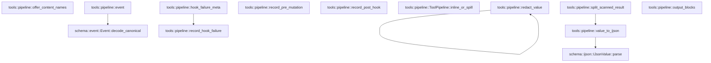

# tools::pipeline

[Package atlas](index.md) · [Source](../../src/pipeline.rs)

## Declarations

Visibility is the declaration spelling; trait members and reexports require their enclosing interface. `cfg` is not evaluated.

| Symbol | Kind | Visibility | Test / cfg |
|---|---|---|---|
| [tools::pipeline::SPILL_THRESHOLD](../../src/pipeline.rs#L11) | const_item | `private` |  |
| [tools::pipeline::ToolExecution](../../src/pipeline.rs#L14) | struct_item | `pub` |  |
| [tools::pipeline::BackendTerminal](../../src/pipeline.rs#L26) | enum_item | `pub` |  |
| [tools::pipeline::ApprovalGate](../../src/pipeline.rs#L53) | enum_item | `pub` |  |
| [tools::pipeline::DurableApprovalResponse](../../src/pipeline.rs#L64) | struct_item | `pub` |  |
| [tools::pipeline::PipelineDecision](../../src/pipeline.rs#L72) | enum_item | `pub` |  |
| [tools::pipeline::TOOL_CONTINUATION_SUBKIND](../../src/pipeline.rs#L91) | const_item | `pub` |  |
| [tools::pipeline::SecretScan](../../src/pipeline.rs#L94) | enum_item | `pub` |  |
| [tools::pipeline::SecretScanner](../../src/pipeline.rs#L101) | struct_item | `pub` |  |
| [tools::pipeline::SecretScanner::failing](../../src/pipeline.rs#L107) | function_item | `pub` |  |
| [tools::pipeline::SecretScanner::scan](../../src/pipeline.rs#L113) | function_item | `pub` |  |
| [tools::pipeline::ToolPipeline](../../src/pipeline.rs#L129) | struct_item | `pub` |  |
| [tools::pipeline::ToolPipeline::new](../../src/pipeline.rs#L137) | function_item | `pub` |  |
| [tools::pipeline::ToolPipeline::execute](../../src/pipeline.rs#L145) | function_item | `pub` |  |
| [tools::pipeline::ToolPipeline::verify_durable_execution](../../src/pipeline.rs#L166) | function_item | `pub` |  |
| [tools::pipeline::ToolPipeline::verify_causal_offer](../../src/pipeline.rs#L229) | function_item | `pub` |  |
| [tools::pipeline::ToolPipeline::has_causal_offer](../../src/pipeline.rs#L267) | function_item | `pub` |  |
| [tools::pipeline::ToolPipeline::materialize_json_or_spill](../../src/pipeline.rs#L341) | function_item | `private` |  |
| [tools::pipeline::ToolPipeline::execute_terminal](../../src/pipeline.rs#L353) | function_item | `pub` |  |
| [tools::pipeline::ToolPipeline::execute_terminal_with_gate](../../src/pipeline.rs#L365) | function_item | `pub` |  |
| [tools::pipeline::ToolPipeline::execute_terminal_with_gate_and_resume](../../src/pipeline.rs#L391) | function_item | `pub` |  |
| [tools::pipeline::ToolPipeline::complete_terminal](../../src/pipeline.rs#L506) | function_item | `private` |  |
| [tools::pipeline::ToolPipeline::durable_approval_state](../../src/pipeline.rs#L647) | function_item | `private` |  |
| [tools::pipeline::ToolPipeline::materialize_ijson](../../src/pipeline.rs#L760) | function_item | `private` |  |
| [tools::pipeline::ToolPipeline::complete_continuation](../../src/pipeline.rs#L774) | function_item | `pub` |  |
| [tools::pipeline::ToolPipeline::append_continuation_step](../../src/pipeline.rs#L787) | function_item | `pub` |  |
| [tools::pipeline::ToolPipeline::append_execution_started](../../src/pipeline.rs#L824) | function_item | `private` |  |
| [tools::pipeline::ToolPipeline::append_effective_execution](../../src/pipeline.rs#L839) | function_item | `private` |  |
| [tools::pipeline::ToolPipeline::append_approval](../../src/pipeline.rs#L861) | function_item | `private` |  |
| [tools::pipeline::ToolPipeline::append_result](../../src/pipeline.rs#L883) | function_item | `private` |  |
| [tools::pipeline::ToolPipeline::inline_or_spill](../../src/pipeline.rs#L913) | function_item | `private` |  |
| [tools::pipeline::DurableApprovalState](../../src/pipeline.rs#L929) | enum_item | `private` |  |
| [tools::pipeline::ToolPipelineError](../../src/pipeline.rs#L947) | enum_item | `pub` |  |
| [tools::pipeline::event](../../src/pipeline.rs#L960) | function_item | `private` |  |
| [tools::pipeline::value_to_ijson](../../src/pipeline.rs#L966) | function_item | `private` |  |
| [tools::pipeline::split_scanned_result](../../src/pipeline.rs#L972) | function_item | `private` |  |
| [tools::pipeline::output_blocks](../../src/pipeline.rs#L990) | function_item | `private` |  |
| [tools::pipeline::offer_content_names](../../src/pipeline.rs#L1008) | function_item | `private` |  |
| [tools::pipeline::redact_value](../../src/pipeline.rs#L1031) | function_item | `private` |  |
| [tools::pipeline::hook_failure_meta](../../src/pipeline.rs#L1070) | function_item | `private` |  |
| [tools::pipeline::record_hook_failure](../../src/pipeline.rs#L1076) | function_item | `private` |  |
| [tools::pipeline::record_pre_mutation](../../src/pipeline.rs#L1086) | function_item | `private` |  |
| [tools::pipeline::record_post_hook](../../src/pipeline.rs#L1096) | function_item | `private` |  |
| [tools::pipeline::secret_token_boundary_tests::artifact_task_paths_survive_scanning_without_weakening_key_redaction](../../src/pipeline.rs#L1120) | function_item | `private` | test; #[cfg(test)] |

## Imports / reexports

| Local name | Source path | Visibility |
|---|---|---|
| `Event` | `schema::Event` | `private` |
| `IJsonValue` | `schema::IJsonValue` | `private` |
| `Map` | `serde_json::Map` | `private` |
| `Value` | `serde_json::Value` | `private` |
| `json` | `serde_json::json` | `private` |
| `AssetStore` | `store::AssetStore` | `private` |
| `BarrierContext` | `store::BarrierContext` | `private` |
| `LockedLedger` | `store::LockedLedger` | `private` |
| `StoreError` | `store::StoreError` | `private` |
| `Error` | `thiserror::Error` | `private` |
| `HookBinding` | `crate::hook::HookBinding` | `private` |
| `HookFailureMode` | `crate::hook::HookFailureMode` | `private` |
| `HookPhase` | `crate::hook::HookPhase` | `private` |
| `HookRequest` | `crate::hook::HookRequest` | `private` |
| `HookResponse` | `crate::hook::HookResponse` | `private` |
| `HookResultView` | `crate::hook::HookResultView` | `private` |
| `PostVerdict` | `crate::hook::PostVerdict` | `private` |
| `PreVerdict` | `crate::hook::PreVerdict` | `private` |
| `ProcessHook` | `crate::hook::ProcessHook` | `private` |
| `*` | `super::*` | `private` |

## Module declarations

| Module | Visibility | Attributes |
|---|---|---|
| `tools::pipeline::secret_token_boundary_tests` | `private` | #[cfg(test)] |

## Function call graphs

Edges below are syntactically resolved calls only, including private functions. Graphs partition callers into groups of 20; they are not execution order. All unresolved sites are listed below and in the JSON inventory.

```mermaid
flowchart TD
  n0["schema::ijson::IJsonValue::parse"]
  n1["tools::hook::ProcessHook::run"]
  n2["tools::pipeline::offer_content_names"]
  n3["tools::pipeline::redact_value"]
  n4["tools::pipeline::hook_failure_meta"]
  n5["tools::pipeline::record_hook_failure"]
  n6["tools::pipeline::SecretScanner::failing"]
  n7["tools::pipeline::record_pre_mutation"]
  n8["tools::pipeline::record_post_hook"]
  n9["tools::pipeline::SecretScanner::scan"]
  n10["tools::pipeline::ToolPipeline::new"]
  n11["tools::pipeline::ToolPipeline::execute"]
  n12["tools::pipeline::ToolPipeline::verify_durable_execution"]
  n13["tools::pipeline::ToolPipeline::verify_causal_offer"]
  n14["tools::pipeline::ToolPipeline::has_causal_offer"]
  n15["tools::pipeline::ToolPipeline::materialize_json_or_spill"]
  n16["tools::pipeline::ToolPipeline::execute_terminal"]
  n17["tools::pipeline::ToolPipeline::execute_terminal_with_gate"]
  n18["tools::pipeline::ToolPipeline::execute_terminal_with_gate_and_resume"]
  n19["tools::pipeline::ToolPipeline::complete_terminal"]
  n20["tools::pipeline::ToolPipeline::durable_approval_state"]
  n21["tools::pipeline::ToolPipeline::materialize_ijson"]
  n22["tools::pipeline::ToolPipeline::complete_continuation"]
  n23["tools::pipeline::ToolPipeline::append_continuation_step"]
  n24["tools::pipeline::ToolPipeline::append_execution_started"]
  n25["tools::pipeline::ToolPipeline::append_effective_execution"]
  n26["tools::pipeline::ToolPipeline::append_approval"]
  n27["tools::pipeline::ToolPipeline::append_result"]
  n28["tools::pipeline::ToolPipeline::inline_or_spill"]
  n29["tools::pipeline::value_to_ijson"]
  n30["tools::pipeline::split_scanned_result"]
  n31["tools::pipeline::output_blocks"]
  n9 --> n0
  n9 --> n3
  n11 --> n16
  n12 --> n0
  n12 --> n29
  n13 --> n14
  n14 --> n2
  n14 --> n15
  n16 --> n17
  n17 --> n18
  n18 --> n1
  n18 --> n4
  n18 --> n5
  n18 --> n7
  n18 --> n19
  n18 --> n20
  n18 --> n24
  n18 --> n25
  n18 --> n26
  n18 --> n27
  n19 --> n1
  n19 --> n5
  n19 --> n8
  n19 --> n23
  n19 --> n26
  n19 --> n27
  n19 --> n29
  n19 --> n30
  n19 --> n31
  n20 --> n21
  n21 --> n0
  n21 --> n29
  n22 --> n19
  n25 --> n28
  n27 --> n28
```

Functions 1–20: 35 direct edges

Functions 21–31: 5 direct edges

## Call sites

Includes test functions (marked in declarations). Receiver-type-required sites need type analysis/manual tracing. Calls in closures are attributed to their enclosing function; their occurrence here does not mean the closure executes immediately.

| Caller | Callee expression | Source lines | Target / classification |
|---|---|---|---|
| `scan` | `SecretScan::Withheld` | [115](../../src/pipeline.rs#L115) | external-constructor-callback-or-unresolved |
| `scan` | `serde_json::to_value(value).expect` | [117](../../src/pipeline.rs#L117) | receiver-type-required |
| `scan` | `serde_json::to_value` | [117](../../src/pipeline.rs#L117) | external-constructor-callback-or-unresolved |
| `scan` | `redact_value` | [118](../../src/pipeline.rs#L118) | [tools::pipeline::redact_value](../../src/pipeline.rs#L1031) |
| `scan` | `serde_json::to_vec(&value).expect` | [119](../../src/pipeline.rs#L119) | receiver-type-required |
| `scan` | `serde_json::to_vec` | [119](../../src/pipeline.rs#L119) | external-constructor-callback-or-unresolved |
| `scan` | `IJsonValue::parse(&encoded).expect` | [120](../../src/pipeline.rs#L120) | receiver-type-required |
| `scan` | `IJsonValue::parse` | [120](../../src/pipeline.rs#L120) | [schema::ijson::IJsonValue::parse](../../../schema/src/ijson.rs#L16) |
| `scan` | `SecretScan::Redacted` | [122](../../src/pipeline.rs#L122) | external-constructor-callback-or-unresolved |
| `scan` | `SecretScan::Clean` | [124](../../src/pipeline.rs#L124) | external-constructor-callback-or-unresolved |
| `execute` | `self.execute_terminal` | [154](../../src/pipeline.rs#L154) | [tools::pipeline::ToolPipeline::execute_terminal](../../src/pipeline.rs#L353) |
| `execute` | `backend` | [155](../../src/pipeline.rs#L155) | external-constructor-callback-or-unresolved |
| `execute` | `BackendTerminal::Completed` | [156](../../src/pipeline.rs#L156) | external-constructor-callback-or-unresolved |
| `execute` | `"backend_error".to_owned` | [158](../../src/pipeline.rs#L158) | receiver-type-required |
| `verify_durable_execution` | `self             .ledger             .projection()             .ok_or` | [170](../../src/pipeline.rs#L170) | receiver-type-required |
| `verify_durable_execution` | `self             .ledger             .projection` | [170](../../src/pipeline.rs#L170) | receiver-type-required |
| `verify_durable_execution` | `ToolPipelineError::DurableBinding` | [173](../../src/pipeline.rs#L173), [178](../../src/pipeline.rs#L178), [182](../../src/pipeline.rs#L182), [193](../../src/pipeline.rs#L193), [200](../../src/pipeline.rs#L200), [208](../../src/pipeline.rs#L208), [211](../../src/pipeline.rs#L211), [219](../../src/pipeline.rs#L219) | external-constructor-callback-or-unresolved |
| `verify_durable_execution` | `projection             .events             .first()             .and_then(&#124;event&#124; event.string_field("thread"))             .ok_or` | [174](../../src/pipeline.rs#L174) | receiver-type-required |
| `verify_durable_execution` | `projection             .events             .first()             .and_then` | [174](../../src/pipeline.rs#L174) | receiver-type-required |
| `verify_durable_execution` | `projection             .events             .first` | [174](../../src/pipeline.rs#L174) | receiver-type-required |
| `verify_durable_execution` | `event.string_field` | [177](../../src/pipeline.rs#L177), [191](../../src/pipeline.rs#L191) | receiver-type-required |
| `verify_durable_execution` | `Err` | [182](../../src/pipeline.rs#L182), [200](../../src/pipeline.rs#L200), [219](../../src/pipeline.rs#L219) | external-constructor-callback-or-unresolved |
| `verify_durable_execution` | `projection             .events             .iter()             .find(&#124;event&#124; {                 *event.kind() == schema::EventKind::ToolCall                     && event.string_field("call") == Some(execution.call.as_str())             })             .ok_or` | [186](../../src/pipeline.rs#L186) | receiver-type-required |
| `verify_durable_execution` | `projection             .events             .iter()             .find` | [186](../../src/pipeline.rs#L186) | receiver-type-required |
| `verify_durable_execution` | `projection             .events             .iter` | [186](../../src/pipeline.rs#L186) | receiver-type-required |
| `verify_durable_execution` | `event.kind` | [190](../../src/pipeline.rs#L190) | receiver-type-required |
| `verify_durable_execution` | `Some` | [191](../../src/pipeline.rs#L191), [196](../../src/pipeline.rs#L196), [197](../../src/pipeline.rs#L197), [198](../../src/pipeline.rs#L198) | external-constructor-callback-or-unresolved |
| `verify_durable_execution` | `execution.call.as_str` | [191](../../src/pipeline.rs#L191) | receiver-type-required |
| `verify_durable_execution` | `call.turn` | [196](../../src/pipeline.rs#L196) | receiver-type-required |
| `verify_durable_execution` | `call.string_field` | [197](../../src/pipeline.rs#L197), [198](../../src/pipeline.rs#L198) | receiver-type-required |
| `verify_durable_execution` | `execution.attempt.as_str` | [197](../../src/pipeline.rs#L197) | receiver-type-required |
| `verify_durable_execution` | `execution.name.as_str` | [198](../../src/pipeline.rs#L198) | receiver-type-required |
| `verify_durable_execution` | `serde_json::to_value(call.raw())             .map_err` | [204](../../src/pipeline.rs#L204) | receiver-type-required |
| `verify_durable_execution` | `serde_json::to_value` | [204](../../src/pipeline.rs#L204) | external-constructor-callback-or-unresolved |
| `verify_durable_execution` | `call.raw` | [204](../../src/pipeline.rs#L204) | receiver-type-required |
| `verify_durable_execution` | `ToolPipelineError::Json` | [205](../../src/pipeline.rs#L205) | external-constructor-callback-or-unresolved |
| `verify_durable_execution` | `error.to_string` | [205](../../src/pipeline.rs#L205) | receiver-type-required |
| `verify_durable_execution` | `raw             .get("args")             .ok_or` | [206](../../src/pipeline.rs#L206) | receiver-type-required |
| `verify_durable_execution` | `raw             .get` | [206](../../src/pipeline.rs#L206) | receiver-type-required |
| `verify_durable_execution` | `args.get` | [209](../../src/pipeline.rs#L209) | receiver-type-required |
| `verify_durable_execution` | `spill.get("asset").and_then(Value::as_str).ok_or` | [210](../../src/pipeline.rs#L210) | receiver-type-required |
| `verify_durable_execution` | `spill.get("asset").and_then` | [210](../../src/pipeline.rs#L210) | receiver-type-required |
| `verify_durable_execution` | `spill.get` | [210](../../src/pipeline.rs#L210) | receiver-type-required |
| `verify_durable_execution` | `self.assets.read_verified` | [213](../../src/pipeline.rs#L213) | receiver-type-required |
| `verify_durable_execution` | `IJsonValue::parse` | [214](../../src/pipeline.rs#L214) | [schema::ijson::IJsonValue::parse](../../../schema/src/ijson.rs#L16) |
| `verify_durable_execution` | `value_to_ijson` | [216](../../src/pipeline.rs#L216) | [tools::pipeline::value_to_ijson](../../src/pipeline.rs#L966) |
| `verify_durable_execution` | `args.clone` | [216](../../src/pipeline.rs#L216) | receiver-type-required |
| `verify_durable_execution` | `Ok` | [223](../../src/pipeline.rs#L223) | external-constructor-callback-or-unresolved |
| `verify_causal_offer` | `self             .ledger             .projection()             .ok_or` | [235](../../src/pipeline.rs#L235) | receiver-type-required |
| `verify_causal_offer` | `self             .ledger             .projection` | [235](../../src/pipeline.rs#L235) | receiver-type-required |
| `verify_causal_offer` | `ToolPipelineError::DurableBinding` | [238](../../src/pipeline.rs#L238), [247](../../src/pipeline.rs#L247), [254](../../src/pipeline.rs#L254) | external-constructor-callback-or-unresolved |
| `verify_causal_offer` | `projection             .events             .iter()             .find(&#124;event&#124; {                 *event.kind() == schema::EventKind::ToolCall                     && event.string_field("call") == Some(execution.call.as_str())             })             .map(schema::Event::seq)             .ok_or` | [239](../../src/pipeline.rs#L239) | receiver-type-required |
| `verify_causal_offer` | `projection             .events             .iter()             .find(&#124;event&#124; {                 *event.kind() == schema::EventKind::ToolCall                     && event.string_field("call") == Some(execution.call.as_str())             })             .map` | [239](../../src/pipeline.rs#L239) | receiver-type-required |
| `verify_causal_offer` | `projection             .events             .iter()             .find` | [239](../../src/pipeline.rs#L239) | receiver-type-required |
| `verify_causal_offer` | `projection             .events             .iter` | [239](../../src/pipeline.rs#L239) | receiver-type-required |
| `verify_causal_offer` | `event.kind` | [243](../../src/pipeline.rs#L243) | receiver-type-required |
| `verify_causal_offer` | `event.string_field` | [244](../../src/pipeline.rs#L244) | receiver-type-required |
| `verify_causal_offer` | `Some` | [244](../../src/pipeline.rs#L244) | external-constructor-callback-or-unresolved |
| `verify_causal_offer` | `execution.call.as_str` | [244](../../src/pipeline.rs#L244) | receiver-type-required |
| `verify_causal_offer` | `self.has_causal_offer` | [251](../../src/pipeline.rs#L251) | [tools::pipeline::ToolPipeline::has_causal_offer](../../src/pipeline.rs#L267) |
| `verify_causal_offer` | `Ok` | [252](../../src/pipeline.rs#L252) | external-constructor-callback-or-unresolved |
| `verify_causal_offer` | `Err` | [254](../../src/pipeline.rs#L254) | external-constructor-callback-or-unresolved |
| `has_causal_offer` | `self             .ledger             .projection()             .ok_or` | [273](../../src/pipeline.rs#L273) | receiver-type-required |
| `has_causal_offer` | `self             .ledger             .projection` | [273](../../src/pipeline.rs#L273) | receiver-type-required |
| `has_causal_offer` | `ToolPipelineError::DurableBinding` | [276](../../src/pipeline.rs#L276) | external-constructor-callback-or-unresolved |
| `has_causal_offer` | `std::collections::BTreeSet::new` | [279](../../src/pipeline.rs#L279) | external-constructor-callback-or-unresolved |
| `has_causal_offer` | `projection             .events             .iter()             .filter` | [280](../../src/pipeline.rs#L280), [306](../../src/pipeline.rs#L306) | receiver-type-required |
| `has_causal_offer` | `projection             .events             .iter` | [280](../../src/pipeline.rs#L280), [306](../../src/pipeline.rs#L306) | receiver-type-required |
| `has_causal_offer` | `event.seq` | [283](../../src/pipeline.rs#L283), [310](../../src/pipeline.rs#L310), [318](../../src/pipeline.rs#L318), [319](../../src/pipeline.rs#L319) | receiver-type-required |
| `has_causal_offer` | `serde_json::to_value(event.raw())                 .map_err` | [285](../../src/pipeline.rs#L285) | receiver-type-required |
| `has_causal_offer` | `serde_json::to_value` | [285](../../src/pipeline.rs#L285), [325](../../src/pipeline.rs#L325) | external-constructor-callback-or-unresolved |
| `has_causal_offer` | `event.raw` | [285](../../src/pipeline.rs#L285) | receiver-type-required |
| `has_causal_offer` | `ToolPipelineError::Json` | [286](../../src/pipeline.rs#L286), [326](../../src/pipeline.rs#L326) | external-constructor-callback-or-unresolved |
| `has_causal_offer` | `error.to_string` | [286](../../src/pipeline.rs#L286), [326](../../src/pipeline.rs#L326) | receiver-type-required |
| `has_causal_offer` | `event.kind` | [288](../../src/pipeline.rs#L288), [311](../../src/pipeline.rs#L311), [320](../../src/pipeline.rs#L320) | receiver-type-required |
| `has_causal_offer` | `raw                     .get(field)                     .and_then(Value::as_array)                     .into_iter()                     .flatten` | [291](../../src/pipeline.rs#L291) | receiver-type-required |
| `has_causal_offer` | `raw                     .get(field)                     .and_then(Value::as_array)                     .into_iter` | [291](../../src/pipeline.rs#L291) | receiver-type-required |
| `has_causal_offer` | `raw                     .get(field)                     .and_then` | [291](../../src/pipeline.rs#L291) | receiver-type-required |
| `has_causal_offer` | `raw                     .get` | [291](../../src/pipeline.rs#L291) | receiver-type-required |
| `has_causal_offer` | `range.get("from").and_then` | [298](../../src/pipeline.rs#L298) | receiver-type-required |
| `has_causal_offer` | `range.get` | [298](../../src/pipeline.rs#L298), [299](../../src/pipeline.rs#L299) | receiver-type-required |
| `has_causal_offer` | `range.get("to").and_then` | [299](../../src/pipeline.rs#L299) | receiver-type-required |
| `has_causal_offer` | `hidden.extend` | [301](../../src/pipeline.rs#L301) | receiver-type-required |
| `has_causal_offer` | `projection             .events             .iter()             .filter(&#124;event&#124; {                 event.seq() < before_seq                     && *event.kind() == schema::EventKind::ToolCall                     && event.string_field("name") == Some(source_tool)             })             .filter_map(&#124;event&#124; event.string_field("call"))             .collect::<std::collections::BTreeSet<_>>` | [306](../../src/pipeline.rs#L306) | receiver-type-required |
| `has_causal_offer` | `projection             .events             .iter()             .filter(&#124;event&#124; {                 event.seq() < before_seq                     && *event.kind() == schema::EventKind::ToolCall                     && event.string_field("name") == Some(source_tool)             })             .filter_map` | [306](../../src/pipeline.rs#L306) | receiver-type-required |
| `has_causal_offer` | `event.string_field` | [312](../../src/pipeline.rs#L312), [314](../../src/pipeline.rs#L314) | receiver-type-required |
| `has_causal_offer` | `Some` | [312](../../src/pipeline.rs#L312), [327](../../src/pipeline.rs#L327) | external-constructor-callback-or-unresolved |
| `has_causal_offer` | `projection.events.iter().filter` | [317](../../src/pipeline.rs#L317) | receiver-type-required |
| `has_causal_offer` | `projection.events.iter` | [317](../../src/pipeline.rs#L317) | receiver-type-required |
| `has_causal_offer` | `hidden.contains` | [319](../../src/pipeline.rs#L319) | receiver-type-required |
| `has_causal_offer` | `event                     .string_field("call")                     .is_some_and` | [321](../../src/pipeline.rs#L321) | receiver-type-required |
| `has_causal_offer` | `event                     .string_field` | [321](../../src/pipeline.rs#L321) | receiver-type-required |
| `has_causal_offer` | `source_calls.contains` | [323](../../src/pipeline.rs#L323) | receiver-type-required |
| `has_causal_offer` | `serde_json::to_value(result.raw())                 .map_err` | [325](../../src/pipeline.rs#L325) | receiver-type-required |
| `has_causal_offer` | `result.raw` | [325](../../src/pipeline.rs#L325) | receiver-type-required |
| `has_causal_offer` | `raw.get("outcome").and_then` | [327](../../src/pipeline.rs#L327) | receiver-type-required |
| `has_causal_offer` | `raw.get` | [327](../../src/pipeline.rs#L327), [330](../../src/pipeline.rs#L330) | receiver-type-required |
| `has_causal_offer` | `self.materialize_json_or_spill` | [333](../../src/pipeline.rs#L333) | [tools::pipeline::ToolPipeline::materialize_json_or_spill](../../src/pipeline.rs#L341) |
| `has_causal_offer` | `offer_content_names` | [334](../../src/pipeline.rs#L334) | [tools::pipeline::offer_content_names](../../src/pipeline.rs#L1008) |
| `has_causal_offer` | `Ok` | [335](../../src/pipeline.rs#L335), [338](../../src/pipeline.rs#L338) | external-constructor-callback-or-unresolved |
| `materialize_json_or_spill` | `value.get` | [342](../../src/pipeline.rs#L342) | receiver-type-required |
| `materialize_json_or_spill` | `spill.get("asset").and_then(Value::as_str).ok_or` | [343](../../src/pipeline.rs#L343) | receiver-type-required |
| `materialize_json_or_spill` | `spill.get("asset").and_then` | [343](../../src/pipeline.rs#L343) | receiver-type-required |
| `materialize_json_or_spill` | `spill.get` | [343](../../src/pipeline.rs#L343) | receiver-type-required |
| `materialize_json_or_spill` | `ToolPipelineError::DurableBinding` | [344](../../src/pipeline.rs#L344) | external-constructor-callback-or-unresolved |
| `materialize_json_or_spill` | `self.assets.read_verified` | [346](../../src/pipeline.rs#L346) | receiver-type-required |
| `materialize_json_or_spill` | `serde_json::from_slice(&bytes)                 .map_err` | [347](../../src/pipeline.rs#L347) | receiver-type-required |
| `materialize_json_or_spill` | `serde_json::from_slice` | [347](../../src/pipeline.rs#L347) | external-constructor-callback-or-unresolved |
| `materialize_json_or_spill` | `ToolPipelineError::Json` | [348](../../src/pipeline.rs#L348) | external-constructor-callback-or-unresolved |
| `materialize_json_or_spill` | `error.to_string` | [348](../../src/pipeline.rs#L348) | receiver-type-required |
| `materialize_json_or_spill` | `Ok` | [350](../../src/pipeline.rs#L350) | external-constructor-callback-or-unresolved |
| `materialize_json_or_spill` | `value.clone` | [350](../../src/pipeline.rs#L350) | receiver-type-required |
| `execute_terminal` | `self.execute_terminal_with_gate` | [362](../../src/pipeline.rs#L362) | [tools::pipeline::ToolPipeline::execute_terminal_with_gate](../../src/pipeline.rs#L365) |
| `execute_terminal_with_gate` | `self.execute_terminal_with_gate_and_resume` | [376](../../src/pipeline.rs#L376) | [tools::pipeline::ToolPipeline::execute_terminal_with_gate_and_resume](../../src/pipeline.rs#L391) |
| `execute_terminal_with_gate` | `backend` | [380](../../src/pipeline.rs#L380) | external-constructor-callback-or-unresolved |
| `execute_terminal_with_gate_and_resume` | `self.durable_approval_state` | [402](../../src/pipeline.rs#L402) | [tools::pipeline::ToolPipeline::durable_approval_state](../../src/pipeline.rs#L647) |
| `execute_terminal_with_gate_and_resume` | `Ok` | [405](../../src/pipeline.rs#L405), [408](../../src/pipeline.rs#L408), [413](../../src/pipeline.rs#L413), [451](../../src/pipeline.rs#L451), [463](../../src/pipeline.rs#L463), [475](../../src/pipeline.rs#L475), [493](../../src/pipeline.rs#L493), [497](../../src/pipeline.rs#L497) | external-constructor-callback-or-unresolved |
| `execute_terminal_with_gate_and_resume` | `self.append_result` | [412](../../src/pipeline.rs#L412), [445](../../src/pipeline.rs#L445), [469](../../src/pipeline.rs#L469), [492](../../src/pipeline.rs#L492) | [tools::pipeline::ToolPipeline::append_result](../../src/pipeline.rs#L883) |
| `execute_terminal_with_gate_and_resume` | `Map::new` | [412](../../src/pipeline.rs#L412), [421](../../src/pipeline.rs#L421), [426](../../src/pipeline.rs#L426) | external-constructor-callback-or-unresolved |
| `execute_terminal_with_gate_and_resume` | `self.append_execution_started` | [419](../../src/pipeline.rs#L419), [501](../../src/pipeline.rs#L501) | [tools::pipeline::ToolPipeline::append_execution_started](../../src/pipeline.rs#L824) |
| `execute_terminal_with_gate_and_resume` | `backend` | [420](../../src/pipeline.rs#L420), [502](../../src/pipeline.rs#L502) | external-constructor-callback-or-unresolved |
| `execute_terminal_with_gate_and_resume` | `Some` | [420](../../src/pipeline.rs#L420) | external-constructor-callback-or-unresolved |
| `execute_terminal_with_gate_and_resume` | `self.complete_terminal` | [421](../../src/pipeline.rs#L421), [503](../../src/pipeline.rs#L503) | [tools::pipeline::ToolPipeline::complete_terminal](../../src/pipeline.rs#L506) |
| `execute_terminal_with_gate_and_resume` | `execution.invocation.clone` | [425](../../src/pipeline.rs#L425) | receiver-type-required |
| `execute_terminal_with_gate_and_resume` | `hooks             .iter()             .filter` | [428](../../src/pipeline.rs#L428) | receiver-type-required |
| `execute_terminal_with_gate_and_resume` | `hooks             .iter` | [428](../../src/pipeline.rs#L428) | receiver-type-required |
| `execute_terminal_with_gate_and_resume` | `binding.id.clone` | [434](../../src/pipeline.rs#L434) | receiver-type-required |
| `execute_terminal_with_gate_and_resume` | `execution.call.clone` | [436](../../src/pipeline.rs#L436) | receiver-type-required |
| `execute_terminal_with_gate_and_resume` | `execution.name.clone` | [437](../../src/pipeline.rs#L437) | receiver-type-required |
| `execute_terminal_with_gate_and_resume` | `invocation.clone` | [438](../../src/pipeline.rs#L438) | receiver-type-required |
| `execute_terminal_with_gate_and_resume` | `ProcessHook::run` | [441](../../src/pipeline.rs#L441) | [tools::hook::ProcessHook::run](../../src/hook.rs#L270) |
| `execute_terminal_with_gate_and_resume` | `record_pre_mutation` | [459](../../src/pipeline.rs#L459) | [tools::pipeline::record_pre_mutation](../../src/pipeline.rs#L1086) |
| `execute_terminal_with_gate_and_resume` | `reason.as_deref` | [459](../../src/pipeline.rs#L459) | receiver-type-required |
| `execute_terminal_with_gate_and_resume` | `self.append_approval` | [462](../../src/pipeline.rs#L462), [496](../../src/pipeline.rs#L496) | [tools::pipeline::ToolPipeline::append_approval](../../src/pipeline.rs#L861) |
| `execute_terminal_with_gate_and_resume` | `Err` | [466](../../src/pipeline.rs#L466) | external-constructor-callback-or-unresolved |
| `execute_terminal_with_gate_and_resume` | `hook_failure_meta` | [473](../../src/pipeline.rs#L473) | [tools::pipeline::hook_failure_meta](../../src/pipeline.rs#L1070) |
| `execute_terminal_with_gate_and_resume` | `error.to_string` | [473](../../src/pipeline.rs#L473), [478](../../src/pipeline.rs#L478) | receiver-type-required |
| `execute_terminal_with_gate_and_resume` | `record_hook_failure` | [478](../../src/pipeline.rs#L478) | [tools::pipeline::record_hook_failure](../../src/pipeline.rs#L1076) |
| `execute_terminal_with_gate_and_resume` | `self.append_effective_execution` | [485](../../src/pipeline.rs#L485) | [tools::pipeline::ToolPipeline::append_effective_execution](../../src/pipeline.rs#L839) |
| `execute_terminal_with_gate_and_resume` | `gate` | [488](../../src/pipeline.rs#L488) | external-constructor-callback-or-unresolved |
| `complete_terminal` | `Value::String` | [515](../../src/pipeline.rs#L515), [522](../../src/pipeline.rs#L522), [616](../../src/pipeline.rs#L616) | external-constructor-callback-or-unresolved |
| `complete_terminal` | `"ok".to_owned` | [515](../../src/pipeline.rs#L515) | receiver-type-required |
| `complete_terminal` | `Ok` | [516](../../src/pipeline.rs#L516), [531](../../src/pipeline.rs#L531), [545](../../src/pipeline.rs#L545), [623](../../src/pipeline.rs#L623), [634](../../src/pipeline.rs#L634), [644](../../src/pipeline.rs#L644) | external-constructor-callback-or-unresolved |
| `complete_terminal` | `"error".to_owned` | [522](../../src/pipeline.rs#L522) | receiver-type-required |
| `complete_terminal` | `value_to_ijson` | [523](../../src/pipeline.rs#L523), [567](../../src/pipeline.rs#L567), [570](../../src/pipeline.rs#L570), [605](../../src/pipeline.rs#L605) | [tools::pipeline::value_to_ijson](../../src/pipeline.rs#L966) |
| `complete_terminal` | `self.append_approval` | [530](../../src/pipeline.rs#L530) | [tools::pipeline::ToolPipeline::append_approval](../../src/pipeline.rs#L861) |
| `complete_terminal` | `self.append_continuation_step` | [537](../../src/pipeline.rs#L537) | [tools::pipeline::ToolPipeline::append_continuation_step](../../src/pipeline.rs#L787) |
| `complete_terminal` | `hooks             .iter()             .filter` | [555](../../src/pipeline.rs#L555) | receiver-type-required |
| `complete_terminal` | `hooks             .iter` | [555](../../src/pipeline.rs#L555) | receiver-type-required |
| `complete_terminal` | `binding.id.clone` | [561](../../src/pipeline.rs#L561) | receiver-type-required |
| `complete_terminal` | `execution.call.clone` | [563](../../src/pipeline.rs#L563) | receiver-type-required |
| `complete_terminal` | `execution.name.clone` | [564](../../src/pipeline.rs#L564) | receiver-type-required |
| `complete_terminal` | `invocation.clone` | [565](../../src/pipeline.rs#L565) | receiver-type-required |
| `complete_terminal` | `Some` | [566](../../src/pipeline.rs#L566), [568](../../src/pipeline.rs#L568), [586](../../src/pipeline.rs#L586), [589](../../src/pipeline.rs#L589), [596](../../src/pipeline.rs#L596), [641](../../src/pipeline.rs#L641) | external-constructor-callback-or-unresolved |
| `complete_terminal` | `backend_outcome.clone` | [567](../../src/pipeline.rs#L567) | receiver-type-required |
| `complete_terminal` | `transformed.clone` | [568](../../src/pipeline.rs#L568) | receiver-type-required |
| `complete_terminal` | `(!metadata.is_empty())                         .then(&#124;&#124; value_to_ijson(Value::Object(metadata.clone())))                         .transpose` | [569](../../src/pipeline.rs#L569) | receiver-type-required |
| `complete_terminal` | `(!metadata.is_empty())                         .then` | [569](../../src/pipeline.rs#L569) | receiver-type-required |
| `complete_terminal` | `metadata.is_empty` | [569](../../src/pipeline.rs#L569) | receiver-type-required |
| `complete_terminal` | `Value::Object` | [570](../../src/pipeline.rs#L570) | external-constructor-callback-or-unresolved |
| `complete_terminal` | `metadata.clone` | [570](../../src/pipeline.rs#L570) | receiver-type-required |
| `complete_terminal` | `ProcessHook::run` | [574](../../src/pipeline.rs#L574) | [tools::hook::ProcessHook::run](../../src/hook.rs#L270) |
| `complete_terminal` | `record_post_hook` | [577](../../src/pipeline.rs#L577), [583](../../src/pipeline.rs#L583) | [tools::pipeline::record_post_hook](../../src/pipeline.rs#L1096) |
| `complete_terminal` | `annotations.as_ref` | [577](../../src/pipeline.rs#L577), [587](../../src/pipeline.rs#L587) | receiver-type-required |
| `complete_terminal` | `Err` | [592](../../src/pipeline.rs#L592) | external-constructor-callback-or-unresolved |
| `complete_terminal` | `record_hook_failure` | [595](../../src/pipeline.rs#L595), [599](../../src/pipeline.rs#L599) | [tools::pipeline::record_hook_failure](../../src/pipeline.rs#L1076) |
| `complete_terminal` | `error.to_string` | [595](../../src/pipeline.rs#L595), [599](../../src/pipeline.rs#L599) | receiver-type-required |
| `complete_terminal` | `self.scanner.scan` | [609](../../src/pipeline.rs#L609) | receiver-type-required |
| `complete_terminal` | `split_scanned_result` | [611](../../src/pipeline.rs#L611), [613](../../src/pipeline.rs#L613) | [tools::pipeline::split_scanned_result](../../src/pipeline.rs#L972) |
| `complete_terminal` | `scanned_metadata.insert` | [614](../../src/pipeline.rs#L614) | receiver-type-required |
| `complete_terminal` | `"secret_scan".to_owned` | [615](../../src/pipeline.rs#L615) | receiver-type-required |
| `complete_terminal` | `"redacted".to_owned` | [616](../../src/pipeline.rs#L616) | receiver-type-required |
| `complete_terminal` | `self.append_result` | [622](../../src/pipeline.rs#L622), [628](../../src/pipeline.rs#L628), [638](../../src/pipeline.rs#L638) | [tools::pipeline::ToolPipeline::append_result](../../src/pipeline.rs#L883) |
| `complete_terminal` | `Map::new` | [622](../../src/pipeline.rs#L622) | external-constructor-callback-or-unresolved |
| `complete_terminal` | `output_blocks` | [637](../../src/pipeline.rs#L637) | [tools::pipeline::output_blocks](../../src/pipeline.rs#L990) |
| `durable_approval_state` | `self.ledger.projection` | [651](../../src/pipeline.rs#L651) | receiver-type-required |
| `durable_approval_state` | `Ok` | [652](../../src/pipeline.rs#L652), [713](../../src/pipeline.rs#L713), [716](../../src/pipeline.rs#L716), [719](../../src/pipeline.rs#L719), [740](../../src/pipeline.rs#L740), [749](../../src/pipeline.rs#L749) | external-constructor-callback-or-unresolved |
| `durable_approval_state` | `event.string_field` | [660](../../src/pipeline.rs#L660) | receiver-type-required |
| `durable_approval_state` | `Some` | [660](../../src/pipeline.rs#L660), [667](../../src/pipeline.rs#L667), [677](../../src/pipeline.rs#L677), [684](../../src/pipeline.rs#L684), [689](../../src/pipeline.rs#L689), [700](../../src/pipeline.rs#L700), [705](../../src/pipeline.rs#L705), [707](../../src/pipeline.rs#L707) | external-constructor-callback-or-unresolved |
| `durable_approval_state` | `execution.call.as_str` | [660](../../src/pipeline.rs#L660) | receiver-type-required |
| `durable_approval_state` | `serde_json::to_value(event.raw())                 .map_err` | [663](../../src/pipeline.rs#L663) | receiver-type-required |
| `durable_approval_state` | `serde_json::to_value` | [663](../../src/pipeline.rs#L663) | external-constructor-callback-or-unresolved |
| `durable_approval_state` | `event.raw` | [663](../../src/pipeline.rs#L663) | receiver-type-required |
| `durable_approval_state` | `ToolPipelineError::Json` | [664](../../src/pipeline.rs#L664) | external-constructor-callback-or-unresolved |
| `durable_approval_state` | `error.to_string` | [664](../../src/pipeline.rs#L664) | receiver-type-required |
| `durable_approval_state` | `event.kind` | [665](../../src/pipeline.rs#L665) | receiver-type-required |
| `durable_approval_state` | `event.turn` | [667](../../src/pipeline.rs#L667), [684](../../src/pipeline.rs#L684), [700](../../src/pipeline.rs#L700) | receiver-type-required |
| `durable_approval_state` | `Err` | [668](../../src/pipeline.rs#L668), [673](../../src/pipeline.rs#L673), [685](../../src/pipeline.rs#L685), [701](../../src/pipeline.rs#L701), [722](../../src/pipeline.rs#L722), [731](../../src/pipeline.rs#L731) | external-constructor-callback-or-unresolved |
| `durable_approval_state` | `ToolPipelineError::DurableBinding` | [668](../../src/pipeline.rs#L668), [673](../../src/pipeline.rs#L673), [678](../../src/pipeline.rs#L678), [685](../../src/pipeline.rs#L685), [693](../../src/pipeline.rs#L693), [701](../../src/pipeline.rs#L701), [722](../../src/pipeline.rs#L722), [731](../../src/pipeline.rs#L731) | external-constructor-callback-or-unresolved |
| `durable_approval_state` | `effective.is_some` | [672](../../src/pipeline.rs#L672) | receiver-type-required |
| `durable_approval_state` | `self.materialize_ijson` | [677](../../src/pipeline.rs#L677) | [tools::pipeline::ToolPipeline::materialize_ijson](../../src/pipeline.rs#L760) |
| `durable_approval_state` | `raw.get("invocation").ok_or` | [677](../../src/pipeline.rs#L677) | receiver-type-required |
| `durable_approval_state` | `raw.get` | [677](../../src/pipeline.rs#L677) | receiver-type-required |
| `durable_approval_state` | `event.seq` | [690](../../src/pipeline.rs#L690), [705](../../src/pipeline.rs#L705), [707](../../src/pipeline.rs#L707) | receiver-type-required |
| `durable_approval_state` | `event                             .string_field("scope")                             .ok_or(ToolPipelineError::DurableBinding(                                 "approval_request scope is missing",                             ))?                             .to_owned` | [691](../../src/pipeline.rs#L691) | receiver-type-required |
| `durable_approval_state` | `event                             .string_field("scope")                             .ok_or` | [691](../../src/pipeline.rs#L691) | receiver-type-required |
| `durable_approval_state` | `event                             .string_field` | [691](../../src/pipeline.rs#L691) | receiver-type-required |
| `durable_approval_state` | `response             .get("scope")             .and_then(Value::as_str)             .is_some_and` | [726](../../src/pipeline.rs#L726) | receiver-type-required |
| `durable_approval_state` | `response             .get("scope")             .and_then` | [726](../../src/pipeline.rs#L726) | receiver-type-required |
| `durable_approval_state` | `response             .get` | [726](../../src/pipeline.rs#L726), [735](../../src/pipeline.rs#L735), [744](../../src/pipeline.rs#L744) | receiver-type-required |
| `durable_approval_state` | `response             .get("grant")             .and_then(Value::as_bool)             .unwrap_or` | [735](../../src/pipeline.rs#L735) | receiver-type-required |
| `durable_approval_state` | `response             .get("grant")             .and_then` | [735](../../src/pipeline.rs#L735) | receiver-type-required |
| `durable_approval_state` | `"approval denied".to_owned` | [741](../../src/pipeline.rs#L741) | receiver-type-required |
| `durable_approval_state` | `response             .get("answer")             .cloned()             .map(value_to_ijson)             .transpose` | [744](../../src/pipeline.rs#L744) | receiver-type-required |
| `durable_approval_state` | `response             .get("answer")             .cloned()             .map` | [744](../../src/pipeline.rs#L744) | receiver-type-required |
| `durable_approval_state` | `response             .get("answer")             .cloned` | [744](../../src/pipeline.rs#L744) | receiver-type-required |
| `durable_approval_state` | `effective.unwrap_or_else` | [750](../../src/pipeline.rs#L750) | receiver-type-required |
| `durable_approval_state` | `execution.invocation.clone` | [750](../../src/pipeline.rs#L750) | receiver-type-required |
| `materialize_ijson` | `value.get` | [761](../../src/pipeline.rs#L761) | receiver-type-required |
| `materialize_ijson` | `spill.get("asset").and_then(Value::as_str).ok_or` | [762](../../src/pipeline.rs#L762) | receiver-type-required |
| `materialize_ijson` | `spill.get("asset").and_then` | [762](../../src/pipeline.rs#L762) | receiver-type-required |
| `materialize_ijson` | `spill.get` | [762](../../src/pipeline.rs#L762) | receiver-type-required |
| `materialize_ijson` | `ToolPipelineError::DurableBinding` | [763](../../src/pipeline.rs#L763) | external-constructor-callback-or-unresolved |
| `materialize_ijson` | `Ok` | [765](../../src/pipeline.rs#L765) | external-constructor-callback-or-unresolved |
| `materialize_ijson` | `IJsonValue::parse` | [765](../../src/pipeline.rs#L765) | [schema::ijson::IJsonValue::parse](../../../schema/src/ijson.rs#L16) |
| `materialize_ijson` | `self.assets.read_verified` | [765](../../src/pipeline.rs#L765) | receiver-type-required |
| `materialize_ijson` | `value_to_ijson` | [767](../../src/pipeline.rs#L767) | [tools::pipeline::value_to_ijson](../../src/pipeline.rs#L966) |
| `materialize_ijson` | `value.clone` | [767](../../src/pipeline.rs#L767) | receiver-type-required |
| `complete_continuation` | `self.complete_terminal` | [781](../../src/pipeline.rs#L781) | [tools::pipeline::ToolPipeline::complete_terminal](../../src/pipeline.rs#L506) |
| `complete_continuation` | `Map::new` | [781](../../src/pipeline.rs#L781) | external-constructor-callback-or-unresolved |
| `append_continuation_step` | `serde_json::to_value(state).expect` | [796](../../src/pipeline.rs#L796) | receiver-type-required |
| `append_continuation_step` | `serde_json::to_value` | [796](../../src/pipeline.rs#L796) | external-constructor-callback-or-unresolved |
| `append_continuation_step` | `self.ledger.next_seq` | [797](../../src/pipeline.rs#L797) | receiver-type-required |
| `append_continuation_step` | `Value::String` | [806](../../src/pipeline.rs#L806) | external-constructor-callback-or-unresolved |
| `append_continuation_step` | `poll_after.to_owned` | [806](../../src/pipeline.rs#L806) | receiver-type-required |
| `append_continuation_step` | `Value::from` | [807](../../src/pipeline.rs#L807) | external-constructor-callback-or-unresolved |
| `append_continuation_step` | `event` | [809](../../src/pipeline.rs#L809) | external-constructor-callback-or-unresolved |
| `append_continuation_step` | `self.ledger             .append_contract` | [819](../../src/pipeline.rs#L819) | receiver-type-required |
| `append_continuation_step` | `BarrierContext::default` | [820](../../src/pipeline.rs#L820) | external-constructor-callback-or-unresolved |
| `append_continuation_step` | `Ok` | [821](../../src/pipeline.rs#L821) | external-constructor-callback-or-unresolved |
| `append_execution_started` | `event` | [828](../../src/pipeline.rs#L828) | external-constructor-callback-or-unresolved |
| `append_execution_started` | `self.ledger             .append_contract` | [834](../../src/pipeline.rs#L834) | receiver-type-required |
| `append_execution_started` | `BarrierContext::default` | [835](../../src/pipeline.rs#L835) | external-constructor-callback-or-unresolved |
| `append_execution_started` | `Ok` | [836](../../src/pipeline.rs#L836) | external-constructor-callback-or-unresolved |
| `append_effective_execution` | `serde_json::to_value(invocation).expect` | [844](../../src/pipeline.rs#L844) | receiver-type-required |
| `append_effective_execution` | `serde_json::to_value` | [844](../../src/pipeline.rs#L844) | external-constructor-callback-or-unresolved |
| `append_effective_execution` | `self.inline_or_spill` | [845](../../src/pipeline.rs#L845) | [tools::pipeline::ToolPipeline::inline_or_spill](../../src/pipeline.rs#L913) |
| `append_effective_execution` | `self.ledger.next_seq` | [846](../../src/pipeline.rs#L846) | receiver-type-required |
| `append_effective_execution` | `event` | [847](../../src/pipeline.rs#L847) | external-constructor-callback-or-unresolved |
| `append_effective_execution` | `self.ledger             .append_contract` | [856](../../src/pipeline.rs#L856) | receiver-type-required |
| `append_effective_execution` | `BarrierContext::default` | [857](../../src/pipeline.rs#L857) | external-constructor-callback-or-unresolved |
| `append_effective_execution` | `Ok` | [858](../../src/pipeline.rs#L858) | external-constructor-callback-or-unresolved |
| `append_approval` | `self.ledger.next_seq` | [867](../../src/pipeline.rs#L867) | receiver-type-required |
| `append_approval` | `event` | [868](../../src/pipeline.rs#L868) | external-constructor-callback-or-unresolved |
| `append_approval` | `self.ledger             .append_contract` | [878](../../src/pipeline.rs#L878) | receiver-type-required |
| `append_approval` | `BarrierContext::default` | [879](../../src/pipeline.rs#L879) | external-constructor-callback-or-unresolved |
| `append_approval` | `Ok` | [880](../../src/pipeline.rs#L880) | external-constructor-callback-or-unresolved |
| `append_result` | `self.ledger.next_seq` | [890](../../src/pipeline.rs#L890) | receiver-type-required |
| `append_result` | `value.as_object_mut().expect` | [900](../../src/pipeline.rs#L900) | receiver-type-required |
| `append_result` | `value.as_object_mut` | [900](../../src/pipeline.rs#L900) | receiver-type-required |
| `append_result` | `object.insert` | [902](../../src/pipeline.rs#L902), [905](../../src/pipeline.rs#L905) | receiver-type-required |
| `append_result` | `"content".to_owned` | [902](../../src/pipeline.rs#L902) | receiver-type-required |
| `append_result` | `self.inline_or_spill` | [902](../../src/pipeline.rs#L902) | [tools::pipeline::ToolPipeline::inline_or_spill](../../src/pipeline.rs#L913) |
| `append_result` | `metadata.is_empty` | [904](../../src/pipeline.rs#L904) | receiver-type-required |
| `append_result` | `"meta".to_owned` | [905](../../src/pipeline.rs#L905) | receiver-type-required |
| `append_result` | `Value::Object` | [905](../../src/pipeline.rs#L905) | external-constructor-callback-or-unresolved |
| `append_result` | `event` | [907](../../src/pipeline.rs#L907) | external-constructor-callback-or-unresolved |
| `append_result` | `self.ledger             .append_contract` | [908](../../src/pipeline.rs#L908) | receiver-type-required |
| `append_result` | `BarrierContext::default` | [909](../../src/pipeline.rs#L909) | external-constructor-callback-or-unresolved |
| `append_result` | `Ok` | [910](../../src/pipeline.rs#L910) | external-constructor-callback-or-unresolved |
| `inline_or_spill` | `serde_json_canonicalizer::to_vec(&value)             .map_err` | [914](../../src/pipeline.rs#L914) | receiver-type-required |
| `inline_or_spill` | `serde_json_canonicalizer::to_vec` | [914](../../src/pipeline.rs#L914) | external-constructor-callback-or-unresolved |
| `inline_or_spill` | `ToolPipelineError::Json` | [915](../../src/pipeline.rs#L915) | external-constructor-callback-or-unresolved |
| `inline_or_spill` | `error.to_string` | [915](../../src/pipeline.rs#L915) | receiver-type-required |
| `inline_or_spill` | `bytes.len` | [916](../../src/pipeline.rs#L916) | receiver-type-required |
| `inline_or_spill` | `Ok` | [917](../../src/pipeline.rs#L917), [920](../../src/pipeline.rs#L920) | external-constructor-callback-or-unresolved |
| `inline_or_spill` | `self.assets.publish` | [919](../../src/pipeline.rs#L919) | receiver-type-required |
| `event` | `serde_json_canonicalizer::to_vec(&value)         .map_err` | [961](../../src/pipeline.rs#L961) | receiver-type-required |
| `event` | `serde_json_canonicalizer::to_vec` | [961](../../src/pipeline.rs#L961) | external-constructor-callback-or-unresolved |
| `event` | `ToolPipelineError::Json` | [962](../../src/pipeline.rs#L962) | external-constructor-callback-or-unresolved |
| `event` | `error.to_string` | [962](../../src/pipeline.rs#L962) | receiver-type-required |
| `event` | `Ok` | [963](../../src/pipeline.rs#L963) | external-constructor-callback-or-unresolved |
| `event` | `Event::decode_canonical` | [963](../../src/pipeline.rs#L963) | [schema::event::Event::decode_canonical](../../../schema/src/event.rs#L168) |
| `value_to_ijson` | `serde_json::to_vec(&value).map_err` | [968](../../src/pipeline.rs#L968) | receiver-type-required |
| `value_to_ijson` | `serde_json::to_vec` | [968](../../src/pipeline.rs#L968) | external-constructor-callback-or-unresolved |
| `value_to_ijson` | `ToolPipelineError::Json` | [968](../../src/pipeline.rs#L968) | external-constructor-callback-or-unresolved |
| `value_to_ijson` | `error.to_string` | [968](../../src/pipeline.rs#L968) | receiver-type-required |
| `value_to_ijson` | `Ok` | [969](../../src/pipeline.rs#L969) | external-constructor-callback-or-unresolved |
| `value_to_ijson` | `IJsonValue::parse` | [969](../../src/pipeline.rs#L969) | [schema::ijson::IJsonValue::parse](../../../schema/src/ijson.rs#L16) |
| `split_scanned_result` | `serde_json::to_value(value)         .map_err(&#124;error&#124; ToolPipelineError::Json(error.to_string()))?         .as_object_mut()         .ok_or_else(&#124;&#124; ToolPipelineError::Json("secret scan changed result shape".to_owned()))?         .clone` | [975](../../src/pipeline.rs#L975) | receiver-type-required |
| `split_scanned_result` | `serde_json::to_value(value)         .map_err(&#124;error&#124; ToolPipelineError::Json(error.to_string()))?         .as_object_mut()         .ok_or_else` | [975](../../src/pipeline.rs#L975) | receiver-type-required |
| `split_scanned_result` | `serde_json::to_value(value)         .map_err(&#124;error&#124; ToolPipelineError::Json(error.to_string()))?         .as_object_mut` | [975](../../src/pipeline.rs#L975) | receiver-type-required |
| `split_scanned_result` | `serde_json::to_value(value)         .map_err` | [975](../../src/pipeline.rs#L975) | receiver-type-required |
| `split_scanned_result` | `serde_json::to_value` | [975](../../src/pipeline.rs#L975) | external-constructor-callback-or-unresolved |
| `split_scanned_result` | `ToolPipelineError::Json` | [976](../../src/pipeline.rs#L976), [978](../../src/pipeline.rs#L978), [982](../../src/pipeline.rs#L982), [986](../../src/pipeline.rs#L986) | external-constructor-callback-or-unresolved |
| `split_scanned_result` | `error.to_string` | [976](../../src/pipeline.rs#L976) | receiver-type-required |
| `split_scanned_result` | `"secret scan changed result shape".to_owned` | [978](../../src/pipeline.rs#L978) | receiver-type-required |
| `split_scanned_result` | `object         .remove("content")         .ok_or_else` | [980](../../src/pipeline.rs#L980) | receiver-type-required |
| `split_scanned_result` | `object         .remove` | [980](../../src/pipeline.rs#L980), [983](../../src/pipeline.rs#L983) | receiver-type-required |
| `split_scanned_result` | `"secret scan removed content".to_owned` | [982](../../src/pipeline.rs#L982) | receiver-type-required |
| `split_scanned_result` | `object         .remove("meta")         .and_then(&#124;value&#124; value.as_object().cloned())         .ok_or_else` | [983](../../src/pipeline.rs#L983) | receiver-type-required |
| `split_scanned_result` | `object         .remove("meta")         .and_then` | [983](../../src/pipeline.rs#L983) | receiver-type-required |
| `split_scanned_result` | `value.as_object().cloned` | [985](../../src/pipeline.rs#L985) | receiver-type-required |
| `split_scanned_result` | `value.as_object` | [985](../../src/pipeline.rs#L985) | receiver-type-required |
| `split_scanned_result` | `"secret scan changed metadata shape".to_owned` | [986](../../src/pipeline.rs#L986) | receiver-type-required |
| `split_scanned_result` | `Ok` | [987](../../src/pipeline.rs#L987) | external-constructor-callback-or-unresolved |
| `split_scanned_result` | `value_to_ijson` | [987](../../src/pipeline.rs#L987) | [tools::pipeline::value_to_ijson](../../src/pipeline.rs#L966) |
| `output_blocks` | `serde_json::to_value(value).expect` | [991](../../src/pipeline.rs#L991) | receiver-type-required |
| `output_blocks` | `serde_json::to_value` | [991](../../src/pipeline.rs#L991) | external-constructor-callback-or-unresolved |
| `output_blocks` | `value.as_array().is_some_and` | [992](../../src/pipeline.rs#L992) | receiver-type-required |
| `output_blocks` | `value.as_array` | [992](../../src/pipeline.rs#L992) | receiver-type-required |
| `output_blocks` | `values.iter().all` | [993](../../src/pipeline.rs#L993) | receiver-type-required |
| `output_blocks` | `values.iter` | [993](../../src/pipeline.rs#L993) | receiver-type-required |
| `output_blocks` | `item.as_object()                 .and_then(&#124;object&#124; object.get("type"))                 .and_then(Value::as_str)                 .is_some` | [994](../../src/pipeline.rs#L994) | receiver-type-required |
| `output_blocks` | `item.as_object()                 .and_then(&#124;object&#124; object.get("type"))                 .and_then` | [994](../../src/pipeline.rs#L994) | receiver-type-required |
| `output_blocks` | `item.as_object()                 .and_then` | [994](../../src/pipeline.rs#L994) | receiver-type-required |
| `output_blocks` | `item.as_object` | [994](../../src/pipeline.rs#L994) | receiver-type-required |
| `output_blocks` | `object.get` | [995](../../src/pipeline.rs#L995) | receiver-type-required |
| `output_blocks` | `serde_json_canonicalizer::to_string(&value)             .expect` | [1002](../../src/pipeline.rs#L1002) | receiver-type-required |
| `output_blocks` | `serde_json_canonicalizer::to_string` | [1002](../../src/pipeline.rs#L1002) | external-constructor-callback-or-unresolved |
| `offer_content_names` | `content.as_array().is_some_and` | [1009](../../src/pipeline.rs#L1009) | receiver-type-required |
| `offer_content_names` | `content.as_array` | [1009](../../src/pipeline.rs#L1009) | receiver-type-required |
| `offer_content_names` | `blocks.iter().any` | [1010](../../src/pipeline.rs#L1010) | receiver-type-required |
| `offer_content_names` | `blocks.iter` | [1010](../../src/pipeline.rs#L1010) | receiver-type-required |
| `offer_content_names` | `block                 .as_object()                 .filter(&#124;object&#124; object.get("type").and_then(Value::as_str) == Some("text"))                 .and_then(&#124;object&#124; object.get("text"))                 .and_then` | [1011](../../src/pipeline.rs#L1011) | receiver-type-required |
| `offer_content_names` | `block                 .as_object()                 .filter(&#124;object&#124; object.get("type").and_then(Value::as_str) == Some("text"))                 .and_then` | [1011](../../src/pipeline.rs#L1011) | receiver-type-required |
| `offer_content_names` | `block                 .as_object()                 .filter` | [1011](../../src/pipeline.rs#L1011) | receiver-type-required |
| `offer_content_names` | `block                 .as_object` | [1011](../../src/pipeline.rs#L1011) | receiver-type-required |
| `offer_content_names` | `object.get("type").and_then` | [1013](../../src/pipeline.rs#L1013) | receiver-type-required |
| `offer_content_names` | `object.get` | [1013](../../src/pipeline.rs#L1013), [1014](../../src/pipeline.rs#L1014) | receiver-type-required |
| `offer_content_names` | `Some` | [1013](../../src/pipeline.rs#L1013), [1025](../../src/pipeline.rs#L1025) | external-constructor-callback-or-unresolved |
| `offer_content_names` | `serde_json::from_str::<Value>(text)                 .ok()                 .and_then(&#124;value&#124; value.get("items").and_then(Value::as_array).cloned())                 .is_some_and` | [1019](../../src/pipeline.rs#L1019) | receiver-type-required |
| `offer_content_names` | `serde_json::from_str::<Value>(text)                 .ok()                 .and_then` | [1019](../../src/pipeline.rs#L1019) | receiver-type-required |
| `offer_content_names` | `serde_json::from_str::<Value>(text)                 .ok` | [1019](../../src/pipeline.rs#L1019) | receiver-type-required |
| `offer_content_names` | `serde_json::from_str::<Value>` | [1019](../../src/pipeline.rs#L1019) | external-constructor-callback-or-unresolved |
| `offer_content_names` | `value.get("items").and_then(Value::as_array).cloned` | [1021](../../src/pipeline.rs#L1021) | receiver-type-required |
| `offer_content_names` | `value.get("items").and_then` | [1021](../../src/pipeline.rs#L1021) | receiver-type-required |
| `offer_content_names` | `value.get` | [1021](../../src/pipeline.rs#L1021) | receiver-type-required |
| `offer_content_names` | `items                         .iter()                         .any` | [1023](../../src/pipeline.rs#L1023) | receiver-type-required |
| `offer_content_names` | `items                         .iter` | [1023](../../src/pipeline.rs#L1023) | receiver-type-required |
| `offer_content_names` | `item.get("name").and_then` | [1025](../../src/pipeline.rs#L1025) | receiver-type-required |
| `offer_content_names` | `item.get` | [1025](../../src/pipeline.rs#L1025) | receiver-type-required |
| `redact_value` | `text[cursor..].find` | [1037](../../src/pipeline.rs#L1037) | receiver-type-required |
| `redact_value` | `text[..index]                             .chars()                             .next_back()                             .is_some_and` | [1042](../../src/pipeline.rs#L1042) | receiver-type-required |
| `redact_value` | `text[..index]                             .chars()                             .next_back` | [1042](../../src/pipeline.rs#L1042) | receiver-type-required |
| `redact_value` | `text[..index]                             .chars` | [1042](../../src/pipeline.rs#L1042) | receiver-type-required |
| `redact_value` | `c.is_alphanumeric` | [1045](../../src/pipeline.rs#L1045) | receiver-type-required |
| `redact_value` | `marker.len` | [1047](../../src/pipeline.rs#L1047) | receiver-type-required |
| `redact_value` | `text[index..]                         .find(char::is_whitespace)                         .map_or` | [1050](../../src/pipeline.rs#L1050) | receiver-type-required |
| `redact_value` | `text[index..]                         .find` | [1050](../../src/pipeline.rs#L1050) | receiver-type-required |
| `redact_value` | `text.len` | [1052](../../src/pipeline.rs#L1052) | receiver-type-required |
| `redact_value` | `text.replace_range` | [1053](../../src/pipeline.rs#L1053) | receiver-type-required |
| `redact_value` | `"[REDACTED]".len` | [1054](../../src/pipeline.rs#L1054) | receiver-type-required |
| `redact_value` | `values             .iter_mut()             .fold` | [1060](../../src/pipeline.rs#L1060) | receiver-type-required |
| `redact_value` | `values             .iter_mut` | [1060](../../src/pipeline.rs#L1060) | receiver-type-required |
| `redact_value` | `redact_value` | [1062](../../src/pipeline.rs#L1062), [1065](../../src/pipeline.rs#L1065) | [tools::pipeline::redact_value](../../src/pipeline.rs#L1031) |
| `redact_value` | `values             .values_mut()             .fold` | [1063](../../src/pipeline.rs#L1063) | receiver-type-required |
| `redact_value` | `values             .values_mut` | [1063](../../src/pipeline.rs#L1063) | receiver-type-required |
| `hook_failure_meta` | `Map::new` | [1071](../../src/pipeline.rs#L1071) | external-constructor-callback-or-unresolved |
| `hook_failure_meta` | `record_hook_failure` | [1072](../../src/pipeline.rs#L1072) | [tools::pipeline::record_hook_failure](../../src/pipeline.rs#L1076) |
| `record_hook_failure` | `metadata         .entry("hook_failures".to_owned())         .or_insert_with` | [1077](../../src/pipeline.rs#L1077) | receiver-type-required |
| `record_hook_failure` | `metadata         .entry` | [1077](../../src/pipeline.rs#L1077) | receiver-type-required |
| `record_hook_failure` | `"hook_failures".to_owned` | [1078](../../src/pipeline.rs#L1078) | receiver-type-required |
| `record_hook_failure` | `Value::Array` | [1079](../../src/pipeline.rs#L1079) | external-constructor-callback-or-unresolved |
| `record_hook_failure` | `Vec::new` | [1079](../../src/pipeline.rs#L1079) | external-constructor-callback-or-unresolved |
| `record_hook_failure` | `entry         .as_array_mut()         .expect("hook_failures is always an array")         .push` | [1080](../../src/pipeline.rs#L1080) | receiver-type-required |
| `record_hook_failure` | `entry         .as_array_mut()         .expect` | [1080](../../src/pipeline.rs#L1080) | receiver-type-required |
| `record_hook_failure` | `entry         .as_array_mut` | [1080](../../src/pipeline.rs#L1080) | receiver-type-required |
| `record_pre_mutation` | `metadata         .entry("pre_hook_mutations".to_owned())         .or_insert_with` | [1087](../../src/pipeline.rs#L1087) | receiver-type-required |
| `record_pre_mutation` | `metadata         .entry` | [1087](../../src/pipeline.rs#L1087) | receiver-type-required |
| `record_pre_mutation` | `"pre_hook_mutations".to_owned` | [1088](../../src/pipeline.rs#L1088) | receiver-type-required |
| `record_pre_mutation` | `Value::Array` | [1089](../../src/pipeline.rs#L1089) | external-constructor-callback-or-unresolved |
| `record_pre_mutation` | `Vec::new` | [1089](../../src/pipeline.rs#L1089) | external-constructor-callback-or-unresolved |
| `record_pre_mutation` | `entry         .as_array_mut()         .expect("pre_hook_mutations is always an array")         .push` | [1090](../../src/pipeline.rs#L1090) | receiver-type-required |
| `record_pre_mutation` | `entry         .as_array_mut()         .expect` | [1090](../../src/pipeline.rs#L1090) | receiver-type-required |
| `record_pre_mutation` | `entry         .as_array_mut` | [1090](../../src/pipeline.rs#L1090) | receiver-type-required |
| `record_post_hook` | `metadata         .entry("post_hooks".to_owned())         .or_insert_with` | [1102](../../src/pipeline.rs#L1102) | receiver-type-required |
| `record_post_hook` | `metadata         .entry` | [1102](../../src/pipeline.rs#L1102) | receiver-type-required |
| `record_post_hook` | `"post_hooks".to_owned` | [1103](../../src/pipeline.rs#L1103) | receiver-type-required |
| `record_post_hook` | `Value::Array` | [1104](../../src/pipeline.rs#L1104) | external-constructor-callback-or-unresolved |
| `record_post_hook` | `Vec::new` | [1104](../../src/pipeline.rs#L1104) | external-constructor-callback-or-unresolved |
| `record_post_hook` | `entry         .as_array_mut()         .expect("post_hooks is always an array")         .push` | [1105](../../src/pipeline.rs#L1105) | receiver-type-required |
| `record_post_hook` | `entry         .as_array_mut()         .expect` | [1105](../../src/pipeline.rs#L1105) | receiver-type-required |
| `record_post_hook` | `entry         .as_array_mut` | [1105](../../src/pipeline.rs#L1105) | receiver-type-required |
