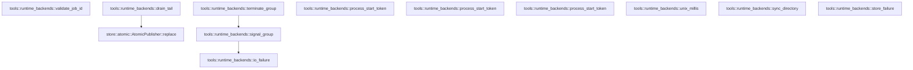

```mermaid
flowchart TD
  n0["tools::runtime_backends::route_public_url_with"]
  n1["tools::runtime_backends::outbound_proxy_for"]
  n2["tools::runtime_backends::no_proxy_exempts"]
  n3["tools::runtime_backends::cidr_contains"]
  n4["tools::runtime_backends::is_public_internet_address"]
  n5["tools::runtime_backends::extract_web_content"]
  n6["tools::runtime_backends::decode_web_text"]
  n7["tools::runtime_backends::looks_like_html"]
  n8["tools::runtime_backends::extract_html_text"]
  n9["tools::runtime_backends::extract_html_title"]
  n10["tools::runtime_backends::is_html_block"]
  n11["tools::runtime_backends::decode_html_entities"]
  n12["tools::runtime_backends::decode_numeric_entity"]
  n13["tools::runtime_backends::collapse_web_whitespace"]
  n14["tools::runtime_backends::html_is_under_rendered"]
  n15["tools::runtime_backends::truncate_characters"]
  n16["tools::runtime_backends::require_canonical_directory"]
  n17["tools::runtime_backends::canonical_invocation_directory"]
  n18["tools::runtime_backends::normalize_policy_roots"]
  n19["tools::runtime_backends::covered_by"]
  n0 --> n1
  n0 --> n4
  n1 --> n2
  n2 --> n3
  n4 --> n4
  n5 --> n6
  n5 --> n7
  n5 --> n8
  n5 --> n14
  n5 --> n15
  n8 --> n9
  n8 --> n10
  n8 --> n11
  n8 --> n13
  n11 --> n12
  n18 --> n16
  n18 --> n19
```

# tools::runtime_backends

[Package atlas](index.md) · [Source](../../src/runtime_backends.rs)

## Declarations

Visibility is the declaration spelling; trait members and reexports require their enclosing interface. `cfg` is not evaluated.

| Symbol | Kind | Visibility | Test / cfg |
|---|---|---|---|
| [tools::runtime_backends::HARD_HELPER_BYTES](../../src/runtime_backends.rs#L30) | const_item | `pub` |  |
| [tools::runtime_backends::HARD_HELPER_READ_BYTES](../../src/runtime_backends.rs#L31) | const_item | `pub` |  |
| [tools::runtime_backends::HARD_HELPER_TIMEOUT_MS](../../src/runtime_backends.rs#L32) | const_item | `pub` |  |
| [tools::runtime_backends::HELPER_PROCESS_OVERHEAD_MS](../../src/runtime_backends.rs#L33) | const_item | `private` |  |
| [tools::runtime_backends::HARD_HTTP_BYTES](../../src/runtime_backends.rs#L34) | const_item | `pub` |  |
| [tools::runtime_backends::HARD_HTTP_TIMEOUT_MS](../../src/runtime_backends.rs#L35) | const_item | `pub` |  |
| [tools::runtime_backends::HARD_JOB_TAIL_BYTES](../../src/runtime_backends.rs#L36) | const_item | `pub` |  |
| [tools::runtime_backends::MAX_REDIRECTS](../../src/runtime_backends.rs#L37) | const_item | `pub` |  |
| [tools::runtime_backends::WEB_FETCH_ACCEPT](../../src/runtime_backends.rs#L38) | const_item | `pub` |  |
| [tools::runtime_backends::WEB_FETCH_MAX_CHARACTERS](../../src/runtime_backends.rs#L40) | const_item | `pub` |  |
| [tools::runtime_backends::WEB_FETCH_MIN_MEANINGFUL_CHARACTERS](../../src/runtime_backends.rs#L41) | const_item | `pub` |  |
| [tools::runtime_backends::WEB_FETCH_USER_AGENT](../../src/runtime_backends.rs#L42) | const_item | `pub` |  |
| [tools::runtime_backends::BackendOutcome](../../src/runtime_backends.rs#L45) | enum_item | `pub` |  |
| [tools::runtime_backends::BackendHold](../../src/runtime_backends.rs#L52) | struct_item | `pub` |  |
| [tools::runtime_backends::BackendUnavailable](../../src/runtime_backends.rs#L58) | struct_item | `pub` |  |
| [tools::runtime_backends::BackendGate](../../src/runtime_backends.rs#L64) | enum_item | `pub` |  |
| [tools::runtime_backends::web_fetch_status_failure](../../src/runtime_backends.rs#L74) | function_item | `private` |  |
| [tools::runtime_backends::BackendFailure](../../src/runtime_backends.rs#L90) | enum_item | `pub` |  |
| [tools::runtime_backends::BackendOutcome::enter](../../src/runtime_backends.rs#L118) | function_item | `private` |  |
| [tools::runtime_backends::CancellationToken](../../src/runtime_backends.rs#L128) | struct_item | `pub` |  |
| [tools::runtime_backends::CancellationToken::cancel](../../src/runtime_backends.rs#L131) | function_item | `pub` |  |
| [tools::runtime_backends::CancellationToken::is_cancelled](../../src/runtime_backends.rs#L136) | function_item | `pub` |  |
| [tools::runtime_backends::HelperInvoker](../../src/runtime_backends.rs#L141) | trait_item | `pub` |  |
| [tools::runtime_backends::HelperInvoker::invoke](../../src/runtime_backends.rs#L142) | function_signature_item | `private` |  |
| [tools::runtime_backends::HelperClient::invoke](../../src/runtime_backends.rs#L150) | function_item | `private` |  |
| [tools::runtime_backends::Arc::invoke](../../src/runtime_backends.rs#L183) | function_item | `private` |  |
| [tools::runtime_backends::BoundedHelper](../../src/runtime_backends.rs#L192) | struct_item | `pub` |  |
| [tools::runtime_backends::BoundedHelper::new](../../src/runtime_backends.rs#L198) | function_item | `pub` |  |
| [tools::runtime_backends::BoundedHelper::invoke](../../src/runtime_backends.rs#L202) | function_item | `pub` |  |
| [tools::runtime_backends::validate_helper_limits](../../src/runtime_backends.rs#L227) | function_item | `private` |  |
| [tools::runtime_backends::JobSpec](../../src/runtime_backends.rs#L294) | struct_item | `pub` |  |
| [tools::runtime_backends::JobLaunchPolicy](../../src/runtime_backends.rs#L312) | struct_item | `pub` |  |
| [tools::runtime_backends::JobLaunchPolicy::new](../../src/runtime_backends.rs#L319) | function_item | `pub` |  |
| [tools::runtime_backends::JobLaunchPolicy::primary_workspace_cwd](../../src/runtime_backends.rs#L358) | function_item | `pub` |  |
| [tools::runtime_backends::JobLaunchPolicy::base_sandbox](../../src/runtime_backends.rs#L363) | function_item | `pub` |  |
| [tools::runtime_backends::JobLaunchPolicy::permitted_write_roots](../../src/runtime_backends.rs#L368) | function_item | `pub` |  |
| [tools::runtime_backends::JobLaunchPolicy::resolve](../../src/runtime_backends.rs#L372) | function_item | `private` |  |
| [tools::runtime_backends::JobState](../../src/runtime_backends.rs#L425) | enum_item | `pub` |  |
| [tools::runtime_backends::JobRecord](../../src/runtime_backends.rs#L435) | struct_item | `pub` |  |
| [tools::runtime_backends::JobRunnerRequest](../../src/runtime_backends.rs#L450) | struct_item | `private` |  |
| [tools::runtime_backends::SandboxedJobLauncher](../../src/runtime_backends.rs#L463) | trait_item | `pub` |  |
| [tools::runtime_backends::SandboxedJobLauncher::runner_command](../../src/runtime_backends.rs#L464) | function_signature_item | `private` |  |
| [tools::runtime_backends::HelperJobLauncher](../../src/runtime_backends.rs#L475) | struct_item | `pub` |  |
| [tools::runtime_backends::HelperJobLauncher::new](../../src/runtime_backends.rs#L481) | function_item | `pub` |  |
| [tools::runtime_backends::HelperJobLauncher::disabled](../../src/runtime_backends.rs#L499) | function_item | `pub` |  |
| [tools::runtime_backends::HelperJobLauncher::runner_command](../../src/runtime_backends.rs#L517) | function_item | `private` |  |
| [tools::runtime_backends::JobBroker](../../src/runtime_backends.rs#L528) | struct_item | `pub` |  |
| [tools::runtime_backends::JobBroker::new](../../src/runtime_backends.rs#L535) | function_item | `pub` |  |
| [tools::runtime_backends::JobBroker::start](../../src/runtime_backends.rs#L558) | function_item | `pub` |  |
| [tools::runtime_backends::JobBroker::start_inner](../../src/runtime_backends.rs#L595) | function_item | `private` |  |
| [tools::runtime_backends::JobBroker::status](../../src/runtime_backends.rs#L717) | function_item | `pub` |  |
| [tools::runtime_backends::JobBroker::status_inner](../../src/runtime_backends.rs#L721) | function_item | `private` |  |
| [tools::runtime_backends::JobBroker::list](../../src/runtime_backends.rs#L748) | function_item | `pub` |  |
| [tools::runtime_backends::JobBroker::list_inner](../../src/runtime_backends.rs#L752) | function_item | `private` |  |
| [tools::runtime_backends::JobBroker::stop](../../src/runtime_backends.rs#L768) | function_item | `pub` |  |
| [tools::runtime_backends::JobBroker::stop_inner](../../src/runtime_backends.rs#L783) | function_item | `private` |  |
| [tools::runtime_backends::JobBroker::job_directory](../../src/runtime_backends.rs#L818) | function_item | `private` |  |
| [tools::runtime_backends::JobBroker::read_record](../../src/runtime_backends.rs#L822) | function_item | `private` |  |
| [tools::runtime_backends::JobBroker::write_record](../../src/runtime_backends.rs#L835) | function_item | `private` |  |
| [tools::runtime_backends::run_job_runner](../../src/runtime_backends.rs#L847) | function_item | `pub` |  |
| [tools::runtime_backends::HttpLimits](../../src/runtime_backends.rs#L945) | struct_item | `pub` |  |
| [tools::runtime_backends::HttpLimits::default](../../src/runtime_backends.rs#L952) | function_item | `private` |  |
| [tools::runtime_backends::HttpLimits::validate](../../src/runtime_backends.rs#L962) | function_item | `private` |  |
| [tools::runtime_backends::HttpFetchResult](../../src/runtime_backends.rs#L983) | struct_item | `pub` |  |
| [tools::runtime_backends::WebExtractionKind](../../src/runtime_backends.rs#L993) | enum_item | `pub` |  |
| [tools::runtime_backends::WebExtraction](../../src/runtime_backends.rs#L1004) | struct_item | `pub` |  |
| [tools::runtime_backends::BoundedHttpClient](../../src/runtime_backends.rs#L1012) | struct_item | `pub` |  |
| [tools::runtime_backends::BoundedHttpClient::new](../../src/runtime_backends.rs#L1017) | function_item | `pub` |  |
| [tools::runtime_backends::BoundedHttpClient::fetch](../../src/runtime_backends.rs#L1022) | function_item | `pub` |  |
| [tools::runtime_backends::BoundedHttpClient::search](../../src/runtime_backends.rs#L1055) | function_item | `pub` |  |
| [tools::runtime_backends::SearchTopic](../../src/runtime_backends.rs#L1104) | enum_item | `pub` |  |
| [tools::runtime_backends::SearchRequest](../../src/runtime_backends.rs#L1110) | struct_item | `pub` |  |
| [tools::runtime_backends::SearchHit](../../src/runtime_backends.rs#L1119) | struct_item | `pub` |  |
| [tools::runtime_backends::SearchProvider](../../src/runtime_backends.rs#L1128) | trait_item | `pub` |  |
| [tools::runtime_backends::SearchProvider::search](../../src/runtime_backends.rs#L1129) | function_signature_item | `private` |  |
| [tools::runtime_backends::fetch_async](../../src/runtime_backends.rs#L1137) | function_item | `private` |  |
| [tools::runtime_backends::resolve_web_redirect](../../src/runtime_backends.rs#L1230) | function_item | `pub` |  |
| [tools::runtime_backends::await_cancel_deadline](../../src/runtime_backends.rs#L1239) | function_item | `private` |  |
| [tools::runtime_backends::PublicRoute](../../src/runtime_backends.rs#L1265) | enum_item | `pub` |  |
| [tools::runtime_backends::PublicRoute::client_builder](../../src/runtime_backends.rs#L1277) | function_item | `pub` |  |
| [tools::runtime_backends::route_public_url](../../src/runtime_backends.rs#L1292) | function_item | `pub` |  |
| [tools::runtime_backends::route_public_url_with](../../src/runtime_backends.rs#L1297) | function_item | `pub` |  |
| [tools::runtime_backends::outbound_proxy_for](../../src/runtime_backends.rs#L1377) | function_item | `private` |  |
| [tools::runtime_backends::no_proxy_exempts](../../src/runtime_backends.rs#L1411) | function_item | `private` |  |
| [tools::runtime_backends::cidr_contains](../../src/runtime_backends.rs#L1462) | function_item | `private` |  |
| [tools::runtime_backends::is_public_internet_address](../../src/runtime_backends.rs#L1488) | function_item | `pub` |  |
| [tools::runtime_backends::extract_web_content](../../src/runtime_backends.rs#L1555) | function_item | `pub` |  |
| [tools::runtime_backends::decode_web_text](../../src/runtime_backends.rs#L1601) | function_item | `private` |  |
| [tools::runtime_backends::looks_like_html](../../src/runtime_backends.rs#L1608) | function_item | `private` |  |
| [tools::runtime_backends::extract_html_text](../../src/runtime_backends.rs#L1617) | function_item | `private` |  |
| [tools::runtime_backends::extract_html_title](../../src/runtime_backends.rs#L1679) | function_item | `private` |  |
| [tools::runtime_backends::is_html_block](../../src/runtime_backends.rs#L1696) | function_item | `private` |  |
| [tools::runtime_backends::decode_html_entities](../../src/runtime_backends.rs#L1721) | function_item | `private` |  |
| [tools::runtime_backends::decode_numeric_entity](../../src/runtime_backends.rs#L1770) | function_item | `private` |  |
| [tools::runtime_backends::collapse_web_whitespace](../../src/runtime_backends.rs#L1780) | function_item | `private` |  |
| [tools::runtime_backends::html_is_under_rendered](../../src/runtime_backends.rs#L1801) | function_item | `private` |  |
| [tools::runtime_backends::truncate_characters](../../src/runtime_backends.rs#L1813) | function_item | `private` |  |
| [tools::runtime_backends::require_canonical_directory](../../src/runtime_backends.rs#L1826) | function_item | `private` |  |
| [tools::runtime_backends::canonical_invocation_directory](../../src/runtime_backends.rs#L1853) | function_item | `private` |  |
| [tools::runtime_backends::normalize_policy_roots](../../src/runtime_backends.rs#L1888) | function_item | `private` |  |
| [tools::runtime_backends::covered_by](../../src/runtime_backends.rs#L1912) | function_item | `private` |  |
| [tools::runtime_backends::validate_job_id](../../src/runtime_backends.rs#L1918) | function_item | `private` |  |
| [tools::runtime_backends::drain_tail](../../src/runtime_backends.rs#L1932) | function_item | `private` |  |
| [tools::runtime_backends::signal_group](../../src/runtime_backends.rs#L1950) | function_item | `private` |  |
| [tools::runtime_backends::terminate_group](../../src/runtime_backends.rs#L1967) | function_item | `private` |  |
| [tools::runtime_backends::process_start_token](../../src/runtime_backends.rs#L1981) | function_item | `private` | #[cfg(target_os = "macos")] |
| [tools::runtime_backends::process_start_token](../../src/runtime_backends.rs#L2006) | function_item | `private` | #[cfg(target_os = "linux")] |
| [tools::runtime_backends::process_start_token](../../src/runtime_backends.rs#L2016) | function_item | `private` | #[cfg(not(any(target_os = "macos", target_os = "linux")))] |
| [tools::runtime_backends::unix_millis](../../src/runtime_backends.rs#L2020) | function_item | `private` |  |
| [tools::runtime_backends::sync_directory](../../src/runtime_backends.rs#L2028) | function_item | `private` |  |
| [tools::runtime_backends::io_failure](../../src/runtime_backends.rs#L2034) | function_item | `private` |  |
| [tools::runtime_backends::store_failure](../../src/runtime_backends.rs#L2038) | function_item | `private` |  |
| [tools::runtime_backends::disabled_job_launcher_tests::mcp_only_launcher_refuses_command_execution](../../src/runtime_backends.rs#L2049) | function_item | `private` | test; #[cfg(test)] |
| [tools::runtime_backends::web_fetch_status_tests::non_success_statuses_classify_by_what_the_server_said](../../src/runtime_backends.rs#L2082) | function_item | `private` | test; #[cfg(test)] |

## Imports / reexports

| Local name | Source path | Visibility |
|---|---|---|
| `BTreeMap` | `std::collections::BTreeMap` | `private` |
| `VecDeque` | `std::collections::VecDeque` | `private` |
| `fs` | `std::fs` | `private` |
| `File` | `std::fs::File` | `private` |
| `Read` | `std::io::Read` | `private` |
| `IpAddr` | `std::net::IpAddr` | `private` |
| `SocketAddr` | `std::net::SocketAddr` | `private` |
| `ToSocketAddrs` | `std::net::ToSocketAddrs` | `private` |
| `_` | `std::os::unix::process::CommandExt` | `private` |
| `Path` | `std::path::Path` | `private` |
| `PathBuf` | `std::path::PathBuf` | `private` |
| `Child` | `std::process::Child` | `private` |
| `Command` | `std::process::Command` | `private` |
| `Stdio` | `std::process::Stdio` | `private` |
| `Arc` | `std::sync::Arc` | `private` |
| `AtomicBool` | `std::sync::atomic::AtomicBool` | `private` |
| `Ordering` | `std::sync::atomic::Ordering` | `private` |
| `thread` | `std::thread` | `private` |
| `Duration` | `std::time::Duration` | `private` |
| `Instant` | `std::time::Instant` | `private` |
| `SystemTime` | `std::time::SystemTime` | `private` |
| `UNIX_EPOCH` | `std::time::UNIX_EPOCH` | `private` |
| `ACCEPT` | `reqwest::header::ACCEPT` | `private` |
| `CONTENT_LENGTH` | `reqwest::header::CONTENT_LENGTH` | `private` |
| `CONTENT_TYPE` | `reqwest::header::CONTENT_TYPE` | `private` |
| `LOCATION` | `reqwest::header::LOCATION` | `private` |
| `USER_AGENT` | `reqwest::header::USER_AGENT` | `private` |
| `Deserialize` | `serde::Deserialize` | `private` |
| `Serialize` | `serde::Serialize` | `private` |
| `AtomicPublisher` | `store::AtomicPublisher` | `private` |
| `NamedLock` | `store::NamedLock` | `private` |
| `Error` | `thiserror::Error` | `private` |
| `HelperClient` | `crate::helper::HelperClient` | `private` |
| `HelperClientError` | `crate::helper::HelperClientError` | `private` |
| `HelperErrorClass` | `crate::helper::HelperErrorClass` | `private` |
| `HelperOperation` | `crate::helper::HelperOperation` | `private` |
| `HelperRequest` | `crate::helper::HelperRequest` | `private` |
| `HelperResponse` | `crate::helper::HelperResponse` | `private` |
| `ProbeStatus` | `crate::sandbox::ProbeStatus` | `private` |
| `SandboxPolicy` | `crate::sandbox::SandboxPolicy` | `private` |
| `sandbox_command` | `crate::sandbox::sandbox_command` | `private` |
| `BackendFailure` | `super::BackendFailure` | `private` |
| `HelperJobLauncher` | `super::HelperJobLauncher` | `private` |
| `JobSpec` | `super::JobSpec` | `private` |
| `SandboxedJobLauncher` | `super::SandboxedJobLauncher` | `private` |
| `NetworkPolicy` | `crate::NetworkPolicy` | `private` |
| `SandboxPolicy` | `crate::SandboxPolicy` | `private` |
| `BTreeMap` | `std::collections::BTreeMap` | `private` |
| `BackendFailure` | `super::BackendFailure` | `private` |
| `web_fetch_status_failure` | `super::web_fetch_status_failure` | `private` |
| `StatusCode` | `reqwest::StatusCode` | `private` |

## Module declarations

| Module | Visibility | Attributes |
|---|---|---|
| `tools::runtime_backends::disabled_job_launcher_tests` | `private` | #[cfg(test)] |
| `tools::runtime_backends::web_fetch_status_tests` | `private` | #[cfg(test)] |

## Function call graphs

Edges below are syntactically resolved calls only, including private functions. Graphs partition callers into groups of 20; they are not execution order. All unresolved sites are listed below and in the JSON inventory.

Functions 1–20: 19 direct edges

Functions 21–40: 33 direct edges

Functions 41–60: 17 direct edges

Functions 61–71: 3 direct edges

## Call sites

Includes test functions (marked in declarations). Receiver-type-required sites need type analysis/manual tracing. Calls in closures are attributed to their enclosing function; their occurrence here does not mean the closure executes immediately.

| Caller | Callee expression | Source lines | Target / classification |
|---|---|---|---|
| `web_fetch_status_failure` | `status.as_u16` | [75](../../src/runtime_backends.rs#L75) | receiver-type-required |
| `web_fetch_status_failure` | `BackendFailure::NotFound` | [77](../../src/runtime_backends.rs#L77) | external-constructor-callback-or-unresolved |
| `web_fetch_status_failure` | `BackendFailure::Denied` | [78](../../src/runtime_backends.rs#L78) | external-constructor-callback-or-unresolved |
| `web_fetch_status_failure` | `BackendFailure::Limit` | [80](../../src/runtime_backends.rs#L80) | external-constructor-callback-or-unresolved |
| `web_fetch_status_failure` | `status.is_client_error` | [81](../../src/runtime_backends.rs#L81) | receiver-type-required |
| `web_fetch_status_failure` | `BackendFailure::Invalid` | [81](../../src/runtime_backends.rs#L81) | external-constructor-callback-or-unresolved |
| `web_fetch_status_failure` | `status.is_server_error` | [84](../../src/runtime_backends.rs#L84) | receiver-type-required |
| `web_fetch_status_failure` | `BackendFailure::Unavailable` | [84](../../src/runtime_backends.rs#L84) | external-constructor-callback-or-unresolved |
| `web_fetch_status_failure` | `BackendFailure::Protocol` | [85](../../src/runtime_backends.rs#L85) | external-constructor-callback-or-unresolved |
| `enter` | `Ok` | [120](../../src/runtime_backends.rs#L120) | external-constructor-callback-or-unresolved |
| `enter` | `Err` | [121](../../src/runtime_backends.rs#L121), [122](../../src/runtime_backends.rs#L122) | external-constructor-callback-or-unresolved |
| `enter` | `Self::Hold` | [121](../../src/runtime_backends.rs#L121) | external-constructor-callback-or-unresolved |
| `enter` | `Self::Unavailable` | [122](../../src/runtime_backends.rs#L122) | external-constructor-callback-or-unresolved |
| `cancel` | `self.0.store` | [132](../../src/runtime_backends.rs#L132) | receiver-type-required |
| `is_cancelled` | `self.0.load` | [137](../../src/runtime_backends.rs#L137) | receiver-type-required |
| `invoke` | `exec.timeout_ms.map` | [159](../../src/runtime_backends.rs#L159) | receiver-type-required |
| `invoke` | `Duration::from_millis` | [160](../../src/runtime_backends.rs#L160) | external-constructor-callback-or-unresolved |
| `invoke` | `timeout.saturating_add` | [160](../../src/runtime_backends.rs#L160) | receiver-type-required |
| `invoke` | `Some` | [162](../../src/runtime_backends.rs#L162) | external-constructor-callback-or-unresolved |
| `invoke` | `Duration::from_secs` | [162](../../src/runtime_backends.rs#L162) | external-constructor-callback-or-unresolved |
| `invoke` | `self.execute_cancellable(request, timeout, &#124;&#124; cancellation.is_cancelled())             .map_err` | [164](../../src/runtime_backends.rs#L164) | receiver-type-required |
| `invoke` | `self.execute_cancellable` | [164](../../src/runtime_backends.rs#L164) | receiver-type-required |
| `invoke` | `cancellation.is_cancelled` | [164](../../src/runtime_backends.rs#L164) | receiver-type-required |
| `invoke` | `BackendFailure::Limit` | [169](../../src/runtime_backends.rs#L169) | external-constructor-callback-or-unresolved |
| `invoke` | `BackendFailure::Denied` | [170](../../src/runtime_backends.rs#L170) | external-constructor-callback-or-unresolved |
| `invoke` | `BackendFailure::NotFound` | [171](../../src/runtime_backends.rs#L171) | external-constructor-callback-or-unresolved |
| `invoke` | `BackendFailure::Unavailable` | [173](../../src/runtime_backends.rs#L173) | external-constructor-callback-or-unresolved |
| `invoke` | `BackendFailure::Protocol` | [175](../../src/runtime_backends.rs#L175) | external-constructor-callback-or-unresolved |
| `invoke` | `BackendFailure::Io` | [176](../../src/runtime_backends.rs#L176) | external-constructor-callback-or-unresolved |
| `invoke` | `error.to_string` | [176](../../src/runtime_backends.rs#L176) | receiver-type-required |
| `invoke` | `(**self).invoke` | [188](../../src/runtime_backends.rs#L188) | receiver-type-required |
| `invoke` | `BackendOutcome::enter` | [208](../../src/runtime_backends.rs#L208) | [tools::runtime_backends::BackendOutcome::enter](../../src/runtime_backends.rs#L118) |
| `invoke` | `cancellation.is_cancelled` | [211](../../src/runtime_backends.rs#L211) | receiver-type-required |
| `invoke` | `BackendOutcome::Completed` | [212](../../src/runtime_backends.rs#L212), [215](../../src/runtime_backends.rs#L215), [223](../../src/runtime_backends.rs#L223) | external-constructor-callback-or-unresolved |
| `invoke` | `Err` | [212](../../src/runtime_backends.rs#L212), [215](../../src/runtime_backends.rs#L215) | external-constructor-callback-or-unresolved |
| `invoke` | `validate_helper_limits` | [214](../../src/runtime_backends.rs#L214) | [tools::runtime_backends::validate_helper_limits](../../src/runtime_backends.rs#L227) |
| `invoke` | `BackendOutcome::Unavailable` | [218](../../src/runtime_backends.rs#L218) | external-constructor-callback-or-unresolved |
| `invoke` | `"exec-helper".to_owned` | [219](../../src/runtime_backends.rs#L219) | receiver-type-required |
| `invoke` | `"helper process is not configured".to_owned` | [220](../../src/runtime_backends.rs#L220) | receiver-type-required |
| `invoke` | `invoker.invoke` | [223](../../src/runtime_backends.rs#L223) | receiver-type-required |
| `validate_helper_limits` | `Err` | [230](../../src/runtime_backends.rs#L230), [251](../../src/runtime_backends.rs#L251), [259](../../src/runtime_backends.rs#L259), [270](../../src/runtime_backends.rs#L270), [282](../../src/runtime_backends.rs#L282) | external-constructor-callback-or-unresolved |
| `validate_helper_limits` | `BackendFailure::Limit` | [230](../../src/runtime_backends.rs#L230), [251](../../src/runtime_backends.rs#L251), [259](../../src/runtime_backends.rs#L259), [270](../../src/runtime_backends.rs#L270), [282](../../src/runtime_backends.rs#L282) | external-constructor-callback-or-unresolved |
| `validate_helper_limits` | `Ok` | [234](../../src/runtime_backends.rs#L234), [253](../../src/runtime_backends.rs#L253), [263](../../src/runtime_backends.rs#L263), [274](../../src/runtime_backends.rs#L274), [286](../../src/runtime_backends.rs#L286) | external-constructor-callback-or-unresolved |
| `validate_helper_limits` | `bounded` | [239](../../src/runtime_backends.rs#L239), [241](../../src/runtime_backends.rs#L241), [248](../../src/runtime_backends.rs#L248), [249](../../src/runtime_backends.rs#L249), [256](../../src/runtime_backends.rs#L256), [257](../../src/runtime_backends.rs#L257) | external-constructor-callback-or-unresolved |
| `validate_helper_limits` | `"grep context limit exceeded".into` | [251](../../src/runtime_backends.rs#L251) | receiver-type-required |
| `validate_helper_limits` | `Some` | [258](../../src/runtime_backends.rs#L258) | external-constructor-callback-or-unresolved |
| `validate_helper_limits` | `"timeout_ms must be at least 1".into` | [260](../../src/runtime_backends.rs#L260) | receiver-type-required |
| `validate_helper_limits` | `content                 .decode()                 .map_err` | [266](../../src/runtime_backends.rs#L266) | receiver-type-required |
| `validate_helper_limits` | `content                 .decode` | [266](../../src/runtime_backends.rs#L266) | receiver-type-required |
| `validate_helper_limits` | `BackendFailure::Invalid` | [268](../../src/runtime_backends.rs#L268), [280](../../src/runtime_backends.rs#L280) | external-constructor-callback-or-unresolved |
| `validate_helper_limits` | `error.to_string` | [268](../../src/runtime_backends.rs#L268), [280](../../src/runtime_backends.rs#L280) | receiver-type-required |
| `validate_helper_limits` | `bytes.len` | [269](../../src/runtime_backends.rs#L269), [281](../../src/runtime_backends.rs#L281) | receiver-type-required |
| `validate_helper_limits` | `"content exceeds helper byte limit".into` | [271](../../src/runtime_backends.rs#L271) | receiver-type-required |
| `validate_helper_limits` | `replacement                 .decode()                 .map_err` | [278](../../src/runtime_backends.rs#L278) | receiver-type-required |
| `validate_helper_limits` | `replacement                 .decode` | [278](../../src/runtime_backends.rs#L278) | receiver-type-required |
| `validate_helper_limits` | `"replacement exceeds helper byte limit".into` | [283](../../src/runtime_backends.rs#L283) | receiver-type-required |
| `new` | `base_sandbox             .validate()             .map_err` | [324](../../src/runtime_backends.rs#L324) | receiver-type-required |
| `new` | `base_sandbox             .validate` | [324](../../src/runtime_backends.rs#L324) | receiver-type-required |
| `new` | `BackendFailure::Invalid` | [326](../../src/runtime_backends.rs#L326) | external-constructor-callback-or-unresolved |
| `new` | `error.to_string` | [326](../../src/runtime_backends.rs#L326) | receiver-type-required |
| `new` | `require_canonical_directory` | [328](../../src/runtime_backends.rs#L328), [332](../../src/runtime_backends.rs#L332), [335](../../src/runtime_backends.rs#L335), [338](../../src/runtime_backends.rs#L338) | [tools::runtime_backends::require_canonical_directory](../../src/runtime_backends.rs#L1826) |
| `new` | `primary_workspace_cwd.into` | [328](../../src/runtime_backends.rs#L328) | receiver-type-required |
| `new` | `base_sandbox             .read_roots             .iter()             .map(&#124;root&#124; require_canonical_directory(root, "sandbox read root"))             .collect::<Result<Vec<_>, _>>` | [329](../../src/runtime_backends.rs#L329) | receiver-type-required |
| `new` | `base_sandbox             .read_roots             .iter()             .map` | [329](../../src/runtime_backends.rs#L329) | receiver-type-required |
| `new` | `base_sandbox             .read_roots             .iter` | [329](../../src/runtime_backends.rs#L329) | receiver-type-required |
| `new` | `covered_by` | [340](../../src/runtime_backends.rs#L340) | [tools::runtime_backends::covered_by](../../src/runtime_backends.rs#L1912) |
| `new` | `Err` | [341](../../src/runtime_backends.rs#L341) | external-constructor-callback-or-unresolved |
| `new` | `BackendFailure::Denied` | [341](../../src/runtime_backends.rs#L341) | external-constructor-callback-or-unresolved |
| `new` | `"primary workspace cwd is outside sandbox read roots".to_owned` | [342](../../src/runtime_backends.rs#L342) | receiver-type-required |
| `new` | `normalize_policy_roots` | [345](../../src/runtime_backends.rs#L345) | [tools::runtime_backends::normalize_policy_roots](../../src/runtime_backends.rs#L1888) |
| `new` | `Ok` | [350](../../src/runtime_backends.rs#L350) | external-constructor-callback-or-unresolved |
| `resolve` | `spec.working_directory.as_deref` | [373](../../src/runtime_backends.rs#L373) | receiver-type-required |
| `resolve` | `canonical_invocation_directory` | [374](../../src/runtime_backends.rs#L374), [389](../../src/runtime_backends.rs#L389) | [tools::runtime_backends::canonical_invocation_directory](../../src/runtime_backends.rs#L1853) |
| `resolve` | `self.primary_workspace_cwd.clone` | [379](../../src/runtime_backends.rs#L379) | receiver-type-required |
| `resolve` | `covered_by` | [381](../../src/runtime_backends.rs#L381), [394](../../src/runtime_backends.rs#L394) | [tools::runtime_backends::covered_by](../../src/runtime_backends.rs#L1912) |
| `resolve` | `Err` | [382](../../src/runtime_backends.rs#L382), [395](../../src/runtime_backends.rs#L395), [400](../../src/runtime_backends.rs#L400) | external-constructor-callback-or-unresolved |
| `resolve` | `BackendFailure::Denied` | [382](../../src/runtime_backends.rs#L382), [395](../../src/runtime_backends.rs#L395) | external-constructor-callback-or-unresolved |
| `resolve` | `"job working directory is outside sandbox read roots".to_owned` | [383](../../src/runtime_backends.rs#L383) | receiver-type-required |
| `resolve` | `Vec::with_capacity` | [387](../../src/runtime_backends.rs#L387) | external-constructor-callback-or-unresolved |
| `resolve` | `spec.writable_paths.len` | [387](../../src/runtime_backends.rs#L387) | receiver-type-required |
| `resolve` | `requested.iter().any` | [399](../../src/runtime_backends.rs#L399) | receiver-type-required |
| `resolve` | `requested.iter` | [399](../../src/runtime_backends.rs#L399) | receiver-type-required |
| `resolve` | `BackendFailure::Invalid` | [400](../../src/runtime_backends.rs#L400), [418](../../src/runtime_backends.rs#L418) | external-constructor-callback-or-unresolved |
| `resolve` | `"job writable paths contain duplicate canonical roots".to_owned` | [401](../../src/runtime_backends.rs#L401) | receiver-type-required |
| `resolve` | `requested.push` | [404](../../src/runtime_backends.rs#L404) | receiver-type-required |
| `resolve` | `requested.sort_by` | [406](../../src/runtime_backends.rs#L406) | receiver-type-required |
| `resolve` | `left.as_bytes().cmp` | [406](../../src/runtime_backends.rs#L406), [414](../../src/runtime_backends.rs#L414) | receiver-type-required |
| `resolve` | `left.as_bytes` | [406](../../src/runtime_backends.rs#L406), [414](../../src/runtime_backends.rs#L414) | receiver-type-required |
| `resolve` | `right.as_bytes` | [406](../../src/runtime_backends.rs#L406), [414](../../src/runtime_backends.rs#L414) | receiver-type-required |
| `resolve` | `Some` | [408](../../src/runtime_backends.rs#L408) | external-constructor-callback-or-unresolved |
| `resolve` | `requested.clone` | [409](../../src/runtime_backends.rs#L409) | receiver-type-required |
| `resolve` | `self.base_sandbox.clone` | [410](../../src/runtime_backends.rs#L410) | receiver-type-required |
| `resolve` | `effective.write_roots.extend` | [411](../../src/runtime_backends.rs#L411) | receiver-type-required |
| `resolve` | `effective             .write_roots             .sort_by` | [412](../../src/runtime_backends.rs#L412) | receiver-type-required |
| `resolve` | `effective.write_roots.dedup` | [415](../../src/runtime_backends.rs#L415) | receiver-type-required |
| `resolve` | `effective             .validate()             .map_err` | [416](../../src/runtime_backends.rs#L416) | receiver-type-required |
| `resolve` | `effective             .validate` | [416](../../src/runtime_backends.rs#L416) | receiver-type-required |
| `resolve` | `error.to_string` | [418](../../src/runtime_backends.rs#L418) | receiver-type-required |
| `resolve` | `Ok` | [419](../../src/runtime_backends.rs#L419) | external-constructor-callback-or-unresolved |
| `new` | `executable.into` | [482](../../src/runtime_backends.rs#L482) | receiver-type-required |
| `new` | `executable.is_absolute` | [483](../../src/runtime_backends.rs#L483) | receiver-type-required |
| `new` | `executable.is_file` | [483](../../src/runtime_backends.rs#L483) | receiver-type-required |
| `new` | `Err` | [484](../../src/runtime_backends.rs#L484), [489](../../src/runtime_backends.rs#L489) | external-constructor-callback-or-unresolved |
| `new` | `BackendFailure::Unavailable` | [484](../../src/runtime_backends.rs#L484), [489](../../src/runtime_backends.rs#L489) | external-constructor-callback-or-unresolved |
| `new` | `"tekes-helper executable is not an absolute regular file".to_owned` | [485](../../src/runtime_backends.rs#L485) | receiver-type-required |
| `new` | `"job sandbox backend is unavailable".to_owned` | [490](../../src/runtime_backends.rs#L490) | receiver-type-required |
| `new` | `Ok` | [493](../../src/runtime_backends.rs#L493) | external-constructor-callback-or-unresolved |
| `disabled` | `executable.into` | [500](../../src/runtime_backends.rs#L500) | receiver-type-required |
| `disabled` | `executable.is_absolute` | [501](../../src/runtime_backends.rs#L501) | receiver-type-required |
| `disabled` | `executable.is_file` | [501](../../src/runtime_backends.rs#L501) | receiver-type-required |
| `disabled` | `Err` | [502](../../src/runtime_backends.rs#L502) | external-constructor-callback-or-unresolved |
| `disabled` | `BackendFailure::Unavailable` | [502](../../src/runtime_backends.rs#L502) | external-constructor-callback-or-unresolved |
| `disabled` | `"tekes-helper executable is not an absolute regular file".to_owned` | [503](../../src/runtime_backends.rs#L503) | receiver-type-required |
| `disabled` | `Ok` | [506](../../src/runtime_backends.rs#L506) | external-constructor-callback-or-unresolved |
| `disabled` | `"per-job sandbox unavailable in MCP-only App Sandbox host".to_owned` | [510](../../src/runtime_backends.rs#L510) | receiver-type-required |
| `runner_command` | `sandbox_command(effective_policy, &self.probe, &self.executable)             .map_err` | [522](../../src/runtime_backends.rs#L522) | receiver-type-required |
| `runner_command` | `sandbox_command` | [522](../../src/runtime_backends.rs#L522) | [tools::sandbox::sandbox_command](../../src/sandbox.rs#L258) |
| `runner_command` | `BackendFailure::Unavailable` | [523](../../src/runtime_backends.rs#L523) | external-constructor-callback-or-unresolved |
| `runner_command` | `error.to_string` | [523](../../src/runtime_backends.rs#L523) | receiver-type-required |
| `new` | `Err` | [537](../../src/runtime_backends.rs#L537), [548](../../src/runtime_backends.rs#L548) | external-constructor-callback-or-unresolved |
| `new` | `BackendFailure::Limit` | [537](../../src/runtime_backends.rs#L537) | external-constructor-callback-or-unresolved |
| `new` | `root.into` | [541](../../src/runtime_backends.rs#L541) | receiver-type-required |
| `new` | `fs::create_dir_all(&root).map_err` | [542](../../src/runtime_backends.rs#L542) | receiver-type-required |
| `new` | `fs::create_dir_all` | [542](../../src/runtime_backends.rs#L542) | external-constructor-callback-or-unresolved |
| `new` | `fs::symlink_metadata(&root)             .map_err(io_failure)?             .file_type()             .is_symlink` | [543](../../src/runtime_backends.rs#L543) | receiver-type-required |
| `new` | `fs::symlink_metadata(&root)             .map_err(io_failure)?             .file_type` | [543](../../src/runtime_backends.rs#L543) | receiver-type-required |
| `new` | `fs::symlink_metadata(&root)             .map_err` | [543](../../src/runtime_backends.rs#L543) | receiver-type-required |
| `new` | `fs::symlink_metadata` | [543](../../src/runtime_backends.rs#L543) | external-constructor-callback-or-unresolved |
| `new` | `BackendFailure::Denied` | [548](../../src/runtime_backends.rs#L548) | external-constructor-callback-or-unresolved |
| `new` | `"job root is a symlink".to_owned` | [548](../../src/runtime_backends.rs#L548) | receiver-type-required |
| `new` | `fs::canonicalize(root).map_err` | [550](../../src/runtime_backends.rs#L550) | receiver-type-required |
| `new` | `fs::canonicalize` | [550](../../src/runtime_backends.rs#L550) | external-constructor-callback-or-unresolved |
| `new` | `Ok` | [551](../../src/runtime_backends.rs#L551) | external-constructor-callback-or-unresolved |
| `new` | `Duration::from_millis` | [554](../../src/runtime_backends.rs#L554) | external-constructor-callback-or-unresolved |
| `start` | `BackendOutcome::enter` | [567](../../src/runtime_backends.rs#L567) | [tools::runtime_backends::BackendOutcome::enter](../../src/runtime_backends.rs#L118) |
| `start` | `cancellation.is_cancelled` | [570](../../src/runtime_backends.rs#L570) | receiver-type-required |
| `start` | `BackendOutcome::Completed` | [571](../../src/runtime_backends.rs#L571), [574](../../src/runtime_backends.rs#L574), [577](../../src/runtime_backends.rs#L577), [583](../../src/runtime_backends.rs#L583), [586](../../src/runtime_backends.rs#L586) | external-constructor-callback-or-unresolved |
| `start` | `Err` | [571](../../src/runtime_backends.rs#L571), [574](../../src/runtime_backends.rs#L574), [577](../../src/runtime_backends.rs#L577), [583](../../src/runtime_backends.rs#L583) | external-constructor-callback-or-unresolved |
| `start` | `validate_job_id` | [573](../../src/runtime_backends.rs#L573) | [tools::runtime_backends::validate_job_id](../../src/runtime_backends.rs#L1918) |
| `start` | `spec.program.is_empty` | [576](../../src/runtime_backends.rs#L576) | receiver-type-required |
| `start` | `spec.program.as_bytes().contains` | [576](../../src/runtime_backends.rs#L576) | receiver-type-required |
| `start` | `spec.program.as_bytes` | [576](../../src/runtime_backends.rs#L576) | receiver-type-required |
| `start` | `BackendFailure::Invalid` | [577](../../src/runtime_backends.rs#L577) | external-constructor-callback-or-unresolved |
| `start` | `"job program is empty or contains NUL".to_owned` | [578](../../src/runtime_backends.rs#L578) | receiver-type-required |
| `start` | `launch_policy.resolve` | [581](../../src/runtime_backends.rs#L581) | receiver-type-required |
| `start` | `self.start_inner` | [586](../../src/runtime_backends.rs#L586) | [tools::runtime_backends::JobBroker::start_inner](../../src/runtime_backends.rs#L595) |
| `start_inner` | `self.job_directory` | [603](../../src/runtime_backends.rs#L603) | [tools::runtime_backends::JobBroker::job_directory](../../src/runtime_backends.rs#L818) |
| `start_inner` | `fs::create_dir(&directory).map_err` | [604](../../src/runtime_backends.rs#L604) | receiver-type-required |
| `start_inner` | `fs::create_dir` | [604](../../src/runtime_backends.rs#L604) | external-constructor-callback-or-unresolved |
| `start_inner` | `error.kind` | [605](../../src/runtime_backends.rs#L605) | receiver-type-required |
| `start_inner` | `BackendFailure::Conflict` | [606](../../src/runtime_backends.rs#L606) | external-constructor-callback-or-unresolved |
| `start_inner` | `io_failure` | [608](../../src/runtime_backends.rs#L608) | [tools::runtime_backends::io_failure](../../src/runtime_backends.rs#L2034) |
| `start_inner` | `sync_directory` | [611](../../src/runtime_backends.rs#L611) | [tools::runtime_backends::sync_directory](../../src/runtime_backends.rs#L2028) |
| `start_inner` | `unix_millis` | [612](../../src/runtime_backends.rs#L612), [634](../../src/runtime_backends.rs#L634), [694](../../src/runtime_backends.rs#L694), [702](../../src/runtime_backends.rs#L702) | [tools::runtime_backends::unix_millis](../../src/runtime_backends.rs#L2020) |
| `start_inner` | `id.to_owned` | [615](../../src/runtime_backends.rs#L615), [642](../../src/runtime_backends.rs#L642) | receiver-type-required |
| `start_inner` | `spec.clone` | [616](../../src/runtime_backends.rs#L616), [644](../../src/runtime_backends.rs#L644) | receiver-type-required |
| `start_inner` | `"stdout.tail".to_owned` | [622](../../src/runtime_backends.rs#L622) | receiver-type-required |
| `start_inner` | `"stderr.tail".to_owned` | [623](../../src/runtime_backends.rs#L623) | receiver-type-required |
| `start_inner` | `self.write_record` | [625](../../src/runtime_backends.rs#L625), [635](../../src/runtime_backends.rs#L635), [695](../../src/runtime_backends.rs#L695), [703](../../src/runtime_backends.rs#L703) | [tools::runtime_backends::JobBroker::write_record](../../src/runtime_backends.rs#L835) |
| `start_inner` | `AtomicPublisher::replace(directory.join(&starting.stdout_tail), b"")             .map_err` | [626](../../src/runtime_backends.rs#L626) | receiver-type-required |
| `start_inner` | `AtomicPublisher::replace` | [626](../../src/runtime_backends.rs#L626), [628](../../src/runtime_backends.rs#L628), [649](../../src/runtime_backends.rs#L649), [706](../../src/runtime_backends.rs#L706) | [store::atomic::AtomicPublisher::replace](../../../store/src/atomic.rs#L16) |
| `start_inner` | `directory.join` | [626](../../src/runtime_backends.rs#L626), [628](../../src/runtime_backends.rs#L628), [646](../../src/runtime_backends.rs#L646), [706](../../src/runtime_backends.rs#L706) | receiver-type-required |
| `start_inner` | `AtomicPublisher::replace(directory.join(&starting.stderr_tail), b"")             .map_err` | [628](../../src/runtime_backends.rs#L628) | receiver-type-required |
| `start_inner` | `cancellation.is_cancelled` | [631](../../src/runtime_backends.rs#L631), [699](../../src/runtime_backends.rs#L699) | receiver-type-required |
| `start_inner` | `Err` | [636](../../src/runtime_backends.rs#L636), [679](../../src/runtime_backends.rs#L679), [697](../../src/runtime_backends.rs#L697), [704](../../src/runtime_backends.rs#L704) | external-constructor-callback-or-unresolved |
| `start_inner` | `self.root.to_string_lossy().into_owned` | [641](../../src/runtime_backends.rs#L641) | receiver-type-required |
| `start_inner` | `self.root.to_string_lossy` | [641](../../src/runtime_backends.rs#L641) | receiver-type-required |
| `start_inner` | `serde_json_canonicalizer::to_vec(&runner_request)             .map_err` | [647](../../src/runtime_backends.rs#L647) | receiver-type-required |
| `start_inner` | `serde_json_canonicalizer::to_vec` | [647](../../src/runtime_backends.rs#L647) | external-constructor-callback-or-unresolved |
| `start_inner` | `BackendFailure::Protocol` | [648](../../src/runtime_backends.rs#L648) | external-constructor-callback-or-unresolved |
| `start_inner` | `error.to_string` | [648](../../src/runtime_backends.rs#L648), [665](../../src/runtime_backends.rs#L665) | receiver-type-required |
| `start_inner` | `AtomicPublisher::replace(&request_path, &request_bytes).map_err` | [649](../../src/runtime_backends.rs#L649) | receiver-type-required |
| `start_inner` | `require_canonical_directory` | [652](../../src/runtime_backends.rs#L652) | [tools::runtime_backends::require_canonical_directory](../../src/runtime_backends.rs#L1826) |
| `start_inner` | `directory.to_string_lossy` | [652](../../src/runtime_backends.rs#L652) | receiver-type-required |
| `start_inner` | `effective_policy.read_roots.push` | [653](../../src/runtime_backends.rs#L653) | receiver-type-required |
| `start_inner` | `job_directory.clone` | [653](../../src/runtime_backends.rs#L653) | receiver-type-required |
| `start_inner` | `effective_policy.write_roots.push` | [654](../../src/runtime_backends.rs#L654) | receiver-type-required |
| `start_inner` | `effective_policy             .read_roots             .sort_by` | [655](../../src/runtime_backends.rs#L655) | receiver-type-required |
| `start_inner` | `left.as_bytes().cmp` | [657](../../src/runtime_backends.rs#L657), [661](../../src/runtime_backends.rs#L661) | receiver-type-required |
| `start_inner` | `left.as_bytes` | [657](../../src/runtime_backends.rs#L657), [661](../../src/runtime_backends.rs#L661) | receiver-type-required |
| `start_inner` | `right.as_bytes` | [657](../../src/runtime_backends.rs#L657), [661](../../src/runtime_backends.rs#L661) | receiver-type-required |
| `start_inner` | `effective_policy.read_roots.dedup` | [658](../../src/runtime_backends.rs#L658) | receiver-type-required |
| `start_inner` | `effective_policy             .write_roots             .sort_by` | [659](../../src/runtime_backends.rs#L659) | receiver-type-required |
| `start_inner` | `effective_policy.write_roots.dedup` | [662](../../src/runtime_backends.rs#L662) | receiver-type-required |
| `start_inner` | `effective_policy             .validate()             .map_err` | [663](../../src/runtime_backends.rs#L663) | receiver-type-required |
| `start_inner` | `effective_policy             .validate` | [663](../../src/runtime_backends.rs#L663) | receiver-type-required |
| `start_inner` | `BackendFailure::Invalid` | [665](../../src/runtime_backends.rs#L665) | external-constructor-callback-or-unresolved |
| `start_inner` | `launcher.runner_command` | [667](../../src/runtime_backends.rs#L667) | receiver-type-required |
| `start_inner` | `command             .arg("--job-runner")             .arg(&request_path)             .stdin(Stdio::null())             .stdout(Stdio::null())             .stderr` | [668](../../src/runtime_backends.rs#L668) | receiver-type-required |
| `start_inner` | `command             .arg("--job-runner")             .arg(&request_path)             .stdin(Stdio::null())             .stdout` | [668](../../src/runtime_backends.rs#L668) | receiver-type-required |
| `start_inner` | `command             .arg("--job-runner")             .arg(&request_path)             .stdin` | [668](../../src/runtime_backends.rs#L668) | receiver-type-required |
| `start_inner` | `command             .arg("--job-runner")             .arg` | [668](../../src/runtime_backends.rs#L668) | receiver-type-required |
| `start_inner` | `command             .arg` | [668](../../src/runtime_backends.rs#L668) | receiver-type-required |
| `start_inner` | `Stdio::null` | [671](../../src/runtime_backends.rs#L671), [672](../../src/runtime_backends.rs#L672), [673](../../src/runtime_backends.rs#L673) | external-constructor-callback-or-unresolved |
| `start_inner` | `command.pre_exec` | [677](../../src/runtime_backends.rs#L677) | receiver-type-required |
| `start_inner` | `libc::setsid` | [678](../../src/runtime_backends.rs#L678) | external-constructor-callback-or-unresolved |
| `start_inner` | `std::io::Error::last_os_error` | [679](../../src/runtime_backends.rs#L679) | external-constructor-callback-or-unresolved |
| `start_inner` | `Ok` | [681](../../src/runtime_backends.rs#L681), [714](../../src/runtime_backends.rs#L714) | external-constructor-callback-or-unresolved |
| `start_inner` | `command.spawn().map_err` | [684](../../src/runtime_backends.rs#L684) | receiver-type-required |
| `start_inner` | `command.spawn` | [684](../../src/runtime_backends.rs#L684) | receiver-type-required |
| `start_inner` | `child.id` | [685](../../src/runtime_backends.rs#L685) | receiver-type-required |
| `start_inner` | `process_start_token(pid).ok_or_else` | [686](../../src/runtime_backends.rs#L686) | receiver-type-required |
| `start_inner` | `process_start_token` | [686](../../src/runtime_backends.rs#L686) | ambiguous-cfg-or-overload |
| `start_inner` | `terminate_group` | [687](../../src/runtime_backends.rs#L687), [696](../../src/runtime_backends.rs#L696), [700](../../src/runtime_backends.rs#L700) | [tools::runtime_backends::terminate_group](../../src/runtime_backends.rs#L1967) |
| `start_inner` | `Duration::from_millis` | [687](../../src/runtime_backends.rs#L687), [696](../../src/runtime_backends.rs#L696), [700](../../src/runtime_backends.rs#L700) | external-constructor-callback-or-unresolved |
| `start_inner` | `BackendFailure::Unknown` | [688](../../src/runtime_backends.rs#L688) | external-constructor-callback-or-unresolved |
| `start_inner` | `"could not obtain process start identity".to_owned` | [688](../../src/runtime_backends.rs#L688) | receiver-type-required |
| `start_inner` | `Some` | [692](../../src/runtime_backends.rs#L692), [693](../../src/runtime_backends.rs#L693) | external-constructor-callback-or-unresolved |
| `start_inner` | `AtomicPublisher::replace(directory.join("start.permit"), b"start\n")             .map_err` | [706](../../src/runtime_backends.rs#L706) | receiver-type-required |
| `start_inner` | `thread::spawn` | [711](../../src/runtime_backends.rs#L711) | external-constructor-callback-or-unresolved |
| `start_inner` | `child.wait` | [712](../../src/runtime_backends.rs#L712) | receiver-type-required |
| `status` | `BackendOutcome::Completed` | [718](../../src/runtime_backends.rs#L718) | external-constructor-callback-or-unresolved |
| `status` | `self.status_inner` | [718](../../src/runtime_backends.rs#L718) | [tools::runtime_backends::JobBroker::status_inner](../../src/runtime_backends.rs#L721) |
| `status_inner` | `validate_job_id` | [722](../../src/runtime_backends.rs#L722) | [tools::runtime_backends::validate_job_id](../../src/runtime_backends.rs#L1918) |
| `status_inner` | `self.read_record` | [723](../../src/runtime_backends.rs#L723) | [tools::runtime_backends::JobBroker::read_record](../../src/runtime_backends.rs#L822) |
| `status_inner` | `unix_millis` | [729](../../src/runtime_backends.rs#L729), [741](../../src/runtime_backends.rs#L741) | [tools::runtime_backends::unix_millis](../../src/runtime_backends.rs#L2020) |
| `status_inner` | `self.write_record` | [730](../../src/runtime_backends.rs#L730), [742](../../src/runtime_backends.rs#L742) | [tools::runtime_backends::JobBroker::write_record](../../src/runtime_backends.rs#L835) |
| `status_inner` | `record                     .pid                     .zip(record.process_start.as_deref())                     .is_some_and` | [733](../../src/runtime_backends.rs#L733) | receiver-type-required |
| `status_inner` | `record                     .pid                     .zip` | [733](../../src/runtime_backends.rs#L733) | receiver-type-required |
| `status_inner` | `record.process_start.as_deref` | [735](../../src/runtime_backends.rs#L735) | receiver-type-required |
| `status_inner` | `process_start_token(pid).as_deref` | [737](../../src/runtime_backends.rs#L737) | receiver-type-required |
| `status_inner` | `process_start_token` | [737](../../src/runtime_backends.rs#L737) | ambiguous-cfg-or-overload |
| `status_inner` | `Some` | [737](../../src/runtime_backends.rs#L737) | external-constructor-callback-or-unresolved |
| `status_inner` | `Ok` | [745](../../src/runtime_backends.rs#L745) | external-constructor-callback-or-unresolved |
| `list` | `BackendOutcome::Completed` | [749](../../src/runtime_backends.rs#L749) | external-constructor-callback-or-unresolved |
| `list` | `self.list_inner` | [749](../../src/runtime_backends.rs#L749) | [tools::runtime_backends::JobBroker::list_inner](../../src/runtime_backends.rs#L752) |
| `list_inner` | `Vec::new` | [753](../../src/runtime_backends.rs#L753) | external-constructor-callback-or-unresolved |
| `list_inner` | `fs::read_dir(&self.root).map_err` | [754](../../src/runtime_backends.rs#L754) | receiver-type-required |
| `list_inner` | `fs::read_dir` | [754](../../src/runtime_backends.rs#L754) | external-constructor-callback-or-unresolved |
| `list_inner` | `entry.map_err` | [755](../../src/runtime_backends.rs#L755) | receiver-type-required |
| `list_inner` | `entry.file_type().map_err(io_failure)?.is_dir` | [756](../../src/runtime_backends.rs#L756) | receiver-type-required |
| `list_inner` | `entry.file_type().map_err` | [756](../../src/runtime_backends.rs#L756) | receiver-type-required |
| `list_inner` | `entry.file_type` | [756](../../src/runtime_backends.rs#L756) | receiver-type-required |
| `list_inner` | `entry.file_name().to_str` | [757](../../src/runtime_backends.rs#L757) | receiver-type-required |
| `list_inner` | `entry.file_name` | [757](../../src/runtime_backends.rs#L757) | receiver-type-required |
| `list_inner` | `validate_job_id(id).is_ok` | [758](../../src/runtime_backends.rs#L758) | receiver-type-required |
| `list_inner` | `validate_job_id` | [758](../../src/runtime_backends.rs#L758) | [tools::runtime_backends::validate_job_id](../../src/runtime_backends.rs#L1918) |
| `list_inner` | `ids.push` | [759](../../src/runtime_backends.rs#L759) | receiver-type-required |
| `list_inner` | `id.to_owned` | [759](../../src/runtime_backends.rs#L759) | receiver-type-required |
| `list_inner` | `ids.sort_by` | [764](../../src/runtime_backends.rs#L764) | receiver-type-required |
| `list_inner` | `left.as_bytes().cmp` | [764](../../src/runtime_backends.rs#L764) | receiver-type-required |
| `list_inner` | `left.as_bytes` | [764](../../src/runtime_backends.rs#L764) | receiver-type-required |
| `list_inner` | `right.as_bytes` | [764](../../src/runtime_backends.rs#L764) | receiver-type-required |
| `list_inner` | `ids.into_iter().map(&#124;id&#124; self.status_inner(&id)).collect` | [765](../../src/runtime_backends.rs#L765) | receiver-type-required |
| `list_inner` | `ids.into_iter().map` | [765](../../src/runtime_backends.rs#L765) | receiver-type-required |
| `list_inner` | `ids.into_iter` | [765](../../src/runtime_backends.rs#L765) | receiver-type-required |
| `list_inner` | `self.status_inner` | [765](../../src/runtime_backends.rs#L765) | [tools::runtime_backends::JobBroker::status_inner](../../src/runtime_backends.rs#L721) |
| `stop` | `BackendOutcome::enter` | [774](../../src/runtime_backends.rs#L774) | [tools::runtime_backends::BackendOutcome::enter](../../src/runtime_backends.rs#L118) |
| `stop` | `cancellation.is_cancelled` | [777](../../src/runtime_backends.rs#L777) | receiver-type-required |
| `stop` | `BackendOutcome::Completed` | [778](../../src/runtime_backends.rs#L778), [780](../../src/runtime_backends.rs#L780) | external-constructor-callback-or-unresolved |
| `stop` | `Err` | [778](../../src/runtime_backends.rs#L778) | external-constructor-callback-or-unresolved |
| `stop` | `self.stop_inner` | [780](../../src/runtime_backends.rs#L780) | [tools::runtime_backends::JobBroker::stop_inner](../../src/runtime_backends.rs#L783) |
| `stop_inner` | `self.status_inner` | [788](../../src/runtime_backends.rs#L788) | [tools::runtime_backends::JobBroker::status_inner](../../src/runtime_backends.rs#L721) |
| `stop_inner` | `Ok` | [790](../../src/runtime_backends.rs#L790), [815](../../src/runtime_backends.rs#L815) | external-constructor-callback-or-unresolved |
| `stop_inner` | `Err` | [793](../../src/runtime_backends.rs#L793), [802](../../src/runtime_backends.rs#L802) | external-constructor-callback-or-unresolved |
| `stop_inner` | `BackendFailure::Unknown` | [793](../../src/runtime_backends.rs#L793) | external-constructor-callback-or-unresolved |
| `stop_inner` | `record.pid.expect` | [797](../../src/runtime_backends.rs#L797) | receiver-type-required |
| `stop_inner` | `signal_group` | [798](../../src/runtime_backends.rs#L798), [810](../../src/runtime_backends.rs#L810) | [tools::runtime_backends::signal_group](../../src/runtime_backends.rs#L1950) |
| `stop_inner` | `Instant::now` | [799](../../src/runtime_backends.rs#L799), [800](../../src/runtime_backends.rs#L800) | external-constructor-callback-or-unresolved |
| `stop_inner` | `cancellation.is_cancelled` | [801](../../src/runtime_backends.rs#L801) | receiver-type-required |
| `stop_inner` | `process_start_token(pid).as_deref` | [804](../../src/runtime_backends.rs#L804), [809](../../src/runtime_backends.rs#L809) | receiver-type-required |
| `stop_inner` | `process_start_token` | [804](../../src/runtime_backends.rs#L804), [809](../../src/runtime_backends.rs#L809) | ambiguous-cfg-or-overload |
| `stop_inner` | `record.process_start.as_deref` | [804](../../src/runtime_backends.rs#L804), [809](../../src/runtime_backends.rs#L809) | receiver-type-required |
| `stop_inner` | `thread::sleep` | [807](../../src/runtime_backends.rs#L807) | external-constructor-callback-or-unresolved |
| `stop_inner` | `Duration::from_millis` | [807](../../src/runtime_backends.rs#L807) | external-constructor-callback-or-unresolved |
| `stop_inner` | `unix_millis` | [813](../../src/runtime_backends.rs#L813) | [tools::runtime_backends::unix_millis](../../src/runtime_backends.rs#L2020) |
| `stop_inner` | `self.write_record` | [814](../../src/runtime_backends.rs#L814) | [tools::runtime_backends::JobBroker::write_record](../../src/runtime_backends.rs#L835) |
| `job_directory` | `self.root.join` | [819](../../src/runtime_backends.rs#L819) | receiver-type-required |
| `read_record` | `self.job_directory` | [823](../../src/runtime_backends.rs#L823) | [tools::runtime_backends::JobBroker::job_directory](../../src/runtime_backends.rs#L818) |
| `read_record` | `NamedLock::shared(directory.join("job.lock")).map_err` | [824](../../src/runtime_backends.rs#L824) | receiver-type-required |
| `read_record` | `NamedLock::shared` | [824](../../src/runtime_backends.rs#L824) | [store::platform::NamedLock::shared](../../../store/src/platform.rs#L99) |
| `read_record` | `directory.join` | [824](../../src/runtime_backends.rs#L824), [825](../../src/runtime_backends.rs#L825) | receiver-type-required |
| `read_record` | `fs::read(directory.join("job.json")).map_err` | [825](../../src/runtime_backends.rs#L825) | receiver-type-required |
| `read_record` | `fs::read` | [825](../../src/runtime_backends.rs#L825) | external-constructor-callback-or-unresolved |
| `read_record` | `error.kind` | [826](../../src/runtime_backends.rs#L826) | receiver-type-required |
| `read_record` | `BackendFailure::NotFound` | [827](../../src/runtime_backends.rs#L827) | external-constructor-callback-or-unresolved |
| `read_record` | `io_failure` | [829](../../src/runtime_backends.rs#L829) | [tools::runtime_backends::io_failure](../../src/runtime_backends.rs#L2034) |
| `read_record` | `serde_json::from_slice(&bytes).map_err` | [832](../../src/runtime_backends.rs#L832) | receiver-type-required |
| `read_record` | `serde_json::from_slice` | [832](../../src/runtime_backends.rs#L832) | external-constructor-callback-or-unresolved |
| `read_record` | `BackendFailure::Protocol` | [832](../../src/runtime_backends.rs#L832) | external-constructor-callback-or-unresolved |
| `read_record` | `error.to_string` | [832](../../src/runtime_backends.rs#L832) | receiver-type-required |
| `write_record` | `self.job_directory` | [836](../../src/runtime_backends.rs#L836) | [tools::runtime_backends::JobBroker::job_directory](../../src/runtime_backends.rs#L818) |
| `write_record` | `NamedLock::exclusive(directory.join("job.lock")).map_err` | [837](../../src/runtime_backends.rs#L837) | receiver-type-required |
| `write_record` | `NamedLock::exclusive` | [837](../../src/runtime_backends.rs#L837) | [store::platform::NamedLock::exclusive](../../../store/src/platform.rs#L103) |
| `write_record` | `directory.join` | [837](../../src/runtime_backends.rs#L837), [840](../../src/runtime_backends.rs#L840) | receiver-type-required |
| `write_record` | `serde_json_canonicalizer::to_vec(record)             .map_err` | [838](../../src/runtime_backends.rs#L838) | receiver-type-required |
| `write_record` | `serde_json_canonicalizer::to_vec` | [838](../../src/runtime_backends.rs#L838) | external-constructor-callback-or-unresolved |
| `write_record` | `BackendFailure::Protocol` | [839](../../src/runtime_backends.rs#L839) | external-constructor-callback-or-unresolved |
| `write_record` | `error.to_string` | [839](../../src/runtime_backends.rs#L839) | receiver-type-required |
| `write_record` | `AtomicPublisher::replace(directory.join("job.json"), &bytes).map_err` | [840](../../src/runtime_backends.rs#L840) | receiver-type-required |
| `write_record` | `AtomicPublisher::replace` | [840](../../src/runtime_backends.rs#L840) | [store::atomic::AtomicPublisher::replace](../../../store/src/atomic.rs#L16) |
| `run_job_runner` | `request_path.as_ref` | [848](../../src/runtime_backends.rs#L848) | receiver-type-required |
| `run_job_runner` | `request_path.is_absolute` | [849](../../src/runtime_backends.rs#L849) | receiver-type-required |
| `run_job_runner` | `Err` | [850](../../src/runtime_backends.rs#L850), [856](../../src/runtime_backends.rs#L856), [863](../../src/runtime_backends.rs#L863), [871](../../src/runtime_backends.rs#L871), [879](../../src/runtime_backends.rs#L879), [889](../../src/runtime_backends.rs#L889) | external-constructor-callback-or-unresolved |
| `run_job_runner` | `BackendFailure::Invalid` | [850](../../src/runtime_backends.rs#L850) | external-constructor-callback-or-unresolved |
| `run_job_runner` | `"job runner request path must be absolute".to_owned` | [851](../../src/runtime_backends.rs#L851) | receiver-type-required |
| `run_job_runner` | `fs::read(request_path).map_err` | [854](../../src/runtime_backends.rs#L854) | receiver-type-required |
| `run_job_runner` | `fs::read` | [854](../../src/runtime_backends.rs#L854) | external-constructor-callback-or-unresolved |
| `run_job_runner` | `bytes.len` | [855](../../src/runtime_backends.rs#L855) | receiver-type-required |
| `run_job_runner` | `BackendFailure::Limit` | [856](../../src/runtime_backends.rs#L856) | external-constructor-callback-or-unresolved |
| `run_job_runner` | `"job runner request exceeds 1 MiB".to_owned` | [857](../../src/runtime_backends.rs#L857) | receiver-type-required |
| `run_job_runner` | `serde_json::from_slice(&bytes)         .map_err` | [860](../../src/runtime_backends.rs#L860) | receiver-type-required |
| `run_job_runner` | `serde_json::from_slice` | [860](../../src/runtime_backends.rs#L860) | external-constructor-callback-or-unresolved |
| `run_job_runner` | `BackendFailure::Protocol` | [861](../../src/runtime_backends.rs#L861), [863](../../src/runtime_backends.rs#L863), [895](../../src/runtime_backends.rs#L895), [910](../../src/runtime_backends.rs#L910), [914](../../src/runtime_backends.rs#L914) | external-constructor-callback-or-unresolved |
| `run_job_runner` | `error.to_string` | [861](../../src/runtime_backends.rs#L861) | receiver-type-required |
| `run_job_runner` | `"unsupported job runner request format".to_owned` | [864](../../src/runtime_backends.rs#L864) | receiver-type-required |
| `run_job_runner` | `validate_job_id` | [867](../../src/runtime_backends.rs#L867) | [tools::runtime_backends::validate_job_id](../../src/runtime_backends.rs#L1918) |
| `run_job_runner` | `JobBroker::new` | [868](../../src/runtime_backends.rs#L868) | [tools::runtime_backends::JobBroker::new](../../src/runtime_backends.rs#L535) |
| `run_job_runner` | `broker.job_directory` | [869](../../src/runtime_backends.rs#L869) | receiver-type-required |
| `run_job_runner` | `directory.join` | [870](../../src/runtime_backends.rs#L870), [875](../../src/runtime_backends.rs#L875), [915](../../src/runtime_backends.rs#L915), [916](../../src/runtime_backends.rs#L916) | receiver-type-required |
| `run_job_runner` | `BackendFailure::Denied` | [871](../../src/runtime_backends.rs#L871) | external-constructor-callback-or-unresolved |
| `run_job_runner` | `"job runner request is outside its job directory".to_owned` | [872](../../src/runtime_backends.rs#L872) | receiver-type-required |
| `run_job_runner` | `Instant::now` | [876](../../src/runtime_backends.rs#L876), [878](../../src/runtime_backends.rs#L878) | external-constructor-callback-or-unresolved |
| `run_job_runner` | `Duration::from_secs` | [876](../../src/runtime_backends.rs#L876) | external-constructor-callback-or-unresolved |
| `run_job_runner` | `permit.is_file` | [877](../../src/runtime_backends.rs#L877) | receiver-type-required |
| `run_job_runner` | `thread::sleep` | [881](../../src/runtime_backends.rs#L881) | external-constructor-callback-or-unresolved |
| `run_job_runner` | `Duration::from_millis` | [881](../../src/runtime_backends.rs#L881) | external-constructor-callback-or-unresolved |
| `run_job_runner` | `broker.read_record` | [883](../../src/runtime_backends.rs#L883), [930](../../src/runtime_backends.rs#L930) | receiver-type-required |
| `run_job_runner` | `std::process::id` | [884](../../src/runtime_backends.rs#L884) | external-constructor-callback-or-unresolved |
| `run_job_runner` | `Some` | [886](../../src/runtime_backends.rs#L886) | external-constructor-callback-or-unresolved |
| `run_job_runner` | `record.process_start.as_deref` | [887](../../src/runtime_backends.rs#L887) | receiver-type-required |
| `run_job_runner` | `process_start_token(runner_pid).as_deref` | [887](../../src/runtime_backends.rs#L887) | receiver-type-required |
| `run_job_runner` | `process_start_token` | [887](../../src/runtime_backends.rs#L887) | ambiguous-cfg-or-overload |
| `run_job_runner` | `BackendFailure::Conflict` | [889](../../src/runtime_backends.rs#L889) | external-constructor-callback-or-unresolved |
| `run_job_runner` | `"job runner does not match the durable running record".to_owned` | [890](../../src/runtime_backends.rs#L890) | receiver-type-required |
| `run_job_runner` | `request.spec.working_directory.as_deref().ok_or_else` | [894](../../src/runtime_backends.rs#L894) | receiver-type-required |
| `run_job_runner` | `request.spec.working_directory.as_deref` | [894](../../src/runtime_backends.rs#L894) | receiver-type-required |
| `run_job_runner` | `"job runner request has no resolved working directory".to_owned` | [895](../../src/runtime_backends.rs#L895) | receiver-type-required |
| `run_job_runner` | `Command::new` | [897](../../src/runtime_backends.rs#L897) | external-constructor-callback-or-unresolved |
| `run_job_runner` | `command         .args(&request.spec.args)         .current_dir(working_directory)         .env_clear()         .envs(&request.spec.environment)         .stdin(Stdio::null())         .stdout(Stdio::piped())         .stderr` | [898](../../src/runtime_backends.rs#L898) | receiver-type-required |
| `run_job_runner` | `command         .args(&request.spec.args)         .current_dir(working_directory)         .env_clear()         .envs(&request.spec.environment)         .stdin(Stdio::null())         .stdout` | [898](../../src/runtime_backends.rs#L898) | receiver-type-required |
| `run_job_runner` | `command         .args(&request.spec.args)         .current_dir(working_directory)         .env_clear()         .envs(&request.spec.environment)         .stdin` | [898](../../src/runtime_backends.rs#L898) | receiver-type-required |
| `run_job_runner` | `command         .args(&request.spec.args)         .current_dir(working_directory)         .env_clear()         .envs` | [898](../../src/runtime_backends.rs#L898) | receiver-type-required |
| `run_job_runner` | `command         .args(&request.spec.args)         .current_dir(working_directory)         .env_clear` | [898](../../src/runtime_backends.rs#L898) | receiver-type-required |
| `run_job_runner` | `command         .args(&request.spec.args)         .current_dir` | [898](../../src/runtime_backends.rs#L898) | receiver-type-required |
| `run_job_runner` | `command         .args` | [898](../../src/runtime_backends.rs#L898) | receiver-type-required |
| `run_job_runner` | `Stdio::null` | [903](../../src/runtime_backends.rs#L903) | external-constructor-callback-or-unresolved |
| `run_job_runner` | `Stdio::piped` | [904](../../src/runtime_backends.rs#L904), [905](../../src/runtime_backends.rs#L905) | external-constructor-callback-or-unresolved |
| `run_job_runner` | `command.spawn().map_err` | [906](../../src/runtime_backends.rs#L906) | receiver-type-required |
| `run_job_runner` | `command.spawn` | [906](../../src/runtime_backends.rs#L906) | receiver-type-required |
| `run_job_runner` | `child         .stdout         .take()         .ok_or_else` | [907](../../src/runtime_backends.rs#L907) | receiver-type-required |
| `run_job_runner` | `child         .stdout         .take` | [907](../../src/runtime_backends.rs#L907) | receiver-type-required |
| `run_job_runner` | `"job stdout pipe missing".to_owned` | [910](../../src/runtime_backends.rs#L910) | receiver-type-required |
| `run_job_runner` | `child         .stderr         .take()         .ok_or_else` | [911](../../src/runtime_backends.rs#L911) | receiver-type-required |
| `run_job_runner` | `child         .stderr         .take` | [911](../../src/runtime_backends.rs#L911) | receiver-type-required |
| `run_job_runner` | `"job stderr pipe missing".to_owned` | [914](../../src/runtime_backends.rs#L914) | receiver-type-required |
| `run_job_runner` | `thread::spawn` | [918](../../src/runtime_backends.rs#L918), [919](../../src/runtime_backends.rs#L919) | external-constructor-callback-or-unresolved |
| `run_job_runner` | `drain_tail` | [918](../../src/runtime_backends.rs#L918), [919](../../src/runtime_backends.rs#L919) | [tools::runtime_backends::drain_tail](../../src/runtime_backends.rs#L1932) |
| `run_job_runner` | `child.wait().map_err` | [920](../../src/runtime_backends.rs#L920) | receiver-type-required |
| `run_job_runner` | `child.wait` | [920](../../src/runtime_backends.rs#L920) | receiver-type-required |
| `run_job_runner` | `stdout_thread         .join()         .map_err` | [921](../../src/runtime_backends.rs#L921) | receiver-type-required |
| `run_job_runner` | `stdout_thread         .join` | [921](../../src/runtime_backends.rs#L921) | receiver-type-required |
| `run_job_runner` | `BackendFailure::Unknown` | [923](../../src/runtime_backends.rs#L923), [926](../../src/runtime_backends.rs#L926) | external-constructor-callback-or-unresolved |
| `run_job_runner` | `"job stdout reader panicked".to_owned` | [923](../../src/runtime_backends.rs#L923) | receiver-type-required |
| `run_job_runner` | `stderr_thread         .join()         .map_err` | [924](../../src/runtime_backends.rs#L924) | receiver-type-required |
| `run_job_runner` | `stderr_thread         .join` | [924](../../src/runtime_backends.rs#L924) | receiver-type-required |
| `run_job_runner` | `"job stderr reader panicked".to_owned` | [926](../../src/runtime_backends.rs#L926) | receiver-type-required |
| `run_job_runner` | `status.code().unwrap_or` | [934](../../src/runtime_backends.rs#L934) | receiver-type-required |
| `run_job_runner` | `status.code` | [934](../../src/runtime_backends.rs#L934) | receiver-type-required |
| `run_job_runner` | `unix_millis` | [938](../../src/runtime_backends.rs#L938) | [tools::runtime_backends::unix_millis](../../src/runtime_backends.rs#L2020) |
| `run_job_runner` | `broker.write_record` | [939](../../src/runtime_backends.rs#L939) | receiver-type-required |
| `run_job_runner` | `Ok` | [941](../../src/runtime_backends.rs#L941) | external-constructor-callback-or-unresolved |
| `default` | `Duration::from_secs` | [954](../../src/runtime_backends.rs#L954) | external-constructor-callback-or-unresolved |
| `validate` | `self.timeout.is_zero` | [963](../../src/runtime_backends.rs#L963) | receiver-type-required |
| `validate` | `Duration::from_millis` | [963](../../src/runtime_backends.rs#L963) | external-constructor-callback-or-unresolved |
| `validate` | `Err` | [964](../../src/runtime_backends.rs#L964), [969](../../src/runtime_backends.rs#L969), [974](../../src/runtime_backends.rs#L974) | external-constructor-callback-or-unresolved |
| `validate` | `BackendFailure::Limit` | [964](../../src/runtime_backends.rs#L964), [969](../../src/runtime_backends.rs#L969), [974](../../src/runtime_backends.rs#L974) | external-constructor-callback-or-unresolved |
| `validate` | `"HTTP timeout is outside hard bounds".to_owned` | [965](../../src/runtime_backends.rs#L965) | receiver-type-required |
| `validate` | `"HTTP byte cap is outside hard bounds".to_owned` | [970](../../src/runtime_backends.rs#L970) | receiver-type-required |
| `validate` | `"HTTP redirect cap is outside hard bounds".to_owned` | [975](../../src/runtime_backends.rs#L975) | receiver-type-required |
| `validate` | `Ok` | [978](../../src/runtime_backends.rs#L978) | external-constructor-callback-or-unresolved |
| `new` | `limits.validate` | [1018](../../src/runtime_backends.rs#L1018) | receiver-type-required |
| `new` | `Ok` | [1019](../../src/runtime_backends.rs#L1019) | external-constructor-callback-or-unresolved |
| `fetch` | `BackendOutcome::enter` | [1028](../../src/runtime_backends.rs#L1028) | [tools::runtime_backends::BackendOutcome::enter](../../src/runtime_backends.rs#L118) |
| `fetch` | `cancellation.is_cancelled` | [1031](../../src/runtime_backends.rs#L1031) | receiver-type-required |
| `fetch` | `BackendOutcome::Completed` | [1032](../../src/runtime_backends.rs#L1032), [1052](../../src/runtime_backends.rs#L1052) | external-constructor-callback-or-unresolved |
| `fetch` | `Err` | [1032](../../src/runtime_backends.rs#L1032) | external-constructor-callback-or-unresolved |
| `fetch` | `url.to_owned` | [1034](../../src/runtime_backends.rs#L1034) | receiver-type-required |
| `fetch` | `self.limits.clone` | [1035](../../src/runtime_backends.rs#L1035) | receiver-type-required |
| `fetch` | `cancellation.clone` | [1036](../../src/runtime_backends.rs#L1036) | receiver-type-required |
| `fetch` | `thread::Builder::new()             .name("tekes-http-backend".to_owned())             .spawn(move &#124;&#124; {                 let runtime = tokio::runtime::Builder::new_current_thread()                     .enable_all()                     .build()                     .map_err(io_failure)?;                 runtime.block_on(fetch_async(url, limits, cancellation))             })             .map_err(io_failure)             .and_then` | [1037](../../src/runtime_backends.rs#L1037) | receiver-type-required |
| `fetch` | `thread::Builder::new()             .name("tekes-http-backend".to_owned())             .spawn(move &#124;&#124; {                 let runtime = tokio::runtime::Builder::new_current_thread()                     .enable_all()                     .build()                     .map_err(io_failure)?;                 runtime.block_on(fetch_async(url, limits, cancellation))             })             .map_err` | [1037](../../src/runtime_backends.rs#L1037) | receiver-type-required |
| `fetch` | `thread::Builder::new()             .name("tekes-http-backend".to_owned())             .spawn` | [1037](../../src/runtime_backends.rs#L1037) | receiver-type-required |
| `fetch` | `thread::Builder::new()             .name` | [1037](../../src/runtime_backends.rs#L1037) | receiver-type-required |
| `fetch` | `thread::Builder::new` | [1037](../../src/runtime_backends.rs#L1037) | external-constructor-callback-or-unresolved |
| `fetch` | `"tekes-http-backend".to_owned` | [1038](../../src/runtime_backends.rs#L1038) | receiver-type-required |
| `fetch` | `tokio::runtime::Builder::new_current_thread()                     .enable_all()                     .build()                     .map_err` | [1040](../../src/runtime_backends.rs#L1040) | receiver-type-required |
| `fetch` | `tokio::runtime::Builder::new_current_thread()                     .enable_all()                     .build` | [1040](../../src/runtime_backends.rs#L1040) | receiver-type-required |
| `fetch` | `tokio::runtime::Builder::new_current_thread()                     .enable_all` | [1040](../../src/runtime_backends.rs#L1040) | receiver-type-required |
| `fetch` | `tokio::runtime::Builder::new_current_thread` | [1040](../../src/runtime_backends.rs#L1040) | external-constructor-callback-or-unresolved |
| `fetch` | `runtime.block_on` | [1044](../../src/runtime_backends.rs#L1044) | receiver-type-required |
| `fetch` | `fetch_async` | [1044](../../src/runtime_backends.rs#L1044) | [tools::runtime_backends::fetch_async](../../src/runtime_backends.rs#L1137) |
| `fetch` | `thread                     .join()                     .map_err` | [1048](../../src/runtime_backends.rs#L1048) | receiver-type-required |
| `fetch` | `thread                     .join` | [1048](../../src/runtime_backends.rs#L1048) | receiver-type-required |
| `fetch` | `BackendFailure::Unknown` | [1050](../../src/runtime_backends.rs#L1050) | external-constructor-callback-or-unresolved |
| `fetch` | `"HTTP worker panicked".to_owned` | [1050](../../src/runtime_backends.rs#L1050) | receiver-type-required |
| `search` | `BackendOutcome::enter` | [1062](../../src/runtime_backends.rs#L1062) | [tools::runtime_backends::BackendOutcome::enter](../../src/runtime_backends.rs#L118) |
| `search` | `request.query.trim().is_empty` | [1065](../../src/runtime_backends.rs#L1065) | receiver-type-required |
| `search` | `request.query.trim` | [1065](../../src/runtime_backends.rs#L1065) | receiver-type-required |
| `search` | `(1..=10).contains` | [1065](../../src/runtime_backends.rs#L1065) | receiver-type-required |
| `search` | `BackendOutcome::Completed` | [1066](../../src/runtime_backends.rs#L1066), [1071](../../src/runtime_backends.rs#L1071), [1099](../../src/runtime_backends.rs#L1099) | external-constructor-callback-or-unresolved |
| `search` | `Err` | [1066](../../src/runtime_backends.rs#L1066), [1071](../../src/runtime_backends.rs#L1071), [1092](../../src/runtime_backends.rs#L1092) | external-constructor-callback-or-unresolved |
| `search` | `BackendFailure::Invalid` | [1066](../../src/runtime_backends.rs#L1066) | external-constructor-callback-or-unresolved |
| `search` | `"search query must be nonempty and max_results in 1..=10".to_owned` | [1067](../../src/runtime_backends.rs#L1067) | receiver-type-required |
| `search` | `cancellation.is_cancelled` | [1070](../../src/runtime_backends.rs#L1070) | receiver-type-required |
| `search` | `BackendOutcome::Unavailable` | [1074](../../src/runtime_backends.rs#L1074) | external-constructor-callback-or-unresolved |
| `search` | `"web-search-provider".to_owned` | [1075](../../src/runtime_backends.rs#L1075) | receiver-type-required |
| `search` | `"no credential-backed search provider is configured".to_owned` | [1076](../../src/runtime_backends.rs#L1076) | receiver-type-required |
| `search` | `provider             .search(request, &self.limits, cancellation)             .and_then` | [1079](../../src/runtime_backends.rs#L1079) | receiver-type-required |
| `search` | `provider             .search` | [1079](../../src/runtime_backends.rs#L1079) | receiver-type-required |
| `search` | `hits.iter().try_fold` | [1082](../../src/runtime_backends.rs#L1082) | receiver-type-required |
| `search` | `hits.iter` | [1082](../../src/runtime_backends.rs#L1082) | receiver-type-required |
| `search` | `total                         .checked_add(hit.title.len())                         .and_then(&#124;value&#124; value.checked_add(hit.url.len()))                         .and_then(&#124;value&#124; value.checked_add(hit.snippet.len()))                         .ok_or_else` | [1083](../../src/runtime_backends.rs#L1083) | receiver-type-required |
| `search` | `total                         .checked_add(hit.title.len())                         .and_then(&#124;value&#124; value.checked_add(hit.url.len()))                         .and_then` | [1083](../../src/runtime_backends.rs#L1083) | receiver-type-required |
| `search` | `total                         .checked_add(hit.title.len())                         .and_then` | [1083](../../src/runtime_backends.rs#L1083) | receiver-type-required |
| `search` | `total                         .checked_add` | [1083](../../src/runtime_backends.rs#L1083) | receiver-type-required |
| `search` | `hit.title.len` | [1084](../../src/runtime_backends.rs#L1084) | receiver-type-required |
| `search` | `value.checked_add` | [1085](../../src/runtime_backends.rs#L1085), [1086](../../src/runtime_backends.rs#L1086) | receiver-type-required |
| `search` | `hit.url.len` | [1085](../../src/runtime_backends.rs#L1085) | receiver-type-required |
| `search` | `hit.snippet.len` | [1086](../../src/runtime_backends.rs#L1086) | receiver-type-required |
| `search` | `BackendFailure::Limit` | [1088](../../src/runtime_backends.rs#L1088), [1092](../../src/runtime_backends.rs#L1092) | external-constructor-callback-or-unresolved |
| `search` | `"search result size overflow".to_owned` | [1088](../../src/runtime_backends.rs#L1088) | receiver-type-required |
| `search` | `"search results exceed the HTTP byte cap".to_owned` | [1093](../../src/runtime_backends.rs#L1093) | receiver-type-required |
| `search` | `hits.truncate` | [1096](../../src/runtime_backends.rs#L1096) | receiver-type-required |
| `search` | `request.max_results.into` | [1096](../../src/runtime_backends.rs#L1096) | receiver-type-required |
| `search` | `Ok` | [1097](../../src/runtime_backends.rs#L1097) | external-constructor-callback-or-unresolved |
| `fetch_async` | `Instant::now` | [1142](../../src/runtime_backends.rs#L1142) | external-constructor-callback-or-unresolved |
| `fetch_async` | `cancellation.is_cancelled` | [1144](../../src/runtime_backends.rs#L1144) | receiver-type-required |
| `fetch_async` | `Err` | [1145](../../src/runtime_backends.rs#L1145), [1169](../../src/runtime_backends.rs#L1169), [1183](../../src/runtime_backends.rs#L1183), [1192](../../src/runtime_backends.rs#L1192), [1209](../../src/runtime_backends.rs#L1209), [1224](../../src/runtime_backends.rs#L1224) | external-constructor-callback-or-unresolved |
| `fetch_async` | `reqwest::Url::parse(&url)             .map_err` | [1147](../../src/runtime_backends.rs#L1147) | receiver-type-required |
| `fetch_async` | `reqwest::Url::parse` | [1147](../../src/runtime_backends.rs#L1147) | external-constructor-callback-or-unresolved |
| `fetch_async` | `BackendFailure::Invalid` | [1148](../../src/runtime_backends.rs#L1148) | external-constructor-callback-or-unresolved |
| `fetch_async` | `error.to_string` | [1148](../../src/runtime_backends.rs#L1148), [1154](../../src/runtime_backends.rs#L1154), [1165](../../src/runtime_backends.rs#L1165), [1206](../../src/runtime_backends.rs#L1206) | receiver-type-required |
| `fetch_async` | `route_public_url` | [1149](../../src/runtime_backends.rs#L1149) | [tools::runtime_backends::route_public_url](../../src/runtime_backends.rs#L1292) |
| `fetch_async` | `route             .client_builder()?             .redirect(reqwest::redirect::Policy::none())             .build()             .map_err` | [1150](../../src/runtime_backends.rs#L1150) | receiver-type-required |
| `fetch_async` | `route             .client_builder()?             .redirect(reqwest::redirect::Policy::none())             .build` | [1150](../../src/runtime_backends.rs#L1150) | receiver-type-required |
| `fetch_async` | `route             .client_builder()?             .redirect` | [1150](../../src/runtime_backends.rs#L1150) | receiver-type-required |
| `fetch_async` | `route             .client_builder` | [1150](../../src/runtime_backends.rs#L1150) | receiver-type-required |
| `fetch_async` | `reqwest::redirect::Policy::none` | [1152](../../src/runtime_backends.rs#L1152) | external-constructor-callback-or-unresolved |
| `fetch_async` | `BackendFailure::Unavailable` | [1154](../../src/runtime_backends.rs#L1154) | external-constructor-callback-or-unresolved |
| `fetch_async` | `await_cancel_deadline(             client                 .get(parsed.clone())                 .header(USER_AGENT, WEB_FETCH_USER_AGENT)                 .header(ACCEPT, WEB_FETCH_ACCEPT)                 .send(),             &cancellation,             deadline,         )         .await?         .map_err` | [1155](../../src/runtime_backends.rs#L1155) | receiver-type-required |
| `fetch_async` | `await_cancel_deadline` | [1155](../../src/runtime_backends.rs#L1155), [1204](../../src/runtime_backends.rs#L1204) | [tools::runtime_backends::await_cancel_deadline](../../src/runtime_backends.rs#L1239) |
| `fetch_async` | `client                 .get(parsed.clone())                 .header(USER_AGENT, WEB_FETCH_USER_AGENT)                 .header(ACCEPT, WEB_FETCH_ACCEPT)                 .send` | [1156](../../src/runtime_backends.rs#L1156) | receiver-type-required |
| `fetch_async` | `client                 .get(parsed.clone())                 .header(USER_AGENT, WEB_FETCH_USER_AGENT)                 .header` | [1156](../../src/runtime_backends.rs#L1156) | receiver-type-required |
| `fetch_async` | `client                 .get(parsed.clone())                 .header` | [1156](../../src/runtime_backends.rs#L1156) | receiver-type-required |
| `fetch_async` | `client                 .get` | [1156](../../src/runtime_backends.rs#L1156) | receiver-type-required |
| `fetch_async` | `parsed.clone` | [1157](../../src/runtime_backends.rs#L1157) | receiver-type-required |
| `fetch_async` | `BackendFailure::Io` | [1165](../../src/runtime_backends.rs#L1165), [1206](../../src/runtime_backends.rs#L1206) | external-constructor-callback-or-unresolved |
| `fetch_async` | `response.status().is_redirection` | [1167](../../src/runtime_backends.rs#L1167) | receiver-type-required |
| `fetch_async` | `response.status` | [1167](../../src/runtime_backends.rs#L1167), [1182](../../src/runtime_backends.rs#L1182), [1183](../../src/runtime_backends.rs#L1183), [1196](../../src/runtime_backends.rs#L1196) | receiver-type-required |
| `fetch_async` | `BackendFailure::Limit` | [1169](../../src/runtime_backends.rs#L1169), [1192](../../src/runtime_backends.rs#L1192), [1209](../../src/runtime_backends.rs#L1209), [1224](../../src/runtime_backends.rs#L1224) | external-constructor-callback-or-unresolved |
| `fetch_async` | `"redirect limit exceeded".to_owned` | [1169](../../src/runtime_backends.rs#L1169), [1224](../../src/runtime_backends.rs#L1224) | receiver-type-required |
| `fetch_async` | `response                 .headers()                 .get(LOCATION)                 .ok_or_else(&#124;&#124; BackendFailure::Protocol("redirect has no Location".to_owned()))?                 .to_str()                 .map_err` | [1171](../../src/runtime_backends.rs#L1171) | receiver-type-required |
| `fetch_async` | `response                 .headers()                 .get(LOCATION)                 .ok_or_else(&#124;&#124; BackendFailure::Protocol("redirect has no Location".to_owned()))?                 .to_str` | [1171](../../src/runtime_backends.rs#L1171) | receiver-type-required |
| `fetch_async` | `response                 .headers()                 .get(LOCATION)                 .ok_or_else` | [1171](../../src/runtime_backends.rs#L1171) | receiver-type-required |
| `fetch_async` | `response                 .headers()                 .get` | [1171](../../src/runtime_backends.rs#L1171) | receiver-type-required |
| `fetch_async` | `response                 .headers` | [1171](../../src/runtime_backends.rs#L1171) | receiver-type-required |
| `fetch_async` | `BackendFailure::Protocol` | [1174](../../src/runtime_backends.rs#L1174), [1177](../../src/runtime_backends.rs#L1177) | external-constructor-callback-or-unresolved |
| `fetch_async` | `"redirect has no Location".to_owned` | [1174](../../src/runtime_backends.rs#L1174) | receiver-type-required |
| `fetch_async` | `"redirect Location is not UTF-8".to_owned` | [1177](../../src/runtime_backends.rs#L1177) | receiver-type-required |
| `fetch_async` | `resolve_web_redirect` | [1179](../../src/runtime_backends.rs#L1179) | [tools::runtime_backends::resolve_web_redirect](../../src/runtime_backends.rs#L1230) |
| `fetch_async` | `parsed.as_str` | [1179](../../src/runtime_backends.rs#L1179) | receiver-type-required |
| `fetch_async` | `response.status().is_success` | [1182](../../src/runtime_backends.rs#L1182) | receiver-type-required |
| `fetch_async` | `web_fetch_status_failure` | [1183](../../src/runtime_backends.rs#L1183) | [tools::runtime_backends::web_fetch_status_failure](../../src/runtime_backends.rs#L74) |
| `fetch_async` | `response             .headers()             .get(CONTENT_LENGTH)             .and_then(&#124;value&#124; value.to_str().ok())             .and_then(&#124;value&#124; value.parse::<usize>().ok())             .is_some_and` | [1185](../../src/runtime_backends.rs#L1185) | receiver-type-required |
| `fetch_async` | `response             .headers()             .get(CONTENT_LENGTH)             .and_then(&#124;value&#124; value.to_str().ok())             .and_then` | [1185](../../src/runtime_backends.rs#L1185) | receiver-type-required |
| `fetch_async` | `response             .headers()             .get(CONTENT_LENGTH)             .and_then` | [1185](../../src/runtime_backends.rs#L1185) | receiver-type-required |
| `fetch_async` | `response             .headers()             .get` | [1185](../../src/runtime_backends.rs#L1185), [1197](../../src/runtime_backends.rs#L1197) | receiver-type-required |
| `fetch_async` | `response             .headers` | [1185](../../src/runtime_backends.rs#L1185), [1197](../../src/runtime_backends.rs#L1197) | receiver-type-required |
| `fetch_async` | `value.to_str().ok` | [1188](../../src/runtime_backends.rs#L1188), [1200](../../src/runtime_backends.rs#L1200) | receiver-type-required |
| `fetch_async` | `value.to_str` | [1188](../../src/runtime_backends.rs#L1188), [1200](../../src/runtime_backends.rs#L1200) | receiver-type-required |
| `fetch_async` | `value.parse::<usize>().ok` | [1189](../../src/runtime_backends.rs#L1189) | receiver-type-required |
| `fetch_async` | `value.parse::<usize>` | [1189](../../src/runtime_backends.rs#L1189) | receiver-type-required |
| `fetch_async` | `"response Content-Length exceeds cap".to_owned` | [1193](../../src/runtime_backends.rs#L1193) | receiver-type-required |
| `fetch_async` | `response.status().as_u16` | [1196](../../src/runtime_backends.rs#L1196) | receiver-type-required |
| `fetch_async` | `response             .headers()             .get(CONTENT_TYPE)             .and_then(&#124;value&#124; value.to_str().ok())             .map` | [1197](../../src/runtime_backends.rs#L1197) | receiver-type-required |
| `fetch_async` | `response             .headers()             .get(CONTENT_TYPE)             .and_then` | [1197](../../src/runtime_backends.rs#L1197) | receiver-type-required |
| `fetch_async` | `Vec::new` | [1203](../../src/runtime_backends.rs#L1203) | external-constructor-callback-or-unresolved |
| `fetch_async` | `await_cancel_deadline(response.chunk(), &cancellation, deadline)             .await?             .map_err` | [1204](../../src/runtime_backends.rs#L1204) | receiver-type-required |
| `fetch_async` | `response.chunk` | [1204](../../src/runtime_backends.rs#L1204) | receiver-type-required |
| `fetch_async` | `body.len().saturating_add` | [1208](../../src/runtime_backends.rs#L1208) | receiver-type-required |
| `fetch_async` | `body.len` | [1208](../../src/runtime_backends.rs#L1208) | receiver-type-required |
| `fetch_async` | `chunk.len` | [1208](../../src/runtime_backends.rs#L1208) | receiver-type-required |
| `fetch_async` | `"response body exceeds cap".to_owned` | [1210](../../src/runtime_backends.rs#L1210) | receiver-type-required |
| `fetch_async` | `body.extend_from_slice` | [1213](../../src/runtime_backends.rs#L1213) | receiver-type-required |
| `fetch_async` | `extract_web_content` | [1215](../../src/runtime_backends.rs#L1215) | [tools::runtime_backends::extract_web_content](../../src/runtime_backends.rs#L1555) |
| `fetch_async` | `content_type.as_deref` | [1215](../../src/runtime_backends.rs#L1215) | receiver-type-required |
| `fetch_async` | `Ok` | [1216](../../src/runtime_backends.rs#L1216) | external-constructor-callback-or-unresolved |
| `fetch_async` | `parsed.to_string` | [1217](../../src/runtime_backends.rs#L1217) | receiver-type-required |
| `resolve_web_redirect` | `reqwest::Url::parse(current)         .map_err` | [1231](../../src/runtime_backends.rs#L1231) | receiver-type-required |
| `resolve_web_redirect` | `reqwest::Url::parse` | [1231](../../src/runtime_backends.rs#L1231) | external-constructor-callback-or-unresolved |
| `resolve_web_redirect` | `BackendFailure::Protocol` | [1232](../../src/runtime_backends.rs#L1232), [1236](../../src/runtime_backends.rs#L1236) | external-constructor-callback-or-unresolved |
| `resolve_web_redirect` | `error.to_string` | [1232](../../src/runtime_backends.rs#L1232), [1236](../../src/runtime_backends.rs#L1236) | receiver-type-required |
| `resolve_web_redirect` | `current         .join(location)         .map(&#124;url&#124; url.to_string())         .map_err` | [1233](../../src/runtime_backends.rs#L1233) | receiver-type-required |
| `resolve_web_redirect` | `current         .join(location)         .map` | [1233](../../src/runtime_backends.rs#L1233) | receiver-type-required |
| `resolve_web_redirect` | `current         .join` | [1233](../../src/runtime_backends.rs#L1233) | receiver-type-required |
| `resolve_web_redirect` | `url.to_string` | [1235](../../src/runtime_backends.rs#L1235) | receiver-type-required |
| `await_cancel_deadline` | `cancellation.is_cancelled` | [1246](../../src/runtime_backends.rs#L1246) | receiver-type-required |
| `await_cancel_deadline` | `Err` | [1247](../../src/runtime_backends.rs#L1247), [1250](../../src/runtime_backends.rs#L1250) | external-constructor-callback-or-unresolved |
| `await_cancel_deadline` | `deadline.checked_duration_since` | [1249](../../src/runtime_backends.rs#L1249) | receiver-type-required |
| `await_cancel_deadline` | `Instant::now` | [1249](../../src/runtime_backends.rs#L1249) | external-constructor-callback-or-unresolved |
| `client_builder` | `reqwest::Client::builder().no_proxy` | [1278](../../src/runtime_backends.rs#L1278) | receiver-type-required |
| `client_builder` | `reqwest::Client::builder` | [1278](../../src/runtime_backends.rs#L1278) | external-constructor-callback-or-unresolved |
| `client_builder` | `Ok` | [1279](../../src/runtime_backends.rs#L1279) | external-constructor-callback-or-unresolved |
| `client_builder` | `builder.resolve` | [1280](../../src/runtime_backends.rs#L1280) | receiver-type-required |
| `client_builder` | `builder.proxy` | [1281](../../src/runtime_backends.rs#L1281) | receiver-type-required |
| `client_builder` | `reqwest::Proxy::all(proxy.clone())                     .map_err` | [1282](../../src/runtime_backends.rs#L1282) | receiver-type-required |
| `client_builder` | `reqwest::Proxy::all` | [1282](../../src/runtime_backends.rs#L1282) | external-constructor-callback-or-unresolved |
| `client_builder` | `proxy.clone` | [1282](../../src/runtime_backends.rs#L1282) | receiver-type-required |
| `client_builder` | `BackendFailure::Unavailable` | [1283](../../src/runtime_backends.rs#L1283) | external-constructor-callback-or-unresolved |
| `client_builder` | `error.to_string` | [1283](../../src/runtime_backends.rs#L1283) | receiver-type-required |
| `route_public_url` | `route_public_url_with` | [1293](../../src/runtime_backends.rs#L1293) | [tools::runtime_backends::route_public_url_with](../../src/runtime_backends.rs#L1297) |
| `route_public_url` | `std::env::var(name).ok` | [1293](../../src/runtime_backends.rs#L1293) | receiver-type-required |
| `route_public_url` | `std::env::var` | [1293](../../src/runtime_backends.rs#L1293) | external-constructor-callback-or-unresolved |
| `route_public_url_with` | `Err` | [1302](../../src/runtime_backends.rs#L1302), [1307](../../src/runtime_backends.rs#L1307), [1321](../../src/runtime_backends.rs#L1321), [1335](../../src/runtime_backends.rs#L1335), [1354](../../src/runtime_backends.rs#L1354), [1362](../../src/runtime_backends.rs#L1362) | external-constructor-callback-or-unresolved |
| `route_public_url_with` | `BackendFailure::Denied` | [1302](../../src/runtime_backends.rs#L1302), [1307](../../src/runtime_backends.rs#L1307), [1321](../../src/runtime_backends.rs#L1321), [1335](../../src/runtime_backends.rs#L1335), [1362](../../src/runtime_backends.rs#L1362) | external-constructor-callback-or-unresolved |
| `route_public_url_with` | `"only HTTP(S) URLs are allowed".to_owned` | [1303](../../src/runtime_backends.rs#L1303) | receiver-type-required |
| `route_public_url_with` | `url.username().is_empty` | [1306](../../src/runtime_backends.rs#L1306) | receiver-type-required |
| `route_public_url_with` | `url.username` | [1306](../../src/runtime_backends.rs#L1306) | receiver-type-required |
| `route_public_url_with` | `url.password().is_some` | [1306](../../src/runtime_backends.rs#L1306) | receiver-type-required |
| `route_public_url_with` | `url.password` | [1306](../../src/runtime_backends.rs#L1306) | receiver-type-required |
| `route_public_url_with` | `"URL userinfo is forbidden".to_owned` | [1308](../../src/runtime_backends.rs#L1308) | receiver-type-required |
| `route_public_url_with` | `url         .host_str()         .ok_or_else(&#124;&#124; BackendFailure::Invalid("URL has no host".to_owned()))?         .trim_end_matches('.')         .to_ascii_lowercase` | [1311](../../src/runtime_backends.rs#L1311) | receiver-type-required |
| `route_public_url_with` | `url         .host_str()         .ok_or_else(&#124;&#124; BackendFailure::Invalid("URL has no host".to_owned()))?         .trim_end_matches` | [1311](../../src/runtime_backends.rs#L1311) | receiver-type-required |
| `route_public_url_with` | `url         .host_str()         .ok_or_else` | [1311](../../src/runtime_backends.rs#L1311) | receiver-type-required |
| `route_public_url_with` | `url         .host_str` | [1311](../../src/runtime_backends.rs#L1311) | receiver-type-required |
| `route_public_url_with` | `BackendFailure::Invalid` | [1313](../../src/runtime_backends.rs#L1313), [1327](../../src/runtime_backends.rs#L1327) | external-constructor-callback-or-unresolved |
| `route_public_url_with` | `"URL has no host".to_owned` | [1313](../../src/runtime_backends.rs#L1313) | receiver-type-required |
| `route_public_url_with` | `host.ends_with` | [1317](../../src/runtime_backends.rs#L1317), [1318](../../src/runtime_backends.rs#L1318), [1319](../../src/runtime_backends.rs#L1319) | receiver-type-required |
| `route_public_url_with` | `"local hostnames are forbidden".to_owned` | [1322](../../src/runtime_backends.rs#L1322) | receiver-type-required |
| `route_public_url_with` | `url         .port_or_known_default()         .ok_or_else` | [1325](../../src/runtime_backends.rs#L1325) | receiver-type-required |
| `route_public_url_with` | `url         .port_or_known_default` | [1325](../../src/runtime_backends.rs#L1325) | receiver-type-required |
| `route_public_url_with` | `"URL has no usable port".to_owned` | [1327](../../src/runtime_backends.rs#L1327) | receiver-type-required |
| `route_public_url_with` | `host         .strip_prefix('[')         .and_then(&#124;value&#124; value.strip_suffix(']'))         .unwrap_or` | [1328](../../src/runtime_backends.rs#L1328) | receiver-type-required |
| `route_public_url_with` | `host         .strip_prefix('[')         .and_then` | [1328](../../src/runtime_backends.rs#L1328) | receiver-type-required |
| `route_public_url_with` | `host         .strip_prefix` | [1328](../../src/runtime_backends.rs#L1328) | receiver-type-required |
| `route_public_url_with` | `value.strip_suffix` | [1330](../../src/runtime_backends.rs#L1330) | receiver-type-required |
| `route_public_url_with` | `address_literal.parse::<IpAddr>().ok` | [1332](../../src/runtime_backends.rs#L1332) | receiver-type-required |
| `route_public_url_with` | `address_literal.parse::<IpAddr>` | [1332](../../src/runtime_backends.rs#L1332) | receiver-type-required |
| `route_public_url_with` | `is_public_internet_address` | [1334](../../src/runtime_backends.rs#L1334), [1360](../../src/runtime_backends.rs#L1360) | [tools::runtime_backends::is_public_internet_address](../../src/runtime_backends.rs#L1488) |
| `route_public_url_with` | `"URL names a non-public address".to_owned` | [1336](../../src/runtime_backends.rs#L1336) | receiver-type-required |
| `route_public_url_with` | `outbound_proxy_for` | [1340](../../src/runtime_backends.rs#L1340) | [tools::runtime_backends::outbound_proxy_for](../../src/runtime_backends.rs#L1377) |
| `route_public_url_with` | `url.scheme` | [1340](../../src/runtime_backends.rs#L1340) | receiver-type-required |
| `route_public_url_with` | `Ok` | [1341](../../src/runtime_backends.rs#L1341), [1344](../../src/runtime_backends.rs#L1344), [1366](../../src/runtime_backends.rs#L1366) | external-constructor-callback-or-unresolved |
| `route_public_url_with` | `address_literal.to_owned` | [1345](../../src/runtime_backends.rs#L1345) | receiver-type-required |
| `route_public_url_with` | `SocketAddr::new` | [1346](../../src/runtime_backends.rs#L1346) | external-constructor-callback-or-unresolved |
| `route_public_url_with` | `(host.as_str(), port)         .to_socket_addrs()         .map_err(&#124;error&#124; BackendFailure::Unavailable(error.to_string()))?         .collect` | [1349](../../src/runtime_backends.rs#L1349) | receiver-type-required |
| `route_public_url_with` | `(host.as_str(), port)         .to_socket_addrs()         .map_err` | [1349](../../src/runtime_backends.rs#L1349) | receiver-type-required |
| `route_public_url_with` | `(host.as_str(), port)         .to_socket_addrs` | [1349](../../src/runtime_backends.rs#L1349) | receiver-type-required |
| `route_public_url_with` | `host.as_str` | [1349](../../src/runtime_backends.rs#L1349) | receiver-type-required |
| `route_public_url_with` | `BackendFailure::Unavailable` | [1351](../../src/runtime_backends.rs#L1351), [1354](../../src/runtime_backends.rs#L1354) | external-constructor-callback-or-unresolved |
| `route_public_url_with` | `error.to_string` | [1351](../../src/runtime_backends.rs#L1351) | receiver-type-required |
| `route_public_url_with` | `addresses.is_empty` | [1353](../../src/runtime_backends.rs#L1353) | receiver-type-required |
| `route_public_url_with` | `"DNS returned no address".to_owned` | [1355](../../src/runtime_backends.rs#L1355) | receiver-type-required |
| `route_public_url_with` | `addresses         .iter()         .any` | [1358](../../src/runtime_backends.rs#L1358) | receiver-type-required |
| `route_public_url_with` | `addresses         .iter` | [1358](../../src/runtime_backends.rs#L1358) | receiver-type-required |
| `route_public_url_with` | `address.ip` | [1360](../../src/runtime_backends.rs#L1360) | receiver-type-required |
| `route_public_url_with` | `"DNS resolved to a non-public address".to_owned` | [1363](../../src/runtime_backends.rs#L1363) | receiver-type-required |
| `outbound_proxy_for` | `env(name)             .map(&#124;v&#124; v.trim().to_owned())             .filter` | [1384](../../src/runtime_backends.rs#L1384) | receiver-type-required |
| `outbound_proxy_for` | `env(name)             .map` | [1384](../../src/runtime_backends.rs#L1384) | receiver-type-required |
| `outbound_proxy_for` | `env` | [1384](../../src/runtime_backends.rs#L1384) | external-constructor-callback-or-unresolved |
| `outbound_proxy_for` | `v.trim().to_owned` | [1385](../../src/runtime_backends.rs#L1385) | receiver-type-required |
| `outbound_proxy_for` | `v.trim` | [1385](../../src/runtime_backends.rs#L1385) | receiver-type-required |
| `outbound_proxy_for` | `v.is_empty` | [1386](../../src/runtime_backends.rs#L1386) | receiver-type-required |
| `outbound_proxy_for` | `names.iter().find_map` | [1393](../../src/runtime_backends.rs#L1393) | receiver-type-required |
| `outbound_proxy_for` | `names.iter` | [1393](../../src/runtime_backends.rs#L1393) | receiver-type-required |
| `outbound_proxy_for` | `read` | [1393](../../src/runtime_backends.rs#L1393), [1398](../../src/runtime_backends.rs#L1398), [1399](../../src/runtime_backends.rs#L1399) | external-constructor-callback-or-unresolved |
| `outbound_proxy_for` | `reqwest::Url::parse(&proxy).ok` | [1394](../../src/runtime_backends.rs#L1394) | receiver-type-required |
| `outbound_proxy_for` | `reqwest::Url::parse` | [1394](../../src/runtime_backends.rs#L1394) | external-constructor-callback-or-unresolved |
| `outbound_proxy_for` | `proxy.host_str().is_none` | [1395](../../src/runtime_backends.rs#L1395) | receiver-type-required |
| `outbound_proxy_for` | `proxy.host_str` | [1395](../../src/runtime_backends.rs#L1395) | receiver-type-required |
| `outbound_proxy_for` | `read("NO_PROXY")         .or_else(&#124;&#124; read("no_proxy"))         .unwrap_or_default` | [1398](../../src/runtime_backends.rs#L1398) | receiver-type-required |
| `outbound_proxy_for` | `read("NO_PROXY")         .or_else` | [1398](../../src/runtime_backends.rs#L1398) | receiver-type-required |
| `outbound_proxy_for` | `no_proxy_exempts` | [1401](../../src/runtime_backends.rs#L1401) | [tools::runtime_backends::no_proxy_exempts](../../src/runtime_backends.rs#L1411) |
| `outbound_proxy_for` | `Some` | [1404](../../src/runtime_backends.rs#L1404) | external-constructor-callback-or-unresolved |
| `no_proxy_exempts` | `host.trim_end_matches('.').to_ascii_lowercase` | [1412](../../src/runtime_backends.rs#L1412) | receiver-type-required |
| `no_proxy_exempts` | `host.trim_end_matches` | [1412](../../src/runtime_backends.rs#L1412) | receiver-type-required |
| `no_proxy_exempts` | `no_proxy.split` | [1413](../../src/runtime_backends.rs#L1413) | receiver-type-required |
| `no_proxy_exempts` | `c.is_whitespace` | [1413](../../src/runtime_backends.rs#L1413) | receiver-type-required |
| `no_proxy_exempts` | `raw.trim().to_ascii_lowercase` | [1414](../../src/runtime_backends.rs#L1414) | receiver-type-required |
| `no_proxy_exempts` | `raw.trim` | [1414](../../src/runtime_backends.rs#L1414) | receiver-type-required |
| `no_proxy_exempts` | `entry.is_empty` | [1415](../../src/runtime_backends.rs#L1415), [1441](../../src/runtime_backends.rs#L1441) | receiver-type-required |
| `no_proxy_exempts` | `entry.split_once` | [1421](../../src/runtime_backends.rs#L1421) | receiver-type-required |
| `no_proxy_exempts` | `network.parse::<IpAddr>` | [1423](../../src/runtime_backends.rs#L1423) | receiver-type-required |
| `no_proxy_exempts` | `bits.parse::<u32>` | [1423](../../src/runtime_backends.rs#L1423) | receiver-type-required |
| `no_proxy_exempts` | `cidr_contains` | [1425](../../src/runtime_backends.rs#L1425) | [tools::runtime_backends::cidr_contains](../../src/runtime_backends.rs#L1462) |
| `no_proxy_exempts` | `entry.trim_start_matches("*.").trim_start_matches` | [1431](../../src/runtime_backends.rs#L1431) | receiver-type-required |
| `no_proxy_exempts` | `entry.trim_start_matches` | [1431](../../src/runtime_backends.rs#L1431) | receiver-type-required |
| `no_proxy_exempts` | `entry.rsplit_once` | [1432](../../src/runtime_backends.rs#L1432) | receiver-type-required |
| `no_proxy_exempts` | `name.contains` | [1434](../../src/runtime_backends.rs#L1434) | receiver-type-required |
| `no_proxy_exempts` | `port.chars().all` | [1434](../../src/runtime_backends.rs#L1434) | receiver-type-required |
| `no_proxy_exempts` | `port.chars` | [1434](../../src/runtime_backends.rs#L1434) | receiver-type-required |
| `no_proxy_exempts` | `c.is_ascii_digit` | [1434](../../src/runtime_backends.rs#L1434) | receiver-type-required |
| `no_proxy_exempts` | `entry.trim_end_matches` | [1440](../../src/runtime_backends.rs#L1440) | receiver-type-required |
| `no_proxy_exempts` | `entry                 .trim_matches(&#124;c&#124; c == '[' &#124;&#124; c == ']')                 .parse::<IpAddr>` | [1446](../../src/runtime_backends.rs#L1446) | receiver-type-required |
| `no_proxy_exempts` | `entry                 .trim_matches` | [1446](../../src/runtime_backends.rs#L1446) | receiver-type-required |
| `no_proxy_exempts` | `host.ends_with` | [1455](../../src/runtime_backends.rs#L1455) | receiver-type-required |
| `cidr_contains` | `u32::from` | [1470](../../src/runtime_backends.rs#L1470) | external-constructor-callback-or-unresolved |
| `cidr_contains` | `u128::from` | [1478](../../src/runtime_backends.rs#L1478) | external-constructor-callback-or-unresolved |
| `is_public_internet_address` | `ip.octets` | [1491](../../src/runtime_backends.rs#L1491), [1512](../../src/runtime_backends.rs#L1512) | receiver-type-required |
| `is_public_internet_address` | `(64..=127).contains` | [1495](../../src/runtime_backends.rs#L1495) | receiver-type-required |
| `is_public_internet_address` | `(16..=31).contains` | [1497](../../src/runtime_backends.rs#L1497) | receiver-type-required |
| `is_public_internet_address` | `ip.segments` | [1508](../../src/runtime_backends.rs#L1508) | receiver-type-required |
| `is_public_internet_address` | `ip.to_ipv4_mapped` | [1509](../../src/runtime_backends.rs#L1509) | receiver-type-required |
| `is_public_internet_address` | `is_public_internet_address` | [1510](../../src/runtime_backends.rs#L1510), [1514](../../src/runtime_backends.rs#L1514), [1521](../../src/runtime_backends.rs#L1521) | [tools::runtime_backends::is_public_internet_address](../../src/runtime_backends.rs#L1488) |
| `is_public_internet_address` | `IpAddr::V4` | [1510](../../src/runtime_backends.rs#L1510), [1514](../../src/runtime_backends.rs#L1514), [1521](../../src/runtime_backends.rs#L1521) | external-constructor-callback-or-unresolved |
| `is_public_internet_address` | `octets[..12].iter().all` | [1513](../../src/runtime_backends.rs#L1513) | receiver-type-required |
| `is_public_internet_address` | `octets[..12].iter` | [1513](../../src/runtime_backends.rs#L1513) | receiver-type-required |
| `is_public_internet_address` | `std::net::Ipv4Addr::new` | [1514](../../src/runtime_backends.rs#L1514), [1521](../../src/runtime_backends.rs#L1521) | external-constructor-callback-or-unresolved |
| `is_public_internet_address` | `octets[4..12].iter().all` | [1519](../../src/runtime_backends.rs#L1519) | receiver-type-required |
| `is_public_internet_address` | `octets[4..12].iter` | [1519](../../src/runtime_backends.rs#L1519) | receiver-type-required |
| `is_public_internet_address` | `ip.is_unspecified` | [1528](../../src/runtime_backends.rs#L1528) | receiver-type-required |
| `is_public_internet_address` | `ip.is_loopback` | [1529](../../src/runtime_backends.rs#L1529) | receiver-type-required |
| `is_public_internet_address` | `ip.is_multicast` | [1530](../../src/runtime_backends.rs#L1530) | receiver-type-required |
| `extract_web_content` | `content_type.unwrap_or_default().to_ascii_lowercase` | [1556](../../src/runtime_backends.rs#L1556) | receiver-type-required |
| `extract_web_content` | `content_type.unwrap_or_default` | [1556](../../src/runtime_backends.rs#L1556) | receiver-type-required |
| `extract_web_content` | `normalized_type.is_empty` | [1557](../../src/runtime_backends.rs#L1557), [1581](../../src/runtime_backends.rs#L1581) | receiver-type-required |
| `extract_web_content` | `normalized_type.contains` | [1558](../../src/runtime_backends.rs#L1558), [1560](../../src/runtime_backends.rs#L1560), [1561](../../src/runtime_backends.rs#L1561), [1562](../../src/runtime_backends.rs#L1562), [1581](../../src/runtime_backends.rs#L1581) | receiver-type-required |
| `extract_web_content` | `normalized_type.starts_with` | [1559](../../src/runtime_backends.rs#L1559) | receiver-type-required |
| `extract_web_content` | `decode_web_text` | [1579](../../src/runtime_backends.rs#L1579) | [tools::runtime_backends::decode_web_text](../../src/runtime_backends.rs#L1601) |
| `extract_web_content` | `looks_like_html` | [1581](../../src/runtime_backends.rs#L1581) | [tools::runtime_backends::looks_like_html](../../src/runtime_backends.rs#L1608) |
| `extract_web_content` | `extract_html_text` | [1583](../../src/runtime_backends.rs#L1583) | [tools::runtime_backends::extract_html_text](../../src/runtime_backends.rs#L1617) |
| `extract_web_content` | `raw.trim().to_owned` | [1585](../../src/runtime_backends.rs#L1585) | receiver-type-required |
| `extract_web_content` | `raw.trim` | [1585](../../src/runtime_backends.rs#L1585) | receiver-type-required |
| `extract_web_content` | `html_is_under_rendered` | [1587](../../src/runtime_backends.rs#L1587) | [tools::runtime_backends::html_is_under_rendered](../../src/runtime_backends.rs#L1801) |
| `extract_web_content` | `truncate_characters` | [1588](../../src/runtime_backends.rs#L1588) | [tools::runtime_backends::truncate_characters](../../src/runtime_backends.rs#L1813) |
| `decode_web_text` | `std::str::from_utf8(bytes).map_or_else` | [1602](../../src/runtime_backends.rs#L1602) | receiver-type-required |
| `decode_web_text` | `std::str::from_utf8` | [1602](../../src/runtime_backends.rs#L1602) | external-constructor-callback-or-unresolved |
| `decode_web_text` | `bytes.iter().map(&#124;byte&#124; char::from(*byte)).collect` | [1603](../../src/runtime_backends.rs#L1603) | receiver-type-required |
| `decode_web_text` | `bytes.iter().map` | [1603](../../src/runtime_backends.rs#L1603) | receiver-type-required |
| `decode_web_text` | `bytes.iter` | [1603](../../src/runtime_backends.rs#L1603) | receiver-type-required |
| `decode_web_text` | `char::from` | [1603](../../src/runtime_backends.rs#L1603) | external-constructor-callback-or-unresolved |
| `looks_like_html` | `value         .chars()         .take(512)         .collect::<String>()         .to_ascii_lowercase` | [1609](../../src/runtime_backends.rs#L1609) | receiver-type-required |
| `looks_like_html` | `value         .chars()         .take(512)         .collect::<String>` | [1609](../../src/runtime_backends.rs#L1609) | receiver-type-required |
| `looks_like_html` | `value         .chars()         .take` | [1609](../../src/runtime_backends.rs#L1609) | receiver-type-required |
| `looks_like_html` | `value         .chars` | [1609](../../src/runtime_backends.rs#L1609) | receiver-type-required |
| `looks_like_html` | `head.contains` | [1614](../../src/runtime_backends.rs#L1614) | receiver-type-required |
| `extract_html_text` | `String::with_capacity` | [1618](../../src/runtime_backends.rs#L1618) | external-constructor-callback-or-unresolved |
| `extract_html_text` | `html.len` | [1618](../../src/runtime_backends.rs#L1618) | receiver-type-required |
| `extract_html_text` | `extract_html_title` | [1619](../../src/runtime_backends.rs#L1619) | [tools::runtime_backends::extract_html_title](../../src/runtime_backends.rs#L1679) |
| `extract_html_text` | `Vec::new` | [1620](../../src/runtime_backends.rs#L1620) | external-constructor-callback-or-unresolved |
| `extract_html_text` | `html.as_bytes` | [1621](../../src/runtime_backends.rs#L1621) | receiver-type-required |
| `extract_html_text` | `bytes.len` | [1623](../../src/runtime_backends.rs#L1623), [1628](../../src/runtime_backends.rs#L1628), [1638](../../src/runtime_backends.rs#L1638) | receiver-type-required |
| `extract_html_text` | `bytes[cursor..]                 .iter()                 .position(&#124;byte&#124; *byte == b'<')                 .map_or` | [1625](../../src/runtime_backends.rs#L1625) | receiver-type-required |
| `extract_html_text` | `bytes[cursor..]                 .iter()                 .position` | [1625](../../src/runtime_backends.rs#L1625) | receiver-type-required |
| `extract_html_text` | `bytes[cursor..]                 .iter` | [1625](../../src/runtime_backends.rs#L1625) | receiver-type-required |
| `extract_html_text` | `suppressed.is_empty` | [1629](../../src/runtime_backends.rs#L1629), [1657](../../src/runtime_backends.rs#L1657), [1662](../../src/runtime_backends.rs#L1662) | receiver-type-required |
| `extract_html_text` | `output.push_str` | [1630](../../src/runtime_backends.rs#L1630), [1658](../../src/runtime_backends.rs#L1658), [1665](../../src/runtime_backends.rs#L1665) | receiver-type-required |
| `extract_html_text` | `html[cursor..].starts_with` | [1635](../../src/runtime_backends.rs#L1635) | receiver-type-required |
| `extract_html_text` | `html[cursor + 4..]                 .find("-->")                 .map_or` | [1636](../../src/runtime_backends.rs#L1636) | receiver-type-required |
| `extract_html_text` | `html[cursor + 4..]                 .find` | [1636](../../src/runtime_backends.rs#L1636) | receiver-type-required |
| `extract_html_text` | `html[cursor..].find` | [1641](../../src/runtime_backends.rs#L1641) | receiver-type-required |
| `extract_html_text` | `html[cursor + 1..end].trim` | [1645](../../src/runtime_backends.rs#L1645) | receiver-type-required |
| `extract_html_text` | `raw_tag.starts_with` | [1646](../../src/runtime_backends.rs#L1646) | receiver-type-required |
| `extract_html_text` | `raw_tag             .trim_start_matches('/')             .split(&#124;character: char&#124; character.is_ascii_whitespace() &#124;&#124; character == '/')             .next()             .unwrap_or_default()             .to_ascii_lowercase` | [1647](../../src/runtime_backends.rs#L1647) | receiver-type-required |
| `extract_html_text` | `raw_tag             .trim_start_matches('/')             .split(&#124;character: char&#124; character.is_ascii_whitespace() &#124;&#124; character == '/')             .next()             .unwrap_or_default` | [1647](../../src/runtime_backends.rs#L1647) | receiver-type-required |
| `extract_html_text` | `raw_tag             .trim_start_matches('/')             .split(&#124;character: char&#124; character.is_ascii_whitespace() &#124;&#124; character == '/')             .next` | [1647](../../src/runtime_backends.rs#L1647) | receiver-type-required |
| `extract_html_text` | `raw_tag             .trim_start_matches('/')             .split` | [1647](../../src/runtime_backends.rs#L1647) | receiver-type-required |
| `extract_html_text` | `raw_tag             .trim_start_matches` | [1647](../../src/runtime_backends.rs#L1647) | receiver-type-required |
| `extract_html_text` | `character.is_ascii_whitespace` | [1649](../../src/runtime_backends.rs#L1649) | receiver-type-required |
| `extract_html_text` | `suppressed.last().is_some_and` | [1654](../../src/runtime_backends.rs#L1654) | receiver-type-required |
| `extract_html_text` | `suppressed.last` | [1654](../../src/runtime_backends.rs#L1654) | receiver-type-required |
| `extract_html_text` | `suppressed.pop` | [1655](../../src/runtime_backends.rs#L1655) | receiver-type-required |
| `extract_html_text` | `is_html_block` | [1657](../../src/runtime_backends.rs#L1657) | [tools::runtime_backends::is_html_block](../../src/runtime_backends.rs#L1696) |
| `extract_html_text` | `suppressed.push` | [1661](../../src/runtime_backends.rs#L1661) | receiver-type-required |
| `extract_html_text` | `name.clone` | [1661](../../src/runtime_backends.rs#L1661) | receiver-type-required |
| `extract_html_text` | `name.as_str` | [1663](../../src/runtime_backends.rs#L1663) | receiver-type-required |
| `extract_html_text` | `output.push` | [1664](../../src/runtime_backends.rs#L1664) | receiver-type-required |
| `extract_html_text` | `collapse_web_whitespace` | [1671](../../src/runtime_backends.rs#L1671), [1672](../../src/runtime_backends.rs#L1672) | [tools::runtime_backends::collapse_web_whitespace](../../src/runtime_backends.rs#L1780) |
| `extract_html_text` | `decode_html_entities` | [1671](../../src/runtime_backends.rs#L1671), [1672](../../src/runtime_backends.rs#L1672) | [tools::runtime_backends::decode_html_entities](../../src/runtime_backends.rs#L1721) |
| `extract_html_text` | `title.is_empty` | [1673](../../src/runtime_backends.rs#L1673) | receiver-type-required |
| `extract_html_text` | `body.starts_with` | [1673](../../src/runtime_backends.rs#L1673) | receiver-type-required |
| `extract_html_title` | `html.to_ascii_lowercase` | [1680](../../src/runtime_backends.rs#L1680) | receiver-type-required |
| `extract_html_title` | `lower.find` | [1681](../../src/runtime_backends.rs#L1681) | receiver-type-required |
| `extract_html_title` | `String::new` | [1682](../../src/runtime_backends.rs#L1682), [1685](../../src/runtime_backends.rs#L1685), [1691](../../src/runtime_backends.rs#L1691) | external-constructor-callback-or-unresolved |
| `extract_html_title` | `lower[open..].find('>').map` | [1684](../../src/runtime_backends.rs#L1684) | receiver-type-required |
| `extract_html_title` | `lower[open..].find` | [1684](../../src/runtime_backends.rs#L1684) | receiver-type-required |
| `extract_html_title` | `lower[open_end..]         .find("</title>")         .map` | [1687](../../src/runtime_backends.rs#L1687) | receiver-type-required |
| `extract_html_title` | `lower[open_end..]         .find` | [1687](../../src/runtime_backends.rs#L1687) | receiver-type-required |
| `extract_html_title` | `html[open_end..close].to_owned` | [1693](../../src/runtime_backends.rs#L1693) | receiver-type-required |
| `decode_html_entities` | `String::with_capacity` | [1722](../../src/runtime_backends.rs#L1722) | external-constructor-callback-or-unresolved |
| `decode_html_entities` | `value.len` | [1722](../../src/runtime_backends.rs#L1722) | receiver-type-required |
| `decode_html_entities` | `value.as_bytes` | [1723](../../src/runtime_backends.rs#L1723) | receiver-type-required |
| `decode_html_entities` | `bytes.len` | [1725](../../src/runtime_backends.rs#L1725) | receiver-type-required |
| `decode_html_entities` | `value[cursor..].chars().next().expect` | [1727](../../src/runtime_backends.rs#L1727) | receiver-type-required |
| `decode_html_entities` | `value[cursor..].chars().next` | [1727](../../src/runtime_backends.rs#L1727) | receiver-type-required |
| `decode_html_entities` | `value[cursor..].chars` | [1727](../../src/runtime_backends.rs#L1727) | receiver-type-required |
| `decode_html_entities` | `output.push` | [1728](../../src/runtime_backends.rs#L1728), [1733](../../src/runtime_backends.rs#L1733), [1763](../../src/runtime_backends.rs#L1763) | receiver-type-required |
| `decode_html_entities` | `character.len_utf8` | [1729](../../src/runtime_backends.rs#L1729) | receiver-type-required |
| `decode_html_entities` | `value[cursor..].find` | [1732](../../src/runtime_backends.rs#L1732) | receiver-type-required |
| `decode_html_entities` | `Some` | [1740](../../src/runtime_backends.rs#L1740), [1741](../../src/runtime_backends.rs#L1741), [1742](../../src/runtime_backends.rs#L1742), [1743](../../src/runtime_backends.rs#L1743), [1744](../../src/runtime_backends.rs#L1744), [1745](../../src/runtime_backends.rs#L1745), [1746](../../src/runtime_backends.rs#L1746), [1747](../../src/runtime_backends.rs#L1747), [1748](../../src/runtime_backends.rs#L1748), [1749](../../src/runtime_backends.rs#L1749), [1750](../../src/runtime_backends.rs#L1750), [1751](../../src/runtime_backends.rs#L1751), [1752](../../src/runtime_backends.rs#L1752), [1753](../../src/runtime_backends.rs#L1753), [1754](../../src/runtime_backends.rs#L1754), [1755](../../src/runtime_backends.rs#L1755), [1756](../../src/runtime_backends.rs#L1756) | external-constructor-callback-or-unresolved |
| `decode_html_entities` | `"&".to_owned` | [1740](../../src/runtime_backends.rs#L1740) | receiver-type-required |
| `decode_html_entities` | `"<".to_owned` | [1741](../../src/runtime_backends.rs#L1741) | receiver-type-required |
| `decode_html_entities` | `">".to_owned` | [1742](../../src/runtime_backends.rs#L1742) | receiver-type-required |
| `decode_html_entities` | `"\"".to_owned` | [1743](../../src/runtime_backends.rs#L1743) | receiver-type-required |
| `decode_html_entities` | `"'".to_owned` | [1744](../../src/runtime_backends.rs#L1744) | receiver-type-required |
| `decode_html_entities` | `" ".to_owned` | [1745](../../src/runtime_backends.rs#L1745) | receiver-type-required |
| `decode_html_entities` | `"—".to_owned` | [1746](../../src/runtime_backends.rs#L1746) | receiver-type-required |
| `decode_html_entities` | `"–".to_owned` | [1747](../../src/runtime_backends.rs#L1747) | receiver-type-required |
| `decode_html_entities` | `"…".to_owned` | [1748](../../src/runtime_backends.rs#L1748) | receiver-type-required |
| `decode_html_entities` | `"©".to_owned` | [1749](../../src/runtime_backends.rs#L1749) | receiver-type-required |
| `decode_html_entities` | `"®".to_owned` | [1750](../../src/runtime_backends.rs#L1750) | receiver-type-required |
| `decode_html_entities` | `"™".to_owned` | [1751](../../src/runtime_backends.rs#L1751) | receiver-type-required |
| `decode_html_entities` | `"’".to_owned` | [1752](../../src/runtime_backends.rs#L1752) | receiver-type-required |
| `decode_html_entities` | `"‘".to_owned` | [1753](../../src/runtime_backends.rs#L1753) | receiver-type-required |
| `decode_html_entities` | `"“".to_owned` | [1754](../../src/runtime_backends.rs#L1754) | receiver-type-required |
| `decode_html_entities` | `"”".to_owned` | [1755](../../src/runtime_backends.rs#L1755) | receiver-type-required |
| `decode_html_entities` | `"·".to_owned` | [1756](../../src/runtime_backends.rs#L1756) | receiver-type-required |
| `decode_html_entities` | `decode_numeric_entity` | [1757](../../src/runtime_backends.rs#L1757) | [tools::runtime_backends::decode_numeric_entity](../../src/runtime_backends.rs#L1770) |
| `decode_html_entities` | `output.push_str` | [1760](../../src/runtime_backends.rs#L1760) | receiver-type-required |
| `decode_numeric_entity` | `entity.strip_prefix("&#")?.strip_suffix` | [1771](../../src/runtime_backends.rs#L1771) | receiver-type-required |
| `decode_numeric_entity` | `entity.strip_prefix` | [1771](../../src/runtime_backends.rs#L1771) | receiver-type-required |
| `decode_numeric_entity` | `body         .strip_prefix('x')         .or_else(&#124;&#124; body.strip_prefix('X'))         .map_or_else(&#124;&#124; body.parse::<u32>(), &#124;hex&#124; u32::from_str_radix(hex, 16))         .ok` | [1772](../../src/runtime_backends.rs#L1772) | receiver-type-required |
| `decode_numeric_entity` | `body         .strip_prefix('x')         .or_else(&#124;&#124; body.strip_prefix('X'))         .map_or_else` | [1772](../../src/runtime_backends.rs#L1772) | receiver-type-required |
| `decode_numeric_entity` | `body         .strip_prefix('x')         .or_else` | [1772](../../src/runtime_backends.rs#L1772) | receiver-type-required |
| `decode_numeric_entity` | `body         .strip_prefix` | [1772](../../src/runtime_backends.rs#L1772) | receiver-type-required |
| `decode_numeric_entity` | `body.strip_prefix` | [1774](../../src/runtime_backends.rs#L1774) | receiver-type-required |
| `decode_numeric_entity` | `body.parse::<u32>` | [1775](../../src/runtime_backends.rs#L1775) | receiver-type-required |
| `decode_numeric_entity` | `u32::from_str_radix` | [1775](../../src/runtime_backends.rs#L1775) | external-constructor-callback-or-unresolved |
| `decode_numeric_entity` | `char::from_u32(value).map` | [1777](../../src/runtime_backends.rs#L1777) | receiver-type-required |
| `decode_numeric_entity` | `char::from_u32` | [1777](../../src/runtime_backends.rs#L1777) | external-constructor-callback-or-unresolved |
| `decode_numeric_entity` | `value.to_string` | [1777](../../src/runtime_backends.rs#L1777) | receiver-type-required |
| `collapse_web_whitespace` | `Vec::new` | [1781](../../src/runtime_backends.rs#L1781) | external-constructor-callback-or-unresolved |
| `collapse_web_whitespace` | `value.lines` | [1783](../../src/runtime_backends.rs#L1783) | receiver-type-required |
| `collapse_web_whitespace` | `raw.split_whitespace().collect::<Vec<_>>().join` | [1784](../../src/runtime_backends.rs#L1784) | receiver-type-required |
| `collapse_web_whitespace` | `raw.split_whitespace().collect::<Vec<_>>` | [1784](../../src/runtime_backends.rs#L1784) | receiver-type-required |
| `collapse_web_whitespace` | `raw.split_whitespace` | [1784](../../src/runtime_backends.rs#L1784) | receiver-type-required |
| `collapse_web_whitespace` | `line.is_empty` | [1785](../../src/runtime_backends.rs#L1785) | receiver-type-required |
| `collapse_web_whitespace` | `lines.is_empty` | [1786](../../src/runtime_backends.rs#L1786) | receiver-type-required |
| `collapse_web_whitespace` | `lines.push` | [1787](../../src/runtime_backends.rs#L1787), [1791](../../src/runtime_backends.rs#L1791) | receiver-type-required |
| `collapse_web_whitespace` | `String::new` | [1787](../../src/runtime_backends.rs#L1787) | external-constructor-callback-or-unresolved |
| `collapse_web_whitespace` | `lines.last().is_some_and` | [1795](../../src/runtime_backends.rs#L1795) | receiver-type-required |
| `collapse_web_whitespace` | `lines.last` | [1795](../../src/runtime_backends.rs#L1795) | receiver-type-required |
| `collapse_web_whitespace` | `lines.pop` | [1796](../../src/runtime_backends.rs#L1796) | receiver-type-required |
| `collapse_web_whitespace` | `lines.join` | [1798](../../src/runtime_backends.rs#L1798) | receiver-type-required |
| `html_is_under_rendered` | `value         .strip_prefix("Title:")         .and_then(&#124;value&#124; value.split_once('\n').map(&#124;(_, body)&#124; body))         .unwrap_or(value)         .trim` | [1802](../../src/runtime_backends.rs#L1802) | receiver-type-required |
| `html_is_under_rendered` | `value         .strip_prefix("Title:")         .and_then(&#124;value&#124; value.split_once('\n').map(&#124;(_, body)&#124; body))         .unwrap_or` | [1802](../../src/runtime_backends.rs#L1802) | receiver-type-required |
| `html_is_under_rendered` | `value         .strip_prefix("Title:")         .and_then` | [1802](../../src/runtime_backends.rs#L1802) | receiver-type-required |
| `html_is_under_rendered` | `value         .strip_prefix` | [1802](../../src/runtime_backends.rs#L1802) | receiver-type-required |
| `html_is_under_rendered` | `value.split_once('\n').map` | [1804](../../src/runtime_backends.rs#L1804) | receiver-type-required |
| `html_is_under_rendered` | `value.split_once` | [1804](../../src/runtime_backends.rs#L1804) | receiver-type-required |
| `html_is_under_rendered` | `meaningful.to_ascii_lowercase` | [1807](../../src/runtime_backends.rs#L1807) | receiver-type-required |
| `html_is_under_rendered` | `meaningful.chars().count` | [1808](../../src/runtime_backends.rs#L1808) | receiver-type-required |
| `html_is_under_rendered` | `meaningful.chars` | [1808](../../src/runtime_backends.rs#L1808) | receiver-type-required |
| `html_is_under_rendered` | `lower.contains` | [1809](../../src/runtime_backends.rs#L1809), [1810](../../src/runtime_backends.rs#L1810) | receiver-type-required |
| `truncate_characters` | `value.chars` | [1814](../../src/runtime_backends.rs#L1814) | receiver-type-required |
| `truncate_characters` | `characters.by_ref().take(limit).collect::<String>` | [1815](../../src/runtime_backends.rs#L1815) | receiver-type-required |
| `truncate_characters` | `characters.by_ref().take` | [1815](../../src/runtime_backends.rs#L1815) | receiver-type-required |
| `truncate_characters` | `characters.by_ref` | [1815](../../src/runtime_backends.rs#L1815) | receiver-type-required |
| `truncate_characters` | `characters.next().is_none` | [1816](../../src/runtime_backends.rs#L1816) | receiver-type-required |
| `truncate_characters` | `characters.next` | [1816](../../src/runtime_backends.rs#L1816) | receiver-type-required |
| `require_canonical_directory` | `Path::new` | [1827](../../src/runtime_backends.rs#L1827) | external-constructor-callback-or-unresolved |
| `require_canonical_directory` | `value.is_empty` | [1828](../../src/runtime_backends.rs#L1828) | receiver-type-required |
| `require_canonical_directory` | `path.is_absolute` | [1829](../../src/runtime_backends.rs#L1829) | receiver-type-required |
| `require_canonical_directory` | `value.contains` | [1830](../../src/runtime_backends.rs#L1830) | receiver-type-required |
| `require_canonical_directory` | `value.chars().any` | [1831](../../src/runtime_backends.rs#L1831) | receiver-type-required |
| `require_canonical_directory` | `value.chars` | [1831](../../src/runtime_backends.rs#L1831) | receiver-type-required |
| `require_canonical_directory` | `path             .components()             .any` | [1832](../../src/runtime_backends.rs#L1832) | receiver-type-required |
| `require_canonical_directory` | `path             .components` | [1832](../../src/runtime_backends.rs#L1832) | receiver-type-required |
| `require_canonical_directory` | `Err` | [1836](../../src/runtime_backends.rs#L1836), [1843](../../src/runtime_backends.rs#L1843) | external-constructor-callback-or-unresolved |
| `require_canonical_directory` | `BackendFailure::Invalid` | [1836](../../src/runtime_backends.rs#L1836), [1841](../../src/runtime_backends.rs#L1841), [1843](../../src/runtime_backends.rs#L1843), [1850](../../src/runtime_backends.rs#L1850) | external-constructor-callback-or-unresolved |
| `require_canonical_directory` | `fs::canonicalize(path)         .map_err` | [1840](../../src/runtime_backends.rs#L1840) | receiver-type-required |
| `require_canonical_directory` | `fs::canonicalize` | [1840](../../src/runtime_backends.rs#L1840) | external-constructor-callback-or-unresolved |
| `require_canonical_directory` | `canonical.is_dir` | [1842](../../src/runtime_backends.rs#L1842) | receiver-type-required |
| `require_canonical_directory` | `canonical         .to_str()         .map(ToOwned::to_owned)         .ok_or_else` | [1847](../../src/runtime_backends.rs#L1847) | receiver-type-required |
| `require_canonical_directory` | `canonical         .to_str()         .map` | [1847](../../src/runtime_backends.rs#L1847) | receiver-type-required |
| `require_canonical_directory` | `canonical         .to_str` | [1847](../../src/runtime_backends.rs#L1847) | receiver-type-required |
| `canonical_invocation_directory` | `Path::new` | [1858](../../src/runtime_backends.rs#L1858), [1873](../../src/runtime_backends.rs#L1873) | external-constructor-callback-or-unresolved |
| `canonical_invocation_directory` | `value.is_empty` | [1859](../../src/runtime_backends.rs#L1859) | receiver-type-required |
| `canonical_invocation_directory` | `value.contains` | [1860](../../src/runtime_backends.rs#L1860) | receiver-type-required |
| `canonical_invocation_directory` | `value.chars().any` | [1861](../../src/runtime_backends.rs#L1861) | receiver-type-required |
| `canonical_invocation_directory` | `value.chars` | [1861](../../src/runtime_backends.rs#L1861) | receiver-type-required |
| `canonical_invocation_directory` | `path             .components()             .any` | [1862](../../src/runtime_backends.rs#L1862) | receiver-type-required |
| `canonical_invocation_directory` | `path             .components` | [1862](../../src/runtime_backends.rs#L1862) | receiver-type-required |
| `canonical_invocation_directory` | `Err` | [1866](../../src/runtime_backends.rs#L1866), [1878](../../src/runtime_backends.rs#L1878) | external-constructor-callback-or-unresolved |
| `canonical_invocation_directory` | `BackendFailure::Invalid` | [1866](../../src/runtime_backends.rs#L1866), [1876](../../src/runtime_backends.rs#L1876), [1878](../../src/runtime_backends.rs#L1878), [1885](../../src/runtime_backends.rs#L1885) | external-constructor-callback-or-unresolved |
| `canonical_invocation_directory` | `path.is_absolute` | [1870](../../src/runtime_backends.rs#L1870) | receiver-type-required |
| `canonical_invocation_directory` | `path.to_path_buf` | [1871](../../src/runtime_backends.rs#L1871) | receiver-type-required |
| `canonical_invocation_directory` | `Path::new(primary_workspace_cwd).join` | [1873](../../src/runtime_backends.rs#L1873) | receiver-type-required |
| `canonical_invocation_directory` | `fs::canonicalize(&resolved)         .map_err` | [1875](../../src/runtime_backends.rs#L1875) | receiver-type-required |
| `canonical_invocation_directory` | `fs::canonicalize` | [1875](../../src/runtime_backends.rs#L1875) | external-constructor-callback-or-unresolved |
| `canonical_invocation_directory` | `canonical.is_dir` | [1877](../../src/runtime_backends.rs#L1877) | receiver-type-required |
| `canonical_invocation_directory` | `canonical         .to_str()         .map(ToOwned::to_owned)         .ok_or_else` | [1882](../../src/runtime_backends.rs#L1882) | receiver-type-required |
| `canonical_invocation_directory` | `canonical         .to_str()         .map` | [1882](../../src/runtime_backends.rs#L1882) | receiver-type-required |
| `canonical_invocation_directory` | `canonical         .to_str` | [1882](../../src/runtime_backends.rs#L1882) | receiver-type-required |
| `normalize_policy_roots` | `Vec::with_capacity` | [1893](../../src/runtime_backends.rs#L1893) | external-constructor-callback-or-unresolved |
| `normalize_policy_roots` | `values.len` | [1893](../../src/runtime_backends.rs#L1893) | receiver-type-required |
| `normalize_policy_roots` | `require_canonical_directory` | [1895](../../src/runtime_backends.rs#L1895) | [tools::runtime_backends::require_canonical_directory](../../src/runtime_backends.rs#L1826) |
| `normalize_policy_roots` | `covered_by` | [1896](../../src/runtime_backends.rs#L1896) | [tools::runtime_backends::covered_by](../../src/runtime_backends.rs#L1912) |
| `normalize_policy_roots` | `Err` | [1897](../../src/runtime_backends.rs#L1897), [1902](../../src/runtime_backends.rs#L1902) | external-constructor-callback-or-unresolved |
| `normalize_policy_roots` | `BackendFailure::Denied` | [1897](../../src/runtime_backends.rs#L1897) | external-constructor-callback-or-unresolved |
| `normalize_policy_roots` | `roots.iter().any` | [1901](../../src/runtime_backends.rs#L1901) | receiver-type-required |
| `normalize_policy_roots` | `roots.iter` | [1901](../../src/runtime_backends.rs#L1901) | receiver-type-required |
| `normalize_policy_roots` | `BackendFailure::Invalid` | [1902](../../src/runtime_backends.rs#L1902) | external-constructor-callback-or-unresolved |
| `normalize_policy_roots` | `roots.push` | [1906](../../src/runtime_backends.rs#L1906) | receiver-type-required |
| `normalize_policy_roots` | `roots.sort_by` | [1908](../../src/runtime_backends.rs#L1908) | receiver-type-required |
| `normalize_policy_roots` | `left.as_bytes().cmp` | [1908](../../src/runtime_backends.rs#L1908) | receiver-type-required |
| `normalize_policy_roots` | `left.as_bytes` | [1908](../../src/runtime_backends.rs#L1908) | receiver-type-required |
| `normalize_policy_roots` | `right.as_bytes` | [1908](../../src/runtime_backends.rs#L1908) | receiver-type-required |
| `normalize_policy_roots` | `Ok` | [1909](../../src/runtime_backends.rs#L1909) | external-constructor-callback-or-unresolved |
| `covered_by` | `roots         .iter()         .any` | [1913](../../src/runtime_backends.rs#L1913) | receiver-type-required |
| `covered_by` | `roots         .iter` | [1913](../../src/runtime_backends.rs#L1913) | receiver-type-required |
| `covered_by` | `Path::new(path).starts_with` | [1915](../../src/runtime_backends.rs#L1915) | receiver-type-required |
| `covered_by` | `Path::new` | [1915](../../src/runtime_backends.rs#L1915) | external-constructor-callback-or-unresolved |
| `validate_job_id` | `id.is_empty` | [1919](../../src/runtime_backends.rs#L1919) | receiver-type-required |
| `validate_job_id` | `id.len` | [1920](../../src/runtime_backends.rs#L1920) | receiver-type-required |
| `validate_job_id` | `id             .bytes()             .all` | [1921](../../src/runtime_backends.rs#L1921) | receiver-type-required |
| `validate_job_id` | `id             .bytes` | [1921](../../src/runtime_backends.rs#L1921) | receiver-type-required |
| `validate_job_id` | `byte.is_ascii_alphanumeric` | [1923](../../src/runtime_backends.rs#L1923) | receiver-type-required |
| `validate_job_id` | `Err` | [1925](../../src/runtime_backends.rs#L1925) | external-constructor-callback-or-unresolved |
| `validate_job_id` | `BackendFailure::Invalid` | [1925](../../src/runtime_backends.rs#L1925) | external-constructor-callback-or-unresolved |
| `validate_job_id` | `"job id must match [A-Za-z0-9_-]{1,128}".to_owned` | [1926](../../src/runtime_backends.rs#L1926) | receiver-type-required |
| `validate_job_id` | `Ok` | [1929](../../src/runtime_backends.rs#L1929) | external-constructor-callback-or-unresolved |
| `drain_tail` | `VecDeque::with_capacity` | [1933](../../src/runtime_backends.rs#L1933) | external-constructor-callback-or-unresolved |
| `drain_tail` | `cap.min` | [1933](../../src/runtime_backends.rs#L1933) | receiver-type-required |
| `drain_tail` | `reader.read(&mut buffer).map_err` | [1936](../../src/runtime_backends.rs#L1936) | receiver-type-required |
| `drain_tail` | `reader.read` | [1936](../../src/runtime_backends.rs#L1936) | receiver-type-required |
| `drain_tail` | `tail.extend` | [1940](../../src/runtime_backends.rs#L1940) | receiver-type-required |
| `drain_tail` | `tail.len` | [1941](../../src/runtime_backends.rs#L1941) | receiver-type-required |
| `drain_tail` | `tail.pop_front` | [1942](../../src/runtime_backends.rs#L1942) | receiver-type-required |
| `drain_tail` | `tail.iter().copied().collect` | [1944](../../src/runtime_backends.rs#L1944) | receiver-type-required |
| `drain_tail` | `tail.iter().copied` | [1944](../../src/runtime_backends.rs#L1944) | receiver-type-required |
| `drain_tail` | `tail.iter` | [1944](../../src/runtime_backends.rs#L1944) | receiver-type-required |
| `drain_tail` | `AtomicPublisher::replace(path, &bytes).map_err` | [1945](../../src/runtime_backends.rs#L1945) | receiver-type-required |
| `drain_tail` | `AtomicPublisher::replace` | [1945](../../src/runtime_backends.rs#L1945) | [store::atomic::AtomicPublisher::replace](../../../store/src/atomic.rs#L16) |
| `drain_tail` | `Ok` | [1947](../../src/runtime_backends.rs#L1947) | external-constructor-callback-or-unresolved |
| `signal_group` | `i32::try_from(pid).map_err` | [1951](../../src/runtime_backends.rs#L1951) | receiver-type-required |
| `signal_group` | `i32::try_from` | [1951](../../src/runtime_backends.rs#L1951) | external-constructor-callback-or-unresolved |
| `signal_group` | `BackendFailure::Invalid` | [1951](../../src/runtime_backends.rs#L1951) | external-constructor-callback-or-unresolved |
| `signal_group` | `"pid overflow".to_owned` | [1951](../../src/runtime_backends.rs#L1951) | receiver-type-required |
| `signal_group` | `libc::kill` | [1954](../../src/runtime_backends.rs#L1954) | external-constructor-callback-or-unresolved |
| `signal_group` | `Ok` | [1956](../../src/runtime_backends.rs#L1956), [1960](../../src/runtime_backends.rs#L1960) | external-constructor-callback-or-unresolved |
| `signal_group` | `std::io::Error::last_os_error` | [1958](../../src/runtime_backends.rs#L1958) | external-constructor-callback-or-unresolved |
| `signal_group` | `error.raw_os_error` | [1959](../../src/runtime_backends.rs#L1959) | receiver-type-required |
| `signal_group` | `Some` | [1959](../../src/runtime_backends.rs#L1959) | external-constructor-callback-or-unresolved |
| `signal_group` | `Err` | [1962](../../src/runtime_backends.rs#L1962) | external-constructor-callback-or-unresolved |
| `signal_group` | `io_failure` | [1962](../../src/runtime_backends.rs#L1962) | [tools::runtime_backends::io_failure](../../src/runtime_backends.rs#L2034) |
| `terminate_group` | `signal_group` | [1968](../../src/runtime_backends.rs#L1968), [1976](../../src/runtime_backends.rs#L1976) | [tools::runtime_backends::signal_group](../../src/runtime_backends.rs#L1950) |
| `terminate_group` | `child.id` | [1968](../../src/runtime_backends.rs#L1968), [1976](../../src/runtime_backends.rs#L1976) | receiver-type-required |
| `terminate_group` | `Instant::now` | [1969](../../src/runtime_backends.rs#L1969), [1970](../../src/runtime_backends.rs#L1970) | external-constructor-callback-or-unresolved |
| `terminate_group` | `child.try_wait().ok().flatten().is_some` | [1971](../../src/runtime_backends.rs#L1971) | receiver-type-required |
| `terminate_group` | `child.try_wait().ok().flatten` | [1971](../../src/runtime_backends.rs#L1971) | receiver-type-required |
| `terminate_group` | `child.try_wait().ok` | [1971](../../src/runtime_backends.rs#L1971) | receiver-type-required |
| `terminate_group` | `child.try_wait` | [1971](../../src/runtime_backends.rs#L1971) | receiver-type-required |
| `terminate_group` | `thread::sleep` | [1974](../../src/runtime_backends.rs#L1974) | external-constructor-callback-or-unresolved |
| `terminate_group` | `Duration::from_millis` | [1974](../../src/runtime_backends.rs#L1974) | external-constructor-callback-or-unresolved |
| `terminate_group` | `child.wait` | [1977](../../src/runtime_backends.rs#L1977) | receiver-type-required |
| `process_start_token` | `std::mem::MaybeUninit::<libc::proc_bsdinfo>::zeroed` | [1982](../../src/runtime_backends.rs#L1982) | external-constructor-callback-or-unresolved |
| `process_start_token` | `libc::proc_pidinfo` | [1986](../../src/runtime_backends.rs#L1986) | external-constructor-callback-or-unresolved |
| `process_start_token` | `i32::try_from(pid).ok` | [1987](../../src/runtime_backends.rs#L1987) | receiver-type-required |
| `process_start_token` | `i32::try_from` | [1987](../../src/runtime_backends.rs#L1987), [1991](../../src/runtime_backends.rs#L1991) | external-constructor-callback-or-unresolved |
| `process_start_token` | `info.as_mut_ptr().cast` | [1990](../../src/runtime_backends.rs#L1990) | receiver-type-required |
| `process_start_token` | `info.as_mut_ptr` | [1990](../../src/runtime_backends.rs#L1990) | receiver-type-required |
| `process_start_token` | `i32::try_from(std::mem::size_of::<libc::proc_bsdinfo>()).ok` | [1991](../../src/runtime_backends.rs#L1991) | receiver-type-required |
| `process_start_token` | `std::mem::size_of::<libc::proc_bsdinfo>` | [1991](../../src/runtime_backends.rs#L1991), [1994](../../src/runtime_backends.rs#L1994) | external-constructor-callback-or-unresolved |
| `process_start_token` | `usize::try_from(count).ok` | [1994](../../src/runtime_backends.rs#L1994) | receiver-type-required |
| `process_start_token` | `usize::try_from` | [1994](../../src/runtime_backends.rs#L1994) | external-constructor-callback-or-unresolved |
| `process_start_token` | `info.assume_init` | [1998](../../src/runtime_backends.rs#L1998) | receiver-type-required |
| `process_start_token` | `Some` | [1999](../../src/runtime_backends.rs#L1999) | external-constructor-callback-or-unresolved |
| `process_start_token` | `fs::read_to_string(format!("/proc/{pid}/stat")).ok` | [2007](../../src/runtime_backends.rs#L2007) | receiver-type-required |
| `process_start_token` | `fs::read_to_string` | [2007](../../src/runtime_backends.rs#L2007) | external-constructor-callback-or-unresolved |
| `process_start_token` | `stat.rfind` | [2008](../../src/runtime_backends.rs#L2008) | receiver-type-required |
| `process_start_token` | `stat[end + 2..]         .split_whitespace()         .nth(19)         .map` | [2009](../../src/runtime_backends.rs#L2009) | receiver-type-required |
| `process_start_token` | `stat[end + 2..]         .split_whitespace()         .nth` | [2009](../../src/runtime_backends.rs#L2009) | receiver-type-required |
| `process_start_token` | `stat[end + 2..]         .split_whitespace` | [2009](../../src/runtime_backends.rs#L2009) | receiver-type-required |
| `unix_millis` | `SystemTime::now()         .duration_since(UNIX_EPOCH)         .map_err(&#124;error&#124; BackendFailure::Io(error.to_string()))?         .as_millis` | [2021](../../src/runtime_backends.rs#L2021) | receiver-type-required |
| `unix_millis` | `SystemTime::now()         .duration_since(UNIX_EPOCH)         .map_err` | [2021](../../src/runtime_backends.rs#L2021) | receiver-type-required |
| `unix_millis` | `SystemTime::now()         .duration_since` | [2021](../../src/runtime_backends.rs#L2021) | receiver-type-required |
| `unix_millis` | `SystemTime::now` | [2021](../../src/runtime_backends.rs#L2021) | external-constructor-callback-or-unresolved |
| `unix_millis` | `BackendFailure::Io` | [2023](../../src/runtime_backends.rs#L2023) | external-constructor-callback-or-unresolved |
| `unix_millis` | `error.to_string` | [2023](../../src/runtime_backends.rs#L2023) | receiver-type-required |
| `unix_millis` | `u64::try_from(millis).map_err` | [2025](../../src/runtime_backends.rs#L2025) | receiver-type-required |
| `unix_millis` | `u64::try_from` | [2025](../../src/runtime_backends.rs#L2025) | external-constructor-callback-or-unresolved |
| `unix_millis` | `BackendFailure::Limit` | [2025](../../src/runtime_backends.rs#L2025) | external-constructor-callback-or-unresolved |
| `unix_millis` | `"clock overflow".to_owned` | [2025](../../src/runtime_backends.rs#L2025) | receiver-type-required |
| `sync_directory` | `File::open(path)         .and_then(&#124;file&#124; file.sync_all())         .map_err` | [2029](../../src/runtime_backends.rs#L2029) | receiver-type-required |
| `sync_directory` | `File::open(path)         .and_then` | [2029](../../src/runtime_backends.rs#L2029) | receiver-type-required |
| `sync_directory` | `File::open` | [2029](../../src/runtime_backends.rs#L2029) | external-constructor-callback-or-unresolved |
| `sync_directory` | `file.sync_all` | [2030](../../src/runtime_backends.rs#L2030) | receiver-type-required |
| `io_failure` | `BackendFailure::Io` | [2035](../../src/runtime_backends.rs#L2035) | external-constructor-callback-or-unresolved |
| `io_failure` | `error.to_string` | [2035](../../src/runtime_backends.rs#L2035) | receiver-type-required |
| `store_failure` | `BackendFailure::Io` | [2039](../../src/runtime_backends.rs#L2039) | external-constructor-callback-or-unresolved |
| `store_failure` | `error.to_string` | [2039](../../src/runtime_backends.rs#L2039) | receiver-type-required |
| `mcp_only_launcher_refuses_command_execution` | `HelperJobLauncher::disabled(std::env::current_exe().unwrap()).unwrap` | [2050](../../src/runtime_backends.rs#L2050) | receiver-type-required |
| `mcp_only_launcher_refuses_command_execution` | `HelperJobLauncher::disabled` | [2050](../../src/runtime_backends.rs#L2050) | [tools::runtime_backends::HelperJobLauncher::disabled](../../src/runtime_backends.rs#L499) |
| `mcp_only_launcher_refuses_command_execution` | `std::env::current_exe().unwrap` | [2050](../../src/runtime_backends.rs#L2050) | receiver-type-required |
| `mcp_only_launcher_refuses_command_execution` | `std::env::current_exe` | [2050](../../src/runtime_backends.rs#L2050) | external-constructor-callback-or-unresolved |
| `mcp_only_launcher_refuses_command_execution` | `"/bin/true".to_owned` | [2052](../../src/runtime_backends.rs#L2052) | receiver-type-required |
| `mcp_only_launcher_refuses_command_execution` | `Vec::new` | [2053](../../src/runtime_backends.rs#L2053), [2055](../../src/runtime_backends.rs#L2055), [2061](../../src/runtime_backends.rs#L2061) | external-constructor-callback-or-unresolved |
| `mcp_only_launcher_refuses_command_execution` | `BTreeMap::new` | [2056](../../src/runtime_backends.rs#L2056) | external-constructor-callback-or-unresolved |
