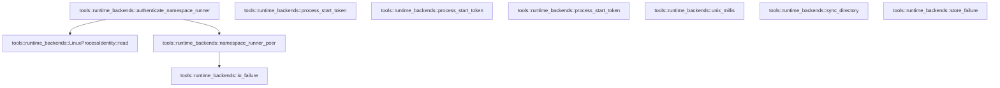

# tools::runtime_backends

[Package atlas](index.md) · [Source](../../src/runtime_backends.rs)

## Declarations

Visibility is the declaration spelling; trait members and reexports require their enclosing interface. `cfg` is not evaluated.

| Symbol | Kind | Visibility | Test / cfg |
|---|---|---|---|
| [tools::runtime_backends::HARD_HELPER_BYTES](../../src/runtime_backends.rs#L30) | const_item | `pub` |  |
| [tools::runtime_backends::HARD_HELPER_READ_BYTES](../../src/runtime_backends.rs#L31) | const_item | `pub` |  |
| [tools::runtime_backends::HARD_HELPER_TIMEOUT_MS](../../src/runtime_backends.rs#L32) | const_item | `pub` |  |
| [tools::runtime_backends::HELPER_PROCESS_OVERHEAD_MS](../../src/runtime_backends.rs#L33) | const_item | `private` |  |
| [tools::runtime_backends::HARD_HTTP_BYTES](../../src/runtime_backends.rs#L34) | const_item | `pub` |  |
| [tools::runtime_backends::HARD_HTTP_TIMEOUT_MS](../../src/runtime_backends.rs#L35) | const_item | `pub` |  |
| [tools::runtime_backends::HARD_JOB_TAIL_BYTES](../../src/runtime_backends.rs#L36) | const_item | `pub` |  |
| [tools::runtime_backends::MAX_REDIRECTS](../../src/runtime_backends.rs#L37) | const_item | `pub` |  |
| [tools::runtime_backends::WEB_FETCH_ACCEPT](../../src/runtime_backends.rs#L38) | const_item | `pub` |  |
| [tools::runtime_backends::WEB_FETCH_MAX_CHARACTERS](../../src/runtime_backends.rs#L40) | const_item | `pub` |  |
| [tools::runtime_backends::WEB_FETCH_MIN_MEANINGFUL_CHARACTERS](../../src/runtime_backends.rs#L41) | const_item | `pub` |  |
| [tools::runtime_backends::WEB_FETCH_USER_AGENT](../../src/runtime_backends.rs#L42) | const_item | `pub` |  |
| [tools::runtime_backends::BackendOutcome](../../src/runtime_backends.rs#L45) | enum_item | `pub` |  |
| [tools::runtime_backends::BackendHold](../../src/runtime_backends.rs#L52) | struct_item | `pub` |  |
| [tools::runtime_backends::BackendUnavailable](../../src/runtime_backends.rs#L58) | struct_item | `pub` |  |
| [tools::runtime_backends::BackendGate](../../src/runtime_backends.rs#L64) | enum_item | `pub` |  |
| [tools::runtime_backends::web_fetch_status_failure](../../src/runtime_backends.rs#L74) | function_item | `private` |  |
| [tools::runtime_backends::BackendFailure](../../src/runtime_backends.rs#L90) | enum_item | `pub` |  |
| [tools::runtime_backends::BackendOutcome::enter](../../src/runtime_backends.rs#L118) | function_item | `private` |  |
| [tools::runtime_backends::CancellationToken](../../src/runtime_backends.rs#L128) | struct_item | `pub` |  |
| [tools::runtime_backends::CancellationToken::cancel](../../src/runtime_backends.rs#L131) | function_item | `pub` |  |
| [tools::runtime_backends::CancellationToken::is_cancelled](../../src/runtime_backends.rs#L136) | function_item | `pub` |  |
| [tools::runtime_backends::HelperInvoker](../../src/runtime_backends.rs#L141) | trait_item | `pub` |  |
| [tools::runtime_backends::HelperInvoker::invoke](../../src/runtime_backends.rs#L142) | function_signature_item | `private` |  |
| [tools::runtime_backends::HelperClient::invoke](../../src/runtime_backends.rs#L150) | function_item | `private` |  |
| [tools::runtime_backends::Arc::invoke](../../src/runtime_backends.rs#L183) | function_item | `private` |  |
| [tools::runtime_backends::BoundedHelper](../../src/runtime_backends.rs#L192) | struct_item | `pub` |  |
| [tools::runtime_backends::BoundedHelper::new](../../src/runtime_backends.rs#L198) | function_item | `pub` |  |
| [tools::runtime_backends::BoundedHelper::invoke](../../src/runtime_backends.rs#L202) | function_item | `pub` |  |
| [tools::runtime_backends::validate_helper_limits](../../src/runtime_backends.rs#L227) | function_item | `private` |  |
| [tools::runtime_backends::JobSpec](../../src/runtime_backends.rs#L294) | struct_item | `pub` |  |
| [tools::runtime_backends::JobLaunchPolicy](../../src/runtime_backends.rs#L312) | struct_item | `pub` |  |
| [tools::runtime_backends::JobLaunchPolicy::new](../../src/runtime_backends.rs#L319) | function_item | `pub` |  |
| [tools::runtime_backends::JobLaunchPolicy::primary_workspace_cwd](../../src/runtime_backends.rs#L358) | function_item | `pub` |  |
| [tools::runtime_backends::JobLaunchPolicy::base_sandbox](../../src/runtime_backends.rs#L363) | function_item | `pub` |  |
| [tools::runtime_backends::JobLaunchPolicy::permitted_write_roots](../../src/runtime_backends.rs#L368) | function_item | `pub` |  |
| [tools::runtime_backends::JobLaunchPolicy::resolve](../../src/runtime_backends.rs#L372) | function_item | `private` |  |
| [tools::runtime_backends::JobState](../../src/runtime_backends.rs#L425) | enum_item | `pub` |  |
| [tools::runtime_backends::JobRecord](../../src/runtime_backends.rs#L435) | struct_item | `pub` |  |
| [tools::runtime_backends::JobRunnerRequest](../../src/runtime_backends.rs#L450) | struct_item | `private` |  |
| [tools::runtime_backends::SandboxedJobLauncher](../../src/runtime_backends.rs#L465) | trait_item | `pub` |  |
| [tools::runtime_backends::SandboxedJobLauncher::uses_pid_namespace](../../src/runtime_backends.rs#L469) | function_item | `private` |  |
| [tools::runtime_backends::SandboxedJobLauncher::runner_command](../../src/runtime_backends.rs#L473) | function_signature_item | `private` |  |
| [tools::runtime_backends::HelperJobLauncher](../../src/runtime_backends.rs#L484) | struct_item | `pub` |  |
| [tools::runtime_backends::HelperJobLauncher::new](../../src/runtime_backends.rs#L490) | function_item | `pub` |  |
| [tools::runtime_backends::HelperJobLauncher::disabled](../../src/runtime_backends.rs#L508) | function_item | `pub` |  |
| [tools::runtime_backends::HelperJobLauncher::uses_pid_namespace](../../src/runtime_backends.rs#L526) | function_item | `private` |  |
| [tools::runtime_backends::HelperJobLauncher::runner_command](../../src/runtime_backends.rs#L531) | function_item | `private` |  |
| [tools::runtime_backends::JobBroker](../../src/runtime_backends.rs#L550) | struct_item | `pub` |  |
| [tools::runtime_backends::JobBroker::new](../../src/runtime_backends.rs#L558) | function_item | `pub` |  |
| [tools::runtime_backends::JobBroker::open](../../src/runtime_backends.rs#L562) | function_item | `private` |  |
| [tools::runtime_backends::JobBroker::start](../../src/runtime_backends.rs#L602) | function_item | `pub` |  |
| [tools::runtime_backends::JobBroker::start_inner](../../src/runtime_backends.rs#L639) | function_item | `private` |  |
| [tools::runtime_backends::JobBroker::status](../../src/runtime_backends.rs#L843) | function_item | `pub` |  |
| [tools::runtime_backends::JobBroker::status_inner](../../src/runtime_backends.rs#L847) | function_item | `private` |  |
| [tools::runtime_backends::JobBroker::list](../../src/runtime_backends.rs#L875) | function_item | `pub` |  |
| [tools::runtime_backends::JobBroker::list_inner](../../src/runtime_backends.rs#L879) | function_item | `private` |  |
| [tools::runtime_backends::JobBroker::stop](../../src/runtime_backends.rs#L895) | function_item | `pub` |  |
| [tools::runtime_backends::JobBroker::stop_inner](../../src/runtime_backends.rs#L910) | function_item | `private` |  |
| [tools::runtime_backends::JobBroker::job_directory](../../src/runtime_backends.rs#L967) | function_item | `private` |  |
| [tools::runtime_backends::JobBroker::host_receipt](../../src/runtime_backends.rs#L971) | function_item | `private` |  |
| [tools::runtime_backends::JobBroker::read_record](../../src/runtime_backends.rs#L997) | function_item | `private` |  |
| [tools::runtime_backends::JobBroker::write_record](../../src/runtime_backends.rs#L1017) | function_item | `private` |  |
| [tools::runtime_backends::run_job_runner](../../src/runtime_backends.rs#L1029) | function_item | `pub` |  |
| [tools::runtime_backends::HttpLimits](../../src/runtime_backends.rs#L1140) | struct_item | `pub` |  |
| [tools::runtime_backends::HttpLimits::default](../../src/runtime_backends.rs#L1147) | function_item | `private` |  |
| [tools::runtime_backends::HttpLimits::validate](../../src/runtime_backends.rs#L1157) | function_item | `private` |  |
| [tools::runtime_backends::HttpFetchResult](../../src/runtime_backends.rs#L1178) | struct_item | `pub` |  |
| [tools::runtime_backends::WebExtractionKind](../../src/runtime_backends.rs#L1188) | enum_item | `pub` |  |
| [tools::runtime_backends::WebExtraction](../../src/runtime_backends.rs#L1199) | struct_item | `pub` |  |
| [tools::runtime_backends::BoundedHttpClient](../../src/runtime_backends.rs#L1207) | struct_item | `pub` |  |
| [tools::runtime_backends::BoundedHttpClient::new](../../src/runtime_backends.rs#L1212) | function_item | `pub` |  |
| [tools::runtime_backends::BoundedHttpClient::fetch](../../src/runtime_backends.rs#L1217) | function_item | `pub` |  |
| [tools::runtime_backends::BoundedHttpClient::search](../../src/runtime_backends.rs#L1250) | function_item | `pub` |  |
| [tools::runtime_backends::SearchTopic](../../src/runtime_backends.rs#L1299) | enum_item | `pub` |  |
| [tools::runtime_backends::SearchRequest](../../src/runtime_backends.rs#L1305) | struct_item | `pub` |  |
| [tools::runtime_backends::SearchHit](../../src/runtime_backends.rs#L1314) | struct_item | `pub` |  |
| [tools::runtime_backends::SearchProvider](../../src/runtime_backends.rs#L1323) | trait_item | `pub` |  |
| [tools::runtime_backends::SearchProvider::search](../../src/runtime_backends.rs#L1324) | function_signature_item | `private` |  |
| [tools::runtime_backends::fetch_async](../../src/runtime_backends.rs#L1332) | function_item | `private` |  |
| [tools::runtime_backends::resolve_web_redirect](../../src/runtime_backends.rs#L1425) | function_item | `pub` |  |
| [tools::runtime_backends::await_cancel_deadline](../../src/runtime_backends.rs#L1434) | function_item | `private` |  |
| [tools::runtime_backends::PublicRoute](../../src/runtime_backends.rs#L1460) | enum_item | `pub` |  |
| [tools::runtime_backends::PublicRoute::client_builder](../../src/runtime_backends.rs#L1472) | function_item | `pub` |  |
| [tools::runtime_backends::route_public_url](../../src/runtime_backends.rs#L1487) | function_item | `pub` |  |
| [tools::runtime_backends::route_public_url_with](../../src/runtime_backends.rs#L1492) | function_item | `pub` |  |
| [tools::runtime_backends::outbound_proxy_for](../../src/runtime_backends.rs#L1572) | function_item | `private` |  |
| [tools::runtime_backends::no_proxy_exempts](../../src/runtime_backends.rs#L1606) | function_item | `private` |  |
| [tools::runtime_backends::cidr_contains](../../src/runtime_backends.rs#L1657) | function_item | `private` |  |
| [tools::runtime_backends::is_public_internet_address](../../src/runtime_backends.rs#L1683) | function_item | `pub` |  |
| [tools::runtime_backends::extract_web_content](../../src/runtime_backends.rs#L1750) | function_item | `pub` |  |
| [tools::runtime_backends::decode_web_text](../../src/runtime_backends.rs#L1796) | function_item | `private` |  |
| [tools::runtime_backends::looks_like_html](../../src/runtime_backends.rs#L1803) | function_item | `private` |  |
| [tools::runtime_backends::extract_html_text](../../src/runtime_backends.rs#L1812) | function_item | `private` |  |
| [tools::runtime_backends::extract_html_title](../../src/runtime_backends.rs#L1874) | function_item | `private` |  |
| [tools::runtime_backends::is_html_block](../../src/runtime_backends.rs#L1891) | function_item | `private` |  |
| [tools::runtime_backends::decode_html_entities](../../src/runtime_backends.rs#L1916) | function_item | `private` |  |
| [tools::runtime_backends::decode_numeric_entity](../../src/runtime_backends.rs#L1965) | function_item | `private` |  |
| [tools::runtime_backends::collapse_web_whitespace](../../src/runtime_backends.rs#L1975) | function_item | `private` |  |
| [tools::runtime_backends::html_is_under_rendered](../../src/runtime_backends.rs#L1996) | function_item | `private` |  |
| [tools::runtime_backends::truncate_characters](../../src/runtime_backends.rs#L2008) | function_item | `private` |  |
| [tools::runtime_backends::require_canonical_directory](../../src/runtime_backends.rs#L2021) | function_item | `private` |  |
| [tools::runtime_backends::canonical_invocation_directory](../../src/runtime_backends.rs#L2048) | function_item | `private` |  |
| [tools::runtime_backends::normalize_policy_roots](../../src/runtime_backends.rs#L2083) | function_item | `private` |  |
| [tools::runtime_backends::covered_by](../../src/runtime_backends.rs#L2107) | function_item | `private` |  |
| [tools::runtime_backends::validate_job_id](../../src/runtime_backends.rs#L2113) | function_item | `private` |  |
| [tools::runtime_backends::drain_tail](../../src/runtime_backends.rs#L2127) | function_item | `private` |  |
| [tools::runtime_backends::signal_group](../../src/runtime_backends.rs#L2145) | function_item | `private` |  |
| [tools::runtime_backends::terminate_group](../../src/runtime_backends.rs#L2162) | function_item | `private` |  |
| [tools::runtime_backends::JobHostReceipt](../../src/runtime_backends.rs#L2180) | struct_item | `private` |  |
| [tools::runtime_backends::NamespaceRunnerIdentity](../../src/runtime_backends.rs#L2189) | struct_item | `private` |  |
| [tools::runtime_backends::LinuxProcessIdentity](../../src/runtime_backends.rs#L2198) | struct_item | `private` |  |
| [tools::runtime_backends::LinuxProcessIdentity::read](../../src/runtime_backends.rs#L2211) | function_item | `private` | #[cfg(target_os = "linux")] |
| [tools::runtime_backends::LinuxProcessIdentity::same_namespace](../../src/runtime_backends.rs#L2237) | function_item | `private` | #[cfg(target_os = "linux")] |
| [tools::runtime_backends::LinuxProcessIdentity::is_live](../../src/runtime_backends.rs#L2242) | function_item | `private` | #[cfg(target_os = "linux")] |
| [tools::runtime_backends::NamespaceRunnerIdentity::matches_record](../../src/runtime_backends.rs#L2253) | function_item | `private` | #[cfg(target_os = "linux")] |
| [tools::runtime_backends::NamespaceRunnerIdentity::matches_current_runner](../../src/runtime_backends.rs#L2264) | function_item | `private` | #[cfg(target_os = "linux")] |
| [tools::runtime_backends::NamespaceRunnerIdentity::namespace_is_live](../../src/runtime_backends.rs#L2272) | function_item | `private` | #[cfg(target_os = "linux")] |
| [tools::runtime_backends::NamespaceRunnerIdentity::stop_namespace](../../src/runtime_backends.rs#L2276) | function_item | `private` | #[cfg(target_os = "linux")] |
| [tools::runtime_backends::NamespaceRunnerIdentity::stop_handle](../../src/runtime_backends.rs#L2283) | function_item | `private` | #[cfg(target_os = "linux")] |
| [tools::runtime_backends::NamespaceStopHandle](../../src/runtime_backends.rs#L2336) | struct_item | `private` | #[cfg(target_os = "linux")] |
| [tools::runtime_backends::NamespaceStopHandle::kill](../../src/runtime_backends.rs#L2340) | function_item | `private` | #[cfg(target_os = "linux")] |
| [tools::runtime_backends::NamespaceStopHandle::send_signal](../../src/runtime_backends.rs#L2344) | function_item | `private` | #[cfg(target_os = "linux")] |
| [tools::runtime_backends::namespace_identity_channel](../../src/runtime_backends.rs#L2370) | function_item | `private` | #[cfg(target_os = "linux")] |
| [tools::runtime_backends::announce_namespace_runner](../../src/runtime_backends.rs#L2400) | function_item | `private` | #[cfg(target_os = "linux")] |
| [tools::runtime_backends::namespace_runner_peer](../../src/runtime_backends.rs#L2411) | function_item | `private` | #[cfg(target_os = "linux")] |
| [tools::runtime_backends::authenticate_namespace_runner](../../src/runtime_backends.rs#L2462) | function_item | `private` | #[cfg(target_os = "linux")] |
| [tools::runtime_backends::process_start_token](../../src/runtime_backends.rs#L2498) | function_item | `private` | #[cfg(target_os = "macos")] |
| [tools::runtime_backends::process_start_token](../../src/runtime_backends.rs#L2523) | function_item | `private` | #[cfg(target_os = "linux")] |
| [tools::runtime_backends::process_start_token](../../src/runtime_backends.rs#L2533) | function_item | `private` | #[cfg(not(any(target_os = "macos", target_os = "linux")))] |
| [tools::runtime_backends::unix_millis](../../src/runtime_backends.rs#L2537) | function_item | `private` |  |
| [tools::runtime_backends::sync_directory](../../src/runtime_backends.rs#L2545) | function_item | `private` |  |
| [tools::runtime_backends::io_failure](../../src/runtime_backends.rs#L2551) | function_item | `private` |  |
| [tools::runtime_backends::store_failure](../../src/runtime_backends.rs#L2555) | function_item | `private` |  |
| [tools::runtime_backends::disabled_job_launcher_tests::mcp_only_launcher_refuses_command_execution](../../src/runtime_backends.rs#L2566) | function_item | `private` | test; #[cfg(test)] |
| [tools::runtime_backends::namespace_job_identity_tests::inherited_socket_reports_kernel_sender_identity](../../src/runtime_backends.rs#L2596) | function_item | `private` | test; #[cfg(all(test, target_os = "linux"))] |
| [tools::runtime_backends::namespace_job_identity_tests::namespace_authentication_refuses_an_unrelated_sender](../../src/runtime_backends.rs#L2603) | function_item | `private` | test; #[cfg(all(test, target_os = "linux"))] |
| [tools::runtime_backends::namespace_job_identity_tests::runner_identity_requires_matching_pid_start_and_namespace](../../src/runtime_backends.rs#L2614) | function_item | `private` | test; #[cfg(all(test, target_os = "linux"))] |
| [tools::runtime_backends::namespace_job_identity_tests::stale_namespace_identity_never_signals_a_live_process](../../src/runtime_backends.rs#L2634) | function_item | `private` | test; #[cfg(all(test, target_os = "linux"))] |
| [tools::runtime_backends::namespace_job_identity_tests::forged_namespace_receipt_cannot_select_a_host_process](../../src/runtime_backends.rs#L2652) | function_item | `private` | test; #[cfg(all(test, target_os = "linux"))] |
| [tools::runtime_backends::namespace_job_identity_tests::test_record](../../src/runtime_backends.rs#L2666) | function_item | `private` | test; #[cfg(all(test, target_os = "linux"))] |
| [tools::runtime_backends::namespace_job_identity_tests::sandbox_written_pid_and_job_id_cannot_replace_host_authority](../../src/runtime_backends.rs#L2688) | function_item | `private` | test; #[cfg(all(test, target_os = "linux"))] |
| [tools::runtime_backends::namespace_job_identity_tests::writable_root_cannot_cover_private_launch_receipts](../../src/runtime_backends.rs#L2723) | function_item | `private` | test; #[cfg(all(test, target_os = "linux"))] |
| [tools::runtime_backends::namespace_job_identity_tests::writable_root_cannot_cover_private_launch_receipts::NeverLaunch](../../src/runtime_backends.rs#L2724) | struct_item | `private` | test; #[cfg(all(test, target_os = "linux"))] |
| [tools::runtime_backends::namespace_job_identity_tests::writable_root_cannot_cover_private_launch_receipts::NeverLaunch::runner_command](../../src/runtime_backends.rs#L2726) | function_item | `private` | test; #[cfg(all(test, target_os = "linux"))] |
| [tools::runtime_backends::web_fetch_status_tests::non_success_statuses_classify_by_what_the_server_said](../../src/runtime_backends.rs#L2771) | function_item | `private` | test; #[cfg(test)] |

## Imports / reexports

| Local name | Source path | Visibility |
|---|---|---|
| `BTreeMap` | `std::collections::BTreeMap` | `private` |
| `VecDeque` | `std::collections::VecDeque` | `private` |
| `fs` | `std::fs` | `private` |
| `File` | `std::fs::File` | `private` |
| `Read` | `std::io::Read` | `private` |
| `IpAddr` | `std::net::IpAddr` | `private` |
| `SocketAddr` | `std::net::SocketAddr` | `private` |
| `ToSocketAddrs` | `std::net::ToSocketAddrs` | `private` |
| `_` | `std::os::unix::process::CommandExt` | `private` |
| `Path` | `std::path::Path` | `private` |
| `PathBuf` | `std::path::PathBuf` | `private` |
| `Child` | `std::process::Child` | `private` |
| `Command` | `std::process::Command` | `private` |
| `Stdio` | `std::process::Stdio` | `private` |
| `Arc` | `std::sync::Arc` | `private` |
| `AtomicBool` | `std::sync::atomic::AtomicBool` | `private` |
| `Ordering` | `std::sync::atomic::Ordering` | `private` |
| `thread` | `std::thread` | `private` |
| `Duration` | `std::time::Duration` | `private` |
| `Instant` | `std::time::Instant` | `private` |
| `SystemTime` | `std::time::SystemTime` | `private` |
| `UNIX_EPOCH` | `std::time::UNIX_EPOCH` | `private` |
| `ACCEPT` | `reqwest::header::ACCEPT` | `private` |
| `CONTENT_LENGTH` | `reqwest::header::CONTENT_LENGTH` | `private` |
| `CONTENT_TYPE` | `reqwest::header::CONTENT_TYPE` | `private` |
| `LOCATION` | `reqwest::header::LOCATION` | `private` |
| `USER_AGENT` | `reqwest::header::USER_AGENT` | `private` |
| `Deserialize` | `serde::Deserialize` | `private` |
| `Serialize` | `serde::Serialize` | `private` |
| `AtomicPublisher` | `store::AtomicPublisher` | `private` |
| `NamedLock` | `store::NamedLock` | `private` |
| `Error` | `thiserror::Error` | `private` |
| `HelperClient` | `crate::helper::HelperClient` | `private` |
| `HelperClientError` | `crate::helper::HelperClientError` | `private` |
| `HelperErrorClass` | `crate::helper::HelperErrorClass` | `private` |
| `HelperOperation` | `crate::helper::HelperOperation` | `private` |
| `HelperRequest` | `crate::helper::HelperRequest` | `private` |
| `HelperResponse` | `crate::helper::HelperResponse` | `private` |
| `ProbeStatus` | `crate::sandbox::ProbeStatus` | `private` |
| `SandboxPolicy` | `crate::sandbox::SandboxPolicy` | `private` |
| `sandbox_command` | `crate::sandbox::sandbox_command` | `private` |
| `BackendFailure` | `super::BackendFailure` | `private` |
| `HelperJobLauncher` | `super::HelperJobLauncher` | `private` |
| `JobSpec` | `super::JobSpec` | `private` |
| `SandboxedJobLauncher` | `super::SandboxedJobLauncher` | `private` |
| `NetworkPolicy` | `crate::NetworkPolicy` | `private` |
| `SandboxPolicy` | `crate::SandboxPolicy` | `private` |
| `BTreeMap` | `std::collections::BTreeMap` | `private` |
| `*` | `super::*` | `private` |
| `Write` | `std::io::Write` | `private` |
| `BackendFailure` | `super::BackendFailure` | `private` |
| `web_fetch_status_failure` | `super::web_fetch_status_failure` | `private` |
| `StatusCode` | `reqwest::StatusCode` | `private` |

## Module declarations

| Module | Visibility | Attributes |
|---|---|---|
| `tools::runtime_backends::disabled_job_launcher_tests` | `private` | #[cfg(test)] |
| `tools::runtime_backends::namespace_job_identity_tests` | `private` | #[cfg(all(test, target_os = "linux"))] |
| `tools::runtime_backends::web_fetch_status_tests` | `private` | #[cfg(test)] |

## Function call graphs

Edges below are syntactically resolved calls only, including private functions. Graphs partition callers into groups of 20; they are not execution order. All unresolved sites are listed below and in the JSON inventory.

Functions 1–20: 10 direct edges

```mermaid
flowchart TD
  n0["tools::bubblewrap_sandbox::detached_command"]
  n1["tools::runtime_backends::BackendOutcome::enter"]
  n2["tools::runtime_backends::CancellationToken::cancel"]
  n3["tools::runtime_backends::CancellationToken::is_cancelled"]
  n4["tools::runtime_backends::HelperClient::invoke"]
  n5["tools::runtime_backends::Arc::invoke"]
  n6["tools::runtime_backends::BoundedHelper::new"]
  n7["tools::runtime_backends::require_canonical_directory"]
  n8["tools::runtime_backends::BoundedHelper::invoke"]
  n9["tools::runtime_backends::canonical_invocation_directory"]
  n10["tools::runtime_backends::normalize_policy_roots"]
  n11["tools::runtime_backends::covered_by"]
  n12["tools::runtime_backends::validate_helper_limits"]
  n13["tools::runtime_backends::JobLaunchPolicy::new"]
  n14["tools::runtime_backends::JobLaunchPolicy::primary_workspace_cwd"]
  n15["tools::runtime_backends::JobLaunchPolicy::base_sandbox"]
  n16["tools::runtime_backends::JobLaunchPolicy::permitted_write_roots"]
  n17["tools::runtime_backends::JobLaunchPolicy::resolve"]
  n18["tools::runtime_backends::SandboxedJobLauncher::uses_pid_namespace"]
  n19["tools::runtime_backends::HelperJobLauncher::new"]
  n20["tools::runtime_backends::HelperJobLauncher::disabled"]
  n21["tools::runtime_backends::HelperJobLauncher::uses_pid_namespace"]
  n22["tools::runtime_backends::HelperJobLauncher::runner_command"]
  n23["tools::runtime_backends::JobBroker::new"]
  n24["tools::runtime_backends::JobBroker::open"]
  n25["tools::runtime_backends::web_fetch_status_failure"]
  n26["tools::sandbox::sandbox_command"]
  n8 --> n1
  n8 --> n12
  n13 --> n7
  n13 --> n10
  n13 --> n11
  n17 --> n9
  n17 --> n11
  n22 --> n0
  n22 --> n26
  n23 --> n24
```

Functions 21–40: 49 direct edges

```mermaid
flowchart TD
  n0["store::atomic::AtomicPublisher::replace"]
  n1["store::platform::NamedLock::exclusive"]
  n2["store::platform::NamedLock::shared"]
  n3["tools::runtime_backends::JobBroker::write_record"]
  n4["tools::runtime_backends::run_job_runner"]
  n5["tools::runtime_backends::HttpLimits::default"]
  n6["tools::runtime_backends::HttpLimits::validate"]
  n7["tools::runtime_backends::BackendOutcome::enter"]
  n8["tools::runtime_backends::BoundedHttpClient::new"]
  n9["tools::runtime_backends::BoundedHttpClient::fetch"]
  n10["tools::runtime_backends::BoundedHttpClient::search"]
  n11["tools::runtime_backends::fetch_async"]
  n12["tools::runtime_backends::resolve_web_redirect"]
  n13["tools::runtime_backends::await_cancel_deadline"]
  n14["tools::runtime_backends::route_public_url"]
  n15["tools::runtime_backends::extract_web_content"]
  n16["tools::runtime_backends::require_canonical_directory"]
  n17["tools::runtime_backends::validate_job_id"]
  n18["tools::runtime_backends::drain_tail"]
  n19["tools::runtime_backends::signal_group"]
  n20["tools::runtime_backends::terminate_group"]
  n21["tools::runtime_backends::namespace_identity_channel"]
  n22["tools::runtime_backends::announce_namespace_runner"]
  n23["tools::runtime_backends::authenticate_namespace_runner"]
  n24["tools::runtime_backends::unix_millis"]
  n25["tools::runtime_backends::sync_directory"]
  n26["tools::runtime_backends::io_failure"]
  n27["tools::runtime_backends::store_failure"]
  n28["tools::runtime_backends::JobBroker::open"]
  n29["tools::runtime_backends::JobBroker::start"]
  n30["tools::runtime_backends::JobBroker::start_inner"]
  n31["tools::runtime_backends::web_fetch_status_failure"]
  n32["tools::runtime_backends::JobBroker::status"]
  n33["tools::runtime_backends::JobBroker::status_inner"]
  n34["tools::runtime_backends::JobBroker::list"]
  n35["tools::runtime_backends::JobBroker::list_inner"]
  n36["tools::runtime_backends::JobBroker::stop"]
  n37["tools::runtime_backends::JobBroker::stop_inner"]
  n38["tools::runtime_backends::JobBroker::job_directory"]
  n39["tools::runtime_backends::JobBroker::host_receipt"]
  n40["tools::runtime_backends::JobBroker::read_record"]
  n3 --> n0
  n3 --> n1
  n3 --> n38
  n4 --> n17
  n4 --> n18
  n4 --> n22
  n4 --> n24
  n4 --> n28
  n9 --> n7
  n9 --> n11
  n10 --> n7
  n11 --> n12
  n11 --> n13
  n11 --> n14
  n11 --> n15
  n11 --> n31
  n29 --> n7
  n29 --> n17
  n29 --> n30
  n30 --> n0
  n30 --> n3
  n30 --> n16
  n30 --> n20
  n30 --> n21
  n30 --> n23
  n30 --> n24
  n30 --> n25
  n30 --> n26
  n30 --> n27
  n30 --> n38
  n32 --> n33
  n33 --> n3
  n33 --> n17
  n33 --> n24
  n33 --> n39
  n33 --> n40
  n34 --> n35
  n35 --> n17
  n35 --> n33
  n36 --> n7
  n36 --> n37
  n37 --> n3
  n37 --> n19
  n37 --> n24
  n37 --> n33
  n37 --> n39
  n40 --> n2
  n40 --> n26
  n40 --> n38
```

Functions 41–60: 16 direct edges

```mermaid
flowchart TD
  n0["tools::runtime_backends::resolve_web_redirect"]
  n1["tools::runtime_backends::await_cancel_deadline"]
  n2["tools::runtime_backends::PublicRoute::client_builder"]
  n3["tools::runtime_backends::route_public_url"]
  n4["tools::runtime_backends::route_public_url_with"]
  n5["tools::runtime_backends::outbound_proxy_for"]
  n6["tools::runtime_backends::no_proxy_exempts"]
  n7["tools::runtime_backends::cidr_contains"]
  n8["tools::runtime_backends::is_public_internet_address"]
  n9["tools::runtime_backends::extract_web_content"]
  n10["tools::runtime_backends::decode_web_text"]
  n11["tools::runtime_backends::looks_like_html"]
  n12["tools::runtime_backends::extract_html_text"]
  n13["tools::runtime_backends::extract_html_title"]
  n14["tools::runtime_backends::is_html_block"]
  n15["tools::runtime_backends::decode_html_entities"]
  n16["tools::runtime_backends::decode_numeric_entity"]
  n17["tools::runtime_backends::collapse_web_whitespace"]
  n18["tools::runtime_backends::html_is_under_rendered"]
  n19["tools::runtime_backends::truncate_characters"]
  n3 --> n4
  n4 --> n5
  n4 --> n8
  n5 --> n6
  n6 --> n7
  n8 --> n8
  n9 --> n10
  n9 --> n11
  n9 --> n12
  n9 --> n18
  n9 --> n19
  n12 --> n13
  n12 --> n14
  n12 --> n15
  n12 --> n17
  n15 --> n16
```

Functions 61–80: 12 direct edges

```mermaid
flowchart TD
  n0["store::atomic::AtomicPublisher::replace"]
  n1["tools::runtime_backends::require_canonical_directory"]
  n2["tools::runtime_backends::canonical_invocation_directory"]
  n3["tools::runtime_backends::normalize_policy_roots"]
  n4["tools::runtime_backends::covered_by"]
  n5["tools::runtime_backends::validate_job_id"]
  n6["tools::runtime_backends::drain_tail"]
  n7["tools::runtime_backends::signal_group"]
  n8["tools::runtime_backends::terminate_group"]
  n9["tools::runtime_backends::LinuxProcessIdentity::read"]
  n10["tools::runtime_backends::LinuxProcessIdentity::same_namespace"]
  n11["tools::runtime_backends::LinuxProcessIdentity::is_live"]
  n12["tools::runtime_backends::NamespaceRunnerIdentity::matches_record"]
  n13["tools::runtime_backends::NamespaceRunnerIdentity::matches_current_runner"]
  n14["tools::runtime_backends::NamespaceRunnerIdentity::namespace_is_live"]
  n15["tools::runtime_backends::NamespaceRunnerIdentity::stop_namespace"]
  n16["tools::runtime_backends::NamespaceRunnerIdentity::stop_handle"]
  n17["tools::runtime_backends::NamespaceStopHandle::kill"]
  n18["tools::runtime_backends::NamespaceStopHandle::send_signal"]
  n19["tools::runtime_backends::namespace_identity_channel"]
  n20["tools::runtime_backends::announce_namespace_runner"]
  n21["tools::runtime_backends::io_failure"]
  n3 --> n1
  n3 --> n4
  n6 --> n0
  n7 --> n21
  n8 --> n7
  n11 --> n9
  n13 --> n9
  n15 --> n16
  n16 --> n9
  n17 --> n18
  n18 --> n21
  n19 --> n21
```

Functions 81–89: 3 direct edges

```mermaid
flowchart TD
  n0["tools::runtime_backends::LinuxProcessIdentity::read"]
  n1["tools::runtime_backends::namespace_runner_peer"]
  n2["tools::runtime_backends::authenticate_namespace_runner"]
  n3["tools::runtime_backends::process_start_token"]
  n4["tools::runtime_backends::process_start_token"]
  n5["tools::runtime_backends::process_start_token"]
  n6["tools::runtime_backends::unix_millis"]
  n7["tools::runtime_backends::sync_directory"]
  n8["tools::runtime_backends::io_failure"]
  n9["tools::runtime_backends::store_failure"]
  n1 --> n8
  n2 --> n0
  n2 --> n1
```

## Call sites

Includes test functions (marked in declarations). Receiver-type-required sites need type analysis/manual tracing. Calls in closures are attributed to their enclosing function; their occurrence here does not mean the closure executes immediately.

| Caller | Callee expression | Source lines | Target / classification |
|---|---|---|---|
| `web_fetch_status_failure` | `status.as_u16` | [75](../../src/runtime_backends.rs#L75) | receiver-type-required |
| `web_fetch_status_failure` | `BackendFailure::NotFound` | [77](../../src/runtime_backends.rs#L77) | external-constructor-callback-or-unresolved |
| `web_fetch_status_failure` | `BackendFailure::Denied` | [78](../../src/runtime_backends.rs#L78) | external-constructor-callback-or-unresolved |
| `web_fetch_status_failure` | `BackendFailure::Limit` | [80](../../src/runtime_backends.rs#L80) | external-constructor-callback-or-unresolved |
| `web_fetch_status_failure` | `status.is_client_error` | [81](../../src/runtime_backends.rs#L81) | receiver-type-required |
| `web_fetch_status_failure` | `BackendFailure::Invalid` | [81](../../src/runtime_backends.rs#L81) | external-constructor-callback-or-unresolved |
| `web_fetch_status_failure` | `status.is_server_error` | [84](../../src/runtime_backends.rs#L84) | receiver-type-required |
| `web_fetch_status_failure` | `BackendFailure::Unavailable` | [84](../../src/runtime_backends.rs#L84) | external-constructor-callback-or-unresolved |
| `web_fetch_status_failure` | `BackendFailure::Protocol` | [85](../../src/runtime_backends.rs#L85) | external-constructor-callback-or-unresolved |
| `enter` | `Ok` | [120](../../src/runtime_backends.rs#L120) | external-constructor-callback-or-unresolved |
| `enter` | `Err` | [121](../../src/runtime_backends.rs#L121), [122](../../src/runtime_backends.rs#L122) | external-constructor-callback-or-unresolved |
| `enter` | `Self::Hold` | [121](../../src/runtime_backends.rs#L121) | external-constructor-callback-or-unresolved |
| `enter` | `Self::Unavailable` | [122](../../src/runtime_backends.rs#L122) | external-constructor-callback-or-unresolved |
| `cancel` | `self.0.store` | [132](../../src/runtime_backends.rs#L132) | receiver-type-required |
| `is_cancelled` | `self.0.load` | [137](../../src/runtime_backends.rs#L137) | receiver-type-required |
| `invoke` | `exec.timeout_ms.map` | [159](../../src/runtime_backends.rs#L159) | receiver-type-required |
| `invoke` | `Duration::from_millis` | [160](../../src/runtime_backends.rs#L160) | external-constructor-callback-or-unresolved |
| `invoke` | `timeout.saturating_add` | [160](../../src/runtime_backends.rs#L160) | receiver-type-required |
| `invoke` | `Some` | [162](../../src/runtime_backends.rs#L162) | external-constructor-callback-or-unresolved |
| `invoke` | `Duration::from_secs` | [162](../../src/runtime_backends.rs#L162) | external-constructor-callback-or-unresolved |
| `invoke` | `self.execute_cancellable(request, timeout, &#124;&#124; cancellation.is_cancelled())             .map_err` | [164](../../src/runtime_backends.rs#L164) | receiver-type-required |
| `invoke` | `self.execute_cancellable` | [164](../../src/runtime_backends.rs#L164) | receiver-type-required |
| `invoke` | `cancellation.is_cancelled` | [164](../../src/runtime_backends.rs#L164) | receiver-type-required |
| `invoke` | `BackendFailure::Limit` | [169](../../src/runtime_backends.rs#L169) | external-constructor-callback-or-unresolved |
| `invoke` | `BackendFailure::Denied` | [170](../../src/runtime_backends.rs#L170) | external-constructor-callback-or-unresolved |
| `invoke` | `BackendFailure::NotFound` | [171](../../src/runtime_backends.rs#L171) | external-constructor-callback-or-unresolved |
| `invoke` | `BackendFailure::Unavailable` | [173](../../src/runtime_backends.rs#L173) | external-constructor-callback-or-unresolved |
| `invoke` | `BackendFailure::Protocol` | [175](../../src/runtime_backends.rs#L175) | external-constructor-callback-or-unresolved |
| `invoke` | `BackendFailure::Io` | [176](../../src/runtime_backends.rs#L176) | external-constructor-callback-or-unresolved |
| `invoke` | `error.to_string` | [176](../../src/runtime_backends.rs#L176) | receiver-type-required |
| `invoke` | `(**self).invoke` | [188](../../src/runtime_backends.rs#L188) | receiver-type-required |
| `invoke` | `BackendOutcome::enter` | [208](../../src/runtime_backends.rs#L208) | [tools::runtime_backends::BackendOutcome::enter](../../src/runtime_backends.rs#L118) |
| `invoke` | `cancellation.is_cancelled` | [211](../../src/runtime_backends.rs#L211) | receiver-type-required |
| `invoke` | `BackendOutcome::Completed` | [212](../../src/runtime_backends.rs#L212), [215](../../src/runtime_backends.rs#L215), [223](../../src/runtime_backends.rs#L223) | external-constructor-callback-or-unresolved |
| `invoke` | `Err` | [212](../../src/runtime_backends.rs#L212), [215](../../src/runtime_backends.rs#L215) | external-constructor-callback-or-unresolved |
| `invoke` | `validate_helper_limits` | [214](../../src/runtime_backends.rs#L214) | [tools::runtime_backends::validate_helper_limits](../../src/runtime_backends.rs#L227) |
| `invoke` | `BackendOutcome::Unavailable` | [218](../../src/runtime_backends.rs#L218) | external-constructor-callback-or-unresolved |
| `invoke` | `"exec-helper".to_owned` | [219](../../src/runtime_backends.rs#L219) | receiver-type-required |
| `invoke` | `"helper process is not configured".to_owned` | [220](../../src/runtime_backends.rs#L220) | receiver-type-required |
| `invoke` | `invoker.invoke` | [223](../../src/runtime_backends.rs#L223) | receiver-type-required |
| `validate_helper_limits` | `Err` | [230](../../src/runtime_backends.rs#L230), [251](../../src/runtime_backends.rs#L251), [259](../../src/runtime_backends.rs#L259), [270](../../src/runtime_backends.rs#L270), [282](../../src/runtime_backends.rs#L282) | external-constructor-callback-or-unresolved |
| `validate_helper_limits` | `BackendFailure::Limit` | [230](../../src/runtime_backends.rs#L230), [251](../../src/runtime_backends.rs#L251), [259](../../src/runtime_backends.rs#L259), [270](../../src/runtime_backends.rs#L270), [282](../../src/runtime_backends.rs#L282) | external-constructor-callback-or-unresolved |
| `validate_helper_limits` | `Ok` | [234](../../src/runtime_backends.rs#L234), [253](../../src/runtime_backends.rs#L253), [263](../../src/runtime_backends.rs#L263), [274](../../src/runtime_backends.rs#L274), [286](../../src/runtime_backends.rs#L286) | external-constructor-callback-or-unresolved |
| `validate_helper_limits` | `bounded` | [239](../../src/runtime_backends.rs#L239), [241](../../src/runtime_backends.rs#L241), [248](../../src/runtime_backends.rs#L248), [249](../../src/runtime_backends.rs#L249), [256](../../src/runtime_backends.rs#L256), [257](../../src/runtime_backends.rs#L257) | external-constructor-callback-or-unresolved |
| `validate_helper_limits` | `"grep context limit exceeded".into` | [251](../../src/runtime_backends.rs#L251) | receiver-type-required |
| `validate_helper_limits` | `Some` | [258](../../src/runtime_backends.rs#L258) | external-constructor-callback-or-unresolved |
| `validate_helper_limits` | `"timeout_ms must be at least 1".into` | [260](../../src/runtime_backends.rs#L260) | receiver-type-required |
| `validate_helper_limits` | `content                 .decode()                 .map_err` | [266](../../src/runtime_backends.rs#L266) | receiver-type-required |
| `validate_helper_limits` | `content                 .decode` | [266](../../src/runtime_backends.rs#L266) | receiver-type-required |
| `validate_helper_limits` | `BackendFailure::Invalid` | [268](../../src/runtime_backends.rs#L268), [280](../../src/runtime_backends.rs#L280) | external-constructor-callback-or-unresolved |
| `validate_helper_limits` | `error.to_string` | [268](../../src/runtime_backends.rs#L268), [280](../../src/runtime_backends.rs#L280) | receiver-type-required |
| `validate_helper_limits` | `bytes.len` | [269](../../src/runtime_backends.rs#L269), [281](../../src/runtime_backends.rs#L281) | receiver-type-required |
| `validate_helper_limits` | `"content exceeds helper byte limit".into` | [271](../../src/runtime_backends.rs#L271) | receiver-type-required |
| `validate_helper_limits` | `replacement                 .decode()                 .map_err` | [278](../../src/runtime_backends.rs#L278) | receiver-type-required |
| `validate_helper_limits` | `replacement                 .decode` | [278](../../src/runtime_backends.rs#L278) | receiver-type-required |
| `validate_helper_limits` | `"replacement exceeds helper byte limit".into` | [283](../../src/runtime_backends.rs#L283) | receiver-type-required |
| `new` | `base_sandbox             .validate()             .map_err` | [324](../../src/runtime_backends.rs#L324) | receiver-type-required |
| `new` | `base_sandbox             .validate` | [324](../../src/runtime_backends.rs#L324) | receiver-type-required |
| `new` | `BackendFailure::Invalid` | [326](../../src/runtime_backends.rs#L326) | external-constructor-callback-or-unresolved |
| `new` | `error.to_string` | [326](../../src/runtime_backends.rs#L326) | receiver-type-required |
| `new` | `require_canonical_directory` | [328](../../src/runtime_backends.rs#L328), [332](../../src/runtime_backends.rs#L332), [335](../../src/runtime_backends.rs#L335), [338](../../src/runtime_backends.rs#L338) | [tools::runtime_backends::require_canonical_directory](../../src/runtime_backends.rs#L2021) |
| `new` | `primary_workspace_cwd.into` | [328](../../src/runtime_backends.rs#L328) | receiver-type-required |
| `new` | `base_sandbox             .read_roots             .iter()             .map(&#124;root&#124; require_canonical_directory(root, "sandbox read root"))             .collect::<Result<Vec<_>, _>>` | [329](../../src/runtime_backends.rs#L329) | receiver-type-required |
| `new` | `base_sandbox             .read_roots             .iter()             .map` | [329](../../src/runtime_backends.rs#L329) | receiver-type-required |
| `new` | `base_sandbox             .read_roots             .iter` | [329](../../src/runtime_backends.rs#L329) | receiver-type-required |
| `new` | `covered_by` | [340](../../src/runtime_backends.rs#L340) | [tools::runtime_backends::covered_by](../../src/runtime_backends.rs#L2107) |
| `new` | `Err` | [341](../../src/runtime_backends.rs#L341) | external-constructor-callback-or-unresolved |
| `new` | `BackendFailure::Denied` | [341](../../src/runtime_backends.rs#L341) | external-constructor-callback-or-unresolved |
| `new` | `"primary workspace cwd is outside sandbox read roots".to_owned` | [342](../../src/runtime_backends.rs#L342) | receiver-type-required |
| `new` | `normalize_policy_roots` | [345](../../src/runtime_backends.rs#L345) | [tools::runtime_backends::normalize_policy_roots](../../src/runtime_backends.rs#L2083) |
| `new` | `Ok` | [350](../../src/runtime_backends.rs#L350) | external-constructor-callback-or-unresolved |
| `resolve` | `spec.working_directory.as_deref` | [373](../../src/runtime_backends.rs#L373) | receiver-type-required |
| `resolve` | `canonical_invocation_directory` | [374](../../src/runtime_backends.rs#L374), [389](../../src/runtime_backends.rs#L389) | [tools::runtime_backends::canonical_invocation_directory](../../src/runtime_backends.rs#L2048) |
| `resolve` | `self.primary_workspace_cwd.clone` | [379](../../src/runtime_backends.rs#L379) | receiver-type-required |
| `resolve` | `covered_by` | [381](../../src/runtime_backends.rs#L381), [394](../../src/runtime_backends.rs#L394) | [tools::runtime_backends::covered_by](../../src/runtime_backends.rs#L2107) |
| `resolve` | `Err` | [382](../../src/runtime_backends.rs#L382), [395](../../src/runtime_backends.rs#L395), [400](../../src/runtime_backends.rs#L400) | external-constructor-callback-or-unresolved |
| `resolve` | `BackendFailure::Denied` | [382](../../src/runtime_backends.rs#L382), [395](../../src/runtime_backends.rs#L395) | external-constructor-callback-or-unresolved |
| `resolve` | `"job working directory is outside sandbox read roots".to_owned` | [383](../../src/runtime_backends.rs#L383) | receiver-type-required |
| `resolve` | `Vec::with_capacity` | [387](../../src/runtime_backends.rs#L387) | external-constructor-callback-or-unresolved |
| `resolve` | `spec.writable_paths.len` | [387](../../src/runtime_backends.rs#L387) | receiver-type-required |
| `resolve` | `requested.iter().any` | [399](../../src/runtime_backends.rs#L399) | receiver-type-required |
| `resolve` | `requested.iter` | [399](../../src/runtime_backends.rs#L399) | receiver-type-required |
| `resolve` | `BackendFailure::Invalid` | [400](../../src/runtime_backends.rs#L400), [418](../../src/runtime_backends.rs#L418) | external-constructor-callback-or-unresolved |
| `resolve` | `"job writable paths contain duplicate canonical roots".to_owned` | [401](../../src/runtime_backends.rs#L401) | receiver-type-required |
| `resolve` | `requested.push` | [404](../../src/runtime_backends.rs#L404) | receiver-type-required |
| `resolve` | `requested.sort_by` | [406](../../src/runtime_backends.rs#L406) | receiver-type-required |
| `resolve` | `left.as_bytes().cmp` | [406](../../src/runtime_backends.rs#L406), [414](../../src/runtime_backends.rs#L414) | receiver-type-required |
| `resolve` | `left.as_bytes` | [406](../../src/runtime_backends.rs#L406), [414](../../src/runtime_backends.rs#L414) | receiver-type-required |
| `resolve` | `right.as_bytes` | [406](../../src/runtime_backends.rs#L406), [414](../../src/runtime_backends.rs#L414) | receiver-type-required |
| `resolve` | `Some` | [408](../../src/runtime_backends.rs#L408) | external-constructor-callback-or-unresolved |
| `resolve` | `requested.clone` | [409](../../src/runtime_backends.rs#L409) | receiver-type-required |
| `resolve` | `self.base_sandbox.clone` | [410](../../src/runtime_backends.rs#L410) | receiver-type-required |
| `resolve` | `effective.write_roots.extend` | [411](../../src/runtime_backends.rs#L411) | receiver-type-required |
| `resolve` | `effective             .write_roots             .sort_by` | [412](../../src/runtime_backends.rs#L412) | receiver-type-required |
| `resolve` | `effective.write_roots.dedup` | [415](../../src/runtime_backends.rs#L415) | receiver-type-required |
| `resolve` | `effective             .validate()             .map_err` | [416](../../src/runtime_backends.rs#L416) | receiver-type-required |
| `resolve` | `effective             .validate` | [416](../../src/runtime_backends.rs#L416) | receiver-type-required |
| `resolve` | `error.to_string` | [418](../../src/runtime_backends.rs#L418) | receiver-type-required |
| `resolve` | `Ok` | [419](../../src/runtime_backends.rs#L419) | external-constructor-callback-or-unresolved |
| `new` | `executable.into` | [491](../../src/runtime_backends.rs#L491) | receiver-type-required |
| `new` | `executable.is_absolute` | [492](../../src/runtime_backends.rs#L492) | receiver-type-required |
| `new` | `executable.is_file` | [492](../../src/runtime_backends.rs#L492) | receiver-type-required |
| `new` | `Err` | [493](../../src/runtime_backends.rs#L493), [498](../../src/runtime_backends.rs#L498) | external-constructor-callback-or-unresolved |
| `new` | `BackendFailure::Unavailable` | [493](../../src/runtime_backends.rs#L493), [498](../../src/runtime_backends.rs#L498) | external-constructor-callback-or-unresolved |
| `new` | `"tekes-helper executable is not an absolute regular file".to_owned` | [494](../../src/runtime_backends.rs#L494) | receiver-type-required |
| `new` | `Ok` | [502](../../src/runtime_backends.rs#L502) | external-constructor-callback-or-unresolved |
| `disabled` | `executable.into` | [509](../../src/runtime_backends.rs#L509) | receiver-type-required |
| `disabled` | `executable.is_absolute` | [510](../../src/runtime_backends.rs#L510) | receiver-type-required |
| `disabled` | `executable.is_file` | [510](../../src/runtime_backends.rs#L510) | receiver-type-required |
| `disabled` | `Err` | [511](../../src/runtime_backends.rs#L511) | external-constructor-callback-or-unresolved |
| `disabled` | `BackendFailure::Unavailable` | [511](../../src/runtime_backends.rs#L511) | external-constructor-callback-or-unresolved |
| `disabled` | `"tekes-helper executable is not an absolute regular file".to_owned` | [512](../../src/runtime_backends.rs#L512) | receiver-type-required |
| `disabled` | `Ok` | [515](../../src/runtime_backends.rs#L515) | external-constructor-callback-or-unresolved |
| `disabled` | `"per-job sandbox unavailable in MCP-only App Sandbox host".to_owned` | [519](../../src/runtime_backends.rs#L519) | receiver-type-required |
| `runner_command` | `self.uses_pid_namespace` | [540](../../src/runtime_backends.rs#L540) | receiver-type-required |
| `runner_command` | `crate::bubblewrap_sandbox::detached_command(effective_policy, &self.executable)                 .map_err` | [541](../../src/runtime_backends.rs#L541) | receiver-type-required |
| `runner_command` | `crate::bubblewrap_sandbox::detached_command` | [541](../../src/runtime_backends.rs#L541) | [tools::bubblewrap_sandbox::detached_command](../../src/bubblewrap_sandbox.rs#L63) |
| `runner_command` | `BackendFailure::Unavailable` | [542](../../src/runtime_backends.rs#L542), [545](../../src/runtime_backends.rs#L545) | external-constructor-callback-or-unresolved |
| `runner_command` | `error.to_string` | [542](../../src/runtime_backends.rs#L542), [545](../../src/runtime_backends.rs#L545) | receiver-type-required |
| `runner_command` | `sandbox_command(effective_policy, &self.probe, &self.executable)             .map_err` | [544](../../src/runtime_backends.rs#L544) | receiver-type-required |
| `runner_command` | `sandbox_command` | [544](../../src/runtime_backends.rs#L544) | [tools::sandbox::sandbox_command](../../src/sandbox.rs#L289) |
| `new` | `Self::open` | [559](../../src/runtime_backends.rs#L559) | [tools::runtime_backends::JobBroker::open](../../src/runtime_backends.rs#L562) |
| `new` | `root.into` | [559](../../src/runtime_backends.rs#L559) | receiver-type-required |
| `open` | `Err` | [568](../../src/runtime_backends.rs#L568), [578](../../src/runtime_backends.rs#L578), [589](../../src/runtime_backends.rs#L589) | external-constructor-callback-or-unresolved |
| `open` | `BackendFailure::Limit` | [568](../../src/runtime_backends.rs#L568) | external-constructor-callback-or-unresolved |
| `open` | `fs::create_dir_all(&root).map_err` | [572](../../src/runtime_backends.rs#L572) | receiver-type-required |
| `open` | `fs::create_dir_all` | [572](../../src/runtime_backends.rs#L572), [583](../../src/runtime_backends.rs#L583) | external-constructor-callback-or-unresolved |
| `open` | `fs::symlink_metadata(&root)             .map_err(io_failure)?             .file_type()             .is_symlink` | [573](../../src/runtime_backends.rs#L573) | receiver-type-required |
| `open` | `fs::symlink_metadata(&root)             .map_err(io_failure)?             .file_type` | [573](../../src/runtime_backends.rs#L573) | receiver-type-required |
| `open` | `fs::symlink_metadata(&root)             .map_err` | [573](../../src/runtime_backends.rs#L573) | receiver-type-required |
| `open` | `fs::symlink_metadata` | [573](../../src/runtime_backends.rs#L573), [584](../../src/runtime_backends.rs#L584) | external-constructor-callback-or-unresolved |
| `open` | `BackendFailure::Denied` | [578](../../src/runtime_backends.rs#L578), [589](../../src/runtime_backends.rs#L589) | external-constructor-callback-or-unresolved |
| `open` | `"job root is a symlink".to_owned` | [578](../../src/runtime_backends.rs#L578) | receiver-type-required |
| `open` | `fs::canonicalize(root).map_err` | [580](../../src/runtime_backends.rs#L580) | receiver-type-required |
| `open` | `fs::canonicalize` | [580](../../src/runtime_backends.rs#L580) | external-constructor-callback-or-unresolved |
| `open` | `root.join` | [581](../../src/runtime_backends.rs#L581) | receiver-type-required |
| `open` | `fs::create_dir_all(&launch_root).map_err` | [583](../../src/runtime_backends.rs#L583) | receiver-type-required |
| `open` | `fs::symlink_metadata(&launch_root)                 .map_err(io_failure)?                 .file_type()                 .is_symlink` | [584](../../src/runtime_backends.rs#L584) | receiver-type-required |
| `open` | `fs::symlink_metadata(&launch_root)                 .map_err(io_failure)?                 .file_type` | [584](../../src/runtime_backends.rs#L584) | receiver-type-required |
| `open` | `fs::symlink_metadata(&launch_root)                 .map_err` | [584](../../src/runtime_backends.rs#L584) | receiver-type-required |
| `open` | `"job launch authority is a symlink".to_owned` | [590](../../src/runtime_backends.rs#L590) | receiver-type-required |
| `open` | `Ok` | [594](../../src/runtime_backends.rs#L594) | external-constructor-callback-or-unresolved |
| `open` | `Duration::from_millis` | [598](../../src/runtime_backends.rs#L598) | external-constructor-callback-or-unresolved |
| `start` | `BackendOutcome::enter` | [611](../../src/runtime_backends.rs#L611) | [tools::runtime_backends::BackendOutcome::enter](../../src/runtime_backends.rs#L118) |
| `start` | `cancellation.is_cancelled` | [614](../../src/runtime_backends.rs#L614) | receiver-type-required |
| `start` | `BackendOutcome::Completed` | [615](../../src/runtime_backends.rs#L615), [618](../../src/runtime_backends.rs#L618), [621](../../src/runtime_backends.rs#L621), [627](../../src/runtime_backends.rs#L627), [630](../../src/runtime_backends.rs#L630) | external-constructor-callback-or-unresolved |
| `start` | `Err` | [615](../../src/runtime_backends.rs#L615), [618](../../src/runtime_backends.rs#L618), [621](../../src/runtime_backends.rs#L621), [627](../../src/runtime_backends.rs#L627) | external-constructor-callback-or-unresolved |
| `start` | `validate_job_id` | [617](../../src/runtime_backends.rs#L617) | [tools::runtime_backends::validate_job_id](../../src/runtime_backends.rs#L2113) |
| `start` | `spec.program.is_empty` | [620](../../src/runtime_backends.rs#L620) | receiver-type-required |
| `start` | `spec.program.as_bytes().contains` | [620](../../src/runtime_backends.rs#L620) | receiver-type-required |
| `start` | `spec.program.as_bytes` | [620](../../src/runtime_backends.rs#L620) | receiver-type-required |
| `start` | `BackendFailure::Invalid` | [621](../../src/runtime_backends.rs#L621) | external-constructor-callback-or-unresolved |
| `start` | `"job program is empty or contains NUL".to_owned` | [622](../../src/runtime_backends.rs#L622) | receiver-type-required |
| `start` | `launch_policy.resolve` | [625](../../src/runtime_backends.rs#L625) | receiver-type-required |
| `start` | `self.start_inner` | [630](../../src/runtime_backends.rs#L630) | [tools::runtime_backends::JobBroker::start_inner](../../src/runtime_backends.rs#L639) |
| `start_inner` | `effective_policy             .write_roots             .iter()             .chain` | [649](../../src/runtime_backends.rs#L649) | receiver-type-required |
| `start_inner` | `effective_policy             .write_roots             .iter` | [649](../../src/runtime_backends.rs#L649) | receiver-type-required |
| `start_inner` | `effective_policy.scratch.iter` | [652](../../src/runtime_backends.rs#L652) | receiver-type-required |
| `start_inner` | `fs::canonicalize(root).map_err` | [654](../../src/runtime_backends.rs#L654) | receiver-type-required |
| `start_inner` | `fs::canonicalize` | [654](../../src/runtime_backends.rs#L654) | external-constructor-callback-or-unresolved |
| `start_inner` | `self.launch_root.starts_with` | [655](../../src/runtime_backends.rs#L655) | receiver-type-required |
| `start_inner` | `Err` | [656](../../src/runtime_backends.rs#L656), [694](../../src/runtime_backends.rs#L694), [747](../../src/runtime_backends.rs#L747), [764](../../src/runtime_backends.rs#L764), [781](../../src/runtime_backends.rs#L781), [800](../../src/runtime_backends.rs#L800), [813](../../src/runtime_backends.rs#L813), [824](../../src/runtime_backends.rs#L824), [832](../../src/runtime_backends.rs#L832) | external-constructor-callback-or-unresolved |
| `start_inner` | `BackendFailure::Denied` | [656](../../src/runtime_backends.rs#L656) | external-constructor-callback-or-unresolved |
| `start_inner` | `"job writable roots overlap private launch authority".to_owned` | [657](../../src/runtime_backends.rs#L657) | receiver-type-required |
| `start_inner` | `self.job_directory` | [661](../../src/runtime_backends.rs#L661) | [tools::runtime_backends::JobBroker::job_directory](../../src/runtime_backends.rs#L967) |
| `start_inner` | `fs::create_dir(&directory).map_err` | [662](../../src/runtime_backends.rs#L662) | receiver-type-required |
| `start_inner` | `fs::create_dir` | [662](../../src/runtime_backends.rs#L662) | external-constructor-callback-or-unresolved |
| `start_inner` | `error.kind` | [663](../../src/runtime_backends.rs#L663) | receiver-type-required |
| `start_inner` | `BackendFailure::Conflict` | [664](../../src/runtime_backends.rs#L664) | external-constructor-callback-or-unresolved |
| `start_inner` | `io_failure` | [666](../../src/runtime_backends.rs#L666) | [tools::runtime_backends::io_failure](../../src/runtime_backends.rs#L2551) |
| `start_inner` | `sync_directory` | [669](../../src/runtime_backends.rs#L669) | [tools::runtime_backends::sync_directory](../../src/runtime_backends.rs#L2545) |
| `start_inner` | `unix_millis` | [670](../../src/runtime_backends.rs#L670), [692](../../src/runtime_backends.rs#L692), [806](../../src/runtime_backends.rs#L806), [822](../../src/runtime_backends.rs#L822) | [tools::runtime_backends::unix_millis](../../src/runtime_backends.rs#L2537) |
| `start_inner` | `id.to_owned` | [673](../../src/runtime_backends.rs#L673), [700](../../src/runtime_backends.rs#L700), [785](../../src/runtime_backends.rs#L785) | receiver-type-required |
| `start_inner` | `spec.clone` | [674](../../src/runtime_backends.rs#L674), [702](../../src/runtime_backends.rs#L702) | receiver-type-required |
| `start_inner` | `"stdout.tail".to_owned` | [680](../../src/runtime_backends.rs#L680) | receiver-type-required |
| `start_inner` | `"stderr.tail".to_owned` | [681](../../src/runtime_backends.rs#L681) | receiver-type-required |
| `start_inner` | `self.write_record` | [683](../../src/runtime_backends.rs#L683), [693](../../src/runtime_backends.rs#L693), [807](../../src/runtime_backends.rs#L807), [823](../../src/runtime_backends.rs#L823) | [tools::runtime_backends::JobBroker::write_record](../../src/runtime_backends.rs#L1017) |
| `start_inner` | `AtomicPublisher::replace(directory.join(&starting.stdout_tail), b"")             .map_err` | [684](../../src/runtime_backends.rs#L684) | receiver-type-required |
| `start_inner` | `AtomicPublisher::replace` | [684](../../src/runtime_backends.rs#L684), [686](../../src/runtime_backends.rs#L686), [708](../../src/runtime_backends.rs#L708), [777](../../src/runtime_backends.rs#L777), [793](../../src/runtime_backends.rs#L793), [826](../../src/runtime_backends.rs#L826) | [store::atomic::AtomicPublisher::replace](../../../store/src/atomic.rs#L16) |
| `start_inner` | `directory.join` | [684](../../src/runtime_backends.rs#L684), [686](../../src/runtime_backends.rs#L686), [705](../../src/runtime_backends.rs#L705), [777](../../src/runtime_backends.rs#L777), [826](../../src/runtime_backends.rs#L826) | receiver-type-required |
| `start_inner` | `AtomicPublisher::replace(directory.join(&starting.stderr_tail), b"")             .map_err` | [686](../../src/runtime_backends.rs#L686) | receiver-type-required |
| `start_inner` | `cancellation.is_cancelled` | [689](../../src/runtime_backends.rs#L689), [815](../../src/runtime_backends.rs#L815) | receiver-type-required |
| `start_inner` | `self.root.to_string_lossy().into_owned` | [699](../../src/runtime_backends.rs#L699) | receiver-type-required |
| `start_inner` | `self.root.to_string_lossy` | [699](../../src/runtime_backends.rs#L699) | receiver-type-required |
| `start_inner` | `launcher.uses_pid_namespace` | [703](../../src/runtime_backends.rs#L703) | receiver-type-required |
| `start_inner` | `serde_json_canonicalizer::to_vec(&runner_request)             .map_err` | [706](../../src/runtime_backends.rs#L706) | receiver-type-required |
| `start_inner` | `serde_json_canonicalizer::to_vec` | [706](../../src/runtime_backends.rs#L706), [774](../../src/runtime_backends.rs#L774), [790](../../src/runtime_backends.rs#L790) | external-constructor-callback-or-unresolved |
| `start_inner` | `BackendFailure::Protocol` | [707](../../src/runtime_backends.rs#L707), [775](../../src/runtime_backends.rs#L775), [791](../../src/runtime_backends.rs#L791) | external-constructor-callback-or-unresolved |
| `start_inner` | `error.to_string` | [707](../../src/runtime_backends.rs#L707), [724](../../src/runtime_backends.rs#L724), [775](../../src/runtime_backends.rs#L775), [791](../../src/runtime_backends.rs#L791) | receiver-type-required |
| `start_inner` | `AtomicPublisher::replace(&request_path, &request_bytes).map_err` | [708](../../src/runtime_backends.rs#L708) | receiver-type-required |
| `start_inner` | `require_canonical_directory` | [711](../../src/runtime_backends.rs#L711) | [tools::runtime_backends::require_canonical_directory](../../src/runtime_backends.rs#L2021) |
| `start_inner` | `directory.to_string_lossy` | [711](../../src/runtime_backends.rs#L711) | receiver-type-required |
| `start_inner` | `effective_policy.read_roots.push` | [712](../../src/runtime_backends.rs#L712) | receiver-type-required |
| `start_inner` | `job_directory.clone` | [712](../../src/runtime_backends.rs#L712) | receiver-type-required |
| `start_inner` | `effective_policy.write_roots.push` | [713](../../src/runtime_backends.rs#L713) | receiver-type-required |
| `start_inner` | `effective_policy             .read_roots             .sort_by` | [714](../../src/runtime_backends.rs#L714) | receiver-type-required |
| `start_inner` | `left.as_bytes().cmp` | [716](../../src/runtime_backends.rs#L716), [720](../../src/runtime_backends.rs#L720) | receiver-type-required |
| `start_inner` | `left.as_bytes` | [716](../../src/runtime_backends.rs#L716), [720](../../src/runtime_backends.rs#L720) | receiver-type-required |
| `start_inner` | `right.as_bytes` | [716](../../src/runtime_backends.rs#L716), [720](../../src/runtime_backends.rs#L720) | receiver-type-required |
| `start_inner` | `effective_policy.read_roots.dedup` | [717](../../src/runtime_backends.rs#L717) | receiver-type-required |
| `start_inner` | `effective_policy             .write_roots             .sort_by` | [718](../../src/runtime_backends.rs#L718) | receiver-type-required |
| `start_inner` | `effective_policy.write_roots.dedup` | [721](../../src/runtime_backends.rs#L721) | receiver-type-required |
| `start_inner` | `effective_policy             .validate()             .map_err` | [722](../../src/runtime_backends.rs#L722) | receiver-type-required |
| `start_inner` | `effective_policy             .validate` | [722](../../src/runtime_backends.rs#L722) | receiver-type-required |
| `start_inner` | `BackendFailure::Invalid` | [724](../../src/runtime_backends.rs#L724) | external-constructor-callback-or-unresolved |
| `start_inner` | `launcher.runner_command` | [726](../../src/runtime_backends.rs#L726) | receiver-type-required |
| `start_inner` | `command             .arg("--job-runner")             .arg(&request_path)             .stdin(Stdio::null())             .stdout(Stdio::null())             .stderr` | [727](../../src/runtime_backends.rs#L727) | receiver-type-required |
| `start_inner` | `command             .arg("--job-runner")             .arg(&request_path)             .stdin(Stdio::null())             .stdout` | [727](../../src/runtime_backends.rs#L727) | receiver-type-required |
| `start_inner` | `command             .arg("--job-runner")             .arg(&request_path)             .stdin` | [727](../../src/runtime_backends.rs#L727) | receiver-type-required |
| `start_inner` | `command             .arg("--job-runner")             .arg` | [727](../../src/runtime_backends.rs#L727) | receiver-type-required |
| `start_inner` | `command             .arg` | [727](../../src/runtime_backends.rs#L727) | receiver-type-required |
| `start_inner` | `Stdio::null` | [730](../../src/runtime_backends.rs#L730), [731](../../src/runtime_backends.rs#L731), [732](../../src/runtime_backends.rs#L732) | external-constructor-callback-or-unresolved |
| `start_inner` | `namespace_identity_channel` | [736](../../src/runtime_backends.rs#L736) | [tools::runtime_backends::namespace_identity_channel](../../src/runtime_backends.rs#L2370) |
| `start_inner` | `command.stdin` | [737](../../src/runtime_backends.rs#L737) | receiver-type-required |
| `start_inner` | `Stdio::from` | [737](../../src/runtime_backends.rs#L737) | external-constructor-callback-or-unresolved |
| `start_inner` | `OwnedFd::from` | [737](../../src/runtime_backends.rs#L737) | external-constructor-callback-or-unresolved |
| `start_inner` | `Some` | [738](../../src/runtime_backends.rs#L738), [761](../../src/runtime_backends.rs#L761), [804](../../src/runtime_backends.rs#L804), [805](../../src/runtime_backends.rs#L805) | external-constructor-callback-or-unresolved |
| `start_inner` | `command.pre_exec` | [745](../../src/runtime_backends.rs#L745) | receiver-type-required |
| `start_inner` | `libc::setsid` | [746](../../src/runtime_backends.rs#L746) | external-constructor-callback-or-unresolved |
| `start_inner` | `std::io::Error::last_os_error` | [747](../../src/runtime_backends.rs#L747) | external-constructor-callback-or-unresolved |
| `start_inner` | `Ok` | [749](../../src/runtime_backends.rs#L749), [840](../../src/runtime_backends.rs#L840) | external-constructor-callback-or-unresolved |
| `start_inner` | `command.spawn().map_err` | [752](../../src/runtime_backends.rs#L752) | receiver-type-required |
| `start_inner` | `command.spawn` | [752](../../src/runtime_backends.rs#L752) | receiver-type-required |
| `start_inner` | `child.id` | [753](../../src/runtime_backends.rs#L753) | receiver-type-required |
| `start_inner` | `process_start_token(pid).ok_or_else` | [754](../../src/runtime_backends.rs#L754) | receiver-type-required |
| `start_inner` | `process_start_token` | [754](../../src/runtime_backends.rs#L754) | ambiguous-cfg-or-overload |
| `start_inner` | `terminate_group` | [755](../../src/runtime_backends.rs#L755), [763](../../src/runtime_backends.rs#L763), [780](../../src/runtime_backends.rs#L780), [799](../../src/runtime_backends.rs#L799), [812](../../src/runtime_backends.rs#L812), [820](../../src/runtime_backends.rs#L820), [831](../../src/runtime_backends.rs#L831) | [tools::runtime_backends::terminate_group](../../src/runtime_backends.rs#L2162) |
| `start_inner` | `Duration::from_millis` | [755](../../src/runtime_backends.rs#L755), [763](../../src/runtime_backends.rs#L763), [780](../../src/runtime_backends.rs#L780), [799](../../src/runtime_backends.rs#L799), [812](../../src/runtime_backends.rs#L812), [820](../../src/runtime_backends.rs#L820), [831](../../src/runtime_backends.rs#L831) | external-constructor-callback-or-unresolved |
| `start_inner` | `BackendFailure::Unknown` | [756](../../src/runtime_backends.rs#L756) | external-constructor-callback-or-unresolved |
| `start_inner` | `"could not obtain process start identity".to_owned` | [756](../../src/runtime_backends.rs#L756) | receiver-type-required |
| `start_inner` | `authenticate_namespace_runner` | [760](../../src/runtime_backends.rs#L760) | [tools::runtime_backends::authenticate_namespace_runner](../../src/runtime_backends.rs#L2462) |
| `start_inner` | `serde_json_canonicalizer::to_vec(identity)                 .map_err` | [774](../../src/runtime_backends.rs#L774) | receiver-type-required |
| `start_inner` | `identity.stop_namespace` | [779](../../src/runtime_backends.rs#L779), [797](../../src/runtime_backends.rs#L797), [810](../../src/runtime_backends.rs#L810), [818](../../src/runtime_backends.rs#L818), [829](../../src/runtime_backends.rs#L829) | receiver-type-required |
| `start_inner` | `store_failure` | [781](../../src/runtime_backends.rs#L781), [800](../../src/runtime_backends.rs#L800), [832](../../src/runtime_backends.rs#L832) | [tools::runtime_backends::store_failure](../../src/runtime_backends.rs#L2555) |
| `start_inner` | `token.clone` | [787](../../src/runtime_backends.rs#L787) | receiver-type-required |
| `start_inner` | `namespace_identity.clone` | [788](../../src/runtime_backends.rs#L788) | receiver-type-required |
| `start_inner` | `serde_json_canonicalizer::to_vec(&host_receipt)             .map_err` | [790](../../src/runtime_backends.rs#L790) | receiver-type-required |
| `start_inner` | `self.launch_root.join` | [793](../../src/runtime_backends.rs#L793) | receiver-type-required |
| `start_inner` | `thread::spawn` | [837](../../src/runtime_backends.rs#L837) | external-constructor-callback-or-unresolved |
| `start_inner` | `child.wait` | [838](../../src/runtime_backends.rs#L838) | receiver-type-required |
| `status` | `BackendOutcome::Completed` | [844](../../src/runtime_backends.rs#L844) | external-constructor-callback-or-unresolved |
| `status` | `self.status_inner` | [844](../../src/runtime_backends.rs#L844) | [tools::runtime_backends::JobBroker::status_inner](../../src/runtime_backends.rs#L847) |
| `status_inner` | `validate_job_id` | [848](../../src/runtime_backends.rs#L848) | [tools::runtime_backends::validate_job_id](../../src/runtime_backends.rs#L2113) |
| `status_inner` | `self.read_record` | [849](../../src/runtime_backends.rs#L849) | [tools::runtime_backends::JobBroker::read_record](../../src/runtime_backends.rs#L997) |
| `status_inner` | `unix_millis` | [855](../../src/runtime_backends.rs#L855), [868](../../src/runtime_backends.rs#L868) | [tools::runtime_backends::unix_millis](../../src/runtime_backends.rs#L2537) |
| `status_inner` | `self.write_record` | [856](../../src/runtime_backends.rs#L856), [869](../../src/runtime_backends.rs#L869) | [tools::runtime_backends::JobBroker::write_record](../../src/runtime_backends.rs#L1017) |
| `status_inner` | `self.host_receipt` | [858](../../src/runtime_backends.rs#L858) | [tools::runtime_backends::JobBroker::host_receipt](../../src/runtime_backends.rs#L971) |
| `status_inner` | `record                     .pid                     .zip(record.process_start.as_deref())                     .is_some_and` | [860](../../src/runtime_backends.rs#L860) | receiver-type-required |
| `status_inner` | `record                     .pid                     .zip` | [860](../../src/runtime_backends.rs#L860) | receiver-type-required |
| `status_inner` | `record.process_start.as_deref` | [862](../../src/runtime_backends.rs#L862) | receiver-type-required |
| `status_inner` | `process_start_token(pid).as_deref` | [864](../../src/runtime_backends.rs#L864) | receiver-type-required |
| `status_inner` | `process_start_token` | [864](../../src/runtime_backends.rs#L864) | ambiguous-cfg-or-overload |
| `status_inner` | `Some` | [864](../../src/runtime_backends.rs#L864) | external-constructor-callback-or-unresolved |
| `status_inner` | `Ok` | [872](../../src/runtime_backends.rs#L872) | external-constructor-callback-or-unresolved |
| `list` | `BackendOutcome::Completed` | [876](../../src/runtime_backends.rs#L876) | external-constructor-callback-or-unresolved |
| `list` | `self.list_inner` | [876](../../src/runtime_backends.rs#L876) | [tools::runtime_backends::JobBroker::list_inner](../../src/runtime_backends.rs#L879) |
| `list_inner` | `Vec::new` | [880](../../src/runtime_backends.rs#L880) | external-constructor-callback-or-unresolved |
| `list_inner` | `fs::read_dir(&self.root).map_err` | [881](../../src/runtime_backends.rs#L881) | receiver-type-required |
| `list_inner` | `fs::read_dir` | [881](../../src/runtime_backends.rs#L881) | external-constructor-callback-or-unresolved |
| `list_inner` | `entry.map_err` | [882](../../src/runtime_backends.rs#L882) | receiver-type-required |
| `list_inner` | `entry.file_type().map_err(io_failure)?.is_dir` | [883](../../src/runtime_backends.rs#L883) | receiver-type-required |
| `list_inner` | `entry.file_type().map_err` | [883](../../src/runtime_backends.rs#L883) | receiver-type-required |
| `list_inner` | `entry.file_type` | [883](../../src/runtime_backends.rs#L883) | receiver-type-required |
| `list_inner` | `entry.file_name().to_str` | [884](../../src/runtime_backends.rs#L884) | receiver-type-required |
| `list_inner` | `entry.file_name` | [884](../../src/runtime_backends.rs#L884) | receiver-type-required |
| `list_inner` | `validate_job_id(id).is_ok` | [885](../../src/runtime_backends.rs#L885) | receiver-type-required |
| `list_inner` | `validate_job_id` | [885](../../src/runtime_backends.rs#L885) | [tools::runtime_backends::validate_job_id](../../src/runtime_backends.rs#L2113) |
| `list_inner` | `ids.push` | [886](../../src/runtime_backends.rs#L886) | receiver-type-required |
| `list_inner` | `id.to_owned` | [886](../../src/runtime_backends.rs#L886) | receiver-type-required |
| `list_inner` | `ids.sort_by` | [891](../../src/runtime_backends.rs#L891) | receiver-type-required |
| `list_inner` | `left.as_bytes().cmp` | [891](../../src/runtime_backends.rs#L891) | receiver-type-required |
| `list_inner` | `left.as_bytes` | [891](../../src/runtime_backends.rs#L891) | receiver-type-required |
| `list_inner` | `right.as_bytes` | [891](../../src/runtime_backends.rs#L891) | receiver-type-required |
| `list_inner` | `ids.into_iter().map(&#124;id&#124; self.status_inner(&id)).collect` | [892](../../src/runtime_backends.rs#L892) | receiver-type-required |
| `list_inner` | `ids.into_iter().map` | [892](../../src/runtime_backends.rs#L892) | receiver-type-required |
| `list_inner` | `ids.into_iter` | [892](../../src/runtime_backends.rs#L892) | receiver-type-required |
| `list_inner` | `self.status_inner` | [892](../../src/runtime_backends.rs#L892) | [tools::runtime_backends::JobBroker::status_inner](../../src/runtime_backends.rs#L847) |
| `stop` | `BackendOutcome::enter` | [901](../../src/runtime_backends.rs#L901) | [tools::runtime_backends::BackendOutcome::enter](../../src/runtime_backends.rs#L118) |
| `stop` | `cancellation.is_cancelled` | [904](../../src/runtime_backends.rs#L904) | receiver-type-required |
| `stop` | `BackendOutcome::Completed` | [905](../../src/runtime_backends.rs#L905), [907](../../src/runtime_backends.rs#L907) | external-constructor-callback-or-unresolved |
| `stop` | `Err` | [905](../../src/runtime_backends.rs#L905) | external-constructor-callback-or-unresolved |
| `stop` | `self.stop_inner` | [907](../../src/runtime_backends.rs#L907) | [tools::runtime_backends::JobBroker::stop_inner](../../src/runtime_backends.rs#L910) |
| `stop_inner` | `self.status_inner` | [915](../../src/runtime_backends.rs#L915) | [tools::runtime_backends::JobBroker::status_inner](../../src/runtime_backends.rs#L847) |
| `stop_inner` | `Ok` | [917](../../src/runtime_backends.rs#L917), [964](../../src/runtime_backends.rs#L964) | external-constructor-callback-or-unresolved |
| `stop_inner` | `Err` | [920](../../src/runtime_backends.rs#L920), [939](../../src/runtime_backends.rs#L939) | external-constructor-callback-or-unresolved |
| `stop_inner` | `BackendFailure::Unknown` | [920](../../src/runtime_backends.rs#L920) | external-constructor-callback-or-unresolved |
| `stop_inner` | `record.pid.expect` | [924](../../src/runtime_backends.rs#L924) | receiver-type-required |
| `stop_inner` | `self.host_receipt` | [926](../../src/runtime_backends.rs#L926) | [tools::runtime_backends::JobBroker::host_receipt](../../src/runtime_backends.rs#L971) |
| `stop_inner` | `namespace_identity             .as_ref()             .map(NamespaceRunnerIdentity::stop_handle)             .transpose()?             .flatten` | [928](../../src/runtime_backends.rs#L928) | receiver-type-required |
| `stop_inner` | `namespace_identity             .as_ref()             .map(NamespaceRunnerIdentity::stop_handle)             .transpose` | [928](../../src/runtime_backends.rs#L928) | receiver-type-required |
| `stop_inner` | `namespace_identity             .as_ref()             .map` | [928](../../src/runtime_backends.rs#L928) | receiver-type-required |
| `stop_inner` | `namespace_identity             .as_ref` | [928](../../src/runtime_backends.rs#L928) | receiver-type-required |
| `stop_inner` | `process_start_token(pid).as_deref` | [933](../../src/runtime_backends.rs#L933), [941](../../src/runtime_backends.rs#L941), [952](../../src/runtime_backends.rs#L952) | receiver-type-required |
| `stop_inner` | `process_start_token` | [933](../../src/runtime_backends.rs#L933), [941](../../src/runtime_backends.rs#L941), [952](../../src/runtime_backends.rs#L952) | ambiguous-cfg-or-overload |
| `stop_inner` | `record.process_start.as_deref` | [933](../../src/runtime_backends.rs#L933), [941](../../src/runtime_backends.rs#L941), [952](../../src/runtime_backends.rs#L952) | receiver-type-required |
| `stop_inner` | `signal_group` | [934](../../src/runtime_backends.rs#L934), [953](../../src/runtime_backends.rs#L953) | [tools::runtime_backends::signal_group](../../src/runtime_backends.rs#L2145) |
| `stop_inner` | `Instant::now` | [936](../../src/runtime_backends.rs#L936), [937](../../src/runtime_backends.rs#L937) | external-constructor-callback-or-unresolved |
| `stop_inner` | `cancellation.is_cancelled` | [938](../../src/runtime_backends.rs#L938) | receiver-type-required |
| `stop_inner` | `namespace_identity                     .as_ref()                     .is_some_and` | [944](../../src/runtime_backends.rs#L944) | receiver-type-required |
| `stop_inner` | `namespace_identity                     .as_ref` | [944](../../src/runtime_backends.rs#L944) | receiver-type-required |
| `stop_inner` | `identity.namespace_is_live` | [946](../../src/runtime_backends.rs#L946) | receiver-type-required |
| `stop_inner` | `thread::sleep` | [950](../../src/runtime_backends.rs#L950) | external-constructor-callback-or-unresolved |
| `stop_inner` | `Duration::from_millis` | [950](../../src/runtime_backends.rs#L950) | external-constructor-callback-or-unresolved |
| `stop_inner` | `handle.kill` | [959](../../src/runtime_backends.rs#L959) | receiver-type-required |
| `stop_inner` | `unix_millis` | [962](../../src/runtime_backends.rs#L962) | [tools::runtime_backends::unix_millis](../../src/runtime_backends.rs#L2537) |
| `stop_inner` | `self.write_record` | [963](../../src/runtime_backends.rs#L963) | [tools::runtime_backends::JobBroker::write_record](../../src/runtime_backends.rs#L1017) |
| `job_directory` | `self.root.join` | [968](../../src/runtime_backends.rs#L968) | receiver-type-required |
| `host_receipt` | `serde_json::from_slice(             &fs::read(self.launch_root.join(format!("{}.json", record.id))).map_err(io_failure)?,         )         .map_err` | [972](../../src/runtime_backends.rs#L972) | receiver-type-required |
| `host_receipt` | `serde_json::from_slice` | [972](../../src/runtime_backends.rs#L972) | external-constructor-callback-or-unresolved |
| `host_receipt` | `fs::read(self.launch_root.join(format!("{}.json", record.id))).map_err` | [973](../../src/runtime_backends.rs#L973) | receiver-type-required |
| `host_receipt` | `fs::read` | [973](../../src/runtime_backends.rs#L973) | external-constructor-callback-or-unresolved |
| `host_receipt` | `self.launch_root.join` | [973](../../src/runtime_backends.rs#L973) | receiver-type-required |
| `host_receipt` | `BackendFailure::Protocol` | [975](../../src/runtime_backends.rs#L975) | external-constructor-callback-or-unresolved |
| `host_receipt` | `error.to_string` | [975](../../src/runtime_backends.rs#L975) | receiver-type-required |
| `host_receipt` | `Some` | [977](../../src/runtime_backends.rs#L977), [978](../../src/runtime_backends.rs#L978) | external-constructor-callback-or-unresolved |
| `host_receipt` | `record.process_start.as_deref` | [978](../../src/runtime_backends.rs#L978) | receiver-type-required |
| `host_receipt` | `receipt.process_start.as_str` | [978](../../src/runtime_backends.rs#L978) | receiver-type-required |
| `host_receipt` | `Err` | [980](../../src/runtime_backends.rs#L980), [990](../../src/runtime_backends.rs#L990) | external-constructor-callback-or-unresolved |
| `host_receipt` | `BackendFailure::Conflict` | [980](../../src/runtime_backends.rs#L980), [990](../../src/runtime_backends.rs#L990) | external-constructor-callback-or-unresolved |
| `host_receipt` | `"job record does not match private launch authority".to_owned` | [981](../../src/runtime_backends.rs#L981) | receiver-type-required |
| `host_receipt` | `receipt             .namespace_identity             .as_ref()             .is_some_and` | [985](../../src/runtime_backends.rs#L985) | receiver-type-required |
| `host_receipt` | `receipt             .namespace_identity             .as_ref` | [985](../../src/runtime_backends.rs#L985) | receiver-type-required |
| `host_receipt` | `identity.matches_record` | [988](../../src/runtime_backends.rs#L988) | receiver-type-required |
| `host_receipt` | `"namespace receipt does not match private launch authority".to_owned` | [991](../../src/runtime_backends.rs#L991) | receiver-type-required |
| `host_receipt` | `Ok` | [994](../../src/runtime_backends.rs#L994) | external-constructor-callback-or-unresolved |
| `read_record` | `self.job_directory` | [998](../../src/runtime_backends.rs#L998) | [tools::runtime_backends::JobBroker::job_directory](../../src/runtime_backends.rs#L967) |
| `read_record` | `NamedLock::shared(directory.join("job.lock")).map_err` | [999](../../src/runtime_backends.rs#L999) | receiver-type-required |
| `read_record` | `NamedLock::shared` | [999](../../src/runtime_backends.rs#L999) | [store::platform::NamedLock::shared](../../../store/src/platform.rs#L99) |
| `read_record` | `directory.join` | [999](../../src/runtime_backends.rs#L999), [1000](../../src/runtime_backends.rs#L1000) | receiver-type-required |
| `read_record` | `fs::read(directory.join("job.json")).map_err` | [1000](../../src/runtime_backends.rs#L1000) | receiver-type-required |
| `read_record` | `fs::read` | [1000](../../src/runtime_backends.rs#L1000) | external-constructor-callback-or-unresolved |
| `read_record` | `error.kind` | [1001](../../src/runtime_backends.rs#L1001) | receiver-type-required |
| `read_record` | `BackendFailure::NotFound` | [1002](../../src/runtime_backends.rs#L1002) | external-constructor-callback-or-unresolved |
| `read_record` | `io_failure` | [1004](../../src/runtime_backends.rs#L1004) | [tools::runtime_backends::io_failure](../../src/runtime_backends.rs#L2551) |
| `read_record` | `serde_json::from_slice(&bytes)             .map_err` | [1007](../../src/runtime_backends.rs#L1007) | receiver-type-required |
| `read_record` | `serde_json::from_slice` | [1007](../../src/runtime_backends.rs#L1007) | external-constructor-callback-or-unresolved |
| `read_record` | `BackendFailure::Protocol` | [1008](../../src/runtime_backends.rs#L1008) | external-constructor-callback-or-unresolved |
| `read_record` | `error.to_string` | [1008](../../src/runtime_backends.rs#L1008) | receiver-type-required |
| `read_record` | `Err` | [1010](../../src/runtime_backends.rs#L1010) | external-constructor-callback-or-unresolved |
| `read_record` | `BackendFailure::Conflict` | [1010](../../src/runtime_backends.rs#L1010) | external-constructor-callback-or-unresolved |
| `read_record` | `"job record id does not match the requested job".to_owned` | [1011](../../src/runtime_backends.rs#L1011) | receiver-type-required |
| `read_record` | `Ok` | [1014](../../src/runtime_backends.rs#L1014) | external-constructor-callback-or-unresolved |
| `write_record` | `self.job_directory` | [1018](../../src/runtime_backends.rs#L1018) | [tools::runtime_backends::JobBroker::job_directory](../../src/runtime_backends.rs#L967) |
| `write_record` | `NamedLock::exclusive(directory.join("job.lock")).map_err` | [1019](../../src/runtime_backends.rs#L1019) | receiver-type-required |
| `write_record` | `NamedLock::exclusive` | [1019](../../src/runtime_backends.rs#L1019) | [store::platform::NamedLock::exclusive](../../../store/src/platform.rs#L103) |
| `write_record` | `directory.join` | [1019](../../src/runtime_backends.rs#L1019), [1022](../../src/runtime_backends.rs#L1022) | receiver-type-required |
| `write_record` | `serde_json_canonicalizer::to_vec(record)             .map_err` | [1020](../../src/runtime_backends.rs#L1020) | receiver-type-required |
| `write_record` | `serde_json_canonicalizer::to_vec` | [1020](../../src/runtime_backends.rs#L1020) | external-constructor-callback-or-unresolved |
| `write_record` | `BackendFailure::Protocol` | [1021](../../src/runtime_backends.rs#L1021) | external-constructor-callback-or-unresolved |
| `write_record` | `error.to_string` | [1021](../../src/runtime_backends.rs#L1021) | receiver-type-required |
| `write_record` | `AtomicPublisher::replace(directory.join("job.json"), &bytes).map_err` | [1022](../../src/runtime_backends.rs#L1022) | receiver-type-required |
| `write_record` | `AtomicPublisher::replace` | [1022](../../src/runtime_backends.rs#L1022) | [store::atomic::AtomicPublisher::replace](../../../store/src/atomic.rs#L16) |
| `run_job_runner` | `request_path.as_ref` | [1030](../../src/runtime_backends.rs#L1030) | receiver-type-required |
| `run_job_runner` | `request_path.is_absolute` | [1031](../../src/runtime_backends.rs#L1031) | receiver-type-required |
| `run_job_runner` | `Err` | [1032](../../src/runtime_backends.rs#L1032), [1038](../../src/runtime_backends.rs#L1038), [1045](../../src/runtime_backends.rs#L1045), [1053](../../src/runtime_backends.rs#L1053), [1065](../../src/runtime_backends.rs#L1065), [1084](../../src/runtime_backends.rs#L1084) | external-constructor-callback-or-unresolved |
| `run_job_runner` | `BackendFailure::Invalid` | [1032](../../src/runtime_backends.rs#L1032) | external-constructor-callback-or-unresolved |
| `run_job_runner` | `"job runner request path must be absolute".to_owned` | [1033](../../src/runtime_backends.rs#L1033) | receiver-type-required |
| `run_job_runner` | `fs::read(request_path).map_err` | [1036](../../src/runtime_backends.rs#L1036) | receiver-type-required |
| `run_job_runner` | `fs::read` | [1036](../../src/runtime_backends.rs#L1036), [1076](../../src/runtime_backends.rs#L1076) | external-constructor-callback-or-unresolved |
| `run_job_runner` | `bytes.len` | [1037](../../src/runtime_backends.rs#L1037) | receiver-type-required |
| `run_job_runner` | `BackendFailure::Limit` | [1038](../../src/runtime_backends.rs#L1038) | external-constructor-callback-or-unresolved |
| `run_job_runner` | `"job runner request exceeds 1 MiB".to_owned` | [1039](../../src/runtime_backends.rs#L1039) | receiver-type-required |
| `run_job_runner` | `serde_json::from_slice(&bytes)         .map_err` | [1042](../../src/runtime_backends.rs#L1042) | receiver-type-required |
| `run_job_runner` | `serde_json::from_slice` | [1042](../../src/runtime_backends.rs#L1042), [1075](../../src/runtime_backends.rs#L1075) | external-constructor-callback-or-unresolved |
| `run_job_runner` | `BackendFailure::Protocol` | [1043](../../src/runtime_backends.rs#L1043), [1045](../../src/runtime_backends.rs#L1045), [1078](../../src/runtime_backends.rs#L1078), [1090](../../src/runtime_backends.rs#L1090), [1105](../../src/runtime_backends.rs#L1105), [1109](../../src/runtime_backends.rs#L1109) | external-constructor-callback-or-unresolved |
| `run_job_runner` | `error.to_string` | [1043](../../src/runtime_backends.rs#L1043), [1078](../../src/runtime_backends.rs#L1078) | receiver-type-required |
| `run_job_runner` | `"unsupported job runner request format".to_owned` | [1046](../../src/runtime_backends.rs#L1046) | receiver-type-required |
| `run_job_runner` | `validate_job_id` | [1049](../../src/runtime_backends.rs#L1049) | [tools::runtime_backends::validate_job_id](../../src/runtime_backends.rs#L2113) |
| `run_job_runner` | `JobBroker::open` | [1050](../../src/runtime_backends.rs#L1050) | [tools::runtime_backends::JobBroker::open](../../src/runtime_backends.rs#L562) |
| `run_job_runner` | `PathBuf::from` | [1050](../../src/runtime_backends.rs#L1050) | external-constructor-callback-or-unresolved |
| `run_job_runner` | `broker.job_directory` | [1051](../../src/runtime_backends.rs#L1051) | receiver-type-required |
| `run_job_runner` | `directory.join` | [1052](../../src/runtime_backends.rs#L1052), [1057](../../src/runtime_backends.rs#L1057), [1076](../../src/runtime_backends.rs#L1076), [1110](../../src/runtime_backends.rs#L1110), [1111](../../src/runtime_backends.rs#L1111) | receiver-type-required |
| `run_job_runner` | `BackendFailure::Denied` | [1053](../../src/runtime_backends.rs#L1053) | external-constructor-callback-or-unresolved |
| `run_job_runner` | `"job runner request is outside its job directory".to_owned` | [1054](../../src/runtime_backends.rs#L1054) | receiver-type-required |
| `run_job_runner` | `announce_namespace_runner` | [1060](../../src/runtime_backends.rs#L1060) | [tools::runtime_backends::announce_namespace_runner](../../src/runtime_backends.rs#L2400) |
| `run_job_runner` | `Instant::now` | [1062](../../src/runtime_backends.rs#L1062), [1064](../../src/runtime_backends.rs#L1064) | external-constructor-callback-or-unresolved |
| `run_job_runner` | `Duration::from_secs` | [1062](../../src/runtime_backends.rs#L1062) | external-constructor-callback-or-unresolved |
| `run_job_runner` | `permit.is_file` | [1063](../../src/runtime_backends.rs#L1063) | receiver-type-required |
| `run_job_runner` | `thread::sleep` | [1067](../../src/runtime_backends.rs#L1067) | external-constructor-callback-or-unresolved |
| `run_job_runner` | `Duration::from_millis` | [1067](../../src/runtime_backends.rs#L1067) | external-constructor-callback-or-unresolved |
| `run_job_runner` | `broker.read_record` | [1069](../../src/runtime_backends.rs#L1069), [1125](../../src/runtime_backends.rs#L1125) | receiver-type-required |
| `run_job_runner` | `std::process::id` | [1070](../../src/runtime_backends.rs#L1070) | external-constructor-callback-or-unresolved |
| `run_job_runner` | `Some` | [1071](../../src/runtime_backends.rs#L1071) | external-constructor-callback-or-unresolved |
| `run_job_runner` | `record.process_start.as_deref` | [1072](../../src/runtime_backends.rs#L1072) | receiver-type-required |
| `run_job_runner` | `process_start_token(runner_pid).as_deref` | [1072](../../src/runtime_backends.rs#L1072) | receiver-type-required |
| `run_job_runner` | `process_start_token` | [1072](../../src/runtime_backends.rs#L1072) | ambiguous-cfg-or-overload |
| `run_job_runner` | `serde_json::from_slice(             &fs::read(directory.join("runner.identity.json")).map_err(io_failure)?,         )         .map_err` | [1075](../../src/runtime_backends.rs#L1075) | receiver-type-required |
| `run_job_runner` | `fs::read(directory.join("runner.identity.json")).map_err` | [1076](../../src/runtime_backends.rs#L1076) | receiver-type-required |
| `run_job_runner` | `identity.matches_record` | [1079](../../src/runtime_backends.rs#L1079) | receiver-type-required |
| `run_job_runner` | `identity.matches_current_runner` | [1079](../../src/runtime_backends.rs#L1079) | receiver-type-required |
| `run_job_runner` | `BackendFailure::Conflict` | [1084](../../src/runtime_backends.rs#L1084) | external-constructor-callback-or-unresolved |
| `run_job_runner` | `"job runner does not match the durable running record".to_owned` | [1085](../../src/runtime_backends.rs#L1085) | receiver-type-required |
| `run_job_runner` | `request.spec.working_directory.as_deref().ok_or_else` | [1089](../../src/runtime_backends.rs#L1089) | receiver-type-required |
| `run_job_runner` | `request.spec.working_directory.as_deref` | [1089](../../src/runtime_backends.rs#L1089) | receiver-type-required |
| `run_job_runner` | `"job runner request has no resolved working directory".to_owned` | [1090](../../src/runtime_backends.rs#L1090) | receiver-type-required |
| `run_job_runner` | `Command::new` | [1092](../../src/runtime_backends.rs#L1092) | external-constructor-callback-or-unresolved |
| `run_job_runner` | `command         .args(&request.spec.args)         .current_dir(working_directory)         .env_clear()         .envs(&request.spec.environment)         .stdin(Stdio::null())         .stdout(Stdio::piped())         .stderr` | [1093](../../src/runtime_backends.rs#L1093) | receiver-type-required |
| `run_job_runner` | `command         .args(&request.spec.args)         .current_dir(working_directory)         .env_clear()         .envs(&request.spec.environment)         .stdin(Stdio::null())         .stdout` | [1093](../../src/runtime_backends.rs#L1093) | receiver-type-required |
| `run_job_runner` | `command         .args(&request.spec.args)         .current_dir(working_directory)         .env_clear()         .envs(&request.spec.environment)         .stdin` | [1093](../../src/runtime_backends.rs#L1093) | receiver-type-required |
| `run_job_runner` | `command         .args(&request.spec.args)         .current_dir(working_directory)         .env_clear()         .envs` | [1093](../../src/runtime_backends.rs#L1093) | receiver-type-required |
| `run_job_runner` | `command         .args(&request.spec.args)         .current_dir(working_directory)         .env_clear` | [1093](../../src/runtime_backends.rs#L1093) | receiver-type-required |
| `run_job_runner` | `command         .args(&request.spec.args)         .current_dir` | [1093](../../src/runtime_backends.rs#L1093) | receiver-type-required |
| `run_job_runner` | `command         .args` | [1093](../../src/runtime_backends.rs#L1093) | receiver-type-required |
| `run_job_runner` | `Stdio::null` | [1098](../../src/runtime_backends.rs#L1098) | external-constructor-callback-or-unresolved |
| `run_job_runner` | `Stdio::piped` | [1099](../../src/runtime_backends.rs#L1099), [1100](../../src/runtime_backends.rs#L1100) | external-constructor-callback-or-unresolved |
| `run_job_runner` | `command.spawn().map_err` | [1101](../../src/runtime_backends.rs#L1101) | receiver-type-required |
| `run_job_runner` | `command.spawn` | [1101](../../src/runtime_backends.rs#L1101) | receiver-type-required |
| `run_job_runner` | `child         .stdout         .take()         .ok_or_else` | [1102](../../src/runtime_backends.rs#L1102) | receiver-type-required |
| `run_job_runner` | `child         .stdout         .take` | [1102](../../src/runtime_backends.rs#L1102) | receiver-type-required |
| `run_job_runner` | `"job stdout pipe missing".to_owned` | [1105](../../src/runtime_backends.rs#L1105) | receiver-type-required |
| `run_job_runner` | `child         .stderr         .take()         .ok_or_else` | [1106](../../src/runtime_backends.rs#L1106) | receiver-type-required |
| `run_job_runner` | `child         .stderr         .take` | [1106](../../src/runtime_backends.rs#L1106) | receiver-type-required |
| `run_job_runner` | `"job stderr pipe missing".to_owned` | [1109](../../src/runtime_backends.rs#L1109) | receiver-type-required |
| `run_job_runner` | `thread::spawn` | [1113](../../src/runtime_backends.rs#L1113), [1114](../../src/runtime_backends.rs#L1114) | external-constructor-callback-or-unresolved |
| `run_job_runner` | `drain_tail` | [1113](../../src/runtime_backends.rs#L1113), [1114](../../src/runtime_backends.rs#L1114) | [tools::runtime_backends::drain_tail](../../src/runtime_backends.rs#L2127) |
| `run_job_runner` | `child.wait().map_err` | [1115](../../src/runtime_backends.rs#L1115) | receiver-type-required |
| `run_job_runner` | `child.wait` | [1115](../../src/runtime_backends.rs#L1115) | receiver-type-required |
| `run_job_runner` | `stdout_thread         .join()         .map_err` | [1116](../../src/runtime_backends.rs#L1116) | receiver-type-required |
| `run_job_runner` | `stdout_thread         .join` | [1116](../../src/runtime_backends.rs#L1116) | receiver-type-required |
| `run_job_runner` | `BackendFailure::Unknown` | [1118](../../src/runtime_backends.rs#L1118), [1121](../../src/runtime_backends.rs#L1121) | external-constructor-callback-or-unresolved |
| `run_job_runner` | `"job stdout reader panicked".to_owned` | [1118](../../src/runtime_backends.rs#L1118) | receiver-type-required |
| `run_job_runner` | `stderr_thread         .join()         .map_err` | [1119](../../src/runtime_backends.rs#L1119) | receiver-type-required |
| `run_job_runner` | `stderr_thread         .join` | [1119](../../src/runtime_backends.rs#L1119) | receiver-type-required |
| `run_job_runner` | `"job stderr reader panicked".to_owned` | [1121](../../src/runtime_backends.rs#L1121) | receiver-type-required |
| `run_job_runner` | `status.code().unwrap_or` | [1129](../../src/runtime_backends.rs#L1129) | receiver-type-required |
| `run_job_runner` | `status.code` | [1129](../../src/runtime_backends.rs#L1129) | receiver-type-required |
| `run_job_runner` | `unix_millis` | [1133](../../src/runtime_backends.rs#L1133) | [tools::runtime_backends::unix_millis](../../src/runtime_backends.rs#L2537) |
| `run_job_runner` | `broker.write_record` | [1134](../../src/runtime_backends.rs#L1134) | receiver-type-required |
| `run_job_runner` | `Ok` | [1136](../../src/runtime_backends.rs#L1136) | external-constructor-callback-or-unresolved |
| `default` | `Duration::from_secs` | [1149](../../src/runtime_backends.rs#L1149) | external-constructor-callback-or-unresolved |
| `validate` | `self.timeout.is_zero` | [1158](../../src/runtime_backends.rs#L1158) | receiver-type-required |
| `validate` | `Duration::from_millis` | [1158](../../src/runtime_backends.rs#L1158) | external-constructor-callback-or-unresolved |
| `validate` | `Err` | [1159](../../src/runtime_backends.rs#L1159), [1164](../../src/runtime_backends.rs#L1164), [1169](../../src/runtime_backends.rs#L1169) | external-constructor-callback-or-unresolved |
| `validate` | `BackendFailure::Limit` | [1159](../../src/runtime_backends.rs#L1159), [1164](../../src/runtime_backends.rs#L1164), [1169](../../src/runtime_backends.rs#L1169) | external-constructor-callback-or-unresolved |
| `validate` | `"HTTP timeout is outside hard bounds".to_owned` | [1160](../../src/runtime_backends.rs#L1160) | receiver-type-required |
| `validate` | `"HTTP byte cap is outside hard bounds".to_owned` | [1165](../../src/runtime_backends.rs#L1165) | receiver-type-required |
| `validate` | `"HTTP redirect cap is outside hard bounds".to_owned` | [1170](../../src/runtime_backends.rs#L1170) | receiver-type-required |
| `validate` | `Ok` | [1173](../../src/runtime_backends.rs#L1173) | external-constructor-callback-or-unresolved |
| `new` | `limits.validate` | [1213](../../src/runtime_backends.rs#L1213) | receiver-type-required |
| `new` | `Ok` | [1214](../../src/runtime_backends.rs#L1214) | external-constructor-callback-or-unresolved |
| `fetch` | `BackendOutcome::enter` | [1223](../../src/runtime_backends.rs#L1223) | [tools::runtime_backends::BackendOutcome::enter](../../src/runtime_backends.rs#L118) |
| `fetch` | `cancellation.is_cancelled` | [1226](../../src/runtime_backends.rs#L1226) | receiver-type-required |
| `fetch` | `BackendOutcome::Completed` | [1227](../../src/runtime_backends.rs#L1227), [1247](../../src/runtime_backends.rs#L1247) | external-constructor-callback-or-unresolved |
| `fetch` | `Err` | [1227](../../src/runtime_backends.rs#L1227) | external-constructor-callback-or-unresolved |
| `fetch` | `url.to_owned` | [1229](../../src/runtime_backends.rs#L1229) | receiver-type-required |
| `fetch` | `self.limits.clone` | [1230](../../src/runtime_backends.rs#L1230) | receiver-type-required |
| `fetch` | `cancellation.clone` | [1231](../../src/runtime_backends.rs#L1231) | receiver-type-required |
| `fetch` | `thread::Builder::new()             .name("tekes-http-backend".to_owned())             .spawn(move &#124;&#124; {                 let runtime = tokio::runtime::Builder::new_current_thread()                     .enable_all()                     .build()                     .map_err(io_failure)?;                 runtime.block_on(fetch_async(url, limits, cancellation))             })             .map_err(io_failure)             .and_then` | [1232](../../src/runtime_backends.rs#L1232) | receiver-type-required |
| `fetch` | `thread::Builder::new()             .name("tekes-http-backend".to_owned())             .spawn(move &#124;&#124; {                 let runtime = tokio::runtime::Builder::new_current_thread()                     .enable_all()                     .build()                     .map_err(io_failure)?;                 runtime.block_on(fetch_async(url, limits, cancellation))             })             .map_err` | [1232](../../src/runtime_backends.rs#L1232) | receiver-type-required |
| `fetch` | `thread::Builder::new()             .name("tekes-http-backend".to_owned())             .spawn` | [1232](../../src/runtime_backends.rs#L1232) | receiver-type-required |
| `fetch` | `thread::Builder::new()             .name` | [1232](../../src/runtime_backends.rs#L1232) | receiver-type-required |
| `fetch` | `thread::Builder::new` | [1232](../../src/runtime_backends.rs#L1232) | external-constructor-callback-or-unresolved |
| `fetch` | `"tekes-http-backend".to_owned` | [1233](../../src/runtime_backends.rs#L1233) | receiver-type-required |
| `fetch` | `tokio::runtime::Builder::new_current_thread()                     .enable_all()                     .build()                     .map_err` | [1235](../../src/runtime_backends.rs#L1235) | receiver-type-required |
| `fetch` | `tokio::runtime::Builder::new_current_thread()                     .enable_all()                     .build` | [1235](../../src/runtime_backends.rs#L1235) | receiver-type-required |
| `fetch` | `tokio::runtime::Builder::new_current_thread()                     .enable_all` | [1235](../../src/runtime_backends.rs#L1235) | receiver-type-required |
| `fetch` | `tokio::runtime::Builder::new_current_thread` | [1235](../../src/runtime_backends.rs#L1235) | external-constructor-callback-or-unresolved |
| `fetch` | `runtime.block_on` | [1239](../../src/runtime_backends.rs#L1239) | receiver-type-required |
| `fetch` | `fetch_async` | [1239](../../src/runtime_backends.rs#L1239) | [tools::runtime_backends::fetch_async](../../src/runtime_backends.rs#L1332) |
| `fetch` | `thread                     .join()                     .map_err` | [1243](../../src/runtime_backends.rs#L1243) | receiver-type-required |
| `fetch` | `thread                     .join` | [1243](../../src/runtime_backends.rs#L1243) | receiver-type-required |
| `fetch` | `BackendFailure::Unknown` | [1245](../../src/runtime_backends.rs#L1245) | external-constructor-callback-or-unresolved |
| `fetch` | `"HTTP worker panicked".to_owned` | [1245](../../src/runtime_backends.rs#L1245) | receiver-type-required |
| `search` | `BackendOutcome::enter` | [1257](../../src/runtime_backends.rs#L1257) | [tools::runtime_backends::BackendOutcome::enter](../../src/runtime_backends.rs#L118) |
| `search` | `request.query.trim().is_empty` | [1260](../../src/runtime_backends.rs#L1260) | receiver-type-required |
| `search` | `request.query.trim` | [1260](../../src/runtime_backends.rs#L1260) | receiver-type-required |
| `search` | `(1..=10).contains` | [1260](../../src/runtime_backends.rs#L1260) | receiver-type-required |
| `search` | `BackendOutcome::Completed` | [1261](../../src/runtime_backends.rs#L1261), [1266](../../src/runtime_backends.rs#L1266), [1294](../../src/runtime_backends.rs#L1294) | external-constructor-callback-or-unresolved |
| `search` | `Err` | [1261](../../src/runtime_backends.rs#L1261), [1266](../../src/runtime_backends.rs#L1266), [1287](../../src/runtime_backends.rs#L1287) | external-constructor-callback-or-unresolved |
| `search` | `BackendFailure::Invalid` | [1261](../../src/runtime_backends.rs#L1261) | external-constructor-callback-or-unresolved |
| `search` | `"search query must be nonempty and max_results in 1..=10".to_owned` | [1262](../../src/runtime_backends.rs#L1262) | receiver-type-required |
| `search` | `cancellation.is_cancelled` | [1265](../../src/runtime_backends.rs#L1265) | receiver-type-required |
| `search` | `BackendOutcome::Unavailable` | [1269](../../src/runtime_backends.rs#L1269) | external-constructor-callback-or-unresolved |
| `search` | `"web-search-provider".to_owned` | [1270](../../src/runtime_backends.rs#L1270) | receiver-type-required |
| `search` | `"no credential-backed search provider is configured".to_owned` | [1271](../../src/runtime_backends.rs#L1271) | receiver-type-required |
| `search` | `provider             .search(request, &self.limits, cancellation)             .and_then` | [1274](../../src/runtime_backends.rs#L1274) | receiver-type-required |
| `search` | `provider             .search` | [1274](../../src/runtime_backends.rs#L1274) | receiver-type-required |
| `search` | `hits.iter().try_fold` | [1277](../../src/runtime_backends.rs#L1277) | receiver-type-required |
| `search` | `hits.iter` | [1277](../../src/runtime_backends.rs#L1277) | receiver-type-required |
| `search` | `total                         .checked_add(hit.title.len())                         .and_then(&#124;value&#124; value.checked_add(hit.url.len()))                         .and_then(&#124;value&#124; value.checked_add(hit.snippet.len()))                         .ok_or_else` | [1278](../../src/runtime_backends.rs#L1278) | receiver-type-required |
| `search` | `total                         .checked_add(hit.title.len())                         .and_then(&#124;value&#124; value.checked_add(hit.url.len()))                         .and_then` | [1278](../../src/runtime_backends.rs#L1278) | receiver-type-required |
| `search` | `total                         .checked_add(hit.title.len())                         .and_then` | [1278](../../src/runtime_backends.rs#L1278) | receiver-type-required |
| `search` | `total                         .checked_add` | [1278](../../src/runtime_backends.rs#L1278) | receiver-type-required |
| `search` | `hit.title.len` | [1279](../../src/runtime_backends.rs#L1279) | receiver-type-required |
| `search` | `value.checked_add` | [1280](../../src/runtime_backends.rs#L1280), [1281](../../src/runtime_backends.rs#L1281) | receiver-type-required |
| `search` | `hit.url.len` | [1280](../../src/runtime_backends.rs#L1280) | receiver-type-required |
| `search` | `hit.snippet.len` | [1281](../../src/runtime_backends.rs#L1281) | receiver-type-required |
| `search` | `BackendFailure::Limit` | [1283](../../src/runtime_backends.rs#L1283), [1287](../../src/runtime_backends.rs#L1287) | external-constructor-callback-or-unresolved |
| `search` | `"search result size overflow".to_owned` | [1283](../../src/runtime_backends.rs#L1283) | receiver-type-required |
| `search` | `"search results exceed the HTTP byte cap".to_owned` | [1288](../../src/runtime_backends.rs#L1288) | receiver-type-required |
| `search` | `hits.truncate` | [1291](../../src/runtime_backends.rs#L1291) | receiver-type-required |
| `search` | `request.max_results.into` | [1291](../../src/runtime_backends.rs#L1291) | receiver-type-required |
| `search` | `Ok` | [1292](../../src/runtime_backends.rs#L1292) | external-constructor-callback-or-unresolved |
| `fetch_async` | `Instant::now` | [1337](../../src/runtime_backends.rs#L1337) | external-constructor-callback-or-unresolved |
| `fetch_async` | `cancellation.is_cancelled` | [1339](../../src/runtime_backends.rs#L1339) | receiver-type-required |
| `fetch_async` | `Err` | [1340](../../src/runtime_backends.rs#L1340), [1364](../../src/runtime_backends.rs#L1364), [1378](../../src/runtime_backends.rs#L1378), [1387](../../src/runtime_backends.rs#L1387), [1404](../../src/runtime_backends.rs#L1404), [1419](../../src/runtime_backends.rs#L1419) | external-constructor-callback-or-unresolved |
| `fetch_async` | `reqwest::Url::parse(&url)             .map_err` | [1342](../../src/runtime_backends.rs#L1342) | receiver-type-required |
| `fetch_async` | `reqwest::Url::parse` | [1342](../../src/runtime_backends.rs#L1342) | external-constructor-callback-or-unresolved |
| `fetch_async` | `BackendFailure::Invalid` | [1343](../../src/runtime_backends.rs#L1343) | external-constructor-callback-or-unresolved |
| `fetch_async` | `error.to_string` | [1343](../../src/runtime_backends.rs#L1343), [1349](../../src/runtime_backends.rs#L1349), [1360](../../src/runtime_backends.rs#L1360), [1401](../../src/runtime_backends.rs#L1401) | receiver-type-required |
| `fetch_async` | `route_public_url` | [1344](../../src/runtime_backends.rs#L1344) | [tools::runtime_backends::route_public_url](../../src/runtime_backends.rs#L1487) |
| `fetch_async` | `route             .client_builder()?             .redirect(reqwest::redirect::Policy::none())             .build()             .map_err` | [1345](../../src/runtime_backends.rs#L1345) | receiver-type-required |
| `fetch_async` | `route             .client_builder()?             .redirect(reqwest::redirect::Policy::none())             .build` | [1345](../../src/runtime_backends.rs#L1345) | receiver-type-required |
| `fetch_async` | `route             .client_builder()?             .redirect` | [1345](../../src/runtime_backends.rs#L1345) | receiver-type-required |
| `fetch_async` | `route             .client_builder` | [1345](../../src/runtime_backends.rs#L1345) | receiver-type-required |
| `fetch_async` | `reqwest::redirect::Policy::none` | [1347](../../src/runtime_backends.rs#L1347) | external-constructor-callback-or-unresolved |
| `fetch_async` | `BackendFailure::Unavailable` | [1349](../../src/runtime_backends.rs#L1349) | external-constructor-callback-or-unresolved |
| `fetch_async` | `await_cancel_deadline(             client                 .get(parsed.clone())                 .header(USER_AGENT, WEB_FETCH_USER_AGENT)                 .header(ACCEPT, WEB_FETCH_ACCEPT)                 .send(),             &cancellation,             deadline,         )         .await?         .map_err` | [1350](../../src/runtime_backends.rs#L1350) | receiver-type-required |
| `fetch_async` | `await_cancel_deadline` | [1350](../../src/runtime_backends.rs#L1350), [1399](../../src/runtime_backends.rs#L1399) | [tools::runtime_backends::await_cancel_deadline](../../src/runtime_backends.rs#L1434) |
| `fetch_async` | `client                 .get(parsed.clone())                 .header(USER_AGENT, WEB_FETCH_USER_AGENT)                 .header(ACCEPT, WEB_FETCH_ACCEPT)                 .send` | [1351](../../src/runtime_backends.rs#L1351) | receiver-type-required |
| `fetch_async` | `client                 .get(parsed.clone())                 .header(USER_AGENT, WEB_FETCH_USER_AGENT)                 .header` | [1351](../../src/runtime_backends.rs#L1351) | receiver-type-required |
| `fetch_async` | `client                 .get(parsed.clone())                 .header` | [1351](../../src/runtime_backends.rs#L1351) | receiver-type-required |
| `fetch_async` | `client                 .get` | [1351](../../src/runtime_backends.rs#L1351) | receiver-type-required |
| `fetch_async` | `parsed.clone` | [1352](../../src/runtime_backends.rs#L1352) | receiver-type-required |
| `fetch_async` | `BackendFailure::Io` | [1360](../../src/runtime_backends.rs#L1360), [1401](../../src/runtime_backends.rs#L1401) | external-constructor-callback-or-unresolved |
| `fetch_async` | `response.status().is_redirection` | [1362](../../src/runtime_backends.rs#L1362) | receiver-type-required |
| `fetch_async` | `response.status` | [1362](../../src/runtime_backends.rs#L1362), [1377](../../src/runtime_backends.rs#L1377), [1378](../../src/runtime_backends.rs#L1378), [1391](../../src/runtime_backends.rs#L1391) | receiver-type-required |
| `fetch_async` | `BackendFailure::Limit` | [1364](../../src/runtime_backends.rs#L1364), [1387](../../src/runtime_backends.rs#L1387), [1404](../../src/runtime_backends.rs#L1404), [1419](../../src/runtime_backends.rs#L1419) | external-constructor-callback-or-unresolved |
| `fetch_async` | `"redirect limit exceeded".to_owned` | [1364](../../src/runtime_backends.rs#L1364), [1419](../../src/runtime_backends.rs#L1419) | receiver-type-required |
| `fetch_async` | `response                 .headers()                 .get(LOCATION)                 .ok_or_else(&#124;&#124; BackendFailure::Protocol("redirect has no Location".to_owned()))?                 .to_str()                 .map_err` | [1366](../../src/runtime_backends.rs#L1366) | receiver-type-required |
| `fetch_async` | `response                 .headers()                 .get(LOCATION)                 .ok_or_else(&#124;&#124; BackendFailure::Protocol("redirect has no Location".to_owned()))?                 .to_str` | [1366](../../src/runtime_backends.rs#L1366) | receiver-type-required |
| `fetch_async` | `response                 .headers()                 .get(LOCATION)                 .ok_or_else` | [1366](../../src/runtime_backends.rs#L1366) | receiver-type-required |
| `fetch_async` | `response                 .headers()                 .get` | [1366](../../src/runtime_backends.rs#L1366) | receiver-type-required |
| `fetch_async` | `response                 .headers` | [1366](../../src/runtime_backends.rs#L1366) | receiver-type-required |
| `fetch_async` | `BackendFailure::Protocol` | [1369](../../src/runtime_backends.rs#L1369), [1372](../../src/runtime_backends.rs#L1372) | external-constructor-callback-or-unresolved |
| `fetch_async` | `"redirect has no Location".to_owned` | [1369](../../src/runtime_backends.rs#L1369) | receiver-type-required |
| `fetch_async` | `"redirect Location is not UTF-8".to_owned` | [1372](../../src/runtime_backends.rs#L1372) | receiver-type-required |
| `fetch_async` | `resolve_web_redirect` | [1374](../../src/runtime_backends.rs#L1374) | [tools::runtime_backends::resolve_web_redirect](../../src/runtime_backends.rs#L1425) |
| `fetch_async` | `parsed.as_str` | [1374](../../src/runtime_backends.rs#L1374) | receiver-type-required |
| `fetch_async` | `response.status().is_success` | [1377](../../src/runtime_backends.rs#L1377) | receiver-type-required |
| `fetch_async` | `web_fetch_status_failure` | [1378](../../src/runtime_backends.rs#L1378) | [tools::runtime_backends::web_fetch_status_failure](../../src/runtime_backends.rs#L74) |
| `fetch_async` | `response             .headers()             .get(CONTENT_LENGTH)             .and_then(&#124;value&#124; value.to_str().ok())             .and_then(&#124;value&#124; value.parse::<usize>().ok())             .is_some_and` | [1380](../../src/runtime_backends.rs#L1380) | receiver-type-required |
| `fetch_async` | `response             .headers()             .get(CONTENT_LENGTH)             .and_then(&#124;value&#124; value.to_str().ok())             .and_then` | [1380](../../src/runtime_backends.rs#L1380) | receiver-type-required |
| `fetch_async` | `response             .headers()             .get(CONTENT_LENGTH)             .and_then` | [1380](../../src/runtime_backends.rs#L1380) | receiver-type-required |
| `fetch_async` | `response             .headers()             .get` | [1380](../../src/runtime_backends.rs#L1380), [1392](../../src/runtime_backends.rs#L1392) | receiver-type-required |
| `fetch_async` | `response             .headers` | [1380](../../src/runtime_backends.rs#L1380), [1392](../../src/runtime_backends.rs#L1392) | receiver-type-required |
| `fetch_async` | `value.to_str().ok` | [1383](../../src/runtime_backends.rs#L1383), [1395](../../src/runtime_backends.rs#L1395) | receiver-type-required |
| `fetch_async` | `value.to_str` | [1383](../../src/runtime_backends.rs#L1383), [1395](../../src/runtime_backends.rs#L1395) | receiver-type-required |
| `fetch_async` | `value.parse::<usize>().ok` | [1384](../../src/runtime_backends.rs#L1384) | receiver-type-required |
| `fetch_async` | `value.parse::<usize>` | [1384](../../src/runtime_backends.rs#L1384) | receiver-type-required |
| `fetch_async` | `"response Content-Length exceeds cap".to_owned` | [1388](../../src/runtime_backends.rs#L1388) | receiver-type-required |
| `fetch_async` | `response.status().as_u16` | [1391](../../src/runtime_backends.rs#L1391) | receiver-type-required |
| `fetch_async` | `response             .headers()             .get(CONTENT_TYPE)             .and_then(&#124;value&#124; value.to_str().ok())             .map` | [1392](../../src/runtime_backends.rs#L1392) | receiver-type-required |
| `fetch_async` | `response             .headers()             .get(CONTENT_TYPE)             .and_then` | [1392](../../src/runtime_backends.rs#L1392) | receiver-type-required |
| `fetch_async` | `Vec::new` | [1398](../../src/runtime_backends.rs#L1398) | external-constructor-callback-or-unresolved |
| `fetch_async` | `await_cancel_deadline(response.chunk(), &cancellation, deadline)             .await?             .map_err` | [1399](../../src/runtime_backends.rs#L1399) | receiver-type-required |
| `fetch_async` | `response.chunk` | [1399](../../src/runtime_backends.rs#L1399) | receiver-type-required |
| `fetch_async` | `body.len().saturating_add` | [1403](../../src/runtime_backends.rs#L1403) | receiver-type-required |
| `fetch_async` | `body.len` | [1403](../../src/runtime_backends.rs#L1403) | receiver-type-required |
| `fetch_async` | `chunk.len` | [1403](../../src/runtime_backends.rs#L1403) | receiver-type-required |
| `fetch_async` | `"response body exceeds cap".to_owned` | [1405](../../src/runtime_backends.rs#L1405) | receiver-type-required |
| `fetch_async` | `body.extend_from_slice` | [1408](../../src/runtime_backends.rs#L1408) | receiver-type-required |
| `fetch_async` | `extract_web_content` | [1410](../../src/runtime_backends.rs#L1410) | [tools::runtime_backends::extract_web_content](../../src/runtime_backends.rs#L1750) |
| `fetch_async` | `content_type.as_deref` | [1410](../../src/runtime_backends.rs#L1410) | receiver-type-required |
| `fetch_async` | `Ok` | [1411](../../src/runtime_backends.rs#L1411) | external-constructor-callback-or-unresolved |
| `fetch_async` | `parsed.to_string` | [1412](../../src/runtime_backends.rs#L1412) | receiver-type-required |
| `resolve_web_redirect` | `reqwest::Url::parse(current)         .map_err` | [1426](../../src/runtime_backends.rs#L1426) | receiver-type-required |
| `resolve_web_redirect` | `reqwest::Url::parse` | [1426](../../src/runtime_backends.rs#L1426) | external-constructor-callback-or-unresolved |
| `resolve_web_redirect` | `BackendFailure::Protocol` | [1427](../../src/runtime_backends.rs#L1427), [1431](../../src/runtime_backends.rs#L1431) | external-constructor-callback-or-unresolved |
| `resolve_web_redirect` | `error.to_string` | [1427](../../src/runtime_backends.rs#L1427), [1431](../../src/runtime_backends.rs#L1431) | receiver-type-required |
| `resolve_web_redirect` | `current         .join(location)         .map(&#124;url&#124; url.to_string())         .map_err` | [1428](../../src/runtime_backends.rs#L1428) | receiver-type-required |
| `resolve_web_redirect` | `current         .join(location)         .map` | [1428](../../src/runtime_backends.rs#L1428) | receiver-type-required |
| `resolve_web_redirect` | `current         .join` | [1428](../../src/runtime_backends.rs#L1428) | receiver-type-required |
| `resolve_web_redirect` | `url.to_string` | [1430](../../src/runtime_backends.rs#L1430) | receiver-type-required |
| `await_cancel_deadline` | `cancellation.is_cancelled` | [1441](../../src/runtime_backends.rs#L1441) | receiver-type-required |
| `await_cancel_deadline` | `Err` | [1442](../../src/runtime_backends.rs#L1442), [1445](../../src/runtime_backends.rs#L1445) | external-constructor-callback-or-unresolved |
| `await_cancel_deadline` | `deadline.checked_duration_since` | [1444](../../src/runtime_backends.rs#L1444) | receiver-type-required |
| `await_cancel_deadline` | `Instant::now` | [1444](../../src/runtime_backends.rs#L1444) | external-constructor-callback-or-unresolved |
| `client_builder` | `reqwest::Client::builder().no_proxy` | [1473](../../src/runtime_backends.rs#L1473) | receiver-type-required |
| `client_builder` | `reqwest::Client::builder` | [1473](../../src/runtime_backends.rs#L1473) | external-constructor-callback-or-unresolved |
| `client_builder` | `Ok` | [1474](../../src/runtime_backends.rs#L1474) | external-constructor-callback-or-unresolved |
| `client_builder` | `builder.resolve` | [1475](../../src/runtime_backends.rs#L1475) | receiver-type-required |
| `client_builder` | `builder.proxy` | [1476](../../src/runtime_backends.rs#L1476) | receiver-type-required |
| `client_builder` | `reqwest::Proxy::all(proxy.clone())                     .map_err` | [1477](../../src/runtime_backends.rs#L1477) | receiver-type-required |
| `client_builder` | `reqwest::Proxy::all` | [1477](../../src/runtime_backends.rs#L1477) | external-constructor-callback-or-unresolved |
| `client_builder` | `proxy.clone` | [1477](../../src/runtime_backends.rs#L1477) | receiver-type-required |
| `client_builder` | `BackendFailure::Unavailable` | [1478](../../src/runtime_backends.rs#L1478) | external-constructor-callback-or-unresolved |
| `client_builder` | `error.to_string` | [1478](../../src/runtime_backends.rs#L1478) | receiver-type-required |
| `route_public_url` | `route_public_url_with` | [1488](../../src/runtime_backends.rs#L1488) | [tools::runtime_backends::route_public_url_with](../../src/runtime_backends.rs#L1492) |
| `route_public_url` | `std::env::var(name).ok` | [1488](../../src/runtime_backends.rs#L1488) | receiver-type-required |
| `route_public_url` | `std::env::var` | [1488](../../src/runtime_backends.rs#L1488) | external-constructor-callback-or-unresolved |
| `route_public_url_with` | `Err` | [1497](../../src/runtime_backends.rs#L1497), [1502](../../src/runtime_backends.rs#L1502), [1516](../../src/runtime_backends.rs#L1516), [1530](../../src/runtime_backends.rs#L1530), [1549](../../src/runtime_backends.rs#L1549), [1557](../../src/runtime_backends.rs#L1557) | external-constructor-callback-or-unresolved |
| `route_public_url_with` | `BackendFailure::Denied` | [1497](../../src/runtime_backends.rs#L1497), [1502](../../src/runtime_backends.rs#L1502), [1516](../../src/runtime_backends.rs#L1516), [1530](../../src/runtime_backends.rs#L1530), [1557](../../src/runtime_backends.rs#L1557) | external-constructor-callback-or-unresolved |
| `route_public_url_with` | `"only HTTP(S) URLs are allowed".to_owned` | [1498](../../src/runtime_backends.rs#L1498) | receiver-type-required |
| `route_public_url_with` | `url.username().is_empty` | [1501](../../src/runtime_backends.rs#L1501) | receiver-type-required |
| `route_public_url_with` | `url.username` | [1501](../../src/runtime_backends.rs#L1501) | receiver-type-required |
| `route_public_url_with` | `url.password().is_some` | [1501](../../src/runtime_backends.rs#L1501) | receiver-type-required |
| `route_public_url_with` | `url.password` | [1501](../../src/runtime_backends.rs#L1501) | receiver-type-required |
| `route_public_url_with` | `"URL userinfo is forbidden".to_owned` | [1503](../../src/runtime_backends.rs#L1503) | receiver-type-required |
| `route_public_url_with` | `url         .host_str()         .ok_or_else(&#124;&#124; BackendFailure::Invalid("URL has no host".to_owned()))?         .trim_end_matches('.')         .to_ascii_lowercase` | [1506](../../src/runtime_backends.rs#L1506) | receiver-type-required |
| `route_public_url_with` | `url         .host_str()         .ok_or_else(&#124;&#124; BackendFailure::Invalid("URL has no host".to_owned()))?         .trim_end_matches` | [1506](../../src/runtime_backends.rs#L1506) | receiver-type-required |
| `route_public_url_with` | `url         .host_str()         .ok_or_else` | [1506](../../src/runtime_backends.rs#L1506) | receiver-type-required |
| `route_public_url_with` | `url         .host_str` | [1506](../../src/runtime_backends.rs#L1506) | receiver-type-required |
| `route_public_url_with` | `BackendFailure::Invalid` | [1508](../../src/runtime_backends.rs#L1508), [1522](../../src/runtime_backends.rs#L1522) | external-constructor-callback-or-unresolved |
| `route_public_url_with` | `"URL has no host".to_owned` | [1508](../../src/runtime_backends.rs#L1508) | receiver-type-required |
| `route_public_url_with` | `host.ends_with` | [1512](../../src/runtime_backends.rs#L1512), [1513](../../src/runtime_backends.rs#L1513), [1514](../../src/runtime_backends.rs#L1514) | receiver-type-required |
| `route_public_url_with` | `"local hostnames are forbidden".to_owned` | [1517](../../src/runtime_backends.rs#L1517) | receiver-type-required |
| `route_public_url_with` | `url         .port_or_known_default()         .ok_or_else` | [1520](../../src/runtime_backends.rs#L1520) | receiver-type-required |
| `route_public_url_with` | `url         .port_or_known_default` | [1520](../../src/runtime_backends.rs#L1520) | receiver-type-required |
| `route_public_url_with` | `"URL has no usable port".to_owned` | [1522](../../src/runtime_backends.rs#L1522) | receiver-type-required |
| `route_public_url_with` | `host         .strip_prefix('[')         .and_then(&#124;value&#124; value.strip_suffix(']'))         .unwrap_or` | [1523](../../src/runtime_backends.rs#L1523) | receiver-type-required |
| `route_public_url_with` | `host         .strip_prefix('[')         .and_then` | [1523](../../src/runtime_backends.rs#L1523) | receiver-type-required |
| `route_public_url_with` | `host         .strip_prefix` | [1523](../../src/runtime_backends.rs#L1523) | receiver-type-required |
| `route_public_url_with` | `value.strip_suffix` | [1525](../../src/runtime_backends.rs#L1525) | receiver-type-required |
| `route_public_url_with` | `address_literal.parse::<IpAddr>().ok` | [1527](../../src/runtime_backends.rs#L1527) | receiver-type-required |
| `route_public_url_with` | `address_literal.parse::<IpAddr>` | [1527](../../src/runtime_backends.rs#L1527) | receiver-type-required |
| `route_public_url_with` | `is_public_internet_address` | [1529](../../src/runtime_backends.rs#L1529), [1555](../../src/runtime_backends.rs#L1555) | [tools::runtime_backends::is_public_internet_address](../../src/runtime_backends.rs#L1683) |
| `route_public_url_with` | `"URL names a non-public address".to_owned` | [1531](../../src/runtime_backends.rs#L1531) | receiver-type-required |
| `route_public_url_with` | `outbound_proxy_for` | [1535](../../src/runtime_backends.rs#L1535) | [tools::runtime_backends::outbound_proxy_for](../../src/runtime_backends.rs#L1572) |
| `route_public_url_with` | `url.scheme` | [1535](../../src/runtime_backends.rs#L1535) | receiver-type-required |
| `route_public_url_with` | `Ok` | [1536](../../src/runtime_backends.rs#L1536), [1539](../../src/runtime_backends.rs#L1539), [1561](../../src/runtime_backends.rs#L1561) | external-constructor-callback-or-unresolved |
| `route_public_url_with` | `address_literal.to_owned` | [1540](../../src/runtime_backends.rs#L1540) | receiver-type-required |
| `route_public_url_with` | `SocketAddr::new` | [1541](../../src/runtime_backends.rs#L1541) | external-constructor-callback-or-unresolved |
| `route_public_url_with` | `(host.as_str(), port)         .to_socket_addrs()         .map_err(&#124;error&#124; BackendFailure::Unavailable(error.to_string()))?         .collect` | [1544](../../src/runtime_backends.rs#L1544) | receiver-type-required |
| `route_public_url_with` | `(host.as_str(), port)         .to_socket_addrs()         .map_err` | [1544](../../src/runtime_backends.rs#L1544) | receiver-type-required |
| `route_public_url_with` | `(host.as_str(), port)         .to_socket_addrs` | [1544](../../src/runtime_backends.rs#L1544) | receiver-type-required |
| `route_public_url_with` | `host.as_str` | [1544](../../src/runtime_backends.rs#L1544) | receiver-type-required |
| `route_public_url_with` | `BackendFailure::Unavailable` | [1546](../../src/runtime_backends.rs#L1546), [1549](../../src/runtime_backends.rs#L1549) | external-constructor-callback-or-unresolved |
| `route_public_url_with` | `error.to_string` | [1546](../../src/runtime_backends.rs#L1546) | receiver-type-required |
| `route_public_url_with` | `addresses.is_empty` | [1548](../../src/runtime_backends.rs#L1548) | receiver-type-required |
| `route_public_url_with` | `"DNS returned no address".to_owned` | [1550](../../src/runtime_backends.rs#L1550) | receiver-type-required |
| `route_public_url_with` | `addresses         .iter()         .any` | [1553](../../src/runtime_backends.rs#L1553) | receiver-type-required |
| `route_public_url_with` | `addresses         .iter` | [1553](../../src/runtime_backends.rs#L1553) | receiver-type-required |
| `route_public_url_with` | `address.ip` | [1555](../../src/runtime_backends.rs#L1555) | receiver-type-required |
| `route_public_url_with` | `"DNS resolved to a non-public address".to_owned` | [1558](../../src/runtime_backends.rs#L1558) | receiver-type-required |
| `outbound_proxy_for` | `env(name)             .map(&#124;v&#124; v.trim().to_owned())             .filter` | [1579](../../src/runtime_backends.rs#L1579) | receiver-type-required |
| `outbound_proxy_for` | `env(name)             .map` | [1579](../../src/runtime_backends.rs#L1579) | receiver-type-required |
| `outbound_proxy_for` | `env` | [1579](../../src/runtime_backends.rs#L1579) | external-constructor-callback-or-unresolved |
| `outbound_proxy_for` | `v.trim().to_owned` | [1580](../../src/runtime_backends.rs#L1580) | receiver-type-required |
| `outbound_proxy_for` | `v.trim` | [1580](../../src/runtime_backends.rs#L1580) | receiver-type-required |
| `outbound_proxy_for` | `v.is_empty` | [1581](../../src/runtime_backends.rs#L1581) | receiver-type-required |
| `outbound_proxy_for` | `names.iter().find_map` | [1588](../../src/runtime_backends.rs#L1588) | receiver-type-required |
| `outbound_proxy_for` | `names.iter` | [1588](../../src/runtime_backends.rs#L1588) | receiver-type-required |
| `outbound_proxy_for` | `read` | [1588](../../src/runtime_backends.rs#L1588), [1593](../../src/runtime_backends.rs#L1593), [1594](../../src/runtime_backends.rs#L1594) | external-constructor-callback-or-unresolved |
| `outbound_proxy_for` | `reqwest::Url::parse(&proxy).ok` | [1589](../../src/runtime_backends.rs#L1589) | receiver-type-required |
| `outbound_proxy_for` | `reqwest::Url::parse` | [1589](../../src/runtime_backends.rs#L1589) | external-constructor-callback-or-unresolved |
| `outbound_proxy_for` | `proxy.host_str().is_none` | [1590](../../src/runtime_backends.rs#L1590) | receiver-type-required |
| `outbound_proxy_for` | `proxy.host_str` | [1590](../../src/runtime_backends.rs#L1590) | receiver-type-required |
| `outbound_proxy_for` | `read("NO_PROXY")         .or_else(&#124;&#124; read("no_proxy"))         .unwrap_or_default` | [1593](../../src/runtime_backends.rs#L1593) | receiver-type-required |
| `outbound_proxy_for` | `read("NO_PROXY")         .or_else` | [1593](../../src/runtime_backends.rs#L1593) | receiver-type-required |
| `outbound_proxy_for` | `no_proxy_exempts` | [1596](../../src/runtime_backends.rs#L1596) | [tools::runtime_backends::no_proxy_exempts](../../src/runtime_backends.rs#L1606) |
| `outbound_proxy_for` | `Some` | [1599](../../src/runtime_backends.rs#L1599) | external-constructor-callback-or-unresolved |
| `no_proxy_exempts` | `host.trim_end_matches('.').to_ascii_lowercase` | [1607](../../src/runtime_backends.rs#L1607) | receiver-type-required |
| `no_proxy_exempts` | `host.trim_end_matches` | [1607](../../src/runtime_backends.rs#L1607) | receiver-type-required |
| `no_proxy_exempts` | `no_proxy.split` | [1608](../../src/runtime_backends.rs#L1608) | receiver-type-required |
| `no_proxy_exempts` | `c.is_whitespace` | [1608](../../src/runtime_backends.rs#L1608) | receiver-type-required |
| `no_proxy_exempts` | `raw.trim().to_ascii_lowercase` | [1609](../../src/runtime_backends.rs#L1609) | receiver-type-required |
| `no_proxy_exempts` | `raw.trim` | [1609](../../src/runtime_backends.rs#L1609) | receiver-type-required |
| `no_proxy_exempts` | `entry.is_empty` | [1610](../../src/runtime_backends.rs#L1610), [1636](../../src/runtime_backends.rs#L1636) | receiver-type-required |
| `no_proxy_exempts` | `entry.split_once` | [1616](../../src/runtime_backends.rs#L1616) | receiver-type-required |
| `no_proxy_exempts` | `network.parse::<IpAddr>` | [1618](../../src/runtime_backends.rs#L1618) | receiver-type-required |
| `no_proxy_exempts` | `bits.parse::<u32>` | [1618](../../src/runtime_backends.rs#L1618) | receiver-type-required |
| `no_proxy_exempts` | `cidr_contains` | [1620](../../src/runtime_backends.rs#L1620) | [tools::runtime_backends::cidr_contains](../../src/runtime_backends.rs#L1657) |
| `no_proxy_exempts` | `entry.trim_start_matches("*.").trim_start_matches` | [1626](../../src/runtime_backends.rs#L1626) | receiver-type-required |
| `no_proxy_exempts` | `entry.trim_start_matches` | [1626](../../src/runtime_backends.rs#L1626) | receiver-type-required |
| `no_proxy_exempts` | `entry.rsplit_once` | [1627](../../src/runtime_backends.rs#L1627) | receiver-type-required |
| `no_proxy_exempts` | `name.contains` | [1629](../../src/runtime_backends.rs#L1629) | receiver-type-required |
| `no_proxy_exempts` | `port.chars().all` | [1629](../../src/runtime_backends.rs#L1629) | receiver-type-required |
| `no_proxy_exempts` | `port.chars` | [1629](../../src/runtime_backends.rs#L1629) | receiver-type-required |
| `no_proxy_exempts` | `c.is_ascii_digit` | [1629](../../src/runtime_backends.rs#L1629) | receiver-type-required |
| `no_proxy_exempts` | `entry.trim_end_matches` | [1635](../../src/runtime_backends.rs#L1635) | receiver-type-required |
| `no_proxy_exempts` | `entry                 .trim_matches(&#124;c&#124; c == '[' &#124;&#124; c == ']')                 .parse::<IpAddr>` | [1641](../../src/runtime_backends.rs#L1641) | receiver-type-required |
| `no_proxy_exempts` | `entry                 .trim_matches` | [1641](../../src/runtime_backends.rs#L1641) | receiver-type-required |
| `no_proxy_exempts` | `host.ends_with` | [1650](../../src/runtime_backends.rs#L1650) | receiver-type-required |
| `cidr_contains` | `u32::from` | [1665](../../src/runtime_backends.rs#L1665) | external-constructor-callback-or-unresolved |
| `cidr_contains` | `u128::from` | [1673](../../src/runtime_backends.rs#L1673) | external-constructor-callback-or-unresolved |
| `is_public_internet_address` | `ip.octets` | [1686](../../src/runtime_backends.rs#L1686), [1707](../../src/runtime_backends.rs#L1707) | receiver-type-required |
| `is_public_internet_address` | `(64..=127).contains` | [1690](../../src/runtime_backends.rs#L1690) | receiver-type-required |
| `is_public_internet_address` | `(16..=31).contains` | [1692](../../src/runtime_backends.rs#L1692) | receiver-type-required |
| `is_public_internet_address` | `ip.segments` | [1703](../../src/runtime_backends.rs#L1703) | receiver-type-required |
| `is_public_internet_address` | `ip.to_ipv4_mapped` | [1704](../../src/runtime_backends.rs#L1704) | receiver-type-required |
| `is_public_internet_address` | `is_public_internet_address` | [1705](../../src/runtime_backends.rs#L1705), [1709](../../src/runtime_backends.rs#L1709), [1716](../../src/runtime_backends.rs#L1716) | [tools::runtime_backends::is_public_internet_address](../../src/runtime_backends.rs#L1683) |
| `is_public_internet_address` | `IpAddr::V4` | [1705](../../src/runtime_backends.rs#L1705), [1709](../../src/runtime_backends.rs#L1709), [1716](../../src/runtime_backends.rs#L1716) | external-constructor-callback-or-unresolved |
| `is_public_internet_address` | `octets[..12].iter().all` | [1708](../../src/runtime_backends.rs#L1708) | receiver-type-required |
| `is_public_internet_address` | `octets[..12].iter` | [1708](../../src/runtime_backends.rs#L1708) | receiver-type-required |
| `is_public_internet_address` | `std::net::Ipv4Addr::new` | [1709](../../src/runtime_backends.rs#L1709), [1716](../../src/runtime_backends.rs#L1716) | external-constructor-callback-or-unresolved |
| `is_public_internet_address` | `octets[4..12].iter().all` | [1714](../../src/runtime_backends.rs#L1714) | receiver-type-required |
| `is_public_internet_address` | `octets[4..12].iter` | [1714](../../src/runtime_backends.rs#L1714) | receiver-type-required |
| `is_public_internet_address` | `ip.is_unspecified` | [1723](../../src/runtime_backends.rs#L1723) | receiver-type-required |
| `is_public_internet_address` | `ip.is_loopback` | [1724](../../src/runtime_backends.rs#L1724) | receiver-type-required |
| `is_public_internet_address` | `ip.is_multicast` | [1725](../../src/runtime_backends.rs#L1725) | receiver-type-required |
| `extract_web_content` | `content_type.unwrap_or_default().to_ascii_lowercase` | [1751](../../src/runtime_backends.rs#L1751) | receiver-type-required |
| `extract_web_content` | `content_type.unwrap_or_default` | [1751](../../src/runtime_backends.rs#L1751) | receiver-type-required |
| `extract_web_content` | `normalized_type.is_empty` | [1752](../../src/runtime_backends.rs#L1752), [1776](../../src/runtime_backends.rs#L1776) | receiver-type-required |
| `extract_web_content` | `normalized_type.contains` | [1753](../../src/runtime_backends.rs#L1753), [1755](../../src/runtime_backends.rs#L1755), [1756](../../src/runtime_backends.rs#L1756), [1757](../../src/runtime_backends.rs#L1757), [1776](../../src/runtime_backends.rs#L1776) | receiver-type-required |
| `extract_web_content` | `normalized_type.starts_with` | [1754](../../src/runtime_backends.rs#L1754) | receiver-type-required |
| `extract_web_content` | `decode_web_text` | [1774](../../src/runtime_backends.rs#L1774) | [tools::runtime_backends::decode_web_text](../../src/runtime_backends.rs#L1796) |
| `extract_web_content` | `looks_like_html` | [1776](../../src/runtime_backends.rs#L1776) | [tools::runtime_backends::looks_like_html](../../src/runtime_backends.rs#L1803) |
| `extract_web_content` | `extract_html_text` | [1778](../../src/runtime_backends.rs#L1778) | [tools::runtime_backends::extract_html_text](../../src/runtime_backends.rs#L1812) |
| `extract_web_content` | `raw.trim().to_owned` | [1780](../../src/runtime_backends.rs#L1780) | receiver-type-required |
| `extract_web_content` | `raw.trim` | [1780](../../src/runtime_backends.rs#L1780) | receiver-type-required |
| `extract_web_content` | `html_is_under_rendered` | [1782](../../src/runtime_backends.rs#L1782) | [tools::runtime_backends::html_is_under_rendered](../../src/runtime_backends.rs#L1996) |
| `extract_web_content` | `truncate_characters` | [1783](../../src/runtime_backends.rs#L1783) | [tools::runtime_backends::truncate_characters](../../src/runtime_backends.rs#L2008) |
| `decode_web_text` | `std::str::from_utf8(bytes).map_or_else` | [1797](../../src/runtime_backends.rs#L1797) | receiver-type-required |
| `decode_web_text` | `std::str::from_utf8` | [1797](../../src/runtime_backends.rs#L1797) | external-constructor-callback-or-unresolved |
| `decode_web_text` | `bytes.iter().map(&#124;byte&#124; char::from(*byte)).collect` | [1798](../../src/runtime_backends.rs#L1798) | receiver-type-required |
| `decode_web_text` | `bytes.iter().map` | [1798](../../src/runtime_backends.rs#L1798) | receiver-type-required |
| `decode_web_text` | `bytes.iter` | [1798](../../src/runtime_backends.rs#L1798) | receiver-type-required |
| `decode_web_text` | `char::from` | [1798](../../src/runtime_backends.rs#L1798) | external-constructor-callback-or-unresolved |
| `looks_like_html` | `value         .chars()         .take(512)         .collect::<String>()         .to_ascii_lowercase` | [1804](../../src/runtime_backends.rs#L1804) | receiver-type-required |
| `looks_like_html` | `value         .chars()         .take(512)         .collect::<String>` | [1804](../../src/runtime_backends.rs#L1804) | receiver-type-required |
| `looks_like_html` | `value         .chars()         .take` | [1804](../../src/runtime_backends.rs#L1804) | receiver-type-required |
| `looks_like_html` | `value         .chars` | [1804](../../src/runtime_backends.rs#L1804) | receiver-type-required |
| `looks_like_html` | `head.contains` | [1809](../../src/runtime_backends.rs#L1809) | receiver-type-required |
| `extract_html_text` | `String::with_capacity` | [1813](../../src/runtime_backends.rs#L1813) | external-constructor-callback-or-unresolved |
| `extract_html_text` | `html.len` | [1813](../../src/runtime_backends.rs#L1813) | receiver-type-required |
| `extract_html_text` | `extract_html_title` | [1814](../../src/runtime_backends.rs#L1814) | [tools::runtime_backends::extract_html_title](../../src/runtime_backends.rs#L1874) |
| `extract_html_text` | `Vec::new` | [1815](../../src/runtime_backends.rs#L1815) | external-constructor-callback-or-unresolved |
| `extract_html_text` | `html.as_bytes` | [1816](../../src/runtime_backends.rs#L1816) | receiver-type-required |
| `extract_html_text` | `bytes.len` | [1818](../../src/runtime_backends.rs#L1818), [1823](../../src/runtime_backends.rs#L1823), [1833](../../src/runtime_backends.rs#L1833) | receiver-type-required |
| `extract_html_text` | `bytes[cursor..]                 .iter()                 .position(&#124;byte&#124; *byte == b'<')                 .map_or` | [1820](../../src/runtime_backends.rs#L1820) | receiver-type-required |
| `extract_html_text` | `bytes[cursor..]                 .iter()                 .position` | [1820](../../src/runtime_backends.rs#L1820) | receiver-type-required |
| `extract_html_text` | `bytes[cursor..]                 .iter` | [1820](../../src/runtime_backends.rs#L1820) | receiver-type-required |
| `extract_html_text` | `suppressed.is_empty` | [1824](../../src/runtime_backends.rs#L1824), [1852](../../src/runtime_backends.rs#L1852), [1857](../../src/runtime_backends.rs#L1857) | receiver-type-required |
| `extract_html_text` | `output.push_str` | [1825](../../src/runtime_backends.rs#L1825), [1853](../../src/runtime_backends.rs#L1853), [1860](../../src/runtime_backends.rs#L1860) | receiver-type-required |
| `extract_html_text` | `html[cursor..].starts_with` | [1830](../../src/runtime_backends.rs#L1830) | receiver-type-required |
| `extract_html_text` | `html[cursor + 4..]                 .find("-->")                 .map_or` | [1831](../../src/runtime_backends.rs#L1831) | receiver-type-required |
| `extract_html_text` | `html[cursor + 4..]                 .find` | [1831](../../src/runtime_backends.rs#L1831) | receiver-type-required |
| `extract_html_text` | `html[cursor..].find` | [1836](../../src/runtime_backends.rs#L1836) | receiver-type-required |
| `extract_html_text` | `html[cursor + 1..end].trim` | [1840](../../src/runtime_backends.rs#L1840) | receiver-type-required |
| `extract_html_text` | `raw_tag.starts_with` | [1841](../../src/runtime_backends.rs#L1841) | receiver-type-required |
| `extract_html_text` | `raw_tag             .trim_start_matches('/')             .split(&#124;character: char&#124; character.is_ascii_whitespace() &#124;&#124; character == '/')             .next()             .unwrap_or_default()             .to_ascii_lowercase` | [1842](../../src/runtime_backends.rs#L1842) | receiver-type-required |
| `extract_html_text` | `raw_tag             .trim_start_matches('/')             .split(&#124;character: char&#124; character.is_ascii_whitespace() &#124;&#124; character == '/')             .next()             .unwrap_or_default` | [1842](../../src/runtime_backends.rs#L1842) | receiver-type-required |
| `extract_html_text` | `raw_tag             .trim_start_matches('/')             .split(&#124;character: char&#124; character.is_ascii_whitespace() &#124;&#124; character == '/')             .next` | [1842](../../src/runtime_backends.rs#L1842) | receiver-type-required |
| `extract_html_text` | `raw_tag             .trim_start_matches('/')             .split` | [1842](../../src/runtime_backends.rs#L1842) | receiver-type-required |
| `extract_html_text` | `raw_tag             .trim_start_matches` | [1842](../../src/runtime_backends.rs#L1842) | receiver-type-required |
| `extract_html_text` | `character.is_ascii_whitespace` | [1844](../../src/runtime_backends.rs#L1844) | receiver-type-required |
| `extract_html_text` | `suppressed.last().is_some_and` | [1849](../../src/runtime_backends.rs#L1849) | receiver-type-required |
| `extract_html_text` | `suppressed.last` | [1849](../../src/runtime_backends.rs#L1849) | receiver-type-required |
| `extract_html_text` | `suppressed.pop` | [1850](../../src/runtime_backends.rs#L1850) | receiver-type-required |
| `extract_html_text` | `is_html_block` | [1852](../../src/runtime_backends.rs#L1852) | [tools::runtime_backends::is_html_block](../../src/runtime_backends.rs#L1891) |
| `extract_html_text` | `suppressed.push` | [1856](../../src/runtime_backends.rs#L1856) | receiver-type-required |
| `extract_html_text` | `name.clone` | [1856](../../src/runtime_backends.rs#L1856) | receiver-type-required |
| `extract_html_text` | `name.as_str` | [1858](../../src/runtime_backends.rs#L1858) | receiver-type-required |
| `extract_html_text` | `output.push` | [1859](../../src/runtime_backends.rs#L1859) | receiver-type-required |
| `extract_html_text` | `collapse_web_whitespace` | [1866](../../src/runtime_backends.rs#L1866), [1867](../../src/runtime_backends.rs#L1867) | [tools::runtime_backends::collapse_web_whitespace](../../src/runtime_backends.rs#L1975) |
| `extract_html_text` | `decode_html_entities` | [1866](../../src/runtime_backends.rs#L1866), [1867](../../src/runtime_backends.rs#L1867) | [tools::runtime_backends::decode_html_entities](../../src/runtime_backends.rs#L1916) |
| `extract_html_text` | `title.is_empty` | [1868](../../src/runtime_backends.rs#L1868) | receiver-type-required |
| `extract_html_text` | `body.starts_with` | [1868](../../src/runtime_backends.rs#L1868) | receiver-type-required |
| `extract_html_title` | `html.to_ascii_lowercase` | [1875](../../src/runtime_backends.rs#L1875) | receiver-type-required |
| `extract_html_title` | `lower.find` | [1876](../../src/runtime_backends.rs#L1876) | receiver-type-required |
| `extract_html_title` | `String::new` | [1877](../../src/runtime_backends.rs#L1877), [1880](../../src/runtime_backends.rs#L1880), [1886](../../src/runtime_backends.rs#L1886) | external-constructor-callback-or-unresolved |
| `extract_html_title` | `lower[open..].find('>').map` | [1879](../../src/runtime_backends.rs#L1879) | receiver-type-required |
| `extract_html_title` | `lower[open..].find` | [1879](../../src/runtime_backends.rs#L1879) | receiver-type-required |
| `extract_html_title` | `lower[open_end..]         .find("</title>")         .map` | [1882](../../src/runtime_backends.rs#L1882) | receiver-type-required |
| `extract_html_title` | `lower[open_end..]         .find` | [1882](../../src/runtime_backends.rs#L1882) | receiver-type-required |
| `extract_html_title` | `html[open_end..close].to_owned` | [1888](../../src/runtime_backends.rs#L1888) | receiver-type-required |
| `decode_html_entities` | `String::with_capacity` | [1917](../../src/runtime_backends.rs#L1917) | external-constructor-callback-or-unresolved |
| `decode_html_entities` | `value.len` | [1917](../../src/runtime_backends.rs#L1917) | receiver-type-required |
| `decode_html_entities` | `value.as_bytes` | [1918](../../src/runtime_backends.rs#L1918) | receiver-type-required |
| `decode_html_entities` | `bytes.len` | [1920](../../src/runtime_backends.rs#L1920) | receiver-type-required |
| `decode_html_entities` | `value[cursor..].chars().next().expect` | [1922](../../src/runtime_backends.rs#L1922) | receiver-type-required |
| `decode_html_entities` | `value[cursor..].chars().next` | [1922](../../src/runtime_backends.rs#L1922) | receiver-type-required |
| `decode_html_entities` | `value[cursor..].chars` | [1922](../../src/runtime_backends.rs#L1922) | receiver-type-required |
| `decode_html_entities` | `output.push` | [1923](../../src/runtime_backends.rs#L1923), [1928](../../src/runtime_backends.rs#L1928), [1958](../../src/runtime_backends.rs#L1958) | receiver-type-required |
| `decode_html_entities` | `character.len_utf8` | [1924](../../src/runtime_backends.rs#L1924) | receiver-type-required |
| `decode_html_entities` | `value[cursor..].find` | [1927](../../src/runtime_backends.rs#L1927) | receiver-type-required |
| `decode_html_entities` | `Some` | [1935](../../src/runtime_backends.rs#L1935), [1936](../../src/runtime_backends.rs#L1936), [1937](../../src/runtime_backends.rs#L1937), [1938](../../src/runtime_backends.rs#L1938), [1939](../../src/runtime_backends.rs#L1939), [1940](../../src/runtime_backends.rs#L1940), [1941](../../src/runtime_backends.rs#L1941), [1942](../../src/runtime_backends.rs#L1942), [1943](../../src/runtime_backends.rs#L1943), [1944](../../src/runtime_backends.rs#L1944), [1945](../../src/runtime_backends.rs#L1945), [1946](../../src/runtime_backends.rs#L1946), [1947](../../src/runtime_backends.rs#L1947), [1948](../../src/runtime_backends.rs#L1948), [1949](../../src/runtime_backends.rs#L1949), [1950](../../src/runtime_backends.rs#L1950), [1951](../../src/runtime_backends.rs#L1951) | external-constructor-callback-or-unresolved |
| `decode_html_entities` | `"&".to_owned` | [1935](../../src/runtime_backends.rs#L1935) | receiver-type-required |
| `decode_html_entities` | `"<".to_owned` | [1936](../../src/runtime_backends.rs#L1936) | receiver-type-required |
| `decode_html_entities` | `">".to_owned` | [1937](../../src/runtime_backends.rs#L1937) | receiver-type-required |
| `decode_html_entities` | `"\"".to_owned` | [1938](../../src/runtime_backends.rs#L1938) | receiver-type-required |
| `decode_html_entities` | `"'".to_owned` | [1939](../../src/runtime_backends.rs#L1939) | receiver-type-required |
| `decode_html_entities` | `" ".to_owned` | [1940](../../src/runtime_backends.rs#L1940) | receiver-type-required |
| `decode_html_entities` | `"—".to_owned` | [1941](../../src/runtime_backends.rs#L1941) | receiver-type-required |
| `decode_html_entities` | `"–".to_owned` | [1942](../../src/runtime_backends.rs#L1942) | receiver-type-required |
| `decode_html_entities` | `"…".to_owned` | [1943](../../src/runtime_backends.rs#L1943) | receiver-type-required |
| `decode_html_entities` | `"©".to_owned` | [1944](../../src/runtime_backends.rs#L1944) | receiver-type-required |
| `decode_html_entities` | `"®".to_owned` | [1945](../../src/runtime_backends.rs#L1945) | receiver-type-required |
| `decode_html_entities` | `"™".to_owned` | [1946](../../src/runtime_backends.rs#L1946) | receiver-type-required |
| `decode_html_entities` | `"’".to_owned` | [1947](../../src/runtime_backends.rs#L1947) | receiver-type-required |
| `decode_html_entities` | `"‘".to_owned` | [1948](../../src/runtime_backends.rs#L1948) | receiver-type-required |
| `decode_html_entities` | `"“".to_owned` | [1949](../../src/runtime_backends.rs#L1949) | receiver-type-required |
| `decode_html_entities` | `"”".to_owned` | [1950](../../src/runtime_backends.rs#L1950) | receiver-type-required |
| `decode_html_entities` | `"·".to_owned` | [1951](../../src/runtime_backends.rs#L1951) | receiver-type-required |
| `decode_html_entities` | `decode_numeric_entity` | [1952](../../src/runtime_backends.rs#L1952) | [tools::runtime_backends::decode_numeric_entity](../../src/runtime_backends.rs#L1965) |
| `decode_html_entities` | `output.push_str` | [1955](../../src/runtime_backends.rs#L1955) | receiver-type-required |
| `decode_numeric_entity` | `entity.strip_prefix("&#")?.strip_suffix` | [1966](../../src/runtime_backends.rs#L1966) | receiver-type-required |
| `decode_numeric_entity` | `entity.strip_prefix` | [1966](../../src/runtime_backends.rs#L1966) | receiver-type-required |
| `decode_numeric_entity` | `body         .strip_prefix('x')         .or_else(&#124;&#124; body.strip_prefix('X'))         .map_or_else(&#124;&#124; body.parse::<u32>(), &#124;hex&#124; u32::from_str_radix(hex, 16))         .ok` | [1967](../../src/runtime_backends.rs#L1967) | receiver-type-required |
| `decode_numeric_entity` | `body         .strip_prefix('x')         .or_else(&#124;&#124; body.strip_prefix('X'))         .map_or_else` | [1967](../../src/runtime_backends.rs#L1967) | receiver-type-required |
| `decode_numeric_entity` | `body         .strip_prefix('x')         .or_else` | [1967](../../src/runtime_backends.rs#L1967) | receiver-type-required |
| `decode_numeric_entity` | `body         .strip_prefix` | [1967](../../src/runtime_backends.rs#L1967) | receiver-type-required |
| `decode_numeric_entity` | `body.strip_prefix` | [1969](../../src/runtime_backends.rs#L1969) | receiver-type-required |
| `decode_numeric_entity` | `body.parse::<u32>` | [1970](../../src/runtime_backends.rs#L1970) | receiver-type-required |
| `decode_numeric_entity` | `u32::from_str_radix` | [1970](../../src/runtime_backends.rs#L1970) | external-constructor-callback-or-unresolved |
| `decode_numeric_entity` | `char::from_u32(value).map` | [1972](../../src/runtime_backends.rs#L1972) | receiver-type-required |
| `decode_numeric_entity` | `char::from_u32` | [1972](../../src/runtime_backends.rs#L1972) | external-constructor-callback-or-unresolved |
| `decode_numeric_entity` | `value.to_string` | [1972](../../src/runtime_backends.rs#L1972) | receiver-type-required |
| `collapse_web_whitespace` | `Vec::new` | [1976](../../src/runtime_backends.rs#L1976) | external-constructor-callback-or-unresolved |
| `collapse_web_whitespace` | `value.lines` | [1978](../../src/runtime_backends.rs#L1978) | receiver-type-required |
| `collapse_web_whitespace` | `raw.split_whitespace().collect::<Vec<_>>().join` | [1979](../../src/runtime_backends.rs#L1979) | receiver-type-required |
| `collapse_web_whitespace` | `raw.split_whitespace().collect::<Vec<_>>` | [1979](../../src/runtime_backends.rs#L1979) | receiver-type-required |
| `collapse_web_whitespace` | `raw.split_whitespace` | [1979](../../src/runtime_backends.rs#L1979) | receiver-type-required |
| `collapse_web_whitespace` | `line.is_empty` | [1980](../../src/runtime_backends.rs#L1980) | receiver-type-required |
| `collapse_web_whitespace` | `lines.is_empty` | [1981](../../src/runtime_backends.rs#L1981) | receiver-type-required |
| `collapse_web_whitespace` | `lines.push` | [1982](../../src/runtime_backends.rs#L1982), [1986](../../src/runtime_backends.rs#L1986) | receiver-type-required |
| `collapse_web_whitespace` | `String::new` | [1982](../../src/runtime_backends.rs#L1982) | external-constructor-callback-or-unresolved |
| `collapse_web_whitespace` | `lines.last().is_some_and` | [1990](../../src/runtime_backends.rs#L1990) | receiver-type-required |
| `collapse_web_whitespace` | `lines.last` | [1990](../../src/runtime_backends.rs#L1990) | receiver-type-required |
| `collapse_web_whitespace` | `lines.pop` | [1991](../../src/runtime_backends.rs#L1991) | receiver-type-required |
| `collapse_web_whitespace` | `lines.join` | [1993](../../src/runtime_backends.rs#L1993) | receiver-type-required |
| `html_is_under_rendered` | `value         .strip_prefix("Title:")         .and_then(&#124;value&#124; value.split_once('\n').map(&#124;(_, body)&#124; body))         .unwrap_or(value)         .trim` | [1997](../../src/runtime_backends.rs#L1997) | receiver-type-required |
| `html_is_under_rendered` | `value         .strip_prefix("Title:")         .and_then(&#124;value&#124; value.split_once('\n').map(&#124;(_, body)&#124; body))         .unwrap_or` | [1997](../../src/runtime_backends.rs#L1997) | receiver-type-required |
| `html_is_under_rendered` | `value         .strip_prefix("Title:")         .and_then` | [1997](../../src/runtime_backends.rs#L1997) | receiver-type-required |
| `html_is_under_rendered` | `value         .strip_prefix` | [1997](../../src/runtime_backends.rs#L1997) | receiver-type-required |
| `html_is_under_rendered` | `value.split_once('\n').map` | [1999](../../src/runtime_backends.rs#L1999) | receiver-type-required |
| `html_is_under_rendered` | `value.split_once` | [1999](../../src/runtime_backends.rs#L1999) | receiver-type-required |
| `html_is_under_rendered` | `meaningful.to_ascii_lowercase` | [2002](../../src/runtime_backends.rs#L2002) | receiver-type-required |
| `html_is_under_rendered` | `meaningful.chars().count` | [2003](../../src/runtime_backends.rs#L2003) | receiver-type-required |
| `html_is_under_rendered` | `meaningful.chars` | [2003](../../src/runtime_backends.rs#L2003) | receiver-type-required |
| `html_is_under_rendered` | `lower.contains` | [2004](../../src/runtime_backends.rs#L2004), [2005](../../src/runtime_backends.rs#L2005) | receiver-type-required |
| `truncate_characters` | `value.chars` | [2009](../../src/runtime_backends.rs#L2009) | receiver-type-required |
| `truncate_characters` | `characters.by_ref().take(limit).collect::<String>` | [2010](../../src/runtime_backends.rs#L2010) | receiver-type-required |
| `truncate_characters` | `characters.by_ref().take` | [2010](../../src/runtime_backends.rs#L2010) | receiver-type-required |
| `truncate_characters` | `characters.by_ref` | [2010](../../src/runtime_backends.rs#L2010) | receiver-type-required |
| `truncate_characters` | `characters.next().is_none` | [2011](../../src/runtime_backends.rs#L2011) | receiver-type-required |
| `truncate_characters` | `characters.next` | [2011](../../src/runtime_backends.rs#L2011) | receiver-type-required |
| `require_canonical_directory` | `Path::new` | [2022](../../src/runtime_backends.rs#L2022) | external-constructor-callback-or-unresolved |
| `require_canonical_directory` | `value.is_empty` | [2023](../../src/runtime_backends.rs#L2023) | receiver-type-required |
| `require_canonical_directory` | `path.is_absolute` | [2024](../../src/runtime_backends.rs#L2024) | receiver-type-required |
| `require_canonical_directory` | `value.contains` | [2025](../../src/runtime_backends.rs#L2025) | receiver-type-required |
| `require_canonical_directory` | `value.chars().any` | [2026](../../src/runtime_backends.rs#L2026) | receiver-type-required |
| `require_canonical_directory` | `value.chars` | [2026](../../src/runtime_backends.rs#L2026) | receiver-type-required |
| `require_canonical_directory` | `path             .components()             .any` | [2027](../../src/runtime_backends.rs#L2027) | receiver-type-required |
| `require_canonical_directory` | `path             .components` | [2027](../../src/runtime_backends.rs#L2027) | receiver-type-required |
| `require_canonical_directory` | `Err` | [2031](../../src/runtime_backends.rs#L2031), [2038](../../src/runtime_backends.rs#L2038) | external-constructor-callback-or-unresolved |
| `require_canonical_directory` | `BackendFailure::Invalid` | [2031](../../src/runtime_backends.rs#L2031), [2036](../../src/runtime_backends.rs#L2036), [2038](../../src/runtime_backends.rs#L2038), [2045](../../src/runtime_backends.rs#L2045) | external-constructor-callback-or-unresolved |
| `require_canonical_directory` | `fs::canonicalize(path)         .map_err` | [2035](../../src/runtime_backends.rs#L2035) | receiver-type-required |
| `require_canonical_directory` | `fs::canonicalize` | [2035](../../src/runtime_backends.rs#L2035) | external-constructor-callback-or-unresolved |
| `require_canonical_directory` | `canonical.is_dir` | [2037](../../src/runtime_backends.rs#L2037) | receiver-type-required |
| `require_canonical_directory` | `canonical         .to_str()         .map(ToOwned::to_owned)         .ok_or_else` | [2042](../../src/runtime_backends.rs#L2042) | receiver-type-required |
| `require_canonical_directory` | `canonical         .to_str()         .map` | [2042](../../src/runtime_backends.rs#L2042) | receiver-type-required |
| `require_canonical_directory` | `canonical         .to_str` | [2042](../../src/runtime_backends.rs#L2042) | receiver-type-required |
| `canonical_invocation_directory` | `Path::new` | [2053](../../src/runtime_backends.rs#L2053), [2068](../../src/runtime_backends.rs#L2068) | external-constructor-callback-or-unresolved |
| `canonical_invocation_directory` | `value.is_empty` | [2054](../../src/runtime_backends.rs#L2054) | receiver-type-required |
| `canonical_invocation_directory` | `value.contains` | [2055](../../src/runtime_backends.rs#L2055) | receiver-type-required |
| `canonical_invocation_directory` | `value.chars().any` | [2056](../../src/runtime_backends.rs#L2056) | receiver-type-required |
| `canonical_invocation_directory` | `value.chars` | [2056](../../src/runtime_backends.rs#L2056) | receiver-type-required |
| `canonical_invocation_directory` | `path             .components()             .any` | [2057](../../src/runtime_backends.rs#L2057) | receiver-type-required |
| `canonical_invocation_directory` | `path             .components` | [2057](../../src/runtime_backends.rs#L2057) | receiver-type-required |
| `canonical_invocation_directory` | `Err` | [2061](../../src/runtime_backends.rs#L2061), [2073](../../src/runtime_backends.rs#L2073) | external-constructor-callback-or-unresolved |
| `canonical_invocation_directory` | `BackendFailure::Invalid` | [2061](../../src/runtime_backends.rs#L2061), [2071](../../src/runtime_backends.rs#L2071), [2073](../../src/runtime_backends.rs#L2073), [2080](../../src/runtime_backends.rs#L2080) | external-constructor-callback-or-unresolved |
| `canonical_invocation_directory` | `path.is_absolute` | [2065](../../src/runtime_backends.rs#L2065) | receiver-type-required |
| `canonical_invocation_directory` | `path.to_path_buf` | [2066](../../src/runtime_backends.rs#L2066) | receiver-type-required |
| `canonical_invocation_directory` | `Path::new(primary_workspace_cwd).join` | [2068](../../src/runtime_backends.rs#L2068) | receiver-type-required |
| `canonical_invocation_directory` | `fs::canonicalize(&resolved)         .map_err` | [2070](../../src/runtime_backends.rs#L2070) | receiver-type-required |
| `canonical_invocation_directory` | `fs::canonicalize` | [2070](../../src/runtime_backends.rs#L2070) | external-constructor-callback-or-unresolved |
| `canonical_invocation_directory` | `canonical.is_dir` | [2072](../../src/runtime_backends.rs#L2072) | receiver-type-required |
| `canonical_invocation_directory` | `canonical         .to_str()         .map(ToOwned::to_owned)         .ok_or_else` | [2077](../../src/runtime_backends.rs#L2077) | receiver-type-required |
| `canonical_invocation_directory` | `canonical         .to_str()         .map` | [2077](../../src/runtime_backends.rs#L2077) | receiver-type-required |
| `canonical_invocation_directory` | `canonical         .to_str` | [2077](../../src/runtime_backends.rs#L2077) | receiver-type-required |
| `normalize_policy_roots` | `Vec::with_capacity` | [2088](../../src/runtime_backends.rs#L2088) | external-constructor-callback-or-unresolved |
| `normalize_policy_roots` | `values.len` | [2088](../../src/runtime_backends.rs#L2088) | receiver-type-required |
| `normalize_policy_roots` | `require_canonical_directory` | [2090](../../src/runtime_backends.rs#L2090) | [tools::runtime_backends::require_canonical_directory](../../src/runtime_backends.rs#L2021) |
| `normalize_policy_roots` | `covered_by` | [2091](../../src/runtime_backends.rs#L2091) | [tools::runtime_backends::covered_by](../../src/runtime_backends.rs#L2107) |
| `normalize_policy_roots` | `Err` | [2092](../../src/runtime_backends.rs#L2092), [2097](../../src/runtime_backends.rs#L2097) | external-constructor-callback-or-unresolved |
| `normalize_policy_roots` | `BackendFailure::Denied` | [2092](../../src/runtime_backends.rs#L2092) | external-constructor-callback-or-unresolved |
| `normalize_policy_roots` | `roots.iter().any` | [2096](../../src/runtime_backends.rs#L2096) | receiver-type-required |
| `normalize_policy_roots` | `roots.iter` | [2096](../../src/runtime_backends.rs#L2096) | receiver-type-required |
| `normalize_policy_roots` | `BackendFailure::Invalid` | [2097](../../src/runtime_backends.rs#L2097) | external-constructor-callback-or-unresolved |
| `normalize_policy_roots` | `roots.push` | [2101](../../src/runtime_backends.rs#L2101) | receiver-type-required |
| `normalize_policy_roots` | `roots.sort_by` | [2103](../../src/runtime_backends.rs#L2103) | receiver-type-required |
| `normalize_policy_roots` | `left.as_bytes().cmp` | [2103](../../src/runtime_backends.rs#L2103) | receiver-type-required |
| `normalize_policy_roots` | `left.as_bytes` | [2103](../../src/runtime_backends.rs#L2103) | receiver-type-required |
| `normalize_policy_roots` | `right.as_bytes` | [2103](../../src/runtime_backends.rs#L2103) | receiver-type-required |
| `normalize_policy_roots` | `Ok` | [2104](../../src/runtime_backends.rs#L2104) | external-constructor-callback-or-unresolved |
| `covered_by` | `roots         .iter()         .any` | [2108](../../src/runtime_backends.rs#L2108) | receiver-type-required |
| `covered_by` | `roots         .iter` | [2108](../../src/runtime_backends.rs#L2108) | receiver-type-required |
| `covered_by` | `Path::new(path).starts_with` | [2110](../../src/runtime_backends.rs#L2110) | receiver-type-required |
| `covered_by` | `Path::new` | [2110](../../src/runtime_backends.rs#L2110) | external-constructor-callback-or-unresolved |
| `validate_job_id` | `id.is_empty` | [2114](../../src/runtime_backends.rs#L2114) | receiver-type-required |
| `validate_job_id` | `id.len` | [2115](../../src/runtime_backends.rs#L2115) | receiver-type-required |
| `validate_job_id` | `id             .bytes()             .all` | [2116](../../src/runtime_backends.rs#L2116) | receiver-type-required |
| `validate_job_id` | `id             .bytes` | [2116](../../src/runtime_backends.rs#L2116) | receiver-type-required |
| `validate_job_id` | `byte.is_ascii_alphanumeric` | [2118](../../src/runtime_backends.rs#L2118) | receiver-type-required |
| `validate_job_id` | `Err` | [2120](../../src/runtime_backends.rs#L2120) | external-constructor-callback-or-unresolved |
| `validate_job_id` | `BackendFailure::Invalid` | [2120](../../src/runtime_backends.rs#L2120) | external-constructor-callback-or-unresolved |
| `validate_job_id` | `"job id must match [A-Za-z0-9_-]{1,128}".to_owned` | [2121](../../src/runtime_backends.rs#L2121) | receiver-type-required |
| `validate_job_id` | `Ok` | [2124](../../src/runtime_backends.rs#L2124) | external-constructor-callback-or-unresolved |
| `drain_tail` | `VecDeque::with_capacity` | [2128](../../src/runtime_backends.rs#L2128) | external-constructor-callback-or-unresolved |
| `drain_tail` | `cap.min` | [2128](../../src/runtime_backends.rs#L2128) | receiver-type-required |
| `drain_tail` | `reader.read(&mut buffer).map_err` | [2131](../../src/runtime_backends.rs#L2131) | receiver-type-required |
| `drain_tail` | `reader.read` | [2131](../../src/runtime_backends.rs#L2131) | receiver-type-required |
| `drain_tail` | `tail.extend` | [2135](../../src/runtime_backends.rs#L2135) | receiver-type-required |
| `drain_tail` | `tail.len` | [2136](../../src/runtime_backends.rs#L2136) | receiver-type-required |
| `drain_tail` | `tail.pop_front` | [2137](../../src/runtime_backends.rs#L2137) | receiver-type-required |
| `drain_tail` | `tail.iter().copied().collect` | [2139](../../src/runtime_backends.rs#L2139) | receiver-type-required |
| `drain_tail` | `tail.iter().copied` | [2139](../../src/runtime_backends.rs#L2139) | receiver-type-required |
| `drain_tail` | `tail.iter` | [2139](../../src/runtime_backends.rs#L2139) | receiver-type-required |
| `drain_tail` | `AtomicPublisher::replace(path, &bytes).map_err` | [2140](../../src/runtime_backends.rs#L2140) | receiver-type-required |
| `drain_tail` | `AtomicPublisher::replace` | [2140](../../src/runtime_backends.rs#L2140) | [store::atomic::AtomicPublisher::replace](../../../store/src/atomic.rs#L16) |
| `drain_tail` | `Ok` | [2142](../../src/runtime_backends.rs#L2142) | external-constructor-callback-or-unresolved |
| `signal_group` | `i32::try_from(pid).map_err` | [2146](../../src/runtime_backends.rs#L2146) | receiver-type-required |
| `signal_group` | `i32::try_from` | [2146](../../src/runtime_backends.rs#L2146) | external-constructor-callback-or-unresolved |
| `signal_group` | `BackendFailure::Invalid` | [2146](../../src/runtime_backends.rs#L2146) | external-constructor-callback-or-unresolved |
| `signal_group` | `"pid overflow".to_owned` | [2146](../../src/runtime_backends.rs#L2146) | receiver-type-required |
| `signal_group` | `libc::kill` | [2149](../../src/runtime_backends.rs#L2149) | external-constructor-callback-or-unresolved |
| `signal_group` | `Ok` | [2151](../../src/runtime_backends.rs#L2151), [2155](../../src/runtime_backends.rs#L2155) | external-constructor-callback-or-unresolved |
| `signal_group` | `std::io::Error::last_os_error` | [2153](../../src/runtime_backends.rs#L2153) | external-constructor-callback-or-unresolved |
| `signal_group` | `error.raw_os_error` | [2154](../../src/runtime_backends.rs#L2154) | receiver-type-required |
| `signal_group` | `Some` | [2154](../../src/runtime_backends.rs#L2154) | external-constructor-callback-or-unresolved |
| `signal_group` | `Err` | [2157](../../src/runtime_backends.rs#L2157) | external-constructor-callback-or-unresolved |
| `signal_group` | `io_failure` | [2157](../../src/runtime_backends.rs#L2157) | [tools::runtime_backends::io_failure](../../src/runtime_backends.rs#L2551) |
| `terminate_group` | `signal_group` | [2163](../../src/runtime_backends.rs#L2163), [2171](../../src/runtime_backends.rs#L2171) | [tools::runtime_backends::signal_group](../../src/runtime_backends.rs#L2145) |
| `terminate_group` | `child.id` | [2163](../../src/runtime_backends.rs#L2163), [2171](../../src/runtime_backends.rs#L2171) | receiver-type-required |
| `terminate_group` | `Instant::now` | [2164](../../src/runtime_backends.rs#L2164), [2165](../../src/runtime_backends.rs#L2165) | external-constructor-callback-or-unresolved |
| `terminate_group` | `child.try_wait().ok().flatten().is_some` | [2166](../../src/runtime_backends.rs#L2166) | receiver-type-required |
| `terminate_group` | `child.try_wait().ok().flatten` | [2166](../../src/runtime_backends.rs#L2166) | receiver-type-required |
| `terminate_group` | `child.try_wait().ok` | [2166](../../src/runtime_backends.rs#L2166) | receiver-type-required |
| `terminate_group` | `child.try_wait` | [2166](../../src/runtime_backends.rs#L2166) | receiver-type-required |
| `terminate_group` | `thread::sleep` | [2169](../../src/runtime_backends.rs#L2169) | external-constructor-callback-or-unresolved |
| `terminate_group` | `Duration::from_millis` | [2169](../../src/runtime_backends.rs#L2169) | external-constructor-callback-or-unresolved |
| `terminate_group` | `child.wait` | [2172](../../src/runtime_backends.rs#L2172) | receiver-type-required |
| `read` | `fs::read_to_string(format!("/proc/{pid}/stat")).ok` | [2213](../../src/runtime_backends.rs#L2213) | receiver-type-required |
| `read` | `fs::read_to_string` | [2213](../../src/runtime_backends.rs#L2213), [2216](../../src/runtime_backends.rs#L2216) | external-constructor-callback-or-unresolved |
| `read` | `stat.rfind` | [2214](../../src/runtime_backends.rs#L2214) | receiver-type-required |
| `read` | `stat.get(end + 2..)?.split_whitespace().collect` | [2215](../../src/runtime_backends.rs#L2215) | receiver-type-required |
| `read` | `stat.get(end + 2..)?.split_whitespace` | [2215](../../src/runtime_backends.rs#L2215) | receiver-type-required |
| `read` | `stat.get` | [2215](../../src/runtime_backends.rs#L2215) | receiver-type-required |
| `read` | `fs::read_to_string(format!("/proc/{pid}/status")).ok` | [2216](../../src/runtime_backends.rs#L2216) | receiver-type-required |
| `read` | `status.lines().find_map` | [2217](../../src/runtime_backends.rs#L2217) | receiver-type-required |
| `read` | `status.lines` | [2217](../../src/runtime_backends.rs#L2217) | receiver-type-required |
| `read` | `line.strip_prefix("NSpid:")?                 .split_whitespace()                 .last()?                 .parse()                 .ok` | [2218](../../src/runtime_backends.rs#L2218) | receiver-type-required |
| `read` | `line.strip_prefix("NSpid:")?                 .split_whitespace()                 .last()?                 .parse` | [2218](../../src/runtime_backends.rs#L2218) | receiver-type-required |
| `read` | `line.strip_prefix("NSpid:")?                 .split_whitespace()                 .last` | [2218](../../src/runtime_backends.rs#L2218) | receiver-type-required |
| `read` | `line.strip_prefix("NSpid:")?                 .split_whitespace` | [2218](../../src/runtime_backends.rs#L2218) | receiver-type-required |
| `read` | `line.strip_prefix` | [2218](../../src/runtime_backends.rs#L2218) | receiver-type-required |
| `read` | `fs::metadata(format!("/proc/{pid}/ns/pid")).ok` | [2224](../../src/runtime_backends.rs#L2224) | receiver-type-required |
| `read` | `fs::metadata` | [2224](../../src/runtime_backends.rs#L2224) | external-constructor-callback-or-unresolved |
| `read` | `Some` | [2225](../../src/runtime_backends.rs#L2225) | external-constructor-callback-or-unresolved |
| `read` | `fields.get(1)?.parse().ok` | [2227](../../src/runtime_backends.rs#L2227) | receiver-type-required |
| `read` | `fields.get(1)?.parse` | [2227](../../src/runtime_backends.rs#L2227) | receiver-type-required |
| `read` | `fields.get` | [2227](../../src/runtime_backends.rs#L2227), [2228](../../src/runtime_backends.rs#L2228), [2229](../../src/runtime_backends.rs#L2229), [2230](../../src/runtime_backends.rs#L2230) | receiver-type-required |
| `read` | `fields.get(2)?.parse().ok` | [2228](../../src/runtime_backends.rs#L2228) | receiver-type-required |
| `read` | `fields.get(2)?.parse` | [2228](../../src/runtime_backends.rs#L2228) | receiver-type-required |
| `read` | `fields.get(3)?.parse().ok` | [2229](../../src/runtime_backends.rs#L2229) | receiver-type-required |
| `read` | `fields.get(3)?.parse` | [2229](../../src/runtime_backends.rs#L2229) | receiver-type-required |
| `read` | `fields.get(19)?.to_string` | [2230](../../src/runtime_backends.rs#L2230) | receiver-type-required |
| `read` | `namespace.dev` | [2232](../../src/runtime_backends.rs#L2232) | receiver-type-required |
| `read` | `namespace.ino` | [2233](../../src/runtime_backends.rs#L2233) | receiver-type-required |
| `is_live` | `Self::read(self.pid).is_some_and` | [2243](../../src/runtime_backends.rs#L2243) | receiver-type-required |
| `is_live` | `Self::read` | [2243](../../src/runtime_backends.rs#L2243) | [tools::runtime_backends::LinuxProcessIdentity::read](../../src/runtime_backends.rs#L2211) |
| `is_live` | `current.same_namespace` | [2246](../../src/runtime_backends.rs#L2246) | receiver-type-required |
| `matches_record` | `Some` | [2254](../../src/runtime_backends.rs#L2254), [2255](../../src/runtime_backends.rs#L2255) | external-constructor-callback-or-unresolved |
| `matches_record` | `record.process_start.as_deref` | [2255](../../src/runtime_backends.rs#L2255) | receiver-type-required |
| `matches_record` | `self.wrapper_start.as_str` | [2255](../../src/runtime_backends.rs#L2255) | receiver-type-required |
| `matches_record` | `self.runner.same_namespace` | [2256](../../src/runtime_backends.rs#L2256) | receiver-type-required |
| `matches_current_runner` | `LinuxProcessIdentity::read(std::process::id()).is_some_and` | [2265](../../src/runtime_backends.rs#L2265) | receiver-type-required |
| `matches_current_runner` | `LinuxProcessIdentity::read` | [2265](../../src/runtime_backends.rs#L2265) | [tools::runtime_backends::LinuxProcessIdentity::read](../../src/runtime_backends.rs#L2211) |
| `matches_current_runner` | `std::process::id` | [2265](../../src/runtime_backends.rs#L2265) | external-constructor-callback-or-unresolved |
| `matches_current_runner` | `current.same_namespace` | [2268](../../src/runtime_backends.rs#L2268) | receiver-type-required |
| `namespace_is_live` | `self.init.is_live` | [2273](../../src/runtime_backends.rs#L2273) | receiver-type-required |
| `stop_namespace` | `self.stop_handle` | [2277](../../src/runtime_backends.rs#L2277) | [tools::runtime_backends::NamespaceRunnerIdentity::stop_handle](../../src/runtime_backends.rs#L2283) |
| `stop_namespace` | `handle.kill` | [2278](../../src/runtime_backends.rs#L2278) | receiver-type-required |
| `stop_namespace` | `Ok` | [2280](../../src/runtime_backends.rs#L2280) | external-constructor-callback-or-unresolved |
| `stop_handle` | `self.init.is_live` | [2285](../../src/runtime_backends.rs#L2285), [2312](../../src/runtime_backends.rs#L2312) | receiver-type-required |
| `stop_handle` | `Ok` | [2286](../../src/runtime_backends.rs#L2286), [2294](../../src/runtime_backends.rs#L2294), [2315](../../src/runtime_backends.rs#L2315), [2331](../../src/runtime_backends.rs#L2331) | external-constructor-callback-or-unresolved |
| `stop_handle` | `libc::syscall` | [2290](../../src/runtime_backends.rs#L2290) | external-constructor-callback-or-unresolved |
| `stop_handle` | `std::io::Error::last_os_error` | [2292](../../src/runtime_backends.rs#L2292) | external-constructor-callback-or-unresolved |
| `stop_handle` | `error.raw_os_error` | [2293](../../src/runtime_backends.rs#L2293) | receiver-type-required |
| `stop_handle` | `Some` | [2293](../../src/runtime_backends.rs#L2293), [2331](../../src/runtime_backends.rs#L2331) | external-constructor-callback-or-unresolved |
| `stop_handle` | `Err` | [2296](../../src/runtime_backends.rs#L2296), [2313](../../src/runtime_backends.rs#L2313), [2328](../../src/runtime_backends.rs#L2328) | external-constructor-callback-or-unresolved |
| `stop_handle` | `BackendFailure::Unavailable` | [2296](../../src/runtime_backends.rs#L2296) | external-constructor-callback-or-unresolved |
| `stop_handle` | `NamespaceStopHandle` | [2301](../../src/runtime_backends.rs#L2301) | external-constructor-callback-or-unresolved |
| `stop_handle` | `std::os::fd::OwnedFd::from_raw_fd` | [2301](../../src/runtime_backends.rs#L2301) | external-constructor-callback-or-unresolved |
| `stop_handle` | `BackendFailure::Unknown` | [2303](../../src/runtime_backends.rs#L2303) | external-constructor-callback-or-unresolved |
| `stop_handle` | `"namespace launch lineage is no longer verifiable".to_owned` | [2303](../../src/runtime_backends.rs#L2303) | receiver-type-required |
| `stop_handle` | `LinuxProcessIdentity::read` | [2306](../../src/runtime_backends.rs#L2306), [2307](../../src/runtime_backends.rs#L2307), [2308](../../src/runtime_backends.rs#L2308) | [tools::runtime_backends::LinuxProcessIdentity::read](../../src/runtime_backends.rs#L2211) |
| `stop_handle` | `std::process::id` | [2308](../../src/runtime_backends.rs#L2308) | external-constructor-callback-or-unresolved |
| `stop_handle` | `invalid` | [2313](../../src/runtime_backends.rs#L2313), [2328](../../src/runtime_backends.rs#L2328) | external-constructor-callback-or-unresolved |
| `stop_handle` | `init.same_namespace` | [2324](../../src/runtime_backends.rs#L2324), [2325](../../src/runtime_backends.rs#L2325) | receiver-type-required |
| `stop_handle` | `wrapper.same_namespace` | [2326](../../src/runtime_backends.rs#L2326) | receiver-type-required |
| `stop_handle` | `handle.send_signal` | [2330](../../src/runtime_backends.rs#L2330) | receiver-type-required |
| `kill` | `self.send_signal` | [2341](../../src/runtime_backends.rs#L2341) | [tools::runtime_backends::NamespaceStopHandle::send_signal](../../src/runtime_backends.rs#L2344) |
| `send_signal` | `libc::syscall` | [2349](../../src/runtime_backends.rs#L2349) | external-constructor-callback-or-unresolved |
| `send_signal` | `self.0.as_raw_fd` | [2351](../../src/runtime_backends.rs#L2351) | receiver-type-required |
| `send_signal` | `std::ptr::null::<libc::siginfo_t>` | [2353](../../src/runtime_backends.rs#L2353) | external-constructor-callback-or-unresolved |
| `send_signal` | `Ok` | [2358](../../src/runtime_backends.rs#L2358), [2362](../../src/runtime_backends.rs#L2362) | external-constructor-callback-or-unresolved |
| `send_signal` | `std::io::Error::last_os_error` | [2360](../../src/runtime_backends.rs#L2360) | external-constructor-callback-or-unresolved |
| `send_signal` | `error.raw_os_error` | [2361](../../src/runtime_backends.rs#L2361) | receiver-type-required |
| `send_signal` | `Some` | [2361](../../src/runtime_backends.rs#L2361) | external-constructor-callback-or-unresolved |
| `send_signal` | `Err` | [2364](../../src/runtime_backends.rs#L2364) | external-constructor-callback-or-unresolved |
| `send_signal` | `io_failure` | [2364](../../src/runtime_backends.rs#L2364) | [tools::runtime_backends::io_failure](../../src/runtime_backends.rs#L2551) |
| `namespace_identity_channel` | `std::os::unix::net::UnixStream::pair().map_err` | [2378](../../src/runtime_backends.rs#L2378) | receiver-type-required |
| `namespace_identity_channel` | `std::os::unix::net::UnixStream::pair` | [2378](../../src/runtime_backends.rs#L2378) | external-constructor-callback-or-unresolved |
| `namespace_identity_channel` | `broker         .set_read_timeout(Some(Duration::from_secs(10)))         .map_err` | [2379](../../src/runtime_backends.rs#L2379) | receiver-type-required |
| `namespace_identity_channel` | `broker         .set_read_timeout` | [2379](../../src/runtime_backends.rs#L2379) | receiver-type-required |
| `namespace_identity_channel` | `Some` | [2380](../../src/runtime_backends.rs#L2380) | external-constructor-callback-or-unresolved |
| `namespace_identity_channel` | `Duration::from_secs` | [2380](../../src/runtime_backends.rs#L2380) | external-constructor-callback-or-unresolved |
| `namespace_identity_channel` | `libc::setsockopt` | [2385](../../src/runtime_backends.rs#L2385) | external-constructor-callback-or-unresolved |
| `namespace_identity_channel` | `broker.as_raw_fd` | [2386](../../src/runtime_backends.rs#L2386) | receiver-type-required |
| `namespace_identity_channel` | `(&enabled as *const libc::c_int).cast` | [2389](../../src/runtime_backends.rs#L2389) | receiver-type-required |
| `namespace_identity_channel` | `std::mem::size_of_val` | [2390](../../src/runtime_backends.rs#L2390) | external-constructor-callback-or-unresolved |
| `namespace_identity_channel` | `Err` | [2394](../../src/runtime_backends.rs#L2394) | external-constructor-callback-or-unresolved |
| `namespace_identity_channel` | `io_failure` | [2394](../../src/runtime_backends.rs#L2394) | [tools::runtime_backends::io_failure](../../src/runtime_backends.rs#L2551) |
| `namespace_identity_channel` | `std::io::Error::last_os_error` | [2394](../../src/runtime_backends.rs#L2394) | external-constructor-callback-or-unresolved |
| `namespace_identity_channel` | `Ok` | [2396](../../src/runtime_backends.rs#L2396) | external-constructor-callback-or-unresolved |
| `announce_namespace_runner` | `File::from_raw_fd` | [2406](../../src/runtime_backends.rs#L2406) | external-constructor-callback-or-unresolved |
| `announce_namespace_runner` | `stdin.write_all(&[0xa1]).map_err` | [2407](../../src/runtime_backends.rs#L2407) | receiver-type-required |
| `announce_namespace_runner` | `stdin.write_all` | [2407](../../src/runtime_backends.rs#L2407) | receiver-type-required |
| `namespace_runner_peer` | `byte.as_mut_ptr().cast` | [2415](../../src/runtime_backends.rs#L2415) | receiver-type-required |
| `namespace_runner_peer` | `byte.as_mut_ptr` | [2415](../../src/runtime_backends.rs#L2415) | receiver-type-required |
| `namespace_runner_peer` | `byte.len` | [2416](../../src/runtime_backends.rs#L2416) | receiver-type-required |
| `namespace_runner_peer` | `std::mem::zeroed` | [2422](../../src/runtime_backends.rs#L2422) | external-constructor-callback-or-unresolved |
| `namespace_runner_peer` | `control.as_mut_ptr().cast` | [2425](../../src/runtime_backends.rs#L2425) | receiver-type-required |
| `namespace_runner_peer` | `control.as_mut_ptr` | [2425](../../src/runtime_backends.rs#L2425) | receiver-type-required |
| `namespace_runner_peer` | `std::mem::size_of_val` | [2426](../../src/runtime_backends.rs#L2426) | external-constructor-callback-or-unresolved |
| `namespace_runner_peer` | `libc::recvmsg` | [2428](../../src/runtime_backends.rs#L2428) | external-constructor-callback-or-unresolved |
| `namespace_runner_peer` | `channel.as_raw_fd` | [2428](../../src/runtime_backends.rs#L2428) | receiver-type-required |
| `namespace_runner_peer` | `Err` | [2430](../../src/runtime_backends.rs#L2430), [2433](../../src/runtime_backends.rs#L2433), [2456](../../src/runtime_backends.rs#L2456) | external-constructor-callback-or-unresolved |
| `namespace_runner_peer` | `io_failure` | [2430](../../src/runtime_backends.rs#L2430) | [tools::runtime_backends::io_failure](../../src/runtime_backends.rs#L2551) |
| `namespace_runner_peer` | `std::io::Error::last_os_error` | [2430](../../src/runtime_backends.rs#L2430) | external-constructor-callback-or-unresolved |
| `namespace_runner_peer` | `BackendFailure::Protocol` | [2433](../../src/runtime_backends.rs#L2433) | external-constructor-callback-or-unresolved |
| `namespace_runner_peer` | `"missing namespace runner credentials".to_owned` | [2434](../../src/runtime_backends.rs#L2434) | receiver-type-required |
| `namespace_runner_peer` | `libc::CMSG_FIRSTHDR` | [2440](../../src/runtime_backends.rs#L2440) | external-constructor-callback-or-unresolved |
| `namespace_runner_peer` | `header.is_null` | [2441](../../src/runtime_backends.rs#L2441) | receiver-type-required |
| `namespace_runner_peer` | `libc::CMSG_LEN` | [2445](../../src/runtime_backends.rs#L2445) | external-constructor-callback-or-unresolved |
| `namespace_runner_peer` | `std::mem::size_of::<libc::ucred>` | [2445](../../src/runtime_backends.rs#L2445) | external-constructor-callback-or-unresolved |
| `namespace_runner_peer` | `std::ptr::read_unaligned` | [2448](../../src/runtime_backends.rs#L2448) | external-constructor-callback-or-unresolved |
| `namespace_runner_peer` | `libc::CMSG_DATA(header).cast::<libc::ucred>` | [2448](../../src/runtime_backends.rs#L2448) | receiver-type-required |
| `namespace_runner_peer` | `libc::CMSG_DATA` | [2448](../../src/runtime_backends.rs#L2448) | external-constructor-callback-or-unresolved |
| `namespace_runner_peer` | `libc::geteuid` | [2449](../../src/runtime_backends.rs#L2449) | external-constructor-callback-or-unresolved |
| `namespace_runner_peer` | `Ok` | [2450](../../src/runtime_backends.rs#L2450) | external-constructor-callback-or-unresolved |
| `namespace_runner_peer` | `libc::CMSG_NXTHDR` | [2453](../../src/runtime_backends.rs#L2453) | external-constructor-callback-or-unresolved |
| `namespace_runner_peer` | `BackendFailure::Denied` | [2456](../../src/runtime_backends.rs#L2456) | external-constructor-callback-or-unresolved |
| `namespace_runner_peer` | `"namespace runner credentials do not match the launching user".to_owned` | [2457](../../src/runtime_backends.rs#L2457) | receiver-type-required |
| `authenticate_namespace_runner` | `namespace_runner_peer` | [2467](../../src/runtime_backends.rs#L2467) | [tools::runtime_backends::namespace_runner_peer](../../src/runtime_backends.rs#L2411) |
| `authenticate_namespace_runner` | `BackendFailure::Conflict` | [2469](../../src/runtime_backends.rs#L2469) | external-constructor-callback-or-unresolved |
| `authenticate_namespace_runner` | `"namespace runner is not a child of the verified launch".to_owned` | [2470](../../src/runtime_backends.rs#L2470) | receiver-type-required |
| `authenticate_namespace_runner` | `LinuxProcessIdentity::read(peer).ok_or_else` | [2473](../../src/runtime_backends.rs#L2473) | receiver-type-required |
| `authenticate_namespace_runner` | `LinuxProcessIdentity::read` | [2473](../../src/runtime_backends.rs#L2473), [2474](../../src/runtime_backends.rs#L2474) | [tools::runtime_backends::LinuxProcessIdentity::read](../../src/runtime_backends.rs#L2211) |
| `authenticate_namespace_runner` | `LinuxProcessIdentity::read(runner.parent).ok_or_else` | [2474](../../src/runtime_backends.rs#L2474) | receiver-type-required |
| `authenticate_namespace_runner` | `runner.same_namespace` | [2479](../../src/runtime_backends.rs#L2479) | receiver-type-required |
| `authenticate_namespace_runner` | `process_start_token(wrapper_pid).as_deref` | [2481](../../src/runtime_backends.rs#L2481) | receiver-type-required |
| `authenticate_namespace_runner` | `process_start_token` | [2481](../../src/runtime_backends.rs#L2481) | ambiguous-cfg-or-overload |
| `authenticate_namespace_runner` | `Some` | [2481](../../src/runtime_backends.rs#L2481) | external-constructor-callback-or-unresolved |
| `authenticate_namespace_runner` | `Err` | [2483](../../src/runtime_backends.rs#L2483) | external-constructor-callback-or-unresolved |
| `authenticate_namespace_runner` | `invalid` | [2483](../../src/runtime_backends.rs#L2483) | external-constructor-callback-or-unresolved |
| `authenticate_namespace_runner` | `wrapper_start.to_owned` | [2487](../../src/runtime_backends.rs#L2487) | receiver-type-required |
| `authenticate_namespace_runner` | `identity.stop_handle()?.ok_or_else` | [2493](../../src/runtime_backends.rs#L2493) | receiver-type-required |
| `authenticate_namespace_runner` | `identity.stop_handle` | [2493](../../src/runtime_backends.rs#L2493) | receiver-type-required |
| `authenticate_namespace_runner` | `Ok` | [2494](../../src/runtime_backends.rs#L2494) | external-constructor-callback-or-unresolved |
| `process_start_token` | `std::mem::MaybeUninit::<libc::proc_bsdinfo>::zeroed` | [2499](../../src/runtime_backends.rs#L2499) | external-constructor-callback-or-unresolved |
| `process_start_token` | `libc::proc_pidinfo` | [2503](../../src/runtime_backends.rs#L2503) | external-constructor-callback-or-unresolved |
| `process_start_token` | `i32::try_from(pid).ok` | [2504](../../src/runtime_backends.rs#L2504) | receiver-type-required |
| `process_start_token` | `i32::try_from` | [2504](../../src/runtime_backends.rs#L2504), [2508](../../src/runtime_backends.rs#L2508) | external-constructor-callback-or-unresolved |
| `process_start_token` | `info.as_mut_ptr().cast` | [2507](../../src/runtime_backends.rs#L2507) | receiver-type-required |
| `process_start_token` | `info.as_mut_ptr` | [2507](../../src/runtime_backends.rs#L2507) | receiver-type-required |
| `process_start_token` | `i32::try_from(std::mem::size_of::<libc::proc_bsdinfo>()).ok` | [2508](../../src/runtime_backends.rs#L2508) | receiver-type-required |
| `process_start_token` | `std::mem::size_of::<libc::proc_bsdinfo>` | [2508](../../src/runtime_backends.rs#L2508), [2511](../../src/runtime_backends.rs#L2511) | external-constructor-callback-or-unresolved |
| `process_start_token` | `usize::try_from(count).ok` | [2511](../../src/runtime_backends.rs#L2511) | receiver-type-required |
| `process_start_token` | `usize::try_from` | [2511](../../src/runtime_backends.rs#L2511) | external-constructor-callback-or-unresolved |
| `process_start_token` | `info.assume_init` | [2515](../../src/runtime_backends.rs#L2515) | receiver-type-required |
| `process_start_token` | `Some` | [2516](../../src/runtime_backends.rs#L2516) | external-constructor-callback-or-unresolved |
| `process_start_token` | `fs::read_to_string(format!("/proc/{pid}/stat")).ok` | [2524](../../src/runtime_backends.rs#L2524) | receiver-type-required |
| `process_start_token` | `fs::read_to_string` | [2524](../../src/runtime_backends.rs#L2524) | external-constructor-callback-or-unresolved |
| `process_start_token` | `stat.rfind` | [2525](../../src/runtime_backends.rs#L2525) | receiver-type-required |
| `process_start_token` | `stat[end + 2..]         .split_whitespace()         .nth(19)         .map` | [2526](../../src/runtime_backends.rs#L2526) | receiver-type-required |
| `process_start_token` | `stat[end + 2..]         .split_whitespace()         .nth` | [2526](../../src/runtime_backends.rs#L2526) | receiver-type-required |
| `process_start_token` | `stat[end + 2..]         .split_whitespace` | [2526](../../src/runtime_backends.rs#L2526) | receiver-type-required |
| `unix_millis` | `SystemTime::now()         .duration_since(UNIX_EPOCH)         .map_err(&#124;error&#124; BackendFailure::Io(error.to_string()))?         .as_millis` | [2538](../../src/runtime_backends.rs#L2538) | receiver-type-required |
| `unix_millis` | `SystemTime::now()         .duration_since(UNIX_EPOCH)         .map_err` | [2538](../../src/runtime_backends.rs#L2538) | receiver-type-required |
| `unix_millis` | `SystemTime::now()         .duration_since` | [2538](../../src/runtime_backends.rs#L2538) | receiver-type-required |
| `unix_millis` | `SystemTime::now` | [2538](../../src/runtime_backends.rs#L2538) | external-constructor-callback-or-unresolved |
| `unix_millis` | `BackendFailure::Io` | [2540](../../src/runtime_backends.rs#L2540) | external-constructor-callback-or-unresolved |
| `unix_millis` | `error.to_string` | [2540](../../src/runtime_backends.rs#L2540) | receiver-type-required |
| `unix_millis` | `u64::try_from(millis).map_err` | [2542](../../src/runtime_backends.rs#L2542) | receiver-type-required |
| `unix_millis` | `u64::try_from` | [2542](../../src/runtime_backends.rs#L2542) | external-constructor-callback-or-unresolved |
| `unix_millis` | `BackendFailure::Limit` | [2542](../../src/runtime_backends.rs#L2542) | external-constructor-callback-or-unresolved |
| `unix_millis` | `"clock overflow".to_owned` | [2542](../../src/runtime_backends.rs#L2542) | receiver-type-required |
| `sync_directory` | `File::open(path)         .and_then(&#124;file&#124; file.sync_all())         .map_err` | [2546](../../src/runtime_backends.rs#L2546) | receiver-type-required |
| `sync_directory` | `File::open(path)         .and_then` | [2546](../../src/runtime_backends.rs#L2546) | receiver-type-required |
| `sync_directory` | `File::open` | [2546](../../src/runtime_backends.rs#L2546) | external-constructor-callback-or-unresolved |
| `sync_directory` | `file.sync_all` | [2547](../../src/runtime_backends.rs#L2547) | receiver-type-required |
| `io_failure` | `BackendFailure::Io` | [2552](../../src/runtime_backends.rs#L2552) | external-constructor-callback-or-unresolved |
| `io_failure` | `error.to_string` | [2552](../../src/runtime_backends.rs#L2552) | receiver-type-required |
| `store_failure` | `BackendFailure::Io` | [2556](../../src/runtime_backends.rs#L2556) | external-constructor-callback-or-unresolved |
| `store_failure` | `error.to_string` | [2556](../../src/runtime_backends.rs#L2556) | receiver-type-required |
| `mcp_only_launcher_refuses_command_execution` | `HelperJobLauncher::disabled(std::env::current_exe().unwrap()).unwrap` | [2567](../../src/runtime_backends.rs#L2567) | receiver-type-required |
| `mcp_only_launcher_refuses_command_execution` | `HelperJobLauncher::disabled` | [2567](../../src/runtime_backends.rs#L2567) | [tools::runtime_backends::HelperJobLauncher::disabled](../../src/runtime_backends.rs#L508) |
| `mcp_only_launcher_refuses_command_execution` | `std::env::current_exe().unwrap` | [2567](../../src/runtime_backends.rs#L2567) | receiver-type-required |
| `mcp_only_launcher_refuses_command_execution` | `std::env::current_exe` | [2567](../../src/runtime_backends.rs#L2567) | external-constructor-callback-or-unresolved |
| `mcp_only_launcher_refuses_command_execution` | `"/bin/true".to_owned` | [2569](../../src/runtime_backends.rs#L2569) | receiver-type-required |
| `mcp_only_launcher_refuses_command_execution` | `Vec::new` | [2570](../../src/runtime_backends.rs#L2570), [2572](../../src/runtime_backends.rs#L2572), [2578](../../src/runtime_backends.rs#L2578) | external-constructor-callback-or-unresolved |
| `mcp_only_launcher_refuses_command_execution` | `BTreeMap::new` | [2573](../../src/runtime_backends.rs#L2573) | external-constructor-callback-or-unresolved |
| `inherited_socket_reports_kernel_sender_identity` | `namespace_identity_channel().unwrap` | [2597](../../src/runtime_backends.rs#L2597) | receiver-type-required |
| `inherited_socket_reports_kernel_sender_identity` | `namespace_identity_channel` | [2597](../../src/runtime_backends.rs#L2597) | external-constructor-callback-or-unresolved |
| `inherited_socket_reports_kernel_sender_identity` | `runner.write_all(&[0xa1]).unwrap` | [2598](../../src/runtime_backends.rs#L2598) | receiver-type-required |
| `inherited_socket_reports_kernel_sender_identity` | `runner.write_all` | [2598](../../src/runtime_backends.rs#L2598) | receiver-type-required |
| `namespace_authentication_refuses_an_unrelated_sender` | `namespace_identity_channel().unwrap` | [2604](../../src/runtime_backends.rs#L2604) | receiver-type-required |
| `namespace_authentication_refuses_an_unrelated_sender` | `namespace_identity_channel` | [2604](../../src/runtime_backends.rs#L2604) | external-constructor-callback-or-unresolved |
| `namespace_authentication_refuses_an_unrelated_sender` | `runner.write_all(&[0xa1]).unwrap` | [2605](../../src/runtime_backends.rs#L2605) | receiver-type-required |
| `namespace_authentication_refuses_an_unrelated_sender` | `runner.write_all` | [2605](../../src/runtime_backends.rs#L2605) | receiver-type-required |
| `namespace_authentication_refuses_an_unrelated_sender` | `std::process::id` | [2606](../../src/runtime_backends.rs#L2606) | external-constructor-callback-or-unresolved |
| `runner_identity_requires_matching_pid_start_and_namespace` | `LinuxProcessIdentity::read(std::process::id()).unwrap` | [2615](../../src/runtime_backends.rs#L2615) | receiver-type-required |
| `runner_identity_requires_matching_pid_start_and_namespace` | `LinuxProcessIdentity::read` | [2615](../../src/runtime_backends.rs#L2615) | external-constructor-callback-or-unresolved |
| `runner_identity_requires_matching_pid_start_and_namespace` | `std::process::id` | [2615](../../src/runtime_backends.rs#L2615) | external-constructor-callback-or-unresolved |
| `runner_identity_requires_matching_pid_start_and_namespace` | `"irrelevant-to-runner-check".to_owned` | [2618](../../src/runtime_backends.rs#L2618) | receiver-type-required |
| `runner_identity_requires_matching_pid_start_and_namespace` | `current.clone` | [2619](../../src/runtime_backends.rs#L2619) | receiver-type-required |
| `runner_identity_requires_matching_pid_start_and_namespace` | `identity.runner.start.push` | [2623](../../src/runtime_backends.rs#L2623) | receiver-type-required |
| `runner_identity_requires_matching_pid_start_and_namespace` | `identity.runner.start.pop` | [2625](../../src/runtime_backends.rs#L2625) | receiver-type-required |
| `stale_namespace_identity_never_signals_a_live_process` | `Command::new("/bin/sleep").arg("10").spawn().unwrap` | [2635](../../src/runtime_backends.rs#L2635) | receiver-type-required |
| `stale_namespace_identity_never_signals_a_live_process` | `Command::new("/bin/sleep").arg("10").spawn` | [2635](../../src/runtime_backends.rs#L2635) | receiver-type-required |
| `stale_namespace_identity_never_signals_a_live_process` | `Command::new("/bin/sleep").arg` | [2635](../../src/runtime_backends.rs#L2635) | receiver-type-required |
| `stale_namespace_identity_never_signals_a_live_process` | `Command::new` | [2635](../../src/runtime_backends.rs#L2635) | external-constructor-callback-or-unresolved |
| `stale_namespace_identity_never_signals_a_live_process` | `LinuxProcessIdentity::read(child.id()).unwrap` | [2636](../../src/runtime_backends.rs#L2636) | receiver-type-required |
| `stale_namespace_identity_never_signals_a_live_process` | `LinuxProcessIdentity::read` | [2636](../../src/runtime_backends.rs#L2636) | external-constructor-callback-or-unresolved |
| `stale_namespace_identity_never_signals_a_live_process` | `child.id` | [2636](../../src/runtime_backends.rs#L2636) | receiver-type-required |
| `stale_namespace_identity_never_signals_a_live_process` | `std::process::id` | [2638](../../src/runtime_backends.rs#L2638) | external-constructor-callback-or-unresolved |
| `stale_namespace_identity_never_signals_a_live_process` | `"unused".to_owned` | [2639](../../src/runtime_backends.rs#L2639) | receiver-type-required |
| `stale_namespace_identity_never_signals_a_live_process` | `current.clone` | [2640](../../src/runtime_backends.rs#L2640) | receiver-type-required |
| `stale_namespace_identity_never_signals_a_live_process` | `identity.init.start.push` | [2643](../../src/runtime_backends.rs#L2643) | receiver-type-required |
| `stale_namespace_identity_never_signals_a_live_process` | `identity.stop_namespace().unwrap` | [2644](../../src/runtime_backends.rs#L2644) | receiver-type-required |
| `stale_namespace_identity_never_signals_a_live_process` | `identity.stop_namespace` | [2644](../../src/runtime_backends.rs#L2644) | receiver-type-required |
| `stale_namespace_identity_never_signals_a_live_process` | `child.try_wait().unwrap().is_none` | [2645](../../src/runtime_backends.rs#L2645) | receiver-type-required |
| `stale_namespace_identity_never_signals_a_live_process` | `child.try_wait().unwrap` | [2645](../../src/runtime_backends.rs#L2645) | receiver-type-required |
| `stale_namespace_identity_never_signals_a_live_process` | `child.try_wait` | [2645](../../src/runtime_backends.rs#L2645) | receiver-type-required |
| `stale_namespace_identity_never_signals_a_live_process` | `child.kill().unwrap` | [2646](../../src/runtime_backends.rs#L2646) | receiver-type-required |
| `stale_namespace_identity_never_signals_a_live_process` | `child.kill` | [2646](../../src/runtime_backends.rs#L2646) | receiver-type-required |
| `stale_namespace_identity_never_signals_a_live_process` | `child.wait().unwrap` | [2647](../../src/runtime_backends.rs#L2647) | receiver-type-required |
| `stale_namespace_identity_never_signals_a_live_process` | `child.wait` | [2647](../../src/runtime_backends.rs#L2647) | receiver-type-required |
| `forged_namespace_receipt_cannot_select_a_host_process` | `LinuxProcessIdentity::read(std::process::id()).unwrap` | [2653](../../src/runtime_backends.rs#L2653) | receiver-type-required |
| `forged_namespace_receipt_cannot_select_a_host_process` | `LinuxProcessIdentity::read` | [2653](../../src/runtime_backends.rs#L2653) | external-constructor-callback-or-unresolved |
| `forged_namespace_receipt_cannot_select_a_host_process` | `std::process::id` | [2653](../../src/runtime_backends.rs#L2653) | external-constructor-callback-or-unresolved |
| `forged_namespace_receipt_cannot_select_a_host_process` | `current.start.clone` | [2656](../../src/runtime_backends.rs#L2656) | receiver-type-required |
| `forged_namespace_receipt_cannot_select_a_host_process` | `current.clone` | [2657](../../src/runtime_backends.rs#L2657) | receiver-type-required |
| `test_record` | `id.to_owned` | [2669](../../src/runtime_backends.rs#L2669) | receiver-type-required |
| `test_record` | `"/bin/true".to_owned` | [2671](../../src/runtime_backends.rs#L2671) | receiver-type-required |
| `test_record` | `BTreeMap::new` | [2675](../../src/runtime_backends.rs#L2675) | external-constructor-callback-or-unresolved |
| `test_record` | `Some` | [2678](../../src/runtime_backends.rs#L2678) | external-constructor-callback-or-unresolved |
| `test_record` | `std::process::id` | [2678](../../src/runtime_backends.rs#L2678), [2679](../../src/runtime_backends.rs#L2679) | external-constructor-callback-or-unresolved |
| `test_record` | `process_start_token` | [2679](../../src/runtime_backends.rs#L2679) | external-constructor-callback-or-unresolved |
| `test_record` | `"stdout.tail".to_owned` | [2682](../../src/runtime_backends.rs#L2682) | receiver-type-required |
| `test_record` | `"stderr.tail".to_owned` | [2683](../../src/runtime_backends.rs#L2683) | receiver-type-required |
| `sandbox_written_pid_and_job_id_cannot_replace_host_authority` | `tempfile::tempdir().unwrap` | [2689](../../src/runtime_backends.rs#L2689) | receiver-type-required |
| `sandbox_written_pid_and_job_id_cannot_replace_host_authority` | `tempfile::tempdir` | [2689](../../src/runtime_backends.rs#L2689) | external-constructor-callback-or-unresolved |
| `sandbox_written_pid_and_job_id_cannot_replace_host_authority` | `JobBroker::new(directory.path(), 4096).unwrap` | [2690](../../src/runtime_backends.rs#L2690) | receiver-type-required |
| `sandbox_written_pid_and_job_id_cannot_replace_host_authority` | `JobBroker::new` | [2690](../../src/runtime_backends.rs#L2690) | external-constructor-callback-or-unresolved |
| `sandbox_written_pid_and_job_id_cannot_replace_host_authority` | `directory.path` | [2690](../../src/runtime_backends.rs#L2690) | receiver-type-required |
| `sandbox_written_pid_and_job_id_cannot_replace_host_authority` | `test_record` | [2691](../../src/runtime_backends.rs#L2691), [2710](../../src/runtime_backends.rs#L2710) | [tools::runtime_backends::namespace_job_identity_tests::test_record](../../src/runtime_backends.rs#L2666) |
| `sandbox_written_pid_and_job_id_cannot_replace_host_authority` | `fs::create_dir(broker.job_directory("owned")).unwrap` | [2692](../../src/runtime_backends.rs#L2692) | receiver-type-required |
| `sandbox_written_pid_and_job_id_cannot_replace_host_authority` | `fs::create_dir` | [2692](../../src/runtime_backends.rs#L2692) | external-constructor-callback-or-unresolved |
| `sandbox_written_pid_and_job_id_cannot_replace_host_authority` | `broker.job_directory` | [2692](../../src/runtime_backends.rs#L2692), [2712](../../src/runtime_backends.rs#L2712) | receiver-type-required |
| `sandbox_written_pid_and_job_id_cannot_replace_host_authority` | `record.id.clone` | [2694](../../src/runtime_backends.rs#L2694) | receiver-type-required |
| `sandbox_written_pid_and_job_id_cannot_replace_host_authority` | `record.pid.unwrap` | [2695](../../src/runtime_backends.rs#L2695), [2705](../../src/runtime_backends.rs#L2705) | receiver-type-required |
| `sandbox_written_pid_and_job_id_cannot_replace_host_authority` | `record.process_start.clone().unwrap` | [2696](../../src/runtime_backends.rs#L2696) | receiver-type-required |
| `sandbox_written_pid_and_job_id_cannot_replace_host_authority` | `record.process_start.clone` | [2696](../../src/runtime_backends.rs#L2696) | receiver-type-required |
| `sandbox_written_pid_and_job_id_cannot_replace_host_authority` | `fs::write(             broker.launch_root.join("owned.json"),             serde_json::to_vec(&receipt).unwrap(),         )         .unwrap` | [2699](../../src/runtime_backends.rs#L2699) | receiver-type-required |
| `sandbox_written_pid_and_job_id_cannot_replace_host_authority` | `fs::write` | [2699](../../src/runtime_backends.rs#L2699), [2711](../../src/runtime_backends.rs#L2711) | external-constructor-callback-or-unresolved |
| `sandbox_written_pid_and_job_id_cannot_replace_host_authority` | `broker.launch_root.join` | [2700](../../src/runtime_backends.rs#L2700) | receiver-type-required |
| `sandbox_written_pid_and_job_id_cannot_replace_host_authority` | `serde_json::to_vec(&receipt).unwrap` | [2701](../../src/runtime_backends.rs#L2701) | receiver-type-required |
| `sandbox_written_pid_and_job_id_cannot_replace_host_authority` | `serde_json::to_vec` | [2701](../../src/runtime_backends.rs#L2701), [2713](../../src/runtime_backends.rs#L2713) | external-constructor-callback-or-unresolved |
| `sandbox_written_pid_and_job_id_cannot_replace_host_authority` | `broker.host_receipt(&record).unwrap` | [2704](../../src/runtime_backends.rs#L2704) | receiver-type-required |
| `sandbox_written_pid_and_job_id_cannot_replace_host_authority` | `broker.host_receipt` | [2704](../../src/runtime_backends.rs#L2704) | receiver-type-required |
| `sandbox_written_pid_and_job_id_cannot_replace_host_authority` | `Some` | [2705](../../src/runtime_backends.rs#L2705) | external-constructor-callback-or-unresolved |
| `sandbox_written_pid_and_job_id_cannot_replace_host_authority` | `fs::write(             broker.job_directory("owned").join("job.json"),             serde_json::to_vec(&record).unwrap(),         )         .unwrap` | [2711](../../src/runtime_backends.rs#L2711) | receiver-type-required |
| `sandbox_written_pid_and_job_id_cannot_replace_host_authority` | `broker.job_directory("owned").join` | [2712](../../src/runtime_backends.rs#L2712) | receiver-type-required |
| `sandbox_written_pid_and_job_id_cannot_replace_host_authority` | `serde_json::to_vec(&record).unwrap` | [2713](../../src/runtime_backends.rs#L2713) | receiver-type-required |
| `writable_root_cannot_cover_private_launch_receipts` | `tempfile::tempdir().unwrap` | [2734](../../src/runtime_backends.rs#L2734) | receiver-type-required |
| `writable_root_cannot_cover_private_launch_receipts` | `tempfile::tempdir` | [2734](../../src/runtime_backends.rs#L2734) | external-constructor-callback-or-unresolved |
| `writable_root_cannot_cover_private_launch_receipts` | `JobBroker::new(directory.path(), 4096).unwrap` | [2735](../../src/runtime_backends.rs#L2735) | receiver-type-required |
| `writable_root_cannot_cover_private_launch_receipts` | `JobBroker::new` | [2735](../../src/runtime_backends.rs#L2735) | external-constructor-callback-or-unresolved |
| `writable_root_cannot_cover_private_launch_receipts` | `directory.path` | [2735](../../src/runtime_backends.rs#L2735), [2736](../../src/runtime_backends.rs#L2736) | receiver-type-required |
| `writable_root_cannot_cover_private_launch_receipts` | `fs::canonicalize(directory.path())             .unwrap()             .to_string_lossy()             .into_owned` | [2736](../../src/runtime_backends.rs#L2736) | receiver-type-required |
| `writable_root_cannot_cover_private_launch_receipts` | `fs::canonicalize(directory.path())             .unwrap()             .to_string_lossy` | [2736](../../src/runtime_backends.rs#L2736) | receiver-type-required |
| `writable_root_cannot_cover_private_launch_receipts` | `fs::canonicalize(directory.path())             .unwrap` | [2736](../../src/runtime_backends.rs#L2736) | receiver-type-required |
| `writable_root_cannot_cover_private_launch_receipts` | `fs::canonicalize` | [2736](../../src/runtime_backends.rs#L2736) | external-constructor-callback-or-unresolved |
