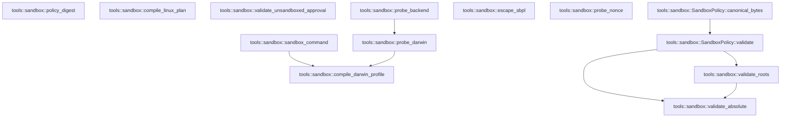

# tools::sandbox

[Package atlas](index.md) · [Source](../../src/sandbox.rs)

## Declarations

Visibility is the declaration spelling; trait members and reexports require their enclosing interface. `cfg` is not evaluated.

| Symbol | Kind | Visibility | Test / cfg |
|---|---|---|---|
| [tools::sandbox::NetworkPolicy](../../src/sandbox.rs#L13) | enum_item | `pub` |  |
| [tools::sandbox::SandboxPolicy](../../src/sandbox.rs#L21) | struct_item | `pub` |  |
| [tools::sandbox::SandboxPolicy::validate](../../src/sandbox.rs#L32) | function_item | `pub` |  |
| [tools::sandbox::SandboxPolicy::canonical_bytes](../../src/sandbox.rs#L55) | function_item | `pub` |  |
| [tools::sandbox::SandboxBackend](../../src/sandbox.rs#L64) | enum_item | `pub` |  |
| [tools::sandbox::ProbeStatus](../../src/sandbox.rs#L71) | enum_item | `pub` |  |
| [tools::sandbox::ProbeFailure](../../src/sandbox.rs#L78) | enum_item | `pub` |  |
| [tools::sandbox::SandboxApproval](../../src/sandbox.rs#L86) | struct_item | `pub` |  |
| [tools::sandbox::SandboxError](../../src/sandbox.rs#L94) | enum_item | `pub` |  |
| [tools::sandbox::policy_digest](../../src/sandbox.rs#L109) | function_item | `pub` |  |
| [tools::sandbox::compile_darwin_profile](../../src/sandbox.rs#L116) | function_item | `pub` |  |
| [tools::sandbox::compile_linux_plan](../../src/sandbox.rs#L191) | function_item | `pub` |  |
| [tools::sandbox::validate_unsandboxed_approval](../../src/sandbox.rs#L217) | function_item | `pub` |  |
| [tools::sandbox::probe_backend](../../src/sandbox.rs#L234) | function_item | `pub` |  |
| [tools::sandbox::sandbox_command](../../src/sandbox.rs#L257) | function_item | `pub(crate)` |  |
| [tools::sandbox::probe_darwin](../../src/sandbox.rs#L289) | function_item | `private` |  |
| [tools::sandbox::validate_roots](../../src/sandbox.rs#L373) | function_item | `private` |  |
| [tools::sandbox::validate_absolute](../../src/sandbox.rs#L390) | function_item | `private` |  |
| [tools::sandbox::escape_sbpl](../../src/sandbox.rs#L406) | function_item | `private` |  |
| [tools::sandbox::probe_nonce](../../src/sandbox.rs#L415) | function_item | `private` |  |
| [tools::sandbox::probe_nonce::NONCE](../../src/sandbox.rs#L417) | static_item | `private` |  |

## Imports / reexports

| Local name | Source path | Visibility |
|---|---|---|
| `BTreeSet` | `std::collections::BTreeSet` | `private` |
| `fs` | `std::fs` | `private` |
| `Path` | `std::path::Path` | `private` |
| `Command` | `std::process::Command` | `private` |
| `Deserialize` | `serde::Deserialize` | `private` |
| `Serialize` | `serde::Serialize` | `private` |
| `json` | `serde_json::json` | `private` |
| `Digest` | `sha2::Digest` | `private` |
| `Sha256` | `sha2::Sha256` | `private` |
| `Error` | `thiserror::Error` | `private` |

## Module declarations

| Module | Visibility | Attributes |
|---|---|---|

## Function call graphs

Edges below are syntactically resolved calls only, including private functions. Graphs partition callers into groups of 20; they are not execution order. All unresolved sites are listed below and in the JSON inventory.

Functions 1–13: 7 direct edges

## Call sites

Includes test functions (marked in declarations). Receiver-type-required sites need type analysis/manual tracing. Calls in closures are attributed to their enclosing function; their occurrence here does not mean the closure executes immediately.

| Caller | Callee expression | Source lines | Target / classification |
|---|---|---|---|
| `validate` | `Err` | [34](../../src/sandbox.rs#L34), [47](../../src/sandbox.rs#L47) | external-constructor-callback-or-unresolved |
| `validate` | `SandboxError::Invalid` | [34](../../src/sandbox.rs#L34), [47](../../src/sandbox.rs#L47) | external-constructor-callback-or-unresolved |
| `validate` | `validate_roots` | [36](../../src/sandbox.rs#L36), [37](../../src/sandbox.rs#L37) | [tools::sandbox::validate_roots](../../src/sandbox.rs#L373) |
| `validate` | `validate_absolute` | [39](../../src/sandbox.rs#L39) | [tools::sandbox::validate_absolute](../../src/sandbox.rs#L390) |
| `validate` | `self                 .read_roots                 .iter()                 .any` | [42](../../src/sandbox.rs#L42) | receiver-type-required |
| `validate` | `self                 .read_roots                 .iter` | [42](../../src/sandbox.rs#L42) | receiver-type-required |
| `validate` | `Path::new(root).starts_with` | [45](../../src/sandbox.rs#L45) | receiver-type-required |
| `validate` | `Path::new` | [45](../../src/sandbox.rs#L45) | external-constructor-callback-or-unresolved |
| `validate` | `Ok` | [52](../../src/sandbox.rs#L52) | external-constructor-callback-or-unresolved |
| `canonical_bytes` | `self.validate` | [56](../../src/sandbox.rs#L56) | [tools::sandbox::SandboxPolicy::validate](../../src/sandbox.rs#L32) |
| `canonical_bytes` | `serde_json_canonicalizer::to_vec(self)             .map_err` | [57](../../src/sandbox.rs#L57) | receiver-type-required |
| `canonical_bytes` | `serde_json_canonicalizer::to_vec` | [57](../../src/sandbox.rs#L57) | external-constructor-callback-or-unresolved |
| `canonical_bytes` | `SandboxError::Encoding` | [58](../../src/sandbox.rs#L58) | external-constructor-callback-or-unresolved |
| `canonical_bytes` | `error.to_string` | [58](../../src/sandbox.rs#L58) | receiver-type-required |
| `policy_digest` | `Ok` | [110](../../src/sandbox.rs#L110) | external-constructor-callback-or-unresolved |
| `compile_darwin_profile` | `policy.validate` | [117](../../src/sandbox.rs#L117) | receiver-type-required |
| `compile_darwin_profile` | `policy         .read_roots         .iter()         .chain(&policy.write_roots)         .chain(policy.scratch.iter())         .flat_map(&#124;root&#124; Path::new(root).ancestors().skip(1))         .filter_map(Path::to_str)         .collect::<BTreeSet<_>>` | [126](../../src/sandbox.rs#L126) | receiver-type-required |
| `compile_darwin_profile` | `policy         .read_roots         .iter()         .chain(&policy.write_roots)         .chain(policy.scratch.iter())         .flat_map(&#124;root&#124; Path::new(root).ancestors().skip(1))         .filter_map` | [126](../../src/sandbox.rs#L126) | receiver-type-required |
| `compile_darwin_profile` | `policy         .read_roots         .iter()         .chain(&policy.write_roots)         .chain(policy.scratch.iter())         .flat_map` | [126](../../src/sandbox.rs#L126) | receiver-type-required |
| `compile_darwin_profile` | `policy         .read_roots         .iter()         .chain(&policy.write_roots)         .chain` | [126](../../src/sandbox.rs#L126) | receiver-type-required |
| `compile_darwin_profile` | `policy         .read_roots         .iter()         .chain` | [126](../../src/sandbox.rs#L126) | receiver-type-required |
| `compile_darwin_profile` | `policy         .read_roots         .iter` | [126](../../src/sandbox.rs#L126) | receiver-type-required |
| `compile_darwin_profile` | `policy.scratch.iter` | [130](../../src/sandbox.rs#L130) | receiver-type-required |
| `compile_darwin_profile` | `Path::new(root).ancestors().skip` | [131](../../src/sandbox.rs#L131) | receiver-type-required |
| `compile_darwin_profile` | `Path::new(root).ancestors` | [131](../../src/sandbox.rs#L131) | receiver-type-required |
| `compile_darwin_profile` | `Path::new` | [131](../../src/sandbox.rs#L131) | external-constructor-callback-or-unresolved |
| `compile_darwin_profile` | `lines.push` | [135](../../src/sandbox.rs#L135), [143](../../src/sandbox.rs#L143), [144](../../src/sandbox.rs#L144), [158](../../src/sandbox.rs#L158), [164](../../src/sandbox.rs#L164), [170](../../src/sandbox.rs#L170), [176](../../src/sandbox.rs#L176), [181](../../src/sandbox.rs#L181), [182](../../src/sandbox.rs#L182), [184](../../src/sandbox.rs#L184) | receiver-type-required |
| `compile_darwin_profile` | `"(allow file-read-metadata (literal \"/Applications\"))".to_owned` | [143](../../src/sandbox.rs#L143) | receiver-type-required |
| `compile_darwin_profile` | `"(allow file-read-metadata (literal \"/Library\"))".to_owned` | [144](../../src/sandbox.rs#L144) | receiver-type-required |
| `compile_darwin_profile` | `[         "/System",         "/usr",         "/bin",         "/sbin",         "/private/var/select",         "/Applications/Xcode.app",         "/Library/Developer/CommandLineTools",     ]     .into_iter()     .map(ToOwned::to_owned)     .chain` | [145](../../src/sandbox.rs#L145) | receiver-type-required |
| `compile_darwin_profile` | `[         "/System",         "/usr",         "/bin",         "/sbin",         "/private/var/select",         "/Applications/Xcode.app",         "/Library/Developer/CommandLineTools",     ]     .into_iter()     .map` | [145](../../src/sandbox.rs#L145) | receiver-type-required |
| `compile_darwin_profile` | `[         "/System",         "/usr",         "/bin",         "/sbin",         "/private/var/select",         "/Applications/Xcode.app",         "/Library/Developer/CommandLineTools",     ]     .into_iter` | [145](../../src/sandbox.rs#L145) | receiver-type-required |
| `compile_darwin_profile` | `policy.read_roots.iter().cloned` | [156](../../src/sandbox.rs#L156) | receiver-type-required |
| `compile_darwin_profile` | `policy.read_roots.iter` | [156](../../src/sandbox.rs#L156) | receiver-type-required |
| `compile_darwin_profile` | `"(allow process-exec process-fork)".to_owned` | [176](../../src/sandbox.rs#L176) | receiver-type-required |
| `compile_darwin_profile` | `"(allow network* (local ip \"localhost:*\"))".to_owned` | [181](../../src/sandbox.rs#L181) | receiver-type-required |
| `compile_darwin_profile` | `"(allow network* (remote ip \"localhost:*\"))".to_owned` | [182](../../src/sandbox.rs#L182) | receiver-type-required |
| `compile_darwin_profile` | `"(allow network*)".to_owned` | [184](../../src/sandbox.rs#L184) | receiver-type-required |
| `compile_darwin_profile` | `lines.join("\n").into_bytes` | [186](../../src/sandbox.rs#L186) | receiver-type-required |
| `compile_darwin_profile` | `lines.join` | [186](../../src/sandbox.rs#L186) | receiver-type-required |
| `compile_darwin_profile` | `bytes.push` | [187](../../src/sandbox.rs#L187) | receiver-type-required |
| `compile_darwin_profile` | `Ok` | [188](../../src/sandbox.rs#L188) | external-constructor-callback-or-unresolved |
| `compile_linux_plan` | `policy.validate` | [192](../../src/sandbox.rs#L192) | receiver-type-required |
| `compile_linux_plan` | `plan.as_object_mut()             .expect("plan object")             .insert` | [207](../../src/sandbox.rs#L207) | receiver-type-required |
| `compile_linux_plan` | `plan.as_object_mut()             .expect` | [207](../../src/sandbox.rs#L207) | receiver-type-required |
| `compile_linux_plan` | `plan.as_object_mut` | [207](../../src/sandbox.rs#L207) | receiver-type-required |
| `compile_linux_plan` | `"scratch".to_owned` | [209](../../src/sandbox.rs#L209) | receiver-type-required |
| `compile_linux_plan` | `serde_json_canonicalizer::to_vec(&plan)         .map_err` | [211](../../src/sandbox.rs#L211) | receiver-type-required |
| `compile_linux_plan` | `serde_json_canonicalizer::to_vec` | [211](../../src/sandbox.rs#L211) | external-constructor-callback-or-unresolved |
| `compile_linux_plan` | `SandboxError::Encoding` | [212](../../src/sandbox.rs#L212) | external-constructor-callback-or-unresolved |
| `compile_linux_plan` | `error.to_string` | [212](../../src/sandbox.rs#L212) | receiver-type-required |
| `compile_linux_plan` | `bytes.push` | [213](../../src/sandbox.rs#L213) | receiver-type-required |
| `compile_linux_plan` | `Ok` | [214](../../src/sandbox.rs#L214) | external-constructor-callback-or-unresolved |
| `validate_unsandboxed_approval` | `Ok` | [228](../../src/sandbox.rs#L228) | external-constructor-callback-or-unresolved |
| `validate_unsandboxed_approval` | `Err` | [230](../../src/sandbox.rs#L230) | external-constructor-callback-or-unresolved |
| `probe_backend` | `probe_darwin` | [236](../../src/sandbox.rs#L236) | [tools::sandbox::probe_darwin](../../src/sandbox.rs#L289) |
| `probe_backend` | `"Landlock/seccomp launcher is not linked in this Darwin-first build"                         .to_owned` | [242](../../src/sandbox.rs#L242) | receiver-type-required |
| `probe_backend` | `"Linux sandbox requested on a non-Linux host".to_owned` | [250](../../src/sandbox.rs#L250) | receiver-type-required |
| `sandbox_command` | `Err` | [263](../../src/sandbox.rs#L263), [270](../../src/sandbox.rs#L270), [283](../../src/sandbox.rs#L283) | external-constructor-callback-or-unresolved |
| `sandbox_command` | `SandboxError::Unavailable` | [263](../../src/sandbox.rs#L263), [270](../../src/sandbox.rs#L270), [283](../../src/sandbox.rs#L283) | external-constructor-callback-or-unresolved |
| `sandbox_command` | `"sandbox probe did not report available".to_owned` | [264](../../src/sandbox.rs#L264) | receiver-type-required |
| `sandbox_command` | `String::from_utf8(compile_darwin_profile(policy)?)             .map_err` | [274](../../src/sandbox.rs#L274) | receiver-type-required |
| `sandbox_command` | `String::from_utf8` | [274](../../src/sandbox.rs#L274) | external-constructor-callback-or-unresolved |
| `sandbox_command` | `compile_darwin_profile` | [274](../../src/sandbox.rs#L274) | [tools::sandbox::compile_darwin_profile](../../src/sandbox.rs#L116) |
| `sandbox_command` | `SandboxError::Encoding` | [275](../../src/sandbox.rs#L275) | external-constructor-callback-or-unresolved |
| `sandbox_command` | `"profile is not UTF-8".to_owned` | [275](../../src/sandbox.rs#L275) | receiver-type-required |
| `sandbox_command` | `Command::new` | [276](../../src/sandbox.rs#L276) | external-constructor-callback-or-unresolved |
| `sandbox_command` | `command.arg("-p").arg(profile).arg` | [277](../../src/sandbox.rs#L277) | receiver-type-required |
| `sandbox_command` | `command.arg("-p").arg` | [277](../../src/sandbox.rs#L277) | receiver-type-required |
| `sandbox_command` | `command.arg` | [277](../../src/sandbox.rs#L277) | receiver-type-required |
| `sandbox_command` | `Ok` | [278](../../src/sandbox.rs#L278) | external-constructor-callback-or-unresolved |
| `sandbox_command` | `"no applied sandbox launcher on this platform".to_owned` | [284](../../src/sandbox.rs#L284) | receiver-type-required |
| `probe_darwin` | `"Seatbelt requested on a non-macOS host".to_owned` | [294](../../src/sandbox.rs#L294) | receiver-type-required |
| `probe_darwin` | `Path::new` | [299](../../src/sandbox.rs#L299) | external-constructor-callback-or-unresolved |
| `probe_darwin` | `executable.is_file` | [300](../../src/sandbox.rs#L300) | receiver-type-required |
| `probe_darwin` | `"sandbox-exec is missing".to_owned` | [303](../../src/sandbox.rs#L303) | receiver-type-required |
| `probe_darwin` | `std::env::temp_dir().join` | [306](../../src/sandbox.rs#L306) | receiver-type-required |
| `probe_darwin` | `std::env::temp_dir` | [306](../../src/sandbox.rs#L306) | external-constructor-callback-or-unresolved |
| `probe_darwin` | `unresolved_root.join` | [311](../../src/sandbox.rs#L311), [312](../../src/sandbox.rs#L312) | receiver-type-required |
| `probe_darwin` | `(&#124;&#124; -> Result<bool, SandboxError> {             fs::create_dir_all(&allowed_unresolved)?;             fs::create_dir_all(&outside_unresolved)?;             let root = fs::canonicalize(&unresolved_root)?;             let allowed = root.join("allowed");             let outside = root.join("outside");             fs::write(allowed.join("read.txt"), b"ok")?;             let policy = SandboxPolicy {                 format: 1,                 read_roots: vec![allowed.to_string_lossy().into_owned()],                 write_roots: vec![allowed.to_string_lossy().into_owned()],                 network: NetworkPolicy::Deny,                 allow_process: true,                 scratch: None,             };             let profile = String::from_utf8(compile_darwin_profile(&policy)?)                 .map_err(&#124;_&#124; SandboxError::Encoding("profile is not UTF-8".to_owned()))?;             let read = Command::new(executable)                 .args(["-p", &profile, "/bin/cat"])                 .arg(allowed.join("read.txt"))                 .output()?;             let denied = Command::new(executable)                 .args(["-p", &profile, "/usr/bin/touch"])                 .arg(outside.join("denied.txt"))                 .output()?;             if read.status.success()                 && read.stdout == b"ok"                 && !denied.status.success()                 && !outside.join("denied.txt").exists()             {                 Ok(true)             } else {                 Err(SandboxError::Probe(format!(                     "read_status={:?} read_stderr={} denied_status={:?} denied_stderr={} outside_exists={}",                     read.status.code(),                     String::from_utf8_lossy(&read.stderr),                     denied.status.code(),                     String::from_utf8_lossy(&denied.stderr),                     outside.join("denied.txt").exists()                 )))             }         })` | [313](../../src/sandbox.rs#L313) | external-constructor-callback-or-unresolved |
| `probe_darwin` | `fs::create_dir_all` | [314](../../src/sandbox.rs#L314), [315](../../src/sandbox.rs#L315) | external-constructor-callback-or-unresolved |
| `probe_darwin` | `fs::canonicalize` | [316](../../src/sandbox.rs#L316) | external-constructor-callback-or-unresolved |
| `probe_darwin` | `root.join` | [317](../../src/sandbox.rs#L317), [318](../../src/sandbox.rs#L318) | receiver-type-required |
| `probe_darwin` | `fs::write` | [319](../../src/sandbox.rs#L319) | external-constructor-callback-or-unresolved |
| `probe_darwin` | `allowed.join` | [319](../../src/sandbox.rs#L319), [332](../../src/sandbox.rs#L332) | receiver-type-required |
| `probe_darwin` | `String::from_utf8(compile_darwin_profile(&policy)?)                 .map_err` | [328](../../src/sandbox.rs#L328) | receiver-type-required |
| `probe_darwin` | `String::from_utf8` | [328](../../src/sandbox.rs#L328) | external-constructor-callback-or-unresolved |
| `probe_darwin` | `compile_darwin_profile` | [328](../../src/sandbox.rs#L328) | [tools::sandbox::compile_darwin_profile](../../src/sandbox.rs#L116) |
| `probe_darwin` | `SandboxError::Encoding` | [329](../../src/sandbox.rs#L329) | external-constructor-callback-or-unresolved |
| `probe_darwin` | `"profile is not UTF-8".to_owned` | [329](../../src/sandbox.rs#L329) | receiver-type-required |
| `probe_darwin` | `Command::new(executable)                 .args(["-p", &profile, "/bin/cat"])                 .arg(allowed.join("read.txt"))                 .output` | [330](../../src/sandbox.rs#L330) | receiver-type-required |
| `probe_darwin` | `Command::new(executable)                 .args(["-p", &profile, "/bin/cat"])                 .arg` | [330](../../src/sandbox.rs#L330) | receiver-type-required |
| `probe_darwin` | `Command::new(executable)                 .args` | [330](../../src/sandbox.rs#L330), [334](../../src/sandbox.rs#L334) | receiver-type-required |
| `probe_darwin` | `Command::new` | [330](../../src/sandbox.rs#L330), [334](../../src/sandbox.rs#L334) | external-constructor-callback-or-unresolved |
| `probe_darwin` | `Command::new(executable)                 .args(["-p", &profile, "/usr/bin/touch"])                 .arg(outside.join("denied.txt"))                 .output` | [334](../../src/sandbox.rs#L334) | receiver-type-required |
| `probe_darwin` | `Command::new(executable)                 .args(["-p", &profile, "/usr/bin/touch"])                 .arg` | [334](../../src/sandbox.rs#L334) | receiver-type-required |
| `probe_darwin` | `outside.join` | [336](../../src/sandbox.rs#L336), [341](../../src/sandbox.rs#L341) | receiver-type-required |
| `probe_darwin` | `read.status.success` | [338](../../src/sandbox.rs#L338) | receiver-type-required |
| `probe_darwin` | `denied.status.success` | [340](../../src/sandbox.rs#L340) | receiver-type-required |
| `probe_darwin` | `outside.join("denied.txt").exists` | [341](../../src/sandbox.rs#L341) | receiver-type-required |
| `probe_darwin` | `Ok` | [343](../../src/sandbox.rs#L343) | external-constructor-callback-or-unresolved |
| `probe_darwin` | `Err` | [345](../../src/sandbox.rs#L345) | external-constructor-callback-or-unresolved |
| `probe_darwin` | `SandboxError::Probe` | [345](../../src/sandbox.rs#L345) | external-constructor-callback-or-unresolved |
| `probe_darwin` | `fs::remove_dir_all` | [355](../../src/sandbox.rs#L355) | external-constructor-callback-or-unresolved |
| `probe_darwin` | `"darwin-seatbelt".to_owned` | [358](../../src/sandbox.rs#L358) | receiver-type-required |
| `probe_darwin` | `std::env::consts::OS.to_owned` | [359](../../src/sandbox.rs#L359) | receiver-type-required |
| `probe_darwin` | `"probe did not prove allowed-read and denied-write".to_owned` | [363](../../src/sandbox.rs#L363) | receiver-type-required |
| `probe_darwin` | `error.to_string` | [367](../../src/sandbox.rs#L367) | receiver-type-required |
| `validate_roots` | `BTreeSet::new` | [375](../../src/sandbox.rs#L375) | external-constructor-callback-or-unresolved |
| `validate_roots` | `validate_absolute` | [377](../../src/sandbox.rs#L377) | [tools::sandbox::validate_absolute](../../src/sandbox.rs#L390) |
| `validate_roots` | `previous.is_some_and` | [378](../../src/sandbox.rs#L378) | receiver-type-required |
| `validate_roots` | `last.as_bytes` | [378](../../src/sandbox.rs#L378) | receiver-type-required |
| `validate_roots` | `value.as_bytes` | [378](../../src/sandbox.rs#L378) | receiver-type-required |
| `validate_roots` | `unique.insert` | [379](../../src/sandbox.rs#L379) | receiver-type-required |
| `validate_roots` | `value.as_str` | [379](../../src/sandbox.rs#L379) | receiver-type-required |
| `validate_roots` | `Err` | [381](../../src/sandbox.rs#L381) | external-constructor-callback-or-unresolved |
| `validate_roots` | `SandboxError::Invalid` | [381](../../src/sandbox.rs#L381) | external-constructor-callback-or-unresolved |
| `validate_roots` | `Some` | [385](../../src/sandbox.rs#L385) | external-constructor-callback-or-unresolved |
| `validate_roots` | `Ok` | [387](../../src/sandbox.rs#L387) | external-constructor-callback-or-unresolved |
| `validate_absolute` | `Path::new` | [391](../../src/sandbox.rs#L391) | external-constructor-callback-or-unresolved |
| `validate_absolute` | `path.is_absolute` | [392](../../src/sandbox.rs#L392) | receiver-type-required |
| `validate_absolute` | `value.contains` | [393](../../src/sandbox.rs#L393) | receiver-type-required |
| `validate_absolute` | `value.chars().any` | [394](../../src/sandbox.rs#L394) | receiver-type-required |
| `validate_absolute` | `value.chars` | [394](../../src/sandbox.rs#L394) | receiver-type-required |
| `validate_absolute` | `path             .components()             .any` | [395](../../src/sandbox.rs#L395) | receiver-type-required |
| `validate_absolute` | `path             .components` | [395](../../src/sandbox.rs#L395) | receiver-type-required |
| `validate_absolute` | `Err` | [399](../../src/sandbox.rs#L399) | external-constructor-callback-or-unresolved |
| `validate_absolute` | `SandboxError::Invalid` | [399](../../src/sandbox.rs#L399) | external-constructor-callback-or-unresolved |
| `validate_absolute` | `Ok` | [403](../../src/sandbox.rs#L403) | external-constructor-callback-or-unresolved |
| `escape_sbpl` | `value.chars().any` | [407](../../src/sandbox.rs#L407) | receiver-type-required |
| `escape_sbpl` | `value.chars` | [407](../../src/sandbox.rs#L407) | receiver-type-required |
| `escape_sbpl` | `Err` | [408](../../src/sandbox.rs#L408) | external-constructor-callback-or-unresolved |
| `escape_sbpl` | `SandboxError::Invalid` | [408](../../src/sandbox.rs#L408) | external-constructor-callback-or-unresolved |
| `escape_sbpl` | `Ok` | [412](../../src/sandbox.rs#L412) | external-constructor-callback-or-unresolved |
| `escape_sbpl` | `value.replace('\\', "\\\\").replace` | [412](../../src/sandbox.rs#L412) | receiver-type-required |
| `escape_sbpl` | `value.replace` | [412](../../src/sandbox.rs#L412) | receiver-type-required |
| `probe_nonce` | `NONCE.fetch_add` | [418](../../src/sandbox.rs#L418) | receiver-type-required |
| `NONCE` | `AtomicU64::new` | [417](../../src/sandbox.rs#L417) | external-constructor-callback-or-unresolved |
