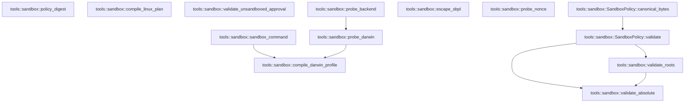

# tools::sandbox

[Package atlas](index.md) · [Source](../../src/sandbox.rs)

## Declarations

Visibility is the declaration spelling; trait members and reexports require their enclosing interface. `cfg` is not evaluated.

| Symbol | Kind | Visibility | Test / cfg |
|---|---|---|---|
| [tools::sandbox::NetworkPolicy](../../src/sandbox.rs#L14) | enum_item | `pub` |  |
| [tools::sandbox::SandboxPolicy](../../src/sandbox.rs#L22) | struct_item | `pub` |  |
| [tools::sandbox::SandboxPolicy::validate](../../src/sandbox.rs#L33) | function_item | `pub` |  |
| [tools::sandbox::SandboxPolicy::canonical_bytes](../../src/sandbox.rs#L56) | function_item | `pub` |  |
| [tools::sandbox::SandboxBackend](../../src/sandbox.rs#L65) | enum_item | `pub` |  |
| [tools::sandbox::ProbeStatus](../../src/sandbox.rs#L72) | enum_item | `pub` |  |
| [tools::sandbox::ProbeFailure](../../src/sandbox.rs#L79) | enum_item | `pub` |  |
| [tools::sandbox::SandboxApproval](../../src/sandbox.rs#L87) | struct_item | `pub` |  |
| [tools::sandbox::SandboxError](../../src/sandbox.rs#L95) | enum_item | `pub` |  |
| [tools::sandbox::policy_digest](../../src/sandbox.rs#L110) | function_item | `pub` |  |
| [tools::sandbox::compile_darwin_profile](../../src/sandbox.rs#L117) | function_item | `pub` |  |
| [tools::sandbox::compile_linux_plan](../../src/sandbox.rs#L192) | function_item | `pub` |  |
| [tools::sandbox::validate_unsandboxed_approval](../../src/sandbox.rs#L218) | function_item | `pub` |  |
| [tools::sandbox::probe_backend](../../src/sandbox.rs#L235) | function_item | `pub` |  |
| [tools::sandbox::sandbox_command](../../src/sandbox.rs#L258) | function_item | `pub(crate)` |  |
| [tools::sandbox::probe_darwin](../../src/sandbox.rs#L290) | function_item | `private` |  |
| [tools::sandbox::validate_roots](../../src/sandbox.rs#L374) | function_item | `private` |  |
| [tools::sandbox::validate_absolute](../../src/sandbox.rs#L391) | function_item | `private` |  |
| [tools::sandbox::escape_sbpl](../../src/sandbox.rs#L407) | function_item | `private` |  |
| [tools::sandbox::probe_nonce](../../src/sandbox.rs#L417) | function_item | `private` | #[cfg(target_os = "macos")] |
| [tools::sandbox::probe_nonce::NONCE](../../src/sandbox.rs#L419) | static_item | `private` | #[cfg(target_os = "macos")] |

## Imports / reexports

| Local name | Source path | Visibility |
|---|---|---|
| `BTreeSet` | `std::collections::BTreeSet` | `private` |
| `fs` | `std::fs` | `private` |
| `Path` | `std::path::Path` | `private` |
| `Command` | `std::process::Command` | `private` |
| `Deserialize` | `serde::Deserialize` | `private` |
| `Serialize` | `serde::Serialize` | `private` |
| `json` | `serde_json::json` | `private` |
| `Digest` | `sha2::Digest` | `private` |
| `Sha256` | `sha2::Sha256` | `private` |
| `Error` | `thiserror::Error` | `private` |

## Module declarations

| Module | Visibility | Attributes |
|---|---|---|

## Function call graphs

Edges below are syntactically resolved calls only, including private functions. Graphs partition callers into groups of 20; they are not execution order. All unresolved sites are listed below and in the JSON inventory.

Functions 1–13: 7 direct edges

## Call sites

Includes test functions (marked in declarations). Receiver-type-required sites need type analysis/manual tracing. Calls in closures are attributed to their enclosing function; their occurrence here does not mean the closure executes immediately.

| Caller | Callee expression | Source lines | Target / classification |
|---|---|---|---|
| `validate` | `Err` | [35](../../src/sandbox.rs#L35), [48](../../src/sandbox.rs#L48) | external-constructor-callback-or-unresolved |
| `validate` | `SandboxError::Invalid` | [35](../../src/sandbox.rs#L35), [48](../../src/sandbox.rs#L48) | external-constructor-callback-or-unresolved |
| `validate` | `validate_roots` | [37](../../src/sandbox.rs#L37), [38](../../src/sandbox.rs#L38) | [tools::sandbox::validate_roots](../../src/sandbox.rs#L374) |
| `validate` | `validate_absolute` | [40](../../src/sandbox.rs#L40) | [tools::sandbox::validate_absolute](../../src/sandbox.rs#L391) |
| `validate` | `self                 .read_roots                 .iter()                 .any` | [43](../../src/sandbox.rs#L43) | receiver-type-required |
| `validate` | `self                 .read_roots                 .iter` | [43](../../src/sandbox.rs#L43) | receiver-type-required |
| `validate` | `Path::new(root).starts_with` | [46](../../src/sandbox.rs#L46) | receiver-type-required |
| `validate` | `Path::new` | [46](../../src/sandbox.rs#L46) | external-constructor-callback-or-unresolved |
| `validate` | `Ok` | [53](../../src/sandbox.rs#L53) | external-constructor-callback-or-unresolved |
| `canonical_bytes` | `self.validate` | [57](../../src/sandbox.rs#L57) | [tools::sandbox::SandboxPolicy::validate](../../src/sandbox.rs#L33) |
| `canonical_bytes` | `serde_json_canonicalizer::to_vec(self)             .map_err` | [58](../../src/sandbox.rs#L58) | receiver-type-required |
| `canonical_bytes` | `serde_json_canonicalizer::to_vec` | [58](../../src/sandbox.rs#L58) | external-constructor-callback-or-unresolved |
| `canonical_bytes` | `SandboxError::Encoding` | [59](../../src/sandbox.rs#L59) | external-constructor-callback-or-unresolved |
| `canonical_bytes` | `error.to_string` | [59](../../src/sandbox.rs#L59) | receiver-type-required |
| `policy_digest` | `Ok` | [111](../../src/sandbox.rs#L111) | external-constructor-callback-or-unresolved |
| `compile_darwin_profile` | `policy.validate` | [118](../../src/sandbox.rs#L118) | receiver-type-required |
| `compile_darwin_profile` | `policy         .read_roots         .iter()         .chain(&policy.write_roots)         .chain(policy.scratch.iter())         .flat_map(&#124;root&#124; Path::new(root).ancestors().skip(1))         .filter_map(Path::to_str)         .collect::<BTreeSet<_>>` | [127](../../src/sandbox.rs#L127) | receiver-type-required |
| `compile_darwin_profile` | `policy         .read_roots         .iter()         .chain(&policy.write_roots)         .chain(policy.scratch.iter())         .flat_map(&#124;root&#124; Path::new(root).ancestors().skip(1))         .filter_map` | [127](../../src/sandbox.rs#L127) | receiver-type-required |
| `compile_darwin_profile` | `policy         .read_roots         .iter()         .chain(&policy.write_roots)         .chain(policy.scratch.iter())         .flat_map` | [127](../../src/sandbox.rs#L127) | receiver-type-required |
| `compile_darwin_profile` | `policy         .read_roots         .iter()         .chain(&policy.write_roots)         .chain` | [127](../../src/sandbox.rs#L127) | receiver-type-required |
| `compile_darwin_profile` | `policy         .read_roots         .iter()         .chain` | [127](../../src/sandbox.rs#L127) | receiver-type-required |
| `compile_darwin_profile` | `policy         .read_roots         .iter` | [127](../../src/sandbox.rs#L127) | receiver-type-required |
| `compile_darwin_profile` | `policy.scratch.iter` | [131](../../src/sandbox.rs#L131) | receiver-type-required |
| `compile_darwin_profile` | `Path::new(root).ancestors().skip` | [132](../../src/sandbox.rs#L132) | receiver-type-required |
| `compile_darwin_profile` | `Path::new(root).ancestors` | [132](../../src/sandbox.rs#L132) | receiver-type-required |
| `compile_darwin_profile` | `Path::new` | [132](../../src/sandbox.rs#L132) | external-constructor-callback-or-unresolved |
| `compile_darwin_profile` | `lines.push` | [136](../../src/sandbox.rs#L136), [144](../../src/sandbox.rs#L144), [145](../../src/sandbox.rs#L145), [159](../../src/sandbox.rs#L159), [165](../../src/sandbox.rs#L165), [171](../../src/sandbox.rs#L171), [177](../../src/sandbox.rs#L177), [182](../../src/sandbox.rs#L182), [183](../../src/sandbox.rs#L183), [185](../../src/sandbox.rs#L185) | receiver-type-required |
| `compile_darwin_profile` | `"(allow file-read-metadata (literal \"/Applications\"))".to_owned` | [144](../../src/sandbox.rs#L144) | receiver-type-required |
| `compile_darwin_profile` | `"(allow file-read-metadata (literal \"/Library\"))".to_owned` | [145](../../src/sandbox.rs#L145) | receiver-type-required |
| `compile_darwin_profile` | `[         "/System",         "/usr",         "/bin",         "/sbin",         "/private/var/select",         "/Applications/Xcode.app",         "/Library/Developer/CommandLineTools",     ]     .into_iter()     .map(ToOwned::to_owned)     .chain` | [146](../../src/sandbox.rs#L146) | receiver-type-required |
| `compile_darwin_profile` | `[         "/System",         "/usr",         "/bin",         "/sbin",         "/private/var/select",         "/Applications/Xcode.app",         "/Library/Developer/CommandLineTools",     ]     .into_iter()     .map` | [146](../../src/sandbox.rs#L146) | receiver-type-required |
| `compile_darwin_profile` | `[         "/System",         "/usr",         "/bin",         "/sbin",         "/private/var/select",         "/Applications/Xcode.app",         "/Library/Developer/CommandLineTools",     ]     .into_iter` | [146](../../src/sandbox.rs#L146) | receiver-type-required |
| `compile_darwin_profile` | `policy.read_roots.iter().cloned` | [157](../../src/sandbox.rs#L157) | receiver-type-required |
| `compile_darwin_profile` | `policy.read_roots.iter` | [157](../../src/sandbox.rs#L157) | receiver-type-required |
| `compile_darwin_profile` | `"(allow process-exec process-fork)".to_owned` | [177](../../src/sandbox.rs#L177) | receiver-type-required |
| `compile_darwin_profile` | `"(allow network* (local ip \"localhost:*\"))".to_owned` | [182](../../src/sandbox.rs#L182) | receiver-type-required |
| `compile_darwin_profile` | `"(allow network* (remote ip \"localhost:*\"))".to_owned` | [183](../../src/sandbox.rs#L183) | receiver-type-required |
| `compile_darwin_profile` | `"(allow network*)".to_owned` | [185](../../src/sandbox.rs#L185) | receiver-type-required |
| `compile_darwin_profile` | `lines.join("\n").into_bytes` | [187](../../src/sandbox.rs#L187) | receiver-type-required |
| `compile_darwin_profile` | `lines.join` | [187](../../src/sandbox.rs#L187) | receiver-type-required |
| `compile_darwin_profile` | `bytes.push` | [188](../../src/sandbox.rs#L188) | receiver-type-required |
| `compile_darwin_profile` | `Ok` | [189](../../src/sandbox.rs#L189) | external-constructor-callback-or-unresolved |
| `compile_linux_plan` | `policy.validate` | [193](../../src/sandbox.rs#L193) | receiver-type-required |
| `compile_linux_plan` | `plan.as_object_mut()             .expect("plan object")             .insert` | [208](../../src/sandbox.rs#L208) | receiver-type-required |
| `compile_linux_plan` | `plan.as_object_mut()             .expect` | [208](../../src/sandbox.rs#L208) | receiver-type-required |
| `compile_linux_plan` | `plan.as_object_mut` | [208](../../src/sandbox.rs#L208) | receiver-type-required |
| `compile_linux_plan` | `"scratch".to_owned` | [210](../../src/sandbox.rs#L210) | receiver-type-required |
| `compile_linux_plan` | `serde_json_canonicalizer::to_vec(&plan)         .map_err` | [212](../../src/sandbox.rs#L212) | receiver-type-required |
| `compile_linux_plan` | `serde_json_canonicalizer::to_vec` | [212](../../src/sandbox.rs#L212) | external-constructor-callback-or-unresolved |
| `compile_linux_plan` | `SandboxError::Encoding` | [213](../../src/sandbox.rs#L213) | external-constructor-callback-or-unresolved |
| `compile_linux_plan` | `error.to_string` | [213](../../src/sandbox.rs#L213) | receiver-type-required |
| `compile_linux_plan` | `bytes.push` | [214](../../src/sandbox.rs#L214) | receiver-type-required |
| `compile_linux_plan` | `Ok` | [215](../../src/sandbox.rs#L215) | external-constructor-callback-or-unresolved |
| `validate_unsandboxed_approval` | `Ok` | [229](../../src/sandbox.rs#L229) | external-constructor-callback-or-unresolved |
| `validate_unsandboxed_approval` | `Err` | [231](../../src/sandbox.rs#L231) | external-constructor-callback-or-unresolved |
| `probe_backend` | `probe_darwin` | [237](../../src/sandbox.rs#L237) | [tools::sandbox::probe_darwin](../../src/sandbox.rs#L290) |
| `probe_backend` | `"Landlock/seccomp launcher is not linked in this Darwin-first build"                         .to_owned` | [243](../../src/sandbox.rs#L243) | receiver-type-required |
| `probe_backend` | `"Linux sandbox requested on a non-Linux host".to_owned` | [251](../../src/sandbox.rs#L251) | receiver-type-required |
| `sandbox_command` | `Err` | [264](../../src/sandbox.rs#L264), [271](../../src/sandbox.rs#L271), [284](../../src/sandbox.rs#L284) | external-constructor-callback-or-unresolved |
| `sandbox_command` | `SandboxError::Unavailable` | [264](../../src/sandbox.rs#L264), [271](../../src/sandbox.rs#L271), [284](../../src/sandbox.rs#L284) | external-constructor-callback-or-unresolved |
| `sandbox_command` | `"sandbox probe did not report available".to_owned` | [265](../../src/sandbox.rs#L265) | receiver-type-required |
| `sandbox_command` | `String::from_utf8(compile_darwin_profile(policy)?)             .map_err` | [275](../../src/sandbox.rs#L275) | receiver-type-required |
| `sandbox_command` | `String::from_utf8` | [275](../../src/sandbox.rs#L275) | external-constructor-callback-or-unresolved |
| `sandbox_command` | `compile_darwin_profile` | [275](../../src/sandbox.rs#L275) | [tools::sandbox::compile_darwin_profile](../../src/sandbox.rs#L117) |
| `sandbox_command` | `SandboxError::Encoding` | [276](../../src/sandbox.rs#L276) | external-constructor-callback-or-unresolved |
| `sandbox_command` | `"profile is not UTF-8".to_owned` | [276](../../src/sandbox.rs#L276) | receiver-type-required |
| `sandbox_command` | `Command::new` | [277](../../src/sandbox.rs#L277) | external-constructor-callback-or-unresolved |
| `sandbox_command` | `command.arg("-p").arg(profile).arg` | [278](../../src/sandbox.rs#L278) | receiver-type-required |
| `sandbox_command` | `command.arg("-p").arg` | [278](../../src/sandbox.rs#L278) | receiver-type-required |
| `sandbox_command` | `command.arg` | [278](../../src/sandbox.rs#L278) | receiver-type-required |
| `sandbox_command` | `Ok` | [279](../../src/sandbox.rs#L279) | external-constructor-callback-or-unresolved |
| `sandbox_command` | `"no applied sandbox launcher on this platform".to_owned` | [285](../../src/sandbox.rs#L285) | receiver-type-required |
| `probe_darwin` | `"Seatbelt requested on a non-macOS host".to_owned` | [295](../../src/sandbox.rs#L295) | receiver-type-required |
| `probe_darwin` | `Path::new` | [300](../../src/sandbox.rs#L300) | external-constructor-callback-or-unresolved |
| `probe_darwin` | `executable.is_file` | [301](../../src/sandbox.rs#L301) | receiver-type-required |
| `probe_darwin` | `"sandbox-exec is missing".to_owned` | [304](../../src/sandbox.rs#L304) | receiver-type-required |
| `probe_darwin` | `std::env::temp_dir().join` | [307](../../src/sandbox.rs#L307) | receiver-type-required |
| `probe_darwin` | `std::env::temp_dir` | [307](../../src/sandbox.rs#L307) | external-constructor-callback-or-unresolved |
| `probe_darwin` | `unresolved_root.join` | [312](../../src/sandbox.rs#L312), [313](../../src/sandbox.rs#L313) | receiver-type-required |
| `probe_darwin` | `(&#124;&#124; -> Result<bool, SandboxError> {             fs::create_dir_all(&allowed_unresolved)?;             fs::create_dir_all(&outside_unresolved)?;             let root = fs::canonicalize(&unresolved_root)?;             let allowed = root.join("allowed");             let outside = root.join("outside");             fs::write(allowed.join("read.txt"), b"ok")?;             let policy = SandboxPolicy {                 format: 1,                 read_roots: vec![allowed.to_string_lossy().into_owned()],                 write_roots: vec![allowed.to_string_lossy().into_owned()],                 network: NetworkPolicy::Deny,                 allow_process: true,                 scratch: None,             };             let profile = String::from_utf8(compile_darwin_profile(&policy)?)                 .map_err(&#124;_&#124; SandboxError::Encoding("profile is not UTF-8".to_owned()))?;             let read = Command::new(executable)                 .args(["-p", &profile, "/bin/cat"])                 .arg(allowed.join("read.txt"))                 .output()?;             let denied = Command::new(executable)                 .args(["-p", &profile, "/usr/bin/touch"])                 .arg(outside.join("denied.txt"))                 .output()?;             if read.status.success()                 && read.stdout == b"ok"                 && !denied.status.success()                 && !outside.join("denied.txt").exists()             {                 Ok(true)             } else {                 Err(SandboxError::Probe(format!(                     "read_status={:?} read_stderr={} denied_status={:?} denied_stderr={} outside_exists={}",                     read.status.code(),                     String::from_utf8_lossy(&read.stderr),                     denied.status.code(),                     String::from_utf8_lossy(&denied.stderr),                     outside.join("denied.txt").exists()                 )))             }         })` | [314](../../src/sandbox.rs#L314) | external-constructor-callback-or-unresolved |
| `probe_darwin` | `fs::create_dir_all` | [315](../../src/sandbox.rs#L315), [316](../../src/sandbox.rs#L316) | external-constructor-callback-or-unresolved |
| `probe_darwin` | `fs::canonicalize` | [317](../../src/sandbox.rs#L317) | external-constructor-callback-or-unresolved |
| `probe_darwin` | `root.join` | [318](../../src/sandbox.rs#L318), [319](../../src/sandbox.rs#L319) | receiver-type-required |
| `probe_darwin` | `fs::write` | [320](../../src/sandbox.rs#L320) | external-constructor-callback-or-unresolved |
| `probe_darwin` | `allowed.join` | [320](../../src/sandbox.rs#L320), [333](../../src/sandbox.rs#L333) | receiver-type-required |
| `probe_darwin` | `String::from_utf8(compile_darwin_profile(&policy)?)                 .map_err` | [329](../../src/sandbox.rs#L329) | receiver-type-required |
| `probe_darwin` | `String::from_utf8` | [329](../../src/sandbox.rs#L329) | external-constructor-callback-or-unresolved |
| `probe_darwin` | `compile_darwin_profile` | [329](../../src/sandbox.rs#L329) | [tools::sandbox::compile_darwin_profile](../../src/sandbox.rs#L117) |
| `probe_darwin` | `SandboxError::Encoding` | [330](../../src/sandbox.rs#L330) | external-constructor-callback-or-unresolved |
| `probe_darwin` | `"profile is not UTF-8".to_owned` | [330](../../src/sandbox.rs#L330) | receiver-type-required |
| `probe_darwin` | `Command::new(executable)                 .args(["-p", &profile, "/bin/cat"])                 .arg(allowed.join("read.txt"))                 .output` | [331](../../src/sandbox.rs#L331) | receiver-type-required |
| `probe_darwin` | `Command::new(executable)                 .args(["-p", &profile, "/bin/cat"])                 .arg` | [331](../../src/sandbox.rs#L331) | receiver-type-required |
| `probe_darwin` | `Command::new(executable)                 .args` | [331](../../src/sandbox.rs#L331), [335](../../src/sandbox.rs#L335) | receiver-type-required |
| `probe_darwin` | `Command::new` | [331](../../src/sandbox.rs#L331), [335](../../src/sandbox.rs#L335) | external-constructor-callback-or-unresolved |
| `probe_darwin` | `Command::new(executable)                 .args(["-p", &profile, "/usr/bin/touch"])                 .arg(outside.join("denied.txt"))                 .output` | [335](../../src/sandbox.rs#L335) | receiver-type-required |
| `probe_darwin` | `Command::new(executable)                 .args(["-p", &profile, "/usr/bin/touch"])                 .arg` | [335](../../src/sandbox.rs#L335) | receiver-type-required |
| `probe_darwin` | `outside.join` | [337](../../src/sandbox.rs#L337), [342](../../src/sandbox.rs#L342) | receiver-type-required |
| `probe_darwin` | `read.status.success` | [339](../../src/sandbox.rs#L339) | receiver-type-required |
| `probe_darwin` | `denied.status.success` | [341](../../src/sandbox.rs#L341) | receiver-type-required |
| `probe_darwin` | `outside.join("denied.txt").exists` | [342](../../src/sandbox.rs#L342) | receiver-type-required |
| `probe_darwin` | `Ok` | [344](../../src/sandbox.rs#L344) | external-constructor-callback-or-unresolved |
| `probe_darwin` | `Err` | [346](../../src/sandbox.rs#L346) | external-constructor-callback-or-unresolved |
| `probe_darwin` | `SandboxError::Probe` | [346](../../src/sandbox.rs#L346) | external-constructor-callback-or-unresolved |
| `probe_darwin` | `fs::remove_dir_all` | [356](../../src/sandbox.rs#L356) | external-constructor-callback-or-unresolved |
| `probe_darwin` | `"darwin-seatbelt".to_owned` | [359](../../src/sandbox.rs#L359) | receiver-type-required |
| `probe_darwin` | `std::env::consts::OS.to_owned` | [360](../../src/sandbox.rs#L360) | receiver-type-required |
| `probe_darwin` | `"probe did not prove allowed-read and denied-write".to_owned` | [364](../../src/sandbox.rs#L364) | receiver-type-required |
| `probe_darwin` | `error.to_string` | [368](../../src/sandbox.rs#L368) | receiver-type-required |
| `validate_roots` | `BTreeSet::new` | [376](../../src/sandbox.rs#L376) | external-constructor-callback-or-unresolved |
| `validate_roots` | `validate_absolute` | [378](../../src/sandbox.rs#L378) | [tools::sandbox::validate_absolute](../../src/sandbox.rs#L391) |
| `validate_roots` | `previous.is_some_and` | [379](../../src/sandbox.rs#L379) | receiver-type-required |
| `validate_roots` | `last.as_bytes` | [379](../../src/sandbox.rs#L379) | receiver-type-required |
| `validate_roots` | `value.as_bytes` | [379](../../src/sandbox.rs#L379) | receiver-type-required |
| `validate_roots` | `unique.insert` | [380](../../src/sandbox.rs#L380) | receiver-type-required |
| `validate_roots` | `value.as_str` | [380](../../src/sandbox.rs#L380) | receiver-type-required |
| `validate_roots` | `Err` | [382](../../src/sandbox.rs#L382) | external-constructor-callback-or-unresolved |
| `validate_roots` | `SandboxError::Invalid` | [382](../../src/sandbox.rs#L382) | external-constructor-callback-or-unresolved |
| `validate_roots` | `Some` | [386](../../src/sandbox.rs#L386) | external-constructor-callback-or-unresolved |
| `validate_roots` | `Ok` | [388](../../src/sandbox.rs#L388) | external-constructor-callback-or-unresolved |
| `validate_absolute` | `Path::new` | [392](../../src/sandbox.rs#L392) | external-constructor-callback-or-unresolved |
| `validate_absolute` | `path.is_absolute` | [393](../../src/sandbox.rs#L393) | receiver-type-required |
| `validate_absolute` | `value.contains` | [394](../../src/sandbox.rs#L394) | receiver-type-required |
| `validate_absolute` | `value.chars().any` | [395](../../src/sandbox.rs#L395) | receiver-type-required |
| `validate_absolute` | `value.chars` | [395](../../src/sandbox.rs#L395) | receiver-type-required |
| `validate_absolute` | `path             .components()             .any` | [396](../../src/sandbox.rs#L396) | receiver-type-required |
| `validate_absolute` | `path             .components` | [396](../../src/sandbox.rs#L396) | receiver-type-required |
| `validate_absolute` | `Err` | [400](../../src/sandbox.rs#L400) | external-constructor-callback-or-unresolved |
| `validate_absolute` | `SandboxError::Invalid` | [400](../../src/sandbox.rs#L400) | external-constructor-callback-or-unresolved |
| `validate_absolute` | `Ok` | [404](../../src/sandbox.rs#L404) | external-constructor-callback-or-unresolved |
| `escape_sbpl` | `value.chars().any` | [408](../../src/sandbox.rs#L408) | receiver-type-required |
| `escape_sbpl` | `value.chars` | [408](../../src/sandbox.rs#L408) | receiver-type-required |
| `escape_sbpl` | `Err` | [409](../../src/sandbox.rs#L409) | external-constructor-callback-or-unresolved |
| `escape_sbpl` | `SandboxError::Invalid` | [409](../../src/sandbox.rs#L409) | external-constructor-callback-or-unresolved |
| `escape_sbpl` | `Ok` | [413](../../src/sandbox.rs#L413) | external-constructor-callback-or-unresolved |
| `escape_sbpl` | `value.replace('\\', "\\\\").replace` | [413](../../src/sandbox.rs#L413) | receiver-type-required |
| `escape_sbpl` | `value.replace` | [413](../../src/sandbox.rs#L413) | receiver-type-required |
| `probe_nonce` | `NONCE.fetch_add` | [420](../../src/sandbox.rs#L420) | receiver-type-required |
| `NONCE` | `AtomicU64::new` | [419](../../src/sandbox.rs#L419) | external-constructor-callback-or-unresolved |
