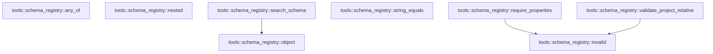

```mermaid
flowchart TD
  n0["tools::schema_registry::audit_reason"]
  n1["tools::schema_registry::context_schema"]
  n2["tools::schema_registry::shell_schema"]
  n3["tools::schema_registry::summary_schema"]
  n4["tools::schema_registry::task_schema"]
  n5["tools::schema_registry::verify_schema"]
  n6["tools::schema_registry::fixed_schema"]
  n7["tools::schema_registry::validate_fixed_arguments"]
  n8["tools::schema_registry::tool"]
  n9["tools::schema_registry::object"]
  n10["tools::schema_registry::p"]
  n11["tools::schema_registry::boolean"]
  n12["tools::schema_registry::integer"]
  n13["tools::schema_registry::integer_default"]
  n14["tools::schema_registry::string"]
  n15["tools::schema_registry::nonempty_string"]
  n16["tools::schema_registry::enum_string"]
  n17["tools::schema_registry::array"]
  n18["tools::schema_registry::string_array"]
  n19["tools::schema_registry::nullable"]
  n20["tools::schema_registry::any_of"]
  n21["tools::schema_registry::nested"]
  n22["tools::schema_registry::fixed_schema_registry"]
  n0 --> n20
  n1 --> n9
  n2 --> n9
  n2 --> n21
  n3 --> n9
  n4 --> n9
  n4 --> n21
  n5 --> n9
  n5 --> n21
  n6 --> n22
  n7 --> n6
  n18 --> n14
  n18 --> n17
```

# tools::schema_registry

[Package atlas](index.md) · [Source](../../src/schema_registry.rs)

## Declarations

Visibility is the declaration spelling; trait members and reexports require their enclosing interface. `cfg` is not evaluated.

| Symbol | Kind | Visibility | Test / cfg |
|---|---|---|---|
| [tools::schema_registry::FIXED_SCHEMA_REVISION](../../src/schema_registry.rs#L15) | const_item | `pub` |  |
| [tools::schema_registry::FixedToolSchema](../../src/schema_registry.rs#L18) | struct_item | `pub` |  |
| [tools::schema_registry::ObjectSchema](../../src/schema_registry.rs#L26) | struct_item | `pub` |  |
| [tools::schema_registry::PropertySchema](../../src/schema_registry.rs#L33) | struct_item | `pub` |  |
| [tools::schema_registry::ValueSchema](../../src/schema_registry.rs#L39) | enum_item | `pub` |  |
| [tools::schema_registry::ObjectRule](../../src/schema_registry.rs#L63) | enum_item | `pub` |  |
| [tools::schema_registry::SchemaValidationError](../../src/schema_registry.rs#L96) | enum_item | `pub` |  |
| [tools::schema_registry::FixedToolSchema::model_schema](../../src/schema_registry.rs#L105) | function_item | `pub` |  |
| [tools::schema_registry::FixedToolSchema::canonical_schema_bytes](../../src/schema_registry.rs#L114) | function_item | `pub` |  |
| [tools::schema_registry::FixedToolSchema::ordered_model_schema_bytes](../../src/schema_registry.rs#L123) | function_item | `pub` |  |
| [tools::schema_registry::FixedToolSchema::schema_digest](../../src/schema_registry.rs#L129) | function_item | `pub` |  |
| [tools::schema_registry::FixedToolSchema::validate](../../src/schema_registry.rs#L133) | function_item | `pub` |  |
| [tools::schema_registry::FixedToolSchema::repair_quoted_null_exclusive](../../src/schema_registry.rs#L141) | function_item | `pub` |  |
| [tools::schema_registry::OrderedToolSchema](../../src/schema_registry.rs#L179) | struct_item | `private` |  |
| [tools::schema_registry::OrderedToolSchema::serialize](../../src/schema_registry.rs#L182) | function_item | `private` |  |
| [tools::schema_registry::OrderedObject](../../src/schema_registry.rs#L194) | struct_item | `private` |  |
| [tools::schema_registry::OrderedProperties](../../src/schema_registry.rs#L195) | struct_item | `private` |  |
| [tools::schema_registry::OrderedValue](../../src/schema_registry.rs#L196) | struct_item | `private` |  |
| [tools::schema_registry::OrderedObject::serialize](../../src/schema_registry.rs#L199) | function_item | `private` |  |
| [tools::schema_registry::OrderedProperties::serialize](../../src/schema_registry.rs#L223) | function_item | `private` |  |
| [tools::schema_registry::OrderedValue::serialize](../../src/schema_registry.rs#L236) | function_item | `private` |  |
| [tools::schema_registry::ObjectSchema::argument_order](../../src/schema_registry.rs#L280) | function_item | `pub` |  |
| [tools::schema_registry::ObjectSchema::to_json_schema](../../src/schema_registry.rs#L288) | function_item | `pub` |  |
| [tools::schema_registry::ObjectSchema::validate](../../src/schema_registry.rs#L309) | function_item | `private` |  |
| [tools::schema_registry::ValueSchema::to_json_schema](../../src/schema_registry.rs#L347) | function_item | `private` |  |
| [tools::schema_registry::ValueSchema::validate](../../src/schema_registry.rs#L415) | function_item | `private` |  |
| [tools::schema_registry::ObjectRule::to_json_schema](../../src/schema_registry.rs#L506) | function_item | `private` |  |
| [tools::schema_registry::ObjectRule::validate](../../src/schema_registry.rs#L584) | function_item | `private` |  |
| [tools::schema_registry::fixed_schema_registry](../../src/schema_registry.rs#L713) | function_item | `pub` |  |
| [tools::schema_registry::schema_oracle_value](../../src/schema_registry.rs#L1002) | function_item | `pub` |  |
| [tools::schema_registry::canonical_schema_oracle_bytes](../../src/schema_registry.rs#L1017) | function_item | `pub` |  |
| [tools::schema_registry::audit_reason](../../src/schema_registry.rs#L1024) | function_item | `private` |  |
| [tools::schema_registry::context_schema](../../src/schema_registry.rs#L1031) | function_item | `private` |  |
| [tools::schema_registry::shell_schema](../../src/schema_registry.rs#L1108) | function_item | `private` |  |
| [tools::schema_registry::summary_schema](../../src/schema_registry.rs#L1150) | function_item | `private` |  |
| [tools::schema_registry::task_schema](../../src/schema_registry.rs#L1164) | function_item | `private` |  |
| [tools::schema_registry::verify_schema](../../src/schema_registry.rs#L1195) | function_item | `private` |  |
| [tools::schema_registry::fixed_schema](../../src/schema_registry.rs#L1225) | function_item | `pub` |  |
| [tools::schema_registry::validate_fixed_arguments](../../src/schema_registry.rs#L1231) | function_item | `pub` |  |
| [tools::schema_registry::tool](../../src/schema_registry.rs#L1240) | function_item | `private` |  |
| [tools::schema_registry::object](../../src/schema_registry.rs#L1253) | function_item | `private` |  |
| [tools::schema_registry::p](../../src/schema_registry.rs#L1265) | function_item | `private` |  |
| [tools::schema_registry::boolean](../../src/schema_registry.rs#L1269) | function_item | `private` |  |
| [tools::schema_registry::integer](../../src/schema_registry.rs#L1273) | function_item | `private` |  |
| [tools::schema_registry::integer_default](../../src/schema_registry.rs#L1281) | function_item | `private` |  |
| [tools::schema_registry::string](../../src/schema_registry.rs#L1289) | function_item | `private` |  |
| [tools::schema_registry::nonempty_string](../../src/schema_registry.rs#L1297) | function_item | `private` |  |
| [tools::schema_registry::enum_string](../../src/schema_registry.rs#L1305) | function_item | `private` |  |
| [tools::schema_registry::array](../../src/schema_registry.rs#L1313) | function_item | `private` |  |
| [tools::schema_registry::string_array](../../src/schema_registry.rs#L1327) | function_item | `private` |  |
| [tools::schema_registry::nullable](../../src/schema_registry.rs#L1331) | function_item | `private` |  |
| [tools::schema_registry::any_of](../../src/schema_registry.rs#L1335) | function_item | `private` |  |
| [tools::schema_registry::nested](../../src/schema_registry.rs#L1339) | function_item | `private` |  |
| [tools::schema_registry::search_schema](../../src/schema_registry.rs#L1343) | function_item | `private` |  |
| [tools::schema_registry::string_equals](../../src/schema_registry.rs#L1354) | function_item | `private` |  |
| [tools::schema_registry::require_properties](../../src/schema_registry.rs#L1358) | function_item | `private` |  |
| [tools::schema_registry::invalid](../../src/schema_registry.rs#L1378) | function_item | `private` |  |
| [tools::schema_registry::validate_project_relative](../../src/schema_registry.rs#L1385) | function_item | `private` |  |

## Imports / reexports

| Local name | Source path | Visibility |
|---|---|---|
| `BTreeSet` | `std::collections::BTreeSet` | `private` |
| `Serialize` | `serde::Serialize` | `private` |
| `SerializeMap` | `serde::ser::SerializeMap` | `private` |
| `Serializer` | `serde::ser::Serializer` | `private` |
| `Map` | `serde_json::Map` | `private` |
| `Value` | `serde_json::Value` | `private` |
| `json` | `serde_json::json` | `private` |
| `Digest` | `sha2::Digest` | `private` |
| `Sha256` | `sha2::Sha256` | `private` |
| `Error` | `thiserror::Error` | `private` |

## Module declarations

| Module | Visibility | Attributes |
|---|---|---|

## Function call graphs

Edges below are syntactically resolved calls only, including private functions. Graphs partition callers into groups of 20; they are not execution order. All unresolved sites are listed below and in the JSON inventory.

Functions 1–20: 9 direct edges

Functions 21–40: 13 direct edges

Functions 41–47: 3 direct edges

## Call sites

Includes test functions (marked in declarations). Receiver-type-required sites need type analysis/manual tracing. Calls in closures are attributed to their enclosing function; their occurrence here does not mean the closure executes immediately.

| Caller | Callee expression | Source lines | Target / classification |
|---|---|---|---|
| `canonical_schema_bytes` | `serde_json_canonicalizer::to_vec(&self.model_schema())             .expect` | [115](../../src/schema_registry.rs#L115) | receiver-type-required |
| `canonical_schema_bytes` | `serde_json_canonicalizer::to_vec` | [115](../../src/schema_registry.rs#L115) | external-constructor-callback-or-unresolved |
| `canonical_schema_bytes` | `self.model_schema` | [115](../../src/schema_registry.rs#L115) | [tools::schema_registry::FixedToolSchema::model_schema](../../src/schema_registry.rs#L105) |
| `ordered_model_schema_bytes` | `serde_json::to_vec(&OrderedToolSchema(self))             .expect` | [124](../../src/schema_registry.rs#L124) | receiver-type-required |
| `ordered_model_schema_bytes` | `serde_json::to_vec` | [124](../../src/schema_registry.rs#L124) | external-constructor-callback-or-unresolved |
| `ordered_model_schema_bytes` | `OrderedToolSchema` | [124](../../src/schema_registry.rs#L124) | external-constructor-callback-or-unresolved |
| `validate` | `self.parameters.validate` | [134](../../src/schema_registry.rs#L134) | receiver-type-required |
| `repair_quoted_null_exclusive` | `self.validate(arguments).is_ok` | [142](../../src/schema_registry.rs#L142) | receiver-type-required |
| `repair_quoted_null_exclusive` | `self.validate` | [142](../../src/schema_registry.rs#L142), [166](../../src/schema_registry.rs#L166) | [tools::schema_registry::FixedToolSchema::validate](../../src/schema_registry.rs#L133) |
| `repair_quoted_null_exclusive` | `arguments.as_object` | [145](../../src/schema_registry.rs#L145) | receiver-type-required |
| `repair_quoted_null_exclusive` | `Vec::new` | [146](../../src/schema_registry.rs#L146) | external-constructor-callback-or-unresolved |
| `repair_quoted_null_exclusive` | `object.get(*name).and_then` | [152](../../src/schema_registry.rs#L152) | receiver-type-required |
| `repair_quoted_null_exclusive` | `object.get` | [152](../../src/schema_registry.rs#L152) | receiver-type-required |
| `repair_quoted_null_exclusive` | `Some` | [152](../../src/schema_registry.rs#L152) | external-constructor-callback-or-unresolved |
| `repair_quoted_null_exclusive` | `self                     .parameters                     .properties                     .iter()                     .find` | [155](../../src/schema_registry.rs#L155) | receiver-type-required |
| `repair_quoted_null_exclusive` | `self                     .parameters                     .properties                     .iter` | [155](../../src/schema_registry.rs#L155) | receiver-type-required |
| `repair_quoted_null_exclusive` | `arguments.clone` | [164](../../src/schema_registry.rs#L164) | receiver-type-required |
| `repair_quoted_null_exclusive` | `self.validate(&candidate).is_ok` | [166](../../src/schema_registry.rs#L166) | receiver-type-required |
| `repair_quoted_null_exclusive` | `candidates.contains` | [166](../../src/schema_registry.rs#L166) | receiver-type-required |
| `repair_quoted_null_exclusive` | `candidates.push` | [167](../../src/schema_registry.rs#L167) | receiver-type-required |
| `repair_quoted_null_exclusive` | `candidates.len` | [171](../../src/schema_registry.rs#L171) | receiver-type-required |
| `repair_quoted_null_exclusive` | `candidates.pop` | [172](../../src/schema_registry.rs#L172) | receiver-type-required |
| `serialize` | `serializer.serialize_map` | [186](../../src/schema_registry.rs#L186) | receiver-type-required |
| `serialize` | `Some` | [186](../../src/schema_registry.rs#L186) | external-constructor-callback-or-unresolved |
| `serialize` | `map.serialize_entry` | [187](../../src/schema_registry.rs#L187), [188](../../src/schema_registry.rs#L188), [189](../../src/schema_registry.rs#L189) | receiver-type-required |
| `serialize` | `OrderedObject` | [189](../../src/schema_registry.rs#L189) | external-constructor-callback-or-unresolved |
| `serialize` | `map.end` | [190](../../src/schema_registry.rs#L190) | receiver-type-required |
| `serialize` | `serializer.serialize_map` | [204](../../src/schema_registry.rs#L204) | receiver-type-required |
| `serialize` | `Some` | [204](../../src/schema_registry.rs#L204) | external-constructor-callback-or-unresolved |
| `serialize` | `self.0.rules.is_empty` | [204](../../src/schema_registry.rs#L204), [209](../../src/schema_registry.rs#L209) | receiver-type-required |
| `serialize` | `map.serialize_entry` | [205](../../src/schema_registry.rs#L205), [206](../../src/schema_registry.rs#L206), [207](../../src/schema_registry.rs#L207), [208](../../src/schema_registry.rs#L208), [216](../../src/schema_registry.rs#L216) | receiver-type-required |
| `serialize` | `OrderedProperties` | [206](../../src/schema_registry.rs#L206) | external-constructor-callback-or-unresolved |
| `serialize` | `self                 .0                 .rules                 .iter()                 .map(ObjectRule::to_json_schema)                 .collect::<Vec<_>>` | [210](../../src/schema_registry.rs#L210) | receiver-type-required |
| `serialize` | `self                 .0                 .rules                 .iter()                 .map` | [210](../../src/schema_registry.rs#L210) | receiver-type-required |
| `serialize` | `self                 .0                 .rules                 .iter` | [210](../../src/schema_registry.rs#L210) | receiver-type-required |
| `serialize` | `map.end` | [218](../../src/schema_registry.rs#L218) | receiver-type-required |
| `serialize` | `serializer.serialize_map` | [227](../../src/schema_registry.rs#L227) | receiver-type-required |
| `serialize` | `Some` | [227](../../src/schema_registry.rs#L227) | external-constructor-callback-or-unresolved |
| `serialize` | `self.0.len` | [227](../../src/schema_registry.rs#L227) | receiver-type-required |
| `serialize` | `map.serialize_entry` | [229](../../src/schema_registry.rs#L229) | receiver-type-required |
| `serialize` | `OrderedValue` | [229](../../src/schema_registry.rs#L229) | external-constructor-callback-or-unresolved |
| `serialize` | `map.end` | [231](../../src/schema_registry.rs#L231) | receiver-type-required |
| `serialize` | `OrderedObject(object).serialize` | [241](../../src/schema_registry.rs#L241) | receiver-type-required |
| `serialize` | `OrderedObject` | [241](../../src/schema_registry.rs#L241) | external-constructor-callback-or-unresolved |
| `serialize` | `serializer.serialize_map` | [248](../../src/schema_registry.rs#L248), [263](../../src/schema_registry.rs#L263), [269](../../src/schema_registry.rs#L269) | receiver-type-required |
| `serialize` | `map.serialize_entry` | [249](../../src/schema_registry.rs#L249), [250](../../src/schema_registry.rs#L250), [252](../../src/schema_registry.rs#L252), [255](../../src/schema_registry.rs#L255), [258](../../src/schema_registry.rs#L258), [264](../../src/schema_registry.rs#L264), [270](../../src/schema_registry.rs#L270) | receiver-type-required |
| `serialize` | `OrderedValue` | [250](../../src/schema_registry.rs#L250), [264](../../src/schema_registry.rs#L264) | external-constructor-callback-or-unresolved |
| `serialize` | `map.end` | [260](../../src/schema_registry.rs#L260), [265](../../src/schema_registry.rs#L265), [271](../../src/schema_registry.rs#L271) | receiver-type-required |
| `serialize` | `Some` | [263](../../src/schema_registry.rs#L263), [269](../../src/schema_registry.rs#L269) | external-constructor-callback-or-unresolved |
| `serialize` | `options.iter().map(OrderedValue).collect::<Vec<_>>` | [268](../../src/schema_registry.rs#L268) | receiver-type-required |
| `serialize` | `options.iter().map` | [268](../../src/schema_registry.rs#L268) | receiver-type-required |
| `serialize` | `options.iter` | [268](../../src/schema_registry.rs#L268) | receiver-type-required |
| `serialize` | `other.to_json_schema().serialize` | [273](../../src/schema_registry.rs#L273) | receiver-type-required |
| `serialize` | `other.to_json_schema` | [273](../../src/schema_registry.rs#L273) | receiver-type-required |
| `argument_order` | `self.properties             .iter()             .map(&#124;property&#124; property.name)             .collect` | [281](../../src/schema_registry.rs#L281) | receiver-type-required |
| `argument_order` | `self.properties             .iter()             .map` | [281](../../src/schema_registry.rs#L281) | receiver-type-required |
| `argument_order` | `self.properties             .iter` | [281](../../src/schema_registry.rs#L281) | receiver-type-required |
| `to_json_schema` | `self             .properties             .iter()             .map(&#124;property&#124; (property.name.to_owned(), property.value.to_json_schema()))             .collect::<Map<_, _>>` | [289](../../src/schema_registry.rs#L289) | receiver-type-required |
| `to_json_schema` | `self             .properties             .iter()             .map` | [289](../../src/schema_registry.rs#L289) | receiver-type-required |
| `to_json_schema` | `self             .properties             .iter` | [289](../../src/schema_registry.rs#L289) | receiver-type-required |
| `to_json_schema` | `property.name.to_owned` | [292](../../src/schema_registry.rs#L292) | receiver-type-required |
| `to_json_schema` | `property.value.to_json_schema` | [292](../../src/schema_registry.rs#L292) | receiver-type-required |
| `to_json_schema` | `Map::from_iter` | [294](../../src/schema_registry.rs#L294) | external-constructor-callback-or-unresolved |
| `to_json_schema` | `"type".to_owned` | [295](../../src/schema_registry.rs#L295) | receiver-type-required |
| `to_json_schema` | `Value::String` | [295](../../src/schema_registry.rs#L295) | external-constructor-callback-or-unresolved |
| `to_json_schema` | `"object".to_owned` | [295](../../src/schema_registry.rs#L295) | receiver-type-required |
| `to_json_schema` | `"properties".to_owned` | [296](../../src/schema_registry.rs#L296) | receiver-type-required |
| `to_json_schema` | `Value::Object` | [296](../../src/schema_registry.rs#L296), [306](../../src/schema_registry.rs#L306) | external-constructor-callback-or-unresolved |
| `to_json_schema` | `"additionalProperties".to_owned` | [297](../../src/schema_registry.rs#L297) | receiver-type-required |
| `to_json_schema` | `Value::Bool` | [297](../../src/schema_registry.rs#L297) | external-constructor-callback-or-unresolved |
| `to_json_schema` | `"required".to_owned` | [298](../../src/schema_registry.rs#L298) | receiver-type-required |
| `to_json_schema` | `self.rules.is_empty` | [300](../../src/schema_registry.rs#L300) | receiver-type-required |
| `to_json_schema` | `schema.insert` | [301](../../src/schema_registry.rs#L301) | receiver-type-required |
| `to_json_schema` | `"allOf".to_owned` | [302](../../src/schema_registry.rs#L302) | receiver-type-required |
| `to_json_schema` | `Value::Array` | [303](../../src/schema_registry.rs#L303) | external-constructor-callback-or-unresolved |
| `to_json_schema` | `self.rules.iter().map(ObjectRule::to_json_schema).collect` | [303](../../src/schema_registry.rs#L303) | receiver-type-required |
| `to_json_schema` | `self.rules.iter().map` | [303](../../src/schema_registry.rs#L303) | receiver-type-required |
| `to_json_schema` | `self.rules.iter` | [303](../../src/schema_registry.rs#L303) | receiver-type-required |
| `validate` | `value             .as_object()             .ok_or_else` | [310](../../src/schema_registry.rs#L310) | receiver-type-required |
| `validate` | `value             .as_object` | [310](../../src/schema_registry.rs#L310) | receiver-type-required |
| `validate` | `invalid` | [312](../../src/schema_registry.rs#L312), [319](../../src/schema_registry.rs#L319), [326](../../src/schema_registry.rs#L326) | [tools::schema_registry::invalid](../../src/schema_registry.rs#L1378) |
| `validate` | `self             .properties             .iter()             .map(&#124;property&#124; property.name)             .collect::<BTreeSet<_>>` | [313](../../src/schema_registry.rs#L313) | receiver-type-required |
| `validate` | `self             .properties             .iter()             .map` | [313](../../src/schema_registry.rs#L313) | receiver-type-required |
| `validate` | `self             .properties             .iter` | [313](../../src/schema_registry.rs#L313) | receiver-type-required |
| `validate` | `object.keys().find` | [318](../../src/schema_registry.rs#L318) | receiver-type-required |
| `validate` | `object.keys` | [318](../../src/schema_registry.rs#L318) | receiver-type-required |
| `validate` | `allowed.contains` | [318](../../src/schema_registry.rs#L318) | receiver-type-required |
| `validate` | `key.as_str` | [318](../../src/schema_registry.rs#L318) | receiver-type-required |
| `validate` | `Err` | [319](../../src/schema_registry.rs#L319), [326](../../src/schema_registry.rs#L326) | external-constructor-callback-or-unresolved |
| `validate` | `object.contains_key` | [325](../../src/schema_registry.rs#L325) | receiver-type-required |
| `validate` | `object.get` | [333](../../src/schema_registry.rs#L333) | receiver-type-required |
| `validate` | `property                     .value                     .validate` | [334](../../src/schema_registry.rs#L334) | receiver-type-required |
| `validate` | `rule.validate` | [340](../../src/schema_registry.rs#L340) | receiver-type-required |
| `validate` | `Ok` | [342](../../src/schema_registry.rs#L342) | external-constructor-callback-or-unresolved |
| `to_json_schema` | `Map::from_iter` | [356](../../src/schema_registry.rs#L356), [374](../../src/schema_registry.rs#L374), [392](../../src/schema_registry.rs#L392) | external-constructor-callback-or-unresolved |
| `to_json_schema` | `"type".to_owned` | [356](../../src/schema_registry.rs#L356), [374](../../src/schema_registry.rs#L374), [393](../../src/schema_registry.rs#L393) | receiver-type-required |
| `to_json_schema` | `Value::String` | [356](../../src/schema_registry.rs#L356), [374](../../src/schema_registry.rs#L374), [393](../../src/schema_registry.rs#L393) | external-constructor-callback-or-unresolved |
| `to_json_schema` | `"integer".to_owned` | [356](../../src/schema_registry.rs#L356) | receiver-type-required |
| `to_json_schema` | `schema.insert` | [358](../../src/schema_registry.rs#L358), [361](../../src/schema_registry.rs#L361), [364](../../src/schema_registry.rs#L364), [376](../../src/schema_registry.rs#L376), [379](../../src/schema_registry.rs#L379), [382](../../src/schema_registry.rs#L382), [397](../../src/schema_registry.rs#L397), [400](../../src/schema_registry.rs#L400), [403](../../src/schema_registry.rs#L403) | receiver-type-required |
| `to_json_schema` | `"minimum".to_owned` | [358](../../src/schema_registry.rs#L358) | receiver-type-required |
| `to_json_schema` | `"maximum".to_owned` | [361](../../src/schema_registry.rs#L361) | receiver-type-required |
| `to_json_schema` | `"default".to_owned` | [364](../../src/schema_registry.rs#L364) | receiver-type-required |
| `to_json_schema` | `Value::Object` | [366](../../src/schema_registry.rs#L366), [384](../../src/schema_registry.rs#L384), [405](../../src/schema_registry.rs#L405) | external-constructor-callback-or-unresolved |
| `to_json_schema` | `"string".to_owned` | [374](../../src/schema_registry.rs#L374) | receiver-type-required |
| `to_json_schema` | `"minLength".to_owned` | [376](../../src/schema_registry.rs#L376) | receiver-type-required |
| `to_json_schema` | `values.is_empty` | [378](../../src/schema_registry.rs#L378) | receiver-type-required |
| `to_json_schema` | `"enum".to_owned` | [379](../../src/schema_registry.rs#L379) | receiver-type-required |
| `to_json_schema` | `"format".to_owned` | [382](../../src/schema_registry.rs#L382) | receiver-type-required |
| `to_json_schema` | `"array".to_owned` | [393](../../src/schema_registry.rs#L393) | receiver-type-required |
| `to_json_schema` | `"items".to_owned` | [394](../../src/schema_registry.rs#L394) | receiver-type-required |
| `to_json_schema` | `items.to_json_schema` | [394](../../src/schema_registry.rs#L394) | receiver-type-required |
| `to_json_schema` | `"minItems".to_owned` | [397](../../src/schema_registry.rs#L397) | receiver-type-required |
| `to_json_schema` | `"maxItems".to_owned` | [400](../../src/schema_registry.rs#L400) | receiver-type-required |
| `to_json_schema` | `"uniqueItems".to_owned` | [403](../../src/schema_registry.rs#L403) | receiver-type-required |
| `to_json_schema` | `Value::Bool` | [403](../../src/schema_registry.rs#L403) | external-constructor-callback-or-unresolved |
| `to_json_schema` | `object.to_json_schema` | [407](../../src/schema_registry.rs#L407) | receiver-type-required |
| `validate` | `value.is_boolean` | [417](../../src/schema_registry.rs#L417) | receiver-type-required |
| `validate` | `Ok` | [417](../../src/schema_registry.rs#L417), [437](../../src/schema_registry.rs#L437), [458](../../src/schema_registry.rs#L458), [486](../../src/schema_registry.rs#L486), [489](../../src/schema_registry.rs#L489), [496](../../src/schema_registry.rs#L496) | external-constructor-callback-or-unresolved |
| `validate` | `Err` | [418](../../src/schema_registry.rs#L418), [426](../../src/schema_registry.rs#L426), [432](../../src/schema_registry.rs#L432), [448](../../src/schema_registry.rs#L448), [451](../../src/schema_registry.rs#L451), [456](../../src/schema_registry.rs#L456), [470](../../src/schema_registry.rs#L470), [473](../../src/schema_registry.rs#L473), [482](../../src/schema_registry.rs#L482), [498](../../src/schema_registry.rs#L498) | external-constructor-callback-or-unresolved |
| `validate` | `invalid` | [418](../../src/schema_registry.rs#L418), [424](../../src/schema_registry.rs#L424), [426](../../src/schema_registry.rs#L426), [432](../../src/schema_registry.rs#L432), [446](../../src/schema_registry.rs#L446), [448](../../src/schema_registry.rs#L448), [451](../../src/schema_registry.rs#L451), [456](../../src/schema_registry.rs#L456), [468](../../src/schema_registry.rs#L468), [470](../../src/schema_registry.rs#L470), [473](../../src/schema_registry.rs#L473), [482](../../src/schema_registry.rs#L482), [498](../../src/schema_registry.rs#L498) | [tools::schema_registry::invalid](../../src/schema_registry.rs#L1378) |
| `validate` | `value                     .as_i64()                     .ok_or_else` | [422](../../src/schema_registry.rs#L422) | receiver-type-required |
| `validate` | `value                     .as_i64` | [422](../../src/schema_registry.rs#L422) | receiver-type-required |
| `validate` | `minimum.is_some_and` | [425](../../src/schema_registry.rs#L425) | receiver-type-required |
| `validate` | `maximum.is_some_and` | [431](../../src/schema_registry.rs#L431) | receiver-type-required |
| `validate` | `value                     .as_str()                     .ok_or_else` | [444](../../src/schema_registry.rs#L444) | receiver-type-required |
| `validate` | `value                     .as_str` | [444](../../src/schema_registry.rs#L444) | receiver-type-required |
| `validate` | `min_length.is_some_and` | [447](../../src/schema_registry.rs#L447) | receiver-type-required |
| `validate` | `text.chars().count` | [447](../../src/schema_registry.rs#L447) | receiver-type-required |
| `validate` | `text.chars` | [447](../../src/schema_registry.rs#L447) | receiver-type-required |
| `validate` | `values.is_empty` | [450](../../src/schema_registry.rs#L450) | receiver-type-required |
| `validate` | `values.contains` | [450](../../src/schema_registry.rs#L450) | receiver-type-required |
| `validate` | `Some` | [453](../../src/schema_registry.rs#L453) | external-constructor-callback-or-unresolved |
| `validate` | `text.starts_with` | [454](../../src/schema_registry.rs#L454) | receiver-type-required |
| `validate` | `value                     .as_array()                     .ok_or_else` | [466](../../src/schema_registry.rs#L466) | receiver-type-required |
| `validate` | `value                     .as_array` | [466](../../src/schema_registry.rs#L466) | receiver-type-required |
| `validate` | `min_items.is_some_and` | [469](../../src/schema_registry.rs#L469) | receiver-type-required |
| `validate` | `array.len` | [469](../../src/schema_registry.rs#L469), [472](../../src/schema_registry.rs#L472) | receiver-type-required |
| `validate` | `max_items.is_some_and` | [472](../../src/schema_registry.rs#L472) | receiver-type-required |
| `validate` | `BTreeSet::new` | [475](../../src/schema_registry.rs#L475) | external-constructor-callback-or-unresolved |
| `validate` | `array.iter().enumerate` | [476](../../src/schema_registry.rs#L476) | receiver-type-required |
| `validate` | `array.iter` | [476](../../src/schema_registry.rs#L476) | receiver-type-required |
| `validate` | `items.validate` | [477](../../src/schema_registry.rs#L477) | receiver-type-required |
| `validate` | `serde_json_canonicalizer::to_vec(item)                             .expect` | [479](../../src/schema_registry.rs#L479) | receiver-type-required |
| `validate` | `serde_json_canonicalizer::to_vec` | [479](../../src/schema_registry.rs#L479) | external-constructor-callback-or-unresolved |
| `validate` | `canonical.insert` | [481](../../src/schema_registry.rs#L481) | receiver-type-required |
| `validate` | `object.validate` | [488](../../src/schema_registry.rs#L488) | receiver-type-required |
| `validate` | `value.is_null` | [489](../../src/schema_registry.rs#L489) | receiver-type-required |
| `validate` | `inner.validate` | [490](../../src/schema_registry.rs#L490) | receiver-type-required |
| `validate` | `options                     .iter()                     .any` | [492](../../src/schema_registry.rs#L492) | receiver-type-required |
| `validate` | `options                     .iter` | [492](../../src/schema_registry.rs#L492) | receiver-type-required |
| `validate` | `option.validate(value, path).is_ok` | [494](../../src/schema_registry.rs#L494) | receiver-type-required |
| `validate` | `option.validate` | [494](../../src/schema_registry.rs#L494) | receiver-type-required |
| `to_json_schema` | `required                     .iter()                     .map(&#124;name&#124; ((*name).to_owned(), json!({"minLength": 1})))                     .collect::<Map<_, _>>` | [530](../../src/schema_registry.rs#L530) | receiver-type-required |
| `to_json_schema` | `required                     .iter()                     .map` | [530](../../src/schema_registry.rs#L530) | receiver-type-required |
| `to_json_schema` | `required                     .iter` | [530](../../src/schema_registry.rs#L530) | receiver-type-required |
| `to_json_schema` | `(*name).to_owned` | [532](../../src/schema_registry.rs#L532) | receiver-type-required |
| `validate` | `properties                     .iter()                     .filter(&#124;property&#124; object.contains_key(**property))                     .count` | [591](../../src/schema_registry.rs#L591) | receiver-type-required |
| `validate` | `properties                     .iter()                     .filter` | [591](../../src/schema_registry.rs#L591), [600](../../src/schema_registry.rs#L600) | receiver-type-required |
| `validate` | `properties                     .iter` | [591](../../src/schema_registry.rs#L591), [600](../../src/schema_registry.rs#L600) | receiver-type-required |
| `validate` | `object.contains_key` | [593](../../src/schema_registry.rs#L593), [688](../../src/schema_registry.rs#L688) | receiver-type-required |
| `validate` | `Err` | [596](../../src/schema_registry.rs#L596), [605](../../src/schema_registry.rs#L605), [633](../../src/schema_registry.rs#L633), [658](../../src/schema_registry.rs#L658), [681](../../src/schema_registry.rs#L681), [699](../../src/schema_registry.rs#L699) | external-constructor-callback-or-unresolved |
| `validate` | `invalid` | [596](../../src/schema_registry.rs#L596), [605](../../src/schema_registry.rs#L605), [631](../../src/schema_registry.rs#L631), [633](../../src/schema_registry.rs#L633), [649](../../src/schema_registry.rs#L649), [658](../../src/schema_registry.rs#L658), [681](../../src/schema_registry.rs#L681), [696](../../src/schema_registry.rs#L696), [699](../../src/schema_registry.rs#L699) | [tools::schema_registry::invalid](../../src/schema_registry.rs#L1378) |
| `validate` | `properties                     .iter()                     .filter(&#124;property&#124; object.get(**property).is_some_and(&#124;value&#124; !value.is_null()))                     .count` | [600](../../src/schema_registry.rs#L600) | receiver-type-required |
| `validate` | `object.get(**property).is_some_and` | [602](../../src/schema_registry.rs#L602) | receiver-type-required |
| `validate` | `object.get` | [602](../../src/schema_registry.rs#L602), [673](../../src/schema_registry.rs#L673), [693](../../src/schema_registry.rs#L693) | receiver-type-required |
| `validate` | `value.is_null` | [602](../../src/schema_registry.rs#L602) | receiver-type-required |
| `validate` | `string_equals` | [619](../../src/schema_registry.rs#L619), [632](../../src/schema_registry.rs#L632), [644](../../src/schema_registry.rs#L644) | [tools::schema_registry::string_equals](../../src/schema_registry.rs#L1354) |
| `validate` | `require_properties` | [620](../../src/schema_registry.rs#L620), [689](../../src/schema_registry.rs#L689) | [tools::schema_registry::require_properties](../../src/schema_registry.rs#L1358) |
| `validate` | `object                     .get(*array)                     .and_then(Value::as_array)                     .ok_or_else` | [628](../../src/schema_registry.rs#L628) | receiver-type-required |
| `validate` | `object                     .get(*array)                     .and_then` | [628](../../src/schema_registry.rs#L628) | receiver-type-required |
| `validate` | `object                     .get` | [628](../../src/schema_registry.rs#L628), [666](../../src/schema_registry.rs#L666), [674](../../src/schema_registry.rs#L674) | receiver-type-required |
| `validate` | `items.is_empty` | [632](../../src/schema_registry.rs#L632) | receiver-type-required |
| `validate` | `object                         .get(*path_property)                         .and_then(Value::as_str)                         .ok_or_else` | [645](../../src/schema_registry.rs#L645) | receiver-type-required |
| `validate` | `object                         .get(*path_property)                         .and_then` | [645](../../src/schema_registry.rs#L645) | receiver-type-required |
| `validate` | `object                         .get` | [645](../../src/schema_registry.rs#L645) | receiver-type-required |
| `validate` | `output.is_empty` | [654](../../src/schema_registry.rs#L654), [680](../../src/schema_registry.rs#L680) | receiver-type-required |
| `validate` | `output.starts_with` | [655](../../src/schema_registry.rs#L655) | receiver-type-required |
| `validate` | `output.split('/').any` | [656](../../src/schema_registry.rs#L656) | receiver-type-required |
| `validate` | `output.split` | [656](../../src/schema_registry.rs#L656) | receiver-type-required |
| `validate` | `object                     .get(*property)                     .and_then(Value::as_str)                     .unwrap_or_default` | [666](../../src/schema_registry.rs#L666) | receiver-type-required |
| `validate` | `object                     .get(*property)                     .and_then` | [666](../../src/schema_registry.rs#L666) | receiver-type-required |
| `validate` | `validate_project_relative` | [670](../../src/schema_registry.rs#L670), [679](../../src/schema_registry.rs#L679) | [tools::schema_registry::validate_project_relative](../../src/schema_registry.rs#L1385) |
| `validate` | `object.get("mode").and_then` | [673](../../src/schema_registry.rs#L673) | receiver-type-required |
| `validate` | `object                     .get("path")                     .and_then(Value::as_str)                     .unwrap_or_default` | [674](../../src/schema_registry.rs#L674) | receiver-type-required |
| `validate` | `object                     .get("path")                     .and_then` | [674](../../src/schema_registry.rs#L674) | receiver-type-required |
| `validate` | `Some` | [678](../../src/schema_registry.rs#L678) | external-constructor-callback-or-unresolved |
| `validate` | `object.get(*property).and_then` | [693](../../src/schema_registry.rs#L693) | receiver-type-required |
| `validate` | `items.iter().enumerate` | [694](../../src/schema_registry.rs#L694) | receiver-type-required |
| `validate` | `items.iter` | [694](../../src/schema_registry.rs#L694) | receiver-type-required |
| `validate` | `item.as_str().ok_or_else` | [695](../../src/schema_registry.rs#L695) | receiver-type-required |
| `validate` | `item.as_str` | [695](../../src/schema_registry.rs#L695) | receiver-type-required |
| `validate` | `prefixes.iter().any` | [698](../../src/schema_registry.rs#L698) | receiver-type-required |
| `validate` | `prefixes.iter` | [698](../../src/schema_registry.rs#L698) | receiver-type-required |
| `validate` | `text.starts_with` | [698](../../src/schema_registry.rs#L698) | receiver-type-required |
| `validate` | `Ok` | [708](../../src/schema_registry.rs#L708) | external-constructor-callback-or-unresolved |
| `canonical_schema_oracle_bytes` | `serde_json_canonicalizer::to_vec(&schema_oracle_value())         .expect` | [1018](../../src/schema_registry.rs#L1018) | receiver-type-required |
| `canonical_schema_oracle_bytes` | `serde_json_canonicalizer::to_vec` | [1018](../../src/schema_registry.rs#L1018) | external-constructor-callback-or-unresolved |
| `canonical_schema_oracle_bytes` | `schema_oracle_value` | [1018](../../src/schema_registry.rs#L1018) | [tools::schema_registry::schema_oracle_value](../../src/schema_registry.rs#L1002) |
| `canonical_schema_oracle_bytes` | `bytes.push` | [1020](../../src/schema_registry.rs#L1020) | receiver-type-required |
| `audit_reason` | `any_of` | [1025](../../src/schema_registry.rs#L1025) | [tools::schema_registry::any_of](../../src/schema_registry.rs#L1335) |
| `context_schema` | `object` | [1032](../../src/schema_registry.rs#L1032) | [tools::schema_registry::object](../../src/schema_registry.rs#L1253) |
| `shell_schema` | `nested` | [1109](../../src/schema_registry.rs#L1109), [1114](../../src/schema_registry.rs#L1114) | [tools::schema_registry::nested](../../src/schema_registry.rs#L1339) |
| `shell_schema` | `object` | [1109](../../src/schema_registry.rs#L1109), [1114](../../src/schema_registry.rs#L1114), [1119](../../src/schema_registry.rs#L1119) | [tools::schema_registry::object](../../src/schema_registry.rs#L1253) |
| `summary_schema` | `object` | [1151](../../src/schema_registry.rs#L1151) | [tools::schema_registry::object](../../src/schema_registry.rs#L1253) |
| `task_schema` | `nested` | [1165](../../src/schema_registry.rs#L1165) | [tools::schema_registry::nested](../../src/schema_registry.rs#L1339) |
| `task_schema` | `object` | [1165](../../src/schema_registry.rs#L1165), [1176](../../src/schema_registry.rs#L1176) | [tools::schema_registry::object](../../src/schema_registry.rs#L1253) |
| `verify_schema` | `nested` | [1196](../../src/schema_registry.rs#L1196), [1201](../../src/schema_registry.rs#L1201) | [tools::schema_registry::nested](../../src/schema_registry.rs#L1339) |
| `verify_schema` | `object` | [1196](../../src/schema_registry.rs#L1196), [1201](../../src/schema_registry.rs#L1201), [1210](../../src/schema_registry.rs#L1210) | [tools::schema_registry::object](../../src/schema_registry.rs#L1253) |
| `fixed_schema` | `fixed_schema_registry()         .into_iter()         .find` | [1226](../../src/schema_registry.rs#L1226) | receiver-type-required |
| `fixed_schema` | `fixed_schema_registry()         .into_iter` | [1226](../../src/schema_registry.rs#L1226) | receiver-type-required |
| `fixed_schema` | `fixed_schema_registry` | [1226](../../src/schema_registry.rs#L1226) | [tools::schema_registry::fixed_schema_registry](../../src/schema_registry.rs#L713) |
| `validate_fixed_arguments` | `fixed_schema(name)         .ok_or_else(&#124;&#124; SchemaValidationError::UnknownTool(name.to_owned()))?         .validate` | [1235](../../src/schema_registry.rs#L1235) | receiver-type-required |
| `validate_fixed_arguments` | `fixed_schema(name)         .ok_or_else` | [1235](../../src/schema_registry.rs#L1235) | receiver-type-required |
| `validate_fixed_arguments` | `fixed_schema` | [1235](../../src/schema_registry.rs#L1235) | [tools::schema_registry::fixed_schema](../../src/schema_registry.rs#L1225) |
| `validate_fixed_arguments` | `SchemaValidationError::UnknownTool` | [1236](../../src/schema_registry.rs#L1236) | external-constructor-callback-or-unresolved |
| `validate_fixed_arguments` | `name.to_owned` | [1236](../../src/schema_registry.rs#L1236) | receiver-type-required |
| `object` | `required.to_vec` | [1260](../../src/schema_registry.rs#L1260) | receiver-type-required |
| `integer_default` | `Some` | [1285](../../src/schema_registry.rs#L1285) | external-constructor-callback-or-unresolved |
| `nonempty_string` | `Some` | [1299](../../src/schema_registry.rs#L1299) | external-constructor-callback-or-unresolved |
| `array` | `Box::new` | [1320](../../src/schema_registry.rs#L1320) | external-constructor-callback-or-unresolved |
| `string_array` | `array` | [1328](../../src/schema_registry.rs#L1328) | [tools::schema_registry::array](../../src/schema_registry.rs#L1313) |
| `string_array` | `string` | [1328](../../src/schema_registry.rs#L1328) | [tools::schema_registry::string](../../src/schema_registry.rs#L1289) |
| `nullable` | `ValueSchema::Nullable` | [1332](../../src/schema_registry.rs#L1332) | external-constructor-callback-or-unresolved |
| `nullable` | `Box::new` | [1332](../../src/schema_registry.rs#L1332) | external-constructor-callback-or-unresolved |
| `any_of` | `ValueSchema::AnyOf` | [1336](../../src/schema_registry.rs#L1336) | external-constructor-callback-or-unresolved |
| `nested` | `ValueSchema::Object` | [1340](../../src/schema_registry.rs#L1340) | external-constructor-callback-or-unresolved |
| `nested` | `Box::new` | [1340](../../src/schema_registry.rs#L1340) | external-constructor-callback-or-unresolved |
| `search_schema` | `object` | [1344](../../src/schema_registry.rs#L1344) | [tools::schema_registry::object](../../src/schema_registry.rs#L1253) |
| `string_equals` | `object.get(property).and_then` | [1355](../../src/schema_registry.rs#L1355) | receiver-type-required |
| `string_equals` | `object.get` | [1355](../../src/schema_registry.rs#L1355) | receiver-type-required |
| `string_equals` | `Some` | [1355](../../src/schema_registry.rs#L1355) | external-constructor-callback-or-unresolved |
| `require_properties` | `object             .get(*property)             .ok_or_else` | [1365](../../src/schema_registry.rs#L1365) | receiver-type-required |
| `require_properties` | `object             .get` | [1365](../../src/schema_registry.rs#L1365) | receiver-type-required |
| `require_properties` | `invalid` | [1367](../../src/schema_registry.rs#L1367), [1369](../../src/schema_registry.rs#L1369) | [tools::schema_registry::invalid](../../src/schema_registry.rs#L1378) |
| `require_properties` | `value.as_str().is_none_or` | [1368](../../src/schema_registry.rs#L1368) | receiver-type-required |
| `require_properties` | `value.as_str` | [1368](../../src/schema_registry.rs#L1368) | receiver-type-required |
| `require_properties` | `Err` | [1369](../../src/schema_registry.rs#L1369) | external-constructor-callback-or-unresolved |
| `require_properties` | `Ok` | [1375](../../src/schema_registry.rs#L1375) | external-constructor-callback-or-unresolved |
| `invalid` | `path.to_owned` | [1380](../../src/schema_registry.rs#L1380) | receiver-type-required |
| `invalid` | `message.to_owned` | [1381](../../src/schema_registry.rs#L1381) | receiver-type-required |
| `validate_project_relative` | `value.is_empty` | [1386](../../src/schema_registry.rs#L1386) | receiver-type-required |
| `validate_project_relative` | `value.starts_with` | [1387](../../src/schema_registry.rs#L1387), [1388](../../src/schema_registry.rs#L1388) | receiver-type-required |
| `validate_project_relative` | `value.split('/').any` | [1389](../../src/schema_registry.rs#L1389) | receiver-type-required |
| `validate_project_relative` | `value.split` | [1389](../../src/schema_registry.rs#L1389) | receiver-type-required |
| `validate_project_relative` | `Err` | [1391](../../src/schema_registry.rs#L1391) | external-constructor-callback-or-unresolved |
| `validate_project_relative` | `invalid` | [1391](../../src/schema_registry.rs#L1391) | [tools::schema_registry::invalid](../../src/schema_registry.rs#L1378) |
| `validate_project_relative` | `Ok` | [1396](../../src/schema_registry.rs#L1396) | external-constructor-callback-or-unresolved |
