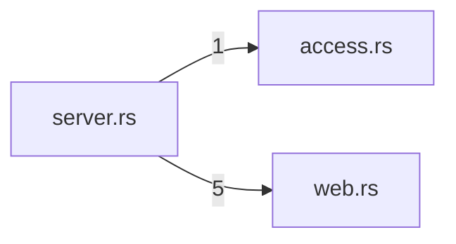

# transport — generated atlas

[All packages](../../../../docs/architecture/generated/index.md) · [Maintained explanation](../README.md)

## Cargo targets

| Target | Kind | Entry |
|---|---|---|
| `transport` | lib | [crates/transport/src/lib.rs](../../src/lib.rs) |
| `slice9_transport` | test | [crates/transport/tests/slice9_transport.rs](../../tests/slice9_transport.rs) |

## Direct workspace dependencies

| Dependency | Kind | Target cfg |
|---|---|---|
| `endpoint` | normal | all |
| `schema` | normal | all |

[Public/restricted API and direct callers](api.md)

## Source files / lexical modules

`src` files have full symbol/call tables and partitioned function graphs. Integration tests and examples remain in the JSON inventory.
File-derived paths below are lexical navigation, not a compiler-resolved module tree; inline module declarations are listed separately.

| File | Symbols | Call sites | Detail |
|---|---:|---:|---|
| [crates/transport/src/access.rs](../../src/access.rs) | 7 | 4 | [Symbols and calls](src--access.md) |
| [crates/transport/src/auth.rs](../../src/auth.rs) | 7 | 19 | [Symbols and calls](src--auth.md) |
| [crates/transport/src/lib.rs](../../src/lib.rs) | 0 | 0 | [Symbols and calls](src--lib.md) |
| [crates/transport/src/server.rs](../../src/server.rs) | 90 | 491 | [Symbols and calls](src--server.md) |
| [crates/transport/src/web.rs](../../src/web.rs) | 15 | 61 | [Symbols and calls](src--web.md) |
| [crates/transport/tests/slice9_transport.rs](../../tests/slice9_transport.rs) | 49 | 648 | `inventory.json` |

## Cross-file direct calls

Source files stand in for out-of-line modules; see declarations for inline modules. Counts are syntactic call sites, not runtime frequency.

