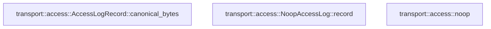

# transport::access

[Package atlas](index.md) · [Source](../../src/access.rs)

## Declarations

Visibility is the declaration spelling; trait members and reexports require their enclosing interface. `cfg` is not evaluated.

| Symbol | Kind | Visibility | Test / cfg |
|---|---|---|---|
| [transport::access::AccessLogRecord](../../src/access.rs#L6) | struct_item | `pub` |  |
| [transport::access::AccessLogRecord::canonical_bytes](../../src/access.rs#L18) | function_item | `pub` |  |
| [transport::access::AccessLogSink](../../src/access.rs#L23) | trait_item | `pub` |  |
| [transport::access::AccessLogSink::record](../../src/access.rs#L24) | function_signature_item | `private` |  |
| [transport::access::NoopAccessLog](../../src/access.rs#L28) | struct_item | `pub` |  |
| [transport::access::NoopAccessLog::record](../../src/access.rs#L31) | function_item | `private` |  |
| [transport::access::noop](../../src/access.rs#L34) | function_item | `pub(crate)` |  |

## Imports / reexports

| Local name | Source path | Visibility |
|---|---|---|
| `Arc` | `std::sync::Arc` | `private` |
| `Serialize` | `serde::Serialize` | `private` |

## Module declarations

| Module | Visibility | Attributes |
|---|---|---|

## Function call graphs

Edges below are syntactically resolved calls only, including private functions. Graphs partition callers into groups of 20; they are not execution order. All unresolved sites are listed below and in the JSON inventory.

Functions 1–3: 0 direct edges

## Call sites

Includes test functions (marked in declarations). Receiver-type-required sites need type analysis/manual tracing. Calls in closures are attributed to their enclosing function; their occurrence here does not mean the closure executes immediately.

| Caller | Callee expression | Source lines | Target / classification |
|---|---|---|---|
| `canonical_bytes` | `serde_json_canonicalizer::to_vec(self).map_err` | [19](../../src/access.rs#L19) | receiver-type-required |
| `canonical_bytes` | `serde_json_canonicalizer::to_vec` | [19](../../src/access.rs#L19) | external-constructor-callback-or-unresolved |
| `canonical_bytes` | `error.to_string` | [19](../../src/access.rs#L19) | receiver-type-required |
| `noop` | `Arc::new` | [35](../../src/access.rs#L35) | external-constructor-callback-or-unresolved |
