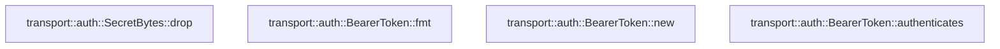

# transport::auth

[Package atlas](index.md) · [Source](../../src/auth.rs)

## Declarations

Visibility is the declaration spelling; trait members and reexports require their enclosing interface. `cfg` is not evaluated.

| Symbol | Kind | Visibility | Test / cfg |
|---|---|---|---|
| [transport::auth::TOKEN_BYTES](../../src/auth.rs#L11) | const_item | `private` |  |
| [transport::auth::BearerToken](../../src/auth.rs#L18) | struct_item | `pub` |  |
| [transport::auth::SecretBytes](../../src/auth.rs#L20) | struct_item | `private` |  |
| [transport::auth::SecretBytes::drop](../../src/auth.rs#L23) | function_item | `private` |  |
| [transport::auth::BearerToken::fmt](../../src/auth.rs#L29) | function_item | `private` |  |
| [transport::auth::BearerToken::new](../../src/auth.rs#L36) | function_item | `pub` |  |
| [transport::auth::BearerToken::authenticates](../../src/auth.rs#L40) | function_item | `pub(crate)` |  |

## Imports / reexports

| Local name | Source path | Visibility |
|---|---|---|
| `fmt` | `std::fmt` | `private` |
| `Arc` | `std::sync::Arc` | `private` |
| `HeaderMap` | `axum::http::HeaderMap` | `private` |
| `AUTHORIZATION` | `axum::http::header::AUTHORIZATION` | `private` |
| `Engine` | `base64::Engine` | `private` |
| `URL_SAFE_NO_PAD` | `base64::engine::general_purpose::URL_SAFE_NO_PAD` | `private` |
| `ConstantTimeEq` | `subtle::ConstantTimeEq` | `private` |
| `Zeroize` | `zeroize::Zeroize` | `private` |
| `Zeroizing` | `zeroize::Zeroizing` | `private` |

## Module declarations

| Module | Visibility | Attributes |
|---|---|---|

## Function call graphs

Edges below are syntactically resolved calls only, including private functions. Graphs partition callers into groups of 20; they are not execution order. All unresolved sites are listed below and in the JSON inventory.

Functions 1–4: 0 direct edges

## Call sites

Includes test functions (marked in declarations). Receiver-type-required sites need type analysis/manual tracing. Calls in closures are attributed to their enclosing function; their occurrence here does not mean the closure executes immediately.

| Caller | Callee expression | Source lines | Target / classification |
|---|---|---|---|
| `drop` | `self.0.zeroize` | [24](../../src/auth.rs#L24) | receiver-type-required |
| `fmt` | `formatter.write_str` | [30](../../src/auth.rs#L30) | receiver-type-required |
| `new` | `Self` | [37](../../src/auth.rs#L37) | external-constructor-callback-or-unresolved |
| `new` | `Arc::new` | [37](../../src/auth.rs#L37) | external-constructor-callback-or-unresolved |
| `new` | `SecretBytes` | [37](../../src/auth.rs#L37) | external-constructor-callback-or-unresolved |
| `authenticates` | `headers.get_all(AUTHORIZATION).iter` | [41](../../src/auth.rs#L41) | receiver-type-required |
| `authenticates` | `headers.get_all` | [41](../../src/auth.rs#L41) | receiver-type-required |
| `authenticates` | `values.next` | [42](../../src/auth.rs#L42), [45](../../src/auth.rs#L45) | receiver-type-required |
| `authenticates` | `values.next().is_some` | [45](../../src/auth.rs#L45) | receiver-type-required |
| `authenticates` | `value.to_str` | [48](../../src/auth.rs#L48) | receiver-type-required |
| `authenticates` | `value.strip_prefix` | [51](../../src/auth.rs#L51) | receiver-type-required |
| `authenticates` | `URL_SAFE_NO_PAD.decode(encoded).map` | [54](../../src/auth.rs#L54) | receiver-type-required |
| `authenticates` | `URL_SAFE_NO_PAD.decode` | [54](../../src/auth.rs#L54) | receiver-type-required |
| `authenticates` | `decoded.len` | [57](../../src/auth.rs#L57) | receiver-type-required |
| `authenticates` | `bool::from` | [60](../../src/auth.rs#L60) | external-constructor-callback-or-unresolved |
| `authenticates` | `self.0.0.as_slice().ct_eq` | [60](../../src/auth.rs#L60) | receiver-type-required |
| `authenticates` | `self.0.0.as_slice` | [60](../../src/auth.rs#L60) | receiver-type-required |
| `authenticates` | `decoded.as_slice` | [60](../../src/auth.rs#L60) | receiver-type-required |
