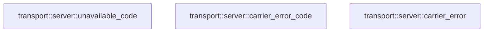

```mermaid
flowchart TD
  n0["endpoint::host::DurableHandoffSignal::new"]
  n1["endpoint::mux::SessionMuxGeneration::new"]
  n2["endpoint::rpc::validate_response"]
  n3["endpoint::rpc::validate_rpc_id"]
  n4["transport::server::acquire"]
  n5["transport::server::read_json_body"]
  n6["transport::server::decode_strict"]
  n7["transport::server::call_context"]
  n8["transport::server::json_response"]
  n9["transport::server::accepted_but_not_confirmed"]
  n10["transport::server::host_failure"]
  n11["transport::server::unavailable"]
  n12["transport::server::unavailable_code"]
  n13["transport::server::carrier_error_code"]
  n14["transport::server::carrier_error"]
  n15["transport::server::AccessSpan::new"]
  n16["transport::server::file_changes"]
  n17["transport::server::file_prepare"]
  n18["transport::server::file_lease"]
  n19["transport::server::file_read"]
  n20["transport::server::file_release"]
  n21["transport::server::WebClientService::router"]
  n22["transport::server::WebClientService::serve"]
  n23["transport::server::web_index"]
  n24["transport::server::web_css"]
  n25["transport::server::web_js"]
  n26["transport::server::live"]
  n27["transport::server::ready"]
  n28["transport::server::readiness_error"]
  n29["transport::server::canonical_json"]
  n30["transport::server::unary"]
  n31["transport::server::web_unary"]
  n32["transport::server::unary_inner"]
  n33["transport::server::remote_mux"]
  n34["transport::server::web_remote_mux"]
  n35["transport::server::remote_mux_inner"]
  n36["transport::server::remote_mux_loop"]
  n37["transport::web::static_response"]
  n38["transport::web::index_response"]
  n39["transport::web::index_unauthorized"]
  n16 --> n4
  n16 --> n11
  n17 --> n4
  n17 --> n11
  n17 --> n29
  n19 --> n18
  n20 --> n18
  n22 --> n21
  n23 --> n38
  n23 --> n39
  n24 --> n37
  n25 --> n37
  n26 --> n29
  n27 --> n14
  n27 --> n28
  n27 --> n29
  n28 --> n14
  n28 --> n29
  n30 --> n32
  n31 --> n32
  n32 --> n0
  n32 --> n2
  n32 --> n3
  n32 --> n4
  n32 --> n5
  n32 --> n6
  n32 --> n7
  n32 --> n8
  n32 --> n9
  n32 --> n10
  n32 --> n11
  n32 --> n12
  n32 --> n13
  n32 --> n14
  n32 --> n15
  n33 --> n35
  n34 --> n35
  n35 --> n1
  n35 --> n4
  n35 --> n11
  n35 --> n36
```

```mermaid
flowchart TD
  n0["endpoint::client_wire::client_mux_frames"]
  n1["endpoint::host::DrainSignal::new"]
  n2["schema::ijson::IJsonValue::parse"]
  n3["schema::ijson::IJsonValue::parse_str"]
  n4["transport::server::send_mux"]
  n5["transport::server::send_mux_error"]
  n6["transport::server::close_mux_protocol"]
  n7["transport::server::acquire"]
  n8["transport::server::read_json_body"]
  n9["transport::server::decode_strict"]
  n10["transport::server::json_content_type"]
  n11["transport::server::call_context"]
  n12["transport::server::json_response"]
  n13["transport::server::accepted_but_not_confirmed"]
  n14["transport::server::host_failure"]
  n15["transport::server::fallback"]
  n16["transport::server::method_not_allowed"]
  n17["transport::server::request_security"]
  n18["transport::server::web_request_security"]
  n19["transport::server::is_api_path"]
  n20["transport::server::is_web_data_path"]
  n21["transport::server::unauthorized"]
  n22["transport::server::unavailable"]
  n23["transport::server::unavailable_code"]
  n24["transport::server::carrier_error"]
  n25["transport::server::remote_mux_loop"]
  n4 --> n0
  n5 --> n3
  n5 --> n4
  n6 --> n5
  n7 --> n24
  n8 --> n10
  n8 --> n24
  n9 --> n2
  n11 --> n1
  n12 --> n24
  n13 --> n2
  n14 --> n22
  n14 --> n23
  n14 --> n24
  n15 --> n24
  n16 --> n24
  n17 --> n19
  n17 --> n21
  n17 --> n24
  n18 --> n20
  n18 --> n21
  n18 --> n24
  n21 --> n24
  n22 --> n24
  n25 --> n4
```

# transport::server

[Package atlas](index.md) · [Source](../../src/server.rs)

## Declarations

Visibility is the declaration spelling; trait members and reexports require their enclosing interface. `cfg` is not evaluated.

| Symbol | Kind | Visibility | Test / cfg |
|---|---|---|---|
| [transport::server::MAX_REQUEST_BYTES](../../src/server.rs#L36) | const_item | `pub` |  |
| [transport::server::DRAIN_ANNOUNCEMENT_INTERVAL](../../src/server.rs#L41) | const_item | `private` |  |
| [transport::server::ROUTE_REGISTRY](../../src/server.rs#L43) | const_item | `pub` |  |
| [transport::server::TransportLimits](../../src/server.rs#L64) | struct_item | `pub` |  |
| [transport::server::TransportLimits::default](../../src/server.rs#L73) | function_item | `private` |  |
| [transport::server::OriginPolicy](../../src/server.rs#L85) | struct_item | `pub` |  |
| [transport::server::OriginPolicy::permits](../../src/server.rs#L88) | function_item | `private` |  |
| [transport::server::TransportConfig](../../src/server.rs#L94) | struct_item | `pub` |  |
| [transport::server::ReadinessIdentity](../../src/server.rs#L104) | struct_item | `private` |  |
| [transport::server::TransportConfig::loopback](../../src/server.rs#L111) | function_item | `pub` |  |
| [transport::server::TransportConfig::with_access_log](../../src/server.rs#L123) | function_item | `pub` |  |
| [transport::server::TransportConfig::with_readiness_identity](../../src/server.rs#L132) | function_item | `pub` |  |
| [transport::server::TransportConfig::validate](../../src/server.rs#L140) | function_item | `pub` |  |
| [transport::server::Shared](../../src/server.rs#L164) | struct_item | `private` |  |
| [transport::server::WebShared](../../src/server.rs#L178) | struct_item | `private` |  |
| [transport::server::AccessSpan](../../src/server.rs#L183) | struct_item | `private` |  |
| [transport::server::AccessSpan::new](../../src/server.rs#L192) | function_item | `private` |  |
| [transport::server::AccessSpan::bind_rpc_id](../../src/server.rs#L205) | function_item | `private` |  |
| [transport::server::AccessSpan::finish](../../src/server.rs#L209) | function_item | `private` |  |
| [transport::server::TransportHandle](../../src/server.rs#L228) | struct_item | `pub` |  |
| [transport::server::TransportHandle::begin_drain](../../src/server.rs#L234) | function_item | `pub` |  |
| [transport::server::TransportHandle::is_draining](../../src/server.rs#L240) | function_item | `pub` |  |
| [transport::server::TransportServer](../../src/server.rs#L245) | struct_item | `pub` |  |
| [transport::server::FileTransferAuthority](../../src/server.rs#L251) | trait_item | `pub` |  |
| [transport::server::FileTransferAuthority::prepare](../../src/server.rs#L252) | function_signature_item | `private` |  |
| [transport::server::FileTransferAuthority::read](../../src/server.rs#L253) | function_signature_item | `private` |  |
| [transport::server::FileTransferAuthority::release](../../src/server.rs#L254) | function_signature_item | `private` |  |
| [transport::server::FileChangeFeed](../../src/server.rs#L257) | trait_item | `pub` |  |
| [transport::server::FileChangeFeed::poll](../../src/server.rs#L258) | function_signature_item | `private` |  |
| [transport::server::FileChangeAuthority](../../src/server.rs#L261) | trait_item | `pub` |  |
| [transport::server::FileChangeAuthority::open](../../src/server.rs#L262) | function_signature_item | `private` |  |
| [transport::server::WebClientConfig](../../src/server.rs#L266) | struct_item | `pub` |  |
| [transport::server::WebClientConfig::loopback](../../src/server.rs#L272) | function_item | `pub` |  |
| [transport::server::WebClientConfig::validate](../../src/server.rs#L276) | function_item | `private` |  |
| [transport::server::WebClientService](../../src/server.rs#L290) | struct_item | `pub` |  |
| [transport::server::TransportServer::new](../../src/server.rs#L296) | function_item | `pub` |  |
| [transport::server::TransportServer::with_file_transfer](../../src/server.rs#L343) | function_item | `pub` |  |
| [transport::server::TransportServer::set_file_changes](../../src/server.rs#L350) | function_item | `pub` |  |
| [transport::server::TransportServer::handle](../../src/server.rs#L357) | function_item | `pub` |  |
| [transport::server::TransportServer::router](../../src/server.rs#L363) | function_item | `pub` |  |
| [transport::server::TransportServer::web_client](../../src/server.rs#L386) | function_item | `pub` |  |
| [transport::server::TransportServer::serve](../../src/server.rs#L400) | function_item | `pub` |  |
| [transport::server::FileChangesQuery](../../src/server.rs#L433) | struct_item | `private` |  |
| [transport::server::file_changes](../../src/server.rs#L437) | function_item | `private` |  |
| [transport::server::file_prepare](../../src/server.rs#L486) | function_item | `private` |  |
| [transport::server::file_lease](../../src/server.rs#L522) | function_item | `private` |  |
| [transport::server::file_read](../../src/server.rs#L535) | function_item | `private` |  |
| [transport::server::file_release](../../src/server.rs#L557) | function_item | `private` |  |
| [transport::server::WebClientService::router](../../src/server.rs#L569) | function_item | `pub` |  |
| [transport::server::WebClientService::serve](../../src/server.rs#L584) | function_item | `pub` |  |
| [transport::server::web_index](../../src/server.rs#L612) | function_item | `private` |  |
| [transport::server::web_css](../../src/server.rs#L620) | function_item | `private` |  |
| [transport::server::web_js](../../src/server.rs#L624) | function_item | `private` |  |
| [transport::server::live](../../src/server.rs#L628) | function_item | `private` |  |
| [transport::server::ready](../../src/server.rs#L636) | function_item | `private` |  |
| [transport::server::readiness_error](../../src/server.rs#L663) | function_item | `private` |  |
| [transport::server::canonical_json](../../src/server.rs#L677) | function_item | `private` |  |
| [transport::server::unary](../../src/server.rs#L688) | function_item | `private` |  |
| [transport::server::web_unary](../../src/server.rs#L696) | function_item | `private` |  |
| [transport::server::unary_inner](../../src/server.rs#L704) | function_item | `private` |  |
| [transport::server::remote_mux](../../src/server.rs#L798) | function_item | `private` |  |
| [transport::server::web_remote_mux](../../src/server.rs#L802) | function_item | `private` |  |
| [transport::server::remote_mux_inner](../../src/server.rs#L809) | function_item | `private` |  |
| [transport::server::remote_mux_loop](../../src/server.rs#L831) | function_item | `private` |  |
| [transport::server::send_mux](../../src/server.rs#L1033) | function_item | `private` |  |
| [transport::server::send_mux_error](../../src/server.rs#L1048) | function_item | `private` |  |
| [transport::server::close_mux_protocol](../../src/server.rs#L1073) | function_item | `private` |  |
| [transport::server::acquire](../../src/server.rs#L1091) | function_item | `private` |  |
| [transport::server::read_json_body](../../src/server.rs#L1101) | function_item | `private` |  |
| [transport::server::decode_strict](../../src/server.rs#L1129) | function_item | `private` |  |
| [transport::server::json_content_type](../../src/server.rs#L1134) | function_item | `private` |  |
| [transport::server::call_context](../../src/server.rs#L1146) | function_item | `private` |  |
| [transport::server::json_response](../../src/server.rs#L1154) | function_item | `private` |  |
| [transport::server::accepted_but_not_confirmed](../../src/server.rs#L1170) | function_item | `private` |  |
| [transport::server::host_failure](../../src/server.rs#L1192) | function_item | `private` |  |
| [transport::server::fallback](../../src/server.rs#L1216) | function_item | `private` |  |
| [transport::server::method_not_allowed](../../src/server.rs#L1232) | function_item | `private` |  |
| [transport::server::request_security](../../src/server.rs#L1240) | function_item | `private` |  |
| [transport::server::web_request_security](../../src/server.rs#L1261) | function_item | `private` |  |
| [transport::server::is_api_path](../../src/server.rs#L1279) | function_item | `private` |  |
| [transport::server::is_web_data_path](../../src/server.rs#L1283) | function_item | `private` |  |
| [transport::server::unauthorized](../../src/server.rs#L1287) | function_item | `private` |  |
| [transport::server::unavailable](../../src/server.rs#L1295) | function_item | `private` |  |
| [transport::server::unavailable_code](../../src/server.rs#L1311) | function_item | `private` |  |
| [transport::server::carrier_error_code](../../src/server.rs#L1319) | function_item | `private` |  |
| [transport::server::carrier_error](../../src/server.rs#L1334) | function_item | `private` |  |
| [transport::server::carrier_error::ErrorBody](../../src/server.rs#L1336) | struct_item | `private` |  |
| [transport::server::carrier_error::ErrorValue](../../src/server.rs#L1340) | struct_item | `private` |  |
| [transport::server::carrier_error::EmptyDetails](../../src/server.rs#L1346) | struct_item | `private` |  |
| [transport::server::TransportConfigError](../../src/server.rs#L1365) | enum_item | `pub` |  |

## Imports / reexports

| Local name | Source path | Visibility |
|---|---|---|
| `BTreeMap` | `std::collections::BTreeMap` | `private` |
| `BTreeSet` | `std::collections::BTreeSet` | `private` |
| `IpAddr` | `std::net::IpAddr` | `private` |
| `SocketAddr` | `std::net::SocketAddr` | `private` |
| `Arc` | `std::sync::Arc` | `private` |
| `AtomicBool` | `std::sync::atomic::AtomicBool` | `private` |
| `AtomicU64` | `std::sync::atomic::AtomicU64` | `private` |
| `Ordering` | `std::sync::atomic::Ordering` | `private` |
| `Duration` | `std::time::Duration` | `private` |
| `Instant` | `std::time::Instant` | `private` |
| `Router` | `axum::Router` | `private` |
| `Body` | `axum::body::Body` | `private` |
| `CloseFrame` | `axum::extract::ws::CloseFrame` | `private` |
| `Message` | `axum::extract::ws::Message` | `private` |
| `WebSocket` | `axum::extract::ws::WebSocket` | `private` |
| `WebSocketUpgrade` | `axum::extract::ws::WebSocketUpgrade` | `private` |
| `Path` | `axum::extract::Path` | `private` |
| `Request` | `axum::extract::Request` | `private` |
| `State` | `axum::extract::State` | `private` |
| `CONTENT_TYPE` | `axum::http::header::CONTENT_TYPE` | `private` |
| `ORIGIN` | `axum::http::header::ORIGIN` | `private` |
| `HeaderMap` | `axum::http::HeaderMap` | `private` |
| `Method` | `axum::http::Method` | `private` |
| `StatusCode` | `axum::http::StatusCode` | `private` |
| `middleware` | `axum::middleware` | `private` |
| `Next` | `axum::middleware::Next` | `private` |
| `IntoResponse` | `axum::response::IntoResponse` | `private` |
| `Response` | `axum::response::Response` | `private` |
| `get` | `axum::routing::get` | `private` |
| `post` | `axum::routing::post` | `private` |
| `CallContext` | `endpoint::CallContext` | `private` |
| `ClientRequest` | `endpoint::ClientRequest` | `private` |
| `DrainSignal` | `endpoint::DrainSignal` | `private` |
| `DurableHandoffSignal` | `endpoint::DurableHandoffSignal` | `private` |
| `EndpointCarrierHost` | `endpoint::EndpointCarrierHost` | `private` |
| `HostFailure` | `endpoint::HostFailure` | `private` |
| `HostReadiness` | `endpoint::HostReadiness` | `private` |
| `MethodClass` | `endpoint::MethodClass` | `private` |
| `RpcError` | `endpoint::RpcError` | `private` |
| `RpcResult` | `endpoint::RpcResult` | `private` |
| `ServerResponse` | `endpoint::ServerResponse` | `private` |
| `SessionErrorCategory` | `endpoint::SessionErrorCategory` | `private` |
| `SessionMuxClientFrame` | `endpoint::SessionMuxClientFrame` | `private` |
| `SessionMuxGeneration` | `endpoint::SessionMuxGeneration` | `private` |
| `SessionMuxServerFrame` | `endpoint::SessionMuxServerFrame` | `private` |
| `SessionRemoteError` | `endpoint::SessionRemoteError` | `private` |
| `StreamErrorCode` | `endpoint::StreamErrorCode` | `private` |
| `validate_response` | `endpoint::validate_response` | `private` |
| `validate_rpc_id` | `endpoint::validate_rpc_id` | `private` |
| `IJsonValue` | `schema::IJsonValue` | `private` |
| `Serialize` | `serde::Serialize` | `private` |
| `DeserializeOwned` | `serde::de::DeserializeOwned` | `private` |
| `Error` | `thiserror::Error` | `private` |
| `TcpListener` | `tokio::net::TcpListener` | `private` |
| `OwnedSemaphorePermit` | `tokio::sync::OwnedSemaphorePermit` | `private` |
| `Semaphore` | `tokio::sync::Semaphore` | `private` |
| `mpsc` | `tokio::sync::mpsc` | `private` |
| `watch` | `tokio::sync::watch` | `private` |
| `JoinHandle` | `tokio::task::JoinHandle` | `private` |
| `sleep` | `tokio::time::sleep` | `private` |
| `timeout` | `tokio::time::timeout` | `private` |
| `APP_CSS` | `crate::web::APP_CSS` | `private` |
| `APP_JS` | `crate::web::APP_JS` | `private` |
| `BrowserAccess` | `crate::web::BrowserAccess` | `private` |
| `index_response` | `crate::web::index_response` | `private` |
| `index_unauthorized` | `crate::web::index_unauthorized` | `private` |
| `static_response` | `crate::web::static_response` | `private` |
| `AccessLogRecord` | `crate::AccessLogRecord` | `private` |
| `AccessLogSink` | `crate::AccessLogSink` | `private` |
| `BearerToken` | `crate::BearerToken` | `private` |

## Module declarations

| Module | Visibility | Attributes |
|---|---|---|

## Function call graphs

Edges below are syntactically resolved calls only, including private functions. Graphs partition callers into groups of 20; they are not execution order. All unresolved sites are listed below and in the JSON inventory.

Functions 1–20: 3 direct edges

Functions 21–40: 41 direct edges

Functions 41–60: 25 direct edges

Functions 61–63: 0 direct edges

## Call sites

Includes test functions (marked in declarations). Receiver-type-required sites need type analysis/manual tracing. Calls in closures are attributed to their enclosing function; their occurrence here does not mean the closure executes immediately.

| Caller | Callee expression | Source lines | Target / classification |
|---|---|---|---|
| `DRAIN_ANNOUNCEMENT_INTERVAL` | `Duration::from_millis` | [41](../../src/server.rs#L41) | external-constructor-callback-or-unresolved |
| `default` | `Duration::from_secs` | [78](../../src/server.rs#L78), [79](../../src/server.rs#L79) | external-constructor-callback-or-unresolved |
| `permits` | `headers.contains_key` | [89](../../src/server.rs#L89) | receiver-type-required |
| `loopback` | `TransportLimits::default` | [114](../../src/server.rs#L114) | external-constructor-callback-or-unresolved |
| `loopback` | `crate::access::noop` | [117](../../src/server.rs#L117) | [transport::access::noop](../../src/access.rs#L34) |
| `with_readiness_identity` | `Some` | [133](../../src/server.rs#L133) | external-constructor-callback-or-unresolved |
| `with_readiness_identity` | `build.into` | [134](../../src/server.rs#L134) | receiver-type-required |
| `validate` | `self.bind.ip().is_loopback` | [141](../../src/server.rs#L141) | receiver-type-required |
| `validate` | `self.bind.ip` | [141](../../src/server.rs#L141), [142](../../src/server.rs#L142) | receiver-type-required |
| `validate` | `Err` | [142](../../src/server.rs#L142), [149](../../src/server.rs#L149), [158](../../src/server.rs#L158) | external-constructor-callback-or-unresolved |
| `validate` | `TransportConfigError::NonLoopback` | [142](../../src/server.rs#L142) | external-constructor-callback-or-unresolved |
| `validate` | `self             .readiness_identity             .as_ref()             .is_some_and` | [144](../../src/server.rs#L144) | receiver-type-required |
| `validate` | `self             .readiness_identity             .as_ref` | [144](../../src/server.rs#L144) | receiver-type-required |
| `validate` | `identity.build.is_empty` | [147](../../src/server.rs#L147) | receiver-type-required |
| `validate` | `Duration::from_secs` | [155](../../src/server.rs#L155), [156](../../src/server.rs#L156) | external-constructor-callback-or-unresolved |
| `validate` | `Ok` | [160](../../src/server.rs#L160) | external-constructor-callback-or-unresolved |
| `new` | `shared             .next_transport_request             .fetch_add` | [193](../../src/server.rs#L193) | receiver-type-required |
| `new` | `Instant::now` | [198](../../src/server.rs#L198) | external-constructor-callback-or-unresolved |
| `new` | `operation.to_owned` | [200](../../src/server.rs#L200) | receiver-type-required |
| `new` | `path.to_owned` | [201](../../src/server.rs#L201) | receiver-type-required |
| `bind_rpc_id` | `rpc_id.to_owned` | [206](../../src/server.rs#L206) | receiver-type-required |
| `finish` | `self.started.elapsed().as_millis` | [210](../../src/server.rs#L210) | receiver-type-required |
| `finish` | `self.started.elapsed` | [210](../../src/server.rs#L210) | receiver-type-required |
| `finish` | `u64::try_from(elapsed)             .unwrap_or(9_007_199_254_740_991)             .min` | [211](../../src/server.rs#L211) | receiver-type-required |
| `finish` | `u64::try_from(elapsed)             .unwrap_or` | [211](../../src/server.rs#L211) | receiver-type-required |
| `finish` | `u64::try_from` | [211](../../src/server.rs#L211) | external-constructor-callback-or-unresolved |
| `finish` | `self.shared.config.access_log.record` | [214](../../src/server.rs#L214) | receiver-type-required |
| `finish` | `self.request_id.clone` | [216](../../src/server.rs#L216) | receiver-type-required |
| `finish` | `self.operation.clone` | [217](../../src/server.rs#L217) | receiver-type-required |
| `finish` | `self.path.clone` | [218](../../src/server.rs#L218) | receiver-type-required |
| `finish` | `response.status().as_u16` | [219](../../src/server.rs#L219) | receiver-type-required |
| `finish` | `response.status` | [219](../../src/server.rs#L219) | receiver-type-required |
| `finish` | `error_code.map` | [221](../../src/server.rs#L221) | receiver-type-required |
| `begin_drain` | `self.shared.draining.store` | [235](../../src/server.rs#L235) | receiver-type-required |
| `begin_drain` | `self.shared.drain.send_replace` | [236](../../src/server.rs#L236) | receiver-type-required |
| `is_draining` | `self.shared.draining.load` | [241](../../src/server.rs#L241) | receiver-type-required |
| `validate` | `self.bind.ip().is_loopback` | [277](../../src/server.rs#L277) | receiver-type-required |
| `validate` | `self.bind.ip` | [277](../../src/server.rs#L277), [278](../../src/server.rs#L278) | receiver-type-required |
| `validate` | `Err` | [278](../../src/server.rs#L278) | external-constructor-callback-or-unresolved |
| `validate` | `TransportConfigError::NonLoopback` | [278](../../src/server.rs#L278) | external-constructor-callback-or-unresolved |
| `validate` | `Ok` | [280](../../src/server.rs#L280) | external-constructor-callback-or-unresolved |
| `new` | `config.validate` | [300](../../src/server.rs#L300) | receiver-type-required |
| `new` | `ROUTE_REGISTRY.iter().map(ToString::to_string).collect` | [301](../../src/server.rs#L301) | receiver-type-required |
| `new` | `ROUTE_REGISTRY.iter().map` | [301](../../src/server.rs#L301) | receiver-type-required |
| `new` | `ROUTE_REGISTRY.iter` | [301](../../src/server.rs#L301) | receiver-type-required |
| `new` | `host.advertised_extension_methods` | [302](../../src/server.rs#L302) | receiver-type-required |
| `new` | `expected.intersection(&extensions).next` | [303](../../src/server.rs#L303) | receiver-type-required |
| `new` | `expected.intersection` | [303](../../src/server.rs#L303) | receiver-type-required |
| `new` | `Err` | [304](../../src/server.rs#L304), [310](../../src/server.rs#L310), [320](../../src/server.rs#L320) | external-constructor-callback-or-unresolved |
| `new` | `TransportConfigError::ExtensionCollision` | [304](../../src/server.rs#L304) | external-constructor-callback-or-unresolved |
| `new` | `method.clone` | [304](../../src/server.rs#L304), [311](../../src/server.rs#L311) | receiver-type-required |
| `new` | `extensions             .iter()             .find` | [306](../../src/server.rs#L306) | receiver-type-required |
| `new` | `extensions             .iter` | [306](../../src/server.rs#L306) | receiver-type-required |
| `new` | `host.classify_method` | [308](../../src/server.rs#L308) | receiver-type-required |
| `new` | `TransportConfigError::InvalidExtensionRegistration` | [310](../../src/server.rs#L310) | external-constructor-callback-or-unresolved |
| `new` | `expected             .union(&extensions)             .cloned()             .collect::<BTreeSet<_>>` | [314](../../src/server.rs#L314) | receiver-type-required |
| `new` | `expected             .union(&extensions)             .cloned` | [314](../../src/server.rs#L314) | receiver-type-required |
| `new` | `expected             .union` | [314](../../src/server.rs#L314) | receiver-type-required |
| `new` | `host.registered_methods` | [318](../../src/server.rs#L318) | receiver-type-required |
| `new` | `expected.difference(&registered).cloned().collect` | [321](../../src/server.rs#L321) | receiver-type-required |
| `new` | `expected.difference(&registered).cloned` | [321](../../src/server.rs#L321) | receiver-type-required |
| `new` | `expected.difference` | [321](../../src/server.rs#L321) | receiver-type-required |
| `new` | `registered.difference(&expected).cloned().collect` | [322](../../src/server.rs#L322) | receiver-type-required |
| `new` | `registered.difference(&expected).cloned` | [322](../../src/server.rs#L322) | receiver-type-required |
| `new` | `registered.difference` | [322](../../src/server.rs#L322) | receiver-type-required |
| `new` | `Ok` | [325](../../src/server.rs#L325) | external-constructor-callback-or-unresolved |
| `new` | `Arc::new` | [326](../../src/server.rs#L326), [329](../../src/server.rs#L329), [330](../../src/server.rs#L330), [333](../../src/server.rs#L333) | external-constructor-callback-or-unresolved |
| `new` | `Semaphore::new` | [329](../../src/server.rs#L329), [330](../../src/server.rs#L330) | external-constructor-callback-or-unresolved |
| `new` | `AtomicBool::new` | [333](../../src/server.rs#L333) | external-constructor-callback-or-unresolved |
| `new` | `watch::channel` | [334](../../src/server.rs#L334) | external-constructor-callback-or-unresolved |
| `new` | `AtomicU64::new` | [335](../../src/server.rs#L335), [336](../../src/server.rs#L336) | external-constructor-callback-or-unresolved |
| `with_file_transfer` | `Arc::get_mut(&mut self.shared)             .expect` | [344](../../src/server.rs#L344) | receiver-type-required |
| `with_file_transfer` | `Arc::get_mut` | [344](../../src/server.rs#L344) | external-constructor-callback-or-unresolved |
| `with_file_transfer` | `Some` | [346](../../src/server.rs#L346) | external-constructor-callback-or-unresolved |
| `set_file_changes` | `Arc::get_mut(&mut self.shared)             .expect` | [351](../../src/server.rs#L351) | receiver-type-required |
| `set_file_changes` | `Arc::get_mut` | [351](../../src/server.rs#L351) | external-constructor-callback-or-unresolved |
| `set_file_changes` | `Some` | [353](../../src/server.rs#L353) | external-constructor-callback-or-unresolved |
| `handle` | `Arc::clone` | [359](../../src/server.rs#L359) | external-constructor-callback-or-unresolved |
| `router` | `Arc::clone` | [364](../../src/server.rs#L364), [382](../../src/server.rs#L382) | external-constructor-callback-or-unresolved |
| `router` | `Router::new()             .route("/health/live", get(live))             .route("/health/ready", get(ready))             .route("/api/remote.mux", get(remote_mux))             .route("/api/session.files.changes", get(file_changes))             .route(                 "/api/tekesWorkspace.fileTransfer/prepare",                 post(file_prepare),             )             .route("/api/tekesWorkspace.fileTransfer/read", get(file_read))             .route(                 "/api/tekesWorkspace.fileTransfer/release",                 post(file_release),             )             .route("/api/{*method}", post(unary))             .method_not_allowed_fallback(method_not_allowed)             .fallback(fallback)             .with_state(Arc::clone(&state))             .layer` | [365](../../src/server.rs#L365) | receiver-type-required |
| `router` | `Router::new()             .route("/health/live", get(live))             .route("/health/ready", get(ready))             .route("/api/remote.mux", get(remote_mux))             .route("/api/session.files.changes", get(file_changes))             .route(                 "/api/tekesWorkspace.fileTransfer/prepare",                 post(file_prepare),             )             .route("/api/tekesWorkspace.fileTransfer/read", get(file_read))             .route(                 "/api/tekesWorkspace.fileTransfer/release",                 post(file_release),             )             .route("/api/{*method}", post(unary))             .method_not_allowed_fallback(method_not_allowed)             .fallback(fallback)             .with_state` | [365](../../src/server.rs#L365) | receiver-type-required |
| `router` | `Router::new()             .route("/health/live", get(live))             .route("/health/ready", get(ready))             .route("/api/remote.mux", get(remote_mux))             .route("/api/session.files.changes", get(file_changes))             .route(                 "/api/tekesWorkspace.fileTransfer/prepare",                 post(file_prepare),             )             .route("/api/tekesWorkspace.fileTransfer/read", get(file_read))             .route(                 "/api/tekesWorkspace.fileTransfer/release",                 post(file_release),             )             .route("/api/{*method}", post(unary))             .method_not_allowed_fallback(method_not_allowed)             .fallback` | [365](../../src/server.rs#L365) | receiver-type-required |
| `router` | `Router::new()             .route("/health/live", get(live))             .route("/health/ready", get(ready))             .route("/api/remote.mux", get(remote_mux))             .route("/api/session.files.changes", get(file_changes))             .route(                 "/api/tekesWorkspace.fileTransfer/prepare",                 post(file_prepare),             )             .route("/api/tekesWorkspace.fileTransfer/read", get(file_read))             .route(                 "/api/tekesWorkspace.fileTransfer/release",                 post(file_release),             )             .route("/api/{*method}", post(unary))             .method_not_allowed_fallback` | [365](../../src/server.rs#L365) | receiver-type-required |
| `router` | `Router::new()             .route("/health/live", get(live))             .route("/health/ready", get(ready))             .route("/api/remote.mux", get(remote_mux))             .route("/api/session.files.changes", get(file_changes))             .route(                 "/api/tekesWorkspace.fileTransfer/prepare",                 post(file_prepare),             )             .route("/api/tekesWorkspace.fileTransfer/read", get(file_read))             .route(                 "/api/tekesWorkspace.fileTransfer/release",                 post(file_release),             )             .route` | [365](../../src/server.rs#L365) | receiver-type-required |
| `router` | `Router::new()             .route("/health/live", get(live))             .route("/health/ready", get(ready))             .route("/api/remote.mux", get(remote_mux))             .route("/api/session.files.changes", get(file_changes))             .route(                 "/api/tekesWorkspace.fileTransfer/prepare",                 post(file_prepare),             )             .route("/api/tekesWorkspace.fileTransfer/read", get(file_read))             .route` | [365](../../src/server.rs#L365) | receiver-type-required |
| `router` | `Router::new()             .route("/health/live", get(live))             .route("/health/ready", get(ready))             .route("/api/remote.mux", get(remote_mux))             .route("/api/session.files.changes", get(file_changes))             .route(                 "/api/tekesWorkspace.fileTransfer/prepare",                 post(file_prepare),             )             .route` | [365](../../src/server.rs#L365) | receiver-type-required |
| `router` | `Router::new()             .route("/health/live", get(live))             .route("/health/ready", get(ready))             .route("/api/remote.mux", get(remote_mux))             .route("/api/session.files.changes", get(file_changes))             .route` | [365](../../src/server.rs#L365) | receiver-type-required |
| `router` | `Router::new()             .route("/health/live", get(live))             .route("/health/ready", get(ready))             .route("/api/remote.mux", get(remote_mux))             .route` | [365](../../src/server.rs#L365) | receiver-type-required |
| `router` | `Router::new()             .route("/health/live", get(live))             .route("/health/ready", get(ready))             .route` | [365](../../src/server.rs#L365) | receiver-type-required |
| `router` | `Router::new()             .route("/health/live", get(live))             .route` | [365](../../src/server.rs#L365) | receiver-type-required |
| `router` | `Router::new()             .route` | [365](../../src/server.rs#L365) | receiver-type-required |
| `router` | `Router::new` | [365](../../src/server.rs#L365) | external-constructor-callback-or-unresolved |
| `router` | `get` | [366](../../src/server.rs#L366), [367](../../src/server.rs#L367), [368](../../src/server.rs#L368), [369](../../src/server.rs#L369), [374](../../src/server.rs#L374) | external-constructor-callback-or-unresolved |
| `router` | `post` | [372](../../src/server.rs#L372), [377](../../src/server.rs#L377), [379](../../src/server.rs#L379) | external-constructor-callback-or-unresolved |
| `router` | `middleware::from_fn_with_state` | [383](../../src/server.rs#L383) | external-constructor-callback-or-unresolved |
| `web_client` | `config.validate` | [390](../../src/server.rs#L390) | receiver-type-required |
| `web_client` | `Ok` | [391](../../src/server.rs#L391) | external-constructor-callback-or-unresolved |
| `web_client` | `Arc::new` | [392](../../src/server.rs#L392) | external-constructor-callback-or-unresolved |
| `web_client` | `Arc::clone` | [393](../../src/server.rs#L393) | external-constructor-callback-or-unresolved |
| `web_client` | `BrowserAccess::new` | [394](../../src/server.rs#L394) | [transport::web::BrowserAccess::new](../../src/web.rs#L26) |
| `serve` | `listener.local_addr` | [401](../../src/server.rs#L401) | receiver-type-required |
| `serve` | `actual.ip().is_loopback` | [402](../../src/server.rs#L402) | receiver-type-required |
| `serve` | `actual.ip` | [402](../../src/server.rs#L402), [403](../../src/server.rs#L403), [406](../../src/server.rs#L406) | receiver-type-required |
| `serve` | `Err` | [403](../../src/server.rs#L403), [409](../../src/server.rs#L409) | external-constructor-callback-or-unresolved |
| `serve` | `TransportConfigError::NonLoopback` | [403](../../src/server.rs#L403) | external-constructor-callback-or-unresolved |
| `serve` | `configured.ip` | [406](../../src/server.rs#L406) | receiver-type-required |
| `serve` | `configured.port` | [407](../../src/server.rs#L407) | receiver-type-required |
| `serve` | `actual.port` | [407](../../src/server.rs#L407) | receiver-type-required |
| `serve` | `self.router` | [411](../../src/server.rs#L411) | [transport::server::TransportServer::router](../../src/server.rs#L363) |
| `serve` | `Arc::clone` | [412](../../src/server.rs#L412) | external-constructor-callback-or-unresolved |
| `serve` | `axum::serve(listener, router)             .with_graceful_shutdown` | [413](../../src/server.rs#L413) | receiver-type-required |
| `serve` | `axum::serve` | [413](../../src/server.rs#L413) | external-constructor-callback-or-unresolved |
| `serve` | `shared.drain.subscribe` | [415](../../src/server.rs#L415) | receiver-type-required |
| `serve` | `drain.borrow` | [416](../../src/server.rs#L416) | receiver-type-required |
| `serve` | `drain.changed().await.is_err` | [417](../../src/server.rs#L417) | receiver-type-required |
| `serve` | `drain.changed` | [417](../../src/server.rs#L417) | receiver-type-required |
| `serve` | `sleep` | [424](../../src/server.rs#L424) | external-constructor-callback-or-unresolved |
| `serve` | `Ok` | [427](../../src/server.rs#L427) | external-constructor-callback-or-unresolved |
| `file_changes` | `shared.file_changes.clone` | [442](../../src/server.rs#L442) | receiver-type-required |
| `file_changes` | `StatusCode::NOT_FOUND.into_response` | [443](../../src/server.rs#L443) | receiver-type-required |
| `file_changes` | `shared.draining.load` | [445](../../src/server.rs#L445) | receiver-type-required |
| `file_changes` | `shared.host.readiness` | [445](../../src/server.rs#L445) | receiver-type-required |
| `file_changes` | `unavailable` | [446](../../src/server.rs#L446) | [transport::server::unavailable](../../src/server.rs#L1295) |
| `file_changes` | `acquire` | [448](../../src/server.rs#L448) | [transport::server::acquire](../../src/server.rs#L1091) |
| `file_changes` | `tokio::task::spawn_blocking` | [452](../../src/server.rs#L452) | external-constructor-callback-or-unresolved |
| `file_changes` | `authority.open` | [452](../../src/server.rs#L452) | receiver-type-required |
| `file_changes` | `StatusCode::BAD_REQUEST.into_response` | [454](../../src/server.rs#L454) | receiver-type-required |
| `file_changes` | `upgrade.on_upgrade(move &#124;mut socket&#124; async move {         let _permit = permit;         let mut feed = feed;         let mut drain = shared.drain.subscribe();         let mut interval = tokio::time::interval(Duration::from_millis(250));         loop {             tokio::select! {                 _ = drain.changed() => break,                 message = socket.recv() => match message {                     Some(Ok(Message::Ping(bytes))) => { if socket.send(Message::Pong(bytes)).await.is_err() { break; } },                     Some(Ok(Message::Pong(_))) => {},                     _ => break,                 },                 _ = interval.tick() => {                     let result = tokio::task::spawn_blocking(move &#124;&#124; { let result = feed.poll(); (feed, result) }).await;                     let Ok((returned, Ok(frames))) = result else { break; };                     feed = returned;                     let mut failed = false;                     for frame in frames {                         let Ok(encoded) = serde_json::to_string(&frame) else { failed = true; break; };                         if socket.send(Message::Text(encoded.into())).await.is_err() { failed = true; break; }                     }                     if failed { break; }                 }             }         }         let _ = socket.send(Message::Close(None)).await;     }).into_response` | [456](../../src/server.rs#L456) | receiver-type-required |
| `file_changes` | `upgrade.on_upgrade` | [456](../../src/server.rs#L456) | receiver-type-required |
| `file_changes` | `shared.drain.subscribe` | [459](../../src/server.rs#L459) | receiver-type-required |
| `file_changes` | `tokio::time::interval` | [460](../../src/server.rs#L460) | external-constructor-callback-or-unresolved |
| `file_changes` | `Duration::from_millis` | [460](../../src/server.rs#L460) | external-constructor-callback-or-unresolved |
| `file_changes` | `socket.send` | [482](../../src/server.rs#L482) | receiver-type-required |
| `file_changes` | `Message::Close` | [482](../../src/server.rs#L482) | external-constructor-callback-or-unresolved |
| `file_prepare` | `shared.file_transfer.clone` | [487](../../src/server.rs#L487) | receiver-type-required |
| `file_prepare` | `StatusCode::NOT_FOUND.into_response` | [488](../../src/server.rs#L488) | receiver-type-required |
| `file_prepare` | `shared.draining.load` | [490](../../src/server.rs#L490) | receiver-type-required |
| `file_prepare` | `shared.host.readiness` | [490](../../src/server.rs#L490) | receiver-type-required |
| `file_prepare` | `unavailable` | [491](../../src/server.rs#L491) | [transport::server::unavailable](../../src/server.rs#L1295) |
| `file_prepare` | `acquire` | [493](../../src/server.rs#L493) | [transport::server::acquire](../../src/server.rs#L1091) |
| `file_prepare` | `timeout` | [497](../../src/server.rs#L497), [515](../../src/server.rs#L515) | external-constructor-callback-or-unresolved |
| `file_prepare` | `axum::body::to_bytes` | [499](../../src/server.rs#L499) | external-constructor-callback-or-unresolved |
| `file_prepare` | `request.into_body` | [499](../../src/server.rs#L499) | receiver-type-required |
| `file_prepare` | `StatusCode::BAD_REQUEST.into_response` | [504](../../src/server.rs#L504), [508](../../src/server.rs#L508), [517](../../src/server.rs#L517) | receiver-type-required |
| `file_prepare` | `serde_json::from_slice` | [506](../../src/server.rs#L506) | external-constructor-callback-or-unresolved |
| `file_prepare` | `tokio::task::spawn_blocking` | [511](../../src/server.rs#L511) | external-constructor-callback-or-unresolved |
| `file_prepare` | `authority.prepare` | [513](../../src/server.rs#L513) | receiver-type-required |
| `file_prepare` | `canonical_json` | [516](../../src/server.rs#L516) | [transport::server::canonical_json](../../src/server.rs#L677) |
| `file_prepare` | `StatusCode::SERVICE_UNAVAILABLE.into_response` | [518](../../src/server.rs#L518) | receiver-type-required |
| `file_lease` | `headers         .get("X-Tekes-File-Lease")?         .to_str()         .ok()         .filter` | [523](../../src/server.rs#L523) | receiver-type-required |
| `file_lease` | `headers         .get("X-Tekes-File-Lease")?         .to_str()         .ok` | [523](../../src/server.rs#L523) | receiver-type-required |
| `file_lease` | `headers         .get("X-Tekes-File-Lease")?         .to_str` | [523](../../src/server.rs#L523) | receiver-type-required |
| `file_lease` | `headers         .get` | [523](../../src/server.rs#L523) | receiver-type-required |
| `file_lease` | `id.len` | [528](../../src/server.rs#L528) | receiver-type-required |
| `file_lease` | `id                     .bytes()                     .all` | [529](../../src/server.rs#L529) | receiver-type-required |
| `file_lease` | `id                     .bytes` | [529](../../src/server.rs#L529) | receiver-type-required |
| `file_lease` | `b.is_ascii_alphanumeric` | [531](../../src/server.rs#L531) | receiver-type-required |
| `file_read` | `StatusCode::NOT_FOUND.into_response` | [537](../../src/server.rs#L537), [553](../../src/server.rs#L553) | receiver-type-required |
| `file_read` | `file_lease` | [539](../../src/server.rs#L539) | [transport::server::file_lease](../../src/server.rs#L522) |
| `file_read` | `StatusCode::BAD_REQUEST.into_response` | [540](../../src/server.rs#L540) | receiver-type-required |
| `file_read` | `authority.read` | [542](../../src/server.rs#L542) | receiver-type-required |
| `file_read` | `(             [                 (CONTENT_TYPE, "application/octet-stream"),                 (axum::http::header::CACHE_CONTROL, "no-store"),             ],             axum::body::Bytes::from_owner(bytes),         )             .into_response` | [545](../../src/server.rs#L545) | receiver-type-required |
| `file_read` | `axum::body::Bytes::from_owner` | [550](../../src/server.rs#L550) | external-constructor-callback-or-unresolved |
| `file_release` | `StatusCode::NOT_FOUND.into_response` | [559](../../src/server.rs#L559) | receiver-type-required |
| `file_release` | `file_lease` | [561](../../src/server.rs#L561) | [transport::server::file_lease](../../src/server.rs#L522) |
| `file_release` | `StatusCode::BAD_REQUEST.into_response` | [562](../../src/server.rs#L562) | receiver-type-required |
| `file_release` | `authority.release` | [564](../../src/server.rs#L564) | receiver-type-required |
| `file_release` | `StatusCode::NO_CONTENT.into_response` | [565](../../src/server.rs#L565) | receiver-type-required |
| `router` | `Arc::clone` | [570](../../src/server.rs#L570), [580](../../src/server.rs#L580) | external-constructor-callback-or-unresolved |
| `router` | `Router::new()             .route("/", get(web_index))             .route("/index.html", get(web_index))             .route("/web/assets/app.css", get(web_css))             .route("/web/assets/app.js", get(web_js))             .route("/web/remote.mux", get(web_remote_mux))             .route("/web/api/{*method}", post(web_unary))             .method_not_allowed_fallback(method_not_allowed)             .fallback(fallback)             .with_state(Arc::clone(&state))             .layer` | [571](../../src/server.rs#L571) | receiver-type-required |
| `router` | `Router::new()             .route("/", get(web_index))             .route("/index.html", get(web_index))             .route("/web/assets/app.css", get(web_css))             .route("/web/assets/app.js", get(web_js))             .route("/web/remote.mux", get(web_remote_mux))             .route("/web/api/{*method}", post(web_unary))             .method_not_allowed_fallback(method_not_allowed)             .fallback(fallback)             .with_state` | [571](../../src/server.rs#L571) | receiver-type-required |
| `router` | `Router::new()             .route("/", get(web_index))             .route("/index.html", get(web_index))             .route("/web/assets/app.css", get(web_css))             .route("/web/assets/app.js", get(web_js))             .route("/web/remote.mux", get(web_remote_mux))             .route("/web/api/{*method}", post(web_unary))             .method_not_allowed_fallback(method_not_allowed)             .fallback` | [571](../../src/server.rs#L571) | receiver-type-required |
| `router` | `Router::new()             .route("/", get(web_index))             .route("/index.html", get(web_index))             .route("/web/assets/app.css", get(web_css))             .route("/web/assets/app.js", get(web_js))             .route("/web/remote.mux", get(web_remote_mux))             .route("/web/api/{*method}", post(web_unary))             .method_not_allowed_fallback` | [571](../../src/server.rs#L571) | receiver-type-required |
| `router` | `Router::new()             .route("/", get(web_index))             .route("/index.html", get(web_index))             .route("/web/assets/app.css", get(web_css))             .route("/web/assets/app.js", get(web_js))             .route("/web/remote.mux", get(web_remote_mux))             .route` | [571](../../src/server.rs#L571) | receiver-type-required |
| `router` | `Router::new()             .route("/", get(web_index))             .route("/index.html", get(web_index))             .route("/web/assets/app.css", get(web_css))             .route("/web/assets/app.js", get(web_js))             .route` | [571](../../src/server.rs#L571) | receiver-type-required |
| `router` | `Router::new()             .route("/", get(web_index))             .route("/index.html", get(web_index))             .route("/web/assets/app.css", get(web_css))             .route` | [571](../../src/server.rs#L571) | receiver-type-required |
| `router` | `Router::new()             .route("/", get(web_index))             .route("/index.html", get(web_index))             .route` | [571](../../src/server.rs#L571) | receiver-type-required |
| `router` | `Router::new()             .route("/", get(web_index))             .route` | [571](../../src/server.rs#L571) | receiver-type-required |
| `router` | `Router::new()             .route` | [571](../../src/server.rs#L571) | receiver-type-required |
| `router` | `Router::new` | [571](../../src/server.rs#L571) | external-constructor-callback-or-unresolved |
| `router` | `get` | [572](../../src/server.rs#L572), [573](../../src/server.rs#L573), [574](../../src/server.rs#L574), [575](../../src/server.rs#L575), [576](../../src/server.rs#L576) | external-constructor-callback-or-unresolved |
| `router` | `post` | [577](../../src/server.rs#L577) | external-constructor-callback-or-unresolved |
| `router` | `middleware::from_fn_with_state` | [581](../../src/server.rs#L581) | external-constructor-callback-or-unresolved |
| `serve` | `listener.local_addr` | [585](../../src/server.rs#L585) | receiver-type-required |
| `serve` | `actual.ip().is_loopback` | [586](../../src/server.rs#L586) | receiver-type-required |
| `serve` | `actual.ip` | [586](../../src/server.rs#L586), [587](../../src/server.rs#L587), [590](../../src/server.rs#L590) | receiver-type-required |
| `serve` | `Err` | [587](../../src/server.rs#L587), [593](../../src/server.rs#L593) | external-constructor-callback-or-unresolved |
| `serve` | `TransportConfigError::NonLoopback` | [587](../../src/server.rs#L587) | external-constructor-callback-or-unresolved |
| `serve` | `configured.ip` | [590](../../src/server.rs#L590) | receiver-type-required |
| `serve` | `configured.port` | [591](../../src/server.rs#L591) | receiver-type-required |
| `serve` | `actual.port` | [591](../../src/server.rs#L591) | receiver-type-required |
| `serve` | `self.router` | [595](../../src/server.rs#L595) | [transport::server::WebClientService::router](../../src/server.rs#L569) |
| `serve` | `Arc::clone` | [596](../../src/server.rs#L596) | external-constructor-callback-or-unresolved |
| `serve` | `axum::serve(listener, router)             .with_graceful_shutdown` | [597](../../src/server.rs#L597) | receiver-type-required |
| `serve` | `axum::serve` | [597](../../src/server.rs#L597) | external-constructor-callback-or-unresolved |
| `serve` | `endpoint.drain.subscribe` | [599](../../src/server.rs#L599) | receiver-type-required |
| `serve` | `drain.borrow` | [600](../../src/server.rs#L600) | receiver-type-required |
| `serve` | `drain.changed().await.is_err` | [601](../../src/server.rs#L601) | receiver-type-required |
| `serve` | `drain.changed` | [601](../../src/server.rs#L601) | receiver-type-required |
| `serve` | `sleep` | [605](../../src/server.rs#L605) | external-constructor-callback-or-unresolved |
| `serve` | `Ok` | [608](../../src/server.rs#L608) | external-constructor-callback-or-unresolved |
| `web_index` | `shared.browser.permits_host` | [613](../../src/server.rs#L613) | receiver-type-required |
| `web_index` | `request.headers` | [613](../../src/server.rs#L613) | receiver-type-required |
| `web_index` | `index_response` | [614](../../src/server.rs#L614) | [transport::web::index_response](../../src/web.rs#L74) |
| `web_index` | `index_unauthorized` | [616](../../src/server.rs#L616) | [transport::web::index_unauthorized](../../src/web.rs#L91) |
| `web_css` | `static_response` | [621](../../src/server.rs#L621) | [transport::web::static_response](../../src/web.rs#L63) |
| `web_js` | `static_response` | [625](../../src/server.rs#L625) | [transport::web::static_response](../../src/web.rs#L63) |
| `live` | `shared.config.readiness_identity.is_some` | [629](../../src/server.rs#L629) | receiver-type-required |
| `live` | `canonical_json` | [630](../../src/server.rs#L630) | [transport::server::canonical_json](../../src/server.rs#L677) |
| `live` | `StatusCode::NO_CONTENT.into_response` | [632](../../src/server.rs#L632) | receiver-type-required |
| `ready` | `shared.draining.load` | [637](../../src/server.rs#L637) | receiver-type-required |
| `ready` | `readiness_error` | [638](../../src/server.rs#L638), [641](../../src/server.rs#L641) | [transport::server::readiness_error](../../src/server.rs#L663) |
| `ready` | `shared.host.readiness` | [639](../../src/server.rs#L639) | receiver-type-required |
| `ready` | `shared.config.readiness_identity.is_some` | [640](../../src/server.rs#L640) | receiver-type-required |
| `ready` | `carrier_error` | [643](../../src/server.rs#L643) | [transport::server::carrier_error](../../src/server.rs#L1334) |
| `ready` | `shared.config.readiness_identity.as_ref` | [649](../../src/server.rs#L649) | receiver-type-required |
| `ready` | `canonical_json` | [650](../../src/server.rs#L650) | [transport::server::canonical_json](../../src/server.rs#L677) |
| `ready` | `StatusCode::NO_CONTENT.into_response` | [659](../../src/server.rs#L659) | receiver-type-required |
| `readiness_error` | `shared.config.readiness_identity.is_some` | [664](../../src/server.rs#L664) | receiver-type-required |
| `readiness_error` | `canonical_json` | [665](../../src/server.rs#L665) | [transport::server::canonical_json](../../src/server.rs#L677) |
| `readiness_error` | `carrier_error` | [673](../../src/server.rs#L673) | [transport::server::carrier_error](../../src/server.rs#L1334) |
| `canonical_json` | `serde_json_canonicalizer::to_vec(value)         .expect` | [678](../../src/server.rs#L678) | receiver-type-required |
| `canonical_json` | `serde_json_canonicalizer::to_vec` | [678](../../src/server.rs#L678) | external-constructor-callback-or-unresolved |
| `canonical_json` | `Response::builder()         .status(status)         .header(CONTENT_TYPE, "application/json")         .header(axum::http::header::CONTENT_LENGTH, bytes.len().to_string())         .body(Body::from(bytes))         .expect` | [680](../../src/server.rs#L680) | receiver-type-required |
| `canonical_json` | `Response::builder()         .status(status)         .header(CONTENT_TYPE, "application/json")         .header(axum::http::header::CONTENT_LENGTH, bytes.len().to_string())         .body` | [680](../../src/server.rs#L680) | receiver-type-required |
| `canonical_json` | `Response::builder()         .status(status)         .header(CONTENT_TYPE, "application/json")         .header` | [680](../../src/server.rs#L680) | receiver-type-required |
| `canonical_json` | `Response::builder()         .status(status)         .header` | [680](../../src/server.rs#L680) | receiver-type-required |
| `canonical_json` | `Response::builder()         .status` | [680](../../src/server.rs#L680) | receiver-type-required |
| `canonical_json` | `Response::builder` | [680](../../src/server.rs#L680) | external-constructor-callback-or-unresolved |
| `canonical_json` | `bytes.len().to_string` | [683](../../src/server.rs#L683) | receiver-type-required |
| `canonical_json` | `bytes.len` | [683](../../src/server.rs#L683) | receiver-type-required |
| `canonical_json` | `Body::from` | [684](../../src/server.rs#L684) | external-constructor-callback-or-unresolved |
| `unary` | `unary_inner` | [693](../../src/server.rs#L693) | [transport::server::unary_inner](../../src/server.rs#L704) |
| `web_unary` | `unary_inner` | [701](../../src/server.rs#L701) | [transport::server::unary_inner](../../src/server.rs#L704) |
| `web_unary` | `Arc::clone` | [701](../../src/server.rs#L701) | external-constructor-callback-or-unresolved |
| `unary_inner` | `request.uri().path().to_owned` | [705](../../src/server.rs#L705) | receiver-type-required |
| `unary_inner` | `request.uri().path` | [705](../../src/server.rs#L705) | receiver-type-required |
| `unary_inner` | `request.uri` | [705](../../src/server.rs#L705) | receiver-type-required |
| `unary_inner` | `AccessSpan::new` | [706](../../src/server.rs#L706) | [transport::server::AccessSpan::new](../../src/server.rs#L192) |
| `unary_inner` | `acquire` | [707](../../src/server.rs#L707) | [transport::server::acquire](../../src/server.rs#L1091) |
| `unary_inner` | `access.finish` | [709](../../src/server.rs#L709), [713](../../src/server.rs#L713), [718](../../src/server.rs#L718), [727](../../src/server.rs#L727), [733](../../src/server.rs#L733), [748](../../src/server.rs#L748), [761](../../src/server.rs#L761), [778](../../src/server.rs#L778), [782](../../src/server.rs#L782), [784](../../src/server.rs#L784), [793](../../src/server.rs#L793) | receiver-type-required |
| `unary_inner` | `Some` | [709](../../src/server.rs#L709), [713](../../src/server.rs#L713), [720](../../src/server.rs#L720), [727](../../src/server.rs#L727), [739](../../src/server.rs#L739), [754](../../src/server.rs#L754), [761](../../src/server.rs#L761), [782](../../src/server.rs#L782), [789](../../src/server.rs#L789), [793](../../src/server.rs#L793) | external-constructor-callback-or-unresolved |
| `unary_inner` | `shared.host.readiness` | [711](../../src/server.rs#L711) | receiver-type-required |
| `unary_inner` | `unavailable_code` | [712](../../src/server.rs#L712), [760](../../src/server.rs#L760), [792](../../src/server.rs#L792) | [transport::server::unavailable_code](../../src/server.rs#L1311) |
| `unary_inner` | `unavailable` | [713](../../src/server.rs#L713), [761](../../src/server.rs#L761), [793](../../src/server.rs#L793) | [transport::server::unavailable](../../src/server.rs#L1295) |
| `unary_inner` | `ROUTE_REGISTRY.contains` | [715](../../src/server.rs#L715) | receiver-type-required |
| `unary_inner` | `path_method.as_str` | [715](../../src/server.rs#L715) | receiver-type-required |
| `unary_inner` | `shared.extension_routes.contains` | [716](../../src/server.rs#L716) | receiver-type-required |
| `unary_inner` | `carrier_error` | [719](../../src/server.rs#L719), [734](../../src/server.rs#L734), [749](../../src/server.rs#L749) | [transport::server::carrier_error](../../src/server.rs#L1334) |
| `unary_inner` | `read_json_body` | [723](../../src/server.rs#L723) | [transport::server::read_json_body](../../src/server.rs#L1101) |
| `unary_inner` | `carrier_error_code` | [726](../../src/server.rs#L726) | [transport::server::carrier_error_code](../../src/server.rs#L1319) |
| `unary_inner` | `response.status` | [726](../../src/server.rs#L726) | receiver-type-required |
| `unary_inner` | `decode_strict` | [730](../../src/server.rs#L730) | [transport::server::decode_strict](../../src/server.rs#L1129) |
| `unary_inner` | `access.bind_rpc_id` | [743](../../src/server.rs#L743) | receiver-type-required |
| `unary_inner` | `validate_rpc_id(&request.rpc_id).is_err` | [744](../../src/server.rs#L744) | receiver-type-required |
| `unary_inner` | `validate_rpc_id` | [744](../../src/server.rs#L744) | [endpoint::rpc::validate_rpc_id](../../../endpoint/src/rpc.rs#L186) |
| `unary_inner` | `shared.draining.load` | [757](../../src/server.rs#L757) | receiver-type-required |
| `unary_inner` | `shared.host.classify_method` | [758](../../src/server.rs#L758) | receiver-type-required |
| `unary_inner` | `DurableHandoffSignal::new` | [763](../../src/server.rs#L763) | [endpoint::host::DurableHandoffSignal::new](../../../endpoint/src/host.rs#L202) |
| `unary_inner` | `call_context` | [764](../../src/server.rs#L764) | [transport::server::call_context](../../src/server.rs#L1146) |
| `unary_inner` | `handoff.clone` | [764](../../src/server.rs#L764) | receiver-type-required |
| `unary_inner` | `timeout` | [765](../../src/server.rs#L765) | external-constructor-callback-or-unresolved |
| `unary_inner` | `shared.host.unary` | [767](../../src/server.rs#L767) | receiver-type-required |
| `unary_inner` | `request.clone` | [767](../../src/server.rs#L767) | receiver-type-required |
| `unary_inner` | `drop` | [770](../../src/server.rs#L770) | external-constructor-callback-or-unresolved |
| `unary_inner` | `validate_response(&response, &request.rpc_id).is_ok` | [772](../../src/server.rs#L772) | receiver-type-required |
| `unary_inner` | `validate_response` | [772](../../src/server.rs#L772) | [endpoint::rpc::validate_response](../../../endpoint/src/rpc.rs#L159) |
| `unary_inner` | `response                 .result                 .error                 .as_ref()                 .map` | [773](../../src/server.rs#L773) | receiver-type-required |
| `unary_inner` | `response                 .result                 .error                 .as_ref` | [773](../../src/server.rs#L773) | receiver-type-required |
| `unary_inner` | `error.code.as_str` | [777](../../src/server.rs#L777) | receiver-type-required |
| `unary_inner` | `json_response` | [778](../../src/server.rs#L778), [785](../../src/server.rs#L785) | [transport::server::json_response](../../src/server.rs#L1154) |
| `unary_inner` | `host_failure` | [781](../../src/server.rs#L781) | [transport::server::host_failure](../../src/server.rs#L1192) |
| `unary_inner` | `handoff.is_durable` | [784](../../src/server.rs#L784) | receiver-type-required |
| `unary_inner` | `accepted_but_not_confirmed` | [785](../../src/server.rs#L785) | [transport::server::accepted_but_not_confirmed](../../src/server.rs#L1170) |
| `remote_mux` | `remote_mux_inner` | [799](../../src/server.rs#L799) | [transport::server::remote_mux_inner](../../src/server.rs#L809) |
| `web_remote_mux` | `remote_mux_inner` | [806](../../src/server.rs#L806) | [transport::server::remote_mux_inner](../../src/server.rs#L809) |
| `web_remote_mux` | `Arc::clone` | [806](../../src/server.rs#L806) | external-constructor-callback-or-unresolved |
| `remote_mux_inner` | `shared.draining.load` | [810](../../src/server.rs#L810) | receiver-type-required |
| `remote_mux_inner` | `shared.host.readiness` | [810](../../src/server.rs#L810) | receiver-type-required |
| `remote_mux_inner` | `unavailable` | [811](../../src/server.rs#L811), [819](../../src/server.rs#L819), [823](../../src/server.rs#L823) | [transport::server::unavailable](../../src/server.rs#L1295) |
| `remote_mux_inner` | `acquire` | [813](../../src/server.rs#L813) | [transport::server::acquire](../../src/server.rs#L1091) |
| `remote_mux_inner` | `shared.next_mux_generation.fetch_add` | [817](../../src/server.rs#L817) | receiver-type-required |
| `remote_mux_inner` | `SessionMuxGeneration::new` | [818](../../src/server.rs#L818) | [endpoint::mux::SessionMuxGeneration::new](../../../endpoint/src/mux.rs#L544) |
| `remote_mux_inner` | `shared.host.mux_description` | [821](../../src/server.rs#L821) | receiver-type-required |
| `remote_mux_inner` | `host.validate().is_ok` | [822](../../src/server.rs#L822) | receiver-type-required |
| `remote_mux_inner` | `host.validate` | [822](../../src/server.rs#L822) | receiver-type-required |
| `remote_mux_inner` | `upgrade         .max_message_size(MAX_REQUEST_BYTES + 1)         .max_frame_size(MAX_REQUEST_BYTES + 1)         .on_upgrade` | [825](../../src/server.rs#L825) | receiver-type-required |
| `remote_mux_inner` | `upgrade         .max_message_size(MAX_REQUEST_BYTES + 1)         .max_frame_size` | [825](../../src/server.rs#L825) | receiver-type-required |
| `remote_mux_inner` | `upgrade         .max_message_size` | [825](../../src/server.rs#L825) | receiver-type-required |
| `remote_mux_inner` | `remote_mux_loop` | [828](../../src/server.rs#L828) | [transport::server::remote_mux_loop](../../src/server.rs#L831) |
| `remote_mux_loop` | `generation.generation` | [839](../../src/server.rs#L839) | receiver-type-required |
| `remote_mux_loop` | `send_mux(&mut socket, &ready).await.is_err` | [842](../../src/server.rs#L842) | receiver-type-required |
| `remote_mux_loop` | `send_mux` | [842](../../src/server.rs#L842) | [transport::server::send_mux](../../src/server.rs#L1033) |
| `remote_mux_loop` | `mpsc::channel` | [845](../../src/server.rs#L845) | external-constructor-callback-or-unresolved |
| `remote_mux_loop` | `BTreeMap::<String, JoinHandle<()>>::new` | [846](../../src/server.rs#L846) | external-constructor-callback-or-unresolved |
| `remote_mux_loop` | `shared.drain.subscribe` | [847](../../src/server.rs#L847) | receiver-type-required |
| `send_mux` | `endpoint::client_mux_frames(frame).map_err` | [1034](../../src/server.rs#L1034) | receiver-type-required |
| `send_mux` | `endpoint::client_mux_frames` | [1034](../../src/server.rs#L1034) | [endpoint::client_wire::client_mux_frames](../../../endpoint/src/client_wire.rs#L107) |
| `send_mux` | `serde_json_canonicalizer::to_vec(&frame).map_err` | [1035](../../src/server.rs#L1035) | receiver-type-required |
| `send_mux` | `serde_json_canonicalizer::to_vec` | [1035](../../src/server.rs#L1035) | external-constructor-callback-or-unresolved |
| `send_mux` | `bytes.len` | [1036](../../src/server.rs#L1036) | receiver-type-required |
| `send_mux` | `Err` | [1037](../../src/server.rs#L1037) | external-constructor-callback-or-unresolved |
| `send_mux` | `String::from_utf8(bytes).map_err` | [1039](../../src/server.rs#L1039) | receiver-type-required |
| `send_mux` | `String::from_utf8` | [1039](../../src/server.rs#L1039) | external-constructor-callback-or-unresolved |
| `send_mux` | `socket             .send(Message::Text(text.into()))             .await             .map_err` | [1040](../../src/server.rs#L1040) | receiver-type-required |
| `send_mux` | `socket             .send` | [1040](../../src/server.rs#L1040) | receiver-type-required |
| `send_mux` | `Message::Text` | [1041](../../src/server.rs#L1041) | external-constructor-callback-or-unresolved |
| `send_mux` | `text.into` | [1041](../../src/server.rs#L1041) | receiver-type-required |
| `send_mux` | `Ok` | [1045](../../src/server.rs#L1045) | external-constructor-callback-or-unresolved |
| `send_mux_error` | `send_mux` | [1056](../../src/server.rs#L1056) | [transport::server::send_mux](../../src/server.rs#L1033) |
| `send_mux_error` | `code.to_owned` | [1063](../../src/server.rs#L1063) | receiver-type-required |
| `send_mux_error` | `message.to_owned` | [1064](../../src/server.rs#L1064) | receiver-type-required |
| `send_mux_error` | `IJsonValue::parse_str("{}").map_err` | [1065](../../src/server.rs#L1065) | receiver-type-required |
| `send_mux_error` | `IJsonValue::parse_str` | [1065](../../src/server.rs#L1065) | [schema::ijson::IJsonValue::parse_str](../../../schema/src/ijson.rs#L23) |
| `close_mux_protocol` | `send_mux_error` | [1074](../../src/server.rs#L1074) | [transport::server::send_mux_error](../../src/server.rs#L1048) |
| `close_mux_protocol` | `socket         .send` | [1083](../../src/server.rs#L1083) | receiver-type-required |
| `close_mux_protocol` | `Message::Close` | [1084](../../src/server.rs#L1084) | external-constructor-callback-or-unresolved |
| `close_mux_protocol` | `Some` | [1084](../../src/server.rs#L1084) | external-constructor-callback-or-unresolved |
| `close_mux_protocol` | `StreamErrorCode::ProtocolError.close_code` | [1085](../../src/server.rs#L1085) | receiver-type-required |
| `close_mux_protocol` | `"protocol-error".into` | [1086](../../src/server.rs#L1086) | receiver-type-required |
| `acquire` | `Arc::clone(semaphore).try_acquire_owned().map_err` | [1092](../../src/server.rs#L1092) | receiver-type-required |
| `acquire` | `Arc::clone(semaphore).try_acquire_owned` | [1092](../../src/server.rs#L1092) | receiver-type-required |
| `acquire` | `Arc::clone` | [1092](../../src/server.rs#L1092) | external-constructor-callback-or-unresolved |
| `acquire` | `carrier_error` | [1093](../../src/server.rs#L1093) | [transport::server::carrier_error](../../src/server.rs#L1334) |
| `read_json_body` | `json_content_type` | [1102](../../src/server.rs#L1102) | [transport::server::json_content_type](../../src/server.rs#L1134) |
| `read_json_body` | `request.headers` | [1102](../../src/server.rs#L1102) | receiver-type-required |
| `read_json_body` | `Err` | [1103](../../src/server.rs#L1103), [1116](../../src/server.rs#L1116), [1121](../../src/server.rs#L1121) | external-constructor-callback-or-unresolved |
| `read_json_body` | `carrier_error` | [1103](../../src/server.rs#L1103), [1116](../../src/server.rs#L1116), [1121](../../src/server.rs#L1121) | [transport::server::carrier_error](../../src/server.rs#L1334) |
| `read_json_body` | `timeout` | [1109](../../src/server.rs#L1109) | external-constructor-callback-or-unresolved |
| `read_json_body` | `axum::body::to_bytes` | [1111](../../src/server.rs#L1111) | external-constructor-callback-or-unresolved |
| `read_json_body` | `request.into_body` | [1111](../../src/server.rs#L1111) | receiver-type-required |
| `read_json_body` | `Ok` | [1115](../../src/server.rs#L1115) | external-constructor-callback-or-unresolved |
| `read_json_body` | `bytes.to_vec` | [1115](../../src/server.rs#L1115) | receiver-type-required |
| `decode_strict` | `IJsonValue::parse(bytes).map_err` | [1130](../../src/server.rs#L1130) | receiver-type-required |
| `decode_strict` | `IJsonValue::parse` | [1130](../../src/server.rs#L1130) | [schema::ijson::IJsonValue::parse](../../../schema/src/ijson.rs#L16) |
| `decode_strict` | `serde_json::from_slice(bytes).map_err` | [1131](../../src/server.rs#L1131) | receiver-type-required |
| `decode_strict` | `serde_json::from_slice` | [1131](../../src/server.rs#L1131) | external-constructor-callback-or-unresolved |
| `json_content_type` | `headers         .get(CONTENT_TYPE)         .and_then(&#124;value&#124; value.to_str().ok())         .is_some_and` | [1135](../../src/server.rs#L1135) | receiver-type-required |
| `json_content_type` | `headers         .get(CONTENT_TYPE)         .and_then` | [1135](../../src/server.rs#L1135) | receiver-type-required |
| `json_content_type` | `headers         .get` | [1135](../../src/server.rs#L1135) | receiver-type-required |
| `json_content_type` | `value.to_str().ok` | [1137](../../src/server.rs#L1137) | receiver-type-required |
| `json_content_type` | `value.to_str` | [1137](../../src/server.rs#L1137) | receiver-type-required |
| `json_content_type` | `value                 .split(';')                 .next()                 .is_some_and` | [1139](../../src/server.rs#L1139) | receiver-type-required |
| `json_content_type` | `value                 .split(';')                 .next` | [1139](../../src/server.rs#L1139) | receiver-type-required |
| `json_content_type` | `value                 .split` | [1139](../../src/server.rs#L1139) | receiver-type-required |
| `json_content_type` | `mime.trim().eq_ignore_ascii_case` | [1142](../../src/server.rs#L1142) | receiver-type-required |
| `json_content_type` | `mime.trim` | [1142](../../src/server.rs#L1142) | receiver-type-required |
| `call_context` | `Instant::now` | [1148](../../src/server.rs#L1148) | external-constructor-callback-or-unresolved |
| `call_context` | `DrainSignal::new` | [1149](../../src/server.rs#L1149) | [endpoint::host::DrainSignal::new](../../../endpoint/src/host.rs#L175) |
| `call_context` | `Arc::clone` | [1149](../../src/server.rs#L1149) | external-constructor-callback-or-unresolved |
| `json_response` | `serde_json_canonicalizer::to_vec` | [1155](../../src/server.rs#L1155) | external-constructor-callback-or-unresolved |
| `json_response` | `Response::builder()             .status(StatusCode::OK)             .header(CONTENT_TYPE, "application/json")             .header("content-length", bytes.len().to_string())             .body(Body::from(bytes))             .expect` | [1156](../../src/server.rs#L1156) | receiver-type-required |
| `json_response` | `Response::builder()             .status(StatusCode::OK)             .header(CONTENT_TYPE, "application/json")             .header("content-length", bytes.len().to_string())             .body` | [1156](../../src/server.rs#L1156) | receiver-type-required |
| `json_response` | `Response::builder()             .status(StatusCode::OK)             .header(CONTENT_TYPE, "application/json")             .header` | [1156](../../src/server.rs#L1156) | receiver-type-required |
| `json_response` | `Response::builder()             .status(StatusCode::OK)             .header` | [1156](../../src/server.rs#L1156) | receiver-type-required |
| `json_response` | `Response::builder()             .status` | [1156](../../src/server.rs#L1156) | receiver-type-required |
| `json_response` | `Response::builder` | [1156](../../src/server.rs#L1156) | external-constructor-callback-or-unresolved |
| `json_response` | `bytes.len().to_string` | [1159](../../src/server.rs#L1159) | receiver-type-required |
| `json_response` | `bytes.len` | [1159](../../src/server.rs#L1159) | receiver-type-required |
| `json_response` | `Body::from` | [1160](../../src/server.rs#L1160) | external-constructor-callback-or-unresolved |
| `json_response` | `carrier_error` | [1162](../../src/server.rs#L1162) | [transport::server::carrier_error](../../src/server.rs#L1334) |
| `accepted_but_not_confirmed` | `serde_json::to_vec(&serde_json::json!({         "rpcId": rpc_id,         "operation": operation,     }))     .expect` | [1171](../../src/server.rs#L1171) | receiver-type-required |
| `accepted_but_not_confirmed` | `serde_json::to_vec` | [1171](../../src/server.rs#L1171) | external-constructor-callback-or-unresolved |
| `accepted_but_not_confirmed` | `"server-response".to_owned` | [1177](../../src/server.rs#L1177) | receiver-type-required |
| `accepted_but_not_confirmed` | `rpc_id.to_owned` | [1178](../../src/server.rs#L1178) | receiver-type-required |
| `accepted_but_not_confirmed` | `Some` | [1182](../../src/server.rs#L1182) | external-constructor-callback-or-unresolved |
| `accepted_but_not_confirmed` | `"accepted-but-not-confirmed".to_owned` | [1183](../../src/server.rs#L1183) | receiver-type-required |
| `accepted_but_not_confirmed` | `"Mutation was accepted but its receipt was not confirmed".to_owned` | [1184](../../src/server.rs#L1184) | receiver-type-required |
| `accepted_but_not_confirmed` | `IJsonValue::parse(&details)                     .expect` | [1185](../../src/server.rs#L1185) | receiver-type-required |
| `accepted_but_not_confirmed` | `IJsonValue::parse` | [1185](../../src/server.rs#L1185) | [schema::ijson::IJsonValue::parse](../../../schema/src/ijson.rs#L16) |
| `host_failure` | `carrier_error` | [1195](../../src/server.rs#L1195), [1203](../../src/server.rs#L1203) | [transport::server::carrier_error](../../src/server.rs#L1334) |
| `host_failure` | `unavailable` | [1211](../../src/server.rs#L1211) | [transport::server::unavailable](../../src/server.rs#L1295) |
| `host_failure` | `unavailable_code` | [1211](../../src/server.rs#L1211) | [transport::server::unavailable_code](../../src/server.rs#L1311) |
| `fallback` | `request.uri().path().starts_with` | [1217](../../src/server.rs#L1217) | receiver-type-required |
| `fallback` | `request.uri().path` | [1217](../../src/server.rs#L1217) | receiver-type-required |
| `fallback` | `request.uri` | [1217](../../src/server.rs#L1217) | receiver-type-required |
| `fallback` | `request.method` | [1217](../../src/server.rs#L1217) | receiver-type-required |
| `fallback` | `carrier_error` | [1223](../../src/server.rs#L1223), [1228](../../src/server.rs#L1228) | [transport::server::carrier_error](../../src/server.rs#L1334) |
| `method_not_allowed` | `carrier_error` | [1233](../../src/server.rs#L1233) | [transport::server::carrier_error](../../src/server.rs#L1334) |
| `request_security` | `is_api_path` | [1245](../../src/server.rs#L1245) | [transport::server::is_api_path](../../src/server.rs#L1279) |
| `request_security` | `request.uri().path` | [1245](../../src/server.rs#L1245) | receiver-type-required |
| `request_security` | `request.uri` | [1245](../../src/server.rs#L1245) | receiver-type-required |
| `request_security` | `next.run` | [1246](../../src/server.rs#L1246), [1258](../../src/server.rs#L1258) | receiver-type-required |
| `request_security` | `shared.config.bearer_token.authenticates` | [1248](../../src/server.rs#L1248) | receiver-type-required |
| `request_security` | `request.headers` | [1248](../../src/server.rs#L1248), [1251](../../src/server.rs#L1251) | receiver-type-required |
| `request_security` | `unauthorized` | [1249](../../src/server.rs#L1249) | [transport::server::unauthorized](../../src/server.rs#L1287) |
| `request_security` | `shared.config.origins.permits` | [1251](../../src/server.rs#L1251) | receiver-type-required |
| `request_security` | `carrier_error` | [1252](../../src/server.rs#L1252) | [transport::server::carrier_error](../../src/server.rs#L1334) |
| `web_request_security` | `shared.browser.permits_host` | [1266](../../src/server.rs#L1266) | receiver-type-required |
| `web_request_security` | `request.headers` | [1266](../../src/server.rs#L1266), [1269](../../src/server.rs#L1269) | receiver-type-required |
| `web_request_security` | `unauthorized` | [1267](../../src/server.rs#L1267) | [transport::server::unauthorized](../../src/server.rs#L1287) |
| `web_request_security` | `is_web_data_path` | [1269](../../src/server.rs#L1269) | [transport::server::is_web_data_path](../../src/server.rs#L1283) |
| `web_request_security` | `request.uri().path` | [1269](../../src/server.rs#L1269) | receiver-type-required |
| `web_request_security` | `request.uri` | [1269](../../src/server.rs#L1269) | receiver-type-required |
| `web_request_security` | `shared.browser.permits_origin` | [1269](../../src/server.rs#L1269) | receiver-type-required |
| `web_request_security` | `carrier_error` | [1270](../../src/server.rs#L1270) | [transport::server::carrier_error](../../src/server.rs#L1334) |
| `web_request_security` | `next.run` | [1276](../../src/server.rs#L1276) | receiver-type-required |
| `is_api_path` | `path.starts_with` | [1280](../../src/server.rs#L1280) | receiver-type-required |
| `is_web_data_path` | `path.starts_with` | [1284](../../src/server.rs#L1284) | receiver-type-required |
| `unauthorized` | `carrier_error` | [1288](../../src/server.rs#L1288) | [transport::server::carrier_error](../../src/server.rs#L1334) |
| `unavailable` | `shared.draining.load` | [1296](../../src/server.rs#L1296) | receiver-type-required |
| `unavailable` | `carrier_error` | [1297](../../src/server.rs#L1297), [1303](../../src/server.rs#L1303) | [transport::server::carrier_error](../../src/server.rs#L1334) |
| `unavailable_code` | `shared.draining.load` | [1312](../../src/server.rs#L1312) | receiver-type-required |
| `carrier_error` | `serde_json_canonicalizer::to_vec(&ErrorBody {         error: ErrorValue {             code,             details: EmptyDetails {},             message,         },     })     .expect` | [1348](../../src/server.rs#L1348) | receiver-type-required |
| `carrier_error` | `serde_json_canonicalizer::to_vec` | [1348](../../src/server.rs#L1348) | external-constructor-callback-or-unresolved |
| `carrier_error` | `Response::builder()         .status(status)         .header(CONTENT_TYPE, "application/json")         .header("content-length", bytes.len().to_string())         .body(Body::from(bytes))         .expect` | [1356](../../src/server.rs#L1356) | receiver-type-required |
| `carrier_error` | `Response::builder()         .status(status)         .header(CONTENT_TYPE, "application/json")         .header("content-length", bytes.len().to_string())         .body` | [1356](../../src/server.rs#L1356) | receiver-type-required |
| `carrier_error` | `Response::builder()         .status(status)         .header(CONTENT_TYPE, "application/json")         .header` | [1356](../../src/server.rs#L1356) | receiver-type-required |
| `carrier_error` | `Response::builder()         .status(status)         .header` | [1356](../../src/server.rs#L1356) | receiver-type-required |
| `carrier_error` | `Response::builder()         .status` | [1356](../../src/server.rs#L1356) | receiver-type-required |
| `carrier_error` | `Response::builder` | [1356](../../src/server.rs#L1356) | external-constructor-callback-or-unresolved |
| `carrier_error` | `bytes.len().to_string` | [1359](../../src/server.rs#L1359) | receiver-type-required |
| `carrier_error` | `bytes.len` | [1359](../../src/server.rs#L1359) | receiver-type-required |
| `carrier_error` | `Body::from` | [1360](../../src/server.rs#L1360) | external-constructor-callback-or-unresolved |
