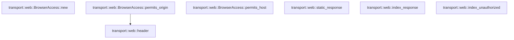

# transport::web

[Package atlas](index.md) · [Source](../../src/web.rs)

## Declarations

Visibility is the declaration spelling; trait members and reexports require their enclosing interface. `cfg` is not evaluated.

| Symbol | Kind | Visibility | Test / cfg |
|---|---|---|---|
| [transport::web::INDEX_HTML](../../src/web.rs#L11) | const_item | `pub(crate)` |  |
| [transport::web::APP_CSS](../../src/web.rs#L12) | const_item | `pub(crate)` |  |
| [transport::web::APP_JS](../../src/web.rs#L13) | const_item | `pub(crate)` |  |
| [transport::web::WEB_CLIENT_SHA256](../../src/web.rs#L17) | const_item | `pub` |  |
| [transport::web::BrowserAccess](../../src/web.rs#L20) | struct_item | `pub(crate)` |  |
| [transport::web::BrowserAccess::new](../../src/web.rs#L26) | function_item | `pub(crate)` |  |
| [transport::web::BrowserAccess::permits_origin](../../src/web.rs#L34) | function_item | `pub(crate)` |  |
| [transport::web::BrowserAccess::permits_host](../../src/web.rs#L38) | function_item | `pub(crate)` |  |
| [transport::web::asset_digest](../../src/web.rs#L48) | function_item | `pub(crate)` | test; #[cfg(test)] |
| [transport::web::static_response](../../src/web.rs#L63) | function_item | `pub(crate)` |  |
| [transport::web::index_response](../../src/web.rs#L74) | function_item | `pub(crate)` |  |
| [transport::web::index_unauthorized](../../src/web.rs#L91) | function_item | `pub(crate)` |  |
| [transport::web::index_unauthorized::MESSAGE](../../src/web.rs#L92) | const_item | `private` |  |
| [transport::web::header](../../src/web.rs#L102) | function_item | `private` |  |
| [transport::web::tests::embedded_asset_digest_matches_generated_constant](../../src/web.rs#L113) | function_item | `private` | test; #[cfg(test)] |

## Imports / reexports

| Local name | Source path | Visibility |
|---|---|---|
| `SocketAddr` | `std::net::SocketAddr` | `private` |
| `Body` | `axum::body::Body` | `private` |
| `CACHE_CONTROL` | `axum::http::header::CACHE_CONTROL` | `private` |
| `CONTENT_TYPE` | `axum::http::header::CONTENT_TYPE` | `private` |
| `HOST` | `axum::http::header::HOST` | `private` |
| `ORIGIN` | `axum::http::header::ORIGIN` | `private` |
| `REFERRER_POLICY` | `axum::http::header::REFERRER_POLICY` | `private` |
| `HeaderMap` | `axum::http::HeaderMap` | `private` |
| `StatusCode` | `axum::http::StatusCode` | `private` |
| `Response` | `axum::response::Response` | `private` |
| `Digest` | `sha2::Digest` | `private` |
| `Sha256` | `sha2::Sha256` | `private` |
| `WEB_CLIENT_SHA256` | `super::WEB_CLIENT_SHA256` | `private` |
| `asset_digest` | `super::asset_digest` | `private` |

## Module declarations

| Module | Visibility | Attributes |
|---|---|---|
| `transport::web::tests` | `private` | #[cfg(test)] |

## Function call graphs

Edges below are syntactically resolved calls only, including private functions. Graphs partition callers into groups of 20; they are not execution order. All unresolved sites are listed below and in the JSON inventory.

Functions 1–7: 1 direct edges

## Call sites

Includes test functions (marked in declarations). Receiver-type-required sites need type analysis/manual tracing. Calls in closures are attributed to their enclosing function; their occurrence here does not mean the closure executes immediately.

| Caller | Callee expression | Source lines | Target / classification |
|---|---|---|---|
| `new` | `bind.to_string` | [27](../../src/web.rs#L27) | receiver-type-required |
| `permits_origin` | `header(headers, ORIGIN).is_some_and` | [35](../../src/web.rs#L35) | receiver-type-required |
| `permits_origin` | `header` | [35](../../src/web.rs#L35) | [transport::web::header](../../src/web.rs#L102) |
| `permits_host` | `headers.get_all(HOST).iter` | [39](../../src/web.rs#L39) | receiver-type-required |
| `permits_host` | `headers.get_all` | [39](../../src/web.rs#L39) | receiver-type-required |
| `permits_host` | `values.next` | [40](../../src/web.rs#L40), [43](../../src/web.rs#L43) | receiver-type-required |
| `permits_host` | `values.next().is_none` | [43](../../src/web.rs#L43) | receiver-type-required |
| `permits_host` | `value.to_str().is_ok_and` | [43](../../src/web.rs#L43) | receiver-type-required |
| `permits_host` | `value.to_str` | [43](../../src/web.rs#L43) | receiver-type-required |
| `asset_digest` | `Sha256::new` | [49](../../src/web.rs#L49) | external-constructor-callback-or-unresolved |
| `asset_digest` | `digest.update` | [55](../../src/web.rs#L55), [56](../../src/web.rs#L56), [57](../../src/web.rs#L57), [58](../../src/web.rs#L58) | receiver-type-required |
| `asset_digest` | `name.as_bytes` | [55](../../src/web.rs#L55) | receiver-type-required |
| `asset_digest` | `(bytes.len() as u64).to_be_bytes` | [57](../../src/web.rs#L57) | receiver-type-required |
| `asset_digest` | `bytes.len` | [57](../../src/web.rs#L57) | receiver-type-required |
| `static_response` | `Response::builder()         .status(StatusCode::OK)         .header(CONTENT_TYPE, content_type)         .header(CACHE_CONTROL, "public, max-age=31536000, immutable")         .header("content-length", bytes.len().to_string())         .header("x-content-type-options", "nosniff")         .body(Body::from(bytes))         .expect` | [64](../../src/web.rs#L64) | receiver-type-required |
| `static_response` | `Response::builder()         .status(StatusCode::OK)         .header(CONTENT_TYPE, content_type)         .header(CACHE_CONTROL, "public, max-age=31536000, immutable")         .header("content-length", bytes.len().to_string())         .header("x-content-type-options", "nosniff")         .body` | [64](../../src/web.rs#L64) | receiver-type-required |
| `static_response` | `Response::builder()         .status(StatusCode::OK)         .header(CONTENT_TYPE, content_type)         .header(CACHE_CONTROL, "public, max-age=31536000, immutable")         .header("content-length", bytes.len().to_string())         .header` | [64](../../src/web.rs#L64) | receiver-type-required |
| `static_response` | `Response::builder()         .status(StatusCode::OK)         .header(CONTENT_TYPE, content_type)         .header(CACHE_CONTROL, "public, max-age=31536000, immutable")         .header` | [64](../../src/web.rs#L64) | receiver-type-required |
| `static_response` | `Response::builder()         .status(StatusCode::OK)         .header(CONTENT_TYPE, content_type)         .header` | [64](../../src/web.rs#L64) | receiver-type-required |
| `static_response` | `Response::builder()         .status(StatusCode::OK)         .header` | [64](../../src/web.rs#L64) | receiver-type-required |
| `static_response` | `Response::builder()         .status` | [64](../../src/web.rs#L64) | receiver-type-required |
| `static_response` | `Response::builder` | [64](../../src/web.rs#L64) | external-constructor-callback-or-unresolved |
| `static_response` | `bytes.len().to_string` | [68](../../src/web.rs#L68) | receiver-type-required |
| `static_response` | `bytes.len` | [68](../../src/web.rs#L68) | receiver-type-required |
| `static_response` | `Body::from` | [70](../../src/web.rs#L70) | external-constructor-callback-or-unresolved |
| `index_response` | `Response::builder()         .status(StatusCode::OK)         .header(CONTENT_TYPE, "text/html; charset=utf-8")         .header(CACHE_CONTROL, "no-store")         .header(REFERRER_POLICY, "no-referrer")         .header(             "content-security-policy",             "default-src 'none'; script-src 'self'; style-src 'self'; img-src 'self' data: blob:; connect-src 'self' ws:; font-src 'self'; base-uri 'none'; form-action 'self'; frame-ancestors 'none'",         )         .header("x-content-type-options", "nosniff")         .header("x-frame-options", "DENY")         .header("content-length", INDEX_HTML.len().to_string())         .body(Body::from(INDEX_HTML))         .expect` | [75](../../src/web.rs#L75) | receiver-type-required |
| `index_response` | `Response::builder()         .status(StatusCode::OK)         .header(CONTENT_TYPE, "text/html; charset=utf-8")         .header(CACHE_CONTROL, "no-store")         .header(REFERRER_POLICY, "no-referrer")         .header(             "content-security-policy",             "default-src 'none'; script-src 'self'; style-src 'self'; img-src 'self' data: blob:; connect-src 'self' ws:; font-src 'self'; base-uri 'none'; form-action 'self'; frame-ancestors 'none'",         )         .header("x-content-type-options", "nosniff")         .header("x-frame-options", "DENY")         .header("content-length", INDEX_HTML.len().to_string())         .body` | [75](../../src/web.rs#L75) | receiver-type-required |
| `index_response` | `Response::builder()         .status(StatusCode::OK)         .header(CONTENT_TYPE, "text/html; charset=utf-8")         .header(CACHE_CONTROL, "no-store")         .header(REFERRER_POLICY, "no-referrer")         .header(             "content-security-policy",             "default-src 'none'; script-src 'self'; style-src 'self'; img-src 'self' data: blob:; connect-src 'self' ws:; font-src 'self'; base-uri 'none'; form-action 'self'; frame-ancestors 'none'",         )         .header("x-content-type-options", "nosniff")         .header("x-frame-options", "DENY")         .header` | [75](../../src/web.rs#L75) | receiver-type-required |
| `index_response` | `Response::builder()         .status(StatusCode::OK)         .header(CONTENT_TYPE, "text/html; charset=utf-8")         .header(CACHE_CONTROL, "no-store")         .header(REFERRER_POLICY, "no-referrer")         .header(             "content-security-policy",             "default-src 'none'; script-src 'self'; style-src 'self'; img-src 'self' data: blob:; connect-src 'self' ws:; font-src 'self'; base-uri 'none'; form-action 'self'; frame-ancestors 'none'",         )         .header("x-content-type-options", "nosniff")         .header` | [75](../../src/web.rs#L75) | receiver-type-required |
| `index_response` | `Response::builder()         .status(StatusCode::OK)         .header(CONTENT_TYPE, "text/html; charset=utf-8")         .header(CACHE_CONTROL, "no-store")         .header(REFERRER_POLICY, "no-referrer")         .header(             "content-security-policy",             "default-src 'none'; script-src 'self'; style-src 'self'; img-src 'self' data: blob:; connect-src 'self' ws:; font-src 'self'; base-uri 'none'; form-action 'self'; frame-ancestors 'none'",         )         .header` | [75](../../src/web.rs#L75) | receiver-type-required |
| `index_response` | `Response::builder()         .status(StatusCode::OK)         .header(CONTENT_TYPE, "text/html; charset=utf-8")         .header(CACHE_CONTROL, "no-store")         .header(REFERRER_POLICY, "no-referrer")         .header` | [75](../../src/web.rs#L75) | receiver-type-required |
| `index_response` | `Response::builder()         .status(StatusCode::OK)         .header(CONTENT_TYPE, "text/html; charset=utf-8")         .header(CACHE_CONTROL, "no-store")         .header` | [75](../../src/web.rs#L75) | receiver-type-required |
| `index_response` | `Response::builder()         .status(StatusCode::OK)         .header(CONTENT_TYPE, "text/html; charset=utf-8")         .header` | [75](../../src/web.rs#L75) | receiver-type-required |
| `index_response` | `Response::builder()         .status(StatusCode::OK)         .header` | [75](../../src/web.rs#L75) | receiver-type-required |
| `index_response` | `Response::builder()         .status` | [75](../../src/web.rs#L75) | receiver-type-required |
| `index_response` | `Response::builder` | [75](../../src/web.rs#L75) | external-constructor-callback-or-unresolved |
| `index_response` | `INDEX_HTML.len().to_string` | [86](../../src/web.rs#L86) | receiver-type-required |
| `index_response` | `INDEX_HTML.len` | [86](../../src/web.rs#L86) | receiver-type-required |
| `index_response` | `Body::from` | [87](../../src/web.rs#L87) | external-constructor-callback-or-unresolved |
| `index_unauthorized` | `Response::builder()         .status(StatusCode::UNAUTHORIZED)         .header(CONTENT_TYPE, "text/plain; charset=utf-8")         .header(CACHE_CONTROL, "no-store")         .header("content-length", MESSAGE.len().to_string())         .body(Body::from(MESSAGE))         .expect` | [93](../../src/web.rs#L93) | receiver-type-required |
| `index_unauthorized` | `Response::builder()         .status(StatusCode::UNAUTHORIZED)         .header(CONTENT_TYPE, "text/plain; charset=utf-8")         .header(CACHE_CONTROL, "no-store")         .header("content-length", MESSAGE.len().to_string())         .body` | [93](../../src/web.rs#L93) | receiver-type-required |
| `index_unauthorized` | `Response::builder()         .status(StatusCode::UNAUTHORIZED)         .header(CONTENT_TYPE, "text/plain; charset=utf-8")         .header(CACHE_CONTROL, "no-store")         .header` | [93](../../src/web.rs#L93) | receiver-type-required |
| `index_unauthorized` | `Response::builder()         .status(StatusCode::UNAUTHORIZED)         .header(CONTENT_TYPE, "text/plain; charset=utf-8")         .header` | [93](../../src/web.rs#L93) | receiver-type-required |
| `index_unauthorized` | `Response::builder()         .status(StatusCode::UNAUTHORIZED)         .header` | [93](../../src/web.rs#L93) | receiver-type-required |
| `index_unauthorized` | `Response::builder()         .status` | [93](../../src/web.rs#L93) | receiver-type-required |
| `index_unauthorized` | `Response::builder` | [93](../../src/web.rs#L93) | external-constructor-callback-or-unresolved |
| `index_unauthorized` | `MESSAGE.len().to_string` | [97](../../src/web.rs#L97) | receiver-type-required |
| `index_unauthorized` | `MESSAGE.len` | [97](../../src/web.rs#L97) | receiver-type-required |
| `index_unauthorized` | `Body::from` | [98](../../src/web.rs#L98) | external-constructor-callback-or-unresolved |
| `header` | `headers.get_all(name).iter` | [103](../../src/web.rs#L103) | receiver-type-required |
| `header` | `headers.get_all` | [103](../../src/web.rs#L103) | receiver-type-required |
| `header` | `values.next()?.to_str().ok` | [104](../../src/web.rs#L104) | receiver-type-required |
| `header` | `values.next()?.to_str` | [104](../../src/web.rs#L104) | receiver-type-required |
| `header` | `values.next` | [104](../../src/web.rs#L104), [105](../../src/web.rs#L105) | receiver-type-required |
| `header` | `values.next().is_none().then_some` | [105](../../src/web.rs#L105) | receiver-type-required |
| `header` | `values.next().is_none` | [105](../../src/web.rs#L105) | receiver-type-required |
