# user-documents::feedback

[Package atlas](index.md) · [Source](../../src/feedback.rs)

## Declarations

Visibility is the declaration spelling; trait members and reexports require their enclosing interface. `cfg` is not evaluated.

| Symbol | Kind | Visibility | Test / cfg |
|---|---|---|---|
| [user-documents::feedback::MAX_MESSAGE_ID_BYTES](../../src/feedback.rs#L12) | const_item | `private` |  |
| [user-documents::feedback::MAX_NOTE_BYTES](../../src/feedback.rs#L13) | const_item | `private` |  |
| [user-documents::feedback::Feedback](../../src/feedback.rs#L16) | struct_item | `pub` |  |
| [user-documents::feedback::Document](../../src/feedback.rs#L28) | struct_item | `private` |  |
| [user-documents::feedback::path](../../src/feedback.rs#L36) | function_item | `pub` |  |
| [user-documents::feedback::validate_session](../../src/feedback.rs#L40) | function_item | `private` |  |
| [user-documents::feedback::validate_message_id](../../src/feedback.rs#L45) | function_item | `private` |  |
| [user-documents::feedback::validate_rating](../../src/feedback.rs#L54) | function_item | `private` |  |
| [user-documents::feedback::validate](../../src/feedback.rs#L61) | function_item | `pub` |  |
| [user-documents::feedback::load](../../src/feedback.rs#L100) | function_item | `private` |  |
| [user-documents::feedback::save](../../src/feedback.rs#L123) | function_item | `private` |  |
| [user-documents::feedback::conflict](../../src/feedback.rs#L129) | function_item | `private` |  |
| [user-documents::feedback::list](../../src/feedback.rs#L135) | function_item | `pub` |  |
| [user-documents::feedback::put](../../src/feedback.rs#L141) | function_item | `pub` |  |
| [user-documents::feedback::delete](../../src/feedback.rs#L180) | function_item | `pub` |  |

## Imports / reexports

| Local name | Source path | Visibility |
|---|---|---|
| `Path` | `std::path::Path` | `private` |
| `PathBuf` | `std::path::PathBuf` | `private` |
| `Deserialize` | `serde::Deserialize` | `private` |
| `Serialize` | `serde::Serialize` | `private` |
| `Value` | `serde_json::Value` | `private` |
| `json` | `serde_json::json` | `private` |
| `Failure` | `crate::Failure` | `private` |
| `closed_object` | `crate::closed_object` | `private` |
| `required_str` | `crate::required_str` | `private` |

## Module declarations

| Module | Visibility | Attributes |
|---|---|---|

## Function call graphs

Edges below are syntactically resolved calls only, including private functions. Graphs partition callers into groups of 20; they are not execution order. All unresolved sites are listed below and in the JSON inventory.

```mermaid
flowchart TD
  n0["endpoint::types::validate_session_id"]
  n1["user-documents::feedback::load"]
  n2["user-documents::feedback::save"]
  n3["user-documents::feedback::conflict"]
  n4["user-documents::feedback::list"]
  n5["user-documents::feedback::put"]
  n6["user-documents::feedback::delete"]
  n7["user-documents::feedback::path"]
  n8["user-documents::feedback::validate_session"]
  n9["user-documents::feedback::validate_message_id"]
  n10["user-documents::feedback::validate_rating"]
  n11["user-documents::feedback::validate"]
  n12["user-documents::write_atomic"]
  n13["user-documents::closed_object"]
  n14["user-documents::required_str"]
  n15["user-documents::now_milliseconds"]
  n16["user-documents::Failure::new"]
  n17["user-documents::Failure::io"]
  n18["user-documents::canonical_bytes"]
  n1 --> n16
  n1 --> n17
  n2 --> n7
  n2 --> n12
  n2 --> n16
  n2 --> n18
  n3 --> n16
  n4 --> n1
  n5 --> n1
  n5 --> n2
  n5 --> n3
  n5 --> n15
  n5 --> n16
  n6 --> n1
  n6 --> n2
  n6 --> n3
  n8 --> n0
  n11 --> n8
  n11 --> n9
  n11 --> n10
  n11 --> n13
  n11 --> n14
```

Functions 1–11: 22 direct edges

## Call sites

Includes test functions (marked in declarations). Receiver-type-required sites need type analysis/manual tracing. Calls in closures are attributed to their enclosing function; their occurrence here does not mean the closure executes immediately.

| Caller | Callee expression | Source lines | Target / classification |
|---|---|---|---|
| `path` | `root.join("feedback").join` | [37](../../src/feedback.rs#L37) | receiver-type-required |
| `path` | `root.join` | [37](../../src/feedback.rs#L37) | receiver-type-required |
| `validate_session` | `endpoint::validate_session_id(value)         .map_err` | [41](../../src/feedback.rs#L41) | receiver-type-required |
| `validate_session` | `endpoint::validate_session_id` | [41](../../src/feedback.rs#L41) | [endpoint::types::validate_session_id](../../../endpoint/src/types.rs#L130) |
| `validate_session` | `"sessionId must be a canonical lowercase UUID".to_owned` | [42](../../src/feedback.rs#L42) | receiver-type-required |
| `validate_message_id` | `value.is_empty` | [46](../../src/feedback.rs#L46) | receiver-type-required |
| `validate_message_id` | `value.len` | [46](../../src/feedback.rs#L46) | receiver-type-required |
| `validate_message_id` | `Err` | [47](../../src/feedback.rs#L47) | external-constructor-callback-or-unresolved |
| `validate_message_id` | `Ok` | [51](../../src/feedback.rs#L51) | external-constructor-callback-or-unresolved |
| `validate_rating` | `value.as_str` | [55](../../src/feedback.rs#L55) | receiver-type-required |
| `validate_rating` | `Ok` | [56](../../src/feedback.rs#L56) | external-constructor-callback-or-unresolved |
| `validate_rating` | `Err` | [57](../../src/feedback.rs#L57) | external-constructor-callback-or-unresolved |
| `validate_rating` | `"rating must be \"positive\" or \"negative\"".to_owned` | [57](../../src/feedback.rs#L57) | receiver-type-required |
| `validate` | `closed_object` | [64](../../src/feedback.rs#L64), [68](../../src/feedback.rs#L68), [90](../../src/feedback.rs#L90) | [user-documents::closed_object](../../src/lib.rs#L123) |
| `validate` | `validate_session` | [65](../../src/feedback.rs#L65), [72](../../src/feedback.rs#L72), [91](../../src/feedback.rs#L91) | [user-documents::feedback::validate_session](../../src/feedback.rs#L40) |
| `validate` | `required_str` | [65](../../src/feedback.rs#L65), [72](../../src/feedback.rs#L72), [73](../../src/feedback.rs#L73), [91](../../src/feedback.rs#L91), [92](../../src/feedback.rs#L92), [93](../../src/feedback.rs#L93) | [user-documents::required_str](../../src/lib.rs#L136) |
| `validate` | `validate_message_id` | [73](../../src/feedback.rs#L73), [92](../../src/feedback.rs#L92) | [user-documents::feedback::validate_message_id](../../src/feedback.rs#L45) |
| `validate` | `validate_rating` | [74](../../src/feedback.rs#L74) | [user-documents::feedback::validate_rating](../../src/feedback.rs#L54) |
| `validate` | `object.get("rating").ok_or` | [74](../../src/feedback.rs#L74) | receiver-type-required |
| `validate` | `object.get` | [74](../../src/feedback.rs#L74), [75](../../src/feedback.rs#L75), [79](../../src/feedback.rs#L79) | receiver-type-required |
| `validate` | `Err` | [77](../../src/feedback.rs#L77), [83](../../src/feedback.rs#L83), [85](../../src/feedback.rs#L85), [96](../../src/feedback.rs#L96) | external-constructor-callback-or-unresolved |
| `validate` | `"ifVersion must be a string or null".to_owned` | [77](../../src/feedback.rs#L77) | receiver-type-required |
| `validate` | `note.len` | [81](../../src/feedback.rs#L81) | receiver-type-required |
| `validate` | `"note must be a string or null".to_owned` | [85](../../src/feedback.rs#L85) | receiver-type-required |
| `validate` | `Ok` | [87](../../src/feedback.rs#L87), [94](../../src/feedback.rs#L94) | external-constructor-callback-or-unresolved |
| `load` | `path` | [101](../../src/feedback.rs#L101) | external-constructor-callback-or-unresolved |
| `load` | `std::fs::read` | [102](../../src/feedback.rs#L102) | external-constructor-callback-or-unresolved |
| `load` | `serde_json::from_slice(&bytes).map_err` | [104](../../src/feedback.rs#L104) | receiver-type-required |
| `load` | `serde_json::from_slice` | [104](../../src/feedback.rs#L104) | external-constructor-callback-or-unresolved |
| `load` | `Failure::new` | [105](../../src/feedback.rs#L105), [108](../../src/feedback.rs#L108) | [user-documents::Failure::new](../../src/lib.rs#L41) |
| `load` | `Err` | [108](../../src/feedback.rs#L108), [119](../../src/feedback.rs#L119) | external-constructor-callback-or-unresolved |
| `load` | `Ok` | [113](../../src/feedback.rs#L113), [115](../../src/feedback.rs#L115) | external-constructor-callback-or-unresolved |
| `load` | `error.kind` | [115](../../src/feedback.rs#L115) | receiver-type-required |
| `load` | `Default::default` | [117](../../src/feedback.rs#L117) | external-constructor-callback-or-unresolved |
| `load` | `Failure::io` | [119](../../src/feedback.rs#L119) | [user-documents::Failure::io](../../src/lib.rs#L58) |
| `save` | `serde_json::to_value(document).map_err` | [125](../../src/feedback.rs#L125) | receiver-type-required |
| `save` | `serde_json::to_value` | [125](../../src/feedback.rs#L125) | external-constructor-callback-or-unresolved |
| `save` | `Failure::new` | [125](../../src/feedback.rs#L125) | [user-documents::Failure::new](../../src/lib.rs#L41) |
| `save` | `error.to_string` | [125](../../src/feedback.rs#L125) | receiver-type-required |
| `save` | `crate::write_atomic` | [126](../../src/feedback.rs#L126) | [user-documents::write_atomic](../../src/lib.rs#L101) |
| `save` | `path` | [126](../../src/feedback.rs#L126) | [user-documents::feedback::path](../../src/feedback.rs#L36) |
| `save` | `crate::canonical_bytes` | [126](../../src/feedback.rs#L126) | [user-documents::canonical_bytes](../../src/lib.rs#L93) |
| `conflict` | `Failure::new("version-conflict", "feedback version does not match").with_details` | [130](../../src/feedback.rs#L130) | receiver-type-required |
| `conflict` | `Failure::new` | [130](../../src/feedback.rs#L130) | [user-documents::Failure::new](../../src/lib.rs#L41) |
| `list` | `payload["sessionId"].as_str().unwrap_or_default` | [136](../../src/feedback.rs#L136) | receiver-type-required |
| `list` | `payload["sessionId"].as_str` | [136](../../src/feedback.rs#L136) | receiver-type-required |
| `list` | `load` | [137](../../src/feedback.rs#L137) | [user-documents::feedback::load](../../src/feedback.rs#L100) |
| `list` | `Ok` | [138](../../src/feedback.rs#L138) | external-constructor-callback-or-unresolved |
| `put` | `payload["sessionId"].as_str().unwrap_or_default` | [142](../../src/feedback.rs#L142) | receiver-type-required |
| `put` | `payload["sessionId"].as_str` | [142](../../src/feedback.rs#L142) | receiver-type-required |
| `put` | `payload["messageId"].as_str().unwrap_or_default` | [143](../../src/feedback.rs#L143) | receiver-type-required |
| `put` | `payload["messageId"].as_str` | [143](../../src/feedback.rs#L143) | receiver-type-required |
| `put` | `payload["rating"].as_str().unwrap_or_default().to_owned` | [144](../../src/feedback.rs#L144) | receiver-type-required |
| `put` | `payload["rating"].as_str().unwrap_or_default` | [144](../../src/feedback.rs#L144) | receiver-type-required |
| `put` | `payload["rating"].as_str` | [144](../../src/feedback.rs#L144) | receiver-type-required |
| `put` | `load` | [145](../../src/feedback.rs#L145) | [user-documents::feedback::load](../../src/feedback.rs#L100) |
| `put` | `document         .items         .iter()         .position` | [146](../../src/feedback.rs#L146) | receiver-type-required |
| `put` | `document         .items         .iter` | [146](../../src/feedback.rs#L146) | receiver-type-required |
| `put` | `existing.map` | [150](../../src/feedback.rs#L150) | receiver-type-required |
| `put` | `Err` | [154](../../src/feedback.rs#L154) | external-constructor-callback-or-unresolved |
| `put` | `conflict` | [154](../../src/feedback.rs#L154) | [user-documents::feedback::conflict](../../src/feedback.rs#L129) |
| `put` | `payload.get` | [156](../../src/feedback.rs#L156) | receiver-type-required |
| `put` | `current.and_then` | [157](../../src/feedback.rs#L157) | receiver-type-required |
| `put` | `item.note.clone` | [157](../../src/feedback.rs#L157) | receiver-type-required |
| `put` | `Some` | [158](../../src/feedback.rs#L158) | external-constructor-callback-or-unresolved |
| `put` | `note.clone` | [158](../../src/feedback.rs#L158) | receiver-type-required |
| `put` | `message_id.to_owned` | [163](../../src/feedback.rs#L163) | receiver-type-required |
| `put` | `document.counter.to_string` | [165](../../src/feedback.rs#L165) | receiver-type-required |
| `put` | `crate::now_milliseconds` | [167](../../src/feedback.rs#L167) | [user-documents::now_milliseconds](../../src/lib.rs#L147) |
| `put` | `item.clone` | [170](../../src/feedback.rs#L170), [171](../../src/feedback.rs#L171) | receiver-type-required |
| `put` | `document.items.push` | [171](../../src/feedback.rs#L171) | receiver-type-required |
| `put` | `document         .items         .sort_by` | [173](../../src/feedback.rs#L173) | receiver-type-required |
| `put` | `a.message_id.cmp` | [175](../../src/feedback.rs#L175) | receiver-type-required |
| `put` | `save` | [176](../../src/feedback.rs#L176) | [user-documents::feedback::save](../../src/feedback.rs#L123) |
| `put` | `serde_json::to_value(item).map_err` | [177](../../src/feedback.rs#L177) | receiver-type-required |
| `put` | `serde_json::to_value` | [177](../../src/feedback.rs#L177) | external-constructor-callback-or-unresolved |
| `put` | `Failure::new` | [177](../../src/feedback.rs#L177) | [user-documents::Failure::new](../../src/lib.rs#L41) |
| `put` | `error.to_string` | [177](../../src/feedback.rs#L177) | receiver-type-required |
| `delete` | `payload["sessionId"].as_str().unwrap_or_default` | [181](../../src/feedback.rs#L181) | receiver-type-required |
| `delete` | `payload["sessionId"].as_str` | [181](../../src/feedback.rs#L181) | receiver-type-required |
| `delete` | `payload["messageId"].as_str().unwrap_or_default` | [182](../../src/feedback.rs#L182) | receiver-type-required |
| `delete` | `payload["messageId"].as_str` | [182](../../src/feedback.rs#L182) | receiver-type-required |
| `delete` | `payload["ifVersion"].as_str().unwrap_or_default` | [183](../../src/feedback.rs#L183) | receiver-type-required |
| `delete` | `payload["ifVersion"].as_str` | [183](../../src/feedback.rs#L183) | receiver-type-required |
| `delete` | `load` | [184](../../src/feedback.rs#L184) | [user-documents::feedback::load](../../src/feedback.rs#L100) |
| `delete` | `document         .items         .iter()         .position` | [185](../../src/feedback.rs#L185) | receiver-type-required |
| `delete` | `document         .items         .iter` | [185](../../src/feedback.rs#L185) | receiver-type-required |
| `delete` | `Err` | [190](../../src/feedback.rs#L190), [193](../../src/feedback.rs#L193) | external-constructor-callback-or-unresolved |
| `delete` | `conflict` | [190](../../src/feedback.rs#L190), [193](../../src/feedback.rs#L193) | [user-documents::feedback::conflict](../../src/feedback.rs#L129) |
| `delete` | `Some` | [193](../../src/feedback.rs#L193) | external-constructor-callback-or-unresolved |
| `delete` | `document.items.remove` | [195](../../src/feedback.rs#L195) | receiver-type-required |
| `delete` | `save` | [196](../../src/feedback.rs#L196) | [user-documents::feedback::save](../../src/feedback.rs#L123) |
| `delete` | `Ok` | [197](../../src/feedback.rs#L197) | external-constructor-callback-or-unresolved |
