# user-documents

[Package atlas](index.md) · [Source](../../src/lib.rs)

## Declarations

Visibility is the declaration spelling; trait members and reexports require their enclosing interface. `cfg` is not evaluated.

| Symbol | Kind | Visibility | Test / cfg |
|---|---|---|---|
| [user-documents::METHODS](../../src/lib.rs#L21) | const_item | `pub` |  |
| [user-documents::Failure](../../src/lib.rs#L34) | struct_item | `pub` |  |
| [user-documents::Failure::new](../../src/lib.rs#L41) | function_item | `pub` |  |
| [user-documents::Failure::with_details](../../src/lib.rs#L49) | function_item | `pub` |  |
| [user-documents::Failure::bad_request](../../src/lib.rs#L54) | function_item | `pub` |  |
| [user-documents::Failure::io](../../src/lib.rs#L58) | function_item | `pub` |  |
| [user-documents::validate](../../src/lib.rs#L64) | function_item | `pub` |  |
| [user-documents::execute](../../src/lib.rs#L75) | function_item | `pub` |  |
| [user-documents::canonical_bytes](../../src/lib.rs#L93) | function_item | `pub(crate)` |  |
| [user-documents::write_atomic](../../src/lib.rs#L101) | function_item | `pub(crate)` |  |
| [user-documents::closed_object](../../src/lib.rs#L123) | function_item | `pub(crate)` |  |
| [user-documents::required_str](../../src/lib.rs#L136) | function_item | `pub(crate)` |  |
| [user-documents::now_milliseconds](../../src/lib.rs#L147) | function_item | `pub(crate)` |  |

## Imports / reexports

| Local name | Source path | Visibility |
|---|---|---|
| `Path` | `std::path::Path` | `private` |
| `PathBuf` | `std::path::PathBuf` | `private` |

## Module declarations

| Module | Visibility | Attributes |
|---|---|---|
| `user-documents::feedback` | `pub` |  |
| `user-documents::settings` | `pub` |  |

## Function call graphs

Edges below are syntactically resolved calls only, including private functions. Graphs partition callers into groups of 20; they are not execution order. All unresolved sites are listed below and in the JSON inventory.

```mermaid
flowchart TD
  n0["user-documents::feedback::list"]
  n1["user-documents::feedback::put"]
  n2["user-documents::feedback::delete"]
  n3["user-documents::feedback::validate"]
  n4["user-documents::write_atomic"]
  n5["user-documents::closed_object"]
  n6["user-documents::required_str"]
  n7["user-documents::now_milliseconds"]
  n8["user-documents::Failure::new"]
  n9["user-documents::Failure::with_details"]
  n10["user-documents::Failure::bad_request"]
  n11["user-documents::Failure::io"]
  n12["user-documents::validate"]
  n13["user-documents::execute"]
  n14["user-documents::canonical_bytes"]
  n15["user-documents::settings::describe"]
  n16["user-documents::settings::mutate"]
  n17["user-documents::settings::update"]
  n18["user-documents::settings::document"]
  n19["user-documents::settings::validate"]
  n4 --> n8
  n4 --> n11
  n10 --> n8
  n11 --> n8
  n12 --> n3
  n12 --> n19
  n13 --> n0
  n13 --> n1
  n13 --> n2
  n13 --> n10
  n13 --> n12
  n13 --> n15
  n13 --> n16
  n13 --> n17
  n13 --> n18
  n14 --> n8
```

Functions 1–11: 16 direct edges

## Call sites

Includes test functions (marked in declarations). Receiver-type-required sites need type analysis/manual tracing. Calls in closures are attributed to their enclosing function; their occurrence here does not mean the closure executes immediately.

| Caller | Callee expression | Source lines | Target / classification |
|---|---|---|---|
| `new` | `message.into` | [44](../../src/lib.rs#L44) | receiver-type-required |
| `new` | `serde_json::Value::Object` | [45](../../src/lib.rs#L45) | external-constructor-callback-or-unresolved |
| `new` | `Default::default` | [45](../../src/lib.rs#L45) | external-constructor-callback-or-unresolved |
| `bad_request` | `Self::new` | [55](../../src/lib.rs#L55) | [user-documents::Failure::new](../../src/lib.rs#L41) |
| `io` | `Self::new` | [59](../../src/lib.rs#L59) | [user-documents::Failure::new](../../src/lib.rs#L41) |
| `validate` | `feedback::validate` | [66](../../src/lib.rs#L66) | [user-documents::feedback::validate](../../src/feedback.rs#L61) |
| `validate` | `settings::validate` | [68](../../src/lib.rs#L68) | [user-documents::settings::validate](../../src/settings.rs#L70) |
| `validate` | `Err` | [70](../../src/lib.rs#L70) | external-constructor-callback-or-unresolved |
| `execute` | `validate(method, payload).map_err` | [80](../../src/lib.rs#L80) | receiver-type-required |
| `execute` | `validate` | [80](../../src/lib.rs#L80) | [user-documents::validate](../../src/lib.rs#L64) |
| `execute` | `feedback::list` | [82](../../src/lib.rs#L82) | [user-documents::feedback::list](../../src/feedback.rs#L135) |
| `execute` | `feedback::put` | [83](../../src/lib.rs#L83) | [user-documents::feedback::put](../../src/feedback.rs#L141) |
| `execute` | `feedback::delete` | [84](../../src/lib.rs#L84) | [user-documents::feedback::delete](../../src/feedback.rs#L180) |
| `execute` | `settings::describe` | [85](../../src/lib.rs#L85) | [user-documents::settings::describe](../../src/settings.rs#L332) |
| `execute` | `settings::mutate` | [86](../../src/lib.rs#L86) | [user-documents::settings::mutate](../../src/settings.rs#L337) |
| `execute` | `settings::update` | [87](../../src/lib.rs#L87) | [user-documents::settings::update](../../src/settings.rs#L360) |
| `execute` | `settings::document` | [88](../../src/lib.rs#L88) | [user-documents::settings::document](../../src/settings.rs#L380) |
| `execute` | `Err` | [89](../../src/lib.rs#L89) | external-constructor-callback-or-unresolved |
| `execute` | `Failure::bad_request` | [89](../../src/lib.rs#L89) | [user-documents::Failure::bad_request](../../src/lib.rs#L54) |
| `canonical_bytes` | `serde_json_canonicalizer::to_vec(value)         .map_err` | [94](../../src/lib.rs#L94) | receiver-type-required |
| `canonical_bytes` | `serde_json_canonicalizer::to_vec` | [94](../../src/lib.rs#L94) | external-constructor-callback-or-unresolved |
| `canonical_bytes` | `Failure::new` | [95](../../src/lib.rs#L95) | [user-documents::Failure::new](../../src/lib.rs#L41) |
| `canonical_bytes` | `bytes.push` | [96](../../src/lib.rs#L96) | receiver-type-required |
| `canonical_bytes` | `Ok` | [97](../../src/lib.rs#L97) | external-constructor-callback-or-unresolved |
| `write_atomic` | `path         .parent()         .ok_or_else` | [102](../../src/lib.rs#L102) | receiver-type-required |
| `write_atomic` | `path         .parent` | [102](../../src/lib.rs#L102) | receiver-type-required |
| `write_atomic` | `Failure::new` | [104](../../src/lib.rs#L104) | [user-documents::Failure::new](../../src/lib.rs#L41) |
| `write_atomic` | `std::fs::create_dir_all(parent).map_err` | [105](../../src/lib.rs#L105) | receiver-type-required |
| `write_atomic` | `std::fs::create_dir_all` | [105](../../src/lib.rs#L105) | external-constructor-callback-or-unresolved |
| `write_atomic` | `Failure::io` | [105](../../src/lib.rs#L105), [117](../../src/lib.rs#L117) | [user-documents::Failure::io](../../src/lib.rs#L58) |
| `write_atomic` | `path         .file_name()         .and_then(&#124;name&#124; name.to_str())         .unwrap_or` | [106](../../src/lib.rs#L106) | receiver-type-required |
| `write_atomic` | `path         .file_name()         .and_then` | [106](../../src/lib.rs#L106) | receiver-type-required |
| `write_atomic` | `path         .file_name` | [106](../../src/lib.rs#L106) | receiver-type-required |
| `write_atomic` | `name.to_str` | [108](../../src/lib.rs#L108) | receiver-type-required |
| `write_atomic` | `parent.join` | [110](../../src/lib.rs#L110) | receiver-type-required |
| `write_atomic` | `(&#124;&#124; {         std::fs::write(&temp, bytes)?;         std::fs::rename(&temp, path)     })` | [111](../../src/lib.rs#L111) | external-constructor-callback-or-unresolved |
| `write_atomic` | `std::fs::write` | [112](../../src/lib.rs#L112) | external-constructor-callback-or-unresolved |
| `write_atomic` | `std::fs::rename` | [113](../../src/lib.rs#L113) | external-constructor-callback-or-unresolved |
| `write_atomic` | `std::fs::remove_file` | [116](../../src/lib.rs#L116) | external-constructor-callback-or-unresolved |
| `write_atomic` | `Err` | [117](../../src/lib.rs#L117) | external-constructor-callback-or-unresolved |
| `write_atomic` | `Ok` | [119](../../src/lib.rs#L119) | external-constructor-callback-or-unresolved |
| `closed_object` | `payload.as_object().ok_or` | [127](../../src/lib.rs#L127) | receiver-type-required |
| `closed_object` | `payload.as_object` | [127](../../src/lib.rs#L127) | receiver-type-required |
| `closed_object` | `object.keys` | [128](../../src/lib.rs#L128) | receiver-type-required |
| `closed_object` | `allowed.contains` | [129](../../src/lib.rs#L129) | receiver-type-required |
| `closed_object` | `key.as_str` | [129](../../src/lib.rs#L129) | receiver-type-required |
| `closed_object` | `Err` | [130](../../src/lib.rs#L130) | external-constructor-callback-or-unresolved |
| `closed_object` | `Ok` | [133](../../src/lib.rs#L133) | external-constructor-callback-or-unresolved |
| `required_str` | `object         .get(key)         .ok_or_else(&#124;&#124; format!("{key} is required"))?         .as_str()         .ok_or_else` | [140](../../src/lib.rs#L140) | receiver-type-required |
| `required_str` | `object         .get(key)         .ok_or_else(&#124;&#124; format!("{key} is required"))?         .as_str` | [140](../../src/lib.rs#L140) | receiver-type-required |
| `required_str` | `object         .get(key)         .ok_or_else` | [140](../../src/lib.rs#L140) | receiver-type-required |
| `required_str` | `object         .get` | [140](../../src/lib.rs#L140) | receiver-type-required |
| `now_milliseconds` | `u64::try_from(chrono::Utc::now().timestamp_millis()).unwrap_or` | [148](../../src/lib.rs#L148) | receiver-type-required |
| `now_milliseconds` | `u64::try_from` | [148](../../src/lib.rs#L148) | external-constructor-callback-or-unresolved |
| `now_milliseconds` | `chrono::Utc::now().timestamp_millis` | [148](../../src/lib.rs#L148) | receiver-type-required |
| `now_milliseconds` | `chrono::Utc::now` | [148](../../src/lib.rs#L148) | external-constructor-callback-or-unresolved |
