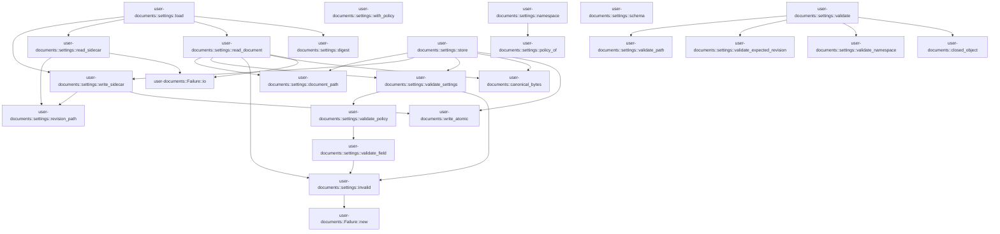

# user-documents::settings

[Package atlas](index.md) · [Source](../../src/settings.rs)

## Declarations

Visibility is the declaration spelling; trait members and reexports require their enclosing interface. `cfg` is not evaluated.

| Symbol | Kind | Visibility | Test / cfg |
|---|---|---|---|
| [user-documents::settings::NAMESPACE](../../src/settings.rs#L14) | const_item | `pub` |  |
| [user-documents::settings::FIELDS](../../src/settings.rs#L15) | const_item | `private` |  |
| [user-documents::settings::document_path](../../src/settings.rs#L22) | function_item | `pub` |  |
| [user-documents::settings::revision_path](../../src/settings.rs#L26) | function_item | `pub` |  |
| [user-documents::settings::schema](../../src/settings.rs#L30) | function_item | `pub` |  |
| [user-documents::settings::validate_namespace](../../src/settings.rs#L45) | function_item | `private` |  |
| [user-documents::settings::validate_expected_revision](../../src/settings.rs#L52) | function_item | `private` |  |
| [user-documents::settings::validate_path](../../src/settings.rs#L60) | function_item | `private` |  |
| [user-documents::settings::validate](../../src/settings.rs#L70) | function_item | `pub` |  |
| [user-documents::settings::invalid](../../src/settings.rs#L116) | function_item | `private` |  |
| [user-documents::settings::validate_field](../../src/settings.rs#L120) | function_item | `private` |  |
| [user-documents::settings::validate_policy](../../src/settings.rs#L154) | function_item | `private` |  |
| [user-documents::settings::validate_settings](../../src/settings.rs#L161) | function_item | `private` |  |
| [user-documents::settings::digest](../../src/settings.rs#L179) | function_item | `private` |  |
| [user-documents::settings::State](../../src/settings.rs#L183) | struct_item | `private` |  |
| [user-documents::settings::read_document](../../src/settings.rs#L189) | function_item | `private` |  |
| [user-documents::settings::read_sidecar](../../src/settings.rs#L211) | function_item | `private` |  |
| [user-documents::settings::write_sidecar](../../src/settings.rs#L224) | function_item | `private` |  |
| [user-documents::settings::load](../../src/settings.rs#L232) | function_item | `private` |  |
| [user-documents::settings::store](../../src/settings.rs#L253) | function_item | `private` |  |
| [user-documents::settings::policy_of](../../src/settings.rs#L266) | function_item | `private` |  |
| [user-documents::settings::with_policy](../../src/settings.rs#L274) | function_item | `private` |  |
| [user-documents::settings::namespace](../../src/settings.rs#L283) | function_item | `private` |  |
| [user-documents::settings::check_namespace](../../src/settings.rs#L297) | function_item | `private` |  |
| [user-documents::settings::check_revision](../../src/settings.rs#L309) | function_item | `private` |  |
| [user-documents::settings::field_of](../../src/settings.rs#L319) | function_item | `private` |  |
| [user-documents::settings::describe](../../src/settings.rs#L332) | function_item | `pub` |  |
| [user-documents::settings::mutate](../../src/settings.rs#L337) | function_item | `pub` |  |
| [user-documents::settings::update](../../src/settings.rs#L360) | function_item | `pub` |  |
| [user-documents::settings::document](../../src/settings.rs#L380) | function_item | `pub` |  |

## Imports / reexports

| Local name | Source path | Visibility |
|---|---|---|
| `Path` | `std::path::Path` | `private` |
| `PathBuf` | `std::path::PathBuf` | `private` |
| `Map` | `serde_json::Map` | `private` |
| `Value` | `serde_json::Value` | `private` |
| `json` | `serde_json::json` | `private` |
| `Digest` | `sha2::Digest` | `private` |
| `Sha256` | `sha2::Sha256` | `private` |
| `Failure` | `crate::Failure` | `private` |
| `closed_object` | `crate::closed_object` | `private` |

## Module declarations

| Module | Visibility | Attributes |
|---|---|---|

## Function call graphs

Edges below are syntactically resolved calls only, including private functions. Graphs partition callers into groups of 20; they are not execution order. All unresolved sites are listed below and in the JSON inventory.

Functions 1–20: 28 direct edges

Functions 21–27: 25 direct edges

```mermaid
flowchart TD
  n0["user-documents::write_atomic"]
  n1["user-documents::Failure::new"]
  n2["user-documents::Failure::bad_request"]
  n3["user-documents::settings::invalid"]
  n4["user-documents::settings::validate_field"]
  n5["user-documents::settings::write_sidecar"]
  n6["user-documents::settings::document_path"]
  n7["user-documents::settings::load"]
  n8["user-documents::settings::policy_of"]
  n9["user-documents::settings::with_policy"]
  n10["user-documents::settings::namespace"]
  n11["user-documents::settings::check_namespace"]
  n12["user-documents::settings::check_revision"]
  n13["user-documents::settings::field_of"]
  n14["user-documents::settings::describe"]
  n15["user-documents::settings::mutate"]
  n16["user-documents::settings::update"]
  n17["user-documents::settings::document"]
  n11 --> n1
  n12 --> n1
  n13 --> n2
  n13 --> n3
  n14 --> n7
  n15 --> n4
  n15 --> n7
  n15 --> n8
  n15 --> n9
  n15 --> n10
  n15 --> n11
  n15 --> n12
  n15 --> n13
  n16 --> n3
  n16 --> n4
  n16 --> n7
  n16 --> n8
  n16 --> n9
  n16 --> n10
  n16 --> n11
  n16 --> n12
  n17 --> n0
  n17 --> n5
  n17 --> n6
  n17 --> n7
```

## Call sites

Includes test functions (marked in declarations). Receiver-type-required sites need type analysis/manual tracing. Calls in closures are attributed to their enclosing function; their occurrence here does not mean the closure executes immediately.

| Caller | Callee expression | Source lines | Target / classification |
|---|---|---|---|
| `document_path` | `root.join` | [23](../../src/settings.rs#L23) | receiver-type-required |
| `revision_path` | `root.join` | [27](../../src/settings.rs#L27) | receiver-type-required |
| `validate_namespace` | `object.get` | [46](../../src/settings.rs#L46) | receiver-type-required |
| `validate_namespace` | `Ok` | [47](../../src/settings.rs#L47) | external-constructor-callback-or-unresolved |
| `validate_namespace` | `Err` | [48](../../src/settings.rs#L48) | external-constructor-callback-or-unresolved |
| `validate_namespace` | `"ns must be a string".to_owned` | [48](../../src/settings.rs#L48) | receiver-type-required |
| `validate_expected_revision` | `object.get` | [53](../../src/settings.rs#L53) | receiver-type-required |
| `validate_expected_revision` | `Ok` | [54](../../src/settings.rs#L54), [55](../../src/settings.rs#L55) | external-constructor-callback-or-unresolved |
| `validate_expected_revision` | `value.as_u64().is_some` | [55](../../src/settings.rs#L55) | receiver-type-required |
| `validate_expected_revision` | `value.as_u64` | [55](../../src/settings.rs#L55) | receiver-type-required |
| `validate_expected_revision` | `Err` | [56](../../src/settings.rs#L56) | external-constructor-callback-or-unresolved |
| `validate_expected_revision` | `"expectedRevision must be a non-negative integer".to_owned` | [56](../../src/settings.rs#L56) | receiver-type-required |
| `validate_path` | `value         .and_then(Value::as_array)         .ok_or` | [61](../../src/settings.rs#L61) | receiver-type-required |
| `validate_path` | `value         .and_then` | [61](../../src/settings.rs#L61) | receiver-type-required |
| `validate_path` | `path.is_empty` | [64](../../src/settings.rs#L64) | receiver-type-required |
| `validate_path` | `path.iter().all` | [64](../../src/settings.rs#L64) | receiver-type-required |
| `validate_path` | `path.iter` | [64](../../src/settings.rs#L64) | receiver-type-required |
| `validate_path` | `Err` | [65](../../src/settings.rs#L65) | external-constructor-callback-or-unresolved |
| `validate_path` | `"path must be a non-empty array of strings".to_owned` | [65](../../src/settings.rs#L65) | receiver-type-required |
| `validate_path` | `Ok` | [67](../../src/settings.rs#L67) | external-constructor-callback-or-unresolved |
| `validate` | `closed_object(payload, &[]).map` | [72](../../src/settings.rs#L72) | receiver-type-required |
| `validate` | `closed_object` | [72](../../src/settings.rs#L72), [74](../../src/settings.rs#L74), [82](../../src/settings.rs#L82), [102](../../src/settings.rs#L102) | [user-documents::closed_object](../../src/lib.rs#L123) |
| `validate` | `validate_namespace` | [75](../../src/settings.rs#L75), [103](../../src/settings.rs#L103) | [user-documents::settings::validate_namespace](../../src/settings.rs#L45) |
| `validate` | `validate_expected_revision` | [76](../../src/settings.rs#L76), [104](../../src/settings.rs#L104) | [user-documents::settings::validate_expected_revision](../../src/settings.rs#L52) |
| `validate` | `object                 .get("operations")                 .and_then(Value::as_array)                 .ok_or` | [77](../../src/settings.rs#L77) | receiver-type-required |
| `validate` | `object                 .get("operations")                 .and_then` | [77](../../src/settings.rs#L77) | receiver-type-required |
| `validate` | `object                 .get` | [77](../../src/settings.rs#L77) | receiver-type-required |
| `validate` | `op.get("op").and_then` | [83](../../src/settings.rs#L83) | receiver-type-required |
| `validate` | `op.get` | [83](../../src/settings.rs#L83), [85](../../src/settings.rs#L85), [91](../../src/settings.rs#L91) | receiver-type-required |
| `validate` | `validate_path` | [85](../../src/settings.rs#L85), [91](../../src/settings.rs#L91) | [user-documents::settings::validate_path](../../src/settings.rs#L60) |
| `validate` | `op.contains_key` | [86](../../src/settings.rs#L86), [92](../../src/settings.rs#L92) | receiver-type-required |
| `validate` | `Err` | [87](../../src/settings.rs#L87), [93](../../src/settings.rs#L93), [96](../../src/settings.rs#L96), [106](../../src/settings.rs#L106), [110](../../src/settings.rs#L110) | external-constructor-callback-or-unresolved |
| `validate` | `"set requires value".to_owned` | [87](../../src/settings.rs#L87) | receiver-type-required |
| `validate` | `"unset takes no value".to_owned` | [93](../../src/settings.rs#L93) | receiver-type-required |
| `validate` | `"op must be \"set\" or \"unset\"".to_owned` | [96](../../src/settings.rs#L96) | receiver-type-required |
| `validate` | `Ok` | [99](../../src/settings.rs#L99), [108](../../src/settings.rs#L108) | external-constructor-callback-or-unresolved |
| `validate` | `object.get("patch").is_some_and` | [105](../../src/settings.rs#L105) | receiver-type-required |
| `validate` | `object.get` | [105](../../src/settings.rs#L105) | receiver-type-required |
| `validate` | `"patch must be an object".to_owned` | [106](../../src/settings.rs#L106) | receiver-type-required |
| `invalid` | `Failure::new` | [117](../../src/settings.rs#L117) | [user-documents::Failure::new](../../src/lib.rs#L41) |
| `validate_field` | `value             .is_boolean()             .then_some(())             .ok_or_else` | [122](../../src/settings.rs#L122) | receiver-type-required |
| `validate_field` | `value             .is_boolean()             .then_some` | [122](../../src/settings.rs#L122) | receiver-type-required |
| `validate_field` | `value             .is_boolean` | [122](../../src/settings.rs#L122) | receiver-type-required |
| `validate_field` | `invalid` | [125](../../src/settings.rs#L125), [128](../../src/settings.rs#L128), [135](../../src/settings.rs#L135), [142](../../src/settings.rs#L142), [148](../../src/settings.rs#L148), [150](../../src/settings.rs#L150) | [user-documents::settings::invalid](../../src/settings.rs#L116) |
| `validate_field` | `value.as_array` | [126](../../src/settings.rs#L126), [130](../../src/settings.rs#L130) | receiver-type-required |
| `validate_field` | `items.iter().all` | [127](../../src/settings.rs#L127), [131](../../src/settings.rs#L131) | receiver-type-required |
| `validate_field` | `items.iter` | [127](../../src/settings.rs#L127), [131](../../src/settings.rs#L131) | receiver-type-required |
| `validate_field` | `Ok` | [127](../../src/settings.rs#L127), [140](../../src/settings.rs#L140), [147](../../src/settings.rs#L147) | external-constructor-callback-or-unresolved |
| `validate_field` | `Err` | [128](../../src/settings.rs#L128), [135](../../src/settings.rs#L135), [142](../../src/settings.rs#L142), [148](../../src/settings.rs#L148), [150](../../src/settings.rs#L150) | external-constructor-callback-or-unresolved |
| `validate_field` | `item.as_str().unwrap_or_default` | [133](../../src/settings.rs#L133) | receiver-type-required |
| `validate_field` | `item.as_str` | [133](../../src/settings.rs#L133) | receiver-type-required |
| `validate_field` | `root.starts_with` | [134](../../src/settings.rs#L134) | receiver-type-required |
| `validate_field` | `value.as_u64` | [146](../../src/settings.rs#L146) | receiver-type-required |
| `validate_policy` | `validate_field` | [156](../../src/settings.rs#L156) | [user-documents::settings::validate_field](../../src/settings.rs#L120) |
| `validate_policy` | `Ok` | [158](../../src/settings.rs#L158) | external-constructor-callback-or-unresolved |
| `validate_settings` | `settings.keys` | [162](../../src/settings.rs#L162) | receiver-type-required |
| `validate_settings` | `Err` | [164](../../src/settings.rs#L164), [168](../../src/settings.rs#L168), [173](../../src/settings.rs#L173) | external-constructor-callback-or-unresolved |
| `validate_settings` | `invalid` | [164](../../src/settings.rs#L164), [168](../../src/settings.rs#L168), [173](../../src/settings.rs#L173) | [user-documents::settings::invalid](../../src/settings.rs#L116) |
| `validate_settings` | `settings.get("format").and_then` | [167](../../src/settings.rs#L167) | receiver-type-required |
| `validate_settings` | `settings.get` | [167](../../src/settings.rs#L167), [170](../../src/settings.rs#L170) | receiver-type-required |
| `validate_settings` | `Some` | [167](../../src/settings.rs#L167) | external-constructor-callback-or-unresolved |
| `validate_settings` | `Ok` | [171](../../src/settings.rs#L171) | external-constructor-callback-or-unresolved |
| `validate_settings` | `validate_policy` | [172](../../src/settings.rs#L172) | [user-documents::settings::validate_policy](../../src/settings.rs#L154) |
| `read_document` | `std::fs::read` | [190](../../src/settings.rs#L190) | external-constructor-callback-or-unresolved |
| `read_document` | `document_path` | [190](../../src/settings.rs#L190) | [user-documents::settings::document_path](../../src/settings.rs#L22) |
| `read_document` | `serde_json::from_slice(&bytes)                 .map_err` | [192](../../src/settings.rs#L192) | receiver-type-required |
| `read_document` | `serde_json::from_slice` | [192](../../src/settings.rs#L192) | external-constructor-callback-or-unresolved |
| `read_document` | `invalid` | [193](../../src/settings.rs#L193), [196](../../src/settings.rs#L196) | [user-documents::settings::invalid](../../src/settings.rs#L116) |
| `read_document` | `Err` | [196](../../src/settings.rs#L196), [207](../../src/settings.rs#L207) | external-constructor-callback-or-unresolved |
| `read_document` | `validate_settings` | [198](../../src/settings.rs#L198) | [user-documents::settings::validate_settings](../../src/settings.rs#L161) |
| `read_document` | `Ok` | [199](../../src/settings.rs#L199), [205](../../src/settings.rs#L205) | external-constructor-callback-or-unresolved |
| `read_document` | `error.kind` | [201](../../src/settings.rs#L201) | receiver-type-required |
| `read_document` | `Map::new` | [202](../../src/settings.rs#L202) | external-constructor-callback-or-unresolved |
| `read_document` | `settings.insert` | [203](../../src/settings.rs#L203) | receiver-type-required |
| `read_document` | `"format".to_owned` | [203](../../src/settings.rs#L203) | receiver-type-required |
| `read_document` | `crate::canonical_bytes` | [204](../../src/settings.rs#L204) | [user-documents::canonical_bytes](../../src/lib.rs#L93) |
| `read_document` | `Value::Object` | [204](../../src/settings.rs#L204) | external-constructor-callback-or-unresolved |
| `read_document` | `settings.clone` | [204](../../src/settings.rs#L204) | receiver-type-required |
| `read_document` | `Failure::io` | [207](../../src/settings.rs#L207) | [user-documents::Failure::io](../../src/lib.rs#L58) |
| `read_sidecar` | `std::fs::read_to_string` | [212](../../src/settings.rs#L212) | external-constructor-callback-or-unresolved |
| `read_sidecar` | `revision_path` | [212](../../src/settings.rs#L212) | [user-documents::settings::revision_path](../../src/settings.rs#L26) |
| `read_sidecar` | `text.split_whitespace` | [214](../../src/settings.rs#L214) | receiver-type-required |
| `read_sidecar` | `parts.next().and_then` | [215](../../src/settings.rs#L215) | receiver-type-required |
| `read_sidecar` | `parts.next` | [215](../../src/settings.rs#L215), [216](../../src/settings.rs#L216) | receiver-type-required |
| `read_sidecar` | `part.parse::<u64>().ok` | [215](../../src/settings.rs#L215) | receiver-type-required |
| `read_sidecar` | `part.parse::<u64>` | [215](../../src/settings.rs#L215) | receiver-type-required |
| `read_sidecar` | `parts.next().map` | [216](../../src/settings.rs#L216) | receiver-type-required |
| `read_sidecar` | `Ok` | [217](../../src/settings.rs#L217), [219](../../src/settings.rs#L219) | external-constructor-callback-or-unresolved |
| `read_sidecar` | `revision.zip` | [217](../../src/settings.rs#L217) | receiver-type-required |
| `read_sidecar` | `error.kind` | [219](../../src/settings.rs#L219) | receiver-type-required |
| `read_sidecar` | `Err` | [220](../../src/settings.rs#L220) | external-constructor-callback-or-unresolved |
| `read_sidecar` | `Failure::io` | [220](../../src/settings.rs#L220) | [user-documents::Failure::io](../../src/lib.rs#L58) |
| `write_sidecar` | `crate::write_atomic` | [225](../../src/settings.rs#L225) | [user-documents::write_atomic](../../src/lib.rs#L101) |
| `write_sidecar` | `revision_path` | [226](../../src/settings.rs#L226) | [user-documents::settings::revision_path](../../src/settings.rs#L26) |
| `write_sidecar` | `format!("{revision} {}\n", digest(bytes)).as_bytes` | [227](../../src/settings.rs#L227) | receiver-type-required |
| `load` | `read_document` | [233](../../src/settings.rs#L233) | [user-documents::settings::read_document](../../src/settings.rs#L189) |
| `load` | `digest` | [234](../../src/settings.rs#L234) | [user-documents::settings::digest](../../src/settings.rs#L179) |
| `load` | `read_sidecar` | [235](../../src/settings.rs#L235) | [user-documents::settings::read_sidecar](../../src/settings.rs#L211) |
| `load` | `write_sidecar` | [238](../../src/settings.rs#L238), [242](../../src/settings.rs#L242) | [user-documents::settings::write_sidecar](../../src/settings.rs#L224) |
| `load` | `Ok` | [246](../../src/settings.rs#L246) | external-constructor-callback-or-unresolved |
| `store` | `validate_settings` | [254](../../src/settings.rs#L254) | [user-documents::settings::validate_settings](../../src/settings.rs#L161) |
| `store` | `crate::canonical_bytes` | [255](../../src/settings.rs#L255) | [user-documents::canonical_bytes](../../src/lib.rs#L93) |
| `store` | `Value::Object` | [255](../../src/settings.rs#L255) | external-constructor-callback-or-unresolved |
| `store` | `settings.clone` | [255](../../src/settings.rs#L255) | receiver-type-required |
| `store` | `crate::write_atomic` | [256](../../src/settings.rs#L256) | [user-documents::write_atomic](../../src/lib.rs#L101) |
| `store` | `document_path` | [256](../../src/settings.rs#L256) | [user-documents::settings::document_path](../../src/settings.rs#L22) |
| `store` | `write_sidecar` | [258](../../src/settings.rs#L258) | [user-documents::settings::write_sidecar](../../src/settings.rs#L224) |
| `store` | `Ok` | [259](../../src/settings.rs#L259) | external-constructor-callback-or-unresolved |
| `policy_of` | `settings         .get("policy")         .and_then(Value::as_object)         .cloned()         .unwrap_or_default` | [267](../../src/settings.rs#L267) | receiver-type-required |
| `policy_of` | `settings         .get("policy")         .and_then(Value::as_object)         .cloned` | [267](../../src/settings.rs#L267) | receiver-type-required |
| `policy_of` | `settings         .get("policy")         .and_then` | [267](../../src/settings.rs#L267) | receiver-type-required |
| `policy_of` | `settings         .get` | [267](../../src/settings.rs#L267) | receiver-type-required |
| `with_policy` | `policy.is_empty` | [275](../../src/settings.rs#L275) | receiver-type-required |
| `with_policy` | `settings.remove` | [276](../../src/settings.rs#L276) | receiver-type-required |
| `with_policy` | `settings.insert` | [278](../../src/settings.rs#L278) | receiver-type-required |
| `with_policy` | `"policy".to_owned` | [278](../../src/settings.rs#L278) | receiver-type-required |
| `with_policy` | `Value::Object` | [278](../../src/settings.rs#L278) | external-constructor-callback-or-unresolved |
| `namespace` | `Value::Object` | [284](../../src/settings.rs#L284) | external-constructor-callback-or-unresolved |
| `namespace` | `policy_of` | [284](../../src/settings.rs#L284) | [user-documents::settings::policy_of](../../src/settings.rs#L266) |
| `check_namespace` | `payload["ns"].as_str().unwrap_or_default` | [298](../../src/settings.rs#L298) | receiver-type-required |
| `check_namespace` | `payload["ns"].as_str` | [298](../../src/settings.rs#L298) | receiver-type-required |
| `check_namespace` | `Err` | [300](../../src/settings.rs#L300) | external-constructor-callback-or-unresolved |
| `check_namespace` | `Failure::new(             "unknown-namespace",             format!("unknown settings namespace {ns}"),         )         .with_details` | [300](../../src/settings.rs#L300) | receiver-type-required |
| `check_namespace` | `Failure::new` | [300](../../src/settings.rs#L300) | [user-documents::Failure::new](../../src/lib.rs#L41) |
| `check_namespace` | `Ok` | [306](../../src/settings.rs#L306) | external-constructor-callback-or-unresolved |
| `check_revision` | `payload.get("expectedRevision").and_then` | [310](../../src/settings.rs#L310) | receiver-type-required |
| `check_revision` | `payload.get` | [310](../../src/settings.rs#L310) | receiver-type-required |
| `check_revision` | `Err` | [312](../../src/settings.rs#L312) | external-constructor-callback-or-unresolved |
| `check_revision` | `Failure::new("stale-revision", "settings revision is stale")                 .with_details` | [312](../../src/settings.rs#L312) | receiver-type-required |
| `check_revision` | `Failure::new` | [312](../../src/settings.rs#L312) | [user-documents::Failure::new](../../src/lib.rs#L41) |
| `check_revision` | `Ok` | [316](../../src/settings.rs#L316) | external-constructor-callback-or-unresolved |
| `field_of` | `path.as_array().map(Vec::as_slice).unwrap_or_default` | [320](../../src/settings.rs#L320) | receiver-type-required |
| `field_of` | `path.as_array().map` | [320](../../src/settings.rs#L320) | receiver-type-required |
| `field_of` | `path.as_array` | [320](../../src/settings.rs#L320) | receiver-type-required |
| `field_of` | `FIELDS.contains` | [322](../../src/settings.rs#L322) | receiver-type-required |
| `field_of` | `key.as_str` | [322](../../src/settings.rs#L322) | receiver-type-required |
| `field_of` | `Ok` | [322](../../src/settings.rs#L322) | external-constructor-callback-or-unresolved |
| `field_of` | `key.clone` | [322](../../src/settings.rs#L322) | receiver-type-required |
| `field_of` | `Err` | [323](../../src/settings.rs#L323), [324](../../src/settings.rs#L324) | external-constructor-callback-or-unresolved |
| `field_of` | `invalid` | [323](../../src/settings.rs#L323) | [user-documents::settings::invalid](../../src/settings.rs#L116) |
| `field_of` | `Failure::bad_request` | [324](../../src/settings.rs#L324) | [user-documents::Failure::bad_request](../../src/lib.rs#L54) |
| `describe` | `load` | [333](../../src/settings.rs#L333) | [user-documents::settings::load](../../src/settings.rs#L232) |
| `describe` | `Ok` | [334](../../src/settings.rs#L334) | external-constructor-callback-or-unresolved |
| `mutate` | `check_namespace` | [338](../../src/settings.rs#L338) | [user-documents::settings::check_namespace](../../src/settings.rs#L297) |
| `mutate` | `load` | [339](../../src/settings.rs#L339) | [user-documents::settings::load](../../src/settings.rs#L232) |
| `mutate` | `check_revision` | [340](../../src/settings.rs#L340) | [user-documents::settings::check_revision](../../src/settings.rs#L309) |
| `mutate` | `policy_of` | [341](../../src/settings.rs#L341) | [user-documents::settings::policy_of](../../src/settings.rs#L266) |
| `mutate` | `payload["operations"]         .as_array()         .map(Vec::as_slice)         .unwrap_or_default` | [342](../../src/settings.rs#L342) | receiver-type-required |
| `mutate` | `payload["operations"]         .as_array()         .map` | [342](../../src/settings.rs#L342) | receiver-type-required |
| `mutate` | `payload["operations"]         .as_array` | [342](../../src/settings.rs#L342) | receiver-type-required |
| `mutate` | `field_of` | [347](../../src/settings.rs#L347) | [user-documents::settings::field_of](../../src/settings.rs#L319) |
| `mutate` | `operation["value"].clone` | [349](../../src/settings.rs#L349) | receiver-type-required |
| `mutate` | `validate_field` | [350](../../src/settings.rs#L350) | [user-documents::settings::validate_field](../../src/settings.rs#L120) |
| `mutate` | `policy.insert` | [351](../../src/settings.rs#L351) | receiver-type-required |
| `mutate` | `policy.remove` | [353](../../src/settings.rs#L353) | receiver-type-required |
| `mutate` | `store` | [356](../../src/settings.rs#L356) | external-constructor-callback-or-unresolved |
| `mutate` | `with_policy` | [356](../../src/settings.rs#L356) | [user-documents::settings::with_policy](../../src/settings.rs#L274) |
| `mutate` | `state.settings.clone` | [356](../../src/settings.rs#L356) | receiver-type-required |
| `mutate` | `Ok` | [357](../../src/settings.rs#L357) | external-constructor-callback-or-unresolved |
| `mutate` | `namespace` | [357](../../src/settings.rs#L357) | [user-documents::settings::namespace](../../src/settings.rs#L283) |
| `update` | `check_namespace` | [361](../../src/settings.rs#L361) | [user-documents::settings::check_namespace](../../src/settings.rs#L297) |
| `update` | `load` | [362](../../src/settings.rs#L362) | [user-documents::settings::load](../../src/settings.rs#L232) |
| `update` | `check_revision` | [363](../../src/settings.rs#L363) | [user-documents::settings::check_revision](../../src/settings.rs#L309) |
| `update` | `policy_of` | [364](../../src/settings.rs#L364) | [user-documents::settings::policy_of](../../src/settings.rs#L266) |
| `update` | `payload["patch"].as_object().cloned().unwrap_or_default` | [365](../../src/settings.rs#L365) | receiver-type-required |
| `update` | `payload["patch"].as_object().cloned` | [365](../../src/settings.rs#L365) | receiver-type-required |
| `update` | `payload["patch"].as_object` | [365](../../src/settings.rs#L365) | receiver-type-required |
| `update` | `FIELDS.contains` | [366](../../src/settings.rs#L366) | receiver-type-required |
| `update` | `key.as_str` | [366](../../src/settings.rs#L366) | receiver-type-required |
| `update` | `Err` | [367](../../src/settings.rs#L367) | external-constructor-callback-or-unresolved |
| `update` | `invalid` | [367](../../src/settings.rs#L367) | [user-documents::settings::invalid](../../src/settings.rs#L116) |
| `update` | `value.is_null` | [369](../../src/settings.rs#L369) | receiver-type-required |
| `update` | `policy.remove` | [370](../../src/settings.rs#L370) | receiver-type-required |
| `update` | `validate_field` | [372](../../src/settings.rs#L372) | [user-documents::settings::validate_field](../../src/settings.rs#L120) |
| `update` | `policy.insert` | [373](../../src/settings.rs#L373) | receiver-type-required |
| `update` | `store` | [376](../../src/settings.rs#L376) | external-constructor-callback-or-unresolved |
| `update` | `with_policy` | [376](../../src/settings.rs#L376) | [user-documents::settings::with_policy](../../src/settings.rs#L274) |
| `update` | `state.settings.clone` | [376](../../src/settings.rs#L376) | receiver-type-required |
| `update` | `Ok` | [377](../../src/settings.rs#L377) | external-constructor-callback-or-unresolved |
| `update` | `namespace` | [377](../../src/settings.rs#L377) | [user-documents::settings::namespace](../../src/settings.rs#L283) |
| `document` | `load` | [381](../../src/settings.rs#L381) | [user-documents::settings::load](../../src/settings.rs#L232) |
| `document` | `document_path` | [382](../../src/settings.rs#L382) | [user-documents::settings::document_path](../../src/settings.rs#L22) |
| `document` | `path.exists` | [383](../../src/settings.rs#L383) | receiver-type-required |
| `document` | `crate::write_atomic` | [384](../../src/settings.rs#L384) | [user-documents::write_atomic](../../src/lib.rs#L101) |
| `document` | `write_sidecar` | [385](../../src/settings.rs#L385) | [user-documents::settings::write_sidecar](../../src/settings.rs#L224) |
| `document` | `Ok` | [387](../../src/settings.rs#L387) | external-constructor-callback-or-unresolved |
