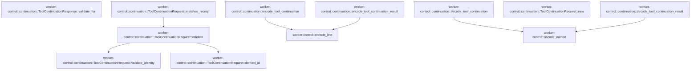

# worker-control::continuation

[Package atlas](index.md) · [Source](../../src/continuation.rs)

## Declarations

Visibility is the declaration spelling; trait members and reexports require their enclosing interface. `cfg` is not evaluated.

| Symbol | Kind | Visibility | Test / cfg |
|---|---|---|---|
| [worker-control::continuation::DOMAIN](../../src/continuation.rs#L9) | const_item | `private` |  |
| [worker-control::continuation::MAX_SAFE_INTEGER](../../src/continuation.rs#L10) | const_item | `private` |  |
| [worker-control::continuation::ContinuationOperation](../../src/continuation.rs#L14) | enum_item | `pub` |  |
| [worker-control::continuation::ToolContinuationRequest](../../src/continuation.rs#L22) | struct_item | `pub` |  |
| [worker-control::continuation::ToolContinuationRequest::new](../../src/continuation.rs#L32) | function_item | `pub` |  |
| [worker-control::continuation::ToolContinuationRequest::validate_identity](../../src/continuation.rs#L50) | function_item | `private` |  |
| [worker-control::continuation::ToolContinuationRequest::derived_id](../../src/continuation.rs#L67) | function_item | `private` |  |
| [worker-control::continuation::ToolContinuationRequest::validate](../../src/continuation.rs#L79) | function_item | `pub` |  |
| [worker-control::continuation::ToolContinuationRequest::matches_receipt](../../src/continuation.rs#L88) | function_item | `pub` |  |
| [worker-control::continuation::tests::original](../../src/continuation.rs#L98) | function_item | `private` | test; #[cfg(test)] |
| [worker-control::continuation::tests::step_identity_is_stable_but_changed_action_is_not_an_exact_retry](../../src/continuation.rs#L110) | function_item | `private` | test; #[cfg(test)] |
| [worker-control::continuation::ToolContinuationOutcome](../../src/continuation.rs#L163) | enum_item | `pub` |  |
| [worker-control::continuation::ToolContinuationResponse](../../src/continuation.rs#L179) | struct_item | `pub` |  |
| [worker-control::continuation::ToolContinuationResponse::validate_for](../../src/continuation.rs#L186) | function_item | `pub` |  |
| [worker-control::continuation::outcome_tests::pending_outcomes_bind_identity_and_advance_exactly_one_step](../../src/continuation.rs#L212) | function_item | `private` | test; #[cfg(test)] |
| [worker-control::continuation::TOOL_CONTINUATION_KEY](../../src/continuation.rs#L266) | const_item | `pub` |  |
| [worker-control::continuation::TOOL_CONTINUATION_RESULT_KEY](../../src/continuation.rs#L268) | const_item | `pub` |  |
| [worker-control::continuation::encode_tool_continuation](../../src/continuation.rs#L270) | function_item | `pub` |  |
| [worker-control::continuation::decode_tool_continuation](../../src/continuation.rs#L279) | function_item | `pub` |  |
| [worker-control::continuation::encode_tool_continuation_result](../../src/continuation.rs#L289) | function_item | `pub` |  |
| [worker-control::continuation::decode_tool_continuation_result](../../src/continuation.rs#L295) | function_item | `pub` |  |
| [worker-control::continuation::wire_tests::continuation_wire_pair_round_trips_and_rejects_foreign_keys](../../src/continuation.rs#L305) | function_item | `private` | test; #[cfg(test)] |

## Imports / reexports

| Local name | Source path | Visibility |
|---|---|---|
| `ToolControl` | `crate::durable::ToolControl` | `private` |
| `IJsonValue` | `schema::IJsonValue` | `private` |
| `Deserialize` | `serde::Deserialize` | `private` |
| `Serialize` | `serde::Serialize` | `private` |
| `Digest` | `sha2::Digest` | `private` |
| `Sha256` | `sha2::Sha256` | `private` |
| `*` | `super::*` | `private` |
| `*` | `super::*` | `private` |
| `*` | `super::*` | `private` |

## Module declarations

| Module | Visibility | Attributes |
|---|---|---|
| `worker-control::continuation::tests` | `private` | #[cfg(test)] |
| `worker-control::continuation::outcome_tests` | `private` | #[cfg(test)] |
| `worker-control::continuation::wire_tests` | `private` | #[cfg(test)] |

## Function call graphs

Edges below are syntactically resolved calls only, including private functions. Graphs partition callers into groups of 20; they are not execution order. All unresolved sites are listed below and in the JSON inventory.

Functions 1–10: 7 direct edges

## Call sites

Includes test functions (marked in declarations). Receiver-type-required sites need type analysis/manual tracing. Calls in closures are attributed to their enclosing function; their occurrence here does not mean the closure executes immediately.

| Caller | Callee expression | Source lines | Target / classification |
|---|---|---|---|
| `new` | `String::new` | [40](../../src/continuation.rs#L40) | external-constructor-callback-or-unresolved |
| `new` | `request.validate_identity` | [46](../../src/continuation.rs#L46) | receiver-type-required |
| `new` | `request.derived_id` | [47](../../src/continuation.rs#L47) | receiver-type-required |
| `new` | `Ok` | [48](../../src/continuation.rs#L48) | external-constructor-callback-or-unresolved |
| `validate_identity` | `self.original             .validate()             .map_err` | [51](../../src/continuation.rs#L51) | receiver-type-required |
| `validate_identity` | `self.original             .validate` | [51](../../src/continuation.rs#L51) | receiver-type-required |
| `validate_identity` | `error.to_string` | [53](../../src/continuation.rs#L53) | receiver-type-required |
| `validate_identity` | `Err` | [55](../../src/continuation.rs#L55), [63](../../src/continuation.rs#L63) | external-constructor-callback-or-unresolved |
| `validate_identity` | `"invalid continuation format or step".into` | [55](../../src/continuation.rs#L55) | receiver-type-required |
| `validate_identity` | `self.continuation_id.len` | [57](../../src/continuation.rs#L57) | receiver-type-required |
| `validate_identity` | `self                 .continuation_id                 .bytes()                 .all` | [58](../../src/continuation.rs#L58) | receiver-type-required |
| `validate_identity` | `self                 .continuation_id                 .bytes` | [58](../../src/continuation.rs#L58) | receiver-type-required |
| `validate_identity` | `byte.is_ascii_digit` | [61](../../src/continuation.rs#L61) | receiver-type-required |
| `validate_identity` | `(b'a'..=b'f').contains` | [61](../../src/continuation.rs#L61) | receiver-type-required |
| `validate_identity` | `"invalid host continuation identity".into` | [63](../../src/continuation.rs#L63) | receiver-type-required |
| `validate_identity` | `Ok` | [65](../../src/continuation.rs#L65) | external-constructor-callback-or-unresolved |
| `derived_id` | `serde_json_canonicalizer::to_vec(&(             &self.original.request_id,             &self.continuation_id,             self.step,         ))         .map_err` | [68](../../src/continuation.rs#L68) | receiver-type-required |
| `derived_id` | `serde_json_canonicalizer::to_vec` | [68](../../src/continuation.rs#L68) | external-constructor-callback-or-unresolved |
| `derived_id` | `error.to_string` | [73](../../src/continuation.rs#L73) | receiver-type-required |
| `derived_id` | `Sha256::new` | [74](../../src/continuation.rs#L74) | external-constructor-callback-or-unresolved |
| `derived_id` | `digest.update` | [75](../../src/continuation.rs#L75), [76](../../src/continuation.rs#L76) | receiver-type-required |
| `derived_id` | `Ok` | [77](../../src/continuation.rs#L77) | external-constructor-callback-or-unresolved |
| `validate` | `self.validate_identity` | [80](../../src/continuation.rs#L80) | [worker-control::continuation::ToolContinuationRequest::validate_identity](../../src/continuation.rs#L50) |
| `validate` | `self.derived_id` | [81](../../src/continuation.rs#L81) | [worker-control::continuation::ToolContinuationRequest::derived_id](../../src/continuation.rs#L67) |
| `validate` | `Err` | [82](../../src/continuation.rs#L82) | external-constructor-callback-or-unresolved |
| `validate` | `"continuation request identity mismatch".into` | [82](../../src/continuation.rs#L82) | receiver-type-required |
| `validate` | `Ok` | [84](../../src/continuation.rs#L84) | external-constructor-callback-or-unresolved |
| `matches_receipt` | `self.validate` | [89](../../src/continuation.rs#L89) | [worker-control::continuation::ToolContinuationRequest::validate](../../src/continuation.rs#L79) |
| `matches_receipt` | `stored.validate` | [90](../../src/continuation.rs#L90) | receiver-type-required |
| `matches_receipt` | `Ok` | [91](../../src/continuation.rs#L91) | external-constructor-callback-or-unresolved |
| `original` | `ToolControl::new(             "018f0000-0000-7000-8000-000000000003",             "018f0000-0000-7000-8000-000000000003",             1,             "call-1",             "mcp__test__task",             IJsonValue::parse_str("{}").unwrap(),         )         .unwrap` | [99](../../src/continuation.rs#L99) | receiver-type-required |
| `original` | `ToolControl::new` | [99](../../src/continuation.rs#L99) | external-constructor-callback-or-unresolved |
| `original` | `IJsonValue::parse_str("{}").unwrap` | [105](../../src/continuation.rs#L105) | receiver-type-required |
| `original` | `IJsonValue::parse_str` | [105](../../src/continuation.rs#L105) | external-constructor-callback-or-unresolved |
| `step_identity_is_stable_but_changed_action_is_not_an_exact_retry` | `ToolContinuationRequest::new(             original(),             "a".repeat(64),             1,             ContinuationOperation::Query,         )         .unwrap` | [111](../../src/continuation.rs#L111) | receiver-type-required |
| `step_identity_is_stable_but_changed_action_is_not_an_exact_retry` | `ToolContinuationRequest::new` | [111](../../src/continuation.rs#L111), [122](../../src/continuation.rs#L122), [131](../../src/continuation.rs#L131) | external-constructor-callback-or-unresolved |
| `step_identity_is_stable_but_changed_action_is_not_an_exact_retry` | `original` | [112](../../src/continuation.rs#L112), [123](../../src/continuation.rs#L123), [132](../../src/continuation.rs#L132) | [worker-control::continuation::tests::original](../../src/continuation.rs#L98) |
| `step_identity_is_stable_but_changed_action_is_not_an_exact_retry` | `"a".repeat` | [113](../../src/continuation.rs#L113), [124](../../src/continuation.rs#L124), [133](../../src/continuation.rs#L133) | receiver-type-required |
| `step_identity_is_stable_but_changed_action_is_not_an_exact_retry` | `serde_json::from_slice(&serde_json::to_vec(&first).unwrap()).unwrap` | [119](../../src/continuation.rs#L119) | receiver-type-required |
| `step_identity_is_stable_but_changed_action_is_not_an_exact_retry` | `serde_json::from_slice` | [119](../../src/continuation.rs#L119) | external-constructor-callback-or-unresolved |
| `step_identity_is_stable_but_changed_action_is_not_an_exact_retry` | `serde_json::to_vec(&first).unwrap` | [119](../../src/continuation.rs#L119) | receiver-type-required |
| `step_identity_is_stable_but_changed_action_is_not_an_exact_retry` | `serde_json::to_vec` | [119](../../src/continuation.rs#L119) | external-constructor-callback-or-unresolved |
| `step_identity_is_stable_but_changed_action_is_not_an_exact_retry` | `ToolContinuationRequest::new(             original(),             "a".repeat(64),             1,             ContinuationOperation::Cancel,         )         .unwrap` | [122](../../src/continuation.rs#L122) | receiver-type-required |
| `step_identity_is_stable_but_changed_action_is_not_an_exact_retry` | `ToolContinuationRequest::new(             original(),             "a".repeat(64),             2,             ContinuationOperation::Query,         )         .unwrap` | [131](../../src/continuation.rs#L131) | receiver-type-required |
| `step_identity_is_stable_but_changed_action_is_not_an_exact_retry` | `first.clone` | [139](../../src/continuation.rs#L139), [143](../../src/continuation.rs#L143) | receiver-type-required |
| `step_identity_is_stable_but_changed_action_is_not_an_exact_retry` | `IJsonValue::parse_str(r#"{"changed":true}"#).unwrap` | [141](../../src/continuation.rs#L141) | receiver-type-required |
| `step_identity_is_stable_but_changed_action_is_not_an_exact_retry` | `IJsonValue::parse_str` | [141](../../src/continuation.rs#L141) | external-constructor-callback-or-unresolved |
| `validate_for` | `request.validate` | [187](../../src/continuation.rs#L187) | receiver-type-required |
| `validate_for` | `Err` | [189](../../src/continuation.rs#L189), [201](../../src/continuation.rs#L201) | external-constructor-callback-or-unresolved |
| `validate_for` | `"continuation response binding mismatch".into` | [189](../../src/continuation.rs#L189) | receiver-type-required |
| `validate_for` | `"pending continuation identity or sequence mismatch".into` | [201](../../src/continuation.rs#L201) | receiver-type-required |
| `validate_for` | `Ok` | [204](../../src/continuation.rs#L204) | external-constructor-callback-or-unresolved |
| `pending_outcomes_bind_identity_and_advance_exactly_one_step` | `ToolControl::new(             "018f0000-0000-7000-8000-000000000003",             "018f0000-0000-7000-8000-000000000003",             1,             "call-1",             "mcp__test__task",             IJsonValue::parse_str("{}").unwrap(),         )         .unwrap` | [213](../../src/continuation.rs#L213) | receiver-type-required |
| `pending_outcomes_bind_identity_and_advance_exactly_one_step` | `ToolControl::new` | [213](../../src/continuation.rs#L213) | external-constructor-callback-or-unresolved |
| `pending_outcomes_bind_identity_and_advance_exactly_one_step` | `IJsonValue::parse_str("{}").unwrap` | [219](../../src/continuation.rs#L219) | receiver-type-required |
| `pending_outcomes_bind_identity_and_advance_exactly_one_step` | `IJsonValue::parse_str` | [219](../../src/continuation.rs#L219), [231](../../src/continuation.rs#L231) | external-constructor-callback-or-unresolved |
| `pending_outcomes_bind_identity_and_advance_exactly_one_step` | `ToolContinuationRequest::new(original, "a".repeat(64), 1, ContinuationOperation::Query)                 .unwrap` | [223](../../src/continuation.rs#L223) | receiver-type-required |
| `pending_outcomes_bind_identity_and_advance_exactly_one_step` | `ToolContinuationRequest::new` | [223](../../src/continuation.rs#L223) | external-constructor-callback-or-unresolved |
| `pending_outcomes_bind_identity_and_advance_exactly_one_step` | `"a".repeat` | [223](../../src/continuation.rs#L223), [241](../../src/continuation.rs#L241), [242](../../src/continuation.rs#L242) | receiver-type-required |
| `pending_outcomes_bind_identity_and_advance_exactly_one_step` | `request.request_id.clone` | [226](../../src/continuation.rs#L226) | receiver-type-required |
| `pending_outcomes_bind_identity_and_advance_exactly_one_step` | `request.original.call_id.clone` | [227](../../src/continuation.rs#L227) | receiver-type-required |
| `pending_outcomes_bind_identity_and_advance_exactly_one_step` | `request.continuation_id.clone` | [229](../../src/continuation.rs#L229) | receiver-type-required |
| `pending_outcomes_bind_identity_and_advance_exactly_one_step` | `IJsonValue::parse_str(r#"{"taskId":"remote-1","status":"working"}"#)                     .unwrap` | [231](../../src/continuation.rs#L231) | receiver-type-required |
| `pending_outcomes_bind_identity_and_advance_exactly_one_step` | `response.validate_for(&request).unwrap` | [235](../../src/continuation.rs#L235) | receiver-type-required |
| `pending_outcomes_bind_identity_and_advance_exactly_one_step` | `response.validate_for` | [235](../../src/continuation.rs#L235) | receiver-type-required |
| `pending_outcomes_bind_identity_and_advance_exactly_one_step` | `serde_json::to_vec(&response).unwrap` | [236](../../src/continuation.rs#L236) | receiver-type-required |
| `pending_outcomes_bind_identity_and_advance_exactly_one_step` | `serde_json::to_vec` | [236](../../src/continuation.rs#L236) | external-constructor-callback-or-unresolved |
| `pending_outcomes_bind_identity_and_advance_exactly_one_step` | `serde_json::from_slice(&bytes).unwrap` | [237](../../src/continuation.rs#L237), [259](../../src/continuation.rs#L259) | receiver-type-required |
| `pending_outcomes_bind_identity_and_advance_exactly_one_step` | `serde_json::from_slice` | [237](../../src/continuation.rs#L237), [259](../../src/continuation.rs#L259) | external-constructor-callback-or-unresolved |
| `pending_outcomes_bind_identity_and_advance_exactly_one_step` | `"b".repeat` | [240](../../src/continuation.rs#L240) | receiver-type-required |
| `pending_outcomes_bind_identity_and_advance_exactly_one_step` | `response.clone` | [244](../../src/continuation.rs#L244), [256](../../src/continuation.rs#L256) | receiver-type-required |
| `pending_outcomes_bind_identity_and_advance_exactly_one_step` | `"other".into` | [257](../../src/continuation.rs#L257) | receiver-type-required |
| `encode_tool_continuation` | `request         .validate()         .map_err` | [273](../../src/continuation.rs#L273) | receiver-type-required |
| `encode_tool_continuation` | `request         .validate` | [273](../../src/continuation.rs#L273) | receiver-type-required |
| `encode_tool_continuation` | `crate::encode_line` | [276](../../src/continuation.rs#L276) | [worker-control::encode_line](../../src/lib.rs#L359) |
| `decode_tool_continuation` | `crate::decode_named` | [282](../../src/continuation.rs#L282) | [worker-control::decode_named](../../src/lib.rs#L367) |
| `decode_tool_continuation` | `request         .validate()         .map_err` | [283](../../src/continuation.rs#L283) | receiver-type-required |
| `decode_tool_continuation` | `request         .validate` | [283](../../src/continuation.rs#L283) | receiver-type-required |
| `decode_tool_continuation` | `Ok` | [286](../../src/continuation.rs#L286) | external-constructor-callback-or-unresolved |
| `encode_tool_continuation_result` | `crate::encode_line` | [292](../../src/continuation.rs#L292) | [worker-control::encode_line](../../src/lib.rs#L359) |
| `decode_tool_continuation_result` | `crate::decode_named` | [298](../../src/continuation.rs#L298) | [worker-control::decode_named](../../src/lib.rs#L367) |
| `continuation_wire_pair_round_trips_and_rejects_foreign_keys` | `ToolControl::new(             "018f0000-0000-7000-8000-000000000003",             "018f0000-0000-7000-8000-000000000003",             1,             "call-1",             "mcp__test__task",             IJsonValue::parse_str("{}").unwrap(),         )         .unwrap` | [306](../../src/continuation.rs#L306) | receiver-type-required |
| `continuation_wire_pair_round_trips_and_rejects_foreign_keys` | `ToolControl::new` | [306](../../src/continuation.rs#L306) | external-constructor-callback-or-unresolved |
| `continuation_wire_pair_round_trips_and_rejects_foreign_keys` | `IJsonValue::parse_str("{}").unwrap` | [312](../../src/continuation.rs#L312) | receiver-type-required |
| `continuation_wire_pair_round_trips_and_rejects_foreign_keys` | `IJsonValue::parse_str` | [312](../../src/continuation.rs#L312), [329](../../src/continuation.rs#L329) | external-constructor-callback-or-unresolved |
| `continuation_wire_pair_round_trips_and_rejects_foreign_keys` | `ToolContinuationRequest::new(original, "a".repeat(64), 1, ContinuationOperation::Query)                 .unwrap` | [316](../../src/continuation.rs#L316) | receiver-type-required |
| `continuation_wire_pair_round_trips_and_rejects_foreign_keys` | `ToolContinuationRequest::new` | [316](../../src/continuation.rs#L316) | external-constructor-callback-or-unresolved |
| `continuation_wire_pair_round_trips_and_rejects_foreign_keys` | `"a".repeat` | [316](../../src/continuation.rs#L316) | receiver-type-required |
| `continuation_wire_pair_round_trips_and_rejects_foreign_keys` | `encode_tool_continuation(&request).unwrap` | [318](../../src/continuation.rs#L318) | receiver-type-required |
| `continuation_wire_pair_round_trips_and_rejects_foreign_keys` | `encode_tool_continuation` | [318](../../src/continuation.rs#L318) | external-constructor-callback-or-unresolved |
| `continuation_wire_pair_round_trips_and_rejects_foreign_keys` | `request.request_id.clone` | [326](../../src/continuation.rs#L326) | receiver-type-required |
| `continuation_wire_pair_round_trips_and_rejects_foreign_keys` | `"call-1".into` | [327](../../src/continuation.rs#L327) | receiver-type-required |
| `continuation_wire_pair_round_trips_and_rejects_foreign_keys` | `IJsonValue::parse_str(r#"{"content":[]}"#).unwrap` | [329](../../src/continuation.rs#L329) | receiver-type-required |
| `continuation_wire_pair_round_trips_and_rejects_foreign_keys` | `encode_tool_continuation_result(&response).unwrap` | [332](../../src/continuation.rs#L332) | receiver-type-required |
| `continuation_wire_pair_round_trips_and_rejects_foreign_keys` | `encode_tool_continuation_result` | [332](../../src/continuation.rs#L332) | external-constructor-callback-or-unresolved |
