# worker-control::durable

[Package atlas](index.md) · [Source](../../src/durable.rs)

## Declarations

Visibility is the declaration spelling; trait members and reexports require their enclosing interface. `cfg` is not evaluated.

| Symbol | Kind | Visibility | Test / cfg |
|---|---|---|---|
| [worker-control::durable::MAX_SAFE_INTEGER](../../src/durable.rs#L13) | const_item | `private` |  |
| [worker-control::durable::REQUEST_DOMAIN](../../src/durable.rs#L14) | const_item | `private` |  |
| [worker-control::durable::WorkerStartup](../../src/durable.rs#L18) | enum_item | `pub` |  |
| [worker-control::durable::Selection](../../src/durable.rs#L24) | struct_item | `pub` |  |
| [worker-control::durable::Selection::validate](../../src/durable.rs#L31) | function_item | `pub` |  |
| [worker-control::durable::Selection::selected](../../src/durable.rs#L39) | function_item | `pub` |  |
| [worker-control::durable::QueueTransactionAction](../../src/durable.rs#L48) | enum_item | `pub` |  |
| [worker-control::durable::QueueTransaction](../../src/durable.rs#L64) | struct_item | `pub` |  |
| [worker-control::durable::QueueTransaction::validate](../../src/durable.rs#L73) | function_item | `pub` |  |
| [worker-control::durable::QueueTransaction::replacement_origin](../../src/durable.rs#L101) | function_item | `pub` |  |
| [worker-control::durable::QueueTransactionRejectCode](../../src/durable.rs#L114) | enum_item | `pub` |  |
| [worker-control::durable::QueueTransactionOutcome](../../src/durable.rs#L122) | enum_item | `pub` |  |
| [worker-control::durable::QueueTransactionResult](../../src/durable.rs#L137) | struct_item | `pub` |  |
| [worker-control::durable::QueueTransactionResult::validate](../../src/durable.rs#L143) | function_item | `pub` |  |
| [worker-control::durable::QueueTransactionResult::validate_for](../../src/durable.rs#L170) | function_item | `pub` |  |
| [worker-control::durable::ToolControl](../../src/durable.rs#L182) | struct_item | `pub` |  |
| [worker-control::durable::ToolControlBinding](../../src/durable.rs#L193) | struct_item | `pub` |  |
| [worker-control::durable::ToolControl::new](../../src/durable.rs#L203) | function_item | `pub` |  |
| [worker-control::durable::ToolControl::validate](../../src/durable.rs#L229) | function_item | `pub` |  |
| [worker-control::durable::ToolControl::validate_against](../../src/durable.rs#L246) | function_item | `pub` |  |
| [worker-control::durable::ToolControl::validate_for_receipt_lookup](../../src/durable.rs#L275) | function_item | `pub` |  |
| [worker-control::durable::ToolControlErrorCode](../../src/durable.rs#L287) | enum_item | `pub` |  |
| [worker-control::durable::ToolControlError](../../src/durable.rs#L305) | struct_item | `pub` |  |
| [worker-control::durable::PendingContinuation](../../src/durable.rs#L317) | struct_item | `pub` |  |
| [worker-control::durable::ToolControlResult](../../src/durable.rs#L327) | struct_item | `pub` |  |
| [worker-control::durable::ToolControlResult::pending](../../src/durable.rs#L340) | function_item | `pub` |  |
| [worker-control::durable::ToolControlResult::success](../../src/durable.rs#L360) | function_item | `pub` |  |
| [worker-control::durable::ToolControlResult::failure](../../src/durable.rs#L375) | function_item | `pub` |  |
| [worker-control::durable::ToolControlResult::conflict](../../src/durable.rs#L390) | function_item | `pub` |  |
| [worker-control::durable::ToolControlResult::validate](../../src/durable.rs#L402) | function_item | `pub` |  |
| [worker-control::durable::ToolControlResult::validate_for](../../src/durable.rs#L429) | function_item | `pub` |  |
| [worker-control::durable::require_version](../../src/durable.rs#L443) | function_item | `pub` |  |
| [worker-control::durable::derive_request_id](../../src/durable.rs#L450) | function_item | `pub` |  |
| [worker-control::durable::encode_tool_control](../../src/durable.rs#L469) | function_item | `pub` |  |
| [worker-control::durable::decode_tool_control](../../src/durable.rs#L474) | function_item | `pub` |  |
| [worker-control::durable::encode_tool_control_result](../../src/durable.rs#L480) | function_item | `pub` |  |
| [worker-control::durable::decode_tool_control_result](../../src/durable.rs#L487) | function_item | `pub` |  |
| [worker-control::durable::decode_selection](../../src/durable.rs#L493) | function_item | `pub` |  |
| [worker-control::durable::encode_queue_transaction](../../src/durable.rs#L499) | function_item | `pub` |  |
| [worker-control::durable::decode_queue_transaction](../../src/durable.rs#L506) | function_item | `pub` |  |
| [worker-control::durable::encode_queue_transaction_result](../../src/durable.rs#L512) | function_item | `pub` |  |
| [worker-control::durable::decode_queue_transaction_result](../../src/durable.rs#L519) | function_item | `pub` |  |
| [worker-control::durable::validate_replacement_origin](../../src/durable.rs#L527) | function_item | `private` |  |
| [worker-control::durable::validate_origin](../../src/durable.rs#L546) | function_item | `private` |  |
| [worker-control::durable::validate_nonempty](../../src/durable.rs#L559) | function_item | `private` |  |
| [worker-control::durable::validate_safe_positive](../../src/durable.rs#L566) | function_item | `private` |  |
| [worker-control::durable::validate_preimage](../../src/durable.rs#L573) | function_item | `private` |  |
| [worker-control::durable::validate_request_id_syntax](../../src/durable.rs#L594) | function_item | `private` |  |
| [worker-control::durable::is_canonical_uuid](../../src/durable.rs#L605) | function_item | `private` |  |
| [worker-control::durable::encode_line](../../src/durable.rs#L613) | function_item | `private` |  |
| [worker-control::durable::decode_named](../../src/durable.rs#L621) | function_item | `private` |  |
| [worker-control::durable::DurableControlError](../../src/durable.rs#L644) | enum_item | `pub` |  |
| [worker-control::durable::queue_transaction_tests::fixture](../../src/durable.rs#L697) | function_item | `private` | test; #[cfg(test)] |
| [worker-control::durable::queue_transaction_tests::canonical_queue_transcripts_round_trip_byte_for_byte](../../src/durable.rs#L706) | function_item | `private` | test; #[cfg(test)] |
| [worker-control::durable::queue_transaction_tests::queue_result_union_is_closed](../../src/durable.rs#L739) | function_item | `private` | test; #[cfg(test)] |
| [worker-control::durable::queue_transaction_tests::queue_result_is_correlated_by_delivery](../../src/durable.rs#L748) | function_item | `private` | test; #[cfg(test)] |

## Imports / reexports

| Local name | Source path | Visibility |
|---|---|---|
| `Block` | `schema::Block` | `private` |
| `IJsonValue` | `schema::IJsonValue` | `private` |
| `OriginTuple` | `schema::OriginTuple` | `private` |
| `DeserializeOwned` | `serde::de::DeserializeOwned` | `private` |
| `Deserialize` | `serde::Deserialize` | `private` |
| `Serialize` | `serde::Serialize` | `private` |
| `Map` | `serde_json::Map` | `private` |
| `Value` | `serde_json::Value` | `private` |
| `Digest` | `sha2::Digest` | `private` |
| `Sha256` | `sha2::Sha256` | `private` |
| `Error` | `thiserror::Error` | `private` |
| `AssetRef` | `crate::AssetRef` | `private` |
| `PROTOCOL_VERSION` | `crate::PROTOCOL_VERSION` | `private` |
| `Selected` | `crate::Selected` | `private` |
| `*` | `super::*` | `private` |
| `fs` | `std::fs` | `private` |
| `PathBuf` | `std::path::PathBuf` | `private` |

## Module declarations

| Module | Visibility | Attributes |
|---|---|---|
| `worker-control::durable::queue_transaction_tests` | `private` | #[cfg(test)] |

## Function call graphs

Edges below are syntactically resolved calls only, including private functions. Graphs partition callers into groups of 20; they are not execution order. All unresolved sites are listed below and in the JSON inventory.

```mermaid
flowchart TD
  n0["worker-control::durable::QueueTransaction::replacement_origin"]
  n1["worker-control::durable::QueueTransactionResult::validate"]
  n2["worker-control::durable::QueueTransactionResult::validate_for"]
  n3["worker-control::durable::ToolControl::new"]
  n4["worker-control::durable::ToolControl::validate"]
  n5["worker-control::durable::ToolControl::validate_against"]
  n6["worker-control::durable::ToolControl::validate_for_receipt_lookup"]
  n7["worker-control::durable::Selection::validate"]
  n8["worker-control::durable::ToolControlResult::pending"]
  n9["worker-control::durable::ToolControlResult::success"]
  n10["worker-control::durable::ToolControlResult::failure"]
  n11["worker-control::durable::ToolControlResult::conflict"]
  n12["worker-control::durable::Selection::selected"]
  n13["worker-control::durable::ToolControlResult::validate"]
  n14["worker-control::durable::ToolControlResult::validate_for"]
  n15["worker-control::durable::require_version"]
  n16["worker-control::durable::derive_request_id"]
  n17["worker-control::durable::encode_tool_control"]
  n18["worker-control::durable::decode_tool_control"]
  n19["worker-control::durable::validate_replacement_origin"]
  n20["worker-control::durable::validate_origin"]
  n21["worker-control::durable::validate_nonempty"]
  n22["worker-control::durable::validate_safe_positive"]
  n23["worker-control::durable::validate_preimage"]
  n24["worker-control::durable::validate_request_id_syntax"]
  n25["worker-control::durable::encode_line"]
  n26["worker-control::durable::decode_named"]
  n27["worker-control::durable::QueueTransaction::validate"]
  n1 --> n21
  n1 --> n22
  n2 --> n1
  n3 --> n16
  n4 --> n16
  n4 --> n23
  n4 --> n24
  n5 --> n4
  n6 --> n23
  n6 --> n24
  n11 --> n10
  n13 --> n24
  n14 --> n13
  n16 --> n23
  n17 --> n25
  n18 --> n26
  n27 --> n19
  n27 --> n20
  n27 --> n21
  n27 --> n22
```

Functions 1–20: 20 direct edges

Functions 21–36: 10 direct edges

```mermaid
flowchart TD
  n0["worker-control::durable::encode_tool_control_result"]
  n1["worker-control::durable::decode_tool_control_result"]
  n2["worker-control::durable::decode_selection"]
  n3["worker-control::durable::encode_queue_transaction"]
  n4["worker-control::durable::decode_queue_transaction"]
  n5["worker-control::durable::encode_queue_transaction_result"]
  n6["worker-control::durable::decode_queue_transaction_result"]
  n7["worker-control::durable::validate_replacement_origin"]
  n8["worker-control::durable::validate_origin"]
  n9["worker-control::durable::validate_nonempty"]
  n10["worker-control::durable::validate_safe_positive"]
  n11["worker-control::durable::validate_preimage"]
  n12["worker-control::durable::validate_request_id_syntax"]
  n13["worker-control::durable::is_canonical_uuid"]
  n14["worker-control::durable::encode_line"]
  n15["worker-control::durable::decode_named"]
  n0 --> n14
  n1 --> n15
  n2 --> n15
  n3 --> n14
  n4 --> n15
  n5 --> n14
  n6 --> n15
  n7 --> n8
  n8 --> n9
  n11 --> n13
```

## Call sites

Includes test functions (marked in declarations). Receiver-type-required sites need type analysis/manual tracing. Calls in closures are attributed to their enclosing function; their occurrence here does not mean the closure executes immediately.

| Caller | Callee expression | Source lines | Target / classification |
|---|---|---|---|
| `validate` | `self.startup.is_some` | [32](../../src/durable.rs#L32) | receiver-type-required |
| `validate` | `Err` | [33](../../src/durable.rs#L33) | external-constructor-callback-or-unresolved |
| `validate` | `DurableControlError::ProtocolVersion` | [33](../../src/durable.rs#L33) | external-constructor-callback-or-unresolved |
| `validate` | `Ok` | [35](../../src/durable.rs#L35) | external-constructor-callback-or-unresolved |
| `validate` | `validate_nonempty` | [74](../../src/durable.rs#L74), [75](../../src/durable.rs#L75) | [worker-control::durable::validate_nonempty](../../src/durable.rs#L559) |
| `validate` | `validate_safe_positive` | [76](../../src/durable.rs#L76) | [worker-control::durable::validate_safe_positive](../../src/durable.rs#L566) |
| `validate` | `validate_origin` | [77](../../src/durable.rs#L77) | [worker-control::durable::validate_origin](../../src/durable.rs#L546) |
| `validate` | `Err` | [79](../../src/durable.rs#L79), [89](../../src/durable.rs#L89) | external-constructor-callback-or-unresolved |
| `validate` | `DurableControlError::QueueOriginKey` | [79](../../src/durable.rs#L79) | external-constructor-callback-or-unresolved |
| `validate` | `validate_replacement_origin` | [87](../../src/durable.rs#L87), [94](../../src/durable.rs#L94) | [worker-control::durable::validate_replacement_origin](../../src/durable.rs#L527) |
| `validate` | `content.is_empty` | [88](../../src/durable.rs#L88) | receiver-type-required |
| `validate` | `Ok` | [97](../../src/durable.rs#L97) | external-constructor-callback-or-unresolved |
| `replacement_origin` | `Some` | [106](../../src/durable.rs#L106) | external-constructor-callback-or-unresolved |
| `validate` | `validate_nonempty` | [144](../../src/durable.rs#L144) | [worker-control::durable::validate_nonempty](../../src/durable.rs#L559) |
| `validate` | `validate_safe_positive` | [151](../../src/durable.rs#L151), [152](../../src/durable.rs#L152) | [worker-control::durable::validate_safe_positive](../../src/durable.rs#L566) |
| `validate` | `Err` | [154](../../src/durable.rs#L154), [161](../../src/durable.rs#L161), [164](../../src/durable.rs#L164) | external-constructor-callback-or-unresolved |
| `validate` | `reason.is_empty` | [159](../../src/durable.rs#L159) | receiver-type-required |
| `validate` | `Ok` | [167](../../src/durable.rs#L167) | external-constructor-callback-or-unresolved |
| `validate_for` | `self.validate` | [171](../../src/durable.rs#L171) | [worker-control::durable::QueueTransactionResult::validate](../../src/durable.rs#L143) |
| `validate_for` | `request.validate` | [172](../../src/durable.rs#L172) | receiver-type-required |
| `validate_for` | `Err` | [174](../../src/durable.rs#L174) | external-constructor-callback-or-unresolved |
| `validate_for` | `Ok` | [176](../../src/durable.rs#L176) | external-constructor-callback-or-unresolved |
| `new` | `session.into` | [211](../../src/durable.rs#L211) | receiver-type-required |
| `new` | `thread.into` | [212](../../src/durable.rs#L212) | receiver-type-required |
| `new` | `call_id.into` | [213](../../src/durable.rs#L213) | receiver-type-required |
| `new` | `name.into` | [214](../../src/durable.rs#L214) | receiver-type-required |
| `new` | `derive_request_id` | [215](../../src/durable.rs#L215) | [worker-control::durable::derive_request_id](../../src/durable.rs#L450) |
| `new` | `request.validate` | [225](../../src/durable.rs#L225) | receiver-type-required |
| `new` | `Ok` | [226](../../src/durable.rs#L226) | external-constructor-callback-or-unresolved |
| `validate` | `validate_request_id_syntax` | [230](../../src/durable.rs#L230) | [worker-control::durable::validate_request_id_syntax](../../src/durable.rs#L594) |
| `validate` | `validate_preimage` | [231](../../src/durable.rs#L231) | [worker-control::durable::validate_preimage](../../src/durable.rs#L573) |
| `validate` | `self.name.is_empty` | [232](../../src/durable.rs#L232) | receiver-type-required |
| `validate` | `Err` | [233](../../src/durable.rs#L233), [237](../../src/durable.rs#L237) | external-constructor-callback-or-unresolved |
| `validate` | `derive_request_id` | [235](../../src/durable.rs#L235) | [worker-control::durable::derive_request_id](../../src/durable.rs#L450) |
| `validate` | `self.request_id.clone` | [239](../../src/durable.rs#L239) | receiver-type-required |
| `validate` | `Ok` | [242](../../src/durable.rs#L242) | external-constructor-callback-or-unresolved |
| `validate_against` | `self.validate` | [250](../../src/durable.rs#L250) | [worker-control::durable::ToolControl::validate](../../src/durable.rs#L229) |
| `validate_against` | `Err` | [252](../../src/durable.rs#L252), [255](../../src/durable.rs#L255), [258](../../src/durable.rs#L258), [261](../../src/durable.rs#L261), [264](../../src/durable.rs#L264), [267](../../src/durable.rs#L267) | external-constructor-callback-or-unresolved |
| `validate_against` | `DurableControlError::BindingMismatch` | [252](../../src/durable.rs#L252), [255](../../src/durable.rs#L255), [258](../../src/durable.rs#L258), [261](../../src/durable.rs#L261), [264](../../src/durable.rs#L264), [267](../../src/durable.rs#L267) | external-constructor-callback-or-unresolved |
| `validate_against` | `Ok` | [269](../../src/durable.rs#L269) | external-constructor-callback-or-unresolved |
| `validate_for_receipt_lookup` | `validate_request_id_syntax` | [276](../../src/durable.rs#L276) | [worker-control::durable::validate_request_id_syntax](../../src/durable.rs#L594) |
| `validate_for_receipt_lookup` | `validate_preimage` | [277](../../src/durable.rs#L277) | [worker-control::durable::validate_preimage](../../src/durable.rs#L573) |
| `validate_for_receipt_lookup` | `self.name.is_empty` | [278](../../src/durable.rs#L278) | receiver-type-required |
| `validate_for_receipt_lookup` | `Err` | [279](../../src/durable.rs#L279) | external-constructor-callback-or-unresolved |
| `validate_for_receipt_lookup` | `Ok` | [281](../../src/durable.rs#L281) | external-constructor-callback-or-unresolved |
| `pending` | `request_id.into` | [347](../../src/durable.rs#L347) | receiver-type-required |
| `pending` | `call_id.into` | [348](../../src/durable.rs#L348) | receiver-type-required |
| `pending` | `Some` | [351](../../src/durable.rs#L351) | external-constructor-callback-or-unresolved |
| `pending` | `continuation_id.into` | [352](../../src/durable.rs#L352) | receiver-type-required |
| `success` | `request_id.into` | [366](../../src/durable.rs#L366) | receiver-type-required |
| `success` | `call_id.into` | [367](../../src/durable.rs#L367) | receiver-type-required |
| `success` | `Some` | [368](../../src/durable.rs#L368) | external-constructor-callback-or-unresolved |
| `failure` | `request_id.into` | [381](../../src/durable.rs#L381) | receiver-type-required |
| `failure` | `call_id.into` | [382](../../src/durable.rs#L382) | receiver-type-required |
| `failure` | `Some` | [384](../../src/durable.rs#L384) | external-constructor-callback-or-unresolved |
| `conflict` | `Self::failure` | [391](../../src/durable.rs#L391) | [worker-control::durable::ToolControlResult::failure](../../src/durable.rs#L375) |
| `conflict` | `request.request_id.clone` | [392](../../src/durable.rs#L392) | receiver-type-required |
| `conflict` | `request.call_id.clone` | [393](../../src/durable.rs#L393) | receiver-type-required |
| `conflict` | `"request_id was reused with different request fields".to_owned` | [396](../../src/durable.rs#L396) | receiver-type-required |
| `validate` | `validate_request_id_syntax` | [403](../../src/durable.rs#L403) | [worker-control::durable::validate_request_id_syntax](../../src/durable.rs#L594) |
| `validate` | `self.call_id.is_empty` | [404](../../src/durable.rs#L404) | receiver-type-required |
| `validate` | `Err` | [405](../../src/durable.rs#L405), [421](../../src/durable.rs#L421), [425](../../src/durable.rs#L425) | external-constructor-callback-or-unresolved |
| `validate` | `self.value.is_some` | [408](../../src/durable.rs#L408) | receiver-type-required |
| `validate` | `self.error.is_some` | [409](../../src/durable.rs#L409) | receiver-type-required |
| `validate` | `self.pending.as_ref` | [410](../../src/durable.rs#L410) | receiver-type-required |
| `validate` | `Ok` | [412](../../src/durable.rs#L412), [423](../../src/durable.rs#L423) | external-constructor-callback-or-unresolved |
| `validate` | `pending.continuation_id.len` | [415](../../src/durable.rs#L415) | receiver-type-required |
| `validate` | `pending                         .continuation_id                         .bytes()                         .all` | [416](../../src/durable.rs#L416) | receiver-type-required |
| `validate` | `pending                         .continuation_id                         .bytes` | [416](../../src/durable.rs#L416) | receiver-type-required |
| `validate` | `byte.is_ascii_digit` | [419](../../src/durable.rs#L419) | receiver-type-required |
| `validate` | `(b'a'..=b'f').contains` | [419](../../src/durable.rs#L419) | receiver-type-required |
| `validate_for` | `self.validate` | [430](../../src/durable.rs#L430) | [worker-control::durable::ToolControlResult::validate](../../src/durable.rs#L402) |
| `validate_for` | `Err` | [432](../../src/durable.rs#L432), [435](../../src/durable.rs#L435) | external-constructor-callback-or-unresolved |
| `validate_for` | `DurableControlError::BindingMismatch` | [432](../../src/durable.rs#L432), [435](../../src/durable.rs#L435) | external-constructor-callback-or-unresolved |
| `validate_for` | `Ok` | [437](../../src/durable.rs#L437) | external-constructor-callback-or-unresolved |
| `require_version` | `Err` | [445](../../src/durable.rs#L445) | external-constructor-callback-or-unresolved |
| `require_version` | `DurableControlError::ProtocolVersion` | [445](../../src/durable.rs#L445) | external-constructor-callback-or-unresolved |
| `require_version` | `Ok` | [447](../../src/durable.rs#L447) | external-constructor-callback-or-unresolved |
| `derive_request_id` | `validate_preimage` | [456](../../src/durable.rs#L456) | [worker-control::durable::validate_preimage](../../src/durable.rs#L573) |
| `derive_request_id` | `Sha256::new` | [457](../../src/durable.rs#L457) | external-constructor-callback-or-unresolved |
| `derive_request_id` | `digest.update` | [458](../../src/durable.rs#L458), [459](../../src/durable.rs#L459), [460](../../src/durable.rs#L460), [461](../../src/durable.rs#L461), [462](../../src/durable.rs#L462), [463](../../src/durable.rs#L463), [464](../../src/durable.rs#L464), [465](../../src/durable.rs#L465) | receiver-type-required |
| `derive_request_id` | `session.as_bytes` | [459](../../src/durable.rs#L459) | receiver-type-required |
| `derive_request_id` | `thread.as_bytes` | [461](../../src/durable.rs#L461) | receiver-type-required |
| `derive_request_id` | `turn.to_string().as_bytes` | [463](../../src/durable.rs#L463) | receiver-type-required |
| `derive_request_id` | `turn.to_string` | [463](../../src/durable.rs#L463) | receiver-type-required |
| `derive_request_id` | `call_id.as_bytes` | [465](../../src/durable.rs#L465) | receiver-type-required |
| `derive_request_id` | `Ok` | [466](../../src/durable.rs#L466) | external-constructor-callback-or-unresolved |
| `encode_tool_control` | `request.validate` | [470](../../src/durable.rs#L470) | receiver-type-required |
| `encode_tool_control` | `encode_line` | [471](../../src/durable.rs#L471) | [worker-control::durable::encode_line](../../src/durable.rs#L613) |
| `decode_tool_control` | `decode_named` | [475](../../src/durable.rs#L475) | [worker-control::durable::decode_named](../../src/durable.rs#L621) |
| `decode_tool_control` | `request.validate` | [476](../../src/durable.rs#L476) | receiver-type-required |
| `decode_tool_control` | `Ok` | [477](../../src/durable.rs#L477) | external-constructor-callback-or-unresolved |
| `encode_tool_control_result` | `result.validate` | [483](../../src/durable.rs#L483) | receiver-type-required |
| `encode_tool_control_result` | `encode_line` | [484](../../src/durable.rs#L484) | [worker-control::durable::encode_line](../../src/durable.rs#L613) |
| `decode_tool_control_result` | `decode_named` | [488](../../src/durable.rs#L488) | [worker-control::durable::decode_named](../../src/durable.rs#L621) |
| `decode_tool_control_result` | `result.validate` | [489](../../src/durable.rs#L489) | receiver-type-required |
| `decode_tool_control_result` | `Ok` | [490](../../src/durable.rs#L490) | external-constructor-callback-or-unresolved |
| `decode_selection` | `decode_named` | [494](../../src/durable.rs#L494) | [worker-control::durable::decode_named](../../src/durable.rs#L621) |
| `decode_selection` | `selection.validate` | [495](../../src/durable.rs#L495) | receiver-type-required |
| `decode_selection` | `Ok` | [496](../../src/durable.rs#L496) | external-constructor-callback-or-unresolved |
| `encode_queue_transaction` | `request.validate` | [502](../../src/durable.rs#L502) | receiver-type-required |
| `encode_queue_transaction` | `encode_line` | [503](../../src/durable.rs#L503) | [worker-control::durable::encode_line](../../src/durable.rs#L613) |
| `decode_queue_transaction` | `decode_named` | [507](../../src/durable.rs#L507) | [worker-control::durable::decode_named](../../src/durable.rs#L621) |
| `decode_queue_transaction` | `request.validate` | [508](../../src/durable.rs#L508) | receiver-type-required |
| `decode_queue_transaction` | `Ok` | [509](../../src/durable.rs#L509) | external-constructor-callback-or-unresolved |
| `encode_queue_transaction_result` | `result.validate` | [515](../../src/durable.rs#L515) | receiver-type-required |
| `encode_queue_transaction_result` | `encode_line` | [516](../../src/durable.rs#L516) | [worker-control::durable::encode_line](../../src/durable.rs#L613) |
| `decode_queue_transaction_result` | `decode_named` | [522](../../src/durable.rs#L522) | [worker-control::durable::decode_named](../../src/durable.rs#L621) |
| `decode_queue_transaction_result` | `result.validate` | [523](../../src/durable.rs#L523) | receiver-type-required |
| `decode_queue_transaction_result` | `Ok` | [524](../../src/durable.rs#L524) | external-constructor-callback-or-unresolved |
| `validate_replacement_origin` | `validate_origin` | [531](../../src/durable.rs#L531) | [worker-control::durable::validate_origin](../../src/durable.rs#L546) |
| `validate_replacement_origin` | `Err` | [533](../../src/durable.rs#L533), [541](../../src/durable.rs#L541) | external-constructor-callback-or-unresolved |
| `validate_replacement_origin` | `DurableControlError::QueueOriginKey` | [533](../../src/durable.rs#L533) | external-constructor-callback-or-unresolved |
| `validate_replacement_origin` | `Ok` | [543](../../src/durable.rs#L543) | external-constructor-callback-or-unresolved |
| `validate_origin` | `validate_nonempty` | [554](../../src/durable.rs#L554) | [worker-control::durable::validate_nonempty](../../src/durable.rs#L559) |
| `validate_origin` | `Ok` | [556](../../src/durable.rs#L556) | external-constructor-callback-or-unresolved |
| `validate_nonempty` | `value.is_empty` | [560](../../src/durable.rs#L560) | receiver-type-required |
| `validate_nonempty` | `Err` | [561](../../src/durable.rs#L561) | external-constructor-callback-or-unresolved |
| `validate_nonempty` | `DurableControlError::EmptyField` | [561](../../src/durable.rs#L561) | external-constructor-callback-or-unresolved |
| `validate_nonempty` | `Ok` | [563](../../src/durable.rs#L563) | external-constructor-callback-or-unresolved |
| `validate_safe_positive` | `Err` | [568](../../src/durable.rs#L568) | external-constructor-callback-or-unresolved |
| `validate_safe_positive` | `Ok` | [570](../../src/durable.rs#L570) | external-constructor-callback-or-unresolved |
| `validate_preimage` | `is_canonical_uuid` | [579](../../src/durable.rs#L579), [582](../../src/durable.rs#L582) | [worker-control::durable::is_canonical_uuid](../../src/durable.rs#L605) |
| `validate_preimage` | `Err` | [580](../../src/durable.rs#L580), [583](../../src/durable.rs#L583), [586](../../src/durable.rs#L586), [589](../../src/durable.rs#L589) | external-constructor-callback-or-unresolved |
| `validate_preimage` | `DurableControlError::Turn` | [586](../../src/durable.rs#L586) | external-constructor-callback-or-unresolved |
| `validate_preimage` | `call_id.is_empty` | [588](../../src/durable.rs#L588) | receiver-type-required |
| `validate_preimage` | `Ok` | [591](../../src/durable.rs#L591) | external-constructor-callback-or-unresolved |
| `validate_request_id_syntax` | `request_id.len` | [595](../../src/durable.rs#L595) | receiver-type-required |
| `validate_request_id_syntax` | `request_id             .bytes()             .all` | [596](../../src/durable.rs#L596) | receiver-type-required |
| `validate_request_id_syntax` | `request_id             .bytes` | [596](../../src/durable.rs#L596) | receiver-type-required |
| `validate_request_id_syntax` | `byte.is_ascii_hexdigit` | [598](../../src/durable.rs#L598) | receiver-type-required |
| `validate_request_id_syntax` | `byte.is_ascii_uppercase` | [598](../../src/durable.rs#L598) | receiver-type-required |
| `validate_request_id_syntax` | `Err` | [600](../../src/durable.rs#L600) | external-constructor-callback-or-unresolved |
| `validate_request_id_syntax` | `Ok` | [602](../../src/durable.rs#L602) | external-constructor-callback-or-unresolved |
| `is_canonical_uuid` | `value.len` | [606](../../src/durable.rs#L606) | receiver-type-required |
| `is_canonical_uuid` | `value.bytes().enumerate().all` | [607](../../src/durable.rs#L607) | receiver-type-required |
| `is_canonical_uuid` | `value.bytes().enumerate` | [607](../../src/durable.rs#L607) | receiver-type-required |
| `is_canonical_uuid` | `value.bytes` | [607](../../src/durable.rs#L607) | receiver-type-required |
| `is_canonical_uuid` | `byte.is_ascii_hexdigit` | [609](../../src/durable.rs#L609) | receiver-type-required |
| `is_canonical_uuid` | `byte.is_ascii_uppercase` | [609](../../src/durable.rs#L609) | receiver-type-required |
| `encode_line` | `Map::new` | [614](../../src/durable.rs#L614) | external-constructor-callback-or-unresolved |
| `encode_line` | `object.insert` | [615](../../src/durable.rs#L615) | receiver-type-required |
| `encode_line` | `key.to_owned` | [615](../../src/durable.rs#L615) | receiver-type-required |
| `encode_line` | `serde_json::to_value` | [615](../../src/durable.rs#L615) | external-constructor-callback-or-unresolved |
| `encode_line` | `serde_json_canonicalizer::to_vec` | [616](../../src/durable.rs#L616) | external-constructor-callback-or-unresolved |
| `encode_line` | `Value::Object` | [616](../../src/durable.rs#L616) | external-constructor-callback-or-unresolved |
| `encode_line` | `bytes.push` | [617](../../src/durable.rs#L617) | receiver-type-required |
| `encode_line` | `Ok` | [618](../../src/durable.rs#L618) | external-constructor-callback-or-unresolved |
| `decode_named` | `line.strip_suffix(b"\n").unwrap_or` | [625](../../src/durable.rs#L625) | receiver-type-required |
| `decode_named` | `line.strip_suffix` | [625](../../src/durable.rs#L625) | receiver-type-required |
| `decode_named` | `serde_json::from_slice` | [626](../../src/durable.rs#L626) | external-constructor-callback-or-unresolved |
| `decode_named` | `value         .as_object()         .ok_or` | [627](../../src/durable.rs#L627) | receiver-type-required |
| `decode_named` | `value         .as_object` | [627](../../src/durable.rs#L627) | receiver-type-required |
| `decode_named` | `object.len` | [630](../../src/durable.rs#L630) | receiver-type-required |
| `decode_named` | `Err` | [631](../../src/durable.rs#L631), [635](../../src/durable.rs#L635) | external-constructor-callback-or-unresolved |
| `decode_named` | `object.iter().next().expect` | [633](../../src/durable.rs#L633) | receiver-type-required |
| `decode_named` | `object.iter().next` | [633](../../src/durable.rs#L633) | receiver-type-required |
| `decode_named` | `object.iter` | [633](../../src/durable.rs#L633) | receiver-type-required |
| `decode_named` | `expected.to_owned` | [636](../../src/durable.rs#L636) | receiver-type-required |
| `decode_named` | `actual.clone` | [637](../../src/durable.rs#L637) | receiver-type-required |
| `decode_named` | `serde_json::from_value(payload.clone()).map_err` | [640](../../src/durable.rs#L640) | receiver-type-required |
| `decode_named` | `serde_json::from_value` | [640](../../src/durable.rs#L640) | external-constructor-callback-or-unresolved |
| `decode_named` | `payload.clone` | [640](../../src/durable.rs#L640) | receiver-type-required |
| `fixture` | `PathBuf::from(env!("CARGO_MANIFEST_DIR"))             .join("../..")             .join("fixtures/wire/durable")             .join` | [698](../../src/durable.rs#L698) | receiver-type-required |
| `fixture` | `PathBuf::from(env!("CARGO_MANIFEST_DIR"))             .join("../..")             .join` | [698](../../src/durable.rs#L698) | receiver-type-required |
| `fixture` | `PathBuf::from(env!("CARGO_MANIFEST_DIR"))             .join` | [698](../../src/durable.rs#L698) | receiver-type-required |
| `fixture` | `PathBuf::from` | [698](../../src/durable.rs#L698) | external-constructor-callback-or-unresolved |
| `fixture` | `fs::read(root).expect` | [702](../../src/durable.rs#L702) | receiver-type-required |
| `fixture` | `fs::read` | [702](../../src/durable.rs#L702) | external-constructor-callback-or-unresolved |
| `canonical_queue_transcripts_round_trip_byte_for_byte` | `fixture(name).split_inclusive` | [713](../../src/durable.rs#L713) | receiver-type-required |
| `canonical_queue_transcripts_round_trip_byte_for_byte` | `fixture` | [713](../../src/durable.rs#L713) | [worker-control::durable::queue_transaction_tests::fixture](../../src/durable.rs#L697) |
| `canonical_queue_transcripts_round_trip_byte_for_byte` | `serde_json::from_slice(line).expect` | [714](../../src/durable.rs#L714) | receiver-type-required |
| `canonical_queue_transcripts_round_trip_byte_for_byte` | `serde_json::from_slice` | [714](../../src/durable.rs#L714) | external-constructor-callback-or-unresolved |
| `canonical_queue_transcripts_round_trip_byte_for_byte` | `value.as_object().unwrap().keys().next().unwrap().as_str` | [715](../../src/durable.rs#L715) | receiver-type-required |
| `canonical_queue_transcripts_round_trip_byte_for_byte` | `value.as_object().unwrap().keys().next().unwrap` | [715](../../src/durable.rs#L715) | receiver-type-required |
| `canonical_queue_transcripts_round_trip_byte_for_byte` | `value.as_object().unwrap().keys().next` | [715](../../src/durable.rs#L715) | receiver-type-required |
| `canonical_queue_transcripts_round_trip_byte_for_byte` | `value.as_object().unwrap().keys` | [715](../../src/durable.rs#L715) | receiver-type-required |
| `canonical_queue_transcripts_round_trip_byte_for_byte` | `value.as_object().unwrap` | [715](../../src/durable.rs#L715) | receiver-type-required |
| `canonical_queue_transcripts_round_trip_byte_for_byte` | `value.as_object` | [715](../../src/durable.rs#L715) | receiver-type-required |
| `canonical_queue_transcripts_round_trip_byte_for_byte` | `decode_selection(line).expect` | [718](../../src/durable.rs#L718) | receiver-type-required |
| `canonical_queue_transcripts_round_trip_byte_for_byte` | `decode_selection` | [718](../../src/durable.rs#L718) | external-constructor-callback-or-unresolved |
| `canonical_queue_transcripts_round_trip_byte_for_byte` | `encode_line("selected", &selection).expect` | [719](../../src/durable.rs#L719) | receiver-type-required |
| `canonical_queue_transcripts_round_trip_byte_for_byte` | `encode_line` | [719](../../src/durable.rs#L719) | external-constructor-callback-or-unresolved |
| `canonical_queue_transcripts_round_trip_byte_for_byte` | `decode_queue_transaction(line).expect` | [722](../../src/durable.rs#L722) | receiver-type-required |
| `canonical_queue_transcripts_round_trip_byte_for_byte` | `decode_queue_transaction` | [722](../../src/durable.rs#L722) | external-constructor-callback-or-unresolved |
| `canonical_queue_transcripts_round_trip_byte_for_byte` | `encode_queue_transaction(&request).expect` | [723](../../src/durable.rs#L723) | receiver-type-required |
| `canonical_queue_transcripts_round_trip_byte_for_byte` | `encode_queue_transaction` | [723](../../src/durable.rs#L723) | external-constructor-callback-or-unresolved |
| `canonical_queue_transcripts_round_trip_byte_for_byte` | `decode_queue_transaction_result(line).expect` | [727](../../src/durable.rs#L727) | receiver-type-required |
| `canonical_queue_transcripts_round_trip_byte_for_byte` | `decode_queue_transaction_result` | [727](../../src/durable.rs#L727) | external-constructor-callback-or-unresolved |
| `canonical_queue_transcripts_round_trip_byte_for_byte` | `encode_queue_transaction_result(&result).expect` | [728](../../src/durable.rs#L728) | receiver-type-required |
| `canonical_queue_transcripts_round_trip_byte_for_byte` | `encode_queue_transaction_result` | [728](../../src/durable.rs#L728) | external-constructor-callback-or-unresolved |
| `queue_result_is_correlated_by_delivery` | `fixture` | [749](../../src/durable.rs#L749) | [worker-control::durable::queue_transaction_tests::fixture](../../src/durable.rs#L697) |
| `queue_result_is_correlated_by_delivery` | `lines.split_inclusive` | [750](../../src/durable.rs#L750) | receiver-type-required |
| `queue_result_is_correlated_by_delivery` | `decode_queue_transaction(lines.next().unwrap()).expect` | [751](../../src/durable.rs#L751) | receiver-type-required |
| `queue_result_is_correlated_by_delivery` | `decode_queue_transaction` | [751](../../src/durable.rs#L751) | external-constructor-callback-or-unresolved |
| `queue_result_is_correlated_by_delivery` | `lines.next().unwrap` | [751](../../src/durable.rs#L751), [752](../../src/durable.rs#L752) | receiver-type-required |
| `queue_result_is_correlated_by_delivery` | `lines.next` | [751](../../src/durable.rs#L751), [752](../../src/durable.rs#L752) | receiver-type-required |
| `queue_result_is_correlated_by_delivery` | `decode_queue_transaction_result(lines.next().unwrap()).expect` | [752](../../src/durable.rs#L752) | receiver-type-required |
| `queue_result_is_correlated_by_delivery` | `decode_queue_transaction_result` | [752](../../src/durable.rs#L752) | external-constructor-callback-or-unresolved |
| `queue_result_is_correlated_by_delivery` | `"other-delivery".to_owned` | [753](../../src/durable.rs#L753) | receiver-type-required |
