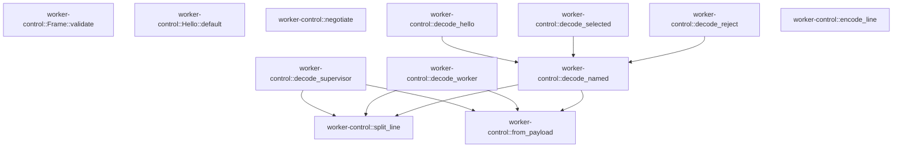

# worker-control

[Package atlas](index.md) · [Source](../../src/lib.rs)

## Declarations

Visibility is the declaration spelling; trait members and reexports require their enclosing interface. `cfg` is not evaluated.

| Symbol | Kind | Visibility | Test / cfg |
|---|---|---|---|
| [worker-control::PROTOCOL_NAME](../../src/lib.rs#L12) | const_item | `pub` |  |
| [worker-control::PROTOCOL_VERSION](../../src/lib.rs#L13) | const_item | `pub` |  |
| [worker-control::EX_PROTOCOL](../../src/lib.rs#L14) | const_item | `pub` |  |
| [worker-control::Hello](../../src/lib.rs#L17) | struct_item | `pub` |  |
| [worker-control::Hello::default](../../src/lib.rs#L24) | function_item | `private` |  |
| [worker-control::Selected](../../src/lib.rs#L34) | struct_item | `pub` |  |
| [worker-control::Reject](../../src/lib.rs#L39) | struct_item | `pub` |  |
| [worker-control::AssetRef](../../src/lib.rs#L45) | struct_item | `pub` |  |
| [worker-control::Input](../../src/lib.rs#L51) | struct_item | `pub` |  |
| [worker-control::ApprovalResponse](../../src/lib.rs#L64) | struct_item | `pub` |  |
| [worker-control::QueueEdit](../../src/lib.rs#L74) | struct_item | `pub` |  |
| [worker-control::Stop](../../src/lib.rs#L81) | struct_item | `pub` |  |
| [worker-control::Lease](../../src/lib.rs#L88) | struct_item | `pub` |  |
| [worker-control::Ping](../../src/lib.rs#L94) | struct_item | `pub` |  |
| [worker-control::Compact](../../src/lib.rs#L99) | struct_item | `pub` |  |
| [worker-control::Meta](../../src/lib.rs#L105) | struct_item | `pub` |  |
| [worker-control::LaunchResult](../../src/lib.rs#L115) | struct_item | `pub` |  |
| [worker-control::SupervisorMessage](../../src/lib.rs#L124) | enum_item | `pub` |  |
| [worker-control::Receipt](../../src/lib.rs#L139) | struct_item | `pub` |  |
| [worker-control::AttemptSettled](../../src/lib.rs#L146) | struct_item | `pub` |  |
| [worker-control::LeaseRequest](../../src/lib.rs#L152) | struct_item | `pub` |  |
| [worker-control::Appended](../../src/lib.rs#L158) | struct_item | `pub` |  |
| [worker-control::FrameChannel](../../src/lib.rs#L164) | enum_item | `pub` |  |
| [worker-control::Frame](../../src/lib.rs#L172) | struct_item | `pub` |  |
| [worker-control::Frame::validate](../../src/lib.rs#L193) | function_item | `pub` |  |
| [worker-control::State](../../src/lib.rs#L223) | struct_item | `pub` |  |
| [worker-control::Pong](../../src/lib.rs#L228) | struct_item | `pub` |  |
| [worker-control::LaunchChild](../../src/lib.rs#L233) | struct_item | `pub` |  |
| [worker-control::WorkerMessage](../../src/lib.rs#L240) | enum_item | `pub` |  |
| [worker-control::ProtocolError](../../src/lib.rs#L254) | enum_item | `pub` |  |
| [worker-control::negotiate](../../src/lib.rs#L276) | function_item | `pub` |  |
| [worker-control::decode_hello](../../src/lib.rs#L292) | function_item | `pub` |  |
| [worker-control::decode_selected](../../src/lib.rs#L296) | function_item | `pub` |  |
| [worker-control::decode_reject](../../src/lib.rs#L300) | function_item | `pub` |  |
| [worker-control::decode_supervisor](../../src/lib.rs#L304) | function_item | `pub` |  |
| [worker-control::decode_worker](../../src/lib.rs#L330) | function_item | `pub` |  |
| [worker-control::encode_line](../../src/lib.rs#L359) | function_item | `pub` |  |
| [worker-control::decode_named](../../src/lib.rs#L367) | function_item | `private` |  |
| [worker-control::split_line](../../src/lib.rs#L378) | function_item | `private` |  |
| [worker-control::from_payload](../../src/lib.rs#L391) | function_item | `private` |  |

## Imports / reexports

| Local name | Source path | Visibility |
|---|---|---|
| `Block` | `schema::Block` | `private` |
| `IJsonValue` | `schema::IJsonValue` | `private` |
| `OriginTuple` | `schema::OriginTuple` | `private` |
| `ResumePolicy` | `schema::ResumePolicy` | `private` |
| `SeqRange` | `schema::SeqRange` | `private` |
| `DeserializeOwned` | `serde::de::DeserializeOwned` | `private` |
| `Deserialize` | `serde::Deserialize` | `private` |
| `Serialize` | `serde::Serialize` | `private` |
| `Map` | `serde_json::Map` | `private` |
| `Value` | `serde_json::Value` | `private` |
| `Error` | `thiserror::Error` | `private` |
| `*` | `durable::*` | `pub` |

## Module declarations

| Module | Visibility | Attributes |
|---|---|---|
| `worker-control::continuation` | `pub` |  |
| `worker-control::durable` | `pub` |  |

## Function call graphs

Edges below are syntactically resolved calls only, including private functions. Graphs partition callers into groups of 20; they are not execution order. All unresolved sites are listed below and in the JSON inventory.

Functions 1–12: 9 direct edges

## Call sites

Includes test functions (marked in declarations). Receiver-type-required sites need type analysis/manual tracing. Calls in closures are attributed to their enclosing function; their occurrence here does not mean the closure executes immediately.

| Caller | Callee expression | Source lines | Target / classification |
|---|---|---|---|
| `default` | `PROTOCOL_NAME.to_owned` | [26](../../src/lib.rs#L26) | receiver-type-required |
| `validate` | `self                     .call_id                     .as_deref()                     .is_some_and` | [196](../../src/lib.rs#L196) | receiver-type-required |
| `validate` | `self                     .call_id                     .as_deref` | [196](../../src/lib.rs#L196) | receiver-type-required |
| `validate` | `value.is_empty` | [199](../../src/lib.rs#L199) | receiver-type-required |
| `validate` | `Ok` | [201](../../src/lib.rs#L201), [211](../../src/lib.rs#L211) | external-constructor-callback-or-unresolved |
| `validate` | `Err` | [203](../../src/lib.rs#L203), [214](../../src/lib.rs#L214) | external-constructor-callback-or-unresolved |
| `validate` | `ProtocolError::InvalidFrame` | [203](../../src/lib.rs#L203), [214](../../src/lib.rs#L214) | external-constructor-callback-or-unresolved |
| `validate` | `"tool frame requires nonempty call_id".to_owned` | [204](../../src/lib.rs#L204) | receiver-type-required |
| `validate` | `self.call_id.is_none` | [207](../../src/lib.rs#L207) | receiver-type-required |
| `validate` | `self.name.is_none` | [208](../../src/lib.rs#L208) | receiver-type-required |
| `validate` | `self.arguments_complete.is_none` | [209](../../src/lib.rs#L209) | receiver-type-required |
| `validate` | `"text/reasoning frame forbids call_id and name".to_owned` | [215](../../src/lib.rs#L215) | receiver-type-required |
| `negotiate` | `Err` | [282](../../src/lib.rs#L282), [287](../../src/lib.rs#L287) | external-constructor-callback-or-unresolved |
| `negotiate` | `ProtocolError::ProtocolName` | [282](../../src/lib.rs#L282) | external-constructor-callback-or-unresolved |
| `negotiate` | `hello.proto.clone` | [282](../../src/lib.rs#L282) | receiver-type-required |
| `negotiate` | `hello.min.max` | [284](../../src/lib.rs#L284) | receiver-type-required |
| `negotiate` | `hello.max.min` | [285](../../src/lib.rs#L285) | receiver-type-required |
| `negotiate` | `Ok` | [289](../../src/lib.rs#L289) | external-constructor-callback-or-unresolved |
| `decode_hello` | `decode_named` | [293](../../src/lib.rs#L293) | [worker-control::decode_named](../../src/lib.rs#L367) |
| `decode_selected` | `decode_named` | [297](../../src/lib.rs#L297) | [worker-control::decode_named](../../src/lib.rs#L367) |
| `decode_reject` | `decode_named` | [301](../../src/lib.rs#L301) | [worker-control::decode_named](../../src/lib.rs#L367) |
| `decode_supervisor` | `split_line` | [305](../../src/lib.rs#L305) | [worker-control::split_line](../../src/lib.rs#L378) |
| `decode_supervisor` | `Ok` | [306](../../src/lib.rs#L306) | external-constructor-callback-or-unresolved |
| `decode_supervisor` | `key.as_str` | [306](../../src/lib.rs#L306) | receiver-type-required |
| `decode_supervisor` | `SupervisorMessage::Input` | [307](../../src/lib.rs#L307) | external-constructor-callback-or-unresolved |
| `decode_supervisor` | `from_payload` | [307](../../src/lib.rs#L307), [308](../../src/lib.rs#L308), [309](../../src/lib.rs#L309), [310](../../src/lib.rs#L310), [311](../../src/lib.rs#L311), [312](../../src/lib.rs#L312), [313](../../src/lib.rs#L313), [314](../../src/lib.rs#L314), [315](../../src/lib.rs#L315), [317](../../src/lib.rs#L317) | [worker-control::from_payload](../../src/lib.rs#L391) |
| `decode_supervisor` | `SupervisorMessage::ApprovalResponse` | [308](../../src/lib.rs#L308) | external-constructor-callback-or-unresolved |
| `decode_supervisor` | `SupervisorMessage::QueueEdit` | [309](../../src/lib.rs#L309) | external-constructor-callback-or-unresolved |
| `decode_supervisor` | `SupervisorMessage::Stop` | [310](../../src/lib.rs#L310) | external-constructor-callback-or-unresolved |
| `decode_supervisor` | `SupervisorMessage::Lease` | [311](../../src/lib.rs#L311) | external-constructor-callback-or-unresolved |
| `decode_supervisor` | `SupervisorMessage::Ping` | [312](../../src/lib.rs#L312) | external-constructor-callback-or-unresolved |
| `decode_supervisor` | `SupervisorMessage::Compact` | [313](../../src/lib.rs#L313) | external-constructor-callback-or-unresolved |
| `decode_supervisor` | `SupervisorMessage::Meta` | [314](../../src/lib.rs#L314) | external-constructor-callback-or-unresolved |
| `decode_supervisor` | `SupervisorMessage::LaunchResult` | [315](../../src/lib.rs#L315) | external-constructor-callback-or-unresolved |
| `decode_supervisor` | `message                 .validate()                 .map_err` | [318](../../src/lib.rs#L318) | receiver-type-required |
| `decode_supervisor` | `message                 .validate` | [318](../../src/lib.rs#L318) | receiver-type-required |
| `decode_supervisor` | `ProtocolError::InvalidDurableControl` | [320](../../src/lib.rs#L320) | external-constructor-callback-or-unresolved |
| `decode_supervisor` | `source.to_string` | [320](../../src/lib.rs#L320) | receiver-type-required |
| `decode_supervisor` | `SupervisorMessage::QueueTransaction` | [321](../../src/lib.rs#L321) | external-constructor-callback-or-unresolved |
| `decode_supervisor` | `serde_json::from_value` | [325](../../src/lib.rs#L325) | external-constructor-callback-or-unresolved |
| `decode_worker` | `split_line` | [331](../../src/lib.rs#L331) | [worker-control::split_line](../../src/lib.rs#L378) |
| `decode_worker` | `Ok` | [332](../../src/lib.rs#L332) | external-constructor-callback-or-unresolved |
| `decode_worker` | `key.as_str` | [332](../../src/lib.rs#L332) | receiver-type-required |
| `decode_worker` | `WorkerMessage::Receipt` | [333](../../src/lib.rs#L333) | external-constructor-callback-or-unresolved |
| `decode_worker` | `from_payload` | [333](../../src/lib.rs#L333), [334](../../src/lib.rs#L334), [335](../../src/lib.rs#L335), [336](../../src/lib.rs#L336), [338](../../src/lib.rs#L338), [342](../../src/lib.rs#L342), [343](../../src/lib.rs#L343), [344](../../src/lib.rs#L344), [346](../../src/lib.rs#L346) | [worker-control::from_payload](../../src/lib.rs#L391) |
| `decode_worker` | `WorkerMessage::AttemptSettled` | [334](../../src/lib.rs#L334) | external-constructor-callback-or-unresolved |
| `decode_worker` | `WorkerMessage::LeaseRequest` | [335](../../src/lib.rs#L335) | external-constructor-callback-or-unresolved |
| `decode_worker` | `WorkerMessage::Appended` | [336](../../src/lib.rs#L336) | external-constructor-callback-or-unresolved |
| `decode_worker` | `frame.validate` | [339](../../src/lib.rs#L339) | receiver-type-required |
| `decode_worker` | `WorkerMessage::Frame` | [340](../../src/lib.rs#L340) | external-constructor-callback-or-unresolved |
| `decode_worker` | `WorkerMessage::State` | [342](../../src/lib.rs#L342) | external-constructor-callback-or-unresolved |
| `decode_worker` | `WorkerMessage::Pong` | [343](../../src/lib.rs#L343) | external-constructor-callback-or-unresolved |
| `decode_worker` | `WorkerMessage::LaunchChild` | [344](../../src/lib.rs#L344) | external-constructor-callback-or-unresolved |
| `decode_worker` | `message                 .validate()                 .map_err` | [347](../../src/lib.rs#L347) | receiver-type-required |
| `decode_worker` | `message                 .validate` | [347](../../src/lib.rs#L347) | receiver-type-required |
| `decode_worker` | `ProtocolError::InvalidDurableControl` | [349](../../src/lib.rs#L349) | external-constructor-callback-or-unresolved |
| `decode_worker` | `source.to_string` | [349](../../src/lib.rs#L349) | receiver-type-required |
| `decode_worker` | `WorkerMessage::QueueTransactionResult` | [350](../../src/lib.rs#L350) | external-constructor-callback-or-unresolved |
| `decode_worker` | `serde_json::from_value` | [354](../../src/lib.rs#L354) | external-constructor-callback-or-unresolved |
| `encode_line` | `Map::new` | [360](../../src/lib.rs#L360) | external-constructor-callback-or-unresolved |
| `encode_line` | `object.insert` | [361](../../src/lib.rs#L361) | receiver-type-required |
| `encode_line` | `key.to_owned` | [361](../../src/lib.rs#L361) | receiver-type-required |
| `encode_line` | `serde_json::to_value` | [361](../../src/lib.rs#L361) | external-constructor-callback-or-unresolved |
| `encode_line` | `serde_json_canonicalizer::to_vec` | [362](../../src/lib.rs#L362) | external-constructor-callback-or-unresolved |
| `encode_line` | `Value::Object` | [362](../../src/lib.rs#L362) | external-constructor-callback-or-unresolved |
| `encode_line` | `bytes.push` | [363](../../src/lib.rs#L363) | receiver-type-required |
| `encode_line` | `Ok` | [364](../../src/lib.rs#L364) | external-constructor-callback-or-unresolved |
| `decode_named` | `split_line` | [368](../../src/lib.rs#L368) | [worker-control::split_line](../../src/lib.rs#L378) |
| `decode_named` | `Err` | [370](../../src/lib.rs#L370) | external-constructor-callback-or-unresolved |
| `decode_named` | `expected.to_owned` | [371](../../src/lib.rs#L371) | receiver-type-required |
| `decode_named` | `from_payload` | [375](../../src/lib.rs#L375) | [worker-control::from_payload](../../src/lib.rs#L391) |
| `split_line` | `line.strip_suffix(b"\n").unwrap_or` | [379](../../src/lib.rs#L379) | receiver-type-required |
| `split_line` | `line.strip_suffix` | [379](../../src/lib.rs#L379) | receiver-type-required |
| `split_line` | `serde_json::from_slice` | [380](../../src/lib.rs#L380) | external-constructor-callback-or-unresolved |
| `split_line` | `value         .as_object()         .cloned()         .ok_or` | [381](../../src/lib.rs#L381) | receiver-type-required |
| `split_line` | `value         .as_object()         .cloned` | [381](../../src/lib.rs#L381) | receiver-type-required |
| `split_line` | `value         .as_object` | [381](../../src/lib.rs#L381) | receiver-type-required |
| `split_line` | `object.len` | [385](../../src/lib.rs#L385) | receiver-type-required |
| `split_line` | `Err` | [386](../../src/lib.rs#L386) | external-constructor-callback-or-unresolved |
| `split_line` | `Ok` | [388](../../src/lib.rs#L388) | external-constructor-callback-or-unresolved |
| `split_line` | `object.into_iter().next().expect` | [388](../../src/lib.rs#L388) | receiver-type-required |
| `split_line` | `object.into_iter().next` | [388](../../src/lib.rs#L388) | receiver-type-required |
| `split_line` | `object.into_iter` | [388](../../src/lib.rs#L388) | receiver-type-required |
| `from_payload` | `serde_json::from_value(payload).map_err` | [392](../../src/lib.rs#L392) | receiver-type-required |
| `from_payload` | `serde_json::from_value` | [392](../../src/lib.rs#L392) | external-constructor-callback-or-unresolved |
| `from_payload` | `message.to_owned` | [393](../../src/lib.rs#L393) | receiver-type-required |
