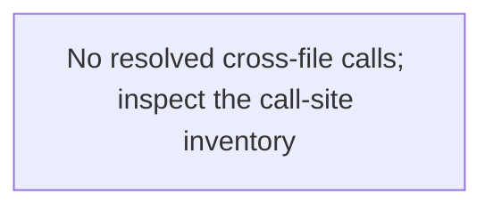

# tekes-worker — generated atlas

[All packages](../../../../docs/architecture/generated/index.md) · [Maintained explanation](../README.md)

## Cargo targets

| Target | Kind | Entry |
|---|---|---|
| `tekes-worker` | bin | [crates/worker/src/main.rs](../../src/main.rs) |
| `shell` | test | [crates/worker/tests/shell.rs](../../tests/shell.rs) |

## Direct workspace dependencies

| Dependency | Kind | Target cfg |
|---|---|---|
| `engine` | normal | all |
| `profile` | normal | all |
| `provider` | normal | all |
| `schema` | normal | all |
| `session-controls` | normal | all |
| `store` | normal | all |
| `tools` | normal | all |
| `worker-control` | normal | all |
| `workspace-service` | normal | all |
| `endpoint` | dev | all |
| `tekes-supervisor` | dev | all |
| `test-support` | dev | all |

[Public/restricted API and direct callers](api.md)

## Source files / lexical modules

`src` files have full symbol/call tables and partitioned function graphs. Integration tests and examples remain in the JSON inventory.
File-derived paths below are lexical navigation, not a compiler-resolved module tree; inline module declarations are listed separately.

| File | Symbols | Call sites | Detail |
|---|---:|---:|---|
| [crates/worker/src/child_agents.rs](../../src/child_agents.rs) | 19 | 458 | [Symbols and calls](src--child_agents.md) |
| [crates/worker/src/compaction.rs](../../src/compaction.rs) | 10 | 128 | [Symbols and calls](src--compaction.md) |
| [crates/worker/src/context_projection.rs](../../src/context_projection.rs) | 20 | 590 | [Symbols and calls](src--context_projection.md) |
| [crates/worker/src/continuation.rs](../../src/continuation.rs) | 11 | 288 | [Symbols and calls](src--continuation.md) |
| [crates/worker/src/control_channel.rs](../../src/control_channel.rs) | 24 | 61 | [Symbols and calls](src--control_channel.md) |
| [crates/worker/src/delivery.rs](../../src/delivery.rs) | 4 | 124 | [Symbols and calls](src--delivery.md) |
| [crates/worker/src/identity.rs](../../src/identity.rs) | 8 | 131 | [Symbols and calls](src--identity.md) |
| [crates/worker/src/ledger_events.rs](../../src/ledger_events.rs) | 12 | 115 | [Symbols and calls](src--ledger_events.md) |
| [crates/worker/src/lifecycle_hooks.rs](../../src/lifecycle_hooks.rs) | 11 | 126 | [Symbols and calls](src--lifecycle_hooks.md) |
| [crates/worker/src/live_tests.rs](../../src/live_tests.rs) | 17 | 795 | [Symbols and calls](src--live_tests.md) |
| [crates/worker/src/main.rs](../../src/main.rs) | 14 | 310 | [Symbols and calls](src--main.md) |
| [crates/worker/src/provider_context_tests.rs](../../src/provider_context_tests.rs) | 137 | 3520 | [Symbols and calls](src--provider_context_tests.md) |
| [crates/worker/src/provider_turn.rs](../../src/provider_turn.rs) | 22 | 590 | [Symbols and calls](src--provider_turn.md) |
| [crates/worker/src/queue.rs](../../src/queue.rs) | 8 | 223 | [Symbols and calls](src--queue.md) |
| [crates/worker/src/recovery.rs](../../src/recovery.rs) | 11 | 351 | [Symbols and calls](src--recovery.md) |
| [crates/worker/src/result_presentation.rs](../../src/result_presentation.rs) | 16 | 158 | [Symbols and calls](src--result_presentation.md) |
| [crates/worker/src/tool_backends.rs](../../src/tool_backends.rs) | 21 | 281 | [Symbols and calls](src--tool_backends.md) |
| [crates/worker/src/tool_calls.rs](../../src/tool_calls.rs) | 5 | 132 | [Symbols and calls](src--tool_calls.md) |
| [crates/worker/src/turn_terminal.rs](../../src/turn_terminal.rs) | 21 | 280 | [Symbols and calls](src--turn_terminal.md) |
| [crates/worker/src/validation_runtime.rs](../../src/validation_runtime.rs) | 37 | 850 | [Symbols and calls](src--validation_runtime.md) |
| [crates/worker/src/validation_tests.rs](../../src/validation_tests.rs) | 19 | 451 | [Symbols and calls](src--validation_tests.md) |
| [crates/worker/src/web_search.rs](../../src/web_search.rs) | 14 | 159 | [Symbols and calls](src--web_search.md) |
| [crates/worker/src/workspace_edits.rs](../../src/workspace_edits.rs) | 10 | 153 | [Symbols and calls](src--workspace_edits.md) |
| [crates/worker/tests/shell.rs](../../tests/shell.rs) | 21 | 1093 | `inventory.json` |

## Cross-file direct calls

Source files stand in for out-of-line modules; see declarations for inline modules. Counts are syntactic call sites, not runtime frequency.

