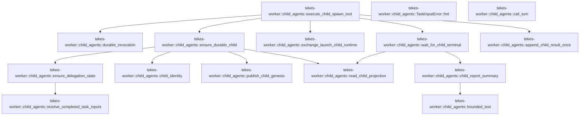

# tekes-worker::child_agents

[Package atlas](index.md) · [Source](../../src/child_agents.rs)

## Declarations

Visibility is the declaration spelling; trait members and reexports require their enclosing interface. `cfg` is not evaluated.

| Symbol | Kind | Visibility | Test / cfg |
|---|---|---|---|
| [tekes-worker::child_agents::ChildSpawnExecution](../../src/child_agents.rs#L3) | struct_item | `pub(crate)` |  |
| [tekes-worker::child_agents::DurableChildSpawn](../../src/child_agents.rs#L16) | struct_item | `pub(crate)` |  |
| [tekes-worker::child_agents::ChildTerminal](../../src/child_agents.rs#L24) | struct_item | `pub(crate)` |  |
| [tekes-worker::child_agents::execute_child_spawn_tool](../../src/child_agents.rs#L29) | function_item | `pub(crate)` |  |
| [tekes-worker::child_agents::durable_invocation](../../src/child_agents.rs#L191) | function_item | `private` |  |
| [tekes-worker::child_agents::ensure_durable_child](../../src/child_agents.rs#L213) | function_item | `pub(crate)` |  |
| [tekes-worker::child_agents::ensure_delegation_state](../../src/child_agents.rs#L334) | function_item | `pub(crate)` |  |
| [tekes-worker::child_agents::TaskInputError](../../src/child_agents.rs#L381) | struct_item | `pub(crate)` |  |
| [tekes-worker::child_agents::TaskInputError::fmt](../../src/child_agents.rs#L383) | function_item | `private` |  |
| [tekes-worker::child_agents::resolve_completed_task_inputs](../../src/child_agents.rs#L393) | function_item | `pub(crate)` |  |
| [tekes-worker::child_agents::child_identity](../../src/child_agents.rs#L468) | function_item | `pub(crate)` |  |
| [tekes-worker::child_agents::call_turn](../../src/child_agents.rs#L497) | function_item | `private` |  |
| [tekes-worker::child_agents::publish_child_genesis](../../src/child_agents.rs#L509) | function_item | `pub(crate)` |  |
| [tekes-worker::child_agents::exchange_launch_child_runtime](../../src/child_agents.rs#L543) | function_item | `pub(crate)` |  |
| [tekes-worker::child_agents::wait_for_child_terminal](../../src/child_agents.rs#L593) | function_item | `pub(crate)` |  |
| [tekes-worker::child_agents::read_child_projection](../../src/child_agents.rs#L642) | function_item | `pub(crate)` |  |
| [tekes-worker::child_agents::child_report_summary](../../src/child_agents.rs#L651) | function_item | `private` |  |
| [tekes-worker::child_agents::bounded_text](../../src/child_agents.rs#L691) | function_item | `private` |  |
| [tekes-worker::child_agents::append_child_result_once](../../src/child_agents.rs#L702) | function_item | `pub(crate)` |  |

## Imports / reexports

| Local name | Source path | Visibility |
|---|---|---|
| `*` | `super::*` | `private` |

## Module declarations

| Module | Visibility | Attributes |
|---|---|---|

## Function call graphs

Edges below are syntactically resolved calls only, including private functions. Graphs partition callers into groups of 20; they are not execution order. All unresolved sites are listed below and in the JSON inventory.

Functions 1–15: 13 direct edges

## Call sites

Includes test functions (marked in declarations). Receiver-type-required sites need type analysis/manual tracing. Calls in closures are attributed to their enclosing function; their occurrence here does not mean the closure executes immediately.

| Caller | Callee expression | Source lines | Target / classification |
|---|---|---|---|
| `execute_child_spawn_tool` | `effective_allowed_tools(profile).contains` | [50](../../src/child_agents.rs#L50) | receiver-type-required |
| `execute_child_spawn_tool` | `effective_allowed_tools` | [50](../../src/child_agents.rs#L50) | external-constructor-callback-or-unresolved |
| `execute_child_spawn_tool` | `Err` | [51](../../src/child_agents.rs#L51), [94](../../src/child_agents.rs#L94), [108](../../src/child_agents.rs#L108), [185](../../src/child_agents.rs#L185), [187](../../src/child_agents.rs#L187) | external-constructor-callback-or-unresolved |
| `execute_child_spawn_tool` | `format!("child-spawn tool {} is not allowed", call.name).into` | [51](../../src/child_agents.rs#L51) | receiver-type-required |
| `execute_child_spawn_tool` | `ledger         .projection()         .and_then(&#124;projection&#124; projection.events.first())         .and_then(&#124;genesis&#124; genesis.string_field("thread"))         .ok_or("genesis thread binding is missing")?         .to_owned` | [53](../../src/child_agents.rs#L53) | receiver-type-required |
| `execute_child_spawn_tool` | `ledger         .projection()         .and_then(&#124;projection&#124; projection.events.first())         .and_then(&#124;genesis&#124; genesis.string_field("thread"))         .ok_or` | [53](../../src/child_agents.rs#L53) | receiver-type-required |
| `execute_child_spawn_tool` | `ledger         .projection()         .and_then(&#124;projection&#124; projection.events.first())         .and_then` | [53](../../src/child_agents.rs#L53) | receiver-type-required |
| `execute_child_spawn_tool` | `ledger         .projection()         .and_then` | [53](../../src/child_agents.rs#L53) | receiver-type-required |
| `execute_child_spawn_tool` | `ledger         .projection` | [53](../../src/child_agents.rs#L53) | receiver-type-required |
| `execute_child_spawn_tool` | `projection.events.first` | [55](../../src/child_agents.rs#L55) | receiver-type-required |
| `execute_child_spawn_tool` | `genesis.string_field` | [56](../../src/child_agents.rs#L56) | receiver-type-required |
| `execute_child_spawn_tool` | `thread.clone` | [60](../../src/child_agents.rs#L60) | receiver-type-required |
| `execute_child_spawn_tool` | `attempt.to_owned` | [62](../../src/child_agents.rs#L62) | receiver-type-required |
| `execute_child_spawn_tool` | `call.call_id.clone` | [63](../../src/child_agents.rs#L63), [121](../../src/child_agents.rs#L121) | receiver-type-required |
| `execute_child_spawn_tool` | `call.name.clone` | [64](../../src/child_agents.rs#L64), [122](../../src/child_agents.rs#L122) | receiver-type-required |
| `execute_child_spawn_tool` | `IJsonValue::parse` | [65](../../src/child_agents.rs#L65) | external-constructor-callback-or-unresolved |
| `execute_child_spawn_tool` | `serde_json::to_vec` | [65](../../src/child_agents.rs#L65) | external-constructor-callback-or-unresolved |
| `execute_child_spawn_tool` | `options.event_timestamp().clone` | [66](../../src/child_agents.rs#L66) | receiver-type-required |
| `execute_child_spawn_tool` | `options.event_timestamp` | [66](../../src/child_agents.rs#L66) | receiver-type-required |
| `execute_child_spawn_tool` | `tool_catalog_context` | [68](../../src/child_agents.rs#L68) | external-constructor-callback-or-unresolved |
| `execute_child_spawn_tool` | `ToolDispatcher::new` | [69](../../src/child_agents.rs#L69) | external-constructor-callback-or-unresolved |
| `execute_child_spawn_tool` | `AssetStore::new` | [70](../../src/child_agents.rs#L70), [160](../../src/child_agents.rs#L160) | external-constructor-callback-or-unresolved |
| `execute_child_spawn_tool` | `ledger             .path()             .parent()             .ok_or("worker ledger has no thread folder")?             .join` | [71](../../src/child_agents.rs#L71), [161](../../src/child_agents.rs#L161) | receiver-type-required |
| `execute_child_spawn_tool` | `ledger             .path()             .parent()             .ok_or` | [71](../../src/child_agents.rs#L71), [78](../../src/child_agents.rs#L78), [161](../../src/child_agents.rs#L161), [168](../../src/child_agents.rs#L168) | receiver-type-required |
| `execute_child_spawn_tool` | `ledger             .path()             .parent` | [71](../../src/child_agents.rs#L71), [78](../../src/child_agents.rs#L78), [161](../../src/child_agents.rs#L161), [168](../../src/child_agents.rs#L168) | receiver-type-required |
| `execute_child_spawn_tool` | `ledger             .path` | [71](../../src/child_agents.rs#L71), [78](../../src/child_agents.rs#L78), [161](../../src/child_agents.rs#L161), [168](../../src/child_agents.rs#L168) | receiver-type-required |
| `execute_child_spawn_tool` | `session_permission_policy` | [77](../../src/child_agents.rs#L77), [167](../../src/child_agents.rs#L167) | external-constructor-callback-or-unresolved |
| `execute_child_spawn_tool` | `ToolPipeline::new` | [83](../../src/child_agents.rs#L83), [173](../../src/child_agents.rs#L173) | external-constructor-callback-or-unresolved |
| `execute_child_spawn_tool` | `SecretScanner::default` | [83](../../src/child_agents.rs#L83), [173](../../src/child_agents.rs#L173) | external-constructor-callback-or-unresolved |
| `execute_child_spawn_tool` | `dispatcher.dispatch` | [85](../../src/child_agents.rs#L85), [175](../../src/child_agents.rs#L175) | receiver-type-required |
| `execute_child_spawn_tool` | `Ok` | [92](../../src/child_agents.rs#L92), [97](../../src/child_agents.rs#L97), [106](../../src/child_agents.rs#L106), [182](../../src/child_agents.rs#L182), [183](../../src/child_agents.rs#L183) | external-constructor-callback-or-unresolved |
| `execute_child_spawn_tool` | `"child spawn backend cannot report a remote continuation".into` | [94](../../src/child_agents.rs#L94) | receiver-type-required |
| `execute_child_spawn_tool` | `drop` | [99](../../src/child_agents.rs#L99) | external-constructor-callback-or-unresolved |
| `execute_child_spawn_tool` | `durable_invocation` | [101](../../src/child_agents.rs#L101) | [tekes-worker::child_agents::durable_invocation](../../src/child_agents.rs#L191) |
| `execute_child_spawn_tool` | `ensure_durable_child` | [102](../../src/child_agents.rs#L102) | [tekes-worker::child_agents::ensure_durable_child](../../src/child_agents.rs#L213) |
| `execute_child_spawn_tool` | `error.downcast_ref::<TaskInputError>().is_some` | [104](../../src/child_agents.rs#L104) | receiver-type-required |
| `execute_child_spawn_tool` | `error.downcast_ref::<TaskInputError>` | [104](../../src/child_agents.rs#L104) | receiver-type-required |
| `execute_child_spawn_tool` | `append_tool_validation_error` | [105](../../src/child_agents.rs#L105) | external-constructor-callback-or-unresolved |
| `execute_child_spawn_tool` | `error.to_string` | [105](../../src/child_agents.rs#L105) | receiver-type-required |
| `execute_child_spawn_tool` | `ledger         .path()         .parent()         .and_then(&#124;folder&#124; folder.file_name())         .and_then(&#124;name&#124; name.to_str())         .ok_or("thread folder has no UTF-8 session UUID")?         .to_owned` | [110](../../src/child_agents.rs#L110) | receiver-type-required |
| `execute_child_spawn_tool` | `ledger         .path()         .parent()         .and_then(&#124;folder&#124; folder.file_name())         .and_then(&#124;name&#124; name.to_str())         .ok_or` | [110](../../src/child_agents.rs#L110) | receiver-type-required |
| `execute_child_spawn_tool` | `ledger         .path()         .parent()         .and_then(&#124;folder&#124; folder.file_name())         .and_then` | [110](../../src/child_agents.rs#L110) | receiver-type-required |
| `execute_child_spawn_tool` | `ledger         .path()         .parent()         .and_then` | [110](../../src/child_agents.rs#L110) | receiver-type-required |
| `execute_child_spawn_tool` | `ledger         .path()         .parent` | [110](../../src/child_agents.rs#L110) | receiver-type-required |
| `execute_child_spawn_tool` | `ledger         .path` | [110](../../src/child_agents.rs#L110) | receiver-type-required |
| `execute_child_spawn_tool` | `folder.file_name` | [113](../../src/child_agents.rs#L113) | receiver-type-required |
| `execute_child_spawn_tool` | `name.to_str` | [114](../../src/child_agents.rs#L114) | receiver-type-required |
| `execute_child_spawn_tool` | `ToolControl::new` | [117](../../src/child_agents.rs#L117) | external-constructor-callback-or-unresolved |
| `execute_child_spawn_tool` | `exchange_tool_control_runtime` | [125](../../src/child_agents.rs#L125) | external-constructor-callback-or-unresolved |
| `execute_child_spawn_tool` | `control.error.is_some` | [127](../../src/child_agents.rs#L127) | receiver-type-required |
| `execute_child_spawn_tool` | `append_child_result_once` | [128](../../src/child_agents.rs#L128), [142](../../src/child_agents.rs#L142), [156](../../src/child_agents.rs#L156) | [tekes-worker::child_agents::append_child_result_once](../../src/child_agents.rs#L702) |
| `execute_child_spawn_tool` | `"failed".to_owned` | [135](../../src/child_agents.rs#L135), [149](../../src/child_agents.rs#L149) | receiver-type-required |
| `execute_child_spawn_tool` | `control.error.as_ref().map` | [136](../../src/child_agents.rs#L136) | receiver-type-required |
| `execute_child_spawn_tool` | `control.error.as_ref` | [136](../../src/child_agents.rs#L136) | receiver-type-required |
| `execute_child_spawn_tool` | `error.message.clone` | [136](../../src/child_agents.rs#L136) | receiver-type-required |
| `execute_child_spawn_tool` | `exchange_launch_child_runtime` | [140](../../src/child_agents.rs#L140) | [tekes-worker::child_agents::exchange_launch_child_runtime](../../src/child_agents.rs#L543) |
| `execute_child_spawn_tool` | `wait_for_child_terminal` | [155](../../src/child_agents.rs#L155) | [tekes-worker::child_agents::wait_for_child_terminal](../../src/child_agents.rs#L593) |
| `execute_child_spawn_tool` | `"child result backend cannot report a remote continuation".into` | [185](../../src/child_agents.rs#L185) | receiver-type-required |
| `execute_child_spawn_tool` | `"child result backend deferred unexpectedly".into` | [187](../../src/child_agents.rs#L187) | receiver-type-required |
| `durable_invocation` | `ledger.projection().and_then` | [196](../../src/child_agents.rs#L196) | receiver-type-required |
| `durable_invocation` | `ledger.projection` | [196](../../src/child_agents.rs#L196) | receiver-type-required |
| `durable_invocation` | `projection.events.iter().find` | [197](../../src/child_agents.rs#L197) | receiver-type-required |
| `durable_invocation` | `projection.events.iter` | [197](../../src/child_agents.rs#L197) | receiver-type-required |
| `durable_invocation` | `event.kind` | [198](../../src/child_agents.rs#L198) | receiver-type-required |
| `durable_invocation` | `event.string_field` | [199](../../src/child_agents.rs#L199) | receiver-type-required |
| `durable_invocation` | `Some` | [199](../../src/child_agents.rs#L199) | external-constructor-callback-or-unresolved |
| `durable_invocation` | `Ok` | [202](../../src/child_agents.rs#L202), [208](../../src/child_agents.rs#L208) | external-constructor-callback-or-unresolved |
| `durable_invocation` | `original.clone` | [202](../../src/child_agents.rs#L202) | receiver-type-required |
| `durable_invocation` | `serde_json::to_value` | [204](../../src/child_agents.rs#L204) | external-constructor-callback-or-unresolved |
| `durable_invocation` | `event.raw` | [204](../../src/child_agents.rs#L204) | receiver-type-required |
| `durable_invocation` | `raw         .get("invocation")         .ok_or` | [205](../../src/child_agents.rs#L205) | receiver-type-required |
| `durable_invocation` | `raw         .get` | [205](../../src/child_agents.rs#L205) | receiver-type-required |
| `durable_invocation` | `IJsonValue::parse` | [208](../../src/child_agents.rs#L208) | external-constructor-callback-or-unresolved |
| `durable_invocation` | `serde_json::to_vec` | [208](../../src/child_agents.rs#L208) | external-constructor-callback-or-unresolved |
| `durable_invocation` | `materialize_json` | [208](../../src/child_agents.rs#L208) | external-constructor-callback-or-unresolved |
| `ensure_durable_child` | `ledger.projection().and_then` | [220](../../src/child_agents.rs#L220) | receiver-type-required |
| `ensure_durable_child` | `ledger.projection` | [220](../../src/child_agents.rs#L220) | receiver-type-required |
| `ensure_durable_child` | `projection.events.iter().find` | [221](../../src/child_agents.rs#L221) | receiver-type-required |
| `ensure_durable_child` | `projection.events.iter` | [221](../../src/child_agents.rs#L221) | receiver-type-required |
| `ensure_durable_child` | `event.kind` | [222](../../src/child_agents.rs#L222) | receiver-type-required |
| `ensure_durable_child` | `event.string_field` | [223](../../src/child_agents.rs#L223) | receiver-type-required |
| `ensure_durable_child` | `Some` | [223](../../src/child_agents.rs#L223), [244](../../src/child_agents.rs#L244) | external-constructor-callback-or-unresolved |
| `ensure_durable_child` | `call.call_id.as_str` | [223](../../src/child_agents.rs#L223) | receiver-type-required |
| `ensure_durable_child` | `serde_json::to_value` | [226](../../src/child_agents.rs#L226) | external-constructor-callback-or-unresolved |
| `ensure_durable_child` | `spawn.raw` | [226](../../src/child_agents.rs#L226) | receiver-type-required |
| `ensure_durable_child` | `spawn             .string_field("child")             .ok_or("spawn child is missing")?             .to_owned` | [227](../../src/child_agents.rs#L227) | receiver-type-required |
| `ensure_durable_child` | `spawn             .string_field("child")             .ok_or` | [227](../../src/child_agents.rs#L227) | receiver-type-required |
| `ensure_durable_child` | `spawn             .string_field` | [227](../../src/child_agents.rs#L227) | receiver-type-required |
| `ensure_durable_child` | `ledger             .path()             .parent()             .ok_or("parent ledger has no folder")?             .join` | [231](../../src/child_agents.rs#L231) | receiver-type-required |
| `ensure_durable_child` | `ledger             .path()             .parent()             .ok_or` | [231](../../src/child_agents.rs#L231) | receiver-type-required |
| `ensure_durable_child` | `ledger             .path()             .parent` | [231](../../src/child_agents.rs#L231) | receiver-type-required |
| `ensure_durable_child` | `ledger             .path` | [231](../../src/child_agents.rs#L231) | receiver-type-required |
| `ensure_durable_child` | `child_path             .file_stem()             .and_then(&#124;name&#124; name.to_str())             .ok_or("spawn child file has no UTF-8 stem")?             .to_owned` | [236](../../src/child_agents.rs#L236) | receiver-type-required |
| `ensure_durable_child` | `child_path             .file_stem()             .and_then(&#124;name&#124; name.to_str())             .ok_or` | [236](../../src/child_agents.rs#L236) | receiver-type-required |
| `ensure_durable_child` | `child_path             .file_stem()             .and_then` | [236](../../src/child_agents.rs#L236) | receiver-type-required |
| `ensure_durable_child` | `child_path             .file_stem` | [236](../../src/child_agents.rs#L236) | receiver-type-required |
| `ensure_durable_child` | `name.to_str` | [238](../../src/child_agents.rs#L238), [288](../../src/child_agents.rs#L288) | receiver-type-required |
| `ensure_durable_child` | `child_path.exists` | [241](../../src/child_agents.rs#L241) | receiver-type-required |
| `ensure_durable_child` | `read_child_projection` | [242](../../src/child_agents.rs#L242) | [tekes-worker::child_agents::read_child_projection](../../src/child_agents.rs#L642) |
| `ensure_durable_child` | `child.events.first().ok_or` | [243](../../src/child_agents.rs#L243) | receiver-type-required |
| `ensure_durable_child` | `child.events.first` | [243](../../src/child_agents.rs#L243) | receiver-type-required |
| `ensure_durable_child` | `genesis.string_field` | [244](../../src/child_agents.rs#L244), [268](../../src/child_agents.rs#L268) | receiver-type-required |
| `ensure_durable_child` | `child_line.as_str` | [244](../../src/child_agents.rs#L244) | receiver-type-required |
| `ensure_durable_child` | `Err` | [245](../../src/child_agents.rs#L245) | external-constructor-callback-or-unresolved |
| `ensure_durable_child` | `"spawn child file does not match child genesis".into` | [245](../../src/child_agents.rs#L245) | receiver-type-required |
| `ensure_durable_child` | `Ok` | [248](../../src/child_agents.rs#L248), [326](../../src/child_agents.rs#L326) | external-constructor-callback-or-unresolved |
| `ensure_durable_child` | `spawn                 .string_field("spawn_id")                 .ok_or("spawn id is missing")?                 .to_owned` | [251](../../src/child_agents.rs#L251) | receiver-type-required |
| `ensure_durable_child` | `spawn                 .string_field("spawn_id")                 .ok_or` | [251](../../src/child_agents.rs#L251) | receiver-type-required |
| `ensure_durable_child` | `spawn                 .string_field` | [251](../../src/child_agents.rs#L251) | receiver-type-required |
| `ensure_durable_child` | `serde_json::from_value` | [255](../../src/child_agents.rs#L255) | external-constructor-callback-or-unresolved |
| `ensure_durable_child` | `raw.get("resume")                     .cloned()                     .ok_or` | [256](../../src/child_agents.rs#L256) | receiver-type-required |
| `ensure_durable_child` | `raw.get("resume")                     .cloned` | [256](../../src/child_agents.rs#L256) | receiver-type-required |
| `ensure_durable_child` | `raw.get` | [256](../../src/child_agents.rs#L256) | receiver-type-required |
| `ensure_durable_child` | `ensure_delegation_state` | [263](../../src/child_agents.rs#L263) | [tekes-worker::child_agents::ensure_delegation_state](../../src/child_agents.rs#L334) |
| `ensure_durable_child` | `ledger.next_seq` | [264](../../src/child_agents.rs#L264) | receiver-type-required |
| `ensure_durable_child` | `ledger         .projection()         .and_then(&#124;projection&#124; projection.events.first())         .and_then(&#124;genesis&#124; genesis.string_field("thread"))         .ok_or` | [265](../../src/child_agents.rs#L265) | receiver-type-required |
| `ensure_durable_child` | `ledger         .projection()         .and_then(&#124;projection&#124; projection.events.first())         .and_then` | [265](../../src/child_agents.rs#L265) | receiver-type-required |
| `ensure_durable_child` | `ledger         .projection()         .and_then` | [265](../../src/child_agents.rs#L265) | receiver-type-required |
| `ensure_durable_child` | `ledger         .projection` | [265](../../src/child_agents.rs#L265) | receiver-type-required |
| `ensure_durable_child` | `projection.events.first` | [267](../../src/child_agents.rs#L267) | receiver-type-required |
| `ensure_durable_child` | `child_identity` | [270](../../src/child_agents.rs#L270) | [tekes-worker::child_agents::child_identity](../../src/child_agents.rs#L468) |
| `ensure_durable_child` | `ResumePolicy::Bounded` | [272](../../src/child_agents.rs#L272) | external-constructor-callback-or-unresolved |
| `ensure_durable_child` | `delegation.canonical_bytes` | [273](../../src/child_agents.rs#L273) | receiver-type-required |
| `ensure_durable_child` | `seed_bytes.push` | [274](../../src/child_agents.rs#L274) | receiver-type-required |
| `ensure_durable_child` | `ledger         .path()         .parent()         .ok_or` | [275](../../src/child_agents.rs#L275) | receiver-type-required |
| `ensure_durable_child` | `ledger         .path()         .parent` | [275](../../src/child_agents.rs#L275) | receiver-type-required |
| `ensure_durable_child` | `ledger         .path` | [275](../../src/child_agents.rs#L275), [285](../../src/child_agents.rs#L285) | receiver-type-required |
| `ensure_durable_child` | `AssetStore::new` | [279](../../src/child_agents.rs#L279) | external-constructor-callback-or-unresolved |
| `ensure_durable_child` | `folder.join` | [279](../../src/child_agents.rs#L279) | receiver-type-required |
| `ensure_durable_child` | `assets.publish` | [280](../../src/child_agents.rs#L280) | receiver-type-required |
| `ensure_durable_child` | `seed         .asset         .strip_prefix("sha256-")         .ok_or` | [281](../../src/child_agents.rs#L281) | receiver-type-required |
| `ensure_durable_child` | `seed         .asset         .strip_prefix` | [281](../../src/child_agents.rs#L281) | receiver-type-required |
| `ensure_durable_child` | `ledger         .path()         .file_name()         .and_then(&#124;name&#124; name.to_str())         .ok_or` | [285](../../src/child_agents.rs#L285) | receiver-type-required |
| `ensure_durable_child` | `ledger         .path()         .file_name()         .and_then` | [285](../../src/child_agents.rs#L285) | receiver-type-required |
| `ensure_durable_child` | `ledger         .path()         .file_name` | [285](../../src/child_agents.rs#L285) | receiver-type-required |
| `ensure_durable_child` | `identity::selected` | [306](../../src/child_agents.rs#L306) | external-constructor-callback-or-unresolved |
| `ensure_durable_child` | `genesis             .as_object_mut()             .expect("genesis object")             .insert` | [307](../../src/child_agents.rs#L307) | receiver-type-required |
| `ensure_durable_child` | `genesis             .as_object_mut()             .expect` | [307](../../src/child_agents.rs#L307) | receiver-type-required |
| `ensure_durable_child` | `genesis             .as_object_mut` | [307](../../src/child_agents.rs#L307) | receiver-type-required |
| `ensure_durable_child` | `"identity_profile".to_owned` | [310](../../src/child_agents.rs#L310) | receiver-type-required |
| `ensure_durable_child` | `options.instruction_digest.is_empty` | [312](../../src/child_agents.rs#L312) | receiver-type-required |
| `ensure_durable_child` | `genesis.as_object_mut().expect("genesis object").insert` | [313](../../src/child_agents.rs#L313) | receiver-type-required |
| `ensure_durable_child` | `genesis.as_object_mut().expect` | [313](../../src/child_agents.rs#L313) | receiver-type-required |
| `ensure_durable_child` | `genesis.as_object_mut` | [313](../../src/child_agents.rs#L313) | receiver-type-required |
| `ensure_durable_child` | `"instruction".to_owned` | [314](../../src/child_agents.rs#L314) | receiver-type-required |
| `ensure_durable_child` | `publish_child_genesis` | [318](../../src/child_agents.rs#L318) | [tekes-worker::child_agents::publish_child_genesis](../../src/child_agents.rs#L509) |
| `ensure_durable_child` | `make_event` | [318](../../src/child_agents.rs#L318), [319](../../src/child_agents.rs#L319) | external-constructor-callback-or-unresolved |
| `ensure_durable_child` | `ledger.append_contract` | [325](../../src/child_agents.rs#L325) | receiver-type-required |
| `ensure_durable_child` | `BarrierContext::default` | [325](../../src/child_agents.rs#L325) | external-constructor-callback-or-unresolved |
| `ensure_delegation_state` | `serde_json::to_value` | [340](../../src/child_agents.rs#L340), [348](../../src/child_agents.rs#L348), [360](../../src/child_agents.rs#L360) | external-constructor-callback-or-unresolved |
| `ensure_delegation_state` | `ledger.projection().and_then` | [341](../../src/child_agents.rs#L341) | receiver-type-required |
| `ensure_delegation_state` | `ledger.projection` | [341](../../src/child_agents.rs#L341) | receiver-type-required |
| `ensure_delegation_state` | `projection.events.iter().find` | [342](../../src/child_agents.rs#L342) | receiver-type-required |
| `ensure_delegation_state` | `projection.events.iter` | [342](../../src/child_agents.rs#L342) | receiver-type-required |
| `ensure_delegation_state` | `event.kind` | [343](../../src/child_agents.rs#L343) | receiver-type-required |
| `ensure_delegation_state` | `event.string_field` | [344](../../src/child_agents.rs#L344) | receiver-type-required |
| `ensure_delegation_state` | `Some` | [344](../../src/child_agents.rs#L344), [357](../../src/child_agents.rs#L357), [361](../../src/child_agents.rs#L361), [362](../../src/child_agents.rs#L362) | external-constructor-callback-or-unresolved |
| `ensure_delegation_state` | `serde_json::to_value(event.raw())                 .ok()                 .and_then(&#124;value&#124; {                     value                         .pointer("/payload/call")                         .and_then(Value::as_str)                         .map(str::to_owned)                 })                 .as_deref` | [348](../../src/child_agents.rs#L348) | receiver-type-required |
| `ensure_delegation_state` | `serde_json::to_value(event.raw())                 .ok()                 .and_then` | [348](../../src/child_agents.rs#L348) | receiver-type-required |
| `ensure_delegation_state` | `serde_json::to_value(event.raw())                 .ok` | [348](../../src/child_agents.rs#L348) | receiver-type-required |
| `ensure_delegation_state` | `event.raw` | [348](../../src/child_agents.rs#L348) | receiver-type-required |
| `ensure_delegation_state` | `value                         .pointer("/payload/call")                         .and_then(Value::as_str)                         .map` | [351](../../src/child_agents.rs#L351) | receiver-type-required |
| `ensure_delegation_state` | `value                         .pointer("/payload/call")                         .and_then` | [351](../../src/child_agents.rs#L351) | receiver-type-required |
| `ensure_delegation_state` | `value                         .pointer` | [351](../../src/child_agents.rs#L351) | receiver-type-required |
| `ensure_delegation_state` | `call.call_id.as_str` | [357](../../src/child_agents.rs#L357) | receiver-type-required |
| `ensure_delegation_state` | `existing.raw` | [360](../../src/child_agents.rs#L360) | receiver-type-required |
| `ensure_delegation_state` | `raw.pointer("/payload/name").and_then` | [361](../../src/child_agents.rs#L361) | receiver-type-required |
| `ensure_delegation_state` | `raw.pointer` | [361](../../src/child_agents.rs#L361), [362](../../src/child_agents.rs#L362) | receiver-type-required |
| `ensure_delegation_state` | `call.name.as_str` | [361](../../src/child_agents.rs#L361) | receiver-type-required |
| `ensure_delegation_state` | `Err` | [364](../../src/child_agents.rs#L364) | external-constructor-callback-or-unresolved |
| `ensure_delegation_state` | `"durable delegation state does not match effective invocation".into` | [364](../../src/child_agents.rs#L364) | receiver-type-required |
| `ensure_delegation_state` | `Ok` | [366](../../src/child_agents.rs#L366), [377](../../src/child_agents.rs#L377) | external-constructor-callback-or-unresolved |
| `ensure_delegation_state` | `existing.clone` | [366](../../src/child_agents.rs#L366) | receiver-type-required |
| `ensure_delegation_state` | `resolve_completed_task_inputs` | [369](../../src/child_agents.rs#L369) | [tekes-worker::child_agents::resolve_completed_task_inputs](../../src/child_agents.rs#L393) |
| `ensure_delegation_state` | `make_event` | [370](../../src/child_agents.rs#L370) | external-constructor-callback-or-unresolved |
| `ensure_delegation_state` | `ledger.append_contract` | [376](../../src/child_agents.rs#L376) | receiver-type-required |
| `ensure_delegation_state` | `event.clone` | [376](../../src/child_agents.rs#L376) | receiver-type-required |
| `ensure_delegation_state` | `BarrierContext::default` | [376](../../src/child_agents.rs#L376) | external-constructor-callback-or-unresolved |
| `fmt` | `formatter.write_str` | [384](../../src/child_agents.rs#L384) | receiver-type-required |
| `resolve_completed_task_inputs` | `invocation.get("input_sources").and_then` | [398](../../src/child_agents.rs#L398) | receiver-type-required |
| `resolve_completed_task_inputs` | `invocation.get` | [398](../../src/child_agents.rs#L398) | receiver-type-required |
| `resolve_completed_task_inputs` | `Ok` | [399](../../src/child_agents.rs#L399), [465](../../src/child_agents.rs#L465) | external-constructor-callback-or-unresolved |
| `resolve_completed_task_inputs` | `ledger.projection().ok_or` | [401](../../src/child_agents.rs#L401) | receiver-type-required |
| `resolve_completed_task_inputs` | `ledger.projection` | [401](../../src/child_agents.rs#L401) | receiver-type-required |
| `resolve_completed_task_inputs` | `projection         .events         .iter()         .find(&#124;event&#124; {             event.kind() == &EventKind::ToolCall && event.string_field("call") == Some(current_call)         })         .map(Event::seq)         .ok_or` | [402](../../src/child_agents.rs#L402) | receiver-type-required |
| `resolve_completed_task_inputs` | `projection         .events         .iter()         .find(&#124;event&#124; {             event.kind() == &EventKind::ToolCall && event.string_field("call") == Some(current_call)         })         .map` | [402](../../src/child_agents.rs#L402) | receiver-type-required |
| `resolve_completed_task_inputs` | `projection         .events         .iter()         .find` | [402](../../src/child_agents.rs#L402) | receiver-type-required |
| `resolve_completed_task_inputs` | `projection         .events         .iter` | [402](../../src/child_agents.rs#L402) | receiver-type-required |
| `resolve_completed_task_inputs` | `event.kind` | [406](../../src/child_agents.rs#L406), [418](../../src/child_agents.rs#L418), [443](../../src/child_agents.rs#L443) | receiver-type-required |
| `resolve_completed_task_inputs` | `event.string_field` | [406](../../src/child_agents.rs#L406), [419](../../src/child_agents.rs#L419), [444](../../src/child_agents.rs#L444), [445](../../src/child_agents.rs#L445) | receiver-type-required |
| `resolve_completed_task_inputs` | `Some` | [406](../../src/child_agents.rs#L406), [419](../../src/child_agents.rs#L419), [423](../../src/child_agents.rs#L423), [427](../../src/child_agents.rs#L427), [444](../../src/child_agents.rs#L444), [445](../../src/child_agents.rs#L445) | external-constructor-callback-or-unresolved |
| `resolve_completed_task_inputs` | `Vec::new` | [410](../../src/child_agents.rs#L410) | external-constructor-callback-or-unresolved |
| `resolve_completed_task_inputs` | `source.as_str().ok_or` | [412](../../src/child_agents.rs#L412) | receiver-type-required |
| `resolve_completed_task_inputs` | `source.as_str` | [412](../../src/child_agents.rs#L412) | receiver-type-required |
| `resolve_completed_task_inputs` | `projection             .events             .iter()             .filter(&#124;event&#124; {                 event.seq() < current_seq                     && event.kind() == &EventKind::State                     && event.string_field("subkind") == Some("delegation")             })             .filter_map(&#124;event&#124; {                 let raw = serde_json::to_value(event.raw()).ok()?;                 (raw.pointer("/payload/name").and_then(Value::as_str) == Some("task")                     && raw                         .pointer("/payload/invocation/task_name")                         .and_then(Value::as_str)                         == Some(source))                 .then_some((event, raw))             })             .collect::<Vec<_>>` | [413](../../src/child_agents.rs#L413) | receiver-type-required |
| `resolve_completed_task_inputs` | `projection             .events             .iter()             .filter(&#124;event&#124; {                 event.seq() < current_seq                     && event.kind() == &EventKind::State                     && event.string_field("subkind") == Some("delegation")             })             .filter_map` | [413](../../src/child_agents.rs#L413) | receiver-type-required |
| `resolve_completed_task_inputs` | `projection             .events             .iter()             .filter` | [413](../../src/child_agents.rs#L413) | receiver-type-required |
| `resolve_completed_task_inputs` | `projection             .events             .iter` | [413](../../src/child_agents.rs#L413) | receiver-type-required |
| `resolve_completed_task_inputs` | `event.seq` | [417](../../src/child_agents.rs#L417), [442](../../src/child_agents.rs#L442) | receiver-type-required |
| `resolve_completed_task_inputs` | `serde_json::to_value(event.raw()).ok` | [422](../../src/child_agents.rs#L422) | receiver-type-required |
| `resolve_completed_task_inputs` | `serde_json::to_value` | [422](../../src/child_agents.rs#L422) | external-constructor-callback-or-unresolved |
| `resolve_completed_task_inputs` | `event.raw` | [422](../../src/child_agents.rs#L422) | receiver-type-required |
| `resolve_completed_task_inputs` | `(raw.pointer("/payload/name").and_then(Value::as_str) == Some("task")                     && raw                         .pointer("/payload/invocation/task_name")                         .and_then(Value::as_str)                         == Some(source))                 .then_some` | [423](../../src/child_agents.rs#L423) | receiver-type-required |
| `resolve_completed_task_inputs` | `raw.pointer("/payload/name").and_then` | [423](../../src/child_agents.rs#L423) | receiver-type-required |
| `resolve_completed_task_inputs` | `raw.pointer` | [423](../../src/child_agents.rs#L423) | receiver-type-required |
| `resolve_completed_task_inputs` | `raw                         .pointer("/payload/invocation/task_name")                         .and_then` | [424](../../src/child_agents.rs#L424) | receiver-type-required |
| `resolve_completed_task_inputs` | `raw                         .pointer` | [424](../../src/child_agents.rs#L424) | receiver-type-required |
| `resolve_completed_task_inputs` | `matches.is_empty` | [431](../../src/child_agents.rs#L431) | receiver-type-required |
| `resolve_completed_task_inputs` | `matches.last().expect` | [436](../../src/child_agents.rs#L436) | receiver-type-required |
| `resolve_completed_task_inputs` | `matches.last` | [436](../../src/child_agents.rs#L436) | receiver-type-required |
| `resolve_completed_task_inputs` | `raw             .pointer("/payload/call")             .and_then(Value::as_str)             .ok_or` | [437](../../src/child_agents.rs#L437) | receiver-type-required |
| `resolve_completed_task_inputs` | `raw             .pointer("/payload/call")             .and_then` | [437](../../src/child_agents.rs#L437) | receiver-type-required |
| `resolve_completed_task_inputs` | `raw             .pointer` | [437](../../src/child_agents.rs#L437), [452](../../src/child_agents.rs#L452) | receiver-type-required |
| `resolve_completed_task_inputs` | `projection.events.iter().find` | [441](../../src/child_agents.rs#L441) | receiver-type-required |
| `resolve_completed_task_inputs` | `projection.events.iter` | [441](../../src/child_agents.rs#L441) | receiver-type-required |
| `resolve_completed_task_inputs` | `Err` | [448](../../src/child_agents.rs#L448) | external-constructor-callback-or-unresolved |
| `resolve_completed_task_inputs` | `Box::new` | [448](../../src/child_agents.rs#L448) | external-constructor-callback-or-unresolved |
| `resolve_completed_task_inputs` | `TaskInputError` | [448](../../src/child_agents.rs#L448) | external-constructor-callback-or-unresolved |
| `resolve_completed_task_inputs` | `raw             .pointer("/payload/invocation/output")             .cloned()             .ok_or` | [452](../../src/child_agents.rs#L452) | receiver-type-required |
| `resolve_completed_task_inputs` | `raw             .pointer("/payload/invocation/output")             .cloned` | [452](../../src/child_agents.rs#L452) | receiver-type-required |
| `resolve_completed_task_inputs` | `output             .get("path")             .and_then(Value::as_str)             .ok_or` | [456](../../src/child_agents.rs#L456) | receiver-type-required |
| `resolve_completed_task_inputs` | `output             .get("path")             .and_then` | [456](../../src/child_agents.rs#L456) | receiver-type-required |
| `resolve_completed_task_inputs` | `output             .get` | [456](../../src/child_agents.rs#L456) | receiver-type-required |
| `resolve_completed_task_inputs` | `resolved.push` | [460](../../src/child_agents.rs#L460) | receiver-type-required |
| `resolve_completed_task_inputs` | `Value::Array` | [465](../../src/child_agents.rs#L465) | external-constructor-callback-or-unresolved |
| `child_identity` | `Sha256::new` | [469](../../src/child_agents.rs#L469) | external-constructor-callback-or-unresolved |
| `child_identity` | `hasher.update` | [470](../../src/child_agents.rs#L470), [471](../../src/child_agents.rs#L471), [472](../../src/child_agents.rs#L472), [473](../../src/child_agents.rs#L473), [474](../../src/child_agents.rs#L474), [475](../../src/child_agents.rs#L475) | receiver-type-required |
| `child_identity` | `parent.as_bytes` | [471](../../src/child_agents.rs#L471) | receiver-type-required |
| `child_identity` | `call.as_bytes` | [473](../../src/child_agents.rs#L473) | receiver-type-required |
| `child_identity` | `spawn_seq.to_string().as_bytes` | [475](../../src/child_agents.rs#L475) | receiver-type-required |
| `child_identity` | `spawn_seq.to_string` | [475](../../src/child_agents.rs#L475) | receiver-type-required |
| `child_identity` | `hasher.finalize().into` | [476](../../src/child_agents.rs#L476) | receiver-type-required |
| `child_identity` | `hasher.finalize` | [476](../../src/child_agents.rs#L476) | receiver-type-required |
| `child_identity` | `bytes.copy_from_slice` | [478](../../src/child_agents.rs#L478) | receiver-type-required |
| `child_identity` | `String::with_capacity` | [481](../../src/child_agents.rs#L481) | external-constructor-callback-or-unresolved |
| `child_identity` | `write!(&mut hex, "{byte:02x}").expect` | [484](../../src/child_agents.rs#L484) | receiver-type-required |
| `call_turn` | `ledger         .projection()         .and_then(&#124;projection&#124; {             projection.events.iter().find(&#124;event&#124; {                 event.kind() == &EventKind::ToolCall && event.string_field("call") == Some(call)             })         })         .and_then(Event::turn)         .ok_or_else` | [498](../../src/child_agents.rs#L498) | receiver-type-required |
| `call_turn` | `ledger         .projection()         .and_then(&#124;projection&#124; {             projection.events.iter().find(&#124;event&#124; {                 event.kind() == &EventKind::ToolCall && event.string_field("call") == Some(call)             })         })         .and_then` | [498](../../src/child_agents.rs#L498) | receiver-type-required |
| `call_turn` | `ledger         .projection()         .and_then` | [498](../../src/child_agents.rs#L498) | receiver-type-required |
| `call_turn` | `ledger         .projection` | [498](../../src/child_agents.rs#L498) | receiver-type-required |
| `call_turn` | `projection.events.iter().find` | [501](../../src/child_agents.rs#L501) | receiver-type-required |
| `call_turn` | `projection.events.iter` | [501](../../src/child_agents.rs#L501) | receiver-type-required |
| `call_turn` | `event.kind` | [502](../../src/child_agents.rs#L502) | receiver-type-required |
| `call_turn` | `event.string_field` | [502](../../src/child_agents.rs#L502) | receiver-type-required |
| `call_turn` | `Some` | [502](../../src/child_agents.rs#L502) | external-constructor-callback-or-unresolved |
| `call_turn` | `"tool_call turn is missing".into` | [506](../../src/child_agents.rs#L506) | receiver-type-required |
| `publish_child_genesis` | `folder.join` | [514](../../src/child_agents.rs#L514), [523](../../src/child_agents.rs#L523) | receiver-type-required |
| `publish_child_genesis` | `genesis.canonical_bytes` | [515](../../src/child_agents.rs#L515) | receiver-type-required |
| `publish_child_genesis` | `expected.push` | [516](../../src/child_agents.rs#L516) | receiver-type-required |
| `publish_child_genesis` | `destination.exists` | [517](../../src/child_agents.rs#L517) | receiver-type-required |
| `publish_child_genesis` | `fs::read` | [518](../../src/child_agents.rs#L518) | external-constructor-callback-or-unresolved |
| `publish_child_genesis` | `Ok` | [519](../../src/child_agents.rs#L519), [535](../../src/child_agents.rs#L535) | external-constructor-callback-or-unresolved |
| `publish_child_genesis` | `Err` | [521](../../src/child_agents.rs#L521) | external-constructor-callback-or-unresolved |
| `publish_child_genesis` | `format!("child file {child_file} exists with different genesis").into` | [521](../../src/child_agents.rs#L521) | receiver-type-required |
| `publish_child_genesis` | `OpenOptions::new()         .write(true)         .create_new(true)         .mode(0o600)         .open` | [524](../../src/child_agents.rs#L524) | receiver-type-required |
| `publish_child_genesis` | `OpenOptions::new()         .write(true)         .create_new(true)         .mode` | [524](../../src/child_agents.rs#L524) | receiver-type-required |
| `publish_child_genesis` | `OpenOptions::new()         .write(true)         .create_new` | [524](../../src/child_agents.rs#L524) | receiver-type-required |
| `publish_child_genesis` | `OpenOptions::new()         .write` | [524](../../src/child_agents.rs#L524) | receiver-type-required |
| `publish_child_genesis` | `OpenOptions::new` | [524](../../src/child_agents.rs#L524) | external-constructor-callback-or-unresolved |
| `publish_child_genesis` | `(&#124;&#124; -> Result<(), Box<dyn std::error::Error>> {         file.write_all(&expected)?;         file.sync_all()?;         drop(file);         fs::rename(&temp, &destination)?;         File::open(folder)?.sync_all()?;         Ok(())     })` | [529](../../src/child_agents.rs#L529) | external-constructor-callback-or-unresolved |
| `publish_child_genesis` | `file.write_all` | [530](../../src/child_agents.rs#L530) | receiver-type-required |
| `publish_child_genesis` | `file.sync_all` | [531](../../src/child_agents.rs#L531) | receiver-type-required |
| `publish_child_genesis` | `drop` | [532](../../src/child_agents.rs#L532) | external-constructor-callback-or-unresolved |
| `publish_child_genesis` | `fs::rename` | [533](../../src/child_agents.rs#L533) | external-constructor-callback-or-unresolved |
| `publish_child_genesis` | `File::open(folder)?.sync_all` | [534](../../src/child_agents.rs#L534) | receiver-type-required |
| `publish_child_genesis` | `File::open` | [534](../../src/child_agents.rs#L534) | external-constructor-callback-or-unresolved |
| `publish_child_genesis` | `result.is_err` | [537](../../src/child_agents.rs#L537) | receiver-type-required |
| `publish_child_genesis` | `fs::remove_file` | [538](../../src/child_agents.rs#L538) | external-constructor-callback-or-unresolved |
| `exchange_launch_child_runtime` | `stdout.write_all` | [553](../../src/child_agents.rs#L553), [574](../../src/child_agents.rs#L574) | receiver-type-required |
| `exchange_launch_child_runtime` | `encode_line` | [553](../../src/child_agents.rs#L553), [574](../../src/child_agents.rs#L574) | external-constructor-callback-or-unresolved |
| `exchange_launch_child_runtime` | `spawn.child.clone` | [556](../../src/child_agents.rs#L556) | receiver-type-required |
| `exchange_launch_child_runtime` | `spawn.spawn_id.clone` | [557](../../src/child_agents.rs#L557) | receiver-type-required |
| `exchange_launch_child_runtime` | `stdout.flush` | [561](../../src/child_agents.rs#L561), [575](../../src/child_agents.rs#L575) | receiver-type-required |
| `exchange_launch_child_runtime` | `lines.next().ok_or_else` | [563](../../src/child_agents.rs#L563) | receiver-type-required |
| `exchange_launch_child_runtime` | `lines.next` | [563](../../src/child_agents.rs#L563) | receiver-type-required |
| `exchange_launch_child_runtime` | `cancellation.cancel` | [564](../../src/child_agents.rs#L564), [578](../../src/child_agents.rs#L578) | receiver-type-required |
| `exchange_launch_child_runtime` | `ProtocolFailure` | [565](../../src/child_agents.rs#L565), [585](../../src/child_agents.rs#L585) | external-constructor-callback-or-unresolved |
| `exchange_launch_child_runtime` | `"supervisor EOF while awaiting launch_result".to_owned` | [565](../../src/child_agents.rs#L565) | receiver-type-required |
| `exchange_launch_child_runtime` | `decode_supervisor` | [567](../../src/child_agents.rs#L567) | external-constructor-callback-or-unresolved |
| `exchange_launch_child_runtime` | `line.as_bytes` | [567](../../src/child_agents.rs#L567) | receiver-type-required |
| `exchange_launch_child_runtime` | `Ok` | [571](../../src/child_agents.rs#L571) | external-constructor-callback-or-unresolved |
| `exchange_launch_child_runtime` | `cancellation.defer` | [579](../../src/child_agents.rs#L579) | receiver-type-required |
| `exchange_launch_child_runtime` | `Err` | [580](../../src/child_agents.rs#L580), [585](../../src/child_agents.rs#L585) | external-constructor-callback-or-unresolved |
| `exchange_launch_child_runtime` | `"child launch cancelled by stop".into` | [580](../../src/child_agents.rs#L580) | receiver-type-required |
| `exchange_launch_child_runtime` | `cancellation.park_delivery` | [582](../../src/child_agents.rs#L582) | receiver-type-required |
| `exchange_launch_child_runtime` | `cancellation.mark_protocol_failed` | [584](../../src/child_agents.rs#L584) | receiver-type-required |
| `exchange_launch_child_runtime` | `Box::new` | [585](../../src/child_agents.rs#L585) | external-constructor-callback-or-unresolved |
| `exchange_launch_child_runtime` | `"unexpected supervisor message while awaiting launch_result".to_owned` | [586](../../src/child_agents.rs#L586) | receiver-type-required |
| `wait_for_child_terminal` | `parent         .path()         .parent()         .ok_or("parent ledger has no folder")?         .join` | [601](../../src/child_agents.rs#L601) | receiver-type-required |
| `wait_for_child_terminal` | `parent         .path()         .parent()         .ok_or` | [601](../../src/child_agents.rs#L601) | receiver-type-required |
| `wait_for_child_terminal` | `parent         .path()         .parent` | [601](../../src/child_agents.rs#L601) | receiver-type-required |
| `wait_for_child_terminal` | `parent         .path` | [601](../../src/child_agents.rs#L601) | receiver-type-required |
| `wait_for_child_terminal` | `cancellation.stop_requested` | [607](../../src/child_agents.rs#L607) | receiver-type-required |
| `wait_for_child_terminal` | `Err` | [608](../../src/child_agents.rs#L608), [611](../../src/child_agents.rs#L611), [631](../../src/child_agents.rs#L631) | external-constructor-callback-or-unresolved |
| `wait_for_child_terminal` | `"child wait cancelled by stop".into` | [608](../../src/child_agents.rs#L608) | receiver-type-required |
| `wait_for_child_terminal` | `cancellation.supervisor_lost` | [610](../../src/child_agents.rs#L610) | receiver-type-required |
| `wait_for_child_terminal` | `Box::new` | [611](../../src/child_agents.rs#L611) | external-constructor-callback-or-unresolved |
| `wait_for_child_terminal` | `ProtocolFailure` | [611](../../src/child_agents.rs#L611) | external-constructor-callback-or-unresolved |
| `wait_for_child_terminal` | `"supervisor EOF while waiting for child".to_owned` | [612](../../src/child_agents.rs#L612) | receiver-type-required |
| `wait_for_child_terminal` | `drain_parked_deliveries` | [617](../../src/child_agents.rs#L617) | external-constructor-callback-or-unresolved |
| `wait_for_child_terminal` | `read_child_projection` | [618](../../src/child_agents.rs#L618) | [tekes-worker::child_agents::read_child_projection](../../src/child_agents.rs#L642) |
| `wait_for_child_terminal` | `projection                 .events                 .iter()                 .rev()                 .find(&#124;event&#124; event.kind() == &EventKind::Settle)                 .ok_or` | [620](../../src/child_agents.rs#L620) | receiver-type-required |
| `wait_for_child_terminal` | `projection                 .events                 .iter()                 .rev()                 .find` | [620](../../src/child_agents.rs#L620) | receiver-type-required |
| `wait_for_child_terminal` | `projection                 .events                 .iter()                 .rev` | [620](../../src/child_agents.rs#L620) | receiver-type-required |
| `wait_for_child_terminal` | `projection                 .events                 .iter` | [620](../../src/child_agents.rs#L620) | receiver-type-required |
| `wait_for_child_terminal` | `event.kind` | [624](../../src/child_agents.rs#L624) | receiver-type-required |
| `wait_for_child_terminal` | `serde_json::to_value` | [626](../../src/child_agents.rs#L626) | external-constructor-callback-or-unresolved |
| `wait_for_child_terminal` | `settle.raw` | [626](../../src/child_agents.rs#L626) | receiver-type-required |
| `wait_for_child_terminal` | `raw.get("outcome").and_then` | [627](../../src/child_agents.rs#L627) | receiver-type-required |
| `wait_for_child_terminal` | `raw.get` | [627](../../src/child_agents.rs#L627) | receiver-type-required |
| `wait_for_child_terminal` | `"child settle has unknown outcome".into` | [631](../../src/child_agents.rs#L631) | receiver-type-required |
| `wait_for_child_terminal` | `Ok` | [633](../../src/child_agents.rs#L633) | external-constructor-callback-or-unresolved |
| `wait_for_child_terminal` | `outcome.to_owned` | [634](../../src/child_agents.rs#L634) | receiver-type-required |
| `wait_for_child_terminal` | `child_report_summary` | [635](../../src/child_agents.rs#L635) | [tekes-worker::child_agents::child_report_summary](../../src/child_agents.rs#L651) |
| `wait_for_child_terminal` | `std::thread::sleep` | [638](../../src/child_agents.rs#L638) | external-constructor-callback-or-unresolved |
| `wait_for_child_terminal` | `Duration::from_millis` | [638](../../src/child_agents.rs#L638) | external-constructor-callback-or-unresolved |
| `read_child_projection` | `fs::read` | [645](../../src/child_agents.rs#L645) | external-constructor-callback-or-unresolved |
| `read_child_projection` | `scan_valid_prefix(&bytes, 1)         .projection         .ok_or_else` | [646](../../src/child_agents.rs#L646) | receiver-type-required |
| `read_child_projection` | `scan_valid_prefix` | [646](../../src/child_agents.rs#L646) | external-constructor-callback-or-unresolved |
| `read_child_projection` | `"child ledger has no projection".into` | [648](../../src/child_agents.rs#L648) | receiver-type-required |
| `child_report_summary` | `AssetStore::new` | [655](../../src/child_agents.rs#L655) | external-constructor-callback-or-unresolved |
| `child_report_summary` | `path.parent()             .ok_or("child ledger has no folder")?             .join` | [656](../../src/child_agents.rs#L656) | receiver-type-required |
| `child_report_summary` | `path.parent()             .ok_or` | [656](../../src/child_agents.rs#L656) | receiver-type-required |
| `child_report_summary` | `path.parent` | [656](../../src/child_agents.rs#L656) | receiver-type-required |
| `child_report_summary` | `projection.events.iter().rev` | [660](../../src/child_agents.rs#L660) | receiver-type-required |
| `child_report_summary` | `projection.events.iter` | [660](../../src/child_agents.rs#L660), [665](../../src/child_agents.rs#L665) | receiver-type-required |
| `child_report_summary` | `event.kind` | [661](../../src/child_agents.rs#L661) | receiver-type-required |
| `child_report_summary` | `event.string_field` | [661](../../src/child_agents.rs#L661), [669](../../src/child_agents.rs#L669) | receiver-type-required |
| `child_report_summary` | `Some` | [661](../../src/child_agents.rs#L661), [670](../../src/child_agents.rs#L670), [685](../../src/child_agents.rs#L685) | external-constructor-callback-or-unresolved |
| `child_report_summary` | `event.turn` | [664](../../src/child_agents.rs#L664), [668](../../src/child_agents.rs#L668) | receiver-type-required |
| `child_report_summary` | `projection.events.iter().any` | [665](../../src/child_agents.rs#L665) | receiver-type-required |
| `child_report_summary` | `result.kind` | [666](../../src/child_agents.rs#L666) | receiver-type-required |
| `child_report_summary` | `result.seq` | [667](../../src/child_agents.rs#L667) | receiver-type-required |
| `child_report_summary` | `event.seq` | [667](../../src/child_agents.rs#L667) | receiver-type-required |
| `child_report_summary` | `result.turn` | [668](../../src/child_agents.rs#L668) | receiver-type-required |
| `child_report_summary` | `result.string_field` | [669](../../src/child_agents.rs#L669), [670](../../src/child_agents.rs#L670) | receiver-type-required |
| `child_report_summary` | `serde_json::to_value` | [675](../../src/child_agents.rs#L675) | external-constructor-callback-or-unresolved |
| `child_report_summary` | `event.raw` | [675](../../src/child_agents.rs#L675) | receiver-type-required |
| `child_report_summary` | `raw.get("args").cloned().ok_or` | [676](../../src/child_agents.rs#L676) | receiver-type-required |
| `child_report_summary` | `raw.get("args").cloned` | [676](../../src/child_agents.rs#L676) | receiver-type-required |
| `child_report_summary` | `raw.get` | [676](../../src/child_agents.rs#L676) | receiver-type-required |
| `child_report_summary` | `args             .get("$spill")             .and_then(&#124;spill&#124; spill.get("asset"))             .and_then` | [677](../../src/child_agents.rs#L677) | receiver-type-required |
| `child_report_summary` | `args             .get("$spill")             .and_then` | [677](../../src/child_agents.rs#L677) | receiver-type-required |
| `child_report_summary` | `args             .get` | [677](../../src/child_agents.rs#L677) | receiver-type-required |
| `child_report_summary` | `spill.get` | [679](../../src/child_agents.rs#L679) | receiver-type-required |
| `child_report_summary` | `serde_json::from_slice` | [682](../../src/child_agents.rs#L682) | external-constructor-callback-or-unresolved |
| `child_report_summary` | `assets.read_verified` | [682](../../src/child_agents.rs#L682) | receiver-type-required |
| `child_report_summary` | `args.get("result").and_then` | [684](../../src/child_agents.rs#L684) | receiver-type-required |
| `child_report_summary` | `args.get` | [684](../../src/child_agents.rs#L684) | receiver-type-required |
| `child_report_summary` | `Ok` | [685](../../src/child_agents.rs#L685), [688](../../src/child_agents.rs#L688) | external-constructor-callback-or-unresolved |
| `child_report_summary` | `bounded_text` | [685](../../src/child_agents.rs#L685) | [tekes-worker::child_agents::bounded_text](../../src/child_agents.rs#L691) |
| `bounded_text` | `value.len` | [692](../../src/child_agents.rs#L692) | receiver-type-required |
| `bounded_text` | `value.to_owned` | [693](../../src/child_agents.rs#L693) | receiver-type-required |
| `bounded_text` | `value.is_char_boundary` | [696](../../src/child_agents.rs#L696) | receiver-type-required |
| `append_child_result_once` | `ledger.projection().and_then` | [710](../../src/child_agents.rs#L710) | receiver-type-required |
| `append_child_result_once` | `ledger.projection` | [710](../../src/child_agents.rs#L710) | receiver-type-required |
| `append_child_result_once` | `projection.events.iter().find` | [711](../../src/child_agents.rs#L711) | receiver-type-required |
| `append_child_result_once` | `projection.events.iter` | [711](../../src/child_agents.rs#L711) | receiver-type-required |
| `append_child_result_once` | `event.kind` | [712](../../src/child_agents.rs#L712) | receiver-type-required |
| `append_child_result_once` | `event.string_field` | [713](../../src/child_agents.rs#L713) | receiver-type-required |
| `append_child_result_once` | `Some` | [713](../../src/child_agents.rs#L713), [716](../../src/child_agents.rs#L716), [717](../../src/child_agents.rs#L717) | external-constructor-callback-or-unresolved |
| `append_child_result_once` | `call.call_id.as_str` | [713](../../src/child_agents.rs#L713) | receiver-type-required |
| `append_child_result_once` | `existing.string_field` | [716](../../src/child_agents.rs#L716), [717](../../src/child_agents.rs#L717) | receiver-type-required |
| `append_child_result_once` | `spawn.child_file.as_str` | [716](../../src/child_agents.rs#L716) | receiver-type-required |
| `append_child_result_once` | `spawn.spawn_id.as_str` | [717](../../src/child_agents.rs#L717) | receiver-type-required |
| `append_child_result_once` | `Ok` | [719](../../src/child_agents.rs#L719), [735](../../src/child_agents.rs#L735) | external-constructor-callback-or-unresolved |
| `append_child_result_once` | `Err` | [721](../../src/child_agents.rs#L721) | external-constructor-callback-or-unresolved |
| `append_child_result_once` | `"existing child_result does not match spawn".into` | [721](../../src/child_agents.rs#L721) | receiver-type-required |
| `append_child_result_once` | `value             .as_object_mut()             .expect("child_result object")             .insert` | [729](../../src/child_agents.rs#L729) | receiver-type-required |
| `append_child_result_once` | `value             .as_object_mut()             .expect` | [729](../../src/child_agents.rs#L729) | receiver-type-required |
| `append_child_result_once` | `value             .as_object_mut` | [729](../../src/child_agents.rs#L729) | receiver-type-required |
| `append_child_result_once` | `"summary".to_owned` | [732](../../src/child_agents.rs#L732) | receiver-type-required |
| `append_child_result_once` | `Value::String` | [732](../../src/child_agents.rs#L732) | external-constructor-callback-or-unresolved |
| `append_child_result_once` | `summary.clone` | [732](../../src/child_agents.rs#L732) | receiver-type-required |
| `append_child_result_once` | `ledger.append_contract` | [734](../../src/child_agents.rs#L734) | receiver-type-required |
| `append_child_result_once` | `make_event` | [734](../../src/child_agents.rs#L734) | external-constructor-callback-or-unresolved |
| `append_child_result_once` | `BarrierContext::default` | [734](../../src/child_agents.rs#L734) | external-constructor-callback-or-unresolved |
