# tekes-worker::compaction

[Package atlas](index.md) · [Source](../../src/compaction.rs)

## Declarations

Visibility is the declaration spelling; trait members and reexports require their enclosing interface. `cfg` is not evaluated.

| Symbol | Kind | Visibility | Test / cfg |
|---|---|---|---|
| [tekes-worker::compaction::CONTEXT_RENDERER_VERSION](../../src/compaction.rs#L3) | const_item | `pub(crate)` |  |
| [tekes-worker::compaction::auto_compact_for_turn](../../src/compaction.rs#L5) | function_item | `pub(crate)` |  |
| [tekes-worker::compaction::build_compaction_event](../../src/compaction.rs#L25) | function_item | `pub(crate)` |  |
| [tekes-worker::compaction::run_compaction_summary](../../src/compaction.rs#L70) | function_item | `pub(crate)` |  |
| [tekes-worker::compaction::COMPACTION_SUMMARY_TIMEOUT_SECONDS](../../src/compaction.rs#L131) | const_item | `private` |  |
| [tekes-worker::compaction::preflight_compaction_due](../../src/compaction.rs#L137) | function_item | `pub(crate)` |  |
| [tekes-worker::compaction::observed_prefix_token_bound](../../src/compaction.rs#L150) | function_item | `pub(crate)` |  |
| [tekes-worker::compaction::prefix_preserving_token_bound](../../src/compaction.rs#L194) | function_item | `pub(crate)` |  |
| [tekes-worker::compaction::prefix_preserving_token_bound::FRAMING_MARGIN_TOKENS](../../src/compaction.rs#L207) | const_item | `private` |  |
| [tekes-worker::compaction::request_preserves_input_prefix](../../src/compaction.rs#L215) | function_item | `private` |  |

## Imports / reexports

| Local name | Source path | Visibility |
|---|---|---|
| `*` | `super::*` | `private` |

## Module declarations

| Module | Visibility | Attributes |
|---|---|---|

## Function call graphs

Edges below are syntactically resolved calls only, including private functions. Graphs partition callers into groups of 20; they are not execution order. All unresolved sites are listed below and in the JSON inventory.

```mermaid
flowchart TD
  n0["engine::compaction_summary::admit_summary_artifact"]
  n1["engine::compaction_summary::summary_request_bytes"]
  n2["engine::compaction_summary::CompactionSummary::from_outcome"]
  n3["engine::compaction_summary::freeze_source_bundle"]
  n4["engine::context::plan_context_compaction"]
  n5["provider::compaction_summary::prepare_summary_request"]
  n6["provider::compaction_summary::summary_completion_artifact"]
  n7["store::asset::AssetStore::new"]
  n8["tools::schema_registry::fixed_schema"]
  n9["tekes-worker::compaction::preflight_compaction_due"]
  n10["tekes-worker::compaction::observed_prefix_token_bound"]
  n11["tekes-worker::compaction::prefix_preserving_token_bound"]
  n12["tekes-worker::compaction::request_preserves_input_prefix"]
  n13["tekes-worker::compaction::build_compaction_event"]
  n14["tekes-worker::compaction::auto_compact_for_turn"]
  n15["tekes-worker::compaction::run_compaction_summary"]
  n9 --> n10
  n10 --> n7
  n10 --> n11
  n11 --> n12
  n13 --> n4
  n14 --> n13
  n15 --> n0
  n15 --> n1
  n15 --> n2
  n15 --> n3
  n15 --> n4
  n15 --> n5
  n15 --> n6
  n15 --> n8
```

Functions 1–7: 14 direct edges

## Call sites

Includes test functions (marked in declarations). Receiver-type-required sites need type analysis/manual tracing. Calls in closures are attributed to their enclosing function; their occurrence here does not mean the closure executes immediately.

| Caller | Callee expression | Source lines | Target / classification |
|---|---|---|---|
| `auto_compact_for_turn` | `build_compaction_event` | [11](../../src/compaction.rs#L11) | [tekes-worker::compaction::build_compaction_event](../../src/compaction.rs#L25) |
| `auto_compact_for_turn` | `Ok` | [12](../../src/compaction.rs#L12), [18](../../src/compaction.rs#L18) | external-constructor-callback-or-unresolved |
| `auto_compact_for_turn` | `ledger.append_contract` | [14](../../src/compaction.rs#L14) | receiver-type-required |
| `auto_compact_for_turn` | `make_event` | [15](../../src/compaction.rs#L15) | external-constructor-callback-or-unresolved |
| `auto_compact_for_turn` | `Value::Object` | [15](../../src/compaction.rs#L15) | external-constructor-callback-or-unresolved |
| `auto_compact_for_turn` | `BarrierContext::default` | [16](../../src/compaction.rs#L16) | external-constructor-callback-or-unresolved |
| `build_compaction_event` | `ledger.projection().ok_or` | [32](../../src/compaction.rs#L32) | receiver-type-required |
| `build_compaction_event` | `ledger.projection` | [32](../../src/compaction.rs#L32) | receiver-type-required |
| `build_compaction_event` | `engine::plan_context_compaction` | [33](../../src/compaction.rs#L33) | [engine::context::plan_context_compaction](../../../engine/src/context.rs#L106) |
| `build_compaction_event` | `plan.covers.is_empty` | [34](../../src/compaction.rs#L34) | receiver-type-required |
| `build_compaction_event` | `Ok` | [35](../../src/compaction.rs#L35), [61](../../src/compaction.rs#L61) | external-constructor-callback-or-unresolved |
| `build_compaction_event` | `ledger.sync_prefix` | [39](../../src/compaction.rs#L39) | receiver-type-required |
| `build_compaction_event` | `hooks.before_compact` | [40](../../src/compaction.rs#L40) | receiver-type-required |
| `build_compaction_event` | `summary.as_ref` | [42](../../src/compaction.rs#L42) | receiver-type-required |
| `build_compaction_event` | `model_summary.apply` | [44](../../src/compaction.rs#L44) | receiver-type-required |
| `build_compaction_event` | `Some` | [45](../../src/compaction.rs#L45), [61](../../src/compaction.rs#L61) | external-constructor-callback-or-unresolved |
| `build_compaction_event` | `ledger.create_checkpoint` | [49](../../src/compaction.rs#L49) | receiver-type-required |
| `build_compaction_event` | `options.event_timestamp` | [49](../../src/compaction.rs#L49) | receiver-type-required |
| `build_compaction_event` | `sealed_fragments` | [50](../../src/compaction.rs#L50) | external-constructor-callback-or-unresolved |
| `build_compaction_event` | `summary.as_bytes` | [50](../../src/compaction.rs#L50) | receiver-type-required |
| `build_compaction_event` | `json!({         "v":1,"seq":ledger.next_seq(),"kind":"compact","ts":options.event_timestamp(),         "covers":ranges(&covered),"summary":summary     })     .as_object()     .unwrap()     .clone` | [51](../../src/compaction.rs#L51) | receiver-type-required |
| `build_compaction_event` | `json!({         "v":1,"seq":ledger.next_seq(),"kind":"compact","ts":options.event_timestamp(),         "covers":ranges(&covered),"summary":summary     })     .as_object()     .unwrap` | [51](../../src/compaction.rs#L51) | receiver-type-required |
| `build_compaction_event` | `json!({         "v":1,"seq":ledger.next_seq(),"kind":"compact","ts":options.event_timestamp(),         "covers":ranges(&covered),"summary":summary     })     .as_object` | [51](../../src/compaction.rs#L51) | receiver-type-required |
| `build_compaction_event` | `object.insert` | [59](../../src/compaction.rs#L59) | receiver-type-required |
| `build_compaction_event` | `"summary_request".to_owned` | [59](../../src/compaction.rs#L59) | receiver-type-required |
| `run_compaction_summary` | `ledger.projection().ok_or` | [83](../../src/compaction.rs#L83) | receiver-type-required |
| `run_compaction_summary` | `ledger.projection` | [83](../../src/compaction.rs#L83) | receiver-type-required |
| `run_compaction_summary` | `engine::plan_context_compaction` | [84](../../src/compaction.rs#L84) | [engine::context::plan_context_compaction](../../../engine/src/context.rs#L106) |
| `run_compaction_summary` | `plan.covers.is_empty` | [85](../../src/compaction.rs#L85) | receiver-type-required |
| `run_compaction_summary` | `Ok` | [86](../../src/compaction.rs#L86), [106](../../src/compaction.rs#L106), [113](../../src/compaction.rs#L113), [126](../../src/compaction.rs#L126) | external-constructor-callback-or-unresolved |
| `run_compaction_summary` | `engine::freeze_source_bundle` | [88](../../src/compaction.rs#L88) | [engine::compaction_summary::freeze_source_bundle](../../../engine/src/compaction_summary.rs#L39) |
| `run_compaction_summary` | `engine::summary_request_bytes` | [91](../../src/compaction.rs#L91) | [engine::compaction_summary::summary_request_bytes](../../../engine/src/compaction_summary.rs#L18) |
| `run_compaction_summary` | `(&#124;&#124; -> Result<_, Box<dyn std::error::Error>> {         let schema =             tools::fixed_schema("summary_artifact").ok_or("summary_artifact schema missing")?;         let catalog = ijson(json!([schema.model_schema()]))?;         let prepared = provider::prepare_summary_request(             &provider_config.endpoint,             resolved,             engine::SUMMARY_SYSTEM,             &bundle.rendered,             catalog,             format!("{attempt}-summary"),         )?;         let runtime = HttpRuntime::new()?;         Ok(runtime.send_dialect_with_frames_and_wall_transport(             resolved.dialect,             &prepared,             transport_endpoint,             credential_material,             cancelled,             Some(Duration::from_secs(COMPACTION_SUMMARY_TIMEOUT_SECONDS)),             &#124;_&#124; Ok(()),         ))     })` | [93](../../src/compaction.rs#L93) | external-constructor-callback-or-unresolved |
| `run_compaction_summary` | `tools::fixed_schema("summary_artifact").ok_or` | [95](../../src/compaction.rs#L95) | receiver-type-required |
| `run_compaction_summary` | `tools::fixed_schema` | [95](../../src/compaction.rs#L95) | [tools::schema_registry::fixed_schema](../../../tools/src/schema_registry.rs#L1225) |
| `run_compaction_summary` | `ijson` | [96](../../src/compaction.rs#L96) | external-constructor-callback-or-unresolved |
| `run_compaction_summary` | `provider::prepare_summary_request` | [97](../../src/compaction.rs#L97) | [provider::compaction_summary::prepare_summary_request](../../../provider/src/compaction_summary.rs#L14) |
| `run_compaction_summary` | `HttpRuntime::new` | [105](../../src/compaction.rs#L105) | external-constructor-callback-or-unresolved |
| `run_compaction_summary` | `runtime.send_dialect_with_frames_and_wall_transport` | [106](../../src/compaction.rs#L106) | receiver-type-required |
| `run_compaction_summary` | `Some` | [112](../../src/compaction.rs#L112), [126](../../src/compaction.rs#L126) | external-constructor-callback-or-unresolved |
| `run_compaction_summary` | `Duration::from_secs` | [112](../../src/compaction.rs#L112) | external-constructor-callback-or-unresolved |
| `run_compaction_summary` | `provider::summary_completion_artifact` | [118](../../src/compaction.rs#L118) | [provider::compaction_summary::summary_completion_artifact](../../../provider/src/compaction_summary.rs#L62) |
| `run_compaction_summary` | `artifact.and_then` | [120](../../src/compaction.rs#L120) | receiver-type-required |
| `run_compaction_summary` | `engine::admit_summary_artifact` | [120](../../src/compaction.rs#L120) | [engine::compaction_summary::admit_summary_artifact](../../../engine/src/compaction_summary.rs#L103) |
| `run_compaction_summary` | `Err` | [124](../../src/compaction.rs#L124) | external-constructor-callback-or-unresolved |
| `run_compaction_summary` | `engine::CompactionSummary::from_outcome` | [126](../../src/compaction.rs#L126) | [engine::compaction_summary::CompactionSummary::from_outcome](../../../engine/src/compaction_summary.rs#L192) |
| `preflight_compaction_due` | `observed_prefix_token_bound(ledger, &prepared.body, epoch)         .is_none_or` | [146](../../src/compaction.rs#L146) | receiver-type-required |
| `preflight_compaction_due` | `observed_prefix_token_bound` | [146](../../src/compaction.rs#L146) | [tekes-worker::compaction::observed_prefix_token_bound](../../src/compaction.rs#L150) |
| `observed_prefix_token_bound` | `ledger.projection` | [155](../../src/compaction.rs#L155) | receiver-type-required |
| `observed_prefix_token_bound` | `events.iter().rev().find_map` | [156](../../src/compaction.rs#L156), [173](../../src/compaction.rs#L173) | receiver-type-required |
| `observed_prefix_token_bound` | `events.iter().rev` | [156](../../src/compaction.rs#L156), [173](../../src/compaction.rs#L173) | receiver-type-required |
| `observed_prefix_token_bound` | `events.iter` | [156](../../src/compaction.rs#L156), [173](../../src/compaction.rs#L173) | receiver-type-required |
| `observed_prefix_token_bound` | `event.kind` | [157](../../src/compaction.rs#L157), [174](../../src/compaction.rs#L174) | receiver-type-required |
| `observed_prefix_token_bound` | `serde_json::to_value(event.raw()).ok` | [160](../../src/compaction.rs#L160), [177](../../src/compaction.rs#L177) | receiver-type-required |
| `observed_prefix_token_bound` | `serde_json::to_value` | [160](../../src/compaction.rs#L160), [177](../../src/compaction.rs#L177) | external-constructor-callback-or-unresolved |
| `observed_prefix_token_bound` | `event.raw` | [160](../../src/compaction.rs#L160), [177](../../src/compaction.rs#L177) | receiver-type-required |
| `observed_prefix_token_bound` | `raw.get` | [161](../../src/compaction.rs#L161), [167](../../src/compaction.rs#L167), [178](../../src/compaction.rs#L178), [181](../../src/compaction.rs#L181) | receiver-type-required |
| `observed_prefix_token_bound` | `usage.get("availability")?.as_str` | [162](../../src/compaction.rs#L162) | receiver-type-required |
| `observed_prefix_token_bound` | `usage.get` | [162](../../src/compaction.rs#L162), [165](../../src/compaction.rs#L165) | receiver-type-required |
| `observed_prefix_token_bound` | `Some` | [166](../../src/compaction.rs#L166) | external-constructor-callback-or-unresolved |
| `observed_prefix_token_bound` | `raw.get("attempt")?.as_str()?.to_owned` | [167](../../src/compaction.rs#L167) | receiver-type-required |
| `observed_prefix_token_bound` | `raw.get("attempt")?.as_str` | [167](../../src/compaction.rs#L167), [178](../../src/compaction.rs#L178) | receiver-type-required |
| `observed_prefix_token_bound` | `input                 .as_u64()                 .or_else` | [168](../../src/compaction.rs#L168) | receiver-type-required |
| `observed_prefix_token_bound` | `input                 .as_u64` | [168](../../src/compaction.rs#L168) | receiver-type-required |
| `observed_prefix_token_bound` | `input.as_str()?.parse::<u64>().ok` | [170](../../src/compaction.rs#L170) | receiver-type-required |
| `observed_prefix_token_bound` | `input.as_str()?.parse::<u64>` | [170](../../src/compaction.rs#L170) | receiver-type-required |
| `observed_prefix_token_bound` | `input.as_str` | [170](../../src/compaction.rs#L170) | receiver-type-required |
| `observed_prefix_token_bound` | `raw.get("epoch")?.as_str` | [178](../../src/compaction.rs#L178) | receiver-type-required |
| `observed_prefix_token_bound` | `raw.get("request")?             .get("asset")?             .as_str()             .map` | [181](../../src/compaction.rs#L181) | receiver-type-required |
| `observed_prefix_token_bound` | `raw.get("request")?             .get("asset")?             .as_str` | [181](../../src/compaction.rs#L181) | receiver-type-required |
| `observed_prefix_token_bound` | `raw.get("request")?             .get` | [181](../../src/compaction.rs#L181) | receiver-type-required |
| `observed_prefix_token_bound` | `ledger.path().parent` | [186](../../src/compaction.rs#L186) | receiver-type-required |
| `observed_prefix_token_bound` | `ledger.path` | [186](../../src/compaction.rs#L186) | receiver-type-required |
| `observed_prefix_token_bound` | `store::AssetStore::new(folder.join("assets"))         .ok()?         .read_verified(&attempt)         .ok` | [187](../../src/compaction.rs#L187) | receiver-type-required |
| `observed_prefix_token_bound` | `store::AssetStore::new(folder.join("assets"))         .ok()?         .read_verified` | [187](../../src/compaction.rs#L187) | receiver-type-required |
| `observed_prefix_token_bound` | `store::AssetStore::new(folder.join("assets"))         .ok` | [187](../../src/compaction.rs#L187) | receiver-type-required |
| `observed_prefix_token_bound` | `store::AssetStore::new` | [187](../../src/compaction.rs#L187) | [store::asset::AssetStore::new](../../../store/src/asset.rs#L27) |
| `observed_prefix_token_bound` | `folder.join` | [187](../../src/compaction.rs#L187) | receiver-type-required |
| `observed_prefix_token_bound` | `prefix_preserving_token_bound` | [191](../../src/compaction.rs#L191) | [tekes-worker::compaction::prefix_preserving_token_bound](../../src/compaction.rs#L194) |
| `prefix_preserving_token_bound` | `body.len` | [199](../../src/compaction.rs#L199), [210](../../src/compaction.rs#L210) | receiver-type-required |
| `prefix_preserving_token_bound` | `prior_bytes.len` | [199](../../src/compaction.rs#L199), [210](../../src/compaction.rs#L210) | receiver-type-required |
| `prefix_preserving_token_bound` | `serde_json::from_slice(prior_bytes).ok` | [202](../../src/compaction.rs#L202) | receiver-type-required |
| `prefix_preserving_token_bound` | `serde_json::from_slice` | [202](../../src/compaction.rs#L202), [203](../../src/compaction.rs#L203) | external-constructor-callback-or-unresolved |
| `prefix_preserving_token_bound` | `serde_json::from_slice(body).ok` | [203](../../src/compaction.rs#L203) | receiver-type-required |
| `prefix_preserving_token_bound` | `request_preserves_input_prefix` | [204](../../src/compaction.rs#L204) | [tekes-worker::compaction::request_preserves_input_prefix](../../src/compaction.rs#L215) |
| `prefix_preserving_token_bound` | `Some` | [208](../../src/compaction.rs#L208) | external-constructor-callback-or-unresolved |
| `prefix_preserving_token_bound` | `prior_tokens             .saturating_add((body.len() - prior_bytes.len()) as u64)             .saturating_add` | [209](../../src/compaction.rs#L209) | receiver-type-required |
| `prefix_preserving_token_bound` | `prior_tokens             .saturating_add` | [209](../../src/compaction.rs#L209) | receiver-type-required |
| `request_preserves_input_prefix` | `previous.as_object` | [216](../../src/compaction.rs#L216) | receiver-type-required |
| `request_preserves_input_prefix` | `current.as_object` | [216](../../src/compaction.rs#L216) | receiver-type-required |
| `request_preserves_input_prefix` | `before.len` | [219](../../src/compaction.rs#L219) | receiver-type-required |
| `request_preserves_input_prefix` | `after.len` | [219](../../src/compaction.rs#L219) | receiver-type-required |
| `request_preserves_input_prefix` | `["input", "messages", "contents"]         .into_iter()         .find` | [222](../../src/compaction.rs#L222) | receiver-type-required |
| `request_preserves_input_prefix` | `["input", "messages", "contents"]         .into_iter` | [222](../../src/compaction.rs#L222) | receiver-type-required |
| `request_preserves_input_prefix` | `before.contains_key` | [224](../../src/compaction.rs#L224) | receiver-type-required |
| `request_preserves_input_prefix` | `after.contains_key` | [224](../../src/compaction.rs#L224) | receiver-type-required |
| `request_preserves_input_prefix` | `before.get(input_key).and_then` | [229](../../src/compaction.rs#L229) | receiver-type-required |
| `request_preserves_input_prefix` | `before.get` | [229](../../src/compaction.rs#L229) | receiver-type-required |
| `request_preserves_input_prefix` | `after.get(input_key).and_then` | [230](../../src/compaction.rs#L230) | receiver-type-required |
| `request_preserves_input_prefix` | `after.get` | [230](../../src/compaction.rs#L230), [237](../../src/compaction.rs#L237) | receiver-type-required |
| `request_preserves_input_prefix` | `new_input.starts_with` | [234](../../src/compaction.rs#L234) | receiver-type-required |
| `request_preserves_input_prefix` | `before             .iter()             .all` | [235](../../src/compaction.rs#L235) | receiver-type-required |
| `request_preserves_input_prefix` | `before             .iter` | [235](../../src/compaction.rs#L235) | receiver-type-required |
| `request_preserves_input_prefix` | `Some` | [237](../../src/compaction.rs#L237) | external-constructor-callback-or-unresolved |
