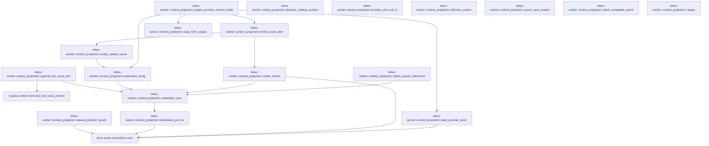

# tekes-worker::context_projection

[Package atlas](index.md) · [Source](../../src/context_projection.rs)

## Declarations

Visibility is the declaration spelling; trait members and reexports require their enclosing interface. `cfg` is not evaluated.

| Symbol | Kind | Visibility | Test / cfg |
|---|---|---|---|
| [tekes-worker::context_projection::dynamic_catalog_revision](../../src/context_projection.rs#L4) | function_item | `pub(crate)` |  |
| [tekes-worker::context_projection::native_search_references](../../src/context_projection.rs#L20) | function_item | `pub(crate)` |  |
| [tekes-worker::context_projection::project_provider_context](../../src/context_projection.rs#L94) | function_item | `pub(crate)` | test; #[cfg(test)] |
| [tekes-worker::context_projection::project_provider_context_mode](../../src/context_projection.rs#L104) | function_item | `pub(crate)` |  |
| [tekes-worker::context_projection::seed_provider_items](../../src/context_projection.rs#L451) | function_item | `pub(crate)` |  |
| [tekes-worker::context_projection::provider_wire_call_id](../../src/context_projection.rs#L554) | function_item | `private` |  |
| [tekes-worker::context_projection::render_sealed_carrier](../../src/context_projection.rs#L568) | function_item | `private` |  |
| [tekes-worker::context_projection::render_event_item](../../src/context_projection.rs#L595) | function_item | `pub(crate)` |  |
| [tekes-worker::context_projection::render_blocks](../../src/context_projection.rs#L680) | function_item | `pub(crate)` |  |
| [tekes-worker::context_projection::materialize_json](../../src/context_projection.rs#L731) | function_item | `pub(crate)` |  |
| [tekes-worker::context_projection::materialize_json_at](../../src/context_projection.rs#L738) | function_item | `pub(crate)` |  |
| [tekes-worker::context_projection::materialize_string](../../src/context_projection.rs#L759) | function_item | `pub(crate)` |  |
| [tekes-worker::context_projection::seqs_from_ranges](../../src/context_projection.rs#L770) | function_item | `private` |  |
| [tekes-worker::context_projection::effective_system](../../src/context_projection.rs#L786) | function_item | `pub(crate)` |  |
| [tekes-worker::context_projection::EpochAppend](../../src/context_projection.rs#L798) | struct_item | `pub(crate)` |  |
| [tekes-worker::context_projection::epoch_open_reason](../../src/context_projection.rs#L813) | function_item | `pub(crate)` |  |
| [tekes-worker::context_projection::append_tool_result_trim](../../src/context_projection.rs#L853) | function_item | `pub(crate)` |  |
| [tekes-worker::context_projection::append_provider_epoch](../../src/context_projection.rs#L893) | function_item | `pub(crate)` |  |
| [tekes-worker::context_projection::latest_compatible_epoch](../../src/context_projection.rs#L939) | function_item | `pub(crate)` |  |
| [tekes-worker::context_projection::ranges](../../src/context_projection.rs#L974) | function_item | `pub(crate)` |  |

## Imports / reexports

| Local name | Source path | Visibility |
|---|---|---|
| `*` | `super::*` | `private` |

## Module declarations

| Module | Visibility | Attributes |
|---|---|---|

## Function call graphs

Edges below are syntactically resolved calls only, including private functions. Graphs partition callers into groups of 20; they are not execution order. All unresolved sites are listed below and in the JSON inventory.

Functions 1–18: 17 direct edges

## Call sites

Includes test functions (marked in declarations). Receiver-type-required sites need type analysis/manual tracing. Calls in closures are attributed to their enclosing function; their occurrence here does not mean the closure executes immediately.

| Caller | Callee expression | Source lines | Target / classification |
|---|---|---|---|
| `dynamic_catalog_revision` | `Sha256::new` | [5](../../src/context_projection.rs#L5) | external-constructor-callback-or-unresolved |
| `dynamic_catalog_revision` | `digest.update` | [6](../../src/context_projection.rs#L6), [8](../../src/context_projection.rs#L8), [9](../../src/context_projection.rs#L9), [10](../../src/context_projection.rs#L10), [11](../../src/context_projection.rs#L11) | receiver-type-required |
| `dynamic_catalog_revision` | `entry.name.as_bytes` | [8](../../src/context_projection.rs#L8) | receiver-type-required |
| `dynamic_catalog_revision` | `entry.schema_digest.as_bytes` | [10](../../src/context_projection.rs#L10) | receiver-type-required |
| `native_search_references` | `ledger.projection().ok_or` | [27](../../src/context_projection.rs#L27) | receiver-type-required |
| `native_search_references` | `ledger.projection` | [27](../../src/context_projection.rs#L27) | receiver-type-required |
| `native_search_references` | `projection         .events         .iter()         .filter(&#124;event&#124; {             event.seq() < before_seq                 && event.turn() == Some(turn)                 && *event.kind() == EventKind::ToolCall                 && event.string_field("name") == Some("tool_search")         })         .filter_map(&#124;event&#124; event.string_field("call").map(str::to_owned))         .collect::<Vec<_>>` | [28](../../src/context_projection.rs#L28) | receiver-type-required |
| `native_search_references` | `projection         .events         .iter()         .filter(&#124;event&#124; {             event.seq() < before_seq                 && event.turn() == Some(turn)                 && *event.kind() == EventKind::ToolCall                 && event.string_field("name") == Some("tool_search")         })         .filter_map` | [28](../../src/context_projection.rs#L28) | receiver-type-required |
| `native_search_references` | `projection         .events         .iter()         .filter` | [28](../../src/context_projection.rs#L28) | receiver-type-required |
| `native_search_references` | `projection         .events         .iter` | [28](../../src/context_projection.rs#L28) | receiver-type-required |
| `native_search_references` | `event.seq` | [32](../../src/context_projection.rs#L32), [43](../../src/context_projection.rs#L43) | receiver-type-required |
| `native_search_references` | `event.turn` | [33](../../src/context_projection.rs#L33) | receiver-type-required |
| `native_search_references` | `Some` | [33](../../src/context_projection.rs#L33), [35](../../src/context_projection.rs#L35), [45](../../src/context_projection.rs#L45), [50](../../src/context_projection.rs#L50) | external-constructor-callback-or-unresolved |
| `native_search_references` | `event.kind` | [34](../../src/context_projection.rs#L34), [44](../../src/context_projection.rs#L44) | receiver-type-required |
| `native_search_references` | `event.string_field` | [35](../../src/context_projection.rs#L35), [37](../../src/context_projection.rs#L37), [45](../../src/context_projection.rs#L45) | receiver-type-required |
| `native_search_references` | `event.string_field("call").map` | [37](../../src/context_projection.rs#L37) | receiver-type-required |
| `native_search_references` | `Vec::new` | [39](../../src/context_projection.rs#L39) | external-constructor-callback-or-unresolved |
| `native_search_references` | `BTreeSet::new` | [40](../../src/context_projection.rs#L40) | external-constructor-callback-or-unresolved |
| `native_search_references` | `projection.events.iter().find` | [42](../../src/context_projection.rs#L42) | receiver-type-required |
| `native_search_references` | `projection.events.iter` | [42](../../src/context_projection.rs#L42) | receiver-type-required |
| `native_search_references` | `call.as_str` | [45](../../src/context_projection.rs#L45) | receiver-type-required |
| `native_search_references` | `serde_json::to_value` | [49](../../src/context_projection.rs#L49) | external-constructor-callback-or-unresolved |
| `native_search_references` | `result.raw` | [49](../../src/context_projection.rs#L49) | receiver-type-required |
| `native_search_references` | `raw.get("outcome").and_then` | [50](../../src/context_projection.rs#L50) | receiver-type-required |
| `native_search_references` | `raw.get` | [50](../../src/context_projection.rs#L50), [53](../../src/context_projection.rs#L53) | receiver-type-required |
| `native_search_references` | `materialize_json` | [56](../../src/context_projection.rs#L56) | [tekes-worker::context_projection::materialize_json](../../src/context_projection.rs#L731) |
| `native_search_references` | `content.as_array().into_iter().flatten` | [57](../../src/context_projection.rs#L57) | receiver-type-required |
| `native_search_references` | `content.as_array().into_iter` | [57](../../src/context_projection.rs#L57) | receiver-type-required |
| `native_search_references` | `content.as_array` | [57](../../src/context_projection.rs#L57) | receiver-type-required |
| `native_search_references` | `block.get("text").and_then` | [58](../../src/context_projection.rs#L58) | receiver-type-required |
| `native_search_references` | `block.get` | [58](../../src/context_projection.rs#L58) | receiver-type-required |
| `native_search_references` | `serde_json::from_str::<Value>` | [61](../../src/context_projection.rs#L61) | external-constructor-callback-or-unresolved |
| `native_search_references` | `offer                 .get("items")                 .and_then(Value::as_array)                 .into_iter()                 .flatten` | [64](../../src/context_projection.rs#L64) | receiver-type-required |
| `native_search_references` | `offer                 .get("items")                 .and_then(Value::as_array)                 .into_iter` | [64](../../src/context_projection.rs#L64) | receiver-type-required |
| `native_search_references` | `offer                 .get("items")                 .and_then` | [64](../../src/context_projection.rs#L64) | receiver-type-required |
| `native_search_references` | `offer                 .get` | [64](../../src/context_projection.rs#L64) | receiver-type-required |
| `native_search_references` | `item.get("name").and_then` | [71](../../src/context_projection.rs#L71) | receiver-type-required |
| `native_search_references` | `item.get` | [71](../../src/context_projection.rs#L71), [72](../../src/context_projection.rs#L72) | receiver-type-required |
| `native_search_references` | `item.get("schema_digest").and_then` | [72](../../src/context_projection.rs#L72) | receiver-type-required |
| `native_search_references` | `deferred                     .iter()                     .any` | [76](../../src/context_projection.rs#L76) | receiver-type-required |
| `native_search_references` | `deferred                     .iter` | [76](../../src/context_projection.rs#L76) | receiver-type-required |
| `native_search_references` | `seen.insert` | [79](../../src/context_projection.rs#L79) | receiver-type-required |
| `native_search_references` | `call.clone` | [79](../../src/context_projection.rs#L79), [84](../../src/context_projection.rs#L84) | receiver-type-required |
| `native_search_references` | `name.to_owned` | [79](../../src/context_projection.rs#L79), [81](../../src/context_projection.rs#L81) | receiver-type-required |
| `native_search_references` | `references.push` | [80](../../src/context_projection.rs#L80) | receiver-type-required |
| `native_search_references` | `digest.to_owned` | [82](../../src/context_projection.rs#L82) | receiver-type-required |
| `native_search_references` | `catalog_revision.to_owned` | [83](../../src/context_projection.rs#L83) | receiver-type-required |
| `native_search_references` | `Ok` | [90](../../src/context_projection.rs#L90) | external-constructor-callback-or-unresolved |
| `project_provider_context` | `project_provider_context_mode` | [100](../../src/context_projection.rs#L100) | [tekes-worker::context_projection::project_provider_context_mode](../../src/context_projection.rs#L104) |
| `project_provider_context_mode` | `ledger.projection().ok_or` | [111](../../src/context_projection.rs#L111) | receiver-type-required |
| `project_provider_context_mode` | `ledger.projection` | [111](../../src/context_projection.rs#L111) | receiver-type-required |
| `project_provider_context_mode` | `std::collections::BTreeMap::<String, String>::new` | [112](../../src/context_projection.rs#L112), [122](../../src/context_projection.rs#L122), [128](../../src/context_projection.rs#L128) | external-constructor-callback-or-unresolved |
| `project_provider_context_mode` | `std::collections::BTreeMap::<String, Vec<u64>>::new` | [113](../../src/context_projection.rs#L113) | external-constructor-callback-or-unresolved |
| `project_provider_context_mode` | `std::collections::BTreeSet::<String>::new` | [114](../../src/context_projection.rs#L114), [118](../../src/context_projection.rs#L118), [129](../../src/context_projection.rs#L129) | external-constructor-callback-or-unresolved |
| `project_provider_context_mode` | `std::collections::BTreeMap::<String, u64>::new` | [121](../../src/context_projection.rs#L121), [127](../../src/context_projection.rs#L127) | external-constructor-callback-or-unresolved |
| `project_provider_context_mode` | `std::collections::BTreeSet::<u64>::new` | [123](../../src/context_projection.rs#L123), [124](../../src/context_projection.rs#L124), [133](../../src/context_projection.rs#L133) | external-constructor-callback-or-unresolved |
| `project_provider_context_mode` | `std::collections::BTreeMap::<u64, u64>::new` | [125](../../src/context_projection.rs#L125), [126](../../src/context_projection.rs#L126), [309](../../src/context_projection.rs#L309) | external-constructor-callback-or-unresolved |
| `project_provider_context_mode` | `serde_json::to_value` | [136](../../src/context_projection.rs#L136), [280](../../src/context_projection.rs#L280), [314](../../src/context_projection.rs#L314), [350](../../src/context_projection.rs#L350) | external-constructor-callback-or-unresolved |
| `project_provider_context_mode` | `event.raw` | [136](../../src/context_projection.rs#L136), [280](../../src/context_projection.rs#L280), [314](../../src/context_projection.rs#L314), [350](../../src/context_projection.rs#L350) | receiver-type-required |
| `project_provider_context_mode` | `raw.as_object().ok_or` | [137](../../src/context_projection.rs#L137), [281](../../src/context_projection.rs#L281), [315](../../src/context_projection.rs#L315), [351](../../src/context_projection.rs#L351) | receiver-type-required |
| `project_provider_context_mode` | `raw.as_object` | [137](../../src/context_projection.rs#L137), [281](../../src/context_projection.rs#L281), [315](../../src/context_projection.rs#L315), [351](../../src/context_projection.rs#L351) | receiver-type-required |
| `project_provider_context_mode` | `seqs_from_ranges` | [138](../../src/context_projection.rs#L138), [142](../../src/context_projection.rs#L142), [198](../../src/context_projection.rs#L198), [316](../../src/context_projection.rs#L316) | [tekes-worker::context_projection::seqs_from_ranges](../../src/context_projection.rs#L770) |
| `project_provider_context_mode` | `object.get` | [138](../../src/context_projection.rs#L138), [142](../../src/context_projection.rs#L142), [181](../../src/context_projection.rs#L181), [198](../../src/context_projection.rs#L198), [284](../../src/context_projection.rs#L284), [316](../../src/context_projection.rs#L316), [387](../../src/context_projection.rs#L387) | receiver-type-required |
| `project_provider_context_mode` | `superseded.insert` | [139](../../src/context_projection.rs#L139) | receiver-type-required |
| `project_provider_context_mode` | `event.kind` | [141](../../src/context_projection.rs#L141), [146](../../src/context_projection.rs#L146), [274](../../src/context_projection.rs#L274), [311](../../src/context_projection.rs#L311), [358](../../src/context_projection.rs#L358), [371](../../src/context_projection.rs#L371), [385](../../src/context_projection.rs#L385), [401](../../src/context_projection.rs#L401) | receiver-type-required |
| `project_provider_context_mode` | `compacted.insert` | [143](../../src/context_projection.rs#L143) | receiver-type-required |
| `project_provider_context_mode` | `event.string_field` | [147](../../src/context_projection.rs#L147), [227](../../src/context_projection.rs#L227), [228](../../src/context_projection.rs#L228), [335](../../src/context_projection.rs#L335), [422](../../src/context_projection.rs#L422) | receiver-type-required |
| `project_provider_context_mode` | `Some` | [147](../../src/context_projection.rs#L147), [148](../../src/context_projection.rs#L148), [163](../../src/context_projection.rs#L163), [181](../../src/context_projection.rs#L181), [387](../../src/context_projection.rs#L387), [410](../../src/context_projection.rs#L410) | external-constructor-callback-or-unresolved |
| `project_provider_context_mode` | `event.seq` | [148](../../src/context_projection.rs#L148), [173](../../src/context_projection.rs#L173), [183](../../src/context_projection.rs#L183), [207](../../src/context_projection.rs#L207), [224](../../src/context_projection.rs#L224), [275](../../src/context_projection.rs#L275), [276](../../src/context_projection.rs#L276), [296](../../src/context_projection.rs#L296), [320](../../src/context_projection.rs#L320), [334](../../src/context_projection.rs#L334), [340](../../src/context_projection.rs#L340), [352](../../src/context_projection.rs#L352), [353](../../src/context_projection.rs#L353), [386](../../src/context_projection.rs#L386), [388](../../src/context_projection.rs#L388), [403](../../src/context_projection.rs#L403), [413](../../src/context_projection.rs#L413), [416](../../src/context_projection.rs#L416), [435](../../src/context_projection.rs#L435), [436](../../src/context_projection.rs#L436) | receiver-type-required |
| `project_provider_context_mode` | `object                     .get("pending")                     .and_then(Value::as_object)                     .into_iter()                     .flat_map(&#124;pending&#124; [pending.get("eligible"), pending.get("withheld")])                     .flatten()                     .flat_map(&#124;value&#124; value.as_array().into_iter().flatten())                     .filter_map` | [149](../../src/context_projection.rs#L149) | receiver-type-required |
| `project_provider_context_mode` | `object                     .get("pending")                     .and_then(Value::as_object)                     .into_iter()                     .flat_map(&#124;pending&#124; [pending.get("eligible"), pending.get("withheld")])                     .flatten()                     .flat_map` | [149](../../src/context_projection.rs#L149) | receiver-type-required |
| `project_provider_context_mode` | `object                     .get("pending")                     .and_then(Value::as_object)                     .into_iter()                     .flat_map(&#124;pending&#124; [pending.get("eligible"), pending.get("withheld")])                     .flatten` | [149](../../src/context_projection.rs#L149) | receiver-type-required |
| `project_provider_context_mode` | `object                     .get("pending")                     .and_then(Value::as_object)                     .into_iter()                     .flat_map` | [149](../../src/context_projection.rs#L149) | receiver-type-required |
| `project_provider_context_mode` | `object                     .get("pending")                     .and_then(Value::as_object)                     .into_iter` | [149](../../src/context_projection.rs#L149) | receiver-type-required |
| `project_provider_context_mode` | `object                     .get("pending")                     .and_then` | [149](../../src/context_projection.rs#L149) | receiver-type-required |
| `project_provider_context_mode` | `object                     .get` | [149](../../src/context_projection.rs#L149), [164](../../src/context_projection.rs#L164) | receiver-type-required |
| `project_provider_context_mode` | `pending.get` | [153](../../src/context_projection.rs#L153) | receiver-type-required |
| `project_provider_context_mode` | `value.as_array().into_iter().flatten` | [155](../../src/context_projection.rs#L155) | receiver-type-required |
| `project_provider_context_mode` | `value.as_array().into_iter` | [155](../../src/context_projection.rs#L155) | receiver-type-required |
| `project_provider_context_mode` | `value.as_array` | [155](../../src/context_projection.rs#L155) | receiver-type-required |
| `project_provider_context_mode` | `epoch_pending.insert` | [158](../../src/context_projection.rs#L158) | receiver-type-required |
| `project_provider_context_mode` | `event.turn().ok_or` | [162](../../src/context_projection.rs#L162), [231](../../src/context_projection.rs#L231) | receiver-type-required |
| `project_provider_context_mode` | `event.turn` | [162](../../src/context_projection.rs#L162), [177](../../src/context_projection.rs#L177), [231](../../src/context_projection.rs#L231), [398](../../src/context_projection.rs#L398), [410](../../src/context_projection.rs#L410) | receiver-type-required |
| `project_provider_context_mode` | `object                     .get("trigger")                     .and_then(&#124;trigger&#124; trigger.get("inputs"))                     .and_then(Value::as_array)                     .into_iter()                     .flatten()                     .filter_map` | [164](../../src/context_projection.rs#L164) | receiver-type-required |
| `project_provider_context_mode` | `object                     .get("trigger")                     .and_then(&#124;trigger&#124; trigger.get("inputs"))                     .and_then(Value::as_array)                     .into_iter()                     .flatten` | [164](../../src/context_projection.rs#L164) | receiver-type-required |
| `project_provider_context_mode` | `object                     .get("trigger")                     .and_then(&#124;trigger&#124; trigger.get("inputs"))                     .and_then(Value::as_array)                     .into_iter` | [164](../../src/context_projection.rs#L164) | receiver-type-required |
| `project_provider_context_mode` | `object                     .get("trigger")                     .and_then(&#124;trigger&#124; trigger.get("inputs"))                     .and_then` | [164](../../src/context_projection.rs#L164) | receiver-type-required |
| `project_provider_context_mode` | `object                     .get("trigger")                     .and_then` | [164](../../src/context_projection.rs#L164) | receiver-type-required |
| `project_provider_context_mode` | `trigger.get` | [166](../../src/context_projection.rs#L166) | receiver-type-required |
| `project_provider_context_mode` | `input_turn.insert` | [172](../../src/context_projection.rs#L172), [183](../../src/context_projection.rs#L183) | receiver-type-required |
| `project_provider_context_mode` | `input_position.insert` | [173](../../src/context_projection.rs#L173) | receiver-type-required |
| `project_provider_context_mode` | `object.get("steer").and_then` | [181](../../src/context_projection.rs#L181), [387](../../src/context_projection.rs#L387) | receiver-type-required |
| `project_provider_context_mode` | `event                     .string_field("attempt")                     .ok_or("attempt lacks id")?                     .to_owned` | [187](../../src/context_projection.rs#L187) | receiver-type-required |
| `project_provider_context_mode` | `event                     .string_field("attempt")                     .ok_or` | [187](../../src/context_projection.rs#L187), [201](../../src/context_projection.rs#L201), [218](../../src/context_projection.rs#L218) | receiver-type-required |
| `project_provider_context_mode` | `event                     .string_field` | [187](../../src/context_projection.rs#L187), [201](../../src/context_projection.rs#L201), [218](../../src/context_projection.rs#L218) | receiver-type-required |
| `project_provider_context_mode` | `attempt_epoch.insert` | [191](../../src/context_projection.rs#L191) | receiver-type-required |
| `project_provider_context_mode` | `id.clone` | [192](../../src/context_projection.rs#L192) | receiver-type-required |
| `project_provider_context_mode` | `event                         .string_field("epoch")                         .ok_or("attempt lacks epoch")?                         .to_owned` | [193](../../src/context_projection.rs#L193) | receiver-type-required |
| `project_provider_context_mode` | `event                         .string_field("epoch")                         .ok_or` | [193](../../src/context_projection.rs#L193) | receiver-type-required |
| `project_provider_context_mode` | `event                         .string_field` | [193](../../src/context_projection.rs#L193), [234](../../src/context_projection.rs#L234), [242](../../src/context_projection.rs#L242) | receiver-type-required |
| `project_provider_context_mode` | `attempt_admits.insert` | [198](../../src/context_projection.rs#L198) | receiver-type-required |
| `project_provider_context_mode` | `settled_outputs.insert` | [204](../../src/context_projection.rs#L204) | receiver-type-required |
| `project_provider_context_mode` | `attempt.to_owned` | [204](../../src/context_projection.rs#L204), [206](../../src/context_projection.rs#L206), [221](../../src/context_projection.rs#L221), [223](../../src/context_projection.rs#L223), [229](../../src/context_projection.rs#L229) | receiver-type-required |
| `project_provider_context_mode` | `output_positions                     .entry(attempt.to_owned())                     .or_insert` | [205](../../src/context_projection.rs#L205), [222](../../src/context_projection.rs#L222) | receiver-type-required |
| `project_provider_context_mode` | `output_positions                     .entry` | [205](../../src/context_projection.rs#L205), [222](../../src/context_projection.rs#L222) | receiver-type-required |
| `project_provider_context_mode` | `attempt_epoch.get(attempt).is_some_and` | [208](../../src/context_projection.rs#L208) | receiver-type-required |
| `project_provider_context_mode` | `attempt_epoch.get` | [208](../../src/context_projection.rs#L208), [261](../../src/context_projection.rs#L261) | receiver-type-required |
| `project_provider_context_mode` | `object                         .get("continuation")                         .and_then(&#124;continuation&#124; continuation.get("id"))                         .and_then(Value::as_str)                         .map(str::to_owned)                         .or` | [209](../../src/context_projection.rs#L209) | receiver-type-required |
| `project_provider_context_mode` | `object                         .get("continuation")                         .and_then(&#124;continuation&#124; continuation.get("id"))                         .and_then(Value::as_str)                         .map` | [209](../../src/context_projection.rs#L209) | receiver-type-required |
| `project_provider_context_mode` | `object                         .get("continuation")                         .and_then(&#124;continuation&#124; continuation.get("id"))                         .and_then` | [209](../../src/context_projection.rs#L209) | receiver-type-required |
| `project_provider_context_mode` | `object                         .get("continuation")                         .and_then` | [209](../../src/context_projection.rs#L209) | receiver-type-required |
| `project_provider_context_mode` | `object                         .get` | [209](../../src/context_projection.rs#L209) | receiver-type-required |
| `project_provider_context_mode` | `continuation.get` | [211](../../src/context_projection.rs#L211) | receiver-type-required |
| `project_provider_context_mode` | `object.contains_key` | [217](../../src/context_projection.rs#L217), [359](../../src/context_projection.rs#L359) | receiver-type-required |
| `project_provider_context_mode` | `partial_carriers.insert` | [221](../../src/context_projection.rs#L221) | receiver-type-required |
| `project_provider_context_mode` | `event.string_field("call").ok_or` | [227](../../src/context_projection.rs#L227) | receiver-type-required |
| `project_provider_context_mode` | `call_attempts.insert` | [229](../../src/context_projection.rs#L229) | receiver-type-required |
| `project_provider_context_mode` | `call.to_owned` | [229](../../src/context_projection.rs#L229), [231](../../src/context_projection.rs#L231), [233](../../src/context_projection.rs#L233) | receiver-type-required |
| `project_provider_context_mode` | `call_turn.insert` | [231](../../src/context_projection.rs#L231) | receiver-type-required |
| `project_provider_context_mode` | `call_name.insert` | [232](../../src/context_projection.rs#L232) | receiver-type-required |
| `project_provider_context_mode` | `event                         .string_field("name")                         .ok_or("tool_call lacks name")?                         .to_owned` | [234](../../src/context_projection.rs#L234) | receiver-type-required |
| `project_provider_context_mode` | `event                         .string_field("name")                         .ok_or` | [234](../../src/context_projection.rs#L234) | receiver-type-required |
| `project_provider_context_mode` | `spawned_calls.insert` | [241](../../src/context_projection.rs#L241) | receiver-type-required |
| `project_provider_context_mode` | `event                         .string_field("call")                         .ok_or("spawn lacks call")?                         .to_owned` | [242](../../src/context_projection.rs#L242) | receiver-type-required |
| `project_provider_context_mode` | `event                         .string_field("call")                         .ok_or` | [242](../../src/context_projection.rs#L242) | receiver-type-required |
| `project_provider_context_mode` | `attempt_admits         .iter()         .filter(&#124;(attempt, _)&#124; settled_outputs.contains(*attempt))         .flat_map(&#124;(_, seqs)&#124; seqs.iter().copied())         .collect::<std::collections::BTreeSet<_>>` | [252](../../src/context_projection.rs#L252) | receiver-type-required |
| `project_provider_context_mode` | `attempt_admits         .iter()         .filter(&#124;(attempt, _)&#124; settled_outputs.contains(*attempt))         .flat_map` | [252](../../src/context_projection.rs#L252) | receiver-type-required |
| `project_provider_context_mode` | `attempt_admits         .iter()         .filter` | [252](../../src/context_projection.rs#L252), [257](../../src/context_projection.rs#L257) | receiver-type-required |
| `project_provider_context_mode` | `attempt_admits         .iter` | [252](../../src/context_projection.rs#L252), [257](../../src/context_projection.rs#L257) | receiver-type-required |
| `project_provider_context_mode` | `settled_outputs.contains` | [254](../../src/context_projection.rs#L254), [260](../../src/context_projection.rs#L260), [423](../../src/context_projection.rs#L423) | receiver-type-required |
| `project_provider_context_mode` | `seqs.iter().copied` | [255](../../src/context_projection.rs#L255), [263](../../src/context_projection.rs#L263) | receiver-type-required |
| `project_provider_context_mode` | `seqs.iter` | [255](../../src/context_projection.rs#L255), [263](../../src/context_projection.rs#L263) | receiver-type-required |
| `project_provider_context_mode` | `attempt_admits         .iter()         .filter(&#124;(attempt, _)&#124; {             settled_outputs.contains(*attempt)                 && attempt_epoch.get(*attempt).is_some_and(&#124;id&#124; id == epoch_id)         })         .flat_map(&#124;(_, seqs)&#124; seqs.iter().copied())         .collect::<std::collections::BTreeSet<_>>` | [257](../../src/context_projection.rs#L257) | receiver-type-required |
| `project_provider_context_mode` | `attempt_admits         .iter()         .filter(&#124;(attempt, _)&#124; {             settled_outputs.contains(*attempt)                 && attempt_epoch.get(*attempt).is_some_and(&#124;id&#124; id == epoch_id)         })         .flat_map` | [257](../../src/context_projection.rs#L257) | receiver-type-required |
| `project_provider_context_mode` | `attempt_epoch.get(*attempt).is_some_and` | [261](../../src/context_projection.rs#L261) | receiver-type-required |
| `project_provider_context_mode` | `dialect.server_managed` | [265](../../src/context_projection.rs#L265) | receiver-type-required |
| `project_provider_context_mode` | `continuation_id.is_some` | [266](../../src/context_projection.rs#L266) | receiver-type-required |
| `project_provider_context_mode` | `epoch_seq.ok_or` | [267](../../src/context_projection.rs#L267) | receiver-type-required |
| `project_provider_context_mode` | `Vec::new` | [268](../../src/context_projection.rs#L268), [298](../../src/context_projection.rs#L298) | external-constructor-callback-or-unresolved |
| `project_provider_context_mode` | `items.extend` | [270](../../src/context_projection.rs#L270) | receiver-type-required |
| `project_provider_context_mode` | `seed_provider_items` | [270](../../src/context_projection.rs#L270) | [tekes-worker::context_projection::seed_provider_items](../../src/context_projection.rs#L451) |
| `project_provider_context_mode` | `superseded.contains` | [275](../../src/context_projection.rs#L275), [353](../../src/context_projection.rs#L353) | receiver-type-required |
| `project_provider_context_mode` | `compacted.contains` | [276](../../src/context_projection.rs#L276), [353](../../src/context_projection.rs#L353) | receiver-type-required |
| `project_provider_context_mode` | `materialize_string` | [282](../../src/context_projection.rs#L282) | [tekes-worker::context_projection::materialize_string](../../src/context_projection.rs#L759) |
| `project_provider_context_mode` | `object.get("summary").ok_or` | [284](../../src/context_projection.rs#L284) | receiver-type-required |
| `project_provider_context_mode` | `items.push` | [286](../../src/context_projection.rs#L286), [438](../../src/context_projection.rs#L438) | receiver-type-required |
| `project_provider_context_mode` | `ijson` | [286](../../src/context_projection.rs#L286), [438](../../src/context_projection.rs#L438) | external-constructor-callback-or-unresolved |
| `project_provider_context_mode` | `projection         .events         .partition_point` | [294](../../src/context_projection.rs#L294) | receiver-type-required |
| `project_provider_context_mode` | `compaction_anchor_sequences` | [297](../../src/context_projection.rs#L297) | external-constructor-callback-or-unresolved |
| `project_provider_context_mode` | `seqs_from_ranges(object.get("supersedes"))?             .into_iter()             .max` | [316](../../src/context_projection.rs#L316) | receiver-type-required |
| `project_provider_context_mode` | `seqs_from_ranges(object.get("supersedes"))?             .into_iter` | [316](../../src/context_projection.rs#L316) | receiver-type-required |
| `project_provider_context_mode` | `replaced_result.insert` | [320](../../src/context_projection.rs#L320) | receiver-type-required |
| `project_provider_context_mode` | `replaced_result.get` | [325](../../src/context_projection.rs#L325) | receiver-type-required |
| `project_provider_context_mode` | `render_anchor` | [334](../../src/context_projection.rs#L334), [340](../../src/context_projection.rs#L340) | external-constructor-callback-or-unresolved |
| `project_provider_context_mode` | `output_positions.get` | [335](../../src/context_projection.rs#L335) | receiver-type-required |
| `project_provider_context_mode` | `call_attempts.get` | [335](../../src/context_projection.rs#L335) | receiver-type-required |
| `project_provider_context_mode` | `(*output > anchor).then_some` | [336](../../src/context_projection.rs#L336) | receiver-type-required |
| `project_provider_context_mode` | `projection.events.iter().collect::<Vec<_>>` | [338](../../src/context_projection.rs#L338) | receiver-type-required |
| `project_provider_context_mode` | `projection.events.iter` | [338](../../src/context_projection.rs#L338) | receiver-type-required |
| `project_provider_context_mode` | `ordered_events.sort_by_key` | [339](../../src/context_projection.rs#L339) | receiver-type-required |
| `project_provider_context_mode` | `input_position.get` | [341](../../src/context_projection.rs#L341) | receiver-type-required |
| `project_provider_context_mode` | `deferred_result_position` | [343](../../src/context_projection.rs#L343) | external-constructor-callback-or-unresolved |
| `project_provider_context_mode` | `semantic_anchors.contains` | [352](../../src/context_projection.rs#L352) | receiver-type-required |
| `project_provider_context_mode` | `event                 .string_field("attempt")                 .is_some_and` | [360](../../src/context_projection.rs#L360) | receiver-type-required |
| `project_provider_context_mode` | `event                 .string_field` | [360](../../src/context_projection.rs#L360), [372](../../src/context_projection.rs#L372) | receiver-type-required |
| `project_provider_context_mode` | `partial_carriers.contains` | [362](../../src/context_projection.rs#L362), [423](../../src/context_projection.rs#L423) | receiver-type-required |
| `project_provider_context_mode` | `event                 .string_field("call")                 .is_some_and` | [372](../../src/context_projection.rs#L372) | receiver-type-required |
| `project_provider_context_mode` | `spawned_calls.contains` | [374](../../src/context_projection.rs#L374) | receiver-type-required |
| `project_provider_context_mode` | `input_turn.get(&event.seq()).is_some_and` | [386](../../src/context_projection.rs#L386) | receiver-type-required |
| `project_provider_context_mode` | `input_turn.get` | [386](../../src/context_projection.rs#L386) | receiver-type-required |
| `project_provider_context_mode` | `admitted_all.contains` | [388](../../src/context_projection.rs#L388) | receiver-type-required |
| `project_provider_context_mode` | `object                 .get("call")                 .and_then(Value::as_str)                 .and_then(&#124;call&#124; call_turn.get(call))                 .is_some_and` | [393](../../src/context_projection.rs#L393), [405](../../src/context_projection.rs#L405) | receiver-type-required |
| `project_provider_context_mode` | `object                 .get("call")                 .and_then(Value::as_str)                 .and_then` | [393](../../src/context_projection.rs#L393), [405](../../src/context_projection.rs#L405) | receiver-type-required |
| `project_provider_context_mode` | `object                 .get("call")                 .and_then` | [393](../../src/context_projection.rs#L393), [405](../../src/context_projection.rs#L405) | receiver-type-required |
| `project_provider_context_mode` | `object                 .get` | [393](../../src/context_projection.rs#L393), [405](../../src/context_projection.rs#L405) | receiver-type-required |
| `project_provider_context_mode` | `call_turn.get` | [396](../../src/context_projection.rs#L396), [408](../../src/context_projection.rs#L408) | receiver-type-required |
| `project_provider_context_mode` | `event.turn().is_none_or` | [398](../../src/context_projection.rs#L398) | receiver-type-required |
| `project_provider_context_mode` | `input_turn                 .get(&event.seq())                 .is_some_and` | [402](../../src/context_projection.rs#L402) | receiver-type-required |
| `project_provider_context_mode` | `input_turn                 .get` | [402](../../src/context_projection.rs#L402) | receiver-type-required |
| `project_provider_context_mode` | `epoch_pending.contains` | [413](../../src/context_projection.rs#L413) | receiver-type-required |
| `project_provider_context_mode` | `admitted.contains` | [416](../../src/context_projection.rs#L416), [435](../../src/context_projection.rs#L435) | receiver-type-required |
| `project_provider_context_mode` | `event.string_field("attempt").is_some_and` | [422](../../src/context_projection.rs#L422) | receiver-type-required |
| `project_provider_context_mode` | `render_event_item(ledger, event, object, &call_name, dialect)?.ok_or_else` | [429](../../src/context_projection.rs#L429) | receiver-type-required |
| `project_provider_context_mode` | `render_event_item` | [429](../../src/context_projection.rs#L429) | [tekes-worker::context_projection::render_event_item](../../src/context_projection.rs#L595) |
| `project_provider_context_mode` | `admits.push` | [436](../../src/context_projection.rs#L436) | receiver-type-required |
| `project_provider_context_mode` | `admits.sort_unstable` | [440](../../src/context_projection.rs#L440) | receiver-type-required |
| `project_provider_context_mode` | `admits.dedup` | [441](../../src/context_projection.rs#L441) | receiver-type-required |
| `project_provider_context_mode` | `Ok` | [442](../../src/context_projection.rs#L442) | external-constructor-callback-or-unresolved |
| `project_provider_context_mode` | `incremental_continuation             .then_some(continuation_id)             .flatten` | [445](../../src/context_projection.rs#L445) | receiver-type-required |
| `project_provider_context_mode` | `incremental_continuation             .then_some` | [445](../../src/context_projection.rs#L445) | receiver-type-required |
| `seed_provider_items` | `ledger.projection().ok_or` | [454](../../src/context_projection.rs#L454) | receiver-type-required |
| `seed_provider_items` | `ledger.projection` | [454](../../src/context_projection.rs#L454) | receiver-type-required |
| `seed_provider_items` | `projection.events.first` | [455](../../src/context_projection.rs#L455) | receiver-type-required |
| `seed_provider_items` | `Ok` | [456](../../src/context_projection.rs#L456), [460](../../src/context_projection.rs#L460), [551](../../src/context_projection.rs#L551) | external-constructor-callback-or-unresolved |
| `seed_provider_items` | `Vec::new` | [456](../../src/context_projection.rs#L456), [460](../../src/context_projection.rs#L460), [464](../../src/context_projection.rs#L464) | external-constructor-callback-or-unresolved |
| `seed_provider_items` | `serde_json::to_value` | [458](../../src/context_projection.rs#L458), [477](../../src/context_projection.rs#L477) | external-constructor-callback-or-unresolved |
| `seed_provider_items` | `genesis.raw` | [458](../../src/context_projection.rs#L458) | receiver-type-required |
| `seed_provider_items` | `raw.pointer("/seed/snapshot/asset").and_then` | [459](../../src/context_projection.rs#L459) | receiver-type-required |
| `seed_provider_items` | `raw.pointer` | [459](../../src/context_projection.rs#L459) | receiver-type-required |
| `seed_provider_items` | `ledger.path().parent().ok_or` | [462](../../src/context_projection.rs#L462) | receiver-type-required |
| `seed_provider_items` | `ledger.path().parent` | [462](../../src/context_projection.rs#L462) | receiver-type-required |
| `seed_provider_items` | `ledger.path` | [462](../../src/context_projection.rs#L462) | receiver-type-required |
| `seed_provider_items` | `store::AssetStore::new(folder.join("assets"))?.read_verified` | [463](../../src/context_projection.rs#L463) | receiver-type-required |
| `seed_provider_items` | `store::AssetStore::new` | [463](../../src/context_projection.rs#L463) | [store::asset::AssetStore::new](../../../store/src/asset.rs#L27) |
| `seed_provider_items` | `folder.join` | [463](../../src/context_projection.rs#L463) | receiver-type-required |
| `seed_provider_items` | `bytes.split_inclusive` | [465](../../src/context_projection.rs#L465) | receiver-type-required |
| `seed_provider_items` | `line.strip_suffix(b"\n").ok_or` | [466](../../src/context_projection.rs#L466) | receiver-type-required |
| `seed_provider_items` | `line.strip_suffix` | [466](../../src/context_projection.rs#L466) | receiver-type-required |
| `seed_provider_items` | `canonical.is_empty` | [467](../../src/context_projection.rs#L467) | receiver-type-required |
| `seed_provider_items` | `Err` | [468](../../src/context_projection.rs#L468), [542](../../src/context_projection.rs#L542) | external-constructor-callback-or-unresolved |
| `seed_provider_items` | `"seed snapshot has an empty line".into` | [468](../../src/context_projection.rs#L468) | receiver-type-required |
| `seed_provider_items` | `Event::decode_canonical` | [470](../../src/context_projection.rs#L470) | external-constructor-callback-or-unresolved |
| `seed_provider_items` | `event.raw` | [477](../../src/context_projection.rs#L477) | receiver-type-required |
| `seed_provider_items` | `raw.as_object().ok_or` | [478](../../src/context_projection.rs#L478) | receiver-type-required |
| `seed_provider_items` | `raw.as_object` | [478](../../src/context_projection.rs#L478) | receiver-type-required |
| `seed_provider_items` | `event.kind` | [479](../../src/context_projection.rs#L479) | receiver-type-required |
| `seed_provider_items` | `event                     .string_field("call")                     .ok_or` | [493](../../src/context_projection.rs#L493) | receiver-type-required |
| `seed_provider_items` | `event                     .string_field` | [493](../../src/context_projection.rs#L493) | receiver-type-required |
| `seed_provider_items` | `object                     .get("outcome")                     .ok_or` | [496](../../src/context_projection.rs#L496) | receiver-type-required |
| `seed_provider_items` | `object                     .get` | [496](../../src/context_projection.rs#L496), [518](../../src/context_projection.rs#L518) | receiver-type-required |
| `seed_provider_items` | `event.string_field` | [517](../../src/context_projection.rs#L517) | receiver-type-required |
| `seed_provider_items` | `Some` | [517](../../src/context_projection.rs#L517) | external-constructor-callback-or-unresolved |
| `seed_provider_items` | `object                     .get("payload")                     .and_then(Value::as_object)                     .ok_or` | [518](../../src/context_projection.rs#L518) | receiver-type-required |
| `seed_provider_items` | `object                     .get("payload")                     .and_then` | [518](../../src/context_projection.rs#L518) | receiver-type-required |
| `seed_provider_items` | `format!(                     "model-visible seed kind {} has no provider projection",                     other.as_str()                 )                 .into` | [542](../../src/context_projection.rs#L542) | receiver-type-required |
| `seed_provider_items` | `items.push` | [549](../../src/context_projection.rs#L549) | receiver-type-required |
| `seed_provider_items` | `ijson` | [549](../../src/context_projection.rs#L549) | external-constructor-callback-or-unresolved |
| `provider_wire_call_id` | `ledger         .projection()         .and_then(&#124;projection&#124; {             projection.events.iter().find(&#124;event&#124; {                 *event.kind() == EventKind::ToolCall && event.string_field("call") == Some(call)             })         })         .and_then(&#124;event&#124; event.string_field("provider_call"))         .unwrap_or` | [555](../../src/context_projection.rs#L555) | receiver-type-required |
| `provider_wire_call_id` | `ledger         .projection()         .and_then(&#124;projection&#124; {             projection.events.iter().find(&#124;event&#124; {                 *event.kind() == EventKind::ToolCall && event.string_field("call") == Some(call)             })         })         .and_then` | [555](../../src/context_projection.rs#L555) | receiver-type-required |
| `provider_wire_call_id` | `ledger         .projection()         .and_then` | [555](../../src/context_projection.rs#L555) | receiver-type-required |
| `provider_wire_call_id` | `ledger         .projection` | [555](../../src/context_projection.rs#L555) | receiver-type-required |
| `provider_wire_call_id` | `projection.events.iter().find` | [558](../../src/context_projection.rs#L558) | receiver-type-required |
| `provider_wire_call_id` | `projection.events.iter` | [558](../../src/context_projection.rs#L558) | receiver-type-required |
| `provider_wire_call_id` | `event.kind` | [559](../../src/context_projection.rs#L559) | receiver-type-required |
| `provider_wire_call_id` | `event.string_field` | [559](../../src/context_projection.rs#L559), [562](../../src/context_projection.rs#L562) | receiver-type-required |
| `provider_wire_call_id` | `Some` | [559](../../src/context_projection.rs#L559) | external-constructor-callback-or-unresolved |
| `render_sealed_carrier` | `object         .get("sealed")         .and_then(Value::as_object)         .ok_or_else` | [574](../../src/context_projection.rs#L574) | receiver-type-required |
| `render_sealed_carrier` | `object         .get("sealed")         .and_then` | [574](../../src/context_projection.rs#L574) | receiver-type-required |
| `render_sealed_carrier` | `object         .get` | [574](../../src/context_projection.rs#L574) | receiver-type-required |
| `render_sealed_carrier` | `sealed.get("version").and_then` | [578](../../src/context_projection.rs#L578) | receiver-type-required |
| `render_sealed_carrier` | `sealed.get` | [578](../../src/context_projection.rs#L578), [579](../../src/context_projection.rs#L579) | receiver-type-required |
| `render_sealed_carrier` | `Some` | [578](../../src/context_projection.rs#L578), [579](../../src/context_projection.rs#L579) | external-constructor-callback-or-unresolved |
| `render_sealed_carrier` | `sealed.get("adapter").and_then` | [579](../../src/context_projection.rs#L579) | receiver-type-required |
| `render_sealed_carrier` | `dialect.as_str` | [579](../../src/context_projection.rs#L579) | receiver-type-required |
| `render_sealed_carrier` | `Err` | [581](../../src/context_projection.rs#L581) | external-constructor-callback-or-unresolved |
| `render_sealed_carrier` | `format!("{kind} sealed carrier is incompatible with the active adapter").into` | [582](../../src/context_projection.rs#L582) | receiver-type-required |
| `render_sealed_carrier` | `materialize_string` | [585](../../src/context_projection.rs#L585) | [tekes-worker::context_projection::materialize_string](../../src/context_projection.rs#L759) |
| `render_sealed_carrier` | `sealed             .get("fragments")             .ok_or` | [587](../../src/context_projection.rs#L587) | receiver-type-required |
| `render_sealed_carrier` | `sealed             .get` | [587](../../src/context_projection.rs#L587) | receiver-type-required |
| `render_sealed_carrier` | `serde_json::to_value` | [591](../../src/context_projection.rs#L591) | external-constructor-callback-or-unresolved |
| `render_sealed_carrier` | `IJsonValue::parse` | [591](../../src/context_projection.rs#L591) | external-constructor-callback-or-unresolved |
| `render_sealed_carrier` | `fragments.as_bytes` | [591](../../src/context_projection.rs#L591) | receiver-type-required |
| `render_sealed_carrier` | `Ok` | [592](../../src/context_projection.rs#L592) | external-constructor-callback-or-unresolved |
| `render_event_item` | `event.kind` | [602](../../src/context_projection.rs#L602) | receiver-type-required |
| `render_event_item` | `render_sealed_carrier` | [607](../../src/context_projection.rs#L607), [610](../../src/context_projection.rs#L610) | [tekes-worker::context_projection::render_sealed_carrier](../../src/context_projection.rs#L568) |
| `render_event_item` | `object.contains_key` | [609](../../src/context_projection.rs#L609) | receiver-type-required |
| `render_event_item` | `event.string_field("call").ok_or` | [626](../../src/context_projection.rs#L626) | receiver-type-required |
| `render_event_item` | `event.string_field` | [626](../../src/context_projection.rs#L626) | receiver-type-required |
| `render_event_item` | `object.get("outcome").ok_or` | [627](../../src/context_projection.rs#L627) | receiver-type-required |
| `render_event_item` | `object.get` | [627](../../src/context_projection.rs#L627), [629](../../src/context_projection.rs#L629) | receiver-type-required |
| `render_event_item` | `call_names.get(call).map(String::as_str).unwrap_or` | [628](../../src/context_projection.rs#L628) | receiver-type-required |
| `render_event_item` | `call_names.get(call).map` | [628](../../src/context_projection.rs#L628) | receiver-type-required |
| `render_event_item` | `call_names.get` | [628](../../src/context_projection.rs#L628) | receiver-type-required |
| `render_event_item` | `render_blocks` | [630](../../src/context_projection.rs#L630) | [tekes-worker::context_projection::render_blocks](../../src/context_projection.rs#L680) |
| `render_event_item` | `blocks.as_mut_slice` | [633](../../src/context_projection.rs#L633) | receiver-type-required |
| `render_event_item` | `block                         .get("text")                         .and_then(Value::as_str)                         .filter(&#124;_&#124; block.get("type").and_then(Value::as_str) == Some("text"))                         .and_then` | [634](../../src/context_projection.rs#L634) | receiver-type-required |
| `render_event_item` | `block                         .get("text")                         .and_then(Value::as_str)                         .filter` | [634](../../src/context_projection.rs#L634) | receiver-type-required |
| `render_event_item` | `block                         .get("text")                         .and_then` | [634](../../src/context_projection.rs#L634) | receiver-type-required |
| `render_event_item` | `block                         .get` | [634](../../src/context_projection.rs#L634) | receiver-type-required |
| `render_event_item` | `block.get("type").and_then` | [637](../../src/context_projection.rs#L637) | receiver-type-required |
| `render_event_item` | `block.get` | [637](../../src/context_projection.rs#L637) | receiver-type-required |
| `render_event_item` | `Some` | [637](../../src/context_projection.rs#L637), [677](../../src/context_projection.rs#L677) | external-constructor-callback-or-unresolved |
| `render_event_item` | `result_presentation::present` | [638](../../src/context_projection.rs#L638) | external-constructor-callback-or-unresolved |
| `render_event_item` | `Value::Array` | [643](../../src/context_projection.rs#L643) | external-constructor-callback-or-unresolved |
| `render_event_item` | `event                 .string_field("call")                 .ok_or` | [658](../../src/context_projection.rs#L658) | receiver-type-required |
| `render_event_item` | `event                 .string_field` | [658](../../src/context_projection.rs#L658) | receiver-type-required |
| `render_event_item` | `Ok` | [675](../../src/context_projection.rs#L675), [677](../../src/context_projection.rs#L677) | external-constructor-callback-or-unresolved |
| `render_blocks` | `materialize_json` | [684](../../src/context_projection.rs#L684) | [tekes-worker::context_projection::materialize_json](../../src/context_projection.rs#L731) |
| `render_blocks` | `value.as_array().ok_or` | [685](../../src/context_projection.rs#L685) | receiver-type-required |
| `render_blocks` | `value.as_array` | [685](../../src/context_projection.rs#L685) | receiver-type-required |
| `render_blocks` | `blocks         .iter()         .map(&#124;block&#124; {             let object = block.as_object().ok_or("block is not an object")?;             Ok(match object.get("type").and_then(Value::as_str) {                 Some("text") => json!({"type":"text","text":object.get("text").and_then(Value::as_str).ok_or("text block lacks text")?}),                 Some("reasoning") => json!({"type":"reasoning","text":object.get("text").and_then(Value::as_str).ok_or("reasoning block lacks text")?}),                 Some("image") => {                     let asset = object.get("asset").and_then(Value::as_str).ok_or("image block lacks asset")?;                     let folder = ledger.path().parent().ok_or("ledger has no folder")?;                     let bytes = store::AssetStore::new(folder.join("assets"))?.read_verified(asset)?;                     json!({                         "type":"file","name":asset,                         "data":base64::engine::general_purpose::STANDARD.encode(bytes),                         "mime":object.get("mime").and_then(Value::as_str).ok_or("image block lacks mime")?                     })                 },                 Some("file") => {                     let asset = object.get("asset").and_then(Value::as_str).ok_or("file block lacks asset")?;                     let folder = ledger.path().parent().ok_or("ledger has no folder")?;                     let bytes = store::AssetStore::new(folder.join("assets"))?.read_verified(asset)?;                     json!({                         "type":"file",                         "name":object.get("name").and_then(Value::as_str).ok_or("file block lacks name")?,                         "mime":object.get("mime").and_then(Value::as_str).ok_or("file block lacks mime")?,                         "bytes":bytes.len(),                         "data":base64::engine::general_purpose::STANDARD.encode(bytes)                     })                 },                 Some("tool-call") => json!({                     "type":"tool_call","call_id":object.get("call").and_then(Value::as_str).ok_or("nested call lacks id")?,                     "name":object.get("name").and_then(Value::as_str).ok_or("nested call lacks name")?,                     "arguments":object.get("args").cloned().ok_or("nested call lacks args")?                 }),                 Some("tool-result") => json!({                     "type":"tool_result","call_id":object.get("call").and_then(Value::as_str).ok_or("nested result lacks call")?,                     "name":"tool","result":object.get("content").cloned().ok_or("nested result lacks content")?,                     "error":object.get("error").and_then(Value::as_bool).unwrap_or(false)                 }),                 _ => return Err("unknown block kind".into()),             })         })         .collect` | [686](../../src/context_projection.rs#L686) | receiver-type-required |
| `render_blocks` | `blocks         .iter()         .map` | [686](../../src/context_projection.rs#L686) | receiver-type-required |
| `render_blocks` | `blocks         .iter` | [686](../../src/context_projection.rs#L686) | receiver-type-required |
| `render_blocks` | `block.as_object().ok_or` | [689](../../src/context_projection.rs#L689) | receiver-type-required |
| `render_blocks` | `block.as_object` | [689](../../src/context_projection.rs#L689) | receiver-type-required |
| `render_blocks` | `Ok` | [690](../../src/context_projection.rs#L690) | external-constructor-callback-or-unresolved |
| `render_blocks` | `object.get("type").and_then` | [690](../../src/context_projection.rs#L690) | receiver-type-required |
| `render_blocks` | `object.get` | [690](../../src/context_projection.rs#L690), [694](../../src/context_projection.rs#L694), [704](../../src/context_projection.rs#L704) | receiver-type-required |
| `render_blocks` | `object.get("asset").and_then(Value::as_str).ok_or` | [694](../../src/context_projection.rs#L694), [704](../../src/context_projection.rs#L704) | receiver-type-required |
| `render_blocks` | `object.get("asset").and_then` | [694](../../src/context_projection.rs#L694), [704](../../src/context_projection.rs#L704) | receiver-type-required |
| `render_blocks` | `ledger.path().parent().ok_or` | [695](../../src/context_projection.rs#L695), [705](../../src/context_projection.rs#L705) | receiver-type-required |
| `render_blocks` | `ledger.path().parent` | [695](../../src/context_projection.rs#L695), [705](../../src/context_projection.rs#L705) | receiver-type-required |
| `render_blocks` | `ledger.path` | [695](../../src/context_projection.rs#L695), [705](../../src/context_projection.rs#L705) | receiver-type-required |
| `render_blocks` | `store::AssetStore::new(folder.join("assets"))?.read_verified` | [696](../../src/context_projection.rs#L696), [706](../../src/context_projection.rs#L706) | receiver-type-required |
| `render_blocks` | `store::AssetStore::new` | [696](../../src/context_projection.rs#L696), [706](../../src/context_projection.rs#L706) | [store::asset::AssetStore::new](../../../store/src/asset.rs#L27) |
| `render_blocks` | `folder.join` | [696](../../src/context_projection.rs#L696), [706](../../src/context_projection.rs#L706) | receiver-type-required |
| `render_blocks` | `Err` | [725](../../src/context_projection.rs#L725) | external-constructor-callback-or-unresolved |
| `render_blocks` | `"unknown block kind".into` | [725](../../src/context_projection.rs#L725) | receiver-type-required |
| `materialize_json` | `materialize_json_at` | [735](../../src/context_projection.rs#L735) | [tekes-worker::context_projection::materialize_json_at](../../src/context_projection.rs#L738) |
| `materialize_json` | `ledger.path` | [735](../../src/context_projection.rs#L735) | receiver-type-required |
| `materialize_json_at` | `value         .as_object()         .filter(&#124;object&#124; object.len() == 1)         .and_then(&#124;object&#124; object.get("$spill"))         .and_then` | [742](../../src/context_projection.rs#L742) | receiver-type-required |
| `materialize_json_at` | `value         .as_object()         .filter(&#124;object&#124; object.len() == 1)         .and_then` | [742](../../src/context_projection.rs#L742) | receiver-type-required |
| `materialize_json_at` | `value         .as_object()         .filter` | [742](../../src/context_projection.rs#L742) | receiver-type-required |
| `materialize_json_at` | `value         .as_object` | [742](../../src/context_projection.rs#L742) | receiver-type-required |
| `materialize_json_at` | `object.len` | [744](../../src/context_projection.rs#L744) | receiver-type-required |
| `materialize_json_at` | `object.get` | [745](../../src/context_projection.rs#L745) | receiver-type-required |
| `materialize_json_at` | `Ok` | [748](../../src/context_projection.rs#L748), [756](../../src/context_projection.rs#L756) | external-constructor-callback-or-unresolved |
| `materialize_json_at` | `value.clone` | [748](../../src/context_projection.rs#L748) | receiver-type-required |
| `materialize_json_at` | `spill         .get("asset")         .and_then(Value::as_str)         .ok_or` | [750](../../src/context_projection.rs#L750) | receiver-type-required |
| `materialize_json_at` | `spill         .get("asset")         .and_then` | [750](../../src/context_projection.rs#L750) | receiver-type-required |
| `materialize_json_at` | `spill         .get` | [750](../../src/context_projection.rs#L750) | receiver-type-required |
| `materialize_json_at` | `ledger_path.parent().ok_or` | [754](../../src/context_projection.rs#L754) | receiver-type-required |
| `materialize_json_at` | `ledger_path.parent` | [754](../../src/context_projection.rs#L754) | receiver-type-required |
| `materialize_json_at` | `store::AssetStore::new(folder.join("assets"))?.read_verified` | [755](../../src/context_projection.rs#L755) | receiver-type-required |
| `materialize_json_at` | `store::AssetStore::new` | [755](../../src/context_projection.rs#L755) | [store::asset::AssetStore::new](../../../store/src/asset.rs#L27) |
| `materialize_json_at` | `folder.join` | [755](../../src/context_projection.rs#L755) | receiver-type-required |
| `materialize_json_at` | `serde_json::to_value` | [756](../../src/context_projection.rs#L756) | external-constructor-callback-or-unresolved |
| `materialize_json_at` | `IJsonValue::parse` | [756](../../src/context_projection.rs#L756) | external-constructor-callback-or-unresolved |
| `materialize_string` | `materialize_json` | [763](../../src/context_projection.rs#L763) | [tekes-worker::context_projection::materialize_json](../../src/context_projection.rs#L731) |
| `materialize_string` | `value         .as_str()         .map(str::to_owned)         .ok_or_else` | [764](../../src/context_projection.rs#L764) | receiver-type-required |
| `materialize_string` | `value         .as_str()         .map` | [764](../../src/context_projection.rs#L764) | receiver-type-required |
| `materialize_string` | `value         .as_str` | [764](../../src/context_projection.rs#L764) | receiver-type-required |
| `materialize_string` | `"spilled value is not a string".into` | [767](../../src/context_projection.rs#L767) | receiver-type-required |
| `seqs_from_ranges` | `Vec::new` | [771](../../src/context_projection.rs#L771) | external-constructor-callback-or-unresolved |
| `seqs_from_ranges` | `value.and_then(Value::as_array).into_iter().flatten` | [772](../../src/context_projection.rs#L772) | receiver-type-required |
| `seqs_from_ranges` | `value.and_then(Value::as_array).into_iter` | [772](../../src/context_projection.rs#L772) | receiver-type-required |
| `seqs_from_ranges` | `value.and_then` | [772](../../src/context_projection.rs#L772) | receiver-type-required |
| `seqs_from_ranges` | `range             .get("from")             .and_then(Value::as_u64)             .ok_or` | [773](../../src/context_projection.rs#L773) | receiver-type-required |
| `seqs_from_ranges` | `range             .get("from")             .and_then` | [773](../../src/context_projection.rs#L773) | receiver-type-required |
| `seqs_from_ranges` | `range             .get` | [773](../../src/context_projection.rs#L773), [777](../../src/context_projection.rs#L777) | receiver-type-required |
| `seqs_from_ranges` | `range             .get("to")             .and_then(Value::as_u64)             .ok_or` | [777](../../src/context_projection.rs#L777) | receiver-type-required |
| `seqs_from_ranges` | `range             .get("to")             .and_then` | [777](../../src/context_projection.rs#L777) | receiver-type-required |
| `seqs_from_ranges` | `seqs.extend` | [781](../../src/context_projection.rs#L781) | receiver-type-required |
| `seqs_from_ranges` | `Ok` | [783](../../src/context_projection.rs#L783) | external-constructor-callback-or-unresolved |
| `effective_system` | `instruction         .effective         .agents         .iter()         .filter_map(&#124;index&#124; instruction.sources.get(*index as usize))         .filter(&#124;source&#124; source.kind == InstructionKind::Agents)         .map(&#124;source&#124; source.content.as_str())         .collect::<Vec<_>>()         .join` | [787](../../src/context_projection.rs#L787) | receiver-type-required |
| `effective_system` | `instruction         .effective         .agents         .iter()         .filter_map(&#124;index&#124; instruction.sources.get(*index as usize))         .filter(&#124;source&#124; source.kind == InstructionKind::Agents)         .map(&#124;source&#124; source.content.as_str())         .collect::<Vec<_>>` | [787](../../src/context_projection.rs#L787) | receiver-type-required |
| `effective_system` | `instruction         .effective         .agents         .iter()         .filter_map(&#124;index&#124; instruction.sources.get(*index as usize))         .filter(&#124;source&#124; source.kind == InstructionKind::Agents)         .map` | [787](../../src/context_projection.rs#L787) | receiver-type-required |
| `effective_system` | `instruction         .effective         .agents         .iter()         .filter_map(&#124;index&#124; instruction.sources.get(*index as usize))         .filter` | [787](../../src/context_projection.rs#L787) | receiver-type-required |
| `effective_system` | `instruction         .effective         .agents         .iter()         .filter_map` | [787](../../src/context_projection.rs#L787) | receiver-type-required |
| `effective_system` | `instruction         .effective         .agents         .iter` | [787](../../src/context_projection.rs#L787) | receiver-type-required |
| `effective_system` | `instruction.sources.get` | [791](../../src/context_projection.rs#L791) | receiver-type-required |
| `effective_system` | `source.content.as_str` | [793](../../src/context_projection.rs#L793) | receiver-type-required |
| `epoch_open_reason` | `previous.integer_field` | [829](../../src/context_projection.rs#L829) | receiver-type-required |
| `epoch_open_reason` | `Some` | [829](../../src/context_projection.rs#L829), [840](../../src/context_projection.rs#L840), [843](../../src/context_projection.rs#L843) | external-constructor-callback-or-unresolved |
| `epoch_open_reason` | `serde_json::to_value(previous.raw()).ok` | [832](../../src/context_projection.rs#L832) | receiver-type-required |
| `epoch_open_reason` | `serde_json::to_value` | [832](../../src/context_projection.rs#L832) | external-constructor-callback-or-unresolved |
| `epoch_open_reason` | `previous.raw` | [832](../../src/context_projection.rs#L832) | receiver-type-required |
| `epoch_open_reason` | `head.as_ref().and_then` | [834](../../src/context_projection.rs#L834) | receiver-type-required |
| `epoch_open_reason` | `head.as_ref` | [834](../../src/context_projection.rs#L834) | receiver-type-required |
| `epoch_open_reason` | `raw.pointer(pointer)                 .and_then(Value::as_str)                 .map` | [835](../../src/context_projection.rs#L835) | receiver-type-required |
| `epoch_open_reason` | `raw.pointer(pointer)                 .and_then` | [835](../../src/context_projection.rs#L835) | receiver-type-required |
| `epoch_open_reason` | `raw.pointer` | [835](../../src/context_projection.rs#L835) | receiver-type-required |
| `epoch_open_reason` | `field("/tools/digest").as_deref` | [840](../../src/context_projection.rs#L840) | receiver-type-required |
| `epoch_open_reason` | `field` | [840](../../src/context_projection.rs#L840), [843](../../src/context_projection.rs#L843) | external-constructor-callback-or-unresolved |
| `epoch_open_reason` | `field("/system/digest").as_deref` | [843](../../src/context_projection.rs#L843) | receiver-type-required |
| `append_tool_result_trim` | `ledger.projection().ok_or` | [859](../../src/context_projection.rs#L859) | receiver-type-required |
| `append_tool_result_trim` | `ledger.projection` | [859](../../src/context_projection.rs#L859) | receiver-type-required |
| `append_tool_result_trim` | `projection         .events         .iter()         .find(&#124;event&#124; event.seq() == trim.seq)         .ok_or` | [860](../../src/context_projection.rs#L860) | receiver-type-required |
| `append_tool_result_trim` | `projection         .events         .iter()         .find` | [860](../../src/context_projection.rs#L860) | receiver-type-required |
| `append_tool_result_trim` | `projection         .events         .iter` | [860](../../src/context_projection.rs#L860) | receiver-type-required |
| `append_tool_result_trim` | `event.seq` | [863](../../src/context_projection.rs#L863) | receiver-type-required |
| `append_tool_result_trim` | `serde_json::to_value` | [865](../../src/context_projection.rs#L865) | external-constructor-callback-or-unresolved |
| `append_tool_result_trim` | `original.raw` | [865](../../src/context_projection.rs#L865) | receiver-type-required |
| `append_tool_result_trim` | `raw.as_object().ok_or` | [866](../../src/context_projection.rs#L866) | receiver-type-required |
| `append_tool_result_trim` | `raw.as_object` | [866](../../src/context_projection.rs#L866) | receiver-type-required |
| `append_tool_result_trim` | `materialize_json` | [871](../../src/context_projection.rs#L871) | [tekes-worker::context_projection::materialize_json](../../src/context_projection.rs#L731) |
| `append_tool_result_trim` | `object.get("content").ok_or` | [873](../../src/context_projection.rs#L873) | receiver-type-required |
| `append_tool_result_trim` | `object.get` | [873](../../src/context_projection.rs#L873), [883](../../src/context_projection.rs#L883) | receiver-type-required |
| `append_tool_result_trim` | `engine::trimmed_tool_result_content` | [875](../../src/context_projection.rs#L875) | [engine::context::trimmed_tool_result_content](../../../engine/src/context.rs#L502) |
| `append_tool_result_trim` | `replacement             .as_object_mut()             .expect("replacement object")             .insert` | [884](../../src/context_projection.rs#L884) | receiver-type-required |
| `append_tool_result_trim` | `replacement             .as_object_mut()             .expect` | [884](../../src/context_projection.rs#L884) | receiver-type-required |
| `append_tool_result_trim` | `replacement             .as_object_mut` | [884](../../src/context_projection.rs#L884) | receiver-type-required |
| `append_tool_result_trim` | `"meta".to_owned` | [887](../../src/context_projection.rs#L887) | receiver-type-required |
| `append_tool_result_trim` | `meta.clone` | [887](../../src/context_projection.rs#L887) | receiver-type-required |
| `append_tool_result_trim` | `ledger.append_contract` | [889](../../src/context_projection.rs#L889) | receiver-type-required |
| `append_tool_result_trim` | `make_event` | [889](../../src/context_projection.rs#L889) | external-constructor-callback-or-unresolved |
| `append_tool_result_trim` | `BarrierContext::default` | [889](../../src/context_projection.rs#L889) | external-constructor-callback-or-unresolved |
| `append_tool_result_trim` | `Ok` | [890](../../src/context_projection.rs#L890) | external-constructor-callback-or-unresolved |
| `append_provider_epoch` | `ledger.path().parent().ok_or` | [907](../../src/context_projection.rs#L907) | receiver-type-required |
| `append_provider_epoch` | `ledger.path().parent` | [907](../../src/context_projection.rs#L907) | receiver-type-required |
| `append_provider_epoch` | `ledger.path` | [907](../../src/context_projection.rs#L907) | receiver-type-required |
| `append_provider_epoch` | `store::AssetStore::new` | [908](../../src/context_projection.rs#L908) | [store::asset::AssetStore::new](../../../store/src/asset.rs#L27) |
| `append_provider_epoch` | `folder.join` | [908](../../src/context_projection.rs#L908) | receiver-type-required |
| `append_provider_epoch` | `profile.canonical_bytes` | [909](../../src/context_projection.rs#L909) | receiver-type-required |
| `append_provider_epoch` | `assets.publish` | [910](../../src/context_projection.rs#L910), [914](../../src/context_projection.rs#L914) | receiver-type-required |
| `append_provider_epoch` | `tools.canonical_bytes` | [913](../../src/context_projection.rs#L913) | receiver-type-required |
| `append_provider_epoch` | `make_event` | [915](../../src/context_projection.rs#L915) | external-constructor-callback-or-unresolved |
| `append_provider_epoch` | `ledger.append_contract` | [935](../../src/context_projection.rs#L935) | receiver-type-required |
| `append_provider_epoch` | `BarrierContext::default` | [935](../../src/context_projection.rs#L935) | external-constructor-callback-or-unresolved |
| `append_provider_epoch` | `Ok` | [936](../../src/context_projection.rs#L936) | external-constructor-callback-or-unresolved |
| `latest_compatible_epoch` | `ledger         .projection()?         .events         .iter()         .rev()         .find` | [950](../../src/context_projection.rs#L950) | receiver-type-required |
| `latest_compatible_epoch` | `ledger         .projection()?         .events         .iter()         .rev` | [950](../../src/context_projection.rs#L950) | receiver-type-required |
| `latest_compatible_epoch` | `ledger         .projection()?         .events         .iter` | [950](../../src/context_projection.rs#L950), [956](../../src/context_projection.rs#L956) | receiver-type-required |
| `latest_compatible_epoch` | `ledger         .projection` | [950](../../src/context_projection.rs#L950), [956](../../src/context_projection.rs#L956) | receiver-type-required |
| `latest_compatible_epoch` | `event.kind` | [955](../../src/context_projection.rs#L955) | receiver-type-required |
| `latest_compatible_epoch` | `ledger         .projection()?         .events         .iter()         .any` | [956](../../src/context_projection.rs#L956) | receiver-type-required |
| `latest_compatible_epoch` | `later.seq` | [960](../../src/context_projection.rs#L960) | receiver-type-required |
| `latest_compatible_epoch` | `event.seq` | [960](../../src/context_projection.rs#L960) | receiver-type-required |
| `latest_compatible_epoch` | `later.kind` | [960](../../src/context_projection.rs#L960) | receiver-type-required |
| `latest_compatible_epoch` | `serde_json::to_value(event.raw()).ok` | [964](../../src/context_projection.rs#L964) | receiver-type-required |
| `latest_compatible_epoch` | `serde_json::to_value` | [964](../../src/context_projection.rs#L964) | external-constructor-callback-or-unresolved |
| `latest_compatible_epoch` | `event.raw` | [964](../../src/context_projection.rs#L964) | receiver-type-required |
| `latest_compatible_epoch` | `(event.string_field("adapter") == Some(dialect.as_str())         && event.string_field("model") == Some(model)         && raw.pointer("/system/digest").and_then(Value::as_str) == Some(system_digest)         && raw.pointer("/tools/digest").and_then(Value::as_str) == Some(tools_digest)         && event.integer_field("renderer") == Some(renderer))     .then(&#124;&#124; event.string_field("id").map(str::to_owned))     .flatten` | [965](../../src/context_projection.rs#L965) | receiver-type-required |
| `latest_compatible_epoch` | `(event.string_field("adapter") == Some(dialect.as_str())         && event.string_field("model") == Some(model)         && raw.pointer("/system/digest").and_then(Value::as_str) == Some(system_digest)         && raw.pointer("/tools/digest").and_then(Value::as_str) == Some(tools_digest)         && event.integer_field("renderer") == Some(renderer))     .then` | [965](../../src/context_projection.rs#L965) | receiver-type-required |
| `latest_compatible_epoch` | `event.string_field` | [965](../../src/context_projection.rs#L965), [966](../../src/context_projection.rs#L966), [970](../../src/context_projection.rs#L970) | receiver-type-required |
| `latest_compatible_epoch` | `Some` | [965](../../src/context_projection.rs#L965), [966](../../src/context_projection.rs#L966), [967](../../src/context_projection.rs#L967), [968](../../src/context_projection.rs#L968), [969](../../src/context_projection.rs#L969) | external-constructor-callback-or-unresolved |
| `latest_compatible_epoch` | `dialect.as_str` | [965](../../src/context_projection.rs#L965) | receiver-type-required |
| `latest_compatible_epoch` | `raw.pointer("/system/digest").and_then` | [967](../../src/context_projection.rs#L967) | receiver-type-required |
| `latest_compatible_epoch` | `raw.pointer` | [967](../../src/context_projection.rs#L967), [968](../../src/context_projection.rs#L968) | receiver-type-required |
| `latest_compatible_epoch` | `raw.pointer("/tools/digest").and_then` | [968](../../src/context_projection.rs#L968) | receiver-type-required |
| `latest_compatible_epoch` | `event.integer_field` | [969](../../src/context_projection.rs#L969) | receiver-type-required |
| `latest_compatible_epoch` | `event.string_field("id").map` | [970](../../src/context_projection.rs#L970) | receiver-type-required |
| `ranges` | `Vec::new` | [975](../../src/context_projection.rs#L975) | external-constructor-callback-or-unresolved |
| `ranges` | `ranges.last_mut().and_then` | [977](../../src/context_projection.rs#L977) | receiver-type-required |
| `ranges` | `ranges.last_mut` | [977](../../src/context_projection.rs#L977) | receiver-type-required |
| `ranges` | `range.get("to").and_then` | [979](../../src/context_projection.rs#L979) | receiver-type-required |
| `ranges` | `range.get` | [979](../../src/context_projection.rs#L979) | receiver-type-required |
| `ranges` | `Some` | [979](../../src/context_projection.rs#L979) | external-constructor-callback-or-unresolved |
| `ranges` | `seq.saturating_sub` | [979](../../src/context_projection.rs#L979) | receiver-type-required |
| `ranges` | `range.insert` | [981](../../src/context_projection.rs#L981) | receiver-type-required |
| `ranges` | `"to".to_owned` | [981](../../src/context_projection.rs#L981) | receiver-type-required |
| `ranges` | `Value::from` | [981](../../src/context_projection.rs#L981) | external-constructor-callback-or-unresolved |
| `ranges` | `ranges.push` | [983](../../src/context_projection.rs#L983) | receiver-type-required |
