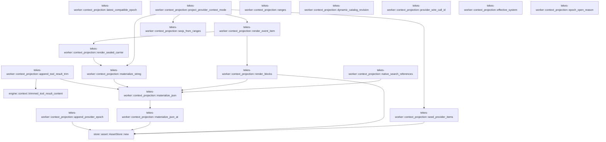

# tekes-worker::context_projection

[Package atlas](index.md) · [Source](../../src/context_projection.rs)

## Declarations

Visibility is the declaration spelling; trait members and reexports require their enclosing interface. `cfg` is not evaluated.

| Symbol | Kind | Visibility | Test / cfg |
|---|---|---|---|
| [tekes-worker::context_projection::dynamic_catalog_revision](../../src/context_projection.rs#L4) | function_item | `pub(crate)` |  |
| [tekes-worker::context_projection::native_search_references](../../src/context_projection.rs#L20) | function_item | `pub(crate)` |  |
| [tekes-worker::context_projection::project_provider_context](../../src/context_projection.rs#L94) | function_item | `pub(crate)` | test; #[cfg(test)] |
| [tekes-worker::context_projection::project_provider_context_mode](../../src/context_projection.rs#L104) | function_item | `pub(crate)` |  |
| [tekes-worker::context_projection::seed_provider_items](../../src/context_projection.rs#L519) | function_item | `pub(crate)` |  |
| [tekes-worker::context_projection::provider_wire_call_id](../../src/context_projection.rs#L622) | function_item | `private` |  |
| [tekes-worker::context_projection::render_sealed_carrier](../../src/context_projection.rs#L636) | function_item | `private` |  |
| [tekes-worker::context_projection::render_event_item](../../src/context_projection.rs#L663) | function_item | `pub(crate)` |  |
| [tekes-worker::context_projection::render_blocks](../../src/context_projection.rs#L747) | function_item | `pub(crate)` |  |
| [tekes-worker::context_projection::materialize_json](../../src/context_projection.rs#L798) | function_item | `pub(crate)` |  |
| [tekes-worker::context_projection::materialize_json_at](../../src/context_projection.rs#L805) | function_item | `pub(crate)` |  |
| [tekes-worker::context_projection::materialize_string](../../src/context_projection.rs#L826) | function_item | `pub(crate)` |  |
| [tekes-worker::context_projection::seqs_from_ranges](../../src/context_projection.rs#L837) | function_item | `private` |  |
| [tekes-worker::context_projection::effective_system](../../src/context_projection.rs#L853) | function_item | `pub(crate)` |  |
| [tekes-worker::context_projection::EpochAppend](../../src/context_projection.rs#L865) | struct_item | `pub(crate)` |  |
| [tekes-worker::context_projection::epoch_open_reason](../../src/context_projection.rs#L880) | function_item | `pub(crate)` |  |
| [tekes-worker::context_projection::append_tool_result_trim](../../src/context_projection.rs#L920) | function_item | `pub(crate)` |  |
| [tekes-worker::context_projection::append_provider_epoch](../../src/context_projection.rs#L960) | function_item | `pub(crate)` |  |
| [tekes-worker::context_projection::latest_compatible_epoch](../../src/context_projection.rs#L1021) | function_item | `pub(crate)` |  |
| [tekes-worker::context_projection::ranges](../../src/context_projection.rs#L1056) | function_item | `pub(crate)` |  |

## Imports / reexports

| Local name | Source path | Visibility |
|---|---|---|
| `*` | `super::*` | `private` |

## Module declarations

| Module | Visibility | Attributes |
|---|---|---|

## Function call graphs

Edges below are syntactically resolved calls only, including private functions. Graphs partition callers into groups of 20; they are not execution order. All unresolved sites are listed below and in the JSON inventory.

Functions 1–18: 17 direct edges

```mermaid
flowchart TD
  n0["engine::context::trimmed_tool_result_content"]
  n1["store::asset::AssetStore::new"]
  n2["tekes-worker::context_projection::latest_compatible_epoch"]
  n3["tekes-worker::context_projection::project_provider_context_mode"]
  n4["tekes-worker::context_projection::ranges"]
  n5["tekes-worker::context_projection::native_search_references"]
  n6["tekes-worker::context_projection::dynamic_catalog_revision"]
  n7["tekes-worker::context_projection::seed_provider_items"]
  n8["tekes-worker::context_projection::provider_wire_call_id"]
  n9["tekes-worker::context_projection::render_sealed_carrier"]
  n10["tekes-worker::context_projection::render_event_item"]
  n11["tekes-worker::context_projection::render_blocks"]
  n12["tekes-worker::context_projection::materialize_json"]
  n13["tekes-worker::context_projection::materialize_json_at"]
  n14["tekes-worker::context_projection::materialize_string"]
  n15["tekes-worker::context_projection::seqs_from_ranges"]
  n16["tekes-worker::context_projection::effective_system"]
  n17["tekes-worker::context_projection::epoch_open_reason"]
  n18["tekes-worker::context_projection::append_tool_result_trim"]
  n19["tekes-worker::context_projection::append_provider_epoch"]
  n3 --> n7
  n3 --> n10
  n3 --> n14
  n3 --> n15
  n5 --> n12
  n7 --> n1
  n9 --> n14
  n10 --> n9
  n10 --> n11
  n11 --> n1
  n11 --> n12
  n12 --> n13
  n13 --> n1
  n14 --> n12
  n18 --> n0
  n18 --> n12
  n19 --> n1
```

## Call sites

Includes test functions (marked in declarations). Receiver-type-required sites need type analysis/manual tracing. Calls in closures are attributed to their enclosing function; their occurrence here does not mean the closure executes immediately.

| Caller | Callee expression | Source lines | Target / classification |
|---|---|---|---|
| `dynamic_catalog_revision` | `Sha256::new` | [5](../../src/context_projection.rs#L5) | external-constructor-callback-or-unresolved |
| `dynamic_catalog_revision` | `digest.update` | [6](../../src/context_projection.rs#L6), [8](../../src/context_projection.rs#L8), [9](../../src/context_projection.rs#L9), [10](../../src/context_projection.rs#L10), [11](../../src/context_projection.rs#L11) | receiver-type-required |
| `dynamic_catalog_revision` | `entry.name.as_bytes` | [8](../../src/context_projection.rs#L8) | receiver-type-required |
| `dynamic_catalog_revision` | `entry.schema_digest.as_bytes` | [10](../../src/context_projection.rs#L10) | receiver-type-required |
| `native_search_references` | `ledger.projection().ok_or` | [27](../../src/context_projection.rs#L27) | receiver-type-required |
| `native_search_references` | `ledger.projection` | [27](../../src/context_projection.rs#L27) | receiver-type-required |
| `native_search_references` | `projection         .events         .iter()         .filter(&#124;event&#124; {             event.seq() < before_seq                 && event.turn() == Some(turn)                 && *event.kind() == EventKind::ToolCall                 && event.string_field("name") == Some("tool_search")         })         .filter_map(&#124;event&#124; event.string_field("call").map(str::to_owned))         .collect::<Vec<_>>` | [28](../../src/context_projection.rs#L28) | receiver-type-required |
| `native_search_references` | `projection         .events         .iter()         .filter(&#124;event&#124; {             event.seq() < before_seq                 && event.turn() == Some(turn)                 && *event.kind() == EventKind::ToolCall                 && event.string_field("name") == Some("tool_search")         })         .filter_map` | [28](../../src/context_projection.rs#L28) | receiver-type-required |
| `native_search_references` | `projection         .events         .iter()         .filter` | [28](../../src/context_projection.rs#L28) | receiver-type-required |
| `native_search_references` | `projection         .events         .iter` | [28](../../src/context_projection.rs#L28) | receiver-type-required |
| `native_search_references` | `event.seq` | [32](../../src/context_projection.rs#L32), [43](../../src/context_projection.rs#L43) | receiver-type-required |
| `native_search_references` | `event.turn` | [33](../../src/context_projection.rs#L33) | receiver-type-required |
| `native_search_references` | `Some` | [33](../../src/context_projection.rs#L33), [35](../../src/context_projection.rs#L35), [45](../../src/context_projection.rs#L45), [50](../../src/context_projection.rs#L50) | external-constructor-callback-or-unresolved |
| `native_search_references` | `event.kind` | [34](../../src/context_projection.rs#L34), [44](../../src/context_projection.rs#L44) | receiver-type-required |
| `native_search_references` | `event.string_field` | [35](../../src/context_projection.rs#L35), [37](../../src/context_projection.rs#L37), [45](../../src/context_projection.rs#L45) | receiver-type-required |
| `native_search_references` | `event.string_field("call").map` | [37](../../src/context_projection.rs#L37) | receiver-type-required |
| `native_search_references` | `Vec::new` | [39](../../src/context_projection.rs#L39) | external-constructor-callback-or-unresolved |
| `native_search_references` | `BTreeSet::new` | [40](../../src/context_projection.rs#L40) | external-constructor-callback-or-unresolved |
| `native_search_references` | `projection.events.iter().find` | [42](../../src/context_projection.rs#L42) | receiver-type-required |
| `native_search_references` | `projection.events.iter` | [42](../../src/context_projection.rs#L42) | receiver-type-required |
| `native_search_references` | `call.as_str` | [45](../../src/context_projection.rs#L45) | receiver-type-required |
| `native_search_references` | `serde_json::to_value` | [49](../../src/context_projection.rs#L49) | external-constructor-callback-or-unresolved |
| `native_search_references` | `result.raw` | [49](../../src/context_projection.rs#L49) | receiver-type-required |
| `native_search_references` | `raw.get("outcome").and_then` | [50](../../src/context_projection.rs#L50) | receiver-type-required |
| `native_search_references` | `raw.get` | [50](../../src/context_projection.rs#L50), [53](../../src/context_projection.rs#L53) | receiver-type-required |
| `native_search_references` | `materialize_json` | [56](../../src/context_projection.rs#L56) | [tekes-worker::context_projection::materialize_json](../../src/context_projection.rs#L798) |
| `native_search_references` | `content.as_array().into_iter().flatten` | [57](../../src/context_projection.rs#L57) | receiver-type-required |
| `native_search_references` | `content.as_array().into_iter` | [57](../../src/context_projection.rs#L57) | receiver-type-required |
| `native_search_references` | `content.as_array` | [57](../../src/context_projection.rs#L57) | receiver-type-required |
| `native_search_references` | `block.get("text").and_then` | [58](../../src/context_projection.rs#L58) | receiver-type-required |
| `native_search_references` | `block.get` | [58](../../src/context_projection.rs#L58) | receiver-type-required |
| `native_search_references` | `serde_json::from_str::<Value>` | [61](../../src/context_projection.rs#L61) | external-constructor-callback-or-unresolved |
| `native_search_references` | `offer                 .get("items")                 .and_then(Value::as_array)                 .into_iter()                 .flatten` | [64](../../src/context_projection.rs#L64) | receiver-type-required |
| `native_search_references` | `offer                 .get("items")                 .and_then(Value::as_array)                 .into_iter` | [64](../../src/context_projection.rs#L64) | receiver-type-required |
| `native_search_references` | `offer                 .get("items")                 .and_then` | [64](../../src/context_projection.rs#L64) | receiver-type-required |
| `native_search_references` | `offer                 .get` | [64](../../src/context_projection.rs#L64) | receiver-type-required |
| `native_search_references` | `item.get("name").and_then` | [71](../../src/context_projection.rs#L71) | receiver-type-required |
| `native_search_references` | `item.get` | [71](../../src/context_projection.rs#L71), [72](../../src/context_projection.rs#L72) | receiver-type-required |
| `native_search_references` | `item.get("schema_digest").and_then` | [72](../../src/context_projection.rs#L72) | receiver-type-required |
| `native_search_references` | `deferred                     .iter()                     .any` | [76](../../src/context_projection.rs#L76) | receiver-type-required |
| `native_search_references` | `deferred                     .iter` | [76](../../src/context_projection.rs#L76) | receiver-type-required |
| `native_search_references` | `seen.insert` | [79](../../src/context_projection.rs#L79) | receiver-type-required |
| `native_search_references` | `call.clone` | [79](../../src/context_projection.rs#L79), [84](../../src/context_projection.rs#L84) | receiver-type-required |
| `native_search_references` | `name.to_owned` | [79](../../src/context_projection.rs#L79), [81](../../src/context_projection.rs#L81) | receiver-type-required |
| `native_search_references` | `references.push` | [80](../../src/context_projection.rs#L80) | receiver-type-required |
| `native_search_references` | `digest.to_owned` | [82](../../src/context_projection.rs#L82) | receiver-type-required |
| `native_search_references` | `catalog_revision.to_owned` | [83](../../src/context_projection.rs#L83) | receiver-type-required |
| `native_search_references` | `Ok` | [90](../../src/context_projection.rs#L90) | external-constructor-callback-or-unresolved |
| `project_provider_context` | `project_provider_context_mode` | [100](../../src/context_projection.rs#L100) | [tekes-worker::context_projection::project_provider_context_mode](../../src/context_projection.rs#L104) |
| `project_provider_context_mode` | `ledger.projection().ok_or` | [111](../../src/context_projection.rs#L111) | receiver-type-required |
| `project_provider_context_mode` | `ledger.projection` | [111](../../src/context_projection.rs#L111) | receiver-type-required |
| `project_provider_context_mode` | `std::collections::BTreeMap::<String, String>::new` | [112](../../src/context_projection.rs#L112), [122](../../src/context_projection.rs#L122), [128](../../src/context_projection.rs#L128) | external-constructor-callback-or-unresolved |
| `project_provider_context_mode` | `std::collections::BTreeMap::<String, Vec<u64>>::new` | [113](../../src/context_projection.rs#L113) | external-constructor-callback-or-unresolved |
| `project_provider_context_mode` | `std::collections::BTreeSet::<String>::new` | [114](../../src/context_projection.rs#L114), [118](../../src/context_projection.rs#L118), [131](../../src/context_projection.rs#L131) | external-constructor-callback-or-unresolved |
| `project_provider_context_mode` | `std::collections::BTreeMap::<String, u64>::new` | [121](../../src/context_projection.rs#L121), [127](../../src/context_projection.rs#L127), [130](../../src/context_projection.rs#L130) | external-constructor-callback-or-unresolved |
| `project_provider_context_mode` | `std::collections::BTreeSet::<u64>::new` | [123](../../src/context_projection.rs#L123), [124](../../src/context_projection.rs#L124), [135](../../src/context_projection.rs#L135) | external-constructor-callback-or-unresolved |
| `project_provider_context_mode` | `std::collections::BTreeMap::<u64, u64>::new` | [125](../../src/context_projection.rs#L125), [126](../../src/context_projection.rs#L126), [311](../../src/context_projection.rs#L311), [356](../../src/context_projection.rs#L356) | external-constructor-callback-or-unresolved |
| `project_provider_context_mode` | `Vec::<u64>::new` | [129](../../src/context_projection.rs#L129) | external-constructor-callback-or-unresolved |
| `project_provider_context_mode` | `serde_json::to_value` | [138](../../src/context_projection.rs#L138), [282](../../src/context_projection.rs#L282), [316](../../src/context_projection.rs#L316), [405](../../src/context_projection.rs#L405) | external-constructor-callback-or-unresolved |
| `project_provider_context_mode` | `event.raw` | [138](../../src/context_projection.rs#L138), [282](../../src/context_projection.rs#L282), [316](../../src/context_projection.rs#L316), [405](../../src/context_projection.rs#L405) | receiver-type-required |
| `project_provider_context_mode` | `raw.as_object().ok_or` | [139](../../src/context_projection.rs#L139), [283](../../src/context_projection.rs#L283), [317](../../src/context_projection.rs#L317), [406](../../src/context_projection.rs#L406) | receiver-type-required |
| `project_provider_context_mode` | `raw.as_object` | [139](../../src/context_projection.rs#L139), [283](../../src/context_projection.rs#L283), [317](../../src/context_projection.rs#L317), [406](../../src/context_projection.rs#L406) | receiver-type-required |
| `project_provider_context_mode` | `seqs_from_ranges` | [140](../../src/context_projection.rs#L140), [144](../../src/context_projection.rs#L144), [199](../../src/context_projection.rs#L199), [318](../../src/context_projection.rs#L318) | [tekes-worker::context_projection::seqs_from_ranges](../../src/context_projection.rs#L837) |
| `project_provider_context_mode` | `object.get` | [140](../../src/context_projection.rs#L140), [144](../../src/context_projection.rs#L144), [181](../../src/context_projection.rs#L181), [199](../../src/context_projection.rs#L199), [286](../../src/context_projection.rs#L286), [318](../../src/context_projection.rs#L318), [453](../../src/context_projection.rs#L453) | receiver-type-required |
| `project_provider_context_mode` | `superseded.insert` | [141](../../src/context_projection.rs#L141) | receiver-type-required |
| `project_provider_context_mode` | `event.kind` | [143](../../src/context_projection.rs#L143), [148](../../src/context_projection.rs#L148), [276](../../src/context_projection.rs#L276), [313](../../src/context_projection.rs#L313), [369](../../src/context_projection.rs#L369), [413](../../src/context_projection.rs#L413), [426](../../src/context_projection.rs#L426), [436](../../src/context_projection.rs#L436), [451](../../src/context_projection.rs#L451), [467](../../src/context_projection.rs#L467) | receiver-type-required |
| `project_provider_context_mode` | `compacted.insert` | [145](../../src/context_projection.rs#L145) | receiver-type-required |
| `project_provider_context_mode` | `event.string_field` | [149](../../src/context_projection.rs#L149), [228](../../src/context_projection.rs#L228), [229](../../src/context_projection.rs#L229), [337](../../src/context_projection.rs#L337), [378](../../src/context_projection.rs#L378), [436](../../src/context_projection.rs#L436), [490](../../src/context_projection.rs#L490) | receiver-type-required |
| `project_provider_context_mode` | `Some` | [149](../../src/context_projection.rs#L149), [150](../../src/context_projection.rs#L150), [165](../../src/context_projection.rs#L165), [181](../../src/context_projection.rs#L181), [385](../../src/context_projection.rs#L385), [436](../../src/context_projection.rs#L436), [453](../../src/context_projection.rs#L453), [476](../../src/context_projection.rs#L476) | external-constructor-callback-or-unresolved |
| `project_provider_context_mode` | `event.seq` | [150](../../src/context_projection.rs#L150), [175](../../src/context_projection.rs#L175), [182](../../src/context_projection.rs#L182), [184](../../src/context_projection.rs#L184), [208](../../src/context_projection.rs#L208), [225](../../src/context_projection.rs#L225), [233](../../src/context_projection.rs#L233), [277](../../src/context_projection.rs#L277), [278](../../src/context_projection.rs#L278), [298](../../src/context_projection.rs#L298), [322](../../src/context_projection.rs#L322), [336](../../src/context_projection.rs#L336), [341](../../src/context_projection.rs#L341), [368](../../src/context_projection.rs#L368), [400](../../src/context_projection.rs#L400), [401](../../src/context_projection.rs#L401), [407](../../src/context_projection.rs#L407), [408](../../src/context_projection.rs#L408), [452](../../src/context_projection.rs#L452), [454](../../src/context_projection.rs#L454), [469](../../src/context_projection.rs#L469), [479](../../src/context_projection.rs#L479), [480](../../src/context_projection.rs#L480), [484](../../src/context_projection.rs#L484), [503](../../src/context_projection.rs#L503), [504](../../src/context_projection.rs#L504) | receiver-type-required |
| `project_provider_context_mode` | `object                     .get("pending")                     .and_then(Value::as_object)                     .into_iter()                     .flat_map(&#124;pending&#124; [pending.get("eligible"), pending.get("withheld")])                     .flatten()                     .flat_map(&#124;value&#124; value.as_array().into_iter().flatten())                     .filter_map` | [151](../../src/context_projection.rs#L151) | receiver-type-required |
| `project_provider_context_mode` | `object                     .get("pending")                     .and_then(Value::as_object)                     .into_iter()                     .flat_map(&#124;pending&#124; [pending.get("eligible"), pending.get("withheld")])                     .flatten()                     .flat_map` | [151](../../src/context_projection.rs#L151) | receiver-type-required |
| `project_provider_context_mode` | `object                     .get("pending")                     .and_then(Value::as_object)                     .into_iter()                     .flat_map(&#124;pending&#124; [pending.get("eligible"), pending.get("withheld")])                     .flatten` | [151](../../src/context_projection.rs#L151) | receiver-type-required |
| `project_provider_context_mode` | `object                     .get("pending")                     .and_then(Value::as_object)                     .into_iter()                     .flat_map` | [151](../../src/context_projection.rs#L151) | receiver-type-required |
| `project_provider_context_mode` | `object                     .get("pending")                     .and_then(Value::as_object)                     .into_iter` | [151](../../src/context_projection.rs#L151) | receiver-type-required |
| `project_provider_context_mode` | `object                     .get("pending")                     .and_then` | [151](../../src/context_projection.rs#L151) | receiver-type-required |
| `project_provider_context_mode` | `object                     .get` | [151](../../src/context_projection.rs#L151), [166](../../src/context_projection.rs#L166) | receiver-type-required |
| `project_provider_context_mode` | `pending.get` | [155](../../src/context_projection.rs#L155) | receiver-type-required |
| `project_provider_context_mode` | `value.as_array().into_iter().flatten` | [157](../../src/context_projection.rs#L157) | receiver-type-required |
| `project_provider_context_mode` | `value.as_array().into_iter` | [157](../../src/context_projection.rs#L157) | receiver-type-required |
| `project_provider_context_mode` | `value.as_array` | [157](../../src/context_projection.rs#L157) | receiver-type-required |
| `project_provider_context_mode` | `epoch_pending.insert` | [160](../../src/context_projection.rs#L160) | receiver-type-required |
| `project_provider_context_mode` | `event.turn().ok_or` | [164](../../src/context_projection.rs#L164), [232](../../src/context_projection.rs#L232) | receiver-type-required |
| `project_provider_context_mode` | `event.turn` | [164](../../src/context_projection.rs#L164), [178](../../src/context_projection.rs#L178), [232](../../src/context_projection.rs#L232), [464](../../src/context_projection.rs#L464), [476](../../src/context_projection.rs#L476) | receiver-type-required |
| `project_provider_context_mode` | `object                     .get("trigger")                     .and_then(&#124;trigger&#124; trigger.get("inputs"))                     .and_then(Value::as_array)                     .into_iter()                     .flatten()                     .filter_map` | [166](../../src/context_projection.rs#L166) | receiver-type-required |
| `project_provider_context_mode` | `object                     .get("trigger")                     .and_then(&#124;trigger&#124; trigger.get("inputs"))                     .and_then(Value::as_array)                     .into_iter()                     .flatten` | [166](../../src/context_projection.rs#L166) | receiver-type-required |
| `project_provider_context_mode` | `object                     .get("trigger")                     .and_then(&#124;trigger&#124; trigger.get("inputs"))                     .and_then(Value::as_array)                     .into_iter` | [166](../../src/context_projection.rs#L166) | receiver-type-required |
| `project_provider_context_mode` | `object                     .get("trigger")                     .and_then(&#124;trigger&#124; trigger.get("inputs"))                     .and_then` | [166](../../src/context_projection.rs#L166) | receiver-type-required |
| `project_provider_context_mode` | `object                     .get("trigger")                     .and_then` | [166](../../src/context_projection.rs#L166) | receiver-type-required |
| `project_provider_context_mode` | `trigger.get` | [168](../../src/context_projection.rs#L168) | receiver-type-required |
| `project_provider_context_mode` | `input_turn.insert` | [174](../../src/context_projection.rs#L174), [184](../../src/context_projection.rs#L184) | receiver-type-required |
| `project_provider_context_mode` | `input_position.insert` | [175](../../src/context_projection.rs#L175) | receiver-type-required |
| `project_provider_context_mode` | `object.get("steer").and_then` | [181](../../src/context_projection.rs#L181), [453](../../src/context_projection.rs#L453) | receiver-type-required |
| `project_provider_context_mode` | `steer_seqs.push` | [182](../../src/context_projection.rs#L182) | receiver-type-required |
| `project_provider_context_mode` | `event                     .string_field("attempt")                     .ok_or("attempt lacks id")?                     .to_owned` | [188](../../src/context_projection.rs#L188) | receiver-type-required |
| `project_provider_context_mode` | `event                     .string_field("attempt")                     .ok_or` | [188](../../src/context_projection.rs#L188), [202](../../src/context_projection.rs#L202), [219](../../src/context_projection.rs#L219) | receiver-type-required |
| `project_provider_context_mode` | `event                     .string_field` | [188](../../src/context_projection.rs#L188), [202](../../src/context_projection.rs#L202), [219](../../src/context_projection.rs#L219) | receiver-type-required |
| `project_provider_context_mode` | `attempt_epoch.insert` | [192](../../src/context_projection.rs#L192) | receiver-type-required |
| `project_provider_context_mode` | `id.clone` | [193](../../src/context_projection.rs#L193) | receiver-type-required |
| `project_provider_context_mode` | `event                         .string_field("epoch")                         .ok_or("attempt lacks epoch")?                         .to_owned` | [194](../../src/context_projection.rs#L194) | receiver-type-required |
| `project_provider_context_mode` | `event                         .string_field("epoch")                         .ok_or` | [194](../../src/context_projection.rs#L194) | receiver-type-required |
| `project_provider_context_mode` | `event                         .string_field` | [194](../../src/context_projection.rs#L194), [236](../../src/context_projection.rs#L236), [244](../../src/context_projection.rs#L244) | receiver-type-required |
| `project_provider_context_mode` | `attempt_admits.insert` | [199](../../src/context_projection.rs#L199) | receiver-type-required |
| `project_provider_context_mode` | `settled_outputs.insert` | [205](../../src/context_projection.rs#L205) | receiver-type-required |
| `project_provider_context_mode` | `attempt.to_owned` | [205](../../src/context_projection.rs#L205), [207](../../src/context_projection.rs#L207), [222](../../src/context_projection.rs#L222), [224](../../src/context_projection.rs#L224), [230](../../src/context_projection.rs#L230) | receiver-type-required |
| `project_provider_context_mode` | `output_positions                     .entry(attempt.to_owned())                     .or_insert` | [206](../../src/context_projection.rs#L206), [223](../../src/context_projection.rs#L223) | receiver-type-required |
| `project_provider_context_mode` | `output_positions                     .entry` | [206](../../src/context_projection.rs#L206), [223](../../src/context_projection.rs#L223) | receiver-type-required |
| `project_provider_context_mode` | `attempt_epoch.get(attempt).is_some_and` | [209](../../src/context_projection.rs#L209) | receiver-type-required |
| `project_provider_context_mode` | `attempt_epoch.get` | [209](../../src/context_projection.rs#L209), [263](../../src/context_projection.rs#L263) | receiver-type-required |
| `project_provider_context_mode` | `object                         .get("continuation")                         .and_then(&#124;continuation&#124; continuation.get("id"))                         .and_then(Value::as_str)                         .map(str::to_owned)                         .or` | [210](../../src/context_projection.rs#L210) | receiver-type-required |
| `project_provider_context_mode` | `object                         .get("continuation")                         .and_then(&#124;continuation&#124; continuation.get("id"))                         .and_then(Value::as_str)                         .map` | [210](../../src/context_projection.rs#L210) | receiver-type-required |
| `project_provider_context_mode` | `object                         .get("continuation")                         .and_then(&#124;continuation&#124; continuation.get("id"))                         .and_then` | [210](../../src/context_projection.rs#L210) | receiver-type-required |
| `project_provider_context_mode` | `object                         .get("continuation")                         .and_then` | [210](../../src/context_projection.rs#L210) | receiver-type-required |
| `project_provider_context_mode` | `object                         .get` | [210](../../src/context_projection.rs#L210) | receiver-type-required |
| `project_provider_context_mode` | `continuation.get` | [212](../../src/context_projection.rs#L212) | receiver-type-required |
| `project_provider_context_mode` | `object.contains_key` | [218](../../src/context_projection.rs#L218), [414](../../src/context_projection.rs#L414) | receiver-type-required |
| `project_provider_context_mode` | `partial_carriers.insert` | [222](../../src/context_projection.rs#L222) | receiver-type-required |
| `project_provider_context_mode` | `event.string_field("call").ok_or` | [228](../../src/context_projection.rs#L228) | receiver-type-required |
| `project_provider_context_mode` | `call_attempts.insert` | [230](../../src/context_projection.rs#L230) | receiver-type-required |
| `project_provider_context_mode` | `call.to_owned` | [230](../../src/context_projection.rs#L230), [232](../../src/context_projection.rs#L232), [233](../../src/context_projection.rs#L233), [235](../../src/context_projection.rs#L235) | receiver-type-required |
| `project_provider_context_mode` | `call_turn.insert` | [232](../../src/context_projection.rs#L232) | receiver-type-required |
| `project_provider_context_mode` | `call_seqs.insert` | [233](../../src/context_projection.rs#L233) | receiver-type-required |
| `project_provider_context_mode` | `call_name.insert` | [234](../../src/context_projection.rs#L234) | receiver-type-required |
| `project_provider_context_mode` | `event                         .string_field("name")                         .ok_or("tool_call lacks name")?                         .to_owned` | [236](../../src/context_projection.rs#L236) | receiver-type-required |
| `project_provider_context_mode` | `event                         .string_field("name")                         .ok_or` | [236](../../src/context_projection.rs#L236) | receiver-type-required |
| `project_provider_context_mode` | `spawned_calls.insert` | [243](../../src/context_projection.rs#L243) | receiver-type-required |
| `project_provider_context_mode` | `event                         .string_field("call")                         .ok_or("spawn lacks call")?                         .to_owned` | [244](../../src/context_projection.rs#L244) | receiver-type-required |
| `project_provider_context_mode` | `event                         .string_field("call")                         .ok_or` | [244](../../src/context_projection.rs#L244) | receiver-type-required |
| `project_provider_context_mode` | `attempt_admits         .iter()         .filter(&#124;(attempt, _)&#124; settled_outputs.contains(*attempt))         .flat_map(&#124;(_, seqs)&#124; seqs.iter().copied())         .collect::<std::collections::BTreeSet<_>>` | [254](../../src/context_projection.rs#L254) | receiver-type-required |
| `project_provider_context_mode` | `attempt_admits         .iter()         .filter(&#124;(attempt, _)&#124; settled_outputs.contains(*attempt))         .flat_map` | [254](../../src/context_projection.rs#L254) | receiver-type-required |
| `project_provider_context_mode` | `attempt_admits         .iter()         .filter` | [254](../../src/context_projection.rs#L254), [259](../../src/context_projection.rs#L259) | receiver-type-required |
| `project_provider_context_mode` | `attempt_admits         .iter` | [254](../../src/context_projection.rs#L254), [259](../../src/context_projection.rs#L259) | receiver-type-required |
| `project_provider_context_mode` | `settled_outputs.contains` | [256](../../src/context_projection.rs#L256), [262](../../src/context_projection.rs#L262), [491](../../src/context_projection.rs#L491) | receiver-type-required |
| `project_provider_context_mode` | `seqs.iter().copied` | [257](../../src/context_projection.rs#L257), [265](../../src/context_projection.rs#L265) | receiver-type-required |
| `project_provider_context_mode` | `seqs.iter` | [257](../../src/context_projection.rs#L257), [265](../../src/context_projection.rs#L265) | receiver-type-required |
| `project_provider_context_mode` | `attempt_admits         .iter()         .filter(&#124;(attempt, _)&#124; {             settled_outputs.contains(*attempt)                 && attempt_epoch.get(*attempt).is_some_and(&#124;id&#124; id == epoch_id)         })         .flat_map(&#124;(_, seqs)&#124; seqs.iter().copied())         .collect::<std::collections::BTreeSet<_>>` | [259](../../src/context_projection.rs#L259) | receiver-type-required |
| `project_provider_context_mode` | `attempt_admits         .iter()         .filter(&#124;(attempt, _)&#124; {             settled_outputs.contains(*attempt)                 && attempt_epoch.get(*attempt).is_some_and(&#124;id&#124; id == epoch_id)         })         .flat_map` | [259](../../src/context_projection.rs#L259) | receiver-type-required |
| `project_provider_context_mode` | `attempt_epoch.get(*attempt).is_some_and` | [263](../../src/context_projection.rs#L263) | receiver-type-required |
| `project_provider_context_mode` | `dialect.server_managed` | [267](../../src/context_projection.rs#L267) | receiver-type-required |
| `project_provider_context_mode` | `continuation_id.is_some` | [268](../../src/context_projection.rs#L268) | receiver-type-required |
| `project_provider_context_mode` | `epoch_seq.ok_or` | [269](../../src/context_projection.rs#L269) | receiver-type-required |
| `project_provider_context_mode` | `Vec::new` | [270](../../src/context_projection.rs#L270), [300](../../src/context_projection.rs#L300) | external-constructor-callback-or-unresolved |
| `project_provider_context_mode` | `items.extend` | [272](../../src/context_projection.rs#L272) | receiver-type-required |
| `project_provider_context_mode` | `seed_provider_items` | [272](../../src/context_projection.rs#L272) | [tekes-worker::context_projection::seed_provider_items](../../src/context_projection.rs#L519) |
| `project_provider_context_mode` | `superseded.contains` | [277](../../src/context_projection.rs#L277), [360](../../src/context_projection.rs#L360), [368](../../src/context_projection.rs#L368), [408](../../src/context_projection.rs#L408) | receiver-type-required |
| `project_provider_context_mode` | `compacted.contains` | [278](../../src/context_projection.rs#L278), [408](../../src/context_projection.rs#L408) | receiver-type-required |
| `project_provider_context_mode` | `materialize_string` | [284](../../src/context_projection.rs#L284) | [tekes-worker::context_projection::materialize_string](../../src/context_projection.rs#L826) |
| `project_provider_context_mode` | `object.get("summary").ok_or` | [286](../../src/context_projection.rs#L286) | receiver-type-required |
| `project_provider_context_mode` | `items.push` | [288](../../src/context_projection.rs#L288), [506](../../src/context_projection.rs#L506) | receiver-type-required |
| `project_provider_context_mode` | `ijson` | [288](../../src/context_projection.rs#L288), [506](../../src/context_projection.rs#L506) | external-constructor-callback-or-unresolved |
| `project_provider_context_mode` | `projection         .events         .partition_point` | [296](../../src/context_projection.rs#L296) | receiver-type-required |
| `project_provider_context_mode` | `compaction_anchor_sequences` | [299](../../src/context_projection.rs#L299) | external-constructor-callback-or-unresolved |
| `project_provider_context_mode` | `seqs_from_ranges(object.get("supersedes"))?             .into_iter()             .max` | [318](../../src/context_projection.rs#L318) | receiver-type-required |
| `project_provider_context_mode` | `seqs_from_ranges(object.get("supersedes"))?             .into_iter` | [318](../../src/context_projection.rs#L318) | receiver-type-required |
| `project_provider_context_mode` | `replaced_result.insert` | [322](../../src/context_projection.rs#L322) | receiver-type-required |
| `project_provider_context_mode` | `replaced_result.get` | [327](../../src/context_projection.rs#L327) | receiver-type-required |
| `project_provider_context_mode` | `render_anchor` | [336](../../src/context_projection.rs#L336), [341](../../src/context_projection.rs#L341) | external-constructor-callback-or-unresolved |
| `project_provider_context_mode` | `output_positions.get` | [337](../../src/context_projection.rs#L337), [383](../../src/context_projection.rs#L383) | receiver-type-required |
| `project_provider_context_mode` | `call_attempts.get` | [337](../../src/context_projection.rs#L337) | receiver-type-required |
| `project_provider_context_mode` | `(*output > anchor).then_some` | [338](../../src/context_projection.rs#L338) | receiver-type-required |
| `project_provider_context_mode` | `input_position.get` | [342](../../src/context_projection.rs#L342) | receiver-type-required |
| `project_provider_context_mode` | `deferred_result_position` | [344](../../src/context_projection.rs#L344) | external-constructor-callback-or-unresolved |
| `project_provider_context_mode` | `steer_seqs         .iter()         .copied()         .filter(&#124;seq&#124; !superseded.contains(seq) && !input_position.contains_key(seq))         .collect::<Vec<_>>` | [357](../../src/context_projection.rs#L357) | receiver-type-required |
| `project_provider_context_mode` | `steer_seqs         .iter()         .copied()         .filter` | [357](../../src/context_projection.rs#L357) | receiver-type-required |
| `project_provider_context_mode` | `steer_seqs         .iter()         .copied` | [357](../../src/context_projection.rs#L357) | receiver-type-required |
| `project_provider_context_mode` | `steer_seqs         .iter` | [357](../../src/context_projection.rs#L357) | receiver-type-required |
| `project_provider_context_mode` | `input_position.contains_key` | [360](../../src/context_projection.rs#L360) | receiver-type-required |
| `project_provider_context_mode` | `steers.is_empty` | [362](../../src/context_projection.rs#L362) | receiver-type-required |
| `project_provider_context_mode` | `projection             .events             .iter()             .filter(&#124;event&#124; {                 !superseded.contains(&event.seq())                     && match event.kind() {                         EventKind::ChildResult => true,                         EventKind::ToolResult => event                             .string_field("call")                             .is_some_and(&#124;call&#124; !spawned_calls.contains(call)),                         _ => false,                     }             })             .filter_map(&#124;event&#124; {                 let call = event.string_field("call")?;                 // An attempt's sealed output carries its calls; before one                 // exists the call renders at its own event.                 let call_position = call_attempts                     .get(call)                     .and_then(&#124;attempt&#124; output_positions.get(attempt))                     .or_else(&#124;&#124; call_seqs.get(call))?;                 Some((*call_position, base_key(event).0))             })             .collect::<Vec<_>>` | [364](../../src/context_projection.rs#L364) | receiver-type-required |
| `project_provider_context_mode` | `projection             .events             .iter()             .filter(&#124;event&#124; {                 !superseded.contains(&event.seq())                     && match event.kind() {                         EventKind::ChildResult => true,                         EventKind::ToolResult => event                             .string_field("call")                             .is_some_and(&#124;call&#124; !spawned_calls.contains(call)),                         _ => false,                     }             })             .filter_map` | [364](../../src/context_projection.rs#L364) | receiver-type-required |
| `project_provider_context_mode` | `projection             .events             .iter()             .filter` | [364](../../src/context_projection.rs#L364) | receiver-type-required |
| `project_provider_context_mode` | `projection             .events             .iter` | [364](../../src/context_projection.rs#L364) | receiver-type-required |
| `project_provider_context_mode` | `event                             .string_field("call")                             .is_some_and` | [371](../../src/context_projection.rs#L371) | receiver-type-required |
| `project_provider_context_mode` | `event                             .string_field` | [371](../../src/context_projection.rs#L371) | receiver-type-required |
| `project_provider_context_mode` | `spawned_calls.contains` | [373](../../src/context_projection.rs#L373), [429](../../src/context_projection.rs#L429) | receiver-type-required |
| `project_provider_context_mode` | `call_attempts                     .get(call)                     .and_then(&#124;attempt&#124; output_positions.get(attempt))                     .or_else` | [381](../../src/context_projection.rs#L381) | receiver-type-required |
| `project_provider_context_mode` | `call_attempts                     .get(call)                     .and_then` | [381](../../src/context_projection.rs#L381) | receiver-type-required |
| `project_provider_context_mode` | `call_attempts                     .get` | [381](../../src/context_projection.rs#L381) | receiver-type-required |
| `project_provider_context_mode` | `call_seqs.get` | [384](../../src/context_projection.rs#L384) | receiver-type-required |
| `project_provider_context_mode` | `base_key` | [385](../../src/context_projection.rs#L385), [402](../../src/context_projection.rs#L402) | external-constructor-callback-or-unresolved |
| `project_provider_context_mode` | `spans                 .iter()                 .filter(&#124;(call, result)&#124; *call < steer && steer < *result)                 .map(&#124;(_, result)&#124; *result)                 .max` | [389](../../src/context_projection.rs#L389) | receiver-type-required |
| `project_provider_context_mode` | `spans                 .iter()                 .filter(&#124;(call, result)&#124; *call < steer && steer < *result)                 .map` | [389](../../src/context_projection.rs#L389) | receiver-type-required |
| `project_provider_context_mode` | `spans                 .iter()                 .filter` | [389](../../src/context_projection.rs#L389) | receiver-type-required |
| `project_provider_context_mode` | `spans                 .iter` | [389](../../src/context_projection.rs#L389) | receiver-type-required |
| `project_provider_context_mode` | `steer_anchor.insert` | [395](../../src/context_projection.rs#L395) | receiver-type-required |
| `project_provider_context_mode` | `projection.events.iter().collect::<Vec<_>>` | [399](../../src/context_projection.rs#L399) | receiver-type-required |
| `project_provider_context_mode` | `projection.events.iter` | [399](../../src/context_projection.rs#L399) | receiver-type-required |
| `project_provider_context_mode` | `ordered_events.sort_by_key` | [400](../../src/context_projection.rs#L400) | receiver-type-required |
| `project_provider_context_mode` | `steer_anchor.get` | [400](../../src/context_projection.rs#L400) | receiver-type-required |
| `project_provider_context_mode` | `semantic_anchors.contains` | [407](../../src/context_projection.rs#L407) | receiver-type-required |
| `project_provider_context_mode` | `event                 .string_field("attempt")                 .is_some_and` | [415](../../src/context_projection.rs#L415) | receiver-type-required |
| `project_provider_context_mode` | `event                 .string_field` | [415](../../src/context_projection.rs#L415), [427](../../src/context_projection.rs#L427) | receiver-type-required |
| `project_provider_context_mode` | `partial_carriers.contains` | [417](../../src/context_projection.rs#L417), [491](../../src/context_projection.rs#L491) | receiver-type-required |
| `project_provider_context_mode` | `event                 .string_field("call")                 .is_some_and` | [427](../../src/context_projection.rs#L427) | receiver-type-required |
| `project_provider_context_mode` | `input_turn.get(&event.seq()).is_some_and` | [452](../../src/context_projection.rs#L452) | receiver-type-required |
| `project_provider_context_mode` | `input_turn.get` | [452](../../src/context_projection.rs#L452) | receiver-type-required |
| `project_provider_context_mode` | `admitted_all.contains` | [454](../../src/context_projection.rs#L454) | receiver-type-required |
| `project_provider_context_mode` | `object                 .get("call")                 .and_then(Value::as_str)                 .and_then(&#124;call&#124; call_turn.get(call))                 .is_some_and` | [459](../../src/context_projection.rs#L459), [471](../../src/context_projection.rs#L471) | receiver-type-required |
| `project_provider_context_mode` | `object                 .get("call")                 .and_then(Value::as_str)                 .and_then` | [459](../../src/context_projection.rs#L459), [471](../../src/context_projection.rs#L471) | receiver-type-required |
| `project_provider_context_mode` | `object                 .get("call")                 .and_then` | [459](../../src/context_projection.rs#L459), [471](../../src/context_projection.rs#L471) | receiver-type-required |
| `project_provider_context_mode` | `object                 .get` | [459](../../src/context_projection.rs#L459), [471](../../src/context_projection.rs#L471) | receiver-type-required |
| `project_provider_context_mode` | `call_turn.get` | [462](../../src/context_projection.rs#L462), [474](../../src/context_projection.rs#L474) | receiver-type-required |
| `project_provider_context_mode` | `event.turn().is_none_or` | [464](../../src/context_projection.rs#L464) | receiver-type-required |
| `project_provider_context_mode` | `input_turn                 .get(&event.seq())                 .is_some_and` | [468](../../src/context_projection.rs#L468) | receiver-type-required |
| `project_provider_context_mode` | `input_turn                 .get` | [468](../../src/context_projection.rs#L468) | receiver-type-required |
| `project_provider_context_mode` | `epoch_pending.contains` | [480](../../src/context_projection.rs#L480) | receiver-type-required |
| `project_provider_context_mode` | `admitted.contains` | [484](../../src/context_projection.rs#L484), [503](../../src/context_projection.rs#L503) | receiver-type-required |
| `project_provider_context_mode` | `event.string_field("attempt").is_some_and` | [490](../../src/context_projection.rs#L490) | receiver-type-required |
| `project_provider_context_mode` | `render_event_item(ledger, event, object, &call_name, dialect)?.ok_or_else` | [497](../../src/context_projection.rs#L497) | receiver-type-required |
| `project_provider_context_mode` | `render_event_item` | [497](../../src/context_projection.rs#L497) | [tekes-worker::context_projection::render_event_item](../../src/context_projection.rs#L663) |
| `project_provider_context_mode` | `admits.push` | [504](../../src/context_projection.rs#L504) | receiver-type-required |
| `project_provider_context_mode` | `admits.sort_unstable` | [508](../../src/context_projection.rs#L508) | receiver-type-required |
| `project_provider_context_mode` | `admits.dedup` | [509](../../src/context_projection.rs#L509) | receiver-type-required |
| `project_provider_context_mode` | `Ok` | [510](../../src/context_projection.rs#L510) | external-constructor-callback-or-unresolved |
| `project_provider_context_mode` | `incremental_continuation             .then_some(continuation_id)             .flatten` | [513](../../src/context_projection.rs#L513) | receiver-type-required |
| `project_provider_context_mode` | `incremental_continuation             .then_some` | [513](../../src/context_projection.rs#L513) | receiver-type-required |
| `seed_provider_items` | `ledger.projection().ok_or` | [522](../../src/context_projection.rs#L522) | receiver-type-required |
| `seed_provider_items` | `ledger.projection` | [522](../../src/context_projection.rs#L522) | receiver-type-required |
| `seed_provider_items` | `projection.events.first` | [523](../../src/context_projection.rs#L523) | receiver-type-required |
| `seed_provider_items` | `Ok` | [524](../../src/context_projection.rs#L524), [528](../../src/context_projection.rs#L528), [619](../../src/context_projection.rs#L619) | external-constructor-callback-or-unresolved |
| `seed_provider_items` | `Vec::new` | [524](../../src/context_projection.rs#L524), [528](../../src/context_projection.rs#L528), [532](../../src/context_projection.rs#L532) | external-constructor-callback-or-unresolved |
| `seed_provider_items` | `serde_json::to_value` | [526](../../src/context_projection.rs#L526), [545](../../src/context_projection.rs#L545) | external-constructor-callback-or-unresolved |
| `seed_provider_items` | `genesis.raw` | [526](../../src/context_projection.rs#L526) | receiver-type-required |
| `seed_provider_items` | `raw.pointer("/seed/snapshot/asset").and_then` | [527](../../src/context_projection.rs#L527) | receiver-type-required |
| `seed_provider_items` | `raw.pointer` | [527](../../src/context_projection.rs#L527) | receiver-type-required |
| `seed_provider_items` | `ledger.path().parent().ok_or` | [530](../../src/context_projection.rs#L530) | receiver-type-required |
| `seed_provider_items` | `ledger.path().parent` | [530](../../src/context_projection.rs#L530) | receiver-type-required |
| `seed_provider_items` | `ledger.path` | [530](../../src/context_projection.rs#L530) | receiver-type-required |
| `seed_provider_items` | `store::AssetStore::new(folder.join("assets"))?.read_verified` | [531](../../src/context_projection.rs#L531) | receiver-type-required |
| `seed_provider_items` | `store::AssetStore::new` | [531](../../src/context_projection.rs#L531) | [store::asset::AssetStore::new](../../../store/src/asset.rs#L27) |
| `seed_provider_items` | `folder.join` | [531](../../src/context_projection.rs#L531) | receiver-type-required |
| `seed_provider_items` | `bytes.split_inclusive` | [533](../../src/context_projection.rs#L533) | receiver-type-required |
| `seed_provider_items` | `line.strip_suffix(b"\n").ok_or` | [534](../../src/context_projection.rs#L534) | receiver-type-required |
| `seed_provider_items` | `line.strip_suffix` | [534](../../src/context_projection.rs#L534) | receiver-type-required |
| `seed_provider_items` | `canonical.is_empty` | [535](../../src/context_projection.rs#L535) | receiver-type-required |
| `seed_provider_items` | `Err` | [536](../../src/context_projection.rs#L536), [610](../../src/context_projection.rs#L610) | external-constructor-callback-or-unresolved |
| `seed_provider_items` | `"seed snapshot has an empty line".into` | [536](../../src/context_projection.rs#L536) | receiver-type-required |
| `seed_provider_items` | `Event::decode_canonical` | [538](../../src/context_projection.rs#L538) | external-constructor-callback-or-unresolved |
| `seed_provider_items` | `event.raw` | [545](../../src/context_projection.rs#L545) | receiver-type-required |
| `seed_provider_items` | `raw.as_object().ok_or` | [546](../../src/context_projection.rs#L546) | receiver-type-required |
| `seed_provider_items` | `raw.as_object` | [546](../../src/context_projection.rs#L546) | receiver-type-required |
| `seed_provider_items` | `event.kind` | [547](../../src/context_projection.rs#L547) | receiver-type-required |
| `seed_provider_items` | `event                     .string_field("call")                     .ok_or` | [561](../../src/context_projection.rs#L561) | receiver-type-required |
| `seed_provider_items` | `event                     .string_field` | [561](../../src/context_projection.rs#L561) | receiver-type-required |
| `seed_provider_items` | `object                     .get("outcome")                     .ok_or` | [564](../../src/context_projection.rs#L564) | receiver-type-required |
| `seed_provider_items` | `object                     .get` | [564](../../src/context_projection.rs#L564), [586](../../src/context_projection.rs#L586) | receiver-type-required |
| `seed_provider_items` | `event.string_field` | [585](../../src/context_projection.rs#L585) | receiver-type-required |
| `seed_provider_items` | `Some` | [585](../../src/context_projection.rs#L585) | external-constructor-callback-or-unresolved |
| `seed_provider_items` | `object                     .get("payload")                     .and_then(Value::as_object)                     .ok_or` | [586](../../src/context_projection.rs#L586) | receiver-type-required |
| `seed_provider_items` | `object                     .get("payload")                     .and_then` | [586](../../src/context_projection.rs#L586) | receiver-type-required |
| `seed_provider_items` | `format!(                     "model-visible seed kind {} has no provider projection",                     other.as_str()                 )                 .into` | [610](../../src/context_projection.rs#L610) | receiver-type-required |
| `seed_provider_items` | `items.push` | [617](../../src/context_projection.rs#L617) | receiver-type-required |
| `seed_provider_items` | `ijson` | [617](../../src/context_projection.rs#L617) | external-constructor-callback-or-unresolved |
| `provider_wire_call_id` | `ledger         .projection()         .and_then(&#124;projection&#124; {             projection.events.iter().find(&#124;event&#124; {                 *event.kind() == EventKind::ToolCall && event.string_field("call") == Some(call)             })         })         .and_then(&#124;event&#124; event.string_field("provider_call"))         .unwrap_or` | [623](../../src/context_projection.rs#L623) | receiver-type-required |
| `provider_wire_call_id` | `ledger         .projection()         .and_then(&#124;projection&#124; {             projection.events.iter().find(&#124;event&#124; {                 *event.kind() == EventKind::ToolCall && event.string_field("call") == Some(call)             })         })         .and_then` | [623](../../src/context_projection.rs#L623) | receiver-type-required |
| `provider_wire_call_id` | `ledger         .projection()         .and_then` | [623](../../src/context_projection.rs#L623) | receiver-type-required |
| `provider_wire_call_id` | `ledger         .projection` | [623](../../src/context_projection.rs#L623) | receiver-type-required |
| `provider_wire_call_id` | `projection.events.iter().find` | [626](../../src/context_projection.rs#L626) | receiver-type-required |
| `provider_wire_call_id` | `projection.events.iter` | [626](../../src/context_projection.rs#L626) | receiver-type-required |
| `provider_wire_call_id` | `event.kind` | [627](../../src/context_projection.rs#L627) | receiver-type-required |
| `provider_wire_call_id` | `event.string_field` | [627](../../src/context_projection.rs#L627), [630](../../src/context_projection.rs#L630) | receiver-type-required |
| `provider_wire_call_id` | `Some` | [627](../../src/context_projection.rs#L627) | external-constructor-callback-or-unresolved |
| `render_sealed_carrier` | `object         .get("sealed")         .and_then(Value::as_object)         .ok_or_else` | [642](../../src/context_projection.rs#L642) | receiver-type-required |
| `render_sealed_carrier` | `object         .get("sealed")         .and_then` | [642](../../src/context_projection.rs#L642) | receiver-type-required |
| `render_sealed_carrier` | `object         .get` | [642](../../src/context_projection.rs#L642) | receiver-type-required |
| `render_sealed_carrier` | `sealed.get("version").and_then` | [646](../../src/context_projection.rs#L646) | receiver-type-required |
| `render_sealed_carrier` | `sealed.get` | [646](../../src/context_projection.rs#L646), [647](../../src/context_projection.rs#L647) | receiver-type-required |
| `render_sealed_carrier` | `Some` | [646](../../src/context_projection.rs#L646), [647](../../src/context_projection.rs#L647) | external-constructor-callback-or-unresolved |
| `render_sealed_carrier` | `sealed.get("adapter").and_then` | [647](../../src/context_projection.rs#L647) | receiver-type-required |
| `render_sealed_carrier` | `dialect.as_str` | [647](../../src/context_projection.rs#L647) | receiver-type-required |
| `render_sealed_carrier` | `Err` | [649](../../src/context_projection.rs#L649) | external-constructor-callback-or-unresolved |
| `render_sealed_carrier` | `format!("{kind} sealed carrier is incompatible with the active adapter").into` | [650](../../src/context_projection.rs#L650) | receiver-type-required |
| `render_sealed_carrier` | `materialize_string` | [653](../../src/context_projection.rs#L653) | [tekes-worker::context_projection::materialize_string](../../src/context_projection.rs#L826) |
| `render_sealed_carrier` | `sealed             .get("fragments")             .ok_or` | [655](../../src/context_projection.rs#L655) | receiver-type-required |
| `render_sealed_carrier` | `sealed             .get` | [655](../../src/context_projection.rs#L655) | receiver-type-required |
| `render_sealed_carrier` | `serde_json::to_value` | [659](../../src/context_projection.rs#L659) | external-constructor-callback-or-unresolved |
| `render_sealed_carrier` | `IJsonValue::parse` | [659](../../src/context_projection.rs#L659) | external-constructor-callback-or-unresolved |
| `render_sealed_carrier` | `fragments.as_bytes` | [659](../../src/context_projection.rs#L659) | receiver-type-required |
| `render_sealed_carrier` | `Ok` | [660](../../src/context_projection.rs#L660) | external-constructor-callback-or-unresolved |
| `render_event_item` | `event.kind` | [670](../../src/context_projection.rs#L670) | receiver-type-required |
| `render_event_item` | `render_sealed_carrier` | [675](../../src/context_projection.rs#L675), [678](../../src/context_projection.rs#L678) | [tekes-worker::context_projection::render_sealed_carrier](../../src/context_projection.rs#L636) |
| `render_event_item` | `object.contains_key` | [677](../../src/context_projection.rs#L677) | receiver-type-required |
| `render_event_item` | `event.string_field("call").ok_or` | [694](../../src/context_projection.rs#L694) | receiver-type-required |
| `render_event_item` | `event.string_field` | [694](../../src/context_projection.rs#L694) | receiver-type-required |
| `render_event_item` | `object.get("outcome").ok_or` | [695](../../src/context_projection.rs#L695) | receiver-type-required |
| `render_event_item` | `object.get` | [695](../../src/context_projection.rs#L695), [697](../../src/context_projection.rs#L697) | receiver-type-required |
| `render_event_item` | `call_names.get(call).map(String::as_str).unwrap_or` | [696](../../src/context_projection.rs#L696) | receiver-type-required |
| `render_event_item` | `call_names.get(call).map` | [696](../../src/context_projection.rs#L696) | receiver-type-required |
| `render_event_item` | `call_names.get` | [696](../../src/context_projection.rs#L696) | receiver-type-required |
| `render_event_item` | `render_blocks` | [698](../../src/context_projection.rs#L698) | [tekes-worker::context_projection::render_blocks](../../src/context_projection.rs#L747) |
| `render_event_item` | `blocks.as_mut_slice` | [701](../../src/context_projection.rs#L701) | receiver-type-required |
| `render_event_item` | `block                         .get("text")                         .and_then(Value::as_str)                         .filter(&#124;_&#124; block.get("type").and_then(Value::as_str) == Some("text"))                         .and_then` | [702](../../src/context_projection.rs#L702) | receiver-type-required |
| `render_event_item` | `block                         .get("text")                         .and_then(Value::as_str)                         .filter` | [702](../../src/context_projection.rs#L702) | receiver-type-required |
| `render_event_item` | `block                         .get("text")                         .and_then` | [702](../../src/context_projection.rs#L702) | receiver-type-required |
| `render_event_item` | `block                         .get` | [702](../../src/context_projection.rs#L702) | receiver-type-required |
| `render_event_item` | `block.get("type").and_then` | [705](../../src/context_projection.rs#L705) | receiver-type-required |
| `render_event_item` | `block.get` | [705](../../src/context_projection.rs#L705) | receiver-type-required |
| `render_event_item` | `Some` | [705](../../src/context_projection.rs#L705), [744](../../src/context_projection.rs#L744) | external-constructor-callback-or-unresolved |
| `render_event_item` | `result_presentation::present` | [706](../../src/context_projection.rs#L706) | external-constructor-callback-or-unresolved |
| `render_event_item` | `Value::Array` | [710](../../src/context_projection.rs#L710) | external-constructor-callback-or-unresolved |
| `render_event_item` | `event                 .string_field("call")                 .ok_or` | [725](../../src/context_projection.rs#L725) | receiver-type-required |
| `render_event_item` | `event                 .string_field` | [725](../../src/context_projection.rs#L725) | receiver-type-required |
| `render_event_item` | `Ok` | [742](../../src/context_projection.rs#L742), [744](../../src/context_projection.rs#L744) | external-constructor-callback-or-unresolved |
| `render_blocks` | `materialize_json` | [751](../../src/context_projection.rs#L751) | [tekes-worker::context_projection::materialize_json](../../src/context_projection.rs#L798) |
| `render_blocks` | `value.as_array().ok_or` | [752](../../src/context_projection.rs#L752) | receiver-type-required |
| `render_blocks` | `value.as_array` | [752](../../src/context_projection.rs#L752) | receiver-type-required |
| `render_blocks` | `blocks         .iter()         .map(&#124;block&#124; {             let object = block.as_object().ok_or("block is not an object")?;             Ok(match object.get("type").and_then(Value::as_str) {                 Some("text") => json!({"type":"text","text":object.get("text").and_then(Value::as_str).ok_or("text block lacks text")?}),                 Some("reasoning") => json!({"type":"reasoning","text":object.get("text").and_then(Value::as_str).ok_or("reasoning block lacks text")?}),                 Some("image") => {                     let asset = object.get("asset").and_then(Value::as_str).ok_or("image block lacks asset")?;                     let folder = ledger.path().parent().ok_or("ledger has no folder")?;                     let bytes = store::AssetStore::new(folder.join("assets"))?.read_verified(asset)?;                     json!({                         "type":"file","name":asset,                         "data":base64::engine::general_purpose::STANDARD.encode(bytes),                         "mime":object.get("mime").and_then(Value::as_str).ok_or("image block lacks mime")?                     })                 },                 Some("file") => {                     let asset = object.get("asset").and_then(Value::as_str).ok_or("file block lacks asset")?;                     let folder = ledger.path().parent().ok_or("ledger has no folder")?;                     let bytes = store::AssetStore::new(folder.join("assets"))?.read_verified(asset)?;                     json!({                         "type":"file",                         "name":object.get("name").and_then(Value::as_str).ok_or("file block lacks name")?,                         "mime":object.get("mime").and_then(Value::as_str).ok_or("file block lacks mime")?,                         "bytes":bytes.len(),                         "data":base64::engine::general_purpose::STANDARD.encode(bytes)                     })                 },                 Some("tool-call") => json!({                     "type":"tool_call","call_id":object.get("call").and_then(Value::as_str).ok_or("nested call lacks id")?,                     "name":object.get("name").and_then(Value::as_str).ok_or("nested call lacks name")?,                     "arguments":object.get("args").cloned().ok_or("nested call lacks args")?                 }),                 Some("tool-result") => json!({                     "type":"tool_result","call_id":object.get("call").and_then(Value::as_str).ok_or("nested result lacks call")?,                     "name":"tool","result":object.get("content").cloned().ok_or("nested result lacks content")?,                     "error":object.get("error").and_then(Value::as_bool).unwrap_or(false)                 }),                 _ => return Err("unknown block kind".into()),             })         })         .collect` | [753](../../src/context_projection.rs#L753) | receiver-type-required |
| `render_blocks` | `blocks         .iter()         .map` | [753](../../src/context_projection.rs#L753) | receiver-type-required |
| `render_blocks` | `blocks         .iter` | [753](../../src/context_projection.rs#L753) | receiver-type-required |
| `render_blocks` | `block.as_object().ok_or` | [756](../../src/context_projection.rs#L756) | receiver-type-required |
| `render_blocks` | `block.as_object` | [756](../../src/context_projection.rs#L756) | receiver-type-required |
| `render_blocks` | `Ok` | [757](../../src/context_projection.rs#L757) | external-constructor-callback-or-unresolved |
| `render_blocks` | `object.get("type").and_then` | [757](../../src/context_projection.rs#L757) | receiver-type-required |
| `render_blocks` | `object.get` | [757](../../src/context_projection.rs#L757), [761](../../src/context_projection.rs#L761), [771](../../src/context_projection.rs#L771) | receiver-type-required |
| `render_blocks` | `object.get("asset").and_then(Value::as_str).ok_or` | [761](../../src/context_projection.rs#L761), [771](../../src/context_projection.rs#L771) | receiver-type-required |
| `render_blocks` | `object.get("asset").and_then` | [761](../../src/context_projection.rs#L761), [771](../../src/context_projection.rs#L771) | receiver-type-required |
| `render_blocks` | `ledger.path().parent().ok_or` | [762](../../src/context_projection.rs#L762), [772](../../src/context_projection.rs#L772) | receiver-type-required |
| `render_blocks` | `ledger.path().parent` | [762](../../src/context_projection.rs#L762), [772](../../src/context_projection.rs#L772) | receiver-type-required |
| `render_blocks` | `ledger.path` | [762](../../src/context_projection.rs#L762), [772](../../src/context_projection.rs#L772) | receiver-type-required |
| `render_blocks` | `store::AssetStore::new(folder.join("assets"))?.read_verified` | [763](../../src/context_projection.rs#L763), [773](../../src/context_projection.rs#L773) | receiver-type-required |
| `render_blocks` | `store::AssetStore::new` | [763](../../src/context_projection.rs#L763), [773](../../src/context_projection.rs#L773) | [store::asset::AssetStore::new](../../../store/src/asset.rs#L27) |
| `render_blocks` | `folder.join` | [763](../../src/context_projection.rs#L763), [773](../../src/context_projection.rs#L773) | receiver-type-required |
| `render_blocks` | `Err` | [792](../../src/context_projection.rs#L792) | external-constructor-callback-or-unresolved |
| `render_blocks` | `"unknown block kind".into` | [792](../../src/context_projection.rs#L792) | receiver-type-required |
| `materialize_json` | `materialize_json_at` | [802](../../src/context_projection.rs#L802) | [tekes-worker::context_projection::materialize_json_at](../../src/context_projection.rs#L805) |
| `materialize_json` | `ledger.path` | [802](../../src/context_projection.rs#L802) | receiver-type-required |
| `materialize_json_at` | `value         .as_object()         .filter(&#124;object&#124; object.len() == 1)         .and_then(&#124;object&#124; object.get("$spill"))         .and_then` | [809](../../src/context_projection.rs#L809) | receiver-type-required |
| `materialize_json_at` | `value         .as_object()         .filter(&#124;object&#124; object.len() == 1)         .and_then` | [809](../../src/context_projection.rs#L809) | receiver-type-required |
| `materialize_json_at` | `value         .as_object()         .filter` | [809](../../src/context_projection.rs#L809) | receiver-type-required |
| `materialize_json_at` | `value         .as_object` | [809](../../src/context_projection.rs#L809) | receiver-type-required |
| `materialize_json_at` | `object.len` | [811](../../src/context_projection.rs#L811) | receiver-type-required |
| `materialize_json_at` | `object.get` | [812](../../src/context_projection.rs#L812) | receiver-type-required |
| `materialize_json_at` | `Ok` | [815](../../src/context_projection.rs#L815), [823](../../src/context_projection.rs#L823) | external-constructor-callback-or-unresolved |
| `materialize_json_at` | `value.clone` | [815](../../src/context_projection.rs#L815) | receiver-type-required |
| `materialize_json_at` | `spill         .get("asset")         .and_then(Value::as_str)         .ok_or` | [817](../../src/context_projection.rs#L817) | receiver-type-required |
| `materialize_json_at` | `spill         .get("asset")         .and_then` | [817](../../src/context_projection.rs#L817) | receiver-type-required |
| `materialize_json_at` | `spill         .get` | [817](../../src/context_projection.rs#L817) | receiver-type-required |
| `materialize_json_at` | `ledger_path.parent().ok_or` | [821](../../src/context_projection.rs#L821) | receiver-type-required |
| `materialize_json_at` | `ledger_path.parent` | [821](../../src/context_projection.rs#L821) | receiver-type-required |
| `materialize_json_at` | `store::AssetStore::new(folder.join("assets"))?.read_verified` | [822](../../src/context_projection.rs#L822) | receiver-type-required |
| `materialize_json_at` | `store::AssetStore::new` | [822](../../src/context_projection.rs#L822) | [store::asset::AssetStore::new](../../../store/src/asset.rs#L27) |
| `materialize_json_at` | `folder.join` | [822](../../src/context_projection.rs#L822) | receiver-type-required |
| `materialize_json_at` | `serde_json::to_value` | [823](../../src/context_projection.rs#L823) | external-constructor-callback-or-unresolved |
| `materialize_json_at` | `IJsonValue::parse` | [823](../../src/context_projection.rs#L823) | external-constructor-callback-or-unresolved |
| `materialize_string` | `materialize_json` | [830](../../src/context_projection.rs#L830) | [tekes-worker::context_projection::materialize_json](../../src/context_projection.rs#L798) |
| `materialize_string` | `value         .as_str()         .map(str::to_owned)         .ok_or_else` | [831](../../src/context_projection.rs#L831) | receiver-type-required |
| `materialize_string` | `value         .as_str()         .map` | [831](../../src/context_projection.rs#L831) | receiver-type-required |
| `materialize_string` | `value         .as_str` | [831](../../src/context_projection.rs#L831) | receiver-type-required |
| `materialize_string` | `"spilled value is not a string".into` | [834](../../src/context_projection.rs#L834) | receiver-type-required |
| `seqs_from_ranges` | `Vec::new` | [838](../../src/context_projection.rs#L838) | external-constructor-callback-or-unresolved |
| `seqs_from_ranges` | `value.and_then(Value::as_array).into_iter().flatten` | [839](../../src/context_projection.rs#L839) | receiver-type-required |
| `seqs_from_ranges` | `value.and_then(Value::as_array).into_iter` | [839](../../src/context_projection.rs#L839) | receiver-type-required |
| `seqs_from_ranges` | `value.and_then` | [839](../../src/context_projection.rs#L839) | receiver-type-required |
| `seqs_from_ranges` | `range             .get("from")             .and_then(Value::as_u64)             .ok_or` | [840](../../src/context_projection.rs#L840) | receiver-type-required |
| `seqs_from_ranges` | `range             .get("from")             .and_then` | [840](../../src/context_projection.rs#L840) | receiver-type-required |
| `seqs_from_ranges` | `range             .get` | [840](../../src/context_projection.rs#L840), [844](../../src/context_projection.rs#L844) | receiver-type-required |
| `seqs_from_ranges` | `range             .get("to")             .and_then(Value::as_u64)             .ok_or` | [844](../../src/context_projection.rs#L844) | receiver-type-required |
| `seqs_from_ranges` | `range             .get("to")             .and_then` | [844](../../src/context_projection.rs#L844) | receiver-type-required |
| `seqs_from_ranges` | `seqs.extend` | [848](../../src/context_projection.rs#L848) | receiver-type-required |
| `seqs_from_ranges` | `Ok` | [850](../../src/context_projection.rs#L850) | external-constructor-callback-or-unresolved |
| `effective_system` | `instruction         .effective         .agents         .iter()         .filter_map(&#124;index&#124; instruction.sources.get(*index as usize))         .filter(&#124;source&#124; source.kind == InstructionKind::Agents)         .map(&#124;source&#124; source.content.as_str())         .collect::<Vec<_>>()         .join` | [854](../../src/context_projection.rs#L854) | receiver-type-required |
| `effective_system` | `instruction         .effective         .agents         .iter()         .filter_map(&#124;index&#124; instruction.sources.get(*index as usize))         .filter(&#124;source&#124; source.kind == InstructionKind::Agents)         .map(&#124;source&#124; source.content.as_str())         .collect::<Vec<_>>` | [854](../../src/context_projection.rs#L854) | receiver-type-required |
| `effective_system` | `instruction         .effective         .agents         .iter()         .filter_map(&#124;index&#124; instruction.sources.get(*index as usize))         .filter(&#124;source&#124; source.kind == InstructionKind::Agents)         .map` | [854](../../src/context_projection.rs#L854) | receiver-type-required |
| `effective_system` | `instruction         .effective         .agents         .iter()         .filter_map(&#124;index&#124; instruction.sources.get(*index as usize))         .filter` | [854](../../src/context_projection.rs#L854) | receiver-type-required |
| `effective_system` | `instruction         .effective         .agents         .iter()         .filter_map` | [854](../../src/context_projection.rs#L854) | receiver-type-required |
| `effective_system` | `instruction         .effective         .agents         .iter` | [854](../../src/context_projection.rs#L854) | receiver-type-required |
| `effective_system` | `instruction.sources.get` | [858](../../src/context_projection.rs#L858) | receiver-type-required |
| `effective_system` | `source.content.as_str` | [860](../../src/context_projection.rs#L860) | receiver-type-required |
| `epoch_open_reason` | `previous.integer_field` | [896](../../src/context_projection.rs#L896) | receiver-type-required |
| `epoch_open_reason` | `Some` | [896](../../src/context_projection.rs#L896), [907](../../src/context_projection.rs#L907), [910](../../src/context_projection.rs#L910) | external-constructor-callback-or-unresolved |
| `epoch_open_reason` | `serde_json::to_value(previous.raw()).ok` | [899](../../src/context_projection.rs#L899) | receiver-type-required |
| `epoch_open_reason` | `serde_json::to_value` | [899](../../src/context_projection.rs#L899) | external-constructor-callback-or-unresolved |
| `epoch_open_reason` | `previous.raw` | [899](../../src/context_projection.rs#L899) | receiver-type-required |
| `epoch_open_reason` | `head.as_ref().and_then` | [901](../../src/context_projection.rs#L901) | receiver-type-required |
| `epoch_open_reason` | `head.as_ref` | [901](../../src/context_projection.rs#L901) | receiver-type-required |
| `epoch_open_reason` | `raw.pointer(pointer)                 .and_then(Value::as_str)                 .map` | [902](../../src/context_projection.rs#L902) | receiver-type-required |
| `epoch_open_reason` | `raw.pointer(pointer)                 .and_then` | [902](../../src/context_projection.rs#L902) | receiver-type-required |
| `epoch_open_reason` | `raw.pointer` | [902](../../src/context_projection.rs#L902) | receiver-type-required |
| `epoch_open_reason` | `field("/tools/digest").as_deref` | [907](../../src/context_projection.rs#L907) | receiver-type-required |
| `epoch_open_reason` | `field` | [907](../../src/context_projection.rs#L907), [910](../../src/context_projection.rs#L910) | external-constructor-callback-or-unresolved |
| `epoch_open_reason` | `field("/system/digest").as_deref` | [910](../../src/context_projection.rs#L910) | receiver-type-required |
| `append_tool_result_trim` | `ledger.projection().ok_or` | [926](../../src/context_projection.rs#L926) | receiver-type-required |
| `append_tool_result_trim` | `ledger.projection` | [926](../../src/context_projection.rs#L926) | receiver-type-required |
| `append_tool_result_trim` | `projection         .events         .iter()         .find(&#124;event&#124; event.seq() == trim.seq)         .ok_or` | [927](../../src/context_projection.rs#L927) | receiver-type-required |
| `append_tool_result_trim` | `projection         .events         .iter()         .find` | [927](../../src/context_projection.rs#L927) | receiver-type-required |
| `append_tool_result_trim` | `projection         .events         .iter` | [927](../../src/context_projection.rs#L927) | receiver-type-required |
| `append_tool_result_trim` | `event.seq` | [930](../../src/context_projection.rs#L930) | receiver-type-required |
| `append_tool_result_trim` | `serde_json::to_value` | [932](../../src/context_projection.rs#L932) | external-constructor-callback-or-unresolved |
| `append_tool_result_trim` | `original.raw` | [932](../../src/context_projection.rs#L932) | receiver-type-required |
| `append_tool_result_trim` | `raw.as_object().ok_or` | [933](../../src/context_projection.rs#L933) | receiver-type-required |
| `append_tool_result_trim` | `raw.as_object` | [933](../../src/context_projection.rs#L933) | receiver-type-required |
| `append_tool_result_trim` | `materialize_json` | [938](../../src/context_projection.rs#L938) | [tekes-worker::context_projection::materialize_json](../../src/context_projection.rs#L798) |
| `append_tool_result_trim` | `object.get("content").ok_or` | [940](../../src/context_projection.rs#L940) | receiver-type-required |
| `append_tool_result_trim` | `object.get` | [940](../../src/context_projection.rs#L940), [950](../../src/context_projection.rs#L950) | receiver-type-required |
| `append_tool_result_trim` | `engine::trimmed_tool_result_content` | [942](../../src/context_projection.rs#L942) | [engine::context::trimmed_tool_result_content](../../../engine/src/context.rs#L502) |
| `append_tool_result_trim` | `replacement             .as_object_mut()             .expect("replacement object")             .insert` | [951](../../src/context_projection.rs#L951) | receiver-type-required |
| `append_tool_result_trim` | `replacement             .as_object_mut()             .expect` | [951](../../src/context_projection.rs#L951) | receiver-type-required |
| `append_tool_result_trim` | `replacement             .as_object_mut` | [951](../../src/context_projection.rs#L951) | receiver-type-required |
| `append_tool_result_trim` | `"meta".to_owned` | [954](../../src/context_projection.rs#L954) | receiver-type-required |
| `append_tool_result_trim` | `meta.clone` | [954](../../src/context_projection.rs#L954) | receiver-type-required |
| `append_tool_result_trim` | `ledger.append_contract` | [956](../../src/context_projection.rs#L956) | receiver-type-required |
| `append_tool_result_trim` | `make_event` | [956](../../src/context_projection.rs#L956) | external-constructor-callback-or-unresolved |
| `append_tool_result_trim` | `BarrierContext::default` | [956](../../src/context_projection.rs#L956) | external-constructor-callback-or-unresolved |
| `append_tool_result_trim` | `Ok` | [957](../../src/context_projection.rs#L957) | external-constructor-callback-or-unresolved |
| `append_provider_epoch` | `ledger.path().parent().ok_or` | [974](../../src/context_projection.rs#L974) | receiver-type-required |
| `append_provider_epoch` | `ledger.path().parent` | [974](../../src/context_projection.rs#L974) | receiver-type-required |
| `append_provider_epoch` | `ledger.path` | [974](../../src/context_projection.rs#L974) | receiver-type-required |
| `append_provider_epoch` | `store::AssetStore::new` | [975](../../src/context_projection.rs#L975) | [store::asset::AssetStore::new](../../../store/src/asset.rs#L27) |
| `append_provider_epoch` | `folder.join` | [975](../../src/context_projection.rs#L975) | receiver-type-required |
| `append_provider_epoch` | `profile.canonical_bytes` | [976](../../src/context_projection.rs#L976) | receiver-type-required |
| `append_provider_epoch` | `assets.publish` | [977](../../src/context_projection.rs#L977), [981](../../src/context_projection.rs#L981) | receiver-type-required |
| `append_provider_epoch` | `tools.canonical_bytes` | [980](../../src/context_projection.rs#L980) | receiver-type-required |
| `append_provider_epoch` | `ledger         .projection()         .map(&#124;projection&#124; {             let mut seqs = projection                 .lifecycle                 .live_inputs                 .iter()                 .copied()                 .filter(&#124;seq&#124; !pending.contains(seq))                 .collect::<Vec<_>>();             seqs.sort_unstable();             seqs.dedup();             seqs         })         .unwrap_or_default` | [982](../../src/context_projection.rs#L982) | receiver-type-required |
| `append_provider_epoch` | `ledger         .projection()         .map` | [982](../../src/context_projection.rs#L982) | receiver-type-required |
| `append_provider_epoch` | `ledger         .projection` | [982](../../src/context_projection.rs#L982) | receiver-type-required |
| `append_provider_epoch` | `projection                 .lifecycle                 .live_inputs                 .iter()                 .copied()                 .filter(&#124;seq&#124; !pending.contains(seq))                 .collect::<Vec<_>>` | [985](../../src/context_projection.rs#L985) | receiver-type-required |
| `append_provider_epoch` | `projection                 .lifecycle                 .live_inputs                 .iter()                 .copied()                 .filter` | [985](../../src/context_projection.rs#L985) | receiver-type-required |
| `append_provider_epoch` | `projection                 .lifecycle                 .live_inputs                 .iter()                 .copied` | [985](../../src/context_projection.rs#L985) | receiver-type-required |
| `append_provider_epoch` | `projection                 .lifecycle                 .live_inputs                 .iter` | [985](../../src/context_projection.rs#L985) | receiver-type-required |
| `append_provider_epoch` | `pending.contains` | [990](../../src/context_projection.rs#L990) | receiver-type-required |
| `append_provider_epoch` | `seqs.sort_unstable` | [992](../../src/context_projection.rs#L992) | receiver-type-required |
| `append_provider_epoch` | `seqs.dedup` | [993](../../src/context_projection.rs#L993) | receiver-type-required |
| `append_provider_epoch` | `make_event` | [997](../../src/context_projection.rs#L997) | external-constructor-callback-or-unresolved |
| `append_provider_epoch` | `ledger.append_contract` | [1017](../../src/context_projection.rs#L1017) | receiver-type-required |
| `append_provider_epoch` | `BarrierContext::default` | [1017](../../src/context_projection.rs#L1017) | external-constructor-callback-or-unresolved |
| `append_provider_epoch` | `Ok` | [1018](../../src/context_projection.rs#L1018) | external-constructor-callback-or-unresolved |
| `latest_compatible_epoch` | `ledger         .projection()?         .events         .iter()         .rev()         .find` | [1032](../../src/context_projection.rs#L1032) | receiver-type-required |
| `latest_compatible_epoch` | `ledger         .projection()?         .events         .iter()         .rev` | [1032](../../src/context_projection.rs#L1032) | receiver-type-required |
| `latest_compatible_epoch` | `ledger         .projection()?         .events         .iter` | [1032](../../src/context_projection.rs#L1032), [1038](../../src/context_projection.rs#L1038) | receiver-type-required |
| `latest_compatible_epoch` | `ledger         .projection` | [1032](../../src/context_projection.rs#L1032), [1038](../../src/context_projection.rs#L1038) | receiver-type-required |
| `latest_compatible_epoch` | `event.kind` | [1037](../../src/context_projection.rs#L1037) | receiver-type-required |
| `latest_compatible_epoch` | `ledger         .projection()?         .events         .iter()         .any` | [1038](../../src/context_projection.rs#L1038) | receiver-type-required |
| `latest_compatible_epoch` | `later.seq` | [1042](../../src/context_projection.rs#L1042) | receiver-type-required |
| `latest_compatible_epoch` | `event.seq` | [1042](../../src/context_projection.rs#L1042) | receiver-type-required |
| `latest_compatible_epoch` | `later.kind` | [1042](../../src/context_projection.rs#L1042) | receiver-type-required |
| `latest_compatible_epoch` | `serde_json::to_value(event.raw()).ok` | [1046](../../src/context_projection.rs#L1046) | receiver-type-required |
| `latest_compatible_epoch` | `serde_json::to_value` | [1046](../../src/context_projection.rs#L1046) | external-constructor-callback-or-unresolved |
| `latest_compatible_epoch` | `event.raw` | [1046](../../src/context_projection.rs#L1046) | receiver-type-required |
| `latest_compatible_epoch` | `(event.string_field("adapter") == Some(dialect.as_str())         && event.string_field("model") == Some(model)         && raw.pointer("/system/digest").and_then(Value::as_str) == Some(system_digest)         && raw.pointer("/tools/digest").and_then(Value::as_str) == Some(tools_digest)         && event.integer_field("renderer") == Some(renderer))     .then(&#124;&#124; event.string_field("id").map(str::to_owned))     .flatten` | [1047](../../src/context_projection.rs#L1047) | receiver-type-required |
| `latest_compatible_epoch` | `(event.string_field("adapter") == Some(dialect.as_str())         && event.string_field("model") == Some(model)         && raw.pointer("/system/digest").and_then(Value::as_str) == Some(system_digest)         && raw.pointer("/tools/digest").and_then(Value::as_str) == Some(tools_digest)         && event.integer_field("renderer") == Some(renderer))     .then` | [1047](../../src/context_projection.rs#L1047) | receiver-type-required |
| `latest_compatible_epoch` | `event.string_field` | [1047](../../src/context_projection.rs#L1047), [1048](../../src/context_projection.rs#L1048), [1052](../../src/context_projection.rs#L1052) | receiver-type-required |
| `latest_compatible_epoch` | `Some` | [1047](../../src/context_projection.rs#L1047), [1048](../../src/context_projection.rs#L1048), [1049](../../src/context_projection.rs#L1049), [1050](../../src/context_projection.rs#L1050), [1051](../../src/context_projection.rs#L1051) | external-constructor-callback-or-unresolved |
| `latest_compatible_epoch` | `dialect.as_str` | [1047](../../src/context_projection.rs#L1047) | receiver-type-required |
| `latest_compatible_epoch` | `raw.pointer("/system/digest").and_then` | [1049](../../src/context_projection.rs#L1049) | receiver-type-required |
| `latest_compatible_epoch` | `raw.pointer` | [1049](../../src/context_projection.rs#L1049), [1050](../../src/context_projection.rs#L1050) | receiver-type-required |
| `latest_compatible_epoch` | `raw.pointer("/tools/digest").and_then` | [1050](../../src/context_projection.rs#L1050) | receiver-type-required |
| `latest_compatible_epoch` | `event.integer_field` | [1051](../../src/context_projection.rs#L1051) | receiver-type-required |
| `latest_compatible_epoch` | `event.string_field("id").map` | [1052](../../src/context_projection.rs#L1052) | receiver-type-required |
| `ranges` | `Vec::new` | [1057](../../src/context_projection.rs#L1057) | external-constructor-callback-or-unresolved |
| `ranges` | `ranges.last_mut().and_then` | [1059](../../src/context_projection.rs#L1059) | receiver-type-required |
| `ranges` | `ranges.last_mut` | [1059](../../src/context_projection.rs#L1059) | receiver-type-required |
| `ranges` | `range.get("to").and_then` | [1061](../../src/context_projection.rs#L1061) | receiver-type-required |
| `ranges` | `range.get` | [1061](../../src/context_projection.rs#L1061) | receiver-type-required |
| `ranges` | `Some` | [1061](../../src/context_projection.rs#L1061) | external-constructor-callback-or-unresolved |
| `ranges` | `seq.saturating_sub` | [1061](../../src/context_projection.rs#L1061) | receiver-type-required |
| `ranges` | `range.insert` | [1063](../../src/context_projection.rs#L1063) | receiver-type-required |
| `ranges` | `"to".to_owned` | [1063](../../src/context_projection.rs#L1063) | receiver-type-required |
| `ranges` | `Value::from` | [1063](../../src/context_projection.rs#L1063) | external-constructor-callback-or-unresolved |
| `ranges` | `ranges.push` | [1065](../../src/context_projection.rs#L1065) | receiver-type-required |
