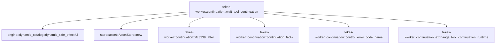

# tekes-worker::continuation

[Package atlas](index.md) · [Source](../../src/continuation.rs)

## Declarations

Visibility is the declaration spelling; trait members and reexports require their enclosing interface. `cfg` is not evaluated.

| Symbol | Kind | Visibility | Test / cfg |
|---|---|---|---|
| [tekes-worker::continuation::ContinuationFacts](../../src/continuation.rs#L5) | struct_item | `pub(crate)` |  |
| [tekes-worker::continuation::continuation_facts](../../src/continuation.rs#L22) | function_item | `pub(crate)` |  |
| [tekes-worker::continuation::CONTINUATION_INPUT_SCOPE](../../src/continuation.rs#L130) | const_item | `pub(crate)` |  |
| [tekes-worker::continuation::CONTINUATION_POLL_FLOOR](../../src/continuation.rs#L131) | const_item | `private` |  |
| [tekes-worker::continuation::CONTINUATION_PARK_THRESHOLD](../../src/continuation.rs#L135) | const_item | `private` |  |
| [tekes-worker::continuation::CONTINUATION_POLL_CEILING](../../src/continuation.rs#L136) | const_item | `private` |  |
| [tekes-worker::continuation::rfc3339_after](../../src/continuation.rs#L137) | function_item | `pub(crate)` |  |
| [tekes-worker::continuation::ContinuationWait](../../src/continuation.rs#L142) | struct_item | `pub(crate)` |  |
| [tekes-worker::continuation::wait_tool_continuation](../../src/continuation.rs#L157) | function_item | `pub(crate)` |  |
| [tekes-worker::continuation::control_error_code_name](../../src/continuation.rs#L470) | function_item | `private` |  |
| [tekes-worker::continuation::exchange_tool_continuation_runtime](../../src/continuation.rs#L479) | function_item | `private` |  |

## Imports / reexports

| Local name | Source path | Visibility |
|---|---|---|
| `*` | `super::*` | `private` |

## Module declarations

| Module | Visibility | Attributes |
|---|---|---|

## Function call graphs

Edges below are syntactically resolved calls only, including private functions. Graphs partition callers into groups of 20; they are not execution order. All unresolved sites are listed below and in the JSON inventory.

Functions 1–5: 6 direct edges

## Call sites

Includes test functions (marked in declarations). Receiver-type-required sites need type analysis/manual tracing. Calls in closures are attributed to their enclosing function; their occurrence here does not mean the closure executes immediately.

| Caller | Callee expression | Source lines | Target / classification |
|---|---|---|---|
| `continuation_facts` | `ledger.projection().ok_or` | [26](../../src/continuation.rs#L26) | receiver-type-required |
| `continuation_facts` | `ledger.projection` | [26](../../src/continuation.rs#L26) | receiver-type-required |
| `continuation_facts` | `event.kind` | [29](../../src/continuation.rs#L29) | receiver-type-required |
| `continuation_facts` | `event.string_field` | [31](../../src/continuation.rs#L31), [103](../../src/continuation.rs#L103), [108](../../src/continuation.rs#L108), [118](../../src/continuation.rs#L118) | receiver-type-required |
| `continuation_facts` | `Some` | [31](../../src/continuation.rs#L31), [37](../../src/continuation.rs#L37), [88](../../src/continuation.rs#L88), [103](../../src/continuation.rs#L103), [105](../../src/continuation.rs#L105), [108](../../src/continuation.rs#L108), [111](../../src/continuation.rs#L111), [118](../../src/continuation.rs#L118) | external-constructor-callback-or-unresolved |
| `continuation_facts` | `serde_json::to_value` | [33](../../src/continuation.rs#L33), [110](../../src/continuation.rs#L110) | external-constructor-callback-or-unresolved |
| `continuation_facts` | `event.raw` | [33](../../src/continuation.rs#L33), [110](../../src/continuation.rs#L110) | receiver-type-required |
| `continuation_facts` | `raw                     .get("payload")                     .ok_or` | [34](../../src/continuation.rs#L34) | receiver-type-required |
| `continuation_facts` | `raw                     .get` | [34](../../src/continuation.rs#L34) | receiver-type-required |
| `continuation_facts` | `payload.get("call").and_then` | [37](../../src/continuation.rs#L37) | receiver-type-required |
| `continuation_facts` | `payload.get` | [37](../../src/continuation.rs#L37), [69](../../src/continuation.rs#L69) | receiver-type-required |
| `continuation_facts` | `payload                     .get("continuation_id")                     .and_then(Value::as_str)                     .ok_or("tool_continuation lacks continuation_id")?                     .to_owned` | [40](../../src/continuation.rs#L40) | receiver-type-required |
| `continuation_facts` | `payload                     .get("continuation_id")                     .and_then(Value::as_str)                     .ok_or` | [40](../../src/continuation.rs#L40) | receiver-type-required |
| `continuation_facts` | `payload                     .get("continuation_id")                     .and_then` | [40](../../src/continuation.rs#L40) | receiver-type-required |
| `continuation_facts` | `payload                     .get` | [40](../../src/continuation.rs#L40), [45](../../src/continuation.rs#L45), [49](../../src/continuation.rs#L49), [65](../../src/continuation.rs#L65) | receiver-type-required |
| `continuation_facts` | `payload                     .get("step")                     .and_then(Value::as_u64)                     .ok_or` | [45](../../src/continuation.rs#L45) | receiver-type-required |
| `continuation_facts` | `payload                     .get("step")                     .and_then` | [45](../../src/continuation.rs#L45) | receiver-type-required |
| `continuation_facts` | `payload                     .get("action")                     .and_then(Value::as_str)                     .unwrap_or` | [49](../../src/continuation.rs#L49) | receiver-type-required |
| `continuation_facts` | `payload                     .get("action")                     .and_then` | [49](../../src/continuation.rs#L49) | receiver-type-required |
| `continuation_facts` | `materialize_json` | [53](../../src/continuation.rs#L53) | external-constructor-callback-or-unresolved |
| `continuation_facts` | `payload                         .get("state")                         .ok_or` | [55](../../src/continuation.rs#L55) | receiver-type-required |
| `continuation_facts` | `payload                         .get` | [55](../../src/continuation.rs#L55) | receiver-type-required |
| `continuation_facts` | `state                     .get("status")                     .and_then(Value::as_str)                     .unwrap_or_default()                     .to_owned` | [59](../../src/continuation.rs#L59) | receiver-type-required |
| `continuation_facts` | `state                     .get("status")                     .and_then(Value::as_str)                     .unwrap_or_default` | [59](../../src/continuation.rs#L59) | receiver-type-required |
| `continuation_facts` | `state                     .get("status")                     .and_then` | [59](../../src/continuation.rs#L59) | receiver-type-required |
| `continuation_facts` | `state                     .get` | [59](../../src/continuation.rs#L59) | receiver-type-required |
| `continuation_facts` | `(action == "update").then_some` | [64](../../src/continuation.rs#L64) | receiver-type-required |
| `continuation_facts` | `event.seq` | [64](../../src/continuation.rs#L64), [105](../../src/continuation.rs#L105), [112](../../src/continuation.rs#L112) | receiver-type-required |
| `continuation_facts` | `payload                     .get("poll_after")                     .and_then(Value::as_str)                     .map` | [65](../../src/continuation.rs#L65) | receiver-type-required |
| `continuation_facts` | `payload                     .get("poll_after")                     .and_then` | [65](../../src/continuation.rs#L65) | receiver-type-required |
| `continuation_facts` | `payload.get("interval_ms").and_then` | [69](../../src/continuation.rs#L69) | receiver-type-required |
| `continuation_facts` | `facts.as_mut` | [70](../../src/continuation.rs#L70), [104](../../src/continuation.rs#L104), [109](../../src/continuation.rs#L109), [119](../../src/continuation.rs#L119) | receiver-type-required |
| `continuation_facts` | `Err` | [73](../../src/continuation.rs#L73), [76](../../src/continuation.rs#L76) | external-constructor-callback-or-unresolved |
| `continuation_facts` | `"call has records for two continuations".into` | [73](../../src/continuation.rs#L73) | receiver-type-required |
| `continuation_facts` | `"tool_continuation steps regress".into` | [76](../../src/continuation.rs#L76) | receiver-type-required |
| `continuation_facts` | `updated_at.or` | [81](../../src/continuation.rs#L81) | receiver-type-required |
| `continuation_facts` | `interval_ms.or` | [85](../../src/continuation.rs#L85) | receiver-type-required |
| `continuation_facts` | `raw.get("grant").and_then(Value::as_bool).unwrap_or` | [113](../../src/continuation.rs#L113) | receiver-type-required |
| `continuation_facts` | `raw.get("grant").and_then` | [113](../../src/continuation.rs#L113) | receiver-type-required |
| `continuation_facts` | `raw.get` | [113](../../src/continuation.rs#L113), [114](../../src/continuation.rs#L114) | receiver-type-required |
| `continuation_facts` | `raw.get("answer").cloned` | [114](../../src/continuation.rs#L114) | receiver-type-required |
| `continuation_facts` | `Ok` | [126](../../src/continuation.rs#L126) | external-constructor-callback-or-unresolved |
| `CONTINUATION_POLL_FLOOR` | `Duration::from_millis` | [131](../../src/continuation.rs#L131) | external-constructor-callback-or-unresolved |
| `CONTINUATION_PARK_THRESHOLD` | `Duration::from_secs` | [135](../../src/continuation.rs#L135) | external-constructor-callback-or-unresolved |
| `CONTINUATION_POLL_CEILING` | `Duration::from_secs` | [136](../../src/continuation.rs#L136) | external-constructor-callback-or-unresolved |
| `rfc3339_after` | `(chrono::Utc::now() + chrono::Duration::from_std(delay).unwrap_or_default())         .to_rfc3339_opts` | [138](../../src/continuation.rs#L138) | receiver-type-required |
| `rfc3339_after` | `chrono::Utc::now` | [138](../../src/continuation.rs#L138) | external-constructor-callback-or-unresolved |
| `rfc3339_after` | `chrono::Duration::from_std(delay).unwrap_or_default` | [138](../../src/continuation.rs#L138) | receiver-type-required |
| `rfc3339_after` | `chrono::Duration::from_std` | [138](../../src/continuation.rs#L138) | external-constructor-callback-or-unresolved |
| `wait_tool_continuation` | `ledger         .path()         .parent()         .ok_or("worker ledger has no thread folder")?         .to_path_buf` | [175](../../src/continuation.rs#L175) | receiver-type-required |
| `wait_tool_continuation` | `ledger         .path()         .parent()         .ok_or` | [175](../../src/continuation.rs#L175) | receiver-type-required |
| `wait_tool_continuation` | `ledger         .path()         .parent` | [175](../../src/continuation.rs#L175) | receiver-type-required |
| `wait_tool_continuation` | `ledger         .path` | [175](../../src/continuation.rs#L175) | receiver-type-required |
| `wait_tool_continuation` | `thread_folder         .file_name()         .and_then(&#124;name&#124; name.to_str())         .ok_or("thread folder has no UTF-8 session UUID")?         .to_owned` | [180](../../src/continuation.rs#L180) | receiver-type-required |
| `wait_tool_continuation` | `thread_folder         .file_name()         .and_then(&#124;name&#124; name.to_str())         .ok_or` | [180](../../src/continuation.rs#L180) | receiver-type-required |
| `wait_tool_continuation` | `thread_folder         .file_name()         .and_then` | [180](../../src/continuation.rs#L180) | receiver-type-required |
| `wait_tool_continuation` | `thread_folder         .file_name` | [180](../../src/continuation.rs#L180) | receiver-type-required |
| `wait_tool_continuation` | `name.to_str` | [182](../../src/continuation.rs#L182) | receiver-type-required |
| `wait_tool_continuation` | `ledger.projection().ok_or` | [185](../../src/continuation.rs#L185) | receiver-type-required |
| `wait_tool_continuation` | `ledger.projection` | [185](../../src/continuation.rs#L185) | receiver-type-required |
| `wait_tool_continuation` | `projection         .events         .first()         .and_then(&#124;genesis&#124; genesis.string_field("thread"))         .ok_or("genesis thread binding is missing")?         .to_owned` | [186](../../src/continuation.rs#L186) | receiver-type-required |
| `wait_tool_continuation` | `projection         .events         .first()         .and_then(&#124;genesis&#124; genesis.string_field("thread"))         .ok_or` | [186](../../src/continuation.rs#L186) | receiver-type-required |
| `wait_tool_continuation` | `projection         .events         .first()         .and_then` | [186](../../src/continuation.rs#L186) | receiver-type-required |
| `wait_tool_continuation` | `projection         .events         .first` | [186](../../src/continuation.rs#L186) | receiver-type-required |
| `wait_tool_continuation` | `genesis.string_field` | [189](../../src/continuation.rs#L189) | receiver-type-required |
| `wait_tool_continuation` | `projection         .events         .iter()         .find(&#124;event&#124; {             *event.kind() == EventKind::ToolCall && event.string_field("call") == Some(call)         })         .ok_or` | [192](../../src/continuation.rs#L192) | receiver-type-required |
| `wait_tool_continuation` | `projection         .events         .iter()         .find` | [192](../../src/continuation.rs#L192) | receiver-type-required |
| `wait_tool_continuation` | `projection         .events         .iter` | [192](../../src/continuation.rs#L192) | receiver-type-required |
| `wait_tool_continuation` | `event.kind` | [196](../../src/continuation.rs#L196), [212](../../src/continuation.rs#L212) | receiver-type-required |
| `wait_tool_continuation` | `event.string_field` | [196](../../src/continuation.rs#L196), [212](../../src/continuation.rs#L212) | receiver-type-required |
| `wait_tool_continuation` | `Some` | [196](../../src/continuation.rs#L196), [212](../../src/continuation.rs#L212), [399](../../src/continuation.rs#L399) | external-constructor-callback-or-unresolved |
| `wait_tool_continuation` | `tool_call.turn().ok_or` | [199](../../src/continuation.rs#L199) | receiver-type-required |
| `wait_tool_continuation` | `tool_call.turn` | [199](../../src/continuation.rs#L199) | receiver-type-required |
| `wait_tool_continuation` | `tool_call         .string_field("attempt")         .ok_or("tool_call lacks attempt")?         .to_owned` | [200](../../src/continuation.rs#L200) | receiver-type-required |
| `wait_tool_continuation` | `tool_call         .string_field("attempt")         .ok_or` | [200](../../src/continuation.rs#L200) | receiver-type-required |
| `wait_tool_continuation` | `tool_call         .string_field` | [200](../../src/continuation.rs#L200), [204](../../src/continuation.rs#L204) | receiver-type-required |
| `wait_tool_continuation` | `tool_call         .string_field("name")         .ok_or("tool_call lacks name")?         .to_owned` | [204](../../src/continuation.rs#L204) | receiver-type-required |
| `wait_tool_continuation` | `tool_call         .string_field("name")         .ok_or` | [204](../../src/continuation.rs#L204) | receiver-type-required |
| `wait_tool_continuation` | `serde_json::to_value` | [208](../../src/continuation.rs#L208), [214](../../src/continuation.rs#L214) | external-constructor-callback-or-unresolved |
| `wait_tool_continuation` | `tool_call.raw` | [208](../../src/continuation.rs#L208) | receiver-type-required |
| `wait_tool_continuation` | `materialize_json` | [210](../../src/continuation.rs#L210), [215](../../src/continuation.rs#L215) | external-constructor-callback-or-unresolved |
| `wait_tool_continuation` | `raw_call.get("args").ok_or` | [210](../../src/continuation.rs#L210) | receiver-type-required |
| `wait_tool_continuation` | `raw_call.get` | [210](../../src/continuation.rs#L210) | receiver-type-required |
| `wait_tool_continuation` | `projection.events.iter().rev().find` | [211](../../src/continuation.rs#L211) | receiver-type-required |
| `wait_tool_continuation` | `projection.events.iter().rev` | [211](../../src/continuation.rs#L211) | receiver-type-required |
| `wait_tool_continuation` | `projection.events.iter` | [211](../../src/continuation.rs#L211) | receiver-type-required |
| `wait_tool_continuation` | `effective.raw` | [214](../../src/continuation.rs#L214) | receiver-type-required |
| `wait_tool_continuation` | `raw.get("invocation")                 .ok_or` | [217](../../src/continuation.rs#L217) | receiver-type-required |
| `wait_tool_continuation` | `raw.get` | [217](../../src/continuation.rs#L217) | receiver-type-required |
| `wait_tool_continuation` | `IJsonValue::parse` | [221](../../src/continuation.rs#L221), [364](../../src/continuation.rs#L364), [390](../../src/continuation.rs#L390) | external-constructor-callback-or-unresolved |
| `wait_tool_continuation` | `serde_json::to_vec` | [221](../../src/continuation.rs#L221), [364](../../src/continuation.rs#L364), [390](../../src/continuation.rs#L390) | external-constructor-callback-or-unresolved |
| `wait_tool_continuation` | `ToolControl::new` | [222](../../src/continuation.rs#L222) | external-constructor-callback-or-unresolved |
| `wait_tool_continuation` | `thread.clone` | [224](../../src/continuation.rs#L224) | receiver-type-required |
| `wait_tool_continuation` | `name.clone` | [227](../../src/continuation.rs#L227) | receiver-type-required |
| `wait_tool_continuation` | `arguments.clone` | [228](../../src/continuation.rs#L228) | receiver-type-required |
| `wait_tool_continuation` | `profile         .bindings         .dynamic_catalog         .tools         .iter()         .find(&#124;tool&#124; tool.name == name)         .is_none_or` | [230](../../src/continuation.rs#L230) | receiver-type-required |
| `wait_tool_continuation` | `profile         .bindings         .dynamic_catalog         .tools         .iter()         .find` | [230](../../src/continuation.rs#L230) | receiver-type-required |
| `wait_tool_continuation` | `profile         .bindings         .dynamic_catalog         .tools         .iter` | [230](../../src/continuation.rs#L230) | receiver-type-required |
| `wait_tool_continuation` | `engine::dynamic_side_effectful` | [236](../../src/continuation.rs#L236) | [engine::dynamic_catalog::dynamic_side_effectful](../../../engine/src/dynamic_catalog.rs#L508) |
| `wait_tool_continuation` | `call.to_owned` | [239](../../src/continuation.rs#L239) | receiver-type-required |
| `wait_tool_continuation` | `options.event_timestamp().clone` | [245](../../src/continuation.rs#L245) | receiver-type-required |
| `wait_tool_continuation` | `options.event_timestamp` | [245](../../src/continuation.rs#L245) | receiver-type-required |
| `wait_tool_continuation` | `frozen_hook_bindings` | [247](../../src/continuation.rs#L247) | external-constructor-callback-or-unresolved |
| `wait_tool_continuation` | `store::AssetStore::new` | [248](../../src/continuation.rs#L248) | [store::asset::AssetStore::new](../../../store/src/asset.rs#L27) |
| `wait_tool_continuation` | `thread_folder.join` | [248](../../src/continuation.rs#L248) | receiver-type-required |
| `wait_tool_continuation` | `continuation_facts(ledger, call)?.ok_or` | [256](../../src/continuation.rs#L256) | receiver-type-required |
| `wait_tool_continuation` | `continuation_facts` | [256](../../src/continuation.rs#L256) | [tekes-worker::continuation::continuation_facts](../../src/continuation.rs#L22) |
| `wait_tool_continuation` | `Err` | [258](../../src/continuation.rs#L258), [426](../../src/continuation.rs#L426) | external-constructor-callback-or-unresolved |
| `wait_tool_continuation` | `"continuation identity changed under the call".into` | [258](../../src/continuation.rs#L258) | receiver-type-required |
| `wait_tool_continuation` | `Ok` | [261](../../src/continuation.rs#L261), [326](../../src/continuation.rs#L326), [345](../../src/continuation.rs#L345), [347](../../src/continuation.rs#L347), [358](../../src/continuation.rs#L358), [402](../../src/continuation.rs#L402), [452](../../src/continuation.rs#L452), [464](../../src/continuation.rs#L464) | external-constructor-callback-or-unresolved |
| `wait_tool_continuation` | `facts                     .poll_after                     .as_deref()                     .and_then` | [268](../../src/continuation.rs#L268) | receiver-type-required |
| `wait_tool_continuation` | `facts                     .poll_after                     .as_deref` | [268](../../src/continuation.rs#L268) | receiver-type-required |
| `wait_tool_continuation` | `chrono::DateTime::parse_from_rfc3339(value).ok` | [271](../../src/continuation.rs#L271) | receiver-type-required |
| `wait_tool_continuation` | `chrono::DateTime::parse_from_rfc3339` | [271](../../src/continuation.rs#L271) | external-constructor-callback-or-unresolved |
| `wait_tool_continuation` | `(due.with_timezone(&chrono::Utc) - chrono::Utc::now())                         .to_std()                         .unwrap_or_default` | [273](../../src/continuation.rs#L273) | receiver-type-required |
| `wait_tool_continuation` | `(due.with_timezone(&chrono::Utc) - chrono::Utc::now())                         .to_std` | [273](../../src/continuation.rs#L273) | receiver-type-required |
| `wait_tool_continuation` | `due.with_timezone` | [273](../../src/continuation.rs#L273) | receiver-type-required |
| `wait_tool_continuation` | `chrono::Utc::now` | [273](../../src/continuation.rs#L273) | external-constructor-callback-or-unresolved |
| `wait_tool_continuation` | `std::thread::sleep` | [276](../../src/continuation.rs#L276), [404](../../src/continuation.rs#L404) | external-constructor-callback-or-unresolved |
| `wait_tool_continuation` | `remaining.min` | [276](../../src/continuation.rs#L276) | receiver-type-required |
| `wait_tool_continuation` | `Duration::from_millis(parked_interval.saturating_mul(2))                     .min` | [278](../../src/continuation.rs#L278) | receiver-type-required |
| `wait_tool_continuation` | `Duration::from_millis` | [278](../../src/continuation.rs#L278) | external-constructor-callback-or-unresolved |
| `wait_tool_continuation` | `parked_interval.saturating_mul` | [278](../../src/continuation.rs#L278) | receiver-type-required |
| `wait_tool_continuation` | `ToolPipeline::new` | [284](../../src/continuation.rs#L284), [392](../../src/continuation.rs#L392), [436](../../src/continuation.rs#L436) | external-constructor-callback-or-unresolved |
| `wait_tool_continuation` | `assets.clone` | [284](../../src/continuation.rs#L284), [392](../../src/continuation.rs#L392), [436](../../src/continuation.rs#L436) | receiver-type-required |
| `wait_tool_continuation` | `SecretScanner::default` | [284](../../src/continuation.rs#L284), [392](../../src/continuation.rs#L392), [436](../../src/continuation.rs#L436) | external-constructor-callback-or-unresolved |
| `wait_tool_continuation` | `pipeline                 .complete_continuation(&execution, &hooks, &execution.invocation, terminal)                 .map_err` | [285](../../src/continuation.rs#L285) | receiver-type-required |
| `wait_tool_continuation` | `pipeline                 .complete_continuation` | [285](../../src/continuation.rs#L285) | receiver-type-required |
| `wait_tool_continuation` | `error.to_string` | [287](../../src/continuation.rs#L287) | receiver-type-required |
| `wait_tool_continuation` | `cancellation.stop_requested` | [289](../../src/continuation.rs#L289), [385](../../src/continuation.rs#L385), [422](../../src/continuation.rs#L422) | receiver-type-required |
| `wait_tool_continuation` | `ToolContinuationRequest::new` | [292](../../src/continuation.rs#L292), [407](../../src/continuation.rs#L407) | external-constructor-callback-or-unresolved |
| `wait_tool_continuation` | `original.clone` | [293](../../src/continuation.rs#L293), [408](../../src/continuation.rs#L408) | receiver-type-required |
| `wait_tool_continuation` | `continuation_id.to_owned` | [294](../../src/continuation.rs#L294), [409](../../src/continuation.rs#L409) | receiver-type-required |
| `wait_tool_continuation` | `exchange_tool_continuation_runtime(                 &selected,                 &cancel,                 lines,                 stdout,                 cancellation,                 true,             )             .map(&#124;response&#124; match response.result {                 ToolContinuationOutcome::Failed { error } => format!(                     "remote {}: {}",                     control_error_code_name(&error.code),                     error.message                 ),                 ToolContinuationOutcome::Pending { .. } => "remote still pending".to_owned(),                 ToolContinuationOutcome::Completed { .. } => {                     "remote completed before cancellation".to_owned()                 }             })             .unwrap_or_else` | [298](../../src/continuation.rs#L298) | receiver-type-required |
| `wait_tool_continuation` | `exchange_tool_continuation_runtime(                 &selected,                 &cancel,                 lines,                 stdout,                 cancellation,                 true,             )             .map` | [298](../../src/continuation.rs#L298) | receiver-type-required |
| `wait_tool_continuation` | `exchange_tool_continuation_runtime` | [298](../../src/continuation.rs#L298), [413](../../src/continuation.rs#L413) | [tekes-worker::continuation::exchange_tool_continuation_runtime](../../src/continuation.rs#L479) |
| `wait_tool_continuation` | `"remote still pending".to_owned` | [312](../../src/continuation.rs#L312) | receiver-type-required |
| `wait_tool_continuation` | `"remote completed before cancellation".to_owned` | [314](../../src/continuation.rs#L314) | receiver-type-required |
| `wait_tool_continuation` | `terminalize` | [318](../../src/continuation.rs#L318), [350](../../src/continuation.rs#L350), [450](../../src/continuation.rs#L450), [455](../../src/continuation.rs#L455) | external-constructor-callback-or-unresolved |
| `wait_tool_continuation` | `"cancelled".to_owned` | [321](../../src/continuation.rs#L321) | receiver-type-required |
| `wait_tool_continuation` | `facts                         .state                         .get("inputRequests")                         .cloned()                         .unwrap_or_else` | [333](../../src/continuation.rs#L333) | receiver-type-required |
| `wait_tool_continuation` | `facts                         .state                         .get("inputRequests")                         .cloned` | [333](../../src/continuation.rs#L333) | receiver-type-required |
| `wait_tool_continuation` | `facts                         .state                         .get` | [333](../../src/continuation.rs#L333) | receiver-type-required |
| `wait_tool_continuation` | `facts.state.clone` | [337](../../src/continuation.rs#L337) | receiver-type-required |
| `wait_tool_continuation` | `make_event` | [338](../../src/continuation.rs#L338) | external-constructor-callback-or-unresolved |
| `wait_tool_continuation` | `ledger.append_contract` | [343](../../src/continuation.rs#L343) | receiver-type-required |
| `wait_tool_continuation` | `BarrierContext::default` | [343](../../src/continuation.rs#L343) | external-constructor-callback-or-unresolved |
| `wait_tool_continuation` | `announce_appended` | [344](../../src/continuation.rs#L344), [401](../../src/continuation.rs#L401), [451](../../src/continuation.rs#L451), [463](../../src/continuation.rs#L463) | external-constructor-callback-or-unresolved |
| `wait_tool_continuation` | `"denied".to_owned` | [353](../../src/continuation.rs#L353) | receiver-type-required |
| `wait_tool_continuation` | `"remote task input was declined".to_owned` | [354](../../src/continuation.rs#L354) | receiver-type-required |
| `wait_tool_continuation` | `facts.updated_at.is_some_and` | [360](../../src/continuation.rs#L360) | receiver-type-required |
| `wait_tool_continuation` | `answer.unwrap_or_else` | [365](../../src/continuation.rs#L365) | receiver-type-required |
| `wait_tool_continuation` | `std::mem::take` | [374](../../src/continuation.rs#L374) | external-constructor-callback-or-unresolved |
| `wait_tool_continuation` | `facts                 .state                 .get("pollIntervalMs")                 .and_then(Value::as_u64)                 .map` | [377](../../src/continuation.rs#L377) | receiver-type-required |
| `wait_tool_continuation` | `facts                 .state                 .get("pollIntervalMs")                 .and_then` | [377](../../src/continuation.rs#L377) | receiver-type-required |
| `wait_tool_continuation` | `facts                 .state                 .get` | [377](../../src/continuation.rs#L377) | receiver-type-required |
| `wait_tool_continuation` | `remote_hint                 .map_or(interval, &#124;hint&#124; hint.max(interval))                 .min` | [382](../../src/continuation.rs#L382) | receiver-type-required |
| `wait_tool_continuation` | `remote_hint                 .map_or` | [382](../../src/continuation.rs#L382) | receiver-type-required |
| `wait_tool_continuation` | `hint.max` | [383](../../src/continuation.rs#L383) | receiver-type-required |
| `wait_tool_continuation` | `rfc3339_after` | [389](../../src/continuation.rs#L389) | [tekes-worker::continuation::rfc3339_after](../../src/continuation.rs#L137) |
| `wait_tool_continuation` | `pipeline.append_continuation_step` | [393](../../src/continuation.rs#L393), [437](../../src/continuation.rs#L437) | receiver-type-required |
| `wait_tool_continuation` | `wait.as_millis` | [399](../../src/continuation.rs#L399) | receiver-type-required |
| `wait_tool_continuation` | `(interval * 2).min` | [405](../../src/continuation.rs#L405) | receiver-type-required |
| `wait_tool_continuation` | `action.clone` | [411](../../src/continuation.rs#L411) | receiver-type-required |
| `wait_tool_continuation` | `cancellation.protocol_failed` | [422](../../src/continuation.rs#L422) | receiver-type-required |
| `wait_tool_continuation` | `BackendTerminal::Completed` | [450](../../src/continuation.rs#L450) | external-constructor-callback-or-unresolved |
| `wait_tool_continuation` | `control_error_code_name(&error.code).to_owned` | [458](../../src/continuation.rs#L458) | receiver-type-required |
| `wait_tool_continuation` | `control_error_code_name` | [458](../../src/continuation.rs#L458) | [tekes-worker::continuation::control_error_code_name](../../src/continuation.rs#L470) |
| `control_error_code_name` | `serde_json::to_value(code)         .ok()         .and_then(&#124;value&#124; value.as_str().map(str::to_owned))         .unwrap_or_else` | [471](../../src/continuation.rs#L471) | receiver-type-required |
| `control_error_code_name` | `serde_json::to_value(code)         .ok()         .and_then` | [471](../../src/continuation.rs#L471) | receiver-type-required |
| `control_error_code_name` | `serde_json::to_value(code)         .ok` | [471](../../src/continuation.rs#L471) | receiver-type-required |
| `control_error_code_name` | `serde_json::to_value` | [471](../../src/continuation.rs#L471) | external-constructor-callback-or-unresolved |
| `control_error_code_name` | `value.as_str().map` | [473](../../src/continuation.rs#L473) | receiver-type-required |
| `control_error_code_name` | `value.as_str` | [473](../../src/continuation.rs#L473) | receiver-type-required |
| `control_error_code_name` | `"internal".to_owned` | [474](../../src/continuation.rs#L474) | receiver-type-required |
| `exchange_tool_continuation_runtime` | `require_version` | [487](../../src/continuation.rs#L487) | external-constructor-callback-or-unresolved |
| `exchange_tool_continuation_runtime` | `cancellation.stop_requested` | [488](../../src/continuation.rs#L488) | receiver-type-required |
| `exchange_tool_continuation_runtime` | `Err` | [489](../../src/continuation.rs#L489), [493](../../src/continuation.rs#L493), [503](../../src/continuation.rs#L503), [516](../../src/continuation.rs#L516), [530](../../src/continuation.rs#L530), [536](../../src/continuation.rs#L536), [543](../../src/continuation.rs#L543) | external-constructor-callback-or-unresolved |
| `exchange_tool_continuation_runtime` | `"tool continuation cancelled by stop".into` | [489](../../src/continuation.rs#L489), [530](../../src/continuation.rs#L530) | receiver-type-required |
| `exchange_tool_continuation_runtime` | `cancellation.supervisor_lost` | [491](../../src/continuation.rs#L491) | receiver-type-required |
| `exchange_tool_continuation_runtime` | `cancellation.mark_protocol_failed` | [492](../../src/continuation.rs#L492), [502](../../src/continuation.rs#L502), [509](../../src/continuation.rs#L509), [515](../../src/continuation.rs#L515), [535](../../src/continuation.rs#L535), [542](../../src/continuation.rs#L542) | receiver-type-required |
| `exchange_tool_continuation_runtime` | `Box::new` | [493](../../src/continuation.rs#L493), [503](../../src/continuation.rs#L503), [516](../../src/continuation.rs#L516), [536](../../src/continuation.rs#L536), [543](../../src/continuation.rs#L543) | external-constructor-callback-or-unresolved |
| `exchange_tool_continuation_runtime` | `ProtocolFailure` | [493](../../src/continuation.rs#L493), [503](../../src/continuation.rs#L503), [510](../../src/continuation.rs#L510), [516](../../src/continuation.rs#L516), [536](../../src/continuation.rs#L536), [543](../../src/continuation.rs#L543) | external-constructor-callback-or-unresolved |
| `exchange_tool_continuation_runtime` | `"supervisor EOF before tool continuation".to_owned` | [494](../../src/continuation.rs#L494) | receiver-type-required |
| `exchange_tool_continuation_runtime` | `stdout.write_all` | [497](../../src/continuation.rs#L497) | receiver-type-required |
| `exchange_tool_continuation_runtime` | `encode_tool_continuation` | [497](../../src/continuation.rs#L497) | external-constructor-callback-or-unresolved |
| `exchange_tool_continuation_runtime` | `stdout.flush` | [498](../../src/continuation.rs#L498), [524](../../src/continuation.rs#L524) | receiver-type-required |
| `exchange_tool_continuation_runtime` | `lines.next` | [500](../../src/continuation.rs#L500) | receiver-type-required |
| `exchange_tool_continuation_runtime` | `cancellation.cancel` | [501](../../src/continuation.rs#L501), [508](../../src/continuation.rs#L508), [527](../../src/continuation.rs#L527) | receiver-type-required |
| `exchange_tool_continuation_runtime` | `"supervisor EOF while awaiting tool continuation result".to_owned` | [504](../../src/continuation.rs#L504) | receiver-type-required |
| `exchange_tool_continuation_runtime` | `line.map_err` | [507](../../src/continuation.rs#L507) | receiver-type-required |
| `exchange_tool_continuation_runtime` | `decode_tool_continuation_result` | [512](../../src/continuation.rs#L512) | external-constructor-callback-or-unresolved |
| `exchange_tool_continuation_runtime` | `line.as_bytes` | [512](../../src/continuation.rs#L512), [520](../../src/continuation.rs#L520) | receiver-type-required |
| `exchange_tool_continuation_runtime` | `response.validate_for` | [514](../../src/continuation.rs#L514) | receiver-type-required |
| `exchange_tool_continuation_runtime` | `Ok` | [518](../../src/continuation.rs#L518) | external-constructor-callback-or-unresolved |
| `exchange_tool_continuation_runtime` | `decode_supervisor` | [520](../../src/continuation.rs#L520) | external-constructor-callback-or-unresolved |
| `exchange_tool_continuation_runtime` | `stdout                         .write_all` | [522](../../src/continuation.rs#L522) | receiver-type-required |
| `exchange_tool_continuation_runtime` | `encode_line` | [523](../../src/continuation.rs#L523) | external-constructor-callback-or-unresolved |
| `exchange_tool_continuation_runtime` | `cancellation.defer` | [528](../../src/continuation.rs#L528) | receiver-type-required |
| `exchange_tool_continuation_runtime` | `cancellation.park_delivery` | [533](../../src/continuation.rs#L533) | receiver-type-required |
| `exchange_tool_continuation_runtime` | `"unexpected supervisor message while awaiting tool continuation result"                             .to_owned` | [537](../../src/continuation.rs#L537) | receiver-type-required |
