# tekes-worker::control_channel

[Package atlas](index.md) · [Source](../../src/control_channel.rs)

## Declarations

Visibility is the declaration spelling; trait members and reexports require their enclosing interface. `cfg` is not evaluated.

| Symbol | Kind | Visibility | Test / cfg |
|---|---|---|---|
| [tekes-worker::control_channel::CANCEL_NONE](../../src/control_channel.rs#L3) | const_item | `private` |  |
| [tekes-worker::control_channel::CANCEL_STOP](../../src/control_channel.rs#L4) | const_item | `pub(crate)` |  |
| [tekes-worker::control_channel::CANCEL_SUPERVISOR_LOSS](../../src/control_channel.rs#L5) | const_item | `pub(crate)` |  |
| [tekes-worker::control_channel::RuntimeCancellation](../../src/control_channel.rs#L8) | struct_item | `pub(crate)` |  |
| [tekes-worker::control_channel::RuntimeCancellation::cancel](../../src/control_channel.rs#L23) | function_item | `pub(crate)` |  |
| [tekes-worker::control_channel::RuntimeCancellation::stop_requested](../../src/control_channel.rs#L31) | function_item | `pub(crate)` |  |
| [tekes-worker::control_channel::RuntimeCancellation::supervisor_lost](../../src/control_channel.rs#L35) | function_item | `pub(crate)` |  |
| [tekes-worker::control_channel::RuntimeCancellation::mark_protocol_failed](../../src/control_channel.rs#L39) | function_item | `pub(crate)` |  |
| [tekes-worker::control_channel::RuntimeCancellation::protocol_failed](../../src/control_channel.rs#L43) | function_item | `pub(crate)` |  |
| [tekes-worker::control_channel::RuntimeCancellation::defer](../../src/control_channel.rs#L47) | function_item | `pub(crate)` |  |
| [tekes-worker::control_channel::RuntimeCancellation::park_delivery](../../src/control_channel.rs#L54) | function_item | `pub(crate)` |  |
| [tekes-worker::control_channel::RuntimeCancellation::take_parked_deliveries](../../src/control_channel.rs#L61) | function_item | `pub(crate)` |  |
| [tekes-worker::control_channel::ControlLines](../../src/control_channel.rs#L66) | struct_item | `pub(crate)` |  |
| [tekes-worker::control_channel::ControlLines::drain_ready](../../src/control_channel.rs#L75) | function_item | `pub(crate)` |  |
| [tekes-worker::control_channel::Item](../../src/control_channel.rs#L92) | type_item | `private` |  |
| [tekes-worker::control_channel::ControlLines::next](../../src/control_channel.rs#L94) | function_item | `private` |  |
| [tekes-worker::control_channel::ProtocolFailure](../../src/control_channel.rs#L109) | struct_item | `pub(crate)` |  |
| [tekes-worker::control_channel::ProtocolFailure::fmt](../../src/control_channel.rs#L112) | function_item | `private` |  |
| [tekes-worker::control_channel::spawn_control_reader](../../src/control_channel.rs#L119) | function_item | `pub(crate)` |  |
| [tekes-worker::control_channel::read_control_lines](../../src/control_channel.rs#L132) | function_item | `private` |  |
| [tekes-worker::control_channel::forward_control_lines](../../src/control_channel.rs#L137) | function_item | `pub(crate)` |  |
| [tekes-worker::control_channel::control_line_key](../../src/control_channel.rs#L162) | function_item | `pub(crate)` |  |
| [tekes-worker::control_channel::is_stop_control_line](../../src/control_channel.rs#L170) | function_item | `private` |  |
| [tekes-worker::control_channel::is_delivery_control_line](../../src/control_channel.rs#L176) | function_item | `pub(crate)` |  |

## Imports / reexports

| Local name | Source path | Visibility |
|---|---|---|
| `*` | `super::*` | `private` |

## Module declarations

| Module | Visibility | Attributes |
|---|---|---|

## Function call graphs

Edges below are syntactically resolved calls only, including private functions. Graphs partition callers into groups of 20; they are not execution order. All unresolved sites are listed below and in the JSON inventory.

```mermaid
flowchart TD
  n0["tekes-worker::control_channel::ProtocolFailure::fmt"]
  n1["tekes-worker::control_channel::spawn_control_reader"]
  n2["tekes-worker::control_channel::read_control_lines"]
  n3["tekes-worker::control_channel::forward_control_lines"]
  n4["tekes-worker::control_channel::control_line_key"]
  n5["tekes-worker::control_channel::is_stop_control_line"]
  n6["tekes-worker::control_channel::is_delivery_control_line"]
  n7["tekes-worker::control_channel::RuntimeCancellation::cancel"]
  n8["tekes-worker::control_channel::RuntimeCancellation::stop_requested"]
  n9["tekes-worker::control_channel::RuntimeCancellation::supervisor_lost"]
  n10["tekes-worker::control_channel::RuntimeCancellation::mark_protocol_failed"]
  n11["tekes-worker::control_channel::RuntimeCancellation::protocol_failed"]
  n12["tekes-worker::control_channel::RuntimeCancellation::defer"]
  n13["tekes-worker::control_channel::RuntimeCancellation::park_delivery"]
  n14["tekes-worker::control_channel::RuntimeCancellation::take_parked_deliveries"]
  n15["tekes-worker::control_channel::ControlLines::drain_ready"]
  n16["tekes-worker::control_channel::ControlLines::next"]
  n1 --> n2
  n2 --> n3
  n3 --> n5
  n3 --> n6
  n5 --> n4
```

Functions 1–17: 5 direct edges

## Call sites

Includes test functions (marked in declarations). Receiver-type-required sites need type analysis/manual tracing. Calls in closures are attributed to their enclosing function; their occurrence here does not mean the closure executes immediately.

| Caller | Callee expression | Source lines | Target / classification |
|---|---|---|---|
| `cancel` | `self.cause                 .compare_exchange` | [25](../../src/control_channel.rs#L25) | receiver-type-required |
| `cancel` | `self.tools.cancel` | [27](../../src/control_channel.rs#L27) | receiver-type-required |
| `cancel` | `self.provider.store` | [28](../../src/control_channel.rs#L28) | receiver-type-required |
| `stop_requested` | `self.cause.load` | [32](../../src/control_channel.rs#L32) | receiver-type-required |
| `supervisor_lost` | `self.cause.load` | [36](../../src/control_channel.rs#L36) | receiver-type-required |
| `mark_protocol_failed` | `self.protocol_failed.store` | [40](../../src/control_channel.rs#L40) | receiver-type-required |
| `protocol_failed` | `self.protocol_failed.load` | [44](../../src/control_channel.rs#L44) | receiver-type-required |
| `defer` | `self.deferred             .lock()             .expect("control defer lock")             .push_back` | [48](../../src/control_channel.rs#L48) | receiver-type-required |
| `defer` | `self.deferred             .lock()             .expect` | [48](../../src/control_channel.rs#L48) | receiver-type-required |
| `defer` | `self.deferred             .lock` | [48](../../src/control_channel.rs#L48) | receiver-type-required |
| `park_delivery` | `self.parked_deliveries             .lock()             .expect("control park lock")             .push_back` | [55](../../src/control_channel.rs#L55) | receiver-type-required |
| `park_delivery` | `self.parked_deliveries             .lock()             .expect` | [55](../../src/control_channel.rs#L55) | receiver-type-required |
| `park_delivery` | `self.parked_deliveries             .lock` | [55](../../src/control_channel.rs#L55) | receiver-type-required |
| `take_parked_deliveries` | `std::mem::take(&mut *self.parked_deliveries.lock().expect("control park lock")).into` | [62](../../src/control_channel.rs#L62) | receiver-type-required |
| `take_parked_deliveries` | `std::mem::take` | [62](../../src/control_channel.rs#L62) | external-constructor-callback-or-unresolved |
| `take_parked_deliveries` | `self.parked_deliveries.lock().expect` | [62](../../src/control_channel.rs#L62) | receiver-type-required |
| `take_parked_deliveries` | `self.parked_deliveries.lock` | [62](../../src/control_channel.rs#L62) | receiver-type-required |
| `drain_ready` | `self.cancellation.take_parked_deliveries` | [76](../../src/control_channel.rs#L76) | receiver-type-required |
| `drain_ready` | `ready.extend` | [77](../../src/control_channel.rs#L77) | receiver-type-required |
| `drain_ready` | `std::mem::take` | [77](../../src/control_channel.rs#L77) | external-constructor-callback-or-unresolved |
| `drain_ready` | `self                 .cancellation                 .deferred                 .lock()                 .expect` | [78](../../src/control_channel.rs#L78) | receiver-type-required |
| `drain_ready` | `self                 .cancellation                 .deferred                 .lock` | [78](../../src/control_channel.rs#L78) | receiver-type-required |
| `drain_ready` | `self.receiver.try_recv` | [84](../../src/control_channel.rs#L84) | receiver-type-required |
| `drain_ready` | `ready.push` | [85](../../src/control_channel.rs#L85) | receiver-type-required |
| `next` | `self             .cancellation             .deferred             .lock()             .expect("control defer lock")             .pop_front` | [95](../../src/control_channel.rs#L95) | receiver-type-required |
| `next` | `self             .cancellation             .deferred             .lock()             .expect` | [95](../../src/control_channel.rs#L95) | receiver-type-required |
| `next` | `self             .cancellation             .deferred             .lock` | [95](../../src/control_channel.rs#L95) | receiver-type-required |
| `next` | `Some` | [102](../../src/control_channel.rs#L102) | external-constructor-callback-or-unresolved |
| `next` | `Ok` | [102](../../src/control_channel.rs#L102) | external-constructor-callback-or-unresolved |
| `next` | `self.receiver.recv().ok` | [104](../../src/control_channel.rs#L104) | receiver-type-required |
| `next` | `self.receiver.recv` | [104](../../src/control_channel.rs#L104) | receiver-type-required |
| `fmt` | `formatter.write_str` | [113](../../src/control_channel.rs#L113) | receiver-type-required |
| `spawn_control_reader` | `sync_channel` | [123](../../src/control_channel.rs#L123) | external-constructor-callback-or-unresolved |
| `spawn_control_reader` | `cancellation.clone` | [124](../../src/control_channel.rs#L124) | receiver-type-required |
| `spawn_control_reader` | `std::thread::spawn` | [125](../../src/control_channel.rs#L125) | external-constructor-callback-or-unresolved |
| `spawn_control_reader` | `read_control_lines` | [125](../../src/control_channel.rs#L125) | [tekes-worker::control_channel::read_control_lines](../../src/control_channel.rs#L132) |
| `read_control_lines` | `io::stdin` | [133](../../src/control_channel.rs#L133) | external-constructor-callback-or-unresolved |
| `read_control_lines` | `forward_control_lines` | [134](../../src/control_channel.rs#L134) | [tekes-worker::control_channel::forward_control_lines](../../src/control_channel.rs#L137) |
| `read_control_lines` | `stdin.lock().lines` | [134](../../src/control_channel.rs#L134) | receiver-type-required |
| `read_control_lines` | `stdin.lock` | [134](../../src/control_channel.rs#L134) | receiver-type-required |
| `forward_control_lines` | `is_stop_control_line` | [144](../../src/control_channel.rs#L144) | [tekes-worker::control_channel::is_stop_control_line](../../src/control_channel.rs#L170) |
| `forward_control_lines` | `cancellation.cancel` | [144](../../src/control_channel.rs#L144), [152](../../src/control_channel.rs#L152), [159](../../src/control_channel.rs#L159) | receiver-type-required |
| `forward_control_lines` | `is_delivery_control_line` | [145](../../src/control_channel.rs#L145) | [tekes-worker::control_channel::is_delivery_control_line](../../src/control_channel.rs#L176) |
| `forward_control_lines` | `cancellation.park_delivery` | [149](../../src/control_channel.rs#L149) | receiver-type-required |
| `forward_control_lines` | `line.clone` | [149](../../src/control_channel.rs#L149) | receiver-type-required |
| `forward_control_lines` | `sender.send(line).is_err` | [155](../../src/control_channel.rs#L155) | receiver-type-required |
| `forward_control_lines` | `sender.send` | [155](../../src/control_channel.rs#L155) | receiver-type-required |
| `control_line_key` | `serde_json::from_str::<Value>(line).ok` | [163](../../src/control_channel.rs#L163) | receiver-type-required |
| `control_line_key` | `serde_json::from_str::<Value>` | [163](../../src/control_channel.rs#L163) | external-constructor-callback-or-unresolved |
| `control_line_key` | `value.as_object` | [164](../../src/control_channel.rs#L164) | receiver-type-required |
| `control_line_key` | `(object.len() == 1)         .then(&#124;&#124; object.keys().next().cloned())         .flatten` | [165](../../src/control_channel.rs#L165) | receiver-type-required |
| `control_line_key` | `(object.len() == 1)         .then` | [165](../../src/control_channel.rs#L165) | receiver-type-required |
| `control_line_key` | `object.len` | [165](../../src/control_channel.rs#L165) | receiver-type-required |
| `control_line_key` | `object.keys().next().cloned` | [166](../../src/control_channel.rs#L166) | receiver-type-required |
| `control_line_key` | `object.keys().next` | [166](../../src/control_channel.rs#L166) | receiver-type-required |
| `control_line_key` | `object.keys` | [166](../../src/control_channel.rs#L166) | receiver-type-required |
| `is_stop_control_line` | `control_line_key(line).as_deref` | [171](../../src/control_channel.rs#L171) | receiver-type-required |
| `is_stop_control_line` | `control_line_key` | [171](../../src/control_channel.rs#L171) | [tekes-worker::control_channel::control_line_key](../../src/control_channel.rs#L162) |
| `is_stop_control_line` | `Some` | [171](../../src/control_channel.rs#L171) | external-constructor-callback-or-unresolved |
