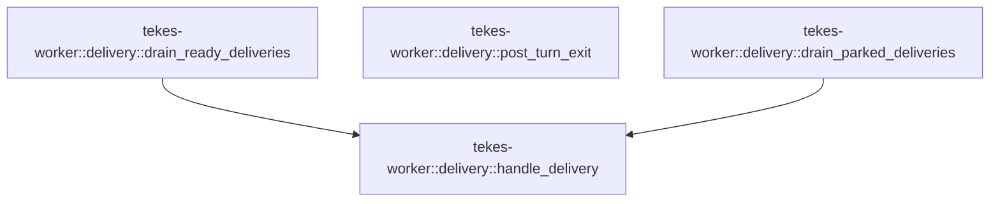

# tekes-worker::delivery

[Package atlas](index.md) · [Source](../../src/delivery.rs)

## Declarations

Visibility is the declaration spelling; trait members and reexports require their enclosing interface. `cfg` is not evaluated.

| Symbol | Kind | Visibility | Test / cfg |
|---|---|---|---|
| [tekes-worker::delivery::drain_ready_deliveries](../../src/delivery.rs#L10) | function_item | `pub(crate)` |  |
| [tekes-worker::delivery::drain_parked_deliveries](../../src/delivery.rs#L31) | function_item | `pub(crate)` |  |
| [tekes-worker::delivery::handle_delivery](../../src/delivery.rs#L52) | function_item | `pub(crate)` |  |
| [tekes-worker::delivery::post_turn_exit](../../src/delivery.rs#L190) | function_item | `pub(crate)` |  |

## Imports / reexports

| Local name | Source path | Visibility |
|---|---|---|
| `*` | `super::*` | `private` |

## Module declarations

| Module | Visibility | Attributes |
|---|---|---|

## Function call graphs

Edges below are syntactically resolved calls only, including private functions. Graphs partition callers into groups of 20; they are not execution order. All unresolved sites are listed below and in the JSON inventory.

Functions 1–4: 2 direct edges

## Call sites

Includes test functions (marked in declarations). Receiver-type-required sites need type analysis/manual tracing. Calls in closures are attributed to their enclosing function; their occurrence here does not mean the closure executes immediately.

| Caller | Callee expression | Source lines | Target / classification |
|---|---|---|---|
| `drain_ready_deliveries` | `lines.drain_ready` | [17](../../src/delivery.rs#L17) | receiver-type-required |
| `drain_ready_deliveries` | `decode_supervisor` | [18](../../src/delivery.rs#L18) | external-constructor-callback-or-unresolved |
| `drain_ready_deliveries` | `line.as_bytes` | [18](../../src/delivery.rs#L18) | receiver-type-required |
| `drain_ready_deliveries` | `Err` | [19](../../src/delivery.rs#L19) | external-constructor-callback-or-unresolved |
| `drain_ready_deliveries` | `Box::new` | [19](../../src/delivery.rs#L19) | external-constructor-callback-or-unresolved |
| `drain_ready_deliveries` | `ProtocolFailure` | [19](../../src/delivery.rs#L19) | external-constructor-callback-or-unresolved |
| `drain_ready_deliveries` | `"undecodable supervisor line at a yield point".to_owned` | [20](../../src/delivery.rs#L20) | receiver-type-required |
| `drain_ready_deliveries` | `handle_delivery` | [23](../../src/delivery.rs#L23) | [tekes-worker::delivery::handle_delivery](../../src/delivery.rs#L52) |
| `drain_ready_deliveries` | `Ok` | [25](../../src/delivery.rs#L25) | external-constructor-callback-or-unresolved |
| `drain_parked_deliveries` | `cancellation.take_parked_deliveries` | [38](../../src/delivery.rs#L38) | receiver-type-required |
| `drain_parked_deliveries` | `decode_supervisor` | [39](../../src/delivery.rs#L39) | external-constructor-callback-or-unresolved |
| `drain_parked_deliveries` | `line.as_bytes` | [39](../../src/delivery.rs#L39) | receiver-type-required |
| `drain_parked_deliveries` | `Err` | [40](../../src/delivery.rs#L40) | external-constructor-callback-or-unresolved |
| `drain_parked_deliveries` | `Box::new` | [40](../../src/delivery.rs#L40) | external-constructor-callback-or-unresolved |
| `drain_parked_deliveries` | `ProtocolFailure` | [40](../../src/delivery.rs#L40) | external-constructor-callback-or-unresolved |
| `drain_parked_deliveries` | `"undecodable supervisor delivery at a yield point".to_owned` | [41](../../src/delivery.rs#L41) | receiver-type-required |
| `drain_parked_deliveries` | `handle_delivery` | [44](../../src/delivery.rs#L44) | [tekes-worker::delivery::handle_delivery](../../src/delivery.rs#L52) |
| `drain_parked_deliveries` | `Ok` | [46](../../src/delivery.rs#L46) | external-constructor-callback-or-unresolved |
| `handle_delivery` | `require_version` | [59](../../src/delivery.rs#L59) | external-constructor-callback-or-unresolved |
| `handle_delivery` | `origin_event` | [63](../../src/delivery.rs#L63), [77](../../src/delivery.rs#L77), [100](../../src/delivery.rs#L100), [113](../../src/delivery.rs#L113), [123](../../src/delivery.rs#L123) | external-constructor-callback-or-unresolved |
| `handle_delivery` | `options.event_timestamp` | [63](../../src/delivery.rs#L63), [79](../../src/delivery.rs#L79), [102](../../src/delivery.rs#L102), [115](../../src/delivery.rs#L115), [123](../../src/delivery.rs#L123), [165](../../src/delivery.rs#L165) | receiver-type-required |
| `handle_delivery` | `object.insert` | [64](../../src/delivery.rs#L64), [66](../../src/delivery.rs#L66), [69](../../src/delivery.rs#L69), [72](../../src/delivery.rs#L72), [83](../../src/delivery.rs#L83), [92](../../src/delivery.rs#L92), [93](../../src/delivery.rs#L93), [95](../../src/delivery.rs#L95), [106](../../src/delivery.rs#L106), [119](../../src/delivery.rs#L119), [125](../../src/delivery.rs#L125), [128](../../src/delivery.rs#L128), [156](../../src/delivery.rs#L156), [157](../../src/delivery.rs#L157) | receiver-type-required |
| `handle_delivery` | `"content".to_owned` | [64](../../src/delivery.rs#L64) | receiver-type-required |
| `handle_delivery` | `serde_json::to_value` | [64](../../src/delivery.rs#L64), [66](../../src/delivery.rs#L66), [72](../../src/delivery.rs#L72), [95](../../src/delivery.rs#L95), [108](../../src/delivery.rs#L108), [128](../../src/delivery.rs#L128), [159](../../src/delivery.rs#L159) | external-constructor-callback-or-unresolved |
| `handle_delivery` | `"submission".to_owned` | [66](../../src/delivery.rs#L66) | receiver-type-required |
| `handle_delivery` | `"steer".to_owned` | [69](../../src/delivery.rs#L69) | receiver-type-required |
| `handle_delivery` | `Value::Bool` | [69](../../src/delivery.rs#L69), [93](../../src/delivery.rs#L93) | external-constructor-callback-or-unresolved |
| `handle_delivery` | `"assets".to_owned` | [72](../../src/delivery.rs#L72) | receiver-type-required |
| `handle_delivery` | `append_and_receipt` | [74](../../src/delivery.rs#L74), [97](../../src/delivery.rs#L97), [110](../../src/delivery.rs#L110), [120](../../src/delivery.rs#L120), [130](../../src/delivery.rs#L130), [137](../../src/delivery.rs#L137), [161](../../src/delivery.rs#L161) | external-constructor-callback-or-unresolved |
| `handle_delivery` | `"turn".to_owned` | [84](../../src/delivery.rs#L84) | receiver-type-required |
| `handle_delivery` | `Value::from` | [85](../../src/delivery.rs#L85), [119](../../src/delivery.rs#L119) | external-constructor-callback-or-unresolved |
| `handle_delivery` | `ledger                         .projection()                         .and_then(&#124;projection&#124; projection.latest_turn)                         .ok_or` | [86](../../src/delivery.rs#L86) | receiver-type-required |
| `handle_delivery` | `ledger                         .projection()                         .and_then` | [86](../../src/delivery.rs#L86) | receiver-type-required |
| `handle_delivery` | `ledger                         .projection` | [86](../../src/delivery.rs#L86) | receiver-type-required |
| `handle_delivery` | `"call".to_owned` | [92](../../src/delivery.rs#L92) | receiver-type-required |
| `handle_delivery` | `Value::String` | [92](../../src/delivery.rs#L92), [125](../../src/delivery.rs#L125) | external-constructor-callback-or-unresolved |
| `handle_delivery` | `"grant".to_owned` | [93](../../src/delivery.rs#L93) | receiver-type-required |
| `handle_delivery` | `"answer".to_owned` | [95](../../src/delivery.rs#L95) | receiver-type-required |
| `handle_delivery` | `"supersedes".to_owned` | [107](../../src/delivery.rs#L107) | receiver-type-required |
| `handle_delivery` | `"generation".to_owned` | [119](../../src/delivery.rs#L119) | receiver-type-required |
| `handle_delivery` | `"title".to_owned` | [125](../../src/delivery.rs#L125) | receiver-type-required |
| `handle_delivery` | `"labels".to_owned` | [128](../../src/delivery.rs#L128) | receiver-type-required |
| `handle_delivery` | `ledger                 .projection()                 .is_some_and` | [133](../../src/delivery.rs#L133) | receiver-type-required |
| `handle_delivery` | `ledger                 .projection` | [133](../../src/delivery.rs#L133), [145](../../src/delivery.rs#L145) | receiver-type-required |
| `handle_delivery` | `p.origin_tuples.contains_key` | [135](../../src/delivery.rs#L135) | receiver-type-required |
| `handle_delivery` | `Map::new` | [142](../../src/delivery.rs#L142) | external-constructor-callback-or-unresolved |
| `handle_delivery` | `ledger                 .projection()                 .ok_or` | [145](../../src/delivery.rs#L145) | receiver-type-required |
| `handle_delivery` | `projection                 .latest_turn                 .unwrap_or(0)                 .saturating_add` | [148](../../src/delivery.rs#L148) | receiver-type-required |
| `handle_delivery` | `projection                 .latest_turn                 .unwrap_or` | [148](../../src/delivery.rs#L148) | receiver-type-required |
| `handle_delivery` | `u64::from` | [151](../../src/delivery.rs#L151) | external-constructor-callback-or-unresolved |
| `handle_delivery` | `projection.latest_turn.is_none` | [152](../../src/delivery.rs#L152) | receiver-type-required |
| `handle_delivery` | `build_compaction_event(ledger, options, turn, true, None)?                 .ok_or` | [154](../../src/delivery.rs#L154) | receiver-type-required |
| `handle_delivery` | `build_compaction_event` | [154](../../src/delivery.rs#L154) | external-constructor-callback-or-unresolved |
| `handle_delivery` | `"origin_key".into` | [156](../../src/delivery.rs#L156) | receiver-type-required |
| `handle_delivery` | `"origin_tuple".into` | [158](../../src/delivery.rs#L158) | receiver-type-required |
| `handle_delivery` | `execute_queue_transaction` | [165](../../src/delivery.rs#L165) | external-constructor-callback-or-unresolved |
| `handle_delivery` | `stdout.write_all` | [166](../../src/delivery.rs#L166), [171](../../src/delivery.rs#L171) | receiver-type-required |
| `handle_delivery` | `encode_queue_transaction_result` | [166](../../src/delivery.rs#L166) | external-constructor-callback-or-unresolved |
| `handle_delivery` | `stdout.flush` | [167](../../src/delivery.rs#L167), [172](../../src/delivery.rs#L172) | receiver-type-required |
| `handle_delivery` | `announce_appended` | [168](../../src/delivery.rs#L168) | external-constructor-callback-or-unresolved |
| `handle_delivery` | `encode_line` | [171](../../src/delivery.rs#L171) | external-constructor-callback-or-unresolved |
| `handle_delivery` | `Ok` | [173](../../src/delivery.rs#L173), [177](../../src/delivery.rs#L177) | external-constructor-callback-or-unresolved |
| `post_turn_exit` | `ledger         .projection()         .ok_or("post-turn ledger has no projection")?         .lifecycle         .clone` | [196](../../src/delivery.rs#L196) | receiver-type-required |
| `post_turn_exit` | `ledger         .projection()         .ok_or` | [196](../../src/delivery.rs#L196) | receiver-type-required |
| `post_turn_exit` | `ledger         .projection` | [196](../../src/delivery.rs#L196) | receiver-type-required |
| `post_turn_exit` | `announce_appended` | [202](../../src/delivery.rs#L202), [211](../../src/delivery.rs#L211), [215](../../src/delivery.rs#L215), [220](../../src/delivery.rs#L220), [233](../../src/delivery.rs#L233), [236](../../src/delivery.rs#L236) | external-constructor-callback-or-unresolved |
| `post_turn_exit` | `Ok` | [203](../../src/delivery.rs#L203), [212](../../src/delivery.rs#L212), [216](../../src/delivery.rs#L216), [224](../../src/delivery.rs#L224), [234](../../src/delivery.rs#L234), [245](../../src/delivery.rs#L245) | external-constructor-callback-or-unresolved |
| `post_turn_exit` | `facts.continuation_wait_until.is_some` | [205](../../src/delivery.rs#L205) | receiver-type-required |
| `post_turn_exit` | `cancellation.stop_requested` | [206](../../src/delivery.rs#L206), [218](../../src/delivery.rs#L218) | receiver-type-required |
| `post_turn_exit` | `append_settle` | [226](../../src/delivery.rs#L226) | external-constructor-callback-or-unresolved |
| `post_turn_exit` | `options.event_timestamp` | [228](../../src/delivery.rs#L228) | receiver-type-required |
| `post_turn_exit` | `Some` | [231](../../src/delivery.rs#L231) | external-constructor-callback-or-unresolved |
