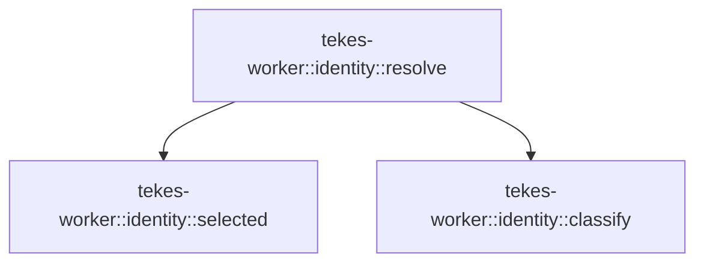

# tekes-worker::identity

[Package atlas](index.md) · [Source](../../src/identity.rs)

## Declarations

Visibility is the declaration spelling; trait members and reexports require their enclosing interface. `cfg` is not evaluated.

| Symbol | Kind | Visibility | Test / cfg |
|---|---|---|---|
| [tekes-worker::identity::SELECTED_SUBKIND](../../src/identity.rs#L3) | const_item | `private` |  |
| [tekes-worker::identity::selected](../../src/identity.rs#L7) | function_item | `pub(super)` |  |
| [tekes-worker::identity::resolve](../../src/identity.rs#L41) | function_item | `pub(super)` |  |
| [tekes-worker::identity::classify](../../src/identity.rs#L91) | function_item | `private` |  |
| [tekes-worker::identity::tests::auto_ledger](../../src/identity.rs#L210) | function_item | `private` | test; #[cfg(test)] |
| [tekes-worker::identity::tests::classifies_first_user_request_without_model_work](../../src/identity.rs#L242) | function_item | `private` | test; #[cfg(test)] |
| [tekes-worker::identity::tests::selection_is_durable_and_runtime_only](../../src/identity.rs#L275) | function_item | `private` | test; #[cfg(test)] |
| [tekes-worker::identity::tests::explicit_identity_is_stable_without_a_selection_event](../../src/identity.rs#L319) | function_item | `private` | test; #[cfg(test)] |

## Imports / reexports

| Local name | Source path | Visibility |
|---|---|---|
| `*` | `super::*` | `private` |
| `*` | `super::*` | `private` |

## Module declarations

| Module | Visibility | Attributes |
|---|---|---|
| `tekes-worker::identity::tests` | `private` | #[cfg(test)] |

## Function call graphs

Edges below are syntactically resolved calls only, including private functions. Graphs partition callers into groups of 20; they are not execution order. All unresolved sites are listed below and in the JSON inventory.

Functions 1–3: 2 direct edges

## Call sites

Includes test functions (marked in declarations). Receiver-type-required sites need type analysis/manual tracing. Calls in closures are attributed to their enclosing function; their occurrence here does not mean the closure executes immediately.

| Caller | Callee expression | Source lines | Target / classification |
|---|---|---|---|
| `selected` | `ledger.projection().ok_or` | [10](../../src/identity.rs#L10) | receiver-type-required |
| `selected` | `ledger.projection` | [10](../../src/identity.rs#L10) | receiver-type-required |
| `selected` | `projection.events.first().ok_or` | [11](../../src/identity.rs#L11) | receiver-type-required |
| `selected` | `projection.events.first` | [11](../../src/identity.rs#L11) | receiver-type-required |
| `selected` | `genesis.string_field` | [12](../../src/identity.rs#L12) | receiver-type-required |
| `selected` | `Ok` | [13](../../src/identity.rs#L13), [14](../../src/identity.rs#L14), [35](../../src/identity.rs#L35) | external-constructor-callback-or-unresolved |
| `selected` | `Some` | [13](../../src/identity.rs#L13), [14](../../src/identity.rs#L14), [19](../../src/identity.rs#L19), [33](../../src/identity.rs#L33) | external-constructor-callback-or-unresolved |
| `selected` | `event.kind` | [18](../../src/identity.rs#L18) | receiver-type-required |
| `selected` | `event.string_field` | [19](../../src/identity.rs#L19) | receiver-type-required |
| `selected` | `choice.is_some` | [23](../../src/identity.rs#L23) | receiver-type-required |
| `selected` | `Err` | [24](../../src/identity.rs#L24), [37](../../src/identity.rs#L37) | external-constructor-callback-or-unresolved |
| `selected` | `"duplicate identity selection".into` | [24](../../src/identity.rs#L24) | receiver-type-required |
| `selected` | `serde_json::to_value` | [26](../../src/identity.rs#L26) | external-constructor-callback-or-unresolved |
| `selected` | `event.raw` | [26](../../src/identity.rs#L26) | receiver-type-required |
| `selected` | `raw                     .get("payload")                     .and_then(&#124;payload&#124; payload.get("profile"))                     .and_then(Value::as_str)                     .and_then(tools::IdentityProfile::parse)                     .ok_or` | [27](../../src/identity.rs#L27) | receiver-type-required |
| `selected` | `raw                     .get("payload")                     .and_then(&#124;payload&#124; payload.get("profile"))                     .and_then(Value::as_str)                     .and_then` | [27](../../src/identity.rs#L27) | receiver-type-required |
| `selected` | `raw                     .get("payload")                     .and_then(&#124;payload&#124; payload.get("profile"))                     .and_then` | [27](../../src/identity.rs#L27) | receiver-type-required |
| `selected` | `raw                     .get("payload")                     .and_then` | [27](../../src/identity.rs#L27) | receiver-type-required |
| `selected` | `raw                     .get` | [27](../../src/identity.rs#L27) | receiver-type-required |
| `selected` | `payload.get` | [29](../../src/identity.rs#L29) | receiver-type-required |
| `selected` | `"invalid session identity profile".into` | [37](../../src/identity.rs#L37) | receiver-type-required |
| `resolve` | `selected` | [46](../../src/identity.rs#L46) | [tekes-worker::identity::selected](../../src/identity.rs#L7) |
| `resolve` | `Ok` | [47](../../src/identity.rs#L47), [85](../../src/identity.rs#L85) | external-constructor-callback-or-unresolved |
| `resolve` | `current_turn_inputs(ledger, turn)?         .first()         .ok_or` | [49](../../src/identity.rs#L49) | receiver-type-required |
| `resolve` | `current_turn_inputs(ledger, turn)?         .first` | [49](../../src/identity.rs#L49) | receiver-type-required |
| `resolve` | `current_turn_inputs` | [49](../../src/identity.rs#L49) | external-constructor-callback-or-unresolved |
| `resolve` | `ledger         .projection()         .ok_or("ledger projection missing")?         .events         .iter()         .find(&#124;event&#124; event.kind() == &EventKind::Input && event.seq() == input_seq)         .ok_or` | [52](../../src/identity.rs#L52) | receiver-type-required |
| `resolve` | `ledger         .projection()         .ok_or("ledger projection missing")?         .events         .iter()         .find` | [52](../../src/identity.rs#L52) | receiver-type-required |
| `resolve` | `ledger         .projection()         .ok_or("ledger projection missing")?         .events         .iter` | [52](../../src/identity.rs#L52) | receiver-type-required |
| `resolve` | `ledger         .projection()         .ok_or` | [52](../../src/identity.rs#L52) | receiver-type-required |
| `resolve` | `ledger         .projection` | [52](../../src/identity.rs#L52) | receiver-type-required |
| `resolve` | `event.kind` | [57](../../src/identity.rs#L57) | receiver-type-required |
| `resolve` | `event.seq` | [57](../../src/identity.rs#L57) | receiver-type-required |
| `resolve` | `serde_json::to_value` | [59](../../src/identity.rs#L59) | external-constructor-callback-or-unresolved |
| `resolve` | `first_input.raw` | [59](../../src/identity.rs#L59) | receiver-type-required |
| `resolve` | `materialize_json` | [60](../../src/identity.rs#L60) | external-constructor-callback-or-unresolved |
| `resolve` | `raw.get("content").ok_or` | [62](../../src/identity.rs#L62) | receiver-type-required |
| `resolve` | `raw.get` | [62](../../src/identity.rs#L62) | receiver-type-required |
| `resolve` | `content         .as_array()         .ok_or("first input content is not an array")?         .iter()         .filter_map(&#124;block&#124; {             (block.get("type").and_then(Value::as_str) == Some("text"))                 .then(&#124;&#124; block.get("text").and_then(Value::as_str))                 .flatten()         })         .collect::<Vec<_>>()         .join` | [64](../../src/identity.rs#L64) | receiver-type-required |
| `resolve` | `content         .as_array()         .ok_or("first input content is not an array")?         .iter()         .filter_map(&#124;block&#124; {             (block.get("type").and_then(Value::as_str) == Some("text"))                 .then(&#124;&#124; block.get("text").and_then(Value::as_str))                 .flatten()         })         .collect::<Vec<_>>` | [64](../../src/identity.rs#L64) | receiver-type-required |
| `resolve` | `content         .as_array()         .ok_or("first input content is not an array")?         .iter()         .filter_map` | [64](../../src/identity.rs#L64) | receiver-type-required |
| `resolve` | `content         .as_array()         .ok_or("first input content is not an array")?         .iter` | [64](../../src/identity.rs#L64) | receiver-type-required |
| `resolve` | `content         .as_array()         .ok_or` | [64](../../src/identity.rs#L64) | receiver-type-required |
| `resolve` | `content         .as_array` | [64](../../src/identity.rs#L64) | receiver-type-required |
| `resolve` | `(block.get("type").and_then(Value::as_str) == Some("text"))                 .then(&#124;&#124; block.get("text").and_then(Value::as_str))                 .flatten` | [69](../../src/identity.rs#L69) | receiver-type-required |
| `resolve` | `(block.get("type").and_then(Value::as_str) == Some("text"))                 .then` | [69](../../src/identity.rs#L69) | receiver-type-required |
| `resolve` | `block.get("type").and_then` | [69](../../src/identity.rs#L69) | receiver-type-required |
| `resolve` | `block.get` | [69](../../src/identity.rs#L69), [70](../../src/identity.rs#L70) | receiver-type-required |
| `resolve` | `Some` | [69](../../src/identity.rs#L69) | external-constructor-callback-or-unresolved |
| `resolve` | `block.get("text").and_then` | [70](../../src/identity.rs#L70) | receiver-type-required |
| `resolve` | `classify` | [75](../../src/identity.rs#L75) | [tekes-worker::identity::classify](../../src/identity.rs#L91) |
| `resolve` | `ledger.next_seq` | [76](../../src/identity.rs#L76) | receiver-type-required |
| `resolve` | `ledger.append_contract` | [77](../../src/identity.rs#L77) | receiver-type-required |
| `resolve` | `make_event` | [78](../../src/identity.rs#L78) | external-constructor-callback-or-unresolved |
| `resolve` | `BarrierContext::default` | [83](../../src/identity.rs#L83) | external-constructor-callback-or-unresolved |
| `classify` | `text.to_lowercase` | [92](../../src/identity.rs#L92) | receiver-type-required |
| `classify` | `lower         .split(&#124;ch: char&#124; !ch.is_ascii_alphanumeric() && ch != '_')         .filter(&#124;word&#124; !word.is_empty())         .collect::<Vec<_>>` | [93](../../src/identity.rs#L93) | receiver-type-required |
| `classify` | `lower         .split(&#124;ch: char&#124; !ch.is_ascii_alphanumeric() && ch != '_')         .filter` | [93](../../src/identity.rs#L93) | receiver-type-required |
| `classify` | `lower         .split` | [93](../../src/identity.rs#L93) | receiver-type-required |
| `classify` | `ch.is_ascii_alphanumeric` | [94](../../src/identity.rs#L94) | receiver-type-required |
| `classify` | `word.is_empty` | [95](../../src/identity.rs#L95) | receiver-type-required |
| `classify` | `words.iter().any` | [153](../../src/identity.rs#L153), [197](../../src/identity.rs#L197) | receiver-type-required |
| `classify` | `words.iter` | [153](../../src/identity.rs#L153), [197](../../src/identity.rs#L197) | receiver-type-required |
| `classify` | `code_words.contains` | [153](../../src/identity.rs#L153) | receiver-type-required |
| `classify` | `code_han.iter().any` | [154](../../src/identity.rs#L154) | receiver-type-required |
| `classify` | `code_han.iter` | [154](../../src/identity.rs#L154) | receiver-type-required |
| `classify` | `lower.contains` | [154](../../src/identity.rs#L154), [155](../../src/identity.rs#L155), [156](../../src/identity.rs#L156), [198](../../src/identity.rs#L198) | receiver-type-required |
| `classify` | `code_suffixes.iter().any` | [155](../../src/identity.rs#L155) | receiver-type-required |
| `classify` | `code_suffixes.iter` | [155](../../src/identity.rs#L155) | receiver-type-required |
| `classify` | `general_words.contains` | [197](../../src/identity.rs#L197) | receiver-type-required |
| `classify` | `general_han.iter().any` | [198](../../src/identity.rs#L198) | receiver-type-required |
| `classify` | `general_han.iter` | [198](../../src/identity.rs#L198) | receiver-type-required |
| `auto_ledger` | `tempfile::tempdir().unwrap` | [211](../../src/identity.rs#L211) | receiver-type-required |
| `auto_ledger` | `tempfile::tempdir` | [211](../../src/identity.rs#L211) | external-constructor-callback-or-unresolved |
| `auto_ledger` | `directory.path().join` | [212](../../src/identity.rs#L212) | receiver-type-required |
| `auto_ledger` | `directory.path` | [212](../../src/identity.rs#L212) | receiver-type-required |
| `auto_ledger` | `Vec::new` | [231](../../src/identity.rs#L231) | external-constructor-callback-or-unresolved |
| `auto_ledger` | `make_event(event).unwrap` | [233](../../src/identity.rs#L233) | receiver-type-required |
| `auto_ledger` | `make_event` | [233](../../src/identity.rs#L233) | external-constructor-callback-or-unresolved |
| `auto_ledger` | `bytes.extend` | [234](../../src/identity.rs#L234) | receiver-type-required |
| `auto_ledger` | `event.canonical_bytes().unwrap` | [234](../../src/identity.rs#L234) | receiver-type-required |
| `auto_ledger` | `event.canonical_bytes` | [234](../../src/identity.rs#L234) | receiver-type-required |
| `auto_ledger` | `bytes.push` | [235](../../src/identity.rs#L235) | receiver-type-required |
| `auto_ledger` | `std::fs::write(&path, bytes).unwrap` | [237](../../src/identity.rs#L237) | receiver-type-required |
| `auto_ledger` | `std::fs::write` | [237](../../src/identity.rs#L237) | external-constructor-callback-or-unresolved |
| `auto_ledger` | `LockedLedger::open(&path, 1).unwrap` | [238](../../src/identity.rs#L238) | receiver-type-required |
| `auto_ledger` | `LockedLedger::open` | [238](../../src/identity.rs#L238) | external-constructor-callback-or-unresolved |
| `selection_is_durable_and_runtime_only` | `auto_ledger` | [276](../../src/identity.rs#L276) | [tekes-worker::identity::tests::auto_ledger](../../src/identity.rs#L210) |
| `selection_is_durable_and_runtime_only` | `ledger.projection().unwrap().events.len` | [282](../../src/identity.rs#L282) | receiver-type-required |
| `selection_is_durable_and_runtime_only` | `ledger.projection().unwrap` | [282](../../src/identity.rs#L282), [288](../../src/identity.rs#L288) | receiver-type-required |
| `selection_is_durable_and_runtime_only` | `ledger.projection` | [282](../../src/identity.rs#L282), [288](../../src/identity.rs#L288) | receiver-type-required |
| `selection_is_durable_and_runtime_only` | `ledger.projection().unwrap().events.last().unwrap` | [288](../../src/identity.rs#L288) | receiver-type-required |
| `selection_is_durable_and_runtime_only` | `ledger.projection().unwrap().events.last` | [288](../../src/identity.rs#L288) | receiver-type-required |
| `selection_is_durable_and_runtime_only` | `tools::root_system_instructions` | [294](../../src/identity.rs#L294) | [tools::guidance::root_system_instructions](../../../tools/src/guidance.rs#L63) |
| `selection_is_durable_and_runtime_only` | `selected(&ledger).unwrap().unwrap` | [295](../../src/identity.rs#L295) | receiver-type-required |
| `selection_is_durable_and_runtime_only` | `selected(&ledger).unwrap` | [295](../../src/identity.rs#L295) | receiver-type-required |
| `selection_is_durable_and_runtime_only` | `selected` | [295](../../src/identity.rs#L295) | external-constructor-callback-or-unresolved |
| `selection_is_durable_and_runtime_only` | `Some` | [297](../../src/identity.rs#L297) | external-constructor-callback-or-unresolved |
| `selection_is_durable_and_runtime_only` | `ledger.path().to_owned` | [300](../../src/identity.rs#L300) | receiver-type-required |
| `selection_is_durable_and_runtime_only` | `ledger.path` | [300](../../src/identity.rs#L300) | receiver-type-required |
| `selection_is_durable_and_runtime_only` | `drop` | [301](../../src/identity.rs#L301) | external-constructor-callback-or-unresolved |
| `selection_is_durable_and_runtime_only` | `LockedLedger::open(&path, 1).unwrap` | [302](../../src/identity.rs#L302) | receiver-type-required |
| `selection_is_durable_and_runtime_only` | `LockedLedger::open` | [302](../../src/identity.rs#L302) | external-constructor-callback-or-unresolved |
| `explicit_identity_is_stable_without_a_selection_event` | `auto_ledger` | [320](../../src/identity.rs#L320) | [tekes-worker::identity::tests::auto_ledger](../../src/identity.rs#L210) |
| `explicit_identity_is_stable_without_a_selection_event` | `ledger.path().to_owned` | [322](../../src/identity.rs#L322) | receiver-type-required |
| `explicit_identity_is_stable_without_a_selection_event` | `ledger.path` | [322](../../src/identity.rs#L322) | receiver-type-required |
| `explicit_identity_is_stable_without_a_selection_event` | `drop` | [323](../../src/identity.rs#L323) | external-constructor-callback-or-unresolved |
| `explicit_identity_is_stable_without_a_selection_event` | `std::fs::read(&path).unwrap` | [324](../../src/identity.rs#L324) | receiver-type-required |
| `explicit_identity_is_stable_without_a_selection_event` | `std::fs::read` | [324](../../src/identity.rs#L324) | external-constructor-callback-or-unresolved |
| `explicit_identity_is_stable_without_a_selection_event` | `String::from_utf8(bytes).unwrap().replace` | [325](../../src/identity.rs#L325) | receiver-type-required |
| `explicit_identity_is_stable_without_a_selection_event` | `String::from_utf8(bytes).unwrap` | [325](../../src/identity.rs#L325) | receiver-type-required |
| `explicit_identity_is_stable_without_a_selection_event` | `String::from_utf8` | [325](../../src/identity.rs#L325) | external-constructor-callback-or-unresolved |
| `explicit_identity_is_stable_without_a_selection_event` | `std::fs::write(&path, text).unwrap` | [329](../../src/identity.rs#L329) | receiver-type-required |
| `explicit_identity_is_stable_without_a_selection_event` | `std::fs::write` | [329](../../src/identity.rs#L329) | external-constructor-callback-or-unresolved |
| `explicit_identity_is_stable_without_a_selection_event` | `LockedLedger::open(&path, 1).unwrap` | [330](../../src/identity.rs#L330) | receiver-type-required |
| `explicit_identity_is_stable_without_a_selection_event` | `LockedLedger::open` | [330](../../src/identity.rs#L330) | external-constructor-callback-or-unresolved |
