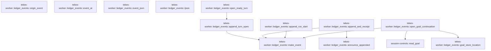

# tekes-worker::ledger_events

[Package atlas](index.md) · [Source](../../src/ledger_events.rs)

## Declarations

Visibility is the declaration spelling; trait members and reexports require their enclosing interface. `cfg` is not evaluated.

| Symbol | Kind | Visibility | Test / cfg |
|---|---|---|---|
| [tekes-worker::ledger_events::append_run_start](../../src/ledger_events.rs#L3) | function_item | `pub(crate)` |  |
| [tekes-worker::ledger_events::open_ready_turn](../../src/ledger_events.rs#L42) | function_item | `pub(crate)` |  |
| [tekes-worker::ledger_events::open_goal_continuation](../../src/ledger_events.rs#L69) | function_item | `pub(crate)` |  |
| [tekes-worker::ledger_events::goal_store_location](../../src/ledger_events.rs#L122) | function_item | `pub(crate)` |  |
| [tekes-worker::ledger_events::append_turn_open](../../src/ledger_events.rs#L136) | function_item | `pub(crate)` |  |
| [tekes-worker::ledger_events::origin_event](../../src/ledger_events.rs#L160) | function_item | `pub(crate)` |  |
| [tekes-worker::ledger_events::append_and_receipt](../../src/ledger_events.rs#L179) | function_item | `pub(crate)` |  |
| [tekes-worker::ledger_events::announce_appended](../../src/ledger_events.rs#L216) | function_item | `pub(crate)` |  |
| [tekes-worker::ledger_events::event_at](../../src/ledger_events.rs#L228) | function_item | `pub(crate)` |  |
| [tekes-worker::ledger_events::event_json](../../src/ledger_events.rs#L235) | function_item | `pub(crate)` |  |
| [tekes-worker::ledger_events::make_event](../../src/ledger_events.rs#L239) | function_item | `pub(crate)` |  |
| [tekes-worker::ledger_events::ijson](../../src/ledger_events.rs#L243) | function_item | `pub(crate)` |  |

## Imports / reexports

| Local name | Source path | Visibility |
|---|---|---|
| `*` | `super::*` | `private` |

## Module declarations

| Module | Visibility | Attributes |
|---|---|---|

## Function call graphs

Edges below are syntactically resolved calls only, including private functions. Graphs partition callers into groups of 20; they are not execution order. All unresolved sites are listed below and in the JSON inventory.

Functions 1–12: 8 direct edges

## Call sites

Includes test functions (marked in declarations). Receiver-type-required sites need type analysis/manual tracing. Calls in closures are attributed to their enclosing function; their occurrence here does not mean the closure executes immediately.

| Caller | Callee expression | Source lines | Target / classification |
|---|---|---|---|
| `append_run_start` | `value             .as_object_mut()             .expect("run_start is an object")             .insert` | [27](../../src/ledger_events.rs#L27) | receiver-type-required |
| `append_run_start` | `value             .as_object_mut()             .expect` | [27](../../src/ledger_events.rs#L27) | receiver-type-required |
| `append_run_start` | `value             .as_object_mut` | [27](../../src/ledger_events.rs#L27) | receiver-type-required |
| `append_run_start` | `"launch_bindings_digest".to_owned` | [31](../../src/ledger_events.rs#L31) | receiver-type-required |
| `append_run_start` | `Value::String` | [32](../../src/ledger_events.rs#L32) | external-constructor-callback-or-unresolved |
| `append_run_start` | `digest.clone` | [32](../../src/ledger_events.rs#L32) | receiver-type-required |
| `append_run_start` | `make_event` | [35](../../src/ledger_events.rs#L35) | [tekes-worker::ledger_events::make_event](../../src/ledger_events.rs#L239) |
| `append_run_start` | `ledger.append_contract` | [36](../../src/ledger_events.rs#L36) | receiver-type-required |
| `append_run_start` | `BarrierContext::default` | [36](../../src/ledger_events.rs#L36) | external-constructor-callback-or-unresolved |
| `append_run_start` | `Ok` | [37](../../src/ledger_events.rs#L37) | external-constructor-callback-or-unresolved |
| `open_ready_turn` | `ledger         .projection()         .ok_or("missing queue projection")?         .lifecycle         .clone` | [47](../../src/ledger_events.rs#L47) | receiver-type-required |
| `open_ready_turn` | `ledger         .projection()         .ok_or` | [47](../../src/ledger_events.rs#L47) | receiver-type-required |
| `open_ready_turn` | `ledger         .projection` | [47](../../src/ledger_events.rs#L47) | receiver-type-required |
| `open_ready_turn` | `append_turn_open` | [53](../../src/ledger_events.rs#L53), [61](../../src/ledger_events.rs#L61) | [tekes-worker::ledger_events::append_turn_open](../../src/ledger_events.rs#L136) |
| `open_ready_turn` | `Ok` | [54](../../src/ledger_events.rs#L54), [62](../../src/ledger_events.rs#L62), [64](../../src/ledger_events.rs#L64) | external-constructor-callback-or-unresolved |
| `open_ready_turn` | `Some` | [54](../../src/ledger_events.rs#L54), [62](../../src/ledger_events.rs#L62) | external-constructor-callback-or-unresolved |
| `open_ready_turn` | `facts.latest_turn.is_none` | [57](../../src/ledger_events.rs#L57) | receiver-type-required |
| `open_ready_turn` | `facts.turn_open_inputs.is_empty` | [58](../../src/ledger_events.rs#L58) | receiver-type-required |
| `open_ready_turn` | `facts.latest_turn.map_or` | [60](../../src/ledger_events.rs#L60) | receiver-type-required |
| `open_goal_continuation` | `profile.bindings.goal_id.as_deref` | [75](../../src/ledger_events.rs#L75) | receiver-type-required |
| `open_goal_continuation` | `Ok` | [76](../../src/ledger_events.rs#L76), [79](../../src/ledger_events.rs#L79), [86](../../src/ledger_events.rs#L86), [89](../../src/ledger_events.rs#L89), [100](../../src/ledger_events.rs#L100), [103](../../src/ledger_events.rs#L103), [106](../../src/ledger_events.rs#L106), [109](../../src/ledger_events.rs#L109), [112](../../src/ledger_events.rs#L112), [119](../../src/ledger_events.rs#L119) | external-constructor-callback-or-unresolved |
| `open_goal_continuation` | `cancellation.stop_requested` | [78](../../src/ledger_events.rs#L78) | receiver-type-required |
| `open_goal_continuation` | `ledger         .projection()         .ok_or` | [81](../../src/ledger_events.rs#L81) | receiver-type-required |
| `open_goal_continuation` | `ledger         .projection` | [81](../../src/ledger_events.rs#L81) | receiver-type-required |
| `open_goal_continuation` | `facts.turn_open_inputs.is_empty` | [85](../../src/ledger_events.rs#L85) | receiver-type-required |
| `open_goal_continuation` | `projection         .events         .iter()         .rev()         .find(&#124;event&#124; event.kind() == &EventKind::Settle)         .is_some_and` | [91](../../src/ledger_events.rs#L91) | receiver-type-required |
| `open_goal_continuation` | `projection         .events         .iter()         .rev()         .find` | [91](../../src/ledger_events.rs#L91) | receiver-type-required |
| `open_goal_continuation` | `projection         .events         .iter()         .rev` | [91](../../src/ledger_events.rs#L91) | receiver-type-required |
| `open_goal_continuation` | `projection         .events         .iter` | [91](../../src/ledger_events.rs#L91) | receiver-type-required |
| `open_goal_continuation` | `event.kind` | [95](../../src/ledger_events.rs#L95) | receiver-type-required |
| `open_goal_continuation` | `event.turn` | [97](../../src/ledger_events.rs#L97) | receiver-type-required |
| `open_goal_continuation` | `Some` | [97](../../src/ledger_events.rs#L97) | external-constructor-callback-or-unresolved |
| `open_goal_continuation` | `event.string_field` | [97](../../src/ledger_events.rs#L97) | receiver-type-required |
| `open_goal_continuation` | `goal_store_location` | [102](../../src/ledger_events.rs#L102) | [tekes-worker::ledger_events::goal_store_location](../../src/ledger_events.rs#L122) |
| `open_goal_continuation` | `session_controls::read_goal` | [105](../../src/ledger_events.rs#L105) | [session-controls::read_goal](../../../session-controls/src/lib.rs#L366) |
| `open_goal_continuation` | `make_event` | [114](../../src/ledger_events.rs#L114) | [tekes-worker::ledger_events::make_event](../../src/ledger_events.rs#L239) |
| `open_goal_continuation` | `ledger.append_contract` | [118](../../src/ledger_events.rs#L118) | receiver-type-required |
| `open_goal_continuation` | `BarrierContext::default` | [118](../../src/ledger_events.rs#L118) | external-constructor-callback-or-unresolved |
| `goal_store_location` | `ledger.path().parent().ok_or` | [125](../../src/ledger_events.rs#L125) | receiver-type-required |
| `goal_store_location` | `ledger.path().parent` | [125](../../src/ledger_events.rs#L125) | receiver-type-required |
| `goal_store_location` | `ledger.path` | [125](../../src/ledger_events.rs#L125) | receiver-type-required |
| `goal_store_location` | `folder.file_name().and_then` | [126](../../src/ledger_events.rs#L126) | receiver-type-required |
| `goal_store_location` | `folder.file_name` | [126](../../src/ledger_events.rs#L126) | receiver-type-required |
| `goal_store_location` | `name.to_str` | [126](../../src/ledger_events.rs#L126) | receiver-type-required |
| `goal_store_location` | `Ok` | [127](../../src/ledger_events.rs#L127), [133](../../src/ledger_events.rs#L133) | external-constructor-callback-or-unresolved |
| `goal_store_location` | `folder         .parent()         .and_then(&#124;threads&#124; threads.parent())         .ok_or` | [129](../../src/ledger_events.rs#L129) | receiver-type-required |
| `goal_store_location` | `folder         .parent()         .and_then` | [129](../../src/ledger_events.rs#L129) | receiver-type-required |
| `goal_store_location` | `folder         .parent` | [129](../../src/ledger_events.rs#L129) | receiver-type-required |
| `goal_store_location` | `threads.parent` | [131](../../src/ledger_events.rs#L131) | receiver-type-required |
| `goal_store_location` | `Some` | [133](../../src/ledger_events.rs#L133) | external-constructor-callback-or-unresolved |
| `goal_store_location` | `root.to_path_buf` | [133](../../src/ledger_events.rs#L133) | receiver-type-required |
| `goal_store_location` | `session.to_owned` | [133](../../src/ledger_events.rs#L133) | receiver-type-required |
| `append_turn_open` | `Value::String` | [144](../../src/ledger_events.rs#L144) | external-constructor-callback-or-unresolved |
| `append_turn_open` | `"genesis".to_owned` | [144](../../src/ledger_events.rs#L144) | receiver-type-required |
| `append_turn_open` | `make_event` | [148](../../src/ledger_events.rs#L148) | [tekes-worker::ledger_events::make_event](../../src/ledger_events.rs#L239) |
| `append_turn_open` | `ledger.append_contract` | [156](../../src/ledger_events.rs#L156) | receiver-type-required |
| `append_turn_open` | `BarrierContext::default` | [156](../../src/ledger_events.rs#L156) | external-constructor-callback-or-unresolved |
| `append_turn_open` | `Ok` | [157](../../src/ledger_events.rs#L157) | external-constructor-callback-or-unresolved |
| `origin_event` | `json!({         "v": 1,         "seq": ledger.next_seq(),         "kind": kind,         "ts": timestamp,         "origin_key": origin.key,         "origin_tuple": origin     })     .as_object()     .expect("object literal")     .clone` | [166](../../src/ledger_events.rs#L166) | receiver-type-required |
| `origin_event` | `json!({         "v": 1,         "seq": ledger.next_seq(),         "kind": kind,         "ts": timestamp,         "origin_key": origin.key,         "origin_tuple": origin     })     .as_object()     .expect` | [166](../../src/ledger_events.rs#L166) | receiver-type-required |
| `origin_event` | `json!({         "v": 1,         "seq": ledger.next_seq(),         "kind": kind,         "ts": timestamp,         "origin_key": origin.key,         "origin_tuple": origin     })     .as_object` | [166](../../src/ledger_events.rs#L166) | receiver-type-required |
| `append_and_receipt` | `ledger.projection` | [186](../../src/ledger_events.rs#L186) | receiver-type-required |
| `append_and_receipt` | `projection.origin_tuples.get` | [187](../../src/ledger_events.rs#L187) | receiver-type-required |
| `append_and_receipt` | `stdout.write_all` | [188](../../src/ledger_events.rs#L188), [203](../../src/ledger_events.rs#L203) | receiver-type-required |
| `append_and_receipt` | `encode_line` | [188](../../src/ledger_events.rs#L188), [203](../../src/ledger_events.rs#L203) | external-constructor-callback-or-unresolved |
| `append_and_receipt` | `stdout.flush` | [196](../../src/ledger_events.rs#L196), [211](../../src/ledger_events.rs#L211) | receiver-type-required |
| `append_and_receipt` | `Ok` | [197](../../src/ledger_events.rs#L197), [213](../../src/ledger_events.rs#L213) | external-constructor-callback-or-unresolved |
| `append_and_receipt` | `make_event` | [200](../../src/ledger_events.rs#L200) | [tekes-worker::ledger_events::make_event](../../src/ledger_events.rs#L239) |
| `append_and_receipt` | `Value::Object` | [200](../../src/ledger_events.rs#L200) | external-constructor-callback-or-unresolved |
| `append_and_receipt` | `event.seq` | [201](../../src/ledger_events.rs#L201) | receiver-type-required |
| `append_and_receipt` | `ledger.append_contract` | [202](../../src/ledger_events.rs#L202) | receiver-type-required |
| `append_and_receipt` | `BarrierContext::default` | [202](../../src/ledger_events.rs#L202) | external-constructor-callback-or-unresolved |
| `append_and_receipt` | `announce_appended` | [212](../../src/ledger_events.rs#L212) | [tekes-worker::ledger_events::announce_appended](../../src/ledger_events.rs#L216) |
| `announce_appended` | `ledger.projection().map` | [220](../../src/ledger_events.rs#L220) | receiver-type-required |
| `announce_appended` | `ledger.projection` | [220](../../src/ledger_events.rs#L220) | receiver-type-required |
| `announce_appended` | `Ok` | [221](../../src/ledger_events.rs#L221), [225](../../src/ledger_events.rs#L225) | external-constructor-callback-or-unresolved |
| `announce_appended` | `stdout.write_all` | [223](../../src/ledger_events.rs#L223) | receiver-type-required |
| `announce_appended` | `encode_line` | [223](../../src/ledger_events.rs#L223) | external-constructor-callback-or-unresolved |
| `announce_appended` | `stdout.flush` | [224](../../src/ledger_events.rs#L224) | receiver-type-required |
| `event_at` | `ledger         .projection()         .and_then(&#124;projection&#124; projection.events.iter().find(&#124;event&#124; event.seq() == seq))         .ok_or_else` | [229](../../src/ledger_events.rs#L229) | receiver-type-required |
| `event_at` | `ledger         .projection()         .and_then` | [229](../../src/ledger_events.rs#L229) | receiver-type-required |
| `event_at` | `ledger         .projection` | [229](../../src/ledger_events.rs#L229) | receiver-type-required |
| `event_at` | `projection.events.iter().find` | [231](../../src/ledger_events.rs#L231) | receiver-type-required |
| `event_at` | `projection.events.iter` | [231](../../src/ledger_events.rs#L231) | receiver-type-required |
| `event_at` | `event.seq` | [231](../../src/ledger_events.rs#L231) | receiver-type-required |
| `event_at` | `StoreError::Corruption` | [232](../../src/ledger_events.rs#L232) | external-constructor-callback-or-unresolved |
| `event_json` | `Ok` | [236](../../src/ledger_events.rs#L236) | external-constructor-callback-or-unresolved |
| `event_json` | `serde_json::from_slice` | [236](../../src/ledger_events.rs#L236) | external-constructor-callback-or-unresolved |
| `event_json` | `event.canonical_bytes` | [236](../../src/ledger_events.rs#L236) | receiver-type-required |
| `make_event` | `Ok` | [240](../../src/ledger_events.rs#L240) | external-constructor-callback-or-unresolved |
| `make_event` | `Event::decode` | [240](../../src/ledger_events.rs#L240) | external-constructor-callback-or-unresolved |
| `make_event` | `serde_json::to_vec` | [240](../../src/ledger_events.rs#L240) | external-constructor-callback-or-unresolved |
| `ijson` | `Ok` | [244](../../src/ledger_events.rs#L244) | external-constructor-callback-or-unresolved |
| `ijson` | `IJsonValue::parse` | [244](../../src/ledger_events.rs#L244) | external-constructor-callback-or-unresolved |
| `ijson` | `serde_json::to_vec` | [244](../../src/ledger_events.rs#L244) | external-constructor-callback-or-unresolved |
