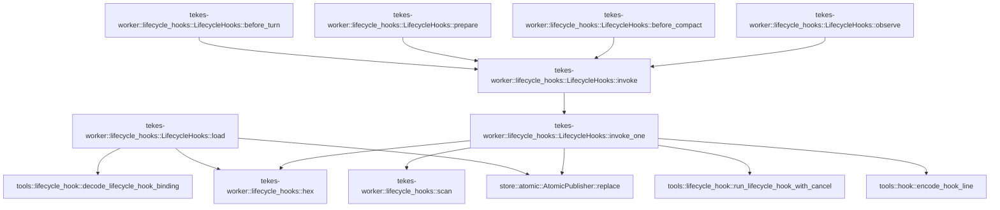

# tekes-worker::lifecycle_hooks

[Package atlas](index.md) · [Source](../../src/lifecycle_hooks.rs)

## Declarations

Visibility is the declaration spelling; trait members and reexports require their enclosing interface. `cfg` is not evaluated.

| Symbol | Kind | Visibility | Test / cfg |
|---|---|---|---|
| [tekes-worker::lifecycle_hooks::Result](../../src/lifecycle_hooks.rs#L7) | type_item | `private` |  |
| [tekes-worker::lifecycle_hooks::LifecycleHooks](../../src/lifecycle_hooks.rs#L9) | struct_item | `pub(super)` |  |
| [tekes-worker::lifecycle_hooks::LifecycleHooks::load](../../src/lifecycle_hooks.rs#L20) | function_item | `pub(super)` |  |
| [tekes-worker::lifecycle_hooks::LifecycleHooks::invoke](../../src/lifecycle_hooks.rs#L74) | function_item | `private` |  |
| [tekes-worker::lifecycle_hooks::LifecycleHooks::invoke_one](../../src/lifecycle_hooks.rs#L96) | function_item | `private` |  |
| [tekes-worker::lifecycle_hooks::LifecycleHooks::before_turn](../../src/lifecycle_hooks.rs#L150) | function_item | `pub(super)` |  |
| [tekes-worker::lifecycle_hooks::LifecycleHooks::prepare](../../src/lifecycle_hooks.rs#L170) | function_item | `pub(super)` |  |
| [tekes-worker::lifecycle_hooks::LifecycleHooks::before_compact](../../src/lifecycle_hooks.rs#L184) | function_item | `pub(super)` |  |
| [tekes-worker::lifecycle_hooks::LifecycleHooks::observe](../../src/lifecycle_hooks.rs#L201) | function_item | `pub(super)` |  |
| [tekes-worker::lifecycle_hooks::scan](../../src/lifecycle_hooks.rs#L252) | function_item | `private` |  |
| [tekes-worker::lifecycle_hooks::hex](../../src/lifecycle_hooks.rs#L259) | function_item | `private` |  |

## Imports / reexports

| Local name | Source path | Visibility |
|---|---|---|
| `*` | `super::*` | `private` |
| `Digest` | `sha2::Digest` | `private` |
| `Sha256` | `sha2::Sha256` | `private` |
| `AtomicPublisher` | `store::AtomicPublisher` | `private` |
| `Point` | `tools::LifecycleEvent` | `private` |
| `LifecycleHookBinding` | `tools::LifecycleHookBinding` | `private` |
| `LifecycleHookRequest` | `tools::LifecycleHookRequest` | `private` |

## Module declarations

| Module | Visibility | Attributes |
|---|---|---|

## Function call graphs

Edges below are syntactically resolved calls only, including private functions. Graphs partition callers into groups of 20; they are not execution order. All unresolved sites are listed below and in the JSON inventory.

Functions 1–9: 13 direct edges

## Call sites

Includes test functions (marked in declarations). Receiver-type-required sites need type analysis/manual tracing. Calls in closures are attributed to their enclosing function; their occurrence here does not mean the closure executes immediately.

| Caller | Callee expression | Source lines | Target / classification |
|---|---|---|---|
| `load` | `Vec::new` | [21](../../src/lifecycle_hooks.rs#L21) | external-constructor-callback-or-unresolved |
| `load` | `serde_json::from_str` | [24](../../src/lifecycle_hooks.rs#L24) | external-constructor-callback-or-unresolved |
| `load` | `tools::decode_lifecycle_hook_binding` | [26](../../src/lifecycle_hooks.rs#L26) | [tools::lifecycle_hook::decode_lifecycle_hook_binding](../../../tools/src/lifecycle_hook.rs#L59) |
| `load` | `source.content.as_bytes` | [26](../../src/lifecycle_hooks.rs#L26) | receiver-type-required |
| `load` | `bindings.push` | [28](../../src/lifecycle_hooks.rs#L28) | receiver-type-required |
| `load` | `bindings.is_empty` | [32](../../src/lifecycle_hooks.rs#L32) | receiver-type-required |
| `load` | `Ok` | [33](../../src/lifecycle_hooks.rs#L33), [61](../../src/lifecycle_hooks.rs#L61) | external-constructor-callback-or-unresolved |
| `load` | `hex` | [35](../../src/lifecycle_hooks.rs#L35), [42](../../src/lifecycle_hooks.rs#L42) | [tekes-worker::lifecycle_hooks::hex](../../src/lifecycle_hooks.rs#L259) |
| `load` | `serde_json_canonicalizer::to_vec` | [35](../../src/lifecycle_hooks.rs#L35) | external-constructor-callback-or-unresolved |
| `load` | `ledger             .path()             .parent()             .ok_or("missing thread folder")?             .join("lifecycle-hooks")             .join(digest)             .join` | [36](../../src/lifecycle_hooks.rs#L36) | receiver-type-required |
| `load` | `ledger             .path()             .parent()             .ok_or("missing thread folder")?             .join("lifecycle-hooks")             .join` | [36](../../src/lifecycle_hooks.rs#L36) | receiver-type-required |
| `load` | `ledger             .path()             .parent()             .ok_or("missing thread folder")?             .join` | [36](../../src/lifecycle_hooks.rs#L36) | receiver-type-required |
| `load` | `ledger             .path()             .parent()             .ok_or` | [36](../../src/lifecycle_hooks.rs#L36) | receiver-type-required |
| `load` | `ledger             .path()             .parent` | [36](../../src/lifecycle_hooks.rs#L36) | receiver-type-required |
| `load` | `ledger             .path` | [36](../../src/lifecycle_hooks.rs#L36) | receiver-type-required |
| `load` | `ledger                 .path()                 .file_name()                 .ok_or("missing ledger name")?                 .as_encoded_bytes` | [42](../../src/lifecycle_hooks.rs#L42) | receiver-type-required |
| `load` | `ledger                 .path()                 .file_name()                 .ok_or` | [42](../../src/lifecycle_hooks.rs#L42) | receiver-type-required |
| `load` | `ledger                 .path()                 .file_name` | [42](../../src/lifecycle_hooks.rs#L42) | receiver-type-required |
| `load` | `ledger                 .path` | [42](../../src/lifecycle_hooks.rs#L42) | receiver-type-required |
| `load` | `root.join` | [47](../../src/lifecycle_hooks.rs#L47) | receiver-type-required |
| `load` | `baseline_file.exists` | [48](../../src/lifecycle_hooks.rs#L48) | receiver-type-required |
| `load` | `serde_json::from_slice` | [49](../../src/lifecycle_hooks.rs#L49) | external-constructor-callback-or-unresolved |
| `load` | `fs::read` | [49](../../src/lifecycle_hooks.rs#L49) | external-constructor-callback-or-unresolved |
| `load` | `ledger.next_seq` | [51](../../src/lifecycle_hooks.rs#L51) | receiver-type-required |
| `load` | `AtomicPublisher::replace` | [52](../../src/lifecycle_hooks.rs#L52) | [store::atomic::AtomicPublisher::replace](../../../store/src/atomic.rs#L16) |
| `load` | `serde_json::to_vec` | [52](../../src/lifecycle_hooks.rs#L52) | external-constructor-callback-or-unresolved |
| `load` | `ledger             .projection()             .and_then(&#124;p&#124; p.events.first())             .and_then(&#124;e&#124; e.string_field("thread"))             .ok_or("missing thread identity")?             .to_owned` | [55](../../src/lifecycle_hooks.rs#L55) | receiver-type-required |
| `load` | `ledger             .projection()             .and_then(&#124;p&#124; p.events.first())             .and_then(&#124;e&#124; e.string_field("thread"))             .ok_or` | [55](../../src/lifecycle_hooks.rs#L55) | receiver-type-required |
| `load` | `ledger             .projection()             .and_then(&#124;p&#124; p.events.first())             .and_then` | [55](../../src/lifecycle_hooks.rs#L55) | receiver-type-required |
| `load` | `ledger             .projection()             .and_then` | [55](../../src/lifecycle_hooks.rs#L55) | receiver-type-required |
| `load` | `ledger             .projection` | [55](../../src/lifecycle_hooks.rs#L55) | receiver-type-required |
| `load` | `p.events.first` | [57](../../src/lifecycle_hooks.rs#L57) | receiver-type-required |
| `load` | `e.string_field` | [58](../../src/lifecycle_hooks.rs#L58) | receiver-type-required |
| `load` | `Some` | [61](../../src/lifecycle_hooks.rs#L61) | external-constructor-callback-or-unresolved |
| `load` | `profile.config.workspace.id.clone` | [64](../../src/lifecycle_hooks.rs#L64) | receiver-type-required |
| `load` | `std::cell::Cell::new` | [66](../../src/lifecycle_hooks.rs#L66) | external-constructor-callback-or-unresolved |
| `load` | `ledger.path().to_path_buf` | [67](../../src/lifecycle_hooks.rs#L67) | receiver-type-required |
| `load` | `ledger.path` | [67](../../src/lifecycle_hooks.rs#L67) | receiver-type-required |
| `load` | `Arc::new` | [68](../../src/lifecycle_hooks.rs#L68) | external-constructor-callback-or-unresolved |
| `load` | `AtomicBool::new` | [68](../../src/lifecycle_hooks.rs#L68) | external-constructor-callback-or-unresolved |
| `invoke` | `Vec::new` | [75](../../src/lifecycle_hooks.rs#L75) | external-constructor-callback-or-unresolved |
| `invoke` | `self.bindings.iter().filter` | [76](../../src/lifecycle_hooks.rs#L76) | receiver-type-required |
| `invoke` | `self.bindings.iter` | [76](../../src/lifecycle_hooks.rs#L76) | receiver-type-required |
| `invoke` | `self.invoke_one` | [77](../../src/lifecycle_hooks.rs#L77) | [tekes-worker::lifecycle_hooks::LifecycleHooks::invoke_one](../../src/lifecycle_hooks.rs#L96) |
| `invoke` | `context.iter().map(String::len).sum::<usize>` | [81](../../src/lifecycle_hooks.rs#L81) | receiver-type-required |
| `invoke` | `context.iter().map` | [81](../../src/lifecycle_hooks.rs#L81) | receiver-type-required |
| `invoke` | `context.iter` | [81](../../src/lifecycle_hooks.rs#L81) | receiver-type-required |
| `invoke` | `addition.len` | [81](../../src/lifecycle_hooks.rs#L81) | receiver-type-required |
| `invoke` | `context.push` | [83](../../src/lifecycle_hooks.rs#L83) | receiver-type-required |
| `invoke_one` | `hex` | [103](../../src/lifecycle_hooks.rs#L103) | [tekes-worker::lifecycle_hooks::hex](../../src/lifecycle_hooks.rs#L259) |
| `invoke_one` | `serde_json_canonicalizer::to_vec` | [103](../../src/lifecycle_hooks.rs#L103) | external-constructor-callback-or-unresolved |
| `invoke_one` | `self.root.join` | [108](../../src/lifecycle_hooks.rs#L108) | receiver-type-required |
| `invoke_one` | `receipt.exists` | [109](../../src/lifecycle_hooks.rs#L109) | receiver-type-required |
| `invoke_one` | `serde_json::from_slice` | [111](../../src/lifecycle_hooks.rs#L111) | external-constructor-callback-or-unresolved |
| `invoke_one` | `fs::read` | [111](../../src/lifecycle_hooks.rs#L111) | external-constructor-callback-or-unresolved |
| `invoke_one` | `response.context.len` | [115](../../src/lifecycle_hooks.rs#L115) | receiver-type-required |
| `invoke_one` | `response.context.iter().map(String::len).sum::<usize>` | [116](../../src/lifecycle_hooks.rs#L116) | receiver-type-required |
| `invoke_one` | `response.context.iter().map` | [116](../../src/lifecycle_hooks.rs#L116) | receiver-type-required |
| `invoke_one` | `response.context.iter` | [116](../../src/lifecycle_hooks.rs#L116) | receiver-type-required |
| `invoke_one` | `response.context.is_empty` | [117](../../src/lifecycle_hooks.rs#L117) | receiver-type-required |
| `invoke_one` | `Err` | [119](../../src/lifecycle_hooks.rs#L119), [135](../../src/lifecycle_hooks.rs#L135) | external-constructor-callback-or-unresolved |
| `invoke_one` | `"invalid hook receipt".into` | [119](../../src/lifecycle_hooks.rs#L119) | receiver-type-required |
| `invoke_one` | `Ok` | [121](../../src/lifecycle_hooks.rs#L121), [147](../../src/lifecycle_hooks.rs#L147) | external-constructor-callback-or-unresolved |
| `invoke_one` | `scan` | [123](../../src/lifecycle_hooks.rs#L123), [143](../../src/lifecycle_hooks.rs#L143) | [tekes-worker::lifecycle_hooks::scan](../../src/lifecycle_hooks.rs#L252) |
| `invoke_one` | `binding.id.clone` | [126](../../src/lifecycle_hooks.rs#L126) | receiver-type-required |
| `invoke_one` | `self.workspace.clone` | [129](../../src/lifecycle_hooks.rs#L129) | receiver-type-required |
| `invoke_one` | `self.thread.clone` | [130](../../src/lifecycle_hooks.rs#L130) | receiver-type-required |
| `invoke_one` | `tools::encode_hook_line(&request)?.len` | [134](../../src/lifecycle_hooks.rs#L134) | receiver-type-required |
| `invoke_one` | `tools::encode_hook_line` | [134](../../src/lifecycle_hooks.rs#L134), [146](../../src/lifecycle_hooks.rs#L146) | [tools::hook::encode_hook_line](../../../tools/src/hook.rs#L198) |
| `invoke_one` | `"hook input exceeds limit".into` | [135](../../src/lifecycle_hooks.rs#L135) | receiver-type-required |
| `invoke_one` | `tools::run_lifecycle_hook_with_cancel` | [137](../../src/lifecycle_hooks.rs#L137) | [tools::lifecycle_hook::run_lifecycle_hook_with_cancel](../../../tools/src/lifecycle_hook.rs#L115) |
| `invoke_one` | `self.cancelled.load` | [141](../../src/lifecycle_hooks.rs#L141) | receiver-type-required |
| `invoke_one` | `serde_json::to_value` | [143](../../src/lifecycle_hooks.rs#L143), [145](../../src/lifecycle_hooks.rs#L145) | external-constructor-callback-or-unresolved |
| `invoke_one` | `serde_json::from_value` | [145](../../src/lifecycle_hooks.rs#L145) | external-constructor-callback-or-unresolved |
| `invoke_one` | `AtomicPublisher::replace` | [146](../../src/lifecycle_hooks.rs#L146) | [store::atomic::AtomicPublisher::replace](../../../store/src/atomic.rs#L16) |
| `before_turn` | `ledger.projection` | [151](../../src/lifecycle_hooks.rs#L151) | receiver-type-required |
| `before_turn` | `projection             .events             .iter()             .rev()             .find` | [155](../../src/lifecycle_hooks.rs#L155) | receiver-type-required |
| `before_turn` | `projection             .events             .iter()             .rev` | [155](../../src/lifecycle_hooks.rs#L155) | receiver-type-required |
| `before_turn` | `projection             .events             .iter` | [155](../../src/lifecycle_hooks.rs#L155) | receiver-type-required |
| `before_turn` | `e.kind` | [159](../../src/lifecycle_hooks.rs#L159) | receiver-type-required |
| `before_turn` | `e.turn` | [159](../../src/lifecycle_hooks.rs#L159) | receiver-type-required |
| `before_turn` | `Some` | [159](../../src/lifecycle_hooks.rs#L159) | external-constructor-callback-or-unresolved |
| `before_turn` | `self.invoke` | [161](../../src/lifecycle_hooks.rs#L161) | [tekes-worker::lifecycle_hooks::LifecycleHooks::invoke](../../src/lifecycle_hooks.rs#L74) |
| `prepare` | `self.invoke` | [176](../../src/lifecycle_hooks.rs#L176) | [tekes-worker::lifecycle_hooks::LifecycleHooks::invoke](../../src/lifecycle_hooks.rs#L74) |
| `before_compact` | `self.invoke` | [191](../../src/lifecycle_hooks.rs#L191) | [tekes-worker::lifecycle_hooks::LifecycleHooks::invoke](../../src/lifecycle_hooks.rs#L74) |
| `observe` | `ledger.next_seq` | [202](../../src/lifecycle_hooks.rs#L202), [218](../../src/lifecycle_hooks.rs#L218), [248](../../src/lifecycle_hooks.rs#L248) | receiver-type-required |
| `observe` | `self.observed_through.get` | [202](../../src/lifecycle_hooks.rs#L202), [207](../../src/lifecycle_hooks.rs#L207), [231](../../src/lifecycle_hooks.rs#L231) | receiver-type-required |
| `observe` | `ledger.projection().is_some_and` | [205](../../src/lifecycle_hooks.rs#L205) | receiver-type-required |
| `observe` | `ledger.projection` | [205](../../src/lifecycle_hooks.rs#L205), [225](../../src/lifecycle_hooks.rs#L225) | receiver-type-required |
| `observe` | `projection.events.iter().any` | [206](../../src/lifecycle_hooks.rs#L206) | receiver-type-required |
| `observe` | `projection.events.iter` | [206](../../src/lifecycle_hooks.rs#L206) | receiver-type-required |
| `observe` | `event.seq` | [207](../../src/lifecycle_hooks.rs#L207) | receiver-type-required |
| `observe` | `self.bindings.iter().any` | [208](../../src/lifecycle_hooks.rs#L208), [238](../../src/lifecycle_hooks.rs#L238) | receiver-type-required |
| `observe` | `self.bindings.iter` | [208](../../src/lifecycle_hooks.rs#L208), [238](../../src/lifecycle_hooks.rs#L238) | receiver-type-required |
| `observe` | `self.observed_through.set` | [218](../../src/lifecycle_hooks.rs#L218), [248](../../src/lifecycle_hooks.rs#L248) | receiver-type-required |
| `observe` | `ledger.sync_prefix().is_err` | [221](../../src/lifecycle_hooks.rs#L221) | receiver-type-required |
| `observe` | `ledger.sync_prefix` | [221](../../src/lifecycle_hooks.rs#L221) | receiver-type-required |
| `observe` | `projection             .events             .iter()             .filter` | [228](../../src/lifecycle_hooks.rs#L228) | receiver-type-required |
| `observe` | `projection             .events             .iter` | [228](../../src/lifecycle_hooks.rs#L228) | receiver-type-required |
| `observe` | `e.seq` | [231](../../src/lifecycle_hooks.rs#L231) | receiver-type-required |
| `observe` | `event.kind` | [233](../../src/lifecycle_hooks.rs#L233) | receiver-type-required |
| `observe` | `self.invoke` | [241](../../src/lifecycle_hooks.rs#L241) | [tekes-worker::lifecycle_hooks::LifecycleHooks::invoke](../../src/lifecycle_hooks.rs#L74) |
| `observe` | `event.turn().unwrap_or` | [244](../../src/lifecycle_hooks.rs#L244) | receiver-type-required |
| `observe` | `event.turn` | [244](../../src/lifecycle_hooks.rs#L244) | receiver-type-required |
| `scan` | `IJsonValue::parse` | [253](../../src/lifecycle_hooks.rs#L253) | external-constructor-callback-or-unresolved |
| `scan` | `serde_json::to_vec` | [253](../../src/lifecycle_hooks.rs#L253) | external-constructor-callback-or-unresolved |
| `scan` | `SecretScanner::default().scan` | [254](../../src/lifecycle_hooks.rs#L254) | receiver-type-required |
| `scan` | `SecretScanner::default` | [254](../../src/lifecycle_hooks.rs#L254) | external-constructor-callback-or-unresolved |
| `scan` | `Ok` | [255](../../src/lifecycle_hooks.rs#L255) | external-constructor-callback-or-unresolved |
| `scan` | `Err` | [256](../../src/lifecycle_hooks.rs#L256) | external-constructor-callback-or-unresolved |
| `scan` | `"hook content withheld".into` | [256](../../src/lifecycle_hooks.rs#L256) | receiver-type-required |
